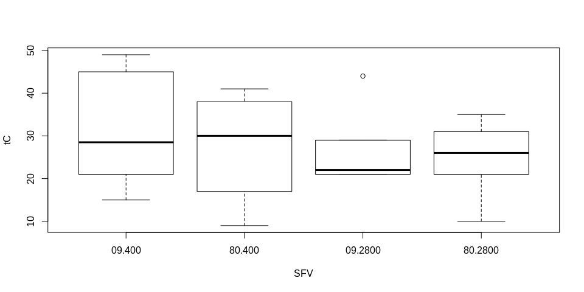

Results from Differential Methylation Analysis
================

### Description

This write-up is to look at the results from the differential
methylation analysis that used a binomial mixed model implemented in
lme4 with the `glmer` function and `family=binomial`. In the model I
evaluated all CpG loci in genic regions that were a abover the `min5`
coverage threshold for each sample at each locus (roughly 290K loci)
using the model described below. I follow up the model with planned
comparisons using the package `multcomp`. Specifically, I was interested
in the comparing between treatments at each time point and between time
points at the ambient (control) treatment. Here I evaluate the general
significance results from this analysis, and also take a close look at a
handful of loci (focusing mostly on the most significant) to see how the
models met the assumptions, and whether there is any evidence that the
response variable is being explained by the random
effects.

**Model**

``` r
Model <- glmer(cbind(methylated,unmethylated)~Time.Treatment.Factor+(1|tank:shelf),family=binomial)
```

**Parameters**

  - **Response variable** : 23 row x 2 column matrix with methylated
    counts in the first column and unmethylated counts in the second
    column.

  - **Explanatory variable : Time.Treatment.Factor, coded as ‘SFV’** :
    factor that contains four levels for each combination of time (2
    time points) and treatment (ambient, high oa).

  - **Random Effects** : tank:shelf or tank nest in shelf to account for
    random tank effects.

### Results

  - We did have quite a few loci that were significant (~1000), but it
    appears that of the 10 top ranked hits many of them may violate the
    assumptions of binomial regression (overdispersed) and also threw
    some errors during fitting (single and lack of conversion).
  - From reading we might need to try and figure out a way of handing
    those issues before continuing. Here is a good discussion from Ben
    Bolker, specifically about the problem of overdispersion
    [LINK](https://bbolker.github.io/mixedmodels-misc/glmmFAQ.html#overdispersion).
      - There are several solutions discussed, but one common approach
        is adding an observational level random effect.
      - Alternatively we could try MALAX, a binomial mixed modelling
        program specifically designed for bisulfite seq data and capable
        of handlingly multiple covariates (unlike MACAU)

### Other Thoughts

  - I also considered using `MACAU` as an outside model test. This is a
    package that performs a similar binomial mixed model, and was
    specifically designed for bisulfite seq. data. However, it requires
    a relatedness matrix. This is something we don’t currently have,
    although something that could be generated potentially using
    `BIS-seq`, which is yet another package that identifes likely SNPs
    within your bisulfite seq. data.

### Library and Data

``` r
library(lme4,quietly = TRUE)
library(lmerTest,quietly = TRUE)
```

    ## 
    ## Attaching package: 'lmerTest'

    ## The following object is masked from 'package:lme4':
    ## 
    ##     lmer

    ## The following object is masked from 'package:stats':
    ## 
    ##     step

``` r
library(multcomp,quietly = TRUE)
```

    ## 
    ## Attaching package: 'TH.data'

    ## The following object is masked from 'package:MASS':
    ## 
    ##     geyser

``` r
library(dplyr,quietly = TRUE)
```

    ## 
    ## Attaching package: 'dplyr'

    ## The following object is masked from 'package:MASS':
    ## 
    ##     select

    ## The following objects are masked from 'package:stats':
    ## 
    ##     filter, lag

    ## The following objects are masked from 'package:base':
    ## 
    ##     intersect, setdiff, setequal, union

``` r
library(corrplot,quietly = TRUE)
```

    ## corrplot 0.84 loaded

``` r
library(MACAU2,quietly = TRUE)
```

    ## Spam version 2.3-0 (2019-09-13) is loaded.
    ## Type 'help( Spam)' or 'demo( spam)' for a short introduction 
    ## and overview of this package.
    ## Help for individual functions is also obtained by adding the
    ## suffix '.spam' to the function name, e.g. 'help( chol.spam)'.

    ## 
    ## Attaching package: 'spam'

    ## The following object is masked from 'package:Matrix':
    ## 
    ##     det

    ## The following objects are masked from 'package:base':
    ## 
    ##     backsolve, forwardsolve

    ## This is INLA_19.09.03 built 2019-09-16 20:42:18 UTC.
    ## See www.r-inla.org/contact-us for how to get help.
    ## To enable PARDISO sparse library; see inla.pardiso()

    ## 
    ## Attaching package: 'INLA'

    ## The following object is masked from 'package:spam':
    ## 
    ##     Oral

    ## Warning: replacing previous import 'spam::det' by 'Matrix::det' when
    ## loading 'MACAU2'

``` r
setwd("/home/downeyam/Github/2017OAExp_Oysters/input_files")
beta <- readRDS("DNAm/Final_beta_gene_10.RData")
meta <- readRDS("DNAm/Final_meta_gene_10.RData")
meta_sample <- readRDS("meta/metadata_20190811.RData")
meta_sample <- meta_sample[meta_sample$ID != "17099",]
tC <- readRDS("DNAm/Final_tC_gene_5.RData")
mC <- readRDS("DNAm/Final_mC_gene_10.RData")
uC <- readRDS("DNAm/Final_umC_gene_5.RData")
uC <- uC[which(!is.na(uC[,1])),]

meta_sample$tank <- as.factor(meta_sample$tank)
meta_sample$shelf <- as.factor(meta_sample$shelf)

diffMeth_pValue <- readRDS("DNAm/DNAm_gene_GLM_modelSummary_wRandTank.RData")
diffMeth_betas <- readRDS("DNAm/Final_beta_gene_5.RData")

diffGene <- readRDS("/home/downeyam/Github/2017OAExp_Oysters/results/DiffExpression_gene_Limma_voom_summaryObject.RData")
```

### T score vs P value

``` r
par(mfrow=c(1,2))
plot(diffMeth_pValue$t_score[abs(diffMeth_pValue$t_score[,5]) < 100,5]~diffMeth_pValue$pval[abs(diffMeth_pValue$t_score[,5]) < 100,5],
     xlab = "Uncorrected P value", ylab="t score",main="PC: Time09:Trt400 vs Time09:Trt2800")

plot(diffMeth_pValue$t_score[abs(diffMeth_pValue$t_score[,5]) < 100,5]~diffMeth_pValue$pval[abs(diffMeth_pValue$t_score[,5]) < 100,5],
     xlab = "Uncorrected P value", ylab="t score",main="PC: Time09:Trt400 vs Time09:Trt2800",
     xlim=c(0,0.05))

### Figure takes time so was generated ahead of time, be sure link in final document
```

### Disctribution of P value before and after correction

``` r
hist(p.adjust(diffMeth_pValue$pval[,2],method = "fdr"))
pVals_corr_09.2800v09.400 <- p.adjust(diffMeth_pValue$pval[,2])
temp <- pVals_corr_09.2800v09.400[pVals_corr_09.2800v09.400 > 0] # Lots of zeros this might be a problem
temp[temp<0.05]
Sig_pval<-pVals_corr_09.2800v09.400[pVals_corr_09.2800v09.400 > 0 & pVals_corr_09.2800v09.400 <=0.001]
meta_sig<-meta[pVals_corr_09.2800v09.400 > 0 & pVals_corr_09.2800v09.400 <=0.001,]
meta_sig<-data.frame(meta_sig,Sig_pval)
meta_sig_order <-meta_sig[order(meta_sig$Sig_pval),]

plot(-log(diffGene$p.value[,1])~diffGene$coefficients[,1],
     xlab="Log2Fold Change",ylab="-log(p)")
#temp <- !is.na(match(rownames(gene_fit2_contr),topTran$GENEID))
#sub_top_c <- gene_fit2_contr$coefficients[temp,1]
#sub_top_p <- gene_fit2_contr$p.value[temp,1]
#points(-log(sub_top_p)~sub_top_c,col="red",pch=16)
```

## Examining the top 10 most significant loci for the planned comparison **Treatment 400-Day 09 vs Treatment 2800-Day 80**

### Betas by different grouping variables (including random effects)

``` r
#Give row names a number for ordering
rownames(diffMeth_pValue$t_score)<-1:nrow(diffMeth_pValue$t_score)
#Reorder tvalues from largest to smallest (absolute values)
diffMeth_pValue$t_score<-diffMeth_pValue$t_score[rev(order(abs(diffMeth_pValue$t_score[,5]))),]
# Create vector of indexs ordered by there descending T values
minT <- as.numeric(rownames(diffMeth_pValue$t_score))
# Loop Through and produce some diagnostic plots looking at the relationship between 
# Methylation (represented as either beta or total counts (tC))
loci <- 1:10
for(j in 1:length(loci)){
  print(paste0("Loci ",j))
  Sys.sleep(0.01)
  i <- loci[j]
  temp <- data.frame(beta=unlist(diffMeth_betas[minT[i],]),tC=unlist(tC[minT[i],]),
                     SFV=meta_sample$SFV,Pop=meta_sample$Pop,tankID=as.factor(meta_sample$tankID))
  par(mfrow=c(1,1))
  boxplot(tC~SFV,data=temp)
  par(mfrow=c(1,3))
  boxplot(beta~SFV,data=temp,ylim=c(0,1))
  boxplot(beta~Pop,data=temp,ylim=c(0,1))
  boxplot(beta~tankID,data=temp,ylim=c(0,1))
  par(mfrow=c(1,1))
  temp$SFV <- as.numeric(temp$SFV)
  temp$Pop <- as.numeric(temp$Pop)
  temp$tankID <- as.numeric(temp$tankID)
  M <- cor(temp)
  corrplot.mixed(M)
}
```

    ## [1] "Loci 1"

<!-- --><!-- --><!-- -->

    ## [1] "Loci 2"

<!-- --><!-- --><!-- -->

    ## [1] "Loci 3"

<!-- --><!-- --><!-- -->

    ## [1] "Loci 4"

<!-- --><!-- --><!-- -->

    ## [1] "Loci 5"

<!-- --><!-- --><!-- -->

    ## [1] "Loci 6"

<!-- --><!-- --><!-- -->

    ## [1] "Loci 7"

<!-- --><!-- --><!-- -->

    ## [1] "Loci 8"

<!-- --><!-- --><!-- -->

    ## [1] "Loci 9"

<!-- --><!-- --><!-- -->

    ## [1] "Loci 10"

<!-- --><!-- --><!-- -->

### Residuals from model vs. random effects

**Note this code was run on cluster because model summary object list
was too large**

``` r
library(car)
library(corrplot)

minT_10 <- minT[1:10]

# Coverage matrices
# meta data for each cytosine
meta <- readRDS("/shared_lab/20180226_RNAseq_2017OAExp/DNAm/processed_samples/04_countSummary/Final_meta_gene_5.RData")
# Methylated Cytos
mC <- readRDS("/shared_lab/20180226_RNAseq_2017OAExp/DNAm/processed_samples/04_countSummary/Final_mC_gene_5.RData")
meta <- meta[which(!is.na(mC[,1])),]
mC <- mC[which(!is.na(mC[,1])),]
# unMethylated Cytos
uC <- readRDS("/shared_lab/20180226_RNAseq_2017OAExp/DNAm/processed_samples/04_countSummary/Final_umC_gene_5.RData")
uC <- uC[which(!is.na(uC[,1])),]
# Meta data for each sample (i.e. population, treatment, etc)
meta_sample <- readRDS("/shared_lab/20180226_RNAseq_2017OAExp/DNAm/metadata/metadata_20190811.RData")
meta_sample <- meta_sample[meta_sample$ID!="17099",]
meta_sample$tank <- as.factor(meta_sample$tank)
meta_sample$shelf <- as.factor(meta_sample$shelf)

setwd("/shared_lab/20180226_RNAseq_2017OAExp/DNAm/processed_samples/05_diffMethylation")
#This is a custom function from Ben Bolker, performs chisq test looking at residuals based on pearson divided by degrees of freedom.
overdisp_fun <- function(model) {
  rdf <- df.residual(model)
  rp <- residuals(model,type="pearson")
  Pearson.chisq <- sum(rp^2)
  prat <- Pearson.chisq/rdf
  pval <- pchisq(Pearson.chisq, df=rdf, lower.tail=FALSE)
  c(chisq=Pearson.chisq,ratio=prat,rdf=rdf,p=pval)
}

overdisp <- NULL
LRT <- NULL
for(j in 1:length(minT_10)){
  temp <- data.frame(m=unlist(mC[minT_10[j],]),u=unlist(uC[minT_10[j],]),
                     SFV=meta_sample$SFV,
                     Pop=meta_sample$Pop,
                     tankID=as.factor(meta_sample$tankID),
                     tank=as.factor(meta_sample$tank),
                     shelf=as.factor(meta_sample$shelf))

  model <- glmer(cbind(m,u)~SFV+(1|tank:shelf),data=temp,family=binomial)
  
  #Check for overdispersion
  (overdisp <- rbind(overdisp,overdisp_fun(model)))
  # Likelihood ratio test
  (LRT <- rbind(LRT,anova(model,test="Chisq")))
  
  # Graphing influential points plot from car package
  # png(paste0("figures/Rank",j,"_Loci_",minT_10[j],"_influentalPointPlot.png"))
  # influencePlot(model)
  # dev.off()  
  png(paste0("figures/Rank",j,"_Loci_",minT_10[j],"_ResidVRand.png"))
  par(mfrow=c(2,2))
  plot(resid(model,type="pearson")~temp$Pop,xlab="Site",ylab="Pearson Residual")
  plot(resid(model,type="pearson")~temp$tankID,xlab="TankID",ylab="Pearson Residual")
  plot(resid(model,type="pearson")~model@frame$tank,xlab="Tank",ylab="Pearson Residual")
  plot(resid(model,type="pearson")~model@frame$shelf,xlab="Shelf",ylab="Pearson Residual")
  dev.off()
  
  # Setting up new dataframe to create correlatin plot
  temp$SFV <- as.numeric(temp$SFV)
  temp$Pop <- as.numeric(temp$Pop)
  temp$tankID <- as.numeric(temp$tankID)
  temp$tank <- as.numeric(temp$tank)
  temp$shelf <- as.numeric(temp$shelf)
  resid.df <- data.frame(resids=resid(model,type="pearson"),temp)
  M <- cor(resid.df)
  
  png(paste0("figures/Rank",j,"_Loci_",minT_10[j],"_CorrelationPlot.png"))
  par(mfrow=c(1,1))
  corrplot.mixed(M)
  dev.off()
}
```

**Rank 1**  
Residuals Vs. Random
Effects  


Correlation
Plot  


**Rank 2**  
Residuals Vs. Random
Effects  


Correlation
Plot  


**Rank 3**  
Residuals Vs. Random
Effects  


Correlation
Plot  


**Rank 4**  
Residuals Vs. Random
Effects  


Correlation
Plot  


**Rank 5**  
Residuals Vs. Random
Effects  


Correlation
Plot  


**Rank 6**  
Residuals Vs. Random
Effects  


Correlation
Plot  


**Rank 7**  
Residuals Vs. Random
Effects  


Correlation
Plot  


**Rank 8**  
Residuals Vs. Random
Effects  


Correlation
Plot  


**Rank 9**  
Residuals Vs. Random
Effects  


Correlation
Plot  


**Rank 10**  
Residuals Vs. Random
Effects  


Correlation
Plot  


### Checks for overdispersion

``` r
 Rank       chisq      ratio rdf            p  
 [1,]  20.37416  1.1318977  18 3.121534e-01  
 [2,] 278.60289 15.4779381  18 1.185125e-48  
 [3,]  57.38359  3.1879770  18 5.378346e-06  
 [4,]  11.39582  0.6331010  18 8.768116e-01  
 [5,]  11.15034  0.6194636  18 8.878681e-01  
 [6,] 308.95415 17.1641192  18 6.914906e-55  
 [7,] 123.74157  6.8745317  18 8.226370e-18  
 [8,] 252.22307 14.0123927  18 2.878674e-43  
 [9,] 175.53497  9.7519430  18 7.331449e-28  
[10,]  69.29878  3.8499324  18 5.936844e-08  
```

### ANOVA output

``` r
     Df Sum Sq Mean Sq F value  
SFV   3  6.361  2.1205  2.1205  
SFV1  3 10.882  3.6275  3.6275  
SFV2  3  6.116  2.0388  2.0388  
SFV3  3 12.170  4.0568  4.0568  
SFV4  3  0.500  0.1667  0.1667  
SFV5  3 55.627 18.5422 18.5422  
SFV6  3 36.216 12.0720 12.0720  
SFV7  3 42.197 14.0658 14.0658  
SFV8  3 68.242 22.7474 22.7474  
SFV9  3 18.695  6.2316  6.2316  
```

### Errors from fitting the glmer models

``` r
boundary (singular) fit: see ?isSingular
Warning messages:
1: In checkConv(attr(opt, "derivs"), opt$par, ctrl = control$checkConv,  :
  Model failed to converge with max|grad| = 0.046188 (tol = 0.001, component 1)
2: In checkConv(attr(opt, "derivs"), opt$par, ctrl = control$checkConv,  :
  Model is nearly unidentifiable: very large eigenvalue
 - Rescale variables?
3: In checkConv(attr(opt, "derivs"), opt$par, ctrl = control$checkConv,  :
  Model failed to converge with max|grad| = 0.023001 (tol = 0.001, component 1)
```

Indicates that while these models do provide an output, there is some
problems with model fit.
