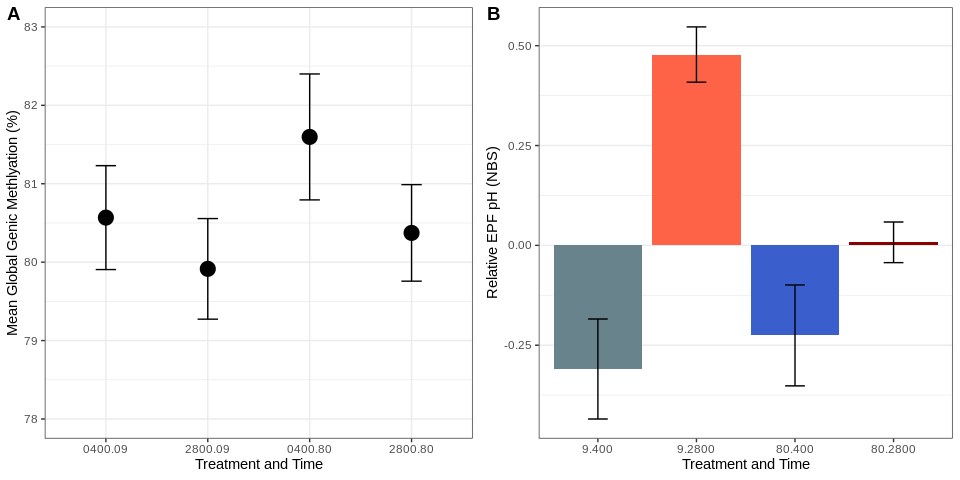

AE17 Figure 2
================
adowneywall
9/9/2019

**Plotting**

``` r
# Global Methylation Plot
a<-ggplot(gm,aes(y=mean*100,x=label)) + 
  geom_point(size=5) + 
  geom_errorbar(aes(ymin=(mean-ci)*100,ymax=(mean+ci)*100),width=.2) + 
  scale_x_discrete(limits=c("0400.09","2800.09","0400.80","2800.80")) +
  ylim(78,83) + labs(x="Treatment and Time",y="Mean Global Genic Methlyation (%)",size=6) + theme_bw()
#a

## EPF pH (Relative)
# ggplot(pH,aes(y=EPF_envAdj,x=x,width=.85)) + 
# geom_bar(stat="identity", aes(fill=comb)) + labs(x="",y="EPF_pH") +
# scale_fill_manual(values=c("lightblue4","royalblue3","tomato","darkred")) +
# theme_bw() +
# theme(strip.text.x = element_text(size=15),
#         legend.position="none",
#         panel.grid.major.x = element_blank() ,
#         strip.background = element_rect(colour=NULL, fill="white")) +
#   geom_text(aes(x=c(sum(x.seq[1:2])/2, sum(x.seq[3:4])/2), y=0, 
#                 label=c("X","Y")), vjust=1.2, size=8)

b <- ggplot(pH,aes(y=EPF_envAdj,x=comb,fill=comb)) + 
  geom_col() + #ylim(6.5,8) +
  scale_fill_manual(values=c("lightblue4","royalblue3","tomato","darkred")) +
  geom_errorbar(aes(ymin=(EPF_envAdj-ci),ymax=(EPF_envAdj+ci)),width=.2) + 
  scale_x_discrete(limits=c("9.400","9.2800","80.400","80.2800")) + 
  labs(x="Treatment and Time",y="Relative EPF pH (NBS)",size=6) + theme_bw() +
  theme(strip.text.x = element_text(size=15),
        legend.position="none",
        panel.grid.major.x = element_blank() ,
        strip.background = element_rect(colour=NULL, fill="white"))

plot_grid(a, b, ncol=2, align="h",labels = "AUTO")
```

<!-- -->
