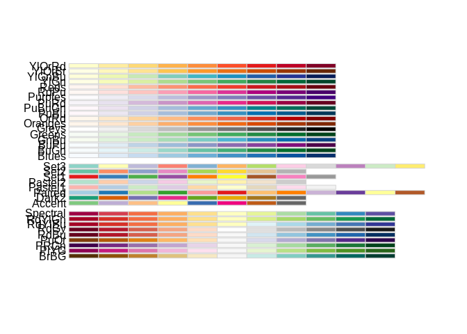
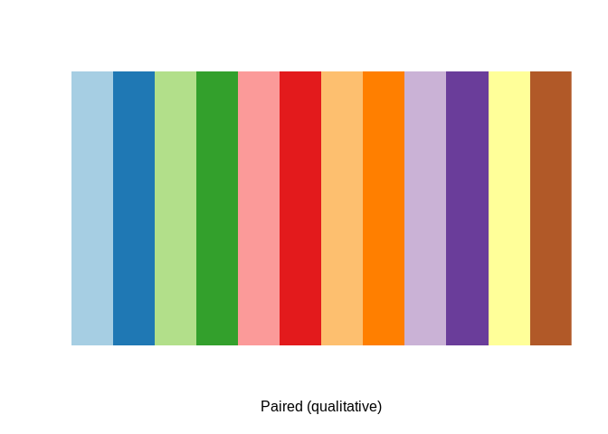
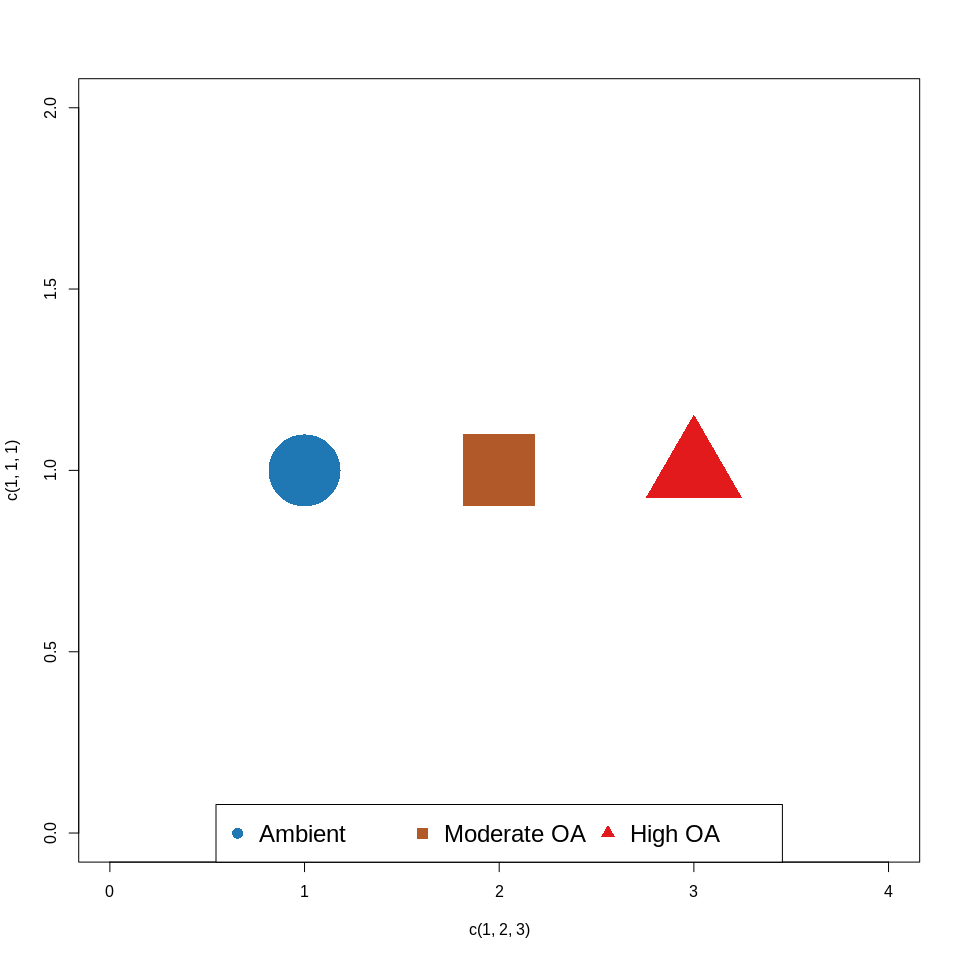
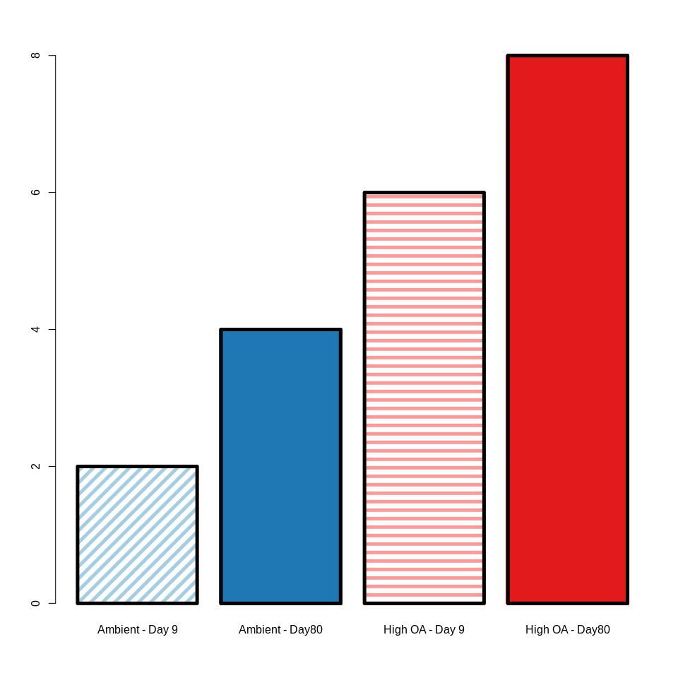
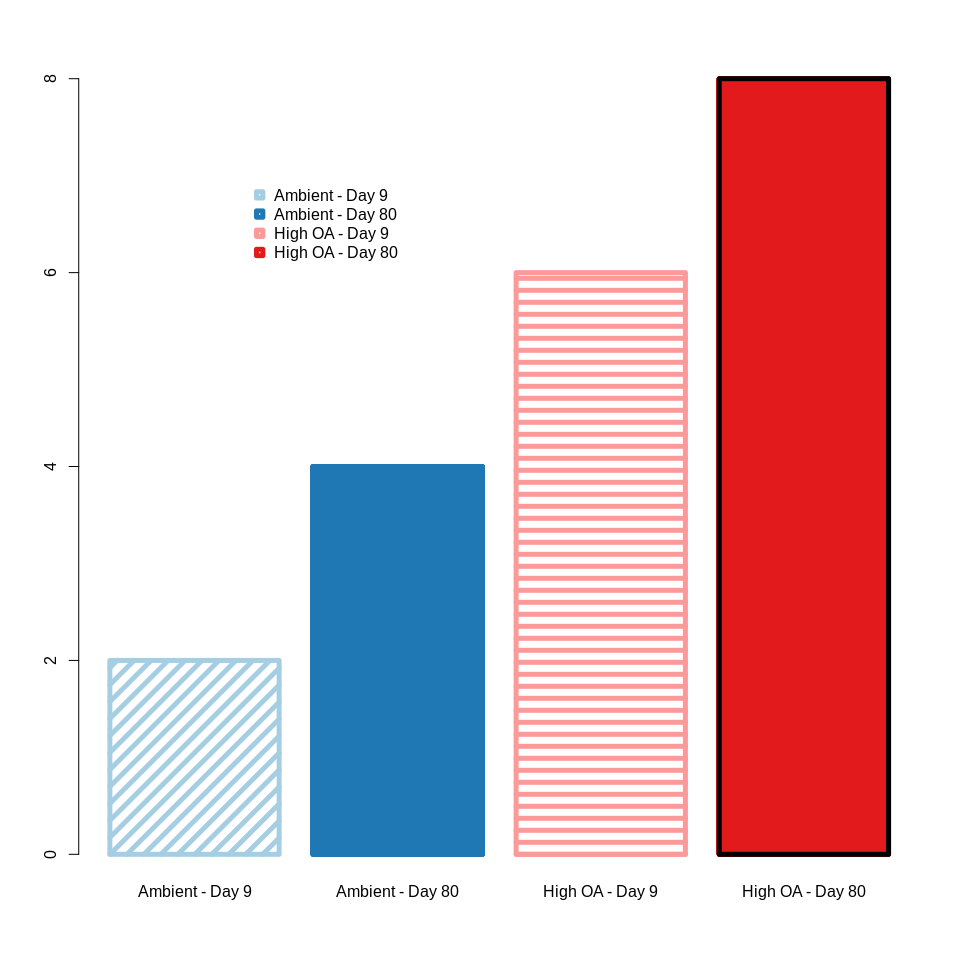
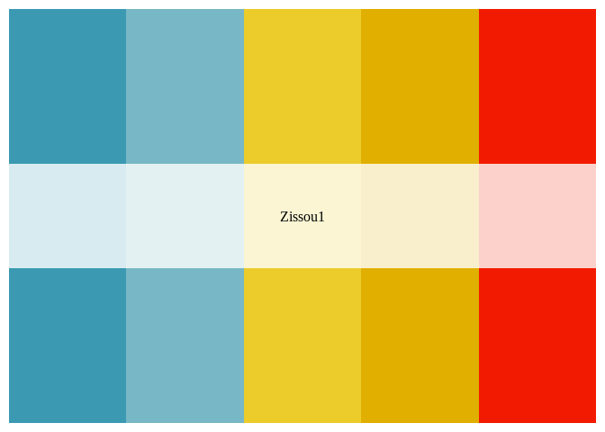
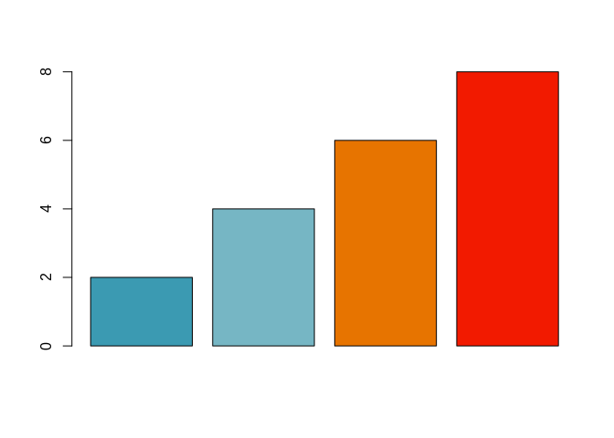

AE17\_colorPalatte
================
adowneywall
11/6/2019

Short colouring and plotting guide.

### Colors from RColorBrewer

``` r
# Using RColorBrewer palattes
library("RColorBrewer")
display.brewer.all()
```

<!-- -->

``` r
display.brewer.pal(n = 12, name = 'Paired')
```

<!-- -->

``` r
pal <- brewer.pal(n = 12, name = 'Paired')
```

Tried to select colors that were colour blind friendly and also
represent colors the viewer might naturally associate with treatments.

### Color selection

Selecting three colors (blue,red,and yellowish for 3 treatments) Plus
two shades of blue and red for the two timepoints (molecular only)

``` r
col_perm <- c(pal[1:2],pal[5:6],pal[12])
```

### Creating three treatment plots (i.e. EPF pH)

``` r
plot(c(1,1,1)~c(1,2,3),
     xlim=c(0,4),ylim=c(0,2),
     cex=10,lwd=10,
     pch=c(16,15,17),
     col=col_perm[c(2,5,4)])
legend("bottom",col=col_perm[c(2,5,4)],horiz = TRUE,
       cex=1.5,pch=c(16,15,17),
       legend=c("Ambient","Moderate OA","High OA"))
```

<!-- -->

``` r
# Symbols and colour are unique for each treatment
```

### Plotting molecular data (2 trtments x 2 timepoints)

#### Bar plots (and other filled plots)

``` r
par(lwd=5) # This is apparently the way to create thicker lines in filled spaces.
bp <- barplot(c(2,4,6,8),
              col=c(col_perm[1],col_perm[2],col_perm[3],col_perm[4]),
              density = c(8,1000,8,1000),angle = c(45,0,0,0),
              names.arg = c("Ambient - Day 9","Ambient - Day80",
                            "High OA - Day 9","High OA - Day80"))
```

<!-- -->

#### Point plots

``` r
par(lwd=1)
plot(c(1,1,2,2)~c(1,2,1,2),
     xlim=c(0,3),ylim=c(0,3),
     cex=10,lwd=10,
     pch=c(1,16,2,17),
     col=col_perm[1:4])
par(lwd=2)
legend(x=.01,y=.5,col=col_perm[1:4],horiz = TRUE,cex=1.0,
       pch=c(1,16,2,17),
       legend=c("Ambient - Day 9","Ambient - Day80",
                "High OA - Day 9","High OA - Day80"))
```

<!-- -->

#### Alternative colour scheme - Zissou1 in wesanderson library

I liked the colours but had limited
    shades.

``` r
install.packages("wesanderson")
```

    ## Installing package into '/home/downeyam/R/x86_64-pc-linux-gnu-library/3.6'
    ## (as 'lib' is unspecified)

``` r
library(wesanderson)
wes_palette(n=5, name="Zissou1")
```

<!-- -->

``` r
pal <- wes_palette("Zissou1", 100, type = "continuous")
barplot(c(2,4,6,8),col=c(pal[1],pal[25],pal[85],pal[100]))
```

<!-- -->
