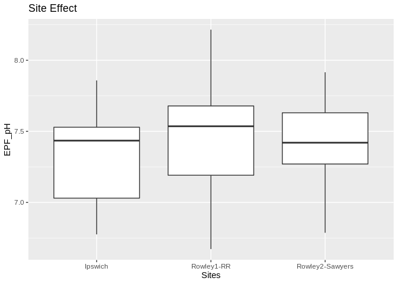
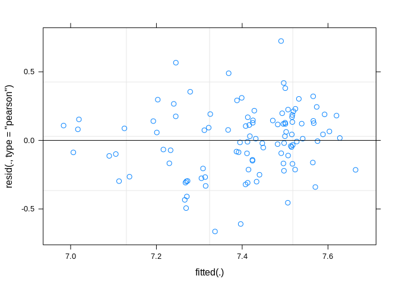
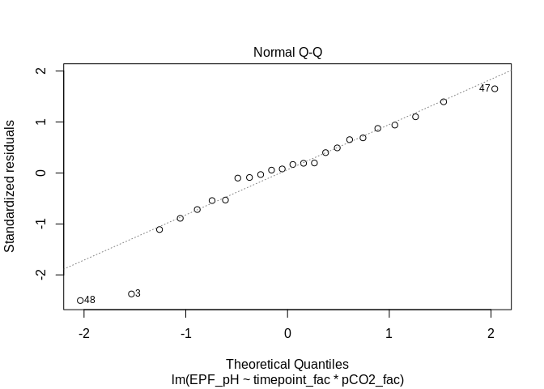
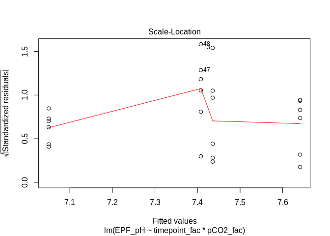
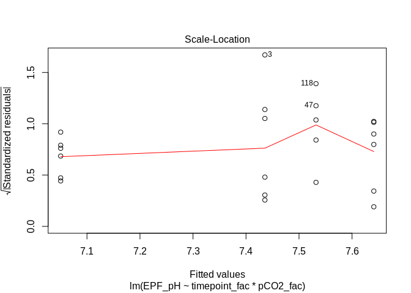
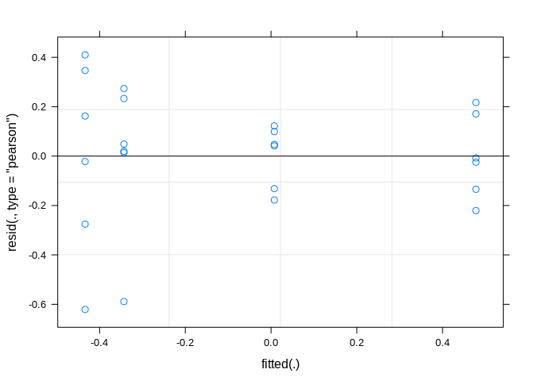
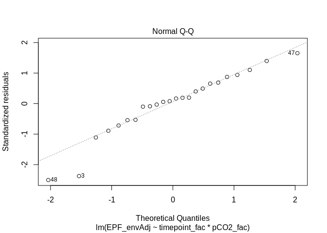
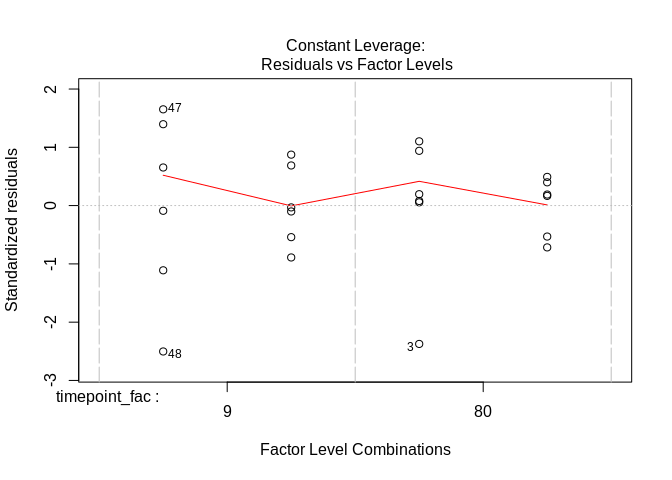
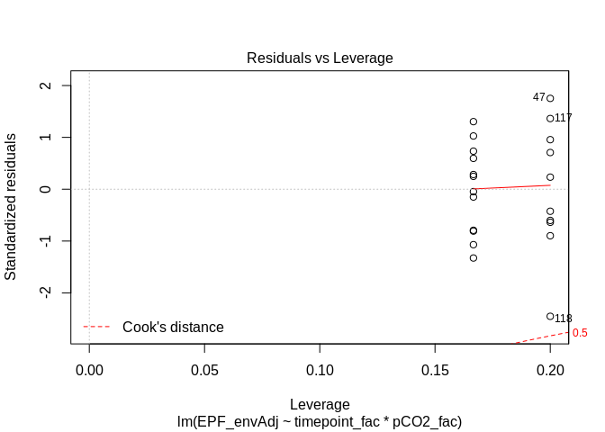

AE17 EPF pH Timeseries Analysis
================
Alan Downey-Wall
Aug 11, 2019

## Data Input and Formatting

**RData version of
data**

``` r
pheno <- readRDS("/home/downeyam/Github/2017OAExp_Oysters/input_files/Phenotype/AE17_summaryPhenotype_exposure.RData") # just exposure timepoints
pheno2 <- readRDS("/home/downeyam/Github/2017OAExp_Oysters/input_files/Phenotype/AE17_summaryPhenotype_alltimepoints.RData") # acclimation and exposure timepoints
# Remove 81 which we know has wonky EPF values (for consistency these are also ultimately removed from the calcification estimates as well)
pheno_red <- pheno[pheno$timepoint != 81,]
```

**Creating sub table for sample info for BCO-DMO Database**

``` r
colnames(pheno)
pheno$pCO2_cat <- as.character(pheno$pCO2.x)
pheno$pCO2_cat[pheno$pCO2_cat == "2800"] <- "High_OA"
## Subsetting full pheno for BCO-DMO data
col <- c("ID","sample_date","timepoint","pCO2_cat","shelf","tank","WaterSample_ID","PopOrigin","sequenced","width","length","wet_wgtcorr","dry_wgt","Len_Wgt_Index","HN_Index")
pheno_ind <- subset(pheno,select =col)
colnames(pheno_ind)[4] <- "treatment"
colnames(pheno_ind)[7] <- "tankID"
colnames(pheno_ind)[8] <- "collection_site"
write.csv(pheno_ind,"/home/downeyam/Github/2017OAExp_Oysters/input_files/Phenotype/AE17_SampleInfo.csv")
```

## Plans

  - Look at EPF pH for all timepoints and treatments (6 tp, 3
    treatments, 108 individuals, mostly balanced)  
  - Look at EPF pH for all individuals we sequenced (2 tp, 2 treatments,
    24 individuals)

## Analysis of EPF pH - Total data

  - Filtering out NAs (one entry) and including only timepoints from the
    exposure (not acclimation)

**Exploratory plots**
<!-- --><!-- --><!-- --><!-- -->

### **Statistical Analysis**

#### **EPF pH total data - treatment (factor) time (continuous)**

**Overview**  
Test: ANCOVA - Full Model (Fixed and Random Factors)  
\* Predictors (fixed effects): Treatment (pCO2\_fac) and Time
(timepoint)  
\* Random Factors: Population, Shelf, Tank (nested in Shelf)  
\* Tested for normality and variance assumptions \*

**Full
Model**

``` r
epfAllTP_full <- lmer(EPF_pH~pCO2_fac*timepoint + (1|PopOrigin) + (1|shelf/tank),data=epf_exp) 
```

    ## boundary (singular) fit: see ?isSingular

``` r
# Warning singular fit - Indicates model is overfit and some of the the random effects will need to be removed. I use a ranova below to determine which effects are uninformative and are candidates for removal.
# Check distribution of residuals
plot(epfAllTP_full)
```

<!-- -->

``` r
# They look fairly homoscedastic
qqnorm(resid(epfAllTP_full))
qqline(resid(epfAllTP_full))
```

<!-- -->

``` r
# Passes basic diagnostic test so we proceed with anova
anova(epfAllTP_full)
```

    ## Type III Analysis of Variance Table with Satterthwaite's method
    ##                     Sum Sq  Mean Sq NumDF  DenDF F value  Pr(>F)  
    ## pCO2_fac           0.13090 0.065448     2  5.299  0.9973 0.42893  
    ## timepoint          0.03679 0.036793     1 86.398  0.5606 0.45603  
    ## pCO2_fac:timepoint 0.37543 0.187714     2 86.376  2.8603 0.06269 .
    ## ---
    ## Signif. codes:  0 '***' 0.001 '**' 0.01 '*' 0.05 '.' 0.1 ' ' 1

``` r
# Nothing significant here (although the interaction is close)
ranova(epfAllTP_full)
```

    ## boundary (singular) fit: see ?isSingular

    ## ANOVA-like table for random-effects: Single term deletions
    ## 
    ## Model:
    ## EPF_pH ~ pCO2_fac + timepoint + (1 | PopOrigin) + (1 | tank:shelf) + 
    ##     (1 | shelf) + pCO2_fac:timepoint
    ##                  npar  logLik    AIC     LRT Df Pr(>Chisq)  
    ## <none>             10 -32.510 85.020                        
    ## (1 | PopOrigin)     9 -32.510 83.020 -0.0001  1    1.00000  
    ## (1 | tank:shelf)    9 -34.189 86.378  3.3580  1    0.06688 .
    ## (1 | shelf)         9 -32.548 83.097  0.0770  1    0.78145  
    ## ---
    ## Signif. codes:  0 '***' 0.001 '**' 0.01 '*' 0.05 '.' 0.1 ' ' 1

``` r
# We should remove population and shelf as random factors and rerun analysis
```

**Rerun Model without Population and
Shelf**

``` r
epfAllTP_red <- lmer(EPF_pH~pCO2_fac*timepoint + (1|tank:shelf),data=epf_exp)
# Prevented singular fit issue this time
# Check distribution of residuals
plot(epfAllTP_red)
```

<!-- -->

``` r
# They look fairly homoscedastic
qqnorm(resid(epfAllTP_red))
qqline(resid(epfAllTP_red))
```

<!-- -->

``` r
# Fairly normal
# Check autocorrelation
ggplot(epf_exp,aes(y=resid(epfAllTP_red),x=timepoint_fac,group=interaction(pCO2_fac,timepoint_fac),colour=pCO2_fac)) + geom_boxplot()
```

<!-- -->

``` r
ggplot(epf_exp,aes(y=resid(epfAllTP_red),x=timepoint,colour=pCO2_fac)) + geom_point()
```

    ## Don't know how to automatically pick scale for object of type difftime. Defaulting to continuous.

<!-- -->

``` r
# Nothing obvious
## Second model passes diagnostics so we proceed to anova and also do some model testing.

# Compare full model to one with tank as the only random effect
anova(epfAllTP_full,epfAllTP_red)
```

    ## refitting model(s) with ML (instead of REML)

    ## Data: epf_exp
    ## Models:
    ## epfAllTP_red: EPF_pH ~ pCO2_fac * timepoint + (1 | tank:shelf)
    ## epfAllTP_full: EPF_pH ~ pCO2_fac * timepoint + (1 | PopOrigin) + (1 | shelf/tank)
    ##               Df    AIC    BIC  logLik deviance Chisq Chi Df Pr(>Chisq)
    ## epfAllTP_red   8 36.391 57.774 -10.195   20.391                        
    ## epfAllTP_full 10 40.391 67.119 -10.195   20.391     0      2          1

``` r
ranova(epfAllTP_red) # Significant tank effect
```

    ## ANOVA-like table for random-effects: Single term deletions
    ## 
    ## Model:
    ## EPF_pH ~ pCO2_fac + timepoint + (1 | tank:shelf) + pCO2_fac:timepoint
    ##                  npar  logLik    AIC    LRT Df Pr(>Chisq)  
    ## <none>              8 -32.548 81.097                       
    ## (1 | tank:shelf)    7 -34.979 83.957 4.8606  1    0.02748 *
    ## ---
    ## Signif. codes:  0 '***' 0.001 '**' 0.01 '*' 0.05 '.' 0.1 ' ' 1

``` r
# Comparing the two models  (full and w/ tank only there is no difference)
# We keep the simpler model

summary(epfAllTP_red) 
```

    ## Linear mixed model fit by REML. t-tests use Satterthwaite's method [
    ## lmerModLmerTest]
    ## Formula: EPF_pH ~ pCO2_fac * timepoint + (1 | tank:shelf)
    ##    Data: epf_exp
    ## 
    ## REML criterion at convergence: 65.1
    ## 
    ## Scaled residuals: 
    ##      Min       1Q   Median       3Q      Max 
    ## -2.52804 -0.61996  0.04965  0.59474  2.72389 
    ## 
    ## Random effects:
    ##  Groups     Name        Variance Std.Dev.
    ##  tank:shelf (Intercept) 0.01364  0.1168  
    ##  Residual               0.06565  0.2562  
    ## Number of obs: 107, groups:  tank:shelf, 18
    ## 
    ## Fixed effects:
    ##                         Estimate Std. Error        df t value Pr(>|t|)    
    ## (Intercept)             7.437289   0.076059 28.531146  97.783   <2e-16 ***
    ## pCO2_fac900             0.059366   0.107407 28.397138   0.553   0.5848    
    ## pCO2_fac2800           -0.101545   0.107407 28.397138  -0.945   0.3524    
    ## timepoint               0.001574   0.001580 87.226646   0.996   0.3219    
    ## pCO2_fac900:timepoint  -0.001640   0.002177 86.588728  -0.754   0.4531    
    ## pCO2_fac2800:timepoint -0.005061   0.002177 86.588728  -2.325   0.0224 *  
    ## ---
    ## Signif. codes:  0 '***' 0.001 '**' 0.01 '*' 0.05 '.' 0.1 ' ' 1
    ## 
    ## Correlation of Fixed Effects:
    ##             (Intr) pCO2_f900 pCO2_f2800 timpnt pCO2_900:
    ## pCO2_fac900 -0.708                                      
    ## pCO2_fc2800 -0.708  0.501                               
    ## timepoint   -0.531  0.376     0.376                     
    ## pCO2_fc900:  0.385 -0.533    -0.273     -0.726          
    ## pCO2_f2800:  0.385 -0.273    -0.533     -0.726  0.527

``` r
# Significant tp:2800 interaction, although not very satisfying if we want to look within tps
```

#### **EPF pH total data - treatment (continuous) and time (continuous)**

**Overview**  
Test: Regression \* Predictors: Mean Tank Treatment (pCO2\_calc) and
Time (timepoint)  
\* Random Factors: Population, Shelf, Tank  
\* Tested for normality and variance assumptions

``` r
# Had to scale these values due to large differences in variance
whole_cont_full <- lmer(EPF_pH~scale(epf_exp$pCO2_calc)*scale(epf_exp$timepoint) + (1|PopOrigin) + (1|tank:shelf) ,data=epf_exp)
```

    ## boundary (singular) fit: see ?isSingular

``` r
# Warning -  looks like this is driven by too many explanatory variables
ranova(whole_cont_full)
```

    ## ANOVA-like table for random-effects: Single term deletions
    ## 
    ## Model:
    ## EPF_pH ~ scale(epf_exp$pCO2_calc) + scale(epf_exp$timepoint) + 
    ##     (1 | PopOrigin) + (1 | tank:shelf) + scale(epf_exp$pCO2_calc):scale(epf_exp$timepoint)
    ##                  npar  logLik    AIC    LRT Df Pr(>Chisq)  
    ## <none>              7 -21.160 56.320                       
    ## (1 | PopOrigin)     6 -21.160 54.320 0.0000  1    1.00000  
    ## (1 | tank:shelf)    6 -23.469 58.939 4.6183  1    0.03163 *
    ## ---
    ## Signif. codes:  0 '***' 0.001 '**' 0.01 '*' 0.05 '.' 0.1 ' ' 1

``` r
# Looks like we can remove population
# Ill start by removing population and shelf and reruning
```

**Rerun model with just tank as random
factor**

``` r
whole_cont_tank <- lmer(EPF_pH~scale(epf_exp$pCO2_calc)*scale(epf_exp$timepoint) + (1|tank:shelf) ,data=epf_exp)
# Better no warning this time 

# Check distribution of residuals
plot(whole_cont_tank)
```

<!-- -->

``` r
# They look fairly homoscedastic
qqnorm(resid(whole_cont_tank))
qqline(resid(whole_cont_tank))
```

<!-- -->

``` r
# Fairly normal

summary(whole_cont_tank)
```

    ## Linear mixed model fit by REML. t-tests use Satterthwaite's method [
    ## lmerModLmerTest]
    ## Formula: EPF_pH ~ scale(epf_exp$pCO2_calc) * scale(epf_exp$timepoint) +  
    ##     (1 | tank:shelf)
    ##    Data: epf_exp
    ## 
    ## REML criterion at convergence: 42.3
    ## 
    ## Scaled residuals: 
    ##      Min       1Q   Median       3Q      Max 
    ## -2.60031 -0.64307  0.06765  0.56925  2.83551 
    ## 
    ## Random effects:
    ##  Groups     Name        Variance Std.Dev.
    ##  tank:shelf (Intercept) 0.01302  0.1141  
    ##  Residual               0.06525  0.2554  
    ## Number of obs: 107, groups:  tank:shelf, 18
    ## 
    ## Fixed effects:
    ##                                                   Estimate Std. Error       df
    ## (Intercept)                                        7.40452    0.03652 15.92882
    ## scale(epf_exp$pCO2_calc)                          -0.11187    0.03671 15.91290
    ## scale(epf_exp$timepoint)                          -0.01957    0.02486 87.43391
    ## scale(epf_exp$pCO2_calc):scale(epf_exp$timepoint) -0.05795    0.02489 87.34260
    ##                                                   t value Pr(>|t|)    
    ## (Intercept)                                       202.738  < 2e-16 ***
    ## scale(epf_exp$pCO2_calc)                           -3.047  0.00772 ** 
    ## scale(epf_exp$timepoint)                           -0.787  0.43315    
    ## scale(epf_exp$pCO2_calc):scale(epf_exp$timepoint)  -2.328  0.02222 *  
    ## ---
    ## Signif. codes:  0 '***' 0.001 '**' 0.01 '*' 0.05 '.' 0.1 ' ' 1
    ## 
    ## Correlation of Fixed Effects:
    ##             (Intr) sc(_$CO2_) sc(_$)
    ## scl(_$CO2_)  0.004                  
    ## scl(pf_xp$)  0.001 -0.010           
    ## s(_$CO2_):( -0.011 -0.003     -0.022

``` r
# Treatment and intereaction significant.
```

#### **EPF pH total data - treatment (factor) time (factor)**

**Overview**  
Test: 2-way ANOVA - Full Model (Fixed and Random Factors)  
\* Prdictors (fixed effects): Treatment (pCO2\_fac) and Time
(timepoint)  
\* Random Factors: Population, Shelf, Tank (nested in Shelf)  
\* Tested for normality and variance assumptions \*

**Full Model**

``` r
epf_exp$tankID <- interaction(epf_exp$tank,epf_exp$shelf)
epfAllTP_full_1 <- lmer(EPF_pH~pCO2_fac*timepoint_fac + (1|PopOrigin) + (1|shelf/tank),data=epf_exp) 
```

    ## boundary (singular) fit: see ?isSingular

``` r
epfAllTP_full_2 <- lmer(EPF_pH~pCO2_fac*timepoint_fac + (1|PopOrigin) + (1|tank/shelf),data=epf_exp)
```

    ## boundary (singular) fit: see ?isSingular

``` r
epfAllTP_full_3 <- lmer(EPF_pH~pCO2_fac*timepoint_fac + (1|PopOrigin) + (1|shelf),data=epf_exp)
epfAllTP_full_4 <- lmer(EPF_pH~pCO2_fac*timepoint_fac + (1|PopOrigin) + (1|tank:shelf),data=epf_exp)
epfAllTP_full_5 <- lmer(EPF_pH~pCO2_fac*timepoint_fac + (1|PopOrigin) + (1|tankID),data=epf_exp)

# Model 1 (Ideal Model) : too complex leads to singularity of random effects
# Model 1 and Model 2 are equivalent and lead to singularity issues
# Model 4 and 5 equivalent
# Start with model 5

epfAllTP_full <- lmer(EPF_pH~pCO2_fac*timepoint_fac + (1|PopOrigin) + (1|tank/shelf),data=epf_exp) 
```

    ## boundary (singular) fit: see ?isSingular

``` r
summary(epfAllTP_full)
```

    ## Linear mixed model fit by REML. t-tests use Satterthwaite's method [
    ## lmerModLmerTest]
    ## Formula: EPF_pH ~ pCO2_fac * timepoint_fac + (1 | PopOrigin) + (1 | tank/shelf)
    ##    Data: epf_exp
    ## 
    ## REML criterion at convergence: 43.1
    ## 
    ## Scaled residuals: 
    ##      Min       1Q   Median       3Q      Max 
    ## -2.42582 -0.47612  0.02696  0.58161  2.97005 
    ## 
    ## Random effects:
    ##  Groups     Name        Variance Std.Dev.
    ##  shelf:tank (Intercept) 0.00559  0.07476 
    ##  tank       (Intercept) 0.01126  0.10610 
    ##  PopOrigin  (Intercept) 0.00000  0.00000 
    ##  Residual               0.05919  0.24328 
    ## Number of obs: 107, groups:  shelf:tank, 18; tank, 3; PopOrigin, 3
    ## 
    ## Fixed effects:
    ##                               Estimate Std. Error        df t value Pr(>|t|)
    ## (Intercept)                   7.398272   0.120615 17.978000  61.338   <2e-16
    ## pCO2_fac900                   0.143954   0.146941 81.507684   0.980   0.3301
    ## pCO2_fac2800                 -0.202495   0.146941 81.507684  -1.378   0.1720
    ## timepoint_fac2                0.155132   0.140458 73.593137   1.104   0.2730
    ## timepoint_fac9                0.009597   0.140458 73.593137   0.068   0.9457
    ## timepoint_fac22               0.026058   0.140458 73.593137   0.186   0.8533
    ## timepoint_fac50               0.125721   0.140458 73.593137   0.895   0.3737
    ## timepoint_fac79               0.169559   0.147831 75.092938   1.147   0.2550
    ## pCO2_fac900:timepoint_fac2   -0.231597   0.198637 73.593137  -1.166   0.2474
    ## pCO2_fac2800:timepoint_fac2  -0.214702   0.198637 73.593137  -1.081   0.2833
    ## pCO2_fac900:timepoint_fac9   -0.054702   0.198637 73.593137  -0.275   0.7838
    ## pCO2_fac2800:timepoint_fac9   0.435700   0.198637 73.593137   2.193   0.0314
    ## pCO2_fac900:timepoint_fac22  -0.138207   0.198637 73.593137  -0.696   0.4888
    ## pCO2_fac2800:timepoint_fac22  0.102878   0.198637 73.593137   0.518   0.6061
    ## pCO2_fac900:timepoint_fac50  -0.090211   0.198637 73.593137  -0.454   0.6511
    ## pCO2_fac2800:timepoint_fac50 -0.223609   0.198637 73.593137  -1.126   0.2639
    ## pCO2_fac900:timepoint_fac79  -0.255543   0.203918 74.386239  -1.253   0.2141
    ## pCO2_fac2800:timepoint_fac79 -0.314942   0.203918 74.386239  -1.544   0.1267
    ##                                 
    ## (Intercept)                  ***
    ## pCO2_fac900                     
    ## pCO2_fac2800                    
    ## timepoint_fac2                  
    ## timepoint_fac9                  
    ## timepoint_fac22                 
    ## timepoint_fac50                 
    ## timepoint_fac79                 
    ## pCO2_fac900:timepoint_fac2      
    ## pCO2_fac2800:timepoint_fac2     
    ## pCO2_fac900:timepoint_fac9      
    ## pCO2_fac2800:timepoint_fac9  *  
    ## pCO2_fac900:timepoint_fac22     
    ## pCO2_fac2800:timepoint_fac22    
    ## pCO2_fac900:timepoint_fac50     
    ## pCO2_fac2800:timepoint_fac50    
    ## pCO2_fac900:timepoint_fac79     
    ## pCO2_fac2800:timepoint_fac79    
    ## ---
    ## Signif. codes:  0 '***' 0.001 '**' 0.01 '*' 0.05 '.' 0.1 ' ' 1

    ## 
    ## Correlation matrix not shown by default, as p = 18 > 12.
    ## Use print(x, correlation=TRUE)  or
    ##     vcov(x)        if you need it

    ## convergence code: 0
    ## boundary (singular) fit: see ?isSingular

``` r
step(epfAllTP_full)
```

    ## boundary (singular) fit: see ?isSingular

    ## Backward reduced random-effect table:
    ## 
    ##                  Eliminated npar  logLik    AIC    LRT Df Pr(>Chisq)   
    ## <none>                        22 -21.526 87.051                        
    ## (1 | PopOrigin)           1   21 -21.526 85.051 0.0000  1   0.999929   
    ## (1 | shelf:tank)          2   20 -22.104 84.209 1.1574  1   0.281999   
    ## (1 | tank)                0   19 -26.349 90.698 8.4890  1   0.003573 **
    ## ---
    ## Signif. codes:  0 '***' 0.001 '**' 0.01 '*' 0.05 '.' 0.1 ' ' 1
    ## 
    ## Backward reduced fixed-effect table:
    ## Degrees of freedom method: Satterthwaite 
    ## 
    ##                        Eliminated Sum Sq Mean Sq NumDF  DenDF F value  Pr(>F)  
    ## pCO2_fac:timepoint_fac          0 1.3752 0.13752    10 87.011  2.1454 0.02895 *
    ## ---
    ## Signif. codes:  0 '***' 0.001 '**' 0.01 '*' 0.05 '.' 0.1 ' ' 1
    ## 
    ## Model found:
    ## EPF_pH ~ pCO2_fac + timepoint_fac + (1 | tank) + pCO2_fac:timepoint_fac

``` r
# Warning singular fit - Indicates model is overfit and some of the the random effects will need to be removed. I use a ranova below to determine which effects are uninformative and are candidates for removal.

# Check distribution of residuals
plot(epfAllTP_full)
```

<!-- -->

``` r
# They look fairly homoscedastic
qqnorm(resid(epfAllTP_full))
qqline(resid(epfAllTP_full))
```

<!-- -->

``` r
# Meets assumptions but still has singular fit issues
anova(epfAllTP_full)
```

    ## Type III Analysis of Variance Table with Satterthwaite's method
    ##                         Sum Sq Mean Sq NumDF  DenDF F value   Pr(>F)   
    ## pCO2_fac               0.92746 0.46373     2 12.585  7.8352 0.006162 **
    ## timepoint_fac          0.27858 0.05572     5 73.767  0.9414 0.459501   
    ## pCO2_fac:timepoint_fac 1.39300 0.13930    10 73.755  2.3536 0.017893 * 
    ## ---
    ## Signif. codes:  0 '***' 0.001 '**' 0.01 '*' 0.05 '.' 0.1 ' ' 1

``` r
# Interaction is significant here 
ranova(epfAllTP_full_5)
```

    ## ANOVA-like table for random-effects: Single term deletions
    ## 
    ## Model:
    ## EPF_pH ~ pCO2_fac + timepoint_fac + (1 | PopOrigin) + (1 | tankID) + 
    ##     pCO2_fac:timepoint_fac
    ##                 npar  logLik    AIC    LRT Df Pr(>Chisq)  
    ## <none>            21 -23.270 88.540                       
    ## (1 | PopOrigin)   20 -23.270 86.540 0.0000  1    1.00000  
    ## (1 | tankID)      20 -26.234 92.467 5.9271  1    0.01491 *
    ## ---
    ## Signif. codes:  0 '***' 0.001 '**' 0.01 '*' 0.05 '.' 0.1 ' ' 1

``` r
# We should remove population and shelf as random factors and rerun analysis
```

**Rerun Model without
Population**

``` r
epfAllTP_red <- lmer(EPF_pH~pCO2_fac*timepoint_fac + (1|tankID),data=epf_exp)
# Prevented singular fit issue this time
anova(epfAllTP_red)
```

    ## Type III Analysis of Variance Table with Satterthwaite's method
    ##                         Sum Sq  Mean Sq NumDF  DenDF F value  Pr(>F)  
    ## pCO2_fac               0.58311 0.291553     2 14.854  4.9360 0.02272 *
    ## timepoint_fac          0.27384 0.054769     5 73.993  0.9272 0.46837  
    ## pCO2_fac:timepoint_fac 1.40569 0.140569    10 73.985  2.3798 0.01666 *
    ## ---
    ## Signif. codes:  0 '***' 0.001 '**' 0.01 '*' 0.05 '.' 0.1 ' ' 1

``` r
# Check distribution of residuals
plot(epfAllTP_red)
```

<!-- -->

``` r
# They look fairly homoscedastic
qqnorm(resid(epfAllTP_red))
qqline(resid(epfAllTP_red))
```

<!-- -->

``` r
# Fairly normal
# Nothing obvious
anova(epfAllTP_red)
```

    ## Type III Analysis of Variance Table with Satterthwaite's method
    ##                         Sum Sq  Mean Sq NumDF  DenDF F value  Pr(>F)  
    ## pCO2_fac               0.58311 0.291553     2 14.854  4.9360 0.02272 *
    ## timepoint_fac          0.27384 0.054769     5 73.993  0.9272 0.46837  
    ## pCO2_fac:timepoint_fac 1.40569 0.140569    10 73.985  2.3798 0.01666 *
    ## ---
    ## Signif. codes:  0 '***' 0.001 '**' 0.01 '*' 0.05 '.' 0.1 ' ' 1

``` r
#Anova(epfAllTP_red,type = c("3"))
#I think this should be reasonably well balanced, so we don't need to run type 3 ANOVA

# Compare full model to one with tank as the only random effect
anova(epfAllTP_red,epfAllTP_full)
```

    ## refitting model(s) with ML (instead of REML)

    ## Data: epf_exp
    ## Models:
    ## epfAllTP_red: EPF_pH ~ pCO2_fac * timepoint_fac + (1 | tankID)
    ## epfAllTP_full: EPF_pH ~ pCO2_fac * timepoint_fac + (1 | PopOrigin) + (1 | tank/shelf)
    ##               Df    AIC    BIC logLik deviance  Chisq Chi Df Pr(>Chisq)
    ## epfAllTP_red  20 37.679 91.136 1.1604  -2.3209                         
    ## epfAllTP_full 22 38.412 97.214 2.7941  -5.5883 3.2674      2     0.1952

``` r
ranova(epfAllTP_red) # Significant tank effect
```

    ## ANOVA-like table for random-effects: Single term deletions
    ## 
    ## Model:
    ## EPF_pH ~ pCO2_fac + timepoint_fac + (1 | tankID) + pCO2_fac:timepoint_fac
    ##              npar  logLik    AIC    LRT Df Pr(>Chisq)  
    ## <none>         20 -23.270 86.540                       
    ## (1 | tankID)   19 -26.349 90.698 6.1578  1    0.01308 *
    ## ---
    ## Signif. codes:  0 '***' 0.001 '**' 0.01 '*' 0.05 '.' 0.1 ' ' 1

``` r
# Comparing the two models  (full and w/ tank only there is no difference)
# We keep the simpler model


## Planned comparisons ##
group <- paste0(pheno_red$pCO2_fac,":",pheno_red$timepoint_fac)
mod_matrix <- model.matrix(epfAllTP_red)
agg_mod_matrix <- aggregate(mod_matrix~group,FUN=mean)
rownames(agg_mod_matrix) <- agg_mod_matrix$group
agg_mod_matrix <- agg_mod_matrix[,-1]

lc2 <- as.matrix(agg_mod_matrix)
#summary(glht(epfAllTP_red,linfct=lc2),adjusted(type = "fdr"))
# Version two of planned comparisons matrix (OA trtments vs ambient at all tps)

k <- rbind("400v900_1"=lc2["900:1",]-lc2["400:1",],
           "400v2800_1"=lc2["2800:1",]-lc2["400:1",],
           "400v900_2"=lc2["900:2",]-lc2["400:2",],
           "400v2800_2"=lc2["2800:2",]-lc2["400:2",],
           "400v900_9"=lc2["900:9",]-lc2["400:9",],
           "400v2800_9"=lc2["2800:9",]-lc2["400:9",],
           "400v900_22"=lc2["900:22",]-lc2["400:22",],
           "400v2800_22"=lc2["2800:22",]-lc2["400:22",],
           "400v900_50"=lc2["900:50",]-lc2["400:50",],
           "400v2800_50"=lc2["2800:50",]-lc2["400:50",],
           "400v900_79"=lc2["900:79",]-lc2["400:79",],
           "400v2800_79"=lc2["2800:79",]-lc2["400:79",]
           )
summary(glht(epfAllTP_red,linfct=k),adjusted(type = "fdr"))
```

    ## 
    ##   Simultaneous Tests for General Linear Hypotheses
    ## 
    ## Fit: lmer(formula = EPF_pH ~ pCO2_fac * timepoint_fac + (1 | tankID), 
    ##     data = epf_exp)
    ## 
    ## Linear Hypotheses:
    ##                   Estimate Std. Error z value Pr(>|z|)  
    ## 400v900_1 == 0    0.143954   0.156966   0.917   0.6919  
    ## 400v2800_1 == 0  -0.202495   0.156966  -1.290   0.4729  
    ## 400v900_2 == 0   -0.087643   0.156966  -0.558   0.6919  
    ## 400v2800_2 == 0  -0.417197   0.156966  -2.658   0.0315 *
    ## 400v900_9 == 0    0.089251   0.156966   0.569   0.6919  
    ## 400v2800_9 == 0   0.233205   0.156966   1.486   0.4121  
    ## 400v900_22 == 0   0.005747   0.156966   0.037   0.9708  
    ## 400v2800_22 == 0 -0.099617   0.156966  -0.635   0.6919  
    ## 400v900_50 == 0   0.053743   0.156966   0.342   0.7986  
    ## 400v2800_50 == 0 -0.426104   0.156966  -2.715   0.0315 *
    ## 400v900_79 == 0  -0.120606   0.163788  -0.736   0.6919  
    ## 400v2800_79 == 0 -0.526454   0.163788  -3.214   0.0157 *
    ## ---
    ## Signif. codes:  0 '***' 0.001 '**' 0.01 '*' 0.05 '.' 0.1 ' ' 1
    ## (Adjusted p values reported -- fdr method)

``` r
# A few significant her()
summary(epfAllTP_red)
```

    ## Linear mixed model fit by REML. t-tests use Satterthwaite's method [
    ## lmerModLmerTest]
    ## Formula: EPF_pH ~ pCO2_fac * timepoint_fac + (1 | tankID)
    ##    Data: epf_exp
    ## 
    ## REML criterion at convergence: 46.5
    ## 
    ## Scaled residuals: 
    ##     Min      1Q  Median      3Q     Max 
    ## -2.4154 -0.5377  0.1012  0.5211  2.6770 
    ## 
    ## Random effects:
    ##  Groups   Name        Variance Std.Dev.
    ##  tankID   (Intercept) 0.01485  0.1219  
    ##  Residual             0.05907  0.2430  
    ## Number of obs: 107, groups:  tankID, 18
    ## 
    ## Fixed effects:
    ##                               Estimate Std. Error        df t value Pr(>|t|)
    ## (Intercept)                   7.398272   0.110992 74.067992  66.656   <2e-16
    ## pCO2_fac900                   0.143954   0.156966 74.067992   0.917   0.3621
    ## pCO2_fac2800                 -0.202495   0.156966 74.067992  -1.290   0.2010
    ## timepoint_fac2                0.155132   0.140317 73.865978   1.106   0.2725
    ## timepoint_fac9                0.009597   0.140317 73.865978   0.068   0.9457
    ## timepoint_fac22               0.026058   0.140317 73.865978   0.186   0.8532
    ## timepoint_fac50               0.125721   0.140317 73.865978   0.896   0.3732
    ## timepoint_fac79               0.178576   0.147909 74.964102   1.207   0.2311
    ## pCO2_fac900:timepoint_fac2   -0.231597   0.198439 73.865978  -1.167   0.2469
    ## pCO2_fac2800:timepoint_fac2  -0.214702   0.198439 73.865978  -1.082   0.2828
    ## pCO2_fac900:timepoint_fac9   -0.054702   0.198439 73.865978  -0.276   0.7836
    ## pCO2_fac2800:timepoint_fac9   0.435700   0.198439 73.865978   2.196   0.0313
    ## pCO2_fac900:timepoint_fac22  -0.138207   0.198439 73.865978  -0.696   0.4883
    ## pCO2_fac2800:timepoint_fac22  0.102878   0.198439 73.865978   0.518   0.6057
    ## pCO2_fac900:timepoint_fac50  -0.090211   0.198439 73.865978  -0.455   0.6507
    ## pCO2_fac2800:timepoint_fac50 -0.223609   0.198439 73.865978  -1.127   0.2635
    ## pCO2_fac900:timepoint_fac79  -0.264560   0.203878 74.446073  -1.298   0.1984
    ## pCO2_fac2800:timepoint_fac79 -0.323959   0.203878 74.446073  -1.589   0.1163
    ##                                 
    ## (Intercept)                  ***
    ## pCO2_fac900                     
    ## pCO2_fac2800                    
    ## timepoint_fac2                  
    ## timepoint_fac9                  
    ## timepoint_fac22                 
    ## timepoint_fac50                 
    ## timepoint_fac79                 
    ## pCO2_fac900:timepoint_fac2      
    ## pCO2_fac2800:timepoint_fac2     
    ## pCO2_fac900:timepoint_fac9      
    ## pCO2_fac2800:timepoint_fac9  *  
    ## pCO2_fac900:timepoint_fac22     
    ## pCO2_fac2800:timepoint_fac22    
    ## pCO2_fac900:timepoint_fac50     
    ## pCO2_fac2800:timepoint_fac50    
    ## pCO2_fac900:timepoint_fac79     
    ## pCO2_fac2800:timepoint_fac79    
    ## ---
    ## Signif. codes:  0 '***' 0.001 '**' 0.01 '*' 0.05 '.' 0.1 ' ' 1

    ## 
    ## Correlation matrix not shown by default, as p = 18 > 12.
    ## Use print(x, correlation=TRUE)  or
    ##     vcov(x)        if you need it

#### **Relative EPF pH total data - treatment (factor) time (factor)**

**Overview**  
Test: 2-way ANOVA - Full Model (Fixed and Random Factors)  
\* Prdictors (fixed effects): Treatment (pCO2\_fac) and Time
(timepoint)  
\* Random Factors: Population, Shelf, Tank (nested in Shelf)  
\* Tested for normality and variance assumptions \*

**Full Model**

``` r
#Visualize Data
ggplot(epf_exp,aes(y=EPF_envAdj,x=timepoint_fac,group=interaction(timepoint_fac,pCO2_fac),colour=pCO2_fac)) + geom_boxplot()
```

<!-- -->

``` r
# Model 
epfAllTP_full <- lmer(EPF_envAdj~pCO2_fac*timepoint_fac + (1|PopOrigin) + (1|shelf/tank),data=epf_exp) 
```

    ## boundary (singular) fit: see ?isSingular

``` r
# Warning singular fit - Indicates model is overfit and some of the the random effects will need to be removed. I use a ranova below to determine which effects are uninformative and are candidates for removal.

# Check distribution of residuals
plot(epfAllTP_full)
```

<!-- -->

``` r
# They look fairly homoscedastic
qqnorm(resid(epfAllTP_full))
qqline(resid(epfAllTP_full))
```

<!-- -->

``` r
anova(epfAllTP_full)
```

    ## Type III Analysis of Variance Table with Satterthwaite's method
    ##                         Sum Sq Mean Sq NumDF  DenDF F value  Pr(>F)  
    ## pCO2_fac               1.30775 0.65388     2  3.010 11.0704 0.04096 *
    ## timepoint_fac          0.61923 0.12385     5 73.998  2.0968 0.07525 .
    ## pCO2_fac:timepoint_fac 1.10432 0.11043    10 73.990  1.8697 0.06319 .
    ## ---
    ## Signif. codes:  0 '***' 0.001 '**' 0.01 '*' 0.05 '.' 0.1 ' ' 1

``` r
# Interaction is significant here 
ranova(epfAllTP_full)
```

    ## boundary (singular) fit: see ?isSingular

    ## ANOVA-like table for random-effects: Single term deletions
    ## 
    ## Model:
    ## EPF_envAdj ~ pCO2_fac + timepoint_fac + (1 | PopOrigin) + (1 | 
    ##     tank:shelf) + (1 | shelf) + pCO2_fac:timepoint_fac
    ##                  npar  logLik    AIC    LRT Df Pr(>Chisq)  
    ## <none>             22 -23.231 90.463                       
    ## (1 | PopOrigin)    21 -23.231 88.463 0.0000  1    0.99913  
    ## (1 | tank:shelf)   21 -25.418 92.835 4.3727  1    0.03652 *
    ## (1 | shelf)        21 -23.270 88.540 0.0774  1    0.78088  
    ## ---
    ## Signif. codes:  0 '***' 0.001 '**' 0.01 '*' 0.05 '.' 0.1 ' ' 1

``` r
# We should remove population and shelf as random factors and rerun analysis
```

**Rerun Model without Population and
Shelf**

``` r
epfAllTP_red <- lmer(EPF_envAdj~pCO2_fac*timepoint_fac + (1|tankID),data=epf_exp)
# Prevented singular fit issue this time
(epfAllTP_red_aov <- anova(epfAllTP_red))
```

    ## Type III Analysis of Variance Table with Satterthwaite's method
    ##                         Sum Sq Mean Sq NumDF  DenDF F value    Pr(>F)    
    ## pCO2_fac               1.58425 0.79212     2 14.854 13.4107 0.0004704 ***
    ## timepoint_fac          0.61922 0.12384     5 73.993  2.0967 0.0752576 .  
    ## pCO2_fac:timepoint_fac 1.10418 0.11042    10 73.985  1.8694 0.0632417 .  
    ## ---
    ## Signif. codes:  0 '***' 0.001 '**' 0.01 '*' 0.05 '.' 0.1 ' ' 1

``` r
# Check distribution of residuals
plot(epfAllTP_red)
```

<!-- -->

``` r
# They look fairly homoscedastic
qqnorm(resid(epfAllTP_red))
qqline(resid(epfAllTP_red))
```

<!-- -->

``` r
# Fairly normal
# Nothing obvious
anova(epfAllTP_red)
```

    ## Type III Analysis of Variance Table with Satterthwaite's method
    ##                         Sum Sq Mean Sq NumDF  DenDF F value    Pr(>F)    
    ## pCO2_fac               1.58425 0.79212     2 14.854 13.4107 0.0004704 ***
    ## timepoint_fac          0.61922 0.12384     5 73.993  2.0967 0.0752576 .  
    ## pCO2_fac:timepoint_fac 1.10418 0.11042    10 73.985  1.8694 0.0632417 .  
    ## ---
    ## Signif. codes:  0 '***' 0.001 '**' 0.01 '*' 0.05 '.' 0.1 ' ' 1

``` r
#Anova(epfAllTP_red,type = c("3"))
#I think this should be reasonably well balanced, so we don't need to run type 3 ANOVA

# Compare full model to one with tank as the only random effect
anova(epfAllTP_full,epfAllTP_red)
```

    ## refitting model(s) with ML (instead of REML)

    ## Data: epf_exp
    ## Models:
    ## epfAllTP_red: EPF_envAdj ~ pCO2_fac * timepoint_fac + (1 | tankID)
    ## epfAllTP_full: EPF_envAdj ~ pCO2_fac * timepoint_fac + (1 | PopOrigin) + (1 | 
    ## epfAllTP_full:     shelf/tank)
    ##               Df    AIC     BIC logLik deviance Chisq Chi Df Pr(>Chisq)
    ## epfAllTP_red  20 37.679  91.136 1.1604  -2.3209                        
    ## epfAllTP_full 22 41.679 100.481 1.1604  -2.3209     0      2          1

``` r
ranova(epfAllTP_red) # Significant tank effect
```

    ## ANOVA-like table for random-effects: Single term deletions
    ## 
    ## Model:
    ## EPF_envAdj ~ pCO2_fac + timepoint_fac + (1 | tankID) + pCO2_fac:timepoint_fac
    ##              npar  logLik    AIC    LRT Df Pr(>Chisq)  
    ## <none>         20 -23.270 86.540                       
    ## (1 | tankID)   19 -26.349 90.698 6.1578  1    0.01308 *
    ## ---
    ## Signif. codes:  0 '***' 0.001 '**' 0.01 '*' 0.05 '.' 0.1 ' ' 1

``` r
# Comparing the two models  (full and w/ tank only there is no difference)
# We keep the simpler model


## Planned comparisons ##
group <- paste0(pheno_red$pCO2_fac,":",pheno_red$timepoint_fac)
mod_matrix <- model.matrix(epfAllTP_red)
agg_mod_matrix <- aggregate(mod_matrix~group,FUN=mean)
rownames(agg_mod_matrix) <- agg_mod_matrix$group
agg_mod_matrix <- agg_mod_matrix[,-1]

lc2 <- as.matrix(agg_mod_matrix)
(epfAllTP_posthoc_noCorrection <- summary(glht(epfAllTP_red,linfct=lc2)))
```

    ## 
    ##   Simultaneous Tests for General Linear Hypotheses
    ## 
    ## Fit: lmer(formula = EPF_envAdj ~ pCO2_fac * timepoint_fac + (1 | tankID), 
    ##     data = epf_exp)
    ## 
    ## Linear Hypotheses:
    ##               Estimate Std. Error z value Pr(>|z|)    
    ## 2800:1 == 0   0.104612   0.110992   0.943  0.99931    
    ## 2800:2 == 0   0.044831   0.110992   0.404  1.00000    
    ## 2800:22 == 0  0.011519   0.110992   0.104  1.00000    
    ## 2800:50 == 0  0.074039   0.110992   0.667  0.99999    
    ## 2800:79 == 0  0.007618   0.110992   0.069  1.00000    
    ## 2800:9 == 0   0.477843   0.110992   4.305  0.00030 ***
    ## 400:1 == 0   -0.404360   0.110992  -3.643  0.00482 ** 
    ## 400:2 == 0   -0.254454   0.110992  -2.293  0.31825    
    ## 400:22 == 0  -0.519903   0.110992  -4.684  < 1e-04 ***
    ## 400:50 == 0  -0.274596   0.110992  -2.474  0.20910    
    ## 400:79 == 0  -0.201993   0.120447  -1.677  0.81186    
    ## 400:9 == 0   -0.433765   0.110992  -3.908  0.00167 ** 
    ## 900:1 == 0    0.016850   0.110992   0.152  1.00000    
    ## 900:2 == 0   -0.059544   0.110992  -0.536  1.00000    
    ## 900:22 == 0  -0.248972   0.110992  -2.243  0.35317    
    ## 900:50 == 0   0.054801   0.110992   0.494  1.00000    
    ## 900:79 == 0  -0.076869   0.110992  -0.693  0.99999    
    ## 900:9 == 0   -0.070257   0.110992  -0.633  1.00000    
    ## ---
    ## Signif. codes:  0 '***' 0.001 '**' 0.01 '*' 0.05 '.' 0.1 ' ' 1
    ## (Adjusted p values reported -- single-step method)

``` r
(epfAllTP_posthoc_Correction <- summary(glht(epfAllTP_red,linfct=lc2),adjusted(type = "fdr")))
```

    ## 
    ##   Simultaneous Tests for General Linear Hypotheses
    ## 
    ## Fit: lmer(formula = EPF_envAdj ~ pCO2_fac * timepoint_fac + (1 | tankID), 
    ##     data = epf_exp)
    ## 
    ## Linear Hypotheses:
    ##               Estimate Std. Error z value Pr(>|z|)    
    ## 2800:1 == 0   0.104612   0.110992   0.943 0.691856    
    ## 2800:2 == 0   0.044831   0.110992   0.404 0.823536    
    ## 2800:22 == 0  0.011519   0.110992   0.104 0.945279    
    ## 2800:50 == 0  0.074039   0.110992   0.667 0.790108    
    ## 2800:79 == 0  0.007618   0.110992   0.069 0.945279    
    ## 2800:9 == 0   0.477843   0.110992   4.305 0.000150 ***
    ## 400:1 == 0   -0.404360   0.110992  -3.643 0.001212 ** 
    ## 400:2 == 0   -0.254454   0.110992  -2.293 0.063994 .  
    ## 400:22 == 0  -0.519903   0.110992  -4.684 5.06e-05 ***
    ## 400:50 == 0  -0.274596   0.110992  -2.474 0.048096 *  
    ## 400:79 == 0  -0.201993   0.120447  -1.677 0.210456    
    ## 400:9 == 0   -0.433765   0.110992  -3.908 0.000558 ***
    ## 900:1 == 0    0.016850   0.110992   0.152 0.945279    
    ## 900:2 == 0   -0.059544   0.110992  -0.536 0.799056    
    ## 900:22 == 0  -0.248972   0.110992  -2.243 0.063994 .  
    ## 900:50 == 0   0.054801   0.110992   0.494 0.799056    
    ## 900:79 == 0  -0.076869   0.110992  -0.693 0.790108    
    ## 900:9 == 0   -0.070257   0.110992  -0.633 0.790108    
    ## ---
    ## Signif. codes:  0 '***' 0.001 '**' 0.01 '*' 0.05 '.' 0.1 ' ' 1
    ## (Adjusted p values reported -- fdr method)

``` r
# Version two of planned comparisons matrix (OA trtments vs ambient at all tps)


k <- rbind("400v900_1"=lc2["900:1",]-lc2["400:1",],
           "400v2800_1"=lc2["2800:1",]-lc2["400:1",],
           "400v900_2"=lc2["900:2",]-lc2["400:2",],
           "400v2800_2"=lc2["2800:2",]-lc2["400:2",],
           "400v900_9"=lc2["900:9",]-lc2["400:9",],
           "400v2800_9"=lc2["2800:9",]-lc2["400:9",],
           "400v900_22"=lc2["900:22",]-lc2["400:22",],
           "400v2800_22"=lc2["2800:22",]-lc2["400:22",],
           "400v900_50"=lc2["900:50",]-lc2["400:50",],
           "400v2800_50"=lc2["2800:50",]-lc2["400:50",],
           "400v900_79"=lc2["900:79",]-lc2["400:79",],
           "400v2800_79"=lc2["2800:79",]-lc2["400:79",]
           )
summary(glht(epfAllTP_red,linfct=k),adjusted(type = "fdr"))
```

    ## 
    ##   Simultaneous Tests for General Linear Hypotheses
    ## 
    ## Fit: lmer(formula = EPF_envAdj ~ pCO2_fac * timepoint_fac + (1 | tankID), 
    ##     data = epf_exp)
    ## 
    ## Linear Hypotheses:
    ##                  Estimate Std. Error z value Pr(>|z|)    
    ## 400v900_1 == 0     0.4212     0.1570   2.683  0.02186 *  
    ## 400v2800_1 == 0    0.5090     0.1570   3.243  0.00474 ** 
    ## 400v900_2 == 0     0.1949     0.1570   1.242  0.23382    
    ## 400v2800_2 == 0    0.2993     0.1570   1.907  0.08484 .  
    ## 400v900_9 == 0     0.3635     0.1570   2.316  0.04936 *  
    ## 400v2800_9 == 0    0.9116     0.1570   5.808  7.6e-08 ***
    ## 400v900_22 == 0    0.2709     0.1570   1.726  0.11245    
    ## 400v2800_22 == 0   0.5314     0.1570   3.386  0.00426 ** 
    ## 400v900_50 == 0    0.3294     0.1570   2.099  0.06147 .  
    ## 400v2800_50 == 0   0.3486     0.1570   2.221  0.05269 .  
    ## 400v900_79 == 0    0.1251     0.1638   0.764  0.44490    
    ## 400v2800_79 == 0   0.2096     0.1638   1.280  0.23382    
    ## ---
    ## Signif. codes:  0 '***' 0.001 '**' 0.01 '*' 0.05 '.' 0.1 ' ' 1
    ## (Adjusted p values reported -- fdr method)

``` r
# A few significant here
```

### Post Hoc Testing / Model Comparisons follow

``` r
## Paired t-test equivalent looking specifically at day 9 trt 2800.
epf_single <- epf_exp[epf_exp$timepoint_fac == "9" & epf_exp$pCO2_fac == "2800",]
t.save <- t.test(epf_single$EPF_envAdj,mu = 0,alternative = "two.sided")
p.adjust(c(rep(0.05,times=17),t.save$p.value),method = "fdr")
```

    ##  [1] 0.0500000 0.0500000 0.0500000 0.0500000 0.0500000 0.0500000 0.0500000
    ##  [8] 0.0500000 0.0500000 0.0500000 0.0500000 0.0500000 0.0500000 0.0500000
    ## [15] 0.0500000 0.0500000 0.0500000 0.0175733

``` r
#Comparing this to the 2800:9 ==  0 result from the ghlt and summary function we get similar but not identical answers.
## Manual Calculation of t.test
mean.x2 <- mean(epf_single$EPF_envAdj)
sd.x2   <- sd(epf_single$EPF_envAdj) 
SE.x2 <- sd(epf_single$EPF_envAdj) / sqrt(length(epf_single$EPF_envAdj))
t.val <- (mean.x2 - 0) / SE.x2
p.val_fromT <- pt(t.val, df = length(epf_single$EPF_envAdj) - 1,lower.tail = FALSE)*2
## Note using z score (from ghlt from above)
z.val <- epfAllTP_posthoc_noCorrection$test$tstat
p.val_fromZ <- pnorm(z.val, lower.tail=FALSE)
epfAllTP_posthoc_noCorrection$test$pvalues[6]
```

    ## [1] 0.0003003394

``` r
## Manual calculation of Tukey Test
N <- length(epf_exp$ID) # Total number of samples
table(epf_exp$comb)
```

    ## 
    ##  1_2800   1_400   1_900  2_2800   2_400   2_900 22_2800  22_400  22_900 50_2800 
    ##       6       6       6       6       6       6       6       6       6       6 
    ##  50_400  50_900 79_2800  79_400  79_900  9_2800   9_400   9_900 
    ##       6       6       6       5       6       6       6       6

``` r
k <- length(unique(epf_exp$comb))
n <- 6 # Number of samples per group (should be 6 for nearly all cases)
epf_response <- subset(epf_exp,select=c("comb","EPF_envAdj"))
# Mean sums
ms_epf <- split(epf_response, epf_response$comb) # MSE
# Sum Square error
sse <- sum(Reduce('+', lapply(ms_epf, function(x) {
  (length(x[,2]) - 1) * sd(x[,2])^2
})))
# Mean sum of square errro
mse <- sse / (N - k)
# Q value using qtukey function
q.value <- qtukey(p = 0.95, nmeans = k, df = N - k)
q.value
```

    ## [1] 5.081915

``` r
# Tukey honestly significant difference
tukey.hsd <- q.value * sqrt(mse / n)
tukey.hsd
```

    ## [1] 0.5636963

``` r
# Applying Tukey statistic
means <- tapply(epf_exp$EPF_envAdj, epf_exp$comb, mean)
abs(means) >= tukey.hsd
```

    ##  1_2800   1_400   1_900  2_2800   2_400   2_900 22_2800  22_400  22_900 50_2800 
    ##   FALSE   FALSE   FALSE   FALSE   FALSE   FALSE   FALSE   FALSE   FALSE   FALSE 
    ##  50_400  50_900 79_2800  79_400  79_900  9_2800   9_400   9_900 
    ##   FALSE   FALSE   FALSE   FALSE   FALSE   FALSE   FALSE   FALSE

``` r
# Using Tukey contrasts in glht (not the same as a tradional tukey test)
summary(glht(epfAllTP_red,linfct=mcp(pCO2_fac="Tukey")))
```

    ## Warning in mcp2matrix(model, linfct = linfct): covariate interactions found --
    ## default contrast might be inappropriate

    ## 
    ##   Simultaneous Tests for General Linear Hypotheses
    ## 
    ## Multiple Comparisons of Means: Tukey Contrasts
    ## 
    ## 
    ## Fit: lmer(formula = EPF_envAdj ~ pCO2_fac * timepoint_fac + (1 | tankID), 
    ##     data = epf_exp)
    ## 
    ## Linear Hypotheses:
    ##                 Estimate Std. Error z value Pr(>|z|)   
    ## 900 - 400 == 0   0.42121    0.15697   2.683  0.01989 * 
    ## 2800 - 400 == 0  0.50897    0.15697   3.243  0.00339 **
    ## 2800 - 900 == 0  0.08776    0.15697   0.559  0.84177   
    ## ---
    ## Signif. codes:  0 '***' 0.001 '**' 0.01 '*' 0.05 '.' 0.1 ' ' 1
    ## (Adjusted p values reported -- single-step method)

``` r
epfAllTP_red_aov
```

    ## Type III Analysis of Variance Table with Satterthwaite's method
    ##                         Sum Sq Mean Sq NumDF  DenDF F value    Pr(>F)    
    ## pCO2_fac               1.58425 0.79212     2 14.854 13.4107 0.0004704 ***
    ## timepoint_fac          0.61922 0.12384     5 73.993  2.0967 0.0752576 .  
    ## pCO2_fac:timepoint_fac 1.10418 0.11042    10 73.985  1.8694 0.0632417 .  
    ## ---
    ## Signif. codes:  0 '***' 0.001 '**' 0.01 '*' 0.05 '.' 0.1 ' ' 1

``` r
#TukeyHSD(epfAllTP_red_aov)
```

### Final Full Data Figure

<!-- -->

## Analysis of EPF pH - Only samples we sequenced

#### **Measured EPF pH total data - time as factor**

**Overview**  
Test: 2-way ANOVA - Full Model (Fixed and Random Factors)  
\* Explanatory Factors: Treatment (pCO2\_fac) and Time
(timepoint\_fac)  
\* Random Factors: Population, Shelf, Tank (nested in Shelf)  
\* Tested for normality and variance assumptions

``` r
pheno_seq <- pheno[pheno$sequenced == "Y",]
pheno_seq$timepoint[pheno_seq$timepoint == 81] <- 80
pheno_seq$timepoint[pheno_seq$timepoint == 79] <- 80
pheno_seq$timepoint_fac <- as.factor(pheno_seq$timepoint)

seq_full <- lmer(EPF_pH~timepoint_fac*pCO2_fac + (1|PopOrigin) + (1|shelf/tank),data=pheno_seq)
```

    ## boundary (singular) fit: see ?isSingular

``` r
# Singular fit warning

plot(seq_full)
```

<!-- -->

``` r
# Some heteroscedascity but not too bad
qqnorm(resid(seq_full))
qqline(resid(seq_full))
```

<!-- -->

``` r
ranova(seq_full) # None of these seem important
```

    ## boundary (singular) fit: see ?isSingular
    ## boundary (singular) fit: see ?isSingular
    ## boundary (singular) fit: see ?isSingular

    ## ANOVA-like table for random-effects: Single term deletions
    ## 
    ## Model:
    ## EPF_pH ~ timepoint_fac + pCO2_fac + (1 | PopOrigin) + (1 | tank:shelf) + 
    ##     (1 | shelf) + timepoint_fac:pCO2_fac
    ##                  npar logLik    AIC LRT Df Pr(>Chisq)
    ## <none>              8 -5.901 27.802                  
    ## (1 | PopOrigin)     7 -5.901 25.802   0  1          1
    ## (1 | tank:shelf)    7 -5.901 25.802   0  1          1
    ## (1 | shelf)         7 -5.901 25.802   0  1          1

``` r
anova(seq_full) # Everything except pCO2 significant
```

    ## Type III Analysis of Variance Table with Satterthwaite's method
    ##                         Sum Sq Mean Sq NumDF DenDF F value  Pr(>F)  
    ## timepoint_fac          0.47536 0.47536     1    20  6.4394 0.01959 *
    ## pCO2_fac               0.03466 0.03466     1    20  0.4695 0.50108  
    ## timepoint_fac:pCO2_fac 0.57366 0.57366     1    20  7.7711 0.01136 *
    ## ---
    ## Signif. codes:  0 '***' 0.001 '**' 0.01 '*' 0.05 '.' 0.1 ' ' 1

``` r
# Decide to remove random factors since they aren't informative
```

**Rerun with standard lm**

``` r
seq_fixed <- lm(EPF_pH~timepoint_fac*pCO2_fac, data=pheno_seq)

plot(seq_fixed)
```

<!-- --><!-- --><!-- --><!-- -->

``` r
# We can see more clearly that some of the mild issues with the assumptions are being driven by 1 (61).

anova(seq_fixed) # without random factors, pCO2 is now even less significant
```

    ## Analysis of Variance Table
    ## 
    ## Response: EPF_pH
    ##                        Df  Sum Sq Mean Sq F value  Pr(>F)  
    ## timepoint_fac           1 0.47536 0.47536  6.4394 0.01959 *
    ## pCO2_fac                1 0.03466 0.03466  0.4695 0.50108  
    ## timepoint_fac:pCO2_fac  1 0.57366 0.57366  7.7711 0.01136 *
    ## Residuals              20 1.47639 0.07382                  
    ## ---
    ## Signif. codes:  0 '***' 0.001 '**' 0.01 '*' 0.05 '.' 0.1 ' ' 1

**Rerun but remove the one problematic points**

``` r
# New dataset w/o the one point
pheno_seq2 <- pheno_seq[row.names(pheno_seq) != c(48),]
seq_fixed_outlierRM <- lm(EPF_pH~timepoint_fac*pCO2_fac, data=pheno_seq2)
plot(seq_fixed_outlierRM)
```

<!-- --><!-- --><!-- --><!-- -->

``` r
anova(seq_fixed_outlierRM)
```

    ## Analysis of Variance Table
    ## 
    ## Response: EPF_pH
    ##                        Df  Sum Sq Mean Sq F value   Pr(>F)   
    ## timepoint_fac           1 0.69710 0.69710 13.0655 0.001846 **
    ## pCO2_fac                1 0.12863 0.12863  2.4108 0.136998   
    ## timepoint_fac:pCO2_fac  1 0.34895 0.34895  6.5402 0.019255 * 
    ## Residuals              19 1.01374 0.05335                    
    ## ---
    ## Signif. codes:  0 '***' 0.001 '**' 0.01 '*' 0.05 '.' 0.1 ' ' 1

``` r
# On a whole this looks like a slight improvement
pheno_seq3 <- pheno_seq2[row.names(pheno_seq2) != c(3),]
seq_fixed_outlierRM <- lm(EPF_pH~timepoint_fac*pCO2_fac, data=pheno_seq3)
plot(seq_fixed_outlierRM)
```

<!-- --><!-- --><!-- --><!-- -->

``` r
anova(seq_fixed_outlierRM)
```

    ## Analysis of Variance Table
    ## 
    ## Response: EPF_pH
    ##                        Df  Sum Sq Mean Sq F value    Pr(>F)    
    ## timepoint_fac           1 0.53710 0.53710 16.1763 0.0007997 ***
    ## pCO2_fac                1 0.21164 0.21164  6.3743 0.0211887 *  
    ## timepoint_fac:pCO2_fac  1 0.51075 0.51075 15.3826 0.0009991 ***
    ## Residuals              18 0.59765 0.03320                      
    ## ---
    ## Signif. codes:  0 '***' 0.001 '**' 0.01 '*' 0.05 '.' 0.1 ' ' 1

**Pairwise comparisons of fixed factor model (with points
rm)**

``` r
seq_pairwise <- TukeyHSD(aov(EPF_pH~timepoint_fac*pCO2_fac, data=pheno_seq3))
plot(seq_pairwise)
```

<!-- --><!-- --><!-- -->

#### **Relative EPF pH (EPF pH - Env. pH) total data - time as factor**

**Overview**  
Test: 2-way ANOVA - Full Model (Fixed and Random Factors)  
\* Explanatory Factors: Treatment (pCO2\_fac) and Time
(timepoint\_fac)  
\* Random Factors: Population, Shelf, Tank (nested in Shelf)  
\* Tested for normality and variance assumptions

``` r
pheno_seq <- pheno[pheno$sequenced == "Y",]
pheno_seq$timepoint[pheno_seq$timepoint == 81] <- 80
pheno_seq$timepoint[pheno_seq$timepoint == 79] <- 80
pheno_seq$timepoint_fac <- as.factor(pheno_seq$timepoint)

seq_full <- lmer(EPF_envAdj~timepoint_fac*pCO2_fac + (1|PopOrigin) + (1|shelf/tank),data=pheno_seq)
```

    ## boundary (singular) fit: see ?isSingular

``` r
# Singular fit warning

plot(seq_full)
```

<!-- -->

``` r
# Some heteroscedascity but not too bad
qqnorm(resid(seq_full))
qqline(resid(seq_full))
```

<!-- -->

``` r
ranova(seq_full) # None of these seem important
```

    ## boundary (singular) fit: see ?isSingular
    ## boundary (singular) fit: see ?isSingular
    ## boundary (singular) fit: see ?isSingular

    ## ANOVA-like table for random-effects: Single term deletions
    ## 
    ## Model:
    ## EPF_envAdj ~ timepoint_fac + pCO2_fac + (1 | PopOrigin) + (1 | 
    ##     tank:shelf) + (1 | shelf) + timepoint_fac:pCO2_fac
    ##                  npar logLik    AIC LRT Df Pr(>Chisq)
    ## <none>              8 -5.901 27.802                  
    ## (1 | PopOrigin)     7 -5.901 25.802   0  1          1
    ## (1 | tank:shelf)    7 -5.901 25.802   0  1          1
    ## (1 | shelf)         7 -5.901 25.802   0  1          1

``` r
anova(seq_full) # Everything significant except time
```

    ## Type III Analysis of Variance Table with Satterthwaite's method
    ##                         Sum Sq Mean Sq NumDF DenDF F value    Pr(>F)    
    ## timepoint_fac          0.21625 0.21625     1    20  2.9295   0.10244    
    ## pCO2_fac               2.39071 2.39071     1    20 32.3859 1.436e-05 ***
    ## timepoint_fac:pCO2_fac 0.47167 0.47167     1    20  6.3895   0.02001 *  
    ## ---
    ## Signif. codes:  0 '***' 0.001 '**' 0.01 '*' 0.05 '.' 0.1 ' ' 1

``` r
# Decide to remove random factors since they aren't informative
```

**Rerun with standard lm**

``` r
seq_fixed <- lm(EPF_envAdj~timepoint_fac*pCO2_fac, data=pheno_seq)

plot(seq_fixed)
```

<!-- --><!-- --><!-- --><!-- -->

``` r
# We can see more clearly that some of the mild issues with the assumptions are being driven by 1 (61).

anova(seq_fixed) # without random factors, pCO2 is now even less significant
```

    ## Analysis of Variance Table
    ## 
    ## Response: EPF_envAdj
    ##                        Df  Sum Sq Mean Sq F value    Pr(>F)    
    ## timepoint_fac           1 0.21625 0.21625  2.9295   0.10244    
    ## pCO2_fac                1 2.39071 2.39071 32.3859 1.436e-05 ***
    ## timepoint_fac:pCO2_fac  1 0.47167 0.47167  6.3895   0.02001 *  
    ## Residuals              20 1.47639 0.07382                      
    ## ---
    ## Signif. codes:  0 '***' 0.001 '**' 0.01 '*' 0.05 '.' 0.1 ' ' 1

**Rerun but remove the one problematic points**

``` r
# New dataset w/o the one point
pheno_seq2 <- pheno_seq[row.names(pheno_seq) != c(48),]
seq_fixed_outlierRM <- lm(EPF_envAdj~timepoint_fac*pCO2_fac, data=pheno_seq2)
plot(seq_fixed_outlierRM)
```

<!-- --><!-- --><!-- --><!-- -->

``` r
anova(seq_fixed_outlierRM)
```

    ## Analysis of Variance Table
    ## 
    ## Response: EPF_envAdj
    ##                        Df  Sum Sq Mean Sq F value    Pr(>F)    
    ## timepoint_fac           1 0.47514 0.47514  8.9053  0.007624 ** 
    ## pCO2_fac                1 1.78802 1.78802 33.5120 1.409e-05 ***
    ## timepoint_fac:pCO2_fac  1 0.27228 0.27228  5.1032  0.035830 *  
    ## Residuals              19 1.01374 0.05335                      
    ## ---
    ## Signif. codes:  0 '***' 0.001 '**' 0.01 '*' 0.05 '.' 0.1 ' ' 1

``` r
# On a whole this looks like a slight improvement
pheno_seq3 <- pheno_seq2[row.names(pheno_seq2) != c(3),]
seq_fixed_outlierRM <- lm(EPF_envAdj~timepoint_fac*pCO2_fac, data=pheno_seq3)
plot(seq_fixed_outlierRM)
```

<!-- --><!-- --><!-- --><!-- -->

``` r
anova(seq_fixed_outlierRM)
```

    ## Analysis of Variance Table
    ## 
    ## Response: EPF_envAdj
    ##                        Df  Sum Sq Mean Sq F value    Pr(>F)    
    ## timepoint_fac           1 0.26199 0.26199  7.8905  0.011610 *  
    ## pCO2_fac                1 1.42014 1.42014 42.7717 3.801e-06 ***
    ## timepoint_fac:pCO2_fac  1 0.41904 0.41904 12.6205  0.002275 ** 
    ## Residuals              18 0.59765 0.03320                      
    ## ---
    ## Signif. codes:  0 '***' 0.001 '**' 0.01 '*' 0.05 '.' 0.1 ' ' 1

**Pairwise comparisons of fixed factor model (with points
rm)**

``` r
seq_pairwise <- TukeyHSD(aov(EPF_envAdj~timepoint_fac*pCO2_fac, data=pheno_seq3))
#plot(seq_pairwise)
```

**Final
Figures**  
<!-- --><!-- -->

Final bar plot has SE bars and significance levels based on pairwise
comparison test (tukey method) based on model selected above.

## Final Summary

**General Observations**: The data was analyzed primarily using ANOVAs
based on linear mixed models that included tank as a random effect and
pCO2 treatment and time as fixed effects. Time in this data set was
primarily treated as a factor (along with pCO2 treatment) given the non
linear relationship with EPF pH and time and the lack of a truly robust
timeseries for most comparisons (however it might still be a good idead
to examine the complete EPF pH timeseries with additional analyses).
Generally, pCO2 was found to have a significant effect on EPF pH, and
the interaction of time and treatment was found to also often be
significant. Importantly, when just considering the two timepoints with
sequence data (Day 9 and day 80) treatment, time, and the interaction
were all significant.

**Break down of the final models by organizational level**

Full Dataset (All timepoints, 3 treatments)  
\* Best Model : EPF\_pH ~ Treatment \* Time + (1|Tank:Shelf)

EPF pH from sequenced individuals (2 timepoints, 2 treatments, 22
samples)

  - Best Model : EPF\_pH ~ Treatment \* Time + (1|Tank:Shelf)
