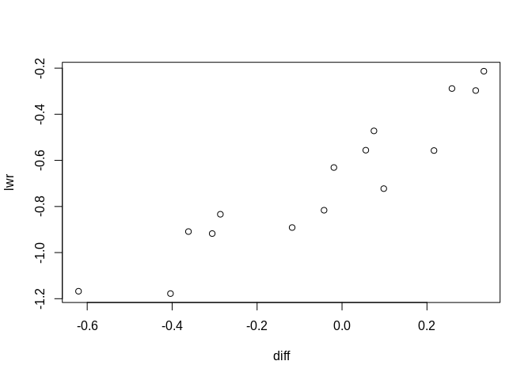
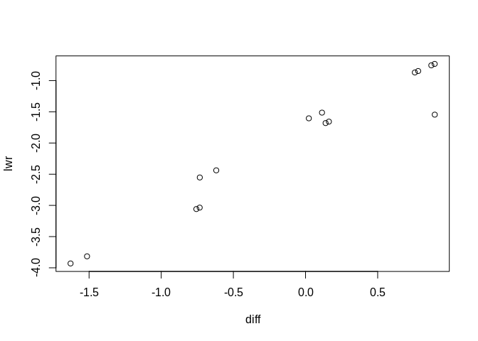
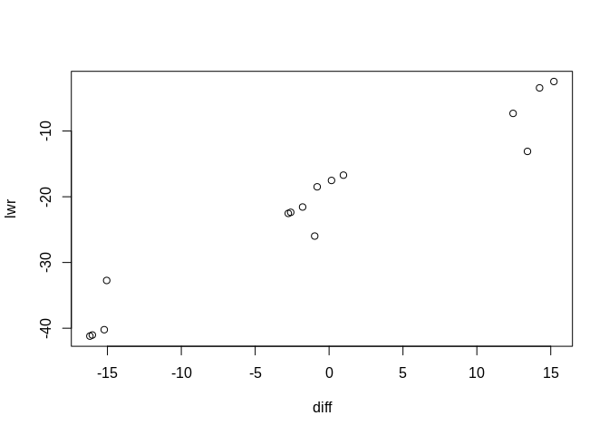
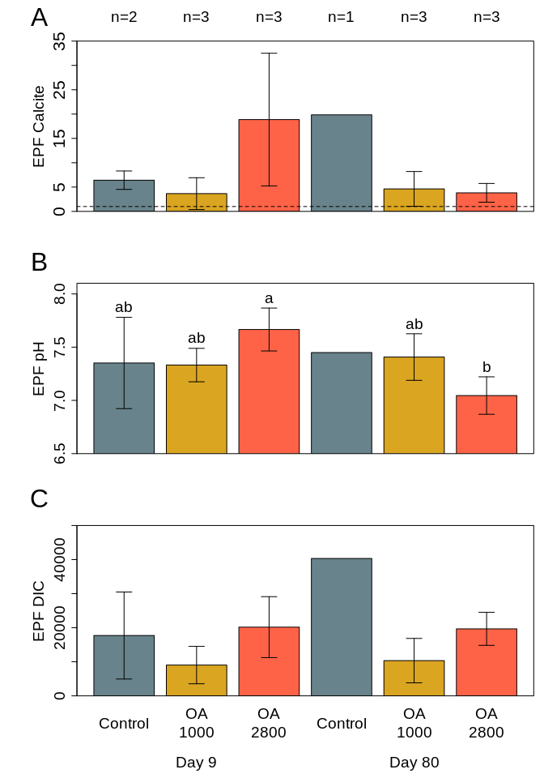

AE17 Final Carbonate Chemistry Analysis
================
adowneywall
8/11/2019

**RData version of
data**

``` r
epf_wDIC_red <- readRDS("/home/downeyam/Github/2017OAExp_Oysters/input_files/Phenotype/Exposure_SummaryFullCarbChemData_without81.RData")
```

## Subsetting data for only days we sequenced (09 v 80 - All treatments)

**NOTE**: Tried random effects models but found they either led toa
singular fit (over fitting problem) or they were not significant and
removed. Presented below are only the best models identifies via model
selection (LRT) and after making sure all assumptions were met and all
include simple linear model with **Treatment**, **Time**, and
**Treatment:Time** as explainatory factors. Also note that both
**Treatment** and **Time** were handled as factors, and a type III ANOVA
was performed due to sample/unequal sample sizes among groups.

### EPF pH

``` r
par(mfrow=c(1,1))

epf_wDIC_red <- epf_wDIC_red[epf_wDIC_red$timepoint != 81,]
epf_wDIC_red <- epf_wDIC_red[epf_wDIC_red$timepoint != 22,]
epf_wDIC_red$timepoint_fac <- as.factor(epf_wDIC_red$timepoint)


mode_pH_f <- lm(EPF_pH ~ pCO2_fac*timepoint_fac,data=epf_wDIC_red)
Anova(mode_pH_f,type=3)
```

    ## Anova Table (Type III tests)
    ## 
    ## Response: EPF_pH
    ##                         Sum Sq Df   F value    Pr(>F)    
    ## (Intercept)            108.082  1 3035.9066 1.075e-12 ***
    ## pCO2_fac                 0.200  2    2.8099   0.11268    
    ## timepoint_fac            0.006  1    0.1808   0.68066    
    ## pCO2_fac:timepoint_fac   0.438  2    6.1503   0.02072 *  
    ## Residuals                0.320  9                        
    ## ---
    ## Signif. codes:  0 '***' 0.001 '**' 0.01 '*' 0.05 '.' 0.1 ' ' 1

``` r
# Significant interaction

(pH_seq_pairwise <- TukeyHSD(aov(EPF_pH~timepoint_fac*pCO2_fac, data=epf_wDIC_red)))
```

    ##   Tukey multiple comparisons of means
    ##     95% family-wise confidence level
    ## 
    ## Fit: aov(formula = EPF_pH ~ timepoint_fac * pCO2_fac, data = epf_wDIC_red)
    ## 
    ## $timepoint_fac
    ##            diff        lwr        upr     p adj
    ## 79-9 -0.2038273 -0.4247326 0.01707804 0.0664769
    ## 
    ## $pCO2_fac
    ##                  diff        lwr       upr     p adj
    ## 900-400   0.019593489 -0.3529124 0.3920993 0.9881960
    ## 2800-400  0.005775732 -0.3667301 0.3782816 0.9989674
    ## 2800-900 -0.013817757 -0.3179675 0.2903320 0.9911778
    ## 
    ## $`timepoint_fac:pCO2_fac`
    ##                       diff        lwr         upr     p adj
    ## 79:400-9:400    0.09826259 -0.7225994  0.91912457 0.9975927
    ## 9:900-9:400    -0.01919382 -0.6310282  0.59264057 0.9999966
    ## 79:900-9:400    0.05594676 -0.5558876  0.66778116 0.9993333
    ## 9:2800-9:400    0.31477867 -0.2970557  0.92661306 0.4950930
    ## 79:2800-9:400  -0.30566124 -0.9174956  0.30617316 0.5228951
    ## 9:900-79:400   -0.11745642 -0.8913725  0.65645968 0.9927907
    ## 79:900-79:400  -0.04231583 -0.8162319  0.73160026 0.9999460
    ## 9:2800-79:400   0.21651607 -0.5574000  0.99043217 0.9088705
    ## 79:2800-79:400 -0.40392383 -1.1778399  0.36999226 0.4814599
    ## 79:900-9:900    0.07514059 -0.4721007  0.62238190 0.9954392
    ## 9:2800-9:900    0.33397249 -0.2132688  0.88121381 0.3357165
    ## 79:2800-9:900  -0.28646742 -0.8337087  0.26077390 0.4786351
    ## 9:2800-79:900   0.25883190 -0.2884094  0.80607322 0.5738424
    ## 79:2800-79:900 -0.36160800 -0.9088493  0.18563332 0.2679249
    ## 79:2800-9:2800 -0.62043990 -1.1676812 -0.07319859 0.0254791

``` r
plot(pH_seq_pairwise$`timepoint_fac:pCO2_fac`)
```

<!-- -->

### Analysis DIC

``` r
mod_ca <- lm(log(EPF_DIC)~pCO2_fac*timepoint_fac,data=epf_wDIC_red)
Anova(mod_ca,type=3)
```

    ## Anova Table (Type III tests)
    ## 
    ## Response: log(EPF_DIC)
    ##                         Sum Sq Df  F value    Pr(>F)    
    ## (Intercept)            188.542  1 598.6895 1.524e-09 ***
    ## pCO2_fac                 1.272  2   2.0200    0.1885    
    ## timepoint_fac            0.535  1   1.6978    0.2249    
    ## pCO2_fac:timepoint_fac   0.379  2   0.6022    0.5683    
    ## Residuals                2.834  9                       
    ## ---
    ## Signif. codes:  0 '***' 0.001 '**' 0.01 '*' 0.05 '.' 0.1 ' ' 1

``` r
#Nothing significant

(DIC_seq_pairwise <- TukeyHSD(aov(log(EPF_DIC)~timepoint_fac*pCO2_fac, data=epf_wDIC_red)))
```

    ##   Tukey multiple comparisons of means
    ##     95% family-wise confidence level
    ## 
    ## Fit: aov(formula = log(EPF_DIC) ~ timepoint_fac * pCO2_fac, data = epf_wDIC_red)
    ## 
    ## $timepoint_fac
    ##           diff        lwr       upr     p adj
    ## 79-9 0.1548818 -0.5021376 0.8119012 0.6067643
    ## 
    ## $pCO2_fac
    ##                diff         lwr       upr     p adj
    ## 900-400  -1.0000356 -2.10794718 0.1078759 0.0763115
    ## 2800-400 -0.1738178 -1.28172934 0.9340937 0.9007655
    ## 2800-900  0.8262178 -0.07838815 1.7308238 0.0728560
    ## 
    ## $`timepoint_fac:pCO2_fac`
    ##                       diff        lwr       upr     p adj
    ## 79:400-9:400    0.89555695 -1.5458610 3.3369749 0.7772771
    ## 9:900-9:400    -0.73277941 -2.5525049 1.0869461 0.7107663
    ## 79:900-9:400   -0.61862663 -2.4383521 1.2010989 0.8233213
    ## 9:2800-9:400    0.13904699 -1.6806785 1.9587725 0.9997209
    ## 79:2800-9:400   0.16198264 -1.6577428 1.9817081 0.9994144
    ## 9:900-79:400   -1.62833636 -3.9301273 0.6734545 0.2155245
    ## 79:900-79:400  -1.51418358 -3.8159745 0.7876073 0.2715699
    ## 9:2800-79:400  -0.75650996 -3.0583009 1.5452809 0.8414033
    ## 79:2800-79:400 -0.73357431 -3.0353652 1.5682166 0.8566368
    ## 79:900-9:900    0.11415277 -1.5134592 1.7417647 0.9998164
    ## 9:2800-9:900    0.87182640 -0.7557856 2.4994384 0.4567845
    ## 79:2800-9:900   0.89476205 -0.7328499 2.5223740 0.4321585
    ## 9:2800-79:900   0.75767362 -0.8699383 2.3852856 0.5883518
    ## 79:2800-79:900  0.78060927 -0.8470027 2.4082212 0.5610231
    ## 79:2800-9:2800  0.02293565 -1.6046763 1.6505476 0.9999999

``` r
plot(DIC_seq_pairwise$`timepoint_fac:pCO2_fac`)
```

<!-- -->

### Analysis Ca Calcite

``` r
mod_ca <- lm(EPF_Calcite_Calc~pCO2_fac*timepoint_fac,data=epf_wDIC_red)
Anova(mod_ca,type=3)
```

    ## Anova Table (Type III tests)
    ## 
    ## Response: EPF_Calcite_Calc
    ##                        Sum Sq Df F value  Pr(>F)  
    ## (Intercept)             82.30  1  2.2141 0.17093  
    ## pCO2_fac               382.38  2  5.1433 0.03239 *
    ## timepoint_fac          120.15  1  3.2323 0.10575  
    ## pCO2_fac:timepoint_fac 420.93  2  5.6618 0.02559 *
    ## Residuals              334.55  9                  
    ## ---
    ## Signif. codes:  0 '***' 0.001 '**' 0.01 '*' 0.05 '.' 0.1 ' ' 1

``` r
#Significant by treatment and interaction

(Ca_seq_pairwise <- TukeyHSD(aov(EPF_Calcite_Calc~timepoint_fac*pCO2_fac, data=epf_wDIC_red)))
```

    ##   Tukey multiple comparisons of means
    ##     95% family-wise confidence level
    ## 
    ## Fit: aov(formula = EPF_Calcite_Calc ~ timepoint_fac * pCO2_fac, data = epf_wDIC_red)
    ## 
    ## $timepoint_fac
    ##           diff       lwr      upr     p adj
    ## 79-9 -3.597321 -10.73546 3.540816 0.2837028
    ## 
    ## $pCO2_fac
    ##               diff       lwr       upr     p adj
    ## 900-400  -6.152113 -18.18893  5.884708 0.3683805
    ## 2800-400  1.051220 -10.98560 13.088041 0.9678714
    ## 2800-900  7.203333  -2.62469 17.031356 0.1567359
    ## 
    ## $`timepoint_fac:pCO2_fac`
    ##                       diff        lwr       upr     p adj
    ## 79:400-9:400    13.4250000 -13.099600 39.949600 0.5105947
    ## 9:900-9:400     -2.7616667 -22.531936 17.008603 0.9950636
    ## 79:900-9:400    -1.7916667 -21.561936 17.978603 0.9993615
    ## 9:2800-9:400    12.4516667  -7.318603 32.221936 0.3081026
    ## 79:2800-9:400   -2.5983333 -22.368603 17.171936 0.9962756
    ## 9:900-79:400   -16.1866667 -41.194299  8.820966 0.2849195
    ## 79:900-79:400  -15.2166667 -40.224299  9.790966 0.3383534
    ## 9:2800-79:400   -0.9733333 -25.980966 24.034299 0.9999900
    ## 79:2800-79:400 -16.0233333 -41.030966  8.984299 0.2934320
    ## 79:900-9:900     0.9700000 -16.713067 18.653067 0.9999451
    ## 9:2800-9:900    15.2133333  -2.469733 32.896400 0.1015366
    ## 79:2800-9:900    0.1633333 -17.519733 17.846400 1.0000000
    ## 9:2800-79:900   14.2433333  -3.439733 31.926400 0.1336535
    ## 79:2800-79:900  -0.8066667 -18.489733 16.876400 0.9999780
    ## 79:2800-9:2800 -15.0500000 -32.733067  2.633067 0.1063716

``` r
plot(Ca_seq_pairwise$`timepoint_fac:pCO2_fac`)
```

<!-- -->

## Figures for sequenced samples

<!-- -->
