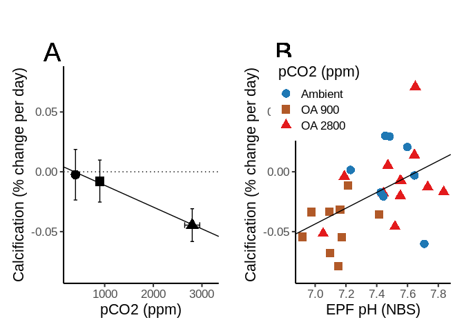

AE17 Calcification Full Workup
================
adowneywall
8/21/2019

### Data

``` r
# Dataset with all timepoints
calcification <- readRDS("/home/downeyam/Github/2017OAExp_Oysters/input_files/Phenotype/SummaryCalcificationData.RData")
# Dataset without tp 81
calcification_red <- readRDS("/home/downeyam/Github/2017OAExp_Oysters/input_files/Phenotype/SummaryCalcificationData_without81.RData")
cal_v2<-read.csv("/home/downeyam/Github/2017OAExp_Oysters/input_files/Phenotype/EPF/AE17_Exp_2017_CalcificationInfo_20190903_Final.csv")
```

### Primary Variables

**Fixed Effects**

  - Treatment
      - pCO2\_fac = Treating pCO2 like a factor
      - pCO2\_calc = Treating pCO2 as continuous variable using tank
        mean values
  - Time
      - Timepoint\_fac = Two (or three) timepoints as factors
      - timepoint = Two timepoint as continous variable

**Random Effects**

  - Pop : 3 sites - roughly 1/3 oysters per site
  - Shelf : 6 shelfs (nested in treatment) - 12-18 oysters per shelf
  - Tank : 3 tanks per shelf (nested) - 2 -3 oysters per tank

### Tables

**All timepoints**

``` r
# Table
table(calcification$timepoint,calcification$pCO2_fac)
```

    ##     
    ##      400 900 2800
    ##   50   5   6    4
    ##   79   3   6    5
    ##   81   6   2    3

``` r
# Total number of samples
nrow(calcification)
```

    ## [1] 40

**With final timepoint removed**  
Rationale explained in notes at end

``` r
# Table
table(calcification_red$timepoint,calcification_red$pCO2_fac)
```

    ##     
    ##      400 900 2800
    ##   50   5   6    4
    ##   80   3   6    5

``` r
# Total number of samples
nrow(calcification_red)
```

    ## [1] 29

## Preliminary Plots with Calcification Data

``` r
### Plotting Calcification Data
## Calcification Adj -- with Time -- Full Data
gg <- ggplot(calcification,aes(x=pCO2.x,y=Pcnt_DailyChange_ExposureAdj,
                         group=interaction(pCO2.x,timepoint),
                         colour=interaction(pCO2.x,timepoint))) 
gg + geom_boxplot() +
  labs(colour="pCO2.Timepoint",x="pCO2",title="All timepoints")
```

<!-- -->

``` r
## Calcification Adj -- with Time --sans day 81 Data
ggplot(calcification_red,aes(x=pCO2.x,y=Pcnt_DailyChange_ExposureAdj,
                         group=interaction(pCO2.x,timepoint),
                         colour=interaction(pCO2.x,timepoint))) + 
  geom_boxplot() + labs(colour="pCO2.Timepoint",title="Without tp 81")
```

<!-- -->

``` r
## Calcification Adj -- without Time -- Full Data
ggplot(calcification,aes(x=pCO2.x,y=Pcnt_DailyChange_ExposureAdj,
                         group=(pCO2.x))) + geom_boxplot() +
  labs(x="pCO2",title="All timepoints")
```

<!-- -->

``` r
## Calcification Adj -- without Time -- sans 81 Data
ggplot(calcification_red,aes(x=pCO2.x,y=Pcnt_DailyChange_ExposureAdj,
                         group=(pCO2.x))) + geom_boxplot() +
  labs(x="pCO2",title="Without tp 81")
```

<!-- -->

``` r
## Calcification -- without Time -- Full Data
ggplot(calcification,aes(x=pCO2.x,y=Pcnt_DailyChange_Exposure,
                         group=(pCO2.x))) + geom_boxplot()
```

<!-- -->

``` r
## Calcification -- without Time -- sans 81 Data
ggplot(calcification_red,aes(x=pCO2.x,y=Pcnt_DailyChange_Exposure,
                         group=(pCO2.x))) + geom_boxplot()
```

<!-- -->

``` r
ggplot(calcification_red,aes(x=pCO2_calc,y=Pcnt_DailyChange_Exposure,
                         group=(pCO2.x))) + geom_point()
```

<!-- -->

``` r
# Briefly check out potential site specific effects
boxplot(calcification_red$Pcnt_DailyChange_Exposure~calcification_red$PopOrigin*calcification_red$pCO2_fac)
```

<!-- -->

``` r
# No obvious site specific effevt
```

## Calcification vs Environment and Time - Statistical Analysis

**ANOVA**

``` r
# Full model- All points
cal_full <- lmer(Pcnt_DailyChange_ExposureAdj~timepoint_fac*pCO2_fac + (1|PopOrigin) + (1|shelf/tank),data=calcification)
```

    ## boundary (singular) fit: see ?isSingular

``` r
# Singular fit so we need to simplfy
anova(cal_full) # No significance
```

    ## Type III Analysis of Variance Table with Satterthwaite's method
    ##                           Sum Sq   Mean Sq NumDF   DenDF F value Pr(>F)
    ## timepoint_fac          0.0041297 0.0020648     2 30.3877  2.1757 0.1309
    ## pCO2_fac               0.0070903 0.0035452     2  3.2368  3.7354 0.1443
    ## timepoint_fac:pCO2_fac 0.0018944 0.0004736     4 30.2366  0.4990 0.7366

``` r
ranova(cal_full)
```

    ## boundary (singular) fit: see ?isSingular
    ## boundary (singular) fit: see ?isSingular
    ## boundary (singular) fit: see ?isSingular

    ## ANOVA-like table for random-effects: Single term deletions
    ## 
    ## Model:
    ## Pcnt_DailyChange_ExposureAdj ~ timepoint_fac + pCO2_fac + (1 | 
    ##     PopOrigin) + (1 | tank:shelf) + (1 | shelf) + timepoint_fac:pCO2_fac
    ##                  npar logLik     AIC        LRT Df Pr(>Chisq)
    ## <none>             13 57.360 -88.720                         
    ## (1 | PopOrigin)    12 57.360 -90.720 -0.0000001  1     1.0000
    ## (1 | tank:shelf)   12 57.360 -90.720  0.0000000  1     0.9999
    ## (1 | shelf)        12 57.357 -90.714  0.0067429  1     0.9346

``` r
#None are significant / Remove pop and shelf and rerun

# Reducing model - keeping fixed factors and one random effect
cal_full_2 <- lmer(Pcnt_DailyChange_ExposureAdj~timepoint_fac+pCO2_fac + (1|shelf),data=calcification)
```

    ## boundary (singular) fit: see ?isSingular

``` r
ranova(cal_full_2)
```

    ## ANOVA-like table for random-effects: Single term deletions
    ## 
    ## Model:
    ## Pcnt_DailyChange_ExposureAdj ~ timepoint_fac + pCO2_fac + (1 | 
    ##     shelf)
    ##             npar logLik     AIC         LRT Df Pr(>Chisq)
    ## <none>         7 67.212 -120.42                          
    ## (1 | shelf)    6 67.212 -122.42 -2.8422e-14  1          1

``` r
# Can't include due to singular fit, and its not significant. 

# Fixed effects only
cal_analysis_fixed <- lm(Pcnt_DailyChange_ExposureAdj~pCO2_calc*timepoint,data=calcification)
step(cal_analysis_fixed)
```

    ## Start:  AIC=-276.62
    ## Pcnt_DailyChange_ExposureAdj ~ pCO2_calc * timepoint
    ## 
    ##                       Df  Sum of Sq      RSS     AIC
    ## - pCO2_calc:timepoint  1 8.8051e-05 0.032587 -278.51
    ## <none>                              0.032499 -276.62
    ## 
    ## Step:  AIC=-278.51
    ## Pcnt_DailyChange_ExposureAdj ~ pCO2_calc + timepoint
    ## 
    ##             Df Sum of Sq      RSS     AIC
    ## <none>                   0.032587 -278.51
    ## - timepoint  1 0.0042814 0.036868 -275.57
    ## - pCO2_calc  1 0.0078007 0.040388 -271.93

    ## 
    ## Call:
    ## lm(formula = Pcnt_DailyChange_ExposureAdj ~ pCO2_calc + timepoint, 
    ##     data = calcification)
    ## 
    ## Coefficients:
    ## (Intercept)    pCO2_calc    timepoint  
    ##   0.0479650   -0.0000172   -0.0007145

``` r
# Step function indicates a mode that includes pco2 and time but not the interaction is the best approach
cal_analysis_final <- lm(Pcnt_DailyChange_ExposureAdj~pCO2_calc+timepoint,data=calcification)
anova(cal_analysis_final)
```

    ## Analysis of Variance Table
    ## 
    ## Response: Pcnt_DailyChange_ExposureAdj
    ##           Df   Sum Sq   Mean Sq F value   Pr(>F)   
    ## pCO2_calc  1 0.008162 0.0081622  9.2676 0.004279 **
    ## timepoint  1 0.004281 0.0042814  4.8613 0.033762 * 
    ## Residuals 37 0.032587 0.0008807                    
    ## ---
    ## Signif. codes:  0 '***' 0.001 '**' 0.01 '*' 0.05 '.' 0.1 ' ' 1

``` r
### Full Model - With 81 removed
cal_wo81_full <- lmer(Pcnt_DailyChange_ExposureAdj~timepoint_fac*pCO2_calc + (1|PopOrigin) + (1|shelf/tank),data=calcification_red)
```

    ## boundary (singular) fit: see ?isSingular

``` r
anova(cal_wo81_full)
```

    ## Type III Analysis of Variance Table with Satterthwaite's method
    ##                            Sum Sq   Mean Sq NumDF DenDF F value   Pr(>F)
    ## timepoint_fac           0.0000502 0.0000502     1    25  0.0696 0.794013
    ## pCO2_calc               0.0087063 0.0087063     1    25 12.0685 0.001884
    ## timepoint_fac:pCO2_calc 0.0010315 0.0010315     1    25  1.4298 0.243015
    ##                           
    ## timepoint_fac             
    ## pCO2_calc               **
    ## timepoint_fac:pCO2_calc   
    ## ---
    ## Signif. codes:  0 '***' 0.001 '**' 0.01 '*' 0.05 '.' 0.1 ' ' 1

``` r
ranova(cal_wo81_full)
```

    ## boundary (singular) fit: see ?isSingular
    ## boundary (singular) fit: see ?isSingular
    ## boundary (singular) fit: see ?isSingular

    ## ANOVA-like table for random-effects: Single term deletions
    ## 
    ## Model:
    ## Pcnt_DailyChange_ExposureAdj ~ timepoint_fac + pCO2_calc + (1 | 
    ##     PopOrigin) + (1 | tank:shelf) + (1 | shelf) + timepoint_fac:pCO2_calc
    ##                  npar logLik    AIC        LRT Df Pr(>Chisq)
    ## <none>              8  36.23 -56.46                         
    ## (1 | PopOrigin)     7  36.23 -58.46 0.0000e+00  1     1.0000
    ## (1 | tank:shelf)    7  36.23 -58.46 0.0000e+00  1     1.0000
    ## (1 | shelf)         7  36.23 -58.46 2.0344e-07  1     0.9996

``` r
#Similar results to full data so moving directly to fixed model
cal_wo81_fixed <- lm(Pcnt_DailyChange_ExposureAdj~pCO2_calc*timepoint,data=calcification_red)
step(cal_wo81_fixed)
```

    ## Start:  AIC=-206.1
    ## Pcnt_DailyChange_ExposureAdj ~ pCO2_calc * timepoint
    ## 
    ##                       Df Sum of Sq      RSS     AIC
    ## - pCO2_calc:timepoint  1 0.0010315 0.019067 -206.49
    ## <none>                             0.018035 -206.10
    ## 
    ## Step:  AIC=-206.49
    ## Pcnt_DailyChange_ExposureAdj ~ pCO2_calc + timepoint
    ## 
    ##             Df Sum of Sq      RSS     AIC
    ## <none>                   0.019067 -206.49
    ## - timepoint  1 0.0014650 0.020532 -206.34
    ## - pCO2_calc  1 0.0087236 0.027790 -197.56

    ## 
    ## Call:
    ## lm(formula = Pcnt_DailyChange_ExposureAdj ~ pCO2_calc + timepoint, 
    ##     data = calcification_red)
    ## 
    ## Coefficients:
    ## (Intercept)    pCO2_calc    timepoint  
    ##   4.110e-02   -2.159e-05   -4.771e-04

``` r
# Final model is the two fixed factors but not the interaction
cal_wo81_final <- lm(Pcnt_DailyChange_ExposureAdj~pCO2_calc+timepoint,data=calcification_red)
# Type 3
Anova(cal_wo81_final,type=2)
```

    ## Anova Table (Type II tests)
    ## 
    ## Response: Pcnt_DailyChange_ExposureAdj
    ##              Sum Sq Df F value  Pr(>F)   
    ## pCO2_calc 0.0087236  1 11.8959 0.00193 **
    ## timepoint 0.0014650  1  1.9977 0.16940   
    ## Residuals 0.0190666 26                   
    ## ---
    ## Signif. codes:  0 '***' 0.001 '**' 0.01 '*' 0.05 '.' 0.1 ' ' 1

``` r
# Same general interpretation as all timepoints. Treatment is significant and time doesn't matter.

# Plot post hoc testing
plot(TukeyHSD(aov(Pcnt_DailyChange_ExposureAdj~pCO2_fac+timepoint_fac, data=calcification_red)))
```

<!-- --><!-- -->

``` r
#Post hoc reveals that its the 2800 being significantly differen't thatn either 900 or 400 that is driving the pattern
```

**Regression**

``` r
## performing a regression with tank mean pCO2
cal_analysis2 <- lmer(Pcnt_DailyChange_ExposureAdj~pCO2_calc*timepoint_fac+(1|PopOrigin)+(1|shelf),data=calcification_red)
```

    ## boundary (singular) fit: see ?isSingular

``` r
ranova(cal_analysis2)
```

    ## boundary (singular) fit: see ?isSingular
    ## boundary (singular) fit: see ?isSingular

    ## ANOVA-like table for random-effects: Single term deletions
    ## 
    ## Model:
    ## Pcnt_DailyChange_ExposureAdj ~ pCO2_calc + timepoint_fac + (1 | 
    ##     PopOrigin) + (1 | shelf) + pCO2_calc:timepoint_fac
    ##                 npar logLik    AIC LRT Df Pr(>Chisq)
    ## <none>             7  36.23 -58.46                  
    ## (1 | PopOrigin)    6  36.23 -60.46   0  1          1
    ## (1 | shelf)        6  36.23 -60.46   0  1          1

``` r
#Can remove are not significant
cal_interaction <- lm(Pcnt_DailyChange_ExposureAdj~pCO2_calc*timepoint_fac,data=calcification_red)
# Interaction not significant, so it will be dropped
summary(cal_interaction)
```

    ## 
    ## Call:
    ## lm(formula = Pcnt_DailyChange_ExposureAdj ~ pCO2_calc * timepoint_fac, 
    ##     data = calcification_red)
    ## 
    ## Residuals:
    ##       Min        1Q    Median        3Q       Max 
    ## -0.056363 -0.008120 -0.003928  0.016604  0.075432 
    ## 
    ## Coefficients:
    ##                             Estimate Std. Error t value Pr(>|t|)
    ## (Intercept)                8.216e-03  1.272e-02   0.646    0.524
    ## pCO2_calc                 -1.414e-05  8.793e-06  -1.609    0.120
    ## timepoint_fac80            5.024e-03  1.904e-02   0.264    0.794
    ## pCO2_calc:timepoint_fac80 -1.485e-05  1.242e-05  -1.196    0.243
    ## 
    ## Residual standard error: 0.02686 on 25 degrees of freedom
    ## Multiple R-squared:  0.4025, Adjusted R-squared:  0.3308 
    ## F-statistic: 5.614 on 3 and 25 DF,  p-value: 0.004389

``` r
cal_simple <- lm(Pcnt_DailyChange_ExposureAdj~pCO2_calc+timepoint_fac,data=calcification_red)
(cal_sum <- summary(cal_simple))
```

    ## 
    ## Call:
    ## lm(formula = Pcnt_DailyChange_ExposureAdj ~ pCO2_calc + timepoint_fac, 
    ##     data = calcification_red)
    ## 
    ## Residuals:
    ##       Min        1Q    Median        3Q       Max 
    ## -0.050430 -0.014395 -0.003288  0.015157  0.073033 
    ## 
    ## Coefficients:
    ##                   Estimate Std. Error t value Pr(>|t|)   
    ## (Intercept)      1.725e-02  1.032e-02   1.671  0.10673   
    ## pCO2_calc       -2.159e-05  6.260e-06  -3.449  0.00193 **
    ## timepoint_fac80 -1.431e-02  1.013e-02  -1.413  0.16940   
    ## ---
    ## Signif. codes:  0 '***' 0.001 '**' 0.01 '*' 0.05 '.' 0.1 ' ' 1
    ## 
    ## Residual standard error: 0.02708 on 26 degrees of freedom
    ## Multiple R-squared:  0.3683, Adjusted R-squared:  0.3197 
    ## F-statistic:  7.58 on 2 and 26 DF,  p-value: 0.002549

``` r
# Treatment but not time significant. I guess I will only plot a fitted line based on the simplest model with only treatment.
cal_pCO2 <- lm(Pcnt_DailyChange_ExposureAdj~pCO2_calc,data=calcification_red)
(sum_store <- summary(cal_pCO2))
```

    ## 
    ## Call:
    ## lm(formula = Pcnt_DailyChange_ExposureAdj ~ pCO2_calc, data = calcification_red)
    ## 
    ## Residuals:
    ##       Min        1Q    Median        3Q       Max 
    ## -0.058528 -0.013234  0.001002  0.012189  0.079542 
    ## 
    ## Coefficients:
    ##               Estimate Std. Error t value Pr(>|t|)   
    ## (Intercept)  1.161e-02  9.694e-03   1.198  0.24143   
    ## pCO2_calc   -2.257e-05  6.335e-06  -3.563  0.00139 **
    ## ---
    ## Signif. codes:  0 '***' 0.001 '**' 0.01 '*' 0.05 '.' 0.1 ' ' 1
    ## 
    ## Residual standard error: 0.02758 on 27 degrees of freedom
    ## Multiple R-squared:  0.3198, Adjusted R-squared:  0.2946 
    ## F-statistic: 12.69 on 1 and 27 DF,  p-value: 0.001389

``` r
# A few slightly wonky points, but no major violations
```

## Calcification vs EPF Fluid pH

### Preliminary calcification plot vs. EPF carb chemistry

``` r
#Calcification vs pH
# All points
ggplot(calcification,aes(x=EPF_pH,
                         y=Pcnt_DailyChange_ExposureAdj,
                         colour=pCO2_calc)) +
  geom_point() + geom_smooth(method="lm")+labs(colour="pCO2",y="Calcification(Adj)")
```

<!-- -->

``` r
# Removing tp 81 because points were wonky
ggplot(calcification_red,aes(x=EPF_pH,
                         y=Pcnt_DailyChange_ExposureAdj,
                         colour=pCO2_calc)) +
  geom_point() + geom_smooth(method="lm",colour="black") +
  labs(colour="pCO2",y="Calcification(Adj)") +
  theme_bw()
```

<!-- -->

``` r
# EPF DIC vs calcification
ggplot(calcification_red[calcification_red$carb_chem == "Y",],aes(x=EPF_DIC,
                         y=Pcnt_DailyChange_Exposure,
                         colour=log(pCO2_calc))) +
  geom_point() + geom_smooth(method="lm")
```

<!-- -->

``` r
# Trend but hard to say anything given the lack of points

# EPF Calcite Sat. vs calcification
ggplot(calcification_red[calcification_red$carb_chem == "Y",],aes(x=EPF_Calcite_Calc,
                         y=Pcnt_DailyChange_Exposure,
                         colour=log(pCO2_calc))) +
  geom_point() + geom_smooth(method="lm")
```

<!-- -->

``` r
# Hard to say whats going on, but it looks like DIC is negatively correlated with calcification rate, while there seems to be a very moderate negative relationship between calcite saturation and calcification.
```

### Statistical Analysis

``` r
#Check the impact of random factors, they didn't seem to help o they were removed
calVspH_full <- lmer(Pcnt_DailyChange_ExposureAdj ~ EPF_pH * timepoint + (1|PopOrigin) + (1|shelf/tank),data=calcification_red)
```

    ## boundary (singular) fit: see ?isSingular

``` r
# singular fit
ranova(calVspH_full)
```

    ## boundary (singular) fit: see ?isSingular
    ## boundary (singular) fit: see ?isSingular

    ## ANOVA-like table for random-effects: Single term deletions
    ## 
    ## Model:
    ## Pcnt_DailyChange_ExposureAdj ~ EPF_pH + timepoint + (1 | PopOrigin) + 
    ##     (1 | tank:shelf) + (1 | shelf) + EPF_pH:timepoint
    ##                  npar logLik     AIC       LRT Df Pr(>Chisq)
    ## <none>              8 43.459 -70.917                        
    ## (1 | PopOrigin)     7 43.409 -72.817  0.100211  1     0.7516
    ## (1 | tank:shelf)    7 43.452 -72.903  0.014322  1     0.9047
    ## (1 | shelf)         7 43.459 -72.917 -0.000001  1     1.0000

``` r
summary(calVspH_full)
```

    ## Linear mixed model fit by REML. t-tests use Satterthwaite's method [
    ## lmerModLmerTest]
    ## Formula: 
    ## Pcnt_DailyChange_ExposureAdj ~ EPF_pH * timepoint + (1 | PopOrigin) +  
    ##     (1 | shelf/tank)
    ##    Data: calcification_red
    ## 
    ## REML criterion at convergence: -86.9
    ## 
    ## Scaled residuals: 
    ##      Min       1Q   Median       3Q      Max 
    ## -1.95726 -0.60522 -0.03436  0.32971  2.23411 
    ## 
    ## Random effects:
    ##  Groups     Name        Variance  Std.Dev.
    ##  tank:shelf (Intercept) 3.084e-05 0.005554
    ##  shelf      (Intercept) 0.000e+00 0.000000
    ##  PopOrigin  (Intercept) 4.029e-05 0.006347
    ##  Residual               8.062e-04 0.028393
    ## Number of obs: 29, groups:  tank:shelf, 17; shelf, 6; PopOrigin, 3
    ## 
    ## Fixed effects:
    ##                    Estimate Std. Error         df t value Pr(>|t|)
    ## (Intercept)      -4.275e-01  7.238e-01  2.007e+01  -0.591    0.561
    ## EPF_pH            5.892e-02  9.766e-02  1.991e+01   0.603    0.553
    ## timepoint        -6.292e-04  1.115e-02  1.923e+01  -0.056    0.956
    ## EPF_pH:timepoint  3.015e-05  1.509e-03  1.910e+01   0.020    0.984
    ## 
    ## Correlation of Fixed Effects:
    ##             (Intr) EPF_pH timpnt
    ## EPF_pH      -0.999              
    ## timepoint   -0.972  0.973       
    ## EPF_pH:tmpn  0.970 -0.972 -0.999
    ## convergence code: 0
    ## boundary (singular) fit: see ?isSingular

``` r
# None of the random effects were significant to I will remove
# Simple lm with interaction
calVspH_fixed_inter <- lm(Pcnt_DailyChange_ExposureAdj ~ EPF_pH * timepoint ,data=calcification_red)
summary(calVspH_fixed_inter)
```

    ## 
    ## Call:
    ## lm(formula = Pcnt_DailyChange_ExposureAdj ~ EPF_pH * timepoint, 
    ##     data = calcification_red)
    ## 
    ## Residuals:
    ##       Min        1Q    Median        3Q       Max 
    ## -0.055855 -0.019429 -0.005342  0.011150  0.067232 
    ## 
    ## Coefficients:
    ##                    Estimate Std. Error t value Pr(>|t|)
    ## (Intercept)      -4.087e-01  7.370e-01  -0.555    0.584
    ## EPF_pH            5.651e-02  9.946e-02   0.568    0.575
    ## timepoint        -9.434e-04  1.138e-02  -0.083    0.935
    ## EPF_pH:timepoint  7.168e-05  1.540e-03   0.047    0.963
    ## 
    ## Residual standard error: 0.02941 on 25 degrees of freedom
    ## Multiple R-squared:  0.2835, Adjusted R-squared:  0.1975 
    ## F-statistic: 3.297 on 3 and 25 DF,  p-value: 0.03684

``` r
# Model significant but no individual explanatory variables (decided to remove interaction)
# Removing interaction
calVspH_fixed <- lmer(Pcnt_DailyChange_ExposureAdj ~ EPF_pH + (1|tank:shelf) ,data=calcification_red)
(calVpH_fized_out <- summary(calVspH_fixed))
```

    ## Linear mixed model fit by REML. t-tests use Satterthwaite's method [
    ## lmerModLmerTest]
    ## Formula: Pcnt_DailyChange_ExposureAdj ~ EPF_pH + (1 | tank:shelf)
    ##    Data: calcification_red
    ## 
    ## REML criterion at convergence: -110.7
    ## 
    ## Scaled residuals: 
    ##      Min       1Q   Median       3Q      Max 
    ## -2.18343 -0.59510 -0.06363  0.61645  2.47458 
    ## 
    ## Random effects:
    ##  Groups     Name        Variance  Std.Dev.
    ##  tank:shelf (Intercept) 1.676e-06 0.001295
    ##  Residual               8.393e-04 0.028971
    ## Number of obs: 29, groups:  tank:shelf, 17
    ## 
    ## Fixed effects:
    ##             Estimate Std. Error       df t value Pr(>|t|)   
    ## (Intercept) -0.50527    0.16363 24.61509  -3.088  0.00494 **
    ## EPF_pH       0.06595    0.02212 24.51414   2.981  0.00640 **
    ## ---
    ## Signif. codes:  0 '***' 0.001 '**' 0.01 '*' 0.05 '.' 0.1 ' ' 1
    ## 
    ## Correlation of Fixed Effects:
    ##        (Intr)
    ## EPF_pH -0.999

``` r
ranova(calVspH_fixed)
```

    ## ANOVA-like table for random-effects: Single term deletions
    ## 
    ## Model:
    ## Pcnt_DailyChange_ExposureAdj ~ EPF_pH + (1 | tank:shelf)
    ##                  npar logLik     AIC        LRT Df Pr(>Chisq)
    ## <none>              4 55.327 -102.66                         
    ## (1 | tank:shelf)    3 55.327 -104.66 7.1509e-05  1     0.9933

``` r
# Treatment significant but not time
# Little evidence of a tank effect so it's removed
calVspH_final <- lm(Pcnt_DailyChange_ExposureAdj ~ EPF_pH ,data=calcification_red)
(calVpH_fized_out <- summary(calVspH_final))
```

    ## 
    ## Call:
    ## lm(formula = Pcnt_DailyChange_ExposureAdj ~ EPF_pH, data = calcification_red)
    ## 
    ## Residuals:
    ##      Min       1Q   Median       3Q      Max 
    ## -0.06340 -0.01724 -0.00176  0.01786  0.07176 
    ## 
    ## Coefficients:
    ##             Estimate Std. Error t value Pr(>|t|)   
    ## (Intercept) -0.50528    0.16357  -3.089  0.00461 **
    ## EPF_pH       0.06595    0.02211   2.982  0.00600 **
    ## ---
    ## Signif. codes:  0 '***' 0.001 '**' 0.01 '*' 0.05 '.' 0.1 ' ' 1
    ## 
    ## Residual standard error: 0.029 on 27 degrees of freedom
    ## Multiple R-squared:  0.2478, Adjusted R-squared:  0.2199 
    ## F-statistic: 8.894 on 1 and 27 DF,  p-value: 0.006

``` r
# With out without random effect of tank the relationship between EPF pH and calcification is significant
```

## Final Plots

``` r
##### Plot 1 #####
#Mean calcification rate 
mean_cal <- aggregate(Pcnt_DailyChange_ExposureAdj~pCO2.x ,calcification_red,FUN=mean)
se_cal <- aggregate(Pcnt_DailyChange_ExposureAdj~pCO2.x ,calcification_red,FUN=se)
se_pco2 <- aggregate(pCO2_calc~pCO2.x ,calcification_red,FUN=sd)
mean_cal <- data.frame(pCO2=mean_cal$pCO2.x,Rel_Change=mean_cal$Pcnt_DailyChange_ExposureAdj,
                         ymin=mean_cal$Pcnt_DailyChange_ExposureAdj-c(se_cal$Pcnt_DailyChange_ExposureAdj*1.96),
                         ymax=mean_cal$Pcnt_DailyChange_ExposureAdj+c(se_cal$Pcnt_DailyChange_ExposureAdj*1.96),
                         xmin=mean_cal$pCO2.x-c(se_pco2$pCO2_calc*1.96),
                         xmax=mean_cal$pCO2.x+c(se_pco2$pCO2_calc*1.96))

# ggplot version
out <- summary(lm(Pcnt_DailyChange_ExposureAdj~pCO2.x,data=calcification_red))

p <- ggplot(mean_cal,aes(x=pCO2,y=Rel_Change)) + geom_hline(aes(yintercept=0),linetype="dotted") +
  geom_point(aes(size=6,shape=as.factor(pCO2))) + ylim(-0.085,0.08) + xlim(300,3200) + 
  scale_shape_manual(values=c(16,15,17))+
  geom_errorbarh(aes(xmin=xmin, xmax=xmax)) + 
  geom_errorbar(aes(ymin=ymin,ymax=ymax),width=75) +
  geom_abline(slope = out$coefficients[2,1],intercept = out$coefficients[1,1]) 
t <- p + theme_bw(base_size = 16) + theme(panel.border = element_blank(), panel.grid.major = element_blank(),
panel.grid.minor = element_blank(), axis.line = element_line(colour = "black"))
p1<-t + ylab("Calcification (% change per day)") + xlab("pCO2 (ppm)") +
  coord_cartesian(clip = 'off') +
   geom_text(
    x = 100,
    y = 0.10,
    inherit.aes = FALSE,
    label = "A",
    check_overlap = FALSE,
    hjust = 1,
    size = 10
  ) +
  theme(legend.position="none",plot.margin = unit(c(5, 1, 1, 1), "lines")) 
p1
```

<!-- -->

``` r
## Plot 2
calcification_red$pCO2_name <- "NA"
calcification_red$pCO2_name[calcification_red$pCO2_fac == unique(calcification_red$pCO2_fac)[1]] <-  "Ambient"
calcification_red$pCO2_name[calcification_red$pCO2_fac == unique(calcification_red$pCO2_fac)[2]] <-  "OA 900" 
calcification_red$pCO2_name[calcification_red$pCO2_fac == unique(calcification_red$pCO2_fac)[3]] <-  "OA 2800"
calcification_red$pCO2_name <- as.factor(calcification_red$pCO2_name)
levels(calcification_red$pCO2_name) <- levels(calcification_red$pCO2_name)[c(1,3,2)]

p <- ggplot(calcification_red,aes(x=EPF_pH,y=Pcnt_DailyChange_ExposureAdj,colour=pCO2_name)) +
  geom_point(size=4,aes(shape=pCO2_name)) + ylim(-0.085,0.08) +
  scale_color_manual(values=c(col_perm[2],col_perm[5],col_perm[4])) +
  scale_shape_manual(values=c(16,15,17))+
  geom_abline(slope = calVpH_fized_out$coefficients[2,1],intercept = calVpH_fized_out$coefficients[1,1]) 

t <- p + theme_bw(base_size = 16) + 
  theme(panel.border = element_blank(),
        panel.grid.major = element_blank(),
        panel.grid.minor = element_blank(),
        legend.position = c(0.15,.85),
        axis.line = element_line(colour = "black")) 

p2<-t + ylab("Calcification (% change per day)") + xlab("EPF pH (NBS)") + labs(colour="pCO2 (ppm)",shape="pCO2 (ppm)") +
guides(shape = guide_legend(override.aes = list(size = 4))) +
   coord_cartesian(clip = 'off') +
   geom_text(
    x = 6.85,
    y = 0.10,
    inherit.aes = FALSE,
    label = "B",
    check_overlap = FALSE,
    hjust = 1,
    size = 10
  ) +
  theme(plot.margin = unit(c(5, 1, 1, 1), "lines"))
p2
```

<!-- -->

``` r
multiplot(p1, p2,cols=2)
```

<!-- -->

Base Plot versions (outdated)

Pub plot (outdated)

## Final Thoughts

**Final Models**

Calcification vs Env \[Calcification_{Adj} = pCO2\] Anova (type three)

``` r
Anova(cal_wo81_final,type=3)
```

    ## Anova Table (Type III tests)
    ## 
    ## Response: Pcnt_DailyChange_ExposureAdj
    ##                Sum Sq Df F value  Pr(>F)   
    ## (Intercept) 0.0023554  1  3.2120 0.08475 . 
    ## pCO2_calc   0.0087236  1 11.8959 0.00193 **
    ## timepoint   0.0014650  1  1.9977 0.16940   
    ## Residuals   0.0190666 26                   
    ## ---
    ## Signif. codes:  0 '***' 0.001 '**' 0.01 '*' 0.05 '.' 0.1 ' ' 1

Regression (preferred over an ANOVA)

``` r
sum_store
```

    ## 
    ## Call:
    ## lm(formula = Pcnt_DailyChange_ExposureAdj ~ pCO2_calc, data = calcification_red)
    ## 
    ## Residuals:
    ##       Min        1Q    Median        3Q       Max 
    ## -0.058528 -0.013234  0.001002  0.012189  0.079542 
    ## 
    ## Coefficients:
    ##               Estimate Std. Error t value Pr(>|t|)   
    ## (Intercept)  1.161e-02  9.694e-03   1.198  0.24143   
    ## pCO2_calc   -2.257e-05  6.335e-06  -3.563  0.00139 **
    ## ---
    ## Signif. codes:  0 '***' 0.001 '**' 0.01 '*' 0.05 '.' 0.1 ' ' 1
    ## 
    ## Residual standard error: 0.02758 on 27 degrees of freedom
    ## Multiple R-squared:  0.3198, Adjusted R-squared:  0.2946 
    ## F-statistic: 12.69 on 1 and 27 DF,  p-value: 0.001389

Calcification vs EPF pH \[Calcification_{Adj} = EPF_{pH}\] Regression

``` r
summary(calVspH_final)
```

    ## 
    ## Call:
    ## lm(formula = Pcnt_DailyChange_ExposureAdj ~ EPF_pH, data = calcification_red)
    ## 
    ## Residuals:
    ##      Min       1Q   Median       3Q      Max 
    ## -0.06340 -0.01724 -0.00176  0.01786  0.07176 
    ## 
    ## Coefficients:
    ##             Estimate Std. Error t value Pr(>|t|)   
    ## (Intercept) -0.50528    0.16357  -3.089  0.00461 **
    ## EPF_pH       0.06595    0.02211   2.982  0.00600 **
    ## ---
    ## Signif. codes:  0 '***' 0.001 '**' 0.01 '*' 0.05 '.' 0.1 ' ' 1
    ## 
    ## Residual standard error: 0.029 on 27 degrees of freedom
    ## Multiple R-squared:  0.2478, Adjusted R-squared:  0.2199 
    ## F-statistic: 8.894 on 1 and 27 DF,  p-value: 0.006

### Interpretation

**Calcification vs Environment**  
\* There is a significant effect of treatment on calcification rate,
which is driven by a significant decrease in calcification at the high
OA treatment (2800), relative to either ambient or moderate OA. Although
it would appear that there is a subtle different in the moderate OA
vs. ambient conditions too, but we don’t have the power to detect it.

**Calcification vs. EPF pH**  
\* Model shows there is a significant positive relationship between
EPF\_ph and calcification. \* Note this was not run on the other EPF
carb chem parameters due to very low sample size, but from the plots it
looked like DIC did not have the same relationship.

### Additional Notes

  - The choice to remove tp 81 was driven by the EPF pH. which seemed to
    have some measured issues (as observed in the pH under ambient being
    very acidic compared to all other tps). Rather than selectively keep
    some measures from that timepoint or using that timepoint only for
    calcification I decided to remove it given that that particular
    sampling was extra anyways and that we we used consistent
    individuals for all analysis.

**Second Version of the analysis redoing calcificiation estimates**

``` r
cal_v2$sample_date
cal_v2$DryWgtDate <- as.Date(paste0(substr(cal_v2$sample_date,1,4),"/",substr(cal_v2$sample_date,5,6),"/",substr(cal_v2$sample_date,7,8)))
cal_v2$date_bw2_asDate <- as.character(cal_v2$date_bw2_asDate)
cal_v2$date_bw2_asDate[cal_v2$date_bw2_asDate == "#VALUE!"] <- NA
  
cal_v2$BW2Date <- as.Date(as.character(cal_v2$date_bw2_asDate),format="%m/%d/%y")
cal_v2$DiffDryVBW2Date <- cal_v2$DryWgtDate-cal_v2$BW2Date

# subsetting data with missing values or are beyond scope of study.
cal_s <- cal_v2[!is.na(cal_v2$DiffDryVBW2Date),]
cal_s <- cal_s[cal_s$DiffDryVBW2Date < 83,]
cal_s <- cal_s[cal_s$DiffDryVBW2Date != 12,]

# Using the values from regression determine when we fit the dry weights with the bouyants 
cal_s$DryWt1Calc <- 1.87*cal_s$buoyant_start-2.74 # Dry Wgt Est. for BW1
cal_s$DryWt2Calc <- 1.87*cal_s$buoyant_2-2.74 # Dry Wgt Est. for BW2
cal_s$DryWt3Calc <- 1.87*cal_s$buoyant_3-2.74 # Dry Wgt Est. for BW3

# Baseline growth estimate from bouyant weights
cal_s$exp_calrate_basline <- (cal_s$DryWt2Calc-cal_s$DryWt1Calc)/as.numeric(cal_s$Day_BW1_BW2)
# Treatment growth rates from bouyant weights
cal_s$exp_calrate <- (cal_s$dry_end_meas-cal_s$DryWt2Calc)/as.numeric(cal_s$DiffDryVBW2Date)

## Plotting baseline growth rates
ggplot(cal_s,aes(x=as.factor(DryWgtDate),y=cal_s$exp_calrate_basline,group=as.factor(interaction(DryWgtDate,pCO2)),col=as.factor(pCO2))) + geom_boxplot()
## Plotting individuals 400 treatment ind. using final timepoint(BW3)-BW1
cal_400 <- cal_s[cal_s$pCO2 == 400,]
cal_400$exp_calrate <- (cal_400$dry_end_meas-cal_400$DryWt1Calc)/as.numeric(cal_400$Day_BW1_BW2 + cal_400$DiffDryVBW2Date)
is.na(cal_400$exp_calrate)
ggplot(cal_400,aes(x=as.factor(DryWgtDate),y=exp_calrate)) + geom_boxplot()

## Using the actual dry weight as the final weight ( Dry weight - Dry wgt. calculated from BW2)
ggplot(cal_s,aes(x=as.factor(DryWgtDate),y=cal_s$exp_calrate,group=as.factor(interaction(DryWgtDate,pCO2)),col=as.factor(pCO2))) + geom_boxplot()
# creating a model with 
lm.out <- lm(exp_calrate~DiffDryVBW2Date*as.factor(pCO2),data=cal_s)
summary(lm.out)
anova(lm.out)
# Adjusting the cal rate for oyster size (calcification rate as a % growth)
cal_s$exp_calrate_scaled <- cal_s$exp_calrate/cal_s$dry_end_meas
ggplot(cal_s,aes(x=as.factor(DryWgtDate),y=cal_s$exp_calrate_scaled,group=as.factor(interaction(DryWgtDate,pCO2)),col=as.factor(pCO2))) + geom_boxplot()


## Using the dry weights converted from bouyant wgt
cal_s$exp_calrate_fromBouyant <- (cal_s$DryWt3Calc-cal_s$DryWt2Calc)/as.numeric(cal_s$Day_BW_BW3)
ggplot(cal_s,aes(x=as.factor(pCO2),y=cal_s$exp_calrate_fromBouyant,group=as.factor(interaction(pCO2)),col=as.factor(pCO2))) + geom_boxplot()
```
