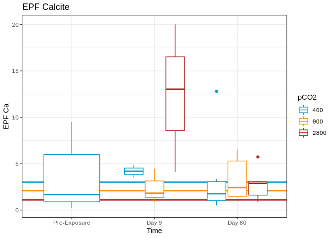
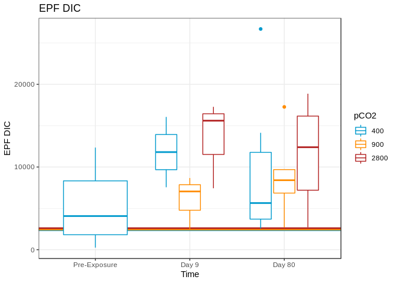
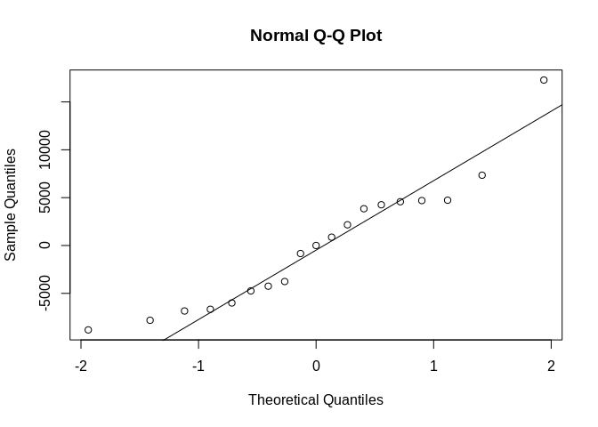
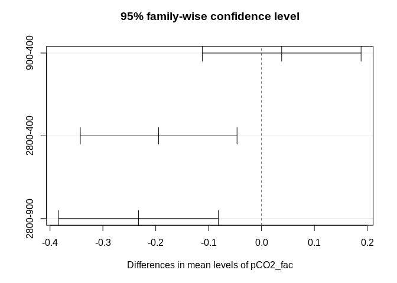
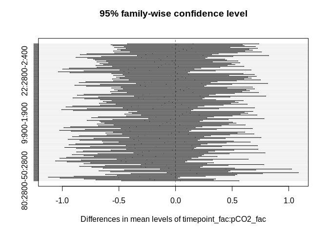

#### Data

```r
### EPF fluid ###
epf_cal <- read.csv(file = "~/Github/2017OAExp_Oysters/input_files/Phenotype/EPF/AE17_EPF_Calcification_20190403.csv")
# Remove and NAs at end of dataframe
epf_cal <- epf_cal[!is.na(epf_cal$ID),]
# Making Date object
epf_cal$Sample_Date <- as.Date(as.character(epf_cal$sample_date),origin="%Y%m%d",format="%Y%m%d")
# Removing samples outside of experiment (those for louises exp)
epf_cal <- epf_cal[epf_cal$Sample_Date < "2017-08-25",]
epf_cal <- epf_cal[!is.na(epf_cal$Sample_Date),]
#aggreate final two timepoints
epf_cal$Sample_Date[epf_cal$Sample_Date > "2017-08-20"] <-"2017-08-23"
  
# Convert Dates into timepoints (time prior to experiment exposure starting)
epf_cal$timepoint <-  epf_cal$Sample_Date - as.Date("2017-06-04")
epf_cal$timepoint_fac <-  as.factor(epf_cal$timepoint)

## Deciding to treat time and treatment as factors
# Aggregating data pre exposure leveles to 400
epf_cal$pCO2[epf_cal$timepoint < 0] <- 400
#Covnert to factor
epf_cal$pCO2_fac <-  as.factor(epf_cal$pCO2)

### Water Chemistry ###
wc <-  read.csv(file="~/Github/2017OAExp_Oysters/input_files/WC/AE17_pHSalinity_20180305.csv")
```

### Analyzing EPF Data (values with Complete Carbonate Chemistry)  
This is data that we measured both the EPF pH and DIC of extract EPF Fluid in order to calculate the complete carbonate chemistry  

**Days : Day 0 (pre exposure), Day 9, Day 80**  

```r
# Select specific columns and only keep rows with complete carbonate chemistry
col_select <- c("ID","shelf","tank","pCO2_fac","DIC","TA","pCO2_calc","Calcite","pH_meas","sample_date","timepoint","timepoint_fac","EPF_pH","EPF_DIC_Start","EPF_Ca_Start")
epf_cal %>% select(col_select) %>% filter(!is.na(EPF_Ca_Start)) -> epf_s
epf_s$timepoint_fac <-  factor(epf_s$timepoint_fac)
levels(epf_s$timepoint_fac)  <-  c("Pre-Exposure","Day 9","Day 80")

# Aggregating WC for experiment
epf_s %>% filter(timepoint > 0) %>% group_by(pCO2_fac) %>%
  summarize(DIC=mean(DIC),TA=mean(TA),pH = mean(pH_meas),act_pCO2 = mean(pCO2_calc),Calcite = mean(Calcite)) -> sum_WC
  
# Exploratory Plots

#Color Scheme
# Default orderL 400,900,2800
trt_color <- c("deepskyblue3", "darkorange", "firebrick")
#pH
give.n <- function(x){
   return(c(y = 7.9, label = length(x)))
}
ggplot(epf_s,aes(x=timepoint_fac,y=EPF_pH,group=interaction(pCO2_fac,timepoint_fac),colour=pCO2_fac)) + 
  geom_hline(yintercept= sum_WC$pH,col=trt_color,size=1) + 
  geom_boxplot() + 
  scale_color_manual(values=trt_color) + 
  theme_bw() +
  stat_summary(fun.data = give.n,
               geom = "text",
               position = position_dodge(width = 0.9), vjust = -0.25) +
  labs(title="EPF pH",x="Time",y="EPF pH",colour="pCO2")
```

<!-- -->

```r
# Calcite
ggplot(epf_s,aes(x=timepoint_fac,y=EPF_Ca_Start,group=interaction(pCO2_fac,timepoint_fac),colour=pCO2_fac)) + 
  geom_hline(yintercept= sum_WC$Calcite,col=trt_color,size=1) + 
  geom_boxplot() + 
  scale_color_manual(values=trt_color) + 
  theme_bw() +
  labs(title="EPF Calcite",x="Time",y="EPF Ca",colour="pCO2")
```

<!-- -->

```r
# DIC
ggplot(epf_s,aes(x=timepoint_fac,y=EPF_DIC_Start,group=interaction(pCO2_fac,timepoint_fac),colour=pCO2_fac)) + 
  geom_hline(yintercept= sum_WC$DIC,col=trt_color,size=1) + 
  geom_boxplot() + 
  scale_color_manual(values=trt_color) + 
  theme_bw() +
  labs(title="EPF DIC",x="Time",y="EPF DIC",colour="pCO2")
```

<!-- -->
**Figure Notes**: Horizontal lines represent the mean environment value for each the the treatment levels.
  
**Subsetting data for stats**

```r
# Lets only look at exposure timepoints here
epf_s_Exp <- epf_s[epf_s$timepoint > 2,]
# Only two treatment levels we have molecular data for (~400,~2800)
epf_s_Exp <- epf_s_Exp[!epf_s_Exp$pCO2_fac==900,]
```
  
#### **Statistical Analysis**

**Overview**  
Test: 2-way ANOVA - 
* Explainatory Factors: Treatment (pCO2_fac) and Time (timepoint_fac)
* Tested for normality and variance assumptions - log transformed EPF data if needed

**EPF Calcite**

```r
mod_1 <- lm(EPF_Ca_Start~pCO2_fac*timepoint_fac,data=epf_s_Exp)

qqnorm(mod_1$residuals)
qqline(mod_1$residuals)
```

<!-- -->

```r
# resids a little wonky trying a transformation
mod_2 <-  lm(log(EPF_Ca_Start)~pCO2_fac*timepoint_fac,data=epf_s_Exp)
qqnorm(mod_2$residuals)
qqline(mod_2$residuals)
```

<!-- -->

```r
#Slight improvement

leveneTest(log(epf_s_Exp$EPF_Ca_Start)~epf_s_Exp$pCO2_fac*epf_s_Exp$timepoint_fac)
```

```
## Levene's Test for Homogeneity of Variance (center = median)
##       Df F value Pr(>F)
## group  3  0.7673   0.53
##       15
```

```r
# Seem to be OK

## Running ANOVA
(aov_2 <-aov(mod_2))
```

```
## Call:
##    aov(formula = mod_2)
## 
## Terms:
##                  pCO2_fac timepoint_fac pCO2_fac:timepoint_fac Residuals
## Sum of Squares   0.914441      5.117193               0.507022 10.619100
## Deg. of Freedom         1             1                      1        15
## 
## Residual standard error: 0.8413917
## Estimated effects may be unbalanced
```

```r
summary(aov_2)
```

```
##                        Df Sum Sq Mean Sq F value Pr(>F)  
## pCO2_fac                1  0.914   0.914   1.292 0.2736  
## timepoint_fac           1  5.117   5.117   7.228 0.0168 *
## pCO2_fac:timepoint_fac  1  0.507   0.507   0.716 0.4107  
## Residuals              15 10.619   0.708                 
## ---
## Signif. codes:  0 '***' 0.001 '**' 0.01 '*' 0.05 '.' 0.1 ' ' 1
```

```r
# :( close but not significant (might be limited power here)
```

**DIC**

```r
mod_1 <- lm(EPF_DIC_Start~pCO2_fac*timepoint_fac,data=epf_s_Exp)

qqnorm(mod_1$residuals)
qqline(mod_1$residuals)
```

<!-- -->

```r
leveneTest(log(epf_s_Exp$EPF_DIC_Start)~epf_s_Exp$pCO2_fac*epf_s_Exp$timepoint_fac)
```

```
## Levene's Test for Homogeneity of Variance (center = median)
##       Df F value Pr(>F)
## group  3  0.4744 0.7048
##       15
```

```r
# Seem to be OK

## Running ANOVA
(aov_1 <-aov(mod_1))
```

```
## Call:
##    aov(formula = mod_1)
## 
## Terms:
##                  pCO2_fac timepoint_fac pCO2_fac:timepoint_fac Residuals
## Sum of Squares   22097848      16421034                 209863 777885657
## Deg. of Freedom         1             1                      1        15
## 
## Residual standard error: 7201.322
## Estimated effects may be unbalanced
```

```r
summary(aov_1)
```

```
##                        Df    Sum Sq  Mean Sq F value Pr(>F)
## pCO2_fac                1  22097848 22097848   0.426  0.524
## timepoint_fac           1  16421034 16421034   0.317  0.582
## pCO2_fac:timepoint_fac  1    209863   209863   0.004  0.950
## Residuals              15 777885657 51859044
```

```r
# :( close but not significant (might be limited power here)
```

**pH**

```r
mod_1 <- lm(EPF_pH~pCO2_fac*timepoint_fac,data=epf_s_Exp)

qqnorm(mod_1$residuals)
qqline(mod_1$residuals)
```

<!-- -->

```r
leveneTest(log(epf_s_Exp$EPF_pH)~epf_s_Exp$pCO2_fac*epf_s_Exp$timepoint_fac)
```

```
## Levene's Test for Homogeneity of Variance (center = median)
##       Df F value Pr(>F)
## group  3  0.5158 0.6776
##       15
```

```r
# Seem to be OK

## Running ANOVA
(aov_1 <-aov(mod_1))
```

```
## Call:
##    aov(formula = mod_1)
## 
## Terms:
##                  pCO2_fac timepoint_fac pCO2_fac:timepoint_fac Residuals
## Sum of Squares  0.0126568     0.3863437              0.1340044 1.1886819
## Deg. of Freedom         1             1                      1        15
## 
## Residual standard error: 0.2815057
## Estimated effects may be unbalanced
```

```r
summary(aov_1)
```

```
##                        Df Sum Sq Mean Sq F value Pr(>F)  
## pCO2_fac                1 0.0127  0.0127   0.160 0.6951  
## timepoint_fac           1 0.3863  0.3863   4.875 0.0432 *
## pCO2_fac:timepoint_fac  1 0.1340  0.1340   1.691 0.2131  
## Residuals              15 1.1887  0.0792                 
## ---
## Signif. codes:  0 '***' 0.001 '**' 0.01 '*' 0.05 '.' 0.1 ' ' 1
```

```r
# :( close but not significant (might be limited power here)
```

### Analyzing EPF pH total data (all exposure time points and 900 treatment)  
  
* Filtering out NAs (one entry) and including only timepoints from the exposure (not acclimation)
<!-- -->
  
### **Statistcal Analysis**  
  
#### **EPF pH total data - time as factor**  
**Overview**  
Test: 2-way ANOVA - Fixed Factors Only   
* Explainatory Factors: Treatment (pCO2_fac) and Time (timepoint_fac)  
* Random Facotrs: No Random Factors  
* Tested for normality and variance assumptions  


```r
mod_base <- lm(EPF_pH~timepoint_fac*pCO2_fac,data=epf_exp)

qqnorm(mod_base$residuals)
qqline(mod_base$residuals)
```

<!-- -->

```r
aov_base <- aov(mod_base)
summary(aov_base)
```

```
##                         Df Sum Sq Mean Sq F value   Pr(>F)    
## timepoint_fac            5  0.525  0.1050   1.335 0.255482    
## pCO2_fac                 2  1.232  0.6162   7.837 0.000686 ***
## timepoint_fac:pCO2_fac  10  1.142  0.1142   1.453 0.168449    
## Residuals              101  7.941  0.0786                     
## ---
## Signif. codes:  0 '***' 0.001 '**' 0.01 '*' 0.05 '.' 0.1 ' ' 1
```

```r
tukey_base <- TukeyHSD(aov_base)
plot(tukey_base)
```

<!-- --><!-- --><!-- -->
  
#### **EPF pH total data - treatment as factor and time as continuous variable**  
**Overview**  
Test: 2-way ANCOVA 
* Explainatory Factors: Treatment (pCO2_fac)   
* Continuous covariate: Time (timepoint)  
* Random Facotrs: No Random Factors  
* Tested for normality and variance assumptions  
  

```r
mod_baseA <- lm(EPF_pH~timepoint*pCO2_fac,data=epf_exp)

qqnorm(mod_baseA$residuals)
qqline(mod_baseA$residuals)
```

<!-- -->

```r
summary(mod_baseA)
```

```
## 
## Call:
## lm(formula = EPF_pH ~ timepoint * pCO2_fac, data = epf_exp)
## 
## Residuals:
##      Min       1Q   Median       3Q      Max 
## -0.77421 -0.18743  0.01239  0.19963  0.71074 
## 
## Coefficients:
##                          Estimate Std. Error t value Pr(>|t|)    
## (Intercept)             7.465e+00  6.507e-02 114.726   <2e-16 ***
## timepoint              -8.437e-04  1.398e-03  -0.604    0.547    
## pCO2_fac900             3.983e-02  9.230e-02   0.432    0.667    
## pCO2_fac2800           -1.416e-01  9.210e-02  -1.537    0.127    
## timepoint:pCO2_fac900   6.382e-05  2.072e-03   0.031    0.975    
## timepoint:pCO2_fac2800 -1.588e-03  2.004e-03  -0.792    0.430    
## ---
## Signif. codes:  0 '***' 0.001 '**' 0.01 '*' 0.05 '.' 0.1 ' ' 1
## 
## Residual standard error: 0.2869 on 113 degrees of freedom
## Multiple R-squared:  0.1423,	Adjusted R-squared:  0.1043 
## F-statistic: 3.749 on 5 and 113 DF,  p-value: 0.003537
```

```r
aov_baseA <- aov(mod_baseA)
summary(aov_baseA)
```

```
##                     Df Sum Sq Mean Sq F value  Pr(>F)    
## timepoint            1  0.236  0.2364   2.873 0.09284 .  
## pCO2_fac             2  1.237  0.6186   7.518 0.00086 ***
## timepoint:pCO2_fac   2  0.069  0.0344   0.419 0.65903    
## Residuals          113  9.298  0.0823                    
## ---
## Signif. codes:  0 '***' 0.001 '**' 0.01 '*' 0.05 '.' 0.1 ' ' 1
```

```r
tukey_baseA <- TukeyHSD(aov_baseA,which="pCO2_fac")
```

```
## Warning in replications(paste("~", xx), data = mf): non-factors ignored:
## timepoint
```

```
## Warning in replications(paste("~", xx), data = mf): non-factors ignored:
## timepoint, pCO2_fac
```

```r
plot(tukey_baseA)
```

<!-- -->
  
#### **EPF pH total data - treatment as factor and time as continuous variable  + random effects**
**Overview**  
Test: 2-way ANCOVA with Random Factors  
* Explainatory Factors: Treatment (pCO2_fac)  
* Continuous covariate: Time (timepoint)  
* Random Facotrs: shelf  
* Method: lmer  
* Tested for normality and variance assumptions  
  

```r
mod_1_random <- lmer(EPF_pH~timepoint*pCO2_fac + (1|shelf),data=epf_exp)
#mod_random <- lmer(EPF_pH ~ (1|shelf),data=epf_exp)
summary(mod_1_random)
```

```
## Linear mixed model fit by REML ['lmerMod']
## Formula: EPF_pH ~ timepoint * pCO2_fac + (1 | shelf)
##    Data: epf_exp
## 
## REML criterion at convergence: 80
## 
## Scaled residuals: 
##      Min       1Q   Median       3Q      Max 
## -2.73201 -0.60656  0.08005  0.66506  2.39839 
## 
## Random effects:
##  Groups   Name        Variance Std.Dev.
##  shelf    (Intercept) 0.005001 0.07072 
##  Residual             0.079672 0.28226 
## Number of obs: 119, groups:  shelf, 6
## 
## Fixed effects:
##                          Estimate Std. Error t value
## (Intercept)             7.4651445  0.0812428  91.887
## timepoint              -0.0008403  0.0013761  -0.611
## pCO2_fac900             0.0387270  0.1151153   0.336
## pCO2_fac2800           -0.1415630  0.1149543  -1.231
## timepoint:pCO2_fac900   0.0001591  0.0020415   0.078
## timepoint:pCO2_fac2800 -0.0015912  0.0019723  -0.807
## 
## Correlation of Fixed Effects:
##             (Intr) timpnt pCO2_9 pCO2_2 t:CO2_9
## timepoint   -0.572                             
## pCO2_fac900 -0.706  0.403                      
## pCO2_fc2800 -0.707  0.404  0.499               
## tmp:CO2_900  0.385 -0.674 -0.562 -0.272        
## tm:CO2_2800  0.399 -0.698 -0.281 -0.569  0.470
```

```r
# Tests significant of random effect in model
lmerTest::ranova(mod_1_random)
```

```
## ANOVA-like table for random-effects: Single term deletions
## 
## Model:
## EPF_pH ~ timepoint + pCO2_fac + (1 | shelf) + timepoint:pCO2_fac
##             npar  logLik    AIC  LRT Df Pr(>Chisq)
## <none>         8 -39.989 95.978                   
## (1 | shelf)    7 -40.604 95.208 1.23  1     0.2674
```

```r
# Random effect not a significant improvement

# Model Comparisons
anova(mod_1_random,mod_baseA)
```

```
## refitting model(s) with ML (instead of REML)
```

```
## Data: epf_exp
## Models:
## mod_baseA: EPF_pH ~ timepoint * pCO2_fac
## mod_1_random: EPF_pH ~ timepoint * pCO2_fac + (1 | shelf)
##              Df    AIC    BIC  logLik deviance  Chisq Chi Df Pr(>Chisq)
## mod_baseA     7 48.343 67.796 -17.171   34.343                         
## mod_1_random  8 50.292 72.525 -17.146   34.292 0.0511      1     0.8212
```

```r
# RE not a significant improvement
```


