## Data Input and Formatting

```r
### EPF fluid ###
epf_cal <- read.csv(file = "~/Github/2017OAExp_Oysters/input_files/Phenotype/EPF/AE17_EPF_Calcification_20190403.csv")
# Remove and NAs at end of dataframe
epf_cal <- epf_cal[!is.na(epf_cal$ID),]
# Making Date object
epf_cal$Sample_Date <- as.Date(as.character(epf_cal$sample_date),origin="%Y%m%d",format="%Y%m%d")
# Removing samples outside of experiment (those for louises exp)
epf_cal <- epf_cal[epf_cal$Sample_Date < "2017-08-25",]
epf_cal <- epf_cal[!is.na(epf_cal$Sample_Date),]
#aggreate final two timepoints
epf_cal$Sample_Date[epf_cal$Sample_Date > "2017-08-20"] <-"2017-08-23"
  
# Convert Dates into timepoints (time prior to experiment exposure starting)
epf_cal$timepoint <-  epf_cal$Sample_Date - as.Date("2017-06-04")
epf_cal$timepoint_fac <-  as.factor(epf_cal$timepoint)

## Deciding to treat time and treatment as factors
# Aggregating data pre exposure levels to 400
epf_cal$pCO2[epf_cal$timepoint < 0] <- 400
#Convert to factor
epf_cal$pCO2_fac <-  as.factor(epf_cal$pCO2)

### Water Chemistry ###
wc <-  read.csv(file="~/Github/2017OAExp_Oysters/input_files/WC/AE17_pHSalinity_20180305.csv")

### Meta data with sample sequence info ###
ss <- read.csv(file="/home/downeyam/Github/2017OAExp_Oysters/input_files/RNA/metadata_cvirginica_rna_meta.txt")
# Creates an ID column that matches with epf_cal dataframe ID
ss$ID <- as.numeric(substr(ss$sample_name,4,10))
### Data set with population information ###
sp <- read.csv("/home/downeyam/Github/2017OAExp_Oysters/input_files/Phenotype/AE17_Exp_2017_CollectionInfo_20190227.csv")
# Subsetting to keep only relevant data
sp_pop <- subset(sp,select=c(ID,pop))
# Merge population data with phenotype data
epf_cal <- merge(epf_cal,sp_pop,by="ID")

#Subset data to include just those that were sequenced
just_seq <- epf_cal[!is.na(match(epf_cal$ID,ss$ID)),]
```

### **Sample Tables**

All Samples

```r
kable(table(epf_cal$pCO2_fac,epf_cal$timepoint_fac)) %>%
  kable_styling()
```

<table class="table" style="margin-left: auto; margin-right: auto;">
 <thead>
  <tr>
   <th style="text-align:left;">   </th>
   <th style="text-align:right;"> -26 </th>
   <th style="text-align:right;"> -18 </th>
   <th style="text-align:right;"> -2 </th>
   <th style="text-align:right;"> 1 </th>
   <th style="text-align:right;"> 2 </th>
   <th style="text-align:right;"> 9 </th>
   <th style="text-align:right;"> 22 </th>
   <th style="text-align:right;"> 50 </th>
   <th style="text-align:right;"> 80 </th>
  </tr>
 </thead>
<tbody>
  <tr>
   <td style="text-align:left;"> 400 </td>
   <td style="text-align:right;"> 18 </td>
   <td style="text-align:right;"> 18 </td>
   <td style="text-align:right;"> 18 </td>
   <td style="text-align:right;"> 6 </td>
   <td style="text-align:right;"> 6 </td>
   <td style="text-align:right;"> 6 </td>
   <td style="text-align:right;"> 6 </td>
   <td style="text-align:right;"> 6 </td>
   <td style="text-align:right;"> 11 </td>
  </tr>
  <tr>
   <td style="text-align:left;"> 900 </td>
   <td style="text-align:right;"> 0 </td>
   <td style="text-align:right;"> 0 </td>
   <td style="text-align:right;"> 0 </td>
   <td style="text-align:right;"> 6 </td>
   <td style="text-align:right;"> 6 </td>
   <td style="text-align:right;"> 6 </td>
   <td style="text-align:right;"> 6 </td>
   <td style="text-align:right;"> 6 </td>
   <td style="text-align:right;"> 8 </td>
  </tr>
  <tr>
   <td style="text-align:left;"> 2800 </td>
   <td style="text-align:right;"> 0 </td>
   <td style="text-align:right;"> 0 </td>
   <td style="text-align:right;"> 0 </td>
   <td style="text-align:right;"> 6 </td>
   <td style="text-align:right;"> 6 </td>
   <td style="text-align:right;"> 6 </td>
   <td style="text-align:right;"> 6 </td>
   <td style="text-align:right;"> 6 </td>
   <td style="text-align:right;"> 10 </td>
  </tr>
</tbody>
</table>
  
Sample with complete carbonate chemistry

```r
kable(table(epf_cal[!is.na(epf_cal$EPF_DIC_Start),]$pCO2_fac,epf_cal[!is.na(epf_cal$EPF_DIC_Start),]$timepoint_fac)) %>%
  kable_styling()
```

<table class="table" style="margin-left: auto; margin-right: auto;">
 <thead>
  <tr>
   <th style="text-align:left;">   </th>
   <th style="text-align:right;"> -26 </th>
   <th style="text-align:right;"> -18 </th>
   <th style="text-align:right;"> -2 </th>
   <th style="text-align:right;"> 1 </th>
   <th style="text-align:right;"> 2 </th>
   <th style="text-align:right;"> 9 </th>
   <th style="text-align:right;"> 22 </th>
   <th style="text-align:right;"> 50 </th>
   <th style="text-align:right;"> 80 </th>
  </tr>
 </thead>
<tbody>
  <tr>
   <td style="text-align:left;"> 400 </td>
   <td style="text-align:right;"> 0 </td>
   <td style="text-align:right;"> 0 </td>
   <td style="text-align:right;"> 14 </td>
   <td style="text-align:right;"> 0 </td>
   <td style="text-align:right;"> 0 </td>
   <td style="text-align:right;"> 2 </td>
   <td style="text-align:right;"> 0 </td>
   <td style="text-align:right;"> 0 </td>
   <td style="text-align:right;"> 7 </td>
  </tr>
  <tr>
   <td style="text-align:left;"> 900 </td>
   <td style="text-align:right;"> 0 </td>
   <td style="text-align:right;"> 0 </td>
   <td style="text-align:right;"> 0 </td>
   <td style="text-align:right;"> 0 </td>
   <td style="text-align:right;"> 0 </td>
   <td style="text-align:right;"> 3 </td>
   <td style="text-align:right;"> 0 </td>
   <td style="text-align:right;"> 0 </td>
   <td style="text-align:right;"> 5 </td>
  </tr>
  <tr>
   <td style="text-align:left;"> 2800 </td>
   <td style="text-align:right;"> 0 </td>
   <td style="text-align:right;"> 0 </td>
   <td style="text-align:right;"> 0 </td>
   <td style="text-align:right;"> 0 </td>
   <td style="text-align:right;"> 0 </td>
   <td style="text-align:right;"> 3 </td>
   <td style="text-align:right;"> 0 </td>
   <td style="text-align:right;"> 0 </td>
   <td style="text-align:right;"> 7 </td>
  </tr>
</tbody>
</table>
  
Samples we also sequenced

```r
kable(table(just_seq$pCO2_fac,just_seq$timepoint_fac)) %>%
  kable_styling()
```

<table class="table" style="margin-left: auto; margin-right: auto;">
 <thead>
  <tr>
   <th style="text-align:left;">   </th>
   <th style="text-align:right;"> -26 </th>
   <th style="text-align:right;"> -18 </th>
   <th style="text-align:right;"> -2 </th>
   <th style="text-align:right;"> 1 </th>
   <th style="text-align:right;"> 2 </th>
   <th style="text-align:right;"> 9 </th>
   <th style="text-align:right;"> 22 </th>
   <th style="text-align:right;"> 50 </th>
   <th style="text-align:right;"> 80 </th>
  </tr>
 </thead>
<tbody>
  <tr>
   <td style="text-align:left;"> 400 </td>
   <td style="text-align:right;"> 0 </td>
   <td style="text-align:right;"> 0 </td>
   <td style="text-align:right;"> 0 </td>
   <td style="text-align:right;"> 0 </td>
   <td style="text-align:right;"> 0 </td>
   <td style="text-align:right;"> 6 </td>
   <td style="text-align:right;"> 0 </td>
   <td style="text-align:right;"> 0 </td>
   <td style="text-align:right;"> 6 </td>
  </tr>
  <tr>
   <td style="text-align:left;"> 900 </td>
   <td style="text-align:right;"> 0 </td>
   <td style="text-align:right;"> 0 </td>
   <td style="text-align:right;"> 0 </td>
   <td style="text-align:right;"> 0 </td>
   <td style="text-align:right;"> 0 </td>
   <td style="text-align:right;"> 0 </td>
   <td style="text-align:right;"> 0 </td>
   <td style="text-align:right;"> 0 </td>
   <td style="text-align:right;"> 0 </td>
  </tr>
  <tr>
   <td style="text-align:left;"> 2800 </td>
   <td style="text-align:right;"> 0 </td>
   <td style="text-align:right;"> 0 </td>
   <td style="text-align:right;"> 0 </td>
   <td style="text-align:right;"> 0 </td>
   <td style="text-align:right;"> 0 </td>
   <td style="text-align:right;"> 6 </td>
   <td style="text-align:right;"> 0 </td>
   <td style="text-align:right;"> 0 </td>
   <td style="text-align:right;"> 6 </td>
  </tr>
</tbody>
</table>
  
Samples we also sequenced with complete carbonate chemistry

```r
kable(table(just_seq[!is.na(just_seq$EPF_DIC_Start),]$pCO2_fac,just_seq[!is.na(just_seq$EPF_DIC_Start),]$timepoint_fac)) %>%
  kable_styling()
```

<table class="table" style="margin-left: auto; margin-right: auto;">
 <thead>
  <tr>
   <th style="text-align:left;">   </th>
   <th style="text-align:right;"> -26 </th>
   <th style="text-align:right;"> -18 </th>
   <th style="text-align:right;"> -2 </th>
   <th style="text-align:right;"> 1 </th>
   <th style="text-align:right;"> 2 </th>
   <th style="text-align:right;"> 9 </th>
   <th style="text-align:right;"> 22 </th>
   <th style="text-align:right;"> 50 </th>
   <th style="text-align:right;"> 80 </th>
  </tr>
 </thead>
<tbody>
  <tr>
   <td style="text-align:left;"> 400 </td>
   <td style="text-align:right;"> 0 </td>
   <td style="text-align:right;"> 0 </td>
   <td style="text-align:right;"> 0 </td>
   <td style="text-align:right;"> 0 </td>
   <td style="text-align:right;"> 0 </td>
   <td style="text-align:right;"> 2 </td>
   <td style="text-align:right;"> 0 </td>
   <td style="text-align:right;"> 0 </td>
   <td style="text-align:right;"> 2 </td>
  </tr>
  <tr>
   <td style="text-align:left;"> 900 </td>
   <td style="text-align:right;"> 0 </td>
   <td style="text-align:right;"> 0 </td>
   <td style="text-align:right;"> 0 </td>
   <td style="text-align:right;"> 0 </td>
   <td style="text-align:right;"> 0 </td>
   <td style="text-align:right;"> 0 </td>
   <td style="text-align:right;"> 0 </td>
   <td style="text-align:right;"> 0 </td>
   <td style="text-align:right;"> 0 </td>
  </tr>
  <tr>
   <td style="text-align:left;"> 2800 </td>
   <td style="text-align:right;"> 0 </td>
   <td style="text-align:right;"> 0 </td>
   <td style="text-align:right;"> 0 </td>
   <td style="text-align:right;"> 0 </td>
   <td style="text-align:right;"> 0 </td>
   <td style="text-align:right;"> 3 </td>
   <td style="text-align:right;"> 0 </td>
   <td style="text-align:right;"> 0 </td>
   <td style="text-align:right;"> 3 </td>
  </tr>
</tbody>
</table>

  
## Plans
  
* Look at EPF pH for all timepoints and treatments (6 tp, 3 treatments, 108 individuals, mostly balanced)  
* Look at EPF pH for all timepoints and for the treatments we have sequence data for (6 tp, 2 treatments, ~72 individuals, mostly balanced)  
* Look at EPF pH for all individuals we sequenced (2 tp, 2 treatments, 24 individuals)  
* Look at EPF complete chemistry for samples we sequenced and have complete chemistry (2 tp, 2 treatments, 10 individuals, not balanced)  

## Analysis of EPF pH  - Total data  
  
* Filtering out NAs (one entry) and including only timepoints from the exposure (not acclimation)


**Exploratory plot**
<!-- -->
  
### **Statistcal Analysis**  
  
#### **EPF pH total data - time as factor**  
**Overview**  
Test: 2-way ANOVA - Full Model (Fixed and Random Factors)  
* Explanatory Factors: Treatment (pCO2_fac) and Time (timepoint_fac)  
* Random Factors: Population, Shelf, Tank (nested in Shelf)   
* Tested for normality and variance assumptions  
  

```r
whole_factor_full <- lmer(EPF_pH~timepoint_fac*pCO2_fac + (1|pop) + (1|shelf/tank),data=epf_exp) 
```

```
## boundary (singular) fit: see ?isSingular
```

```r
# Warning singular fit - Indicates model is overfit and some of the the random effects will need to be removed. I use a ranova below to determine which effects are uninformative and are candidates for removal.

# Check distribution of residuals
plot(whole_factor_full)
```

<!-- -->

```r
# They look fairly homoscedastic
qqnorm(resid(whole_factor_full))
qqline(resid(whole_factor_full))
```

<!-- -->

```r
anova(whole_factor_full)
```

```
## Type III Analysis of Variance Table with Satterthwaite's method
##                         Sum Sq  Mean Sq NumDF  DenDF F value  Pr(>F)  
## timepoint_fac          0.47733 0.095467     5 86.896  1.4112 0.22820  
## pCO2_fac               0.45978 0.229890     2  3.052  3.3983 0.16732  
## timepoint_fac:pCO2_fac 1.14397 0.114397    10 86.893  1.6910 0.09558 .
## ---
## Signif. codes:  0 '***' 0.001 '**' 0.01 '*' 0.05 '.' 0.1 ' ' 1
```

```r
# Nothing significant here (although the interaction is close)

ranova(whole_factor_full)
```

```
## boundary (singular) fit: see ?isSingular
```

```
## ANOVA-like table for random-effects: Single term deletions
## 
## Model:
## EPF_pH ~ timepoint_fac + pCO2_fac + (1 | pop) + (1 | tank:shelf) + 
##     (1 | shelf) + timepoint_fac:pCO2_fac
##                  npar  logLik    AIC     LRT Df Pr(>Chisq)  
## <none>             22 -29.535 103.07                        
## (1 | pop)          21 -29.535 101.07 0.00000  1    0.99938  
## (1 | tank:shelf)   21 -30.994 103.99 2.91864  1    0.08756 .
## (1 | shelf)        21 -29.587 101.17 0.10278  1    0.74852  
## ---
## Signif. codes:  0 '***' 0.001 '**' 0.01 '*' 0.05 '.' 0.1 ' ' 1
```

```r
# We should remove population and shelf as random factors and rerun analysis
```
  
**Rerun Model with Population and Shelf removed as random factors**

```r
whole_factor_tank <- lmer(EPF_pH~timepoint_fac*pCO2_fac + (1|tank:shelf),data=epf_exp)
# Prevented singular fit issue this time

# Check distribution of residuals
plot(whole_factor_tank)
```

<!-- -->

```r
# They look fairly homoscedastic
qqnorm(resid(whole_factor_tank))
qqline(resid(whole_factor_tank))
```

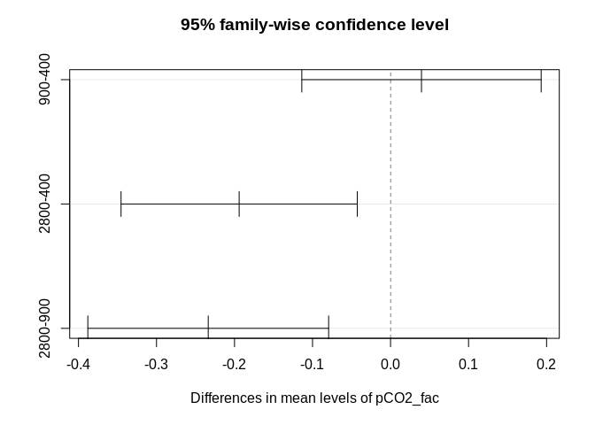<!-- -->

```r
# Fairly normal

anova(whole_factor_tank)
```

```
## Type III Analysis of Variance Table with Satterthwaite's method
##                         Sum Sq  Mean Sq NumDF  DenDF F value  Pr(>F)  
## timepoint_fac          0.47946 0.095892     5 86.831  1.4168 0.22620  
## pCO2_fac               0.57230 0.286151     2 16.024  4.2279 0.03353 *
## timepoint_fac:pCO2_fac 1.14370 0.114370    10 86.828  1.6898 0.09588 .
## ---
## Signif. codes:  0 '***' 0.001 '**' 0.01 '*' 0.05 '.' 0.1 ' ' 1
```

```r
# This time pCO2 is significant and the interaction is close but not quite significant 

# Compare full model to one with tank as the only random effect
anova(whole_factor_full,whole_factor_tank)
```

```
## refitting model(s) with ML (instead of REML)
```

```
## Data: epf_exp
## Models:
## whole_factor_tank: EPF_pH ~ timepoint_fac * pCO2_fac + (1 | tank:shelf)
## whole_factor_full: EPF_pH ~ timepoint_fac * pCO2_fac + (1 | pop) + (1 | shelf/tank)
##                   Df    AIC    BIC  logLik deviance Chisq Chi Df
## whole_factor_tank 20 50.815 106.40 -5.4074   10.815             
## whole_factor_full 22 54.815 115.96 -5.4074   10.815     0      2
##                   Pr(>Chisq)
## whole_factor_tank           
## whole_factor_full          1
```

```r
# Comparing the two models  (full and w/ tank only there is no difference)
# We keep the simpler model

### NOTE I tried additional models that removed either time or the interaction and in each case that led to non significant results of each of the remaining fixed effects.
```
  
#### **EPF pH total data - treatment as factor and time as continuous variable**  
**Overview**  
Test: 2-way ANCOVA 
* Explainatory Factors: Treatment (pCO2_fac)   
* Continuous covariate: Time (timepoint)  
* Random Facotrs: Population, Shelf, Tank  
* Tested for normality and variance assumptions  
  

```r
whole_cont_full <- lmer(EPF_pH~timepoint*pCO2_fac + (1|pop) + (1|shelf/tank) ,data=epf_exp)
```

```
## Warning in checkConv(attr(opt, "derivs"), opt$par, ctrl =
## control$checkConv, : Model failed to converge with max|grad| = 0.00586583
## (tol = 0.002, component 1)
```

```r
# Warning -  looks like this is driven by too many explanatory variables

ranova(whole_cont_full)
```

```
## Warning in checkConv(attr(opt, "derivs"), opt$par, ctrl =
## control$checkConv, : Model failed to converge with max|grad| = 0.00224171
## (tol = 0.002, component 1)
```

```
## ANOVA-like table for random-effects: Single term deletions
## 
## Model:
## EPF_pH ~ timepoint + pCO2_fac + (1 | pop) + (1 | tank:shelf) + 
##     (1 | shelf) + timepoint:pCO2_fac
##                  npar  logLik    AIC      LRT Df Pr(>Chisq)
## <none>             10 -38.781 97.562                       
## (1 | pop)           9 -38.781 95.562 -0.00002  1     1.0000
## (1 | tank:shelf)    9 -39.972 97.944  2.38274  1     0.1227
## (1 | shelf)         9 -38.837 95.675  0.11314  1     0.7366
```

```r
# Looks like we can remove the random effects anyways
# Ill start by removing population and shelf and reruning
```

**Rerun model with just tank as random factor**

```r
whole_cont_tank <- lmer(EPF_pH~timepoint*pCO2_fac + (1|tank:shelf) ,data=epf_exp)
# Better no warning this time 

# Check distribution of residuals
plot(whole_cont_tank)
```

<!-- -->

```r
# They look fairly homoscedastic
qqnorm(resid(whole_cont_tank))
qqline(resid(whole_cont_tank))
```

<!-- -->

```r
# Fairly normal

ranova(whole_cont_tank)
```

```
## ANOVA-like table for random-effects: Single term deletions
## 
## Model:
## EPF_pH ~ timepoint + pCO2_fac + (1 | tank:shelf) + timepoint:pCO2_fac
##                  npar  logLik    AIC    LRT Df Pr(>Chisq)  
## <none>              8 -38.837 93.675                       
## (1 | tank:shelf)    7 -40.604 95.208 3.5328  1    0.06016 .
## ---
## Signif. codes:  0 '***' 0.001 '**' 0.01 '*' 0.05 '.' 0.1 ' ' 1
```

```r
# Not significant but good to keep i think

anova(whole_cont_tank)
```

```
## Type III Analysis of Variance Table with Satterthwaite's method
##                      Sum Sq Mean Sq NumDF  DenDF F value Pr(>F)
## timepoint          0.198825 0.19883     1 99.707  2.7201 0.1022
## pCO2_fac           0.240021 0.12001     2 35.192  1.6418 0.2081
## timepoint:pCO2_fac 0.072179 0.03609     2 99.696  0.4937 0.6118
```

```r
# Nothing significant :(
```

**Automated Model Selection**

```r
step(whole_cont_full)
```

```
## Warning in checkConv(attr(opt, "derivs"), opt$par, ctrl =
## control$checkConv, : Model failed to converge with max|grad| = 0.00224171
## (tol = 0.002, component 1)
```

```
## Backward reduced random-effect table:
## 
##                  Eliminated npar  logLik    AIC    LRT Df Pr(>Chisq)  
## <none>                        10 -38.781 97.562                       
## (1 | pop)                 1    9 -38.781 95.562 0.0000  1    1.00000  
## (1 | shelf)               2    8 -38.837 93.675 0.1132  1    0.73658  
## (1 | tank:shelf)          0    7 -40.604 95.208 3.5328  1    0.06016 .
## ---
## Signif. codes:  0 '***' 0.001 '**' 0.01 '*' 0.05 '.' 0.1 ' ' 1
## 
## Backward reduced fixed-effect table:
## Degrees of freedom method: Satterthwaite 
## 
##                    Eliminated  Sum Sq Mean Sq NumDF   DenDF F value
## timepoint:pCO2_fac          1 0.07218 0.03609     2  99.696  0.4937
## timepoint                   2 0.20430 0.20430     1 101.662  2.8217
## pCO2_fac                    0 0.65199 0.32599     2  15.550  4.4315
##                     Pr(>F)  
## timepoint:pCO2_fac 0.61183  
## timepoint          0.09607 .
## pCO2_fac           0.02999 *
## ---
## Signif. codes:  0 '***' 0.001 '**' 0.01 '*' 0.05 '.' 0.1 ' ' 1
## 
## Model found:
## EPF_pH ~ pCO2_fac + (1 | tank:shelf)
```

```r
# Model Select only pCO2fac and tank

# Rerun following automated model selection recommendation
whole_pCO2_tank <- lmer(EPF_pH~pCO2_fac + (1|tank:shelf) ,data=epf_exp)
# Simplies to only considering pCO2 as fixed effect

# Check distribution of residuals
plot(whole_pCO2_tank)
```

<!-- -->

```r
# They look fairly homoscedastic
qqnorm(resid(whole_pCO2_tank))
qqline(resid(whole_pCO2_tank))
```

<!-- -->

```r
# Fairly normal

anova(whole_pCO2_tank)
```

```
## Type III Analysis of Variance Table with Satterthwaite's method
##           Sum Sq Mean Sq NumDF DenDF F value  Pr(>F)  
## pCO2_fac 0.65199 0.32599     2 15.55  4.4315 0.02999 *
## ---
## Signif. codes:  0 '***' 0.001 '**' 0.01 '*' 0.05 '.' 0.1 ' ' 1
```

```r
#Significant!
```
  
## Analysis of EPF pH  - Only the two treatments we analyzed for sequencing.  

```r
ee_treat <- epf_exp[!epf_exp$pCO2 == 900,]
```

**Exploratory plot**  

```r
n_sample <- ee_treat %>% group_by(pCO2_fac,timepoint_fac) %>% summarise(n=length(pCO2_fac),y.pos=quantile(pH_meas)[4])

give.n <- function(x){
   return(c(y = 7.8, label = length(x)))
}
trt_color <- c("deepskyblue3","firebrick")

ggplot(ee_treat,aes(y=EPF_pH,x=timepoint_fac,group=interaction(timepoint_fac,pCO2_fac),colour=pCO2_fac)) + 
  geom_boxplot() +
  scale_color_manual(values=trt_color) + 
  theme_bw() +
  stat_summary(fun.data = give.n,
               geom = "text",
               position = position_dodge(width = 0.9), vjust = -0.25) + 
  labs(title="EPF pH",x="Time",y="EPF pH",colour="pCO2")
```

<!-- -->

```r
ee_treat$timepoint_num <- as.numeric(ee_treat$timepoint)
ggplot(ee_treat, aes(y=EPF_pH,x=timepoint_num,group=pCO2_fac,color=pCO2_fac)) +
  geom_point() +
  geom_smooth(method=loess,se=FALSE,span=0.9) +
  labs(title="Scatter Plot fit with loess line")
```

<!-- -->

```r
treatSeq_means <- aggregate(EPF_pH~timepoint_fac+pCO2_fac,ee_treat,FUN=mean)
SE <- function(x){
  sd(x)/(sqrt(length(x)))
}
treatSeq_SE <- aggregate(EPF_pH~timepoint_fac+pCO2_fac,ee_treat,FUN=SE)

mean_config <- rbind(treatSeq_means$EPF_pH[1:6],treatSeq_means$EPF_pH[7:12])
SE_config <- rbind(treatSeq_SE $EPF_pH[1:6],treatSeq_SE $EPF_pH[7:12])

bp <- barplot(mean_config,ylim=c(6.5,8.1),col=c("lightblue","tomato"),ylab = "EPF pH",xpd = FALSE,beside = TRUE)
arrows(x0 = bp, x1 = bp, y0 = mean_config - SE_config, y1 = mean_config +
SE_config, angle = 90, len = 0.1, code = 3, xpd = NA)
text(x = bp, y = 6.4, label = c("Control","OA","Control","OA"), xpd = NA)
text(x = mean(bp[1:2]), y = 6.3, label = "24 Hr", xpd = NA)
text(x = mean(bp[3:4]), y = 6.3, label = "36 Hr", xpd = NA)
text(x = mean(bp[5:6]), y = 6.3, label = "Day 9", xpd = NA)
text(x = mean(bp[7:8]), y = 6.3, label = "Day 22", xpd = NA)
text(x = mean(bp[9:10]), y = 6.3, label = "Day 50", xpd = NA)
text(x = mean(bp[11:12]), y = 6.3, label = "Day 80", xpd = NA)
box()
```

<!-- -->
  
### **Statistcal Analysis**  
  
#### **EPF pH total data - time as factor**  
**Overview**  
Test: 2-way ANOVA - Full Model (Fixed and Random Factors)  
* Explanatory Factors: Treatment (pCO2_fac) and Time (timepoint_fac)  
* Random Factors: Population, Shelf, Tank (nested in Shelf)   
* Tested for normality and variance assumptions  
  

```r
partial_factor_full <- lmer(EPF_pH~timepoint_fac*pCO2_fac + (1|pop) + (1|shelf/tank),data=ee_treat) #
```

```
## boundary (singular) fit: see ?isSingular
```

```r
# Warning singular fit

# Check distribution of residuals
plot(partial_factor_full)
```

<!-- -->

```r
# They look fairly homoscedastic
qqnorm(resid(partial_factor_full))
qqline(resid(partial_factor_full))
```

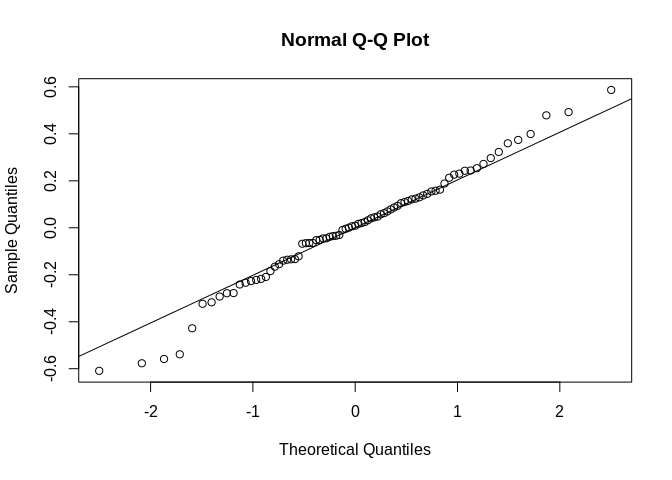<!-- -->

```r
anova(partial_factor_full)
```

```
## Type III Analysis of Variance Table with Satterthwaite's method
##                         Sum Sq Mean Sq NumDF  DenDF F value  Pr(>F)  
## timepoint_fac          0.59663 0.11933     5 59.332  1.6468 0.16175  
## pCO2_fac               0.27823 0.27823     1  2.056  3.8398 0.18562  
## timepoint_fac:pCO2_fac 0.89300 0.17860     5 59.332  2.4648 0.04276 *
## ---
## Signif. codes:  0 '***' 0.001 '**' 0.01 '*' 0.05 '.' 0.1 ' ' 1
```

```r
# Nothing significant here (although the interaction is close)

ranova(partial_factor_full)
```

```
## Warning in checkConv(attr(opt, "derivs"), opt$par, ctrl =
## control$checkConv, : Model failed to converge with max|grad| = 0.00694012
## (tol = 0.002, component 1)
```

```
## ANOVA-like table for random-effects: Single term deletions
## 
## Model:
## EPF_pH ~ timepoint_fac + pCO2_fac + (1 | pop) + (1 | tank:shelf) + 
##     (1 | shelf) + timepoint_fac:pCO2_fac
##                  npar  logLik    AIC    LRT Df Pr(>Chisq)  
## <none>             16 -23.242 78.484                       
## (1 | pop)          15 -23.242 76.484 0.0000  1    1.00000  
## (1 | tank:shelf)   15 -25.085 80.170 3.6861  1    0.05487 .
## (1 | shelf)        15 -23.243 76.485 0.0015  1    0.96960  
## ---
## Signif. codes:  0 '***' 0.001 '**' 0.01 '*' 0.05 '.' 0.1 ' ' 1
```

```r
# We should remove population and shelf as random factors and rerun analysis
```
  
**Rerun Model with Population and Shelf removed as random facteors**

```r
partial_factor_tank <- lmer(EPF_pH~timepoint_fac*pCO2_fac + (1|tank:shelf),data=ee_treat)

# Prevented singular fit issue this time

# Check distribution of residuals
plot(partial_factor_tank)
```

<!-- -->

```r
# They look fairly homoscedastic
qqnorm(resid(partial_factor_tank))
qqline(resid(partial_factor_tank))
```

<!-- -->

```r
# Fairly normal

anova(partial_factor_tank)
```

```
## Type III Analysis of Variance Table with Satterthwaite's method
##                         Sum Sq Mean Sq NumDF  DenDF F value  Pr(>F)  
## timepoint_fac          0.59655 0.11931     5 59.348  1.6472 0.16164  
## pCO2_fac               0.28792 0.28792     1 10.559  3.9750 0.07265 .
## timepoint_fac:pCO2_fac 0.89301 0.17860     5 59.348  2.4658 0.04269 *
## ---
## Signif. codes:  0 '***' 0.001 '**' 0.01 '*' 0.05 '.' 0.1 ' ' 1
```

```r
anova(partial_factor_full,partial_factor_tank)
```

```
## refitting model(s) with ML (instead of REML)
```

```
## Data: ee_treat
## Models:
## partial_factor_tank: EPF_pH ~ timepoint_fac * pCO2_fac + (1 | tank:shelf)
## partial_factor_full: EPF_pH ~ timepoint_fac * pCO2_fac + (1 | pop) + (1 | shelf/tank)
##                     Df    AIC    BIC  logLik deviance Chisq Chi Df
## partial_factor_tank 14 43.288 76.810 -7.6441   15.288             
## partial_factor_full 16 47.288 85.599 -7.6441   15.288     0      2
##                     Pr(>Chisq)
## partial_factor_tank           
## partial_factor_full          1
```

```r
# Comparing the two models  (full and w/ tank only there is no difference)
# We keep the simpler model

ee_treat$timepCO2 <-  factor(interaction(ee_treat$timepoint_fac,ee_treat$pCO2_fac))

hl_tank_v2 <- lmer(EPF_pH~timepCO2 + (1|tank:shelf),data=ee_treat)
# If you wanted to do a complete pairwise comparison
#summary(glht(hl_tank_v2, linfct = mcp(timepCO2 = "Tukey")), test = adjusted("holm"))
```

#### **EPF pH total data - treatment as factor and time as continuous variable**  
**Overview**  
Test: 2-way ANCOVA 
* Explainatory Factors: Treatment (pCO2_fac)   
* Continuous covariate: Time (timepoint)  
* Random Facotrs: Population, Shelf, Tank  
* Tested for normality and variance assumptions  
  

```r
partial_cont_full <- lmer(EPF_pH~timepoint*pCO2_fac + (1|pop) + (1|shelf/tank) ,data=ee_treat)
```

```
## boundary (singular) fit: see ?isSingular
```

```r
# ERROR -  looks like this is driven by too many explanatory parameters

ranova(partial_cont_full)
```

```
## boundary (singular) fit: see ?isSingular
```

```
## ANOVA-like table for random-effects: Single term deletions
## 
## Model:
## EPF_pH ~ timepoint + pCO2_fac + (1 | pop) + (1 | tank:shelf) + 
##     (1 | shelf) + timepoint:pCO2_fac
##                  npar  logLik    AIC     LRT Df Pr(>Chisq)  
## <none>              8 -31.322 78.644                        
## (1 | pop)           7 -31.322 76.644 0.00000  1    0.99989  
## (1 | tank:shelf)    7 -32.742 79.484 2.83952  1    0.09197 .
## (1 | shelf)         7 -31.323 76.645 0.00113  1    0.97324  
## ---
## Signif. codes:  0 '***' 0.001 '**' 0.01 '*' 0.05 '.' 0.1 ' ' 1
```

```r
# Looks like we can remove the random effects anyways
# Ill start by removing population and shelf and reruning
```

**Rerun model with just tank as random factor**

```r
partial_cont_tank <- lmer(EPF_pH~timepoint*pCO2_fac + (1|tank:shelf) ,data=ee_treat)

# Check distribution of residuals
plot(partial_cont_tank)
```

<!-- -->

```r
# They look fairly homoscedastic
qqnorm(resid(partial_cont_tank))
qqline(resid(partial_cont_tank))
```

<!-- -->

```r
# Fairly normal

ranova(partial_cont_tank)
```

```
## ANOVA-like table for random-effects: Single term deletions
## 
## Model:
## EPF_pH ~ timepoint + pCO2_fac + (1 | tank:shelf) + timepoint:pCO2_fac
##                  npar  logLik    AIC    LRT Df Pr(>Chisq)  
## <none>              6 -31.323 74.645                       
## (1 | tank:shelf)    5 -33.089 76.178 3.5323  1    0.06018 .
## ---
## Signif. codes:  0 '***' 0.001 '**' 0.01 '*' 0.05 '.' 0.1 ' ' 1
```

```r
# Not significant but good to keep i think

anova(partial_cont_tank)
```

```
## Type III Analysis of Variance Table with Satterthwaite's method
##                      Sum Sq  Mean Sq NumDF  DenDF F value Pr(>F)
## timepoint          0.209732 0.209732     1 67.813  2.5553 0.1146
## pCO2_fac           0.121699 0.121699     1 21.757  1.4827 0.2364
## timepoint:pCO2_fac 0.053853 0.053853     1 67.813  0.6561 0.4208
```

```r
summary(partial_cont_tank)
```

```
## Linear mixed model fit by REML. t-tests use Satterthwaite's method [
## lmerModLmerTest]
## Formula: EPF_pH ~ timepoint * pCO2_fac + (1 | tank:shelf)
##    Data: ee_treat
## 
## REML criterion at convergence: 62.6
## 
## Scaled residuals: 
##      Min       1Q   Median       3Q      Max 
## -2.24221 -0.59736  0.09523  0.68892  2.04152 
## 
## Random effects:
##  Groups     Name        Variance Std.Dev.
##  tank:shelf (Intercept) 0.01493  0.1222  
##  Residual               0.08208  0.2865  
## Number of obs: 81, groups:  tank:shelf, 12
## 
## Fixed effects:
##                          Estimate Std. Error         df t value Pr(>|t|)
## (Intercept)             7.4645763  0.0819309 21.7168259  91.108   <2e-16
## timepoint              -0.0007911  0.0013988 67.6606503  -0.566    0.574
## pCO2_fac2800           -0.1411684  0.1159329 21.7573492  -1.218    0.236
## timepoint:pCO2_fac2800 -0.0016254  0.0020066 67.8129458  -0.810    0.421
##                           
## (Intercept)            ***
## timepoint                 
## pCO2_fac2800              
## timepoint:pCO2_fac2800    
## ---
## Signif. codes:  0 '***' 0.001 '**' 0.01 '*' 0.05 '.' 0.1 ' ' 1
## 
## Correlation of Fixed Effects:
##             (Intr) timpnt pCO2_2
## timepoint   -0.575              
## pCO2_fc2800 -0.707  0.406       
## tm:CO2_2800  0.401 -0.697 -0.572
```

```r
# Nothing significant :(
```

**Automated Model Selection**

```r
step(partial_cont_full)
```

```
## boundary (singular) fit: see ?isSingular
```

```
## Backward reduced random-effect table:
## 
##                  Eliminated npar  logLik    AIC    LRT Df Pr(>Chisq)  
## <none>                         8 -31.322 78.644                       
## (1 | pop)                 1    7 -31.322 76.644 0.0000  1    0.99989  
## (1 | shelf)               2    6 -31.323 74.645 0.0011  1    0.97324  
## (1 | tank:shelf)          0    5 -33.089 76.178 3.5323  1    0.06018 .
## ---
## Signif. codes:  0 '***' 0.001 '**' 0.01 '*' 0.05 '.' 0.1 ' ' 1
## 
## Backward reduced fixed-effect table:
## Degrees of freedom method: Satterthwaite 
## 
##                    Eliminated  Sum Sq Mean Sq NumDF  DenDF F value  Pr(>F)
## timepoint:pCO2_fac          1 0.05385 0.05385     1 67.813  0.6561 0.42077
## timepoint                   2 0.20395 0.20395     1 68.806  2.4964 0.11869
## pCO2_fac                    3 0.34075 0.34075     1 10.217  4.0884 0.07015
##                     
## timepoint:pCO2_fac  
## timepoint           
## pCO2_fac           .
## ---
## Signif. codes:  0 '***' 0.001 '**' 0.01 '*' 0.05 '.' 0.1 ' ' 1
## 
## Model found:
## EPF_pH ~ (1 | tank:shelf)
```

```r
# Model Select only pCO2fac and tank
```
  
## Analysis of EPF pH -  Only samples we sequenced  

#### **EPF pH total data - time as factor**  
**Overview**  
Test: 2-way ANOVA - Full Model (Fixed and Random Factors)  
* Explanatory Factors: Treatment (pCO2_fac) and Time (timepoint_fac)  
* Random Factors: Population, Shelf, Tank (nested in Shelf)   
* Tested for normality and variance assumptions  


```r
seq_full <- lmer(EPF_pH~timepoint_fac*pCO2_fac + (1|pop) + (1|shelf/tank),data=just_seq)
```

```
## boundary (singular) fit: see ?isSingular
```

```r
# Singular fit warning

anova(seq_full) # Everything is signficant
```

```
## Type III Analysis of Variance Table with Satterthwaite's method
##                         Sum Sq Mean Sq NumDF DenDF F value  Pr(>F)  
## timepoint_fac          0.47536 0.47536     1    20  6.4394 0.01959 *
## pCO2_fac               0.03466 0.03466     1    20  0.4695 0.50108  
## timepoint_fac:pCO2_fac 0.57366 0.57366     1    20  7.7711 0.01136 *
## ---
## Signif. codes:  0 '***' 0.001 '**' 0.01 '*' 0.05 '.' 0.1 ' ' 1
```

```r
plot(seq_full)
```

<!-- -->

```r
# Some heteroscedascity but not too bad
qqnorm(resid(seq_full))
qqline(resid(seq_full))
```

<!-- -->

```r
ranova(seq_full) # None of these seem important
```

```
## boundary (singular) fit: see ?isSingular
## boundary (singular) fit: see ?isSingular
## boundary (singular) fit: see ?isSingular
```

```
## ANOVA-like table for random-effects: Single term deletions
## 
## Model:
## EPF_pH ~ timepoint_fac + pCO2_fac + (1 | pop) + (1 | tank:shelf) + 
##     (1 | shelf) + timepoint_fac:pCO2_fac
##                  npar logLik    AIC LRT Df Pr(>Chisq)
## <none>              8 -5.901 27.802                  
## (1 | pop)           7 -5.901 25.802   0  1          1
## (1 | tank:shelf)    7 -5.901 25.802   0  1          1
## (1 | shelf)         7 -5.901 25.802   0  1          1
```

```r
anova(seq_full) # Everything except pCO2 significant
```

```
## Type III Analysis of Variance Table with Satterthwaite's method
##                         Sum Sq Mean Sq NumDF DenDF F value  Pr(>F)  
## timepoint_fac          0.47536 0.47536     1    20  6.4394 0.01959 *
## pCO2_fac               0.03466 0.03466     1    20  0.4695 0.50108  
## timepoint_fac:pCO2_fac 0.57366 0.57366     1    20  7.7711 0.01136 *
## ---
## Signif. codes:  0 '***' 0.001 '**' 0.01 '*' 0.05 '.' 0.1 ' ' 1
```

```r
# Decide to remove random factors since they aren't informative
```

**Rerun with standard lm**

```r
seq_fixed <- lm(EPF_pH~timepoint_fac*pCO2_fac, data=just_seq)

plot(seq_fixed)
```

<!-- --><!-- -->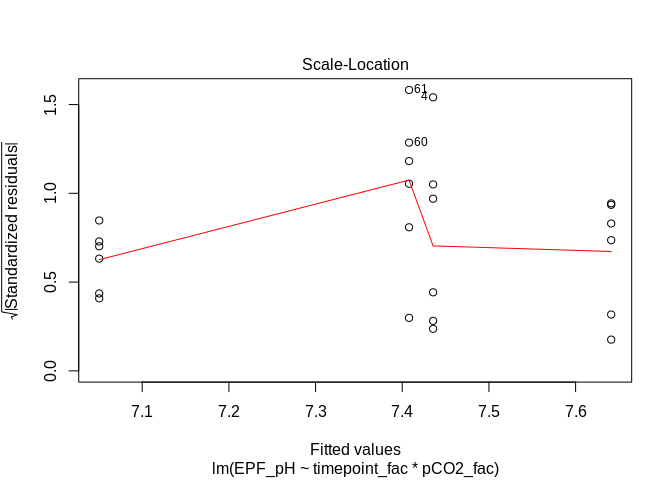<!-- -->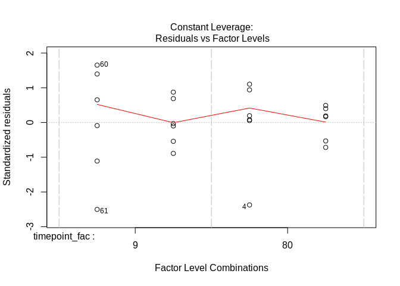<!-- -->

```r
# We can see more clearly that some of the mild issues with the assumptions are being driven by 3 points (4,60,61).

anova(seq_fixed) # without random factors, pCO2 is now even less significant
```

```
## Analysis of Variance Table
## 
## Response: EPF_pH
##                        Df  Sum Sq Mean Sq F value  Pr(>F)  
## timepoint_fac           1 0.47536 0.47536  6.4394 0.01959 *
## pCO2_fac                1 0.03466 0.03466  0.4695 0.50108  
## timepoint_fac:pCO2_fac  1 0.57366 0.57366  7.7711 0.01136 *
## Residuals              20 1.47639 0.07382                  
## ---
## Signif. codes:  0 '***' 0.001 '**' 0.01 '*' 0.05 '.' 0.1 ' ' 1
```
  
**Rerun but remove those three problematic points**

```r
# New dataset w/o those three points
just_seq2 <- just_seq[!row.names(just_seq) == c(4,60,61),]

seq_fixed_outlierRM <- lm(EPF_pH~timepoint_fac*pCO2_fac, data=just_seq2)

plot(seq_fixed_outlierRM)
```

<!-- --><!-- -->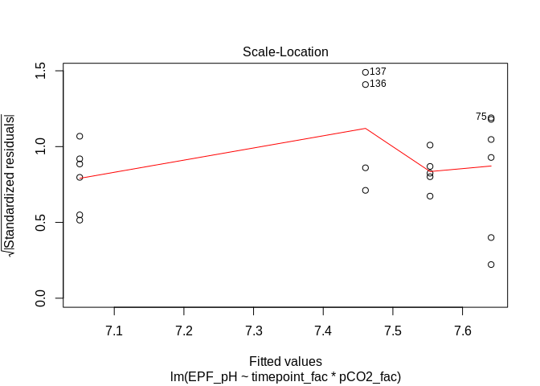<!-- -->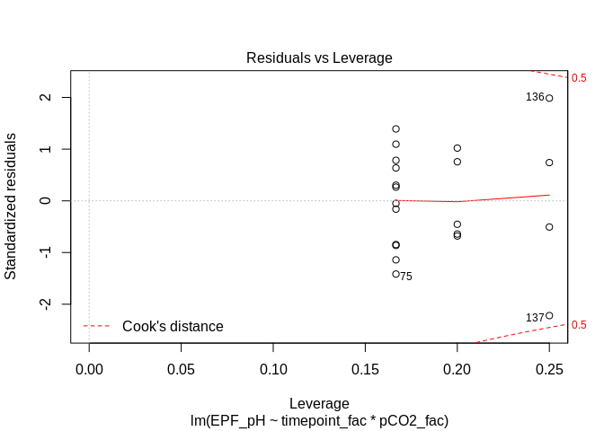<!-- -->

```r
# On a whole this looks like a slight improvement

anova(seq_fixed_outlierRM) # Now everything is significant
```

```
## Analysis of Variance Table
## 
## Response: EPF_pH
##                        Df  Sum Sq Mean Sq F value    Pr(>F)    
## timepoint_fac           1 0.44017 0.44017 15.0959 0.0011889 ** 
## pCO2_fac                1 0.17188 0.17188  5.8947 0.0265810 *  
## timepoint_fac:pCO2_fac  1 0.59622 0.59622 20.4479 0.0003013 ***
## Residuals              17 0.49569 0.02916                      
## ---
## Signif. codes:  0 '***' 0.001 '**' 0.01 '*' 0.05 '.' 0.1 ' ' 1
```
  
**Pairwise comparisons of fixed factor model (with points rm)**  

```r
seq_pairwise <- TukeyHSD(aov(EPF_pH~timepoint_fac*pCO2_fac, data=just_seq2))

plot(seq_pairwise$`timepoint_fac:pCO2_fac`)
```

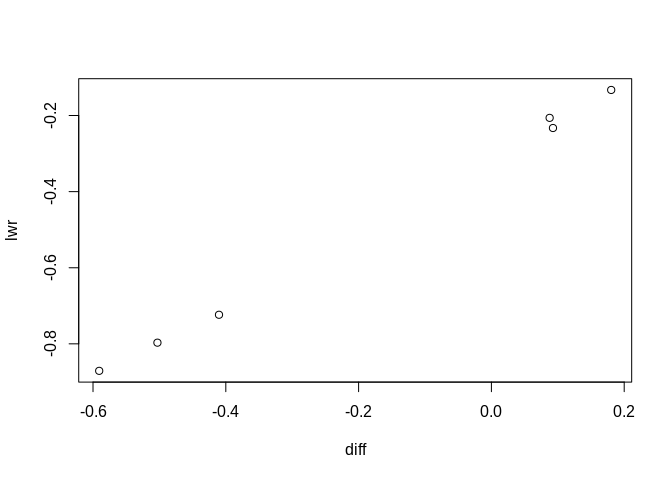<!-- -->
  
**Final Figure**  
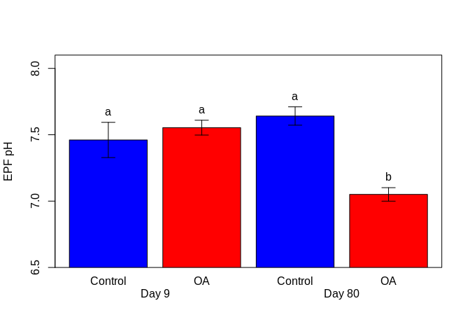<!-- -->
  
Final bar plot has SE bars and significance levels based on pairwise comparison test (tukey method) based on model selected above.
  
**Automated Model Selection**

```r
#step(seq_full)
# Automated processed converged on the same model as above
```
  
## Analysis of EPF pH, DIC, and Ca Saturation - All samples data with **Complete Carbonate Chemistry** (WARNING VERY LOW SAMPLE SIZE)  

* This is data that we measured both the EPF pH and DIC of extract EPF Fluid in order to calculate the complete carbonate chemistry  

**Days : Day 0 (pre exposure), Day 9, Day 80**  


**Exploratory Plots**  
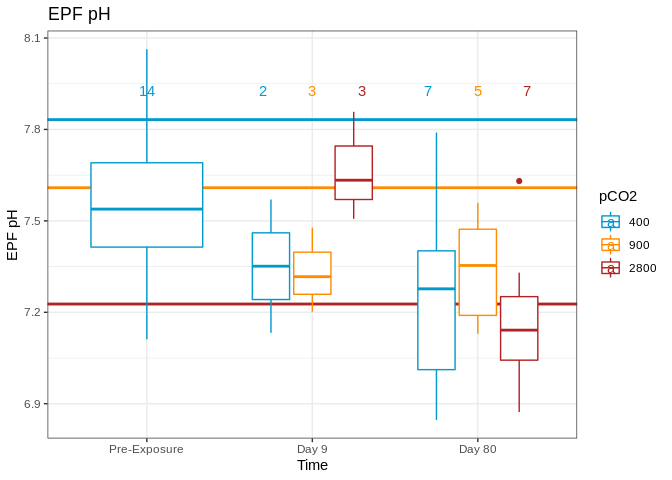<!-- -->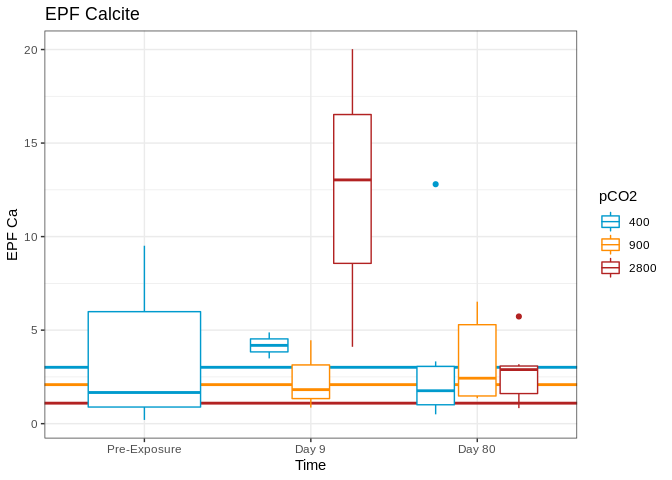<!-- -->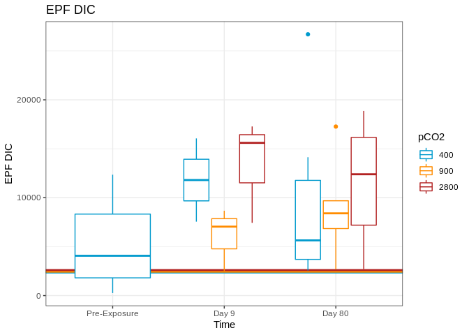<!-- -->
**Figure Notes**: Horizontal lines represent the mean environment value for each the the treatment levels.
  
**Subsetting data for stats**

```r
# Lets only look at exposure timepoints here
epf_s_Exp <- epf_s[epf_s$timepoint > 2,]
# Only two treatment levels we have molecular data for (~400,~2800)
epf_s_Exp <- epf_s_Exp[!epf_s_Exp$pCO2_fac==900,]
```
  
#### **Statistical Analysis**

**Overview**  
Test: 2-way ANOVA - 
* Explainatory Factors: Treatment (pCO2_fac) and Time (timepoint_fac)
* Tested for normality and variance assumptions - log transformed EPF data if needed
  
**NOTE** : Due to extremely lower power hear I don't think we really even have the option of using random effects  

**EPF Calcite Saturation**  

```r
mod_ca <- lm(EPF_Ca_Start~pCO2_fac*timepoint_fac,data=epf_s_Exp)

qqnorm(mod_ca$residuals)
qqline(mod_ca$residuals)
```

<!-- -->

```r
# resids a little wonky trying a transformation
mod_ca_log <- lm(log(EPF_Ca_Start)~pCO2_fac*timepoint_fac,data=epf_s_Exp)

leveneTest(log(epf_s_Exp$EPF_Ca_Start)~epf_s_Exp$pCO2_fac*epf_s_Exp$timepoint_fac)
```

```
## Levene's Test for Homogeneity of Variance (center = median)
##       Df F value Pr(>F)
## group  3  0.7673   0.53
##       15
```

```r
# Seem to be OK

qqnorm(mod_ca_log$residuals)
qqline(mod_ca_log$residuals)
```

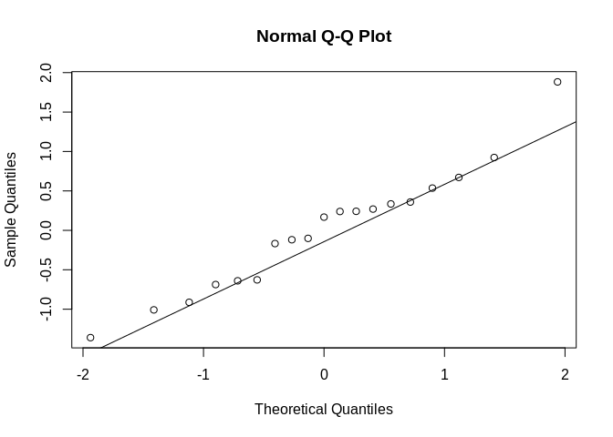<!-- -->

```r
# Better than mod_1 before transformation

mod_ca_2 <-  lmer(log(EPF_Ca_Start)~pCO2_fac*timepoint_fac+(1|pop)+(1|shelf/tank),data=epf_s_Exp)
```

```
## boundary (singular) fit: see ?isSingular
```

```r
qqnorm(resid(mod_ca_2))
qqline(resid(mod_ca_2))
```

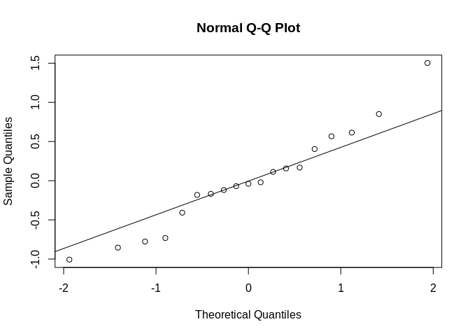<!-- -->

```r
## RANOVA to check random effects  
ranova(mod_ca_2)
```

```
## boundary (singular) fit: see ?isSingular
## boundary (singular) fit: see ?isSingular
## boundary (singular) fit: see ?isSingular
```

```
## ANOVA-like table for random-effects: Single term deletions
## 
## Model:
## log(EPF_Ca_Start) ~ pCO2_fac + timepoint_fac + (1 | pop) + (1 | 
##     tank:shelf) + (1 | shelf) + pCO2_fac:timepoint_fac
##                  npar  logLik    AIC    LRT Df Pr(>Chisq)
## <none>              8 -20.578 57.155                     
## (1 | pop)           7 -20.578 55.155 0.0000  1     1.0000
## (1 | tank:shelf)    7 -20.578 55.155 0.0000  1     1.0000
## (1 | shelf)         7 -21.535 57.071 1.9155  1     0.1664
```

```r
# None are significant, check to see if the model is better
anova(mod_ca_2,mod_ca_log)
```

```
## refitting model(s) with ML (instead of REML)
```

```
## Data: epf_s_Exp
## Models:
## mod_ca_log: log(EPF_Ca_Start) ~ pCO2_fac * timepoint_fac
## mod_ca_2: log(EPF_Ca_Start) ~ pCO2_fac * timepoint_fac + (1 | pop) + (1 | 
## mod_ca_2:     shelf/tank)
##            Df    AIC    BIC  logLik deviance  Chisq Chi Df Pr(>Chisq)
## mod_ca_log  5 52.866 57.588 -21.433   42.866                         
## mod_ca_2    8 58.241 65.796 -21.120   42.241 0.6251      3     0.8907
```

```r
# Nope
#Using simple lm, random effects aren't improving the model.
# NOTE i didn't continuing using random effects because i don't think we have the sample size to try.

## Running ANOVA
(aov_ca <-aov(mod_ca_log))
```

```
## Call:
##    aov(formula = mod_ca_log)
## 
## Terms:
##                  pCO2_fac timepoint_fac pCO2_fac:timepoint_fac Residuals
## Sum of Squares   0.914441      5.117193               0.507022 10.619100
## Deg. of Freedom         1             1                      1        15
## 
## Residual standard error: 0.8413917
## Estimated effects may be unbalanced
```

```r
summary(aov_ca)
```

```
##                        Df Sum Sq Mean Sq F value Pr(>F)  
## pCO2_fac                1  0.914   0.914   1.292 0.2736  
## timepoint_fac           1  5.117   5.117   7.228 0.0168 *
## pCO2_fac:timepoint_fac  1  0.507   0.507   0.716 0.4107  
## Residuals              15 10.619   0.708                 
## ---
## Signif. codes:  0 '***' 0.001 '**' 0.01 '*' 0.05 '.' 0.1 ' ' 1
```

```r
# :( time is significant but nothing else
```
  
**DIC**  

```r
mod_dic <- lm(log(EPF_DIC_Start)~pCO2_fac*timepoint_fac,data=epf_s_Exp)

qqnorm(mod_dic$residuals)
qqline(mod_dic$residuals)
```

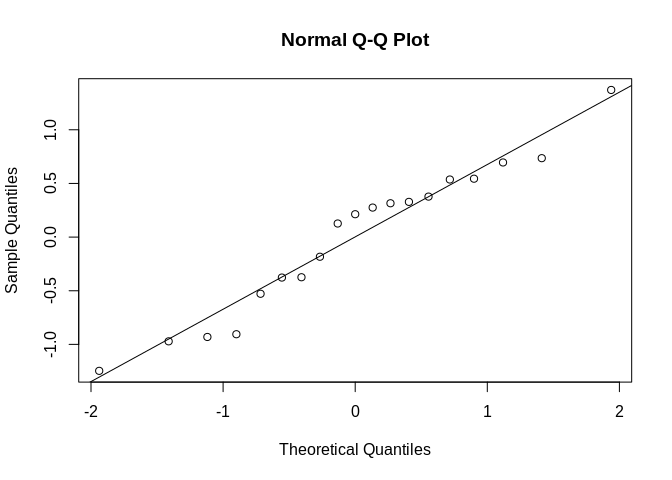<!-- -->

```r
leveneTest(log(epf_s_Exp$EPF_DIC_Start)~epf_s_Exp$pCO2_fac*epf_s_Exp$timepoint_fac)
```

```
## Levene's Test for Homogeneity of Variance (center = median)
##       Df F value Pr(>F)
## group  3  0.4744 0.7048
##       15
```

```r
# Seem to be OK

## Running ANOVA
(aov_dic <-aov(mod_dic))
```

```
## Call:
##    aov(formula = mod_dic)
## 
## Terms:
##                 pCO2_fac timepoint_fac pCO2_fac:timepoint_fac Residuals
## Sum of Squares  0.450665      0.512516               0.033395  8.751362
## Deg. of Freedom        1             1                      1        15
## 
## Residual standard error: 0.7638221
## Estimated effects may be unbalanced
```

```r
summary(aov_dic)
```

```
##                        Df Sum Sq Mean Sq F value Pr(>F)
## pCO2_fac                1  0.451  0.4507   0.772  0.393
## timepoint_fac           1  0.513  0.5125   0.878  0.363
## pCO2_fac:timepoint_fac  1  0.033  0.0334   0.057  0.814
## Residuals              15  8.751  0.5834
```

```r
# :( close but not significant (might be limited power here)
```

**pH**  

```r
mod_pH <- lm(EPF_pH~pCO2_fac*timepoint_fac,data=epf_s_Exp)

qqnorm(mod_pH$residuals)
qqline(mod_pH$residuals)
```

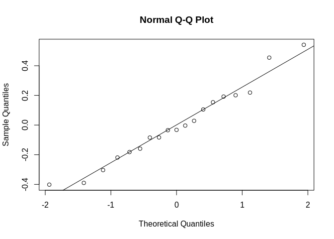<!-- -->

```r
leveneTest(epf_s_Exp$EPF_pH~epf_s_Exp$pCO2_fac*epf_s_Exp$timepoint_fac)
```

```
## Levene's Test for Homogeneity of Variance (center = median)
##       Df F value Pr(>F)
## group  3  0.4773 0.7028
##       15
```

```r
# Seem to be OK

## Running ANOVA
(aov_pH <-aov(mod_pH))
```

```
## Call:
##    aov(formula = mod_pH)
## 
## Terms:
##                  pCO2_fac timepoint_fac pCO2_fac:timepoint_fac Residuals
## Sum of Squares  0.0126568     0.3863437              0.1340044 1.1886819
## Deg. of Freedom         1             1                      1        15
## 
## Residual standard error: 0.2815057
## Estimated effects may be unbalanced
```

```r
summary(aov_pH)
```

```
##                        Df Sum Sq Mean Sq F value Pr(>F)  
## pCO2_fac                1 0.0127  0.0127   0.160 0.6951  
## timepoint_fac           1 0.3863  0.3863   4.875 0.0432 *
## pCO2_fac:timepoint_fac  1 0.1340  0.1340   1.691 0.2131  
## Residuals              15 1.1887  0.0792                 
## ---
## Signif. codes:  0 '***' 0.001 '**' 0.01 '*' 0.05 '.' 0.1 ' ' 1
```

```r
# :( Time has a subtle significane
```

## Final Summary  
  
**General Observations**: The data was analyzed primarily using ANOVAs based on linear mixed models that included tank as a random effect and pCO2 treatment and time as fixed effects. Time in this data set was primarily treated as a factor (along with pCO2 treatment) given the non linear relationship with EPF pH and time and the lack of a truly robust timeseries for most comparisons (however it might still be a good idead to examine the complete EPF pH timeseries with additional analyses). Generally, pCO2 was found to have a significant effect on EPF pH, and the interaction of time and treatment was found to also often be significant. Importantly, when just considering the two timepoints with sequence data (Day 9 and day 80) treatment, time, and the interaction were all significant.

**Break down of the final models by organizational level**  
  
Full Dataset (All timepoints, 3 treatments)  
* Best Model : EPF_pH ~ Treatment * Time + (1|Tank:Shelf)  
<table class="table" style="margin-left: auto; margin-right: auto;">
 <thead>
  <tr>
   <th style="text-align:left;">   </th>
   <th style="text-align:right;"> Sum Sq </th>
   <th style="text-align:right;"> Mean Sq </th>
   <th style="text-align:right;"> NumDF </th>
   <th style="text-align:right;"> DenDF </th>
   <th style="text-align:right;"> F value </th>
   <th style="text-align:right;"> Pr(&gt;F) </th>
  </tr>
 </thead>
<tbody>
  <tr>
   <td style="text-align:left;"> timepoint_fac </td>
   <td style="text-align:right;"> 0.4794593 </td>
   <td style="text-align:right;"> 0.0958919 </td>
   <td style="text-align:right;"> 5 </td>
   <td style="text-align:right;"> 86.83133 </td>
   <td style="text-align:right;"> 1.416819 </td>
   <td style="text-align:right;"> 0.2262002 </td>
  </tr>
  <tr>
   <td style="text-align:left;"> pCO2_fac </td>
   <td style="text-align:right;"> 0.5723019 </td>
   <td style="text-align:right;"> 0.2861509 </td>
   <td style="text-align:right;"> 2 </td>
   <td style="text-align:right;"> 16.02433 </td>
   <td style="text-align:right;"> 4.227929 </td>
   <td style="text-align:right;"> 0.0335338 </td>
  </tr>
  <tr>
   <td style="text-align:left;"> timepoint_fac:pCO2_fac </td>
   <td style="text-align:right;"> 1.1437002 </td>
   <td style="text-align:right;"> 0.1143700 </td>
   <td style="text-align:right;"> 10 </td>
   <td style="text-align:right;"> 86.82767 </td>
   <td style="text-align:right;"> 1.689837 </td>
   <td style="text-align:right;"> 0.0958792 </td>
  </tr>
</tbody>
</table>
  
Full Timeseries w high and control treatments (All timepoints, 2 treatments)  
* Best Model : EPF_pH ~ Treatment * Time + (1|Tank:Shelf)  
<table class="table" style="margin-left: auto; margin-right: auto;">
 <thead>
  <tr>
   <th style="text-align:left;">   </th>
   <th style="text-align:right;"> Sum Sq </th>
   <th style="text-align:right;"> Mean Sq </th>
   <th style="text-align:right;"> NumDF </th>
   <th style="text-align:right;"> DenDF </th>
   <th style="text-align:right;"> F value </th>
   <th style="text-align:right;"> Pr(&gt;F) </th>
  </tr>
 </thead>
<tbody>
  <tr>
   <td style="text-align:left;"> timepoint_fac </td>
   <td style="text-align:right;"> 0.5965513 </td>
   <td style="text-align:right;"> 0.1193103 </td>
   <td style="text-align:right;"> 5 </td>
   <td style="text-align:right;"> 59.34822 </td>
   <td style="text-align:right;"> 1.647186 </td>
   <td style="text-align:right;"> 0.1616445 </td>
  </tr>
  <tr>
   <td style="text-align:left;"> pCO2_fac </td>
   <td style="text-align:right;"> 0.2879175 </td>
   <td style="text-align:right;"> 0.2879175 </td>
   <td style="text-align:right;"> 1 </td>
   <td style="text-align:right;"> 10.55938 </td>
   <td style="text-align:right;"> 3.974960 </td>
   <td style="text-align:right;"> 0.0726486 </td>
  </tr>
  <tr>
   <td style="text-align:left;"> timepoint_fac:pCO2_fac </td>
   <td style="text-align:right;"> 0.8930062 </td>
   <td style="text-align:right;"> 0.1786012 </td>
   <td style="text-align:right;"> 5 </td>
   <td style="text-align:right;"> 59.34822 </td>
   <td style="text-align:right;"> 2.465751 </td>
   <td style="text-align:right;"> 0.0426881 </td>
  </tr>
</tbody>
</table>
  
EPF pH from sequenced individuals (2 timepoints, 2 treatments, 24 samples)  
* Best Model : EPF_pH ~ Treatment * Time + (1|Tank:Shelf)  
<table class="table" style="margin-left: auto; margin-right: auto;">
 <thead>
  <tr>
   <th style="text-align:left;">   </th>
   <th style="text-align:right;"> Df </th>
   <th style="text-align:right;"> Sum Sq </th>
   <th style="text-align:right;"> Mean Sq </th>
   <th style="text-align:right;"> F value </th>
   <th style="text-align:right;"> Pr(&gt;F) </th>
  </tr>
 </thead>
<tbody>
  <tr>
   <td style="text-align:left;"> timepoint_fac </td>
   <td style="text-align:right;"> 1 </td>
   <td style="text-align:right;"> 0.4401674 </td>
   <td style="text-align:right;"> 0.4401674 </td>
   <td style="text-align:right;"> 15.095888 </td>
   <td style="text-align:right;"> 0.0011889 </td>
  </tr>
  <tr>
   <td style="text-align:left;"> pCO2_fac </td>
   <td style="text-align:right;"> 1 </td>
   <td style="text-align:right;"> 0.1718770 </td>
   <td style="text-align:right;"> 0.1718770 </td>
   <td style="text-align:right;"> 5.894658 </td>
   <td style="text-align:right;"> 0.0265810 </td>
  </tr>
  <tr>
   <td style="text-align:left;"> timepoint_fac:pCO2_fac </td>
   <td style="text-align:right;"> 1 </td>
   <td style="text-align:right;"> 0.5962213 </td>
   <td style="text-align:right;"> 0.5962213 </td>
   <td style="text-align:right;"> 20.447878 </td>
   <td style="text-align:right;"> 0.0003013 </td>
  </tr>
  <tr>
   <td style="text-align:left;"> Residuals </td>
   <td style="text-align:right;"> 17 </td>
   <td style="text-align:right;"> 0.4956877 </td>
   <td style="text-align:right;"> 0.0291581 </td>
   <td style="text-align:right;"> NA </td>
   <td style="text-align:right;"> NA </td>
  </tr>
</tbody>
</table>
  
All samples with complete carbonate chemistry (~3 timepoints, 2 treatments )  
  
* Best Model pH :  EPF_pH ~ Treatment * Time  
<table class="table" style="margin-left: auto; margin-right: auto;">
 <thead>
  <tr>
   <th style="text-align:left;">   </th>
   <th style="text-align:right;"> Df </th>
   <th style="text-align:right;"> Sum Sq </th>
   <th style="text-align:right;"> Mean Sq </th>
   <th style="text-align:right;"> F value </th>
   <th style="text-align:right;"> Pr(&gt;F) </th>
  </tr>
 </thead>
<tbody>
  <tr>
   <td style="text-align:left;"> pCO2_fac </td>
   <td style="text-align:right;"> 1 </td>
   <td style="text-align:right;"> 0.0126568 </td>
   <td style="text-align:right;"> 0.0126568 </td>
   <td style="text-align:right;"> 0.1597161 </td>
   <td style="text-align:right;"> 0.6950509 </td>
  </tr>
  <tr>
   <td style="text-align:left;"> timepoint_fac </td>
   <td style="text-align:right;"> 1 </td>
   <td style="text-align:right;"> 0.3863437 </td>
   <td style="text-align:right;"> 0.3863437 </td>
   <td style="text-align:right;"> 4.8752786 </td>
   <td style="text-align:right;"> 0.0432299 </td>
  </tr>
  <tr>
   <td style="text-align:left;"> pCO2_fac:timepoint_fac </td>
   <td style="text-align:right;"> 1 </td>
   <td style="text-align:right;"> 0.1340044 </td>
   <td style="text-align:right;"> 0.1340044 </td>
   <td style="text-align:right;"> 1.6910037 </td>
   <td style="text-align:right;"> 0.2130944 </td>
  </tr>
  <tr>
   <td style="text-align:left;"> Residuals </td>
   <td style="text-align:right;"> 15 </td>
   <td style="text-align:right;"> 1.1886819 </td>
   <td style="text-align:right;"> 0.0792455 </td>
   <td style="text-align:right;"> NA </td>
   <td style="text-align:right;"> NA </td>
  </tr>
</tbody>
</table>
* Best Model DIC :  EPF_DIC ~ Treatment * Time  
<table class="table" style="margin-left: auto; margin-right: auto;">
 <thead>
  <tr>
   <th style="text-align:left;">   </th>
   <th style="text-align:right;"> Df </th>
   <th style="text-align:right;"> Sum Sq </th>
   <th style="text-align:right;"> Mean Sq </th>
   <th style="text-align:right;"> F value </th>
   <th style="text-align:right;"> Pr(&gt;F) </th>
  </tr>
 </thead>
<tbody>
  <tr>
   <td style="text-align:left;"> pCO2_fac </td>
   <td style="text-align:right;"> 1 </td>
   <td style="text-align:right;"> 0.4506651 </td>
   <td style="text-align:right;"> 0.4506651 </td>
   <td style="text-align:right;"> 0.7724485 </td>
   <td style="text-align:right;"> 0.3933224 </td>
  </tr>
  <tr>
   <td style="text-align:left;"> timepoint_fac </td>
   <td style="text-align:right;"> 1 </td>
   <td style="text-align:right;"> 0.5125156 </td>
   <td style="text-align:right;"> 0.5125156 </td>
   <td style="text-align:right;"> 0.8784615 </td>
   <td style="text-align:right;"> 0.3634701 </td>
  </tr>
  <tr>
   <td style="text-align:left;"> pCO2_fac:timepoint_fac </td>
   <td style="text-align:right;"> 1 </td>
   <td style="text-align:right;"> 0.0333950 </td>
   <td style="text-align:right;"> 0.0333950 </td>
   <td style="text-align:right;"> 0.0572397 </td>
   <td style="text-align:right;"> 0.8141514 </td>
  </tr>
  <tr>
   <td style="text-align:left;"> Residuals </td>
   <td style="text-align:right;"> 15 </td>
   <td style="text-align:right;"> 8.7513620 </td>
   <td style="text-align:right;"> 0.5834241 </td>
   <td style="text-align:right;"> NA </td>
   <td style="text-align:right;"> NA </td>
  </tr>
</tbody>
</table>
* Best Model Calcite Saturation :  EPF_CaSat ~ Treatment * Time  
<table class="table" style="margin-left: auto; margin-right: auto;">
 <thead>
  <tr>
   <th style="text-align:left;">   </th>
   <th style="text-align:right;"> Df </th>
   <th style="text-align:right;"> Sum Sq </th>
   <th style="text-align:right;"> Mean Sq </th>
   <th style="text-align:right;"> F value </th>
   <th style="text-align:right;"> Pr(&gt;F) </th>
  </tr>
 </thead>
<tbody>
  <tr>
   <td style="text-align:left;"> pCO2_fac </td>
   <td style="text-align:right;"> 1 </td>
   <td style="text-align:right;"> 0.9144409 </td>
   <td style="text-align:right;"> 0.9144409 </td>
   <td style="text-align:right;"> 1.2916927 </td>
   <td style="text-align:right;"> 0.2735680 </td>
  </tr>
  <tr>
   <td style="text-align:left;"> timepoint_fac </td>
   <td style="text-align:right;"> 1 </td>
   <td style="text-align:right;"> 5.1171930 </td>
   <td style="text-align:right;"> 5.1171930 </td>
   <td style="text-align:right;"> 7.2282863 </td>
   <td style="text-align:right;"> 0.0168410 </td>
  </tr>
  <tr>
   <td style="text-align:left;"> pCO2_fac:timepoint_fac </td>
   <td style="text-align:right;"> 1 </td>
   <td style="text-align:right;"> 0.5070225 </td>
   <td style="text-align:right;"> 0.5070225 </td>
   <td style="text-align:right;"> 0.7161941 </td>
   <td style="text-align:right;"> 0.4106934 </td>
  </tr>
  <tr>
   <td style="text-align:left;"> Residuals </td>
   <td style="text-align:right;"> 15 </td>
   <td style="text-align:right;"> 10.6191001 </td>
   <td style="text-align:right;"> 0.7079400 </td>
   <td style="text-align:right;"> NA </td>
   <td style="text-align:right;"> NA </td>
  </tr>
</tbody>
</table>
  
  
## Final Figure  
  
**Option 1**  
  
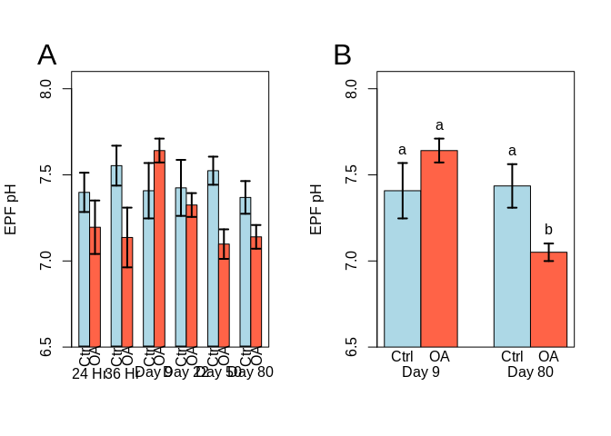<!-- -->
  
Fig 1. EPF pH in different OA treatments over time. (A) Complete timeseries plotted with timepoint as a factor on the x-axis and standard error bars. (B) The two timepoints we have sequenced for gene expression and DNA methylation.  

**Option 2**  
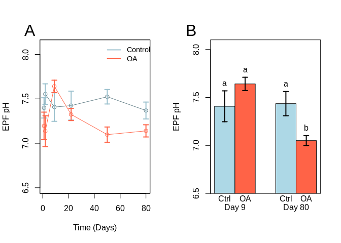<!-- -->
  
Fig 2. EPF pH in different OA treatments over time. (A) Complete timeseries plotted with timepoint as a continuous variable on the x-axis and standard error bars. (B) The two timepoints we have sequenced for gene expression and DNA methylation.  

## Additional Analysis  
  
### Examining water chem in multi dimensions

```r
par(mfrow=c(1,1))
epf_cCarbChem <- epf_cal[!is.na(epf_cal$EPF_DIC_Start),]

chemNames <- c("EPF_pH","EPF_DIC_Start","EPF_Ca_Start")
epf_cCarbChem_r <- subset(epf_cCarbChem,select = chemNames )

cCarb_pca <- prcomp(epf_cCarbChem_r,scale=TRUE)
fviz_eig(cCarb_pca)
```

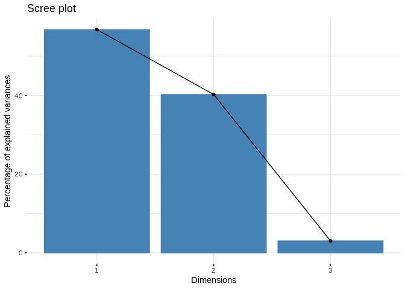<!-- -->

```r
fviz_pca_var(cCarb_pca,
             title="Variable Vectors - Total Carbonate Chem Data ",
             col.var = "contrib", # Color by contributions to the PC
             gradient.cols = c("#00AFBB", "#E7B800", "#FC4E07"),
             repel = TRUE     # Avoid text overlapping
             )
```

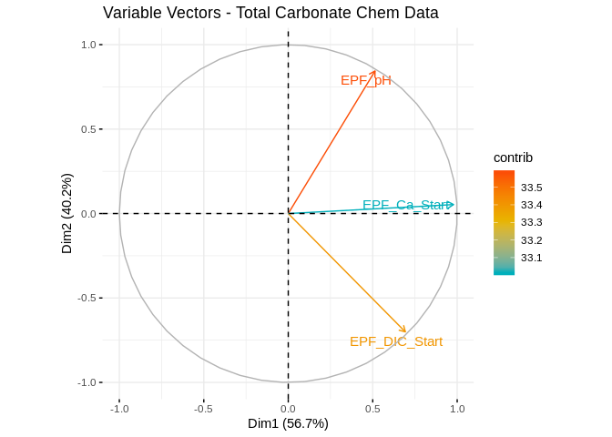<!-- -->

```r
group1 <- as.factor(epf_cCarbChem$pCO2)
fviz_pca_biplot(cCarb_pca, repel = TRUE,
                title="Individuals and Variable Vectors - Total Carbonate Chem Data (Ellipse = CI) ",
                col.ind = group1, # color by groups
                palette = c("#00AFBB",  "#FC4E07","darkseagreen"),
                addEllipses = TRUE,
                ellipse.type = "confidence",
                legend.title = "pCO2",
                col.var = "#2E9FDF" # Variables color
                #col.ind = "#696969"  # Individuals color
                )
```

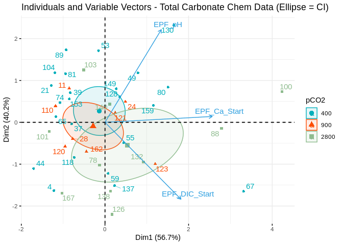<!-- -->

```r
group2 <- interaction(epf_cCarbChem$pCO2,epf_cCarbChem$timepoint)
fviz_pca_biplot(cCarb_pca, repel = TRUE,label = c("var"),
                col.ind = group2, # color by groups
                gradient.cols = c("#00AFBB", "#E7B800", "#FC4E07"),
                addEllipses = TRUE,
                ellipse.type = "confidence",
                legend.title = "pCO2.SampleDay",
                col.var = "#2E9FDF" # Variables color
                #col.ind = "#696969"  # Individuals color
                )
```

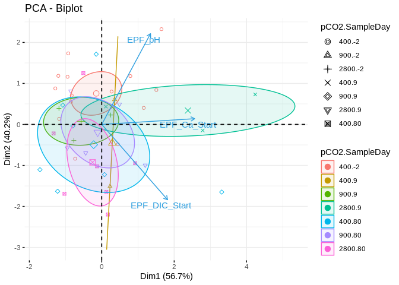<!-- -->

```r
### Just Samples from the actual exposure (acclimation points removed)
exposure_cCarbChem <- epf_cCarbChem[epf_cCarbChem$timepoint > 0,]
chemNames <- c("EPF_pH","EPF_DIC_Start","EPF_Ca_Start")
exposure_cCarbChem_r <- subset(exposure_cCarbChem,select = chemNames )

cCarb_pca2 <- prcomp(exposure_cCarbChem_r,scale=TRUE)
fviz_eig(cCarb_pca2)
```

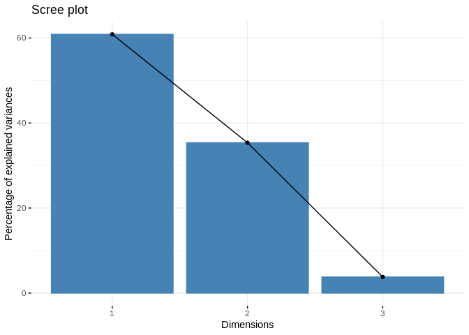<!-- -->

```r
group3 <- interaction(exposure_cCarbChem$pCO2,exposure_cCarbChem$timepoint)
fviz_pca_biplot(cCarb_pca2, repel = TRUE,label = c("var"),
                title="Individuals and Variable Vectors - Exposure Only Carbonate Chem Data (Ellipse = CI) ",
                col.ind = group3, # color by groups
                gradient.cols = c("#00AFBB", "#E7B800", "#FC4E07"),
                addEllipses = TRUE,
                ellipse.type = "confidence",
                legend.title = "pCO2",
                col.var = "#2E9FDF" # Variables color
                #col.ind = "#696969"  # Individuals color
                )
```

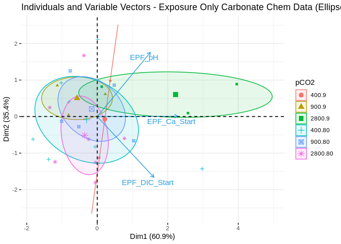<!-- -->

```r
### Just Samples we sequenced 
seq_cCarbChem <- just_seq[!is.na(just_seq$EPF_DIC_Start),]
chemNames <- c("EPF_pH","EPF_DIC_Start","EPF_Ca_Start")
seq_cCarbChem_r <- subset(seq_cCarbChem,select = chemNames )

cCarb_pca3 <- prcomp(seq_cCarbChem_r,scale=TRUE)
fviz_eig(cCarb_pca3)
```

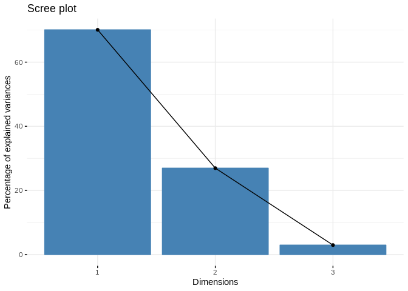<!-- -->

```r
group3 <- interaction(seq_cCarbChem$pCO2,seq_cCarbChem$timepoint)
fviz_pca_biplot(cCarb_pca3, repel = TRUE,label = c("var"),
                title="Individuals and Variable Vectors - Sequenced Samples Only Carbonate Chem Data (Ellipse = CI) ",
                col.ind = group3, # color by groups
                gradient.cols = c("#00AFBB", "#E7B800", "#FC4E07"),
                addEllipses = TRUE,
                ellipse.type = "confidence",
                legend.title = "pCO2",
                col.var = "#2E9FDF" # Variables color
                #col.ind = "#696969"  # Individuals color
                )
```

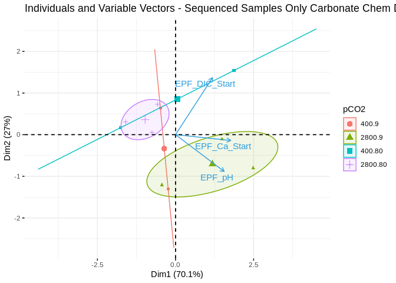<!-- -->
