## Data Input and Formatting

```r
### EPF fluid ###
epf_cal <- read.csv(file = "~/Github/2017OAExp_Oysters/input_files/Phenotype/EPF/AE17_EPF_Calcification_20190403.csv")
# Remove and NAs at end of dataframe
epf_cal <- epf_cal[!is.na(epf_cal$ID),]
# Making Date object
epf_cal$Sample_Date <- as.Date(as.character(epf_cal$sample_date),origin="%Y%m%d",format="%Y%m%d")
# Removing samples outside of experiment (those for louises exp)
epf_cal <- epf_cal[epf_cal$Sample_Date < "2017-08-25",]
epf_cal <- epf_cal[!is.na(epf_cal$Sample_Date),]
#aggreate final two timepoints
epf_cal$Sample_Date[epf_cal$Sample_Date > "2017-08-20"] <-"2017-08-23"
  
# Convert Dates into timepoints (time prior to experiment exposure starting)
epf_cal$timepoint <-  epf_cal$Sample_Date - as.Date("2017-06-04")
epf_cal$timepoint_fac <-  as.factor(epf_cal$timepoint)

## Deciding to treat time and treatment as factors
# Aggregating data pre exposure leveles to 400
epf_cal$pCO2[epf_cal$timepoint < 0] <- 400
#Covnert to factor
epf_cal$pCO2_fac <-  as.factor(epf_cal$pCO2)

### Water Chemistry ###
wc <-  read.csv(file="~/Github/2017OAExp_Oysters/input_files/WC/AE17_pHSalinity_20180305.csv")

# Meta data with sample sequence info
ss <- read.csv(file="/home/downeyam/Github/2017OAExp_Oysters/input_files/RNA/metadata_cvirginica_rna_meta.txt")
ss$ID <- as.numeric(substr(ss$sample_name,4,10))
# Data set with population information
sp <- read.csv("/home/downeyam/Github/2017OAExp_Oysters/input_files/Phenotype/AE17_Exp_2017_CollectionInfo_20190227.csv")
sp_pop <- subset(sp,select=c(ID,pop))

# Merge population data with phenotype data
epf_cal <- merge(epf_cal,sp_pop,by="ID")

#Subset data to include just those that were sequenced
just_seq <- epf_cal[!is.na(match(epf_cal$ID,ss$ID)),]
```

### **Sample Tables**

All Samples

```r
kable(table(epf_cal$pCO2_fac,epf_cal$timepoint_fac)) %>%
  kable_styling()
```

<table class="table" style="margin-left: auto; margin-right: auto;">
 <thead>
  <tr>
   <th style="text-align:left;">   </th>
   <th style="text-align:right;"> -26 </th>
   <th style="text-align:right;"> -18 </th>
   <th style="text-align:right;"> -2 </th>
   <th style="text-align:right;"> 1 </th>
   <th style="text-align:right;"> 2 </th>
   <th style="text-align:right;"> 9 </th>
   <th style="text-align:right;"> 22 </th>
   <th style="text-align:right;"> 50 </th>
   <th style="text-align:right;"> 80 </th>
  </tr>
 </thead>
<tbody>
  <tr>
   <td style="text-align:left;"> 400 </td>
   <td style="text-align:right;"> 18 </td>
   <td style="text-align:right;"> 18 </td>
   <td style="text-align:right;"> 18 </td>
   <td style="text-align:right;"> 6 </td>
   <td style="text-align:right;"> 6 </td>
   <td style="text-align:right;"> 6 </td>
   <td style="text-align:right;"> 6 </td>
   <td style="text-align:right;"> 6 </td>
   <td style="text-align:right;"> 11 </td>
  </tr>
  <tr>
   <td style="text-align:left;"> 900 </td>
   <td style="text-align:right;"> 0 </td>
   <td style="text-align:right;"> 0 </td>
   <td style="text-align:right;"> 0 </td>
   <td style="text-align:right;"> 6 </td>
   <td style="text-align:right;"> 6 </td>
   <td style="text-align:right;"> 6 </td>
   <td style="text-align:right;"> 6 </td>
   <td style="text-align:right;"> 6 </td>
   <td style="text-align:right;"> 8 </td>
  </tr>
  <tr>
   <td style="text-align:left;"> 2800 </td>
   <td style="text-align:right;"> 0 </td>
   <td style="text-align:right;"> 0 </td>
   <td style="text-align:right;"> 0 </td>
   <td style="text-align:right;"> 6 </td>
   <td style="text-align:right;"> 6 </td>
   <td style="text-align:right;"> 6 </td>
   <td style="text-align:right;"> 6 </td>
   <td style="text-align:right;"> 6 </td>
   <td style="text-align:right;"> 10 </td>
  </tr>
</tbody>
</table>
  
Sample with complete carbonate chemistry

```r
kable(table(epf_cal[!is.na(epf_cal$EPF_DIC_Start),]$pCO2_fac,epf_cal[!is.na(epf_cal$EPF_DIC_Start),]$timepoint_fac)) %>%
  kable_styling()
```

<table class="table" style="margin-left: auto; margin-right: auto;">
 <thead>
  <tr>
   <th style="text-align:left;">   </th>
   <th style="text-align:right;"> -26 </th>
   <th style="text-align:right;"> -18 </th>
   <th style="text-align:right;"> -2 </th>
   <th style="text-align:right;"> 1 </th>
   <th style="text-align:right;"> 2 </th>
   <th style="text-align:right;"> 9 </th>
   <th style="text-align:right;"> 22 </th>
   <th style="text-align:right;"> 50 </th>
   <th style="text-align:right;"> 80 </th>
  </tr>
 </thead>
<tbody>
  <tr>
   <td style="text-align:left;"> 400 </td>
   <td style="text-align:right;"> 0 </td>
   <td style="text-align:right;"> 0 </td>
   <td style="text-align:right;"> 14 </td>
   <td style="text-align:right;"> 0 </td>
   <td style="text-align:right;"> 0 </td>
   <td style="text-align:right;"> 2 </td>
   <td style="text-align:right;"> 0 </td>
   <td style="text-align:right;"> 0 </td>
   <td style="text-align:right;"> 7 </td>
  </tr>
  <tr>
   <td style="text-align:left;"> 900 </td>
   <td style="text-align:right;"> 0 </td>
   <td style="text-align:right;"> 0 </td>
   <td style="text-align:right;"> 0 </td>
   <td style="text-align:right;"> 0 </td>
   <td style="text-align:right;"> 0 </td>
   <td style="text-align:right;"> 3 </td>
   <td style="text-align:right;"> 0 </td>
   <td style="text-align:right;"> 0 </td>
   <td style="text-align:right;"> 5 </td>
  </tr>
  <tr>
   <td style="text-align:left;"> 2800 </td>
   <td style="text-align:right;"> 0 </td>
   <td style="text-align:right;"> 0 </td>
   <td style="text-align:right;"> 0 </td>
   <td style="text-align:right;"> 0 </td>
   <td style="text-align:right;"> 0 </td>
   <td style="text-align:right;"> 3 </td>
   <td style="text-align:right;"> 0 </td>
   <td style="text-align:right;"> 0 </td>
   <td style="text-align:right;"> 7 </td>
  </tr>
</tbody>
</table>
  
Samples we also sequenced

```r
kable(table(just_seq$pCO2_fac,just_seq$timepoint_fac)) %>%
  kable_styling()
```

<table class="table" style="margin-left: auto; margin-right: auto;">
 <thead>
  <tr>
   <th style="text-align:left;">   </th>
   <th style="text-align:right;"> -26 </th>
   <th style="text-align:right;"> -18 </th>
   <th style="text-align:right;"> -2 </th>
   <th style="text-align:right;"> 1 </th>
   <th style="text-align:right;"> 2 </th>
   <th style="text-align:right;"> 9 </th>
   <th style="text-align:right;"> 22 </th>
   <th style="text-align:right;"> 50 </th>
   <th style="text-align:right;"> 80 </th>
  </tr>
 </thead>
<tbody>
  <tr>
   <td style="text-align:left;"> 400 </td>
   <td style="text-align:right;"> 0 </td>
   <td style="text-align:right;"> 0 </td>
   <td style="text-align:right;"> 0 </td>
   <td style="text-align:right;"> 0 </td>
   <td style="text-align:right;"> 0 </td>
   <td style="text-align:right;"> 6 </td>
   <td style="text-align:right;"> 0 </td>
   <td style="text-align:right;"> 0 </td>
   <td style="text-align:right;"> 6 </td>
  </tr>
  <tr>
   <td style="text-align:left;"> 900 </td>
   <td style="text-align:right;"> 0 </td>
   <td style="text-align:right;"> 0 </td>
   <td style="text-align:right;"> 0 </td>
   <td style="text-align:right;"> 0 </td>
   <td style="text-align:right;"> 0 </td>
   <td style="text-align:right;"> 0 </td>
   <td style="text-align:right;"> 0 </td>
   <td style="text-align:right;"> 0 </td>
   <td style="text-align:right;"> 0 </td>
  </tr>
  <tr>
   <td style="text-align:left;"> 2800 </td>
   <td style="text-align:right;"> 0 </td>
   <td style="text-align:right;"> 0 </td>
   <td style="text-align:right;"> 0 </td>
   <td style="text-align:right;"> 0 </td>
   <td style="text-align:right;"> 0 </td>
   <td style="text-align:right;"> 6 </td>
   <td style="text-align:right;"> 0 </td>
   <td style="text-align:right;"> 0 </td>
   <td style="text-align:right;"> 6 </td>
  </tr>
</tbody>
</table>
  
Samples we also sequenced with complete carbonate chemistry

```r
kable(table(just_seq[!is.na(just_seq$EPF_DIC_Start),]$pCO2_fac,just_seq[!is.na(just_seq$EPF_DIC_Start),]$timepoint_fac)) %>%
  kable_styling()
```

<table class="table" style="margin-left: auto; margin-right: auto;">
 <thead>
  <tr>
   <th style="text-align:left;">   </th>
   <th style="text-align:right;"> -26 </th>
   <th style="text-align:right;"> -18 </th>
   <th style="text-align:right;"> -2 </th>
   <th style="text-align:right;"> 1 </th>
   <th style="text-align:right;"> 2 </th>
   <th style="text-align:right;"> 9 </th>
   <th style="text-align:right;"> 22 </th>
   <th style="text-align:right;"> 50 </th>
   <th style="text-align:right;"> 80 </th>
  </tr>
 </thead>
<tbody>
  <tr>
   <td style="text-align:left;"> 400 </td>
   <td style="text-align:right;"> 0 </td>
   <td style="text-align:right;"> 0 </td>
   <td style="text-align:right;"> 0 </td>
   <td style="text-align:right;"> 0 </td>
   <td style="text-align:right;"> 0 </td>
   <td style="text-align:right;"> 2 </td>
   <td style="text-align:right;"> 0 </td>
   <td style="text-align:right;"> 0 </td>
   <td style="text-align:right;"> 2 </td>
  </tr>
  <tr>
   <td style="text-align:left;"> 900 </td>
   <td style="text-align:right;"> 0 </td>
   <td style="text-align:right;"> 0 </td>
   <td style="text-align:right;"> 0 </td>
   <td style="text-align:right;"> 0 </td>
   <td style="text-align:right;"> 0 </td>
   <td style="text-align:right;"> 0 </td>
   <td style="text-align:right;"> 0 </td>
   <td style="text-align:right;"> 0 </td>
   <td style="text-align:right;"> 0 </td>
  </tr>
  <tr>
   <td style="text-align:left;"> 2800 </td>
   <td style="text-align:right;"> 0 </td>
   <td style="text-align:right;"> 0 </td>
   <td style="text-align:right;"> 0 </td>
   <td style="text-align:right;"> 0 </td>
   <td style="text-align:right;"> 0 </td>
   <td style="text-align:right;"> 3 </td>
   <td style="text-align:right;"> 0 </td>
   <td style="text-align:right;"> 0 </td>
   <td style="text-align:right;"> 3 </td>
  </tr>
</tbody>
</table>

## Plans

* Look at EPF pH for all timepoints and treatments (6 tp, 3 treatments, 108 individuals, mostly balanced)  
* Look at EPF pH for all individuals we sequenced (2 tp, 2 treatments, 24 individuals)  
* Look at EPF complete chemistry for samples we sequenced and have complete chemistry (2 tp, 2 treatments, 10 individuals, not balanced)  

## Analysis of EPF pH total data  
  
* Filtering out NAs (one entry) and including only timepoints from the exposure (not acclimation)
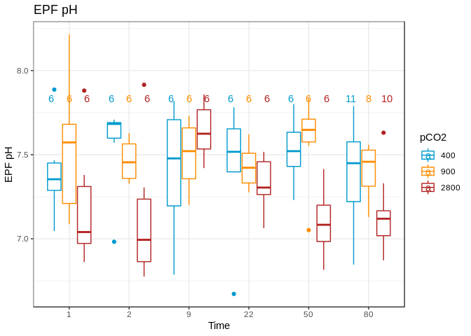<!-- -->
  
### **Statistcal Analysis**  
  
#### **EPF pH total data - time as factor**  
**Overview**  
Test: 2-way ANOVA - Full Model (Fixed and Random Factors)  
* Explanatory Factors: Treatment (pCO2_fac) and Time (timepoint_fac)  
* Random Factors: Population, Shelf, Tank (nested in Shelf)   
* Tested for normality and variance assumptions  
  

```r
whole_factor_full <- lmer(EPF_pH~timepoint_fac*pCO2_fac + (1|pop) + (1|shelf/tank),data=epf_exp) #
```

```
## singular fit
```

```r
# Warning singular fit

# Check distribution of residuals
plot(whole_factor_full)
```

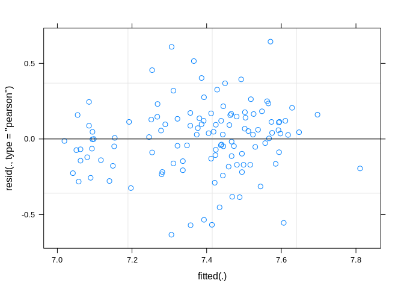<!-- -->

```r
# They look fairly homoscedastic
qqnorm(resid(whole_factor_full))
qqline(resid(whole_factor_full))
```

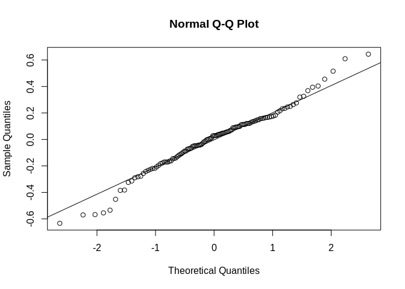<!-- -->

```r
anova(whole_factor_full)
```

```
## Type III Analysis of Variance Table with Satterthwaite's method
##                         Sum Sq  Mean Sq NumDF  DenDF F value  Pr(>F)  
## timepoint_fac          0.47733 0.095467     5 86.896  1.4112 0.22820  
## pCO2_fac               0.45978 0.229890     2  3.052  3.3983 0.16732  
## timepoint_fac:pCO2_fac 1.14397 0.114397    10 86.893  1.6910 0.09558 .
## ---
## Signif. codes:  0 '***' 0.001 '**' 0.01 '*' 0.05 '.' 0.1 ' ' 1
```

```r
# Nothing significant here (although the interaction is close)

ranova(whole_factor_full)
```

```
## singular fit
```

```
## ANOVA-like table for random-effects: Single term deletions
## 
## Model:
## EPF_pH ~ timepoint_fac + pCO2_fac + (1 | pop) + (1 | tank:shelf) + 
##     (1 | shelf) + timepoint_fac:pCO2_fac
##                  npar  logLik    AIC     LRT Df Pr(>Chisq)  
## <none>             22 -29.535 103.07                        
## (1 | pop)          21 -29.535 101.07 0.00000  1    0.99938  
## (1 | tank:shelf)   21 -30.994 103.99 2.91864  1    0.08756 .
## (1 | shelf)        21 -29.587 101.17 0.10278  1    0.74852  
## ---
## Signif. codes:  0 '***' 0.001 '**' 0.01 '*' 0.05 '.' 0.1 ' ' 1
```

```r
# We should remove population and shelf as random factors and rerun analysis
```
  
**Rerun Model with Population and Shelf removed as random factors**

```r
whole_factor_tank <- lmer(EPF_pH~timepoint_fac*pCO2_fac + (1|tank:shelf),data=epf_exp)
# Prevented singular fit issue this time

# Check distribution of residuals
plot(whole_factor_tank)
```

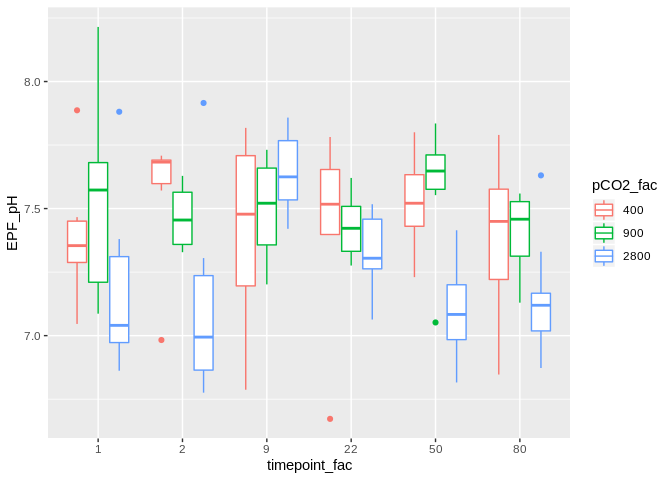<!-- -->

```r
# They look fairly homoscedastic
qqnorm(resid(whole_factor_tank))
qqline(resid(whole_factor_tank))
```

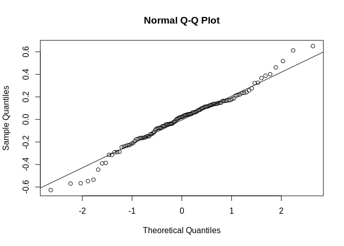<!-- -->

```r
# Fairly normal

anova(whole_factor_tank)
```

```
## Type III Analysis of Variance Table with Satterthwaite's method
##                         Sum Sq  Mean Sq NumDF  DenDF F value  Pr(>F)  
## timepoint_fac          0.47946 0.095892     5 86.831  1.4168 0.22620  
## pCO2_fac               0.57230 0.286151     2 16.024  4.2279 0.03353 *
## timepoint_fac:pCO2_fac 1.14370 0.114370    10 86.828  1.6898 0.09588 .
## ---
## Signif. codes:  0 '***' 0.001 '**' 0.01 '*' 0.05 '.' 0.1 ' ' 1
```

```r
anova(whole_factor_full,whole_factor_tank)
```

```
## refitting model(s) with ML (instead of REML)
```

```
## Data: epf_exp
## Models:
## whole_factor_tank: EPF_pH ~ timepoint_fac * pCO2_fac + (1 | tank:shelf)
## whole_factor_full: EPF_pH ~ timepoint_fac * pCO2_fac + (1 | pop) + (1 | shelf/tank)
##                   Df    AIC    BIC  logLik deviance Chisq Chi Df
## whole_factor_tank 20 50.815 106.40 -5.4074   10.815             
## whole_factor_full 22 54.815 115.96 -5.4074   10.815     0      2
##                   Pr(>Chisq)
## whole_factor_tank           
## whole_factor_full          1
```

```r
# Comparing the two models  (full and w/ tank only there is no difference)
# We keep the simpler model
```
  
#### **EPF pH total data - treatment as factor and time as continuous variable**  
**Overview**  
Test: 2-way ANCOVA 
* Explainatory Factors: Treatment (pCO2_fac)   
* Continuous covariate: Time (timepoint)  
* Random Facotrs: Population, Shelf, Tank  
* Tested for normality and variance assumptions  
  

```r
whole_cont_full <- lmer(EPF_pH~timepoint*pCO2_fac + (1|pop) + (1|shelf/tank) ,data=epf_exp)
```

```
## Warning in checkConv(attr(opt, "derivs"), opt$par, ctrl =
## control$checkConv, : Model failed to converge with max|grad| = 0.00586583
## (tol = 0.002, component 1)
```

```r
# ERROR -  looks like this is driven by too many explanatory parameters

ranova(whole_cont_full)
```

```
## Warning in checkConv(attr(opt, "derivs"), opt$par, ctrl =
## control$checkConv, : Model failed to converge with max|grad| = 0.00224171
## (tol = 0.002, component 1)
```

```
## ANOVA-like table for random-effects: Single term deletions
## 
## Model:
## EPF_pH ~ timepoint + pCO2_fac + (1 | pop) + (1 | tank:shelf) + 
##     (1 | shelf) + timepoint:pCO2_fac
##                  npar  logLik    AIC      LRT Df Pr(>Chisq)
## <none>             10 -38.781 97.562                       
## (1 | pop)           9 -38.781 95.562 -0.00002  1     1.0000
## (1 | tank:shelf)    9 -39.972 97.944  2.38274  1     0.1227
## (1 | shelf)         9 -38.837 95.675  0.11314  1     0.7366
```

```r
# Looks like we can remove the random effects anyways
# Ill start by removing population and shelf and reruning
```

**Rerun model with just tank as random factor**

```r
whole_cont_tank <- lmer(EPF_pH~timepoint*pCO2_fac + (1|tank:shelf) ,data=epf_exp)

# Check distribution of residuals
plot(whole_cont_tank)
```

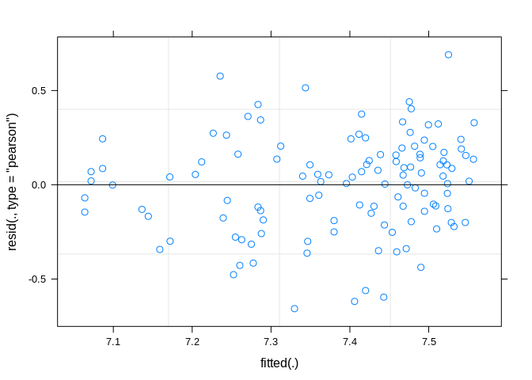<!-- -->

```r
# They look fairly homoscedastic
qqnorm(resid(whole_cont_tank))
qqline(resid(whole_cont_tank))
```

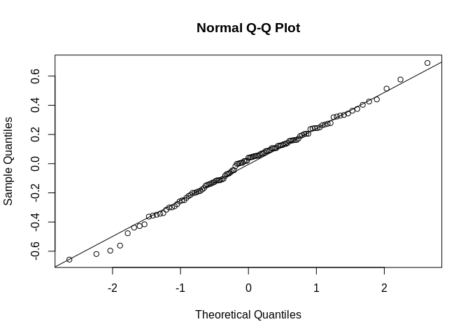<!-- -->

```r
# Fairly normal

ranova(whole_cont_tank)
```

```
## ANOVA-like table for random-effects: Single term deletions
## 
## Model:
## EPF_pH ~ timepoint + pCO2_fac + (1 | tank:shelf) + timepoint:pCO2_fac
##                  npar  logLik    AIC    LRT Df Pr(>Chisq)  
## <none>              8 -38.837 93.675                       
## (1 | tank:shelf)    7 -40.604 95.208 3.5328  1    0.06016 .
## ---
## Signif. codes:  0 '***' 0.001 '**' 0.01 '*' 0.05 '.' 0.1 ' ' 1
```

```r
# Not significant but good to keep i think

anova(whole_cont_tank)
```

```
## Type III Analysis of Variance Table with Satterthwaite's method
##                      Sum Sq Mean Sq NumDF  DenDF F value Pr(>F)
## timepoint          0.198825 0.19883     1 99.707  2.7201 0.1022
## pCO2_fac           0.240021 0.12001     2 35.192  1.6418 0.2081
## timepoint:pCO2_fac 0.072179 0.03609     2 99.696  0.4937 0.6118
```

```r
summary(whole_cont_tank)
```

```
## Linear mixed model fit by REML. t-tests use Satterthwaite's method [
## lmerModLmerTest]
## Formula: EPF_pH ~ timepoint * pCO2_fac + (1 | tank:shelf)
##    Data: epf_exp
## 
## REML criterion at convergence: 77.7
## 
## Scaled residuals: 
##     Min      1Q  Median      3Q     Max 
## -2.4314 -0.6352  0.1503  0.5952  2.5519 
## 
## Random effects:
##  Groups     Name        Variance Std.Dev.
##  tank:shelf (Intercept) 0.01031  0.1015  
##  Residual               0.07310  0.2704  
## Number of obs: 119, groups:  tank:shelf, 18
## 
## Fixed effects:
##                          Estimate Std. Error         df t value Pr(>|t|)
## (Intercept)             7.465e+00  7.403e-02  3.498e+01 100.836   <2e-16
## timepoint              -7.975e-04  1.320e-03  9.928e+01  -0.604    0.547
## pCO2_fac900             3.959e-02  1.049e-01  3.523e+01   0.377    0.708
## pCO2_fac2800           -1.412e-01  1.048e-01  3.505e+01  -1.348    0.186
## timepoint:pCO2_fac900   8.401e-05  1.958e-03  9.968e+01   0.043    0.966
## timepoint:pCO2_fac2800 -1.621e-03  1.893e-03  9.954e+01  -0.856    0.394
##                           
## (Intercept)            ***
## timepoint                 
## pCO2_fac900               
## pCO2_fac2800              
## timepoint:pCO2_fac900     
## timepoint:pCO2_fac2800    
## ---
## Signif. codes:  0 '***' 0.001 '**' 0.01 '*' 0.05 '.' 0.1 ' ' 1
## 
## Correlation of Fixed Effects:
##             (Intr) timpnt pCO2_9 pCO2_2 t:CO2_9
## timepoint   -0.601                             
## pCO2_fac900 -0.706  0.424                      
## pCO2_fc2800 -0.707  0.424  0.499               
## tmp:CO2_900  0.405 -0.674 -0.591 -0.286        
## tm:CO2_2800  0.419 -0.697 -0.295 -0.598  0.470
```

```r
# Nothing significant :(
```

**Automated Model Selection**

```r
step(whole_cont_full)
```

```
## Warning in checkConv(attr(opt, "derivs"), opt$par, ctrl =
## control$checkConv, : Model failed to converge with max|grad| = 0.00224171
## (tol = 0.002, component 1)
```

```
## Backward reduced random-effect table:
## 
##                  Eliminated npar  logLik    AIC    LRT Df Pr(>Chisq)  
## <none>                        10 -38.781 97.562                       
## (1 | pop)                 1    9 -38.781 95.562 0.0000  1    1.00000  
## (1 | shelf)               2    8 -38.837 93.675 0.1132  1    0.73658  
## (1 | tank:shelf)          0    7 -40.604 95.208 3.5328  1    0.06016 .
## ---
## Signif. codes:  0 '***' 0.001 '**' 0.01 '*' 0.05 '.' 0.1 ' ' 1
## 
## Backward reduced fixed-effect table:
## Degrees of freedom method: Satterthwaite 
## 
##                    Eliminated  Sum Sq Mean Sq NumDF   DenDF F value
## timepoint:pCO2_fac          1 0.07218 0.03609     2  99.696  0.4937
## timepoint                   2 0.20430 0.20430     1 101.662  2.8217
## pCO2_fac                    0 0.65199 0.32599     2  15.550  4.4315
##                     Pr(>F)  
## timepoint:pCO2_fac 0.61183  
## timepoint          0.09607 .
## pCO2_fac           0.02999 *
## ---
## Signif. codes:  0 '***' 0.001 '**' 0.01 '*' 0.05 '.' 0.1 ' ' 1
## 
## Model found:
## EPF_pH ~ pCO2_fac + (1 | tank:shelf)
```

```r
# Model Select only pCO2fac and tank

whole_pCO2_tank <- lmer(EPF_pH~pCO2_fac + (1|tank:shelf) ,data=epf_exp)

# Check distribution of residuals
plot(whole_pCO2_tank)
```

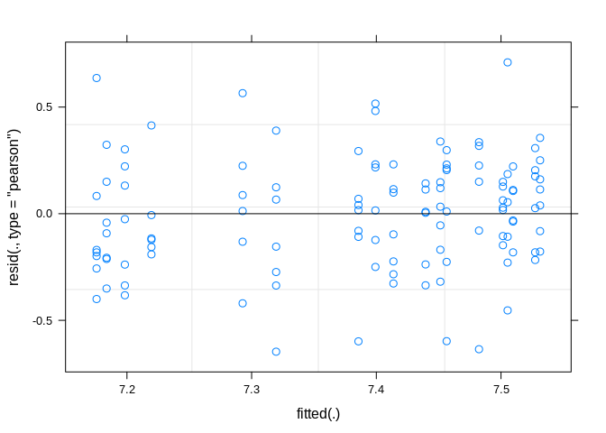<!-- -->

```r
# They look fairly homoscedastic
qqnorm(resid(whole_pCO2_tank))
qqline(resid(whole_pCO2_tank))
```

<!-- -->

```r
# Fairly normal

anova(whole_pCO2_tank)
```

```
## Type III Analysis of Variance Table with Satterthwaite's method
##           Sum Sq Mean Sq NumDF DenDF F value  Pr(>F)  
## pCO2_fac 0.65199 0.32599     2 15.55  4.4315 0.02999 *
## ---
## Signif. codes:  0 '***' 0.001 '**' 0.01 '*' 0.05 '.' 0.1 ' ' 1
```

```r
#Significant!
```
  
## Analysis of samples we sequenced  

#### **EPF pH total data - time as factor**  
**Overview**  
Test: 2-way ANOVA - Full Model (Fixed and Random Factors)  
* Explanatory Factors: Treatment (pCO2_fac) and Time (timepoint_fac)  
* Random Factors: Population, Shelf, Tank (nested in Shelf)   
* Tested for normality and variance assumptions  


```r
seq_full <- lmer(EPF_pH~timepoint_fac*pCO2_fac + (1|pop) + (1|shelf/tank),data=just_seq)
```

```
## singular fit
```

```r
# Singular fit warning

anova(seq_full) # Everything is signficant
```

```
## Type III Analysis of Variance Table with Satterthwaite's method
##                         Sum Sq Mean Sq NumDF DenDF F value  Pr(>F)  
## timepoint_fac          0.47536 0.47536     1    20  6.4394 0.01959 *
## pCO2_fac               0.03466 0.03466     1    20  0.4695 0.50108  
## timepoint_fac:pCO2_fac 0.57366 0.57366     1    20  7.7711 0.01136 *
## ---
## Signif. codes:  0 '***' 0.001 '**' 0.01 '*' 0.05 '.' 0.1 ' ' 1
```

```r
plot(seq_full)
```

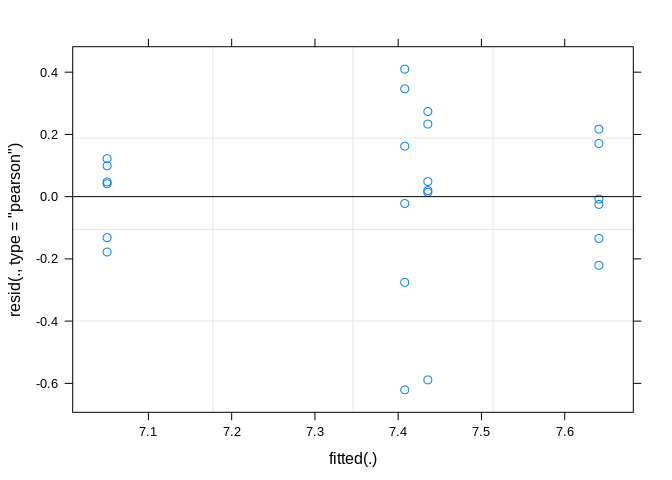<!-- -->

```r
# Some heteroscedascity but not too bad
qqnorm(resid(seq_full))
qqline(resid(seq_full))
```

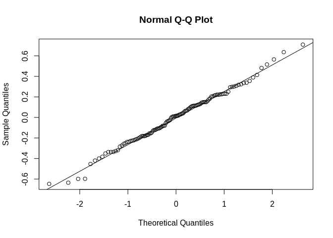<!-- -->

```r
ranova(seq_full) # None of these seem important
```

```
## singular fit
## singular fit
## singular fit
```

```
## ANOVA-like table for random-effects: Single term deletions
## 
## Model:
## EPF_pH ~ timepoint_fac + pCO2_fac + (1 | pop) + (1 | tank:shelf) + 
##     (1 | shelf) + timepoint_fac:pCO2_fac
##                  npar logLik    AIC LRT Df Pr(>Chisq)
## <none>              8 -5.901 27.802                  
## (1 | pop)           7 -5.901 25.802   0  1          1
## (1 | tank:shelf)    7 -5.901 25.802   0  1          1
## (1 | shelf)         7 -5.901 25.802   0  1          1
```

```r
anova(seq_full) # Everything except pCO2 significant
```

```
## Type III Analysis of Variance Table with Satterthwaite's method
##                         Sum Sq Mean Sq NumDF DenDF F value  Pr(>F)  
## timepoint_fac          0.47536 0.47536     1    20  6.4394 0.01959 *
## pCO2_fac               0.03466 0.03466     1    20  0.4695 0.50108  
## timepoint_fac:pCO2_fac 0.57366 0.57366     1    20  7.7711 0.01136 *
## ---
## Signif. codes:  0 '***' 0.001 '**' 0.01 '*' 0.05 '.' 0.1 ' ' 1
```

```r
# Decide to remove random factors since they aren't informative
```

**Rerun with standard lm**

```r
seq_fixed <- lm(EPF_pH~timepoint_fac*pCO2_fac, data=just_seq)

plot(seq_fixed)
```

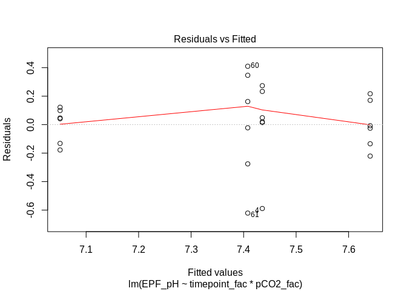<!-- -->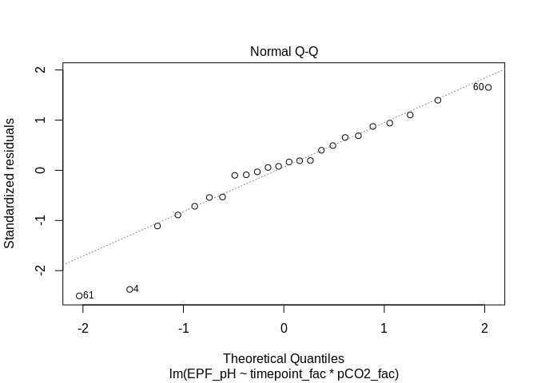<!-- -->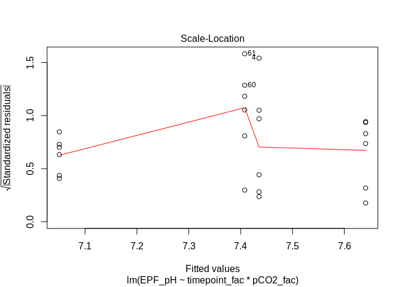<!-- -->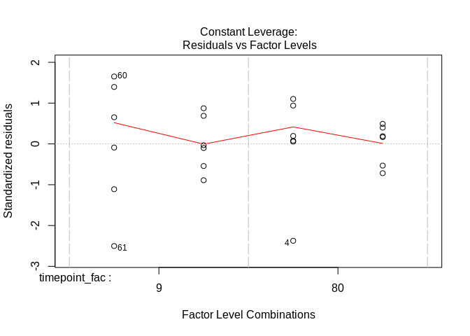<!-- -->

```r
# We can see more clearly that some of the mild issues with the assumptions are being driven by 3 points (4,60,61).

anova(seq_fixed) # without random factors, pCO2 is now even less significant
```

```
## Analysis of Variance Table
## 
## Response: EPF_pH
##                        Df  Sum Sq Mean Sq F value  Pr(>F)  
## timepoint_fac           1 0.47536 0.47536  6.4394 0.01959 *
## pCO2_fac                1 0.03466 0.03466  0.4695 0.50108  
## timepoint_fac:pCO2_fac  1 0.57366 0.57366  7.7711 0.01136 *
## Residuals              20 1.47639 0.07382                  
## ---
## Signif. codes:  0 '***' 0.001 '**' 0.01 '*' 0.05 '.' 0.1 ' ' 1
```
  
**Rerun but remove those three problematic points**

```r
# New dataset w/o those three points
just_seq2 <- just_seq[!row.names(just_seq) == c(4,60,61),]

seq_fixed_outlierRM <- lm(EPF_pH~timepoint_fac*pCO2_fac, data=just_seq2)

plot(seq_fixed_outlierRM)
```

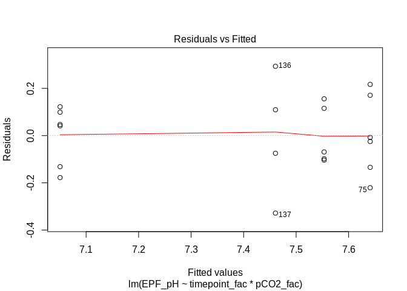<!-- -->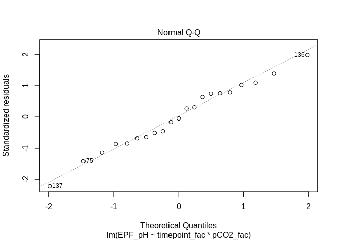<!-- -->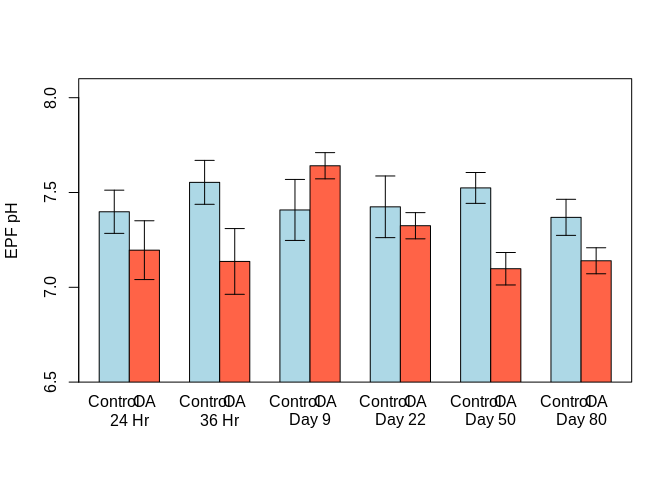<!-- -->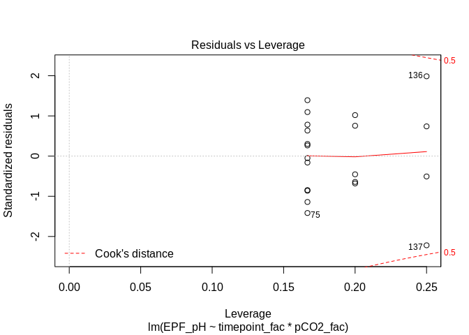<!-- -->

```r
# On a whole this looks like a slight improvement

anova(seq_fixed_outlierRM) # Now everything is significant
```

```
## Analysis of Variance Table
## 
## Response: EPF_pH
##                        Df  Sum Sq Mean Sq F value    Pr(>F)    
## timepoint_fac           1 0.44017 0.44017 15.0959 0.0011889 ** 
## pCO2_fac                1 0.17188 0.17188  5.8947 0.0265810 *  
## timepoint_fac:pCO2_fac  1 0.59622 0.59622 20.4479 0.0003013 ***
## Residuals              17 0.49569 0.02916                      
## ---
## Signif. codes:  0 '***' 0.001 '**' 0.01 '*' 0.05 '.' 0.1 ' ' 1
```
  
**Pairwise comparisons of fixed factor model (with points rm)**  

```r
seq_pairwise <- TukeyHSD(aov(EPF_pH~timepoint_fac*pCO2_fac, data=just_seq2))

plot(seq_pairwise$`timepoint_fac:pCO2_fac`)
```

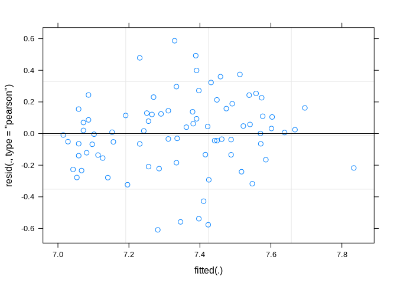<!-- -->
  
**Final Figure**  
<!-- -->
  
Final bar plot has SE bars and significance levels based on pairwise comparison test (tukey method) based on model selected above.
  
**Automated Model Selection**

```r
step(seq_full)
```

```
## singular fit
## singular fit
## singular fit
## singular fit
## singular fit
## singular fit
## singular fit
```

```
## Backward reduced random-effect table:
## 
##                  Eliminated npar logLik    AIC         LRT Df Pr(>Chisq)
## <none>                         8 -5.901 27.802                          
## (1 | pop)                 1    7 -5.901 25.802  0.0000e+00  1          1
## (1 | tank:shelf)          2    6 -5.901 23.802  0.0000e+00  1          1
## (1 | shelf)               3    5 -5.901 21.802 -2.6645e-14  1          1
## 
## Backward reduced fixed-effect table:
##                        Eliminated Df Sum of Sq    RSS     AIC F value
## timepoint_fac:pCO2_fac          0  1   0.57366 2.0501 -53.045  7.7711
##                         Pr(>F)  
## timepoint_fac:pCO2_fac 0.01136 *
## ---
## Signif. codes:  0 '***' 0.001 '**' 0.01 '*' 0.05 '.' 0.1 ' ' 1
## 
## Model found:
## EPF_pH ~ timepoint_fac + pCO2_fac + timepoint_fac:pCO2_fac
```

```r
# Automated processed converged on the same model as above
```
  
### Analysis of samples data with **Complete Carbonate Chemistry** (WARNING VERY LOW SAMPLE SIZE)  

* This is data that we measured both the EPF pH and DIC of extract EPF Fluid in order to calculate the complete carbonate chemistry  

**Days : Day 0 (pre exposure), Day 9, Day 80**  

```r
# Select specific columns and only keep rows with complete carbonate chemistry
col_select <- c("ID","shelf","tank","pCO2_fac","DIC","TA","pCO2_calc","Calcite","pH_meas","sample_date","timepoint","timepoint_fac","EPF_pH","EPF_DIC_Start","EPF_Ca_Start")
epf_cal %>% select(col_select) %>% filter(!is.na(EPF_Ca_Start)) -> epf_s
epf_s$timepoint_fac <-  factor(epf_s$timepoint_fac)
levels(epf_s$timepoint_fac)  <-  c("Pre-Exposure","Day 9","Day 80")

# Aggregating WC for experiment
epf_s %>% filter(timepoint > 0) %>% group_by(pCO2_fac) %>%
  summarize(DIC=mean(DIC),TA=mean(TA),pH = mean(pH_meas),act_pCO2 = mean(pCO2_calc),Calcite = mean(Calcite)) -> sum_WC
  
# Exploratory Plots

#Color Scheme
# Default orderL 400,900,2800
trt_color <- c("deepskyblue3", "darkorange", "firebrick")
#pH
give.n <- function(x){
   return(c(y = 7.9, label = length(x)))
}
ggplot(epf_s,aes(x=timepoint_fac,y=EPF_pH,group=interaction(pCO2_fac,timepoint_fac),colour=pCO2_fac)) + 
  geom_hline(yintercept= sum_WC$pH,col=trt_color,size=1) + 
  geom_boxplot() + 
  scale_color_manual(values=trt_color) + 
  theme_bw() +
  stat_summary(fun.data = give.n,
               geom = "text",
               position = position_dodge(width = 0.9), vjust = -0.25) +
  labs(title="EPF pH",x="Time",y="EPF pH",colour="pCO2")
```

<!-- -->

```r
# Calcite
ggplot(epf_s,aes(x=timepoint_fac,y=EPF_Ca_Start,group=interaction(pCO2_fac,timepoint_fac),colour=pCO2_fac)) + 
  geom_hline(yintercept= sum_WC$Calcite,col=trt_color,size=1) + 
  geom_boxplot() + 
  scale_color_manual(values=trt_color) + 
  theme_bw() +
  labs(title="EPF Calcite",x="Time",y="EPF Ca",colour="pCO2")
```

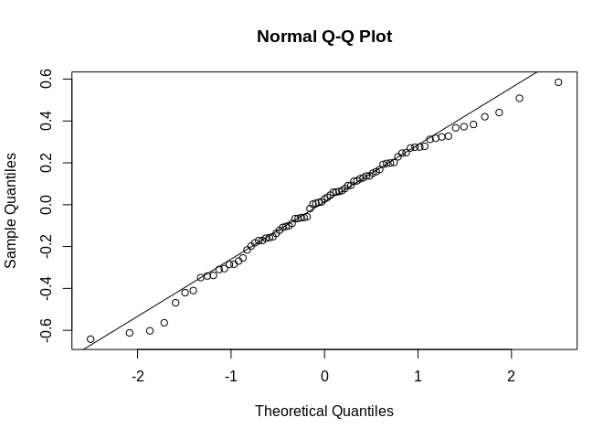<!-- -->

```r
# DIC
ggplot(epf_s,aes(x=timepoint_fac,y=EPF_DIC_Start,group=interaction(pCO2_fac,timepoint_fac),colour=pCO2_fac)) + 
  geom_hline(yintercept= sum_WC$DIC,col=trt_color,size=1) + 
  geom_boxplot() + 
  scale_color_manual(values=trt_color) + 
  theme_bw() +
  labs(title="EPF DIC",x="Time",y="EPF DIC",colour="pCO2")
```

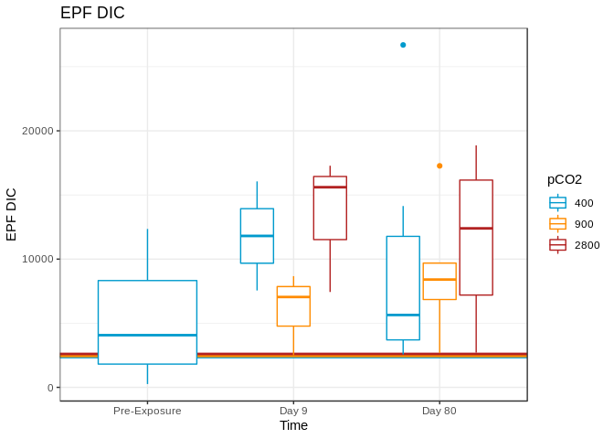<!-- -->
**Figure Notes**: Horizontal lines represent the mean environment value for each the the treatment levels.
  
**Subsetting data for stats**

```r
# Lets only look at exposure timepoints here
epf_s_Exp <- epf_s[epf_s$timepoint > 2,]
# Only two treatment levels we have molecular data for (~400,~2800)
epf_s_Exp <- epf_s_Exp[!epf_s_Exp$pCO2_fac==900,]
```
  
#### **Statistical Analysis**

**Overview**  
Test: 2-way ANOVA - 
* Explainatory Factors: Treatment (pCO2_fac) and Time (timepoint_fac)
* Tested for normality and variance assumptions - log transformed EPF data if needed
  
**NOTE** : Due to extremely lower power hear I don't think we really even have the option of using random effects  

**EPF Calcite**

```r
mod_1 <- lm(EPF_Ca_Start~pCO2_fac*timepoint_fac,data=epf_s_Exp)

qqnorm(mod_1$residuals)
qqline(mod_1$residuals)
```

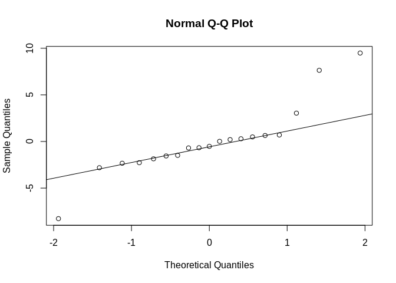<!-- -->

```r
# resids a little wonky trying a transformation
mod_2 <-  lm(log(EPF_Ca_Start)~pCO2_fac*timepoint_fac,data=epf_s_Exp)
qqnorm(mod_2$residuals)
qqline(mod_2$residuals)
```

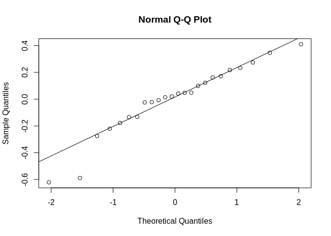<!-- -->

```r
#Slight improvement

leveneTest(log(epf_s_Exp$EPF_Ca_Start)~epf_s_Exp$pCO2_fac*epf_s_Exp$timepoint_fac)
```

```
## Levene's Test for Homogeneity of Variance (center = median)
##       Df F value Pr(>F)
## group  3  0.7673   0.53
##       15
```

```r
# Seem to be OK

## Running ANOVA
(aov_2 <-aov(mod_2))
```

```
## Call:
##    aov(formula = mod_2)
## 
## Terms:
##                  pCO2_fac timepoint_fac pCO2_fac:timepoint_fac Residuals
## Sum of Squares   0.914441      5.117193               0.507022 10.619100
## Deg. of Freedom         1             1                      1        15
## 
## Residual standard error: 0.8413917
## Estimated effects may be unbalanced
```

```r
summary(aov_2)
```

```
##                        Df Sum Sq Mean Sq F value Pr(>F)  
## pCO2_fac                1  0.914   0.914   1.292 0.2736  
## timepoint_fac           1  5.117   5.117   7.228 0.0168 *
## pCO2_fac:timepoint_fac  1  0.507   0.507   0.716 0.4107  
## Residuals              15 10.619   0.708                 
## ---
## Signif. codes:  0 '***' 0.001 '**' 0.01 '*' 0.05 '.' 0.1 ' ' 1
```

```r
# :( close but not significant (might be limited power here)
```

**DIC**

```r
mod_1 <- lm(EPF_DIC_Start~pCO2_fac*timepoint_fac,data=epf_s_Exp)

qqnorm(mod_1$residuals)
qqline(mod_1$residuals)
```

<!-- -->

```r
leveneTest(log(epf_s_Exp$EPF_DIC_Start)~epf_s_Exp$pCO2_fac*epf_s_Exp$timepoint_fac)
```

```
## Levene's Test for Homogeneity of Variance (center = median)
##       Df F value Pr(>F)
## group  3  0.4744 0.7048
##       15
```

```r
# Seem to be OK

## Running ANOVA
(aov_1 <-aov(mod_1))
```

```
## Call:
##    aov(formula = mod_1)
## 
## Terms:
##                  pCO2_fac timepoint_fac pCO2_fac:timepoint_fac Residuals
## Sum of Squares   22097848      16421034                 209863 777885657
## Deg. of Freedom         1             1                      1        15
## 
## Residual standard error: 7201.322
## Estimated effects may be unbalanced
```

```r
summary(aov_1)
```

```
##                        Df    Sum Sq  Mean Sq F value Pr(>F)
## pCO2_fac                1  22097848 22097848   0.426  0.524
## timepoint_fac           1  16421034 16421034   0.317  0.582
## pCO2_fac:timepoint_fac  1    209863   209863   0.004  0.950
## Residuals              15 777885657 51859044
```

```r
# :( close but not significant (might be limited power here)
```

**pH**

```r
mod_1 <- lm(EPF_pH~pCO2_fac*timepoint_fac,data=epf_s_Exp)

qqnorm(mod_1$residuals)
qqline(mod_1$residuals)
```

<!-- -->

```r
leveneTest(log(epf_s_Exp$EPF_pH)~epf_s_Exp$pCO2_fac*epf_s_Exp$timepoint_fac)
```

```
## Levene's Test for Homogeneity of Variance (center = median)
##       Df F value Pr(>F)
## group  3  0.5158 0.6776
##       15
```

```r
# Seem to be OK

## Running ANOVA
(aov_1 <-aov(mod_1))
```

```
## Call:
##    aov(formula = mod_1)
## 
## Terms:
##                  pCO2_fac timepoint_fac pCO2_fac:timepoint_fac Residuals
## Sum of Squares  0.0126568     0.3863437              0.1340044 1.1886819
## Deg. of Freedom         1             1                      1        15
## 
## Residual standard error: 0.2815057
## Estimated effects may be unbalanced
```

```r
summary(aov_1)
```

```
##                        Df Sum Sq Mean Sq F value Pr(>F)  
## pCO2_fac                1 0.0127  0.0127   0.160 0.6951  
## timepoint_fac           1 0.3863  0.3863   4.875 0.0432 *
## pCO2_fac:timepoint_fac  1 0.1340  0.1340   1.691 0.2131  
## Residuals              15 1.1887  0.0792                 
## ---
## Signif. codes:  0 '***' 0.001 '**' 0.01 '*' 0.05 '.' 0.1 ' ' 1
```

```r
# :( close but not significant (might be limited power here)
```

