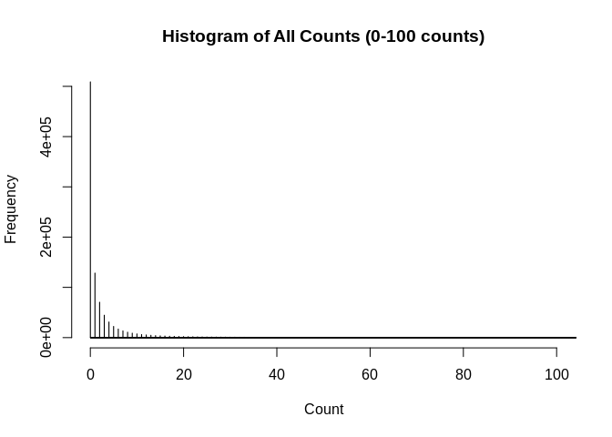
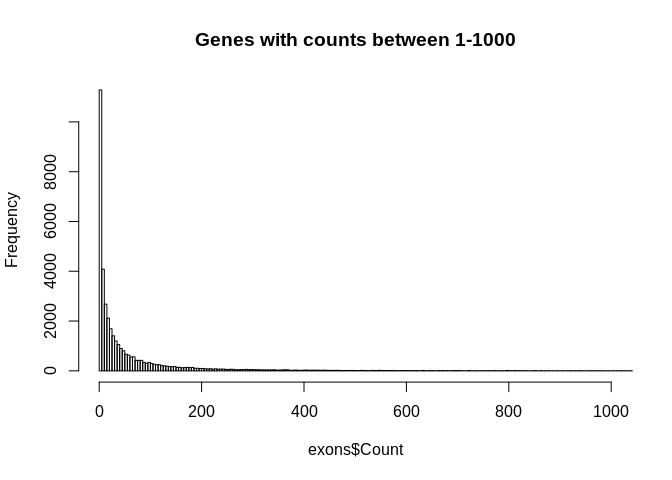
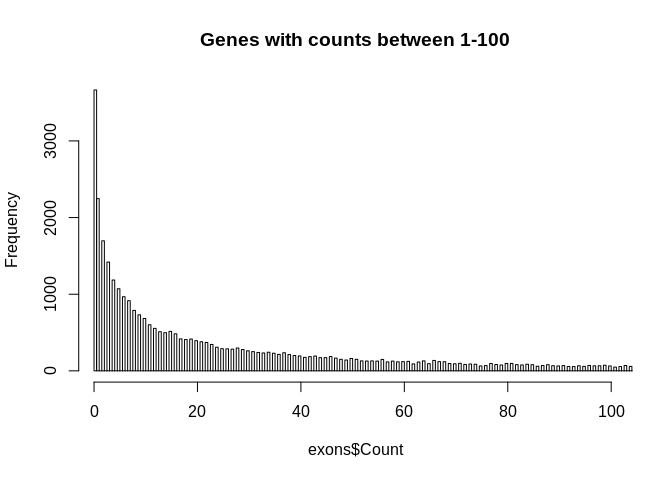
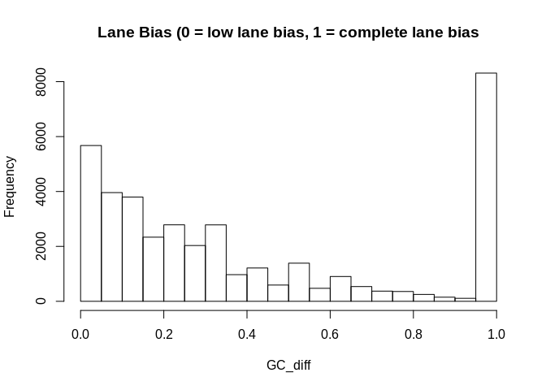
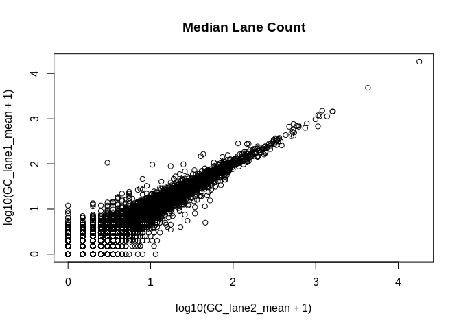
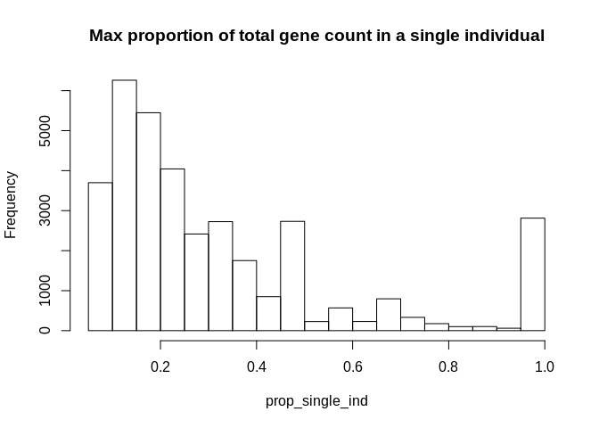
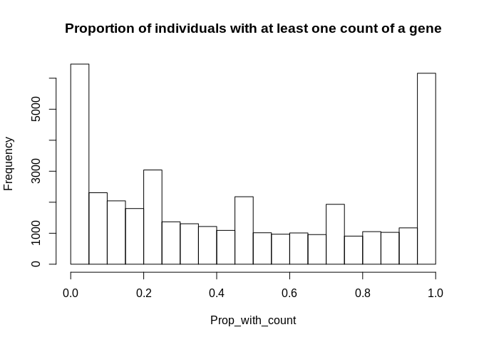
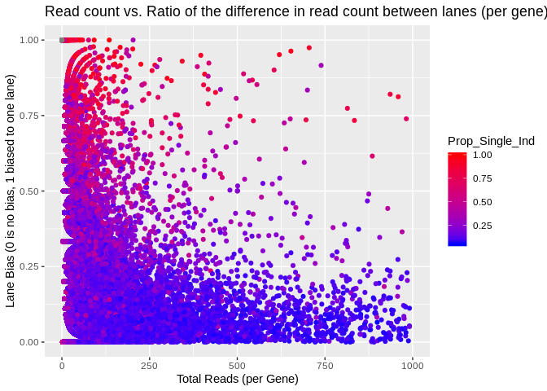
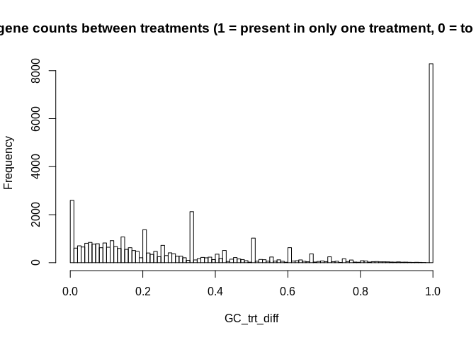
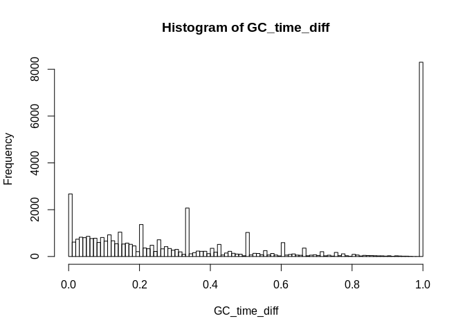

#### **GeneCount matrix and oyster metadata table**  

```r
# RNA count Matrix
GeneCounts <- read.delim("~/Github/2017OAExp_Oysters/results/C_virginica_gene_count_final.txt",header=TRUE,sep="",row.names=1)
```


**Top of Gene count matrix**  
<div style="border: 1px solid #ddd; padding: 5px; overflow-x: scroll; width:900px; "><table class="table" style="margin-left: auto; margin-right: auto;">
 <thead>
  <tr>
   <th style="text-align:left;">   </th>
   <th style="text-align:right;"> RNA17005 </th>
   <th style="text-align:right;"> RNA17007 </th>
   <th style="text-align:right;"> RNA17013 </th>
   <th style="text-align:right;"> RNA17019 </th>
   <th style="text-align:right;"> RNA17069 </th>
   <th style="text-align:right;"> RNA17070 </th>
   <th style="text-align:right;"> RNA17072 </th>
   <th style="text-align:right;"> RNA17079 </th>
   <th style="text-align:right;"> RNA17090 </th>
   <th style="text-align:right;"> RNA17094 </th>
   <th style="text-align:right;"> RNA17099 </th>
   <th style="text-align:right;"> RNA17108 </th>
   <th style="text-align:right;"> RNA17122 </th>
   <th style="text-align:right;"> RNA17130 </th>
   <th style="text-align:right;"> RNA17142 </th>
   <th style="text-align:right;"> RNA17145 </th>
   <th style="text-align:right;"> RNA17162 </th>
   <th style="text-align:right;"> RNA17174 </th>
   <th style="text-align:right;"> RNA17176 </th>
   <th style="text-align:right;"> RNA17178 </th>
   <th style="text-align:right;"> RNA17181 </th>
   <th style="text-align:right;"> RNA17203 </th>
   <th style="text-align:right;"> RNA17211 </th>
   <th style="text-align:right;"> RNA17213 </th>
  </tr>
 </thead>
<tbody>
  <tr>
   <td style="text-align:left;"> LOC111099029 </td>
   <td style="text-align:right;"> 0 </td>
   <td style="text-align:right;"> 1 </td>
   <td style="text-align:right;"> 0 </td>
   <td style="text-align:right;"> 3 </td>
   <td style="text-align:right;"> 0 </td>
   <td style="text-align:right;"> 0 </td>
   <td style="text-align:right;"> 1 </td>
   <td style="text-align:right;"> 0 </td>
   <td style="text-align:right;"> 0 </td>
   <td style="text-align:right;"> 0 </td>
   <td style="text-align:right;"> 0 </td>
   <td style="text-align:right;"> 1 </td>
   <td style="text-align:right;"> 1 </td>
   <td style="text-align:right;"> 1 </td>
   <td style="text-align:right;"> 1 </td>
   <td style="text-align:right;"> 0 </td>
   <td style="text-align:right;"> 1 </td>
   <td style="text-align:right;"> 1 </td>
   <td style="text-align:right;"> 0 </td>
   <td style="text-align:right;"> 1 </td>
   <td style="text-align:right;"> 1 </td>
   <td style="text-align:right;"> 1 </td>
   <td style="text-align:right;"> 1 </td>
   <td style="text-align:right;"> 1 </td>
  </tr>
  <tr>
   <td style="text-align:left;"> LOC111099030 </td>
   <td style="text-align:right;"> 0 </td>
   <td style="text-align:right;"> 0 </td>
   <td style="text-align:right;"> 2 </td>
   <td style="text-align:right;"> 1 </td>
   <td style="text-align:right;"> 0 </td>
   <td style="text-align:right;"> 0 </td>
   <td style="text-align:right;"> 0 </td>
   <td style="text-align:right;"> 1 </td>
   <td style="text-align:right;"> 1 </td>
   <td style="text-align:right;"> 0 </td>
   <td style="text-align:right;"> 0 </td>
   <td style="text-align:right;"> 1 </td>
   <td style="text-align:right;"> 0 </td>
   <td style="text-align:right;"> 0 </td>
   <td style="text-align:right;"> 0 </td>
   <td style="text-align:right;"> 0 </td>
   <td style="text-align:right;"> 0 </td>
   <td style="text-align:right;"> 1 </td>
   <td style="text-align:right;"> 0 </td>
   <td style="text-align:right;"> 2 </td>
   <td style="text-align:right;"> 3 </td>
   <td style="text-align:right;"> 0 </td>
   <td style="text-align:right;"> 1 </td>
   <td style="text-align:right;"> 4 </td>
  </tr>
  <tr>
   <td style="text-align:left;"> LOC111099031 </td>
   <td style="text-align:right;"> 0 </td>
   <td style="text-align:right;"> 0 </td>
   <td style="text-align:right;"> 0 </td>
   <td style="text-align:right;"> 0 </td>
   <td style="text-align:right;"> 0 </td>
   <td style="text-align:right;"> 0 </td>
   <td style="text-align:right;"> 0 </td>
   <td style="text-align:right;"> 0 </td>
   <td style="text-align:right;"> 0 </td>
   <td style="text-align:right;"> 0 </td>
   <td style="text-align:right;"> 0 </td>
   <td style="text-align:right;"> 0 </td>
   <td style="text-align:right;"> 0 </td>
   <td style="text-align:right;"> 0 </td>
   <td style="text-align:right;"> 0 </td>
   <td style="text-align:right;"> 1 </td>
   <td style="text-align:right;"> 0 </td>
   <td style="text-align:right;"> 0 </td>
   <td style="text-align:right;"> 0 </td>
   <td style="text-align:right;"> 0 </td>
   <td style="text-align:right;"> 0 </td>
   <td style="text-align:right;"> 1 </td>
   <td style="text-align:right;"> 0 </td>
   <td style="text-align:right;"> 0 </td>
  </tr>
  <tr>
   <td style="text-align:left;"> LOC111099032 </td>
   <td style="text-align:right;"> 0 </td>
   <td style="text-align:right;"> 0 </td>
   <td style="text-align:right;"> 1 </td>
   <td style="text-align:right;"> 0 </td>
   <td style="text-align:right;"> 0 </td>
   <td style="text-align:right;"> 0 </td>
   <td style="text-align:right;"> 0 </td>
   <td style="text-align:right;"> 0 </td>
   <td style="text-align:right;"> 0 </td>
   <td style="text-align:right;"> 0 </td>
   <td style="text-align:right;"> 0 </td>
   <td style="text-align:right;"> 0 </td>
   <td style="text-align:right;"> 0 </td>
   <td style="text-align:right;"> 0 </td>
   <td style="text-align:right;"> 0 </td>
   <td style="text-align:right;"> 0 </td>
   <td style="text-align:right;"> 0 </td>
   <td style="text-align:right;"> 0 </td>
   <td style="text-align:right;"> 0 </td>
   <td style="text-align:right;"> 0 </td>
   <td style="text-align:right;"> 0 </td>
   <td style="text-align:right;"> 0 </td>
   <td style="text-align:right;"> 0 </td>
   <td style="text-align:right;"> 0 </td>
  </tr>
  <tr>
   <td style="text-align:left;"> LOC111099033 </td>
   <td style="text-align:right;"> 0 </td>
   <td style="text-align:right;"> 0 </td>
   <td style="text-align:right;"> 1 </td>
   <td style="text-align:right;"> 0 </td>
   <td style="text-align:right;"> 1 </td>
   <td style="text-align:right;"> 1 </td>
   <td style="text-align:right;"> 0 </td>
   <td style="text-align:right;"> 0 </td>
   <td style="text-align:right;"> 0 </td>
   <td style="text-align:right;"> 0 </td>
   <td style="text-align:right;"> 1 </td>
   <td style="text-align:right;"> 0 </td>
   <td style="text-align:right;"> 1 </td>
   <td style="text-align:right;"> 0 </td>
   <td style="text-align:right;"> 2 </td>
   <td style="text-align:right;"> 3 </td>
   <td style="text-align:right;"> 3 </td>
   <td style="text-align:right;"> 2 </td>
   <td style="text-align:right;"> 1 </td>
   <td style="text-align:right;"> 2 </td>
   <td style="text-align:right;"> 1 </td>
   <td style="text-align:right;"> 3 </td>
   <td style="text-align:right;"> 4 </td>
   <td style="text-align:right;"> 1 </td>
  </tr>
  <tr>
   <td style="text-align:left;"> LOC111099034 </td>
   <td style="text-align:right;"> 1 </td>
   <td style="text-align:right;"> 4 </td>
   <td style="text-align:right;"> 0 </td>
   <td style="text-align:right;"> 1 </td>
   <td style="text-align:right;"> 4 </td>
   <td style="text-align:right;"> 2 </td>
   <td style="text-align:right;"> 5 </td>
   <td style="text-align:right;"> 1 </td>
   <td style="text-align:right;"> 4 </td>
   <td style="text-align:right;"> 5 </td>
   <td style="text-align:right;"> 1 </td>
   <td style="text-align:right;"> 1 </td>
   <td style="text-align:right;"> 2 </td>
   <td style="text-align:right;"> 0 </td>
   <td style="text-align:right;"> 0 </td>
   <td style="text-align:right;"> 10 </td>
   <td style="text-align:right;"> 6 </td>
   <td style="text-align:right;"> 2 </td>
   <td style="text-align:right;"> 0 </td>
   <td style="text-align:right;"> 0 </td>
   <td style="text-align:right;"> 2 </td>
   <td style="text-align:right;"> 0 </td>
   <td style="text-align:right;"> 5 </td>
   <td style="text-align:right;"> 4 </td>
  </tr>
</tbody>
</table></div>

Total gene counts in data set  
<table class="table" style="margin-left: auto; margin-right: auto;">
<tbody>
  <tr>
   <td style="text-align:left;"> Total Counts in Gene Count Matrix </td>
  </tr>
  <tr>
   <td style="text-align:left;"> 4742788 </td>
  </tr>
</tbody>
</table>

Number of total counts per individual  
<div style="border: 1px solid #ddd; padding: 5px; overflow-x: scroll; width:900px; "><table class="table" style="margin-left: auto; margin-right: auto;">
 <thead>
  <tr>
   <th style="text-align:left;">   </th>
   <th style="text-align:right;"> RNA17005 </th>
   <th style="text-align:right;"> RNA17007 </th>
   <th style="text-align:right;"> RNA17013 </th>
   <th style="text-align:right;"> RNA17019 </th>
   <th style="text-align:right;"> RNA17069 </th>
   <th style="text-align:right;"> RNA17070 </th>
   <th style="text-align:right;"> RNA17072 </th>
   <th style="text-align:right;"> RNA17079 </th>
   <th style="text-align:right;"> RNA17090 </th>
   <th style="text-align:right;"> RNA17094 </th>
   <th style="text-align:right;"> RNA17099 </th>
   <th style="text-align:right;"> RNA17108 </th>
   <th style="text-align:right;"> RNA17122 </th>
   <th style="text-align:right;"> RNA17130 </th>
   <th style="text-align:right;"> RNA17142 </th>
   <th style="text-align:right;"> RNA17145 </th>
   <th style="text-align:right;"> RNA17162 </th>
   <th style="text-align:right;"> RNA17174 </th>
   <th style="text-align:right;"> RNA17176 </th>
   <th style="text-align:right;"> RNA17178 </th>
   <th style="text-align:right;"> RNA17181 </th>
   <th style="text-align:right;"> RNA17203 </th>
   <th style="text-align:right;"> RNA17211 </th>
   <th style="text-align:right;"> RNA17213 </th>
  </tr>
 </thead>
<tbody>
  <tr>
   <td style="text-align:left;"> sum2 </td>
   <td style="text-align:right;"> 185575 </td>
   <td style="text-align:right;"> 212677 </td>
   <td style="text-align:right;"> 215799 </td>
   <td style="text-align:right;"> 207748 </td>
   <td style="text-align:right;"> 250191 </td>
   <td style="text-align:right;"> 202828 </td>
   <td style="text-align:right;"> 186061 </td>
   <td style="text-align:right;"> 197786 </td>
   <td style="text-align:right;"> 205831 </td>
   <td style="text-align:right;"> 184038 </td>
   <td style="text-align:right;"> 206474 </td>
   <td style="text-align:right;"> 183555 </td>
   <td style="text-align:right;"> 216649 </td>
   <td style="text-align:right;"> 189667 </td>
   <td style="text-align:right;"> 170509 </td>
   <td style="text-align:right;"> 173338 </td>
   <td style="text-align:right;"> 184528 </td>
   <td style="text-align:right;"> 262110 </td>
   <td style="text-align:right;"> 196390 </td>
   <td style="text-align:right;"> 156620 </td>
   <td style="text-align:right;"> 156228 </td>
   <td style="text-align:right;"> 192130 </td>
   <td style="text-align:right;"> 186060 </td>
   <td style="text-align:right;"> 219996 </td>
  </tr>
</tbody>
</table></div>

#### **2017 Experiment MetaData**  

```r
# Oyster meta data
model<-read.delim("~/Github/2017OAExp_Oysters/input_files/RNA/metadata_cvirginica_rna_meta.txt",sep = ",",header=TRUE)
kable(model) %>%
  kable_styling() %>% 
  scroll_box(width = "900px", height = "400px")
```

<div style="border: 1px solid #ddd; padding: 5px; overflow-y: scroll; height:400px; overflow-x: scroll; width:900px; "><table class="table" style="margin-left: auto; margin-right: auto;">
 <thead>
  <tr>
   <th style="text-align:left;"> sample_name </th>
   <th style="text-align:right;"> sample_index </th>
   <th style="text-align:right;"> treatment </th>
   <th style="text-align:right;"> timepoint </th>
   <th style="text-align:right;"> shelf </th>
   <th style="text-align:right;"> tank </th>
   <th style="text-align:right;"> tankID </th>
   <th style="text-align:right;"> population </th>
   <th style="text-align:right;"> extraction_order </th>
   <th style="text-align:right;"> seq_order </th>
   <th style="text-align:right;"> lane </th>
   <th style="text-align:right;"> gw_tapestation_RINe </th>
   <th style="text-align:right;"> gw_tapestation_conc </th>
   <th style="text-align:right;"> read_num </th>
   <th style="text-align:right;"> dry_wgtcorr </th>
   <th style="text-align:right;"> epf_pH </th>
   <th style="text-align:right;"> diff_pH </th>
   <th style="text-align:right;"> env_pH </th>
  </tr>
 </thead>
<tbody>
  <tr>
   <td style="text-align:left;"> RNA17005 </td>
   <td style="text-align:right;"> 1 </td>
   <td style="text-align:right;"> 400 </td>
   <td style="text-align:right;"> 6 </td>
   <td style="text-align:right;"> 1 </td>
   <td style="text-align:right;"> 1 </td>
   <td style="text-align:right;"> 1 </td>
   <td style="text-align:right;"> 2 </td>
   <td style="text-align:right;"> 21 </td>
   <td style="text-align:right;"> 22 </td>
   <td style="text-align:right;"> 2 </td>
   <td style="text-align:right;"> 8.3 </td>
   <td style="text-align:right;"> 50.2 </td>
   <td style="text-align:right;"> 40080928 </td>
   <td style="text-align:right;"> 0.715 </td>
   <td style="text-align:right;"> 6.846758 </td>
   <td style="text-align:right;"> -0.8584655 </td>
   <td style="text-align:right;"> 7.705224 </td>
  </tr>
  <tr>
   <td style="text-align:left;"> RNA17007 </td>
   <td style="text-align:right;"> 2 </td>
   <td style="text-align:right;"> 400 </td>
   <td style="text-align:right;"> 6 </td>
   <td style="text-align:right;"> 1 </td>
   <td style="text-align:right;"> 2 </td>
   <td style="text-align:right;"> 2 </td>
   <td style="text-align:right;"> 1 </td>
   <td style="text-align:right;"> 17 </td>
   <td style="text-align:right;"> 10 </td>
   <td style="text-align:right;"> 1 </td>
   <td style="text-align:right;"> 9.0 </td>
   <td style="text-align:right;"> 75.9 </td>
   <td style="text-align:right;"> 42806943 </td>
   <td style="text-align:right;"> 0.177 </td>
   <td style="text-align:right;"> 7.455280 </td>
   <td style="text-align:right;"> -0.3811514 </td>
   <td style="text-align:right;"> 7.836431 </td>
  </tr>
  <tr>
   <td style="text-align:left;"> RNA17013 </td>
   <td style="text-align:right;"> 3 </td>
   <td style="text-align:right;"> 400 </td>
   <td style="text-align:right;"> 3 </td>
   <td style="text-align:right;"> 2 </td>
   <td style="text-align:right;"> 2 </td>
   <td style="text-align:right;"> 5 </td>
   <td style="text-align:right;"> 1 </td>
   <td style="text-align:right;"> 11 </td>
   <td style="text-align:right;"> 5 </td>
   <td style="text-align:right;"> 1 </td>
   <td style="text-align:right;"> 8.7 </td>
   <td style="text-align:right;"> 46.1 </td>
   <td style="text-align:right;"> 42332976 </td>
   <td style="text-align:right;"> 1.110 </td>
   <td style="text-align:right;"> 7.385796 </td>
   <td style="text-align:right;"> -0.4344719 </td>
   <td style="text-align:right;"> 7.820268 </td>
  </tr>
  <tr>
   <td style="text-align:left;"> RNA17019 </td>
   <td style="text-align:right;"> 4 </td>
   <td style="text-align:right;"> 2800 </td>
   <td style="text-align:right;"> 6 </td>
   <td style="text-align:right;"> 4 </td>
   <td style="text-align:right;"> 3 </td>
   <td style="text-align:right;"> 9 </td>
   <td style="text-align:right;"> 2 </td>
   <td style="text-align:right;"> 14 </td>
   <td style="text-align:right;"> 20 </td>
   <td style="text-align:right;"> 2 </td>
   <td style="text-align:right;"> 8.9 </td>
   <td style="text-align:right;"> 61.4 </td>
   <td style="text-align:right;"> 45046863 </td>
   <td style="text-align:right;"> 0.707 </td>
   <td style="text-align:right;"> 7.149452 </td>
   <td style="text-align:right;"> 0.0881135 </td>
   <td style="text-align:right;"> 7.061338 </td>
  </tr>
  <tr>
   <td style="text-align:left;"> RNA17069 </td>
   <td style="text-align:right;"> 5 </td>
   <td style="text-align:right;"> 400 </td>
   <td style="text-align:right;"> 3 </td>
   <td style="text-align:right;"> 1 </td>
   <td style="text-align:right;"> 1 </td>
   <td style="text-align:right;"> 1 </td>
   <td style="text-align:right;"> 3 </td>
   <td style="text-align:right;"> 3 </td>
   <td style="text-align:right;"> 1 </td>
   <td style="text-align:right;"> 1 </td>
   <td style="text-align:right;"> 8.4 </td>
   <td style="text-align:right;"> 41.3 </td>
   <td style="text-align:right;"> 42702450 </td>
   <td style="text-align:right;"> 1.040 </td>
   <td style="text-align:right;"> 7.817657 </td>
   <td style="text-align:right;"> 0.0088614 </td>
   <td style="text-align:right;"> 7.808795 </td>
  </tr>
  <tr>
   <td style="text-align:left;"> RNA17070 </td>
   <td style="text-align:right;"> 6 </td>
   <td style="text-align:right;"> 400 </td>
   <td style="text-align:right;"> 3 </td>
   <td style="text-align:right;"> 1 </td>
   <td style="text-align:right;"> 2 </td>
   <td style="text-align:right;"> 2 </td>
   <td style="text-align:right;"> 1 </td>
   <td style="text-align:right;"> 7 </td>
   <td style="text-align:right;"> 13 </td>
   <td style="text-align:right;"> 2 </td>
   <td style="text-align:right;"> 9.5 </td>
   <td style="text-align:right;"> 71.9 </td>
   <td style="text-align:right;"> 41410387 </td>
   <td style="text-align:right;"> 1.250 </td>
   <td style="text-align:right;"> 6.786949 </td>
   <td style="text-align:right;"> -1.0161107 </td>
   <td style="text-align:right;"> 7.803059 </td>
  </tr>
  <tr>
   <td style="text-align:left;"> RNA17072 </td>
   <td style="text-align:right;"> 7 </td>
   <td style="text-align:right;"> 2800 </td>
   <td style="text-align:right;"> 3 </td>
   <td style="text-align:right;"> 4 </td>
   <td style="text-align:right;"> 3 </td>
   <td style="text-align:right;"> 9 </td>
   <td style="text-align:right;"> 2 </td>
   <td style="text-align:right;"> 16 </td>
   <td style="text-align:right;"> 19 </td>
   <td style="text-align:right;"> 2 </td>
   <td style="text-align:right;"> 9.3 </td>
   <td style="text-align:right;"> 40.9 </td>
   <td style="text-align:right;"> 37026936 </td>
   <td style="text-align:right;"> 1.430 </td>
   <td style="text-align:right;"> 7.616122 </td>
   <td style="text-align:right;"> 0.4727182 </td>
   <td style="text-align:right;"> 7.143403 </td>
  </tr>
  <tr>
   <td style="text-align:left;"> RNA17079 </td>
   <td style="text-align:right;"> 8 </td>
   <td style="text-align:right;"> 400 </td>
   <td style="text-align:right;"> 6 </td>
   <td style="text-align:right;"> 2 </td>
   <td style="text-align:right;"> 3 </td>
   <td style="text-align:right;"> 6 </td>
   <td style="text-align:right;"> 2 </td>
   <td style="text-align:right;"> 13 </td>
   <td style="text-align:right;"> 18 </td>
   <td style="text-align:right;"> 2 </td>
   <td style="text-align:right;"> 9.3 </td>
   <td style="text-align:right;"> 59.0 </td>
   <td style="text-align:right;"> 42141967 </td>
   <td style="text-align:right;"> 0.614 </td>
   <td style="text-align:right;"> 7.449509 </td>
   <td style="text-align:right;"> -0.3869217 </td>
   <td style="text-align:right;"> 7.836431 </td>
  </tr>
  <tr>
   <td style="text-align:left;"> RNA17090 </td>
   <td style="text-align:right;"> 9 </td>
   <td style="text-align:right;"> 2800 </td>
   <td style="text-align:right;"> 3 </td>
   <td style="text-align:right;"> 6 </td>
   <td style="text-align:right;"> 2 </td>
   <td style="text-align:right;"> 11 </td>
   <td style="text-align:right;"> 1 </td>
   <td style="text-align:right;"> 8 </td>
   <td style="text-align:right;"> 15 </td>
   <td style="text-align:right;"> 2 </td>
   <td style="text-align:right;"> 9.3 </td>
   <td style="text-align:right;"> 64.5 </td>
   <td style="text-align:right;"> 38056474 </td>
   <td style="text-align:right;"> 1.240 </td>
   <td style="text-align:right;"> 7.420345 </td>
   <td style="text-align:right;"> 0.2482606 </td>
   <td style="text-align:right;"> 7.172084 </td>
  </tr>
  <tr>
   <td style="text-align:left;"> RNA17094 </td>
   <td style="text-align:right;"> 10 </td>
   <td style="text-align:right;"> 2800 </td>
   <td style="text-align:right;"> 6 </td>
   <td style="text-align:right;"> 6 </td>
   <td style="text-align:right;"> 2 </td>
   <td style="text-align:right;"> 11 </td>
   <td style="text-align:right;"> 3 </td>
   <td style="text-align:right;"> 6 </td>
   <td style="text-align:right;"> 16 </td>
   <td style="text-align:right;"> 2 </td>
   <td style="text-align:right;"> 9.4 </td>
   <td style="text-align:right;"> 30.9 </td>
   <td style="text-align:right;"> 36832035 </td>
   <td style="text-align:right;"> 2.372 </td>
   <td style="text-align:right;"> 7.172533 </td>
   <td style="text-align:right;"> 0.1056187 </td>
   <td style="text-align:right;"> 7.066915 </td>
  </tr>
  <tr>
   <td style="text-align:left;"> RNA17099 </td>
   <td style="text-align:right;"> 11 </td>
   <td style="text-align:right;"> 400 </td>
   <td style="text-align:right;"> 6 </td>
   <td style="text-align:right;"> 1 </td>
   <td style="text-align:right;"> 3 </td>
   <td style="text-align:right;"> 3 </td>
   <td style="text-align:right;"> 2 </td>
   <td style="text-align:right;"> 1 </td>
   <td style="text-align:right;"> 2 </td>
   <td style="text-align:right;"> 1 </td>
   <td style="text-align:right;"> 9.0 </td>
   <td style="text-align:right;"> 33.4 </td>
   <td style="text-align:right;"> 41411209 </td>
   <td style="text-align:right;"> 0.879 </td>
   <td style="text-align:right;"> 7.668782 </td>
   <td style="text-align:right;"> -0.1564964 </td>
   <td style="text-align:right;"> 7.825279 </td>
  </tr>
  <tr>
   <td style="text-align:left;"> RNA17108 </td>
   <td style="text-align:right;"> 12 </td>
   <td style="text-align:right;"> 2800 </td>
   <td style="text-align:right;"> 3 </td>
   <td style="text-align:right;"> 6 </td>
   <td style="text-align:right;"> 3 </td>
   <td style="text-align:right;"> 12 </td>
   <td style="text-align:right;"> 3 </td>
   <td style="text-align:right;"> 4 </td>
   <td style="text-align:right;"> 3 </td>
   <td style="text-align:right;"> 1 </td>
   <td style="text-align:right;"> 7.4 </td>
   <td style="text-align:right;"> 40.9 </td>
   <td style="text-align:right;"> 36354214 </td>
   <td style="text-align:right;"> 1.060 </td>
   <td style="text-align:right;"> 7.633396 </td>
   <td style="text-align:right;"> 0.4785204 </td>
   <td style="text-align:right;"> 7.154876 </td>
  </tr>
  <tr>
   <td style="text-align:left;"> RNA17122 </td>
   <td style="text-align:right;"> 13 </td>
   <td style="text-align:right;"> 2800 </td>
   <td style="text-align:right;"> 3 </td>
   <td style="text-align:right;"> 4 </td>
   <td style="text-align:right;"> 1 </td>
   <td style="text-align:right;"> 7 </td>
   <td style="text-align:right;"> 3 </td>
   <td style="text-align:right;"> 20 </td>
   <td style="text-align:right;"> 11 </td>
   <td style="text-align:right;"> 1 </td>
   <td style="text-align:right;"> 8.5 </td>
   <td style="text-align:right;"> 41.9 </td>
   <td style="text-align:right;"> 39911842 </td>
   <td style="text-align:right;"> 1.360 </td>
   <td style="text-align:right;"> 7.857964 </td>
   <td style="text-align:right;"> 0.7030881 </td>
   <td style="text-align:right;"> 7.154876 </td>
  </tr>
  <tr>
   <td style="text-align:left;"> RNA17130 </td>
   <td style="text-align:right;"> 14 </td>
   <td style="text-align:right;"> 2800 </td>
   <td style="text-align:right;"> 6 </td>
   <td style="text-align:right;"> 6 </td>
   <td style="text-align:right;"> 3 </td>
   <td style="text-align:right;"> 12 </td>
   <td style="text-align:right;"> 2 </td>
   <td style="text-align:right;"> 2 </td>
   <td style="text-align:right;"> 4 </td>
   <td style="text-align:right;"> 1 </td>
   <td style="text-align:right;"> 8.7 </td>
   <td style="text-align:right;"> 49.0 </td>
   <td style="text-align:right;"> 37595762 </td>
   <td style="text-align:right;"> 0.299 </td>
   <td style="text-align:right;"> 7.097519 </td>
   <td style="text-align:right;"> 0.0306043 </td>
   <td style="text-align:right;"> 7.066915 </td>
  </tr>
  <tr>
   <td style="text-align:left;"> RNA17142 </td>
   <td style="text-align:right;"> 15 </td>
   <td style="text-align:right;"> 2800 </td>
   <td style="text-align:right;"> 3 </td>
   <td style="text-align:right;"> 6 </td>
   <td style="text-align:right;"> 1 </td>
   <td style="text-align:right;"> 10 </td>
   <td style="text-align:right;"> 2 </td>
   <td style="text-align:right;"> 12 </td>
   <td style="text-align:right;"> 7 </td>
   <td style="text-align:right;"> 1 </td>
   <td style="text-align:right;"> 9.3 </td>
   <td style="text-align:right;"> 74.4 </td>
   <td style="text-align:right;"> 36773848 </td>
   <td style="text-align:right;"> 0.400 </td>
   <td style="text-align:right;"> 7.811899 </td>
   <td style="text-align:right;"> 0.6226061 </td>
   <td style="text-align:right;"> 7.189292 </td>
  </tr>
  <tr>
   <td style="text-align:left;"> RNA17145 </td>
   <td style="text-align:right;"> 16 </td>
   <td style="text-align:right;"> 2800 </td>
   <td style="text-align:right;"> 6 </td>
   <td style="text-align:right;"> 6 </td>
   <td style="text-align:right;"> 1 </td>
   <td style="text-align:right;"> 10 </td>
   <td style="text-align:right;"> 3 </td>
   <td style="text-align:right;"> 18 </td>
   <td style="text-align:right;"> 12 </td>
   <td style="text-align:right;"> 1 </td>
   <td style="text-align:right;"> 9.4 </td>
   <td style="text-align:right;"> 49.3 </td>
   <td style="text-align:right;"> 39763769 </td>
   <td style="text-align:right;"> 0.361 </td>
   <td style="text-align:right;"> 6.918638 </td>
   <td style="text-align:right;"> -0.1482763 </td>
   <td style="text-align:right;"> 7.066915 </td>
  </tr>
  <tr>
   <td style="text-align:left;"> RNA17162 </td>
   <td style="text-align:right;"> 17 </td>
   <td style="text-align:right;"> 400 </td>
   <td style="text-align:right;"> 3 </td>
   <td style="text-align:right;"> 2 </td>
   <td style="text-align:right;"> 3 </td>
   <td style="text-align:right;"> 6 </td>
   <td style="text-align:right;"> 2 </td>
   <td style="text-align:right;"> 23 </td>
   <td style="text-align:right;"> 21 </td>
   <td style="text-align:right;"> 2 </td>
   <td style="text-align:right;"> 9.2 </td>
   <td style="text-align:right;"> 53.5 </td>
   <td style="text-align:right;"> 37805565 </td>
   <td style="text-align:right;"> 0.910 </td>
   <td style="text-align:right;"> 7.570056 </td>
   <td style="text-align:right;"> -0.2502112 </td>
   <td style="text-align:right;"> 7.820268 </td>
  </tr>
  <tr>
   <td style="text-align:left;"> RNA17174 </td>
   <td style="text-align:right;"> 18 </td>
   <td style="text-align:right;"> 400 </td>
   <td style="text-align:right;"> 3 </td>
   <td style="text-align:right;"> 1 </td>
   <td style="text-align:right;"> 3 </td>
   <td style="text-align:right;"> 3 </td>
   <td style="text-align:right;"> 2 </td>
   <td style="text-align:right;"> 19 </td>
   <td style="text-align:right;"> 9 </td>
   <td style="text-align:right;"> 1 </td>
   <td style="text-align:right;"> 9.1 </td>
   <td style="text-align:right;"> 76.0 </td>
   <td style="text-align:right;"> 44648343 </td>
   <td style="text-align:right;"> 0.310 </td>
   <td style="text-align:right;"> 7.754317 </td>
   <td style="text-align:right;"> -0.0716867 </td>
   <td style="text-align:right;"> 7.826004 </td>
  </tr>
  <tr>
   <td style="text-align:left;"> RNA17176 </td>
   <td style="text-align:right;"> 19 </td>
   <td style="text-align:right;"> 400 </td>
   <td style="text-align:right;"> 3 </td>
   <td style="text-align:right;"> 2 </td>
   <td style="text-align:right;"> 1 </td>
   <td style="text-align:right;"> 4 </td>
   <td style="text-align:right;"> 3 </td>
   <td style="text-align:right;"> 15 </td>
   <td style="text-align:right;"> 17 </td>
   <td style="text-align:right;"> 2 </td>
   <td style="text-align:right;"> 9.0 </td>
   <td style="text-align:right;"> 45.8 </td>
   <td style="text-align:right;"> 42084075 </td>
   <td style="text-align:right;"> 0.670 </td>
   <td style="text-align:right;"> 7.132437 </td>
   <td style="text-align:right;"> -0.6763580 </td>
   <td style="text-align:right;"> 7.808795 </td>
  </tr>
  <tr>
   <td style="text-align:left;"> RNA17178 </td>
   <td style="text-align:right;"> 20 </td>
   <td style="text-align:right;"> 2800 </td>
   <td style="text-align:right;"> 6 </td>
   <td style="text-align:right;"> 4 </td>
   <td style="text-align:right;"> 2 </td>
   <td style="text-align:right;"> 8 </td>
   <td style="text-align:right;"> 1 </td>
   <td style="text-align:right;"> 10 </td>
   <td style="text-align:right;"> 8 </td>
   <td style="text-align:right;"> 1 </td>
   <td style="text-align:right;"> 7.5 </td>
   <td style="text-align:right;"> 59.8 </td>
   <td style="text-align:right;"> 36149105 </td>
   <td style="text-align:right;"> 1.011 </td>
   <td style="text-align:right;"> 7.091748 </td>
   <td style="text-align:right;"> 0.0248339 </td>
   <td style="text-align:right;"> 7.066915 </td>
  </tr>
  <tr>
   <td style="text-align:left;"> RNA17181 </td>
   <td style="text-align:right;"> 21 </td>
   <td style="text-align:right;"> 2800 </td>
   <td style="text-align:right;"> 3 </td>
   <td style="text-align:right;"> 4 </td>
   <td style="text-align:right;"> 2 </td>
   <td style="text-align:right;"> 8 </td>
   <td style="text-align:right;"> 1 </td>
   <td style="text-align:right;"> 24 </td>
   <td style="text-align:right;"> 23 </td>
   <td style="text-align:right;"> 2 </td>
   <td style="text-align:right;"> 9.9 </td>
   <td style="text-align:right;"> 68.7 </td>
   <td style="text-align:right;"> 37853708 </td>
   <td style="text-align:right;"> 0.810 </td>
   <td style="text-align:right;"> 7.506717 </td>
   <td style="text-align:right;"> 0.3690496 </td>
   <td style="text-align:right;"> 7.137667 </td>
  </tr>
  <tr>
   <td style="text-align:left;"> RNA17203 </td>
   <td style="text-align:right;"> 22 </td>
   <td style="text-align:right;"> 400 </td>
   <td style="text-align:right;"> 6 </td>
   <td style="text-align:right;"> 2 </td>
   <td style="text-align:right;"> 1 </td>
   <td style="text-align:right;"> 4 </td>
   <td style="text-align:right;"> 3 </td>
   <td style="text-align:right;"> 9 </td>
   <td style="text-align:right;"> 6 </td>
   <td style="text-align:right;"> 1 </td>
   <td style="text-align:right;"> 8.7 </td>
   <td style="text-align:right;"> 47.9 </td>
   <td style="text-align:right;"> 38453143 </td>
   <td style="text-align:right;"> 0.186 </td>
   <td style="text-align:right;"> 7.484132 </td>
   <td style="text-align:right;"> -0.3522997 </td>
   <td style="text-align:right;"> 7.836431 </td>
  </tr>
  <tr>
   <td style="text-align:left;"> RNA17211 </td>
   <td style="text-align:right;"> 23 </td>
   <td style="text-align:right;"> 400 </td>
   <td style="text-align:right;"> 6 </td>
   <td style="text-align:right;"> 2 </td>
   <td style="text-align:right;"> 2 </td>
   <td style="text-align:right;"> 5 </td>
   <td style="text-align:right;"> 1 </td>
   <td style="text-align:right;"> 5 </td>
   <td style="text-align:right;"> 14 </td>
   <td style="text-align:right;"> 2 </td>
   <td style="text-align:right;"> 9.2 </td>
   <td style="text-align:right;"> 53.1 </td>
   <td style="text-align:right;"> 37888433 </td>
   <td style="text-align:right;"> 0.693 </td>
   <td style="text-align:right;"> 7.709175 </td>
   <td style="text-align:right;"> -0.1328326 </td>
   <td style="text-align:right;"> 7.842007 </td>
  </tr>
  <tr>
   <td style="text-align:left;"> RNA17213 </td>
   <td style="text-align:right;"> 24 </td>
   <td style="text-align:right;"> 2800 </td>
   <td style="text-align:right;"> 6 </td>
   <td style="text-align:right;"> 4 </td>
   <td style="text-align:right;"> 1 </td>
   <td style="text-align:right;"> 7 </td>
   <td style="text-align:right;"> 3 </td>
   <td style="text-align:right;"> 22 </td>
   <td style="text-align:right;"> 24 </td>
   <td style="text-align:right;"> 2 </td>
   <td style="text-align:right;"> 9.4 </td>
   <td style="text-align:right;"> 30.3 </td>
   <td style="text-align:right;"> 38842784 </td>
   <td style="text-align:right;"> 0.937 </td>
   <td style="text-align:right;"> 6.872476 </td>
   <td style="text-align:right;"> -0.1888628 </td>
   <td style="text-align:right;"> 7.061338 </td>
  </tr>
</tbody>
</table></div>

####**Count Matrix Visualization**  
<!-- --><!-- --><!-- --><div style="border: 1px solid #ddd; padding: 5px; overflow-x: scroll; width:900px; "><table class="table" style="margin-left: auto; margin-right: auto;">
 <thead>
  <tr>
   <th style="text-align:right;"> Max_Count </th>
   <th style="text-align:right;"> Prob_Gene_less </th>
   <th style="text-align:right;"> Prob_Gene_greater </th>
   <th style="text-align:right;"> Prob_Change </th>
  </tr>
 </thead>
<tbody>
  <tr>
   <td style="text-align:right;"> 0 </td>
   <td style="text-align:right;"> 1.0000000 </td>
   <td style="text-align:right;"> 0.0000000 </td>
   <td style="text-align:right;"> 0.0000000 </td>
  </tr>
  <tr>
   <td style="text-align:right;"> 1 </td>
   <td style="text-align:right;"> 0.9060425 </td>
   <td style="text-align:right;"> 0.0939575 </td>
   <td style="text-align:right;"> 0.0939575 </td>
  </tr>
  <tr>
   <td style="text-align:right;"> 2 </td>
   <td style="text-align:right;"> 0.8484375 </td>
   <td style="text-align:right;"> 0.1515625 </td>
   <td style="text-align:right;"> 0.0576050 </td>
  </tr>
  <tr>
   <td style="text-align:right;"> 5 </td>
   <td style="text-align:right;"> 0.7382008 </td>
   <td style="text-align:right;"> 0.2617992 </td>
   <td style="text-align:right;"> 0.1102366 </td>
  </tr>
  <tr>
   <td style="text-align:right;"> 10 </td>
   <td style="text-align:right;"> 0.6235291 </td>
   <td style="text-align:right;"> 0.3764709 </td>
   <td style="text-align:right;"> 0.1146717 </td>
  </tr>
  <tr>
   <td style="text-align:right;"> 25 </td>
   <td style="text-align:right;"> 0.4471761 </td>
   <td style="text-align:right;"> 0.5528239 </td>
   <td style="text-align:right;"> 0.1763530 </td>
  </tr>
  <tr>
   <td style="text-align:right;"> 50 </td>
   <td style="text-align:right;"> 0.3063809 </td>
   <td style="text-align:right;"> 0.6936191 </td>
   <td style="text-align:right;"> 0.1407952 </td>
  </tr>
  <tr>
   <td style="text-align:right;"> 100 </td>
   <td style="text-align:right;"> 0.1843515 </td>
   <td style="text-align:right;"> 0.8156485 </td>
   <td style="text-align:right;"> 0.1220294 </td>
  </tr>
  <tr>
   <td style="text-align:right;"> 200 </td>
   <td style="text-align:right;"> 0.0966493 </td>
   <td style="text-align:right;"> 0.9033507 </td>
   <td style="text-align:right;"> 0.0877022 </td>
  </tr>
  <tr>
   <td style="text-align:right;"> 250 </td>
   <td style="text-align:right;"> 0.0768324 </td>
   <td style="text-align:right;"> 0.9231676 </td>
   <td style="text-align:right;"> 0.0198170 </td>
  </tr>
  <tr>
   <td style="text-align:right;"> 500 </td>
   <td style="text-align:right;"> 0.0353783 </td>
   <td style="text-align:right;"> 0.9646217 </td>
   <td style="text-align:right;"> 0.0414541 </td>
  </tr>
  <tr>
   <td style="text-align:right;"> 1000 </td>
   <td style="text-align:right;"> 0.0154588 </td>
   <td style="text-align:right;"> 0.9845412 </td>
   <td style="text-align:right;"> 0.0199195 </td>
  </tr>
  <tr>
   <td style="text-align:right;"> 5000 </td>
   <td style="text-align:right;"> 0.0018458 </td>
   <td style="text-align:right;"> 0.9981542 </td>
   <td style="text-align:right;"> 0.0136129 </td>
  </tr>
  <tr>
   <td style="text-align:right;"> 10000 </td>
   <td style="text-align:right;"> 0.0007947 </td>
   <td style="text-align:right;"> 0.9992053 </td>
   <td style="text-align:right;"> 0.0010511 </td>
  </tr>
  <tr>
   <td style="text-align:right;"> 20000 </td>
   <td style="text-align:right;"> 0.0003845 </td>
   <td style="text-align:right;"> 0.9996155 </td>
   <td style="text-align:right;"> 0.0004102 </td>
  </tr>
</tbody>
</table></div>

### **Data Exploration - Complete Gene Count Matrix**

**Examining low read count and potential lane bias**  

```r
# Balanced Design - equal number of individuals from each treatment*time combination are in each lane
table(model$treatment,model$lane,model$timepoint)
```

```
## , ,  = 3
## 
##       
##        1 2
##   400  3 3
##   2800 3 3
## 
## , ,  = 6
## 
##       
##        1 2
##   400  3 3
##   2800 3 3
```

```r
### Looking at lane specific effects
# Isolate samples by lane
GC_lane1 <- GeneCounts[,model$lane == 1]
GC_lane2 <- GeneCounts[,model$lane == 2]
# Sum counts for each lane at each locus
GC_lane1_sum <- rowSums(GC_lane1)
GC_lane2_sum <- rowSums(GC_lane2)
# Ratio of the difference in read count between lanes for each gene feature 
GC_diff <- c(abs(GC_lane1_sum - GC_lane2_sum)+0.0001)/ c(GC_lane1_sum + GC_lane2_sum+0.0001)
hist(GC_diff,main="Lane Bias (0 = low lane bias, 1 = complete lane bias")
```

<!-- -->

```r
GC_lane1_mean <- apply(GC_lane1,1,median)
GC_lane2_mean <- apply(GC_lane2,1,median)
plot(log10(GC_lane1_mean+1)~log10(GC_lane2_mean+1),main="Median Lane Count")
```

<!-- -->

```r
gene_diagnostics$Difference_Ratio <- GC_diff
```

**Proportion of counts explained by a single individual**

```r
# Determining the largest number of reads per gene for a single individual
GC_max <- apply(GeneCounts,1,max)
prop_single_ind <- GC_max/rowSums(GeneCounts) 
hist(prop_single_ind,main="Max proportion of total gene count in a single individual")
```

<!-- -->

```r
gene_diagnostics$Prop_Single_Ind <- prop_single_ind
```

**Number of Samples with counts per gene**

```r
prop_with_count <- apply(GeneCounts, 1, function(c)sum(c!=0))
hist(prop_with_count/24,breaks=24,xlab="Prop_with_count",main="Proportion of individuals with at least one count of a gene")
```

<!-- -->

```r
gene_diagnostics$Prop_with_Count <- prop_with_count
```

**Variance of read counts (a measure of count spread cross all individuals)**

```r
# Theoritical max variance for each gene based on total counts per gene
max_var_mat <- matrix(ncol=24,nrow=length(GeneCounts$RNA17005),0)
max_var_mat[,1] <- c(GC_lane1_sum+GC_lane2_sum)
max_var <- apply(max_var_mat,1,var)
#Actual variance for each gene
gene_var <- apply(GeneCounts,1,var)
# Per gene variance scaled by theoritical maximum
Count_Variance <- gene_var/max_var
#hist(Count_Variance,main="Histogram Standardize Count Variance")
#plot(ecdf(Count_Variance),main="CDF Standardize Count Variance")
gene_diagnostics$Gene_Count_Variance = Count_Variance
```

**Plots**

```
## Warning: Removed 598 rows containing missing values (geom_point).
```

<!-- -->
  
###  Visualizing differential expression by treatment and time  

**Treatment**

```r
### Isolate samples by treatment ###
GC_400 <- GeneCounts[,model$treatment == 400]
GC_2800 <- GeneCounts[,model$treatment == 2800]
# Sum counts for each treatment at each locus
GC_400_sum <- rowSums(GC_400)
GC_2800_sum <- rowSums(GC_2800)
# Ratio of the difference in read count between treatment for each gene feature 
GC_trt_diff <- c(abs(GC_400_sum - GC_2800_sum)+0.0001)/ c(GC_400_sum + GC_2800_sum+0.0001)
hist(GC_trt_diff,breaks=100)
```

<!-- -->

```r
gene_diagnostics$Difference_Trt <-  GC_trt_diff
```

**Time**

```r
### Isolate samples by Timepoint ###
GC_early <- GeneCounts[,model$timepoint == 3]
GC_late <- GeneCounts[,model$timepoint == 6]
# Sum counts for each treatment at each locus
GC_early_sum <- rowSums(GC_early)
GC_late_sum <- rowSums(GC_late)
# Ratio of the difference in read count between treatment for each gene feature 
GC_time_diff <- c(abs(GC_early_sum - GC_late_sum)+0.0001)/ c(GC_early_sum + GC_late_sum+0.0001)
hist(GC_time_diff,breaks =100)
```

<!-- -->

```r
gene_diagnostics$Difference_Time <-  GC_time_diff
```

**Treatment & Time**

```r
### Isolate samples by Timepoint ###
t9_400 <- c(model$timepoint == 3 & model$treatment == 400)
t9_2800 <- c(model$timepoint == 3 & model$treatment == 2800)
t80_400 <- c(model$timepoint == 80 & model$treatment == 400)
t80_2800 <- c(model$timepoint == 80 & model$treatment == 2800)

GC_1 <- GeneCounts[,t9_400]
GC_2 <- GeneCounts[,t9_2800]
GC_3 <- GeneCounts[,t80_400]
GC_4 <- GeneCounts[,t80_2800]

# Median for each treatment at each locus
GC_1_median <-  apply(GC_1,1,median)
GC_2_median <-  apply(GC_2,1,median)
GC_3_median <-  apply(GC_3,1,median)
GC_4_median <-  apply(GC_4,1,median)

# Means
# Sum counts for each treatment at each locus
GC_1_mean <-  apply(GC_1,1,mean)
GC_2_mean <-  apply(GC_2,1,mean)
GC_3_mean <-  apply(GC_3,1,mean)
GC_4_mean <-  apply(GC_4,1,mean)
```

**Gene Table with summary statistics**  

```r
kable(count_class_df)
```

<table>
 <thead>
  <tr>
   <th style="text-align:right;"> Max_Count </th>
   <th style="text-align:right;"> Prob_Gene_less </th>
   <th style="text-align:right;"> Prob_Gene_greater </th>
   <th style="text-align:right;"> Prob_Change </th>
  </tr>
 </thead>
<tbody>
  <tr>
   <td style="text-align:right;"> 0 </td>
   <td style="text-align:right;"> 1.0000000 </td>
   <td style="text-align:right;"> 0.0000000 </td>
   <td style="text-align:right;"> 0.0000000 </td>
  </tr>
  <tr>
   <td style="text-align:right;"> 1 </td>
   <td style="text-align:right;"> 0.9060425 </td>
   <td style="text-align:right;"> 0.0939575 </td>
   <td style="text-align:right;"> 0.0939575 </td>
  </tr>
  <tr>
   <td style="text-align:right;"> 2 </td>
   <td style="text-align:right;"> 0.8484375 </td>
   <td style="text-align:right;"> 0.1515625 </td>
   <td style="text-align:right;"> 0.0576050 </td>
  </tr>
  <tr>
   <td style="text-align:right;"> 5 </td>
   <td style="text-align:right;"> 0.7382008 </td>
   <td style="text-align:right;"> 0.2617992 </td>
   <td style="text-align:right;"> 0.1102366 </td>
  </tr>
  <tr>
   <td style="text-align:right;"> 10 </td>
   <td style="text-align:right;"> 0.6235291 </td>
   <td style="text-align:right;"> 0.3764709 </td>
   <td style="text-align:right;"> 0.1146717 </td>
  </tr>
  <tr>
   <td style="text-align:right;"> 25 </td>
   <td style="text-align:right;"> 0.4471761 </td>
   <td style="text-align:right;"> 0.5528239 </td>
   <td style="text-align:right;"> 0.1763530 </td>
  </tr>
  <tr>
   <td style="text-align:right;"> 50 </td>
   <td style="text-align:right;"> 0.3063809 </td>
   <td style="text-align:right;"> 0.6936191 </td>
   <td style="text-align:right;"> 0.1407952 </td>
  </tr>
  <tr>
   <td style="text-align:right;"> 100 </td>
   <td style="text-align:right;"> 0.1843515 </td>
   <td style="text-align:right;"> 0.8156485 </td>
   <td style="text-align:right;"> 0.1220294 </td>
  </tr>
  <tr>
   <td style="text-align:right;"> 200 </td>
   <td style="text-align:right;"> 0.0966493 </td>
   <td style="text-align:right;"> 0.9033507 </td>
   <td style="text-align:right;"> 0.0877022 </td>
  </tr>
  <tr>
   <td style="text-align:right;"> 250 </td>
   <td style="text-align:right;"> 0.0768324 </td>
   <td style="text-align:right;"> 0.9231676 </td>
   <td style="text-align:right;"> 0.0198170 </td>
  </tr>
  <tr>
   <td style="text-align:right;"> 500 </td>
   <td style="text-align:right;"> 0.0353783 </td>
   <td style="text-align:right;"> 0.9646217 </td>
   <td style="text-align:right;"> 0.0414541 </td>
  </tr>
  <tr>
   <td style="text-align:right;"> 1000 </td>
   <td style="text-align:right;"> 0.0154588 </td>
   <td style="text-align:right;"> 0.9845412 </td>
   <td style="text-align:right;"> 0.0199195 </td>
  </tr>
  <tr>
   <td style="text-align:right;"> 5000 </td>
   <td style="text-align:right;"> 0.0018458 </td>
   <td style="text-align:right;"> 0.9981542 </td>
   <td style="text-align:right;"> 0.0136129 </td>
  </tr>
  <tr>
   <td style="text-align:right;"> 10000 </td>
   <td style="text-align:right;"> 0.0007947 </td>
   <td style="text-align:right;"> 0.9992053 </td>
   <td style="text-align:right;"> 0.0010511 </td>
  </tr>
  <tr>
   <td style="text-align:right;"> 20000 </td>
   <td style="text-align:right;"> 0.0003845 </td>
   <td style="text-align:right;"> 0.9996155 </td>
   <td style="text-align:right;"> 0.0004102 </td>
  </tr>
</tbody>
</table>

### Filtering  

**Criteria**

```r
# Count Threshold
CT <-  10
PMAX <-  0.8
```


```r
### Updates Dataframe with T/F based on specific filtering criterion

# Counts
gene_diagnostics$CT <- c(gene_diagnostics$Total_Reads < 10)
# Single Ind Max
gene_diagnostics$PMAX <- c(gene_diagnostics$Prop_Single_Ind < 0.8)
```

#### **Filtering Scenarios**  
**Scenario 1**: CT and PMAX  

```r
scenario1_crit <- c(CT,PMAX)
scenario1 <-GeneCounts[c(gene_diagnostics$CT & gene_diagnostics$PMAX),]
```

**Filtering Summary**

```r
# filter_sum <- data.frame(Name="Original",
#                          CT=0,
#                          PMAX=0,
#                          Genes=nrow(GeneCounts),
#                          Gene_Per=100,
#                          Counts=sum(GeneCounts),
#                          Counts_Per=100)
# (s1_gene <- nrow(scenario1)/nrow(GeneCounts)*100)
# (s1_gene_per <- nrow(scenario1)/nrow(GeneCounts)*100)
# (s1_count <- sum(scenario1))
# (s1_count_per <- sum(scenario1)/sum(GeneCounts)*100)

#s1 <- rbind(filter_sum,cbind("Scenario1",CT,PMAX,s1_gene,s1_gene_per,s1_count,s1_count_per))
```


### OUTDATED: Using CPM to further filter genes with low coverage

One final filtering step, we want to filter out sequences with very low expression. Therefore, we will **only keep** sequences with more than **0.5 counts per million mapped reads across all 24 samples**. To do this we calculate the counts per million (CPM) per gene per indivdual. Then, if all individuals have a CPM greater than 0.5 for the gene, it is retained.   

```r
## Function CPM in package edgeR, takes countMatrix and normalizes it as counts per million
# Without removing exceptionally high read loci
perMilReads <- cpm(GeneCounts)

# Example of how cpm calculates the number of reads per million bases
GeneCounts$RNA17019[1]/sum(GeneCounts$RNA17019)*1*10^{6} # Manually calculate read per million at first locus in sample RNA17019
perMilReads[1,dimnames(perMilReads)[[2]] == "RNA17019"] # Calculate read per million at first locus in sample RNA17019 using cpm

## Only keep a locus if it was at least 0.5 million reads for all 24 individuals
keep <- row.names(perMilReads[rowSums(perMilReads>0.5) >=24,])


# Counts per million on pre filtered dataset (considering lane bias)
perMilReads_alt <- cpm(account_forCount) # cpm on pre filtered dataset
keep2 <- rowSums(perMilReads_alt>0.5) >=24
```


  
