```r
library(knitr)
#knitr::opts_knit$set(root.dir="~/Desktop/2017OAExp_Oysters")
```

## Preliminary Analysis of RNAseq count data

### Load libraries and import data  
This code uses the raw count data and the filtered SNP data from RNAseq to identify preliminary patterns in the data.
Start by loading libraries required for the preliminary analysis. If the libraries do not properly load, make sure they are installed.  
  

  
#### **Necessary Packages**:  

```r
library(edgeR)
library(limma)
library(statmod)
library(ggplot2)
library(psych)
```

```
## 
## Attaching package: 'psych'
```

```
## The following objects are masked from 'package:ggplot2':
## 
##     %+%, alpha
```

```
## The following object is masked from 'package:IRanges':
## 
##     reflect
```

```r
library(DESeq2)
library(kableExtra)
```
**Note**: ```edgeR``` and ```limma``` are both available through **bioconductor** rather than **CRAN**. To install these packages for the first time you will need to use ```biocLite()``` function (e.g. ```biocLite("limma")```). If you **do not** have bioconductor install, first run ```source("http://bioconductor.org/biocLite.R")``` for the latest first of ```biocLite```.
  
####**Selecting Filtered Gene Count Scenario**  

```r
scenario1 <- readRDS("/home/downeyam/Github/2017OAExp_Oysters/input_files/RNA/Filter_CountMatrix/scenario1_GeneCount.RData")
# Just the count matrix
g_mat <- scenario1$countMatrix
```
  
**Summary of Filtering vs. Unfiltered Dataset**  
<div style="border: 1px solid #ddd; padding: 5px; overflow-x: scroll; width:900px; "><table class="table" style="margin-left: auto; margin-right: auto;">
 <thead>
  <tr>
   <th style="text-align:left;"> Name </th>
   <th style="text-align:left;"> CT </th>
   <th style="text-align:left;"> PMAX </th>
   <th style="text-align:left;"> Genes </th>
   <th style="text-align:left;"> Gene_Per </th>
   <th style="text-align:left;"> Counts </th>
   <th style="text-align:left;"> Counts_Per </th>
  </tr>
 </thead>
<tbody>
  <tr>
   <td style="text-align:left;"> Scenario 1 </td>
   <td style="text-align:left;"> 50 </td>
   <td style="text-align:left;"> 0.5 </td>
   <td style="text-align:left;"> 11690 </td>
   <td style="text-align:left;"> 29.9720534317873 </td>
   <td style="text-align:left;"> 4361101 </td>
   <td style="text-align:left;"> 91.9522652077217 </td>
  </tr>
</tbody>
</table></div>
  
#### **Oyster MetaData**  

```r
# Oyster meta data
model<-read.delim("~/Github/2017OAExp_Oysters/input_files/RNA/metadata_cvirginica_rna_meta.txt",sep = ",",header=TRUE)
```
  
<div style="border: 1px solid #ddd; padding: 5px; overflow-y: scroll; height:400px; overflow-x: scroll; width:900px; "><table class="table" style="margin-left: auto; margin-right: auto;">
 <thead>
  <tr>
   <th style="text-align:left;"> sample_name </th>
   <th style="text-align:right;"> sample_index </th>
   <th style="text-align:right;"> treatment </th>
   <th style="text-align:right;"> timepoint </th>
   <th style="text-align:right;"> Day </th>
   <th style="text-align:right;"> shelf </th>
   <th style="text-align:right;"> tank </th>
   <th style="text-align:right;"> tankID </th>
   <th style="text-align:right;"> population </th>
   <th style="text-align:right;"> extraction_order </th>
   <th style="text-align:right;"> seq_order </th>
   <th style="text-align:right;"> lane </th>
   <th style="text-align:right;"> gw_tapestation_RINe </th>
   <th style="text-align:right;"> gw_tapestation_conc </th>
   <th style="text-align:right;"> read_num </th>
   <th style="text-align:right;"> dry_wgtcorr </th>
   <th style="text-align:right;"> epf_pH </th>
   <th style="text-align:right;"> diff_pH </th>
   <th style="text-align:right;"> env_pH </th>
  </tr>
 </thead>
<tbody>
  <tr>
   <td style="text-align:left;"> RNA17005 </td>
   <td style="text-align:right;"> 1 </td>
   <td style="text-align:right;"> 400 </td>
   <td style="text-align:right;"> 6 </td>
   <td style="text-align:right;"> 80 </td>
   <td style="text-align:right;"> 1 </td>
   <td style="text-align:right;"> 1 </td>
   <td style="text-align:right;"> 1 </td>
   <td style="text-align:right;"> 2 </td>
   <td style="text-align:right;"> 21 </td>
   <td style="text-align:right;"> 22 </td>
   <td style="text-align:right;"> 2 </td>
   <td style="text-align:right;"> 8.3 </td>
   <td style="text-align:right;"> 50.2 </td>
   <td style="text-align:right;"> 40080928 </td>
   <td style="text-align:right;"> 0.715 </td>
   <td style="text-align:right;"> 6.846758 </td>
   <td style="text-align:right;"> -0.8584655 </td>
   <td style="text-align:right;"> 7.705224 </td>
  </tr>
  <tr>
   <td style="text-align:left;"> RNA17007 </td>
   <td style="text-align:right;"> 2 </td>
   <td style="text-align:right;"> 400 </td>
   <td style="text-align:right;"> 6 </td>
   <td style="text-align:right;"> 80 </td>
   <td style="text-align:right;"> 1 </td>
   <td style="text-align:right;"> 2 </td>
   <td style="text-align:right;"> 2 </td>
   <td style="text-align:right;"> 1 </td>
   <td style="text-align:right;"> 17 </td>
   <td style="text-align:right;"> 10 </td>
   <td style="text-align:right;"> 1 </td>
   <td style="text-align:right;"> 9.0 </td>
   <td style="text-align:right;"> 75.9 </td>
   <td style="text-align:right;"> 42806943 </td>
   <td style="text-align:right;"> 0.177 </td>
   <td style="text-align:right;"> 7.455280 </td>
   <td style="text-align:right;"> -0.3811514 </td>
   <td style="text-align:right;"> 7.836431 </td>
  </tr>
  <tr>
   <td style="text-align:left;"> RNA17013 </td>
   <td style="text-align:right;"> 3 </td>
   <td style="text-align:right;"> 400 </td>
   <td style="text-align:right;"> 3 </td>
   <td style="text-align:right;"> 9 </td>
   <td style="text-align:right;"> 2 </td>
   <td style="text-align:right;"> 2 </td>
   <td style="text-align:right;"> 5 </td>
   <td style="text-align:right;"> 1 </td>
   <td style="text-align:right;"> 11 </td>
   <td style="text-align:right;"> 5 </td>
   <td style="text-align:right;"> 1 </td>
   <td style="text-align:right;"> 8.7 </td>
   <td style="text-align:right;"> 46.1 </td>
   <td style="text-align:right;"> 42332976 </td>
   <td style="text-align:right;"> 1.110 </td>
   <td style="text-align:right;"> 7.385796 </td>
   <td style="text-align:right;"> -0.4344719 </td>
   <td style="text-align:right;"> 7.820268 </td>
  </tr>
  <tr>
   <td style="text-align:left;"> RNA17019 </td>
   <td style="text-align:right;"> 4 </td>
   <td style="text-align:right;"> 2800 </td>
   <td style="text-align:right;"> 6 </td>
   <td style="text-align:right;"> 80 </td>
   <td style="text-align:right;"> 4 </td>
   <td style="text-align:right;"> 3 </td>
   <td style="text-align:right;"> 9 </td>
   <td style="text-align:right;"> 2 </td>
   <td style="text-align:right;"> 14 </td>
   <td style="text-align:right;"> 20 </td>
   <td style="text-align:right;"> 2 </td>
   <td style="text-align:right;"> 8.9 </td>
   <td style="text-align:right;"> 61.4 </td>
   <td style="text-align:right;"> 45046863 </td>
   <td style="text-align:right;"> 0.707 </td>
   <td style="text-align:right;"> 7.149452 </td>
   <td style="text-align:right;"> 0.0881135 </td>
   <td style="text-align:right;"> 7.061338 </td>
  </tr>
  <tr>
   <td style="text-align:left;"> RNA17069 </td>
   <td style="text-align:right;"> 5 </td>
   <td style="text-align:right;"> 400 </td>
   <td style="text-align:right;"> 3 </td>
   <td style="text-align:right;"> 9 </td>
   <td style="text-align:right;"> 1 </td>
   <td style="text-align:right;"> 1 </td>
   <td style="text-align:right;"> 1 </td>
   <td style="text-align:right;"> 3 </td>
   <td style="text-align:right;"> 3 </td>
   <td style="text-align:right;"> 1 </td>
   <td style="text-align:right;"> 1 </td>
   <td style="text-align:right;"> 8.4 </td>
   <td style="text-align:right;"> 41.3 </td>
   <td style="text-align:right;"> 42702450 </td>
   <td style="text-align:right;"> 1.040 </td>
   <td style="text-align:right;"> 7.817657 </td>
   <td style="text-align:right;"> 0.0088614 </td>
   <td style="text-align:right;"> 7.808795 </td>
  </tr>
  <tr>
   <td style="text-align:left;"> RNA17070 </td>
   <td style="text-align:right;"> 6 </td>
   <td style="text-align:right;"> 400 </td>
   <td style="text-align:right;"> 3 </td>
   <td style="text-align:right;"> 9 </td>
   <td style="text-align:right;"> 1 </td>
   <td style="text-align:right;"> 2 </td>
   <td style="text-align:right;"> 2 </td>
   <td style="text-align:right;"> 1 </td>
   <td style="text-align:right;"> 7 </td>
   <td style="text-align:right;"> 13 </td>
   <td style="text-align:right;"> 2 </td>
   <td style="text-align:right;"> 9.5 </td>
   <td style="text-align:right;"> 71.9 </td>
   <td style="text-align:right;"> 41410387 </td>
   <td style="text-align:right;"> 1.250 </td>
   <td style="text-align:right;"> 6.786949 </td>
   <td style="text-align:right;"> -1.0161107 </td>
   <td style="text-align:right;"> 7.803059 </td>
  </tr>
  <tr>
   <td style="text-align:left;"> RNA17072 </td>
   <td style="text-align:right;"> 7 </td>
   <td style="text-align:right;"> 2800 </td>
   <td style="text-align:right;"> 3 </td>
   <td style="text-align:right;"> 9 </td>
   <td style="text-align:right;"> 4 </td>
   <td style="text-align:right;"> 3 </td>
   <td style="text-align:right;"> 9 </td>
   <td style="text-align:right;"> 2 </td>
   <td style="text-align:right;"> 16 </td>
   <td style="text-align:right;"> 19 </td>
   <td style="text-align:right;"> 2 </td>
   <td style="text-align:right;"> 9.3 </td>
   <td style="text-align:right;"> 40.9 </td>
   <td style="text-align:right;"> 37026936 </td>
   <td style="text-align:right;"> 1.430 </td>
   <td style="text-align:right;"> 7.616122 </td>
   <td style="text-align:right;"> 0.4727182 </td>
   <td style="text-align:right;"> 7.143403 </td>
  </tr>
  <tr>
   <td style="text-align:left;"> RNA17079 </td>
   <td style="text-align:right;"> 8 </td>
   <td style="text-align:right;"> 400 </td>
   <td style="text-align:right;"> 6 </td>
   <td style="text-align:right;"> 80 </td>
   <td style="text-align:right;"> 2 </td>
   <td style="text-align:right;"> 3 </td>
   <td style="text-align:right;"> 6 </td>
   <td style="text-align:right;"> 2 </td>
   <td style="text-align:right;"> 13 </td>
   <td style="text-align:right;"> 18 </td>
   <td style="text-align:right;"> 2 </td>
   <td style="text-align:right;"> 9.3 </td>
   <td style="text-align:right;"> 59.0 </td>
   <td style="text-align:right;"> 42141967 </td>
   <td style="text-align:right;"> 0.614 </td>
   <td style="text-align:right;"> 7.449509 </td>
   <td style="text-align:right;"> -0.3869217 </td>
   <td style="text-align:right;"> 7.836431 </td>
  </tr>
  <tr>
   <td style="text-align:left;"> RNA17090 </td>
   <td style="text-align:right;"> 9 </td>
   <td style="text-align:right;"> 2800 </td>
   <td style="text-align:right;"> 3 </td>
   <td style="text-align:right;"> 9 </td>
   <td style="text-align:right;"> 6 </td>
   <td style="text-align:right;"> 2 </td>
   <td style="text-align:right;"> 11 </td>
   <td style="text-align:right;"> 1 </td>
   <td style="text-align:right;"> 8 </td>
   <td style="text-align:right;"> 15 </td>
   <td style="text-align:right;"> 2 </td>
   <td style="text-align:right;"> 9.3 </td>
   <td style="text-align:right;"> 64.5 </td>
   <td style="text-align:right;"> 38056474 </td>
   <td style="text-align:right;"> 1.240 </td>
   <td style="text-align:right;"> 7.420345 </td>
   <td style="text-align:right;"> 0.2482606 </td>
   <td style="text-align:right;"> 7.172084 </td>
  </tr>
  <tr>
   <td style="text-align:left;"> RNA17094 </td>
   <td style="text-align:right;"> 10 </td>
   <td style="text-align:right;"> 2800 </td>
   <td style="text-align:right;"> 6 </td>
   <td style="text-align:right;"> 80 </td>
   <td style="text-align:right;"> 6 </td>
   <td style="text-align:right;"> 2 </td>
   <td style="text-align:right;"> 11 </td>
   <td style="text-align:right;"> 3 </td>
   <td style="text-align:right;"> 6 </td>
   <td style="text-align:right;"> 16 </td>
   <td style="text-align:right;"> 2 </td>
   <td style="text-align:right;"> 9.4 </td>
   <td style="text-align:right;"> 30.9 </td>
   <td style="text-align:right;"> 36832035 </td>
   <td style="text-align:right;"> 2.372 </td>
   <td style="text-align:right;"> 7.172533 </td>
   <td style="text-align:right;"> 0.1056187 </td>
   <td style="text-align:right;"> 7.066915 </td>
  </tr>
  <tr>
   <td style="text-align:left;"> RNA17099 </td>
   <td style="text-align:right;"> 11 </td>
   <td style="text-align:right;"> 400 </td>
   <td style="text-align:right;"> 6 </td>
   <td style="text-align:right;"> 80 </td>
   <td style="text-align:right;"> 1 </td>
   <td style="text-align:right;"> 3 </td>
   <td style="text-align:right;"> 3 </td>
   <td style="text-align:right;"> 2 </td>
   <td style="text-align:right;"> 1 </td>
   <td style="text-align:right;"> 2 </td>
   <td style="text-align:right;"> 1 </td>
   <td style="text-align:right;"> 9.0 </td>
   <td style="text-align:right;"> 33.4 </td>
   <td style="text-align:right;"> 41411209 </td>
   <td style="text-align:right;"> 0.879 </td>
   <td style="text-align:right;"> 7.668782 </td>
   <td style="text-align:right;"> -0.1564964 </td>
   <td style="text-align:right;"> 7.825279 </td>
  </tr>
  <tr>
   <td style="text-align:left;"> RNA17108 </td>
   <td style="text-align:right;"> 12 </td>
   <td style="text-align:right;"> 2800 </td>
   <td style="text-align:right;"> 3 </td>
   <td style="text-align:right;"> 9 </td>
   <td style="text-align:right;"> 6 </td>
   <td style="text-align:right;"> 3 </td>
   <td style="text-align:right;"> 12 </td>
   <td style="text-align:right;"> 3 </td>
   <td style="text-align:right;"> 4 </td>
   <td style="text-align:right;"> 3 </td>
   <td style="text-align:right;"> 1 </td>
   <td style="text-align:right;"> 7.4 </td>
   <td style="text-align:right;"> 40.9 </td>
   <td style="text-align:right;"> 36354214 </td>
   <td style="text-align:right;"> 1.060 </td>
   <td style="text-align:right;"> 7.633396 </td>
   <td style="text-align:right;"> 0.4785204 </td>
   <td style="text-align:right;"> 7.154876 </td>
  </tr>
  <tr>
   <td style="text-align:left;"> RNA17122 </td>
   <td style="text-align:right;"> 13 </td>
   <td style="text-align:right;"> 2800 </td>
   <td style="text-align:right;"> 3 </td>
   <td style="text-align:right;"> 9 </td>
   <td style="text-align:right;"> 4 </td>
   <td style="text-align:right;"> 1 </td>
   <td style="text-align:right;"> 7 </td>
   <td style="text-align:right;"> 3 </td>
   <td style="text-align:right;"> 20 </td>
   <td style="text-align:right;"> 11 </td>
   <td style="text-align:right;"> 1 </td>
   <td style="text-align:right;"> 8.5 </td>
   <td style="text-align:right;"> 41.9 </td>
   <td style="text-align:right;"> 39911842 </td>
   <td style="text-align:right;"> 1.360 </td>
   <td style="text-align:right;"> 7.857964 </td>
   <td style="text-align:right;"> 0.7030881 </td>
   <td style="text-align:right;"> 7.154876 </td>
  </tr>
  <tr>
   <td style="text-align:left;"> RNA17130 </td>
   <td style="text-align:right;"> 14 </td>
   <td style="text-align:right;"> 2800 </td>
   <td style="text-align:right;"> 6 </td>
   <td style="text-align:right;"> 80 </td>
   <td style="text-align:right;"> 6 </td>
   <td style="text-align:right;"> 3 </td>
   <td style="text-align:right;"> 12 </td>
   <td style="text-align:right;"> 2 </td>
   <td style="text-align:right;"> 2 </td>
   <td style="text-align:right;"> 4 </td>
   <td style="text-align:right;"> 1 </td>
   <td style="text-align:right;"> 8.7 </td>
   <td style="text-align:right;"> 49.0 </td>
   <td style="text-align:right;"> 37595762 </td>
   <td style="text-align:right;"> 0.299 </td>
   <td style="text-align:right;"> 7.097519 </td>
   <td style="text-align:right;"> 0.0306043 </td>
   <td style="text-align:right;"> 7.066915 </td>
  </tr>
  <tr>
   <td style="text-align:left;"> RNA17142 </td>
   <td style="text-align:right;"> 15 </td>
   <td style="text-align:right;"> 2800 </td>
   <td style="text-align:right;"> 3 </td>
   <td style="text-align:right;"> 9 </td>
   <td style="text-align:right;"> 6 </td>
   <td style="text-align:right;"> 1 </td>
   <td style="text-align:right;"> 10 </td>
   <td style="text-align:right;"> 2 </td>
   <td style="text-align:right;"> 12 </td>
   <td style="text-align:right;"> 7 </td>
   <td style="text-align:right;"> 1 </td>
   <td style="text-align:right;"> 9.3 </td>
   <td style="text-align:right;"> 74.4 </td>
   <td style="text-align:right;"> 36773848 </td>
   <td style="text-align:right;"> 0.400 </td>
   <td style="text-align:right;"> 7.811899 </td>
   <td style="text-align:right;"> 0.6226061 </td>
   <td style="text-align:right;"> 7.189292 </td>
  </tr>
  <tr>
   <td style="text-align:left;"> RNA17145 </td>
   <td style="text-align:right;"> 16 </td>
   <td style="text-align:right;"> 2800 </td>
   <td style="text-align:right;"> 6 </td>
   <td style="text-align:right;"> 80 </td>
   <td style="text-align:right;"> 6 </td>
   <td style="text-align:right;"> 1 </td>
   <td style="text-align:right;"> 10 </td>
   <td style="text-align:right;"> 3 </td>
   <td style="text-align:right;"> 18 </td>
   <td style="text-align:right;"> 12 </td>
   <td style="text-align:right;"> 1 </td>
   <td style="text-align:right;"> 9.4 </td>
   <td style="text-align:right;"> 49.3 </td>
   <td style="text-align:right;"> 39763769 </td>
   <td style="text-align:right;"> 0.361 </td>
   <td style="text-align:right;"> 6.918638 </td>
   <td style="text-align:right;"> -0.1482763 </td>
   <td style="text-align:right;"> 7.066915 </td>
  </tr>
  <tr>
   <td style="text-align:left;"> RNA17162 </td>
   <td style="text-align:right;"> 17 </td>
   <td style="text-align:right;"> 400 </td>
   <td style="text-align:right;"> 3 </td>
   <td style="text-align:right;"> 9 </td>
   <td style="text-align:right;"> 2 </td>
   <td style="text-align:right;"> 3 </td>
   <td style="text-align:right;"> 6 </td>
   <td style="text-align:right;"> 2 </td>
   <td style="text-align:right;"> 23 </td>
   <td style="text-align:right;"> 21 </td>
   <td style="text-align:right;"> 2 </td>
   <td style="text-align:right;"> 9.2 </td>
   <td style="text-align:right;"> 53.5 </td>
   <td style="text-align:right;"> 37805565 </td>
   <td style="text-align:right;"> 0.910 </td>
   <td style="text-align:right;"> 7.570056 </td>
   <td style="text-align:right;"> -0.2502112 </td>
   <td style="text-align:right;"> 7.820268 </td>
  </tr>
  <tr>
   <td style="text-align:left;"> RNA17174 </td>
   <td style="text-align:right;"> 18 </td>
   <td style="text-align:right;"> 400 </td>
   <td style="text-align:right;"> 3 </td>
   <td style="text-align:right;"> 9 </td>
   <td style="text-align:right;"> 1 </td>
   <td style="text-align:right;"> 3 </td>
   <td style="text-align:right;"> 3 </td>
   <td style="text-align:right;"> 2 </td>
   <td style="text-align:right;"> 19 </td>
   <td style="text-align:right;"> 9 </td>
   <td style="text-align:right;"> 1 </td>
   <td style="text-align:right;"> 9.1 </td>
   <td style="text-align:right;"> 76.0 </td>
   <td style="text-align:right;"> 44648343 </td>
   <td style="text-align:right;"> 0.310 </td>
   <td style="text-align:right;"> 7.754317 </td>
   <td style="text-align:right;"> -0.0716867 </td>
   <td style="text-align:right;"> 7.826004 </td>
  </tr>
  <tr>
   <td style="text-align:left;"> RNA17176 </td>
   <td style="text-align:right;"> 19 </td>
   <td style="text-align:right;"> 400 </td>
   <td style="text-align:right;"> 3 </td>
   <td style="text-align:right;"> 9 </td>
   <td style="text-align:right;"> 2 </td>
   <td style="text-align:right;"> 1 </td>
   <td style="text-align:right;"> 4 </td>
   <td style="text-align:right;"> 3 </td>
   <td style="text-align:right;"> 15 </td>
   <td style="text-align:right;"> 17 </td>
   <td style="text-align:right;"> 2 </td>
   <td style="text-align:right;"> 9.0 </td>
   <td style="text-align:right;"> 45.8 </td>
   <td style="text-align:right;"> 42084075 </td>
   <td style="text-align:right;"> 0.670 </td>
   <td style="text-align:right;"> 7.132437 </td>
   <td style="text-align:right;"> -0.6763580 </td>
   <td style="text-align:right;"> 7.808795 </td>
  </tr>
  <tr>
   <td style="text-align:left;"> RNA17178 </td>
   <td style="text-align:right;"> 20 </td>
   <td style="text-align:right;"> 2800 </td>
   <td style="text-align:right;"> 6 </td>
   <td style="text-align:right;"> 80 </td>
   <td style="text-align:right;"> 4 </td>
   <td style="text-align:right;"> 2 </td>
   <td style="text-align:right;"> 8 </td>
   <td style="text-align:right;"> 1 </td>
   <td style="text-align:right;"> 10 </td>
   <td style="text-align:right;"> 8 </td>
   <td style="text-align:right;"> 1 </td>
   <td style="text-align:right;"> 7.5 </td>
   <td style="text-align:right;"> 59.8 </td>
   <td style="text-align:right;"> 36149105 </td>
   <td style="text-align:right;"> 1.011 </td>
   <td style="text-align:right;"> 7.091748 </td>
   <td style="text-align:right;"> 0.0248339 </td>
   <td style="text-align:right;"> 7.066915 </td>
  </tr>
  <tr>
   <td style="text-align:left;"> RNA17181 </td>
   <td style="text-align:right;"> 21 </td>
   <td style="text-align:right;"> 2800 </td>
   <td style="text-align:right;"> 3 </td>
   <td style="text-align:right;"> 9 </td>
   <td style="text-align:right;"> 4 </td>
   <td style="text-align:right;"> 2 </td>
   <td style="text-align:right;"> 8 </td>
   <td style="text-align:right;"> 1 </td>
   <td style="text-align:right;"> 24 </td>
   <td style="text-align:right;"> 23 </td>
   <td style="text-align:right;"> 2 </td>
   <td style="text-align:right;"> 9.9 </td>
   <td style="text-align:right;"> 68.7 </td>
   <td style="text-align:right;"> 37853708 </td>
   <td style="text-align:right;"> 0.810 </td>
   <td style="text-align:right;"> 7.506717 </td>
   <td style="text-align:right;"> 0.3690496 </td>
   <td style="text-align:right;"> 7.137667 </td>
  </tr>
  <tr>
   <td style="text-align:left;"> RNA17203 </td>
   <td style="text-align:right;"> 22 </td>
   <td style="text-align:right;"> 400 </td>
   <td style="text-align:right;"> 6 </td>
   <td style="text-align:right;"> 80 </td>
   <td style="text-align:right;"> 2 </td>
   <td style="text-align:right;"> 1 </td>
   <td style="text-align:right;"> 4 </td>
   <td style="text-align:right;"> 3 </td>
   <td style="text-align:right;"> 9 </td>
   <td style="text-align:right;"> 6 </td>
   <td style="text-align:right;"> 1 </td>
   <td style="text-align:right;"> 8.7 </td>
   <td style="text-align:right;"> 47.9 </td>
   <td style="text-align:right;"> 38453143 </td>
   <td style="text-align:right;"> 0.186 </td>
   <td style="text-align:right;"> 7.484132 </td>
   <td style="text-align:right;"> -0.3522997 </td>
   <td style="text-align:right;"> 7.836431 </td>
  </tr>
  <tr>
   <td style="text-align:left;"> RNA17211 </td>
   <td style="text-align:right;"> 23 </td>
   <td style="text-align:right;"> 400 </td>
   <td style="text-align:right;"> 6 </td>
   <td style="text-align:right;"> 80 </td>
   <td style="text-align:right;"> 2 </td>
   <td style="text-align:right;"> 2 </td>
   <td style="text-align:right;"> 5 </td>
   <td style="text-align:right;"> 1 </td>
   <td style="text-align:right;"> 5 </td>
   <td style="text-align:right;"> 14 </td>
   <td style="text-align:right;"> 2 </td>
   <td style="text-align:right;"> 9.2 </td>
   <td style="text-align:right;"> 53.1 </td>
   <td style="text-align:right;"> 37888433 </td>
   <td style="text-align:right;"> 0.693 </td>
   <td style="text-align:right;"> 7.709175 </td>
   <td style="text-align:right;"> -0.1328326 </td>
   <td style="text-align:right;"> 7.842007 </td>
  </tr>
  <tr>
   <td style="text-align:left;"> RNA17213 </td>
   <td style="text-align:right;"> 24 </td>
   <td style="text-align:right;"> 2800 </td>
   <td style="text-align:right;"> 6 </td>
   <td style="text-align:right;"> 80 </td>
   <td style="text-align:right;"> 4 </td>
   <td style="text-align:right;"> 1 </td>
   <td style="text-align:right;"> 7 </td>
   <td style="text-align:right;"> 3 </td>
   <td style="text-align:right;"> 22 </td>
   <td style="text-align:right;"> 24 </td>
   <td style="text-align:right;"> 2 </td>
   <td style="text-align:right;"> 9.4 </td>
   <td style="text-align:right;"> 30.3 </td>
   <td style="text-align:right;"> 38842784 </td>
   <td style="text-align:right;"> 0.937 </td>
   <td style="text-align:right;"> 6.872476 </td>
   <td style="text-align:right;"> -0.1888628 </td>
   <td style="text-align:right;"> 7.061338 </td>
  </tr>
</tbody>
</table></div>
  
Save subset in new dataframe and log transform counts.  

```r
# Without log transformation
y <- g_mat
#y<- account_forCount+0.01 #GeneCounts[keep,]
hist(rowMeans(y),breaks = 100,xlab = "Mean Count", main = "Histogram of mean counts for each locus") 
```

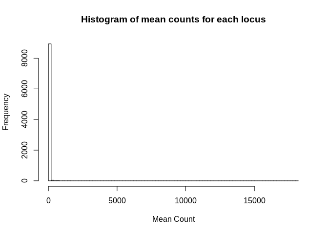<!-- -->

```r
# With log2 transformation
yLog<- log2(y)
hist(rowMeans(yLog),breaks=100,xlab= "Mean log Count",main = "Histogram of log transformed mean counts for each locus")
```

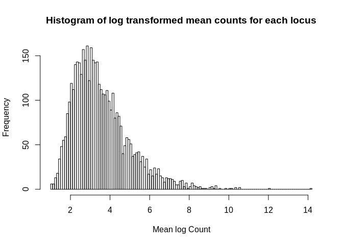<!-- -->

```r
#pairs.panels(yLog[,1:6])
#pairs.panels(yLog[,7:12])
#pairs.panels(yLog[,13:18])
#pairs.panels(yLog[,19:24])
```
  
**Note**: *The log transformed data shown illustrates how transforming data in this way helps will the heavily skewed RNA expression data. However, we will actually be log transforming the untransformed values at a later step using the package ```limm```, so we will proceed with the untransformed values for the time being.*  
  
### Preparing metadata for use in RNA analysis  

Sorting metadata table by individual to correspond with the count matrix:

```r
model <- model[order(model$sample_name), ]
# Needed to make sure the factor level (below) gets assigned properly to each individual
```
  
Create a factor that represents the treatments in the data. In this case that is the two different pCO2 levels at the two timepoints:  

```r
f <- paste(paste0("CO2_", model$treatment), paste0("T_",model$timepoint),sep=".")
f <- factor(f)
trt <- factor(model$treatment)
time <- factor(model$timepoint)
```
  
Create a model matrix of samples x treatment:  

```r
design <-model.matrix(~0+f)
colnames(design) <- levels(f)
#write.csv(design,"/home/downeyam/Github/2017OAExp_Oysters/results/model_design.csv")

model$Treatment <- factor(model$treatment)
model$Time <- factor(model$timepoint)

#Alternate design matrix (outdated)
# design2 <- model.matrix(~ 0 + trt_factor + tp_factor, data=model, 
#     contrasts.arg=list(trt_factor=diag(nlevels(model$trt_factor)), 
#             tp_factor=diag(nlevels(model$tp_factor))))
```

**Design Matrix**  
<div style="border: 1px solid #ddd; padding: 5px; overflow-x: scroll; width:900px; "><table class="table" style="margin-left: auto; margin-right: auto;">
 <thead>
  <tr>
   <th style="text-align:right;"> CO2_2800.T_3 </th>
   <th style="text-align:right;"> CO2_2800.T_6 </th>
   <th style="text-align:right;"> CO2_400.T_3 </th>
   <th style="text-align:right;"> CO2_400.T_6 </th>
  </tr>
 </thead>
<tbody>
  <tr>
   <td style="text-align:right;"> 0 </td>
   <td style="text-align:right;"> 0 </td>
   <td style="text-align:right;"> 0 </td>
   <td style="text-align:right;"> 1 </td>
  </tr>
  <tr>
   <td style="text-align:right;"> 0 </td>
   <td style="text-align:right;"> 0 </td>
   <td style="text-align:right;"> 0 </td>
   <td style="text-align:right;"> 1 </td>
  </tr>
  <tr>
   <td style="text-align:right;"> 0 </td>
   <td style="text-align:right;"> 0 </td>
   <td style="text-align:right;"> 1 </td>
   <td style="text-align:right;"> 0 </td>
  </tr>
  <tr>
   <td style="text-align:right;"> 0 </td>
   <td style="text-align:right;"> 1 </td>
   <td style="text-align:right;"> 0 </td>
   <td style="text-align:right;"> 0 </td>
  </tr>
  <tr>
   <td style="text-align:right;"> 0 </td>
   <td style="text-align:right;"> 0 </td>
   <td style="text-align:right;"> 1 </td>
   <td style="text-align:right;"> 0 </td>
  </tr>
  <tr>
   <td style="text-align:right;"> 0 </td>
   <td style="text-align:right;"> 0 </td>
   <td style="text-align:right;"> 1 </td>
   <td style="text-align:right;"> 0 </td>
  </tr>
  <tr>
   <td style="text-align:right;"> 1 </td>
   <td style="text-align:right;"> 0 </td>
   <td style="text-align:right;"> 0 </td>
   <td style="text-align:right;"> 0 </td>
  </tr>
  <tr>
   <td style="text-align:right;"> 0 </td>
   <td style="text-align:right;"> 0 </td>
   <td style="text-align:right;"> 0 </td>
   <td style="text-align:right;"> 1 </td>
  </tr>
  <tr>
   <td style="text-align:right;"> 1 </td>
   <td style="text-align:right;"> 0 </td>
   <td style="text-align:right;"> 0 </td>
   <td style="text-align:right;"> 0 </td>
  </tr>
  <tr>
   <td style="text-align:right;"> 0 </td>
   <td style="text-align:right;"> 1 </td>
   <td style="text-align:right;"> 0 </td>
   <td style="text-align:right;"> 0 </td>
  </tr>
  <tr>
   <td style="text-align:right;"> 0 </td>
   <td style="text-align:right;"> 0 </td>
   <td style="text-align:right;"> 0 </td>
   <td style="text-align:right;"> 1 </td>
  </tr>
  <tr>
   <td style="text-align:right;"> 1 </td>
   <td style="text-align:right;"> 0 </td>
   <td style="text-align:right;"> 0 </td>
   <td style="text-align:right;"> 0 </td>
  </tr>
  <tr>
   <td style="text-align:right;"> 1 </td>
   <td style="text-align:right;"> 0 </td>
   <td style="text-align:right;"> 0 </td>
   <td style="text-align:right;"> 0 </td>
  </tr>
  <tr>
   <td style="text-align:right;"> 0 </td>
   <td style="text-align:right;"> 1 </td>
   <td style="text-align:right;"> 0 </td>
   <td style="text-align:right;"> 0 </td>
  </tr>
  <tr>
   <td style="text-align:right;"> 1 </td>
   <td style="text-align:right;"> 0 </td>
   <td style="text-align:right;"> 0 </td>
   <td style="text-align:right;"> 0 </td>
  </tr>
  <tr>
   <td style="text-align:right;"> 0 </td>
   <td style="text-align:right;"> 1 </td>
   <td style="text-align:right;"> 0 </td>
   <td style="text-align:right;"> 0 </td>
  </tr>
  <tr>
   <td style="text-align:right;"> 0 </td>
   <td style="text-align:right;"> 0 </td>
   <td style="text-align:right;"> 1 </td>
   <td style="text-align:right;"> 0 </td>
  </tr>
  <tr>
   <td style="text-align:right;"> 0 </td>
   <td style="text-align:right;"> 0 </td>
   <td style="text-align:right;"> 1 </td>
   <td style="text-align:right;"> 0 </td>
  </tr>
  <tr>
   <td style="text-align:right;"> 0 </td>
   <td style="text-align:right;"> 0 </td>
   <td style="text-align:right;"> 1 </td>
   <td style="text-align:right;"> 0 </td>
  </tr>
  <tr>
   <td style="text-align:right;"> 0 </td>
   <td style="text-align:right;"> 1 </td>
   <td style="text-align:right;"> 0 </td>
   <td style="text-align:right;"> 0 </td>
  </tr>
  <tr>
   <td style="text-align:right;"> 1 </td>
   <td style="text-align:right;"> 0 </td>
   <td style="text-align:right;"> 0 </td>
   <td style="text-align:right;"> 0 </td>
  </tr>
  <tr>
   <td style="text-align:right;"> 0 </td>
   <td style="text-align:right;"> 0 </td>
   <td style="text-align:right;"> 0 </td>
   <td style="text-align:right;"> 1 </td>
  </tr>
  <tr>
   <td style="text-align:right;"> 0 </td>
   <td style="text-align:right;"> 0 </td>
   <td style="text-align:right;"> 0 </td>
   <td style="text-align:right;"> 1 </td>
  </tr>
  <tr>
   <td style="text-align:right;"> 0 </td>
   <td style="text-align:right;"> 1 </td>
   <td style="text-align:right;"> 0 </td>
   <td style="text-align:right;"> 0 </td>
  </tr>
</tbody>
</table></div>

#### Scatter Plot for visualizing correlation between environment (Treatment),time, and trait (EPF), as well as the four treatment x time combinations.

```r
# Scatter plot for the trait and treatment combinations
pairs.panels(model[,c(17,18,16)])  
```

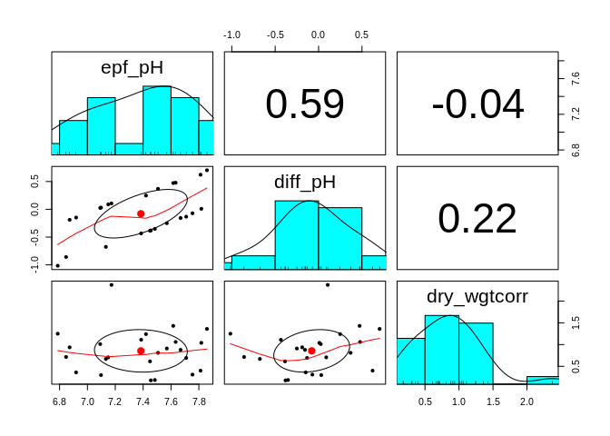<!-- -->

```r
# Scatter plot based on mean counts for the 4 different treatment-time combinations

D1_TE <- rowMeans(yLog[,design[,1] == 1]) # Day 9 - Treatment 2800
D1_TC <- rowMeans(yLog[,design[,3] == 1]) # Day 9 - Treatment 500
D2_TE <- rowMeans(yLog[,design[,2] == 1]) # Day 80 - Treatment 2800
D2_TC <- rowMeans(yLog[,design[,4] == 1]) # Day 80 - Treatment 500

countTreatAvg_mat <- data.frame(Day09_2800=D1_TE,Day09_500=D1_TC,Day80_2800=D2_TE,Day80_500=D2_TC)

pairs.panels(countTreatAvg_mat,
             hist.col = "#00AFBB")
```

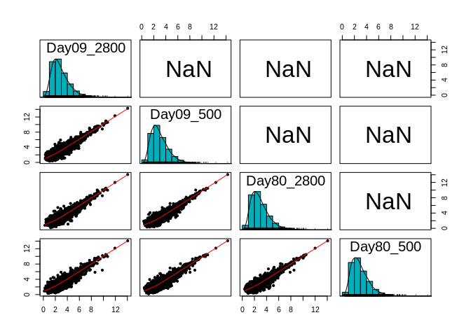<!-- -->
  
### Create DGE Object and estimate the normalization factor  
  
**Turn count Matrix into a DGEList object **   

```r
dge <- DGEList(counts=y, group=f)
```
**```DGElist()```**: a function in edgeR that creates a ```edgeR``` specific ````DGELIST``` object that is a list with two elments.  The first element is your count Matrix (labeled ```counts```) and the second is a metadata dataframe for each sample (labeled ```samples```). You should be able to access each item either using standard list notation (i.e. ```dge[[1]]``` for count Matrix) or the the labeled element notation (i.e. dge$counts for count Matrix). The first item should always be the count Matrix and the second will be the dataframe of your metadata.  

  1) ```$counts```: count Matrix  
  
  2) ```$samples```: dataframe containing a row for each sample in you data and columns for the sample and three columns:  
  
    i) ```group```: the group ID : based on number of factor levels determined above from the metadata  
    ii) ```lib.size```: library size  
    iii) ```norm.factors```: normalization factor  
  
  
**Normalizing data for between sample comparison - TMM normalization**  
Yet another way we need to consider normalizing our data is to account for between sample variability in library size. One strategy for this is the **trimmed mean of M value method (TMM)** by Robinson and Oshlack (2010). 
  
Here we can implement this normalization through the package ```edgeR``` using the function ```calcNormFactors``` with ```method=c("TMM")```:  

```r
dgeNorm<- calcNormFactors(dge,method=("TMM"))
```
  
This will estimate a new normalization factor, ```norm.factors``` in your ```samples``` dataframe, which it attempts to adjust mean read count This updated our normalization factor for each sample based on it's library size. **Notice that the count matrix itself has not changed**, this will happen in the next section using the packaged ```limma```.
  
To see a full description of this method please reference the original paper. [(Robinson and Oshlack 2010)](http://evowiki.haifa.ac.il/images/f/f5/A_scaling_normalization_method_for_differential_expression_%28TMM%29.pdf)  
  
### Final count matrix Transformations  

#### Using ```Voom``` in the ```limma``` package to transform data yet again.  
Voom transform the count data using voomWithQualityWeights function. Voom transformation log normalizes the cpm data. Given that we a passing the DGEList that has already computed the normalization factors we can specify the ```lib.size``` and specify the ```normalization.method = "none"```  


```r
v1 <- voomWithQualityWeights(dgeNorm, design=design, lib.size=dgeNorm$samples$lib.size, normalize.method="none", plot = TRUE)
```

<!-- -->
  
### Including blocking variable in count matrix transformation  
  
**Problem**: Our original meta data contains additional information about difference between samples that is not currently being utilized. This included at least one additional fixed fixed  factor (population), as well as random and blocking factors (the tank each oyster was sampled from). This latter can be accounted for in voom tranformation by inputting the blocking variable within the the function ```voomWithQualityWeights``` by using the arguement ```block=model$blockVariable```. In addition, the degreee of correlation between you blocking variable and your fixed factors (your design from above) should be inputted into the function. This can be estimated using ```duplicateCorrelation```.  
The benefit of incorporating the blocking variable is that it allows for there to be different variance between biological replicates, rather than calculating variance on a per-individual basis. In the Wong paper they considered samples taken from the same pCO2 vessel as a biological replicate. Here we consider any oyster taken from the same tank (tankID from unique shelf and tank combo) as biological replicates.  
  
**Step 1:** run ```duplicateCorrelation``` using your original ```voom``` object, your fixed factor ```design```, and a vector with your blocking variable IDs. This function attempts to find the correlation between each locus in your count matrix and the block factor provided. It will output a list contain a vector of all correaltions - ```atanh.correlations``` -  for each locus, and a mean correlation across all loci, ```consensus```. The ```consensus``` scalar is what we will need to include when we perform the transformation again.  
  
**Step 2:** rerun ```voomWithQualityWeights``` but also include the blocking variable and mean blocking correalation.  
  

```r
# This is not quite a linear regression with only block as a predictor for each locus *** Figure out with this is doing (some sort of linear mixed model)
corfit <- duplicateCorrelation(v1,design,block=model$tankID)

v2 <- voomWithQualityWeights(dgeNorm,design,plot=TRUE,lib.size=dge$samples$lib.size,block=model$tankID,normalize.method=,correlation=corfit$consensus)
```

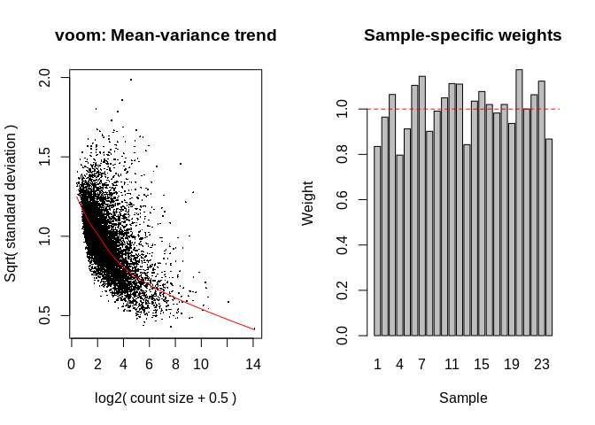<!-- -->

```r
hist(unlist(scenario1$countMatrix[1,]))
```

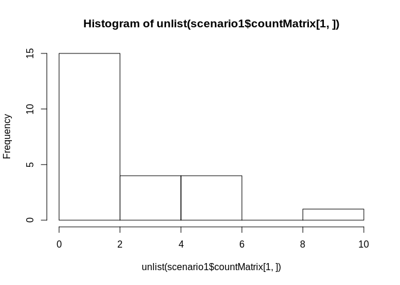<!-- -->

```r
hist(v2$E[1,])
```

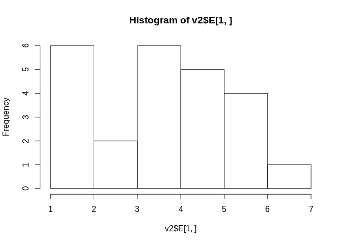<!-- -->
  
### Writing ```.csv``` and ```.Rdata``` files for normalized count matrices

**Log transformed countMatrix**

```r
#write.csv(yLog,file = "/home/downeyam/Github/2017OAExp_Oysters/results/logNormalizedCountMatrix.csv",row.names = T)  
```

**Sample normalized countMatrix using limma ``voomWithQualityWeights()`` function**  

```r
#saveRDS(v1,"/home/downeyam/Github/2017OAExp_Oysters/results/voomNormalizedObject.RData")
#write.csv(v1$E,file = "/home/downeyam/Github/2017OAExp_Oysters/results/voomNormalizedCountMatrix.csv",row.names = T)  
```
  
**Sample normalized countMatrix using limma ``voomWithQualityWeights()`` function w/ blocking variable**  

```r
saveRDS(v2,"/home/downeyam/Github/2017OAExp_Oysters/input_files/RNA/Normalized_CountMatrix/Scenario1_normalizedVoom.RData")
write.csv(v2$E,file = "/home/downeyam/Github/2017OAExp_Oysters/input_files/RNA/Normalized_CountMatrix/Scenario1_normalizedVoom.csv",row.names = T)  
```
  
### Visualizing Global RNA count data  

#### MDS (multi-dimensional scaling) plots  
Similar to PCAs. It will help visualize the expression profiles of each values in 2D space. Points closer together have more similar expression profiles than those further apart.  

**Original untransformed count matrix**  

```r
# Specify colors you would like to use for the four treatments
colors <- rainbow(length(levels(f)),alpha = 1)  

# The plot parameters below are specific to this data, will likely need to change if working
# with other RNAseq data
plotMDS(dgeNorm, labels=rownames(dgeNorm$samples),cex=0.8, col=colors[f], xlim=c(-0.8, 0.8), ylim=c(-0.8, 0.8))
legend("bottomleft", legend = c(levels(dgeNorm$samples$group)), cex=0.8, col = colors, lty = c(1, 1, 1, 1))
```

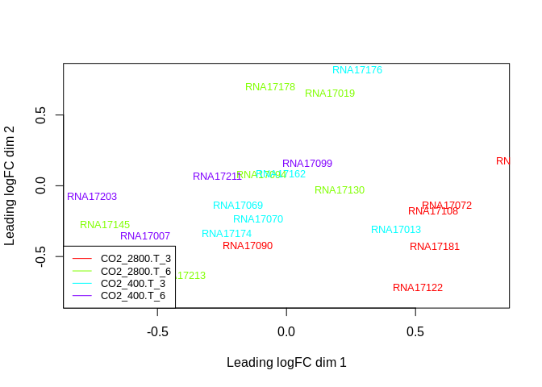<!-- -->
  
**Transformed count matrix - using voom**  

```r
plotMDS(v1, labels=rownames(v1$targets),cex=0.8, col=colors[f], xlim=c(-2, 1.8), ylim=c(-1.5, 1.5))
legend("bottomleft", legend = c(levels(v1$targets$group)), cex=0.8, col = colors, lty = c(1, 1, 1, 1))
```

<!-- -->
  
**Transformed count matrix - using voom and tankID as blocking factor**  

```r
plotMDS(v2, labels=rownames(v2$targets),cex=0.8, col=colors[f], xlim=c(-2, 1.5), ylim=c(-1.5, 1.5))
legend("bottomleft", legend = c(levels(v2$targets$group)), cex=0.8, col = colors, lty = c(1, 1, 1, 1))
```

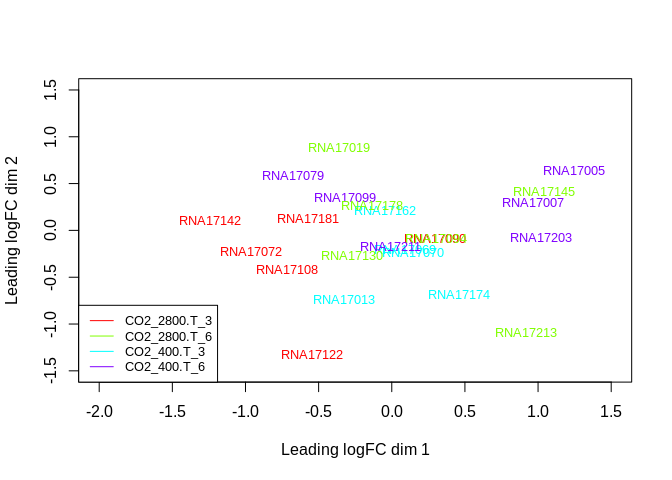<!-- -->
  
**PCA Plot - using voom and tankID as blocking factor**  

```r
# Perform PCA on normalized data that considered tank as a blocking variable
pca_comp <- prcomp(t(na.omit(v2$E)))
pca <- as.data.frame(pca_comp$x)
pca_summary <- summary(pca_comp)

# % variation explained
var_PC1 <- pca_summary$importance[2,1]*100
var_PC2 <- pca_summary$importance[2,2]*100

model$timepoint[model$timepoint=="3"] <- "09"
model$timepoint[model$timepoint=="6"] <- "80"

color_pop <- rainbow(length(unique(model$population))) # colors for population 
color_treat <- rainbow(length(unique(model$treatment))) # colors for treatment
color_time <- rainbow(length(unique(model$timepoint))) # colors for time

shapes <- c(as.character(model$treatment)) # Setting shapes of points based on treatment

# PCA with colors for time
pcaplot <- ggplot(pca, aes(x=PC1, y=PC2,colour=shapes, size=I(4), shape=as.factor(model$timepoint))) + geom_point()
pcaplot <- pcaplot + scale_colour_manual(values=c("firebrick3","deepskyblue4")) #$color as.character(color_pca$color)c("red","blue","green")
pcaplot <- pcaplot + theme_bw() + labs(x=paste0("PC1 (",var_PC1,"% explained)"),y=paste0("PC2 (",var_PC2,"% explained)"),colour="Treatment",shape="Day")
pcaplot + theme(panel.grid.major = element_blank(), 
                panel.grid.minor = element_blank(), 
                axis.title=element_text(size=14),
                legend.text=element_text(size=14),
                panel.background = element_blank(), 
                axis.line = element_line(color = "black"), 
                axis.text.y = element_text(angle = 90), 
                legend.key = element_blank())
```

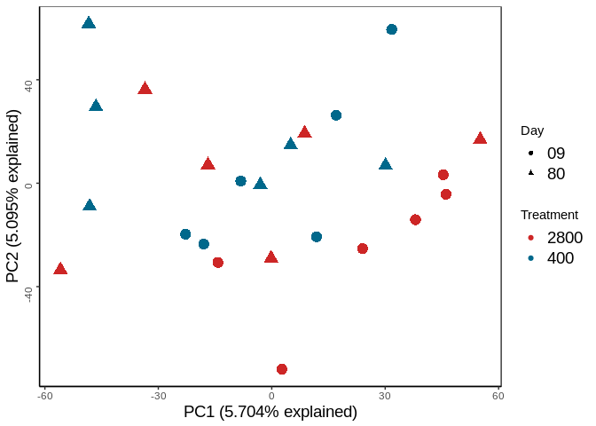<!-- -->

```r
#ggsave("/home/downeyam/Github/2017OAExp_Oysters/figures/pca.png",width=30,height=18,unit="cm")
```
  
**Scree Plot of PCA**

```r
plot(pca_summary$importance[2,]~c(1:length(pca_summary$importance[2,])),xlab="PC",ylab="Variance explained by PC")
```

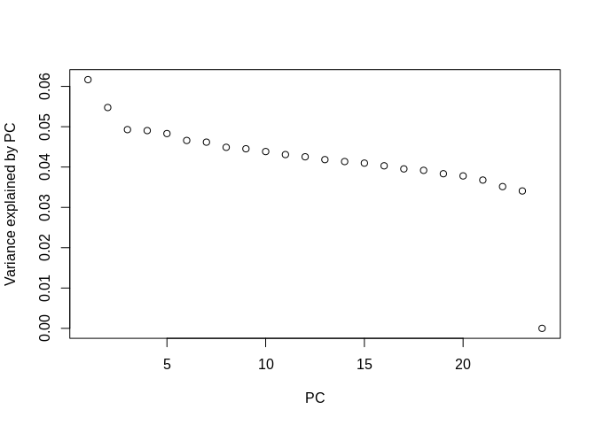<!-- -->
  
Looks a little suspicious, only the first two PCs explains that much more of the variation than subsequent pcs.  

### Script Outputs  

The post filtered, normalize count Matrices were generated and saved in the ``input_files/RNA/Normalized_CountMatrix`` folder. 
  
These include three count matrices:  
  - A **sample normalized countMatrix using limma ``voomWithQualityWeights()`` function w/ blocking variable**: ``scenarioX_NormalizedVoom.csv`  
  
Also saved are the objects generated by limma normalization as an ``.RData`` file:  
  - A **sample normalized countMatrix using limma ``voomWithQualityWeights()`` function w/ blocking variable**: ``scenarioX_NormalizedVoom.RData``  

