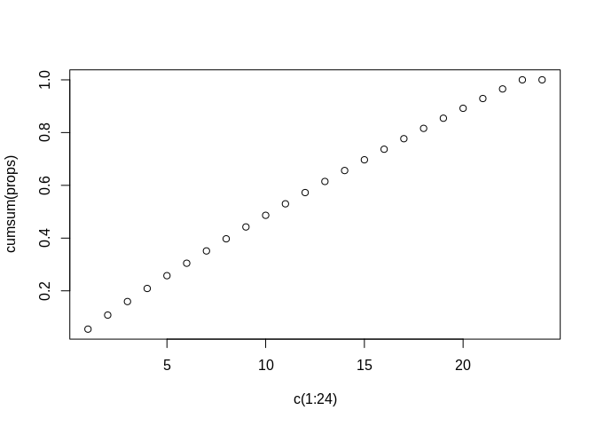
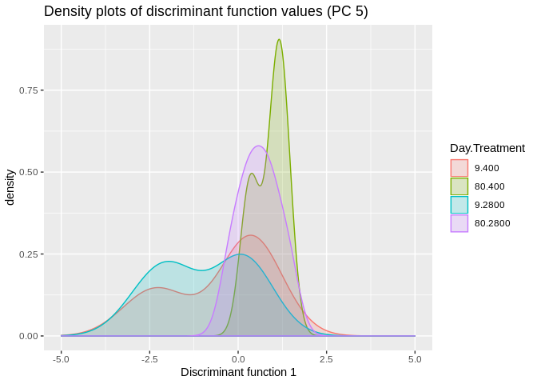
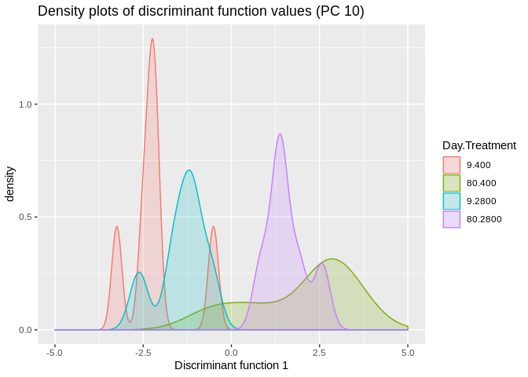
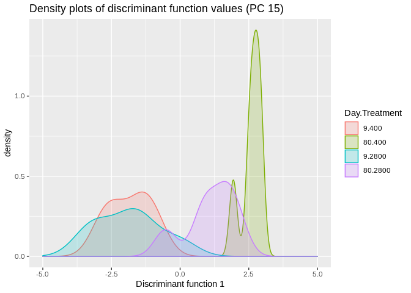
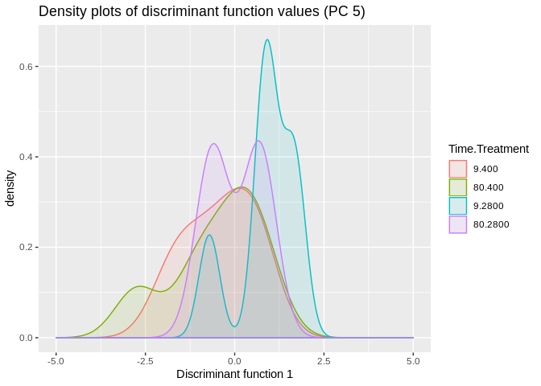
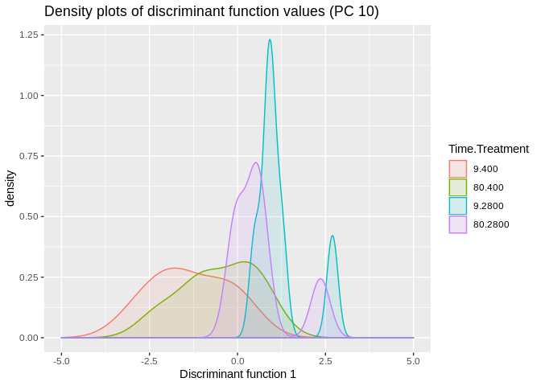
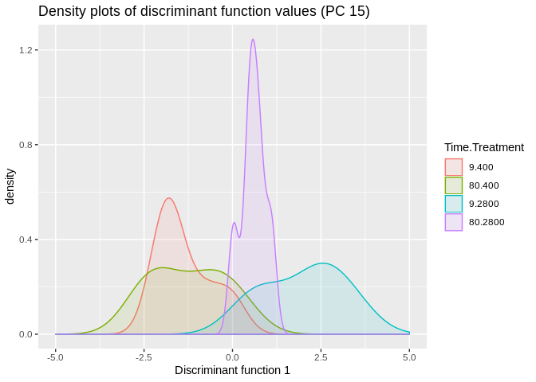

  
**Data**

```r
# This is the filtered count matrix
counts_Rdat <- readRDS(file = "/home/downeyam/Github/2017OAExp_Oysters/input_files/RNA/Normalized_CountMatrix/Scenario1_normalizedVoom.RData")
counts <- log2(counts_Rdat$E)
```

```
## Loading required package: limma
```

```r
# This is the complete count matrix
count2 <- read.delim("/home/downeyam/Github/2017OAExp_Oysters/results/C_virginica_gene_count_final.txt",header=TRUE,sep="",row.names=1)
# Meta Data for the 24 samples
meta <- read.csv(file="/home/downeyam/Github/2017OAExp_Oysters/input_files/RNA/metadata_cvirginica_rna_meta.txt")
```
  
## Performing a DAPC

FYI :  Need to transpose count matrix to put it in the dapc() function. Individuals x Loci 

### Cumulative Variance Plot

```r
out <- prcomp(t(counts))
vars <- apply(out$x, 2, var)  
props <- vars / sum(vars)
cumsum(props)
```

```
##        PC1        PC2        PC3        PC4        PC5        PC6 
## 0.05488057 0.10812551 0.15944845 0.20894727 0.25747995 0.30470992 
##        PC7        PC8        PC9       PC10       PC11       PC12 
## 0.35133418 0.39728772 0.44224971 0.48636657 0.52997669 0.57258531 
##       PC13       PC14       PC15       PC16       PC17       PC18 
## 0.61469572 0.65613613 0.69684068 0.73693347 0.77684600 0.81596484 
##       PC19       PC20       PC21       PC22       PC23       PC24 
## 0.85451222 0.89213567 0.92914657 0.96550480 1.00000000 1.00000000
```

```r
plot(cumsum(props)~c(1:24))
```

<!-- -->

No clear choice for PC   
  
### Discriminant function for time  

**PC 5**  

```r
# dapc_time<-dapc(t(counts),meta$timepoint)
dapc_time_5<-dapc(t(counts),meta$timepoint,n.pca=5,n.da=2,pca.info=TRUE)
meta$discrimant_time_5 <- dapc_time_5$ind.coord

ggplot(meta,aes(discrimant_time_5,fill=as.factor(interaction(Day,treatment)),colour=as.factor(interaction(Day,treatment)))) + geom_density(alpha=0.2) + xlim(-5,5) + 
  labs(title="Density plots of discriminant function values (PC 5)",
       x="Discriminant function 1",
       colour="Day.Treatment",
       fill="Day.Treatment")
```

<!-- -->
  
**PC 10**  

```r
# FYI :  Need to transpose count matrix to put it in the dapc() function. Individuals x Loci 

# dapc_time<-dapc(t(counts),meta$timepoint)
dapc_time_10<-dapc(t(counts),meta$timepoint,n.pca=10,n.da=2,pca.info=TRUE)
meta$discrimant_time_10 <- dapc_time_10$ind.coord

ggplot(meta,aes(discrimant_time_10,fill=as.factor(interaction(Day,treatment)),colour=as.factor(interaction(Day,treatment)))) + geom_density(alpha=0.2) + xlim(-5,5) + 
  labs(title="Density plots of discriminant function values (PC 10)",
       x="Discriminant function 1",
       colour="Day.Treatment",
       fill="Day.Treatment")
```

<!-- -->
  
**PC 15**  

```r
# FYI :  Need to transpose count matrix to put it in the dapc() function. Individuals x Loci 

# dapc_time<-dapc(t(counts),meta$timepoint)
dapc_time_15<-dapc(t(counts),meta$timepoint,n.pca=15,n.da=2,pca.info=TRUE)
meta$discrimant_time_15 <- dapc_time_15$ind.coord

ggplot(meta,aes(discrimant_time_15,fill=as.factor(interaction(Day,treatment)),colour=as.factor(interaction(Day,treatment)))) + geom_density(alpha=0.2) + xlim(-5,5) + 
  labs(title="Density plots of discriminant function values (PC 15)",
       x="Discriminant function 1",
       colour="Day.Treatment",
       fill="Day.Treatment")
```

<!-- -->
  
### Discriminant functino for treatment  
  
**PC 5**

```r
dapc_treatment_5<-dapc(t(counts),meta$treatment,n.pca=5,n.da=2)
meta$discriminant_treatment_5 <- dapc_treatment_5$ind.coord

ggplot(meta,aes(discriminant_treatment_5,fill=as.factor(interaction(Day,treatment)),colour=as.factor(interaction(Day,treatment)))) + 
  geom_density(alpha=0.1) + xlim(-5,5) + 
  labs(title="Density plots of discriminant function values (PC 5)",
       x="Discriminant function 1",
       colour="Time.Treatment",
       fill="Time.Treatment")
```

<!-- -->
  
**PC 10**

```r
dapc_treatment_10<-dapc(t(counts),meta$treatment,n.pca=10,n.da=2)
meta$discriminant_treatment_10 <- dapc_treatment_10$ind.coord

ggplot(meta,aes(discriminant_treatment_10,fill=as.factor(interaction(Day,treatment)),colour=as.factor(interaction(Day,treatment)))) + 
  geom_density(alpha=0.1) + xlim(-5,5) + 
  labs(title="Density plots of discriminant function values (PC 10)",
       x="Discriminant function 1",
       colour="Time.Treatment",
       fill="Time.Treatment")
```

<!-- -->
  
**PC 15**

```r
dapc_treatment_15<-dapc(t(counts),meta$treatment,n.pca=15,n.da=2)
# PCs = 5
# clusters = 1
meta$discriminant_treatment_15 <- dapc_treatment_15$ind.coord

ggplot(meta,aes(discriminant_treatment_15,fill=as.factor(interaction(Day,treatment)),colour=as.factor(interaction(Day,treatment)))) + 
  geom_density(alpha=0.1) + xlim(-5,5) + 
  labs(title="Density plots of discriminant function values (PC 15)",
       x="Discriminant function 1",
       colour="Time.Treatment",
       fill="Time.Treatment")
```

<!-- -->
  
