## Target Gene Overview  
  
Several target proteins have been thought to be associated with oyster calcification in the literature. Unfortunately, these didn't appear to be significantly associated with OA or time in our experiment when we perform a 'blind' association test. Still, it is useful to see if this is due to a lack of putative gene features coding for these proteins are present within out count data or if there gene features a simply not correlated with environment or time.  

Gene features associated with the proteins of interest were identified by perform a target search of the eastern oyster genome using the Genome View tool in NCBI and quering each protein name. All putative gene locations were used.  

#### Target proteins:  
  
* **Calcitonin**: Involved in calcium metabolism and regulation of calcium (studied mostly in context of osmoregulation)  
  * Papers:  
    * Molecular and physiological characterization of an invertebrate homologue of a calcitonin-related receptor (Dubos et al. 2003)  
    * Osmoregulation and mRNA expression of calcitonin-related receptor in the Pacific oyster Crassostrea gigas (Jo et al. 2008)  
    
* **Nacrein**: Involved I shell formation, have carbonic anhydrase like domains. Observed in Pacific oyster mantle.  
  * Paper: Identification two novel nacrein-like proteins involved in the shell formation of the Pacific oyster Crassostrea gigas (Song et al. 2014)  
  
* **Carbonic Anhydrase**: Important roles in biomineralization process.  
  * Papers:  
    * A shell-formation related carbonic anhydrase in Crassostrea gigas modulates intracellular calcium against CO2 exposure: Implication for impacts of ocean acidification on mollusk calcification (Wang et al. 2017)  
    * A Carbonic Anhydrase Serves as an Important Acid-Base Regulator in Pacific Oyster Crassostrea gigas Exposed to Elevated CO2: Implication for Physiological Responses of Mollusk to Ocean Acidification (Wang et al. 2017)  
    
* **Sodium bicarbonate transporter**: Acid -base regulator, responsible for modulating intra and inter cellular pH.  

* **Adenylyl cyclase**: Involved with pH regulation and responsive to OA in Cras. Gigas oysters  
  * Paper: Ocean acidification stimulates alkali signal pathway: A bicarbonate sensing soluble adenylyl cyclase from oyster Crassostrea gigas mediates physiological changes induced by CO2 exposure (Wang et al 2016 )  
  
### Data  

```r
GeneCounts <- read.delim("/home/downeyam/Github/2017OAExp_Oysters/results/C_virginica_gene_count_final.txt",header=TRUE,sep="",row.names=1)
counts <- readRDS("/home/downeyam/Github/2017OAExp_Oysters/input_files/RNA/Normalized_CountMatrix/Scenario1_normalizedVoom.RData")
model <-  read.csv("/home/downeyam/Github/2017OAExp_Oysters/input_files/RNA/metadata_cvirginica_rna_meta.txt", header=TRUE)
model$Treatment <- as.factor(model$treatment)
model$Day <- as.factor(model$Day)
```
  
### Calcitonin  

```r
# Had to use GeneCount matrix because this locus was filtered during countAnalysis

#Test if kept in trimmed data 
match("LOC111112092",row.names(counts$E))
```

```
## Loading required package: limma
```

```
## [1] NA
```

```r
#Nope

# Check if present in whole matrix
cal_text <- GeneCounts[match("LOC111112092",row.names(GeneCounts)),]
sum(cal_text)
```

```
## [1] 0
```

```r
# Nope not present
```
No reads seemed to align to location :/
  
### Nacrein  

```r
#Test if kept in trimmed data 
(nac_text <- counts$E[match("LOC111136431",row.names(counts$E)),])
```

```
## RNA17005 RNA17007 RNA17013 RNA17019 RNA17069 RNA17070 RNA17072 RNA17079 
## 4.479778 4.632281 7.377703 8.108499 7.203725 7.404881 5.190810 8.830343 
## RNA17090 RNA17094 RNA17099 RNA17108 RNA17122 RNA17130 RNA17142 RNA17145 
## 9.787613 5.397275 4.372209 5.977458 4.269973 9.681667 4.652290 1.774488 
## RNA17162 RNA17174 RNA17176 RNA17178 RNA17181 RNA17203 RNA17211 RNA17213 
## 8.108792 7.036489 3.214919 7.976042 8.492171 8.490772 7.961976 9.278568
```

```r
# Yes its retained!

nac_data <- data.frame(Treatment=model$Treatment,Day=model$Day,EPF=model$epf_pH,locus=(nac_text))
nac_data
```

```
##          Treatment Day      EPF    locus
## RNA17005       400  80 6.846758 4.479778
## RNA17007       400  80 7.455280 4.632281
## RNA17013       400   9 7.385796 7.377703
## RNA17019      2800  80 7.149452 8.108499
## RNA17069       400   9 7.817657 7.203725
## RNA17070       400   9 6.786949 7.404881
## RNA17072      2800   9 7.616122 5.190810
## RNA17079       400  80 7.449510 8.830343
## RNA17090      2800   9 7.420345 9.787613
## RNA17094      2800  80 7.172533 5.397275
## RNA17099       400  80 7.668782 4.372209
## RNA17108      2800   9 7.633396 5.977458
## RNA17122      2800   9 7.857964 4.269973
## RNA17130      2800  80 7.097519 9.681667
## RNA17142      2800   9 7.811899 4.652290
## RNA17145      2800  80 6.918638 1.774488
## RNA17162       400   9 7.570056 8.108792
## RNA17174       400   9 7.754317 7.036489
## RNA17176       400   9 7.132437 3.214919
## RNA17178      2800  80 7.091748 7.976042
## RNA17181      2800   9 7.506717 8.492171
## RNA17203       400  80 7.484132 8.490772
## RNA17211       400  80 7.709175 7.961976
## RNA17213      2800  80 6.872475 9.278568
```

```r
ggplot(nac_data,aes(x=interaction(Treatment,Day),y=locus)) + 
  geom_boxplot() +
  labs(title="LOC111136431",x="Treatment.Day Combination")  
```

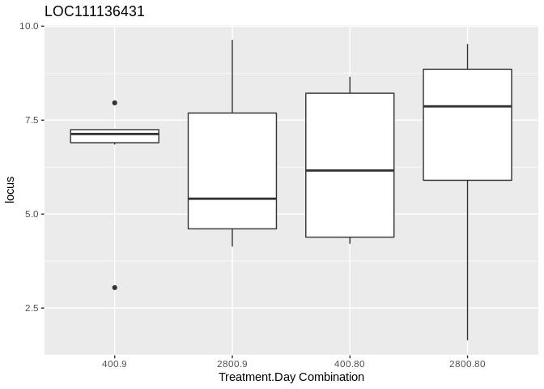<!-- -->

```r
# ggplot(nac_data,aes(x=EPF,y=LOC111136431)) + 
#   geom_point() +
#   labs(title="LOC111136431",x="EPF pH")
```
No significant differences between treatment_time combinations.  

### Carbonic Anhydrase  

```r
# All potential carbonic anhydrase gene locations based on CV genome on NCBI 
ca_LOC <- c("LOC111134699",
  "LOC111133036",
  "LOC111130107",
  "LOC111134700",
  "LOC111123083",
  "LOC111113402",
  "LOC111137424",
  "LOC111117514",
  "LOC111114059",
  "LOC111112162",
  "LOC111133640",
  "LOC111134104",
  "LOC111133247",
  "LOC111130106",
  "LOC111127254",
  "LOC111127093",
  "LOC111122701",
  "LOC111120606",
  "LOC111120607",
  "LOC11125708")

# Subset for locations matching known carbonic anhydrase genes
match(ca_LOC,row.names(counts),nomatch = FALSE)
```

```
##  [1]    0    0    0    0    0    0    0    0    0    0    0    0 7182    0
## [15]    0    0    0    0 3737    0
```

```r
out_ca <- match(ca_LOC,row.names(counts))
out_ca <- out_ca[!is.na(out_ca)]
ca_data <- data.frame(t(as.matrix(counts[out_ca,])))
ca_data$Treatment <- model$Treatment
ca_data$Day <- model$Day

ca_data
```

```
##          LOC111133247 LOC111120607 Treatment Day
## RNA17005     6.064740     5.759886       400  80
## RNA17007     3.784284     6.217244       400  80
## RNA17013     3.816988     7.276420       400   9
## RNA17019     1.600704     6.886106      2800  80
## RNA17069     5.360450     7.462812       400   9
## RNA17070     4.379345     7.549270       400   9
## RNA17072     1.731379     7.839903      2800   9
## RNA17079     3.215633     7.358591       400  80
## RNA17090     3.138956     6.839396      2800   9
## RNA17094     4.018763     7.478195      2800  80
## RNA17099     1.564854     6.774307       400  80
## RNA17108     1.729531     6.587512      2800   9
## RNA17122     4.922050     5.550081      2800   9
## RNA17130     3.997970     6.430930      2800  80
## RNA17142     1.844935     7.054388      2800   9
## RNA17145     1.774488     6.298050      2800  80
## RNA17162     4.021329     6.908854       400   9
## RNA17174     2.840092     6.869839       400   9
## RNA17176     3.214919     8.199812       400   9
## RNA17178     3.538636     5.860564      2800  80
## RNA17181     5.154302     6.071840      2800   9
## RNA17203     4.452636     5.552172       400  80
## RNA17211     4.017118     7.625927       400  80
## RNA17213     3.748747     7.693606      2800  80
```

```r
#LOC111120607 
ggplot(ca_data,aes(x=interaction(Treatment,Day),y=LOC111120607)) + geom_boxplot()
```

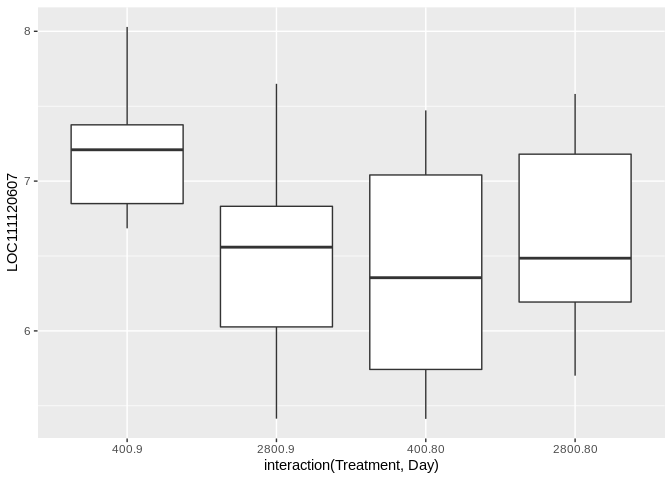<!-- -->

```r
#LOC111134700 
ggplot(ca_data,aes(x=interaction(Treatment,Day),y=LOC111133247)) + geom_boxplot()
```

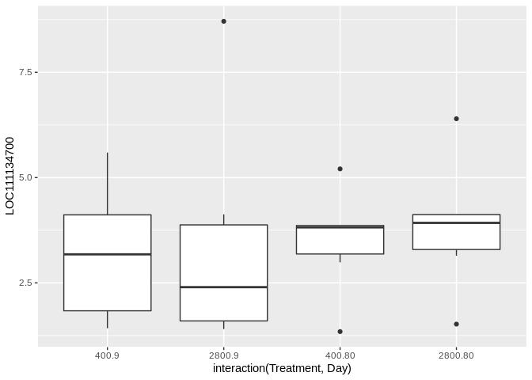<!-- -->

```r
# Q-vals for locus from linear mixed model
#### UPDATED THIS
# Treatment:Time
#time_qvals[1732,1]
# Treatment:Time
#treatment_qvals[1732,1]
# Treatment:Time
#timeTrt_qvals[1732,1]
```
  
### Sodium Bicarbonate Transporter  

```r
bi_LOC <- c("LOC111118314",
  "LOC111125089",
  "LOC111124629",
  "LOC111126568",
  "LOC111126835",
  "LOC111123835",
  "LOC111120445",
  "LOC111120427",
  "LOC111119272",
  "LOC111115910",
  "LOC111126460")

match(bi_LOC,row.names(counts),nomatch = FALSE)
```

```
##  [1]    0    0 4812 5475 5535 4574    0    0    0    0    0
```

```r
out_bi <- match(bi_LOC,row.names(counts))
out_bi <- out_bi[!is.na(out_bi)]
bi_data <- data.frame(t(as.matrix(counts[out_bi,])))
bi_data$Treatment <- model$Treatment
bi_data$Day <- model$Day
bi_data
```

```
##          LOC111124629 LOC111126568 LOC111126835 LOC111123835 Treatment Day
## RNA17005     5.579314     6.716817     4.842348     8.081814       400  80
## RNA17007     5.549819     5.854673     4.269711     9.833043       400  80
## RNA17013     6.624343     6.249948     4.664985    10.422838       400   9
## RNA17019     5.848632     5.848632     1.600704    10.072379      2800  80
## RNA17069     6.130968     7.155631     3.594916    10.083559       400   9
## RNA17070     6.215847     7.063844     4.379345    10.254985       400   9
## RNA17072     5.818842     7.459299     1.731379    10.066769      2800   9
## RNA17079     6.385558     6.274527     1.630671     9.482420       400  80
## RNA17090     6.411975     6.683277     4.723919    10.522660      2800   9
## RNA17094     5.784298     6.826118     4.504190     9.304166      2800  80
## RNA17099     5.957171     6.519050     5.265293     9.477743       400  80
## RNA17108     5.188962     6.773925     3.314493    10.134672      2800   9
## RNA17122     6.320599     7.135044     6.217506     9.850636      2800   9
## RNA17130     5.582933     6.885495     3.997970    10.537129      2800  80
## RNA17142     5.545374     6.488791     5.751825     9.552294      2800   9
## RNA17145     5.233920     7.329077     1.774488     9.626237      2800  80
## RNA17162     5.947328     6.454288     5.158832     9.693754       400   9
## RNA17174     6.927555     7.036489     5.342592    10.437524       400   9
## RNA17176     5.717419     6.759239     1.629956     9.192199       400   9
## RNA17178     7.626099     6.811655     3.538636     9.830191      2800  80
## RNA17181     6.071840     6.739264     5.684817     8.460110      2800   9
## RNA17203     5.893209     7.071546     4.815207     9.769403       400  80
## RNA17211     6.904643     7.249779     4.865115    10.276391       400  80
## RNA17213     5.333710     7.208179     5.127259    10.366399      2800  80
```

```r
ggplot(bi_data,aes(x=interaction(Treatment,Day),y=LOC111124629)) + geom_boxplot()
```

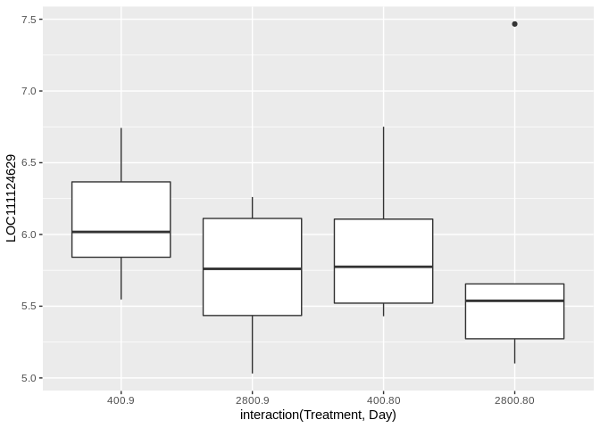<!-- -->

```r
ggplot(bi_data,aes(x=interaction(Treatment,Day),y=LOC111126568)) + geom_boxplot()
```

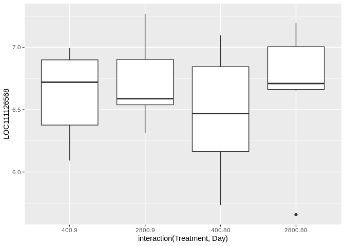<!-- -->

```r
ggplot(bi_data,aes(x=interaction(Treatment,Day),y=LOC111126835)) + geom_boxplot()
```

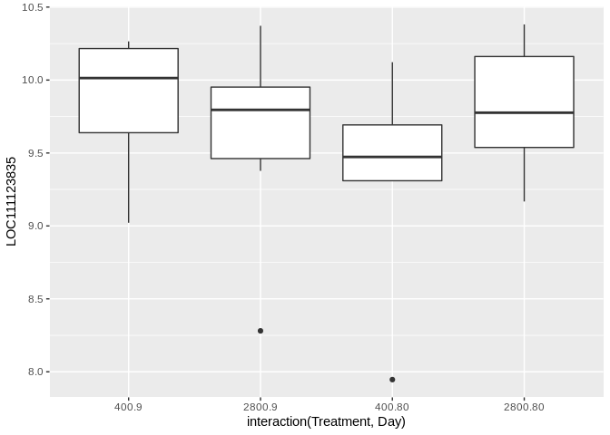<!-- -->

```r
ggplot(bi_data,aes(x=interaction(Treatment,Day),y=LOC111123835)) + geom_boxplot()
```

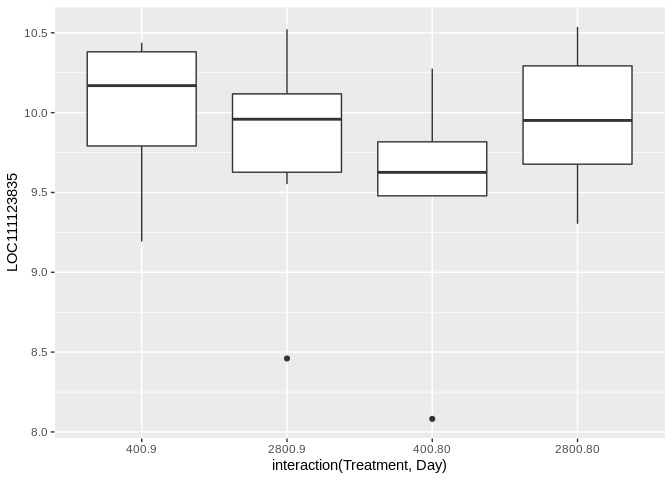<!-- -->

### Adenylyl cyclase  

```r
ac_LOC <- c("LOC111131100",
  "LOC111134509",
  "LOC111130107",
  "LOC111111874",
  "LOC111109301")

match(ac_LOC,row.names(counts),nomatch = FALSE)
```

```
## [1] 6746 7540    0    0 1688
```

```r
out_ac <- match(ac_LOC,row.names(counts))
out_ac <- out_ac[!is.na(out_ac)]
ac_data <- data.frame(t(as.matrix(counts[out_ac,])))
ac_data$Treatment <- model$Treatment
ac_data$Day <- model$Day
ac_data
```

```
##          LOC111131100 LOC111134509 LOC111109301 Treatment Day
## RNA17005     11.73447     4.842348     6.626619       400  80
## RNA17007     11.48334     4.921788     3.047319       400  80
## RNA17013     11.48232     4.664985     5.195500       400   9
## RNA17019     11.72612     6.458685     6.729987      2800  80
## RNA17069     11.18737     4.080342     7.250267       400   9
## RNA17070     11.85160     5.964308     6.215847       400   9
## RNA17072     11.48460     6.375235     4.538734      2800   9
## RNA17079     12.36961     3.952599     4.800596       400  80
## RNA17090     11.28021     5.460884     5.641457      2800   9
## RNA17094     12.26574     4.504190     6.089153      2800  80
## RNA17099     11.75344     7.119442     4.372209       400  80
## RNA17108     11.44892     5.636421     4.536886      2800   9
## RNA17122     11.47803     5.369509     7.652443      2800   9
## RNA17130     11.38513     6.430930     1.676042      2800  80
## RNA17142     12.34777     5.545374     6.702916      2800   9
## RNA17145     11.64022     4.944413     6.022416      2800  80
## RNA17162     10.74106     4.021329     6.557382       400   9
## RNA17174     11.23955     7.185867     7.185867       400   9
## RNA17176     11.87194     4.437311     5.717419       400   9
## RNA17178     11.76585     4.761029     7.239076      2800  80
## RNA17181     12.12776     5.443808     6.376694      2800   9
## RNA17203     11.26550     4.815207     3.967210       400  80
## RNA17211     11.69660     4.865115     6.087507       400  80
## RNA17213     11.49694     4.234174     5.819137      2800  80
```

```r
ggplot(ac_data,aes(x=interaction(Treatment,Day),y=LOC111131100)) + geom_boxplot()
```

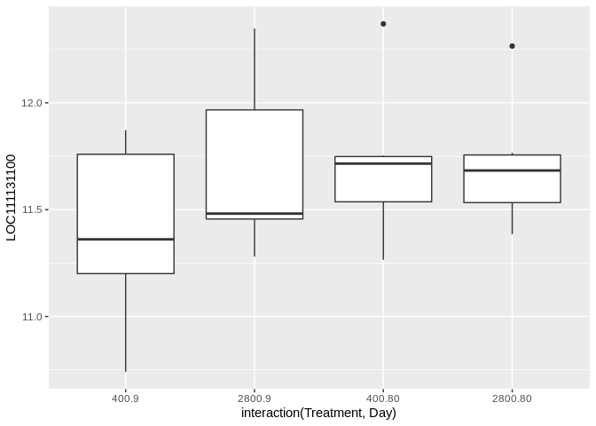<!-- -->

```r
ggplot(ac_data,aes(x=interaction(Treatment,Day),y=LOC111134509)) + geom_boxplot()
```

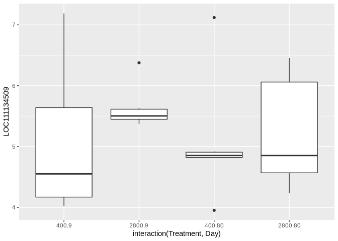<!-- -->

```r
ggplot(ac_data,aes(x=interaction(Treatment,Day),y=LOC111109301)) + geom_boxplot()
```

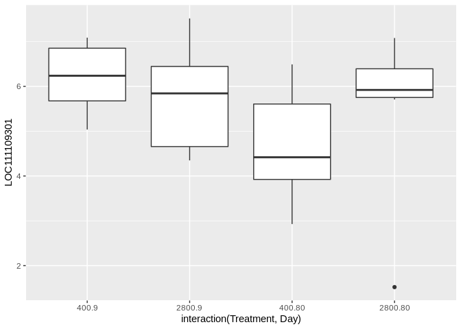<!-- -->

```r
#ggplot(ac_data,aes(x=EPF,y=LOC111131100,colour=interaction(Treatment,Time))) + geom_point()
#ggplot(ac_data,aes(x=EPF,y=LOC111109300,colour=interaction(Treatment,Time))) + geom_point()
```

### Calbindin - 32  

```r
(cb_text <- counts$E[match("LOC111136252",row.names(counts)),])
```

```
## RNA17005 RNA17007 RNA17013 RNA17019 RNA17069 RNA17070 RNA17072 RNA17079 
## 3.257385 4.632281 6.624343 5.507595 4.732419 5.478881 3.316341 4.438026 
## RNA17090 RNA17094 RNA17099 RNA17108 RNA17122 RNA17130 RNA17142 RNA17145 
## 3.138956 4.504190 5.265293 4.051459 3.047581 5.376482 3.429897 5.233920 
## RNA17162 RNA17174 RNA17176 RNA17178 RNA17181 RNA17203 RNA17211 RNA17213 
## 4.869326 4.425054 4.437311 5.654114 4.791732 3.967210 4.865115 4.596744
```

```r
# Yes its retained!
cb_data <- data.frame(Treatment=model$Treatment,Day=model$Day,EPF=model$epf_pH,locus=cb_text)

ggplot(cb_data,aes(x=interaction(Treatment,Day),y=locus)) + 
  geom_boxplot() + theme_classic() + 
  labs(x="Treatment.Day Combination",y="Gene Expression (log2)")
```

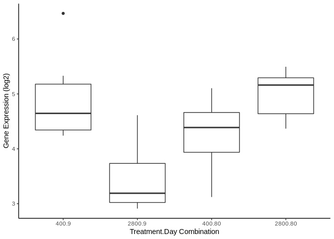<!-- -->

```r
#ggsave("/home/downeyam/Github/2017OAExp_Oysters/figures/Calbindin_Trt.png",width=20,height=14,units = "cm")
# ggplot(cb_data,aes(x=EPF_dff,y=locus,colour=Day)) + geom_smooth(method = "lm") +
#   geom_point(aes(shape=Treatment)) + 
#   labs(title="putative Calbindin-32 protein",x="EPF pH")
# ggsave("/home/downeyam/Github/2017OAExp_Oysters/figures/calbindin.png",width=20,height=12,units="cm")
```

### Beta-ureidopropionase  

```r
(bu_text <- counts$E[match("LOC111132068",row.names(counts)),])
```

```
## RNA17005 RNA17007 RNA17013 RNA17019 RNA17069 RNA17070 RNA17072 RNA17079 
## 3.257385 6.416552 6.780463 4.408059 5.360450 6.857393 4.538734 3.215633 
## RNA17090 RNA17094 RNA17099 RNA17108 RNA17122 RNA17130 RNA17142 RNA17145 
## 5.460884 6.340692 5.652316 4.051459 3.784547 5.376482 3.429897 4.944413 
## RNA17162 RNA17174 RNA17176 RNA17178 RNA17181 RNA17203 RNA17211 RNA17213 
## 5.399840 4.955569 6.273812 5.123599 4.791732 3.967210 5.154622 4.886251
```

```r
# Yes its retained!
bu_data <- data.frame(Treatment=model$Treatment,Day=model$Day,EPF=model$epf_pH,locus=(bu_text))

ggplot(bu_data,aes(x=interaction(Treatment,Day),y=locus)) + 
  geom_boxplot() +
  labs(x="Treatment.Day Combination",y="Gene Expression (log2)")
```

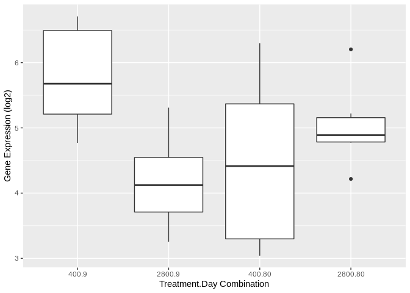<!-- -->

```r
#ggsave("/home/downeyam/Github/2017OAExp_Oysters/figures/Calbindin_Trt.png",width=20,height=14,units = "cm")
# ggplot(bu_data,aes(x=EPF_dff,y=locus,colour=Day)) + geom_smooth(method = "lm") +
#   geom_point(aes(shape=Treatment)) + 
#   labs(title="beta-ureidopropionase",x="EPF pH")
```

### EGF-like protein

```r
(eg_text <- counts$E[match("LOC111134661",row.names(counts)),])
```

```
## RNA17005 RNA17007 RNA17013 RNA17019 RNA17069 RNA17070 RNA17072 RNA17079 
## 6.801706 5.710284 1.495060 3.185667 5.360450 3.156953 4.538734 5.537561 
## RNA17090 RNA17094 RNA17099 RNA17108 RNA17122 RNA17130 RNA17142 RNA17145 
## 5.013425 3.281798 5.024285 5.188962 4.269973 4.845967 5.304366 4.096416 
## RNA17162 RNA17174 RNA17176 RNA17178 RNA17181 RNA17203 RNA17211 RNA17213 
## 3.284363 4.062484 3.951884 1.953674 5.154302 4.815207 5.943117 3.748747
```

```r
# Yes its retained!
eg_data <- data.frame(Treatment=model$Treatment,Day=model$Day,EPF=model$epf_pH,locus=(eg_text))

ggplot(eg_data,aes(x=interaction(Treatment,Day),y=locus)) + 
  geom_boxplot() +
  labs(x="Treatment.Day Combination",y="Gene Expression (log2)")
```

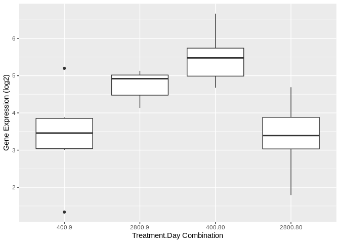<!-- -->

