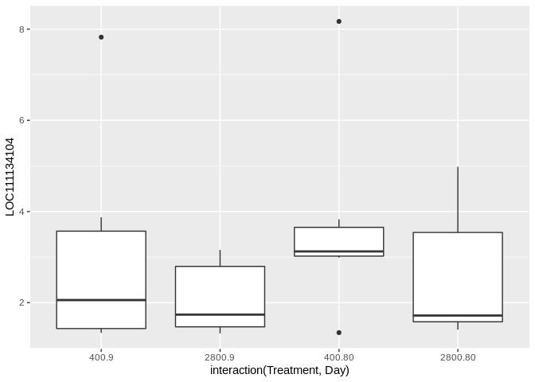
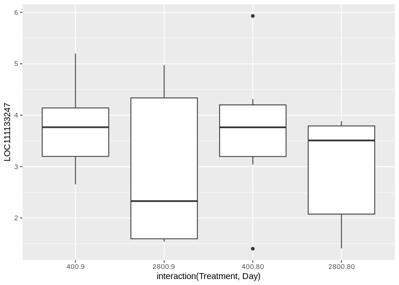

## Target Gene Overview  
  
Several target proteins have been thought to be associated with oyster calcification in the literature. Unfortunately, these didn't appear to be significantly associated with OA or time in our experiment when we perform a 'blind' association test. Still, it is useful to see if this is due to a lack of putative gene features coding for these proteins are present within out count data or if there gene features a simply not correlated with environment or time.  

Gene features associated with the proteins of interest were identified by perform a target search of the eastern oyster genome using the Genome View tool in NCBI and quering each protein name. All putative gene locations were used.  

#### Target proteins:  
  
* **Calcitonin**: Involved in calcium metabolism and regulation of calcium (studied mostly in context of osmoregulation)  
  * Papers:  
    * Molecular and physiological characterization of an invertebrate homologue of a calcitonin-related receptor (Dubos et al. 2003)  
    * Osmoregulation and mRNA expression of calcitonin-related receptor in the Pacific oyster Crassostrea gigas (Jo et al. 2008)  
    
* **Nacrein**: Involved I shell formation, have carbonic anhydrase like domains. Observed in Pacific oyster mantle.  
  * Paper: Identification two novel nacrein-like proteins involved in the shell formation of the Pacific oyster Crassostrea gigas (Song et al. 2014)  
  
* **Carbonic Anhydrase**: Important roles in biomineralization process.  
  * Papers:  
    * A shell-formation related carbonic anhydrase in Crassostrea gigas modulates intracellular calcium against CO2 exposure: Implication for impacts of ocean acidification on mollusk calcification (Wang et al. 2017)  
    * A Carbonic Anhydrase Serves as an Important Acid-Base Regulator in Pacific Oyster Crassostrea gigas Exposed to Elevated CO2: Implication for Physiological Responses of Mollusk to Ocean Acidification (Wang et al. 2017)  
    
* **Sodium bicarbonate transporter**: Acid -base regulator, responsible for modulating intra and inter cellular pH.  

* **Adenylyl cyclase**: Involved with pH regulation and responsive to OA in Cras. Gigas oysters  
  * Paper: Ocean acidification stimulates alkali signal pathway: A bicarbonate sensing soluble adenylyl cyclase from oyster Crassostrea gigas mediates physiological changes induced by CO2 exposure (Wang et al 2016 )  
  
### Data  

```r
GeneCounts <- read.delim("/home/downeyam/Github/2017OAExp_Oysters/results/C_virginica_gene_count_final.txt",header=TRUE,sep="",row.names=1)
counts <- readRDS("/home/downeyam/Github/2017OAExp_Oysters/input_files/RNA/Normalized_CountMatrix/Scenario1_normalizedVoom.RData")
model <-  read.csv("/home/downeyam/Github/2017OAExp_Oysters/input_files/RNA/metadata_cvirginica_rna_meta.txt", header=TRUE)
model$Treatment <- as.factor(model$treatment)
model$Day <- as.factor(model$Day)
```
  
### Calcitonin  

```r
# Had to use GeneCount matrix because this locus was filtered during countAnalysis

#Test if kept in trimmed data 
match("LOC111112092",row.names(counts$E))
```

```
## Loading required package: limma
```

```
## [1] NA
```

```r
#Nope

# Check if present in whole matrix
cal_text <- GeneCounts[match("LOC111112092",row.names(GeneCounts)),]
sum(cal_text)
```

```
## [1] 0
```

```r
# Nope not present
```
No reads seemed to align to location :/
  
### Nacrein  

```r
#Test if kept in trimmed data 
(nac_text <- counts$E[match("LOC111136431",row.names(counts$E)),])
```

```
## RNA17005 RNA17007 RNA17013 RNA17019 RNA17069 RNA17070 RNA17072 RNA17079 
## 4.344494 4.512633 7.219763 7.917755 7.041030 7.256215 5.000420 8.655531 
## RNA17090 RNA17094 RNA17099 RNA17108 RNA17122 RNA17130 RNA17142 RNA17145 
## 9.636757 5.260478 4.210584 5.819558 4.134110 9.526154 4.477563 1.641784 
## RNA17162 RNA17174 RNA17176 RNA17178 RNA17181 RNA17203 RNA17211 RNA17213 
## 7.960253 6.851387 3.044419 7.816675 8.312699 8.351408 7.807951 9.166797
```

```r
# Yes its retained!

nac_data <- data.frame(Treatment=model$Treatment,Day=model$Day,EPF=model$epf_pH,locus=(nac_text))
nac_data
```

```
##          Treatment Day      EPF    locus
## RNA17005       400  80 6.846758 4.344494
## RNA17007       400  80 7.455280 4.512633
## RNA17013       400   9 7.385796 7.219763
## RNA17019      2800  80 7.149452 7.917755
## RNA17069       400   9 7.817657 7.041030
## RNA17070       400   9 6.786949 7.256215
## RNA17072      2800   9 7.616122 5.000420
## RNA17079       400  80 7.449510 8.655531
## RNA17090      2800   9 7.420345 9.636757
## RNA17094      2800  80 7.172533 5.260478
## RNA17099       400  80 7.668782 4.210584
## RNA17108      2800   9 7.633396 5.819558
## RNA17122      2800   9 7.857964 4.134110
## RNA17130      2800  80 7.097519 9.526154
## RNA17142      2800   9 7.811899 4.477563
## RNA17145      2800  80 6.918638 1.641784
## RNA17162       400   9 7.570056 7.960253
## RNA17174       400   9 7.754317 6.851387
## RNA17176       400   9 7.132437 3.044419
## RNA17178      2800  80 7.091748 7.816675
## RNA17181      2800   9 7.506717 8.312699
## RNA17203       400  80 7.484132 8.351408
## RNA17211       400  80 7.709175 7.807951
## RNA17213      2800  80 6.872475 9.166797
```

```r
ggplot(nac_data,aes(x=interaction(Treatment,Day),y=locus)) + 
  geom_boxplot() +
  labs(title="LOC111136431",x="Treatment.Day Combination")  
```

<!-- -->

```r
# ggplot(nac_data,aes(x=EPF,y=LOC111136431)) + 
#   geom_point() +
#   labs(title="LOC111136431",x="EPF pH")
```
No significant differences between treatment_time combinations.  

### Carbonic Anhydrase  

```r
# All potential carbonic anhydrase gene locations based on CV genome on NCBI 
ca_LOC <- c("LOC111134699",
  "LOC111133036",
  "LOC111130107",
  "LOC111134700",
  "LOC111123083",
  "LOC111113402",
  "LOC111137424",
  "LOC111117514",
  "LOC111114059",
  "LOC111112162",
  "LOC111133640",
  "LOC111134104",
  "LOC111133247",
  "LOC111130106",
  "LOC111127254",
  "LOC111127093",
  "LOC111122701",
  "LOC111120606",
  "LOC111120607",
  "LOC11125708")

# Subset for locations matching known carbonic anhydrase genes
match(ca_LOC,row.names(counts),nomatch = FALSE)
```

```
##  [1]     0     0     0 10047     0     0     0     0     0     0     0
## [12]  9787  9493     0     0     0     0     0  5245     0
```

```r
out_ca <- match(ca_LOC,row.names(counts))
out_ca <- out_ca[!is.na(out_ca)]
ca_data <- data.frame(t(as.matrix(counts[out_ca,])))
ca_data$Treatment <- model$Treatment
ca_data$Day <- model$Day

ca_data
```

```
##          LOC111134700 LOC111134104 LOC111133247 LOC111120607 Treatment Day
## RNA17005     3.859067     3.122102     5.929457     5.624602       400  80
## RNA17007     1.342708     1.342708     3.664636     6.097595       400  80
## RNA17013     3.659048     1.337120     3.659048     7.118480       400   9
## RNA17019     3.731889     1.409960     1.409960     6.695363      2800  80
## RNA17069     2.695255     7.824538     5.197756     7.300117       400   9
## RNA17070     1.423325     1.423325     4.230680     7.400605       400   9
## RNA17072     3.125951     3.125951     1.540988     7.649513      2800   9
## RNA17079     3.777787     8.170104     3.040821     7.183779       400  80
## RNA17090     1.403137     1.403137     2.988100     6.688540      2800   9
## RNA17094     3.145001     1.560039     3.881967     7.341398      2800  80
## RNA17099     2.988191     2.988191     1.403229     6.612682       400  80
## RNA17108     1.571630     3.156593     1.571630     6.429611      2800   9
## RNA17122     8.710459     1.326755     4.786186     5.414218      2800   9
## RNA17130     1.520529     4.979961     3.842457     6.275417      2800  80
## RNA17142     1.670208     1.670208     1.670208     6.879662      2800   9
## RNA17145     6.396671     1.641784     1.641784     6.165346      2800  80
## RNA17162     1.550862     3.872790     3.872790     6.760316       400   9
## RNA17174     5.593589     2.654990     2.654990     6.684737       400   9
## RNA17176     4.266812     1.459457     3.044419     8.029312       400   9
## RNA17178     4.116235     1.794307     3.379270     5.701198      2800  80
## RNA17181     4.126833     1.804904     4.974829     5.892367      2800   9
## RNA17203     5.206358     3.827846     4.313273     5.412809       400  80
## RNA17211     3.863093     3.126127     3.863093     7.471902       400  80
## RNA17213     4.122403     4.122403     3.636977     7.581835      2800  80
```

```r
#LOC111120607 
ggplot(ca_data,aes(x=interaction(Treatment,Day),y=LOC111120607)) + geom_boxplot()
```

<!-- -->

```r
#LOC111134700 
ggplot(ca_data,aes(x=interaction(Treatment,Day),y=LOC111134700)) + geom_boxplot()
```

<!-- -->

```r
#LOC111134104 
ggplot(ca_data,aes(x=interaction(Treatment,Day),y=LOC111134104 )) + geom_boxplot()
```

<!-- -->

```r
#LOC111133247 
ggplot(ca_data,aes(x=interaction(Treatment,Day),y=LOC111133247)) + geom_boxplot()
```

<!-- -->

```r
# Q-vals for locus from linear mixed model
#### UPDATED THIS
# Treatment:Time
#time_qvals[1732,1]
# Treatment:Time
#treatment_qvals[1732,1]
# Treatment:Time
#timeTrt_qvals[1732,1]
```
  
### Sodium Bicarbonate Transporter  

```r
bi_LOC <- c("LOC111118314",
  "LOC111125089",
  "LOC111124629",
  "LOC111126568",
  "LOC111126835",
  "LOC111123835",
  "LOC111120445",
  "LOC111120427",
  "LOC111119272",
  "LOC111115910",
  "LOC111126460")

match(bi_LOC,row.names(counts),nomatch = FALSE)
```

```
##  [1]    0 6773 6556 7371 7446 6271    0    0    0    0    0
```

```r
out_bi <- match(bi_LOC,row.names(counts))
out_bi <- out_bi[!is.na(out_bi)]
bi_data <- data.frame(t(as.matrix(counts[out_bi,])))
bi_data$Treatment <- model$Treatment
bi_data$Day <- model$Day
bi_data
```

```
##          LOC111125089 LOC111124629 LOC111126568 LOC111126835 LOC111123835
## RNA17005     3.122102     5.444030     6.581533     4.707064     7.946530
## RNA17007     7.682558     5.430170     5.735025     4.150062     9.713395
## RNA17013     1.337120     6.466403     6.092008     4.507045    10.264898
## RNA17019     2.994923     5.657888     5.657888     1.409960     9.881636
## RNA17069     5.633855     5.968274     6.992936     3.432221     9.920864
## RNA17070     1.423325     6.067181     6.915178     4.230680    10.106320
## RNA17072     4.348343     5.628451     7.268909     1.540988     9.876378
## RNA17079     4.263214     6.210746     6.099715     1.455859     9.307608
## RNA17090     2.988100     6.261118     6.532420     4.573062    10.371804
## RNA17094     5.260478     5.647501     6.689322     4.367394     9.167369
## RNA17099     4.210584     5.795546     6.357425     5.103669     9.316118
## RNA17108     4.741555     5.031062     6.616024     3.156593     9.976772
## RNA17122     1.326755     6.184736     6.999180     6.081642     9.714772
## RNA17130     3.105492     5.427420     6.729983     3.842457    10.381616
## RNA17142     3.255171     5.370648     6.314064     5.577099     9.377567
## RNA17145     3.963712     5.101215     7.196373     1.641784     9.493533
## RNA17162     6.074424     5.798790     6.305750     5.010294     9.545216
## RNA17174     3.877382     6.742453     6.851387     5.157490    10.252422
## RNA17176     3.781385     5.546920     6.588740     1.459457     9.021699
## RNA17178     4.964232     7.466733     6.652288     3.379270     9.670824
## RNA17181     4.126833     5.892367     6.559792     5.505344     8.280638
## RNA17203     3.827846     5.753846     6.932183     4.675843     9.630040
## RNA17211     4.348519     6.750618     7.095753     4.711089    10.122365
## RNA17213     4.122403     5.221939     7.096408     5.015488    10.254628
##          Treatment Day
## RNA17005       400  80
## RNA17007       400  80
## RNA17013       400   9
## RNA17019      2800  80
## RNA17069       400   9
## RNA17070       400   9
## RNA17072      2800   9
## RNA17079       400  80
## RNA17090      2800   9
## RNA17094      2800  80
## RNA17099       400  80
## RNA17108      2800   9
## RNA17122      2800   9
## RNA17130      2800  80
## RNA17142      2800   9
## RNA17145      2800  80
## RNA17162       400   9
## RNA17174       400   9
## RNA17176       400   9
## RNA17178      2800  80
## RNA17181      2800   9
## RNA17203       400  80
## RNA17211       400  80
## RNA17213      2800  80
```

```r
ggplot(bi_data,aes(x=interaction(Treatment,Day),y=LOC111124629)) + geom_boxplot()
```

<!-- -->

```r
ggplot(bi_data,aes(x=interaction(Treatment,Day),y=LOC111126568)) + geom_boxplot()
```

<!-- -->

```r
ggplot(bi_data,aes(x=interaction(Treatment,Day),y=LOC111123835)) + geom_boxplot()
```

<!-- -->

### Adenylyl cyclase  

```r
ac_LOC <- c("LOC111131100",
  "LOC111134509",
  "LOC111130107",
  "LOC111111874",
  "LOC111109301")

match(ac_LOC,row.names(counts),nomatch = FALSE)
```

```
## [1] 8935 9941    0    0 2445
```

```r
out_ac <- match(ac_LOC,row.names(counts))
out_ac <- out_ac[!is.na(out_ac)]
ac_data <- data.frame(t(as.matrix(counts[out_ac,])))
ac_data$Treatment <- model$Treatment
ac_data$Day <- model$Day
ac_data
```

```
##          LOC111131100 LOC111134509 LOC111109301 Treatment Day
## RNA17005     11.59919     4.707064     6.491336       400  80
## RNA17007     11.36369     4.802139     2.927670       400  80
## RNA17013     11.32438     4.507045     5.037560       400   9
## RNA17019     11.53537     6.267941     6.539243      2800  80
## RNA17069     11.02468     3.917648     7.087573       400   9
## RNA17070     11.70294     5.815642     6.067181       400   9
## RNA17072     11.29420     6.184844     4.348343      2800   9
## RNA17079     12.19480     3.777787     4.625784       400  80
## RNA17090     11.12936     5.310028     5.490600      2800   9
## RNA17094     12.12894     4.367394     5.952356      2800  80
## RNA17099     11.59182     6.957818     4.210584       400  80
## RNA17108     11.29102     5.478521     4.378985      2800   9
## RNA17122     11.34217     5.233645     7.516579      2800   9
## RNA17130     11.22961     6.275417     1.520529      2800  80
## RNA17142     12.17304     5.370648     6.528189      2800   9
## RNA17145     11.50752     4.811709     5.889711      2800  80
## RNA17162     10.59252     3.872790     6.408843       400   9
## RNA17174     11.05445     7.000765     7.000765       400   9
## RNA17176     11.70144     4.266812     5.546920       400   9
## RNA17178     11.60648     4.601662     7.079709      2800  80
## RNA17181     11.94829     5.264336     6.197222      2800   9
## RNA17203     11.12614     4.675843     3.827846       400  80
## RNA17211     11.54257     4.711089     5.933482       400  80
## RNA17213     11.38517     4.122403     5.707366      2800  80
```

```r
ggplot(ac_data,aes(x=interaction(Treatment,Day),y=LOC111131100)) + geom_boxplot()
```

<!-- -->

```r
ggplot(ac_data,aes(x=interaction(Treatment,Day),y=LOC111134509)) + geom_boxplot()
```

<!-- -->

```r
ggplot(ac_data,aes(x=interaction(Treatment,Day),y=LOC111109301)) + geom_boxplot()
```

<!-- -->

```r
#ggplot(ac_data,aes(x=EPF,y=LOC111131100,colour=interaction(Treatment,Time))) + geom_point()
#ggplot(ac_data,aes(x=EPF,y=LOC111109300,colour=interaction(Treatment,Time))) + geom_point()
```

### Calbindin - 32  

```r
(cb_text <- counts$E[match("LOC111136252",row.names(counts$E)),])
```

```
## RNA17005 RNA17007 RNA17013 RNA17019 RNA17069 RNA17070 RNA17072 RNA17079 
## 3.122102 4.512633 6.466403 5.316851 4.569724 5.330216 3.125951 4.263214 
## RNA17090 RNA17094 RNA17099 RNA17108 RNA17122 RNA17130 RNA17142 RNA17145 
## 2.988100 4.367394 5.103669 3.893558 2.911717 5.220969 3.255171 5.101215 
## RNA17162 RNA17174 RNA17176 RNA17178 RNA17181 RNA17203 RNA17211 RNA17213 
## 4.720787 4.239952 4.266812 5.494747 4.612259 3.827846 4.711089 4.484973
```

```r
# Yes its retained!
cb_data <- data.frame(Treatment=model$Treatment,Day=model$Day,EPF=model$epf_pH,locus=(cb_text))

ggplot(cb_data,aes(x=interaction(Treatment,Day),y=locus)) + 
  geom_boxplot() + theme_classic() + 
  labs(x="Treatment.Day Combination",y="Gene Expression (log2)")
```

<!-- -->

```r
#ggsave("/home/downeyam/Github/2017OAExp_Oysters/figures/Calbindin_Trt.png",width=20,height=14,units = "cm")
# ggplot(cb_data,aes(x=EPF_dff,y=locus,colour=Day)) + geom_smooth(method = "lm") +
#   geom_point(aes(shape=Treatment)) + 
#   labs(title="putative Calbindin-32 protein",x="EPF pH")
# ggsave("/home/downeyam/Github/2017OAExp_Oysters/figures/calbindin.png",width=20,height=12,units="cm")
```

### Beta-ureidopropionase  

```r
(bu_text <- counts$E[match("LOC111132068",row.names(counts$E)),])
```

```
## RNA17005 RNA17007 RNA17013 RNA17019 RNA17069 RNA17070 RNA17072 RNA17079 
## 3.122102 6.296904 6.622522 4.217315 5.197756 6.708727 4.348343 3.040821 
## RNA17090 RNA17094 RNA17099 RNA17108 RNA17122 RNA17130 RNA17142 RNA17145 
## 5.310028 6.203895 5.490692 3.893558 3.648683 5.220969 3.255171 4.811709 
## RNA17162 RNA17174 RNA17176 RNA17178 RNA17181 RNA17203 RNA17211 RNA17213 
## 5.251302 4.770467 6.103313 4.964232 4.612259 3.827846 5.000596 4.774480
```

```r
# Yes its retained!
bu_data <- data.frame(Treatment=model$Treatment,Day=model$Day,EPF=model$epf_pH,locus=(bu_text))

ggplot(bu_data,aes(x=interaction(Treatment,Day),y=locus)) + 
  geom_boxplot() +
  labs(x="Treatment.Day Combination",y="Gene Expression (log2)")
```

<!-- -->

```r
#ggsave("/home/downeyam/Github/2017OAExp_Oysters/figures/Calbindin_Trt.png",width=20,height=14,units = "cm")
# ggplot(bu_data,aes(x=EPF_dff,y=locus,colour=Day)) + geom_smooth(method = "lm") +
#   geom_point(aes(shape=Treatment)) + 
#   labs(title="beta-ureidopropionase",x="EPF pH")
```

### EGF-like protein

```r
(eg_text <- counts$E[match("LOC111134661",row.names(counts$E)),])
```

```
## RNA17005 RNA17007 RNA17013 RNA17019 RNA17069 RNA17070 RNA17072 RNA17079 
## 6.666422 5.590635 1.337120 2.994923 5.197756 3.008288 4.348343 5.362749 
## RNA17090 RNA17094 RNA17099 RNA17108 RNA17122 RNA17130 RNA17142 RNA17145 
## 4.862569 3.145001 4.862661 5.031062 4.134110 4.690454 5.129640 3.963712 
## RNA17162 RNA17174 RNA17176 RNA17178 RNA17181 RNA17203 RNA17211 RNA17213 
## 3.135825 3.877382 3.781385 1.794307 4.974829 4.675843 5.789092 3.636977
```

```r
# Yes its retained!
eg_data <- data.frame(Treatment=model$Treatment,Day=model$Day,EPF=model$epf_pH,locus=(eg_text))

ggplot(eg_data,aes(x=interaction(Treatment,Day),y=locus)) + 
  geom_boxplot() +
  labs(x="Treatment.Day Combination",y="Gene Expression (log2)")
```

<!-- -->

