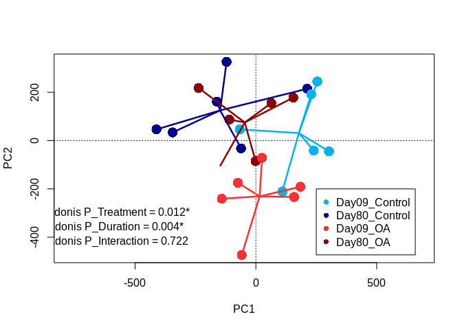
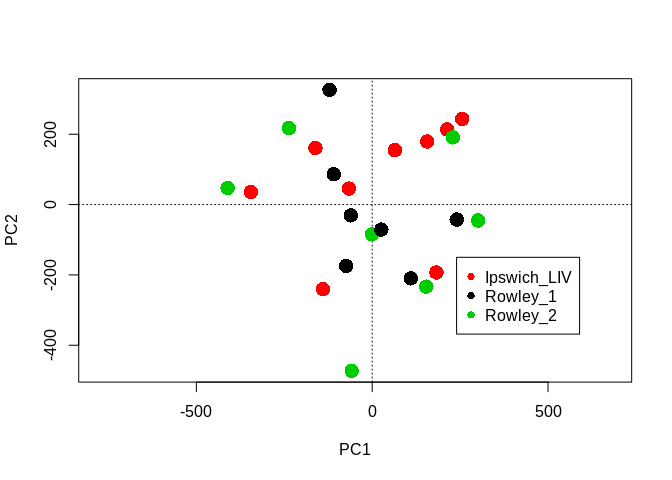
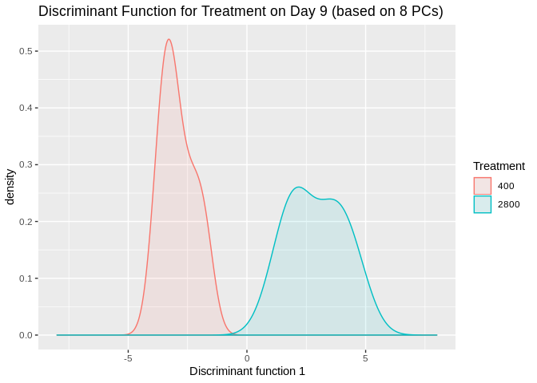
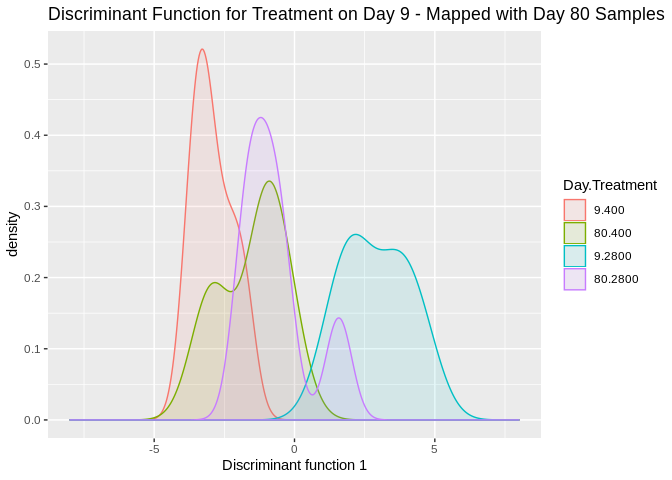
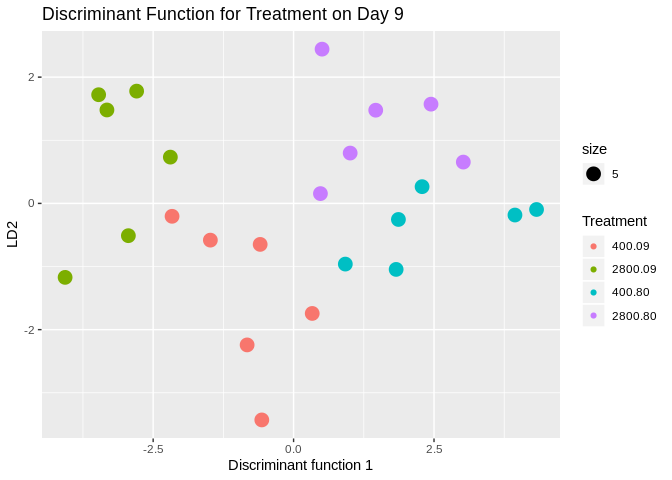

```r
model<-read.csv("/home/downeyam/Github/2017OAExp_Oysters/input_files/RNA/metadata_cvirginica_rna_meta.txt", header=TRUE)
model$Treatment <- as.factor(model$treatment)
model$Time <- as.character(model$timepoint)
model$Time[model$Time == "3"] <- "09"
model$Time[model$Time == "6"] <- "80"
model$Time <- as.factor(model$Time)
model$Pop <- as.factor(model$population)
model$Lane <- as.factor(model$lane)
model$SFV <-  interaction(model$Time,model$Treatment) # Creates single factor variable for combination of time and treatment

gc <- readRDS("/home/downeyam/Github/2017OAExp_Oysters/input_files/salmon_RNA/out2/gene_countMatrix.RData")
```


```r
(out <- adonis(t(gc)~Treatment*Time*Pop*Lane,data=model,permutations = 999))
```

```
## 
## Call:
## adonis(formula = t(gc) ~ Treatment * Time * Pop * Lane, data = model,      permutations = 999) 
## 
## Permutation: free
## Number of permutations: 999
## 
## Terms added sequentially (first to last)
## 
##                     Df SumsOfSqs  MeanSqs F.Model      R2 Pr(>F)   
## Treatment            1   0.03682 0.036820 1.96940 0.08600  0.012 * 
## Time                 1   0.03880 0.038800 2.07529 0.09062  0.004 **
## Pop                  2   0.03294 0.016470 0.88092 0.07693  0.722   
## Lane                 1   0.01824 0.018240 0.97562 0.04260  0.487   
## Treatment:Time       1   0.01788 0.017880 0.95632 0.04176  0.506   
## Treatment:Pop        2   0.03270 0.016349 0.87448 0.07637  0.746   
## Time:Pop             2   0.03408 0.017039 0.91134 0.07959  0.674   
## Treatment:Lane       1   0.01698 0.016983 0.90838 0.03967  0.618   
## Time:Lane            1   0.01353 0.013528 0.72358 0.03160  0.912   
## Pop:Lane             2   0.02765 0.013823 0.73933 0.06457  0.940   
## Treatment:Time:Pop   2   0.03536 0.017681 0.94568 0.08259  0.617   
## Treatment:Time:Lane  1   0.01446 0.014459 0.77337 0.03377  0.825   
## Treatment:Pop:Lane   1   0.02109 0.021092 1.12815 0.04926  0.267   
## Time:Pop:Lane        1   0.01286 0.012855 0.68759 0.03002  0.936   
## Residuals            4   0.07478 0.018696         0.17466          
## Total               23   0.42817                  1.00000          
## ---
## Signif. codes:  0 '***' 0.001 '**' 0.01 '*' 0.05 '.' 0.1 ' ' 1
```

```r
prin_comp<-rda(t(gc), scale=FALSE)
pca_scores<-scores(prin_comp)
color_comb <- c("deepskyblue2","blue4","firebrick1","darkred") # colors for population 
model$colors <- "" 
model$colors[model$SFV == unique(model$SFV)[1]] <-  color_comb[2]
model$colors[model$SFV == unique(model$SFV)[2]] <-  color_comb[1]
model$colors[model$SFV == unique(model$SFV)[3]] <-  color_comb[4]
model$colors[model$SFV == unique(model$SFV)[4]] <-  color_comb[3]

ordiplot(prin_comp,type="n")
orditorp(prin_comp,display="sites",labels = FALSE,col=model$colors,cex = 2,pch = 16)
#ordiellipse(prin_comp,model$SFV,conf=0.90,col = color_comb,lwd = 3)
ordispider(prin_comp,model$SFV,col = color_comb,lwd=2.5)
legend(x=250,y=-200,legend = c("Day09_Control","Day80_Control","Day09_OA","Day80_OA"),pch = 16,col=color_comb,xpd = .25)
text(x = -570 ,y = -300, paste0("Adonis P_Treatment = ",out$aov.tab$`Pr(>F)`[1],"*"))
text(x = -580 ,y = -360, paste0("Adonis P_Duration = ",out$aov.tab$`Pr(>F)`[2],"*"))
text(x = -570 ,y = -420, paste0("Adonis P_Interaction = ",out$aov.tab$`Pr(>F)`[3]))
```

<!-- -->

### Cumulative Variance Plot

```r
out <- prcomp(t(gc))
vars <- apply(out$x, 2, var)  
props <- vars / sum(vars)
cumsum(props)
```

```
##       PC1       PC2       PC3       PC4       PC5       PC6       PC7 
## 0.2526612 0.3938696 0.4820698 0.5598705 0.6306883 0.6903224 0.7390851 
##       PC8       PC9      PC10      PC11      PC12      PC13      PC14 
## 0.7855839 0.8140429 0.8411716 0.8626082 0.8816911 0.8996313 0.9153924 
##      PC15      PC16      PC17      PC18      PC19      PC20      PC21 
## 0.9299432 0.9418634 0.9522087 0.9620362 0.9706965 0.9790986 0.9870562 
##      PC22      PC23      PC24 
## 0.9944366 1.0000000 1.0000000
```

```r
plot(cumsum(props)~c(1:24))
```

<!-- -->

### TWO STEP DAPC: first create discriminant function from TP 9 samples and predict coordinates on df for day 80 samples.  
  
**Creating DF by treatment with first timepoint**  

```r
early_time_counts <- gc[,model$Day == 9]
early_time_meta <- model[model$Day == 9,]

dapc_treatment_10<-dapc(t(early_time_counts),early_time_meta$treatment,n.pca=10,n.da=2)
# PCs = 5
# clusters = 1
early_time_meta$discriminant_treatment_10 <- dapc_treatment_10$ind.coord

ggplot(early_time_meta,aes(discriminant_treatment_10,fill=as.factor(treatment),colour=as.factor(treatment))) + 
  geom_density(alpha=0.1) + xlim(-28,28) + 
  labs(title="Discriminant Function for Treatment on Day 9",
       x="Discriminant function 1",
       colour="Treatment",
       fill="Treatment")
```

<!-- -->

**Mapping Day 80 samples**  

```r
late_time_counts <- gc[,model$Day == 80]
late_time_meta <- model[model$Day == 80,]

predict_values <- predict.dapc(dapc_treatment_10,t(late_time_counts))
late_time_meta$discriminant_treatment_10 <-predict_values$ind.scores

whole_meta<- rbind(early_time_meta,late_time_meta)

ggplot(whole_meta,aes(discriminant_treatment_10,fill=as.factor(interaction(Day,treatment)),colour=as.factor(interaction(Day,treatment)))) + 
  geom_density(alpha=0.1,adjust=3) + xlim(-28,28) + 
  labs(title="Discriminant Function for Treatment on Day 9 - Mapped with Day 80 Samples",
       x="Discriminant function 1",
       colour="Day.Treatment",
       fill="Day.Treatment")
```

```
## Warning: Removed 1 rows containing non-finite values (stat_density).
```

<!-- -->

### DAPC based on combined time*treatment factor  
  
**Creating DF by treatment with first timepoint**  

```r
dapc_SFV_10<-dapc(t(gc),model$SFV,n.pca=10,n.da=3)
# PCs = 10
# clusters = 3
output <- data.frame(Trt=model$Treatment,Time=model$Time,dapc_SFV_10$ind.coord)

ggplot(output,aes(x=LD1,y=LD2,fill=as.factor(interaction(Trt,Time)),colour=as.factor(interaction(Trt,Time)))) + 
  geom_point(aes(size=5)) + #geom_density(alpha=0.1) + #xlim(-28,28) + 
  labs(title="Discriminant Function for Treatment on Day 9",
       x="Discriminant function 1",
       colour="Treatment",
       fill="Treatment")
```

<!-- -->
