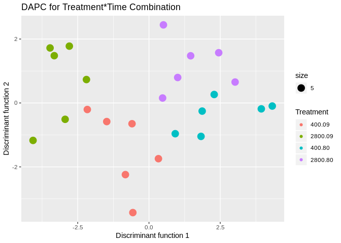

```r
model<-read.csv("/home/downeyam/Github/2017OAExp_Oysters/input_files/RNA/metadata_cvirginica_rna_meta.txt", header=TRUE)
model$Treatment <- as.factor(model$treatment)
model$Time <- as.character(model$timepoint)
model$Time[model$Time == "3"] <- "09"
model$Time[model$Time == "6"] <- "80"
model$Time <- as.factor(model$Time)
model$Pop <- as.factor(model$population)
model$Lane <- as.factor(model$lane)
model$SFV <-  interaction(model$Time,model$Treatment) # Creates single factor variable for combination of time and treatment

gc <- readRDS("/home/downeyam/Github/2017OAExp_Oysters/input_files/salmon_RNA/run20180512_gene_countMatrix_.RData")
gc <- gc[-c(1:205),] #removing some no LOC genes (most trna)
```


```r
(out <- adonis(t(gc)~Treatment*Time+Pop+Lane,data=model,permutations = 999))
```

```
## 
## Call:
## adonis(formula = t(gc) ~ Treatment * Time + Pop + Lane, data = model,      permutations = 999) 
## 
## Permutation: free
## Number of permutations: 999
## 
## Terms added sequentially (first to last)
## 
##                Df SumsOfSqs  MeanSqs F.Model      R2 Pr(>F)    
## Treatment       1   0.03690 0.036898 2.21311 0.08615  0.002 ** 
## Time            1   0.03884 0.038845 2.32990 0.09070  0.001 ***
## Pop             2   0.03303 0.016517 0.99066 0.07713  0.463    
## Lane            1   0.01820 0.018199 1.09155 0.04249  0.293    
## Treatment:Time  1   0.01787 0.017868 1.07175 0.04172  0.314    
## Residuals      17   0.28343 0.016672         0.66180           
## Total          23   0.42827                  1.00000           
## ---
## Signif. codes:  0 '***' 0.001 '**' 0.01 '*' 0.05 '.' 0.1 ' ' 1
```

## Plot in multivariate space with RDA (treatment and time)

```r
prin_comp<-rda(t(gc), scale=FALSE)
prin_comp$colsum
```

```
## LOC111099029 LOC111099030 LOC111099031 LOC111099032 LOC111099033 
## 4.005203e+01 5.618055e+02 4.643056e-01 2.823299e-01 3.635268e+02 
## LOC111099034 LOC111099035 LOC111099036 LOC111099037 LOC111099038 
## 1.677004e+01 1.534988e+02 1.070971e+02 1.059806e+00 9.355971e+01 
## LOC111099039 LOC111099040 LOC111099041 LOC111099042 LOC111099043 
## 1.194255e+01 5.057995e+02 1.906828e+02 4.973663e+00 8.115684e+01 
## LOC111099044 LOC111099045 LOC111099046 LOC111099047 LOC111099048 
## 1.066550e+01 9.050595e+01 8.639781e+01 2.737777e+02 6.395454e+00 
## LOC111099049 LOC111099050 LOC111099051 LOC111099052 LOC111099053 
## 5.882300e-01 8.659384e+01 0.000000e+00 3.406617e+01 3.725748e+02 
## LOC111099054 LOC111099055 LOC111099056 LOC111099057 LOC111099058 
## 5.736831e+00 1.461779e+01 3.927449e+01 3.724472e+00 1.625582e+02 
## LOC111099059 LOC111099060 LOC111099061 LOC111099062 LOC111099063 
## 1.644684e+00 3.849504e+01 1.751662e+02 9.836981e+01 1.146403e+02 
## LOC111099064 LOC111099065 LOC111099066 LOC111099067 LOC111099068 
## 1.847225e+03 4.300005e+00 4.223090e+01 1.437611e+02 1.363464e+02 
## LOC111099069 LOC111099070 LOC111099071 LOC111099072 LOC111099073 
## 6.407805e+00 5.402734e+01 3.298485e+01 3.635324e+00 1.041174e+02 
## LOC111099074 LOC111099075 LOC111099076 LOC111099077 LOC111099078 
## 2.401173e+01 0.000000e+00 3.653220e+00 4.245202e+00 4.934450e+01 
## LOC111099079 LOC111099080 LOC111099081 LOC111099082 LOC111099083 
## 4.041713e+02 4.360561e+00 5.977711e+01 4.938733e+00 9.704355e-01 
## LOC111099084 LOC111099085 LOC111099086 LOC111099087 LOC111099088 
## 1.009373e+01 9.990938e-01 9.743076e-01 3.282957e+01 8.737923e+02 
## LOC111099089 LOC111099090 LOC111099091 LOC111099092 LOC111099093 
## 1.601064e+00 4.409684e+03 3.778982e+01 2.024507e+01 6.277611e+01 
## LOC111099094 LOC111099095 LOC111099096 LOC111099097 LOC111099098 
## 1.382650e+01 4.151898e+01 2.402761e+01 4.371132e+01 7.584955e+00 
## LOC111099099 LOC111099101 LOC111099102 LOC111099103 LOC111099104 
## 1.935024e+01 4.061290e+02 1.067599e+02 4.615990e+02 1.927311e+02 
## LOC111099105 LOC111099106 LOC111099107 LOC111099108 LOC111099109 
## 4.612829e+01 2.629318e+01 2.834109e+01 2.474083e+01 2.399862e+02 
## LOC111099110 LOC111099111 LOC111099112 LOC111099113 LOC111099114 
## 1.996446e+01 2.134495e+01 6.173077e+01 2.146365e+00 2.228502e+02 
## LOC111099115 LOC111099116 LOC111099117 LOC111099118 LOC111099119 
## 1.154744e+02 1.376214e+00 9.039366e+00 3.767190e+01 1.041367e+02 
## LOC111099120 LOC111099121 LOC111099122 LOC111099123 LOC111099124 
## 8.182338e+01 2.071621e+00 1.415039e+02 6.169348e+01 2.178335e+01 
## LOC111099125 LOC111099126 LOC111099127 LOC111099128 LOC111099129 
## 4.913711e+01 2.778773e+01 6.865520e+01 9.764528e+00 1.250280e+02 
## LOC111099130 LOC111099131 LOC111099132 LOC111099133 LOC111099134 
## 2.041241e-01 1.186297e+02 4.113537e+00 1.557672e+02 1.883856e+00 
## LOC111099135 LOC111099136 LOC111099137 LOC111099138 LOC111099139 
## 1.599101e+02 7.548427e+00 4.040383e+01 3.580341e+01 1.359166e+03 
## LOC111099140 LOC111099141 LOC111099142 LOC111099143 LOC111099144 
## 1.055441e+02 4.324999e+00 5.891851e+00 1.955880e+03 0.000000e+00 
## LOC111099145 LOC111099146 LOC111099147 LOC111099148 LOC111099149 
## 1.371088e+02 3.602483e+01 2.972302e+02 0.000000e+00 2.491256e+01 
## LOC111099150 LOC111099151 LOC111099152 LOC111099153 LOC111099154 
## 2.391108e+02 1.050288e+02 1.798519e+01 9.719013e+01 1.100066e+00 
## LOC111099155 LOC111099156 LOC111099157 LOC111099158 LOC111099159 
## 1.565931e+02 9.598973e+01 3.417939e+02 5.491278e+01 5.646597e-01 
## LOC111099160 LOC111099161 LOC111099162 LOC111099163 LOC111099164 
## 3.378320e-01 1.405244e+01 6.968749e+01 7.979594e+00 1.363195e+01 
## LOC111099165 LOC111099166 LOC111099167 LOC111099168 LOC111099169 
## 1.696735e+02 4.676024e+01 8.783940e+00 4.604674e+01 1.798711e+01 
## LOC111099170 LOC111099171 LOC111099172 LOC111099173 LOC111099174 
## 3.472459e+00 1.380313e+02 7.252893e+02 3.378320e-01 5.607137e+01 
## LOC111099175 LOC111099176 LOC111099177 LOC111099178 LOC111099179 
## 8.318166e+01 1.882192e+02 1.885524e+01 6.205024e+01 1.083439e+01 
## LOC111099180 LOC111099181 LOC111099182 LOC111099183 LOC111099184 
## 6.834789e+01 5.882300e-01 1.628680e+02 5.842261e+01 1.547823e+02 
## LOC111099185 LOC111099186 LOC111099187 LOC111099188 LOC111099189 
## 3.641936e+01 3.185690e+01 8.297022e-01 0.000000e+00 9.448400e+00 
## LOC111099190 LOC111099191 LOC111099192 LOC111099193 LOC111099194 
## 4.573551e+01 5.804704e+01 5.342610e+01 5.182468e+01 1.959066e+03 
## LOC111099195 LOC111099196 LOC111099197 LOC111099198 LOC111099199 
## 6.187382e+02 8.640101e+01 8.211691e+01 4.484272e-01 1.825940e+02 
## LOC111099200 LOC111099201 LOC111099202 LOC111099203 LOC111099204 
## 5.050853e+01 5.228425e+01 8.245795e+01 1.712664e+02 9.975858e+00 
## LOC111099205 LOC111099206 LOC111099207 LOC111099208 LOC111099209 
## 2.282574e+00 3.566792e+01 1.809726e+02 1.630928e+01 4.628519e+01 
## LOC111099210 LOC111099211 LOC111099212 LOC111099213 LOC111099214 
## 8.505700e+01 1.133362e+02 4.627327e+01 7.755316e-01 4.106801e+01 
## LOC111099215 LOC111099216 LOC111099217 LOC111099218 LOC111099219 
## 8.859884e+01 6.189677e+01 9.720905e+02 4.157828e+02 1.922720e+02 
## LOC111099220 LOC111099221 LOC111099222 LOC111099223 LOC111099224 
## 4.635619e+01 5.104515e+01 2.766599e+02 5.245944e+00 7.790276e-01 
## LOC111099225 LOC111099226 LOC111099227 LOC111099228 LOC111099229 
## 5.521965e+01 2.235998e+02 1.239288e+02 7.505893e+01 1.469857e+01 
## LOC111099230 LOC111099246 LOC111099262 LOC111099278 LOC111099289 
## 3.264771e+01 2.957596e+01 2.779594e+02 1.300775e+01 1.526331e+02 
## LOC111099300 LOC111099316 LOC111099327 LOC111099343 LOC111099359 
## 5.800081e+01 3.178286e+01 1.653082e+02 2.877213e+02 2.921730e+01 
## LOC111099375 LOC111099408 LOC111099409 LOC111099410 LOC111099411 
## 3.538784e+01 6.638274e+00 4.815434e-01 1.302272e+02 6.880767e-01 
## LOC111099412 LOC111099413 LOC111099414 LOC111099415 LOC111099416 
## 0.000000e+00 0.000000e+00 3.467196e+01 5.698808e+02 1.031161e+02 
## LOC111099417 LOC111099418 LOC111099419 LOC111099420 LOC111099421 
## 2.150484e+02 6.752172e+01 3.549801e+01 1.129295e+02 3.075922e+01 
## LOC111099422 LOC111099423 LOC111099424 LOC111099425 LOC111099426 
## 3.107623e+01 1.506864e+01 1.154779e+02 0.000000e+00 5.107113e+02 
## LOC111099427 LOC111099428 LOC111099429 LOC111099430 LOC111099431 
## 3.260378e+02 9.735878e+01 5.582072e+01 1.166439e+01 3.047076e+00 
## LOC111099432 LOC111099433 LOC111099434 LOC111099435 LOC111099436 
## 6.657781e+00 5.591918e+01 9.977874e+00 3.045548e+00 2.979174e+01 
## LOC111099437 LOC111099438 LOC111099439 LOC111099440 LOC111099441 
## 3.058879e+01 9.620923e+01 5.087210e+01 1.640261e+01 1.413573e+00 
## LOC111099442 LOC111099443 LOC111099444 LOC111099445 LOC111099446 
## 4.749721e+01 9.713520e+01 4.346581e+01 1.806467e+00 4.642397e+02 
## LOC111099447 LOC111099448 LOC111099449 LOC111099450 LOC111099451 
## 1.683159e+01 4.439611e+00 2.496714e+00 5.855454e+01 4.930324e+00 
## LOC111099452 LOC111099453 LOC111099454 LOC111099455 LOC111099456 
## 2.085939e+01 5.089774e-01 1.031464e+02 2.245366e+00 0.000000e+00 
## LOC111099457 LOC111099458 LOC111099459 LOC111099460 LOC111099461 
## 1.548031e+02 2.295075e+02 2.581087e+01 6.221770e+01 4.989683e+01 
## LOC111099462 LOC111099463 LOC111099464 LOC111099465 LOC111099466 
## 0.000000e+00 5.795776e+01 4.769894e+01 4.111353e+01 5.355310e+00 
## LOC111099467 LOC111099468 LOC111099469 LOC111099471 LOC111099472 
## 2.124281e+01 1.499982e+02 4.865912e+01 3.285029e+02 2.615450e+00 
## LOC111099473 LOC111099474 LOC111099475 LOC111099476 LOC111099477 
## 2.472618e+01 7.536534e+00 2.096713e+01 6.979936e+01 7.309798e+02 
## LOC111099478 LOC111099479 LOC111099480 LOC111099481 LOC111099482 
## 7.609848e+01 1.364012e+02 1.072169e+01 7.017295e+01 2.249758e+01 
## LOC111099483 LOC111099484 LOC111099485 LOC111099486 LOC111099487 
## 6.729219e+02 2.361850e+02 2.109083e+00 7.478505e+01 8.797084e+00 
## LOC111099488 LOC111099489 LOC111099490 LOC111099491 LOC111099492 
## 1.312565e+00 7.777007e+02 3.882566e+01 9.899162e+00 0.000000e+00 
## LOC111099493 LOC111099494 LOC111099495 LOC111099496 LOC111099497 
## 3.123995e+00 1.242840e+01 1.311967e+01 6.188131e+01 2.725081e+01 
## LOC111099498 LOC111099499 LOC111099500 LOC111099501 LOC111099502 
## 8.297218e+02 6.327192e+00 3.921011e+01 4.808658e+00 6.476756e+01 
## LOC111099503 LOC111099504 LOC111099505 LOC111099506 LOC111099507 
## 8.579415e+01 2.076430e+02 5.442417e+01 1.394860e+01 4.082483e-01 
## LOC111099508 LOC111099509 LOC111099510 LOC111099511 LOC111099512 
## 1.986082e+01 7.272324e+02 1.223991e+02 6.781046e+01 1.263851e+01 
## LOC111099513 LOC111099514 LOC111099515 LOC111099516 LOC111099517 
## 7.630982e+00 2.395917e+01 2.153414e+02 1.336760e+01 1.181005e+02 
## LOC111099518 LOC111099519 LOC111099520 LOC111099521 LOC111099522 
## 4.846932e+02 4.609048e+02 2.041241e-01 2.796834e+02 7.976066e+02 
## LOC111099523 LOC111099524 LOC111099525 LOC111099526 LOC111099527 
## 5.992283e+02 1.538155e+02 8.939308e+00 2.133718e+01 0.000000e+00 
## LOC111099528 LOC111099529 LOC111099530 LOC111099531 LOC111099532 
## 2.361342e+00 1.804918e+01 5.666419e+00 5.833089e+01 3.762759e+01 
## LOC111099533 LOC111099534 LOC111099535 LOC111099536 LOC111099537 
## 2.756683e+01 2.149077e+01 2.093712e+02 2.302332e+01 2.882413e+01 
## LOC111099538 LOC111099539 LOC111099540 LOC111099541 LOC111099542 
## 1.455911e+01 1.450137e+01 7.922237e+00 3.058420e+00 1.139265e+01 
## LOC111099543 LOC111099544 LOC111099545 LOC111099546 LOC111099547 
## 4.221529e+00 3.040410e+02 5.503097e+02 6.220499e+01 5.041953e+01 
## LOC111099548 LOC111099549 LOC111099550 LOC111099551 LOC111099552 
## 1.430306e+02 8.098495e+02 7.586470e+00 8.164966e-01 9.025951e+01 
## LOC111099553 LOC111099554 LOC111099555 LOC111099556 LOC111099557 
## 2.637931e+00 2.493106e+00 9.573869e+00 1.758706e+01 2.667570e+02 
## LOC111099558 LOC111099559 LOC111099560 LOC111099561 LOC111099562 
## 1.682968e+01 3.633700e+00 9.003398e+00 1.456905e+00 1.129319e+00 
## LOC111099563 LOC111099564 LOC111099566 LOC111099567 LOC111099568 
## 4.755116e+01 7.829709e+00 3.950527e+01 2.162010e+02 4.786456e+00 
## LOC111099569 LOC111099570 LOC111099571 LOC111099572 LOC111099573 
## 7.703777e+00 1.050919e+02 3.440288e+01 2.476020e+01 2.726776e+02 
## LOC111099574 LOC111099575 LOC111099576 LOC111099577 LOC111099578 
## 1.352186e+01 1.936669e+01 7.727193e+00 1.146033e+01 4.391701e+00 
## LOC111099579 LOC111099580 LOC111099581 LOC111099582 LOC111099583 
## 1.149888e+02 1.704757e+02 1.951249e+01 5.304016e+01 1.327348e+02 
## LOC111099584 LOC111099585 LOC111099586 LOC111099587 LOC111099588 
## 6.876171e+01 7.121650e+02 3.037600e+01 8.931885e+01 3.282509e+01 
## LOC111099589 LOC111099590 LOC111099591 LOC111099592 LOC111099593 
## 1.643774e+02 1.385809e+02 2.041481e+00 1.881311e+03 9.637013e+02 
## LOC111099594 LOC111099595 LOC111099596 LOC111099597 LOC111099598 
## 3.505087e+01 1.645896e+02 5.652149e+01 2.794599e+01 6.940838e+01 
## LOC111099599 LOC111099600 LOC111099601 LOC111099602 LOC111099603 
## 6.834992e+00 7.250230e+01 1.207427e+02 4.010855e+00 1.296229e+03 
## LOC111099604 LOC111099605 LOC111099606 LOC111099607 LOC111099608 
## 8.326020e+01 2.102032e+01 7.241859e+02 1.341290e+01 1.250362e+00 
## LOC111099609 LOC111099610 LOC111099611 LOC111099612 LOC111099613 
## 8.325751e-01 5.113977e+02 1.078328e+02 8.614559e+01 4.773321e+02 
## LOC111099614 LOC111099615 LOC111099616 LOC111099617 LOC111099618 
## 1.197779e+01 8.470947e+01 0.000000e+00 8.299702e+01 1.649769e+01 
## LOC111099619 LOC111099620 LOC111099621 LOC111099622 LOC111099623 
## 4.853655e+00 2.986838e+01 1.644884e+02 1.060367e+02 3.667043e+01 
## LOC111099624 LOC111099625 LOC111099626 LOC111099627 LOC111099628 
## 6.593805e-01 3.169332e+01 1.028145e+02 8.993689e+00 1.026480e+02 
## LOC111099629 LOC111099630 LOC111099631 LOC111099632 LOC111099633 
## 1.242889e+01 2.041241e-01 3.254150e+03 6.583219e+01 6.636824e+01 
## LOC111099634 LOC111099635 LOC111099636 LOC111099637 LOC111099638 
## 1.627328e+01 3.877618e+01 1.105762e+01 6.939779e+00 5.478534e+01 
## LOC111099639 LOC111099640 LOC111099641 LOC111099642 LOC111099643 
## 3.197803e+01 1.114016e+01 7.001644e+01 1.587870e+02 1.198026e+02 
## LOC111099644 LOC111099645 LOC111099646 LOC111099647 LOC111099648 
## 6.766680e+00 1.794969e+01 2.563486e+02 3.799551e-01 2.704033e+01 
## LOC111099649 LOC111099650 LOC111099651 LOC111099652 LOC111099653 
## 5.758125e+01 5.877832e+00 1.730776e+02 2.276049e+01 2.042005e+00 
## LOC111099654 LOC111099655 LOC111099656 LOC111099657 LOC111099658 
## 5.875831e+01 9.317730e+01 8.949255e+01 2.418378e+02 3.931246e+01 
## LOC111099659 LOC111099660 LOC111099661 LOC111099662 LOC111099663 
## 1.010200e+02 2.367485e+01 1.243680e+01 6.178358e+00 4.619380e+01 
## LOC111099664 LOC111099665 LOC111099666 LOC111099667 LOC111099668 
## 5.517040e+01 1.570396e+02 7.328948e+02 3.087049e+01 2.637337e+01 
## LOC111099669 LOC111099670 LOC111099671 LOC111099673 LOC111099674 
## 2.859756e+01 3.518324e+01 2.595635e+00 4.008891e+02 5.615801e+01 
## LOC111099675 LOC111099676 LOC111099677 LOC111099678 LOC111099679 
## 1.147791e+02 2.025155e+02 7.795460e+02 9.779619e+00 3.920477e+01 
## LOC111099680 LOC111099681 LOC111099682 LOC111099683 LOC111099684 
## 8.208611e+01 1.053713e+03 5.686878e+00 1.029293e+02 3.913300e+01 
## LOC111099685 LOC111099686 LOC111099687 LOC111099688 LOC111099689 
## 1.472255e+01 1.153507e+01 1.034881e+02 1.699049e+02 4.025777e+01 
## LOC111099690 LOC111099691 LOC111099692 LOC111099693 LOC111099694 
## 1.011844e+02 6.123724e-01 3.932555e+02 9.463121e+02 2.840289e+02 
## LOC111099695 LOC111099696 LOC111099697 LOC111099698 LOC111099699 
## 3.500518e+00 5.298425e+01 3.864428e+01 1.232853e+00 2.035340e+01 
## LOC111099700 LOC111099701 LOC111099702 LOC111099703 LOC111099704 
## 5.443633e+01 2.043747e+02 3.708370e+01 5.568409e+01 4.028375e+01 
## LOC111099705 LOC111099706 LOC111099707 LOC111099708 LOC111099709 
## 3.703415e+02 2.378913e+01 1.736015e+00 1.541175e+01 8.662310e+00 
## LOC111099710 LOC111099711 LOC111099712 LOC111099713 LOC111099714 
## 1.800592e+00 7.095558e+01 5.887646e+00 6.406231e+01 6.534619e+02 
## LOC111099715 LOC111099716 LOC111099717 LOC111099718 LOC111099719 
## 4.653356e+02 7.210600e-01 1.185379e+02 1.437786e+01 1.318255e+01 
## LOC111099720 LOC111099721 LOC111099722 LOC111099723 LOC111099724 
## 8.756597e-01 4.901947e+01 5.233183e+02 3.003077e+01 4.183381e+01 
## LOC111099725 LOC111099726 LOC111099727 LOC111099728 LOC111099729 
## 6.016134e+01 1.139547e+02 2.240714e+01 1.368458e+01 1.352491e+02 
## LOC111099730 LOC111099731 LOC111099732 LOC111099733 LOC111099734 
## 0.000000e+00 9.568775e+01 2.553415e+00 4.583839e+00 5.126154e+01 
## LOC111099735 LOC111099736 LOC111099737 LOC111099738 LOC111099739 
## 1.268622e+02 1.837369e+01 2.763743e+02 2.505646e+01 2.259074e+01 
## LOC111099740 LOC111099741 LOC111099742 LOC111099743 LOC111099744 
## 1.606925e+02 9.869140e+01 1.090140e+00 1.254896e+01 1.740377e+01 
## LOC111099745 LOC111099746 LOC111099747 LOC111099748 LOC111099749 
## 1.289901e+02 2.338115e+02 1.552973e+01 1.065492e+02 5.170427e+01 
## LOC111099750 LOC111099751 LOC111099752 LOC111099753 LOC111099754 
## 7.372098e-01 1.348644e+00 8.663553e+00 2.056213e+01 1.795385e+01 
## LOC111099755 LOC111099756 LOC111099757 LOC111099758 LOC111099759 
## 8.584462e+01 8.750311e+00 1.930236e+00 1.142057e+00 1.062367e+00 
## LOC111099760 LOC111099761 LOC111099762 LOC111099763 LOC111099764 
## 2.041241e-01 3.031238e+00 1.195273e+01 4.818255e+00 1.698515e+02 
## LOC111099765 LOC111099766 LOC111099767 LOC111099768 LOC111099769 
## 1.037262e+02 4.932808e+01 5.307228e+00 5.413155e+00 3.801809e+01 
## LOC111099770 LOC111099771 LOC111099772 LOC111099773 LOC111099774 
## 4.549242e+01 8.484703e+01 1.545939e+02 1.241201e+02 7.044342e+01 
## LOC111099775 LOC111099776 LOC111099777 LOC111099778 LOC111099779 
## 2.338458e+02 1.106674e+02 1.164450e+01 3.378320e-01 1.800097e+01 
## LOC111099780 LOC111099781 LOC111099783 LOC111099784 LOC111099785 
## 8.986523e+00 4.343018e+02 2.252641e+01 2.466226e+01 2.619867e+01 
## LOC111099786 LOC111099787 LOC111099788 LOC111099789 LOC111099790 
## 3.161011e+01 1.647425e+01 4.082483e-01 1.195713e+02 2.755563e+01 
## LOC111099791 LOC111099792 LOC111099793 LOC111099794 LOC111099795 
## 2.462050e+01 8.934546e+01 4.064246e+01 3.022470e+01 7.828709e+01 
## LOC111099796 LOC111099797 LOC111099798 LOC111099799 LOC111099800 
## 4.817691e+00 3.485629e+02 2.823299e-01 1.502604e+02 4.468169e+01 
## LOC111099801 LOC111099802 LOC111099803 LOC111099804 LOC111099805 
## 2.089895e+02 5.278749e+01 2.288205e+01 2.814058e+01 4.966016e+00 
## LOC111099806 LOC111099807 LOC111099808 LOC111099809 LOC111099810 
## 5.089774e-01 1.244553e+00 5.756645e+01 2.847577e+00 3.032164e+02 
## LOC111099811 LOC111099812 LOC111099813 LOC111099814 LOC111099815 
## 1.656134e+02 3.415790e+01 1.839581e+00 1.994408e+01 0.000000e+00 
## LOC111099816 LOC111099817 LOC111099818 LOC111099819 LOC111099820 
## 2.395423e+01 4.883595e+00 7.687456e+01 0.000000e+00 5.824008e+00 
## LOC111099821 LOC111099822 LOC111099823 LOC111099824 LOC111099825 
## 1.131785e+03 3.998806e+01 4.136448e+01 8.326745e+00 2.093241e+01 
## LOC111099826 LOC111099827 LOC111099828 LOC111099829 LOC111099830 
## 1.316051e+02 7.491457e+01 5.646597e-01 1.529895e+00 1.178054e+02 
## LOC111099831 LOC111099832 LOC111099833 LOC111099834 LOC111099835 
## 5.395206e+01 5.346212e+01 2.742249e+00 6.082989e+01 9.554943e+01 
## LOC111099836 LOC111099837 LOC111099838 LOC111099839 LOC111099840 
## 2.866283e+00 1.138904e+00 0.000000e+00 2.059613e-01 2.301543e+00 
## LOC111099841 LOC111099842 LOC111099843 LOC111099844 LOC111099845 
## 1.499892e+01 6.784333e+00 5.064082e+00 4.714793e+01 4.653219e+01 
## LOC111099846 LOC111099847 LOC111099848 LOC111099849 LOC111099850 
## 5.651414e+01 5.500329e-01 0.000000e+00 5.099850e+01 4.511434e+01 
## LOC111099851 LOC111099852 LOC111099853 LOC111099854 LOC111099855 
## 1.080324e+02 9.078961e-01 6.439799e+00 6.389936e+01 9.511023e+00 
## LOC111099856 LOC111099857 LOC111099858 LOC111099859 LOC111099860 
## 3.970681e+00 3.603008e+01 8.079623e+00 2.478088e+02 2.076006e+01 
## LOC111099861 LOC111099862 LOC111099863 LOC111099864 LOC111099865 
## 6.437864e+01 8.021258e+00 5.320013e+00 5.183463e+01 2.604826e+02 
## LOC111099866 LOC111099867 LOC111099868 LOC111099869 LOC111099870 
## 7.114558e+01 3.790027e+01 2.256163e+01 7.967185e+01 5.592319e+02 
## LOC111099871 LOC111099872 LOC111099873 LOC111099874 LOC111099875 
## 0.000000e+00 3.296067e+01 4.492581e+01 5.646597e-01 3.483630e-01 
## LOC111099876 LOC111099877 LOC111099878 LOC111099879 LOC111099880 
## 1.628144e+01 7.948088e+00 1.733842e+01 7.111474e+00 6.204481e+01 
## LOC111099881 LOC111099882 LOC111099883 LOC111099884 LOC111099885 
## 1.893349e+01 7.288733e+01 5.885924e+01 2.046986e+01 2.939169e+01 
## LOC111099886 LOC111099887 LOC111099888 LOC111099889 LOC111099890 
## 2.645965e+01 1.414585e+02 6.080578e+01 4.480481e+01 2.615696e+02 
## LOC111099891 LOC111099892 LOC111099893 LOC111099894 LOC111099895 
## 4.781456e+00 1.190480e+02 6.187505e+01 3.874854e+00 9.311962e+00 
## LOC111099896 LOC111099897 LOC111099898 LOC111099899 LOC111099900 
## 7.628526e+00 5.811977e+00 2.273823e+01 9.455382e+01 5.829038e+01 
## LOC111099901 LOC111099902 LOC111099903 LOC111099904 LOC111099905 
## 2.041241e-01 3.493389e+01 7.455787e+00 4.825716e+01 2.041241e+00 
## LOC111099906 LOC111099907 LOC111099908 LOC111099909 LOC111099910 
## 7.372098e-01 4.877922e+01 2.041241e-01 6.577432e+01 1.930815e+02 
## LOC111099911 LOC111099912 LOC111099913 LOC111099914 LOC111099915 
## 4.785694e+01 1.551063e+00 4.461282e+01 1.478659e+01 3.169046e+00 
## LOC111099916 LOC111099917 LOC111099918 LOC111099919 LOC111099920 
## 7.855339e+00 2.700732e+01 5.093787e+02 7.762155e+01 7.775799e+01 
## LOC111099921 LOC111099922 LOC111099923 LOC111099924 LOC111099925 
## 1.016673e+01 6.529794e+01 2.085555e+01 5.076523e+02 3.549051e+01 
## LOC111099926 LOC111099927 LOC111099928 LOC111099929 LOC111099930 
## 4.300351e+01 4.110881e+01 8.101650e+01 6.714755e+02 9.990938e-01 
## LOC111099931 LOC111099932 LOC111099933 LOC111099934 LOC111099935 
## 4.104639e+01 1.014092e+02 2.122685e+01 3.363676e+01 9.780193e-01 
## LOC111099936 LOC111099937 LOC111099938 LOC111099939 LOC111099940 
## 6.055709e+01 1.339436e+02 1.148337e+01 4.807934e+00 0.000000e+00 
## LOC111099941 LOC111099942 LOC111099943 LOC111099944 LOC111099945 
## 9.018379e+01 9.229757e+00 6.117581e+00 3.775592e+01 4.209132e+01 
## LOC111099946 LOC111099947 LOC111099948 LOC111099949 LOC111099950 
## 5.520148e+01 1.778860e+01 1.722571e+00 6.296997e+00 0.000000e+00 
## LOC111099951 LOC111099952 LOC111099953 LOC111099954 LOC111099955 
## 1.204523e+01 6.335926e+02 7.695028e+01 1.287020e+02 6.583743e-01 
## LOC111099956 LOC111099957 LOC111099958 LOC111099959 LOC111099960 
## 5.612921e+01 2.108630e+01 1.164294e+01 7.740315e+00 1.745185e+01 
## LOC111099961 LOC111099962 LOC111099963 LOC111099964 LOC111099965 
## 2.033212e+02 1.937048e+01 3.325975e+00 0.000000e+00 1.290841e+02 
## LOC111099966 LOC111099967 LOC111099968 LOC111099969 LOC111099970 
## 2.041241e-01 1.158498e+02 4.507809e+01 2.945741e+01 7.901110e+00 
## LOC111099971 LOC111099972 LOC111099973 LOC111099974 LOC111099975 
## 3.479109e+00 1.126282e+02 2.727954e+02 4.184015e+00 4.600939e+01 
## LOC111099976 LOC111099977 LOC111099978 LOC111099979 LOC111099980 
## 5.291871e+02 9.092014e+01 1.215838e+00 5.127980e+00 4.751717e+02 
## LOC111099981 LOC111099982 LOC111099983 LOC111099984 LOC111099985 
## 3.507497e+00 2.520013e+02 3.578890e+01 1.232853e+00 2.162221e+01 
## LOC111099986 LOC111099987 LOC111099988 LOC111099989 LOC111099990 
## 2.048329e+00 4.739421e+01 6.317538e+01 1.149737e+01 2.282929e+01 
## LOC111099991 LOC111099992 LOC111099993 LOC111099994 LOC111099995 
## 2.061654e-01 4.801009e+01 9.731079e+01 9.613619e+01 5.084030e+02 
## LOC111099996 LOC111099997 LOC111099998 LOC111099999 LOC111100000 
## 8.256113e+00 1.723885e+01 1.496872e+01 2.165323e+01 2.165273e+00 
## LOC111100001 LOC111100002 LOC111100003 LOC111100004 LOC111100005 
## 1.439718e+01 7.589713e+00 3.193305e+01 1.184611e+02 4.823613e+01 
## LOC111100006 LOC111100007 LOC111100008 LOC111100009 LOC111100010 
## 2.385364e+01 5.717885e+00 6.855201e+00 2.848531e+00 7.599866e+01 
## LOC111100011 LOC111100012 LOC111100013 LOC111100014 LOC111100015 
## 9.940261e+01 7.373859e+01 3.277532e+01 5.580709e+01 3.838928e+00 
## LOC111100016 LOC111100017 LOC111100018 LOC111100019 LOC111100020 
## 2.937383e+01 1.524616e+02 7.755316e-01 6.883035e+01 1.858416e+02 
## LOC111100021 LOC111100022 LOC111100023 LOC111100024 LOC111100025 
## 1.427728e+02 8.491383e-01 7.613870e-01 2.392600e+01 2.247700e+01 
## LOC111100026 LOC111100027 LOC111100028 LOC111100029 LOC111100030 
## 7.911283e+01 1.933215e+00 9.800536e+00 1.899333e+02 4.268580e+01 
## LOC111100031 LOC111100032 LOC111100033 LOC111100034 LOC111100035 
## 4.791019e+00 9.185810e+01 1.886278e+01 1.460531e+03 1.741385e+01 
## LOC111100036 LOC111100037 LOC111100038 LOC111100039 LOC111100040 
## 2.008290e+01 2.779890e+01 3.879680e+00 7.252854e+01 2.015145e+02 
## LOC111100041 LOC111100042 LOC111100043 LOC111100044 LOC111100045 
## 6.571077e+01 7.128280e+01 3.268415e+01 4.353008e+01 4.754039e+00 
## LOC111100046 LOC111100047 LOC111100048 LOC111100049 LOC111100050 
## 5.840301e+01 3.929718e+02 8.154309e+00 2.873858e+00 1.030336e+01 
## LOC111100051 LOC111100052 LOC111100053 LOC111100054 LOC111100055 
## 6.034947e+01 3.059533e+01 3.378320e-01 2.616544e+01 7.960930e-01 
## LOC111100056 LOC111100057 LOC111100058 LOC111100059 LOC111100060 
## 6.016155e+00 6.848752e+01 2.731763e+01 2.041241e-01 0.000000e+00 
## LOC111100061 LOC111100062 LOC111100063 LOC111100064 LOC111100065 
## 1.073890e+02 1.968357e+01 1.248170e+01 1.355820e+02 1.588283e+02 
## LOC111100066 LOC111100067 LOC111100068 LOC111100069 LOC111100070 
## 2.326928e+01 1.751610e+01 2.985178e+01 1.191583e+01 8.154199e+01 
## LOC111100071 LOC111100072 LOC111100073 LOC111100074 LOC111100075 
## 6.000109e+01 2.231712e+01 9.437437e+00 3.617656e+01 3.831130e+01 
## LOC111100076 LOC111100077 LOC111100078 LOC111100079 LOC111100080 
## 1.618348e+02 7.434078e+00 2.060121e+01 1.130146e+02 2.220599e+02 
## LOC111100081 LOC111100082 LOC111100083 LOC111100084 LOC111100085 
## 4.885471e+01 6.508090e+01 1.422179e+02 1.266738e+01 4.655062e+02 
## LOC111100086 LOC111100087 LOC111100088 LOC111100089 LOC111100090 
## 6.070527e+01 2.410025e+01 7.287589e+01 2.758680e+02 1.543605e+02 
## LOC111100091 LOC111100092 LOC111100093 LOC111100094 LOC111100095 
## 2.246439e+02 5.637115e+03 1.144259e+02 1.264406e+02 3.727043e+01 
## LOC111100096 LOC111100097 LOC111100098 LOC111100099 LOC111100100 
## 1.005801e+01 8.010749e+00 2.007133e+01 3.175712e+00 4.030204e+02 
## LOC111100101 LOC111100102 LOC111100103 LOC111100104 LOC111100105 
## 3.117928e+02 3.170445e+01 5.085782e+02 7.096255e+01 3.122356e+00 
## LOC111100106 LOC111100107 LOC111100108 LOC111100109 LOC111100110 
## 1.680864e+01 3.622594e+00 8.586727e-01 9.419617e+01 1.434519e+01 
## LOC111100111 LOC111100112 LOC111100113 LOC111100114 LOC111100115 
## 8.853383e+00 2.173019e+01 1.122983e+02 3.164147e+01 1.639149e+01 
## LOC111100116 LOC111100117 LOC111100118 LOC111100119 LOC111100120 
## 4.703475e+01 9.088776e+01 1.775339e+02 3.086878e+01 1.043560e+01 
## LOC111100121 LOC111100122 LOC111100123 LOC111100124 LOC111100125 
## 1.044196e+01 3.958265e+00 4.916697e+00 9.801619e+00 4.350365e+01 
## LOC111100126 LOC111100127 LOC111100128 LOC111100129 LOC111100130 
## 3.021361e+00 0.000000e+00 1.288821e+01 8.795585e+00 1.141287e+00 
## LOC111100131 LOC111100132 LOC111100133 LOC111100134 LOC111100135 
## 2.748446e+01 4.941278e+01 1.265921e+02 2.906264e+00 3.501053e+02 
## LOC111100136 LOC111100137 LOC111100138 LOC111100139 LOC111100140 
## 4.371519e+01 6.320957e+01 4.908251e+01 1.380136e+00 2.281872e+01 
## LOC111100141 LOC111100142 LOC111100143 LOC111100144 LOC111100145 
## 4.568748e+01 1.117858e+00 1.620445e+02 6.205777e+02 0.000000e+00 
## LOC111100146 LOC111100147 LOC111100148 LOC111100149 LOC111100150 
## 2.671278e+01 1.083952e+02 2.732561e+02 5.926940e+00 1.064776e+00 
## LOC111100151 LOC111100152 LOC111100153 LOC111100154 LOC111100155 
## 0.000000e+00 4.928856e+01 9.162751e+00 4.723288e+02 1.090140e+00 
## LOC111100156 LOC111100157 LOC111100158 LOC111100159 LOC111100160 
## 1.282547e+00 8.111541e+00 2.060234e+00 2.284161e+00 1.371706e+01 
## LOC111100161 LOC111100162 LOC111100163 LOC111100164 LOC111100165 
## 0.000000e+00 4.550237e+00 0.000000e+00 6.667643e+00 2.711336e+02 
## LOC111100166 LOC111100167 LOC111100168 LOC111100169 LOC111100170 
## 3.048830e+01 1.005678e+02 1.597559e+02 2.404523e+01 3.658044e+01 
## LOC111100171 LOC111100172 LOC111100173 LOC111100174 LOC111100175 
## 7.085131e+01 1.375458e+01 2.527988e+01 2.041241e-01 1.283987e+01 
## LOC111100176 LOC111100177 LOC111100178 LOC111100179 LOC111100180 
## 5.267319e+01 3.849694e+00 6.004214e+00 3.172786e+01 3.350442e+01 
## LOC111100181 LOC111100182 LOC111100183 LOC111100184 LOC111100185 
## 1.745922e+01 4.687905e+01 4.908812e+00 4.210867e+01 5.112209e+00 
## LOC111100186 LOC111100187 LOC111100188 LOC111100189 LOC111100190 
## 3.418015e+02 2.017420e+01 1.602823e+02 3.714013e+01 7.879692e+01 
## LOC111100191 LOC111100192 LOC111100193 LOC111100194 LOC111100195 
## 5.118926e+01 2.497293e+02 1.351718e+02 8.877867e+01 8.408292e+01 
## LOC111100196 LOC111100197 LOC111100198 LOC111100199 LOC111100200 
## 1.839962e+02 6.525875e+01 2.301923e+01 9.925370e+01 6.274735e+01 
## LOC111100201 LOC111100202 LOC111100203 LOC111100204 LOC111100205 
## 1.686166e+01 3.776203e+01 7.850245e+01 1.104246e+02 2.240054e+01 
## LOC111100206 LOC111100207 LOC111100208 LOC111100209 LOC111100210 
## 2.042497e+01 1.803239e+01 1.805209e+02 1.559654e+01 8.590471e+01 
## LOC111100211 LOC111100212 LOC111100213 LOC111100214 LOC111100215 
## 2.379319e+01 2.708639e+01 6.518467e+00 4.591856e+00 3.945487e+00 
## LOC111100216 LOC111100217 LOC111100218 LOC111100219 LOC111100220 
## 2.851083e+01 8.586727e-01 5.141206e+01 2.386879e+02 4.592483e+01 
## LOC111100221 LOC111100222 LOC111100223 LOC111100224 LOC111100225 
## 5.451305e+02 3.993393e+01 4.484272e-01 2.934194e+02 1.484817e+00 
## LOC111100226 LOC111100227 LOC111100228 LOC111100229 LOC111100230 
## 4.817691e+00 1.157703e+02 2.939060e+01 3.457558e+00 2.379249e+03 
## LOC111100231 LOC111100232 LOC111100233 LOC111100234 LOC111100235 
## 2.723798e+02 2.317782e+01 8.806488e+00 5.903228e+01 1.115742e+01 
## LOC111100236 LOC111100237 LOC111100238 LOC111100239 LOC111100240 
## 1.315476e+02 2.161167e+01 4.106823e+01 6.202286e+02 1.634713e+02 
## LOC111100241 LOC111100242 LOC111100244 LOC111100245 LOC111100246 
## 1.197265e+03 1.328654e+02 5.133865e+01 1.224891e+01 7.709833e+01 
## LOC111100247 LOC111100248 LOC111100249 LOC111100250 LOC111100251 
## 9.829015e+00 2.819221e+00 0.000000e+00 2.513730e+00 2.346366e+00 
## LOC111100252 LOC111100253 LOC111100254 LOC111100255 LOC111100256 
## 5.305642e+01 4.827032e+02 6.848290e+01 9.602509e+01 6.710617e+01 
## LOC111100257 LOC111100258 LOC111100259 LOC111100260 LOC111100261 
## 2.475103e+02 2.731830e+01 1.112909e+02 3.109241e+01 5.609096e+00 
## LOC111100262 LOC111100263 LOC111100264 LOC111100265 LOC111100266 
## 1.299460e+00 7.259900e+01 1.417292e+01 1.184837e+02 1.493868e+00 
## LOC111100267 LOC111100268 LOC111100269 LOC111100270 LOC111100271 
## 3.325390e+01 1.981437e+02 1.593043e+02 4.459738e+01 9.392623e-01 
## LOC111100272 LOC111100273 LOC111100274 LOC111100275 LOC111100276 
## 2.023588e+00 8.052994e+01 1.204408e+02 1.598165e+01 4.172235e+00 
## LOC111100277 LOC111100278 LOC111100279 LOC111100280 LOC111100281 
## 2.639174e+02 1.269340e+02 1.675307e+02 1.606061e+02 3.670739e+01 
## LOC111100282 LOC111100283 LOC111100284 LOC111100285 LOC111100286 
## 3.654941e+01 1.402242e+01 1.194213e+02 6.176954e+00 1.467853e+01 
## LOC111100287 LOC111100288 LOC111100289 LOC111100290 LOC111100291 
## 4.026666e+02 3.010615e+02 3.887028e+01 3.319483e+02 2.320279e+00 
## LOC111100292 LOC111100293 LOC111100294 LOC111100295 LOC111100296 
## 2.090206e+02 7.255183e+01 4.485737e+01 4.539799e-01 3.390759e-01 
## LOC111100297 LOC111100298 LOC111100299 LOC111100300 LOC111100301 
## 1.933215e+00 1.792480e+00 1.991945e+01 2.997559e+01 2.202097e+01 
## LOC111100302 LOC111100303 LOC111100304 LOC111100305 LOC111100306 
## 1.380506e+00 8.103715e+01 3.489917e+01 4.903149e+01 6.435345e+01 
## LOC111100307 LOC111100308 LOC111100309 LOC111100310 LOC111100311 
## 5.824195e+02 1.320825e+01 1.649560e+01 0.000000e+00 8.016101e+02 
## LOC111100312 LOC111100313 LOC111100314 LOC111100315 LOC111100316 
## 2.694264e+00 7.765471e+00 2.978324e+02 2.310913e+01 1.636165e+01 
## LOC111100317 LOC111100318 LOC111100319 LOC111100320 LOC111100321 
## 1.348724e+01 3.247998e+01 2.312691e+02 8.146375e+00 2.502681e+02 
## LOC111100322 LOC111100323 LOC111100324 LOC111100325 LOC111100326 
## 2.026817e+02 4.010482e+01 1.256210e+02 3.946150e+01 3.927936e+01 
## LOC111100327 LOC111100328 LOC111100329 LOC111100330 LOC111100331 
## 4.846288e+02 1.017955e+00 1.395380e+03 5.316095e-01 1.170567e+01 
## LOC111100332 LOC111100333 LOC111100334 LOC111100335 LOC111100336 
## 2.511808e+02 7.181125e+01 1.520057e+01 7.442293e+00 2.366547e+02 
## LOC111100337 LOC111100338 LOC111100339 LOC111100340 LOC111100341 
## 7.366852e+00 6.240935e-01 1.275982e+02 5.881597e+01 6.830432e+00 
## LOC111100342 LOC111100343 LOC111100344 LOC111100345 LOC111100346 
## 2.478021e+00 4.148511e-01 2.042707e+02 4.484272e-01 1.379039e+02 
## LOC111100347 LOC111100348 LOC111100349 LOC111100350 LOC111100351 
## 4.708655e+02 4.876556e+01 7.627637e+01 8.960217e+01 3.722062e+02 
## LOC111100352 LOC111100353 LOC111100354 LOC111100355 LOC111100356 
## 7.407355e+01 2.298459e+02 1.849371e+00 3.056583e+02 2.346119e+01 
## LOC111100357 LOC111100358 LOC111100359 LOC111100360 LOC111100361 
## 2.358687e+00 5.882300e-01 5.063212e+02 5.227809e+01 9.168313e-01 
## LOC111100362 LOC111100363 LOC111100364 LOC111100365 LOC111100366 
## 1.037572e+02 5.000396e+02 2.267290e+02 4.053552e+01 2.855085e+01 
## LOC111100367 LOC111100368 LOC111100369 LOC111100370 LOC111100371 
## 1.579758e+01 3.987071e+00 3.969220e+01 6.902531e-01 3.389869e+02 
## LOC111100372 LOC111100373 LOC111100374 LOC111100375 LOC111100376 
## 3.041521e+01 6.921778e+01 3.407373e+02 3.622618e+02 9.389887e+01 
## LOC111100377 LOC111100378 LOC111100379 LOC111100380 LOC111100381 
## 0.000000e+00 1.996063e+02 5.186818e+01 2.882534e+02 2.076821e+02 
## LOC111100382 LOC111100383 LOC111100384 LOC111100385 LOC111100386 
## 5.827810e+02 1.720450e+03 1.895023e+02 3.227722e+01 8.574346e+01 
## LOC111100387 LOC111100388 LOC111100389 LOC111100390 LOC111100391 
## 2.041379e+01 2.897085e+01 9.205751e+01 1.456110e+02 7.537380e+01 
## LOC111100392 LOC111100393 LOC111100394 LOC111100395 LOC111100396 
## 4.887668e+02 6.199656e+02 4.864609e+02 6.452138e+01 8.448240e+01 
## LOC111100397 LOC111100398 LOC111100399 LOC111100400 LOC111100401 
## 2.579245e+00 5.796165e+02 6.196482e+02 4.366729e+02 1.165166e+02 
## LOC111100402 LOC111100403 LOC111100404 LOC111100405 LOC111100406 
## 7.547009e+02 2.442834e+03 3.219039e+01 2.230148e+01 6.605716e+02 
## LOC111100407 LOC111100408 LOC111100409 LOC111100410 LOC111100411 
## 3.089440e+02 6.444640e+02 3.357932e+02 5.425302e+02 4.926533e+01 
## LOC111100412 LOC111100413 LOC111100414 LOC111100415 LOC111100416 
## 1.543744e+02 2.249293e+02 2.449876e+02 1.521187e+02 4.715683e+02 
## LOC111100417 LOC111100418 LOC111100419 LOC111100420 LOC111100421 
## 5.048382e+02 4.591802e+02 2.598708e+02 2.131536e+02 6.567537e+01 
## LOC111100422 LOC111100423 LOC111100424 LOC111100425 LOC111100426 
## 6.144628e+01 3.279072e+02 1.121115e+03 3.471358e+02 5.129860e+02 
## LOC111100427 LOC111100428 LOC111100429 LOC111100430 LOC111100431 
## 7.679455e+00 8.492121e+00 8.203581e+01 2.287711e+02 1.657651e+01 
## LOC111100432 LOC111100433 LOC111100434 LOC111100435 LOC111100436 
## 1.329144e+02 1.668115e+00 2.675474e+01 2.886438e+00 1.153434e+02 
## LOC111100437 LOC111100438 LOC111100439 LOC111100440 LOC111100441 
## 2.302959e+01 2.832771e+02 1.128740e+02 2.724747e+00 1.839816e+02 
## LOC111100442 LOC111100443 LOC111100444 LOC111100445 LOC111100446 
## 4.843569e+02 1.286170e+02 2.673370e+01 4.558353e+01 1.096442e+01 
## LOC111100447 LOC111100448 LOC111100449 LOC111100450 LOC111100451 
## 1.253037e+01 1.370364e+02 7.345853e+01 6.874684e+01 1.503703e+02 
## LOC111100452 LOC111100453 LOC111100454 LOC111100455 LOC111100457 
## 7.323379e+01 2.009366e+01 2.442554e+01 4.217397e+01 2.003044e+02 
## LOC111100458 LOC111100459 LOC111100460 LOC111100461 LOC111100462 
## 2.669743e+01 2.355381e+01 7.232049e+00 2.041241e-01 5.516525e+00 
## LOC111100463 LOC111100464 LOC111100465 LOC111100466 LOC111100467 
## 2.455030e+00 9.325048e-01 6.101374e+01 1.154751e+02 2.251811e+00 
## LOC111100468 LOC111100469 LOC111100470 LOC111100471 LOC111100472 
## 1.653893e+02 2.216130e+00 2.018517e+02 1.140464e+03 3.287170e+01 
## LOC111100473 LOC111100474 LOC111100475 LOC111100476 LOC111100477 
## 0.000000e+00 1.361345e+00 6.330946e+03 8.085822e+02 2.583596e+02 
## LOC111100478 LOC111100479 LOC111100480 LOC111100481 LOC111100482 
## 1.454039e+02 3.784178e+01 1.141287e+00 9.539212e+01 1.427084e+02 
## LOC111100483 LOC111100484 LOC111100485 LOC111100486 LOC111100487 
## 1.388073e+02 1.285369e+00 2.773809e+02 1.678692e+02 6.457095e+01 
## LOC111100488 LOC111100490 LOC111100491 LOC111100492 LOC111100493 
## 2.823299e-01 1.983896e+01 1.200501e+01 5.275628e+01 3.624429e+01 
## LOC111100494 LOC111100495 LOC111100496 LOC111100497 LOC111100498 
## 2.041241e-01 9.142109e+00 3.933493e+01 1.285369e+00 3.479877e+01 
## LOC111100499 LOC111100500 LOC111100501 LOC111100502 LOC111100503 
## 7.680009e+01 2.400168e+01 7.210828e+01 3.708136e+02 2.404360e+02 
## LOC111100504 LOC111100505 LOC111100506 LOC111100507 LOC111100508 
## 1.408021e+02 4.434807e+01 5.747725e+02 1.014532e+01 1.939533e+01 
## LOC111100509 LOC111100510 LOC111100511 LOC111100512 LOC111100513 
## 1.367473e+01 3.340960e+01 4.389412e+01 1.373275e+03 4.011239e+02 
## LOC111100514 LOC111100515 LOC111100516 LOC111100517 LOC111100518 
## 3.544210e+02 5.544177e+02 8.248439e+02 1.282547e+00 0.000000e+00 
## LOC111100519 LOC111100520 LOC111100521 LOC111100522 LOC111100523 
## 8.329709e-01 2.857738e+01 3.908402e+00 5.055016e+02 2.434550e+02 
## LOC111100524 LOC111100525 LOC111100526 LOC111100527 LOC111100528 
## 8.132943e+01 6.477598e+01 4.773793e+01 5.561313e+01 4.549293e+01 
## LOC111100529 LOC111100530 LOC111100531 LOC111100532 LOC111100533 
## 5.353590e+01 1.138019e+02 1.351789e+02 2.482310e+01 1.204475e+01 
## LOC111100534 LOC111100535 LOC111100536 LOC111100538 LOC111100539 
## 4.704107e+00 2.333428e+00 2.579277e+01 2.857738e+00 1.307799e+02 
## LOC111100540 LOC111100541 LOC111100542 LOC111100543 LOC111100544 
## 5.163585e+01 1.172963e+02 1.226076e+02 4.508659e+01 7.831537e+01 
## LOC111100545 LOC111100546 LOC111100547 LOC111100548 LOC111100549 
## 1.877719e+01 4.111572e+01 1.643077e+02 1.760306e+03 4.494444e+02 
## LOC111100550 LOC111100551 LOC111100552 LOC111100553 LOC111100554 
## 1.525564e+02 1.309733e+00 4.644916e+01 2.591183e+01 1.235537e+01 
## LOC111100555 LOC111100556 LOC111100557 LOC111100558 LOC111100559 
## 1.303610e+02 4.808610e+02 6.116747e+01 1.604362e+01 7.784534e+01 
## LOC111100560 LOC111100561 LOC111100562 LOC111100563 LOC111100564 
## 8.627646e+02 1.112038e+03 3.938504e+02 4.872637e+01 1.914324e+02 
## LOC111100565 LOC111100566 LOC111100567 LOC111100568 LOC111100569 
## 2.469232e+00 1.607943e+02 9.683146e+00 1.102546e+02 4.290694e+02 
## LOC111100570 LOC111100571 LOC111100572 LOC111100573 LOC111100574 
## 1.051095e+03 7.067952e+01 3.039393e+01 5.079838e+01 1.124335e+02 
## LOC111100575 LOC111100576 LOC111100577 LOC111100578 LOC111100579 
## 1.820209e+02 6.347670e+01 9.613718e+01 9.429095e+01 1.954953e+02 
## LOC111100580 LOC111100581 LOC111100582 LOC111100583 LOC111100584 
## 1.651016e+02 1.121846e+02 1.685883e+03 1.643272e+03 3.148259e+02 
## LOC111100585 LOC111100586 LOC111100587 LOC111100588 LOC111100589 
## 1.431862e+02 2.341081e+02 3.577006e+02 1.480073e+02 1.497258e+02 
## LOC111100590 LOC111100591 LOC111100592 LOC111100593 LOC111100594 
## 1.507745e+02 1.939950e+01 3.477557e+02 1.763868e+01 8.927713e+01 
## LOC111100595 LOC111100596 LOC111100597 LOC111100598 LOC111100599 
## 5.562113e+01 2.111154e+02 1.638767e+02 4.298512e+02 8.108968e+01 
## LOC111100600 LOC111100601 LOC111100602 LOC111100603 LOC111100604 
## 8.331223e+01 2.359344e+01 9.631101e+01 8.661759e+01 2.722527e+01 
## LOC111100605 LOC111100606 LOC111100607 LOC111100608 LOC111100609 
## 4.245388e+01 1.899436e+02 3.681550e+00 7.822543e+01 6.714616e+01 
## LOC111100610 LOC111100611 LOC111100612 LOC111100613 LOC111100614 
## 6.324137e+01 9.105560e+00 6.041414e+01 2.897627e+03 1.193242e+02 
## LOC111100615 LOC111100616 LOC111100617 LOC111100618 LOC111100619 
## 1.608662e+02 3.413143e+01 2.297079e+02 2.468605e+02 3.178096e+01 
## LOC111100620 LOC111100621 LOC111100622 LOC111100623 LOC111100624 
## 1.476008e+03 1.696415e+02 3.392144e+02 8.962608e+01 1.531197e+01 
## LOC111100625 LOC111100626 LOC111100627 LOC111100628 LOC111100629 
## 6.716399e+02 2.157875e+01 1.626858e+01 2.459748e+01 4.088995e+02 
## LOC111100630 LOC111100631 LOC111100632 LOC111100633 LOC111100634 
## 2.578454e+03 7.015002e+01 1.758999e+02 1.619799e+03 2.474251e+02 
## LOC111100635 LOC111100636 LOC111100637 LOC111100638 LOC111100639 
## 5.274357e+00 2.041241e-01 2.035533e+02 6.833569e+02 1.290168e+02 
## LOC111100640 LOC111100641 LOC111100642 LOC111100643 LOC111100644 
## 1.110381e+02 1.718871e+02 2.987168e+03 2.041241e-01 1.777940e+02 
## LOC111100645 LOC111100646 LOC111100647 LOC111100648 LOC111100649 
## 3.962120e+02 7.866892e+01 2.212502e+01 0.000000e+00 1.883992e+00 
## LOC111100650 LOC111100651 LOC111100652 LOC111100653 LOC111100654 
## 1.919988e+01 1.459458e+02 2.963431e+02 1.383720e+02 3.726581e+00 
## LOC111100655 LOC111100656 LOC111100657 LOC111100658 LOC111100659 
## 4.619252e+01 5.338517e+01 2.456596e+00 8.642029e+00 8.329516e+00 
## LOC111100660 LOC111100661 LOC111100662 LOC111100663 LOC111100664 
## 5.233773e-01 1.132572e+01 2.515081e+01 9.751901e+00 9.770927e-01 
## LOC111100665 LOC111100666 LOC111100667 LOC111100668 LOC111100669 
## 3.950108e+01 2.778997e+00 2.559832e+01 8.401844e+02 2.750778e+00 
## LOC111100670 LOC111100671 LOC111100672 LOC111100673 LOC111100674 
## 8.547827e+01 2.400462e+02 1.494477e+01 8.166850e+01 4.171214e+01 
## LOC111100675 LOC111100676 LOC111100677 LOC111100678 LOC111100679 
## 9.469904e-01 7.423289e+01 2.055146e+02 5.630552e+00 1.566939e+02 
## LOC111100680 LOC111100681 LOC111100682 LOC111100683 LOC111100684 
## 6.756639e-01 2.041241e-01 1.281398e+02 9.676883e+02 1.341940e+03 
## LOC111100685 LOC111100686 LOC111100687 LOC111100688 LOC111100689 
## 2.160247e+00 2.041241e-01 1.361059e+00 8.457397e+00 7.064788e+00 
## LOC111100690 LOC111100691 LOC111100692 LOC111100693 LOC111100694 
## 2.659728e+00 2.183125e+02 6.635012e+01 2.235008e+02 2.621202e+02 
## LOC111100695 LOC111100697 LOC111100699 LOC111100700 LOC111100701 
## 4.512357e+00 8.928451e+00 8.479668e+01 1.543218e+00 1.375142e+01 
## LOC111100702 LOC111100703 LOC111100704 LOC111100705 LOC111100706 
## 8.639908e+00 1.702644e+01 1.172716e+00 1.342906e+01 2.097293e+03 
## LOC111100707 LOC111100708 LOC111100709 LOC111100711 LOC111100712 
## 9.197898e+01 1.122263e+03 4.515036e+00 4.007581e+01 3.629045e+00 
## LOC111100714 LOC111100715 LOC111100716 LOC111100717 LOC111100718 
## 5.564592e+02 5.186896e+00 3.074867e+01 1.098023e+01 2.458702e+01 
## LOC111100719 LOC111100720 LOC111100721 LOC111100722 LOC111100723 
## 3.286524e+01 2.361805e+02 2.470757e+01 6.629411e+01 1.474950e+02 
## LOC111100724 LOC111100725 LOC111100726 LOC111100727 LOC111100728 
## 4.688777e+02 2.424957e+01 4.703817e+01 4.140418e+01 4.544868e+01 
## LOC111100729 LOC111100730 LOC111100731 LOC111100732 LOC111100733 
## 5.219215e+02 2.510716e+01 1.746122e+01 6.780834e+00 1.173823e+01 
## LOC111100734 LOC111100735 LOC111100736 LOC111100737 LOC111100738 
## 4.127698e+01 1.186288e+02 1.810406e+01 1.003155e+02 0.000000e+00 
## LOC111100739 LOC111100740 LOC111100741 LOC111100742 LOC111100743 
## 2.985679e+02 8.146694e+01 3.018073e+02 3.179835e+01 4.436730e-01 
## LOC111100744 LOC111100745 LOC111100746 LOC111100747 LOC111100748 
## 0.000000e+00 3.723880e+00 7.107916e-01 4.136441e+02 1.605463e+01 
## LOC111100749 LOC111100750 LOC111100751 LOC111100752 LOC111100753 
## 1.002666e+02 4.815434e-01 5.482515e+00 1.955456e+01 2.036817e+01 
## LOC111100754 LOC111100755 LOC111100756 LOC111100758 LOC111100760 
## 1.968455e+01 9.051358e+00 4.700945e+02 1.098188e+00 1.278447e+01 
## LOC111100761 LOC111100762 LOC111100763 LOC111100764 LOC111100765 
## 4.547455e+00 7.613870e-01 2.481644e+01 6.378599e+01 7.231544e+02 
## LOC111100766 LOC111100768 LOC111100769 LOC111100770 LOC111100773 
## 2.207261e+01 1.781470e+02 1.906614e+02 8.123098e-01 3.027842e+00 
## LOC111100774 LOC111100775 LOC111100777 LOC111100778 LOC111100779 
## 2.122400e+00 8.170436e+00 0.000000e+00 1.827711e+02 2.521690e+01 
## LOC111100780 LOC111100781 LOC111100782 LOC111100783 LOC111100784 
## 2.776284e+01 4.998393e+01 6.740641e+01 2.531479e+01 8.392584e+01 
## LOC111100785 LOC111100786 LOC111100787 LOC111100788 LOC111100789 
## 3.288414e+01 2.213088e+02 5.217029e+00 6.864059e+02 7.248267e+01 
## LOC111100790 LOC111100791 LOC111100792 LOC111100793 LOC111100794 
## 1.916160e+02 1.855202e+02 2.822843e+02 1.102533e+00 1.493631e+02 
## LOC111100795 LOC111100796 LOC111100797 LOC111100798 LOC111100799 
## 4.161893e+02 5.157981e+01 6.580053e-01 2.957839e+02 1.185493e+02 
## LOC111100800 LOC111100801 LOC111100802 LOC111100803 LOC111100804 
## 5.243788e+00 1.059887e+02 1.128076e+02 2.615450e+00 1.516257e+00 
## LOC111100805 LOC111100806 LOC111100807 LOC111100808 LOC111100809 
## 2.285587e+02 1.758329e+01 2.491769e+01 1.884445e+02 3.148211e+00 
## LOC111100810 LOC111100811 LOC111100812 LOC111100813 LOC111100814 
## 1.541027e+01 2.823299e-01 7.901110e+00 3.676526e+01 1.361853e+02 
## LOC111100815 LOC111100816 LOC111100817 LOC111100818 LOC111100819 
## 3.079888e+01 1.272584e+02 4.082505e+01 8.161547e+01 1.350604e+02 
## LOC111100820 LOC111100821 LOC111100824 LOC111100825 LOC111100826 
## 5.588438e+01 4.761307e+01 3.174351e+01 2.959638e+01 8.742823e+00 
## LOC111100827 LOC111100828 LOC111100829 LOC111100830 LOC111100831 
## 8.370559e+01 0.000000e+00 8.493018e+00 3.153906e+00 4.949631e+00 
## LOC111100832 LOC111100833 LOC111100834 LOC111100835 LOC111100836 
## 2.191900e+01 1.401066e+00 6.153990e+00 2.368253e+02 1.268369e+02 
## LOC111100837 LOC111100838 LOC111100839 LOC111100840 LOC111100841 
## 1.475408e+02 6.789349e+01 3.068821e+01 3.943638e+01 9.876785e+00 
## LOC111100842 LOC111100843 LOC111100844 LOC111100845 LOC111100846 
## 2.866957e+01 2.591454e+01 1.564028e+01 4.607815e+02 5.373178e+03 
## LOC111100847 LOC111100848 LOC111100849 LOC111100850 LOC111100851 
## 2.102313e+02 2.489133e+02 7.368970e+00 1.192725e+02 1.127853e+02 
## LOC111100852 LOC111100853 LOC111100854 LOC111100855 LOC111100856 
## 7.692247e+01 3.263489e+00 2.689968e+02 1.785038e+00 3.315034e+01 
## LOC111100857 LOC111100858 LOC111100859 LOC111100860 LOC111100861 
## 7.794960e+01 4.942230e+02 2.917998e+01 5.728394e+01 2.943327e+02 
## LOC111100862 LOC111100863 LOC111100864 LOC111100865 LOC111100866 
## 3.963493e+00 0.000000e+00 1.689105e+03 2.607732e+02 1.340610e+02 
## LOC111100867 LOC111100868 LOC111100869 LOC111100870 LOC111100871 
## 5.791166e+02 3.303057e+02 2.860229e+01 9.880088e+02 1.059806e+00 
## LOC111100872 LOC111100873 LOC111100874 LOC111100875 LOC111100876 
## 6.025849e+01 1.552510e+02 2.259537e+02 8.347084e+01 2.530169e+02 
## LOC111100877 LOC111100878 LOC111100879 LOC111100880 LOC111100881 
## 3.079821e+01 3.988318e+02 1.061548e+01 4.869448e+01 6.763950e+01 
## LOC111100882 LOC111100883 LOC111100884 LOC111100885 LOC111100886 
## 1.653479e+02 1.577404e+02 1.621785e+02 6.185527e+01 1.543959e+02 
## LOC111100887 LOC111100888 LOC111100889 LOC111100890 LOC111100891 
## 2.108930e+01 1.962380e+03 3.678176e+00 9.861176e+00 6.755906e+00 
## LOC111100892 LOC111100893 LOC111100894 LOC111100895 LOC111100896 
## 7.498792e+00 3.413196e+02 9.113164e+01 4.564169e+00 2.362699e+02 
## LOC111100897 LOC111100898 LOC111100899 LOC111100900 LOC111100901 
## 2.489398e+02 4.169495e+02 1.019210e+02 1.582168e+02 4.471356e+01 
## LOC111100902 LOC111100903 LOC111100904 LOC111100905 LOC111100906 
## 4.482945e+01 7.085962e+01 3.572998e+02 9.245347e+00 3.034993e+02 
## LOC111100907 LOC111100908 LOC111100909 LOC111100910 LOC111100911 
## 1.956565e+02 1.995122e+01 9.467741e+01 2.281039e+01 1.292310e+00 
## LOC111100912 LOC111100913 LOC111100914 LOC111100915 LOC111100916 
## 1.538518e+01 6.841166e+01 6.580053e-01 1.406846e+02 4.179800e+01 
## LOC111100917 LOC111100918 LOC111100919 LOC111100920 LOC111100921 
## 9.207291e+01 7.592426e+00 7.121167e+01 1.484559e+02 1.602658e+02 
## LOC111100922 LOC111100923 LOC111100924 LOC111100925 LOC111100926 
## 1.902766e+02 1.183524e+02 2.337520e+02 1.394175e+01 1.291994e+02 
## LOC111100927 LOC111100928 LOC111100930 LOC111100931 LOC111100932 
## 7.838202e+01 8.234670e+00 1.066811e+02 2.554430e+02 9.785148e+01 
## LOC111100933 LOC111100934 LOC111100935 LOC111100936 LOC111100937 
## 4.679875e+00 1.120548e+02 2.601828e+02 1.039880e+02 1.001844e+02 
## LOC111100938 LOC111100939 LOC111100940 LOC111100941 LOC111100942 
## 2.789864e+00 6.801035e+01 1.178541e+03 1.404100e+01 6.524766e+01 
## LOC111100943 LOC111100944 LOC111100945 LOC111100946 LOC111100947 
## 6.370221e-01 1.282547e+00 1.232451e+00 1.204940e+02 1.042710e+02 
## LOC111100948 LOC111100949 LOC111100950 LOC111100951 LOC111100952 
## 4.086565e-01 1.237554e+01 3.530205e+01 7.695905e+01 8.552680e-01 
## LOC111100953 LOC111100954 LOC111100955 LOC111100956 LOC111100957 
## 8.087993e+00 7.619342e+00 1.204581e+01 5.959883e+00 1.048182e+02 
## LOC111100958 LOC111100959 LOC111100960 LOC111100961 LOC111100962 
## 2.169591e+00 1.340560e+00 9.511911e+00 1.236990e+01 2.222705e+01 
## LOC111100963 LOC111100964 LOC111100965 LOC111100966 LOC111100967 
## 9.002013e+00 1.681075e+01 2.328506e+02 1.893807e+01 1.306965e+02 
## LOC111100968 LOC111100969 LOC111100970 LOC111100971 LOC111100972 
## 5.362347e+01 1.598369e+01 2.881007e+00 1.810247e+02 9.382568e+01 
## LOC111100973 LOC111100974 LOC111100975 LOC111100976 LOC111100977 
## 2.162125e+01 1.974039e+02 7.180836e+01 5.646239e+01 1.426031e+02 
## LOC111100978 LOC111100979 LOC111100980 LOC111100981 LOC111100982 
## 7.474379e+00 2.516449e+01 1.004274e+02 6.202888e+01 2.810928e+01 
## LOC111100983 LOC111100984 LOC111100985 LOC111100986 LOC111100987 
## 3.284416e+01 2.829431e+01 4.482099e+02 9.348833e+01 2.139793e+00 
## LOC111100988 LOC111100989 LOC111100990 LOC111100991 LOC111100992 
## 8.391446e-01 2.969183e+02 1.071934e+01 2.282724e+00 8.297757e+01 
## LOC111100993 LOC111100994 LOC111100995 LOC111100996 LOC111100997 
## 1.093280e+03 2.213673e+02 1.185575e+02 3.140620e+00 0.000000e+00 
## LOC111100998 LOC111100999 LOC111101000 LOC111101001 LOC111101002 
## 1.704661e+01 1.081976e+02 1.065311e+02 1.240034e+02 3.378320e-01 
## LOC111101003 LOC111101004 LOC111101005 LOC111101006 LOC111101007 
## 0.000000e+00 0.000000e+00 0.000000e+00 5.005620e+01 1.252602e+02 
## LOC111101008 LOC111101009 LOC111101010 LOC111101011 LOC111101012 
## 9.812932e+00 3.453769e+02 3.540634e+03 4.200129e+02 9.047313e+01 
## LOC111101013 LOC111101014 LOC111101015 LOC111101016 LOC111101017 
## 1.576671e+01 2.525952e+01 1.833346e+01 3.534327e+02 2.709962e+01 
## LOC111101018 LOC111101019 LOC111101020 LOC111101021 LOC111101022 
## 1.255370e+02 5.089774e-01 4.784752e+02 5.852804e+02 2.786545e+02 
## LOC111101023 LOC111101024 LOC111101025 LOC111101026 LOC111101027 
## 1.487721e+02 3.586795e+01 3.238831e+03 4.270474e+01 2.668638e+02 
## LOC111101028 LOC111101029 LOC111101030 LOC111101031 LOC111101032 
## 7.702078e+01 2.314412e+01 3.861098e+01 7.386306e+01 1.861691e+02 
## LOC111101033 LOC111101034 LOC111101035 LOC111101036 LOC111101037 
## 1.382750e+02 6.836679e+00 2.965661e+02 1.411464e+03 1.405502e+00 
## LOC111101038 LOC111101039 LOC111101040 LOC111101041 LOC111101042 
## 2.190718e+02 5.942892e+01 1.157570e+02 6.105361e+02 7.421931e+01 
## LOC111101043 LOC111101045 LOC111101046 LOC111101047 LOC111101048 
## 1.828753e+03 2.451230e+02 8.123386e+01 1.591783e+01 2.533897e+01 
## LOC111101049 LOC111101050 LOC111101051 LOC111101052 LOC111101053 
## 7.138361e+01 3.689539e+02 6.859897e+01 5.882300e-01 2.297384e+01 
## LOC111101054 LOC111101055 LOC111101056 LOC111101057 LOC111101058 
## 3.041933e+02 3.760886e+01 1.388873e+01 2.550488e+02 1.625521e+01 
## LOC111101059 LOC111101060 LOC111101061 LOC111101062 LOC111101063 
## 2.268530e+02 4.121360e+02 8.237180e+01 9.447934e+01 1.240408e+02 
## LOC111101064 LOC111101065 LOC111101066 LOC111101067 LOC111101068 
## 2.105062e+01 2.065652e+01 2.041241e-01 2.776484e+02 2.121289e+02 
## LOC111101069 LOC111101070 LOC111101071 LOC111101072 LOC111101073 
## 2.258395e+02 1.810657e+01 4.401364e+01 1.023591e+02 4.194644e+00 
## LOC111101074 LOC111101075 LOC111101076 LOC111101077 LOC111101078 
## 3.997253e+01 1.880308e+01 4.877543e+01 5.986158e+01 1.367662e+02 
## LOC111101079 LOC111101080 LOC111101081 LOC111101082 LOC111101083 
## 1.720581e+02 1.358366e+02 1.090140e+00 6.530429e+01 9.534214e+00 
## LOC111101084 LOC111101085 LOC111101086 LOC111101087 LOC111101088 
## 0.000000e+00 1.111276e+01 3.295472e+01 2.374407e+01 2.223231e+02 
## LOC111101089 LOC111101090 LOC111101091 LOC111101092 LOC111101093 
## 1.498709e+02 6.146142e+02 5.188442e+01 2.911867e+01 9.078944e+02 
## LOC111101094 LOC111101095 LOC111101096 LOC111101097 LOC111101098 
## 7.594692e+00 2.863473e+02 1.575082e+02 6.786611e+01 1.005819e+02 
## LOC111101099 LOC111101100 LOC111101101 LOC111101102 LOC111101103 
## 3.925945e+00 4.299407e+01 5.600358e+02 7.762354e+02 1.165265e+02 
## LOC111101104 LOC111101105 LOC111101106 LOC111101107 LOC111101108 
## 1.023740e+01 3.442191e+01 1.041703e+00 5.244717e+01 6.800977e-01 
## LOC111101109 LOC111101110 LOC111101111 LOC111101112 LOC111101113 
## 6.726109e+00 4.939767e+01 4.295560e+02 1.324642e+02 2.024969e+01 
## LOC111101114 LOC111101115 LOC111101116 LOC111101117 LOC111101118 
## 6.332800e+01 0.000000e+00 3.818367e+01 2.490208e+02 1.055677e+02 
## LOC111101119 LOC111101120 LOC111101121 LOC111101122 LOC111101123 
## 4.167910e+01 6.882824e+01 2.932703e+01 2.473253e+02 7.203599e+01 
## LOC111101124 LOC111101125 LOC111101126 LOC111101127 LOC111101128 
## 3.562551e+02 3.760974e+00 2.205987e+01 5.235544e+00 4.938213e-01 
## LOC111101129 LOC111101130 LOC111101131 LOC111101132 LOC111101133 
## 4.147183e+01 8.536857e+00 2.145264e+01 2.733878e+01 6.510594e+01 
## LOC111101134 LOC111101135 LOC111101136 LOC111101137 LOC111101138 
## 8.610465e+01 9.728570e+00 2.288665e+02 1.474998e+02 5.307844e+02 
## LOC111101139 LOC111101140 LOC111101141 LOC111101142 LOC111101143 
## 9.040433e+01 1.104182e+02 1.528154e+02 8.717596e+01 2.514777e+02 
## LOC111101144 LOC111101145 LOC111101146 LOC111101147 LOC111101148 
## 1.531878e+00 5.903637e+01 1.020090e+00 1.737990e+02 2.315959e+02 
## LOC111101149 LOC111101150 LOC111101151 LOC111101152 LOC111101153 
## 8.500548e+01 2.216407e+00 1.428869e+00 2.171978e+02 6.317677e+00 
## LOC111101154 LOC111101155 LOC111101156 LOC111101157 LOC111101158 
## 2.963831e+02 1.110074e+01 1.123088e+02 3.008319e+01 5.631998e+01 
## LOC111101159 LOC111101160 LOC111101161 LOC111101162 LOC111101163 
## 1.060639e+00 5.811055e+01 2.865119e+01 6.632522e+00 1.128009e+03 
## LOC111101164 LOC111101165 LOC111101166 LOC111101167 LOC111101168 
## 4.712400e+00 2.116016e+01 4.973566e+01 1.396768e+02 1.139129e+02 
## LOC111101169 LOC111101170 LOC111101171 LOC111101172 LOC111101173 
## 1.973664e+02 6.003729e+01 1.274044e+00 3.874854e+00 7.595761e+01 
## LOC111101174 LOC111101175 LOC111101176 LOC111101177 LOC111101178 
## 5.750643e+01 7.177738e+00 1.980305e+01 4.967386e+02 5.995235e+01 
## LOC111101179 LOC111101180 LOC111101181 LOC111101182 LOC111101183 
## 4.037403e+01 4.082483e-01 0.000000e+00 7.687495e+01 2.373062e+01 
## LOC111101184 LOC111101185 LOC111101186 LOC111101187 LOC111101188 
## 1.069449e+02 1.875741e+02 0.000000e+00 2.823299e-01 2.667700e+02 
## LOC111101189 LOC111101190 LOC111101191 LOC111101192 LOC111101193 
## 1.871440e+02 1.791468e+02 1.056101e+02 1.110252e+01 6.446305e+01 
## LOC111101194 LOC111101195 LOC111101196 LOC111101197 LOC111101198 
## 6.133672e+01 2.389865e+01 1.009091e+00 5.373253e+01 3.646569e+01 
## LOC111101199 LOC111101200 LOC111101201 LOC111101202 LOC111101203 
## 2.671498e+02 2.310360e+02 1.346919e+02 5.082923e+01 2.074256e+00 
## LOC111101204 LOC111101205 LOC111101206 LOC111101207 LOC111101208 
## 1.072754e+02 9.472691e+00 3.792710e+02 2.041241e-01 4.445653e+02 
## LOC111101209 LOC111101210 LOC111101211 LOC111101212 LOC111101213 
## 1.141287e+00 6.955238e+01 4.802066e+01 1.474918e+02 1.852970e+00 
## LOC111101214 LOC111101215 LOC111101216 LOC111101217 LOC111101218 
## 8.935066e+00 9.213207e+01 1.069021e+03 6.283651e+01 1.099067e+02 
## LOC111101219 LOC111101220 LOC111101221 LOC111101222 LOC111101223 
## 1.344114e+02 1.412464e+01 3.741415e+00 1.263862e+02 3.181851e+02 
## LOC111101224 LOC111101225 LOC111101226 LOC111101227 LOC111101228 
## 2.729195e+01 4.570701e+00 1.444306e+01 4.602643e+01 1.323171e+02 
## LOC111101229 LOC111101230 LOC111101231 LOC111101232 LOC111101233 
## 1.240964e+02 7.855156e+01 1.989718e+01 7.944296e+01 1.915419e+02 
## LOC111101234 LOC111101235 LOC111101236 LOC111101237 LOC111101238 
## 1.441831e+01 6.370221e-01 2.071307e+02 1.701321e+01 8.407381e+01 
## LOC111101239 LOC111101240 LOC111101241 LOC111101242 LOC111101243 
## 4.482269e+01 9.459388e+01 1.234947e+02 5.932578e+01 1.057629e+02 
## LOC111101244 LOC111101245 LOC111101246 LOC111101247 LOC111101248 
## 4.322249e+01 0.000000e+00 7.755316e-01 2.134139e+00 1.003086e+02 
## LOC111101249 LOC111101250 LOC111101251 LOC111101252 LOC111101253 
## 1.803160e+02 1.775252e+02 4.575686e+01 6.541116e+01 1.393749e+01 
## LOC111101254 LOC111101255 LOC111101256 LOC111101257 LOC111101258 
## 2.995943e+00 2.622861e+01 3.271321e+02 6.800894e+02 3.204903e+02 
## LOC111101259 LOC111101260 LOC111101261 LOC111101262 LOC111101263 
## 1.733816e+01 6.965796e+01 8.641683e+01 8.649031e+02 6.580053e-01 
## LOC111101264 LOC111101265 LOC111101266 LOC111101267 LOC111101268 
## 1.037130e+01 9.238737e+01 2.590615e+01 1.317599e+02 3.522719e+01 
## LOC111101269 LOC111101270 LOC111101271 LOC111101272 LOC111101273 
## 1.447461e+01 3.179237e+01 0.000000e+00 2.960971e+01 6.895208e+01 
## LOC111101274 LOC111101275 LOC111101276 LOC111101277 LOC111101278 
## 7.051539e+00 1.733535e+01 2.091659e+02 1.316462e+02 1.230755e+00 
## LOC111101279 LOC111101280 LOC111101281 LOC111101282 LOC111101283 
## 1.965590e+03 3.711907e+00 5.070802e+01 3.688751e+00 1.087445e+01 
## LOC111101284 LOC111101285 LOC111101286 LOC111101287 LOC111101288 
## 5.755275e+00 0.000000e+00 1.163003e+02 5.939764e+01 2.966696e+01 
## LOC111101289 LOC111101290 LOC111101291 LOC111101292 LOC111101293 
## 1.767500e+01 6.652748e+00 3.415796e+01 2.926240e+01 5.989809e+01 
## LOC111101294 LOC111101295 LOC111101296 LOC111101297 LOC111101298 
## 1.481327e+01 6.317919e+01 7.081246e+01 8.283797e+01 7.462596e+01 
## LOC111101299 LOC111101300 LOC111101301 LOC111101303 LOC111101304 
## 6.725521e+00 3.683063e+02 9.922654e+02 1.261098e+02 3.717569e+01 
## LOC111101305 LOC111101306 LOC111101307 LOC111101308 LOC111101309 
## 1.149759e+00 4.476792e+00 3.870878e+00 4.546061e+00 1.069335e+01 
## LOC111101310 LOC111101311 LOC111101312 LOC111101313 LOC111101314 
## 2.684761e+01 1.512820e+01 1.287707e+01 6.198520e+02 2.157188e+02 
## LOC111101315 LOC111101316 LOC111101317 LOC111101318 LOC111101319 
## 1.344864e+01 2.230625e+02 2.856153e+00 2.105108e+00 2.511453e+02 
## LOC111101320 LOC111101321 LOC111101322 LOC111101324 LOC111101325 
## 1.050037e+00 2.864029e+01 3.369558e+01 2.823299e-01 5.646597e-01 
## LOC111101326 LOC111101327 LOC111101328 LOC111101329 LOC111101330 
## 7.948167e+01 2.321805e+01 2.520524e+02 2.605750e+01 7.580642e+01 
## LOC111101331 LOC111101332 LOC111101333 LOC111101334 LOC111101335 
## 1.090464e+01 3.835655e+01 1.155745e+01 3.682489e+01 3.182334e+01 
## LOC111101336 LOC111101337 LOC111101338 LOC111101339 LOC111101340 
## 1.927381e+01 6.241429e-01 2.387045e+01 1.068953e+02 6.566768e+01 
## LOC111101341 LOC111101342 LOC111101343 LOC111101344 LOC111101345 
## 1.637276e+00 0.000000e+00 4.484272e-01 6.214755e+00 0.000000e+00 
## LOC111101346 LOC111101347 LOC111101348 LOC111101349 LOC111101350 
## 9.155560e+00 1.172604e+00 1.756462e+01 2.146894e+01 3.579076e+00 
## LOC111101351 LOC111101352 LOC111101353 LOC111101354 LOC111101355 
## 0.000000e+00 7.210600e-01 2.105462e+00 2.041241e-01 4.303689e+00 
## LOC111101356 LOC111101357 LOC111101358 LOC111101359 LOC111101360 
## 8.329709e-01 6.403074e+00 3.783453e+01 7.905621e+01 1.069139e+01 
## LOC111101361 LOC111101362 LOC111101363 LOC111101364 LOC111101365 
## 1.641969e+01 1.640285e+00 1.876393e+01 5.990598e+01 1.845105e+02 
## LOC111101366 LOC111101367 LOC111101368 LOC111101369 LOC111101370 
## 1.653996e+01 1.188785e+02 2.653614e+00 8.637392e+01 4.352592e+01 
## LOC111101371 LOC111101372 LOC111101373 LOC111101374 LOC111101375 
## 2.348194e+01 7.076516e+01 3.405747e+01 2.406507e+02 1.008514e+01 
## LOC111101376 LOC111101377 LOC111101378 LOC111101379 LOC111101380 
## 1.750271e+01 1.968994e+01 4.738998e+01 1.829211e+00 3.149181e+01 
## LOC111101381 LOC111101383 LOC111101384 LOC111101385 LOC111101386 
## 2.643174e+02 1.026997e+02 1.331653e+00 1.571224e+02 0.000000e+00 
## LOC111101387 LOC111101389 LOC111101390 LOC111101391 LOC111101392 
## 1.114554e+02 7.897109e+01 2.318405e+00 1.443245e+02 2.122601e+00 
## LOC111101393 LOC111101394 LOC111101395 LOC111101396 LOC111101397 
## 3.200511e+01 5.689353e+01 2.520743e+00 3.474782e+01 9.859888e+00 
## LOC111101398 LOC111101399 LOC111101400 LOC111101401 LOC111101402 
## 0.000000e+00 2.232419e+00 1.647047e+02 2.192200e+02 3.391103e+00 
## LOC111101403 LOC111101404 LOC111101405 LOC111101406 LOC111101407 
## 1.636731e+02 4.463791e+01 9.359081e+00 1.408645e+01 4.484272e-01 
## LOC111101408 LOC111101409 LOC111101410 LOC111101411 LOC111101412 
## 1.633403e+00 3.461203e+01 1.189032e+02 2.073745e+01 6.168165e+01 
## LOC111101413 LOC111101414 LOC111101415 LOC111101416 LOC111101417 
## 2.928781e+01 2.114634e+02 4.584157e+00 6.335701e+01 5.089774e-01 
## LOC111101418 LOC111101419 LOC111101420 LOC111101422 LOC111101423 
## 3.505394e+02 4.436222e+01 7.310992e+01 1.138116e+02 1.441181e+01 
## LOC111101424 LOC111101425 LOC111101426 LOC111101427 LOC111101428 
## 1.623332e+02 2.028010e+01 9.309915e-01 3.199608e+00 1.142411e+02 
## LOC111101429 LOC111101430 LOC111101431 LOC111101432 LOC111101433 
## 6.312944e+00 1.122046e+03 1.066859e+01 1.418010e+02 8.866762e+00 
## LOC111101434 LOC111101435 LOC111101436 LOC111101437 LOC111101438 
## 1.041703e+00 3.837044e+01 8.846994e+00 5.080400e+00 7.393691e+00 
## LOC111101439 LOC111101440 LOC111101441 LOC111101442 LOC111101443 
## 1.848599e+01 4.818646e+01 1.125250e+02 2.766785e+00 5.518743e+00 
## LOC111101444 LOC111101445 LOC111101446 LOC111101447 LOC111101448 
## 2.290715e+01 1.333849e+01 9.256242e+01 1.400518e+01 6.323240e+01 
## LOC111101449 LOC111101450 LOC111101451 LOC111101452 LOC111101453 
## 1.562388e+02 2.520384e+01 1.128785e+02 3.504461e+01 2.796634e+00 
## LOC111101454 LOC111101455 LOC111101456 LOC111101457 LOC111101458 
## 2.212858e+00 5.238048e+01 2.041241e-01 8.430284e+01 5.612501e+01 
## LOC111101459 LOC111101460 LOC111101461 LOC111101462 LOC111101463 
## 4.538882e+00 1.372268e+01 3.073324e+01 1.807895e+01 2.916579e+01 
## LOC111101464 LOC111101465 LOC111101466 LOC111101467 LOC111101468 
## 5.706808e+01 7.107894e+01 1.041703e+00 8.042817e+00 6.402729e+01 
## LOC111101469 LOC111101470 LOC111101471 LOC111101472 LOC111101473 
## 3.670288e+00 2.078841e+02 2.375617e+02 8.146125e+01 1.395423e+01 
## LOC111101474 LOC111101475 LOC111101476 LOC111101477 LOC111101478 
## 2.122934e+01 1.918668e+01 3.097159e+01 4.483567e+01 6.181523e+01 
## LOC111101479 LOC111101480 LOC111101481 LOC111101482 LOC111101483 
## 8.929012e+00 3.063314e+01 3.028689e+02 2.114940e+01 1.653006e+01 
## LOC111101484 LOC111101485 LOC111101486 LOC111101487 LOC111101488 
## 4.082483e+00 1.976309e+00 7.302230e+00 1.135250e+02 2.619171e+02 
## LOC111101489 LOC111101490 LOC111101491 LOC111101492 LOC111101493 
## 3.564318e+01 7.764010e+01 2.607966e+01 1.851734e+02 1.305126e+02 
## LOC111101494 LOC111101495 LOC111101496 LOC111101497 LOC111101498 
## 0.000000e+00 1.264399e+02 0.000000e+00 3.029762e+00 1.113676e+00 
## LOC111101499 LOC111101500 LOC111101501 LOC111101502 LOC111101503 
## 1.918170e+01 3.425977e+00 2.947558e+01 2.259747e+01 4.353354e+00 
## LOC111101504 LOC111101505 LOC111101506 LOC111101507 LOC111101508 
## 6.616717e+03 4.221193e+02 3.701823e+01 1.466691e+03 1.224745e+00 
## LOC111101509 LOC111101510 LOC111101511 LOC111101512 LOC111101513 
## 2.220682e+02 8.554849e+01 7.685365e+01 6.441782e+01 3.155503e+02 
## LOC111101514 LOC111101515 LOC111101516 LOC111101517 LOC111101518 
## 2.041241e-01 6.998622e-01 5.294070e+00 5.000563e+01 2.291232e+02 
## LOC111101519 LOC111101520 LOC111101521 LOC111101522 LOC111101523 
## 2.419849e+01 7.649477e+00 3.506956e+00 5.330958e+01 1.397565e+00 
## LOC111101524 LOC111101525 LOC111101526 LOC111101527 LOC111101528 
## 1.341676e+02 6.531973e+00 1.359829e+01 3.958905e+01 6.995898e+01 
## LOC111101529 LOC111101530 LOC111101531 LOC111101532 LOC111101533 
## 2.828433e+02 4.696429e+01 2.614991e+01 4.668023e+01 4.251342e+01 
## LOC111101534 LOC111101535 LOC111101536 LOC111101537 LOC111101538 
## 1.610969e+01 2.063432e+00 2.691241e+02 1.195978e+01 1.926349e+01 
## LOC111101539 LOC111101540 LOC111101541 LOC111101542 LOC111101543 
## 1.576259e+01 4.627985e+01 4.409183e+02 4.709421e+02 1.326281e+02 
## LOC111101544 LOC111101545 LOC111101546 LOC111101547 LOC111101548 
## 1.716285e+01 2.195451e+02 3.644336e+01 9.701231e+01 2.891814e+01 
## LOC111101549 LOC111101550 LOC111101551 LOC111101552 LOC111101553 
## 2.001484e+01 4.528057e+01 5.166103e+01 6.556726e+01 1.130274e+01 
## LOC111101555 LOC111101556 LOC111101557 LOC111101558 LOC111101559 
## 2.610351e+01 8.399258e+01 3.993666e+00 4.924483e+00 5.042618e+01 
## LOC111101560 LOC111101561 LOC111101562 LOC111101563 LOC111101564 
## 1.362544e+02 3.218518e+00 8.906824e+00 4.141159e+00 2.916577e+01 
## LOC111101565 LOC111101566 LOC111101567 LOC111101568 LOC111101569 
## 6.863050e+00 0.000000e+00 2.041241e-01 5.467337e+01 2.816414e+01 
## LOC111101570 LOC111101571 LOC111101572 LOC111101573 LOC111101574 
## 1.181492e+01 2.013465e+01 1.105016e+01 1.057380e+01 1.310863e+01 
## LOC111101575 LOC111101576 LOC111101577 LOC111101578 LOC111101579 
## 2.919668e+01 8.198123e+01 1.129408e+02 5.192268e+00 1.977683e+00 
## LOC111101580 LOC111101581 LOC111101582 LOC111101583 LOC111101584 
## 0.000000e+00 4.082483e-01 2.677401e+00 7.322070e+00 3.856293e+01 
## LOC111101585 LOC111101586 LOC111101587 LOC111101588 LOC111101589 
## 6.777520e+00 3.519032e+00 2.041241e+00 2.996647e+02 6.432018e+01 
## LOC111101590 LOC111101591 LOC111101592 LOC111101593 LOC111101594 
## 9.858444e+01 3.105075e+00 3.330398e+00 2.171956e+00 3.278443e+01 
## LOC111101595 LOC111101596 LOC111101597 LOC111101598 LOC111101599 
## 1.049214e+01 0.000000e+00 1.471960e+00 1.440834e+03 9.165183e+01 
## LOC111101600 LOC111101601 LOC111101602 LOC111101603 LOC111101604 
## 2.105098e+00 8.329709e-01 7.098556e+00 2.150534e+01 1.401354e+02 
## LOC111101605 LOC111101606 LOC111101607 LOC111101608 LOC111101609 
## 1.489380e+03 1.286003e+02 1.315018e+01 1.150591e+01 1.080398e+02 
## LOC111101610 LOC111101611 LOC111101612 LOC111101613 LOC111101614 
## 4.148511e-01 1.188048e+02 3.600188e+02 3.491720e+01 2.659955e+01 
## LOC111101615 LOC111101616 LOC111101617 LOC111101618 LOC111101619 
## 1.083269e+02 6.212177e+01 6.926301e+01 6.642615e+01 1.030807e+01 
## LOC111101620 LOC111101621 LOC111101622 LOC111101623 LOC111101624 
## 4.650074e+00 1.932801e+03 6.148563e+00 3.095160e+01 1.735398e+02 
## LOC111101625 LOC111101626 LOC111101627 LOC111101628 LOC111101629 
## 7.271384e+01 1.786494e+01 2.378880e+01 1.800685e+01 4.534606e+02 
## LOC111101630 LOC111101631 LOC111101632 LOC111101633 LOC111101634 
## 9.663849e+01 2.055952e+01 3.898641e+00 5.481034e+01 3.227063e+01 
## LOC111101635 LOC111101636 LOC111101637 LOC111101638 LOC111101639 
## 3.818805e+01 1.783616e+01 1.537496e+01 4.484272e-01 2.848662e+02 
## LOC111101640 LOC111101641 LOC111101642 LOC111101643 LOC111101644 
## 8.168674e+01 2.083210e+01 1.326207e+02 1.706819e+01 1.045831e+02 
## LOC111101645 LOC111101646 LOC111101647 LOC111101648 LOC111101649 
## 2.767815e+01 7.945615e+01 6.035420e+01 3.744591e+01 9.910241e+01 
## LOC111101650 LOC111101651 LOC111101652 LOC111101653 LOC111101654 
## 9.708362e+01 3.014872e+01 1.208891e+02 2.013718e+01 2.493841e+02 
## LOC111101655 LOC111101656 LOC111101657 LOC111101658 LOC111101659 
## 8.245080e-01 1.575629e+01 1.038305e+02 9.672113e+01 5.601623e+01 
## LOC111101660 LOC111101661 LOC111101662 LOC111101664 LOC111101665 
## 3.323751e+01 1.169712e+01 2.205379e+01 5.779718e+01 6.071206e+01 
## LOC111101666 LOC111101667 LOC111101668 LOC111101669 LOC111101670 
## 3.255486e+01 6.155879e+01 6.886075e+01 4.274436e+01 2.916408e+00 
## LOC111101671 LOC111101672 LOC111101673 LOC111101674 LOC111101675 
## 2.553415e+00 1.265153e+00 1.570618e+00 6.921794e+00 1.041703e+00 
## LOC111101676 LOC111101677 LOC111101678 LOC111101679 LOC111101680 
## 1.742479e+00 2.318075e+01 4.522473e+02 9.478857e+01 4.608593e+01 
## LOC111101681 LOC111101682 LOC111101683 LOC111101684 LOC111101685 
## 4.700983e+01 2.808059e+01 4.091446e+01 1.934802e+01 4.099311e+00 
## LOC111101686 LOC111101687 LOC111101688 LOC111101689 LOC111101690 
## 2.518051e+00 1.167184e+00 4.778103e+01 4.285775e+02 2.893433e+01 
## LOC111101691 LOC111101692 LOC111101693 LOC111101694 LOC111101695 
## 7.138529e+00 8.968544e-01 1.069011e+02 3.057125e+00 2.482392e+01 
## LOC111101696 LOC111101697 LOC111101698 LOC111101699 LOC111101700 
## 2.944711e+01 1.089707e+00 1.132011e+01 7.498531e+00 1.464629e+00 
## LOC111101701 LOC111101702 LOC111101703 LOC111101704 LOC111101705 
## 3.152293e+01 1.684692e+01 4.005503e+01 2.668437e+00 1.129573e+01 
## LOC111101706 LOC111101707 LOC111101708 LOC111101709 LOC111101710 
## 5.395312e+01 3.875534e+01 1.587998e+01 6.272340e+00 3.461233e+02 
## LOC111101711 LOC111101712 LOC111101713 LOC111101714 LOC111101715 
## 5.774041e+01 7.915251e+01 2.539506e+01 1.851301e+02 1.025774e+01 
## LOC111101716 LOC111101717 LOC111101718 LOC111101719 LOC111101720 
## 1.163637e+01 2.596613e+01 1.077640e+00 7.176355e+01 1.283299e+01 
## LOC111101721 LOC111101722 LOC111101723 LOC111101724 LOC111101725 
## 5.397661e+00 1.882900e+02 3.307416e+01 2.512347e+01 8.514904e+01 
## LOC111101726 LOC111101727 LOC111101728 LOC111101729 LOC111101730 
## 2.556265e+01 7.485169e+01 5.158464e+01 4.813496e+00 5.935229e+00 
## LOC111101731 LOC111101732 LOC111101733 LOC111101734 LOC111101735 
## 2.125383e+02 0.000000e+00 6.866012e+00 1.638061e+00 5.959729e+00 
## LOC111101736 LOC111101737 LOC111101738 LOC111101739 LOC111101740 
## 6.498922e+01 9.466229e+01 2.180443e+01 1.741004e+01 1.532650e+00 
## LOC111101741 LOC111101742 LOC111101743 LOC111101744 LOC111101745 
## 2.041241e-01 5.750918e+02 4.299941e+01 1.190519e+02 4.188078e+01 
## LOC111101746 LOC111101747 LOC111101748 LOC111101750 LOC111101751 
## 2.041241e-01 8.711827e+00 1.482170e+01 4.680363e+00 4.415230e+02 
## LOC111101752 LOC111101753 LOC111101754 LOC111101755 LOC111101756 
## 9.748273e+00 2.125212e+02 8.581673e+01 1.685402e+00 4.484272e-01 
## LOC111101757 LOC111101758 LOC111101759 LOC111101760 LOC111101761 
## 1.708032e+01 3.063341e+00 3.834757e+01 6.649001e+00 7.141155e+01 
## LOC111101762 LOC111101763 LOC111101764 LOC111101765 LOC111101766 
## 7.469746e+00 2.230466e+01 1.094595e+02 4.607955e+00 9.051622e-01 
## LOC111101767 LOC111101768 LOC111101769 LOC111101770 LOC111101771 
## 4.124863e+00 6.238612e+00 7.002976e+00 9.630868e-01 1.357506e+00 
## LOC111101772 LOC111101773 LOC111101774 LOC111101775 LOC111101776 
## 9.542740e+01 4.338269e+01 8.504048e+00 2.750103e+02 3.186171e+01 
## LOC111101777 LOC111101778 LOC111101779 LOC111101780 LOC111101781 
## 8.811944e+00 5.637702e+01 2.876260e+01 1.659574e+01 1.123762e+02 
## LOC111101782 LOC111101783 LOC111101784 LOC111101785 LOC111101786 
## 0.000000e+00 6.649194e+00 1.212854e+00 2.041241e-01 3.806908e+00 
## LOC111101787 LOC111101788 LOC111101789 LOC111101790 LOC111101791 
## 3.812967e+01 1.546541e+01 2.080808e+01 8.508201e+00 1.090041e+02 
## LOC111101792 LOC111101793 LOC111101794 LOC111101795 LOC111101796 
## 4.800854e+01 7.986728e+01 5.055056e+01 9.866081e+01 6.144827e+01 
## LOC111101797 LOC111101798 LOC111101799 LOC111101800 LOC111101801 
## 3.379124e+00 4.115284e+00 1.199790e+02 4.291777e+01 8.397825e+01 
## LOC111101802 LOC111101803 LOC111101804 LOC111101805 LOC111101806 
## 3.436818e+01 9.828143e+00 2.346444e+01 5.635754e+01 3.913263e+01 
## LOC111101807 LOC111101808 LOC111101809 LOC111101810 LOC111101811 
## 4.842445e+00 7.847676e+01 2.159738e+01 1.656916e+02 1.112359e+02 
## LOC111101812 LOC111101813 LOC111101814 LOC111101815 LOC111101816 
## 5.673918e+01 1.405646e+02 2.051069e+01 5.215889e+01 1.241413e+02 
## LOC111101817 LOC111101818 LOC111101819 LOC111101820 LOC111101821 
## 2.085209e+02 2.553808e+01 1.801068e+02 3.905562e+01 1.819019e+00 
## LOC111101822 LOC111101823 LOC111101824 LOC111101825 LOC111101826 
## 1.444660e+02 2.412227e+00 6.370221e-01 2.792329e+00 9.696481e-01 
## LOC111101827 LOC111101828 LOC111101829 LOC111101830 LOC111101831 
## 1.955960e+03 3.555116e+02 7.669514e+01 5.891452e+01 7.749089e+00 
## LOC111101832 LOC111101833 LOC111101834 LOC111101835 LOC111101836 
## 1.582073e+02 4.643641e+00 4.032554e+02 4.333512e+00 1.286764e+02 
## LOC111101837 LOC111101839 LOC111101840 LOC111101841 LOC111101842 
## 7.207419e+01 1.105680e+00 1.160389e+01 1.679487e+02 4.338545e+00 
## LOC111101843 LOC111101844 LOC111101845 LOC111101846 LOC111101847 
## 9.377355e+00 2.433641e+01 4.797302e+00 1.035569e+02 4.170055e+00 
## LOC111101848 LOC111101849 LOC111101850 LOC111101851 LOC111101852 
## 3.633051e+01 0.000000e+00 2.300144e+03 7.638175e+01 5.233679e+02 
## LOC111101853 LOC111101854 LOC111101855 LOC111101856 LOC111101857 
## 9.149093e+01 7.123837e+01 1.386339e+01 3.552493e+00 1.456165e+01 
## LOC111101858 LOC111101859 LOC111101860 LOC111101861 LOC111101862 
## 2.041241e-01 4.758823e+01 1.459278e+03 1.813476e+01 9.967247e+00 
## LOC111101863 LOC111101864 LOC111101865 LOC111101866 LOC111101867 
## 2.005420e+01 1.542098e+02 1.969091e+01 6.563928e+00 1.723878e+02 
## LOC111101868 LOC111101869 LOC111101870 LOC111101871 LOC111101872 
## 3.719048e+03 3.418707e+00 1.021802e+01 7.083944e+01 2.518177e+01 
## LOC111101873 LOC111101874 LOC111101875 LOC111101876 LOC111101877 
## 5.630055e+00 7.206518e+01 4.782388e+00 9.112720e+00 1.983368e+01 
## LOC111101878 LOC111101879 LOC111101880 LOC111101881 LOC111101882 
## 8.605445e+00 5.824590e+01 6.529424e+01 2.952607e+00 4.082483e-01 
## LOC111101883 LOC111101884 LOC111101885 LOC111101886 LOC111101887 
## 1.603409e+02 1.082764e+02 2.238122e+03 1.060220e+01 1.517835e+01 
## LOC111101888 LOC111101889 LOC111101890 LOC111101891 LOC111101892 
## 8.285508e+00 1.004037e+03 2.018473e+02 8.212751e+00 5.253732e+01 
## LOC111101893 LOC111101894 LOC111101895 LOC111101896 LOC111101897 
## 1.531552e+02 5.269926e+01 1.724652e+02 1.589446e+02 4.773014e+01 
## LOC111101898 LOC111101899 LOC111101900 LOC111101901 LOC111101902 
## 2.041241e-01 0.000000e+00 8.504794e+00 3.083374e+02 3.683358e+01 
## LOC111101903 LOC111101905 LOC111101906 LOC111101907 LOC111101908 
## 1.745270e+01 2.041241e-01 1.625139e+00 1.285370e+00 4.068194e-01 
## LOC111101909 LOC111101910 LOC111101911 LOC111101912 LOC111101913 
## 2.037159e-01 2.039200e-01 3.844580e+00 5.252226e+01 2.823299e-01 
## LOC111101914 LOC111101915 LOC111101916 LOC111101917 LOC111101918 
## 3.294075e+01 1.908207e+01 1.057642e+02 4.476875e+00 2.423735e+01 
## LOC111101919 LOC111101920 LOC111101921 LOC111101922 LOC111101923 
## 1.113700e+01 2.567806e+02 1.283368e+01 3.190171e+00 1.053350e+01 
## LOC111101924 LOC111101925 LOC111101926 LOC111101927 LOC111101928 
## 7.133729e+01 2.144779e+02 1.099549e+02 8.471902e-01 3.317236e+01 
## LOC111101930 LOC111101931 LOC111101932 LOC111101933 LOC111101934 
## 1.368415e+01 1.092283e+02 8.681147e-01 5.654726e+01 6.372536e+01 
## LOC111101935 LOC111101936 LOC111101937 LOC111101938 LOC111101939 
## 6.034115e+00 5.036373e+01 9.385140e+01 4.500974e+00 1.933215e+00 
## LOC111101940 LOC111101941 LOC111101942 LOC111101943 LOC111101944 
## 2.334368e+00 1.825314e+01 9.594095e+01 1.600867e+02 8.780743e+00 
## LOC111101945 LOC111101946 LOC111101947 LOC111101948 LOC111101949 
## 1.976488e+01 2.892030e+01 2.788353e+02 2.736659e+02 7.716083e+00 
## LOC111101950 LOC111101951 LOC111101952 LOC111101953 LOC111101954 
## 6.468990e-01 1.630626e+02 4.549487e+00 6.032370e+00 5.528266e+01 
## LOC111101955 LOC111101956 LOC111101957 LOC111101958 LOC111101959 
## 3.671028e+00 4.432260e+00 0.000000e+00 0.000000e+00 0.000000e+00 
## LOC111101960 LOC111101961 LOC111101962 LOC111101963 LOC111101964 
## 4.022880e+00 3.555789e+01 1.776469e+01 0.000000e+00 0.000000e+00 
## LOC111101965 LOC111101966 LOC111101967 LOC111101968 LOC111101969 
## 1.431725e+01 3.708744e+01 1.100408e+02 2.127637e+00 1.328815e+02 
## LOC111101970 LOC111101971 LOC111101972 LOC111101973 LOC111101974 
## 1.827180e+01 2.041241e-01 2.772404e+01 3.108813e+00 1.469849e+01 
## LOC111101975 LOC111101976 LOC111101977 LOC111101979 LOC111101980 
## 3.029157e+01 2.702800e+01 1.355797e+01 1.970046e+02 2.041241e-01 
## LOC111101981 LOC111101982 LOC111101983 LOC111101984 LOC111101985 
## 2.062431e+00 4.918407e+00 1.452135e+00 1.158356e+02 2.731667e+02 
## LOC111101986 LOC111101987 LOC111101989 LOC111101990 LOC111101991 
## 8.082456e+00 1.023816e+01 6.410059e+01 3.585152e+01 1.324816e+01 
## LOC111101992 LOC111101993 LOC111101994 LOC111101995 LOC111101996 
## 0.000000e+00 3.093997e+01 3.387691e+00 3.958188e+00 1.842455e+01 
## LOC111101997 LOC111101998 LOC111101999 LOC111102000 LOC111102001 
## 6.981223e+01 5.646597e-01 2.200760e+00 1.378341e+01 6.829901e+00 
## LOC111102002 LOC111102003 LOC111102004 LOC111102005 LOC111102007 
## 4.371971e+00 3.029417e+00 2.224896e+02 6.487540e+00 3.378320e-01 
## LOC111102008 LOC111102009 LOC111102010 LOC111102011 LOC111102012 
## 8.780238e-01 5.316095e-01 1.181667e+02 1.330211e+01 2.857738e+00 
## LOC111102013 LOC111102014 LOC111102015 LOC111102016 LOC111102017 
## 9.188446e+00 3.675682e+00 1.011028e+01 1.392988e+01 5.216882e+00 
## LOC111102018 LOC111102019 LOC111102020 LOC111102021 LOC111102022 
## 4.069816e+00 5.089774e-01 1.399224e+02 5.500329e-01 3.213334e+02 
## LOC111102023 LOC111102024 LOC111102025 LOC111102026 LOC111102027 
## 2.033283e+01 5.115868e+00 4.033493e-01 2.561914e+00 7.546470e-01 
## LOC111102028 LOC111102029 LOC111102030 LOC111102031 LOC111102032 
## 1.718927e+00 5.742078e-01 1.764679e+01 1.657815e+02 0.000000e+00 
## LOC111102033 LOC111102036 LOC111102037 LOC111102038 LOC111102039 
## 2.745676e+01 7.129758e+00 4.078400e-01 7.721115e+00 1.178995e+01 
## LOC111102041 LOC111102042 LOC111102043 LOC111102044 LOC111102045 
## 1.508021e+01 1.242564e+01 3.441533e-01 6.883305e+00 9.090628e+00 
## LOC111102046 LOC111102047 LOC111102048 LOC111102049 LOC111102050 
## 2.828427e+00 3.361116e+00 1.432715e+00 3.759258e-01 1.203977e+02 
## LOC111102051 LOC111102052 LOC111102053 LOC111102054 LOC111102056 
## 8.980102e+01 2.231121e+01 7.033832e+00 2.042610e+00 9.708619e-01 
## LOC111102057 LOC111102058 LOC111102059 LOC111102060 LOC111102061 
## 4.078041e+01 2.982703e+01 8.851328e+00 3.862829e+01 9.808952e+01 
## LOC111102062 LOC111102063 LOC111102064 LOC111102065 LOC111102066 
## 1.736229e+00 4.947439e+00 3.995752e+02 9.727028e+00 2.561126e+01 
## LOC111102067 LOC111102068 LOC111102070 LOC111102071 LOC111102073 
## 0.000000e+00 6.048305e+00 3.315047e+01 1.965617e+01 0.000000e+00 
## LOC111102074 LOC111102075 LOC111102076 LOC111102078 LOC111102079 
## 1.075550e+01 2.854028e+00 7.755316e-01 2.939255e+00 5.001750e+00 
## LOC111102080 LOC111102081 LOC111102082 LOC111102083 LOC111102084 
## 6.012065e+00 1.607652e+02 1.136102e+01 4.353701e+00 1.244553e+00 
## LOC111102085 LOC111102086 LOC111102087 LOC111102088 LOC111102089 
## 1.689510e+02 3.658398e+00 5.482324e+00 3.295730e+00 3.912759e+01 
## LOC111102090 LOC111102091 LOC111102092 LOC111102093 LOC111102094 
## 1.023295e+01 7.476891e+01 1.959075e+02 9.285585e-01 0.000000e+00 
## LOC111102095 LOC111102096 LOC111102097 LOC111102098 LOC111102099 
## 2.437615e+00 2.340547e+00 3.116628e+00 2.450848e+01 1.224575e+02 
## LOC111102100 LOC111102101 LOC111102102 LOC111102103 LOC111102104 
## 4.875522e+01 2.386784e+01 1.768305e+01 2.122601e+00 1.191995e+01 
## LOC111102105 LOC111102107 LOC111102108 LOC111102109 LOC111102110 
## 7.348097e-01 5.558482e+00 1.037687e+01 2.280861e+02 0.000000e+00 
## LOC111102111 LOC111102112 LOC111102113 LOC111102114 LOC111102115 
## 0.000000e+00 2.114577e+01 2.430883e+02 4.110951e+02 1.203859e+00 
## LOC111102116 LOC111102120 LOC111102121 LOC111102122 LOC111102123 
## 2.004194e+01 1.122425e+01 4.373835e+00 8.134343e+01 9.652429e+00 
## LOC111102124 LOC111102125 LOC111102126 LOC111102127 LOC111102128 
## 2.899275e+00 1.982646e+02 0.000000e+00 0.000000e+00 2.041241e+00 
## LOC111102129 LOC111102130 LOC111102131 LOC111102132 LOC111102133 
## 0.000000e+00 0.000000e+00 1.137814e+01 9.900496e+02 1.037700e+03 
## LOC111102135 LOC111102136 LOC111102137 LOC111102138 LOC111102139 
## 3.610361e+01 1.203859e+00 0.000000e+00 1.100066e+00 1.752328e+00 
## LOC111102140 LOC111102141 LOC111102142 LOC111102143 LOC111102144 
## 5.442559e+01 8.164966e-01 2.823299e-01 9.687056e+01 3.309555e+01 
## LOC111102145 LOC111102146 LOC111102147 LOC111102148 LOC111102149 
## 0.000000e+00 2.724815e+02 1.790443e+02 7.189843e+00 4.599389e+00 
## LOC111102150 LOC111102151 LOC111102152 LOC111102153 LOC111102154 
## 1.966119e+01 9.837910e+01 3.460913e+01 2.659673e+01 2.559915e+01 
## LOC111102155 LOC111102156 LOC111102157 LOC111102158 LOC111102159 
## 2.611113e+00 2.976484e+00 1.323337e+00 1.882921e+00 1.920891e+01 
## LOC111102160 LOC111102161 LOC111102162 LOC111102163 LOC111102164 
## 1.558055e+00 3.930637e+01 4.437815e+01 1.837666e+01 0.000000e+00 
## LOC111102165 LOC111102166 LOC111102167 LOC111102168 LOC111102169 
## 2.972441e+00 2.037159e-01 1.292857e+00 1.125277e+02 9.530358e-01 
## LOC111102170 LOC111102171 LOC111102172 LOC111102173 LOC111102174 
## 1.287470e+01 3.191245e+02 0.000000e+00 7.920870e+01 2.398354e+01 
## LOC111102175 LOC111102176 LOC111102177 LOC111102178 LOC111102179 
## 8.866860e+00 5.089774e-01 9.237212e-01 4.082483e-01 8.085135e+01 
## LOC111102180 LOC111102181 LOC111102182 LOC111102183 LOC111102184 
## 9.996828e+00 9.737109e-01 1.808748e+01 7.216542e+01 2.822466e+01 
## LOC111102185 LOC111102186 LOC111102187 LOC111102189 LOC111102190 
## 5.180789e+00 1.909169e+00 3.972061e+00 0.000000e+00 1.943294e+01 
## LOC111102191 LOC111102192 LOC111102193 LOC111102194 LOC111102195 
## 3.430599e+00 2.692026e+00 2.851074e+00 3.967696e+00 1.482609e+01 
## LOC111102196 LOC111102197 LOC111102198 LOC111102199 LOC111102200 
## 2.967884e-01 6.662410e+00 3.170551e+00 2.117225e+00 1.729266e+01 
## LOC111102201 LOC111102202 LOC111102203 LOC111102204 LOC111102205 
## 1.273447e+01 1.585715e+00 3.926354e+00 6.140049e+01 4.513384e-01 
## LOC111102206 LOC111102207 LOC111102208 LOC111102209 LOC111102210 
## 1.745075e+01 2.172379e+01 4.815434e-01 4.944907e+00 1.129319e+00 
## LOC111102211 LOC111102212 LOC111102213 LOC111102214 LOC111102215 
## 5.237482e+01 5.926506e+00 7.017092e+01 4.162373e+00 0.000000e+00 
## LOC111102216 LOC111102217 LOC111102218 LOC111102219 LOC111102220 
## 1.163578e+01 8.908200e-01 3.171376e+01 1.158679e+01 6.623235e+00 
## LOC111102221 LOC111102222 LOC111102223 LOC111102224 LOC111102225 
## 6.902531e-01 2.211036e+01 1.730523e+01 0.000000e+00 5.865882e+00 
## LOC111102226 LOC111102227 LOC111102228 LOC111102229 LOC111102230 
## 8.575567e+00 1.424225e+00 1.810352e+01 1.896249e+02 3.376525e+01 
## LOC111102231 LOC111102232 LOC111102233 LOC111102234 LOC111102235 
## 1.760212e+01 0.000000e+00 5.745726e+01 6.128915e+01 4.764123e+02 
## LOC111102236 LOC111102237 LOC111102238 LOC111102239 LOC111102240 
## 3.985481e+00 4.923008e+02 1.725248e+02 3.637797e+00 2.462507e+01 
## LOC111102241 LOC111102242 LOC111102243 LOC111102244 LOC111102245 
## 6.705735e+01 1.181031e+02 1.364755e+02 1.073038e+01 5.143928e-01 
## LOC111102246 LOC111102247 LOC111102248 LOC111102249 LOC111102250 
## 1.517249e+00 7.701952e+00 5.200962e+00 4.121066e+01 2.169159e+01 
## LOC111102251 LOC111102252 LOC111102253 LOC111102254 LOC111102255 
## 1.857891e+02 1.021897e+02 2.337141e+00 2.041241e-01 1.161719e+01 
## LOC111102256 LOC111102257 LOC111102258 LOC111102259 LOC111102260 
## 2.379520e+01 1.909219e+01 7.796759e+01 3.221189e+02 9.528930e+00 
## LOC111102261 LOC111102262 LOC111102263 LOC111102264 LOC111102265 
## 3.756878e+00 1.166394e+01 2.065371e+00 6.370221e-01 1.693466e+01 
## LOC111102266 LOC111102267 LOC111102268 LOC111102269 LOC111102270 
## 6.426878e+00 7.653329e+00 5.709768e+00 5.476260e+00 1.032094e+00 
## LOC111102271 LOC111102272 LOC111102273 LOC111102274 LOC111102275 
## 7.726170e+00 2.441100e+01 1.854322e+01 1.666526e+01 6.000135e+01 
## LOC111102276 LOC111102277 LOC111102278 LOC111102279 LOC111102280 
## 1.122729e+02 1.966566e+01 2.206991e+01 5.792743e+01 8.449136e+01 
## LOC111102281 LOC111102282 LOC111102283 LOC111102284 LOC111102285 
## 1.384448e+02 6.835063e+00 1.228533e+02 1.067088e+01 6.470071e+02 
## LOC111102286 LOC111102287 LOC111102288 LOC111102289 LOC111102290 
## 2.015945e+01 4.230238e+00 3.766417e+01 6.062351e+01 2.097029e+02 
## LOC111102291 LOC111102292 LOC111102293 LOC111102294 LOC111102295 
## 3.872592e+02 1.252305e+02 3.135733e+02 1.059678e+02 2.111367e+01 
## LOC111102296 LOC111102297 LOC111102298 LOC111102299 LOC111102300 
## 9.476133e+00 3.998356e+01 1.187377e+01 2.880753e+02 1.517411e+00 
## LOC111102301 LOC111102302 LOC111102303 LOC111102304 LOC111102305 
## 4.744079e-01 6.450383e+00 9.404101e+02 1.189492e+02 1.511276e+01 
## LOC111102306 LOC111102307 LOC111102308 LOC111102309 LOC111102310 
## 9.687345e+00 7.974143e-01 1.606722e+00 0.000000e+00 3.943970e-01 
## LOC111102318 LOC111102334 LOC111102335 LOC111102336 LOC111102337 
## 1.002019e+01 4.494057e+01 1.240412e+02 8.008419e+01 2.612626e+02 
## LOC111102338 LOC111102339 LOC111102340 LOC111102341 LOC111102342 
## 1.078727e+01 6.435532e+01 2.387911e+02 1.215092e+00 3.915113e+01 
## LOC111102343 LOC111102344 LOC111102346 LOC111102347 LOC111102348 
## 2.340181e+00 9.973428e+01 1.000456e+01 8.862702e+00 2.693451e+00 
## LOC111102349 LOC111102350 LOC111102351 LOC111102352 LOC111102353 
## 2.041241e-01 1.414937e+02 9.390497e+01 2.823299e-01 1.045344e+02 
## LOC111102354 LOC111102355 LOC111102356 LOC111102357 LOC111102358 
## 2.923745e+00 2.258639e+00 1.150089e+01 6.024369e+01 2.823299e-01 
## LOC111102359 LOC111102360 LOC111102361 LOC111102362 LOC111102363 
## 1.577412e+01 1.244330e+00 4.673289e+02 8.541816e+01 8.218439e+01 
## LOC111102364 LOC111102365 LOC111102366 LOC111102367 LOC111102368 
## 3.873191e+01 2.991586e+01 2.980197e+01 5.663891e+00 1.787483e+01 
## LOC111102369 LOC111102370 LOC111102371 LOC111102372 LOC111102373 
## 2.316073e+01 4.311890e+00 2.889361e+01 2.272393e+00 3.279342e+01 
## LOC111102374 LOC111102375 LOC111102376 LOC111102377 LOC111102378 
## 2.381172e+01 1.387667e+00 1.033089e+02 1.259564e+00 1.102098e+01 
## LOC111102379 LOC111102380 LOC111102381 LOC111102382 LOC111102383 
## 2.578361e+00 2.840184e+03 1.217579e+01 8.782290e+00 3.601313e+01 
## LOC111102384 LOC111102385 LOC111102386 LOC111102387 LOC111102388 
## 3.165015e+01 9.086827e+01 1.846791e+02 4.225312e+00 5.244562e+00 
## LOC111102389 LOC111102390 LOC111102391 LOC111102392 LOC111102393 
## 2.527745e+00 2.381355e+02 4.534024e+01 4.966927e+01 1.344346e+02 
## LOC111102394 LOC111102395 LOC111102396 LOC111102397 LOC111102398 
## 1.647182e+02 8.681147e-01 5.782400e-01 5.325139e+01 3.391165e+00 
## LOC111102399 LOC111102400 LOC111102401 LOC111102402 LOC111102403 
## 9.774264e+00 1.560379e+00 1.109511e+01 3.712207e+01 2.669014e+01 
## LOC111102404 LOC111102405 LOC111102406 LOC111102407 LOC111102408 
## 6.330854e+00 4.248031e+00 7.285048e+01 1.471882e+01 7.573110e+00 
## LOC111102409 LOC111102410 LOC111102411 LOC111102412 LOC111102413 
## 9.819317e+01 3.037975e+01 1.600732e+01 6.524407e+01 1.233084e+02 
## LOC111102414 LOC111102415 LOC111102417 LOC111102418 LOC111102419 
## 3.442553e+02 7.408375e+01 1.593800e+03 3.447326e+00 1.199449e+01 
## LOC111102420 LOC111102421 LOC111102422 LOC111102423 LOC111102424 
## 8.941354e+01 1.911693e+00 8.569320e+01 3.709565e+00 2.461626e+02 
## LOC111102425 LOC111102426 LOC111102427 LOC111102428 LOC111102429 
## 8.130796e+02 7.021372e+02 2.041241e-01 3.818658e+01 6.181457e+01 
## LOC111102430 LOC111102431 LOC111102432 LOC111102433 LOC111102434 
## 2.299518e+02 5.118169e+00 5.079207e+01 1.057454e+02 9.118416e+00 
## LOC111102435 LOC111102436 LOC111102437 LOC111102438 LOC111102439 
## 2.800919e+02 1.721574e+01 2.582821e+01 1.289743e+01 2.499733e+01 
## LOC111102440 LOC111102441 LOC111102442 LOC111102443 LOC111102444 
## 3.293964e+00 2.165598e+01 2.035942e+00 2.368363e+01 1.449915e+02 
## LOC111102445 LOC111102446 LOC111102447 LOC111102448 LOC111102449 
## 6.123724e-01 5.749077e+01 1.454037e+00 1.614720e+02 1.320273e+01 
## LOC111102450 LOC111102451 LOC111102452 LOC111102453 LOC111102454 
## 1.315460e+01 2.357592e+02 0.000000e+00 1.267629e+00 2.037008e+01 
## LOC111102455 LOC111102456 LOC111102457 LOC111102458 LOC111102459 
## 4.740994e+01 8.162267e+01 1.340013e+01 2.810114e+00 3.426050e+02 
## LOC111102460 LOC111102461 LOC111102462 LOC111102463 LOC111102464 
## 4.528957e+01 4.249645e+01 0.000000e+00 9.388955e+01 2.030212e+01 
## LOC111102465 LOC111102466 LOC111102467 LOC111102468 LOC111102469 
## 4.121838e+01 1.290180e+01 3.623950e+01 5.277436e+01 6.058291e+01 
## LOC111102470 LOC111102471 LOC111102472 LOC111102473 LOC111102474 
## 3.930557e+00 6.370221e-01 6.851240e+00 6.370221e-01 4.919168e+01 
## LOC111102475 LOC111102476 LOC111102477 LOC111102478 LOC111102479 
## 4.916595e+01 1.597305e+02 5.344326e+00 3.922944e+00 1.676246e+02 
## LOC111102480 LOC111102481 LOC111102482 LOC111102483 LOC111102484 
## 9.713281e+00 2.775619e+01 2.758647e+02 4.242646e+01 5.744405e+00 
## LOC111102485 LOC111102486 LOC111102487 LOC111102488 LOC111102489 
## 9.777206e+01 1.786795e+02 5.394472e+00 1.138450e+01 6.756639e-01 
## LOC111102490 LOC111102491 LOC111102492 LOC111102493 LOC111102494 
## 1.439543e+02 1.118564e+02 3.197850e+01 3.123167e+01 1.595817e+01 
## LOC111102495 LOC111102496 LOC111102497 LOC111102498 LOC111102499 
## 6.751474e+02 1.167939e+01 6.370221e-01 7.895251e+01 1.767132e+00 
## LOC111102500 LOC111102501 LOC111102502 LOC111102503 LOC111102504 
## 7.720630e+01 8.753881e-01 1.184819e+01 4.820291e+00 3.147231e+01 
## LOC111102505 LOC111102506 LOC111102507 LOC111102508 LOC111102509 
## 7.986627e+02 7.045273e+00 1.644666e+01 8.025472e+00 4.200069e+01 
## LOC111102510 LOC111102511 LOC111102512 LOC111102513 LOC111102514 
## 7.258894e+01 1.840927e+02 7.128345e+00 1.487881e+01 7.042930e+01 
## LOC111102515 LOC111102516 LOC111102517 LOC111102518 LOC111102519 
## 1.708765e+02 0.000000e+00 5.111627e+01 1.409008e+04 4.175166e+00 
## LOC111102520 LOC111102521 LOC111102522 LOC111102523 LOC111102524 
## 1.623536e+00 3.499250e+02 1.026826e+01 3.724157e+00 2.689596e+02 
## LOC111102525 LOC111102526 LOC111102527 LOC111102528 LOC111102529 
## 1.207666e+02 8.421641e+01 3.831106e+01 1.656605e+02 3.719499e+00 
## LOC111102530 LOC111102531 LOC111102532 LOC111102533 LOC111102534 
## 5.498011e+01 6.581031e+02 1.439454e+01 1.024766e+01 4.263135e+00 
## LOC111102535 LOC111102536 LOC111102537 LOC111102538 LOC111102539 
## 3.806935e-01 2.194627e+01 6.050512e+00 6.123724e-01 1.157046e+02 
## LOC111102540 LOC111102541 LOC111102542 LOC111102543 LOC111102544 
## 8.264638e+00 1.710015e+02 7.372098e-01 2.809221e-01 2.185225e+00 
## LOC111102545 LOC111102546 LOC111102547 LOC111102548 LOC111102549 
## 1.512597e+02 1.740605e+01 0.000000e+00 1.194360e+02 2.082657e+02 
## LOC111102550 LOC111102551 LOC111102552 LOC111102553 LOC111102554 
## 8.393790e+00 1.265335e+02 2.441249e+02 1.521262e+01 4.082483e-01 
## LOC111102555 LOC111102556 LOC111102557 LOC111102558 LOC111102559 
## 1.750624e+00 1.289236e+02 1.079016e+01 1.247437e+01 8.293528e+00 
## LOC111102560 LOC111102561 LOC111102562 LOC111102563 LOC111102564 
## 3.286997e+00 5.220342e+00 1.105983e+01 1.361412e+02 3.989272e+01 
## LOC111102565 LOC111102566 LOC111102567 LOC111102568 LOC111102569 
## 2.809994e+01 2.431303e+00 2.091083e+01 3.101978e+00 4.114535e+02 
## LOC111102570 LOC111102571 LOC111102572 LOC111102573 LOC111102574 
## 8.340577e-01 4.650498e+01 3.767089e+01 1.175451e+01 1.325625e+02 
## LOC111102575 LOC111102576 LOC111102577 LOC111102578 LOC111102579 
## 4.012376e+01 2.782383e+01 1.968695e+01 2.361847e+01 6.085740e+00 
## LOC111102580 LOC111102581 LOC111102582 LOC111102583 LOC111102584 
## 2.643833e+01 3.466720e+02 4.141254e+01 4.998019e+00 1.128668e+02 
## LOC111102585 LOC111102586 LOC111102587 LOC111102588 LOC111102589 
## 2.887225e+01 1.679380e+01 9.719882e+01 1.883413e+00 1.760602e+01 
## LOC111102590 LOC111102591 LOC111102592 LOC111102593 LOC111102594 
## 4.034456e+01 7.107709e+02 4.268642e+02 8.594665e+01 2.365329e+01 
## LOC111102595 LOC111102596 LOC111102597 LOC111102598 LOC111102599 
## 3.095718e+01 3.697588e+01 8.164966e-01 1.770203e+00 1.667572e+00 
## LOC111102600 LOC111102601 LOC111102602 LOC111102603 LOC111102604 
## 2.656715e+01 2.805844e+01 2.696290e+01 2.658048e+00 1.037523e+02 
## LOC111102605 LOC111102606 LOC111102607 LOC111102608 LOC111102610 
## 2.430596e+01 1.231654e+02 4.502307e+01 4.813741e+01 2.523356e+01 
## LOC111102611 LOC111102612 LOC111102613 LOC111102614 LOC111102615 
## 1.575305e+01 1.608602e+02 1.030166e+02 2.273070e+03 4.866126e+00 
## LOC111102616 LOC111102617 LOC111102618 LOC111102619 LOC111102620 
## 2.277807e+00 8.616918e-01 4.190223e+00 1.178850e+02 0.000000e+00 
## LOC111102621 LOC111102622 LOC111102623 LOC111102624 LOC111102625 
## 7.286892e+00 2.041241e-01 6.221998e+01 2.031859e+00 0.000000e+00 
## LOC111102626 LOC111102627 LOC111102628 LOC111102629 LOC111102630 
## 7.803809e+00 1.790022e+02 2.041241e-01 0.000000e+00 6.186858e+00 
## LOC111102631 LOC111102632 LOC111102633 LOC111102634 LOC111102635 
## 3.143902e+01 3.215677e+00 2.117504e+02 1.449081e+01 1.284664e+00 
## LOC111102636 LOC111102637 LOC111102638 LOC111102639 LOC111102640 
## 1.202534e+01 1.145983e+01 6.294488e+01 1.621022e+01 1.384838e+01 
## LOC111102641 LOC111102642 LOC111102643 LOC111102644 LOC111102645 
## 5.041901e+01 1.235115e+02 3.768927e+01 2.698953e+01 7.924667e+01 
## LOC111102646 LOC111102647 LOC111102648 LOC111102649 LOC111102650 
## 1.350657e+00 8.351499e+01 1.570470e+01 4.622202e+01 8.297328e-01 
## LOC111102651 LOC111102652 LOC111102653 LOC111102654 LOC111102655 
## 2.527745e+00 3.378320e-01 4.423259e-01 3.043125e+01 1.160953e+02 
## LOC111102656 LOC111102657 LOC111102658 LOC111102659 LOC111102660 
## 2.821267e+01 3.331884e+00 1.610090e+00 6.414113e+01 6.258171e+02 
## LOC111102661 LOC111102662 LOC111102663 LOC111102665 LOC111102666 
## 4.228852e+01 3.480544e+02 5.589460e+00 5.272296e+00 1.920889e+00 
## LOC111102667 LOC111102668 LOC111102669 LOC111102670 LOC111102671 
## 4.827270e+00 5.332181e+01 2.056775e+01 2.262550e+01 2.974517e+01 
## LOC111102672 LOC111102673 LOC111102674 LOC111102675 LOC111102676 
## 3.546789e+00 1.657350e+02 1.536135e+01 4.511047e+01 7.259143e+01 
## LOC111102677 LOC111102678 LOC111102679 LOC111102680 LOC111102681 
## 1.337778e+02 4.138674e+01 1.248487e+01 4.436304e+00 7.794467e+00 
## LOC111102682 LOC111102683 LOC111102684 LOC111102685 LOC111102686 
## 1.786133e+01 2.044436e+03 1.728254e+01 1.213270e+02 2.423450e+01 
## LOC111102687 LOC111102688 LOC111102689 LOC111102690 LOC111102691 
## 3.332654e+01 5.357520e+01 2.554976e+01 6.635982e+01 2.847452e+01 
## LOC111102692 LOC111102693 LOC111102694 LOC111102695 LOC111102696 
## 2.455030e+00 1.334465e+00 3.365425e+00 1.033216e+01 2.614307e+00 
## LOC111102697 LOC111102698 LOC111102699 LOC111102700 LOC111102701 
## 9.034946e+01 4.201573e+00 4.322204e+01 5.794166e+01 6.363212e+01 
## LOC111102702 LOC111102703 LOC111102704 LOC111102705 LOC111102706 
## 4.088686e+01 8.941328e+00 8.102810e+01 2.432876e+00 7.613870e-01 
## LOC111102707 LOC111102708 LOC111102709 LOC111102710 LOC111102711 
## 2.542038e+00 8.064504e-01 4.815434e-01 1.713393e+01 8.237362e+00 
## LOC111102712 LOC111102713 LOC111102714 LOC111102715 LOC111102716 
## 2.440479e+00 5.654678e+01 2.576018e+00 0.000000e+00 1.970489e+00 
## LOC111102717 LOC111102718 LOC111102719 LOC111102720 LOC111102721 
## 3.547181e+01 3.721128e+02 1.464788e+02 2.226098e+01 1.167184e+00 
## LOC111102722 LOC111102723 LOC111102724 LOC111102725 LOC111102726 
## 1.859549e+00 3.615889e+02 1.613467e+02 4.537153e+00 1.560379e+00 
## LOC111102727 LOC111102728 LOC111102729 LOC111102730 LOC111102731 
## 1.302381e+02 6.736651e+02 4.757401e+02 1.717430e+02 5.005231e+02 
## LOC111102732 LOC111102733 LOC111102734 LOC111102735 LOC111102736 
## 7.766491e+01 4.312657e+01 9.916021e+01 1.048152e+02 1.472976e+02 
## LOC111102737 LOC111102738 LOC111102739 LOC111102740 LOC111102741 
## 8.284357e+01 9.588605e+01 3.091175e+01 3.484682e+01 2.894378e+01 
## LOC111102742 LOC111102743 LOC111102744 LOC111102745 LOC111102746 
## 7.099023e+01 3.751399e+01 1.206757e+01 3.376341e+02 5.093164e-01 
## LOC111102747 LOC111102748 LOC111102749 LOC111102750 LOC111102751 
## 5.237102e+01 5.824485e+00 0.000000e+00 1.456226e+01 8.860536e+01 
## LOC111102752 LOC111102753 LOC111102754 LOC111102755 LOC111102756 
## 7.269739e+01 7.140436e+02 4.722377e+02 7.217781e+01 1.732455e+01 
## LOC111102757 LOC111102758 LOC111102759 LOC111102760 LOC111102761 
## 2.275736e+02 9.312410e+01 5.296723e+02 1.021854e+01 1.393749e+01 
## LOC111102762 LOC111102763 LOC111102764 LOC111102765 LOC111102766 
## 9.226827e+01 3.336282e+01 9.258641e+00 1.398109e+00 1.186078e+01 
## LOC111102767 LOC111102768 LOC111102769 LOC111102770 LOC111102771 
## 1.111335e+02 1.255831e+02 4.386738e+01 1.154209e+03 4.082483e-01 
## LOC111102772 LOC111102773 LOC111102774 LOC111102775 LOC111102776 
## 5.356700e+01 3.606199e+00 2.857177e+01 2.963241e+00 3.392743e+01 
## LOC111102777 LOC111102778 LOC111102779 LOC111102780 LOC111102781 
## 3.486198e+01 5.429302e+01 1.664247e+02 7.446328e+01 7.895605e+00 
## LOC111102782 LOC111102783 LOC111102784 LOC111102785 LOC111102786 
## 2.583179e+01 4.196056e+00 8.605202e+01 0.000000e+00 1.636871e+00 
## LOC111102787 LOC111102788 LOC111102789 LOC111102790 LOC111102791 
## 1.667572e+00 4.688294e+01 1.218617e+02 7.196608e+01 4.363167e+01 
## LOC111102792 LOC111102793 LOC111102794 LOC111102795 LOC111102796 
## 3.659413e+00 5.570311e+00 7.883425e+02 7.109312e+01 1.415628e+02 
## LOC111102797 LOC111102798 LOC111102799 LOC111102800 LOC111102801 
## 2.053098e+02 3.111383e+01 4.846916e+00 1.572112e+01 2.029550e+01 
## LOC111102802 LOC111102803 LOC111102804 LOC111102805 LOC111102806 
## 1.031570e+01 3.710959e+01 0.000000e+00 3.456306e+01 3.785394e+00 
## LOC111102807 LOC111102808 LOC111102809 LOC111102810 LOC111102811 
## 1.761631e+00 1.601074e+01 1.410785e+02 3.016996e+02 2.571887e+03 
## LOC111102812 LOC111102813 LOC111102814 LOC111102815 LOC111102816 
## 2.848745e+00 4.121594e+02 3.688760e+01 1.042890e+02 3.948080e+00 
## LOC111102817 LOC111102818 LOC111102819 LOC111102820 LOC111102821 
## 4.178221e+02 5.772550e+01 4.740813e+01 6.758475e+01 2.563229e+01 
## LOC111102822 LOC111102823 LOC111102824 LOC111102825 LOC111102826 
## 9.246205e+01 2.446560e+02 8.248523e+01 3.753493e+01 3.790916e+00 
## LOC111102827 LOC111102828 LOC111102829 LOC111102830 LOC111102831 
## 1.259609e+03 1.999608e+02 1.354872e+02 4.895207e+02 3.010399e+00 
## LOC111102832 LOC111102833 LOC111102834 LOC111102835 LOC111102836 
## 8.850909e+00 3.514235e+02 2.174029e+02 8.171579e+00 5.636004e+01 
## LOC111102837 LOC111102838 LOC111102839 LOC111102840 LOC111102841 
## 4.110988e+01 1.420543e+01 1.131759e+02 4.513265e+00 4.141111e+01 
## LOC111102842 LOC111102843 LOC111102844 LOC111102845 LOC111102846 
## 0.000000e+00 2.215538e+01 6.050291e+01 4.030455e+00 1.992834e+02 
## LOC111102847 LOC111102848 LOC111102849 LOC111102850 LOC111102851 
## 8.681850e+00 1.382473e+00 0.000000e+00 2.738792e+01 3.766687e+00 
## LOC111102852 LOC111102853 LOC111102854 LOC111102855 LOC111102856 
## 2.458257e+01 8.911174e+00 8.872617e+00 6.079188e-01 3.318809e+00 
## LOC111102857 LOC111102858 LOC111102859 LOC111102860 LOC111102861 
## 4.148722e+00 5.096454e+01 6.389779e+01 1.168890e+01 2.528514e+01 
## LOC111102863 LOC111102864 LOC111102865 LOC111102866 LOC111102867 
## 2.817839e+00 1.215940e+00 1.091472e+02 9.160863e+01 3.427720e+01 
## LOC111102868 LOC111102869 LOC111102870 LOC111102871 LOC111102872 
## 1.542578e+01 3.303633e+02 1.033361e+02 6.508277e+01 1.172790e+02 
## LOC111102873 LOC111102874 LOC111102875 LOC111102876 LOC111102877 
## 0.000000e+00 6.884701e+01 5.087109e+01 3.840491e+01 1.327391e+01 
## LOC111102878 LOC111102879 LOC111102880 LOC111102881 LOC111102882 
## 1.924004e+02 1.334459e+02 1.476728e+02 2.743886e+01 4.747240e+01 
## LOC111102883 LOC111102884 LOC111102885 LOC111102886 LOC111102887 
## 2.451702e+00 3.378320e-01 0.000000e+00 4.350579e+00 2.358309e+01 
## LOC111102888 LOC111102889 LOC111102890 LOC111102891 LOC111102892 
## 6.291138e+00 1.058610e+02 6.078951e+01 6.308330e+01 1.453562e+02 
## LOC111102893 LOC111102894 LOC111102895 LOC111102896 LOC111102897 
## 1.249034e+00 4.435763e+01 3.888070e+01 2.569329e+00 2.656569e+01 
## LOC111102898 LOC111102899 LOC111102900 LOC111102901 LOC111102902 
## 9.077347e+01 7.866145e+01 3.874212e+02 5.882300e-01 8.197831e+01 
## LOC111102903 LOC111102904 LOC111102905 LOC111102906 LOC111102907 
## 1.192294e+02 2.211284e+01 9.384017e+01 8.533247e+02 2.018211e+02 
## LOC111102908 LOC111102909 LOC111102910 LOC111102911 LOC111102912 
## 1.197914e+01 2.842483e+00 1.243505e+01 1.609053e+02 4.057628e+01 
## LOC111102913 LOC111102914 LOC111102915 LOC111102916 LOC111102917 
## 6.123724e-01 3.172304e+01 4.728817e+01 8.410008e+01 1.998081e+01 
## LOC111102918 LOC111102919 LOC111102920 LOC111102921 LOC111102922 
## 3.846722e+00 2.522672e+00 5.816360e+01 1.758987e+02 7.702362e+01 
## LOC111102923 LOC111102924 LOC111102925 LOC111102926 LOC111102927 
## 1.639621e+01 2.394332e+01 1.992002e+01 2.125857e+02 1.310648e+01 
## LOC111102928 LOC111102929 LOC111102930 LOC111102931 LOC111102932 
## 1.114489e+02 8.604082e+00 8.651423e+00 4.512848e+01 1.145873e+01 
## LOC111102933 LOC111102934 LOC111102935 LOC111102936 LOC111102937 
## 7.497322e+01 2.423831e+02 9.750002e+01 1.494667e+01 9.953040e+00 
## LOC111102938 LOC111102939 LOC111102940 LOC111102941 LOC111102942 
## 6.542457e+01 6.341637e+01 1.499559e+01 6.184438e+01 5.295794e+01 
## LOC111102943 LOC111102944 LOC111102945 LOC111102946 LOC111102947 
## 1.396533e+02 2.073934e+00 8.997826e+00 2.801417e+01 4.643607e+01 
## LOC111102948 LOC111102949 LOC111102950 LOC111102951 LOC111102952 
## 4.618606e+00 5.122786e+01 2.896984e+00 1.431436e+01 3.599720e+00 
## LOC111102953 LOC111102954 LOC111102955 LOC111102956 LOC111102957 
## 6.526979e+00 3.055842e+01 3.931271e+01 6.969300e-01 2.410469e+01 
## LOC111102958 LOC111102959 LOC111102960 LOC111102961 LOC111102962 
## 4.993086e+01 3.705704e+01 7.825283e+01 3.435790e+00 2.113522e+02 
## LOC111102963 LOC111102964 LOC111102965 LOC111102966 LOC111102967 
## 3.196824e+00 6.349653e+01 6.639638e+01 6.316773e+02 2.715735e+01 
## LOC111102968 LOC111102969 LOC111102970 LOC111102971 LOC111102972 
## 0.000000e+00 7.984314e+00 2.464691e+02 1.091113e+00 8.912001e+00 
## LOC111102973 LOC111102974 LOC111102975 LOC111102976 LOC111102977 
## 0.000000e+00 8.468490e+01 1.652907e+01 1.888178e+00 3.965174e+01 
## LOC111102978 LOC111102979 LOC111102980 LOC111102981 LOC111102982 
## 4.087253e+01 1.300864e+02 1.485731e+02 2.529555e+01 2.536268e+01 
## LOC111102983 LOC111102984 LOC111102985 LOC111102986 LOC111102987 
## 7.927307e+00 4.106651e+01 4.388521e+00 9.067413e+01 9.713238e+02 
## LOC111102988 LOC111102989 LOC111102990 LOC111102991 LOC111102992 
## 3.446274e+01 5.375081e+01 0.000000e+00 7.233730e+01 8.736454e+00 
## LOC111102993 LOC111102994 LOC111102995 LOC111102996 LOC111102997 
## 1.084197e+02 7.801916e+00 1.684450e+01 9.551229e+00 5.442013e+01 
## LOC111102998 LOC111102999 LOC111103000 LOC111103001 LOC111103002 
## 1.959980e+02 2.602464e+01 7.291439e+01 1.002256e+03 2.774498e+01 
## LOC111103003 LOC111103004 LOC111103005 LOC111103006 LOC111103007 
## 2.129679e+01 4.296131e+01 2.083906e+00 7.582223e+01 1.508267e+02 
## LOC111103008 LOC111103009 LOC111103010 LOC111103011 LOC111103012 
## 2.828427e+00 1.292334e+01 9.164466e+01 5.930542e+00 1.312341e+01 
## LOC111103013 LOC111103014 LOC111103015 LOC111103016 LOC111103017 
## 2.041241e-01 3.783773e+01 3.344311e+02 1.394056e+01 3.700127e+02 
## LOC111103018 LOC111103019 LOC111103020 LOC111103021 LOC111103022 
## 1.457232e+02 1.386245e+02 1.508724e+02 1.016362e+03 2.952598e+00 
## LOC111103023 LOC111103024 LOC111103025 LOC111103026 LOC111103027 
## 7.642709e+01 9.811987e+01 2.724734e+00 6.065317e+01 1.480071e+02 
## LOC111103028 LOC111103029 LOC111103030 LOC111103031 LOC111103032 
## 1.494771e+02 4.356502e+01 7.453958e+00 7.749575e+00 2.674238e+02 
## LOC111103033 LOC111103034 LOC111103035 LOC111103036 LOC111103037 
## 3.351865e+00 1.992740e+00 2.131481e+00 2.553415e+00 4.056576e+01 
## LOC111103038 LOC111103039 LOC111103040 LOC111103041 LOC111103042 
## 2.308389e+01 4.841389e+01 3.887210e+01 1.437743e+01 3.286380e-01 
## LOC111103043 LOC111103044 LOC111103045 LOC111103046 LOC111103047 
## 8.856340e+01 2.954854e+01 1.112676e+00 2.401072e+02 2.899275e+00 
## LOC111103048 LOC111103049 LOC111103050 LOC111103051 LOC111103052 
## 2.140800e+01 2.995355e+01 5.548515e+01 5.713435e-01 1.519147e+01 
## LOC111103053 LOC111103054 LOC111103055 LOC111103056 LOC111103057 
## 8.091565e+01 9.563213e-01 1.315539e+02 8.340577e-01 9.809298e+01 
## LOC111103058 LOC111103059 LOC111103060 LOC111103061 LOC111103062 
## 2.041241e-01 4.978642e+01 1.922548e+01 1.578792e+02 2.382043e+02 
## LOC111103063 LOC111103064 LOC111103065 LOC111103066 LOC111103067 
## 2.034352e+01 2.828414e+01 1.841058e+00 1.226409e+02 1.267777e+00 
## LOC111103068 LOC111103069 LOC111103070 LOC111103071 LOC111103072 
## 6.464625e+00 2.492142e+01 5.603220e+01 6.260964e+01 2.149785e+01 
## LOC111103073 LOC111103074 LOC111103075 LOC111103076 LOC111103077 
## 4.674281e+01 4.253193e+02 2.071646e+02 6.059367e+02 9.512605e+00 
## LOC111103078 LOC111103079 LOC111103080 LOC111103081 LOC111103082 
## 1.966661e+00 2.044660e+00 5.901208e+01 4.709884e+00 8.264723e-01 
## LOC111103083 LOC111103084 LOC111103086 LOC111103087 LOC111103088 
## 1.046241e+01 1.966011e+01 2.692609e+01 1.974016e+00 1.709920e+02 
## LOC111103089 LOC111103090 LOC111103091 LOC111103092 LOC111103093 
## 5.054114e-01 1.613101e+02 1.531400e+01 2.783999e+01 4.497209e+01 
## LOC111103094 LOC111103095 LOC111103096 LOC111103097 LOC111103098 
## 3.806935e-01 3.676652e+01 6.300671e+01 1.197057e+01 1.444996e+01 
## LOC111103099 LOC111103100 LOC111103102 LOC111103103 LOC111103104 
## 1.751854e+01 1.038486e+02 2.700562e-01 2.029971e+00 1.938295e+01 
## LOC111103105 LOC111103106 LOC111103107 LOC111103108 LOC111103109 
## 1.285783e+01 1.168613e+01 7.497758e+01 0.000000e+00 2.052013e+01 
## LOC111103110 LOC111103111 LOC111103112 LOC111103113 LOC111103114 
## 3.356932e+03 3.378320e-01 3.431313e+00 5.435131e+01 4.450321e+01 
## LOC111103115 LOC111103116 LOC111103117 LOC111103118 LOC111103119 
## 2.818410e+02 1.242480e+02 5.835921e-01 3.465112e+00 1.442538e+00 
## LOC111103120 LOC111103121 LOC111103122 LOC111103123 LOC111103124 
## 1.786626e+00 6.925583e+01 2.041241e-01 3.850089e+02 6.781944e+01 
## LOC111103125 LOC111103126 LOC111103127 LOC111103128 LOC111103129 
## 7.389229e+00 5.860084e+00 1.369420e+01 3.077085e+01 8.554069e+00 
## LOC111103130 LOC111103131 LOC111103132 LOC111103133 LOC111103134 
## 1.075922e+00 1.990029e+01 1.504319e+01 1.509050e+01 3.846185e+00 
## LOC111103135 LOC111103136 LOC111103137 LOC111103138 LOC111103139 
## 5.644033e+00 2.966570e+01 1.100017e+01 0.000000e+00 1.145606e+02 
## LOC111103140 LOC111103141 LOC111103142 LOC111103143 LOC111103144 
## 6.382579e+00 1.639636e+00 4.967831e+00 1.034833e+02 5.033831e+02 
## LOC111103145 LOC111103146 LOC111103147 LOC111103148 LOC111103149 
## 7.801431e+00 3.384790e+01 6.123724e-01 3.334343e+02 6.092666e+00 
## LOC111103150 LOC111103151 LOC111103152 LOC111103153 LOC111103154 
## 6.661234e+02 1.030195e+02 4.706500e+01 1.536527e+01 3.405106e+00 
## LOC111103155 LOC111103156 LOC111103157 LOC111103158 LOC111103159 
## 1.862861e+02 7.594279e+01 5.634610e+01 4.824795e+01 1.023112e+02 
## LOC111103160 LOC111103161 LOC111103162 LOC111103163 LOC111103164 
## 6.797410e+00 0.000000e+00 4.260174e+00 1.910996e+01 7.188312e+01 
## LOC111103165 LOC111103166 LOC111103167 LOC111103168 LOC111103169 
## 1.524141e+01 1.458983e+01 5.614014e+01 6.366572e+00 3.205925e+00 
## LOC111103170 LOC111103171 LOC111103172 LOC111103173 LOC111103174 
## 2.097867e+03 9.488422e+01 8.899211e+01 1.438976e+00 6.921990e+02 
## LOC111103175 LOC111103176 LOC111103177 LOC111103178 LOC111103179 
## 2.028155e+02 3.015312e+01 9.778039e+00 1.055124e+01 8.041199e+01 
## LOC111103180 LOC111103181 LOC111103182 LOC111103183 LOC111103184 
## 9.562911e+00 2.285188e+00 2.506308e+02 2.124734e+00 2.926042e+01 
## LOC111103185 LOC111103186 LOC111103187 LOC111103188 LOC111103189 
## 4.850490e+01 9.393858e+00 7.075508e+01 9.551341e+01 1.149779e+02 
## LOC111103190 LOC111103191 LOC111103192 LOC111103193 LOC111103194 
## 1.504133e+02 1.394454e+02 5.274933e+01 2.066065e+01 2.235164e+02 
## LOC111103195 LOC111103196 LOC111103197 LOC111103198 LOC111103199 
## 1.066164e+01 5.900774e+01 5.035940e+01 7.439999e+00 3.990886e+00 
## LOC111103200 LOC111103201 LOC111103202 LOC111103203 LOC111103204 
## 6.778983e+00 1.717284e+00 5.906231e+01 6.550357e-01 9.435065e+01 
## LOC111103205 LOC111103206 LOC111103207 LOC111103208 LOC111103209 
## 0.000000e+00 2.766594e+00 2.786540e+01 2.809618e+01 0.000000e+00 
## LOC111103210 LOC111103211 LOC111103212 LOC111103213 LOC111103214 
## 3.738095e+00 3.807887e-01 3.348724e+00 8.598485e+01 2.654215e+03 
## LOC111103215 LOC111103216 LOC111103217 LOC111103218 LOC111103219 
## 1.367297e+02 1.220957e+01 7.329167e+01 1.142768e+03 3.400223e+01 
## LOC111103220 LOC111103221 LOC111103222 LOC111103223 LOC111103224 
## 1.564724e+03 2.037180e+01 9.395443e+00 4.986467e+02 5.675843e+01 
## LOC111103225 LOC111103226 LOC111103227 LOC111103229 LOC111103230 
## 5.590967e+02 2.137553e+02 9.598556e+01 9.575349e+00 1.744030e+02 
## LOC111103231 LOC111103232 LOC111103233 LOC111103234 LOC111103235 
## 4.427562e-01 5.553180e+01 2.057154e+00 3.994100e+01 2.913467e+02 
## LOC111103236 LOC111103237 LOC111103238 LOC111103239 LOC111103240 
## 9.832745e+00 9.168313e-01 7.940499e+02 4.495588e+00 3.172677e+01 
## LOC111103241 LOC111103242 LOC111103243 LOC111103244 LOC111103245 
## 1.573674e+00 4.201233e+00 0.000000e+00 4.101066e+02 1.152401e+02 
## LOC111103246 LOC111103247 LOC111103248 LOC111103249 LOC111103250 
## 2.932690e+02 8.774754e+01 1.848546e+00 1.825573e+02 1.300522e+03 
## LOC111103251 LOC111103252 LOC111103253 LOC111103254 LOC111103255 
## 3.991367e+01 1.686789e+02 2.109200e+02 1.076534e+00 6.079188e-01 
## LOC111103256 LOC111103257 LOC111103258 LOC111103259 LOC111103260 
## 5.990126e+00 5.514993e+01 2.915147e+01 9.168313e-01 2.596451e+01 
## LOC111103261 LOC111103262 LOC111103263 LOC111103264 LOC111103265 
## 1.069078e+01 1.146034e+02 1.782033e+02 1.392573e+02 1.420426e+01 
## LOC111103266 LOC111103267 LOC111103268 LOC111103269 LOC111103270 
## 6.567239e+00 1.791283e+01 7.347906e+01 1.755786e+01 1.094007e+03 
## LOC111103271 LOC111103272 LOC111103273 LOC111103274 LOC111103275 
## 2.670856e+01 1.285852e+01 1.633825e+02 2.600890e+01 1.145675e+02 
## LOC111103276 LOC111103277 LOC111103278 LOC111103279 LOC111103280 
## 7.924919e+00 2.410641e+01 2.858689e+00 3.891022e+02 1.739878e+00 
## LOC111103281 LOC111103282 LOC111103283 LOC111103284 LOC111103285 
## 2.204376e+00 2.710965e+00 0.000000e+00 1.586325e+02 9.651035e+00 
## LOC111103286 LOC111103287 LOC111103288 LOC111103289 LOC111103290 
## 9.691588e+01 4.975628e+02 3.366803e+01 2.625681e+02 8.762569e+00 
## LOC111103291 LOC111103292 LOC111103293 LOC111103294 LOC111103295 
## 1.093461e+02 1.583144e+01 1.331837e+02 2.588427e+02 1.793709e+00 
## LOC111103296 LOC111103297 LOC111103298 LOC111103299 LOC111103300 
## 2.244155e+00 1.041301e+02 4.484272e-01 9.079615e+01 1.585931e+00 
## LOC111103301 LOC111103302 LOC111103303 LOC111103304 LOC111103305 
## 1.444003e+00 1.672664e+00 2.999698e+00 1.195579e+03 1.386737e+02 
## LOC111103306 LOC111103307 LOC111103308 LOC111103309 LOC111103310 
## 1.199509e+03 5.755143e+01 2.763308e+00 4.096492e+02 4.506416e+02 
## LOC111103311 LOC111103312 LOC111103313 LOC111103314 LOC111103315 
## 4.964949e+02 7.220140e+01 3.378320e-01 2.737864e+02 2.066390e+03 
## LOC111103316 LOC111103317 LOC111103318 LOC111103319 LOC111103320 
## 9.331979e+01 1.880146e+02 3.025354e+01 1.224444e+01 1.586251e+02 
## LOC111103321 LOC111103322 LOC111103323 LOC111103324 LOC111103325 
## 3.728490e+01 2.287992e+02 1.565606e+03 1.582857e+00 3.740979e+02 
## LOC111103326 LOC111103327 LOC111103328 LOC111103329 LOC111103330 
## 9.355906e+01 4.075154e+00 4.606616e+01 2.458279e+02 9.286112e-01 
## LOC111103331 LOC111103332 LOC111103333 LOC111103334 LOC111103335 
## 3.366280e+02 2.898585e+03 8.016076e+02 1.796812e+02 8.340577e-01 
## LOC111103336 LOC111103337 LOC111103338 LOC111103339 LOC111103340 
## 1.064232e+01 2.815798e+02 5.544952e+01 3.167520e+01 1.214561e+01 
## LOC111103341 LOC111103342 LOC111103343 LOC111103344 LOC111103345 
## 6.902531e-01 2.086258e+02 3.516237e+01 5.392976e+01 2.725141e+02 
## LOC111103346 LOC111103347 LOC111103348 LOC111103349 LOC111103350 
## 5.880197e+01 6.255389e+02 4.607154e+01 1.768962e+02 1.810609e+01 
## LOC111103351 LOC111103352 LOC111103353 LOC111103354 LOC111103355 
## 4.189838e+01 2.040770e+01 1.671838e+00 1.498940e+02 6.350600e+01 
## LOC111103356 LOC111103357 LOC111103358 LOC111103359 LOC111103360 
## 3.619837e+02 1.288641e+02 6.619866e+02 4.839028e+01 1.023351e+02 
## LOC111103361 LOC111103362 LOC111103363 LOC111103364 LOC111103365 
## 1.963241e+01 8.283654e+01 8.129412e+01 1.177214e+02 0.000000e+00 
## LOC111103366 LOC111103367 LOC111103368 LOC111103369 LOC111103370 
## 5.540550e+02 2.125624e+02 2.394135e+00 1.038917e+01 3.782054e+02 
## LOC111103371 LOC111103372 LOC111103373 LOC111103374 LOC111103375 
## 1.408549e+03 1.820284e+02 2.851318e+01 8.539780e+01 1.871158e+02 
## LOC111103376 LOC111103377 LOC111103378 LOC111103379 LOC111103380 
## 2.641000e+01 3.716866e+02 4.867217e+01 6.977480e+01 1.013496e+00 
## LOC111103381 LOC111103382 LOC111103383 LOC111103384 LOC111103385 
## 4.108777e+02 1.665665e+01 3.076271e+02 5.701354e+00 0.000000e+00 
## LOC111103386 LOC111103387 LOC111103388 LOC111103389 LOC111103390 
## 4.082483e-01 1.110118e+02 9.141350e+01 2.061174e+02 2.603923e+01 
## LOC111103391 LOC111103392 LOC111103393 LOC111103394 LOC111103395 
## 9.524832e+01 3.365496e+02 4.228731e+02 4.022385e+02 1.144863e+02 
## LOC111103396 LOC111103397 LOC111103398 LOC111103399 LOC111103400 
## 8.970639e+02 2.362481e+02 6.026902e+01 2.422104e+02 6.508208e+01 
## LOC111103401 LOC111103402 LOC111103403 LOC111103404 LOC111103405 
## 5.541528e+00 1.455800e+03 3.677187e+00 5.819048e+01 1.640115e+02 
## LOC111103406 LOC111103407 LOC111103408 LOC111103409 LOC111103410 
## 3.771573e+01 7.611619e+01 1.629461e+02 2.822834e+01 1.134920e+00 
## LOC111103411 LOC111103412 LOC111103413 LOC111103414 LOC111103415 
## 1.895607e+01 5.622080e+01 2.742249e+00 3.369559e+01 4.997318e+02 
## LOC111103416 LOC111103417 LOC111103418 LOC111103419 LOC111103420 
## 3.170668e+02 1.156162e+01 2.688851e+01 1.094941e+01 3.747550e+01 
## LOC111103421 LOC111103422 LOC111103423 LOC111103424 LOC111103425 
## 1.540822e+02 2.992277e+02 2.678656e+01 3.232533e+01 2.212858e+00 
## LOC111103426 LOC111103427 LOC111103428 LOC111103429 LOC111103430 
## 8.164966e-01 7.692184e+02 7.828748e+02 3.170958e+02 5.907010e+02 
## LOC111103431 LOC111103432 LOC111103433 LOC111103434 LOC111103435 
## 1.591533e+02 2.823299e-01 2.041241e-01 8.896529e+02 1.496264e+00 
## LOC111103436 LOC111103437 LOC111103438 LOC111103439 LOC111103440 
## 1.270338e+02 3.537744e+01 2.522105e+01 1.059994e+02 0.000000e+00 
## LOC111103441 LOC111103442 LOC111103443 LOC111103444 LOC111103445 
## 1.640759e+03 0.000000e+00 6.026160e+02 7.332565e+01 5.146420e+02 
## LOC111103446 LOC111103447 LOC111103448 LOC111103449 LOC111103450 
## 3.374027e+00 2.041241e-01 7.633906e+01 2.184970e+02 7.889633e+01 
## LOC111103451 LOC111103452 LOC111103453 LOC111103454 LOC111103455 
## 1.128971e+02 3.418753e+02 4.442824e+02 5.089774e-01 2.328716e+04 
## LOC111103456 LOC111103457 LOC111103458 LOC111103459 LOC111103460 
## 2.126438e+00 2.298247e+01 0.000000e+00 1.827443e+01 0.000000e+00 
## LOC111103461 LOC111103462 LOC111103463 LOC111103464 LOC111103465 
## 4.526536e-01 4.072380e+01 2.189366e+02 2.602953e+00 1.559107e+02 
## LOC111103466 LOC111103467 LOC111103468 LOC111103469 LOC111103470 
## 4.538050e+01 1.382067e+01 1.326950e+01 5.089774e-01 3.806935e-01 
## LOC111103471 LOC111103472 LOC111103473 LOC111103474 LOC111103475 
## 6.756639e-01 1.174347e+03 1.749616e+01 8.836076e+01 2.385830e+00 
## LOC111103476 LOC111103477 LOC111103478 LOC111103479 LOC111103480 
## 5.881451e+00 8.242256e-01 5.646597e-01 4.149274e+02 4.519833e+02 
## LOC111103481 LOC111103482 LOC111103483 LOC111103484 LOC111103485 
## 9.061523e+00 7.444697e+01 1.444630e+00 4.128157e+02 1.361397e+02 
## LOC111103486 LOC111103487 LOC111103488 LOC111103489 LOC111103490 
## 2.178335e+01 2.322720e+00 0.000000e+00 1.984552e+01 2.971582e+02 
## LOC111103492 LOC111103493 LOC111103494 LOC111103495 LOC111103496 
## 8.635121e+00 1.749683e+01 1.100387e+01 3.782340e+01 5.754997e+01 
## LOC111103497 LOC111103498 LOC111103499 LOC111103500 LOC111103501 
## 3.414218e+02 2.086872e+02 2.719483e+02 1.511379e+02 1.303750e+02 
## LOC111103502 LOC111103503 LOC111103504 LOC111103505 LOC111103506 
## 2.587333e+02 1.132273e+02 3.834527e+00 1.971213e+01 7.756807e+00 
## LOC111103507 LOC111103508 LOC111103509 LOC111103510 LOC111103511 
## 9.431306e+00 5.802542e+01 2.294616e+02 5.612318e+01 6.524536e+01 
## LOC111103512 LOC111103513 LOC111103514 LOC111103515 LOC111103516 
## 1.049759e+03 9.524857e+02 1.070083e+02 4.392384e+00 5.781814e+02 
## LOC111103517 LOC111103518 LOC111103519 LOC111103521 LOC111103522 
## 2.442363e+01 4.871029e+01 2.167791e+01 1.120111e+01 2.823299e-01 
## LOC111103523 LOC111103524 LOC111103525 LOC111103526 LOC111103527 
## 7.574732e+00 0.000000e+00 5.693860e+01 2.309009e+00 7.730638e+01 
## LOC111103528 LOC111103529 LOC111103530 LOC111103531 LOC111103532 
## 6.193992e+01 5.219111e+01 7.805367e+01 4.633613e+01 5.834565e+00 
## LOC111103533 LOC111103534 LOC111103535 LOC111103536 LOC111103537 
## 3.307600e+00 4.664666e+01 1.622610e+03 0.000000e+00 1.121768e+00 
## LOC111103538 LOC111103539 LOC111103540 LOC111103541 LOC111103542 
## 4.458778e+01 4.456766e+02 3.463056e+00 4.933603e+00 2.643394e+02 
## LOC111103543 LOC111103544 LOC111103545 LOC111103546 LOC111103547 
## 1.837117e+00 7.484369e-01 0.000000e+00 0.000000e+00 1.262712e+03 
## LOC111103548 LOC111103549 LOC111103550 LOC111103551 LOC111103552 
## 5.643123e+00 5.503986e+01 4.576048e+00 2.227487e+02 5.263526e+02 
## LOC111103553 LOC111103554 LOC111103555 LOC111103556 LOC111103557 
## 4.899586e+02 6.136664e+00 4.410402e+01 3.967618e+02 2.657436e+02 
## LOC111103558 LOC111103559 LOC111103560 LOC111103561 LOC111103562 
## 1.290639e+03 6.593805e-01 1.552532e+03 6.902531e-01 1.654179e+00 
## LOC111103563 LOC111103564 LOC111103565 LOC111103566 LOC111103567 
## 9.135656e+01 1.222534e+02 4.390756e+00 0.000000e+00 2.166024e+02 
## LOC111103568 LOC111103569 LOC111103570 LOC111103571 LOC111103572 
## 8.091110e+01 7.596342e+01 1.672262e+02 4.363463e+01 9.373447e-01 
## LOC111103573 LOC111103574 LOC111103575 LOC111103576 LOC111103577 
## 1.001132e+02 2.356287e+01 3.012411e+01 1.767254e+00 1.156463e+00 
## LOC111103578 LOC111103579 LOC111103580 LOC111103581 LOC111103582 
## 4.603121e+00 4.952644e+02 2.066975e+02 3.455442e+02 5.473192e+00 
## LOC111103583 LOC111103584 LOC111103585 LOC111103586 LOC111103587 
## 6.765795e+00 4.345757e+02 2.041241e-01 4.484272e-01 4.654361e+01 
## LOC111103588 LOC111103589 LOC111103590 LOC111103591 LOC111103592 
## 2.691837e+01 9.478679e+01 7.571793e+02 5.113715e+00 1.353245e+02 
## LOC111103593 LOC111103594 LOC111103595 LOC111103596 LOC111103597 
## 1.208951e+03 1.167258e+02 9.357996e+02 1.776046e+02 2.823299e-01 
## LOC111103598 LOC111103599 LOC111103600 LOC111103601 LOC111103602 
## 1.488245e+00 7.949296e+00 1.475337e+01 2.335346e+01 4.668525e-01 
## LOC111103603 LOC111103604 LOC111103605 LOC111103606 LOC111103607 
## 5.646661e+01 3.378320e-01 4.814599e+02 8.329709e-01 8.584512e+00 
## LOC111103608 LOC111103609 LOC111103610 LOC111103611 LOC111103612 
## 3.756878e+00 1.370603e+00 4.170390e+01 4.897034e+02 2.321579e+01 
## LOC111103613 LOC111103614 LOC111103616 LOC111103617 LOC111103618 
## 5.845846e+00 1.249061e+03 3.340337e+01 2.528116e+01 7.173369e+01 
## LOC111103619 LOC111103620 LOC111103621 LOC111103622 LOC111103623 
## 4.793806e+01 3.988932e+01 2.823299e-01 4.323847e+00 1.353219e+02 
## LOC111103624 LOC111103625 LOC111103626 LOC111103627 LOC111103628 
## 6.004221e+01 8.495924e+01 4.770674e+01 3.640004e+02 3.424932e+01 
## LOC111103629 LOC111103630 LOC111103631 LOC111103632 LOC111103633 
## 8.839429e+01 1.395506e+02 1.057568e+02 1.074734e+04 5.879260e+01 
## LOC111103634 LOC111103635 LOC111103636 LOC111103637 LOC111103638 
## 6.123724e-01 9.062664e+01 2.912038e+01 2.131056e-01 1.207713e+02 
## LOC111103639 LOC111103640 LOC111103641 LOC111103642 LOC111103643 
## 1.385019e+01 0.000000e+00 3.057983e+01 2.281215e+00 9.694693e+00 
## LOC111103644 LOC111103645 LOC111103646 LOC111103647 LOC111103648 
## 1.579513e+00 1.977576e+01 1.505085e+02 8.029618e+01 4.373628e+00 
## LOC111103649 LOC111103650 LOC111103651 LOC111103652 LOC111103653 
## 5.035756e+01 3.702852e+00 4.137673e+00 7.837225e+01 4.638667e+01 
## LOC111103654 LOC111103655 LOC111103656 LOC111103657 LOC111103658 
## 8.152420e+00 3.365906e+02 6.419365e+00 9.315329e-01 3.467452e+02 
## LOC111103659 LOC111103660 LOC111103661 LOC111103662 LOC111103663 
## 6.835648e+01 1.847452e+01 5.757792e-01 2.474127e+01 7.703771e+01 
## LOC111103664 LOC111103665 LOC111103666 LOC111103667 LOC111103668 
## 4.587339e+01 8.753881e-01 7.223190e+01 7.282001e+01 4.002537e+02 
## LOC111103669 LOC111103670 LOC111103671 LOC111103672 LOC111103673 
## 5.523173e+00 1.156068e+00 7.476329e+01 3.671225e-01 2.191111e+01 
## LOC111103674 LOC111103675 LOC111103676 LOC111103677 LOC111103679 
## 1.383128e+00 1.153265e+01 4.367389e+02 4.722504e+01 2.823299e-01 
## LOC111103680 LOC111103681 LOC111103682 LOC111103683 LOC111103684 
## 5.105838e+02 2.313752e+00 2.041241e-01 9.965851e+00 1.484498e+02 
## LOC111103685 LOC111103686 LOC111103687 LOC111103688 LOC111103689 
## 1.577914e+01 9.237212e-01 4.934561e+01 1.022584e+00 7.798438e-01 
## LOC111103690 LOC111103691 LOC111103692 LOC111103693 LOC111103694 
## 2.008476e+01 4.341946e-01 2.925887e+02 1.711515e+01 1.522831e+01 
## LOC111103695 LOC111103696 LOC111103697 LOC111103698 LOC111103699 
## 1.621825e+02 5.957694e+01 8.181262e+01 4.897709e+01 2.963241e+00 
## LOC111103700 LOC111103701 LOC111103702 LOC111103703 LOC111103704 
## 2.841740e+02 1.918462e+01 4.862709e-01 8.269150e+00 5.459650e+00 
## LOC111103705 LOC111103706 LOC111103707 LOC111103708 LOC111103709 
## 1.706233e+00 4.431151e+00 7.148151e+01 8.866976e+01 1.097580e+03 
## LOC111103710 LOC111103711 LOC111103712 LOC111103713 LOC111103714 
## 3.573115e+02 6.772067e-01 6.497291e+00 3.654251e+01 1.194724e+01 
## LOC111103716 LOC111103717 LOC111103718 LOC111103719 LOC111103720 
## 8.016627e+00 1.349875e+01 4.613552e+01 1.346103e+02 5.585793e+00 
## LOC111103721 LOC111103722 LOC111103723 LOC111103724 LOC111103725 
## 1.259481e+01 6.040704e+01 5.376302e+01 3.301297e+01 1.817288e+00 
## LOC111103726 LOC111103727 LOC111103728 LOC111103729 LOC111103730 
## 2.041241e-01 4.639858e+00 2.706584e+01 7.354121e+01 2.210212e+02 
## LOC111103731 LOC111103732 LOC111103733 LOC111103734 LOC111103735 
## 6.490476e+00 1.705011e+01 5.732307e+01 9.290793e+00 4.082483e-01 
## LOC111103736 LOC111103737 LOC111103738 LOC111103739 LOC111103740 
## 1.164872e+01 1.793709e+00 6.176365e+00 2.255146e+03 1.548633e+03 
## LOC111103741 LOC111103742 LOC111103743 LOC111103744 LOC111103745 
## 2.912080e+00 1.982193e+01 2.602953e+00 2.274033e+02 9.653414e+00 
## LOC111103746 LOC111103747 LOC111103748 LOC111103749 LOC111103750 
## 3.378320e-01 1.251086e+00 2.353850e+01 0.000000e+00 1.461195e+01 
## LOC111103751 LOC111103752 LOC111103753 LOC111103754 LOC111103755 
## 0.000000e+00 7.452200e+00 2.041241e-01 4.058814e+01 2.094734e+01 
## LOC111103756 LOC111103757 LOC111103758 LOC111103759 LOC111103761 
## 2.978960e+01 5.316095e-01 1.233299e+02 1.694394e+01 1.349854e+03 
## LOC111103762 LOC111103763 LOC111103764 LOC111103765 LOC111103766 
## 6.636288e+01 1.104528e+02 4.495833e+00 4.281042e+02 5.773145e+00 
## LOC111103767 LOC111103768 LOC111103769 LOC111103770 LOC111103771 
## 5.643828e+01 1.462937e+01 0.000000e+00 2.002820e+01 1.966625e+00 
## LOC111103772 LOC111103773 LOC111103774 LOC111103775 LOC111103776 
## 1.616327e+01 0.000000e+00 7.007243e+00 2.944705e+01 3.806935e-01 
## LOC111103777 LOC111103778 LOC111103779 LOC111103780 LOC111103781 
## 5.792197e+01 1.963796e+02 2.291252e+01 3.089143e+02 1.968330e+01 
## LOC111103782 LOC111103783 LOC111103784 LOC111103785 LOC111103786 
## 2.502197e+00 3.628774e+01 7.690588e+01 2.392197e+02 5.507696e+01 
## LOC111103787 LOC111103788 LOC111103789 LOC111103790 LOC111103791 
## 1.317941e+02 8.874486e+01 4.155089e+01 8.868140e+00 1.336783e+01 
## LOC111103792 LOC111103793 LOC111103794 LOC111103795 LOC111103796 
## 1.276033e+02 6.213170e+01 1.530250e+02 4.028071e+01 1.572584e+03 
## LOC111103797 LOC111103798 LOC111103799 LOC111103800 LOC111103801 
## 6.398673e+01 5.089774e-01 5.556493e+01 2.041241e-01 2.274464e+02 
## LOC111103802 LOC111103803 LOC111103804 LOC111103805 LOC111103806 
## 4.020730e+02 9.207936e+01 3.179235e+02 7.752816e+01 1.125755e+01 
## LOC111103807 LOC111103808 LOC111103809 LOC111103810 LOC111103811 
## 3.765924e+02 4.629621e+00 4.124797e+02 1.274538e+03 4.429766e+02 
## LOC111103812 LOC111103813 LOC111103814 LOC111103815 LOC111103816 
## 5.145288e+02 2.664569e+01 1.284015e+02 2.173754e+00 5.059086e+02 
## LOC111103817 LOC111103818 LOC111103819 LOC111103820 LOC111103821 
## 2.069178e+02 4.041043e+01 1.207279e+03 8.299131e+01 1.183351e+02 
## LOC111103822 LOC111103823 LOC111103824 LOC111103825 LOC111103826 
## 8.863179e+00 7.422656e+03 2.530550e+02 2.092968e+02 4.656751e+02 
## LOC111103827 LOC111103828 LOC111103829 LOC111103830 LOC111103831 
## 2.836922e+02 1.677947e+01 1.980851e+03 7.696696e-01 2.452180e+01 
## LOC111103832 LOC111103833 LOC111103834 LOC111103835 LOC111103836 
## 1.113287e+00 4.484272e-01 2.553415e+00 8.154639e+01 7.376010e+01 
## LOC111103837 LOC111103838 LOC111103839 LOC111103840 LOC111103841 
## 6.100024e+01 4.033508e+01 1.696317e+01 1.277289e+02 3.420940e+01 
## LOC111103842 LOC111103843 LOC111103844 LOC111103845 LOC111103846 
## 3.518247e+01 1.186624e+02 1.603577e+02 4.663514e+01 2.801498e+01 
## LOC111103847 LOC111103848 LOC111103849 LOC111103850 LOC111103851 
## 4.443334e+00 1.418883e+02 1.853443e+00 2.041241e-01 8.321985e-01 
## LOC111103852 LOC111103853 LOC111103854 LOC111103855 LOC111103856 
## 1.897190e+02 1.070628e+02 7.372098e-01 2.704065e+02 4.284597e+02 
## LOC111103857 LOC111103858 LOC111103859 LOC111103860 LOC111103861 
## 7.913499e+01 9.162220e+01 4.212285e+02 4.086909e+01 1.624453e+02 
## LOC111103862 LOC111103863 LOC111103864 LOC111103865 LOC111103866 
## 2.510994e+02 2.234775e+00 5.725543e+01 2.960563e+02 8.424984e+02 
## LOC111103867 LOC111103868 LOC111103869 LOC111103870 LOC111103871 
## 1.196823e+02 4.735330e+01 9.271754e+02 1.916038e+02 8.119706e+01 
## LOC111103872 LOC111103873 LOC111103874 LOC111103875 LOC111103876 
## 2.271022e+02 7.012783e+01 4.889207e+01 1.662184e+02 1.299794e+02 
## LOC111103877 LOC111103878 LOC111103879 LOC111103880 LOC111103881 
## 1.076393e+03 2.177617e+01 5.628856e+02 4.271074e+00 3.654219e+01 
## LOC111103882 LOC111103883 LOC111103884 LOC111103885 LOC111103886 
## 1.825868e+02 1.178435e+02 2.993411e+02 1.182469e+03 3.877786e+02 
## LOC111103887 LOC111103888 LOC111103889 LOC111103890 LOC111103891 
## 0.000000e+00 1.808393e+02 9.072774e+01 1.207635e+02 2.175475e+02 
## LOC111103892 LOC111103893 LOC111103894 LOC111103895 LOC111103896 
## 3.990537e+01 2.570851e+01 1.747012e+02 5.845458e+01 2.439942e+01 
## LOC111103897 LOC111103898 LOC111103899 LOC111103900 LOC111103901 
## 1.485819e+01 2.337839e+01 0.000000e+00 6.284081e+01 6.181358e+02 
## LOC111103902 LOC111103903 LOC111103904 LOC111103905 LOC111103906 
## 4.239897e+02 1.401932e+02 2.013475e+02 5.861388e+01 1.104146e+02 
## LOC111103907 LOC111103908 LOC111103909 LOC111103910 LOC111103911 
## 4.572792e+01 5.581798e+01 1.519079e+02 9.882337e+01 5.316095e-01 
## LOC111103912 LOC111103913 LOC111103914 LOC111103915 LOC111103916 
## 6.775571e+02 1.530084e+01 1.241773e+02 2.055147e+02 3.506851e+02 
## LOC111103917 LOC111103918 LOC111103919 LOC111103920 LOC111103921 
## 1.240983e+02 4.538722e+01 6.619821e+01 1.595368e+01 7.569240e+01 
## LOC111103922 LOC111103923 LOC111103924 LOC111103925 LOC111103926 
## 7.309993e+02 6.562364e+01 2.259689e+02 2.344459e+01 1.611267e+02 
## LOC111103927 LOC111103928 LOC111103929 LOC111103930 LOC111103931 
## 5.044711e+01 1.963045e+02 6.580053e-01 2.424333e+01 1.945946e+02 
## LOC111103932 LOC111103933 LOC111103934 LOC111103935 LOC111103936 
## 6.433759e+01 2.021131e+01 2.324388e+02 5.005026e-01 1.556294e+02 
## LOC111103937 LOC111103938 LOC111103939 LOC111103940 LOC111103941 
## 0.000000e+00 2.702096e+01 1.881561e+01 2.267199e+02 4.573467e+02 
## LOC111103942 LOC111103943 LOC111103944 LOC111103945 LOC111103946 
## 1.417293e+02 2.826497e+02 3.675218e+02 1.655428e+02 7.269153e+00 
## LOC111103947 LOC111103948 LOC111103949 LOC111103950 LOC111103951 
## 5.894722e+01 2.803172e+02 2.701531e+01 1.270804e+02 1.774522e+01 
## LOC111103952 LOC111103953 LOC111103954 LOC111103955 LOC111103956 
## 1.993769e+01 2.823299e-01 1.444046e+03 2.519287e+03 1.694844e+02 
## LOC111103957 LOC111103958 LOC111103959 LOC111103960 LOC111103961 
## 3.901588e+02 8.498951e+01 2.345351e+02 2.146473e+02 7.535754e+00 
## LOC111103962 LOC111103963 LOC111103964 LOC111103965 LOC111103966 
## 1.485813e+02 4.481913e+01 5.331252e+01 7.184449e+01 3.370804e+00 
## LOC111103967 LOC111103968 LOC111103969 LOC111103970 LOC111103971 
## 2.793341e+02 8.577766e+01 3.215062e+01 3.623549e+01 4.942624e+01 
## LOC111103972 LOC111103973 LOC111103974 LOC111103975 LOC111103976 
## 2.167219e+00 4.815434e-01 5.668362e+02 9.429279e+01 1.985983e+03 
## LOC111103977 LOC111103978 LOC111103979 LOC111103980 LOC111103981 
## 2.189119e+02 7.696390e+01 2.462944e+01 1.013192e+02 9.355549e+01 
## LOC111103982 LOC111103983 LOC111103984 LOC111103985 LOC111103986 
## 2.421785e+02 3.580418e+01 1.667723e+02 5.457318e+01 4.803107e+01 
## LOC111103987 LOC111103988 LOC111103989 LOC111103990 LOC111103991 
## 1.793657e+02 7.046848e+01 5.844434e+02 1.641927e+01 7.264546e+01 
## LOC111103992 LOC111103993 LOC111103994 LOC111103995 LOC111103996 
## 7.093423e+01 2.653897e+02 1.333159e+02 1.617137e+03 1.901343e+03 
## LOC111103997 LOC111103998 LOC111103999 LOC111104000 LOC111104001 
## 1.517752e+02 6.027122e+02 4.255129e+02 4.622086e+02 3.327372e+00 
## LOC111104002 LOC111104003 LOC111104004 LOC111104005 LOC111104006 
## 1.314839e+02 2.073345e+01 1.388142e+02 1.274044e+01 2.872908e+00 
## LOC111104007 LOC111104008 LOC111104009 LOC111104010 LOC111104011 
## 8.275585e+02 9.053230e+01 3.448060e+01 1.235256e+03 7.870251e+01 
## LOC111104012 LOC111104013 LOC111104014 LOC111104015 LOC111104016 
## 5.089774e-01 1.547954e+01 3.735197e+01 1.041717e+02 1.572212e+01 
## LOC111104017 LOC111104018 LOC111104019 LOC111104020 LOC111104021 
## 6.700746e+01 1.588811e+02 4.815434e-01 2.295555e+02 1.177577e+02 
## LOC111104022 LOC111104023 LOC111104024 LOC111104025 LOC111104026 
## 2.366210e+02 1.113633e+03 6.553086e+00 2.661794e+00 4.082483e-01 
## LOC111104027 LOC111104028 LOC111104029 LOC111104030 LOC111104031 
## 1.353363e+02 4.700229e+01 1.148499e+02 4.421745e+00 4.594950e-01 
## LOC111104032 LOC111104033 LOC111104034 LOC111104035 LOC111104036 
## 5.230386e+01 6.727839e+01 4.083954e+01 5.214186e+00 9.696481e-01 
## LOC111104037 LOC111104038 LOC111104039 LOC111104040 LOC111104041 
## 6.239736e-01 5.311854e+01 1.823930e+01 7.291136e+01 2.041241e-01 
## LOC111104042 LOC111104043 LOC111104044 LOC111104045 LOC111104046 
## 6.370514e+01 2.284161e+00 4.692128e+01 6.109766e-01 4.877521e+02 
## LOC111104047 LOC111104048 LOC111104049 LOC111104050 LOC111104051 
## 4.230619e+02 7.022862e+01 1.172773e+02 1.021417e+02 5.825507e+01 
## LOC111104052 LOC111104053 LOC111104054 LOC111104055 LOC111104056 
## 4.356968e+01 5.233926e+01 5.123017e+01 1.242372e+01 1.935551e+02 
## LOC111104057 LOC111104058 LOC111104059 LOC111104060 LOC111104061 
## 4.546949e+00 3.799025e+01 1.145190e+02 5.264655e+01 2.328347e+03 
## LOC111104062 LOC111104063 LOC111104064 LOC111104065 LOC111104066 
## 2.549592e+02 4.558416e+02 1.373342e+01 3.699040e+02 5.356030e+02 
## LOC111104067 LOC111104068 LOC111104069 LOC111104070 LOC111104071 
## 8.509603e+01 1.007220e+00 1.608254e+00 2.578933e+02 1.273555e+01 
## LOC111104072 LOC111104073 LOC111104074 LOC111104075 LOC111104076 
## 0.000000e+00 3.716641e+00 2.459494e+01 7.232396e+02 3.825965e+01 
## LOC111104077 LOC111104078 LOC111104079 LOC111104080 LOC111104081 
## 6.969552e+01 4.231524e+00 4.103273e+01 6.019943e+01 5.766558e+00 
## LOC111104082 LOC111104083 LOC111104084 LOC111104085 LOC111104086 
## 5.785884e+00 1.370932e+02 3.520676e+02 6.053085e+01 5.422671e+02 
## LOC111104087 LOC111104088 LOC111104089 LOC111104090 LOC111104091 
## 1.510625e+02 1.477834e+02 4.779416e+01 1.379978e+02 1.467364e+02 
## LOC111104092 LOC111104093 LOC111104094 LOC111104095 LOC111104096 
## 8.140675e+01 6.889457e+01 1.734955e+02 4.010530e+02 0.000000e+00 
## LOC111104097 LOC111104098 LOC111104099 LOC111104100 LOC111104101 
## 0.000000e+00 4.013860e+02 1.364151e+02 1.123514e+02 5.273762e+01 
## LOC111104102 LOC111104103 LOC111104104 LOC111104105 LOC111104106 
## 9.615048e+01 1.322522e+01 2.349736e+01 6.723228e+01 4.412597e+00 
## LOC111104107 LOC111104108 LOC111104109 LOC111104110 LOC111104111 
## 2.652590e+00 1.010068e+02 1.067643e+02 3.378320e-01 2.041241e-01 
## LOC111104112 LOC111104113 LOC111104114 LOC111104115 LOC111104116 
## 8.089632e+01 3.259076e+01 2.752419e+01 8.278669e+01 9.737328e+01 
## LOC111104117 LOC111104118 LOC111104119 LOC111104120 LOC111104121 
## 1.450566e+01 4.642204e+02 2.273792e+01 4.985574e+01 1.411400e+02 
## LOC111104122 LOC111104123 LOC111104124 LOC111104125 LOC111104126 
## 1.318095e+01 9.284743e+02 1.256685e+01 8.669661e+01 4.113298e+02 
## LOC111104127 LOC111104128 LOC111104129 LOC111104130 LOC111104131 
## 1.911578e+01 1.114766e+02 2.493242e+02 9.508141e+01 1.738225e+02 
## LOC111104132 LOC111104133 LOC111104134 LOC111104135 LOC111104136 
## 3.236103e+01 2.067505e+02 1.395334e+01 3.813443e+01 8.930725e+01 
## LOC111104137 LOC111104138 LOC111104139 LOC111104140 LOC111104141 
## 2.456128e+01 1.038023e+02 9.919192e+01 2.836366e+02 5.855934e+01 
## LOC111104142 LOC111104143 LOC111104144 LOC111104145 LOC111104146 
## 8.554366e+01 2.118541e+02 1.717678e+01 4.938484e+01 4.762419e+01 
## LOC111104147 LOC111104148 LOC111104149 LOC111104150 LOC111104151 
## 2.064240e+01 5.364024e+01 9.298237e+01 3.427769e+00 3.005960e+04 
## LOC111104152 LOC111104153 LOC111104154 LOC111104155 LOC111104156 
## 6.177918e+00 5.579595e+01 2.333681e+01 1.480409e+03 6.980813e+01 
## LOC111104157 LOC111104158 LOC111104159 LOC111104160 LOC111104161 
## 2.675168e+01 2.538903e+02 2.228700e+02 4.817838e+02 1.911166e+02 
## LOC111104162 LOC111104164 LOC111104165 LOC111104166 LOC111104167 
## 2.785088e+01 6.632470e+02 1.942607e+01 2.625944e+01 1.462371e+02 
## LOC111104168 LOC111104169 LOC111104170 LOC111104171 LOC111104172 
## 1.377921e+02 6.235950e+01 9.223213e+01 7.598494e+02 1.598961e+01 
## LOC111104173 LOC111104174 LOC111104175 LOC111104176 LOC111104177 
## 1.391386e+02 2.135196e+02 6.057247e+01 2.586845e+01 4.082483e-01 
## LOC111104178 LOC111104179 LOC111104180 LOC111104182 LOC111104183 
## 2.160344e+00 2.278312e+02 1.567867e+02 1.297219e+02 1.648266e+02 
## LOC111104184 LOC111104185 LOC111104186 LOC111104187 LOC111104188 
## 1.003263e+03 3.930770e+00 3.692678e+00 2.788356e+01 9.202751e+00 
## LOC111104189 LOC111104190 LOC111104191 LOC111104192 LOC111104193 
## 1.084314e+02 3.927345e+02 2.962844e+01 5.907457e+00 6.849489e+01 
## LOC111104194 LOC111104195 LOC111104196 LOC111104197 LOC111104198 
## 1.590323e+01 7.905878e+01 1.047925e+02 4.109067e+01 7.459334e+01 
## LOC111104199 LOC111104200 LOC111104201 LOC111104202 LOC111104203 
## 2.704233e+01 2.792241e+01 2.262313e+01 6.370221e-01 1.020621e+00 
## LOC111104204 LOC111104205 LOC111104206 LOC111104207 LOC111104208 
## 7.506036e-01 0.000000e+00 2.823299e-01 0.000000e+00 1.012070e+02 
## LOC111104209 LOC111104210 LOC111104211 LOC111104213 LOC111104214 
## 1.343640e+01 1.401784e+01 6.188845e+01 1.860727e+01 5.156040e+00 
## LOC111104215 LOC111104216 LOC111104217 LOC111104218 LOC111104219 
## 6.240935e-01 0.000000e+00 2.041241e-01 1.214306e+01 0.000000e+00 
## LOC111104220 LOC111104221 LOC111104222 LOC111104223 LOC111104224 
## 3.821895e+00 4.419215e+01 8.779377e+01 1.228251e+02 1.155829e+02 
## LOC111104225 LOC111104226 LOC111104227 LOC111104228 LOC111104229 
## 1.622484e+02 9.474059e+01 1.714044e+02 3.528892e+01 9.229203e+00 
## LOC111104230 LOC111104231 LOC111104232 LOC111104233 LOC111104234 
## 7.484012e+01 3.378320e-01 2.383981e+01 0.000000e+00 3.346177e+01 
## LOC111104235 LOC111104236 LOC111104237 LOC111104238 LOC111104240 
## 6.475868e+01 2.659976e+01 3.591338e+01 3.054059e+01 1.514470e+01 
## LOC111104241 LOC111104242 LOC111104243 LOC111104244 LOC111104245 
## 2.809309e+02 3.990661e+00 2.370383e+01 3.112824e+02 1.696900e+02 
## LOC111104246 LOC111104247 LOC111104248 LOC111104249 LOC111104250 
## 2.247289e+02 4.891150e+02 4.462763e+01 2.048240e+02 5.218653e+02 
## LOC111104251 LOC111104252 LOC111104253 LOC111104254 LOC111104255 
## 8.367895e+01 5.912802e+02 1.400894e+01 1.590350e+02 1.141287e+00 
## LOC111104256 LOC111104257 LOC111104258 LOC111104259 LOC111104260 
## 3.200623e+01 1.275216e+00 7.506036e-01 5.309792e+01 3.158285e+01 
## LOC111104261 LOC111104262 LOC111104263 LOC111104264 LOC111104265 
## 4.273204e+01 2.035088e+01 3.075544e+02 1.239426e+01 7.112833e+00 
## LOC111104266 LOC111104267 LOC111104268 LOC111104269 LOC111104270 
## 1.353081e+02 8.748626e+02 5.231841e+01 2.392352e+02 3.545968e+01 
## LOC111104271 LOC111104272 LOC111104273 LOC111104274 LOC111104275 
## 4.213221e+01 5.174655e+01 2.975479e+01 2.175242e+02 3.875109e+02 
## LOC111104276 LOC111104277 LOC111104278 LOC111104279 LOC111104280 
## 1.043238e+02 1.585235e+01 5.724012e+01 4.817159e+01 4.321946e+02 
## LOC111104281 LOC111104282 LOC111104283 LOC111104284 LOC111104285 
## 3.293121e+01 6.991718e-01 4.712391e+00 1.802899e+02 9.409980e+01 
## LOC111104286 LOC111104287 LOC111104288 LOC111104289 LOC111104290 
## 9.963379e+01 1.385460e+02 5.646597e-01 1.243720e+01 3.151172e+00 
## LOC111104291 LOC111104292 LOC111104293 LOC111104294 LOC111104295 
## 4.082483e-01 1.058204e+01 5.473255e+01 1.065120e+02 3.525137e+01 
## LOC111104296 LOC111104297 LOC111104298 LOC111104299 LOC111104300 
## 2.930065e+00 5.287220e+01 4.175525e+01 2.137738e+01 4.596899e+00 
## LOC111104301 LOC111104302 LOC111104303 LOC111104304 LOC111104305 
## 3.167752e+01 2.587605e+03 1.392381e+02 1.661191e+02 2.375499e+02 
## LOC111104306 LOC111104307 LOC111104308 LOC111104309 LOC111104310 
## 2.735194e+01 9.749333e+01 2.959448e+01 5.772239e+02 1.243270e+02 
## LOC111104311 LOC111104312 LOC111104313 LOC111104314 LOC111104315 
## 1.081485e+01 3.117506e+01 4.152715e+01 1.560808e+01 2.455283e+02 
## LOC111104316 LOC111104317 LOC111104318 LOC111104319 LOC111104320 
## 4.409770e+01 4.402145e+01 4.274316e+01 1.601983e+01 1.120921e+03 
## LOC111104321 LOC111104322 LOC111104323 LOC111104324 LOC111104325 
## 2.035910e+00 1.959458e+01 5.159650e+01 5.958174e+02 5.443523e+00 
## LOC111104326 LOC111104327 LOC111104328 LOC111104329 LOC111104330 
## 7.535148e+01 2.488907e+02 1.486893e+01 9.240405e+01 2.549174e+02 
## LOC111104331 LOC111104332 LOC111104333 LOC111104334 LOC111104335 
## 0.000000e+00 2.694264e+00 3.217705e+01 3.100580e+02 3.859501e+02 
## LOC111104336 LOC111104337 LOC111104338 LOC111104339 LOC111104340 
## 8.586727e-01 1.181860e+01 1.219045e+02 6.123724e-01 4.211188e+01 
## LOC111104341 LOC111104342 LOC111104343 LOC111104344 LOC111104345 
## 1.847229e+01 7.160262e+01 5.039335e+00 7.063073e+01 2.700989e+02 
## LOC111104346 LOC111104347 LOC111104348 LOC111104349 LOC111104350 
## 7.459917e+00 7.765917e+00 2.494835e+01 4.405965e+01 1.980819e+02 
## LOC111104351 LOC111104352 LOC111104353 LOC111104354 LOC111104355 
## 5.188886e+01 0.000000e+00 7.518207e+00 1.042613e+02 2.798846e+02 
## LOC111104356 LOC111104357 LOC111104358 LOC111104359 LOC111104360 
## 4.819486e+01 4.163566e+02 7.014362e+01 5.882318e+01 8.814594e+01 
## LOC111104361 LOC111104362 LOC111104363 LOC111104364 LOC111104365 
## 1.000906e+02 1.365129e+02 1.835194e+01 5.027193e+00 4.484272e-01 
## LOC111104366 LOC111104367 LOC111104368 LOC111104369 LOC111104370 
## 7.604946e+01 1.213506e+02 6.945530e+02 1.800911e+01 1.606406e+02 
## LOC111104371 LOC111104372 LOC111104373 LOC111104374 LOC111104375 
## 4.132793e+01 1.432167e+01 2.966000e+00 9.070673e+01 2.856194e+01 
## LOC111104376 LOC111104377 LOC111104378 LOC111104379 LOC111104380 
## 1.545129e+02 3.134319e+01 5.293890e-01 4.815434e-01 1.491251e+01 
## LOC111104381 LOC111104382 LOC111104383 LOC111104384 LOC111104385 
## 1.126876e+02 5.633920e+01 5.812560e+01 8.927029e+00 1.140503e+02 
## LOC111104386 LOC111104387 LOC111104388 LOC111104389 LOC111104390 
## 2.130540e+02 1.325427e+01 3.192887e+03 1.878366e+01 7.631813e+00 
## LOC111104391 LOC111104392 LOC111104393 LOC111104394 LOC111104395 
## 4.131320e+02 1.002208e+02 1.465362e+01 1.274044e+00 3.311702e+01 
## LOC111104396 LOC111104397 LOC111104398 LOC111104399 LOC111104400 
## 5.877961e+01 1.077606e+02 2.130656e+02 1.941661e+01 5.025046e+02 
## LOC111104401 LOC111104402 LOC111104403 LOC111104404 LOC111104405 
## 6.457749e+02 1.001348e+02 3.076466e+01 2.713818e+02 4.344593e+01 
## LOC111104406 LOC111104407 LOC111104408 LOC111104409 LOC111104410 
## 2.142283e+02 1.061321e+04 9.827276e+01 3.378320e-01 9.512885e+01 
## LOC111104411 LOC111104412 LOC111104413 LOC111104414 LOC111104415 
## 1.319567e+01 2.968813e+00 9.501053e-01 1.266634e+02 1.326862e+02 
## LOC111104416 LOC111104417 LOC111104418 LOC111104419 LOC111104420 
## 8.666819e+01 4.878137e+00 1.877839e+02 2.715635e+01 7.019641e-01 
## LOC111104421 LOC111104422 LOC111104424 LOC111104425 LOC111104426 
## 1.380346e+02 9.798462e+01 2.795542e+01 2.686517e+01 2.625617e+02 
## LOC111104427 LOC111104428 LOC111104429 LOC111104430 LOC111104431 
## 4.567561e+00 8.679403e+01 1.202508e+02 4.562636e+02 4.704131e+02 
## LOC111104432 LOC111104433 LOC111104434 LOC111104435 LOC111104436 
## 5.278476e+02 8.686567e+01 1.972898e+02 5.468631e+01 7.150433e+01 
## LOC111104437 LOC111104438 LOC111104439 LOC111104440 LOC111104441 
## 1.180988e+02 5.248549e+01 2.158756e+01 7.793643e+01 1.951625e+02 
## LOC111104442 LOC111104443 LOC111104444 LOC111104445 LOC111104446 
## 5.542891e+02 1.513965e+01 1.289645e+01 9.684038e+01 1.827694e+02 
## LOC111104447 LOC111104448 LOC111104449 LOC111104450 LOC111104451 
## 4.339283e+00 1.082353e+01 4.415605e+02 5.097591e+01 2.916734e+02 
## LOC111104452 LOC111104453 LOC111104454 LOC111104455 LOC111104456 
## 2.256741e+00 1.153366e+02 3.354901e+01 5.462608e+01 5.311174e+01 
## LOC111104457 LOC111104458 LOC111104459 LOC111104460 LOC111104461 
## 2.935120e+02 1.803144e+01 2.413285e+00 3.378320e-01 5.063828e+01 
## LOC111104462 LOC111104463 LOC111104464 LOC111104465 LOC111104466 
## 1.239312e+02 4.603494e+01 4.547313e+01 3.042865e+01 2.860183e+01 
## LOC111104467 LOC111104468 LOC111104469 LOC111104470 LOC111104471 
## 4.545443e+01 1.178767e+00 4.347656e-01 3.920050e+01 4.265657e+01 
## LOC111104472 LOC111104473 LOC111104474 LOC111104475 LOC111104476 
## 3.653079e+02 4.835052e+01 1.203365e+02 1.466247e+00 2.073901e-01 
## LOC111104477 LOC111104478 LOC111104479 LOC111104480 LOC111104481 
## 2.216671e+00 7.211456e+01 3.369066e+02 7.624898e+01 0.000000e+00 
## LOC111104482 LOC111104483 LOC111104484 LOC111104485 LOC111104486 
## 2.823299e-01 1.861599e+01 6.100835e+01 1.847831e+02 1.743942e+00 
## LOC111104487 LOC111104488 LOC111104489 LOC111104490 LOC111104491 
## 5.124550e+02 2.054154e+02 9.004689e+01 2.570649e+02 4.257772e+00 
## LOC111104492 LOC111104493 LOC111104494 LOC111104495 LOC111104496 
## 2.061936e+00 8.702481e+00 1.157290e+02 4.076077e+00 5.664893e+01 
## LOC111104497 LOC111104498 LOC111104499 LOC111104500 LOC111104501 
## 1.177499e+01 2.511080e+01 2.552895e+01 2.587134e+01 7.746365e+01 
## LOC111104502 LOC111104503 LOC111104504 LOC111104505 LOC111104506 
## 5.239232e+01 1.573421e+01 9.045020e+01 9.910358e+00 8.036150e+00 
## LOC111104507 LOC111104508 LOC111104509 LOC111104510 LOC111104511 
## 3.385947e+02 0.000000e+00 0.000000e+00 2.039161e+01 5.446325e+00 
## LOC111104512 LOC111104513 LOC111104514 LOC111104515 LOC111104516 
## 5.182617e+01 1.980574e+01 9.868772e+02 1.080113e+02 5.979114e+01 
## LOC111104517 LOC111104518 LOC111104519 LOC111104520 LOC111104521 
## 5.134158e+01 1.612575e+02 1.541030e+01 1.682517e+01 0.000000e+00 
## LOC111104522 LOC111104523 LOC111104524 LOC111104525 LOC111104526 
## 1.121302e+01 3.362943e+03 2.653385e+02 3.527275e+01 8.412165e+01 
## LOC111104527 LOC111104528 LOC111104529 LOC111104530 LOC111104531 
## 7.942107e+01 9.315329e-01 3.833935e+01 9.150018e+00 6.816719e+00 
## LOC111104532 LOC111104533 LOC111104534 LOC111104535 LOC111104536 
## 3.959868e+01 6.496935e+00 2.644688e+00 1.392732e+02 4.946057e+01 
## LOC111104537 LOC111104538 LOC111104539 LOC111104540 LOC111104541 
## 9.223968e+00 2.490606e+01 5.169138e+01 5.960704e+01 2.915774e+01 
## LOC111104542 LOC111104543 LOC111104544 LOC111104545 LOC111104546 
## 8.008994e+00 9.813365e+01 4.959817e+01 7.432676e+01 2.360330e+01 
## LOC111104547 LOC111104548 LOC111104549 LOC111104550 LOC111104551 
## 2.371029e+01 1.887897e+01 1.224027e+01 7.038959e+00 3.262812e+01 
## LOC111104552 LOC111104553 LOC111104554 LOC111104555 LOC111104556 
## 2.954399e+01 2.060549e+01 4.841678e+01 7.071248e+01 1.065959e+02 
## LOC111104557 LOC111104558 LOC111104559 LOC111104560 LOC111104561 
## 5.589438e+01 3.360511e+01 1.618181e+01 2.745430e+01 2.995992e+01 
## LOC111104562 LOC111104563 LOC111104564 LOC111104565 LOC111104566 
## 1.030486e+01 4.786066e+01 4.007240e+00 3.878982e+00 3.391972e+02 
## LOC111104567 LOC111104568 LOC111104569 LOC111104570 LOC111104571 
## 3.187699e+00 1.480975e+01 4.476400e+00 8.704496e+01 6.309070e+00 
## LOC111104572 LOC111104573 LOC111104574 LOC111104575 LOC111104576 
## 6.148137e+01 1.803750e+02 8.660303e+01 4.095787e+01 3.378320e-01 
## LOC111104577 LOC111104578 LOC111104579 LOC111104580 LOC111104581 
## 1.719243e+02 6.177918e+00 3.079713e+01 1.272255e+01 5.838018e+00 
## LOC111104582 LOC111104583 LOC111104584 LOC111104585 LOC111104586 
## 2.024540e+01 5.878553e+00 9.391586e+01 2.051016e+01 5.038919e+01 
## LOC111104587 LOC111104588 LOC111104589 LOC111104590 LOC111104591 
## 3.830394e+01 9.594487e+01 4.971168e+01 3.694885e+01 1.773748e+02 
## LOC111104592 LOC111104593 LOC111104594 LOC111104595 LOC111104596 
## 3.217921e+02 1.280964e+02 2.041241e-01 2.285159e+02 1.651977e+01 
## LOC111104597 LOC111104598 LOC111104599 LOC111104600 LOC111104601 
## 9.485305e+00 3.298026e+00 4.536937e+01 8.421144e+01 2.609512e+01 
## LOC111104602 LOC111104603 LOC111104604 LOC111104605 LOC111104606 
## 1.142080e+00 1.472970e+02 4.942972e+00 5.844705e+01 1.759379e+01 
## LOC111104607 LOC111104608 LOC111104609 LOC111104610 LOC111104611 
## 2.913221e+00 4.442606e+00 2.164079e+01 2.286677e+01 1.053602e+01 
## LOC111104612 LOC111104613 LOC111104614 LOC111104615 LOC111104616 
## 2.041241e+00 1.711584e+01 1.021066e+01 9.870941e+00 5.125690e+00 
## LOC111104617 LOC111104618 LOC111104619 LOC111104620 LOC111104621 
## 2.457958e+01 3.313346e+00 6.310217e+00 1.507160e+01 1.685402e+00 
## LOC111104622 LOC111104623 LOC111104624 LOC111104625 LOC111104626 
## 2.494420e+01 1.760476e+03 2.879970e+01 1.069917e+01 1.874929e+02 
## LOC111104627 LOC111104628 LOC111104629 LOC111104630 LOC111104631 
## 7.256124e+00 2.642846e+02 6.464504e+02 5.359364e+00 3.605859e+01 
## LOC111104632 LOC111104633 LOC111104634 LOC111104635 LOC111104636 
## 2.690088e+01 1.113878e+02 2.674235e+01 2.005048e+01 1.266527e+01 
## LOC111104637 LOC111104638 LOC111104639 LOC111104640 LOC111104641 
## 1.800920e+01 1.649146e+02 1.573703e+00 1.017495e+00 8.080538e+00 
## LOC111104642 LOC111104643 LOC111104644 LOC111104645 LOC111104646 
## 8.622055e+01 3.878471e+01 1.318320e+02 5.542962e+01 8.295826e+00 
## LOC111104647 LOC111104648 LOC111104649 LOC111104650 LOC111104651 
## 9.231327e+00 8.130314e+01 2.204886e+02 9.714718e+01 3.476753e+01 
## LOC111104652 LOC111104653 LOC111104654 LOC111104655 LOC111104656 
## 4.399835e+01 3.860577e+01 4.029167e+01 4.082483e-01 6.665720e+00 
## LOC111104657 LOC111104658 LOC111104659 LOC111104660 LOC111104661 
## 4.604870e+02 0.000000e+00 1.640102e+01 1.665494e+01 6.405860e+01 
## LOC111104662 LOC111104663 LOC111104664 LOC111104665 LOC111104666 
## 1.104840e+01 6.599878e+02 1.491342e+01 2.612497e+00 7.631015e+01 
## LOC111104667 LOC111104668 LOC111104669 LOC111104670 LOC111104671 
## 3.768970e+01 1.684097e+02 6.362489e+02 6.563501e+01 2.322621e+02 
## LOC111104672 LOC111104673 LOC111104674 LOC111104675 LOC111104676 
## 7.506036e-01 3.130032e+00 4.950488e+02 8.993951e+00 1.574065e+02 
## LOC111104677 LOC111104678 LOC111104679 LOC111104680 LOC111104681 
## 1.694706e+02 1.042012e+02 2.827738e+01 3.002462e+02 2.072331e+00 
## LOC111104682 LOC111104683 LOC111104684 LOC111104685 LOC111104686 
## 9.842719e+01 3.354166e+01 5.619979e+01 6.464375e+01 5.412341e+00 
## LOC111104687 LOC111104688 LOC111104689 LOC111104690 LOC111104691 
## 9.910267e+00 3.573177e+02 2.672064e+02 1.798807e+01 5.009028e+01 
## LOC111104692 LOC111104693 LOC111104694 LOC111104695 LOC111104696 
## 1.372709e+01 3.478315e+01 1.856769e+02 9.682143e+02 1.039818e+03 
## LOC111104697 LOC111104698 LOC111104699 LOC111104700 LOC111104701 
## 1.125122e+02 6.187598e+02 5.573934e+01 3.341619e+01 6.108488e+01 
## LOC111104702 LOC111104703 LOC111104704 LOC111104705 LOC111104706 
## 1.678496e+02 5.211296e+00 2.259928e+01 3.469070e+01 8.681147e-01 
## LOC111104707 LOC111104708 LOC111104709 LOC111104710 LOC111104711 
## 1.554251e+01 1.965293e+01 5.478579e+01 4.305967e+01 2.046698e+02 
## LOC111104712 LOC111104713 LOC111104714 LOC111104715 LOC111104716 
## 1.579674e+00 1.999609e+02 6.056624e+02 1.532196e+01 5.504041e+00 
## LOC111104717 LOC111104718 LOC111104719 LOC111104720 LOC111104721 
## 3.713557e+00 1.189543e+02 1.224745e+00 8.329709e-01 2.303098e+02 
## LOC111104722 LOC111104723 LOC111104724 LOC111104725 LOC111104726 
## 2.381446e+01 3.811895e+01 1.231754e+01 1.025090e+01 4.991727e+00 
## LOC111104727 LOC111104728 LOC111104729 LOC111104730 LOC111104731 
## 2.041241e-01 4.338256e+00 4.094341e+01 7.790276e-01 3.013814e+01 
## LOC111104732 LOC111104733 LOC111104734 LOC111104735 LOC111104736 
## 8.902424e+01 1.464557e+00 2.091419e+01 1.406929e+02 1.849684e+01 
## LOC111104737 LOC111104738 LOC111104739 LOC111104740 LOC111104741 
## 9.919957e+02 3.743005e+02 1.287369e+01 3.252647e+00 2.558356e+01 
## LOC111104742 LOC111104743 LOC111104744 LOC111104745 LOC111104746 
## 1.757083e+01 1.807557e+02 1.957779e+02 0.000000e+00 8.679474e+00 
## LOC111104747 LOC111104748 LOC111104749 LOC111104750 LOC111104751 
## 2.330737e+02 7.473329e+00 2.565788e+01 2.308219e+01 2.127985e+00 
## LOC111104752 LOC111104753 LOC111104754 LOC111104755 LOC111104756 
## 5.691256e+02 5.720337e+02 1.228367e+02 7.642467e+00 4.196874e+00 
## LOC111104757 LOC111104758 LOC111104759 LOC111104760 LOC111104761 
## 5.617397e+00 1.350692e+01 3.428376e+02 2.830777e+01 1.616639e+01 
## LOC111104762 LOC111104763 LOC111104764 LOC111104765 LOC111104766 
## 3.053796e+01 4.082483e-01 1.685402e+00 2.154217e+02 3.484890e+00 
## LOC111104767 LOC111104768 LOC111104769 LOC111104770 LOC111104771 
## 3.818487e+02 4.148511e-01 2.578964e+01 4.910389e+01 2.764252e+01 
## LOC111104772 LOC111104773 LOC111104774 LOC111104775 LOC111104776 
## 1.413475e+01 2.154970e+01 1.402298e+01 6.117638e+02 7.452304e+00 
## LOC111104777 LOC111104778 LOC111104779 LOC111104780 LOC111104781 
## 8.038986e+00 1.993046e+02 2.703431e+02 2.746857e+01 6.147291e+01 
## LOC111104782 LOC111104783 LOC111104784 LOC111104785 LOC111104786 
## 6.825945e+01 2.329369e+02 3.843610e+02 2.711969e+02 1.531471e+01 
## LOC111104787 LOC111104788 LOC111104789 LOC111104790 LOC111104791 
## 7.312309e+01 8.836272e-01 8.763064e+01 5.642348e+00 2.566723e+01 
## LOC111104792 LOC111104793 LOC111104794 LOC111104795 LOC111104796 
## 8.337137e+01 1.527172e+02 1.083866e+01 6.482889e+02 1.406524e+01 
## LOC111104797 LOC111104798 LOC111104799 LOC111104800 LOC111104801 
## 1.158754e+02 1.957964e+01 3.485496e+02 0.000000e+00 2.528089e+01 
## LOC111104802 LOC111104803 LOC111104804 LOC111104805 LOC111104806 
## 1.521486e+02 2.031911e+02 3.529315e+02 8.429943e+01 1.173206e+02 
## LOC111104807 LOC111104808 LOC111104809 LOC111104810 LOC111104811 
## 9.083847e+01 4.696790e+01 8.251043e+00 7.888702e-01 3.378320e-01 
## LOC111104812 LOC111104813 LOC111104814 LOC111104815 LOC111104816 
## 2.520338e+01 2.401313e+00 2.395045e+02 3.655625e+00 2.481147e+01 
## LOC111104817 LOC111104818 LOC111104819 LOC111104820 LOC111104821 
## 6.388736e+01 1.604861e+01 4.082483e-01 1.006606e+02 1.074548e+02 
## LOC111104822 LOC111104824 LOC111104825 LOC111104826 LOC111104827 
## 1.238603e+01 6.357703e+01 5.202471e+01 5.123954e+01 6.039865e+01 
## LOC111104828 LOC111104829 LOC111104830 LOC111104831 LOC111104832 
## 7.442518e+00 2.608394e+00 1.734403e+01 1.768791e+00 1.420323e+01 
## LOC111104834 LOC111104835 LOC111104836 LOC111104837 LOC111104838 
## 8.713940e+01 7.467511e+02 2.381720e+01 1.489248e+01 3.209088e+01 
## LOC111104839 LOC111104840 LOC111104841 LOC111104842 LOC111104843 
## 3.100286e+01 3.892328e+00 1.073916e+01 1.897446e+02 4.837921e+00 
## LOC111104844 LOC111104845 LOC111104846 LOC111104847 LOC111104848 
## 2.955875e+01 1.570789e+02 1.375585e+01 4.228955e+00 7.122154e+02 
## LOC111104849 LOC111104850 LOC111104851 LOC111104852 LOC111104853 
## 8.340297e+01 2.094143e+01 3.711079e+00 2.801698e+02 2.823299e-01 
## LOC111104854 LOC111104855 LOC111104856 LOC111104857 LOC111104858 
## 7.613870e-01 1.418153e+02 1.282766e+01 4.481039e+00 4.166812e+00 
## LOC111104859 LOC111104860 LOC111104861 LOC111104862 LOC111104863 
## 6.372353e+00 4.271605e+01 1.711785e+00 0.000000e+00 1.138647e+01 
## LOC111104864 LOC111104865 LOC111104866 LOC111104867 LOC111104868 
## 3.420099e+01 3.042870e+00 2.839052e+01 1.516967e+01 2.041241e-01 
## LOC111104869 LOC111104870 LOC111104871 LOC111104872 LOC111104873 
## 0.000000e+00 0.000000e+00 8.528827e+00 3.086812e+01 4.888284e+01 
## LOC111104874 LOC111104875 LOC111104876 LOC111104877 LOC111104878 
## 2.509099e+01 7.043215e+00 2.041241e-01 3.733971e+01 2.354849e+01 
## LOC111104879 LOC111104880 LOC111104881 LOC111104882 LOC111104883 
## 5.835921e-01 1.721827e+00 1.668892e+00 1.587998e+00 4.103728e+00 
## LOC111104884 LOC111104885 LOC111104886 LOC111104887 LOC111104888 
## 2.041241e-01 0.000000e+00 7.896064e+00 0.000000e+00 1.710870e+01 
## LOC111104889 LOC111104890 LOC111104891 LOC111104892 LOC111104893 
## 4.664569e+00 8.414704e+00 6.571760e-01 1.373570e+00 4.003045e+01 
## LOC111104894 LOC111104895 LOC111104896 LOC111104897 LOC111104898 
## 1.021570e+01 1.069985e+02 1.411649e+00 1.442120e+00 5.213607e-01 
## LOC111104899 LOC111104900 LOC111104901 LOC111104902 LOC111104903 
## 3.086621e+01 3.513690e+00 1.117823e+00 2.715175e+01 1.943799e+00 
## LOC111104904 LOC111104905 LOC111104906 LOC111104907 LOC111104908 
## 2.060296e+00 3.199988e+00 4.655525e+00 3.804793e+00 1.020621e+00 
## LOC111104909 LOC111104910 LOC111104911 LOC111104912 LOC111104913 
## 1.165375e+01 1.178767e+00 3.448255e+01 2.259623e+01 2.558670e+01 
## LOC111104914 LOC111104915 LOC111104917 LOC111104918 LOC111104919 
## 1.929776e+01 2.449120e+00 1.447611e+03 7.449010e+01 6.140234e-01 
## LOC111104920 LOC111104921 LOC111104922 LOC111104923 LOC111104924 
## 9.850749e-01 1.220359e+01 1.175136e+02 3.945048e+00 7.613870e-01 
## LOC111104925 LOC111104926 LOC111104927 LOC111104928 LOC111104929 
## 2.449782e+01 1.829211e+00 3.262448e+00 7.973893e+00 1.830648e+02 
## LOC111104930 LOC111104931 LOC111104932 LOC111104933 LOC111104934 
## 3.855998e+00 2.319793e+01 2.399762e+00 7.255058e+00 4.487672e-01 
## LOC111104935 LOC111104937 LOC111104938 LOC111104939 LOC111104940 
## 1.624828e-01 3.362762e+00 3.718101e+00 2.041241e-01 1.606148e+00 
## LOC111104941 LOC111104942 LOC111104943 LOC111104944 LOC111104945 
## 7.750146e+00 1.329848e+01 2.269673e+00 2.041241e-01 9.990938e-01 
## LOC111104946 LOC111104947 LOC111104948 LOC111104949 LOC111104950 
## 1.277878e+01 0.000000e+00 2.402884e+00 9.286112e-01 7.210600e-01 
## LOC111104952 LOC111104953 LOC111104955 LOC111104956 LOC111104957 
## 5.882300e-01 2.263446e+00 7.363454e+00 1.567943e+02 2.078182e+00 
## LOC111104958 LOC111104959 LOC111104960 LOC111104961 LOC111104962 
## 2.730142e+02 6.696277e+00 1.049085e+01 1.280780e+00 8.693486e-01 
## LOC111104963 LOC111104964 LOC111104965 LOC111104966 LOC111104970 
## 9.304100e-01 3.776117e+00 1.477059e+01 1.625461e+01 4.176007e+00 
## LOC111104971 LOC111104972 LOC111104973 LOC111104974 LOC111104976 
## 0.000000e+00 7.005368e+01 0.000000e+00 5.646597e-01 0.000000e+00 
## LOC111104977 LOC111104978 LOC111104979 LOC111104980 LOC111104981 
## 3.101003e+01 8.927844e+00 3.417777e+01 1.897851e+00 5.085958e+01 
## LOC111104983 LOC111104986 LOC111104987 LOC111104988 LOC111104989 
## 0.000000e+00 7.251397e+01 3.303452e+01 2.621411e+00 3.109296e+01 
## LOC111104990 LOC111104991 LOC111104992 LOC111104993 LOC111104994 
## 2.651578e+01 2.310997e+01 1.329208e+01 7.172815e-01 2.041241e-01 
## LOC111104995 LOC111104996 LOC111104997 LOC111104998 LOC111104999 
## 8.060862e-01 1.483357e+00 5.321168e+00 1.945046e+00 3.716670e+00 
## LOC111105000 LOC111105001 LOC111105003 LOC111105004 LOC111105005 
## 1.671720e+02 0.000000e+00 3.391826e+00 1.565149e+00 8.164966e-01 
## LOC111105006 LOC111105007 LOC111105008 LOC111105009 LOC111105010 
## 5.500329e-01 1.968039e+00 2.691587e+00 0.000000e+00 1.423903e+01 
## LOC111105011 LOC111105012 LOC111105013 LOC111105014 LOC111105015 
## 6.491337e+00 3.962261e+01 2.377705e+02 0.000000e+00 7.672401e-01 
## LOC111105016 LOC111105017 LOC111105018 LOC111105019 LOC111105020 
## 1.176460e+00 8.565650e+01 1.555146e+00 2.021644e+00 6.540376e+00 
## LOC111105021 LOC111105022 LOC111105023 LOC111105024 LOC111105025 
## 1.100066e+00 1.172409e+01 3.447326e+00 1.008002e+01 1.191627e+02 
## LOC111105026 LOC111105027 LOC111105028 LOC111105029 LOC111105030 
## 4.402329e+00 1.878647e+01 2.419739e+01 1.468130e+02 1.779185e+02 
## LOC111105032 LOC111105033 LOC111105035 LOC111105038 LOC111105039 
## 4.196272e+01 5.370129e+00 3.592018e+01 4.815434e+00 1.442120e+00 
## LOC111105040 LOC111105041 LOC111105042 LOC111105043 LOC111105044 
## 0.000000e+00 5.646597e-01 1.014800e+02 4.498471e+00 2.815834e+01 
## LOC111105046 LOC111105047 LOC111105048 LOC111105049 LOC111105050 
## 7.987771e+00 1.592092e+00 4.089192e+00 3.538351e+00 3.350471e-01 
## LOC111105051 LOC111105052 LOC111105053 LOC111105054 LOC111105055 
## 1.609709e+02 7.819359e-01 1.385307e+00 3.654196e+00 4.961320e+01 
## LOC111105056 LOC111105057 LOC111105058 LOC111105059 LOC111105060 
## 2.851889e+01 6.582130e+00 7.223151e-01 4.053760e+00 9.286112e-01 
## LOC111105061 LOC111105062 LOC111105063 LOC111105064 LOC111105065 
## 6.717019e+00 3.307443e+00 3.588062e+01 3.054137e+01 0.000000e+00 
## LOC111105066 LOC111105067 LOC111105068 LOC111105069 LOC111105070 
## 1.296882e+02 1.514641e+01 2.778983e+00 3.193324e+01 1.641377e+01 
## LOC111105071 LOC111105072 LOC111105073 LOC111105074 LOC111105075 
## 1.090140e+00 1.854116e+01 6.301820e+01 4.301143e+00 2.573585e+01 
## LOC111105076 LOC111105077 LOC111105078 LOC111105079 LOC111105080 
## 5.879463e+01 4.241368e+00 1.441411e+00 1.498517e+01 2.734310e+00 
## LOC111105081 LOC111105083 LOC111105084 LOC111105085 LOC111105086 
## 1.970801e+00 6.501691e+01 3.667325e+00 5.316095e-01 1.222540e+01 
## LOC111105087 LOC111105088 LOC111105089 LOC111105090 LOC111105091 
## 2.102311e+01 1.297204e+01 3.449568e+00 3.199707e+01 7.638131e+01 
## LOC111105092 LOC111105093 LOC111105094 LOC111105095 LOC111105096 
## 5.190589e+00 1.597436e+01 4.970520e+01 2.131281e+01 1.620351e+02 
## LOC111105097 LOC111105098 LOC111105099 LOC111105100 LOC111105101 
## 1.142351e+01 1.204693e+01 4.459154e+00 9.236332e-01 2.371413e+00 
## LOC111105102 LOC111105103 LOC111105104 LOC111105105 LOC111105106 
## 1.777259e+01 6.013729e+01 3.710777e+01 2.041241e-01 2.138449e+01 
## LOC111105107 LOC111105108 LOC111105109 LOC111105110 LOC111105111 
## 4.605447e+00 1.582147e+01 1.100066e+00 1.793204e+00 7.380712e+00 
## LOC111105112 LOC111105113 LOC111105114 LOC111105115 LOC111105116 
## 8.276235e+01 9.011946e+02 5.646597e-01 0.000000e+00 4.230769e+01 
## LOC111105117 LOC111105118 LOC111105119 LOC111105120 LOC111105121 
## 4.082483e-01 3.722668e+00 4.633465e+00 2.206784e+00 1.849948e+00 
## LOC111105122 LOC111105123 LOC111105124 LOC111105125 LOC111105126 
## 1.943882e+01 2.007091e+00 2.809671e+00 2.041241e-01 2.041241e-01 
## LOC111105127 LOC111105128 LOC111105129 LOC111105130 LOC111105131 
## 1.623536e+00 1.119122e+00 2.377049e+00 1.028427e+01 1.054382e+01 
## LOC111105132 LOC111105133 LOC111105134 LOC111105135 LOC111105136 
## 3.057272e+00 1.396232e+03 4.760172e+01 2.041241e-01 2.395394e+00 
## LOC111105137 LOC111105138 LOC111105139 LOC111105140 LOC111105141 
## 3.504655e+00 1.310818e+01 8.412822e+01 1.318074e+00 6.752923e+00 
## LOC111105142 LOC111105143 LOC111105144 LOC111105145 LOC111105146 
## 1.719069e+01 5.553623e+00 2.449120e+00 1.614827e+01 7.223108e+02 
## LOC111105147 LOC111105148 LOC111105149 LOC111105150 LOC111105151 
## 5.378433e+00 2.940833e+01 2.456657e+01 1.425210e+02 1.062367e+00 
## LOC111105152 LOC111105153 LOC111105154 LOC111105155 LOC111105157 
## 1.350517e+01 1.256691e+02 0.000000e+00 0.000000e+00 1.169158e+01 
## LOC111105158 LOC111105159 LOC111105160 LOC111105161 LOC111105162 
## 5.919600e+01 1.887699e+00 6.670289e+00 7.198212e+01 8.642834e+01 
## LOC111105163 LOC111105164 LOC111105165 LOC111105166 LOC111105167 
## 9.237212e-01 2.041241e-01 3.805576e+02 8.586727e-01 6.366980e+00 
## LOC111105168 LOC111105169 LOC111105170 LOC111105171 LOC111105172 
## 5.653920e+01 6.963674e+00 1.070656e+01 2.041241e-01 1.470871e+01 
## LOC111105174 LOC111105175 LOC111105176 LOC111105177 LOC111105178 
## 4.695305e+01 2.538755e+02 2.157838e+01 4.993701e+00 2.078066e+00 
## LOC111105179 LOC111105180 LOC111105181 LOC111105182 LOC111105183 
## 7.339462e+00 1.785690e+00 4.551886e+02 4.942811e+00 3.617339e+00 
## LOC111105184 LOC111105185 LOC111105186 LOC111105187 LOC111105188 
## 7.939568e+00 6.026156e-01 0.000000e+00 2.061377e+01 2.848237e+00 
## LOC111105189 LOC111105190 LOC111105191 LOC111105192 LOC111105193 
## 1.254298e+00 4.702629e+01 6.237394e+00 1.236219e+02 8.469896e-01 
## LOC111105194 LOC111105195 LOC111105196 LOC111105198 LOC111105199 
## 1.621862e+00 4.082483e-01 4.294920e+00 1.064586e+02 1.192004e+02 
## LOC111105200 LOC111105201 LOC111105202 LOC111105203 LOC111105204 
## 4.815434e-01 7.470106e+01 3.020462e+00 5.659809e+00 2.676140e+02 
## LOC111105205 LOC111105206 LOC111105207 LOC111105208 LOC111105209 
## 9.272751e+00 4.815434e-01 7.941038e+01 2.138836e+00 7.210600e-01 
## LOC111105210 LOC111105211 LOC111105212 LOC111105213 LOC111105214 
## 1.284815e+00 1.620164e+01 7.217813e+00 2.679012e+01 3.406888e+00 
## LOC111105215 LOC111105216 LOC111105217 LOC111105218 LOC111105219 
## 1.460057e+02 8.154832e+01 2.041241e-01 7.170065e+00 1.654484e+00 
## LOC111105220 LOC111105221 LOC111105222 LOC111105223 LOC111105224 
## 1.032407e+02 8.883807e+00 3.281052e+02 1.283889e+03 1.834608e+01 
## LOC111105225 LOC111105226 LOC111105227 LOC111105228 LOC111105229 
## 3.966344e+00 4.815434e-01 1.368056e+01 2.285457e+01 1.768791e+00 
## LOC111105230 LOC111105231 LOC111105232 LOC111105233 LOC111105234 
## 1.048992e+02 4.095182e+01 8.985706e-01 1.344347e+02 4.028557e+01 
## LOC111105235 LOC111105236 LOC111105237 LOC111105238 LOC111105239 
## 1.303797e+00 4.169489e+01 2.101403e+01 2.606121e+01 5.306477e+01 
## LOC111105240 LOC111105241 LOC111105242 LOC111105243 LOC111105244 
## 1.826491e+01 1.854170e+03 2.100342e+01 1.606779e+01 1.808004e+02 
## LOC111105245 LOC111105246 LOC111105247 LOC111105248 LOC111105249 
## 1.354385e+02 1.502498e+02 8.529075e+01 3.091776e+02 2.251958e+02 
## LOC111105250 LOC111105251 LOC111105252 LOC111105253 LOC111105254 
## 1.055734e+02 5.133966e+01 9.491213e+01 3.361924e+00 9.089731e+00 
## LOC111105255 LOC111105256 LOC111105257 LOC111105258 LOC111105259 
## 1.019473e+02 2.921848e+01 2.464850e+01 5.946283e+01 4.389394e+01 
## LOC111105260 LOC111105261 LOC111105262 LOC111105263 LOC111105264 
## 3.360574e+01 1.610430e+01 3.805266e+02 2.658048e+00 4.082483e-01 
## LOC111105265 LOC111105266 LOC111105267 LOC111105268 LOC111105269 
## 3.706588e+00 2.738689e+01 1.921480e+00 1.921742e+02 3.984463e+00 
## LOC111105270 LOC111105271 LOC111105272 LOC111105273 LOC111105274 
## 5.764885e+01 3.073873e+01 6.414275e+01 1.876105e+02 3.145544e+01 
## LOC111105275 LOC111105276 LOC111105277 LOC111105278 LOC111105279 
## 1.098939e+01 5.486133e+00 5.173677e+01 6.687163e+00 2.552015e+02 
## LOC111105280 LOC111105281 LOC111105282 LOC111105283 LOC111105284 
## 1.220488e+02 1.997387e+01 4.564968e+03 3.673515e+01 5.817252e+01 
## LOC111105285 LOC111105286 LOC111105287 LOC111105288 LOC111105289 
## 3.842150e+01 1.134511e+02 9.034676e+00 0.000000e+00 1.043892e+00 
## LOC111105290 LOC111105291 LOC111105292 LOC111105293 LOC111105294 
## 2.226386e+01 7.892277e+00 6.807068e+00 1.301941e+02 4.222498e+01 
## LOC111105295 LOC111105296 LOC111105297 LOC111105298 LOC111105299 
## 5.371575e+01 5.088764e+01 2.624524e+01 1.783029e+02 8.841862e+01 
## LOC111105300 LOC111105301 LOC111105302 LOC111105303 LOC111105304 
## 1.775261e+02 1.086011e+02 1.519333e+02 1.243871e+02 5.953862e+01 
## LOC111105305 LOC111105306 LOC111105307 LOC111105308 LOC111105309 
## 7.442047e+00 7.323434e+00 5.186280e+02 5.640522e+01 1.925766e+01 
## LOC111105310 LOC111105311 LOC111105312 LOC111105313 LOC111105314 
## 9.587622e+01 5.315925e+00 1.069029e+02 6.026173e+01 3.510788e+01 
## LOC111105315 LOC111105316 LOC111105317 LOC111105318 LOC111105319 
## 8.586727e-01 2.410755e+01 4.388208e-01 3.658423e+00 3.716242e+00 
## LOC111105320 LOC111105321 LOC111105322 LOC111105323 LOC111105324 
## 9.631342e+00 5.185466e+01 1.510946e+02 4.942123e+01 3.015120e+02 
## LOC111105325 LOC111105326 LOC111105327 LOC111105328 LOC111105329 
## 2.369760e+01 6.191991e+02 1.500378e+03 1.249705e+02 1.159590e+02 
## LOC111105330 LOC111105331 LOC111105332 LOC111105333 LOC111105334 
## 3.147814e+01 1.242790e+02 3.475725e+01 6.732269e+01 8.258066e+00 
## LOC111105335 LOC111105336 LOC111105337 LOC111105338 LOC111105339 
## 1.611943e+01 1.693498e+01 1.456414e+00 5.029190e+01 9.545658e+00 
## LOC111105340 LOC111105341 LOC111105342 LOC111105343 LOC111105344 
## 1.783744e+00 2.740278e+01 5.770576e+01 3.855390e+01 2.609539e+00 
## LOC111105345 LOC111105346 LOC111105347 LOC111105348 LOC111105349 
## 2.998972e+01 1.872543e+01 2.124500e+00 2.244149e+00 2.189301e+01 
## LOC111105350 LOC111105351 LOC111105352 LOC111105353 LOC111105354 
## 7.939853e+00 1.807762e+01 2.195186e+01 2.024185e+01 1.155120e+02 
## LOC111105355 LOC111105356 LOC111105357 LOC111105359 LOC111105360 
## 2.049406e-01 1.993922e+01 7.200723e+00 2.016508e+01 7.708786e+00 
## LOC111105361 LOC111105362 LOC111105363 LOC111105364 LOC111105365 
## 0.000000e+00 6.894333e+00 2.364781e+00 2.041241e-01 4.536600e+01 
## LOC111105366 LOC111105367 LOC111105368 LOC111105369 LOC111105370 
## 5.779295e+01 1.500685e+01 1.799464e+01 1.285369e+00 1.349309e+02 
## LOC111105371 LOC111105372 LOC111105373 LOC111105374 LOC111105375 
## 8.498139e+00 1.241498e+02 1.337848e+02 2.358687e+00 6.202953e+01 
## LOC111105376 LOC111105377 LOC111105378 LOC111105379 LOC111105380 
## 8.592173e+01 7.859958e+00 8.992751e+00 1.788986e+02 4.106315e+01 
## LOC111105381 LOC111105382 LOC111105383 LOC111105384 LOC111105385 
## 2.343164e+01 1.735298e+02 4.869306e+00 9.828143e+00 2.570992e+01 
## LOC111105386 LOC111105387 LOC111105388 LOC111105389 LOC111105390 
## 4.835415e+01 2.291734e+01 1.702148e+01 3.283953e+00 5.329887e+01 
## LOC111105391 LOC111105392 LOC111105393 LOC111105394 LOC111105395 
## 5.901596e+01 1.261400e+01 6.527535e+01 3.339200e+01 3.502038e+01 
## LOC111105396 LOC111105397 LOC111105398 LOC111105399 LOC111105400 
## 1.747788e+01 2.198627e+01 2.041241e-01 5.637446e+00 2.479357e+01 
## LOC111105401 LOC111105402 LOC111105403 LOC111105404 LOC111105405 
## 9.466852e+00 1.009089e+01 1.165550e+02 2.101895e+01 3.871711e+01 
## LOC111105406 LOC111105407 LOC111105408 LOC111105409 LOC111105410 
## 1.933231e+01 9.641302e+00 2.787667e+01 2.441310e+02 3.561201e+01 
## LOC111105412 LOC111105413 LOC111105414 LOC111105415 LOC111105416 
## 5.237037e+00 1.610625e+00 8.110843e+00 1.501207e+00 6.240935e-01 
## LOC111105417 LOC111105418 LOC111105419 LOC111105420 LOC111105421 
## 5.500329e-01 7.200543e+01 5.288257e+01 3.185110e+00 1.908502e+01 
## LOC111105422 LOC111105423 LOC111105424 LOC111105425 LOC111105426 
## 5.832643e+01 5.358876e+02 2.566391e+00 1.327182e+00 1.718968e+00 
## LOC111105427 LOC111105428 LOC111105429 LOC111105430 LOC111105431 
## 4.148511e-01 5.247308e+01 4.941813e+02 1.250362e+00 2.041241e-01 
## LOC111105432 LOC111105433 LOC111105434 LOC111105435 LOC111105436 
## 1.077941e+01 2.718422e+02 2.717220e+02 2.944806e+01 4.161365e+01 
## LOC111105437 LOC111105438 LOC111105439 LOC111105440 LOC111105441 
## 4.430984e+01 5.299967e+00 1.001762e+01 1.015514e+02 7.036538e+01 
## LOC111105442 LOC111105443 LOC111105444 LOC111105445 LOC111105446 
## 1.120394e+02 8.528091e+01 2.470735e+02 7.592286e+01 1.511776e+02 
## LOC111105447 LOC111105448 LOC111105449 LOC111105450 LOC111105451 
## 9.432534e+00 2.064158e+02 6.981025e+01 1.230220e+02 7.335515e+00 
## LOC111105452 LOC111105453 LOC111105454 LOC111105455 LOC111105456 
## 8.696159e+00 1.171646e+01 8.334972e+00 2.999130e+01 4.666990e+00 
## LOC111105457 LOC111105458 LOC111105459 LOC111105460 LOC111105461 
## 4.067118e+01 8.176326e+00 5.010914e+01 1.022856e+02 7.043002e+01 
## LOC111105462 LOC111105463 LOC111105464 LOC111105465 LOC111105466 
## 9.304770e+01 8.293528e+00 5.547260e+01 3.543516e+01 1.711830e+01 
## LOC111105467 LOC111105468 LOC111105469 LOC111105470 LOC111105471 
## 8.246101e+01 9.482153e+00 6.937480e+00 5.498303e+01 5.629427e+02 
## LOC111105472 LOC111105473 LOC111105474 LOC111105475 LOC111105476 
## 3.525271e+00 1.800431e+00 1.020647e+01 1.741309e+01 3.021850e+01 
## LOC111105477 LOC111105478 LOC111105479 LOC111105480 LOC111105481 
## 2.245366e+00 1.352468e+01 6.269173e+00 3.342264e+02 2.973702e+00 
## LOC111105482 LOC111105483 LOC111105484 LOC111105485 LOC111105486 
## 1.467442e+01 5.723593e+01 7.184102e+00 2.193983e+02 2.376500e+01 
## LOC111105487 LOC111105488 LOC111105489 LOC111105490 LOC111105491 
## 1.450384e+01 5.504125e+00 3.150520e+01 1.567731e+01 4.484272e-01 
## LOC111105492 LOC111105493 LOC111105494 LOC111105495 LOC111105496 
## 1.833663e+00 0.000000e+00 4.002578e+02 7.695640e-01 2.769316e+01 
## LOC111105497 LOC111105498 LOC111105499 LOC111105500 LOC111105501 
## 9.965583e+01 4.100086e+01 4.018540e+01 1.769529e+01 3.538345e+01 
## LOC111105502 LOC111105503 LOC111105504 LOC111105505 LOC111105506 
## 2.410135e+02 2.343063e+02 1.816166e+02 3.966926e+01 3.378320e-01 
## LOC111105507 LOC111105508 LOC111105509 LOC111105510 LOC111105511 
## 1.075245e+02 7.937663e+01 2.105466e+02 1.547081e+02 4.629402e+01 
## LOC111105512 LOC111105513 LOC111105514 LOC111105515 LOC111105516 
## 4.241365e+01 2.290596e+00 1.931167e+01 3.046490e+02 1.104166e+02 
## LOC111105517 LOC111105518 LOC111105519 LOC111105520 LOC111105521 
## 9.237212e-01 3.270753e+01 7.075601e+00 1.804411e+02 3.258898e+00 
## LOC111105522 LOC111105523 LOC111105524 LOC111105525 LOC111105526 
## 1.392919e+02 4.013889e+01 3.138699e+01 9.485663e+02 4.419907e+03 
## LOC111105527 LOC111105528 LOC111105529 LOC111105530 LOC111105531 
## 3.747170e+01 9.537679e+01 2.742227e+02 3.378320e-01 1.253729e+02 
## LOC111105532 LOC111105533 LOC111105534 LOC111105535 LOC111105536 
## 4.561178e+00 1.988645e+00 4.484272e-01 9.909913e-01 1.506202e+01 
## LOC111105537 LOC111105538 LOC111105539 LOC111105540 LOC111105541 
## 8.836272e-01 9.701991e+00 5.316095e-01 1.261900e+00 4.465246e+01 
## LOC111105542 LOC111105543 LOC111105544 LOC111105545 LOC111105546 
## 4.080614e+00 3.963252e+00 1.203253e+02 3.808600e+00 5.965715e+01 
## LOC111105547 LOC111105548 LOC111105549 LOC111105550 LOC111105551 
## 5.142133e+01 8.482115e+01 4.033275e+02 1.642721e+01 4.405378e+01 
## LOC111105552 LOC111105553 LOC111105554 LOC111105555 LOC111105556 
## 8.810731e+02 3.062847e+01 8.540505e+00 2.823299e-01 4.827270e+00 
## LOC111105557 LOC111105558 LOC111105559 LOC111105560 LOC111105561 
## 0.000000e+00 1.371758e+01 2.611312e+01 5.098842e+00 8.887477e+01 
## LOC111105562 LOC111105563 LOC111105564 LOC111105565 LOC111105566 
## 3.760204e+01 1.722434e+01 7.898781e+02 5.452695e+00 1.300501e+02 
## LOC111105567 LOC111105568 LOC111105569 LOC111105570 LOC111105571 
## 0.000000e+00 8.146752e+00 5.439941e+01 8.436642e+01 5.646597e-01 
## LOC111105572 LOC111105573 LOC111105574 LOC111105575 LOC111105576 
## 5.316095e-01 3.891417e+02 1.932249e+01 7.010001e+01 1.405292e+01 
## LOC111105577 LOC111105578 LOC111105579 LOC111105580 LOC111105581 
## 2.431496e+01 7.801895e-01 1.754892e+02 1.158559e+02 9.923000e-01 
## LOC111105582 LOC111105583 LOC111105584 LOC111105585 LOC111105586 
## 6.237190e+01 2.374412e+01 2.823299e-01 2.364540e+02 8.712942e+01 
## LOC111105587 LOC111105588 LOC111105589 LOC111105590 LOC111105591 
## 1.194067e+01 1.332510e+01 1.320702e+01 7.074786e+01 4.510372e+01 
## LOC111105592 LOC111105593 LOC111105594 LOC111105595 LOC111105596 
## 1.383204e+01 6.881795e+00 1.583816e+02 2.821450e+01 0.000000e+00 
## LOC111105597 LOC111105598 LOC111105599 LOC111105600 LOC111105601 
## 3.201215e+02 1.159305e+01 1.603887e+01 1.053517e+02 2.955152e+01 
## LOC111105602 LOC111105603 LOC111105604 LOC111105605 LOC111105606 
## 1.350577e+01 1.465182e+02 4.858613e+02 1.001701e+01 1.188800e+02 
## LOC111105607 LOC111105608 LOC111105609 LOC111105610 LOC111105611 
## 7.494835e+01 2.041241e-01 9.246683e+01 3.806935e-01 8.674784e+01 
## LOC111105612 LOC111105613 LOC111105614 LOC111105615 LOC111105616 
## 1.464557e+00 9.739276e+00 8.592254e+00 6.318991e+01 2.463729e+03 
## LOC111105617 LOC111105618 LOC111105619 LOC111105620 LOC111105621 
## 1.353108e+02 6.670307e+00 0.000000e+00 5.423616e+01 8.282843e+00 
## LOC111105622 LOC111105623 LOC111105624 LOC111105625 LOC111105626 
## 3.509821e+00 3.110152e+01 2.450634e+02 6.750201e+00 0.000000e+00 
## LOC111105627 LOC111105628 LOC111105629 LOC111105630 LOC111105631 
## 6.704422e+00 5.838022e+01 1.909116e+02 3.235842e+01 1.016754e+01 
## LOC111105632 LOC111105633 LOC111105634 LOC111105635 LOC111105636 
## 1.143786e+02 3.241518e+01 4.484272e-01 6.170655e+02 7.414446e+01 
## LOC111105637 LOC111105638 LOC111105643 LOC111105659 LOC111105674 
## 1.423789e+00 4.148511e-01 6.514059e+00 5.038259e+00 9.770927e-01 
## LOC111105675 LOC111105676 LOC111105677 LOC111105678 LOC111105679 
## 9.895687e+01 7.797330e+01 5.053331e+00 3.809792e-01 9.582451e+00 
## LOC111105680 LOC111105681 LOC111105682 LOC111105683 LOC111105684 
## 4.013663e+01 1.403897e+01 5.857846e+01 4.846358e+01 7.196798e+01 
## LOC111105685 LOC111105686 LOC111105687 LOC111105688 LOC111105689 
## 5.744013e+00 4.048159e+02 1.922997e+01 4.438260e+02 7.697109e+01 
## LOC111105690 LOC111105691 LOC111105692 LOC111105693 LOC111105694 
## 1.540186e+01 6.334022e+00 8.842089e+01 5.886456e+00 2.454048e+02 
## LOC111105695 LOC111105696 LOC111105697 LOC111105698 LOC111105699 
## 9.925497e-01 3.846142e+00 5.567602e+00 5.209657e+00 3.492227e+00 
## LOC111105700 LOC111105701 LOC111105702 LOC111105703 LOC111105704 
## 3.509270e+01 8.165016e+01 1.345282e+00 8.864897e+01 8.743706e+00 
## LOC111105705 LOC111105707 LOC111105708 LOC111105709 LOC111105710 
## 1.239302e+01 4.732158e+01 1.168537e+02 3.514930e+01 5.013084e+01 
## LOC111105712 LOC111105713 LOC111105714 LOC111105715 LOC111105716 
## 1.309776e+01 7.631073e+01 2.759614e+00 1.724681e+01 3.506478e+02 
## LOC111105717 LOC111105718 LOC111105719 LOC111105720 LOC111105721 
## 2.602322e+00 5.922615e+01 5.500329e-01 5.094935e+02 7.532080e+02 
## LOC111105722 LOC111105723 LOC111105724 LOC111105725 LOC111105726 
## 1.501470e+01 1.049823e+01 1.676731e+02 2.561446e+02 9.975241e+00 
## LOC111105727 LOC111105728 LOC111105729 LOC111105730 LOC111105731 
## 9.935604e+01 8.094379e+01 2.842361e+00 0.000000e+00 4.921957e+00 
## LOC111105732 LOC111105733 LOC111105734 LOC111105735 LOC111105736 
## 7.831079e+01 1.390347e+02 1.862134e+00 0.000000e+00 1.381124e+02 
## LOC111105737 LOC111105738 LOC111105739 LOC111105740 LOC111105741 
## 1.345282e+00 0.000000e+00 5.608538e+02 5.687662e+01 6.172942e+01 
## LOC111105742 LOC111105743 LOC111105744 LOC111105745 LOC111105746 
## 3.326990e+01 3.433909e+02 2.097249e+02 8.963493e+00 1.621612e+01 
## LOC111105747 LOC111105748 LOC111105749 LOC111105751 LOC111105752 
## 4.631661e+00 4.016842e+02 5.516921e+01 4.576807e+01 1.205964e+02 
## LOC111105753 LOC111105754 LOC111105755 LOC111105756 LOC111105757 
## 2.039265e+02 3.351857e+01 9.577714e+01 1.024377e+01 7.061080e+01 
## LOC111105758 LOC111105759 LOC111105760 LOC111105761 LOC111105762 
## 7.858982e+02 4.310945e+01 8.850212e+00 5.498399e+01 5.824012e+01 
## LOC111105763 LOC111105764 LOC111105765 LOC111105766 LOC111105768 
## 6.546944e+01 0.000000e+00 1.839922e+01 4.854728e+00 7.153077e+01 
## LOC111105769 LOC111105770 LOC111105771 LOC111105772 LOC111105773 
## 3.242606e+00 1.798900e+00 0.000000e+00 1.294306e+01 2.371880e+02 
## LOC111105774 LOC111105775 LOC111105776 LOC111105777 LOC111105778 
## 1.415848e+01 6.071346e+00 3.145908e+00 6.902531e-01 9.209374e+01 
## LOC111105779 LOC111105780 LOC111105781 LOC111105782 LOC111105783 
## 2.372822e+00 2.041241e-01 9.990938e-01 2.372411e+00 1.293798e+00 
## LOC111105784 LOC111105785 LOC111105786 LOC111105787 LOC111105788 
## 1.130016e+01 7.210600e-01 2.916408e+00 1.147327e+01 1.120440e+02 
## LOC111105789 LOC111105790 LOC111105791 LOC111105792 LOC111105793 
## 1.380506e+00 5.709845e+02 2.136453e+02 9.598210e-01 4.141518e+00 
## LOC111105794 LOC111105795 LOC111105796 LOC111105797 LOC111105798 
## 3.064092e+02 2.630196e+01 3.905879e+03 4.484272e-01 4.119028e+01 
## LOC111105799 LOC111105800 LOC111105801 LOC111105802 LOC111105803 
## 4.458372e+01 1.077825e+01 1.779161e+02 2.642595e+02 1.420616e+02 
## LOC111105804 LOC111105805 LOC111105806 LOC111105807 LOC111105808 
## 1.243935e+01 1.576592e+02 2.858958e+02 1.936847e+02 3.908371e+00 
## LOC111105809 LOC111105810 LOC111105811 LOC111105812 LOC111105813 
## 3.299396e+01 7.240352e+01 7.064385e+01 9.988036e+00 1.098537e+01 
## LOC111105814 LOC111105815 LOC111105816 LOC111105817 LOC111105818 
## 2.257613e-01 3.719847e+01 1.304710e+02 4.815434e-01 1.950655e+01 
## LOC111105819 LOC111105820 LOC111105821 LOC111105822 LOC111105823 
## 8.147683e+00 1.420323e+01 3.550050e+01 1.038429e+01 7.372098e-01 
## LOC111105824 LOC111105825 LOC111105826 LOC111105827 LOC111105828 
## 4.376411e+01 1.203944e+02 7.047591e+01 3.628128e+01 5.008550e+02 
## LOC111105829 LOC111105830 LOC111105831 LOC111105832 LOC111105833 
## 4.298414e+01 2.989185e+00 4.041391e+02 4.468825e+02 1.129226e+02 
## LOC111105834 LOC111105835 LOC111105836 LOC111105837 LOC111105838 
## 1.514443e+02 5.345477e+00 7.072103e+01 7.912524e-01 8.578601e+00 
## LOC111105839 LOC111105840 LOC111105841 LOC111105842 LOC111105843 
## 4.439194e+02 5.891522e+01 8.205248e+00 1.343229e+02 2.823299e-01 
## LOC111105844 LOC111105845 LOC111105846 LOC111105847 LOC111105848 
## 1.203859e+00 1.085366e+02 2.306865e+01 7.045044e+01 7.901454e+00 
## LOC111105849 LOC111105850 LOC111105851 LOC111105852 LOC111105853 
## 7.996734e+02 3.882993e+01 3.562524e+01 2.605843e+01 1.948557e+01 
## LOC111105854 LOC111105855 LOC111105856 LOC111105857 LOC111105858 
## 9.719741e+01 2.926008e+01 8.289939e+02 8.364469e+01 1.845354e+02 
## LOC111105859 LOC111105860 LOC111105861 LOC111105862 LOC111105863 
## 2.325724e+02 1.049638e+01 6.739751e+00 9.586710e+01 5.797702e+01 
## LOC111105864 LOC111105865 LOC111105866 LOC111105867 LOC111105868 
## 3.414346e+01 1.351924e+01 6.768227e+01 5.540358e+00 8.425088e+00 
## LOC111105869 LOC111105870 LOC111105871 LOC111105872 LOC111105873 
## 1.343595e+02 2.095155e+02 3.473934e+00 1.373973e+01 4.467918e-01 
## LOC111105874 LOC111105875 LOC111105876 LOC111105877 LOC111105878 
## 1.090140e+00 3.578150e+00 8.315965e+00 1.224656e+00 3.632528e+01 
## LOC111105879 LOC111105880 LOC111105881 LOC111105882 LOC111105883 
## 8.236922e+01 1.040570e+02 1.381229e+01 1.259847e+02 6.328466e+01 
## LOC111105884 LOC111105885 LOC111105886 LOC111105887 LOC111105888 
## 2.499971e+02 7.331791e-01 2.236220e+01 5.652508e+01 7.471358e+00 
## LOC111105889 LOC111105890 LOC111105891 LOC111105892 LOC111105893 
## 1.348344e+01 7.801895e-01 5.089774e-01 9.665614e+01 1.411588e+01 
## LOC111105894 LOC111105895 LOC111105896 LOC111105897 LOC111105898 
## 2.823299e-01 7.070940e+00 9.346376e+01 8.665875e+01 1.195093e+02 
## LOC111105899 LOC111105900 LOC111105901 LOC111105902 LOC111105903 
## 9.742716e+01 1.521702e+02 3.657916e+01 7.934546e+01 1.761991e+02 
## LOC111105904 LOC111105905 LOC111105906 LOC111105907 LOC111105908 
## 6.911803e+01 4.482819e+00 3.299875e+02 1.191843e+02 3.144512e+01 
## LOC111105909 LOC111105910 LOC111105911 LOC111105912 LOC111105913 
## 7.245239e+01 7.860752e+00 2.653955e+00 1.329129e+02 3.988832e+00 
## LOC111105914 LOC111105915 LOC111105916 LOC111105917 LOC111105918 
## 1.234755e+00 2.595009e+01 8.928674e+01 5.003532e+01 1.552895e+02 
## LOC111105919 LOC111105920 LOC111105921 LOC111105922 LOC111105923 
## 1.228836e+01 1.635349e+02 1.226301e+02 6.199982e+01 7.488376e+01 
## LOC111105924 LOC111105925 LOC111105927 LOC111105928 LOC111105929 
## 4.611499e+01 6.953251e+01 1.040139e+02 4.999160e+00 2.360601e+01 
## LOC111105930 LOC111105931 LOC111105932 LOC111105933 LOC111105934 
## 4.848046e+00 5.770710e+01 4.609835e+01 9.448208e+00 5.402764e+01 
## LOC111105935 LOC111105936 LOC111105937 LOC111105938 LOC111105939 
## 1.631856e+02 8.014930e+00 1.315885e+01 8.905038e+01 5.668557e+01 
## LOC111105940 LOC111105941 LOC111105942 LOC111105943 LOC111105944 
## 2.066362e+02 3.703048e+01 1.353757e+02 1.605063e+01 4.466473e+01 
## LOC111105945 LOC111105946 LOC111105947 LOC111105948 LOC111105949 
## 3.314217e+01 2.496646e+01 8.200486e+01 1.977929e+01 5.318405e+00 
## LOC111105950 LOC111105952 LOC111105953 LOC111105954 LOC111105955 
## 6.091156e+01 1.524081e+01 4.111434e+01 1.443519e+01 6.056832e+01 
## LOC111105956 LOC111105957 LOC111105958 LOC111105959 LOC111105960 
## 0.000000e+00 2.041241e-01 1.049982e+02 0.000000e+00 0.000000e+00 
## LOC111105961 LOC111105962 LOC111105963 LOC111105964 LOC111105965 
## 8.251443e+01 0.000000e+00 2.387919e+01 4.124180e+00 8.722011e+00 
## LOC111105966 LOC111105967 LOC111105968 LOC111105969 LOC111105970 
## 0.000000e+00 1.598938e+02 2.625912e+00 4.082483e-01 2.999698e+00 
## LOC111105971 LOC111105972 LOC111105973 LOC111105974 LOC111105975 
## 1.768239e+02 1.345749e+01 4.988149e+01 1.375284e+02 3.378320e-01 
## LOC111105976 LOC111105977 LOC111105978 LOC111105979 LOC111105980 
## 2.077033e+00 2.216130e+00 1.491680e+02 4.316241e+00 2.652316e+03 
## LOC111105981 LOC111105982 LOC111105983 LOC111105984 LOC111105985 
## 4.318464e+01 5.675424e+01 3.825069e+01 2.351441e+01 4.274391e+00 
## LOC111105986 LOC111105987 LOC111105988 LOC111105989 LOC111105990 
## 8.340577e-01 0.000000e+00 1.385634e+01 3.911570e+01 7.574377e+01 
## LOC111105991 LOC111105992 LOC111105993 LOC111105994 LOC111105995 
## 3.852199e+01 1.173595e+00 0.000000e+00 7.404342e+00 1.285200e+00 
## LOC111105996 LOC111105997 LOC111105998 LOC111105999 LOC111106000 
## 5.500329e-01 2.056848e+00 4.815434e-01 7.066908e+01 3.148211e+00 
## LOC111106001 LOC111106002 LOC111106003 LOC111106004 LOC111106005 
## 3.228209e+01 7.138384e+00 6.545916e+00 1.089007e+02 2.770781e+01 
## LOC111106006 LOC111106007 LOC111106008 LOC111106009 LOC111106010 
## 4.466096e+01 6.828144e+01 2.939622e+01 3.132550e+01 1.345853e+02 
## LOC111106011 LOC111106012 LOC111106013 LOC111106014 LOC111106015 
## 8.727352e+00 1.367413e+03 2.669352e+02 5.314697e+01 1.487264e+02 
## LOC111106016 LOC111106017 LOC111106018 LOC111106019 LOC111106020 
## 6.772574e+00 5.646597e+00 1.019808e+01 7.186945e+00 2.769307e+02 
## LOC111106021 LOC111106022 LOC111106023 LOC111106024 LOC111106025 
## 1.879387e+02 1.828946e+03 6.228995e+02 5.875607e+02 4.230291e+01 
## LOC111106026 LOC111106027 LOC111106028 LOC111106029 LOC111106030 
## 3.069483e+01 1.849540e+01 1.641292e+00 3.015203e+02 1.083296e+02 
## LOC111106031 LOC111106032 LOC111106033 LOC111106034 LOC111106035 
## 1.466541e+03 3.219102e+03 7.465075e+01 1.374040e+02 6.363793e+02 
## LOC111106036 LOC111106037 LOC111106038 LOC111106039 LOC111106040 
## 2.406735e+03 5.625418e+00 1.288456e+03 3.249552e+01 6.440985e+00 
## LOC111106041 LOC111106042 LOC111106043 LOC111106044 LOC111106045 
## 3.671600e+02 2.449120e+00 4.908361e+01 1.258058e+02 5.720552e+01 
## LOC111106047 LOC111106048 LOC111106049 LOC111106050 LOC111106051 
## 3.398329e+01 3.825460e+01 2.021633e+03 1.996315e+02 0.000000e+00 
## LOC111106052 LOC111106053 LOC111106054 LOC111106055 LOC111106056 
## 1.178154e+01 8.849904e+01 2.593767e+01 6.923685e+02 5.019398e+00 
## LOC111106057 LOC111106058 LOC111106060 LOC111106061 LOC111106062 
## 3.142532e+01 2.080502e+01 5.716196e+00 8.148188e+01 3.804448e+01 
## LOC111106063 LOC111106064 LOC111106065 LOC111106066 LOC111106067 
## 3.676945e+00 2.978182e+00 5.241055e+00 9.033653e+00 3.805409e+01 
## LOC111106068 LOC111106069 LOC111106070 LOC111106071 LOC111106072 
## 2.231088e+01 0.000000e+00 1.085669e+01 1.281078e+00 1.444714e+02 
## LOC111106073 LOC111106074 LOC111106075 LOC111106076 LOC111106077 
## 7.916356e+02 4.333114e+01 1.474965e+02 4.686364e+01 6.297881e+02 
## LOC111106078 LOC111106079 LOC111106080 LOC111106081 LOC111106082 
## 1.548907e+01 5.089774e-01 1.148051e+03 6.370221e-01 2.160105e+01 
## LOC111106083 LOC111106084 LOC111106085 LOC111106086 LOC111106087 
## 4.583866e+01 0.000000e+00 4.148511e-01 4.634269e+00 0.000000e+00 
## LOC111106088 LOC111106089 LOC111106090 LOC111106091 LOC111106092 
## 1.587152e+00 1.822559e+01 6.902803e+00 1.180432e+02 2.064904e+01 
## LOC111106093 LOC111106094 LOC111106095 LOC111106096 LOC111106097 
## 1.086814e+02 9.698662e+00 2.713650e+01 2.824743e+02 7.301024e+01 
## LOC111106099 LOC111106100 LOC111106101 LOC111106102 LOC111106103 
## 5.409164e+00 3.997746e+00 1.037008e+01 1.513773e+00 9.276223e+01 
## LOC111106104 LOC111106105 LOC111106106 LOC111106107 LOC111106108 
## 4.262916e+01 9.813722e+01 2.041241e-01 1.300995e+01 1.163417e+02 
## LOC111106109 LOC111106110 LOC111106111 LOC111106112 LOC111106113 
## 2.965334e+01 3.273142e+01 2.481380e+00 1.846967e+01 9.221827e+01 
## LOC111106114 LOC111106115 LOC111106116 LOC111106117 LOC111106118 
## 4.159945e+01 6.812180e+00 1.101646e+01 6.728933e-01 1.505735e+02 
## LOC111106119 LOC111106120 LOC111106121 LOC111106122 LOC111106123 
## 1.112115e+03 5.491481e+01 1.670072e+01 1.000165e+02 4.438158e+00 
## LOC111106124 LOC111106125 LOC111106126 LOC111106127 LOC111106128 
## 3.674531e+00 1.055524e+00 3.777700e+00 3.781966e+02 4.902934e+00 
## LOC111106129 LOC111106130 LOC111106131 LOC111106132 LOC111106133 
## 4.034995e+00 2.766872e+01 2.797516e+01 2.424955e+00 3.196086e+00 
## LOC111106134 LOC111106135 LOC111106136 LOC111106137 LOC111106138 
## 5.903705e-01 2.503616e+01 2.714301e+01 3.947926e+00 6.126811e+01 
## LOC111106139 LOC111106140 LOC111106141 LOC111106142 LOC111106143 
## 7.962750e+01 4.573453e+01 9.328401e-01 4.327306e+01 1.062913e+00 
## LOC111106144 LOC111106145 LOC111106146 LOC111106147 LOC111106148 
## 1.307587e+01 2.041241e-01 1.728025e+01 4.523983e+00 3.756154e+00 
## LOC111106149 LOC111106150 LOC111106151 LOC111106152 LOC111106153 
## 1.853343e+01 1.710596e+01 4.821557e+01 1.274044e+00 1.637823e+00 
## LOC111106154 LOC111106155 LOC111106156 LOC111106157 LOC111106158 
## 1.736169e+02 3.936470e+01 1.248470e+01 3.017665e+01 5.616847e+01 
## LOC111106159 LOC111106160 LOC111106161 LOC111106162 LOC111106163 
## 0.000000e+00 2.953927e+01 3.239701e+01 5.947864e+01 3.387036e+00 
## LOC111106164 LOC111106165 LOC111106166 LOC111106167 LOC111106168 
## 8.150070e+02 4.802117e+01 1.856034e+01 6.196471e+01 3.370039e+02 
## LOC111106169 LOC111106170 LOC111106171 LOC111106172 LOC111106173 
## 3.681260e+01 1.419197e+02 9.610048e+01 1.799758e+00 1.277649e+02 
## LOC111106174 LOC111106175 LOC111106176 LOC111106177 LOC111106178 
## 2.030396e+00 2.548230e+01 2.847269e+02 2.750165e+00 1.367441e+01 
## LOC111106179 LOC111106180 LOC111106181 LOC111106182 LOC111106183 
## 3.644307e+01 0.000000e+00 5.771226e+01 7.060936e+01 4.089914e+01 
## LOC111106184 LOC111106185 LOC111106186 LOC111106187 LOC111106188 
## 2.180281e+00 3.902504e+00 1.491442e+01 6.448236e+01 8.182586e+00 
## LOC111106189 LOC111106190 LOC111106191 LOC111106192 LOC111106193 
## 6.733757e+01 7.511202e+00 5.858682e+01 6.066467e+00 1.490134e+03 
## LOC111106194 LOC111106195 LOC111106196 LOC111106197 LOC111106198 
## 3.705656e+00 1.056030e+01 3.764008e+00 8.164966e-01 1.413573e+00 
## LOC111106199 LOC111106200 LOC111106202 LOC111106203 LOC111106204 
## 3.333381e+00 1.238976e+02 2.277096e+01 2.595739e+01 3.317076e+01 
## LOC111106205 LOC111106206 LOC111106207 LOC111106208 LOC111106209 
## 3.139703e+02 2.143792e+01 4.690955e+01 9.307887e+01 1.137422e+02 
## LOC111106210 LOC111106211 LOC111106212 LOC111106213 LOC111106214 
## 1.601539e+01 1.106302e+02 2.391302e+02 1.275083e+00 9.736182e+01 
## LOC111106215 LOC111106216 LOC111106217 LOC111106218 LOC111106219 
## 8.150619e+01 5.864409e+00 1.093247e+02 3.033329e+00 2.344037e+01 
## LOC111106220 LOC111106221 LOC111106222 LOC111106223 LOC111106224 
## 1.280222e+01 1.876131e+02 1.431939e+01 3.753217e+02 2.449703e+02 
## LOC111106225 LOC111106226 LOC111106227 LOC111106228 LOC111106229 
## 1.274134e+02 4.962992e+01 9.054499e+00 1.318070e+01 5.715476e+00 
## LOC111106230 LOC111106231 LOC111106232 LOC111106233 LOC111106234 
## 1.351328e+00 6.419936e+00 6.468990e-01 3.451528e+00 5.285449e+01 
## LOC111106235 LOC111106236 LOC111106237 LOC111106238 LOC111106239 
## 1.654229e+01 8.595317e+00 2.316280e+01 1.399297e+01 6.283070e+01 
## LOC111106240 LOC111106241 LOC111106242 LOC111106243 LOC111106244 
## 2.098606e+02 5.089774e-01 1.300248e+02 1.398109e+00 1.501207e+00 
## LOC111106245 LOC111106246 LOC111106247 LOC111106248 LOC111106249 
## 1.622187e+00 3.153741e+00 6.337718e+00 1.402627e+01 1.905154e+02 
## LOC111106250 LOC111106251 LOC111106252 LOC111106254 LOC111106255 
## 8.979509e+01 1.244773e+02 1.947547e+02 9.434833e+01 6.790631e+01 
## LOC111106256 LOC111106257 LOC111106258 LOC111106259 LOC111106260 
## 2.228468e+01 1.119047e+02 1.662554e+02 1.417310e+02 2.580135e+01 
## LOC111106261 LOC111106262 LOC111106263 LOC111106264 LOC111106265 
## 7.270626e+01 1.523244e+01 1.067789e+02 3.888979e+01 7.152214e+00 
## LOC111106266 LOC111106267 LOC111106268 LOC111106269 LOC111106270 
## 3.857753e+01 3.765465e+01 1.458991e+01 1.636529e+01 1.128263e+03 
## LOC111106271 LOC111106272 LOC111106273 LOC111106274 LOC111106275 
## 2.959947e+01 5.865060e+01 4.320567e+01 3.409312e+01 2.511507e+02 
## LOC111106276 LOC111106277 LOC111106278 LOC111106279 LOC111106280 
## 2.582921e+01 1.894545e+02 4.320494e+00 5.760353e+01 5.090513e+00 
## LOC111106281 LOC111106282 LOC111106283 LOC111106284 LOC111106285 
## 5.638668e+02 1.039167e+02 2.247561e+01 5.229591e+01 0.000000e+00 
## LOC111106286 LOC111106287 LOC111106288 LOC111106289 LOC111106290 
## 8.204578e+01 2.823299e-01 1.851909e+03 5.896779e+02 1.443100e+01 
## LOC111106291 LOC111106292 LOC111106293 LOC111106294 LOC111106295 
## 1.014031e+02 2.930442e+03 2.942195e+03 1.270140e+02 2.720813e+01 
## LOC111106296 LOC111106297 LOC111106298 LOC111106299 LOC111106300 
## 2.000087e+01 5.408163e+00 1.134651e+02 2.707071e+01 3.312031e+01 
## LOC111106301 LOC111106302 LOC111106303 LOC111106304 LOC111106305 
## 2.153040e+01 2.543075e+01 7.460781e+00 6.224550e+01 1.194067e+01 
## LOC111106306 LOC111106307 LOC111106308 LOC111106309 LOC111106310 
## 4.391213e+00 6.610501e+01 1.101768e+01 9.879896e+00 7.229483e+01 
## LOC111106311 LOC111106312 LOC111106313 LOC111106314 LOC111106315 
## 9.360731e+01 2.497114e+01 1.751392e+01 2.889737e+02 2.918891e+00 
## LOC111106316 LOC111106317 LOC111106318 LOC111106319 LOC111106320 
## 2.748077e+02 6.598450e+01 1.542138e+01 2.775197e+01 2.270157e+01 
## LOC111106321 LOC111106322 LOC111106323 LOC111106324 LOC111106325 
## 1.451442e+01 3.253304e+03 4.653190e+00 1.391994e+02 2.703888e+02 
## LOC111106326 LOC111106327 LOC111106328 LOC111106329 LOC111106330 
## 1.299353e+02 1.403285e+01 5.913322e+01 9.749908e+00 2.095200e+01 
## LOC111106331 LOC111106332 LOC111106333 LOC111106334 LOC111106335 
## 5.498997e+01 1.823899e+02 1.134286e+01 4.889540e+01 1.920741e+01 
## LOC111106336 LOC111106337 LOC111106338 LOC111106339 LOC111106340 
## 2.771016e+01 9.598035e+01 5.421975e+01 5.389291e+00 7.062996e+00 
## LOC111106341 LOC111106342 LOC111106343 LOC111106344 LOC111106345 
## 2.524876e+00 1.152342e+02 9.807748e+01 3.084212e+01 1.836561e+01 
## LOC111106346 LOC111106347 LOC111106348 LOC111106349 LOC111106350 
## 1.358050e+00 9.327314e-01 6.123724e-01 3.779142e+01 1.580289e+02 
## LOC111106351 LOC111106352 LOC111106353 LOC111106354 LOC111106355 
## 3.969550e+01 1.617098e+02 1.135324e+02 1.503144e+02 6.650358e+02 
## LOC111106357 LOC111106358 LOC111106359 LOC111106360 LOC111106361 
## 1.284921e+02 4.274955e+02 1.265440e+02 6.596633e+01 5.316095e-01 
## LOC111106362 LOC111106363 LOC111106364 LOC111106365 LOC111106366 
## 1.777196e+01 2.008564e+01 5.835473e+01 6.769666e+01 7.594197e+00 
## LOC111106367 LOC111106368 LOC111106369 LOC111106370 LOC111106371 
## 2.037552e+01 5.957844e+01 1.071201e+00 1.885932e+01 3.253200e+00 
## LOC111106372 LOC111106373 LOC111106374 LOC111106375 LOC111106376 
## 1.977855e+00 4.281909e+00 6.745780e+00 5.316095e-01 1.203859e+00 
## LOC111106377 LOC111106378 LOC111106379 LOC111106380 LOC111106381 
## 2.346321e+02 5.411328e+02 7.696696e-01 8.752693e+01 5.225079e+01 
## LOC111106382 LOC111106383 LOC111106384 LOC111106385 LOC111106386 
## 4.685585e+00 3.370943e+03 4.026918e+01 8.099255e+01 2.890273e+01 
## LOC111106388 LOC111106389 LOC111106390 LOC111106391 LOC111106392 
## 0.000000e+00 1.371998e+02 1.825184e+02 1.600424e+02 2.954676e+01 
## LOC111106393 LOC111106394 LOC111106395 LOC111106396 LOC111106397 
## 9.185839e+01 2.563177e+01 1.360695e+01 1.049500e+00 2.823299e-01 
## LOC111106398 LOC111106399 LOC111106400 LOC111106401 LOC111106402 
## 1.207869e+02 2.473626e+02 6.078340e+01 1.003811e+02 2.729726e+01 
## LOC111106403 LOC111106404 LOC111106405 LOC111106406 LOC111106408 
## 1.160179e+00 1.209100e+02 1.763939e+01 1.818929e+01 4.432064e+01 
## LOC111106409 LOC111106410 LOC111106411 LOC111106412 LOC111106413 
## 8.805466e-01 5.316095e-01 1.742827e+00 3.005873e+00 0.000000e+00 
## LOC111106414 LOC111106415 LOC111106416 LOC111106417 LOC111106418 
## 2.041241e-01 0.000000e+00 1.364922e+01 0.000000e+00 3.402755e+00 
## LOC111106419 LOC111106420 LOC111106421 LOC111106422 LOC111106423 
## 4.669380e+01 9.877940e+01 3.998124e+01 1.252357e+01 2.485862e+01 
## LOC111106424 LOC111106425 LOC111106426 LOC111106427 LOC111106428 
## 8.568292e+01 1.329102e+02 5.020068e+00 0.000000e+00 2.041241e-01 
## LOC111106429 LOC111106430 LOC111106431 LOC111106432 LOC111106433 
## 1.743735e+00 7.506036e-01 6.286486e+00 4.229867e+01 1.120244e+01 
## LOC111106434 LOC111106435 LOC111106436 LOC111106437 LOC111106438 
## 1.073324e+02 6.601098e+01 1.845105e+00 7.742706e-01 1.345213e+02 
## LOC111106439 LOC111106440 LOC111106441 LOC111106442 LOC111106443 
## 7.274873e+01 1.042164e+02 1.619307e+02 9.405580e+01 1.995862e+02 
## LOC111106444 LOC111106445 LOC111106446 LOC111106447 LOC111106448 
## 8.918227e+01 2.031901e+00 0.000000e+00 5.909183e-01 9.397810e+00 
## LOC111106449 LOC111106450 LOC111106451 LOC111106452 LOC111106453 
## 1.072546e+02 4.291184e+02 3.848905e+02 5.027488e+01 5.228710e+00 
## LOC111106454 LOC111106455 LOC111106456 LOC111106457 LOC111106458 
## 2.823299e-01 8.749903e+01 5.924767e+00 8.733272e+00 1.131538e+02 
## LOC111106459 LOC111106460 LOC111106461 LOC111106462 LOC111106463 
## 1.389657e+01 2.360254e+02 7.453640e+01 6.666063e+01 3.262459e+01 
## LOC111106464 LOC111106465 LOC111106466 LOC111106467 LOC111106468 
## 1.574978e+01 1.443278e+01 3.403596e+01 6.220817e+02 1.383721e+03 
## LOC111106469 LOC111106470 LOC111106471 LOC111106472 LOC111106473 
## 1.147314e+02 2.163213e+00 8.255034e+01 1.860923e+00 1.175274e+01 
## LOC111106474 LOC111106475 LOC111106476 LOC111106478 LOC111106479 
## 1.691049e+02 1.216671e+02 1.040702e+01 7.844962e-01 3.481612e+01 
## LOC111106480 LOC111106481 LOC111106482 LOC111106483 LOC111106484 
## 1.571355e+00 3.794559e+01 2.591065e+00 7.610589e+01 1.717092e+01 
## LOC111106485 LOC111106486 LOC111106487 LOC111106488 LOC111106489 
## 5.145527e+01 6.257936e+00 5.882300e-01 5.971488e+00 1.493849e+01 
## LOC111106490 LOC111106491 LOC111106492 LOC111106493 LOC111106494 
## 1.529889e+00 2.624122e+01 2.021984e+00 3.465358e+01 1.359348e+00 
## LOC111106495 LOC111106496 LOC111106497 LOC111106498 LOC111106499 
## 4.765467e+02 1.575139e+02 1.342808e+02 7.828316e+01 5.396590e+00 
## LOC111106500 LOC111106501 LOC111106502 LOC111106503 LOC111106504 
## 1.054608e+02 0.000000e+00 1.024331e+02 7.950474e+01 3.688039e+01 
## LOC111106505 LOC111106506 LOC111106507 LOC111106508 LOC111106509 
## 1.639636e+00 1.425686e+03 2.457349e+01 5.837507e+01 1.825414e+01 
## LOC111106510 LOC111106511 LOC111106512 LOC111106513 LOC111106514 
## 1.347680e+02 4.377578e+01 7.322233e+01 7.057356e-01 8.531492e+01 
## LOC111106515 LOC111106516 LOC111106517 LOC111106518 LOC111106519 
## 9.066809e-01 9.750404e+00 4.817533e+01 3.549574e+00 5.145335e+01 
## LOC111106520 LOC111106521 LOC111106522 LOC111106523 LOC111106524 
## 3.591008e+01 4.050553e+01 8.787841e+00 1.645724e+02 3.734989e+01 
## LOC111106525 LOC111106526 LOC111106527 LOC111106528 LOC111106529 
## 1.183456e+01 7.039742e+00 4.574662e+00 1.079780e+02 2.885417e+01 
## LOC111106530 LOC111106531 LOC111106532 LOC111106533 LOC111106534 
## 2.562050e+01 2.522949e+01 2.579346e+01 2.823299e-01 6.441609e+01 
## LOC111106535 LOC111106536 LOC111106537 LOC111106538 LOC111106539 
## 7.940671e+01 2.019770e+02 6.832735e+02 2.712826e+00 1.482025e+02 
## LOC111106540 LOC111106541 LOC111106542 LOC111106543 LOC111106544 
## 9.146188e+01 1.183531e+02 2.210751e+00 3.365009e+02 2.921953e+01 
## LOC111106545 LOC111106546 LOC111106547 LOC111106548 LOC111106549 
## 3.759912e+01 3.859284e+00 9.822149e+00 5.628034e+01 2.165992e+01 
## LOC111106550 LOC111106551 LOC111106552 LOC111106553 LOC111106554 
## 0.000000e+00 3.348155e+00 4.188232e+01 3.250002e+01 5.646597e-01 
## LOC111106555 LOC111106556 LOC111106557 LOC111106558 LOC111106559 
## 1.984998e+00 2.378396e+01 2.041241e-01 4.993820e+01 1.876934e+01 
## LOC111106560 LOC111106561 LOC111106562 LOC111106563 LOC111106564 
## 9.696481e-01 2.535248e+01 4.484272e-01 5.306149e+01 0.000000e+00 
## LOC111106565 LOC111106566 LOC111106567 LOC111106568 LOC111106569 
## 2.225933e+01 3.476149e+00 6.398655e+00 6.961496e+00 5.727797e+01 
## LOC111106570 LOC111106571 LOC111106572 LOC111106573 LOC111106574 
## 8.902736e+01 1.226787e+02 1.089823e+01 7.392961e+01 3.254295e+01 
## LOC111106576 LOC111106577 LOC111106578 LOC111106579 LOC111106580 
## 4.510286e+02 7.353117e+02 5.135807e+01 3.808413e+01 4.152570e+01 
## LOC111106581 LOC111106582 LOC111106583 LOC111106584 LOC111106585 
## 6.580053e-01 5.107362e+00 2.869400e+01 6.660983e+00 1.805514e+01 
## LOC111106586 LOC111106587 LOC111106588 LOC111106589 LOC111106590 
## 4.859274e+00 5.087584e+01 7.314369e+00 6.466481e+01 0.000000e+00 
## LOC111106591 LOC111106592 LOC111106593 LOC111106594 LOC111106595 
## 2.763325e-01 4.294106e+01 0.000000e+00 2.823299e-01 0.000000e+00 
## LOC111106596 LOC111106597 LOC111106598 LOC111106599 LOC111106600 
## 1.744756e+01 1.083663e+02 5.314248e+01 6.375535e+00 1.837296e+02 
## LOC111106601 LOC111106602 LOC111106603 LOC111106604 LOC111106605 
## 4.260256e+01 1.512628e+00 4.370684e+01 1.447271e+02 6.914220e+01 
## LOC111106606 LOC111106607 LOC111106608 LOC111106609 LOC111106610 
## 1.015148e+02 5.648618e+01 0.000000e+00 8.363403e+01 1.979439e+01 
## LOC111106611 LOC111106612 LOC111106613 LOC111106614 LOC111106615 
## 2.664229e+01 0.000000e+00 1.156333e+02 9.398529e+01 2.132036e+00 
## LOC111106616 LOC111106617 LOC111106618 LOC111106619 LOC111106620 
## 6.068565e+01 1.127868e+02 1.028490e+02 2.618941e+02 3.823258e+01 
## LOC111106623 LOC111106624 LOC111106625 LOC111106626 LOC111106627 
## 3.407530e+01 3.064524e+00 3.051787e+01 3.698033e+01 2.215523e+01 
## LOC111106628 LOC111106629 LOC111106630 LOC111106631 LOC111106632 
## 7.944670e+00 4.669775e+01 4.817325e+01 4.359041e+01 3.749065e+01 
## LOC111106633 LOC111106634 LOC111106635 LOC111106636 LOC111106637 
## 1.635043e+01 1.683232e+01 2.721726e+01 1.636982e+01 3.851948e+01 
## LOC111106638 LOC111106639 LOC111106640 LOC111106642 LOC111106643 
## 1.338774e+00 1.825309e+02 6.964567e+01 2.369680e+00 7.286154e+01 
## LOC111106644 LOC111106645 LOC111106646 LOC111106647 LOC111106648 
## 1.847989e+02 4.502122e+01 5.985338e+01 8.690628e+00 1.090950e+02 
## LOC111106649 LOC111106650 LOC111106651 LOC111106652 LOC111106653 
## 2.522160e+03 2.580537e+01 8.925510e-01 1.980114e+01 2.137654e+02 
## LOC111106654 LOC111106655 LOC111106656 LOC111106657 LOC111106658 
## 1.315023e+01 6.078983e+01 5.048336e+01 1.428869e+00 7.375727e+01 
## LOC111106659 LOC111106660 LOC111106661 LOC111106662 LOC111106663 
## 1.429959e+02 2.208383e+02 1.479515e+02 0.000000e+00 2.788756e+01 
## LOC111106664 LOC111106665 LOC111106666 LOC111106667 LOC111106668 
## 1.171031e+02 1.647672e+01 1.542183e+02 1.457238e+02 1.823333e+02 
## LOC111106670 LOC111106671 LOC111106672 LOC111106673 LOC111106674 
## 2.013476e+02 3.835433e+01 1.034785e+02 2.763331e+01 6.430165e+01 
## LOC111106675 LOC111106676 LOC111106677 LOC111106678 LOC111106679 
## 1.268174e+02 4.815434e-01 2.110472e+02 7.694734e+00 5.026214e+02 
## LOC111106680 LOC111106681 LOC111106682 LOC111106683 LOC111106684 
## 6.183248e+00 1.374126e+00 2.558363e+00 2.731634e+00 7.826177e+00 
## LOC111106685 LOC111106686 LOC111106687 LOC111106688 LOC111106689 
## 0.000000e+00 5.410944e+00 1.926932e-01 7.302536e+00 6.707140e+00 
## LOC111106690 LOC111106691 LOC111106692 LOC111106693 LOC111106696 
## 1.355224e+00 9.260569e+00 1.393749e+01 8.711313e+00 1.254500e+02 
## LOC111106698 LOC111106699 LOC111106700 LOC111106701 LOC111106702 
## 1.402469e+01 2.557215e+01 6.139517e+02 7.380420e+01 9.317616e+01 
## LOC111106703 LOC111106704 LOC111106705 LOC111106706 LOC111106708 
## 5.513892e+01 5.590980e+00 2.316999e+01 4.832184e+02 3.779057e+00 
## LOC111106709 LOC111106710 LOC111106711 LOC111106712 LOC111106713 
## 6.160921e+01 2.677802e+02 2.820422e+01 7.823307e+01 3.089276e+01 
## LOC111106714 LOC111106715 LOC111106716 LOC111106717 LOC111106718 
## 8.761418e+00 1.482511e+02 1.596618e+02 4.281638e+01 9.785922e+01 
## LOC111106719 LOC111106720 LOC111106721 LOC111106722 LOC111106723 
## 2.172731e+01 7.377586e-01 1.193430e+01 1.768723e+01 1.020621e+00 
## LOC111106724 LOC111106725 LOC111106726 LOC111106727 LOC111106728 
## 1.957044e+01 4.544267e+00 3.160361e+01 3.538720e+01 4.656911e+02 
## LOC111106729 LOC111106730 LOC111106731 LOC111106732 LOC111106733 
## 8.032967e+01 2.823299e-01 1.545798e+00 6.859601e+01 3.745896e+01 
## LOC111106734 LOC111106736 LOC111106737 LOC111106738 LOC111106739 
## 2.185154e+02 4.072840e+01 1.638127e+01 1.831535e+01 3.948974e+01 
## LOC111106740 LOC111106741 LOC111106742 LOC111106743 LOC111106744 
## 2.568641e+02 6.850170e+01 3.836864e+01 4.815434e-01 2.041241e-01 
## LOC111106745 LOC111106746 LOC111106747 LOC111106748 LOC111106749 
## 1.717991e+01 2.162954e+02 2.703539e+01 3.179418e+00 3.033103e+02 
## LOC111106750 LOC111106751 LOC111106752 LOC111106753 LOC111106754 
## 3.965851e+02 1.734559e+01 1.068032e+02 1.444864e+02 4.740434e+02 
## LOC111106755 LOC111106756 LOC111106757 LOC111106758 LOC111106759 
## 1.820122e+01 0.000000e+00 2.845054e+01 1.864524e+00 1.012102e+02 
## LOC111106760 LOC111106761 LOC111106762 LOC111106763 LOC111106764 
## 7.416250e+00 8.727767e+00 1.609113e+01 3.542445e+00 4.245383e+01 
## LOC111106765 LOC111106766 LOC111106767 LOC111106768 LOC111106769 
## 6.762161e+01 4.801875e+01 2.994402e+01 1.908714e+01 6.978949e+00 
## LOC111106770 LOC111106771 LOC111106772 LOC111106773 LOC111106774 
## 6.986400e+00 3.204765e+02 2.823299e-01 1.462775e+02 1.118993e+01 
## LOC111106775 LOC111106776 LOC111106777 LOC111106778 LOC111106779 
## 6.640911e+02 3.257322e+01 4.098218e+02 6.391434e+01 9.817937e+00 
## LOC111106780 LOC111106781 LOC111106782 LOC111106783 LOC111106784 
## 2.944199e+03 2.978538e+02 4.211200e+01 2.434833e+01 6.004046e+00 
## LOC111106785 LOC111106786 LOC111106787 LOC111106788 LOC111106789 
## 5.637872e-01 6.274692e+00 7.421677e+01 1.167184e+00 3.112432e+02 
## LOC111106790 LOC111106791 LOC111106792 LOC111106793 LOC111106794 
## 3.268064e+01 2.242288e+01 1.418592e+01 1.266441e+01 5.693267e+00 
## LOC111106795 LOC111106796 LOC111106797 LOC111106798 LOC111106799 
## 3.724567e+01 2.306504e+01 1.810767e+02 1.739878e+00 8.300308e+01 
## LOC111106800 LOC111106801 LOC111106802 LOC111106803 LOC111106804 
## 1.057524e+02 2.297029e+02 2.253821e+01 2.766784e+00 4.501006e+00 
## LOC111106805 LOC111106806 LOC111106807 LOC111106808 LOC111106809 
## 1.464557e+00 6.832150e+00 1.342326e+02 3.378320e-01 1.802468e+01 
## LOC111106810 LOC111106811 LOC111106812 LOC111106813 LOC111106814 
## 3.977233e+01 7.236726e+00 4.000255e+01 2.586973e+01 0.000000e+00 
## LOC111106815 LOC111106816 LOC111106817 LOC111106818 LOC111106819 
## 9.240832e-01 6.352704e+01 5.386510e+00 4.960924e+01 2.366429e+02 
## LOC111106820 LOC111106821 LOC111106822 LOC111106823 LOC111106824 
## 4.392691e+02 4.449575e+01 1.945673e+02 3.265856e+00 3.833539e+00 
## LOC111106825 LOC111106826 LOC111106827 LOC111106828 LOC111106830 
## 4.215432e+01 8.579648e-01 5.445112e+01 7.829524e+01 1.005055e+02 
## LOC111106831 LOC111106832 LOC111106833 LOC111106834 LOC111106835 
## 3.310064e+00 2.459982e+01 1.082636e+00 3.700910e+00 5.239566e+02 
## LOC111106836 LOC111106837 LOC111106839 LOC111106840 LOC111106841 
## 1.167650e+02 3.347506e+01 1.055524e+00 6.602096e+01 1.632993e+00 
## LOC111106842 LOC111106843 LOC111106844 LOC111106845 LOC111106846 
## 2.373826e+01 9.746070e+01 2.852027e+01 1.353354e+01 0.000000e+00 
## LOC111106847 LOC111106848 LOC111106849 LOC111106850 LOC111106851 
## 2.041241e-01 3.378320e-01 1.207043e+02 2.083412e+00 2.694264e+00 
## LOC111106852 LOC111106853 LOC111106854 LOC111106855 LOC111106856 
## 2.884240e+00 6.513503e+00 1.442039e+02 2.656612e+01 1.292288e+01 
## LOC111106857 LOC111106858 LOC111106859 LOC111106860 LOC111106861 
## 0.000000e+00 1.150734e+02 6.693980e+01 1.762775e+01 3.450108e+02 
## LOC111106862 LOC111106863 LOC111106864 LOC111106865 LOC111106866 
## 1.286119e+02 2.266282e+01 1.652321e+01 2.041241e-01 8.294941e+01 
## LOC111106867 LOC111106868 LOC111106869 LOC111106870 LOC111106871 
## 9.641020e+00 2.478831e+01 6.318631e+00 5.559952e-01 8.189087e+01 
## LOC111106872 LOC111106873 LOC111106874 LOC111106875 LOC111106876 
## 4.934352e+00 4.231950e+01 6.865895e+02 5.161071e+01 9.485974e+00 
## LOC111106877 LOC111106878 LOC111106879 LOC111106880 LOC111106881 
## 1.026743e+01 7.986108e+01 5.230062e+01 9.276531e+01 2.455007e+01 
## LOC111106882 LOC111106883 LOC111106884 LOC111106885 LOC111106886 
## 4.347994e+01 5.346014e+01 1.271932e+01 1.200269e+02 5.018231e+01 
## LOC111106887 LOC111106888 LOC111106889 LOC111106890 LOC111106891 
## 5.452252e+00 1.510274e+01 4.500403e+00 1.241672e+02 5.177100e+01 
## LOC111106892 LOC111106893 LOC111106894 LOC111106895 LOC111106896 
## 2.835783e+00 1.820867e+01 1.282351e+00 2.911426e+01 1.359389e+02 
## LOC111106897 LOC111106898 LOC111106899 LOC111106900 LOC111106901 
## 5.656090e+00 1.688172e+00 7.726940e+01 3.574346e+02 5.921263e+00 
## LOC111106902 LOC111106903 LOC111106904 LOC111106905 LOC111106906 
## 3.559026e+00 6.841501e+01 3.402035e+01 9.409749e+00 6.987676e+01 
## LOC111106907 LOC111106908 LOC111106909 LOC111106910 LOC111106911 
## 9.381169e-01 1.095871e+02 2.515349e+01 2.707629e+01 6.606225e+00 
## LOC111106912 LOC111106913 LOC111106914 LOC111106915 LOC111106916 
## 2.042129e+00 0.000000e+00 5.150907e+01 5.119284e+01 1.638658e+01 
## LOC111106917 LOC111106918 LOC111106919 LOC111106920 LOC111106921 
## 6.902242e+02 1.271877e+00 3.524965e+00 7.026932e+01 1.038480e+02 
## LOC111106922 LOC111106923 LOC111106924 LOC111106925 LOC111106926 
## 2.350849e+02 2.041241e-01 1.504912e+02 1.923778e+02 2.350589e+02 
## LOC111106927 LOC111106928 LOC111106929 LOC111106930 LOC111106931 
## 9.191240e+01 2.623199e+02 2.255246e+02 1.496271e+02 3.064684e+01 
## LOC111106932 LOC111106933 LOC111106934 LOC111106935 LOC111106936 
## 1.140533e+02 2.373525e+01 7.506036e-01 5.452476e+01 2.018376e+01 
## LOC111106937 LOC111106938 LOC111106939 LOC111106940 LOC111106941 
## 4.774969e+00 5.297716e+01 1.064029e+02 2.853613e+01 1.212859e+02 
## LOC111106942 LOC111106943 LOC111106944 LOC111106945 LOC111106946 
## 5.202031e+00 3.425075e+01 1.148646e+02 2.599558e+02 0.000000e+00 
## LOC111106947 LOC111106948 LOC111106949 LOC111106950 LOC111106951 
## 7.871076e+00 2.007698e+01 5.780335e+02 6.653574e+00 3.486268e+01 
## LOC111106952 LOC111106953 LOC111106954 LOC111106955 LOC111106956 
## 1.588616e+02 4.104935e+01 3.474268e+02 3.849825e+01 1.355474e+01 
## LOC111106957 LOC111106958 LOC111106959 LOC111106960 LOC111106961 
## 9.123367e+01 6.187594e+01 1.341259e+02 7.610184e+00 4.701988e+00 
## LOC111106962 LOC111106963 LOC111106964 LOC111106965 LOC111106966 
## 5.399779e+00 7.790276e-01 4.813741e+00 1.098900e+02 1.299244e+01 
## LOC111106967 LOC111106968 LOC111106969 LOC111106970 LOC111106971 
## 2.084905e+01 3.360193e+01 1.576706e+02 8.402134e+01 5.084047e+01 
## LOC111106972 LOC111106973 LOC111106974 LOC111106975 LOC111106976 
## 1.362994e+01 4.423259e-01 1.569538e+01 6.967118e+01 4.122497e+01 
## LOC111106977 LOC111106978 LOC111106979 LOC111106980 LOC111106981 
## 5.077656e+01 6.580053e-01 2.431079e+01 2.601049e+02 1.857222e+00 
## LOC111106982 LOC111106983 LOC111106984 LOC111106985 LOC111106986 
## 6.180262e+01 1.370252e+02 3.432317e+00 2.052010e+02 7.696696e-01 
## LOC111106987 LOC111106988 LOC111106989 LOC111106990 LOC111106991 
## 1.986218e+01 2.155941e+01 4.211593e+01 2.501448e+01 1.370191e+01 
## LOC111106992 LOC111106993 LOC111106994 LOC111106995 LOC111106996 
## 2.053982e+03 3.226252e+01 7.615352e+01 1.512263e+01 2.274814e+02 
## LOC111106997 LOC111106998 LOC111106999 LOC111107000 LOC111107001 
## 0.000000e+00 3.115403e+01 1.892593e+01 3.772517e+00 2.237091e+02 
## LOC111107002 LOC111107003 LOC111107004 LOC111107005 LOC111107006 
## 6.368941e+00 9.627762e+00 1.948712e+00 4.794131e+00 1.796088e+01 
## LOC111107007 LOC111107008 LOC111107009 LOC111107010 LOC111107011 
## 7.293197e-01 2.610221e+01 6.270236e+02 1.615657e+01 0.000000e+00 
## LOC111107013 LOC111107014 LOC111107015 LOC111107016 LOC111107017 
## 2.407394e+01 5.342317e+02 1.422796e+01 1.722943e+01 1.032094e+00 
## LOC111107018 LOC111107019 LOC111107020 LOC111107021 LOC111107022 
## 7.522615e+01 1.530853e+02 1.955427e+01 1.000557e+02 1.895042e+02 
## LOC111107023 LOC111107024 LOC111107025 LOC111107026 LOC111107027 
## 1.865010e+00 2.907262e+01 2.833934e+01 2.628922e+00 1.129319e+00 
## LOC111107028 LOC111107029 LOC111107030 LOC111107031 LOC111107032 
## 9.069378e+00 2.602666e+02 7.112388e+00 2.302337e+00 4.191466e+01 
## LOC111107033 LOC111107034 LOC111107035 LOC111107036 LOC111107037 
## 1.431920e+01 2.799568e+01 5.479024e+01 2.924955e+01 7.269261e+00 
## LOC111107038 LOC111107039 LOC111107040 LOC111107041 LOC111107042 
## 6.444285e+00 7.271472e+01 5.975278e+01 2.999077e+01 2.043386e+01 
## LOC111107043 LOC111107044 LOC111107045 LOC111107046 LOC111107047 
## 2.338810e+01 7.451491e+00 6.415538e+00 6.592667e+01 8.075833e+00 
## LOC111107048 LOC111107049 LOC111107050 LOC111107051 LOC111107052 
## 5.063834e+02 3.155117e+01 5.472895e+00 5.349601e-01 7.189002e+00 
## LOC111107053 LOC111107054 LOC111107055 LOC111107056 LOC111107057 
## 1.409941e+01 3.169385e+01 3.402973e+00 1.569062e+00 9.022680e+02 
## LOC111107058 LOC111107059 LOC111107060 LOC111107061 LOC111107062 
## 7.797898e+02 4.100762e+01 2.297573e+01 1.473151e+03 3.123307e+02 
## LOC111107063 LOC111107064 LOC111107065 LOC111107066 LOC111107067 
## 8.004294e+01 5.939267e+02 3.085438e+00 3.694934e+02 1.433838e+02 
## LOC111107068 LOC111107070 LOC111107071 LOC111107072 LOC111107073 
## 1.764819e+02 1.028581e+02 1.284664e+00 5.011718e+01 1.232853e+00 
## LOC111107074 LOC111107075 LOC111107076 LOC111107077 LOC111107078 
## 1.058497e+01 5.889686e+00 9.332296e+00 5.336686e+01 3.473938e+01 
## LOC111107079 LOC111107080 LOC111107081 LOC111107083 LOC111107084 
## 1.062367e+00 4.816428e+01 2.482908e+01 2.041241e-01 4.787679e+01 
## LOC111107085 LOC111107086 LOC111107087 LOC111107088 LOC111107089 
## 9.478779e+01 4.687135e+00 1.429957e+01 5.872879e+02 0.000000e+00 
## LOC111107090 LOC111107091 LOC111107092 LOC111107093 LOC111107094 
## 6.234401e+00 1.325920e+00 1.206074e+00 6.913673e+01 4.724968e+01 
## LOC111107095 LOC111107096 LOC111107097 LOC111107098 LOC111107099 
## 3.152811e+00 4.883054e+01 2.216905e+02 3.491039e+01 2.167801e+02 
## LOC111107100 LOC111107101 LOC111107102 LOC111107103 LOC111107104 
## 2.041241e-01 2.879466e+00 5.941594e+00 3.944115e+02 7.042133e+01 
## LOC111107105 LOC111107106 LOC111107107 LOC111107108 LOC111107109 
## 7.305516e+03 5.285138e+02 4.533133e+02 5.299520e+00 5.670129e+01 
## LOC111107110 LOC111107111 LOC111107112 LOC111107113 LOC111107114 
## 5.389200e+00 2.082654e+02 1.043554e+02 8.788974e+01 1.603167e+01 
## LOC111107115 LOC111107116 LOC111107117 LOC111107118 LOC111107119 
## 4.462403e+00 2.041241e-01 1.033626e+02 3.376248e+02 7.468744e+02 
## LOC111107120 LOC111107121 LOC111107122 LOC111107123 LOC111107124 
## 2.042572e+00 2.379721e+01 5.887841e+00 9.360253e-01 6.234370e+01 
## LOC111107125 LOC111107126 LOC111107127 LOC111107128 LOC111107129 
## 4.599860e+01 3.800441e+01 5.524727e+01 2.823299e-01 1.469994e+00 
## LOC111107130 LOC111107131 LOC111107132 LOC111107133 LOC111107134 
## 3.795206e+02 5.317559e+00 2.533472e+00 1.045255e+02 1.501153e+02 
## LOC111107135 LOC111107136 LOC111107137 LOC111107138 LOC111107139 
## 2.911482e+02 5.472158e+02 1.122078e+00 4.736832e+02 0.000000e+00 
## LOC111107140 LOC111107141 LOC111107143 LOC111107144 LOC111107145 
## 9.448311e+01 1.937427e+01 3.760319e+01 1.125772e+02 1.649593e+02 
## LOC111107146 LOC111107147 LOC111107148 LOC111107149 LOC111107150 
## 4.091799e+01 0.000000e+00 2.185793e+01 6.214692e+02 1.366260e+01 
## LOC111107151 LOC111107152 LOC111107153 LOC111107154 LOC111107155 
## 7.848662e+01 4.353018e+01 1.461150e+01 9.265337e+02 3.070659e+01 
## LOC111107156 LOC111107157 LOC111107158 LOC111107159 LOC111107160 
## 2.482966e+01 7.386730e+00 1.632094e+01 2.761646e+02 2.004610e+00 
## LOC111107161 LOC111107162 LOC111107163 LOC111107164 LOC111107165 
## 4.484272e-01 6.432973e-01 3.498453e+02 1.250055e+00 1.068231e+00 
## LOC111107166 LOC111107167 LOC111107168 LOC111107169 LOC111107170 
## 3.082207e+00 1.180175e+00 2.829862e+00 4.082483e+00 2.258991e+01 
## LOC111107171 LOC111107172 LOC111107173 LOC111107174 LOC111107175 
## 6.103211e+02 2.724952e+01 2.197578e+03 7.013340e+01 3.867366e+00 
## LOC111107176 LOC111107177 LOC111107178 LOC111107179 LOC111107180 
## 8.164966e-01 1.302262e+02 1.050073e+02 2.746828e+01 4.379696e+01 
## LOC111107181 LOC111107182 LOC111107183 LOC111107184 LOC111107185 
## 3.428224e+01 1.146233e+02 2.678078e+00 2.853665e+01 1.106164e+02 
## LOC111107186 LOC111107187 LOC111107188 LOC111107189 LOC111107190 
## 8.054833e+01 1.750481e+01 2.008347e+01 1.008252e+03 3.550151e+01 
## LOC111107191 LOC111107192 LOC111107193 LOC111107194 LOC111107195 
## 2.663246e+00 9.274486e+00 4.539864e+01 1.588757e+01 2.754038e+00 
## LOC111107196 LOC111107197 LOC111107198 LOC111107199 LOC111107200 
## 8.437438e+01 1.776099e+00 2.185720e+00 1.070940e+01 1.589113e+03 
## LOC111107201 LOC111107202 LOC111107203 LOC111107204 LOC111107205 
## 0.000000e+00 4.484272e-01 2.085144e+00 4.597388e+02 3.152021e+00 
## LOC111107206 LOC111107207 LOC111107208 LOC111107209 LOC111107210 
## 1.718787e+00 1.637074e+00 7.353599e+01 1.904344e+01 5.752835e+01 
## LOC111107211 LOC111107212 LOC111107213 LOC111107214 LOC111107215 
## 4.601231e+00 3.940895e+02 1.709416e+01 1.118666e+02 5.358453e+01 
## LOC111107216 LOC111107217 LOC111107218 LOC111107219 LOC111107220 
## 6.593979e+01 1.069302e+01 1.578846e+00 4.141696e+02 5.316095e-01 
## LOC111107221 LOC111107222 LOC111107223 LOC111107224 LOC111107225 
## 1.100746e+00 3.710856e+02 2.219463e+01 2.614977e+01 2.105062e+01 
## LOC111107226 LOC111107227 LOC111107228 LOC111107229 LOC111107230 
## 1.115235e+01 2.038857e+00 2.095112e+00 8.611420e+00 6.819040e+01 
## LOC111107231 LOC111107232 LOC111107233 LOC111107234 LOC111107235 
## 1.551220e+01 3.307422e+01 1.208717e+02 2.380984e+03 4.210040e+02 
## LOC111107236 LOC111107238 LOC111107239 LOC111107240 LOC111107241 
## 6.867700e+01 7.525838e+02 1.277817e+00 3.196383e+01 2.028287e+00 
## LOC111107242 LOC111107243 LOC111107244 LOC111107245 LOC111107246 
## 0.000000e+00 2.041241e-01 2.630934e+02 7.433996e+02 2.769531e+02 
## LOC111107247 LOC111107248 LOC111107249 LOC111107250 LOC111107251 
## 9.288019e+00 8.058727e-01 9.989034e+00 1.932958e+02 2.300131e+01 
## LOC111107252 LOC111107253 LOC111107254 LOC111107255 LOC111107256 
## 2.257146e+01 1.410032e+02 1.498381e+01 8.225094e+00 1.753237e+01 
## LOC111107257 LOC111107258 LOC111107259 LOC111107260 LOC111107261 
## 9.977589e+01 1.352881e+02 2.371044e+02 4.482092e+01 8.816648e+01 
## LOC111107262 LOC111107263 LOC111107264 LOC111107265 LOC111107266 
## 1.206920e+02 1.217341e+02 4.690346e+01 3.346809e+00 4.518394e+01 
## LOC111107267 LOC111107268 LOC111107269 LOC111107270 LOC111107271 
## 0.000000e+00 9.016317e+00 0.000000e+00 5.571856e+02 9.514196e+00 
## LOC111107272 LOC111107273 LOC111107274 LOC111107275 LOC111107276 
## 4.684929e+02 1.046702e+02 1.687244e+03 4.082483e-01 8.656157e+01 
## LOC111107277 LOC111107278 LOC111107279 LOC111107280 LOC111107281 
## 1.465263e+02 8.160546e+01 1.785776e+02 2.973311e+00 4.219108e+02 
## LOC111107282 LOC111107283 LOC111107284 LOC111107285 LOC111107286 
## 1.945755e+02 1.053045e+02 1.480619e+02 2.401360e+01 0.000000e+00 
## LOC111107287 LOC111107288 LOC111107289 LOC111107290 LOC111107291 
## 2.228923e+01 3.157338e+02 1.840571e+02 9.162863e+02 8.291780e+00 
## LOC111107292 LOC111107293 LOC111107294 LOC111107295 LOC111107296 
## 4.263990e+00 8.361271e+01 6.317744e+01 4.873797e+02 1.001728e+01 
## LOC111107297 LOC111107298 LOC111107299 LOC111107300 LOC111107301 
## 1.462276e+02 1.275205e+02 2.831767e+01 2.585733e+01 6.182622e+01 
## LOC111107302 LOC111107303 LOC111107304 LOC111107305 LOC111107306 
## 5.529836e+00 5.448267e+00 6.079188e-01 1.954185e+00 6.937557e+02 
## LOC111107307 LOC111107308 LOC111107309 LOC111107310 LOC111107311 
## 1.288956e+03 8.254617e+01 1.139669e+01 1.433115e+02 9.153211e+00 
## LOC111107312 LOC111107313 LOC111107314 LOC111107315 LOC111107316 
## 4.669315e+01 2.319370e+01 5.314258e-01 3.843384e+01 5.402810e+02 
## LOC111107317 LOC111107318 LOC111107319 LOC111107320 LOC111107321 
## 1.147735e+03 3.861717e+02 1.731901e+00 2.869126e+00 1.053319e+03 
## LOC111107322 LOC111107323 LOC111107324 LOC111107325 LOC111107326 
## 1.580505e+02 1.588707e+01 5.030810e+02 4.151930e+01 3.208792e+02 
## LOC111107327 LOC111107328 LOC111107329 LOC111107330 LOC111107331 
## 7.210600e-01 1.360271e+02 5.982656e+00 0.000000e+00 2.041241e-01 
## LOC111107332 LOC111107333 LOC111107334 LOC111107335 LOC111107336 
## 2.864731e+02 1.430449e+01 4.335090e+01 3.588350e+02 3.821008e+02 
## LOC111107337 LOC111107338 LOC111107339 LOC111107340 LOC111107341 
## 1.136931e+02 1.672452e+02 5.186664e+00 1.114113e+02 1.362774e+02 
## LOC111107342 LOC111107343 LOC111107344 LOC111107345 LOC111107346 
## 2.775343e+01 1.479188e+03 5.550544e+01 9.905125e+01 2.678981e+01 
## LOC111107347 LOC111107348 LOC111107349 LOC111107350 LOC111107351 
## 8.459392e+01 5.772135e+00 1.112194e+02 6.079188e-01 1.408013e+02 
## LOC111107352 LOC111107353 LOC111107354 LOC111107355 LOC111107356 
## 5.500329e-01 1.264249e+02 1.848890e+02 3.726025e+02 4.981677e+01 
## LOC111107357 LOC111107358 LOC111107359 LOC111107360 LOC111107361 
## 6.210294e+02 4.155369e+02 2.851074e+00 4.574240e+01 1.852828e+00 
## LOC111107362 LOC111107363 LOC111107364 LOC111107365 LOC111107366 
## 0.000000e+00 1.793601e+01 1.864204e+01 1.041703e+00 7.506036e-01 
## LOC111107367 LOC111107368 LOC111107369 LOC111107370 LOC111107371 
## 1.388044e+01 2.862805e+00 2.823299e-01 4.666649e+01 5.359748e+01 
## LOC111107372 LOC111107373 LOC111107374 LOC111107375 LOC111107376 
## 1.164440e+01 1.126703e+02 4.624190e+01 9.630868e-01 1.167184e+00 
## LOC111107377 LOC111107378 LOC111107379 LOC111107380 LOC111107381 
## 2.220871e-01 0.000000e+00 8.902099e+00 9.193356e+00 8.836272e-01 
## LOC111107382 LOC111107383 LOC111107384 LOC111107385 LOC111107386 
## 8.681147e-01 8.329709e-01 2.064187e+00 4.484272e-01 0.000000e+00 
## LOC111107387 LOC111107388 LOC111107389 LOC111107390 LOC111107391 
## 2.070267e+03 4.774347e+01 4.036484e+01 2.156658e+00 3.583474e+01 
## LOC111107392 LOC111107393 LOC111107394 LOC111107395 LOC111107396 
## 0.000000e+00 2.121479e+02 7.522516e+01 2.179932e+01 0.000000e+00 
## LOC111107397 LOC111107398 LOC111107399 LOC111107400 LOC111107401 
## 8.681147e-01 1.806200e+01 4.617729e+00 1.447236e+01 1.200032e+03 
## LOC111107402 LOC111107403 LOC111107404 LOC111107405 LOC111107406 
## 2.621888e+02 7.864227e+01 2.770310e+01 3.346134e+01 2.599150e+01 
## LOC111107407 LOC111107408 LOC111107409 LOC111107410 LOC111107411 
## 3.759893e+01 8.925436e+01 1.537778e+02 4.248998e+01 1.209211e+02 
## LOC111107412 LOC111107413 LOC111107414 LOC111107415 LOC111107416 
## 1.757919e+01 1.431402e+01 7.598627e+00 2.823299e-01 2.685171e+00 
## LOC111107418 LOC111107419 LOC111107420 LOC111107421 LOC111107422 
## 1.044400e+02 8.768855e+00 1.939179e+00 2.498913e+00 3.386461e+02 
## LOC111107423 LOC111107424 LOC111107425 LOC111107426 LOC111107427 
## 9.691176e+01 2.041241e-01 5.134649e+01 4.301036e+01 4.388889e+01 
## LOC111107428 LOC111107429 LOC111107430 LOC111107432 LOC111107433 
## 7.035312e+01 1.556196e+02 2.013291e+02 6.579316e+02 1.164936e+00 
## LOC111107434 LOC111107435 LOC111107436 LOC111107437 LOC111107439 
## 4.561990e+00 3.467238e+00 0.000000e+00 4.521706e+01 2.247407e-01 
## LOC111107440 LOC111107441 LOC111107442 LOC111107443 LOC111107444 
## 6.580053e-01 0.000000e+00 1.916671e+00 3.597474e+02 4.903177e+01 
## LOC111107445 LOC111107446 LOC111107447 LOC111107448 LOC111107449 
## 1.102841e+02 4.882686e+01 6.075461e+00 4.782727e+01 1.280999e+02 
## LOC111107450 LOC111107451 LOC111107452 LOC111107453 LOC111107454 
## 1.958355e+01 1.246877e+01 2.430182e+00 1.221849e+01 1.682209e+01 
## LOC111107455 LOC111107456 LOC111107457 LOC111107458 LOC111107459 
## 1.442597e+01 4.484272e-01 7.784413e+00 1.219753e+01 1.451821e+00 
## LOC111107460 LOC111107461 LOC111107462 LOC111107463 LOC111107464 
## 2.299174e+00 1.359316e+01 5.028572e+02 1.182673e+03 7.162121e-01 
## LOC111107465 LOC111107466 LOC111107467 LOC111107468 LOC111107469 
## 2.984147e+00 2.823299e-01 8.726106e+00 2.403745e+00 3.840189e+03 
## LOC111107470 LOC111107471 LOC111107472 LOC111107473 LOC111107474 
## 1.870439e+01 2.041241e-01 3.347553e-01 8.805466e-01 2.988927e+02 
## LOC111107475 LOC111107476 LOC111107477 LOC111107478 LOC111107479 
## 0.000000e+00 6.756639e-01 2.812277e+02 9.455150e+00 3.447190e+00 
## LOC111107480 LOC111107481 LOC111107482 LOC111107483 LOC111107484 
## 8.139567e+01 7.136893e+01 4.022852e+03 8.611521e+00 3.754249e+01 
## LOC111107485 LOC111107486 LOC111107487 LOC111107488 LOC111107489 
## 6.936573e+01 5.442475e+01 5.930216e+01 6.912790e+01 3.897845e+01 
## LOC111107490 LOC111107491 LOC111107492 LOC111107493 LOC111107494 
## 2.006077e+00 2.049158e+02 2.972977e+01 1.558706e+03 3.989300e+00 
## LOC111107495 LOC111107496 LOC111107497 LOC111107498 LOC111107499 
## 1.536440e+02 6.402983e+00 1.754472e+00 2.402624e+02 7.372098e-01 
## LOC111107500 LOC111107501 LOC111107502 LOC111107503 LOC111107504 
## 1.947113e+02 8.536035e+01 0.000000e+00 2.041241e-01 4.190584e+00 
## LOC111107505 LOC111107506 LOC111107507 LOC111107508 LOC111107509 
## 7.696696e-01 2.396166e+02 1.808831e+02 2.281719e+02 1.436964e+01 
## LOC111107510 LOC111107511 LOC111107512 LOC111107513 LOC111107514 
## 7.005663e+01 6.202025e+01 3.078180e+02 1.434515e+01 4.589232e+02 
## LOC111107515 LOC111107516 LOC111107517 LOC111107518 LOC111107519 
## 1.032010e+02 4.484272e-01 2.838657e+00 2.088106e+02 1.147014e+01 
## LOC111107520 LOC111107521 LOC111107522 LOC111107523 LOC111107524 
## 3.883130e+02 4.286607e-01 3.054062e+00 1.018797e+00 7.155144e+01 
## LOC111107525 LOC111107526 LOC111107527 LOC111107528 LOC111107529 
## 2.257159e+00 1.553584e+01 8.297022e-01 1.667947e+00 1.041703e+00 
## LOC111107530 LOC111107531 LOC111107533 LOC111107534 LOC111107535 
## 3.923441e+02 8.987915e+00 5.291503e+00 2.051040e+01 0.000000e+00 
## LOC111107536 LOC111107539 LOC111107540 LOC111107541 LOC111107542 
## 2.204557e+02 7.506036e-01 7.113333e+00 8.586727e-01 6.231000e+02 
## LOC111107543 LOC111107544 LOC111107545 LOC111107546 LOC111107547 
## 6.169961e+01 3.062639e+00 2.478309e+02 1.926501e+00 5.355897e+01 
## LOC111107548 LOC111107549 LOC111107550 LOC111107551 LOC111107552 
## 7.556223e+01 1.586831e+02 1.166250e+02 3.796858e+01 0.000000e+00 
## LOC111107553 LOC111107554 LOC111107555 LOC111107556 LOC111107557 
## 3.722623e+01 7.065045e+01 3.099748e+02 7.615057e+01 1.718690e+01 
## LOC111107559 LOC111107560 LOC111107561 LOC111107562 LOC111107563 
## 3.690960e+00 4.544292e+01 1.814803e+01 4.185299e+00 1.326096e+00 
## LOC111107565 LOC111107566 LOC111107567 LOC111107568 LOC111107569 
## 4.073398e+02 5.464018e+02 2.212502e+00 4.815434e-01 5.439533e+01 
## LOC111107570 LOC111107571 LOC111107572 LOC111107573 LOC111107574 
## 1.361749e+01 1.049500e+00 4.484272e-01 4.380061e+02 2.582458e+02 
## LOC111107575 LOC111107576 LOC111107577 LOC111107578 LOC111107579 
## 4.953895e+02 2.312291e+02 5.815875e+02 1.647295e+01 2.294432e+00 
## LOC111107580 LOC111107581 LOC111107582 LOC111107583 LOC111107584 
## 2.280773e+00 1.295018e+00 1.121192e+01 0.000000e+00 8.730838e+01 
## LOC111107585 LOC111107586 LOC111107587 LOC111107588 LOC111107589 
## 4.431087e+00 4.343997e+02 5.369957e+01 1.097950e+01 5.721040e+02 
## LOC111107590 LOC111107592 LOC111107593 LOC111107594 LOC111107595 
## 1.387471e+00 2.788089e+01 1.512109e+01 4.694855e+00 5.587328e+02 
## LOC111107596 LOC111107597 LOC111107598 LOC111107599 LOC111107600 
## 2.148620e+02 7.628146e+01 2.083224e+01 8.697649e+00 1.954102e+02 
## LOC111107601 LOC111107602 LOC111107603 LOC111107605 LOC111107606 
## 2.527463e+01 1.235215e+02 1.976892e+01 2.975958e+01 6.037382e+01 
## LOC111107607 LOC111107608 LOC111107609 LOC111107611 LOC111107612 
## 8.052054e+01 4.379936e+02 1.408307e+02 6.109756e+01 3.806935e-01 
## LOC111107613 LOC111107614 LOC111107615 LOC111107617 LOC111107618 
## 1.041703e+00 6.241429e-01 1.594201e+00 1.963397e+01 4.920205e+00 
## LOC111107619 LOC111107620 LOC111107621 LOC111107622 LOC111107623 
## 0.000000e+00 1.128838e+02 2.770207e+00 3.873085e+00 7.372098e-01 
## LOC111107624 LOC111107625 LOC111107626 LOC111107627 LOC111107628 
## 3.685728e+01 1.484770e+00 3.600750e-01 1.436835e+02 2.946724e+00 
## LOC111107629 LOC111107630 LOC111107631 LOC111107632 LOC111107633 
## 8.402438e+01 1.524175e+01 1.302892e+01 8.215997e+00 8.234463e+00 
## LOC111107634 LOC111107635 LOC111107636 LOC111107637 LOC111107638 
## 4.288301e+00 7.948987e+00 2.045401e+01 4.876633e+01 5.297396e+00 
## LOC111107639 LOC111107640 LOC111107641 LOC111107642 LOC111107643 
## 2.635751e+01 8.220654e+00 1.496024e+01 1.054724e+01 1.765287e+01 
## LOC111107644 LOC111107645 LOC111107646 LOC111107647 LOC111107648 
## 4.076220e+01 2.019735e+01 1.175066e+01 1.072640e+00 1.796578e+01 
## LOC111107649 LOC111107650 LOC111107651 LOC111107652 LOC111107653 
## 1.185830e+01 2.546092e+01 4.599656e+00 9.246143e+00 8.655309e+00 
## LOC111107654 LOC111107655 LOC111107656 LOC111107657 LOC111107658 
## 4.013457e+01 2.469277e+01 1.181250e+02 3.512043e+01 1.469475e+01 
## LOC111107659 LOC111107660 LOC111107661 LOC111107662 LOC111107663 
## 5.714422e+01 2.716478e+01 8.860502e-01 2.062437e+01 6.668787e+01 
## LOC111107664 LOC111107665 LOC111107666 LOC111107667 LOC111107668 
## 9.579965e+01 4.831168e+00 1.990893e+01 1.024790e+02 2.001712e+01 
## LOC111107669 LOC111107670 LOC111107671 LOC111107672 LOC111107673 
## 2.038024e+01 1.184531e+01 5.731721e+01 5.757416e+01 1.319917e+01 
## LOC111107674 LOC111107675 LOC111107676 LOC111107677 LOC111107678 
## 2.731633e+00 4.620445e+01 1.742306e+01 5.550728e+01 2.224356e+01 
## LOC111107679 LOC111107680 LOC111107681 LOC111107682 LOC111107683 
## 1.452177e+01 3.057444e+01 3.870857e+00 2.434771e+02 8.242593e+00 
## LOC111107684 LOC111107685 LOC111107686 LOC111107687 LOC111107688 
## 4.694788e+00 2.939687e+00 6.624477e+01 7.541460e+01 1.116972e+01 
## LOC111107689 LOC111107690 LOC111107691 LOC111107692 LOC111107693 
## 4.239585e+01 6.268997e+00 6.672461e+00 2.109128e+00 2.065973e+01 
## LOC111107694 LOC111107695 LOC111107696 LOC111107697 LOC111107698 
## 4.067548e+01 2.301739e+02 7.427127e+01 1.680185e+01 1.320872e+01 
## LOC111107699 LOC111107700 LOC111107701 LOC111107702 LOC111107703 
## 5.857455e+01 1.371230e+01 2.760713e+01 9.507003e-01 2.001910e+02 
## LOC111107704 LOC111107705 LOC111107706 LOC111107707 LOC111107708 
## 4.732724e+01 8.854597e+00 8.646108e+00 9.588094e+00 3.296596e+00 
## LOC111107709 LOC111107710 LOC111107711 LOC111107712 LOC111107713 
## 1.953305e+00 5.646597e-01 1.639803e+01 8.939677e+00 1.202704e+01 
## LOC111107714 LOC111107715 LOC111107716 LOC111107717 LOC111107718 
## 5.076867e+00 8.990816e+01 1.470792e+02 8.584967e-01 9.990050e-01 
## LOC111107719 LOC111107720 LOC111107721 LOC111107722 LOC111107723 
## 6.079188e-01 2.272742e+00 1.017264e+01 1.732573e+02 4.174612e+01 
## LOC111107724 LOC111107725 LOC111107726 LOC111107727 LOC111107728 
## 9.323389e+01 8.805466e-01 2.275898e+01 2.263947e+02 2.164469e+01 
## LOC111107729 LOC111107730 LOC111107731 LOC111107732 LOC111107733 
## 2.083185e+01 7.351878e+00 4.233994e+02 2.104520e-01 5.083147e+00 
## LOC111107734 LOC111107735 LOC111107736 LOC111107737 LOC111107738 
## 4.571731e+01 1.782625e+02 2.811564e+00 1.275110e+02 9.191577e+00 
## LOC111107739 LOC111107740 LOC111107741 LOC111107742 LOC111107743 
## 2.726022e+01 1.030372e+01 3.775493e+00 2.182870e+01 4.484272e-01 
## LOC111107744 LOC111107745 LOC111107746 LOC111107747 LOC111107748 
## 8.800548e+00 7.210600e-01 5.496983e-01 1.054206e+02 1.684020e+01 
## LOC111107749 LOC111107750 LOC111107751 LOC111107752 LOC111107753 
## 2.729336e+00 2.043492e+02 1.718927e+00 7.372098e-01 1.062367e+00 
## LOC111107754 LOC111107755 LOC111107756 LOC111107757 LOC111107758 
## 9.237212e-01 1.102606e+03 8.562386e+02 1.132888e+03 3.266782e+03 
## LOC111107759 LOC111107760 LOC111107761 LOC111107762 LOC111107763 
## 0.000000e+00 5.721186e+01 6.375966e+00 1.647761e+00 1.680413e+02 
## LOC111107764 LOC111107765 LOC111107766 LOC111107767 LOC111107768 
## 2.327100e+02 3.487591e+02 6.362597e+00 9.102988e+02 1.167809e+00 
## LOC111107769 LOC111107770 LOC111107771 LOC111107772 LOC111107773 
## 3.474464e+00 2.740222e+01 0.000000e+00 2.580596e+03 3.649528e+01 
## LOC111107774 LOC111107775 LOC111107776 LOC111107777 LOC111107778 
## 3.417608e+01 8.784199e+01 1.258634e+02 3.230011e+00 0.000000e+00 
## LOC111107779 LOC111107780 LOC111107781 LOC111107782 LOC111107783 
## 9.034830e+01 1.899275e+00 2.644578e+01 8.943709e+00 1.061905e+01 
## LOC111107784 LOC111107785 LOC111107786 LOC111107787 LOC111107788 
## 1.543171e+01 2.596148e+01 9.480620e+01 1.398795e+03 5.600902e+01 
## LOC111107789 LOC111107790 LOC111107791 LOC111107792 LOC111107793 
## 2.548898e+00 2.021911e+02 2.041241e-01 5.019325e+02 1.468880e+00 
## LOC111107795 LOC111107796 LOC111107797 LOC111107798 LOC111107799 
## 5.858896e+02 4.057261e+01 1.494046e+02 6.107602e+01 1.062594e+01 
## LOC111107800 LOC111107801 LOC111107802 LOC111107803 LOC111107804 
## 5.381635e+01 9.765778e+01 3.915401e+01 1.850328e+00 8.111675e+00 
## LOC111107805 LOC111107806 LOC111107807 LOC111107808 LOC111107809 
## 3.093550e+01 1.016974e+02 4.926113e+01 5.633748e+01 4.675243e+01 
## LOC111107810 LOC111107811 LOC111107812 LOC111107813 LOC111107814 
## 4.082483e-01 2.180331e+02 1.811208e+00 1.198651e+02 5.421373e+01 
## LOC111107815 LOC111107816 LOC111107817 LOC111107818 LOC111107819 
## 1.498399e+01 3.160776e+02 5.005575e+00 1.324777e+01 1.993254e+01 
## LOC111107820 LOC111107821 LOC111107822 LOC111107823 LOC111107824 
## 4.927293e+00 1.245893e+01 3.635748e+01 9.482345e+00 3.166156e+01 
## LOC111107825 LOC111107826 LOC111107827 LOC111107828 LOC111107829 
## 8.164966e-01 5.710244e+00 1.027722e+02 6.382754e+01 4.082483e-01 
## LOC111107830 LOC111107831 LOC111107832 LOC111107833 LOC111107834 
## 5.271008e+01 1.634926e+01 1.241374e+02 1.967557e+01 1.948084e+02 
## LOC111107835 LOC111107836 LOC111107837 LOC111107838 LOC111107839 
## 3.226691e+01 7.372098e-01 1.444122e+01 3.143892e+00 1.408437e+00 
## LOC111107840 LOC111107841 LOC111107842 LOC111107843 LOC111107844 
## 7.504344e+01 5.649861e+01 9.375096e+00 2.604965e+02 4.814254e+01 
## LOC111107845 LOC111107846 LOC111107847 LOC111107848 LOC111107849 
## 2.204829e+00 7.481590e+00 1.827128e+01 2.213784e+01 8.295825e+00 
## LOC111107850 LOC111107851 LOC111107852 LOC111107853 LOC111107854 
## 1.091692e+02 1.057323e+02 3.522143e+02 4.815434e-01 2.135032e+02 
## LOC111107855 LOC111107856 LOC111107857 LOC111107858 LOC111107859 
## 2.162677e+01 3.832807e+02 1.918895e+00 3.466551e+02 5.316095e-01 
## LOC111107860 LOC111107861 LOC111107862 LOC111107863 LOC111107864 
## 1.400485e+02 2.697264e+01 2.559510e+01 1.094607e+03 0.000000e+00 
## LOC111107865 LOC111107866 LOC111107867 LOC111107868 LOC111107870 
## 5.083038e+01 1.057909e+01 1.177751e+00 1.350604e+01 5.089774e-01 
## LOC111107871 LOC111107872 LOC111107873 LOC111107874 LOC111107875 
## 7.629469e-01 7.105030e+01 8.772808e+01 6.639851e+01 2.265657e+01 
## LOC111107876 LOC111107877 LOC111107878 LOC111107879 LOC111107880 
## 7.633828e+01 3.996105e+01 1.387936e+01 1.654159e+02 5.691862e+00 
## LOC111107881 LOC111107882 LOC111107883 LOC111107884 LOC111107885 
## 2.518537e+01 1.062367e+00 4.124600e+02 1.739012e+01 5.111826e+01 
## LOC111107886 LOC111107887 LOC111107888 LOC111107889 LOC111107890 
## 3.394857e+01 2.041241e-01 4.362585e+01 1.434563e+00 1.604242e+01 
## LOC111107891 LOC111107892 LOC111107893 LOC111107894 LOC111107895 
## 7.330484e+00 2.076359e+00 3.718345e+00 1.239249e+00 1.041703e+00 
## LOC111107896 LOC111107897 LOC111107898 LOC111107899 LOC111107900 
## 8.329709e-01 3.676343e+00 4.484272e-01 4.214875e+00 2.592576e+01 
## LOC111107901 LOC111107903 LOC111107904 LOC111107905 LOC111107906 
## 7.140263e-01 8.222341e+00 1.176460e+00 3.229170e+00 7.790276e-01 
## LOC111107907 LOC111107908 LOC111107909 LOC111107910 LOC111107911 
## 1.059427e+02 5.061024e+00 1.014737e+01 1.366443e+02 6.109052e+01 
## LOC111107912 LOC111107913 LOC111107914 LOC111107915 LOC111107916 
## 2.157518e+02 6.472189e+03 4.679877e+00 0.000000e+00 1.627996e+00 
## LOC111107917 LOC111107918 LOC111107919 LOC111107920 LOC111107921 
## 6.455262e+01 7.613870e-01 3.378320e-01 2.723275e+00 2.094594e+02 
## LOC111107922 LOC111107923 LOC111107924 LOC111107925 LOC111107926 
## 7.971509e+00 1.243907e+03 9.326611e+02 5.689280e+00 1.120783e+02 
## LOC111107927 LOC111107928 LOC111107929 LOC111107930 LOC111107931 
## 2.375360e+02 7.784749e+00 8.171893e+01 2.305991e+01 7.432215e+01 
## LOC111107933 LOC111107934 LOC111107935 LOC111107936 LOC111107937 
## 5.350749e+02 4.079475e+01 9.182463e+01 8.643395e+01 3.729146e+00 
## LOC111107938 LOC111107939 LOC111107940 LOC111107941 LOC111107942 
## 6.552485e+01 2.046552e+01 1.528078e+01 4.152526e+01 3.912175e+01 
## LOC111107944 LOC111107945 LOC111107946 LOC111107947 LOC111107948 
## 2.584806e+01 3.313130e+01 1.174178e+01 2.820816e+01 2.771838e+01 
## LOC111107949 LOC111107951 LOC111107952 LOC111107953 LOC111107954 
## 3.251149e+01 2.240758e+00 6.711109e+01 1.039304e+02 9.310051e+00 
## LOC111107955 LOC111107956 LOC111107957 LOC111107958 LOC111107959 
## 1.010824e+02 7.953301e+01 2.171379e+00 3.365600e+01 1.668333e+01 
## LOC111107960 LOC111107961 LOC111107962 LOC111107963 LOC111107964 
## 2.823299e-01 3.304630e+01 2.795248e+00 4.332406e+00 8.193204e+00 
## LOC111107965 LOC111107966 LOC111107967 LOC111107968 LOC111107969 
## 6.918653e+00 9.797545e+00 2.806943e+03 3.458003e+02 1.056107e+01 
## LOC111107970 LOC111107971 LOC111107972 LOC111107973 LOC111107974 
## 1.386834e+02 3.479517e+01 1.606888e+01 1.987622e+02 8.902711e+01 
## LOC111107975 LOC111107976 LOC111107977 LOC111107978 LOC111107979 
## 4.765316e+00 1.117282e+02 7.650961e+01 6.963887e+01 2.041241e-01 
## LOC111107980 LOC111107981 LOC111107982 LOC111107983 LOC111107984 
## 1.568629e+02 1.275382e+02 4.073458e+00 4.490665e+01 3.164916e+01 
## LOC111107985 LOC111107986 LOC111107987 LOC111107988 LOC111107989 
## 5.194395e+01 2.143313e+00 1.089935e+02 2.823299e-01 3.075970e+00 
## LOC111107990 LOC111107991 LOC111107992 LOC111107993 LOC111107994 
## 4.495641e+02 1.653019e+01 1.085704e+02 6.999742e+01 4.557063e+01 
## LOC111107995 LOC111107996 LOC111107997 LOC111107998 LOC111107999 
## 2.747868e+03 2.919721e+01 1.197299e+03 0.000000e+00 1.066088e+02 
## LOC111108000 LOC111108001 LOC111108002 LOC111108003 LOC111108004 
## 4.549754e+00 2.575844e+02 5.304410e+00 4.864357e+00 1.648557e+02 
## LOC111108005 LOC111108006 LOC111108007 LOC111108008 LOC111108009 
## 4.262469e+01 1.022770e+02 3.348967e+00 4.050166e+00 1.867804e+01 
## LOC111108010 LOC111108011 LOC111108012 LOC111108013 LOC111108014 
## 1.879792e+02 1.304515e+02 6.766335e+01 4.197967e+01 7.748997e+00 
## LOC111108015 LOC111108016 LOC111108017 LOC111108018 LOC111108019 
## 2.137026e+01 3.513690e+00 3.071061e+00 1.178678e+01 9.063016e+01 
## LOC111108020 LOC111108021 LOC111108022 LOC111108023 LOC111108024 
## 4.872215e+00 6.890325e+01 2.162032e+02 3.184895e+01 1.226810e+02 
## LOC111108025 LOC111108026 LOC111108027 LOC111108028 LOC111108029 
## 2.526842e+01 6.098707e+02 1.341170e+02 8.506542e+00 1.078617e+03 
## LOC111108030 LOC111108031 LOC111108032 LOC111108033 LOC111108034 
## 9.130786e+01 7.902723e+00 7.983038e-01 1.107239e+00 2.823299e-01 
## LOC111108035 LOC111108036 LOC111108037 LOC111108038 LOC111108039 
## 4.484272e-01 1.503619e+00 5.666907e+01 7.449662e+01 0.000000e+00 
## LOC111108040 LOC111108041 LOC111108042 LOC111108043 LOC111108044 
## 9.217397e+01 7.371956e+01 9.944599e+01 1.095030e+02 8.155680e+01 
## LOC111108045 LOC111108046 LOC111108047 LOC111108048 LOC111108049 
## 3.083592e+01 1.416505e+02 5.806044e+00 1.759345e+02 1.998033e+01 
## LOC111108050 LOC111108052 LOC111108053 LOC111108054 LOC111108055 
## 1.471385e+02 1.708369e+02 1.448767e+02 4.150561e+00 2.914917e+02 
## LOC111108056 LOC111108057 LOC111108058 LOC111108060 LOC111108061 
## 8.874783e+00 4.838149e+02 3.753267e+01 1.970922e+02 3.656558e+02 
## LOC111108062 LOC111108063 LOC111108064 LOC111108065 LOC111108066 
## 4.106049e+02 1.549262e+02 8.086216e+01 6.959260e+00 1.249265e+02 
## LOC111108067 LOC111108068 LOC111108069 LOC111108070 LOC111108071 
## 1.005070e+02 2.613881e+02 3.200486e+01 2.109892e+01 1.037730e+01 
## LOC111108072 LOC111108073 LOC111108074 LOC111108075 LOC111108076 
## 3.420025e+01 6.796049e+00 1.691873e+02 1.803378e+01 3.806935e-01 
## LOC111108077 LOC111108078 LOC111108079 LOC111108080 LOC111108081 
## 2.888006e+00 1.250362e+00 1.983629e+00 3.841807e+02 7.284542e+01 
## LOC111108083 LOC111108084 LOC111108085 LOC111108086 LOC111108087 
## 6.537530e+01 5.658561e+01 7.645756e+01 1.062802e+03 0.000000e+00 
## LOC111108088 LOC111108089 LOC111108090 LOC111108091 LOC111108092 
## 2.521157e+01 7.178318e+01 1.177862e+01 2.259055e+02 6.642586e+01 
## LOC111108093 LOC111108094 LOC111108095 LOC111108096 LOC111108097 
## 8.022656e+00 1.632907e+02 6.722239e+01 1.437857e+02 8.985447e+00 
## LOC111108099 LOC111108100 LOC111108101 LOC111108102 LOC111108103 
## 3.437854e+00 4.576607e+01 2.996882e+01 4.471054e+01 2.839306e+01 
## LOC111108105 LOC111108106 LOC111108107 LOC111108108 LOC111108109 
## 1.391593e+02 1.766709e+02 4.592528e+01 4.220278e+02 2.869126e+00 
## LOC111108110 LOC111108111 LOC111108112 LOC111108113 LOC111108114 
## 1.362324e+02 7.486374e+01 1.230868e+03 8.216061e+01 5.135396e+01 
## LOC111108115 LOC111108116 LOC111108117 LOC111108118 LOC111108119 
## 8.552848e+01 1.179050e+01 9.648613e+00 8.709495e+00 2.615795e+01 
## LOC111108120 LOC111108121 LOC111108122 LOC111108123 LOC111108124 
## 2.349223e+03 1.831902e+01 4.771283e+01 3.379446e-01 6.184342e+02 
## LOC111108125 LOC111108126 LOC111108127 LOC111108128 LOC111108129 
## 0.000000e+00 1.209955e+03 1.349490e+03 5.146607e+02 1.440801e+02 
## LOC111108130 LOC111108131 LOC111108132 LOC111108133 LOC111108135 
## 1.084980e+00 4.691377e+00 3.320172e+03 9.405624e+02 4.523871e+01 
## LOC111108136 LOC111108137 LOC111108138 LOC111108139 LOC111108140 
## 2.681213e+01 1.676245e+02 1.722055e+03 6.706971e+01 3.679880e+00 
## LOC111108141 LOC111108142 LOC111108143 LOC111108144 LOC111108145 
## 2.598481e+01 2.492947e+02 3.603938e+02 2.257983e+02 1.455596e+02 
## LOC111108147 LOC111108148 LOC111108149 LOC111108150 LOC111108151 
## 4.783965e+02 2.350526e+02 2.653587e+00 7.773099e+01 1.273639e+01 
## LOC111108152 LOC111108153 LOC111108154 LOC111108155 LOC111108156 
## 6.183082e+00 2.132578e+01 3.069161e+00 1.471960e+00 1.471809e+01 
## LOC111108157 LOC111108158 LOC111108159 LOC111108160 LOC111108161 
## 6.589633e+00 2.282566e+00 4.245756e+00 6.120587e+00 1.179536e+00 
## LOC111108162 LOC111108163 LOC111108165 LOC111108166 LOC111108167 
## 5.511591e+01 1.036438e+02 8.650338e+01 7.386123e+01 8.830494e+01 
## LOC111108169 LOC111108170 LOC111108171 LOC111108172 LOC111108173 
## 9.747558e+02 9.724933e+02 2.179565e+02 6.391749e+01 1.524581e+02 
## LOC111108174 LOC111108175 LOC111108176 LOC111108177 LOC111108178 
## 1.052974e+02 1.071351e+02 4.194398e+01 8.774035e+00 4.484272e-01 
## LOC111108179 LOC111108180 LOC111108181 LOC111108182 LOC111108183 
## 3.493287e+02 9.945393e+01 3.834717e+01 1.092363e+02 2.809945e+02 
## LOC111108184 LOC111108185 LOC111108186 LOC111108187 LOC111108188 
## 1.059642e+02 3.198065e+02 2.577989e+00 3.335258e+02 1.046060e+02 
## LOC111108189 LOC111108190 LOC111108191 LOC111108192 LOC111108193 
## 1.005431e+02 2.809714e+02 1.538933e+02 3.747042e+03 4.568318e+02 
## LOC111108194 LOC111108195 LOC111108196 LOC111108197 LOC111108198 
## 1.870829e+00 2.992564e+00 0.000000e+00 8.344785e+01 1.084506e+01 
## LOC111108199 LOC111108200 LOC111108201 LOC111108202 LOC111108203 
## 1.236810e+02 1.855039e+02 1.456818e+01 1.403619e+03 5.154768e+01 
## LOC111108204 LOC111108205 LOC111108206 LOC111108207 LOC111108208 
## 7.877807e+01 3.894142e+01 1.814196e+02 2.461661e+02 5.655097e+01 
## LOC111108209 LOC111108210 LOC111108211 LOC111108212 LOC111108213 
## 6.528979e+01 8.010199e+01 4.379035e+01 3.785949e+01 5.925134e+00 
## LOC111108214 LOC111108215 LOC111108216 LOC111108217 LOC111108218 
## 0.000000e+00 1.025464e+01 5.145969e+02 7.615012e+01 1.064780e+02 
## LOC111108219 LOC111108220 LOC111108221 LOC111108222 LOC111108223 
## 2.079271e+00 6.504261e+00 5.205365e+01 3.768276e+00 1.437383e+01 
## LOC111108224 LOC111108225 LOC111108226 LOC111108227 LOC111108228 
## 2.030719e+01 1.317106e+03 3.076567e+02 3.146796e+01 6.170912e+01 
## LOC111108229 LOC111108230 LOC111108231 LOC111108232 LOC111108233 
## 2.311216e+01 1.002793e+01 7.198660e+02 6.749622e+02 1.353918e+02 
## LOC111108234 LOC111108235 LOC111108236 LOC111108237 LOC111108238 
## 4.935948e+01 2.802790e+01 2.115762e+00 7.208067e+02 1.574498e+02 
## LOC111108239 LOC111108240 LOC111108241 LOC111108242 LOC111108243 
## 1.735228e+01 2.179445e+01 5.641648e+02 2.433663e+00 2.294938e+02 
## LOC111108244 LOC111108245 LOC111108246 LOC111108247 LOC111108248 
## 9.209814e+01 5.699185e+01 1.094321e+02 3.096045e+02 8.053252e+01 
## LOC111108249 LOC111108251 LOC111108252 LOC111108253 LOC111108254 
## 1.233865e+02 2.459666e+03 1.231768e+03 6.832137e+01 5.324098e+00 
## LOC111108255 LOC111108256 LOC111108257 LOC111108258 LOC111108259 
## 2.677116e+02 1.855990e+02 1.953498e+02 5.095307e+01 3.864442e+01 
## LOC111108260 LOC111108261 LOC111108262 LOC111108263 LOC111108264 
## 2.784280e+02 2.261444e+00 4.502219e+01 3.524402e+01 8.937027e-01 
## LOC111108265 LOC111108266 LOC111108267 LOC111108268 LOC111108269 
## 2.502650e+02 1.873706e+02 9.827074e+01 8.909160e+01 2.060234e+00 
## LOC111108270 LOC111108271 LOC111108272 LOC111108273 LOC111108274 
## 2.919794e+01 8.960237e+02 3.144223e+01 4.841780e+00 3.423093e+02 
## LOC111108275 LOC111108276 LOC111108277 LOC111108278 LOC111108279 
## 5.342975e+01 6.087450e+01 1.902818e+01 7.505099e+01 3.416500e+00 
## LOC111108280 LOC111108281 LOC111108282 LOC111108283 LOC111108284 
## 2.476675e+02 6.234590e+02 4.138674e+01 9.026400e+00 6.654902e+01 
## LOC111108285 LOC111108286 LOC111108287 LOC111108288 LOC111108289 
## 9.891954e+01 6.618494e+01 3.402049e+02 1.425252e+01 9.688016e+01 
## LOC111108290 LOC111108291 LOC111108292 LOC111108293 LOC111108294 
## 2.566273e+01 1.522953e+02 2.287973e+00 1.509425e+02 0.000000e+00 
## LOC111108295 LOC111108296 LOC111108297 LOC111108298 LOC111108299 
## 1.981674e+02 6.117863e+01 1.671541e+02 5.339673e+01 3.968651e+01 
## LOC111108300 LOC111108301 LOC111108302 LOC111108303 LOC111108304 
## 2.648064e+01 1.821466e+02 4.070781e+02 1.662692e+02 3.827826e+01 
## LOC111108305 LOC111108306 LOC111108307 LOC111108308 LOC111108309 
## 1.268863e+03 4.933098e+01 1.375612e+03 8.340577e-01 2.194492e+01 
## LOC111108310 LOC111108311 LOC111108312 LOC111108313 LOC111108314 
## 8.567412e+01 1.461480e+01 3.336651e+01 1.717899e+02 1.551327e+02 
## LOC111108315 LOC111108316 LOC111108317 LOC111108319 LOC111108320 
## 1.215027e+02 5.576149e+01 5.189147e+01 3.054387e+01 5.827478e+01 
## LOC111108321 LOC111108322 LOC111108323 LOC111108324 LOC111108325 
## 4.639889e+00 8.405321e+01 2.046812e+01 4.585107e+00 1.564879e+02 
## LOC111108326 LOC111108327 LOC111108328 LOC111108329 LOC111108330 
## 3.254595e+00 1.020195e+01 5.676706e+00 2.041241e-01 2.041241e-01 
## LOC111108331 LOC111108332 LOC111108333 LOC111108334 LOC111108335 
## 9.316067e+01 4.118571e+01 1.383455e+00 1.987438e+01 6.527028e+00 
## LOC111108336 LOC111108337 LOC111108338 LOC111108339 LOC111108340 
## 4.316095e+01 2.176780e+01 1.112723e+02 3.305136e+02 1.692286e+02 
## LOC111108341 LOC111108342 LOC111108343 LOC111108344 LOC111108345 
## 1.126834e+03 4.712303e+01 1.506186e+01 4.387084e+01 1.105639e+03 
## LOC111108346 LOC111108347 LOC111108348 LOC111108349 LOC111108350 
## 5.944712e+02 2.741804e+02 2.213037e+02 2.849793e+02 3.633649e+01 
## LOC111108351 LOC111108352 LOC111108353 LOC111108354 LOC111108355 
## 4.455267e+01 6.115856e+01 2.983030e+02 1.937588e+02 3.768379e+02 
## LOC111108356 LOC111108357 LOC111108358 LOC111108359 LOC111108360 
## 8.943757e+01 1.247044e+02 2.741261e+02 1.388797e+02 5.591207e+01 
## LOC111108361 LOC111108362 LOC111108363 LOC111108364 LOC111108367 
## 4.409513e+01 7.339240e+01 3.326328e+02 8.955229e+02 5.285922e+00 
## LOC111108368 LOC111108369 LOC111108370 LOC111108372 LOC111108373 
## 3.689173e+01 2.588633e+02 1.596400e+03 5.027907e+00 4.039223e+01 
## LOC111108374 LOC111108375 LOC111108376 LOC111108377 LOC111108378 
## 7.426813e+00 1.611744e+00 1.532086e+02 1.413771e+02 1.307441e+01 
## LOC111108379 LOC111108380 LOC111108381 LOC111108382 LOC111108383 
## 1.908599e+02 2.480294e+01 8.098888e+01 1.769230e+02 3.288713e+01 
## LOC111108384 LOC111108385 LOC111108386 LOC111108387 LOC111108388 
## 9.795736e+01 3.088588e+02 9.422849e+01 1.135275e+02 2.420961e+02 
## LOC111108389 LOC111108390 LOC111108394 LOC111108395 LOC111108396 
## 9.973486e+01 5.252019e+00 2.957005e+02 3.558293e+02 2.652606e+00 
## LOC111108397 LOC111108398 LOC111108399 LOC111108400 LOC111108401 
## 1.020539e+02 1.059806e+00 4.082483e-01 1.708542e+00 3.870878e+00 
## LOC111108402 LOC111108403 LOC111108404 LOC111108405 LOC111108406 
## 9.681890e+02 5.738724e+01 8.645084e+01 2.041241e-01 4.387410e+02 
## LOC111108407 LOC111108408 LOC111108409 LOC111108410 LOC111108411 
## 4.139993e+02 1.034811e+03 9.916633e+01 6.523140e+01 3.598855e+00 
## LOC111108412 LOC111108413 LOC111108414 LOC111108415 LOC111108416 
## 1.045507e+02 3.069162e+02 9.936387e+01 5.728683e+02 2.625526e+00 
## LOC111108417 LOC111108418 LOC111108419 LOC111108420 LOC111108421 
## 4.628634e+00 3.113039e+02 5.088068e+01 0.000000e+00 9.784542e+00 
## LOC111108422 LOC111108423 LOC111108424 LOC111108425 LOC111108426 
## 9.745578e-01 6.575025e+02 4.923044e+01 2.519948e+02 5.042410e+02 
## LOC111108427 LOC111108428 LOC111108429 LOC111108430 LOC111108431 
## 1.525977e+01 5.629930e+02 1.249519e+02 4.753584e+01 4.746959e+01 
## LOC111108432 LOC111108433 LOC111108435 LOC111108436 LOC111108437 
## 1.029653e+02 4.741997e+02 3.414965e+00 1.293451e+02 5.578192e+01 
## LOC111108438 LOC111108439 LOC111108440 LOC111108441 LOC111108442 
## 3.644402e+01 5.898182e+02 4.484272e-01 3.892857e+02 2.245185e+03 
## LOC111108443 LOC111108445 LOC111108446 LOC111108447 LOC111108448 
## 4.055481e+02 7.155708e+01 1.401664e+02 1.990953e+01 4.414978e+00 
## LOC111108449 LOC111108450 LOC111108451 LOC111108452 LOC111108453 
## 2.317582e+01 1.075434e+02 1.030090e+02 3.855168e+00 7.057343e+00 
## LOC111108454 LOC111108455 LOC111108456 LOC111108457 LOC111108459 
## 2.157075e+01 4.481974e+01 2.117628e+02 2.525078e+01 1.601135e+01 
## LOC111108460 LOC111108461 LOC111108462 LOC111108463 LOC111108464 
## 1.096956e+01 4.650800e+01 1.828743e+00 2.607723e+01 1.176460e+00 
## LOC111108465 LOC111108466 LOC111108467 LOC111108468 LOC111108469 
## 1.828920e+02 3.913243e+00 5.757792e-01 5.646597e-01 8.824410e+02 
## LOC111108470 LOC111108471 LOC111108472 LOC111108473 LOC111108474 
## 1.778282e+02 3.333912e+02 1.540689e+02 0.000000e+00 3.718673e+01 
## LOC111108475 LOC111108476 LOC111108477 LOC111108478 LOC111108479 
## 4.876623e+02 9.104143e+02 4.193465e+01 1.146770e+02 3.111494e+01 
## LOC111108480 LOC111108481 LOC111108482 LOC111108483 LOC111108484 
## 5.990232e+01 2.126134e+02 5.187446e+02 1.763633e+02 1.068048e+02 
## LOC111108485 LOC111108486 LOC111108487 LOC111108488 LOC111108489 
## 2.258898e+01 2.348877e+02 7.801895e-01 9.633740e+01 2.403278e+02 
## LOC111108490 LOC111108491 LOC111108492 LOC111108493 LOC111108494 
## 2.525830e+02 3.036228e+01 1.614644e+02 4.283436e+00 1.039628e+02 
## LOC111108495 LOC111108496 LOC111108497 LOC111108498 LOC111108499 
## 2.382898e+02 3.358421e+02 6.010750e+01 1.146733e+02 1.647502e+03 
## LOC111108500 LOC111108501 LOC111108502 LOC111108503 LOC111108504 
## 9.668487e+03 1.452451e+02 5.316095e-01 3.683626e+02 1.894374e+02 
## LOC111108505 LOC111108506 LOC111108507 LOC111108508 LOC111108509 
## 2.167950e+02 1.444003e+00 8.658850e-01 3.004487e+01 5.869912e+01 
## LOC111108510 LOC111108511 LOC111108512 LOC111108513 LOC111108514 
## 7.551159e+01 3.334295e+01 2.201816e+02 1.310253e+01 4.811757e+01 
## LOC111108515 LOC111108516 LOC111108517 LOC111108518 LOC111108519 
## 1.203241e+02 2.377049e+00 8.186560e+01 2.016773e+01 9.213349e+01 
## LOC111108520 LOC111108521 LOC111108522 LOC111108523 LOC111108524 
## 2.595635e+00 6.939049e+02 8.763750e+01 3.837526e+01 3.437388e+01 
## LOC111108525 LOC111108526 LOC111108527 LOC111108528 LOC111108529 
## 1.459215e+02 6.801534e+00 1.925380e+01 2.379546e+01 8.175881e+01 
## LOC111108530 LOC111108531 LOC111108532 LOC111108533 LOC111108534 
## 4.621435e+00 5.131549e+01 1.386869e+01 4.158593e+01 2.664223e+02 
## LOC111108535 LOC111108536 LOC111108537 LOC111108538 LOC111108539 
## 8.232170e+01 1.043113e+02 5.867145e+01 1.009520e+02 1.413573e+00 
## LOC111108540 LOC111108541 LOC111108542 LOC111108543 LOC111108544 
## 1.299252e+02 1.566276e+00 4.757296e+02 7.512558e+01 3.209276e+01 
## LOC111108545 LOC111108546 LOC111108547 LOC111108548 LOC111108549 
## 5.194103e+02 4.693045e+00 5.313539e+01 1.652432e+01 1.145185e+01 
## LOC111108550 LOC111108551 LOC111108552 LOC111108553 LOC111108554 
## 1.610139e+01 3.305149e+01 2.684047e+01 6.740792e+01 2.212678e+01 
## LOC111108555 LOC111108556 LOC111108557 LOC111108558 LOC111108559 
## 1.425906e+02 3.719758e+01 7.754937e+01 7.866309e+01 6.192350e+01 
## LOC111108560 LOC111108561 LOC111108562 LOC111108563 LOC111108564 
## 1.724473e+02 5.080094e+01 4.080626e+00 1.125483e+01 8.530635e+00 
## LOC111108565 LOC111108566 LOC111108567 LOC111108568 LOC111108569 
## 1.043536e+01 3.068316e+02 6.959464e+02 1.217594e+01 2.864319e+02 
## LOC111108570 LOC111108571 LOC111108572 LOC111108573 LOC111108574 
## 5.906831e+00 9.061924e+01 1.423138e+03 3.312162e+02 6.252731e+01 
## LOC111108575 LOC111108576 LOC111108577 LOC111108578 LOC111108579 
## 7.786427e+02 9.154540e+02 3.413823e+01 2.738789e+01 8.328061e+00 
## LOC111108580 LOC111108581 LOC111108582 LOC111108583 LOC111108584 
## 2.426710e+02 2.138331e+02 9.550167e+00 6.370221e-01 3.900019e+00 
## LOC111108585 LOC111108586 LOC111108587 LOC111108588 LOC111108589 
## 1.585715e+00 4.975967e+01 1.321704e+04 1.255476e+03 5.309123e+01 
## LOC111108590 LOC111108591 LOC111108594 LOC111108595 LOC111108596 
## 2.155242e+02 1.396944e+02 1.962201e+02 5.094416e+01 8.953667e+01 
## LOC111108597 LOC111108598 LOC111108599 LOC111108600 LOC111108601 
## 5.813097e+01 1.065547e+02 1.219630e+02 3.501496e+02 1.075922e+00 
## LOC111108602 LOC111108603 LOC111108604 LOC111108605 LOC111108606 
## 1.697750e+01 4.204269e+01 1.725572e+02 7.220312e+02 1.710363e+02 
## LOC111108607 LOC111108608 LOC111108609 LOC111108610 LOC111108611 
## 1.619948e+02 2.887404e+01 2.726237e+02 1.247215e+00 1.961514e+01 
## LOC111108612 LOC111108613 LOC111108614 LOC111108615 LOC111108616 
## 4.147629e+01 2.212235e+00 1.319699e+02 1.138892e+02 4.725096e+02 
## LOC111108617 LOC111108618 LOC111108619 LOC111108620 LOC111108621 
## 1.100932e+02 4.502041e+00 5.972601e+01 1.242709e+02 5.963418e+00 
## LOC111108622 LOC111108623 LOC111108624 LOC111108625 LOC111108626 
## 1.412958e+01 5.155551e+00 9.570516e+01 1.544391e+01 7.518233e+01 
## LOC111108627 LOC111108628 LOC111108629 LOC111108630 LOC111108631 
## 2.171124e+01 1.078582e+01 1.329937e+02 1.119495e+02 8.998357e+01 
## LOC111108632 LOC111108633 LOC111108634 LOC111108635 LOC111108636 
## 2.240402e+01 1.073250e+02 6.402983e+00 3.443077e+01 9.986394e+00 
## LOC111108637 LOC111108638 LOC111108639 LOC111108640 LOC111108641 
## 2.135853e+02 1.327743e+02 6.101045e+01 6.846689e+01 2.788606e+01 
## LOC111108642 LOC111108643 LOC111108644 LOC111108645 LOC111108646 
## 1.068888e+02 1.641844e+00 1.551431e+01 9.143185e+00 4.560838e+01 
## LOC111108647 LOC111108648 LOC111108649 LOC111108650 LOC111108651 
## 4.785782e+01 1.373937e+02 4.877422e+02 8.037790e+01 3.173204e+02 
## LOC111108652 LOC111108653 LOC111108654 LOC111108655 LOC111108656 
## 3.054003e+02 1.375728e+03 9.221835e+01 1.176521e+02 1.765866e+02 
## LOC111108658 LOC111108659 LOC111108661 LOC111108662 LOC111108663 
## 3.615784e+01 5.838766e+01 1.018254e+02 1.522426e+02 7.686791e+01 
## LOC111108664 LOC111108665 LOC111108666 LOC111108667 LOC111108668 
## 1.243533e+02 9.858464e+01 5.021975e+01 2.149154e+01 6.977754e+00 
## LOC111108669 LOC111108670 LOC111108671 LOC111108672 LOC111108673 
## 2.736253e+01 4.730705e+01 5.836096e+01 8.845876e+01 2.193711e+02 
## LOC111108674 LOC111108675 LOC111108676 LOC111108677 LOC111108678 
## 1.102795e+00 7.405443e+01 7.506036e-01 3.130462e+01 5.353995e+01 
## LOC111108679 LOC111108680 LOC111108681 LOC111108684 LOC111108685 
## 5.550652e+01 7.918279e+00 3.869938e+00 9.443596e+01 1.158370e+02 
## LOC111108686 LOC111108687 LOC111108688 LOC111108689 LOC111108690 
## 2.422356e+01 4.082483e-01 8.469896e-01 3.618849e+01 9.008450e+00 
## LOC111108691 LOC111108692 LOC111108693 LOC111108694 LOC111108695 
## 8.058440e+02 2.541245e+02 1.909469e+01 5.419627e+01 1.312565e+00 
## LOC111108696 LOC111108697 LOC111108698 LOC111108699 LOC111108700 
## 2.381998e+00 1.918774e+02 4.703121e+01 2.209768e+01 2.342045e+02 
## LOC111108701 LOC111108702 LOC111108703 LOC111108704 LOC111108705 
## 2.281205e+01 3.295077e+02 1.437056e+02 1.013412e+02 2.407924e+01 
## LOC111108706 LOC111108707 LOC111108708 LOC111108709 LOC111108711 
## 7.925633e+00 8.563383e+00 4.960548e+00 4.243904e+02 8.517609e+01 
## LOC111108712 LOC111108713 LOC111108714 LOC111108715 LOC111108716 
## 2.486549e+01 2.581566e+01 7.188457e+00 9.922206e+01 1.363646e+02 
## LOC111108717 LOC111108718 LOC111108719 LOC111108720 LOC111108721 
## 8.787343e+00 8.091380e+01 2.173312e+01 4.887849e+00 2.661224e+01 
## LOC111108722 LOC111108723 LOC111108724 LOC111108725 LOC111108726 
## 1.546119e+02 6.594265e+01 1.832871e+02 1.437083e+03 2.540885e+01 
## LOC111108727 LOC111108728 LOC111108729 LOC111108730 LOC111108731 
## 7.552356e+01 2.043338e+02 1.013635e+02 8.196177e+01 3.946954e+01 
## LOC111108732 LOC111108733 LOC111108734 LOC111108735 LOC111108736 
## 2.718903e+01 3.810287e+01 3.225058e+00 2.234268e+01 1.104528e+01 
## LOC111108737 LOC111108738 LOC111108739 LOC111108740 LOC111108741 
## 2.340536e+02 7.177431e+00 6.877614e+01 3.438644e+00 2.443575e+01 
## LOC111108742 LOC111108743 LOC111108744 LOC111108745 LOC111108746 
## 8.131261e+00 6.643089e+01 3.502535e+01 5.623391e+01 3.767305e+01 
## LOC111108747 LOC111108748 LOC111108749 LOC111108750 LOC111108751 
## 1.454957e+02 1.450639e+02 6.548157e+01 4.332957e+00 1.654130e+01 
## LOC111108752 LOC111108753 LOC111108754 LOC111108755 LOC111108756 
## 6.411937e+01 5.419787e+00 4.384648e+01 4.472867e+01 2.855455e+01 
## LOC111108757 LOC111108758 LOC111108759 LOC111108760 LOC111108761 
## 9.631220e+01 6.143670e+01 7.444081e+01 4.918701e+01 6.164414e+00 
## LOC111108762 LOC111108763 LOC111108764 LOC111108765 LOC111108766 
## 3.118368e+02 4.512667e+01 1.519345e+02 1.407502e+01 1.837842e+01 
## LOC111108767 LOC111108768 LOC111108769 LOC111108770 LOC111108771 
## 1.154157e+02 1.595923e+02 1.119332e+02 1.711908e+02 1.381924e+02 
## LOC111108772 LOC111108773 LOC111108775 LOC111108777 LOC111108778 
## 1.443624e+01 6.743639e+01 1.527677e+01 1.021178e+04 1.212609e+02 
## LOC111108779 LOC111108780 LOC111108781 LOC111108782 LOC111108783 
## 4.705669e+01 1.053534e+02 1.394475e+03 8.188082e+02 2.562723e+02 
## LOC111108784 LOC111108785 LOC111108786 LOC111108787 LOC111108788 
## 3.148816e+01 3.365803e+01 2.311091e+01 4.454979e+02 3.371888e+01 
## LOC111108789 LOC111108790 LOC111108791 LOC111108792 LOC111108793 
## 1.376071e+02 1.546874e+02 3.705446e+01 1.605173e+01 5.085739e+00 
## LOC111108794 LOC111108795 LOC111108796 LOC111108797 LOC111108798 
## 4.837237e-01 5.089774e-01 3.944242e+01 1.718674e+01 1.692854e+02 
## LOC111108799 LOC111108800 LOC111108801 LOC111108802 LOC111108804 
## 2.334137e+01 5.150000e+01 5.185617e+00 1.886220e+00 8.823945e+00 
## LOC111108805 LOC111108806 LOC111108807 LOC111108808 LOC111108809 
## 2.268379e+00 9.759765e-01 3.099246e+00 1.579432e+01 1.339798e+00 
## LOC111108810 LOC111108811 LOC111108812 LOC111108813 LOC111108814 
## 1.780982e+02 2.943920e+00 1.746483e+00 7.366717e+01 2.550863e+02 
## LOC111108815 LOC111108816 LOC111108817 LOC111108818 LOC111108819 
## 7.425471e+00 2.246608e+01 6.698674e+00 1.592747e+01 0.000000e+00 
## LOC111108820 LOC111108822 LOC111108823 LOC111108824 LOC111108825 
## 3.988772e+01 1.402708e+01 4.484272e-01 0.000000e+00 1.718311e+01 
## LOC111108826 LOC111108827 LOC111108828 LOC111108829 LOC111108830 
## 6.760921e+01 9.913724e+00 2.041241e-01 4.484272e-01 3.634576e+00 
## LOC111108831 LOC111108832 LOC111108833 LOC111108834 LOC111108835 
## 2.607780e+00 2.387823e+00 2.849373e+01 8.622332e+01 2.603340e+02 
## LOC111108836 LOC111108838 LOC111108839 LOC111108840 LOC111108841 
## 1.059629e+02 2.823299e-01 5.496578e+01 9.230741e+01 0.000000e+00 
## LOC111108842 LOC111108843 LOC111108844 LOC111108845 LOC111108846 
## 2.126438e+00 8.164966e-01 2.053256e+02 8.608956e+00 5.581912e+00 
## LOC111108847 LOC111108848 LOC111108849 LOC111108850 LOC111108851 
## 2.496374e+00 1.474461e+01 9.743076e-01 9.732552e+00 3.670143e+00 
## LOC111108852 LOC111108853 LOC111108854 LOC111108855 LOC111108856 
## 3.604995e+00 1.636871e+00 0.000000e+00 2.967346e+01 1.003282e+01 
## LOC111108857 LOC111108858 LOC111108859 LOC111108860 LOC111108861 
## 5.433410e+02 2.465707e+00 1.160460e+01 3.626628e+00 1.014995e+01 
## LOC111108862 LOC111108863 LOC111108864 LOC111108865 LOC111108866 
## 4.806517e+01 0.000000e+00 3.806935e-01 2.365881e+00 4.022327e+01 
## LOC111108867 LOC111108868 LOC111108869 LOC111108871 LOC111108872 
## 1.951458e+01 6.127235e+00 2.823299e-01 1.670811e+00 3.378320e-01 
## LOC111108873 LOC111108874 LOC111108875 LOC111108876 LOC111108877 
## 0.000000e+00 6.588691e+01 6.200259e+00 6.370221e-01 1.233848e+01 
## LOC111108878 LOC111108879 LOC111108880 LOC111108881 LOC111108882 
## 1.596601e+02 2.534948e+01 1.105696e+02 3.462081e+00 7.209169e-01 
## LOC111108883 LOC111108884 LOC111108886 LOC111108887 LOC111108888 
## 4.815434e-01 2.041241e-01 6.460844e+01 4.503804e+01 8.083454e+01 
## LOC111108889 LOC111108890 LOC111108891 LOC111108892 LOC111108893 
## 1.773372e+01 5.089774e-01 1.285369e+00 2.574656e+00 3.094480e+00 
## LOC111108894 LOC111108895 LOC111108896 LOC111108897 LOC111108898 
## 6.240935e-01 1.059806e+00 1.994340e+01 9.434596e-01 2.965373e+00 
## LOC111108899 LOC111108900 LOC111108901 LOC111108902 LOC111108904 
## 1.206352e+01 6.730194e+01 1.336932e+03 6.952481e-01 4.082483e-01 
## LOC111108905 LOC111108906 LOC111108907 LOC111108908 LOC111108909 
## 1.529700e+02 2.083406e+00 1.534438e+01 4.259530e+00 7.152075e+00 
## LOC111108910 LOC111108911 LOC111108912 LOC111108913 LOC111108914 
## 1.706233e+00 4.433071e+01 1.684958e+01 1.085917e+02 5.569676e+01 
## LOC111108915 LOC111108916 LOC111108917 LOC111108918 LOC111108919 
## 1.097992e+01 9.941860e+00 6.048694e+00 7.345609e-01 7.007719e+00 
## LOC111108920 LOC111108921 LOC111108922 LOC111108923 LOC111108924 
## 8.195528e+00 1.114007e+00 1.005922e+01 6.261445e+00 1.443071e+00 
## LOC111108925 LOC111108926 LOC111108927 LOC111108928 LOC111108929 
## 6.079188e-01 1.606695e+01 1.232853e+00 2.819547e+01 1.176460e+00 
## LOC111108930 LOC111108931 LOC111108932 LOC111108933 LOC111108935 
## 2.618164e+01 9.034652e+00 6.748385e+00 1.078226e+00 8.716143e-01 
## LOC111108936 LOC111108937 LOC111108938 LOC111108939 LOC111108940 
## 7.874219e-01 2.041241e-01 4.843262e+00 0.000000e+00 2.242411e+01 
## LOC111108941 LOC111108942 LOC111108943 LOC111108944 LOC111108945 
## 1.175836e+01 6.460583e+00 7.696696e-01 3.227431e+00 0.000000e+00 
## LOC111108946 LOC111108947 LOC111108948 LOC111108949 LOC111108950 
## 5.250770e+00 6.248727e+00 6.518076e+01 2.438179e+01 2.356178e+01 
## LOC111108951 LOC111108952 LOC111108953 LOC111108954 LOC111108955 
## 2.872754e+01 1.056343e+01 4.383104e+00 2.337272e+00 2.015878e+01 
## LOC111108956 LOC111108957 LOC111108958 LOC111108959 LOC111108960 
## 3.876393e+00 5.040635e+00 4.484272e-01 3.225578e+01 2.902822e+00 
## LOC111108961 LOC111108962 LOC111108963 LOC111108964 LOC111108965 
## 8.602252e-01 2.129312e+00 3.611576e+00 1.663470e+00 2.823299e-01 
## LOC111108966 LOC111108967 LOC111108968 LOC111108969 LOC111108970 
## 8.177993e+00 1.531670e+00 1.865010e+00 9.397563e-01 7.739311e-01 
## LOC111108971 LOC111108972 LOC111108973 LOC111108974 LOC111108975 
## 6.085126e+01 3.994335e+00 2.684614e+02 1.091394e+01 1.176460e+00 
## LOC111108976 LOC111108977 LOC111108978 LOC111108979 LOC111108980 
## 1.100066e+00 2.041241e-01 8.825316e+00 1.178767e+00 2.183050e+01 
## LOC111108982 LOC111108983 LOC111108984 LOC111108985 LOC111108986 
## 4.909288e+00 3.073012e+01 5.091128e-01 5.971946e-01 1.521161e+00 
## LOC111108987 LOC111108988 LOC111108989 LOC111108991 LOC111108992 
## 4.526084e+01 3.043615e+00 2.390788e+01 2.859350e+02 5.933726e-01 
## LOC111108993 LOC111108994 LOC111108995 LOC111108996 LOC111108997 
## 0.000000e+00 2.029115e+02 1.067742e+00 3.321907e+00 7.154884e+01 
## LOC111108998 LOC111108999 LOC111109000 LOC111109001 LOC111109002 
## 0.000000e+00 5.635678e+00 0.000000e+00 2.823299e-01 8.064504e-01 
## LOC111109003 LOC111109004 LOC111109005 LOC111109006 LOC111109007 
## 7.620132e+00 2.041241e-01 2.598773e+00 5.816090e+00 4.961706e+00 
## LOC111109008 LOC111109009 LOC111109010 LOC111109011 LOC111109012 
## 4.065867e+00 7.372098e-01 7.440586e+00 5.487899e-01 5.089774e-01 
## LOC111109013 LOC111109014 LOC111109015 LOC111109016 LOC111109017 
## 8.300885e+01 1.012065e+01 5.764820e+01 1.380335e+00 1.481759e+00 
## LOC111109018 LOC111109019 LOC111109020 LOC111109021 LOC111109022 
## 5.089774e-01 2.654373e+01 4.383765e+00 2.736916e+01 9.422661e+00 
## LOC111109023 LOC111109024 LOC111109026 LOC111109027 LOC111109028 
## 5.219575e+00 1.708189e+01 5.148520e+01 9.609103e+00 9.290409e+01 
## LOC111109029 LOC111109030 LOC111109031 LOC111109032 LOC111109033 
## 2.560775e+00 5.780707e+00 1.249596e+00 1.555146e+00 2.422968e+01 
## LOC111109034 LOC111109035 LOC111109036 LOC111109037 LOC111109039 
## 1.323398e+01 3.379811e+00 6.201684e+01 4.343611e+00 5.316095e-01 
## LOC111109040 LOC111109041 LOC111109043 LOC111109044 LOC111109045 
## 2.608514e+00 7.240600e-01 9.025279e+01 1.843573e+01 5.301793e+00 
## LOC111109046 LOC111109047 LOC111109048 LOC111109049 LOC111109050 
## 6.877820e+00 6.094237e-01 2.151521e+00 3.519991e+00 3.378356e+00 
## LOC111109051 LOC111109052 LOC111109053 LOC111109054 LOC111109055 
## 1.339036e+01 3.344034e+01 1.532214e+00 7.963696e+00 4.248825e+00 
## LOC111109056 LOC111109057 LOC111109059 LOC111109060 LOC111109061 
## 0.000000e+00 1.481731e+00 3.029202e-01 1.022122e+01 3.664234e+01 
## LOC111109062 LOC111109063 LOC111109064 LOC111109065 LOC111109066 
## 7.865591e+00 5.531045e+00 8.984025e+00 0.000000e+00 8.083455e+02 
## LOC111109067 LOC111109068 LOC111109069 LOC111109072 LOC111109074 
## 5.417663e+01 4.313780e+00 4.112498e+00 7.832506e+00 1.793829e+01 
## LOC111109075 LOC111109076 LOC111109077 LOC111109078 LOC111109079 
## 2.210808e+01 3.313487e+00 6.123724e-01 1.892914e+01 3.415940e+02 
## LOC111109080 LOC111109081 LOC111109082 LOC111109083 LOC111109084 
## 0.000000e+00 2.041241e-01 1.796921e+01 8.164966e-01 3.202908e+01 
## LOC111109085 LOC111109086 LOC111109087 LOC111109088 LOC111109089 
## 2.396958e+01 1.503522e+01 1.249161e+01 1.398109e+00 5.785884e+00 
## LOC111109090 LOC111109091 LOC111109092 LOC111109093 LOC111109094 
## 3.425141e+00 6.247173e+00 7.372098e-01 4.484272e-01 2.883257e+00 
## LOC111109095 LOC111109096 LOC111109097 LOC111109098 LOC111109099 
## 9.899547e+01 5.248706e+00 2.221819e+01 2.326711e+00 1.099769e+01 
## LOC111109100 LOC111109101 LOC111109102 LOC111109103 LOC111109105 
## 1.179536e+00 6.676303e+01 4.784591e+00 4.941836e+02 1.274955e+02 
## LOC111109106 LOC111109107 LOC111109108 LOC111109109 LOC111109110 
## 0.000000e+00 4.951985e+01 3.879602e+02 1.386105e+01 1.323588e+01 
## LOC111109111 LOC111109112 LOC111109113 LOC111109114 LOC111109115 
## 3.852347e+00 2.828861e+01 6.751091e+00 2.786397e+01 6.902531e-01 
## LOC111109116 LOC111109117 LOC111109118 LOC111109119 LOC111109120 
## 5.455691e+01 1.769303e+01 2.449227e+01 8.273083e-01 7.378789e+00 
## LOC111109121 LOC111109123 LOC111109124 LOC111109125 LOC111109126 
## 1.642335e+01 1.998188e+00 6.412860e+00 3.059791e+00 2.497370e+01 
## LOC111109127 LOC111109129 LOC111109130 LOC111109131 LOC111109132 
## 1.294316e+00 1.151288e+02 1.388603e+02 3.259775e+02 1.310285e+02 
## LOC111109133 LOC111109135 LOC111109136 LOC111109137 LOC111109138 
## 9.237212e-01 1.944001e+02 2.041241e-01 1.460362e+00 0.000000e+00 
## LOC111109139 LOC111109141 LOC111109142 LOC111109143 LOC111109145 
## 6.813527e+00 0.000000e+00 3.184659e+00 1.531865e+01 2.678078e+00 
## LOC111109146 LOC111109147 LOC111109148 LOC111109149 LOC111109150 
## 1.007192e+01 1.316664e+03 4.184468e+00 6.353509e+00 1.175774e+01 
## LOC111109151 LOC111109152 LOC111109153 LOC111109154 LOC111109155 
## 7.662059e+00 4.785515e+00 1.479465e+02 8.284627e+00 7.642369e+00 
## LOC111109156 LOC111109157 LOC111109158 LOC111109159 LOC111109161 
## 2.041241e-01 1.579857e+00 2.078182e+00 1.319728e+02 2.282178e+01 
## LOC111109162 LOC111109163 LOC111109164 LOC111109165 LOC111109166 
## 1.314461e+01 1.001097e+02 4.842796e+00 4.863164e+00 8.242272e+00 
## LOC111109168 LOC111109169 LOC111109170 LOC111109171 LOC111109172 
## 7.355894e+00 1.229602e+01 6.344335e+01 8.661057e+01 3.522186e+00 
## LOC111109173 LOC111109174 LOC111109175 LOC111109176 LOC111109177 
## 1.443198e+02 1.266556e+02 1.259798e+01 1.752509e+01 6.501361e+00 
## LOC111109178 LOC111109179 LOC111109180 LOC111109181 LOC111109182 
## 3.795368e+00 5.360872e+00 4.278335e+00 2.861690e-01 2.114233e+01 
## LOC111109183 LOC111109184 LOC111109185 LOC111109186 LOC111109187 
## 4.278858e+01 1.201679e+00 1.201933e+00 0.000000e+00 7.732241e-01 
## LOC111109188 LOC111109189 LOC111109190 LOC111109191 LOC111109192 
## 1.417010e+02 2.086273e+01 2.529990e+01 5.019628e+01 8.427286e+00 
## LOC111109193 LOC111109194 LOC111109195 LOC111109196 LOC111109197 
## 1.228185e+01 1.880487e+00 3.851060e+01 1.912015e+01 2.599422e+02 
## LOC111109198 LOC111109199 LOC111109200 LOC111109201 LOC111109202 
## 1.460690e+01 3.079478e+00 4.685460e+00 2.146682e+01 0.000000e+00 
## LOC111109203 LOC111109204 LOC111109205 LOC111109206 LOC111109207 
## 0.000000e+00 1.178767e+00 3.816203e+00 2.626421e+00 1.736956e+00 
## LOC111109208 LOC111109209 LOC111109210 LOC111109211 LOC111109212 
## 2.934058e+00 5.882762e+00 1.172604e+00 2.041241e-01 3.358560e+01 
## LOC111109213 LOC111109214 LOC111109215 LOC111109216 LOC111109217 
## 1.465402e+00 9.205529e+00 2.041241e-01 3.798404e-01 2.701715e+00 
## LOC111109218 LOC111109219 LOC111109220 LOC111109222 LOC111109223 
## 3.667461e+01 1.099203e+01 0.000000e+00 5.624410e-01 0.000000e+00 
## LOC111109224 LOC111109225 LOC111109226 LOC111109227 LOC111109228 
## 4.140145e+00 1.769303e+00 4.485970e-01 1.214404e+00 5.548044e+00 
## LOC111109229 LOC111109230 LOC111109231 LOC111109232 LOC111109233 
## 5.275115e+00 4.719623e+00 1.176460e+00 1.501667e+01 6.020293e+00 
## LOC111109234 LOC111109235 LOC111109236 LOC111109237 LOC111109238 
## 7.630070e+01 1.743809e+01 2.046626e+01 6.045585e+00 2.381503e+01 
## LOC111109239 LOC111109240 LOC111109241 LOC111109242 LOC111109243 
## 7.317664e-01 0.000000e+00 5.995469e+01 5.849101e+01 1.245177e+03 
## LOC111109244 LOC111109245 LOC111109246 LOC111109247 LOC111109248 
## 7.801630e+00 9.505285e+00 0.000000e+00 3.409754e+01 7.468165e+01 
## LOC111109249 LOC111109250 LOC111109251 LOC111109252 LOC111109253 
## 9.981979e+00 6.914170e+02 2.787862e+02 1.261900e+00 6.123724e-01 
## LOC111109254 LOC111109255 LOC111109256 LOC111109257 LOC111109258 
## 6.517972e+01 4.650565e+01 1.925543e+01 1.994624e+01 4.120414e+01 
## LOC111109259 LOC111109260 LOC111109261 LOC111109262 LOC111109263 
## 1.434296e+00 1.046541e+00 2.041241e-01 4.082483e-01 8.301468e+00 
## LOC111109264 LOC111109265 LOC111109267 LOC111109268 LOC111109269 
## 6.540886e+01 7.210600e-01 1.726708e+00 4.326071e+01 0.000000e+00 
## LOC111109271 LOC111109272 LOC111109273 LOC111109274 LOC111109275 
## 3.149606e+02 1.100410e+02 1.172632e+02 0.000000e+00 1.659404e+00 
## LOC111109276 LOC111109277 LOC111109278 LOC111109279 LOC111109280 
## 3.501294e+00 9.516403e+01 5.500329e-01 3.899161e+01 1.454103e+01 
## LOC111109281 LOC111109282 LOC111109284 LOC111109285 LOC111109286 
## 5.316095e-01 0.000000e+00 4.082483e-01 1.761715e+01 6.226793e+00 
## LOC111109287 LOC111109288 LOC111109289 LOC111109290 LOC111109292 
## 0.000000e+00 2.102311e+01 5.492888e+02 2.730262e+01 6.231686e+01 
## LOC111109293 LOC111109294 LOC111109295 LOC111109296 LOC111109297 
## 1.073090e+01 5.488194e+00 2.041241e-01 2.929114e+00 1.018515e+01 
## LOC111109298 LOC111109299 LOC111109300 LOC111109301 LOC111109302 
## 9.841577e+01 1.074791e+01 4.420850e+00 3.093425e+01 3.574542e+00 
## LOC111109303 LOC111109304 LOC111109305 LOC111109306 LOC111109307 
## 2.404966e+00 3.244980e+01 5.600793e+00 5.954438e+00 1.102533e+00 
## LOC111109308 LOC111109309 LOC111109310 LOC111109311 LOC111109312 
## 4.484135e+02 2.331770e+02 1.743915e+00 2.897975e+01 2.041241e-01 
## LOC111109313 LOC111109314 LOC111109315 LOC111109316 LOC111109317 
## 0.000000e+00 0.000000e+00 4.318830e+00 3.239488e+02 6.075461e+00 
## LOC111109318 LOC111109319 LOC111109320 LOC111109321 LOC111109322 
## 1.098188e+00 2.501157e+00 0.000000e+00 9.654577e+01 0.000000e+00 
## LOC111109323 LOC111109324 LOC111109325 LOC111109326 LOC111109328 
## 1.275160e+00 8.534698e+00 1.214910e+00 0.000000e+00 1.315558e+01 
## LOC111109329 LOC111109330 LOC111109331 LOC111109332 LOC111109333 
## 2.126540e+00 6.613420e+00 7.696696e-01 3.603701e+00 2.083937e+01 
## LOC111109334 LOC111109335 LOC111109336 LOC111109337 LOC111109340 
## 8.478243e+00 1.505729e+01 4.568261e+02 4.214365e+00 5.887636e+00 
## LOC111109342 LOC111109343 LOC111109344 LOC111109345 LOC111109346 
## 7.386771e-01 3.571564e+01 1.013496e+00 2.434691e+00 2.687397e+01 
## LOC111109347 LOC111109348 LOC111109351 LOC111109352 LOC111109353 
## 1.288797e+01 4.766786e+01 1.060342e+00 3.284451e+02 1.295796e+00 
## LOC111109354 LOC111109355 LOC111109356 LOC111109357 LOC111109358 
## 1.005394e+02 4.082483e-01 4.815434e-01 0.000000e+00 1.948615e+00 
## LOC111109359 LOC111109360 LOC111109361 LOC111109363 LOC111109364 
## 9.574135e-01 2.892645e+02 5.882300e-01 1.490257e+01 8.541353e+00 
## LOC111109365 LOC111109366 LOC111109368 LOC111109369 LOC111109370 
## 2.564008e+00 2.694351e+00 9.833303e+00 5.897075e+01 4.103728e+00 
## LOC111109371 LOC111109372 LOC111109373 LOC111109374 LOC111109375 
## 6.595212e+00 2.453991e+01 1.099238e+01 5.258215e+01 9.947741e+01 
## LOC111109376 LOC111109377 LOC111109378 LOC111109379 LOC111109380 
## 9.373780e+00 4.962678e+01 8.073680e+01 1.495584e+01 2.823299e-01 
## LOC111109381 LOC111109382 LOC111109383 LOC111109384 LOC111109385 
## 6.494293e+00 1.064699e+00 2.078426e+00 1.190285e+01 0.000000e+00 
## LOC111109386 LOC111109387 LOC111109388 LOC111109389 LOC111109390 
## 6.580261e+01 2.051644e+00 2.969232e+01 1.624358e+01 2.779426e+01 
## LOC111109391 LOC111109392 LOC111109393 LOC111109394 LOC111109395 
## 1.450525e+02 5.349920e+02 1.377202e+00 7.801895e-01 6.983158e+00 
## LOC111109396 LOC111109397 LOC111109398 LOC111109399 LOC111109400 
## 1.763902e+00 4.123332e+01 7.022072e+01 3.390409e+01 2.041241e-01 
## LOC111109401 LOC111109402 LOC111109403 LOC111109404 LOC111109405 
## 1.044112e+02 6.370221e-01 9.080386e+01 5.005054e+02 4.332477e+01 
## LOC111109406 LOC111109407 LOC111109408 LOC111109409 LOC111109410 
## 6.771796e+01 3.428286e+02 2.888541e+01 5.519921e+00 1.544071e+02 
## LOC111109411 LOC111109413 LOC111109414 LOC111109415 LOC111109416 
## 1.605436e+01 4.661922e+01 2.680311e+01 1.104008e+01 5.405318e+00 
## LOC111109417 LOC111109418 LOC111109419 LOC111109420 LOC111109421 
## 6.786006e+00 1.049612e+02 5.108438e+01 4.023666e+00 2.108528e+01 
## LOC111109422 LOC111109423 LOC111109424 LOC111109425 LOC111109426 
## 3.486712e+00 7.460985e+00 1.588179e+02 1.136594e+02 4.482076e+01 
## LOC111109427 LOC111109428 LOC111109429 LOC111109430 LOC111109431 
## 1.715654e+01 2.138366e+03 1.161614e+02 3.015098e+01 1.731570e+02 
## LOC111109432 LOC111109433 LOC111109434 LOC111109435 LOC111109436 
## 8.116299e+01 2.726198e+00 2.565947e+02 4.157795e+03 1.396569e+01 
## LOC111109437 LOC111109438 LOC111109439 LOC111109440 LOC111109441 
## 6.350355e+01 1.239246e+01 1.979812e+02 1.475178e+02 2.109958e+01 
## LOC111109442 LOC111109443 LOC111109444 LOC111109445 LOC111109446 
## 1.909259e+02 4.293936e+01 4.746750e+00 6.742686e+01 2.011304e+01 
## LOC111109447 LOC111109448 LOC111109449 LOC111109450 LOC111109451 
## 4.409792e+01 1.844516e+01 7.397804e+01 5.401596e+01 9.045803e+01 
## LOC111109452 LOC111109453 LOC111109454 LOC111109455 LOC111109456 
## 2.702845e+02 1.292655e+02 7.854064e+01 1.361750e+01 2.462029e+02 
## LOC111109457 LOC111109458 LOC111109459 LOC111109460 LOC111109461 
## 2.581642e+00 4.933783e+00 2.995404e+01 2.925299e+01 2.833010e+02 
## LOC111109462 LOC111109463 LOC111109464 LOC111109465 LOC111109466 
## 1.668059e+02 1.663221e+00 2.429137e+01 1.114679e+02 1.515966e+02 
## LOC111109467 LOC111109468 LOC111109469 LOC111109470 LOC111109471 
## 5.684450e+01 3.983930e+01 2.371422e+02 2.682765e+01 9.195694e+01 
## LOC111109472 LOC111109473 LOC111109474 LOC111109475 LOC111109476 
## 1.798458e+02 3.190997e+01 4.850960e+00 3.376019e+00 2.128055e+02 
## LOC111109477 LOC111109478 LOC111109479 LOC111109480 LOC111109481 
## 3.323687e+01 1.090646e+02 5.448943e+00 2.133023e+01 6.463050e+01 
## LOC111109482 LOC111109483 LOC111109484 LOC111109485 LOC111109486 
## 7.711444e+02 1.725080e+01 3.594166e+02 2.702331e+00 2.041241e-01 
## LOC111109487 LOC111109488 LOC111109489 LOC111109490 LOC111109491 
## 8.045420e+01 7.588129e+00 8.532872e+00 1.859900e+01 1.202050e+01 
## LOC111109492 LOC111109493 LOC111109494 LOC111109495 LOC111109496 
## 1.856735e+01 2.304070e+01 4.774705e+01 1.997321e+02 3.874263e+01 
## LOC111109497 LOC111109498 LOC111109499 LOC111109500 LOC111109501 
## 9.110187e+00 6.390406e+01 3.806111e+00 6.683654e-01 2.597280e+01 
## LOC111109502 LOC111109503 LOC111109504 LOC111109505 LOC111109506 
## 5.602994e+01 3.859969e+01 7.921718e+00 1.470912e+01 1.491346e+02 
## LOC111109507 LOC111109508 LOC111109509 LOC111109510 LOC111109511 
## 8.571108e+01 2.554224e+01 7.450123e+01 4.825042e+01 1.170437e+03 
## LOC111109512 LOC111109513 LOC111109514 LOC111109515 LOC111109516 
## 2.635842e+01 5.709558e+01 1.029151e+02 3.004021e+01 1.423400e+01 
## LOC111109517 LOC111109518 LOC111109519 LOC111109520 LOC111109521 
## 1.649236e+02 3.694871e+01 2.431346e+00 4.648601e+01 5.732017e+01 
## LOC111109522 LOC111109523 LOC111109524 LOC111109525 LOC111109526 
## 7.362077e+00 1.885140e+02 7.692001e+01 3.831790e+02 6.707281e+02 
## LOC111109527 LOC111109528 LOC111109529 LOC111109530 LOC111109531 
## 8.858852e+00 2.774434e+00 4.416490e+00 9.952616e+00 4.878457e-01 
## LOC111109532 LOC111109533 LOC111109534 LOC111109535 LOC111109536 
## 1.388582e+02 9.201842e+01 6.954081e+02 1.509926e+02 6.383108e+01 
## LOC111109537 LOC111109538 LOC111109539 LOC111109540 LOC111109541 
## 1.784064e+02 1.003168e+02 3.100210e+01 8.091752e+00 4.176268e+01 
## LOC111109542 LOC111109543 LOC111109544 LOC111109545 LOC111109546 
## 2.787235e+01 3.123636e+02 3.855780e+01 1.551070e+02 1.206323e+02 
## LOC111109547 LOC111109548 LOC111109549 LOC111109550 LOC111109551 
## 2.506033e+02 1.626423e+00 6.244776e+01 5.162119e+01 1.218990e+02 
## LOC111109552 LOC111109553 LOC111109554 LOC111109555 LOC111109556 
## 2.320357e+01 1.225948e+02 7.479811e+01 2.422144e+01 1.407073e+02 
## LOC111109557 LOC111109558 LOC111109559 LOC111109560 LOC111109561 
## 4.485484e+01 1.212495e+01 5.239206e+00 1.050782e+02 6.245489e+00 
## LOC111109562 LOC111109563 LOC111109564 LOC111109565 LOC111109566 
## 3.257573e+02 5.089911e+01 1.089734e+02 1.760960e+01 6.694818e+01 
## LOC111109567 LOC111109568 LOC111109569 LOC111109570 LOC111109571 
## 5.063719e+00 2.702733e+01 3.806935e-01 4.289628e+01 0.000000e+00 
## LOC111109572 LOC111109573 LOC111109574 LOC111109575 LOC111109576 
## 6.775382e+00 8.074553e+01 0.000000e+00 6.158769e+01 1.603358e+02 
## LOC111109577 LOC111109578 LOC111109579 LOC111109580 LOC111109581 
## 1.720665e+00 1.897979e+01 1.726901e+00 6.547525e+00 2.767150e+02 
## LOC111109582 LOC111109583 LOC111109584 LOC111109585 LOC111109586 
## 1.627591e+02 5.101158e-01 1.590407e+01 1.570128e+02 1.794037e+01 
## LOC111109587 LOC111109588 LOC111109589 LOC111109590 LOC111109591 
## 3.431039e+01 4.886177e+01 1.715995e+02 2.790253e+01 1.180283e+02 
## LOC111109592 LOC111109593 LOC111109594 LOC111109595 LOC111109596 
## 2.066690e+02 2.857693e+01 7.582783e+00 7.129641e+00 5.829317e+02 
## LOC111109597 LOC111109598 LOC111109599 LOC111109600 LOC111109601 
## 1.130164e+01 2.830245e+01 5.074888e+01 2.243198e+02 1.598845e+01 
## LOC111109602 LOC111109603 LOC111109604 LOC111109605 LOC111109606 
## 1.612086e+02 1.456946e+03 9.558956e+01 8.147085e+00 4.399831e+00 
## LOC111109607 LOC111109608 LOC111109609 LOC111109610 LOC111109611 
## 1.421165e+01 2.617067e+02 8.350005e+01 1.850449e+00 7.879520e+01 
## LOC111109612 LOC111109613 LOC111109614 LOC111109615 LOC111109616 
## 1.965862e+03 6.849527e+01 1.761173e+01 1.208512e+00 2.552755e+01 
## LOC111109617 LOC111109618 LOC111109619 LOC111109620 LOC111109621 
## 3.248916e+00 3.749732e+00 1.807419e+01 1.409328e+02 9.059188e+00 
## LOC111109622 LOC111109623 LOC111109624 LOC111109625 LOC111109626 
## 2.455939e+02 5.089774e-01 4.834406e+01 1.674430e+00 0.000000e+00 
## LOC111109627 LOC111109628 LOC111109629 LOC111109630 LOC111109631 
## 1.221986e+02 1.128381e+02 1.734662e+01 9.221551e+01 3.049047e+01 
## LOC111109632 LOC111109633 LOC111109634 LOC111109635 LOC111109636 
## 7.358324e+00 3.667913e+02 2.401253e+01 4.629650e+01 4.761080e+01 
## LOC111109637 LOC111109638 LOC111109639 LOC111109640 LOC111109641 
## 1.517656e+00 3.086068e+01 2.561083e+01 3.236734e+00 1.082252e+01 
## LOC111109642 LOC111109643 LOC111109644 LOC111109645 LOC111109646 
## 1.056909e+01 1.369681e+02 1.400252e+01 1.004520e+02 3.634576e+00 
## LOC111109647 LOC111109648 LOC111109649 LOC111109650 LOC111109651 
## 2.121947e+01 2.495613e+03 1.199456e+02 1.210118e+03 3.499152e+01 
## LOC111109652 LOC111109653 LOC111109654 LOC111109655 LOC111109656 
## 1.511251e+02 7.466068e+01 1.604403e+01 2.231275e+02 4.483639e+01 
## LOC111109657 LOC111109658 LOC111109659 LOC111109660 LOC111109661 
## 2.232469e+01 2.823299e-01 1.767053e+02 3.767940e+01 0.000000e+00 
## LOC111109662 LOC111109663 LOC111109664 LOC111109666 LOC111109667 
## 1.585200e+01 3.336197e+00 4.734410e+01 6.235265e+01 3.475137e+01 
## LOC111109668 LOC111109669 LOC111109670 LOC111109671 LOC111109672 
## 2.536307e+02 2.353451e+02 3.894022e+01 1.120207e+01 8.423462e+00 
## LOC111109673 LOC111109674 LOC111109675 LOC111109676 LOC111109677 
## 2.255027e+00 4.358190e+01 2.823299e-01 9.295250e+01 6.236871e+02 
## LOC111109678 LOC111109679 LOC111109680 LOC111109681 LOC111109682 
## 3.661980e+00 2.382021e+00 1.492654e+02 9.897809e+01 4.578345e+00 
## LOC111109683 LOC111109684 LOC111109685 LOC111109686 LOC111109687 
## 5.488955e+00 9.495995e+00 3.637842e+01 1.841793e+02 1.969667e+02 
## LOC111109688 LOC111109689 LOC111109690 LOC111109691 LOC111109692 
## 7.840692e+00 6.844269e+01 5.754142e+01 3.016861e+00 4.815434e-01 
## LOC111109693 LOC111109694 LOC111109695 LOC111109696 LOC111109697 
## 1.217403e+02 1.978874e+00 2.041241e+00 1.910592e+00 3.362264e+01 
## LOC111109698 LOC111109699 LOC111109700 LOC111109701 LOC111109702 
## 2.345820e+01 3.436236e+01 1.230342e+02 9.212111e+00 1.801056e+01 
## LOC111109703 LOC111109704 LOC111109705 LOC111109706 LOC111109707 
## 6.120275e+02 5.978388e+00 2.143960e+01 3.598558e+01 6.591578e-01 
## LOC111109708 LOC111109709 LOC111109710 LOC111109711 LOC111109712 
## 1.120303e+02 3.930166e+02 6.958569e+00 1.798645e+01 8.329709e-01 
## LOC111109713 LOC111109714 LOC111109715 LOC111109716 LOC111109717 
## 2.512823e+01 1.924914e+01 3.811522e+00 3.493555e+01 1.609502e+01 
## LOC111109718 LOC111109719 LOC111109720 LOC111109721 LOC111109722 
## 1.908557e+01 1.739878e+00 2.387555e+01 2.362921e+02 1.758003e+01 
## LOC111109723 LOC111109724 LOC111109725 LOC111109726 LOC111109727 
## 2.014328e+01 7.192488e+00 1.154198e+01 1.000485e+01 1.046596e+01 
## LOC111109728 LOC111109729 LOC111109730 LOC111109731 LOC111109732 
## 5.646597e-01 2.823299e-01 3.853321e+01 3.700330e+01 1.637152e+01 
## LOC111109733 LOC111109734 LOC111109735 LOC111109736 LOC111109737 
## 1.146440e+02 6.078532e+00 4.331686e+01 1.364748e+01 6.756639e-01 
## LOC111109738 LOC111109739 LOC111109740 LOC111109741 LOC111109742 
## 3.313409e+01 1.209311e+03 6.533824e+01 2.138956e+01 2.340024e+01 
## LOC111109743 LOC111109744 LOC111109745 LOC111109746 LOC111109747 
## 2.041241e-01 7.893667e+01 1.812281e+03 2.806215e+01 1.062039e+02 
## LOC111109748 LOC111109749 LOC111109750 LOC111109751 LOC111109752 
## 2.104614e+02 1.368100e+02 3.632454e+02 2.229252e+01 2.617619e+01 
## LOC111109753 LOC111109754 LOC111109755 LOC111109756 LOC111109757 
## 8.394352e+01 1.711667e+02 1.303138e+03 4.082483e-01 3.612619e+02 
## LOC111109758 LOC111109759 LOC111109760 LOC111109761 LOC111109762 
## 3.780758e+01 1.912915e+01 8.004415e+00 2.823299e-01 8.714948e+00 
## LOC111109763 LOC111109764 LOC111109765 LOC111109766 LOC111109767 
## 2.260941e+02 2.289802e+00 2.555124e+00 7.586733e+02 3.097974e+01 
## LOC111109768 LOC111109769 LOC111109770 LOC111109771 LOC111109772 
## 1.009642e+03 3.218872e+01 5.330093e+01 3.910897e+01 1.522509e+02 
## LOC111109773 LOC111109774 LOC111109775 LOC111109776 LOC111109777 
## 1.352195e+01 2.823299e-01 9.936683e+01 0.000000e+00 1.390027e+01 
## LOC111109778 LOC111109779 LOC111109780 LOC111109781 LOC111109783 
## 8.865474e+00 4.226157e+01 1.703681e+02 1.026144e+01 1.022748e+01 
## LOC111109784 LOC111109785 LOC111109786 LOC111109787 LOC111109788 
## 7.717381e+00 6.654714e+01 2.987848e+01 4.970682e+01 4.680943e+00 
## LOC111109789 LOC111109790 LOC111109791 LOC111109792 LOC111109793 
## 7.258753e+01 1.167265e+01 1.680182e+01 2.041241e-01 3.776117e+00 
## LOC111109794 LOC111109795 LOC111109796 LOC111109797 LOC111109798 
## 3.467683e+02 1.183473e+01 3.082436e+01 4.650511e+01 5.614354e+01 
## LOC111109799 LOC111109800 LOC111109801 LOC111109802 LOC111109803 
## 6.341458e+00 3.373940e+01 9.864437e+02 1.013684e+02 5.832077e+01 
## LOC111109804 LOC111109805 LOC111109806 LOC111109807 LOC111109808 
## 1.210487e+03 1.756083e+00 1.836497e+01 2.165048e+01 4.047192e+01 
## LOC111109809 LOC111109810 LOC111109811 LOC111109812 LOC111109813 
## 2.161685e+01 2.077300e+01 8.021597e+00 1.574198e+02 7.025697e+01 
## LOC111109814 LOC111109815 LOC111109816 LOC111109817 LOC111109818 
## 5.500329e-01 0.000000e+00 2.041241e-01 0.000000e+00 0.000000e+00 
## LOC111109819 LOC111109820 LOC111109821 LOC111109822 LOC111109823 
## 1.242191e+02 1.828965e+01 1.736688e+02 1.194908e+02 3.031796e+01 
## LOC111109824 LOC111109825 LOC111109826 LOC111109827 LOC111109828 
## 1.749158e+00 0.000000e+00 1.020621e+00 3.152313e+00 2.424039e+01 
## LOC111109829 LOC111109830 LOC111109831 LOC111109832 LOC111109833 
## 6.455691e+01 1.662679e+01 2.145165e+02 5.313978e+01 1.188715e+00 
## LOC111109834 LOC111109835 LOC111109836 LOC111109837 LOC111109838 
## 3.385106e+01 4.508416e+01 4.371148e+01 2.039070e+01 7.584601e+01 
## LOC111109839 LOC111109840 LOC111109841 LOC111109842 LOC111109843 
## 2.913658e+01 4.265323e+01 6.223245e+00 2.043283e-01 1.260252e+02 
## LOC111109844 LOC111109845 LOC111109846 LOC111109847 LOC111109848 
## 1.678647e+01 9.160248e+01 1.216366e+01 5.115514e+02 6.363812e+01 
## LOC111109850 LOC111109851 LOC111109852 LOC111109853 LOC111109854 
## 4.813180e-01 4.028881e+00 9.305025e+01 1.493949e+00 5.564594e+01 
## LOC111109855 LOC111109856 LOC111109857 LOC111109858 LOC111109859 
## 4.668379e+00 5.768391e+01 3.445920e+01 1.856762e+01 1.284664e+00 
## LOC111109860 LOC111109861 LOC111109862 LOC111109863 LOC111109864 
## 3.274462e+02 1.939481e+01 5.814960e+02 1.660452e+01 1.471960e+00 
## LOC111109865 LOC111109866 LOC111109867 LOC111109868 LOC111109869 
## 3.307482e+01 8.836272e-01 5.613414e-01 1.239448e+00 2.604266e+01 
## LOC111109870 LOC111109871 LOC111109872 LOC111109873 LOC111109874 
## 8.627939e+00 0.000000e+00 0.000000e+00 1.057095e+01 1.446729e+01 
## LOC111109875 LOC111109876 LOC111109877 LOC111109878 LOC111109879 
## 2.021297e+00 7.966965e-01 3.726796e+02 1.502456e+01 9.831994e+01 
## LOC111109880 LOC111109881 LOC111109882 LOC111109883 LOC111109884 
## 3.759077e+02 3.849221e+02 5.043343e-01 6.500167e+01 1.238753e+02 
## LOC111109885 LOC111109886 LOC111109887 LOC111109888 LOC111109889 
## 2.116036e+02 7.361870e+01 0.000000e+00 2.714726e+01 8.124891e+00 
## LOC111109890 LOC111109891 LOC111109892 LOC111109893 LOC111109894 
## 3.072675e+00 5.994563e+00 6.213840e+01 3.068245e+02 3.799472e+02 
## LOC111109895 LOC111109896 LOC111109897 LOC111109898 LOC111109899 
## 1.135298e+02 1.244087e+01 4.796291e+00 1.010888e+02 1.563163e+01 
## LOC111109900 LOC111109901 LOC111109902 LOC111109903 LOC111109904 
## 6.524296e+01 2.425708e+00 6.875092e+00 1.879287e+01 9.237212e-01 
## LOC111109905 LOC111109906 LOC111109907 LOC111109908 LOC111109909 
## 7.503145e+01 5.986637e+00 1.496782e+01 9.034402e+00 4.425314e+01 
## LOC111109910 LOC111109912 LOC111109913 LOC111109914 LOC111109915 
## 2.029238e+02 1.350908e+01 1.050403e+02 6.927839e+00 1.290033e+01 
## LOC111109916 LOC111109917 LOC111109918 LOC111109919 LOC111109920 
## 3.823303e+01 2.339070e+01 1.195281e+01 1.387313e+01 1.465171e+02 
## LOC111109921 LOC111109922 LOC111109923 LOC111109924 LOC111109925 
## 2.542968e+00 3.250942e+01 9.168313e-01 8.961399e+01 3.573641e+01 
## LOC111109926 LOC111109927 LOC111109928 LOC111109929 LOC111109930 
## 6.486032e+00 1.217958e+00 4.044348e+00 4.148511e-01 6.900233e+01 
## LOC111109931 LOC111109932 LOC111109933 LOC111109934 LOC111109935 
## 1.042146e+01 4.181347e+01 4.082483e+00 3.502746e+00 1.590802e+01 
## LOC111109936 LOC111109937 LOC111109938 LOC111109939 LOC111109940 
## 2.030532e+02 2.493678e+02 3.082207e+00 1.916745e+00 4.152665e+00 
## LOC111109941 LOC111109942 LOC111109943 LOC111109944 LOC111109945 
## 3.937267e+01 1.066467e+02 1.219201e+02 5.970004e+00 1.876147e+00 
## LOC111109946 LOC111109947 LOC111109948 LOC111109949 LOC111109950 
## 8.015673e+01 4.748640e+00 9.982128e+00 1.046266e+02 9.014426e+01 
## LOC111109951 LOC111109952 LOC111109953 LOC111109954 LOC111109955 
## 9.714091e-01 1.478027e+01 2.655835e+01 2.858107e+01 3.953412e+01 
## LOC111109956 LOC111109957 LOC111109958 LOC111109959 LOC111109960 
## 2.978174e+01 9.858246e+00 1.765202e+01 2.853275e+02 1.298475e+01 
## LOC111109961 LOC111109962 LOC111109963 LOC111109964 LOC111109965 
## 1.105190e+02 7.657035e+01 1.180449e+01 7.414112e+01 1.653904e+01 
## LOC111109966 LOC111109967 LOC111109968 LOC111109969 LOC111109970 
## 4.338651e+01 1.848913e+00 1.543940e+01 1.139449e+02 1.947126e+01 
## LOC111109971 LOC111109972 LOC111109973 LOC111109974 LOC111109975 
## 4.224752e+01 9.084505e+00 9.546962e+01 1.304167e+01 1.601064e+00 
## LOC111109976 LOC111109977 LOC111109978 LOC111109979 LOC111109980 
## 9.913040e+01 1.312644e+02 2.302175e+00 3.502770e-01 3.345654e+00 
## LOC111109981 LOC111109982 LOC111109983 LOC111109984 LOC111109985 
## 8.462230e+00 2.008895e+00 4.082483e-01 2.465195e+03 4.866208e+01 
## LOC111109986 LOC111109987 LOC111109988 LOC111109989 LOC111109990 
## 3.346099e+01 4.873833e+01 1.109081e+01 4.701062e+01 1.336391e+01 
## LOC111109991 LOC111109992 LOC111109993 LOC111109994 LOC111109995 
## 6.652412e+01 2.041241e-01 1.259070e+03 6.295248e+01 9.150826e+01 
## LOC111109996 LOC111109997 LOC111109998 LOC111109999 LOC111110000 
## 3.177371e+01 1.421035e+00 1.248922e+01 2.151845e+00 4.029960e+01 
## LOC111110001 LOC111110002 LOC111110003 LOC111110004 LOC111110005 
## 8.873932e+01 2.386704e+01 2.161425e+02 1.232861e+01 4.798477e+01 
## LOC111110006 LOC111110007 LOC111110008 LOC111110009 LOC111110010 
## 4.243221e+01 6.123724e-01 3.579144e+01 5.433389e+01 9.490849e+00 
## LOC111110011 LOC111110012 LOC111110013 LOC111110014 LOC111110015 
## 3.080153e+00 2.448469e+01 6.551911e+00 8.559715e+02 4.518062e+01 
## LOC111110016 LOC111110017 LOC111110018 LOC111110019 LOC111110020 
## 4.499183e+00 1.252121e+01 3.935687e+01 1.025846e+02 8.399130e-01 
## LOC111110021 LOC111110022 LOC111110023 LOC111110024 LOC111110025 
## 4.173709e+01 2.108083e+01 1.933144e+00 3.501966e+00 3.444054e+01 
## LOC111110026 LOC111110027 LOC111110028 LOC111110029 LOC111110030 
## 6.961462e+00 3.171313e+01 2.273920e+02 2.706675e+00 7.399646e+01 
## LOC111110032 LOC111110033 LOC111110034 LOC111110035 LOC111110036 
## 1.965420e+01 3.044768e+01 4.503380e+01 2.557993e+01 2.041241e-01 
## LOC111110037 LOC111110038 LOC111110039 LOC111110040 LOC111110041 
## 1.218491e+02 1.919914e+01 1.394774e+02 7.598150e+00 2.291766e+02 
## LOC111110042 LOC111110043 LOC111110044 LOC111110045 LOC111110046 
## 2.797803e+01 2.478037e+02 6.953135e+00 5.747512e+01 5.313368e+00 
## LOC111110047 LOC111110048 LOC111110049 LOC111110050 LOC111110051 
## 5.842852e+01 1.620222e+01 1.579708e+02 1.432617e+01 7.526547e+01 
## LOC111110052 LOC111110053 LOC111110054 LOC111110055 LOC111110056 
## 2.165007e+01 2.158238e+02 7.208928e+00 4.798722e+02 1.429519e+00 
## LOC111110057 LOC111110059 LOC111110060 LOC111110061 LOC111110062 
## 1.502911e+02 9.657760e+01 6.879784e+01 1.485235e+00 3.885953e+01 
## LOC111110063 LOC111110064 LOC111110065 LOC111110066 LOC111110067 
## 7.071875e+01 5.098516e+01 6.191518e+01 3.032037e+02 5.683194e+01 
## LOC111110068 LOC111110069 LOC111110070 LOC111110071 LOC111110072 
## 1.022242e+01 6.785527e+01 2.937348e+01 6.798600e+01 1.583945e+01 
## LOC111110073 LOC111110074 LOC111110075 LOC111110076 LOC111110077 
## 1.042904e+01 2.823299e-01 4.643056e-01 1.617343e+03 2.347601e+01 
## LOC111110078 LOC111110079 LOC111110080 LOC111110081 LOC111110082 
## 2.230242e+01 1.063219e+00 6.837091e+00 1.263136e+02 5.073701e+01 
## LOC111110083 LOC111110084 LOC111110085 LOC111110086 LOC111110087 
## 7.380727e+02 5.616732e+01 1.088382e+01 6.808430e+01 5.289872e+01 
## LOC111110088 LOC111110089 LOC111110090 LOC111110091 LOC111110092 
## 1.326881e+02 4.209833e+01 7.574734e+02 2.722831e+01 2.041241e-01 
## LOC111110093 LOC111110094 LOC111110095 LOC111110096 LOC111110097 
## 3.501911e+01 4.082483e-01 9.886020e+00 1.068277e+03 7.109394e-01 
## LOC111110098 LOC111110099 LOC111110100 LOC111110101 LOC111110102 
## 6.741502e+02 9.583925e+00 1.353977e+01 2.499214e+01 1.568211e+02 
## LOC111110103 LOC111110104 LOC111110105 LOC111110106 LOC111110107 
## 2.367886e+00 9.527171e+01 9.849618e+00 2.435454e+01 6.135710e+01 
## LOC111110108 LOC111110109 LOC111110110 LOC111110111 LOC111110112 
## 2.557676e-01 6.273200e+01 5.176327e+00 7.099967e+01 1.597950e+02 
## LOC111110113 LOC111110115 LOC111110116 LOC111110117 LOC111110118 
## 1.918163e+00 4.484272e-01 0.000000e+00 2.823299e-01 2.992120e+00 
## LOC111110119 LOC111110120 LOC111110121 LOC111110122 LOC111110123 
## 2.006677e+00 4.720135e+00 7.026958e+00 4.201932e+00 3.780415e+01 
## LOC111110124 LOC111110125 LOC111110126 LOC111110127 LOC111110128 
## 8.610349e+02 3.801897e+02 3.317650e+00 6.899475e+01 1.931952e+00 
## LOC111110129 LOC111110130 LOC111110131 LOC111110132 LOC111110133 
## 2.634429e+00 1.178767e+00 1.313403e+01 6.280093e+01 1.002005e+01 
## LOC111110134 LOC111110135 LOC111110136 LOC111110137 LOC111110138 
## 0.000000e+00 1.785804e+01 4.584157e+00 1.128651e+01 2.041241e-01 
## LOC111110139 LOC111110140 LOC111110141 LOC111110142 LOC111110143 
## 1.605474e+00 7.614973e+01 1.680558e+00 8.812772e+01 8.329709e-01 
## LOC111110144 LOC111110145 LOC111110146 LOC111110147 LOC111110148 
## 1.233996e+01 1.681846e+03 1.974083e+02 2.041241e-01 2.056854e+02 
## LOC111110149 LOC111110150 LOC111110151 LOC111110152 LOC111110153 
## 6.350531e+00 4.927335e+01 1.236441e+01 9.052746e+01 5.532041e+01 
## LOC111110154 LOC111110155 LOC111110156 LOC111110157 LOC111110158 
## 2.553052e+00 1.609459e+01 9.553237e+00 1.063219e+00 1.280048e+03 
## LOC111110159 LOC111110160 LOC111110161 LOC111110162 LOC111110163 
## 3.857317e+00 2.823299e-01 1.901827e+01 3.280056e+02 2.144759e+02 
## LOC111110164 LOC111110165 LOC111110166 LOC111110167 LOC111110168 
## 0.000000e+00 3.939423e+01 1.036708e+01 1.833679e+00 7.406578e+01 
## LOC111110169 LOC111110170 LOC111110171 LOC111110172 LOC111110173 
## 2.079087e+00 5.432112e+00 1.602829e+01 1.439282e+02 2.490373e+01 
## LOC111110174 LOC111110175 LOC111110176 LOC111110177 LOC111110178 
## 6.836276e+01 3.214866e+01 2.041241e-01 1.006492e+01 5.527632e+01 
## LOC111110179 LOC111110180 LOC111110181 LOC111110182 LOC111110183 
## 7.635696e+01 1.229020e+00 1.737731e+01 5.062479e+01 4.176634e+01 
## LOC111110184 LOC111110185 LOC111110186 LOC111110187 LOC111110188 
## 8.623772e+01 1.432064e+02 1.872281e+00 5.481581e+00 7.358933e+01 
## LOC111110189 LOC111110190 LOC111110191 LOC111110192 LOC111110193 
## 1.224665e+00 2.041241e-01 1.814749e+01 8.462708e+01 3.663915e+01 
## LOC111110194 LOC111110195 LOC111110196 LOC111110197 LOC111110198 
## 5.316095e-01 2.191624e+02 1.578664e+01 1.989176e+02 2.513946e+02 
## LOC111110199 LOC111110200 LOC111110201 LOC111110202 LOC111110203 
## 2.401774e+01 1.282056e+00 3.983245e+01 9.349785e+00 1.498594e+01 
## LOC111110204 LOC111110205 LOC111110206 LOC111110207 LOC111110208 
## 1.783971e+02 2.393920e+01 1.179801e+00 4.551636e+00 2.496374e+00 
## LOC111110209 LOC111110210 LOC111110211 LOC111110212 LOC111110213 
## 0.000000e+00 2.021250e+01 4.063803e+00 2.823299e-01 3.106503e+00 
## LOC111110214 LOC111110215 LOC111110216 LOC111110217 LOC111110218 
## 1.414066e+02 1.579064e+02 2.157881e+01 1.675121e+01 4.668855e+01 
## LOC111110219 LOC111110220 LOC111110221 LOC111110222 LOC111110223 
## 3.238312e+01 5.151107e+01 3.149855e+02 1.947127e+01 1.016528e+02 
## LOC111110224 LOC111110225 LOC111110226 LOC111110227 LOC111110228 
## 1.326394e+01 9.139790e+02 5.980309e+01 5.965514e+00 8.035136e+00 
## LOC111110229 LOC111110230 LOC111110231 LOC111110232 LOC111110233 
## 7.972780e+00 9.564332e+00 3.806935e-01 1.501544e+03 1.032094e+00 
## LOC111110234 LOC111110235 LOC111110236 LOC111110237 LOC111110238 
## 2.261862e+02 8.086730e+01 1.671848e+00 1.719454e+00 1.385224e+03 
## LOC111110239 LOC111110240 LOC111110241 LOC111110242 LOC111110243 
## 5.913766e+01 0.000000e+00 1.654682e+01 3.562720e+01 2.101424e+01 
## LOC111110244 LOC111110245 LOC111110246 LOC111110247 LOC111110248 
## 1.273584e+02 2.823299e-01 1.812716e+02 5.593567e+00 1.412061e+02 
## LOC111110249 LOC111110250 LOC111110251 LOC111110252 LOC111110253 
## 4.739426e+01 1.273407e+02 1.169747e+02 6.269593e+01 3.738558e+01 
## LOC111110254 LOC111110255 LOC111110256 LOC111110258 LOC111110259 
## 3.338752e+00 1.068908e+02 5.906971e+00 3.690803e+01 3.697141e+01 
## LOC111110260 LOC111110261 LOC111110262 LOC111110263 LOC111110264 
## 7.138465e+02 9.168118e+00 1.270101e+01 6.756639e-01 3.420169e+00 
## LOC111110265 LOC111110266 LOC111110267 LOC111110268 LOC111110269 
## 2.097901e+02 1.996894e+01 3.030611e+02 8.167630e-01 2.678805e+02 
## LOC111110270 LOC111110271 LOC111110272 LOC111110273 LOC111110274 
## 4.961296e+01 8.080758e+01 3.626395e+01 7.131971e+02 2.521039e+03 
## LOC111110275 LOC111110276 LOC111110277 LOC111110278 LOC111110279 
## 5.548637e+01 3.844579e+02 2.041241e-01 1.810413e+01 1.368048e+00 
## LOC111110280 LOC111110281 LOC111110282 LOC111110283 LOC111110284 
## 9.205109e+01 3.771123e+01 1.653140e+02 2.191319e+02 1.312344e+02 
## LOC111110285 LOC111110286 LOC111110287 LOC111110288 LOC111110289 
## 7.531621e+00 7.753330e+00 1.980455e+02 1.600181e+02 1.911949e+02 
## LOC111110290 LOC111110291 LOC111110292 LOC111110293 LOC111110294 
## 1.676592e+02 2.992785e+02 4.868531e+01 3.560986e+00 9.166508e-01 
## LOC111110295 LOC111110296 LOC111110297 LOC111110298 LOC111110299 
## 3.794774e+00 1.299989e+02 7.266233e+02 1.228346e+02 8.064234e+00 
## LOC111110300 LOC111110301 LOC111110302 LOC111110303 LOC111110304 
## 1.816989e+01 5.415556e+01 5.420910e+00 5.341315e+00 7.686686e+00 
## LOC111110305 LOC111110306 LOC111110307 LOC111110308 LOC111110309 
## 6.370221e-01 2.970324e+01 4.002664e+01 2.360668e+00 1.948756e+01 
## LOC111110310 LOC111110311 LOC111110312 LOC111110313 LOC111110314 
## 9.015811e+00 1.304858e+02 9.619820e+00 2.191190e+02 1.146592e+03 
## LOC111110315 LOC111110316 LOC111110317 LOC111110318 LOC111110319 
## 2.023629e+02 6.051706e+02 4.865497e+00 1.191729e+01 8.804349e+01 
## LOC111110320 LOC111110321 LOC111110322 LOC111110323 LOC111110324 
## 6.591606e+00 2.829261e+02 8.640452e+00 9.325538e+01 4.412704e+01 
## LOC111110325 LOC111110326 LOC111110327 LOC111110328 LOC111110329 
## 0.000000e+00 6.896133e+01 2.041241e-01 9.444157e+00 5.208514e+00 
## LOC111110330 LOC111110331 LOC111110332 LOC111110333 LOC111110334 
## 5.501654e+02 6.007845e+01 3.583428e+01 3.306605e+01 8.388096e+00 
## LOC111110335 LOC111110336 LOC111110337 LOC111110338 LOC111110339 
## 5.803391e+00 1.244256e+01 3.923871e+00 3.002035e+01 4.148511e-01 
## LOC111110340 LOC111110341 LOC111110342 LOC111110343 LOC111110344 
## 6.752025e+01 9.958056e+01 1.741569e+01 1.494345e+01 1.190282e+01 
## LOC111110345 LOC111110346 LOC111110347 LOC111110348 LOC111110349 
## 3.480549e+01 1.058708e+02 1.064882e+03 1.584050e+01 0.000000e+00 
## LOC111110350 LOC111110351 LOC111110352 LOC111110353 LOC111110354 
## 4.834121e+02 8.449436e+00 1.137014e+02 4.082483e-01 0.000000e+00 
## LOC111110355 LOC111110356 LOC111110357 LOC111110358 LOC111110359 
## 1.889793e+02 2.592786e+01 4.383697e+01 5.225183e+00 5.850519e+02 
## LOC111110360 LOC111110361 LOC111110362 LOC111110363 LOC111110364 
## 4.977078e+01 5.195978e+00 7.637251e+01 1.087611e+02 3.173293e+01 
## LOC111110365 LOC111110366 LOC111110367 LOC111110368 LOC111110369 
## 5.852082e+00 1.694092e+02 2.320357e+00 3.581905e+02 4.676914e+00 
## LOC111110370 LOC111110371 LOC111110372 LOC111110373 LOC111110374 
## 5.196592e+01 1.743780e+02 7.251236e+01 7.828668e+00 2.312145e+00 
## LOC111110375 LOC111110376 LOC111110377 LOC111110378 LOC111110379 
## 1.095941e+00 1.934171e+00 2.223684e+02 3.806935e-01 4.482577e-01 
## LOC111110380 LOC111110381 LOC111110382 LOC111110383 LOC111110384 
## 2.330873e+00 7.150230e+02 7.950646e+00 8.882762e+01 8.330574e+01 
## LOC111110385 LOC111110386 LOC111110387 LOC111110388 LOC111110389 
## 5.215001e+01 7.019641e-01 7.956357e+01 1.559450e+01 1.114627e+01 
## LOC111110390 LOC111110391 LOC111110392 LOC111110393 LOC111110394 
## 2.227075e+01 0.000000e+00 4.095774e+00 3.603580e+02 6.554861e+01 
## LOC111110395 LOC111110396 LOC111110397 LOC111110398 LOC111110399 
## 1.178801e+00 2.858769e+00 2.033043e+03 1.551391e+01 8.476065e+01 
## LOC111110400 LOC111110401 LOC111110402 LOC111110403 LOC111110404 
## 3.155109e+00 0.000000e+00 8.595982e+01 6.543871e+01 3.341768e+01 
## LOC111110405 LOC111110406 LOC111110407 LOC111110408 LOC111110409 
## 1.954185e+00 9.859380e+01 1.053885e+01 4.033033e+00 7.228324e+02 
## LOC111110410 LOC111110411 LOC111110412 LOC111110413 LOC111110414 
## 7.696696e-01 1.828661e+01 6.370221e-01 7.481835e+01 3.602742e+01 
## LOC111110415 LOC111110416 LOC111110417 LOC111110418 LOC111110419 
## 2.814595e+01 2.884240e+00 2.790739e+02 4.698299e+02 6.123724e-01 
## LOC111110420 LOC111110421 LOC111110422 LOC111110423 LOC111110424 
## 5.194236e+00 1.062791e+02 6.045570e+00 1.213372e+01 1.481572e+01 
## LOC111110425 LOC111110426 LOC111110427 LOC111110428 LOC111110429 
## 4.576245e+01 1.969187e+00 1.978566e+02 2.098894e+01 1.083534e+01 
## LOC111110430 LOC111110431 LOC111110432 LOC111110433 LOC111110434 
## 1.176672e+02 1.006794e+02 3.689536e+00 7.948695e+02 4.160497e+00 
## LOC111110435 LOC111110436 LOC111110437 LOC111110438 LOC111110439 
## 8.545696e+01 4.704257e+01 1.195130e+02 1.001699e+01 1.660779e+01 
## LOC111110440 LOC111110441 LOC111110442 LOC111110443 LOC111110444 
## 5.500329e-01 4.404792e-01 4.272727e+01 1.114896e+01 1.341260e+01 
## LOC111110445 LOC111110446 LOC111110447 LOC111110448 LOC111110449 
## 1.596871e+01 4.305339e+02 4.214899e+02 2.963544e+01 2.041241e-01 
## LOC111110450 LOC111110451 LOC111110452 LOC111110453 LOC111110454 
## 2.405114e+00 5.437822e+00 1.274044e+00 2.709577e+00 2.401565e+02 
## LOC111110455 LOC111110456 LOC111110457 LOC111110458 LOC111110459 
## 8.623703e+00 5.516769e+00 4.388441e+01 0.000000e+00 8.681630e+00 
## LOC111110460 LOC111110461 LOC111110462 LOC111110463 LOC111110464 
## 0.000000e+00 0.000000e+00 0.000000e+00 1.374320e+00 4.092403e+01 
## LOC111110465 LOC111110466 LOC111110467 LOC111110468 LOC111110469 
## 2.625403e+00 3.256821e+00 5.433139e+02 7.067161e+00 8.644976e+00 
## LOC111110470 LOC111110471 LOC111110472 LOC111110473 LOC111110474 
## 1.023100e+02 1.739940e+02 1.147398e+01 9.493571e+01 8.836272e-01 
## LOC111110475 LOC111110476 LOC111110477 LOC111110478 LOC111110479 
## 8.864367e+01 6.631437e+02 1.065273e+02 2.122311e+01 6.344536e+01 
## LOC111110480 LOC111110481 LOC111110482 LOC111110483 LOC111110484 
## 2.077112e+00 2.672932e+01 1.319663e+00 7.339905e+00 1.011817e+01 
## LOC111110485 LOC111110486 LOC111110487 LOC111110488 LOC111110489 
## 2.932802e+01 9.688798e+01 3.534524e+02 2.422251e+00 2.388998e+00 
## LOC111110490 LOC111110491 LOC111110492 LOC111110493 LOC111110494 
## 1.402121e+01 8.111572e+01 2.823299e-01 3.956100e+01 8.832948e+01 
## LOC111110495 LOC111110496 LOC111110497 LOC111110498 LOC111110499 
## 8.722915e+01 2.044786e+00 9.237212e-01 3.700705e+01 1.541293e+01 
## LOC111110500 LOC111110501 LOC111110502 LOC111110503 LOC111110504 
## 7.823536e+01 1.649738e+02 3.417015e+01 7.010739e+01 4.537561e+01 
## LOC111110506 LOC111110507 LOC111110508 LOC111110509 LOC111110510 
## 6.857986e+01 1.234318e+02 1.925676e+01 1.243834e+02 9.939769e+00 
## LOC111110511 LOC111110512 LOC111110513 LOC111110514 LOC111110515 
## 0.000000e+00 1.232853e+00 8.036939e+00 7.533427e+00 3.492852e+01 
## LOC111110516 LOC111110517 LOC111110518 LOC111110519 LOC111110520 
## 1.190109e+01 3.919260e+01 2.201171e+02 3.883831e+01 9.903788e+00 
## LOC111110521 LOC111110522 LOC111110523 LOC111110524 LOC111110525 
## 8.839421e+00 4.966565e+01 3.150773e+01 6.774628e+01 2.367886e+00 
## LOC111110526 LOC111110527 LOC111110528 LOC111110529 LOC111110530 
## 3.547667e+01 7.299846e-01 7.851467e+00 4.938152e+01 1.044317e+02 
## LOC111110531 LOC111110532 LOC111110533 LOC111110534 LOC111110535 
## 1.437288e+01 1.296308e+02 4.601156e+00 6.227423e+00 1.129319e+00 
## LOC111110536 LOC111110537 LOC111110538 LOC111110539 LOC111110540 
## 1.414980e+02 1.200577e+01 1.732997e+01 1.936707e+02 5.048602e+02 
## LOC111110541 LOC111110542 LOC111110543 LOC111110544 LOC111110545 
## 2.520704e+02 1.902314e+02 4.940905e+00 2.073639e+02 4.780241e+01 
## LOC111110546 LOC111110547 LOC111110548 LOC111110549 LOC111110550 
## 6.393387e+00 5.646597e-01 1.077620e+01 1.055524e+00 1.145090e+01 
## LOC111110551 LOC111110552 LOC111110553 LOC111110554 LOC111110555 
## 5.196756e+02 3.185908e+02 7.955948e+00 1.012785e+02 2.591035e+01 
## LOC111110556 LOC111110557 LOC111110558 LOC111110559 LOC111110560 
## 5.209563e+01 1.114226e+02 2.388635e+02 8.534669e+00 4.411090e+01 
## LOC111110561 LOC111110562 LOC111110563 LOC111110564 LOC111110565 
## 2.213761e+00 6.757606e-01 2.026052e+00 2.498913e+00 4.183092e+01 
## LOC111110566 LOC111110567 LOC111110568 LOC111110569 LOC111110570 
## 2.038047e+01 1.598866e+02 2.630471e+01 3.771857e+01 2.976368e+01 
## LOC111110571 LOC111110572 LOC111110573 LOC111110574 LOC111110575 
## 8.187318e+02 1.025528e+02 2.288024e+01 4.802532e+02 2.292629e+01 
## LOC111110576 LOC111110577 LOC111110578 LOC111110579 LOC111110580 
## 5.472423e+00 3.745410e+01 1.444003e+00 0.000000e+00 0.000000e+00 
## LOC111110581 LOC111110582 LOC111110583 LOC111110584 LOC111110585 
## 7.948649e+00 2.707726e+02 3.897082e+00 2.463997e+01 1.990444e+02 
## LOC111110586 LOC111110587 LOC111110588 LOC111110589 LOC111110590 
## 2.615074e+02 1.473805e+00 9.617315e+00 1.017845e+02 1.034503e+02 
## LOC111110591 LOC111110592 LOC111110593 LOC111110594 LOC111110595 
## 1.306860e+02 3.529675e+01 1.213802e+01 2.041241e-01 1.115254e+02 
## LOC111110596 LOC111110597 LOC111110598 LOC111110599 LOC111110600 
## 1.608503e+02 2.164800e+01 1.332753e+01 6.050618e+01 5.858940e+01 
## LOC111110601 LOC111110602 LOC111110603 LOC111110604 LOC111110605 
## 1.105911e+02 1.956316e+01 2.214135e+02 1.374129e+02 1.924866e+02 
## LOC111110606 LOC111110607 LOC111110608 LOC111110609 LOC111110610 
## 2.653280e+01 0.000000e+00 4.817944e+01 1.619029e+02 8.859595e-01 
## LOC111110611 LOC111110612 LOC111110613 LOC111110614 LOC111110615 
## 3.334009e+02 5.537655e+01 1.036180e+02 8.882078e+00 3.571519e+02 
## LOC111110616 LOC111110617 LOC111110618 LOC111110619 LOC111110620 
## 5.845621e+01 2.160063e+00 2.219207e+01 1.659640e+02 5.580670e+00 
## LOC111110621 LOC111110622 LOC111110623 LOC111110624 LOC111110625 
## 1.813456e+01 2.010100e+01 2.580189e+01 9.130649e+01 1.361884e+01 
## LOC111110626 LOC111110627 LOC111110628 LOC111110629 LOC111110630 
## 7.321672e+00 1.215092e+00 1.798708e+02 1.948615e+00 4.737949e+02 
## LOC111110631 LOC111110632 LOC111110633 LOC111110634 LOC111110635 
## 7.720408e+01 8.609669e+01 9.544102e+00 1.335083e+01 2.754443e+00 
## LOC111110636 LOC111110637 LOC111110638 LOC111110639 LOC111110640 
## 3.935822e+02 9.535281e+02 2.536502e+02 2.423866e+00 1.240538e+01 
## LOC111110641 LOC111110642 LOC111110643 LOC111110644 LOC111110645 
## 3.677911e+01 3.145299e+01 1.312859e+03 2.360271e+03 2.928777e+02 
## LOC111110646 LOC111110647 LOC111110648 LOC111110649 LOC111110650 
## 8.469896e-01 8.002370e+00 4.506320e+01 1.082296e+02 2.041241e-01 
## LOC111110651 LOC111110652 LOC111110653 LOC111110654 LOC111110655 
## 2.103941e+01 1.939369e+02 1.006457e+02 5.463814e+00 4.499553e+00 
## LOC111110656 LOC111110657 LOC111110658 LOC111110659 LOC111110660 
## 0.000000e+00 7.417176e+00 2.177530e+02 8.409200e+01 5.866111e+01 
## LOC111110661 LOC111110662 LOC111110663 LOC111110664 LOC111110665 
## 6.580568e+02 1.215785e+02 1.734852e+02 6.589321e+01 3.338938e+01 
## LOC111110666 LOC111110667 LOC111110668 LOC111110669 LOC111110670 
## 6.487306e+00 1.428869e+00 3.434691e+00 2.729066e+00 3.301591e+01 
## LOC111110671 LOC111110672 LOC111110673 LOC111110674 LOC111110675 
## 2.290696e+01 8.218043e+00 9.199119e+02 7.343525e+01 2.579781e+01 
## LOC111110676 LOC111110677 LOC111110678 LOC111110679 LOC111110680 
## 4.965478e+02 1.434745e+03 5.192866e+01 1.129794e+01 2.041241e-01 
## LOC111110681 LOC111110682 LOC111110683 LOC111110684 LOC111110685 
## 1.731582e+02 5.657761e+01 9.050110e+00 9.753326e-01 1.141287e+00 
## LOC111110686 LOC111110687 LOC111110699 LOC111110708 LOC111110709 
## 2.494861e+01 4.448230e+01 1.282597e+01 3.088953e+02 2.584572e+01 
## LOC111110710 LOC111110711 LOC111110712 LOC111110713 LOC111110714 
## 1.659609e+00 3.887690e+00 1.841887e+02 1.527240e+01 4.643056e-01 
## LOC111110715 LOC111110716 LOC111110717 LOC111110718 LOC111110719 
## 1.563436e+01 7.730522e+01 4.082483e-01 4.537575e+01 2.702458e+02 
## LOC111110720 LOC111110721 LOC111110722 LOC111110723 LOC111110724 
## 5.694987e+01 2.279417e+02 3.075989e+01 9.753867e+01 0.000000e+00 
## LOC111110725 LOC111110726 LOC111110727 LOC111110728 LOC111110729 
## 6.125524e+01 1.470754e+02 3.804793e+00 4.711588e+01 1.777557e+01 
## LOC111110730 LOC111110731 LOC111110732 LOC111110733 LOC111110734 
## 0.000000e+00 5.590980e+00 8.586727e-01 6.132544e+01 4.667473e+01 
## LOC111110735 LOC111110736 LOC111110737 LOC111110738 LOC111110739 
## 7.197006e+00 1.032094e+00 2.064187e+00 1.858455e+01 2.898843e+02 
## LOC111110740 LOC111110741 LOC111110742 LOC111110743 LOC111110744 
## 9.479910e+01 1.158899e+02 2.537459e+01 1.421471e+01 2.338992e+01 
## LOC111110745 LOC111110746 LOC111110747 LOC111110748 LOC111110749 
## 0.000000e+00 2.023194e+01 5.494778e+01 6.466183e+01 3.001555e+01 
## LOC111110750 LOC111110751 LOC111110752 LOC111110753 LOC111110754 
## 1.358993e+02 1.556424e+01 0.000000e+00 4.044796e+00 9.791208e+00 
## LOC111110755 LOC111110756 LOC111110757 LOC111110758 LOC111110759 
## 7.099871e+00 8.469896e-01 2.087430e+02 6.789678e+01 0.000000e+00 
## LOC111110760 LOC111110761 LOC111110762 LOC111110763 LOC111110764 
## 0.000000e+00 5.443929e-01 9.746708e+00 0.000000e+00 0.000000e+00 
## LOC111110765 LOC111110766 LOC111110767 LOC111110768 LOC111110769 
## 5.570227e+00 2.929013e+01 8.520390e+00 5.409149e+00 4.500403e+00 
## LOC111110770 LOC111110771 LOC111110772 LOC111110773 LOC111110774 
## 2.749654e+02 4.082483e-01 3.202569e+01 1.345282e+00 3.532374e+01 
## LOC111110775 LOC111110776 LOC111110777 LOC111110778 LOC111110779 
## 9.570197e+01 4.095595e+01 1.841809e+02 1.458583e+01 3.570154e+00 
## LOC111110780 LOC111110781 LOC111110782 LOC111110783 LOC111110784 
## 3.536649e+02 7.477855e+01 2.700755e+02 4.054455e+01 2.582097e+02 
## LOC111110785 LOC111110786 LOC111110787 LOC111110788 LOC111110789 
## 3.478753e+01 5.962412e+01 3.441347e+02 1.397326e+02 8.863726e+01 
## LOC111110790 LOC111110791 LOC111110792 LOC111110793 LOC111110794 
## 3.574119e+01 9.621925e+01 7.900962e+01 4.157983e+02 5.224663e+00 
## LOC111110795 LOC111110796 LOC111110797 LOC111110798 LOC111110799 
## 5.179216e+00 4.054876e+00 9.439356e+00 3.857946e+00 1.046596e+01 
## LOC111110800 LOC111110801 LOC111110802 LOC111110803 LOC111110804 
## 5.932128e+01 3.750423e+01 1.048739e+03 2.449120e+00 3.709937e+02 
## LOC111110805 LOC111110806 LOC111110807 LOC111110808 LOC111110809 
## 0.000000e+00 8.133576e+00 2.081300e+00 8.484405e-01 5.197368e+00 
## LOC111110810 LOC111110811 LOC111110812 LOC111110813 LOC111110814 
## 4.910191e+00 6.845182e+01 5.223290e+01 5.086998e+00 6.261862e+01 
## LOC111110815 LOC111110816 LOC111110817 LOC111110818 LOC111110819 
## 3.688633e+01 3.381808e+02 3.750546e+01 2.298440e+01 3.587165e+00 
## LOC111110820 LOC111110822 LOC111110823 LOC111110824 LOC111110825 
## 3.193063e+00 0.000000e+00 4.769504e+00 6.923022e+02 5.876102e+01 
## LOC111110826 LOC111110827 LOC111110828 LOC111110829 LOC111110830 
## 9.069036e+02 1.142556e+01 8.738288e+01 5.751969e+00 2.877499e+01 
## LOC111110831 LOC111110832 LOC111110833 LOC111110834 LOC111110835 
## 4.868347e+02 3.048090e+01 6.916201e+01 4.082483e-01 2.303371e+01 
## LOC111110836 LOC111110837 LOC111110838 LOC111110839 LOC111110840 
## 8.037631e+03 1.671010e+00 2.538933e+00 1.194481e+01 1.558747e+01 
## LOC111110841 LOC111110842 LOC111110843 LOC111110844 LOC111110845 
## 1.157603e+02 6.745686e+01 5.367601e+01 3.278784e+02 4.363873e+00 
## LOC111110846 LOC111110847 LOC111110848 LOC111110849 LOC111110850 
## 4.876016e+00 2.599453e+02 3.667325e+00 6.825700e+01 1.494432e+01 
## LOC111110851 LOC111110852 LOC111110853 LOC111110855 LOC111110856 
## 1.395146e+02 8.519992e+01 0.000000e+00 3.723192e+01 7.510222e+01 
## LOC111110857 LOC111110858 LOC111110859 LOC111110860 LOC111110861 
## 6.028483e+00 1.445960e+02 2.277868e+01 3.549408e+02 3.405579e+01 
## LOC111110862 LOC111110863 LOC111110864 LOC111110865 LOC111110866 
## 1.412818e+01 1.686057e+02 2.041241e-01 4.596016e+00 4.478344e+01 
## LOC111110867 LOC111110868 LOC111110869 LOC111110870 LOC111110871 
## 4.848728e+02 1.298327e+02 6.475569e+01 8.448853e+01 7.657587e+01 
## LOC111110872 LOC111110873 LOC111110874 LOC111110875 LOC111110876 
## 1.550498e+00 2.455030e+00 7.705762e+01 1.282547e+00 2.812651e+02 
## LOC111110877 LOC111110878 LOC111110879 LOC111110880 LOC111110881 
## 7.445999e+02 1.966500e+01 3.663100e+02 3.182708e+01 2.793169e+01 
## LOC111110882 LOC111110883 LOC111110884 LOC111110885 LOC111110886 
## 5.757792e+00 5.453274e+01 1.239675e+01 1.032641e+01 2.428063e+01 
## LOC111110887 LOC111110888 LOC111110889 LOC111110890 LOC111110891 
## 2.103624e+02 9.283655e+00 6.478504e+00 4.518761e+01 8.110536e+00 
## LOC111110892 LOC111110893 LOC111110894 LOC111110895 LOC111110896 
## 7.340576e+00 6.121518e+00 4.868714e+00 1.006923e+01 5.731116e+01 
## LOC111110897 LOC111110898 LOC111110899 LOC111110900 LOC111110901 
## 4.421653e+01 2.637865e+00 1.800819e+01 1.737267e+01 0.000000e+00 
## LOC111110902 LOC111110903 LOC111110904 LOC111110905 LOC111110906 
## 1.910379e+01 0.000000e+00 4.082483e-01 3.005402e+01 9.553596e+00 
## LOC111110907 LOC111110908 LOC111110909 LOC111110910 LOC111110911 
## 6.851868e+01 2.884480e+02 9.770927e-01 5.442100e+02 2.407717e+00 
## LOC111110912 LOC111110913 LOC111110914 LOC111110915 LOC111110916 
## 2.706323e+02 1.217914e+01 0.000000e+00 6.370221e-01 0.000000e+00 
## LOC111110917 LOC111110918 LOC111110919 LOC111110920 LOC111110921 
## 1.718538e+02 0.000000e+00 0.000000e+00 1.204735e+02 5.021590e+00 
## LOC111110922 LOC111110923 LOC111110924 LOC111110925 LOC111110926 
## 1.075805e+01 8.996367e+01 4.980942e+00 2.602953e+00 2.829590e+01 
## LOC111110927 LOC111110928 LOC111110929 LOC111110930 LOC111110931 
## 4.089230e+01 6.370221e-01 1.269197e+02 3.525179e+01 7.861791e+01 
## LOC111110932 LOC111110933 LOC111110934 LOC111110935 LOC111110936 
## 5.130150e+00 0.000000e+00 0.000000e+00 0.000000e+00 0.000000e+00 
## LOC111110937 LOC111110938 LOC111110939 LOC111110940 LOC111110941 
## 2.041241e-01 9.721856e+00 1.461704e+02 3.378320e-01 0.000000e+00 
## LOC111110942 LOC111110943 LOC111110944 LOC111110945 LOC111110946 
## 2.762332e+02 3.797053e+01 8.721963e+01 2.041241e-01 2.028751e+02 
## LOC111110947 LOC111110948 LOC111110949 LOC111110950 LOC111110952 
## 1.965280e+01 7.945466e+00 6.568302e+01 2.321495e+00 1.049775e+02 
## LOC111110953 LOC111110954 LOC111110955 LOC111110956 LOC111110957 
## 1.745674e+02 1.647308e+01 6.309967e+02 4.062505e+02 1.477412e+01 
## LOC111110958 LOC111110959 LOC111110960 LOC111110961 LOC111110962 
## 3.981346e+02 1.591237e+01 1.205054e+01 2.236258e+01 7.206919e+02 
## LOC111110963 LOC111110964 LOC111110965 LOC111110966 LOC111110967 
## 1.845136e+02 1.407945e+02 4.661160e+01 1.589150e+02 2.837113e+02 
## LOC111110968 LOC111110969 LOC111110970 LOC111110971 LOC111110972 
## 3.823648e-01 2.470904e+01 1.410922e+01 6.334716e+00 4.229092e+01 
## LOC111110973 LOC111110974 LOC111110975 LOC111110976 LOC111110977 
## 5.312428e-01 5.388528e+00 1.651448e+02 6.518575e+01 2.012283e+02 
## LOC111110978 LOC111110979 LOC111110980 LOC111110981 LOC111110982 
## 1.367520e+02 2.027850e+02 4.241923e+01 3.287923e+04 1.606148e+00 
## LOC111110983 LOC111110984 LOC111110985 LOC111110986 LOC111110987 
## 2.115429e+01 8.905262e+01 5.679300e+01 4.845291e+01 1.246769e+01 
## LOC111110988 LOC111110989 LOC111110990 LOC111110991 LOC111110994 
## 2.076623e+01 3.087198e+01 5.811867e+00 0.000000e+00 1.028326e+01 
## LOC111110995 LOC111110996 LOC111110997 LOC111110998 LOC111110999 
## 7.972496e+01 6.382300e+01 6.352814e+01 1.750776e+00 0.000000e+00 
## LOC111111000 LOC111111001 LOC111111002 LOC111111003 LOC111111004 
## 2.823299e-01 2.686183e+00 2.041241e-01 1.522774e+00 2.041241e-01 
## LOC111111005 LOC111111006 LOC111111007 LOC111111008 LOC111111009 
## 6.452485e+01 0.000000e+00 6.974213e+01 6.240935e-01 1.742665e+01 
## LOC111111010 LOC111111011 LOC111111012 LOC111111013 LOC111111014 
## 6.088997e+01 1.809208e+02 6.406017e+01 8.458133e+01 2.118798e+01 
## LOC111111015 LOC111111016 LOC111111017 LOC111111018 LOC111111019 
## 6.087691e+01 2.206114e+00 2.379740e+02 1.031664e+01 2.174438e+02 
## LOC111111020 LOC111111021 LOC111111022 LOC111111023 LOC111111024 
## 2.823299e-01 2.632021e+00 1.432213e+00 7.566532e+01 2.293945e+02 
## LOC111111025 LOC111111026 LOC111111027 LOC111111028 LOC111111029 
## 6.735377e+01 7.928057e+00 5.089774e-01 5.069121e+01 4.099696e+00 
## LOC111111030 LOC111111031 LOC111111032 LOC111111033 LOC111111034 
## 3.597278e+00 6.109329e+01 5.305041e+01 0.000000e+00 5.931041e+02 
## LOC111111035 LOC111111036 LOC111111037 LOC111111038 LOC111111039 
## 3.287641e+02 2.534785e+00 3.466198e+02 5.421910e+01 5.107362e+00 
## LOC111111040 LOC111111041 LOC111111042 LOC111111043 LOC111111044 
## 2.041241e-01 4.466851e+01 1.421517e+02 3.633077e+01 8.773795e+01 
## LOC111111045 LOC111111046 LOC111111047 LOC111111048 LOC111111049 
## 4.961207e+00 6.547442e+00 2.445306e+02 5.408829e+01 1.856212e+02 
## LOC111111050 LOC111111051 LOC111111052 LOC111111053 LOC111111054 
## 3.322165e+02 1.787383e+01 2.691573e+00 4.633844e+00 3.141733e+00 
## LOC111111055 LOC111111056 LOC111111057 LOC111111058 LOC111111059 
## 3.084632e+01 2.227586e+02 4.815434e-01 2.826247e+02 1.228696e+02 
## LOC111111060 LOC111111061 LOC111111062 LOC111111063 LOC111111064 
## 6.801534e+00 4.570841e+01 1.490787e+01 3.382047e+02 3.907779e+01 
## LOC111111065 LOC111111066 LOC111111067 LOC111111068 LOC111111069 
## 4.148693e+01 3.649148e+00 1.697895e+01 1.501280e+01 3.121068e+02 
## LOC111111070 LOC111111071 LOC111111072 LOC111111073 LOC111111074 
## 6.735887e+00 8.469896e-01 1.837989e+02 3.673967e+03 1.221934e+02 
## LOC111111075 LOC111111076 LOC111111077 LOC111111078 LOC111111079 
## 1.864524e+00 1.356980e+02 1.069617e+03 3.387773e+01 1.714706e+00 
## LOC111111080 LOC111111081 LOC111111082 LOC111111083 LOC111111084 
## 2.041241e-01 5.542245e+01 0.000000e+00 6.229347e+01 1.348644e+00 
## LOC111111085 LOC111111086 LOC111111087 LOC111111088 LOC111111089 
## 1.384352e+01 7.320544e+01 1.011376e+01 5.907371e+01 3.143343e+01 
## LOC111111090 LOC111111091 LOC111111092 LOC111111093 LOC111111094 
## 1.355445e+02 2.022048e+01 9.237212e-01 2.652556e+02 1.100165e+01 
## LOC111111095 LOC111111096 LOC111111097 LOC111111098 LOC111111099 
## 2.198439e+02 2.634499e+01 7.715973e+00 6.497040e+02 9.596101e+00 
## LOC111111100 LOC111111101 LOC111111102 LOC111111103 LOC111111104 
## 2.577037e+01 1.218866e+01 5.372872e+00 6.123724e-01 1.213956e+03 
## LOC111111105 LOC111111106 LOC111111107 LOC111111108 LOC111111109 
## 3.408157e+00 3.759691e+00 8.929786e+01 4.884025e+02 1.241324e+02 
## LOC111111110 LOC111111111 LOC111111112 LOC111111113 LOC111111114 
## 5.660789e+00 4.815434e-01 1.103809e+02 1.840937e+02 2.041241e-01 
## LOC111111115 LOC111111116 LOC111111117 LOC111111118 LOC111111119 
## 2.124900e+01 5.961391e+01 1.114362e+02 4.355827e+02 7.449646e+01 
## LOC111111120 LOC111111121 LOC111111122 LOC111111123 LOC111111124 
## 2.402944e+02 4.128124e+02 6.764599e+02 8.810380e+00 8.910041e+01 
## LOC111111125 LOC111111126 LOC111111127 LOC111111128 LOC111111129 
## 2.412680e+01 1.187243e+01 3.433644e+02 1.226853e+02 1.755126e+01 
## LOC111111130 LOC111111131 LOC111111132 LOC111111133 LOC111111134 
## 4.373007e+00 3.468404e+02 1.623847e+02 1.355816e+02 2.269312e+01 
## LOC111111135 LOC111111136 LOC111111137 LOC111111138 LOC111111139 
## 2.343131e+01 1.235343e+02 2.652590e+00 5.941523e+00 1.494397e+00 
## LOC111111140 LOC111111141 LOC111111142 LOC111111143 LOC111111144 
## 2.242136e+00 1.085869e+01 7.104313e+00 1.988002e+02 6.744229e+01 
## LOC111111145 LOC111111146 LOC111111147 LOC111111148 LOC111111149 
## 4.462880e+01 7.372098e-01 4.039974e+01 2.921411e+01 3.136437e+01 
## LOC111111150 LOC111111151 LOC111111152 LOC111111153 LOC111111154 
## 4.815434e-01 1.759380e+00 9.162891e+02 3.818339e+00 3.784024e+00 
## LOC111111155 LOC111111156 LOC111111157 LOC111111158 LOC111111159 
## 1.263904e+02 9.160827e+01 1.031790e+02 1.003247e+01 1.648255e+00 
## LOC111111160 LOC111111161 LOC111111162 LOC111111163 LOC111111164 
## 9.743581e-01 6.760736e+02 5.141301e+00 5.103121e+01 5.724255e+00 
## LOC111111165 LOC111111166 LOC111111167 LOC111111168 LOC111111169 
## 6.575006e+02 4.815434e-01 1.597795e+02 7.580346e+01 1.397809e+02 
## LOC111111170 LOC111111171 LOC111111172 LOC111111173 LOC111111174 
## 6.635378e+01 2.268426e+02 1.253586e+02 2.645409e+00 3.104543e+01 
## LOC111111175 LOC111111176 LOC111111177 LOC111111178 LOC111111179 
## 4.082483e-01 9.927597e-01 0.000000e+00 2.241907e+00 5.685116e+02 
## LOC111111180 LOC111111181 LOC111111182 LOC111111183 LOC111111184 
## 1.725622e+01 1.509472e+01 2.690612e+01 2.901039e+02 6.707470e+01 
## LOC111111185 LOC111111186 LOC111111187 LOC111111188 LOC111111189 
## 7.004651e+01 2.805633e+01 7.485130e+00 3.108528e+00 7.233132e+00 
## LOC111111190 LOC111111191 LOC111111192 LOC111111193 LOC111111194 
## 3.025053e+02 3.322082e+00 7.213614e+01 2.521821e+00 1.025478e+02 
## LOC111111195 LOC111111196 LOC111111197 LOC111111198 LOC111111199 
## 6.029383e+01 9.591569e+00 2.853932e+00 5.667195e+01 2.135384e+01 
## LOC111111200 LOC111111201 LOC111111202 LOC111111203 LOC111111204 
## 1.349207e+01 7.066550e+01 1.663221e+00 2.565656e+01 1.753261e+02 
## LOC111111205 LOC111111206 LOC111111207 LOC111111208 LOC111111209 
## 2.512475e+00 1.663624e+02 5.811657e+01 5.371037e+01 2.221232e+01 
## LOC111111210 LOC111111211 LOC111111212 LOC111111213 LOC111111214 
## 5.095809e+00 9.743076e-01 6.910408e+01 7.202570e+02 2.119778e+01 
## LOC111111215 LOC111111216 LOC111111217 LOC111111218 LOC111111219 
## 1.224633e+02 7.728655e+01 7.567298e+01 4.184390e+02 5.304186e+01 
## LOC111111220 LOC111111221 LOC111111222 LOC111111223 LOC111111224 
## 4.393465e+00 1.058414e+02 3.604731e+01 4.287185e+02 4.072696e+02 
## LOC111111225 LOC111111226 LOC111111227 LOC111111228 LOC111111229 
## 1.235251e+02 1.476276e+02 2.618031e+01 8.767732e+01 2.257807e+01 
## LOC111111230 LOC111111231 LOC111111232 LOC111111233 LOC111111234 
## 5.926445e+01 4.572665e+01 2.218815e+00 2.839381e+01 2.271461e+02 
## LOC111111235 LOC111111236 LOC111111237 LOC111111238 LOC111111239 
## 5.005812e+01 6.471250e+01 2.469627e+01 3.227873e+01 8.493342e+00 
## LOC111111240 LOC111111241 LOC111111242 LOC111111243 LOC111111244 
## 2.899850e+01 1.252360e+01 3.806935e-01 3.175971e+01 2.483277e+00 
## LOC111111245 LOC111111246 LOC111111247 LOC111111248 LOC111111249 
## 3.329786e+01 2.802635e+01 1.217736e+01 1.061458e+03 2.301543e+00 
## LOC111111250 LOC111111251 LOC111111252 LOC111111253 LOC111111254 
## 7.304952e+00 1.466166e+03 3.324862e+01 4.484272e-01 7.717888e+01 
## LOC111111255 LOC111111256 LOC111111257 LOC111111258 LOC111111259 
## 5.801052e+01 1.535448e+02 5.878225e+01 1.297167e+02 7.355223e+01 
## LOC111111260 LOC111111261 LOC111111262 LOC111111263 LOC111111264 
## 1.713835e+02 5.228264e+00 2.921259e+01 1.405431e+01 3.435271e+01 
## LOC111111265 LOC111111266 LOC111111267 LOC111111268 LOC111111269 
## 3.196182e+00 1.560487e+01 4.281221e+01 8.641610e+00 8.326109e+01 
## LOC111111270 LOC111111271 LOC111111272 LOC111111273 LOC111111274 
## 4.112369e+01 8.578359e-01 3.893277e+00 1.711843e+03 2.775614e+01 
## LOC111111275 LOC111111276 LOC111111277 LOC111111278 LOC111111279 
## 3.852170e+01 2.861133e+02 1.298738e+01 8.476814e-01 1.013538e+01 
## LOC111111280 LOC111111281 LOC111111282 LOC111111283 LOC111111284 
## 2.781604e+00 2.733316e+00 1.156304e+02 2.614498e+01 2.832267e+00 
## LOC111111285 LOC111111286 LOC111111287 LOC111111288 LOC111111289 
## 1.132203e+03 3.548009e+02 2.374131e+01 1.738924e+02 1.216930e+03 
## LOC111111290 LOC111111291 LOC111111292 LOC111111293 LOC111111294 
## 8.564335e+01 5.918221e+02 6.897681e+00 5.248298e+00 6.528695e+01 
## LOC111111295 LOC111111296 LOC111111297 LOC111111298 LOC111111299 
## 2.543599e+02 9.357768e+01 8.942927e+02 3.378305e+01 5.897563e+00 
## LOC111111300 LOC111111301 LOC111111302 LOC111111303 LOC111111304 
## 1.480596e+02 1.974535e+01 1.605112e+01 7.779264e+02 8.245235e+01 
## LOC111111305 LOC111111306 LOC111111307 LOC111111308 LOC111111309 
## 3.162671e+02 2.203146e+01 1.454565e+01 2.875685e+01 4.413946e+00 
## LOC111111310 LOC111111311 LOC111111312 LOC111111313 LOC111111314 
## 9.002360e+01 5.059873e+02 2.823299e+00 4.616172e+01 3.755901e+02 
## LOC111111315 LOC111111316 LOC111111317 LOC111111318 LOC111111319 
## 6.980941e+01 2.023365e+01 2.115762e+00 2.556276e+02 6.040996e+01 
## LOC111111320 LOC111111321 LOC111111322 LOC111111323 LOC111111324 
## 4.155763e+01 5.402920e+01 4.194672e+01 3.579508e+01 8.082922e+01 
## LOC111111325 LOC111111326 LOC111111327 LOC111111328 LOC111111329 
## 3.842328e+02 3.033825e+02 1.986800e+01 6.580053e-01 1.127328e+02 
## LOC111111330 LOC111111331 LOC111111332 LOC111111333 LOC111111334 
## 3.109975e+00 2.041241e-01 1.494486e+01 3.593128e+01 8.588006e+01 
## LOC111111335 LOC111111336 LOC111111337 LOC111111338 LOC111111339 
## 9.683725e+01 3.834509e+01 1.112470e+01 3.539115e+00 2.166982e+00 
## LOC111111340 LOC111111341 LOC111111342 LOC111111343 LOC111111344 
## 2.041241e-01 1.089467e+01 1.706922e+00 5.129001e+02 5.046384e+01 
## LOC111111345 LOC111111346 LOC111111347 LOC111111348 LOC111111349 
## 4.165466e+01 2.041241e-01 2.684412e+01 1.024487e+00 8.079804e+01 
## LOC111111350 LOC111111351 LOC111111352 LOC111111353 LOC111111354 
## 4.514859e+00 2.059710e+01 4.979426e+01 0.000000e+00 4.820443e+00 
## LOC111111355 LOC111111356 LOC111111357 LOC111111358 LOC111111359 
## 1.449763e+00 1.116652e+02 2.576862e+01 1.211991e+02 2.149987e+02 
## LOC111111360 LOC111111361 LOC111111362 LOC111111363 LOC111111364 
## 2.000510e+02 1.458437e+02 5.558223e+01 1.442120e+00 5.301814e+00 
## LOC111111365 LOC111111366 LOC111111367 LOC111111368 LOC111111369 
## 4.318607e+00 3.172131e+01 4.053348e+01 3.447544e+01 2.391453e+01 
## LOC111111370 LOC111111371 LOC111111372 LOC111111373 LOC111111374 
## 1.161776e+01 9.322052e+00 1.397180e+01 4.086886e+01 4.800152e+01 
## LOC111111375 LOC111111376 LOC111111377 LOC111111378 LOC111111379 
## 2.320568e+01 8.099350e+01 1.027814e+02 4.450835e+01 8.838049e+01 
## LOC111111380 LOC111111381 LOC111111382 LOC111111383 LOC111111384 
## 1.464238e+01 1.675562e+02 1.668445e+01 2.313414e+01 4.300622e+00 
## LOC111111385 LOC111111386 LOC111111387 LOC111111388 LOC111111389 
## 4.236431e+01 5.126849e+01 8.047884e+01 6.539035e+00 2.154704e+00 
## LOC111111390 LOC111111391 LOC111111392 LOC111111393 LOC111111394 
## 1.526932e+00 1.975922e-01 1.063028e+03 2.419295e+02 6.545378e+01 
## LOC111111395 LOC111111396 LOC111111397 LOC111111398 LOC111111399 
## 2.629194e+01 1.010085e+01 3.465319e+00 1.310242e+01 9.150069e+00 
## LOC111111400 LOC111111401 LOC111111402 LOC111111403 LOC111111404 
## 3.305611e+01 6.269786e+01 1.450493e+02 3.744351e+02 2.881919e+01 
## LOC111111405 LOC111111406 LOC111111407 LOC111111408 LOC111111409 
## 4.343703e+00 6.337638e+00 2.094135e+01 7.663082e+00 1.830642e+01 
## LOC111111410 LOC111111411 LOC111111412 LOC111111414 LOC111111415 
## 5.372437e+00 9.995289e+00 2.788067e+01 2.152546e+01 2.665874e+01 
## LOC111111416 LOC111111417 LOC111111418 LOC111111419 LOC111111421 
## 9.693260e+01 1.304507e+01 9.087235e-01 7.143965e+00 2.284354e+02 
## LOC111111422 LOC111111423 LOC111111424 LOC111111425 LOC111111426 
## 3.852031e+02 7.595379e+00 6.467965e+01 4.650074e+01 7.523307e-01 
## LOC111111428 LOC111111429 LOC111111430 LOC111111431 LOC111111432 
## 7.342249e+01 1.022547e+01 1.138920e+00 4.325375e+01 3.380912e+02 
## LOC111111433 LOC111111434 LOC111111435 LOC111111436 LOC111111437 
## 7.599027e+01 2.146206e+01 3.909095e+01 1.017955e+00 1.120927e+02 
## LOC111111438 LOC111111439 LOC111111440 LOC111111441 LOC111111442 
## 2.148219e+03 0.000000e+00 5.462638e+01 1.458980e+00 3.059120e+02 
## LOC111111443 LOC111111444 LOC111111445 LOC111111446 LOC111111447 
## 6.536064e+00 7.822372e+00 6.155176e+00 3.382553e+02 4.413397e+02 
## LOC111111448 LOC111111449 LOC111111450 LOC111111451 LOC111111452 
## 1.156470e+02 4.448852e+01 3.387334e+02 2.761411e+02 1.259745e+00 
## LOC111111453 LOC111111454 LOC111111455 LOC111111456 LOC111111457 
## 3.252638e+01 6.123724e-01 5.081044e-01 3.611325e+00 1.567329e+00 
## LOC111111458 LOC111111459 LOC111111460 LOC111111461 LOC111111462 
## 6.467855e+01 1.974532e+00 3.011957e+01 8.759903e+02 2.463869e+00 
## LOC111111463 LOC111111464 LOC111111465 LOC111111467 LOC111111468 
## 1.904352e+01 2.954693e+02 2.263446e+00 4.134205e+00 4.436441e+01 
## LOC111111469 LOC111111470 LOC111111471 LOC111111472 LOC111111473 
## 1.000860e+01 2.390600e+03 2.893803e+03 5.506219e+00 1.361585e+01 
## LOC111111474 LOC111111475 LOC111111476 LOC111111477 LOC111111478 
## 3.378320e-01 6.529169e-01 0.000000e+00 6.433294e-01 4.496174e+00 
## LOC111111479 LOC111111480 LOC111111481 LOC111111482 LOC111111483 
## 1.720382e+02 1.881169e+00 0.000000e+00 8.464882e+01 1.799528e+02 
## LOC111111484 LOC111111485 LOC111111486 LOC111111487 LOC111111488 
## 5.612970e+00 1.448329e+03 4.617164e+02 1.347340e+03 1.574005e+02 
## LOC111111489 LOC111111490 LOC111111491 LOC111111492 LOC111111493 
## 1.270563e+01 7.661979e+00 5.188428e+00 4.521158e+01 3.680501e+01 
## LOC111111494 LOC111111495 LOC111111496 LOC111111497 LOC111111498 
## 3.211427e+01 7.165634e+01 3.918423e+01 2.458598e+01 6.248139e+01 
## LOC111111499 LOC111111500 LOC111111501 LOC111111502 LOC111111503 
## 1.444003e+00 8.583434e+01 2.734237e+01 5.224240e+01 5.969375e+00 
## LOC111111504 LOC111111505 LOC111111506 LOC111111507 LOC111111508 
## 1.345384e+02 1.687590e+02 9.689827e+00 0.000000e+00 3.354308e+01 
## LOC111111509 LOC111111510 LOC111111511 LOC111111512 LOC111111513 
## 8.971893e+02 6.611437e+01 1.625720e+03 7.587890e+01 4.481645e+00 
## LOC111111514 LOC111111515 LOC111111516 LOC111111517 LOC111111518 
## 1.021508e+00 5.253209e+02 6.101271e-01 3.208681e+01 3.367063e+02 
## LOC111111519 LOC111111520 LOC111111521 LOC111111522 LOC111111523 
## 5.996258e+02 7.619517e+02 2.377430e+00 3.055020e+01 6.224715e+00 
## LOC111111524 LOC111111525 LOC111111526 LOC111111527 LOC111111528 
## 4.151797e+02 0.000000e+00 3.887590e+01 4.572187e+01 9.334271e+00 
## LOC111111529 LOC111111530 LOC111111531 LOC111111532 LOC111111533 
## 4.509980e+00 1.619893e+01 1.890572e+02 1.318864e+01 6.814117e+01 
## LOC111111534 LOC111111535 LOC111111536 LOC111111537 LOC111111538 
## 5.499472e+01 2.535735e+01 2.093099e+02 8.288431e+01 1.333722e+02 
## LOC111111539 LOC111111540 LOC111111541 LOC111111542 LOC111111543 
## 2.210093e+02 1.000127e+02 3.083614e+01 4.762610e+01 2.719056e+01 
## LOC111111544 LOC111111545 LOC111111546 LOC111111547 LOC111111548 
## 3.016765e+01 1.887728e+01 9.350316e+01 1.984121e+01 3.786512e+01 
## LOC111111549 LOC111111550 LOC111111551 LOC111111552 LOC111111553 
## 4.698733e+01 3.656352e+01 5.051859e+01 1.319919e+02 7.942175e+00 
## LOC111111554 LOC111111555 LOC111111556 LOC111111557 LOC111111558 
## 6.548700e+01 4.240620e+02 7.438945e+01 9.726534e+01 1.205423e+01 
## LOC111111559 LOC111111560 LOC111111561 LOC111111562 LOC111111563 
## 2.269976e+00 1.718021e+01 3.319861e+01 1.352330e+01 2.982831e+01 
## LOC111111564 LOC111111565 LOC111111566 LOC111111567 LOC111111568 
## 2.879693e+03 3.926637e+00 5.082165e+01 2.134902e+01 2.770770e+00 
## LOC111111569 LOC111111570 LOC111111571 LOC111111572 LOC111111573 
## 2.893827e+02 1.110682e+01 8.880935e+01 6.042722e+00 9.366530e+00 
## LOC111111574 LOC111111575 LOC111111576 LOC111111577 LOC111111578 
## 9.104068e+01 3.205068e+01 2.995109e+02 2.906728e-01 1.414214e+01 
## LOC111111579 LOC111111580 LOC111111581 LOC111111582 LOC111111583 
## 3.251574e+02 0.000000e+00 6.370221e-01 1.906678e+02 6.756639e-01 
## LOC111111584 LOC111111585 LOC111111586 LOC111111587 LOC111111588 
## 1.058245e+01 1.714584e+01 4.604498e+02 5.604857e+00 5.408111e+01 
## LOC111111589 LOC111111590 LOC111111591 LOC111111592 LOC111111593 
## 5.789120e+01 2.457281e+01 5.167673e+01 4.397725e+01 3.471450e+01 
## LOC111111594 LOC111111595 LOC111111596 LOC111111597 LOC111111598 
## 1.154145e+01 1.297093e+02 2.671405e+01 6.379314e+00 3.305551e+01 
## LOC111111599 LOC111111600 LOC111111601 LOC111111602 LOC111111603 
## 5.228279e+02 1.249029e+02 8.140511e+00 7.465872e+00 2.990043e+02 
## LOC111111604 LOC111111605 LOC111111606 LOC111111607 LOC111111608 
## 5.602853e+01 1.741366e+02 1.642456e+01 2.783162e+01 1.048360e+02 
## LOC111111609 LOC111111610 LOC111111611 LOC111111612 LOC111111613 
## 5.553273e+01 2.401085e+02 4.086046e+02 6.132878e+00 8.355715e+02 
## LOC111111614 LOC111111615 LOC111111616 LOC111111617 LOC111111618 
## 0.000000e+00 3.281430e+02 9.835916e+01 9.000805e+00 1.350657e+00 
## LOC111111619 LOC111111620 LOC111111621 LOC111111622 LOC111111623 
## 8.382012e+00 3.417729e+01 1.786904e+01 6.580686e+01 0.000000e+00 
## LOC111111624 LOC111111625 LOC111111626 LOC111111627 LOC111111628 
## 3.271917e+01 1.098537e+02 7.019641e-01 4.855400e+00 2.474606e+02 
## LOC111111629 LOC111111630 LOC111111631 LOC111111632 LOC111111633 
## 8.879360e+01 1.109507e+01 2.077710e+00 5.197147e+03 1.669233e+02 
## LOC111111634 LOC111111635 LOC111111636 LOC111111637 LOC111111638 
## 5.493670e+01 0.000000e+00 1.585119e+02 3.212943e+01 2.808122e+02 
## LOC111111639 LOC111111640 LOC111111641 LOC111111642 LOC111111643 
## 1.169458e+01 3.265986e+00 1.964106e+02 1.195732e+02 2.566988e+01 
## LOC111111644 LOC111111645 LOC111111646 LOC111111647 LOC111111648 
## 4.082483e-01 2.034841e+01 6.347034e+03 4.821597e+01 1.007209e+02 
## LOC111111649 LOC111111650 LOC111111651 LOC111111652 LOC111111653 
## 9.770927e-01 2.158990e+01 2.184116e+01 5.599487e+01 5.452349e+00 
## LOC111111654 LOC111111655 LOC111111656 LOC111111657 LOC111111658 
## 1.503372e+01 5.001670e+01 1.594364e+02 1.782198e+01 0.000000e+00 
## LOC111111659 LOC111111660 LOC111111661 LOC111111662 LOC111111663 
## 0.000000e+00 1.368186e+02 1.123239e+01 3.223415e+01 1.386494e+01 
## LOC111111664 LOC111111665 LOC111111666 LOC111111667 LOC111111668 
## 0.000000e+00 3.315750e+01 5.508597e+01 4.811617e+01 2.938893e+02 
## LOC111111669 LOC111111670 LOC111111671 LOC111111672 LOC111111673 
## 2.447923e+01 4.082483e-01 7.024842e+00 5.674288e+01 1.735891e+02 
## LOC111111674 LOC111111675 LOC111111676 LOC111111677 LOC111111678 
## 1.458603e+02 1.833614e+01 1.062399e+02 6.475189e+01 3.240682e+01 
## LOC111111679 LOC111111680 LOC111111681 LOC111111682 LOC111111683 
## 1.374587e+02 8.443345e+01 3.848335e+01 1.490128e+01 1.169610e+02 
## LOC111111684 LOC111111685 LOC111111686 LOC111111687 LOC111111688 
## 2.963241e+00 3.760694e+01 2.284578e+01 4.889749e+01 1.569105e+00 
## LOC111111689 LOC111111690 LOC111111691 LOC111111692 LOC111111693 
## 3.038848e+00 7.069649e+01 7.465239e+01 1.593877e+01 5.093274e+01 
## LOC111111694 LOC111111695 LOC111111696 LOC111111697 LOC111111698 
## 3.163174e+00 1.879335e+01 7.890827e+01 9.657542e+01 8.571855e+00 
## LOC111111699 LOC111111700 LOC111111701 LOC111111702 LOC111111703 
## 1.030120e+02 6.123724e-01 3.695683e+01 8.048716e+00 3.603130e+01 
## LOC111111704 LOC111111705 LOC111111706 LOC111111707 LOC111111708 
## 3.300878e+01 1.766789e+02 3.302669e+01 6.781648e+01 2.228114e+01 
## LOC111111709 LOC111111710 LOC111111711 LOC111111712 LOC111111713 
## 1.822089e+02 8.060788e+02 6.228291e+00 2.230209e+01 2.360611e+01 
## LOC111111714 LOC111111715 LOC111111716 LOC111111717 LOC111111718 
## 6.333143e+00 2.447216e+00 4.032976e+01 9.973726e+00 3.352304e+01 
## LOC111111719 LOC111111720 LOC111111721 LOC111111722 LOC111111723 
## 5.390808e-01 1.079251e+01 1.073394e+00 5.043071e+00 1.175443e+01 
## LOC111111724 LOC111111725 LOC111111726 LOC111111727 LOC111111728 
## 1.469730e+01 2.178703e+01 6.757400e+00 2.941150e+00 1.040442e+01 
## LOC111111729 LOC111111730 LOC111111731 LOC111111732 LOC111111733 
## 5.803228e+00 1.305917e+00 4.166720e+01 5.273700e+00 3.952615e+00 
## LOC111111734 LOC111111735 LOC111111737 LOC111111738 LOC111111739 
## 2.404329e+00 1.167761e+02 1.771178e+01 5.296310e+00 2.996363e+01 
## LOC111111740 LOC111111741 LOC111111742 LOC111111743 LOC111111744 
## 2.344833e+01 7.722524e+01 8.361415e+01 2.041241e-01 2.331686e+01 
## LOC111111745 LOC111111746 LOC111111747 LOC111111748 LOC111111749 
## 6.529164e+01 1.497066e+00 4.815434e-01 1.446590e+01 2.684772e+01 
## LOC111111750 LOC111111751 LOC111111752 LOC111111753 LOC111111754 
## 1.368124e+02 1.237896e+01 6.655529e+01 1.641292e+00 2.371865e+01 
## LOC111111755 LOC111111756 LOC111111757 LOC111111758 LOC111111759 
## 2.025957e+01 2.472375e+01 0.000000e+00 2.947878e+01 1.713697e+01 
## LOC111111760 LOC111111761 LOC111111762 LOC111111763 LOC111111764 
## 1.151883e+01 3.444822e+01 6.228893e+01 1.179038e+00 7.402042e+01 
## LOC111111765 LOC111111766 LOC111111767 LOC111111768 LOC111111769 
## 1.129929e+01 5.683881e+01 5.039285e+01 0.000000e+00 3.304472e+00 
## LOC111111770 LOC111111772 LOC111111773 LOC111111774 LOC111111775 
## 5.239533e+01 0.000000e+00 5.090478e+01 6.329154e+01 1.775436e+00 
## LOC111111776 LOC111111778 LOC111111779 LOC111111780 LOC111111781 
## 7.984448e+00 1.024589e+02 4.815434e-01 3.198007e+01 1.749766e+01 
## LOC111111782 LOC111111783 LOC111111784 LOC111111785 LOC111111786 
## 1.103922e+02 7.158189e+00 2.167514e+00 0.000000e+00 4.245476e+00 
## LOC111111787 LOC111111788 LOC111111789 LOC111111790 LOC111111791 
## 6.823827e+01 1.502229e+01 5.089774e-01 1.632075e+00 9.754573e-01 
## LOC111111792 LOC111111793 LOC111111794 LOC111111795 LOC111111796 
## 5.863785e+00 2.057197e+00 2.679530e+01 3.795557e+02 4.259911e+00 
## LOC111111797 LOC111111798 LOC111111799 LOC111111800 LOC111111801 
## 2.607658e+01 9.109825e+01 1.627317e+01 3.098010e+01 6.005191e+01 
## LOC111111802 LOC111111803 LOC111111804 LOC111111805 LOC111111806 
## 4.128449e+01 7.671286e-01 1.529895e+00 1.268972e+01 4.840965e+00 
## LOC111111807 LOC111111808 LOC111111809 LOC111111810 LOC111111811 
## 7.341025e-01 1.715040e+01 5.849587e+01 9.240646e-01 7.086474e+01 
## LOC111111812 LOC111111813 LOC111111814 LOC111111815 LOC111111816 
## 2.274993e+02 3.354486e+02 2.657993e+02 9.707485e+02 2.757176e+01 
## LOC111111817 LOC111111818 LOC111111819 LOC111111820 LOC111111821 
## 3.183035e+01 2.030398e+02 6.707965e+01 7.635065e+01 8.213558e+00 
## LOC111111822 LOC111111823 LOC111111824 LOC111111825 LOC111111826 
## 3.459700e+00 1.089206e+00 1.215092e+00 2.396377e+00 5.547555e+00 
## LOC111111827 LOC111111828 LOC111111829 LOC111111830 LOC111111831 
## 0.000000e+00 1.791312e+01 9.882530e+01 1.876147e+00 3.064442e+01 
## LOC111111832 LOC111111833 LOC111111834 LOC111111835 LOC111111836 
## 4.059156e+01 2.271117e+01 2.823299e-01 7.120739e+00 2.504929e+01 
## LOC111111837 LOC111111838 LOC111111839 LOC111111840 LOC111111841 
## 6.797649e+01 1.620048e+01 8.562453e+01 3.039803e+00 1.252908e+02 
## LOC111111842 LOC111111843 LOC111111844 LOC111111845 LOC111111846 
## 3.168099e+01 1.485744e+02 4.608148e+02 1.465005e+01 4.805651e+01 
## LOC111111847 LOC111111848 LOC111111849 LOC111111850 LOC111111851 
## 1.292979e+01 3.264395e+00 4.546061e+00 5.404055e+01 6.367803e+00 
## LOC111111852 LOC111111853 LOC111111854 LOC111111855 LOC111111856 
## 2.050759e+01 6.446591e+01 7.806340e+01 1.314172e+02 4.719350e-01 
## LOC111111857 LOC111111858 LOC111111859 LOC111111860 LOC111111861 
## 3.680747e+00 1.361621e+02 2.534776e+00 1.994139e+02 4.652395e-01 
## LOC111111862 LOC111111863 LOC111111864 LOC111111865 LOC111111866 
## 8.158005e+00 1.533928e+01 2.905085e+01 3.205820e+01 7.330204e+00 
## LOC111111867 LOC111111868 LOC111111869 LOC111111870 LOC111111871 
## 7.545679e+01 3.479747e+01 3.538607e+00 7.006727e+00 9.045102e+02 
## LOC111111872 LOC111111873 LOC111111874 LOC111111875 LOC111111876 
## 9.023296e+00 1.265581e+01 3.032152e+01 3.414691e+01 5.480376e+01 
## LOC111111877 LOC111111878 LOC111111879 LOC111111880 LOC111111881 
## 4.022510e+01 8.514596e+02 8.215606e+01 8.686253e+01 3.097707e+02 
## LOC111111882 LOC111111883 LOC111111884 LOC111111885 LOC111111886 
## 9.472501e+01 7.690941e+01 5.166671e+01 1.938256e+01 1.218766e+02 
## LOC111111887 LOC111111888 LOC111111889 LOC111111890 LOC111111891 
## 8.551286e+00 2.596119e+00 6.278590e+01 1.169770e+01 2.571803e+01 
## LOC111111893 LOC111111894 LOC111111895 LOC111111896 LOC111111897 
## 2.145455e+03 6.452335e-01 1.562335e+00 1.589189e+01 7.210600e-01 
## LOC111111898 LOC111111899 LOC111111900 LOC111111901 LOC111111902 
## 1.032228e+01 1.861183e+00 5.089774e-01 0.000000e+00 2.823299e-01 
## LOC111111903 LOC111111904 LOC111111905 LOC111111906 LOC111111907 
## 0.000000e+00 0.000000e+00 2.041241e-01 3.659641e+01 6.493961e+01 
## LOC111111908 LOC111111909 LOC111111910 LOC111111911 LOC111111912 
## 4.947949e+01 1.991472e+00 5.261676e+00 4.574663e+01 1.514932e+01 
## LOC111111913 LOC111111914 LOC111111915 LOC111111916 LOC111111917 
## 4.444639e+00 1.546314e+02 5.381019e+01 1.662515e+02 2.582462e+01 
## LOC111111918 LOC111111919 LOC111111920 LOC111111921 LOC111111922 
## 1.544947e+02 1.517884e+02 5.815656e+02 5.134101e+00 7.701043e+01 
## LOC111111923 LOC111111924 LOC111111925 LOC111111926 LOC111111927 
## 3.619796e+00 3.669491e+01 8.262324e+00 9.770927e-01 1.572853e+01 
## LOC111111928 LOC111111929 LOC111111930 LOC111111931 LOC111111932 
## 1.533382e+02 8.409144e+01 1.954370e+02 6.914688e+01 1.186757e+02 
## LOC111111933 LOC111111934 LOC111111935 LOC111111936 LOC111111937 
## 1.149936e+01 2.132359e+01 1.096902e+01 2.917960e+01 4.197002e+01 
## LOC111111938 LOC111111939 LOC111111940 LOC111111941 LOC111111942 
## 2.802033e+02 2.570535e+00 1.046004e+01 5.246971e+02 1.398169e+01 
## LOC111111943 LOC111111944 LOC111111945 LOC111111946 LOC111111947 
## 7.146438e+02 0.000000e+00 2.669825e+02 5.161085e+01 3.654663e+01 
## LOC111111948 LOC111111949 LOC111111950 LOC111111951 LOC111111952 
## 4.659318e+01 2.835748e+02 9.994072e+01 1.106976e+02 7.294609e+01 
## LOC111111953 LOC111111954 LOC111111955 LOC111111956 LOC111111957 
## 1.623018e+02 5.529250e+01 3.839829e+00 3.085604e+00 2.811448e+02 
## LOC111111958 LOC111111959 LOC111111960 LOC111111961 LOC111111962 
## 6.114228e+00 2.895091e+02 1.114229e+02 4.959167e+00 6.655605e+02 
## LOC111111963 LOC111111964 LOC111111965 LOC111111966 LOC111111967 
## 5.789431e+00 2.290076e+00 8.342061e+00 5.636405e-01 4.808658e+00 
## LOC111111968 LOC111111969 LOC111111970 LOC111111971 LOC111111972 
## 9.248126e+00 4.916338e+01 1.023259e+01 2.041241e-01 1.556259e+01 
## LOC111111973 LOC111111974 LOC111111975 LOC111111976 LOC111111977 
## 1.732698e+00 7.866292e+01 5.065114e+02 7.230723e+01 7.684278e+01 
## LOC111111978 LOC111111979 LOC111111980 LOC111111981 LOC111111982 
## 5.824292e+02 1.019804e+00 2.653193e+02 6.714114e+01 2.249542e+02 
## LOC111111983 LOC111111984 LOC111111985 LOC111111986 LOC111111987 
## 4.977375e+01 3.012859e+01 1.506314e+01 2.248100e+00 6.038862e+01 
## LOC111111988 LOC111111989 LOC111111990 LOC111111991 LOC111111992 
## 1.899833e+02 3.109579e+01 1.072364e+02 7.612490e+01 6.129713e+01 
## LOC111111993 LOC111111994 LOC111111995 LOC111111996 LOC111111997 
## 1.854907e+01 1.724425e+01 2.004482e+02 1.974016e+00 1.612706e+02 
## LOC111111998 LOC111111999 LOC111112000 LOC111112001 LOC111112002 
## 1.314350e+03 2.154902e+01 3.583980e+01 2.402514e+00 5.275211e+00 
## LOC111112003 LOC111112004 LOC111112005 LOC111112006 LOC111112007 
## 8.216068e+01 2.129100e+01 0.000000e+00 3.407878e+02 2.613833e+02 
## LOC111112008 LOC111112009 LOC111112010 LOC111112011 LOC111112012 
## 2.538708e+01 2.866283e+00 0.000000e+00 1.442193e+02 6.831012e+01 
## LOC111112013 LOC111112014 LOC111112015 LOC111112016 LOC111112017 
## 2.415625e+02 3.653093e+02 1.589259e+01 1.633991e+02 1.821597e+01 
## LOC111112018 LOC111112019 LOC111112020 LOC111112021 LOC111112022 
## 9.004041e+01 1.955372e+01 4.153294e+01 1.750297e+01 1.559798e+00 
## LOC111112023 LOC111112024 LOC111112025 LOC111112026 LOC111112027 
## 2.092738e+01 1.321682e+02 5.123309e+01 3.422654e+01 1.083481e+01 
## LOC111112028 LOC111112029 LOC111112030 LOC111112031 LOC111112032 
## 5.070921e+02 7.143123e+01 5.195669e+01 3.934610e+02 3.618048e+01 
## LOC111112033 LOC111112034 LOC111112035 LOC111112036 LOC111112037 
## 6.240935e-01 3.155365e+01 3.974981e+02 2.963633e+01 1.982806e+01 
## LOC111112038 LOC111112039 LOC111112040 LOC111112041 LOC111112042 
## 3.408293e+01 2.886459e+01 2.560032e+01 3.153573e+01 4.356004e+01 
## LOC111112043 LOC111112044 LOC111112045 LOC111112046 LOC111112047 
## 5.843658e+00 3.308794e+01 1.549263e+02 1.652669e+01 1.967722e+00 
## LOC111112048 LOC111112049 LOC111112050 LOC111112051 LOC111112052 
## 1.770907e+03 2.823299e-01 1.022095e+03 2.645573e+01 2.003763e+00 
## LOC111112053 LOC111112054 LOC111112055 LOC111112056 LOC111112057 
## 1.092339e+00 3.451761e+00 1.999547e+00 1.595135e+00 4.593780e+01 
## LOC111112058 LOC111112059 LOC111112060 LOC111112061 LOC111112062 
## 2.956315e+01 1.118378e+02 6.916966e+01 2.775560e+01 1.686103e+01 
## LOC111112063 LOC111112064 LOC111112065 LOC111112066 LOC111112067 
## 1.146236e+01 1.852459e+02 1.706618e+02 2.155125e+01 3.006790e+01 
## LOC111112068 LOC111112069 LOC111112070 LOC111112071 LOC111112072 
## 1.831673e+02 4.300320e+00 5.311834e+00 4.815434e-01 3.848404e+00 
## LOC111112074 LOC111112075 LOC111112076 LOC111112077 LOC111112078 
## 1.250967e+02 1.338010e+01 5.547555e+00 5.408722e+01 2.210938e+00 
## LOC111112079 LOC111112080 LOC111112081 LOC111112082 LOC111112083 
## 5.368039e+01 5.451311e+00 1.402477e+01 1.227370e+01 1.335463e+01 
## LOC111112084 LOC111112085 LOC111112086 LOC111112087 LOC111112088 
## 4.242686e+01 3.835859e+01 6.958987e+01 1.933739e+01 1.662103e+01 
## LOC111112089 LOC111112090 LOC111112091 LOC111112092 LOC111112093 
## 1.310854e+01 3.265047e+01 1.018448e+01 5.835109e+00 1.059269e+03 
## LOC111112094 LOC111112095 LOC111112096 LOC111112097 LOC111112098 
## 1.442120e+00 4.912242e+01 5.640735e+02 2.015958e+01 1.832410e+01 
## LOC111112099 LOC111112100 LOC111112101 LOC111112102 LOC111112103 
## 1.695349e+03 9.489925e+00 4.662524e+00 8.428826e-01 6.573224e-01 
## LOC111112105 LOC111112106 LOC111112107 LOC111112108 LOC111112110 
## 9.226997e+01 8.329709e-01 3.965202e+00 1.198940e+01 4.492548e+01 
## LOC111112111 LOC111112112 LOC111112113 LOC111112114 LOC111112115 
## 1.391895e+02 1.297645e+01 3.090155e+02 1.735834e+02 7.019641e-01 
## LOC111112116 LOC111112117 LOC111112118 LOC111112119 LOC111112120 
## 3.904723e+01 7.298728e+02 4.877410e+00 1.424939e+02 4.421303e+02 
## LOC111112121 LOC111112122 LOC111112123 LOC111112125 LOC111112126 
## 5.968305e+01 2.623445e+02 2.558841e+01 0.000000e+00 5.551640e+02 
## LOC111112127 LOC111112128 LOC111112129 LOC111112130 LOC111112131 
## 8.164966e-01 1.692622e+00 7.017708e+01 4.438426e+02 5.682741e+02 
## LOC111112132 LOC111112133 LOC111112134 LOC111112135 LOC111112136 
## 3.251211e+01 1.947703e+01 5.978070e+00 1.136277e+02 9.556671e+01 
## LOC111112137 LOC111112138 LOC111112139 LOC111112140 LOC111112141 
## 7.867927e+01 1.062494e+02 1.613680e+02 5.190991e+00 3.317979e+01 
## LOC111112142 LOC111112144 LOC111112145 LOC111112146 LOC111112147 
## 5.397334e+00 4.655618e+01 4.618379e+01 4.307491e+01 2.532189e+00 
## LOC111112148 LOC111112149 LOC111112150 LOC111112151 LOC111112152 
## 1.649228e+01 8.983130e+00 7.584415e+00 1.349223e+02 1.833035e+00 
## LOC111112153 LOC111112154 LOC111112155 LOC111112156 LOC111112157 
## 1.533922e+01 3.693218e+00 2.424897e+00 9.940512e+00 1.271021e+01 
## LOC111112158 LOC111112159 LOC111112160 LOC111112161 LOC111112162 
## 4.928408e+01 1.484232e+02 4.068217e+02 8.757042e+02 4.815434e-01 
## LOC111112163 LOC111112165 LOC111112166 LOC111112167 LOC111112168 
## 1.090244e+02 9.875607e+01 2.121881e+02 2.315340e+02 1.419787e+02 
## LOC111112169 LOC111112170 LOC111112171 LOC111112172 LOC111112173 
## 1.158440e+01 2.696272e+01 1.345082e+02 1.448152e+01 4.055172e+02 
## LOC111112174 LOC111112175 LOC111112177 LOC111112178 LOC111112179 
## 3.522635e+02 1.653134e+02 3.781097e+01 1.671024e+02 2.223323e+01 
## LOC111112180 LOC111112181 LOC111112182 LOC111112183 LOC111112184 
## 3.386299e+00 2.516880e+01 1.714384e+01 7.497602e+00 3.202128e+00 
## LOC111112185 LOC111112186 LOC111112187 LOC111112188 LOC111112189 
## 1.543349e+01 1.994615e+01 2.768145e+00 1.134713e+00 1.589618e+01 
## LOC111112190 LOC111112191 LOC111112192 LOC111112193 LOC111112194 
## 1.114082e+01 2.043796e+01 3.438006e-01 7.109394e-01 0.000000e+00 
## LOC111112195 LOC111112196 LOC111112197 LOC111112198 LOC111112199 
## 9.315329e-01 1.331819e+00 1.477839e+01 5.003622e+00 6.580053e-01 
## LOC111112200 LOC111112201 LOC111112202 LOC111112203 LOC111112204 
## 1.123669e+01 5.165742e+01 4.287148e+01 3.205232e+01 1.046180e+01 
## LOC111112205 LOC111112206 LOC111112207 LOC111112208 LOC111112209 
## 7.672773e+01 2.456899e+03 1.391227e+01 0.000000e+00 7.671236e+00 
## LOC111112210 LOC111112211 LOC111112212 LOC111112213 LOC111112214 
## 5.297737e+02 1.198272e+01 1.777081e+01 1.660276e+01 1.674644e+02 
## LOC111112215 LOC111112216 LOC111112217 LOC111112218 LOC111112219 
## 2.215784e+01 4.839809e+02 1.548244e+01 1.265721e+00 4.484272e-01 
## LOC111112220 LOC111112221 LOC111112222 LOC111112223 LOC111112224 
## 1.123899e+02 7.430227e+00 8.329709e-01 1.828197e+00 8.681147e-01 
## LOC111112225 LOC111112226 LOC111112227 LOC111112228 LOC111112229 
## 3.117653e+01 1.384179e+01 1.146883e+02 2.113661e+02 8.894284e-01 
## LOC111112230 LOC111112231 LOC111112232 LOC111112233 LOC111112234 
## 2.893020e+00 6.072969e+01 2.272804e+03 1.020621e+00 5.074189e+01 
## LOC111112235 LOC111112236 LOC111112237 LOC111112238 LOC111112239 
## 2.505100e+01 0.000000e+00 2.368799e+01 4.139122e+01 1.911722e+00 
## LOC111112240 LOC111112241 LOC111112242 LOC111112243 LOC111112244 
## 2.676358e+01 2.306567e+01 4.352042e+01 2.136213e+00 2.041241e-01 
## LOC111112245 LOC111112246 LOC111112247 LOC111112248 LOC111112249 
## 6.123724e-01 4.894853e+00 7.503990e+00 2.231332e+00 1.348644e+00 
## LOC111112250 LOC111112251 LOC111112252 LOC111112253 LOC111112254 
## 2.204937e+00 9.062101e+02 5.889739e+01 4.275290e+01 8.451859e+01 
## LOC111112255 LOC111112256 LOC111112257 LOC111112258 LOC111112259 
## 7.660071e-01 0.000000e+00 1.085720e+01 0.000000e+00 1.691839e+00 
## LOC111112260 LOC111112261 LOC111112262 LOC111112263 LOC111112264 
## 1.367187e+02 6.505948e+01 4.594605e+01 1.939716e+01 6.116665e+00 
## LOC111112265 LOC111112266 LOC111112267 LOC111112268 LOC111112269 
## 6.668715e+01 1.186022e+02 7.130380e+01 1.490882e+01 4.837025e+01 
## LOC111112270 LOC111112271 LOC111112272 LOC111112273 LOC111112275 
## 3.787585e+01 1.447610e+02 1.242519e+02 7.766104e+01 3.571930e+01 
## LOC111112278 LOC111112279 LOC111112280 LOC111112281 LOC111112282 
## 1.401712e+02 1.112725e+02 5.162862e+01 9.685005e+00 6.553961e+00 
## LOC111112283 LOC111112286 LOC111112287 LOC111112288 LOC111112289 
## 5.554545e+02 8.569169e+01 4.960754e+01 1.144343e+01 9.470175e+00 
## LOC111112290 LOC111112291 LOC111112292 LOC111112293 LOC111112294 
## 1.921171e+02 2.807598e+01 6.602324e+01 2.319549e+02 1.878892e+02 
## LOC111112295 LOC111112296 LOC111112297 LOC111112298 LOC111112299 
## 6.208445e+01 8.609588e+01 6.304657e-01 4.068036e+00 1.084159e+02 
## LOC111112300 LOC111112301 LOC111112302 LOC111112303 LOC111112304 
## 1.143580e+02 3.625768e+02 3.648120e+02 3.140898e+02 5.553747e+02 
## LOC111112305 LOC111112306 LOC111112307 LOC111112308 LOC111112309 
## 4.727925e+00 1.460583e+00 2.852736e+02 1.062367e+00 2.636148e+00 
## LOC111112310 LOC111112311 LOC111112312 LOC111112313 LOC111112314 
## 1.188826e+02 2.346366e+00 6.951721e+01 9.856261e-01 4.028768e+01 
## LOC111112315 LOC111112316 LOC111112317 LOC111112318 LOC111112319 
## 9.291834e+00 9.571149e+00 5.713268e+00 6.028966e+00 1.314740e+03 
## LOC111112320 LOC111112321 LOC111112322 LOC111112323 LOC111112324 
## 5.158139e+00 1.258799e+01 1.534713e+01 0.000000e+00 3.166134e+00 
## LOC111112325 LOC111112326 LOC111112327 LOC111112328 LOC111112329 
## 2.071738e+01 1.983350e+00 1.302382e+00 1.400170e+01 2.241141e+01 
## LOC111112330 LOC111112331 LOC111112332 LOC111112335 LOC111112336 
## 3.873354e+02 4.215009e+00 3.000021e+02 8.515427e-01 3.028119e+01 
## LOC111112337 LOC111112338 LOC111112339 LOC111112340 LOC111112341 
## 3.838314e+01 2.751384e+01 1.164570e+01 3.360954e+01 5.808519e+00 
## LOC111112342 LOC111112343 LOC111112344 LOC111112345 LOC111112346 
## 5.586981e-01 4.211570e+00 2.277759e+01 0.000000e+00 2.823299e-01 
## LOC111112347 LOC111112348 LOC111112349 LOC111112350 LOC111112351 
## 8.681147e-01 6.486117e+01 2.717362e+00 2.466882e+02 1.046538e+01 
## LOC111112352 LOC111112353 LOC111112354 LOC111112355 LOC111112356 
## 3.085647e+04 2.187971e+00 8.329709e-01 2.041241e-01 2.041241e-01 
## LOC111112357 LOC111112358 LOC111112359 LOC111112360 LOC111112361 
## 4.765245e+01 6.837743e+01 4.872772e+01 1.809796e+00 1.718927e+00 
## LOC111112362 LOC111112363 LOC111112364 LOC111112365 LOC111112366 
## 3.709345e+00 4.692949e+02 2.991534e+00 1.301385e+02 3.677721e+01 
## LOC111112367 LOC111112368 LOC111112369 LOC111112370 LOC111112371 
## 4.846423e+01 4.644434e+01 4.190088e+01 5.098780e+01 0.000000e+00 
## LOC111112372 LOC111112373 LOC111112374 LOC111112375 LOC111112376 
## 8.532924e+01 2.041241e-01 3.911087e+01 4.762262e+01 1.839892e+01 
## LOC111112377 LOC111112378 LOC111112379 LOC111112380 LOC111112381 
## 6.385558e+01 2.970481e+01 1.982246e+01 2.830619e+01 1.947858e+01 
## LOC111112382 LOC111112383 LOC111112384 LOC111112385 LOC111112386 
## 3.442173e+01 8.221469e+01 1.225283e+01 4.226141e+00 2.907572e+01 
## LOC111112387 LOC111112388 LOC111112389 LOC111112390 LOC111112391 
## 5.909462e+01 5.713520e+01 3.706919e+01 8.817375e+00 3.050765e+01 
## LOC111112392 LOC111112393 LOC111112394 LOC111112395 LOC111112396 
## 2.256085e+01 1.490106e-01 4.480124e-01 5.030812e+00 2.390900e+02 
## LOC111112397 LOC111112398 LOC111112399 LOC111112400 LOC111112401 
## 3.755837e+02 9.785866e+01 5.797208e+01 1.298491e+03 4.320772e+01 
## LOC111112402 LOC111112403 LOC111112404 LOC111112405 LOC111112406 
## 6.580053e-01 5.761431e+01 3.386133e+01 1.235948e+01 8.454436e+00 
## LOC111112407 LOC111112408 LOC111112409 LOC111112410 LOC111112411 
## 2.940295e+01 3.760432e+01 5.422034e+01 1.645599e+01 9.332939e+01 
## LOC111112412 LOC111112413 LOC111112414 LOC111112415 LOC111112416 
## 6.614260e+01 8.576743e+01 4.938077e+01 2.657055e+01 1.846918e+01 
## LOC111112417 LOC111112418 LOC111112419 LOC111112420 LOC111112421 
## 1.861816e+01 7.283095e+00 3.357881e+00 1.949710e+01 1.566648e+01 
## LOC111112422 LOC111112423 LOC111112424 LOC111112425 LOC111112426 
## 4.484272e-01 1.097405e+00 1.680789e+00 3.215037e+02 1.058711e+01 
## LOC111112427 LOC111112428 LOC111112429 LOC111112430 LOC111112431 
## 1.012427e+01 1.807830e+00 1.608350e+00 0.000000e+00 1.308002e+00 
## LOC111112432 LOC111112433 LOC111112434 LOC111112435 LOC111112436 
## 6.389777e-01 2.709943e+02 2.041241e-01 1.010571e+02 3.034822e+00 
## LOC111112437 LOC111112438 LOC111112439 LOC111112440 LOC111112441 
## 2.569243e+02 5.255490e+02 4.379973e+02 9.742455e+01 1.083749e+02 
## LOC111112442 LOC111112443 LOC111112444 LOC111112445 LOC111112446 
## 3.828864e+00 1.147553e+02 1.048877e+02 1.014531e+02 7.826907e+01 
## LOC111112447 LOC111112448 LOC111112449 LOC111112450 LOC111112451 
## 4.719043e+01 1.035563e+01 5.179357e+00 1.079312e+02 4.817385e+01 
## LOC111112452 LOC111112453 LOC111112454 LOC111112455 LOC111112456 
## 2.449476e+02 1.300476e+02 5.495129e+01 1.050834e+01 2.048387e+01 
## LOC111112457 LOC111112458 LOC111112459 LOC111112460 LOC111112461 
## 2.825300e+01 3.884293e+01 5.617180e+00 1.266517e+01 4.036388e+00 
## LOC111112462 LOC111112463 LOC111112464 LOC111112465 LOC111112466 
## 3.366247e+00 8.696159e+00 1.740459e+01 2.076630e+01 2.867181e+03 
## LOC111112467 LOC111112468 LOC111112469 LOC111112470 LOC111112471 
## 5.742079e+00 3.129764e+00 0.000000e+00 0.000000e+00 0.000000e+00 
## LOC111112472 LOC111112473 LOC111112474 LOC111112475 LOC111112476 
## 4.082483e-01 5.204114e+00 2.810114e+00 4.978042e+00 2.852538e+03 
## LOC111112477 LOC111112478 LOC111112479 LOC111112480 LOC111112481 
## 1.523488e+03 1.911066e+00 7.893171e+01 1.903467e+00 1.333322e+02 
## LOC111112483 LOC111112484 LOC111112485 LOC111112486 LOC111112487 
## 6.079130e+00 2.871335e+00 5.679706e+00 1.493341e+01 4.766722e+01 
## LOC111112488 LOC111112489 LOC111112490 LOC111112491 LOC111112492 
## 3.597688e+03 1.855305e+01 3.021836e+02 6.615611e+00 2.722377e-01 
## LOC111112493 LOC111112494 LOC111112495 LOC111112496 LOC111112497 
## 7.210600e-01 1.213020e+03 0.000000e+00 2.963241e+00 7.818852e+01 
## LOC111112498 LOC111112499 LOC111112500 LOC111112501 LOC111112502 
## 3.556009e+02 1.805266e+02 1.052924e+01 1.394129e+02 2.119677e+00 
## LOC111112503 LOC111112504 LOC111112505 LOC111112506 LOC111112507 
## 1.097638e+02 8.718085e+01 9.973010e-01 1.244633e+02 8.192835e+01 
## LOC111112508 LOC111112509 LOC111112510 LOC111112511 LOC111112512 
## 3.914319e+01 4.998910e+01 9.269200e+01 2.181280e+01 3.974232e+01 
## LOC111112513 LOC111112514 LOC111112515 LOC111112516 LOC111112517 
## 7.042861e+01 7.999211e+00 1.816944e+01 2.431043e+02 1.180586e+02 
## LOC111112518 LOC111112519 LOC111112520 LOC111112521 LOC111112522 
## 1.632295e+02 1.130283e+01 2.700127e+01 6.213947e+00 5.105515e+00 
## LOC111112523 LOC111112524 LOC111112525 LOC111112526 LOC111112527 
## 4.674838e+01 1.481795e+00 2.224697e+00 3.289642e+02 1.893926e+00 
## LOC111112528 LOC111112529 LOC111112530 LOC111112531 LOC111112532 
## 3.005889e+00 7.678965e+00 4.484272e-01 2.913375e+01 1.270734e+01 
## LOC111112533 LOC111112534 LOC111112535 LOC111112536 LOC111112537 
## 1.052348e+00 5.164390e+00 5.276619e+00 9.934204e+00 7.413144e+00 
## LOC111112538 LOC111112539 LOC111112540 LOC111112541 LOC111112542 
## 2.528175e+01 1.763798e+01 1.225324e+01 5.094038e+02 2.483277e+00 
## LOC111112543 LOC111112545 LOC111112546 LOC111112547 LOC111112548 
## 1.403928e+00 4.677216e+00 4.958333e+00 7.386817e+00 0.000000e+00 
## LOC111112549 LOC111112550 LOC111112551 LOC111112552 LOC111112553 
## 2.224689e+01 2.665107e+02 6.123724e-01 5.089774e-01 1.970073e+01 
## LOC111112554 LOC111112555 LOC111112556 LOC111112557 LOC111112558 
## 6.372708e+00 2.497843e+00 7.332206e+00 2.041241e-01 1.017518e+02 
## LOC111112559 LOC111112560 LOC111112561 LOC111112562 LOC111112563 
## 9.320470e+01 1.264316e+02 1.985173e+02 2.971262e+01 1.434390e+00 
## LOC111112564 LOC111112565 LOC111112566 LOC111112568 LOC111112569 
## 1.109274e+01 4.092580e+02 3.110850e+01 4.567785e+01 2.155070e+01 
## LOC111112570 LOC111112571 LOC111112572 LOC111112573 LOC111112574 
## 3.515054e+01 4.078689e+01 2.647142e+01 1.207010e+03 5.089774e-01 
## LOC111112575 LOC111112576 LOC111112577 LOC111112578 LOC111112579 
## 9.178147e+02 3.133527e+01 1.383073e+00 3.019110e+02 3.276529e+01 
## LOC111112580 LOC111112581 LOC111112582 LOC111112583 LOC111112584 
## 8.422365e+01 1.021264e+02 6.406899e+01 2.620861e+01 5.527912e+01 
## LOC111112585 LOC111112586 LOC111112587 LOC111112588 LOC111112589 
## 8.548245e+02 4.082483e-01 3.355031e+01 5.584151e+01 1.412581e+02 
## LOC111112590 LOC111112591 LOC111112592 LOC111112593 LOC111112594 
## 0.000000e+00 4.815434e-01 4.082483e-01 2.041241e-01 2.085205e+01 
## LOC111112595 LOC111112596 LOC111112597 LOC111112598 LOC111112599 
## 9.770927e-01 5.856293e+02 0.000000e+00 1.545383e+01 1.245458e+02 
## LOC111112600 LOC111112601 LOC111112602 LOC111112603 LOC111112604 
## 7.171391e+00 0.000000e+00 3.843151e+01 1.998947e+02 3.107395e+01 
## LOC111112605 LOC111112606 LOC111112607 LOC111112608 LOC111112609 
## 7.311336e+03 2.708009e+01 5.671873e+01 4.685323e+00 0.000000e+00 
## LOC111112610 LOC111112611 LOC111112612 LOC111112613 LOC111112614 
## 1.398750e+00 1.154140e+01 1.592497e+02 1.462496e+02 2.122846e+02 
## LOC111112615 LOC111112616 LOC111112617 LOC111112618 LOC111112619 
## 3.720791e+02 3.310709e+02 1.848304e+01 7.911535e+00 5.045056e+01 
## LOC111112620 LOC111112621 LOC111112622 LOC111112623 LOC111112624 
## 1.069951e+02 1.493949e+00 2.717592e+02 3.949131e+01 1.311994e+02 
## LOC111112625 LOC111112626 LOC111112627 LOC111112628 LOC111112629 
## 2.268932e+02 2.277807e+00 2.932273e+02 4.180146e+00 8.790231e+02 
## LOC111112630 LOC111112631 LOC111112632 LOC111112633 LOC111112634 
## 3.087080e+02 1.529080e+02 2.450045e+02 2.541655e+01 3.748319e+00 
## LOC111112635 LOC111112636 LOC111112637 LOC111112638 LOC111112639 
## 1.256936e+02 1.855996e+02 1.350804e+01 0.000000e+00 5.450328e+01 
## LOC111112640 LOC111112641 LOC111112642 LOC111112643 LOC111112644 
## 9.558558e+02 3.617923e+02 3.082359e+02 4.723546e+01 1.186144e+01 
## LOC111112645 LOC111112646 LOC111112647 LOC111112648 LOC111112649 
## 3.495272e+02 7.361737e+01 2.000379e+02 1.385673e+02 2.211108e+01 
## LOC111112650 LOC111112651 LOC111112652 LOC111112653 LOC111112654 
## 1.960908e+02 4.347276e+00 1.033239e+00 1.669126e+02 2.848845e+02 
## LOC111112655 LOC111112656 LOC111112657 LOC111112658 LOC111112659 
## 2.267672e+02 4.774646e+01 4.802849e+02 1.507185e+02 1.164140e+01 
## LOC111112660 LOC111112661 LOC111112662 LOC111112663 LOC111112664 
## 5.932264e+01 5.434405e+01 6.974425e+01 4.045993e+01 5.874256e+01 
## LOC111112665 LOC111112666 LOC111112667 LOC111112668 LOC111112669 
## 1.216250e+02 5.157324e+01 1.019798e+02 1.650451e+02 5.188259e+02 
## LOC111112670 LOC111112671 LOC111112672 LOC111112673 LOC111112674 
## 2.632731e+00 4.915890e+01 2.205696e+01 1.860633e+00 9.304879e+00 
## LOC111112675 LOC111112676 LOC111112677 LOC111112678 LOC111112679 
## 3.990306e+00 1.588410e+01 4.037592e+00 3.445486e-01 7.572253e+02 
## LOC111112680 LOC111112681 LOC111112682 LOC111112683 LOC111112684 
## 5.218152e+02 1.107932e+02 1.277423e+02 1.089462e+02 9.113312e+01 
## LOC111112685 LOC111112686 LOC111112687 LOC111112688 LOC111112689 
## 1.997888e+02 1.709736e+00 4.024846e+01 2.303063e+02 1.536417e+01 
## LOC111112690 LOC111112691 LOC111112692 LOC111112693 LOC111112694 
## 1.501207e+00 4.371363e+01 5.570941e+00 7.520607e+00 7.589367e+00 
## LOC111112695 LOC111112696 LOC111112697 LOC111112698 LOC111112699 
## 3.013950e+01 1.741267e+01 1.007220e+00 2.735169e+00 4.699514e+02 
## LOC111112700 LOC111112701 LOC111112702 LOC111112703 LOC111112704 
## 8.662930e+02 5.886437e+01 0.000000e+00 1.568192e+02 5.419320e+00 
## LOC111112705 LOC111112706 LOC111112707 LOC111112708 LOC111112709 
## 4.457034e+01 2.388713e+02 2.005078e+02 9.675298e+00 1.015840e+01 
## LOC111112710 LOC111112711 LOC111112712 LOC111112713 LOC111112714 
## 6.259446e+01 3.225213e+01 1.459703e+01 2.594537e+01 2.681120e+00 
## LOC111112715 LOC111112716 LOC111112717 LOC111112718 LOC111112719 
## 1.579946e+00 2.576002e+00 4.117610e+00 4.097366e+01 3.378320e-01 
## LOC111112720 LOC111112721 LOC111112722 LOC111112723 LOC111112724 
## 1.629094e+01 4.865955e+00 2.672860e+02 6.208031e-01 1.434563e+00 
## LOC111112725 LOC111112726 LOC111112727 LOC111112728 LOC111112729 
## 3.364403e+01 9.003918e+01 6.972729e+01 1.778541e+01 1.786176e+02 
## LOC111112730 LOC111112731 LOC111112732 LOC111112733 LOC111112734 
## 2.116274e+03 3.615544e+01 3.187339e+01 8.002743e+02 5.103134e+02 
## LOC111112735 LOC111112736 LOC111112737 LOC111112738 LOC111112739 
## 6.580053e-01 1.157431e+03 8.977796e+01 1.426848e+01 1.831800e+02 
## LOC111112740 LOC111112741 LOC111112742 LOC111112743 LOC111112744 
## 1.202811e+02 1.616259e+01 1.798182e+01 1.839682e+02 5.030254e+02 
## LOC111112745 LOC111112746 LOC111112747 LOC111112748 LOC111112749 
## 1.494604e+02 7.085452e+02 1.241430e+02 6.783742e+02 3.720311e+03 
## LOC111112750 LOC111112751 LOC111112752 LOC111112753 LOC111112754 
## 1.793655e+02 2.127805e+01 2.519747e+02 7.773492e+01 4.118832e+01 
## LOC111112755 LOC111112756 LOC111112757 LOC111112758 LOC111112759 
## 2.080863e+01 8.776579e+00 1.526197e+01 3.956949e+03 4.767916e+00 
## LOC111112760 LOC111112761 LOC111112762 LOC111112763 LOC111112764 
## 1.880487e+00 6.768165e+02 4.799351e+01 2.818442e+01 1.451961e+02 
## LOC111112765 LOC111112766 LOC111112767 LOC111112768 LOC111112769 
## 1.622389e+01 9.977776e+01 2.932124e+02 6.600998e+00 1.002314e+01 
## LOC111112770 LOC111112771 LOC111112772 LOC111112773 LOC111112774 
## 1.675670e+02 3.599517e+00 3.715780e+02 2.976271e+01 1.057774e+02 
## LOC111112775 LOC111112776 LOC111112777 LOC111112778 LOC111112779 
## 2.043016e+00 4.605309e+01 3.109100e+01 1.108890e+02 6.081631e+01 
## LOC111112780 LOC111112781 LOC111112782 LOC111112783 LOC111112784 
## 5.108651e+01 2.015370e+01 2.596351e+01 3.758806e+00 9.978350e+00 
## LOC111112785 LOC111112786 LOC111112787 LOC111112788 LOC111112789 
## 7.613870e-01 1.636086e+02 1.494396e+02 1.276986e+01 4.002220e+00 
## LOC111112790 LOC111112791 LOC111112792 LOC111112793 LOC111112794 
## 2.665534e+02 1.748079e+02 1.668925e+01 1.151925e+02 3.103655e+02 
## LOC111112795 LOC111112796 LOC111112797 LOC111112798 LOC111112799 
## 7.191711e+00 7.726685e+01 2.041241e-01 2.153450e+01 1.533105e+01 
## LOC111112800 LOC111112801 LOC111112803 LOC111112804 LOC111112805 
## 4.008197e+01 5.776882e+01 3.652719e+01 1.255983e+02 1.708755e+02 
## LOC111112806 LOC111112807 LOC111112808 LOC111112809 LOC111112810 
## 1.527703e+02 2.137591e+02 1.354002e+02 7.361499e+00 1.398275e+02 
## LOC111112811 LOC111112812 LOC111112813 LOC111112814 LOC111112815 
## 5.057524e+02 3.149710e+01 2.519139e+00 1.781876e+01 1.812618e+01 
## LOC111112816 LOC111112817 LOC111112818 LOC111112819 LOC111112820 
## 7.993606e+01 2.228360e+00 4.120385e+01 4.011014e+02 9.534307e+01 
## LOC111112821 LOC111112822 LOC111112823 LOC111112824 LOC111112825 
## 8.922616e+01 1.131025e+02 1.009249e+02 3.265023e+01 1.834402e+02 
## LOC111112826 LOC111112827 LOC111112828 LOC111112829 LOC111112830 
## 4.864278e+01 5.966869e+00 1.328228e+02 7.088583e+01 1.435636e+01 
## LOC111112831 LOC111112832 LOC111112833 LOC111112834 LOC111112835 
## 2.355475e+01 5.882300e-01 2.751482e+01 1.410636e+01 1.314163e+01 
## LOC111112836 LOC111112837 LOC111112838 LOC111112839 LOC111112840 
## 7.089406e+00 0.000000e+00 0.000000e+00 7.018195e+02 0.000000e+00 
## LOC111112841 LOC111112842 LOC111112843 LOC111112844 LOC111112845 
## 3.702744e+02 6.548923e+01 4.486839e+01 2.513054e+03 1.180534e+03 
## LOC111112846 LOC111112847 LOC111112848 LOC111112849 LOC111112850 
## 1.279024e+03 7.107737e+00 1.173592e+01 4.240912e+02 1.244079e+02 
## LOC111112851 LOC111112852 LOC111112853 LOC111112854 LOC111112855 
## 1.153892e+02 2.269746e+02 5.746613e+01 3.256821e+00 5.365972e+00 
## LOC111112856 LOC111112857 LOC111112858 LOC111112859 LOC111112860 
## 5.909364e+01 5.896471e+02 7.882081e+00 1.818504e+01 4.161993e+01 
## LOC111112861 LOC111112862 LOC111112863 LOC111112864 LOC111112865 
## 4.921944e+00 3.886217e+01 6.615793e+01 2.442317e+02 5.757842e+01 
## LOC111112866 LOC111112867 LOC111112868 LOC111112869 LOC111112870 
## 1.928500e+02 1.924664e+01 6.738492e-01 2.187943e+01 3.781046e+01 
## LOC111112871 LOC111112872 LOC111112873 LOC111112874 LOC111112875 
## 8.783770e+00 6.453944e+00 1.855769e+01 5.050356e+01 5.516572e+01 
## LOC111112876 LOC111112877 LOC111112878 LOC111112879 LOC111112880 
## 6.289087e+02 3.238364e+02 4.128320e+01 5.891253e+01 9.679966e+01 
## LOC111112881 LOC111112882 LOC111112883 LOC111112884 LOC111112885 
## 5.524150e+01 7.266210e+00 1.058275e+02 1.111864e+02 6.515999e+01 
## LOC111112886 LOC111112887 LOC111112888 LOC111112889 LOC111112890 
## 2.207787e+02 8.565904e+01 1.114260e+01 9.098395e+00 2.480388e+02 
## LOC111112891 LOC111112892 LOC111112893 LOC111112894 LOC111112895 
## 4.681280e+02 1.640642e+02 7.373589e+01 4.999552e+02 4.274518e+02 
## LOC111112896 LOC111112897 LOC111112898 LOC111112899 LOC111112900 
## 4.851212e+01 2.990592e+02 2.660334e+02 6.040190e+01 7.323405e+02 
## LOC111112901 LOC111112902 LOC111112903 LOC111112904 LOC111112905 
## 4.057980e+02 7.165354e+01 4.776131e+01 1.534610e+01 1.271875e+02 
## LOC111112906 LOC111112907 LOC111112908 LOC111112909 LOC111112910 
## 1.015761e+01 1.057337e+02 2.906641e+00 2.393822e+02 1.079542e+02 
## LOC111112911 LOC111112912 LOC111112913 LOC111112914 LOC111112915 
## 6.856712e+00 2.733153e+03 2.481578e+03 4.042565e+04 5.267141e+02 
## LOC111112916 LOC111112917 LOC111112918 LOC111112919 LOC111112920 
## 1.155184e+02 9.217287e+02 2.237092e+02 9.320216e+02 1.444817e+02 
## LOC111112921 LOC111112922 LOC111112923 LOC111112924 LOC111112925 
## 2.322373e+01 7.064242e+01 6.620298e+01 3.655699e+01 1.200123e+02 
## LOC111112926 LOC111112927 LOC111112928 LOC111112929 LOC111112930 
## 6.330296e+01 1.133143e+01 9.591725e+00 4.916871e+01 1.088868e+01 
## LOC111112931 LOC111112932 LOC111112933 LOC111112934 LOC111112935 
## 3.188900e+01 5.171529e+00 7.203541e-01 6.685653e+01 7.854769e-01 
## LOC111112936 LOC111112937 LOC111112938 LOC111112939 LOC111112940 
## 7.773047e-01 2.823299e-01 1.856430e+02 6.804856e+01 3.926190e+02 
## LOC111112941 LOC111112942 LOC111112943 LOC111112944 LOC111112945 
## 9.590152e+00 2.386045e+02 1.120963e+02 5.433257e+01 2.429067e+01 
## LOC111112946 LOC111112947 LOC111112948 LOC111112949 LOC111112950 
## 1.863343e+01 1.146930e+02 1.751225e+02 2.483485e+02 9.690538e+01 
## LOC111112951 LOC111112952 LOC111112953 LOC111112955 LOC111112956 
## 1.696190e+02 1.159528e+03 2.468522e+02 7.478214e+02 9.094070e+01 
## LOC111112957 LOC111112958 LOC111112959 LOC111112960 LOC111112961 
## 4.600604e+01 3.025292e+01 9.847706e+01 2.176050e+01 7.145339e+01 
## LOC111112962 LOC111112963 LOC111112964 LOC111112965 LOC111112966 
## 4.501662e+00 6.154981e+01 1.142589e+02 4.049897e+01 2.043980e+02 
## LOC111112967 LOC111112968 LOC111112969 LOC111112970 LOC111112971 
## 7.229174e+01 2.751073e+01 7.582908e+01 1.874301e+01 2.454544e+01 
## LOC111112972 LOC111112973 LOC111112974 LOC111112975 LOC111112976 
## 4.522157e+01 3.085438e+00 2.920847e+01 2.749176e+00 1.835181e+01 
## LOC111112977 LOC111112978 LOC111112979 LOC111112980 LOC111112981 
## 0.000000e+00 6.440074e+00 6.192974e+00 1.090667e+02 2.542489e+02 
## LOC111112982 LOC111112983 LOC111112984 LOC111112985 LOC111112986 
## 8.329709e-01 2.745422e+01 1.770982e+00 6.383720e+01 9.111229e+00 
## LOC111112987 LOC111112988 LOC111112989 LOC111112990 LOC111112991 
## 2.209218e+02 4.255908e+01 1.370580e+02 1.473544e+02 3.472165e+02 
## LOC111112992 LOC111112993 LOC111112994 LOC111112995 LOC111112996 
## 1.809785e+01 6.629426e+03 1.352704e+02 5.552107e+01 1.551063e+00 
## LOC111112997 LOC111112998 LOC111112999 LOC111113000 LOC111113001 
## 4.953374e+00 1.997320e+01 1.520546e+01 9.821901e+00 5.100925e+02 
## LOC111113002 LOC111113003 LOC111113004 LOC111113005 LOC111113006 
## 1.331226e+02 1.729934e+03 1.330878e+02 1.013496e+00 6.613617e+01 
## LOC111113007 LOC111113008 LOC111113010 LOC111113011 LOC111113012 
## 2.898797e+01 7.440456e+01 9.002634e+01 4.793871e+01 6.756639e-01 
## LOC111113013 LOC111113014 LOC111113015 LOC111113016 LOC111113017 
## 9.113369e+01 2.734361e+02 1.717206e+01 5.566300e+00 0.000000e+00 
## LOC111113018 LOC111113019 LOC111113020 LOC111113021 LOC111113022 
## 2.317969e+02 6.613377e+02 2.075325e+02 2.906516e+01 2.829605e+01 
## LOC111113023 LOC111113024 LOC111113025 LOC111113026 LOC111113027 
## 5.540048e+01 1.172043e+02 1.302165e+01 9.234175e+01 4.968051e+02 
## LOC111113028 LOC111113029 LOC111113030 LOC111113031 LOC111113032 
## 2.140157e+01 1.179536e+00 4.762353e+02 2.022810e+01 4.013460e+00 
## LOC111113033 LOC111113034 LOC111113035 LOC111113036 LOC111113037 
## 1.647369e+02 2.015064e+02 1.259745e+00 3.939313e+01 2.238206e+01 
## LOC111113038 LOC111113039 LOC111113040 LOC111113042 LOC111113043 
## 9.027484e+01 2.512715e+02 4.621055e+01 1.458103e+02 4.880387e+01 
## LOC111113044 LOC111113045 LOC111113046 LOC111113047 LOC111113048 
## 7.256435e+01 2.078449e+01 9.794434e+01 1.311973e+01 1.306127e+01 
## LOC111113049 LOC111113050 LOC111113051 LOC111113052 LOC111113053 
## 1.134872e+00 1.264895e+01 2.272779e+02 6.028398e+00 1.426200e+02 
## LOC111113054 LOC111113055 LOC111113056 LOC111113057 LOC111113058 
## 3.029315e+02 6.180095e+01 2.862901e+02 1.609383e+01 8.661388e+00 
## LOC111113059 LOC111113060 LOC111113061 LOC111113062 LOC111113063 
## 2.025861e+01 5.442451e+01 2.068122e+01 2.160720e+01 9.641947e+00 
## LOC111113064 LOC111113065 LOC111113066 LOC111113067 LOC111113068 
## 2.015269e+01 1.651755e+01 4.919764e+02 3.313146e+01 1.685602e+01 
## LOC111113069 LOC111113070 LOC111113071 LOC111113072 LOC111113073 
## 8.618040e+00 3.470621e+02 2.049723e+02 1.511524e+01 3.799600e+02 
## LOC111113074 LOC111113075 LOC111113076 LOC111113077 LOC111113078 
## 2.927112e+00 3.502385e+00 3.161584e+01 4.973630e+00 7.372098e-01 
## LOC111113079 LOC111113080 LOC111113081 LOC111113082 LOC111113083 
## 1.700028e+00 1.628229e+01 1.652968e+02 2.342413e+00 1.715652e+01 
## LOC111113084 LOC111113085 LOC111113086 LOC111113087 LOC111113088 
## 4.973388e+01 1.678695e+01 1.887448e+02 7.999547e+00 1.841561e+00 
## LOC111113089 LOC111113090 LOC111113091 LOC111113092 LOC111113093 
## 3.378320e-01 8.478879e+01 1.314183e+03 4.157366e+01 7.434745e+01 
## LOC111113094 LOC111113095 LOC111113096 LOC111113097 LOC111113098 
## 4.241543e+00 6.483457e-01 1.030331e+00 4.484272e-01 3.166143e+02 
## LOC111113099 LOC111113100 LOC111113101 LOC111113102 LOC111113103 
## 7.516771e+01 4.384400e+02 2.208492e+01 1.527643e+01 9.090462e+00 
## LOC111113104 LOC111113105 LOC111113106 LOC111113107 LOC111113108 
## 1.288452e+01 8.329709e-01 1.014740e+01 1.257319e+01 1.398364e+01 
## LOC111113109 LOC111113110 LOC111113111 LOC111113112 LOC111113113 
## 5.607965e+00 1.499704e+01 2.449120e+00 0.000000e+00 3.952618e+00 
## LOC111113114 LOC111113115 LOC111113116 LOC111113117 LOC111113118 
## 1.838277e+02 7.967460e+01 5.789006e+01 6.637372e+02 1.465768e+03 
## LOC111113119 LOC111113121 LOC111113122 LOC111113124 LOC111113125 
## 8.113129e+01 9.827070e+01 4.674349e+01 3.238774e+02 3.245988e+02 
## LOC111113126 LOC111113127 LOC111113128 LOC111113129 LOC111113130 
## 4.851477e+01 1.251449e+03 3.087422e+01 2.698469e+02 1.454744e+02 
## LOC111113131 LOC111113132 LOC111113133 LOC111113134 LOC111113135 
## 6.123549e+01 1.506161e+01 1.265850e+01 2.450734e+02 3.122270e+01 
## LOC111113136 LOC111113137 LOC111113138 LOC111113139 LOC111113140 
## 1.934968e+02 4.129693e+01 4.785128e+02 2.160749e+01 7.963377e+01 
## LOC111113141 LOC111113142 LOC111113143 LOC111113144 LOC111113145 
## 8.511443e+01 5.070526e+01 5.094376e+01 3.643391e+01 3.699135e+00 
## LOC111113146 LOC111113147 LOC111113148 LOC111113149 LOC111113150 
## 3.678344e+00 8.810667e+00 1.201691e+01 8.616464e+01 1.218628e+01 
## LOC111113151 LOC111113152 LOC111113153 LOC111113154 LOC111113155 
## 7.342491e+00 6.320371e+01 8.001556e+00 2.530496e+00 2.878896e+00 
## LOC111113156 LOC111113157 LOC111113158 LOC111113159 LOC111113160 
## 3.763863e+00 4.433057e+02 1.829382e+02 2.568471e+00 2.094693e+02 
## LOC111113161 LOC111113162 LOC111113163 LOC111113164 LOC111113165 
## 2.911332e+02 3.744555e+01 1.099003e+03 1.188421e+01 1.661346e+02 
## LOC111113166 LOC111113167 LOC111113168 LOC111113169 LOC111113170 
## 2.564641e+02 7.895673e+02 7.888741e+02 6.043408e+01 6.705600e+01 
## LOC111113171 LOC111113172 LOC111113173 LOC111113174 LOC111113175 
## 2.912696e+02 1.648623e+02 2.660328e+02 4.964098e+01 4.086692e+03 
## LOC111113176 LOC111113177 LOC111113178 LOC111113179 LOC111113180 
## 4.210389e+01 1.423638e+03 3.621868e+02 1.949415e+01 3.296768e+01 
## LOC111113181 LOC111113182 LOC111113183 LOC111113184 LOC111113185 
## 1.303614e+02 5.807288e+02 4.349952e+02 5.341109e+01 1.285574e+01 
## LOC111113186 LOC111113187 LOC111113188 LOC111113189 LOC111113190 
## 3.752166e+03 1.185300e+01 5.498620e+01 8.072112e+01 6.555365e+01 
## LOC111113191 LOC111113192 LOC111113193 LOC111113194 LOC111113195 
## 4.273603e+01 7.687244e+01 4.363053e+00 1.381138e+02 5.732116e+00 
## LOC111113196 LOC111113197 LOC111113198 LOC111113199 LOC111113200 
## 4.932636e+03 6.534967e+02 1.768791e+00 6.699254e+01 9.286112e-01 
## LOC111113201 LOC111113202 LOC111113203 LOC111113204 LOC111113205 
## 3.906284e+00 3.966344e+00 2.700319e+01 2.017586e+01 1.301007e+01 
## LOC111113206 LOC111113207 LOC111113208 LOC111113209 LOC111113210 
## 3.727125e+01 7.833104e+00 1.357341e+03 1.916968e+01 2.138506e+01 
## LOC111113211 LOC111113212 LOC111113213 LOC111113214 LOC111113215 
## 0.000000e+00 2.798288e+01 1.728150e+01 7.238332e+02 1.011723e+03 
## LOC111113216 LOC111113217 LOC111113218 LOC111113219 LOC111113220 
## 1.821077e+02 2.072506e+02 7.265201e+01 8.266087e+01 2.926767e+01 
## LOC111113221 LOC111113222 LOC111113223 LOC111113224 LOC111113225 
## 2.946902e+01 7.005959e+01 7.116610e+01 5.241192e+02 3.552233e+01 
## LOC111113226 LOC111113227 LOC111113228 LOC111113229 LOC111113230 
## 2.573777e+01 4.290805e+01 1.795873e+01 2.041241e-01 7.126080e+00 
## LOC111113231 LOC111113232 LOC111113233 LOC111113234 LOC111113235 
## 2.041241e-01 0.000000e+00 1.523530e+00 3.883960e+00 1.962817e+00 
## LOC111113236 LOC111113237 LOC111113238 LOC111113239 LOC111113240 
## 1.967038e+02 7.755316e-01 9.365106e+02 6.659797e+01 1.775974e+02 
## LOC111113241 LOC111113242 LOC111113243 LOC111113244 LOC111113245 
## 1.398840e+02 1.029528e+01 1.368361e+02 1.397111e+01 8.627861e-01 
## LOC111113246 LOC111113247 LOC111113248 LOC111113249 LOC111113250 
## 1.261521e+02 1.998675e+00 9.494597e+01 2.014570e+01 6.646340e+01 
## LOC111113251 LOC111113252 LOC111113253 LOC111113254 LOC111113255 
## 2.193210e+01 3.479054e+01 2.233451e+01 3.094354e+01 2.644332e+00 
## LOC111113256 LOC111113257 LOC111113258 LOC111113259 LOC111113260 
## 7.108982e+01 6.737231e+01 5.392781e+01 3.193520e+02 1.711591e+02 
## LOC111113261 LOC111113262 LOC111113263 LOC111113264 LOC111113265 
## 2.484695e+02 2.297702e+02 1.092982e+01 5.950619e+02 2.748613e+02 
## LOC111113266 LOC111113267 LOC111113268 LOC111113269 LOC111113270 
## 9.247490e+01 1.248397e+02 1.761085e+02 2.736274e+02 1.660725e+02 
## LOC111113271 LOC111113272 LOC111113273 LOC111113274 LOC111113275 
## 2.144265e+01 4.370047e+02 7.272696e+01 2.373854e+02 5.003215e+00 
## LOC111113276 LOC111113277 LOC111113278 LOC111113279 LOC111113280 
## 1.637212e+01 8.138455e+00 1.464728e+02 1.162061e+02 8.586727e-01 
## LOC111113281 LOC111113282 LOC111113283 LOC111113284 LOC111113285 
## 1.239448e+00 4.825371e-01 1.737580e+00 1.870829e+00 1.020621e+00 
## LOC111113286 LOC111113287 LOC111113288 LOC111113289 LOC111113290 
## 2.885387e+01 5.089774e-01 1.434563e+00 6.319185e+01 6.010050e+01 
## LOC111113291 LOC111113292 LOC111113293 LOC111113294 LOC111113295 
## 9.571496e+01 1.880510e+02 5.482157e+01 2.817426e+01 1.067675e+01 
## LOC111113296 LOC111113297 LOC111113298 LOC111113299 LOC111113300 
## 3.983002e+02 8.326643e+00 4.050088e+03 1.203569e+02 1.018120e+01 
## LOC111113301 LOC111113302 LOC111113303 LOC111113304 LOC111113305 
## 4.576642e+01 2.143685e+01 8.924204e+01 2.236367e+01 8.272005e+00 
## LOC111113306 LOC111113307 LOC111113308 LOC111113309 LOC111113310 
## 2.307371e+01 6.580053e-01 1.426604e+01 7.496651e+01 6.624941e+01 
## LOC111113311 LOC111113312 LOC111113313 LOC111113314 LOC111113315 
## 5.573527e+00 2.580797e+01 7.584685e+00 1.989385e+00 7.674335e+00 
## LOC111113316 LOC111113317 LOC111113318 LOC111113319 LOC111113320 
## 6.558454e+03 7.770060e+02 1.450225e+02 8.257748e+01 2.126012e+00 
## LOC111113321 LOC111113322 LOC111113323 LOC111113324 LOC111113325 
## 3.455851e+01 4.528585e+02 3.957317e+02 4.381431e+01 3.791600e+01 
## LOC111113326 LOC111113327 LOC111113328 LOC111113329 LOC111113330 
## 5.142274e+02 1.795956e+01 8.654207e+03 1.439557e+03 3.695598e+02 
## LOC111113331 LOC111113332 LOC111113333 LOC111113334 LOC111113335 
## 3.976863e+01 2.394135e+00 4.053342e+02 2.565693e+02 4.298967e+01 
## LOC111113336 LOC111113337 LOC111113338 LOC111113339 LOC111113340 
## 2.207362e+01 5.289120e+01 9.315329e-01 9.877400e+01 7.401761e+01 
## LOC111113341 LOC111113342 LOC111113343 LOC111113344 LOC111113345 
## 1.467819e+01 1.438511e+02 5.604201e+01 4.341807e+01 4.004433e+01 
## LOC111113346 LOC111113347 LOC111113348 LOC111113349 LOC111113350 
## 4.979565e+01 1.608797e+01 2.322954e+01 1.540273e+02 9.541295e+01 
## LOC111113352 LOC111113353 LOC111113355 LOC111113356 LOC111113357 
## 1.184609e+02 1.207775e+02 1.875852e+02 2.785804e+01 3.212238e+02 
## LOC111113358 LOC111113359 LOC111113360 LOC111113361 LOC111113362 
## 1.001789e+04 6.154225e+02 3.006329e+02 1.978703e+01 1.525197e+01 
## LOC111113363 LOC111113364 LOC111113365 LOC111113366 LOC111113367 
## 7.536455e+02 1.118005e+01 6.568314e+00 1.004992e+02 3.108263e+01 
## LOC111113368 LOC111113369 LOC111113370 LOC111113371 LOC111113372 
## 4.861515e+01 5.841459e+02 7.203832e+01 1.196341e+01 1.738582e+02 
## LOC111113373 LOC111113374 LOC111113375 LOC111113376 LOC111113377 
## 5.737465e+02 2.494597e+02 1.492628e+02 4.939969e+01 3.187198e+00 
## LOC111113378 LOC111113379 LOC111113380 LOC111113381 LOC111113382 
## 2.509181e+00 6.838246e+00 6.697284e+01 2.372803e+02 1.594217e+02 
## LOC111113383 LOC111113384 LOC111113385 LOC111113386 LOC111113387 
## 3.474755e+03 1.377640e+04 6.984820e+01 1.230912e+02 1.093806e+02 
## LOC111113388 LOC111113389 LOC111113390 LOC111113391 LOC111113392 
## 4.259310e+02 1.351006e+01 5.926331e+02 2.865732e+02 1.361345e+00 
## LOC111113393 LOC111113394 LOC111113395 LOC111113396 LOC111113397 
## 2.277807e+00 1.851412e+02 2.747968e+02 9.580656e+00 1.860519e+02 
## LOC111113398 LOC111113399 LOC111113400 LOC111113401 LOC111113402 
## 1.729579e+02 5.059960e+02 4.299427e+01 3.396503e+00 4.724282e+00 
## LOC111113403 LOC111113404 LOC111113405 LOC111113406 LOC111113407 
## 1.522580e+02 6.220469e+02 3.148683e+02 2.442894e+02 2.616716e+00 
## LOC111113408 LOC111113409 LOC111113410 LOC111113411 LOC111113412 
## 7.742144e+01 1.325314e+03 1.673699e+01 3.032537e+00 1.837968e+02 
## LOC111113413 LOC111113414 LOC111113415 LOC111113416 LOC111113417 
## 7.186238e+01 3.253708e+01 4.368722e+00 7.351258e+02 1.634627e+02 
## LOC111113418 LOC111113419 LOC111113420 LOC111113421 LOC111113422 
## 1.409185e+01 9.745245e-01 4.472722e+01 1.456813e+02 2.988765e+01 
## LOC111113423 LOC111113424 LOC111113425 LOC111113426 LOC111113427 
## 6.468990e-01 1.951151e+02 3.154751e+02 1.293766e+02 7.044991e+02 
## LOC111113428 LOC111113429 LOC111113430 LOC111113431 LOC111113432 
## 1.913730e+02 2.213852e+02 2.222945e+02 5.810763e+00 3.347093e+02 
## LOC111113433 LOC111113434 LOC111113435 LOC111113436 LOC111113437 
## 1.839029e+01 5.392317e+01 5.422610e+01 1.272231e+02 3.244348e+01 
## LOC111113438 LOC111113439 LOC111113440 LOC111113441 LOC111113442 
## 4.418136e+00 2.607790e+00 6.580053e-01 1.055524e+00 2.041241e-01 
## LOC111113443 LOC111113444 LOC111113445 LOC111113446 LOC111113447 
## 7.888846e+01 1.395308e+01 6.809520e+00 2.124928e+02 2.909487e+02 
## LOC111113448 LOC111113449 LOC111113450 LOC111113451 LOC111113452 
## 6.383510e+00 3.712021e+01 7.640573e+00 1.035001e+01 1.541450e+00 
## LOC111113453 LOC111113454 LOC111113455 LOC111113456 LOC111113457 
## 8.542229e-01 2.041241e-01 3.892579e+00 3.844580e+00 6.575106e+01 
## LOC111113458 LOC111113459 LOC111113460 LOC111113461 LOC111113462 
## 4.082483e-01 1.136651e+01 2.114104e+01 3.474093e+01 2.041241e-01 
## LOC111113463 LOC111113464 LOC111113466 LOC111113467 LOC111113468 
## 2.029515e+01 0.000000e+00 8.921722e+00 1.518296e+01 9.168313e-01 
## LOC111113469 LOC111113470 LOC111113471 LOC111113472 LOC111113473 
## 6.128640e+01 4.815434e-01 2.525641e+00 6.488596e+00 2.474447e+00 
## LOC111113474 LOC111113475 LOC111113476 LOC111113477 LOC111113478 
## 1.557479e+02 1.021052e+01 6.488928e+00 2.521933e+01 0.000000e+00 
## LOC111113479 LOC111113480 LOC111113481 LOC111113482 LOC111113483 
## 2.041241e-01 5.882300e-01 9.743076e-01 3.216522e+00 0.000000e+00 
## LOC111113484 LOC111113485 LOC111113486 LOC111113487 LOC111113488 
## 0.000000e+00 4.082483e-01 5.882300e-01 1.237926e+01 3.679940e+01 
## LOC111113489 LOC111113490 LOC111113491 LOC111113492 LOC111113493 
## 2.823299e-01 6.123724e-01 4.484272e-01 8.210275e+01 2.041241e-01 
## LOC111113494 LOC111113495 LOC111113496 LOC111113497 LOC111113498 
## 4.018075e+00 3.684043e+01 9.121349e+01 1.502209e+01 2.439976e+00 
## LOC111113499 LOC111113500 LOC111113501 LOC111113502 LOC111113503 
## 2.698190e+02 2.076076e+01 5.859311e+00 2.332164e+01 3.089179e+01 
## LOC111113506 LOC111113507 LOC111113508 LOC111113509 LOC111113510 
## 8.795603e+00 6.905411e-01 1.102217e+00 1.099917e+01 3.152929e+01 
## LOC111113511 LOC111113512 LOC111113513 LOC111113514 LOC111113515 
## 4.982004e+02 1.799874e+01 2.041241e-01 4.455700e+00 1.100010e+01 
## LOC111113516 LOC111113517 LOC111113518 LOC111113519 LOC111113520 
## 0.000000e+00 9.096074e+00 0.000000e+00 8.880438e+00 3.228505e+00 
## LOC111113521 LOC111113522 LOC111113523 LOC111113524 LOC111113525 
## 4.836076e+01 6.342736e+01 3.414553e+00 5.569668e+01 0.000000e+00 
## LOC111113526 LOC111113528 LOC111113532 LOC111113533 LOC111113534 
## 3.216327e+01 2.041241e-01 4.530769e-01 7.925442e+00 5.646597e-01 
## LOC111113536 LOC111113537 LOC111113538 LOC111113540 LOC111113541 
## 6.674980e+01 8.810533e+01 1.578835e+02 3.378320e-01 3.376425e+01 
## LOC111113542 LOC111113543 LOC111113544 LOC111113545 LOC111113546 
## 2.664376e+01 2.467100e+01 2.211133e+01 1.237805e+02 3.052137e+01 
## LOC111113547 LOC111113548 LOC111113549 LOC111113550 LOC111113551 
## 3.531974e+01 1.967676e+02 0.000000e+00 6.370221e-01 4.831703e+01 
## LOC111113552 LOC111113553 LOC111113554 LOC111113555 LOC111113556 
## 2.449190e+01 2.038391e+00 1.550088e+02 1.167184e+00 3.799075e+00 
## LOC111113557 LOC111113558 LOC111113559 LOC111113560 LOC111113561 
## 0.000000e+00 7.172815e-01 1.799139e+01 9.449622e+01 1.473883e+00 
## LOC111113562 LOC111113563 LOC111113564 LOC111113565 LOC111113566 
## 9.804435e+00 0.000000e+00 3.400427e+01 1.411649e+00 3.517518e+00 
## LOC111113567 LOC111113568 LOC111113569 LOC111113570 LOC111113571 
## 4.205750e+01 1.112210e+01 9.677718e+01 3.378320e-01 3.261884e+00 
## LOC111113572 LOC111113573 LOC111113574 LOC111113575 LOC111113576 
## 2.789821e+01 2.041241e-01 3.362422e+00 9.131121e+01 2.049926e+02 
## LOC111113577 LOC111113578 LOC111113580 LOC111113581 LOC111113582 
## 1.258523e+00 7.052084e+00 2.823299e-01 2.041241e-01 0.000000e+00 
## LOC111113583 LOC111113584 LOC111113585 LOC111113586 LOC111113587 
## 3.654910e+00 4.457366e+02 4.484272e-01 1.875134e+02 2.411565e+00 
## LOC111113588 LOC111113589 LOC111113590 LOC111113591 LOC111113592 
## 1.866372e+01 7.533960e+00 1.340560e+00 3.379446e-01 2.051504e+02 
## LOC111113593 LOC111113594 LOC111113595 LOC111113596 LOC111113597 
## 1.232110e+01 2.041241e-01 1.021507e+01 3.583628e+00 0.000000e+00 
## LOC111113598 LOC111113599 LOC111113600 LOC111113601 LOC111113602 
## 5.753329e+01 4.296105e+00 3.944795e+00 3.891114e+01 4.770182e+01 
## LOC111113603 LOC111113604 LOC111113605 LOC111113606 LOC111113607 
## 4.741501e+00 6.128899e+00 5.120607e-01 1.800869e+00 9.639417e+00 
## LOC111113608 LOC111113609 LOC111113610 LOC111113611 LOC111113612 
## 2.867176e+01 2.041241e-01 2.559105e+01 8.329709e-01 0.000000e+00 
## LOC111113613 LOC111113614 LOC111113615 LOC111113616 LOC111113617 
## 2.041241e-01 3.625297e+00 8.233900e+00 5.859552e-01 0.000000e+00 
## LOC111113618 LOC111113619 LOC111113620 LOC111113621 LOC111113622 
## 2.004620e+01 1.504769e+01 3.309892e+00 1.141287e+00 8.606586e+01 
## LOC111113623 LOC111113624 LOC111113625 LOC111113626 LOC111113627 
## 1.417692e+00 2.852083e+01 3.964483e+01 1.505850e+01 2.727649e+00 
## LOC111113628 LOC111113629 LOC111113630 LOC111113631 LOC111113632 
## 5.472620e+01 2.775062e+01 7.198765e+00 2.953476e+00 8.028804e+00 
## LOC111113633 LOC111113634 LOC111113635 LOC111113636 LOC111113637 
## 1.323074e+02 6.037508e+01 1.078717e+02 8.203481e+00 3.036476e+01 
## LOC111113638 LOC111113639 LOC111113640 LOC111113641 LOC111113642 
## 2.076860e+01 5.150369e+00 8.988778e+01 1.192529e+02 8.649831e+00 
## LOC111113644 LOC111113645 LOC111113646 LOC111113647 LOC111113648 
## 8.972103e+00 0.000000e+00 4.342408e+01 2.784269e+01 9.958354e-01 
## LOC111113649 LOC111113650 LOC111113651 LOC111113652 LOC111113653 
## 8.418794e+00 0.000000e+00 9.395732e+01 9.233580e-01 6.370221e-01 
## LOC111113654 LOC111113655 LOC111113656 LOC111113657 LOC111113658 
## 8.064504e-01 0.000000e+00 0.000000e+00 2.548437e+00 2.248155e+00 
## LOC111113659 LOC111113660 LOC111113661 LOC111113662 LOC111113663 
## 1.306633e+01 8.329709e-01 1.566800e+01 1.095941e+00 0.000000e+00 
## LOC111113664 LOC111113665 LOC111113666 LOC111113667 LOC111113668 
## 6.003471e+00 0.000000e+00 2.093349e+02 0.000000e+00 3.378320e-01 
## LOC111113669 LOC111113670 LOC111113671 LOC111113672 LOC111113673 
## 3.857013e+01 3.671028e+00 5.600349e+00 1.460655e+01 1.736249e+01 
## LOC111113675 LOC111113676 LOC111113677 LOC111113678 LOC111113679 
## 2.571280e+00 1.481914e+01 1.292951e+01 2.709891e+01 5.101996e+01 
## LOC111113680 LOC111113682 LOC111113683 LOC111113684 LOC111113685 
## 2.754058e+01 2.052237e+01 5.984116e+01 4.101900e+01 4.045670e+01 
## LOC111113686 LOC111113687 LOC111113688 LOC111113689 LOC111113690 
## 2.764247e+01 2.487615e+00 1.163978e+01 2.823299e-01 2.541442e+00 
## LOC111113691 LOC111113692 LOC111113693 LOC111113694 LOC111113695 
## 7.019641e-01 6.697521e+01 4.484272e-01 0.000000e+00 2.041241e-01 
## LOC111113696 LOC111113698 LOC111113699 LOC111113700 LOC111113701 
## 2.041241e-01 8.918839e+01 7.015176e-01 1.828087e+02 6.729465e+01 
## LOC111113702 LOC111113703 LOC111113704 LOC111113705 LOC111113706 
## 7.943960e+00 6.258873e+00 5.595648e+00 1.836588e+00 1.929059e+01 
## LOC111113707 LOC111113708 LOC111113709 LOC111113710 LOC111113711 
## 9.998585e+00 1.287029e+00 5.162378e+01 0.000000e+00 0.000000e+00 
## LOC111113712 LOC111113713 LOC111113714 LOC111113715 LOC111113716 
## 8.551998e+01 0.000000e+00 4.962258e-01 0.000000e+00 6.580053e-01 
## LOC111113717 LOC111113718 LOC111113719 LOC111113720 LOC111113721 
## 0.000000e+00 6.580053e-01 6.121683e-01 9.073612e+01 1.483347e+01 
## LOC111113722 LOC111113724 LOC111113725 LOC111113726 LOC111113727 
## 3.411284e+01 7.428848e+01 2.493106e+00 2.294803e+01 1.548870e+02 
## LOC111113728 LOC111113729 LOC111113730 LOC111113731 LOC111113732 
## 7.696696e-01 3.349237e+00 7.507533e+00 1.944086e+00 7.129051e+00 
## LOC111113733 LOC111113734 LOC111113735 LOC111113736 LOC111113737 
## 8.162216e+01 3.028429e+00 3.387703e+01 6.346144e+01 2.024501e+01 
## LOC111113738 LOC111113739 LOC111113740 LOC111113741 LOC111113742 
## 2.376553e+01 2.673040e+01 6.245482e-01 1.187776e+02 3.295609e+01 
## LOC111113743 LOC111113744 LOC111113745 LOC111113747 LOC111113748 
## 1.693537e+01 3.332377e+01 7.869295e+01 3.041787e+01 9.421852e+00 
## LOC111113749 LOC111113750 LOC111113751 LOC111113752 LOC111113753 
## 2.976864e+00 0.000000e+00 1.065050e+02 4.707383e+01 0.000000e+00 
## LOC111113754 LOC111113755 LOC111113756 LOC111113757 LOC111113758 
## 8.270376e+01 6.366976e+01 1.735169e+02 2.041241e-01 3.058916e+02 
## LOC111113759 LOC111113760 LOC111113761 LOC111113762 LOC111113763 
## 3.132484e+00 6.123724e-01 9.910554e+00 8.205650e+00 5.009691e+01 
## LOC111113764 LOC111113765 LOC111113766 LOC111113767 LOC111113768 
## 1.418510e+01 6.240935e-01 5.339048e+00 7.226564e+00 1.259995e+02 
## LOC111113769 LOC111113770 LOC111113771 LOC111113772 LOC111113773 
## 6.247173e+00 5.571273e+00 2.196125e+01 2.823299e-01 4.778836e+01 
## LOC111113774 LOC111113775 LOC111113776 LOC111113777 LOC111113778 
## 1.247805e+02 8.825170e+00 3.453216e+00 3.853227e+01 8.469896e-01 
## LOC111113779 LOC111113780 LOC111113781 LOC111113782 LOC111113783 
## 3.806935e-01 4.302073e+00 1.275812e+00 6.926772e+00 3.684010e+01 
## LOC111113784 LOC111113785 LOC111113786 LOC111113787 LOC111113788 
## 3.943166e+00 3.261497e+00 4.245066e+01 2.763374e+00 7.908587e+01 
## LOC111113789 LOC111113790 LOC111113791 LOC111113792 LOC111113793 
## 2.830926e+00 3.472984e+01 1.636871e+00 0.000000e+00 8.461685e+00 
## LOC111113794 LOC111113795 LOC111113796 LOC111113797 LOC111113798 
## 1.207965e+02 0.000000e+00 1.689678e+01 2.529648e+00 2.823299e-01 
## LOC111113799 LOC111113800 LOC111113801 LOC111113802 LOC111113803 
## 3.512685e+00 0.000000e+00 5.850266e+01 6.637618e+00 0.000000e+00 
## LOC111113804 LOC111113805 LOC111113806 LOC111113807 LOC111113808 
## 6.730312e+00 2.823299e-01 7.069677e+00 5.096029e+00 2.496994e+00 
## LOC111113809 LOC111113810 LOC111113811 LOC111113812 LOC111113813 
## 1.264057e+01 0.000000e+00 1.348644e+00 1.347543e+01 1.881305e+02 
## LOC111113814 LOC111113815 LOC111113816 LOC111113817 LOC111113818 
## 5.087638e+00 2.402334e+01 3.326442e+00 5.772875e+00 2.500257e+01 
## LOC111113819 LOC111113820 LOC111113821 LOC111113822 LOC111113823 
## 6.240935e-01 1.182765e+02 1.012644e+01 5.059124e-01 7.475929e+00 
## LOC111113824 LOC111113825 LOC111113826 LOC111113827 LOC111113828 
## 4.996084e+01 1.604072e+00 1.980010e+00 2.041241e-01 3.192913e+00 
## LOC111113829 LOC111113830 LOC111113831 LOC111113832 LOC111113833 
## 8.650130e+00 1.229276e+02 2.907680e+00 4.663355e+01 9.100420e+01 
## LOC111113834 LOC111113835 LOC111113836 LOC111113837 LOC111113838 
## 1.748773e+00 2.335668e+00 9.307258e+00 3.315817e+01 3.428512e+01 
## LOC111113839 LOC111113840 LOC111113841 LOC111113842 LOC111113843 
## 1.348644e+00 2.321509e+01 1.572035e+00 1.277436e+01 1.591056e+00 
## LOC111113844 LOC111113845 LOC111113846 LOC111113847 LOC111113848 
## 2.420677e+01 1.124204e+03 4.822464e+01 4.815434e-01 4.218661e+00 
## LOC111113849 LOC111113850 LOC111113851 LOC111113852 LOC111113853 
## 1.015083e+00 7.852183e+02 2.041241e-01 1.783580e+01 1.020621e+00 
## LOC111113854 LOC111113855 LOC111113856 LOC111113857 LOC111113858 
## 9.046038e+00 2.041241e-01 1.090140e+00 5.877328e-01 7.335930e+01 
## LOC111113859 LOC111113860 LOC111113861 LOC111113862 LOC111113863 
## 6.427751e+00 7.564665e+01 1.821881e+01 2.864248e+00 3.462579e+01 
## LOC111113864 LOC111113865 LOC111113866 LOC111113867 LOC111113868 
## 2.278739e+02 1.197253e+01 2.088699e+01 6.580053e-01 8.409380e+00 
## LOC111113869 LOC111113870 LOC111113871 LOC111113872 LOC111113873 
## 3.104013e+00 4.107274e+00 4.082483e-01 3.462979e+02 5.912703e+01 
## LOC111113874 LOC111113875 LOC111113876 LOC111113877 LOC111113878 
## 3.663554e-01 3.263489e+00 3.378320e-01 8.855082e-01 3.817051e+01 
## LOC111113879 LOC111113880 LOC111113881 LOC111113882 LOC111113883 
## 0.000000e+00 2.101581e+01 1.282494e+00 2.333457e+01 1.318074e+00 
## LOC111113885 LOC111113886 LOC111113887 LOC111113888 LOC111113889 
## 5.072660e+00 2.823299e-01 1.000299e+02 4.285801e+00 2.823299e-01 
## LOC111113890 LOC111113892 LOC111113894 LOC111113895 LOC111113897 
## 3.404919e+02 2.287672e+01 7.288566e+00 3.875446e+01 9.555799e+01 
## LOC111113898 LOC111113899 LOC111113900 LOC111113902 LOC111113903 
## 5.104360e+01 2.041241e-01 1.388199e+02 3.434064e+00 1.036383e+02 
## LOC111113905 LOC111113906 LOC111113907 LOC111113908 LOC111113909 
## 3.712049e+01 4.075373e+01 4.898040e+01 1.521463e+01 8.969220e+01 
## LOC111113910 LOC111113911 LOC111113912 LOC111113913 LOC111113914 
## 2.823299e-01 5.141066e+01 5.668245e+01 3.163496e+00 1.923192e+02 
## LOC111113915 LOC111113916 LOC111113917 LOC111113918 LOC111113919 
## 3.069880e+01 2.184725e+00 9.475000e+01 1.580377e+01 1.382509e+01 
## LOC111113920 LOC111113921 LOC111113922 LOC111113923 LOC111113924 
## 0.000000e+00 7.119628e+00 2.355130e+01 4.260457e+01 9.646907e-01 
## LOC111113925 LOC111113926 LOC111113927 LOC111113928 LOC111113929 
## 2.570269e+02 4.443820e+00 3.656494e+00 5.500329e+00 4.590292e+02 
## LOC111113930 LOC111113931 LOC111113932 LOC111113933 LOC111113934 
## 9.785951e-01 6.973980e+01 2.095356e+00 2.041241e-01 0.000000e+00 
## LOC111113935 LOC111113936 LOC111113937 LOC111113938 LOC111113939 
## 1.409446e+02 1.216567e+01 1.014847e+00 8.158640e+00 3.226930e+01 
## LOC111113940 LOC111113941 LOC111113942 LOC111113943 LOC111113944 
## 5.124458e+01 2.863106e+01 1.420832e+01 5.053004e+01 5.123925e+00 
## LOC111113945 LOC111113946 LOC111113947 LOC111113948 LOC111113950 
## 4.871251e+00 9.357847e+00 2.525981e+01 4.029330e+01 4.243279e+01 
## LOC111113951 LOC111113952 LOC111113953 LOC111113954 LOC111113956 
## 4.484272e-01 1.733375e+02 4.373835e+00 2.256484e+01 3.809207e+01 
## LOC111113957 LOC111113958 LOC111113959 LOC111113960 LOC111113961 
## 1.032094e+00 1.322044e+02 6.543683e+01 1.402534e+01 5.456790e+00 
## LOC111113962 LOC111113963 LOC111113964 LOC111113965 LOC111113966 
## 4.826707e+00 4.200101e+01 1.983629e+00 5.498773e+00 1.757441e+01 
## LOC111113967 LOC111113968 LOC111113969 LOC111113970 LOC111113971 
## 8.836272e-01 1.768398e+01 4.748913e+01 1.475945e+02 6.287845e+00 
## LOC111113972 LOC111113973 LOC111113974 LOC111113975 LOC111113976 
## 4.968743e+00 3.168859e+00 1.418926e+00 1.041703e+00 1.318941e+00 
## LOC111113977 LOC111113978 LOC111113980 LOC111113981 LOC111113982 
## 0.000000e+00 1.766389e+00 9.751231e+01 7.409859e+00 2.969699e+01 
## LOC111113983 LOC111113984 LOC111113985 LOC111113986 LOC111113987 
## 4.419981e+00 1.929463e+00 4.730087e+01 6.106543e+01 2.058287e+02 
## LOC111113988 LOC111113989 LOC111113990 LOC111113991 LOC111113993 
## 1.879298e+01 1.603389e+01 8.810975e+00 1.063219e+00 5.701354e+00 
## LOC111113994 LOC111113995 LOC111113996 LOC111113997 LOC111113998 
## 4.609953e+00 8.305276e+00 1.900999e+00 1.642180e+00 1.710703e+00 
## LOC111113999 LOC111114000 LOC111114001 LOC111114002 LOC111114003 
## 5.074717e+01 2.023929e+02 1.730073e+02 3.665602e+01 2.754054e+00 
## LOC111114004 LOC111114006 LOC111114007 LOC111114008 LOC111114009 
## 3.676325e+01 1.550853e+01 1.693603e+01 8.066301e+00 1.020621e+00 
## LOC111114010 LOC111114011 LOC111114012 LOC111114013 LOC111114014 
## 4.247548e+00 4.773106e+01 8.292964e+00 0.000000e+00 6.815107e-01 
## LOC111114015 LOC111114016 LOC111114017 LOC111114018 LOC111114019 
## 2.874459e+00 2.427798e+00 1.066071e+00 1.055524e+00 1.609001e+04 
## LOC111114020 LOC111114021 LOC111114024 LOC111114025 LOC111114026 
## 1.166986e+00 1.300074e+01 3.113660e+01 9.184900e+01 1.553647e+00 
## LOC111114027 LOC111114028 LOC111114029 LOC111114030 LOC111114031 
## 5.795974e+01 8.715774e+00 3.612894e+00 1.416550e+03 1.141006e+00 
## LOC111114032 LOC111114033 LOC111114034 LOC111114035 LOC111114036 
## 1.710067e+01 3.591089e+01 7.253060e+00 3.926662e+01 3.603060e+01 
## LOC111114037 LOC111114038 LOC111114039 LOC111114040 LOC111114041 
## 6.191039e+01 2.151674e+00 7.733840e+01 1.203859e+00 2.259654e-01 
## LOC111114042 LOC111114043 LOC111114044 LOC111114045 LOC111114046 
## 1.345282e+00 8.586727e-01 1.636871e+00 5.050291e+00 4.546061e+00 
## LOC111114047 LOC111114048 LOC111114049 LOC111114050 LOC111114051 
## 1.211244e+01 5.729247e+00 2.880290e+01 2.299296e+01 3.083658e+00 
## LOC111114052 LOC111114053 LOC111114054 LOC111114055 LOC111114056 
## 1.642839e+01 1.769527e+02 1.131378e+01 7.616179e+01 1.395348e+00 
## LOC111114057 LOC111114058 LOC111114059 LOC111114060 LOC111114061 
## 1.788814e+01 1.102533e+00 2.823299e-01 2.041241e-01 1.205415e+01 
## LOC111114062 LOC111114063 LOC111114064 LOC111114065 LOC111114066 
## 2.463822e+01 8.602974e+00 1.245282e+01 2.041241e-01 2.316264e+00 
## LOC111114067 LOC111114068 LOC111114069 LOC111114070 LOC111114071 
## 1.366199e+03 2.506114e+00 3.553000e+00 1.848913e+00 5.761750e+00 
## LOC111114072 LOC111114073 LOC111114074 LOC111114075 LOC111114076 
## 1.015806e+02 6.468990e-01 1.526855e+01 1.088755e+02 8.654118e+00 
## LOC111114077 LOC111114078 LOC111114081 LOC111114082 LOC111114084 
## 1.692369e+01 1.156859e+01 1.090140e+00 3.467238e+00 1.212800e+01 
## LOC111114086 LOC111114087 LOC111114088 LOC111114089 LOC111114090 
## 2.041241e-01 1.764456e+01 2.704663e+01 2.827579e+01 1.550745e+01 
## LOC111114091 LOC111114092 LOC111114093 LOC111114094 LOC111114095 
## 1.236153e+00 6.761438e+00 3.390139e+00 5.400744e+00 2.642120e+01 
## LOC111114096 LOC111114097 LOC111114098 LOC111114100 LOC111114101 
## 2.363119e+01 7.289918e-01 1.100066e+00 0.000000e+00 5.757792e-01 
## LOC111114102 LOC111114103 LOC111114104 LOC111114105 LOC111114106 
## 2.485427e+02 6.079188e-01 1.081134e+02 2.056997e+01 9.035758e+00 
## LOC111114107 LOC111114108 LOC111114109 LOC111114110 LOC111114111 
## 1.413746e+01 1.434563e+00 1.041703e+00 6.406404e+01 6.983889e+01 
## LOC111114112 LOC111114113 LOC111114114 LOC111114115 LOC111114116 
## 5.254396e+01 3.043883e+01 3.190597e+02 0.000000e+00 1.121212e+00 
## LOC111114117 LOC111114118 LOC111114120 LOC111114121 LOC111114122 
## 0.000000e+00 5.219605e+01 7.423318e+00 6.652015e-01 1.281635e+01 
## LOC111114123 LOC111114124 LOC111114125 LOC111114126 LOC111114127 
## 3.106795e+00 6.902531e-01 2.972044e+01 8.231440e-01 4.484272e-01 
## LOC111114128 LOC111114129 LOC111114130 LOC111114131 LOC111114132 
## 2.823299e-01 2.849893e+01 0.000000e+00 1.195465e+00 3.845435e+00 
## LOC111114133 LOC111114134 LOC111114135 LOC111114136 LOC111114137 
## 4.816187e-01 1.900461e+02 4.726451e-01 1.446168e+01 3.442067e+00 
## LOC111114138 LOC111114139 LOC111114140 LOC111114141 LOC111114142 
## 3.458218e+00 1.944385e+01 1.678270e+02 8.378394e+00 1.939296e+00 
## LOC111114143 LOC111114145 LOC111114146 LOC111114147 LOC111114148 
## 5.093561e+02 2.864834e+00 1.904493e+00 2.565335e+00 4.272859e+02 
## LOC111114149 LOC111114150 LOC111114151 LOC111114152 LOC111114153 
## 9.543089e+01 3.378320e-01 3.292559e+00 5.089774e-01 1.306244e+02 
## LOC111114154 LOC111114155 LOC111114156 LOC111114157 LOC111114158 
## 0.000000e+00 5.882300e-01 4.570978e+01 3.378320e-01 1.689524e+02 
## LOC111114159 LOC111114160 LOC111114161 LOC111114162 LOC111114163 
## 9.623251e+01 2.041241e-01 2.277610e+00 2.783252e+01 2.041241e-01 
## LOC111114164 LOC111114165 LOC111114166 LOC111114169 LOC111114170 
## 1.041703e+00 4.246552e+01 5.849177e+01 3.906284e+00 1.701491e+02 
## LOC111114172 LOC111114173 LOC111114174 LOC111114175 LOC111114176 
## 5.939307e+00 2.665185e+02 3.444961e+01 7.605776e+00 2.064523e+01 
## LOC111114177 LOC111114179 LOC111114181 LOC111114183 LOC111114184 
## 0.000000e+00 3.722570e+00 5.316095e-01 7.068185e+01 8.726833e+00 
## LOC111114185 LOC111114186 LOC111114187 LOC111114188 LOC111114189 
## 0.000000e+00 8.689313e+00 4.484272e-01 0.000000e+00 6.191085e-01 
## LOC111114190 LOC111114191 LOC111114192 LOC111114193 LOC111114194 
## 2.563452e+01 7.452282e+01 1.149720e+00 1.100066e+00 1.516220e+00 
## LOC111114195 LOC111114196 LOC111114197 LOC111114199 LOC111114200 
## 6.717056e+00 1.413763e+01 4.082483e-01 1.214326e+02 9.852168e+00 
## LOC111114201 LOC111114202 LOC111114203 LOC111114204 LOC111114205 
## 4.112717e+02 7.338596e+01 3.539688e+01 4.672581e+00 3.426550e+00 
## LOC111114206 LOC111114207 LOC111114208 LOC111114209 LOC111114210 
## 4.082483e-01 3.834892e+00 9.531514e+01 2.563121e+01 6.598210e+01 
## LOC111114211 LOC111114212 LOC111114213 LOC111114214 LOC111114215 
## 1.239448e+00 4.730854e+02 6.017823e+00 4.632954e+00 6.348085e+00 
## LOC111114217 LOC111114218 LOC111114219 LOC111114220 LOC111114221 
## 1.656581e+01 4.076124e+01 1.903467e+00 1.989865e+01 1.910592e+00 
## LOC111114222 LOC111114223 LOC111114224 LOC111114225 LOC111114226 
## 3.950353e+01 1.391073e+01 6.165169e+01 1.228629e+02 1.861630e+01 
## LOC111114227 LOC111114228 LOC111114229 LOC111114230 LOC111114231 
## 3.850908e+01 2.083021e+01 6.862425e+01 4.274451e+01 7.024655e+01 
## LOC111114232 LOC111114233 LOC111114234 LOC111114235 LOC111114236 
## 6.370221e-01 0.000000e+00 2.040841e+01 3.035526e-01 6.052281e-01 
## LOC111114237 LOC111114238 LOC111114239 LOC111114240 LOC111114241 
## 0.000000e+00 1.364107e+00 2.041241e-01 4.104216e+01 8.525457e+00 
## LOC111114242 LOC111114243 LOC111114244 LOC111114245 LOC111114246 
## 6.495298e+01 5.395751e+00 0.000000e+00 1.311243e+00 5.628723e+00 
## LOC111114247 LOC111114248 LOC111114249 LOC111114250 LOC111114251 
## 2.437371e+00 1.024775e+01 1.189702e+00 5.089774e-01 1.873495e+01 
## LOC111114252 LOC111114253 LOC111114254 LOC111114255 LOC111114256 
## 2.041241e-01 1.179634e+01 2.242136e+00 2.720988e+00 1.160827e+01 
## LOC111114257 LOC111114258 LOC111114259 LOC111114260 LOC111114261 
## 3.310755e+00 8.670073e+00 1.529462e+01 1.213350e+01 7.745499e+00 
## LOC111114262 LOC111114263 LOC111114264 LOC111114265 LOC111114266 
## 1.465710e+01 1.949334e+01 1.395899e+00 1.309675e+01 5.009608e+00 
## LOC111114267 LOC111114268 LOC111114269 LOC111114270 LOC111114271 
## 2.602953e+00 7.578356e+00 9.745911e-01 4.847783e+00 6.699790e-01 
## LOC111114272 LOC111114273 LOC111114274 LOC111114275 LOC111114276 
## 1.251518e+01 7.811117e-01 5.112486e-01 0.000000e+00 7.788794e-01 
## LOC111114277 LOC111114278 LOC111114279 LOC111114280 LOC111114281 
## 3.040064e-01 0.000000e+00 1.678496e+00 8.101962e+01 4.683656e+00 
## LOC111114283 LOC111114284 LOC111114285 LOC111114286 LOC111114287 
## 2.451238e+02 5.681202e-01 1.319469e+00 3.559698e+01 8.469896e-01 
## LOC111114288 LOC111114289 LOC111114290 LOC111114291 LOC111114292 
## 1.330093e+01 0.000000e+00 1.043024e+01 7.241431e+00 4.129287e+01 
## LOC111114293 LOC111114294 LOC111114295 LOC111114296 LOC111114297 
## 7.173133e+01 1.722912e+02 2.041241e-01 1.132836e+01 5.592633e+00 
## LOC111114298 LOC111114299 LOC111114300 LOC111114301 LOC111114302 
## 0.000000e+00 1.330380e+01 1.141287e+00 4.590158e+00 1.488645e+02 
## LOC111114304 LOC111114305 LOC111114306 LOC111114307 LOC111114308 
## 2.823299e-01 1.078613e+01 1.345416e+01 1.974656e+01 2.914926e+01 
## LOC111114310 LOC111114311 LOC111114312 LOC111114313 LOC111114314 
## 6.527795e-01 4.253599e+00 0.000000e+00 4.456221e+01 0.000000e+00 
## LOC111114315 LOC111114316 LOC111114317 LOC111114318 LOC111114319 
## 1.007220e+00 1.573567e+01 5.476564e+00 1.125693e+00 7.959073e+01 
## LOC111114320 LOC111114321 LOC111114322 LOC111114323 LOC111114324 
## 4.815434e-01 3.391272e+00 6.602149e+01 5.800961e+00 4.702565e+01 
## LOC111114325 LOC111114326 LOC111114327 LOC111114328 LOC111114329 
## 1.864751e+00 2.087432e+00 3.992049e+00 0.000000e+00 1.529190e+01 
## LOC111114330 LOC111114331 LOC111114332 LOC111114333 LOC111114334 
## 2.041241e-01 2.303461e+02 4.309118e+01 2.714461e+02 9.818405e+00 
## LOC111114335 LOC111114336 LOC111114337 LOC111114338 LOC111114339 
## 2.485428e+00 6.701215e+01 4.934168e+00 7.186819e+00 1.320731e+01 
## LOC111114340 LOC111114341 LOC111114342 LOC111114343 LOC111114344 
## 7.459553e+00 2.598773e+00 6.580053e-01 2.823299e-01 2.038901e+01 
## LOC111114345 LOC111114346 LOC111114347 LOC111114348 LOC111114349 
## 7.716197e+00 2.237838e+01 3.366633e+01 5.714010e+01 6.684939e+00 
## LOC111114350 LOC111114351 LOC111114352 LOC111114353 LOC111114354 
## 4.375716e+00 1.401965e+01 8.719122e+00 9.891806e+00 5.435601e-01 
## LOC111114355 LOC111114356 LOC111114357 LOC111114358 LOC111114359 
## 9.166012e+00 2.041241e-01 1.837117e+00 5.775007e+01 9.858330e+01 
## LOC111114360 LOC111114361 LOC111114362 LOC111114363 LOC111114364 
## 1.126232e+02 1.933215e+00 1.200780e+01 1.189337e+01 6.370221e-01 
## LOC111114365 LOC111114366 LOC111114367 LOC111114368 LOC111114369 
## 8.387940e+00 3.395881e+01 0.000000e+00 8.423897e+00 3.497411e+00 
## LOC111114370 LOC111114371 LOC111114372 LOC111114373 LOC111114374 
## 3.710958e+01 2.423083e+01 5.574458e+01 0.000000e+00 5.089774e-01 
## LOC111114375 LOC111114376 LOC111114377 LOC111114378 LOC111114379 
## 4.082483e-01 5.882300e-01 1.831815e+01 1.220011e+01 1.155172e+01 
## LOC111114380 LOC111114381 LOC111114382 LOC111114383 LOC111114384 
## 0.000000e+00 5.027461e+00 5.155968e+00 1.759804e+02 7.842067e-01 
## LOC111114385 LOC111114386 LOC111114387 LOC111114388 LOC111114389 
## 2.121082e+00 6.902531e-01 1.641844e+00 8.347807e+01 0.000000e+00 
## LOC111114390 LOC111114391 LOC111114392 LOC111114393 LOC111114394 
## 1.799716e+00 1.213815e+01 6.125766e-01 7.737300e-01 3.418057e+01 
## LOC111114395 LOC111114396 LOC111114397 LOC111114398 LOC111114399 
## 2.857738e+00 1.918560e+02 1.792732e+02 6.140184e+00 2.862805e+00 
## LOC111114400 LOC111114401 LOC111114402 LOC111114403 LOC111114404 
## 3.748226e+01 1.253604e+01 1.632993e+00 4.363637e+01 2.900475e+01 
## LOC111114405 LOC111114406 LOC111114407 LOC111114408 LOC111114409 
## 6.441647e+01 9.654153e+00 5.605426e+01 1.065184e+01 2.530676e+01 
## LOC111114411 LOC111114412 LOC111114414 LOC111114416 LOC111114417 
## 1.003332e+01 1.778905e+01 2.438067e+00 1.474592e+01 1.031434e+01 
## LOC111114418 LOC111114419 LOC111114420 LOC111114421 LOC111114422 
## 9.336055e+00 1.125932e+01 2.073041e+01 9.139842e+00 7.584432e+00 
## LOC111114423 LOC111114424 LOC111114425 LOC111114426 LOC111114427 
## 9.015209e+00 7.422369e+01 2.991889e+01 1.410460e+02 1.141287e+00 
## LOC111114428 LOC111114429 LOC111114430 LOC111114431 LOC111114432 
## 1.469096e+01 8.182696e+00 1.820796e+02 3.001983e+00 2.445679e+01 
## LOC111114433 LOC111114434 LOC111114435 LOC111114436 LOC111114437 
## 2.956072e+01 3.725509e+00 3.190857e+00 4.624878e+00 3.600796e+00 
## LOC111114438 LOC111114440 LOC111114441 LOC111114442 LOC111114443 
## 2.717362e+00 6.370221e-01 2.823299e-01 3.202811e+02 3.379446e-01 
## LOC111114444 LOC111114445 LOC111114446 LOC111114447 LOC111114448 
## 2.553207e+01 2.564303e+01 9.558350e+01 4.724282e+00 1.667746e+02 
## LOC111114449 LOC111114450 LOC111114451 LOC111114452 LOC111114453 
## 1.471973e+01 1.318466e+02 1.214716e+02 8.473561e+01 1.361470e+02 
## LOC111114454 LOC111114455 LOC111114456 LOC111114457 LOC111114458 
## 4.082483e-01 2.069430e+02 1.379726e+02 3.963778e+02 3.766382e+01 
## LOC111114459 LOC111114460 LOC111114461 LOC111114462 LOC111114463 
## 7.682195e+01 1.432363e+02 2.375737e+01 2.658717e+02 1.589933e+02 
## LOC111114464 LOC111114465 LOC111114466 LOC111114467 LOC111114468 
## 2.823299e-01 5.842087e+01 1.140987e+02 9.704101e+01 6.051601e+01 
## LOC111114469 LOC111114470 LOC111114471 LOC111114472 LOC111114473 
## 0.000000e+00 2.043969e+01 2.352957e+02 2.220454e+01 5.863242e+01 
## LOC111114474 LOC111114475 LOC111114476 LOC111114477 LOC111114478 
## 1.355487e+02 1.968236e+01 4.610259e+02 7.523533e+00 2.022261e+01 
## LOC111114479 LOC111114480 LOC111114481 LOC111114482 LOC111114483 
## 1.262553e+02 1.535014e+00 3.471070e+00 2.014045e+02 1.103612e+02 
## LOC111114484 LOC111114485 LOC111114486 LOC111114487 LOC111114488 
## 5.199347e+02 2.365962e+02 1.186398e+02 4.883451e+01 5.844969e+01 
## LOC111114489 LOC111114490 LOC111114491 LOC111114492 LOC111114493 
## 6.370221e-01 1.462669e+01 1.714173e+02 1.261836e+02 5.966491e+00 
## LOC111114494 LOC111114495 LOC111114496 LOC111114497 LOC111114498 
## 7.981393e+01 1.229960e+02 1.081109e+02 4.677697e+01 2.596816e+02 
## LOC111114499 LOC111114500 LOC111114501 LOC111114502 LOC111114503 
## 2.720365e+02 2.315733e+02 4.068292e+00 4.719846e+01 4.448153e+01 
## LOC111114504 LOC111114505 LOC111114506 LOC111114507 LOC111114508 
## 1.860633e+00 4.220971e+01 2.506796e+01 3.936294e+01 1.068381e+01 
## LOC111114509 LOC111114510 LOC111114511 LOC111114512 LOC111114513 
## 1.311311e+02 1.462047e+02 1.086996e+00 5.093154e+00 3.653220e+00 
## LOC111114514 LOC111114515 LOC111114516 LOC111114517 LOC111114518 
## 3.680621e+00 6.745008e+01 4.692607e+01 9.078217e+00 4.348638e+01 
## LOC111114519 LOC111114520 LOC111114521 LOC111114522 LOC111114523 
## 9.117445e+01 1.006731e+02 5.348652e+01 5.555662e+01 1.871799e+01 
## LOC111114524 LOC111114525 LOC111114526 LOC111114527 LOC111114528 
## 1.956039e+00 0.000000e+00 4.082483e-01 4.148079e+01 2.056464e+00 
## LOC111114529 LOC111114530 LOC111114531 LOC111114532 LOC111114533 
## 8.780601e+01 8.137349e+01 1.736229e+00 5.205544e+02 4.082483e-01 
## LOC111114534 LOC111114535 LOC111114536 LOC111114537 LOC111114538 
## 5.492419e+00 3.349569e+01 6.340045e+01 1.947512e+02 1.518605e+02 
## LOC111114539 LOC111114540 LOC111114541 LOC111114542 LOC111114543 
## 2.541017e+01 3.700923e+01 3.806935e-01 4.230616e+01 3.365862e+01 
## LOC111114544 LOC111114545 LOC111114546 LOC111114547 LOC111114548 
## 1.071506e+02 6.652884e+00 2.765929e+00 1.964988e+02 5.250257e+01 
## LOC111114549 LOC111114550 LOC111114551 LOC111114552 LOC111114553 
## 1.807401e+02 3.740408e+02 2.910393e+01 4.951550e+01 6.896082e+01 
## LOC111114554 LOC111114555 LOC111114556 LOC111114557 LOC111114558 
## 4.077155e+02 6.676065e-01 1.343825e+01 1.974176e+01 2.791051e+02 
## LOC111114559 LOC111114560 LOC111114561 LOC111114562 LOC111114563 
## 2.259656e+02 1.369377e+01 3.050345e+02 5.979704e+00 2.418241e+00 
## LOC111114564 LOC111114565 LOC111114566 LOC111114567 LOC111114568 
## 3.651666e+02 4.297783e+01 1.603277e+02 5.858934e+01 1.165147e+02 
## LOC111114569 LOC111114570 LOC111114571 LOC111114572 LOC111114573 
## 4.049763e+01 5.302758e+00 4.211019e+00 2.044853e+00 1.042513e+02 
## LOC111114574 LOC111114575 LOC111114576 LOC111114577 LOC111114578 
## 2.288369e+01 8.310022e+00 1.263635e+02 8.313814e+00 7.730735e+01 
## LOC111114579 LOC111114580 LOC111114581 LOC111114582 LOC111114583 
## 2.591602e+01 8.764119e+00 7.087652e+01 8.603008e+01 1.520527e+02 
## LOC111114584 LOC111114585 LOC111114586 LOC111114587 LOC111114588 
## 1.111227e+02 6.409944e+01 3.360119e+02 3.646943e+02 1.636969e+02 
## LOC111114589 LOC111114590 LOC111114591 LOC111114592 LOC111114593 
## 9.305242e+01 4.280051e+00 5.336073e+01 1.322462e+02 3.881723e+02 
## LOC111114594 LOC111114595 LOC111114596 LOC111114597 LOC111114598 
## 8.732049e+01 4.546985e+02 6.145469e+01 9.906079e+02 5.289241e+01 
## LOC111114599 LOC111114600 LOC111114601 LOC111114602 LOC111114603 
## 5.175948e+01 2.634567e+02 3.943672e+02 0.000000e+00 4.511432e+02 
## LOC111114604 LOC111114605 LOC111114606 LOC111114607 LOC111114608 
## 1.108639e+02 7.544959e+01 6.097611e+02 2.050451e+01 2.257941e+01 
## LOC111114609 LOC111114610 LOC111114611 LOC111114612 LOC111114613 
## 1.533934e+02 1.095305e+03 1.533262e+02 0.000000e+00 1.041969e+03 
## LOC111114614 LOC111114615 LOC111114616 LOC111114617 LOC111114618 
## 2.122601e+00 4.733667e+00 2.671614e+02 2.587596e+00 5.283101e+00 
## LOC111114619 LOC111114620 LOC111114621 LOC111114622 LOC111114623 
## 3.230490e+02 1.573193e+03 1.512131e+01 4.557076e+00 7.797243e+01 
## LOC111114624 LOC111114625 LOC111114626 LOC111114627 LOC111114628 
## 3.144249e+01 5.859103e+02 2.285069e+02 5.229721e+01 4.938109e+01 
## LOC111114629 LOC111114630 LOC111114631 LOC111114632 LOC111114633 
## 1.206214e+02 7.990774e+02 2.041608e+02 2.935215e+01 4.639520e+01 
## LOC111114634 LOC111114635 LOC111114636 LOC111114637 LOC111114638 
## 1.249949e+02 1.315867e+01 1.999561e+01 6.655248e+01 1.021479e+02 
## LOC111114639 LOC111114640 LOC111114641 LOC111114642 LOC111114643 
## 1.013585e+01 5.383444e+00 6.401579e+01 3.263364e+01 7.210600e-01 
## LOC111114644 LOC111114645 LOC111114646 LOC111114647 LOC111114648 
## 5.803097e+01 4.232827e+00 8.512860e+01 4.141773e+02 2.224697e+00 
## LOC111114649 LOC111114650 LOC111114651 LOC111114652 LOC111114653 
## 6.975228e+01 2.019068e+00 1.345951e+01 9.193661e+01 4.778631e+01 
## LOC111114654 LOC111114655 LOC111114656 LOC111114657 LOC111114658 
## 8.431162e+00 4.025271e+00 1.317115e+02 4.117006e+02 4.082483e+00 
## LOC111114659 LOC111114660 LOC111114661 LOC111114662 LOC111114663 
## 8.164609e+00 1.615976e+00 4.810135e+01 3.806935e-01 6.437387e+00 
## LOC111114664 LOC111114665 LOC111114666 LOC111114667 LOC111114668 
## 4.242427e+00 1.262930e+01 2.041241e-01 2.041241e-01 1.343369e+02 
## LOC111114669 LOC111114670 LOC111114671 LOC111114672 LOC111114673 
## 6.684257e+01 1.096419e+02 2.068477e+01 2.626164e+00 7.271638e+01 
## LOC111114674 LOC111114675 LOC111114676 LOC111114677 LOC111114678 
## 4.317457e+01 2.873640e+01 2.122377e+02 4.528293e+00 1.791688e+00 
## LOC111114679 LOC111114680 LOC111114681 LOC111114682 LOC111114683 
## 7.547092e+01 4.726912e+01 1.116557e+01 1.080992e+02 6.618890e+01 
## LOC111114684 LOC111114685 LOC111114686 LOC111114687 LOC111114688 
## 5.699879e+01 1.278672e+01 4.502979e-01 5.839735e+01 1.008894e+02 
## LOC111114689 LOC111114690 LOC111114691 LOC111114692 LOC111114693 
## 1.295449e+01 3.354731e+02 4.565962e+01 4.025037e+01 7.148703e+00 
## LOC111114694 LOC111114695 LOC111114696 LOC111114697 LOC111114698 
## 3.626982e+01 3.132110e+01 8.809477e+00 6.368287e-01 1.638116e+02 
## LOC111114699 LOC111114700 LOC111114701 LOC111114702 LOC111114703 
## 1.662284e+01 2.484371e+00 2.041241e-01 3.703113e+02 7.109776e-01 
## LOC111114704 LOC111114705 LOC111114706 LOC111114707 LOC111114708 
## 1.076120e+03 1.068942e+02 4.454548e+02 2.416279e+02 1.246996e+01 
## LOC111114709 LOC111114710 LOC111114711 LOC111114712 LOC111114713 
## 1.403631e+02 1.274044e+00 1.135910e+02 1.931808e+00 2.186218e+01 
## LOC111114714 LOC111114715 LOC111114716 LOC111114717 LOC111114718 
## 2.083870e+02 9.395694e+01 5.164487e+01 1.841608e+01 2.035379e+03 
## LOC111114719 LOC111114720 LOC111114721 LOC111114722 LOC111114723 
## 1.100066e+00 0.000000e+00 4.208999e+02 3.479714e+02 3.594591e+01 
## LOC111114724 LOC111114725 LOC111114726 LOC111114727 LOC111114728 
## 1.769623e+02 1.291342e+02 9.482271e+01 3.348608e+01 4.608252e+01 
## LOC111114729 LOC111114730 LOC111114731 LOC111114732 LOC111114733 
## 4.132806e+01 9.578488e+00 1.021884e+00 3.803396e+01 1.210183e+01 
## LOC111114734 LOC111114735 LOC111114736 LOC111114737 LOC111114738 
## 6.156555e+00 2.685016e+01 2.787139e+01 1.155964e+01 3.676961e+01 
## LOC111114739 LOC111114740 LOC111114741 LOC111114742 LOC111114743 
## 1.917852e+01 1.691209e+01 3.224176e+00 2.827655e+01 4.678718e+01 
## LOC111114744 LOC111114745 LOC111114746 LOC111114747 LOC111114748 
## 9.405771e+01 2.737696e+01 1.478890e+01 2.141628e+02 2.505469e+01 
## LOC111114749 LOC111114750 LOC111114751 LOC111114752 LOC111114753 
## 9.886916e+01 1.283801e+01 1.209081e+01 1.627317e+01 1.099966e+02 
## LOC111114754 LOC111114755 LOC111114756 LOC111114757 LOC111114758 
## 2.273477e+01 8.537167e+00 2.352929e+01 7.213469e+01 4.283079e+01 
## LOC111114759 LOC111114760 LOC111114761 LOC111114762 LOC111114763 
## 3.795918e+02 0.000000e+00 5.360720e+00 0.000000e+00 8.820269e-01 
## LOC111114764 LOC111114765 LOC111114766 LOC111114767 LOC111114768 
## 0.000000e+00 2.517086e+02 4.430620e+02 1.270114e+00 7.083498e+02 
## LOC111114769 LOC111114770 LOC111114771 LOC111114772 LOC111114773 
## 2.333486e+02 0.000000e+00 3.091399e+01 0.000000e+00 3.306130e+01 
## LOC111114774 LOC111114775 LOC111114776 LOC111114777 LOC111114778 
## 3.682853e+00 3.981513e+00 3.327442e+01 1.512628e+00 6.031174e+03 
## LOC111114779 LOC111114780 LOC111114781 LOC111114782 LOC111114783 
## 5.333347e+01 2.569635e+01 1.140890e+01 3.114070e+01 2.606760e+01 
## LOC111114784 LOC111114786 LOC111114787 LOC111114788 LOC111114789 
## 4.839854e+01 6.266012e+01 1.126211e+02 3.232983e+01 2.379277e+01 
## LOC111114790 LOC111114791 LOC111114792 LOC111114793 LOC111114794 
## 2.780498e+01 0.000000e+00 3.945122e+01 7.548234e+00 3.842230e+01 
## LOC111114795 LOC111114796 LOC111114797 LOC111114798 LOC111114799 
## 1.474420e+00 1.929463e+00 3.325847e+01 9.638539e-01 2.774769e+02 
## LOC111114800 LOC111114801 LOC111114802 LOC111114803 LOC111114804 
## 2.823299e-01 1.902181e+01 1.112128e+02 1.669978e+02 6.770782e+01 
## LOC111114805 LOC111114806 LOC111114807 LOC111114808 LOC111114809 
## 8.164966e-01 3.839356e+00 5.471643e+01 8.448479e+01 8.518919e+00 
## LOC111114810 LOC111114812 LOC111114813 LOC111114814 LOC111114815 
## 2.498626e+01 1.140208e+02 1.164177e+01 8.437922e+01 9.922442e+01 
## LOC111114816 LOC111114817 LOC111114818 LOC111114819 LOC111114820 
## 3.880637e+01 2.055423e+01 5.536277e+00 1.391529e+02 1.508424e+02 
## LOC111114821 LOC111114822 LOC111114823 LOC111114824 LOC111114825 
## 1.540732e+00 7.040794e+01 2.041241e-01 1.914709e+02 2.282003e+01 
## LOC111114826 LOC111114827 LOC111114828 LOC111114829 LOC111114830 
## 5.192091e+01 8.297682e+01 1.538614e+00 2.528415e+01 1.030060e+02 
## LOC111114831 LOC111114832 LOC111114833 LOC111114834 LOC111114835 
## 1.126733e+01 2.530850e+01 2.914435e+01 4.701988e+00 8.284750e+02 
## LOC111114836 LOC111114837 LOC111114838 LOC111114839 LOC111114840 
## 2.928619e+02 2.354128e+01 3.881394e+00 4.111725e+00 2.080273e+01 
## LOC111114841 LOC111114842 LOC111114843 LOC111114844 LOC111114845 
## 6.083257e+01 1.561081e+02 7.210494e+01 1.569274e+02 8.607222e+01 
## LOC111114846 LOC111114847 LOC111114848 LOC111114849 LOC111114850 
## 1.181846e+02 1.670548e+01 3.438505e+01 2.861012e+01 1.150241e+02 
## LOC111114851 LOC111114852 LOC111114853 LOC111114854 LOC111114855 
## 1.054295e+00 1.814175e+01 5.139021e+01 1.946393e+02 2.088979e+02 
## LOC111114856 LOC111114857 LOC111114858 LOC111114859 LOC111114860 
## 1.238750e+02 1.569494e+02 2.504860e+02 2.257602e+02 8.152373e+00 
## LOC111114861 LOC111114862 LOC111114863 LOC111114864 LOC111114865 
## 1.177688e+02 8.283514e+00 4.155710e+01 8.885413e+00 2.173214e+02 
## LOC111114866 LOC111114867 LOC111114868 LOC111114869 LOC111114870 
## 3.787001e+01 2.629961e+02 4.771836e+01 1.235872e+01 1.653613e+01 
## LOC111114871 LOC111114872 LOC111114873 LOC111114874 LOC111114875 
## 4.940842e+01 2.741832e+01 8.324513e-01 3.861271e+00 1.559798e+00 
## LOC111114876 LOC111114877 LOC111114878 LOC111114879 LOC111114880 
## 2.729971e+02 2.507356e+01 4.820688e+01 5.681434e+00 9.570151e+01 
## LOC111114881 LOC111114882 LOC111114883 LOC111114884 LOC111114885 
## 1.352643e+03 4.094000e+01 3.842155e+01 1.541220e+00 2.494395e+02 
## LOC111114886 LOC111114887 LOC111114888 LOC111114889 LOC111114890 
## 6.953540e+01 1.660027e+01 4.815434e-01 2.118917e+01 8.968544e-01 
## LOC111114891 LOC111114892 LOC111114893 LOC111114894 LOC111114895 
## 2.550810e+01 0.000000e+00 2.301684e+02 4.349772e+01 1.299506e+02 
## LOC111114896 LOC111114897 LOC111114898 LOC111114899 LOC111114900 
## 3.525888e+01 2.067554e+02 3.045667e+02 4.845737e+02 3.008765e+02 
## LOC111114901 LOC111114902 LOC111114903 LOC111114904 LOC111114905 
## 2.788384e+02 9.397748e+01 4.197998e+00 1.690137e+02 1.622550e+02 
## LOC111114906 LOC111114907 LOC111114908 LOC111114909 LOC111114910 
## 5.618270e+01 5.070658e+01 1.439330e+02 7.512621e+02 2.995781e+02 
## LOC111114911 LOC111114912 LOC111114913 LOC111114914 LOC111114915 
## 1.297004e+02 2.218887e+02 7.852876e+02 1.379997e+02 1.175331e+02 
## LOC111114916 LOC111114917 LOC111114918 LOC111114919 LOC111114920 
## 2.405112e+01 1.457020e+02 6.124168e+00 1.659615e+02 2.339719e+02 
## LOC111114921 LOC111114922 LOC111114923 LOC111114924 LOC111114925 
## 1.579234e+02 2.681805e+02 1.537614e+02 8.346518e+01 3.752070e+01 
## LOC111114926 LOC111114927 LOC111114928 LOC111114929 LOC111114930 
## 7.551666e+01 6.940612e+00 6.631308e+02 1.581842e+02 1.962473e+00 
## LOC111114931 LOC111114932 LOC111114933 LOC111114934 LOC111114935 
## 5.846449e+01 2.471990e+01 1.200419e+01 2.174204e+02 7.436412e+01 
## LOC111114936 LOC111114937 LOC111114938 LOC111114939 LOC111114940 
## 1.384840e+01 7.297107e+02 3.458488e+01 1.828296e+02 6.721262e+01 
## LOC111114941 LOC111114942 LOC111114943 LOC111114944 LOC111114945 
## 2.191882e+00 6.208740e+01 9.349441e+01 2.413354e+00 3.686786e+00 
## LOC111114946 LOC111114947 LOC111114948 LOC111114949 LOC111114950 
## 3.001449e+01 3.851394e+02 9.561907e+00 1.179310e+01 2.420236e+00 
## LOC111114951 LOC111114952 LOC111114953 LOC111114954 LOC111114955 
## 2.147827e+01 5.759389e+00 3.714314e+01 1.569442e+01 4.099226e+00 
## LOC111114956 LOC111114957 LOC111114958 LOC111114959 LOC111114960 
## 3.674888e+00 7.368244e-01 2.319963e+00 7.974830e+00 8.438066e+00 
## LOC111114961 LOC111114962 LOC111114963 LOC111114964 LOC111114965 
## 5.882300e-01 8.357169e-01 2.069115e+00 4.347159e+00 2.005809e+01 
## LOC111114966 LOC111114967 LOC111114968 LOC111114969 LOC111114971 
## 8.882748e+02 6.412736e+00 2.216657e+01 1.229310e+02 2.258639e+00 
## LOC111114972 LOC111114973 LOC111114974 LOC111114975 LOC111114976 
## 3.698274e+01 2.048960e+01 9.259614e+02 3.239252e+00 5.522271e+00 
## LOC111114977 LOC111114978 LOC111114979 LOC111114980 LOC111114981 
## 7.093377e+01 3.101842e+01 1.723015e+02 9.339937e+00 1.817136e+02 
## LOC111114982 LOC111114983 LOC111114984 LOC111114985 LOC111114986 
## 9.999638e+00 1.898343e+02 3.994167e+01 8.827106e+01 1.389520e+02 
## LOC111114987 LOC111114988 LOC111114989 LOC111114990 LOC111114991 
## 8.371845e+01 3.028477e+02 1.008297e+02 6.626145e+00 6.760363e+01 
## LOC111114992 LOC111114993 LOC111114994 LOC111114995 LOC111114996 
## 6.774135e+01 6.838433e+01 6.591268e+01 9.540152e+00 2.963253e+01 
## LOC111114997 LOC111114998 LOC111114999 LOC111115000 LOC111115001 
## 4.732092e+01 2.297706e+01 5.788646e+01 1.800104e+01 6.072617e+01 
## LOC111115002 LOC111115003 LOC111115004 LOC111115005 LOC111115006 
## 1.847634e+01 8.576848e+01 1.877136e+02 6.541496e+01 8.626951e+01 
## LOC111115007 LOC111115008 LOC111115009 LOC111115010 LOC111115011 
## 0.000000e+00 2.985035e+01 7.006907e+00 2.073714e+01 1.202521e+02 
## LOC111115012 LOC111115013 LOC111115014 LOC111115015 LOC111115016 
## 4.730431e+01 9.237212e-01 8.684281e+01 1.973722e+01 1.791750e+01 
## LOC111115017 LOC111115018 LOC111115019 LOC111115020 LOC111115021 
## 6.534894e+00 1.168890e+02 6.999295e+01 1.260132e+01 4.149343e+00 
## LOC111115022 LOC111115023 LOC111115024 LOC111115025 LOC111115026 
## 1.476505e+01 7.223151e-01 9.168313e-01 0.000000e+00 2.237403e+00 
## LOC111115027 LOC111115028 LOC111115030 LOC111115031 LOC111115032 
## 4.044040e+01 3.210975e+01 6.660258e+00 6.123724e-01 4.449112e+01 
## LOC111115033 LOC111115034 LOC111115035 LOC111115036 LOC111115037 
## 1.066998e+01 9.275865e+00 0.000000e+00 6.288891e+00 2.568456e+00 
## LOC111115038 LOC111115039 LOC111115040 LOC111115041 LOC111115042 
## 6.198378e-01 3.994007e+00 0.000000e+00 0.000000e+00 3.039282e+00 
## LOC111115043 LOC111115044 LOC111115045 LOC111115046 LOC111115047 
## 1.337643e+01 5.297026e+00 1.852887e+01 2.220370e+02 2.422345e+00 
## LOC111115048 LOC111115049 LOC111115050 LOC111115051 LOC111115052 
## 2.432455e+01 2.032450e+01 4.517869e+01 1.090140e+00 1.545736e+01 
## LOC111115053 LOC111115054 LOC111115055 LOC111115056 LOC111115057 
## 3.700519e+00 5.257788e+01 2.449490e+00 1.668115e+00 9.808900e+00 
## LOC111115058 LOC111115059 LOC111115060 LOC111115061 LOC111115062 
## 1.341924e+02 7.859436e+02 3.472334e+01 3.605075e+02 6.466045e+01 
## LOC111115063 LOC111115064 LOC111115065 LOC111115066 LOC111115067 
## 1.892460e+01 7.400466e+01 6.087974e+02 8.164966e-01 0.000000e+00 
## LOC111115068 LOC111115069 LOC111115070 LOC111115071 LOC111115072 
## 1.505026e+02 1.928347e+02 4.012454e-01 0.000000e+00 1.009801e+02 
## LOC111115073 LOC111115074 LOC111115075 LOC111115076 LOC111115077 
## 3.662446e+00 1.779604e+03 3.254595e+00 3.317899e+01 0.000000e+00 
## LOC111115078 LOC111115079 LOC111115080 LOC111115081 LOC111115082 
## 4.653256e+00 2.402023e+00 2.032798e+02 3.075001e+01 1.044578e+01 
## LOC111115083 LOC111115084 LOC111115085 LOC111115086 LOC111115087 
## 2.039200e-01 2.840697e+02 5.126985e+01 7.663804e+01 1.734123e+02 
## LOC111115088 LOC111115089 LOC111115090 LOC111115091 LOC111115092 
## 1.645706e+01 2.160591e+02 1.763167e+01 6.370221e-01 8.164966e-01 
## LOC111115093 LOC111115094 LOC111115095 LOC111115096 LOC111115097 
## 0.000000e+00 7.836199e+01 3.664074e+02 1.444431e+01 3.471496e+01 
## LOC111115098 LOC111115099 LOC111115100 LOC111115101 LOC111115102 
## 6.123724e-01 8.848741e+01 3.715578e+02 1.300201e+01 5.664180e+00 
## LOC111115103 LOC111115104 LOC111115105 LOC111115106 LOC111115107 
## 6.291507e+01 7.139886e+01 2.041241e-01 7.118316e+01 4.546952e+01 
## LOC111115108 LOC111115109 LOC111115111 LOC111115112 LOC111115113 
## 7.168667e+00 7.858570e+01 1.766639e+01 6.980583e+01 4.192919e+01 
## LOC111115114 LOC111115115 LOC111115116 LOC111115117 LOC111115118 
## 2.823299e-01 1.941313e+01 1.536408e+00 1.797805e+01 5.180942e+01 
## LOC111115119 LOC111115120 LOC111115121 LOC111115122 LOC111115123 
## 6.584890e+02 2.145896e+02 3.345007e+01 5.302697e+02 7.232878e+02 
## LOC111115124 LOC111115125 LOC111115126 LOC111115127 LOC111115128 
## 5.176954e+01 5.004379e+02 2.489588e+01 1.412958e+01 3.200933e+00 
## LOC111115129 LOC111115130 LOC111115131 LOC111115132 LOC111115133 
## 2.744342e+02 2.691133e+01 1.089910e+02 8.952119e+02 5.419926e+01 
## LOC111115134 LOC111115135 LOC111115136 LOC111115137 LOC111115138 
## 4.575775e+01 1.325420e+01 3.305025e+01 6.778685e+00 7.252155e+01 
## LOC111115139 LOC111115140 LOC111115141 LOC111115142 LOC111115143 
## 3.806935e-01 2.041241e-01 3.058436e+01 7.752849e+01 5.473249e+01 
## LOC111115144 LOC111115145 LOC111115146 LOC111115147 LOC111115148 
## 1.079469e+02 2.296446e+01 4.683545e+01 5.481826e+01 2.218875e+01 
## LOC111115149 LOC111115150 LOC111115151 LOC111115152 LOC111115153 
## 3.676265e+00 3.075631e+01 2.937479e+01 7.153468e+00 1.602871e+02 
## LOC111115154 LOC111115155 LOC111115156 LOC111115157 LOC111115158 
## 7.945803e+01 2.309626e+02 9.527598e+01 6.408314e+01 2.070058e+02 
## LOC111115159 LOC111115160 LOC111115161 LOC111115162 LOC111115163 
## 1.301691e+02 2.653614e+00 3.063749e+02 2.547447e+01 9.540467e+01 
## LOC111115164 LOC111115165 LOC111115166 LOC111115167 LOC111115168 
## 1.889078e+02 8.777338e+00 2.718663e+01 6.834319e+02 3.467941e+02 
## LOC111115169 LOC111115170 LOC111115171 LOC111115172 LOC111115173 
## 6.697934e+01 2.219298e+01 2.424215e+01 2.869325e+01 3.860725e+01 
## LOC111115174 LOC111115175 LOC111115176 LOC111115177 LOC111115178 
## 2.036977e+01 2.341026e+02 6.171012e+00 1.814240e+01 7.496376e+00 
## LOC111115179 LOC111115180 LOC111115181 LOC111115182 LOC111115183 
## 3.393990e+02 7.210600e-01 1.261613e+01 5.443931e+01 4.471175e+01 
## LOC111115184 LOC111115185 LOC111115186 LOC111115187 LOC111115188 
## 1.870679e+02 2.055463e+01 1.554208e+01 1.266371e+01 5.216696e+01 
## LOC111115189 LOC111115190 LOC111115191 LOC111115192 LOC111115193 
## 3.476179e+01 1.332737e+02 1.163383e+01 1.370622e+02 5.583613e+01 
## LOC111115194 LOC111115195 LOC111115196 LOC111115197 LOC111115198 
## 7.226779e+01 2.270985e+01 0.000000e+00 4.851999e+00 1.244377e+02 
## LOC111115199 LOC111115200 LOC111115201 LOC111115202 LOC111115203 
## 1.300428e+01 8.655192e+01 1.152494e+01 1.118270e+01 2.000213e+01 
## LOC111115204 LOC111115205 LOC111115206 LOC111115207 LOC111115208 
## 1.575854e+01 1.105955e+01 9.860989e-01 3.727167e+02 3.470699e+02 
## LOC111115209 LOC111115210 LOC111115211 LOC111115212 LOC111115213 
## 2.795843e+01 6.605300e+01 5.473805e+00 1.356440e+02 4.297460e+02 
## LOC111115214 LOC111115215 LOC111115216 LOC111115217 LOC111115218 
## 9.092914e+00 2.340224e+01 1.806241e+01 1.961647e+01 5.411156e+00 
## LOC111115219 LOC111115220 LOC111115221 LOC111115222 LOC111115223 
## 9.056694e+01 2.041241e-01 5.458540e+01 2.092204e+00 0.000000e+00 
## LOC111115224 LOC111115225 LOC111115226 LOC111115227 LOC111115228 
## 9.254070e+01 8.184711e+02 5.852348e+01 1.431815e+02 3.542631e+01 
## LOC111115229 LOC111115230 LOC111115231 LOC111115232 LOC111115233 
## 6.370221e-01 1.075242e+02 3.348274e+01 3.901266e+01 6.864819e+01 
## LOC111115234 LOC111115235 LOC111115236 LOC111115237 LOC111115238 
## 4.490672e+01 3.782544e+01 2.053169e+00 2.539523e+00 2.864214e+00 
## LOC111115239 LOC111115240 LOC111115241 LOC111115242 LOC111115243 
## 6.267403e+00 1.148680e+00 2.001337e+00 4.206965e+00 2.213618e+00 
## LOC111115244 LOC111115245 LOC111115246 LOC111115247 LOC111115248 
## 7.767337e+00 1.181795e+02 0.000000e+00 5.081665e+01 1.515336e+01 
## LOC111115249 LOC111115250 LOC111115251 LOC111115252 LOC111115253 
## 7.696696e-01 5.410424e+00 6.222489e+01 1.969483e+02 1.719897e+02 
## LOC111115254 LOC111115255 LOC111115256 LOC111115257 LOC111115258 
## 5.689187e+01 2.624787e+00 1.714235e+00 3.033008e+02 0.000000e+00 
## LOC111115259 LOC111115260 LOC111115261 LOC111115262 LOC111115263 
## 1.137601e+02 2.883256e+02 2.396552e+01 2.440428e+01 3.513584e+01 
## LOC111115264 LOC111115265 LOC111115266 LOC111115267 LOC111115268 
## 1.230905e+01 3.776320e+01 9.133314e+01 1.948748e+01 1.314505e+01 
## LOC111115269 LOC111115270 LOC111115271 LOC111115272 LOC111115273 
## 5.570028e+01 1.630182e+01 1.508663e+02 5.537650e+00 3.918631e+02 
## LOC111115274 LOC111115275 LOC111115276 LOC111115277 LOC111115278 
## 1.112627e+01 6.493663e+00 6.441941e+02 3.505861e+01 1.330906e+02 
## LOC111115279 LOC111115280 LOC111115281 LOC111115282 LOC111115283 
## 4.696317e+00 7.210600e-01 4.747438e+01 1.895245e+01 7.687528e+01 
## LOC111115284 LOC111115285 LOC111115286 LOC111115287 LOC111115288 
## 9.001266e+00 5.945764e+00 1.582544e+01 1.179018e+02 1.431428e+01 
## LOC111115289 LOC111115290 LOC111115291 LOC111115292 LOC111115293 
## 3.508882e+01 1.404535e+00 2.619595e+01 3.659403e+01 5.016850e+00 
## LOC111115294 LOC111115295 LOC111115296 LOC111115297 LOC111115298 
## 5.047796e+00 2.120278e+01 1.487558e+02 2.041241e-01 1.806613e+02 
## LOC111115299 LOC111115300 LOC111115301 LOC111115302 LOC111115303 
## 3.983842e+01 1.020222e+02 1.794249e+02 9.642930e+00 9.539204e+01 
## LOC111115304 LOC111115305 LOC111115306 LOC111115307 LOC111115308 
## 3.624530e+00 1.379038e+00 3.272995e+00 7.767737e+00 9.979400e+01 
## LOC111115309 LOC111115310 LOC111115311 LOC111115312 LOC111115313 
## 5.296263e+01 1.258666e+00 0.000000e+00 0.000000e+00 2.180281e+00 
## LOC111115314 LOC111115315 LOC111115316 LOC111115317 LOC111115318 
## 3.584639e+00 7.008794e+00 1.331292e+00 2.051576e+00 0.000000e+00 
## LOC111115319 LOC111115320 LOC111115321 LOC111115322 LOC111115323 
## 6.350143e+00 5.689886e-01 1.666495e+02 7.759155e+01 1.748054e+01 
## LOC111115324 LOC111115325 LOC111115326 LOC111115327 LOC111115328 
## 6.147965e+01 5.982876e+01 1.647044e+01 1.647117e+02 0.000000e+00 
## LOC111115329 LOC111115330 LOC111115331 LOC111115332 LOC111115333 
## 4.784588e+02 3.385896e+01 3.248941e+01 7.804842e+01 9.637813e+01 
## LOC111115334 LOC111115336 LOC111115337 LOC111115338 LOC111115339 
## 3.282014e+02 7.170086e+00 1.815078e+02 1.323596e+02 1.387516e+01 
## LOC111115340 LOC111115341 LOC111115342 LOC111115343 LOC111115344 
## 1.602961e+01 6.276409e+01 2.675456e+02 6.001512e+01 7.540313e+00 
## LOC111115345 LOC111115346 LOC111115347 LOC111115348 LOC111115349 
## 1.318074e+00 3.888200e+02 1.554611e+01 9.897394e+00 1.215092e+00 
## LOC111115350 LOC111115351 LOC111115352 LOC111115353 LOC111115354 
## 5.684303e+01 2.011022e+01 6.775807e+00 1.346033e+02 2.154556e+00 
## LOC111115355 LOC111115356 LOC111115357 LOC111115358 LOC111115359 
## 1.534649e+02 6.914740e+01 2.363712e+01 4.484272e-01 3.178521e+01 
## LOC111115360 LOC111115361 LOC111115362 LOC111115363 LOC111115364 
## 1.415744e+02 1.477453e+02 2.832153e+01 2.823299e-01 3.511571e+01 
## LOC111115365 LOC111115366 LOC111115367 LOC111115368 LOC111115369 
## 1.049894e+02 1.838318e+01 1.654372e+00 2.066421e+01 0.000000e+00 
## LOC111115370 LOC111115371 LOC111115372 LOC111115373 LOC111115374 
## 3.515306e+01 0.000000e+00 4.073870e+01 1.239448e+00 2.565058e+03 
## LOC111115375 LOC111115376 LOC111115377 LOC111115378 LOC111115379 
## 0.000000e+00 2.269898e+00 1.421903e+02 0.000000e+00 1.573813e+01 
## LOC111115380 LOC111115382 LOC111115383 LOC111115384 LOC111115385 
## 1.041888e+01 7.780091e+01 2.041241e-01 9.638247e+01 1.966657e+01 
## LOC111115386 LOC111115387 LOC111115388 LOC111115389 LOC111115390 
## 1.151954e+03 1.113813e+01 1.549359e+01 5.646597e-01 7.918423e+01 
## LOC111115391 LOC111115392 LOC111115393 LOC111115394 LOC111115395 
## 5.264311e+01 7.146097e+00 6.637325e+01 5.972361e+00 7.476321e-01 
## LOC111115396 LOC111115397 LOC111115398 LOC111115399 LOC111115401 
## 2.823299e-01 3.037283e+01 2.144476e+01 6.812301e+00 2.360397e+01 
## LOC111115402 LOC111115403 LOC111115404 LOC111115405 LOC111115406 
## 0.000000e+00 1.027661e+02 3.421187e+02 4.248766e+01 6.354184e+01 
## LOC111115407 LOC111115408 LOC111115409 LOC111115410 LOC111115411 
## 2.297623e+01 3.488075e+00 1.223672e+02 5.531253e+01 2.823299e-01 
## LOC111115412 LOC111115413 LOC111115414 LOC111115415 LOC111115416 
## 1.532965e+02 2.444751e+01 0.000000e+00 8.080722e+00 7.974215e+01 
## LOC111115417 LOC111115418 LOC111115419 LOC111115421 LOC111115422 
## 4.610377e+01 1.143088e+02 2.458867e+01 4.260739e+01 1.168800e+01 
## LOC111115423 LOC111115424 LOC111115425 LOC111115426 LOC111115427 
## 1.761757e+02 1.158088e+02 8.855124e+00 7.718613e+01 0.000000e+00 
## LOC111115428 LOC111115429 LOC111115430 LOC111115431 LOC111115432 
## 1.062646e+02 4.220851e+01 1.460588e+01 5.503280e+01 1.007220e+00 
## LOC111115433 LOC111115434 LOC111115435 LOC111115436 LOC111115437 
## 2.321376e+02 2.554266e+01 1.116312e+00 1.725633e+01 7.456222e+01 
## LOC111115438 LOC111115439 LOC111115440 LOC111115441 LOC111115442 
## 6.079079e+00 1.035529e+00 4.787817e+01 9.145308e+02 4.548805e+02 
## LOC111115443 LOC111115444 LOC111115445 LOC111115446 LOC111115447 
## 4.484272e-01 2.523208e+02 4.191680e+02 9.246898e+01 3.562842e+00 
## LOC111115448 LOC111115449 LOC111115450 LOC111115451 LOC111115452 
## 2.047365e-01 1.614585e+00 1.427677e+01 4.235555e+00 1.892870e+02 
## LOC111115453 LOC111115454 LOC111115455 LOC111115456 LOC111115457 
## 6.305081e+01 1.480857e+01 3.107412e+00 1.733330e+01 2.550842e+01 
## LOC111115458 LOC111115459 LOC111115460 LOC111115461 LOC111115462 
## 1.840915e+01 2.576894e+01 2.840075e+02 4.716414e+00 1.100066e+00 
## LOC111115463 LOC111115464 LOC111115465 LOC111115466 LOC111115467 
## 9.440171e+01 1.852624e+01 3.972954e+00 2.560195e+00 8.327183e+01 
## LOC111115468 LOC111115469 LOC111115470 LOC111115471 LOC111115472 
## 1.929821e+02 4.778093e+02 1.934501e+02 2.035296e+02 1.953584e+02 
## LOC111115473 LOC111115474 LOC111115475 LOC111115476 LOC111115477 
## 8.713282e+01 5.786858e+01 4.031918e+01 2.098328e+01 1.779576e+01 
## LOC111115478 LOC111115479 LOC111115480 LOC111115481 LOC111115482 
## 0.000000e+00 6.489101e+01 1.371216e+02 1.895431e+01 1.625471e+01 
## LOC111115483 LOC111115484 LOC111115485 LOC111115486 LOC111115487 
## 0.000000e+00 4.158973e+01 8.646424e+02 9.143642e+01 1.130041e+02 
## LOC111115488 LOC111115489 LOC111115490 LOC111115491 LOC111115492 
## 1.677559e+01 3.472777e+01 9.687662e-01 1.000809e+01 2.587246e+00 
## LOC111115493 LOC111115494 LOC111115495 LOC111115496 LOC111115497 
## 6.603447e+00 8.576502e+00 6.123724e-01 5.476485e+01 5.377078e+01 
## LOC111115498 LOC111115499 LOC111115500 LOC111115501 LOC111115502 
## 1.037089e+02 1.156611e+01 6.825768e+01 4.252638e+01 4.082483e-01 
## LOC111115503 LOC111115504 LOC111115505 LOC111115506 LOC111115507 
## 6.593805e-01 5.539679e+01 3.085372e+02 7.215327e+03 4.815434e-01 
## LOC111115508 LOC111115509 LOC111115510 LOC111115511 LOC111115512 
## 8.424004e+01 1.730197e+01 2.041241e-01 0.000000e+00 0.000000e+00 
## LOC111115513 LOC111115514 LOC111115515 LOC111115516 LOC111115517 
## 2.041241e-01 7.974484e+00 2.284293e+01 3.818339e+00 6.062235e+01 
## LOC111115518 LOC111115519 LOC111115520 LOC111115521 LOC111115522 
## 2.653614e+00 1.142176e+01 6.016842e+02 6.911080e+00 3.049115e+00 
## LOC111115523 LOC111115524 LOC111115525 LOC111115526 LOC111115527 
## 2.647324e+02 1.852828e+00 6.311490e+00 9.670842e+00 0.000000e+00 
## LOC111115528 LOC111115529 LOC111115530 LOC111115531 LOC111115532 
## 9.680223e+00 1.595107e+02 1.562718e+02 2.745126e+02 1.687598e+02 
## LOC111115533 LOC111115534 LOC111115535 LOC111115536 LOC111115537 
## 2.823299e-01 4.124863e+00 1.396363e+02 1.323635e+01 5.112750e+01 
## LOC111115538 LOC111115539 LOC111115540 LOC111115541 LOC111115542 
## 2.805936e+01 1.401973e+02 6.221991e+01 1.299742e+00 6.248782e+00 
## LOC111115544 LOC111115545 LOC111115546 LOC111115547 LOC111115548 
## 5.648832e+00 1.099160e+01 2.731658e+00 1.070838e+02 8.467719e+01 
## LOC111115549 LOC111115550 LOC111115551 LOC111115552 LOC111115553 
## 9.036059e+00 2.258687e+01 9.782960e+01 1.072955e+01 2.041241e-01 
## LOC111115554 LOC111115555 LOC111115556 LOC111115557 LOC111115558 
## 3.388636e+01 2.236630e+00 3.633745e+01 2.964818e+00 3.756622e+01 
## LOC111115559 LOC111115560 LOC111115561 LOC111115562 LOC111115563 
## 5.146406e+00 4.082483e-01 2.383138e+00 1.047487e+01 2.267961e+01 
## LOC111115564 LOC111115565 LOC111115566 LOC111115567 LOC111115568 
## 1.356726e+01 8.756074e+01 4.546413e+01 2.823299e-01 1.846362e+01 
## LOC111115569 LOC111115570 LOC111115571 LOC111115572 LOC111115573 
## 8.256302e+02 2.774254e+01 2.026058e+00 4.314418e+01 1.213862e+01 
## LOC111115574 LOC111115575 LOC111115576 LOC111115577 LOC111115578 
## 5.595702e+01 7.288684e+01 1.124013e+01 4.817399e+00 1.322930e+01 
## LOC111115579 LOC111115580 LOC111115581 LOC111115582 LOC111115583 
## 3.866536e+01 4.815434e-01 1.560452e+02 6.723539e+00 1.197703e+01 
## LOC111115584 LOC111115585 LOC111115586 LOC111115587 LOC111115588 
## 4.484272e-01 8.818788e+00 1.959606e+02 4.811112e+01 1.055153e+01 
## LOC111115589 LOC111115590 LOC111115591 LOC111115592 LOC111115593 
## 6.854147e+02 1.464935e+01 3.265531e+01 7.232339e+01 2.823299e-01 
## LOC111115594 LOC111115595 LOC111115596 LOC111115597 LOC111115598 
## 1.591169e+01 4.981658e+03 1.434567e+01 4.899387e+01 1.502148e+01 
## LOC111115599 LOC111115600 LOC111115601 LOC111115602 LOC111115603 
## 8.036475e+01 6.699577e+01 0.000000e+00 4.082483e-01 1.763580e+01 
## LOC111115604 LOC111115605 LOC111115606 LOC111115607 LOC111115608 
## 3.003651e+01 5.110454e+01 9.529417e+00 1.570613e+02 2.437124e+01 
## LOC111115609 LOC111115610 LOC111115611 LOC111115612 LOC111115613 
## 3.378320e-01 1.557960e+02 3.080281e+01 9.875273e+02 2.770828e+02 
## LOC111115614 LOC111115615 LOC111115616 LOC111115617 LOC111115618 
## 1.755668e+02 2.918123e+01 2.823299e-01 7.987727e+00 1.846329e+02 
## LOC111115619 LOC111115620 LOC111115621 LOC111115622 LOC111115623 
## 5.054818e+01 1.295134e+01 2.152555e+02 4.826707e+00 5.320607e+01 
## LOC111115624 LOC111115625 LOC111115626 LOC111115627 LOC111115628 
## 2.608358e+02 1.452135e+00 4.286607e+00 7.442366e-01 5.178712e+01 
## LOC111115629 LOC111115630 LOC111115631 LOC111115632 LOC111115633 
## 1.006923e+01 9.125534e+00 1.055066e+02 1.712611e+01 1.545816e+01 
## LOC111115634 LOC111115635 LOC111115636 LOC111115637 LOC111115638 
## 2.041241e-01 2.603335e+01 2.074003e+01 1.620049e+03 3.911576e+02 
## LOC111115639 LOC111115640 LOC111115641 LOC111115642 LOC111115643 
## 6.519974e+01 3.690960e+00 5.292489e+01 3.344092e+00 1.041197e+00 
## LOC111115644 LOC111115645 LOC111115646 LOC111115647 LOC111115648 
## 2.419351e+00 5.136949e+01 2.250777e+01 4.146396e+01 1.416652e+01 
## LOC111115649 LOC111115650 LOC111115651 LOC111115652 LOC111115653 
## 1.228702e+02 2.460127e+02 7.225032e+00 1.160147e+02 2.628922e+00 
## LOC111115654 LOC111115655 LOC111115656 LOC111115657 LOC111115658 
## 2.041241e-01 5.969579e+00 5.657307e+01 1.814943e+00 2.288915e+00 
## LOC111115659 LOC111115660 LOC111115661 LOC111115662 LOC111115663 
## 5.785188e+01 3.843320e+00 1.760545e+01 6.071457e+01 2.665497e+01 
## LOC111115664 LOC111115665 LOC111115666 LOC111115667 LOC111115668 
## 2.256970e+01 6.164196e+01 2.303117e+00 5.460663e+00 3.037026e+00 
## LOC111115669 LOC111115670 LOC111115671 LOC111115672 LOC111115673 
## 4.809223e+00 5.387859e+00 5.437924e+01 9.263814e+01 6.999519e+02 
## LOC111115674 LOC111115675 LOC111115676 LOC111115677 LOC111115678 
## 1.778978e+01 9.972292e+02 3.074360e+01 1.587530e+02 3.230868e+01 
## LOC111115679 LOC111115680 LOC111115681 LOC111115682 LOC111115683 
## 0.000000e+00 1.110117e+02 5.875045e+00 1.611071e+02 2.766099e+01 
## LOC111115684 LOC111115685 LOC111115686 LOC111115687 LOC111115688 
## 4.366616e+01 6.524809e+01 3.069902e+01 1.059915e+01 1.768967e+01 
## LOC111115689 LOC111115690 LOC111115691 LOC111115692 LOC111115693 
## 7.268026e+01 1.217710e+02 2.243539e+00 7.379875e+00 2.354469e+01 
## LOC111115694 LOC111115695 LOC111115696 LOC111115697 LOC111115698 
## 8.995768e+00 2.515834e+01 4.484272e-01 2.933719e+02 6.658320e+01 
## LOC111115699 LOC111115700 LOC111115701 LOC111115702 LOC111115703 
## 5.919924e+01 4.082483e-01 1.378838e+00 3.649749e+03 3.014157e+00 
## LOC111115704 LOC111115705 LOC111115706 LOC111115707 LOC111115708 
## 2.595579e+01 2.144395e+02 9.594969e+00 6.520168e+01 2.832472e+01 
## LOC111115709 LOC111115710 LOC111115711 LOC111115712 LOC111115713 
## 2.296133e+02 1.032735e+02 1.087604e+01 7.634417e+01 2.122341e+01 
## LOC111115714 LOC111115715 LOC111115716 LOC111115717 LOC111115718 
## 4.560254e+01 6.242552e+01 4.942582e+01 5.970371e+01 1.184118e+02 
## LOC111115719 LOC111115720 LOC111115721 LOC111115722 LOC111115723 
## 4.051876e+00 8.970062e+01 2.249110e+01 1.123196e+01 1.811879e+02 
## LOC111115724 LOC111115725 LOC111115726 LOC111115727 LOC111115728 
## 2.962768e+02 2.625140e+02 2.365700e+02 0.000000e+00 1.238710e+01 
## LOC111115729 LOC111115730 LOC111115731 LOC111115732 LOC111115733 
## 6.107855e+01 1.249085e+03 2.795031e+00 5.369074e+01 2.052006e+01 
## LOC111115734 LOC111115735 LOC111115736 LOC111115737 LOC111115738 
## 2.457454e+01 2.422466e+01 1.811367e+01 2.914973e+02 1.425655e+01 
## LOC111115739 LOC111115740 LOC111115741 LOC111115742 LOC111115743 
## 2.771989e+01 9.398450e+01 1.032343e+02 6.786878e+01 9.262693e+01 
## LOC111115744 LOC111115745 LOC111115746 LOC111115747 LOC111115748 
## 6.271787e+01 6.207163e+01 9.411679e+00 3.611726e+01 4.419054e+02 
## LOC111115749 LOC111115750 LOC111115751 LOC111115752 LOC111115753 
## 2.310983e+01 3.280040e+01 8.821345e+00 1.113423e+01 1.431484e+01 
## LOC111115754 LOC111115755 LOC111115756 LOC111115757 LOC111115758 
## 1.128584e+01 4.876382e+00 2.362809e+01 9.551629e+00 4.676696e+00 
## LOC111115759 LOC111115760 LOC111115761 LOC111115762 LOC111115763 
## 6.902531e-01 7.277550e+01 1.477726e+01 6.659903e+01 2.574287e+00 
## LOC111115764 LOC111115765 LOC111115766 LOC111115768 LOC111115769 
## 2.681819e+01 1.032206e+01 2.516880e+01 5.684151e+01 4.698898e+02 
## LOC111115770 LOC111115771 LOC111115772 LOC111115773 LOC111115774 
## 4.659211e+01 9.292443e+01 1.217658e+02 8.575949e+00 8.999694e+01 
## LOC111115775 LOC111115776 LOC111115777 LOC111115778 LOC111115779 
## 2.823299e-01 1.585293e+01 3.020462e+00 8.469896e-01 1.127139e+00 
## LOC111115780 LOC111115781 LOC111115782 LOC111115783 LOC111115784 
## 1.081464e+01 2.579769e+02 3.145555e+01 3.151016e+00 9.755020e+01 
## LOC111115785 LOC111115786 LOC111115787 LOC111115788 LOC111115789 
## 1.928544e+01 1.475032e+02 1.956340e+01 3.763360e+01 2.823299e-01 
## LOC111115790 LOC111115791 LOC111115792 LOC111115793 LOC111115794 
## 1.177015e+02 2.373159e+00 5.645186e-01 1.581392e+01 7.250432e+00 
## LOC111115795 LOC111115796 LOC111115797 LOC111115798 LOC111115799 
## 6.092423e+02 1.338065e+01 1.175823e+02 0.000000e+00 9.007365e+01 
## LOC111115800 LOC111115801 LOC111115802 LOC111115803 LOC111115804 
## 0.000000e+00 1.423259e+02 4.596588e+00 2.912775e+02 2.045681e+00 
## LOC111115805 LOC111115806 LOC111115807 LOC111115808 LOC111115809 
## 2.239969e+02 2.911492e+01 1.606546e+02 2.998393e+01 2.923952e+00 
## LOC111115810 LOC111115811 LOC111115812 LOC111115813 LOC111115814 
## 1.578846e+00 8.242256e-01 1.148488e+02 1.052802e+02 1.962039e+01 
## LOC111115815 LOC111115816 LOC111115817 LOC111115818 LOC111115819 
## 6.876557e-01 1.585923e+00 9.610632e+02 2.126359e+01 2.386468e+02 
## LOC111115820 LOC111115821 LOC111115822 LOC111115823 LOC111115824 
## 4.873130e+00 5.152564e+00 3.960080e+01 2.339020e+00 5.414575e+02 
## LOC111115825 LOC111115826 LOC111115827 LOC111115828 LOC111115829 
## 0.000000e+00 1.104849e+01 3.143774e+01 1.739881e+01 7.646279e+00 
## LOC111115830 LOC111115831 LOC111115832 LOC111115833 LOC111115834 
## 1.350946e+01 1.032094e+00 3.664847e+01 2.699746e+00 1.392013e+03 
## LOC111115835 LOC111115836 LOC111115837 LOC111115838 LOC111115839 
## 0.000000e+00 2.098999e+00 2.415297e+00 2.580975e+02 2.967730e+01 
## LOC111115840 LOC111115841 LOC111115842 LOC111115843 LOC111115844 
## 5.112607e+03 2.390752e+02 1.874579e+02 7.869561e+01 5.007760e+02 
## LOC111115845 LOC111115846 LOC111115847 LOC111115848 LOC111115849 
## 2.441749e+01 1.632993e+00 1.239343e+00 1.658280e+01 4.526124e+01 
## LOC111115850 LOC111115851 LOC111115852 LOC111115853 LOC111115854 
## 2.192670e+01 7.721605e+00 3.102556e+00 9.883368e-01 2.041241e-01 
## LOC111115855 LOC111115856 LOC111115857 LOC111115858 LOC111115859 
## 4.567426e+00 1.040450e+01 2.872911e+01 3.260531e+00 9.363435e+00 
## LOC111115860 LOC111115861 LOC111115862 LOC111115863 LOC111115864 
## 9.808881e+02 0.000000e+00 4.298025e+00 6.702154e+00 6.609276e+01 
## LOC111115865 LOC111115866 LOC111115867 LOC111115868 LOC111115869 
## 4.098776e+00 4.517624e-01 2.134469e+01 2.428515e+00 1.006406e+01 
## LOC111115870 LOC111115871 LOC111115872 LOC111115873 LOC111115874 
## 2.027301e+02 1.058743e+02 9.941043e-01 1.085619e+03 2.041241e-01 
## LOC111115875 LOC111115876 LOC111115877 LOC111115878 LOC111115879 
## 1.049500e+00 1.015879e+01 0.000000e+00 9.676760e+01 9.546225e+01 
## LOC111115880 LOC111115881 LOC111115882 LOC111115883 LOC111115884 
## 2.823299e-01 2.656934e+01 8.646039e+00 8.091846e+01 2.919437e+01 
## LOC111115885 LOC111115886 LOC111115887 LOC111115888 LOC111115889 
## 1.076150e+01 0.000000e+00 0.000000e+00 2.267405e+01 5.498198e+02 
## LOC111115890 LOC111115891 LOC111115892 LOC111115893 LOC111115894 
## 2.823299e-01 7.583247e+00 2.823299e-01 5.143334e+00 1.424758e+02 
## LOC111115895 LOC111115896 LOC111115897 LOC111115898 LOC111115899 
## 2.620640e+00 1.474066e+02 7.109012e-01 5.095003e+01 5.131038e+02 
## LOC111115900 LOC111115901 LOC111115902 LOC111115903 LOC111115904 
## 2.027830e+02 9.728804e+01 8.813280e+00 1.863801e+01 1.577157e+01 
## LOC111115905 LOC111115906 LOC111115907 LOC111115908 LOC111115909 
## 2.322479e+03 8.329709e-01 6.801537e+01 6.218779e+01 2.273654e+01 
## LOC111115910 LOC111115911 LOC111115912 LOC111115913 LOC111115914 
## 2.686112e+01 4.947242e+01 8.911111e+01 2.823299e-01 3.582423e+01 
## LOC111115915 LOC111115916 LOC111115917 LOC111115918 LOC111115919 
## 9.329920e+01 1.822218e+00 3.023085e+01 6.358693e+00 2.041241e-01 
## LOC111115920 LOC111115921 LOC111115922 LOC111115923 LOC111115924 
## 1.199453e+02 9.555331e+00 1.310931e+01 9.022556e-01 0.000000e+00 
## LOC111115925 LOC111115926 LOC111115927 LOC111115928 LOC111115930 
## 1.484516e+01 5.361374e+01 1.286231e+02 1.072603e+03 9.584701e+00 
## LOC111115931 LOC111115932 LOC111115933 LOC111115934 LOC111115935 
## 0.000000e+00 3.471475e+01 5.882300e-01 2.206882e+01 2.041241e-01 
## LOC111115936 LOC111115937 LOC111115938 LOC111115939 LOC111115940 
## 1.019945e+01 6.196072e+01 4.014939e+01 1.804628e+02 5.571973e+01 
## LOC111115941 LOC111115942 LOC111115943 LOC111115944 LOC111115945 
## 1.398491e+00 8.921879e+01 1.803304e+02 6.685024e+01 1.113462e+02 
## LOC111115946 LOC111115947 LOC111115948 LOC111115949 LOC111115950 
## 6.268224e+00 4.981299e+01 7.270538e+00 7.488220e+01 2.996375e+00 
## LOC111115951 LOC111115952 LOC111115953 LOC111115954 LOC111115955 
## 2.041241e-01 6.370221e-01 5.453870e+00 4.966306e+00 1.698743e+02 
## LOC111115956 LOC111115957 LOC111115958 LOC111115959 LOC111115960 
## 4.138116e+01 2.025778e+01 5.605639e+01 2.480422e+02 4.383620e+01 
## LOC111115961 LOC111115962 LOC111115963 LOC111115964 LOC111115965 
## 1.148058e+03 3.750767e+02 3.548658e+01 1.120617e+02 1.657180e+03 
## LOC111115966 LOC111115967 LOC111115968 LOC111115969 LOC111115970 
## 2.086348e+02 3.077881e+01 3.806935e-01 8.628591e+00 7.034079e+00 
## LOC111115971 LOC111115972 LOC111115973 LOC111115974 LOC111115975 
## 5.762601e+00 9.760969e+00 1.313658e+02 9.284610e+01 3.967692e+02 
## LOC111115976 LOC111115977 LOC111115978 LOC111115979 LOC111115980 
## 3.286782e+02 2.270735e+00 8.753881e-01 1.631885e+02 6.210879e+01 
## LOC111115981 LOC111115982 LOC111115983 LOC111115984 LOC111115985 
## 1.625963e+02 1.806029e+01 9.758765e+01 3.351945e+02 6.201138e+03 
## LOC111115986 LOC111115987 LOC111115988 LOC111115989 LOC111115990 
## 1.199587e+01 9.378622e+00 7.006857e+00 4.562029e+01 1.584302e+01 
## LOC111115991 LOC111115992 LOC111115993 LOC111115994 LOC111115995 
## 1.636613e+00 5.426606e+02 8.089645e+01 3.378320e-01 4.399194e+01 
## LOC111115996 LOC111115997 LOC111115998 LOC111115999 LOC111116000 
## 5.196382e+00 2.166431e+01 1.680261e+01 7.482799e+00 1.647948e+01 
## LOC111116001 LOC111116002 LOC111116003 LOC111116004 LOC111116005 
## 8.321766e+01 1.465596e+01 1.809048e+02 3.974792e+00 3.024489e+01 
## LOC111116006 LOC111116007 LOC111116008 LOC111116009 LOC111116010 
## 3.416711e+00 1.582324e+01 3.970955e+02 3.042870e+00 1.813296e+00 
## LOC111116011 LOC111116012 LOC111116013 LOC111116014 LOC111116015 
## 1.120209e+02 7.713319e+01 8.329709e-01 1.845530e+02 5.795425e+00 
## LOC111116016 LOC111116017 LOC111116018 LOC111116019 LOC111116020 
## 6.149702e+00 2.296996e+01 8.759984e+00 2.755730e+02 3.618693e+00 
## LOC111116021 LOC111116022 LOC111116023 LOC111116024 LOC111116025 
## 3.779697e-01 5.988247e+00 2.394003e+01 1.082215e+02 7.410954e+01 
## LOC111116026 LOC111116027 LOC111116028 LOC111116029 LOC111116030 
## 1.755767e+01 1.363840e+01 3.955072e+01 1.987935e+01 2.144978e+02 
## LOC111116031 LOC111116032 LOC111116033 LOC111116034 LOC111116035 
## 9.696099e+02 1.466248e+01 2.277781e+02 1.076740e+01 3.735265e+01 
## LOC111116036 LOC111116037 LOC111116038 LOC111116039 LOC111116040 
## 2.099876e+01 1.094152e+02 1.578846e+00 1.338613e+00 6.123724e-01 
## LOC111116041 LOC111116042 LOC111116043 LOC111116044 LOC111116045 
## 7.948340e+02 1.640742e+03 1.801488e+00 1.657914e+01 3.440068e+01 
## LOC111116046 LOC111116047 LOC111116048 LOC111116049 LOC111116050 
## 4.834804e+01 1.426192e+00 3.414434e+01 3.065699e+01 2.015228e+01 
## LOC111116051 LOC111116052 LOC111116053 LOC111116054 LOC111116055 
## 1.222222e+01 2.823299e-01 1.435539e+02 0.000000e+00 3.378320e-01 
## LOC111116056 LOC111116057 LOC111116058 LOC111116059 LOC111116060 
## 4.506537e+01 3.085438e+00 2.540693e+01 7.879943e+01 5.161051e+01 
## LOC111116061 LOC111116062 LOC111116063 LOC111116064 LOC111116065 
## 2.330873e+00 8.756938e+01 1.713622e+02 1.490420e+03 3.903019e+02 
## LOC111116066 LOC111116067 LOC111116068 LOC111116069 LOC111116070 
## 1.344748e+02 4.090808e+01 1.011635e+01 5.430028e+01 1.073325e+01 
## LOC111116071 LOC111116072 LOC111116073 LOC111116074 LOC111116075 
## 4.634192e+01 3.550873e+00 4.513868e+00 2.271049e+01 4.082483e-01 
## LOC111116076 LOC111116077 LOC111116078 LOC111116079 LOC111116080 
## 1.784045e-01 3.579307e+01 1.215462e+01 1.075444e+01 5.987305e+00 
## LOC111116081 LOC111116082 LOC111116083 LOC111116084 LOC111116085 
## 8.999899e+00 3.729031e+01 1.736229e+00 2.834860e+01 4.852008e+02 
## LOC111116086 LOC111116087 LOC111116088 LOC111116089 LOC111116090 
## 1.457158e+01 4.985507e+02 4.623270e+02 4.251535e+02 3.532702e+01 
## LOC111116091 LOC111116092 LOC111116093 LOC111116095 LOC111116096 
## 4.288803e+02 7.523344e+01 3.208986e+02 1.275655e+02 3.708312e+01 
## LOC111116097 LOC111116098 LOC111116099 LOC111116100 LOC111116101 
## 1.719172e+02 4.011638e+02 4.165741e+01 3.452064e+01 4.636737e+02 
## LOC111116102 LOC111116103 LOC111116104 LOC111116105 LOC111116106 
## 4.440166e+02 2.977469e+01 8.255449e+01 1.491255e+01 9.004729e+00 
## LOC111116107 LOC111116108 LOC111116109 LOC111116110 LOC111116111 
## 2.665835e+01 2.482719e+01 2.113626e+02 4.549033e+01 4.306494e+01 
## LOC111116112 LOC111116113 LOC111116114 LOC111116115 LOC111116116 
## 2.805195e+01 5.477772e+00 1.573674e+00 2.149249e+00 3.244076e+00 
## LOC111116117 LOC111116118 LOC111116119 LOC111116120 LOC111116121 
## 6.370221e-01 1.839852e+01 1.776502e+01 0.000000e+00 1.745631e+01 
## LOC111116122 LOC111116123 LOC111116124 LOC111116125 LOC111116126 
## 5.144601e+01 7.394966e+01 5.637443e+02 2.041241e-01 2.446159e+00 
## LOC111116127 LOC111116128 LOC111116129 LOC111116130 LOC111116131 
## 2.713163e+00 1.681546e+02 4.493364e-01 3.789650e+01 9.742500e+00 
## LOC111116132 LOC111116133 LOC111116134 LOC111116135 LOC111116136 
## 1.736708e+02 1.790000e+01 6.228568e+02 1.493780e+02 2.030790e+02 
## LOC111116137 LOC111116138 LOC111116139 LOC111116140 LOC111116141 
## 4.653742e+01 9.300007e+00 1.056510e+01 6.554233e+01 1.467277e+01 
## LOC111116142 LOC111116143 LOC111116144 LOC111116145 LOC111116146 
## 1.671506e+01 6.834103e+00 7.064915e+01 2.692295e+00 5.498082e+00 
## LOC111116147 LOC111116148 LOC111116149 LOC111116150 LOC111116151 
## 1.639636e+00 2.840293e-01 3.014770e+02 1.295099e+02 1.632993e+00 
## LOC111116152 LOC111116153 LOC111116154 LOC111116155 LOC111116156 
## 1.100370e+01 1.923869e+02 7.034169e+01 5.071396e+01 2.505816e+02 
## LOC111116157 LOC111116158 LOC111116159 LOC111116160 LOC111116161 
## 7.750789e-01 1.273510e+03 1.349841e+02 6.247297e+01 1.556202e+01 
## LOC111116162 LOC111116163 LOC111116164 LOC111116165 LOC111116166 
## 5.193258e+00 1.122078e+00 5.254781e+02 6.756639e+00 7.505047e-01 
## LOC111116167 LOC111116168 LOC111116169 LOC111116170 LOC111116171 
## 1.010515e+01 2.448759e+02 1.916075e+01 1.008429e+01 2.824649e+01 
## LOC111116172 LOC111116173 LOC111116174 LOC111116175 LOC111116176 
## 1.420016e+01 8.842379e+00 4.082483e-01 1.717345e+01 9.082390e+01 
## LOC111116177 LOC111116179 LOC111116190 LOC111116193 LOC111116194 
## 4.633593e+00 1.141337e+01 1.247360e+01 8.805466e-01 1.940697e+00 
## LOC111116195 LOC111116196 LOC111116197 LOC111116198 LOC111116199 
## 6.759722e+00 2.436096e+02 3.978960e+01 3.808433e+01 1.257813e+00 
## LOC111116200 LOC111116201 LOC111116202 LOC111116203 LOC111116204 
## 1.179535e+01 3.037444e+01 2.068110e+01 3.632955e+02 3.073967e+00 
## LOC111116205 LOC111116206 LOC111116207 LOC111116208 LOC111116209 
## 2.041241e-01 2.916587e+00 6.703098e+00 4.486435e+01 0.000000e+00 
## LOC111116210 LOC111116211 LOC111116212 LOC111116213 LOC111116214 
## 2.496538e+01 2.823299e-01 5.650106e+00 1.209001e+01 1.597183e+01 
## LOC111116215 LOC111116216 LOC111116217 LOC111116218 LOC111116219 
## 1.082846e+03 4.765961e+02 2.218870e+01 4.843557e+02 2.155652e+01 
## LOC111116220 LOC111116221 LOC111116222 LOC111116223 LOC111116224 
## 3.022863e+00 6.945241e+00 0.000000e+00 1.835564e+00 1.871494e+00 
## LOC111116225 LOC111116226 LOC111116228 LOC111116229 LOC111116230 
## 6.424530e+00 1.248571e+00 1.614984e+00 9.907150e+00 1.396153e+02 
## LOC111116231 LOC111116232 LOC111116233 LOC111116234 LOC111116235 
## 3.456792e+01 1.427571e+01 2.248843e+02 2.290717e+01 1.416038e+01 
## LOC111116236 LOC111116237 LOC111116238 LOC111116239 LOC111116240 
## 0.000000e+00 1.011227e+02 7.224156e+01 3.181618e+01 2.801397e+00 
## LOC111116241 LOC111116242 LOC111116243 LOC111116244 LOC111116245 
## 5.882300e-01 3.730019e+00 2.053188e+00 4.082483e-01 2.527874e+01 
## LOC111116246 LOC111116247 LOC111116248 LOC111116249 LOC111116250 
## 2.563330e+02 9.477280e+00 2.653955e+00 1.798378e+01 5.882300e-01 
## LOC111116251 LOC111116252 LOC111116253 LOC111116255 LOC111116256 
## 1.021508e+00 0.000000e+00 2.565871e+01 8.334189e+01 1.529705e+02 
## LOC111116257 LOC111116258 LOC111116259 LOC111116260 LOC111116261 
## 0.000000e+00 1.918458e+01 2.129017e+00 1.193949e+01 1.032094e+00 
## LOC111116262 LOC111116263 LOC111116264 LOC111116265 LOC111116266 
## 6.947004e+00 2.879557e+01 1.474203e+03 1.501856e+00 3.038799e+00 
## LOC111116267 LOC111116268 LOC111116269 LOC111116270 LOC111116271 
## 1.326902e+01 1.791758e+01 2.823299e-01 2.282574e+00 1.718734e+00 
## LOC111116272 LOC111116273 LOC111116274 LOC111116275 LOC111116276 
## 9.647324e+00 1.272613e+02 1.154015e+00 3.174959e+00 6.217460e+00 
## LOC111116277 LOC111116278 LOC111116279 LOC111116280 LOC111116281 
## 6.384280e-01 0.000000e+00 1.085679e+02 2.749760e+00 1.678325e+00 
## LOC111116282 LOC111116283 LOC111116284 LOC111116285 LOC111116286 
## 2.041241e-01 1.388498e+02 2.077005e+01 3.165673e+01 1.501684e+01 
## LOC111116287 LOC111116288 LOC111116289 LOC111116290 LOC111116291 
## 3.677289e+00 3.813726e+00 0.000000e+00 2.903509e+01 1.239448e+00 
## LOC111116292 LOC111116293 LOC111116294 LOC111116295 LOC111116296 
## 3.604565e+00 6.295271e+01 1.624986e+01 1.074104e+02 5.191412e+03 
## LOC111116297 LOC111116298 LOC111116299 LOC111116300 LOC111116301 
## 1.382956e+01 2.694633e+00 1.774445e+00 2.161320e+01 5.861229e+01 
## LOC111116302 LOC111116304 LOC111116305 LOC111116306 LOC111116307 
## 1.409543e+00 2.144148e+01 4.678988e+00 4.991797e+00 1.056103e+01 
## LOC111116308 LOC111116309 LOC111116310 LOC111116311 LOC111116312 
## 6.050362e+00 3.112152e+01 5.516527e+00 1.315329e+02 2.428069e+00 
## LOC111116314 LOC111116315 LOC111116316 LOC111116317 LOC111116318 
## 3.378320e-01 1.054763e+00 9.639782e-01 4.642097e+01 0.000000e+00 
## LOC111116319 LOC111116320 LOC111116321 LOC111116322 LOC111116323 
## 0.000000e+00 9.286112e-01 6.611364e+01 4.262864e+01 1.193395e+00 
## LOC111116324 LOC111116325 LOC111116326 LOC111116327 LOC111116328 
## 2.823299e-01 0.000000e+00 1.827306e+01 3.156403e+01 3.194898e+01 
## LOC111116329 LOC111116331 LOC111116332 LOC111116333 LOC111116334 
## 4.312470e-01 2.910584e+00 2.727849e+01 3.495079e+00 1.348644e+00 
## LOC111116335 LOC111116336 LOC111116337 LOC111116338 LOC111116339 
## 2.043827e+01 2.685020e+00 1.524980e+00 1.699893e+00 5.336950e+00 
## LOC111116340 LOC111116341 LOC111116342 LOC111116343 LOC111116344 
## 7.387808e+00 2.951147e+01 1.361478e+01 1.281012e+00 7.254682e+01 
## LOC111116345 LOC111116346 LOC111116347 LOC111116348 LOC111116349 
## 1.594192e+01 6.150268e+01 0.000000e+00 1.023558e+01 4.201449e+00 
## LOC111116350 LOC111116351 LOC111116352 LOC111116353 LOC111116354 
## 1.541104e+00 4.785198e+00 7.746663e+02 1.389399e+00 0.000000e+00 
## LOC111116355 LOC111116356 LOC111116357 LOC111116358 LOC111116359 
## 9.384032e-01 1.406031e+01 4.403702e+01 2.823299e-01 4.815434e-01 
## LOC111116360 LOC111116361 LOC111116362 LOC111116363 LOC111116364 
## 2.997213e+00 8.926671e+01 4.140045e+01 1.998188e+00 3.806935e-01 
## LOC111116365 LOC111116366 LOC111116367 LOC111116368 LOC111116369 
## 2.503076e+00 2.367530e+01 1.516545e+01 0.000000e+00 1.425857e+00 
## LOC111116370 LOC111116371 LOC111116372 LOC111116373 LOC111116374 
## 2.210016e+01 2.763010e+01 1.268251e+01 7.194122e-01 3.921595e-01 
## LOC111116375 LOC111116376 LOC111116377 LOC111116378 LOC111116379 
## 1.272621e+00 7.162160e+00 7.832925e+00 2.041241e-01 2.710353e+00 
## LOC111116380 LOC111116381 LOC111116382 LOC111116383 LOC111116384 
## 3.792894e+01 1.140020e+01 7.378185e+01 0.000000e+00 1.128566e+00 
## LOC111116385 LOC111116386 LOC111116387 LOC111116388 LOC111116389 
## 5.092620e+00 6.331426e+00 7.652940e+00 6.484430e-01 1.393915e+00 
## LOC111116390 LOC111116391 LOC111116392 LOC111116393 LOC111116394 
## 2.193390e+00 7.301855e+00 1.282088e+01 1.508455e+00 1.541432e+01 
## LOC111116395 LOC111116396 LOC111116397 LOC111116398 LOC111116399 
## 6.580053e-01 1.326224e+01 3.873956e+01 4.486090e-01 2.235205e+00 
## LOC111116400 LOC111116401 LOC111116402 LOC111116403 LOC111116404 
## 1.059806e+00 7.976248e+00 5.487986e-01 3.806935e-01 1.434563e+00 
## LOC111116405 LOC111116406 LOC111116407 LOC111116408 LOC111116409 
## 8.968544e-01 4.815434e-01 1.805286e+00 1.126305e+01 1.438976e+00 
## LOC111116410 LOC111116411 LOC111116412 LOC111116413 LOC111116414 
## 2.382015e+00 5.941007e-01 5.876111e+01 3.855757e+01 2.599877e+01 
## LOC111116415 LOC111116416 LOC111116417 LOC111116418 LOC111116419 
## 1.277261e+01 7.019641e-01 0.000000e+00 3.933171e+01 1.169327e+00 
## LOC111116420 LOC111116421 LOC111116422 LOC111116423 LOC111116424 
## 2.686183e+00 7.173218e+00 4.768531e+01 1.361813e+01 3.106503e+00 
## LOC111116425 LOC111116426 LOC111116427 LOC111116428 LOC111116429 
## 3.802173e+00 1.125970e+01 1.458224e+01 1.444630e+00 1.700384e+00 
## LOC111116430 LOC111116431 LOC111116432 LOC111116433 LOC111116434 
## 1.659997e+02 2.412194e+01 2.533388e+00 4.985534e+00 5.513541e+00 
## LOC111116435 LOC111116436 LOC111116437 LOC111116438 LOC111116439 
## 2.313230e+01 4.849917e+01 1.133759e+02 6.425666e+00 8.164966e-01 
## LOC111116440 LOC111116441 LOC111116442 LOC111116443 LOC111116444 
## 1.856509e+00 3.177227e+01 1.078974e+01 8.310483e+01 6.902531e-01 
## LOC111116445 LOC111116446 LOC111116447 LOC111116448 LOC111116449 
## 1.222522e+01 7.529531e+00 5.683844e+00 3.992328e+01 7.027766e+00 
## LOC111116450 LOC111116451 LOC111116452 LOC111116453 LOC111116454 
## 7.885988e+00 5.598992e-01 2.823299e-01 2.581908e+00 3.664589e+00 
## LOC111116455 LOC111116456 LOC111116457 LOC111116458 LOC111116459 
## 1.168071e+01 1.948615e+00 3.440589e+00 7.795501e-01 5.241282e+02 
## LOC111116460 LOC111116461 LOC111116462 LOC111116463 LOC111116464 
## 1.270506e+01 3.594626e-01 1.318074e+00 0.000000e+00 9.237212e-01 
## LOC111116465 LOC111116466 LOC111116467 LOC111116468 LOC111116469 
## 1.890587e+01 1.093183e+01 9.031443e+01 3.541395e+00 1.753898e+02 
## LOC111116470 LOC111116471 LOC111116472 LOC111116473 LOC111116474 
## 5.115986e+00 0.000000e+00 7.336626e+00 1.233407e+02 5.779260e+01 
## LOC111116475 LOC111116476 LOC111116477 LOC111116478 LOC111116479 
## 7.658421e-01 4.860964e+00 1.416712e+04 1.158772e+01 1.665942e+00 
## LOC111116480 LOC111116481 LOC111116483 LOC111116484 LOC111116485 
## 2.824711e-01 3.314147e+00 6.123724e-01 7.119593e+01 1.204122e+00 
## LOC111116486 LOC111116487 LOC111116488 LOC111116489 LOC111116490 
## 2.055093e+01 0.000000e+00 0.000000e+00 3.132057e+00 1.042375e+02 
## LOC111116491 LOC111116492 LOC111116494 LOC111116495 LOC111116496 
## 1.458980e+00 2.107704e+01 4.683522e-01 1.017516e+01 5.798709e+00 
## LOC111116497 LOC111116498 LOC111116499 LOC111116500 LOC111116501 
## 1.007066e+02 2.041241e-01 6.951100e-01 4.813931e-01 4.698938e-01 
## LOC111116502 LOC111116503 LOC111116504 LOC111116505 LOC111116506 
## 1.546820e+01 1.218368e+01 1.146454e+01 2.240066e+00 8.479906e-01 
## LOC111116507 LOC111116508 LOC111116509 LOC111116510 LOC111116511 
## 9.678247e+00 5.123995e+01 1.918339e+03 6.304985e+00 7.333426e+00 
## LOC111116512 LOC111116513 LOC111116514 LOC111116515 LOC111116516 
## 9.213781e+01 1.017955e+00 1.595232e+01 1.800679e+01 6.370221e-01 
## LOC111116517 LOC111116518 LOC111116519 LOC111116520 LOC111116521 
## 1.401494e+01 4.676009e+00 1.023290e+03 1.425939e+01 1.297122e+01 
## LOC111116522 LOC111116523 LOC111116524 LOC111116525 LOC111116526 
## 4.330545e+00 1.176092e+01 0.000000e+00 4.082483e-01 1.141287e+00 
## LOC111116527 LOC111116528 LOC111116529 LOC111116530 LOC111116531 
## 3.463951e+01 1.970760e+02 7.074616e-01 3.431855e+02 1.693171e+01 
## LOC111116532 LOC111116533 LOC111116534 LOC111116535 LOC111116536 
## 3.318674e+01 1.403928e+00 2.728516e+01 8.839387e+00 1.057890e+01 
## LOC111116537 LOC111116538 LOC111116540 LOC111116541 LOC111116542 
## 1.701006e+01 6.861862e+00 0.000000e+00 2.449490e+00 1.020621e+00 
## LOC111116543 LOC111116544 LOC111116545 LOC111116546 LOC111116547 
## 2.364824e+00 1.224745e+00 4.467378e+01 2.857738e+00 4.083767e+00 
## LOC111116548 LOC111116549 LOC111116550 LOC111116551 LOC111116552 
## 2.024728e+01 2.743037e+01 0.000000e+00 0.000000e+00 0.000000e+00 
## LOC111116553 LOC111116555 LOC111116556 LOC111116557 LOC111116558 
## 1.172604e+00 3.428486e+02 3.678464e+02 6.199441e+01 5.422406e+00 
## LOC111116559 LOC111116560 LOC111116561 LOC111116562 LOC111116563 
## 5.903478e+00 1.334376e+01 2.613423e+01 0.000000e+00 6.956256e+00 
## LOC111116564 LOC111116565 LOC111116566 LOC111116567 LOC111116568 
## 7.612799e+00 4.513434e+00 9.333552e-01 3.045158e+01 2.608514e+00 
## LOC111116569 LOC111116570 LOC111116571 LOC111116572 LOC111116573 
## 2.823299e-01 2.041241e-01 8.329709e-01 7.839768e+00 1.467853e+00 
## LOC111116574 LOC111116575 LOC111116576 LOC111116577 LOC111116578 
## 3.806935e-01 2.823299e-01 0.000000e+00 2.334368e+00 5.234826e-01 
## LOC111116579 LOC111116580 LOC111116581 LOC111116582 LOC111116583 
## 0.000000e+00 4.148511e-01 1.132819e+02 1.005299e+01 0.000000e+00 
## LOC111116584 LOC111116585 LOC111116587 LOC111116588 LOC111116589 
## 2.882233e-01 1.082648e+00 1.241661e+01 5.503031e-01 4.637395e+00 
## LOC111116590 LOC111116591 LOC111116592 LOC111116593 LOC111116594 
## 1.219540e+02 2.823299e-01 1.734401e+01 3.653220e+00 2.095112e+00 
## LOC111116595 LOC111116596 LOC111116597 LOC111116598 LOC111116599 
## 3.524227e+01 3.116321e+01 1.031333e+02 3.323906e+00 2.405686e+02 
## LOC111116600 LOC111116601 LOC111116602 LOC111116603 LOC111116604 
## 3.201373e+02 4.054890e+01 5.579961e+00 1.884355e+00 5.079085e+00 
## LOC111116605 LOC111116606 LOC111116607 LOC111116608 LOC111116609 
## 2.245769e+00 9.078961e-01 4.943112e+02 0.000000e+00 1.235765e+01 
## LOC111116610 LOC111116611 LOC111116612 LOC111116613 LOC111116614 
## 1.173918e+02 2.398019e+01 3.513690e+00 3.470110e+00 2.628810e+01 
## LOC111116615 LOC111116616 LOC111116617 LOC111116618 LOC111116619 
## 3.673196e+02 4.138255e+02 3.233566e+02 0.000000e+00 9.671413e+00 
## LOC111116620 LOC111116621 LOC111116622 LOC111116623 LOC111116624 
## 1.674388e+00 1.522774e+00 4.365102e+02 5.275806e+01 8.571458e+00 
## LOC111116625 LOC111116626 LOC111116627 LOC111116628 LOC111116629 
## 2.113442e+01 0.000000e+00 9.596719e+00 6.469078e+01 2.917340e+02 
## LOC111116630 LOC111116631 LOC111116632 LOC111116633 LOC111116634 
## 1.420653e+03 3.909212e+02 4.170003e+02 1.789907e+02 4.863742e+01 
## LOC111116635 LOC111116636 LOC111116637 LOC111116638 LOC111116639 
## 1.522382e+00 6.756639e-01 4.316821e+00 3.382797e+01 5.002612e+01 
## LOC111116640 LOC111116641 LOC111116642 LOC111116643 LOC111116644 
## 1.878637e+01 6.125630e+00 2.858689e+00 4.137599e+02 2.041241e-01 
## LOC111116645 LOC111116646 LOC111116647 LOC111116648 LOC111116649 
## 2.341143e+00 2.821515e+01 8.605127e+01 3.927270e+01 1.824870e+00 
## LOC111116650 LOC111116651 LOC111116652 LOC111116653 LOC111116654 
## 3.699545e+02 2.315506e+00 1.049500e+00 3.481550e+02 1.026947e+01 
## LOC111116655 LOC111116656 LOC111116657 LOC111116658 LOC111116659 
## 1.523673e+02 3.450478e+00 4.815434e-01 1.275749e+01 2.739343e+01 
## LOC111116660 LOC111116661 LOC111116662 LOC111116663 LOC111116664 
## 9.738404e+00 4.316094e+01 3.275334e+00 1.279637e+01 6.022253e+01 
## LOC111116665 LOC111116666 LOC111116667 LOC111116669 LOC111116670 
## 1.427694e+02 3.799406e+01 6.914018e+00 1.169445e+02 0.000000e+00 
## LOC111116671 LOC111116673 LOC111116674 LOC111116675 LOC111116676 
## 9.780193e-01 0.000000e+00 0.000000e+00 4.815434e-01 1.318074e+00 
## LOC111116677 LOC111116678 LOC111116679 LOC111116680 LOC111116681 
## 9.879815e+01 6.123724e-01 6.498606e+00 8.682278e-01 2.041241e-01 
## LOC111116682 LOC111116683 LOC111116684 LOC111116685 LOC111116686 
## 2.294885e+01 2.941208e+02 1.648451e+00 9.189945e+00 8.468296e+00 
## LOC111116687 LOC111116688 LOC111116689 LOC111116690 LOC111116691 
## 2.041241e-01 1.188479e+02 3.030996e+01 2.041241e-01 5.584201e+01 
## LOC111116692 LOC111116693 LOC111116694 LOC111116695 LOC111116696 
## 2.244097e+02 2.561259e+01 1.148942e+02 3.378320e-01 5.641756e+01 
## LOC111116697 LOC111116698 LOC111116699 LOC111116700 LOC111116701 
## 8.805466e-01 6.552243e+01 3.114389e+00 4.640791e+01 0.000000e+00 
## LOC111116702 LOC111116703 LOC111116704 LOC111116705 LOC111116706 
## 1.265014e+01 1.278459e+01 1.043252e+02 6.580053e-01 9.280528e+00 
## LOC111116707 LOC111116708 LOC111116709 LOC111116710 LOC111116711 
## 3.067312e+01 7.674577e+01 5.089774e-01 2.305428e+01 2.977598e+01 
## LOC111116712 LOC111116713 LOC111116714 LOC111116715 LOC111116716 
## 6.075429e-01 3.933166e+01 3.368880e+02 1.769303e+00 5.682431e+01 
## LOC111116717 LOC111116718 LOC111116719 LOC111116720 LOC111116721 
## 3.136134e+01 3.818720e+00 8.923534e+00 4.920345e+00 1.243545e+02 
## LOC111116722 LOC111116723 LOC111116724 LOC111116725 LOC111116726 
## 1.703393e+01 2.128434e+00 5.806489e+01 9.116000e+00 4.821140e+01 
## LOC111116727 LOC111116728 LOC111116729 LOC111116730 LOC111116731 
## 1.077453e+01 1.162073e+02 4.877649e+01 4.031774e+01 5.232850e+02 
## LOC111116732 LOC111116733 LOC111116734 LOC111116735 LOC111116736 
## 2.508559e+02 4.282590e+00 6.656154e+01 0.000000e+00 1.088644e+01 
## LOC111116737 LOC111116738 LOC111116739 LOC111116740 LOC111116741 
## 1.754355e+01 2.427691e+03 5.634705e+01 1.679470e+02 2.099579e+01 
## LOC111116742 LOC111116743 LOC111116744 LOC111116745 LOC111116746 
## 7.901454e+00 1.807467e+01 2.554879e+00 2.228301e+02 3.081596e+01 
## LOC111116747 LOC111116748 LOC111116749 LOC111116750 LOC111116751 
## 1.684504e+01 9.802658e+00 1.070418e+02 1.007220e+00 6.632273e+01 
## LOC111116752 LOC111116753 LOC111116754 LOC111116755 LOC111116756 
## 7.827910e+02 9.168313e-01 2.203846e+01 4.461022e+00 1.305539e+02 
## LOC111116757 LOC111116758 LOC111116759 LOC111116760 LOC111116761 
## 9.508196e+00 2.047756e+02 1.278000e+00 1.955805e+00 5.319253e+00 
## LOC111116762 LOC111116763 LOC111116764 LOC111116765 LOC111116766 
## 2.968454e+01 2.589381e+02 6.627025e+01 1.189887e+01 1.502462e+02 
## LOC111116767 LOC111116768 LOC111116769 LOC111116770 LOC111116771 
## 1.541856e+01 1.598074e+01 1.371473e+02 4.980077e-01 3.888749e+00 
## LOC111116772 LOC111116773 LOC111116774 LOC111116775 LOC111116776 
## 1.478380e+02 1.267629e+00 4.323392e+02 0.000000e+00 4.420178e+01 
## LOC111116777 LOC111116778 LOC111116779 LOC111116780 LOC111116781 
## 7.774235e+01 1.678906e+02 6.953112e+01 5.921079e+00 1.383873e+01 
## LOC111116782 LOC111116783 LOC111116784 LOC111116785 LOC111116786 
## 9.515698e+01 3.823829e+01 5.951274e+01 1.933215e+00 1.229930e+00 
## LOC111116787 LOC111116788 LOC111116789 LOC111116790 LOC111116791 
## 3.413672e+02 0.000000e+00 1.501650e+02 1.130785e+02 9.403222e+01 
## LOC111116792 LOC111116793 LOC111116794 LOC111116795 LOC111116796 
## 1.793733e+02 6.699268e+01 6.759437e+01 5.255992e+02 1.941302e+01 
## LOC111116797 LOC111116798 LOC111116799 LOC111116800 LOC111116801 
## 4.815434e-01 2.390546e+01 8.882167e+00 5.733396e+01 2.625779e+01 
## LOC111116802 LOC111116803 LOC111116804 LOC111116805 LOC111116806 
## 1.844919e+01 7.424499e+00 2.719226e+00 4.996395e+02 4.082483e-01 
## LOC111116807 LOC111116808 LOC111116809 LOC111116810 LOC111116811 
## 2.446723e+02 3.756154e+00 7.028494e+01 1.500057e+01 1.910347e+00 
## LOC111116812 LOC111116813 LOC111116814 LOC111116815 LOC111116816 
## 2.452166e+01 3.839628e+00 2.130004e+01 2.269840e+00 3.461176e+01 
## LOC111116817 LOC111116818 LOC111116819 LOC111116820 LOC111116821 
## 5.216826e+01 1.658946e+01 3.462941e+00 5.596971e+00 1.471960e+00 
## LOC111116822 LOC111116823 LOC111116824 LOC111116825 LOC111116826 
## 2.642972e+00 4.173339e-01 5.293007e+01 8.336766e+01 2.041241e-01 
## LOC111116827 LOC111116828 LOC111116829 LOC111116830 LOC111116831 
## 2.823145e+01 1.546394e+00 9.855477e+00 1.441675e+02 7.063731e+02 
## LOC111116832 LOC111116833 LOC111116834 LOC111116835 LOC111116836 
## 1.559798e+00 0.000000e+00 2.661883e+00 0.000000e+00 2.279741e+00 
## LOC111116837 LOC111116838 LOC111116839 LOC111116840 LOC111116841 
## 3.865761e+00 4.021844e+00 1.413796e+02 1.732393e+02 5.719894e+00 
## LOC111116842 LOC111116843 LOC111116844 LOC111116845 LOC111116846 
## 6.569425e+01 2.136363e+00 9.340749e+01 9.220031e+01 7.285109e+00 
## LOC111116847 LOC111116848 LOC111116849 LOC111116850 LOC111116851 
## 5.401120e+00 4.870489e+01 8.397291e+00 1.270745e+02 3.335661e+01 
## LOC111116852 LOC111116853 LOC111116854 LOC111116855 LOC111116857 
## 5.720387e+00 5.354579e+00 1.303590e+01 0.000000e+00 8.593012e+01 
## LOC111116858 LOC111116859 LOC111116860 LOC111116861 LOC111116862 
## 6.722353e+01 1.920212e+01 2.168372e+01 7.035946e+01 3.760528e+02 
## LOC111116863 LOC111116864 LOC111116865 LOC111116866 LOC111116867 
## 7.884308e+01 5.013027e+00 8.421788e-01 1.020976e+02 1.515002e+01 
## LOC111116868 LOC111116869 LOC111116870 LOC111116871 LOC111116872 
## 7.939690e+01 2.026001e+02 7.529974e+01 9.754199e+00 1.907264e+01 
## LOC111116873 LOC111116874 LOC111116875 LOC111116876 LOC111116877 
## 2.026706e+01 1.095675e+02 1.156137e+02 9.185498e+01 4.339404e+01 
## LOC111116878 LOC111116879 LOC111116880 LOC111116881 LOC111116882 
## 4.424583e+01 6.441098e+00 1.186523e+02 4.541392e+01 2.896495e+01 
## LOC111116883 LOC111116884 LOC111116885 LOC111116886 LOC111116887 
## 3.003362e+01 8.891022e+00 1.595445e+02 4.547791e+01 2.869126e+00 
## LOC111116888 LOC111116889 LOC111116890 LOC111116891 LOC111116892 
## 1.189424e+02 2.560091e+01 4.572229e+01 1.627008e+01 6.322325e+00 
## LOC111116893 LOC111116894 LOC111116895 LOC111116896 LOC111116897 
## 1.503121e+00 4.567529e+00 1.417930e+01 3.283412e+00 1.627548e+01 
## LOC111116898 LOC111116899 LOC111116900 LOC111116901 LOC111116902 
## 6.655571e+00 2.763374e+00 1.551063e+00 1.122078e+00 1.442120e+00 
## LOC111116903 LOC111116904 LOC111116905 LOC111116906 LOC111116907 
## 1.595895e+01 3.888535e+01 8.926193e+01 1.695738e+02 3.198638e+01 
## LOC111116908 LOC111116909 LOC111116910 LOC111116911 LOC111116912 
## 1.191783e+02 3.384299e+00 2.242136e+00 5.497351e+01 1.282547e+00 
## LOC111116913 LOC111116914 LOC111116916 LOC111116917 LOC111116918 
## 7.579139e+00 8.262976e+00 0.000000e+00 1.087809e+02 0.000000e+00 
## LOC111116919 LOC111116920 LOC111116921 LOC111116922 LOC111116923 
## 2.567242e+01 2.886237e+01 1.793204e+00 1.297471e+02 0.000000e+00 
## LOC111116924 LOC111116925 LOC111116926 LOC111116927 LOC111116928 
## 2.574909e+01 8.597801e+00 1.301699e+01 6.172121e+01 6.628584e+01 
## LOC111116929 LOC111116930 LOC111116931 LOC111116932 LOC111116933 
## 4.510348e+01 3.760974e+00 7.046711e+01 3.914491e+01 1.185284e+02 
## LOC111116934 LOC111116935 LOC111116936 LOC111116937 LOC111116938 
## 0.000000e+00 1.538068e+01 2.043108e+01 2.828427e+00 4.144964e-01 
## LOC111116939 LOC111116940 LOC111116941 LOC111116942 LOC111116943 
## 9.990938e-01 3.277021e+02 2.445067e+03 5.971578e+02 1.348644e+00 
## LOC111116944 LOC111116945 LOC111116946 LOC111116947 LOC111116948 
## 1.141287e+00 7.674722e+00 1.128715e+00 3.547942e+02 2.356039e+02 
## LOC111116949 LOC111116950 LOC111116951 LOC111116952 LOC111116953 
## 6.196628e+01 1.169138e+01 2.710353e+00 1.188806e+02 1.316011e+00 
## LOC111116954 LOC111116955 LOC111116956 LOC111116957 LOC111116958 
## 1.312699e+01 1.706233e+00 1.102533e+00 3.806935e-01 8.275401e-01 
## LOC111116959 LOC111116960 LOC111116961 LOC111116962 LOC111116963 
## 1.837117e+00 3.703580e+01 1.529514e+02 2.168161e+00 0.000000e+00 
## LOC111116964 LOC111116965 LOC111116966 LOC111116967 LOC111116968 
## 3.994833e+01 3.560260e+02 1.513249e+02 0.000000e+00 3.129101e+00 
## LOC111116970 LOC111116971 LOC111116972 LOC111116973 LOC111116974 
## 6.748312e+01 4.855779e+02 3.639629e+02 5.910416e+00 2.199767e+02 
## LOC111116975 LOC111116976 LOC111116977 LOC111116978 LOC111116979 
## 1.911066e+00 1.601711e+01 0.000000e+00 2.309009e+00 3.310076e+00 
## LOC111116980 LOC111116981 LOC111116982 LOC111116983 LOC111116984 
## 6.849177e+00 8.449843e+01 2.337557e+01 2.653907e+02 4.072376e+01 
## LOC111116985 LOC111116986 LOC111116987 LOC111116988 LOC111116989 
## 3.438012e+01 6.955214e+00 3.291105e+00 1.860105e+02 9.733993e+01 
## LOC111116990 LOC111116991 LOC111116992 LOC111116993 LOC111116994 
## 2.085144e+00 0.000000e+00 4.834212e+01 4.903932e+01 1.049484e+02 
## LOC111116995 LOC111116996 LOC111116997 LOC111116998 LOC111116999 
## 1.053056e+02 8.309703e+01 3.883983e+01 2.245926e+01 3.490155e+01 
## LOC111117000 LOC111117001 LOC111117002 LOC111117003 LOC111117004 
## 2.463821e+01 2.078635e+01 5.367048e+01 1.809774e+01 1.146225e+01 
## LOC111117006 LOC111117007 LOC111117008 LOC111117009 LOC111117010 
## 4.662620e+00 2.880999e+01 3.461397e+00 4.835707e+00 8.077637e+02 
## LOC111117011 LOC111117012 LOC111117013 LOC111117014 LOC111117015 
## 8.563449e-01 0.000000e+00 5.699242e+02 2.645409e+00 2.823299e-01 
## LOC111117016 LOC111117017 LOC111117018 LOC111117019 LOC111117020 
## 5.878868e+02 7.464604e+00 6.459291e+01 1.231913e+01 2.117991e+03 
## LOC111117021 LOC111117022 LOC111117023 LOC111117024 LOC111117025 
## 1.732868e+01 3.361924e+00 0.000000e+00 1.268054e+02 6.221758e+01 
## LOC111117026 LOC111117027 LOC111117028 LOC111117029 LOC111117030 
## 1.559623e+02 1.215611e+03 0.000000e+00 2.041241e-01 6.580053e-01 
## LOC111117031 LOC111117032 LOC111117033 LOC111117034 LOC111117035 
## 3.169783e+02 6.467169e+00 4.429347e+01 9.718866e+01 1.408597e+02 
## LOC111117036 LOC111117037 LOC111117039 LOC111117040 LOC111117041 
## 7.304693e+01 0.000000e+00 1.277156e+02 1.325871e+02 3.911563e+01 
## LOC111117042 LOC111117043 LOC111117044 LOC111117045 LOC111117046 
## 3.861188e+01 4.212311e+01 2.410106e+02 6.256179e+01 0.000000e+00 
## LOC111117047 LOC111117048 LOC111117049 LOC111117050 LOC111117051 
## 1.262211e+02 1.267692e+02 2.206299e+00 3.649393e+02 4.815434e-01 
## LOC111117052 LOC111117053 LOC111117054 LOC111117056 LOC111117057 
## 3.565073e+02 6.997525e+00 5.930172e+01 6.920747e+00 1.169222e+01 
## LOC111117058 LOC111117059 LOC111117060 LOC111117061 LOC111117062 
## 0.000000e+00 5.348625e+02 8.807814e+01 2.041241e-01 1.731796e+02 
## LOC111117063 LOC111117064 LOC111117065 LOC111117066 LOC111117067 
## 5.851614e+01 1.020621e+00 3.089113e+02 5.851619e+01 2.341549e+01 
## LOC111117068 LOC111117069 LOC111117070 LOC111117071 LOC111117072 
## 9.014215e+00 3.327357e+01 1.418431e+02 1.113889e+03 1.511132e+00 
## LOC111117073 LOC111117074 LOC111117075 LOC111117076 LOC111117077 
## 7.290479e+00 6.154313e+00 1.239852e+01 1.601164e+01 7.970962e+00 
## LOC111117078 LOC111117079 LOC111117080 LOC111117081 LOC111117082 
## 5.773369e+01 2.021622e+00 6.123724e-01 1.074360e+01 9.197786e+01 
## LOC111117083 LOC111117085 LOC111117087 LOC111117088 LOC111117089 
## 2.312632e+03 8.497467e+02 5.635664e+00 2.078970e+01 6.322337e+00 
## LOC111117091 LOC111117092 LOC111117093 LOC111117094 LOC111117095 
## 1.282211e+02 1.302102e+02 4.942955e+01 5.287319e+00 2.279605e+01 
## LOC111117096 LOC111117098 LOC111117099 LOC111117100 LOC111117101 
## 2.881412e+00 1.706478e-01 2.357643e+01 4.383639e+01 2.317648e+02 
## LOC111117103 LOC111117104 LOC111117105 LOC111117107 LOC111117108 
## 3.868641e+02 1.954515e+02 2.415070e+02 6.053887e+00 0.000000e+00 
## LOC111117109 LOC111117110 LOC111117111 LOC111117112 LOC111117113 
## 4.462632e+00 1.452001e+02 1.480512e+00 1.576210e+02 3.864192e+01 
## LOC111117115 LOC111117116 LOC111117117 LOC111117118 LOC111117120 
## 1.493656e+02 1.668721e+00 1.905215e+01 1.343158e+01 1.459703e+01 
## LOC111117121 LOC111117122 LOC111117123 LOC111117124 LOC111117125 
## 5.205711e+00 1.027612e+01 1.117607e+01 1.558506e+01 2.319600e+00 
## LOC111117126 LOC111117127 LOC111117129 LOC111117130 LOC111117131 
## 3.589508e+00 1.457043e+01 1.946474e+02 3.867370e-01 1.011368e+01 
## LOC111117132 LOC111117133 LOC111117134 LOC111117135 LOC111117137 
## 2.220050e+01 2.796242e+01 8.129109e+00 4.066884e+00 1.275379e+00 
## LOC111117138 LOC111117139 LOC111117140 LOC111117141 LOC111117143 
## 3.606513e+01 7.491847e+02 4.273610e+02 9.189843e-01 2.181691e+00 
## LOC111117144 LOC111117145 LOC111117146 LOC111117147 LOC111117148 
## 3.504127e+02 8.607273e+00 6.727485e+00 2.697173e+01 2.542038e+00 
## LOC111117149 LOC111117151 LOC111117152 LOC111117153 LOC111117154 
## 4.940303e+01 2.132574e+02 8.141110e+01 8.244019e+01 9.561023e+01 
## LOC111117155 LOC111117157 LOC111117158 LOC111117159 LOC111117161 
## 6.874231e+01 1.673037e+01 5.922384e+00 7.343613e+00 7.288275e+00 
## LOC111117162 LOC111117163 LOC111117164 LOC111117165 LOC111117166 
## 8.578601e+00 5.790047e+00 2.729223e+02 1.955959e+02 3.079782e+01 
## LOC111117168 LOC111117169 LOC111117170 LOC111117171 LOC111117172 
## 5.476742e+00 8.236401e-01 8.681147e-01 1.777557e+01 7.346497e+00 
## LOC111117173 LOC111117174 LOC111117175 LOC111117177 LOC111117178 
## 2.823299e-01 1.828485e+01 1.035405e+02 2.296273e+01 7.019641e-01 
## LOC111117179 LOC111117180 LOC111117181 LOC111117182 LOC111117184 
## 2.896075e+00 1.514146e+02 4.935722e-01 3.575198e+00 3.378320e-01 
## LOC111117185 LOC111117186 LOC111117187 LOC111117188 LOC111117189 
## 0.000000e+00 2.271035e+00 8.207977e+00 1.128023e+03 5.775928e+02 
## LOC111117191 LOC111117192 LOC111117193 LOC111117194 LOC111117195 
## 3.024453e+02 6.123707e+02 3.600575e+02 5.472568e+02 2.661794e+00 
## LOC111117196 LOC111117198 LOC111117199 LOC111117200 LOC111117201 
## 2.823299e-01 3.116529e+00 3.815080e-01 3.378320e-01 2.049655e+01 
## LOC111117202 LOC111117203 LOC111117205 LOC111117206 LOC111117207 
## 1.253451e+02 3.153859e+01 5.577852e+01 1.690250e+02 3.531888e+01 
## LOC111117209 LOC111117210 LOC111117211 LOC111117212 LOC111117214 
## 1.843039e+01 3.100602e+00 2.544937e+01 1.132376e+01 1.119803e+01 
## LOC111117215 LOC111117216 LOC111117217 LOC111117218 LOC111117219 
## 1.667572e+00 2.041241e-01 1.593260e+01 2.786913e+00 6.831353e+00 
## LOC111117220 LOC111117222 LOC111117223 LOC111117224 LOC111117225 
## 1.300509e+02 1.921937e+00 2.041241e-01 7.755316e-01 9.743076e-01 
## LOC111117226 LOC111117227 LOC111117229 LOC111117230 LOC111117231 
## 5.646597e-01 4.085223e+00 2.041241e-01 1.059728e+01 9.719004e+00 
## LOC111117232 LOC111117233 LOC111117234 LOC111117235 LOC111117237 
## 6.295096e+00 2.823299e-01 2.449611e+01 3.324666e+01 3.493248e+01 
## LOC111117238 LOC111117239 LOC111117240 LOC111117241 LOC111117242 
## 1.615953e+01 5.193693e+00 5.989553e+00 3.325014e+02 3.450480e+02 
## LOC111117244 LOC111117245 LOC111117246 LOC111117247 LOC111117248 
## 3.193951e+01 3.378320e-01 2.041241e-01 1.573674e+00 2.098615e+01 
## LOC111117249 LOC111117251 LOC111117252 LOC111117253 LOC111117254 
## 1.526072e+01 1.868354e+01 1.354178e+00 3.191520e+01 1.545372e+01 
## LOC111117255 LOC111117256 LOC111117258 LOC111117260 LOC111117261 
## 4.920607e+00 2.126438e+00 1.648274e+00 5.419871e+00 4.357890e+01 
## LOC111117262 LOC111117263 LOC111117264 LOC111117266 LOC111117267 
## 8.519953e+00 2.951525e+01 1.257064e+01 9.414813e+00 9.238148e+00 
## LOC111117268 LOC111117269 LOC111117270 LOC111117271 LOC111117272 
## 5.736293e+01 2.344795e+00 1.224745e+00 5.021202e+00 5.513636e+00 
## LOC111117274 LOC111117275 LOC111117276 LOC111117277 LOC111117278 
## 0.000000e+00 5.303817e+00 0.000000e+00 0.000000e+00 4.082483e-01 
## LOC111117279 LOC111117281 LOC111117282 LOC111117283 LOC111117284 
## 1.570964e+00 3.326267e+01 1.609939e+01 2.863474e+01 7.151159e-01 
## LOC111117285 LOC111117287 LOC111117288 LOC111117289 LOC111117290 
## 4.215337e+01 5.096963e+01 1.877015e+01 1.520988e+01 6.279698e+00 
## LOC111117291 LOC111117292 LOC111117293 LOC111117295 LOC111117296 
## 0.000000e+00 9.895753e+01 4.305067e+02 0.000000e+00 1.110198e+01 
## LOC111117297 LOC111117298 LOC111117299 LOC111117300 LOC111117302 
## 2.205906e+02 4.278441e+01 8.207692e+01 1.250710e+01 1.031746e+01 
## LOC111117303 LOC111117304 LOC111117305 LOC111117306 LOC111117308 
## 3.987071e+00 1.931565e+01 5.813942e+01 1.443043e+02 1.533086e+01 
## LOC111117309 LOC111117310 LOC111117311 LOC111117313 LOC111117314 
## 1.629275e+02 1.857375e+02 6.124278e+02 2.498750e+01 9.919923e+02 
## LOC111117315 LOC111117316 LOC111117317 LOC111117318 LOC111117320 
## 9.647343e+01 5.484497e+00 5.054765e+01 1.549478e+01 1.641844e+00 
## LOC111117321 LOC111117322 LOC111117323 LOC111117324 LOC111117325 
## 1.929101e+02 1.093875e+01 1.043580e+02 3.621291e+01 1.313567e+02 
## LOC111117327 LOC111117328 LOC111117329 LOC111117330 LOC111117332 
## 2.744028e+02 2.406244e+02 1.498836e+02 7.142360e+01 4.515317e+00 
## LOC111117334 LOC111117335 LOC111117337 LOC111117338 LOC111117339 
## 2.823002e+02 5.116951e+01 5.512236e+01 5.058832e+02 3.800152e+00 
## LOC111117340 LOC111117341 LOC111117343 LOC111117344 LOC111117345 
## 2.167399e+01 7.165672e+01 8.123754e+00 8.430169e+01 1.163783e+02 
## LOC111117346 LOC111117348 LOC111117349 LOC111117350 LOC111117351 
## 6.327849e+00 1.175160e+01 1.706233e+00 1.341065e+02 2.404132e+01 
## LOC111117352 LOC111117354 LOC111117356 LOC111117357 LOC111117358 
## 3.749003e+01 3.688134e+02 2.198874e+02 1.144702e+02 6.171464e+01 
## LOC111117359 LOC111117361 LOC111117362 LOC111117363 LOC111117364 
## 1.554026e+02 4.624156e+01 7.787440e-01 5.961212e+00 8.324644e+01 
## LOC111117366 LOC111117367 LOC111117368 LOC111117369 LOC111117370 
## 4.023811e+01 8.741377e+01 3.585633e+01 2.343678e+02 5.542429e+01 
## LOC111117372 LOC111117373 LOC111117374 LOC111117375 LOC111117376 
## 2.460550e+01 4.987073e+01 3.106753e+00 1.082212e+01 3.103353e+01 
## LOC111117378 LOC111117379 LOC111117380 LOC111117381 LOC111117383 
## 1.050540e+01 3.628842e+01 3.470961e+01 7.022328e-01 1.829820e+01 
## LOC111117384 LOC111117385 LOC111117386 LOC111117388 LOC111117389 
## 1.443520e+01 3.111577e+01 1.779326e+02 4.863886e+01 3.551485e+01 
## LOC111117390 LOC111117391 LOC111117393 LOC111117394 LOC111117395 
## 2.221682e+01 1.396866e+02 4.263906e+02 5.772875e+00 1.566277e+01 
## LOC111117396 LOC111117398 LOC111117399 LOC111117400 LOC111117401 
## 4.141402e+01 9.445653e+01 1.492056e+01 6.248013e+01 1.252559e+01 
## LOC111117403 LOC111117404 LOC111117405 LOC111117406 LOC111117407 
## 3.466544e+02 3.286600e+01 9.394573e+01 1.119014e+02 4.904893e+00 
## LOC111117409 LOC111117410 LOC111117411 LOC111117412 LOC111117414 
## 8.131520e+01 1.298254e+01 1.680947e+01 2.618900e+01 5.675493e+02 
## LOC111117415 LOC111117416 LOC111117417 LOC111117420 LOC111117421 
## 1.718656e+02 2.289002e+02 4.262240e+02 1.380506e+00 2.080687e+02 
## LOC111117422 LOC111117423 LOC111117424 LOC111117425 LOC111117426 
## 8.055851e+00 2.675914e+02 2.143190e+02 6.045786e+01 2.088058e+02 
## LOC111117429 LOC111117430 LOC111117431 LOC111117432 LOC111117433 
## 3.763261e+02 3.117941e+02 6.732158e+01 8.482829e+01 2.273441e+01 
## LOC111117435 LOC111117436 LOC111117437 LOC111117438 LOC111117439 
## 8.164966e-01 2.970794e+02 1.707953e+02 5.881038e+02 5.780825e+00 
## LOC111117441 LOC111117442 LOC111117443 LOC111117444 LOC111117445 
## 1.540325e+01 2.801756e+02 1.101481e+02 1.099972e+03 2.040677e+02 
## LOC111117446 LOC111117447 LOC111117449 LOC111117450 LOC111117451 
## 2.215063e+01 1.430009e+02 4.917321e+02 3.970197e+01 1.187689e+01 
## LOC111117452 LOC111117454 LOC111117455 LOC111117456 LOC111117458 
## 3.990087e+01 4.015413e+02 2.802056e+01 3.361516e+02 1.576504e+02 
## LOC111117459 LOC111117461 LOC111117462 LOC111117463 LOC111117464 
## 2.791153e+02 4.131826e+00 7.147703e+00 2.560866e+01 3.594309e+01 
## LOC111117465 LOC111117466 LOC111117468 LOC111117469 LOC111117470 
## 1.083172e+01 7.547214e+01 1.078320e+02 2.480818e+02 3.428007e+01 
## LOC111117471 LOC111117472 LOC111117474 LOC111117475 LOC111117476 
## 9.291081e+01 5.500329e-01 1.183685e+01 4.854105e+01 3.806935e-01 
## LOC111117477 LOC111117479 LOC111117480 LOC111117481 LOC111117482 
## 7.801895e-01 5.937062e+01 9.466972e+00 1.215480e+01 1.358666e+01 
## LOC111117483 LOC111117485 LOC111117486 LOC111117487 LOC111117488 
## 5.429888e+01 2.809007e+01 3.341734e+01 0.000000e+00 1.738092e+03 
## LOC111117489 LOC111117490 LOC111117491 LOC111117492 LOC111117494 
## 3.041450e+01 3.389524e+02 1.025134e+02 4.261545e+01 1.863292e+01 
## LOC111117495 LOC111117496 LOC111117498 LOC111117499 LOC111117500 
## 1.434999e+00 6.898105e+01 2.883800e+01 1.027058e+01 2.512792e+03 
## LOC111117501 LOC111117503 LOC111117504 LOC111117505 LOC111117506 
## 9.581080e+00 5.204151e+01 5.285837e+00 8.323583e+00 3.723598e+01 
## LOC111117507 LOC111117509 LOC111117510 LOC111117511 LOC111117512 
## 1.176460e+00 1.455326e+01 6.297252e+01 1.069254e+02 2.952069e+01 
## LOC111117514 LOC111117515 LOC111117516 LOC111117517 LOC111117518 
## 6.978155e+01 2.317056e+00 2.566591e+01 8.752425e+01 3.380530e+01 
## LOC111117520 LOC111117521 LOC111117522 LOC111117523 LOC111117524 
## 4.228724e+01 2.041241e-01 6.466103e+00 2.697288e+00 9.350919e+00 
## LOC111117525 LOC111117527 LOC111117528 LOC111117529 LOC111117530 
## 8.411567e+01 8.082920e+00 9.025665e+00 2.272477e+01 3.975901e+01 
## LOC111117531 LOC111117533 LOC111117535 LOC111117536 LOC111117537 
## 6.123724e-01 1.665870e+02 2.023739e+01 1.083531e+02 1.195887e+01 
## LOC111117538 LOC111117539 LOC111117540 LOC111117542 LOC111117543 
## 1.381030e+01 1.044902e+01 4.949015e+00 1.428869e+00 1.555120e+02 
## LOC111117544 LOC111117545 LOC111117546 LOC111117547 LOC111117549 
## 1.211989e+01 1.603897e+01 2.917397e+01 1.927914e+00 2.083127e+03 
## LOC111117550 LOC111117551 LOC111117552 LOC111117553 LOC111117554 
## 3.628319e+02 2.090956e+02 1.628397e+01 1.206541e+02 6.085047e+00 
## LOC111117555 LOC111117557 LOC111117558 LOC111117559 LOC111117560 
## 4.825769e+00 1.818429e+01 2.569360e+00 4.221881e+00 6.118570e+01 
## LOC111117561 LOC111117562 LOC111117564 LOC111117565 LOC111117566 
## 1.136763e+02 5.404955e+00 5.345903e+00 1.145463e+01 3.565028e+00 
## LOC111117567 LOC111117569 LOC111117570 LOC111117571 LOC111117572 
## 1.965353e+01 1.717218e+02 1.354229e+02 5.200403e+01 0.000000e+00 
## LOC111117574 LOC111117575 LOC111117576 LOC111117577 LOC111117578 
## 1.887466e+03 2.041241e-01 0.000000e+00 5.646597e-01 6.823908e+02 
## LOC111117579 LOC111117580 LOC111117581 LOC111117583 LOC111117584 
## 2.041241e-01 2.266246e+01 2.252025e+01 4.375188e+02 4.817013e+01 
## LOC111117585 LOC111117586 LOC111117587 LOC111117588 LOC111117589 
## 8.209882e+00 1.375841e+01 5.304758e+01 2.232419e+00 8.135279e+01 
## LOC111117590 LOC111117591 LOC111117592 LOC111117593 LOC111117594 
## 4.970755e+01 2.243011e+01 8.938243e+01 4.393999e+01 2.942652e+00 
## LOC111117595 LOC111117596 LOC111117597 LOC111117598 LOC111117599 
## 5.088903e+02 3.249211e+00 3.414996e+03 5.430048e+01 1.395371e+02 
## LOC111117600 LOC111117601 LOC111117602 LOC111117603 LOC111117604 
## 2.144947e+01 2.642946e+01 3.545370e+02 2.041241e-01 1.940711e+01 
## LOC111117605 LOC111117606 LOC111117607 LOC111117608 LOC111117609 
## 1.392788e+01 5.535518e+01 6.425539e+02 6.658497e+01 2.457934e+01 
## LOC111117610 LOC111117611 LOC111117612 LOC111117613 LOC111117614 
## 4.116950e+00 9.245293e+00 8.833414e+00 1.645709e+01 3.092476e+00 
## LOC111117615 LOC111117616 LOC111117617 LOC111117618 LOC111117619 
## 4.134398e+01 1.054236e+01 1.530747e+01 2.034651e+01 1.661826e+02 
## LOC111117620 LOC111117621 LOC111117622 LOC111117623 LOC111117624 
## 1.892513e+02 1.107333e+01 1.684425e+02 5.096176e+00 4.067180e+01 
## LOC111117625 LOC111117626 LOC111117627 LOC111117628 LOC111117629 
## 2.377003e+01 5.919058e+00 5.185279e+01 1.668115e+00 4.966555e+00 
## LOC111117630 LOC111117631 LOC111117632 LOC111117633 LOC111117634 
## 9.110248e+02 1.018492e+01 1.962715e+02 9.911174e+01 2.000465e+02 
## LOC111117635 LOC111117636 LOC111117637 LOC111117638 LOC111117639 
## 8.014359e+01 1.326501e+00 2.565545e+01 2.981935e+02 5.571308e+01 
## LOC111117640 LOC111117641 LOC111117642 LOC111117643 LOC111117644 
## 2.713359e+00 9.098012e+01 3.243723e+00 5.712071e+01 0.000000e+00 
## LOC111117645 LOC111117646 LOC111117647 LOC111117648 LOC111117649 
## 0.000000e+00 5.404529e+01 4.517663e+01 1.770352e+01 2.378506e+01 
## LOC111117650 LOC111117651 LOC111117652 LOC111117653 LOC111117654 
## 1.521361e+02 3.135803e+01 1.266996e+02 6.040156e+01 1.159165e+01 
## LOC111117655 LOC111117656 LOC111117657 LOC111117658 LOC111117659 
## 3.456882e+01 2.041241e-01 3.594317e+01 1.581400e+01 2.702763e+01 
## LOC111117660 LOC111117661 LOC111117662 LOC111117663 LOC111117664 
## 4.821690e+01 6.310217e+00 2.951303e+02 4.351370e+02 2.974127e+01 
## LOC111117665 LOC111117666 LOC111117667 LOC111117668 LOC111117669 
## 2.474301e+02 9.018310e+01 1.703600e+01 2.180178e+01 5.341145e+01 
## LOC111117670 LOC111117671 LOC111117672 LOC111117673 LOC111117674 
## 3.734522e+02 0.000000e+00 6.931410e+02 4.930723e+01 4.854379e+01 
## LOC111117675 LOC111117676 LOC111117677 LOC111117678 LOC111117679 
## 1.737147e+02 8.904478e+00 3.051899e+02 1.623062e+01 1.977915e+02 
## LOC111117680 LOC111117681 LOC111117682 LOC111117683 LOC111117684 
## 7.232059e+00 1.080975e+01 5.972542e+01 2.985362e+00 1.236338e+01 
## LOC111117685 LOC111117686 LOC111117687 LOC111117688 LOC111117689 
## 8.536261e+00 2.202662e+01 5.285815e+02 4.075154e+00 1.755190e+02 
## LOC111117691 LOC111117692 LOC111117693 LOC111117694 LOC111117695 
## 6.079188e-01 4.280698e+01 4.130847e+00 1.401897e+02 0.000000e+00 
## LOC111117696 LOC111117697 LOC111117698 LOC111117699 LOC111117700 
## 1.899180e+00 8.196447e+01 5.080930e+02 6.757835e+00 7.007313e+01 
## LOC111117701 LOC111117702 LOC111117703 LOC111117704 LOC111117705 
## 1.154785e+02 6.377336e+01 3.815573e+01 8.916821e+00 6.300029e+00 
## LOC111117706 LOC111117707 LOC111117708 LOC111117709 LOC111117710 
## 1.796775e+02 1.092390e+01 3.288670e+01 9.538515e+00 1.129844e+00 
## LOC111117711 LOC111117712 LOC111117713 LOC111117714 LOC111117715 
## 1.458390e+02 2.159058e+01 3.193383e+01 2.236033e+01 7.566157e+01 
## LOC111117717 LOC111117718 LOC111117719 LOC111117720 LOC111117721 
## 9.971621e+00 2.727228e+00 2.485834e+00 1.447946e+02 1.030053e+02 
## LOC111117722 LOC111117723 LOC111117724 LOC111117725 LOC111117726 
## 1.125112e+01 5.390046e+01 4.347761e+01 9.497535e+00 9.919498e+00 
## LOC111117727 LOC111117728 LOC111117729 LOC111117730 LOC111117731 
## 6.080898e+01 1.301476e+00 2.983982e-01 1.910006e+02 8.130841e+02 
## LOC111117732 LOC111117733 LOC111117734 LOC111117735 LOC111117736 
## 2.235472e+02 3.462890e+02 7.921019e+01 1.778080e+02 1.108435e+02 
## LOC111117737 LOC111117738 LOC111117739 LOC111117740 LOC111117741 
## 8.020691e+00 3.794158e+01 2.573916e+02 4.858452e+02 7.528050e+01 
## LOC111117742 LOC111117743 LOC111117744 LOC111117745 LOC111117746 
## 2.545871e+02 6.192562e+00 1.351643e+01 4.589479e+02 1.408903e+02 
## LOC111117747 LOC111117748 LOC111117749 LOC111117750 LOC111117751 
## 7.394222e+01 1.113661e+02 2.863437e+02 4.193244e+02 1.989388e+02 
## LOC111117752 LOC111117753 LOC111117754 LOC111117755 LOC111117756 
## 1.650329e+01 1.498036e+02 4.557737e+01 3.405178e+03 6.012192e+01 
## LOC111117757 LOC111117758 LOC111117759 LOC111117760 LOC111117761 
## 6.812609e+01 3.183090e+01 8.500000e+01 4.457825e+02 3.343433e+02 
## LOC111117762 LOC111117763 LOC111117764 LOC111117765 LOC111117766 
## 1.624567e+02 6.501635e+01 3.021546e+02 3.105181e+02 2.183867e+01 
## LOC111117767 LOC111117768 LOC111117769 LOC111117770 LOC111117771 
## 3.569956e+01 1.933683e+00 5.797594e+01 3.587570e+01 6.489229e+01 
## LOC111117772 LOC111117773 LOC111117774 LOC111117775 LOC111117776 
## 8.474585e+01 1.746960e+01 1.334573e+02 7.349713e+00 8.381102e+00 
## LOC111117777 LOC111117778 LOC111117779 LOC111117780 LOC111117781 
## 2.738088e+00 2.504278e+01 1.268613e+01 8.242256e-01 1.961289e+01 
## LOC111117782 LOC111117783 LOC111117784 LOC111117785 LOC111117786 
## 2.911941e+01 3.369938e+01 3.535380e+00 8.469896e-01 9.340924e+00 
## LOC111117787 LOC111117788 LOC111117789 LOC111117790 LOC111117791 
## 1.124862e+00 2.383250e+00 2.216911e+02 4.886145e+01 1.627993e+00 
## LOC111117792 LOC111117793 LOC111117794 LOC111117795 LOC111117796 
## 3.945048e+00 7.678401e+00 0.000000e+00 8.164966e-01 1.617735e+01 
## LOC111117797 LOC111117798 LOC111117799 LOC111117800 LOC111117801 
## 2.041241e-01 6.323266e+00 8.663187e+00 8.062985e+01 1.197068e+00 
## LOC111117802 LOC111117803 LOC111117804 LOC111117805 LOC111117806 
## 8.314794e+01 5.277847e+02 4.101290e+01 2.519262e+01 7.647892e+01 
## LOC111117808 LOC111117809 LOC111117810 LOC111117811 LOC111117812 
## 1.009342e+01 4.253466e+01 4.900924e+01 2.154862e+01 2.109579e+01 
## LOC111117813 LOC111117814 LOC111117815 LOC111117816 LOC111117817 
## 3.033328e+01 6.901823e+00 1.401685e+01 4.066758e+01 1.001718e+00 
## LOC111117818 LOC111117819 LOC111117820 LOC111117821 LOC111117822 
## 8.622593e+01 1.954980e+01 1.687201e+02 8.280606e+00 2.041241e-01 
## LOC111117823 LOC111117824 LOC111117825 LOC111117826 LOC111117827 
## 3.432945e+00 2.919543e+01 5.717831e+00 1.965149e+00 2.398459e-01 
## LOC111117828 LOC111117829 LOC111117830 LOC111117831 LOC111117832 
## 4.353701e+00 9.887878e+02 3.646519e+00 2.071475e+00 2.872680e+00 
## LOC111117833 LOC111117834 LOC111117835 LOC111117836 LOC111117837 
## 8.657829e+01 2.913453e+01 1.005624e+01 1.786582e+01 2.425905e+00 
## LOC111117838 LOC111117839 LOC111117840 LOC111117841 LOC111117842 
## 4.285345e+00 0.000000e+00 9.576503e+01 2.333413e+00 5.663551e-01 
## LOC111117843 LOC111117844 LOC111117845 LOC111117846 LOC111117847 
## 4.484272e-01 5.892147e+00 5.585928e+01 3.049108e+02 3.308651e+01 
## LOC111117848 LOC111117849 LOC111117850 LOC111117851 LOC111117852 
## 3.117120e+00 7.799965e+00 4.598615e+02 8.641685e+02 8.730754e+01 
## LOC111117853 LOC111117854 LOC111117855 LOC111117856 LOC111117857 
## 7.931788e+01 9.778384e+01 7.972457e+01 4.082483e-01 4.499336e+01 
## LOC111117858 LOC111117859 LOC111117860 LOC111117861 LOC111117862 
## 5.375418e+01 7.506036e-01 3.526348e+00 2.400308e+02 4.329054e+01 
## LOC111117863 LOC111117864 LOC111117865 LOC111117866 LOC111117867 
## 2.490683e+01 2.027115e+01 3.113904e+00 9.352794e+01 6.162508e-01 
## LOC111117868 LOC111117869 LOC111117870 LOC111117871 LOC111117872 
## 0.000000e+00 0.000000e+00 4.394565e+02 2.206299e+00 2.339147e+02 
## LOC111117873 LOC111117874 LOC111117875 LOC111117876 LOC111117877 
## 2.893020e+00 6.341496e+02 1.622121e+01 4.114309e+00 3.777239e+01 
## LOC111117878 LOC111117879 LOC111117880 LOC111117881 LOC111117882 
## 3.706389e+00 1.873955e+00 7.500641e+01 9.227581e+01 2.228261e+01 
## LOC111117883 LOC111117884 LOC111117885 LOC111117886 LOC111117887 
## 6.597467e-01 0.000000e+00 3.378320e-01 8.447957e+00 6.455199e-01 
## LOC111117888 LOC111117889 LOC111117890 LOC111117891 LOC111117892 
## 2.459558e+01 6.314042e+01 2.496405e+01 9.759923e+00 4.148511e-01 
## LOC111117893 LOC111117894 LOC111117895 LOC111117896 LOC111117897 
## 3.520518e+00 1.583589e+01 1.587308e+01 2.848207e+01 9.847293e+01 
## LOC111117898 LOC111117899 LOC111117900 LOC111117901 LOC111117902 
## 0.000000e+00 5.899789e+01 2.820410e+00 2.804341e+01 4.906938e+01 
## LOC111117903 LOC111117904 LOC111117905 LOC111117909 LOC111117910 
## 1.667067e+01 1.549077e+02 1.966661e+00 1.288666e+02 2.309815e+01 
## LOC111117911 LOC111117912 LOC111117913 LOC111117914 LOC111117915 
## 2.703457e+01 2.533600e+01 5.882300e-01 1.942782e+02 1.488482e+00 
## LOC111117916 LOC111117917 LOC111117918 LOC111117919 LOC111117920 
## 2.406180e+02 9.854965e+00 9.180626e+00 2.750931e+01 8.586727e-01 
## LOC111117921 LOC111117922 LOC111117923 LOC111117924 LOC111117925 
## 3.193690e+02 4.256234e+02 4.166928e-01 7.857486e+02 2.176538e+00 
## LOC111117926 LOC111117927 LOC111117928 LOC111117929 LOC111117930 
## 5.145816e+01 1.736292e+01 7.204663e+01 7.411509e+01 3.498405e+01 
## LOC111117931 LOC111117932 LOC111117933 LOC111117934 LOC111117935 
## 1.235956e+02 2.000106e+01 9.122398e+00 8.679206e+01 1.711004e+00 
## LOC111117936 LOC111117937 LOC111117938 LOC111117939 LOC111117940 
## 4.429592e+01 6.978877e+01 5.826800e+01 1.382193e+01 0.000000e+00 
## LOC111117941 LOC111117942 LOC111117943 LOC111117944 LOC111117945 
## 1.168239e+01 2.749016e+01 2.956347e+01 4.301997e+01 4.082483e-01 
## LOC111117946 LOC111117947 LOC111117948 LOC111117949 LOC111117950 
## 1.203343e+03 7.907416e+01 8.514268e+00 1.902055e+01 2.218317e+01 
## LOC111117951 LOC111117952 LOC111117953 LOC111117954 LOC111117955 
## 4.148511e-01 5.107256e+02 1.947594e+03 5.401304e+01 4.049574e+02 
## LOC111117956 LOC111117957 LOC111117958 LOC111117959 LOC111117960 
## 9.014865e+01 1.680558e+00 2.717362e+00 3.017855e+01 9.075253e+01 
## LOC111117961 LOC111117962 LOC111117963 LOC111117964 LOC111117965 
## 6.780479e+00 6.902531e-01 5.110303e+01 1.351840e+03 1.041290e+02 
## LOC111117966 LOC111117967 LOC111117968 LOC111117969 LOC111117970 
## 6.693194e+01 1.224406e+01 6.036956e+01 6.462017e+01 9.236832e+02 
## LOC111117972 LOC111117973 LOC111117974 LOC111117975 LOC111117976 
## 1.795315e+03 4.172826e+01 9.080111e+01 6.788073e+01 7.878599e+01 
## LOC111117977 LOC111117978 LOC111117979 LOC111117980 LOC111117981 
## 2.823299e-01 1.199811e+01 3.042522e+01 6.765080e+00 2.012892e+02 
## LOC111117983 LOC111117984 LOC111117985 LOC111117986 LOC111117987 
## 1.990698e+01 5.133832e+01 5.251190e+01 3.690094e+01 3.426163e+01 
## LOC111117988 LOC111117989 LOC111117990 LOC111117991 LOC111117992 
## 2.669307e+01 3.295942e+02 2.969116e+00 7.077213e+01 8.925034e+00 
## LOC111117993 LOC111117994 LOC111117995 LOC111117996 LOC111117997 
## 1.843621e+02 1.108290e+02 1.357714e+02 8.329380e+01 5.829600e+01 
## LOC111117998 LOC111117999 LOC111118000 LOC111118002 LOC111118003 
## 4.630327e+01 2.823299e-01 1.404489e+01 9.360865e+01 1.186752e+02 
## LOC111118004 LOC111118005 LOC111118006 LOC111118007 LOC111118008 
## 5.122306e+03 1.633558e+02 2.290082e+02 1.029292e+02 3.694640e+00 
## LOC111118009 LOC111118010 LOC111118011 LOC111118012 LOC111118013 
## 6.649283e+01 1.768791e+00 3.100584e+02 1.505419e+02 2.352429e+02 
## LOC111118014 LOC111118015 LOC111118016 LOC111118017 LOC111118018 
## 1.162635e+01 3.869829e+01 2.994521e+00 1.911066e+00 7.811189e+00 
## LOC111118019 LOC111118020 LOC111118021 LOC111118022 LOC111118023 
## 9.474752e+01 6.055401e+01 1.852828e+00 1.001563e+02 4.338952e+01 
## LOC111118024 LOC111118025 LOC111118026 LOC111118027 LOC111118028 
## 5.833808e+01 3.652692e+01 1.622843e+03 5.409417e+01 4.527531e+01 
## LOC111118029 LOC111118030 LOC111118031 LOC111118032 LOC111118033 
## 2.517594e+02 7.296980e+01 2.047263e+01 3.464886e+01 1.335673e+01 
## LOC111118034 LOC111118035 LOC111118036 LOC111118037 LOC111118038 
## 1.554139e+01 3.727222e+01 4.881524e+01 7.494370e+01 4.698582e+00 
## LOC111118039 LOC111118040 LOC111118041 LOC111118042 LOC111118043 
## 5.258933e+00 1.357748e+02 4.200599e+01 4.988827e+01 1.543053e+03 
## LOC111118044 LOC111118045 LOC111118046 LOC111118047 LOC111118048 
## 1.304210e+03 4.619924e+01 2.809298e+01 9.479877e+01 2.041241e-01 
## LOC111118049 LOC111118050 LOC111118051 LOC111118052 LOC111118053 
## 2.043249e+02 3.782732e+01 4.684913e+01 3.170854e+01 2.611565e+01 
## LOC111118054 LOC111118055 LOC111118056 LOC111118057 LOC111118058 
## 2.507713e+01 1.544409e+01 4.988153e+01 1.049518e+02 3.806440e+00 
## LOC111118059 LOC111118060 LOC111118061 LOC111118062 LOC111118063 
## 6.558242e+00 1.434043e+02 1.130875e+01 4.245270e+01 2.148524e+02 
## LOC111118064 LOC111118065 LOC111118066 LOC111118067 LOC111118068 
## 4.360561e+00 9.764880e+00 3.661962e+02 2.823299e-01 5.708976e+00 
## LOC111118069 LOC111118070 LOC111118071 LOC111118072 LOC111118073 
## 1.390047e+02 8.832385e+00 8.301431e+01 5.836954e+02 1.554796e+01 
## LOC111118074 LOC111118075 LOC111118076 LOC111118077 LOC111118078 
## 8.014063e+01 8.849894e+00 6.844202e+01 5.882300e-01 6.081494e+01 
## LOC111118079 LOC111118080 LOC111118081 LOC111118082 LOC111118083 
## 2.282888e+00 1.403664e+01 4.892272e+01 1.685534e+01 8.554235e+02 
## LOC111118084 LOC111118085 LOC111118086 LOC111118087 LOC111118088 
## 5.417706e+01 5.494589e+01 8.980055e+01 3.487863e+01 5.193417e+01 
## LOC111118089 LOC111118090 LOC111118091 LOC111118092 LOC111118093 
## 4.110917e+02 4.554281e+02 2.313424e+02 7.652394e+02 4.381312e+01 
## LOC111118094 LOC111118095 LOC111118096 LOC111118097 LOC111118098 
## 2.581970e+01 3.203054e+02 2.458663e+01 1.303635e+03 2.302896e+03 
## LOC111118099 LOC111118100 LOC111118101 LOC111118102 LOC111118103 
## 3.130976e+01 7.809555e+01 1.316885e+00 4.883197e+02 1.103527e+00 
## LOC111118104 LOC111118105 LOC111118106 LOC111118107 LOC111118108 
## 1.053703e+03 3.776702e+01 5.896862e+02 2.029998e+01 6.529615e+00 
## LOC111118109 LOC111118110 LOC111118111 LOC111118112 LOC111118113 
## 1.774865e+01 4.786990e+01 4.200774e+01 2.695373e+01 6.593660e+01 
## LOC111118114 LOC111118115 LOC111118116 LOC111118117 LOC111118118 
## 4.695972e+01 3.923175e+00 2.211236e+01 5.405144e+00 2.524966e+02 
## LOC111118119 LOC111118120 LOC111118121 LOC111118122 LOC111118123 
## 9.861981e+01 1.647046e+01 3.786463e+01 5.637326e+01 1.215838e+00 
## LOC111118124 LOC111118125 LOC111118126 LOC111118127 LOC111118128 
## 1.571045e+02 2.778992e+01 2.042459e+03 1.960893e+02 2.632888e+01 
## LOC111118129 LOC111118130 LOC111118131 LOC111118132 LOC111118133 
## 2.589387e+01 7.107851e+01 3.754033e+01 8.530683e+01 1.597121e+02 
## LOC111118134 LOC111118135 LOC111118136 LOC111118137 LOC111118138 
## 1.654484e+00 3.776117e+00 4.403968e+02 2.546406e+01 1.817334e+00 
## LOC111118139 LOC111118140 LOC111118141 LOC111118142 LOC111118143 
## 2.912115e+01 8.732223e+01 4.628115e+01 6.072586e+02 1.791826e+02 
## LOC111118144 LOC111118146 LOC111118147 LOC111118148 LOC111118149 
## 1.784433e+02 9.778371e+01 7.766538e+01 4.226216e+01 1.270546e+02 
## LOC111118150 LOC111118151 LOC111118152 LOC111118153 LOC111118154 
## 4.311537e+02 2.442445e+02 2.843404e+02 8.328265e-01 4.495648e+01 
## LOC111118155 LOC111118156 LOC111118157 LOC111118158 LOC111118159 
## 7.562981e+00 2.746254e+01 2.830732e+01 3.011441e+01 4.148511e-01 
## LOC111118160 LOC111118161 LOC111118162 LOC111118163 LOC111118164 
## 9.545847e-01 3.307639e+02 5.682180e+01 1.285369e+00 2.980601e+01 
## LOC111118165 LOC111118166 LOC111118167 LOC111118168 LOC111118169 
## 6.217953e-01 2.364443e+03 9.205020e+01 4.076423e+01 2.309687e+01 
## LOC111118170 LOC111118171 LOC111118172 LOC111118173 LOC111118174 
## 4.100657e+01 4.193259e+01 1.298810e+02 3.910045e+01 2.119080e+02 
## LOC111118175 LOC111118176 LOC111118177 LOC111118178 LOC111118179 
## 7.468790e+01 2.624599e+02 2.224312e+02 1.945247e+01 2.409066e+01 
## LOC111118180 LOC111118181 LOC111118182 LOC111118183 LOC111118184 
## 3.455462e+00 9.694053e+01 3.539384e+02 2.747302e+02 2.834760e+01 
## LOC111118185 LOC111118186 LOC111118187 LOC111118188 LOC111118189 
## 5.267247e+01 2.858993e+01 2.795309e+01 1.874292e+01 2.381195e+02 
## LOC111118190 LOC111118191 LOC111118192 LOC111118193 LOC111118194 
## 1.236208e+02 1.231391e+02 7.105103e+02 7.737426e+00 7.446290e+01 
## LOC111118196 LOC111118197 LOC111118198 LOC111118199 LOC111118200 
## 4.901293e+00 2.823299e-01 5.302853e+01 5.604656e+01 6.053851e+01 
## LOC111118201 LOC111118202 LOC111118203 LOC111118204 LOC111118205 
## 4.014001e+02 2.811725e+00 1.307221e+02 1.307725e+00 6.504144e+01 
## LOC111118206 LOC111118207 LOC111118208 LOC111118209 LOC111118210 
## 0.000000e+00 2.482285e+00 3.534408e+00 1.147036e+04 2.673926e+02 
## LOC111118211 LOC111118212 LOC111118213 LOC111118214 LOC111118215 
## 2.388686e+02 1.445267e+00 1.210860e+02 2.041272e+00 5.572173e+01 
## LOC111118216 LOC111118217 LOC111118218 LOC111118219 LOC111118220 
## 7.767048e+02 7.816132e+01 4.600750e+01 4.911295e+02 1.231520e+02 
## LOC111118221 LOC111118222 LOC111118223 LOC111118224 LOC111118225 
## 1.529142e+02 9.831092e+00 2.652805e+01 4.828944e+01 4.949695e+01 
## LOC111118226 LOC111118227 LOC111118228 LOC111118229 LOC111118230 
## 7.301618e+01 6.155003e+00 1.160179e+00 1.319283e+02 2.754047e+02 
## LOC111118231 LOC111118232 LOC111118234 LOC111118235 LOC111118236 
## 4.697268e+01 8.039612e+01 6.361114e+01 2.796985e+01 1.569640e+01 
## LOC111118237 LOC111118238 LOC111118239 LOC111118240 LOC111118241 
## 1.373345e+02 5.249569e+00 9.237574e+02 6.838821e+01 3.234898e+01 
## LOC111118242 LOC111118243 LOC111118244 LOC111118245 LOC111118246 
## 1.498930e+02 6.971542e+01 6.268221e+02 9.560844e+01 6.445545e+01 
## LOC111118247 LOC111118248 LOC111118249 LOC111118250 LOC111118251 
## 1.363854e+02 2.375695e+03 2.879401e+01 8.418758e+01 3.021652e+01 
## LOC111118252 LOC111118253 LOC111118254 LOC111118255 LOC111118256 
## 7.210600e-01 2.702106e+01 4.297817e+01 7.720384e+01 7.832522e+02 
## LOC111118257 LOC111118258 LOC111118259 LOC111118260 LOC111118261 
## 1.016557e+02 4.796889e+01 5.811084e+01 4.303209e+01 9.743076e-01 
## LOC111118262 LOC111118263 LOC111118264 LOC111118265 LOC111118266 
## 3.578800e+01 5.302336e+01 4.629004e+01 4.252774e+03 2.251214e+00 
## LOC111118267 LOC111118268 LOC111118269 LOC111118270 LOC111118271 
## 9.648549e+01 5.587116e+01 7.637773e+01 5.132757e+01 2.025489e+02 
## LOC111118272 LOC111118273 LOC111118274 LOC111118275 LOC111118276 
## 2.718919e+02 1.214692e+02 2.705837e+02 4.925349e+00 1.436138e+00 
## LOC111118277 LOC111118278 LOC111118279 LOC111118280 LOC111118281 
## 5.149620e+01 3.135243e+02 2.126012e+00 2.898298e+01 2.684599e+01 
## LOC111118282 LOC111118283 LOC111118284 LOC111118285 LOC111118286 
## 4.024697e+01 3.533947e+01 5.914231e+00 1.997523e+02 6.181649e+00 
## LOC111118287 LOC111118288 LOC111118289 LOC111118290 LOC111118291 
## 1.768658e+02 2.005633e+01 1.003824e+01 1.507635e+01 2.770391e+02 
## LOC111118292 LOC111118293 LOC111118294 LOC111118295 LOC111118296 
## 4.812286e+02 7.148684e+01 6.123724e-01 2.238364e+01 1.086470e+01 
## LOC111118297 LOC111118298 LOC111118299 LOC111118300 LOC111118301 
## 1.453909e+01 1.827725e+01 5.832542e-01 7.828728e+02 3.560208e+03 
## LOC111118302 LOC111118303 LOC111118304 LOC111118305 LOC111118306 
## 1.197664e+03 1.671528e+02 1.154902e+03 2.539310e+00 3.378320e-01 
## LOC111118307 LOC111118308 LOC111118309 LOC111118310 LOC111118311 
## 2.647206e+01 4.250270e+01 3.438644e+00 1.252674e+02 1.665453e+02 
## LOC111118312 LOC111118313 LOC111118314 LOC111118315 LOC111118316 
## 4.246093e+01 1.258594e+02 1.821579e+01 3.150575e+02 5.182086e+01 
## LOC111118317 LOC111118318 LOC111118319 LOC111118320 LOC111118321 
## 1.951717e+02 1.309112e+02 2.657512e+01 7.446786e+01 2.835783e+00 
## LOC111118322 LOC111118323 LOC111118324 LOC111118325 LOC111118326 
## 9.630868e-01 3.497981e+01 2.734342e+03 1.788687e+01 8.936211e+00 
## LOC111118327 LOC111118328 LOC111118329 LOC111118330 LOC111118331 
## 4.082483e-01 9.912931e+00 3.424926e+02 1.271019e+01 1.263063e+02 
## LOC111118332 LOC111118333 LOC111118334 LOC111118335 LOC111118336 
## 1.049500e+00 6.806571e+01 6.595962e+01 3.329186e+01 8.405274e+01 
## LOC111118337 LOC111118338 LOC111118339 LOC111118340 LOC111118341 
## 7.243348e+02 9.509294e+01 2.446808e+00 6.232951e+01 2.949569e+01 
## LOC111118342 LOC111118343 LOC111118344 LOC111118345 LOC111118346 
## 5.699291e+01 1.094122e+02 2.506513e+00 2.170982e+02 2.744984e+02 
## LOC111118348 LOC111118349 LOC111118350 LOC111118351 LOC111118354 
## 1.125554e+03 2.041241e-01 2.405474e+01 3.314166e+00 3.194705e+01 
## LOC111118356 LOC111118357 LOC111118358 LOC111118359 LOC111118360 
## 7.694124e+01 5.461141e+01 3.516819e+01 1.492589e+02 5.977770e+01 
## LOC111118361 LOC111118362 LOC111118363 LOC111118364 LOC111118365 
## 1.128516e+01 4.036671e+01 1.537036e+02 8.788801e+01 3.769655e+01 
## LOC111118366 LOC111118367 LOC111118368 LOC111118369 LOC111118370 
## 4.128155e+00 1.788095e+03 3.806935e-01 6.018684e+01 9.839980e+01 
## LOC111118371 LOC111118372 LOC111118373 LOC111118374 LOC111118375 
## 1.854481e+02 1.018278e+02 8.317763e+01 5.055195e+01 1.163888e+02 
## LOC111118376 LOC111118377 LOC111118378 LOC111118379 LOC111118380 
## 7.830180e+01 3.537407e+02 2.493106e+00 4.174376e+02 4.275624e+01 
## LOC111118381 LOC111118382 LOC111118383 LOC111118384 LOC111118385 
## 1.010116e+02 9.929283e+01 2.997972e+02 7.768333e+02 5.199023e+02 
## LOC111118386 LOC111118387 LOC111118389 LOC111118390 LOC111118391 
## 3.004935e+02 9.957791e+00 1.007592e+02 2.041241e-01 1.026157e+02 
## LOC111118392 LOC111118393 LOC111118394 LOC111118395 LOC111118396 
## 8.998792e-01 4.331248e+01 8.513111e+01 3.043200e+02 9.406596e+02 
## LOC111118397 LOC111118398 LOC111118399 LOC111118400 LOC111118401 
## 1.387527e+02 2.487793e+01 5.001719e+01 8.586727e-01 8.173340e+02 
## LOC111118402 LOC111118403 LOC111118404 LOC111118405 LOC111118406 
## 1.115050e+02 1.138904e+00 6.674382e+01 4.824700e+01 5.161379e+01 
## LOC111118407 LOC111118408 LOC111118409 LOC111118410 LOC111118411 
## 1.158271e+03 1.485071e+01 1.541104e+00 2.641243e+01 1.646165e+01 
## LOC111118412 LOC111118413 LOC111118414 LOC111118415 LOC111118416 
## 4.463278e+01 4.074094e+01 3.526042e+00 1.067113e+02 1.631595e+02 
## LOC111118417 LOC111118418 LOC111118419 LOC111118420 LOC111118421 
## 6.185025e+01 1.894513e+01 4.963503e+01 1.703624e+02 2.242785e+01 
## LOC111118422 LOC111118423 LOC111118424 LOC111118425 LOC111118426 
## 6.942467e+01 6.833289e+00 4.426135e+01 5.425889e+01 1.039640e+01 
## LOC111118427 LOC111118428 LOC111118429 LOC111118430 LOC111118431 
## 5.027461e+00 8.583719e+02 2.528025e+02 1.010182e+02 3.285620e+02 
## LOC111118432 LOC111118433 LOC111118434 LOC111118435 LOC111118436 
## 7.109238e+01 2.656663e+01 7.571182e+01 7.557998e+02 6.755461e+01 
## LOC111118437 LOC111118438 LOC111118439 LOC111118440 LOC111118441 
## 9.741213e+01 1.893080e+01 7.163679e+01 4.631745e+01 6.503107e+01 
## LOC111118442 LOC111118443 LOC111118444 LOC111118445 LOC111118446 
## 2.423735e+01 1.762142e+01 4.446223e+02 3.378448e+01 2.588111e+01 
## LOC111118447 LOC111118448 LOC111118449 LOC111118450 LOC111118451 
## 1.700324e+02 7.294584e+00 8.892485e+00 1.904508e+02 1.253972e+01 
## LOC111118452 LOC111118453 LOC111118454 LOC111118455 LOC111118456 
## 5.315221e+01 4.544052e+01 1.775410e+02 1.428440e+02 6.402649e+01 
## LOC111118457 LOC111118458 LOC111118459 LOC111118460 LOC111118461 
## 6.718152e+01 4.192741e+01 4.902600e+01 1.823330e+01 1.333406e+01 
## LOC111118462 LOC111118463 LOC111118464 LOC111118465 LOC111118466 
## 1.596441e+01 2.429135e+02 5.777197e+02 6.220474e+00 6.771377e+01 
## LOC111118468 LOC111118469 LOC111118470 LOC111118471 LOC111118472 
## 1.145600e+01 4.078922e+01 1.501608e+03 3.174348e+02 1.129182e+02 
## LOC111118473 LOC111118474 LOC111118475 LOC111118476 LOC111118477 
## 2.455041e+01 1.179282e+01 1.902839e+01 3.475668e+01 3.479620e+01 
## LOC111118478 LOC111118479 LOC111118480 LOC111118481 LOC111118482 
## 2.506498e+00 2.469451e+02 6.357329e+01 8.166742e-01 4.410868e+01 
## LOC111118483 LOC111118484 LOC111118485 LOC111118486 LOC111118487 
## 2.835374e+01 5.240770e+01 3.938934e+02 3.443718e+01 1.047114e+02 
## LOC111118488 LOC111118489 LOC111118490 LOC111118491 LOC111118492 
## 1.645988e+01 1.776664e+01 3.757656e+01 5.297326e+01 3.186381e+01 
## LOC111118493 LOC111118494 LOC111118495 LOC111118496 LOC111118497 
## 3.298581e+02 2.554735e+01 7.542718e+01 1.635291e+01 5.327709e+02 
## LOC111118498 LOC111118499 LOC111118500 LOC111118501 LOC111118502 
## 1.810178e+03 7.908443e+00 5.138001e+01 5.750236e+00 2.041241e-01 
## LOC111118503 LOC111118504 LOC111118505 LOC111118506 LOC111118507 
## 2.050870e+01 3.719315e+01 3.264831e+02 4.584563e+01 3.857683e+01 
## LOC111118508 LOC111118509 LOC111118510 LOC111118511 LOC111118512 
## 5.618820e+01 2.831809e+01 3.136668e+03 7.129310e+01 3.087957e+01 
## LOC111118513 LOC111118514 LOC111118515 LOC111118516 LOC111118517 
## 2.963306e+01 6.827308e+01 4.490127e+01 9.287903e-01 6.561081e+00 
## LOC111118519 LOC111118520 LOC111118521 LOC111118523 LOC111118524 
## 4.589299e+01 1.655418e+02 8.100456e+01 3.010850e+00 9.780193e-01 
## LOC111118525 LOC111118526 LOC111118527 LOC111118529 LOC111118531 
## 2.009649e+02 6.079188e-01 3.702302e+01 9.077597e+00 5.317638e+00 
## LOC111118532 LOC111118535 LOC111118536 LOC111118537 LOC111118538 
## 7.608437e+01 6.251629e+01 8.877505e+00 3.862963e+01 3.260341e+00 
## LOC111118539 LOC111118540 LOC111118541 LOC111118542 LOC111118543 
## 2.659542e+02 5.359725e+03 1.239491e+02 2.763580e+01 4.036896e+01 
## LOC111118544 LOC111118545 LOC111118546 LOC111118547 LOC111118548 
## 2.610677e+00 1.271212e+01 3.069974e+01 1.481823e+02 9.919408e+01 
## LOC111118549 LOC111118550 LOC111118551 LOC111118552 LOC111118553 
## 7.401048e+02 2.887134e+01 6.361888e+01 2.928718e+01 9.249281e+02 
## LOC111118554 LOC111118555 LOC111118556 LOC111118557 LOC111118558 
## 1.939296e+00 2.279420e+02 1.102533e+00 2.267488e+01 1.994584e+02 
## LOC111118559 LOC111118560 LOC111118561 LOC111118562 LOC111118563 
## 3.282585e+00 4.524783e+02 2.296816e+00 3.216199e+01 4.220569e+01 
## LOC111118564 LOC111118565 LOC111118566 LOC111118567 LOC111118568 
## 1.781828e+02 5.835909e-01 6.216559e+00 1.252609e+02 2.175786e+02 
## LOC111118569 LOC111118570 LOC111118571 LOC111118572 LOC111118573 
## 4.899150e+01 1.024334e+02 1.156589e+01 4.018075e+01 2.923138e+01 
## LOC111118574 LOC111118575 LOC111118576 LOC111118577 LOC111118578 
## 2.652590e+00 7.861982e+00 7.896531e+02 2.409200e+01 1.286255e+01 
## LOC111118579 LOC111118580 LOC111118581 LOC111118582 LOC111118583 
## 8.321639e+01 1.310405e+02 3.038949e+02 2.925414e+02 2.234249e+01 
## LOC111118584 LOC111118585 LOC111118586 LOC111118587 LOC111118588 
## 5.099532e+01 2.750671e+01 6.442095e+02 6.373424e+02 5.549811e+02 
## LOC111118590 LOC111118591 LOC111118592 LOC111118593 LOC111118594 
## 3.997498e+02 1.697461e+01 5.904378e+00 1.018603e+01 2.652549e+01 
## LOC111118595 LOC111118596 LOC111118597 LOC111118598 LOC111118599 
## 9.033271e+01 2.579701e+01 4.348094e+01 3.543674e+01 7.376486e+01 
## LOC111118600 LOC111118601 LOC111118602 LOC111118603 LOC111118604 
## 3.882069e+02 5.452539e+01 3.800397e+01 1.316592e+02 1.068252e+02 
## LOC111118605 LOC111118606 LOC111118607 LOC111118608 LOC111118609 
## 1.150923e+01 1.442252e+03 6.886330e+01 3.020114e+01 2.611746e+01 
## LOC111118610 LOC111118611 LOC111118612 LOC111118613 LOC111118614 
## 1.147607e+01 8.753517e+01 2.559633e+01 9.740101e+00 1.621517e+02 
## LOC111118615 LOC111118616 LOC111118617 LOC111118618 LOC111118619 
## 2.055304e+01 4.270423e+01 7.407390e+00 3.474966e+01 9.756767e+01 
## LOC111118620 LOC111118621 LOC111118622 LOC111118623 LOC111118624 
## 3.706741e+01 1.158679e+01 4.721810e+01 2.202156e+01 3.075944e+01 
## LOC111118625 LOC111118626 LOC111118627 LOC111118628 LOC111118629 
## 1.840349e+01 9.327111e+01 8.138204e+01 5.028229e+01 3.092038e+02 
## LOC111118630 LOC111118631 LOC111118632 LOC111118633 LOC111118634 
## 1.178992e+02 1.151631e+00 6.315601e-01 1.383424e+01 4.484272e-01 
## LOC111118635 LOC111118636 LOC111118637 LOC111118638 LOC111118639 
## 5.278675e+01 2.237823e+00 1.119067e+01 2.041241e-01 2.823299e-01 
## LOC111118640 LOC111118641 LOC111118642 LOC111118643 LOC111118644 
## 4.777300e+01 1.243133e+02 7.689324e+01 2.966379e+01 8.164966e-01 
## LOC111118645 LOC111118646 LOC111118647 LOC111118649 LOC111118650 
## 6.965305e+01 3.940731e+04 1.539072e+04 2.125353e+02 3.814494e+01 
## LOC111118651 LOC111118652 LOC111118653 LOC111118654 LOC111118655 
## 3.147115e+01 2.028142e+03 5.204339e+00 2.981424e+02 2.955418e+01 
## LOC111118656 LOC111118657 LOC111118658 LOC111118659 LOC111118660 
## 0.000000e+00 1.139502e+02 1.903239e+01 1.455870e+01 1.214213e+00 
## LOC111118661 LOC111118662 LOC111118663 LOC111118664 LOC111118665 
## 2.795370e+01 2.823299e-01 4.490853e+01 1.396496e+01 8.174014e+01 
## LOC111118666 LOC111118667 LOC111118668 LOC111118669 LOC111118670 
## 1.118402e+02 4.355283e+02 2.156108e+01 9.696481e-01 0.000000e+00 
## LOC111118671 LOC111118672 LOC111118673 LOC111118674 LOC111118675 
## 1.248586e+01 3.111587e+01 9.540413e+00 1.060226e+00 6.798741e+01 
## LOC111118676 LOC111118677 LOC111118678 LOC111118679 LOC111118680 
## 2.141782e+01 2.438926e+02 7.138369e+03 2.101858e+01 2.285053e+01 
## LOC111118681 LOC111118682 LOC111118683 LOC111118684 LOC111118685 
## 1.002944e+01 5.069231e+01 5.323090e+00 5.511225e+02 6.869853e+00 
## LOC111118686 LOC111118687 LOC111118688 LOC111118689 LOC111118690 
## 4.932406e+02 1.279292e+01 1.967176e+01 2.098999e+00 3.590694e+01 
## LOC111118691 LOC111118692 LOC111118693 LOC111118694 LOC111118695 
## 8.074210e-01 4.290876e+01 0.000000e+00 5.618331e+00 6.729974e+00 
## LOC111118696 LOC111118697 LOC111118698 LOC111118699 LOC111118700 
## 7.492992e+00 8.091752e+00 1.564591e+01 2.812691e+00 3.313040e+01 
## LOC111118701 LOC111118702 LOC111118703 LOC111118704 LOC111118705 
## 3.617716e+02 3.057222e+01 1.251543e+01 1.230051e+01 1.503478e+02 
## LOC111118706 LOC111118707 LOC111118708 LOC111118709 LOC111118710 
## 3.539630e+01 1.255401e+02 1.770020e+01 2.267860e+01 3.856652e+02 
## LOC111118711 LOC111118712 LOC111118713 LOC111118714 LOC111118715 
## 3.158552e+01 6.387238e+01 2.297463e+02 2.623992e+01 5.915005e+00 
## LOC111118716 LOC111118718 LOC111118719 LOC111118720 LOC111118721 
## 3.183733e+01 2.355281e+02 1.680071e+01 5.423429e+01 1.241337e+02 
## LOC111118722 LOC111118723 LOC111118724 LOC111118725 LOC111118726 
## 1.307725e+00 4.074471e+01 3.032669e+00 1.901923e+02 9.509000e+00 
## LOC111118727 LOC111118728 LOC111118729 LOC111118730 LOC111118731 
## 5.206995e+01 1.164705e+02 4.019076e+01 2.443032e+01 4.004568e+02 
## LOC111118732 LOC111118733 LOC111118734 LOC111118735 LOC111118736 
## 1.205235e+01 8.850997e+02 1.443721e+01 2.714084e+00 1.279011e+00 
## LOC111118737 LOC111118738 LOC111118739 LOC111118740 LOC111118741 
## 3.077013e+01 7.864920e+02 7.990210e+01 3.116778e+01 2.864676e+00 
## LOC111118742 LOC111118743 LOC111118744 LOC111118745 LOC111118746 
## 6.745783e+00 2.759354e+01 1.939291e+01 4.029975e+02 1.297404e+02 
## LOC111118747 LOC111118748 LOC111118749 LOC111118750 LOC111118751 
## 2.142027e+01 4.442440e+02 2.411913e+01 1.836328e+01 1.023968e+02 
## LOC111118752 LOC111118753 LOC111118754 LOC111118755 LOC111118756 
## 1.652118e+01 2.286554e+02 0.000000e+00 8.268866e+01 3.529576e+01 
## LOC111118757 LOC111118758 LOC111118759 LOC111118761 LOC111118762 
## 6.859575e+01 2.805839e+02 1.420249e+01 7.540130e+00 1.361490e+01 
## LOC111118763 LOC111118764 LOC111118765 LOC111118768 LOC111118769 
## 8.269234e+01 7.010458e+01 3.245071e+02 6.083675e+01 1.542511e+02 
## LOC111118770 LOC111118771 LOC111118772 LOC111118773 LOC111118774 
## 2.589144e+00 0.000000e+00 2.055723e+00 1.387156e+01 7.776927e+00 
## LOC111118775 LOC111118776 LOC111118777 LOC111118778 LOC111118779 
## 2.823299e-01 1.124804e+02 2.823299e-01 3.551117e+01 4.935519e+00 
## LOC111118780 LOC111118781 LOC111118782 LOC111118783 LOC111118784 
## 1.050312e+02 3.589377e+01 8.890327e+01 4.664820e+01 1.877076e+00 
## LOC111118785 LOC111118786 LOC111118787 LOC111118788 LOC111118789 
## 2.811725e+00 3.604579e+01 1.853367e+01 8.728155e+00 6.480401e+01 
## LOC111118790 LOC111118791 LOC111118792 LOC111118793 LOC111118794 
## 2.191249e+02 7.070932e+01 6.632703e+00 1.682643e+01 3.360743e+02 
## LOC111118795 LOC111118796 LOC111118797 LOC111118798 LOC111118799 
## 4.484272e-01 4.155633e+02 5.877071e+01 2.658811e+01 0.000000e+00 
## LOC111118800 LOC111118801 LOC111118802 LOC111118803 LOC111118804 
## 5.441461e+01 2.442805e+02 2.396975e+01 5.646597e-01 0.000000e+00 
## LOC111118805 LOC111118806 LOC111118807 LOC111118808 LOC111118809 
## 2.149814e+01 4.265436e+01 2.755702e+00 6.819808e+00 4.623847e+02 
## LOC111118810 LOC111118811 LOC111118812 LOC111118813 LOC111118814 
## 5.262904e+01 1.442714e+02 1.695956e+01 3.112326e+01 9.222618e-01 
## LOC111118815 LOC111118816 LOC111118817 LOC111118818 LOC111118819 
## 5.363595e+01 4.352577e+01 1.585708e+02 4.248627e+02 1.636170e+02 
## LOC111118820 LOC111118821 LOC111118822 LOC111118823 LOC111118824 
## 8.170275e+00 1.586794e+01 5.102536e+00 2.319576e+02 1.282547e+00 
## LOC111118825 LOC111118826 LOC111118827 LOC111118828 LOC111118829 
## 3.217151e+00 1.961229e+01 8.164966e-01 6.580053e-01 3.876677e+01 
## LOC111118830 LOC111118831 LOC111118832 LOC111118833 LOC111118834 
## 3.707512e+02 1.712644e+02 3.649809e+02 1.647951e+02 3.600979e+02 
## LOC111118835 LOC111118836 LOC111118837 LOC111118838 LOC111118839 
## 1.492535e+02 2.662638e+02 1.055412e+01 3.896094e+01 6.344356e+01 
## LOC111118840 LOC111118841 LOC111118842 LOC111118843 LOC111118844 
## 2.793146e+01 1.617829e+02 1.265913e+01 1.845682e+02 6.642506e+01 
## LOC111118845 LOC111118846 LOC111118847 LOC111118848 LOC111118849 
## 1.700413e+02 1.503016e+00 1.073103e+01 6.139190e+02 6.174152e+02 
## LOC111118850 LOC111118851 LOC111118852 LOC111118853 LOC111118854 
## 7.343185e+02 7.993047e+00 4.622999e+01 3.303215e+00 1.116841e+02 
## LOC111118855 LOC111118856 LOC111118857 LOC111118858 LOC111118859 
## 2.019829e+00 2.511062e+01 6.054737e+01 7.065777e+01 2.823299e-01 
## LOC111118860 LOC111118861 LOC111118862 LOC111118863 LOC111118864 
## 9.611191e+00 4.430420e+01 3.106902e+02 1.218713e+02 2.717052e+02 
## LOC111118865 LOC111118866 LOC111118867 LOC111118868 LOC111118869 
## 8.896109e+00 0.000000e+00 1.226962e+00 4.284689e+02 1.393793e+02 
## LOC111118870 LOC111118871 LOC111118872 LOC111118873 LOC111118874 
## 6.136977e+02 3.623867e+01 1.855173e+01 0.000000e+00 1.034492e+02 
## LOC111118875 LOC111118876 LOC111118877 LOC111118878 LOC111118879 
## 2.178048e+02 1.772647e+02 1.288511e+02 0.000000e+00 1.239483e+01 
## LOC111118880 LOC111118881 LOC111118882 LOC111118883 LOC111118884 
## 1.080686e+02 4.064373e+01 6.267509e+01 1.028218e+02 7.664098e+00 
## LOC111118885 LOC111118886 LOC111118887 LOC111118888 LOC111118889 
## 9.712330e+00 8.431657e+01 1.324655e+01 7.229283e+01 1.073394e+00 
## LOC111118890 LOC111118891 LOC111118892 LOC111118893 LOC111118894 
## 1.849806e+01 4.464690e+01 2.697061e+02 3.092752e+01 8.609044e+02 
## LOC111118895 LOC111118896 LOC111118897 LOC111118898 LOC111118899 
## 1.177317e+02 9.194025e+01 1.386319e+02 8.678385e+01 7.595981e+01 
## LOC111118900 LOC111118901 LOC111118902 LOC111118903 LOC111118904 
## 2.491880e+01 5.133285e+01 7.993729e-01 2.395270e+00 2.212027e+02 
## LOC111118905 LOC111118906 LOC111118907 LOC111118908 LOC111118909 
## 1.449775e+02 2.720258e+01 8.874633e+01 2.987898e+00 3.806718e+02 
## LOC111118910 LOC111118911 LOC111118912 LOC111118913 LOC111118914 
## 1.088368e+02 4.717660e+02 1.456792e+02 4.147159e+01 1.112289e+02 
## LOC111118915 LOC111118916 LOC111118917 LOC111118918 LOC111118919 
## 1.752850e+00 3.766133e+03 1.741215e+02 4.813094e+02 1.239252e+01 
## LOC111118920 LOC111118921 LOC111118922 LOC111118923 LOC111118924 
## 4.519441e+02 2.320603e+01 2.388344e+01 8.748382e+01 5.553453e+02 
## LOC111118925 LOC111118926 LOC111118927 LOC111118928 LOC111118929 
## 1.077921e+02 7.360047e+01 1.616676e+02 3.110752e+02 0.000000e+00 
## LOC111118930 LOC111118931 LOC111118932 LOC111118933 LOC111118934 
## 2.261444e+00 2.526626e+02 5.424998e+02 6.166165e+03 9.809978e+01 
## LOC111118935 LOC111118936 LOC111118937 LOC111118938 LOC111118939 
## 1.903442e+01 6.657030e+00 5.657215e+01 1.528999e+02 1.201813e+02 
## LOC111118940 LOC111118941 LOC111118942 LOC111118943 LOC111118944 
## 4.615812e+01 6.518177e+01 5.097999e+00 3.848514e+02 8.380620e+01 
## LOC111118945 LOC111118946 LOC111118948 LOC111118949 LOC111118950 
## 3.079828e+02 5.983513e+01 2.600459e+02 9.368992e+00 3.059364e+01 
## LOC111118951 LOC111118952 LOC111118953 LOC111118955 LOC111118956 
## 4.082483e-01 1.984626e+00 9.934477e+00 3.194803e+02 1.362494e+03 
## LOC111118957 LOC111118959 LOC111118960 LOC111118962 LOC111118963 
## 2.227326e+03 3.245616e+02 4.831771e+00 3.439095e+01 1.674552e+02 
## LOC111118964 LOC111118965 LOC111118966 LOC111118967 LOC111118968 
## 2.652322e+02 1.751180e+01 5.321659e+01 2.064187e+00 4.479819e+01 
## LOC111118969 LOC111118970 LOC111118971 LOC111118972 LOC111118973 
## 5.137658e+02 1.388374e+02 2.227344e+02 2.199193e+01 4.269522e+02 
## LOC111118974 LOC111118975 LOC111118976 LOC111118977 LOC111118978 
## 1.172604e+00 1.162643e+02 6.156768e+00 6.269542e+02 1.861477e+01 
## LOC111118979 LOC111118980 LOC111118981 LOC111118982 LOC111118983 
## 6.683852e+00 5.245447e+01 1.021671e+02 9.786125e+01 2.095358e+03 
## LOC111118984 LOC111118985 LOC111118986 LOC111118987 LOC111118988 
## 7.994744e+01 9.981758e+01 0.000000e+00 2.765000e+00 9.283154e-01 
## LOC111118989 LOC111118990 LOC111118991 LOC111118992 LOC111118993 
## 1.428869e+00 1.559162e+03 4.671339e+00 2.833879e+02 1.548826e+00 
## LOC111118994 LOC111118995 LOC111118997 LOC111118998 LOC111118999 
## 2.154566e+01 8.245795e+00 1.469947e+02 6.123724e-01 5.374992e+02 
## LOC111119000 LOC111119001 LOC111119002 LOC111119003 LOC111119004 
## 1.990468e+02 5.020470e+01 2.823299e-01 4.815434e-01 1.767254e+00 
## LOC111119005 LOC111119006 LOC111119007 LOC111119008 LOC111119009 
## 7.386705e+00 1.583859e+02 2.905351e+02 1.128725e+03 2.852362e+01 
## LOC111119010 LOC111119011 LOC111119012 LOC111119013 LOC111119014 
## 6.406079e+00 0.000000e+00 7.359775e+01 4.939655e+01 2.573965e+03 
## LOC111119015 LOC111119016 LOC111119017 LOC111119018 LOC111119019 
## 3.431523e+02 5.747221e+01 1.090140e+00 1.199888e+02 7.239520e+02 
## LOC111119020 LOC111119021 LOC111119022 LOC111119023 LOC111119024 
## 4.021521e+01 2.385096e+02 6.856430e+01 3.496267e+02 8.863057e+01 
## LOC111119025 LOC111119026 LOC111119027 LOC111119028 LOC111119029 
## 1.687432e+02 5.515541e+01 1.410695e+02 9.290557e+01 5.688175e+02 
## LOC111119030 LOC111119031 LOC111119032 LOC111119033 LOC111119034 
## 5.068838e+01 3.672555e+01 5.153484e+01 9.809677e+01 8.322855e+01 
## LOC111119035 LOC111119036 LOC111119037 LOC111119038 LOC111119039 
## 3.805033e-01 0.000000e+00 7.243779e+01 5.297958e+00 9.379672e+01 
## LOC111119040 LOC111119041 LOC111119042 LOC111119043 LOC111119044 
## 8.198703e+03 5.692353e+01 5.895943e+01 1.268508e+01 9.891684e+02 
## LOC111119045 LOC111119046 LOC111119047 LOC111119048 LOC111119049 
## 2.830007e+00 5.687515e+00 2.349230e+00 3.042852e+00 7.185535e+00 
## LOC111119050 LOC111119051 LOC111119052 LOC111119053 LOC111119054 
## 1.706874e+02 2.250126e+00 1.974796e+01 1.669029e+02 9.376563e+01 
## LOC111119055 LOC111119056 LOC111119057 LOC111119058 LOC111119060 
## 3.490461e+01 2.536195e+02 7.822532e+01 2.279551e+01 2.899513e+01 
## LOC111119061 LOC111119063 LOC111119064 LOC111119065 LOC111119066 
## 2.397005e+01 3.339680e+01 3.906284e+00 1.781039e+00 6.259109e+01 
## LOC111119067 LOC111119068 LOC111119069 LOC111119070 LOC111119071 
## 4.484272e-01 1.060045e+01 7.226035e+00 1.428869e+01 2.517754e+03 
## LOC111119072 LOC111119073 LOC111119074 LOC111119075 LOC111119076 
## 1.089099e+03 3.470682e+01 1.241388e+02 1.490974e+01 3.985524e+00 
## LOC111119077 LOC111119078 LOC111119079 LOC111119080 LOC111119081 
## 1.977681e+02 1.366658e+00 4.093085e+02 3.725760e+01 1.189690e+01 
## LOC111119082 LOC111119083 LOC111119084 LOC111119085 LOC111119086 
## 9.502046e+01 3.361116e+00 1.678150e+03 4.863164e+00 1.560095e+01 
## LOC111119087 LOC111119088 LOC111119089 LOC111119090 LOC111119091 
## 8.024686e+01 1.797198e+02 3.688560e+02 1.494945e+02 6.004602e+02 
## LOC111119092 LOC111119093 LOC111119094 LOC111119095 LOC111119096 
## 1.061500e+02 8.958832e+01 1.205484e+02 4.522889e+00 1.448231e+01 
## LOC111119097 LOC111119098 LOC111119099 LOC111119100 LOC111119101 
## 3.734030e+02 1.492099e+02 4.369820e+02 1.250485e+02 7.224724e+02 
## LOC111119102 LOC111119103 LOC111119104 LOC111119105 LOC111119106 
## 1.873182e+02 5.812795e+02 1.688969e+02 5.368925e+02 1.101819e+02 
## LOC111119107 LOC111119108 LOC111119109 LOC111119110 LOC111119111 
## 9.211169e+02 1.821580e+02 2.976965e+00 1.027899e+02 1.810712e+01 
## LOC111119112 LOC111119113 LOC111119114 LOC111119115 LOC111119116 
## 9.275494e+01 6.919831e+00 1.786661e+01 1.974456e+01 1.709588e+02 
## LOC111119117 LOC111119118 LOC111119119 LOC111119120 LOC111119121 
## 1.227678e+02 2.633607e+02 1.018009e+02 1.815798e+02 1.673661e+01 
## LOC111119122 LOC111119123 LOC111119124 LOC111119125 LOC111119126 
## 8.997654e+02 1.320166e+03 2.596863e+01 1.996200e+02 4.110795e+02 
## LOC111119127 LOC111119128 LOC111119129 LOC111119130 LOC111119131 
## 4.565709e+01 9.719900e+00 1.230903e+02 7.564682e+01 3.476127e+01 
## LOC111119132 LOC111119133 LOC111119134 LOC111119135 LOC111119136 
## 3.330055e+02 1.988060e+00 1.985182e+02 3.727448e+01 8.800783e-01 
## LOC111119137 LOC111119138 LOC111119139 LOC111119140 LOC111119141 
## 4.926231e-01 1.616609e+02 1.684520e+01 6.833735e+01 2.041241e-01 
## LOC111119142 LOC111119143 LOC111119144 LOC111119145 LOC111119146 
## 7.283519e+01 3.759007e+01 3.421602e+02 6.305839e+02 2.107132e+02 
## LOC111119147 LOC111119148 LOC111119149 LOC111119150 LOC111119151 
## 1.298937e+02 5.214186e+02 1.207306e+01 7.003818e+01 9.727142e+01 
## LOC111119152 LOC111119153 LOC111119154 LOC111119155 LOC111119156 
## 1.002336e+02 1.061619e+03 7.331052e+00 1.285369e+00 2.246984e+02 
## LOC111119157 LOC111119158 LOC111119159 LOC111119160 LOC111119161 
## 4.155871e+02 1.018203e+03 2.902774e+02 1.127565e+02 4.835304e+01 
## LOC111119162 LOC111119163 LOC111119164 LOC111119165 LOC111119166 
## 6.228196e+01 5.344959e+03 3.156633e+01 8.297022e-01 1.334999e+02 
## LOC111119167 LOC111119168 LOC111119169 LOC111119170 LOC111119171 
## 4.433077e+00 2.500244e+02 2.077673e+03 1.404817e+02 1.892155e+01 
## LOC111119172 LOC111119173 LOC111119174 LOC111119175 LOC111119176 
## 4.531482e+01 3.378320e-01 7.590099e-01 7.236871e+02 3.750204e+02 
## LOC111119177 LOC111119178 LOC111119179 LOC111119180 LOC111119181 
## 6.356172e+02 1.398854e+03 1.814355e+01 5.872333e+02 2.025256e+01 
## LOC111119182 LOC111119183 LOC111119184 LOC111119185 LOC111119186 
## 2.886313e+02 3.428122e+02 5.943601e+01 1.102511e+02 2.732098e+01 
## LOC111119187 LOC111119188 LOC111119189 LOC111119190 LOC111119191 
## 1.169653e+03 4.180809e+01 5.514382e+01 1.042442e+03 2.003893e+01 
## LOC111119192 LOC111119193 LOC111119194 LOC111119195 LOC111119196 
## 5.397255e+01 1.153916e+00 2.173336e+02 2.582172e+03 3.308706e+01 
## LOC111119197 LOC111119198 LOC111119199 LOC111119200 LOC111119201 
## 6.095542e+03 1.214847e+03 2.620640e+00 4.662311e+01 2.779845e+01 
## LOC111119202 LOC111119203 LOC111119204 LOC111119205 LOC111119206 
## 1.454173e+01 1.118149e+02 1.485284e+01 2.188767e+02 5.320193e+02 
## LOC111119207 LOC111119208 LOC111119209 LOC111119210 LOC111119211 
## 2.150054e+02 9.070280e+01 2.978704e+02 1.933215e+00 5.525237e+01 
## LOC111119212 LOC111119213 LOC111119214 LOC111119215 LOC111119216 
## 5.943843e+01 3.907369e+01 1.981196e+02 3.214732e+02 3.164016e+02 
## LOC111119217 LOC111119218 LOC111119220 LOC111119222 LOC111119223 
## 4.093889e+01 9.148484e+01 1.194859e+02 1.894904e+02 3.063177e+01 
## LOC111119225 LOC111119226 LOC111119227 LOC111119228 LOC111119229 
## 2.380181e+02 9.820244e+01 4.683852e+00 1.491171e+02 5.398246e+00 
## LOC111119230 LOC111119231 LOC111119232 LOC111119233 LOC111119234 
## 1.579031e+01 1.140476e+03 9.124420e+01 1.710069e+01 3.473794e+02 
## LOC111119235 LOC111119236 LOC111119237 LOC111119238 LOC111119239 
## 1.309912e+02 8.414980e+02 3.583616e+00 9.723069e+01 2.635773e+02 
## LOC111119240 LOC111119241 LOC111119242 LOC111119243 LOC111119244 
## 2.791840e+02 1.547388e+02 2.054868e+02 2.421743e+02 4.194335e+00 
## LOC111119245 LOC111119246 LOC111119247 LOC111119248 LOC111119249 
## 3.021631e+02 5.317261e+03 1.475050e+01 7.075062e+01 6.752969e+01 
## LOC111119250 LOC111119251 LOC111119252 LOC111119253 LOC111119254 
## 7.605563e+02 9.743076e-01 3.358417e+01 2.339896e+02 2.274392e+02 
## LOC111119255 LOC111119256 LOC111119257 LOC111119258 LOC111119259 
## 1.161512e+02 2.145036e+02 1.129319e+00 1.106839e+02 3.024544e+02 
## LOC111119260 LOC111119261 LOC111119262 LOC111119263 LOC111119264 
## 6.948144e+01 2.881192e+03 9.306282e+00 7.287255e+01 7.188496e+00 
## LOC111119265 LOC111119266 LOC111119267 LOC111119268 LOC111119269 
## 8.648860e+01 7.485536e-01 2.152312e+02 4.472887e+00 4.665540e+03 
## LOC111119270 LOC111119271 LOC111119272 LOC111119273 LOC111119274 
## 3.121196e+02 6.859506e+01 3.629395e+00 3.073193e+01 1.333829e+01 
## LOC111119275 LOC111119276 LOC111119277 LOC111119278 LOC111119279 
## 1.221835e+01 3.798699e+00 3.673917e+01 5.119728e+02 5.245623e+00 
## LOC111119280 LOC111119281 LOC111119282 LOC111119283 LOC111119284 
## 1.328421e+02 5.345198e+01 4.523414e+02 4.451173e+00 2.414423e+02 
## LOC111119285 LOC111119286 LOC111119287 LOC111119288 LOC111119289 
## 8.814124e+02 2.821529e+02 8.368438e+02 2.765442e+02 2.237831e+02 
## LOC111119290 LOC111119291 LOC111119292 LOC111119293 LOC111119294 
## 8.122525e+02 3.405958e+00 4.356685e+02 8.744253e+00 3.082207e+00 
## LOC111119295 LOC111119296 LOC111119297 LOC111119298 LOC111119299 
## 2.196313e+01 3.061327e+01 1.662606e+02 5.993681e+02 6.921925e+00 
## LOC111119300 LOC111119301 LOC111119302 LOC111119303 LOC111119304 
## 1.959213e+00 3.196491e+01 1.976266e+02 2.245366e+00 1.251086e+00 
## LOC111119305 LOC111119306 LOC111119307 LOC111119308 LOC111119309 
## 4.699884e+01 2.399422e+02 2.162211e+02 8.805700e+01 3.856501e+01 
## LOC111119310 LOC111119311 LOC111119312 LOC111119313 LOC111119314 
## 1.937427e+01 2.280981e+02 1.359365e+01 8.329709e-01 3.657977e+02 
## LOC111119315 LOC111119316 LOC111119317 LOC111119318 LOC111119319 
## 6.601980e+01 7.654572e+01 2.041241e-01 5.521096e+01 1.658876e+02 
## LOC111119320 LOC111119321 LOC111119322 LOC111119323 LOC111119324 
## 7.036128e+00 1.005391e+01 9.603713e+01 2.844772e+01 5.744105e+00 
## LOC111119325 LOC111119326 LOC111119327 LOC111119328 LOC111119329 
## 2.936131e+01 5.815906e+01 7.340985e+01 9.117709e+02 0.000000e+00 
## LOC111119330 LOC111119331 LOC111119332 LOC111119333 LOC111119334 
## 1.538768e+02 6.183162e+02 2.283257e+01 3.333379e+02 3.331884e+00 
## LOC111119335 LOC111119336 LOC111119337 LOC111119338 LOC111119339 
## 8.340577e-01 8.199894e+01 1.809271e+01 9.413943e+01 1.506868e+01 
## LOC111119340 LOC111119341 LOC111119342 LOC111119343 LOC111119344 
## 0.000000e+00 3.900614e+01 5.107298e+02 8.449230e+00 4.611059e-01 
## LOC111119345 LOC111119346 LOC111119347 LOC111119348 LOC111119349 
## 9.007472e+01 7.430079e+01 1.676928e+02 9.211003e+02 1.333440e+02 
## LOC111119350 LOC111119352 LOC111119353 LOC111119354 LOC111119355 
## 1.761536e+03 1.583141e+02 6.813091e+01 2.560297e+01 2.413248e+01 
## LOC111119356 LOC111119357 LOC111119358 LOC111119359 LOC111119360 
## 1.507461e+01 9.207975e+00 3.098004e+02 2.399175e+03 1.192296e+03 
## LOC111119361 LOC111119362 LOC111119363 LOC111119364 LOC111119365 
## 5.448378e+01 2.130152e+01 9.236642e+00 7.795733e+00 1.164916e+02 
## LOC111119366 LOC111119367 LOC111119368 LOC111119369 LOC111119370 
## 2.704850e+02 8.751195e+01 1.494467e+02 1.030126e+03 7.557068e+00 
## LOC111119371 LOC111119372 LOC111119373 LOC111119374 LOC111119375 
## 5.276485e+02 9.760264e+02 4.377503e+01 8.293702e+01 1.608847e+02 
## LOC111119376 LOC111119377 LOC111119378 LOC111119379 LOC111119380 
## 1.369058e+02 7.840179e+01 3.373138e+02 4.721887e+01 2.305795e+01 
## LOC111119381 LOC111119382 LOC111119383 LOC111119384 LOC111119385 
## 8.905299e+00 4.887820e+02 1.192676e+02 4.878942e+01 2.767970e+01 
## LOC111119386 LOC111119387 LOC111119388 LOC111119389 LOC111119390 
## 7.377546e+01 8.641188e+01 8.640998e+01 3.795022e+01 6.376902e+02 
## LOC111119391 LOC111119392 LOC111119393 LOC111119394 LOC111119395 
## 5.436149e+01 1.040505e+02 4.658495e+01 6.056978e+00 2.068111e+02 
## LOC111119396 LOC111119397 LOC111119398 LOC111119399 LOC111119400 
## 1.291555e+02 1.204861e+03 5.283394e+02 6.135546e+00 9.984935e+02 
## LOC111119401 LOC111119402 LOC111119403 LOC111119404 LOC111119405 
## 1.430326e+03 1.772250e+02 4.252986e+02 1.146550e+02 2.314794e+02 
## LOC111119406 LOC111119407 LOC111119408 LOC111119409 LOC111119410 
## 9.105003e+01 2.360050e+01 3.690528e+01 2.702619e+02 4.323904e+02 
## LOC111119411 LOC111119412 LOC111119413 LOC111119414 LOC111119415 
## 1.185979e+02 8.985286e+01 1.108684e+02 7.560477e+00 8.261951e+01 
## LOC111119416 LOC111119417 LOC111119418 LOC111119419 LOC111119420 
## 1.657703e+02 4.081018e+01 1.421344e+02 9.444343e+01 2.236308e+02 
## LOC111119421 LOC111119422 LOC111119423 LOC111119424 LOC111119425 
## 1.410048e+02 9.880098e+02 1.641844e+00 3.411933e+01 5.888189e+02 
## LOC111119426 LOC111119427 LOC111119428 LOC111119429 LOC111119430 
## 1.910232e+02 2.984012e+01 4.522086e+01 1.954272e+02 8.696841e+01 
## LOC111119431 LOC111119432 LOC111119433 LOC111119434 LOC111119435 
## 3.692486e+02 3.685075e+02 5.461512e+02 7.268494e+01 1.315829e+02 
## LOC111119437 LOC111119438 LOC111119439 LOC111119440 LOC111119441 
## 3.460921e+00 3.643497e+01 1.595860e+02 1.034545e+02 1.963187e+01 
## LOC111119442 LOC111119443 LOC111119444 LOC111119445 LOC111119446 
## 7.320190e+01 2.383512e+02 4.405299e+01 5.329789e+01 9.653134e+00 
## LOC111119447 LOC111119448 LOC111119449 LOC111119450 LOC111119451 
## 9.791625e+01 7.960292e+01 4.544927e+02 3.620237e+02 2.645707e+01 
## LOC111119452 LOC111119453 LOC111119454 LOC111119455 LOC111119456 
## 1.420880e+01 1.894281e+01 3.061255e+02 4.006489e+01 2.443811e+00 
## LOC111119457 LOC111119458 LOC111119459 LOC111119460 LOC111119461 
## 2.621866e+02 1.606982e+02 7.980720e+01 7.959280e+01 1.411804e+02 
## LOC111119462 LOC111119463 LOC111119464 LOC111119465 LOC111119466 
## 3.720682e+01 5.702783e+00 7.781696e+01 8.742595e+00 7.206284e+02 
## LOC111119467 LOC111119468 LOC111119469 LOC111119470 LOC111119471 
## 1.304512e+02 9.573098e+01 3.205392e+02 3.477495e+01 2.265500e+01 
## LOC111119472 LOC111119473 LOC111119474 LOC111119475 LOC111119476 
## 5.297394e+00 1.351119e+00 9.918148e-01 7.504702e-01 2.139999e+00 
## LOC111119477 LOC111119478 LOC111119479 LOC111119480 LOC111119481 
## 1.814869e+01 6.160739e+00 1.099399e+01 1.162585e+02 4.133418e+00 
## LOC111119482 LOC111119483 LOC111119484 LOC111119485 LOC111119486 
## 8.980890e+02 1.149066e+03 1.736057e+01 1.083700e+02 9.676625e+01 
## LOC111119487 LOC111119488 LOC111119489 LOC111119490 LOC111119491 
## 6.240256e+01 6.743592e+00 8.459070e+01 2.241967e+02 2.219805e+00 
## LOC111119492 LOC111119493 LOC111119494 LOC111119495 LOC111119496 
## 1.403928e+00 3.955326e+02 2.975911e+01 5.366028e+01 2.380642e+01 
## LOC111119497 LOC111119498 LOC111119499 LOC111119500 LOC111119501 
## 6.370221e-01 6.032110e+01 4.430953e+01 3.351760e+01 5.959187e+01 
## LOC111119502 LOC111119504 LOC111119505 LOC111119506 LOC111119507 
## 4.612475e+01 9.097602e+01 3.182493e+01 1.379659e+01 1.882643e+02 
## LOC111119508 LOC111119509 LOC111119510 LOC111119511 LOC111119512 
## 5.977370e+01 1.978000e+01 8.332528e+01 5.304452e+02 1.168516e+03 
## LOC111119513 LOC111119514 LOC111119515 LOC111119516 LOC111119517 
## 1.051596e+03 3.707574e+02 7.159962e+01 7.365206e+01 6.166901e+02 
## LOC111119518 LOC111119519 LOC111119520 LOC111119521 LOC111119522 
## 1.659819e+02 1.219872e+02 6.334914e+01 5.535019e+00 9.907729e+01 
## LOC111119523 LOC111119524 LOC111119525 LOC111119526 LOC111119527 
## 1.430605e+02 3.499841e+02 6.495961e+00 1.708577e+01 6.062454e+02 
## LOC111119528 LOC111119529 LOC111119530 LOC111119531 LOC111119532 
## 1.752757e+01 2.740091e+01 1.762596e+02 4.203757e+01 1.118244e+02 
## LOC111119533 LOC111119534 LOC111119535 LOC111119536 LOC111119538 
## 7.391457e+02 1.024771e+02 1.592515e+03 6.288680e+02 8.338086e+01 
## LOC111119539 LOC111119540 LOC111119541 LOC111119542 LOC111119543 
## 6.866289e+01 2.234034e+02 5.069686e+01 1.710051e+01 3.601402e+01 
## LOC111119544 LOC111119545 LOC111119546 LOC111119547 LOC111119548 
## 1.251155e+01 1.189666e+01 6.246531e+00 6.704271e+00 7.681169e+01 
## LOC111119549 LOC111119550 LOC111119551 LOC111119552 LOC111119553 
## 2.528845e+02 9.787150e+01 1.788104e+01 6.586371e+01 1.647318e+03 
## LOC111119554 LOC111119555 LOC111119556 LOC111119557 LOC111119558 
## 2.041241e-01 1.979936e+02 1.974016e+00 7.790276e-01 5.644584e+02 
## LOC111119559 LOC111119560 LOC111119561 LOC111119562 LOC111119563 
## 2.512819e+02 2.913497e+02 1.160026e+02 1.420105e+02 1.794113e+01 
## LOC111119564 LOC111119565 LOC111119566 LOC111119567 LOC111119568 
## 1.665135e+01 1.277087e+02 3.616265e+01 4.003494e+02 2.202147e+02 
## LOC111119569 LOC111119570 LOC111119571 LOC111119572 LOC111119573 
## 1.162897e+03 2.036374e+02 2.950979e+02 3.330231e+01 4.845117e+00 
## LOC111119574 LOC111119575 LOC111119576 LOC111119577 LOC111119578 
## 7.010559e+01 6.336014e+00 2.423582e+01 1.747166e+01 6.940532e+00 
## LOC111119579 LOC111119580 LOC111119581 LOC111119582 LOC111119583 
## 5.202993e+01 3.546626e+01 2.169169e+01 8.185201e+01 2.241288e+01 
## LOC111119584 LOC111119585 LOC111119586 LOC111119587 LOC111119588 
## 8.968544e-01 1.125913e+02 1.322119e+03 1.367508e+02 9.945496e+01 
## LOC111119589 LOC111119590 LOC111119591 LOC111119592 LOC111119593 
## 1.513941e+02 1.679848e+02 3.095157e+02 4.976076e+03 1.556185e+02 
## LOC111119594 LOC111119595 LOC111119596 LOC111119597 LOC111119598 
## 5.306816e+02 6.615648e+01 3.752566e+02 5.672118e+02 2.431675e+00 
## LOC111119599 LOC111119600 LOC111119601 LOC111119602 LOC111119603 
## 1.416466e+02 7.909819e+02 1.267629e+00 1.185806e+02 9.475473e+01 
## LOC111119604 LOC111119605 LOC111119606 LOC111119607 LOC111119608 
## 1.654568e+02 2.389091e+01 2.180929e+01 1.769683e+01 3.548681e+01 
## LOC111119609 LOC111119610 LOC111119611 LOC111119612 LOC111119613 
## 3.478417e+01 2.789909e+01 1.537522e+02 3.228449e+01 5.428143e+02 
## LOC111119614 LOC111119615 LOC111119616 LOC111119617 LOC111119618 
## 2.088260e+01 1.646410e+01 9.489146e+01 6.252612e+01 1.735928e+01 
## LOC111119619 LOC111119620 LOC111119621 LOC111119622 LOC111119623 
## 3.740812e+01 5.138063e+02 8.046671e+02 1.646900e+03 1.667084e+02 
## LOC111119624 LOC111119625 LOC111119626 LOC111119627 LOC111119628 
## 2.498201e+02 2.814822e+02 0.000000e+00 8.464576e+01 1.007554e+03 
## LOC111119630 LOC111119631 LOC111119632 LOC111119633 LOC111119634 
## 1.608099e+02 2.761005e+00 2.377431e+01 1.541934e+03 3.603515e+02 
## LOC111119635 LOC111119636 LOC111119637 LOC111119638 LOC111119639 
## 1.090263e+02 1.610257e+02 2.164289e+02 4.112313e+01 6.148275e+01 
## LOC111119640 LOC111119641 LOC111119642 LOC111119643 LOC111119644 
## 7.192629e+02 4.484474e+01 2.127971e+02 6.817232e+01 2.462474e+02 
## LOC111119645 LOC111119646 LOC111119647 LOC111119648 LOC111119649 
## 6.163826e+00 3.309538e+01 2.574325e+03 4.558907e+02 6.529478e+01 
## LOC111119650 LOC111119651 LOC111119652 LOC111119653 LOC111119654 
## 4.532046e+02 3.657685e+03 1.415783e+02 1.774206e+01 1.617714e+02 
## LOC111119655 LOC111119656 LOC111119657 LOC111119658 LOC111119659 
## 1.053515e+02 8.321305e+01 2.186769e+01 1.328590e+02 4.506232e+02 
## LOC111119660 LOC111119661 LOC111119662 LOC111119663 LOC111119664 
## 5.619428e+01 3.607658e+01 4.158325e+01 1.708840e+02 4.659100e+02 
## LOC111119665 LOC111119666 LOC111119667 LOC111119668 LOC111119669 
## 2.773918e+01 2.479218e+02 3.326212e+02 2.421494e+02 3.523694e+02 
## LOC111119670 LOC111119671 LOC111119672 LOC111119673 LOC111119674 
## 2.388222e+01 5.558237e+00 7.148645e+01 1.061197e+01 1.443585e+01 
## LOC111119675 LOC111119676 LOC111119677 LOC111119678 LOC111119679 
## 6.460066e+01 1.582757e+02 2.967185e+01 4.264603e+02 1.438046e+02 
## LOC111119680 LOC111119681 LOC111119682 LOC111119683 LOC111119684 
## 1.325172e+02 5.577809e+02 1.017571e+02 6.065260e+01 1.493949e+00 
## LOC111119685 LOC111119686 LOC111119687 LOC111119688 LOC111119689 
## 1.127840e+02 2.535632e+02 1.487913e+02 1.633175e+02 1.502263e+02 
## LOC111119690 LOC111119691 LOC111119692 LOC111119693 LOC111119694 
## 3.521980e+02 3.425033e+01 1.450090e+02 5.240711e+01 9.628510e+02 
## LOC111119695 LOC111119696 LOC111119697 LOC111119698 LOC111119699 
## 1.234972e+02 4.889217e+02 3.923532e+02 7.771323e+01 3.099085e+01 
## LOC111119700 LOC111119701 LOC111119702 LOC111119703 LOC111119704 
## 3.608994e+02 1.743305e+01 2.820672e+02 4.937251e+01 4.918670e+01 
## LOC111119705 LOC111119706 LOC111119707 LOC111119708 LOC111119709 
## 2.170174e+02 2.995921e+02 2.122453e+02 5.353744e+01 8.037336e+00 
## LOC111119710 LOC111119711 LOC111119712 LOC111119713 LOC111119714 
## 7.347068e+01 1.118294e+02 3.467837e+02 1.482909e+04 3.498017e+01 
## LOC111119715 LOC111119716 LOC111119717 LOC111119718 LOC111119719 
## 3.065561e+01 8.695574e+00 9.169795e+00 1.160980e+03 9.757103e+02 
## LOC111119720 LOC111119721 LOC111119722 LOC111119723 LOC111119724 
## 1.224259e+03 6.301509e+02 1.696505e+02 8.357763e+00 1.261117e+01 
## LOC111119725 LOC111119726 LOC111119727 LOC111119728 LOC111119729 
## 1.988645e+00 1.394788e+01 2.390012e+02 1.334974e+01 3.277459e+02 
## LOC111119730 LOC111119731 LOC111119732 LOC111119733 LOC111119734 
## 2.072555e+02 3.611151e+00 8.218551e+01 8.707470e+01 1.348187e+01 
## LOC111119735 LOC111119736 LOC111119737 LOC111119739 LOC111119740 
## 2.172986e+02 4.165211e+02 5.043550e+00 3.111523e+01 1.368486e+01 
## LOC111119741 LOC111119743 LOC111119744 LOC111119745 LOC111119746 
## 6.519596e+01 7.195772e+01 1.121989e+02 8.160891e+03 4.701946e+02 
## LOC111119747 LOC111119748 LOC111119749 LOC111119751 LOC111119752 
## 2.403304e+01 4.923721e+01 1.370830e+02 3.145042e+01 8.242300e+01 
## LOC111119753 LOC111119754 LOC111119755 LOC111119756 LOC111119757 
## 5.163849e+01 6.370221e-01 4.106961e+01 1.155606e+02 3.821664e+01 
## LOC111119758 LOC111119759 LOC111119760 LOC111119761 LOC111119762 
## 4.307947e+01 1.358611e+01 3.014106e+01 2.967083e+01 9.901599e+00 
## LOC111119763 LOC111119764 LOC111119766 LOC111119767 LOC111119768 
## 3.814942e+01 1.046166e+01 6.564375e+01 8.768545e+01 2.282814e+02 
## LOC111119769 LOC111119770 LOC111119771 LOC111119772 LOC111119773 
## 2.489260e+02 1.846491e+02 1.168866e+02 5.421934e+00 9.784922e+01 
## LOC111119774 LOC111119775 LOC111119776 LOC111119777 LOC111119778 
## 1.841661e+03 1.288875e+02 2.552906e+02 1.393183e+02 3.009288e+02 
## LOC111119779 LOC111119780 LOC111119781 LOC111119782 LOC111119783 
## 5.766054e+01 1.775921e+01 2.668987e+02 1.060720e+01 1.027344e+02 
## LOC111119784 LOC111119785 LOC111119786 LOC111119787 LOC111119788 
## 2.583498e+01 5.913066e+01 4.033881e+01 6.726968e+01 9.002488e+00 
## LOC111119789 LOC111119790 LOC111119791 LOC111119792 LOC111119793 
## 2.230988e+01 5.425651e+01 4.296682e+01 2.754385e+01 4.117118e+01 
## LOC111119794 LOC111119795 LOC111119796 LOC111119797 LOC111119798 
## 3.753978e+01 1.176806e+02 3.266779e+01 7.648885e+00 0.000000e+00 
## LOC111119799 LOC111119800 LOC111119801 LOC111119802 LOC111119803 
## 1.637825e+02 7.072025e+01 2.415869e+00 2.101813e+02 6.206495e+01 
## LOC111119804 LOC111119805 LOC111119806 LOC111119807 LOC111119808 
## 1.913918e+02 2.268013e+02 1.761093e+00 1.247724e+02 3.909536e+01 
## LOC111119809 LOC111119810 LOC111119811 LOC111119812 LOC111119813 
## 3.084983e+01 1.261243e+01 5.218965e+02 2.670572e+02 5.858075e+02 
## LOC111119814 LOC111119815 LOC111119816 LOC111119817 LOC111119818 
## 2.348017e+02 1.828654e+02 2.305669e+02 2.106496e+02 2.236441e+01 
## LOC111119819 LOC111119820 LOC111119821 LOC111119822 LOC111119823 
## 1.778820e+02 8.838547e+01 4.091038e+03 5.878971e+03 1.425295e+01 
## LOC111119824 LOC111119825 LOC111119826 LOC111119827 LOC111119828 
## 1.732628e+01 1.000435e+02 1.077280e+03 2.106606e+02 8.264680e+01 
## LOC111119829 LOC111119830 LOC111119831 LOC111119832 LOC111119833 
## 1.392477e+01 2.815480e+02 8.451162e+01 3.309792e+01 1.633615e+02 
## LOC111119834 LOC111119835 LOC111119836 LOC111119837 LOC111119838 
## 4.152469e+01 1.503584e+01 5.890148e+00 1.187343e+01 9.616449e+02 
## LOC111119839 LOC111119840 LOC111119841 LOC111119842 LOC111119843 
## 6.609743e+00 4.873943e-01 5.105638e+02 2.199579e+02 3.317130e+02 
## LOC111119844 LOC111119845 LOC111119846 LOC111119847 LOC111119848 
## 2.324482e+01 1.113812e+02 3.128017e+02 1.818723e+01 4.375618e+01 
## LOC111119849 LOC111119850 LOC111119851 LOC111119852 LOC111119853 
## 2.122601e+00 9.155824e+01 1.031514e+03 2.147881e+02 4.709067e+01 
## LOC111119854 LOC111119855 LOC111119856 LOC111119857 LOC111119858 
## 2.355147e+02 1.159110e+03 2.784427e+01 1.670441e+01 6.132249e+00 
## LOC111119859 LOC111119860 LOC111119861 LOC111119862 LOC111119863 
## 5.035604e+02 4.115893e+02 1.459385e+02 7.410482e+01 1.587374e+02 
## LOC111119864 LOC111119865 LOC111119866 LOC111119867 LOC111119868 
## 8.274461e+02 3.091881e+02 9.749414e+01 9.151092e+01 2.999222e+01 
## LOC111119869 LOC111119870 LOC111119871 LOC111119872 LOC111119873 
## 3.527069e+01 9.383844e+01 1.206136e+01 8.761276e+01 1.531670e+00 
## LOC111119874 LOC111119875 LOC111119876 LOC111119877 LOC111119878 
## 1.731298e+01 1.460172e+01 2.669488e+01 7.422996e+00 5.489703e+01 
## LOC111119879 LOC111119880 LOC111119881 LOC111119882 LOC111119883 
## 1.339959e+01 4.642805e+01 1.517507e+01 1.581333e+02 4.120469e+00 
## LOC111119884 LOC111119885 LOC111119886 LOC111119888 LOC111119889 
## 3.040340e+02 5.228557e+01 1.211180e+01 1.017955e+00 4.082483e-01 
## LOC111119890 LOC111119891 LOC111119892 LOC111119893 LOC111119894 
## 2.943514e+01 5.395738e+01 4.016568e+00 2.648764e+02 3.472812e+00 
## LOC111119895 LOC111119896 LOC111119897 LOC111119898 LOC111119899 
## 8.922718e-01 5.768251e+01 2.428345e+01 1.562535e+01 3.058686e+00 
## LOC111119900 LOC111119901 LOC111119903 LOC111119904 LOC111119905 
## 6.128456e+00 3.581411e+01 3.856784e+01 4.255150e+01 7.999859e+02 
## LOC111119906 LOC111119907 LOC111119908 LOC111119909 LOC111119910 
## 1.400154e+02 2.385733e+02 2.472356e+02 2.325518e+02 6.384037e+01 
## LOC111119911 LOC111119912 LOC111119913 LOC111119914 LOC111119915 
## 8.627454e+00 3.824066e+01 4.291936e+02 9.629993e+02 1.507531e+02 
## LOC111119916 LOC111119917 LOC111119918 LOC111119919 LOC111119920 
## 1.191237e+02 1.522126e+03 6.889050e+01 9.291504e+01 3.090132e+00 
## LOC111119921 LOC111119922 LOC111119923 LOC111119924 LOC111119925 
## 2.527927e+01 6.079188e-01 1.627871e+04 9.385257e+01 1.230863e+02 
## LOC111119926 LOC111119927 LOC111119928 LOC111119929 LOC111119930 
## 8.425936e+01 1.460867e+02 3.500922e+00 6.609171e+01 2.357515e+01 
## LOC111119931 LOC111119932 LOC111119934 LOC111119935 LOC111119936 
## 1.105154e+02 2.118018e+02 1.284664e+00 1.627993e+00 0.000000e+00 
## LOC111119937 LOC111119938 LOC111119939 LOC111119940 LOC111119941 
## 1.498187e+00 2.886140e-01 2.823299e-01 5.243859e+01 7.633669e+02 
## LOC111119942 LOC111119943 LOC111119944 LOC111119945 LOC111119946 
## 1.953373e+02 1.097044e+00 1.278149e+02 1.566857e+02 4.743695e+01 
## LOC111119947 LOC111119948 LOC111119949 LOC111119950 LOC111119951 
## 3.369830e+00 1.170315e+02 4.869400e+02 5.022955e+02 3.378320e-01 
## LOC111119952 LOC111119953 LOC111119954 LOC111119955 LOC111119956 
## 8.509088e+00 8.020667e+01 1.636871e+00 1.347835e+02 4.596724e+01 
## LOC111119957 LOC111119958 LOC111119959 LOC111119960 LOC111119961 
## 9.817001e+01 6.694839e+02 0.000000e+00 2.835266e+03 9.237212e-01 
## LOC111119962 LOC111119963 LOC111119964 LOC111119965 LOC111119966 
## 2.041241e-01 1.848069e+01 3.331458e+01 1.013653e+03 9.078961e-01 
## LOC111119967 LOC111119968 LOC111119969 LOC111119970 LOC111119971 
## 4.127911e+00 7.696696e-01 2.352303e+01 8.022084e+03 5.500329e-01 
## LOC111119972 LOC111119973 LOC111119974 LOC111119975 LOC111119976 
## 2.041241e-01 1.051670e+00 9.147536e+01 1.465354e+02 7.370476e-01 
## LOC111119977 LOC111119978 LOC111119979 LOC111119980 LOC111119981 
## 5.158589e+00 2.159129e+02 0.000000e+00 2.752875e+02 2.275443e+02 
## LOC111119982 LOC111119983 LOC111119984 LOC111119985 LOC111119986 
## 8.205220e+01 3.273743e+00 2.148586e+02 6.129047e+00 8.431682e+01 
## LOC111119987 LOC111119988 LOC111119989 LOC111119991 LOC111119992 
## 9.892094e+02 7.584985e+02 6.647843e+01 1.660323e+02 5.010601e+01 
## LOC111119993 LOC111119994 LOC111119995 LOC111119996 LOC111119997 
## 2.725434e+02 2.435526e+01 4.618679e+01 2.760916e+01 2.854000e+01 
## LOC111119998 LOC111119999 LOC111120000 LOC111120002 LOC111120003 
## 7.030101e+01 9.154573e+00 9.382569e-01 5.765768e+02 6.007753e+01 
## LOC111120004 LOC111120005 LOC111120006 LOC111120007 LOC111120008 
## 5.195913e+01 2.218469e+02 3.629298e+02 3.036880e+01 2.238058e+02 
## LOC111120009 LOC111120010 LOC111120011 LOC111120012 LOC111120013 
## 7.750894e+01 1.593222e+02 1.135772e+02 2.002866e+01 2.007108e+01 
## LOC111120014 LOC111120015 LOC111120016 LOC111120017 LOC111120018 
## 1.878712e+01 2.565535e+01 2.007341e+02 2.221044e+01 4.164661e+01 
## LOC111120019 LOC111120020 LOC111120021 LOC111120022 LOC111120023 
## 3.188326e+01 4.624887e+02 1.685714e+01 2.862191e+02 3.814765e+02 
## LOC111120024 LOC111120025 LOC111120026 LOC111120027 LOC111120028 
## 3.973004e+01 1.264432e+02 4.863410e+01 3.601485e+01 2.297938e+01 
## LOC111120029 LOC111120030 LOC111120031 LOC111120032 LOC111120033 
## 2.330873e+00 3.645454e+01 3.932722e+01 1.472927e+02 2.052634e+02 
## LOC111120034 LOC111120035 LOC111120036 LOC111120037 LOC111120038 
## 4.621037e+02 1.533780e+02 1.973135e+02 5.334365e+01 2.213801e+02 
## LOC111120039 LOC111120040 LOC111120041 LOC111120042 LOC111120043 
## 3.626496e+02 1.558592e+02 1.966973e+02 4.607042e+01 3.290397e+01 
## LOC111120044 LOC111120045 LOC111120047 LOC111120048 LOC111120049 
## 1.971165e+02 1.825222e+02 3.224162e+01 4.370927e+02 1.068413e+02 
## LOC111120050 LOC111120051 LOC111120052 LOC111120053 LOC111120054 
## 5.031385e+02 1.286640e+02 5.778521e+00 3.661915e+02 2.209675e+02 
## LOC111120055 LOC111120056 LOC111120057 LOC111120058 LOC111120059 
## 1.013496e+00 2.666812e+01 4.115241e+01 4.232425e+01 3.168697e+00 
## LOC111120060 LOC111120061 LOC111120062 LOC111120063 LOC111120064 
## 8.016175e+00 4.940222e+00 3.837318e+02 9.763849e+01 1.782692e+02 
## LOC111120065 LOC111120066 LOC111120067 LOC111120068 LOC111120069 
## 6.788204e+01 3.535531e+01 1.591713e+03 4.041231e+01 6.665610e+00 
## LOC111120070 LOC111120071 LOC111120072 LOC111120073 LOC111120074 
## 8.241599e+01 7.801338e+01 9.816302e+01 4.175927e+02 4.954876e+01 
## LOC111120075 LOC111120076 LOC111120077 LOC111120078 LOC111120079 
## 1.028925e+02 5.109150e+00 8.502111e+02 2.188015e+02 5.216835e+02 
## LOC111120080 LOC111120081 LOC111120082 LOC111120083 LOC111120084 
## 1.307920e+02 5.474911e+02 2.290538e+02 4.218296e+02 4.734210e+01 
## LOC111120085 LOC111120086 LOC111120087 LOC111120088 LOC111120089 
## 1.121389e+02 2.271984e+02 4.851595e+01 1.930533e+01 6.725341e+01 
## LOC111120090 LOC111120091 LOC111120092 LOC111120093 LOC111120094 
## 1.351035e+02 1.910827e+02 6.011136e+01 4.588926e+01 8.110741e+01 
## LOC111120095 LOC111120096 LOC111120097 LOC111120098 LOC111120099 
## 5.484589e+00 1.023244e+00 4.381780e+01 1.847658e+01 1.863515e+02 
## LOC111120100 LOC111120101 LOC111120102 LOC111120103 LOC111120104 
## 1.371474e+02 1.190883e+03 1.043543e+02 7.862209e+01 2.346038e+01 
## LOC111120105 LOC111120106 LOC111120107 LOC111120108 LOC111120109 
## 5.011919e+01 1.589555e+02 6.207739e+01 4.019494e+00 2.813890e+03 
## LOC111120110 LOC111120111 LOC111120112 LOC111120113 LOC111120114 
## 3.003507e+02 3.868003e+01 1.282932e+02 1.976300e+02 3.251239e+01 
## LOC111120115 LOC111120116 LOC111120117 LOC111120118 LOC111120119 
## 1.586726e+02 2.153863e+02 9.440028e+00 1.711222e+03 1.224935e+00 
## LOC111120120 LOC111120121 LOC111120122 LOC111120123 LOC111120124 
## 1.040649e+02 2.042766e+02 1.763761e+01 3.420300e+02 2.111842e+02 
## LOC111120125 LOC111120126 LOC111120127 LOC111120128 LOC111120129 
## 2.427858e+01 1.004302e+01 1.784428e+02 1.037495e+03 9.415263e+01 
## LOC111120130 LOC111120131 LOC111120132 LOC111120133 LOC111120134 
## 5.670047e+01 4.211559e+01 8.629328e+01 1.725759e+01 1.635237e+02 
## LOC111120135 LOC111120136 LOC111120137 LOC111120138 LOC111120139 
## 1.980705e+02 1.089667e+01 6.906777e+01 1.328653e+03 4.183473e+01 
## LOC111120140 LOC111120141 LOC111120142 LOC111120143 LOC111120144 
## 2.197920e+01 2.240411e+03 5.215605e+03 6.703015e+01 0.000000e+00 
## LOC111120145 LOC111120146 LOC111120147 LOC111120148 LOC111120149 
## 1.281345e+02 8.937553e-01 4.492082e+00 1.129496e+00 2.903627e+00 
## LOC111120150 LOC111120151 LOC111120152 LOC111120153 LOC111120154 
## 6.079188e-01 6.370221e-01 0.000000e+00 0.000000e+00 1.008938e+02 
## LOC111120155 LOC111120156 LOC111120157 LOC111120158 LOC111120159 
## 3.501169e+01 5.150751e+00 1.176699e+01 3.153637e+02 4.593903e+02 
## LOC111120160 LOC111120161 LOC111120162 LOC111120163 LOC111120164 
## 6.792548e+02 5.316095e-01 1.870980e+01 2.530493e+02 2.025314e+02 
## LOC111120165 LOC111120166 LOC111120167 LOC111120168 LOC111120169 
## 4.744760e+01 1.017955e+00 1.143973e+03 1.433442e+01 4.865710e+00 
## LOC111120170 LOC111120171 LOC111120172 LOC111120173 LOC111120174 
## 1.228721e+01 8.628666e+00 4.082483e-01 4.815434e-01 2.410349e+00 
## LOC111120175 LOC111120176 LOC111120177 LOC111120178 LOC111120179 
## 4.406232e+00 6.894011e+01 1.167184e+00 2.041241e-01 1.191516e+01 
## LOC111120180 LOC111120181 LOC111120182 LOC111120183 LOC111120184 
## 7.192992e+00 5.163291e+00 1.157428e+01 5.172874e+02 2.163179e+02 
## LOC111120185 LOC111120186 LOC111120187 LOC111120188 LOC111120189 
## 5.122365e+00 1.632978e+02 3.567367e+02 9.197759e+01 6.737069e+01 
## LOC111120190 LOC111120191 LOC111120192 LOC111120193 LOC111120194 
## 2.854173e+01 1.474713e+01 2.041241e-01 0.000000e+00 0.000000e+00 
## LOC111120197 LOC111120198 LOC111120199 LOC111120200 LOC111120201 
## 8.857304e+00 0.000000e+00 4.042424e+01 1.204254e+02 7.452185e+01 
## LOC111120202 LOC111120203 LOC111120204 LOC111120205 LOC111120206 
## 2.041241e-01 2.786445e+01 5.433788e+01 1.132131e+01 1.193260e+02 
## LOC111120207 LOC111120208 LOC111120209 LOC111120210 LOC111120211 
## 1.158282e+00 1.041703e+00 3.201191e+01 7.999235e+01 4.573155e+01 
## LOC111120212 LOC111120213 LOC111120214 LOC111120215 LOC111120216 
## 4.521955e-01 2.041241e-01 2.602953e+00 1.608148e+00 2.657131e+01 
## LOC111120217 LOC111120218 LOC111120219 LOC111120220 LOC111120221 
## 1.020621e+00 1.676241e+00 9.167422e+00 4.503406e+00 3.966565e+02 
## LOC111120222 LOC111120223 LOC111120224 LOC111120226 LOC111120227 
## 2.041241e-01 2.823299e-01 5.538977e+01 1.157358e+02 9.028039e+00 
## LOC111120228 LOC111120230 LOC111120231 LOC111120232 LOC111120233 
## 1.263393e+02 5.977221e+01 2.559084e+00 3.823586e+01 3.432658e+02 
## LOC111120234 LOC111120235 LOC111120236 LOC111120237 LOC111120238 
## 2.306269e+01 4.068094e+02 2.222342e+02 4.396408e+01 1.384837e+01 
## LOC111120239 LOC111120240 LOC111120241 LOC111120242 LOC111120243 
## 1.020621e+00 3.599873e+00 3.376069e+01 2.810114e+00 5.894563e+00 
## LOC111120244 LOC111120245 LOC111120246 LOC111120247 LOC111120248 
## 1.999817e+02 5.352070e+00 3.701312e+01 6.593805e-01 1.431717e+02 
## LOC111120250 LOC111120252 LOC111120254 LOC111120255 LOC111120256 
## 1.904884e+02 4.797862e+00 1.482849e+01 4.978935e+00 8.513332e+00 
## LOC111120257 LOC111120258 LOC111120259 LOC111120260 LOC111120261 
## 1.126742e+01 9.812309e+01 4.632286e+00 0.000000e+00 2.823299e-01 
## LOC111120262 LOC111120263 LOC111120264 LOC111120265 LOC111120266 
## 6.383354e+01 9.984421e+00 8.481076e+00 3.506399e+01 1.363333e+01 
## LOC111120267 LOC111120268 LOC111120270 LOC111120271 LOC111120272 
## 7.191983e+01 1.405057e+01 1.299928e+01 4.622322e-01 3.346018e+01 
## LOC111120273 LOC111120274 LOC111120275 LOC111120276 LOC111120277 
## 1.357019e+02 5.046882e+00 1.383128e+00 1.015101e+01 7.608991e+00 
## LOC111120278 LOC111120279 LOC111120280 LOC111120281 LOC111120282 
## 9.602264e+02 1.714478e+00 4.073376e+00 2.794884e+01 1.118374e+00 
## LOC111120283 LOC111120284 LOC111120285 LOC111120286 LOC111120287 
## 2.358687e+00 2.598503e+00 7.890190e+00 5.705558e+00 2.563494e+01 
## LOC111120288 LOC111120289 LOC111120291 LOC111120292 LOC111120293 
## 8.177271e+00 2.041241e-01 1.195614e+01 4.879940e+01 2.970568e+00 
## LOC111120294 LOC111120295 LOC111120296 LOC111120297 LOC111120298 
## 9.257977e+00 3.806935e-01 1.718927e+00 4.185681e+00 2.026908e+01 
## LOC111120299 LOC111120300 LOC111120301 LOC111120302 LOC111120303 
## 8.559811e+01 1.151558e+00 5.092631e+00 9.938221e+01 2.657134e+01 
## LOC111120304 LOC111120307 LOC111120308 LOC111120309 LOC111120310 
## 0.000000e+00 4.911895e+00 5.177436e+00 8.753881e-01 1.166172e+02 
## LOC111120311 LOC111120312 LOC111120313 LOC111120314 LOC111120319 
## 3.714010e+02 2.999055e+01 6.858274e+01 3.702193e+01 2.214992e+00 
## LOC111120320 LOC111120321 LOC111120322 LOC111120324 LOC111120325 
## 4.174726e+02 1.544530e+02 8.836272e-01 9.408737e+01 1.522673e+01 
## LOC111120326 LOC111120327 LOC111120328 LOC111120329 LOC111120330 
## 3.265808e+00 8.024877e+00 9.305818e+01 5.319171e-01 1.829211e+00 
## LOC111120331 LOC111120332 LOC111120333 LOC111120334 LOC111120335 
## 1.000141e+01 6.467173e-01 0.000000e+00 6.481031e-01 2.189612e+00 
## LOC111120336 LOC111120337 LOC111120338 LOC111120339 LOC111120340 
## 1.512425e+00 4.082483e-01 2.162108e+01 6.008797e+00 3.939534e+00 
## LOC111120341 LOC111120342 LOC111120343 LOC111120344 LOC111120345 
## 2.881559e+02 5.316095e-01 8.702697e+01 1.564460e+02 1.801026e+02 
## LOC111120346 LOC111120348 LOC111120349 LOC111120350 LOC111120351 
## 2.976675e+02 4.695017e+01 1.034049e+02 4.568124e+00 4.122875e+01 
## LOC111120353 LOC111120354 LOC111120355 LOC111120356 LOC111120358 
## 8.232769e+01 8.121759e+00 3.122437e+00 1.059806e+00 6.512128e+01 
## LOC111120359 LOC111120360 LOC111120361 LOC111120362 LOC111120363 
## 7.452530e+00 0.000000e+00 7.781212e-01 2.166863e+00 1.317050e+02 
## LOC111120364 LOC111120365 LOC111120366 LOC111120367 LOC111120370 
## 1.857222e+00 2.041241e-01 1.779809e+01 4.412346e-01 0.000000e+00 
## LOC111120371 LOC111120376 LOC111120377 LOC111120378 LOC111120379 
## 5.887099e+00 1.167017e+03 5.264905e+00 6.520314e+00 9.950877e+00 
## LOC111120380 LOC111120381 LOC111120382 LOC111120383 LOC111120384 
## 1.222063e+02 2.929448e+01 2.357044e+01 6.487626e-01 1.522321e+02 
## LOC111120385 LOC111120388 LOC111120389 LOC111120390 LOC111120391 
## 7.058873e+01 4.331882e+01 2.041241e-01 1.548319e+03 6.944303e-01 
## LOC111120392 LOC111120393 LOC111120394 LOC111120395 LOC111120396 
## 1.181166e+00 2.041241e-01 5.134614e+02 2.526196e+01 2.095733e+01 
## LOC111120397 LOC111120398 LOC111120399 LOC111120401 LOC111120402 
## 4.455700e+00 1.067436e+01 2.041241e-01 3.035706e+01 2.281544e+01 
## LOC111120403 LOC111120404 LOC111120405 LOC111120406 LOC111120407 
## 7.544773e+00 6.370221e-01 3.618273e+00 3.286997e+00 3.529870e+01 
## LOC111120408 LOC111120409 LOC111120410 LOC111120411 LOC111120412 
## 0.000000e+00 4.132028e+00 5.104136e-01 7.380997e+00 2.461078e+00 
## LOC111120413 LOC111120414 LOC111120415 LOC111120417 LOC111120418 
## 4.324219e+00 4.555874e+01 8.029369e+00 2.369660e+00 3.955858e+00 
## LOC111120419 LOC111120420 LOC111120421 LOC111120422 LOC111120423 
## 2.823299e-01 0.000000e+00 7.509405e-01 6.639347e+01 9.743076e-01 
## LOC111120424 LOC111120425 LOC111120426 LOC111120427 LOC111120428 
## 2.899586e+01 5.823041e+00 6.435890e+01 1.346113e+01 6.756639e-01 
## LOC111120429 LOC111120430 LOC111120431 LOC111120432 LOC111120433 
## 4.073215e+00 1.496656e+01 1.811111e+00 1.193967e+01 1.078974e+01 
## LOC111120434 LOC111120435 LOC111120436 LOC111120437 LOC111120438 
## 8.164966e-01 1.203865e+01 9.689836e+00 3.378320e-01 3.336472e+00 
## LOC111120439 LOC111120440 LOC111120441 LOC111120442 LOC111120443 
## 2.378804e+00 7.604374e-01 1.401235e+01 1.412933e+01 2.276364e+01 
## LOC111120444 LOC111120445 LOC111120446 LOC111120447 LOC111120448 
## 5.181208e+01 2.014484e+01 2.689576e+00 1.150394e+01 2.575369e+00 
## LOC111120449 LOC111120450 LOC111120451 LOC111120452 LOC111120453 
## 0.000000e+00 1.226962e+00 4.082483e-01 0.000000e+00 5.183628e+00 
## LOC111120454 LOC111120455 LOC111120456 LOC111120457 LOC111120458 
## 7.509744e+00 0.000000e+00 1.735010e+01 0.000000e+00 2.352419e+01 
## LOC111120459 LOC111120461 LOC111120462 LOC111120463 LOC111120464 
## 5.169479e+02 7.022355e+01 1.853944e+02 1.813011e+02 0.000000e+00 
## LOC111120465 LOC111120466 LOC111120467 LOC111120468 LOC111120469 
## 1.121205e+01 2.046909e+02 3.727413e+02 4.674747e+00 1.583525e+02 
## LOC111120470 LOC111120471 LOC111120472 LOC111120473 LOC111120474 
## 1.251086e+00 8.069872e+01 2.783403e+02 3.849823e+02 3.469531e+02 
## LOC111120475 LOC111120476 LOC111120477 LOC111120478 LOC111120479 
## 4.868358e+02 6.033168e+01 0.000000e+00 1.697697e+02 1.448329e+03 
## LOC111120480 LOC111120481 LOC111120482 LOC111120483 LOC111120484 
## 4.792855e+02 8.416859e+01 2.188904e+02 3.830255e+01 1.481867e+02 
## LOC111120485 LOC111120486 LOC111120487 LOC111120488 LOC111120489 
## 2.506694e+02 6.566577e+01 3.248993e+01 5.694995e+00 2.431691e+02 
## LOC111120490 LOC111120491 LOC111120492 LOC111120493 LOC111120494 
## 1.004145e+02 9.602854e+01 3.568010e+02 2.863514e+01 1.519709e+02 
## LOC111120495 LOC111120496 LOC111120497 LOC111120498 LOC111120499 
## 6.435797e+02 1.603573e+02 1.109315e+02 6.405812e+02 1.178829e+02 
## LOC111120500 LOC111120501 LOC111120502 LOC111120503 LOC111120504 
## 5.785176e+01 8.193226e+01 1.550705e+02 3.036584e+02 3.808840e-01 
## LOC111120505 LOC111120506 LOC111120507 LOC111120508 LOC111120509 
## 1.573915e+02 5.961715e+01 2.900809e+02 4.072002e+02 2.420188e+02 
## LOC111120510 LOC111120511 LOC111120512 LOC111120513 LOC111120514 
## 5.871665e+00 1.773566e+02 8.260542e+02 9.069270e+01 3.606290e+01 
## LOC111120515 LOC111120516 LOC111120517 LOC111120518 LOC111120519 
## 2.024510e+02 6.305946e+01 3.926745e+02 4.071548e+02 1.951938e+01 
## LOC111120520 LOC111120521 LOC111120522 LOC111120523 LOC111120524 
## 1.987405e+01 9.435914e+02 7.272371e+01 6.887832e+01 7.042779e+02 
## LOC111120525 LOC111120526 LOC111120527 LOC111120528 LOC111120529 
## 8.666834e+02 1.903702e+02 4.992967e+02 5.224329e+00 1.881905e+02 
## LOC111120530 LOC111120531 LOC111120532 LOC111120533 LOC111120534 
## 1.756293e+03 5.801249e+01 1.764468e+02 9.881545e+00 6.048116e+00 
## LOC111120535 LOC111120536 LOC111120537 LOC111120538 LOC111120539 
## 4.015547e+01 7.088906e+01 5.644927e+01 9.272290e+01 7.727364e+01 
## LOC111120540 LOC111120541 LOC111120542 LOC111120543 LOC111120544 
## 1.190900e+01 8.242677e+01 9.491319e+00 4.450117e+01 2.092620e+01 
## LOC111120545 LOC111120546 LOC111120547 LOC111120548 LOC111120549 
## 2.835783e+00 3.667325e+00 2.209082e+02 4.830361e+01 1.688275e+01 
## LOC111120550 LOC111120551 LOC111120552 LOC111120553 LOC111120554 
## 9.179205e+01 3.710369e+01 1.118156e+01 1.442817e+01 2.448010e+00 
## LOC111120555 LOC111120556 LOC111120557 LOC111120558 LOC111120559 
## 4.336546e+01 1.291079e+01 1.276994e+03 3.197587e+02 1.462847e+03 
## LOC111120560 LOC111120561 LOC111120562 LOC111120563 LOC111120566 
## 1.151558e+00 4.683500e+02 1.897290e+01 1.240577e+02 1.761513e+02 
## LOC111120567 LOC111120568 LOC111120569 LOC111120570 LOC111120571 
## 3.227942e+01 3.422029e+01 3.793754e+01 1.373476e+02 2.550222e+01 
## LOC111120572 LOC111120573 LOC111120574 LOC111120575 LOC111120576 
## 1.428170e+01 1.227661e+01 1.203951e+04 8.496286e+01 6.288449e+00 
## LOC111120577 LOC111120578 LOC111120579 LOC111120580 LOC111120581 
## 9.452929e+00 1.055524e+00 3.400904e+01 2.903224e+01 4.815434e-01 
## LOC111120582 LOC111120583 LOC111120584 LOC111120585 LOC111120586 
## 1.912672e+01 1.062367e+00 6.093160e+02 1.023675e+03 1.559848e+01 
## LOC111120587 LOC111120588 LOC111120589 LOC111120590 LOC111120591 
## 7.946819e+00 8.049168e+01 1.654729e+03 1.711493e+01 2.260611e+03 
## LOC111120592 LOC111120593 LOC111120594 LOC111120595 LOC111120596 
## 2.200055e+02 8.204641e+01 1.170988e+02 3.826492e+01 1.520574e+02 
## LOC111120597 LOC111120598 LOC111120599 LOC111120600 LOC111120601 
## 2.292521e+02 1.979728e+02 1.043004e+00 1.936712e+02 7.860540e+02 
## LOC111120602 LOC111120603 LOC111120604 LOC111120606 LOC111120607 
## 9.962727e+01 3.636899e+02 3.371319e+03 5.540810e+01 1.416653e+02 
## LOC111120608 LOC111120609 LOC111120610 LOC111120611 LOC111120612 
## 1.832670e+01 3.264142e+01 2.371842e+02 2.145099e+00 2.814238e+01 
## LOC111120613 LOC111120614 LOC111120615 LOC111120616 LOC111120617 
## 1.448093e+03 4.765028e+01 1.929724e+02 1.371129e+02 4.060786e+01 
## LOC111120618 LOC111120619 LOC111120620 LOC111120621 LOC111120622 
## 6.386499e+01 1.070177e+03 6.959993e+01 5.397373e+02 2.395656e+01 
## LOC111120623 LOC111120624 LOC111120625 LOC111120626 LOC111120627 
## 3.538998e+02 4.834279e+01 4.600455e+01 1.394437e+02 1.291023e+02 
## LOC111120628 LOC111120629 LOC111120630 LOC111120631 LOC111120632 
## 1.728375e+02 4.375914e+01 3.374293e+02 9.810424e+01 9.768034e+00 
## LOC111120633 LOC111120634 LOC111120635 LOC111120636 LOC111120637 
## 2.626516e+01 7.730611e+01 1.274202e+01 1.877255e+02 3.401310e+01 
## LOC111120638 LOC111120639 LOC111120640 LOC111120641 LOC111120642 
## 6.579733e+01 2.101742e+02 1.318441e+02 1.230055e+03 1.858249e+03 
## LOC111120643 LOC111120644 LOC111120645 LOC111120646 LOC111120647 
## 3.193234e+02 2.478289e+02 1.907774e+02 1.530531e+02 2.239373e+00 
## LOC111120648 LOC111120649 LOC111120650 LOC111120651 LOC111120652 
## 3.155659e+02 1.116471e+02 7.259013e+03 1.134472e+01 4.647104e+01 
## LOC111120653 LOC111120654 LOC111120655 LOC111120656 LOC111120657 
## 1.306988e+00 3.889728e+01 3.282736e+01 1.565688e+02 6.838887e+01 
## LOC111120658 LOC111120659 LOC111120660 LOC111120661 LOC111120662 
## 1.254958e+02 3.292453e+01 3.763473e+02 4.894213e+02 8.350110e+01 
## LOC111120663 LOC111120664 LOC111120665 LOC111120666 LOC111120667 
## 5.908430e+01 4.681599e+01 4.446093e+02 5.530240e+02 7.707986e+00 
## LOC111120668 LOC111120669 LOC111120670 LOC111120671 LOC111120672 
## 4.201822e+02 2.450013e+01 1.101098e+02 8.498218e+01 2.323786e+01 
## LOC111120673 LOC111120674 LOC111120675 LOC111120676 LOC111120677 
## 6.537910e+02 1.020240e+00 2.114175e+03 6.743150e+02 2.211728e+02 
## LOC111120678 LOC111120679 LOC111120680 LOC111120681 LOC111120682 
## 6.270431e+01 9.748188e+00 2.216775e+02 1.807683e+02 2.075934e+02 
## LOC111120683 LOC111120684 LOC111120685 LOC111120686 LOC111120687 
## 4.094592e+02 1.803387e+02 1.900321e+03 3.378320e-01 5.799805e+01 
## LOC111120688 LOC111120689 LOC111120690 LOC111120691 LOC111120692 
## 2.497860e+02 1.389437e+02 4.060680e+02 4.993646e+01 1.810679e+02 
## LOC111120693 LOC111120694 LOC111120695 LOC111120696 LOC111120697 
## 2.364441e+02 1.562058e+03 7.539306e+01 1.008050e+02 1.803057e+01 
## LOC111120698 LOC111120699 LOC111120700 LOC111120701 LOC111120702 
## 1.595466e+02 4.587403e+02 9.734411e+01 7.325429e+02 6.884643e+02 
## LOC111120703 LOC111120704 LOC111120705 LOC111120706 LOC111120707 
## 1.381320e+03 1.445067e+02 3.173657e+01 0.000000e+00 1.301810e+01 
## LOC111120708 LOC111120709 LOC111120710 LOC111120711 LOC111120712 
## 4.484272e-01 3.318809e+00 7.880425e+02 7.086944e+01 4.162106e+02 
## LOC111120713 LOC111120714 LOC111120715 LOC111120716 LOC111120717 
## 1.304107e+02 6.215776e+00 6.863129e+01 1.080288e+02 7.200312e+02 
## LOC111120718 LOC111120719 LOC111120720 LOC111120721 LOC111120722 
## 2.983644e+01 2.619504e+02 8.611348e+00 8.840512e+00 5.728201e+02 
## LOC111120723 LOC111120724 LOC111120725 LOC111120726 LOC111120727 
## 1.236873e+02 1.777682e+01 1.199341e+01 5.385904e+01 3.764881e+01 
## LOC111120728 LOC111120729 LOC111120730 LOC111120731 LOC111120732 
## 9.579482e+00 1.895486e+02 2.308192e+02 1.236063e+02 2.798215e+02 
## LOC111120733 LOC111120734 LOC111120735 LOC111120736 LOC111120737 
## 3.675838e+01 3.621540e+01 1.406718e+01 7.194389e+01 3.886713e+02 
## LOC111120738 LOC111120739 LOC111120740 LOC111120741 LOC111120742 
## 7.032156e+01 5.539712e+00 4.332009e+00 1.477225e+02 9.481377e+01 
## LOC111120743 LOC111120744 LOC111120745 LOC111120746 LOC111120747 
## 9.532233e+02 1.143833e+03 1.042559e+02 2.003055e+02 3.926884e+01 
## LOC111120748 LOC111120749 LOC111120750 LOC111120751 LOC111120752 
## 1.183828e+01 1.111288e+02 1.250014e+01 6.395506e+00 2.273843e+01 
## LOC111120753 LOC111120754 LOC111120756 LOC111120757 LOC111120758 
## 1.169697e+02 2.952206e+02 1.000826e+03 1.332992e+02 1.803731e+02 
## LOC111120759 LOC111120760 LOC111120761 LOC111120762 LOC111120764 
## 7.947056e+01 1.105323e+01 2.327054e+02 5.766033e+02 2.741909e+02 
## LOC111120765 LOC111120766 LOC111120767 LOC111120768 LOC111120769 
## 1.147473e+02 3.446991e+02 3.281928e+02 1.009346e+02 1.654982e+01 
## LOC111120770 LOC111120771 LOC111120772 LOC111120773 LOC111120774 
## 1.872273e+01 1.840281e+02 9.000218e+00 1.700104e+02 4.903221e+01 
## LOC111120775 LOC111120776 LOC111120777 LOC111120778 LOC111120779 
## 1.063592e+02 1.372211e+02 4.115125e+01 6.038227e+02 7.406727e+01 
## LOC111120780 LOC111120781 LOC111120782 LOC111120783 LOC111120784 
## 4.621267e+01 2.047741e+02 2.067274e+01 5.152876e+02 1.045610e+02 
## LOC111120785 LOC111120786 LOC111120787 LOC111120788 LOC111120789 
## 2.611352e+01 3.567655e+01 3.320016e+02 0.000000e+00 6.481960e+01 
## LOC111120790 LOC111120791 LOC111120792 LOC111120793 LOC111120794 
## 1.635240e+02 2.711566e+01 6.096613e+02 1.607942e+02 1.238261e+02 
## LOC111120795 LOC111120796 LOC111120797 LOC111120798 LOC111120799 
## 8.236635e+01 1.527840e+01 1.153591e+02 3.787833e+01 2.914280e+01 
## LOC111120800 LOC111120801 LOC111120802 LOC111120803 LOC111120804 
## 1.876279e+02 3.148430e+02 3.440843e+01 2.206623e+02 6.924693e+01 
## LOC111120805 LOC111120806 LOC111120807 LOC111120808 LOC111120809 
## 9.591691e+01 2.279626e+00 4.046730e+00 1.911731e+02 3.701782e+01 
## LOC111120810 LOC111120811 LOC111120812 LOC111120813 LOC111120814 
## 3.799987e+01 1.727321e+01 2.649309e+01 6.126308e+01 5.061935e+00 
## LOC111120815 LOC111120816 LOC111120817 LOC111120818 LOC111120819 
## 2.289847e+02 7.840330e+02 1.143761e+02 2.626838e+02 1.148129e+01 
## LOC111120820 LOC111120821 LOC111120822 LOC111120823 LOC111120824 
## 6.753924e+01 6.920416e+01 1.175178e+02 3.131576e+01 5.252501e+01 
## LOC111120825 LOC111120826 LOC111120827 LOC111120828 LOC111120829 
## 3.675447e+01 7.879869e+01 1.096648e+02 3.939617e+01 2.036631e+02 
## LOC111120830 LOC111120831 LOC111120832 LOC111120833 LOC111120834 
## 3.532502e+01 8.437081e+01 2.239607e+02 7.647409e+01 3.474555e+01 
## LOC111120835 LOC111120836 LOC111120837 LOC111120838 LOC111120839 
## 2.923023e+02 4.869219e+01 2.486645e+01 0.000000e+00 1.156061e+02 
## LOC111120840 LOC111120841 LOC111120842 LOC111120843 LOC111120844 
## 1.714901e+02 3.604929e+02 1.871288e+02 1.010489e+02 6.318281e+00 
## LOC111120845 LOC111120846 LOC111120847 LOC111120848 LOC111120849 
## 9.220272e+00 4.878042e+01 2.656982e+02 2.838388e+01 1.331822e+01 
## LOC111120850 LOC111120851 LOC111120852 LOC111120853 LOC111120854 
## 5.493657e+01 1.327187e+02 3.854621e+02 1.955256e+01 1.606893e+02 
## LOC111120855 LOC111120856 LOC111120857 LOC111120858 LOC111120859 
## 1.055002e+02 2.415875e+02 8.808719e+01 7.540520e+01 4.167041e+00 
## LOC111120860 LOC111120861 LOC111120862 LOC111120863 LOC111120864 
## 2.341064e+01 6.727019e+02 4.658656e+01 8.815069e+01 5.969379e+01 
## LOC111120865 LOC111120866 LOC111120867 LOC111120868 LOC111120869 
## 9.805709e+01 1.997883e+02 9.799670e+01 4.530501e+01 2.431159e+02 
## LOC111120870 LOC111120871 LOC111120872 LOC111120873 LOC111120874 
## 1.564871e+01 1.576643e+01 7.064330e+01 5.767218e+02 7.917904e+02 
## LOC111120875 LOC111120876 LOC111120877 LOC111120878 LOC111120879 
## 2.867831e+02 2.104536e+02 1.098327e+03 9.015379e+01 4.561810e+03 
## LOC111120880 LOC111120881 LOC111120882 LOC111120883 LOC111120884 
## 6.165774e+02 9.745093e+01 1.867111e+01 5.191772e+01 2.055920e+02 
## LOC111120885 LOC111120886 LOC111120888 LOC111120889 LOC111120890 
## 2.051492e+02 3.709199e+02 7.122851e+01 3.264099e+02 7.755316e-01 
## LOC111120891 LOC111120892 LOC111120893 LOC111120894 LOC111120895 
## 1.339491e+02 5.768793e+01 1.649593e+02 4.288379e+01 1.610324e+01 
## LOC111120896 LOC111120897 LOC111120898 LOC111120899 LOC111120900 
## 5.142215e+00 6.244219e+01 1.870370e+01 6.270682e+01 2.059333e+01 
## LOC111120901 LOC111120902 LOC111120903 LOC111120904 LOC111120905 
## 4.706160e+02 1.233940e+02 1.500152e+02 8.953584e+00 6.569436e+02 
## LOC111120906 LOC111120907 LOC111120908 LOC111120909 LOC111120910 
## 1.997632e+02 8.910764e+03 5.134310e+01 2.804186e+01 6.207388e+01 
## LOC111120911 LOC111120912 LOC111120913 LOC111120914 LOC111120915 
## 1.589720e+02 0.000000e+00 4.949547e+01 6.037775e+00 1.003594e+02 
## LOC111120916 LOC111120917 LOC111120918 LOC111120919 LOC111120920 
## 1.098032e+02 1.164444e+03 2.099362e+01 2.042696e+02 2.180281e+00 
## LOC111120921 LOC111120922 LOC111120923 LOC111120924 LOC111120925 
## 3.896439e+02 4.185190e+01 1.949954e+01 1.227799e+03 2.613789e+01 
## LOC111120926 LOC111120927 LOC111120928 LOC111120929 LOC111120930 
## 7.437698e+01 8.702650e+01 5.365351e+01 5.698244e+01 3.187025e+01 
## LOC111120931 LOC111120932 LOC111120933 LOC111120935 LOC111120936 
## 1.954779e+01 3.551277e+02 2.715250e+01 5.638539e+01 4.966818e+02 
## LOC111120937 LOC111120938 LOC111120939 LOC111120940 LOC111120941 
## 4.332814e+01 2.963666e+01 3.766017e+01 7.717330e+01 2.231563e+01 
## LOC111120942 LOC111120943 LOC111120944 LOC111120945 LOC111120946 
## 6.128250e-01 2.779837e+02 4.946910e+01 1.551063e+00 2.060831e+02 
## LOC111120947 LOC111120948 LOC111120949 LOC111120950 LOC111120951 
## 1.172770e+02 4.014241e+00 1.442253e+02 2.062900e+02 2.053188e+00 
## LOC111120952 LOC111120953 LOC111120954 LOC111120955 LOC111120956 
## 7.028038e+01 4.253283e+01 1.013030e+02 5.271561e+01 1.263865e+02 
## LOC111120957 LOC111120958 LOC111120959 LOC111120960 LOC111120961 
## 3.519130e+01 1.279011e+00 2.973348e+01 2.700349e+01 1.350610e+03 
## LOC111120962 LOC111120963 LOC111120964 LOC111120965 LOC111120966 
## 3.070451e+02 8.547691e+01 8.635519e+01 2.989535e+01 9.914875e+01 
## LOC111120967 LOC111120968 LOC111120969 LOC111120970 LOC111120971 
## 3.973888e+02 3.435242e+02 8.108693e+01 3.783883e+00 1.834127e+02 
## LOC111120972 LOC111120973 LOC111120974 LOC111120975 LOC111120976 
## 5.474824e+02 3.757537e+02 7.133696e+01 1.845291e+02 9.143904e+03 
## LOC111120977 LOC111120978 LOC111120979 LOC111120980 LOC111120981 
## 1.074473e+01 1.084660e+02 6.955890e+01 1.420496e+01 3.972733e+01 
## LOC111120982 LOC111120983 LOC111120984 LOC111120986 LOC111120987 
## 1.919817e+01 3.399797e+01 6.803963e+01 1.333080e+02 1.101458e+02 
## LOC111120988 LOC111120989 LOC111120990 LOC111120991 LOC111120992 
## 3.498196e+01 1.723658e+01 2.511493e+01 3.427394e+02 1.563327e+01 
## LOC111120993 LOC111120994 LOC111120995 LOC111120996 LOC111120997 
## 2.606695e+02 7.629320e+03 1.606793e+02 5.947539e+01 3.864956e+02 
## LOC111120998 LOC111120999 LOC111121000 LOC111121001 LOC111121002 
## 4.838111e+02 8.928353e+01 2.887082e+02 5.146912e+01 7.306513e+01 
## LOC111121003 LOC111121004 LOC111121005 LOC111121006 LOC111121007 
## 3.400615e+01 3.081537e+01 8.551680e+01 1.241611e+02 7.351119e+01 
## LOC111121008 LOC111121010 LOC111121011 LOC111121012 LOC111121013 
## 1.733117e+01 1.213689e+01 1.344840e+02 2.950700e+01 3.943292e+02 
## LOC111121014 LOC111121015 LOC111121016 LOC111121017 LOC111121018 
## 9.871666e+01 1.078325e+02 1.493032e+02 1.193611e+02 5.768702e+01 
## LOC111121019 LOC111121020 LOC111121021 LOC111121022 LOC111121023 
## 1.334600e+02 1.365154e+02 9.737320e+01 5.882300e-01 1.449817e+03 
## LOC111121024 LOC111121025 LOC111121026 LOC111121027 LOC111121028 
## 1.395525e+03 1.998686e+02 2.211808e+02 1.674945e+02 1.358707e+02 
## LOC111121029 LOC111121030 LOC111121031 LOC111121032 LOC111121033 
## 1.445557e+02 1.140455e+02 1.218365e+02 1.852734e+02 1.441849e+02 
## LOC111121034 LOC111121035 LOC111121036 LOC111121037 LOC111121038 
## 3.172207e+01 4.789105e+01 5.520548e+00 8.329709e-01 9.997972e+00 
## LOC111121039 LOC111121040 LOC111121041 LOC111121042 LOC111121043 
## 5.036494e+01 1.693383e+01 0.000000e+00 4.937022e+01 8.543050e+00 
## LOC111121044 LOC111121045 LOC111121046 LOC111121047 LOC111121048 
## 2.114713e+01 4.236409e+01 8.846186e+00 7.317534e+01 5.202046e+01 
## LOC111121049 LOC111121050 LOC111121051 LOC111121052 LOC111121053 
## 2.778798e+01 3.743778e+01 2.211526e+01 1.133281e+02 1.149031e+01 
## LOC111121054 LOC111121055 LOC111121056 LOC111121057 LOC111121058 
## 8.369249e+01 8.479216e+01 1.561333e+02 2.469409e+02 3.136415e+01 
## LOC111121059 LOC111121060 LOC111121061 LOC111121062 LOC111121063 
## 2.333148e+02 7.730515e+00 3.400303e+01 2.671092e+01 2.978755e+02 
## LOC111121064 LOC111121065 LOC111121066 LOC111121067 LOC111121068 
## 1.676195e+01 4.671316e+01 1.387324e+02 4.206095e+01 1.153810e+02 
## LOC111121069 LOC111121070 LOC111121071 LOC111121072 LOC111121073 
## 4.768418e+01 6.560945e+01 2.128111e+02 6.094482e+01 1.448144e+02 
## LOC111121074 LOC111121075 LOC111121076 LOC111121077 LOC111121078 
## 2.285077e+01 4.329156e+01 7.371695e+01 7.174023e+01 2.713779e+01 
## LOC111121079 LOC111121080 LOC111121081 LOC111121082 LOC111121083 
## 1.823925e+02 4.082483e-01 3.837987e+01 1.587998e+00 5.868116e+00 
## LOC111121084 LOC111121085 LOC111121086 LOC111121087 LOC111121088 
## 7.317377e-01 0.000000e+00 4.999751e+02 9.214866e+01 1.349722e+03 
## LOC111121089 LOC111121090 LOC111121091 LOC111121092 LOC111121093 
## 7.432885e+01 1.939791e+02 5.103338e+01 1.073394e+00 2.218214e+02 
## LOC111121094 LOC111121095 LOC111121096 LOC111121097 LOC111121098 
## 1.997168e+02 8.836272e-01 1.347957e+02 1.756867e+02 7.689615e+02 
## LOC111121099 LOC111121100 LOC111121101 LOC111121102 LOC111121103 
## 1.415525e+02 8.827575e+01 3.157100e+01 2.941005e+01 5.356566e+01 
## LOC111121104 LOC111121105 LOC111121106 LOC111121107 LOC111121108 
## 1.881445e+02 2.502632e+02 9.465572e+01 3.407945e+02 3.905775e+02 
## LOC111121109 LOC111121110 LOC111121111 LOC111121112 LOC111121113 
## 3.969538e+01 5.906886e+00 6.898287e+01 1.544116e+01 1.426878e+01 
## LOC111121114 LOC111121115 LOC111121116 LOC111121117 LOC111121118 
## 4.068045e+02 1.482035e+03 3.059791e+00 3.879468e+01 9.596647e+01 
## LOC111121119 LOC111121120 LOC111121121 LOC111121122 LOC111121123 
## 1.186242e+02 6.679051e+02 5.988865e+01 8.844007e+01 4.080065e+01 
## LOC111121124 LOC111121125 LOC111121126 LOC111121127 LOC111121128 
## 5.183943e+01 2.854588e+02 2.227264e+01 1.540665e+02 4.051150e+01 
## LOC111121129 LOC111121130 LOC111121131 LOC111121132 LOC111121133 
## 1.268811e+02 8.780627e+01 9.861839e+01 6.839210e+01 1.418310e+02 
## LOC111121134 LOC111121135 LOC111121136 LOC111121137 LOC111121138 
## 5.311129e+02 1.148354e+01 5.585229e+01 6.342312e+01 1.780738e+02 
## LOC111121139 LOC111121140 LOC111121141 LOC111121142 LOC111121143 
## 1.228129e+02 2.934840e+02 5.732844e+02 6.330833e+02 6.231042e+01 
## LOC111121144 LOC111121145 LOC111121146 LOC111121147 LOC111121148 
## 2.722677e+01 1.160577e+01 7.190951e+01 6.036684e+01 3.921461e+02 
## LOC111121149 LOC111121150 LOC111121151 LOC111121152 LOC111121153 
## 3.318070e+01 3.546462e+01 4.635124e+02 3.526933e+01 3.038801e+01 
## LOC111121154 LOC111121155 LOC111121156 LOC111121157 LOC111121158 
## 8.630918e+00 1.586160e+02 5.858303e+01 3.095474e+01 3.759731e+01 
## LOC111121159 LOC111121160 LOC111121161 LOC111121162 LOC111121163 
## 7.331148e+01 3.660177e+00 1.463913e+02 8.263329e+00 4.990186e+01 
## LOC111121164 LOC111121165 LOC111121166 LOC111121167 LOC111121168 
## 3.799760e+01 1.021300e+02 4.340440e+01 1.432861e+02 7.359559e+02 
## LOC111121169 LOC111121170 LOC111121171 LOC111121172 LOC111121173 
## 1.326982e+02 5.823775e+01 1.040517e+02 4.326360e+00 1.355742e+02 
## LOC111121174 LOC111121175 LOC111121176 LOC111121177 LOC111121178 
## 4.011860e-01 5.005643e+02 3.329632e+01 1.090143e+02 4.328662e+00 
## LOC111121179 LOC111121180 LOC111121181 LOC111121182 LOC111121183 
## 3.459915e+00 1.574358e+02 1.509241e+01 1.872871e+03 9.378929e+01 
## LOC111121184 LOC111121185 LOC111121186 LOC111121187 LOC111121188 
## 8.348940e+02 1.010627e+01 1.229051e+00 1.098542e+01 1.515359e+02 
## LOC111121189 LOC111121190 LOC111121191 LOC111121192 LOC111121193 
## 2.476051e+00 4.553192e+01 5.077479e+00 5.031693e+02 6.240935e-01 
## LOC111121194 LOC111121195 LOC111121196 LOC111121197 LOC111121198 
## 3.106911e+01 1.917115e+02 1.575605e+02 3.487109e+01 4.296103e+01 
## LOC111121199 LOC111121200 LOC111121201 LOC111121202 LOC111121203 
## 5.076603e+01 2.611827e+02 2.333752e+01 8.537666e+01 1.738405e+02 
## LOC111121204 LOC111121205 LOC111121206 LOC111121207 LOC111121208 
## 1.448595e+01 6.206867e+01 2.457495e+02 1.000543e+01 1.859328e+01 
## LOC111121209 LOC111121210 LOC111121211 LOC111121212 LOC111121213 
## 3.282162e+01 5.096624e+01 1.652759e+02 1.341291e+02 1.328406e+02 
## LOC111121214 LOC111121215 LOC111121216 LOC111121217 LOC111121218 
## 3.965057e+00 4.484272e-01 7.629775e+01 9.714915e+01 3.202714e+01 
## LOC111121219 LOC111121220 LOC111121221 LOC111121222 LOC111121223 
## 1.837117e+00 3.368009e+01 1.873379e+01 4.974367e+01 1.072206e+01 
## LOC111121224 LOC111121225 LOC111121226 LOC111121227 LOC111121228 
## 1.769916e+01 3.352859e+01 4.066510e+01 1.666810e+01 2.871223e+01 
## LOC111121229 LOC111121230 LOC111121231 LOC111121232 LOC111121233 
## 1.342085e+02 4.667315e+01 8.312115e+00 2.691199e+01 5.144671e+01 
## LOC111121234 LOC111121235 LOC111121236 LOC111121237 LOC111121238 
## 1.153939e+01 2.227613e+02 3.046568e+01 6.549920e+01 1.281232e+02 
## LOC111121239 LOC111121240 LOC111121241 LOC111121242 LOC111121243 
## 1.340177e+02 2.249412e+01 3.575277e+00 1.016117e+02 2.325744e+03 
## LOC111121244 LOC111121245 LOC111121246 LOC111121247 LOC111121248 
## 8.890232e+00 7.782857e+01 2.406174e+01 1.529078e+01 1.085669e+01 
## LOC111121249 LOC111121250 LOC111121251 LOC111121252 LOC111121253 
## 1.698650e+01 2.003846e+01 2.922226e+01 0.000000e+00 7.172387e+01 
## LOC111121254 LOC111121255 LOC111121256 LOC111121257 LOC111121258 
## 4.348390e+00 8.755461e+01 1.347434e+01 1.026015e+02 3.963582e+01 
## LOC111121259 LOC111121260 LOC111121261 LOC111121262 LOC111121263 
## 2.561699e+02 4.064824e+01 3.745953e+01 9.072554e+01 1.907453e+02 
## LOC111121264 LOC111121265 LOC111121266 LOC111121267 LOC111121268 
## 5.021093e+01 1.857874e+02 1.913876e+02 4.662423e+01 1.093161e+01 
## LOC111121269 LOC111121270 LOC111121271 LOC111121272 LOC111121273 
## 8.912219e+00 1.316059e+01 1.888774e+02 8.968544e-01 1.034198e+03 
## LOC111121274 LOC111121275 LOC111121276 LOC111121277 LOC111121278 
## 2.536655e+01 1.300383e+02 7.049021e+01 7.308377e+01 1.122289e+01 
## LOC111121279 LOC111121280 LOC111121281 LOC111121282 LOC111121283 
## 6.543636e+01 2.202700e+02 1.512965e+01 5.056027e+00 5.667067e+01 
## LOC111121284 LOC111121285 LOC111121286 LOC111121287 LOC111121288 
## 1.265066e+01 3.334055e+02 4.655097e+01 1.489766e+01 1.974557e+01 
## LOC111121289 LOC111121290 LOC111121291 LOC111121292 LOC111121293 
## 1.974842e+01 5.580682e+01 1.356754e+02 3.897135e+01 7.457968e+01 
## LOC111121294 LOC111121295 LOC111121296 LOC111121297 LOC111121298 
## 5.010465e+01 5.315414e+00 5.929629e+02 1.256592e+02 2.176283e+01 
## LOC111121299 LOC111121300 LOC111121301 LOC111121302 LOC111121303 
## 1.582490e+01 3.505818e+00 2.316290e+01 1.599108e+02 3.648943e+01 
## LOC111121304 LOC111121305 LOC111121306 LOC111121307 LOC111121308 
## 6.391720e+00 7.043215e+00 3.524853e+02 6.765369e+03 1.736057e+01 
## LOC111121309 LOC111121310 LOC111121311 LOC111121312 LOC111121313 
## 4.008570e+01 4.911210e+01 1.140485e+01 1.338065e+01 8.634396e+02 
## LOC111121314 LOC111121315 LOC111121316 LOC111121317 LOC111121318 
## 1.190970e+00 7.930166e+01 8.728491e+01 1.501645e+02 2.879865e+01 
## LOC111121319 LOC111121320 LOC111121321 LOC111121322 LOC111121323 
## 3.808457e+01 5.633588e+00 1.195640e+02 1.442202e+02 1.885945e+02 
## LOC111121324 LOC111121325 LOC111121326 LOC111121327 LOC111121328 
## 1.503517e+02 3.694885e+00 3.541677e+00 3.925945e+00 2.449120e+00 
## LOC111121329 LOC111121330 LOC111121331 LOC111121332 LOC111121333 
## 1.589898e+02 1.618332e+01 0.000000e+00 7.386705e+00 2.181007e+01 
## LOC111121334 LOC111121335 LOC111121336 LOC111121337 LOC111121338 
## 4.673357e+01 9.089238e+02 4.428555e+01 3.377982e+02 1.943658e+01 
## LOC111121339 LOC111121340 LOC111121341 LOC111121342 LOC111121343 
## 7.146328e+01 1.342255e+02 1.112899e+02 5.008536e+01 4.465697e+01 
## LOC111121344 LOC111121345 LOC111121346 LOC111121347 LOC111121348 
## 3.806935e-01 3.490733e+01 1.023200e+01 1.989929e+01 1.130402e+01 
## LOC111121349 LOC111121350 LOC111121351 LOC111121352 LOC111121353 
## 1.367147e+02 3.105984e+02 1.097221e+01 3.724436e+01 1.773507e+02 
## LOC111121354 LOC111121355 LOC111121356 LOC111121357 LOC111121358 
## 1.249507e+02 6.032370e+00 2.843394e+01 8.158509e+01 5.199929e+02 
## LOC111121359 LOC111121360 LOC111121361 LOC111121362 LOC111121363 
## 1.242601e+01 8.311437e+01 9.661574e+00 5.991469e+01 5.499405e+01 
## LOC111121364 LOC111121365 LOC111121366 LOC111121367 LOC111121368 
## 6.154802e+00 9.626371e+00 6.696508e+02 8.303560e+01 3.468199e+01 
## LOC111121369 LOC111121370 LOC111121371 LOC111121372 LOC111121373 
## 8.293528e+00 4.689157e+03 1.484264e+01 1.428228e+03 1.885252e+02 
## LOC111121374 LOC111121375 LOC111121376 LOC111121377 LOC111121378 
## 5.663667e+00 1.373965e+02 1.639112e+02 1.758221e+01 4.429744e-01 
## LOC111121379 LOC111121380 LOC111121381 LOC111121382 LOC111121383 
## 3.643103e+00 4.112919e+02 1.370649e+01 1.894801e+01 7.575428e+01 
## LOC111121384 LOC111121385 LOC111121386 LOC111121387 LOC111121388 
## 3.682841e+01 4.995808e+01 4.915039e+00 4.484272e-01 1.241398e+02 
## LOC111121389 LOC111121390 LOC111121391 LOC111121392 LOC111121393 
## 1.354166e+00 2.105845e+00 3.157221e+01 2.069376e+01 1.111625e+02 
## LOC111121394 LOC111121395 LOC111121396 LOC111121397 LOC111121398 
## 4.078378e+02 2.330280e+02 7.101223e+01 9.838920e+00 3.646576e+02 
## LOC111121399 LOC111121400 LOC111121401 LOC111121402 LOC111121403 
## 1.995297e+02 4.841727e+01 3.547554e+00 2.709079e+00 2.642813e+00 
## LOC111121404 LOC111121405 LOC111121406 LOC111121407 LOC111121408 
## 4.883424e+00 4.099151e+02 3.603296e+00 2.562754e+01 2.451498e+02 
## LOC111121409 LOC111121410 LOC111121411 LOC111121412 LOC111121413 
## 2.041241e-01 1.056939e+02 1.134518e+02 1.791526e+02 1.362700e+02 
## LOC111121414 LOC111121415 LOC111121416 LOC111121417 LOC111121418 
## 7.404165e+01 1.521201e+01 2.647194e+01 1.019378e+02 1.342490e+02 
## LOC111121419 LOC111121420 LOC111121421 LOC111121422 LOC111121423 
## 1.810853e+03 3.379023e+02 7.735554e+02 3.214909e+01 1.275741e+02 
## LOC111121424 LOC111121425 LOC111121426 LOC111121427 LOC111121428 
## 1.263908e+03 4.767624e+00 4.343703e+00 5.138763e+01 2.963241e+00 
## LOC111121429 LOC111121430 LOC111121431 LOC111121432 LOC111121433 
## 3.752644e+02 4.427680e+01 6.576802e+01 2.184066e+01 9.740101e+00 
## LOC111121434 LOC111121435 LOC111121436 LOC111121437 LOC111121438 
## 1.067573e+02 1.515135e+01 1.314075e+02 1.333704e+02 6.509433e+00 
## LOC111121439 LOC111121440 LOC111121441 LOC111121442 LOC111121443 
## 8.068547e+00 1.553024e+01 3.464237e+02 1.215003e+01 6.988250e+01 
## LOC111121444 LOC111121445 LOC111121446 LOC111121447 LOC111121448 
## 3.956226e+01 3.572358e+01 2.690721e+01 2.352590e+02 3.590135e+02 
## LOC111121449 LOC111121450 LOC111121451 LOC111121452 LOC111121453 
## 9.323552e+01 2.989244e+01 1.192449e+00 1.276189e+01 1.958968e+00 
## LOC111121454 LOC111121455 LOC111121456 LOC111121457 LOC111121458 
## 8.233900e+00 1.199913e+02 6.153777e+01 4.876416e+01 1.518842e+00 
## LOC111121459 LOC111121460 LOC111121461 LOC111121462 LOC111121463 
## 4.804888e+02 8.686951e+01 1.024987e+01 1.944204e+01 1.717324e+01 
## LOC111121464 LOC111121465 LOC111121466 LOC111121467 LOC111121468 
## 1.033744e+00 1.300724e+01 1.102180e+02 1.389291e+02 8.552745e+01 
## LOC111121469 LOC111121470 LOC111121471 LOC111121472 LOC111121473 
## 1.546780e+02 1.377977e+02 3.822551e+01 3.356306e+02 2.962654e+01 
## LOC111121474 LOC111121475 LOC111121476 LOC111121477 LOC111121478 
## 1.043315e+01 3.277161e+00 7.003965e+02 3.660829e+01 1.312875e+01 
## LOC111121479 LOC111121480 LOC111121481 LOC111121482 LOC111121483 
## 3.368739e+01 7.692322e+01 1.075042e+02 2.652699e+01 7.046430e+00 
## LOC111121484 LOC111121485 LOC111121486 LOC111121487 LOC111121488 
## 7.284961e+00 1.884455e+03 5.450861e+01 6.379314e+00 3.287303e+01 
## LOC111121489 LOC111121490 LOC111121491 LOC111121492 LOC111121493 
## 0.000000e+00 2.988085e+02 2.372232e+01 1.338922e+02 3.127580e+01 
## LOC111121494 LOC111121495 LOC111121496 LOC111121498 LOC111121499 
## 7.199591e+02 1.271465e+02 3.251137e+02 7.944398e+01 3.863019e+01 
## LOC111121500 LOC111121501 LOC111121502 LOC111121503 LOC111121504 
## 2.916799e+01 1.900322e+02 1.701598e+03 0.000000e+00 2.771589e+03 
## LOC111121505 LOC111121506 LOC111121507 LOC111121508 LOC111121509 
## 6.913134e+01 1.101773e+01 4.847129e+01 2.098259e+00 1.891036e+00 
## LOC111121510 LOC111121511 LOC111121512 LOC111121513 LOC111121514 
## 1.553805e+01 6.044473e+02 1.548609e+01 3.199097e+01 1.031397e+02 
## LOC111121515 LOC111121516 LOC111121517 LOC111121518 LOC111121519 
## 7.457007e+01 1.907646e+01 1.542155e+01 1.547185e+01 1.968626e+01 
## LOC111121520 LOC111121521 LOC111121522 LOC111121523 LOC111121524 
## 5.374120e+00 1.476973e+01 9.443336e+01 2.432689e+02 8.346633e+01 
## LOC111121525 LOC111121526 LOC111121527 LOC111121528 LOC111121529 
## 4.476948e+01 1.821976e+01 7.574808e+02 4.322970e+00 6.834693e+01 
## LOC111121530 LOC111121531 LOC111121532 LOC111121533 LOC111121534 
## 6.068189e+01 4.700365e+01 3.312950e+03 1.564883e+02 1.955246e+01 
## LOC111121535 LOC111121536 LOC111121537 LOC111121538 LOC111121539 
## 1.417108e+01 3.644046e+02 5.025169e+01 6.136420e+01 1.981141e+02 
## LOC111121540 LOC111121541 LOC111121542 LOC111121543 LOC111121544 
## 2.041729e+01 2.649562e+02 1.160951e+01 1.396386e+02 1.222874e+02 
## LOC111121545 LOC111121546 LOC111121547 LOC111121548 LOC111121549 
## 3.507533e+02 2.053276e+02 4.990697e+02 1.012887e+02 3.350576e+02 
## LOC111121550 LOC111121551 LOC111121552 LOC111121553 LOC111121554 
## 4.979098e+01 1.226777e+02 2.258676e+00 6.538625e-01 2.214813e+01 
## LOC111121555 LOC111121556 LOC111121557 LOC111121558 LOC111121559 
## 3.598730e+01 8.379274e+00 1.850734e+01 7.244322e+01 1.944425e+01 
## LOC111121560 LOC111121561 LOC111121562 LOC111121563 LOC111121564 
## 2.054370e+02 1.799758e+00 7.445017e+00 2.380014e+02 4.675614e+02 
## LOC111121565 LOC111121566 LOC111121567 LOC111121568 LOC111121569 
## 1.803951e+02 1.489277e+01 5.828357e+02 1.890900e+02 5.960394e+01 
## LOC111121570 LOC111121571 LOC111121572 LOC111121573 LOC111121574 
## 3.308428e+01 3.929231e+01 7.495912e+01 1.570343e+02 1.369361e+02 
## LOC111121575 LOC111121576 LOC111121577 LOC111121578 LOC111121579 
## 1.396165e+01 2.467538e+01 2.142712e+01 9.008016e+01 0.000000e+00 
## LOC111121580 LOC111121581 LOC111121582 LOC111121583 LOC111121584 
## 1.454735e+00 1.833090e+01 1.501381e+02 8.220081e+01 4.058090e+01 
## LOC111121585 LOC111121586 LOC111121587 LOC111121588 LOC111121589 
## 1.492564e+01 9.770252e+01 1.761066e+02 2.163180e+00 1.049584e+02 
## LOC111121590 LOC111121591 LOC111121592 LOC111121593 LOC111121594 
## 9.247006e+02 4.264209e+01 1.124884e+02 1.649369e+01 7.755316e+00 
## LOC111121595 LOC111121596 LOC111121597 LOC111121598 LOC111121599 
## 1.055755e+01 1.829211e+00 1.157929e+02 1.753129e+01 2.823490e+02 
## LOC111121600 LOC111121601 LOC111121602 LOC111121603 LOC111121604 
## 1.512723e+01 2.347370e+03 2.353334e+01 7.290430e+01 3.296199e+01 
## LOC111121605 LOC111121606 LOC111121607 LOC111121608 LOC111121609 
## 1.026593e+03 4.607618e+01 6.245759e+01 1.364857e+02 2.411745e+01 
## LOC111121610 LOC111121611 LOC111121612 LOC111121613 LOC111121614 
## 1.203430e+01 2.069968e+01 1.054819e+02 1.064191e+02 5.324268e+00 
## LOC111121615 LOC111121616 LOC111121617 LOC111121618 LOC111121619 
## 4.401086e+00 9.346579e+01 1.934708e+02 1.090140e+00 2.134410e+02 
## LOC111121620 LOC111121621 LOC111121622 LOC111121623 LOC111121624 
## 1.193854e+01 2.082033e+02 9.048844e+01 8.438154e+01 1.885245e+02 
## LOC111121625 LOC111121626 LOC111121627 LOC111121628 LOC111121629 
## 1.331028e+01 1.653150e+01 3.401907e+01 3.591203e+00 2.166527e+00 
## LOC111121630 LOC111121632 LOC111121633 LOC111121634 LOC111121635 
## 2.512794e+02 1.404860e+02 9.646891e+01 1.327790e+01 1.174703e+01 
## LOC111121636 LOC111121637 LOC111121638 LOC111121639 LOC111121640 
## 1.532262e+00 4.815434e-01 2.231579e+01 6.054461e+01 6.028091e+00 
## LOC111121641 LOC111121643 LOC111121644 LOC111121645 LOC111121646 
## 8.196952e+00 4.182130e+01 1.376608e+00 5.472926e+01 8.598534e+01 
## LOC111121647 LOC111121648 LOC111121649 LOC111121650 LOC111121651 
## 1.079781e+02 1.468880e+00 2.764551e+02 2.598881e+01 1.733698e+01 
## LOC111121652 LOC111121653 LOC111121654 LOC111121655 LOC111121656 
## 4.722556e+00 8.265980e+01 1.882934e+02 5.251295e+01 1.510919e+01 
## LOC111121657 LOC111121658 LOC111121659 LOC111121660 LOC111121661 
## 2.817113e+01 1.075397e+02 9.705904e+01 2.480941e+02 2.445692e+02 
## LOC111121662 LOC111121663 LOC111121664 LOC111121665 LOC111121666 
## 4.059230e+01 6.768409e+00 2.881391e+02 1.100143e+01 2.548225e+02 
## LOC111121667 LOC111121668 LOC111121669 LOC111121670 LOC111121671 
## 6.597843e-01 7.052121e+00 1.391114e+01 2.482913e+01 1.647726e+00 
## LOC111121672 LOC111121673 LOC111121674 LOC111121675 LOC111121676 
## 5.156201e+01 7.495269e+01 6.793858e+01 5.125159e+02 2.073399e+02 
## LOC111121677 LOC111121678 LOC111121681 LOC111121682 LOC111121683 
## 7.426895e+00 1.955866e+01 2.763992e+00 3.765035e+01 1.817314e+01 
## LOC111121684 LOC111121685 LOC111121686 LOC111121690 LOC111121691 
## 3.636759e+00 3.519260e+00 1.649483e+02 3.386041e+02 9.755856e+00 
## LOC111121692 LOC111121693 LOC111121694 LOC111121695 LOC111121697 
## 0.000000e+00 2.041241e-01 9.603758e-01 2.495160e+00 1.351426e+01 
## LOC111121698 LOC111121699 LOC111121700 LOC111121701 LOC111121702 
## 1.767913e+01 1.091436e+01 6.370221e-01 4.505131e+00 7.716503e+00 
## LOC111121703 LOC111121704 LOC111121705 LOC111121706 LOC111121707 
## 1.294949e+00 1.362055e+00 1.598363e+01 1.295897e+00 8.698328e+02 
## LOC111121708 LOC111121709 LOC111121710 LOC111121711 LOC111121712 
## 1.655289e+01 1.154843e+02 2.159540e+02 1.767540e+02 5.417907e+02 
## LOC111121713 LOC111121714 LOC111121715 LOC111121716 LOC111121717 
## 4.919962e+01 1.085435e+02 4.931451e+01 1.171506e+02 2.561484e+02 
## LOC111121718 LOC111121719 LOC111121720 LOC111121721 LOC111121722 
## 3.086996e+02 8.574433e+02 1.803161e+02 9.405971e+02 8.046510e+01 
## LOC111121723 LOC111121724 LOC111121725 LOC111121726 LOC111121727 
## 7.416162e+01 3.354642e+00 2.234593e+03 6.901666e+01 4.821231e+01 
## LOC111121728 LOC111121729 LOC111121730 LOC111121731 LOC111121732 
## 1.147802e+02 5.057220e+02 3.682274e+02 3.613240e+02 3.110846e+02 
## LOC111121733 LOC111121734 LOC111121735 LOC111121736 LOC111121737 
## 6.702219e+02 4.111470e+01 4.465621e+01 5.111422e+01 3.758625e+01 
## LOC111121738 LOC111121739 LOC111121740 LOC111121741 LOC111121742 
## 5.544918e+01 2.293238e+02 2.304403e+02 1.708459e+03 9.315329e-01 
## LOC111121743 LOC111121744 LOC111121745 LOC111121746 LOC111121747 
## 4.112474e+02 8.810789e+01 1.131878e+03 2.358863e+01 5.267852e+01 
## LOC111121748 LOC111121749 LOC111121750 LOC111121751 LOC111121752 
## 3.500375e+01 1.562426e+02 4.097755e+02 5.734778e+01 8.376879e+00 
## LOC111121753 LOC111121754 LOC111121755 LOC111121756 LOC111121757 
## 4.812257e+01 6.314507e+02 5.332691e+02 4.856969e+01 1.678297e+01 
## LOC111121759 LOC111121760 LOC111121762 LOC111121763 LOC111121764 
## 8.977069e+01 4.640884e+01 5.617063e+01 8.296944e+01 8.274033e+01 
## LOC111121765 LOC111121766 LOC111121767 LOC111121768 LOC111121769 
## 1.001649e+01 3.507497e+00 0.000000e+00 1.651932e+01 0.000000e+00 
## LOC111121770 LOC111121771 LOC111121772 LOC111121773 LOC111121774 
## 6.282806e+01 1.075142e+02 1.322136e+02 8.016776e+01 2.123364e+00 
## LOC111121775 LOC111121776 LOC111121777 LOC111121778 LOC111121779 
## 4.784358e+01 8.626481e+00 4.346526e+01 3.956109e+00 1.347410e+01 
## LOC111121780 LOC111121781 LOC111121782 LOC111121783 LOC111121784 
## 3.165916e+01 1.105413e+02 6.415420e+00 8.329709e-01 6.575443e+01 
## LOC111121785 LOC111121786 LOC111121787 LOC111121788 LOC111121789 
## 5.684966e+00 4.131399e+00 6.762535e+00 3.396927e+01 1.396139e+01 
## LOC111121790 LOC111121791 LOC111121792 LOC111121793 LOC111121794 
## 2.640554e+02 3.687431e+03 3.523684e+02 1.550115e+02 2.551335e+02 
## LOC111121795 LOC111121797 LOC111121798 LOC111121800 LOC111121801 
## 2.141286e+02 1.017254e+01 0.000000e+00 8.761520e+00 7.957452e+00 
## LOC111121804 LOC111121807 LOC111121810 LOC111121812 LOC111121813 
## 1.059124e+02 5.541708e+01 4.860131e+00 2.952547e+01 3.960197e+00 
## LOC111121814 LOC111121815 LOC111121816 LOC111121817 LOC111121818 
## 1.593264e+01 2.176318e+01 2.188110e+01 1.246202e+02 2.099206e+01 
## LOC111121819 LOC111121820 LOC111121821 LOC111121822 LOC111121823 
## 3.274737e+00 1.667572e+00 1.601125e+01 7.027584e+01 8.808800e+01 
## LOC111121824 LOC111121825 LOC111121826 LOC111121827 LOC111121828 
## 1.222128e+01 7.205121e+00 6.444229e+01 5.222844e+01 5.253196e+00 
## LOC111121829 LOC111121830 LOC111121831 LOC111121832 LOC111121833 
## 3.209286e+01 4.913796e+01 9.989763e+01 2.224171e+03 7.066839e+00 
## LOC111121834 LOC111121835 LOC111121836 LOC111121837 LOC111121838 
## 1.701777e+01 0.000000e+00 2.250411e+01 6.709232e+00 1.845641e+02 
## LOC111121839 LOC111121840 LOC111121841 LOC111121842 LOC111121843 
## 8.458271e+02 2.037174e+01 8.489191e+01 1.928160e+01 9.342580e+01 
## LOC111121844 LOC111121845 LOC111121846 LOC111121847 LOC111121848 
## 3.552523e+01 2.687109e+01 1.826852e+02 1.039787e+03 2.836156e+03 
## LOC111121849 LOC111121850 LOC111121851 LOC111121852 LOC111121853 
## 1.028363e+02 5.895072e+02 7.645792e+00 2.337992e+01 2.308393e+01 
## LOC111121854 LOC111121855 LOC111121856 LOC111121857 LOC111121858 
## 1.717584e+03 1.509466e+01 3.884425e+00 1.142018e+02 4.582444e+01 
## LOC111121859 LOC111121860 LOC111121861 LOC111121862 LOC111121863 
## 9.735351e+01 7.518456e+01 3.651919e+00 1.095842e+01 1.149808e+01 
## LOC111121864 LOC111121865 LOC111121866 LOC111121867 LOC111121868 
## 1.453256e+01 3.614909e+01 2.252222e+03 2.964974e+02 1.871248e+02 
## LOC111121869 LOC111121870 LOC111121871 LOC111121872 LOC111121873 
## 1.175640e+01 1.010058e+01 2.355613e+00 1.044136e+02 5.087422e+01 
## LOC111121874 LOC111121875 LOC111121876 LOC111121877 LOC111121878 
## 3.394439e+00 5.291660e+01 5.413496e+03 1.166911e+02 9.595417e+01 
## LOC111121879 LOC111121880 LOC111121881 LOC111121882 LOC111121883 
## 3.087488e+02 5.925235e+01 1.083294e+02 2.185388e+01 1.554184e+01 
## LOC111121884 LOC111121885 LOC111121886 LOC111121887 LOC111121888 
## 6.504358e+01 3.027468e+02 1.089103e+02 1.049500e+00 7.318676e+01 
## LOC111121889 LOC111121890 LOC111121891 LOC111121892 LOC111121893 
## 1.701155e+01 4.942090e+02 6.297382e+01 1.867517e+01 5.508494e+01 
## LOC111121894 LOC111121895 LOC111121896 LOC111121897 LOC111121898 
## 2.952523e+00 1.980197e+02 2.827146e+00 1.427167e+01 9.315329e-01 
## LOC111121899 LOC111121900 LOC111121901 LOC111121902 LOC111121903 
## 1.793204e+01 3.306919e+02 1.205558e+02 6.746094e+01 7.151608e+01 
## LOC111121904 LOC111121905 LOC111121906 LOC111121907 LOC111121908 
## 3.826633e+01 1.708101e+01 7.581109e+01 6.814246e+01 1.193342e+02 
## LOC111121909 LOC111121910 LOC111121911 LOC111121912 LOC111121913 
## 3.304244e+02 1.645988e+01 2.989621e+01 1.119413e+02 4.774142e+02 
## LOC111121914 LOC111121915 LOC111121916 LOC111121917 LOC111121918 
## 1.139826e+03 3.610572e+00 6.403798e+01 8.115002e+00 2.436257e+02 
## LOC111121919 LOC111121920 LOC111121921 LOC111121922 LOC111121923 
## 5.447442e+01 4.373912e+02 1.075245e+01 5.928493e+01 8.397942e+01 
## LOC111121924 LOC111121925 LOC111121926 LOC111121927 LOC111121928 
## 1.359558e+02 1.362148e+02 1.418588e+01 3.534803e+01 3.479945e+02 
## LOC111121929 LOC111121930 LOC111121931 LOC111121932 LOC111121933 
## 6.911723e+02 3.631299e+00 3.344226e+00 5.022818e+01 4.664959e+01 
## LOC111121934 LOC111121935 LOC111121936 LOC111121937 LOC111121938 
## 1.998188e+00 1.551063e+00 0.000000e+00 3.375922e+02 2.820410e+00 
## LOC111121939 LOC111121940 LOC111121941 LOC111121942 LOC111121943 
## 5.225578e+02 1.556129e+01 8.662386e+01 3.856429e+01 1.157634e+01 
## LOC111121944 LOC111121945 LOC111121946 LOC111121947 LOC111121948 
## 1.851419e+01 6.062200e+01 1.971257e+01 4.921971e+01 2.349453e+00 
## LOC111121949 LOC111121950 LOC111121951 LOC111121952 LOC111121953 
## 6.711177e+00 6.909776e+01 2.803820e+00 1.978850e+03 3.131136e+00 
## LOC111121954 LOC111121955 LOC111121956 LOC111121957 LOC111121958 
## 2.250662e+03 2.470017e+01 9.744445e+01 6.172444e+01 1.487877e+02 
## LOC111121959 LOC111121960 LOC111121961 LOC111121962 LOC111121963 
## 1.893018e+01 7.928835e+00 2.257906e+00 1.030979e+01 5.008944e+01 
## LOC111121964 LOC111121965 LOC111121966 LOC111121967 LOC111121968 
## 4.486751e+01 3.491731e+01 2.784635e+01 3.897734e+01 1.572423e+01 
## LOC111121969 LOC111121970 LOC111121971 LOC111121972 LOC111121973 
## 5.316095e-01 9.359855e+00 5.277781e+00 1.151205e+02 3.865929e+01 
## LOC111121974 LOC111121975 LOC111121976 LOC111121977 LOC111121978 
## 2.201774e+01 2.519489e+00 1.512820e+01 8.500463e+01 9.551393e+01 
## LOC111121979 LOC111121980 LOC111121981 LOC111121982 LOC111121983 
## 4.319345e+01 6.935102e+01 2.323464e+02 1.935762e+01 5.153156e+01 
## LOC111121984 LOC111121985 LOC111121986 LOC111121987 LOC111121988 
## 6.638501e+01 4.558000e+00 4.620253e+01 9.594283e+01 1.582805e+02 
## LOC111121989 LOC111121990 LOC111121991 LOC111121992 LOC111121993 
## 6.301348e+01 9.502765e+00 5.089774e-01 1.998188e+00 1.948218e+01 
## LOC111121994 LOC111121995 LOC111121996 LOC111121997 LOC111121998 
## 4.824149e+01 3.915824e+01 1.573256e+01 2.885237e+02 2.041241e-01 
## LOC111121999 LOC111122000 LOC111122001 LOC111122002 LOC111122003 
## 2.953380e+02 8.037358e+01 2.980044e+00 2.334368e+00 4.984016e+01 
## LOC111122004 LOC111122005 LOC111122006 LOC111122007 LOC111122008 
## 1.312006e+02 4.530564e+00 1.214905e+01 9.708710e+00 2.830303e+01 
## LOC111122009 LOC111122010 LOC111122011 LOC111122012 LOC111122013 
## 1.896620e+01 6.853236e+01 1.004302e+01 4.815434e-01 3.248560e+01 
## LOC111122014 LOC111122015 LOC111122016 LOC111122017 LOC111122018 
## 4.005107e+02 1.782722e+01 1.974665e+02 2.298699e+02 2.958095e+01 
## LOC111122019 LOC111122020 LOC111122021 LOC111122022 LOC111122023 
## 1.407699e+03 2.170243e+02 5.550560e+02 2.703026e+02 1.240790e+02 
## LOC111122024 LOC111122025 LOC111122026 LOC111122027 LOC111122028 
## 3.181416e+02 2.734479e+01 5.383494e+01 1.177068e+01 6.342058e+00 
## LOC111122029 LOC111122030 LOC111122031 LOC111122032 LOC111122033 
## 3.664518e+01 6.111712e+01 2.028332e+00 4.815434e-01 3.505414e+01 
## LOC111122034 LOC111122035 LOC111122036 LOC111122037 LOC111122038 
## 7.223026e+00 1.377610e+01 1.105673e+02 1.784104e+01 9.331983e+00 
## LOC111122039 LOC111122040 LOC111122041 LOC111122042 LOC111122043 
## 2.765560e+02 1.499610e+02 9.325048e-01 9.326275e+01 7.681712e+01 
## LOC111122044 LOC111122045 LOC111122046 LOC111122047 LOC111122048 
## 3.133993e+01 7.384233e+01 6.308494e+00 5.688726e+01 8.744264e+00 
## LOC111122049 LOC111122050 LOC111122051 LOC111122052 LOC111122053 
## 6.003036e+01 8.580597e+01 2.823299e-01 3.067030e+02 5.162336e+00 
## LOC111122054 LOC111122055 LOC111122056 LOC111122057 LOC111122058 
## 1.890321e+01 2.182732e+02 7.750414e+01 8.640837e+01 2.106663e+01 
## LOC111122059 LOC111122060 LOC111122061 LOC111122062 LOC111122063 
## 1.101488e+02 1.384753e+02 3.729494e+00 1.290187e+02 1.159277e+00 
## LOC111122064 LOC111122065 LOC111122066 LOC111122067 LOC111122068 
## 1.167174e+02 1.565566e+02 6.382176e+02 2.161996e+01 8.028715e+01 
## LOC111122069 LOC111122070 LOC111122071 LOC111122072 LOC111122073 
## 1.270438e+02 1.195023e+02 1.869575e+01 4.397938e+02 3.716326e+02 
## LOC111122074 LOC111122075 LOC111122076 LOC111122077 LOC111122078 
## 1.423734e+01 1.263033e+03 1.350866e+02 1.197463e+02 4.224872e+01 
## LOC111122079 LOC111122080 LOC111122081 LOC111122082 LOC111122083 
## 8.058007e+00 4.056952e+01 1.855031e+01 1.650818e+01 5.469741e+01 
## LOC111122084 LOC111122085 LOC111122086 LOC111122087 LOC111122088 
## 1.638882e+00 2.544887e+00 2.449120e+00 4.815434e-01 3.723272e+01 
## LOC111122089 LOC111122090 LOC111122091 LOC111122092 LOC111122093 
## 3.406675e+01 0.000000e+00 5.020068e+00 7.944602e+01 6.100945e+01 
## LOC111122094 LOC111122095 LOC111122096 LOC111122097 LOC111122098 
## 1.631123e+02 1.361677e+02 3.808151e+01 2.000156e+02 3.360340e+01 
## LOC111122099 LOC111122100 LOC111122101 LOC111122102 LOC111122103 
## 2.075652e+02 1.768914e+02 2.730740e+01 2.806608e+02 2.500686e+01 
## LOC111122104 LOC111122105 LOC111122106 LOC111122107 LOC111122108 
## 7.649477e+00 8.990232e+00 3.039773e+01 1.194938e+02 5.072385e+02 
## LOC111122109 LOC111122110 LOC111122111 LOC111122112 LOC111122113 
## 3.344853e+02 1.370173e+01 1.917237e+01 8.968544e-01 2.316034e+01 
## LOC111122114 LOC111122115 LOC111122116 LOC111122117 LOC111122118 
## 7.288438e+01 4.438984e+00 4.246098e+01 1.609702e+01 3.783122e+01 
## LOC111122119 LOC111122120 LOC111122121 LOC111122122 LOC111122123 
## 3.464365e+02 4.277144e+02 1.100066e+00 3.125758e+01 6.251348e+01 
## LOC111122124 LOC111122125 LOC111122126 LOC111122127 LOC111122128 
## 1.459256e+02 4.622881e+01 2.256913e+00 7.873989e+01 1.305380e+02 
## LOC111122129 LOC111122130 LOC111122131 LOC111122132 LOC111122133 
## 7.210600e-01 3.480746e+02 6.427904e+01 6.521620e+01 0.000000e+00 
## LOC111122134 LOC111122135 LOC111122136 LOC111122137 LOC111122138 
## 1.523543e+02 5.909791e+01 5.913160e+01 2.700904e+02 3.987117e+01 
## LOC111122139 LOC111122140 LOC111122141 LOC111122142 LOC111122143 
## 1.165540e+02 0.000000e+00 1.615269e+02 3.967029e+00 3.395018e+01 
## LOC111122144 LOC111122145 LOC111122146 LOC111122147 LOC111122148 
## 5.881726e+01 4.861542e+02 4.945354e-01 2.055220e+01 1.395848e+02 
## LOC111122149 LOC111122150 LOC111122151 LOC111122152 LOC111122153 
## 1.029169e+02 4.550182e+01 1.045624e+01 2.731937e+01 4.951546e+01 
## LOC111122154 LOC111122155 LOC111122156 LOC111122157 LOC111122158 
## 1.723545e+02 3.443896e+01 3.424621e+01 5.547450e+01 1.124344e+03 
## LOC111122159 LOC111122160 LOC111122161 LOC111122162 LOC111122163 
## 1.513905e+03 8.143441e+01 9.943719e+02 1.052757e+03 1.373810e+02 
## LOC111122164 LOC111122165 LOC111122166 LOC111122167 LOC111122168 
## 9.844662e+01 2.499348e+00 4.560150e+02 3.123403e+01 1.877400e+02 
## LOC111122169 LOC111122170 LOC111122171 LOC111122172 LOC111122173 
## 9.545847e-01 7.389044e+01 4.108387e+01 4.009087e+02 1.840425e+02 
## LOC111122174 LOC111122175 LOC111122176 LOC111122177 LOC111122178 
## 1.509009e+00 8.581462e+00 2.330590e+02 3.023239e+02 6.713407e+02 
## LOC111122179 LOC111122180 LOC111122181 LOC111122182 LOC111122183 
## 2.044713e+01 1.798925e+02 1.636871e+00 1.534206e+01 2.809473e+00 
## LOC111122184 LOC111122185 LOC111122186 LOC111122187 LOC111122188 
## 1.348669e+02 9.963351e+01 7.351639e-01 4.256070e+00 7.040257e+00 
## LOC111122189 LOC111122190 LOC111122191 LOC111122192 LOC111122193 
## 5.820896e+01 1.948808e+02 5.965480e+00 2.901391e+01 4.693835e+01 
## LOC111122194 LOC111122195 LOC111122196 LOC111122197 LOC111122198 
## 2.310698e+02 1.302589e+02 1.041703e+00 2.381937e+01 5.065119e+01 
## LOC111122199 LOC111122200 LOC111122201 LOC111122202 LOC111122203 
## 2.551268e+01 7.324325e-01 8.469896e-01 1.324741e+01 1.988645e+00 
## LOC111122204 LOC111122205 LOC111122206 LOC111122207 LOC111122208 
## 9.776939e+01 5.993413e+01 7.696696e-01 7.523755e+00 4.247401e+01 
## LOC111122209 LOC111122210 LOC111122211 LOC111122212 LOC111122213 
## 9.017172e+02 3.840640e+02 3.782490e+01 6.444508e+01 4.176130e+01 
## LOC111122214 LOC111122215 LOC111122216 LOC111122217 LOC111122218 
## 1.203810e+02 5.767963e+02 4.554212e+00 1.073394e+00 5.037425e+01 
## LOC111122219 LOC111122220 LOC111122221 LOC111122222 LOC111122223 
## 2.260030e+02 9.497569e+01 3.501552e+00 3.617460e+01 4.153414e+01 
## LOC111122224 LOC111122225 LOC111122226 LOC111122227 LOC111122228 
## 7.592426e+00 4.823794e+00 3.443854e+00 3.378320e-01 3.283412e+00 
## LOC111122230 LOC111122231 LOC111122232 LOC111122233 LOC111122234 
## 4.874127e+01 4.382939e+01 7.018578e+01 1.832707e+00 4.700998e+00 
## LOC111122235 LOC111122236 LOC111122237 LOC111122238 LOC111122239 
## 1.503848e+01 6.032812e+02 6.473367e+01 9.591145e+01 2.823299e-01 
## LOC111122240 LOC111122241 LOC111122242 LOC111122243 LOC111122244 
## 5.881879e+01 1.761699e+01 5.764764e+00 1.817031e+01 3.359199e+02 
## LOC111122245 LOC111122246 LOC111122247 LOC111122248 LOC111122249 
## 1.827025e+01 1.754313e+03 3.088519e+01 5.276571e+00 4.947973e+01 
## LOC111122250 LOC111122251 LOC111122252 LOC111122253 LOC111122254 
## 1.306098e+02 7.328786e+01 2.225109e+01 1.319690e+01 7.830649e+01 
## LOC111122255 LOC111122256 LOC111122257 LOC111122258 LOC111122259 
## 3.058273e+02 5.917312e-01 5.733199e+00 5.022781e+01 7.809005e+01 
## LOC111122260 LOC111122261 LOC111122262 LOC111122263 LOC111122264 
## 1.128423e+02 1.501546e+01 2.224697e+00 3.021661e+00 7.183924e+02 
## LOC111122265 LOC111122266 LOC111122267 LOC111122268 LOC111122269 
## 7.821976e+01 4.110602e+01 0.000000e+00 5.500329e-01 5.482698e+00 
## LOC111122270 LOC111122271 LOC111122272 LOC111122273 LOC111122274 
## 2.798602e+01 5.224663e+00 4.117610e+00 3.411048e+02 9.440315e+01 
## LOC111122275 LOC111122276 LOC111122277 LOC111122278 LOC111122279 
## 2.352920e+00 9.256583e+01 9.237212e-01 4.562082e+01 5.473090e+00 
## LOC111122280 LOC111122281 LOC111122282 LOC111122283 LOC111122284 
## 4.051972e+00 8.276594e+01 3.839161e+01 1.569941e+01 1.685848e+01 
## LOC111122285 LOC111122286 LOC111122287 LOC111122288 LOC111122289 
## 3.471979e+01 5.994942e+01 0.000000e+00 3.205139e+02 1.061766e+02 
## LOC111122290 LOC111122291 LOC111122292 LOC111122293 LOC111122294 
## 1.876147e+00 6.280606e+01 3.476207e+01 2.285351e+02 6.479092e+01 
## LOC111122295 LOC111122296 LOC111122297 LOC111122298 LOC111122299 
## 5.612778e+00 4.033000e+02 4.481847e+00 1.081732e+01 2.519130e+00 
## LOC111122300 LOC111122301 LOC111122302 LOC111122303 LOC111122304 
## 7.896797e+02 1.860101e+01 7.790276e-01 4.815434e-01 2.126711e+01 
## LOC111122305 LOC111122306 LOC111122307 LOC111122308 LOC111122309 
## 1.174148e+02 9.574446e+01 1.442120e+00 3.049368e+02 8.190765e+02 
## LOC111122310 LOC111122311 LOC111122312 LOC111122313 LOC111122314 
## 5.596806e+01 2.190596e+01 2.389694e+01 3.390421e+02 5.617442e+01 
## LOC111122315 LOC111122316 LOC111122317 LOC111122318 LOC111122319 
## 1.036590e+01 2.945692e+03 2.014888e+02 4.041851e+02 3.812449e+01 
## LOC111122320 LOC111122321 LOC111122322 LOC111122323 LOC111122324 
## 1.447724e+00 1.289872e+01 2.041241e-01 6.710341e+02 0.000000e+00 
## LOC111122325 LOC111122326 LOC111122327 LOC111122328 LOC111122329 
## 3.806935e-01 5.864268e+01 1.239532e+01 4.298875e+01 1.042969e+02 
## LOC111122330 LOC111122331 LOC111122332 LOC111122333 LOC111122334 
## 1.530467e+02 1.627298e+01 8.270942e+00 7.318946e+01 1.187619e+02 
## LOC111122335 LOC111122336 LOC111122337 LOC111122338 LOC111122339 
## 3.763755e+02 1.711231e+02 7.192517e+02 1.017955e+00 5.089774e-01 
## LOC111122340 LOC111122341 LOC111122342 LOC111122343 LOC111122344 
## 1.230431e+02 0.000000e+00 3.677078e+02 2.041241e-01 4.139108e+00 
## LOC111122345 LOC111122346 LOC111122347 LOC111122348 LOC111122349 
## 1.961992e+01 2.873591e+01 5.040141e+01 5.892368e+01 1.485869e+01 
## LOC111122350 LOC111122351 LOC111122352 LOC111122353 LOC111122354 
## 4.591872e+02 1.040452e+02 2.472677e+00 4.197254e+01 3.041028e+01 
## LOC111122355 LOC111122356 LOC111122357 LOC111122359 LOC111122360 
## 4.587521e-01 3.161991e+00 3.301508e+01 2.028541e+02 1.022638e+02 
## LOC111122361 LOC111122362 LOC111122363 LOC111122364 LOC111122365 
## 1.032094e+00 5.002607e+01 3.840881e+02 6.806309e+02 1.850237e+02 
## LOC111122366 LOC111122367 LOC111122368 LOC111122369 LOC111122370 
## 5.271909e+01 4.796510e+01 2.885678e+01 1.426981e+02 4.470604e+01 
## LOC111122371 LOC111122372 LOC111122373 LOC111122374 LOC111122375 
## 4.442964e+01 1.017955e+00 1.113813e+01 4.118904e+01 1.365899e+01 
## LOC111122376 LOC111122377 LOC111122378 LOC111122379 LOC111122380 
## 1.207786e+02 1.059690e+03 5.606511e+00 1.386470e+01 1.955739e+01 
## LOC111122381 LOC111122382 LOC111122383 LOC111122384 LOC111122385 
## 4.454784e+00 1.957037e+02 6.756639e-01 1.735324e+01 5.190270e+02 
## LOC111122386 LOC111122387 LOC111122388 LOC111122389 LOC111122390 
## 2.784871e+03 1.794066e+02 8.855286e+01 1.282022e+02 8.928789e+01 
## LOC111122391 LOC111122392 LOC111122393 LOC111122394 LOC111122395 
## 2.496374e+00 1.876784e+01 5.898973e+02 1.310650e+02 3.425968e+01 
## LOC111122396 LOC111122397 LOC111122398 LOC111122399 LOC111122400 
## 5.936597e+01 2.374692e+01 1.353511e+02 1.013496e+00 2.262895e+02 
## LOC111122401 LOC111122402 LOC111122403 LOC111122404 LOC111122405 
## 4.686455e+01 3.115055e+00 5.561194e+01 6.234948e+01 4.575774e+00 
## LOC111122406 LOC111122407 LOC111122408 LOC111122409 LOC111122410 
## 4.353495e+01 8.702386e+00 9.899403e+00 1.587428e+00 5.847552e+01 
## LOC111122411 LOC111122412 LOC111122413 LOC111122414 LOC111122415 
## 3.441664e+01 1.099850e+02 2.097187e+02 1.252624e+02 1.028670e+02 
## LOC111122416 LOC111122417 LOC111122418 LOC111122419 LOC111122420 
## 2.664079e+01 1.737445e+02 6.601613e+01 1.544602e+02 1.641581e+01 
## LOC111122421 LOC111122422 LOC111122423 LOC111122424 LOC111122425 
## 1.078096e+01 5.789128e+00 1.589254e+03 2.395270e+00 2.376691e+00 
## LOC111122426 LOC111122427 LOC111122428 LOC111122429 LOC111122430 
## 1.652022e+02 2.300133e+02 2.583883e+01 7.177441e+01 6.364951e+01 
## LOC111122431 LOC111122432 LOC111122433 LOC111122434 LOC111122435 
## 9.773441e+01 5.714416e+01 1.998188e+00 7.388299e+01 9.540721e+01 
## LOC111122436 LOC111122437 LOC111122438 LOC111122439 LOC111122440 
## 5.050176e+02 3.056091e+00 3.064489e+01 1.885330e+01 1.762530e+01 
## LOC111122441 LOC111122442 LOC111122443 LOC111122444 LOC111122445 
## 6.388729e+01 6.101480e+01 2.113174e+01 2.823299e-01 2.265057e+00 
## LOC111122446 LOC111122447 LOC111122448 LOC111122449 LOC111122450 
## 2.155122e+01 5.296901e+01 5.397806e+00 6.240162e+00 3.600372e+01 
## LOC111122451 LOC111122452 LOC111122453 LOC111122455 LOC111122456 
## 3.224757e+01 1.772229e+01 1.389459e+03 3.192614e+00 2.317157e+00 
## LOC111122457 LOC111122458 LOC111122471 LOC111122487 LOC111122490 
## 1.472492e+01 7.372098e-01 5.283402e+00 2.282214e+02 6.370221e-01 
## LOC111122491 LOC111122492 LOC111122493 LOC111122494 LOC111122495 
## 1.174899e+02 4.082483e-01 2.019466e+01 1.973302e+01 7.655222e+00 
## LOC111122496 LOC111122497 LOC111122498 LOC111122499 LOC111122500 
## 3.832927e+01 4.240637e+02 1.020621e+00 2.941836e+00 5.111610e+01 
## LOC111122501 LOC111122502 LOC111122503 LOC111122504 LOC111122505 
## 6.587958e+02 1.239093e+02 3.403866e+01 4.845437e+00 4.605447e+00 
## LOC111122506 LOC111122507 LOC111122508 LOC111122509 LOC111122510 
## 7.165686e+00 5.538475e+01 3.025256e+00 2.795957e+01 1.113162e+00 
## LOC111122511 LOC111122512 LOC111122513 LOC111122514 LOC111122515 
## 3.636919e+01 3.904143e+00 0.000000e+00 3.472271e+01 6.995729e+00 
## LOC111122516 LOC111122517 LOC111122518 LOC111122519 LOC111122521 
## 1.247068e+02 1.675994e+02 1.348644e+00 1.513364e+01 6.109465e+01 
## LOC111122522 LOC111122523 LOC111122524 LOC111122525 LOC111122526 
## 6.750429e+01 8.402467e+00 5.235786e+01 4.068501e+01 2.413729e+00 
## LOC111122527 LOC111122528 LOC111122529 LOC111122530 LOC111122531 
## 1.196135e+02 3.241564e+00 7.976422e+01 3.806935e-01 4.917134e+01 
## LOC111122532 LOC111122533 LOC111122534 LOC111122535 LOC111122536 
## 2.835783e+00 1.945266e+01 1.093336e+02 1.017458e+02 0.000000e+00 
## LOC111122537 LOC111122538 LOC111122539 LOC111122540 LOC111122541 
## 3.890449e+02 1.167076e+01 3.274906e+03 2.843129e+02 5.892002e+01 
## LOC111122542 LOC111122543 LOC111122544 LOC111122545 LOC111122546 
## 6.580053e-01 2.602929e+00 6.255352e+01 4.239223e+00 2.099827e+01 
## LOC111122547 LOC111122548 LOC111122549 LOC111122550 LOC111122551 
## 8.394839e+01 4.877420e+02 1.061663e+02 4.899467e+02 3.452283e+01 
## LOC111122552 LOC111122553 LOC111122554 LOC111122556 LOC111122557 
## 4.599740e+00 3.039079e+00 2.852675e+01 1.904618e+01 4.606576e-01 
## LOC111122558 LOC111122559 LOC111122561 LOC111122562 LOC111122563 
## 7.148021e+02 4.956780e+01 3.170059e+01 5.725912e+01 1.286690e+02 
## LOC111122564 LOC111122565 LOC111122566 LOC111122567 LOC111122568 
## 2.113073e+02 6.712599e+01 7.722689e+01 3.538522e+01 6.735014e+00 
## LOC111122569 LOC111122570 LOC111122571 LOC111122572 LOC111122573 
## 0.000000e+00 1.428869e+00 2.823299e-01 5.882300e-01 2.041241e-01 
## LOC111122574 LOC111122575 LOC111122576 LOC111122577 LOC111122578 
## 6.026511e+00 3.288559e+01 4.035534e-01 1.388781e+02 4.226687e+02 
## LOC111122579 LOC111122580 LOC111122581 LOC111122582 LOC111122583 
## 4.506467e+01 3.587267e+01 3.068497e+02 6.722232e+00 7.722294e-01 
## LOC111122584 LOC111122585 LOC111122586 LOC111122587 LOC111122588 
## 9.057618e+01 2.393534e+01 3.018962e+00 1.043870e+02 1.266125e+02 
## LOC111122589 LOC111122590 LOC111122591 LOC111122592 LOC111122593 
## 7.642103e+01 3.836056e+01 7.250215e+02 5.131560e+01 1.001263e+02 
## LOC111122594 LOC111122595 LOC111122596 LOC111122597 LOC111122598 
## 1.044285e+01 5.665324e+00 5.774601e+00 5.884007e+01 2.323270e+00 
## LOC111122599 LOC111122600 LOC111122601 LOC111122602 LOC111122603 
## 8.988668e+03 1.637034e+03 6.601673e+01 1.017879e+02 1.373927e+02 
## LOC111122604 LOC111122605 LOC111122606 LOC111122607 LOC111122608 
## 1.725100e+02 6.998815e+01 5.994283e+01 0.000000e+00 6.339793e+01 
## LOC111122609 LOC111122610 LOC111122611 LOC111122612 LOC111122613 
## 2.251692e+01 0.000000e+00 8.344811e+01 1.694059e+01 3.123540e+01 
## LOC111122614 LOC111122615 LOC111122616 LOC111122617 LOC111122618 
## 2.619074e+01 1.694909e+01 1.573698e+02 4.333143e+02 2.028994e-01 
## LOC111122619 LOC111122620 LOC111122621 LOC111122622 LOC111122623 
## 4.727902e+00 1.034637e+02 4.667832e+02 7.198908e+00 2.196320e+01 
## LOC111122624 LOC111122625 LOC111122626 LOC111122627 LOC111122628 
## 9.696481e-01 4.273590e+01 4.332026e+01 5.787050e+02 5.646597e-01 
## LOC111122629 LOC111122631 LOC111122632 LOC111122633 LOC111122634 
## 4.190252e+02 4.574645e+01 1.543658e+01 1.857037e+00 1.181537e+02 
## LOC111122635 LOC111122636 LOC111122637 LOC111122638 LOC111122639 
## 5.869610e+00 4.133882e+02 5.089774e-01 1.771873e+02 3.997293e+01 
## LOC111122640 LOC111122641 LOC111122642 LOC111122643 LOC111122644 
## 1.913591e+02 9.381439e+01 1.164574e+02 4.557060e+01 9.587003e+01 
## LOC111122645 LOC111122646 LOC111122647 LOC111122648 LOC111122649 
## 4.940565e+02 2.941162e+01 3.604052e+02 4.142608e+01 3.157923e+02 
## LOC111122650 LOC111122651 LOC111122652 LOC111122653 LOC111122654 
## 5.134113e+01 1.145307e+02 1.826609e+02 2.500457e+01 2.505295e+01 
## LOC111122655 LOC111122656 LOC111122657 LOC111122658 LOC111122659 
## 1.538062e+01 1.663542e+01 2.904270e+00 1.082548e+01 6.431681e+01 
## LOC111122660 LOC111122661 LOC111122662 LOC111122663 LOC111122664 
## 1.363619e+02 1.090918e+02 1.728390e+02 2.464637e+03 4.871606e+00 
## LOC111122665 LOC111122666 LOC111122667 LOC111122668 LOC111122669 
## 5.543097e+01 1.705739e+01 1.746949e+01 4.253144e+01 7.681446e+01 
## LOC111122670 LOC111122671 LOC111122672 LOC111122673 LOC111122674 
## 2.120783e+02 4.855100e+02 3.963603e+00 1.570649e+00 1.475003e+01 
## LOC111122675 LOC111122677 LOC111122678 LOC111122679 LOC111122680 
## 3.647513e+00 9.317023e+01 4.849276e+01 1.477480e+00 1.781735e+02 
## LOC111122681 LOC111122682 LOC111122683 LOC111122684 LOC111122685 
## 7.613870e-01 2.910022e+01 5.831922e+02 4.495506e+01 3.435489e+00 
## LOC111122686 LOC111122687 LOC111122688 LOC111122689 LOC111122690 
## 1.333819e+02 5.333051e+00 2.999698e+00 2.956850e+02 4.837292e+01 
## LOC111122691 LOC111122692 LOC111122693 LOC111122694 LOC111122695 
## 6.738939e+01 2.041241e-01 2.076820e+02 7.559139e+01 2.236595e+02 
## LOC111122696 LOC111122698 LOC111122699 LOC111122700 LOC111122701 
## 2.668930e+00 4.933342e+01 4.103728e+00 3.798986e+02 4.777870e+01 
## LOC111122702 LOC111122703 LOC111122704 LOC111122705 LOC111122706 
## 6.716748e+01 4.157316e+02 4.992684e+01 1.271185e+02 7.357019e+01 
## LOC111122707 LOC111122708 LOC111122709 LOC111122710 LOC111122711 
## 1.205527e+02 4.109465e+01 2.823299e-01 5.615461e+01 2.818003e+01 
## LOC111122712 LOC111122713 LOC111122714 LOC111122715 LOC111122716 
## 4.746193e+01 4.629576e+00 2.041241e-01 2.164331e+00 3.029968e+03 
## LOC111122717 LOC111122718 LOC111122719 LOC111122720 LOC111122721 
## 7.715761e+01 3.404760e+00 0.000000e+00 5.272226e+02 5.795801e+00 
## LOC111122722 LOC111122723 LOC111122724 LOC111122725 LOC111122726 
## 7.233252e+01 2.657515e+01 2.675823e+01 5.166166e+01 2.984189e+02 
## LOC111122727 LOC111122728 LOC111122729 LOC111122730 LOC111122731 
## 1.135866e+02 2.121985e+00 6.580053e-01 1.220898e+00 5.441221e+00 
## LOC111122732 LOC111122733 LOC111122734 LOC111122735 LOC111122736 
## 2.069112e+02 6.002264e+00 1.041519e+02 3.131295e+01 2.732764e+01 
## LOC111122737 LOC111122738 LOC111122739 LOC111122740 LOC111122741 
## 2.333587e+01 9.089434e+01 3.591211e+01 3.919075e+00 0.000000e+00 
## LOC111122742 LOC111122743 LOC111122744 LOC111122745 LOC111122746 
## 1.280936e+01 5.646597e-01 1.570304e+01 1.916569e+03 1.638068e+02 
## LOC111122747 LOC111122748 LOC111122749 LOC111122750 LOC111122751 
## 3.828492e+01 1.094585e+02 1.763031e+01 9.003384e+01 6.254982e+01 
## LOC111122752 LOC111122753 LOC111122754 LOC111122755 LOC111122756 
## 2.230416e+02 9.358136e+01 9.802395e+00 6.040977e+00 2.448738e+01 
## LOC111122757 LOC111122758 LOC111122759 LOC111122760 LOC111122761 
## 3.781956e+01 5.637242e+02 1.405508e+02 2.483225e+02 4.969127e+01 
## LOC111122762 LOC111122763 LOC111122764 LOC111122765 LOC111122766 
## 4.664821e+03 1.242251e+01 5.316095e-01 4.506291e+01 2.946033e+00 
## LOC111122767 LOC111122768 LOC111122769 LOC111122770 LOC111122771 
## 3.116111e+00 8.824944e+01 8.164966e-01 2.041241e-01 0.000000e+00 
## LOC111122772 LOC111122773 LOC111122774 LOC111122775 LOC111122776 
## 3.630609e+02 1.453040e+02 6.079188e-01 1.673501e+01 1.583210e+01 
## LOC111122777 LOC111122778 LOC111122779 LOC111122780 LOC111122781 
## 2.482480e+02 6.519525e+01 2.524330e+01 2.487661e+01 1.237026e+01 
## LOC111122782 LOC111122783 LOC111122784 LOC111122785 LOC111122786 
## 2.894768e+01 6.166115e+01 5.990842e+00 1.729384e+02 6.527096e+01 
## LOC111122787 LOC111122788 LOC111122789 LOC111122790 LOC111122791 
## 6.753660e+00 3.378320e-01 4.156776e+02 2.062176e+02 1.368689e+02 
## LOC111122792 LOC111122793 LOC111122794 LOC111122795 LOC111122796 
## 9.120293e+01 5.081936e+01 3.526412e+01 4.621846e+02 6.274331e+01 
## LOC111122797 LOC111122798 LOC111122799 LOC111122800 LOC111122801 
## 6.185563e+02 6.391724e+01 3.814850e+02 1.478215e+02 6.043643e+02 
## LOC111122802 LOC111122803 LOC111122804 LOC111122805 LOC111122806 
## 8.953483e+01 4.779161e+01 5.874133e+00 3.617124e+01 4.894169e+02 
## LOC111122807 LOC111122808 LOC111122809 LOC111122810 LOC111122811 
## 1.227694e+02 3.406675e+02 1.133184e+01 1.193820e+01 5.417147e+02 
## LOC111122812 LOC111122813 LOC111122814 LOC111122815 LOC111122816 
## 1.552048e+01 4.082483e-01 5.780205e+01 1.733220e+03 2.619137e+00 
## LOC111122817 LOC111122818 LOC111122819 LOC111122820 LOC111122821 
## 3.050303e+00 0.000000e+00 1.679659e+03 3.983126e+01 2.124131e+01 
## LOC111122822 LOC111122823 LOC111122824 LOC111122825 LOC111122826 
## 2.776280e+01 3.855289e+02 1.936530e+01 3.179316e+02 4.084818e+00 
## LOC111122827 LOC111122828 LOC111122829 LOC111122830 LOC111122831 
## 7.857979e+02 7.680353e+01 1.094464e+01 1.458475e+01 8.088966e+00 
## LOC111122832 LOC111122833 LOC111122834 LOC111122835 LOC111122836 
## 2.685104e+01 2.730740e+01 2.103302e+00 6.580053e-01 5.898856e+01 
## LOC111122837 LOC111122838 LOC111122839 LOC111122840 LOC111122841 
## 1.385494e+02 7.684814e+01 8.082850e+00 6.974529e+01 3.043012e+01 
## LOC111122842 LOC111122843 LOC111122844 LOC111122845 LOC111122846 
## 1.636774e+02 1.714285e+01 0.000000e+00 1.102962e+00 3.708265e+01 
## LOC111122847 LOC111122848 LOC111122849 LOC111122850 LOC111122851 
## 8.028291e+01 9.172682e+01 4.192033e+01 1.917777e+02 3.347030e+01 
## LOC111122852 LOC111122853 LOC111122854 LOC111122855 LOC111122856 
## 1.591334e+02 1.846440e+02 5.951763e+01 1.514723e+02 9.393695e+01 
## LOC111122857 LOC111122858 LOC111122859 LOC111122860 LOC111122861 
## 3.886845e+01 3.676900e+01 1.517742e+03 4.225214e+01 2.669419e+01 
## LOC111122862 LOC111122863 LOC111122864 LOC111122865 LOC111122866 
## 2.713293e+01 6.664420e+01 1.587428e+00 5.471680e+00 5.887800e+01 
## LOC111122867 LOC111122869 LOC111122870 LOC111122871 LOC111122872 
## 1.113540e+02 3.237595e+01 3.061700e+00 2.703728e+01 7.156426e+00 
## LOC111122873 LOC111122874 LOC111122875 LOC111122876 LOC111122877 
## 7.611463e+01 4.815434e-01 2.435318e+02 2.770497e+01 1.481199e+00 
## LOC111122878 LOC111122879 LOC111122880 LOC111122881 LOC111122882 
## 3.258338e+01 5.075810e+01 3.118506e+01 3.752041e+01 3.578126e+02 
## LOC111122883 LOC111122884 LOC111122885 LOC111122886 LOC111122887 
## 4.653784e+00 2.903535e+01 2.123537e+01 5.414045e+01 2.935123e+02 
## LOC111122888 LOC111122889 LOC111122890 LOC111122891 LOC111122892 
## 1.127304e+02 4.026718e+01 1.005636e+01 2.212787e+02 4.455482e+00 
## LOC111122893 LOC111122894 LOC111122895 LOC111122896 LOC111122897 
## 3.824407e+01 1.485705e+01 1.858931e+03 4.389685e+02 4.311352e+01 
## LOC111122898 LOC111122899 LOC111122900 LOC111122901 LOC111122902 
## 9.951695e+00 9.848504e+01 1.397832e+00 1.056381e+00 2.313085e+01 
## LOC111122903 LOC111122904 LOC111122905 LOC111122906 LOC111122907 
## 3.129450e+01 2.280870e+02 2.584356e+01 7.641817e+01 2.933066e+02 
## LOC111122908 LOC111122909 LOC111122910 LOC111122911 LOC111122912 
## 0.000000e+00 2.047365e-01 8.293564e-01 1.573466e+03 1.753238e+01 
## LOC111122913 LOC111122914 LOC111122915 LOC111122916 LOC111122917 
## 4.713254e+01 9.290289e+01 7.305730e+00 5.212403e-01 9.469089e+00 
## LOC111122918 LOC111122919 LOC111122920 LOC111122921 LOC111122922 
## 2.747143e+01 6.863450e+01 8.453119e+01 7.099704e+00 1.114776e+03 
## LOC111122923 LOC111122925 LOC111122926 LOC111122928 LOC111122929 
## 1.010631e+02 4.989786e+00 3.875175e+02 3.049292e+02 8.585833e+01 
## LOC111122930 LOC111122931 LOC111122932 LOC111122933 LOC111122934 
## 3.046756e+01 2.531169e+00 1.208736e+02 4.633650e+00 7.935256e+00 
## LOC111122935 LOC111122936 LOC111122937 LOC111122938 LOC111122939 
## 4.831452e+02 4.484272e-01 1.285236e+02 4.815434e-01 4.101278e+01 
## LOC111122940 LOC111122941 LOC111122942 LOC111122943 LOC111122944 
## 6.687522e+02 2.787365e+01 1.402466e+02 4.924787e+00 1.426570e+01 
## LOC111122945 LOC111122946 LOC111122947 LOC111122948 LOC111122949 
## 8.691846e+00 1.659464e+03 1.391139e+00 4.423259e-01 5.894309e+01 
## LOC111122950 LOC111122951 LOC111122952 LOC111122953 LOC111122954 
## 4.964109e+00 9.982899e+01 7.026222e+01 6.687773e+01 2.348180e+02 
## LOC111122955 LOC111122956 LOC111122957 LOC111122958 LOC111122959 
## 2.476217e+02 1.106494e+01 6.754494e+00 3.651236e+00 6.803702e+01 
## LOC111122960 LOC111122961 LOC111122962 LOC111122963 LOC111122964 
## 1.906829e+02 2.781604e+00 7.956089e+01 1.178767e+00 4.624624e+01 
## LOC111122965 LOC111122966 LOC111122967 LOC111122968 LOC111122969 
## 1.937048e+01 2.539351e+01 2.905502e+02 6.069358e+01 5.166852e+01 
## LOC111122970 LOC111122971 LOC111122972 LOC111122973 LOC111122974 
## 1.108550e+02 8.014836e+01 7.513378e+01 3.839368e+00 2.404929e+02 
## LOC111122975 LOC111122976 LOC111122977 LOC111122978 LOC111122979 
## 1.452299e+02 6.515868e+01 7.357909e+01 1.009105e+01 4.886788e+01 
## LOC111122980 LOC111122981 LOC111122982 LOC111122983 LOC111122984 
## 3.905986e+02 3.363534e+01 7.893462e+01 1.780348e+00 1.134816e+01 
## LOC111122985 LOC111122986 LOC111122987 LOC111122988 LOC111122989 
## 9.944535e+02 6.925947e+01 7.610609e+02 4.994617e+02 1.386377e+01 
## LOC111122990 LOC111122991 LOC111122992 LOC111122993 LOC111122994 
## 1.192094e+01 1.231924e+02 1.968111e+01 3.323181e+00 1.099056e+02 
## LOC111122995 LOC111122996 LOC111122997 LOC111122998 LOC111122999 
## 1.359213e+02 1.123905e+03 3.894424e+02 1.524752e+02 7.707616e+02 
## LOC111123000 LOC111123001 LOC111123002 LOC111123003 LOC111123004 
## 1.111556e+02 2.178524e+02 9.479410e+01 1.496223e+03 1.464559e+02 
## LOC111123006 LOC111123007 LOC111123008 LOC111123009 LOC111123010 
## 5.089774e-01 1.324633e+01 7.942470e-01 4.455212e+00 4.163695e+01 
## LOC111123011 LOC111123012 LOC111123013 LOC111123014 LOC111123015 
## 5.669496e+01 4.815434e-01 2.041241e-01 4.643056e-01 4.815434e-01 
## LOC111123016 LOC111123017 LOC111123018 LOC111123019 LOC111123020 
## 4.082483e-01 1.146051e+01 1.443325e+01 5.444247e+00 1.382473e+00 
## LOC111123021 LOC111123022 LOC111123023 LOC111123024 LOC111123026 
## 5.053961e+01 1.940783e+02 2.031702e+02 6.577205e+02 2.386997e+02 
## LOC111123027 LOC111123028 LOC111123029 LOC111123030 LOC111123031 
## 1.617953e+03 2.169283e+01 5.137626e+01 6.999547e+00 4.092296e+01 
## LOC111123032 LOC111123033 LOC111123034 LOC111123035 LOC111123036 
## 8.981462e+00 1.283086e+02 1.129513e+02 4.815366e+01 2.176239e+01 
## LOC111123037 LOC111123038 LOC111123039 LOC111123040 LOC111123041 
## 3.311694e+01 6.521123e+01 1.526369e+01 6.814307e+00 4.035373e+02 
## LOC111123042 LOC111123043 LOC111123044 LOC111123045 LOC111123046 
## 2.165273e+00 6.370221e-01 1.979290e+01 5.160798e+01 3.046620e+01 
## LOC111123048 LOC111123049 LOC111123050 LOC111123051 LOC111123052 
## 1.014548e+01 7.333602e+01 1.488482e+00 1.199001e+01 1.737556e+02 
## LOC111123053 LOC111123054 LOC111123055 LOC111123056 LOC111123059 
## 6.414604e+00 8.544295e+01 5.386510e+00 1.060478e+03 5.485237e+01 
## LOC111123060 LOC111123061 LOC111123062 LOC111123063 LOC111123064 
## 3.229170e+00 1.285278e+02 2.535224e+01 1.923872e+01 0.000000e+00 
## LOC111123065 LOC111123066 LOC111123067 LOC111123068 LOC111123069 
## 1.748384e+02 2.277908e+02 2.666719e+01 5.577284e+02 1.668407e+02 
## LOC111123070 LOC111123071 LOC111123072 LOC111123073 LOC111123074 
## 8.882611e+00 1.706233e+00 2.286508e+01 7.037021e+00 4.435821e+01 
## LOC111123075 LOC111123076 LOC111123077 LOC111123078 LOC111123079 
## 4.525239e+00 1.107190e+01 4.407238e+01 6.025452e+01 2.018120e+02 
## LOC111123080 LOC111123081 LOC111123082 LOC111123083 LOC111123084 
## 3.142345e+01 5.406137e+01 5.787461e+01 6.810010e+01 1.174485e+02 
## LOC111123085 LOC111123086 LOC111123087 LOC111123088 LOC111123089 
## 0.000000e+00 5.088901e+01 5.771696e+01 3.856549e+01 2.695054e+01 
## LOC111123090 LOC111123091 LOC111123092 LOC111123093 LOC111123094 
## 7.343793e+02 2.262483e+02 2.318492e+00 2.982234e+02 4.349680e+01 
## LOC111123095 LOC111123096 LOC111123097 LOC111123098 LOC111123099 
## 1.034644e+02 4.911659e+01 3.942632e+01 8.272427e+01 1.094916e+01 
## LOC111123100 LOC111123101 LOC111123102 LOC111123103 LOC111123104 
## 9.088534e+00 1.029739e+02 7.060525e+01 4.521350e+01 1.237382e+02 
## LOC111123105 LOC111123106 LOC111123107 LOC111123108 LOC111123109 
## 1.148449e+02 6.002277e+01 1.426322e+01 1.069657e+02 7.238059e+00 
## LOC111123110 LOC111123111 LOC111123112 LOC111123113 LOC111123114 
## 2.566503e+01 6.885492e+01 2.924100e+01 1.399650e+01 3.685338e+01 
## LOC111123115 LOC111123116 LOC111123117 LOC111123118 LOC111123119 
## 5.085471e+01 2.606281e+02 6.372531e+02 1.055524e+00 2.186184e+01 
## LOC111123120 LOC111123121 LOC111123122 LOC111123123 LOC111123124 
## 9.003501e+01 1.422174e+02 2.926345e+00 9.471975e+01 1.827956e+02 
## LOC111123125 LOC111123126 LOC111123127 LOC111123128 LOC111123129 
## 3.944542e+02 2.964996e+02 1.433991e+03 5.797487e+02 1.250249e+02 
## LOC111123130 LOC111123131 LOC111123132 LOC111123133 LOC111123134 
## 4.516673e+01 8.821828e+01 5.480498e+01 1.220322e+02 3.858412e+01 
## LOC111123135 LOC111123136 LOC111123137 LOC111123138 LOC111123139 
## 2.955896e+00 6.107048e+01 9.527450e+01 7.497570e+01 1.168198e+02 
## LOC111123140 LOC111123141 LOC111123142 LOC111123143 LOC111123144 
## 2.684888e+01 3.920399e+02 3.715059e+01 5.173117e+01 7.055305e+01 
## LOC111123145 LOC111123146 LOC111123147 LOC111123148 LOC111123149 
## 6.078818e-01 1.910810e+00 1.283047e+02 1.527377e+00 1.070949e+02 
## LOC111123150 LOC111123151 LOC111123152 LOC111123153 LOC111123154 
## 3.883472e+01 4.452190e+01 3.891345e+01 4.298323e+01 1.519327e+02 
## LOC111123155 LOC111123156 LOC111123157 LOC111123158 LOC111123159 
## 4.887367e+01 1.774504e+02 1.806515e+03 1.450309e+00 2.035853e+00 
## LOC111123160 LOC111123161 LOC111123162 LOC111123163 LOC111123164 
## 2.823299e-01 5.589504e+00 8.830348e+01 3.705815e+01 2.041241e-01 
## LOC111123165 LOC111123166 LOC111123167 LOC111123168 LOC111123169 
## 6.215735e+00 1.050458e+02 2.518156e+02 2.394915e+02 5.716585e+00 
## LOC111123170 LOC111123171 LOC111123172 LOC111123173 LOC111123175 
## 7.323080e+00 1.079760e+02 5.646084e-01 3.068716e+01 2.269963e+01 
## LOC111123176 LOC111123177 LOC111123178 LOC111123179 LOC111123180 
## 3.753153e+01 2.551671e+01 1.573507e+01 9.740156e-01 1.111429e+02 
## LOC111123181 LOC111123182 LOC111123183 LOC111123184 LOC111123185 
## 2.836218e+01 4.168353e+00 5.314537e+01 4.753389e+01 1.844389e+00 
## LOC111123186 LOC111123187 LOC111123188 LOC111123189 LOC111123190 
## 1.095941e+00 5.062053e+00 3.142245e+01 1.007136e+02 7.125448e+01 
## LOC111123191 LOC111123192 LOC111123193 LOC111123194 LOC111123195 
## 1.217711e+01 1.925310e+00 3.806935e-01 5.079451e+01 1.985794e+01 
## LOC111123196 LOC111123197 LOC111123198 LOC111123199 LOC111123200 
## 3.977291e+00 2.195077e+02 3.741457e+02 9.097483e+01 2.551939e+01 
## LOC111123201 LOC111123202 LOC111123203 LOC111123204 LOC111123205 
## 1.004130e+02 4.237772e+02 7.277040e+00 2.423326e+02 8.356399e+00 
## LOC111123206 LOC111123207 LOC111123208 LOC111123209 LOC111123210 
## 9.152049e+01 4.043897e+02 1.903617e+02 2.237561e+01 6.161755e+02 
## LOC111123211 LOC111123212 LOC111123213 LOC111123214 LOC111123215 
## 8.168498e+02 8.722895e+01 5.190272e+01 4.468973e+01 9.317371e+00 
## LOC111123216 LOC111123217 LOC111123218 LOC111123219 LOC111123220 
## 9.669920e+01 1.891663e+00 1.104482e+02 5.741500e+01 6.323007e+01 
## LOC111123221 LOC111123222 LOC111123223 LOC111123224 LOC111123225 
## 1.313667e+02 5.037360e+00 3.558446e+01 3.991693e+01 1.058497e+01 
## LOC111123226 LOC111123227 LOC111123228 LOC111123229 LOC111123231 
## 1.815798e+01 5.498310e+01 6.280283e+01 6.747185e+00 3.080236e+01 
## LOC111123232 LOC111123233 LOC111123234 LOC111123235 LOC111123236 
## 5.300463e+01 1.816274e+01 1.796024e+01 4.234112e+01 4.775887e+02 
## LOC111123237 LOC111123238 LOC111123239 LOC111123240 LOC111123241 
## 6.692316e+01 1.055524e+00 2.521900e+01 4.230995e+02 1.034279e+02 
## LOC111123242 LOC111123243 LOC111123244 LOC111123245 LOC111123246 
## 9.315669e+02 5.763942e+02 1.792263e+01 2.331667e+01 1.304809e+02 
## LOC111123247 LOC111123248 LOC111123249 LOC111123250 LOC111123251 
## 1.109931e+02 3.326206e+02 2.041241e-01 2.344988e+01 2.731890e+03 
## LOC111123252 LOC111123253 LOC111123254 LOC111123255 LOC111123256 
## 9.715048e+01 1.760682e+02 0.000000e+00 2.881412e+00 8.921054e+01 
## LOC111123257 LOC111123258 LOC111123259 LOC111123260 LOC111123261 
## 1.956834e+02 2.649143e+01 4.888963e+01 9.500563e+01 2.302596e+02 
## LOC111123262 LOC111123263 LOC111123264 LOC111123265 LOC111123266 
## 2.340165e+02 2.662284e+01 2.099215e+02 7.194503e+00 5.277253e+01 
## LOC111123267 LOC111123268 LOC111123269 LOC111123270 LOC111123271 
## 3.311418e+01 7.442626e+01 8.016888e+02 1.120082e+02 1.474242e+01 
## LOC111123272 LOC111123273 LOC111123274 LOC111123275 LOC111123276 
## 4.237990e+02 1.279667e+03 1.260772e+01 7.591582e+02 3.060318e+02 
## LOC111123277 LOC111123278 LOC111123279 LOC111123280 LOC111123281 
## 5.970870e+01 9.203958e+02 2.578766e+01 2.321154e+01 1.312722e+01 
## LOC111123282 LOC111123283 LOC111123284 LOC111123285 LOC111123286 
## 1.578790e+01 1.453829e+02 9.814448e+02 5.937780e+01 2.234421e+03 
## LOC111123287 LOC111123288 LOC111123289 LOC111123290 LOC111123291 
## 1.337392e+02 2.827537e-01 5.920702e+01 2.631676e+01 8.537063e+01 
## LOC111123292 LOC111123293 LOC111123294 LOC111123295 LOC111123296 
## 2.623682e+01 2.523538e+01 9.918323e+01 6.586018e+01 5.787692e+01 
## LOC111123297 LOC111123298 LOC111123299 LOC111123300 LOC111123301 
## 6.418044e+01 1.201622e+01 3.404670e+01 3.446710e+01 9.187215e+02 
## LOC111123302 LOC111123303 LOC111123304 LOC111123305 LOC111123306 
## 4.064347e+01 7.657909e+01 1.522892e+02 4.128804e+02 1.775337e+01 
## LOC111123307 LOC111123308 LOC111123309 LOC111123310 LOC111123311 
## 8.903502e+01 2.262335e+01 1.060517e+01 1.727717e+02 1.683220e+02 
## LOC111123312 LOC111123313 LOC111123314 LOC111123315 LOC111123316 
## 3.350841e+01 8.833270e+01 5.292523e+01 1.357175e+01 3.183549e+01 
## LOC111123317 LOC111123318 LOC111123319 LOC111123320 LOC111123321 
## 2.334311e+01 6.554083e+01 1.680704e+01 0.000000e+00 6.177918e+00 
## LOC111123322 LOC111123323 LOC111123324 LOC111123325 LOC111123326 
## 9.425219e+00 1.611031e+01 1.690904e+02 1.498689e+01 7.484417e+01 
## LOC111123327 LOC111123328 LOC111123329 LOC111123330 LOC111123331 
## 5.135130e+00 5.678853e+01 5.546109e+00 5.092948e+01 2.823299e-01 
## LOC111123332 LOC111123333 LOC111123334 LOC111123335 LOC111123336 
## 6.725322e+00 4.066410e+01 1.380506e+00 2.718204e+01 7.790276e-01 
## LOC111123337 LOC111123338 LOC111123339 LOC111123340 LOC111123341 
## 1.271154e+02 1.938394e+02 2.889671e+02 1.180007e+02 2.506524e+01 
## LOC111123342 LOC111123343 LOC111123344 LOC111123345 LOC111123346 
## 9.496764e+01 4.413127e+01 2.430572e+01 5.782312e+01 1.088621e+02 
## LOC111123347 LOC111123348 LOC111123349 LOC111123350 LOC111123351 
## 7.397924e+01 9.973707e+01 2.016404e+01 5.229894e+01 1.226902e+02 
## LOC111123352 LOC111123353 LOC111123355 LOC111123356 LOC111123357 
## 9.666341e+00 1.370902e+01 1.444013e+02 1.336476e+02 4.803756e+01 
## LOC111123358 LOC111123359 LOC111123360 LOC111123361 LOC111123362 
## 1.720949e+01 3.581998e+03 1.553485e+01 1.195266e+02 2.531712e+02 
## LOC111123363 LOC111123364 LOC111123365 LOC111123366 LOC111123367 
## 2.151122e+01 3.225495e+02 8.280587e+01 1.200355e+01 1.185419e+01 
## LOC111123368 LOC111123369 LOC111123370 LOC111123371 LOC111123372 
## 2.066345e+01 2.967649e+01 2.137867e+01 2.668009e+02 1.293261e+02 
## LOC111123373 LOC111123374 LOC111123375 LOC111123376 LOC111123377 
## 6.738300e+00 2.017689e+01 4.236023e+01 1.788372e+01 1.956085e+00 
## LOC111123378 LOC111123379 LOC111123380 LOC111123381 LOC111123382 
## 5.859179e+01 3.718440e+01 3.103601e+01 1.616266e+02 2.341751e+01 
## LOC111123383 LOC111123384 LOC111123385 LOC111123386 LOC111123387 
## 6.243701e+01 7.561680e+01 5.478027e+01 2.429176e+01 1.561854e+01 
## LOC111123388 LOC111123389 LOC111123390 LOC111123391 LOC111123392 
## 3.352820e+01 1.184673e+01 6.153356e+02 3.413200e+01 5.431940e+01 
## LOC111123393 LOC111123394 LOC111123395 LOC111123396 LOC111123397 
## 1.203552e+00 2.713643e+01 4.002048e+01 2.184144e+01 5.817287e+01 
## LOC111123398 LOC111123399 LOC111123400 LOC111123401 LOC111123402 
## 1.334818e+01 3.869722e+01 2.313837e+01 1.249652e+01 4.796130e+01 
## LOC111123403 LOC111123404 LOC111123405 LOC111123406 LOC111123408 
## 1.557698e+01 3.339546e+01 0.000000e+00 3.619335e+02 1.818982e+01 
## LOC111123409 LOC111123410 LOC111123411 LOC111123412 LOC111123413 
## 2.672481e+01 8.610647e+02 3.270327e+01 7.661768e+01 1.154570e+00 
## LOC111123414 LOC111123415 LOC111123416 LOC111123417 LOC111123418 
## 3.993906e+01 1.128382e+04 1.191454e+03 4.558595e+01 1.853501e+02 
## LOC111123419 LOC111123420 LOC111123421 LOC111123422 LOC111123423 
## 1.026410e+02 4.360364e+00 1.456613e+01 8.713840e+01 5.661253e+01 
## LOC111123424 LOC111123425 LOC111123426 LOC111123427 LOC111123428 
## 5.216798e+00 8.340028e+01 0.000000e+00 5.823612e+01 4.578476e+00 
## LOC111123429 LOC111123430 LOC111123431 LOC111123432 LOC111123433 
## 4.949741e+01 2.823299e-01 3.477651e+02 1.049412e+02 5.049799e+00 
## LOC111123434 LOC111123435 LOC111123436 LOC111123437 LOC111123438 
## 2.984034e+02 2.418828e+02 5.083862e+01 1.030188e+01 7.318683e+01 
## LOC111123440 LOC111123441 LOC111123442 LOC111123443 LOC111123444 
## 3.570485e+01 4.135101e+01 5.721026e+00 2.275050e+01 2.823299e-01 
## LOC111123445 LOC111123446 LOC111123447 LOC111123448 LOC111123449 
## 6.969677e+00 3.587132e+02 4.092448e+02 6.503721e+01 3.822395e+01 
## LOC111123450 LOC111123451 LOC111123452 LOC111123453 LOC111123454 
## 7.275052e+01 3.757112e+02 1.498718e+02 3.200170e+01 4.709343e+01 
## LOC111123455 LOC111123456 LOC111123457 LOC111123458 LOC111123459 
## 2.254235e+02 2.359554e+01 4.815434e-01 2.095112e+00 3.195611e+02 
## LOC111123460 LOC111123461 LOC111123462 LOC111123463 LOC111123464 
## 1.476888e+02 4.854528e+01 9.473245e+01 4.639951e+00 5.523094e+01 
## LOC111123465 LOC111123466 LOC111123467 LOC111123468 LOC111123469 
## 1.733308e+01 1.026709e+01 5.316345e+01 1.517411e+00 2.555585e+01 
## LOC111123470 LOC111123471 LOC111123472 LOC111123474 LOC111123475 
## 6.339976e+00 2.910291e+02 9.526724e+01 3.042093e+01 9.193889e+00 
## LOC111123476 LOC111123477 LOC111123478 LOC111123479 LOC111123480 
## 4.484272e-01 7.876620e+01 1.494240e+01 3.000366e+02 1.854105e+02 
## LOC111123481 LOC111123482 LOC111123483 LOC111123484 LOC111123485 
## 4.957793e+00 1.275226e+02 1.762285e+02 9.918143e-01 3.641936e+01 
## LOC111123486 LOC111123487 LOC111123488 LOC111123489 LOC111123490 
## 5.843116e+00 2.823299e-01 4.037330e+01 6.580053e-01 2.189596e+01 
## LOC111123491 LOC111123492 LOC111123493 LOC111123494 LOC111123495 
## 3.040497e+01 4.360162e+02 2.137435e+02 1.967227e+02 2.297722e+00 
## LOC111123496 LOC111123497 LOC111123498 LOC111123499 LOC111123500 
## 7.194397e+01 4.392315e+02 2.222624e+01 4.498752e+01 6.949218e+01 
## LOC111123501 LOC111123502 LOC111123503 LOC111123504 LOC111123505 
## 2.041241e-01 6.529568e+00 2.848927e+01 1.665541e+01 1.171264e+00 
## LOC111123506 LOC111123507 LOC111123508 LOC111123509 LOC111123510 
## 3.318660e+00 1.725369e+01 7.282783e+00 4.930523e+01 2.715184e+01 
## LOC111123511 LOC111123512 LOC111123513 LOC111123514 LOC111123515 
## 1.661039e+01 3.253289e+00 2.041241e-01 2.725324e+02 2.779914e+01 
## LOC111123516 LOC111123517 LOC111123518 LOC111123519 LOC111123520 
## 2.041241e-01 4.642805e+00 9.630868e-01 3.680002e+02 9.131458e+00 
## LOC111123521 LOC111123522 LOC111123523 LOC111123525 LOC111123526 
## 3.052580e+01 1.747368e+02 4.115666e+02 1.123973e+01 3.065844e+01 
## LOC111123527 LOC111123528 LOC111123529 LOC111123530 LOC111123531 
## 7.093577e+00 1.100938e+02 3.557841e+01 1.958097e+03 1.755798e+01 
## LOC111123532 LOC111123533 LOC111123534 LOC111123535 LOC111123536 
## 6.261060e+01 3.054980e+01 1.682230e+01 8.913188e+01 3.842249e+01 
## LOC111123537 LOC111123538 LOC111123539 LOC111123540 LOC111123541 
## 1.128168e+03 7.608604e+01 4.860019e+01 3.082725e+03 2.840388e+01 
## LOC111123542 LOC111123543 LOC111123544 LOC111123545 LOC111123546 
## 1.899180e+00 7.531826e+01 1.240431e+02 1.566029e+01 2.983355e+02 
## LOC111123547 LOC111123548 LOC111123549 LOC111123550 LOC111123551 
## 1.556249e+02 0.000000e+00 3.778132e+02 2.235506e+02 2.041241e-01 
## LOC111123552 LOC111123553 LOC111123554 LOC111123555 LOC111123556 
## 1.172924e+01 3.378320e-01 2.257211e+01 4.192239e+01 2.136744e+02 
## LOC111123557 LOC111123558 LOC111123559 LOC111123560 LOC111123561 
## 1.985213e+02 3.523837e+02 2.682492e+01 4.815434e-01 4.439501e+01 
## LOC111123562 LOC111123564 LOC111123565 LOC111123566 LOC111123568 
## 3.588921e+01 1.598771e+01 6.823286e+01 7.790276e-01 2.997281e+00 
## LOC111123570 LOC111123571 LOC111123572 LOC111123573 LOC111123574 
## 3.535572e+01 1.212126e+02 1.966113e+01 6.370221e-01 5.149918e+00 
## LOC111123575 LOC111123576 LOC111123577 LOC111123578 LOC111123579 
## 8.111716e+01 4.320989e+01 1.990516e+01 2.041241e-01 1.434809e+01 
## LOC111123580 LOC111123581 LOC111123582 LOC111123583 LOC111123584 
## 3.076029e+00 6.250855e+01 2.328926e+01 3.839156e+01 6.788204e+00 
## LOC111123585 LOC111123586 LOC111123587 LOC111123588 LOC111123589 
## 1.819226e+01 1.022001e+02 2.457637e+01 8.725110e+01 1.048809e+01 
## LOC111123590 LOC111123591 LOC111123592 LOC111123593 LOC111123594 
## 7.823208e+01 1.434563e+00 1.304833e+02 1.172866e+02 4.647554e+02 
## LOC111123595 LOC111123596 LOC111123597 LOC111123598 LOC111123599 
## 2.041241e-01 2.041241e-01 8.414259e+01 1.552126e+01 3.306762e+01 
## LOC111123600 LOC111123601 LOC111123602 LOC111123603 LOC111123604 
## 2.598844e+01 2.563016e+03 1.823756e+00 2.066713e+01 5.646082e+01 
## LOC111123605 LOC111123606 LOC111123607 LOC111123608 LOC111123609 
## 7.996244e+00 2.228678e+01 9.999686e+00 7.430332e+01 1.152744e+00 
## LOC111123610 LOC111123611 LOC111123612 LOC111123613 LOC111123614 
## 3.123741e+02 2.041241e-01 8.285318e+01 4.995469e+01 3.077501e+00 
## LOC111123615 LOC111123616 LOC111123617 LOC111123618 LOC111123619 
## 1.578846e+00 1.706233e+00 6.435693e+01 1.631797e+02 1.950510e+01 
## LOC111123620 LOC111123621 LOC111123622 LOC111123623 LOC111123624 
## 1.518880e+02 1.735499e+02 7.880907e+00 1.070323e+03 1.666464e+01 
## LOC111123625 LOC111123626 LOC111123627 LOC111123628 LOC111123629 
## 3.306013e+01 5.316095e-01 1.128402e+01 2.324912e+01 2.497628e+01 
## LOC111123630 LOC111123631 LOC111123632 LOC111123633 LOC111123634 
## 1.958131e+02 2.105447e+02 1.243696e+01 4.959985e+00 3.317287e+02 
## LOC111123635 LOC111123636 LOC111123637 LOC111123638 LOC111123639 
## 2.272632e+01 5.153239e+01 2.062330e+02 1.549764e+01 7.257208e+00 
## LOC111123640 LOC111123641 LOC111123642 LOC111123643 LOC111123644 
## 2.280126e+01 9.189481e+02 2.047439e+01 4.555583e+02 2.195800e+01 
## LOC111123645 LOC111123646 LOC111123647 LOC111123648 LOC111123649 
## 7.109394e-01 7.939992e+00 3.145418e+01 3.803352e+02 5.681494e+02 
## LOC111123650 LOC111123651 LOC111123652 LOC111123653 LOC111123654 
## 2.041241e-01 0.000000e+00 1.816129e+01 1.352557e+01 6.365669e+00 
## LOC111123655 LOC111123656 LOC111123657 LOC111123658 LOC111123659 
## 7.596719e+00 1.530133e+02 1.733663e+02 3.598602e+02 1.135582e+01 
## LOC111123661 LOC111123662 LOC111123663 LOC111123664 LOC111123665 
## 2.826637e+02 2.039729e+02 1.121295e+02 1.212124e+02 1.273996e+02 
## LOC111123666 LOC111123667 LOC111123668 LOC111123669 LOC111123670 
## 3.607041e+02 4.838371e+01 4.090603e+01 2.276530e+01 5.010860e+01 
## LOC111123671 LOC111123672 LOC111123673 LOC111123674 LOC111123675 
## 0.000000e+00 2.274147e+01 4.350332e+02 6.653398e+00 6.591546e+01 
## LOC111123676 LOC111123677 LOC111123678 LOC111123679 LOC111123680 
## 5.564164e+02 4.220119e+01 1.012494e+01 0.000000e+00 1.032094e+00 
## LOC111123681 LOC111123682 LOC111123683 LOC111123684 LOC111123685 
## 3.860399e+00 6.774497e+01 3.202128e+00 9.937490e+01 5.089774e-01 
## LOC111123686 LOC111123687 LOC111123688 LOC111123689 LOC111123690 
## 3.695579e+01 1.967364e+02 1.453941e+02 5.107617e+01 2.858689e+00 
## LOC111123691 LOC111123692 LOC111123693 LOC111123694 LOC111123695 
## 6.211829e+02 5.951910e+01 3.898274e+01 2.359071e+00 7.613870e-01 
## LOC111123696 LOC111123697 LOC111123698 LOC111123699 LOC111123700 
## 3.500586e+00 1.713931e+01 7.472523e+01 4.035162e+01 6.208127e+02 
## LOC111123701 LOC111123702 LOC111123703 LOC111123704 LOC111123705 
## 1.501496e+02 5.186715e+01 1.190557e+02 1.385948e+01 4.336892e+01 
## LOC111123706 LOC111123707 LOC111123708 LOC111123709 LOC111123710 
## 4.168967e+01 1.292781e+00 2.353311e+00 7.829929e+00 1.888102e+02 
## LOC111123711 LOC111123712 LOC111123713 LOC111123714 LOC111123715 
## 1.514397e+00 2.197963e+01 2.302715e+00 3.757273e+01 1.706233e+00 
## LOC111123716 LOC111123717 LOC111123718 LOC111123719 LOC111123720 
## 1.466724e+01 3.423421e+01 1.589823e+02 2.823299e-01 7.934674e+01 
## LOC111123721 LOC111123722 LOC111123723 LOC111123724 LOC111123725 
## 1.077159e+01 1.004044e+01 1.580817e+01 1.530535e+01 1.522909e+02 
## LOC111123726 LOC111123727 LOC111123728 LOC111123729 LOC111123730 
## 3.913603e+01 2.807424e+01 1.798615e+02 5.992873e+01 1.759054e+01 
## LOC111123731 LOC111123732 LOC111123733 LOC111123734 LOC111123735 
## 1.341042e+03 0.000000e+00 3.268572e+02 9.653731e+02 7.629500e+01 
## LOC111123736 LOC111123737 LOC111123738 LOC111123739 LOC111123740 
## 5.284518e+01 6.012963e+01 7.378396e+01 5.749250e+01 4.309671e+01 
## LOC111123741 LOC111123742 LOC111123743 LOC111123744 LOC111123745 
## 1.134646e+01 8.820259e+00 4.917092e+01 5.322646e+01 5.352695e+01 
## LOC111123746 LOC111123747 LOC111123748 LOC111123749 LOC111123750 
## 4.706542e+03 1.502282e+03 3.029705e+02 7.742729e+01 6.195083e+01 
## LOC111123751 LOC111123752 LOC111123753 LOC111123754 LOC111123755 
## 6.740080e+01 1.167611e+01 2.001914e+02 2.705429e+01 2.074412e+01 
## LOC111123756 LOC111123757 LOC111123758 LOC111123759 LOC111123760 
## 2.545922e+01 8.207694e+01 2.102105e+01 7.613870e-01 2.572172e+01 
## LOC111123761 LOC111123762 LOC111123763 LOC111123764 LOC111123765 
## 2.668930e+00 4.015590e+02 8.805466e-01 1.967220e+01 8.015285e+00 
## LOC111123766 LOC111123767 LOC111123768 LOC111123769 LOC111123770 
## 2.041241e-01 6.485212e+00 4.985965e+01 1.403928e+00 7.289111e+00 
## LOC111123771 LOC111123772 LOC111123773 LOC111123774 LOC111123775 
## 1.378121e+00 4.752674e+02 6.809268e+02 2.405244e+01 2.413918e+02 
## LOC111123776 LOC111123777 LOC111123778 LOC111123779 LOC111123780 
## 3.331598e+01 2.963730e+01 6.494100e+01 3.712455e+01 7.866642e+00 
## LOC111123781 LOC111123782 LOC111123783 LOC111123784 LOC111123785 
## 1.390593e+01 6.240935e-01 1.887699e+00 2.670088e+02 1.430478e+02 
## LOC111123786 LOC111123787 LOC111123788 LOC111123789 LOC111123790 
## 1.568396e+02 2.030842e+01 3.426187e+01 2.295130e+01 1.534231e+02 
## LOC111123791 LOC111123792 LOC111123793 LOC111123794 LOC111123795 
## 7.934048e+01 7.740235e+00 2.041241e-01 4.086031e+00 1.645013e+01 
## LOC111123796 LOC111123797 LOC111123798 LOC111123799 LOC111123800 
## 1.098200e+02 3.476651e+02 6.369618e+01 2.146986e+01 4.396032e+01 
## LOC111123801 LOC111123802 LOC111123803 LOC111123804 LOC111123805 
## 3.886663e+02 1.019896e+03 1.706335e+01 1.376457e+02 7.756118e+01 
## LOC111123806 LOC111123807 LOC111123809 LOC111123810 LOC111123811 
## 3.564716e+02 5.115195e+01 1.277164e+02 6.013028e+00 3.650052e+00 
## LOC111123812 LOC111123813 LOC111123814 LOC111123815 LOC111123816 
## 1.429477e+01 3.689813e+02 2.329299e+01 5.319833e+02 5.041993e+01 
## LOC111123817 LOC111123818 LOC111123819 LOC111123820 LOC111123821 
## 8.460667e+01 4.067501e+02 2.712115e+01 4.143969e+01 4.546541e+02 
## LOC111123822 LOC111123823 LOC111123825 LOC111123826 LOC111123827 
## 1.378828e+01 1.024037e+02 3.858313e+02 5.662387e+01 6.372980e+02 
## LOC111123828 LOC111123829 LOC111123830 LOC111123831 LOC111123832 
## 6.012995e+02 9.946171e+01 1.877399e+02 1.302308e+04 1.184164e+03 
## LOC111123833 LOC111123834 LOC111123835 LOC111123836 LOC111123837 
## 9.422507e+02 4.466054e+01 1.775956e+04 1.247696e+03 1.592987e+02 
## LOC111123838 LOC111123839 LOC111123840 LOC111123841 LOC111123842 
## 3.115058e+01 1.066979e+02 9.976668e+01 2.287391e+02 5.163737e+01 
## LOC111123843 LOC111123844 LOC111123845 LOC111123846 LOC111123847 
## 1.640696e+01 2.308079e+01 2.682784e+02 4.599740e+00 2.041241e+00 
## LOC111123848 LOC111123849 LOC111123850 LOC111123851 LOC111123852 
## 4.649823e+01 1.101026e+02 9.773774e+01 6.563646e+01 1.230601e+02 
## LOC111123853 LOC111123855 LOC111123856 LOC111123857 LOC111123858 
## 2.245366e+00 2.162265e+02 1.715069e+02 1.888717e+01 1.040719e+03 
## LOC111123859 LOC111123861 LOC111123862 LOC111123863 LOC111123864 
## 7.373390e+01 4.417897e+01 6.696949e+00 1.102118e+02 1.713348e+01 
## LOC111123865 LOC111123866 LOC111123867 LOC111123868 LOC111123869 
## 2.035118e-01 1.014037e+02 1.677143e+03 7.443340e+01 4.188083e+02 
## LOC111123870 LOC111123871 LOC111123873 LOC111123874 LOC111123875 
## 5.117885e+01 1.962421e+00 1.629635e+01 1.809875e+01 1.426328e+02 
## LOC111123876 LOC111123877 LOC111123878 LOC111123879 LOC111123880 
## 1.485711e+01 1.482342e+02 3.923306e+02 2.337562e+02 1.389388e+01 
## LOC111123881 LOC111123882 LOC111123883 LOC111123884 LOC111123885 
## 4.923493e+01 7.011745e+02 3.970365e+02 3.119993e+02 8.529676e+02 
## LOC111123886 LOC111123887 LOC111123888 LOC111123889 LOC111123890 
## 2.119619e+02 0.000000e+00 5.998283e+01 3.285531e+00 6.777412e+02 
## LOC111123891 LOC111123892 LOC111123893 LOC111123894 LOC111123895 
## 9.812267e+01 2.577555e+02 3.378320e-01 1.474113e+03 3.836096e+01 
## LOC111123896 LOC111123897 LOC111123898 LOC111123899 LOC111123900 
## 9.829897e+01 5.523876e+01 1.957492e+02 1.662061e+01 4.485233e+01 
## LOC111123901 LOC111123902 LOC111123903 LOC111123904 LOC111123905 
## 1.120135e+01 5.908573e+00 3.378320e-01 5.201318e+02 4.434112e+01 
## LOC111123906 LOC111123907 LOC111123908 LOC111123909 LOC111123910 
## 3.521569e+01 2.547648e+02 4.170288e+00 2.134838e+03 1.473644e+02 
## LOC111123911 LOC111123912 LOC111123913 LOC111123914 LOC111123915 
## 2.512274e+01 1.147504e+02 1.147960e+02 1.062367e+00 2.467176e+00 
## LOC111123916 LOC111123917 LOC111123918 LOC111123919 LOC111123920 
## 3.659583e+02 1.947432e+01 4.889595e+00 1.732342e+00 2.041241e-01 
## LOC111123921 LOC111123922 LOC111123923 LOC111123924 LOC111123925 
## 4.140525e+02 1.367052e+02 3.769488e+02 1.296239e+00 2.391838e+00 
## LOC111123926 LOC111123927 LOC111123928 LOC111123929 LOC111123930 
## 2.366604e+01 2.564704e+01 2.739233e+02 3.818014e+02 2.373018e+01 
## LOC111123931 LOC111123932 LOC111123933 LOC111123934 LOC111123935 
## 1.689954e+01 1.028453e+00 3.378320e-01 1.067582e+02 8.297022e-01 
## LOC111123936 LOC111123937 LOC111123938 LOC111123939 LOC111123940 
## 1.006410e+02 4.883776e+00 4.042798e+02 5.645659e+01 4.178254e+02 
## LOC111123941 LOC111123942 LOC111123943 LOC111123944 LOC111123945 
## 8.228724e+01 3.585040e+01 1.203857e+01 1.558793e+01 3.866515e+00 
## LOC111123946 LOC111123947 LOC111123948 LOC111123949 LOC111123950 
## 1.024745e+01 7.272266e+01 3.325630e+01 5.422175e+01 3.737047e+01 
## LOC111123951 LOC111123952 LOC111123954 LOC111123955 LOC111123956 
## 9.309147e+01 1.811274e+03 1.822806e+02 1.499745e+02 6.041334e+00 
## LOC111123957 LOC111123958 LOC111123959 LOC111123960 LOC111123961 
## 1.047912e+02 1.356857e+03 2.599095e+02 1.578708e+02 6.472416e+01 
## LOC111123962 LOC111123963 LOC111123964 LOC111123965 LOC111123966 
## 6.599732e+01 4.505164e+01 7.128098e+02 3.999415e+01 4.179560e+02 
## LOC111123967 LOC111123968 LOC111123969 LOC111123970 LOC111123971 
## 2.334368e+00 1.731308e+02 1.102533e+01 3.408569e+02 1.798016e+03 
## LOC111123972 LOC111123973 LOC111123974 LOC111123975 LOC111123976 
## 2.140483e+01 1.664811e+02 9.744471e+00 1.455256e+02 2.234368e+02 
## LOC111123977 LOC111123978 LOC111123979 LOC111123980 LOC111123981 
## 2.896462e+00 6.455150e+01 1.091618e+02 1.342906e+02 4.815434e-01 
## LOC111123982 LOC111123983 LOC111123984 LOC111123985 LOC111123986 
## 5.207395e+02 8.784396e+02 6.079188e-01 1.476494e+02 3.252780e+02 
## LOC111123987 LOC111123988 LOC111123989 LOC111123990 LOC111123991 
## 2.909752e+02 2.472810e+02 5.656950e+01 1.031266e+02 0.000000e+00 
## LOC111123992 LOC111123993 LOC111123994 LOC111123995 LOC111123996 
## 9.206162e+02 8.229140e+01 8.432287e+02 4.696328e+01 1.029993e+02 
## LOC111123997 LOC111123998 LOC111123999 LOC111124000 LOC111124001 
## 4.596704e+02 1.414413e+02 9.027999e+01 7.532418e+00 8.208779e+00 
## LOC111124002 LOC111124003 LOC111124004 LOC111124005 LOC111124006 
## 2.598750e+02 2.041241e-01 8.638059e+01 2.353051e+02 5.539294e+00 
## LOC111124007 LOC111124008 LOC111124009 LOC111124010 LOC111124011 
## 4.895293e+01 3.219949e+02 1.267629e+00 1.437877e+02 4.816469e+02 
## LOC111124012 LOC111124013 LOC111124014 LOC111124015 LOC111124016 
## 2.587246e+00 2.724932e+02 2.529240e+02 5.976525e+01 1.587378e+04 
## LOC111124017 LOC111124018 LOC111124019 LOC111124020 LOC111124021 
## 3.941952e+02 5.257088e+02 6.606210e+01 0.000000e+00 1.304065e+02 
## LOC111124022 LOC111124023 LOC111124024 LOC111124025 LOC111124026 
## 5.180623e+01 5.170814e+00 0.000000e+00 6.888884e+02 1.022909e+03 
## LOC111124027 LOC111124028 LOC111124029 LOC111124030 LOC111124031 
## 2.384220e+01 2.795559e+01 7.434724e+01 5.702291e+01 1.887904e+00 
## LOC111124033 LOC111124034 LOC111124035 LOC111124036 LOC111124037 
## 3.305237e+02 1.444075e+01 8.451731e+01 1.007590e+03 9.079420e-01 
## LOC111124038 LOC111124041 LOC111124042 LOC111124043 LOC111124045 
## 3.663203e+01 7.887324e+01 1.481309e+01 1.160179e+00 0.000000e+00 
## LOC111124046 LOC111124047 LOC111124048 LOC111124049 LOC111124050 
## 3.243143e+00 7.354875e+00 2.204548e+01 6.094193e+00 5.730568e+00 
## LOC111124051 LOC111124052 LOC111124053 LOC111124054 LOC111124055 
## 1.430402e+00 1.139682e+00 5.915380e-01 7.521542e-01 7.184812e+00 
## LOC111124056 LOC111124057 LOC111124058 LOC111124059 LOC111124060 
## 1.805838e+01 6.375019e+01 3.436514e+01 4.369176e+01 4.134690e+00 
## LOC111124061 LOC111124063 LOC111124064 LOC111124065 LOC111124066 
## 0.000000e+00 1.534781e+01 0.000000e+00 5.835921e-01 5.316095e-01 
## LOC111124067 LOC111124068 LOC111124069 LOC111124070 LOC111124071 
## 2.984180e+01 4.484272e-01 1.428408e+00 6.902531e-01 4.814682e-01 
## LOC111124072 LOC111124073 LOC111124074 LOC111124075 LOC111124078 
## 6.468990e-01 2.302039e+00 3.475588e+00 1.242282e+02 8.586727e-01 
## LOC111124079 LOC111124080 LOC111124081 LOC111124082 LOC111124083 
## 3.864580e+01 9.831292e+00 9.696481e-01 2.041241e-01 2.823299e-01 
## LOC111124084 LOC111124085 LOC111124086 LOC111124087 LOC111124088 
## 2.327614e+01 1.110951e+01 1.053023e+00 9.795641e-01 1.091195e+01 
## LOC111124089 LOC111124090 LOC111124091 LOC111124092 LOC111124093 
## 1.937842e+01 4.044463e+01 2.431561e+01 8.116589e+00 2.823299e-01 
## LOC111124095 LOC111124096 LOC111124097 LOC111124098 LOC111124099 
## 0.000000e+00 6.370221e-01 4.282590e+00 9.780193e-01 8.467222e+00 
## LOC111124100 LOC111124101 LOC111124102 LOC111124103 LOC111124104 
## 2.335492e+00 0.000000e+00 1.434759e+01 1.888178e+00 6.553690e+02 
## LOC111124105 LOC111124106 LOC111124107 LOC111124108 LOC111124109 
## 2.548153e+02 6.930102e+02 8.020543e+01 2.836457e+01 3.156851e+01 
## LOC111124111 LOC111124112 LOC111124113 LOC111124114 LOC111124115 
## 2.285026e+01 1.410821e+01 4.082483e-01 2.955865e+01 0.000000e+00 
## LOC111124116 LOC111124117 LOC111124118 LOC111124119 LOC111124120 
## 0.000000e+00 1.665942e+00 6.025127e+01 1.937976e+02 9.419244e+01 
## LOC111124121 LOC111124122 LOC111124123 LOC111124124 LOC111124125 
## 2.655211e+01 1.803832e+01 2.489714e+01 5.187604e+00 8.726106e+00 
## LOC111124127 LOC111124128 LOC111124129 LOC111124130 LOC111124131 
## 6.902531e-01 0.000000e+00 1.944222e+02 0.000000e+00 4.270839e+00 
## LOC111124132 LOC111124133 LOC111124135 LOC111124136 LOC111124137 
## 1.280813e+02 4.719412e+01 2.343164e+01 3.519475e+00 4.552182e-01 
## LOC111124138 LOC111124139 LOC111124140 LOC111124141 LOC111124142 
## 0.000000e+00 1.372870e+02 1.317371e+01 9.696481e-01 0.000000e+00 
## LOC111124144 LOC111124146 LOC111124147 LOC111124148 LOC111124149 
## 2.554516e+00 9.806626e+01 0.000000e+00 4.009951e+00 2.823299e-01 
## LOC111124150 LOC111124151 LOC111124152 LOC111124153 LOC111124154 
## 2.195650e+01 2.349991e+01 1.283761e+01 3.945048e+00 2.778958e+01 
## LOC111124155 LOC111124156 LOC111124157 LOC111124159 LOC111124160 
## 4.725206e+02 8.408697e+01 6.468891e+00 8.922269e+00 2.842819e+01 
## LOC111124161 LOC111124162 LOC111124163 LOC111124164 LOC111124165 
## 4.484272e-01 3.374027e+00 2.041241e-01 1.299694e+01 7.592833e+02 
## LOC111124166 LOC111124167 LOC111124168 LOC111124169 LOC111124170 
## 1.807588e+01 8.721720e+01 3.641146e+02 1.243131e+02 3.234282e+00 
## LOC111124171 LOC111124172 LOC111124173 LOC111124174 LOC111124175 
## 1.749289e+01 1.678811e+02 6.300662e+02 2.041241e-01 0.000000e+00 
## LOC111124176 LOC111124177 LOC111124178 LOC111124179 LOC111124181 
## 2.750165e+00 1.101931e+02 1.491414e+01 4.273084e+00 7.938869e+00 
## LOC111124182 LOC111124183 LOC111124184 LOC111124185 LOC111124186 
## 1.323572e+01 1.736347e+00 8.608641e+00 4.723989e-01 7.088063e-01 
## LOC111124187 LOC111124188 LOC111124189 LOC111124190 LOC111124192 
## 1.614145e+02 4.484272e-01 5.780948e+00 1.712314e+00 6.649480e+00 
## LOC111124193 LOC111124194 LOC111124195 LOC111124196 LOC111124197 
## 1.236647e+02 6.693020e+01 1.026885e+01 1.821326e+02 5.458672e+00 
## LOC111124198 LOC111124199 LOC111124200 LOC111124201 LOC111124203 
## 2.245721e+01 3.431742e+01 5.882300e-01 3.802854e+00 4.624806e-01 
## LOC111124204 LOC111124205 LOC111124206 LOC111124207 LOC111124208 
## 2.041241e-01 7.751668e+00 2.374688e+00 1.293570e+01 1.614585e+00 
## LOC111124209 LOC111124210 LOC111124211 LOC111124212 LOC111124213 
## 9.555612e-01 9.170615e+00 1.861827e+00 0.000000e+00 1.427584e+01 
## LOC111124214 LOC111124215 LOC111124216 LOC111124217 LOC111124218 
## 3.414819e+00 2.704326e+00 6.750089e-01 2.823299e-01 2.663997e+02 
## LOC111124219 LOC111124220 LOC111124221 LOC111124222 LOC111124223 
## 1.045016e+01 2.652108e+02 3.916178e+01 2.101949e+01 2.065517e+01 
## LOC111124224 LOC111124225 LOC111124226 LOC111124227 LOC111124228 
## 1.197003e+01 4.765524e+01 6.775560e+00 6.079188e-01 1.241639e+01 
## LOC111124229 LOC111124230 LOC111124233 LOC111124235 LOC111124236 
## 3.198732e+00 1.513778e+01 0.000000e+00 4.064471e+00 3.086409e+02 
## LOC111124238 LOC111124239 LOC111124240 LOC111124241 LOC111124242 
## 3.193799e+02 8.323333e+00 6.034643e+00 3.775666e+01 4.800451e+01 
## LOC111124243 LOC111124244 LOC111124245 LOC111124246 LOC111124247 
## 4.123911e+02 4.206601e+03 1.546080e+01 4.320116e+00 2.763384e+03 
## LOC111124248 LOC111124249 LOC111124250 LOC111124251 LOC111124252 
## 3.636086e+00 4.853838e+00 4.082483e-01 1.702711e+00 6.297365e+00 
## LOC111124254 LOC111124255 LOC111124256 LOC111124257 LOC111124258 
## 1.645392e+01 2.292172e+01 0.000000e+00 7.553663e+01 7.619245e+01 
## LOC111124259 LOC111124260 LOC111124261 LOC111124262 LOC111124263 
## 7.984949e-01 8.329709e-01 9.650742e+02 2.859184e+02 2.434939e+02 
## LOC111124264 LOC111124265 LOC111124266 LOC111124267 LOC111124268 
## 1.608285e+03 2.824929e+03 4.411249e+01 2.041241e-01 6.561487e+00 
## LOC111124269 LOC111124270 LOC111124271 LOC111124272 LOC111124274 
## 9.094790e+01 1.153980e+02 2.102603e+01 2.573893e+00 2.968128e+00 
## LOC111124275 LOC111124276 LOC111124277 LOC111124278 LOC111124279 
## 3.011516e+01 1.174028e+01 1.014034e+02 4.148511e-01 1.948694e+01 
## LOC111124280 LOC111124281 LOC111124282 LOC111124283 LOC111124284 
## 1.237787e+02 0.000000e+00 4.082483e-01 3.035270e+00 3.863028e+02 
## LOC111124285 LOC111124286 LOC111124288 LOC111124289 LOC111124290 
## 7.109394e-01 1.691613e+01 5.726371e+01 8.163723e+00 1.916745e+00 
## LOC111124291 LOC111124292 LOC111124293 LOC111124294 LOC111124295 
## 1.353873e+01 5.882300e-01 0.000000e+00 2.984502e+02 1.222004e+01 
## LOC111124297 LOC111124298 LOC111124299 LOC111124300 LOC111124301 
## 1.419950e+02 5.255280e+01 3.917683e+01 6.104228e+01 1.857283e+02 
## LOC111124302 LOC111124303 LOC111124304 LOC111124305 LOC111124306 
## 2.527401e+01 1.438976e+00 2.735170e+02 3.399284e+02 2.901196e+02 
## LOC111124307 LOC111124308 LOC111124309 LOC111124310 LOC111124311 
## 2.041241e-01 2.218201e+01 0.000000e+00 7.367957e+01 1.331625e+02 
## LOC111124312 LOC111124314 LOC111124315 LOC111124316 LOC111124317 
## 3.168304e+00 3.223822e+01 7.046266e+02 4.657766e+01 3.378320e-01 
## LOC111124318 LOC111124319 LOC111124320 LOC111124321 LOC111124322 
## 3.561507e+01 7.458603e+02 1.515333e+02 9.966259e+01 1.309822e+03 
## LOC111124323 LOC111124324 LOC111124325 LOC111124326 LOC111124327 
## 1.529895e+00 1.142643e+02 2.288531e+01 1.226962e+00 1.537737e+02 
## LOC111124328 LOC111124329 LOC111124330 LOC111124331 LOC111124332 
## 1.414781e+01 2.984741e+01 1.189804e+01 6.902531e-01 1.034723e+00 
## LOC111124333 LOC111124334 LOC111124336 LOC111124337 LOC111124338 
## 6.580053e-01 3.959871e+01 1.724195e+01 2.841230e+01 1.117961e+01 
## LOC111124340 LOC111124341 LOC111124342 LOC111124343 LOC111124344 
## 5.695383e+01 1.815029e+01 1.585715e+00 5.851789e+00 0.000000e+00 
## LOC111124345 LOC111124346 LOC111124347 LOC111124348 LOC111124349 
## 2.103181e+02 1.636228e+02 1.840966e+01 1.173198e+01 2.823299e-01 
## LOC111124350 LOC111124351 LOC111124352 LOC111124353 LOC111124354 
## 4.707300e+01 2.131198e+02 5.182330e+02 1.095941e+00 8.631854e+00 
## LOC111124355 LOC111124356 LOC111124357 LOC111124358 LOC111124359 
## 1.767254e+00 1.005412e+01 6.169114e+01 2.373004e+02 1.429773e+02 
## LOC111124360 LOC111124361 LOC111124362 LOC111124363 LOC111124364 
## 3.678234e+01 1.016805e+03 2.140117e+02 4.491933e+00 9.502043e+00 
## LOC111124365 LOC111124366 LOC111124367 LOC111124368 LOC111124369 
## 1.369644e+01 9.043066e-01 5.945245e+00 3.092376e+00 1.094193e+00 
## LOC111124370 LOC111124371 LOC111124372 LOC111124373 LOC111124374 
## 0.000000e+00 4.994925e+00 1.509032e+02 2.562660e+01 2.407717e+00 
## LOC111124375 LOC111124376 LOC111124377 LOC111124378 LOC111124379 
## 8.161908e+01 3.568336e+01 2.956420e+01 1.456158e+02 1.634888e+02 
## LOC111124380 LOC111124381 LOC111124382 LOC111124383 LOC111124384 
## 5.564469e+01 7.613870e-01 0.000000e+00 3.165002e+00 1.398229e+01 
## LOC111124386 LOC111124387 LOC111124388 LOC111124389 LOC111124390 
## 1.768626e+01 1.358861e+01 5.139862e+00 3.165686e+01 5.385485e+01 
## LOC111124391 LOC111124392 LOC111124393 LOC111124394 LOC111124395 
## 2.907094e+02 2.586642e+03 4.617986e+01 2.815628e+02 4.698268e+01 
## LOC111124396 LOC111124397 LOC111124398 LOC111124399 LOC111124400 
## 0.000000e+00 9.126677e+02 2.947610e+00 4.518013e+01 1.184913e+01 
## LOC111124401 LOC111124402 LOC111124403 LOC111124404 LOC111124405 
## 2.180281e+00 1.129319e+00 5.061260e+01 6.474028e+00 7.172815e-01 
## LOC111124406 LOC111124407 LOC111124408 LOC111124409 LOC111124410 
## 2.314005e+01 1.854311e+02 1.541104e+00 3.634662e+01 6.107644e+01 
## LOC111124411 LOC111124412 LOC111124413 LOC111124414 LOC111124415 
## 1.647390e+01 3.518666e+02 9.237212e-01 8.767711e+01 7.208329e+01 
## LOC111124416 LOC111124417 LOC111124418 LOC111124419 LOC111124420 
## 0.000000e+00 6.580053e-01 3.126151e+02 2.478896e+00 0.000000e+00 
## LOC111124421 LOC111124422 LOC111124423 LOC111124424 LOC111124425 
## 2.162666e+02 1.348644e+00 1.553584e+01 6.546888e+00 6.580053e-01 
## LOC111124426 LOC111124427 LOC111124428 LOC111124429 LOC111124430 
## 3.806366e+01 6.488098e+00 2.979921e+01 1.634781e+00 1.515523e+01 
## LOC111124431 LOC111124432 LOC111124433 LOC111124434 LOC111124435 
## 7.100510e+01 4.378536e+00 4.311058e-01 2.220448e+00 8.989177e-01 
## LOC111124436 LOC111124437 LOC111124438 LOC111124439 LOC111124440 
## 8.254092e+01 5.316095e-01 1.443759e+00 6.773247e+00 0.000000e+00 
## LOC111124441 LOC111124442 LOC111124443 LOC111124444 LOC111124445 
## 3.156690e+01 0.000000e+00 2.839170e+00 1.179536e+00 1.554362e+01 
## LOC111124446 LOC111124447 LOC111124448 LOC111124449 LOC111124450 
## 5.856641e+00 4.779233e+00 3.131962e+01 1.559798e+00 1.137988e+01 
## LOC111124451 LOC111124452 LOC111124453 LOC111124454 LOC111124455 
## 5.237689e+01 1.560379e+00 3.132153e+00 6.899774e+00 9.082552e+00 
## LOC111124456 LOC111124457 LOC111124458 LOC111124459 LOC111124460 
## 1.961938e+01 1.727303e+01 7.989035e+00 7.481610e+00 1.266229e+00 
## LOC111124461 LOC111124462 LOC111124463 LOC111124464 LOC111124465 
## 8.015089e+00 6.370221e-01 1.740294e+01 1.367994e+01 9.616583e+00 
## LOC111124466 LOC111124467 LOC111124468 LOC111124469 LOC111124470 
## 2.153248e+03 2.189971e+02 2.243117e+01 2.055509e+02 1.759891e+02 
## LOC111124471 LOC111124472 LOC111124473 LOC111124474 LOC111124475 
## 1.681148e+02 9.692125e+01 1.610346e+01 6.881830e+01 5.539333e+00 
## LOC111124476 LOC111124477 LOC111124478 LOC111124479 LOC111124480 
## 3.278973e+01 1.969617e+02 3.140764e+01 1.861463e+02 5.630280e+01 
## LOC111124481 LOC111124482 LOC111124483 LOC111124484 LOC111124485 
## 5.242050e+01 1.129319e+00 1.259305e+03 2.025677e+01 1.861399e+02 
## LOC111124486 LOC111124487 LOC111124489 LOC111124490 LOC111124491 
## 2.679196e+02 1.184238e+02 1.971375e+02 9.168313e-01 0.000000e+00 
## LOC111124492 LOC111124493 LOC111124494 LOC111124495 LOC111124496 
## 9.993800e+01 4.539038e+02 1.373042e+03 7.351304e+00 2.689021e+00 
## LOC111124497 LOC111124498 LOC111124499 LOC111124500 LOC111124501 
## 8.326930e-01 3.134567e+02 3.499068e+01 6.432644e+01 4.296105e+00 
## LOC111124502 LOC111124503 LOC111124504 LOC111124505 LOC111124506 
## 4.953076e+01 1.672332e+01 3.826204e+01 2.904428e+02 2.429262e+02 
## LOC111124507 LOC111124508 LOC111124509 LOC111124510 LOC111124511 
## 1.334182e+02 3.256796e+02 4.932507e+01 1.407138e+02 1.200239e+01 
## LOC111124512 LOC111124513 LOC111124514 LOC111124515 LOC111124516 
## 4.095548e+01 3.712468e+01 9.340339e+00 1.377696e+00 1.128725e+01 
## LOC111124517 LOC111124518 LOC111124519 LOC111124520 LOC111124521 
## 1.032481e+02 1.731796e+02 2.508818e+01 6.015539e-01 3.503494e+02 
## LOC111124522 LOC111124523 LOC111124524 LOC111124525 LOC111124526 
## 2.404561e+01 1.776905e+02 8.237660e+00 2.221373e+02 1.586629e+01 
## LOC111124527 LOC111124528 LOC111124529 LOC111124530 LOC111124531 
## 2.038836e+02 3.079971e+02 7.262041e+01 9.041448e+00 1.550097e+02 
## LOC111124532 LOC111124533 LOC111124534 LOC111124535 LOC111124536 
## 2.081231e+00 8.062745e+00 1.267629e+00 2.175183e+02 1.212432e+03 
## LOC111124537 LOC111124538 LOC111124539 LOC111124540 LOC111124541 
## 9.836968e+00 4.259147e+00 1.810129e+01 1.228185e+01 5.063519e+00 
## LOC111124542 LOC111124543 LOC111124544 LOC111124545 LOC111124546 
## 0.000000e+00 1.092114e+02 4.184531e+02 1.843172e+02 8.116773e+01 
## LOC111124547 LOC111124548 LOC111124549 LOC111124550 LOC111124551 
## 1.075903e+00 8.048021e-01 1.926287e+02 1.552064e+02 3.579832e+01 
## LOC111124552 LOC111124553 LOC111124554 LOC111124555 LOC111124556 
## 3.861160e+02 5.252239e+01 1.976955e+02 9.955152e+01 2.342339e+02 
## LOC111124557 LOC111124558 LOC111124559 LOC111124560 LOC111124561 
## 2.129641e+01 9.750372e+01 4.815434e-01 4.624075e+02 2.452597e+02 
## LOC111124562 LOC111124563 LOC111124564 LOC111124565 LOC111124566 
## 0.000000e+00 1.775124e+02 5.882976e+01 1.612372e+02 3.670419e+02 
## LOC111124567 LOC111124568 LOC111124569 LOC111124570 LOC111124571 
## 4.082483e-01 8.419379e+02 1.423095e+01 2.181394e+01 4.038420e+01 
## LOC111124572 LOC111124573 LOC111124574 LOC111124575 LOC111124576 
## 1.816351e+01 1.351844e+02 2.002070e+02 3.898915e+02 1.088846e+03 
## LOC111124577 LOC111124578 LOC111124579 LOC111124580 LOC111124581 
## 1.332945e+02 2.617921e+02 1.575827e+02 3.114662e+02 1.968553e+01 
## LOC111124582 LOC111124583 LOC111124584 LOC111124585 LOC111124586 
## 2.591789e+01 1.028119e+02 2.229989e+02 1.833947e+02 1.064951e+02 
## LOC111124587 LOC111124588 LOC111124589 LOC111124590 LOC111124591 
## 5.785513e+01 4.706943e+02 1.345109e+02 2.332138e+02 2.067170e+01 
## LOC111124592 LOC111124593 LOC111124594 LOC111124595 LOC111124596 
## 2.044399e+02 3.221936e+01 1.314337e+02 7.175275e+01 2.497113e+03 
## LOC111124597 LOC111124598 LOC111124599 LOC111124600 LOC111124601 
## 1.527636e+02 1.748680e+02 2.111010e+02 1.930139e+01 6.086615e+01 
## LOC111124602 LOC111124603 LOC111124604 LOC111124605 LOC111124606 
## 4.133057e+02 1.251381e+02 4.413418e+00 6.267301e+01 4.748329e+01 
## LOC111124607 LOC111124608 LOC111124609 LOC111124610 LOC111124611 
## 5.036692e+02 1.312380e+02 9.896258e+01 1.515769e+02 7.037513e+00 
## LOC111124612 LOC111124613 LOC111124614 LOC111124615 LOC111124616 
## 7.469294e+01 9.648008e+01 4.973029e+01 4.074737e+01 1.125176e+03 
## LOC111124617 LOC111124618 LOC111124619 LOC111124620 LOC111124621 
## 8.947912e+02 9.064862e+01 9.393164e+01 9.066516e+01 1.038300e+04 
## LOC111124622 LOC111124623 LOC111124624 LOC111124625 LOC111124626 
## 2.225344e+01 4.159632e+00 2.451039e+01 9.496772e+01 7.696696e-01 
## LOC111124627 LOC111124628 LOC111124629 LOC111124630 LOC111124631 
## 1.946006e+01 7.019641e-01 2.893428e+02 2.075910e+01 2.850003e+02 
## LOC111124632 LOC111124633 LOC111124634 LOC111124635 LOC111124636 
## 2.909425e+01 5.097314e+02 2.090083e+02 1.042608e+02 4.902942e+01 
## LOC111124637 LOC111124638 LOC111124639 LOC111124640 LOC111124641 
## 1.168885e+02 1.765065e+03 8.087062e+01 2.010150e+02 3.187631e+02 
## LOC111124642 LOC111124643 LOC111124644 LOC111124645 LOC111124646 
## 4.811395e+02 8.613108e+01 2.781266e+01 5.042392e+01 7.271859e+01 
## LOC111124647 LOC111124648 LOC111124649 LOC111124650 LOC111124651 
## 3.588276e+01 0.000000e+00 5.011321e+02 2.881556e+02 1.764007e+02 
## LOC111124652 LOC111124653 LOC111124655 LOC111124656 LOC111124657 
## 2.241748e+01 2.002844e+02 7.888002e+01 8.160508e+01 2.731280e+02 
## LOC111124658 LOC111124659 LOC111124660 LOC111124661 LOC111124662 
## 5.254704e+02 2.500147e+02 7.016559e+00 4.355930e+01 2.680636e+02 
## LOC111124663 LOC111124664 LOC111124665 LOC111124666 LOC111124667 
## 9.939667e+01 1.139222e+00 4.757426e+01 1.159858e+02 2.226596e+02 
## LOC111124668 LOC111124669 LOC111124670 LOC111124671 LOC111124672 
## 3.913903e+00 2.790743e+02 9.881984e+01 1.340693e+02 1.370067e+02 
## LOC111124673 LOC111124674 LOC111124675 LOC111124676 LOC111124677 
## 2.519964e+02 1.010865e+02 7.049983e+01 3.360890e+01 1.767502e+02 
## LOC111124678 LOC111124679 LOC111124680 LOC111124681 LOC111124682 
## 3.653220e+00 3.214781e+02 6.123724e-01 2.874714e+02 1.627748e+02 
## LOC111124683 LOC111124684 LOC111124685 LOC111124686 LOC111124687 
## 2.596820e+01 1.867779e+02 4.943155e+00 2.207451e+01 7.342730e+00 
## LOC111124688 LOC111124689 LOC111124690 LOC111124691 LOC111124692 
## 7.770135e+00 6.739771e+00 0.000000e+00 8.164966e-01 2.250810e+02 
## LOC111124693 LOC111124694 LOC111124695 LOC111124696 LOC111124697 
## 6.306993e+01 1.747348e+03 4.579218e+02 4.569849e+02 5.130892e+02 
## LOC111124698 LOC111124699 LOC111124700 LOC111124701 LOC111124702 
## 4.430013e+01 9.312494e+01 6.580053e-01 2.880559e+02 3.444579e+03 
## LOC111124703 LOC111124704 LOC111124705 LOC111124706 LOC111124707 
## 1.036681e+02 6.092322e+02 0.000000e+00 2.074429e+00 4.525724e+02 
## LOC111124709 LOC111124710 LOC111124711 LOC111124712 LOC111124713 
## 1.517440e+02 6.683399e+01 2.200281e+00 7.755316e-01 3.378320e-01 
## LOC111124714 LOC111124715 LOC111124716 LOC111124717 LOC111124718 
## 5.646597e-01 1.241373e+02 2.623611e+03 2.363889e+03 4.745851e+01 
## LOC111124719 LOC111124720 LOC111124721 LOC111124722 LOC111124723 
## 8.485034e+01 2.930637e+01 5.739006e-01 6.011049e+02 2.034801e+01 
## LOC111124724 LOC111124725 LOC111124726 LOC111124727 LOC111124728 
## 2.503772e+02 4.668933e+02 6.206239e+02 2.897331e+02 5.527200e+02 
## LOC111124729 LOC111124730 LOC111124731 LOC111124732 LOC111124733 
## 1.819057e+02 1.322235e+02 2.722448e+01 8.016048e+01 1.970537e+01 
## LOC111124734 LOC111124735 LOC111124736 LOC111124737 LOC111124738 
## 8.976483e+01 8.586727e-01 2.041241e-01 4.815434e-01 4.082483e-01 
## LOC111124742 LOC111124743 LOC111124744 LOC111124745 LOC111124746 
## 4.986060e+01 9.545847e-01 4.421979e+01 2.596231e+01 7.224914e+02 
## LOC111124747 LOC111124748 LOC111124749 LOC111124750 LOC111124751 
## 1.873046e+02 6.685186e+02 4.798827e+02 4.210174e+02 6.471542e+01 
## LOC111124752 LOC111124753 LOC111124754 LOC111124755 LOC111124756 
## 5.118299e+01 3.076160e+01 1.250622e+02 4.746338e+01 7.288585e+01 
## LOC111124757 LOC111124758 LOC111124759 LOC111124760 LOC111124761 
## 1.247345e+02 6.916666e+01 7.529535e+01 1.102806e+02 1.318778e+02 
## LOC111124762 LOC111124763 LOC111124764 LOC111124765 LOC111124766 
## 1.424937e+02 3.479903e+02 4.716836e+02 1.085378e+03 2.886054e+02 
## LOC111124767 LOC111124768 LOC111124769 LOC111124770 LOC111124771 
## 7.714271e+01 3.335230e+01 1.514361e+02 1.179609e+03 4.388950e+02 
## LOC111124772 LOC111124773 LOC111124774 LOC111124775 LOC111124776 
## 8.327840e+01 5.298295e+01 1.390845e+03 1.448137e+01 9.004156e+00 
## LOC111124777 LOC111124778 LOC111124779 LOC111124780 LOC111124781 
## 2.274907e+02 6.935909e+01 1.428859e+02 7.766902e+01 6.767337e+01 
## LOC111124782 LOC111124783 LOC111124784 LOC111124785 LOC111124786 
## 4.464066e+01 3.586800e+00 3.783960e+00 9.739515e-01 6.981752e+01 
## LOC111124787 LOC111124788 LOC111124789 LOC111124790 LOC111124791 
## 7.511974e+01 3.111049e+02 1.219658e+01 4.306979e+02 7.776172e+00 
## LOC111124792 LOC111124793 LOC111124794 LOC111124795 LOC111124796 
## 3.344907e+00 2.141687e+02 5.095391e+01 1.458285e+01 1.766743e+01 
## LOC111124797 LOC111124798 LOC111124799 LOC111124800 LOC111124801 
## 3.136499e+01 6.902531e-01 1.828603e+02 1.731602e+02 3.378320e-01 
## LOC111124802 LOC111124803 LOC111124804 LOC111124805 LOC111124806 
## 2.048452e+02 1.597957e+02 1.903649e+02 1.857222e+00 1.249850e+01 
## LOC111124807 LOC111124808 LOC111124809 LOC111124811 LOC111124812 
## 1.563597e+02 2.006217e+01 7.657084e+02 8.934545e+00 1.524460e+02 
## LOC111124813 LOC111124814 LOC111124815 LOC111124816 LOC111124817 
## 2.491213e+01 8.457672e+01 2.028064e+02 3.649141e+01 8.809278e+00 
## LOC111124818 LOC111124820 LOC111124821 LOC111124822 LOC111124823 
## 2.972142e+00 5.095425e+01 3.035858e+00 4.484272e-01 1.659367e+00 
## LOC111124824 LOC111124825 LOC111124826 LOC111124827 LOC111124828 
## 2.851145e+01 6.240935e-01 1.119587e+01 2.585424e+02 6.052274e+01 
## LOC111124829 LOC111124830 LOC111124831 LOC111124832 LOC111124833 
## 1.087288e+03 4.218709e+00 2.754060e+01 7.506036e-01 7.327540e+02 
## LOC111124834 LOC111124835 LOC111124836 LOC111124837 LOC111124838 
## 5.072668e+00 9.678845e+01 2.947709e+02 1.239346e+02 1.661096e+02 
## LOC111124839 LOC111124840 LOC111124841 LOC111124842 LOC111124843 
## 8.151531e+01 1.699658e+02 1.378269e+01 1.737478e+01 2.008181e+02 
## LOC111124844 LOC111124845 LOC111124846 LOC111124847 LOC111124848 
## 2.627282e+01 8.093909e+01 2.068162e+01 2.587998e+02 5.767574e+03 
## LOC111124849 LOC111124850 LOC111124851 LOC111124852 LOC111124853 
## 7.696903e+01 6.061078e+01 5.633193e+01 2.551007e+02 3.741208e+02 
## LOC111124854 LOC111124855 LOC111124857 LOC111124858 LOC111124859 
## 4.272668e+01 7.738392e+02 2.110863e+01 1.457202e+01 2.241534e+02 
## LOC111124860 LOC111124861 LOC111124862 LOC111124863 LOC111124864 
## 8.719075e+01 1.601353e+02 1.744259e+02 1.462352e+02 2.678819e+01 
## LOC111124865 LOC111124866 LOC111124867 LOC111124868 LOC111124869 
## 2.304846e+02 9.112641e+01 4.224435e+02 3.300519e+01 2.163180e+00 
## LOC111124870 LOC111124871 LOC111124872 LOC111124873 LOC111124874 
## 2.921911e+02 1.978598e+02 1.658334e+01 3.452230e+02 2.121660e+03 
## LOC111124875 LOC111124876 LOC111124877 LOC111124878 LOC111124879 
## 3.657570e+02 2.227986e+01 4.242207e+02 5.596152e+02 3.306792e+02 
## LOC111124880 LOC111124881 LOC111124882 LOC111124883 LOC111124884 
## 6.581834e+02 6.744320e+02 6.164414e+00 9.681739e+00 1.093415e+01 
## LOC111124886 LOC111124887 LOC111124888 LOC111124889 LOC111124890 
## 1.334328e+01 1.524772e+02 2.232999e+01 4.804502e+02 1.406438e+02 
## LOC111124891 LOC111124892 LOC111124893 LOC111124894 LOC111124895 
## 1.108782e+02 1.257424e+01 2.637007e+02 1.374885e+02 2.660387e+00 
## LOC111124896 LOC111124897 LOC111124898 LOC111124899 LOC111124900 
## 6.708910e+01 1.163646e+02 1.106203e+02 3.504347e+02 1.041165e+02 
## LOC111124901 LOC111124902 LOC111124903 LOC111124904 LOC111124905 
## 9.235937e+00 5.331930e+02 2.637873e+03 7.258870e+01 3.506840e+01 
## LOC111124906 LOC111124907 LOC111124908 LOC111124909 LOC111124910 
## 2.577207e+02 2.680777e+01 3.170328e+02 6.532772e+02 4.875150e+02 
## LOC111124911 LOC111124912 LOC111124913 LOC111124914 LOC111124915 
## 4.906628e+01 4.397576e+01 1.303903e+02 8.732647e+01 2.536456e+02 
## LOC111124916 LOC111124917 LOC111124918 LOC111124919 LOC111124920 
## 2.148033e+02 3.184269e+02 8.315324e+01 2.993316e+02 1.278807e+00 
## LOC111124921 LOC111124922 LOC111124923 LOC111124924 LOC111124925 
## 6.756639e-01 1.590622e+02 4.484272e-01 0.000000e+00 0.000000e+00 
## LOC111124926 LOC111124927 LOC111124928 LOC111124929 LOC111124930 
## 8.362692e+01 3.041094e+03 4.607486e+01 4.433105e+02 2.461176e+01 
## LOC111124931 LOC111124932 LOC111124933 LOC111124934 LOC111124935 
## 2.328097e+01 1.423861e+02 2.214039e+01 1.090148e+00 1.575010e+02 
## LOC111124936 LOC111124937 LOC111124938 LOC111124939 LOC111124940 
## 1.670225e+02 1.370656e+02 6.336517e+02 5.293167e+02 9.192800e+01 
## LOC111124941 LOC111124942 LOC111124943 LOC111124944 LOC111124945 
## 1.714001e+02 4.297353e+02 4.774068e+01 6.604303e+01 6.145244e+01 
## LOC111124946 LOC111124947 LOC111124948 LOC111124949 LOC111124950 
## 4.011412e+00 6.554386e+01 6.798014e+01 9.265880e+00 1.173213e+02 
## LOC111124951 LOC111124952 LOC111124953 LOC111124954 LOC111124955 
## 2.162090e+02 3.127572e+01 5.695944e+01 2.702306e+02 7.101049e+02 
## LOC111124956 LOC111124957 LOC111124958 LOC111124959 LOC111124960 
## 6.295812e+00 8.898144e+00 2.373843e+01 1.985480e+01 6.766638e+00 
## LOC111124961 LOC111124962 LOC111124963 LOC111124964 LOC111124965 
## 4.414943e+01 2.084611e+01 2.461379e+01 0.000000e+00 6.564804e+00 
## LOC111124966 LOC111124968 LOC111124969 LOC111124970 LOC111124971 
## 4.423259e-01 6.782627e+00 5.258361e+00 5.500329e-01 4.226948e+00 
## LOC111124972 LOC111124973 LOC111124974 LOC111124975 LOC111124976 
## 1.539445e+00 6.123724e-01 4.082483e-01 6.009273e+00 2.752545e+01 
## LOC111124977 LOC111124978 LOC111124979 LOC111124980 LOC111124981 
## 1.124408e+02 3.278599e+01 1.436991e+02 1.614585e+00 1.248187e+00 
## LOC111124982 LOC111124983 LOC111124984 LOC111124985 LOC111124986 
## 1.952815e+01 2.307509e+01 2.550419e+00 7.342104e+01 1.581379e+01 
## LOC111124987 LOC111124988 LOC111124989 LOC111124990 LOC111124991 
## 3.036748e+02 3.242983e+01 2.106676e+03 1.803293e+02 3.497129e+02 
## LOC111124992 LOC111124993 LOC111124994 LOC111124995 LOC111124996 
## 5.593074e+02 4.937477e+01 3.604254e+00 1.099003e+01 1.555542e+01 
## LOC111124997 LOC111124998 LOC111124999 LOC111125000 LOC111125001 
## 4.360260e+01 2.394828e+02 7.840078e+02 3.356053e+01 1.811022e+02 
## LOC111125002 LOC111125004 LOC111125005 LOC111125006 LOC111125007 
## 1.977842e+02 1.073218e+03 3.147316e+01 9.742818e+01 2.136425e+02 
## LOC111125008 LOC111125009 LOC111125010 LOC111125011 LOC111125012 
## 1.121414e+02 8.488851e+02 7.407567e+00 6.594693e+01 4.566886e+01 
## LOC111125013 LOC111125014 LOC111125015 LOC111125016 LOC111125017 
## 2.272484e+02 3.198883e+02 3.112524e+02 2.069166e+01 2.443404e+02 
## LOC111125018 LOC111125019 LOC111125020 LOC111125021 LOC111125022 
## 1.122934e+03 2.266192e+02 1.557132e+02 2.844595e+01 4.309446e+02 
## LOC111125023 LOC111125024 LOC111125025 LOC111125026 LOC111125027 
## 1.929315e+01 1.308441e+00 1.887493e+03 1.725900e+02 2.074687e+02 
## LOC111125028 LOC111125029 LOC111125030 LOC111125031 LOC111125032 
## 5.704991e+02 9.113062e+01 1.085283e+02 4.698905e+00 3.666289e+02 
## LOC111125033 LOC111125034 LOC111125035 LOC111125036 LOC111125037 
## 1.939190e+02 3.863755e+02 2.200271e+02 3.063668e+02 3.133595e+01 
## LOC111125038 LOC111125039 LOC111125040 LOC111125041 LOC111125042 
## 3.581753e+02 0.000000e+00 5.089774e-01 5.488634e+03 7.448576e+01 
## LOC111125043 LOC111125044 LOC111125045 LOC111125046 LOC111125047 
## 6.538486e+01 7.895953e+00 7.890556e+00 3.820708e+01 3.205042e+02 
## LOC111125048 LOC111125049 LOC111125050 LOC111125051 LOC111125052 
## 4.059091e+02 2.323589e+02 6.723720e+01 8.977601e+01 1.981650e+01 
## LOC111125053 LOC111125054 LOC111125055 LOC111125056 LOC111125057 
## 2.914471e+00 2.530475e+03 2.727777e+02 6.618684e+00 5.136412e+01 
## LOC111125059 LOC111125060 LOC111125061 LOC111125062 LOC111125063 
## 5.612569e+02 3.725097e+02 1.174643e+03 6.753029e+01 1.850318e+01 
## LOC111125064 LOC111125065 LOC111125066 LOC111125067 LOC111125068 
## 1.185723e+01 9.513409e+01 2.823299e-01 7.779934e+02 1.591773e+00 
## LOC111125069 LOC111125070 LOC111125071 LOC111125072 LOC111125073 
## 4.029030e+01 1.502675e+02 1.419626e+02 3.048644e+03 4.267672e+02 
## LOC111125074 LOC111125075 LOC111125076 LOC111125077 LOC111125078 
## 3.741454e+01 2.041241e-01 1.533286e+02 2.197563e+02 8.264670e+01 
## LOC111125079 LOC111125080 LOC111125081 LOC111125082 LOC111125083 
## 1.267862e+02 9.813683e+01 2.234305e+02 0.000000e+00 3.436536e+00 
## LOC111125084 LOC111125085 LOC111125086 LOC111125087 LOC111125088 
## 3.985512e+02 1.750663e+01 4.596626e+02 1.140183e+01 2.826722e+02 
## LOC111125089 LOC111125090 LOC111125091 LOC111125092 LOC111125093 
## 2.161522e+02 3.152627e+01 2.490033e+01 1.328758e+00 0.000000e+00 
## LOC111125094 LOC111125095 LOC111125096 LOC111125097 LOC111125098 
## 0.000000e+00 3.114270e+01 0.000000e+00 7.078924e+02 8.062145e+00 
## LOC111125099 LOC111125100 LOC111125101 LOC111125102 LOC111125103 
## 2.185559e+02 7.144938e+01 2.172344e+02 6.061448e+01 4.785150e+01 
## LOC111125104 LOC111125105 LOC111125106 LOC111125107 LOC111125108 
## 2.022681e+02 4.969138e+02 7.506036e-01 2.734703e+02 2.297884e+01 
## LOC111125109 LOC111125110 LOC111125111 LOC111125112 LOC111125113 
## 2.863009e+01 2.248607e+01 3.365425e+00 4.415928e+01 1.623880e+02 
## LOC111125114 LOC111125115 LOC111125116 LOC111125117 LOC111125118 
## 3.777770e+01 4.916872e+02 2.701331e+02 6.791682e+01 7.456325e+01 
## LOC111125119 LOC111125120 LOC111125121 LOC111125122 LOC111125123 
## 3.615344e+02 1.551063e+00 2.700318e+01 1.084277e+02 2.215632e+02 
## LOC111125124 LOC111125125 LOC111125126 LOC111125127 LOC111125128 
## 2.684444e+02 1.396340e+01 3.407717e+01 1.098124e+01 2.041241e-01 
## LOC111125129 LOC111125130 LOC111125131 LOC111125132 LOC111125133 
## 2.583488e+02 9.711438e+01 2.028042e+02 6.726121e+02 9.639893e+00 
## LOC111125134 LOC111125135 LOC111125136 LOC111125137 LOC111125138 
## 6.432371e+01 4.175285e+01 0.000000e+00 2.377449e+02 1.132190e+02 
## LOC111125139 LOC111125140 LOC111125141 LOC111125142 LOC111125143 
## 1.428869e+00 3.247072e+00 1.888163e+02 5.405466e+02 1.904999e+01 
## LOC111125144 LOC111125145 LOC111125146 LOC111125147 LOC111125148 
## 7.247343e+02 9.842547e+02 2.290796e+01 1.752823e+02 1.219052e+01 
## LOC111125149 LOC111125150 LOC111125151 LOC111125152 LOC111125153 
## 1.069192e+02 1.131775e+02 1.025080e+02 1.150425e+02 3.549852e+00 
## LOC111125154 LOC111125155 LOC111125156 LOC111125157 LOC111125158 
## 8.899085e+02 1.963178e+02 8.353698e+01 1.494877e+03 1.628260e+01 
## LOC111125159 LOC111125160 LOC111125161 LOC111125162 LOC111125163 
## 2.896338e+02 4.344331e+01 3.010124e+01 4.497258e+03 8.681147e-01 
## LOC111125164 LOC111125165 LOC111125166 LOC111125167 LOC111125168 
## 4.530354e+03 4.335524e+01 1.148769e+02 2.557465e+01 5.019516e+01 
## LOC111125169 LOC111125170 LOC111125171 LOC111125172 LOC111125173 
## 1.239882e+02 1.992638e+01 3.061149e+01 5.323755e+00 1.678099e+01 
## LOC111125174 LOC111125175 LOC111125176 LOC111125177 LOC111125178 
## 2.278027e+01 1.964228e+01 2.805312e+01 2.438010e+01 2.545319e+01 
## LOC111125179 LOC111125180 LOC111125181 LOC111125182 LOC111125183 
## 9.327749e+00 2.762707e+01 4.996166e+01 4.495619e+01 4.931420e+01 
## LOC111125184 LOC111125185 LOC111125186 LOC111125187 LOC111125188 
## 2.656590e+00 4.815434e-01 3.505124e+02 1.893031e+02 6.038634e+01 
## LOC111125190 LOC111125191 LOC111125192 LOC111125193 LOC111125194 
## 7.639191e+02 1.171143e+01 2.359720e+02 1.295449e+01 6.725250e+01 
## LOC111125195 LOC111125196 LOC111125197 LOC111125198 LOC111125199 
## 5.862556e+00 1.379397e+01 2.949962e+02 5.099540e+02 2.621471e+01 
## LOC111125200 LOC111125201 LOC111125202 LOC111125203 LOC111125204 
## 4.709864e+00 3.420357e+01 5.182955e+01 3.636348e+01 2.473967e+02 
## LOC111125205 LOC111125206 LOC111125207 LOC111125208 LOC111125209 
## 2.605076e+02 3.555972e+02 5.208030e+02 3.225802e+00 6.687768e+02 
## LOC111125210 LOC111125211 LOC111125212 LOC111125213 LOC111125214 
## 6.198354e+01 9.405041e+01 7.496194e+01 3.592630e+02 2.116056e+02 
## LOC111125215 LOC111125216 LOC111125217 LOC111125218 LOC111125219 
## 1.300658e+02 1.156581e+01 3.121447e+01 1.583324e+01 1.034511e+03 
## LOC111125220 LOC111125221 LOC111125222 LOC111125223 LOC111125224 
## 4.853325e+01 6.926248e+01 4.797884e+01 1.802898e+02 1.910217e+02 
## LOC111125225 LOC111125226 LOC111125227 LOC111125228 LOC111125229 
## 8.916951e+01 1.638044e+01 2.950709e+02 1.889329e+01 2.236502e+02 
## LOC111125230 LOC111125231 LOC111125232 LOC111125233 LOC111125234 
## 3.898503e+02 4.146151e+02 1.537968e+02 7.098869e+00 3.113788e+02 
## LOC111125235 LOC111125236 LOC111125237 LOC111125238 LOC111125239 
## 8.681147e-01 4.484272e-01 1.014818e+02 2.414599e+02 2.405201e+02 
## LOC111125240 LOC111125241 LOC111125242 LOC111125243 LOC111125244 
## 1.169528e+03 7.655932e+02 5.262015e+02 8.947063e+01 2.232096e+01 
## LOC111125245 LOC111125246 LOC111125247 LOC111125248 LOC111125249 
## 7.505102e+00 7.921076e+01 1.182939e+01 5.591287e+01 1.403092e+02 
## LOC111125250 LOC111125251 LOC111125252 LOC111125253 LOC111125254 
## 5.494213e+02 7.353001e+00 8.113296e+00 8.663243e+01 1.112465e+01 
## LOC111125255 LOC111125256 LOC111125257 LOC111125258 LOC111125259 
## 4.416046e+02 8.570202e+01 1.141458e+01 9.468734e+00 2.007396e+02 
## LOC111125260 LOC111125261 LOC111125262 LOC111125263 LOC111125265 
## 1.508182e+01 3.835626e+01 1.525522e+02 2.874343e+01 6.533923e+00 
## LOC111125266 LOC111125267 LOC111125268 LOC111125269 LOC111125270 
## 4.449338e+00 6.079188e-01 7.243588e+01 4.048394e+00 1.479957e+01 
## LOC111125271 LOC111125272 LOC111125273 LOC111125274 LOC111125275 
## 6.818693e+01 1.449055e+02 1.279493e+02 1.510320e+02 5.527103e+01 
## LOC111125276 LOC111125277 LOC111125278 LOC111125279 LOC111125280 
## 6.049274e+02 4.550915e+01 1.079145e+02 0.000000e+00 2.318668e+02 
## LOC111125282 LOC111125283 LOC111125284 LOC111125285 LOC111125286 
## 1.649720e+01 4.574979e+01 8.140222e+01 1.631793e+02 8.084035e+02 
## LOC111125287 LOC111125288 LOC111125289 LOC111125290 LOC111125291 
## 3.269787e+02 6.110999e+03 1.841545e+01 1.233126e+02 3.617051e+01 
## LOC111125292 LOC111125293 LOC111125294 LOC111125295 LOC111125296 
## 3.728868e+02 2.263465e+02 2.055860e+02 1.115659e+02 3.813222e+02 
## LOC111125297 LOC111125298 LOC111125299 LOC111125300 LOC111125301 
## 8.078823e+01 5.383589e+01 1.409056e+02 4.058860e+01 2.251642e+01 
## LOC111125302 LOC111125303 LOC111125304 LOC111125305 LOC111125306 
## 8.982849e+01 1.870162e+02 1.484208e+03 2.028114e+02 7.255330e+01 
## LOC111125307 LOC111125308 LOC111125309 LOC111125310 LOC111125311 
## 1.622799e+02 3.535235e+02 3.077784e+01 7.379720e+01 1.444678e+02 
## LOC111125312 LOC111125313 LOC111125314 LOC111125315 LOC111125316 
## 4.278982e+02 1.899080e+01 1.964317e+02 3.716850e+02 1.244920e+02 
## LOC111125317 LOC111125318 LOC111125319 LOC111125320 LOC111125321 
## 2.973397e+01 3.187082e+02 3.924285e+02 7.342931e+02 3.529380e+00 
## LOC111125322 LOC111125323 LOC111125324 LOC111125325 LOC111125326 
## 5.913630e+00 9.160374e+01 2.041241e-01 2.101731e+02 5.257023e+00 
## LOC111125328 LOC111125329 LOC111125330 LOC111125331 LOC111125332 
## 3.313779e+00 6.177819e+02 7.380462e+02 6.340832e+02 4.703462e+01 
## LOC111125333 LOC111125335 LOC111125336 LOC111125337 LOC111125338 
## 2.339703e+02 1.137246e+02 8.032430e+00 3.371160e+02 1.610096e+01 
## LOC111125339 LOC111125340 LOC111125341 LOC111125342 LOC111125344 
## 3.152540e+01 6.580053e-01 2.645409e+00 1.132707e+01 8.641170e+01 
## LOC111125345 LOC111125346 LOC111125347 LOC111125349 LOC111125350 
## 3.528207e+01 2.827047e+00 1.956875e+02 8.362234e+01 6.392931e+00 
## LOC111125351 LOC111125352 LOC111125353 LOC111125354 LOC111125355 
## 8.085268e+01 1.859950e+02 6.745734e+01 6.637693e+01 2.618771e+01 
## LOC111125356 LOC111125357 LOC111125358 LOC111125359 LOC111125360 
## 1.389028e+02 7.897738e+02 5.119152e+02 5.238723e+01 3.065785e+02 
## LOC111125361 LOC111125362 LOC111125363 LOC111125364 LOC111125365 
## 1.887575e+00 2.083345e+02 1.379749e+02 2.398806e+01 3.403359e+01 
## LOC111125366 LOC111125367 LOC111125368 LOC111125369 LOC111125370 
## 1.621434e+01 3.418949e+03 1.934768e+02 1.720952e+02 3.568272e+00 
## LOC111125371 LOC111125372 LOC111125373 LOC111125374 LOC111125375 
## 4.484272e-01 4.590870e+02 2.803422e+02 2.041241e-01 1.668252e+02 
## LOC111125376 LOC111125377 LOC111125378 LOC111125379 LOC111125380 
## 2.206299e+00 7.700953e+01 6.464568e+01 1.748512e+02 2.397946e+01 
## LOC111125382 LOC111125383 LOC111125384 LOC111125385 LOC111125386 
## 2.823299e-01 3.572997e+00 2.255878e+03 5.128515e+01 3.114634e+02 
## LOC111125387 LOC111125388 LOC111125389 LOC111125390 LOC111125391 
## 2.144792e+02 1.466912e+02 1.000422e+02 1.508339e+02 2.628739e+02 
## LOC111125392 LOC111125393 LOC111125394 LOC111125395 LOC111125396 
## 5.700920e+02 1.723241e+02 2.626275e+01 1.749143e+02 4.958407e+01 
## LOC111125397 LOC111125398 LOC111125399 LOC111125400 LOC111125401 
## 1.066893e+01 1.856941e+01 5.273498e+00 3.922252e+00 1.551133e+01 
## LOC111125402 LOC111125403 LOC111125404 LOC111125405 LOC111125406 
## 2.343559e+02 1.653054e+01 3.723738e+02 1.266110e+02 1.187649e+02 
## LOC111125407 LOC111125408 LOC111125411 LOC111125412 LOC111125413 
## 3.199127e+02 1.678265e+02 8.713182e+01 1.745805e+02 6.538422e+03 
## LOC111125414 LOC111125415 LOC111125416 LOC111125417 LOC111125418 
## 5.450288e+01 4.815434e-01 1.428869e+00 1.165839e+01 2.578222e+01 
## LOC111125419 LOC111125420 LOC111125421 LOC111125422 LOC111125423 
## 2.216130e+00 5.021589e+01 6.243708e+01 0.000000e+00 2.487884e+01 
## LOC111125424 LOC111125425 LOC111125426 LOC111125427 LOC111125428 
## 7.098065e+00 6.724095e+01 5.185976e+02 3.901748e+02 3.033773e+02 
## LOC111125429 LOC111125430 LOC111125431 LOC111125432 LOC111125433 
## 6.273545e+01 1.688684e+01 3.189249e+01 7.909789e+01 5.562794e+01 
## LOC111125434 LOC111125435 LOC111125436 LOC111125437 LOC111125438 
## 4.777938e+02 1.473141e+01 7.652784e+01 7.922983e+01 9.356931e+01 
## LOC111125439 LOC111125440 LOC111125441 LOC111125442 LOC111125443 
## 1.044033e+01 1.255062e+02 6.478538e+01 1.783226e+02 1.761152e+02 
## LOC111125444 LOC111125445 LOC111125446 LOC111125447 LOC111125448 
## 2.501686e+03 8.071510e+01 9.395601e+01 4.116560e+01 5.896296e+00 
## LOC111125449 LOC111125450 LOC111125451 LOC111125452 LOC111125453 
## 4.774326e+01 3.097659e+02 3.817028e+03 2.205823e+02 4.693498e+02 
## LOC111125454 LOC111125455 LOC111125456 LOC111125457 LOC111125458 
## 1.189206e+02 2.785665e+01 2.996638e+01 8.540516e+01 2.863911e+02 
## LOC111125459 LOC111125460 LOC111125461 LOC111125462 LOC111125463 
## 3.485979e+02 2.173126e+02 1.808639e+01 9.385711e+01 5.972943e+02 
## LOC111125464 LOC111125465 LOC111125466 LOC111125467 LOC111125468 
## 1.799698e+02 6.426928e+00 5.411671e+00 5.361439e+01 2.174875e+02 
## LOC111125469 LOC111125470 LOC111125471 LOC111125472 LOC111125473 
## 2.823299e-01 2.874447e+01 3.375923e+01 3.940956e+02 1.383181e+01 
## LOC111125474 LOC111125475 LOC111125476 LOC111125477 LOC111125478 
## 7.368514e+01 2.055910e+02 1.884738e+02 6.902531e-01 2.767594e+02 
## LOC111125479 LOC111125480 LOC111125481 LOC111125482 LOC111125483 
## 3.777700e+01 1.073485e+02 2.894810e+01 1.958477e+01 1.455445e+02 
## LOC111125484 LOC111125485 LOC111125486 LOC111125487 LOC111125488 
## 6.275520e+01 2.514969e+01 1.638077e+01 1.259209e+02 1.531431e+02 
## LOC111125489 LOC111125490 LOC111125491 LOC111125492 LOC111125493 
## 1.661552e+01 1.733194e+02 1.487785e+02 3.580412e+01 4.211435e+00 
## LOC111125494 LOC111125495 LOC111125496 LOC111125497 LOC111125498 
## 3.930576e+01 7.873333e+00 8.308015e+00 2.041241e-01 3.622188e+02 
## LOC111125499 LOC111125500 LOC111125501 LOC111125502 LOC111125503 
## 2.282851e+02 1.837117e+00 7.883279e+01 2.312199e+02 7.055551e+00 
## LOC111125504 LOC111125505 LOC111125507 LOC111125508 LOC111125509 
## 1.599671e+02 2.289421e+01 5.515653e+02 3.634490e+01 1.591685e+01 
## LOC111125510 LOC111125511 LOC111125512 LOC111125513 LOC111125514 
## 3.049755e+00 2.122545e+01 1.793933e+01 1.154952e+01 7.099605e+01 
## LOC111125515 LOC111125516 LOC111125517 LOC111125518 LOC111125519 
## 4.484272e-01 6.368296e+01 2.857938e+01 2.574148e+02 3.124193e+01 
## LOC111125521 LOC111125522 LOC111125523 LOC111125524 LOC111125525 
## 3.238526e+01 1.707443e+01 6.064867e+01 1.830973e+02 1.344990e+02 
## LOC111125526 LOC111125527 LOC111125528 LOC111125529 LOC111125530 
## 1.580590e+01 6.376561e+01 1.265353e+02 2.041241e-01 6.128899e+00 
## LOC111125531 LOC111125532 LOC111125533 LOC111125534 LOC111125535 
## 6.580577e-01 1.258775e+02 4.606863e+01 9.620113e+02 4.154402e+00 
## LOC111125536 LOC111125537 LOC111125538 LOC111125539 LOC111125540 
## 8.062763e+02 2.570386e+00 1.531393e+02 2.869254e+03 1.639867e+01 
## LOC111125541 LOC111125542 LOC111125543 LOC111125544 LOC111125545 
## 1.640129e+02 2.637479e+01 2.257633e+01 2.685491e+02 3.930243e+01 
## LOC111125546 LOC111125548 LOC111125549 LOC111125550 LOC111125552 
## 3.388232e+02 2.268647e+03 4.495106e+01 1.007464e+01 2.381389e+02 
## LOC111125553 LOC111125554 LOC111125555 LOC111125556 LOC111125557 
## 5.091476e+01 1.149366e+02 6.922221e+01 9.533132e+00 2.879242e+02 
## LOC111125558 LOC111125559 LOC111125560 LOC111125561 LOC111125562 
## 8.171619e+00 1.304396e+01 8.141840e+01 3.094983e+02 1.226004e+02 
## LOC111125563 LOC111125564 LOC111125565 LOC111125566 LOC111125567 
## 1.419108e+03 3.184316e+03 7.533403e+01 1.034234e+02 1.870474e+02 
## LOC111125568 LOC111125569 LOC111125570 LOC111125571 LOC111125572 
## 8.810678e+01 3.509464e+01 2.445347e+02 2.384218e+02 6.087156e+02 
## LOC111125573 LOC111125574 LOC111125575 LOC111125576 LOC111125577 
## 8.122145e+02 2.619338e+02 5.603597e+02 4.908925e+02 4.258074e+02 
## LOC111125578 LOC111125579 LOC111125580 LOC111125581 LOC111125582 
## 1.606304e+02 1.164667e+01 1.222710e+01 3.004047e+02 1.514712e+01 
## LOC111125583 LOC111125584 LOC111125585 LOC111125586 LOC111125587 
## 5.834829e+01 3.106279e+01 1.077354e+02 5.028722e+00 4.222299e+00 
## LOC111125588 LOC111125589 LOC111125590 LOC111125591 LOC111125592 
## 3.468280e+01 9.203496e+01 8.762555e+01 5.562936e+01 3.717264e+02 
## LOC111125593 LOC111125594 LOC111125595 LOC111125596 LOC111125597 
## 1.987892e+02 2.455191e+01 4.484272e-01 1.885671e+02 1.662601e+01 
## LOC111125599 LOC111125600 LOC111125601 LOC111125602 LOC111125603 
## 7.216367e+01 2.308418e+01 1.268481e+02 4.582285e+00 7.760053e+01 
## LOC111125604 LOC111125605 LOC111125606 LOC111125607 LOC111125608 
## 9.076698e+00 9.047509e+01 1.175892e+01 5.004127e+01 1.211605e+01 
## LOC111125609 LOC111125610 LOC111125611 LOC111125612 LOC111125613 
## 1.855957e+01 5.904139e+01 1.427468e+01 6.861646e+01 1.623029e+02 
## LOC111125614 LOC111125615 LOC111125616 LOC111125617 LOC111125618 
## 1.758906e+01 2.596852e+01 1.872515e+00 1.382473e+00 5.872482e+01 
## LOC111125619 LOC111125621 LOC111125622 LOC111125623 LOC111125624 
## 1.243250e+01 2.597236e+01 4.373682e+02 2.492491e+01 1.859296e+02 
## LOC111125625 LOC111125626 LOC111125627 LOC111125628 LOC111125629 
## 1.291637e+02 7.547714e+01 1.333594e+02 1.237808e+02 2.517246e+02 
## LOC111125630 LOC111125631 LOC111125632 LOC111125633 LOC111125634 
## 5.089774e-01 2.470038e+01 4.817182e+01 1.940697e+00 2.032028e+03 
## LOC111125635 LOC111125636 LOC111125637 LOC111125638 LOC111125639 
## 1.648088e+02 5.538033e+02 4.650674e+01 6.196234e+01 1.449528e+02 
## LOC111125640 LOC111125641 LOC111125642 LOC111125643 LOC111125644 
## 3.634386e+01 1.094604e+02 1.583947e+01 1.253255e+02 6.318209e+01 
## LOC111125645 LOC111125646 LOC111125647 LOC111125648 LOC111125649 
## 1.704231e+02 3.967091e+02 6.199362e+01 7.072600e+01 1.342204e+02 
## LOC111125650 LOC111125651 LOC111125652 LOC111125653 LOC111125654 
## 1.785969e+02 7.741696e+01 1.588028e+02 1.077901e+02 6.435873e+00 
## LOC111125655 LOC111125656 LOC111125657 LOC111125658 LOC111125659 
## 1.706218e+01 2.249848e+02 9.734779e+01 1.341552e+02 3.894682e+02 
## LOC111125660 LOC111125661 LOC111125662 LOC111125663 LOC111125664 
## 1.016165e+01 1.051088e+02 4.334501e+01 3.947212e+02 2.325452e+02 
## LOC111125665 LOC111125666 LOC111125667 LOC111125668 LOC111125669 
## 2.602656e+02 3.884053e+03 5.266693e+02 1.229900e+02 3.400354e+02 
## LOC111125670 LOC111125671 LOC111125672 LOC111125673 LOC111125674 
## 9.630868e-01 2.001357e+02 1.056123e+02 2.482866e+02 6.537142e+01 
## LOC111125675 LOC111125676 LOC111125677 LOC111125678 LOC111125679 
## 3.130301e+02 9.115826e+01 2.913600e+02 1.833359e+02 1.389817e+00 
## LOC111125680 LOC111125681 LOC111125682 LOC111125683 LOC111125684 
## 1.765165e+02 1.330264e+02 6.906073e+00 4.070716e+01 4.070845e+02 
## LOC111125685 LOC111125686 LOC111125687 LOC111125688 LOC111125689 
## 6.384443e+01 9.171116e+01 7.708881e+01 1.069087e+02 8.566381e+01 
## LOC111125690 LOC111125691 LOC111125692 LOC111125693 LOC111125694 
## 8.128617e+01 1.856916e+02 1.055524e+00 4.463636e+00 1.688404e+01 
## LOC111125695 LOC111125696 LOC111125697 LOC111125698 LOC111125699 
## 3.974848e+01 9.233822e+01 7.020786e+01 1.549746e+02 6.177384e+01 
## LOC111125700 LOC111125701 LOC111125702 LOC111125703 LOC111125704 
## 4.815434e-01 6.251435e+01 5.663871e+01 4.082483e-01 7.643821e+00 
## LOC111125705 LOC111125706 LOC111125707 LOC111125708 LOC111125709 
## 0.000000e+00 2.150297e+01 3.398906e-01 1.228016e+02 4.747997e+00 
## LOC111125710 LOC111125711 LOC111125712 LOC111125713 LOC111125714 
## 7.640330e+02 1.947308e+02 2.015329e+02 2.583933e+02 9.597727e+01 
## LOC111125715 LOC111125716 LOC111125717 LOC111125718 LOC111125719 
## 1.721597e+02 4.597338e+02 7.533500e+00 2.251360e+01 9.696481e-01 
## LOC111125720 LOC111125721 LOC111125722 LOC111125723 LOC111125724 
## 6.254158e+01 2.311155e+01 2.041241e-01 1.266625e+02 1.541104e+00 
## LOC111125725 LOC111125726 LOC111125727 LOC111125728 LOC111125729 
## 3.290031e+00 1.911754e+02 2.427091e+02 1.019501e+01 2.758622e+00 
## LOC111125730 LOC111125731 LOC111125732 LOC111125733 LOC111125734 
## 5.122474e+00 6.014395e+01 3.152075e+01 1.062380e+02 7.588163e+01 
## LOC111125735 LOC111125736 LOC111125737 LOC111125738 LOC111125739 
## 4.709273e+01 3.309389e+00 1.981952e+01 2.493907e+02 1.873734e+02 
## LOC111125740 LOC111125741 LOC111125742 LOC111125743 LOC111125745 
## 1.074456e+02 1.591994e+02 3.331884e+00 4.942068e+02 4.196282e+02 
## LOC111125746 LOC111125747 LOC111125748 LOC111125749 LOC111125750 
## 1.248954e+02 1.069564e+02 2.414806e+01 7.928631e+01 3.574726e+02 
## LOC111125751 LOC111125752 LOC111125753 LOC111125754 LOC111125755 
## 4.142546e+02 8.946110e+01 5.089774e-01 1.034741e+02 1.000702e+02 
## LOC111125756 LOC111125757 LOC111125758 LOC111125759 LOC111125760 
## 6.758248e+00 1.647935e+03 6.175418e+01 3.628716e+02 7.733311e+01 
## LOC111125761 LOC111125763 LOC111125764 LOC111125765 LOC111125766 
## 3.287461e+02 3.594279e+01 1.047447e+02 2.583724e+01 0.000000e+00 
## LOC111125767 LOC111125768 LOC111125769 LOC111125770 LOC111125771 
## 2.349954e+01 3.148022e+01 3.433536e+02 1.782772e+01 1.341457e+01 
## LOC111125772 LOC111125773 LOC111125774 LOC111125775 LOC111125776 
## 1.866832e+01 4.310835e+02 2.389429e+00 4.220227e+00 1.386910e+00 
## LOC111125777 LOC111125778 LOC111125779 LOC111125780 LOC111125781 
## 2.825522e+01 1.585686e+02 1.509454e+02 4.864926e+01 1.365443e+02 
## LOC111125783 LOC111125784 LOC111125785 LOC111125786 LOC111125787 
## 5.316932e+02 1.348357e+02 8.094028e+01 1.872824e+02 6.581163e+01 
## LOC111125788 LOC111125789 LOC111125790 LOC111125791 LOC111125792 
## 3.233778e+01 2.295448e+02 4.530749e+02 1.839240e+02 1.767379e+00 
## LOC111125793 LOC111125794 LOC111125795 LOC111125796 LOC111125797 
## 8.330095e+01 1.476252e+01 1.607004e+02 2.574611e+01 3.122674e+02 
## LOC111125798 LOC111125799 LOC111125800 LOC111125801 LOC111125802 
## 4.900801e+01 1.306836e+02 3.542680e+01 6.570852e+01 2.743268e+01 
## LOC111125803 LOC111125804 LOC111125805 LOC111125806 LOC111125807 
## 5.742753e+02 0.000000e+00 4.156608e+01 1.145067e+02 2.130637e+02 
## LOC111125808 LOC111125809 LOC111125810 LOC111125811 LOC111125812 
## 7.027910e+02 8.417114e+01 6.240935e-01 5.839727e+03 1.499109e+01 
## LOC111125814 LOC111125815 LOC111125816 LOC111125817 LOC111125818 
## 4.151716e+01 1.351454e+02 1.217313e+02 1.706314e+02 6.416264e+02 
## LOC111125819 LOC111125820 LOC111125821 LOC111125822 LOC111125823 
## 1.654283e+02 5.643176e+01 2.457287e+01 1.064786e+02 6.787084e+01 
## LOC111125824 LOC111125825 LOC111125826 LOC111125827 LOC111125828 
## 3.896551e+00 1.750776e+00 3.579144e+01 8.353097e+01 8.612007e+00 
## LOC111125830 LOC111125831 LOC111125832 LOC111125833 LOC111125834 
## 1.261431e+02 8.352334e+01 1.573897e+02 9.722515e+02 3.456231e+02 
## LOC111125835 LOC111125836 LOC111125837 LOC111125838 LOC111125839 
## 4.737937e+01 1.683667e+02 1.541217e+02 1.634736e+02 6.839216e+01 
## LOC111125840 LOC111125841 LOC111125842 LOC111125843 LOC111125844 
## 2.309942e+02 1.100066e+00 2.041241e-01 1.133145e+02 1.007938e+02 
## LOC111125845 LOC111125846 LOC111125847 LOC111125848 LOC111125849 
## 3.429687e+02 8.453206e+02 1.548831e+02 1.110936e+02 7.271868e+00 
## LOC111125850 LOC111125851 LOC111125852 LOC111125853 LOC111125854 
## 4.927014e+04 2.032166e+02 3.728626e+01 6.068234e+01 7.987214e+01 
## LOC111125855 LOC111125856 LOC111125857 LOC111125858 LOC111125859 
## 3.794108e+01 5.376477e+02 1.136972e+01 4.115231e+01 2.379352e+02 
## LOC111125860 LOC111125861 LOC111125862 LOC111125863 LOC111125864 
## 1.131678e+02 4.117830e+00 2.478896e+00 9.330874e+00 1.443976e+02 
## LOC111125865 LOC111125866 LOC111125867 LOC111125868 LOC111125869 
## 7.045841e+01 2.216611e+02 6.867245e+01 2.325563e+01 7.577726e+01 
## LOC111125870 LOC111125871 LOC111125872 LOC111125873 LOC111125874 
## 1.900842e+02 2.300662e+00 1.465291e+02 2.985031e+01 2.665939e+01 
## LOC111125875 LOC111125876 LOC111125877 LOC111125878 LOC111125879 
## 5.858932e+01 4.202127e+00 2.767441e+01 4.956777e+02 7.434456e+02 
## LOC111125880 LOC111125881 LOC111125882 LOC111125883 LOC111125884 
## 4.404178e+01 4.564067e+01 8.714904e+01 3.730871e+02 2.728479e+01 
## LOC111125885 LOC111125886 LOC111125887 LOC111125888 LOC111125889 
## 7.090834e+01 9.915824e+01 6.795681e+01 5.256509e+01 2.414478e+01 
## LOC111125890 LOC111125891 LOC111125892 LOC111125893 LOC111125894 
## 9.764143e+01 2.311322e+02 8.821139e+01 4.423259e-01 5.500329e-01 
## LOC111125895 LOC111125896 LOC111125897 LOC111125898 LOC111125899 
## 4.537954e+01 7.881399e+01 1.531387e+01 2.512703e+01 2.167275e+01 
## LOC111125900 LOC111125901 LOC111125902 LOC111125903 LOC111125904 
## 4.255047e+03 7.374185e+01 7.210600e-01 7.249119e+01 6.596436e+01 
## LOC111125905 LOC111125906 LOC111125907 LOC111125908 LOC111125909 
## 3.500270e+02 7.080457e+02 2.401106e+02 2.293264e+01 2.309730e+01 
## LOC111125910 LOC111125911 LOC111125912 LOC111125913 LOC111125914 
## 2.963641e+02 1.095702e+02 1.981190e+02 2.297490e+01 2.225001e+00 
## LOC111125915 LOC111125916 LOC111125917 LOC111125918 LOC111125919 
## 1.244248e+00 2.944143e+02 5.620241e+01 1.381784e+02 0.000000e+00 
## LOC111125920 LOC111125921 LOC111125922 LOC111125923 LOC111125924 
## 2.737588e+02 3.305852e+02 6.070594e+02 1.349071e+01 7.729101e+01 
## LOC111125925 LOC111125926 LOC111125927 LOC111125928 LOC111125929 
## 3.004528e+01 1.072102e+01 1.331530e+01 6.501232e+01 1.224847e+01 
## LOC111125930 LOC111125931 LOC111125932 LOC111125933 LOC111125934 
## 4.832739e+01 2.440150e+01 9.143208e+01 3.673614e+01 5.195671e+00 
## LOC111125935 LOC111125936 LOC111125937 LOC111125938 LOC111125939 
## 1.757453e+01 2.672253e+01 1.257052e+02 3.969801e+01 3.199454e+01 
## LOC111125940 LOC111125941 LOC111125942 LOC111125943 LOC111125944 
## 7.019641e-01 1.304037e+02 3.294253e+02 7.506036e-01 9.285425e+01 
## LOC111125945 LOC111125946 LOC111125947 LOC111125948 LOC111125949 
## 4.012424e+01 1.735567e+02 1.314415e+02 1.939784e+02 1.592566e+02 
## LOC111125950 LOC111125951 LOC111125952 LOC111125953 LOC111125954 
## 9.740934e+01 1.610152e+02 7.899552e+01 3.775196e+01 1.602844e+02 
## LOC111125955 LOC111125956 LOC111125957 LOC111125958 LOC111125959 
## 3.432960e+01 6.445606e+02 1.060560e+02 1.256030e+02 2.705665e+01 
## LOC111125960 LOC111125961 LOC111125962 LOC111125963 LOC111125964 
## 1.915107e+02 5.593240e+01 6.374417e+02 1.170280e+02 5.256230e+00 
## LOC111125965 LOC111125966 LOC111125967 LOC111125968 LOC111125969 
## 4.584692e+01 6.523101e+01 1.321950e+02 1.220120e+01 2.740028e+00 
## LOC111125970 LOC111125971 LOC111125972 LOC111125973 LOC111125974 
## 6.784225e+00 3.843459e+01 1.051898e+02 2.298969e+04 8.395391e+01 
## LOC111125975 LOC111125976 LOC111125977 LOC111125978 LOC111125979 
## 7.696674e+02 4.248160e+02 3.950007e+02 1.355431e+02 1.919121e+01 
## LOC111125980 LOC111125981 LOC111125982 LOC111125983 LOC111125984 
## 8.658010e+01 4.082483e-01 1.703559e+02 1.819679e+01 5.995016e+00 
## LOC111125985 LOC111125986 LOC111125987 LOC111125988 LOC111125989 
## 2.196423e+00 5.286241e+01 1.062583e+02 9.252457e+02 2.517155e+01 
## LOC111125990 LOC111125991 LOC111125992 LOC111125993 LOC111125994 
## 3.275159e+01 1.138317e+02 4.498645e+01 8.134624e+00 5.992512e+01 
## LOC111125995 LOC111125996 LOC111125997 LOC111125998 LOC111125999 
## 7.516417e+01 2.694289e+01 1.946379e+02 4.039658e+00 6.647370e+01 
## LOC111126000 LOC111126001 LOC111126002 LOC111126003 LOC111126004 
## 2.383217e+01 3.946524e+01 1.063189e+02 8.937787e+02 9.231426e+01 
## LOC111126005 LOC111126006 LOC111126007 LOC111126008 LOC111126009 
## 4.080574e+01 1.071866e+02 1.556474e+03 7.125048e+00 1.311234e+01 
## LOC111126010 LOC111126011 LOC111126012 LOC111126013 LOC111126014 
## 1.716360e+00 1.860633e+00 1.978785e+00 1.071597e+02 1.093873e+02 
## LOC111126015 LOC111126016 LOC111126017 LOC111126018 LOC111126019 
## 9.683741e+01 1.157169e+02 8.850058e+01 9.883115e+01 1.149413e+02 
## LOC111126020 LOC111126021 LOC111126022 LOC111126023 LOC111126024 
## 3.792865e+02 1.449513e+01 2.669035e+01 1.774914e+02 1.657781e+01 
## LOC111126025 LOC111126026 LOC111126027 LOC111126028 LOC111126029 
## 1.104530e+02 3.474318e+02 5.138031e+01 6.721830e+01 1.039355e+02 
## LOC111126030 LOC111126031 LOC111126032 LOC111126033 LOC111126034 
## 1.141138e+02 4.450781e+02 8.345182e+01 4.024518e+02 1.921526e+02 
## LOC111126035 LOC111126036 LOC111126037 LOC111126038 LOC111126039 
## 6.392113e+01 6.282175e+01 3.298256e+02 1.205509e+02 1.341315e+02 
## LOC111126040 LOC111126041 LOC111126042 LOC111126043 LOC111126044 
## 1.062792e+03 3.494851e+02 4.697312e+01 2.348796e+02 2.866283e+00 
## LOC111126045 LOC111126047 LOC111126048 LOC111126049 LOC111126050 
## 1.233174e+01 4.250248e+02 9.598589e-01 3.200498e+01 2.805691e+02 
## LOC111126051 LOC111126052 LOC111126053 LOC111126054 LOC111126055 
## 1.041168e+02 2.177681e+01 3.050915e+02 2.974018e+02 1.429348e+03 
## LOC111126056 LOC111126057 LOC111126058 LOC111126059 LOC111126060 
## 1.104413e+02 9.381761e+00 3.671340e+01 4.204016e+01 3.367916e+02 
## LOC111126061 LOC111126062 LOC111126063 LOC111126064 LOC111126065 
## 1.134910e+02 1.075654e+02 1.828736e+01 3.832464e+02 4.007111e+01 
## LOC111126066 LOC111126067 LOC111126068 LOC111126069 LOC111126070 
## 1.094663e+02 1.743887e+01 1.098862e+02 4.896120e+02 5.634620e+02 
## LOC111126071 LOC111126072 LOC111126073 LOC111126074 LOC111126075 
## 2.823299e-01 2.131764e+01 5.627198e+00 8.026071e+01 5.954587e+01 
## LOC111126076 LOC111126077 LOC111126078 LOC111126079 LOC111126080 
## 3.334168e+02 1.587428e+00 4.333930e+03 4.763263e+01 1.935259e+01 
## LOC111126081 LOC111126082 LOC111126083 LOC111126084 LOC111126085 
## 4.598391e+01 1.768334e+01 2.567710e+02 2.702656e+00 1.235805e+01 
## LOC111126086 LOC111126087 LOC111126088 LOC111126089 LOC111126090 
## 1.395654e+02 3.819525e+01 9.900698e+01 6.079188e-01 8.264855e+01 
## LOC111126091 LOC111126092 LOC111126093 LOC111126094 LOC111126095 
## 6.200467e+01 1.284149e+02 1.211732e+01 9.302822e+01 3.889464e+00 
## LOC111126096 LOC111126097 LOC111126098 LOC111126099 LOC111126100 
## 1.061848e+01 3.245178e+01 6.538625e-01 8.615398e+00 1.088593e+02 
## LOC111126101 LOC111126102 LOC111126103 LOC111126104 LOC111126105 
## 2.379928e+01 7.315237e+01 1.033545e+02 1.331467e+02 1.035752e+02 
## LOC111126106 LOC111126107 LOC111126108 LOC111126109 LOC111126110 
## 4.797914e+01 2.245382e+01 5.602794e+00 1.129619e+03 2.710445e+02 
## LOC111126111 LOC111126112 LOC111126113 LOC111126114 LOC111126115 
## 1.928537e+01 2.023402e+02 2.799618e+03 9.534103e+02 1.613856e+02 
## LOC111126116 LOC111126117 LOC111126118 LOC111126119 LOC111126120 
## 7.932997e+01 2.274225e+00 1.017803e+01 1.075600e+03 6.089188e+01 
## LOC111126121 LOC111126122 LOC111126123 LOC111126124 LOC111126125 
## 9.445400e+00 1.086826e+01 1.434433e+02 9.384527e+01 1.408715e+02 
## LOC111126126 LOC111126127 LOC111126128 LOC111126129 LOC111126130 
## 5.882300e-01 4.039477e+01 2.688944e+03 4.578047e+01 3.546195e+01 
## LOC111126131 LOC111126132 LOC111126133 LOC111126134 LOC111126135 
## 4.654465e+02 1.866880e+02 4.173465e+01 1.914090e+02 3.482480e+01 
## LOC111126136 LOC111126137 LOC111126138 LOC111126139 LOC111126140 
## 1.386115e+02 3.036577e+01 1.451717e+01 9.239356e+02 1.095620e+02 
## LOC111126141 LOC111126142 LOC111126143 LOC111126144 LOC111126145 
## 1.578105e+01 3.211262e+00 1.168540e+02 9.986968e+00 1.167965e+02 
## LOC111126146 LOC111126147 LOC111126148 LOC111126149 LOC111126150 
## 1.824424e+02 1.574856e+02 3.490489e+02 7.281056e+02 2.041241e-01 
## LOC111126151 LOC111126152 LOC111126153 LOC111126154 LOC111126155 
## 3.256653e+02 2.595635e+00 0.000000e+00 5.122839e+01 3.833340e+01 
## LOC111126156 LOC111126157 LOC111126158 LOC111126159 LOC111126161 
## 1.439216e+02 2.121506e+02 3.594740e+01 3.285978e+02 1.594893e+02 
## LOC111126162 LOC111126163 LOC111126164 LOC111126165 LOC111126166 
## 6.001280e+01 1.692831e+02 2.673674e+01 1.178584e+02 1.646846e+01 
## LOC111126167 LOC111126168 LOC111126169 LOC111126170 LOC111126171 
## 4.636623e+02 3.217724e+01 3.613579e+01 7.400274e+01 2.355373e+02 
## LOC111126172 LOC111126173 LOC111126174 LOC111126175 LOC111126176 
## 2.604426e+01 4.989002e+01 6.048031e+01 1.229344e+01 0.000000e+00 
## LOC111126177 LOC111126178 LOC111126179 LOC111126180 LOC111126181 
## 1.511381e+02 2.652336e+01 1.637513e+01 9.669876e+00 9.087541e+00 
## LOC111126182 LOC111126183 LOC111126184 LOC111126185 LOC111126186 
## 2.795293e+01 1.622461e+01 5.123427e+01 9.601253e+01 1.396925e+03 
## LOC111126187 LOC111126188 LOC111126189 LOC111126190 LOC111126191 
## 5.219275e+02 5.415204e+01 1.008323e+01 1.884601e+01 3.631598e+02 
## LOC111126192 LOC111126193 LOC111126194 LOC111126195 LOC111126196 
## 3.628807e+01 3.644743e+01 1.637962e+02 3.786159e+01 3.603353e+01 
## LOC111126197 LOC111126198 LOC111126200 LOC111126201 LOC111126202 
## 1.252134e+02 1.542047e+02 1.050426e+02 1.937783e+01 2.949516e+01 
## LOC111126203 LOC111126204 LOC111126205 LOC111126206 LOC111126207 
## 1.512604e+02 1.341359e+02 1.358106e+02 2.651796e+00 3.958083e+01 
## LOC111126208 LOC111126209 LOC111126210 LOC111126211 LOC111126212 
## 7.813899e+00 2.456479e+02 3.505034e+01 1.302499e+01 2.710353e+00 
## LOC111126213 LOC111126214 LOC111126215 LOC111126216 LOC111126217 
## 1.829309e+02 3.824738e+01 3.783526e+02 1.554761e+02 3.236734e+00 
## LOC111126218 LOC111126219 LOC111126220 LOC111126221 LOC111126222 
## 1.165810e+01 8.998232e+01 1.304807e+02 1.114814e+01 7.963126e+01 
## LOC111126223 LOC111126224 LOC111126225 LOC111126226 LOC111126227 
## 2.652251e+02 1.024644e+02 5.089323e+01 1.467095e+03 7.419421e+01 
## LOC111126228 LOC111126229 LOC111126230 LOC111126231 LOC111126232 
## 1.492632e+01 2.834494e+01 3.621476e+02 2.289101e+01 3.923281e+01 
## LOC111126233 LOC111126234 LOC111126235 LOC111126236 LOC111126237 
## 4.320759e+01 1.032104e+02 4.731980e+01 1.494874e+01 2.144956e+02 
## LOC111126238 LOC111126239 LOC111126240 LOC111126241 LOC111126242 
## 3.073089e+01 9.896738e+00 2.254959e+02 2.105346e+02 2.723015e+01 
## LOC111126243 LOC111126244 LOC111126245 LOC111126246 LOC111126247 
## 1.484035e+02 2.918863e+02 5.947006e+02 3.888933e+02 4.503308e+02 
## LOC111126248 LOC111126249 LOC111126250 LOC111126251 LOC111126252 
## 1.803249e+02 1.522774e+00 1.371905e+02 9.408116e-01 1.791437e+00 
## LOC111126253 LOC111126254 LOC111126255 LOC111126257 LOC111126258 
## 1.973638e+00 6.041571e+01 1.675430e+02 1.030214e+02 3.000492e+00 
## LOC111126259 LOC111126260 LOC111126261 LOC111126262 LOC111126263 
## 3.840315e+00 3.904917e+00 2.301857e+00 3.761083e+01 2.134789e+00 
## LOC111126264 LOC111126265 LOC111126266 LOC111126267 LOC111126268 
## 1.766493e+00 3.603875e+02 2.690588e+02 6.039470e+01 1.923143e+01 
## LOC111126269 LOC111126270 LOC111126271 LOC111126272 LOC111126273 
## 3.027374e+01 3.375424e+01 2.336625e+02 9.045373e+02 1.032094e+00 
## LOC111126274 LOC111126275 LOC111126276 LOC111126277 LOC111126278 
## 3.686786e+00 6.580053e-01 7.210600e-01 7.461139e+02 3.518260e+02 
## LOC111126279 LOC111126280 LOC111126281 LOC111126282 LOC111126283 
## 1.793204e+00 4.985537e+01 1.809071e+03 1.627783e+02 0.000000e+00 
## LOC111126284 LOC111126285 LOC111126286 LOC111126287 LOC111126288 
## 3.954597e+01 1.089671e+02 6.546817e+01 4.433679e+00 2.823299e+00 
## LOC111126289 LOC111126290 LOC111126291 LOC111126292 LOC111126293 
## 6.878814e+02 1.305571e+02 2.688701e+01 5.571051e+02 7.416641e+01 
## LOC111126294 LOC111126295 LOC111126296 LOC111126297 LOC111126298 
## 2.650368e+01 2.410725e+02 1.781766e+02 3.265005e+00 6.603222e+01 
## LOC111126299 LOC111126300 LOC111126301 LOC111126302 LOC111126303 
## 1.655699e+01 9.421488e+01 2.041241e-01 1.714706e+00 1.234949e+02 
## LOC111126304 LOC111126305 LOC111126306 LOC111126307 LOC111126308 
## 1.416488e+01 6.881007e+01 1.488117e+01 4.551778e+00 8.753881e-01 
## LOC111126309 LOC111126310 LOC111126311 LOC111126312 LOC111126313 
## 3.600034e+02 3.020169e+00 8.157121e+00 3.487784e+01 1.176492e+01 
## LOC111126314 LOC111126315 LOC111126316 LOC111126317 LOC111126318 
## 8.381186e+01 1.525492e+02 2.238396e+02 5.902684e+01 6.145405e+00 
## LOC111126319 LOC111126320 LOC111126321 LOC111126322 LOC111126323 
## 4.484272e-01 1.330292e+02 2.971984e+02 6.952826e+02 4.211774e+01 
## LOC111126324 LOC111126325 LOC111126326 LOC111126327 LOC111126328 
## 8.606165e+01 3.730572e+00 1.059659e+02 1.741738e+02 3.244954e+02 
## LOC111126329 LOC111126330 LOC111126331 LOC111126332 LOC111126333 
## 3.020462e+00 2.021283e+01 9.252356e+01 9.479833e+01 4.090711e+01 
## LOC111126334 LOC111126335 LOC111126336 LOC111126337 LOC111126338 
## 3.349847e+02 2.404171e+02 7.094873e+01 3.526042e+00 3.315333e+02 
## LOC111126340 LOC111126341 LOC111126342 LOC111126343 LOC111126344 
## 1.933748e+01 1.657389e+01 3.622088e+00 1.711833e+03 4.883302e+01 
## LOC111126345 LOC111126346 LOC111126347 LOC111126348 LOC111126349 
## 9.677974e+01 2.598073e+01 7.171227e+01 4.484272e-01 3.696339e+01 
## LOC111126350 LOC111126351 LOC111126352 LOC111126353 LOC111126354 
## 1.621843e+02 3.799147e+02 1.774318e+02 4.100681e+02 2.833227e+00 
## LOC111126355 LOC111126356 LOC111126357 LOC111126358 LOC111126359 
## 4.956528e+01 5.080566e+01 2.562093e+02 3.073530e+01 7.457162e+00 
## LOC111126360 LOC111126361 LOC111126362 LOC111126363 LOC111126364 
## 2.518468e+02 4.031578e+01 6.807660e+01 4.623284e+02 5.779465e+01 
## LOC111126365 LOC111126366 LOC111126368 LOC111126369 LOC111126370 
## 9.761196e+01 2.373707e+02 4.879497e+01 5.146750e+01 2.751403e+02 
## LOC111126371 LOC111126372 LOC111126373 LOC111126374 LOC111126375 
## 5.344262e+01 3.383678e+00 6.468990e-01 4.899886e+00 6.079188e-01 
## LOC111126376 LOC111126377 LOC111126378 LOC111126379 LOC111126380 
## 2.533145e+02 2.445815e+01 2.377008e+01 1.942571e+02 6.990115e+00 
## LOC111126381 LOC111126382 LOC111126383 LOC111126384 LOC111126385 
## 1.534151e+02 4.551910e+02 3.890866e+01 6.689896e+01 3.514310e+01 
## LOC111126386 LOC111126387 LOC111126388 LOC111126389 LOC111126390 
## 1.286830e+02 2.147378e+01 5.008507e+00 8.135902e+02 5.015079e+01 
## LOC111126391 LOC111126392 LOC111126393 LOC111126394 LOC111126395 
## 4.062260e+01 2.097600e+01 1.385366e+02 1.007851e+02 1.234247e+03 
## LOC111126396 LOC111126397 LOC111126398 LOC111126399 LOC111126400 
## 1.094187e+01 4.978168e+01 3.862320e+01 2.267446e+02 1.636590e+02 
## LOC111126401 LOC111126402 LOC111126403 LOC111126404 LOC111126405 
## 1.784496e+02 1.391466e+02 4.284294e+03 8.949030e+00 1.797246e+02 
## LOC111126406 LOC111126407 LOC111126408 LOC111126409 LOC111126410 
## 7.359110e+01 3.303372e+00 1.482552e+02 1.291408e+03 2.204150e+02 
## LOC111126411 LOC111126412 LOC111126413 LOC111126414 LOC111126415 
## 1.062367e+00 6.458582e+01 0.000000e+00 7.493400e+01 6.240935e-01 
## LOC111126416 LOC111126417 LOC111126418 LOC111126419 LOC111126420 
## 1.045452e+02 4.133874e+01 1.747788e+01 1.272388e+01 4.468894e+00 
## LOC111126421 LOC111126422 LOC111126423 LOC111126424 LOC111126425 
## 1.099284e+02 4.815434e-01 1.053007e+02 5.319069e+02 5.638003e+01 
## LOC111126426 LOC111126427 LOC111126428 LOC111126429 LOC111126430 
## 4.218275e+01 4.505965e+01 1.425072e+02 7.086295e+00 8.580201e+00 
## LOC111126431 LOC111126432 LOC111126433 LOC111126434 LOC111126435 
## 3.414424e+01 1.664696e+02 6.486497e+02 5.445620e+01 3.423234e+01 
## LOC111126436 LOC111126437 LOC111126438 LOC111126439 LOC111126440 
## 1.285989e+02 4.008891e+02 1.811417e+02 9.390000e+00 7.366193e+01 
## LOC111126441 LOC111126442 LOC111126443 LOC111126444 LOC111126445 
## 5.117764e+02 1.986167e+02 4.695495e+02 1.117321e+01 1.790960e+02 
## LOC111126446 LOC111126447 LOC111126448 LOC111126449 LOC111126450 
## 8.164966e-01 6.618792e+01 2.499924e+02 2.041241e-01 2.206635e+02 
## LOC111126451 LOC111126452 LOC111126453 LOC111126454 LOC111126455 
## 5.991366e+01 7.624119e+00 3.959614e+01 2.105462e+00 2.863457e+02 
## LOC111126456 LOC111126457 LOC111126458 LOC111126459 LOC111126461 
## 2.219946e+02 1.161737e+02 5.747186e+01 9.951695e+00 8.474920e+00 
## LOC111126462 LOC111126463 LOC111126464 LOC111126465 LOC111126466 
## 6.025817e+00 2.141188e+01 3.957372e+01 9.241372e+01 1.657362e+03 
## LOC111126467 LOC111126468 LOC111126469 LOC111126470 LOC111126471 
## 5.163194e+02 4.736285e+01 6.726100e+01 1.138755e+02 8.009909e+01 
## LOC111126472 LOC111126473 LOC111126474 LOC111126475 LOC111126476 
## 2.367886e+00 3.046038e+01 5.432298e+01 4.133109e+01 0.000000e+00 
## LOC111126477 LOC111126478 LOC111126479 LOC111126480 LOC111126481 
## 1.555566e+02 2.251937e+02 6.947965e+01 5.032941e+01 1.063219e+00 
## LOC111126482 LOC111126483 LOC111126484 LOC111126485 LOC111126486 
## 3.855899e+03 6.352061e+01 4.689766e+02 2.139867e+01 5.922629e+00 
## LOC111126487 LOC111126488 LOC111126489 LOC111126490 LOC111126491 
## 1.150796e+02 6.382210e+02 2.117329e+01 5.036102e+00 7.428573e+01 
## LOC111126492 LOC111126493 LOC111126494 LOC111126496 LOC111126497 
## 8.529699e+02 5.870364e+01 1.123548e+02 7.745476e+01 3.234324e+01 
## LOC111126498 LOC111126499 LOC111126500 LOC111126501 LOC111126502 
## 5.313907e+01 1.218418e+02 2.155026e+01 2.885531e+01 9.901491e+01 
## LOC111126503 LOC111126504 LOC111126505 LOC111126506 LOC111126507 
## 5.411899e-01 2.932823e+00 1.637933e+01 1.888529e+02 3.702721e+00 
## LOC111126508 LOC111126509 LOC111126510 LOC111126511 LOC111126512 
## 5.851808e+02 4.137774e+00 3.827778e+01 1.456862e+01 1.511406e+01 
## LOC111126513 LOC111126514 LOC111126515 LOC111126516 LOC111126517 
## 3.457482e+01 9.626846e+01 1.070748e+02 7.472676e+02 5.316095e-01 
## LOC111126518 LOC111126519 LOC111126520 LOC111126521 LOC111126522 
## 6.521504e+02 8.122871e+01 1.402803e+03 2.906678e+02 1.553780e+01 
## LOC111126523 LOC111126524 LOC111126525 LOC111126526 LOC111126527 
## 5.899982e+00 3.520345e+01 1.772265e+02 7.706458e+00 3.378320e-01 
## LOC111126528 LOC111126529 LOC111126530 LOC111126531 LOC111126533 
## 8.753881e-01 2.262420e+02 6.374201e+00 1.579777e+02 3.605419e+01 
## LOC111126534 LOC111126535 LOC111126536 LOC111126537 LOC111126538 
## 1.052111e+01 2.514368e+01 5.039538e+01 1.142834e+01 2.234690e+01 
## LOC111126539 LOC111126540 LOC111126541 LOC111126542 LOC111126543 
## 1.285369e+00 4.643056e-01 1.296202e+01 1.161967e+02 1.633024e+02 
## LOC111126544 LOC111126545 LOC111126546 LOC111126547 LOC111126548 
## 1.187159e+03 1.397279e+02 7.286648e+01 8.989218e-01 5.639674e+02 
## LOC111126549 LOC111126550 LOC111126551 LOC111126552 LOC111126553 
## 1.849323e+02 3.907250e+02 1.183276e+01 7.040835e+01 1.428975e+02 
## LOC111126554 LOC111126555 LOC111126556 LOC111126557 LOC111126558 
## 1.239448e+00 1.113469e+02 7.466439e+01 4.441844e+00 2.222789e+01 
## LOC111126559 LOC111126560 LOC111126561 LOC111126562 LOC111126563 
## 1.924551e+02 9.160484e+02 5.203409e+01 1.513315e+02 4.617233e+01 
## LOC111126564 LOC111126565 LOC111126566 LOC111126567 LOC111126568 
## 1.872654e+02 2.461295e+00 3.938403e+02 6.053954e+00 6.975346e+02 
## LOC111126569 LOC111126570 LOC111126571 LOC111126572 LOC111126573 
## 2.594772e+01 2.076159e+01 4.218646e+00 3.617326e+01 5.722399e+01 
## LOC111126574 LOC111126575 LOC111126576 LOC111126577 LOC111126578 
## 1.535667e+02 4.148511e-01 1.286006e+03 2.511015e+01 1.456195e+02 
## LOC111126579 LOC111126580 LOC111126581 LOC111126582 LOC111126583 
## 1.515637e+03 1.272207e+02 8.118683e+00 4.181897e+01 1.182364e+02 
## LOC111126584 LOC111126585 LOC111126586 LOC111126587 LOC111126588 
## 3.456268e+01 1.990954e+02 1.181369e+02 9.634293e+01 1.144408e+02 
## LOC111126589 LOC111126590 LOC111126591 LOC111126592 LOC111126593 
## 5.518263e+01 5.976788e+01 0.000000e+00 2.399196e+01 2.224622e+01 
## LOC111126594 LOC111126595 LOC111126596 LOC111126597 LOC111126598 
## 3.513742e+00 8.947698e+00 4.458315e+02 4.149934e+01 1.537612e+00 
## LOC111126599 LOC111126600 LOC111126601 LOC111126602 LOC111126603 
## 2.942260e+02 1.513294e+01 7.325049e+02 5.700942e+02 7.182674e+00 
## LOC111126604 LOC111126605 LOC111126606 LOC111126607 LOC111126608 
## 5.190499e+01 5.664786e+02 3.284902e+00 9.424663e+00 5.341886e+02 
## LOC111126609 LOC111126610 LOC111126611 LOC111126612 LOC111126613 
## 2.054460e+02 2.654272e+02 4.641306e+01 2.041241e-01 3.758806e+00 
## LOC111126614 LOC111126615 LOC111126616 LOC111126617 LOC111126618 
## 3.526639e+03 4.469961e-01 1.018201e+02 9.124388e+01 5.030267e+01 
## LOC111126619 LOC111126620 LOC111126621 LOC111126622 LOC111126623 
## 4.082483e-01 1.331770e+02 5.997622e+01 1.475914e+02 9.779082e-01 
## LOC111126624 LOC111126625 LOC111126626 LOC111126627 LOC111126628 
## 3.266039e+01 8.186251e+01 1.378116e+02 2.221983e+02 4.400562e+01 
## LOC111126629 LOC111126630 LOC111126631 LOC111126632 LOC111126633 
## 1.084642e+01 0.000000e+00 2.127865e+01 4.883822e+01 1.806024e+01 
## LOC111126634 LOC111126635 LOC111126636 LOC111126637 LOC111126638 
## 2.640578e+01 8.743330e+01 1.799032e+02 2.174531e+01 1.020621e+00 
## LOC111126639 LOC111126640 LOC111126641 LOC111126642 LOC111126643 
## 1.555176e+02 4.931414e+00 7.185931e+01 1.306400e+02 2.788836e+01 
## LOC111126644 LOC111126645 LOC111126646 LOC111126647 LOC111126648 
## 9.444986e+01 1.838783e+02 7.582509e+01 1.473295e+03 1.334384e+01 
## LOC111126649 LOC111126650 LOC111126651 LOC111126652 LOC111126653 
## 8.916097e+00 2.823299e-01 2.434709e+01 2.041241e-01 6.060558e+01 
## LOC111126654 LOC111126655 LOC111126656 LOC111126657 LOC111126658 
## 2.359071e+00 2.773777e+00 7.724324e+00 1.536604e+01 3.012330e+01 
## LOC111126659 LOC111126660 LOC111126661 LOC111126662 LOC111126663 
## 6.536558e+02 2.388025e+02 5.368156e+01 1.779016e+01 1.330545e+02 
## LOC111126664 LOC111126665 LOC111126666 LOC111126667 LOC111126668 
## 1.419430e+01 2.617737e+02 3.807887e-01 1.161698e+02 2.263446e+00 
## LOC111126669 LOC111126670 LOC111126671 LOC111126672 LOC111126673 
## 3.176088e+01 1.309901e+02 2.124244e+02 5.484159e+01 4.258261e+02 
## LOC111126674 LOC111126675 LOC111126676 LOC111126677 LOC111126678 
## 4.158263e+01 7.284082e+01 1.724916e+02 1.179536e+00 1.001482e+02 
## LOC111126679 LOC111126680 LOC111126681 LOC111126682 LOC111126683 
## 2.843843e+02 2.848776e+00 1.509713e+01 2.221372e+01 8.873850e+01 
## LOC111126684 LOC111126685 LOC111126686 LOC111126687 LOC111126688 
## 3.631345e+01 1.933215e+00 3.460774e+01 1.965540e+01 1.082635e+01 
## LOC111126689 LOC111126690 LOC111126691 LOC111126692 LOC111126693 
## 4.070107e+01 1.914627e+01 2.829998e+01 2.402580e+01 7.384682e+01 
## LOC111126694 LOC111126695 LOC111126696 LOC111126697 LOC111126698 
## 6.814151e+01 2.601050e+01 5.316095e-01 7.952103e+00 6.354047e+01 
## LOC111126699 LOC111126700 LOC111126701 LOC111126702 LOC111126703 
## 7.835869e+01 1.351842e+01 1.237561e+02 4.484272e-01 2.238305e+01 
## LOC111126704 LOC111126705 LOC111126706 LOC111126707 LOC111126708 
## 8.593778e+00 1.812203e+02 6.682520e+01 4.082483e-01 7.466327e+01 
## LOC111126709 LOC111126710 LOC111126711 LOC111126712 LOC111126713 
## 4.090675e+01 1.098632e+03 1.597074e+02 7.737406e+00 1.887685e+01 
## LOC111126714 LOC111126715 LOC111126716 LOC111126717 LOC111126718 
## 1.654557e+02 1.910673e+02 3.133339e+01 3.611406e+02 6.250455e-01 
## LOC111126719 LOC111126720 LOC111126721 LOC111126722 LOC111126723 
## 4.374957e+01 1.134819e+01 6.907084e+01 1.393863e+02 1.998803e+01 
## LOC111126724 LOC111126725 LOC111126726 LOC111126727 LOC111126728 
## 1.411247e+02 0.000000e+00 2.041241e-01 2.881447e+02 1.577000e+02 
## LOC111126729 LOC111126730 LOC111126731 LOC111126732 LOC111126733 
## 9.331138e+00 2.826177e+02 1.138431e+02 1.700471e+01 3.087776e+01 
## LOC111126734 LOC111126735 LOC111126736 LOC111126737 LOC111126738 
## 1.150772e+01 2.377226e+03 1.263538e+02 2.103822e+01 1.809796e+00 
## LOC111126739 LOC111126740 LOC111126741 LOC111126742 LOC111126743 
## 1.255827e+01 1.018279e+02 7.358254e+01 2.169014e+01 1.690457e+01 
## LOC111126744 LOC111126745 LOC111126746 LOC111126747 LOC111126748 
## 5.484587e+01 1.562924e+02 8.069840e+01 3.787613e+00 1.702128e+01 
## LOC111126749 LOC111126750 LOC111126751 LOC111126752 LOC111126753 
## 9.806460e+00 1.987769e+02 4.517166e+01 2.513432e+01 1.188271e+01 
## LOC111126754 LOC111126755 LOC111126756 LOC111126757 LOC111126758 
## 2.958652e+00 1.377222e+00 1.191602e+00 6.210140e+02 2.686520e+00 
## LOC111126759 LOC111126760 LOC111126761 LOC111126762 LOC111126763 
## 1.156885e+02 4.070179e+01 3.126988e+02 2.092425e+01 5.335036e+01 
## LOC111126764 LOC111126765 LOC111126766 LOC111126767 LOC111126768 
## 1.643016e+01 2.915189e+01 5.074014e+01 1.356631e+03 5.646597e-01 
## LOC111126769 LOC111126770 LOC111126771 LOC111126772 LOC111126773 
## 5.505129e+00 6.012341e+00 1.495485e+03 1.098955e+02 1.767085e+01 
## LOC111126774 LOC111126775 LOC111126776 LOC111126777 LOC111126778 
## 7.902944e+01 4.342902e+01 8.380826e+01 7.696696e-01 5.919790e+01 
## LOC111126779 LOC111126780 LOC111126781 LOC111126782 LOC111126783 
## 2.360919e+01 8.121885e+01 4.230210e+01 1.259220e+01 2.104614e+01 
## LOC111126784 LOC111126785 LOC111126786 LOC111126787 LOC111126788 
## 5.954903e+01 2.750494e+00 8.430531e+01 1.689395e+01 6.390489e+02 
## LOC111126789 LOC111126790 LOC111126791 LOC111126792 LOC111126793 
## 1.824911e+02 2.574109e+02 1.089405e+02 2.233130e+01 1.494258e+02 
## LOC111126794 LOC111126795 LOC111126796 LOC111126797 LOC111126798 
## 1.771145e+02 4.058576e+02 9.237212e-01 9.772083e+01 5.823346e+02 
## LOC111126799 LOC111126800 LOC111126801 LOC111126802 LOC111126803 
## 2.249266e+02 6.222330e+00 4.153138e+01 8.667928e+01 6.706627e+01 
## LOC111126804 LOC111126805 LOC111126806 LOC111126807 LOC111126808 
## 2.945822e+02 6.480536e+01 1.829211e+00 9.502462e+00 3.805729e+00 
## LOC111126809 LOC111126810 LOC111126811 LOC111126812 LOC111126813 
## 4.959033e+02 6.085549e+02 1.800060e+01 6.177918e+00 7.652479e+01 
## LOC111126814 LOC111126815 LOC111126816 LOC111126817 LOC111126818 
## 2.985460e+01 2.323358e+02 2.041241e-01 1.404438e+01 4.610755e+00 
## LOC111126819 LOC111126820 LOC111126821 LOC111126822 LOC111126823 
## 2.019874e+02 1.870829e+00 1.457938e+02 1.487077e+01 1.273105e+01 
## LOC111126824 LOC111126826 LOC111126827 LOC111126828 LOC111126829 
## 2.741826e+01 1.194409e+01 1.580164e+01 3.867065e+02 1.424440e+02 
## LOC111126830 LOC111126831 LOC111126832 LOC111126833 LOC111126834 
## 8.396165e+01 1.757562e+01 0.000000e+00 4.871273e+01 3.192516e+01 
## LOC111126835 LOC111126836 LOC111126837 LOC111126838 LOC111126839 
## 1.458658e+02 1.094825e+03 2.908151e+02 4.909287e+01 1.508875e+00 
## LOC111126841 LOC111126842 LOC111126843 LOC111126844 LOC111126845 
## 4.432274e+01 6.652746e+01 1.636517e+01 8.484534e+01 0.000000e+00 
## LOC111126846 LOC111126847 LOC111126848 LOC111126849 LOC111126850 
## 3.092722e+01 8.361831e+01 1.067247e+01 2.043016e+00 3.654731e+01 
## LOC111126851 LOC111126852 LOC111126854 LOC111126855 LOC111126856 
## 4.762119e+01 7.500594e+01 2.625183e+01 1.839340e+01 2.722858e+02 
## LOC111126857 LOC111126858 LOC111126859 LOC111126860 LOC111126861 
## 5.164133e+00 3.806935e-01 8.606479e+00 2.646737e+01 4.611223e+00 
## LOC111126862 LOC111126863 LOC111126864 LOC111126865 LOC111126866 
## 2.348635e+02 1.165444e+01 1.318897e+00 1.008484e+02 7.159676e+01 
## LOC111126867 LOC111126868 LOC111126869 LOC111126870 LOC111126871 
## 1.301330e+01 1.915502e+00 4.346763e+00 3.566907e+00 1.665942e+00 
## LOC111126872 LOC111126873 LOC111126874 LOC111126875 LOC111126876 
## 7.699444e+01 2.346319e+01 4.496077e+01 8.755744e+01 0.000000e+00 
## LOC111126877 LOC111126878 LOC111126879 LOC111126880 LOC111126881 
## 2.448010e+00 3.544117e+01 1.235555e+01 8.469896e-01 3.077254e+01 
## LOC111126882 LOC111126883 LOC111126884 LOC111126885 LOC111126886 
## 1.966661e+00 1.621012e+03 1.172719e+01 1.101646e+02 6.410195e+01 
## LOC111126887 LOC111126888 LOC111126889 LOC111126890 LOC111126891 
## 3.648364e+01 1.287541e+02 3.064544e+01 1.410064e+02 5.051913e+00 
## LOC111126892 LOC111126893 LOC111126894 LOC111126895 LOC111126896 
## 5.607965e+00 1.020647e+01 9.969649e+01 9.315329e-01 1.071025e+01 
## LOC111126897 LOC111126898 LOC111126899 LOC111126900 LOC111126901 
## 6.540783e+00 2.823299e-01 3.340596e+00 8.967376e+01 1.861455e+02 
## LOC111126902 LOC111126903 LOC111126904 LOC111126905 LOC111126906 
## 5.025579e+01 7.954650e+01 3.388380e+02 1.906819e+02 7.688571e+00 
## LOC111126908 LOC111126909 LOC111126910 LOC111126911 LOC111126912 
## 1.323118e+02 1.222190e+01 2.145997e+01 6.144208e+02 8.412522e-01 
## LOC111126913 LOC111126914 LOC111126915 LOC111126916 LOC111126917 
## 1.799758e+00 1.150715e+02 5.203618e+01 1.120686e+01 6.434480e+01 
## LOC111126918 LOC111126919 LOC111126920 LOC111126921 LOC111126922 
## 3.667839e+01 4.299455e+00 1.428682e+01 5.982715e+01 3.984289e+00 
## LOC111126923 LOC111126924 LOC111126925 LOC111126926 LOC111126927 
## 4.029607e+02 1.472477e+01 5.338245e+01 1.076150e+01 0.000000e+00 
## LOC111126928 LOC111126929 LOC111126930 LOC111126931 LOC111126932 
## 1.609349e+02 2.917912e+01 1.089201e+01 6.577162e+00 6.580053e-01 
## LOC111126933 LOC111126935 LOC111126936 LOC111126937 LOC111126938 
## 4.405432e+01 7.214927e+01 1.612867e+02 1.036460e+02 1.682885e+01 
## LOC111126939 LOC111126940 LOC111126941 LOC111126942 LOC111126943 
## 7.258678e+00 5.325492e+01 1.848193e+01 2.975233e+01 6.370221e-01 
## LOC111126944 LOC111126945 LOC111126946 LOC111126947 LOC111126948 
## 3.175767e+01 3.141471e-01 9.091535e+00 6.286715e+01 3.569578e+01 
## LOC111126949 LOC111126950 LOC111126951 LOC111126952 LOC111126953 
## 4.783514e+01 2.403617e+01 7.216627e+00 2.353162e+01 7.819419e+01 
## LOC111126954 LOC111126955 LOC111126956 LOC111126957 LOC111126958 
## 7.554209e+01 9.377950e+01 3.073340e+00 1.158254e+01 2.180958e+01 
## LOC111126959 LOC111126960 LOC111126961 LOC111126962 LOC111126963 
## 8.164966e-01 2.826415e+01 1.002587e+01 3.938933e+00 1.451211e+01 
## LOC111126964 LOC111126965 LOC111126966 LOC111126967 LOC111126968 
## 1.123053e+01 1.503851e+01 4.443082e+01 5.976330e+01 2.451867e+03 
## LOC111126969 LOC111126970 LOC111126971 LOC111126972 LOC111126973 
## 1.339037e+02 1.792395e+00 4.224078e+01 2.475280e+02 2.898041e+01 
## LOC111126974 LOC111126975 LOC111126976 LOC111126977 LOC111126978 
## 1.842363e+01 3.421485e+02 2.929142e+02 7.931226e+01 1.281623e+00 
## LOC111126979 LOC111126980 LOC111126981 LOC111126982 LOC111126983 
## 8.926459e+01 6.566066e+01 5.116638e+01 1.594011e+01 7.879278e+01 
## LOC111126984 LOC111126985 LOC111126986 LOC111126987 LOC111126988 
## 2.383900e+00 3.797355e+01 2.518227e+01 5.428161e+01 9.748686e+01 
## LOC111126989 LOC111126990 LOC111126991 LOC111126992 LOC111126993 
## 2.963241e+01 1.345272e+01 2.121897e+01 2.041241e-01 4.798962e+01 
## LOC111126994 LOC111126995 LOC111126996 LOC111126997 LOC111126998 
## 1.752328e+00 1.106863e+01 2.980067e+01 1.140404e+01 2.312013e+01 
## LOC111126999 LOC111127000 LOC111127001 LOC111127003 LOC111127004 
## 3.238380e+02 5.882300e-01 1.007062e+02 1.685385e+00 1.843009e+01 
## LOC111127005 LOC111127006 LOC111127007 LOC111127008 LOC111127009 
## 5.849687e+01 1.545245e+01 1.275727e+03 9.387499e+01 1.247080e+02 
## LOC111127010 LOC111127011 LOC111127012 LOC111127013 LOC111127014 
## 9.585134e+02 8.559510e+01 5.492419e+00 1.944212e+02 6.664327e+01 
## LOC111127015 LOC111127016 LOC111127017 LOC111127018 LOC111127019 
## 2.272843e+00 9.244313e+01 1.115770e+02 6.650706e+00 1.967103e+01 
## LOC111127020 LOC111127021 LOC111127022 LOC111127023 LOC111127024 
## 2.658708e+02 2.331736e+01 1.339299e+02 2.781495e+00 9.941811e+01 
## LOC111127025 LOC111127026 LOC111127027 LOC111127028 LOC111127029 
## 3.804363e+02 9.046495e+02 8.503702e+02 1.108071e+03 4.362769e+01 
## LOC111127030 LOC111127031 LOC111127032 LOC111127033 LOC111127034 
## 1.347743e+01 8.201740e+01 9.905537e+01 6.061377e+00 7.047226e+01 
## LOC111127035 LOC111127036 LOC111127037 LOC111127038 LOC111127039 
## 2.039022e+00 2.823299e-01 1.109827e+02 1.219542e+01 9.770927e-01 
## LOC111127040 LOC111127041 LOC111127042 LOC111127043 LOC111127044 
## 2.236158e+02 1.045643e+02 1.623360e+01 2.019689e+01 1.245520e+00 
## LOC111127045 LOC111127046 LOC111127047 LOC111127048 LOC111127049 
## 1.329024e+00 1.282547e+00 1.435615e+00 1.190260e+02 2.942588e+02 
## LOC111127050 LOC111127051 LOC111127052 LOC111127053 LOC111127054 
## 2.160289e+00 6.634572e+01 2.407772e+00 5.169000e+01 9.410960e+00 
## LOC111127055 LOC111127056 LOC111127057 LOC111127058 LOC111127059 
## 4.415880e+00 1.434909e+00 8.314794e+02 6.037363e+00 5.864582e+01 
## LOC111127060 LOC111127061 LOC111127062 LOC111127063 LOC111127064 
## 5.263807e+01 4.502506e+01 2.041241e-01 0.000000e+00 1.916755e+02 
## LOC111127065 LOC111127066 LOC111127067 LOC111127068 LOC111127069 
## 7.466621e+01 6.137180e+00 2.764288e+01 1.458980e+00 1.100078e+01 
## LOC111127070 LOC111127071 LOC111127072 LOC111127073 LOC111127074 
## 4.558398e+00 8.547152e+01 2.712328e+01 4.361928e+00 6.740131e+00 
## LOC111127075 LOC111127076 LOC111127077 LOC111127078 LOC111127079 
## 1.029023e+02 2.895061e+00 2.602953e+00 2.584570e+01 1.292564e+03 
## LOC111127080 LOC111127081 LOC111127082 LOC111127083 LOC111127084 
## 3.731973e+01 2.736954e+02 3.627879e+01 6.859510e+01 4.580375e+01 
## LOC111127085 LOC111127086 LOC111127087 LOC111127088 LOC111127089 
## 6.046737e+01 1.081798e+02 2.782130e+00 4.744355e+00 3.221535e+01 
## LOC111127090 LOC111127091 LOC111127092 LOC111127093 LOC111127094 
## 2.899187e+02 7.342342e+01 1.560379e+00 7.134282e+00 1.786737e+02 
## LOC111127095 LOC111127096 LOC111127097 LOC111127098 LOC111127099 
## 1.553722e+02 2.189286e+01 9.057039e+00 1.319089e+01 4.281712e+00 
## LOC111127100 LOC111127101 LOC111127102 LOC111127103 LOC111127104 
## 1.210282e+02 6.498266e+01 3.378320e-01 1.186384e+02 8.609529e+02 
## LOC111127105 LOC111127106 LOC111127107 LOC111127108 LOC111127109 
## 8.027394e+01 8.903857e+01 7.838688e+02 1.210887e+01 4.381083e+02 
## LOC111127110 LOC111127111 LOC111127112 LOC111127114 LOC111127115 
## 1.302176e+03 2.794574e+00 9.365369e+00 5.089774e-01 2.483864e+02 
## LOC111127116 LOC111127117 LOC111127118 LOC111127119 LOC111127120 
## 6.254129e+00 5.090198e+01 7.541814e+01 3.983446e+01 2.924035e+01 
## LOC111127121 LOC111127122 LOC111127123 LOC111127124 LOC111127125 
## 2.486565e+02 8.583853e+01 4.393853e+00 6.010377e+01 2.332800e+01 
## LOC111127126 LOC111127127 LOC111127128 LOC111127129 LOC111127130 
## 9.938780e+01 8.955012e+00 1.010247e+03 3.714864e+01 1.825610e+01 
## LOC111127131 LOC111127132 LOC111127133 LOC111127135 LOC111127136 
## 1.302453e+02 5.316095e-01 8.006082e+01 5.274625e+01 7.988876e+00 
## LOC111127137 LOC111127138 LOC111127139 LOC111127140 LOC111127141 
## 3.624993e+01 2.787178e+02 1.434895e+02 7.113372e-01 7.621361e+00 
## LOC111127142 LOC111127143 LOC111127144 LOC111127145 LOC111127146 
## 1.822222e+02 1.060934e+02 1.152808e+01 1.275547e+02 1.857254e+02 
## LOC111127147 LOC111127148 LOC111127149 LOC111127150 LOC111127151 
## 7.840363e+01 2.041241e-01 3.276785e+00 4.308044e+02 1.576804e+02 
## LOC111127152 LOC111127153 LOC111127154 LOC111127155 LOC111127156 
## 2.422345e+00 4.665383e+01 1.750068e+01 9.276961e+01 7.663265e+00 
## LOC111127157 LOC111127158 LOC111127159 LOC111127160 LOC111127161 
## 1.463264e+01 4.915960e+00 6.370221e-01 3.787066e+02 1.865689e+01 
## LOC111127162 LOC111127163 LOC111127164 LOC111127165 LOC111127166 
## 7.195015e+01 2.041241e-01 1.510314e+02 7.885919e+01 5.590767e+01 
## LOC111127167 LOC111127168 LOC111127169 LOC111127170 LOC111127171 
## 3.148718e+00 2.974461e+01 2.056743e+00 1.092341e+02 1.473805e+00 
## LOC111127172 LOC111127173 LOC111127174 LOC111127175 LOC111127176 
## 3.551917e+00 8.108664e+01 8.966284e+01 1.919135e+02 2.780800e+00 
## LOC111127177 LOC111127178 LOC111127179 LOC111127180 LOC111127182 
## 2.813830e+00 4.901540e+02 2.727287e+01 6.149159e+01 0.000000e+00 
## LOC111127183 LOC111127184 LOC111127185 LOC111127186 LOC111127187 
## 7.933017e+01 0.000000e+00 2.027526e+02 8.090039e+01 1.178767e+00 
## LOC111127188 LOC111127189 LOC111127190 LOC111127191 LOC111127192 
## 1.591233e+01 2.936129e+01 3.382261e+01 0.000000e+00 1.501595e+02 
## LOC111127193 LOC111127194 LOC111127195 LOC111127196 LOC111127197 
## 4.594548e+01 1.259566e+01 2.278222e+01 1.307024e+00 2.041241e-01 
## LOC111127198 LOC111127199 LOC111127200 LOC111127201 LOC111127202 
## 1.140095e+02 1.086545e+01 8.894828e+01 4.589686e+00 9.182629e+01 
## LOC111127203 LOC111127205 LOC111127206 LOC111127207 LOC111127208 
## 7.600057e+00 6.332593e+00 2.686970e+01 5.171574e+02 4.724724e+01 
## LOC111127209 LOC111127210 LOC111127211 LOC111127212 LOC111127213 
## 7.000364e+00 4.765421e+01 3.309493e+01 3.378320e-01 8.667584e+00 
## LOC111127214 LOC111127215 LOC111127216 LOC111127217 LOC111127218 
## 3.306038e+01 3.713051e+01 6.580053e-01 3.787485e+01 3.748697e+00 
## LOC111127219 LOC111127220 LOC111127221 LOC111127222 LOC111127223 
## 2.391343e+02 1.033960e+03 1.818695e+01 2.184531e+01 9.403028e+01 
## LOC111127224 LOC111127225 LOC111127226 LOC111127227 LOC111127228 
## 2.037653e+02 3.087407e+04 1.127425e+02 2.496462e+02 2.276414e+02 
## LOC111127229 LOC111127230 LOC111127231 LOC111127232 LOC111127233 
## 2.516495e+03 2.826962e+02 1.401774e+02 1.478231e+01 2.681217e+01 
## LOC111127234 LOC111127235 LOC111127236 LOC111127237 LOC111127238 
## 3.772574e+02 8.752458e+01 1.876147e+00 1.980279e+02 4.647487e+01 
## LOC111127239 LOC111127240 LOC111127241 LOC111127242 LOC111127244 
## 4.358291e+01 6.858463e+01 1.509605e+02 8.559806e+01 1.083038e+01 
## LOC111127245 LOC111127246 LOC111127247 LOC111127248 LOC111127249 
## 4.785377e+01 0.000000e+00 2.277807e+00 5.870663e+01 2.117428e+02 
## LOC111127250 LOC111127251 LOC111127252 LOC111127253 LOC111127254 
## 1.447812e+01 2.959088e+01 9.371005e-01 1.701017e+01 1.083929e+01 
## LOC111127255 LOC111127256 LOC111127257 LOC111127258 LOC111127259 
## 3.134023e+01 2.141668e+00 2.031119e+01 4.387199e+01 1.261545e+00 
## LOC111127260 LOC111127261 LOC111127262 LOC111127263 LOC111127264 
## 2.012641e+02 3.184670e+00 2.620268e+01 8.188952e+00 1.131925e+00 
## LOC111127265 LOC111127266 LOC111127267 LOC111127268 LOC111127269 
## 7.640914e+00 1.350230e+02 4.643056e-01 6.148219e-01 3.457293e+00 
## LOC111127270 LOC111127271 LOC111127272 LOC111127273 LOC111127274 
## 5.222261e+01 1.741993e+02 3.989622e+02 0.000000e+00 3.952344e+02 
## LOC111127275 LOC111127276 LOC111127277 LOC111127278 LOC111127279 
## 3.569030e+01 5.939241e+01 1.845068e+01 8.799925e+01 3.727463e+00 
## LOC111127280 LOC111127281 LOC111127282 LOC111127283 LOC111127284 
## 2.205067e+00 9.819752e+00 1.242651e+02 0.000000e+00 4.100716e+01 
## LOC111127285 LOC111127286 LOC111127287 LOC111127288 LOC111127289 
## 4.646902e+01 1.358510e+01 4.484272e-01 1.804058e+02 6.077958e+03 
## LOC111127290 LOC111127291 LOC111127292 LOC111127293 LOC111127294 
## 2.028546e+01 1.541066e+02 3.416751e+01 5.797526e+01 4.413418e+00 
## LOC111127295 LOC111127296 LOC111127297 LOC111127298 LOC111127299 
## 8.551475e+02 2.754855e+01 4.460576e+00 7.890501e+00 3.055385e+01 
## LOC111127300 LOC111127301 LOC111127302 LOC111127303 LOC111127304 
## 1.648182e+02 5.089774e-01 1.564326e+02 7.956028e+01 4.082483e-01 
## LOC111127305 LOC111127306 LOC111127307 LOC111127308 LOC111127309 
## 1.237749e+01 2.367886e+00 7.739273e+00 1.364158e+01 1.504819e+02 
## LOC111127310 LOC111127311 LOC111127312 LOC111127313 LOC111127314 
## 5.642237e+01 4.426016e+01 0.000000e+00 9.093654e+01 1.274087e+02 
## LOC111127315 LOC111127316 LOC111127317 LOC111127318 LOC111127319 
## 7.521469e+01 1.445614e+02 1.744493e+02 1.144168e+02 2.261320e+02 
## LOC111127320 LOC111127321 LOC111127322 LOC111127323 LOC111127324 
## 1.664932e+02 2.588323e+00 5.327463e+02 8.434426e+01 1.330233e+02 
## LOC111127325 LOC111127326 LOC111127327 LOC111127328 LOC111127329 
## 7.798455e+01 2.109668e+02 8.632864e+00 9.007952e+00 5.701170e+01 
## LOC111127330 LOC111127331 LOC111127332 LOC111127333 LOC111127334 
## 4.373384e+01 1.517311e+00 2.775865e+00 2.883533e+01 1.350488e+02 
## LOC111127335 LOC111127336 LOC111127337 LOC111127338 LOC111127339 
## 3.994328e+01 1.521687e+01 2.893658e+01 1.019662e+01 5.230220e+01 
## LOC111127340 LOC111127341 LOC111127342 LOC111127343 LOC111127344 
## 1.527703e+00 1.579396e+01 1.015877e+02 9.548262e+00 1.719536e+01 
## LOC111127345 LOC111127346 LOC111127347 LOC111127348 LOC111127349 
## 2.041241e-01 2.823299e-01 3.166025e+01 6.928112e+01 1.348284e+00 
## LOC111127350 LOC111127351 LOC111127352 LOC111127353 LOC111127354 
## 4.128217e+02 1.828844e+02 1.862824e+01 6.453872e+01 1.930838e+03 
## LOC111127355 LOC111127356 LOC111127357 LOC111127358 LOC111127359 
## 1.337382e+01 2.030895e+01 5.415295e+00 2.977877e+00 1.726514e+01 
## LOC111127360 LOC111127361 LOC111127362 LOC111127363 LOC111127364 
## 1.129314e+02 1.519855e+02 2.974971e+01 3.406396e+01 1.717345e+00 
## LOC111127365 LOC111127366 LOC111127367 LOC111127368 LOC111127369 
## 1.267035e+01 2.764971e+01 6.619704e+00 6.092639e+01 9.888159e+02 
## LOC111127370 LOC111127371 LOC111127372 LOC111127373 LOC111127374 
## 9.290101e+00 6.768469e+01 2.473380e+01 0.000000e+00 2.210131e+02 
## LOC111127375 LOC111127376 LOC111127377 LOC111127378 LOC111127379 
## 0.000000e+00 2.003934e+02 1.007220e+00 2.225365e+02 7.213991e+00 
## LOC111127380 LOC111127381 LOC111127382 LOC111127383 LOC111127384 
## 6.359745e+01 1.163819e+01 8.329709e-01 2.261444e+00 7.925369e+01 
## LOC111127385 LOC111127386 LOC111127387 LOC111127388 LOC111127389 
## 2.466029e+02 7.755918e+01 1.590778e+02 4.082483e-01 3.022678e+01 
## LOC111127390 LOC111127391 LOC111127392 LOC111127393 LOC111127394 
## 2.425707e+01 4.884134e+01 5.538894e+00 3.665496e+02 2.638487e+02 
## LOC111127395 LOC111127396 LOC111127397 LOC111127398 LOC111127399 
## 2.929377e+02 1.719695e+00 6.599686e+02 3.363390e+01 4.333682e+00 
## LOC111127400 LOC111127401 LOC111127402 LOC111127403 LOC111127404 
## 1.029365e+01 1.701123e+02 1.746855e+02 3.263489e+00 2.140026e+00 
## LOC111127405 LOC111127406 LOC111127407 LOC111127408 LOC111127409 
## 4.873692e+01 1.443118e+02 1.224915e+01 1.565615e+01 3.535369e+01 
## LOC111127410 LOC111127411 LOC111127412 LOC111127413 LOC111127414 
## 5.250658e+01 1.132765e+03 2.167412e+01 1.318235e+01 3.426613e+01 
## LOC111127415 LOC111127416 LOC111127417 LOC111127418 LOC111127419 
## 2.772002e+01 1.916054e+02 6.418429e+01 1.823405e+01 2.064187e+00 
## LOC111127420 LOC111127421 LOC111127422 LOC111127423 LOC111127424 
## 1.420965e+02 5.903180e+01 2.417761e+02 1.271160e+01 4.167060e+01 
## LOC111127425 LOC111127426 LOC111127427 LOC111127428 LOC111127429 
## 1.904084e+02 2.041241e-01 9.781601e+01 5.469116e+00 6.531973e+00 
## LOC111127430 LOC111127431 LOC111127432 LOC111127433 LOC111127434 
## 6.403374e-01 1.361757e+02 1.844378e+00 2.392925e+00 1.175703e+02 
## LOC111127435 LOC111127436 LOC111127437 LOC111127438 LOC111127439 
## 0.000000e+00 1.068817e+02 1.483313e+03 1.064688e+00 1.657067e+02 
## LOC111127440 LOC111127441 LOC111127442 LOC111127443 LOC111127444 
## 1.409286e+01 1.719454e+00 8.200278e+00 3.639216e+01 4.643056e-01 
## LOC111127445 LOC111127446 LOC111127447 LOC111127448 LOC111127450 
## 9.615191e+00 1.196755e+02 7.880502e+01 1.840979e+00 2.366555e+01 
## LOC111127451 LOC111127452 LOC111127453 LOC111127454 LOC111127455 
## 2.022412e+01 2.104672e+02 1.092690e+01 1.057837e+02 2.877952e+00 
## LOC111127456 LOC111127457 LOC111127458 LOC111127459 LOC111127460 
## 1.000136e+01 2.626576e+00 5.542764e+00 4.808139e+02 1.049500e+00 
## LOC111127461 LOC111127462 LOC111127463 LOC111127464 LOC111127465 
## 7.231482e+01 7.782476e+01 9.091181e+01 2.646859e+01 8.822123e+02 
## LOC111127466 LOC111127467 LOC111127468 LOC111127469 LOC111127470 
## 7.673142e+01 4.623100e+00 6.231581e+02 1.734040e+02 5.316095e-01 
## LOC111127471 LOC111127472 LOC111127473 LOC111127474 LOC111127475 
## 6.953379e+02 7.316611e+01 1.992522e+01 2.101882e+01 1.709791e+02 
## LOC111127476 LOC111127477 LOC111127478 LOC111127479 LOC111127480 
## 1.007781e+02 6.007831e+01 2.534307e+01 7.052469e+00 3.125063e+02 
## LOC111127481 LOC111127482 LOC111127483 LOC111127484 LOC111127485 
## 7.420787e+00 8.132116e+01 6.744108e+00 3.378320e-01 8.851134e+01 
## LOC111127486 LOC111127487 LOC111127488 LOC111127489 LOC111127490 
## 1.175563e+01 4.701261e+01 3.713887e+01 3.252525e+01 0.000000e+00 
## LOC111127491 LOC111127492 LOC111127493 LOC111127494 LOC111127495 
## 3.908776e+01 6.314006e+01 9.292568e+01 4.280896e+01 3.112669e+02 
## LOC111127496 LOC111127497 LOC111127498 LOC111127499 LOC111127500 
## 1.088544e+01 1.141287e+00 3.236775e+03 2.524354e+02 4.140220e+00 
## LOC111127501 LOC111127502 LOC111127503 LOC111127504 LOC111127505 
## 4.473522e+00 1.366430e+01 2.823299e-01 1.898355e-01 3.604350e+03 
## LOC111127506 LOC111127507 LOC111127508 LOC111127509 LOC111127510 
## 1.761782e+01 2.024340e+01 3.786691e+01 6.334952e+02 9.618509e+02 
## LOC111127512 LOC111127513 LOC111127514 LOC111127515 LOC111127516 
## 3.210354e+02 7.931485e+02 4.640715e+00 5.706662e+01 1.244553e+00 
## LOC111127517 LOC111127518 LOC111127519 LOC111127521 LOC111127522 
## 7.067484e+01 1.851901e+02 8.329709e-01 1.009334e+03 4.001429e+01 
## LOC111127523 LOC111127524 LOC111127525 LOC111127526 LOC111127527 
## 9.774264e+00 3.970681e+00 5.826512e+01 1.189460e+01 1.482277e+02 
## LOC111127528 LOC111127529 LOC111127530 LOC111127531 LOC111127532 
## 7.210600e-01 1.917566e+00 1.328942e+01 5.952679e+01 1.464557e+00 
## LOC111127533 LOC111127534 LOC111127535 LOC111127536 LOC111127537 
## 2.242516e+00 2.041241e-01 0.000000e+00 9.159409e+01 2.519007e+01 
## LOC111127538 LOC111127539 LOC111127540 LOC111127541 LOC111127542 
## 3.353339e+01 5.465756e+01 3.711546e+01 2.074170e+02 1.754337e+02 
## LOC111127543 LOC111127544 LOC111127546 LOC111127547 LOC111127548 
## 1.943722e+00 4.815434e-01 2.156180e+01 1.008514e+01 1.124569e+02 
## LOC111127549 LOC111127550 LOC111127551 LOC111127552 LOC111127553 
## 7.385973e+01 5.062892e+01 9.256442e+01 1.316984e+02 9.102932e+01 
## LOC111127554 LOC111127555 LOC111127556 LOC111127557 LOC111127558 
## 8.771613e+01 1.933518e+02 1.069871e+01 3.385551e+00 3.950555e+00 
## LOC111127559 LOC111127560 LOC111127561 LOC111127562 LOC111127563 
## 2.209394e+02 6.932667e-01 1.823622e+02 1.052747e+02 2.278237e+01 
## LOC111127564 LOC111127565 LOC111127566 LOC111127567 LOC111127568 
## 5.850511e+00 9.817592e+01 1.535048e+01 7.531754e+00 1.296658e+00 
## LOC111127569 LOC111127570 LOC111127571 LOC111127572 LOC111127573 
## 6.679933e+01 9.627625e+01 1.571735e+02 1.096043e+01 3.492575e+00 
## LOC111127574 LOC111127575 LOC111127576 LOC111127577 LOC111127578 
## 4.795737e+01 4.584691e+01 1.684320e+01 4.997041e+00 6.370221e-01 
## LOC111127579 LOC111127580 LOC111127581 LOC111127582 LOC111127583 
## 7.563780e+00 2.500655e+01 5.526843e+01 1.226479e+02 4.247301e+01 
## LOC111127584 LOC111127585 LOC111127586 LOC111127587 LOC111127588 
## 2.355220e+01 1.672725e+03 1.857216e+01 7.150484e+01 1.065204e+02 
## LOC111127589 LOC111127590 LOC111127591 LOC111127592 LOC111127593 
## 6.037971e+01 7.550532e+00 1.465946e+02 1.615535e+02 3.860858e+02 
## LOC111127594 LOC111127595 LOC111127596 LOC111127597 LOC111127598 
## 2.618395e+01 3.448971e+01 2.866550e+01 4.901217e+01 9.313282e+01 
## LOC111127599 LOC111127600 LOC111127601 LOC111127602 LOC111127603 
## 5.087366e+01 3.360431e+01 2.622768e+02 3.481663e+01 3.731675e+02 
## LOC111127604 LOC111127605 LOC111127606 LOC111127607 LOC111127608 
## 5.089774e-01 3.132096e+02 8.859658e+02 2.605202e+02 4.372016e+02 
## LOC111127609 LOC111127610 LOC111127611 LOC111127613 LOC111127614 
## 6.370221e-01 5.103536e+01 1.940640e+01 5.470186e+02 1.542040e+01 
## LOC111127615 LOC111127616 LOC111127617 LOC111127618 LOC111127619 
## 2.675400e+00 1.285369e+00 5.350531e+00 5.497822e+00 3.827427e+00 
## LOC111127620 LOC111127621 LOC111127622 LOC111127623 LOC111127624 
## 1.170962e+02 5.882300e-01 3.285855e+00 2.041241e-01 2.981829e+00 
## LOC111127625 LOC111127626 LOC111127627 LOC111127628 LOC111127629 
## 1.138904e+00 1.199999e+02 8.640313e+00 4.396961e+00 2.823299e-01 
## LOC111127630 LOC111127631 LOC111127632 LOC111127633 LOC111127635 
## 7.928576e+00 2.823299e-01 1.434563e+00 2.492952e+02 6.620234e+01 
## LOC111127636 LOC111127637 LOC111127638 LOC111127639 LOC111127640 
## 5.462586e+00 4.006915e+01 1.946511e+03 5.869933e+00 2.090351e+00 
## LOC111127641 LOC111127642 LOC111127643 LOC111127644 LOC111127645 
## 8.921687e+01 2.417054e+02 1.721331e+02 1.231932e+02 5.336582e+01 
## LOC111127646 LOC111127647 LOC111127648 LOC111127649 LOC111127650 
## 2.015280e+01 1.076649e+02 2.041241e-01 7.471390e+01 1.691851e+03 
## LOC111127651 LOC111127652 LOC111127653 LOC111127654 LOC111127655 
## 4.484272e-01 6.118965e+02 6.489788e+00 2.392243e+00 2.041241e-01 
## LOC111127656 LOC111127657 LOC111127658 LOC111127659 LOC111127660 
## 1.230770e+02 1.406051e+02 5.391848e+01 4.401415e+01 4.816342e+00 
## LOC111127661 LOC111127662 LOC111127664 LOC111127665 LOC111127666 
## 0.000000e+00 1.422209e+02 7.935442e+01 2.634630e+01 3.981973e+00 
## LOC111127667 LOC111127668 LOC111127669 LOC111127670 LOC111127681 
## 3.852194e+01 3.140609e+01 2.333994e+01 3.241791e+02 2.239140e+01 
## LOC111127692 LOC111127708 LOC111127721 LOC111127722 LOC111127723 
## 2.835783e+00 6.678200e+02 1.456173e+00 2.221974e+01 2.613478e+02 
## LOC111127724 LOC111127725 LOC111127726 LOC111127727 LOC111127728 
## 6.639658e+01 6.017509e+01 1.548094e+01 8.562361e+01 2.239262e+02 
## LOC111127729 LOC111127730 LOC111127731 LOC111127732 LOC111127733 
## 8.257246e+01 3.152474e+00 9.897616e-01 1.381305e+01 3.751403e+01 
## LOC111127734 LOC111127735 LOC111127736 LOC111127737 LOC111127738 
## 8.557856e+01 8.303653e+01 4.545702e+01 3.350549e+01 5.624746e+01 
## LOC111127739 LOC111127740 LOC111127741 LOC111127742 LOC111127743 
## 1.202538e+00 5.637832e+01 1.299831e+02 1.498701e+02 1.070309e+02 
## LOC111127744 LOC111127745 LOC111127746 LOC111127748 LOC111127749 
## 3.803681e+02 1.471960e+00 2.984738e+02 1.467531e+01 2.314928e+01 
## LOC111127750 LOC111127751 LOC111127752 LOC111127753 LOC111127754 
## 5.920692e+00 1.957262e+00 5.330791e+01 7.008069e+00 7.571126e+00 
## LOC111127755 LOC111127757 LOC111127759 LOC111127760 LOC111127761 
## 1.423789e+00 6.091439e+01 4.586527e+00 6.895848e+01 4.082829e+01 
## LOC111127762 LOC111127763 LOC111127764 LOC111127765 LOC111127766 
## 4.515473e+00 1.522369e+02 1.913530e+01 4.040851e+02 3.149310e+01 
## LOC111127767 LOC111127768 LOC111127769 LOC111127770 LOC111127771 
## 1.425231e+02 5.712813e+01 2.600164e+01 1.519260e+00 1.321099e+02 
## LOC111127772 LOC111127773 LOC111127774 LOC111127775 LOC111127776 
## 1.172287e+02 3.968496e+00 3.638629e+01 1.890590e+01 4.088230e+01 
## LOC111127777 LOC111127778 LOC111127779 LOC111127780 LOC111127781 
## 6.019551e+01 3.290053e+00 6.214594e+01 3.463840e+00 1.578846e+00 
## LOC111127782 LOC111127783 LOC111127784 LOC111127785 LOC111127786 
## 2.041241e-01 4.282286e+01 2.613174e+01 4.098124e+01 2.908284e+01 
## LOC111127787 LOC111127788 LOC111127789 LOC111127790 LOC111127791 
## 6.886920e+00 2.846429e+01 1.370166e+02 4.882109e+00 6.410906e+01 
## LOC111127792 LOC111127793 LOC111127794 LOC111127795 LOC111127796 
## 1.049500e+00 6.043172e+00 8.311829e+01 4.415968e+02 1.558055e+00 
## LOC111127797 LOC111127798 LOC111127799 LOC111127800 LOC111127801 
## 2.397266e+02 1.422792e+02 2.138517e+02 1.737841e+02 9.070768e+01 
## LOC111127802 LOC111127803 LOC111127804 LOC111127805 LOC111127806 
## 4.279196e+02 2.137545e+02 4.693734e+01 2.422524e+01 8.916630e+01 
## LOC111127807 LOC111127808 LOC111127809 LOC111127810 LOC111127811 
## 3.767020e+01 2.437592e+02 5.311962e+00 9.722238e+01 3.227319e+01 
## LOC111127812 LOC111127813 LOC111127814 LOC111127815 LOC111127816 
## 7.344675e+00 1.048966e+02 1.579326e+01 3.718936e+01 3.140189e+01 
## LOC111127817 LOC111127818 LOC111127819 LOC111127820 LOC111127821 
## 1.621320e+01 1.134920e+00 3.718101e+00 1.399388e+02 8.953751e+01 
## LOC111127822 LOC111127823 LOC111127824 LOC111127825 LOC111127826 
## 5.697896e+01 2.035370e+02 2.367886e+00 6.655218e+02 6.728031e+01 
## LOC111127827 LOC111127828 LOC111127829 LOC111127830 LOC111127831 
## 6.652156e+01 1.917634e+01 4.479422e+02 2.072366e+03 1.333918e+02 
## LOC111127832 LOC111127833 LOC111127834 LOC111127835 LOC111127836 
## 2.843654e+01 3.852651e+02 1.028487e+02 8.370185e+01 1.535629e+01 
## LOC111127837 LOC111127838 LOC111127839 LOC111127840 LOC111127841 
## 6.050726e+01 1.720761e+01 4.815434e-01 1.859401e+01 6.093326e+00 
## LOC111127842 LOC111127843 LOC111127844 LOC111127845 LOC111127846 
## 6.512112e+03 2.959594e+03 5.057322e+01 4.683005e+00 1.238502e+02 
## LOC111127847 LOC111127848 LOC111127849 LOC111127850 LOC111127851 
## 2.348603e+02 3.689226e+02 2.259465e+01 8.328417e+00 9.109828e+01 
## LOC111127852 LOC111127853 LOC111127854 LOC111127855 LOC111127856 
## 5.646597e-01 4.695702e-01 5.017698e+00 9.846342e+02 4.479680e+01 
## LOC111127857 LOC111127858 LOC111127859 LOC111127860 LOC111127861 
## 3.155263e+01 1.032936e+02 0.000000e+00 1.055462e+01 1.258697e+02 
## LOC111127862 LOC111127863 LOC111127864 LOC111127865 LOC111127866 
## 3.074054e+03 3.894903e+01 6.720376e+01 1.676241e+00 3.299890e+01 
## LOC111127867 LOC111127868 LOC111127869 LOC111127870 LOC111127871 
## 8.642912e+01 2.190181e+01 4.966269e+02 1.497649e+02 2.522924e+01 
## LOC111127872 LOC111127873 LOC111127874 LOC111127875 LOC111127876 
## 2.902763e+02 1.245871e+02 9.022689e+01 8.469896e-01 1.359086e+02 
## LOC111127877 LOC111127878 LOC111127879 LOC111127880 LOC111127881 
## 3.662140e+02 3.046709e+01 9.195337e+01 2.073784e+01 9.401520e+00 
## LOC111127882 LOC111127883 LOC111127884 LOC111127885 LOC111127886 
## 5.618722e+00 4.585193e+01 2.524259e+01 3.440779e+01 7.756415e+02 
## LOC111127887 LOC111127888 LOC111127889 LOC111127890 LOC111127891 
## 4.063979e+00 1.078958e+02 6.102457e+01 7.342123e+02 3.843746e+01 
## LOC111127892 LOC111127894 LOC111127895 LOC111127896 LOC111127897 
## 2.261789e+01 2.099741e+01 1.601475e+03 9.842145e+01 1.728271e+02 
## LOC111127898 LOC111127899 LOC111127900 LOC111127901 LOC111127902 
## 1.404109e+02 2.367137e+02 3.573937e+01 2.173054e+02 3.602623e+01 
## LOC111127903 LOC111127904 LOC111127905 LOC111127906 LOC111127907 
## 1.818604e+02 1.606193e+02 6.860980e+01 1.320206e+03 4.966725e+01 
## LOC111127908 LOC111127909 LOC111127910 LOC111127911 LOC111127912 
## 6.292342e+00 2.837046e+02 1.578381e+01 2.492247e+02 1.601042e+02 
## LOC111127913 LOC111127914 LOC111127915 LOC111127916 LOC111127917 
## 4.082483e-01 1.134879e+03 2.510485e+00 9.523738e+01 4.480906e+02 
## LOC111127918 LOC111127919 LOC111127920 LOC111127921 LOC111127922 
## 5.521283e+01 6.558086e+01 4.547413e+01 3.375710e+02 9.391150e+01 
## LOC111127923 LOC111127924 LOC111127925 LOC111127926 LOC111127927 
## 1.482556e+01 8.982673e+00 2.214147e+02 3.876291e+01 3.753413e+00 
## LOC111127928 LOC111127929 LOC111127930 LOC111127931 LOC111127932 
## 1.169557e+02 2.973578e+02 0.000000e+00 4.010006e+00 7.312482e+01 
## LOC111127933 LOC111127934 LOC111127935 LOC111127936 LOC111127937 
## 2.043284e+02 2.823299e-01 5.461417e+02 6.181950e+02 7.052244e+01 
## LOC111127938 LOC111127939 LOC111127940 LOC111127941 LOC111127942 
## 1.155046e+01 1.471662e+02 5.966362e+01 6.356294e+01 5.548700e+01 
## LOC111127943 LOC111127944 LOC111127945 LOC111127946 LOC111127947 
## 1.914911e+01 7.519028e+01 4.123682e+01 1.581048e+02 1.224186e+02 
## LOC111127948 LOC111127949 LOC111127950 LOC111127951 LOC111127952 
## 3.322616e+01 8.180224e+01 5.089774e-01 7.360170e+00 5.879801e+01 
## LOC111127953 LOC111127954 LOC111127955 LOC111127956 LOC111127957 
## 3.882504e+01 0.000000e+00 4.469249e+01 1.127706e+01 5.521061e+00 
## LOC111127958 LOC111127959 LOC111127960 LOC111127961 LOC111127962 
## 0.000000e+00 6.082165e+01 3.831670e+01 1.834503e+01 0.000000e+00 
## LOC111127963 LOC111127964 LOC111127965 LOC111127966 LOC111127967 
## 1.553630e+01 3.457653e+01 6.133931e-01 2.222970e+02 2.321617e+02 
## LOC111127968 LOC111127969 LOC111127970 LOC111127971 LOC111127972 
## 1.625177e+01 3.514735e+01 1.217243e+02 4.652253e+01 4.255968e+01 
## LOC111127973 LOC111127974 LOC111127975 LOC111127976 LOC111127977 
## 1.899482e+02 2.443275e+02 2.893765e+02 2.482052e+02 6.622162e+01 
## LOC111127978 LOC111127979 LOC111127980 LOC111127981 LOC111127982 
## 2.041241e-01 2.173667e+01 4.082163e+01 6.239871e+02 3.378320e-01 
## LOC111127983 LOC111127984 LOC111127985 LOC111127986 LOC111127987 
## 9.111324e+01 1.798926e+02 1.181370e+01 5.123971e+01 4.403219e+01 
## LOC111127988 LOC111127989 LOC111127990 LOC111127991 LOC111127992 
## 6.025408e+00 9.144793e+01 3.075217e+01 7.801685e+00 3.944706e+01 
## LOC111127993 LOC111127994 LOC111127995 LOC111127996 LOC111127997 
## 7.058892e+00 1.344194e+01 4.596322e+01 2.769508e+01 1.037102e+01 
## LOC111127998 LOC111127999 LOC111128000 LOC111128001 LOC111128002 
## 4.248374e+01 5.951490e+02 3.430539e+00 3.917226e+01 1.570832e+00 
## LOC111128003 LOC111128004 LOC111128005 LOC111128006 LOC111128007 
## 9.731242e-01 8.723538e+01 3.298389e+01 1.528110e+02 1.831091e+02 
## LOC111128008 LOC111128009 LOC111128010 LOC111128011 LOC111128012 
## 4.773935e+02 8.870849e+02 1.510447e+01 6.123724e-01 2.041241e-01 
## LOC111128013 LOC111128014 LOC111128015 LOC111128016 LOC111128017 
## 1.929648e+01 2.630998e+00 6.986570e+01 4.873571e+02 3.393846e+01 
## LOC111128018 LOC111128019 LOC111128020 LOC111128021 LOC111128022 
## 4.811752e+00 5.640527e+01 1.663157e+02 6.729066e+01 4.500417e+01 
## LOC111128023 LOC111128024 LOC111128025 LOC111128026 LOC111128027 
## 1.895069e+01 2.191184e+01 1.469506e+02 1.810587e+02 8.416361e+02 
## LOC111128028 LOC111128029 LOC111128030 LOC111128031 LOC111128032 
## 2.165038e+01 7.375692e+02 1.610090e+00 7.284404e+01 2.044379e+01 
## LOC111128033 LOC111128034 LOC111128035 LOC111128036 LOC111128037 
## 2.059407e+03 1.574343e+02 1.276358e+02 2.522001e+01 8.482087e+01 
## LOC111128038 LOC111128039 LOC111128040 LOC111128041 LOC111128042 
## 6.375292e+00 3.915444e+00 6.861600e+01 1.436096e+03 4.009931e+01 
## LOC111128043 LOC111128044 LOC111128045 LOC111128046 LOC111128047 
## 1.454873e+00 8.067167e+01 2.202173e+01 8.176938e+00 3.598450e+02 
## LOC111128048 LOC111128049 LOC111128050 LOC111128051 LOC111128052 
## 4.631277e+02 0.000000e+00 3.110406e+02 1.372849e+02 2.412227e+00 
## LOC111128053 LOC111128054 LOC111128055 LOC111128056 LOC111128057 
## 4.910614e+00 4.858162e+01 3.016861e+00 7.823365e+01 1.786130e+02 
## LOC111128058 LOC111128059 LOC111128060 LOC111128061 LOC111128062 
## 5.259852e+02 4.124462e+02 4.126822e+02 0.000000e+00 1.059178e+02 
## LOC111128063 LOC111128064 LOC111128065 LOC111128066 LOC111128067 
## 3.521133e+03 9.540662e+01 5.464914e+02 9.753974e+02 2.003037e+01 
## LOC111128068 LOC111128069 LOC111128070 LOC111128071 LOC111128072 
## 1.597061e+02 9.051006e+01 1.217901e+02 2.536866e+01 3.379572e+01 
## LOC111128073 LOC111128074 LOC111128075 LOC111128076 LOC111128077 
## 7.721370e+01 7.223151e-01 1.389707e+01 1.193683e+02 2.592125e+01 
## LOC111128078 LOC111128079 LOC111128080 LOC111128081 LOC111128082 
## 1.620412e+01 6.956583e+00 4.457651e+01 1.913008e+00 7.299353e+02 
## LOC111128083 LOC111128084 LOC111128085 LOC111128086 LOC111128087 
## 3.513450e+03 4.339816e+01 6.112498e+02 4.294283e+01 7.307035e+01 
## LOC111128088 LOC111128089 LOC111128090 LOC111128091 LOC111128092 
## 3.028892e+01 5.145701e+01 9.150719e+01 8.355589e+01 4.147689e+01 
## LOC111128093 LOC111128094 LOC111128095 LOC111128096 LOC111128097 
## 1.012722e+02 3.175629e+01 4.064471e+01 2.650294e+01 6.786727e+01 
## LOC111128098 LOC111128099 LOC111128100 LOC111128101 LOC111128102 
## 5.647944e+00 2.538843e+01 5.650956e+00 7.427884e+01 6.876961e+01 
## LOC111128103 LOC111128104 LOC111128105 LOC111128106 LOC111128107 
## 4.210834e+02 2.538363e+02 4.731965e+02 3.101259e+01 4.204337e+01 
## LOC111128108 LOC111128109 LOC111128110 LOC111128111 LOC111128112 
## 9.654555e+01 3.530773e+01 4.082483e-01 4.075229e+01 1.447767e+02 
## LOC111128113 LOC111128114 LOC111128115 LOC111128116 LOC111128117 
## 4.172017e+02 2.580688e+01 1.163547e+04 1.210538e+03 2.041241e-01 
## LOC111128118 LOC111128119 LOC111128120 LOC111128121 LOC111128122 
## 1.547288e+02 2.263446e+00 0.000000e+00 1.887469e+02 9.566650e+01 
## LOC111128123 LOC111128124 LOC111128125 LOC111128126 LOC111128127 
## 7.602841e+01 1.950184e+01 6.863430e+01 4.075037e+01 5.860577e+00 
## LOC111128128 LOC111128129 LOC111128130 LOC111128131 LOC111128132 
## 3.441770e+00 2.779948e+03 4.158593e+01 2.308864e+01 4.171933e+01 
## LOC111128133 LOC111128134 LOC111128135 LOC111128136 LOC111128137 
## 4.501726e+03 6.732142e+01 8.643613e+00 7.049721e+01 1.397864e+02 
## LOC111128139 LOC111128140 LOC111128141 LOC111128142 LOC111128143 
## 6.162558e+03 4.541594e+01 1.154567e+01 5.279538e+01 1.150618e+02 
## LOC111128144 LOC111128145 LOC111128146 LOC111128147 LOC111128148 
## 1.290522e+01 1.295072e+02 5.288768e+02 0.000000e+00 7.755316e-01 
## LOC111128149 LOC111128150 LOC111128151 LOC111128152 LOC111128153 
## 1.893506e+02 7.118050e+02 2.191085e+01 1.256179e+02 4.856675e+01 
## LOC111128154 LOC111128155 LOC111128156 LOC111128157 LOC111128158 
## 6.360692e+01 7.025278e+02 3.943269e+01 1.167495e+02 6.633624e+01 
## LOC111128159 LOC111128160 LOC111128161 LOC111128162 LOC111128163 
## 1.046160e+02 3.662966e+01 1.520275e+02 5.836615e+01 1.093782e+01 
## LOC111128164 LOC111128165 LOC111128166 LOC111128167 LOC111128168 
## 6.053707e+01 2.529217e+01 6.370221e-01 4.687510e+01 7.315915e+01 
## LOC111128169 LOC111128170 LOC111128171 LOC111128172 LOC111128173 
## 1.911175e+01 1.622213e+01 1.176896e+00 4.204240e+01 4.936650e+01 
## LOC111128174 LOC111128175 LOC111128176 LOC111128177 LOC111128178 
## 0.000000e+00 1.847673e+01 9.521864e+01 6.052308e+00 6.719537e+00 
## LOC111128179 LOC111128180 LOC111128181 LOC111128182 LOC111128183 
## 6.558543e+00 2.780487e+00 1.350657e+00 1.914179e+02 2.889097e+01 
## LOC111128184 LOC111128185 LOC111128186 LOC111128187 LOC111128188 
## 3.251044e+02 1.108804e+02 4.074274e+01 2.816241e-01 1.029622e+02 
## LOC111128189 LOC111128190 LOC111128191 LOC111128192 LOC111128193 
## 6.371985e+01 3.164296e+00 3.378320e-01 1.981932e+03 3.410828e+02 
## LOC111128194 LOC111128195 LOC111128196 LOC111128197 LOC111128198 
## 9.093583e+02 1.307995e+01 3.301536e+01 1.203779e+01 1.011986e+02 
## LOC111128199 LOC111128200 LOC111128201 LOC111128202 LOC111128203 
## 4.633683e+00 2.545569e+02 1.190269e+01 8.779377e+01 5.389012e+01 
## LOC111128204 LOC111128205 LOC111128206 LOC111128207 LOC111128208 
## 2.302356e+01 2.615990e+01 1.612874e+02 1.456715e+01 0.000000e+00 
## LOC111128209 LOC111128210 LOC111128211 LOC111128212 LOC111128213 
## 6.747459e+02 2.801543e+01 6.602354e+01 2.756969e+02 1.551222e+02 
## LOC111128214 LOC111128215 LOC111128216 LOC111128217 LOC111128218 
## 3.524842e+01 2.856914e+01 2.816046e+02 1.232042e+01 1.768791e+00 
## LOC111128219 LOC111128220 LOC111128221 LOC111128222 LOC111128223 
## 2.446251e+01 2.528133e+00 4.756486e+01 1.617645e+02 7.927619e+00 
## LOC111128224 LOC111128225 LOC111128226 LOC111128227 LOC111128228 
## 3.065216e+01 2.434152e+01 5.244562e+00 3.215456e+02 3.677931e+01 
## LOC111128229 LOC111128230 LOC111128231 LOC111128232 LOC111128233 
## 1.553243e+02 1.903467e+00 2.113513e+01 8.538722e+01 6.985387e+01 
## LOC111128234 LOC111128235 LOC111128236 LOC111128237 LOC111128238 
## 3.747221e+00 4.784365e+01 6.551124e+01 2.021174e+00 5.084838e+01 
## LOC111128239 LOC111128241 LOC111128242 LOC111128243 LOC111128244 
## 7.622585e+01 1.575578e+01 4.320861e+01 4.082483e-01 1.108881e+03 
## LOC111128245 LOC111128246 LOC111128247 LOC111128248 LOC111128249 
## 4.822500e+01 2.823299e-01 1.258127e+02 5.137504e+01 2.041241e-01 
## LOC111128250 LOC111128251 LOC111128252 LOC111128253 LOC111128254 
## 2.661794e+00 1.566491e+01 8.952401e+01 7.017412e+01 1.243134e+02 
## LOC111128255 LOC111128256 LOC111128257 LOC111128258 LOC111128259 
## 8.064504e-01 2.683405e+01 0.000000e+00 2.390501e+01 7.135211e+00 
## LOC111128260 LOC111128261 LOC111128262 LOC111128263 LOC111128264 
## 7.397718e+01 2.041241e-01 3.562079e+00 6.580053e-01 0.000000e+00 
## LOC111128265 LOC111128266 LOC111128267 LOC111128268 LOC111128269 
## 1.095898e+02 2.875882e+01 2.908010e+00 3.989869e+01 1.633373e+02 
## LOC111128270 LOC111128271 LOC111128272 LOC111128273 LOC111128275 
## 3.514440e+01 1.293520e+01 7.613870e-01 2.823299e-01 0.000000e+00 
## LOC111128276 LOC111128277 LOC111128278 LOC111128279 LOC111128280 
## 1.586515e+02 1.006634e+02 7.300486e+00 6.003381e+01 4.674747e+00 
## LOC111128281 LOC111128282 LOC111128283 LOC111128284 LOC111128285 
## 7.421820e+01 9.958078e+01 0.000000e+00 4.587906e+01 1.857133e+00 
## LOC111128286 LOC111128287 LOC111128289 LOC111128290 LOC111128291 
## 5.175192e+00 2.823299e-01 2.023109e+01 2.304194e+01 2.377049e+00 
## LOC111128292 LOC111128293 LOC111128294 LOC111128295 LOC111128296 
## 3.322351e+02 3.307688e+01 4.421423e+01 8.134754e+00 2.370941e+02 
## LOC111128297 LOC111128298 LOC111128299 LOC111128300 LOC111128301 
## 5.646308e+01 3.545250e+01 3.909218e+02 6.538625e-01 4.363989e+01 
## LOC111128302 LOC111128303 LOC111128304 LOC111128305 LOC111128306 
## 3.998466e+01 3.425610e+01 6.499359e+01 1.452933e+01 2.348897e+01 
## LOC111128307 LOC111128308 LOC111128309 LOC111128310 LOC111128311 
## 2.435327e+00 6.786353e+01 4.289026e+01 2.763790e+01 1.498411e+02 
## LOC111128312 LOC111128313 LOC111128314 LOC111128315 LOC111128316 
## 1.055396e+01 4.297018e+01 2.337083e+00 2.122400e+03 3.735225e+01 
## LOC111128317 LOC111128318 LOC111128319 LOC111128320 LOC111128321 
## 3.363788e+03 1.851086e+03 7.281105e+00 4.783453e-01 7.922437e+01 
## LOC111128322 LOC111128323 LOC111128324 LOC111128325 LOC111128326 
## 5.316095e-01 5.118763e+01 1.077570e+01 2.460581e+01 8.463851e+01 
## LOC111128327 LOC111128328 LOC111128329 LOC111128330 LOC111128331 
## 9.511243e+01 1.238727e+02 2.901496e+01 3.658185e+01 1.686756e+01 
## LOC111128332 LOC111128333 LOC111128334 LOC111128335 LOC111128336 
## 5.729584e+01 8.680214e+00 9.082663e+01 9.973062e+00 1.114023e+02 
## LOC111128337 LOC111128338 LOC111128340 LOC111128341 LOC111128342 
## 1.543463e+02 4.919245e+01 7.725546e+00 8.736066e+00 1.857222e+00 
## LOC111128343 LOC111128344 LOC111128345 LOC111128346 LOC111128347 
## 1.380867e+01 1.473324e+01 1.013863e+02 8.358346e+01 6.672968e+01 
## LOC111128348 LOC111128349 LOC111128350 LOC111128351 LOC111128352 
## 3.042058e+01 4.431331e+02 1.438172e+02 1.084530e+02 3.338532e+01 
## LOC111128353 LOC111128354 LOC111128355 LOC111128356 LOC111128357 
## 0.000000e+00 4.657936e+01 4.265070e+02 2.224697e+00 4.815434e-01 
## LOC111128358 LOC111128359 LOC111128360 LOC111128361 LOC111128362 
## 3.115814e+01 1.964999e+03 4.785891e+01 1.633393e+01 3.103539e+01 
## LOC111128363 LOC111128364 LOC111128365 LOC111128366 LOC111128367 
## 2.245405e+02 3.383334e+02 1.841058e+00 1.141984e+00 6.581069e+01 
## LOC111128368 LOC111128369 LOC111128370 LOC111128371 LOC111128372 
## 4.709114e+01 8.470412e+01 1.679523e+01 3.743660e+01 6.821095e+01 
## LOC111128373 LOC111128374 LOC111128375 LOC111128376 LOC111128377 
## 4.998603e+01 7.021818e+01 2.128278e+01 9.396504e+00 5.532347e+01 
## LOC111128378 LOC111128379 LOC111128380 LOC111128381 LOC111128382 
## 1.826553e+01 3.140222e+01 4.082898e+01 1.691300e+01 3.806935e-01 
## LOC111128383 LOC111128384 LOC111128385 LOC111128386 LOC111128387 
## 1.244895e+02 3.942448e+02 1.849814e+01 6.370221e-01 6.671705e+01 
## LOC111128388 LOC111128389 LOC111128390 LOC111128391 LOC111128392 
## 3.013833e+01 3.290632e+02 1.727395e+01 5.089774e-01 1.845524e+00 
## LOC111128393 LOC111128394 LOC111128396 LOC111128397 LOC111128398 
## 2.058264e+01 1.732434e+01 2.635288e+02 3.393758e+01 3.578316e+00 
## LOC111128399 LOC111128400 LOC111128401 LOC111128402 LOC111128403 
## 1.976665e+01 6.365113e+01 6.877423e+01 3.141030e+01 2.683580e+01 
## LOC111128404 LOC111128405 LOC111128406 LOC111128407 LOC111128408 
## 4.539533e+00 4.844409e+01 2.499301e+01 3.519634e+01 8.194204e+01 
## LOC111128410 LOC111128411 LOC111128412 LOC111128414 LOC111128415 
## 1.569471e+02 2.068983e+01 2.301323e+01 4.126744e+01 6.171933e+01 
## LOC111128416 LOC111128417 LOC111128418 LOC111128419 LOC111128420 
## 1.368513e+03 5.929385e+00 2.603996e+01 4.996165e+01 5.539232e+02 
## LOC111128421 LOC111128422 LOC111128423 LOC111128424 LOC111128425 
## 1.063562e+02 2.823299e-01 2.837249e+01 2.677376e+01 4.653479e+01 
## LOC111128426 LOC111128427 LOC111128428 LOC111128429 LOC111128430 
## 1.815453e+01 3.186373e+01 1.301274e+01 9.286112e-01 7.727847e+01 
## LOC111128431 LOC111128432 LOC111128433 LOC111128434 LOC111128435 
## 5.025644e+01 9.903921e+01 1.173503e+02 3.680885e+00 3.650883e+02 
## LOC111128436 LOC111128437 LOC111128438 LOC111128439 LOC111128440 
## 2.230215e+02 4.651516e+01 6.048840e+00 4.273462e+02 8.093127e+02 
## LOC111128442 LOC111128443 LOC111128444 LOC111128445 LOC111128446 
## 1.697528e+01 3.476607e+01 1.890551e+01 7.711081e+01 5.182727e+01 
## LOC111128447 LOC111128448 LOC111128449 LOC111128450 LOC111128451 
## 2.562350e+00 2.776368e+01 0.000000e+00 1.892900e+02 1.758208e+02 
## LOC111128452 LOC111128453 LOC111128454 LOC111128455 LOC111128456 
## 4.080128e+00 1.250152e+01 1.248216e+00 4.886093e+02 7.162613e+00 
## LOC111128457 LOC111128458 LOC111128459 LOC111128460 LOC111128461 
## 3.802690e+01 3.999406e+01 5.621695e+01 1.045842e+03 4.400690e+01 
## LOC111128462 LOC111128463 LOC111128464 LOC111128465 LOC111128466 
## 3.374832e+00 4.942422e+00 1.718089e+02 4.940323e+01 1.673692e+01 
## LOC111128467 LOC111128468 LOC111128470 LOC111128471 LOC111128472 
## 1.529895e+00 5.752974e+01 3.990823e+01 6.105385e+01 2.296086e+01 
## LOC111128473 LOC111128474 LOC111128476 LOC111128477 LOC111128478 
## 2.145829e+01 2.172289e+01 5.646597e-01 2.878892e+02 1.730399e+02 
## LOC111128479 LOC111128480 LOC111128481 LOC111128482 LOC111128483 
## 2.600257e+01 7.696696e-01 1.323653e+01 5.129046e+01 5.438091e+01 
## LOC111128484 LOC111128485 LOC111128486 LOC111128487 LOC111128488 
## 3.128143e+02 8.383796e+00 7.661495e+01 1.962763e+01 2.462865e+03 
## LOC111128489 LOC111128490 LOC111128491 LOC111128492 LOC111128494 
## 1.271347e+03 4.808368e+02 3.894714e+01 3.474362e+01 1.373615e+03 
## LOC111128495 LOC111128496 LOC111128497 LOC111128498 LOC111128499 
## 8.141747e+00 1.001729e+01 3.284286e+01 3.480155e+02 8.963097e+01 
## LOC111128500 LOC111128501 LOC111128503 LOC111128504 LOC111128505 
## 1.339722e+01 2.776659e+01 9.058624e+01 2.251648e+01 1.017838e+02 
## LOC111128506 LOC111128507 LOC111128508 LOC111128509 LOC111128510 
## 2.255027e+00 6.562875e+01 5.230900e+00 2.876989e+02 2.823299e-01 
## LOC111128511 LOC111128512 LOC111128513 LOC111128514 LOC111128515 
## 2.177321e+01 6.756639e-01 2.421638e+01 2.019829e+00 1.301476e+00 
## LOC111128516 LOC111128517 LOC111128518 LOC111128519 LOC111128520 
## 4.479957e+01 2.265606e+01 2.049139e+01 2.540383e+00 4.989663e+00 
## LOC111128521 LOC111128523 LOC111128524 LOC111128525 LOC111128526 
## 9.198299e+00 9.448086e+01 2.895153e+01 9.963469e+01 1.023788e+01 
## LOC111128527 LOC111128528 LOC111128529 LOC111128530 LOC111128531 
## 5.148930e+01 4.484272e-01 8.877355e+02 2.668439e+02 8.029581e+02 
## LOC111128532 LOC111128533 LOC111128534 LOC111128535 LOC111128536 
## 1.708372e+01 5.347261e+02 2.644672e+01 2.728758e+02 2.040247e+02 
## LOC111128537 LOC111128538 LOC111128539 LOC111128540 LOC111128542 
## 1.276228e+02 2.756714e+01 2.528832e+01 1.433664e+01 9.809605e+00 
## LOC111128543 LOC111128544 LOC111128545 LOC111128546 LOC111128547 
## 2.927460e+02 1.287812e+03 4.912369e+02 1.570802e+02 3.436242e+01 
## LOC111128548 LOC111128549 LOC111128550 LOC111128551 LOC111128552 
## 1.074070e+02 2.908507e+01 2.391837e+01 0.000000e+00 4.244566e+01 
## LOC111128553 LOC111128554 LOC111128555 LOC111128556 LOC111128557 
## 2.476794e+01 1.739893e+01 2.400528e+01 2.683966e+01 6.312601e+02 
## LOC111128558 LOC111128559 LOC111128560 LOC111128561 LOC111128562 
## 6.325571e+02 1.095317e+02 9.938368e+01 4.007157e+01 3.084275e+01 
## LOC111128563 LOC111128564 LOC111128565 LOC111128566 LOC111128567 
## 1.378289e+02 1.027925e+02 2.309144e+00 4.241670e+01 8.158792e+00 
## LOC111128568 LOC111128569 LOC111128570 LOC111128571 LOC111128572 
## 3.219075e+01 4.423259e-01 7.112492e+00 5.979726e+01 8.698949e+01 
## LOC111128573 LOC111128574 LOC111128575 LOC111128576 LOC111128577 
## 3.082915e+02 1.641517e+01 2.422345e+00 2.041241e-01 1.696796e+01 
## LOC111128578 LOC111128580 LOC111128581 LOC111128582 LOC111128583 
## 1.834825e+02 2.039121e+03 5.762324e+02 2.034895e+01 2.817720e+01 
## LOC111128584 LOC111128585 LOC111128586 LOC111128587 LOC111128588 
## 2.938472e+01 2.685701e+02 4.818254e+01 3.037038e-01 2.333681e+01 
## LOC111128589 LOC111128590 LOC111128591 LOC111128592 LOC111128593 
## 1.395656e+02 1.029197e+02 7.439873e+02 2.445045e+01 7.199546e+02 
## LOC111128594 LOC111128595 LOC111128596 LOC111128597 LOC111128598 
## 9.893366e+01 1.475592e+01 1.320964e+02 1.394654e+02 8.732643e+00 
## LOC111128599 LOC111128600 LOC111128601 LOC111128602 LOC111128603 
## 4.884390e+02 8.601904e+00 3.659413e+00 3.378320e-01 2.804383e+01 
## LOC111128604 LOC111128605 LOC111128606 LOC111128607 LOC111128608 
## 1.944700e+00 5.075171e+02 8.246578e+01 1.436627e+03 1.583186e+03 
## LOC111128609 LOC111128610 LOC111128611 LOC111128612 LOC111128613 
## 2.823299e-01 4.280051e+00 4.360823e+01 1.020621e+00 5.050330e+02 
## LOC111128614 LOC111128615 LOC111128616 LOC111128617 LOC111128618 
## 1.805623e+01 1.484508e+01 2.146524e+00 2.127909e+02 3.806935e-01 
## LOC111128619 LOC111128620 LOC111128621 LOC111128622 LOC111128623 
## 2.161924e+01 1.331577e+01 1.308728e+00 1.006927e+02 1.210723e+02 
## LOC111128624 LOC111128625 LOC111128626 LOC111128627 LOC111128628 
## 3.574251e+02 9.753216e+00 5.904185e+01 1.724257e+02 3.449953e+00 
## LOC111128629 LOC111128630 LOC111128631 LOC111128632 LOC111128633 
## 6.524107e+01 1.532539e+02 0.000000e+00 2.293926e+02 7.359623e+01 
## LOC111128634 LOC111128635 LOC111128636 LOC111128637 LOC111128638 
## 4.515893e+00 1.493949e+00 2.475606e+00 3.196182e+00 2.192004e+01 
## LOC111128639 LOC111128640 LOC111128641 LOC111128642 LOC111128643 
## 3.578783e+02 4.822229e+01 2.041241e-01 2.947235e+02 6.045868e+01 
## LOC111128644 LOC111128645 LOC111128646 LOC111128647 LOC111128648 
## 2.937152e+01 5.650705e+01 2.288309e+01 3.501294e+00 7.128482e+02 
## LOC111128649 LOC111128650 LOC111128651 LOC111128652 LOC111128653 
## 2.393081e+01 2.622582e+01 1.916745e+00 8.307130e+01 1.678940e+01 
## LOC111128654 LOC111128655 LOC111128656 LOC111128657 LOC111128658 
## 2.782551e+01 2.030647e+00 8.477542e+00 5.575103e+01 1.040965e+02 
## LOC111128659 LOC111128660 LOC111128661 LOC111128662 LOC111128663 
## 5.513327e+02 1.796373e+01 8.329709e-01 2.948960e+00 1.391940e+02 
## LOC111128664 LOC111128666 LOC111128667 LOC111128668 LOC111128669 
## 5.641922e+01 5.610568e+01 4.370738e+00 7.277022e+01 8.156956e+01 
## LOC111128670 LOC111128671 LOC111128672 LOC111128673 LOC111128674 
## 2.027403e+01 7.978556e+01 2.095305e+01 4.164855e+00 5.225812e+01 
## LOC111128675 LOC111128676 LOC111128677 LOC111128678 LOC111128679 
## 4.178962e+02 1.196727e+01 1.668685e+02 4.889764e+01 3.810123e+02 
## LOC111128680 LOC111128681 LOC111128682 LOC111128683 LOC111128685 
## 1.088244e+01 7.090715e-01 1.515978e+01 4.428508e+01 3.203972e+01 
## LOC111128686 LOC111128687 LOC111128688 LOC111128689 LOC111128690 
## 0.000000e+00 8.768403e+02 8.018658e+01 3.739305e+02 2.077902e+01 
## LOC111128692 LOC111128693 LOC111128694 LOC111128695 LOC111128696 
## 1.117286e+02 1.309284e+02 6.352722e+03 1.038803e+01 2.185015e+01 
## LOC111128697 LOC111128698 LOC111128699 LOC111128700 LOC111128701 
## 2.360691e+01 4.884440e+01 1.116718e+03 4.126229e+01 2.539885e+01 
## LOC111128702 LOC111128703 LOC111128704 LOC111128705 LOC111128706 
## 2.148612e+00 5.646597e-01 1.785611e+00 4.149341e-01 2.823299e-01 
## LOC111128707 LOC111128708 LOC111128709 LOC111128710 LOC111128711 
## 1.452861e+02 1.239337e+04 9.055813e+01 3.212405e+01 5.512041e+01 
## LOC111128712 LOC111128713 LOC111128714 LOC111128715 LOC111128716 
## 9.279617e+01 8.384760e+01 2.374407e+01 3.130808e+01 9.338192e+01 
## LOC111128717 LOC111128718 LOC111128719 LOC111128720 LOC111128721 
## 1.128491e+01 7.175238e+02 1.954067e+02 2.823299e-01 2.735934e+02 
## LOC111128722 LOC111128723 LOC111128724 LOC111128725 LOC111128726 
## 1.726600e+01 5.128600e+00 1.467574e+02 4.319176e+01 1.534138e+01 
## LOC111128727 LOC111128728 LOC111128730 LOC111128731 LOC111128732 
## 8.320452e+02 6.839467e+02 6.985543e+01 7.520361e+00 7.887685e+00 
## LOC111128733 LOC111128734 LOC111128735 LOC111128736 LOC111128737 
## 2.641310e+02 1.544155e+02 5.315925e+00 6.594525e+01 4.234218e+01 
## LOC111128738 LOC111128739 LOC111128740 LOC111128741 LOC111128742 
## 3.676794e+01 1.377222e+00 8.177675e+00 5.346871e+00 3.398782e+01 
## LOC111128743 LOC111128744 LOC111128745 LOC111128746 LOC111128747 
## 1.350050e+02 1.429455e+02 6.210460e+03 1.911944e+02 1.555487e+02 
## LOC111128748 LOC111128749 LOC111128750 LOC111128751 LOC111128752 
## 2.834236e+01 7.689913e+01 3.872983e+01 9.337374e+00 9.799132e+01 
## LOC111128753 LOC111128754 LOC111128755 LOC111128756 LOC111128757 
## 6.093990e+02 3.606973e+02 2.344926e+01 3.580659e+02 1.045127e+02 
## LOC111128758 LOC111128759 LOC111128760 LOC111128761 LOC111128762 
## 6.724726e+02 2.337125e+01 1.020621e+00 1.938219e+01 3.494418e+01 
## LOC111128763 LOC111128764 LOC111128765 LOC111128766 LOC111128767 
## 3.724194e+01 2.136213e+00 2.745111e+01 1.018408e+03 1.205776e+01 
## LOC111128768 LOC111128769 LOC111128770 LOC111128771 LOC111128772 
## 5.286891e+02 4.815434e-01 2.046667e+02 1.679481e+01 4.374191e+02 
## LOC111128773 LOC111128774 LOC111128775 LOC111128776 LOC111128777 
## 1.548341e+02 9.484174e+01 4.353909e+00 1.998840e+01 7.959021e+01 
## LOC111128778 LOC111128779 LOC111128780 LOC111128781 LOC111128782 
## 7.090482e+01 0.000000e+00 1.732653e+01 6.676891e+01 7.153397e+00 
## LOC111128783 LOC111128784 LOC111128785 LOC111128786 LOC111128787 
## 3.536080e+02 3.396556e+02 1.441723e+00 8.640761e+00 1.555805e+01 
## LOC111128788 LOC111128789 LOC111128790 LOC111128792 LOC111128793 
## 2.476245e+01 1.578846e+00 6.955823e+00 1.361984e+01 2.314554e+02 
## LOC111128794 LOC111128795 LOC111128796 LOC111128797 LOC111128798 
## 9.583698e+01 7.763418e+01 1.592157e+02 1.186861e+02 4.873839e+01 
## LOC111128799 LOC111128800 LOC111128801 LOC111128802 LOC111128803 
## 4.640715e+00 2.541763e+02 1.454736e+02 1.852603e+01 5.753764e+01 
## LOC111128804 LOC111128805 LOC111128806 LOC111128807 LOC111128808 
## 3.039382e+02 1.236429e+02 3.695386e+00 1.388553e+02 9.825454e+01 
## LOC111128809 LOC111128811 LOC111128812 LOC111128813 LOC111128814 
## 4.216704e+01 1.428128e+02 2.377595e+02 4.310765e+01 3.407806e+02 
## LOC111128815 LOC111128816 LOC111128817 LOC111128818 LOC111128819 
## 2.849321e+03 9.164652e+02 3.281711e+02 6.325677e+01 1.780225e+02 
## LOC111128820 LOC111128821 LOC111128823 LOC111128824 LOC111128825 
## 3.280196e+00 2.486266e+02 1.514884e+01 6.357624e+00 3.573442e+02 
## LOC111128826 LOC111128827 LOC111128828 LOC111128829 LOC111128830 
## 6.634794e+01 6.580053e-01 1.102991e+01 0.000000e+00 1.824188e+01 
## LOC111128831 LOC111128832 LOC111128833 LOC111128834 LOC111128835 
## 3.345509e+02 8.329709e-01 3.811893e+02 3.969664e+02 1.066500e+01 
## LOC111128836 LOC111128837 LOC111128838 LOC111128839 LOC111128840 
## 1.519004e+01 5.222901e+02 2.351215e+03 3.821184e+00 2.123023e+01 
## LOC111128841 LOC111128842 LOC111128843 LOC111128844 LOC111128845 
## 2.584564e+02 1.445995e+02 1.088223e+02 4.521821e+01 5.152036e+00 
## LOC111128846 LOC111128847 LOC111128848 LOC111128849 LOC111128850 
## 3.827579e+00 1.065546e+01 2.041241e-01 3.772517e+00 4.412006e+01 
## LOC111128851 LOC111128852 LOC111128853 LOC111128854 LOC111128855 
## 2.232419e+00 4.764071e+01 2.823299e-01 6.676064e+01 1.351682e+02 
## LOC111128856 LOC111128857 LOC111128858 LOC111128859 LOC111128860 
## 1.841117e+01 6.796481e+01 1.334006e+02 6.857055e+02 6.797381e+01 
## LOC111128861 LOC111128862 LOC111128863 LOC111128864 LOC111128865 
## 1.055032e+02 2.699717e+01 8.346421e+01 1.205496e+02 5.887841e+00 
## LOC111128866 LOC111128867 LOC111128868 LOC111128869 LOC111128870 
## 1.871976e+00 3.024485e+00 4.887837e+02 6.436328e+01 3.002959e+02 
## LOC111128871 LOC111128872 LOC111128873 LOC111128874 LOC111128875 
## 3.477960e+02 3.617639e+02 5.710240e+01 1.384486e+02 3.416589e+01 
## LOC111128876 LOC111128877 LOC111128878 LOC111128879 LOC111128880 
## 5.089774e-01 3.754982e+01 4.480019e+02 3.287928e+01 4.952819e+01 
## LOC111128881 LOC111128882 LOC111128883 LOC111128884 LOC111128885 
## 1.428869e+00 9.448494e+01 5.082263e+02 1.063219e+00 6.256985e+02 
## LOC111128886 LOC111128887 LOC111128888 LOC111128890 LOC111128892 
## 2.696586e+01 1.115700e+01 4.005335e+01 4.445220e+01 9.085670e+01 
## LOC111128893 LOC111128894 LOC111128895 LOC111128896 LOC111128897 
## 5.181213e+00 1.286785e+01 9.779047e+01 9.269196e+01 4.342717e+02 
## LOC111128898 LOC111128899 LOC111128900 LOC111128901 LOC111128902 
## 8.174990e+01 2.867820e+01 3.934519e+01 1.007524e+03 5.075636e+01 
## LOC111128903 LOC111128904 LOC111128905 LOC111128906 LOC111128907 
## 4.035171e+00 1.829211e+00 1.837117e+00 4.532679e+02 1.113283e+02 
## LOC111128908 LOC111128909 LOC111128910 LOC111128911 LOC111128912 
## 2.643020e+01 1.324538e+02 1.275578e+02 5.324225e+01 1.033014e+02 
## LOC111128913 LOC111128914 LOC111128915 LOC111128916 LOC111128917 
## 4.512773e+02 1.414913e+02 3.714262e+01 9.388553e+00 9.237212e-01 
## LOC111128918 LOC111128919 LOC111128920 LOC111128921 LOC111128922 
## 3.553433e+01 1.885664e+00 3.628388e+01 1.286271e+01 9.066976e+01 
## LOC111128923 LOC111128924 LOC111128925 LOC111128926 LOC111128927 
## 1.483754e+02 8.384386e+00 1.978459e+01 2.015202e+02 8.043739e+01 
## LOC111128928 LOC111128929 LOC111128930 LOC111128931 LOC111128932 
## 3.548053e+01 1.365428e+02 9.836260e+01 2.908605e+01 1.049500e+00 
## LOC111128933 LOC111128934 LOC111128935 LOC111128936 LOC111128937 
## 1.615414e+02 7.395114e+01 1.017796e+01 2.674951e+02 7.987672e+02 
## LOC111128938 LOC111128939 LOC111128940 LOC111128941 LOC111128942 
## 4.639841e+01 4.398548e+02 7.427211e+00 1.524134e+02 3.318311e+02 
## LOC111128943 LOC111128944 LOC111128945 LOC111128946 LOC111128947 
## 5.735372e+01 1.522774e+00 4.106375e+00 1.615678e+01 5.834524e+00 
## LOC111128948 LOC111128949 LOC111128950 LOC111128951 LOC111128952 
## 1.984939e+01 1.984597e+02 0.000000e+00 2.724848e+00 2.369430e+00 
## LOC111128953 LOC111128955 LOC111128956 LOC111128957 LOC111128958 
## 0.000000e+00 2.130076e+01 2.583170e+01 4.937475e+01 2.889724e+02 
## LOC111128959 LOC111128960 LOC111128961 LOC111128962 LOC111128963 
## 1.927158e+02 5.727738e+01 8.853241e+01 2.528480e+02 6.267658e+00 
## LOC111128964 LOC111128965 LOC111128966 LOC111128967 LOC111128968 
## 1.041703e+00 5.173417e+02 7.010458e+02 8.124919e+02 2.606296e+03 
## LOC111128969 LOC111128970 LOC111128971 LOC111128972 LOC111128974 
## 7.698011e+00 0.000000e+00 7.977300e+01 1.079169e+02 2.095079e+02 
## LOC111128975 LOC111128976 LOC111128977 LOC111128978 LOC111128979 
## 1.696551e+02 2.849943e+02 9.292480e+02 8.201021e+01 9.700985e+02 
## LOC111128980 LOC111128981 LOC111128982 LOC111128983 LOC111128984 
## 1.782045e+02 7.181743e+00 2.018075e+02 3.360268e+02 3.021967e+02 
## LOC111128985 LOC111128986 LOC111128987 LOC111128988 LOC111128989 
## 1.518856e+02 5.710856e+02 1.344547e+01 3.226681e+02 4.059586e+02 
## LOC111128990 LOC111128991 LOC111128992 LOC111128993 LOC111128994 
## 6.430168e+02 9.818891e+01 7.396768e+02 5.885225e+00 2.441871e+02 
## LOC111128995 LOC111128996 LOC111128997 LOC111128998 LOC111128999 
## 4.148511e-01 8.560826e+02 1.329484e+02 9.226187e+02 1.651218e+03 
## LOC111129000 LOC111129001 LOC111129002 LOC111129003 LOC111129004 
## 9.852524e+01 1.465649e+02 8.712598e+01 6.108261e+01 2.823299e-01 
## LOC111129005 LOC111129006 LOC111129007 LOC111129008 LOC111129009 
## 9.357874e+01 4.245204e+02 7.288304e+01 1.957475e+01 3.221570e+02 
## LOC111129010 LOC111129011 LOC111129012 LOC111129013 LOC111129014 
## 5.834524e+00 5.722496e+01 0.000000e+00 4.765113e+01 3.996484e+01 
## LOC111129015 LOC111129016 LOC111129017 LOC111129018 LOC111129019 
## 5.200914e+02 1.329342e+02 2.193065e+02 3.404013e+02 2.002271e+02 
## LOC111129020 LOC111129021 LOC111129022 LOC111129023 LOC111129024 
## 1.386888e+01 5.119613e+01 2.329354e+01 4.145135e+01 1.147407e+02 
## LOC111129025 LOC111129026 LOC111129027 LOC111129028 LOC111129029 
## 9.730109e+00 9.575345e+00 4.466747e+00 3.406695e+01 2.117815e+02 
## LOC111129030 LOC111129031 LOC111129032 LOC111129033 LOC111129034 
## 4.811046e+01 2.779491e+01 3.136840e+02 2.884568e+00 3.542941e+01 
## LOC111129035 LOC111129036 LOC111129037 LOC111129038 LOC111129039 
## 4.815434e-01 9.281001e-01 0.000000e+00 0.000000e+00 1.325543e+00 
## LOC111129040 LOC111129041 LOC111129042 LOC111129043 LOC111129044 
## 0.000000e+00 0.000000e+00 4.815434e-01 2.041241e-01 0.000000e+00 
## LOC111129045 LOC111129046 LOC111129047 LOC111129048 LOC111129049 
## 0.000000e+00 2.045036e+00 5.853091e+01 3.872155e+02 1.338744e+02 
## LOC111129050 LOC111129051 LOC111129052 LOC111129053 LOC111129054 
## 5.765078e+02 3.450819e+01 2.893020e+00 3.274715e+01 6.485943e+01 
## LOC111129055 LOC111129056 LOC111129057 LOC111129058 LOC111129059 
## 3.911499e+02 3.664363e+02 1.625885e+02 4.665054e+01 8.810726e-01 
## LOC111129060 LOC111129061 LOC111129062 LOC111129063 LOC111129064 
## 1.150345e+02 4.704653e+02 4.335081e+01 9.876470e+02 1.472160e+02 
## LOC111129065 LOC111129066 LOC111129067 LOC111129068 LOC111129069 
## 9.531809e+02 1.065030e+01 7.712608e+01 6.106370e+01 4.469080e+02 
## LOC111129070 LOC111129071 LOC111129072 LOC111129073 LOC111129074 
## 4.484272e-01 7.999979e+02 4.635371e+01 1.052620e+02 8.845830e+01 
## LOC111129075 LOC111129076 LOC111129077 LOC111129078 LOC111129079 
## 4.082483e-01 3.295979e+01 1.585754e+02 6.796257e+01 4.075021e+02 
## LOC111129080 LOC111129081 LOC111129082 LOC111129083 LOC111129084 
## 3.077819e+01 3.395244e+02 1.132065e+02 1.841989e+02 2.348091e+02 
## LOC111129085 LOC111129086 LOC111129087 LOC111129088 LOC111129089 
## 1.036224e+02 8.073546e+02 9.731630e+01 1.160650e+02 2.275252e+01 
## LOC111129090 LOC111129091 LOC111129092 LOC111129093 LOC111129094 
## 3.880562e+01 3.582626e+01 5.412271e+01 2.493988e+01 2.520166e+01 
## LOC111129095 LOC111129096 LOC111129097 LOC111129098 LOC111129099 
## 2.490860e+01 1.511028e+00 5.665518e+02 6.952925e+00 3.762660e+00 
## LOC111129100 LOC111129101 LOC111129102 LOC111129103 LOC111129104 
## 3.374016e+00 1.282677e+00 7.141487e+00 2.047782e+02 2.041241e-01 
## LOC111129105 LOC111129106 LOC111129107 LOC111129108 LOC111129109 
## 2.442028e+01 7.744243e+01 1.332182e+01 6.447109e+00 1.551063e+00 
## LOC111129110 LOC111129111 LOC111129112 LOC111129113 LOC111129114 
## 2.071325e+01 6.721612e+00 1.673786e+03 1.999547e+00 2.215622e+02 
## LOC111129115 LOC111129116 LOC111129117 LOC111129118 LOC111129119 
## 3.788799e+01 1.620596e+02 1.815673e+02 1.694615e+01 2.389591e+00 
## LOC111129120 LOC111129121 LOC111129122 LOC111129123 LOC111129124 
## 5.082909e+01 4.312453e+01 4.422774e+01 5.877618e+01 2.063970e+01 
## LOC111129125 LOC111129126 LOC111129127 LOC111129128 LOC111129129 
## 3.502661e+02 2.789482e+02 2.846124e+02 6.594583e+01 9.654673e+02 
## LOC111129131 LOC111129132 LOC111129133 LOC111129134 LOC111129135 
## 9.757336e+01 4.082483e-01 3.224808e+02 8.872671e+00 7.109394e-01 
## LOC111129136 LOC111129137 LOC111129138 LOC111129139 LOC111129140 
## 5.799426e+00 7.656016e+01 1.372603e+02 3.532337e+02 5.355737e+01 
## LOC111129141 LOC111129142 LOC111129143 LOC111129144 LOC111129145 
## 1.948091e+02 1.229554e+02 1.166418e+03 1.333667e+02 2.402825e+02 
## LOC111129146 LOC111129147 LOC111129148 LOC111129149 LOC111129150 
## 3.838655e+02 6.390946e+02 2.972376e+00 3.775902e+01 4.147253e+00 
## LOC111129151 LOC111129152 LOC111129153 LOC111129154 LOC111129155 
## 2.189150e+02 9.808724e+01 2.325212e+01 3.866836e+00 1.136554e+02 
## LOC111129156 LOC111129157 LOC111129158 LOC111129159 LOC111129160 
## 3.931472e+01 5.646597e-01 1.341976e+03 3.593591e+01 2.337525e+02 
## LOC111129161 LOC111129162 LOC111129163 LOC111129164 LOC111129165 
## 6.896393e+02 2.663299e+02 1.953454e+02 3.942748e+01 1.102795e+02 
## LOC111129166 LOC111129167 LOC111129168 LOC111129169 LOC111129170 
## 8.515501e+01 2.086148e+01 9.454376e+00 2.068691e+02 1.551077e+02 
## LOC111129171 LOC111129172 LOC111129173 LOC111129174 LOC111129175 
## 0.000000e+00 1.918769e+01 1.325297e+01 3.408028e+02 1.324613e+03 
## LOC111129176 LOC111129177 LOC111129178 LOC111129179 LOC111129180 
## 3.140961e+01 3.288724e+02 2.369254e+01 1.598434e+02 1.114512e+02 
## LOC111129181 LOC111129182 LOC111129183 LOC111129184 LOC111129185 
## 1.033645e+02 7.116022e+01 6.270203e+00 2.823299e-01 2.369296e+02 
## LOC111129186 LOC111129187 LOC111129188 LOC111129189 LOC111129190 
## 7.227343e+01 2.789106e+01 2.584798e+02 1.545219e+03 1.000143e+02 
## LOC111129191 LOC111129192 LOC111129193 LOC111129194 LOC111129195 
## 1.788561e+02 5.766349e+00 1.258933e+02 3.650402e+01 9.839093e+01 
## LOC111129196 LOC111129197 LOC111129198 LOC111129199 LOC111129200 
## 1.698211e+02 3.229922e+02 1.139944e+02 5.113682e+00 2.016104e+01 
## LOC111129201 LOC111129202 LOC111129203 LOC111129204 LOC111129205 
## 3.898247e+01 9.832263e+02 6.370122e+01 9.546046e+00 1.846013e+02 
## LOC111129206 LOC111129207 LOC111129208 LOC111129209 LOC111129210 
## 1.069458e+01 1.316005e+01 1.371576e+01 1.171578e+03 6.599426e+01 
## LOC111129211 LOC111129212 LOC111129213 LOC111129214 LOC111129215 
## 1.276647e+01 3.734239e+02 4.866362e+01 8.941740e+00 2.465618e+02 
## LOC111129216 LOC111129217 LOC111129218 LOC111129219 LOC111129220 
## 9.770927e-01 2.804092e+02 1.718114e+02 8.394081e+02 1.198933e+02 
## LOC111129221 LOC111129222 LOC111129223 LOC111129224 LOC111129225 
## 8.529731e+01 1.555146e+00 2.337760e+03 1.065848e+02 2.788062e+02 
## LOC111129226 LOC111129227 LOC111129228 LOC111129230 LOC111129231 
## 3.124711e+01 1.553391e+01 2.288519e+01 1.205577e+03 2.058093e+02 
## LOC111129232 LOC111129233 LOC111129234 LOC111129235 LOC111129236 
## 8.586727e-01 2.041241e-01 0.000000e+00 1.017955e+00 6.902531e-01 
## LOC111129237 LOC111129238 LOC111129239 LOC111129240 LOC111129241 
## 9.078961e-01 2.246456e+02 1.844824e+02 1.326643e+01 1.321553e+01 
## LOC111129242 LOC111129243 LOC111129244 LOC111129245 LOC111129246 
## 1.089667e+01 9.366025e+01 3.021941e+00 4.134269e+02 1.601762e+02 
## LOC111129247 LOC111129248 LOC111129249 LOC111129250 LOC111129251 
## 4.327848e+01 9.483682e+00 2.665121e+02 1.277060e+02 2.837172e+01 
## LOC111129252 LOC111129253 LOC111129254 LOC111129255 LOC111129256 
## 7.083860e+01 1.193535e+02 5.976098e+01 9.399260e+01 1.767961e+02 
## LOC111129257 LOC111129258 LOC111129259 LOC111129260 LOC111129261 
## 5.965999e+02 1.408045e+01 2.538654e+01 8.958742e+00 3.853116e+01 
## LOC111129262 LOC111129263 LOC111129264 LOC111129265 LOC111129266 
## 1.821828e+01 6.145713e+01 2.121189e+02 8.099329e+01 1.143069e+02 
## LOC111129267 LOC111129268 LOC111129269 LOC111129270 LOC111129271 
## 2.315318e+02 2.823299e-01 2.759684e+01 7.477240e+01 1.470469e+02 
## LOC111129272 LOC111129273 LOC111129274 LOC111129275 LOC111129276 
## 2.124444e+01 3.758806e+00 3.423817e+01 1.277566e+01 5.982879e-01 
## LOC111129277 LOC111129278 LOC111129279 LOC111129280 LOC111129281 
## 1.589313e+03 7.258845e+00 6.630737e+01 1.577153e+02 1.601390e+02 
## LOC111129282 LOC111129283 LOC111129284 LOC111129285 LOC111129286 
## 1.441259e+01 3.205488e+02 2.139401e+03 6.758118e+01 4.785031e+01 
## LOC111129287 LOC111129288 LOC111129289 LOC111129290 LOC111129291 
## 3.973052e+01 2.527745e+00 3.864658e+01 5.476589e+01 3.543419e+02 
## LOC111129292 LOC111129293 LOC111129294 LOC111129295 LOC111129296 
## 5.690901e+01 1.605999e+01 2.801210e+02 5.797249e+01 3.031320e+02 
## LOC111129297 LOC111129298 LOC111129299 LOC111129300 LOC111129301 
## 6.708586e+01 1.443173e+00 3.151880e+02 3.863134e+02 6.758996e+02 
## LOC111129302 LOC111129303 LOC111129304 LOC111129305 LOC111129306 
## 0.000000e+00 1.687408e+02 2.268016e+02 6.771450e+01 2.691883e+02 
## LOC111129307 LOC111129308 LOC111129309 LOC111129310 LOC111129311 
## 1.541952e+02 0.000000e+00 2.026330e+01 1.129979e+02 5.003982e+01 
## LOC111129312 LOC111129313 LOC111129314 LOC111129315 LOC111129316 
## 4.007377e+02 2.079843e+02 1.348448e+02 7.209593e+01 3.732930e+01 
## LOC111129317 LOC111129318 LOC111129319 LOC111129320 LOC111129321 
## 1.967411e+01 4.082483e-01 1.706758e+02 2.116235e+02 1.330088e+02 
## LOC111129322 LOC111129323 LOC111129324 LOC111129325 LOC111129326 
## 8.698426e+01 1.831323e+02 1.565849e+01 4.581747e+01 9.671289e+01 
## LOC111129327 LOC111129328 LOC111129329 LOC111129330 LOC111129331 
## 5.917327e+01 2.611378e+02 7.945352e+00 1.387988e+01 2.560951e+02 
## LOC111129332 LOC111129333 LOC111129334 LOC111129335 LOC111129336 
## 2.638398e+02 4.225337e+02 1.630983e+02 4.064540e+02 2.674355e+00 
## LOC111129337 LOC111129338 LOC111129339 LOC111129340 LOC111129341 
## 1.295405e+02 2.422994e+01 1.433207e+02 5.280469e+01 2.735912e+01 
## LOC111129342 LOC111129343 LOC111129344 LOC111129345 LOC111129346 
## 7.755316e-01 1.170784e+03 0.000000e+00 5.863835e+01 3.153118e+01 
## LOC111129347 LOC111129348 LOC111129350 LOC111129351 LOC111129352 
## 4.816066e+01 2.801648e+02 1.667229e+02 5.768189e+02 1.226854e+02 
## LOC111129353 LOC111129354 LOC111129355 LOC111129356 LOC111129357 
## 3.100771e+01 1.160085e+01 5.379611e+00 2.542904e+01 1.810273e+02 
## LOC111129358 LOC111129359 LOC111129360 LOC111129361 LOC111129362 
## 2.486044e+01 2.883810e+01 1.993845e+02 1.752650e+01 2.683339e+02 
## LOC111129363 LOC111129364 LOC111129365 LOC111129366 LOC111129367 
## 2.540883e+01 2.618764e+02 4.866843e+02 1.400313e+02 2.885159e+02 
## LOC111129368 LOC111129369 LOC111129370 LOC111129371 LOC111129372 
## 2.851744e+01 9.110914e+01 7.074967e+01 8.786149e+01 9.204897e+01 
## LOC111129373 LOC111129374 LOC111129375 LOC111129376 LOC111129377 
## 7.506036e-01 1.648313e+02 2.178148e+01 7.183816e+01 5.713392e+01 
## LOC111129378 LOC111129379 LOC111129380 LOC111129381 LOC111129382 
## 3.227752e+01 1.830975e+01 1.055905e+03 2.006149e+03 4.515941e+01 
## LOC111129383 LOC111129384 LOC111129385 LOC111129386 LOC111129387 
## 4.341833e+01 6.603588e+01 2.482613e+02 2.617292e+02 4.082483e-01 
## LOC111129388 LOC111129389 LOC111129390 LOC111129391 LOC111129392 
## 1.113105e+01 8.171920e+01 1.496278e+01 1.194789e+02 7.540542e+01 
## LOC111129393 LOC111129394 LOC111129395 LOC111129396 LOC111129397 
## 5.330187e+00 3.282757e+01 3.110095e+01 2.203254e+01 4.084837e+02 
## LOC111129398 LOC111129399 LOC111129400 LOC111129401 LOC111129402 
## 7.655968e+01 4.270589e+02 3.587549e+01 1.667034e+01 4.065002e+01 
## LOC111129403 LOC111129404 LOC111129405 LOC111129406 LOC111129407 
## 4.752188e+01 8.833011e+01 8.095817e+01 2.554556e+01 2.076485e+01 
## LOC111129408 LOC111129409 LOC111129410 LOC111129411 LOC111129412 
## 7.895874e+01 5.111632e+01 2.255556e+03 1.222583e+01 2.660579e+01 
## LOC111129413 LOC111129414 LOC111129415 LOC111129416 LOC111129417 
## 2.123877e+02 3.920950e+00 1.106851e+02 5.735065e+01 2.010326e+02 
## LOC111129418 LOC111129419 LOC111129420 LOC111129421 LOC111129422 
## 3.813517e+02 1.411768e+02 3.671771e+00 2.823299e-01 1.208068e+01 
## LOC111129423 LOC111129424 LOC111129425 LOC111129426 LOC111129427 
## 4.094668e+00 1.691309e+02 3.260125e+01 1.217914e+01 2.119154e+02 
## LOC111129428 LOC111129429 LOC111129430 LOC111129431 LOC111129432 
## 2.048910e+02 9.262373e+01 2.547789e+01 6.019881e+01 3.943203e+00 
## LOC111129433 LOC111129434 LOC111129435 LOC111129436 LOC111129438 
## 6.531022e+00 1.318396e+02 7.176007e+01 2.920416e+02 3.449165e+00 
## LOC111129439 LOC111129440 LOC111129441 LOC111129442 LOC111129443 
## 4.621912e+00 2.797836e+00 3.860073e+01 4.246090e+01 2.462773e+03 
## LOC111129444 LOC111129445 LOC111129446 LOC111129447 LOC111129448 
## 1.091101e+03 3.395958e+02 2.919163e+02 2.366494e+02 5.316095e-01 
## LOC111129449 LOC111129450 LOC111129451 LOC111129452 LOC111129453 
## 2.674355e+00 1.701927e+01 9.885305e+01 1.289871e+01 1.641193e+01 
## LOC111129454 LOC111129455 LOC111129456 LOC111129457 LOC111129458 
## 1.445628e+01 2.249100e+02 2.154051e+02 1.513131e+01 3.375101e+00 
## LOC111129459 LOC111129460 LOC111129461 LOC111129462 LOC111129463 
## 1.986525e+01 7.592376e+01 7.767777e+02 1.936913e+01 3.289672e+01 
## LOC111129464 LOC111129465 LOC111129466 LOC111129467 LOC111129468 
## 4.382343e+01 2.439169e+01 4.137819e+01 1.538668e+02 1.372612e+00 
## LOC111129469 LOC111129470 LOC111129471 LOC111129472 LOC111129473 
## 1.799081e+02 7.576116e+01 4.538499e+01 2.244736e+01 7.186182e+01 
## LOC111129474 LOC111129475 LOC111129476 LOC111129477 LOC111129478 
## 5.528502e+01 8.895183e+01 3.738923e+01 4.325286e+01 1.164511e+02 
## LOC111129479 LOC111129480 LOC111129481 LOC111129482 LOC111129483 
## 1.121928e+02 3.000731e+01 6.648143e+02 3.095728e+02 6.168980e+01 
## LOC111129484 LOC111129485 LOC111129486 LOC111129487 LOC111129488 
## 2.631825e+02 7.041673e+02 7.019641e-01 5.990123e+01 9.663543e+00 
## LOC111129489 LOC111129490 LOC111129491 LOC111129492 LOC111129493 
## 9.912413e+01 5.872707e+02 1.198905e+01 1.820172e+01 1.514349e+02 
## LOC111129494 LOC111129495 LOC111129496 LOC111129497 LOC111129498 
## 1.193593e+02 7.740400e+01 1.177265e+02 1.459848e+02 3.258117e+02 
## LOC111129499 LOC111129500 LOC111129501 LOC111129502 LOC111129503 
## 1.186414e+02 1.698790e+02 1.741565e+02 3.615405e+02 5.991923e+01 
## LOC111129504 LOC111129505 LOC111129506 LOC111129508 LOC111129509 
## 6.467605e+00 1.127536e+01 3.986751e+01 1.193879e+01 7.618711e+01 
## LOC111129510 LOC111129511 LOC111129512 LOC111129513 LOC111129514 
## 0.000000e+00 1.233414e+02 1.051491e+02 8.294386e+01 1.006892e+01 
## LOC111129515 LOC111129516 LOC111129517 LOC111129518 LOC111129519 
## 2.073317e+01 2.140360e+02 2.720975e-01 4.944573e+01 2.201480e+01 
## LOC111129520 LOC111129521 LOC111129522 LOC111129523 LOC111129524 
## 1.616013e+02 1.400987e+03 1.520863e+01 2.823299e-01 1.202148e+02 
## LOC111129525 LOC111129526 LOC111129527 LOC111129529 LOC111129530 
## 2.856695e+01 9.695957e+02 6.797148e+00 2.526540e+01 3.760088e+01 
## LOC111129531 LOC111129532 LOC111129533 LOC111129534 LOC111129535 
## 0.000000e+00 3.950355e+00 4.594769e+01 1.303333e+01 1.168394e+01 
## LOC111129536 LOC111129537 LOC111129538 LOC111129539 LOC111129540 
## 4.780561e+02 2.183916e+02 4.172894e+00 4.683339e+03 2.532095e+00 
## LOC111129541 LOC111129542 LOC111129543 LOC111129544 LOC111129545 
## 1.734295e+01 1.464994e+01 2.146365e+00 3.386889e+00 3.170100e+00 
## LOC111129547 LOC111129548 LOC111129549 LOC111129550 LOC111129551 
## 9.379075e+00 4.325138e+01 0.000000e+00 7.801895e-01 3.436835e+01 
## LOC111129552 LOC111129553 LOC111129554 LOC111129555 LOC111129556 
## 2.604675e+01 2.098557e+00 4.222601e+01 1.267629e+00 8.326851e+01 
## LOC111129558 LOC111129559 LOC111129560 LOC111129561 LOC111129562 
## 2.542763e+02 3.083418e+01 8.708792e+00 4.343924e+02 7.462000e+01 
## LOC111129563 LOC111129564 LOC111129565 LOC111129566 LOC111129567 
## 1.306353e+01 6.913545e+00 1.183093e+01 4.242427e+00 2.975443e+00 
## LOC111129568 LOC111129569 LOC111129570 LOC111129571 LOC111129572 
## 1.832311e+02 2.038004e+01 2.148600e+01 6.003471e+00 1.321019e+01 
## LOC111129573 LOC111129574 LOC111129575 LOC111129576 LOC111129577 
## 1.410162e+00 6.123724e-01 2.823299e-01 6.208869e+00 0.000000e+00 
## LOC111129578 LOC111129579 LOC111129580 LOC111129581 LOC111129582 
## 5.316095e-01 0.000000e+00 2.001608e+02 3.806935e-01 0.000000e+00 
## LOC111129583 LOC111129584 LOC111129585 LOC111129586 LOC111129587 
## 1.923534e+01 1.715889e+01 2.091650e+00 4.913336e+01 1.230661e+01 
## LOC111129590 LOC111129591 LOC111129592 LOC111129593 LOC111129594 
## 2.525522e+01 3.025287e+03 2.223596e+02 5.901643e+02 1.565810e+02 
## LOC111129595 LOC111129596 LOC111129597 LOC111129598 LOC111129599 
## 1.596937e+02 3.450854e+01 5.735088e+00 2.624863e+01 1.818802e+00 
## LOC111129600 LOC111129601 LOC111129602 LOC111129603 LOC111129604 
## 1.238529e+01 0.000000e+00 3.649097e+00 7.031796e+02 2.733037e+01 
## LOC111129605 LOC111129606 LOC111129607 LOC111129608 LOC111129609 
## 5.801457e+00 1.464557e+00 2.822648e+02 1.526997e+01 2.595635e+00 
## LOC111129610 LOC111129611 LOC111129612 LOC111129613 LOC111129614 
## 1.506706e+01 1.139009e+02 5.129790e+00 7.091105e+01 1.020627e+02 
## LOC111129615 LOC111129616 LOC111129617 LOC111129618 LOC111129619 
## 3.193063e+00 6.172404e+01 1.137599e+01 7.372098e-01 9.899240e+00 
## LOC111129620 LOC111129621 LOC111129622 LOC111129623 LOC111129624 
## 5.947042e+01 2.209043e+01 9.970011e+03 4.202895e+02 1.322885e+02 
## LOC111129625 LOC111129626 LOC111129627 LOC111129628 LOC111129629 
## 2.220839e+04 1.481390e+01 2.150890e+02 6.459163e+00 8.743786e+01 
## LOC111129630 LOC111129631 LOC111129632 LOC111129633 LOC111129634 
## 1.215092e+00 3.175414e+00 1.929815e+01 1.435180e+02 0.000000e+00 
## LOC111129635 LOC111129636 LOC111129637 LOC111129638 LOC111129639 
## 2.366669e+01 1.138904e+00 1.222783e+01 4.484272e-01 1.005963e+01 
## LOC111129640 LOC111129641 LOC111129642 LOC111129643 LOC111129644 
## 7.908031e-01 6.735837e+00 1.396334e+01 1.431705e+02 7.045504e+02 
## LOC111129645 LOC111129646 LOC111129647 LOC111129648 LOC111129649 
## 1.720616e+01 1.214978e+00 3.806935e-01 1.484124e+01 1.167184e+00 
## LOC111129650 LOC111129651 LOC111129652 LOC111129653 LOC111129654 
## 2.041241e-01 1.594876e+00 7.683858e+00 9.583869e+00 1.232853e+00 
## LOC111129655 LOC111129656 LOC111129657 LOC111129658 LOC111129659 
## 1.204023e+01 7.506036e-01 1.311871e+01 1.428869e+00 7.449792e+01 
## LOC111129660 LOC111129661 LOC111129662 LOC111129663 LOC111129664 
## 1.539339e+00 8.164966e-01 8.537640e+00 6.811301e-01 9.040161e+01 
## LOC111129665 LOC111129666 LOC111129667 LOC111129668 LOC111129669 
## 4.108446e+00 5.192537e+01 4.252663e+01 4.035845e+00 5.274274e+01 
## LOC111129670 LOC111129671 LOC111129672 LOC111129673 LOC111129674 
## 1.512839e+02 1.366658e+00 1.218889e+00 1.940697e+00 3.945278e+00 
## LOC111129675 LOC111129676 LOC111129677 LOC111129678 LOC111129679 
## 1.779814e+03 4.473543e+00 9.444403e+00 1.129293e+02 2.702815e+01 
## LOC111129680 LOC111129681 LOC111129682 LOC111129683 LOC111129684 
## 1.731407e+02 2.209515e+01 1.020621e+00 2.041241e-01 5.830967e-01 
## LOC111129685 LOC111129686 LOC111129687 LOC111129689 LOC111129690 
## 1.592791e+02 4.713151e+00 6.580053e-01 2.028332e+00 4.423259e-01 
## LOC111129691 LOC111129692 LOC111129693 LOC111129694 LOC111129695 
## 8.444152e+01 2.017327e+01 1.172004e+02 7.133489e+01 0.000000e+00 
## LOC111129696 LOC111129697 LOC111129698 LOC111129699 LOC111129700 
## 7.258337e+00 9.869351e+00 4.639840e+00 2.151845e+00 8.023946e+00 
## LOC111129701 LOC111129702 LOC111129703 LOC111129704 LOC111129705 
## 0.000000e+00 1.750776e+00 0.000000e+00 1.344062e+01 2.992849e+01 
## LOC111129706 LOC111129707 LOC111129709 LOC111129710 LOC111129711 
## 8.519128e+01 3.718156e+02 1.913238e+01 3.266760e+01 8.761869e+03 
## LOC111129712 LOC111129713 LOC111129714 LOC111129715 LOC111129716 
## 2.616378e+01 3.173429e+00 7.952645e+00 4.437666e+01 1.767254e+00 
## LOC111129717 LOC111129718 LOC111129719 LOC111129720 LOC111129721 
## 2.850416e+00 6.109605e+00 1.003089e+03 1.397404e+02 2.046440e+00 
## LOC111129722 LOC111129723 LOC111129724 LOC111129725 LOC111129726 
## 4.082483e-01 3.000387e+00 6.134388e+00 1.659404e+00 2.098999e+00 
## LOC111129727 LOC111129728 LOC111129729 LOC111129730 LOC111129732 
## 2.377049e+00 1.556133e+00 8.411039e+00 3.468552e+01 4.271026e+01 
## LOC111129733 LOC111129734 LOC111129735 LOC111129736 LOC111129737 
## 3.796709e-01 1.732550e+02 1.178381e+02 2.956937e+01 1.012175e+01 
## LOC111129738 LOC111129739 LOC111129740 LOC111129741 LOC111129743 
## 8.966097e+01 2.407502e+00 2.899169e-01 2.364768e+02 2.041241e-01 
## LOC111129744 LOC111129745 LOC111129746 LOC111129748 LOC111129749 
## 5.036102e-01 2.534734e+00 6.968874e+01 6.897320e+01 2.252949e+01 
## LOC111129750 LOC111129751 LOC111129752 LOC111129753 LOC111129754 
## 1.082330e+01 2.302008e+01 0.000000e+00 1.786085e+01 1.017234e+01 
## LOC111129755 LOC111129756 LOC111129758 LOC111129760 LOC111129761 
## 3.006033e+00 4.082483e-01 0.000000e+00 1.084284e+02 2.146618e+00 
## LOC111129762 LOC111129767 LOC111129768 LOC111129769 LOC111129773 
## 1.117946e+01 0.000000e+00 1.705430e+00 6.503734e+00 6.196829e+00 
## LOC111129774 LOC111129775 LOC111129776 LOC111129777 LOC111129778 
## 2.823299e-01 0.000000e+00 5.663028e+00 1.590022e+03 2.492548e+00 
## LOC111129779 LOC111129780 LOC111129781 LOC111129782 LOC111129784 
## 6.667102e-01 1.101827e+01 6.523901e+01 7.167636e+00 3.433245e+01 
## LOC111129785 LOC111129786 LOC111129787 LOC111129788 LOC111129789 
## 2.358054e+01 8.583628e+00 1.411649e+00 2.929003e+01 4.861783e+01 
## LOC111129791 LOC111129792 LOC111129794 LOC111129795 LOC111129796 
## 1.331890e+02 1.859294e+01 2.250781e+01 1.311656e+01 8.344345e+01 
## LOC111129797 LOC111129798 LOC111129799 LOC111129800 LOC111129801 
## 1.168617e+01 1.098283e+02 2.850841e+01 1.059806e+00 3.378320e-01 
## LOC111129803 LOC111129804 LOC111129805 LOC111129806 LOC111129807 
## 1.428869e+00 2.021174e+00 1.781040e+00 2.619327e+00 1.665003e+01 
## LOC111129808 LOC111129809 LOC111129810 LOC111129811 LOC111129812 
## 2.657576e+00 4.011782e+02 3.047691e+01 8.277530e+01 5.013370e+01 
## LOC111129813 LOC111129814 LOC111129815 LOC111129816 LOC111129817 
## 2.399062e+01 1.417484e+02 1.690762e+01 1.579997e+02 2.815492e+02 
## LOC111129818 LOC111129819 LOC111129820 LOC111129821 LOC111129822 
## 3.589075e+02 2.473101e+02 3.813371e+02 5.117955e+01 2.815324e+01 
## LOC111129823 LOC111129824 LOC111129825 LOC111129826 LOC111129827 
## 1.423741e+02 3.358321e+02 4.354380e+02 7.896304e+01 3.106056e+02 
## LOC111129828 LOC111129829 LOC111129830 LOC111129831 LOC111129832 
## 7.954714e+02 2.255847e+02 1.146446e+02 3.169828e+01 2.340321e+01 
## LOC111129833 LOC111129834 LOC111129835 LOC111129836 LOC111129837 
## 9.620943e+01 2.290082e+01 2.950706e+01 2.500002e+03 3.313256e+01 
## LOC111129838 LOC111129839 LOC111129840 LOC111129841 LOC111129842 
## 2.794397e+02 3.692802e+01 2.371620e+02 4.230749e+03 1.125910e+02 
## LOC111129843 LOC111129844 LOC111129845 LOC111129846 LOC111129847 
## 1.076500e+02 1.674787e+02 7.197897e+00 1.277753e+02 3.458055e+01 
## LOC111129848 LOC111129849 LOC111129850 LOC111129851 LOC111129852 
## 2.260140e+03 2.442981e+03 3.330467e+01 1.690122e+02 4.470836e+02 
## LOC111129853 LOC111129854 LOC111129855 LOC111129856 LOC111129857 
## 8.687613e+02 4.082483e-01 8.945839e+01 1.708371e+01 1.014620e+02 
## LOC111129858 LOC111129859 LOC111129860 LOC111129861 LOC111129862 
## 4.368058e+01 1.068004e+02 1.209457e+02 6.452364e-01 4.215652e+01 
## LOC111129863 LOC111129864 LOC111129865 LOC111129866 LOC111129867 
## 5.320347e+01 2.684687e+01 7.127428e+01 8.480754e+01 6.419936e+00 
## LOC111129868 LOC111129869 LOC111129870 LOC111129871 LOC111129872 
## 1.342067e+02 3.443574e-01 2.236965e+02 4.799879e+01 3.968564e+02 
## LOC111129873 LOC111129874 LOC111129875 LOC111129876 LOC111129877 
## 2.498190e+02 5.138850e+02 1.745249e+02 1.035036e+02 5.356861e+02 
## LOC111129878 LOC111129879 LOC111129880 LOC111129881 LOC111129882 
## 2.911635e+01 3.931690e+01 4.587475e+01 3.136933e+02 4.174994e+02 
## LOC111129883 LOC111129884 LOC111129885 LOC111129886 LOC111129888 
## 1.771031e+02 7.752334e+01 3.837327e+02 2.944114e+01 1.566621e+02 
## LOC111129889 LOC111129890 LOC111129891 LOC111129892 LOC111129893 
## 1.380905e+02 3.757538e+02 6.778862e+01 2.234252e+01 2.442602e+01 
## LOC111129894 LOC111129895 LOC111129896 LOC111129897 LOC111129898 
## 3.483710e+01 8.664122e+01 8.022675e+01 2.769709e+01 2.462561e+02 
## LOC111129899 LOC111129900 LOC111129901 LOC111129902 LOC111129903 
## 1.633517e+02 9.646793e+01 1.428991e+02 2.973025e+03 1.411721e+02 
## LOC111129904 LOC111129905 LOC111129906 LOC111129907 LOC111129908 
## 1.322928e+02 2.051476e+00 2.778746e+02 2.934988e+02 7.125981e+01 
## LOC111129909 LOC111129910 LOC111129911 LOC111129912 LOC111129913 
## 9.195439e+00 3.512292e+02 1.659967e+01 3.547832e+02 4.056990e+01 
## LOC111129914 LOC111129915 LOC111129916 LOC111129917 LOC111129918 
## 3.029342e+01 9.124358e+01 2.390501e+01 1.020576e+01 2.888194e+01 
## LOC111129919 LOC111129921 LOC111129922 LOC111129923 LOC111129924 
## 1.066330e+02 1.471896e+02 1.327930e+02 5.174139e+00 1.622318e+01 
## LOC111129925 LOC111129926 LOC111129927 LOC111129928 LOC111129929 
## 1.107630e+02 7.099903e+01 2.202360e+00 4.823100e+03 1.030382e+02 
## LOC111129930 LOC111129931 LOC111129932 LOC111129933 LOC111129934 
## 1.327444e+02 2.319192e+01 5.609994e+01 7.064967e+01 1.028393e+03 
## LOC111129935 LOC111129936 LOC111129937 LOC111129938 LOC111129939 
## 1.122626e+02 9.305350e+01 1.733034e+01 1.290656e+02 1.303229e+02 
## LOC111129940 LOC111129941 LOC111129942 LOC111129943 LOC111129944 
## 7.450410e+01 1.600019e+02 4.299341e+01 5.778482e+01 2.364078e+03 
## LOC111129945 LOC111129946 LOC111129947 LOC111129948 LOC111129949 
## 9.332667e+01 1.727613e+01 1.065343e+02 7.129179e+01 7.403513e+01 
## LOC111129950 LOC111129951 LOC111129952 LOC111129953 LOC111129954 
## 1.850268e+02 2.615164e+02 1.455522e+02 3.665120e+02 3.659708e+01 
## LOC111129955 LOC111129956 LOC111129957 LOC111129958 LOC111129959 
## 1.574876e+02 3.234656e+02 5.503976e+01 1.050000e+03 4.423211e+01 
## LOC111129960 LOC111129961 LOC111129962 LOC111129963 LOC111129964 
## 1.034245e+02 9.801796e+01 2.650831e+02 1.050569e+01 1.179536e+00 
## LOC111129965 LOC111129966 LOC111129967 LOC111129968 LOC111129969 
## 2.068433e+03 2.509108e+02 5.515591e+02 1.235270e+01 2.539839e+02 
## LOC111129970 LOC111129971 LOC111129972 LOC111129973 LOC111129974 
## 7.586218e+01 3.357196e+02 2.822407e+01 1.808638e+02 1.634979e+01 
## LOC111129975 LOC111129976 LOC111129977 LOC111129978 LOC111129979 
## 2.661561e+02 3.981449e+02 7.372547e+01 1.070786e+01 6.470511e+01 
## LOC111129980 LOC111129981 LOC111129982 LOC111129983 LOC111129984 
## 2.824286e+03 6.737649e+00 7.813793e+01 1.907366e+02 9.630868e-01 
## LOC111129985 LOC111129986 LOC111129987 LOC111129988 LOC111129989 
## 1.584556e+02 2.684273e+03 1.574747e+02 4.737414e+02 4.835314e+02 
## LOC111129990 LOC111129991 LOC111129992 LOC111129993 LOC111129994 
## 4.976766e+01 7.579530e+00 1.571279e+02 1.020621e+00 3.055880e+03 
## LOC111129995 LOC111129996 LOC111129997 LOC111129998 LOC111129999 
## 2.869290e+02 1.323753e+02 2.482572e+02 7.086719e+02 2.076864e+02 
## LOC111130000 LOC111130001 LOC111130002 LOC111130003 LOC111130004 
## 3.418873e+01 4.641104e+02 7.677684e+01 9.821040e+00 4.881114e+01 
## LOC111130005 LOC111130006 LOC111130007 LOC111130008 LOC111130009 
## 1.513471e+02 2.320320e+01 1.603834e+01 3.157387e+01 1.684179e+02 
## LOC111130010 LOC111130011 LOC111130012 LOC111130013 LOC111130014 
## 7.048376e+01 5.380342e+01 6.964603e+00 6.370221e-01 8.301279e+00 
## LOC111130015 LOC111130016 LOC111130017 LOC111130018 LOC111130019 
## 1.712776e+02 1.726904e+02 1.533494e+02 2.953403e+01 5.818032e+01 
## LOC111130020 LOC111130021 LOC111130022 LOC111130023 LOC111130024 
## 8.206960e+01 3.666777e+02 2.488779e+02 2.615441e+02 2.545423e+03 
## LOC111130025 LOC111130026 LOC111130027 LOC111130028 LOC111130029 
## 6.539898e+01 3.934049e+01 1.763673e+02 9.113536e+01 1.937255e+02 
## LOC111130030 LOC111130031 LOC111130032 LOC111130033 LOC111130034 
## 1.151558e+00 6.489346e+02 4.624615e+01 3.100377e+01 5.440249e+00 
## LOC111130035 LOC111130036 LOC111130037 LOC111130038 LOC111130039 
## 1.718927e+00 4.057839e+01 4.597677e+01 1.881248e+01 1.195901e+04 
## LOC111130040 LOC111130041 LOC111130042 LOC111130043 LOC111130044 
## 1.008006e+03 5.700286e+01 9.324860e+01 8.204010e+01 6.592960e+00 
## LOC111130045 LOC111130046 LOC111130047 LOC111130048 LOC111130049 
## 4.211340e+01 1.211169e+02 5.968553e+01 1.206623e+01 4.460496e+01 
## LOC111130050 LOC111130051 LOC111130052 LOC111130053 LOC111130054 
## 7.009497e+01 3.547793e+02 4.689853e+02 1.043591e+02 1.036753e+02 
## LOC111130055 LOC111130056 LOC111130057 LOC111130058 LOC111130059 
## 1.229675e+02 5.519411e+01 1.094817e+02 9.064430e+01 1.346384e+02 
## LOC111130060 LOC111130061 LOC111130062 LOC111130063 LOC111130064 
## 2.405846e+02 1.346895e+02 8.698100e+01 9.395941e+01 5.150420e+02 
## LOC111130065 LOC111130066 LOC111130067 LOC111130068 LOC111130069 
## 2.191765e+02 4.880319e+02 5.531596e+02 1.499382e+02 8.236434e+01 
## LOC111130070 LOC111130071 LOC111130072 LOC111130073 LOC111130074 
## 1.208149e+02 3.831255e+02 5.324261e+01 7.404342e+00 1.185794e+01 
## LOC111130075 LOC111130076 LOC111130077 LOC111130078 LOC111130079 
## 1.828812e+02 2.180363e+02 1.886407e+01 1.000014e+02 1.456890e+02 
## LOC111130080 LOC111130081 LOC111130082 LOC111130083 LOC111130084 
## 1.652499e+02 1.369395e+02 1.569446e+02 8.661884e+01 4.484878e+00 
## LOC111130085 LOC111130086 LOC111130087 LOC111130088 LOC111130089 
## 4.736701e+01 5.298408e+02 1.241542e+02 1.046610e+01 0.000000e+00 
## LOC111130090 LOC111130091 LOC111130092 LOC111130093 LOC111130094 
## 2.510096e+01 5.704443e+02 4.484272e-01 4.870272e+01 5.941662e+03 
## LOC111130095 LOC111130096 LOC111130097 LOC111130098 LOC111130099 
## 2.860026e+02 8.618782e+01 2.860716e+01 1.079611e+02 3.674666e+02 
## LOC111130100 LOC111130101 LOC111130102 LOC111130103 LOC111130104 
## 2.335885e+01 6.735494e+01 2.261446e+02 1.619336e+02 1.496652e+01 
## LOC111130105 LOC111130106 LOC111130107 LOC111130108 LOC111130109 
## 3.802590e+02 2.454076e+01 5.519940e+02 4.106590e+02 5.461365e+01 
## LOC111130110 LOC111130111 LOC111130112 LOC111130113 LOC111130114 
## 3.517160e+01 5.969463e+02 1.355023e+02 5.197547e+00 8.789613e+01 
## LOC111130115 LOC111130116 LOC111130117 LOC111130118 LOC111130119 
## 1.418350e+02 4.572132e+01 4.393091e+01 2.492970e+02 1.689194e+01 
## LOC111130120 LOC111130121 LOC111130122 LOC111130123 LOC111130124 
## 2.148025e+02 3.530940e+02 4.649784e+02 1.602226e+02 2.030046e+01 
## LOC111130125 LOC111130126 LOC111130127 LOC111130128 LOC111130129 
## 2.417637e+01 2.825543e+00 3.209756e+00 3.120468e+00 2.243086e+04 
## LOC111130130 LOC111130131 LOC111130132 LOC111130133 LOC111130134 
## 3.690832e+03 6.972140e+03 7.226710e+02 2.377333e+03 3.853855e+03 
## LOC111130135 LOC111130136 LOC111130137 LOC111130138 LOC111130139 
## 1.173031e+02 1.639636e+00 4.982436e+01 1.927702e+03 2.146787e+00 
## LOC111130140 LOC111130141 LOC111130142 LOC111130143 LOC111130144 
## 1.966862e+00 5.089318e+00 4.780728e+01 0.000000e+00 7.506036e-01 
## LOC111130145 LOC111130146 LOC111130147 LOC111130148 LOC111130149 
## 1.526123e+02 1.231471e+01 1.433209e+03 1.911143e+00 3.767459e+00 
## LOC111130150 LOC111130151 LOC111130152 LOC111130153 LOC111130154 
## 2.026812e+02 2.262774e+02 1.447829e+02 9.345197e+01 2.131925e+01 
## LOC111130155 LOC111130156 LOC111130157 LOC111130158 LOC111130159 
## 6.176017e+01 8.759945e+01 3.083325e+02 2.282302e+02 1.276913e+02 
## LOC111130160 LOC111130161 LOC111130162 LOC111130163 LOC111130164 
## 5.138307e+01 3.616687e+01 1.563422e+01 1.713595e+01 7.074956e+03 
## LOC111130165 LOC111130166 LOC111130167 LOC111130168 LOC111130169 
## 2.844176e+02 1.427396e+02 1.520571e+02 6.659495e+01 1.433858e+03 
## LOC111130170 LOC111130171 LOC111130172 LOC111130173 LOC111130174 
## 6.520567e+02 1.060853e+02 4.260071e-01 2.153393e+01 3.578104e+01 
## LOC111130175 LOC111130176 LOC111130177 LOC111130178 LOC111130179 
## 3.797781e+01 3.761778e+01 3.673497e+00 2.447732e+02 4.530714e+01 
## LOC111130180 LOC111130181 LOC111130182 LOC111130183 LOC111130184 
## 3.254105e+02 5.116717e+01 4.839264e+00 3.386524e+02 2.141959e+02 
## LOC111130185 LOC111130186 LOC111130187 LOC111130188 LOC111130189 
## 2.180127e+02 1.389720e+01 8.327102e+01 4.467945e+01 7.911463e+02 
## LOC111130190 LOC111130191 LOC111130192 LOC111130193 LOC111130194 
## 3.176017e+00 1.667697e+02 3.023508e+02 9.938474e+01 1.157372e+02 
## LOC111130195 LOC111130196 LOC111130197 LOC111130198 LOC111130199 
## 1.719454e+00 9.990966e+01 7.701330e-01 0.000000e+00 2.823299e-01 
## LOC111130200 LOC111130201 LOC111130202 LOC111130203 LOC111130204 
## 9.768311e-01 2.041241e-01 5.089774e-01 1.523258e+02 4.037640e+00 
## LOC111130205 LOC111130206 LOC111130207 LOC111130208 LOC111130209 
## 9.196261e+00 2.702440e+01 1.277697e+01 1.388033e+02 8.938960e+01 
## LOC111130210 LOC111130211 LOC111130212 LOC111130213 LOC111130214 
## 6.278560e+01 7.609122e+01 2.041289e+01 1.280003e+02 2.682746e+00 
## LOC111130215 LOC111130216 LOC111130217 LOC111130218 LOC111130219 
## 3.740819e+01 1.614584e+02 1.519953e+02 5.383616e+03 2.520061e+02 
## LOC111130220 LOC111130221 LOC111130222 LOC111130223 LOC111130224 
## 4.415928e+01 4.144101e+01 5.429974e+01 2.863108e+01 2.042572e+00 
## LOC111130225 LOC111130226 LOC111130227 LOC111130228 LOC111130229 
## 2.752112e+03 3.386889e+00 5.853651e+02 5.704343e+02 1.797341e+02 
## LOC111130230 LOC111130231 LOC111130232 LOC111130233 LOC111130234 
## 5.161026e+00 9.686159e+01 1.741322e+02 5.129093e+01 1.288433e+01 
## LOC111130235 LOC111130236 LOC111130237 LOC111130238 LOC111130239 
## 1.612039e+02 3.822561e+00 1.485462e+02 6.309391e+01 1.750171e+02 
## LOC111130240 LOC111130241 LOC111130242 LOC111130243 LOC111130244 
## 2.624838e+02 1.037058e+02 3.044726e+02 1.587428e+00 1.179331e+02 
## LOC111130245 LOC111130246 LOC111130247 LOC111130248 LOC111130249 
## 4.964571e+01 2.911089e+02 5.101821e+01 8.855622e+01 2.316986e+02 
## LOC111130250 LOC111130251 LOC111130252 LOC111130253 LOC111130255 
## 6.226489e+01 5.295838e+01 2.413197e+01 2.925915e+01 1.331329e+02 
## LOC111130256 LOC111130257 LOC111130258 LOC111130259 LOC111130260 
## 7.100652e+01 1.005775e+04 8.028416e+01 8.334735e+02 1.050263e+03 
## LOC111130261 LOC111130262 LOC111130263 LOC111130264 LOC111130265 
## 3.299668e+01 1.954522e+02 6.389912e+01 1.709025e+02 4.562588e+01 
## LOC111130266 LOC111130267 LOC111130268 LOC111130269 LOC111130270 
## 4.382117e+02 1.888594e+02 5.796024e+01 4.597745e+01 5.621811e+01 
## LOC111130271 LOC111130272 LOC111130273 LOC111130274 LOC111130275 
## 1.368335e+02 2.026040e+02 3.046007e+01 1.663819e+02 9.775876e+01 
## LOC111130276 LOC111130277 LOC111130278 LOC111130279 LOC111130280 
## 4.270437e+01 1.893911e+02 6.248333e+00 1.586897e+02 1.426727e+02 
## LOC111130281 LOC111130282 LOC111130283 LOC111130284 LOC111130285 
## 2.273034e+02 6.544816e+01 5.384896e+01 4.793173e+02 1.498397e+02 
## LOC111130286 LOC111130287 LOC111130288 LOC111130289 LOC111130290 
## 5.201474e+02 3.830223e+02 5.554627e+02 5.613332e+01 1.656609e+02 
## LOC111130291 LOC111130292 LOC111130293 LOC111130294 LOC111130295 
## 8.838145e+00 1.745089e+01 1.905816e+02 7.026037e+01 9.832245e+01 
## LOC111130296 LOC111130297 LOC111130298 LOC111130299 LOC111130300 
## 1.594153e+02 1.769893e+03 2.738044e+02 3.297932e+01 1.080166e+02 
## LOC111130301 LOC111130302 LOC111130303 LOC111130304 LOC111130305 
## 1.106761e+02 1.517357e+02 1.808364e+02 1.048635e+01 4.248322e+01 
## LOC111130306 LOC111130307 LOC111130308 LOC111130309 LOC111130310 
## 4.053521e+01 1.640469e+02 1.238447e+01 2.266508e+02 6.443220e+02 
## LOC111130311 LOC111130312 LOC111130313 LOC111130314 LOC111130315 
## 2.496968e+02 6.070631e+01 2.464839e+01 3.678166e+02 5.497666e+01 
## LOC111130316 LOC111130317 LOC111130318 LOC111130319 LOC111130320 
## 9.373511e+01 6.204005e+01 5.701911e+02 8.872057e+01 2.916188e+02 
## LOC111130321 LOC111130322 LOC111130323 LOC111130324 LOC111130325 
## 4.631336e+00 1.190164e+02 9.749161e+01 2.041099e+02 5.137914e+02 
## LOC111130326 LOC111130327 LOC111130328 LOC111130329 LOC111130330 
## 9.618136e+01 2.789162e+01 4.502316e+01 3.015032e+01 3.889001e+01 
## LOC111130331 LOC111130332 LOC111130333 LOC111130334 LOC111130335 
## 1.092227e+02 5.958346e+01 6.126064e+02 1.454512e+02 7.889896e+01 
## LOC111130337 LOC111130338 LOC111130339 LOC111130340 LOC111130341 
## 2.370170e+02 1.794626e+02 2.221709e+03 1.759532e+03 2.330511e+01 
## LOC111130342 LOC111130343 LOC111130344 LOC111130345 LOC111130346 
## 5.712781e+00 1.784277e+03 1.746951e+03 2.353111e+02 4.425445e+01 
## LOC111130347 LOC111130348 LOC111130349 LOC111130350 LOC111130351 
## 3.446415e+02 1.840795e+02 5.099314e+02 1.821011e+03 4.864161e+01 
## LOC111130352 LOC111130353 LOC111130354 LOC111130355 LOC111130356 
## 1.147969e+03 1.859246e+02 7.266722e+02 1.083161e+04 1.800116e+01 
## LOC111130357 LOC111130358 LOC111130359 LOC111130360 LOC111130361 
## 5.800440e+01 1.759451e+02 2.147835e+01 1.237516e+01 1.956027e+01 
## LOC111130362 LOC111130363 LOC111130364 LOC111130365 LOC111130366 
## 5.138389e+02 2.835829e+02 1.744558e+02 5.026964e+01 1.166452e+02 
## LOC111130367 LOC111130368 LOC111130369 LOC111130370 LOC111130371 
## 1.337453e+01 1.810488e+02 1.729926e+02 6.986400e+01 8.361251e+01 
## LOC111130372 LOC111130373 LOC111130374 LOC111130375 LOC111130376 
## 2.551158e+01 1.392351e+02 1.138931e+02 4.919552e+02 4.726733e+02 
## LOC111130377 LOC111130378 LOC111130379 LOC111130380 LOC111130381 
## 2.006615e+01 5.160216e+01 3.696216e+01 2.924927e+01 1.511684e+02 
## LOC111130382 LOC111130383 LOC111130384 LOC111130385 LOC111130386 
## 1.062367e+00 3.632457e+02 1.528810e+02 3.611298e+02 5.396094e+01 
## LOC111130387 LOC111130388 LOC111130389 LOC111130390 LOC111130391 
## 4.410266e+02 1.400593e+01 1.857882e+01 3.074381e+01 4.379699e+02 
## LOC111130392 LOC111130393 LOC111130394 LOC111130395 LOC111130396 
## 5.622426e+01 4.774502e+01 2.577002e+02 7.347482e+01 6.488372e+01 
## LOC111130397 LOC111130398 LOC111130399 LOC111130400 LOC111130401 
## 7.916947e+02 5.704935e+01 3.548872e+01 3.726523e+01 1.791693e+02 
## LOC111130402 LOC111130403 LOC111130404 LOC111130405 LOC111130406 
## 1.664559e+02 9.868241e+01 1.368454e+02 7.367047e+01 2.081296e+01 
## LOC111130407 LOC111130408 LOC111130409 LOC111130410 LOC111130411 
## 5.051738e+01 2.723981e+02 1.916628e+02 5.707807e+01 9.192170e+01 
## LOC111130412 LOC111130413 LOC111130414 LOC111130415 LOC111130416 
## 6.728760e+01 1.445135e+02 6.609829e+02 1.563040e+01 1.779962e+02 
## LOC111130417 LOC111130418 LOC111130419 LOC111130420 LOC111130422 
## 2.121419e+01 2.161019e+02 1.887863e+03 2.461295e+00 2.992709e+01 
## LOC111130423 LOC111130424 LOC111130425 LOC111130426 LOC111130427 
## 2.598778e+02 2.639124e+01 2.448778e+02 1.285590e+02 4.460180e+02 
## LOC111130428 LOC111130429 LOC111130430 LOC111130431 LOC111130432 
## 4.462111e+01 6.276105e+00 2.344789e+02 1.527439e+02 9.743076e+00 
## LOC111130433 LOC111130434 LOC111130435 LOC111130436 LOC111130437 
## 1.628657e+01 6.897121e+01 3.242648e+01 3.712589e+01 4.109015e+01 
## LOC111130438 LOC111130439 LOC111130440 LOC111130441 LOC111130442 
## 3.294385e+01 1.027889e+02 2.928410e+01 3.097308e+01 1.557708e+01 
## LOC111130443 LOC111130444 LOC111130445 LOC111130446 LOC111130447 
## 1.433282e+01 2.205621e+01 4.148511e-01 2.788901e+01 4.815434e-01 
## LOC111130448 LOC111130449 LOC111130450 LOC111130451 LOC111130452 
## 2.823299e-01 5.975797e+00 1.493949e+00 4.892222e+01 1.956005e+02 
## LOC111130453 LOC111130454 LOC111130455 LOC111130456 LOC111130457 
## 1.530668e+01 7.050542e+00 1.093770e+02 5.477184e+01 1.382787e+01 
## LOC111130458 LOC111130459 LOC111130460 LOC111130461 LOC111130462 
## 7.886569e+01 8.409953e+01 7.164176e+02 7.955469e+01 1.595041e+02 
## LOC111130463 LOC111130464 LOC111130465 LOC111130466 LOC111130467 
## 1.598257e+02 1.427937e+02 1.938399e+01 5.579035e+01 1.517715e+01 
## LOC111130468 LOC111130469 LOC111130470 LOC111130471 LOC111130472 
## 3.549217e+01 1.735314e+03 4.662580e+02 8.701228e+02 1.873761e+01 
## LOC111130473 LOC111130474 LOC111130475 LOC111130476 LOC111130477 
## 2.412511e+02 1.378309e+01 5.574687e+01 2.903519e+01 3.765179e+01 
## LOC111130478 LOC111130479 LOC111130480 LOC111130481 LOC111130482 
## 3.884963e+01 1.088488e+02 1.268939e+02 3.033294e+01 1.142619e+02 
## LOC111130483 LOC111130484 LOC111130485 LOC111130486 LOC111130487 
## 2.823299e-01 2.574383e+02 1.438820e+02 8.212010e+01 7.952185e+02 
## LOC111130488 LOC111130489 LOC111130490 LOC111130491 LOC111130492 
## 2.626363e+01 6.283771e+01 2.715284e+01 8.325376e+01 2.414744e+01 
## LOC111130493 LOC111130494 LOC111130495 LOC111130496 LOC111130497 
## 4.154402e+00 8.164966e-01 7.653587e+01 3.378320e-01 4.854215e+00 
## LOC111130498 LOC111130499 LOC111130500 LOC111130501 LOC111130502 
## 1.346746e+03 1.976749e+01 3.247954e+02 2.259435e+02 3.562310e+01 
## LOC111130503 LOC111130504 LOC111130505 LOC111130506 LOC111130507 
## 5.072073e+01 6.660180e+02 1.668221e+02 3.459823e+01 3.146380e+01 
## LOC111130508 LOC111130509 LOC111130510 LOC111130511 LOC111130512 
## 4.901610e+01 5.022888e+01 4.812306e+01 3.584997e+01 1.218891e+02 
## LOC111130513 LOC111130514 LOC111130515 LOC111130516 LOC111130517 
## 5.089774e-01 1.198386e+02 2.991455e+01 2.139953e+01 6.469080e+01 
## LOC111130518 LOC111130519 LOC111130520 LOC111130521 LOC111130522 
## 2.612886e+02 6.585706e+02 4.604860e+00 2.475065e+02 3.263487e+01 
## LOC111130523 LOC111130524 LOC111130525 LOC111130526 LOC111130527 
## 1.660564e+02 3.844750e+01 1.611098e+01 2.672186e+01 6.579365e+00 
## LOC111130528 LOC111130529 LOC111130530 LOC111130531 LOC111130532 
## 8.909357e+01 1.175603e+02 1.117274e+02 3.189633e+01 6.067111e+02 
## LOC111130533 LOC111130534 LOC111130535 LOC111130536 LOC111130537 
## 1.702252e+01 2.951305e+03 3.876814e+02 8.618736e+00 1.291295e+02 
## LOC111130538 LOC111130539 LOC111130540 LOC111130541 LOC111130542 
## 6.217750e+01 3.265211e+01 1.866812e+01 1.625650e+02 1.159983e+02 
## LOC111130543 LOC111130544 LOC111130545 LOC111130546 LOC111130547 
## 0.000000e+00 2.828772e+02 4.198128e+02 1.561148e+02 1.053225e+01 
## LOC111130549 LOC111130550 LOC111130551 LOC111130552 LOC111130553 
## 1.078890e+03 8.195489e+01 4.626278e+01 1.198837e+03 3.163744e+01 
## LOC111130554 LOC111130555 LOC111130556 LOC111130557 LOC111130558 
## 4.995039e+01 5.762900e+01 3.989858e+01 2.245366e+00 7.369811e+00 
## LOC111130559 LOC111130560 LOC111130561 LOC111130562 LOC111130563 
## 2.428112e+01 1.052448e+02 3.034287e+01 9.413123e+00 1.416229e+03 
## LOC111130564 LOC111130565 LOC111130566 LOC111130567 LOC111130568 
## 2.584363e+02 3.190837e+02 3.150937e+01 1.989162e+00 1.261933e+02 
## LOC111130569 LOC111130570 LOC111130571 LOC111130572 LOC111130573 
## 5.178292e+01 9.900593e+00 1.996696e+01 1.237774e+02 2.402206e+01 
## LOC111130574 LOC111130575 LOC111130576 LOC111130577 LOC111130578 
## 1.746839e+01 6.388220e+00 1.987716e+01 7.372098e-01 2.823299e-01 
## LOC111130579 LOC111130580 LOC111130581 LOC111130582 LOC111130583 
## 8.374110e+01 1.354359e+02 1.835331e+02 2.678430e+02 8.485461e+00 
## LOC111130584 LOC111130585 LOC111130586 LOC111130587 LOC111130588 
## 2.885493e+01 5.201978e+01 3.518703e+01 7.762117e+01 4.434461e+01 
## LOC111130589 LOC111130590 LOC111130591 LOC111130592 LOC111130593 
## 2.086030e+01 9.716000e+01 2.096173e+01 2.840389e+02 6.535886e+01 
## LOC111130594 LOC111130595 LOC111130596 LOC111130597 LOC111130598 
## 9.201156e+01 1.068863e+03 7.825300e+00 2.352698e+02 1.905682e+02 
## LOC111130599 LOC111130600 LOC111130601 LOC111130602 LOC111130603 
## 8.627706e+01 3.933459e+01 3.435205e+00 4.250959e+00 8.571911e+01 
## LOC111130604 LOC111130605 LOC111130606 LOC111130607 LOC111130608 
## 1.996102e+02 3.223274e+00 2.041241e-01 1.113171e+02 1.889872e+01 
## LOC111130609 LOC111130610 LOC111130611 LOC111130612 LOC111130613 
## 4.634464e+00 7.824154e+00 1.086873e+01 1.726797e+02 6.204666e+00 
## LOC111130614 LOC111130615 LOC111130616 LOC111130617 LOC111130618 
## 2.529898e+01 2.765834e+01 1.366658e+00 5.943715e+01 5.802748e+01 
## LOC111130619 LOC111130620 LOC111130621 LOC111130622 LOC111130623 
## 3.023375e+01 6.923495e+00 6.152836e+01 1.212737e+02 1.087726e+00 
## LOC111130624 LOC111130626 LOC111130627 LOC111130628 LOC111130629 
## 2.846581e+01 6.738854e+02 1.929371e+02 6.038231e+02 5.583905e+01 
## LOC111130630 LOC111130631 LOC111130632 LOC111130633 LOC111130634 
## 8.590818e-01 4.082483e-01 1.218219e+01 1.593791e+02 3.321853e+01 
## LOC111130635 LOC111130636 LOC111130637 LOC111130638 LOC111130639 
## 2.386579e+02 1.963418e+02 8.963565e+00 6.536091e+01 2.996702e+02 
## LOC111130640 LOC111130641 LOC111130642 LOC111130643 LOC111130644 
## 4.769215e+01 9.492434e+01 2.686451e+02 8.452953e-01 3.976511e+02 
## LOC111130645 LOC111130646 LOC111130647 LOC111130648 LOC111130649 
## 3.563182e+01 1.987941e+03 1.109191e+01 8.161113e+00 2.140194e+02 
## LOC111130650 LOC111130651 LOC111130652 LOC111130653 LOC111130654 
## 6.501732e+01 1.645587e+02 1.055497e+01 1.086231e+00 7.200896e+01 
## LOC111130655 LOC111130657 LOC111130658 LOC111130659 LOC111130660 
## 6.265207e+02 9.531032e+00 6.366239e+01 8.184847e+01 3.979258e+01 
## LOC111130661 LOC111130662 LOC111130663 LOC111130664 LOC111130665 
## 2.216326e+01 3.021111e+02 1.319799e+02 9.330127e-01 1.350801e+00 
## LOC111130666 LOC111130667 LOC111130668 LOC111130669 LOC111130670 
## 1.062504e+00 5.884970e+01 1.202142e+01 1.886405e+02 4.200512e+01 
## LOC111130671 LOC111130672 LOC111130673 LOC111130674 LOC111130675 
## 3.700160e+01 1.682303e+01 1.173320e+02 3.958902e+01 1.329371e+01 
## LOC111130676 LOC111130677 LOC111130678 LOC111130679 LOC111130680 
## 7.019641e-01 4.343311e+01 6.417907e+02 3.817380e+01 1.038498e+01 
## LOC111130681 LOC111130682 LOC111130683 LOC111130684 LOC111130685 
## 6.422468e+00 1.026089e+03 1.281164e+02 7.524260e+01 1.113740e+01 
## LOC111130686 LOC111130687 LOC111130688 LOC111130689 LOC111130690 
## 3.465772e+01 7.347704e+00 1.367281e+02 6.202750e+01 4.715531e+01 
## LOC111130691 LOC111130692 LOC111130693 LOC111130694 LOC111130695 
## 9.698355e+01 1.505261e+02 7.159699e+01 1.209225e+02 2.664569e+01 
## LOC111130696 LOC111130697 LOC111130698 LOC111130699 LOC111130700 
## 2.575392e+00 9.902056e+01 6.022830e+01 6.101796e+02 1.714709e+01 
## LOC111130701 LOC111130702 LOC111130703 LOC111130704 LOC111130705 
## 4.696367e+02 1.061331e+02 1.967230e+02 9.884104e+02 2.312486e+01 
## LOC111130706 LOC111130707 LOC111130709 LOC111130710 LOC111130711 
## 1.561117e+01 7.356384e+02 8.055460e+01 5.942970e+01 1.549186e+01 
## LOC111130712 LOC111130713 LOC111130714 LOC111130715 LOC111130716 
## 5.468619e+00 1.599949e+01 1.712924e+03 3.719864e+03 2.127286e+03 
## LOC111130717 LOC111130718 LOC111130719 LOC111130720 LOC111130721 
## 2.133391e+02 7.844480e+01 8.681147e-01 1.724869e+02 9.529885e+01 
## LOC111130722 LOC111130723 LOC111130724 LOC111130725 LOC111130726 
## 1.419909e+01 1.988386e+02 1.297985e+01 6.066955e+00 7.526600e+02 
## LOC111130727 LOC111130728 LOC111130729 LOC111130730 LOC111130731 
## 8.463219e+01 6.032578e+00 7.473855e+02 1.541313e+01 3.756878e+00 
## LOC111130732 LOC111130733 LOC111130734 LOC111130735 LOC111130736 
## 3.515638e+01 1.959662e+02 7.424667e+01 6.755357e+01 9.032552e+01 
## LOC111130737 LOC111130738 LOC111130739 LOC111130740 LOC111130741 
## 1.313240e+02 3.450433e+01 1.191723e+03 1.277161e+01 1.931407e+02 
## LOC111130742 LOC111130743 LOC111130744 LOC111130745 LOC111130746 
## 7.694460e+01 2.608595e+02 4.879980e+02 7.812327e+01 1.838906e+01 
## LOC111130747 LOC111130748 LOC111130749 LOC111130750 LOC111130751 
## 7.228606e+01 4.449332e+01 8.726106e+00 4.774472e+01 8.730875e+00 
## LOC111130752 LOC111130753 LOC111130755 LOC111130756 LOC111130757 
## 1.548429e+00 6.089200e+00 2.625032e+02 4.081709e+02 8.623985e+01 
## LOC111130758 LOC111130759 LOC111130760 LOC111130761 LOC111130762 
## 2.753624e+01 6.257726e+01 2.879610e+01 7.362448e+01 7.648023e+02 
## LOC111130763 LOC111130764 LOC111130765 LOC111130766 LOC111130767 
## 3.291014e+01 1.129537e+02 9.759685e+01 3.693945e+02 1.992706e+02 
## LOC111130768 LOC111130769 LOC111130770 LOC111130771 LOC111130772 
## 8.234763e+01 4.788206e+00 1.741915e+01 4.380437e+03 1.121063e+02 
## LOC111130773 LOC111130774 LOC111130775 LOC111130777 LOC111130778 
## 2.041241e-01 1.798278e+02 6.015777e+01 7.506849e+03 1.033164e+04 
## LOC111130779 LOC111130780 LOC111130781 LOC111130782 LOC111130783 
## 2.063757e+03 1.826853e+03 1.129708e+02 1.124473e+02 1.113480e+01 
## LOC111130784 LOC111130785 LOC111130786 LOC111130787 LOC111130788 
## 3.502039e+01 8.449692e+01 9.696481e-01 9.021713e+00 4.537610e+02 
## LOC111130789 LOC111130790 LOC111130791 LOC111130792 LOC111130793 
## 2.107681e+01 1.139784e+02 7.412801e+00 7.556206e+01 5.411820e+03 
## LOC111130794 LOC111130795 LOC111130796 LOC111130797 LOC111130798 
## 2.807236e+02 5.752362e+02 2.021933e+00 4.024631e+01 9.289876e+00 
## LOC111130799 LOC111130800 LOC111130801 LOC111130802 LOC111130803 
## 3.683478e+01 8.221459e+00 2.165064e+01 2.961032e+01 2.315877e+01 
## LOC111130804 LOC111130805 LOC111130806 LOC111130807 LOC111130808 
## 3.039284e+01 5.948936e+01 3.732284e-01 7.966301e+00 3.464626e+01 
## LOC111130809 LOC111130810 LOC111130811 LOC111130812 LOC111130813 
## 3.726177e+01 3.004731e+01 1.282547e+00 3.806935e-01 0.000000e+00 
## LOC111130814 LOC111130815 LOC111130816 LOC111130817 LOC111130818 
## 3.378320e-01 3.803879e+01 4.917521e+01 3.611693e+01 1.858115e+01 
## LOC111130819 LOC111130820 LOC111130821 LOC111130822 LOC111130823 
## 2.715695e+00 5.766819e+01 2.041241e-01 7.095915e+01 4.421379e+00 
## LOC111130824 LOC111130825 LOC111130826 LOC111130827 LOC111130828 
## 1.017408e+01 2.396722e+01 2.969304e+01 6.006639e+00 3.030337e+01 
## LOC111130829 LOC111130830 LOC111130831 LOC111130832 LOC111130833 
## 1.210843e+02 8.792630e+01 1.140132e+02 4.751808e+02 1.569455e+01 
## LOC111130834 LOC111130835 LOC111130836 LOC111130837 LOC111130838 
## 7.565477e+01 4.854215e+00 1.634892e+02 8.899071e+01 1.921947e+02 
## LOC111130839 LOC111130840 LOC111130841 LOC111130842 LOC111130843 
## 5.305955e+00 5.950027e+01 1.180381e+02 7.562396e+01 6.024198e+01 
## LOC111130844 LOC111130845 LOC111130846 LOC111130847 LOC111130848 
## 4.163852e+01 8.152808e+00 6.626165e+01 3.700255e+01 2.967567e+02 
## LOC111130849 LOC111130850 LOC111130851 LOC111130852 LOC111130853 
## 2.306290e+02 5.822435e+02 2.175707e+02 2.361147e+01 1.114821e+01 
## LOC111130854 LOC111130855 LOC111130856 LOC111130857 LOC111130858 
## 4.082483e-01 3.529216e+01 2.300305e+01 1.260082e+01 2.309605e+02 
## LOC111130859 LOC111130860 LOC111130861 LOC111130862 LOC111130863 
## 1.010321e+01 2.619603e+00 7.983566e+00 8.989474e+01 1.602831e+01 
## LOC111130864 LOC111130865 LOC111130866 LOC111130867 LOC111130868 
## 1.001893e+02 3.561944e+02 2.281351e+01 3.570087e+01 6.690282e+01 
## LOC111130869 LOC111130870 LOC111130871 LOC111130872 LOC111130873 
## 6.010248e+01 3.334978e+02 2.124580e+01 1.019155e+01 1.373764e+01 
## LOC111130874 LOC111130875 LOC111130876 LOC111130877 LOC111130878 
## 5.486814e+02 1.001746e+02 1.563563e+02 3.476213e+01 2.357166e+01 
## LOC111130879 LOC111130880 LOC111130881 LOC111130882 LOC111130883 
## 1.782440e+02 5.781909e+01 4.431359e+01 3.302254e+03 1.171320e+02 
## LOC111130884 LOC111130885 LOC111130886 LOC111130887 LOC111130888 
## 1.038029e+02 6.873073e+00 3.536511e+02 2.444956e+01 1.044233e+02 
## LOC111130889 LOC111130890 LOC111130891 LOC111130892 LOC111130893 
## 3.682115e+00 3.806935e-01 1.754093e+01 5.306368e+01 8.929108e+00 
## LOC111130894 LOC111130895 LOC111130896 LOC111130897 LOC111130898 
## 5.089774e-01 2.631663e+02 8.215262e+01 2.276302e+00 2.520735e+02 
## LOC111130899 LOC111130900 LOC111130901 LOC111130902 LOC111130904 
## 3.167495e+01 7.299593e+01 9.000232e+01 3.802947e+01 1.663150e+01 
## LOC111130905 LOC111130906 LOC111130907 LOC111130908 LOC111130909 
## 1.715577e+01 2.042230e+02 1.855583e+01 4.661485e+02 1.829094e+00 
## LOC111130910 LOC111130911 LOC111130912 LOC111130913 LOC111130914 
## 1.134920e+00 2.659784e+01 2.028585e+02 2.703154e+02 2.888006e+00 
## LOC111130915 LOC111130916 LOC111130917 LOC111130918 LOC111130919 
## 8.857317e+01 2.448898e+02 6.655076e+00 2.600982e+02 9.709347e-01 
## LOC111130920 LOC111130921 LOC111130922 LOC111130923 LOC111130924 
## 1.535264e+02 2.405464e+02 1.140002e+01 4.550076e+01 6.341170e+01 
## LOC111130925 LOC111130926 LOC111130927 LOC111130928 LOC111130929 
## 1.233616e+02 1.484999e+02 6.585007e+00 1.993222e+01 2.119148e+02 
## LOC111130930 LOC111130931 LOC111130932 LOC111130933 LOC111130934 
## 4.423217e+02 4.944481e+01 2.126217e+01 5.882300e-01 2.527047e+02 
## LOC111130935 LOC111130936 LOC111130937 LOC111130938 LOC111130939 
## 4.764356e+02 2.870224e+01 4.921696e+01 4.550171e+01 1.814550e+01 
## LOC111130940 LOC111130941 LOC111130942 LOC111130943 LOC111130944 
## 1.043623e+02 6.051032e+01 1.988645e+00 1.685330e+02 4.413104e+01 
## LOC111130945 LOC111130946 LOC111130947 LOC111130948 LOC111130949 
## 1.031664e+01 2.201712e+02 1.722560e+01 4.977944e+01 1.606301e+03 
## LOC111130950 LOC111130951 LOC111130952 LOC111130953 LOC111130954 
## 1.395120e+01 1.467989e+03 1.234602e+02 1.869571e+01 2.658048e+00 
## LOC111130955 LOC111130956 LOC111130957 LOC111130958 LOC111130959 
## 2.336835e+01 3.441772e+01 1.166423e+02 5.882300e-01 1.582857e+00 
## LOC111130960 LOC111130961 LOC111130962 LOC111130963 LOC111130964 
## 5.778277e+00 2.494167e+02 2.283866e+02 5.236290e+01 5.633749e+00 
## LOC111130965 LOC111130966 LOC111130967 LOC111130968 LOC111130969 
## 6.574323e+01 1.836069e+02 1.048507e+02 1.643485e+01 2.069813e+03 
## LOC111130970 LOC111130971 LOC111130972 LOC111130973 LOC111130974 
## 3.300022e+01 3.233309e+01 6.902531e-01 4.084454e+00 4.352098e+00 
## LOC111130975 LOC111130976 LOC111130977 LOC111130978 LOC111130979 
## 1.822007e+01 8.155219e+00 1.255976e+03 3.982778e+01 4.100026e+03 
## LOC111130980 LOC111130982 LOC111130983 LOC111130984 LOC111130985 
## 4.319682e+00 3.022457e+03 6.790950e+03 9.914665e+01 2.660754e+01 
## LOC111130986 LOC111130987 LOC111130988 LOC111130989 LOC111130990 
## 6.683313e+00 4.760576e+01 1.859740e+01 1.581787e+02 5.957049e+01 
## LOC111130991 LOC111130992 LOC111130993 LOC111130994 LOC111130995 
## 6.258488e+01 1.089157e+02 4.880001e+02 9.172166e+00 1.183966e+02 
## LOC111130996 LOC111130997 LOC111130998 LOC111130999 LOC111131000 
## 9.621887e+01 1.190832e+02 4.039154e+00 1.893193e+00 1.578006e+00 
## LOC111131001 LOC111131002 LOC111131003 LOC111131004 LOC111131005 
## 8.754153e+01 3.281233e+01 1.329725e+02 4.661557e+01 7.688460e+00 
## LOC111131006 LOC111131007 LOC111131008 LOC111131009 LOC111131010 
## 1.950959e+01 1.387120e+03 3.103565e+02 1.746966e+01 5.373282e+01 
## LOC111131011 LOC111131012 LOC111131013 LOC111131014 LOC111131015 
## 2.823299e-01 1.786752e+02 4.094214e+01 1.564779e+01 8.275050e+00 
## LOC111131016 LOC111131017 LOC111131018 LOC111131019 LOC111131020 
## 7.070248e+01 1.880512e+02 9.127241e-01 1.069507e+03 7.510506e+02 
## LOC111131021 LOC111131022 LOC111131023 LOC111131024 LOC111131025 
## 1.625375e+01 8.469896e-01 9.709220e+00 4.507692e+01 9.925812e+00 
## LOC111131026 LOC111131027 LOC111131028 LOC111131029 LOC111131030 
## 1.019934e+02 0.000000e+00 1.617528e+02 7.024937e+02 6.138964e+01 
## LOC111131031 LOC111131032 LOC111131033 LOC111131034 LOC111131035 
## 1.549424e+02 4.338835e+01 9.975491e+01 7.304174e+01 5.766278e+03 
## LOC111131036 LOC111131037 LOC111131038 LOC111131039 LOC111131040 
## 5.676873e+01 9.473407e+01 2.254653e+01 1.619506e+01 4.987015e-01 
## LOC111131041 LOC111131042 LOC111131043 LOC111131044 LOC111131045 
## 7.957444e+01 6.285524e+01 2.087159e+01 2.899913e+01 1.472514e+01 
## LOC111131046 LOC111131047 LOC111131048 LOC111131049 LOC111131050 
## 2.012457e+01 5.683742e+01 5.010261e+01 2.884879e+03 2.586836e+02 
## LOC111131051 LOC111131052 LOC111131053 LOC111131054 LOC111131055 
## 1.603023e+02 1.462552e+01 8.246847e+01 7.608219e-01 1.733936e+02 
## LOC111131056 LOC111131057 LOC111131058 LOC111131059 LOC111131060 
## 3.713545e+01 1.441460e+01 6.590033e+01 1.928049e+01 2.809469e+01 
## LOC111131061 LOC111131062 LOC111131063 LOC111131064 LOC111131065 
## 1.080432e+01 2.605695e+00 3.137627e+02 1.669230e+00 1.799366e+02 
## LOC111131066 LOC111131067 LOC111131068 LOC111131069 LOC111131070 
## 1.965607e+01 5.404450e+01 3.463732e+01 3.929262e+00 9.808171e+01 
## LOC111131071 LOC111131072 LOC111131073 LOC111131074 LOC111131075 
## 3.577581e+03 3.894686e+00 6.054917e+01 1.544062e+01 2.796219e+00 
## LOC111131076 LOC111131077 LOC111131078 LOC111131079 LOC111131080 
## 3.859704e+01 1.910274e+01 2.328570e+00 6.696251e+01 1.626264e+02 
## LOC111131081 LOC111131082 LOC111131083 LOC111131084 LOC111131085 
## 4.292731e+00 6.435938e+01 2.449215e+01 3.642254e+01 8.164769e+01 
## LOC111131086 LOC111131087 LOC111131088 LOC111131089 LOC111131091 
## 4.766820e+01 2.519203e+01 2.397383e+01 7.790276e-01 8.547634e+01 
## LOC111131092 LOC111131093 LOC111131094 LOC111131095 LOC111131096 
## 2.750701e+01 6.120931e+01 4.515241e+00 1.357853e+02 9.548571e+01 
## LOC111131097 LOC111131098 LOC111131099 LOC111131100 LOC111131101 
## 1.144290e+02 1.170306e+02 5.092204e+02 1.502593e+03 1.321471e+02 
## LOC111131102 LOC111131103 LOC111131104 LOC111131105 LOC111131106 
## 2.510110e+02 1.115727e+01 8.047585e+02 1.259323e+02 3.464943e+02 
## LOC111131107 LOC111131108 LOC111131109 LOC111131110 LOC111131111 
## 2.528099e+01 1.678599e+03 2.786065e+00 1.014983e+01 9.048530e+00 
## LOC111131112 LOC111131113 LOC111131114 LOC111131115 LOC111131116 
## 2.045861e+01 1.075125e+02 1.011951e+02 8.135001e+01 3.440763e+03 
## LOC111131117 LOC111131118 LOC111131119 LOC111131120 LOC111131121 
## 2.232419e+00 1.160179e+00 8.741041e+00 9.627054e+01 5.000824e+00 
## LOC111131122 LOC111131123 LOC111131124 LOC111131125 LOC111131126 
## 1.211969e+02 7.821844e+01 3.930877e+02 1.096916e+01 4.498695e-01 
## LOC111131127 LOC111131128 LOC111131129 LOC111131130 LOC111131131 
## 2.370339e+01 7.181778e+00 1.480682e+02 2.819067e-01 2.639180e+02 
## LOC111131132 LOC111131133 LOC111131134 LOC111131135 LOC111131136 
## 2.376939e+01 1.156053e+01 1.090140e+00 1.250740e+01 3.086115e+02 
## LOC111131137 LOC111131138 LOC111131139 LOC111131140 LOC111131141 
## 2.339358e+03 1.758969e+01 1.860979e+01 8.088555e+01 2.835638e+01 
## LOC111131142 LOC111131143 LOC111131144 LOC111131145 LOC111131146 
## 5.176685e+01 5.763253e+00 3.045548e+00 3.941603e+00 1.286749e+02 
## LOC111131147 LOC111131148 LOC111131149 LOC111131150 LOC111131151 
## 5.730494e+02 3.296903e+02 2.408725e+01 2.834710e+01 7.661780e+02 
## LOC111131152 LOC111131153 LOC111131154 LOC111131155 LOC111131156 
## 6.123724e-01 2.775456e+02 1.240726e+01 4.671840e+00 6.582709e+00 
## LOC111131157 LOC111131158 LOC111131159 LOC111131160 LOC111131161 
## 6.595283e+00 4.212495e+01 4.729164e+00 1.095976e+02 9.566274e+00 
## LOC111131162 LOC111131163 LOC111131164 LOC111131165 LOC111131166 
## 5.423880e+00 1.233600e+01 1.242740e+01 1.533470e+01 7.672887e-01 
## LOC111131167 LOC111131168 LOC111131169 LOC111131170 LOC111131171 
## 9.242265e+01 1.326883e+02 4.768264e+01 1.169200e+02 2.358196e+01 
## LOC111131172 LOC111131173 LOC111131174 LOC111131175 LOC111131176 
## 3.057588e+02 1.637048e+01 2.071752e+03 3.535716e+01 3.212205e+01 
## LOC111131177 LOC111131178 LOC111131179 LOC111131180 LOC111131181 
## 4.685585e+00 3.592200e+02 6.898529e-01 2.790668e+01 6.955005e+01 
## LOC111131182 LOC111131183 LOC111131184 LOC111131185 LOC111131186 
## 5.633106e+00 5.089774e-01 1.185338e+01 1.237894e+00 2.608505e+02 
## LOC111131187 LOC111131188 LOC111131189 LOC111131190 LOC111131191 
## 5.806642e+01 2.359006e+01 7.755316e-01 1.403373e+02 7.315732e+00 
## LOC111131192 LOC111131193 LOC111131194 LOC111131195 LOC111131196 
## 2.701315e+00 1.064725e+01 2.904270e+00 2.245366e+00 3.346637e+01 
## LOC111131197 LOC111131198 LOC111131199 LOC111131200 LOC111131201 
## 8.571946e+00 4.699676e+00 3.261884e+02 8.017955e+00 1.764902e+01 
## LOC111131202 LOC111131203 LOC111131204 LOC111131205 LOC111131206 
## 0.000000e+00 0.000000e+00 9.940858e+01 1.034018e+02 1.513774e+01 
## LOC111131207 LOC111131208 LOC111131209 LOC111131210 LOC111131211 
## 2.669471e+01 7.941156e+01 8.264574e+01 2.823299e-01 1.630435e+00 
## LOC111131212 LOC111131213 LOC111131214 LOC111131215 LOC111131216 
## 1.243402e+02 3.152903e+01 3.638875e+02 9.949595e+01 2.397748e+03 
## LOC111131217 LOC111131218 LOC111131219 LOC111131220 LOC111131221 
## 6.774277e+00 1.359927e+01 2.401410e+03 6.904469e+02 1.414720e+01 
## LOC111131222 LOC111131223 LOC111131224 LOC111131225 LOC111131226 
## 1.876147e+00 1.021058e+01 3.806935e-01 8.977919e+01 1.617261e+02 
## LOC111131227 LOC111131228 LOC111131229 LOC111131230 LOC111131231 
## 5.943030e+01 2.948143e+01 8.004479e+01 9.259727e+01 3.114994e+01 
## LOC111131232 LOC111131233 LOC111131234 LOC111131235 LOC111131236 
## 5.891429e+01 0.000000e+00 1.455566e+01 1.224745e+00 2.378838e+02 
## LOC111131237 LOC111131238 LOC111131239 LOC111131240 LOC111131241 
## 8.085719e+01 2.199272e+00 1.082380e+02 1.723306e+01 1.554794e+00 
## LOC111131242 LOC111131243 LOC111131244 LOC111131245 LOC111131246 
## 3.042893e+01 3.861851e+01 3.478888e+00 7.205403e+01 9.780193e-01 
## LOC111131247 LOC111131248 LOC111131249 LOC111131250 LOC111131251 
## 2.588944e+01 5.966813e+02 2.826351e+00 7.066127e+01 2.101100e+01 
## LOC111131252 LOC111131253 LOC111131254 LOC111131255 LOC111131256 
## 1.736232e+01 8.721122e+00 5.504774e+00 1.558055e+00 2.069459e+01 
## LOC111131257 LOC111131258 LOC111131259 LOC111131260 LOC111131261 
## 0.000000e+00 1.540141e+02 3.774036e+02 1.684215e+01 4.845733e+00 
## LOC111131262 LOC111131263 LOC111131264 LOC111131265 LOC111131266 
## 2.947062e+01 2.823299e-01 9.648948e-01 1.676241e+00 1.193260e+02 
## LOC111131267 LOC111131268 LOC111131269 LOC111131270 LOC111131271 
## 6.820545e+01 6.504040e+00 3.060256e+02 4.255396e+01 1.651781e+02 
## LOC111131272 LOC111131274 LOC111131275 LOC111131276 LOC111131277 
## 9.034235e+01 1.526006e+01 3.321243e+01 2.088573e+01 1.501207e+01 
## LOC111131278 LOC111131279 LOC111131280 LOC111131281 LOC111131282 
## 4.486881e+01 3.741200e+02 6.868075e+00 2.106095e+01 2.859006e+00 
## LOC111131283 LOC111131284 LOC111131285 LOC111131286 LOC111131288 
## 3.025174e+01 1.069708e+01 1.211586e+02 1.005018e+02 5.831236e+00 
## LOC111131289 LOC111131290 LOC111131291 LOC111131292 LOC111131293 
## 7.036343e+01 7.665185e+01 4.117610e+00 5.409400e-01 1.040294e+02 
## LOC111131294 LOC111131295 LOC111131297 LOC111131298 LOC111131299 
## 2.098852e+02 6.448420e+01 9.390067e+02 8.064426e+00 9.803899e+00 
## LOC111131300 LOC111131301 LOC111131302 LOC111131303 LOC111131304 
## 7.791340e+01 7.834560e+02 4.497987e+00 4.452912e+02 7.633504e+01 
## LOC111131305 LOC111131306 LOC111131307 LOC111131308 LOC111131309 
## 1.456581e+01 9.857634e+01 4.972167e+01 4.219402e+01 2.041241e-01 
## LOC111131310 LOC111131311 LOC111131312 LOC111131313 LOC111131314 
## 1.213409e+02 2.821211e+00 3.338243e+01 1.695304e+01 1.072920e+00 
## LOC111131315 LOC111131316 LOC111131317 LOC111131319 LOC111131320 
## 4.684021e+02 0.000000e+00 2.607134e+01 4.345019e+00 4.147939e+02 
## LOC111131321 LOC111131322 LOC111131323 LOC111131324 LOC111131325 
## 8.635111e+01 7.681134e+01 1.154049e+03 7.996263e+00 8.303897e+00 
## LOC111131326 LOC111131327 LOC111131328 LOC111131329 LOC111131330 
## 5.554606e+01 3.594740e+01 0.000000e+00 1.655899e+02 2.556947e+02 
## LOC111131331 LOC111131332 LOC111131333 LOC111131334 LOC111131335 
## 7.931660e+00 4.303646e+00 1.389088e+01 7.492841e+01 3.381378e+01 
## LOC111131336 LOC111131337 LOC111131338 LOC111131339 LOC111131340 
## 1.620230e+01 8.111719e+01 1.082636e+00 2.765853e+02 7.366075e+00 
## LOC111131341 LOC111131342 LOC111131343 LOC111131344 LOC111131345 
## 1.305221e+02 6.922490e+01 1.476967e+02 3.978635e+01 6.508883e+01 
## LOC111131346 LOC111131347 LOC111131348 LOC111131349 LOC111131350 
## 3.335265e+01 3.436514e+01 4.117233e+01 9.603789e+01 2.692137e+02 
## LOC111131351 LOC111131352 LOC111131353 LOC111131354 LOC111131355 
## 1.070882e+02 3.281205e+00 4.815434e-01 5.043617e+00 9.846434e+01 
## LOC111131356 LOC111131357 LOC111131358 LOC111131359 LOC111131360 
## 6.647751e+01 3.104170e+00 2.229616e+01 6.512441e+01 5.508801e+01 
## LOC111131361 LOC111131362 LOC111131363 LOC111131364 LOC111131365 
## 1.745283e+01 5.639149e+01 5.556389e+01 1.339972e+02 2.108190e+01 
## LOC111131366 LOC111131367 LOC111131368 LOC111131369 LOC111131370 
## 1.876983e+02 0.000000e+00 3.974557e+00 4.021596e+00 3.167942e+01 
## LOC111131372 LOC111131373 LOC111131374 LOC111131375 LOC111131376 
## 3.605578e+00 3.314481e+01 3.793186e+01 7.263124e+01 9.552531e+01 
## LOC111131377 LOC111131378 LOC111131379 LOC111131380 LOC111131381 
## 2.778487e+01 5.102044e+01 2.477501e+02 1.828078e+01 6.301216e+02 
## LOC111131382 LOC111131384 LOC111131385 LOC111131386 LOC111131387 
## 2.236272e+02 8.533213e+02 3.046461e+01 9.498665e+00 3.725159e+01 
## LOC111131388 LOC111131389 LOC111131390 LOC111131391 LOC111131392 
## 6.945925e+01 1.191311e+01 1.796086e+01 1.398977e+03 1.471050e+02 
## LOC111131394 LOC111131395 LOC111131396 LOC111131397 LOC111131398 
## 2.823299e-01 2.008975e+02 7.182236e+01 1.694764e+02 2.412052e+00 
## LOC111131399 LOC111131400 LOC111131401 LOC111131402 LOC111131403 
## 4.421415e+00 1.028468e+02 2.107185e+01 1.857673e+01 1.082636e+00 
## LOC111131404 LOC111131405 LOC111131406 LOC111131407 LOC111131408 
## 1.885530e+02 1.420810e+01 8.515383e+02 1.899639e+02 5.646597e-01 
## LOC111131409 LOC111131410 LOC111131411 LOC111131412 LOC111131413 
## 6.707681e+01 1.664266e+01 3.993430e+01 3.088492e+02 6.529193e+01 
## LOC111131414 LOC111131415 LOC111131416 LOC111131417 LOC111131418 
## 4.815434e-01 4.659415e+00 1.586214e+01 4.353701e+00 4.161568e+01 
## LOC111131419 LOC111131420 LOC111131421 LOC111131422 LOC111131423 
## 5.655775e+01 1.392813e+01 7.485130e+00 4.053090e+00 6.993265e+01 
## LOC111131424 LOC111131425 LOC111131426 LOC111131427 LOC111131428 
## 1.039640e+01 3.206891e+00 2.735578e+01 5.247030e+02 2.391356e+02 
## LOC111131429 LOC111131430 LOC111131431 LOC111131432 LOC111131433 
## 4.484272e-01 6.729454e-01 1.021583e+02 4.262447e+01 4.444366e+01 
## LOC111131434 LOC111131435 LOC111131436 LOC111131437 LOC111131438 
## 1.861079e+00 2.139129e+02 6.034322e+00 8.257332e+02 8.541040e+00 
## LOC111131439 LOC111131440 LOC111131441 LOC111131442 LOC111131443 
## 5.945421e+02 5.214250e+00 4.914890e+02 2.500291e+01 2.024212e+00 
## LOC111131444 LOC111131445 LOC111131446 LOC111131447 LOC111131448 
## 8.329709e-01 2.080844e+02 4.201449e+00 2.192275e+01 9.600137e+00 
## LOC111131449 LOC111131450 LOC111131451 LOC111131452 LOC111131453 
## 5.371024e+01 2.605651e+01 8.732643e+00 0.000000e+00 6.507521e+00 
## LOC111131454 LOC111131455 LOC111131456 LOC111131457 LOC111131458 
## 2.825505e+01 1.855689e+01 4.622768e+01 2.953390e+02 1.140027e+01 
## LOC111131459 LOC111131460 LOC111131461 LOC111131462 LOC111131463 
## 2.811584e+01 5.677943e+00 1.030267e+01 1.602574e+01 1.660104e+01 
## LOC111131464 LOC111131465 LOC111131466 LOC111131467 LOC111131468 
## 1.090034e+00 2.403894e-01 9.323148e+01 8.681816e-01 7.463977e-01 
## LOC111131469 LOC111131470 LOC111131471 LOC111131472 LOC111131473 
## 2.746145e+00 1.010828e+02 1.102533e+00 1.657641e+02 4.513438e+01 
## LOC111131474 LOC111131475 LOC111131476 LOC111131477 LOC111131478 
## 3.125082e+01 1.627403e+02 1.420969e+02 3.178472e+00 3.820908e+01 
## LOC111131479 LOC111131480 LOC111131481 LOC111131482 LOC111131483 
## 2.078576e+01 2.921805e+01 1.198692e+01 1.787728e+01 3.373067e+01 
## LOC111131484 LOC111131485 LOC111131486 LOC111131487 LOC111131488 
## 3.079139e+01 1.039779e+01 3.333806e+02 1.231669e+02 1.626027e+02 
## LOC111131489 LOC111131490 LOC111131491 LOC111131492 LOC111131493 
## 3.757398e+02 6.888198e+02 2.438044e+01 1.004329e+01 1.122950e+01 
## LOC111131494 LOC111131495 LOC111131496 LOC111131497 LOC111131498 
## 2.465311e+01 2.037521e+00 3.186584e+01 7.516882e+01 9.437412e+02 
## LOC111131499 LOC111131500 LOC111131501 LOC111131502 LOC111131503 
## 9.752635e+01 5.218770e+01 3.476742e+02 2.031770e+01 8.721691e+00 
## LOC111131504 LOC111131505 LOC111131506 LOC111131507 LOC111131508 
## 1.461482e+02 2.895611e+02 8.649135e+01 5.776354e+01 1.350671e+00 
## LOC111131509 LOC111131510 LOC111131512 LOC111131513 LOC111131514 
## 2.468585e+01 8.058542e+00 1.324966e+02 8.203812e+00 1.103355e+00 
## LOC111131515 LOC111131516 LOC111131517 LOC111131518 LOC111131519 
## 1.335079e+02 9.684609e+01 3.505314e+01 3.820198e+01 5.607850e+01 
## LOC111131520 LOC111131521 LOC111131522 LOC111131523 LOC111131524 
## 2.523081e+00 2.527415e+01 1.430257e+01 1.017955e+00 4.815434e-01 
## LOC111131525 LOC111131526 LOC111131527 LOC111131528 LOC111131529 
## 2.830835e+01 1.212249e+01 9.200563e+00 2.618216e+01 1.835348e+01 
## LOC111131530 LOC111131531 LOC111131532 LOC111131533 LOC111131534 
## 1.731548e+02 1.261655e+02 1.751799e+00 1.715660e+02 3.833484e+01 
## LOC111131535 LOC111131536 LOC111131538 LOC111131539 LOC111131540 
## 7.699717e+00 9.471892e+01 9.522432e+02 3.833973e+01 1.055336e+01 
## LOC111131541 LOC111131542 LOC111131543 LOC111131544 LOC111131545 
## 4.562368e+01 5.903654e+01 8.722258e+00 8.103543e+01 3.497905e+01 
## LOC111131546 LOC111131547 LOC111131548 LOC111131549 LOC111131550 
## 5.412224e+01 2.190806e+00 4.552113e+01 8.334475e+01 1.052487e+01 
## LOC111131551 LOC111131552 LOC111131553 LOC111131554 LOC111131555 
## 4.262605e+00 2.429700e+02 1.351198e+02 3.706894e-01 6.651915e+02 
## LOC111131556 LOC111131557 LOC111131558 LOC111131559 LOC111131560 
## 2.849005e+00 3.060206e+01 3.444803e+01 3.268732e+00 2.473556e+01 
## LOC111131561 LOC111131562 LOC111131563 LOC111131564 LOC111131565 
## 2.041241e-01 9.446473e+00 1.228069e+02 9.347257e+01 3.378320e-01 
## LOC111131566 LOC111131567 LOC111131568 LOC111131569 LOC111131570 
## 3.086662e+02 1.689164e+01 9.841914e-01 4.050407e+00 3.164817e+01 
## LOC111131571 LOC111131572 LOC111131573 LOC111131574 LOC111131575 
## 1.985231e+01 1.215697e+00 1.681761e+01 6.370221e-01 8.933658e+01 
## LOC111131576 LOC111131577 LOC111131578 LOC111131579 LOC111131580 
## 1.833663e+00 1.281628e+01 5.811035e+01 5.751822e+01 3.949647e+01 
## LOC111131581 LOC111131582 LOC111131583 LOC111131584 LOC111131585 
## 1.243378e+02 0.000000e+00 1.567323e+01 0.000000e+00 2.477041e+02 
## LOC111131586 LOC111131587 LOC111131588 LOC111131589 LOC111131590 
## 6.964500e+01 0.000000e+00 0.000000e+00 1.136621e+02 1.182481e+01 
## LOC111131591 LOC111131592 LOC111131593 LOC111131594 LOC111131595 
## 6.215601e+02 6.628396e+01 3.996989e+01 1.648049e+02 1.278218e+01 
## LOC111131596 LOC111131597 LOC111131598 LOC111131599 LOC111131600 
## 4.255559e+01 4.455427e+01 6.586658e+00 8.369729e+00 2.823299e-01 
## LOC111131601 LOC111131602 LOC111131603 LOC111131604 LOC111131605 
## 1.607483e+02 6.814203e+02 4.802443e+01 1.587993e+01 8.036834e+00 
## LOC111131606 LOC111131607 LOC111131609 LOC111131610 LOC111131611 
## 1.370185e+01 1.243286e+01 3.946921e+01 9.552767e+01 3.033104e+02 
## LOC111131612 LOC111131613 LOC111131614 LOC111131615 LOC111131616 
## 6.113770e+01 1.428282e+03 1.502405e+01 1.248730e+01 3.574368e+01 
## LOC111131617 LOC111131618 LOC111131619 LOC111131620 LOC111131621 
## 0.000000e+00 2.823299e-01 3.955614e+00 6.580053e-01 4.772354e+00 
## LOC111131622 LOC111131623 LOC111131624 LOC111131625 LOC111131626 
## 1.330795e+01 3.516040e+01 0.000000e+00 7.854013e+01 3.575234e+00 
## LOC111131627 LOC111131628 LOC111131629 LOC111131630 LOC111131631 
## 2.806851e+02 1.175401e+02 1.708883e+01 3.933342e+02 3.786122e+01 
## LOC111131632 LOC111131633 LOC111131634 LOC111131635 LOC111131636 
## 5.119586e+01 5.459707e+01 4.284595e+00 2.037563e+02 4.645334e+01 
## LOC111131637 LOC111131638 LOC111131639 LOC111131640 LOC111131641 
## 5.607408e+02 7.961637e+01 0.000000e+00 9.696481e-01 7.570193e+01 
## LOC111131642 LOC111131643 LOC111131644 LOC111131645 LOC111131646 
## 3.832546e+00 6.080642e+01 1.481563e+01 7.954079e+01 1.102243e+02 
## LOC111131647 LOC111131648 LOC111131649 LOC111131650 LOC111131651 
## 4.471933e+00 1.071967e+01 4.343077e+00 1.249906e+02 5.792110e+03 
## LOC111131652 LOC111131653 LOC111131654 LOC111131655 LOC111131656 
## 4.814608e+02 3.151944e+01 1.775453e+02 8.173322e+00 1.747300e+02 
## LOC111131657 LOC111131658 LOC111131659 LOC111131660 LOC111131661 
## 6.176158e+01 6.580053e-01 7.132107e+01 3.443667e+01 2.534706e+01 
## LOC111131662 LOC111131663 LOC111131664 LOC111131665 LOC111131666 
## 3.420179e+03 1.201644e+02 2.099051e+01 1.168580e+01 1.158931e+02 
## LOC111131667 LOC111131668 LOC111131669 LOC111131670 LOC111131671 
## 2.488404e+01 1.650125e+03 3.837332e+02 1.434820e+01 8.856887e+01 
## LOC111131672 LOC111131673 LOC111131674 LOC111131675 LOC111131676 
## 9.842503e+00 7.110532e+02 2.991548e+02 5.303734e+01 2.976760e+02 
## LOC111131677 LOC111131678 LOC111131679 LOC111131680 LOC111131681 
## 4.851684e+01 1.499322e+02 5.699768e+00 3.368496e+01 1.147000e+01 
## LOC111131682 LOC111131683 LOC111131684 LOC111131685 LOC111131686 
## 8.125457e+02 5.269134e+00 1.948665e+02 3.755149e+01 1.775462e+03 
## LOC111131687 LOC111131688 LOC111131689 LOC111131690 LOC111131691 
## 9.984418e+01 2.694102e+00 2.041241e-01 7.733092e+01 7.694545e+01 
## LOC111131692 LOC111131693 LOC111131694 LOC111131695 LOC111131696 
## 1.337195e+02 1.291551e+02 2.906393e+02 2.051349e+01 1.472100e+02 
## LOC111131697 LOC111131698 LOC111131699 LOC111131700 LOC111131701 
## 3.970681e+00 1.386841e+00 3.608027e+04 6.856810e+01 3.775873e+00 
## LOC111131702 LOC111131703 LOC111131704 LOC111131705 LOC111131706 
## 4.238382e+00 2.041241e-01 5.371461e+01 2.839445e+01 6.783201e+01 
## LOC111131707 LOC111131708 LOC111131709 LOC111131710 LOC111131711 
## 5.762081e+01 1.742539e+00 3.902741e+01 2.490733e+01 1.091927e+01 
## LOC111131712 LOC111131713 LOC111131714 LOC111131715 LOC111131716 
## 4.234323e+01 1.887699e+00 6.590494e+01 2.198026e+01 3.249811e+01 
## LOC111131717 LOC111131718 LOC111131719 LOC111131720 LOC111131721 
## 3.069621e+02 7.288602e+01 4.725355e+02 6.983516e+01 5.462585e+01 
## LOC111131722 LOC111131723 LOC111131724 LOC111131725 LOC111131726 
## 1.493383e+02 2.041241e-01 0.000000e+00 1.430855e+01 1.018119e+02 
## LOC111131727 LOC111131728 LOC111131729 LOC111131730 LOC111131731 
## 4.353310e+01 0.000000e+00 6.230696e+01 4.067255e+04 7.561697e+01 
## LOC111131732 LOC111131733 LOC111131734 LOC111131735 LOC111131736 
## 9.025772e+01 9.300839e+01 1.613955e+01 2.963547e+00 1.006781e+02 
## LOC111131737 LOC111131738 LOC111131739 LOC111131740 LOC111131741 
## 6.123724e-01 8.664518e+01 4.907846e+00 4.573902e+02 8.852312e+01 
## LOC111131742 LOC111131743 LOC111131744 LOC111131745 LOC111131746 
## 1.057512e+00 3.916369e+00 5.316095e-01 1.987265e+02 2.932823e+00 
## LOC111131747 LOC111131748 LOC111131749 LOC111131750 LOC111131751 
## 6.624849e+01 2.948348e+01 4.265667e+02 5.305145e+01 3.119495e+02 
## LOC111131752 LOC111131753 LOC111131754 LOC111131755 LOC111131756 
## 6.156305e+02 1.644247e+02 9.446596e+01 1.051197e+01 4.252598e+01 
## LOC111131757 LOC111131758 LOC111131759 LOC111131760 LOC111131761 
## 9.477484e-01 1.736688e+00 8.695300e+01 0.000000e+00 2.770627e+01 
## LOC111131762 LOC111131763 LOC111131764 LOC111131765 LOC111131766 
## 5.514114e+00 1.041861e+03 1.138667e+02 2.160247e+00 1.361411e+01 
## LOC111131767 LOC111131768 LOC111131769 LOC111131770 LOC111131771 
## 1.299195e+01 3.039520e+02 3.399106e+01 0.000000e+00 1.606216e+02 
## LOC111131772 LOC111131773 LOC111131774 LOC111131775 LOC111131776 
## 5.595849e+02 1.269878e+01 6.562638e+01 2.240502e+02 5.356562e+01 
## LOC111131777 LOC111131778 LOC111131779 LOC111131780 LOC111131781 
## 4.681680e-01 1.062877e+00 3.866150e+02 1.955575e+00 4.592140e+01 
## LOC111131782 LOC111131783 LOC111131784 LOC111131785 LOC111131786 
## 4.364358e+02 1.019466e+03 4.064402e+03 5.442765e+01 8.499256e+01 
## LOC111131787 LOC111131788 LOC111131789 LOC111131790 LOC111131791 
## 1.174298e+02 7.409889e+01 3.287125e+00 3.709057e+01 1.107803e+01 
## LOC111131792 LOC111131793 LOC111131795 LOC111131796 LOC111131797 
## 6.806293e+01 2.041241e-01 7.149723e+01 8.289595e+00 6.686778e+01 
## LOC111131798 LOC111131799 LOC111131800 LOC111131801 LOC111131802 
## 6.635298e+00 2.946479e+01 1.370881e+02 7.932988e+02 1.503016e+00 
## LOC111131803 LOC111131804 LOC111131805 LOC111131806 LOC111131807 
## 2.283764e+00 9.624753e+00 6.621329e+02 3.142567e+02 2.823299e-01 
## LOC111131808 LOC111131809 LOC111131810 LOC111131811 LOC111131812 
## 1.695813e+02 0.000000e+00 4.453868e+01 3.478840e+01 1.427420e+03 
## LOC111131813 LOC111131814 LOC111131815 LOC111131816 LOC111131817 
## 9.977874e+01 2.079393e+02 5.785137e+01 2.041241e-01 1.372610e+00 
## LOC111131818 LOC111131819 LOC111131820 LOC111131821 LOC111131822 
## 1.897237e+02 4.157693e+02 6.440221e+00 1.312972e+01 4.469308e+01 
## LOC111131823 LOC111131824 LOC111131825 LOC111131826 LOC111131827 
## 1.232652e+00 1.654848e+00 4.516010e+01 2.655241e+01 6.162397e+00 
## LOC111131828 LOC111131829 LOC111131830 LOC111131831 LOC111131832 
## 5.172529e+01 2.429384e+01 2.752101e+02 5.089774e-01 3.654896e+00 
## LOC111131833 LOC111131834 LOC111131835 LOC111131836 LOC111131837 
## 8.093046e+01 3.074433e+02 2.059986e+02 2.682497e+01 1.019303e+02 
## LOC111131838 LOC111131839 LOC111131840 LOC111131841 LOC111131843 
## 6.264506e+00 7.317192e+01 4.157024e+01 6.449604e+01 1.277146e+03 
## LOC111131844 LOC111131845 LOC111131846 LOC111131847 LOC111131848 
## 1.834092e+01 4.110201e+01 4.082483e-01 0.000000e+00 4.948583e+01 
## LOC111131849 LOC111131850 LOC111131851 LOC111131852 LOC111131853 
## 6.485667e+01 3.023317e+02 9.947325e+00 4.803512e+01 1.387775e+02 
## LOC111131854 LOC111131855 LOC111131856 LOC111131857 LOC111131858 
## 9.850186e+01 5.742292e+00 1.756578e+01 3.622914e+02 6.936441e+01 
## LOC111131859 LOC111131860 LOC111131861 LOC111131862 LOC111131863 
## 1.383201e+01 5.417494e+01 7.840446e+01 1.451368e+02 1.036243e+02 
## LOC111131864 LOC111131865 LOC111131866 LOC111131867 LOC111131868 
## 5.348052e+02 1.801214e+02 7.290370e+01 6.693859e+01 5.208354e+01 
## LOC111131869 LOC111131870 LOC111131871 LOC111131872 LOC111131873 
## 1.220930e+02 6.284903e+00 9.220041e+02 3.299083e+02 1.702077e+01 
## LOC111131874 LOC111131875 LOC111131917 LOC111131963 LOC111132009 
## 1.375557e+01 6.330156e+02 3.820440e+02 9.423528e+01 2.282822e+02 
## LOC111132025 LOC111132026 LOC111132027 LOC111132028 LOC111132029 
## 3.592564e+02 6.099345e+01 5.591874e+00 1.560062e+02 2.256634e+02 
## LOC111132030 LOC111132031 LOC111132032 LOC111132033 LOC111132034 
## 9.192850e+01 4.780591e+01 4.082483e-01 5.205263e+02 6.411827e+01 
## LOC111132035 LOC111132036 LOC111132037 LOC111132038 LOC111132039 
## 6.182452e+01 3.767770e+02 3.568120e+01 2.523166e+02 7.067865e+00 
## LOC111132040 LOC111132041 LOC111132042 LOC111132043 LOC111132044 
## 4.564496e+01 3.412066e+01 3.096137e+02 2.732013e+01 2.951786e+01 
## LOC111132045 LOC111132046 LOC111132047 LOC111132048 LOC111132049 
## 5.457790e+01 1.167372e+02 1.307862e+02 8.753881e-01 7.389289e+01 
## LOC111132050 LOC111132051 LOC111132052 LOC111132053 LOC111132054 
## 9.570856e+01 5.678334e+01 8.949253e+01 3.318501e+01 9.840728e+01 
## LOC111132055 LOC111132056 LOC111132057 LOC111132058 LOC111132059 
## 1.828243e+02 4.649700e+01 9.979676e+02 1.204891e+02 1.138904e+00 
## LOC111132060 LOC111132061 LOC111132062 LOC111132063 LOC111132064 
## 9.536147e+01 9.307233e+00 1.464557e+00 3.611576e+00 4.059119e+00 
## LOC111132065 LOC111132066 LOC111132067 LOC111132068 LOC111132069 
## 1.710560e+01 6.337548e+02 4.002298e+02 2.076326e+02 1.557871e+01 
## LOC111132070 LOC111132071 LOC111132072 LOC111132073 LOC111132074 
## 1.772367e+01 2.521463e+02 4.567275e+01 1.223790e+02 3.444961e+00 
## LOC111132075 LOC111132076 LOC111132077 LOC111132078 LOC111132079 
## 7.662552e+01 9.187973e+00 1.744207e+01 1.250971e+01 5.963758e+01 
## LOC111132080 LOC111132081 LOC111132082 LOC111132083 LOC111132084 
## 2.804597e+02 1.697806e+02 5.168095e+01 8.314362e+00 9.534463e+00 
## LOC111132085 LOC111132086 LOC111132087 LOC111132088 LOC111132089 
## 4.815434e-01 1.348644e+00 1.360921e+01 4.676119e+01 1.656208e+01 
## LOC111132090 LOC111132091 LOC111132092 LOC111132093 LOC111132094 
## 5.125130e+01 2.708106e+01 3.807778e+01 1.152256e+01 1.373948e+02 
## LOC111132095 LOC111132096 LOC111132097 LOC111132098 LOC111132099 
## 5.150252e+02 5.001913e+01 1.520581e+02 5.249153e+01 2.122545e+01 
## LOC111132100 LOC111132101 LOC111132102 LOC111132103 LOC111132104 
## 6.914462e+00 5.882300e-01 1.866101e+02 8.228228e+01 6.996758e+01 
## LOC111132105 LOC111132106 LOC111132107 LOC111132108 LOC111132109 
## 7.322092e+01 2.279022e+02 1.545442e+03 2.121516e+02 9.994473e+01 
## LOC111132110 LOC111132111 LOC111132112 LOC111132113 LOC111132115 
## 3.088356e+02 2.840912e+00 9.813176e-01 9.230726e+00 2.988535e+00 
## LOC111132116 LOC111132117 LOC111132118 LOC111132119 LOC111132120 
## 6.489146e+02 1.209031e+00 7.094864e+01 5.815864e+00 1.256375e+01 
## LOC111132121 LOC111132122 LOC111132123 LOC111132124 LOC111132125 
## 2.787506e+02 2.970006e-01 8.873091e+01 1.570891e+02 4.800995e+00 
## LOC111132126 LOC111132127 LOC111132128 LOC111132129 LOC111132130 
## 6.860531e+02 4.454902e+01 1.221835e+01 2.713359e+00 6.302827e+01 
## LOC111132131 LOC111132132 LOC111132133 LOC111132134 LOC111132135 
## 6.248333e+00 6.144893e+01 5.489688e+01 1.999266e+01 8.118392e+01 
## LOC111132136 LOC111132137 LOC111132138 LOC111132139 LOC111132140 
## 1.033348e+01 9.580494e+01 1.348118e+03 4.888491e+01 4.722564e+01 
## LOC111132141 LOC111132142 LOC111132143 LOC111132144 LOC111132145 
## 8.893910e+00 2.806398e+01 1.692867e+01 7.212002e+01 5.330555e+02 
## LOC111132146 LOC111132147 LOC111132148 LOC111132149 LOC111132150 
## 2.269573e+02 1.116355e+03 2.841624e+00 3.111756e+01 0.000000e+00 
## LOC111132151 LOC111132152 LOC111132153 LOC111132154 LOC111132155 
## 3.479354e+02 2.339453e+01 1.861724e+01 5.914242e+00 2.139170e+02 
## LOC111132156 LOC111132157 LOC111132158 LOC111132159 LOC111132160 
## 3.080996e+01 6.896172e+01 3.341982e+02 5.381746e+01 8.272545e+01 
## LOC111132161 LOC111132162 LOC111132163 LOC111132164 LOC111132165 
## 2.064232e+01 7.266852e+01 1.443425e+02 4.432132e+01 7.203357e+00 
## LOC111132166 LOC111132167 LOC111132168 LOC111132169 LOC111132170 
## 1.154718e+00 7.590351e+01 1.530643e+02 6.201865e+02 4.109326e+00 
## LOC111132171 LOC111132172 LOC111132173 LOC111132174 LOC111132175 
## 9.464524e+01 9.237926e+01 0.000000e+00 1.378156e+02 1.181479e+02 
## LOC111132176 LOC111132177 LOC111132178 LOC111132179 LOC111132180 
## 6.409589e+01 2.333850e+00 6.231428e+02 3.530421e+02 2.620899e+01 
## LOC111132181 LOC111132182 LOC111132183 LOC111132184 LOC111132185 
## 5.684899e+01 3.461747e+00 1.428243e+02 1.029993e+02 5.714641e+01 
## LOC111132186 LOC111132187 LOC111132188 LOC111132189 LOC111132191 
## 3.562079e+00 4.561774e+00 1.476645e+03 4.969164e+01 1.650099e+00 
## LOC111132192 LOC111132193 LOC111132194 LOC111132195 LOC111132196 
## 8.875403e+02 9.329539e+01 7.125132e+00 1.076001e+01 2.807309e+02 
## LOC111132197 LOC111132198 LOC111132199 LOC111132200 LOC111132201 
## 6.591221e+00 3.467419e+01 4.787916e+01 1.458890e+02 7.059494e+01 
## LOC111132202 LOC111132203 LOC111132204 LOC111132205 LOC111132206 
## 3.421246e+01 8.452886e+01 3.410485e+00 6.470894e-01 9.422418e+01 
## LOC111132207 LOC111132208 LOC111132209 LOC111132210 LOC111132211 
## 3.259857e+01 7.993544e+00 6.384901e+02 2.259649e+01 1.283599e+01 
## LOC111132212 LOC111132213 LOC111132214 LOC111132215 LOC111132216 
## 1.232875e+01 2.807856e+00 2.035135e+02 4.429270e+02 1.018439e+03 
## LOC111132217 LOC111132218 LOC111132219 LOC111132220 LOC111132221 
## 7.414850e+01 6.524136e+01 2.443291e+02 1.699683e+02 7.281917e+00 
## LOC111132222 LOC111132223 LOC111132224 LOC111132225 LOC111132226 
## 1.387128e+00 3.568802e+01 6.576406e-01 2.525706e+01 2.775891e+00 
## LOC111132227 LOC111132229 LOC111132230 LOC111132231 LOC111132232 
## 4.204035e+00 1.778396e+01 4.940582e+01 1.470900e+00 3.524199e+01 
## LOC111132233 LOC111132234 LOC111132235 LOC111132236 LOC111132237 
## 5.386219e+00 5.316095e-01 5.651754e+01 1.032094e+00 7.499184e+01 
## LOC111132238 LOC111132239 LOC111132240 LOC111132241 LOC111132242 
## 1.129319e+00 6.720246e+01 1.472638e+01 1.446635e+01 1.443341e+02 
## LOC111132243 LOC111132244 LOC111132245 LOC111132246 LOC111132247 
## 2.874173e+00 6.359130e+01 1.100879e+01 6.782472e+00 1.181299e+01 
## LOC111132248 LOC111132249 LOC111132250 LOC111132251 LOC111132252 
## 4.451425e+00 5.881628e+01 1.407133e+00 4.301369e+00 1.529102e+02 
## LOC111132253 LOC111132254 LOC111132255 LOC111132256 LOC111132257 
## 9.780193e-01 1.337503e+01 1.517411e+00 3.513947e+00 2.041241e-01 
## LOC111132258 LOC111132259 LOC111132260 LOC111132261 LOC111132262 
## 1.809636e+01 1.218316e+02 3.879332e-01 5.760745e-01 2.579522e+00 
## LOC111132263 LOC111132264 LOC111132265 LOC111132267 LOC111132268 
## 8.606450e+00 5.867498e+00 4.830187e+01 8.585765e+01 1.753324e+02 
## LOC111132269 LOC111132270 LOC111132271 LOC111132272 LOC111132273 
## 3.205836e+01 4.815434e-01 4.484272e-01 5.933323e+01 4.082483e-01 
## LOC111132274 LOC111132275 LOC111132276 LOC111132277 LOC111132278 
## 9.166935e+01 1.015208e+02 5.679227e+00 1.268915e+01 2.147391e+01 
## LOC111132279 LOC111132280 LOC111132281 LOC111132282 LOC111132283 
## 5.530336e+01 2.284443e+01 1.918163e+00 6.363791e+00 2.046412e+01 
## LOC111132284 LOC111132285 LOC111132287 LOC111132288 LOC111132289 
## 9.709104e+00 1.238745e+00 6.929598e+00 3.407757e-01 2.078785e+02 
## LOC111132290 LOC111132291 LOC111132292 LOC111132293 LOC111132294 
## 1.072934e+02 1.615559e+03 2.696854e+01 8.538988e+01 6.390207e+02 
## LOC111132295 LOC111132296 LOC111132297 LOC111132298 LOC111132299 
## 0.000000e+00 4.073890e+01 3.410710e+03 2.007805e+01 1.100705e+02 
## LOC111132300 LOC111132301 LOC111132302 LOC111132303 LOC111132304 
## 8.930421e-01 0.000000e+00 4.489638e+00 3.486776e+00 1.009383e+02 
## LOC111132305 LOC111132306 LOC111132307 LOC111132309 LOC111132310 
## 1.024982e+02 2.110013e+01 1.743793e+02 1.238598e+02 5.316095e-01 
## LOC111132311 LOC111132312 LOC111132313 LOC111132314 LOC111132315 
## 8.335554e-01 2.712534e+01 1.111559e+00 3.827766e+00 2.823299e-01 
## LOC111132316 LOC111132317 LOC111132318 LOC111132319 LOC111132320 
## 3.605300e+00 1.132154e+01 2.969020e+02 6.879898e+02 1.699201e+02 
## LOC111132322 LOC111132323 LOC111132324 LOC111132325 LOC111132326 
## 4.318945e+00 4.913345e+00 2.282574e+00 7.895018e+01 4.878718e+01 
## LOC111132328 LOC111132329 LOC111132330 LOC111132331 LOC111132332 
## 0.000000e+00 7.243921e+01 2.041241e-01 0.000000e+00 1.607517e+02 
## LOC111132333 LOC111132334 LOC111132335 LOC111132336 LOC111132337 
## 9.235838e+01 2.809221e-01 3.317968e+01 3.634576e+00 2.033293e+02 
## LOC111132338 LOC111132339 LOC111132340 LOC111132341 LOC111132342 
## 2.813062e+01 9.744192e+00 1.284516e+01 7.333831e+02 5.153970e+00 
## LOC111132343 LOC111132344 LOC111132345 LOC111132346 LOC111132347 
## 2.377784e+02 2.785092e+01 2.042609e+01 3.667876e+01 3.609790e+00 
## LOC111132348 LOC111132349 LOC111132350 LOC111132352 LOC111132353 
## 5.500329e-01 1.043236e+02 1.435336e+00 4.211676e+00 1.348192e+00 
## LOC111132354 LOC111132355 LOC111132356 LOC111132357 LOC111132358 
## 2.141321e+00 2.134799e+01 4.756440e+00 1.311754e+02 3.328347e+01 
## LOC111132359 LOC111132360 LOC111132361 LOC111132362 LOC111132363 
## 1.180169e+00 2.758549e+00 4.803710e+01 1.778108e+02 9.237212e-01 
## LOC111132364 LOC111132365 LOC111132366 LOC111132367 LOC111132368 
## 7.039742e+00 0.000000e+00 4.509595e+01 2.041241e-01 1.490825e+01 
## LOC111132369 LOC111132370 LOC111132371 LOC111132373 LOC111132374 
## 1.211557e+01 2.496374e+00 2.152446e+00 1.032094e+00 6.240935e-01 
## LOC111132375 LOC111132376 LOC111132377 LOC111132378 LOC111132379 
## 1.974016e+00 1.891671e+01 4.667426e+01 1.693332e+01 4.815434e-01 
## LOC111132380 LOC111132381 LOC111132382 LOC111132383 LOC111132384 
## 0.000000e+00 3.906465e+01 1.258994e+01 1.540993e+02 8.597442e+00 
## LOC111132385 LOC111132386 LOC111132387 LOC111132388 LOC111132389 
## 7.755316e-01 1.256577e+00 3.243444e+00 6.788936e+00 7.182446e+01 
## LOC111132390 LOC111132391 LOC111132392 LOC111132393 LOC111132394 
## 1.103355e+00 6.445792e+00 5.251884e-01 4.999819e+00 3.462573e+02 
## LOC111132395 LOC111132396 LOC111132397 LOC111132398 LOC111132399 
## 1.727554e+00 2.412227e+00 4.908695e+00 7.296718e+02 1.777004e+02 
## LOC111132400 LOC111132401 LOC111132402 LOC111132404 LOC111132405 
## 1.049500e+00 2.877853e+01 1.921937e+00 1.095941e+00 1.434563e+00 
## LOC111132406 LOC111132407 LOC111132408 LOC111132409 LOC111132410 
## 4.996716e+01 6.162063e+00 1.232853e+00 2.525783e+02 0.000000e+00 
## LOC111132411 LOC111132412 LOC111132413 LOC111132414 LOC111132415 
## 5.485098e+01 1.355462e+00 6.681961e+01 1.116015e+01 5.490440e+00 
## LOC111132416 LOC111132417 LOC111132418 LOC111132419 LOC111132420 
## 3.176473e+01 2.318405e+00 4.661321e+02 7.229544e+01 3.851623e+02 
## LOC111132421 LOC111132422 LOC111132423 LOC111132424 LOC111132425 
## 1.507926e+01 4.811671e+00 4.234551e+00 2.841679e+00 3.656930e+02 
## LOC111132426 LOC111132427 LOC111132428 LOC111132429 LOC111132430 
## 2.041241e-01 2.121590e+00 1.844472e+00 3.371879e+01 6.474922e+00 
## LOC111132431 LOC111132432 LOC111132433 LOC111132434 LOC111132435 
## 6.412358e+01 2.702790e+02 3.562112e+01 8.213967e+00 9.286112e-01 
## LOC111132436 LOC111132437 LOC111132438 LOC111132439 LOC111132440 
## 2.119744e+01 2.041241e-01 5.914050e+02 1.043792e+03 2.031682e+02 
## LOC111132441 LOC111132442 LOC111132443 LOC111132444 LOC111132445 
## 1.421703e+00 3.951822e+00 1.253650e+00 2.823299e-01 4.815434e-01 
## LOC111132446 LOC111132447 LOC111132448 LOC111132449 LOC111132450 
## 9.105261e+00 7.137923e+00 3.422230e+01 3.583269e+01 1.868038e+03 
## LOC111132451 LOC111132452 LOC111132453 LOC111132454 LOC111132455 
## 8.522683e+00 5.846953e+00 8.392697e+00 2.041241e-01 7.308795e+00 
## LOC111132456 LOC111132459 LOC111132460 LOC111132461 LOC111132462 
## 1.335676e+01 4.210924e+00 3.292504e+00 1.595108e+02 3.996375e+00 
## LOC111132463 LOC111132464 LOC111132465 LOC111132466 LOC111132467 
## 5.905969e+01 1.391790e+01 2.986474e+00 1.239448e+00 3.271297e+01 
## LOC111132468 LOC111132469 LOC111132470 LOC111132471 LOC111132472 
## 6.100578e+00 3.471663e+01 2.653374e+00 4.770803e+01 4.750193e+01 
## LOC111132474 LOC111132476 LOC111132477 LOC111132478 LOC111132479 
## 8.329709e-01 1.472183e+01 8.991139e+00 3.202128e+00 1.481729e+02 
## LOC111132480 LOC111132481 LOC111132482 LOC111132484 LOC111132486 
## 1.552118e+02 2.293264e+00 7.647860e+00 4.423278e+01 2.280964e+00 
## LOC111132487 LOC111132488 LOC111132489 LOC111132490 LOC111132491 
## 2.041241e-01 2.425986e+00 0.000000e+00 3.363907e+00 4.865585e+00 
## LOC111132492 LOC111132493 LOC111132494 LOC111132495 LOC111132496 
## 1.041994e+02 2.313568e+01 2.732465e+00 8.302642e+01 9.627936e+01 
## LOC111132497 LOC111132498 LOC111132499 LOC111132500 LOC111132501 
## 4.258358e+01 2.090224e+01 6.933032e+01 5.350475e+01 5.021136e+01 
## LOC111132502 LOC111132503 LOC111132504 LOC111132505 LOC111132506 
## 7.161593e+01 1.952027e+02 4.491538e+00 2.823299e-01 9.475273e+00 
## LOC111132507 LOC111132508 LOC111132509 LOC111132510 LOC111132511 
## 1.378156e+02 2.823299e-01 4.416496e+00 2.958652e+00 4.402550e+01 
## LOC111132512 LOC111132513 LOC111132514 LOC111132515 LOC111132516 
## 1.572591e+02 1.341984e+01 6.883937e+01 4.078709e+00 1.370576e+01 
## LOC111132517 LOC111132518 LOC111132519 LOC111132520 LOC111132521 
## 1.056026e+01 6.532943e+00 2.837006e+01 7.613870e-01 9.865635e+00 
## LOC111132522 LOC111132523 LOC111132525 LOC111132526 LOC111132528 
## 9.259945e-01 1.041520e+01 6.645340e+01 3.036479e+00 3.839106e+00 
## LOC111132529 LOC111132530 LOC111132531 LOC111132532 LOC111132533 
## 2.110526e+01 3.894300e+00 9.548979e-01 0.000000e+00 0.000000e+00 
## LOC111132534 LOC111132535 LOC111132536 LOC111132537 LOC111132538 
## 4.815434e-01 2.550570e+01 4.643056e-01 2.332505e+01 1.890173e+01 
## LOC111132539 LOC111132540 LOC111132541 LOC111132543 LOC111132544 
## 5.792924e+00 7.083353e+01 7.409834e+01 5.289104e+02 2.041241e-01 
## LOC111132545 LOC111132546 LOC111132547 LOC111132548 LOC111132549 
## 2.923788e+01 1.374825e+01 1.727338e+00 3.006936e+00 2.142476e+01 
## LOC111132550 LOC111132551 LOC111132552 LOC111132553 LOC111132554 
## 1.067981e+01 1.017018e+01 9.078961e-01 1.891624e+01 2.467176e+00 
## LOC111132555 LOC111132556 LOC111132557 LOC111132558 LOC111132559 
## 3.806935e-01 4.298832e+02 2.923288e+00 3.550617e+00 6.386381e+01 
## LOC111132560 LOC111132561 LOC111132562 LOC111132563 LOC111132564 
## 7.433033e+01 3.484804e+00 5.992785e+00 2.828153e+01 9.489136e+00 
## LOC111132565 LOC111132566 LOC111132567 LOC111132569 LOC111132570 
## 9.048080e+00 1.332789e+02 8.836272e-01 2.648489e+00 1.262427e+02 
## LOC111132571 LOC111132572 LOC111132573 LOC111132574 LOC111132575 
## 2.976519e+00 1.573674e+00 8.856106e+02 9.315329e-01 2.800378e+00 
## LOC111132576 LOC111132577 LOC111132578 LOC111132579 LOC111132580 
## 3.812722e+01 2.031901e+00 2.349453e+00 9.926685e+01 9.286821e+00 
## LOC111132581 LOC111132582 LOC111132583 LOC111132584 LOC111132585 
## 4.148511e-01 3.121629e+01 8.689074e+00 9.630868e-01 2.381045e+01 
## LOC111132586 LOC111132587 LOC111132588 LOC111132589 LOC111132590 
## 6.609156e+01 5.390866e+00 1.007108e+01 5.933814e+00 1.883400e+01 
## LOC111132591 LOC111132592 LOC111132593 LOC111132594 LOC111132595 
## 0.000000e+00 7.702018e+01 2.825039e+02 2.231949e+02 3.854138e+01 
## LOC111132596 LOC111132597 LOC111132598 LOC111132599 LOC111132600 
## 8.767777e-01 9.895010e+00 1.400906e+01 1.347434e+01 1.146086e+02 
## LOC111132601 LOC111132602 LOC111132603 LOC111132604 LOC111132605 
## 4.350899e+01 1.581452e+01 4.823236e+01 7.512318e+00 2.485334e+01 
## LOC111132609 LOC111132611 LOC111132612 LOC111132613 LOC111132614 
## 6.449421e+02 3.112676e+01 4.568097e-01 7.547391e+00 2.612331e+00 
## LOC111132615 LOC111132616 LOC111132617 LOC111132618 LOC111132619 
## 2.605759e+01 2.330873e+00 2.041241e-01 1.946564e+01 0.000000e+00 
## LOC111132620 LOC111132621 LOC111132622 LOC111132623 LOC111132624 
## 3.565294e+01 2.197753e+01 1.242206e+01 2.060525e+02 3.396503e+00 
## LOC111132626 LOC111132627 LOC111132628 LOC111132629 LOC111132630 
## 7.854516e+01 1.796798e+01 7.003111e+00 8.675762e+01 1.269281e+01 
## LOC111132631 LOC111132632 LOC111132634 LOC111132635 LOC111132636 
## 1.864408e+01 1.706035e+00 8.836272e-01 6.895164e+00 1.373798e+01 
## LOC111132637 LOC111132638 LOC111132639 LOC111132640 LOC111132641 
## 1.371029e+01 4.018027e+00 0.000000e+00 2.041241e-01 4.484272e-01 
## LOC111132642 LOC111132643 LOC111132644 LOC111132645 LOC111132646 
## 8.315094e+00 2.656780e+01 1.338879e+02 7.040799e+01 1.039470e+02 
## LOC111132647 LOC111132648 LOC111132649 LOC111132650 LOC111132651 
## 0.000000e+00 5.593699e+01 2.823299e-01 5.695750e+01 3.236035e-01 
## LOC111132652 LOC111132653 LOC111132654 LOC111132655 LOC111132656 
## 7.662380e-01 4.311712e+01 6.079188e-01 2.432452e+00 1.467935e+02 
## LOC111132657 LOC111132658 LOC111132659 LOC111132660 LOC111132661 
## 4.956857e+00 3.340745e+01 4.484272e-01 2.041241e-01 0.000000e+00 
## LOC111132662 LOC111132663 LOC111132665 LOC111132666 LOC111132667 
## 0.000000e+00 1.238672e+01 3.631817e+02 5.871522e+02 8.059718e+01 
## LOC111132668 LOC111132669 LOC111132670 LOC111132671 LOC111132672 
## 2.109811e+01 4.772923e+00 1.775436e+00 1.152306e+01 6.220464e+02 
## LOC111132673 LOC111132674 LOC111132675 LOC111132676 LOC111132677 
## 3.238319e+02 1.648063e+01 8.980291e-01 3.750355e+00 2.426686e+00 
## LOC111132678 LOC111132679 LOC111132680 LOC111132681 LOC111132682 
## 3.270069e-01 2.041241e-01 3.947699e+01 6.639255e+00 1.909169e+00 
## LOC111132683 LOC111132684 LOC111132685 LOC111132686 LOC111132687 
## 2.041241e-01 1.422676e+01 3.420367e+01 5.120908e+02 8.862400e-01 
## LOC111132688 LOC111132689 LOC111132690 LOC111132691 LOC111132692 
## 6.010709e+00 4.310602e+01 7.607000e+00 5.491567e+00 9.961352e+00 
## LOC111132694 LOC111132695 LOC111132696 LOC111132697 LOC111132698 
## 1.339079e+00 1.585715e+00 8.580458e+01 1.855173e+01 3.162133e+01 
## LOC111132699 LOC111132700 LOC111132701 LOC111132702 LOC111132703 
## 9.870352e+00 2.570386e+00 3.050087e+00 1.206316e+01 0.000000e+00 
## LOC111132704 LOC111132705 LOC111132706 LOC111132707 LOC111132708 
## 2.408568e+01 4.815434e-01 5.482515e+00 5.316095e-01 1.504630e+00 
## LOC111132709 LOC111132710 LOC111132711 LOC111132712 LOC111132713 
## 2.587797e+00 4.148511e-01 2.515731e+01 1.565456e+01 2.632021e+00 
## LOC111132714 LOC111132715 LOC111132716 LOC111132717 LOC111132718 
## 7.972666e+00 1.499076e+01 1.414214e+01 2.054259e+01 7.448346e+00 
## LOC111132719 LOC111132720 LOC111132721 LOC111132722 LOC111132723 
## 5.235765e+00 0.000000e+00 9.947648e+00 3.927827e+00 5.948047e+01 
## LOC111132724 LOC111132725 LOC111132726 LOC111132727 LOC111132728 
## 1.100066e+00 0.000000e+00 2.439417e+01 1.691990e+00 5.840730e+00 
## LOC111132729 LOC111132730 LOC111132731 LOC111132732 LOC111132733 
## 4.787298e+00 3.275717e+01 3.802780e+01 1.508010e+00 2.197413e+01 
## LOC111132734 LOC111132735 LOC111132736 LOC111132737 LOC111132738 
## 1.344995e+01 5.272296e+00 8.105174e+00 1.703998e+01 4.119543e+00 
## LOC111132740 LOC111132741 LOC111132742 LOC111132744 LOC111132745 
## 2.041241e-01 4.853176e+01 3.694854e+01 7.019641e-01 3.177594e+01 
## LOC111132748 LOC111132749 LOC111132750 LOC111132751 LOC111132752 
## 7.019641e-01 8.620894e+01 4.739153e+01 3.453766e+00 1.097826e+02 
## LOC111132753 LOC111132754 LOC111132755 LOC111132756 LOC111132757 
## 1.304901e+03 1.962078e+02 1.195712e+02 3.369855e+00 2.386742e+00 
## LOC111132758 LOC111132759 LOC111132760 LOC111132761 LOC111132762 
## 5.589684e+00 3.806935e-01 4.815434e-01 3.950193e+00 4.110524e+02 
## LOC111132763 LOC111132764 LOC111132765 LOC111132766 LOC111132767 
## 3.260435e+00 9.328699e+00 0.000000e+00 8.783952e+01 1.212854e+01 
## LOC111132768 LOC111132769 LOC111132770 LOC111132771 LOC111132772 
## 5.921881e+01 0.000000e+00 1.864383e+00 3.551639e+01 7.670722e+01 
## LOC111132773 LOC111132774 LOC111132775 LOC111132776 LOC111132777 
## 1.340588e+00 2.713359e+00 7.696696e-01 1.902735e+01 5.922005e+01 
## LOC111132778 LOC111132779 LOC111132780 LOC111132781 LOC111132782 
## 3.481566e+00 1.171628e+02 1.410894e+02 1.224099e+01 2.014441e+01 
## LOC111132783 LOC111132784 LOC111132785 LOC111132786 LOC111132787 
## 1.717057e+01 7.044525e+01 3.165960e+01 1.109310e+02 6.906682e+02 
## LOC111132788 LOC111132789 LOC111132790 LOC111132791 LOC111132792 
## 8.816428e+01 4.867813e+00 1.439143e+01 3.299370e+01 1.607540e+01 
## LOC111132793 LOC111132794 LOC111132795 LOC111132796 LOC111132797 
## 1.080307e+01 2.412186e+02 9.663690e+00 1.298531e+02 1.879009e+01 
## LOC111132798 LOC111132799 LOC111132800 LOC111132801 LOC111132802 
## 6.298519e+02 5.463370e+02 1.128694e+02 1.531482e+02 4.319750e+01 
## LOC111132803 LOC111132804 LOC111132805 LOC111132806 LOC111132807 
## 8.152210e+01 1.542416e+02 6.706621e+01 5.566939e+01 5.909644e+01 
## LOC111132808 LOC111132809 LOC111132810 LOC111132811 LOC111132812 
## 5.608326e+01 1.213929e+01 6.949162e+01 3.615843e+01 3.670378e+00 
## LOC111132813 LOC111132814 LOC111132815 LOC111132816 LOC111132817 
## 2.903958e+00 1.020221e+01 1.717875e+02 1.463666e+01 2.314427e+02 
## LOC111132818 LOC111132819 LOC111132820 LOC111132821 LOC111132822 
## 3.508241e+01 9.613993e+02 3.208676e+02 4.380453e+01 2.777406e+02 
## LOC111132823 LOC111132824 LOC111132825 LOC111132826 LOC111132827 
## 3.303241e+00 2.189870e+02 1.413131e+01 4.058813e+01 6.039412e+01 
## LOC111132828 LOC111132829 LOC111132830 LOC111132831 LOC111132832 
## 2.044623e+02 1.949515e+01 1.307231e+02 2.503983e+02 2.372982e+02 
## LOC111132833 LOC111132834 LOC111132835 LOC111132836 LOC111132837 
## 4.150520e+01 2.442355e+02 1.192391e+02 1.928026e+02 3.588776e+01 
## LOC111132838 LOC111132839 LOC111132840 LOC111132841 LOC111132842 
## 1.855025e+01 5.684856e+01 3.562607e+01 2.332701e+01 1.173187e+01 
## LOC111132843 LOC111132844 LOC111132845 LOC111132846 LOC111132847 
## 5.290952e+00 1.335034e+02 1.066355e+00 1.826753e+00 7.548071e+01 
## LOC111132848 LOC111132849 LOC111132850 LOC111132851 LOC111132852 
## 8.852964e+01 1.284664e+00 1.115668e+01 5.170849e-01 5.669444e+01 
## LOC111132853 LOC111132854 LOC111132855 LOC111132856 LOC111132857 
## 3.634614e+01 5.646597e-01 1.063966e+02 2.484720e+02 2.109399e+03 
## LOC111132858 LOC111132859 LOC111132860 LOC111132861 LOC111132862 
## 5.833654e+01 4.366587e+02 9.663737e+01 2.512123e+02 5.694237e+01 
## LOC111132863 LOC111132864 LOC111132865 LOC111132866 LOC111132867 
## 7.734287e+01 7.235764e+01 7.353275e+02 1.705992e+02 1.172708e+02 
## LOC111132868 LOC111132869 LOC111132870 LOC111132871 LOC111132872 
## 7.866642e+00 3.050074e+02 3.179254e+02 0.000000e+00 1.636737e+02 
## LOC111132873 LOC111132874 LOC111132875 LOC111132876 LOC111132877 
## 5.061475e+01 5.541830e+01 2.179857e+02 4.676985e+01 8.614143e+01 
## LOC111132878 LOC111132879 LOC111132880 LOC111132881 LOC111132882 
## 9.956462e+01 6.151104e+01 7.566602e+03 9.289136e+00 4.561653e+01 
## LOC111132883 LOC111132884 LOC111132885 LOC111132886 LOC111132887 
## 9.968556e+01 2.260419e+01 5.443884e+00 1.273795e+00 1.398011e+02 
## LOC111132888 LOC111132889 LOC111132890 LOC111132891 LOC111132892 
## 5.535919e+00 1.488482e+00 1.265065e+02 4.128243e+01 5.090592e+01 
## LOC111132893 LOC111132894 LOC111132895 LOC111132896 LOC111132897 
## 1.725775e+02 2.247571e+01 9.367037e+00 1.014211e+01 6.472954e+01 
## LOC111132898 LOC111132899 LOC111132900 LOC111132901 LOC111132902 
## 6.891798e+01 4.237300e+00 1.619597e+02 4.815434e-01 4.594533e+02 
## LOC111132903 LOC111132905 LOC111132906 LOC111132907 LOC111132908 
## 2.847011e+03 1.457539e+01 5.067737e+01 1.099343e+03 5.396374e+01 
## LOC111132909 LOC111132910 LOC111132911 LOC111132912 LOC111132913 
## 8.364780e+01 7.304435e+01 3.553598e+02 3.663646e+02 3.411025e+00 
## LOC111132914 LOC111132915 LOC111132916 LOC111132917 LOC111132918 
## 2.167547e+01 2.106512e+01 6.344574e+00 1.812440e+02 8.822081e+01 
## LOC111132919 LOC111132920 LOC111132921 LOC111132922 LOC111132923 
## 4.882294e+01 5.156146e+01 5.831169e+01 7.275263e+02 3.433931e+01 
## LOC111132924 LOC111132925 LOC111132926 LOC111132928 LOC111132929 
## 6.209903e+02 1.486162e+01 7.462048e+01 5.261043e+01 4.116705e+00 
## LOC111132930 LOC111132931 LOC111132932 LOC111132933 LOC111132934 
## 8.043205e+00 3.538632e+00 3.180655e+01 1.319746e+02 6.726004e+00 
## LOC111132935 LOC111132936 LOC111132937 LOC111132938 LOC111132939 
## 6.987748e+01 3.972457e+01 1.169315e+02 7.901385e+01 1.893667e+02 
## LOC111132940 LOC111132941 LOC111132942 LOC111132943 LOC111132944 
## 8.437927e+01 4.577892e+00 2.973146e+02 7.014349e+00 6.902130e+01 
## LOC111132945 LOC111132946 LOC111132947 LOC111132948 LOC111132949 
## 1.789158e+00 6.538625e-01 9.130881e+01 2.086963e+02 8.630566e+01 
## LOC111132950 LOC111132951 LOC111132952 LOC111132953 LOC111132954 
## 7.932099e+00 3.774860e+01 5.804640e+00 1.172567e+02 4.341473e+01 
## LOC111132955 LOC111132956 LOC111132957 LOC111132958 LOC111132959 
## 1.658361e+03 5.656905e+01 3.066610e+02 5.056290e+01 2.595125e+02 
## LOC111132960 LOC111132961 LOC111132962 LOC111132963 LOC111132964 
## 1.275018e+02 1.450631e+01 6.861906e+04 1.002958e+01 3.915192e+01 
## LOC111132965 LOC111132966 LOC111132967 LOC111132968 LOC111132969 
## 1.402829e+03 5.815804e+02 1.428869e+00 7.053274e+01 7.824154e+00 
## LOC111132970 LOC111132971 LOC111132972 LOC111132973 LOC111132974 
## 2.243420e+02 7.071246e+01 2.041241e-01 7.257425e+00 5.701919e+01 
## LOC111132975 LOC111132976 LOC111132977 LOC111132978 LOC111132979 
## 5.358656e+01 8.920726e+01 1.529027e+02 1.002083e+02 6.186486e+02 
## LOC111132980 LOC111132981 LOC111132982 LOC111132983 LOC111132984 
## 1.199517e+01 6.065761e+01 6.726480e+01 1.013380e+01 2.781929e+00 
## LOC111132985 LOC111132987 LOC111132988 LOC111132989 LOC111132990 
## 7.210909e+01 2.620899e-01 1.212975e+02 6.818830e+01 5.182851e+02 
## LOC111132991 LOC111132992 LOC111132993 LOC111132994 LOC111132995 
## 1.460740e+02 7.075002e+01 2.597222e+01 1.084149e+00 2.041241e-01 
## LOC111132996 LOC111132997 LOC111132998 LOC111132999 LOC111133000 
## 2.327740e+01 3.049786e+02 5.799383e+02 1.454524e+02 7.210600e-01 
## LOC111133001 LOC111133002 LOC111133003 LOC111133004 LOC111133005 
## 9.144572e+00 3.187100e+00 0.000000e+00 3.514094e+02 2.041241e-01 
## LOC111133006 LOC111133007 LOC111133008 LOC111133009 LOC111133010 
## 4.474985e+01 7.372098e-01 1.136109e+02 2.390157e+02 1.256108e+02 
## LOC111133011 LOC111133012 LOC111133013 LOC111133014 LOC111133015 
## 4.675838e+01 6.973021e+01 3.218625e+01 3.448331e+01 3.905234e+01 
## LOC111133016 LOC111133017 LOC111133018 LOC111133019 LOC111133020 
## 2.879283e+02 6.261077e+01 1.689829e+00 3.679162e+00 2.800349e+01 
## LOC111133021 LOC111133022 LOC111133023 LOC111133024 LOC111133025 
## 2.536330e+00 7.621838e+02 5.109650e+01 1.912461e+02 4.798249e+01 
## LOC111133026 LOC111133027 LOC111133028 LOC111133029 LOC111133030 
## 4.062023e+01 2.601053e+00 2.816875e+00 4.486655e+00 1.045687e+02 
## LOC111133031 LOC111133032 LOC111133033 LOC111133034 LOC111133035 
## 7.932635e+02 2.584467e+02 8.337513e+01 3.661392e+02 6.988872e+01 
## LOC111133036 LOC111133037 LOC111133038 LOC111133039 LOC111133040 
## 5.742711e+01 4.297084e+01 3.036016e+00 3.543429e+01 3.066379e+00 
## LOC111133041 LOC111133042 LOC111133043 LOC111133044 LOC111133045 
## 4.119503e+01 3.791488e+00 1.465966e+03 1.635135e+03 4.280379e+02 
## LOC111133046 LOC111133047 LOC111133048 LOC111133049 LOC111133050 
## 9.878612e+01 7.392023e+01 9.752433e+01 1.356966e+02 1.432122e+02 
## LOC111133051 LOC111133052 LOC111133053 LOC111133054 LOC111133055 
## 5.299162e+01 1.574750e+02 1.054795e+02 5.391693e+01 3.035346e+01 
## LOC111133056 LOC111133057 LOC111133058 LOC111133059 LOC111133060 
## 6.593599e+01 4.186302e+01 7.373140e+01 5.888770e+01 4.484272e-01 
## LOC111133061 LOC111133062 LOC111133063 LOC111133064 LOC111133065 
## 2.496548e+01 3.430892e+02 2.306638e+01 7.019641e-01 3.207498e+00 
## LOC111133066 LOC111133067 LOC111133068 LOC111133069 LOC111133070 
## 2.622761e+01 2.234475e+01 1.671105e+01 4.071941e+01 4.509472e+02 
## LOC111133071 LOC111133072 LOC111133073 LOC111133074 LOC111133075 
## 4.510510e+01 4.396720e+01 2.889341e+01 2.827543e+01 1.389473e+02 
## LOC111133076 LOC111133077 LOC111133078 LOC111133079 LOC111133080 
## 2.449932e+00 4.671646e+00 3.597702e+01 0.000000e+00 2.235859e+01 
## LOC111133081 LOC111133082 LOC111133083 LOC111133084 LOC111133085 
## 8.609985e+01 2.345208e+00 2.041241e-01 4.995243e+02 1.537526e+00 
## LOC111133086 LOC111133087 LOC111133088 LOC111133089 LOC111133091 
## 1.656175e+01 9.545847e-01 8.541353e+00 1.076344e+02 5.086446e+02 
## LOC111133092 LOC111133093 LOC111133094 LOC111133095 LOC111133096 
## 1.203325e+02 1.097646e+02 8.738332e+00 3.121812e+01 7.925545e+01 
## LOC111133097 LOC111133098 LOC111133099 LOC111133100 LOC111133101 
## 9.686067e+00 1.388455e+02 9.513127e+00 2.548088e+00 1.411898e+01 
## LOC111133102 LOC111133103 LOC111133104 LOC111133105 LOC111133106 
## 1.527473e+00 2.343643e+01 1.043504e+01 4.651782e+00 8.330577e+00 
## LOC111133107 LOC111133108 LOC111133109 LOC111133110 LOC111133111 
## 8.255995e+02 7.190018e+00 5.332731e-01 2.096273e+01 4.417932e+00 
## LOC111133112 LOC111133113 LOC111133114 LOC111133115 LOC111133116 
## 1.768258e+01 2.318405e+00 1.444122e+00 4.339043e+00 2.375590e+00 
## LOC111133117 LOC111133118 LOC111133119 LOC111133120 LOC111133121 
## 1.876371e+00 2.678048e-01 7.038658e+02 5.424341e+01 2.816875e+00 
## LOC111133122 LOC111133123 LOC111133124 LOC111133125 LOC111133126 
## 2.669460e+01 7.909703e+00 8.514076e+01 4.437774e+00 4.016560e+01 
## LOC111133127 LOC111133129 LOC111133130 LOC111133131 LOC111133132 
## 1.657080e+02 6.860468e+01 2.691987e+01 5.170234e+02 9.615446e+01 
## LOC111133133 LOC111133134 LOC111133135 LOC111133136 LOC111133137 
## 3.377652e+01 4.532754e+01 3.279117e+00 9.269021e+02 9.087338e+00 
## LOC111133138 LOC111133139 LOC111133140 LOC111133141 LOC111133142 
## 9.770927e-01 1.446571e+01 1.460257e+02 3.509783e+02 7.755316e-01 
## LOC111133143 LOC111133144 LOC111133145 LOC111133146 LOC111133147 
## 1.200299e+02 2.911234e+02 1.392003e+02 1.664342e+01 5.410691e+01 
## LOC111133148 LOC111133149 LOC111133150 LOC111133151 LOC111133152 
## 1.030744e+02 4.595146e+01 1.847423e+01 1.568300e+02 2.865039e+01 
## LOC111133153 LOC111133154 LOC111133155 LOC111133156 LOC111133157 
## 4.124632e+01 2.475617e+01 4.910723e+01 3.516041e+02 1.606779e+01 
## LOC111133158 LOC111133159 LOC111133160 LOC111133161 LOC111133162 
## 1.676333e+02 1.248187e+00 1.168740e+02 6.273911e+01 3.485305e+01 
## LOC111133163 LOC111133164 LOC111133165 LOC111133166 LOC111133167 
## 5.842665e+01 1.708050e+02 8.978861e+01 5.684966e+00 1.020621e+00 
## LOC111133168 LOC111133169 LOC111133170 LOC111133171 LOC111133172 
## 1.576284e+02 1.156828e+02 4.058405e+01 1.826543e+02 1.925156e+02 
## LOC111133173 LOC111133174 LOC111133175 LOC111133176 LOC111133177 
## 7.951057e+01 1.164412e+02 3.810737e+01 1.552324e+02 2.700599e+02 
## LOC111133178 LOC111133179 LOC111133180 LOC111133181 LOC111133182 
## 1.274360e+02 2.713577e+02 1.365838e+01 2.583930e+00 1.226436e+02 
## LOC111133183 LOC111133184 LOC111133185 LOC111133186 LOC111133187 
## 1.450331e+01 1.025103e+02 5.892692e+01 6.018868e+01 5.641865e+00 
## LOC111133188 LOC111133189 LOC111133190 LOC111133191 LOC111133192 
## 1.923653e+01 1.879463e+02 8.270640e+01 1.020621e+01 9.201443e+00 
## LOC111133193 LOC111133194 LOC111133195 LOC111133196 LOC111133197 
## 1.276307e+02 2.273157e+02 5.627378e+02 8.980437e+01 1.034142e+02 
## LOC111133198 LOC111133199 LOC111133200 LOC111133201 LOC111133202 
## 9.728250e+01 6.330148e+02 2.319426e+02 3.031238e+00 1.063824e+01 
## LOC111133203 LOC111133204 LOC111133205 LOC111133206 LOC111133207 
## 4.040714e+01 4.321607e+01 1.992795e+02 1.032225e+02 2.940666e+00 
## LOC111133208 LOC111133209 LOC111133210 LOC111133211 LOC111133212 
## 1.059252e+01 4.064955e+01 1.796620e+02 2.973408e+00 4.362836e+02 
## LOC111133213 LOC111133214 LOC111133215 LOC111133216 LOC111133217 
## 2.655016e+01 8.926702e+02 4.369625e+01 8.180478e+01 4.449243e+01 
## LOC111133218 LOC111133219 LOC111133220 LOC111133221 LOC111133222 
## 1.334412e+02 6.111596e+02 1.155012e+02 6.111363e+02 5.439795e+02 
## LOC111133223 LOC111133224 LOC111133225 LOC111133226 LOC111133227 
## 8.152800e+01 2.288040e+02 1.685749e+01 5.528619e+01 1.361345e+00 
## LOC111133228 LOC111133229 LOC111133230 LOC111133231 LOC111133232 
## 1.892084e+01 1.240646e+02 5.945014e+01 3.103107e+01 9.015847e+01 
## LOC111133233 LOC111133234 LOC111133235 LOC111133236 LOC111133237 
## 6.254453e+01 2.960772e+01 2.500733e+01 2.131352e+00 5.882817e+01 
## LOC111133238 LOC111133239 LOC111133240 LOC111133241 LOC111133242 
## 1.448185e+02 1.658355e+02 1.339525e+02 1.309181e+02 7.836184e+01 
## LOC111133243 LOC111133244 LOC111133245 LOC111133246 LOC111133247 
## 8.862597e+01 1.656471e+01 5.090649e+01 5.855978e+02 5.366913e+02 
## LOC111133248 LOC111133249 LOC111133250 LOC111133251 LOC111133252 
## 1.049947e+02 2.009265e+01 5.693163e+01 2.841820e+02 6.062184e+00 
## LOC111133253 LOC111133254 LOC111133255 LOC111133256 LOC111133257 
## 7.438676e+01 4.084118e+01 6.473485e+01 2.577516e+01 1.108505e+02 
## LOC111133258 LOC111133259 LOC111133260 LOC111133261 LOC111133262 
## 5.009785e+01 3.244172e+02 2.338808e+02 3.757226e+02 4.627982e+02 
## LOC111133263 LOC111133264 LOC111133265 LOC111133266 LOC111133267 
## 1.171897e+02 4.614405e+01 5.986299e+00 3.505277e+00 9.893643e+01 
## LOC111133268 LOC111133269 LOC111133270 LOC111133271 LOC111133272 
## 3.897644e+02 2.258312e+00 2.256609e+02 2.336729e+02 4.484272e-01 
## LOC111133273 LOC111133274 LOC111133275 LOC111133276 LOC111133277 
## 3.187605e+01 3.566935e+01 3.335973e+02 4.106351e+01 9.572773e+01 
## LOC111133278 LOC111133279 LOC111133280 LOC111133281 LOC111133282 
## 9.920752e+01 3.858786e+01 8.477603e+01 2.436047e+02 1.181243e+02 
## LOC111133283 LOC111133284 LOC111133285 LOC111133286 LOC111133287 
## 7.414438e+01 4.124098e+03 7.837554e+02 8.376642e+01 1.006010e+01 
## LOC111133288 LOC111133289 LOC111133290 LOC111133291 LOC111133292 
## 8.342361e+01 3.787461e+01 5.638555e+01 1.126535e+02 7.786680e+01 
## LOC111133293 LOC111133294 LOC111133295 LOC111133296 LOC111133297 
## 6.892133e+00 9.115674e+01 7.711217e+01 3.267468e+01 1.627476e+01 
## LOC111133298 LOC111133299 LOC111133300 LOC111133301 LOC111133302 
## 8.463997e+01 1.359816e+01 0.000000e+00 6.065900e+02 2.965761e+01 
## LOC111133303 LOC111133304 LOC111133305 LOC111133306 LOC111133307 
## 7.163501e+01 2.415686e+02 2.713283e+00 6.329948e+00 1.569237e+02 
## LOC111133308 LOC111133309 LOC111133310 LOC111133311 LOC111133312 
## 1.299312e+00 5.934744e+01 3.294516e+00 4.962130e+01 8.604741e+01 
## LOC111133313 LOC111133314 LOC111133315 LOC111133316 LOC111133317 
## 3.413779e+01 1.934790e+00 1.469984e+00 9.315329e-01 6.336099e+01 
## LOC111133318 LOC111133319 LOC111133320 LOC111133321 LOC111133322 
## 4.269042e+02 1.232670e+01 2.245366e+00 3.952316e+00 8.659967e+01 
## LOC111133323 LOC111133324 LOC111133325 LOC111133326 LOC111133327 
## 1.880487e+00 1.264195e+01 0.000000e+00 2.648489e+00 4.893169e+02 
## LOC111133328 LOC111133329 LOC111133330 LOC111133331 LOC111133332 
## 1.690789e+02 7.957227e+01 4.162182e+01 2.977697e+02 1.391481e+02 
## LOC111133333 LOC111133334 LOC111133335 LOC111133336 LOC111133337 
## 3.305058e+01 2.193072e+01 2.546381e+01 1.093905e+02 2.940706e+01 
## LOC111133338 LOC111133339 LOC111133340 LOC111133341 LOC111133342 
## 8.613913e+01 2.322357e+03 1.656782e+01 1.091306e+02 5.422973e+02 
## LOC111133343 LOC111133344 LOC111133345 LOC111133346 LOC111133347 
## 3.591776e+01 5.283194e+01 2.675317e+01 3.806935e-01 4.103890e+00 
## LOC111133348 LOC111133349 LOC111133350 LOC111133351 LOC111133352 
## 2.910501e+01 0.000000e+00 2.581176e+02 2.191882e+00 9.514250e+00 
## LOC111133353 LOC111133354 LOC111133355 LOC111133356 LOC111133357 
## 5.130888e+01 3.723451e+02 7.266281e+01 5.783403e+01 5.136015e+02 
## LOC111133358 LOC111133359 LOC111133360 LOC111133361 LOC111133362 
## 5.806966e+01 1.649840e+02 2.883010e+01 1.972514e+03 6.337506e+00 
## LOC111133363 LOC111133364 LOC111133365 LOC111133366 LOC111133367 
## 1.260970e+02 4.810261e+02 1.618056e+02 1.842428e+02 7.899041e+01 
## LOC111133368 LOC111133369 LOC111133370 LOC111133371 LOC111133372 
## 3.978910e+01 7.550103e+01 2.449490e+00 3.675060e+01 2.423054e+02 
## LOC111133373 LOC111133374 LOC111133375 LOC111133376 LOC111133377 
## 7.972470e+00 9.716889e+00 3.806935e-01 5.855212e+02 8.302867e+01 
## LOC111133378 LOC111133379 LOC111133380 LOC111133381 LOC111133382 
## 1.958179e+02 8.573506e+01 5.337193e+01 5.787557e+01 1.151163e+03 
## LOC111133383 LOC111133384 LOC111133385 LOC111133386 LOC111133387 
## 1.075555e+02 5.668119e+02 1.078240e+01 6.685215e+01 4.204751e+01 
## LOC111133388 LOC111133389 LOC111133390 LOC111133391 LOC111133392 
## 3.768944e+02 2.910732e+01 8.306186e+01 6.674068e+01 2.041241e-01 
## LOC111133393 LOC111133394 LOC111133395 LOC111133396 LOC111133397 
## 7.954581e+00 8.950913e+01 1.515611e+02 3.087818e+01 9.796172e-01 
## LOC111133398 LOC111133399 LOC111133400 LOC111133401 LOC111133402 
## 9.216868e+02 2.310506e+02 1.429649e+01 1.160217e+02 2.823299e-01 
## LOC111133403 LOC111133404 LOC111133405 LOC111133406 LOC111133407 
## 3.812975e+02 5.076357e+01 8.982168e+00 1.327803e+00 1.805286e+00 
## LOC111133408 LOC111133409 LOC111133410 LOC111133411 LOC111133412 
## 7.713338e+01 5.045984e+00 1.041703e+00 1.473805e+00 2.542038e+00 
## LOC111133413 LOC111133414 LOC111133415 LOC111133416 LOC111133417 
## 7.421370e+01 5.027024e+01 6.140239e-01 8.018886e+00 2.374737e+01 
## LOC111133418 LOC111133419 LOC111133420 LOC111133421 LOC111133422 
## 1.510519e+01 6.902531e-01 2.085479e+02 5.735814e+01 3.735411e+01 
## LOC111133423 LOC111133424 LOC111133425 LOC111133426 LOC111133427 
## 1.155328e+01 4.781456e+00 4.109213e+01 5.962806e+01 2.911348e+02 
## LOC111133428 LOC111133429 LOC111133430 LOC111133431 LOC111133432 
## 1.322135e+02 5.552815e+01 9.920609e+00 3.378320e-01 4.240454e+01 
## LOC111133433 LOC111133434 LOC111133435 LOC111133436 LOC111133437 
## 2.734122e+02 1.212889e+02 1.615123e+01 7.875424e+01 5.048711e+01 
## LOC111133438 LOC111133439 LOC111133440 LOC111133441 LOC111133442 
## 8.731813e+00 4.491249e+01 2.570175e+01 1.924185e+01 2.415321e+01 
## LOC111133443 LOC111133444 LOC111133445 LOC111133446 LOC111133447 
## 1.206538e+01 5.450249e+01 1.932665e+02 5.109271e+00 6.812180e+00 
## LOC111133448 LOC111133449 LOC111133450 LOC111133451 LOC111133452 
## 0.000000e+00 4.263884e+01 4.425715e+00 2.187447e+00 3.825761e+01 
## LOC111133453 LOC111133454 LOC111133455 LOC111133456 LOC111133457 
## 4.511917e+01 6.580053e-01 2.823299e-01 1.657232e+02 1.108471e+02 
## LOC111133458 LOC111133459 LOC111133460 LOC111133461 LOC111133462 
## 4.113285e+01 1.006926e+02 8.627083e+01 2.404329e+00 1.041703e+00 
## LOC111133463 LOC111133464 LOC111133465 LOC111133466 LOC111133467 
## 3.378320e-01 4.178542e+01 9.562530e+01 6.264443e+01 1.165263e+02 
## LOC111133468 LOC111133469 LOC111133470 LOC111133471 LOC111133472 
## 9.332816e+00 9.765608e+01 9.127633e+01 3.615303e+01 5.476677e+02 
## LOC111133473 LOC111133474 LOC111133475 LOC111133476 LOC111133477 
## 2.371176e+02 2.705269e+01 3.926831e+01 1.147660e+02 6.748183e+01 
## LOC111133478 LOC111133479 LOC111133480 LOC111133481 LOC111133482 
## 4.911473e+02 1.722742e+02 3.041191e+01 1.356255e+02 1.905655e+01 
## LOC111133483 LOC111133484 LOC111133485 LOC111133486 LOC111133487 
## 7.239297e+01 4.362696e+01 1.387440e+02 9.213254e+01 1.817488e+02 
## LOC111133488 LOC111133489 LOC111133490 LOC111133491 LOC111133493 
## 1.317997e+02 7.669579e+01 1.219177e+02 1.068825e+02 1.123702e+02 
## LOC111133494 LOC111133495 LOC111133496 LOC111133497 LOC111133498 
## 7.401405e+00 5.223796e+00 3.697288e+01 5.845840e+01 6.349255e+01 
## LOC111133499 LOC111133500 LOC111133501 LOC111133502 LOC111133503 
## 2.064043e+01 2.566574e+02 6.784572e+01 1.536416e+01 2.975221e+02 
## LOC111133504 LOC111133505 LOC111133506 LOC111133507 LOC111133508 
## 2.980358e+01 2.465707e+00 7.761461e+01 3.752091e+01 4.004848e+02 
## LOC111133509 LOC111133510 LOC111133511 LOC111133512 LOC111133513 
## 4.907022e+02 1.067678e+02 2.188727e+02 6.574782e+01 8.086315e+00 
## LOC111133514 LOC111133515 LOC111133516 LOC111133517 LOC111133518 
## 1.865010e+00 7.425308e+01 3.774652e+01 2.349453e+00 3.947809e+01 
## LOC111133519 LOC111133520 LOC111133521 LOC111133522 LOC111133523 
## 3.172089e-01 2.112334e+00 1.858004e+03 1.396970e+02 4.094455e+01 
## LOC111133524 LOC111133525 LOC111133526 LOC111133527 LOC111133528 
## 5.313368e+00 5.002997e+01 2.352596e+01 9.112720e+00 1.314562e+00 
## LOC111133529 LOC111133530 LOC111133531 LOC111133532 LOC111133533 
## 1.750829e+03 3.532923e+03 3.298168e+01 0.000000e+00 1.671152e+01 
## LOC111133534 LOC111133535 LOC111133536 LOC111133537 LOC111133538 
## 1.351609e+01 3.878695e+01 7.217751e+01 1.405833e+02 7.196756e+02 
## LOC111133539 LOC111133540 LOC111133541 LOC111133542 LOC111133543 
## 2.334897e+01 4.750355e+01 2.152402e+01 1.694321e+02 3.674117e+00 
## LOC111133544 LOC111133545 LOC111133546 LOC111133547 LOC111133548 
## 5.297798e+01 3.990391e+02 1.543100e+02 6.082185e+01 2.306607e+02 
## LOC111133549 LOC111133550 LOC111133551 LOC111133552 LOC111133553 
## 9.091763e+00 3.173659e+02 1.622090e+02 1.697699e+01 2.448612e+03 
## LOC111133554 LOC111133555 LOC111133556 LOC111133558 LOC111133559 
## 5.517527e+00 5.055511e+01 3.030662e+02 3.208537e+01 5.580279e+01 
## LOC111133560 LOC111133561 LOC111133562 LOC111133563 LOC111133564 
## 1.230489e+02 4.742038e+01 9.642832e+00 2.852230e+02 2.641288e+02 
## LOC111133565 LOC111133566 LOC111133567 LOC111133568 LOC111133569 
## 6.650380e+01 1.801806e+01 5.272296e+00 2.544663e+01 3.446251e+01 
## LOC111133570 LOC111133571 LOC111133572 LOC111133573 LOC111133574 
## 1.092289e+02 7.669249e+01 4.303320e+02 3.713541e+02 7.529210e+01 
## LOC111133575 LOC111133576 LOC111133577 LOC111133578 LOC111133579 
## 3.804104e+01 3.388653e+03 7.908767e+01 1.750946e+02 2.606435e+02 
## LOC111133580 LOC111133581 LOC111133582 LOC111133584 LOC111133585 
## 1.912698e+01 2.043187e+01 3.871959e+01 1.351975e+02 8.768822e+02 
## LOC111133586 LOC111133587 LOC111133588 LOC111133589 LOC111133590 
## 3.617279e+01 2.727261e+02 4.489431e+02 9.449960e+02 4.143673e+01 
## LOC111133591 LOC111133592 LOC111133593 LOC111133594 LOC111133595 
## 3.367284e+01 3.471724e+02 7.722966e+01 7.270040e+01 4.055467e+01 
## LOC111133596 LOC111133597 LOC111133598 LOC111133599 LOC111133600 
## 7.352767e+01 4.538458e+01 3.868450e+01 2.519990e+01 4.773505e+02 
## LOC111133601 LOC111133602 LOC111133603 LOC111133604 LOC111133605 
## 5.495345e+01 2.904838e+01 2.377215e+01 2.381741e+02 3.020956e+02 
## LOC111133606 LOC111133607 LOC111133609 LOC111133610 LOC111133611 
## 3.072555e+02 4.456970e+02 1.970393e+02 3.905701e+01 5.455123e+01 
## LOC111133612 LOC111133613 LOC111133614 LOC111133615 LOC111133616 
## 2.245366e+00 1.007220e+00 6.058704e+00 1.475115e+02 7.715299e+01 
## LOC111133617 LOC111133618 LOC111133619 LOC111133620 LOC111133621 
## 9.558965e+01 8.145560e+01 3.590009e+02 7.016235e+01 1.717355e+02 
## LOC111133622 LOC111133623 LOC111133624 LOC111133625 LOC111133626 
## 1.628489e+02 1.735565e+02 5.625843e+01 1.282547e+00 0.000000e+00 
## LOC111133627 LOC111133628 LOC111133629 LOC111133630 LOC111133631 
## 2.397344e+00 7.352727e+01 2.904257e+02 1.106189e+02 7.102540e+01 
## LOC111133632 LOC111133633 LOC111133634 LOC111133635 LOC111133636 
## 1.124013e+01 2.496374e+00 1.754492e+01 3.423152e+01 1.787468e+01 
## LOC111133637 LOC111133638 LOC111133639 LOC111133640 LOC111133641 
## 1.681851e+01 1.134920e+00 7.637634e+01 2.834518e+01 4.443331e+01 
## LOC111133642 LOC111133643 LOC111133644 LOC111133645 LOC111133646 
## 3.419189e+01 2.691908e+01 1.212089e+01 4.600042e+02 6.440222e+01 
## LOC111133647 LOC111133648 LOC111133649 LOC111133650 LOC111133651 
## 3.353067e+01 1.872488e+02 1.716802e+02 1.085936e+01 8.012294e+01 
## LOC111133652 LOC111133653 LOC111133654 LOC111133655 LOC111133656 
## 9.361835e+00 9.188591e+01 3.047546e+01 1.623804e+01 2.805568e+02 
## LOC111133657 LOC111133658 LOC111133659 LOC111133660 LOC111133661 
## 5.106101e+01 8.643309e+01 1.321286e+01 6.665060e+01 7.599970e+01 
## LOC111133662 LOC111133663 LOC111133664 LOC111133665 LOC111133666 
## 7.357648e+02 2.121623e+01 1.033053e+02 6.462791e+01 7.154049e+01 
## LOC111133667 LOC111133668 LOC111133669 LOC111133670 LOC111133671 
## 1.115169e+02 7.662880e+01 1.690190e+02 4.599228e+01 7.104190e+01 
## LOC111133672 LOC111133673 LOC111133674 LOC111133675 LOC111133676 
## 5.630930e+01 2.466809e+00 3.100806e+01 7.372098e-01 8.018470e+01 
## LOC111133677 LOC111133678 LOC111133679 LOC111133680 LOC111133681 
## 9.777556e-01 2.066709e+01 2.959854e+01 5.864273e+03 5.095943e+01 
## LOC111133682 LOC111133683 LOC111133684 LOC111133685 LOC111133686 
## 2.556034e+02 2.348143e+02 4.687818e+01 2.179413e+02 3.213964e+01 
## LOC111133687 LOC111133688 LOC111133689 LOC111133690 LOC111133691 
## 5.158088e+02 4.290198e+00 1.201662e+03 5.017288e+02 2.734588e+01 
## LOC111133692 LOC111133693 LOC111133694 LOC111133695 LOC111133696 
## 2.329456e+02 1.668371e+02 2.398029e+03 3.385380e+01 1.552067e+01 
## LOC111133697 LOC111133698 LOC111133699 LOC111133700 LOC111133701 
## 1.102977e+01 7.474668e+01 5.602701e+01 3.717370e+00 5.596350e+01 
## LOC111133702 LOC111133703 LOC111133704 LOC111133705 LOC111133706 
## 6.785401e+00 1.310549e+00 4.902713e+00 1.313472e+02 3.111686e+01 
## LOC111133707 LOC111133708 LOC111133709 LOC111133710 LOC111133711 
## 9.934040e+02 4.206405e+00 3.051680e+01 4.814644e+02 4.176259e+01 
## LOC111133712 LOC111133713 LOC111133714 LOC111133715 LOC111133716 
## 7.845667e+01 3.316367e+02 1.573674e+00 8.681147e-01 2.652477e+01 
## LOC111133717 LOC111133718 LOC111133719 LOC111133720 LOC111133721 
## 3.393473e+01 3.002125e+01 4.152664e+01 1.162990e+03 1.352968e+03 
## LOC111133722 LOC111133723 LOC111133724 LOC111133725 LOC111133726 
## 6.197298e+01 1.172604e+00 7.335358e+00 3.921668e+02 1.619199e+01 
## LOC111133727 LOC111133728 LOC111133729 LOC111133730 LOC111133731 
## 3.816950e+02 6.596053e+01 4.018582e+01 6.699504e+01 1.257147e+02 
## LOC111133732 LOC111133733 LOC111133734 LOC111133735 LOC111133736 
## 1.524945e+02 5.764000e+01 9.656100e+01 2.128761e+03 2.364958e+01 
## LOC111133737 LOC111133738 LOC111133739 LOC111133740 LOC111133741 
## 6.521930e+02 4.285729e+01 4.831052e+02 1.654769e+01 4.641099e+02 
## LOC111133742 LOC111133743 LOC111133744 LOC111133745 LOC111133746 
## 1.285217e+02 1.126097e+02 7.034929e+01 2.643766e+01 1.761093e+00 
## LOC111133747 LOC111133748 LOC111133749 LOC111133750 LOC111133751 
## 6.320565e+01 1.178888e+02 3.192599e+02 1.215651e+01 2.747508e+03 
## LOC111133752 LOC111133753 LOC111133754 LOC111133755 LOC111133756 
## 9.690500e+00 1.124610e+00 3.742259e+01 1.283329e+00 1.570033e+01 
## LOC111133757 LOC111133758 LOC111133759 LOC111133760 LOC111133761 
## 1.906796e+00 3.166800e+01 1.928575e+01 7.696696e-01 2.923200e+01 
## LOC111133762 LOC111133763 LOC111133764 LOC111133765 LOC111133766 
## 5.363320e+01 1.977683e+00 2.909447e+01 8.420377e+01 9.097965e+01 
## LOC111133767 LOC111133768 LOC111133769 LOC111133770 LOC111133771 
## 1.355969e+02 1.184685e+01 1.483714e+01 8.736791e+00 1.329923e+03 
## LOC111133772 LOC111133773 LOC111133774 LOC111133775 LOC111133776 
## 5.660886e+01 1.700384e+01 3.761851e+01 2.205917e+01 3.372449e+02 
## LOC111133777 LOC111133778 LOC111133779 LOC111133780 LOC111133781 
## 1.010345e+02 1.121908e+01 1.638008e+02 3.477005e+01 3.630941e+02 
## LOC111133782 LOC111133783 LOC111133784 LOC111133785 LOC111133786 
## 2.322695e+02 4.698905e+00 1.702917e+01 3.769070e+01 4.183473e+01 
## LOC111133787 LOC111133788 LOC111133789 LOC111133790 LOC111133791 
## 1.780776e+02 4.650074e+00 3.100721e+02 7.045273e+00 2.792463e+02 
## LOC111133792 LOC111133793 LOC111133794 LOC111133795 LOC111133796 
## 3.014013e+02 3.044988e+01 3.760974e+00 1.384997e+02 3.803736e+01 
## LOC111133797 LOC111133798 LOC111133799 LOC111133800 LOC111133801 
## 8.447897e+01 3.609872e+01 2.448760e+00 4.044790e+01 7.654801e+02 
## LOC111133802 LOC111133803 LOC111133804 LOC111133805 LOC111133806 
## 1.313554e+01 4.478806e+01 4.304065e+01 4.148511e-01 1.237170e+02 
## LOC111133807 LOC111133808 LOC111133809 LOC111133810 LOC111133811 
## 2.587004e+01 1.999547e+00 1.444902e+03 8.099919e+01 1.543550e+02 
## LOC111133812 LOC111133813 LOC111133814 LOC111133815 LOC111133816 
## 6.164126e+01 7.841732e+01 1.385182e+01 4.465889e+01 8.141493e+00 
## LOC111133817 LOC111133818 LOC111133819 LOC111133820 LOC111133821 
## 4.040427e+01 1.113749e+01 3.141671e+00 4.764313e+01 1.861490e+01 
## LOC111133822 LOC111133823 LOC111133824 LOC111133825 LOC111133826 
## 3.966104e+01 2.126438e+00 1.623969e+01 1.701133e+00 2.470839e+02 
## LOC111133827 LOC111133828 LOC111133829 LOC111133830 LOC111133831 
## 1.169262e+01 4.340027e+03 7.966870e+00 0.000000e+00 3.706787e+01 
## LOC111133832 LOC111133833 LOC111133834 LOC111133835 LOC111133836 
## 2.063310e+01 3.373287e+02 3.952948e+01 7.426989e+01 3.911406e+02 
## LOC111133837 LOC111133838 LOC111133839 LOC111133840 LOC111133841 
## 3.922760e+01 2.357325e+03 1.530629e+01 1.335336e+02 2.785333e+01 
## LOC111133842 LOC111133843 LOC111133844 LOC111133845 LOC111133846 
## 1.920579e+01 2.302520e-01 4.099255e+01 1.074908e+01 2.082219e+01 
## LOC111133847 LOC111133848 LOC111133849 LOC111133850 LOC111133851 
## 1.618098e+01 1.412310e+01 8.217961e+00 8.687221e+01 3.461215e+02 
## LOC111133852 LOC111133853 LOC111133854 LOC111133855 LOC111133856 
## 3.452630e+01 1.143404e+01 1.331448e+01 1.297378e+01 7.702770e+01 
## LOC111133857 LOC111133858 LOC111133859 LOC111133860 LOC111133861 
## 1.530794e+02 1.918767e+01 3.433879e+01 5.800425e+00 2.365571e+01 
## LOC111133862 LOC111133863 LOC111133864 LOC111133865 LOC111133866 
## 5.635761e+00 1.185166e+01 2.347907e+01 1.768495e+01 3.693929e+00 
## LOC111133867 LOC111133868 LOC111133869 LOC111133870 LOC111133871 
## 5.677528e+01 6.009407e+01 6.141503e+01 1.268165e+01 7.033563e+00 
## LOC111133872 LOC111133873 LOC111133874 LOC111133875 LOC111133876 
## 1.132062e+02 5.787776e+01 1.443564e+00 1.605951e+02 3.770707e+00 
## LOC111133877 LOC111133878 LOC111133879 LOC111133880 LOC111133881 
## 1.922336e+01 3.826848e+01 6.851354e-01 5.510386e+00 7.174890e+00 
## LOC111133882 LOC111133883 LOC111133884 LOC111133885 LOC111133886 
## 9.780193e-01 2.990619e+02 5.422170e+01 1.766839e+01 1.287728e+02 
## LOC111133887 LOC111133888 LOC111133889 LOC111133890 LOC111133891 
## 5.822998e+01 3.438644e+00 5.335579e+01 4.000686e+01 1.572123e+02 
## LOC111133892 LOC111133893 LOC111133894 LOC111133895 LOC111133896 
## 3.302833e+02 1.935488e+02 6.580053e-01 4.262873e+01 6.416870e+01 
## LOC111133897 LOC111133898 LOC111133899 LOC111133900 LOC111133901 
## 4.254803e+01 1.700778e+02 6.658294e+01 1.836565e+01 4.373163e+01 
## LOC111133902 LOC111133903 LOC111133904 LOC111133905 LOC111133906 
## 2.312315e+01 7.570685e+02 6.008773e+00 1.266514e+01 3.092054e+01 
## LOC111133907 LOC111133908 LOC111133909 LOC111133910 LOC111133911 
## 2.080010e+02 8.304520e+01 4.248783e+01 8.812860e+01 1.246918e+03 
## LOC111133912 LOC111133913 LOC111133914 LOC111133915 LOC111133916 
## 8.571840e+00 2.041241e-01 7.058722e+02 1.078719e+01 2.680150e-01 
## LOC111133917 LOC111133918 LOC111133919 LOC111133920 LOC111133921 
## 4.809663e-01 1.556600e+01 1.177660e+01 9.196441e+00 9.675908e+00 
## LOC111133922 LOC111133923 LOC111133924 LOC111133925 LOC111133926 
## 1.159215e+02 8.267274e+00 4.296105e+00 3.348502e+00 3.407980e+01 
## LOC111133927 LOC111133928 LOC111133929 LOC111133930 LOC111133931 
## 0.000000e+00 4.571947e+02 5.612273e+01 5.251770e+01 3.245958e+01 
## LOC111133932 LOC111133933 LOC111133934 LOC111133935 LOC111133936 
## 5.119908e+01 6.576325e+00 1.996702e+02 1.717333e+00 4.377022e+00 
## LOC111133937 LOC111133938 LOC111133939 LOC111133940 LOC111133941 
## 1.064854e+01 9.599713e+01 2.253110e+01 2.753195e+02 1.866738e+02 
## LOC111133942 LOC111133943 LOC111133944 LOC111133945 LOC111133946 
## 2.353292e+02 6.220000e+01 7.154562e+01 4.041772e+01 3.827562e+01 
## LOC111133947 LOC111133948 LOC111133949 LOC111133950 LOC111133951 
## 1.156507e+03 4.097770e+01 1.160126e+02 1.415369e+02 3.645125e+01 
## LOC111133952 LOC111133953 LOC111133954 LOC111133955 LOC111133956 
## 1.094416e+00 5.128393e+01 2.385399e+03 3.997149e+00 2.063749e+00 
## LOC111133957 LOC111133958 LOC111133959 LOC111133960 LOC111133961 
## 1.554026e+02 1.169037e+03 2.872435e+01 2.041241e-01 2.920246e+01 
## LOC111133962 LOC111133963 LOC111133964 LOC111133965 LOC111133966 
## 4.301681e-01 2.783915e+01 3.964579e+01 2.234014e+02 3.663124e+00 
## LOC111133967 LOC111133968 LOC111133969 LOC111133970 LOC111133971 
## 2.081078e+02 6.652866e+01 2.894923e+01 9.218692e+01 4.003938e+01 
## LOC111133972 LOC111133973 LOC111133974 LOC111133975 LOC111133976 
## 5.511876e+01 7.262475e+02 2.373033e+01 9.663918e+00 8.978004e-01 
## LOC111133977 LOC111133978 LOC111133979 LOC111133980 LOC111133981 
## 7.399777e+00 1.457158e+01 4.490731e+00 2.029110e+02 1.292063e+03 
## LOC111133982 LOC111133983 LOC111133984 LOC111133985 LOC111133986 
## 1.177946e+02 5.565615e+01 7.479884e+00 2.193998e+02 2.339763e+01 
## LOC111133987 LOC111133988 LOC111133989 LOC111133990 LOC111133991 
## 3.931699e+01 8.414453e+01 1.042840e+03 7.547210e+01 0.000000e+00 
## LOC111133992 LOC111133993 LOC111133994 LOC111133995 LOC111133996 
## 5.546160e+02 1.100403e+02 1.045278e+02 1.047527e+01 5.524843e+01 
## LOC111133997 LOC111133998 LOC111133999 LOC111134000 LOC111134001 
## 2.251401e+02 2.554107e+01 4.631686e+01 4.391062e+02 1.834553e+01 
## LOC111134002 LOC111134003 LOC111134004 LOC111134005 LOC111134006 
## 3.330535e+01 1.579428e+01 3.148093e+01 2.252328e+01 1.090778e+02 
## LOC111134007 LOC111134008 LOC111134009 LOC111134010 LOC111134011 
## 6.033577e+01 2.216713e+02 2.747622e+01 5.484497e+00 5.089774e-01 
## LOC111134012 LOC111134013 LOC111134014 LOC111134015 LOC111134016 
## 3.920232e+01 5.316095e-01 1.710242e+01 1.387155e+02 7.696696e-01 
## LOC111134017 LOC111134018 LOC111134019 LOC111134020 LOC111134021 
## 2.016885e+01 4.425593e+00 8.094920e+00 2.777192e+01 8.553190e+01 
## LOC111134022 LOC111134023 LOC111134024 LOC111134025 LOC111134026 
## 1.203813e+02 8.119516e+00 4.814034e+02 1.164200e+01 3.298702e+00 
## LOC111134027 LOC111134028 LOC111134029 LOC111134030 LOC111134031 
## 1.771345e+01 8.560844e+00 2.538825e+01 4.122004e+01 1.719992e+02 
## LOC111134032 LOC111134033 LOC111134034 LOC111134035 LOC111134036 
## 6.961322e+01 9.152054e+01 3.053864e+00 4.348124e+02 3.912345e+01 
## LOC111134037 LOC111134038 LOC111134039 LOC111134040 LOC111134041 
## 3.973244e+01 2.729589e+03 2.041241e-01 6.360552e-01 1.648748e+00 
## LOC111134042 LOC111134043 LOC111134044 LOC111134045 LOC111134046 
## 3.088979e+02 2.068128e+02 0.000000e+00 1.875814e+01 5.773772e+01 
## LOC111134047 LOC111134048 LOC111134049 LOC111134050 LOC111134051 
## 7.494374e+02 3.440574e+02 5.694096e+01 3.815506e+01 9.393368e+01 
## LOC111134052 LOC111134053 LOC111134054 LOC111134055 LOC111134056 
## 2.923852e+00 1.456016e+01 0.000000e+00 0.000000e+00 7.480288e+00 
## LOC111134057 LOC111134058 LOC111134059 LOC111134060 LOC111134061 
## 1.252282e+02 1.473372e+02 1.423999e+02 9.453624e+01 3.818388e+03 
## LOC111134062 LOC111134063 LOC111134064 LOC111134065 LOC111134066 
## 1.891120e+00 8.368024e+01 1.700289e+02 4.956913e+01 2.399760e+00 
## LOC111134067 LOC111134068 LOC111134069 LOC111134070 LOC111134071 
## 5.604475e+01 2.074850e+01 2.490839e+02 4.444331e+01 2.538344e+01 
## LOC111134073 LOC111134074 LOC111134075 LOC111134076 LOC111134077 
## 1.592595e+01 6.436275e+01 2.284399e+01 1.869344e+02 1.043278e+01 
## LOC111134078 LOC111134079 LOC111134080 LOC111134081 LOC111134082 
## 2.813525e+01 1.147110e+01 1.935175e+01 5.477669e+02 4.538722e+00 
## LOC111134083 LOC111134084 LOC111134085 LOC111134086 LOC111134087 
## 1.115040e+01 4.998273e+00 1.756993e+01 4.620557e+01 3.081238e+02 
## LOC111134088 LOC111134089 LOC111134090 LOC111134091 LOC111134092 
## 1.297656e+02 1.264660e+02 2.823299e-01 1.077462e+01 1.413512e+01 
## LOC111134093 LOC111134094 LOC111134095 LOC111134096 LOC111134098 
## 1.676920e+02 2.502993e+00 5.089774e-01 1.784960e+01 1.625162e+02 
## LOC111134099 LOC111134100 LOC111134101 LOC111134102 LOC111134103 
## 7.388750e+01 2.709529e+01 5.867961e+00 6.590117e+00 3.783877e+02 
## LOC111134104 LOC111134105 LOC111134106 LOC111134107 LOC111134108 
## 3.227522e+02 6.088640e+01 2.767175e+01 1.175864e+01 5.639828e+01 
## LOC111134109 LOC111134110 LOC111134111 LOC111134112 LOC111134113 
## 5.858428e+01 1.027543e+00 1.069184e+01 9.984670e+01 5.982438e+01 
## LOC111134114 LOC111134115 LOC111134116 LOC111134117 LOC111134118 
## 3.988595e+01 3.553932e+00 8.905265e+01 1.336322e+01 2.225001e+01 
## LOC111134119 LOC111134120 LOC111134121 LOC111134122 LOC111134123 
## 9.373280e+00 1.495738e+01 5.237649e+00 1.294703e+01 3.520929e+01 
## LOC111134124 LOC111134125 LOC111134126 LOC111134127 LOC111134128 
## 6.711702e+01 1.102227e+01 4.863913e+02 2.498213e+01 7.964503e+01 
## LOC111134129 LOC111134130 LOC111134131 LOC111134132 LOC111134133 
## 3.294906e+02 3.806935e-01 2.395648e+00 8.068292e+02 7.521159e+01 
## LOC111134134 LOC111134135 LOC111134136 LOC111134137 LOC111134138 
## 1.571958e+01 4.793011e+00 2.020937e+01 1.049500e+00 6.213132e+01 
## LOC111134139 LOC111134140 LOC111134141 LOC111134142 LOC111134143 
## 1.981929e+01 3.025849e+02 2.163207e+00 1.362516e+01 2.108054e+01 
## LOC111134144 LOC111134145 LOC111134146 LOC111134147 LOC111134148 
## 9.657073e+00 3.057452e+02 9.503379e+02 2.750165e+00 1.046892e+03 
## LOC111134149 LOC111134150 LOC111134151 LOC111134152 LOC111134153 
## 1.108442e+01 7.041002e+00 8.167670e+01 8.300447e+00 1.087682e+02 
## LOC111134154 LOC111134155 LOC111134156 LOC111134157 LOC111134158 
## 1.062206e+01 2.560775e+01 1.285468e+00 6.714022e+01 1.505082e+02 
## LOC111134159 LOC111134160 LOC111134161 LOC111134162 LOC111134163 
## 5.431686e+01 4.354536e+00 3.142177e+01 1.730700e+03 4.831161e+00 
## LOC111134164 LOC111134165 LOC111134166 LOC111134167 LOC111134168 
## 2.906912e+00 2.955859e+01 3.415436e+00 8.889830e+01 2.412637e+00 
## LOC111134169 LOC111134170 LOC111134171 LOC111134172 LOC111134173 
## 0.000000e+00 0.000000e+00 4.562320e+02 6.371919e+01 4.082483e-01 
## LOC111134174 LOC111134175 LOC111134176 LOC111134177 LOC111134178 
## 1.490701e+02 2.920690e+01 8.977453e+00 3.110303e+02 3.832354e+00 
## LOC111134179 LOC111134180 LOC111134181 LOC111134182 LOC111134183 
## 0.000000e+00 2.070679e+01 6.155668e+02 7.254724e+01 1.302114e+02 
## LOC111134184 LOC111134185 LOC111134186 LOC111134187 LOC111134188 
## 3.645066e+01 3.268466e+02 8.414532e+00 2.967346e+01 3.142792e+01 
## LOC111134189 LOC111134190 LOC111134191 LOC111134192 LOC111134193 
## 1.403326e+01 1.263077e+01 3.099904e+01 8.158640e+00 8.176260e+01 
## LOC111134194 LOC111134195 LOC111134196 LOC111134197 LOC111134198 
## 0.000000e+00 3.842067e+01 3.321171e+02 1.946341e+01 8.546085e+02 
## LOC111134199 LOC111134200 LOC111134201 LOC111134202 LOC111134203 
## 1.096503e+01 3.090634e+02 1.271031e+02 3.679162e+00 4.476289e+02 
## LOC111134204 LOC111134206 LOC111134207 LOC111134208 LOC111134209 
## 1.055524e+00 1.280227e+02 1.889022e+01 2.459553e+01 5.054777e+01 
## LOC111134210 LOC111134211 LOC111134212 LOC111134213 LOC111134214 
## 7.088979e+00 6.861006e+01 1.857429e+02 4.644437e+00 5.266623e+00 
## LOC111134215 LOC111134216 LOC111134217 LOC111134218 LOC111134219 
## 6.599688e+01 9.954887e+02 2.161923e+01 3.306427e+01 4.027291e+02 
## LOC111134220 LOC111134221 LOC111134222 LOC111134223 LOC111134224 
## 5.535840e+02 2.041241e-01 8.597876e+01 6.701709e+01 6.222903e+01 
## LOC111134225 LOC111134226 LOC111134227 LOC111134228 LOC111134229 
## 1.485851e+01 1.460767e+01 1.464557e+00 3.107076e+01 2.120370e+01 
## LOC111134230 LOC111134231 LOC111134232 LOC111134233 LOC111134234 
## 4.988884e+02 1.466994e+02 1.524652e+01 6.370221e-01 1.157951e+01 
## LOC111134235 LOC111134236 LOC111134237 LOC111134238 LOC111134239 
## 6.221229e+01 6.240935e-01 3.431355e+01 2.397893e+02 7.199383e+01 
## LOC111134240 LOC111134241 LOC111134242 LOC111134243 LOC111134244 
## 1.488482e+00 6.718558e+01 4.130315e+02 3.632421e+02 7.212986e+00 
## LOC111134245 LOC111134246 LOC111134247 LOC111134248 LOC111134249 
## 2.797847e+01 2.754404e+00 1.208558e+01 2.073899e+02 8.508275e+02 
## LOC111134250 LOC111134251 LOC111134252 LOC111134253 LOC111134254 
## 3.662382e+00 6.351783e+01 2.283166e+02 1.622820e+02 1.993453e+01 
## LOC111134255 LOC111134256 LOC111134257 LOC111134258 LOC111134259 
## 1.317006e+02 1.241803e+01 2.649638e+01 1.777499e+02 1.501443e+03 
## LOC111134260 LOC111134261 LOC111134262 LOC111134263 LOC111134264 
## 6.749799e+02 1.124690e+01 9.379576e+01 1.569473e+01 1.862683e+02 
## LOC111134265 LOC111134266 LOC111134267 LOC111134268 LOC111134269 
## 7.702914e+01 5.131667e+02 1.369835e+01 2.083209e+02 2.666540e+01 
## LOC111134270 LOC111134271 LOC111134272 LOC111134273 LOC111134274 
## 9.291476e+00 2.041241e-01 7.172815e-01 1.288740e+01 7.070998e+01 
## LOC111134275 LOC111134276 LOC111134277 LOC111134278 LOC111134279 
## 3.129289e+02 2.041241e-01 1.650843e+02 3.030866e+01 6.961400e+01 
## LOC111134280 LOC111134281 LOC111134282 LOC111134283 LOC111134284 
## 4.486619e+01 7.296062e+00 5.579725e+00 1.587534e+01 6.639643e+00 
## LOC111134285 LOC111134286 LOC111134287 LOC111134288 LOC111134289 
## 2.091871e+01 3.161150e+02 2.797759e+01 4.780662e+02 3.408486e+01 
## LOC111134290 LOC111134291 LOC111134292 LOC111134293 LOC111134294 
## 2.039200e-01 1.862736e+02 1.202731e+01 5.028727e+02 8.280852e+00 
## LOC111134295 LOC111134296 LOC111134297 LOC111134298 LOC111134299 
## 7.171995e+00 1.577508e+01 1.909169e+00 2.548088e+00 1.151905e+01 
## LOC111134300 LOC111134301 LOC111134302 LOC111134303 LOC111134304 
## 2.303889e+02 2.443816e+02 1.314844e+01 4.533257e+01 4.493459e+02 
## LOC111134305 LOC111134306 LOC111134307 LOC111134309 LOC111134310 
## 6.080945e+02 1.616979e+01 7.985064e+01 3.968394e+01 2.823299e-01 
## LOC111134311 LOC111134312 LOC111134313 LOC111134314 LOC111134315 
## 1.369465e+03 8.022970e+01 1.783297e+02 6.154791e+01 2.416549e+01 
## LOC111134316 LOC111134317 LOC111134318 LOC111134319 LOC111134320 
## 1.768587e+01 3.973246e+02 1.651608e+01 9.316937e+01 4.322342e+01 
## LOC111134321 LOC111134322 LOC111134323 LOC111134324 LOC111134325 
## 1.436440e+02 1.652748e+01 1.210142e+01 1.549522e+02 3.222191e+03 
## LOC111134326 LOC111134327 LOC111134328 LOC111134329 LOC111134330 
## 2.253849e+01 2.763585e+01 2.117600e+02 4.725946e+02 2.136295e+00 
## LOC111134331 LOC111134332 LOC111134333 LOC111134334 LOC111134335 
## 8.955509e+01 2.474669e+00 0.000000e+00 5.472550e+00 3.564288e+02 
## LOC111134336 LOC111134337 LOC111134338 LOC111134339 LOC111134340 
## 3.197936e+01 2.663280e+02 8.470577e+01 1.925606e+02 4.335287e+01 
## LOC111134341 LOC111134342 LOC111134343 LOC111134344 LOC111134345 
## 1.594550e+02 1.066365e+02 9.280686e+01 1.718837e+01 4.278542e+00 
## LOC111134346 LOC111134347 LOC111134348 LOC111134349 LOC111134350 
## 8.119039e+02 5.312577e+01 2.538483e+01 2.091650e+00 2.512992e+02 
## LOC111134351 LOC111134352 LOC111134353 LOC111134354 LOC111134355 
## 1.599434e+01 1.333840e+01 4.325629e+02 2.459504e+01 1.704214e+01 
## LOC111134356 LOC111134357 LOC111134358 LOC111134359 LOC111134360 
## 4.484272e-01 4.162831e+02 1.213208e+02 8.254752e+01 7.442150e+01 
## LOC111134361 LOC111134362 LOC111134363 LOC111134364 LOC111134365 
## 4.587128e+01 9.507258e+01 1.069561e+02 9.434034e+01 5.719000e+01 
## LOC111134366 LOC111134367 LOC111134368 LOC111134369 LOC111134370 
## 5.625365e+01 8.998998e+01 7.907861e+01 1.568943e+02 1.384221e+01 
## LOC111134371 LOC111134372 LOC111134373 LOC111134374 LOC111134375 
## 1.538528e+02 7.867178e+01 4.870057e+01 6.483955e+00 1.615377e+02 
## LOC111134376 LOC111134377 LOC111134378 LOC111134379 LOC111134380 
## 2.366392e+01 4.243863e+01 1.238951e+01 2.416695e+01 2.474699e+01 
## LOC111134381 LOC111134382 LOC111134383 LOC111134384 LOC111134385 
## 6.269629e+01 8.565328e+01 1.512628e+00 2.595635e+00 1.472338e+00 
## LOC111134386 LOC111134388 LOC111134389 LOC111134390 LOC111134391 
## 4.458210e+01 1.793709e+00 3.296335e+02 4.428594e+01 2.062908e+00 
## LOC111134392 LOC111134393 LOC111134394 LOC111134395 LOC111134396 
## 1.189958e+02 2.617956e+02 5.424566e+02 2.840685e+01 4.190777e+01 
## LOC111134397 LOC111134398 LOC111134399 LOC111134400 LOC111134401 
## 6.707498e+02 1.409183e+01 5.347448e+01 2.293264e+00 5.407824e+00 
## LOC111134402 LOC111134403 LOC111134404 LOC111134405 LOC111134406 
## 2.823299e+00 1.087070e+01 8.154397e+01 4.013672e+01 6.547745e+01 
## LOC111134408 LOC111134409 LOC111134410 LOC111134411 LOC111134412 
## 2.237349e+00 4.246492e+02 4.190526e+00 5.989095e+02 1.668115e+00 
## LOC111134413 LOC111134414 LOC111134415 LOC111134416 LOC111134417 
## 2.041241e-01 2.829918e+02 1.641844e+00 5.948290e+01 5.398574e+02 
## LOC111134418 LOC111134419 LOC111134420 LOC111134421 LOC111134422 
## 8.375406e+01 5.213595e+01 6.299408e+01 1.786588e+02 3.282258e+02 
## LOC111134423 LOC111134424 LOC111134425 LOC111134426 LOC111134427 
## 2.601718e+02 8.863110e+01 9.239197e+02 3.169054e+02 2.109210e+02 
## LOC111134428 LOC111134429 LOC111134430 LOC111134431 LOC111134432 
## 1.069259e+01 7.283095e+00 6.983998e+01 8.148237e+02 5.506477e+01 
## LOC111134433 LOC111134434 LOC111134435 LOC111134436 LOC111134437 
## 8.822796e+01 5.104860e+02 1.110092e+02 1.608074e+02 6.855717e+01 
## LOC111134438 LOC111134439 LOC111134440 LOC111134441 LOC111134442 
## 1.587632e+02 5.558992e+02 1.131891e+02 3.566777e+02 5.893310e+02 
## LOC111134443 LOC111134444 LOC111134445 LOC111134446 LOC111134447 
## 3.676945e+00 1.507112e+02 9.336821e+01 2.760563e+01 2.041241e-01 
## LOC111134448 LOC111134449 LOC111134450 LOC111134451 LOC111134452 
## 1.408437e+00 6.550589e+02 0.000000e+00 4.566537e+00 1.933408e+02 
## LOC111134453 LOC111134454 LOC111134455 LOC111134456 LOC111134457 
## 4.132057e+01 1.264371e+02 1.441537e+02 1.057033e+01 1.095198e+03 
## LOC111134458 LOC111134459 LOC111134460 LOC111134461 LOC111134462 
## 1.201271e+02 4.503273e+02 2.466099e+02 3.211507e+00 2.825637e+02 
## LOC111134463 LOC111134464 LOC111134465 LOC111134466 LOC111134467 
## 3.414058e+03 1.659150e+02 7.672218e+02 7.896834e+01 6.839666e+01 
## LOC111134468 LOC111134469 LOC111134470 LOC111134471 LOC111134472 
## 1.570549e+02 7.725282e+01 8.297327e-01 6.871309e+02 8.207380e+01 
## LOC111134473 LOC111134474 LOC111134475 LOC111134476 LOC111134477 
## 1.000779e+02 9.812747e+01 7.851667e+01 6.276617e+01 2.642564e+01 
## LOC111134478 LOC111134479 LOC111134480 LOC111134481 LOC111134482 
## 6.058375e+02 9.003589e+01 2.529603e+02 2.521175e+01 3.733545e+02 
## LOC111134483 LOC111134484 LOC111134485 LOC111134486 LOC111134487 
## 3.771238e+01 3.387589e+01 7.966887e+01 2.288531e+01 6.434626e+01 
## LOC111134488 LOC111134489 LOC111134490 LOC111134491 LOC111134492 
## 1.807755e+01 1.597165e+02 8.350648e+02 1.156640e+02 7.300565e+01 
## LOC111134493 LOC111134494 LOC111134495 LOC111134496 LOC111134497 
## 1.090746e+02 3.253909e+01 6.267624e+00 1.162577e+01 2.100093e+02 
## LOC111134498 LOC111134499 LOC111134500 LOC111134501 LOC111134502 
## 1.027778e+01 1.459570e+02 2.757654e+03 1.094750e+02 1.845684e+02 
## LOC111134503 LOC111134504 LOC111134505 LOC111134506 LOC111134507 
## 3.181482e+02 5.955496e+02 1.134877e+03 1.379495e+02 1.651057e+02 
## LOC111134508 LOC111134509 LOC111134510 LOC111134511 LOC111134512 
## 4.201468e+02 4.563474e+02 1.232138e+02 1.507501e+02 4.631593e+01 
## LOC111134513 LOC111134514 LOC111134515 LOC111134516 LOC111134517 
## 9.696481e-01 5.929331e+02 2.968339e+02 6.862754e+01 2.368636e+00 
## LOC111134518 LOC111134519 LOC111134520 LOC111134521 LOC111134522 
## 3.379990e+01 2.402962e+00 2.671866e+02 9.125844e+02 4.429445e+01 
## LOC111134523 LOC111134524 LOC111134525 LOC111134526 LOC111134527 
## 5.089774e-01 1.294580e+03 2.098729e+03 0.000000e+00 2.745070e+02 
## LOC111134528 LOC111134529 LOC111134530 LOC111134531 LOC111134532 
## 3.419626e+00 5.345862e+01 2.762442e+02 6.265806e+02 3.301091e+02 
## LOC111134533 LOC111134534 LOC111134535 LOC111134536 LOC111134537 
## 1.100346e+02 2.201535e+02 1.727332e+02 8.260323e+03 7.013495e+01 
## LOC111134538 LOC111134539 LOC111134540 LOC111134541 LOC111134542 
## 1.863367e+02 3.900019e+00 3.958727e+01 7.053336e+02 2.158854e+02 
## LOC111134543 LOC111134544 LOC111134545 LOC111134546 LOC111134547 
## 2.130340e+01 3.206887e+02 3.307600e+00 1.618276e+02 2.000213e+01 
## LOC111134548 LOC111134549 LOC111134550 LOC111134551 LOC111134552 
## 1.090639e+01 8.214074e+00 2.760730e+03 2.879352e+02 2.834785e+02 
## LOC111134553 LOC111134554 LOC111134555 LOC111134556 LOC111134557 
## 1.998188e+00 8.396550e+00 2.086068e+00 1.214041e+01 2.377430e+00 
## LOC111134558 LOC111134559 LOC111134560 LOC111134561 LOC111134562 
## 9.046922e+01 2.759308e+02 1.691104e+02 2.581453e+03 1.164317e+01 
## LOC111134563 LOC111134564 LOC111134565 LOC111134566 LOC111134567 
## 6.810814e+00 5.238955e+02 1.549280e+02 2.976766e+02 2.405745e+02 
## LOC111134568 LOC111134569 LOC111134570 LOC111134571 LOC111134572 
## 2.593433e+02 1.497071e+01 1.288682e+02 2.952057e+02 2.321358e+02 
## LOC111134573 LOC111134574 LOC111134575 LOC111134576 LOC111134577 
## 6.541767e+01 1.198634e+02 2.183080e+02 1.883965e+02 3.244378e+02 
## LOC111134578 LOC111134579 LOC111134580 LOC111134581 LOC111134582 
## 8.481023e+01 1.087199e+02 1.279439e+02 0.000000e+00 8.171953e+02 
## LOC111134583 LOC111134584 LOC111134585 LOC111134586 LOC111134587 
## 8.516315e+02 2.041241e-01 2.595051e+02 2.885856e+02 1.168452e+01 
## LOC111134588 LOC111134589 LOC111134590 LOC111134591 LOC111134592 
## 2.986072e+01 4.783669e+00 5.184800e+00 2.291901e+01 7.976940e+01 
## LOC111134593 LOC111134594 LOC111134595 LOC111134596 LOC111134597 
## 2.974234e+01 1.360701e+02 1.132415e+02 3.979408e+01 1.717104e+01 
## LOC111134598 LOC111134599 LOC111134600 LOC111134601 LOC111134602 
## 1.186516e+02 3.902001e+02 5.725899e+01 2.041241e-01 9.067099e-01 
## LOC111134603 LOC111134604 LOC111134605 LOC111134606 LOC111134607 
## 7.602882e+01 1.299156e+02 7.315558e+01 1.425500e+02 2.192810e+01 
## LOC111134608 LOC111134609 LOC111134610 LOC111134611 LOC111134612 
## 2.556247e+02 4.772094e+01 2.486427e+01 4.137830e+02 1.488422e+03 
## LOC111134613 LOC111134614 LOC111134615 LOC111134616 LOC111134617 
## 1.903467e+00 1.508398e+02 2.603185e+03 2.544544e+02 6.088121e+00 
## LOC111134618 LOC111134619 LOC111134620 LOC111134621 LOC111134622 
## 2.330573e+01 2.694264e+00 2.345069e+01 1.776786e+03 6.303408e+02 
## LOC111134623 LOC111134624 LOC111134625 LOC111134626 LOC111134627 
## 4.226017e+01 9.405148e+01 2.899707e+02 1.499634e+01 4.484272e-01 
## LOC111134628 LOC111134629 LOC111134630 LOC111134631 LOC111134632 
## 1.719454e+00 1.599841e+03 4.670335e+02 7.323471e+01 3.475546e+02 
## LOC111134633 LOC111134634 LOC111134635 LOC111134636 LOC111134637 
## 3.924328e+03 3.115051e+02 1.889401e+01 2.194305e+02 0.000000e+00 
## LOC111134638 LOC111134639 LOC111134640 LOC111134641 LOC111134642 
## 1.623446e+02 5.206474e+01 8.952370e+00 5.701371e+01 6.320273e+02 
## LOC111134643 LOC111134644 LOC111134645 LOC111134646 LOC111134647 
## 1.004083e+02 2.958652e+00 8.591729e+01 8.787619e+02 1.343826e+03 
## LOC111134648 LOC111134649 LOC111134650 LOC111134651 LOC111134652 
## 1.957076e+02 4.128952e+01 4.391826e+02 4.002719e+02 2.807856e+00 
## LOC111134653 LOC111134654 LOC111134655 LOC111134656 LOC111134657 
## 6.110932e+01 1.745117e+02 1.164790e+02 2.034841e+01 1.124360e+01 
## LOC111134658 LOC111134659 LOC111134660 LOC111134661 LOC111134662 
## 2.876826e+02 1.413977e+03 3.950423e+02 7.705132e+02 2.452313e+01 
## LOC111134663 LOC111134664 LOC111134665 LOC111134666 LOC111134667 
## 2.475040e+02 3.741299e+01 2.519475e+01 1.006678e+01 2.820650e+01 
## LOC111134668 LOC111134669 LOC111134670 LOC111134671 LOC111134672 
## 4.657921e+01 3.852097e+01 4.618674e+00 1.782916e+02 7.595658e+00 
## LOC111134673 LOC111134674 LOC111134675 LOC111134676 LOC111134677 
## 2.076699e+02 1.753423e+01 8.792186e+00 1.023980e+03 5.597960e+00 
## LOC111134678 LOC111134680 LOC111134681 LOC111134682 LOC111134683 
## 5.544512e+01 2.105426e+02 3.804724e+01 1.392710e+04 4.191744e+02 
## LOC111134684 LOC111134685 LOC111134686 LOC111134687 LOC111134688 
## 1.463245e+02 1.016299e+03 3.186697e+02 5.735093e+01 8.681617e+02 
## LOC111134689 LOC111134690 LOC111134691 LOC111134692 LOC111134693 
## 3.795593e+01 2.615351e+02 3.041468e+02 3.758408e+01 1.629596e+01 
## LOC111134694 LOC111134695 LOC111134696 LOC111134697 LOC111134698 
## 4.776149e+01 2.681793e+03 2.817684e+02 2.574288e+02 9.897449e-01 
## LOC111134699 LOC111134700 LOC111134701 LOC111134702 LOC111134703 
## 2.463811e+01 7.570872e+01 2.014556e+02 8.790022e+01 6.840183e+01 
## LOC111134704 LOC111134705 LOC111134706 LOC111134707 LOC111134708 
## 5.983163e+01 3.094470e+02 4.677000e+02 6.731401e+02 5.993493e+01 
## LOC111134709 LOC111134710 LOC111134711 LOC111134712 LOC111134713 
## 5.844133e+01 2.358783e+02 6.436671e+01 2.780627e+00 1.535291e+04 
## LOC111134714 LOC111134715 LOC111134716 LOC111134717 LOC111134718 
## 5.894521e+00 3.060118e+02 2.221184e+02 3.186944e+01 5.653420e+02 
## LOC111134719 LOC111134720 LOC111134721 LOC111134722 LOC111134723 
## 2.663414e+02 5.646597e-01 6.923298e+03 5.158518e+03 1.665930e+02 
## LOC111134724 LOC111134725 LOC111134726 LOC111134727 LOC111134728 
## 6.145231e+01 2.402214e+02 7.923196e+02 7.109394e-01 2.828083e+02 
## LOC111134729 LOC111134730 LOC111134731 LOC111134732 LOC111134733 
## 1.140979e+02 3.328965e+01 1.884340e+01 2.543515e+02 2.280589e+00 
## LOC111134734 LOC111134735 LOC111134736 LOC111134737 LOC111134738 
## 4.155484e+01 3.906633e+02 4.894496e+02 8.995990e+02 4.521951e+00 
## LOC111134739 LOC111134740 LOC111134741 LOC111134742 LOC111134743 
## 3.318785e+01 2.385201e+02 3.449270e+02 3.054834e+02 8.526785e+01 
## LOC111134744 LOC111134745 LOC111134746 LOC111134747 LOC111134748 
## 1.434488e+02 1.007220e+00 3.343639e+03 2.696993e+02 2.972793e+02 
## LOC111134749 LOC111134750 LOC111134751 LOC111134752 LOC111134753 
## 9.046738e+01 1.047205e+02 9.141730e+01 5.834253e+02 4.865653e+01 
## LOC111134754 LOC111134755 LOC111134756 LOC111134757 LOC111134758 
## 5.998114e+01 9.902853e+01 5.471704e+01 7.260674e+00 1.041104e+02 
## LOC111134759 LOC111134760 LOC111134761 LOC111134762 LOC111134763 
## 3.085729e+01 2.318691e+01 3.846240e+01 1.904547e+02 1.207945e+01 
## LOC111134764 LOC111134765 LOC111134766 LOC111134767 LOC111134768 
## 6.528693e+00 8.667414e+01 1.012507e+02 2.557002e+01 1.626021e+02 
## LOC111134769 LOC111134770 LOC111134771 LOC111134772 LOC111134773 
## 2.237516e+02 1.002869e+02 1.461466e+02 7.769619e+01 1.745411e+01 
## LOC111134774 LOC111134775 LOC111134776 LOC111134777 LOC111134778 
## 1.421273e+00 1.176460e+00 1.978452e+03 8.340577e-01 3.779234e+00 
## LOC111134779 LOC111134780 LOC111134781 LOC111134782 LOC111134783 
## 8.586727e-01 3.313346e+00 2.608951e+02 1.619370e+02 3.687987e+02 
## LOC111134784 LOC111134785 LOC111134786 LOC111134787 LOC111134788 
## 6.323737e+01 2.169308e+02 1.373097e+02 6.458442e+02 9.606022e+02 
## LOC111134789 LOC111134790 LOC111134791 LOC111134792 LOC111134793 
## 4.450214e+02 3.687001e+00 8.769723e+01 3.046451e+01 3.951693e+02 
## LOC111134794 LOC111134795 LOC111134796 LOC111134797 LOC111134798 
## 4.064909e+02 5.479121e+01 3.335606e+02 3.303561e+01 2.911680e+01 
## LOC111134799 LOC111134800 LOC111134801 LOC111134802 LOC111134803 
## 1.646121e+01 3.362355e+01 2.936161e+01 9.314921e+01 3.825327e+01 
## LOC111134804 LOC111134805 LOC111134806 LOC111134807 LOC111134808 
## 1.105346e+02 3.767165e+01 2.051384e+02 1.767577e+01 6.032053e+01 
## LOC111134809 LOC111134810 LOC111134812 LOC111134813 LOC111134814 
## 1.784158e+01 1.980118e+02 1.976905e+02 2.699030e+01 8.160909e+02 
## LOC111134815 LOC111134816 LOC111134817 LOC111134818 LOC111134819 
## 7.356314e+01 5.883778e+01 5.700448e+02 1.549475e+02 9.748653e+00 
## LOC111134820 LOC111134821 LOC111134822 LOC111134823 LOC111134824 
## 1.933683e+00 3.150721e+02 2.691623e+02 8.504852e+02 3.290118e+02 
## LOC111134825 LOC111134826 LOC111134827 LOC111134828 LOC111134829 
## 8.961843e+01 3.292249e+01 4.733276e+01 2.015653e+02 3.407864e+01 
## LOC111134830 LOC111134831 LOC111134832 LOC111134833 LOC111134834 
## 2.704462e+02 1.784338e+02 7.210600e-01 6.434451e+01 6.230773e+01 
## LOC111134835 LOC111134836 LOC111134837 LOC111134838 LOC111134839 
## 3.026618e+01 1.399266e+02 6.085049e+01 1.848303e+02 3.980050e+01 
## LOC111134840 LOC111134841 LOC111134842 LOC111134843 LOC111134844 
## 4.917182e+01 9.882900e+02 2.910268e+02 1.301835e+03 1.110494e+02 
## LOC111134845 LOC111134846 LOC111134847 LOC111134848 LOC111134849 
## 1.474420e+00 1.546707e+02 5.091046e+00 0.000000e+00 1.258537e+00 
## LOC111134850 LOC111134851 LOC111134852 LOC111134853 LOC111134854 
## 8.832523e+01 6.214985e+01 7.201746e+01 4.148511e-01 2.369366e+01 
## LOC111134855 LOC111134856 LOC111134857 LOC111134858 LOC111134859 
## 7.231021e+01 4.704339e+02 3.609318e+00 7.462472e+02 9.993149e+01 
## LOC111134860 LOC111134861 LOC111134862 LOC111134863 LOC111134864 
## 2.165273e+00 1.768791e+00 1.933676e+01 7.607023e+01 1.309011e+02 
## LOC111134865 LOC111134866 LOC111134867 LOC111134868 LOC111134869 
## 1.380270e+01 2.856487e+01 3.770355e+00 1.509012e+00 3.417493e+02 
## LOC111134870 LOC111134871 LOC111134872 LOC111134873 LOC111134874 
## 2.944630e+01 1.257955e+01 1.696512e+02 2.008841e+02 5.889850e+01 
## LOC111134875 LOC111134876 LOC111134877 LOC111134878 LOC111134879 
## 6.798939e+01 3.610273e+03 1.223687e+03 4.400846e+02 2.687285e+03 
## LOC111134880 LOC111134881 LOC111134882 LOC111134883 LOC111134884 
## 4.147439e+02 3.090726e+01 1.740008e+02 2.035910e+00 1.337909e+02 
## LOC111134885 LOC111134886 LOC111134887 LOC111134888 LOC111134889 
## 5.604616e+01 3.704682e+02 9.650360e+02 7.559902e+02 1.638923e+01 
## LOC111134890 LOC111134891 LOC111134892 LOC111134893 LOC111134894 
## 9.012022e+02 1.495382e+01 7.167620e+01 2.551523e+01 1.527493e+02 
## LOC111134895 LOC111134896 LOC111134897 LOC111134898 LOC111134899 
## 2.786923e+01 8.140078e+00 6.439481e+01 2.773460e+01 3.126653e+01 
## LOC111134900 LOC111134901 LOC111134902 LOC111134903 LOC111134904 
## 2.215778e+01 2.163561e+01 2.303488e+00 1.923107e+02 3.371578e+01 
## LOC111134905 LOC111134906 LOC111134907 LOC111134908 LOC111134909 
## 2.543141e+02 5.154746e+01 3.556072e+02 1.051905e+01 1.659188e+02 
## LOC111134910 LOC111134911 LOC111134912 LOC111134913 LOC111134914 
## 6.573597e+01 3.355930e+02 2.594463e+00 2.027779e+01 4.278542e+00 
## LOC111134915 LOC111134916 LOC111134917 LOC111134918 LOC111134919 
## 1.424141e+02 2.073901e-01 3.806935e-01 1.302805e+00 2.823299e-01 
## LOC111134920 LOC111134921 LOC111134922 LOC111134923 LOC111134924 
## 1.353902e+02 6.341234e+00 4.310650e+01 3.277292e+00 2.408314e+01 
## LOC111134925 LOC111134926 LOC111134927 LOC111134928 LOC111134929 
## 3.763253e+03 2.970006e+02 2.297700e+02 1.075136e+02 7.114500e+02 
## LOC111134930 LOC111134931 LOC111134932 LOC111134933 LOC111134935 
## 9.369508e+01 2.045939e+02 6.200354e+01 4.515027e+01 1.309152e+01 
## LOC111134936 LOC111134937 LOC111134938 LOC111134939 LOC111134940 
## 1.318412e+02 5.644017e+01 8.469532e+01 5.032503e+00 3.000500e+02 
## LOC111134941 LOC111134942 LOC111134943 LOC111134944 LOC111134945 
## 1.706233e+00 1.803486e+02 2.081904e+02 3.529380e+00 3.998469e+01 
## LOC111134946 LOC111134947 LOC111134948 LOC111134949 LOC111134950 
## 1.649220e+01 2.330574e+01 8.625879e+00 1.588974e+02 2.415336e+02 
## LOC111134951 LOC111134952 LOC111134953 LOC111134954 LOC111134955 
## 9.027805e+01 2.397761e+02 8.514406e+01 1.426569e+02 5.597567e+01 
## LOC111134956 LOC111134957 LOC111134958 LOC111134959 LOC111134960 
## 4.252024e+00 2.127647e+01 1.614378e+01 8.705217e+00 5.292023e+02 
## LOC111134961 LOC111134962 LOC111134963 LOC111134964 LOC111134965 
## 4.034516e+01 4.350579e+00 1.342968e+02 8.775250e+00 4.405860e+02 
## LOC111134966 LOC111134967 LOC111134968 LOC111134969 LOC111134970 
## 5.922413e+02 2.467671e+02 2.430006e+01 3.142687e+02 7.540552e+01 
## LOC111134971 LOC111134972 LOC111134973 LOC111134974 LOC111134975 
## 6.886532e+01 1.289443e+02 2.170393e+02 1.292829e+01 2.006117e+01 
## LOC111134976 LOC111134977 LOC111134978 LOC111134979 LOC111134980 
## 4.413465e+01 2.655375e+01 2.064029e+01 9.068744e+01 4.918290e+02 
## LOC111134981 LOC111134982 LOC111134983 LOC111134984 LOC111134985 
## 2.823299e-01 0.000000e+00 4.815434e-01 3.921097e+00 0.000000e+00 
## LOC111134986 LOC111134987 LOC111134988 LOC111134989 LOC111134990 
## 1.403928e+00 0.000000e+00 0.000000e+00 2.365498e+01 0.000000e+00 
## LOC111134991 LOC111134992 LOC111134993 LOC111134994 LOC111134995 
## 4.815434e-01 0.000000e+00 1.546923e+02 9.486451e+00 2.570825e+02 
## LOC111134996 LOC111134997 LOC111134998 LOC111134999 LOC111135000 
## 7.136577e+01 5.249161e+02 7.863565e+01 4.890131e+02 1.577300e+02 
## LOC111135001 LOC111135002 LOC111135003 LOC111135004 LOC111135005 
## 8.825517e+02 1.815926e+02 1.506667e+02 3.756208e+02 2.606238e+01 
## LOC111135006 LOC111135007 LOC111135008 LOC111135009 LOC111135010 
## 2.597461e+02 5.043486e+00 8.069449e+02 1.055155e+02 1.565920e+02 
## LOC111135011 LOC111135012 LOC111135013 LOC111135014 LOC111135015 
## 1.112650e+02 5.663399e+01 2.883208e+01 8.109057e+01 6.575993e+02 
## LOC111135016 LOC111135017 LOC111135018 LOC111135019 LOC111135020 
## 5.937315e+00 7.634793e+00 2.406906e+01 3.073086e+01 1.385497e+01 
## LOC111135021 LOC111135022 LOC111135023 LOC111135024 LOC111135025 
## 2.395572e+01 1.978441e+01 3.714048e+01 1.802716e+01 1.112205e+01 
## LOC111135026 LOC111135027 LOC111135028 LOC111135029 LOC111135030 
## 7.216637e+01 1.650128e+02 1.128098e+00 9.728878e+01 4.223144e+01 
## LOC111135031 LOC111135032 LOC111135033 LOC111135034 LOC111135035 
## 2.592654e+01 1.205776e+02 8.100958e+00 9.486628e-01 3.067532e+01 
## LOC111135037 LOC111135038 LOC111135039 LOC111135040 LOC111135041 
## 3.227936e+01 1.174086e+01 4.754068e+01 9.437289e+01 1.369805e+01 
## LOC111135042 LOC111135043 LOC111135044 LOC111135045 LOC111135046 
## 1.138077e+02 3.416702e+02 3.501342e+01 6.772913e+01 8.233955e+01 
## LOC111135047 LOC111135048 LOC111135049 LOC111135050 LOC111135051 
## 9.301323e+02 2.201517e+02 1.707409e+02 9.973042e+01 1.206690e+02 
## LOC111135052 LOC111135053 LOC111135054 LOC111135055 LOC111135056 
## 9.173476e+00 7.502105e+01 6.861999e+01 6.236550e+02 5.178256e+01 
## LOC111135057 LOC111135058 LOC111135059 LOC111135060 LOC111135061 
## 1.042686e+02 2.399708e+02 1.225306e+02 5.749275e+01 1.018682e+02 
## LOC111135062 LOC111135063 LOC111135064 LOC111135065 LOC111135066 
## 2.019829e+00 1.592271e+02 2.221288e+02 2.710335e+01 7.790276e-01 
## LOC111135067 LOC111135068 LOC111135069 LOC111135070 LOC111135071 
## 1.263134e+02 0.000000e+00 4.975131e+02 1.142084e+02 1.543649e+02 
## LOC111135072 LOC111135073 LOC111135074 LOC111135075 LOC111135076 
## 9.617315e+00 1.354649e+00 1.611377e+02 7.909428e+01 9.685434e+01 
## LOC111135077 LOC111135078 LOC111135079 LOC111135080 LOC111135081 
## 2.914634e+03 4.499805e+01 4.112371e+01 4.521607e+01 7.080151e+01 
## LOC111135082 LOC111135083 LOC111135084 LOC111135085 LOC111135086 
## 2.344159e+03 3.373296e+02 4.542471e+02 3.888672e+02 2.835644e+02 
## LOC111135087 LOC111135088 LOC111135089 LOC111135090 LOC111135091 
## 1.439498e+01 1.545602e+02 1.098786e+02 2.443414e+01 2.196027e+01 
## LOC111135092 LOC111135093 LOC111135094 LOC111135095 LOC111135096 
## 2.244155e+00 5.693422e+01 3.028326e+02 1.464557e+00 1.222187e+02 
## LOC111135097 LOC111135098 LOC111135099 LOC111135100 LOC111135101 
## 2.579532e+02 2.349044e+02 1.705570e+01 1.253336e+01 2.302265e+01 
## LOC111135102 LOC111135103 LOC111135104 LOC111135105 LOC111135106 
## 2.726719e+00 3.378320e-01 1.270496e+02 2.602754e+01 3.522343e+03 
## LOC111135107 LOC111135108 LOC111135109 LOC111135110 LOC111135112 
## 2.343875e+01 3.717440e+02 1.117732e+02 2.536512e+01 3.355115e+01 
## LOC111135113 LOC111135114 LOC111135115 LOC111135116 LOC111135117 
## 7.165795e+01 3.987235e+02 1.800737e+02 1.249679e+02 1.637852e+02 
## LOC111135118 LOC111135119 LOC111135120 LOC111135121 LOC111135122 
## 1.781401e+02 8.293576e+01 1.715749e+03 4.180395e+02 1.816943e+02 
## LOC111135123 LOC111135124 LOC111135125 LOC111135126 LOC111135127 
## 1.293470e+02 1.867406e+02 6.079188e-01 1.626126e+02 4.452439e+02 
## LOC111135128 LOC111135129 LOC111135130 LOC111135131 LOC111135132 
## 1.776721e+01 1.834578e+02 7.954322e+01 1.626070e+01 4.865287e+01 
## LOC111135133 LOC111135134 LOC111135135 LOC111135136 LOC111135137 
## 1.663368e+01 3.842988e+02 1.068779e+03 4.094047e+01 1.172198e+02 
## LOC111135138 LOC111135139 LOC111135140 LOC111135141 LOC111135142 
## 4.757717e+00 1.158346e+02 3.989796e+02 1.820658e+02 4.074488e+00 
## LOC111135143 LOC111135144 LOC111135145 LOC111135146 LOC111135147 
## 1.072043e+01 7.130663e+01 1.115348e+01 5.734894e+02 5.609528e+02 
## LOC111135148 LOC111135149 LOC111135150 LOC111135151 LOC111135152 
## 1.456920e+02 1.048002e+03 5.663382e+01 0.000000e+00 2.601638e+02 
## LOC111135153 LOC111135154 LOC111135155 LOC111135156 LOC111135157 
## 4.165729e+02 2.873816e+02 2.734199e+02 1.195565e+03 4.840883e+01 
## LOC111135158 LOC111135159 LOC111135160 LOC111135161 LOC111135162 
## 1.849418e+01 3.810698e+02 1.026091e+02 5.063458e+01 1.535211e+02 
## LOC111135163 LOC111135164 LOC111135165 LOC111135166 LOC111135167 
## 6.164352e+02 4.161521e+01 3.286822e+02 1.131491e+01 5.068596e+02 
## LOC111135168 LOC111135169 LOC111135170 LOC111135171 LOC111135172 
## 1.460556e+02 2.446470e+01 1.518125e+02 7.634713e+02 4.381663e+01 
## LOC111135173 LOC111135174 LOC111135175 LOC111135176 LOC111135177 
## 1.209941e+03 1.496215e+02 4.228955e+00 3.948916e+02 7.592456e+02 
## LOC111135178 LOC111135179 LOC111135180 LOC111135181 LOC111135182 
## 3.055214e+01 5.278071e+01 1.020161e+02 6.167680e+01 1.048158e+03 
## LOC111135183 LOC111135184 LOC111135185 LOC111135186 LOC111135187 
## 1.306332e+02 1.876085e+02 2.075932e+01 1.922045e+02 4.143373e+01 
## LOC111135188 LOC111135189 LOC111135190 LOC111135191 LOC111135192 
## 8.397311e+01 1.259369e+03 4.456432e+02 6.074600e+02 2.887952e+03 
## LOC111135193 LOC111135194 LOC111135195 LOC111135196 LOC111135197 
## 3.019745e+02 1.017955e+00 3.439407e+02 4.127302e+02 2.005670e+02 
## LOC111135198 LOC111135199 LOC111135200 LOC111135201 LOC111135202 
## 5.476772e+01 5.229619e+01 4.900780e+00 1.076818e+02 3.958449e+01 
## LOC111135203 LOC111135204 LOC111135205 LOC111135206 LOC111135207 
## 6.525623e+02 6.907048e+01 2.041241e-01 3.652653e+02 1.793870e+01 
## LOC111135208 LOC111135209 LOC111135210 LOC111135211 LOC111135212 
## 2.561230e+02 4.884656e+02 3.025006e+02 7.021035e-01 1.224745e+00 
## LOC111135213 LOC111135214 LOC111135215 LOC111135216 LOC111135217 
## 8.521907e+02 1.414375e+02 3.378320e-01 7.067321e+02 2.066082e+01 
## LOC111135218 LOC111135219 LOC111135220 LOC111135221 LOC111135222 
## 3.474873e+02 7.380133e+01 7.925348e+01 3.923456e+02 1.268201e+02 
## LOC111135223 LOC111135224 LOC111135225 LOC111135226 LOC111135227 
## 1.171986e+01 2.672674e+01 3.294173e+01 3.996054e+01 6.740015e+01 
## LOC111135228 LOC111135229 LOC111135230 LOC111135231 LOC111135232 
## 4.151968e+01 5.833033e+01 2.441290e+02 3.702006e+02 9.103546e+01 
## LOC111135233 LOC111135234 LOC111135235 LOC111135236 LOC111135237 
## 2.382055e+01 3.214547e+00 4.082483e-01 3.590865e+02 7.623703e+01 
## LOC111135238 LOC111135239 LOC111135240 LOC111135241 LOC111135242 
## 1.720658e+02 2.769477e+01 3.899279e+02 3.981258e+01 1.074330e+01 
## LOC111135243 LOC111135244 LOC111135245 LOC111135246 LOC111135247 
## 2.625543e+02 4.701588e+01 2.197612e+02 1.375329e+02 2.142214e+02 
## LOC111135248 LOC111135249 LOC111135250 LOC111135251 LOC111135252 
## 8.444216e+01 2.837993e+02 1.026133e+02 4.747722e+01 2.224789e+02 
## LOC111135253 LOC111135254 LOC111135255 LOC111135256 LOC111135257 
## 1.503465e+02 3.311032e+02 2.257039e+02 2.595744e+02 4.807784e+01 
## LOC111135258 LOC111135259 LOC111135260 LOC111135261 LOC111135262 
## 2.114555e+02 1.017573e+02 3.421659e+01 3.241969e+01 4.623251e+01 
## LOC111135263 LOC111135264 LOC111135265 LOC111135266 LOC111135267 
## 4.218353e+01 7.004678e+00 5.296731e+01 2.087493e+02 7.641857e+01 
## LOC111135268 LOC111135269 LOC111135270 LOC111135271 LOC111135272 
## 1.185383e+02 1.238893e+00 2.738613e+00 3.430246e+01 1.394295e+01 
## LOC111135273 LOC111135274 LOC111135275 LOC111135276 LOC111135277 
## 1.729624e+02 9.367432e+01 4.386921e+02 2.092177e+02 2.652357e+01 
## LOC111135278 LOC111135279 LOC111135280 LOC111135281 LOC111135282 
## 2.122601e+00 8.131456e+01 2.779139e+02 4.043995e+01 9.334271e+00 
## LOC111135283 LOC111135284 LOC111135285 LOC111135286 LOC111135287 
## 1.431080e+02 8.896786e+01 3.689091e+02 5.514924e+01 3.462907e+02 
## LOC111135288 LOC111135289 LOC111135290 LOC111135291 LOC111135292 
## 2.314606e+01 8.037016e+00 2.287226e+02 6.548365e+00 9.890574e+01 
## LOC111135293 LOC111135294 LOC111135295 LOC111135296 LOC111135297 
## 8.860972e+01 4.490913e+01 2.958652e+00 6.265705e+00 1.525925e+02 
## LOC111135298 LOC111135299 LOC111135300 LOC111135301 LOC111135302 
## 1.225809e+01 2.364994e+02 4.815434e-01 4.840897e+02 9.689130e+01 
## LOC111135303 LOC111135305 LOC111135306 LOC111135307 LOC111135308 
## 4.326922e+01 4.512411e+01 4.474151e+00 3.545273e+02 3.475494e+01 
## LOC111135309 LOC111135310 LOC111135311 LOC111135312 LOC111135313 
## 8.197627e+00 1.712129e+02 2.952893e+02 2.897197e+01 1.976435e+02 
## LOC111135314 LOC111135315 LOC111135316 LOC111135317 LOC111135318 
## 1.498863e+02 9.191512e+01 6.954115e+01 1.932264e+02 1.560119e+02 
## LOC111135319 LOC111135320 LOC111135321 LOC111135322 LOC111135323 
## 1.200714e+02 8.157116e+02 4.004576e+01 4.319400e+02 2.269992e+02 
## LOC111135324 LOC111135325 LOC111135326 LOC111135327 LOC111135328 
## 1.914529e+02 1.742409e+02 2.189363e+01 1.721990e+02 1.931971e+02 
## LOC111135329 LOC111135330 LOC111135331 LOC111135332 LOC111135333 
## 9.695197e+01 6.588691e+01 7.554896e+01 1.535752e+02 1.165065e+02 
## LOC111135334 LOC111135335 LOC111135336 LOC111135337 LOC111135338 
## 8.755950e+00 1.825096e+02 4.913732e+01 1.376731e+02 2.032292e+02 
## LOC111135339 LOC111135340 LOC111135341 LOC111135342 LOC111135343 
## 2.604871e+02 2.493447e+02 1.005824e+01 3.642328e+01 5.508450e+01 
## LOC111135344 LOC111135345 LOC111135346 LOC111135347 LOC111135348 
## 3.021475e+01 1.185886e+03 2.860665e+01 1.505443e+01 1.407928e+00 
## LOC111135349 LOC111135350 LOC111135351 LOC111135352 LOC111135353 
## 6.020671e+00 6.802145e+02 4.682738e+02 1.107450e+02 1.156582e+02 
## LOC111135354 LOC111135355 LOC111135356 LOC111135357 LOC111135358 
## 6.797298e+01 1.318226e+02 5.970939e+01 2.030885e+03 4.935001e+02 
## LOC111135359 LOC111135360 LOC111135361 LOC111135362 LOC111135363 
## 5.937430e+01 2.440421e+02 3.491916e+02 1.952955e+02 1.876200e+02 
## LOC111135364 LOC111135365 LOC111135366 LOC111135367 LOC111135368 
## 6.735858e+03 4.030053e+03 2.562245e+02 4.065209e+00 7.089295e+01 
## LOC111135369 LOC111135370 LOC111135371 LOC111135372 LOC111135373 
## 8.484211e+03 1.654074e+01 1.311714e+02 2.041241e-01 1.595800e+02 
## LOC111135374 LOC111135375 LOC111135376 LOC111135377 LOC111135378 
## 7.285533e+02 5.170974e+01 7.899514e+01 1.015272e+02 1.471990e+02 
## LOC111135379 LOC111135380 LOC111135381 LOC111135382 LOC111135384 
## 1.364137e+01 4.965297e+02 3.773235e+02 6.915938e+01 1.255223e+02 
## LOC111135385 LOC111135386 LOC111135387 LOC111135388 LOC111135389 
## 8.370064e+00 2.909604e+01 4.855975e+02 6.874035e+01 2.487943e+01 
## LOC111135390 LOC111135391 LOC111135392 LOC111135393 LOC111135394 
## 1.743310e+01 4.036839e+01 8.794844e+01 1.118058e+02 9.724379e+00 
## LOC111135395 LOC111135396 LOC111135397 LOC111135398 LOC111135399 
## 1.196879e+01 2.512927e+02 8.310716e+00 9.049073e-01 3.259413e+02 
## LOC111135400 LOC111135401 LOC111135402 LOC111135403 LOC111135404 
## 5.407466e+03 2.551211e+01 1.113817e+02 4.821442e+01 6.326544e+01 
## LOC111135405 LOC111135406 LOC111135407 LOC111135408 LOC111135409 
## 4.007255e+02 1.731888e+01 7.469988e+01 3.691853e+02 1.449930e+02 
## LOC111135410 LOC111135411 LOC111135412 LOC111135413 LOC111135414 
## 1.367847e+02 6.439849e+02 2.486913e+02 4.981666e+02 7.657072e+01 
## LOC111135415 LOC111135416 LOC111135417 LOC111135418 LOC111135419 
## 3.113502e+01 2.626560e+02 7.072631e+02 6.949674e+01 9.037000e+01 
## LOC111135420 LOC111135421 LOC111135422 LOC111135423 LOC111135424 
## 2.550199e+01 5.724952e+02 5.625880e+01 6.057852e+01 3.983514e+02 
## LOC111135425 LOC111135426 LOC111135427 LOC111135428 LOC111135429 
## 7.210600e-01 4.061515e+02 7.309176e+01 4.184519e+02 7.668285e+01 
## LOC111135430 LOC111135431 LOC111135432 LOC111135433 LOC111135434 
## 1.898468e+02 1.960168e+02 2.603336e+01 8.703899e+02 1.587757e+02 
## LOC111135435 LOC111135436 LOC111135437 LOC111135438 LOC111135439 
## 8.097123e+00 2.561473e+00 1.189924e+02 6.543367e+01 1.449106e+02 
## LOC111135440 LOC111135441 LOC111135442 LOC111135443 LOC111135444 
## 1.893887e+02 1.551617e+02 5.144077e+02 3.283808e+02 2.448746e+01 
## LOC111135445 LOC111135446 LOC111135447 LOC111135448 LOC111135449 
## 1.861084e+02 3.419272e+02 7.644146e+00 1.449584e+02 8.551924e+01 
## LOC111135450 LOC111135451 LOC111135452 LOC111135453 LOC111135454 
## 3.627760e+01 5.745315e+01 9.004391e+01 4.639057e+01 1.587702e+00 
## LOC111135455 LOC111135456 LOC111135457 LOC111135458 LOC111135459 
## 3.741415e+00 4.484272e-01 1.383128e+00 3.806935e-01 5.954603e+02 
## LOC111135460 LOC111135461 LOC111135462 LOC111135463 LOC111135464 
## 1.376882e+02 1.093119e+02 9.528390e+01 1.470291e+02 8.297677e-01 
## LOC111135465 LOC111135466 LOC111135467 LOC111135468 LOC111135469 
## 6.288762e+01 3.126999e+01 1.934718e+03 1.466712e+01 3.620130e+01 
## LOC111135471 LOC111135472 LOC111135473 LOC111135474 LOC111135475 
## 2.411724e+02 9.596171e+01 6.942878e+02 4.984089e+01 9.018021e+02 
## LOC111135476 LOC111135477 LOC111135478 LOC111135479 LOC111135480 
## 1.578736e+02 1.805889e+02 7.414376e+01 5.283221e+01 1.486706e+00 
## LOC111135481 LOC111135482 LOC111135483 LOC111135484 LOC111135485 
## 2.588600e+01 2.864931e+01 1.139405e+01 7.278286e+02 1.120958e+02 
## LOC111135486 LOC111135487 LOC111135488 LOC111135489 LOC111135490 
## 1.041560e+02 5.396474e+00 8.110299e+01 1.805783e+01 2.712288e+01 
## LOC111135491 LOC111135492 LOC111135493 LOC111135494 LOC111135495 
## 5.305752e+02 3.335579e+01 2.469464e+02 2.623814e+02 9.772688e+00 
## LOC111135496 LOC111135497 LOC111135498 LOC111135499 LOC111135500 
## 1.287993e+02 3.771296e+02 2.139374e+02 1.287765e+02 1.151136e+02 
## LOC111135501 LOC111135502 LOC111135503 LOC111135504 LOC111135505 
## 1.350631e+02 1.377341e+01 2.679287e+01 1.702417e+02 1.670811e+01 
## LOC111135506 LOC111135507 LOC111135508 LOC111135509 LOC111135510 
## 1.408385e+01 7.981247e+01 1.206033e+02 9.123265e+01 5.623047e+01 
## LOC111135511 LOC111135512 LOC111135513 LOC111135514 LOC111135515 
## 1.551685e+02 2.042596e+01 2.609764e+01 2.115479e+02 6.938655e+00 
## LOC111135516 LOC111135517 LOC111135518 LOC111135519 LOC111135520 
## 1.293149e+02 9.308536e+01 2.424490e+02 8.897044e+01 2.458526e+01 
## LOC111135521 LOC111135522 LOC111135523 LOC111135524 LOC111135525 
## 1.463091e+02 3.501343e+02 9.416720e+01 6.709726e+01 7.099907e+01 
## LOC111135526 LOC111135527 LOC111135528 LOC111135530 LOC111135532 
## 7.658649e+01 7.109394e-01 5.031524e+01 6.157534e+01 2.277609e+01 
## LOC111135533 LOC111135534 LOC111135535 LOC111135536 LOC111135537 
## 1.100066e+00 4.046852e+00 1.172604e+00 2.021299e+02 1.567908e+02 
## LOC111135538 LOC111135539 LOC111135540 LOC111135541 LOC111135542 
## 3.718784e+01 1.265359e+02 1.250362e+00 2.133910e+02 2.478896e+00 
## LOC111135543 LOC111135544 LOC111135545 LOC111135546 LOC111135547 
## 5.446392e+01 4.080742e+02 1.593573e+02 9.219158e+01 1.255336e+01 
## LOC111135548 LOC111135549 LOC111135550 LOC111135551 LOC111135552 
## 2.616240e+02 1.461052e+01 5.445562e+02 3.285695e+02 1.638314e+02 
## LOC111135553 LOC111135554 LOC111135555 LOC111135556 LOC111135557 
## 7.231854e+02 9.243281e+01 8.677055e+01 1.852042e+01 1.919632e+03 
## LOC111135558 LOC111135559 LOC111135560 LOC111135561 LOC111135562 
## 2.060325e+02 4.901330e+01 2.338710e+01 1.508729e+02 1.837685e+01 
## LOC111135563 LOC111135564 LOC111135565 LOC111135566 LOC111135567 
## 1.834575e+01 1.272297e+02 3.720877e+01 2.008461e+01 4.157271e+02 
## LOC111135568 LOC111135569 LOC111135570 LOC111135571 LOC111135572 
## 3.998885e+02 2.840344e+02 3.521239e+02 2.865850e+02 3.406868e+02 
## LOC111135573 LOC111135574 LOC111135575 LOC111135576 LOC111135577 
## 4.086350e+01 1.068884e+02 2.023706e+02 3.294262e+02 9.443981e+01 
## LOC111135578 LOC111135579 LOC111135580 LOC111135581 LOC111135582 
## 6.021946e+01 8.389646e+01 7.701590e+01 7.235745e+00 1.734399e+02 
## LOC111135583 LOC111135584 LOC111135585 LOC111135586 LOC111135587 
## 3.114455e+02 2.028715e+02 1.286187e+02 3.384632e+02 1.354457e+02 
## LOC111135588 LOC111135589 LOC111135590 LOC111135591 LOC111135592 
## 2.429906e+02 8.053006e+02 5.137388e+01 5.195483e+01 3.139119e+02 
## LOC111135593 LOC111135594 LOC111135595 LOC111135596 LOC111135597 
## 3.093755e+02 2.400457e+02 1.259179e+02 3.214870e+01 3.182490e+01 
## LOC111135598 LOC111135599 LOC111135600 LOC111135601 LOC111135602 
## 1.194149e+02 5.982982e+01 1.337093e+03 2.587246e+00 1.666869e+01 
## LOC111135603 LOC111135604 LOC111135605 LOC111135606 LOC111135607 
## 4.438813e+01 2.356158e+02 6.136611e+02 1.443161e+02 3.221801e+01 
## LOC111135608 LOC111135609 LOC111135610 LOC111135611 LOC111135612 
## 9.492560e+00 2.108214e+01 1.276197e+01 1.961807e+02 1.845148e+01 
## LOC111135613 LOC111135614 LOC111135615 LOC111135616 LOC111135617 
## 1.086731e+01 3.832330e+02 8.469896e-01 1.240782e+02 2.750353e+01 
## LOC111135618 LOC111135619 LOC111135620 LOC111135621 LOC111135622 
## 2.761303e+02 1.464976e+02 4.835933e+02 5.910335e+01 1.064546e+02 
## LOC111135623 LOC111135624 LOC111135625 LOC111135626 LOC111135628 
## 6.146952e+01 2.065763e+01 6.597496e+01 1.431976e+01 6.606365e+01 
## LOC111135629 LOC111135630 LOC111135631 LOC111135632 LOC111135633 
## 1.333976e+02 1.725637e+03 4.395492e+01 9.388907e+01 5.360840e+01 
## LOC111135634 LOC111135635 LOC111135636 LOC111135637 LOC111135638 
## 2.122272e+02 3.124551e+02 3.212890e+01 1.786038e+02 9.168313e-01 
## LOC111135640 LOC111135641 LOC111135642 LOC111135643 LOC111135644 
## 2.191524e+02 1.694404e+02 9.692251e+02 7.128688e+01 4.666111e+01 
## LOC111135645 LOC111135646 LOC111135647 LOC111135648 LOC111135649 
## 2.448720e+01 7.019641e-01 1.471049e+02 2.157925e+02 2.160716e+01 
## LOC111135650 LOC111135651 LOC111135652 LOC111135653 LOC111135654 
## 3.061374e+01 3.355808e+01 4.317070e+01 3.828965e+02 6.438725e+01 
## LOC111135655 LOC111135656 LOC111135657 LOC111135658 LOC111135659 
## 5.377244e+01 6.995982e+01 7.899926e+01 3.442422e+01 1.065918e+01 
## LOC111135660 LOC111135661 LOC111135662 LOC111135663 LOC111135664 
## 3.236809e+01 5.608695e+01 2.103646e+01 4.334451e+01 6.113262e+01 
## LOC111135665 LOC111135666 LOC111135667 LOC111135668 LOC111135669 
## 1.649298e+01 4.336669e+00 2.593417e+00 3.837437e+01 3.231718e+00 
## LOC111135670 LOC111135671 LOC111135672 LOC111135673 LOC111135674 
## 4.000519e+02 5.755588e+01 6.191507e+01 3.936148e+01 1.691839e+00 
## LOC111135675 LOC111135676 LOC111135677 LOC111135678 LOC111135679 
## 1.830472e+01 1.027261e+02 6.336054e+01 9.632692e+00 1.641788e+02 
## LOC111135680 LOC111135681 LOC111135682 LOC111135683 LOC111135684 
## 1.413285e+01 5.830615e+01 5.931939e+02 2.823299e-01 1.215092e+00 
## LOC111135685 LOC111135686 LOC111135687 LOC111135688 LOC111135689 
## 2.097583e+02 1.043905e+02 3.293078e+03 5.038510e+01 5.217300e+01 
## LOC111135690 LOC111135691 LOC111135693 LOC111135694 LOC111135695 
## 9.630868e-01 5.337860e+00 2.708478e+02 1.319625e+02 6.481665e+02 
## LOC111135696 LOC111135697 LOC111135699 LOC111135700 LOC111135701 
## 2.330702e+01 4.847856e+02 3.680242e+02 1.809673e+03 1.653807e+02 
## LOC111135702 LOC111135703 LOC111135704 LOC111135705 LOC111135706 
## 5.940305e+01 1.044328e+02 2.147783e+01 2.389618e+02 2.330244e+02 
## LOC111135707 LOC111135708 LOC111135709 LOC111135710 LOC111135711 
## 1.730396e+02 9.281758e+00 1.553375e+02 2.723817e+02 2.073117e+02 
## LOC111135712 LOC111135714 LOC111135715 LOC111135716 LOC111135717 
## 3.239032e+01 1.043918e+03 6.370221e+00 3.638562e+00 2.755429e+00 
## LOC111135718 LOC111135719 LOC111135720 LOC111135721 LOC111135722 
## 1.991023e+02 9.261607e+01 2.581923e+00 4.513716e+02 1.531670e+00 
## LOC111135723 LOC111135724 LOC111135725 LOC111135726 LOC111135727 
## 4.040003e+01 3.345824e+02 1.036263e+01 2.221508e+02 9.210243e+01 
## LOC111135728 LOC111135729 LOC111135730 LOC111135731 LOC111135732 
## 4.635582e+01 4.475943e+01 2.185260e+00 4.875815e+01 2.161789e+02 
## LOC111135733 LOC111135734 LOC111135735 LOC111135736 LOC111135737 
## 2.268980e+02 4.787534e+03 2.559343e+02 2.228092e+02 4.530189e+01 
## LOC111135738 LOC111135739 LOC111135740 LOC111135741 LOC111135742 
## 3.205210e+02 4.286411e+01 4.258561e+01 2.610617e+01 1.351313e+02 
## LOC111135743 LOC111135744 LOC111135745 LOC111135746 LOC111135747 
## 5.565274e+00 1.814625e+02 2.111552e+02 1.424280e+02 9.959994e+01 
## LOC111135748 LOC111135749 LOC111135750 LOC111135751 LOC111135752 
## 4.224629e+01 5.276281e+02 8.410021e+02 1.044812e+02 1.433559e+02 
## LOC111135753 LOC111135754 LOC111135755 LOC111135756 LOC111135757 
## 7.479837e+02 1.664870e+02 3.753798e+02 4.082483e-01 4.886981e+03 
## LOC111135758 LOC111135759 LOC111135760 LOC111135761 LOC111135762 
## 9.252399e+00 5.111041e+02 2.799476e+02 2.143083e+02 2.745921e+00 
## LOC111135763 LOC111135764 LOC111135765 LOC111135766 LOC111135767 
## 3.866914e+01 5.352566e+02 1.086645e+01 0.000000e+00 1.426506e+01 
## LOC111135768 LOC111135769 LOC111135770 LOC111135771 LOC111135772 
## 9.319385e+02 5.089774e-01 6.454579e+02 1.799565e+00 4.157857e+01 
## LOC111135773 LOC111135774 LOC111135775 LOC111135776 LOC111135777 
## 1.023784e+02 1.725789e+02 4.566492e+00 1.474089e+02 4.936312e+01 
## LOC111135778 LOC111135779 LOC111135780 LOC111135781 LOC111135782 
## 2.074720e+00 5.860344e+02 3.346506e+02 8.798425e+01 1.089124e+01 
## LOC111135783 LOC111135784 LOC111135785 LOC111135786 LOC111135787 
## 8.200321e+01 4.105105e+01 8.242256e-01 1.514251e+02 1.468969e+02 
## LOC111135788 LOC111135789 LOC111135790 LOC111135791 LOC111135792 
## 4.511904e+02 7.808464e+02 3.914394e+01 1.850268e+01 1.320287e+02 
## LOC111135793 LOC111135794 LOC111135795 LOC111135796 LOC111135797 
## 7.487961e+01 5.089774e-01 6.021772e+02 3.014016e+02 2.100375e+01 
## LOC111135799 LOC111135800 LOC111135801 LOC111135802 LOC111135803 
## 5.084012e+01 7.493851e+01 8.558833e+01 1.191655e+02 3.621837e+02 
## LOC111135804 LOC111135805 LOC111135806 LOC111135807 LOC111135808 
## 4.296915e+01 4.460779e+01 5.019300e+01 1.034718e+01 7.007444e+01 
## LOC111135809 LOC111135810 LOC111135811 LOC111135812 LOC111135813 
## 7.391609e+01 1.989745e+02 6.287300e+01 2.331128e+01 3.754231e+01 
## LOC111135814 LOC111135815 LOC111135816 LOC111135817 LOC111135818 
## 6.979077e+01 9.736607e+00 4.540976e+00 2.821231e+00 5.853124e+00 
## LOC111135819 LOC111135820 LOC111135821 LOC111135822 LOC111135823 
## 1.304800e+02 1.516647e+01 3.578613e+02 2.207985e+01 0.000000e+00 
## LOC111135824 LOC111135825 LOC111135826 LOC111135827 LOC111135828 
## 9.478861e+01 1.462383e+02 3.638562e+00 6.193100e+01 2.947175e+02 
## LOC111135829 LOC111135830 LOC111135831 LOC111135832 LOC111135833 
## 3.128504e+01 2.422952e+02 2.384426e+01 2.257724e+01 2.926328e+01 
## LOC111135834 LOC111135835 LOC111135836 LOC111135837 LOC111135838 
## 3.949537e+01 1.555154e+02 3.729052e+02 9.079197e+01 1.476514e+02 
## LOC111135839 LOC111135840 LOC111135841 LOC111135842 LOC111135843 
## 1.969375e+01 3.195384e+01 1.796901e+02 3.852401e+02 7.641302e+00 
## LOC111135844 LOC111135845 LOC111135846 LOC111135847 LOC111135848 
## 1.291998e+02 5.881278e+03 4.330610e+02 6.650933e+02 1.443563e+02 
## LOC111135849 LOC111135850 LOC111135851 LOC111135852 LOC111135853 
## 3.074876e+03 1.935463e+02 3.721678e+02 9.816007e+01 3.474997e+03 
## LOC111135854 LOC111135855 LOC111135856 LOC111135857 LOC111135858 
## 4.375859e+00 0.000000e+00 1.788866e+02 3.399745e+02 1.766204e+02 
## LOC111135859 LOC111135860 LOC111135861 LOC111135862 LOC111135863 
## 2.206017e+03 2.841626e+02 1.145862e+02 2.095060e+01 2.822124e+02 
## LOC111135864 LOC111135865 LOC111135866 LOC111135867 LOC111135868 
## 1.461629e+01 2.849289e+03 4.701506e+01 3.035440e+01 4.179550e+01 
## LOC111135869 LOC111135870 LOC111135871 LOC111135872 LOC111135873 
## 3.545417e+01 2.799560e+01 1.086554e+02 2.491004e+02 3.165331e+02 
## LOC111135874 LOC111135875 LOC111135876 LOC111135877 LOC111135878 
## 2.498217e+02 5.321475e+01 1.583728e+02 2.603342e+01 2.353983e+02 
## LOC111135879 LOC111135880 LOC111135881 LOC111135882 LOC111135883 
## 3.017302e+01 2.037526e+02 9.121021e+01 5.761855e+01 9.770927e-01 
## LOC111135884 LOC111135885 LOC111135886 LOC111135887 LOC111135888 
## 9.028409e+01 2.746929e+03 1.042962e+02 4.069923e+01 2.229447e+01 
## LOC111135889 LOC111135890 LOC111135891 LOC111135892 LOC111135893 
## 1.858242e+02 8.514948e+02 1.867335e+01 3.272252e+02 1.366154e+02 
## LOC111135894 LOC111135895 LOC111135896 LOC111135897 LOC111135898 
## 2.768217e+01 1.229601e+02 4.079000e+02 1.219379e+01 5.367583e+02 
## LOC111135899 LOC111135900 LOC111135901 LOC111135902 LOC111135903 
## 7.973421e+02 9.285721e+01 1.367968e+02 1.866034e+01 2.594226e+02 
## LOC111135904 LOC111135905 LOC111135906 LOC111135907 LOC111135908 
## 8.926906e+01 1.144924e+01 1.406722e+01 1.736347e+00 0.000000e+00 
## LOC111135909 LOC111135910 LOC111135911 LOC111135912 LOC111135913 
## 4.143363e+02 4.832521e+01 3.501797e+03 1.122975e+02 2.871024e+01 
## LOC111135914 LOC111135915 LOC111135916 LOC111135917 LOC111135918 
## 6.211699e+01 6.633672e+01 4.710522e+01 6.973330e+00 1.159720e+02 
## LOC111135919 LOC111135920 LOC111135921 LOC111135922 LOC111135923 
## 2.505248e+01 5.332875e+01 4.808932e+01 1.852828e+00 1.134126e+00 
## LOC111135924 LOC111135925 LOC111135926 LOC111135927 LOC111135928 
## 2.300815e+01 3.149144e+02 1.136553e+03 1.897352e+02 1.369461e+02 
## LOC111135929 LOC111135930 LOC111135931 LOC111135933 LOC111135934 
## 3.937759e+01 2.006023e+02 5.928094e+02 3.089663e+02 1.179723e+01 
## LOC111135935 LOC111135936 LOC111135937 LOC111135938 LOC111135939 
## 7.439377e+02 1.122588e+02 3.819999e+00 2.700211e+01 1.220287e+02 
## LOC111135940 LOC111135941 LOC111135942 LOC111135943 LOC111135944 
## 5.072853e+01 2.904600e+02 4.815434e-01 2.565532e+01 7.043668e+01 
## LOC111135945 LOC111135946 LOC111135947 LOC111135948 LOC111135949 
## 5.703316e+01 3.101385e+02 4.470788e+02 1.883936e+02 5.612103e+02 
## LOC111135950 LOC111135951 LOC111135952 LOC111135953 LOC111135954 
## 2.102477e+02 1.267922e+02 5.963852e+01 1.484514e+00 4.192901e+01 
## LOC111135955 LOC111135956 LOC111135957 LOC111135958 LOC111135959 
## 1.652453e+02 2.018427e+02 1.284664e+00 2.041241e-01 1.738118e+02 
## LOC111135960 LOC111135961 LOC111135962 LOC111135963 LOC111135964 
## 6.392374e+01 3.940203e+01 1.319395e+02 1.625252e+02 1.490194e+02 
## LOC111135965 LOC111135966 LOC111135967 LOC111135968 LOC111135969 
## 3.127770e+01 1.590725e+02 3.748433e+02 7.943796e+01 7.967787e+01 
## LOC111135970 LOC111135971 LOC111135972 LOC111135973 LOC111135974 
## 1.139285e+01 4.809097e+00 1.542337e+02 2.560287e+02 4.287621e+01 
## LOC111135975 LOC111135976 LOC111135977 LOC111135978 LOC111135979 
## 1.293395e+03 1.529114e+01 1.254517e+02 1.354904e+02 1.138604e+02 
## LOC111135980 LOC111135981 LOC111135982 LOC111135983 LOC111135984 
## 2.273783e+01 7.466434e+01 2.430970e+02 6.651702e+00 1.669782e+01 
## LOC111135985 LOC111135986 LOC111135987 LOC111135988 LOC111135990 
## 1.052387e+02 1.316682e+02 9.672234e+01 1.886393e+01 2.441230e+01 
## LOC111135991 LOC111135992 LOC111135993 LOC111135994 LOC111135995 
## 3.789357e+01 3.623833e+02 4.156656e+01 1.515675e+02 2.777667e+02 
## LOC111135996 LOC111135997 LOC111135998 LOC111135999 LOC111136000 
## 1.807160e+02 4.572550e+00 5.436280e+01 3.005804e+02 8.262372e+01 
## LOC111136001 LOC111136002 LOC111136003 LOC111136004 LOC111136005 
## 4.097387e+01 8.262167e+02 2.258944e+01 1.443226e+02 2.053582e+02 
## LOC111136006 LOC111136007 LOC111136008 LOC111136009 LOC111136010 
## 3.478341e+00 2.361796e+01 2.947067e+02 2.524263e+01 2.155858e+02 
## LOC111136011 LOC111136012 LOC111136013 LOC111136014 LOC111136015 
## 2.606180e+01 1.376662e+01 1.361578e+01 1.085719e+02 8.373058e+02 
## LOC111136016 LOC111136017 LOC111136018 LOC111136019 LOC111136020 
## 4.021455e+00 9.440440e+02 4.348844e+01 3.443162e+01 5.384944e+02 
## LOC111136021 LOC111136022 LOC111136023 LOC111136024 LOC111136025 
## 1.181370e+02 1.236262e+01 2.625074e+01 4.491203e+01 8.394606e+01 
## LOC111136026 LOC111136027 LOC111136028 LOC111136029 LOC111136030 
## 4.458407e+00 3.546789e+00 5.434147e+00 1.823122e+02 7.862970e+01 
## LOC111136031 LOC111136032 LOC111136033 LOC111136034 LOC111136035 
## 2.231222e+02 1.530704e+02 1.339628e+02 4.319854e+01 1.556487e+02 
## LOC111136036 LOC111136037 LOC111136038 LOC111136039 LOC111136040 
## 3.486890e+02 4.842804e+03 2.059094e+02 1.085303e+03 3.510762e+02 
## LOC111136041 LOC111136042 LOC111136043 LOC111136044 LOC111136045 
## 6.923887e+00 1.530595e+02 7.622863e+01 8.329709e-01 1.221882e+02 
## LOC111136046 LOC111136047 LOC111136048 LOC111136049 LOC111136050 
## 8.469896e-01 5.999849e+00 1.361856e+02 1.106101e+01 1.195462e+02 
## LOC111136051 LOC111136052 LOC111136053 LOC111136054 LOC111136055 
## 3.221198e+02 4.282946e+01 2.947313e+01 1.657260e+02 1.252816e+01 
## LOC111136056 LOC111136057 LOC111136058 LOC111136059 LOC111136060 
## 2.017704e+02 5.219180e+01 5.039433e+01 8.678953e+00 2.701563e+01 
## LOC111136061 LOC111136062 LOC111136063 LOC111136064 LOC111136065 
## 1.026339e+02 1.418990e+03 3.358132e+01 4.308953e+02 4.004997e+01 
## LOC111136066 LOC111136067 LOC111136068 LOC111136069 LOC111136070 
## 6.115528e+01 3.557170e+01 8.372254e+01 4.804700e+00 8.646634e+01 
## LOC111136071 LOC111136072 LOC111136073 LOC111136074 LOC111136075 
## 1.019961e+02 9.132218e+00 1.292025e+02 1.249403e+02 3.911000e+01 
## LOC111136076 LOC111136077 LOC111136078 LOC111136079 LOC111136080 
## 8.895681e+01 8.396579e+01 2.282248e+01 8.529958e+01 1.148684e+01 
## LOC111136081 LOC111136082 LOC111136083 LOC111136084 LOC111136085 
## 7.204892e+01 1.543281e+02 5.952268e+01 7.529745e+02 3.612809e+02 
## LOC111136086 LOC111136087 LOC111136088 LOC111136089 LOC111136090 
## 7.683769e+02 2.133631e+02 1.856384e+01 5.621528e+01 2.409616e+02 
## LOC111136091 LOC111136092 LOC111136093 LOC111136095 LOC111136096 
## 1.409107e+02 2.289637e+02 2.003929e+02 1.409616e+02 0.000000e+00 
## LOC111136097 LOC111136098 LOC111136099 LOC111136100 LOC111136101 
## 5.803845e+01 1.497883e+02 6.667502e+01 8.279444e+02 8.922129e+01 
## LOC111136102 LOC111136103 LOC111136104 LOC111136105 LOC111136106 
## 5.667934e+02 1.653258e+01 1.133906e+02 2.884730e+01 9.193890e+02 
## LOC111136107 LOC111136108 LOC111136109 LOC111136110 LOC111136111 
## 4.750429e+01 8.003622e+00 6.269932e+02 6.211870e+01 3.679503e+00 
## LOC111136112 LOC111136113 LOC111136114 LOC111136115 LOC111136116 
## 4.254252e+01 1.599581e+01 4.030926e+01 1.447643e+02 8.313006e+01 
## LOC111136117 LOC111136118 LOC111136119 LOC111136120 LOC111136121 
## 2.987898e+00 1.521839e+03 1.045541e+02 2.984012e+01 1.305720e+02 
## LOC111136122 LOC111136123 LOC111136124 LOC111136125 LOC111136126 
## 3.599756e+01 1.003180e+02 2.240958e+02 8.464788e+00 2.634292e+02 
## LOC111136127 LOC111136128 LOC111136129 LOC111136130 LOC111136131 
## 7.537848e+02 1.771308e+02 8.065493e-01 1.207843e+01 1.814641e+00 
## LOC111136132 LOC111136133 LOC111136134 LOC111136135 LOC111136136 
## 9.909123e-01 2.776709e+01 8.113755e+01 1.322397e+02 2.171539e+01 
## LOC111136137 LOC111136138 LOC111136139 LOC111136140 LOC111136141 
## 9.948770e+00 6.612452e-01 1.375291e+02 2.109346e+02 2.045171e+02 
## LOC111136142 LOC111136143 LOC111136144 LOC111136145 LOC111136146 
## 2.040718e+02 1.897317e+01 2.231545e+01 2.824030e+00 1.387447e+02 
## LOC111136147 LOC111136148 LOC111136149 LOC111136150 LOC111136151 
## 3.500494e+02 1.235427e+03 4.717158e+02 1.549530e+02 2.486645e+01 
## LOC111136152 LOC111136153 LOC111136154 LOC111136156 LOC111136157 
## 1.618608e+02 4.179103e+01 1.684838e+01 1.033626e+02 7.507618e+01 
## LOC111136158 LOC111136159 LOC111136160 LOC111136161 LOC111136162 
## 6.526930e+01 9.346819e+01 2.905594e+01 7.135307e+02 1.117063e+02 
## LOC111136163 LOC111136164 LOC111136165 LOC111136166 LOC111136167 
## 2.509351e+02 1.781834e+02 1.381015e+01 7.000667e+01 1.199175e+02 
## LOC111136168 LOC111136169 LOC111136170 LOC111136172 LOC111136173 
## 6.481997e+01 5.308276e+01 3.010265e+01 1.802930e+02 8.642739e+00 
## LOC111136174 LOC111136175 LOC111136176 LOC111136177 LOC111136178 
## 3.077501e+00 8.786913e+01 1.572599e+02 5.824999e+02 2.869126e+00 
## LOC111136179 LOC111136180 LOC111136181 LOC111136182 LOC111136183 
## 4.128155e+00 3.667283e+02 4.163394e+02 1.409528e+00 1.384438e+02 
## LOC111136184 LOC111136185 LOC111136186 LOC111136187 LOC111136188 
## 8.952370e+00 2.015925e+02 9.245539e+01 1.303667e+01 1.594278e+01 
## LOC111136189 LOC111136190 LOC111136191 LOC111136192 LOC111136193 
## 5.082064e+02 2.582976e+00 1.708496e+01 3.921752e+00 6.079188e-01 
## LOC111136194 LOC111136195 LOC111136196 LOC111136197 LOC111136198 
## 3.378320e-01 1.381477e+02 7.990975e+01 1.148200e+02 5.334428e+01 
## LOC111136199 LOC111136200 LOC111136201 LOC111136202 LOC111136203 
## 5.446643e+01 4.509313e+02 7.010282e+01 9.030627e+01 1.430853e+02 
## LOC111136204 LOC111136205 LOC111136206 LOC111136207 LOC111136208 
## 8.169735e+01 5.909186e+01 1.690508e+02 2.819117e+02 2.008766e+01 
## LOC111136209 LOC111136210 LOC111136211 LOC111136212 LOC111136213 
## 3.019058e+01 8.416033e+01 5.848378e+01 2.495702e+03 2.505992e+02 
## LOC111136214 LOC111136215 LOC111136216 LOC111136217 LOC111136218 
## 1.322154e+01 3.245563e+02 3.682853e+00 7.946022e+01 1.197747e+02 
## LOC111136219 LOC111136220 LOC111136221 LOC111136222 LOC111136223 
## 9.614366e+01 4.812437e+01 3.065086e+02 1.219176e+02 3.802072e+01 
## LOC111136224 LOC111136225 LOC111136226 LOC111136227 LOC111136228 
## 1.214305e+02 3.345970e+02 4.207517e+01 1.798686e+02 6.902531e-01 
## LOC111136229 LOC111136230 LOC111136231 LOC111136232 LOC111136233 
## 6.588102e+02 1.918770e+03 5.820128e+01 2.380370e+01 9.292882e+01 
## LOC111136234 LOC111136235 LOC111136236 LOC111136237 LOC111136238 
## 1.032591e+02 1.298382e+01 9.927120e+00 3.055636e+01 0.000000e+00 
## LOC111136239 LOC111136240 LOC111136241 LOC111136242 LOC111136243 
## 1.163157e+02 5.815894e+01 3.443446e+01 9.238306e+01 1.122130e+02 
## LOC111136244 LOC111136245 LOC111136246 LOC111136247 LOC111136248 
## 1.588376e+00 6.352440e+03 6.766071e+01 2.690125e+03 1.083709e+02 
## LOC111136250 LOC111136251 LOC111136252 LOC111136253 LOC111136254 
## 7.049575e+01 5.247855e+01 2.024949e+02 1.416952e+01 1.112524e+02 
## LOC111136255 LOC111136256 LOC111136257 LOC111136258 LOC111136259 
## 1.926578e+02 4.249661e+02 7.276151e+01 7.149252e+02 3.434691e+00 
## LOC111136260 LOC111136261 LOC111136262 LOC111136263 LOC111136264 
## 5.317756e+01 4.111675e+03 9.578039e+01 2.454490e+02 6.924404e+01 
## LOC111136265 LOC111136266 LOC111136267 LOC111136268 LOC111136269 
## 2.130461e+02 3.714482e+01 2.587436e+02 1.923533e+01 1.699313e+01 
## LOC111136270 LOC111136271 LOC111136272 LOC111136273 LOC111136274 
## 8.492718e+01 1.258671e+02 7.652214e+01 9.016670e+01 8.075326e+01 
## LOC111136275 LOC111136276 LOC111136277 LOC111136278 LOC111136279 
## 7.935259e+01 5.932504e+01 1.653506e+02 3.939791e+01 1.515150e+02 
## LOC111136280 LOC111136281 LOC111136282 LOC111136283 LOC111136284 
## 4.610949e+01 6.147786e+00 1.118164e+02 1.440675e+01 7.427370e+02 
## LOC111136285 LOC111136286 LOC111136287 LOC111136288 LOC111136289 
## 3.073343e+01 1.636020e+02 5.227736e+01 1.026223e+02 1.751943e+02 
## LOC111136290 LOC111136291 LOC111136292 LOC111136293 LOC111136294 
## 6.149138e+02 2.041241e-01 5.356912e+01 2.480171e+01 3.321665e+01 
## LOC111136295 LOC111136296 LOC111136297 LOC111136298 LOC111136299 
## 3.251314e+02 1.215665e+03 1.032199e+01 5.830230e+02 8.428092e+01 
## LOC111136300 LOC111136301 LOC111136302 LOC111136303 LOC111136304 
## 2.286369e+02 2.101238e+01 2.108124e+01 7.802924e+02 1.837618e+03 
## LOC111136305 LOC111136306 LOC111136307 LOC111136308 LOC111136309 
## 1.345268e+02 6.835961e+01 4.516056e+01 0.000000e+00 1.000789e+02 
## LOC111136310 LOC111136311 LOC111136312 LOC111136313 LOC111136314 
## 7.473168e+01 8.096769e+01 2.193703e+02 9.425851e+01 1.478869e+02 
## LOC111136315 LOC111136316 LOC111136317 LOC111136318 LOC111136319 
## 1.174071e+02 2.041241e-01 3.520365e+01 4.439532e+01 8.073437e+01 
## LOC111136320 LOC111136321 LOC111136322 LOC111136323 LOC111136324 
## 9.877466e+01 9.768194e+01 1.337180e+02 1.562826e+02 5.556594e+01 
## LOC111136325 LOC111136326 LOC111136327 LOC111136328 LOC111136329 
## 1.951611e+01 8.595804e+01 1.518134e+02 7.098243e+01 2.193186e+02 
## LOC111136330 LOC111136331 LOC111136332 LOC111136333 LOC111136334 
## 2.563328e+01 3.316731e+01 2.505414e+01 8.901394e+00 2.823299e-01 
## LOC111136335 LOC111136336 LOC111136337 LOC111136338 LOC111136339 
## 9.286112e-01 1.134323e+02 1.927498e+02 1.189643e+02 9.557990e+01 
## LOC111136340 LOC111136341 LOC111136342 LOC111136343 LOC111136344 
## 8.770559e+01 4.323748e+02 3.087985e+01 1.560867e+02 2.321448e+02 
## LOC111136345 LOC111136346 LOC111136347 LOC111136348 LOC111136349 
## 1.634221e+02 2.806150e+00 6.079188e-01 5.077264e+02 6.830316e+01 
## LOC111136350 LOC111136351 LOC111136352 LOC111136353 LOC111136354 
## 4.170318e+01 1.685423e+00 5.519143e+01 1.967455e+01 3.970980e+01 
## LOC111136355 LOC111136356 LOC111136357 LOC111136358 LOC111136359 
## 4.977096e+01 2.761001e+01 5.351989e+03 2.496153e+01 4.290693e+02 
## LOC111136360 LOC111136361 LOC111136362 LOC111136363 LOC111136364 
## 2.823299e-01 9.879206e+00 6.684846e+01 2.949848e+02 2.041241e-01 
## LOC111136365 LOC111136366 LOC111136367 LOC111136368 LOC111136369 
## 1.534090e+02 6.026011e+00 4.583038e+01 6.968748e+02 4.867608e+00 
## LOC111136370 LOC111136371 LOC111136372 LOC111136373 LOC111136374 
## 7.506036e-01 6.876659e-01 7.755316e-01 1.145472e+00 5.811118e+00 
## LOC111136375 LOC111136376 LOC111136377 LOC111136378 LOC111136379 
## 1.236003e+02 2.476744e+02 2.863265e+02 1.096623e+02 5.392332e+02 
## LOC111136380 LOC111136381 LOC111136382 LOC111136383 LOC111136384 
## 9.462210e+01 1.158585e+02 3.592984e+02 5.624422e+01 8.934970e+01 
## LOC111136385 LOC111136386 LOC111136387 LOC111136388 LOC111136389 
## 3.447326e+00 9.052743e+01 3.394046e+01 5.128221e+00 2.519427e+02 
## LOC111136390 LOC111136391 LOC111136392 LOC111136393 LOC111136394 
## 6.522151e+01 7.583075e+01 3.198732e+00 3.101621e+02 4.974019e+01 
## LOC111136395 LOC111136396 LOC111136397 LOC111136398 LOC111136399 
## 7.688921e+00 5.508880e+01 1.130417e+02 6.264657e+01 2.572150e+02 
## LOC111136400 LOC111136401 LOC111136402 LOC111136403 LOC111136404 
## 3.940989e+02 1.258231e+00 3.595378e+03 1.941559e+02 3.342532e+02 
## LOC111136405 LOC111136406 LOC111136407 LOC111136408 LOC111136409 
## 7.919358e+01 2.242342e+01 1.297050e+02 2.338881e+01 6.021098e+00 
## LOC111136410 LOC111136411 LOC111136412 LOC111136413 LOC111136414 
## 3.043591e+02 6.670020e+01 4.542168e+01 7.684140e+01 1.554102e+02 
## LOC111136415 LOC111136416 LOC111136417 LOC111136418 LOC111136419 
## 6.650464e+01 2.238397e+02 4.445011e+01 1.161883e+02 4.182986e+01 
## LOC111136420 LOC111136421 LOC111136422 LOC111136423 LOC111136424 
## 5.518777e+02 4.039986e-01 8.745084e+01 1.017955e+00 3.512081e+01 
## LOC111136425 LOC111136426 LOC111136427 LOC111136428 LOC111136429 
## 1.381261e+03 9.695676e+01 2.699245e+01 3.057125e+00 2.691987e+01 
## LOC111136430 LOC111136431 LOC111136432 LOC111136433 LOC111136434 
## 2.022852e+02 2.282090e+03 1.048987e+02 1.502785e+02 3.360081e+01 
## LOC111136435 LOC111136436 LOC111136437 LOC111136438 LOC111136439 
## 8.756476e+01 2.524076e+02 1.240148e+02 6.277565e+01 1.094382e+02 
## LOC111136440 LOC111136441 LOC111136442 LOC111136443 LOC111136444 
## 3.118805e+02 5.609332e-01 7.382619e+01 2.019829e+00 6.079092e+01 
## LOC111136445 LOC111136446 LOC111136447 LOC111136448 LOC111136449 
## 1.895482e+01 6.596660e+01 3.709271e+02 2.807052e+02 1.887794e+02 
## LOC111136450 LOC111136451 LOC111136452 LOC111136453 LOC111136454 
## 1.696352e+02 3.537583e+00 1.377640e+03 5.083819e+01 6.447748e+01 
## LOC111136455 LOC111136456 LOC111136458 LOC111136459 LOC111136460 
## 7.314248e+00 7.923848e+01 8.195647e+01 2.785530e+02 5.714281e+01 
## LOC111136461 LOC111136462 LOC111136463 LOC111136464 LOC111136465 
## 1.547694e+02 9.084160e+01 8.590588e+00 2.811145e+01 5.712418e+01 
## LOC111136466 LOC111136467 LOC111136468 LOC111136469 LOC111136470 
## 1.572086e+02 2.017204e+01 2.144288e+01 1.474750e+02 3.269789e+01 
## LOC111136471 LOC111136474 LOC111136475 LOC111136476 LOC111136477 
## 4.210888e+01 1.179702e+02 6.337796e+01 3.387958e+00 8.192932e+01 
## LOC111136478 LOC111136479 LOC111136480 LOC111136481 LOC111136482 
## 6.739323e+00 1.111445e+02 2.783960e+01 8.027947e+01 4.862639e+02 
## LOC111136483 LOC111136484 LOC111136485 LOC111136486 LOC111136487 
## 6.177646e+02 1.469149e+02 9.461473e+01 8.551802e+01 4.795711e+01 
## LOC111136488 LOC111136489 LOC111136490 LOC111136491 LOC111136492 
## 1.923217e+02 1.903227e+00 9.123756e+02 1.862657e+01 5.505432e+01 
## LOC111136493 LOC111136494 LOC111136495 LOC111136496 LOC111136497 
## 8.825539e+01 1.755194e+01 4.483078e+01 1.630508e+02 2.545127e+02 
## LOC111136498 LOC111136499 LOC111136500 LOC111136501 LOC111136502 
## 1.612989e+00 2.528332e+02 7.506036e-01 1.403928e+00 6.932778e+01 
## LOC111136503 LOC111136504 LOC111136505 LOC111136506 LOC111136507 
## 2.730919e+01 5.526456e+01 7.645173e+01 1.104552e+02 3.047616e+02 
## LOC111136508 LOC111136509 LOC111136510 LOC111136511 LOC111136512 
## 1.740232e+01 2.885625e+02 6.792806e+01 1.117039e+02 8.357549e+01 
## LOC111136513 LOC111136514 LOC111136515 LOC111136516 LOC111136517 
## 2.826425e+01 7.348498e+01 1.094899e+02 7.451030e+01 6.912764e+01 
## LOC111136518 LOC111136519 LOC111136520 LOC111136521 LOC111136522 
## 8.988147e+00 2.751650e+02 1.471045e+02 3.655547e+01 2.323722e+03 
## LOC111136523 LOC111136524 LOC111136525 LOC111136526 LOC111136527 
## 5.531168e+01 6.522422e+02 4.273016e+01 3.779718e+01 1.944427e+00 
## LOC111136528 LOC111136529 LOC111136530 LOC111136531 LOC111136532 
## 1.642822e+02 1.878130e+01 4.409370e+01 2.191443e+02 3.168859e+00 
## LOC111136533 LOC111136534 LOC111136535 LOC111136536 LOC111136537 
## 2.394166e+02 9.753478e+01 2.567578e+01 2.373760e+02 6.446339e+02 
## LOC111136538 LOC111136539 LOC111136540 LOC111136541 LOC111136542 
## 2.698382e+01 2.041241e-01 1.185166e+01 1.478212e+03 2.335837e+01 
## LOC111136543 LOC111136544 LOC111136545 LOC111136546 LOC111136547 
## 4.080159e+02 3.471371e+01 3.160326e+01 4.552454e+02 2.059598e+02 
## LOC111136548 LOC111136549 LOC111136550 LOC111136551 LOC111136552 
## 2.852634e+03 9.209207e+01 6.149151e+01 5.371577e+01 1.533184e+01 
## LOC111136553 LOC111136554 LOC111136555 LOC111136556 LOC111136557 
## 3.168859e+00 2.830425e+01 2.862583e+01 4.056996e-01 1.532589e+02 
## LOC111136558 LOC111136559 LOC111136560 LOC111136561 LOC111136562 
## 3.240909e+01 3.071937e+01 3.319930e+02 2.354303e+01 2.593012e+02 
## LOC111136563 LOC111136564 LOC111136565 LOC111136566 LOC111136567 
## 5.338946e+01 1.857207e+00 1.167184e+00 9.765363e+00 1.880663e+00 
## LOC111136568 LOC111136569 LOC111136570 LOC111136571 LOC111136572 
## 2.070079e+00 5.500329e-01 5.006691e+01 3.614568e+02 8.038382e+01 
## LOC111136573 LOC111136574 LOC111136575 LOC111136576 LOC111136577 
## 8.230761e+01 3.203868e+02 3.598581e+01 3.264753e+02 2.246731e+02 
## LOC111136578 LOC111136579 LOC111136580 LOC111136581 LOC111136582 
## 8.063608e+01 3.239163e+01 1.183025e+01 1.830664e+02 2.726348e+00 
## LOC111136583 LOC111136584 LOC111136585 LOC111136586 LOC111136587 
## 5.351853e+01 1.037845e+01 3.852619e+02 1.121832e+03 2.735775e+02 
## LOC111136588 LOC111136589 LOC111136590 LOC111136591 LOC111136592 
## 3.682381e+02 6.448934e+01 5.072171e+02 9.560976e+02 3.752380e+01 
## LOC111136593 LOC111136594 LOC111136595 LOC111136596 LOC111136597 
## 5.006230e+01 1.797098e+02 8.081475e+01 1.049380e+02 1.024224e+02 
## LOC111136598 LOC111136599 LOC111136600 LOC111136601 LOC111136602 
## 1.549415e+02 6.388571e+01 6.809123e+01 6.725495e+01 1.555866e+02 
## LOC111136603 LOC111136604 LOC111136606 LOC111136607 LOC111136608 
## 4.052426e+01 1.409712e+03 4.251814e+02 1.049573e+02 1.344658e+00 
## LOC111136609 LOC111136610 LOC111136611 LOC111136612 LOC111136613 
## 3.473800e+02 7.801895e-01 4.427903e+01 1.952535e+01 6.867721e+01 
## LOC111136614 LOC111136615 LOC111136616 LOC111136617 LOC111136618 
## 2.041241e-01 1.263110e+02 4.214872e+01 2.285056e+01 6.093174e+01 
## LOC111136619 LOC111136620 LOC111136621 LOC111136622 LOC111136623 
## 1.359995e+03 3.709390e+02 5.978247e+02 3.447200e+01 3.016861e+00 
## LOC111136624 LOC111136625 LOC111136626 LOC111136627 LOC111136628 
## 1.916535e+03 9.545847e-01 9.261674e+01 1.553556e+02 6.408996e+01 
## LOC111136629 LOC111136630 LOC111136631 LOC111136632 LOC111136633 
## 5.987933e+02 9.584707e-01 1.419566e+02 2.653280e+02 4.442615e+02 
## LOC111136634 LOC111136635 LOC111136636 LOC111136637 LOC111136638 
## 1.003213e+02 5.715806e+01 7.960045e+00 4.861893e-01 1.926616e+02 
## LOC111136639 LOC111136640 LOC111136641 LOC111136642 LOC111136643 
## 1.872424e+02 1.457997e+00 8.750488e+01 8.846517e-01 4.358905e+02 
## LOC111136644 LOC111136645 LOC111136646 LOC111136647 LOC111136648 
## 9.225108e+01 2.244074e+01 6.929039e+01 1.760154e+02 4.165977e+02 
## LOC111136649 LOC111136650 LOC111136651 LOC111136652 LOC111136653 
## 1.543325e+02 2.564130e+01 2.533521e+02 1.351013e+01 1.045262e+02 
## LOC111136654 LOC111136655 LOC111136656 LOC111136657 LOC111136658 
## 3.413940e+01 1.887054e+02 6.827209e+00 1.451031e+02 4.765620e+00 
## LOC111136659 LOC111136660 LOC111136661 LOC111136662 LOC111136663 
## 8.345883e+01 6.384395e+01 2.469822e+02 4.382229e+01 6.726090e+02 
## LOC111136664 LOC111136665 LOC111136666 LOC111136667 LOC111136668 
## 0.000000e+00 6.756639e-01 2.687400e+03 1.494530e+02 8.362337e+01 
## LOC111136669 LOC111136670 LOC111136671 LOC111136672 LOC111136673 
## 1.434862e+03 4.971417e+00 1.195576e+01 1.409522e+02 8.542579e+01 
## LOC111136674 LOC111136675 LOC111136676 LOC111136677 LOC111136678 
## 1.315708e+02 2.487443e+01 1.111030e+02 4.079430e+02 8.919392e+02 
## LOC111136679 LOC111136680 LOC111136681 LOC111136682 LOC111136683 
## 5.020707e+01 7.868151e+01 1.321206e+02 2.783567e+01 9.976979e+01 
## LOC111136684 LOC111136685 LOC111136686 LOC111136687 LOC111136688 
## 5.493019e+01 0.000000e+00 2.775916e+03 5.213121e+02 9.823463e+01 
## LOC111136689 LOC111136690 LOC111136691 LOC111136692 LOC111136693 
## 6.155091e+00 9.193041e+01 1.371309e+02 2.686068e+02 5.907882e+01 
## LOC111136694 LOC111136695 LOC111136696 LOC111136697 LOC111136698 
## 6.240935e-01 1.633078e+02 4.031578e+00 1.132600e+02 1.293350e+01 
## LOC111136699 LOC111136700 LOC111136701 LOC111136702 LOC111136703 
## 9.156514e+01 4.762596e+01 3.927017e+01 2.560244e+02 2.894924e+02 
## LOC111136704 LOC111136705 LOC111136706 LOC111136707 LOC111136708 
## 2.088439e+01 6.322124e+01 4.137528e+02 0.000000e+00 2.200398e+01 
## LOC111136709 LOC111136710 LOC111136711 LOC111136712 LOC111136713 
## 8.652836e+01 9.603169e+01 2.123299e+01 2.703654e+01 2.252260e+02 
## LOC111136714 LOC111136715 LOC111136716 LOC111136717 LOC111136719 
## 1.191790e+03 3.123635e+02 1.517152e+01 4.815434e-01 1.090863e+01 
## LOC111136720 LOC111136721 LOC111136722 LOC111136723 LOC111136724 
## 2.268686e+01 3.291860e+02 2.564812e+02 2.414929e+01 7.890918e+01 
## LOC111136725 LOC111136726 LOC111136727 LOC111136728 LOC111136729 
## 7.165641e+01 3.378320e-01 2.035941e+01 6.214835e+01 1.345841e+02 
## LOC111136730 LOC111136731 LOC111136732 LOC111136733 LOC111136734 
## 3.652692e+02 2.683194e+02 4.424543e+02 1.210141e+03 4.488024e+01 
## LOC111136735 LOC111136736 LOC111136737 LOC111136738 LOC111136739 
## 3.384158e+01 2.299575e+00 2.930806e+03 7.047309e+01 9.907726e+01 
## LOC111136740 LOC111136741 LOC111136742 LOC111136743 LOC111136744 
## 4.383908e+02 3.676945e+00 8.365626e+00 6.218979e+00 1.337097e+01 
## LOC111136745 LOC111136746 LOC111136747 LOC111136748 LOC111136749 
## 1.165185e+02 1.609575e+02 3.835560e+01 8.962390e+01 2.266066e+01 
## LOC111136750 LOC111136751 LOC111136752 LOC111136753 LOC111136754 
## 4.071285e+01 9.662913e+01 5.882300e-01 2.216067e+01 1.356221e+01 
## LOC111136755 LOC111136756 LOC111136757 LOC111136758 LOC111136759 
## 2.642079e+01 7.113470e+00 5.755275e+00 5.455326e+01 4.484272e-01 
## LOC111136760 LOC111136761 LOC111136762 LOC111136763 LOC111136764 
## 6.562643e+01 1.954185e+00 7.519934e+02 1.240923e+02 2.478588e+02 
## LOC111136765 LOC111136766 LOC111136767 LOC111136768 LOC111136769 
## 4.067637e+01 6.426282e+00 5.691177e+00 8.318615e+01 2.501811e+00 
## LOC111136770 LOC111136771 LOC111136772 LOC111136773 LOC111136774 
## 2.184105e+02 5.332507e+01 3.700519e+00 9.696481e-01 5.075517e+00 
## LOC111136775 LOC111136776 LOC111136777 LOC111136778 LOC111136779 
## 1.497480e+01 5.967290e+02 7.833984e+01 2.461762e+01 6.237403e+01 
## LOC111136780 LOC111136781 LOC111136782 LOC111136783 LOC111136784 
## 1.374274e+02 3.090023e+01 1.716918e+01 4.416512e+02 4.316909e+02 
## LOC111136785 LOC111136786 LOC111136787 LOC111136788 LOC111136789 
## 5.639074e+02 2.899897e+01 1.335336e+02 2.041241e-01 2.149553e+01 
## LOC111136790 LOC111136791 LOC111136792 LOC111136793 LOC111136794 
## 1.431752e+02 1.251092e+02 1.161076e+01 3.306866e+01 1.480453e+02 
## LOC111136795 LOC111136796 LOC111136797 LOC111136798 LOC111136799 
## 2.580304e+01 4.673488e+00 1.442120e+00 3.611146e+01 5.420646e+01 
## LOC111136800 LOC111136801 LOC111136802 LOC111136803 LOC111136804 
## 6.539056e+01 5.026960e+01 6.440691e+02 2.678842e+02 1.493949e+00 
## LOC111136805 LOC111136806 LOC111136807 LOC111136808 LOC111136809 
## 1.671884e+01 1.028118e+00 1.717444e+02 1.499695e+02 5.692510e+02 
## LOC111136810 LOC111136811 LOC111136812 LOC111136813 LOC111136814 
## 4.209823e+01 2.135263e+01 3.895138e+00 3.048259e+01 1.086397e+02 
## LOC111136815 LOC111136816 LOC111136817 LOC111136818 LOC111136819 
## 1.187953e+01 2.049908e+03 5.382498e+01 5.601455e+00 1.908945e+01 
## LOC111136820 LOC111136821 LOC111136822 LOC111136823 LOC111136824 
## 1.757887e+02 6.396529e+01 2.666615e+01 1.087469e+02 1.286693e+01 
## LOC111136825 LOC111136826 LOC111136827 LOC111136828 LOC111136829 
## 0.000000e+00 6.096841e+01 4.379132e+01 4.232795e+02 1.226962e+00 
## LOC111136830 LOC111136831 LOC111136832 LOC111136833 LOC111136834 
## 2.453780e+02 6.037850e+01 2.341366e+02 2.079460e+02 1.318074e+00 
## LOC111136835 LOC111136836 LOC111136837 LOC111136838 LOC111136839 
## 7.576832e+00 2.071083e+02 5.440415e+01 5.688738e+01 1.457539e+03 
## LOC111136840 LOC111136841 LOC111136842 LOC111136843 LOC111136844 
## 2.400181e+00 2.493753e+02 2.197220e+00 7.500107e-01 2.823299e-01 
## LOC111136845 LOC111136847 LOC111136848 LOC111136849 LOC111136850 
## 2.617766e+02 1.390838e+01 4.480885e-01 7.275533e+01 2.401626e+01 
## LOC111136851 LOC111136852 LOC111136853 LOC111136854 LOC111136855 
## 4.135390e+00 4.889724e+02 5.682257e+00 1.262629e+02 1.223704e+02 
## LOC111136856 LOC111136857 LOC111136858 LOC111136859 LOC111136860 
## 0.000000e+00 1.437764e+02 2.969078e+02 9.639047e+00 2.907481e+01 
## LOC111136861 LOC111136862 LOC111136863 LOC111136864 LOC111136865 
## 9.988447e+02 7.547482e-01 1.681262e+02 3.378320e-01 1.026415e+01 
## LOC111136866 LOC111136867 LOC111136868 LOC111136869 LOC111136870 
## 3.905305e+02 2.340255e+02 1.631717e+02 1.961601e+01 2.815071e+01 
## LOC111136871 LOC111136872 LOC111136873 LOC111136874 LOC111136875 
## 1.671379e+02 2.823100e+00 1.037564e+02 2.692340e+01 1.108534e+02 
## LOC111136876 LOC111136877 LOC111136878 LOC111136879 LOC111136880 
## 3.807028e+01 1.537534e+02 1.559629e+02 9.769184e+01 4.784486e+00 
## LOC111136881 LOC111136882 LOC111136883 LOC111136884 LOC111136885 
## 2.648786e+01 4.429046e+01 2.041241e-01 2.115643e+01 5.977615e+00 
## LOC111136886 LOC111136887 LOC111136888 LOC111136889 LOC111136890 
## 2.738982e+02 1.777309e+02 8.652242e+01 2.713970e+01 2.731615e+01 
## LOC111136891 LOC111136892 LOC111136893 LOC111136894 LOC111136895 
## 7.190714e+02 5.047842e+01 6.365368e+01 2.593079e+01 4.658231e+01 
## LOC111136896 LOC111136897 LOC111136898 LOC111136899 LOC111136900 
## 3.342607e+02 3.059874e+01 1.868258e+01 3.409490e+01 7.569494e+01 
## LOC111136901 LOC111136902 LOC111136903 LOC111136904 LOC111136905 
## 2.977147e+01 2.608514e+00 6.451375e+01 3.736419e+01 1.016621e+02 
## LOC111136906 LOC111136907 LOC111136908 LOC111136909 LOC111136910 
## 2.728669e+01 5.890148e+00 1.395698e+02 2.056362e+01 5.174176e+01 
## LOC111136911 LOC111136912 LOC111136913 LOC111136914 LOC111136915 
## 4.147015e+02 1.203833e+02 1.506002e+01 2.386571e+01 4.636044e+01 
## LOC111136916 LOC111136917 LOC111136918 LOC111136919 LOC111136920 
## 4.239802e+01 1.393834e+02 2.617816e+01 0.000000e+00 5.228787e+01 
## LOC111136921 LOC111136922 LOC111136923 LOC111136924 LOC111136925 
## 6.273961e+01 2.307580e+01 1.286207e+01 1.074040e+03 4.302609e+01 
## LOC111136926 LOC111136927 LOC111136928 LOC111136929 LOC111136930 
## 1.702517e+02 1.072025e+02 9.743076e-01 1.214645e+01 1.645500e+00 
## LOC111136931 LOC111136933 LOC111136934 LOC111136935 LOC111136936 
## 1.241521e+01 7.420171e+02 6.059936e+00 8.469896e-01 1.929992e+01 
## LOC111136937 LOC111136938 LOC111136939 LOC111136940 LOC111136942 
## 3.682951e+02 1.965913e+03 2.691241e+01 7.189398e+02 2.041241e-01 
## LOC111136943 LOC111136944 LOC111136945 LOC111136946 LOC111136947 
## 2.075887e+02 1.762240e+01 6.914068e+01 3.141298e+00 7.389974e+01 
## LOC111136948 LOC111136949 LOC111136950 LOC111136951 LOC111136952 
## 1.645629e+02 7.070178e+01 2.615707e+02 1.982589e+02 4.601315e+00 
## LOC111136953 LOC111136954 LOC111136955 LOC111136956 LOC111136957 
## 2.346656e+02 1.222083e+01 4.148511e-01 2.405757e+03 4.823687e+01 
## LOC111136958 LOC111136959 LOC111136960 LOC111136961 LOC111136962 
## 2.469407e+01 4.217862e+01 3.427528e+01 3.527065e+02 3.285046e+01 
## LOC111136963 LOC111136964 LOC111136965 LOC111136966 LOC111136967 
## 7.358929e+01 3.035725e+01 6.206639e+01 3.855548e+01 3.003111e+01 
## LOC111136968 LOC111136969 LOC111136970 LOC111136971 LOC111136972 
## 5.594245e+01 1.611367e+01 7.859960e+00 1.003762e+02 3.127477e+02 
## LOC111136973 LOC111136974 LOC111136976 LOC111136977 LOC111136978 
## 3.196395e+01 4.174246e+01 3.554553e+02 1.131633e+01 8.761575e+01 
## LOC111136979 LOC111136980 LOC111136981 LOC111136982 LOC111136983 
## 3.105509e+01 2.413217e+00 2.469563e+02 9.380703e+01 9.338268e+02 
## LOC111136984 LOC111136985 LOC111136986 LOC111136987 LOC111136988 
## 2.544670e+01 6.922428e+01 2.743581e+02 2.733226e+02 2.942505e+02 
## LOC111136989 LOC111136991 LOC111136992 LOC111136993 LOC111136994 
## 3.111593e+01 2.930815e+02 7.599999e+01 7.727847e+01 1.007820e+02 
## LOC111136995 LOC111136996 LOC111136998 LOC111136999 LOC111137000 
## 1.817139e+01 1.706051e+01 5.193370e+00 3.440347e+01 2.327435e+02 
## LOC111137002 LOC111137003 LOC111137004 LOC111137005 LOC111137006 
## 3.916215e+01 5.006315e+01 6.176913e+02 6.731672e+02 3.033425e+01 
## LOC111137007 LOC111137008 LOC111137009 LOC111137010 LOC111137011 
## 2.891314e+02 0.000000e+00 1.805485e+03 4.319381e+02 1.502463e+02 
## LOC111137012 LOC111137013 LOC111137014 LOC111137015 LOC111137016 
## 8.729700e+01 1.318761e+00 1.340154e+03 1.066387e+02 1.336143e+02 
## LOC111137017 LOC111137018 LOC111137019 LOC111137020 LOC111137021 
## 5.175612e+02 1.089267e+01 9.899360e+01 2.596600e+02 3.974557e+00 
## LOC111137022 LOC111137023 LOC111137024 LOC111137025 LOC111137026 
## 9.167657e+01 4.515389e+02 9.770927e-01 1.205753e+01 1.272361e+02 
## LOC111137027 LOC111137028 LOC111137029 LOC111137030 LOC111137031 
## 1.727695e+01 6.377042e+00 8.068429e+02 8.198179e+00 9.529191e+01 
## LOC111137032 LOC111137033 LOC111137034 LOC111137035 LOC111137036 
## 2.354947e+02 1.057348e+02 2.165673e+02 8.900511e+01 1.893759e+01 
## LOC111137037 LOC111137038 LOC111137039 LOC111137040 LOC111137041 
## 1.210522e+02 1.100667e+01 2.584335e+01 4.480908e+02 3.720719e+01 
## LOC111137042 LOC111137043 LOC111137044 LOC111137045 LOC111137046 
## 5.376346e+02 7.472025e+01 2.275906e+01 4.395859e+01 1.706233e+00 
## LOC111137047 LOC111137048 LOC111137049 LOC111137050 LOC111137051 
## 3.116363e+01 1.486481e+02 5.585743e+02 2.215128e+01 1.447448e+03 
## LOC111137052 LOC111137053 LOC111137054 LOC111137055 LOC111137056 
## 1.867601e+01 2.146346e+02 2.943407e+01 8.096228e+01 3.608863e+01 
## LOC111137057 LOC111137058 LOC111137059 LOC111137060 LOC111137061 
## 7.990483e+00 1.947884e+02 3.421350e+02 8.543071e+01 2.388489e+01 
## LOC111137062 LOC111137063 LOC111137064 LOC111137065 LOC111137066 
## 3.079131e+02 8.696709e+02 1.336605e+02 1.160162e+02 3.342089e+01 
## LOC111137067 LOC111137068 LOC111137069 LOC111137070 LOC111137071 
## 4.529893e+00 8.675669e+01 2.221018e+01 4.957374e+01 1.101374e+01 
## LOC111137072 LOC111137073 LOC111137074 LOC111137075 LOC111137076 
## 3.281609e+02 9.997042e+00 3.585112e+01 3.992763e+01 6.630512e+01 
## LOC111137077 LOC111137078 LOC111137079 LOC111137080 LOC111137081 
## 2.812314e+01 1.777989e+02 2.915001e+01 1.033739e+02 2.536559e+01 
## LOC111137082 LOC111137083 LOC111137084 LOC111137085 LOC111137086 
## 1.049143e+01 1.279690e+01 5.723254e+01 1.310050e+01 5.911373e+01 
## LOC111137087 LOC111137088 LOC111137089 LOC111137090 LOC111137091 
## 4.170019e+02 1.871758e+01 2.960862e+03 4.581302e+02 5.278992e+00 
## LOC111137092 LOC111137093 LOC111137094 LOC111137095 LOC111137096 
## 3.022226e+00 1.651325e+01 1.707787e+03 4.043824e+02 4.591089e+01 
## LOC111137097 LOC111137098 LOC111137099 LOC111137100 LOC111137101 
## 1.471960e+00 1.358281e+01 1.780973e+02 8.869920e+01 1.812917e+01 
## LOC111137102 LOC111137103 LOC111137104 LOC111137105 LOC111137106 
## 1.950581e+01 2.801943e+02 3.163058e+02 4.700634e+02 4.394259e+02 
## LOC111137107 LOC111137108 LOC111137109 LOC111137110 LOC111137111 
## 6.821166e+01 1.943515e+03 1.591310e+02 5.948326e+01 3.023267e+02 
## LOC111137112 LOC111137113 LOC111137114 LOC111137115 LOC111137116 
## 6.987541e+01 6.212691e+01 5.926849e+01 7.529652e+00 2.282018e+01 
## LOC111137117 LOC111137118 LOC111137119 LOC111137120 LOC111137121 
## 7.019641e-01 1.360150e+02 6.645778e+01 1.453031e+02 1.150425e+01 
## LOC111137122 LOC111137124 LOC111137125 LOC111137126 LOC111137127 
## 3.893135e+01 2.823299e-01 1.978064e+02 1.410995e+01 4.089468e+01 
## LOC111137128 LOC111137129 LOC111137130 LOC111137131 LOC111137132 
## 5.453360e+00 8.328002e+00 5.698129e+01 1.906054e+01 1.283014e+02 
## LOC111137133 LOC111137134 LOC111137135 LOC111137136 LOC111137137 
## 4.859809e+01 8.329709e-01 6.105111e+01 8.242239e+01 1.811625e+01 
## LOC111137138 LOC111137139 LOC111137140 LOC111137141 LOC111137142 
## 5.914066e+00 4.423567e+00 2.074256e+00 5.886080e+02 9.486738e+00 
## LOC111137143 LOC111137144 LOC111137145 LOC111137146 LOC111137147 
## 3.523521e+01 8.527139e+01 2.462853e+03 4.950598e+02 3.303347e+01 
## LOC111137148 LOC111137149 LOC111137150 LOC111137151 LOC111137152 
## 1.655705e+01 1.482745e+01 8.409796e+02 1.282374e+01 1.722967e+02 
## LOC111137153 LOC111137154 LOC111137155 LOC111137156 LOC111137157 
## 9.678114e+01 4.596588e+00 1.135109e+02 7.039074e+00 6.839229e+01 
## LOC111137158 LOC111137159 LOC111137160 LOC111137161 LOC111137162 
## 4.610619e+01 6.907253e+00 2.568144e+01 9.274970e+01 1.806189e+01 
## LOC111137163 LOC111137164 LOC111137165 LOC111137166 LOC111137167 
## 4.101345e+01 1.485820e+00 9.934976e+01 2.823885e+02 1.344183e+02 
## LOC111137168 LOC111137169 LOC111137170 LOC111137171 LOC111137172 
## 8.926754e+01 1.086354e+02 3.734629e+00 3.104980e+02 8.063943e+00 
## LOC111137173 LOC111137174 LOC111137175 LOC111137176 LOC111137177 
## 3.189884e+01 4.704107e+00 1.296302e+02 3.413665e+00 8.819044e+01 
## LOC111137178 LOC111137179 LOC111137180 LOC111137181 LOC111137182 
## 5.531170e+01 5.914218e+01 3.545235e+01 1.984564e+02 2.880848e+02 
## LOC111137183 LOC111137184 LOC111137185 LOC111137186 LOC111137187 
## 4.240993e+02 3.883960e+00 3.355549e+01 2.041241e-01 2.313755e+01 
## LOC111137188 LOC111137189 LOC111137190 LOC111137191 LOC111137192 
## 1.399277e+01 6.070156e+01 4.088380e+01 2.640080e+01 5.843366e+00 
## LOC111137193 LOC111137194 LOC111137195 LOC111137196 LOC111137197 
## 2.885925e+01 1.715609e+01 4.946409e+00 1.472120e+00 9.604013e+01 
## LOC111137198 LOC111137199 LOC111137200 LOC111137201 LOC111137202 
## 6.893611e+01 2.853355e+00 5.191039e+01 7.938929e+03 4.806013e+02 
## LOC111137203 LOC111137204 LOC111137205 LOC111137206 LOC111137207 
## 1.538644e+02 6.874329e+01 7.613870e-01 2.167278e+01 2.377049e+00 
## LOC111137208 LOC111137209 LOC111137210 LOC111137211 LOC111137212 
## 1.501030e+02 3.470110e+00 1.864524e+00 9.004015e-01 7.629913e+00 
## LOC111137213 LOC111137214 LOC111137215 LOC111137216 LOC111137217 
## 0.000000e+00 1.156886e+02 3.559800e+01 6.930147e+01 5.564301e+01 
## LOC111137218 LOC111137219 LOC111137220 LOC111137221 LOC111137222 
## 1.000511e+02 1.153916e+00 1.510830e+00 4.519609e+01 2.643748e+01 
## LOC111137223 LOC111137224 LOC111137225 LOC111137226 LOC111137227 
## 1.795801e+02 6.769652e+01 9.730931e+01 5.120115e+00 2.641444e+01 
## LOC111137228 LOC111137229 LOC111137230 LOC111137231 LOC111137232 
## 7.337096e+01 1.885051e+02 3.930942e+01 2.245366e+00 4.499681e+02 
## LOC111137233 LOC111137234 LOC111137235 LOC111137236 LOC111137237 
## 8.312316e-01 9.450412e+00 1.627810e+02 1.452634e+01 3.164451e+01 
## LOC111137238 LOC111137239 LOC111137240 LOC111137241 LOC111137242 
## 1.254208e+01 2.236960e+02 2.999490e+01 1.912316e+03 3.386175e+02 
## LOC111137243 LOC111137244 LOC111137245 LOC111137246 LOC111137247 
## 5.837508e+01 3.044646e+02 8.097860e+00 6.123724e-01 7.076035e+01 
## LOC111137248 LOC111137249 LOC111137250 LOC111137251 LOC111137252 
## 2.701851e+01 3.545039e+02 1.248155e+00 1.541383e+02 3.356675e+01 
## LOC111137253 LOC111137254 LOC111137255 LOC111137256 LOC111137257 
## 6.792830e+01 7.729140e+00 2.378146e+01 1.101850e+02 7.372098e-01 
## LOC111137258 LOC111137259 LOC111137260 LOC111137261 LOC111137262 
## 6.290226e+01 6.134575e+01 5.716585e+00 8.908820e+00 1.526973e+02 
## LOC111137263 LOC111137264 LOC111137265 LOC111137266 LOC111137267 
## 7.037338e+00 1.366658e+00 8.389529e+01 4.117610e+00 4.309673e+02 
## LOC111137268 LOC111137269 LOC111137270 LOC111137271 LOC111137272 
## 2.964839e+01 1.138904e+00 8.500377e+02 9.155928e+01 3.441032e+02 
## LOC111137273 LOC111137274 LOC111137275 LOC111137276 LOC111137277 
## 6.727349e+01 5.530900e+01 3.539580e+01 2.654815e+01 5.110456e+02 
## LOC111137278 LOC111137279 LOC111137280 LOC111137281 LOC111137282 
## 2.183177e+01 3.858840e+01 1.394296e+02 8.385633e+00 4.785716e+00 
## LOC111137283 LOC111137284 LOC111137285 LOC111137286 LOC111137287 
## 2.897072e+01 1.793663e+01 1.176583e+02 1.383128e+00 2.303243e+01 
## LOC111137288 LOC111137289 LOC111137290 LOC111137291 LOC111137292 
## 3.537414e+01 3.222014e+03 7.425495e+01 8.160829e+01 3.660116e+01 
## LOC111137293 LOC111137294 LOC111137295 LOC111137296 LOC111137297 
## 4.603339e+00 7.050829e+01 6.489270e+02 1.399548e+01 1.680235e+02 
## LOC111137298 LOC111137299 LOC111137300 LOC111137301 LOC111137302 
## 1.839927e+02 4.726216e+02 6.780533e+01 1.981910e+01 6.322140e+01 
## LOC111137303 LOC111137304 LOC111137305 LOC111137306 LOC111137307 
## 3.057470e+01 9.167841e-01 4.796536e+02 2.749374e+01 6.041589e+01 
## LOC111137308 LOC111137309 LOC111137310 LOC111137311 LOC111137312 
## 8.079036e+01 1.167231e+02 1.886778e+01 1.242016e+02 3.271706e+01 
## LOC111137313 LOC111137314 LOC111137315 LOC111137316 LOC111137317 
## 4.373007e+00 3.340398e+01 7.883881e+01 5.922277e+01 7.049386e+00 
## LOC111137318 LOC111137319 LOC111137320 LOC111137321 LOC111137322 
## 0.000000e+00 1.390339e+01 5.404941e+01 2.198789e+01 1.848913e+00 
## LOC111137323 LOC111137325 LOC111137326 LOC111137327 LOC111137328 
## 1.377022e+02 8.217760e+01 1.635936e+02 4.471933e+00 3.887995e+01 
## LOC111137329 LOC111137330 LOC111137331 LOC111137332 LOC111137333 
## 2.041241e-01 1.014416e+02 2.349268e+01 8.463164e+01 1.717932e+01 
## LOC111137334 LOC111137335 LOC111137336 LOC111137337 LOC111137338 
## 1.049500e+00 3.198480e+01 1.247861e+01 2.014628e+01 8.666122e+01 
## LOC111137339 LOC111137340 LOC111137341 LOC111137342 LOC111137343 
## 6.088567e+00 3.296628e+00 8.928796e+01 2.000000e+00 1.486744e+02 
## LOC111137344 LOC111137345 LOC111137347 LOC111137348 LOC111137349 
## 4.338695e+00 6.036448e+01 2.953228e+01 7.680722e+01 4.619212e+01 
## LOC111137350 LOC111137351 LOC111137352 LOC111137353 LOC111137354 
## 5.193987e+01 1.367405e+01 9.204205e+00 3.480692e+00 1.203090e+02 
## LOC111137355 LOC111137356 LOC111137357 LOC111137358 LOC111137359 
## 2.041241e-01 8.625224e+01 4.765864e+01 1.899014e+01 1.548731e+00 
## LOC111137360 LOC111137361 LOC111137362 LOC111137363 LOC111137364 
## 2.115492e+02 1.539870e+01 9.288843e+00 6.539905e+01 0.000000e+00 
## LOC111137365 LOC111137366 LOC111137367 LOC111137368 LOC111137369 
## 7.646211e+02 9.763973e+02 3.540321e+02 1.413406e+02 1.140557e+01 
## LOC111137370 LOC111137371 LOC111137372 LOC111137373 LOC111137374 
## 6.277981e+00 5.882300e-01 1.143569e+01 1.148881e+01 3.265986e+00 
## LOC111137375 LOC111137376 LOC111137378 LOC111137379 LOC111137380 
## 4.850853e+02 2.604396e+01 2.949278e+01 5.044798e+01 1.996362e+02 
## LOC111137381 LOC111137382 LOC111137383 LOC111137384 LOC111137385 
## 2.041241e-01 3.019068e+01 6.377688e+02 2.413885e+02 1.016637e+02 
## LOC111137386 LOC111137387 LOC111137388 LOC111137389 LOC111137390 
## 7.305909e-01 8.253180e+02 7.174926e-01 1.072959e+03 6.058253e+01 
## LOC111137391 LOC111137392 LOC111137393 LOC111137394 LOC111137395 
## 4.366389e+02 3.010851e+01 6.630070e+01 4.291389e+01 1.656472e+02 
## LOC111137396 LOC111137397 LOC111137398 LOC111137399 LOC111137400 
## 5.630544e+01 1.533745e+02 4.638016e+02 1.372689e+02 2.823299e-01 
## LOC111137401 LOC111137402 LOC111137403 LOC111137404 LOC111137405 
## 2.041241e-01 8.753881e-01 3.378320e-01 4.989769e+01 9.820609e+01 
## LOC111137406 LOC111137407 LOC111137408 LOC111137409 LOC111137410 
## 8.002143e+00 2.120824e+02 1.809796e+00 3.646167e+00 5.223856e+02 
## LOC111137411 LOC111137412 LOC111137413 LOC111137414 LOC111137415 
## 1.461232e+01 9.310284e+01 7.445144e+01 1.851789e+01 5.413771e+01 
## LOC111137416 LOC111137417 LOC111137418 LOC111137419 LOC111137420 
## 9.011667e+00 9.531039e+01 2.488708e+00 7.504057e+00 6.199285e+02 
## LOC111137421 LOC111137422 LOC111137423 LOC111137424 LOC111137425 
## 2.143304e+01 3.206268e+02 2.021389e+01 7.218208e+01 3.451323e+01 
## LOC111137426 LOC111137427 LOC111137428 LOC111137429 LOC111137430 
## 2.334154e+02 4.014949e+00 1.232853e+00 1.002721e+02 2.823299e-01 
## LOC111137432 LOC111137433 LOC111137434 LOC111137435 LOC111137436 
## 5.791428e+02 2.791194e+02 6.834750e+00 8.188963e+01 3.535547e+01 
## LOC111137437 LOC111137438 LOC111137439 LOC111137440 LOC111137441 
## 4.212445e+01 2.489073e+03 7.626616e+01 2.026860e+01 3.681989e+02 
## LOC111137442 LOC111137443 LOC111137444 LOC111137445 LOC111137446 
## 2.295023e+01 2.517455e+01 2.637507e+02 5.092061e+01 1.630254e+01 
## LOC111137447 LOC111137448 LOC111137449 LOC111137450 LOC111137451 
## 2.970724e+01 2.823299e-01 1.108767e+02 1.929906e+02 1.159452e+01 
## LOC111137452 LOC111137453 LOC111137454 LOC111137455 LOC111137456 
## 5.291557e+01 0.000000e+00 1.522774e+00 5.002128e+01 2.337277e+02 
## LOC111137457 LOC111137458 LOC111137459 LOC111137460 LOC111137461 
## 2.882878e+01 1.873104e+01 2.930173e+02 1.516951e+01 1.290647e+02 
## LOC111137462 LOC111137463 LOC111137464 LOC111137465 LOC111137466 
## 5.370465e+01 6.294138e+02 7.520653e+01 0.000000e+00 9.458774e+01 
## LOC111137467 LOC111137468 LOC111137469 LOC111137470 LOC111137471 
## 6.508586e+02 7.653862e+01 2.433359e+01 1.644793e+01 8.416292e+01 
## LOC111137472 LOC111137473 LOC111137474 LOC111137475 LOC111137476 
## 2.985169e+00 4.256948e+00 1.669075e+02 7.740907e+01 0.000000e+00 
## LOC111137477 LOC111137478 LOC111137479 LOC111137480 LOC111137481 
## 1.248251e+02 2.991389e+01 1.020679e+00 3.100105e+01 9.379642e+01 
## LOC111137482 LOC111137483 LOC111137484 LOC111137485 LOC111137486 
## 4.347761e+01 5.032606e+02 1.892299e+01 1.567058e+02 6.246682e+03 
## LOC111137487 LOC111137488 LOC111137489 LOC111137490 LOC111137491 
## 4.326719e+02 5.089774e-01 2.991534e+00 1.041599e+01 1.708443e+01 
## LOC111137492 LOC111137493 LOC111137494 LOC111137495 LOC111137496 
## 4.614878e+00 9.160406e+00 1.213875e+01 2.154856e+01 1.324853e+02 
## LOC111137497 LOC111137498 LOC111137499 LOC111137500 LOC111137501 
## 1.279011e+00 1.084185e+01 2.089414e+02 1.860949e+01 1.044646e+01 
## LOC111137502 LOC111137503 LOC111137504 LOC111137505 LOC111137506 
## 4.563860e+00 9.603743e+00 2.766182e+02 1.645578e+02 2.865130e+01 
## LOC111137507 LOC111137508 LOC111137509 LOC111137510 LOC111137511 
## 1.251948e+01 3.261268e+00 3.378320e-01 6.542336e+01 2.965448e+01 
## LOC111137512 LOC111137513 LOC111137514 LOC111137515 LOC111137516 
## 1.115495e+01 2.465707e+00 1.690868e+01 1.794651e+01 3.573088e+01 
## LOC111137517 LOC111137518 LOC111137519 LOC111137520 LOC111137521 
## 1.501972e+01 1.437591e+01 2.661640e+01 3.867698e+02 4.380457e+00 
## LOC111137522 LOC111137523 LOC111137524 LOC111137525 LOC111137526 
## 6.430555e+01 4.170029e+00 1.296594e+00 2.482727e+02 1.095569e+01 
## LOC111137527 LOC111137528 LOC111137529 LOC111137530 LOC111137531 
## 1.927172e+02 1.318184e+01 4.029832e+01 1.150357e+01 2.163247e+01 
## LOC111137532 LOC111137533 LOC111137534 LOC111137535 LOC111137536 
## 4.107037e+00 7.831245e+01 3.797844e+01 2.923211e+02 1.975190e+02 
## LOC111137537 LOC111137538 LOC111137539 LOC111137540 LOC111137541 
## 4.696962e+01 1.144543e+02 6.595213e+01 2.120483e+01 2.254804e+02 
## LOC111137542 LOC111137543 LOC111137544 LOC111137545 LOC111137546 
## 1.502332e+01 2.703018e+01 7.696696e-01 3.109872e+01 1.872281e+00 
## LOC111137547 LOC111137548 LOC111137549 LOC111137550 LOC111137551 
## 6.150156e+00 2.336370e+03 9.058585e+00 1.135627e+02 5.973018e+01 
## LOC111137552 LOC111137553 LOC111137554 LOC111137556 LOC111137557 
## 6.285058e+02 5.811748e+02 1.744066e+01 4.148511e-01 2.223325e+01 
## LOC111137558 LOC111137559 LOC111137560 LOC111137561 LOC111137562 
## 8.785758e+01 1.763317e+02 1.715129e+01 1.646006e+02 7.541325e+01 
## LOC111137563 LOC111137564 LOC111137565 LOC111137566 LOC111137567 
## 8.899893e+01 1.511460e+02 1.345322e+01 1.666154e+01 1.754274e+02 
## LOC111137568 LOC111137569 LOC111137570 LOC111137571 LOC111137572 
## 7.948845e+01 8.107855e+00 3.263225e+02 5.177536e+01 3.441804e+01 
## LOC111137573 LOC111137574 LOC111137575 LOC111137576 LOC111137577 
## 9.863128e+01 5.569580e+01 2.064532e+02 5.505307e+01 1.273447e+01 
## LOC111137578 LOC111137579 LOC111137580 LOC111137581 LOC111137582 
## 5.441171e+00 9.891358e+01 1.195445e+02 2.607483e+01 1.210557e+02 
## LOC111137583 LOC111137584 LOC111137585 LOC111137586 LOC111137587 
## 1.409908e+01 4.270091e+00 1.149362e+02 1.536623e+02 4.045153e+01 
## LOC111137588 LOC111137589 LOC111137590 LOC111137591 LOC111137592 
## 3.879716e+02 6.960869e+01 1.305274e+02 0.000000e+00 1.251433e+01 
## LOC111137593 LOC111137594 LOC111137595 LOC111137596 LOC111137597 
## 1.208417e+01 4.649983e+01 3.588068e+02 6.936187e+02 1.952258e+02 
## LOC111137598 LOC111137599 LOC111137600 LOC111137601 LOC111137602 
## 1.123150e+02 8.063866e+00 2.532742e+01 1.555135e+02 3.906483e+02 
## LOC111137603 LOC111137604 LOC111137605 LOC111137606 LOC111137607 
## 9.223972e+01 8.487736e+00 1.977257e+01 9.326102e+01 1.393443e+02 
## LOC111137608 LOC111137609 LOC111137610 LOC111137611 LOC111137612 
## 1.366675e+01 1.864532e+01 1.704396e+02 4.047866e+01 3.875340e+01 
## LOC111137613 LOC111137614 LOC111137615 LOC111137616 LOC111137617 
## 4.635520e+01 3.097495e+00 1.483142e+01 5.137668e+01 1.027525e+02 
## LOC111137618 LOC111137619 LOC111137620 LOC111137621 LOC111137622 
## 2.179436e+01 1.228556e+02 1.675683e+01 2.291466e+01 7.752625e+01 
## LOC111137623 LOC111137624 LOC111137625 LOC111137626 LOC111137627 
## 1.294885e+02 1.978052e+02 8.452767e+00 8.099808e+00 2.016167e+01 
## LOC111137628 LOC111137629 LOC111137630 LOC111137631 LOC111137632 
## 9.027566e+00 2.423906e+02 5.898459e+01 7.480037e+01 1.984179e+03 
## LOC111137633 LOC111137634 LOC111137635 LOC111137636 LOC111137637 
## 2.008776e+01 1.302687e+01 1.404543e+02 6.756639e-01 7.070940e+00 
## LOC111137638 LOC111137639 LOC111137640 LOC111137641 LOC111137642 
## 2.466481e+02 5.551117e+01 1.166920e+02 9.466080e+01 1.029746e+00 
## LOC111137643 LOC111137644 LOC111137645 LOC111137646 LOC111137647 
## 3.424518e+00 1.878058e+01 1.380096e+01 4.179834e+00 1.213560e+02 
## LOC111137648 LOC111137649 LOC111137650 LOC111137651 LOC111137652 
## 1.897520e+02 9.078961e-01 2.221095e+01 8.646750e+00 1.919447e+01 
## LOC111137653 LOC111137654 LOC111137655 LOC111137656 LOC111137658 
## 8.311685e+00 5.214276e+01 1.086626e+02 5.781703e+01 2.540577e+02 
## LOC111137659 LOC111137660 LOC111137661 LOC111137662 LOC111137663 
## 4.398606e+02 3.750971e+01 3.946914e+02 9.611760e+01 1.502438e+01 
## LOC111137664 LOC111137665 LOC111137666 LOC111137667 LOC111137668 
## 1.526932e+00 1.085512e+02 6.693491e+01 1.982594e+01 3.545895e+01 
## LOC111137669 LOC111137670 LOC111137671 LOC111137672 LOC111137673 
## 1.635906e+02 2.387190e+01 7.378041e+01 6.732210e+01 8.805466e-01 
## LOC111137674 LOC111137675 LOC111137676 LOC111137677 LOC111137678 
## 4.378056e+01 1.458221e+02 5.684402e+02 3.008191e+02 2.088040e+02 
## LOC111137679 LOC111137680 LOC111137681 LOC111137682 LOC111137683 
## 1.230336e+03 3.618473e+01 6.975901e+01 1.222108e+02 4.732862e+01 
## LOC111137684 LOC111137685 LOC111137686 LOC111137687 LOC111137688 
## 1.193224e+02 5.863988e+01 1.196671e+02 3.001111e+01 4.945325e+02 
## LOC111137689 LOC111137690 LOC111137691 LOC111137692 LOC111137693 
## 2.015304e+01 5.546013e+01 6.043464e+01 3.627050e+01 1.413573e+00 
## LOC111137694 LOC111137695 LOC111137696 LOC111137697 LOC111137698 
## 1.345282e+00 1.644151e+02 2.711803e+01 2.458674e+01 4.148511e-01 
## LOC111137699 LOC111137700 LOC111137701 LOC111137702 LOC111137703 
## 5.874904e+00 1.099579e+01 4.893407e+02 2.159446e+03 5.704930e+01 
## LOC111137704 LOC111137705 LOC111137706 LOC111137707 LOC111137708 
## 2.900163e+02 2.984796e+01 4.190095e+01 1.036902e+02 2.237619e+01 
## LOC111137709 LOC111137710 LOC111137711 LOC111137712 LOC111137713 
## 1.528462e+01 3.992245e+02 1.285557e+02 4.053581e+01 4.364560e+02 
## LOC111137714 LOC111137715 LOC111137716 LOC111137717 LOC111137718 
## 1.373180e+01 5.789357e+01 2.439428e+01 1.018913e+01 4.740933e+00 
## LOC111137719 LOC111137720 LOC111137721 LOC111137722 LOC111137723 
## 4.484272e-01 9.160363e+01 8.017378e+02 5.378433e+00 1.137640e+02 
## LOC111137724 LOC111137725 LOC111137726 LOC111137727 LOC111137728 
## 1.674257e+02 4.811762e+01 1.021499e+01 8.659897e+02 1.953156e+01 
## LOC111137729 LOC111137730 LOC111137731 LOC111137732 LOC111137733 
## 1.283636e+01 1.455337e+01 1.789954e+02 2.925642e+01 5.545595e+00 
## LOC111137734 LOC111137735 LOC111137736 LOC111137737 LOC111137738 
## 1.337201e+01 1.145777e+02 8.018822e+01 7.180056e+00 7.445021e+01 
## LOC111137739 LOC111137740 LOC111137741 LOC111137742 LOC111137743 
## 1.021359e+00 6.385387e+01 1.142673e+01 1.410359e+01 2.178879e+03 
## LOC111137744 LOC111137745 LOC111137746 LOC111137747 LOC111137748 
## 7.642762e+02 1.198889e+02 6.118249e+00 6.754677e+01 2.193122e+00 
## LOC111137749 LOC111137750 LOC111137751 LOC111137752 LOC111137753 
## 0.000000e+00 5.907169e+00 9.969899e+01 4.408722e+01 6.747644e-01 
## LOC111137754 LOC111137755 LOC111137756 LOC111137757 LOC111137758 
## 1.771746e+01 4.284674e+01 2.180492e+02 8.773128e+02 1.928718e+01 
## LOC111137759 LOC111137760 LOC111137761 LOC111137762 LOC111137763 
## 1.049315e+01 4.261200e+01 1.297866e+02 2.957313e+01 6.753730e+00 
## LOC111137764 LOC111137765 LOC111137766 LOC111137767 LOC111137768 
## 6.480347e+02 1.382473e+00 2.447166e+01 2.341250e+01 4.623125e+02 
## LOC111137769 LOC111137770 LOC111137771 LOC111137772 LOC111137773 
## 5.139504e+01 2.313809e+02 0.000000e+00 1.569667e+02 4.173107e+01 
## LOC111137774 LOC111137775 LOC111137776 LOC111137777 LOC111137778 
## 9.343831e+00 1.100308e+02 2.491842e+01 1.525698e+01 1.071333e+01 
## LOC111137779 LOC111137780 LOC111137781 LOC111137782 LOC111137783 
## 4.933978e+02 4.567050e+02 4.132073e+02 8.728355e+00 1.285369e+00 
## LOC111137784 LOC111137785 LOC111137786 LOC111137787 LOC111137788 
## 2.555585e+01 2.000648e+01 1.331595e+02 1.267629e+00 3.777567e+01 
## LOC111137789 LOC111137790 LOC111137791 LOC111137792 LOC111137793 
## 6.264599e+01 1.006565e+01 1.899156e+01 7.604095e+01 1.388749e+01 
## LOC111137794 LOC111137795 LOC111137796 LOC111137797 LOC111137798 
## 6.801235e+01 1.986169e+02 2.372764e+02 8.607747e+01 1.048229e+01 
## LOC111137799 LOC111137800 LOC111137801 LOC111137802 LOC111137803 
## 4.082483e-01 1.977979e+02 1.732473e+01 1.519373e+02 4.970170e+01 
## LOC111137804 LOC111137805 LOC111137806 LOC111137807 LOC111137808 
## 9.411847e-01 1.378613e+01 4.495194e+01 2.095945e+02 1.120527e+01 
## LOC111137810 LOC111137811 LOC111137812 LOC111137813 LOC111137814 
## 5.316095e-01 4.601323e+01 4.664441e-01 1.937197e+01 1.457701e+02 
## LOC111137815 LOC111137816 LOC111137817 LOC111137818 LOC111137819 
## 1.228005e+02 1.940503e+02 3.785090e+01 1.158659e+02 6.230913e+00 
## LOC111137820 LOC111137821 LOC111137822 LOC111137823 LOC111137824 
## 4.815434e-01 1.238645e+02 7.938167e+00 2.395648e+00 9.423834e+01 
## LOC111137825 LOC111137826 LOC111137827 LOC111137828 LOC111137829 
## 1.323393e+03 8.772031e+01 9.095549e+00 1.820872e+02 1.207569e+00 
## LOC111137830 LOC111137831 LOC111137832 LOC111137833 LOC111137834 
## 9.288467e+00 1.254143e+02 4.394562e+01 7.265999e+02 2.260190e+02 
## LOC111137835 LOC111137836 LOC111137837 LOC111137838 LOC111137839 
## 5.966084e+02 1.053763e+01 8.120024e+00 1.495325e+01 2.262281e+01 
## LOC111137840 LOC111137841 LOC111137842 LOC111137844 LOC111137845 
## 3.765897e-01 1.411167e+02 7.468041e+00 8.813575e+01 6.244490e+02 
## LOC111137846 LOC111137847 LOC111137848 LOC111137849 LOC111137850 
## 1.930790e+01 4.845437e+00 2.069722e+01 1.258508e+02 2.125096e+02 
## LOC111137851 LOC111137852 LOC111137853 LOC111137854 LOC111137855 
## 3.945940e+01 5.532573e+00 1.457888e+02 9.290495e+01 7.906954e+00 
## LOC111137856 LOC111137857 LOC111137858 LOC111137859 LOC111137860 
## 1.445132e+01 8.498934e+00 2.238756e+02 7.670378e+01 1.008227e+01 
## LOC111137861 LOC111137862 LOC111137864 LOC111137865 LOC111137866 
## 6.775392e+02 5.157124e+00 2.609556e+00 1.805286e+00 9.083727e+00 
## LOC111137867 LOC111137868 LOC111137869 LOC111137870 LOC111137871 
## 3.184784e+01 1.783969e+02 3.647152e+01 2.370283e+01 1.153264e+01 
## LOC111137872 LOC111137873 LOC111137874 LOC111137875 LOC111137876 
## 5.679227e+00 4.217115e+01 5.946622e+00 7.467531e+01 5.022951e+02 
## LOC111137877 LOC111137878 LOC111137879 LOC111137880 LOC111137881 
## 2.539588e+02 4.184835e+02 3.987002e+01 7.172815e-01 1.996822e+01 
## LOC111137882 LOC111137883 LOC111137884 LOC111137885 LOC111137886 
## 5.901120e+01 1.428665e+00 1.700762e+01 4.100018e+01 1.973624e+02 
## LOC111137887 LOC111137888 LOC111137889 LOC111137890 LOC111137891 
## 4.690223e+00 5.178737e+02 1.847438e+01 2.084820e+02 1.540457e+01 
## LOC111137892 LOC111137893 LOC111137894 LOC111137895 LOC111137896 
## 5.670858e+01 1.200058e+02 2.251239e+01 6.804706e+01 5.809773e+02 
## LOC111137897 LOC111137898 LOC111137899 LOC111137900 LOC111137901 
## 6.444861e+00 2.738578e+01 1.468880e+00 1.914455e+03 6.833039e+01 
## LOC111137902 LOC111137903 LOC111137904 LOC111137905 LOC111137906 
## 1.182176e+01 2.195059e+03 6.351851e+00 1.657419e+02 9.408503e+00 
## LOC111137907 LOC111137908 LOC111137909 LOC111137910 LOC111137911 
## 1.046090e+01 1.603876e+02 9.306282e+00 2.356027e+00 1.581775e+01 
## LOC111137912 LOC111137913 LOC111137914 LOC111137915 LOC111137916 
## 1.740200e+00 1.122890e+00 2.232093e+01 1.473805e+00 2.632021e+00 
## LOC111137917 LOC111137918 LOC111137919 LOC111137920 LOC111137921 
## 5.710244e+00 1.100066e+00 3.378320e-01 3.421964e+01 2.284048e+02 
## LOC111137922 LOC111137923 LOC111137924 LOC111137925 LOC111137926 
## 1.758190e+01 9.596101e+00 1.361933e+00 4.754098e+00 1.752927e+01 
## LOC111137927 LOC111137928 LOC111137929 LOC111137930 LOC111137931 
## 2.704497e+02 7.210600e-01 3.526042e+00 1.905294e+01 3.589225e+01 
## LOC111137932 LOC111137933 LOC111137934 LOC111137935 LOC111137936 
## 4.444470e+02 3.307859e+02 3.713098e+01 2.916938e+01 3.635163e+01 
## LOC111137937 LOC111137938 LOC111137939 LOC111137940 LOC111137941 
## 1.475546e+03 3.888088e+01 1.706741e+00 5.726317e+01 3.236734e+00 
## LOC111137942 LOC111137943 LOC111137944 LOC111137945 LOC111137946 
## 5.244789e+01 1.965366e+01 5.153970e+00 1.839379e+01 1.237262e+02 
## LOC111137947 LOC111137948 LOC111137949 LOC111137950 LOC111137951 
## 2.954335e+01 3.014058e+01 6.813716e+02 4.221881e+00 2.041241e-01 
## LOC111137952 LOC111137953 LOC111137954 LOC111137955 LOC111137956 
## 1.829231e+01 1.618496e+01 2.371326e+00 1.075351e+02 1.056310e+03 
## LOC111137957 LOC111137958 LOC111137959 LOC111137960 LOC111137961 
## 3.364694e+01 1.176084e+02 6.067338e+01 3.807837e+01 4.460325e+00 
## LOC111137962 LOC111137963 LOC111137965 LOC111137966 LOC111137967 
## 7.372098e-01 1.940856e+01 4.172952e+02 6.902531e-01 2.178202e+01 
## LOC111137968 LOC111137969 LOC111137970 LOC111137971 LOC111137972 
## 1.219421e+02 8.474494e+01 5.459376e+02 6.460830e+01 5.680667e+01 
## LOC111137973 LOC111137974 LOC111137975 LOC111137976 LOC111137977 
## 0.000000e+00 8.329709e-01 3.218195e+02 3.038064e+02 1.403928e+00 
## LOC111137978 LOC111137979 LOC111137980 LOC111137981 LOC111137982 
## 6.069393e+00 1.825443e+01 1.600752e+02 2.609279e+02 6.984360e+01 
## LOC111137983 LOC111137984 LOC111137985 LOC111137986 LOC111137987 
## 4.674972e+01 5.495552e+00 1.393472e+02 1.055106e+02 2.182025e+02 
## LOC111137988 LOC111137989 LOC111137990 LOC111137991 LOC111137992 
## 1.828932e+01 1.197464e+02 7.198028e+01 3.378320e-01 1.712958e+02 
## LOC111137994 LOC111137995 LOC111137996 LOC111137997 LOC111137998 
## 3.850162e+01 2.131403e+01 4.338035e+01 4.985275e+01 1.195022e+02 
## LOC111137999 LOC111138000 LOC111138001 LOC111138002 LOC111138003 
## 5.544783e+01 1.648253e+01 9.003615e+02 2.185969e+00 2.981782e+02 
## LOC111138004 LOC111138005 LOC111138006 LOC111138007 LOC111138008 
## 3.257951e+00 5.682553e+00 2.631927e+01 4.524438e+01 1.095066e+02 
## LOC111138009 LOC111138010 LOC111138011 LOC111138012 LOC111138013 
## 4.259416e+01 2.713359e+00 2.732611e+01 9.139561e+01 2.781805e+02 
## LOC111138014 LOC111138015 LOC111138016 LOC111138017 LOC111138018 
## 5.863499e+02 1.229440e+02 9.978146e+00 1.373096e+02 9.094640e+00 
## LOC111138019 LOC111138020 LOC111138021 LOC111138022 LOC111138023 
## 5.131893e+01 6.714381e+01 2.768471e+00 5.882300e-01 5.498417e+01 
## LOC111138024 LOC111138025 LOC111138026 LOC111138027 LOC111138028 
## 2.699638e+00 4.984677e+01 1.263945e+02 4.550626e+02 1.251310e+03 
## LOC111138029 LOC111138030 LOC111138031 LOC111138032 LOC111138033 
## 2.075330e+00 8.394697e+01 5.673481e+01 2.757820e+02 3.462393e+01 
## LOC111138034 LOC111138035 LOC111138036 LOC111138037 LOC111138038 
## 1.270819e+02 9.989879e+02 4.634269e+00 3.378320e-01 8.586727e-01 
## LOC111138039 LOC111138040 LOC111138041 LOC111138042 LOC111138043 
## 1.361532e+02 5.168232e+03 1.032760e+02 5.758055e+01 1.219810e+01 
## LOC111138044 LOC111138045 LOC111138046 LOC111138047 LOC111138048 
## 4.059933e+02 2.572180e+01 1.923541e+02 8.217316e+01 5.848213e+02 
## LOC111138049 LOC111138050 LOC111138051 LOC111138052 LOC111138053 
## 1.727471e+02 9.643827e+01 9.235103e+00 1.020742e+02 1.574301e+02 
## LOC111138054 LOC111138055 LOC111138056 LOC111138057 LOC111138058 
## 4.313267e+01 1.003761e+01 4.925903e+01 4.367009e+01 5.720115e+01 
## LOC111138059 LOC111138060 LOC111138061 LOC111138062 LOC111138063 
## 1.627615e+02 4.954171e+00 5.808383e+00 1.547925e+01 4.283222e+02 
## LOC111138064 LOC111138065 LOC111138066 LOC111138067 LOC111138068 
## 8.339599e+00 4.200698e+02 9.628196e+01 5.128183e+01 5.752238e+01 
## LOC111138069 LOC111138070 LOC111138071 LOC111138072 LOC111138073 
## 1.424938e+01 5.077629e+01 5.460663e+00 5.207993e+00 5.489284e+02 
## LOC111138074 LOC111138075 LOC111138076 LOC111138077 LOC111138078 
## 8.241229e+00 8.192458e+00 1.752805e+03 1.154288e+02 3.917128e+01 
## LOC111138079 LOC111138080 LOC111138081 LOC111138082 LOC111138083 
## 3.034822e+00 7.877357e+01 7.515993e+01 1.332288e+02 7.755986e+02 
## LOC111138084 LOC111138085 LOC111138086 LOC111138087 LOC111138088 
## 5.076687e+01 7.602449e+01 2.165273e+00 4.931751e+01 5.504381e+00 
## LOC111138089 LOC111138090 LOC111138091 LOC111138092 LOC111138093 
## 3.425184e+00 1.037918e+00 2.046490e+01 1.825986e+01 7.537158e+00 
## LOC111138094 LOC111138095 LOC111138096 LOC111138097 LOC111138098 
## 4.827486e+01 1.811960e+02 8.598078e+01 3.967029e+00 8.753881e-01 
## LOC111138099 LOC111138100 LOC111138101 LOC111138102 LOC111138103 
## 5.898354e+02 3.653698e+02 2.828528e+01 5.615553e-01 2.196576e+01 
## LOC111138104 LOC111138105 LOC111138106 LOC111138107 LOC111138108 
## 6.442374e+01 5.533314e+02 4.661523e+01 1.267179e+03 5.497661e+01 
## LOC111138109 LOC111138110 LOC111138111 LOC111138112 LOC111138113 
## 2.332895e+02 2.553658e+02 5.500329e-01 2.329474e+02 2.306808e+03 
## LOC111138114 LOC111138115 LOC111138116 LOC111138117 LOC111138118 
## 1.059628e+02 8.614515e+01 3.162999e+01 8.438575e+01 5.185683e+00 
## LOC111138119 LOC111138120 LOC111138121 LOC111138122 LOC111138123 
## 1.918163e+00 6.353469e+00 2.041241e-01 3.300898e+02 1.921591e+02 
## LOC111138124 LOC111138125 LOC111138126 LOC111138127 LOC111138128 
## 4.844772e+02 4.633548e+02 1.135897e+02 3.838627e+01 6.592090e+01 
## LOC111138129 LOC111138130 LOC111138131 LOC111138132 LOC111138133 
## 3.002704e+02 2.823299e-01 1.428885e+02 1.738878e+01 8.586727e-01 
## LOC111138134 LOC111138135 LOC111138136 LOC111138137 LOC111138138 
## 1.741315e+00 2.596483e+00 1.134920e+00 2.221419e+02 8.943309e+02 
## LOC111138139 LOC111138140 LOC111138141 LOC111138142 LOC111138143 
## 3.233050e+01 7.840807e+00 6.994132e+02 4.399930e+01 6.370221e-01 
## LOC111138144 LOC111138145 LOC111138146 LOC111138147 LOC111138148 
## 1.487412e+01 3.528630e+01 1.074709e+01 5.302249e+01 5.603158e+01 
## LOC111138149 LOC111138150 LOC111138151 LOC111138152 LOC111138153 
## 1.161502e+01 4.082483e-01 4.367118e+02 4.484272e-01 3.133480e+01 
## LOC111138154 LOC111138155 LOC111138156 LOC111138157 LOC111138158 
## 1.575229e+02 5.257844e+00 5.812125e+00 2.449120e+00 7.515081e+00 
## LOC111138159 LOC111138160 LOC111138161 LOC111138162 LOC111138163 
## 3.830721e+01 1.246894e+02 7.613870e-01 8.127488e+01 1.494837e+02 
## LOC111138164 LOC111138165 LOC111138166 LOC111138167 LOC111138168 
## 3.965644e+00 2.124081e+03 4.039902e+01 2.201589e+02 8.042276e+00 
## LOC111138169 LOC111138170 LOC111138171 LOC111138172 LOC111138173 
## 1.473805e+00 3.992001e+01 1.274044e+00 1.359667e+01 3.626103e+01 
## LOC111138174 LOC111138175 LOC111138176 LOC111138177 LOC111138178 
## 1.648547e+01 1.237276e+01 6.696201e+01 5.356191e+02 3.686157e+01 
## LOC111138179 LOC111138180 LOC111138181 LOC111138182 LOC111138183 
## 6.018219e+01 1.475595e+02 1.266827e+02 4.161475e+03 9.115354e+01 
## LOC111138184 LOC111138185 LOC111138186 LOC111138187 LOC111138188 
## 3.038433e+02 9.952307e+01 2.635529e+01 4.250710e+02 3.708625e+02 
## LOC111138189 LOC111138190 LOC111138191 LOC111138192 LOC111138193 
## 2.513730e+00 1.287937e+02 1.389210e+03 6.783824e+01 9.603247e+01 
## LOC111138194 LOC111138195 LOC111138196 LOC111138197 LOC111138198 
## 4.279662e+02 1.100676e+03 6.725190e+01 2.528815e+02 8.417884e+00 
## LOC111138199 LOC111138200 LOC111138201 LOC111138202 LOC111138203 
## 1.662758e+01 4.125423e+01 9.064067e+01 4.153575e+00 3.806935e-01 
## LOC111138204 LOC111138205 LOC111138206 LOC111138207 LOC111138208 
## 5.181046e+01 2.421069e+01 1.456321e+01 9.178977e+00 2.590028e+01 
## LOC111138209 LOC111138210 LOC111138211 LOC111138212 LOC111138213 
## 2.418881e+01 2.996155e+01 1.921473e+01 5.195978e+00 7.227777e+02 
## LOC111138214 LOC111138215 LOC111138216 LOC111138217 LOC111138218 
## 6.902531e-01 2.231566e+02 3.400204e+01 3.199548e+01 1.316011e+00 
## LOC111138219 LOC111138220 LOC111138221 LOC111138222 LOC111138223 
## 3.390195e+00 7.024246e+00 1.650025e+02 6.217374e+01 6.104845e+00 
## LOC111138224 LOC111138225 LOC111138226 LOC111138227 LOC111138228 
## 1.442507e+02 1.793204e+00 1.061556e+00 1.290426e+01 6.606979e+00 
## LOC111138229 LOC111138231 LOC111138232 LOC111138233 LOC111138234 
## 4.484272e-01 2.914727e+01 8.859969e+01 1.039229e+03 9.693865e+00 
## LOC111138235 LOC111138236 LOC111138237 LOC111138238 LOC111138239 
## 5.003174e+03 1.399994e+01 1.488700e+02 3.794668e-01 7.533110e+01 
## LOC111138240 LOC111138241 LOC111138242 LOC111138243 LOC111138244 
## 4.226958e+01 1.436478e+02 1.251195e+01 6.110925e+01 2.267858e+02 
## LOC111138245 LOC111138246 LOC111138247 LOC111138248 LOC111138249 
## 2.041241e-01 2.276056e+02 9.225133e+02 4.148511e-01 7.802719e+01 
## LOC111138251 LOC111138252 LOC111138253 LOC111138254 LOC111138255 
## 6.953272e+01 2.953318e+00 1.367692e+02 2.823299e-01 2.041241e-01 
## LOC111138256 LOC111138257 LOC111138258 LOC111138259 LOC111138260 
## 2.340767e+01 2.618402e+01 7.287390e+01 1.525811e+01 3.742885e+01 
## LOC111138261 LOC111138262 LOC111138263 LOC111138264 LOC111138265 
## 3.074165e+01 2.484426e+01 4.417520e+01 3.335589e+01 1.908369e+01 
## LOC111138266 LOC111138267 LOC111138268 LOC111138269 LOC111138270 
## 1.430112e+01 8.469896e-01 7.569867e+01 4.104873e+01 1.559798e+00 
## LOC111138271 LOC111138272 LOC111138273 LOC111138274 LOC111138275 
## 4.608445e+00 5.757845e+01 1.846849e+01 4.127945e+01 1.794416e+01 
## LOC111138276 LOC111138277 LOC111138278 LOC111138279 LOC111138280 
## 1.017955e+00 1.416029e+02 5.316095e-01 6.759722e+00 5.806063e+02 
## LOC111138281 LOC111138282 LOC111138283 LOC111138284 LOC111138285 
## 2.747529e+00 2.823299e-01 0.000000e+00 3.703726e+03 3.561106e+02 
## LOC111138286 LOC111138287 LOC111138288 LOC111138289 LOC111138290 
## 1.267635e+02 4.615348e+00 4.168333e+00 6.166788e+01 1.137824e+02 
## LOC111138291 LOC111138292 LOC111138293 LOC111138294 LOC111138295 
## 1.192116e+01 2.312145e+00 5.179305e+01 4.864623e+00 2.337667e+01 
## LOC111138296 LOC111138297 LOC111138298 LOC111138299 LOC111138300 
## 2.459568e+01 5.470313e+01 5.792142e+00 2.245278e+01 9.186915e+01 
## LOC111138301 LOC111138302 LOC111138303 LOC111138304 LOC111138305 
## 1.251076e+02 5.078466e+01 2.445048e+02 2.145080e+02 1.229230e+02 
## LOC111138306 LOC111138307 LOC111138308 LOC111138309 LOC111138310 
## 9.242531e+00 8.384706e+02 4.595997e+00 2.097948e+02 4.885464e+00 
## LOC111138311 LOC111138312 LOC111138313 LOC111138314 LOC111138315 
## 1.555297e+02 6.578401e+00 7.516166e+00 1.088083e+03 1.802643e+02 
## LOC111138316 LOC111138317 LOC111138318 LOC111138319 LOC111138320 
## 1.380506e+00 7.801895e-01 7.617418e+01 3.684263e+02 7.019641e-01 
## LOC111138321 LOC111138322 LOC111138323 LOC111138324 LOC111138325 
## 1.047895e+02 1.510092e+02 5.414327e+01 8.638790e+00 0.000000e+00 
## LOC111138326 LOC111138327 LOC111138328 LOC111138329 LOC111138330 
## 3.607540e+01 2.400181e+00 1.829211e+00 1.074708e+02 3.592988e+01 
## LOC111138331 LOC111138332 LOC111138333 LOC111138334 LOC111138335 
## 1.233117e+02 6.582189e+01 6.605848e+01 1.055190e+02 3.850372e+01 
## LOC111138336 LOC111138337 LOC111138338 LOC111138339 LOC111138340 
## 0.000000e+00 7.504782e+00 6.176721e+01 5.012672e+01 2.235586e+02 
## LOC111138341 LOC111138342 LOC111138343 LOC111138344 LOC111138346 
## 7.354111e+02 4.121521e+01 1.821726e+01 1.254376e+01 3.837034e+00 
## LOC111138347 LOC111138348 LOC111138349 LOC111138350 LOC111138351 
## 4.278508e+01 1.210113e+02 1.316504e+00 9.732774e+01 1.035227e+02 
## LOC111138352 LOC111138353 LOC111138354 LOC111138355 LOC111138356 
## 1.553276e+02 4.262237e+00 3.140110e+02 1.032094e+00 2.717362e+00 
## LOC111138357 LOC111138358 LOC111138359 LOC111138360 LOC111138361 
## 5.526452e+01 7.850366e+01 8.846517e-01 4.889355e+00 2.518051e+00 
## LOC111138362 LOC111138363 LOC111138364 LOC111138365 LOC111138366 
## 1.342930e+02 1.871678e+02 3.336057e+01 6.615331e+01 2.645255e+01 
## LOC111138367 LOC111138368 LOC111138369 LOC111138370 LOC111138371 
## 2.128005e+01 5.323854e-01 1.045325e+03 5.784895e+01 1.083199e+01 
## LOC111138373 LOC111138374 LOC111138375 LOC111138376 LOC111138377 
## 3.806935e-01 1.190269e+01 1.837117e+00 6.729043e+01 9.770927e-01 
## LOC111138378 LOC111138379 LOC111138380 LOC111138381 LOC111138383 
## 1.158038e+02 3.806935e-01 2.041241e-01 7.784138e+01 7.093229e+01 
## LOC111138384 LOC111138385 LOC111138386 LOC111138387 LOC111138388 
## 4.461689e+01 8.164966e-01 1.278352e+01 6.370221e-01 5.985248e+01 
## LOC111138389 LOC111138390 LOC111138391 LOC111138392 LOC111138393 
## 1.759194e+02 7.447770e+01 3.732810e+02 3.830616e+02 2.787968e+02 
## LOC111138394 LOC111138395 LOC111138396 LOC111138397 LOC111138398 
## 3.409280e+00 4.857965e+01 2.132818e+00 8.332860e+00 8.659547e+01 
## LOC111138399 LOC111138400 LOC111138401 LOC111138402 LOC111138403 
## 6.310392e+01 6.191523e+01 1.810817e+01 7.320181e+01 2.101961e+02 
## LOC111138404 LOC111138405 LOC111138406 LOC111138407 LOC111138408 
## 2.861612e+01 2.614444e+02 1.487815e+02 9.630868e-01 2.491595e+01 
## LOC111138409 LOC111138410 LOC111138411 LOC111138412 LOC111138413 
## 1.800439e+02 9.360955e+01 3.378320e-01 6.928045e+01 1.285369e+00 
## LOC111138414 LOC111138415 LOC111138416 LOC111138417 LOC111138418 
## 9.409797e+01 1.386959e+01 9.242212e+00 3.889553e+00 3.928965e+01 
## LOC111138419 LOC111138420 LOC111138421 LOC111138422 LOC111138423 
## 0.000000e+00 5.562191e+01 1.481542e+02 1.844285e+02 2.763885e+01 
## LOC111138424 LOC111138425 LOC111138426 LOC111138427 LOC111138428 
## 8.329709e-01 9.054556e+01 6.349904e+01 2.237051e+02 1.911362e+01 
## LOC111138429 LOC111138430 LOC111138431 LOC111138432 LOC111138433 
## 7.373040e+01 0.000000e+00 1.322921e+02 4.069022e+02 4.445972e+01 
## LOC111138434 LOC111138435 LOC111138436 LOC111138437 LOC111138438 
## 1.683048e+02 7.953204e+01 9.894002e+01 3.190975e+01 0.000000e+00 
## LOC111138439 LOC111138440 LOC111138441 LOC111138442 LOC111138443 
## 9.219962e+00 1.760963e+02 1.150778e+02 1.984210e+01 6.357367e+01 
## LOC111138444 LOC111138445 LOC111138446 LOC111138447 LOC111138448 
## 2.340016e+03 2.695386e+02 5.646597e-01 5.149223e+00 3.067351e+00 
## LOC111138449 LOC111138450 LOC111138451 LOC111138452 LOC111138453 
## 2.868282e+02 7.147387e+00 4.919460e+00 2.651722e+01 3.115977e+00 
## LOC111138454 LOC111138455 LOC111138456 LOC111138457 LOC111138458 
## 9.045954e+01 0.000000e+00 4.155662e+01 1.882327e+00 1.593633e+02 
## LOC111138459 LOC111138460 LOC111138461 LOC111138462 LOC111138463 
## 3.186472e+01 1.586631e+01 4.026144e+01 8.530570e+01 5.547183e+01 
## LOC111138464 LOC111138465 LOC111138466 LOC111138467 LOC111138468 
## 5.089774e-01 9.687388e+00 2.082724e+02 1.207217e+01 2.779552e+01 
## LOC111138469 LOC111138470 LOC111138471 LOC111138472 LOC111138473 
## 3.806935e-01 1.612830e+01 5.701760e-01 3.575393e+01 6.756103e+00 
## LOC111138474 LOC111138475 LOC111138476 LOC111138477 LOC111138478 
## 2.907957e+00 8.053337e+01 2.841708e+02 1.449968e+02 1.541104e+00 
## LOC111138479 LOC111138480 LOC111138481 LOC111138482 LOC111138483 
## 4.762162e+01 2.889260e+00 3.631263e+01 4.662686e+01 9.336626e+01 
## LOC111138484 LOC111138485 LOC111138486 LOC111138487 LOC111138488 
## 3.120468e+00 2.026924e+00 7.776021e+01 1.394512e+02 2.692504e+02 
## LOC111138489 LOC111138490 LOC111138491 LOC111138492 LOC111138493 
## 1.171744e+02 5.111957e+01 3.431793e+01 4.950381e+01 3.834054e+01 
## LOC111138494 LOC111138495 LOC111138496 LOC111138497 LOC111138498 
## 4.529293e+01 9.294513e+01 1.526120e+01 2.554407e+01 1.583852e+02 
## LOC111138499 LOC111138500 LOC111138501 LOC111138502 LOC111138503 
## 7.067847e+01 1.559724e+03 6.613051e+00 1.299424e+02 1.380248e+01 
## LOC111138504 LOC111138505 LOC111138506 LOC111138507 LOC111138508 
## 9.198105e+01 3.350376e+01 8.674579e+01 7.207912e+01 1.324207e+01 
## LOC111138509 LOC111138510 LOC111138511 LOC111138512 LOC111138513 
## 7.974722e+01 5.335279e+01 6.618795e+01 1.312565e+00 1.626164e+02 
## LOC111138514 LOC111138516 LOC111138517 LOC111138518 LOC111138519 
## 8.454197e+01 9.990938e-01 8.800077e+01 1.164877e+02 2.195648e+01 
## LOC111138520 LOC111138521 
## 2.439177e+02 8.995472e+02
```

```r
sum_pri <- summary(prin_comp)
sum_pri$species
```

```
##                        PC1           PC2           PC3           PC4
## LOC111099029  5.477950e-03  1.277950e-02  9.403482e-03 -1.374301e-02
## LOC111099030  3.322452e-01 -9.021942e-01  2.131763e-01 -1.028558e+00
## LOC111099031 -5.954212e-04  7.544948e-04  8.530387e-04 -1.267490e-05
## LOC111099032 -1.793028e-04  3.360979e-04 -3.643235e-04  1.183693e-04
## LOC111099033  2.779643e-01 -1.576056e-02 -1.031207e-01  2.012827e-01
## LOC111099034 -3.336840e-03  3.194556e-02  9.468437e-03 -1.669294e-02
## LOC111099035  2.552271e-02  6.811187e-02  7.387669e-02  2.407112e-01
## LOC111099036  2.210156e-01  5.526057e-02 -3.183562e-02 -1.854501e-01
## LOC111099037  6.155955e-04 -5.292820e-04  1.095456e-03 -1.598246e-04
## LOC111099038  9.696784e-02 -1.473428e-01  5.418859e-03  1.735501e-01
## LOC111099039  3.710849e-02  3.920454e-03  3.210301e-03 -9.254894e-03
## LOC111099040  8.435781e-01  1.052322e+00 -2.615340e-01 -4.403588e-01
## LOC111099041 -9.839768e-02  3.341911e-01  9.173387e-02  1.741127e-01
## LOC111099042 -4.484433e-03  9.479561e-04  7.349384e-03  3.165768e-03
## LOC111099043 -2.315069e-02  7.864203e-02 -2.101673e-02  1.706674e-01
## LOC111099044  9.293158e-03  3.821761e-03  3.389116e-03 -1.493530e-02
## LOC111099045  4.149163e-02  2.133161e-01  1.666324e-01 -3.500693e-02
## LOC111099046  9.746905e-02  6.809984e-02 -1.735861e-02 -9.702798e-02
## LOC111099047 -4.741540e-02 -6.430511e-02 -3.458194e-01 -1.617299e-01
## LOC111099048  2.582490e-03  4.254106e-03  1.170027e-02 -3.772480e-04
## LOC111099049  2.021605e-04 -5.317323e-04  1.710905e-04 -4.874197e-04
## LOC111099050 -1.673681e-01  2.026834e-01 -2.238953e-01  5.936911e-02
## LOC111099051  1.378044e-13  9.645838e-14 -2.145859e-13 -1.049576e-13
## LOC111099052 -4.410081e-02  1.473628e-02 -3.631412e-02 -4.240005e-02
## LOC111099053 -5.542314e-01  7.517633e-01 -1.438292e-01 -9.634544e-01
## LOC111099054  1.176365e-02 -1.355675e-02 -4.011115e-04 -1.203148e-02
## LOC111099055 -6.627591e-03  1.025486e-02  1.795213e-02 -1.619982e-02
## LOC111099056 -2.326912e-02  1.794220e-02 -5.943449e-02 -5.137685e-02
## LOC111099057 -1.814618e-03 -3.910655e-03  1.504821e-03 -7.192573e-03
## LOC111099058 -2.312263e-01  1.899030e-01 -3.022172e-01 -2.173042e-01
## LOC111099059  2.932994e-03  1.684249e-03 -1.338107e-03  1.608543e-03
## LOC111099060  3.232401e-02  2.697161e-02 -2.471775e-02 -2.380188e-02
## LOC111099061 -6.281832e-02  4.614844e-02 -5.100913e-02  1.462258e-02
## LOC111099062 -1.826675e-02  9.297340e-02 -8.020736e-03  1.084717e-02
## LOC111099063  1.732539e-01  1.258609e-01 -1.271457e-01  1.065397e-01
## LOC111099064 -3.165434e+00  1.074725e+00 -3.538836e+00 -5.579264e-01
## LOC111099065  1.582476e-03  3.616855e-03 -2.638339e-03 -5.604821e-04
## LOC111099066  4.806778e-02 -1.398539e-02  6.261080e-02 -4.007907e-02
## LOC111099067 -1.202468e-02  5.365593e-01  1.076247e-01 -4.925066e-02
## LOC111099068  2.646018e-01 -1.572952e-01  5.412676e-02 -1.863526e-01
## LOC111099069 -2.535873e-03 -2.059792e-03 -7.363161e-03  2.824580e-03
## LOC111099070  4.599488e-02 -3.960685e-02 -1.825191e-02 -4.318091e-02
## LOC111099071 -9.184726e-03  6.390482e-02 -7.023688e-02  2.839408e-02
## LOC111099072  2.880643e-03 -1.594943e-03 -2.417282e-03 -1.000948e-02
## LOC111099073  8.806209e-02  3.370566e-01 -2.130677e-01  1.712716e-02
## LOC111099074 -1.112979e-02  1.786152e-02  2.556181e-02 -3.872138e-03
## LOC111099075  0.000000e+00  0.000000e+00  0.000000e+00  0.000000e+00
## LOC111099076 -2.516285e-03 -2.701712e-03  4.826712e-03  2.282849e-03
## LOC111099077 -2.104026e-03  2.174771e-03  2.873903e-03  4.583404e-03
## LOC111099078  4.815625e-02  4.280938e-02  5.944420e-02  2.658148e-02
## LOC111099079  2.665738e-01  8.105678e-01 -3.163056e-01 -4.433961e-01
## LOC111099080  5.909176e-03 -7.183035e-03  9.084918e-03 -2.608562e-03
## LOC111099081 -1.135859e-01  2.192622e-01 -6.630735e-02  1.477925e-02
## LOC111099082  3.593931e-03  1.732965e-03  1.545978e-03 -3.226234e-03
## LOC111099083  1.898347e-03  2.961643e-04 -1.554715e-03 -2.940971e-04
## LOC111099084 -8.994237e-04  1.309795e-02 -1.171092e-02  1.301243e-03
## LOC111099085 -7.341043e-04  5.564662e-04  5.387113e-04 -4.217197e-04
## LOC111099086  2.853729e-04 -1.632379e-03  9.959499e-05  7.141556e-04
## LOC111099087  5.008059e-02 -3.441713e-03  4.007785e-02  4.586623e-02
## LOC111099088  2.423753e-01  2.125075e+00 -3.893343e-01 -3.715865e-01
## LOC111099089  1.571067e-03 -2.674184e-03 -4.319259e-05  2.752797e-03
## LOC111099090  2.672351e+00  7.398359e+00  3.709816e+00  3.487158e+00
## LOC111099091  4.183664e-02 -4.417738e-02  1.099182e-02  3.424741e-02
## LOC111099092  4.075363e-02 -4.360670e-02 -8.524128e-03 -4.823294e-03
## LOC111099093  1.063319e-01  1.464662e-01 -1.632448e-02  1.369389e-02
## LOC111099094  3.161036e-02  9.159105e-03 -1.403484e-03 -1.302479e-02
## LOC111099095 -5.313546e-02  1.985544e-03 -1.263360e-01 -9.718903e-03
## LOC111099096  1.324137e-02  2.000214e-02  2.789427e-02 -1.377422e-03
## LOC111099097  8.385016e-02 -6.590940e-03 -1.271351e-02 -1.473430e-02
## LOC111099098 -1.599775e-02  2.373257e-03 -1.979886e-02 -7.490399e-03
## LOC111099099 -2.872352e-02  2.091355e-02  3.209420e-04 -5.742178e-03
## LOC111099101  9.154980e-02  1.105154e+00 -6.243207e-01  3.218453e-02
## LOC111099102  6.176088e-02  3.429087e-01  7.359108e-02 -5.695274e-02
## LOC111099103  6.720722e-03 -4.971368e-02 -1.285664e+00  2.860928e-01
## LOC111099104 -2.353393e-01  5.944574e-01 -5.040331e-02  2.175687e-01
## LOC111099105  4.868800e-02 -4.013527e-03 -3.790390e-02 -1.669266e-02
## LOC111099106  2.936855e-02  4.567131e-02  2.949618e-03 -2.302535e-02
## LOC111099107  2.474943e-02  2.162217e-02 -2.006979e-03 -9.396663e-03
## LOC111099108  2.942359e-02  2.890132e-02 -2.042726e-02  2.097295e-02
## LOC111099109 -9.255352e-02  5.441832e-01 -3.015379e-01  1.000959e-01
## LOC111099110  9.364848e-03 -9.130884e-03 -3.289544e-02 -4.508189e-04
## LOC111099111 -1.298459e-02  4.961903e-02  2.483244e-03  9.551912e-03
## LOC111099112  8.750365e-02  1.106102e-01 -1.860785e-02  7.236623e-03
## LOC111099113  3.970460e-03 -1.654276e-03 -3.079487e-03  4.538313e-04
## LOC111099114 -2.814741e-01  4.855884e-01 -1.312997e-01  2.965382e-01
## LOC111099115 -5.290945e-02  1.520754e-01  8.286428e-02 -2.149258e-01
## LOC111099116  7.453303e-04  5.170805e-04  1.091815e-04 -5.840116e-04
## LOC111099117  4.760816e-03  1.854897e-02  1.233970e-02 -3.876783e-03
## LOC111099118 -3.160284e-02  8.029010e-02 -5.218958e-02  4.398695e-02
## LOC111099119 -2.711329e-01  1.498344e-01 -2.194019e-01 -4.976011e-03
## LOC111099120 -1.171259e-01  2.024425e-01 -2.043285e-01  1.256039e-02
## LOC111099121 -2.677463e-03 -3.233842e-03  6.513840e-05  2.523283e-03
## LOC111099122 -9.596464e-04  1.863648e-01 -1.200076e-01 -1.125017e-01
## LOC111099123  2.057512e-02  1.254690e-01 -6.098927e-03 -1.038004e-01
## LOC111099124  2.972238e-02  1.372052e-02 -2.721407e-02 -3.502574e-03
## LOC111099125  6.353068e-02  6.993129e-02 -6.540149e-02  4.444069e-02
## LOC111099126 -4.301070e-02  9.048543e-03 -2.199672e-02  6.786759e-03
## LOC111099127 -1.111125e-01  1.638099e-01 -7.495890e-02 -1.049419e-03
## LOC111099128  1.695296e-02 -1.918821e-03 -1.784615e-02 -1.449977e-03
## LOC111099129 -9.494822e-02  2.293035e-01 -4.627191e-02  3.760907e-02
## LOC111099130 -1.262231e-04  9.964092e-05  1.811689e-04 -1.174750e-04
## LOC111099131  8.976428e-05  2.073742e-01  1.067572e-01  3.953924e-02
## LOC111099132  4.358744e-03 -7.666799e-04 -3.793613e-03  1.311090e-03
## LOC111099133 -1.156200e-01  3.202157e-01  1.637100e-01  6.345165e-02
## LOC111099134  3.348221e-06 -5.452383e-03  1.243348e-03  3.385003e-03
## LOC111099135  2.054762e-01  3.106748e-01 -2.692341e-01  3.830255e-02
## LOC111099136  7.689329e-03  1.974687e-03 -7.847677e-04  3.387907e-04
## LOC111099137  6.105469e-02 -1.425497e-02  3.724824e-02 -4.668235e-02
## LOC111099138  6.411141e-02  6.688693e-02  6.456407e-03  4.018654e-04
## LOC111099139 -7.816243e-01  2.381133e+00 -1.517902e+00  7.361786e-01
## LOC111099140 -2.875558e-02  2.745015e-01 -6.387141e-02 -3.531917e-02
## LOC111099141  4.835246e-03  1.436095e-03  5.347342e-03 -3.676818e-03
## LOC111099142 -6.140223e-03  4.323732e-03  1.902554e-03 -6.363221e-03
## LOC111099143  7.411790e-01 -1.352073e+00 -1.262493e+00 -3.527028e+00
## LOC111099144  0.000000e+00  0.000000e+00  0.000000e+00  0.000000e+00
## LOC111099145 -6.220193e-02  3.295571e-03 -4.021229e-01  4.853682e-03
## LOC111099146 -4.963779e-03 -2.845023e-02 -6.278163e-02  9.337043e-03
## LOC111099147  6.622137e-01  2.797785e-01 -5.587396e-02 -8.840915e-01
## LOC111099148  0.000000e+00  0.000000e+00  0.000000e+00  0.000000e+00
## LOC111099149  2.786791e-02  6.564708e-03 -1.792242e-02  3.645672e-03
## LOC111099150 -4.385389e-01  1.172675e-01 -7.430529e-01  1.289730e-01
## LOC111099151  1.527844e-01 -8.935881e-02  7.642740e-02  8.251902e-02
## LOC111099152  1.034033e-03 -2.003904e-02  9.375189e-03  1.130847e-02
## LOC111099153 -3.250334e-02 -2.394963e-01 -7.713057e-02  1.141756e-01
## LOC111099154  1.331132e-04 -2.334094e-03  1.303038e-04  6.838296e-04
## LOC111099155 -1.129515e-01  3.606553e-01  9.893859e-02  2.129182e-02
## LOC111099156 -4.254496e-03  1.644058e-01 -1.591196e-01  2.163229e-02
## LOC111099157  6.535811e-01  1.438625e-02 -3.579338e-02 -3.297066e-01
## LOC111099158  5.067887e-02 -9.678655e-02  2.364415e-02  7.681809e-02
## LOC111099159  7.780575e-04 -9.856273e-04  3.874732e-04 -1.232887e-04
## LOC111099160  2.151285e-04 -7.964886e-05  1.841861e-04  3.884476e-05
## LOC111099161  8.365181e-03  5.672809e-03  1.253060e-02 -2.648264e-02
## LOC111099162  9.937447e-02  9.558041e-02 -5.261462e-02  1.059988e-02
## LOC111099163 -1.062299e-02  1.563896e-02  6.529434e-03  6.957434e-03
## LOC111099164 -1.824545e-02 -6.796917e-03 -4.846230e-02 -9.977430e-03
## LOC111099165 -2.882623e-01  4.190856e-01 -1.049262e-02  2.547587e-01
## LOC111099166  4.916820e-02 -6.915146e-02  4.567299e-02  2.622831e-02
## LOC111099167  1.254780e-02  1.122953e-02  7.949773e-03 -1.584266e-02
## LOC111099168  2.892968e-02  3.268132e-02  6.001520e-02 -1.623537e-02
## LOC111099169  1.250155e-02  3.027244e-02 -1.712972e-02  5.398874e-03
## LOC111099170  1.308385e-03  7.685599e-04 -6.881565e-03  2.756340e-03
## LOC111099171  1.212031e-01  1.401739e-01 -2.984993e-02  1.296167e-01
## LOC111099172 -5.409875e-01 -1.005588e-01 -2.238903e+00 -7.248332e-01
## LOC111099173  5.481559e-04  1.906832e-04  2.327919e-04 -2.834353e-05
## LOC111099174  2.921758e-02  3.298662e-02 -9.311869e-02  2.686290e-02
## LOC111099175  2.050076e-01 -1.089833e-01 -1.347170e-02 -6.588352e-02
## LOC111099176  3.291291e-02 -1.144004e-01  6.953425e-03 -5.811758e-01
## LOC111099177  2.058410e-02  7.024946e-03 -1.806467e-02 -9.982985e-03
## LOC111099178  4.997778e-02 -3.478057e-02  7.339601e-02  1.178237e-01
## LOC111099179 -1.179838e-02 -7.002045e-03 -4.840131e-03 -2.608806e-02
## LOC111099180 -1.390302e-01  7.605317e-02 -1.094023e-01 -1.690988e-02
## LOC111099181  1.231208e-04 -1.390888e-04  1.122453e-04  8.856461e-05
## LOC111099182 -1.247540e-01  8.847551e-02 -7.391786e-03 -1.921302e-01
## LOC111099183 -2.806415e-02  7.585512e-02 -1.432255e-01 -4.084469e-02
## LOC111099184  2.133893e-01  3.252013e-01  1.030989e-01 -1.139632e-01
## LOC111099185  4.985857e-02  4.379714e-03  1.907366e-02 -5.810995e-03
## LOC111099186  2.970868e-02  1.446871e-02  2.305213e-02 -8.798973e-03
## LOC111099187  5.748501e-04  5.319716e-04 -6.089009e-04  1.390755e-03
## LOC111099188  0.000000e+00  0.000000e+00  0.000000e+00  0.000000e+00
## LOC111099189 -7.582079e-03  6.691079e-05 -1.076867e-02  4.196692e-03
## LOC111099190 -9.262668e-02  8.435388e-02  6.577124e-02  2.872026e-02
## LOC111099191 -4.370801e-02  1.653258e-01 -3.195679e-02  3.733853e-02
## LOC111099192  4.993790e-02  1.079901e-01 -3.472784e-02  4.576581e-02
## LOC111099193 -2.219762e-02  6.407971e-02  1.394220e-02 -6.373611e-02
## LOC111099194  4.365576e+00 -3.253122e+00  3.478723e+00 -4.014459e+00
## LOC111099195  1.017124e+00  7.786935e-01  7.154865e-01 -2.275487e-01
## LOC111099196  3.849133e-02  6.075929e-02 -1.847523e-01 -3.972810e-02
## LOC111099197 -4.018142e-03  5.599330e-02 -2.379501e-01 -1.414997e-01
## LOC111099198 -8.758251e-04  2.878889e-04  2.863344e-04 -7.833727e-05
## LOC111099199 -3.567216e-01  8.573788e-03 -7.882416e-02  1.220295e-02
## LOC111099200  8.000894e-03 -1.159706e-01  1.441908e-02 -1.278306e-01
## LOC111099201  5.179281e-03  7.401310e-03 -1.312483e-01  6.681063e-03
## LOC111099202 -5.271575e-02  1.203530e-03 -1.114838e-01  5.393831e-02
## LOC111099203 -1.223106e-01  3.864818e-01 -3.542864e-01  5.371230e-03
## LOC111099204 -1.351495e-02  9.731537e-03 -5.586094e-03  3.765959e-03
## LOC111099205  1.730941e-03  5.811801e-04  1.680150e-03 -5.701010e-04
## LOC111099206  4.724134e-02  6.021025e-02 -2.537321e-03  6.730916e-03
## LOC111099207  1.730875e-01 -3.931000e-02  1.679037e-01 -3.695419e-01
## LOC111099208 -1.158909e-02  1.841496e-02 -2.920629e-02  1.998550e-03
## LOC111099209  1.831887e-02  1.091853e-01 -6.563739e-03  7.099717e-02
## LOC111099210 -1.143106e-01  2.182668e-01 -4.031586e-02  9.942840e-02
## LOC111099211  3.020963e-01  9.933202e-02 -4.434657e-03  5.994971e-02
## LOC111099212 -6.387775e-02  1.342942e-01 -4.866374e-02 -1.868402e-02
## LOC111099213 -5.317463e-04  1.004012e-03  3.919729e-04 -2.765566e-04
## LOC111099214  1.066180e-01 -1.699946e-02  1.274779e-02 -3.476769e-02
## LOC111099215  1.424846e-01  5.648866e-02 -6.339825e-02 -1.365717e-01
## LOC111099216 -1.182422e-02  1.871368e-01 -7.900551e-02 -6.603692e-03
## LOC111099217  1.439103e+00  6.007002e-01 -9.608154e-01  9.672720e-01
## LOC111099218 -3.167442e-01  1.230364e+00  2.591366e-02  3.701171e-01
## LOC111099219  3.512538e-02  3.108156e-01 -3.518127e-01  3.555015e-01
## LOC111099220  6.628465e-02  5.744448e-02 -1.033036e-01  2.515671e-02
## LOC111099221 -6.181725e-02  6.986225e-02  4.074095e-02  4.686840e-02
## LOC111099222  4.375936e-01  5.768518e-01 -7.379393e-01 -2.071704e-01
## LOC111099223  1.060401e-02 -9.737021e-04  1.093731e-02 -3.446027e-04
## LOC111099224  7.486464e-04  3.938198e-04  4.153123e-04  6.802556e-04
## LOC111099225  1.405230e-02  7.335454e-02 -9.780878e-02 -3.697338e-02
## LOC111099226  1.573401e-01  4.895081e-02 -4.425344e-02  4.133535e-02
## LOC111099227  1.954720e-01 -8.378993e-02 -1.611758e-01 -8.781268e-02
## LOC111099228 -1.305425e-01  8.949677e-02  1.044750e-01  2.040783e-02
## LOC111099229  1.241901e-02 -1.979115e-02  1.005855e-02  3.207037e-03
## LOC111099230  1.863413e-02  6.808778e-02 -4.376436e-02  5.356505e-02
## LOC111099246  2.799815e-02 -3.992448e-02 -2.385563e-02 -5.425842e-03
## LOC111099262 -5.974244e-02  2.050492e-01 -6.346475e-01 -5.328129e-01
## LOC111099278 -1.808605e-02  7.406220e-03  1.810401e-04 -1.848282e-02
## LOC111099289  2.975599e-02  2.025284e-02 -1.453751e-01 -4.170154e-01
## LOC111099300  4.391055e-02  9.974081e-02 -1.076804e-01 -8.922926e-02
## LOC111099316 -5.306517e-03  1.978235e-02 -1.141634e-02 -1.546768e-02
## LOC111099327 -4.989516e-02  4.051471e-01  1.073995e-02 -3.573507e-01
## LOC111099343 -4.750953e-01  9.126991e-01 -3.435226e-01  2.156859e-01
## LOC111099359  3.692213e-02  2.354851e-02  2.719830e-02 -7.282852e-02
## LOC111099375 -5.013109e-02  8.860312e-02 -5.662420e-02 -1.037519e-02
## LOC111099408  1.759455e-02 -5.754773e-03 -9.773364e-03 -1.328086e-03
## LOC111099409 -4.082863e-04 -2.443540e-04 -2.513051e-04 -2.486004e-04
## LOC111099410 -4.545659e-02 -1.117522e-01 -7.337657e-02  8.612660e-02
## LOC111099411 -4.314121e-04 -4.482768e-04 -6.338428e-04  6.501757e-05
## LOC111099412  0.000000e+00  0.000000e+00  0.000000e+00  0.000000e+00
## LOC111099413  0.000000e+00  0.000000e+00  0.000000e+00  0.000000e+00
## LOC111099414  3.906048e-02  4.286046e-02 -2.211483e-02  2.586771e-02
## LOC111099415  5.545319e-01 -1.834822e-01 -3.863215e-02  4.671993e-01
## LOC111099416 -1.333735e-01 -1.538701e-01  1.257296e-01  1.795864e-01
## LOC111099417 -1.638178e-01  1.625001e-01  3.619844e-02 -3.208697e-02
## LOC111099418  5.666082e-02 -1.072092e-02  6.307490e-02 -5.407072e-02
## LOC111099419  5.616070e-02  2.251141e-02  5.325320e-03  1.623085e-04
## LOC111099420  2.654501e-01 -5.402147e-02 -1.670084e-01 -6.685388e-03
## LOC111099421  3.870371e-02 -2.024775e-02  2.653305e-02 -2.377460e-02
## LOC111099422 -1.739482e-02  1.678010e-02 -2.548088e-02 -2.273883e-04
## LOC111099423  3.376646e-02 -2.008450e-02 -1.495472e-02  1.019263e-04
## LOC111099424 -1.630276e-04  1.223158e-01 -8.668216e-02 -5.208754e-02
## LOC111099425  0.000000e+00  0.000000e+00  0.000000e+00  0.000000e+00
## LOC111099426 -7.373835e-01  9.595756e-01 -7.557106e-01 -6.459243e-01
## LOC111099427  9.046589e-02  6.787732e-01  1.864357e-02 -2.439365e-01
## LOC111099428 -2.808367e-02 -1.551233e-02  7.717659e-02  9.869545e-02
## LOC111099429  3.993908e-02  2.293650e-03 -1.113774e-01  1.197950e-03
## LOC111099430 -4.502351e-03 -3.103363e-03  1.102805e-02  9.986465e-03
## LOC111099431 -2.705612e-03 -4.028694e-03  4.488812e-03  4.957093e-04
## LOC111099432  1.122093e-02  4.079582e-03  6.888074e-03  1.052201e-02
## LOC111099433  1.411515e-01  2.943749e-02 -6.644011e-02 -2.091535e-02
## LOC111099434 -1.296750e-02 -1.740951e-03 -1.842484e-02 -7.124591e-03
## LOC111099435  8.033595e-04 -3.984374e-03  7.799160e-04  1.537566e-03
## LOC111099436 -2.131376e-02 -3.180404e-02  4.379349e-02  1.220604e-02
## LOC111099437 -2.940686e-02  5.972339e-02 -5.773780e-02  7.122515e-02
## LOC111099438 -1.706338e-01  9.165964e-02  7.446516e-03  1.371497e-01
## LOC111099439  4.841504e-02  4.829114e-02 -2.072941e-02  3.448957e-02
## LOC111099440 -5.584498e-03  6.568730e-04  3.389261e-03 -8.317929e-03
## LOC111099441  4.329281e-04 -1.532537e-03  1.057508e-05 -5.061006e-04
## LOC111099442  5.412119e-04  2.546083e-02 -4.262618e-02 -9.961077e-03
## LOC111099443  1.638423e-01  2.079828e-02 -1.626776e-01 -1.479577e-01
## LOC111099444 -3.018348e-02  4.989944e-02 -7.641281e-02  4.265462e-02
## LOC111099445  2.924200e-03  2.013153e-03  1.091716e-03  1.500206e-03
## LOC111099446 -1.386079e-01  1.106396e+00 -1.301070e+00 -3.110200e-01
## LOC111099447 -4.110198e-02  5.834678e-03 -3.545614e-02  3.984365e-03
## LOC111099448  6.803662e-03  5.634778e-03  4.152427e-03 -1.656875e-03
## LOC111099449  1.087187e-03 -8.854561e-04  2.170663e-03  7.077174e-04
## LOC111099450  1.673378e-01  8.533728e-02  4.814909e-02 -2.641154e-02
## LOC111099451  8.412684e-03  3.211606e-03 -4.629726e-03  1.856527e-03
## LOC111099452 -8.514905e-03 -2.291137e-02  9.563450e-03 -7.462690e-02
## LOC111099453  4.206731e-04  3.784512e-04 -2.416876e-04  1.053252e-04
## LOC111099454 -2.018758e-01  3.690449e-02  2.015108e-01 -2.347423e-01
## LOC111099455  3.353061e-03 -2.908116e-04  9.567805e-04 -1.319513e-03
## LOC111099456  0.000000e+00  0.000000e+00  0.000000e+00  0.000000e+00
## LOC111099457 -5.087134e-02 -4.307971e-02 -9.114986e-02 -8.079818e-02
## LOC111099458 -1.237017e-01  4.168160e-01  6.340649e-02 -5.008592e-01
## LOC111099459  1.414688e-02  1.919755e-02 -4.884569e-02 -2.410941e-02
## LOC111099460  4.929158e-05  8.942842e-02 -1.646636e-02 -5.939014e-02
## LOC111099461 -7.346321e-02  1.270643e-01 -9.948682e-02 -7.133899e-02
## LOC111099462  0.000000e+00  0.000000e+00  0.000000e+00  0.000000e+00
## LOC111099463 -1.749392e-02  6.282278e-02  5.304484e-02 -1.507504e-02
## LOC111099464  1.635224e-02  1.736747e-02  7.026125e-03  8.384262e-03
## LOC111099465 -2.676053e-03  1.646648e-02  4.962343e-02  7.721769e-02
## LOC111099466 -1.049111e-02  4.630011e-04 -6.599437e-03 -3.030702e-03
## LOC111099467 -1.096941e-02  8.336362e-03 -3.593867e-02  6.102305e-04
## LOC111099468  6.218065e-02  2.929255e-01  1.822677e-01  1.678715e-01
## LOC111099469 -4.667304e-02 -2.305539e-03 -3.452042e-02 -3.891693e-03
## LOC111099471 -3.124840e-01  7.842489e-01 -9.094967e-01 -6.615409e-03
## LOC111099472  1.695907e-03  2.761551e-03  5.809785e-03 -9.703200e-04
## LOC111099473 -1.745204e-02  5.391029e-02 -6.459475e-03  3.662250e-02
## LOC111099474 -7.178416e-03  1.051505e-02  8.569833e-04 -2.402268e-03
## LOC111099475  1.702945e-02 -9.062131e-03 -3.183877e-02  1.587186e-02
## LOC111099476 -1.279310e-01  2.301666e-01  2.670910e-02  5.623767e-02
## LOC111099477 -1.250189e+00  1.408613e-01 -1.161834e+00  8.513788e-01
## LOC111099478 -6.198531e-02  2.550836e-01 -1.845355e-01  4.088396e-02
## LOC111099479 -2.755657e-01  4.801587e-01 -1.982868e-01  1.030021e-01
## LOC111099480 -2.417924e-03 -1.528784e-02  6.265273e-03  2.886782e-02
## LOC111099481  8.254572e-02  7.925407e-02 -4.796182e-02  5.298448e-02
## LOC111099482  3.330938e-02  2.364598e-02 -1.242266e-02 -2.060026e-02
## LOC111099483  4.278836e-01  2.419102e+00 -8.646984e-01  6.379118e-01
## LOC111099484  2.613422e-01  5.432557e-01  1.668037e-01  3.516742e-01
## LOC111099485  1.629268e-03  3.254733e-03 -1.051688e-03 -3.331224e-03
## LOC111099486 -6.093428e-02 -4.196148e-02  5.347230e-02  1.531068e-02
## LOC111099487  4.735389e-03 -9.143280e-03  1.188914e-02  4.597053e-03
## LOC111099488 -4.257731e-05  3.693352e-04  2.288393e-03  1.131070e-03
## LOC111099489  5.623715e-01  1.138168e-02 -5.467533e-01  1.854603e-01
## LOC111099490  3.615838e-02  3.560069e-02  1.286177e-02 -2.641271e-02
## LOC111099491  3.391588e-03 -2.038698e-03 -2.184838e-02 -6.096041e-03
## LOC111099492  0.000000e+00  0.000000e+00  0.000000e+00  0.000000e+00
## LOC111099493  4.255467e-04 -4.287209e-03  8.757313e-04  8.193824e-03
## LOC111099494 -1.195743e-02  1.436823e-02 -1.358496e-02 -7.025152e-03
## LOC111099495  9.113110e-03  1.348317e-02  1.933625e-02  6.063012e-03
## LOC111099496  1.346042e-02  5.361539e-03 -8.406410e-02 -4.094953e-02
## LOC111099497 -2.791525e-02  8.805141e-03 -4.093241e-02  1.168020e-02
## LOC111099498 -9.544604e-01  1.932235e+00  1.580235e+00  4.173547e-01
## LOC111099499 -2.188675e-03 -8.184309e-03  7.709968e-03 -3.470413e-03
## LOC111099500  3.551310e-02 -9.802815e-02  6.356389e-03  2.735187e-02
## LOC111099501 -8.077850e-03  3.617128e-03 -7.949178e-03  1.531769e-03
## LOC111099502 -1.151335e-02  1.630613e-01 -7.863144e-02  5.658656e-02
## LOC111099503 -1.915532e-02  1.155301e-01 -2.246302e-02  1.106858e-02
## LOC111099504 -2.940876e-02  3.929755e-01  1.855495e-01  5.912729e-02
## LOC111099505  1.225840e-02 -1.272144e-01  4.618614e-03  2.958242e-02
## LOC111099506  4.057135e-02 -1.272290e-02  7.378870e-03  3.521085e-03
## LOC111099507  5.294318e-04  4.417588e-04  1.323948e-04 -3.382941e-04
## LOC111099508  3.320002e-02  7.499882e-03 -2.000903e-02 -1.493350e-03
## LOC111099509 -1.196804e+00  4.818415e-01 -2.712879e+00  3.913006e-02
## LOC111099510  1.734915e-01 -1.001992e-01 -1.861534e-01  3.024653e-03
## LOC111099511 -1.900876e-02 -1.126359e-02 -1.758448e-01  1.701049e-02
## LOC111099512 -4.990783e-03 -4.408743e-03 -6.287563e-03 -2.092326e-03
## LOC111099513 -1.940134e-03  2.371645e-03 -4.639207e-03  1.364451e-04
## LOC111099514  3.578063e-02  2.081300e-02  2.986868e-02 -1.930627e-03
## LOC111099515 -4.238329e-02 -6.023282e-02  9.624724e-02 -8.866811e-02
## LOC111099516 -2.129571e-02 -1.604189e-03  1.435297e-03 -1.337213e-03
## LOC111099517  2.455166e-01 -2.242955e-01  8.625415e-02  1.437974e-01
## LOC111099518  5.890566e-01 -8.513422e-01  7.370792e-01  9.677173e-01
## LOC111099519  2.806149e-01  9.884413e-01 -7.740916e-01  2.538761e-01
## LOC111099520  3.481854e-04 -5.215848e-05 -3.590250e-04 -3.718488e-05
## LOC111099521  3.095262e-01  4.948048e-01  1.656793e-01  3.813371e-01
## LOC111099522 -4.256019e-01  1.920971e+00  5.630736e-01  1.185214e+00
## LOC111099523  6.465305e-01  1.815564e+00 -1.626850e-01  1.382957e+00
## LOC111099524 -1.171673e-01  2.930712e-01 -1.353257e-01 -2.950513e-01
## LOC111099525  9.129863e-03  7.756820e-03  1.079776e-02  4.154139e-03
## LOC111099526 -1.625227e-02 -2.349135e-03  1.754317e-02 -8.887303e-03
## LOC111099527  0.000000e+00  0.000000e+00  0.000000e+00  0.000000e+00
## LOC111099528 -7.213198e-04 -2.093439e-03  3.421796e-03 -7.712639e-04
## LOC111099529  3.294182e-04  1.968530e-02 -2.138880e-02 -1.991979e-03
## LOC111099530  3.872335e-04  7.651220e-03  2.379439e-03 -3.991731e-03
## LOC111099531  1.604805e-02  1.658751e-01 -1.528160e-01 -6.090730e-02
## LOC111099532  2.087498e-02  5.426535e-02 -2.409352e-02  1.720949e-02
## LOC111099533  4.676618e-02  8.352159e-02  9.640382e-03 -1.273963e-02
## LOC111099534  3.613602e-02 -2.077278e-03 -2.037201e-02  2.154255e-02
## LOC111099535 -4.454566e-01 -1.364478e-01  6.712958e-02  6.173847e-03
## LOC111099536  3.782308e-02 -1.407663e-02 -5.260335e-03 -2.290569e-02
## LOC111099537 -2.189013e-02  6.686413e-03  2.705478e-02 -4.072535e-02
## LOC111099538 -2.682699e-02 -2.291739e-02  1.867031e-02  2.304346e-02
## LOC111099539  5.657838e-03 -3.399562e-02  2.010372e-02  7.050874e-04
## LOC111099540 -1.359360e-03 -1.989696e-03  6.948498e-03  4.242843e-03
## LOC111099541  9.126077e-04 -3.696255e-03  1.365503e-03  6.286413e-03
## LOC111099542 -6.498355e-03  6.512116e-04  5.032118e-04  6.930312e-03
## LOC111099543 -4.975078e-03  2.321839e-03  1.571123e-06  4.810448e-03
## LOC111099544 -5.829247e-01  8.676369e-01  5.525285e-02  2.142066e-01
## LOC111099545 -1.196488e+00  1.796220e+00 -6.414234e-01  6.426939e-01
## LOC111099546 -1.652283e-02  2.238914e-02 -1.928329e-02  1.200543e-02
## LOC111099547  3.125226e-03  8.891392e-02  8.461014e-02 -9.521680e-03
## LOC111099548  2.544887e-01  1.845159e-01 -8.247180e-03  2.385522e-01
## LOC111099549  4.526481e-01  4.556829e-01 -9.902212e-02  3.870737e-01
## LOC111099550 -1.575587e-03 -8.132255e-04 -7.958671e-03  2.869657e-03
## LOC111099551  8.444374e-04 -8.923441e-04  2.753623e-04  5.544821e-04
## LOC111099552  9.133300e-02  1.056093e-01  6.940852e-02  2.074191e-02
## LOC111099553  1.044080e-03 -3.989305e-04  2.614561e-03  2.394133e-03
## LOC111099554 -1.071383e-04 -1.263703e-03  6.218568e-04 -9.271990e-03
## LOC111099555  1.110186e-02 -6.097921e-03  1.299204e-02  8.321483e-03
## LOC111099556  1.769209e-02 -7.378381e-03 -5.745634e-03  1.772629e-02
## LOC111099557  4.748098e-01  1.486270e-01 -2.546730e-01 -3.696557e-01
## LOC111099558  3.081729e-03  3.579988e-03  5.884200e-03 -3.367563e-04
## LOC111099559 -3.703863e-03  1.160893e-03 -1.024678e-03 -1.346695e-04
## LOC111099560 -5.281529e-03  1.805498e-03  4.875720e-04  1.676135e-02
## LOC111099561 -1.574414e-03 -2.965990e-03  7.567541e-04 -4.135036e-03
## LOC111099562 -1.092034e-03  2.400878e-03 -1.032854e-04 -4.162732e-04
## LOC111099563  3.898295e-02  9.493125e-02  6.629020e-02 -2.164046e-03
## LOC111099564 -4.384621e-03  7.846676e-03  9.849864e-03  1.523893e-03
## LOC111099566  1.228739e-01  1.559745e-02 -4.172280e-02 -2.619068e-02
## LOC111099567 -2.345918e-01  3.118921e-01 -5.243665e-02  1.376995e-01
## LOC111099568  4.003716e-04 -3.845527e-04 -1.061271e-03 -3.804206e-03
## LOC111099569 -9.559091e-03  4.804867e-04 -2.466829e-03 -8.166200e-03
## LOC111099570  1.156049e-01  3.481173e-02  2.588918e-02  1.480362e-01
## LOC111099571  2.847656e-03  3.766722e-02  5.255204e-02 -8.989435e-02
## LOC111099572 -2.468951e-02 -3.693244e-02 -1.072449e-02 -2.374768e-02
## LOC111099573  2.507166e-01  1.892554e-01 -1.636174e-02 -6.994334e-01
## LOC111099574  1.137707e-02 -1.083365e-02  1.795142e-03 -3.291329e-02
## LOC111099575 -1.281720e-02  4.033762e-03 -1.868099e-02  9.534301e-03
## LOC111099576 -3.360773e-04 -7.023439e-03  1.004122e-02  6.692933e-03
## LOC111099577 -2.399513e-03  2.580349e-03  2.373661e-02  1.524669e-02
## LOC111099578  3.828151e-03  1.082639e-02 -2.493290e-03  5.575649e-03
## LOC111099579 -1.644672e-01  2.824261e-01 -2.690354e-01  4.165709e-02
## LOC111099580  1.352696e-01  5.694041e-01 -2.096798e-02  1.160417e-01
## LOC111099581  2.150461e-02  3.207990e-02 -2.182781e-03 -9.651721e-03
## LOC111099582 -3.975860e-03  2.115148e-03 -2.331350e-02 -4.216426e-02
## LOC111099583  1.791184e-01  1.147062e-01  1.372843e-01  7.506688e-02
## LOC111099584 -4.647921e-02 -1.216726e-01  8.986510e-03 -3.776535e-04
## LOC111099585  2.544561e+00 -2.633699e-01  4.143590e-01  1.668376e+00
## LOC111099586  7.855587e-02  2.518538e-02  8.711222e-03 -2.310350e-02
## LOC111099587  1.226441e-01  3.199416e-02  3.898876e-02 -2.363621e-01
## LOC111099588  4.074125e-02  4.055221e-02  1.546785e-02 -3.139736e-02
## LOC111099589 -2.247766e-01  2.052181e-01  6.682724e-02 -9.870936e-02
## LOC111099590 -2.720596e-01  3.945604e-01 -4.021838e-02  2.430540e-01
## LOC111099591 -5.563322e-04  6.183602e-04 -3.363499e-03  8.916918e-04
## LOC111099592 -1.612870e+00  2.648874e+00 -1.356681e+00  5.444207e-01
## LOC111099593 -2.766540e-01  5.871487e-01 -2.784773e+00 -4.988575e-01
## LOC111099594  8.856284e-03  9.548909e-02 -3.657302e-02 -1.951375e-02
## LOC111099595  3.969018e-02  1.501862e-01  3.120545e-01  9.521767e-03
## LOC111099596 -1.019993e-01  9.606471e-03  5.895475e-02  1.022953e-01
## LOC111099597  2.097209e-02  2.967848e-02 -4.990574e-02 -1.474958e-02
## LOC111099598  3.739731e-02  5.380103e-02  6.112476e-02 -1.896682e-02
## LOC111099599 -1.142987e-02 -4.530277e-03 -3.375219e-03  6.584524e-03
## LOC111099600 -7.144928e-02  7.591927e-02 -1.768419e-01  9.126500e-02
## LOC111099601  6.814621e-02 -1.837539e-01  1.257168e-01 -1.027124e-01
## LOC111099602 -4.597287e-04 -4.931864e-03  1.333529e-04  3.572239e-03
## LOC111099603  4.129855e+00 -2.296394e-01 -2.129663e+00  1.748752e-02
## LOC111099604 -7.672157e-02  1.927350e-01 -1.358273e-01  4.408363e-02
## LOC111099605 -1.066587e-02  5.427679e-02  2.530706e-02 -3.511470e-03
## LOC111099606  8.644125e-01  1.679702e+00  2.135340e-02  4.663042e-01
## LOC111099607  8.631823e-03  7.290544e-03 -2.363371e-03  4.955567e-03
## LOC111099608 -1.828003e-03 -3.516335e-03  8.414812e-04 -5.344327e-05
## LOC111099609 -4.076770e-04 -4.189271e-05 -9.978906e-04 -5.547149e-04
## LOC111099610  8.051140e-01  1.167598e+00 -7.530032e-01  3.138855e-01
## LOC111099611 -5.044144e-02  1.627409e-01 -7.467765e-02  3.007387e-01
## LOC111099612  5.974380e-02 -9.892587e-02 -2.560980e-02  9.123888e-02
## LOC111099613 -4.484650e-01  1.082298e+00 -6.379528e-01 -2.263199e-02
## LOC111099614  2.329199e-02  1.265527e-02 -1.184180e-02  1.090574e-02
## LOC111099615 -5.903132e-02  1.086495e-01 -5.871845e-03 -2.053138e-02
## LOC111099616  0.000000e+00  0.000000e+00  0.000000e+00  0.000000e+00
## LOC111099617 -8.528170e-02  1.634586e-01 -1.948358e-01  3.608349e-02
## LOC111099618 -9.307103e-03  9.070736e-03 -3.303627e-02 -9.707776e-03
## LOC111099619  4.031637e-03  4.438190e-03  7.094366e-03 -2.793209e-03
## LOC111099620 -3.441389e-02  9.203865e-03 -9.766666e-02  2.883848e-02
## LOC111099621 -4.292872e-01  4.298183e-01 -1.436090e-01  1.972244e-01
## LOC111099622  1.170812e-01 -1.751555e-01  1.657230e-01 -1.343648e-01
## LOC111099623  7.294159e-02 -4.160998e-02 -2.859515e-03 -5.498193e-02
## LOC111099624  4.765270e-04  3.996902e-04 -4.317143e-04  4.780367e-04
## LOC111099625 -1.857680e-02  1.045296e-01  4.724388e-02  1.780686e-02
## LOC111099626 -7.073150e-02  3.340372e-01 -1.977230e-01  6.320149e-02
## LOC111099627  6.416904e-03  1.308715e-02 -6.644440e-04 -3.213937e-04
## LOC111099628  3.504163e-02 -6.762022e-02 -1.178613e-01  8.842619e-02
## LOC111099629  1.982094e-03  2.619078e-02  9.100437e-03 -6.879576e-03
## LOC111099630  1.806454e-04  2.073107e-04 -2.368103e-05 -5.617590e-05
## LOC111099631 -6.819627e+00  7.064331e+00 -5.993724e+00  8.118068e-02
## LOC111099632 -3.125374e-02  6.502681e-02 -5.676001e-03 -7.546941e-02
## LOC111099633  7.817337e-03  2.376640e-02 -1.049752e-02 -3.388422e-02
## LOC111099634  1.969997e-02 -1.582443e-03  1.268560e-02  2.382069e-02
## LOC111099635  6.697075e-02 -4.793761e-02 -8.613412e-03  7.376971e-03
## LOC111099636  1.310107e-02 -4.392759e-03  1.236907e-02 -3.001170e-03
## LOC111099637 -5.509396e-05  5.142247e-03  3.926053e-04  1.321020e-02
## LOC111099638  1.725851e-01  4.662135e-02  6.558288e-02  1.364595e-02
## LOC111099639 -3.625346e-03  3.664876e-02 -3.941996e-02  1.739776e-02
## LOC111099640 -1.449182e-02  3.243047e-02  3.755814e-03  4.600931e-03
## LOC111099641 -1.926540e-01  8.709438e-02  1.190246e-02 -5.756930e-02
## LOC111099642  3.181617e-01  3.063998e-01 -1.607376e-01 -1.457034e-01
## LOC111099643  2.916437e-01  6.408959e-02 -1.603412e-01 -7.839721e-02
## LOC111099644  6.602108e-03 -8.905261e-03 -1.672974e-03 -7.279812e-03
## LOC111099645  3.771441e-02 -4.851776e-02  8.252717e-03  9.288123e-04
## LOC111099646  2.462736e-01 -6.953044e-02 -2.970715e-02 -3.347572e-01
## LOC111099647  6.931994e-05 -5.628985e-04  2.728311e-04 -7.753640e-04
## LOC111099648  5.368051e-03  1.981437e-02 -1.274299e-02  3.015221e-02
## LOC111099649 -4.088207e-02  1.357043e-01 -3.825351e-02 -2.460829e-02
## LOC111099650 -1.152801e-02  3.869044e-03 -4.640683e-04 -1.435798e-03
## LOC111099651 -3.780289e-01  3.986179e-01 -1.547579e-01  1.901909e-01
## LOC111099652  6.265792e-03  9.457113e-03  4.369782e-03 -1.787224e-02
## LOC111099653 -1.412696e-03  1.316337e-04 -7.563385e-04  1.253134e-03
## LOC111099654 -3.614711e-02  1.551610e-01 -6.551640e-02 -2.377906e-03
## LOC111099655  6.098217e-02  2.693685e-02 -7.182406e-02  1.430404e-01
## LOC111099656 -7.140329e-02  1.796645e-01 -9.038000e-02 -1.007071e-01
## LOC111099657  2.514684e-01  4.399448e-01 -7.100391e-02 -4.638639e-01
## LOC111099658 -5.599673e-03  6.512290e-02 -4.608477e-02 -3.619105e-02
## LOC111099659 -8.564464e-02  3.067311e-01 -1.663875e-01 -1.609503e-02
## LOC111099660  4.958255e-03  3.774132e-02 -1.652275e-02 -8.774356e-03
## LOC111099661 -3.349687e-03 -4.549669e-03 -1.567870e-02  1.725991e-02
## LOC111099662  8.706069e-03  4.741301e-03 -1.590020e-02 -1.583708e-03
## LOC111099663  2.939403e-02 -9.847349e-03 -3.092194e-02  9.755830e-04
## LOC111099664  4.133690e-02 -3.267471e-02  7.306695e-03 -1.203230e-01
## LOC111099665 -2.083449e-02  2.412744e-01 -4.210610e-02  1.704072e-01
## LOC111099666  1.896540e-01 -8.978375e-01 -6.566529e-01 -2.743912e-01
## LOC111099667  4.857087e-02  1.917467e-02  1.431926e-02  2.481298e-02
## LOC111099668  4.516387e-02  2.002174e-02  2.503366e-02 -9.581742e-03
## LOC111099669  1.415766e-02 -1.839494e-03 -3.387338e-02 -2.378298e-02
## LOC111099670  3.498386e-02  6.146842e-02 -6.854321e-02 -4.062556e-02
## LOC111099671 -6.723363e-04 -2.519318e-04 -1.246579e-04 -9.443062e-03
## LOC111099673  4.319766e-02 -1.494816e-01 -4.754600e-01  4.690696e-01
## LOC111099674  6.388862e-02  7.019560e-02 -3.204689e-02  7.405154e-03
## LOC111099675  1.301360e-01 -8.965630e-02  3.761394e-02  1.188192e-01
## LOC111099676 -2.821825e-01 -2.388633e-01  1.449191e-01 -1.403584e-01
## LOC111099677  9.569972e-01  2.537008e-01 -5.170590e-01 -1.273759e-02
## LOC111099678  1.061189e-02  5.485272e-03 -1.577488e-02  1.056785e-02
## LOC111099679  3.618033e-03 -8.859060e-03  2.813279e-02 -7.801022e-03
## LOC111099680 -1.938351e-02 -3.725684e-02  2.514764e-03  4.834804e-02
## LOC111099681 -3.751197e-01 -1.599197e+00 -8.194229e-02 -7.758852e-01
## LOC111099682 -1.016025e-02 -2.526077e-03 -1.115743e-02 -2.083384e-03
## LOC111099683  4.612068e-02 -7.952605e-02 -2.177796e-02  3.243073e-03
## LOC111099684  7.107768e-02  1.722486e-02  3.304712e-02 -1.993439e-03
## LOC111099685 -2.001593e-03  2.094050e-02  1.540569e-02  1.245818e-02
## LOC111099686  6.860778e-03  1.332077e-02 -5.531535e-03  6.034030e-03
## LOC111099687  1.141544e-01 -1.880588e-01  1.792201e-01  4.634403e-02
## LOC111099688  9.431401e-02  3.752750e-01 -1.483642e-01  1.470586e-01
## LOC111099689  1.424332e-02  4.856696e-02  7.198005e-02 -2.103398e-03
## LOC111099690 -9.391557e-03  1.968114e-01 -1.452623e-02 -1.465832e-01
## LOC111099691 -8.211344e-04  7.538872e-04  3.842785e-04  4.621381e-04
## LOC111099692  3.721207e-01  4.151836e-01 -8.821426e-01 -8.169633e-02
## LOC111099693  2.965119e+00  8.075724e-01 -4.829777e-01  1.042644e+00
## LOC111099694  2.548046e-01  3.492741e-01 -4.489142e-03 -6.817573e-02
## LOC111099695 -7.637281e-04 -3.473039e-04 -1.874473e-03  7.089545e-04
## LOC111099696 -5.335856e-03  3.481390e-02  4.666363e-02 -1.144425e-01
## LOC111099697  5.487555e-02 -1.449002e-02 -5.907534e-02  4.925141e-02
## LOC111099698  4.864073e-04 -1.203252e-03 -8.909016e-04 -1.679168e-04
## LOC111099699  3.326148e-02  2.234103e-02 -9.784456e-03 -4.296972e-02
## LOC111099700 -6.225245e-03 -4.294812e-02 -4.874649e-02  1.205876e-01
## LOC111099701 -2.020607e-01  2.815020e-01 -3.021492e-01 -3.143460e-01
## LOC111099702  9.892842e-03  1.370825e-02 -3.419323e-02 -1.081935e-02
## LOC111099703  9.510139e-02  8.560694e-02 -3.741975e-02 -3.377183e-02
## LOC111099704  8.171528e-02 -1.833467e-02 -2.037531e-02  3.181986e-02
## LOC111099705  1.126741e-01 -4.463931e-02 -7.763418e-02  3.529421e-01
## LOC111099706 -1.057366e-02  1.833636e-03  1.539001e-02  3.699084e-02
## LOC111099707  2.863794e-03  1.685421e-03  2.902669e-03 -9.255098e-04
## LOC111099708  3.083132e-02  1.503176e-02  1.365797e-02  2.667649e-03
## LOC111099709 -5.128590e-03 -8.142992e-03 -7.130470e-03 -1.630876e-02
## LOC111099710  2.967598e-03 -1.414536e-03 -1.647655e-03  1.455146e-03
## LOC111099711 -2.128862e-01  1.520628e-01 -1.028497e-01  1.342265e-02
## LOC111099712  3.427979e-03  3.618917e-03 -7.431049e-03  1.569190e-04
## LOC111099713  4.470826e-02  9.264210e-02  3.236531e-02 -3.037158e-02
## LOC111099714  2.303915e-01  6.131087e-02  5.610631e-01  1.614179e-01
## LOC111099715  5.122543e-01 -7.596429e-01  1.590672e-01  9.702830e-01
## LOC111099716  7.205922e-04  3.206533e-04  1.661393e-03 -7.943740e-04
## LOC111099717  1.101616e-01 -3.100672e-02 -2.039881e-01  8.979719e-02
## LOC111099718  2.396073e-02 -4.318654e-03  2.686396e-02  1.811411e-02
## LOC111099719  2.820156e-02  2.436851e-03 -2.776034e-02  6.411434e-03
## LOC111099720 -7.073271e-04 -1.002420e-03  3.447899e-04 -1.853181e-03
## LOC111099721  1.796902e-02  3.100733e-02 -5.996364e-03  8.887669e-04
## LOC111099722  7.776975e-01 -1.083469e+00 -1.016639e-01 -7.875342e-02
## LOC111099723 -4.204518e-02  1.385749e-02  1.840658e-02  3.040190e-02
## LOC111099724  8.208902e-03  4.762516e-02 -8.800149e-02 -2.621043e-02
## LOC111099725 -6.083357e-02  1.368584e-01  8.071596e-02  1.830733e-02
## LOC111099726 -1.492400e-01  4.541008e-02 -7.078423e-02 -4.240436e-02
## LOC111099727  1.842220e-02  3.008560e-02 -1.850984e-02  1.467044e-02
## LOC111099728  2.517282e-02  9.116495e-03  6.758170e-03 -2.658540e-02
## LOC111099729  6.581168e-02 -1.522522e-01 -7.771266e-02 -7.444373e-02
## LOC111099730  0.000000e+00  0.000000e+00  0.000000e+00  0.000000e+00
## LOC111099731  1.123520e-01  9.972341e-02  8.166170e-03 -5.357016e-02
## LOC111099732 -4.128924e-03  2.613262e-04  4.910246e-04 -5.231400e-04
## LOC111099733  4.267180e-03  4.235621e-03  1.089275e-03 -3.002098e-03
## LOC111099734  5.639210e-02 -1.051294e-02 -4.276199e-02  8.243730e-02
## LOC111099735 -8.622620e-02  3.353478e-01 -1.571593e-01  5.519807e-03
## LOC111099736  1.770867e-02  3.835349e-02  7.514953e-03 -2.250914e-02
## LOC111099737  1.954896e-01 -2.976440e-01 -2.318301e-01 -8.257612e-01
## LOC111099738 -1.733620e-02  3.927418e-02 -6.065190e-02  8.907709e-03
## LOC111099739  3.868714e-02  8.601760e-03 -3.634449e-02  7.053775e-04
## LOC111099740 -4.567363e-02  2.837040e-02 -4.549279e-01 -5.246331e-02
## LOC111099741 -2.726576e-01 -3.973119e-02 -9.365760e-02 -3.871305e-02
## LOC111099742 -1.046575e-03  1.630894e-03  1.099706e-03  5.387770e-04
## LOC111099743 -3.443314e-02  1.366350e-02 -1.048259e-02  9.575534e-03
## LOC111099744 -3.461738e-03 -2.128177e-02 -1.403649e-02  1.647939e-02
## LOC111099745  8.066274e-03  5.490954e-03  1.018437e-01 -2.735743e-01
## LOC111099746 -2.028055e-02  6.493935e-01 -4.776108e-01  1.991267e-01
## LOC111099747  7.819273e-03  1.578291e-02  2.652873e-02 -4.657676e-03
## LOC111099748  7.393522e-02 -1.718444e-02  3.842309e-02 -1.417581e-01
## LOC111099749  2.087162e-03  7.190081e-02 -5.110158e-03  5.043341e-02
## LOC111099750 -2.699627e-05  1.207657e-03  1.155065e-03  9.160734e-04
## LOC111099751  2.207340e-03  2.598174e-03 -1.141517e-04  1.436400e-03
## LOC111099752 -4.452030e-03 -5.116979e-04  4.682060e-03  2.855168e-03
## LOC111099753 -1.205598e-03  1.699792e-02  1.314040e-03 -7.347702e-03
## LOC111099754  1.423242e-02  4.001658e-03  2.142514e-02 -3.101725e-02
## LOC111099755  2.177101e-02 -5.025977e-02  1.101728e-01  3.329704e-02
## LOC111099756  9.279073e-03 -2.528111e-03 -6.709286e-03  1.373329e-03
## LOC111099757 -2.498988e-03 -5.581982e-04  6.922464e-04  1.132072e-03
## LOC111099758  3.673486e-05  2.501826e-04  7.434236e-04 -3.493371e-03
## LOC111099759  1.725862e-03 -2.217972e-03  1.194159e-03  1.220210e-03
## LOC111099760 -6.734986e-05 -5.464649e-04  6.469997e-05  3.584873e-04
## LOC111099761  3.665229e-03  1.419983e-03  1.442002e-03  4.602649e-04
## LOC111099762  1.299194e-02 -2.573820e-03  1.594734e-03  8.683875e-03
## LOC111099763  1.720730e-03  1.778521e-03 -8.609244e-04 -1.874896e-03
## LOC111099764 -1.836909e-01  1.091893e-01 -4.140747e-02 -4.228758e-01
## LOC111099765 -9.753341e-02  1.446144e-01  8.187392e-02 -9.385255e-02
## LOC111099766  1.007137e-02  6.930693e-02 -1.087825e-01  3.716474e-04
## LOC111099767  1.934865e-03  4.649795e-03  1.066670e-02  2.493113e-04
## LOC111099768 -7.466608e-03 -5.648651e-03 -8.593679e-03 -8.563245e-04
## LOC111099769 -4.826488e-02  1.302413e-01 -2.642517e-02  6.219150e-03
## LOC111099770  7.931452e-02  6.235330e-03 -5.890630e-03  1.032908e-01
## LOC111099771  1.200228e-01  1.668208e-01  4.966299e-03  4.093599e-02
## LOC111099772  1.947397e-01  3.034414e-01 -1.302090e-01 -1.043239e-01
## LOC111099773  1.914065e-01  7.384290e-02 -1.123793e-01  2.976831e-02
## LOC111099774 -5.028112e-02  2.260715e-01 -1.458560e-01  6.379938e-02
## LOC111099775 -3.598326e-01 -8.884593e-02  1.925988e-01  7.097288e-02
## LOC111099776  1.936410e-01  1.451875e-01  1.391919e-02 -1.306263e-01
## LOC111099777  2.118970e-02  1.882089e-02 -4.839927e-03  8.863526e-05
## LOC111099778 -5.086841e-04  3.356499e-04 -7.370960e-04  5.228943e-04
## LOC111099779 -4.689839e-04  1.110600e-02  1.656649e-02 -1.568293e-02
## LOC111099780  2.637908e-03 -5.344244e-03 -1.793281e-02 -7.047838e-03
## LOC111099781 -6.778299e-01  6.711526e-01 -8.700522e-01  3.172249e-01
## LOC111099783  2.059084e-04  4.165392e-02  1.591325e-03  6.532727e-02
## LOC111099784 -3.051403e-02  3.752334e-02  7.559612e-04  1.072593e-02
## LOC111099785  2.507372e-02  1.232980e-02  1.585601e-02 -1.666717e-02
## LOC111099786  5.232253e-03 -6.410038e-04  7.754287e-02 -2.197016e-02
## LOC111099787  4.023801e-02 -3.277166e-02 -6.320272e-03  2.900351e-02
## LOC111099788  6.963707e-04 -1.043170e-04 -7.180501e-04 -7.436976e-05
## LOC111099789  1.605515e-02  9.783269e-03 -2.879940e-01 -4.861097e-02
## LOC111099790 -2.398911e-02 -2.403486e-02  3.984568e-02  1.544484e-02
## LOC111099791  2.408374e-03  1.886366e-02 -4.111240e-02 -7.382550e-03
## LOC111099792 -1.388953e-01  2.024126e-02  2.125923e-02 -1.051371e-01
## LOC111099793 -6.962014e-03  7.421661e-02 -5.165924e-02 -5.435913e-03
## LOC111099794  9.409787e-03  2.677274e-02  1.135371e-02  1.032719e-02
## LOC111099795  1.156909e-01  7.008448e-02 -5.167639e-02 -8.614758e-02
## LOC111099796  3.187460e-03  2.615790e-03 -1.975116e-03  2.843955e-03
## LOC111099797  5.605956e-01 -2.997404e-01  3.132946e-02 -2.119685e-01
## LOC111099798  4.926224e-05 -5.009840e-04  2.490018e-04  2.542166e-04
## LOC111099799 -2.858923e-01 -1.200745e-01  2.644396e-01  1.077762e-01
## LOC111099800 -1.913597e-02  1.017610e-01 -3.281631e-02 -3.476294e-02
## LOC111099801  1.415660e-01  9.544072e-02 -5.392614e-01 -4.417510e-02
## LOC111099802  9.765408e-02 -3.040783e-02 -1.859531e-03 -4.737097e-02
## LOC111099803 -8.792767e-04  4.559509e-02 -2.350797e-02  8.449824e-03
## LOC111099804  5.538372e-04  3.326306e-02 -1.179416e-02 -1.369355e-02
## LOC111099805 -2.674081e-03  8.952286e-03  7.189340e-03  6.206806e-04
## LOC111099806 -6.190157e-04 -5.003255e-04  5.146254e-05  1.081808e-03
## LOC111099807 -1.451636e-03  5.874442e-04  4.409474e-04  1.899609e-04
## LOC111099808 -7.809274e-02  1.578805e-01  8.912053e-02 -8.775416e-02
## LOC111099809  4.561220e-03 -4.788493e-03 -1.059395e-03 -2.702955e-03
## LOC111099810 -2.719290e-01  4.306001e-01  8.801897e-03  1.723618e-01
## LOC111099811  2.490774e-01  8.039033e-02 -1.044095e-01  1.433082e-01
## LOC111099812  2.437242e-02  5.507852e-02 -5.063280e-02  3.173351e-03
## LOC111099813  1.363167e-03 -1.934502e-03  9.344624e-04  2.491512e-04
## LOC111099814  1.031934e-04 -4.635378e-04 -1.059131e-02  2.586631e-03
## LOC111099815  0.000000e+00  0.000000e+00  0.000000e+00  0.000000e+00
## LOC111099816 -3.272215e-02  1.078952e-02 -1.187564e-02 -2.087972e-02
## LOC111099817 -3.942938e-03  3.041963e-03 -5.037014e-05 -5.409537e-03
## LOC111099818  1.036764e-01  1.977613e-01 -5.202916e-02 -1.138194e-01
## LOC111099819  0.000000e+00  0.000000e+00  0.000000e+00  0.000000e+00
## LOC111099820  8.738873e-03 -1.743236e-03  2.762336e-03  9.073516e-03
## LOC111099821  1.239308e+00  1.610232e+00 -9.386401e-02 -2.897397e-01
## LOC111099822 -1.610299e-03  1.047903e-02 -9.052134e-02  2.519099e-02
## LOC111099823  4.633816e-02  8.032515e-03  2.049182e-02  4.867307e-02
## LOC111099824 -5.506250e-04  3.564788e-04  3.641555e-03 -9.534320e-03
## LOC111099825  2.389567e-02 -4.850351e-02  1.466107e-02  9.522853e-03
## LOC111099826  3.261316e-02  2.344395e-02 -1.005769e-01 -3.746685e-01
## LOC111099827 -1.191493e-01  1.117113e-01 -3.695113e-02 -3.500932e-02
## LOC111099828  7.566944e-04 -2.688723e-04 -1.224995e-03  4.196357e-04
## LOC111099829 -1.296755e-03  2.364493e-03  2.365337e-03  8.856401e-04
## LOC111099830 -6.672717e-02  1.957925e-01 -9.858745e-02  4.592056e-02
## LOC111099831  5.552663e-02  6.642842e-02 -8.038678e-02  8.760250e-02
## LOC111099832 -6.999327e-02  1.397547e-01 -6.530570e-02  2.072340e-02
## LOC111099833  1.764420e-03 -1.589180e-03 -1.936540e-03 -8.644291e-05
## LOC111099834 -5.774994e-02  2.947093e-02 -3.357482e-02 -2.980298e-02
## LOC111099835  2.818073e-02  4.952966e-02 -2.816680e-01  1.293467e-01
## LOC111099836 -4.498709e-03  1.677744e-04 -1.819589e-03 -6.098605e-04
## LOC111099837 -1.348408e-03  6.566850e-04  8.979439e-05 -5.332816e-04
## LOC111099838  0.000000e+00  0.000000e+00  0.000000e+00  0.000000e+00
## LOC111099839 -4.793976e-04  5.501606e-05 -6.251933e-05 -4.435875e-05
## LOC111099840  4.445629e-03 -8.484898e-04  2.886223e-03 -1.844274e-04
## LOC111099841 -3.338735e-02  6.355542e-03  3.153959e-05 -1.488289e-03
## LOC111099842  4.035400e-03  1.047443e-02  3.683580e-03 -1.904954e-03
## LOC111099843 -1.902996e-03  2.800819e-03 -1.228773e-02  1.544632e-03
## LOC111099844 -7.735583e-02 -7.922032e-03  8.559464e-02  2.834006e-02
## LOC111099845  3.418250e-02  3.015696e-02  6.829946e-02  5.313144e-02
## LOC111099846 -5.570186e-02  1.732261e-01 -7.133888e-02 -4.842433e-02
## LOC111099847 -1.369211e-04  5.227449e-04 -3.158526e-04 -7.271090e-04
## LOC111099848  0.000000e+00  0.000000e+00  0.000000e+00  0.000000e+00
## LOC111099849  1.496156e-02  2.785654e-02  5.143431e-02 -1.550234e-01
## LOC111099850  6.868093e-02  1.287417e-02 -2.251964e-02  1.326322e-02
## LOC111099851  1.517069e-01  6.613669e-02 -6.253446e-02  5.284348e-02
## LOC111099852  3.711758e-04 -2.160174e-03 -5.046550e-04  3.833225e-04
## LOC111099853  2.756053e-04  3.846003e-03  5.513240e-03 -3.127007e-03
## LOC111099854  5.792266e-02 -3.143426e-02 -7.096612e-02  2.580020e-02
## LOC111099855  7.660634e-03  1.336286e-02 -7.587867e-03  7.392851e-03
## LOC111099856  4.236328e-03  3.161202e-03  2.193348e-03 -9.570763e-03
## LOC111099857  4.940334e-02  6.862358e-02 -3.819096e-02 -2.964432e-02
## LOC111099858 -1.333463e-02 -2.655552e-03 -1.826110e-02  2.186705e-04
## LOC111099859  1.986788e-01 -4.176442e-01 -3.138367e-01 -7.844505e-03
## LOC111099860 -9.508164e-03 -3.246154e-03 -4.554967e-02 -7.049613e-03
## LOC111099861 -6.341682e-02 -4.342235e-02  1.606438e-01  3.170333e-02
## LOC111099862  9.164754e-03 -2.448752e-03  6.283009e-03  4.172874e-04
## LOC111099863  1.188989e-02  6.206294e-03  2.294631e-03 -4.782385e-03
## LOC111099864  4.399965e-02  3.066444e-02  1.266330e-02 -4.166056e-02
## LOC111099865 -2.414559e-01  4.024285e-01  8.546593e-02  4.641566e-01
## LOC111099866 -7.763242e-02  1.046121e-01  9.103102e-02  1.407414e-03
## LOC111099867  3.716419e-02 -5.624454e-03 -8.144658e-02  2.970043e-02
## LOC111099868 -4.043273e-02  3.976161e-02  3.346332e-02  1.787240e-02
## LOC111099869  1.889875e-01 -1.218082e-01  8.664279e-02 -1.683691e-01
## LOC111099870  4.047900e-01  1.287846e+00 -1.395314e-01  1.444392e-01
## LOC111099871  0.000000e+00  0.000000e+00  0.000000e+00  0.000000e+00
## LOC111099872  2.684427e-02  4.477076e-02 -2.392235e-02  4.534554e-02
## LOC111099873 -4.519543e-03  5.592167e-02 -8.237581e-02  1.520609e-02
## LOC111099874 -1.505478e-03  6.754901e-04  5.384875e-05  2.731311e-04
## LOC111099875 -5.536846e-04  3.157401e-04  3.887635e-04  3.352839e-04
## LOC111099876 -1.012010e-02  1.757277e-03  5.266020e-03  6.222559e-03
## LOC111099877 -7.776126e-03  1.567278e-02  2.049905e-03  1.567730e-02
## LOC111099878  7.563891e-03  7.106670e-03 -5.703172e-03  1.316722e-03
## LOC111099879 -8.571392e-03 -5.815682e-03  1.372489e-02 -4.096464e-03
## LOC111099880 -4.993737e-02  1.742545e-01 -9.836478e-02  1.140315e-01
## LOC111099881  1.152274e-02  2.924214e-02 -7.393694e-03 -2.046313e-02
## LOC111099882 -2.280762e-02  3.504718e-02 -8.788422e-02 -1.070715e-01
## LOC111099883  2.694657e-03 -6.190887e-02  2.702651e-02 -1.215504e-01
## LOC111099884  1.740330e-02  5.531877e-02 -8.432082e-05 -2.581543e-02
## LOC111099885  6.067243e-03 -6.893096e-03  4.241410e-02 -1.088563e-02
## LOC111099886 -7.292166e-04  5.760538e-02  2.073345e-02  5.038956e-02
## LOC111099887  2.025321e-01  1.590502e-01 -4.089665e-02 -6.545115e-02
## LOC111099888 -6.844965e-02 -7.787360e-02  8.837960e-02  5.655199e-02
## LOC111099889  3.082065e-02  8.279893e-02  4.159993e-02  2.072620e-02
## LOC111099890 -3.929187e-01  9.073733e-02  3.653267e-01  1.273444e-01
## LOC111099891  7.386777e-03  9.577283e-04  3.027592e-03 -8.143362e-04
## LOC111099892 -1.337533e-02  3.468537e-02  9.405914e-02 -8.134546e-02
## LOC111099893  5.873757e-02  8.376810e-02  6.417303e-02 -3.051866e-02
## LOC111099894  1.062231e-02  2.541881e-03 -2.818481e-03 -1.677483e-03
## LOC111099895  1.438155e-02  7.418241e-03 -5.884209e-03 -7.812350e-04
## LOC111099896  1.479877e-03 -1.476859e-03 -8.295706e-03  9.213391e-03
## LOC111099897 -2.508470e-03  5.850915e-03  3.147336e-03 -9.872632e-03
## LOC111099898  1.709231e-03  5.112811e-02 -1.517666e-02 -4.688823e-03
## LOC111099899  1.446828e-01  5.423446e-02 -7.681548e-02 -6.187824e-02
## LOC111099900 -3.186169e-02  7.645586e-02 -1.150962e-01 -6.290712e-02
## LOC111099901  1.266865e-04 -2.424246e-04 -1.698324e-04 -5.366047e-05
## LOC111099902  7.615254e-02  2.031308e-02 -8.155093e-02 -6.616306e-02
## LOC111099903  8.777940e-03 -6.547730e-03  9.228574e-03  1.273323e-02
## LOC111099904  8.716408e-03  1.393121e-01 -9.186174e-02 -1.941945e-02
## LOC111099905 -1.402058e-03  3.767097e-03  8.888209e-04  3.201520e-03
## LOC111099906  6.766776e-04  6.362151e-04 -1.677303e-04  3.350666e-04
## LOC111099907 -1.464925e-01  4.224873e-02 -8.123550e-03  7.856092e-03
## LOC111099908  7.441787e-05  1.788383e-04  4.102578e-04  9.588897e-06
## LOC111099909 -1.077980e-01  1.392164e-01 -6.252693e-02  1.227313e-01
## LOC111099910 -3.392545e-01  2.233411e-01 -5.894313e-02 -2.851502e-03
## LOC111099911 -4.253480e-02 -6.083152e-02 -4.270180e-02  6.540412e-04
## LOC111099912 -9.375522e-04 -9.087716e-05  1.739380e-03  1.485897e-03
## LOC111099913 -1.296016e-02 -1.430058e-03  9.407572e-02 -8.683876e-02
## LOC111099914 -9.363854e-03  5.801332e-03 -1.247698e-02 -2.458473e-02
## LOC111099915 -1.441892e-03  7.397391e-04 -7.249015e-03 -3.643325e-04
## LOC111099916 -3.972363e-03  1.322408e-02  2.316753e-03 -1.680935e-03
## LOC111099917 -4.169977e-02  1.879287e-02  3.715871e-03  2.207020e-02
## LOC111099918  5.427885e-01 -9.329057e-02 -1.353692e+00  2.700113e-02
## LOC111099919 -6.187991e-02  2.338981e-01  3.819793e-02  8.362190e-02
## LOC111099920  1.956292e-02  2.087046e-01  4.665495e-02  1.191140e-02
## LOC111099921  1.519242e-02  5.724630e-03 -5.405114e-03  3.343658e-03
## LOC111099922  6.162954e-02  9.451593e-03 -8.353017e-02  7.217262e-02
## LOC111099923  2.764442e-02  2.175365e-02 -3.212225e-02  1.160235e-02
## LOC111099924 -1.011440e+00  7.865402e-01 -1.544534e-01 -3.734011e-01
## LOC111099925  2.845817e-02  1.861566e-02  4.971510e-02 -4.773507e-02
## LOC111099926 -1.130969e-01  8.234808e-02 -2.778991e-02  4.229840e-02
## LOC111099927  7.770024e-02  1.874105e-02  2.022496e-02 -8.449199e-02
## LOC111099928 -5.115408e-02 -6.673653e-03 -2.295569e-01 -2.053408e-01
## LOC111099929 -9.631517e-01 -9.418073e-01  2.477772e-01 -1.288973e+00
## LOC111099930  6.777309e-04 -1.192069e-05  1.131534e-03 -1.226258e-04
## LOC111099931  1.819262e-02  3.990598e-03 -4.314892e-02  4.488117e-02
## LOC111099932 -1.877484e-02  2.687639e-01  1.078693e-02 -9.067464e-02
## LOC111099933  1.396400e-02  6.197050e-02 -7.665602e-03  4.289926e-02
## LOC111099934  8.988389e-03  8.923399e-02  1.601700e-02  4.060958e-02
## LOC111099935  6.645305e-04  1.103100e-03 -1.171223e-03 -9.692399e-04
## LOC111099936  1.305167e-02 -4.640060e-02  2.398577e-03 -7.386658e-02
## LOC111099937  8.882153e-02  1.262886e-01  8.850537e-02 -9.894330e-02
## LOC111099938 -1.914743e-02  1.619496e-02  1.806262e-02  8.850750e-03
## LOC111099939  1.348313e-03  8.709229e-03 -2.906327e-03  4.878341e-04
## LOC111099940  0.000000e+00  0.000000e+00  0.000000e+00  0.000000e+00
## LOC111099941  2.741552e-02 -2.829921e-01  4.893427e-02 -3.766770e-03
## LOC111099942  1.518259e-02  4.256274e-03  3.758890e-03  3.909598e-03
## LOC111099943  9.354724e-03  5.468677e-03  2.114407e-03 -1.069332e-02
## LOC111099944  2.104612e-02  6.732817e-02  8.766813e-03  3.189703e-02
## LOC111099945  9.545310e-02  5.261033e-02  3.557391e-02 -4.472001e-02
## LOC111099946  5.193736e-02  1.490227e-02 -3.026322e-03  1.900217e-02
## LOC111099947 -1.579504e-03  6.338367e-03  6.813909e-03 -4.796287e-03
## LOC111099948  1.734469e-03 -1.674235e-03  5.079049e-04  1.452577e-03
## LOC111099949  1.002134e-02  4.715439e-03  1.155993e-02  2.954292e-03
## LOC111099950  0.000000e+00  0.000000e+00  0.000000e+00  0.000000e+00
## LOC111099951  2.217900e-02  9.435153e-03  1.073056e-02 -6.023326e-03
## LOC111099952  9.404603e-02  1.647529e-02 -7.207049e-01 -1.216268e+00
## LOC111099953  3.103893e-02  1.112641e-01 -1.886288e-02  6.031807e-02
## LOC111099954  5.172381e-02  5.238434e-02  1.093605e-01 -1.322543e-01
## LOC111099955  5.624812e-04 -8.026508e-04 -4.297826e-05  1.877639e-04
## LOC111099956  5.128891e-02  2.654219e-02 -7.230729e-04 -8.731202e-02
## LOC111099957  3.038654e-02 -7.630327e-03  3.409960e-02  2.243384e-02
## LOC111099958 -5.414755e-03 -1.042478e-02  2.121369e-02 -2.798507e-02
## LOC111099959 -7.799886e-04  8.755967e-03  1.944215e-03  6.302648e-04
## LOC111099960  4.736054e-03  3.394251e-05  8.008538e-03  4.608055e-03
## LOC111099961  1.419651e-01  2.465524e-01  8.297911e-02 -1.541854e-01
## LOC111099962 -3.543513e-02 -4.834928e-04 -5.492283e-02  5.083039e-03
## LOC111099963 -8.335089e-04 -1.785928e-03  5.005553e-04  2.377431e-03
## LOC111099964  0.000000e+00  0.000000e+00  0.000000e+00  0.000000e+00
## LOC111099965  2.857796e-02  7.186880e-02  1.396016e-01  7.764997e-02
## LOC111099966 -3.986401e-04  4.121781e-05 -5.725056e-04 -4.426046e-05
## LOC111099967  1.071556e-02  1.233223e-02  1.139967e-02 -5.297186e-02
## LOC111099968 -1.529167e-02  6.020590e-02 -1.056191e-01  3.204290e-02
## LOC111099969 -8.099777e-03  1.360012e-02  6.711102e-03 -1.039020e-02
## LOC111099970 -1.389869e-02 -3.034921e-03  1.677547e-03  1.024485e-05
## LOC111099971  3.061276e-03 -2.892056e-04  2.820668e-03 -2.212688e-03
## LOC111099972  9.051250e-03  2.981044e-02 -8.575549e-02 -3.851934e-02
## LOC111099973 -2.347977e-01  7.207303e-01  2.452076e-01 -1.390451e-01
## LOC111099974  3.118684e-03  6.905161e-03  3.445594e-03 -8.432832e-04
## LOC111099975  1.711594e-03 -1.439268e-02 -9.359777e-02 -3.094691e-02
## LOC111099976 -9.889726e-01  1.473459e+00  3.772527e-01  4.834011e-01
## LOC111099977 -1.625760e-01  1.565462e-01  1.903673e-03 -5.037216e-02
## LOC111099978  8.120948e-04  5.400017e-04 -1.671970e-03 -7.789262e-04
## LOC111099979  1.907834e-03 -6.583680e-03  5.947442e-03 -1.690889e-02
## LOC111099980  5.773175e-01  9.960459e-02  1.595720e-01 -3.104822e-01
## LOC111099981  3.966533e-03  1.651827e-03 -4.701574e-03  1.774107e-03
## LOC111099982 -1.298003e-01  8.462167e-01 -5.472099e-01  7.087266e-02
## LOC111099983  2.839494e-02  1.951128e-02 -5.376685e-03  5.183227e-02
## LOC111099984 -5.303223e-04 -3.179149e-03  5.693687e-04  2.033449e-03
## LOC111099985  3.943685e-02  1.369962e-02 -1.611955e-02 -4.230495e-03
## LOC111099986  2.166438e-03  2.054475e-03  5.938705e-05  3.427063e-04
## LOC111099987  8.553308e-02  2.826026e-02 -1.387059e-03  7.381900e-02
## LOC111099988  3.275976e-03 -3.246177e-02 -2.615156e-02 -1.582933e-01
## LOC111099989 -3.573266e-04  1.013103e-02  6.801360e-03 -5.334948e-03
## LOC111099990  4.194274e-02  6.017958e-03 -3.106338e-02 -3.539727e-03
## LOC111099991 -8.660285e-05 -2.038875e-04  8.370973e-05 -7.249208e-04
## LOC111099992  4.079459e-02  5.796491e-02  3.418025e-02  6.050239e-04
## LOC111099993 -3.953978e-02  6.794742e-02 -1.550098e-01  6.793668e-02
## LOC111099994  1.096670e-01  2.473850e-01 -1.683188e-01  4.396914e-02
## LOC111099995  1.960798e-01  1.307123e-01 -1.577901e-01 -7.965351e-01
## LOC111099996 -4.536449e-03 -1.280217e-02 -6.079497e-03 -1.256754e-02
## LOC111099997 -1.623265e-02  1.557720e-02 -1.215392e-02  1.680071e-02
## LOC111099998 -2.269906e-02 -1.138148e-02  9.177012e-03  6.765691e-03
## LOC111099999 -1.852317e-02 -1.273153e-02 -4.563767e-02 -2.754413e-02
## LOC111100000 -6.336212e-04 -2.206145e-03 -1.946171e-03 -7.124570e-04
## LOC111100001 -6.889696e-03 -3.529846e-03 -1.476159e-02 -9.004262e-03
## LOC111100002  2.631383e-03  3.950776e-03 -3.834224e-03  1.038372e-02
## LOC111100003  2.160312e-02  5.770255e-02  5.445688e-02 -2.152499e-02
## LOC111100004 -1.626117e-02 -2.004371e-01  1.413211e-01  1.107885e-01
## LOC111100005  8.547225e-02  6.961794e-02 -2.684270e-02  2.409562e-02
## LOC111100006  4.505539e-02  2.612240e-02  1.831721e-02  2.637082e-02
## LOC111100007  1.146276e-02  3.845986e-03 -5.130843e-03  5.347070e-03
## LOC111100008  6.080981e-03  1.780215e-02  3.699544e-03  1.466712e-03
## LOC111100009  7.437418e-03  6.325019e-04 -6.213403e-04  1.131686e-03
## LOC111100010  8.287364e-02  1.484890e-01 -6.344505e-02 -2.741739e-03
## LOC111100011 -2.209271e-02  2.212051e-01 -1.226218e-01  7.595239e-02
## LOC111100012 -1.130326e-01  1.949325e-01  7.813272e-02  1.035052e-01
## LOC111100013  6.505586e-02 -1.503924e-02  3.104395e-02 -5.264718e-03
## LOC111100014 -4.156170e-02 -8.404229e-02 -2.911067e-02  1.023291e-01
## LOC111100015  9.214535e-03  3.891980e-03 -1.432476e-04  1.629809e-03
## LOC111100016 -1.808160e-02  1.310653e-02  4.552043e-02 -8.339589e-02
## LOC111100017  2.213626e-01 -4.196627e-02 -9.812890e-02  7.027078e-02
## LOC111100018  2.427007e-05  6.865377e-04  8.595173e-04 -3.788870e-04
## LOC111100019 -9.727592e-02  7.465520e-03 -7.808509e-02 -3.926312e-02
## LOC111100020  5.184037e-02 -2.882522e-01  3.492348e-02  2.347876e-01
## LOC111100021  1.089973e-01  1.243671e-01 -5.606417e-02 -3.903556e-02
## LOC111100022  8.495873e-04  1.102417e-03  1.075094e-03 -6.862107e-04
## LOC111100023  2.525066e-04 -9.651834e-05  1.220145e-03 -2.778844e-04
## LOC111100024 -5.353829e-03 -3.160801e-03 -2.118357e-02  5.348011e-02
## LOC111100025  7.449103e-03  2.659954e-02 -1.139980e-02  2.623455e-02
## LOC111100026  1.227367e-01  1.932417e-02  3.772996e-02 -2.563477e-02
## LOC111100027 -2.272571e-03  2.704708e-04  1.159027e-03 -2.583590e-03
## LOC111100028  1.688639e-02 -1.544870e-03  2.130282e-03  1.162492e-02
## LOC111100029 -1.556957e-01  3.802837e-01 -5.581614e-01  5.002799e-02
## LOC111100030 -1.874948e-02  7.254101e-02  1.501576e-02 -1.501791e-02
## LOC111100031 -3.020033e-03  3.870920e-03 -9.559342e-05 -1.281807e-02
## LOC111100032 -1.615960e-02 -2.034445e-02  1.058064e-01 -1.741769e-03
## LOC111100033  3.442576e-02 -5.196056e-03 -2.848714e-04  3.687536e-02
## LOC111100034  5.672132e+00 -1.647127e+00  4.004674e-01 -1.558483e+00
## LOC111100035  1.059416e-03  4.235759e-02  1.097521e-02  3.322434e-02
## LOC111100036 -5.339793e-03  9.232006e-04 -6.453515e-03  1.959172e-02
## LOC111100037 -3.860573e-03  3.634459e-02  1.025058e-02  9.846548e-03
## LOC111100038 -3.921660e-03  8.681044e-03  2.105302e-03 -1.153793e-03
## LOC111100039 -7.602968e-02  1.235165e-01  3.383934e-02  8.335466e-02
## LOC111100040  2.901617e-01  5.602557e-01  3.072000e-02  1.475281e-01
## LOC111100041  9.865565e-02  4.877877e-02  1.090903e-01  5.395131e-02
## LOC111100042 -1.515090e-01  4.627668e-02 -6.931423e-02 -8.750639e-02
## LOC111100043 -1.467175e-02  1.031514e-01 -2.697031e-02  3.316222e-02
## LOC111100044 -1.562533e-01  1.077734e-01 -5.459561e-02  1.272307e-02
## LOC111100045 -3.949765e-03  1.276040e-02  6.064297e-03  5.383572e-03
## LOC111100046 -3.515865e-02  9.033344e-02  3.941653e-02  8.061837e-02
## LOC111100047  5.304220e-01  1.025793e+00 -8.677054e-01 -9.132765e-02
## LOC111100048 -3.258039e-03 -1.562534e-03  5.143985e-03  8.624768e-04
## LOC111100049  4.578301e-03 -1.557369e-03  4.861917e-03  2.603521e-03
## LOC111100050 -1.842404e-03  2.318644e-02  3.350282e-03 -6.264573e-03
## LOC111100051  4.976125e-02  9.992841e-02  2.735883e-02  5.357978e-04
## LOC111100052  1.714816e-02 -5.762689e-02  1.662509e-02 -4.592171e-02
## LOC111100053  7.336081e-05 -8.049521e-04 -1.613718e-04  3.877432e-04
## LOC111100054  4.802425e-02  2.808832e-02 -6.877147e-03 -2.235356e-02
## LOC111100055  3.650585e-04 -6.697381e-04  1.461863e-03  3.967410e-04
## LOC111100056  1.375098e-03  6.244121e-03  1.280401e-03 -1.799054e-03
## LOC111100057 -1.994772e-03 -4.817945e-02  2.984390e-02 -1.653710e-01
## LOC111100058 -8.244381e-03  2.947636e-02  2.699407e-02  4.548517e-03
## LOC111100059 -2.737115e-04  2.512957e-04  1.280928e-04  1.540460e-04
## LOC111100060  0.000000e+00  0.000000e+00  0.000000e+00  0.000000e+00
## LOC111100061 -1.466535e-01  2.252866e-01  7.009533e-02  1.235528e-01
## LOC111100062 -7.595044e-03  3.850223e-03  4.436359e-03  8.459111e-03
## LOC111100063  2.224956e-02 -6.150844e-03  6.025991e-03  7.760530e-03
## LOC111100064  1.341606e-02 -2.271516e-03 -4.113761e-02 -2.880615e-03
## LOC111100065 -1.025522e-01  5.980498e-02 -5.175025e-03 -1.556672e-02
## LOC111100066  8.591900e-03 -2.013646e-02 -1.678070e-02 -6.818849e-02
## LOC111100067 -1.621039e-02  5.446660e-02  2.845439e-02  2.940078e-02
## LOC111100068 -7.306683e-03  1.417230e-02  1.585126e-03  2.107441e-02
## LOC111100069  1.161195e-02 -5.207176e-03  6.594057e-03  2.983299e-03
## LOC111100070 -3.131951e-03  1.437838e-01 -7.477126e-02  7.518807e-02
## LOC111100071  8.806904e-02  1.477384e-02 -3.529611e-02  7.938062e-02
## LOC111100072  3.750482e-02  5.529298e-02 -7.092102e-03  9.867783e-03
## LOC111100073 -2.955594e-04 -2.103074e-02 -5.560735e-03  1.331685e-02
## LOC111100074  5.716664e-02 -4.485777e-02  4.498308e-02  1.334218e-02
## LOC111100075 -1.563287e-02  7.751537e-02 -4.048777e-02 -7.839103e-02
## LOC111100076  8.848497e-02  1.421264e-01 -1.969005e-02  3.893032e-02
## LOC111100077  3.089660e-03  1.469260e-02 -9.321921e-04  4.800497e-03
## LOC111100078  2.157691e-02  4.596286e-03  2.574088e-02  4.083731e-02
## LOC111100079  4.659308e-02  8.808553e-02 -3.526109e-02 -1.174286e-01
## LOC111100080  2.084341e-01  1.725585e-02 -4.791467e-01  2.624887e-01
## LOC111100081 -1.954280e-02 -1.997798e-02 -1.498963e-02 -2.119896e-02
## LOC111100082 -9.612815e-02  2.071268e-02 -1.661472e-01 -3.796657e-02
## LOC111100083  4.463695e-02  2.301461e-02 -2.526829e-01  2.743248e-01
## LOC111100084  7.475907e-04 -2.636730e-04 -6.525120e-03 -1.126170e-02
## LOC111100085 -2.116782e-01  1.720546e+00 -6.563507e-01  1.279553e-01
## LOC111100086  1.090841e-01  1.081945e-01 -9.124816e-02  6.140749e-03
## LOC111100087  7.495184e-03  6.040784e-02  2.639195e-02  2.160761e-02
## LOC111100088  7.883480e-02  1.198576e-01 -1.310769e-01  1.597494e-03
## LOC111100089 -3.451920e-02  6.999172e-01 -9.226184e-01  2.218099e-01
## LOC111100090  9.865944e-02  2.597663e-01  2.787432e-02 -4.241825e-01
## LOC111100091  3.052531e-01 -3.226749e-01  2.704220e-02  1.467448e-01
## LOC111100092  6.890346e+00  1.407587e-01 -7.513148e+00 -7.664184e+00
## LOC111100093 -3.381572e-02  2.602490e-01  7.645323e-02  2.151881e-02
## LOC111100094  1.011373e-01 -3.033531e-02 -1.271886e-02  1.630602e-02
## LOC111100095  1.078608e-02  3.108660e-02 -7.858239e-02 -2.131155e-03
## LOC111100096  1.169009e-03 -1.345703e-03 -1.701665e-02 -3.506692e-03
## LOC111100097  8.981065e-04  1.785901e-03 -1.455169e-02  3.289495e-03
## LOC111100098 -5.512349e-03 -1.726420e-02  8.415458e-03 -1.231422e-02
## LOC111100099 -1.087182e-03  1.391896e-03 -2.077275e-03  1.554771e-03
## LOC111100100  2.291228e-01  5.024891e-01  1.802012e-01  3.115743e-01
## LOC111100101 -1.242451e-01  1.063806e+00 -1.865373e-01  3.165065e-01
## LOC111100102 -5.081327e-02  4.508151e-02  2.650399e-02  3.291581e-02
## LOC111100103  2.539807e-01  4.108115e-01 -7.889635e-01  3.098810e-01
## LOC111100104  9.299784e-02 -7.936183e-02  1.107361e-01  4.085558e-02
## LOC111100105  2.199187e-03 -1.907549e-03 -1.499941e-03 -5.233319e-04
## LOC111100106 -6.675605e-03 -3.640063e-02  2.877361e-02  3.737547e-02
## LOC111100107  1.040693e-03 -5.087207e-03  2.222546e-03 -1.058875e-02
## LOC111100108  1.441083e-03  4.698556e-04 -7.003179e-04  6.156995e-04
## LOC111100109  1.408996e-01 -8.207962e-02  6.278538e-03 -4.513514e-02
## LOC111100110  1.216961e-03 -6.693700e-03 -3.246676e-02  2.431536e-03
## LOC111100111 -5.051479e-03  5.326047e-03 -1.826640e-02  1.122020e-03
## LOC111100112  3.760125e-02 -8.804887e-03 -1.553246e-02 -3.659191e-02
## LOC111100113 -3.028462e-01 -6.189120e-02  2.041857e-01  1.686453e-02
## LOC111100114  4.665947e-03  1.422186e-02 -1.683049e-02  2.537910e-02
## LOC111100115 -6.895910e-03  2.807537e-02 -3.220703e-02  1.900712e-02
## LOC111100116 -6.600068e-02  1.284476e-01  8.598297e-03  4.134213e-02
## LOC111100117  9.251536e-02  1.428132e-01  1.291690e-02 -6.613033e-02
## LOC111100118  9.896220e-02  2.228341e-01  2.378435e-01 -3.720963e-01
## LOC111100119  1.227790e-02  3.328815e-02  3.601892e-02 -4.404100e-02
## LOC111100120  7.634083e-03  2.131668e-02  1.731102e-03 -1.220348e-02
## LOC111100121  1.595429e-03  1.208988e-02 -1.099666e-02  9.262424e-03
## LOC111100122  3.691016e-03 -2.616226e-03 -4.023397e-03  1.288851e-03
## LOC111100123  5.595880e-03  5.622039e-04  4.182494e-04 -6.650391e-04
## LOC111100124  1.482832e-02  1.725837e-02  1.657024e-02  5.329165e-04
## LOC111100125  2.274695e-03  1.211169e-03  5.998524e-02 -1.879925e-02
## LOC111100126 -3.140154e-03 -4.223562e-03  6.475934e-04  2.663881e-03
## LOC111100127  0.000000e+00  0.000000e+00  0.000000e+00  0.000000e+00
## LOC111100128 -4.634112e-03 -1.180597e-03 -2.147326e-02 -8.507411e-03
## LOC111100129  3.716874e-03  2.632403e-03 -8.265376e-03 -3.548752e-04
## LOC111100130  1.311138e-03  1.836681e-03  1.287295e-03 -2.199314e-03
## LOC111100131  2.331736e-02 -8.303214e-03  3.340948e-02  2.225244e-02
## LOC111100132  3.751535e-02  4.654520e-02  6.201531e-02  6.465432e-03
## LOC111100133  1.440304e-02  1.719734e-01  4.595783e-02  1.913179e-01
## LOC111100134 -5.071038e-04 -4.922267e-03  1.861616e-03  4.009583e-03
## LOC111100135  7.092451e-02  7.201452e-02 -7.796925e-01  5.428938e-01
## LOC111100136  2.134247e-02 -8.239173e-03  3.952746e-02  2.449112e-02
## LOC111100137 -4.308534e-02 -6.933920e-02  5.646478e-03 -7.601686e-03
## LOC111100138  2.327804e-02  7.594024e-02 -4.673562e-02 -3.068095e-03
## LOC111100139 -3.641363e-03  1.139594e-03  3.935207e-03  1.180587e-03
## LOC111100140 -2.235889e-02 -2.011133e-02 -4.871632e-03 -5.276514e-02
## LOC111100141  4.632382e-02 -4.101749e-02  3.861047e-02 -2.911323e-02
## LOC111100142  1.256406e-03  1.523601e-03 -1.771773e-03 -1.369222e-03
## LOC111100143  2.228730e-01  2.760756e-01  8.570074e-02  2.027444e-01
## LOC111100144 -1.552777e-01  2.773345e-01 -1.447242e+00  1.016729e+00
## LOC111100145  0.000000e+00  0.000000e+00  0.000000e+00  0.000000e+00
## LOC111100146 -5.488994e-03  4.348508e-02  5.545332e-02  8.769600e-03
## LOC111100147  2.114455e-02  2.966169e-02  2.551932e-02 -1.173227e-01
## LOC111100148  2.894015e-01  3.501619e-01 -5.153928e-01  4.512031e-01
## LOC111100149  9.172897e-03  5.967271e-03  1.854487e-03  5.793245e-03
## LOC111100150 -2.752723e-04  5.513480e-04  1.033963e-04  2.575435e-03
## LOC111100151  0.000000e+00  0.000000e+00  0.000000e+00  0.000000e+00
## LOC111100152  7.090018e-02  6.420767e-02  5.999854e-02 -4.439578e-02
## LOC111100153 -5.843783e-03  9.261692e-03 -3.358421e-04  1.437335e-02
## LOC111100154 -1.972287e-01  1.346125e+00 -1.275513e+00  3.192076e-01
## LOC111100155  1.084864e-03 -2.722682e-04 -1.365004e-03  3.765145e-04
## LOC111100156 -1.144891e-03 -2.069659e-03  1.448442e-03 -2.682478e-03
## LOC111100157 -1.101204e-02 -1.595944e-03  1.199325e-03 -5.184769e-03
## LOC111100158  1.460798e-03  2.350905e-03  3.488363e-03 -4.916033e-04
## LOC111100159  2.926425e-03  6.545248e-04  1.997745e-03 -4.733579e-03
## LOC111100160  3.494222e-03 -1.033174e-02  8.426703e-03 -3.449983e-02
## LOC111100161  0.000000e+00  0.000000e+00  0.000000e+00  0.000000e+00
## LOC111100162 -3.673658e-04 -9.554886e-03  4.088279e-03  6.750138e-03
## LOC111100163  0.000000e+00  0.000000e+00  0.000000e+00  0.000000e+00
## LOC111100164 -1.253213e-02 -1.267200e-03 -9.868939e-03 -2.058328e-03
## LOC111100165  3.313333e-01  4.160424e-01 -3.707666e-01 -3.453850e-01
## LOC111100166 -7.012421e-04  2.394438e-02  4.349975e-02  3.867311e-03
## LOC111100167  6.213991e-02 -1.330667e-01 -2.126432e-02 -1.899139e-02
## LOC111100168 -2.737457e-01  2.761679e-02 -4.572983e-01 -1.487679e-01
## LOC111100169 -1.505414e-02  3.040463e-02 -3.794107e-03  9.254948e-03
## LOC111100170 -4.104619e-02  3.788462e-02 -4.932400e-04  5.128199e-04
## LOC111100171  1.108292e-02 -1.256759e-01 -6.299518e-02 -4.356821e-03
## LOC111100172  1.073889e-02  5.659978e-03 -5.469375e-03  1.027728e-02
## LOC111100173  2.777981e-02  3.436835e-02 -1.718358e-02 -6.379486e-03
## LOC111100174 -1.618471e-04 -2.778980e-04  1.801612e-04  1.155961e-04
## LOC111100175  1.633036e-02  1.235723e-02 -2.470719e-02 -1.284073e-03
## LOC111100176  8.794424e-02  6.244354e-02 -1.364138e-02  3.766893e-02
## LOC111100177  6.680681e-03 -4.706713e-03 -5.476925e-03  5.999704e-03
## LOC111100178  7.168153e-03  2.563304e-03  7.036412e-03  4.221771e-03
## LOC111100179 -2.293132e-02  6.997334e-02 -4.890923e-02  3.944620e-02
## LOC111100180 -5.153556e-03 -5.320907e-03  3.472907e-02  3.175468e-02
## LOC111100181 -9.386942e-03  1.165759e-02 -8.152666e-03 -8.408461e-04
## LOC111100182 -8.157445e-02  7.293819e-02  6.887645e-02 -5.612459e-02
## LOC111100183 -8.471990e-03  6.924013e-03 -5.757017e-03 -4.033737e-03
## LOC111100184 -7.335425e-03  1.252357e-02  1.822702e-02 -2.208191e-02
## LOC111100185 -5.159110e-03 -1.353161e-03  5.043464e-03 -1.065859e-02
## LOC111100186  5.202099e-01  2.468804e-01 -4.582827e-01 -2.637864e-01
## LOC111100187 -3.363718e-02  3.694074e-02 -1.921638e-02 -1.579826e-02
## LOC111100188 -1.931970e-01  4.218207e-01 -1.536333e-01  2.618040e-01
## LOC111100189  5.553411e-02  2.616482e-02  9.797951e-03  3.644267e-02
## LOC111100190  9.228700e-02 -1.400270e-02  1.183937e-01 -1.261147e-01
## LOC111100191  5.041793e-02  8.066842e-02  9.617936e-02  4.770827e-02
## LOC111100192 -4.321984e-02  6.348168e-01  1.217057e-01 -8.019131e-02
## LOC111100193 -1.614200e-02 -1.357357e-01  1.141402e-01 -6.799007e-02
## LOC111100194  4.643902e-02  2.230355e-02 -1.435446e-01  1.163168e-01
## LOC111100195 -2.818338e-02 -8.861636e-04  6.399131e-02  6.021092e-02
## LOC111100196 -1.411299e-01  2.886891e-01  7.012216e-02  1.952402e-01
## LOC111100197  5.904787e-03  1.720531e-01 -4.179855e-02  8.455470e-02
## LOC111100198  4.908487e-02 -4.649860e-02 -6.141537e-03 -3.851755e-02
## LOC111100199  9.933695e-02  2.509047e-01  3.634325e-02 -1.013734e-02
## LOC111100200  1.067141e-01 -2.289935e-02 -9.080563e-02 -7.922560e-03
## LOC111100201 -1.839002e-02 -1.430680e-03 -3.657439e-02  9.198864e-03
## LOC111100202 -4.352615e-02 -4.393581e-02  4.868498e-02  4.543319e-02
## LOC111100203 -1.535295e-02  8.652962e-02  3.193906e-02  2.234572e-02
## LOC111100204 -2.509960e-01  9.368825e-02 -1.793413e-01  1.276103e-02
## LOC111100205 -5.364181e-02  3.244940e-02 -6.210577e-03  6.961502e-03
## LOC111100206  2.957909e-02 -1.254111e-02 -3.610729e-02 -3.600824e-02
## LOC111100207  3.060598e-02  4.418516e-03  1.608172e-03 -1.046924e-02
## LOC111100208  2.542063e-01  1.889499e-01  4.301454e-02 -3.228123e-02
## LOC111100209  2.263477e-02 -5.862847e-03  3.489345e-03 -3.040233e-03
## LOC111100210 -7.729748e-02  9.933372e-02  8.371161e-02  6.132580e-02
## LOC111100211 -4.104733e-02  3.616025e-02 -3.716969e-02  1.110291e-02
## LOC111100212  4.874647e-02 -1.650928e-02 -3.615321e-02 -6.819470e-03
## LOC111100213 -1.433104e-03 -3.231865e-03  2.043737e-03  1.960580e-03
## LOC111100214  6.475720e-03 -1.884304e-03  9.560484e-05  3.881813e-04
## LOC111100215  3.097524e-03 -2.262326e-04  3.030856e-03 -1.962665e-03
## LOC111100216  3.003453e-02  2.101540e-02 -4.130622e-03  5.290769e-04
## LOC111100217  4.585264e-04 -4.609719e-04 -6.681251e-04 -4.954493e-04
## LOC111100218  2.745891e-02 -6.360738e-02  9.219356e-03  4.476786e-02
## LOC111100219  4.756980e-01  5.833178e-02  4.516153e-02 -2.924712e-01
## LOC111100220  3.003348e-03  7.629620e-02 -7.516848e-02 -2.433216e-02
## LOC111100221 -5.249723e-01  3.500985e-01 -1.470886e+00  4.529013e-02
## LOC111100222  6.784297e-02  4.957256e-02  1.505917e-02  2.215529e-02
## LOC111100223  9.426273e-04  1.425735e-04 -6.212029e-04 -2.550382e-04
## LOC111100224  3.824649e-01  3.927381e-01  3.942066e-01  2.309017e-01
## LOC111100225  1.826169e-03 -2.087703e-04  7.667718e-04  1.679095e-03
## LOC111100226 -3.699478e-03  2.745916e-03 -6.164214e-03  5.163110e-04
## LOC111100227  9.597052e-02 -3.410537e-01 -4.944645e-02 -8.609659e-02
## LOC111100228 -2.587761e-02 -5.313691e-02  4.775442e-03 -5.457225e-03
## LOC111100229 -8.281510e-03  7.954133e-04 -2.878684e-04 -2.772499e-04
## LOC111100230  1.749627e-01  2.052600e+00 -6.836519e+00 -1.766540e+00
## LOC111100231 -2.510288e-02 -1.342606e-01  4.403687e-01 -4.078267e-01
## LOC111100232  1.872070e-02 -7.436836e-03  1.116301e-02 -3.883143e-02
## LOC111100233  1.407822e-02  1.053632e-02  1.990796e-04 -5.074726e-03
## LOC111100234  1.579745e-01 -2.825525e-02 -3.324668e-02  1.595758e-02
## LOC111100235  2.378305e-02  6.829868e-03  3.117615e-03 -1.005001e-02
## LOC111100236 -1.104263e-01  8.362725e-02 -1.346470e-01 -1.316166e-01
## LOC111100237  1.816102e-02  1.662339e-02  2.121112e-02 -1.922297e-02
## LOC111100238 -4.034618e-02  1.192232e-01 -3.954993e-03  7.591011e-02
## LOC111100239  1.191835e+00 -1.326642e-01  2.452625e-01  3.474929e-02
## LOC111100240  2.319057e-01 -1.584594e-01 -6.904122e-02  8.313726e-02
## LOC111100241  4.357424e-01  1.736267e+00  1.481900e+00  8.256145e-01
## LOC111100242  2.164481e-01 -1.122863e-02  2.881922e-02 -1.454836e-02
## LOC111100244  8.258634e-03 -7.549733e-03  3.007467e-02  9.057623e-02
## LOC111100245 -5.375521e-03 -2.673599e-02  4.738298e-03  2.349360e-02
## LOC111100246  1.767108e-01  1.377333e-01 -4.809191e-04  1.947790e-02
## LOC111100247  1.334614e-02  1.158147e-02  9.441686e-03  7.607007e-03
## LOC111100248  2.479691e-03  4.406340e-03  4.678540e-03 -1.865225e-03
## LOC111100249  0.000000e+00  0.000000e+00  0.000000e+00  0.000000e+00
## LOC111100250  4.795324e-03  4.878639e-03 -2.625330e-04 -1.618902e-03
## LOC111100251  1.423182e-03  3.683521e-03 -4.446346e-03  1.648174e-03
## LOC111100252 -3.292722e-02  8.030232e-02  1.802599e-02  7.826573e-02
## LOC111100253  8.220748e-01  3.768177e-01  1.862503e-01 -6.675900e-02
## LOC111100254  1.306376e-01  4.943636e-02  3.510849e-02 -1.682355e-02
## LOC111100255  1.011558e-01  4.437374e-02  5.360954e-02 -5.760383e-02
## LOC111100256  1.719648e-01  7.561076e-02  3.871367e-02  5.701128e-02
## LOC111100257  5.755451e-02  4.246102e-01  1.162460e-01 -3.256159e-02
## LOC111100258  3.477494e-02  2.009493e-02  9.212139e-04  9.280398e-03
## LOC111100259  2.102857e-01  1.368494e-01 -2.593318e-02  1.575157e-02
## LOC111100260  4.588063e-02  2.478235e-02 -2.646455e-02  1.155646e-02
## LOC111100261  1.099002e-03 -2.801150e-03  4.348237e-03  4.241334e-03
## LOC111100262  2.380696e-03  1.402377e-03 -1.009543e-03 -6.914649e-04
## LOC111100263  7.694474e-02  7.923390e-03 -1.956571e-03  7.901896e-02
## LOC111100264  1.091620e-02 -1.396785e-02 -1.928811e-02  7.963814e-04
## LOC111100265 -1.250164e-02  1.469314e-01 -3.630742e-02 -7.494809e-02
## LOC111100266 -4.240754e-04 -3.311765e-03  1.335509e-03  1.107106e-03
## LOC111100267  6.268941e-02  1.880584e-02  8.616884e-03 -1.325901e-02
## LOC111100268 -2.367013e-01 -1.641628e-01 -5.484844e-01  4.001296e-02
## LOC111100269  1.620768e-01  5.269902e-02  5.866648e-02  3.359404e-02
## LOC111100270 -6.796051e-02  2.372024e-02 -1.380172e-02 -5.382041e-02
## LOC111100271  7.046359e-04 -3.931151e-04  6.554646e-04 -1.075383e-03
## LOC111100272  6.198542e-04 -1.584987e-03  6.790967e-04  3.240362e-03
## LOC111100273  2.417215e-02  2.159408e-01  7.088957e-03 -4.438858e-02
## LOC111100274  5.537911e-02 -1.536246e-02  1.114240e-01  1.992749e-02
## LOC111100275 -1.359067e-02  5.911444e-03 -2.033205e-02 -1.337221e-02
## LOC111100276  5.374983e-03 -7.394473e-03  4.498411e-03 -6.320242e-03
## LOC111100277  3.184928e-01  1.919556e-01 -1.609937e-01  3.359449e-02
## LOC111100278  1.123518e-01  1.272774e-02  5.300153e-02 -1.085240e-01
## LOC111100279  1.459604e-02  4.456011e-01 -2.450501e-02 -2.502556e-01
## LOC111100280  2.114199e-01  1.687781e-01 -1.193264e-02  2.066219e-01
## LOC111100281  4.054872e-02  2.918121e-02 -5.157142e-03  6.769040e-02
## LOC111100282  2.765525e-02 -2.214135e-02 -1.609092e-03  1.959892e-03
## LOC111100283 -1.016466e-02  2.497211e-02  6.094805e-03  1.855409e-02
## LOC111100284 -3.802536e-01  6.112693e-02 -1.571160e-01  4.526849e-04
## LOC111100285 -1.849502e-02  6.046101e-03  4.670155e-03 -6.116245e-04
## LOC111100286  5.477122e-03  9.764177e-03 -1.490405e-02  8.421919e-03
## LOC111100287 -4.259641e-01  1.111857e+00 -5.085111e-01  4.322241e-01
## LOC111100288  5.230929e-01  1.785854e-01  1.196467e-01 -2.461701e-01
## LOC111100289 -1.518158e-02 -4.306515e-02 -5.762449e-03  5.984421e-02
## LOC111100290  2.818496e-01  5.434388e-01  4.646837e-01  1.375664e-01
## LOC111100291 -1.938428e-03 -1.356834e-03  3.018477e-03  1.476389e-03
## LOC111100292 -1.309991e-01  1.295986e-01 -2.863723e-01 -1.673378e-02
## LOC111100293  7.841662e-02  5.829755e-02 -4.433709e-02  7.462543e-02
## LOC111100294  7.365907e-02  2.234590e-02  2.521088e-02  4.346308e-02
## LOC111100295  3.297184e-04 -4.946033e-04  2.104736e-04  2.845782e-04
## LOC111100296  4.909968e-04  3.353472e-05 -7.713468e-05 -2.591604e-04
## LOC111100297  4.179024e-04  1.980998e-03 -5.537428e-04  3.511440e-03
## LOC111100298 -1.179558e-04  2.378207e-03  6.768650e-04 -1.717793e-03
## LOC111100299  1.731640e-02 -1.735366e-03  1.359267e-02  1.893288e-02
## LOC111100300 -5.888484e-03 -6.227884e-02  1.872790e-02 -1.653943e-02
## LOC111100301 -3.707110e-02  4.093668e-02 -1.771943e-02  2.783143e-02
## LOC111100302  1.557051e-03  2.232794e-03  1.450899e-03 -9.420659e-04
## LOC111100303 -2.167801e-02  1.418443e-01  2.323026e-01  1.514526e-01
## LOC111100304  2.091228e-02  8.719048e-03 -7.180846e-02  4.256185e-02
## LOC111100305 -1.021034e-01  2.627790e-02 -5.431673e-02 -9.579927e-02
## LOC111100306  4.899945e-02 -2.510309e-02 -7.978807e-03 -4.195472e-02
## LOC111100307 -2.807584e-01 -2.994816e-01 -4.054871e-01  5.520871e-01
## LOC111100308  5.525013e-03 -7.002914e-03  1.788531e-02  1.345466e-02
## LOC111100309  3.187696e-03  3.153065e-02  1.654285e-02 -2.806325e-02
## LOC111100310  0.000000e+00  0.000000e+00  0.000000e+00  0.000000e+00
## LOC111100311 -3.342773e-01  1.576070e+00 -2.912145e+00  3.395453e-01
## LOC111100312  7.372544e-03 -9.200100e-04 -1.745377e-03  2.251174e-03
## LOC111100313  4.424171e-03  1.417104e-02  1.144592e-02  2.467871e-03
## LOC111100314  6.450246e-01  5.504436e-01 -3.106741e-01  7.315513e-02
## LOC111100315  4.369770e-02 -1.112216e-02 -2.683509e-02 -5.967799e-02
## LOC111100316  2.286127e-02 -2.908220e-02  1.053270e-03 -1.813888e-02
## LOC111100317  1.812933e-02  1.854125e-02  8.609742e-03  7.304064e-04
## LOC111100318  7.221284e-02 -2.366728e-03 -4.844692e-02 -2.877430e-03
## LOC111100319 -2.358599e-01  1.839103e-01 -1.747388e-01 -1.948976e-01
## LOC111100320  1.288323e-02 -6.559833e-04 -4.197364e-03 -5.973348e-03
## LOC111100321 -3.407973e-01  5.457667e-01 -2.515697e-01  6.854670e-02
## LOC111100322  4.370046e-02  1.076379e-01  3.491676e-01 -1.342262e-01
## LOC111100323  6.573273e-02  3.182361e-02  1.467032e-02 -7.463412e-02
## LOC111100324 -2.238901e-01  1.493887e-01  5.268967e-02 -8.985341e-02
## LOC111100325  1.284959e-02  8.343145e-02  4.019502e-02 -8.618076e-03
## LOC111100326  2.804839e-04  1.004501e-01 -3.119082e-02  1.236849e-02
## LOC111100327 -2.529904e-01  4.161942e-01 -1.000195e+00 -2.144493e-02
## LOC111100328  1.908990e-04 -2.280861e-04 -5.341613e-04 -2.041328e-03
## LOC111100329  1.986918e+00  5.600969e-01 -1.055807e+00 -5.708069e-01
## LOC111100330 -4.314510e-04  7.476769e-04 -4.326034e-04 -1.171422e-04
## LOC111100331  1.223504e-02  1.442285e-02  2.071384e-02  1.288146e-02
## LOC111100332  2.518525e-01 -2.381827e-02  4.231966e-01 -2.842716e-01
## LOC111100333 -8.477084e-04  1.722628e-01  5.863029e-03  3.923819e-03
## LOC111100334  2.201500e-02  1.888127e-02  1.634500e-02 -3.909477e-03
## LOC111100335 -8.219179e-03 -1.683740e-02  1.556554e-03  1.082318e-02
## LOC111100336 -4.028821e-01  4.584688e-01  1.204663e-01  3.682295e-01
## LOC111100337  1.041207e-02  5.772728e-03  4.726388e-03 -3.434314e-03
## LOC111100338  5.957678e-06  5.039172e-04 -2.082514e-03  3.247379e-04
## LOC111100339  2.384244e-01  2.197346e-01  3.949381e-02  4.361314e-02
## LOC111100340  1.208107e-02  7.015578e-02 -1.601015e-01 -2.396516e-03
## LOC111100341 -4.223000e-03 -1.018134e-02 -2.575002e-03 -1.055009e-02
## LOC111100342 -4.239846e-03  2.641552e-03 -3.555041e-03 -1.070790e-03
## LOC111100343  4.588831e-04  5.649767e-04  1.641663e-04 -8.298543e-05
## LOC111100344  2.214598e-01  2.437581e-01  1.595749e-01  2.024973e-01
## LOC111100345  2.296158e-04 -4.398143e-04  4.309609e-04 -5.180047e-04
## LOC111100346 -4.950210e-02  1.862045e-01  3.174541e-02  1.015606e-01
## LOC111100347  4.677148e-01  7.560834e-01 -7.402808e-02  2.955414e-01
## LOC111100348  1.980225e-02  2.947645e-02 -3.186404e-02  2.250383e-02
## LOC111100349  1.193767e-01  1.305350e-01 -3.512968e-02 -1.042572e-02
## LOC111100350 -5.991663e-02  9.822170e-02 -1.581617e-01 -2.300022e-02
## LOC111100351  6.038780e-02  3.583724e-01 -1.925958e-01 -8.658957e-01
## LOC111100352 -8.241545e-02  1.805037e-01 -1.708209e-01 -1.025850e-01
## LOC111100353  1.691180e-01  8.714492e-02  3.730259e-01 -1.294328e-01
## LOC111100354  1.301745e-03  6.320126e-04 -1.323820e-03  6.832914e-04
## LOC111100355 -5.345321e-01  1.161543e+00 -4.784640e-01 -3.693570e-02
## LOC111100356 -2.692384e-02  6.226443e-02 -1.370709e-02 -9.950882e-03
## LOC111100357 -1.826631e-03 -1.426612e-03  1.750820e-03 -4.522491e-03
## LOC111100358 -8.370758e-04  9.111835e-07 -3.747061e-04  1.249049e-04
## LOC111100359  1.207543e+00 -2.625554e-01  5.063680e-01 -7.599800e-01
## LOC111100360  6.542969e-02  5.738292e-02  4.118549e-02 -5.079137e-02
## LOC111100361  1.851700e-05  4.202059e-04 -2.027611e-04 -1.267144e-03
## LOC111100362  1.585741e-02  2.732985e-01 -2.509896e-01  7.927047e-02
## LOC111100363 -1.850255e-01  1.602897e+00  7.316868e-01 -3.127548e-01
## LOC111100364  1.832591e-01  6.390132e-01 -3.225846e-01  3.424904e-01
## LOC111100365 -1.641319e-02  1.487886e-02  4.466056e-02 -2.984996e-02
## LOC111100366  1.836448e-02 -1.115682e-03 -1.606549e-02 -1.367444e-02
## LOC111100367 -1.252177e-02  2.354863e-02 -2.721256e-03  6.400266e-03
## LOC111100368  1.439340e-03  1.185547e-02  1.003196e-03 -2.731646e-03
## LOC111100369  1.287114e-02  1.350911e-02  4.864084e-03  3.882909e-02
## LOC111100370  2.290914e-04  6.201900e-05 -1.596175e-03 -4.534849e-05
## LOC111100371  3.470874e-01  1.665430e-01 -3.428300e-01 -8.504552e-01
## LOC111100372  6.349898e-02 -4.857048e-02 -2.438179e-03 -2.055674e-02
## LOC111100373 -9.292860e-02  7.777803e-02 -1.838604e-01 -9.876396e-02
## LOC111100374 -1.000861e+00  9.030226e-01 -4.201777e-01  1.109302e-01
## LOC111100375 -8.400499e-01  9.275364e-01 -8.721794e-01 -8.827314e-02
## LOC111100376  8.636149e-02  4.232567e-02 -1.529163e-01  1.481058e-01
## LOC111100377  0.000000e+00  0.000000e+00  0.000000e+00  0.000000e+00
## LOC111100378 -4.354396e-02  6.970776e-01 -3.604941e-01  1.322855e-01
## LOC111100379  7.625168e-02 -1.944803e-02  6.926480e-02 -4.492297e-02
## LOC111100380  1.117768e-01  2.494347e-01 -5.204228e-01  1.096903e-01
## LOC111100381 -4.243168e-01  4.526346e-01 -6.091684e-01 -2.240611e-01
## LOC111100382 -9.382909e-01  1.545382e+00 -1.601255e+00 -1.086147e-01
## LOC111100383  1.829050e+00 -3.017700e-02  1.197777e+00  2.696080e-01
## LOC111100384  4.520189e-01  1.885447e-01 -2.923305e-01 -1.163797e-01
## LOC111100385  7.354392e-02 -4.270762e-02 -2.578452e-02 -6.928709e-02
## LOC111100386 -7.661043e-02  2.184905e-01  1.238027e-01 -7.332233e-02
## LOC111100387  2.955299e-02 -3.824211e-03 -8.908077e-03  2.874999e-02
## LOC111100388 -2.855757e-02  9.076996e-02 -2.663686e-02  4.669437e-02
## LOC111100389  5.798499e-02  2.443097e-01  8.248722e-03  1.849898e-01
## LOC111100390  2.206044e-02  3.255551e-01 -1.163723e-01  8.132383e-02
## LOC111100391 -5.853820e-02 -3.561665e-02  1.087630e-01 -3.231091e-03
## LOC111100392  7.619506e-01 -3.191865e-01 -3.224852e-01 -4.171233e-02
## LOC111100393  2.065012e-01  3.394355e-01 -2.102780e+00 -3.096378e-01
## LOC111100394  7.399551e-01  2.781026e-01  5.638467e-01 -2.998526e-01
## LOC111100395 -8.389766e-02 -2.877472e-03  5.788342e-02 -3.356611e-02
## LOC111100396 -1.492973e-01  1.714090e-01 -7.906361e-02  4.087657e-02
## LOC111100397 -1.546478e-03  1.175400e-03  6.001639e-04 -7.125631e-04
## LOC111100398  1.167062e+00 -1.713411e+00  8.276129e-01  2.225812e-02
## LOC111100399  1.499504e+00 -1.364586e+00  8.047530e-01 -4.429635e-01
## LOC111100400  1.243792e-01  6.947423e-01 -4.966340e-01  9.824316e-02
## LOC111100401  1.920659e-01 -1.699761e-01 -1.174981e-01 -6.048465e-02
## LOC111100402 -4.216439e-01  5.975778e-01 -2.025782e-01  1.310390e+00
## LOC111100403  4.054299e+00  4.114987e+00  5.271896e-01 -7.887021e-01
## LOC111100404  1.478215e-03 -1.555311e-02  1.229337e-02 -1.384343e-02
## LOC111100405  1.389550e-02 -1.452249e-02  9.270685e-03 -3.546577e-04
## LOC111100406  4.415175e-02  4.102645e-01 -5.353224e-01 -9.550135e-02
## LOC111100407 -2.063334e-01 -2.475061e-01 -5.109929e-02 -4.460632e-01
## LOC111100408  3.892089e-03  1.177979e+00 -6.228227e-01  2.713542e-01
## LOC111100409 -7.092750e-02  8.044367e-03 -1.302599e-01 -2.669767e-01
## LOC111100410  1.276652e+00 -4.987766e-01  3.716028e-01 -2.840743e-01
## LOC111100411 -7.587057e-02  2.196372e-02 -7.136402e-02  2.377121e-02
## LOC111100412  6.386448e-02  1.952310e-01 -1.540024e-01 -9.596842e-02
## LOC111100413  2.651613e-01  4.503552e-01 -1.545417e-01 -1.337027e-01
## LOC111100414 -1.833017e-01  4.806075e-01  7.527185e-02  4.431000e-01
## LOC111100415  5.023753e-02  3.020837e-01 -2.858558e-01 -4.057554e-02
## LOC111100416  3.707938e-01  8.794946e-01 -1.118860e-01  4.503291e-02
## LOC111100417 -2.311730e-02  3.133285e-01 -1.581876e-01 -3.792446e-01
## LOC111100418 -4.459770e-01  8.880261e-01 -6.561382e-01  3.956586e-01
## LOC111100419  3.277911e-01  4.438511e-01  8.584002e-02  1.027215e-01
## LOC111100420 -2.166335e-02 -1.581928e-01  5.632246e-01 -8.216193e-02
## LOC111100421  1.443317e-01  5.853440e-02  5.455018e-02 -1.517638e-02
## LOC111100422  1.145617e-01  1.038101e-02  5.331235e-02 -1.732767e-02
## LOC111100423 -2.010708e-01  3.015534e-01 -7.380462e-01  1.606545e-01
## LOC111100424  7.718378e-02  3.917004e-01  3.474454e-01  1.248684e-01
## LOC111100425  3.604080e-01  3.753312e-01 -6.803967e-01  3.260478e-01
## LOC111100426  3.522693e-01  6.435087e-01  3.082398e-01  9.755012e-02
## LOC111100427  5.699759e-03  1.936153e-03 -1.320356e-03 -4.479289e-03
## LOC111100428  2.905542e-03  1.860040e-02 -2.118530e-03  3.853953e-03
## LOC111100429  6.301379e-02 -7.799767e-02 -1.088051e-02  1.111257e-02
## LOC111100430 -1.987323e-01  7.959420e-02 -4.602766e-01  1.504420e-01
## LOC111100431 -8.048361e-03  1.940994e-02  2.440448e-02 -1.299102e-02
## LOC111100432 -4.458566e-02  3.691274e-01 -5.980006e-02  1.022542e-01
## LOC111100433 -2.734483e-03 -1.517389e-04 -4.836025e-03 -1.508797e-04
## LOC111100434 -3.900360e-02 -6.263432e-03 -2.895900e-03 -4.257620e-02
## LOC111100435  2.441062e-03 -3.327748e-03  1.564667e-03  1.834685e-03
## LOC111100436  7.229630e-02 -8.469569e-02  5.655756e-02 -1.969703e-01
## LOC111100437  3.801088e-03  4.617237e-02 -1.161709e-02  3.310082e-02
## LOC111100438 -5.973251e-01 -9.198361e-02 -7.642742e-01 -1.868703e-01
## LOC111100439  9.561207e-03  6.834005e-02 -1.499276e-01  1.978265e-01
## LOC111100440 -2.885332e-03 -2.883006e-03  1.633931e-04  5.466442e-03
## LOC111100441  3.204640e-01 -2.048078e-01  2.505255e-02 -2.406426e-01
## LOC111100442 -7.578896e-01  2.264750e-01 -1.349120e+00 -1.826070e-03
## LOC111100443 -4.643639e-02  1.933615e-01 -1.550999e-02 -9.427942e-02
## LOC111100444  4.452883e-02  4.625952e-02 -7.667258e-03  1.056095e-02
## LOC111100445  2.568518e-02 -2.738694e-02  2.819131e-02  3.350799e-02
## LOC111100446 -1.695755e-02  1.571742e-02  1.351782e-02  1.037518e-02
## LOC111100447  2.183191e-03 -4.292697e-03  2.007362e-02  6.863212e-03
## LOC111100448  1.806272e-02 -2.268742e-01  5.423507e-02 -4.808567e-01
## LOC111100449  9.881472e-03 -8.004739e-02  2.135069e-02 -2.469469e-01
## LOC111100450  1.021610e-01 -3.724984e-03  2.643927e-03  1.034079e-02
## LOC111100451 -8.396914e-02  3.445417e-01 -2.232845e-01 -2.653539e-01
## LOC111100452 -4.465463e-02  2.834088e-02  1.730265e-01  4.169854e-02
## LOC111100453  7.989271e-03 -4.177069e-02 -2.786780e-03  5.124605e-02
## LOC111100454  3.763329e-03  3.488905e-02  7.947636e-03  4.739623e-02
## LOC111100455  6.023494e-02  2.571626e-02  4.287831e-02  2.190308e-02
## LOC111100457  1.973853e-01  2.807848e-01  1.406465e-01  4.393290e-01
## LOC111100458 -3.724812e-02  2.426966e-02 -9.874835e-03 -2.874188e-02
## LOC111100459 -1.952414e-02 -1.022381e-02 -3.333610e-02 -6.579349e-03
## LOC111100460  4.254576e-03  5.015740e-03  1.155327e-02  6.573944e-03
## LOC111100461  1.779194e-04 -2.697276e-04  1.248960e-04 -2.002649e-04
## LOC111100462 -8.818155e-03 -6.861443e-03  2.681620e-03 -8.032320e-03
## LOC111100463 -1.779712e-03  4.487756e-03  1.806011e-03 -6.040135e-04
## LOC111100464 -1.573104e-05 -5.740067e-04 -5.059267e-04  5.670871e-04
## LOC111100465  9.773482e-02  1.104048e-01  3.856539e-02 -3.480678e-02
## LOC111100466  1.860308e-01  2.300358e-01 -1.939575e-01 -8.406966e-03
## LOC111100467  8.276483e-04 -1.539905e-03  5.259891e-04 -2.361082e-05
## LOC111100468 -3.960218e-01  1.179306e-01  1.225869e-01  1.458497e-02
## LOC111100469 -4.096952e-04  3.169343e-03  2.526990e-03 -3.774522e-03
## LOC111100470 -3.950578e-01  9.619504e-02 -5.614255e-01 -2.746183e-02
## LOC111100471 -2.269614e+00  3.861472e-01 -3.242149e+00 -2.468404e-01
## LOC111100472 -8.878212e-03  7.193374e-02 -1.957932e-02  1.131112e-02
## LOC111100473  0.000000e+00  0.000000e+00  0.000000e+00  0.000000e+00
## LOC111100474 -1.906110e-03  1.147854e-03  7.343569e-06  3.197245e-04
## LOC111100475 -5.668085e+00  1.249141e+01 -1.133125e+01  1.024718e+01
## LOC111100476  9.078161e-01  7.103900e-01  3.479528e-01 -1.350623e+00
## LOC111100477  4.289545e-01  4.091776e-01 -3.639634e-01  5.326424e-02
## LOC111100478  7.016095e-02  2.759140e-01 -1.488038e-01  8.175845e-02
## LOC111100479  2.425367e-02  1.093743e-01 -3.370954e-02  4.600782e-02
## LOC111100480  1.320247e-03 -1.917891e-03  6.167258e-04 -1.090061e-03
## LOC111100481 -1.908509e-02  9.157950e-02 -6.795259e-02  1.204662e-01
## LOC111100482  2.521889e-01  1.030196e-01  1.889494e-02 -4.694160e-02
## LOC111100483  2.425902e-01 -3.646639e-02 -9.099626e-02  2.125158e-01
## LOC111100484  2.487588e-03  1.445972e-03 -1.953541e-03  3.454375e-04
## LOC111100485 -2.147379e-01 -5.430454e-02 -1.521525e-01  2.088065e-01
## LOC111100486  1.501112e-01  1.339364e-01  7.184337e-02 -7.074542e-02
## LOC111100487 -2.284434e-02  1.647873e-01  2.899744e-02 -2.079348e-02
## LOC111100488  5.420753e-04  5.284630e-04 -2.055146e-04 -1.833599e-05
## LOC111100490  3.145929e-02 -3.782706e-02  7.136767e-03  2.556478e-02
## LOC111100491 -7.471340e-03  5.581680e-03 -5.931366e-03 -8.516517e-03
## LOC111100492  5.404974e-02  5.589026e-02  1.128585e-01  4.033821e-02
## LOC111100493  6.699389e-02 -3.137027e-02  4.258361e-02  2.885762e-02
## LOC111100494  1.266865e-04 -2.424246e-04 -1.698324e-04 -5.366047e-05
## LOC111100495 -8.718896e-03  2.459773e-03  1.440837e-02  2.548511e-03
## LOC111100496 -4.437905e-02  4.809570e-02 -2.159170e-02 -1.305535e-02
## LOC111100497 -4.265560e-04  1.381719e-04  1.021583e-03  2.309749e-03
## LOC111100498 -7.249091e-03  2.083901e-02  6.967860e-02  4.854099e-02
## LOC111100499  1.186723e-01  3.519137e-02  6.100839e-03  1.034635e-01
## LOC111100500 -1.369636e-02  4.593482e-02  1.746891e-02 -2.674738e-02
## LOC111100501 -9.378394e-02  1.054850e-01  3.920316e-02  6.607519e-02
## LOC111100502 -2.730894e-01  3.085753e-01 -6.986554e-01  5.328940e-01
## LOC111100503  1.655087e-03 -4.150327e-01  9.673227e-02  3.172341e-01
## LOC111100504  2.551817e-02 -3.288725e-01  7.136174e-02  2.334459e-01
## LOC111100505  9.342730e-02 -1.660539e-04 -1.027480e-01  2.404095e-02
## LOC111100506  4.750439e-01  4.540468e-01  4.489864e-01 -1.559838e-02
## LOC111100507  5.616645e-03 -9.580960e-03 -9.258559e-03  8.586656e-03
## LOC111100508 -2.054889e-02  1.510616e-02  2.241891e-02 -8.199244e-03
## LOC111100509 -3.171527e-02  8.679015e-05  1.385029e-02  2.687138e-03
## LOC111100510  3.399105e-02  4.218301e-02 -8.373556e-02  4.120269e-02
## LOC111100511  9.384894e-02  7.475660e-02 -9.506370e-02 -2.036702e-02
## LOC111100512  1.276041e+00  8.836968e-01 -1.100907e-01  1.945257e+00
## LOC111100513 -5.982125e-01  4.558910e-01 -1.270187e+00  2.446281e-01
## LOC111100514 -7.192991e-01  1.311225e-01 -1.016548e+00 -4.493126e-02
## LOC111100515 -4.023335e-01  1.246904e+00 -4.954766e-01  9.556458e-01
## LOC111100516  1.435118e+00 -1.078749e+00  1.702670e+00 -2.031940e+00
## LOC111100517  1.912359e-04  1.113254e-04 -1.281682e-03 -9.592157e-04
## LOC111100518  0.000000e+00  0.000000e+00  0.000000e+00  0.000000e+00
## LOC111100519 -1.756408e-03 -1.130268e-04 -2.109861e-03 -6.144574e-05
## LOC111100520 -3.663818e-02  9.785810e-02  8.043126e-03  1.572925e-02
## LOC111100521  5.996576e-04  5.737326e-03 -9.123410e-03  3.275572e-03
## LOC111100522 -8.135612e-02  1.786739e+00 -5.865270e-01  4.100073e-01
## LOC111100523  5.142969e-01 -1.152359e-01 -1.028023e-02 -1.268659e-01
## LOC111100524  8.052464e-03 -7.295930e-02  1.554845e-01  2.236447e-03
## LOC111100525  2.113978e-03  7.790688e-02  4.391088e-02 -4.326821e-02
## LOC111100526 -3.042640e-02  1.015375e-01  3.694236e-02  2.352390e-02
## LOC111100527  8.299128e-02 -2.089813e-02 -3.244442e-03 -1.186352e-03
## LOC111100528 -2.706794e-04  1.235408e-01  2.070199e-02  8.439042e-04
## LOC111100529  2.872161e-02  4.984434e-02  5.884196e-02  7.853062e-02
## LOC111100530  2.263376e-02  6.685251e-02  2.035124e-01 -4.496244e-03
## LOC111100531 -7.428860e-02  7.483805e-02  3.088185e-01 -1.973710e-02
## LOC111100532  2.690528e-02  8.493606e-03  4.706610e-02 -1.048060e-02
## LOC111100533  1.443812e-02  6.571262e-03 -4.474137e-03 -1.374471e-03
## LOC111100534  5.465979e-03 -1.557768e-03 -1.897768e-03 -2.745915e-04
## LOC111100535  2.999558e-03 -3.203772e-03  4.602671e-04  1.606428e-03
## LOC111100536  2.992373e-02 -1.287865e-02  1.032459e-02  1.727799e-02
## LOC111100538  3.532181e-03  4.315173e-03  7.848409e-04 -1.031560e-03
## LOC111100539  1.815331e-01  2.957233e-01  1.992559e-02  1.187079e-01
## LOC111100540  1.546979e-02  7.119243e-02  3.066480e-02 -7.648889e-02
## LOC111100541  1.526243e-01 -5.036708e-02  6.823984e-02 -3.160239e-02
## LOC111100542  2.364785e-02  1.311002e-01 -2.474907e-01  2.004014e-01
## LOC111100543 -6.043519e-03  8.568590e-02  6.205072e-03  7.269713e-02
## LOC111100544  5.219613e-02  1.876003e-01 -2.796997e-02 -1.269962e-01
## LOC111100545  2.503258e-02  2.086338e-02  8.064930e-03  2.028844e-02
## LOC111100546 -4.571788e-02  3.037086e-02 -6.522631e-02  1.428795e-02
## LOC111100547  1.757787e-02  5.339995e-01 -1.391943e-01  2.320993e-01
## LOC111100548  5.641688e-01  2.081269e+00  1.914877e+00  1.089046e-01
## LOC111100549  3.683663e-01  7.310368e-01  2.935294e-01  3.311267e-01
## LOC111100550 -5.094473e-02  1.723787e-01 -1.157044e-01 -4.684880e-02
## LOC111100551 -3.219392e-03  1.471006e-03 -2.105851e-03 -1.073355e-03
## LOC111100552 -1.790639e-02 -1.034709e-02 -2.922397e-02 -5.575511e-02
## LOC111100553 -4.504086e-03  6.884805e-02 -2.017866e-02  2.815481e-03
## LOC111100554 -5.949405e-03 -1.108146e-03  6.055496e-03 -8.351830e-03
## LOC111100555 -1.092836e-01  1.801447e-01 -1.866921e-01  1.064841e-01
## LOC111100556 -4.550563e-01  1.182740e+00 -5.729359e-01  2.853906e-01
## LOC111100557  4.776514e-02  8.868739e-02 -3.806955e-02  3.930726e-02
## LOC111100558  1.358711e-02  1.388803e-02 -1.704642e-02 -4.768940e-03
## LOC111100559  9.949905e-02  1.204850e-01 -1.195495e-01  6.780862e-02
## LOC111100560  6.885617e-01  1.782071e+00  6.645372e-01 -1.658228e-01
## LOC111100561 -9.074908e-01  4.021859e+00 -1.165514e+00  1.116857e+00
## LOC111100562  8.918578e-01  4.431396e-01  2.373585e-01 -2.338588e-02
## LOC111100563  6.493317e-02  1.214592e-01 -2.372625e-03  1.154926e-02
## LOC111100564 -2.569551e-03 -1.831094e-01  2.114415e-01  3.394089e-01
## LOC111100565  3.440387e-03 -3.307026e-04  9.925242e-04  2.817903e-03
## LOC111100566  2.545685e-01 -1.772632e-01  2.403719e-02  2.138258e-01
## LOC111100567  1.135960e-02  2.169560e-03  5.793824e-03  7.724228e-03
## LOC111100568  3.616630e-01  7.617167e-02 -1.279504e-02  7.191280e-02
## LOC111100569  3.613955e-01  8.690990e-01 -6.925865e-01  7.302279e-01
## LOC111100570  2.108488e+00 -8.209122e-01  2.779049e-01  1.553487e+00
## LOC111100571  3.149048e-02  1.150669e-01 -2.298933e-01 -2.123718e-02
## LOC111100572  1.595038e-02 -2.194094e-02 -1.994885e-03 -4.605258e-02
## LOC111100573 -4.918060e-02  9.907394e-02  8.589322e-03  4.697614e-02
## LOC111100574  2.543874e-01  9.623584e-03  4.283299e-02  7.184082e-02
## LOC111100575  2.716306e-01  2.370100e-01 -1.601159e-01 -1.590314e-03
## LOC111100576 -1.793116e-02  5.561103e-02 -9.523414e-02  5.045932e-02
## LOC111100577 -1.975496e-01  2.580954e-01  8.727754e-02  4.101784e-02
## LOC111100578 -2.741158e-02  3.529699e-01  4.770126e-02  7.191990e-02
## LOC111100579 -1.232254e-01  7.310622e-01 -2.413804e-01  2.134356e-01
## LOC111100580  2.460718e-01  4.387538e-01 -1.162303e-01 -5.123660e-02
## LOC111100581  1.497006e-01  3.476729e-01  1.009462e-01  6.001549e-02
## LOC111100582  1.622554e+00  4.306738e+00  6.472767e-01  3.059353e+00
## LOC111100583  4.684654e+00 -2.764687e+00 -3.319342e-01 -2.000739e+00
## LOC111100584  8.757157e-01  7.205076e-01  3.834929e-01 -4.252072e-01
## LOC111100585  1.772781e-01  4.311445e-01 -2.565823e-01 -9.064848e-02
## LOC111100586  4.892689e-01 -3.686560e-01 -2.821052e-02  7.210035e-02
## LOC111100587  2.349228e-01  7.433081e-01 -1.272354e+00  2.601899e-01
## LOC111100588  1.569777e-01 -1.013906e-01  9.825531e-03 -3.801854e-01
## LOC111100589  2.390818e-01  4.432341e-01 -5.590873e-02  1.110002e-02
## LOC111100590 -1.757094e-03  2.332986e-01 -1.881953e-02  1.177936e-01
## LOC111100591 -9.196913e-03  4.330653e-03 -3.934476e-02 -9.982753e-03
## LOC111100592  5.008527e-01  4.851561e-01  1.314762e-01  5.244028e-01
## LOC111100593 -4.004794e-02  7.826211e-04  1.902754e-03 -3.587666e-02
## LOC111100594  1.541799e-01 -9.367612e-03  1.212085e-01 -4.586854e-02
## LOC111100595  1.377432e-01  8.604038e-02 -1.204485e-01 -1.659553e-02
## LOC111100596  1.637434e-01 -6.848525e-02 -6.344093e-01  1.527052e-02
## LOC111100597  2.584665e-01  2.438530e-01  2.981150e-02 -2.039044e-01
## LOC111100598 -4.322095e-01  1.565279e+00 -2.189557e-01 -2.090723e-01
## LOC111100599 -9.155085e-03  4.149582e-02 -3.562348e-02 -2.729293e-01
## LOC111100600  1.173405e-01 -4.938249e-02 -1.664679e-01  1.819089e-02
## LOC111100601  1.233134e-02  2.032144e-02  4.678664e-02  2.322086e-03
## LOC111100602  7.518500e-02  2.873351e-02 -1.199229e-01  1.466025e-01
## LOC111100603 -1.499987e-02  1.483860e-01 -5.137603e-02 -8.730310e-02
## LOC111100604  2.198743e-02 -3.482761e-04 -5.717809e-02 -4.230897e-02
## LOC111100605  1.284418e-02  7.663675e-02 -9.286489e-02  5.618946e-02
## LOC111100606  4.193285e-01 -7.037111e-02 -1.375545e-01 -1.523764e-01
## LOC111100607 -1.714029e-03 -2.627753e-03  2.203967e-03 -6.930725e-03
## LOC111100608 -1.251164e-01  6.764902e-02 -1.649204e-01 -4.675487e-02
## LOC111100609  3.153244e-02  1.056209e-01 -1.245501e-01  1.804347e-01
## LOC111100610  6.501122e-02  1.483450e-01 -1.710991e-01 -2.824295e-02
## LOC111100611  1.336153e-03  7.708021e-03  1.743492e-02  6.809509e-03
## LOC111100612  6.700725e-03  9.188470e-02 -1.865083e-01 -2.456926e-02
## LOC111100613 -4.504607e+00  3.267872e+00 -8.242256e+00 -5.368415e-01
## LOC111100614  1.855699e-01  1.927669e-01 -1.124797e-01 -8.726250e-02
## LOC111100615  3.357621e-01  9.670166e-02 -1.995463e-01 -2.060664e-01
## LOC111100616  1.250947e-02  3.663972e-02 -9.572286e-02  5.885893e-02
## LOC111100617 -3.944359e-01  6.521730e-02 -6.529181e-01 -1.622217e-01
## LOC111100618 -5.367321e-01  2.216883e-01 -6.054014e-01 -1.072577e-01
## LOC111100619  4.275824e-02  2.540104e-02  7.150162e-02 -3.738864e-02
## LOC111100620  2.260370e+00  2.426199e+00 -2.005215e+00  2.865127e+00
## LOC111100621  4.018580e-01 -1.013993e-01 -2.044723e-01  3.348925e-01
## LOC111100622 -7.001196e-02  9.957337e-01 -4.372232e-01  3.528336e-01
## LOC111100623 -5.900017e-02  1.424263e-01 -1.881224e-01  1.455920e-01
## LOC111100624  1.551656e-02  1.052677e-02  2.426479e-02 -3.294009e-03
## LOC111100625  9.653712e-01 -4.631511e-01  1.299947e-01 -5.715875e-01
## LOC111100626 -6.261369e-04  4.806727e-02  1.662444e-03 -2.524239e-03
## LOC111100627 -1.281201e-02  2.889596e-02 -9.494042e-03  1.025255e-02
## LOC111100628  3.258477e-02  3.855275e-02 -3.048973e-02  1.276229e-02
## LOC111100629 -2.762355e-01  8.360799e-01 -8.877290e-01  2.400424e-01
## LOC111100630  4.319052e+00  7.794525e+00  3.322372e+00  3.858104e+00
## LOC111100631  8.889712e-02  1.142428e-02  1.627922e-01  6.821231e-02
## LOC111100632  2.140331e-01  4.294761e-01 -2.162925e-01  2.951282e-03
## LOC111100633  1.729932e-01  2.595609e+00 -3.572492e+00 -1.200346e+00
## LOC111100634  5.857031e-01  2.330364e-01 -2.768635e-01  1.480228e-01
## LOC111100635  9.323843e-03 -5.490108e-04 -9.653278e-03  3.684355e-03
## LOC111100636  3.481854e-04 -5.215848e-05 -3.590250e-04 -3.718488e-05
## LOC111100637  1.818611e-01  6.073670e-01 -4.108775e-01  1.601489e-01
## LOC111100638  7.756909e-01  9.237370e-01 -5.572432e-03  5.722504e-01
## LOC111100639  2.991506e-01  7.007575e-03  8.476726e-02  3.248824e-02
## LOC111100640  1.438873e-01  1.470288e-02 -4.840031e-02  1.106119e-01
## LOC111100641  5.710172e-01  3.898174e-02 -3.609863e-01 -1.997944e-01
## LOC111100642 -8.657073e-02 -1.889485e+00  6.833997e-01 -4.110447e+00
## LOC111100643  3.016182e-05 -8.227766e-05 -2.534725e-04  2.470027e-04
## LOC111100644  3.052848e-01 -7.165722e-02  1.050433e-01  2.684025e-02
## LOC111100645  1.184662e-01 -2.727187e-02  7.233627e-01  3.800384e-01
## LOC111100646  5.839360e-03  4.526477e-03 -2.552553e-02 -1.094187e-01
## LOC111100647 -2.021883e-02  2.015727e-02  1.629333e-02 -1.054812e-02
## LOC111100648  0.000000e+00  0.000000e+00  0.000000e+00  0.000000e+00
## LOC111100649  4.856057e-04 -1.944956e-03 -2.032188e-03 -4.676514e-04
## LOC111100650  2.395343e-02 -1.347735e-02 -8.517727e-04  1.760240e-03
## LOC111100651  2.053244e-01  2.130478e-01 -1.227654e-02  2.269149e-02
## LOC111100652  3.080628e-01  3.300184e-01 -6.763720e-01  2.230818e-01
## LOC111100653  2.503897e-01  1.860628e-01  1.478486e-01 -1.104604e-01
## LOC111100654  6.557457e-04  6.073344e-03  7.133570e-04  6.756973e-03
## LOC111100655  3.299716e-02 -3.906790e-02  5.037855e-02 -1.148826e-02
## LOC111100656 -1.745472e-02  3.212918e-02 -2.206430e-02 -6.385502e-02
## LOC111100657  3.189657e-03 -4.145978e-04 -2.959184e-04  3.684735e-03
## LOC111100658  7.843283e-03 -6.915007e-03 -7.705691e-03 -3.244902e-03
## LOC111100659  6.185540e-03 -1.550579e-02 -1.012838e-03  1.241955e-02
## LOC111100660 -4.086929e-04 -1.333649e-03  5.521189e-04  9.557641e-04
## LOC111100661  4.204894e-03 -2.665334e-02  3.049998e-03 -5.953654e-03
## LOC111100662  4.343960e-04  2.091448e-02 -1.956474e-02  3.943279e-02
## LOC111100663 -1.086939e-02 -1.382005e-02  1.361597e-02  1.500212e-02
## LOC111100664 -1.594758e-03  1.199069e-04  5.745936e-04  6.736577e-05
## LOC111100665 -1.974091e-02 -5.829875e-02 -2.099666e-02 -4.923402e-02
## LOC111100666  2.440408e-03  2.979647e-03 -2.073356e-03  3.588472e-03
## LOC111100667 -6.941768e-03  1.398248e-02  2.019804e-02 -2.383668e-02
## LOC111100668 -1.164338e+00  2.476763e+00 -1.384584e-01 -1.945337e-01
## LOC111100669 -5.034957e-04 -2.285587e-04  5.488324e-04 -9.845992e-05
## LOC111100670 -3.368151e-02  4.207138e-02 -6.592438e-02 -1.425751e-02
## LOC111100671  4.204946e-01  2.909439e-01  1.558786e-01  1.740197e-01
## LOC111100672 -1.166359e-02  2.046108e-02  1.196779e-04  6.192164e-03
## LOC111100673  1.540275e-01  6.314256e-02  1.390152e-02  4.936023e-02
## LOC111100674  8.368190e-02  5.397609e-02  2.702287e-02  3.026794e-02
## LOC111100675  1.124854e-03 -3.042246e-04 -6.817686e-04 -8.597737e-05
## LOC111100676  6.311303e-02 -1.123638e-02 -1.204565e-01 -7.794135e-02
## LOC111100677  2.407235e-03 -9.343060e-02  6.244764e-02 -5.203690e-01
## LOC111100678  4.214200e-03 -1.386693e-02  7.010302e-03  1.334553e-02
## LOC111100679 -1.542392e-01  1.208087e-01 -2.822912e-01 -3.392957e-01
## LOC111100680  9.229879e-04  1.148428e-03  7.663377e-04 -6.715031e-04
## LOC111100681  3.481854e-04 -5.215848e-05 -3.590250e-04 -3.718488e-05
## LOC111100682 -1.861976e-01  2.081848e-01 -1.053348e-01  2.546957e-02
## LOC111100683 -7.359566e-01  3.473232e+00 -2.173212e+00  3.876840e-01
## LOC111100684 -3.514906e+00  1.440345e+00 -2.035987e+00  2.297581e-02
## LOC111100685 -4.949983e-04 -3.285820e-04  4.196910e-03  3.471573e-03
## LOC111100686 -1.262231e-04  9.964092e-05  1.811689e-04 -1.174750e-04
## LOC111100687 -9.866752e-04 -1.416068e-03  1.396909e-03  4.563759e-04
## LOC111100688  1.435636e-02  8.499941e-03  6.432597e-03 -1.338609e-02
## LOC111100689  7.337192e-03  6.285113e-03 -1.559054e-02  3.152034e-03
## LOC111100690  5.839468e-03 -1.572844e-03  1.872580e-03  9.081125e-04
## LOC111100691  1.636721e-01  2.931813e-01 -7.543363e-01 -2.983080e-01
## LOC111100692 -5.368321e-03  9.556470e-03  1.145323e-01 -3.731482e-02
## LOC111100693 -1.357843e-01  2.256370e-01 -3.792275e-01 -9.337783e-02
## LOC111100694  7.231588e-01 -5.643446e-01  7.971523e-02  1.642099e-01
## LOC111100695 -2.434749e-04  1.021392e-02 -2.547102e-03  2.332771e-03
## LOC111100697  1.285194e-02 -1.152062e-03 -2.798014e-03 -1.925698e-03
## LOC111100699 -4.452632e-02  6.157401e-02  5.701858e-02 -1.533771e-01
## LOC111100700  9.232860e-04  7.818586e-04 -5.488902e-04  2.993287e-03
## LOC111100701 -1.278341e-02  1.277820e-02 -1.240972e-02 -2.167440e-02
## LOC111100702  1.460110e-02  2.244147e-02 -6.793007e-07  7.677997e-03
## LOC111100703  2.622263e-03 -8.879174e-03  1.557546e-02 -9.534521e-03
## LOC111100704  2.029141e-03  1.242353e-03  7.038155e-04 -3.205143e-04
## LOC111100705  1.564178e-02  5.226550e-03  6.723022e-03  1.475793e-02
## LOC111100706  5.718527e+00  2.248889e+00 -7.284051e-01  2.187319e+00
## LOC111100707  1.466277e-01 -3.050855e-02  5.735634e-02  4.144218e-02
## LOC111100708 -1.209058e-01  2.494263e+00  2.038117e+00  1.255067e+00
## LOC111100709  5.851224e-03 -4.171037e-03 -1.485322e-03  5.211019e-03
## LOC111100711 -1.190834e-02  6.267578e-02  1.576589e-02  8.712566e-03
## LOC111100712  2.910001e-04 -4.221503e-04 -7.985507e-03 -2.794306e-04
## LOC111100714 -4.328121e-01  1.102288e+00 -1.033937e+00  9.962259e-01
## LOC111100715  5.206705e-03 -7.993571e-03 -6.765617e-04  4.414034e-03
## LOC111100716 -4.503244e-02 -1.112797e-02 -2.263178e-03 -5.728531e-02
## LOC111100717  1.326688e-02 -5.726600e-03 -7.485561e-03  3.325103e-03
## LOC111100718  1.447463e-02  2.173566e-02 -3.328853e-03  1.967269e-02
## LOC111100719  3.983526e-02  2.278668e-02  1.226393e-02 -2.205143e-02
## LOC111100720  9.560164e-02  1.039889e-01 -2.479644e-02 -3.163270e-01
## LOC111100721  2.078061e-02  3.263758e-03  2.961359e-02  1.279158e-02
## LOC111100722  7.176170e-02 -1.607227e-02  7.218063e-02  5.417948e-02
## LOC111100723 -1.278788e-01  4.676039e-01 -3.462040e-01 -1.018133e-01
## LOC111100724  1.629488e+00 -2.789302e-01 -1.982337e-01  1.153665e-01
## LOC111100725 -7.139746e-03 -5.579188e-03 -7.127366e-03 -2.179376e-02
## LOC111100726  2.131507e-02 -2.852024e-02  8.561888e-02 -5.587578e-02
## LOC111100727  9.320260e-03 -1.786858e-03  1.119648e-02  1.111410e-02
## LOC111100728  6.107365e-02  1.134579e-01  6.106790e-02 -1.934367e-02
## LOC111100729  1.074941e+00  9.931646e-01 -3.255261e-01  3.525883e-01
## LOC111100730  2.683997e-03  1.478271e-02  4.435540e-02  2.194203e-02
## LOC111100731  5.550945e-03 -9.753343e-03  1.311578e-02  2.015362e-02
## LOC111100732  1.875562e-03  2.191211e-03  9.110785e-03  5.664874e-03
## LOC111100733  1.623485e-02  2.724261e-02 -1.381693e-02  1.054654e-02
## LOC111100734  7.331277e-02  1.478229e-02 -1.412290e-02  3.883853e-02
## LOC111100735  4.688931e-02 -2.306227e-01  2.490542e-02  7.633569e-02
## LOC111100736  2.239036e-02  1.092898e-02  1.006250e-03 -1.864632e-03
## LOC111100737 -3.259937e-02  5.657933e-02 -1.096087e-01 -6.802396e-02
## LOC111100738  0.000000e+00  0.000000e+00  0.000000e+00  0.000000e+00
## LOC111100739  5.086434e-03  4.310968e-01  2.519063e-01 -2.829730e-01
## LOC111100740  1.417605e-01  1.159864e-02  9.182458e-03  4.669701e-02
## LOC111100741  6.218106e-01 -2.965493e-02  9.234470e-02  5.116294e-01
## LOC111100742  3.320772e-02 -1.897473e-02 -3.797934e-02 -2.629695e-02
## LOC111100743  1.640566e-04 -1.161655e-03  2.340035e-04  5.113907e-04
## LOC111100744  0.000000e+00  0.000000e+00  0.000000e+00  0.000000e+00
## LOC111100745 -2.729488e-03  4.249999e-03  1.514924e-03  2.132743e-04
## LOC111100746 -8.791636e-04 -1.451284e-04 -7.147179e-04 -4.364338e-04
## LOC111100747  6.221727e-01  5.886548e-01 -1.972447e-01 -1.494898e-01
## LOC111100748 -7.611555e-03  1.426159e-02 -2.014838e-02  1.013967e-02
## LOC111100749 -5.535126e-03  1.095242e-01 -2.221846e-01 -1.179738e-01
## LOC111100750  1.097414e-03  4.299303e-04  8.582980e-05  5.705937e-04
## LOC111100751 -8.959138e-03  5.092404e-03 -7.301579e-03  6.796413e-03
## LOC111100752 -1.019973e-02 -5.080385e-02  7.721116e-03  3.722283e-02
## LOC111100753  1.436343e-03 -1.551140e-02 -9.438764e-03 -3.529169e-03
## LOC111100754  6.206709e-03 -4.152039e-03 -2.219030e-02  2.175432e-02
## LOC111100755 -2.315330e-03  5.057462e-03 -1.214706e-02  6.432412e-03
## LOC111100756  1.761092e+00  5.926574e-01 -1.327739e-01  9.215563e-02
## LOC111100758  1.591504e-03  1.514860e-03 -1.626707e-03  8.733484e-04
## LOC111100760  3.958986e-03  1.471160e-02  8.104385e-03 -6.635011e-03
## LOC111100761  2.331878e-03 -7.021955e-03  2.271524e-03  4.200309e-03
## LOC111100762  8.353037e-04 -6.103863e-04  3.041741e-04 -5.415346e-04
## LOC111100763  7.188513e-03  1.760980e-02 -1.202549e-02 -3.170440e-02
## LOC111100764  1.985569e-02  6.466250e-02  1.378316e-01  4.826183e-03
## LOC111100765  1.998558e+00 -5.787775e-02  7.006579e-01  1.160685e-01
## LOC111100766 -1.847060e-02 -2.416621e-02  2.443329e-02  4.018025e-03
## LOC111100768  9.323020e-02  1.020378e-01 -5.232432e-01 -3.178740e-01
## LOC111100769 -9.829760e-02  2.220484e-01  1.666160e-01  2.517668e-01
## LOC111100770  1.031497e-03 -3.072998e-04 -4.181295e-04 -5.675467e-04
## LOC111100773 -5.016739e-04  5.093727e-04 -5.651754e-03 -1.299801e-03
## LOC111100774 -3.493232e-04 -2.813052e-03 -4.404642e-04 -2.101762e-03
## LOC111100775 -1.765393e-02  3.396176e-03 -2.188342e-02 -2.177814e-03
## LOC111100777  0.000000e+00  0.000000e+00  0.000000e+00  0.000000e+00
## LOC111100778 -2.555479e-01  2.388079e-01 -2.960806e-01  2.463067e-01
## LOC111100779 -5.955920e-02  1.329184e-02 -5.128747e-02  1.426071e-03
## LOC111100780 -2.954690e-02 -6.345060e-03 -8.139879e-02 -1.717674e-02
## LOC111100781 -3.836110e-02  4.317831e-02 -7.369819e-02  3.424003e-02
## LOC111100782  3.282520e-02  1.559288e-01 -8.950628e-02  2.564358e-02
## LOC111100783 -1.769975e-02  1.748840e-02 -5.979579e-02  1.447441e-03
## LOC111100784 -1.758711e-01 -2.841800e-02  5.887064e-02 -1.642105e-02
## LOC111100785  5.465715e-02 -6.324893e-04 -1.320317e-02 -4.359092e-02
## LOC111100786  6.074181e-01  1.782665e-01 -1.329385e-01 -1.262680e-01
## LOC111100787 -5.721559e-04  3.926409e-03  3.115518e-03  8.033758e-04
## LOC111100788  6.141941e-02  1.983718e+00 -5.955049e-01 -6.253548e-01
## LOC111100789 -1.487059e-01 -3.424066e-02  1.933675e-02 -9.996158e-03
## LOC111100790 -5.189068e-02  5.644201e-01 -6.346943e-02  5.240419e-02
## LOC111100791  5.503547e-02  4.826235e-01 -4.033286e-01  2.328740e-01
## LOC111100792  1.058927e+00  5.339084e-02  6.474799e-02 -1.274024e-01
## LOC111100793 -2.440729e-03 -5.384608e-04 -1.711261e-03 -1.188522e-04
## LOC111100794  4.096229e-02  4.351042e-01 -4.574744e-01 -1.366864e-02
## LOC111100795  6.610083e-01 -7.682338e-01  1.341240e-01 -3.581100e-01
## LOC111100796  1.377576e-01 -4.735346e-02  3.247180e-02 -1.400295e-02
## LOC111100797 -1.635969e-03  5.048846e-04 -3.919153e-04  7.889811e-05
## LOC111100798 -1.518242e-01  8.210657e-01 -6.698834e-01  4.946866e-01
## LOC111100799 -5.668526e-02 -1.666686e-01  9.263785e-02  1.716440e-01
## LOC111100800  5.779600e-03 -3.776530e-03  5.622926e-03  6.419295e-03
## LOC111100801  4.035332e-02  3.033064e-02  1.639766e-01 -7.852868e-02
## LOC111100802  1.264494e-01  3.534194e-02 -1.255499e-01 -3.492239e-03
## LOC111100803  4.522424e-03  2.991753e-03  2.457571e-03 -4.295163e-04
## LOC111100804  8.248948e-04 -8.512644e-04 -1.903647e-03  1.736964e-03
## LOC111100805 -3.434155e-01  4.920271e-01 -5.280698e-01 -1.637985e-01
## LOC111100806 -2.768204e-02  4.404255e-03 -1.260670e-02  3.898504e-03
## LOC111100807  1.601009e-02  2.088154e-03 -1.942607e-02  2.534877e-02
## LOC111100808 -2.695086e-01  4.934040e-01 -4.528204e-01 -1.134683e-02
## LOC111100809 -2.006836e-04  4.656644e-03 -4.638038e-03  1.577082e-03
## LOC111100810 -9.683393e-04  1.158924e-02  2.086941e-02 -4.376118e-03
## LOC111100811  3.046059e-04 -5.121522e-04 -4.493640e-05 -2.539253e-04
## LOC111100812 -7.925411e-03  4.014442e-03 -4.221846e-03  2.772061e-03
## LOC111100813  2.486012e-02  5.370553e-02  3.740836e-02  1.614886e-02
## LOC111100814 -3.247915e-02  3.315225e-01  1.326037e-01 -1.117954e-01
## LOC111100815  3.947418e-02  3.559653e-03  2.573125e-03 -2.687792e-02
## LOC111100816  2.841622e-01 -1.651794e-01  1.595324e-01 -1.101344e-01
## LOC111100817  2.500080e-02  4.126519e-02  1.203423e-04 -8.027737e-03
## LOC111100818  6.489272e-02  6.853158e-02 -4.414719e-02  3.093956e-02
## LOC111100819  4.743282e-02  1.661715e-02  2.399406e-01 -8.712300e-03
## LOC111100820  3.106040e-02  2.314676e-02  7.440492e-02  6.722202e-03
## LOC111100821 -4.498194e-04  1.786801e-03 -1.315793e-02 -5.556107e-02
## LOC111100824 -4.168060e-02  3.975513e-03 -8.178561e-02  1.847598e-03
## LOC111100825 -5.535809e-02  1.665592e-02 -3.311861e-04 -1.724654e-02
## LOC111100826  1.027366e-02  8.021994e-03 -1.498364e-02 -1.289378e-02
## LOC111100827  1.652280e-01  6.958036e-03  1.525008e-01 -1.221132e-01
## LOC111100828  0.000000e+00  0.000000e+00  0.000000e+00  0.000000e+00
## LOC111100829  1.419984e-02 -1.400725e-02 -1.897301e-04  1.516648e-02
## LOC111100830  5.845858e-03 -8.450308e-04  2.454259e-03  4.849792e-04
## LOC111100831  9.957649e-03  2.756715e-03  6.336806e-03  3.031287e-03
## LOC111100832  3.410789e-02 -3.766209e-02 -3.261279e-03  4.611326e-02
## LOC111100833  1.516014e-03 -1.408770e-03 -2.306584e-04  1.439509e-03
## LOC111100834  8.874105e-03 -1.678857e-02  2.609969e-03  1.099344e-02
## LOC111100835  4.958635e-01  5.828336e-01 -4.550039e-01  1.574661e-01
## LOC111100836  1.600013e-01 -9.905659e-02  1.776710e-02 -3.168430e-02
## LOC111100837  3.008985e-01 -1.365658e-02  5.407888e-02  8.509438e-02
## LOC111100838  8.449540e-02 -3.326184e-02 -6.366128e-03  6.285726e-02
## LOC111100839  8.847472e-02  2.261559e-02 -3.413002e-02  3.121953e-02
## LOC111100840  4.347695e-02 -5.624837e-04  9.188109e-03  4.045771e-02
## LOC111100841  1.407665e-02 -5.053148e-03  8.521569e-03  9.871116e-03
## LOC111100842  2.181734e-02 -2.379626e-02 -4.263335e-02  1.090494e-02
## LOC111100843  9.362364e-03  2.277357e-02  5.203077e-02  1.236436e-03
## LOC111100844 -1.132933e-02  3.181635e-02  7.029895e-03  2.365534e-02
## LOC111100845 -2.734303e-01  7.611792e-01 -1.082445e+00  2.229306e-01
## LOC111100846 -1.504191e+01  1.001506e+01 -7.259112e+00  6.117492e+00
## LOC111100847 -6.593829e-01  1.955942e-01 -3.459794e-01 -6.036353e-03
## LOC111100848  4.923433e-01 -9.115450e-02  3.498176e-02  2.649680e-01
## LOC111100849  2.247889e-04  1.517933e-02 -5.204050e-04 -1.360759e-04
## LOC111100850 -1.166690e-01  6.287168e-02 -1.449605e-01  5.278397e-02
## LOC111100851  1.525983e-01 -8.822820e-02  3.030334e-02  1.083433e-01
## LOC111100852  2.149198e-01  1.085081e-01  5.162934e-02  4.046071e-03
## LOC111100853  3.421270e-03  4.501359e-03  2.659984e-03 -2.471141e-03
## LOC111100854  2.999532e-01  6.651556e-01  3.005395e-01  6.971811e-02
## LOC111100855  8.400375e-04  3.396145e-04  2.084452e-03 -1.866631e-03
## LOC111100856  2.352003e-02  4.473252e-02  4.741544e-03  3.948899e-02
## LOC111100857  2.193192e-01  1.546754e-01 -9.981668e-02  1.158695e-01
## LOC111100858 -4.785350e-01  1.108254e+00 -1.190881e+00 -1.791440e-01
## LOC111100859  6.062994e-02  2.206641e-02  1.785218e-02 -2.819840e-02
## LOC111100860 -6.433170e-03 -2.392519e-03 -1.188208e-01 -3.835993e-02
## LOC111100861 -4.877854e-01  5.357958e-01 -1.810916e-01 -9.490841e-02
## LOC111100862 -8.275138e-03 -4.657955e-04 -1.401248e-03 -6.699399e-05
## LOC111100863  0.000000e+00  0.000000e+00  0.000000e+00  0.000000e+00
## LOC111100864  1.677808e+00 -5.098838e-01 -1.537660e+00 -2.089702e-02
## LOC111100865 -2.876809e-01 -1.813972e-01 -4.286828e-02 -2.048116e-01
## LOC111100866  9.354874e-02  2.767195e-01  4.026759e-02  7.063610e-03
## LOC111100867 -6.253495e-01  6.109880e-01  2.034550e-01 -3.049178e-01
## LOC111100868 -2.233487e-01  3.850974e-01  2.518189e-01 -1.714811e-01
## LOC111100869 -2.266983e-02  7.862876e-02 -7.350927e-03  3.104787e-02
## LOC111100870  1.173189e+00  1.263466e-01 -5.922643e-01 -1.268717e+00
## LOC111100871 -7.490868e-04  1.003834e-04 -3.223074e-03 -1.308334e-04
## LOC111100872 -4.197560e-02 -5.819356e-02  3.212470e-02  1.450860e-01
## LOC111100873 -1.120086e-01 -3.705512e-02 -3.459063e-01  2.363351e-02
## LOC111100874  1.823003e-01  8.276868e-01 -2.985387e-01  1.366360e-01
## LOC111100875  1.096777e-01 -6.129054e-02 -3.560277e-02  2.128212e-02
## LOC111100876  2.932561e-03  1.498672e-01 -1.164136e-01  1.520949e-01
## LOC111100877  1.320215e-02  1.858891e-02  1.569481e-02  2.881566e-02
## LOC111100878 -2.808229e-01  1.334266e+00 -3.830087e-01  1.143547e-01
## LOC111100879  2.836129e-02  1.226859e-02  2.277462e-02  1.498029e-03
## LOC111100880 -2.025170e-02  1.028201e-01  5.660724e-02  3.754529e-02
## LOC111100881 -2.889695e-02  1.935658e-01 -1.433860e-01  4.195334e-02
## LOC111100882  6.286929e-02  1.688063e-01 -1.148269e-01 -2.259934e-01
## LOC111100883  4.287295e-02  2.041479e-01  1.126001e-02 -7.480047e-03
## LOC111100884 -4.604263e-03  1.802293e-01 -1.247752e-01 -2.751771e-01
## LOC111100885 -1.930762e-02  9.613775e-02  2.612289e-02 -7.103516e-02
## LOC111100886  1.705190e-01  1.017481e-01  1.688240e-01  1.133785e-01
## LOC111100887 -4.007102e-03 -3.459613e-02  1.413738e-02 -1.753817e-02
## LOC111100888  1.523087e+00 -4.034213e+00 -4.154941e+00  3.800466e-02
## LOC111100889  2.591983e-03 -7.768235e-03  2.226650e-04  4.749451e-03
## LOC111100890  3.148726e-03 -2.185617e-02  7.289914e-03  2.384476e-03
## LOC111100891  3.781186e-03  1.130277e-02 -4.961172e-03  4.305121e-03
## LOC111100892  5.715876e-03 -6.370865e-03  8.964670e-03  1.038991e-02
## LOC111100893 -5.093445e-01  3.057127e-01 -9.311692e-01 -9.546239e-02
## LOC111100894  1.544110e-01  4.088174e-02 -2.366170e-01 -6.536396e-02
## LOC111100895  2.752758e-03 -3.078144e-03 -1.281427e-03 -2.607006e-03
## LOC111100896  7.019950e-01  3.643417e-01 -5.198107e-02 -5.233719e-02
## LOC111100897  2.522425e-01 -1.032058e-01 -6.583632e-01 -3.359779e-01
## LOC111100898  7.067490e-02  4.994166e-01 -5.983674e-01  7.466415e-01
## LOC111100899 -2.328107e-01  2.614050e-02 -3.058213e-02 -1.939278e-02
## LOC111100900  1.795580e-02  3.840553e-01 -1.148443e-01  5.278759e-02
## LOC111100901  6.959295e-02  9.846999e-02  3.251621e-02  7.695443e-02
## LOC111100902 -4.296115e-02  9.818249e-02  1.579916e-02 -5.237698e-02
## LOC111100903 -4.874076e-03  8.604515e-02 -1.688914e-02 -1.046001e-02
## LOC111100904 -4.241435e-01  2.385374e-01  2.252511e-01 -1.283397e+00
## LOC111100905  6.263055e-03  9.547450e-03  1.764722e-02  4.159388e-03
## LOC111100906 -4.568040e-03  1.695581e-01  2.962754e-01  2.598117e-01
## LOC111100907 -1.683327e-01  5.831918e-02  1.835499e-01 -4.386361e-01
## LOC111100908 -1.629504e-02  4.446150e-03  3.324203e-02 -6.257967e-03
## LOC111100909  9.872875e-02 -1.341947e-01 -1.874478e-02 -2.624211e-01
## LOC111100910 -4.521230e-02  2.285384e-02 -4.917541e-03  6.591724e-03
## LOC111100911  1.126408e-03 -1.707646e-03  7.907165e-04 -1.267877e-03
## LOC111100912  2.881884e-02  1.279112e-02  3.370791e-03  4.647048e-03
## LOC111100913 -1.496798e-01 -1.287626e-02 -7.557706e-02  3.954477e-02
## LOC111100914 -1.070556e-03 -3.013014e-04 -1.565795e-03 -7.119042e-04
## LOC111100915 -3.713120e-01  2.121850e-01 -1.018856e-01  2.463083e-01
## LOC111100916  5.580272e-02 -3.388490e-02 -3.522090e-02 -2.588637e-02
## LOC111100917  3.776320e-02  3.836762e-02 -2.176956e-01  5.306206e-02
## LOC111100918 -3.575002e-03 -4.876721e-03  6.612708e-03  1.817138e-02
## LOC111100919  6.286573e-02  5.043917e-02  4.389013e-02  4.032818e-02
## LOC111100920 -8.720298e-02  2.272271e-01  5.425958e-02  1.617661e-01
## LOC111100921 -8.452963e-02  7.582136e-02  1.514813e-01 -2.466795e-01
## LOC111100922  1.386259e-01 -8.684862e-02 -1.821913e-01 -1.550044e-02
## LOC111100923 -1.316448e-01  9.672536e-02 -1.738722e-01 -7.959590e-02
## LOC111100924 -2.058815e-01  8.779423e-02  1.041155e-01 -1.505134e-01
## LOC111100925 -1.868421e-02 -7.714388e-03  7.806555e-03  1.302680e-02
## LOC111100926 -1.021276e-01  1.132860e-01  5.865792e-02 -2.136900e-01
## LOC111100927  1.705980e-02  7.103701e-02 -6.262209e-02 -1.519524e-01
## LOC111100928 -1.377630e-02 -1.732380e-03 -1.217668e-02  1.148119e-03
## LOC111100930  1.112954e-01 -1.294770e-01  1.662799e-02  5.686149e-02
## LOC111100931  7.134500e-03 -2.414074e-01  1.703706e-01 -1.317761e-01
## LOC111100932  2.284573e-02  4.606947e-02 -2.782744e-02  1.335111e-02
## LOC111100933  5.115298e-03  5.558984e-03  1.782768e-03  5.709755e-05
## LOC111100934 -3.481193e-02 -9.938279e-02  3.094771e-02  7.582173e-02
## LOC111100935 -1.267626e-01  3.905512e-01 -2.589483e-01 -8.849142e-03
## LOC111100936  8.190839e-02  1.850575e-01  4.339195e-02 -7.572688e-02
## LOC111100937  5.878275e-02  1.448285e-01  4.162880e-02 -1.351452e-01
## LOC111100938  5.598435e-03  2.098694e-03 -1.084482e-03  2.011584e-03
## LOC111100939 -2.853881e-02  3.573882e-02  3.211144e-02 -1.455989e-01
## LOC111100940 -4.789111e-01  2.349408e+00 -2.880666e+00  2.513752e-01
## LOC111100941  2.779478e-02 -5.559540e-03  2.285600e-02  9.271351e-03
## LOC111100942  7.824119e-02  7.871963e-02  3.163355e-02 -5.887750e-02
## LOC111100943 -2.519828e-04  5.649816e-05  3.736742e-04 -4.060854e-04
## LOC111100944 -1.125207e-03  1.613168e-03  1.974775e-03 -7.956358e-04
## LOC111100945 -2.671859e-03  5.731531e-05 -2.467501e-04 -4.639554e-04
## LOC111100946  1.926308e-01  1.427765e-01  8.138931e-02 -4.918460e-02
## LOC111100947  1.278409e-01  1.247685e-01  4.759991e-02 -9.862512e-02
## LOC111100948 -9.511932e-04  1.091597e-04 -1.240473e-04 -8.801410e-05
## LOC111100949 -2.089003e-03 -1.292686e-02  8.243860e-03 -2.168044e-03
## LOC111100950 -2.639009e-02  2.398127e-02 -1.610040e-02 -4.928110e-03
## LOC111100951  9.092096e-02  7.018740e-02  2.467074e-02 -1.965396e-02
## LOC111100952  9.606763e-04 -1.561172e-03  3.457263e-04  5.155945e-04
## LOC111100953 -9.804623e-04 -5.086168e-03  5.937541e-03  1.094767e-02
## LOC111100954 -7.898170e-03  8.145172e-03  4.331192e-03  6.159602e-03
## LOC111100955 -1.495149e-02  2.449504e-02 -3.662325e-04 -1.669576e-03
## LOC111100956 -7.350498e-03 -7.322308e-04 -1.236827e-02  6.159014e-03
## LOC111100957  2.730131e-03  3.596105e-01 -2.091269e-01  1.550062e-01
## LOC111100958  3.435640e-03  6.108809e-04  3.079699e-03 -3.116080e-03
## LOC111100959  6.989804e-04 -1.302821e-03  9.374173e-05 -5.739620e-04
## LOC111100960 -1.122103e-02  8.334470e-03  8.193407e-03 -2.297034e-03
## LOC111100961  2.571283e-02  5.045882e-03  1.080383e-02  1.012863e-02
## LOC111100962  2.315548e-04  2.287096e-02  5.693247e-02 -4.533647e-02
## LOC111100963 -3.483569e-03  6.061726e-03 -2.379380e-02 -3.722243e-03
## LOC111100964 -8.791271e-03  2.274082e-02 -3.215724e-02  1.311809e-02
## LOC111100965 -6.389663e-01  4.771280e-01 -1.662558e-01  3.860183e-01
## LOC111100966 -6.741725e-04  2.596663e-02 -1.870576e-02  3.213728e-02
## LOC111100967 -6.062071e-02 -2.350435e-01  4.618387e-02  1.001569e-01
## LOC111100968  9.385606e-02  3.566867e-02 -1.012166e-01 -3.281998e-02
## LOC111100969  5.666630e-03 -1.678336e-03 -3.106002e-02 -2.087676e-02
## LOC111100970 -4.552031e-03  3.188528e-03 -1.855854e-03 -2.406579e-04
## LOC111100971 -2.182853e-01 -3.398287e-03 -6.198487e-01 -1.525561e-01
## LOC111100972 -2.066891e-02  5.065993e-02  2.222800e-02 -2.028314e-01
## LOC111100973  6.842616e-03 -2.538282e-02  1.931836e-02 -5.915840e-02
## LOC111100974 -3.693014e-03 -2.193488e-01  4.838060e-02 -1.261322e-01
## LOC111100975  1.456252e-01 -1.844656e-02  3.195449e-02 -2.550583e-03
## LOC111100976  1.024808e-01  2.011673e-02 -8.981257e-02  8.418893e-02
## LOC111100977  2.016515e-01  8.283236e-02  7.119773e-02 -1.993818e-01
## LOC111100978  2.339883e-03 -1.508070e-02  3.496534e-03  1.080548e-02
## LOC111100979  2.464425e-02 -1.514246e-02  5.217783e-02  1.340775e-02
## LOC111100980  3.154416e-02 -1.335467e-01  1.350098e-01 -3.729820e-02
## LOC111100981 -2.330547e-02  3.709943e-02  1.228050e-01 -3.628062e-02
## LOC111100982  1.936086e-02 -6.426516e-02  1.218927e-02  3.653916e-04
## LOC111100983  3.548453e-02  2.845182e-02  2.012182e-02  1.948564e-02
## LOC111100984  8.933596e-02  9.724461e-03  2.572335e-02  1.826773e-02
## LOC111100985 -1.611859e+00  5.318124e-01 -4.486916e-01 -3.573386e-01
## LOC111100986  1.616805e-01  7.333735e-02 -1.962902e-01 -2.222971e-02
## LOC111100987  3.474567e-03 -9.023262e-04 -4.706496e-03  7.521240e-05
## LOC111100988  2.564923e-04 -1.458644e-03 -5.436392e-04  1.752813e-03
## LOC111100989  9.496648e-02  1.449717e-02 -8.341480e-03 -4.865120e-02
## LOC111100990 -1.079489e-02  6.740546e-04 -4.828575e-04  1.266039e-02
## LOC111100991  1.677722e-03  1.020680e-03 -3.560222e-03  2.702905e-03
## LOC111100992  7.730798e-02  1.787542e-01 -9.235739e-02  8.308838e-02
## LOC111100993 -2.553133e+00  2.923444e+00 -8.254442e-01  2.222850e+00
## LOC111100994 -5.911927e-01  4.150649e-01 -2.218754e-02  2.665484e-01
## LOC111100995 -3.244856e-01  2.377953e-01  1.405774e-02  5.731770e-02
## LOC111100996 -2.873325e-03  5.707395e-04  8.736154e-04  1.198824e-03
## LOC111100997  0.000000e+00  0.000000e+00  0.000000e+00  0.000000e+00
## LOC111100998 -2.343224e-02 -3.900126e-04  1.718368e-03 -5.280645e-03
## LOC111100999 -3.265919e-02  2.103359e-01  6.270884e-02  7.038778e-02
## LOC111101000  1.563858e-02  1.274545e-02 -2.913615e-03  1.848956e-01
## LOC111101001 -1.613308e-01  1.654968e-01 -8.905939e-02  4.333128e-02
## LOC111101002 -1.016515e-04  6.252476e-05  4.003308e-04 -7.617082e-05
## LOC111101003  0.000000e+00  0.000000e+00  0.000000e+00  0.000000e+00
## LOC111101004  0.000000e+00  0.000000e+00  0.000000e+00  0.000000e+00
## LOC111101005  0.000000e+00  0.000000e+00  0.000000e+00  0.000000e+00
## LOC111101006 -3.449648e-02  8.711348e-02  2.642539e-02  6.538412e-02
## LOC111101007  1.563103e-01  1.280043e-01 -2.616115e-01  3.006689e-01
## LOC111101008  1.650498e-02  1.861358e-02  1.627280e-02 -4.566761e-03
## LOC111101009  6.145775e-02  1.572019e-01 -1.117320e-01  7.145478e-02
## LOC111101010 -2.417292e+00  7.429465e+00  5.344908e+00 -3.425374e+00
## LOC111101011 -8.694126e-01  9.379279e-01 -1.255536e+00 -1.535920e-02
## LOC111101012  1.316485e-01  9.425494e-02  5.333475e-02 -9.903024e-02
## LOC111101013  9.744320e-03  1.733621e-02 -1.219790e-02 -3.418942e-03
## LOC111101014  1.574874e-02 -1.874904e-02  9.963402e-03  3.455221e-02
## LOC111101015  1.253253e-02  2.216227e-02 -1.246498e-02 -8.369141e-03
## LOC111101016 -5.951595e-01  4.965352e-01 -1.199868e-01 -2.992222e-01
## LOC111101017 -3.631302e-02  1.763452e-02 -3.481893e-02 -1.857290e-02
## LOC111101018 -2.438966e-01  2.630252e-01 -6.391111e-02 -2.814396e-02
## LOC111101019 -9.000022e-04  7.049443e-04  8.301076e-04 -3.464819e-04
## LOC111101020  9.452662e-01 -2.668453e-01 -7.013824e-02  2.153563e-01
## LOC111101021  1.218829e+00  1.121348e+00  1.362119e+00  2.598662e-01
## LOC111101022  5.385091e-01  8.144445e-01  2.456623e-01  1.670569e-02
## LOC111101023  1.099073e-01 -1.489834e-01 -1.010361e-01 -1.054668e-01
## LOC111101024  5.426039e-02 -2.407940e-02  6.338646e-02 -4.407032e-02
## LOC111101025  5.181656e+00  1.571360e+00  4.952842e-01  1.693119e+00
## LOC111101026  8.775845e-02  1.122864e-01 -4.091667e-03  6.273712e-03
## LOC111101027 -2.243881e-01  8.645538e-01 -7.482519e-01 -7.225429e-02
## LOC111101028  1.086321e-01  3.499754e-02 -8.816479e-02  5.897940e-02
## LOC111101029  4.529540e-02  3.193957e-02  1.377040e-02 -1.149280e-02
## LOC111101030  4.545094e-02  5.213352e-02  1.102308e-02  4.232676e-02
## LOC111101031  1.332313e-01 -3.926077e-02 -2.010416e-01 -6.587133e-02
## LOC111101032  4.070906e-01  9.245579e-02  4.008050e-02  1.831017e-01
## LOC111101033  1.565733e-01  1.573800e-01  1.170315e-01 -1.558098e-01
## LOC111101034 -3.439225e-03 -8.964796e-03  6.008285e-03  1.273841e-02
## LOC111101035 -3.242416e-01  4.880663e-01  9.480106e-02  6.640523e-01
## LOC111101036  4.065821e+00  1.961373e+00 -4.800369e-02 -4.892030e-01
## LOC111101037  5.870643e-04  2.710740e-04  2.155622e-03  1.225438e-03
## LOC111101038 -4.564702e-01  3.356645e-01 -2.533243e-01  4.748318e-02
## LOC111101039  1.077916e-01  5.406295e-02 -3.070489e-02  1.405192e-01
## LOC111101040  5.788184e-02  5.242647e-02 -1.126205e-01 -6.451006e-02
## LOC111101041 -9.048446e-01  1.045559e+00 -1.293324e+00 -8.564322e-01
## LOC111101042 -5.951112e-02  1.219341e-01  2.852483e-02  1.149863e-01
## LOC111101043  9.207890e-01 -2.129530e-01 -1.381885e-01 -1.664387e+00
## LOC111101045 -1.733346e-01  9.884935e-02 -1.866897e-01 -1.171817e-01
## LOC111101046  5.160714e-02  1.803753e-01 -3.824524e-02  2.388458e-02
## LOC111101047  6.010545e-03  2.723373e-03 -5.561814e-02  2.495352e-04
## LOC111101048 -6.490078e-04 -2.477641e-03 -5.834867e-03  1.908024e-02
## LOC111101049 -7.727496e-03  8.186077e-02  1.038218e-01  3.772886e-03
## LOC111101050  4.877450e-01  9.289703e-01 -7.923406e-02  1.591871e-01
## LOC111101051  3.367789e-03  2.069645e-01 -2.121269e-01  7.388403e-02
## LOC111101052 -6.551704e-05 -2.597943e-05  5.666137e-04 -5.703276e-04
## LOC111101053  5.870392e-03  6.932784e-02 -1.882686e-02  8.808767e-03
## LOC111101054 -4.665153e-01  4.148886e-01 -2.774870e-01 -8.230806e-02
## LOC111101055  4.499980e-02  4.847044e-02 -5.545706e-02 -1.491843e-02
## LOC111101056  9.380332e-03  3.530634e-03  6.653414e-03 -1.744474e-02
## LOC111101057 -1.335872e-01  9.269930e-01 -2.993532e-01 -1.790520e-01
## LOC111101058 -1.162943e-02 -1.578780e-02  2.580068e-02  1.248505e-02
## LOC111101059 -2.434793e-02  6.073642e-01 -2.361778e-01  1.867490e-01
## LOC111101060  1.626964e-01  4.704729e-01  3.065444e-01  1.018017e-01
## LOC111101061 -1.229617e-01  7.387798e-02 -1.271751e-01  4.736657e-03
## LOC111101062 -3.363179e-02  5.235733e-02  5.434474e-02 -5.978407e-02
## LOC111101063 -2.085820e-01  7.359151e-02 -6.772246e-02 -2.120421e-01
## LOC111101064  1.592526e-02 -3.538262e-02 -1.674597e-02 -2.790436e-02
## LOC111101065  1.889841e-02 -2.983700e-02  1.429604e-02 -2.198220e-02
## LOC111101066 -1.262231e-04  9.964092e-05  1.811689e-04 -1.174750e-04
## LOC111101067 -3.117093e-01  3.596274e-01 -2.847509e-02  1.886853e-01
## LOC111101068  1.185215e-01  4.174577e-01 -2.262719e-02  8.780656e-02
## LOC111101069  3.704762e-02  5.410471e-01 -3.162046e-01  2.114164e-01
## LOC111101070  7.408567e-03  5.743357e-03 -7.644433e-03 -5.697283e-03
## LOC111101071  4.127658e-02  3.836922e-02 -1.967382e-02  2.526732e-03
## LOC111101072  2.641510e-01  1.866390e-01 -8.520272e-02 -8.451149e-02
## LOC111101073 -3.870850e-03  1.783556e-04  1.328935e-03  3.179563e-03
## LOC111101074  3.108536e-02  7.024013e-02 -3.121708e-02 -7.640779e-03
## LOC111101075  2.069556e-02  3.085516e-02  3.965626e-02 -1.345413e-02
## LOC111101076 -7.347753e-03  2.802543e-02 -1.338349e-01 -2.610587e-02
## LOC111101077 -3.587345e-02 -2.684774e-02  4.575964e-02  1.019766e-01
## LOC111101078 -3.478837e-02  9.892458e-02 -1.078459e-01  1.806971e-01
## LOC111101079  4.267424e-02  1.684031e-01  2.095060e-01  2.020202e-01
## LOC111101080  2.467191e-01  1.044618e-01 -1.399211e-01  7.717145e-02
## LOC111101081 -4.537539e-04  8.839508e-04  9.809630e-04  1.184080e-04
## LOC111101082  8.302031e-02 -6.358606e-02  7.226736e-02 -7.063022e-02
## LOC111101083  7.245099e-04  3.801395e-04 -1.814323e-03  1.218160e-03
## LOC111101084  0.000000e+00  0.000000e+00  0.000000e+00  0.000000e+00
## LOC111101085 -8.288076e-03  1.440225e-02  8.358830e-03  7.202390e-03
## LOC111101086  7.958506e-02  5.970585e-02 -1.247530e-02 -3.206174e-02
## LOC111101087  1.836048e-03 -1.898321e-02  2.420017e-02  1.022978e-02
## LOC111101088 -3.107762e-01  3.090435e-01 -5.723139e-01 -1.855909e-01
## LOC111101089 -3.263842e-02  5.866435e-01 -1.569699e-01 -3.717625e-03
## LOC111101090 -2.830316e-01  1.091590e+00 -1.237019e+00 -6.173908e-03
## LOC111101091  1.044868e-01  6.671255e-03 -1.045358e-02  3.526991e-02
## LOC111101092  6.844817e-03  7.113308e-02 -2.908077e-02  4.846065e-02
## LOC111101093 -1.082551e+00  4.921094e-01 -2.693753e+00 -3.078474e-01
## LOC111101094  1.301468e-02  8.199906e-03  4.373391e-03 -3.151663e-03
## LOC111101095  2.067543e-01  7.509258e-02 -3.073097e-01 -3.516314e-01
## LOC111101096 -1.006259e-01  1.830819e-01  5.390465e-02  1.364539e-01
## LOC111101097  1.036823e-01  9.567988e-02  2.864838e-02 -9.121048e-02
## LOC111101098  1.635205e-02  1.144792e-01 -1.200487e-01  9.870409e-02
## LOC111101099  6.391209e-03 -3.651652e-03 -4.951415e-03 -3.529799e-03
## LOC111101100 -2.584885e-02 -1.362268e-02  1.761564e-02 -9.889299e-02
## LOC111101101 -7.259763e-02  7.003738e-01 -8.278206e-01 -8.606944e-01
## LOC111101102  8.183313e-01  8.612089e-01 -9.306574e-01  8.117092e-01
## LOC111101103 -1.111654e-01  2.029582e-01 -9.622782e-02 -5.420893e-02
## LOC111101104  5.933476e-03 -3.674524e-03 -1.439117e-02  1.430443e-02
## LOC111101105 -3.540116e-02  1.791953e-02  7.500232e-02  5.289559e-03
## LOC111101106  4.429928e-04  1.047815e-03  2.209012e-03  5.067170e-04
## LOC111101107  8.158825e-02  4.054696e-02 -1.556671e-01 -3.193336e-02
## LOC111101108 -8.280481e-04 -9.944507e-04 -1.949389e-04  4.217309e-04
## LOC111101109 -3.076094e-03  5.074385e-03  9.685956e-03 -3.963331e-04
## LOC111101110  2.241143e-02  5.970891e-02  5.051820e-03 -3.911745e-02
## LOC111101111 -7.385588e-01  1.101647e+00 -9.886870e-01  1.814244e-01
## LOC111101112  1.392876e-01  2.051169e-01 -2.218897e-01 -1.535200e-01
## LOC111101113 -7.360467e-03 -6.177435e-03 -2.335504e-02  1.732368e-02
## LOC111101114  2.232619e-02 -6.914535e-02 -8.487194e-02  1.054049e-01
## LOC111101115  0.000000e+00  0.000000e+00  0.000000e+00  0.000000e+00
## LOC111101116 -6.615562e-02  1.185468e-01 -6.905758e-02 -6.605957e-03
## LOC111101117  3.129624e-01  2.333048e-01 -2.669041e-01 -2.993297e-01
## LOC111101118  6.613190e-02  1.230139e-01 -2.402404e-01  6.038195e-02
## LOC111101119  3.507026e-02 -2.793213e-02  2.338721e-02 -1.059946e-02
## LOC111101120  1.369283e-02  2.409777e-02 -6.262151e-02 -1.063722e-01
## LOC111101121 -6.014557e-03 -2.832945e-02 -1.202186e-02  1.131321e-02
## LOC111101122 -4.803820e-02  3.226351e-01 -2.706651e-01 -1.082841e-01
## LOC111101123 -7.030023e-02  1.076272e-01 -1.751708e-02  1.143486e-02
## LOC111101124  2.584389e-01  4.937541e-01 -1.452479e-01  6.032799e-01
## LOC111101125 -1.284111e-04 -2.209464e-04  2.627966e-04 -1.303663e-03
## LOC111101126  4.500486e-03  3.023473e-02  1.707000e-02  4.067486e-02
## LOC111101127 -9.596392e-03 -4.275252e-03  2.799807e-03  1.136411e-03
## LOC111101128 -3.814661e-04  7.128450e-05  2.706741e-04  1.139415e-03
## LOC111101129  6.999080e-03  7.314351e-02 -9.277014e-02 -1.598699e-02
## LOC111101130  7.463030e-04  6.878281e-03  8.427848e-04 -1.343460e-02
## LOC111101131  2.083993e-02 -5.788685e-03  2.355727e-02  3.660951e-02
## LOC111101132  7.895133e-02 -6.359030e-02  4.235912e-02  9.437441e-03
## LOC111101133  1.236888e-02 -7.212047e-02  3.351770e-02  6.851607e-02
## LOC111101134  2.014398e-01  1.784539e-02  7.293194e-02  1.217854e-02
## LOC111101135 -9.470259e-03  7.009693e-03  7.464334e-03 -1.789269e-03
## LOC111101136  3.671995e-01  2.712410e-01  2.311493e-02 -1.025887e-01
## LOC111101137 -9.406664e-02  2.549777e-01 -1.166590e-01 -1.943492e-01
## LOC111101138  1.050131e+00  1.078177e+00  1.255091e-01  5.807221e-02
## LOC111101139  1.774842e-01 -3.648066e-02 -1.259692e-02  7.321435e-02
## LOC111101140 -1.826716e-02  1.521944e-01  3.603215e-02 -5.252985e-02
## LOC111101141  3.418840e-01  1.013693e-01 -6.587018e-02 -8.675652e-02
## LOC111101142  9.467380e-03  1.072529e-01 -7.495665e-02 -5.590255e-02
## LOC111101143  3.712299e-01  9.465165e-02 -3.785836e-01 -2.113089e-01
## LOC111101144 -9.361938e-04  1.597525e-03  5.931567e-04  3.629813e-03
## LOC111101145  1.570448e-02  7.693797e-02  1.404538e-02  1.563505e-02
## LOC111101146  3.047252e-04  9.339812e-04 -4.060757e-04  6.945700e-04
## LOC111101147  1.620578e-01 -3.331058e-02 -3.100981e-02 -7.765404e-02
## LOC111101148 -9.511106e-02  3.549112e-01 -1.278064e-01 -2.813437e-01
## LOC111101149  9.781848e-02  1.566887e-02  8.886334e-02  6.199143e-02
## LOC111101150  1.312022e-03 -2.635397e-03  6.481985e-04  2.968203e-03
## LOC111101151 -1.132930e-03 -1.945286e-03  1.261129e-03  8.091726e-04
## LOC111101152  4.673731e-01 -1.564389e-01  1.212409e-01 -2.088699e-01
## LOC111101153  3.598766e-03  6.097013e-03  1.178675e-02  1.025057e-03
## LOC111101154 -7.404180e-01 -5.519839e-02 -2.312192e-01  3.606219e-02
## LOC111101155  1.921367e-04 -1.868614e-02  1.252775e-03  1.085206e-02
## LOC111101156  1.441460e-01 -6.021319e-02 -1.834027e-01  4.893819e-02
## LOC111101157 -3.083405e-02  3.967003e-02 -2.084533e-02 -3.146092e-03
## LOC111101158 -3.818107e-02  7.782883e-02  8.644414e-04 -6.273818e-02
## LOC111101159  1.222580e-04 -2.437796e-03 -1.008909e-03  6.632193e-04
## LOC111101160 -1.179397e-02 -6.201056e-02 -3.193720e-02 -8.828932e-02
## LOC111101161  8.475945e-02  4.109453e-02 -2.704498e-02 -1.823382e-02
## LOC111101162  8.072007e-04  5.051717e-03  3.172602e-03  1.247903e-03
## LOC111101163 -9.772930e-02 -1.952558e+00 -4.185222e-01  1.108628e+00
## LOC111101164  3.296426e-03 -3.745359e-03  6.959555e-04  3.470838e-03
## LOC111101165  1.698855e-03  4.939725e-02 -9.552185e-03  4.203878e-03
## LOC111101166  3.541139e-02  3.984105e-02  1.113372e-02  7.202712e-02
## LOC111101167 -3.292475e-01  4.183201e-01 -4.806782e-02 -1.319045e-01
## LOC111101168  1.942462e-01  3.148304e-01 -1.491675e-01 -2.266047e-02
## LOC111101169  3.324382e-01  4.480038e-01 -2.690747e-01  1.951619e-01
## LOC111101170 -1.070449e-01  1.330810e-02  3.974700e-02  9.450086e-03
## LOC111101171  3.383647e-04 -7.276595e-04 -7.703799e-04 -2.298069e-03
## LOC111101172  1.716618e-03 -4.575222e-03  1.995591e-05 -4.179683e-03
## LOC111101173 -1.113357e-01  3.780733e-03  6.951474e-02  4.238631e-02
## LOC111101174 -9.062496e-02  3.955351e-02  2.214212e-02 -1.976350e-02
## LOC111101175 -2.274794e-03  6.888830e-03  1.216919e-02  6.775659e-03
## LOC111101176 -3.084794e-02 -3.475845e-02  5.221252e-03 -4.952296e-02
## LOC111101177  6.799374e-01 -1.515313e+00  5.052828e-01 -1.686512e-01
## LOC111101178  9.618025e-02  5.689870e-03 -2.033932e-03  4.890438e-02
## LOC111101179  9.137011e-02  4.447823e-02  3.316523e-02 -4.891965e-02
## LOC111101180 -1.528080e-04  1.052684e-04 -1.239761e-04  3.212018e-05
## LOC111101181  0.000000e+00  0.000000e+00  0.000000e+00  0.000000e+00
## LOC111101182 -9.222411e-02  9.093583e-02 -7.299180e-02 -7.247978e-02
## LOC111101183  1.220354e-03 -1.109831e-02 -1.149797e-02 -1.763799e-02
## LOC111101184 -2.197339e-01  3.631096e-03 -3.021308e-01 -2.854236e-02
## LOC111101185 -3.553522e-01  5.376871e-02 -5.548099e-01 -5.388947e-02
## LOC111101186  0.000000e+00  0.000000e+00  0.000000e+00  0.000000e+00
## LOC111101187 -6.578798e-05  5.555480e-04  4.991399e-04  3.297409e-04
## LOC111101188  4.194190e-02 -2.502687e-01 -2.446901e-01  2.418882e-01
## LOC111101189 -2.705203e-01  2.820207e-01  1.234712e-01  5.285930e-02
## LOC111101190 -8.452408e-03 -4.019907e-02  8.800819e-02  1.366475e-01
## LOC111101191  1.664381e-01  1.245536e-02  1.789933e-02  2.442468e-02
## LOC111101192  2.050796e-02 -1.578168e-02  1.122989e-02 -2.235786e-03
## LOC111101193  4.485875e-03 -2.046189e-01 -2.530474e-05  5.503736e-02
## LOC111101194 -1.085978e-02  1.119966e-01  1.183600e-01 -5.803268e-02
## LOC111101195  3.577201e-02 -5.969410e-02  3.195109e-02  1.584449e-02
## LOC111101196 -3.083001e-04 -9.029333e-05 -1.083253e-04 -3.027871e-04
## LOC111101197 -2.728316e-02  1.725062e-02  1.232401e-01  3.517932e-02
## LOC111101198  3.663412e-02  5.747456e-02 -4.997680e-02 -3.287302e-02
## LOC111101199 -2.421390e-01  9.248023e-01 -2.090552e-01  1.398312e-02
## LOC111101200  2.710139e-01  2.293193e-01  9.715663e-02 -2.614089e-01
## LOC111101201 -1.135723e-01  3.824914e-01 -2.876229e-01 -2.369331e-03
## LOC111101202 -1.267811e-01  8.720745e-02  3.101488e-02  8.113580e-02
## LOC111101203  1.265645e-03 -1.075824e-03 -3.152298e-03 -6.605961e-04
## LOC111101204 -1.223394e-01  7.316358e-02 -1.056018e-01  2.519758e-02
## LOC111101205  5.268981e-04  1.164936e-02  8.903886e-03  2.750672e-02
## LOC111101206  5.853908e-01  4.860856e-01  1.340628e-01 -1.624250e-02
## LOC111101207 -1.262231e-04  9.964092e-05  1.811689e-04 -1.174750e-04
## LOC111101208 -7.814682e-01  1.358073e+00 -3.273184e-01 -2.567081e-01
## LOC111101209  4.598650e-04  8.618000e-04  1.072809e-03  1.278460e-03
## LOC111101210  1.401861e-01 -1.609203e-01  2.681048e-02  5.383021e-03
## LOC111101211  7.724875e-03 -3.268793e-02  3.905755e-03  1.655470e-01
## LOC111101212  8.681704e-02  3.898816e-01 -2.663193e-01  2.884001e-01
## LOC111101213  1.413954e-03  2.051778e-03 -1.252526e-03 -1.890573e-03
## LOC111101214 -2.735013e-03 -2.323755e-02  1.032372e-04  1.316710e-02
## LOC111101215  8.422888e-02 -1.249151e-01  9.581126e-02 -5.541955e-02
## LOC111101216 -7.519689e-01  5.483159e-01 -3.536531e+00 -6.503142e-01
## LOC111101217 -2.288487e-02  1.309543e-01  1.316707e-01  5.061890e-02
## LOC111101218  1.666021e-02 -3.650170e-02 -7.129334e-02 -1.516579e-01
## LOC111101219  2.398715e-01  1.177411e-01  2.491003e-01  3.500145e-02
## LOC111101220 -9.464780e-03  1.504664e-02  1.096022e-02 -6.456076e-03
## LOC111101221 -5.903108e-03  4.241744e-03 -9.439239e-03  1.968307e-04
## LOC111101222  6.378501e-02  3.854136e-02 -2.404905e-01  6.032636e-02
## LOC111101223  2.228430e-02  1.075717e+00 -3.968743e-01 -3.545292e-01
## LOC111101224 -8.207877e-02  1.933206e-02 -1.016804e-02  2.297779e-03
## LOC111101225  2.753728e-03  7.898393e-03  5.319331e-03 -5.957983e-03
## LOC111101226 -9.491437e-03 -4.034050e-02  7.234886e-03  3.116539e-02
## LOC111101227 -2.759450e-02  6.629648e-02  1.783688e-02  3.415012e-02
## LOC111101228 -2.568289e-01  1.714483e-01 -1.045809e-01  4.032284e-02
## LOC111101229 -8.416700e-02 -1.470326e-01  9.562080e-02  9.321474e-02
## LOC111101230 -6.041301e-02  9.369558e-02 -4.895107e-03  1.332475e-02
## LOC111101231 -2.218312e-02  2.223685e-02 -2.597046e-02  9.381182e-03
## LOC111101232  5.057411e-02 -3.683443e-02 -4.794021e-02 -6.864798e-02
## LOC111101233 -5.659651e-02 -9.502093e-03  3.798190e-01  1.947896e-01
## LOC111101234 -2.450417e-02  8.055137e-03 -2.963162e-02  1.649047e-02
## LOC111101235 -8.333248e-04  8.092053e-04  5.790568e-04 -1.379030e-04
## LOC111101236  1.464370e-01  1.230431e-01  1.349533e-01 -4.026492e-01
## LOC111101237  3.411492e-04  1.373562e-02  3.397641e-02 -4.173041e-02
## LOC111101238  3.527585e-02  1.070654e-01 -1.484359e-01  4.785020e-02
## LOC111101239  7.019983e-02  2.617191e-02  2.346567e-02 -8.612617e-03
## LOC111101240 -2.158302e-02  2.852397e-02 -1.221056e-01  1.806713e-01
## LOC111101241 -8.253612e-05 -1.376831e-01  7.847591e-02 -9.333246e-03
## LOC111101242  5.177559e-02  7.234299e-02 -1.208519e-01  1.379119e-02
## LOC111101243 -5.692562e-02  1.607248e-01 -2.280411e-01  1.213099e-01
## LOC111101244 -2.627203e-02 -4.783659e-03 -4.652857e-02  3.773697e-02
## LOC111101245  0.000000e+00  0.000000e+00  0.000000e+00  0.000000e+00
## LOC111101246  1.876920e-04  3.067343e-04  5.831970e-04 -2.212983e-04
## LOC111101247 -4.784941e-04 -5.021517e-03 -2.521666e-03 -2.820323e-04
## LOC111101248  2.348747e-02  1.359767e-01  9.190387e-02  2.187302e-01
## LOC111101249  1.340550e-01  2.994008e-01 -4.085722e-01  7.982930e-02
## LOC111101250  4.594673e-01  3.228615e-01 -1.387531e-01 -1.810361e-01
## LOC111101251  1.434353e-02  6.384278e-02  1.220683e-02 -1.236453e-02
## LOC111101252 -6.947332e-04 -5.247029e-02 -4.556330e-02 -7.867085e-02
## LOC111101253  7.587373e-04  4.106210e-02  2.562617e-03  1.379976e-02
## LOC111101254  2.518273e-03 -6.347159e-03 -2.192115e-04 -1.831341e-03
## LOC111101255 -3.630059e-02  3.058133e-02  7.715324e-03  2.535920e-02
## LOC111101256 -2.586406e-01  7.242329e-01 -1.158576e+00 -7.888012e-02
## LOC111101257 -4.906159e-01  1.555284e+00 -1.970556e+00  2.343024e-01
## LOC111101258 -4.507804e-01  3.560258e-01  2.548558e-01  4.458581e-01
## LOC111101259  1.182498e-02  1.674160e-02 -9.275222e-04 -5.322026e-04
## LOC111101260  1.167417e-01  9.772179e-02 -8.994303e-03 -2.863240e-02
## LOC111101261  1.670577e-02 -4.554962e-04 -1.296824e-01 -1.575217e-01
## LOC111101262 -1.000297e+00  2.924465e+00 -1.881116e+00  5.809592e-01
## LOC111101263  7.412709e-04 -9.865875e-04  1.126569e-04 -3.064560e-04
## LOC111101264  1.739311e-02  2.892553e-02  5.760284e-04  9.572334e-03
## LOC111101265  4.188921e-02  9.271096e-02  5.867169e-02 -6.615145e-02
## LOC111101266  2.709564e-03  2.244388e-02 -4.445795e-02  3.693868e-02
## LOC111101267  9.363191e-02 -3.631629e-02 -1.954764e-01 -8.313766e-02
## LOC111101268 -3.656708e-03  9.131865e-03 -4.446201e-02 -4.890063e-02
## LOC111101269  1.583133e-02  3.694668e-02  3.563412e-03 -1.075643e-03
## LOC111101270  3.419970e-02  5.550081e-02  5.897601e-03  3.661346e-03
## LOC111101271  0.000000e+00  0.000000e+00  0.000000e+00  0.000000e+00
## LOC111101272  3.510549e-02 -4.933891e-02 -2.460731e-02  1.898407e-03
## LOC111101273  3.949041e-02  7.079566e-02 -1.929931e-01 -1.283492e-02
## LOC111101274 -4.294025e-04  2.140088e-03 -3.884681e-03 -6.925136e-03
## LOC111101275  3.102596e-03 -1.116987e-03  1.665026e-02 -2.296622e-02
## LOC111101276 -1.480153e-01 -2.942914e-02  2.436482e-01  1.928520e-01
## LOC111101277  7.910719e-02 -6.934807e-02 -1.875809e-01 -3.946219e-02
## LOC111101278  1.197637e-03  5.180093e-04  7.125022e-04 -1.555454e-03
## LOC111101279  1.590613e+00 -1.115465e+00  4.839465e-01 -4.582150e+00
## LOC111101280  2.722315e-03  8.184392e-03 -2.767483e-03  1.530512e-04
## LOC111101281 -4.999889e-02  9.006380e-02  3.828503e-02 -2.326153e-02
## LOC111101282 -3.420629e-03  2.790901e-03 -8.031267e-03 -4.433890e-03
## LOC111101283 -1.447013e-02  1.510813e-02  2.217269e-03  1.506797e-02
## LOC111101284  1.575457e-03  5.370284e-03  1.135845e-02  2.313146e-04
## LOC111101285  0.000000e+00  0.000000e+00  0.000000e+00  0.000000e+00
## LOC111101286  1.341845e-01 -1.168692e-02 -2.615231e-01 -3.160944e-02
## LOC111101287  6.127972e-02 -2.216266e-02  9.081457e-02 -1.018201e-01
## LOC111101288 -2.031806e-02  1.941177e-02  2.150983e-02 -2.352755e-02
## LOC111101289  1.513727e-02 -2.637747e-02 -1.213592e-02 -6.755085e-03
## LOC111101290 -1.302939e-03  8.104449e-03 -9.971111e-04  9.440004e-03
## LOC111101291  2.901373e-02  8.264347e-02 -4.808696e-02  3.045935e-02
## LOC111101292  5.159588e-03  2.599537e-02  1.753370e-03  1.646285e-02
## LOC111101293  5.601978e-02 -1.126607e-02  1.328072e-02  4.917579e-02
## LOC111101294 -6.952779e-04  2.244941e-02  1.877893e-02 -2.546718e-03
## LOC111101295  3.980235e-02 -1.141506e-02 -1.545870e-01 -4.757721e-03
## LOC111101296 -1.812309e-02 -3.627845e-02 -1.291727e-01 -4.792573e-03
## LOC111101297  1.017025e-01 -6.946330e-02  6.569153e-02 -8.444028e-02
## LOC111101298 -2.294459e-02 -3.352928e-02 -9.171889e-02 -1.785952e-02
## LOC111101299  1.560647e-02  1.244345e-02  3.208613e-03  4.518784e-03
## LOC111101300  4.969972e-01  3.306387e-01 -7.962805e-01  1.980368e-01
## LOC111101301  1.494145e-01 -8.268102e-01  9.795525e-01  1.560779e+00
## LOC111101303 -1.949325e-02  1.519358e-01 -1.659881e-01 -2.780143e-01
## LOC111101304 -4.976979e-02  8.837952e-02 -2.171918e-02  3.106502e-02
## LOC111101305  1.110153e-03 -3.137822e-04 -1.935152e-03  2.365343e-04
## LOC111101306 -1.095886e-03  1.073572e-03 -1.411579e-03  5.379504e-04
## LOC111101307 -1.131001e-03  1.425778e-03 -6.706682e-04  1.340622e-04
## LOC111101308  1.220132e-03 -4.690299e-03  4.906962e-03  4.314811e-03
## LOC111101309 -2.656274e-04 -3.465841e-03 -2.025301e-02  1.187961e-02
## LOC111101310 -3.040939e-02  2.556762e-02 -9.578182e-03  2.384934e-02
## LOC111101311  1.924129e-02  3.753273e-02 -1.060007e-02  1.029248e-02
## LOC111101312  1.308710e-02  3.417105e-02 -7.645748e-03  1.659597e-02
## LOC111101313  5.491088e-01  1.200798e+00 -1.262506e+00  7.088834e-01
## LOC111101314 -1.247512e-01  2.507991e-02 -6.351708e-01  2.822225e-01
## LOC111101315  1.210162e-02  9.345709e-03  1.130637e-02 -2.476224e-02
## LOC111101316 -1.576448e-01  2.761256e-01 -6.407263e-01 -2.260207e-01
## LOC111101317 -9.437684e-04 -7.748055e-03  9.510742e-04  4.899812e-03
## LOC111101318  3.685061e-04  3.647001e-03  7.359244e-04 -1.326341e-03
## LOC111101319  3.128925e-01 -2.815073e-01 -2.735854e-01 -1.795413e-01
## LOC111101320  6.563492e-04 -9.098246e-04  7.755989e-04  6.220456e-04
## LOC111101321 -3.372094e-02  3.982961e-02 -4.765651e-02  4.306767e-02
## LOC111101322  2.904320e-02  3.136444e-02 -4.393654e-02  3.877332e-02
## LOC111101324  7.817815e-05  4.068493e-04  2.165187e-04 -2.664634e-04
## LOC111101325  4.204780e-04 -6.412629e-04  2.282304e-04  3.922064e-05
## LOC111101326  5.479587e-03  8.061661e-02 -3.794688e-02  4.591611e-02
## LOC111101327 -1.806663e-02  1.251088e-02  9.695335e-03  1.827233e-03
## LOC111101328  1.885193e-01  7.252490e-01 -1.647727e-01 -1.876219e-02
## LOC111101329  1.948470e-02 -3.260008e-02 -4.529808e-02  1.848361e-02
## LOC111101330 -1.059131e-01  1.267312e-02  5.114345e-02  8.989768e-02
## LOC111101331  1.743844e-02  1.086302e-02 -2.067153e-02  3.059600e-04
## LOC111101332 -6.998258e-03  1.925467e-02 -7.641055e-02 -4.983322e-02
## LOC111101333  1.264776e-02 -1.047018e-02 -1.493407e-02 -1.824958e-02
## LOC111101334  4.439525e-02  1.185051e-02 -1.789967e-02 -9.942080e-02
## LOC111101335  3.573680e-02 -4.208892e-02 -1.899290e-02 -5.569361e-02
## LOC111101336 -2.770978e-02  6.781381e-03  1.464973e-02 -3.981630e-02
## LOC111101337  8.453375e-04  4.864873e-04 -1.295404e-03  4.210390e-04
## LOC111101338  4.350974e-02  1.338609e-02 -1.235584e-02  1.814824e-02
## LOC111101339 -4.597174e-02  2.399109e-01  1.446118e-01  1.783646e-01
## LOC111101340  3.696222e-02  6.316908e-02 -2.074424e-02  9.876009e-03
## LOC111101341  1.475686e-03  1.576623e-03 -4.429681e-04 -2.025169e-04
## LOC111101342  0.000000e+00  0.000000e+00  0.000000e+00  0.000000e+00
## LOC111101343  5.830136e-05 -1.178177e-04 -5.513555e-05  1.707407e-04
## LOC111101344  9.635407e-03  4.750568e-04  7.285970e-04  2.545787e-03
## LOC111101345  0.000000e+00  0.000000e+00  0.000000e+00  0.000000e+00
## LOC111101346  1.620072e-02  4.238614e-03  9.950698e-03 -2.537336e-03
## LOC111101347 -9.846922e-04  1.867365e-04  1.936970e-03 -2.127113e-03
## LOC111101348  1.074994e-02  3.370582e-02 -3.433768e-02 -1.963023e-02
## LOC111101349  1.192724e-02  2.380597e-02 -4.044890e-02 -8.009543e-03
## LOC111101350  4.835299e-03  6.041978e-03 -4.830463e-03  1.553284e-03
## LOC111101351  0.000000e+00  0.000000e+00  0.000000e+00  0.000000e+00
## LOC111101352 -3.018148e-05  9.996685e-04  5.833587e-04 -6.302431e-04
## LOC111101353  3.295575e-03  2.321106e-03  1.405489e-03 -9.232896e-04
## LOC111101354  2.462566e-04  2.468905e-04  9.684722e-05 -1.806684e-04
## LOC111101355  6.625207e-03 -3.719549e-04  3.257708e-03  5.676320e-03
## LOC111101356  1.059444e-03  1.166400e-03  7.976467e-04 -7.130847e-04
## LOC111101357 -2.855958e-03 -7.596400e-03  1.248695e-02  4.026946e-03
## LOC111101358  4.433943e-02  5.087842e-02 -1.033357e-01  2.090480e-02
## LOC111101359  1.985952e-01  5.508816e-02 -1.325145e-01  2.953905e-02
## LOC111101360  9.772714e-03 -1.933447e-02  1.008875e-02  2.319120e-02
## LOC111101361 -6.423031e-03 -8.324044e-03 -1.627768e-03 -1.573415e-02
## LOC111101362 -3.183367e-04  3.430747e-04  2.241523e-03 -9.557329e-05
## LOC111101363 -1.884914e-02  6.332895e-02 -3.724780e-04  2.811650e-02
## LOC111101364  1.022107e-01  5.366411e-02 -1.977249e-03 -5.400683e-02
## LOC111101365 -2.642430e-01  4.075786e-01 -2.209532e-02  2.639370e-01
## LOC111101366  1.634005e-02  2.373375e-03  1.427665e-02  1.945302e-02
## LOC111101367  9.130938e-02 -8.132399e-03 -8.544532e-03 -3.778437e-02
## LOC111101368 -6.176579e-03  7.088293e-04 -8.055018e-04 -5.715201e-04
## LOC111101369 -5.685582e-02  4.304159e-02  4.976860e-02 -1.691493e-02
## LOC111101370 -1.312556e-02  3.949737e-03 -4.631544e-03  1.134571e-02
## LOC111101371  3.080575e-02 -1.761042e-02  6.419212e-03 -3.918727e-02
## LOC111101372  3.193800e-02  1.129294e-01  7.235076e-02 -4.653296e-02
## LOC111101373  5.037623e-03  3.396395e-03 -9.536864e-04  5.205626e-03
## LOC111101374 -1.095132e-01  5.544780e-01 -7.456868e-01  3.064012e-01
## LOC111101375  7.734440e-03  1.568587e-02 -3.275710e-03  1.938924e-03
## LOC111101376  2.207875e-03  3.121974e-02  1.208325e-02 -4.482398e-03
## LOC111101377  5.501596e-02  1.155477e-03  1.688772e-02  7.343200e-03
## LOC111101378  1.851644e-02  5.663638e-02  2.591804e-02 -1.488293e-02
## LOC111101379 -2.017293e-04 -1.074462e-03  1.539808e-04 -2.127646e-03
## LOC111101380  6.160172e-02  1.663629e-03  4.045526e-02 -2.077139e-02
## LOC111101381 -2.895114e-01  4.633299e-01  2.260012e-02  3.028207e-01
## LOC111101383 -2.605139e-01 -5.057362e-02  7.718720e-02  3.764005e-02
## LOC111101384  1.274005e-03 -1.406935e-04  8.695585e-04  5.591026e-04
## LOC111101385  1.892197e-01  1.616273e-01 -3.266274e-01  3.187207e-01
## LOC111101386  0.000000e+00  0.000000e+00  0.000000e+00  0.000000e+00
## LOC111101387  4.810540e-02  1.627374e-01  1.094768e-01  5.044676e-02
## LOC111101389  1.175117e-01  6.349032e-02  1.896892e-02 -8.273784e-02
## LOC111101390  1.994530e-04 -6.778742e-04  2.121585e-03  4.716125e-04
## LOC111101391 -2.128103e-01  9.776196e-02 -2.905386e-01 -1.123101e-01
## LOC111101392  4.704787e-04  1.710953e-04 -2.305125e-03  2.106867e-03
## LOC111101393 -5.620701e-02 -4.964173e-02  2.014589e-02 -2.344182e-03
## LOC111101394 -7.777358e-02 -3.593587e-02 -7.055738e-02 -1.355116e-01
## LOC111101395 -4.553338e-03  3.963604e-03 -5.309859e-04  1.487760e-03
## LOC111101396  2.336229e-02  2.456381e-02  3.546649e-02  2.434323e-02
## LOC111101397 -1.815379e-03  1.400959e-02  3.723397e-03  5.706349e-03
## LOC111101398  0.000000e+00  0.000000e+00  0.000000e+00  0.000000e+00
## LOC111101399  2.339356e-03  2.609434e-03 -1.908712e-03 -2.517150e-03
## LOC111101400  6.093811e-03  4.440279e-01 -4.320422e-01 -1.921590e-01
## LOC111101401 -2.785182e-01 -1.515574e-01  3.161484e-01 -6.170184e-02
## LOC111101402 -1.955379e-04 -1.781082e-03 -2.153568e-03 -2.479905e-03
## LOC111101403 -3.514732e-01  4.608463e-01  1.968604e-02  1.449026e-01
## LOC111101404 -3.849074e-02  7.391790e-02 -5.650958e-02  7.667698e-02
## LOC111101405  1.439667e-02  1.108381e-02  8.909631e-03 -7.138641e-03
## LOC111101406 -1.929120e-02 -6.990657e-03 -4.404287e-03 -3.102506e-02
## LOC111101407  7.701827e-04  4.445146e-04  3.393666e-04 -6.687200e-05
## LOC111101408  2.022092e-03  1.661128e-03  1.117946e-03 -1.222748e-03
## LOC111101409  4.821518e-02 -1.539351e-02  2.045678e-02 -8.918935e-03
## LOC111101410  5.999223e-02  1.977407e-01 -2.387189e-01 -4.179472e-02
## LOC111101411 -1.634188e-02  1.463914e-02  1.919227e-02 -1.920532e-02
## LOC111101412  7.379099e-02  9.328036e-02  6.456087e-03 -6.582587e-02
## LOC111101413 -4.110460e-02 -5.256954e-02  3.300416e-02 -1.400500e-02
## LOC111101414  3.330685e-01  5.158730e-01  3.340497e-01  1.379994e-01
## LOC111101415  3.926547e-03  6.795966e-03  5.147024e-03 -5.074997e-03
## LOC111101416 -3.547598e-02  1.174492e-01 -2.357169e-03 -1.229409e-02
## LOC111101417 -1.740947e-04 -4.536465e-04 -2.187084e-04 -1.841182e-04
## LOC111101418  1.763241e-01  3.266747e-01 -2.578173e-02  2.511209e-01
## LOC111101419 -1.044681e-02 -5.226887e-02 -3.782308e-02 -6.575700e-03
## LOC111101420 -6.947047e-02  9.378492e-02 -2.566032e-02  5.401091e-02
## LOC111101422  1.335274e-01 -7.468171e-02 -1.172727e-01  1.038382e-01
## LOC111101423  1.054536e-02  9.285817e-03 -3.894971e-02 -7.619135e-03
## LOC111101424  1.773070e-01  3.420461e-01  3.511162e-02 -9.814386e-02
## LOC111101425  1.681381e-02 -9.285349e-03 -2.504991e-02  5.650128e-03
## LOC111101426 -3.211994e-04 -8.861035e-04 -7.568097e-04  3.844532e-04
## LOC111101427 -4.702184e-03  7.202482e-04 -8.361892e-03 -7.867228e-05
## LOC111101428 -2.113457e-01  4.892406e-02 -1.582290e-01 -3.901277e-02
## LOC111101429 -9.620919e-03  1.384681e-02  3.949441e-03  9.518308e-03
## LOC111101430  2.159911e-01 -4.375211e-01 -4.157225e-01 -3.204246e+00
## LOC111101431  1.022639e-02  1.375318e-03 -1.087747e-02 -9.778534e-03
## LOC111101432 -3.310674e-03  2.557067e-01  2.252625e-01  1.163886e-01
## LOC111101433  9.243191e-03 -1.526444e-02  3.071456e-03  1.204548e-02
## LOC111101434  8.790173e-04  9.526779e-04  1.817768e-03  3.488974e-04
## LOC111101435 -6.280103e-02  3.793865e-02 -3.468712e-02  3.737303e-02
## LOC111101436 -4.581073e-05  6.235668e-03  1.213559e-03  1.114210e-02
## LOC111101437 -7.903370e-04 -4.692129e-03  2.664484e-03  6.417636e-03
## LOC111101438  1.040582e-03 -9.150016e-03 -2.675164e-03 -1.323806e-02
## LOC111101439  3.343911e-02  2.676014e-02 -2.212245e-02  2.736434e-02
## LOC111101440  1.902900e-02  8.071744e-02 -1.512965e-02 -2.159363e-02
## LOC111101441 -1.340905e-01  1.618258e-01  2.780479e-02  7.519757e-02
## LOC111101442 -1.267536e-04  4.456190e-03 -4.811715e-03 -2.664160e-03
## LOC111101443  7.980338e-03  5.815945e-03  2.224346e-03 -3.683575e-03
## LOC111101444  2.593703e-02 -6.526455e-03 -2.423727e-02  5.531878e-02
## LOC111101445  1.335935e-02 -1.196064e-02  1.661543e-02 -1.453061e-02
## LOC111101446 -4.638771e-02  1.404162e-01 -1.186102e-01  3.229655e-02
## LOC111101447  2.202246e-02 -7.012502e-03  8.306329e-03 -1.550464e-02
## LOC111101448  1.902705e-01  4.231708e-02 -8.513025e-02  2.017521e-03
## LOC111101449 -1.945919e-01  5.738113e-02 -5.723563e-02 -3.933271e-01
## LOC111101450  1.780793e-02 -2.617592e-02  4.770570e-02  4.285570e-02
## LOC111101451 -2.284084e-01  2.091490e-01  9.365166e-02  9.595699e-02
## LOC111101452 -2.595806e-02  3.072269e-02  3.041768e-02  5.767503e-02
## LOC111101453  7.720089e-04  5.574497e-03  7.926357e-04  3.650718e-03
## LOC111101454 -2.772279e-03  2.808046e-03  2.134514e-03 -8.189801e-05
## LOC111101455  4.938041e-02 -3.049329e-02 -1.666499e-02  1.011922e-02
## LOC111101456  1.266865e-04 -2.424246e-04 -1.698324e-04 -5.366047e-05
## LOC111101457 -3.095503e-02  1.317119e-01 -2.468164e-01  4.443394e-02
## LOC111101458 -6.792582e-02  3.070900e-02  6.385023e-02  6.338270e-02
## LOC111101459 -1.783977e-03 -1.216790e-02 -1.393646e-04  7.929746e-03
## LOC111101460  5.332835e-03  1.332735e-02 -7.410242e-03 -3.109942e-04
## LOC111101461 -1.074689e-03  2.550648e-02  6.900159e-02  4.855743e-03
## LOC111101462 -8.202819e-03 -3.090038e-02  2.472148e-02 -3.229823e-02
## LOC111101463  5.302094e-02 -3.820196e-02 -6.500940e-03 -2.387209e-02
## LOC111101464 -1.037552e-01  4.208597e-02 -3.449763e-03 -5.055252e-02
## LOC111101465  6.225356e-02  2.196062e-02  7.898782e-03  5.280664e-02
## LOC111101466 -5.496976e-04 -1.017392e-03 -1.242878e-05 -3.338512e-03
## LOC111101467  6.388239e-03  1.659812e-02  1.816094e-03 -1.620913e-02
## LOC111101468  1.008808e-01  4.925527e-02 -1.001480e-01 -9.853235e-03
## LOC111101469  3.398714e-03  9.643101e-05 -1.077693e-02 -9.633039e-04
## LOC111101470  3.015698e-01  2.788480e-01 -5.411167e-01  2.834462e-01
## LOC111101471  5.536829e-01 -3.994317e-01 -1.216415e-01  4.847976e-01
## LOC111101472  1.556517e-02  8.928781e-02  7.604073e-02  3.067527e-03
## LOC111101473 -6.857498e-03  7.682230e-03  3.710725e-03 -2.712786e-03
## LOC111101474  1.948479e-02  1.484529e-02 -2.893912e-03  3.292591e-02
## LOC111101475  2.850367e-02 -1.441035e-03 -1.145859e-02  8.579006e-04
## LOC111101476  2.541930e-02  3.081714e-02  3.584946e-02  1.600954e-02
## LOC111101477  7.217914e-02 -1.950331e-02  2.137465e-02  7.140357e-02
## LOC111101478  1.493083e-01 -5.390527e-02  2.680175e-02 -6.188582e-02
## LOC111101479 -3.266688e-03 -1.761408e-03  6.366858e-03 -6.266345e-04
## LOC111101480 -1.458218e-02  1.875939e-02 -8.513771e-03 -1.747695e-03
## LOC111101481  5.351704e-01  1.204287e-01 -6.766429e-01  2.827021e-01
## LOC111101482  2.206583e-03 -4.643627e-02  2.844891e-02 -9.032734e-03
## LOC111101483  3.209845e-04  8.976590e-03 -1.669933e-02 -5.868238e-03
## LOC111101484  3.612907e-03  4.146214e-03 -4.736207e-04 -1.123518e-03
## LOC111101485  2.778697e-03  3.158247e-03  2.578853e-03 -1.756807e-03
## LOC111101486  3.798984e-03  1.070391e-02 -5.997623e-03  1.680110e-03
## LOC111101487 -2.950213e-03  2.824995e-02  2.250609e-03  9.943577e-02
## LOC111101488 -3.370205e-01  5.648962e-01 -1.027434e-01 -1.646480e-01
## LOC111101489  8.671884e-02  3.524680e-02 -3.620092e-02  5.282798e-02
## LOC111101490 -1.032429e-02 -1.911597e-01 -1.048791e-01  1.207717e-01
## LOC111101491  4.812977e-02  1.125515e-03  2.565368e-02  1.443123e-02
## LOC111101492  2.582972e-01  1.860404e-01  4.370921e-01 -6.497575e-02
## LOC111101493 -3.041229e-01  2.856326e-01 -9.223641e-02  5.224736e-02
## LOC111101494  0.000000e+00  0.000000e+00  0.000000e+00  0.000000e+00
## LOC111101495  6.490771e-03  7.828311e-03 -2.251063e-01 -3.178268e-01
## LOC111101496  0.000000e+00  0.000000e+00  0.000000e+00  0.000000e+00
## LOC111101497 -1.808476e-03 -4.301323e-03 -5.450078e-04  7.411538e-03
## LOC111101498 -2.393105e-03  3.134523e-04 -8.613017e-04 -8.122725e-04
## LOC111101499  2.248004e-02 -5.285786e-03  7.814931e-03 -7.286185e-03
## LOC111101500 -2.404676e-03 -5.734795e-03  3.761964e-04  2.850136e-03
## LOC111101501 -1.438935e-02 -2.401236e-02 -6.723921e-03  1.916561e-03
## LOC111101502  2.146253e-03 -1.466030e-02 -2.465267e-02 -1.216833e-02
## LOC111101503 -2.887752e-03 -2.601412e-03  5.551474e-03  5.953383e-03
## LOC111101504  5.501386e+00 -6.854683e-01  9.288869e+00 -7.935194e+00
## LOC111101505  3.184594e-01  8.258194e-01 -8.308206e-01  1.023380e+00
## LOC111101506 -6.996420e-02  3.880781e-02 -3.884182e-03 -3.824575e-02
## LOC111101507  4.629865e+00  1.318203e+00  1.041143e+00  6.516554e-01
## LOC111101508  1.809709e-04 -4.936660e-04 -1.520835e-03  1.482016e-03
## LOC111101509  1.916374e-01  4.119441e-01  1.927046e-01 -5.229776e-02
## LOC111101510 -2.103958e-02  1.351967e-01 -1.086102e-01 -1.379896e-02
## LOC111101511 -2.743151e-02  1.901665e-01  4.939120e-02 -6.587778e-02
## LOC111101512 -1.547479e-01  6.173062e-02 -8.358674e-04 -1.102797e-01
## LOC111101513 -6.571959e-01  2.885671e-02  5.948581e-02  6.388288e-02
## LOC111101514  1.806454e-04  2.073107e-04 -2.368103e-05 -5.617590e-05
## LOC111101515 -8.364915e-04  1.367538e-03  2.347092e-04  1.819407e-04
## LOC111101516  4.501833e-04 -4.231704e-03 -7.086755e-03 -1.468865e-02
## LOC111101517  3.786440e-02  8.178641e-02 -2.382610e-02  8.790858e-02
## LOC111101518 -3.815536e-01  1.434559e-01  1.153475e-01 -1.123653e-01
## LOC111101519  2.710687e-02  4.669266e-02 -3.245624e-02  1.471136e-02
## LOC111101520  9.183979e-03 -4.742145e-04  1.110768e-02  1.949317e-03
## LOC111101521 -6.837719e-03  3.340023e-03  3.296997e-03  1.998417e-03
## LOC111101522 -2.025839e-02  4.109656e-02  8.249342e-02 -4.250472e-03
## LOC111101523 -3.465381e-03 -2.954404e-04 -9.065829e-05  1.897298e-04
## LOC111101524 -5.595628e-03  2.454641e-01 -1.454533e-01 -5.448615e-02
## LOC111101525 -5.179108e-03 -8.892736e-03  5.765159e-03  3.699075e-03
## LOC111101526 -9.556873e-03  1.329964e-02 -6.809936e-03  5.708414e-03
## LOC111101527 -7.890867e-03 -1.886879e-02 -4.623445e-02 -1.133287e-03
## LOC111101528  1.344125e-01  4.596048e-02 -1.629064e-02  3.557475e-02
## LOC111101529  2.253622e-01  3.907988e-01 -3.746193e-01  6.417338e-01
## LOC111101530 -6.813553e-03  3.177292e-05  4.387898e-02  6.183005e-03
## LOC111101531 -2.818864e-03 -3.502047e-03  1.266225e-02  4.962364e-02
## LOC111101532 -1.092457e-02  9.965130e-02 -1.284186e-02  7.681360e-03
## LOC111101533 -2.615686e-03  1.118151e-01 -7.406320e-02 -5.538287e-02
## LOC111101534  1.661805e-02  1.655393e-02  1.570083e-02 -2.992931e-03
## LOC111101535  2.010566e-03 -1.564003e-03  3.593198e-04  1.751262e-03
## LOC111101536 -1.679278e-01 -2.172905e-01  1.940109e-01  2.995942e-01
## LOC111101537  3.616136e-02  3.432874e-03  1.103753e-02 -4.524721e-03
## LOC111101538  3.186714e-02  1.796553e-02 -2.728896e-03  1.880818e-02
## LOC111101539  3.610659e-03  8.032046e-03  1.055983e-02 -2.080910e-02
## LOC111101540  9.025983e-02 -3.867667e-02  2.471511e-02  3.735828e-02
## LOC111101541  2.748653e-01  9.142952e-01 -7.083858e-01  2.423443e-01
## LOC111101542  7.177489e-01 -9.532436e-02  8.482708e-02 -3.361661e-01
## LOC111101543  1.989971e-01  3.366906e-02  9.297211e-03  1.694769e-02
## LOC111101544  1.392702e-02  2.203217e-02  3.086508e-02 -5.445022e-03
## LOC111101545 -3.235605e-02 -3.071369e-01 -1.104867e-01  1.734497e-01
## LOC111101546  2.703014e-02 -3.593972e-02 -3.424556e-02 -1.406070e-02
## LOC111101547  4.487050e-02  1.781134e-01  2.798533e-02 -6.352239e-02
## LOC111101548  3.204419e-02 -1.362973e-02  3.439827e-02  1.226428e-02
## LOC111101549  1.225873e-02 -2.181540e-02  1.749886e-02 -3.366671e-03
## LOC111101550 -2.512999e-02 -8.003370e-02  3.630729e-02  2.016766e-02
## LOC111101551 -2.100866e-02 -5.328943e-02 -8.464544e-02 -3.633046e-04
## LOC111101552 -1.422515e-01  4.179194e-02 -1.660934e-01 -1.448128e-02
## LOC111101553  2.102594e-02 -1.154031e-02  9.842480e-03 -5.410848e-03
## LOC111101555  2.746774e-02 -1.603042e-02 -1.594377e-02  1.689666e-02
## LOC111101556  6.487497e-02 -5.490656e-02  9.966021e-02 -9.994970e-02
## LOC111101557 -3.787036e-03  2.556784e-03  6.811228e-03 -1.176644e-03
## LOC111101558  3.456632e-03  7.577478e-03 -5.806976e-03  1.653078e-04
## LOC111101559  5.425909e-02  4.443208e-02  5.254705e-02  1.995505e-02
## LOC111101560  8.594110e-02 -1.297105e-01  1.806112e-01 -1.556988e-01
## LOC111101561  1.613573e-03 -3.217543e-03 -1.006766e-03 -8.269523e-03
## LOC111101562  2.382318e-02  7.740371e-04 -6.600605e-03 -6.670732e-03
## LOC111101563  2.974036e-03  3.692610e-03  1.645413e-03 -1.884916e-03
## LOC111101564 -2.951437e-02  8.351847e-02  3.984490e-05  1.755596e-02
## LOC111101565 -1.156303e-02  6.813744e-03  2.477111e-04  6.571169e-04
## LOC111101566  0.000000e+00  0.000000e+00  0.000000e+00  0.000000e+00
## LOC111101567 -8.574540e-05 -2.018688e-04  8.288092e-05 -7.177433e-04
## LOC111101568 -8.584649e-03  1.737805e-01 -1.413091e-01  4.016163e-02
## LOC111101569  9.021884e-03 -1.781655e-02  1.543988e-02  4.607185e-02
## LOC111101570 -8.926990e-04 -6.492626e-03 -7.169201e-03  7.474795e-03
## LOC111101571  9.450019e-03 -3.207223e-02 -6.098236e-04 -2.172452e-02
## LOC111101572 -4.488435e-03  5.130862e-03 -2.332405e-02  2.584086e-04
## LOC111101573 -7.458975e-03  1.653949e-02  5.133728e-03  1.858614e-03
## LOC111101574 -1.080135e-02  6.812690e-03 -3.573091e-03 -1.272568e-03
## LOC111101575  7.758807e-02 -3.101637e-02 -1.338269e-03  4.575421e-03
## LOC111101576  9.083884e-02  6.873672e-02 -1.447390e-01  3.014331e-02
## LOC111101577  2.652652e-03  8.266312e-02  7.890581e-02  2.095835e-01
## LOC111101578  4.736579e-03 -1.500067e-03 -6.500635e-03  4.651295e-03
## LOC111101579 -2.722694e-04  2.379806e-03 -4.907170e-04  4.810141e-04
## LOC111101580  0.000000e+00  0.000000e+00  0.000000e+00  0.000000e+00
## LOC111101581  1.488357e-04  3.576766e-04  8.205156e-04  1.917779e-05
## LOC111101582  4.847404e-03  5.887350e-04  2.418823e-03 -2.573501e-03
## LOC111101583 -1.020911e-02  2.869249e-03 -2.323808e-02 -2.388787e-03
## LOC111101584  2.834654e-02  6.750995e-02 -4.442032e-02 -4.197588e-02
## LOC111101585  4.824684e-03  1.798673e-02  1.121593e-03  1.028848e-02
## LOC111101586 -1.322037e-03  2.368276e-03 -2.885374e-03  8.811241e-04
## LOC111101587  1.080624e-03  2.664034e-03  2.382688e-04 -2.205131e-03
## LOC111101588  5.850022e-01  6.273886e-01  1.068031e-01  2.653799e-01
## LOC111101589  5.562090e-02  8.972537e-02  4.616246e-02 -3.717769e-02
## LOC111101590 -1.575334e-01  2.753123e-01 -8.425351e-02  9.294938e-02
## LOC111101591  1.056140e-03  8.613955e-03  2.005289e-03 -3.824074e-03
## LOC111101592  4.297490e-04 -2.656919e-03 -1.573789e-03  1.743614e-03
## LOC111101593  3.115090e-03 -1.167352e-03 -2.382065e-03  1.657637e-03
## LOC111101594 -1.415917e-02  4.755630e-02 -6.562888e-02 -1.781397e-02
## LOC111101595 -9.758295e-04 -8.539652e-03  3.927026e-03 -1.613806e-02
## LOC111101596  0.000000e+00  0.000000e+00  0.000000e+00  0.000000e+00
## LOC111101597 -2.834207e-03  7.779129e-04 -1.947627e-04 -7.880886e-04
## LOC111101598  1.866472e+00  2.653675e+00 -9.690296e-01  2.107722e+00
## LOC111101599 -2.689440e-02  5.643134e-02  1.743120e-01 -2.221546e-02
## LOC111101600  3.627779e-03  5.660549e-03  2.476849e-03  5.342025e-05
## LOC111101601 -4.090004e-05  4.314161e-04 -1.817549e-04 -1.049067e-04
## LOC111101602  7.161321e-03 -6.429407e-04 -1.268790e-02  1.772685e-03
## LOC111101603  5.308075e-02  1.794964e-02  7.647736e-03 -8.621011e-03
## LOC111101604 -8.752820e-02  9.367969e-02  1.082136e-01 -5.289013e-02
## LOC111101605 -8.630017e-01  3.273791e+00 -3.728322e+00 -9.970405e-01
## LOC111101606 -9.730245e-02  1.524884e-01 -1.694574e-03  4.768882e-02
## LOC111101607  2.002633e-02  2.945708e-02 -8.818003e-03  1.260729e-02
## LOC111101608  1.897401e-02  1.681893e-02  1.638686e-02 -1.328376e-03
## LOC111101609 -1.137823e-02  1.780306e-01 -1.371395e-01 -2.191146e-04
## LOC111101610 -6.710173e-04  2.002208e-04 -4.423218e-06  3.242515e-04
## LOC111101611 -2.213029e-02  2.816915e-01 -2.956834e-01 -7.915286e-02
## LOC111101612  1.741146e-01  7.019592e-01  6.860013e-01  1.830008e-01
## LOC111101613  5.031487e-03  3.379740e-04 -4.987500e-02 -1.003014e-02
## LOC111101614 -1.415702e-02 -4.069885e-02 -1.066213e-02 -2.214891e-02
## LOC111101615 -1.241032e-01  1.993927e-02  1.560108e-01 -1.045040e-01
## LOC111101616  2.665845e-02  2.553156e-02  7.569595e-02 -1.876644e-01
## LOC111101617 -1.030528e-01  1.450547e-02 -9.715072e-02 -5.999059e-03
## LOC111101618  8.914281e-02  9.328038e-02  2.595787e-03 -8.954458e-02
## LOC111101619  8.494372e-03  3.462502e-04 -4.485165e-03  2.332372e-02
## LOC111101620  8.185165e-03  7.140462e-03  1.509695e-03 -2.654138e-03
## LOC111101621 -1.787772e-01 -1.001146e+00 -3.393896e-01 -1.598402e+00
## LOC111101622  7.869468e-03  5.083391e-03  8.064318e-03  1.407351e-03
## LOC111101623  2.844802e-02  3.133089e-02 -3.045889e-02  6.233883e-03
## LOC111101624  3.806309e-02  4.796794e-03 -2.035067e-01 -1.052130e-01
## LOC111101625  8.947464e-02 -9.622959e-03  5.734307e-02  9.953046e-02
## LOC111101626  1.952943e-02  2.305214e-02  3.618126e-02 -9.839020e-03
## LOC111101627  1.525513e-02 -1.056907e-02  2.393899e-02 -4.307559e-02
## LOC111101628 -1.333694e-03 -6.810487e-03 -2.369730e-02  2.501319e-02
## LOC111101629  1.694830e-01 -2.474711e-01 -3.981477e-01 -8.508578e-02
## LOC111101630 -1.126703e-01  2.666326e-01 -1.396747e-01  8.855425e-02
## LOC111101631  1.305580e-02  3.296638e-02 -2.153914e-02 -1.371795e-02
## LOC111101632 -7.422979e-03  4.145950e-03 -5.923469e-04 -2.786345e-03
## LOC111101633  2.926104e-02  5.281639e-02 -5.475430e-02  4.529981e-02
## LOC111101634  9.571445e-03  1.885086e-02  2.058886e-02  3.984604e-02
## LOC111101635  7.548711e-02  6.788070e-02  1.257735e-02  6.414052e-02
## LOC111101636 -4.207791e-03 -2.710265e-02 -4.540640e-03 -3.418418e-02
## LOC111101637 -7.701012e-03  9.197057e-03 -8.104230e-03  2.093021e-03
## LOC111101638  4.654142e-04  6.627860e-04 -4.235548e-04  2.071899e-04
## LOC111101639  1.041409e-01 -2.722980e-01  4.192389e-01 -2.457364e-02
## LOC111101640  2.624378e-02  1.168176e-02  2.416383e-02  2.373185e-01
## LOC111101641  2.911053e-02 -5.304092e-03  3.050075e-02 -8.097699e-05
## LOC111101642  3.382019e-01 -5.059590e-02  8.624927e-02 -2.775502e-01
## LOC111101643 -2.706460e-02  1.668456e-02  1.126682e-02 -7.775448e-03
## LOC111101644 -9.710442e-02 -6.176781e-02 -2.855338e-02  1.246145e-01
## LOC111101645  3.050241e-02 -1.089336e-02 -1.761082e-02  5.595413e-02
## LOC111101646  3.483107e-02 -5.245849e-02 -6.480253e-02  3.323407e-02
## LOC111101647  3.227488e-02  7.756107e-03  5.960418e-03 -8.100392e-02
## LOC111101648  2.717108e-02 -2.362332e-02  8.001615e-03 -7.485538e-02
## LOC111101649  6.696647e-02 -5.055230e-02  8.260809e-02  1.434812e-01
## LOC111101650 -1.008671e-02 -9.430023e-02  4.368810e-03  7.677338e-02
## LOC111101651  2.276956e-02 -3.285298e-02 -5.202838e-03 -3.076281e-02
## LOC111101652  9.331433e-02 -1.186508e-01  1.167903e-01 -1.191607e-01
## LOC111101653  3.780772e-02  1.701193e-02 -1.443404e-02  7.783236e-03
## LOC111101654 -1.814343e-01  4.859781e-01 -6.115729e-01  1.882450e-01
## LOC111101655  1.204984e-03 -2.475389e-04  1.046076e-03 -1.062601e-03
## LOC111101656  2.089141e-02  3.831657e-02 -7.509878e-03 -4.047465e-03
## LOC111101657 -6.286018e-02 -3.724018e-02 -1.729251e-02 -2.791994e-02
## LOC111101658  1.115913e-01 -9.173172e-04 -6.614324e-02  4.177349e-02
## LOC111101659  5.953793e-03  1.036324e-01 -4.050091e-02 -3.934175e-02
## LOC111101660  4.798234e-02  5.425026e-04 -4.179542e-02  3.172738e-02
## LOC111101661  2.412128e-02  1.927347e-02 -1.046760e-02 -3.163504e-03
## LOC111101662  4.341397e-03  3.085932e-02 -4.621677e-02  1.047917e-02
## LOC111101664  1.102063e-01 -1.754852e-02 -4.043844e-03  5.738130e-02
## LOC111101665  8.934360e-02  2.876713e-02  5.815418e-02 -3.493974e-02
## LOC111101666  2.288709e-02 -2.923320e-02  4.883820e-02 -8.736608e-02
## LOC111101667  1.209461e-01  8.018775e-02 -3.084931e-02  8.098352e-03
## LOC111101668  6.410970e-02 -8.333608e-02  6.370670e-02 -6.296183e-02
## LOC111101669  6.489170e-02 -4.291756e-03  2.802757e-03  5.826057e-02
## LOC111101670  4.283179e-03  1.918452e-03 -1.312190e-03 -3.030747e-04
## LOC111101671  2.819725e-03  2.460853e-03 -1.964997e-04  8.700282e-04
## LOC111101672 -2.694808e-03  1.558232e-03  4.402203e-04  4.789452e-04
## LOC111101673 -8.877725e-04 -2.265655e-04 -9.281467e-04  9.008345e-04
## LOC111101674  3.493197e-03 -4.017130e-03  6.792670e-03 -7.728971e-03
## LOC111101675 -2.238144e-03  6.000700e-04 -7.525409e-05  3.948014e-04
## LOC111101676  1.877553e-03 -7.715473e-04  7.395194e-04  4.960554e-04
## LOC111101677  1.339779e-02  1.397101e-02 -8.943212e-03 -7.884276e-03
## LOC111101678  8.311525e-01 -8.032225e-03  8.980269e-01 -4.330764e-02
## LOC111101679  5.852977e-02  1.734957e-01  6.268692e-02  1.378522e-01
## LOC111101680  1.000384e-01  1.457600e-03 -7.395063e-02  9.623477e-03
## LOC111101681 -9.705595e-02  9.299608e-02 -1.280543e-01 -2.717409e-02
## LOC111101682  3.975760e-02  2.401559e-02 -3.713311e-02  3.630565e-02
## LOC111101683  5.557608e-02  5.980437e-02  1.527573e-03 -6.929165e-03
## LOC111101684  2.502975e-02 -2.322319e-02 -1.574182e-02  2.839641e-02
## LOC111101685  8.062244e-04 -1.010249e-02  2.086318e-03 -1.021191e-02
## LOC111101686 -2.018688e-03 -3.330010e-04 -1.202361e-04 -4.907183e-04
## LOC111101687 -1.488809e-03  3.239606e-04  2.869652e-04 -4.426322e-04
## LOC111101688  1.953909e-03 -7.244407e-02  1.470189e-02 -3.814486e-02
## LOC111101689 -9.211275e-01  1.464470e-01 -1.192631e+00 -7.008698e-02
## LOC111101690  6.286717e-02 -2.055107e-02 -3.049692e-02  1.098734e-02
## LOC111101691 -3.009254e-03  4.058544e-03 -5.810395e-03  5.841747e-03
## LOC111101692 -2.071977e-03 -1.856362e-04 -8.208487e-05 -1.611339e-03
## LOC111101693 -5.287877e-02 -1.663719e-01  1.536028e-01  1.309300e-01
## LOC111101694  3.544233e-03  4.839564e-03  4.903414e-03 -2.506928e-03
## LOC111101695 -2.171697e-02  3.834999e-02 -7.754915e-03  1.954408e-04
## LOC111101696 -4.266408e-03 -2.391846e-03  1.254180e-02 -5.429381e-02
## LOC111101697  1.077602e-03  1.256708e-03  1.254501e-03 -7.078007e-04
## LOC111101698 -2.185704e-02 -1.965530e-02 -9.953075e-03  3.539186e-03
## LOC111101699 -3.648573e-03  2.936200e-03  6.719903e-03 -6.595789e-03
## LOC111101700 -2.280972e-03  1.255129e-03  9.630096e-04 -1.093843e-03
## LOC111101701 -7.109705e-03  1.295283e-03 -8.936243e-03 -4.450416e-03
## LOC111101702 -2.562521e-02  3.209199e-02  6.960638e-03  1.787560e-02
## LOC111101703 -1.449618e-02  9.006430e-02 -2.978683e-02  3.407360e-02
## LOC111101704  5.126744e-03  3.797063e-03  1.895621e-04 -1.215993e-03
## LOC111101705  3.469977e-03 -1.450667e-02 -5.772261e-03 -8.126010e-04
## LOC111101706 -8.381228e-02  5.511263e-02 -9.026033e-02  4.451031e-02
## LOC111101707  8.047606e-02  2.843827e-02  5.135016e-02  3.291073e-02
## LOC111101708  1.824448e-02 -2.248787e-03  2.535682e-02  2.116351e-02
## LOC111101709  5.037265e-03 -1.670019e-03  5.921536e-03  4.538089e-03
## LOC111101710  1.314186e-01  3.700314e-01  1.097804e-01  1.666625e-01
## LOC111101711  6.219368e-02  7.172627e-02  6.486334e-02 -1.377858e-01
## LOC111101712  1.944861e-01 -1.341112e-01 -2.924958e-02 -1.269419e-01
## LOC111101713  4.137721e-02  1.438472e-02 -3.453357e-02 -1.327683e-02
## LOC111101714 -1.827757e-01  2.866046e-01  6.710625e-02  1.864138e-01
## LOC111101715  7.995438e-03  2.100268e-02 -3.489199e-03  2.738688e-03
## LOC111101716 -1.439335e-02  1.236362e-02  2.902037e-03 -8.272703e-03
## LOC111101717 -1.118327e-03  3.716181e-02  2.649528e-02 -1.785344e-02
## LOC111101718  1.659296e-04 -3.958081e-04  1.509279e-03  9.219728e-04
## LOC111101719  2.702024e-02  3.214843e-02 -5.209218e-02 -1.275950e-02
## LOC111101720 -2.844154e-03  2.330914e-02  8.160623e-03 -2.637225e-03
## LOC111101721 -3.086359e-03  6.481505e-03  4.110526e-03 -6.107667e-04
## LOC111101722  1.029860e-01  1.177941e-02 -2.763641e-01  3.481806e-02
## LOC111101723 -3.704868e-02  2.717823e-02  1.108376e-02 -2.011077e-02
## LOC111101724  3.902002e-02  3.332955e-02 -4.140411e-02  1.865213e-02
## LOC111101725  2.640238e-02  5.907661e-02 -9.488149e-02  9.441585e-02
## LOC111101726 -7.974142e-03  5.972800e-02  1.394799e-02 -4.162992e-02
## LOC111101727  6.323211e-02  7.672141e-02  1.601725e-01 -9.770382e-03
## LOC111101728  9.388530e-02  8.292671e-02  1.544081e-02  1.186030e-01
## LOC111101729  3.273020e-03 -3.300439e-03  1.537733e-03 -1.711355e-02
## LOC111101730  9.501645e-03 -4.190147e-04  6.833754e-03  5.231029e-03
## LOC111101731 -9.650943e-02  2.310925e-01 -6.331879e-01 -7.264566e-02
## LOC111101732  0.000000e+00  0.000000e+00  0.000000e+00  0.000000e+00
## LOC111101733 -7.744153e-03  6.103509e-03 -7.422917e-03  2.335552e-03
## LOC111101734  2.612772e-03 -1.786715e-03  4.613126e-05 -1.213821e-03
## LOC111101735  2.942458e-03  2.670637e-03 -1.417549e-03  4.863969e-03
## LOC111101736  1.266057e-01 -5.026980e-02  1.958865e-02 -4.287650e-02
## LOC111101737  6.188051e-02  2.351734e-01 -1.166662e-02  5.917176e-02
## LOC111101738  5.238133e-03 -6.286252e-04  2.603840e-02 -5.604290e-02
## LOC111101739 -5.666409e-04 -1.864356e-02  2.594520e-02  1.772735e-02
## LOC111101740  1.520593e-03  1.648077e-03  1.053028e-03  2.026972e-03
## LOC111101741 -1.618471e-04 -2.778980e-04  1.801612e-04  1.155961e-04
## LOC111101742 -4.704539e-01  6.792061e-01  1.125500e+00  1.767106e-01
## LOC111101743  3.970280e-02  3.087888e-02 -5.725739e-02  3.314531e-03
## LOC111101744  4.471334e-03  2.099187e-01  2.289073e-01 -3.584123e-02
## LOC111101745 -2.513919e-03  2.272702e-02  2.472528e-02 -1.354103e-01
## LOC111101746  3.481854e-04 -5.215848e-05 -3.590250e-04 -3.718488e-05
## LOC111101747  4.832139e-03  2.222649e-02 -1.573823e-02  1.471101e-02
## LOC111101748 -1.158718e-03 -5.536520e-03  1.877753e-02  3.455639e-03
## LOC111101750 -1.225521e-03  3.943276e-03 -5.110201e-03  6.189854e-04
## LOC111101751 -5.101735e-01  1.687533e+00 -1.904394e-01  7.706166e-01
## LOC111101752  2.497821e-03  3.039052e-03  2.002012e-02 -1.068453e-02
## LOC111101753  3.732379e-01 -4.079534e-02 -1.035155e-01 -7.025695e-01
## LOC111101754 -4.165562e-03  1.224661e-01 -9.712225e-02  1.258489e-01
## LOC111101755 -2.452367e-03  1.641402e-03  1.479590e-03  1.043320e-03
## LOC111101756  3.306661e-04  2.158830e-04  3.738557e-04 -2.457407e-04
## LOC111101757  7.993950e-03  1.137354e-02  9.398222e-03 -1.342273e-02
## LOC111101758  1.252921e-03 -3.372851e-03 -3.169699e-03  3.893762e-03
## LOC111101759  6.365155e-02 -2.102960e-02  4.134535e-02  7.559568e-03
## LOC111101760  9.391198e-03  7.333841e-03  2.802550e-03 -7.957319e-05
## LOC111101761 -1.275510e-01  1.058753e-01  4.363181e-02  7.617282e-02
## LOC111101762  1.170219e-02 -2.619274e-03  3.462194e-03 -4.725592e-03
## LOC111101763 -1.814313e-02  1.315931e-02 -2.138701e-02  1.022190e-02
## LOC111101764  1.930639e-01  1.514783e-01 -2.729059e-01  1.148026e-01
## LOC111101765  8.303354e-03 -2.216909e-03  7.066741e-03  1.064215e-03
## LOC111101766 -6.555263e-04 -1.537691e-03  1.109261e-03  7.656830e-04
## LOC111101767 -7.023230e-03  2.338790e-03  2.641423e-03 -2.554181e-03
## LOC111101768 -1.165793e-02  7.924347e-03 -1.036092e-02 -2.728098e-03
## LOC111101769 -4.949987e-03  7.382069e-03  9.454920e-03 -1.204120e-04
## LOC111101770  1.603606e-03  1.271637e-04 -8.103843e-04 -5.549440e-05
## LOC111101771 -3.765184e-04 -3.781990e-03  1.506440e-03  1.614134e-03
## LOC111101772 -6.322768e-02  1.363242e-01  5.873650e-03  5.523101e-02
## LOC111101773  1.716020e-03  1.067103e-01 -1.631650e-03  1.555722e-02
## LOC111101774  1.209045e-02  3.023404e-03  1.720861e-02  1.667072e-03
## LOC111101775 -3.830011e-01  1.923150e-01 -5.055944e-01  4.281737e-01
## LOC111101776  4.913585e-02  6.786435e-02  3.681882e-02 -6.922634e-03
## LOC111101777 -5.285558e-03 -1.496673e-02 -7.666686e-03  1.768232e-03
## LOC111101778  1.991429e-02 -1.324268e-02 -3.438512e-02 -4.546341e-02
## LOC111101779 -4.484052e-02  9.042849e-03 -7.267795e-02 -7.481915e-04
## LOC111101780  1.357427e-02 -1.495443e-02  1.531408e-02 -2.732323e-02
## LOC111101781 -5.743110e-02  1.147841e-01  1.596289e-01  1.434733e-01
## LOC111101782  0.000000e+00  0.000000e+00  0.000000e+00  0.000000e+00
## LOC111101783  1.065750e-02  1.265880e-02  6.863509e-03 -7.326289e-03
## LOC111101784  2.364925e-04  2.513015e-03  1.207953e-03 -5.654226e-04
## LOC111101785 -1.865378e-04  1.859699e-04  1.503213e-04 -9.731635e-05
## LOC111101786 -1.232490e-04 -7.189089e-04  7.302074e-03 -7.153781e-03
## LOC111101787 -1.326557e-02 -3.134211e-02  7.187099e-02  1.885241e-02
## LOC111101788 -8.637212e-03 -1.849016e-02 -1.657428e-03  4.767645e-03
## LOC111101789  7.209570e-03 -9.068765e-03  3.131546e-02 -2.025835e-02
## LOC111101790 -9.495975e-03 -1.568597e-04 -2.508908e-02  5.352705e-03
## LOC111101791 -1.065834e-01  2.233099e-01  8.706383e-03 -6.640470e-02
## LOC111101792 -5.539154e-02 -3.516525e-03  9.199671e-02  8.617497e-02
## LOC111101793  8.751573e-03 -1.277952e-01 -1.749811e-02 -2.214339e-01
## LOC111101794 -3.807523e-02  6.520530e-02  4.729520e-02  3.467932e-02
## LOC111101795  1.744607e-01  1.154262e-01 -6.234772e-02 -7.331056e-02
## LOC111101796 -1.334661e-01 -5.571459e-03  3.708962e-02  6.547795e-03
## LOC111101797 -2.448296e-03  5.849108e-04  3.313106e-03 -5.468316e-03
## LOC111101798 -2.698859e-03  3.207688e-03  1.731821e-04  5.914156e-03
## LOC111101799  1.037918e-01  2.706370e-01 -2.130093e-01 -7.860635e-02
## LOC111101800 -8.284788e-02  5.611116e-04  6.501252e-02 -8.141471e-02
## LOC111101801  2.095122e-02  1.559200e-01 -1.820069e-01  6.252802e-02
## LOC111101802  1.861976e-02  2.869573e-02  1.348522e-02  4.074343e-02
## LOC111101803 -4.515152e-04 -7.659256e-03 -1.058236e-02  7.386538e-03
## LOC111101804 -4.656838e-02  1.152060e-02 -1.316561e-02 -3.587130e-03
## LOC111101805  7.755385e-02  3.898069e-02  1.146072e-01 -1.112808e-01
## LOC111101806 -8.103713e-02  3.999049e-02 -6.720588e-02  1.460879e-02
## LOC111101807 -2.590375e-03  7.166633e-03  1.217799e-03  6.752923e-03
## LOC111101808  3.476696e-02  1.692491e-01  3.504593e-02 -5.500984e-02
## LOC111101809 -4.352128e-02  2.221220e-02 -2.554759e-02  2.585630e-02
## LOC111101810  2.666950e-01 -1.892630e-02 -3.441232e-01 -5.562933e-02
## LOC111101811  2.512636e-01  1.803625e-02 -1.895271e-01 -7.021369e-02
## LOC111101812 -3.069246e-03  4.763743e-02  4.619554e-02  1.096055e-02
## LOC111101813  2.519184e-01  2.673200e-01  4.924275e-03 -6.462307e-02
## LOC111101814  5.329943e-03  1.085830e-02 -1.714356e-02 -1.545435e-02
## LOC111101815 -6.016572e-02  9.405512e-02  1.045799e-01  1.870975e-02
## LOC111101816  7.062948e-03  3.510873e-01 -7.481246e-03  1.675723e-01
## LOC111101817  1.458212e-01  1.622895e-01 -1.735890e-01  1.595044e-01
## LOC111101818 -9.300417e-03  1.481792e-02 -9.085052e-03 -8.792688e-03
## LOC111101819  2.107738e-01  1.832009e-01 -2.985231e-01 -6.809850e-02
## LOC111101820  3.167561e-02 -8.892761e-03  8.271849e-02  2.802282e-02
## LOC111101821  6.063379e-05 -2.143497e-03 -1.120509e-03 -1.345663e-03
## LOC111101822 -2.064108e-01  2.947229e-01 -1.947848e-01  1.036603e-01
## LOC111101823  3.430235e-03 -2.665356e-03 -2.336014e-03  2.018319e-03
## LOC111101824 -7.773094e-04  3.401406e-04 -2.899901e-05 -3.966854e-04
## LOC111101825 -8.033482e-04  4.284303e-04  2.103211e-03 -9.345086e-04
## LOC111101826 -1.271305e-03  5.200816e-04 -2.047699e-03 -7.767881e-04
## LOC111101827  2.091040e+00  2.901166e+00 -1.327230e+00  9.088025e-01
## LOC111101828  6.394508e-01  6.857873e-01  3.798230e-01 -5.169553e-01
## LOC111101829  1.764243e-03  1.203047e-01 -2.258839e-02  1.116058e-02
## LOC111101830  1.102191e-01 -3.208652e-02 -4.770196e-02  5.961032e-02
## LOC111101831  8.995548e-03  9.001531e-04 -3.686181e-03 -1.102228e-02
## LOC111101832 -2.749618e-01  1.520060e-01 -4.960047e-02 -4.809784e-01
## LOC111101833  4.827783e-03 -1.838768e-03  7.729913e-04 -2.930394e-03
## LOC111101834 -1.145591e-01  3.662425e-01  4.331728e-01  7.989858e-01
## LOC111101835  2.757736e-04  2.616923e-03  3.585608e-03 -3.358335e-03
## LOC111101836 -1.923468e-01  3.014829e-01 -5.931424e-02  2.251196e-02
## LOC111101837  5.427337e-02  1.255290e-01 -1.126641e-01 -9.054055e-02
## LOC111101839  6.293662e-05 -1.558455e-03  9.506021e-04  2.411404e-03
## LOC111101840 -9.588918e-03  1.530188e-02  1.109319e-02 -8.867159e-03
## LOC111101841  2.015653e-02  3.923066e-01  6.576516e-02  1.598124e-01
## LOC111101842 -2.803284e-03 -6.466644e-03  1.363351e-03  2.042369e-03
## LOC111101843 -6.922452e-03  3.192171e-03  6.842799e-03  4.154058e-03
## LOC111101844 -2.823731e-02  1.600796e-02  1.022497e-02  1.578365e-02
## LOC111101845 -3.937913e-03  1.396498e-02 -5.156377e-03 -2.139819e-05
## LOC111101846  1.332102e-01 -2.093575e-02  2.680945e-02 -4.973445e-02
## LOC111101847  1.169329e-02  5.080060e-03  1.329091e-03 -7.812494e-03
## LOC111101848 -9.245078e-04  6.246447e-02 -2.227648e-02  4.261983e-03
## LOC111101849  0.000000e+00  0.000000e+00  0.000000e+00  0.000000e+00
## LOC111101850  3.309773e+00  1.775520e+00 -1.589921e+00  1.681181e+00
## LOC111101851  1.297342e-01 -8.233369e-02  3.871479e-02 -5.657386e-02
## LOC111101852  1.595236e-01  3.478915e-01  1.323872e-01 -7.675058e-01
## LOC111101853  8.736590e-02  9.595022e-02  5.217998e-02 -8.239530e-02
## LOC111101854 -2.068355e-02 -1.629800e-01  6.144439e-02  5.516074e-02
## LOC111101855 -1.316749e-02  3.111646e-03  9.602061e-03 -8.443136e-05
## LOC111101856  1.763980e-03  2.972193e-03  4.079208e-03  9.456149e-04
## LOC111101857  1.303439e-02  3.225980e-04  1.163469e-03 -6.653988e-03
## LOC111101858 -7.640399e-05  5.263418e-05 -6.198806e-05  1.606009e-05
## LOC111101859  5.754272e-02  1.003976e-01 -7.961263e-02  5.992002e-02
## LOC111101860  2.127707e+00  3.118742e+00  1.333465e+00  5.980480e-01
## LOC111101861 -6.427349e-03 -1.244658e-02  3.037555e-02 -4.353270e-03
## LOC111101862  7.795570e-03 -1.091475e-03 -1.378960e-02 -9.402910e-03
## LOC111101863 -5.609228e-03 -1.471844e-03  2.518056e-02  1.615587e-02
## LOC111101864 -2.781323e-02  3.623691e-01 -2.368529e-01  9.235957e-02
## LOC111101865  2.261861e-02  1.928171e-02  9.063238e-03 -2.499875e-02
## LOC111101866 -1.101210e-02  8.058050e-03  7.629443e-04  1.025000e-02
## LOC111101867  4.356647e-01  7.343688e-02 -2.141435e-01  3.634466e-02
## LOC111101868 -3.529382e+00  3.486089e+00  4.589522e+00  3.515686e+00
## LOC111101869  3.557366e-03 -4.277534e-04  3.384616e-03  5.503728e-03
## LOC111101870  1.094895e-02 -1.185277e-02 -1.427712e-02 -8.698973e-03
## LOC111101871  8.583347e-04  7.649554e-02  4.038110e-02 -1.831379e-02
## LOC111101872  6.481704e-03 -1.159296e-02 -6.908264e-03  2.896351e-03
## LOC111101873  3.185443e-04  1.811809e-03 -3.934811e-03  8.149010e-03
## LOC111101874  1.570076e-01  1.168251e-01 -4.276804e-02  4.833728e-02
## LOC111101875  3.890887e-03  7.566832e-03 -3.687086e-03  5.787466e-03
## LOC111101876 -2.001379e-03  8.087903e-04  8.061283e-03  8.707668e-04
## LOC111101877  2.322451e-02  2.255328e-02  3.951162e-02 -5.845626e-03
## LOC111101878  2.458500e-03  5.506941e-03 -4.988154e-03 -7.049007e-03
## LOC111101879  7.054988e-03  2.917626e-02  2.454333e-03  7.963369e-02
## LOC111101880 -1.223348e-01  1.649593e-01  6.845019e-02  1.871058e-02
## LOC111101881 -1.726765e-03  7.078526e-04  1.122068e-04 -7.768875e-03
## LOC111101882 -1.714908e-04 -4.037376e-04  1.657618e-04 -1.435487e-03
## LOC111101883  1.148299e-01  2.948314e-01 -1.066507e-01 -5.310220e-02
## LOC111101884  1.065935e-01 -1.449592e-01 -2.285216e-02 -1.232431e-01
## LOC111101885  3.445985e+00 -1.696639e-01  1.590174e+00  1.057445e+00
## LOC111101886  5.580804e-04 -1.383616e-03  1.347592e-03 -1.395724e-02
## LOC111101887  2.646975e-02 -1.241787e-02 -1.952164e-02  7.648354e-03
## LOC111101888  3.141787e-03 -1.223433e-02  9.410131e-03 -1.144587e-02
## LOC111101889 -4.766276e-01  2.735310e+00 -9.672360e-01  1.290601e+00
## LOC111101890 -1.055818e-01 -1.024020e-01 -3.555094e-01 -5.211961e-02
## LOC111101891 -9.990752e-03 -1.999531e-03 -1.205451e-02 -1.315836e-02
## LOC111101892 -1.049368e-01  7.126546e-02 -9.218894e-02 -9.335156e-03
## LOC111101893  1.869421e-01  1.639103e-01 -2.628499e-01  2.482481e-01
## LOC111101894 -2.046196e-02 -1.640972e-03 -7.764369e-02 -4.391780e-02
## LOC111101895 -3.400582e-02  4.789176e-01 -3.789960e-01 -2.907359e-01
## LOC111101896  2.898713e-01  2.136341e-01  1.181578e-02 -9.532866e-02
## LOC111101897 -4.597844e-02  4.803489e-02  2.582512e-02 -3.079063e-02
## LOC111101898 -6.734986e-05 -5.464649e-04  6.469997e-05  3.584873e-04
## LOC111101899  0.000000e+00  0.000000e+00  0.000000e+00  0.000000e+00
## LOC111101900 -1.183874e-02  1.816317e-04  8.218634e-03  1.068346e-02
## LOC111101901  2.671593e-01  7.632131e-01 -6.582925e-01  2.422342e-01
## LOC111101902  3.995284e-02  6.133925e-02 -7.490292e-02  1.060519e-02
## LOC111101903 -2.424718e-02  2.683624e-02  1.222169e-02 -3.984644e-03
## LOC111101905  1.266865e-04 -2.424246e-04 -1.698324e-04 -5.366047e-05
## LOC111101906  1.890452e-03  1.071261e-03 -2.004596e-05 -1.058033e-04
## LOC111101907  1.137524e-03  1.305436e-03 -1.491195e-04 -3.537397e-04
## LOC111101908  3.600262e-04  4.131703e-04 -4.719630e-05 -1.119586e-04
## LOC111101909 -1.701901e-04 -1.191273e-04  2.650163e-04  1.296240e-04
## LOC111101910 -7.032828e-05 -3.536571e-05 -2.946174e-04 -1.092553e-04
## LOC111101911 -5.639459e-03  4.791338e-04  1.997274e-03  3.712141e-03
## LOC111101912  4.995688e-02  7.006362e-02 -9.678529e-02  2.617593e-02
## LOC111101913  2.210718e-05  5.328683e-04 -1.742690e-04  3.163784e-04
## LOC111101914  1.341155e-02  2.453994e-02  2.772646e-02 -5.258232e-03
## LOC111101915  4.367429e-02  8.111062e-03 -2.035229e-02 -2.892737e-02
## LOC111101916 -3.975607e-02  7.072755e-02 -5.437419e-02 -4.220272e-01
## LOC111101917 -1.102593e-02 -6.543162e-03 -3.167294e-03  4.283587e-03
## LOC111101918  3.618258e-02  3.683470e-02 -2.884051e-02 -5.602399e-03
## LOC111101919  3.709103e-03 -1.560303e-02  1.878732e-03  1.313444e-02
## LOC111101920 -5.585148e-02  2.226712e-01  1.618426e-01 -1.033949e-01
## LOC111101921  1.671574e-02  2.173099e-03 -2.219261e-02  1.551529e-02
## LOC111101922  2.224249e-03 -5.267269e-04  3.988666e-03  2.667186e-03
## LOC111101923  1.374326e-03 -9.005377e-03 -4.384557e-03  2.043047e-02
## LOC111101924 -1.453172e-01 -6.515119e-02 -1.614277e-01 -8.844811e-02
## LOC111101925  6.299911e-02  5.550688e-01  1.658515e-02  2.849975e-01
## LOC111101926  7.654709e-02  1.428272e-01  1.039713e-01 -1.344993e-01
## LOC111101927  2.098836e-04 -1.823973e-04 -4.869078e-04  9.155724e-04
## LOC111101928  4.917562e-02  1.464821e-02  1.503169e-02 -3.028381e-02
## LOC111101930  2.952793e-03  5.109686e-03 -3.550608e-02 -2.084121e-04
## LOC111101931 -1.225601e-01  7.958908e-02  6.803834e-02  1.302804e-01
## LOC111101932  1.163888e-03 -9.156815e-04 -2.798331e-04  5.289204e-04
## LOC111101933  7.363069e-02  5.105359e-02  7.638735e-02  5.336012e-02
## LOC111101934  1.149023e-02 -4.305352e-03 -4.325100e-03 -1.974030e-02
## LOC111101935 -5.044390e-04 -7.852831e-04  4.215448e-03 -6.748882e-03
## LOC111101936  8.017560e-02 -1.178129e-02 -1.011661e-01  2.444108e-02
## LOC111101937  3.840395e-03  5.488550e-02  8.752853e-02 -3.094397e-02
## LOC111101938 -2.885047e-03 -4.167912e-03  7.326761e-04 -1.559638e-02
## LOC111101939 -2.066881e-03 -3.127952e-04 -2.875778e-03  8.972517e-04
## LOC111101940 -3.150075e-03 -4.435452e-03  1.405717e-03  3.359153e-03
## LOC111101941 -1.255601e-02  3.454261e-02  3.307012e-03  3.476904e-02
## LOC111101942  1.341196e-01  2.819769e-02 -4.022382e-02 -4.105881e-02
## LOC111101943  2.063834e-01  2.585398e-01  1.358281e-01 -1.341620e-01
## LOC111101944  1.021179e-02  1.185303e-02  1.812425e-02 -6.615718e-03
## LOC111101945 -7.558251e-04  1.810928e-02  1.799178e-02  1.507067e-02
## LOC111101946  7.205227e-02  2.486731e-02 -6.449454e-03 -5.786869e-02
## LOC111101947 -4.147324e-01 -2.214029e-01 -8.107537e-02  1.321277e-01
## LOC111101948  5.940156e-01  3.182653e-01  1.207388e-01 -6.172408e-02
## LOC111101949  6.080506e-03 -8.475808e-03  7.180199e-03 -7.988034e-03
## LOC111101950  8.525672e-04  7.666680e-04  7.099483e-05  2.695779e-04
## LOC111101951  3.761004e-02  8.659825e-02  3.233050e-01  5.221358e-02
## LOC111101952  4.934879e-03  4.200316e-03  1.181498e-03 -5.517631e-04
## LOC111101953 -4.982143e-03 -5.778499e-03  5.851150e-03  2.118068e-03
## LOC111101954  9.556113e-02  9.362199e-02 -9.159257e-02  2.359827e-02
## LOC111101955  3.562081e-03 -8.440521e-03 -6.021354e-04 -3.927186e-03
## LOC111101956  3.741888e-03  2.891102e-03  6.526470e-03  6.820629e-04
## LOC111101957  0.000000e+00  0.000000e+00  0.000000e+00  0.000000e+00
## LOC111101958  0.000000e+00  0.000000e+00  0.000000e+00  0.000000e+00
## LOC111101959  0.000000e+00  0.000000e+00  0.000000e+00  0.000000e+00
## LOC111101960 -2.788427e-03  2.516995e-04  8.553272e-03  2.906413e-03
## LOC111101961  4.053477e-02 -3.763336e-02  1.145082e-02 -5.181427e-02
## LOC111101962  4.263364e-02 -2.903047e-02 -9.495584e-03  3.485212e-03
## LOC111101963  0.000000e+00  0.000000e+00  0.000000e+00  0.000000e+00
## LOC111101964  0.000000e+00  0.000000e+00  0.000000e+00  0.000000e+00
## LOC111101965  3.414523e-03 -2.396423e-02 -1.156630e-02  1.127760e-02
## LOC111101966  9.028980e-02  5.191464e-02 -4.145922e-02  1.597936e-02
## LOC111101967  1.767071e-01  7.717813e-02  5.519990e-02  2.008588e-01
## LOC111101968  2.479523e-05 -7.420557e-04  6.001095e-04 -3.028664e-03
## LOC111101969 -2.506665e-01  2.067194e-02  1.431122e-01 -2.943672e-01
## LOC111101970  1.212400e-02 -4.123654e-02 -1.390861e-02 -2.040462e-02
## LOC111101971  3.016182e-05 -8.227766e-05 -2.534725e-04  2.470027e-04
## LOC111101972  2.732193e-02  3.335375e-02 -2.604467e-02 -2.528605e-02
## LOC111101973 -9.496986e-04  3.009653e-04 -3.002874e-03  2.030128e-04
## LOC111101974  6.561089e-03  3.830148e-03  1.177647e-02  1.267539e-02
## LOC111101975  3.535020e-02  4.674674e-02  3.886100e-02  3.164963e-02
## LOC111101976  5.798057e-03  1.446963e-02  2.970915e-02  3.916903e-02
## LOC111101977  9.646079e-03  1.120188e-02  1.659613e-03 -1.291054e-02
## LOC111101979  1.626359e-01  1.737574e-01 -3.821084e-04  2.542088e-02
## LOC111101980 -1.618471e-04 -2.778980e-04  1.801612e-04  1.155961e-04
## LOC111101981 -1.580974e-03  3.506315e-03  8.930885e-04 -4.803418e-04
## LOC111101982  4.569713e-03  2.228662e-03 -3.367000e-03  3.870487e-03
## LOC111101983 -5.280103e-04 -6.578392e-04  3.024863e-04  1.204173e-03
## LOC111101984 -1.539419e-01  5.204325e-02  1.602701e-01  7.064129e-02
## LOC111101985  4.778180e-01  3.962592e-02  3.677542e-01 -1.430759e-01
## LOC111101986  8.461963e-03 -4.887961e-03  1.609057e-03  3.534674e-03
## LOC111101987  4.351350e-03  7.456820e-03 -6.913966e-03 -6.687700e-03
## LOC111101989  4.697140e-02  1.044764e-01  1.016361e-02 -5.127994e-02
## LOC111101990  9.583191e-03  2.943345e-02  7.762966e-02  3.914882e-03
## LOC111101991  1.388199e-02 -3.103903e-02  2.806648e-03 -1.315253e-03
## LOC111101992  0.000000e+00  0.000000e+00  0.000000e+00  0.000000e+00
## LOC111101993 -6.471849e-02  4.860448e-02  2.752292e-02 -1.092435e-02
## LOC111101994  3.699032e-04  2.910357e-03 -5.787176e-03 -3.893148e-03
## LOC111101995  6.076464e-03  4.544380e-03  2.790466e-03  3.624260e-04
## LOC111101996  6.391476e-03  1.566113e-02  4.336204e-03  1.913046e-02
## LOC111101997 -5.982683e-02  4.275167e-02  7.555639e-02  7.526331e-02
## LOC111101998  2.211391e-04 -1.632385e-03  3.791919e-04  3.164449e-04
## LOC111101999  1.954397e-03 -1.907196e-03 -1.444134e-03  2.743485e-04
## LOC111102000 -5.966451e-03 -1.042938e-03 -1.784366e-02 -9.994428e-03
## LOC111102001 -2.283160e-03  1.541747e-03  6.807495e-03  4.787498e-03
## LOC111102002  7.011693e-04 -1.137836e-02  2.001019e-03  8.013112e-03
## LOC111102003  3.509865e-03  3.883331e-03  4.966980e-03 -5.883188e-03
## LOC111102004  4.305406e-01 -2.606887e-01  1.590243e-01 -1.482917e-01
## LOC111102005 -1.531120e-04  2.808273e-03  4.907903e-03  6.309956e-03
## LOC111102007  6.089849e-05  3.131234e-04  3.293075e-04  2.760804e-04
## LOC111102008 -1.675953e-04 -1.220659e-03  8.640700e-04  1.114296e-04
## LOC111102009  1.455914e-04  6.605734e-04 -6.137593e-05 -5.087238e-04
## LOC111102010  1.876799e-01 -4.479665e-03  6.519753e-02  1.627170e-01
## LOC111102011  1.998517e-02 -1.945074e-03  7.359966e-03  2.020180e-02
## LOC111102012  6.269009e-04  1.840574e-03  1.998848e-03 -3.439016e-04
## LOC111102013 -4.263789e-04 -3.231896e-03 -1.275667e-03  6.338412e-03
## LOC111102014  1.896482e-04 -1.243309e-03 -4.495111e-04 -1.587923e-03
## LOC111102015  4.322410e-03  1.383284e-02  1.122908e-02  3.950794e-03
## LOC111102016  1.820947e-02  3.500448e-03  1.969835e-02  1.215120e-02
## LOC111102017  5.712691e-03  6.696006e-03  1.204709e-03  1.806826e-03
## LOC111102018  1.792486e-04  6.471327e-03 -5.410734e-03 -4.783377e-03
## LOC111102019  3.122166e-04  9.280347e-04  3.375135e-04  4.049487e-04
## LOC111102020  3.705292e-01  4.624744e-02 -5.119504e-02  2.033461e-02
## LOC111102021 -3.284920e-04  8.178017e-05  1.163718e-03 -9.266111e-04
## LOC111102022  1.209209e+00 -1.947711e-01 -5.775658e-02 -8.088094e-02
## LOC111102023  6.729519e-02 -9.506127e-03 -2.010031e-03 -2.795337e-02
## LOC111102024  9.102440e-04 -6.295468e-03 -1.237788e-02  9.123503e-04
## LOC111102025  5.845377e-04  5.563873e-04 -5.974670e-04  3.207689e-04
## LOC111102026  1.845568e-03  1.369292e-03  1.112158e-03  2.709036e-06
## LOC111102027  6.678459e-04  7.664277e-04 -8.754879e-05 -2.076823e-04
## LOC111102028 -1.314109e-03 -4.569840e-05 -2.861796e-03  1.755574e-03
## LOC111102029  7.878623e-04 -1.185134e-05 -4.764160e-04 -1.188259e-03
## LOC111102030  1.126802e-04  2.656216e-02 -3.837884e-02  1.226330e-02
## LOC111102031  1.959232e-01 -1.117188e-01  2.148971e-01 -8.385432e-02
## LOC111102032  0.000000e+00  0.000000e+00  0.000000e+00  0.000000e+00
## LOC111102033 -1.413564e-02  1.250079e-02 -2.042406e-02  2.886690e-02
## LOC111102036 -9.660838e-03  2.173399e-02  4.316897e-03 -1.819991e-04
## LOC111102037  3.554830e-04 -5.389158e-04  2.495422e-04 -4.001292e-04
## LOC111102038 -1.982921e-03 -3.155907e-03 -6.187291e-04  1.637919e-02
## LOC111102039  2.381141e-02  1.881691e-02 -8.367215e-03 -1.019670e-02
## LOC111102041 -5.559143e-03 -2.536057e-02  4.380834e-03  2.630232e-02
## LOC111102042  4.694919e-03  1.246222e-02  1.607983e-02  1.447590e-02
## LOC111102043 -2.128121e-04  1.679946e-04  3.054507e-04 -1.980628e-04
## LOC111102044  1.989813e-02 -6.423724e-03 -1.690947e-03 -1.511242e-02
## LOC111102045  9.496224e-03 -1.026771e-02  2.440727e-03  6.722312e-03
## LOC111102046  1.910072e-03  5.141401e-03  3.095282e-03 -4.527850e-04
## LOC111102047  4.058749e-04 -1.572122e-03 -5.887393e-03 -6.191333e-03
## LOC111102048  1.462124e-03 -5.822309e-04  5.660778e-04  7.901364e-04
## LOC111102049  2.704622e-04 -1.488950e-04  6.883520e-04 -3.148480e-04
## LOC111102050  1.206021e-01  2.564517e-02 -1.646672e-01 -7.286721e-03
## LOC111102051 -2.364966e-02  2.839035e-02 -7.573099e-02 -5.238554e-03
## LOC111102052  2.858362e-02  3.448797e-02  3.152785e-02 -1.025207e-02
## LOC111102053  6.226602e-03  2.732725e-03 -6.697263e-03 -1.430067e-03
## LOC111102054 -1.533722e-03  2.990728e-03  1.010368e-03  3.552158e-04
## LOC111102056  3.707803e-04 -7.543590e-04  4.755168e-04  1.029546e-04
## LOC111102057  4.803270e-03 -9.482012e-03 -1.358556e-01  6.690561e-02
## LOC111102058  2.689524e-02 -3.934089e-02  1.752256e-02 -2.941648e-02
## LOC111102059  1.941432e-02  2.842092e-03 -6.583287e-03 -8.290588e-03
## LOC111102060  4.429801e-02  8.848676e-03 -3.841563e-02 -3.002774e-02
## LOC111102061  2.009350e-02 -7.815361e-02  8.382322e-02 -2.693916e-01
## LOC111102062 -3.708394e-04  1.280384e-03  3.222375e-03  6.424977e-04
## LOC111102063 -5.551452e-04 -8.367960e-03  5.945848e-03 -1.577510e-03
## LOC111102064  4.498544e-01  7.742503e-01 -1.388142e-02  3.143115e-01
## LOC111102065 -1.491204e-03 -8.027584e-03  1.985076e-02 -1.226837e-02
## LOC111102066 -3.821617e-02  7.035045e-03  2.131765e-03  3.763514e-02
## LOC111102067  0.000000e+00  0.000000e+00  0.000000e+00  0.000000e+00
## LOC111102068  4.253786e-03  3.255251e-03 -1.979074e-02 -2.347690e-03
## LOC111102070  5.711910e-02 -7.288383e-03 -5.441031e-02 -4.934955e-03
## LOC111102071  1.804777e-02  1.585359e-02  2.008991e-02 -1.430543e-02
## LOC111102073  0.000000e+00  0.000000e+00  0.000000e+00  0.000000e+00
## LOC111102074 -3.317596e-02  6.668343e-03 -5.444745e-04 -3.732763e-03
## LOC111102075 -2.679010e-03  2.366607e-03 -3.884568e-03  8.954384e-04
## LOC111102076  9.102021e-04 -1.365374e-03  3.151639e-04 -1.144090e-04
## LOC111102078  1.097697e-03 -1.998342e-03  3.356604e-03  1.545021e-03
## LOC111102079  5.710713e-03  2.104593e-03 -2.449868e-03 -1.395885e-02
## LOC111102080  2.978659e-03 -2.006934e-03  1.597784e-03  2.051087e-03
## LOC111102081  8.566147e-02  1.385824e-01 -1.418118e-01  4.973961e-03
## LOC111102082 -9.387529e-03  8.903870e-03  2.443569e-02 -8.449008e-03
## LOC111102083 -1.067523e-02 -1.090497e-03 -1.741419e-04  1.910618e-04
## LOC111102084 -2.731740e-03 -5.493694e-04 -4.859339e-04  1.731200e-04
## LOC111102085  5.444383e-02  1.959621e-01 -3.536772e-02 -1.695637e-02
## LOC111102086 -3.529871e-03  5.608933e-03  3.012436e-03 -1.064273e-03
## LOC111102087 -3.711945e-03 -5.312197e-03 -2.257181e-03 -4.967396e-04
## LOC111102088  1.717543e-03  7.295136e-04 -3.297382e-03  4.109091e-04
## LOC111102089  3.381012e-02  1.880482e-02  6.416054e-02 -1.886403e-03
## LOC111102090 -4.076009e-03  3.592098e-03 -3.127779e-03 -8.885239e-03
## LOC111102091  8.536529e-02  8.231351e-02  1.956028e-02  5.793214e-03
## LOC111102092  5.532029e-03  2.056636e-01 -8.429513e-03 -6.849314e-02
## LOC111102093  1.321402e-03  1.493932e-03 -1.354544e-03  1.299815e-04
## LOC111102094  0.000000e+00  0.000000e+00  0.000000e+00  0.000000e+00
## LOC111102095  2.408980e-03  1.212850e-03 -5.538507e-04 -1.810130e-03
## LOC111102096  5.331880e-05  1.170361e-03 -4.766755e-04 -2.429765e-03
## LOC111102097  7.194538e-04  3.865394e-03  7.814011e-04  1.045004e-03
## LOC111102098 -2.448645e-02  4.544062e-02  2.494584e-02 -3.073845e-03
## LOC111102099 -8.959969e-02  6.028994e-02  8.071505e-02 -3.182353e-02
## LOC111102100 -1.490908e-02  5.185217e-02  4.457977e-02  1.948609e-02
## LOC111102101  4.548719e-02  4.483012e-02  1.952158e-02 -3.205151e-02
## LOC111102102  2.172145e-02  1.879800e-02  1.842183e-02 -2.706165e-03
## LOC111102103 -1.320637e-03  3.189776e-03  4.178712e-03  1.155033e-03
## LOC111102104  1.245359e-02  1.461910e-02 -1.148831e-02 -1.314882e-02
## LOC111102105  1.014988e-04 -7.845269e-04  2.323561e-04  5.834496e-05
## LOC111102107 -1.546510e-03 -7.562403e-03 -2.622175e-03 -1.439606e-02
## LOC111102108  7.334542e-03  1.061851e-02 -1.548122e-02  2.173430e-02
## LOC111102109 -3.941680e-01 -5.172040e-02 -1.018814e-01  6.106986e-02
## LOC111102110  0.000000e+00  0.000000e+00  0.000000e+00  0.000000e+00
## LOC111102111  0.000000e+00  0.000000e+00  0.000000e+00  0.000000e+00
## LOC111102112  4.175395e-02  1.500694e-02 -2.965882e-02 -4.040103e-02
## LOC111102113  8.147392e-02  6.509193e-01 -2.120379e-01  2.962832e-01
## LOC111102114 -1.007436e+00  2.309626e-01 -9.867983e-01 -1.127053e-01
## LOC111102115  3.794248e-04 -2.262287e-03  1.928156e-04  1.495052e-03
## LOC111102116  1.738688e-02  3.651089e-02 -1.229747e-02  1.983284e-02
## LOC111102120 -1.583833e-02  2.641677e-02  8.753984e-03  1.749700e-02
## LOC111102121 -1.289488e-03  5.048506e-04  3.847661e-03 -8.287523e-03
## LOC111102122  1.032821e-01  9.649070e-02 -1.168569e-01  7.303837e-02
## LOC111102123  1.290087e-02 -5.620617e-03  7.054541e-03  5.051821e-03
## LOC111102124  6.433225e-04  6.396258e-03  2.040932e-03 -1.091896e-04
## LOC111102125  3.498344e-01  4.035561e-01 -9.306704e-02  3.843043e-02
## LOC111102126  0.000000e+00  0.000000e+00  0.000000e+00  0.000000e+00
## LOC111102127  0.000000e+00  0.000000e+00  0.000000e+00  0.000000e+00
## LOC111102128 -1.705312e-03 -1.193660e-03  2.655474e-03  1.298838e-03
## LOC111102129  0.000000e+00  0.000000e+00  0.000000e+00  0.000000e+00
## LOC111102130  0.000000e+00  0.000000e+00  0.000000e+00  0.000000e+00
## LOC111102131  1.355442e-02  7.037424e-03  5.206044e-03 -1.817377e-03
## LOC111102132  5.977537e-01  2.897081e+00 -1.115123e+00  1.000865e+00
## LOC111102133 -2.112782e+00  2.093145e+00 -1.448203e+00 -1.406865e-01
## LOC111102135  6.971134e-02  4.303521e-02  4.164213e-02 -5.479697e-02
## LOC111102136  6.672801e-04  9.755644e-04 -7.160807e-05 -2.543672e-04
## LOC111102137  0.000000e+00  0.000000e+00  0.000000e+00  0.000000e+00
## LOC111102138  1.857058e-03 -1.332585e-03  5.393268e-04  1.126380e-03
## LOC111102139  3.408216e-04  1.682431e-03  3.875463e-04  2.518525e-03
## LOC111102140  7.480134e-02  3.538676e-02  2.721591e-02 -1.035782e-02
## LOC111102141 -3.056160e-04  2.105367e-04 -2.479523e-04  6.424035e-05
## LOC111102142 -8.661574e-05 -2.994142e-04  1.281555e-04 -8.367535e-04
## LOC111102143  8.634764e-03  1.370609e-01  7.004134e-02 -4.601840e-02
## LOC111102144  5.596757e-02  4.496175e-02  1.051306e-02  1.307660e-02
## LOC111102145  0.000000e+00  0.000000e+00  0.000000e+00  0.000000e+00
## LOC111102146 -3.574942e-01  7.022377e-01 -5.427127e-01 -3.873030e-01
## LOC111102147 -1.538531e-01  2.362489e-01 -1.526871e-01  3.847601e-01
## LOC111102148  1.613411e-02 -2.966701e-03 -1.993333e-04  1.257212e-02
## LOC111102149  6.769673e-03 -1.950300e-03  8.918060e-03  1.122685e-03
## LOC111102150  1.534766e-02 -2.252014e-02 -2.397833e-02  7.852096e-03
## LOC111102151  7.911321e-02  2.492762e-01 -1.262079e-01  3.401144e-02
## LOC111102152  1.682116e-02  6.245805e-02  9.894766e-03  5.522562e-02
## LOC111102153  2.843306e-02  3.934981e-02 -4.711634e-02  1.333401e-02
## LOC111102154  4.772901e-02  1.675070e-02 -4.902697e-02  1.711636e-02
## LOC111102155 -3.036717e-03 -2.061873e-05 -2.313496e-04 -2.885512e-03
## LOC111102156 -3.295429e-05 -2.455451e-04 -3.257919e-03  1.456119e-03
## LOC111102157 -1.105554e-03 -7.738500e-04  1.721544e-03  8.420364e-04
## LOC111102158  2.017034e-03  1.500670e-03 -2.819782e-03 -8.383549e-04
## LOC111102159 -2.685745e-03  1.028853e-02  6.058732e-03  1.053106e-02
## LOC111102160 -2.630563e-03  8.591860e-04 -9.992763e-05 -2.460271e-04
## LOC111102161 -1.158799e-02  8.229293e-02 -1.389065e-02  5.649816e-02
## LOC111102162  3.115816e-02 -2.329462e-02 -2.198584e-02  5.243332e-02
## LOC111102163 -1.856793e-02 -9.129778e-03  7.300236e-03 -1.241445e-02
## LOC111102164  0.000000e+00  0.000000e+00  0.000000e+00  0.000000e+00
## LOC111102165 -9.867077e-04 -2.060344e-03  4.116064e-03  2.787568e-03
## LOC111102166 -3.978428e-04  4.113537e-05 -5.713606e-04 -4.417194e-05
## LOC111102167 -5.004515e-04  9.523115e-04 -1.867288e-03  5.514711e-04
## LOC111102168  1.766193e-01  7.816352e-02  4.100396e-02  5.727769e-02
## LOC111102169 -7.779259e-04 -1.104452e-03  9.499153e-04 -2.016973e-03
## LOC111102170  2.363277e-02  2.082971e-02  1.944837e-03 -1.542518e-02
## LOC111102171 -4.533631e-01  7.330138e-01 -2.069169e-01  5.496023e-01
## LOC111102172  0.000000e+00  0.000000e+00  0.000000e+00  0.000000e+00
## LOC111102173 -1.410620e-01  1.138745e-01 -2.892263e-02  1.293689e-01
## LOC111102174 -2.231459e-02  1.413071e-03 -5.931996e-02  1.078220e-02
## LOC111102175 -1.190390e-03  6.374218e-03  5.654030e-03 -8.481985e-03
## LOC111102176  1.578750e-04 -6.230906e-04  6.174989e-04 -1.458762e-03
## LOC111102177  1.255648e-04  1.464501e-03  1.443300e-03 -5.990912e-04
## LOC111102178  6.032364e-05 -1.645553e-04 -5.069449e-04  4.940054e-04
## LOC111102179  8.209105e-02 -4.717656e-03  1.930899e-02 -1.544349e-01
## LOC111102180  8.116505e-03 -1.266299e-03  1.521038e-02  1.451884e-02
## LOC111102181 -4.554019e-05  9.064925e-04 -3.230534e-04 -1.795361e-06
## LOC111102182 -8.715440e-03  2.959205e-02  1.078175e-02  2.441382e-02
## LOC111102183  2.150935e-02 -1.301646e-01  4.738841e-02  7.874604e-02
## LOC111102184 -7.465344e-02  4.876813e-02 -3.573730e-02  3.128273e-02
## LOC111102185  6.245456e-03  2.171152e-03 -6.447489e-03 -1.033132e-03
## LOC111102186  2.501323e-03  7.160535e-04  3.689276e-04 -2.111571e-04
## LOC111102187  1.423648e-03 -1.633374e-03 -4.529969e-03 -1.403530e-03
## LOC111102189  0.000000e+00  0.000000e+00  0.000000e+00  0.000000e+00
## LOC111102190 -1.873144e-02  1.961473e-02 -1.413499e-02 -1.938347e-02
## LOC111102191 -4.975709e-03 -3.334149e-03  2.586062e-03  4.399430e-03
## LOC111102192  2.927139e-03 -4.017926e-03 -2.051542e-03 -6.298981e-03
## LOC111102193 -1.266535e-03  2.817865e-03 -1.789895e-03 -3.811298e-03
## LOC111102194  7.083680e-03  5.106759e-03 -2.732498e-03  4.497545e-03
## LOC111102195  3.528901e-02  9.061400e-03 -1.867776e-02  1.082894e-03
## LOC111102196  8.418479e-05 -3.620240e-04  3.442248e-04  4.144244e-04
## LOC111102197 -2.044636e-05 -1.856642e-03 -6.702961e-03  6.993559e-03
## LOC111102198  1.733543e-03  1.616184e-03 -5.543288e-03  3.342598e-03
## LOC111102199 -2.771105e-03  6.985690e-04 -3.539986e-03 -8.160525e-05
## LOC111102200  1.571066e-02  8.089058e-03  1.723937e-02 -2.032800e-03
## LOC111102201 -1.096335e-02  1.464150e-02 -9.466514e-03  1.755441e-02
## LOC111102202 -1.020152e-03  1.010198e-04  6.320649e-04  1.699957e-03
## LOC111102203 -1.253687e-02  2.211246e-03  6.753346e-04  2.404257e-03
## LOC111102204  1.020111e-01 -1.523334e-02  9.603278e-02  2.872419e-02
## LOC111102205 -1.098051e-03  4.866328e-04 -3.603265e-05  2.315224e-04
## LOC111102206 -8.157211e-03 -1.068535e-02 -1.402496e-02 -1.355532e-03
## LOC111102207  2.457277e-02  1.714920e-02 -2.177552e-02  3.284383e-03
## LOC111102208 -2.910757e-04 -9.892377e-04  2.624879e-05  8.666609e-04
## LOC111102209 -3.920746e-03 -6.732079e-03  4.364406e-03  2.800315e-03
## LOC111102210  4.653079e-04  1.658030e-03 -8.437992e-04 -4.050095e-04
## LOC111102211  1.119176e-01  5.472283e-02  4.991183e-02  1.078819e-02
## LOC111102212 -4.823163e-03 -1.833886e-03  4.882207e-03  6.463796e-03
## LOC111102213  6.125305e-02  8.090137e-02 -2.703020e-02 -7.629061e-02
## LOC111102214  5.432999e-03 -1.090759e-03 -1.847404e-03 -7.883473e-04
## LOC111102215  0.000000e+00  0.000000e+00  0.000000e+00  0.000000e+00
## LOC111102216  1.099292e-02  1.320998e-02 -2.656984e-02  8.673777e-03
## LOC111102217 -7.651380e-04 -1.158427e-03 -9.321802e-04  3.939740e-04
## LOC111102218  9.651747e-02  5.854197e-02 -1.678889e-02 -2.698959e-02
## LOC111102219  5.328717e-03  8.890911e-03 -9.601916e-03 -1.761222e-02
## LOC111102220 -1.057424e-02  5.592774e-03  6.674805e-03 -4.823599e-03
## LOC111102221 -9.600530e-06  3.002215e-04  1.058208e-04  5.091657e-04
## LOC111102222  2.350350e-02  2.193850e-02  4.521153e-02  9.694152e-03
## LOC111102223  2.487667e-02  2.192880e-02 -2.460595e-02  1.581688e-02
## LOC111102224  0.000000e+00  0.000000e+00  0.000000e+00  0.000000e+00
## LOC111102225  6.750697e-03 -1.076418e-02 -3.661120e-03 -2.613511e-03
## LOC111102226  7.286930e-03  2.749674e-05  4.876463e-03 -1.492841e-04
## LOC111102227 -8.160482e-04  8.196894e-04 -2.815476e-03 -9.282239e-04
## LOC111102228 -3.346385e-02 -5.869112e-03 -4.021315e-03 -1.486539e-02
## LOC111102229  1.295980e-01 -1.066386e-01  2.072120e-02 -4.625577e-01
## LOC111102230  2.515520e-03  4.347669e-02 -4.182351e-03 -1.093982e-02
## LOC111102231 -1.363995e-03 -7.894505e-03  4.985312e-03 -1.271774e-02
## LOC111102232  0.000000e+00  0.000000e+00  0.000000e+00  0.000000e+00
## LOC111102233  2.335733e-02  1.201265e-01  4.409709e-02 -1.035307e-02
## LOC111102234 -7.202663e-03  1.116454e-01 -1.461862e-01  4.030190e-02
## LOC111102235  1.440448e+00 -1.485826e-01 -8.234640e-01  6.571424e-01
## LOC111102236 -4.851606e-04  3.003744e-03 -1.633590e-03  1.029108e-03
## LOC111102237  1.069809e+00 -4.324047e-01 -1.597493e-01 -3.429440e-01
## LOC111102238 -3.090029e-02  2.645791e-01 -1.670262e-01 -6.123894e-01
## LOC111102239  4.438393e-03 -2.093605e-03 -6.016513e-04  1.223436e-03
## LOC111102240 -1.080509e-02  2.839325e-02  2.078295e-02 -1.659045e-02
## LOC111102241 -7.613145e-02  2.141583e-01 -5.011354e-03  8.473710e-02
## LOC111102242 -4.839685e-02  2.895086e-01  1.717730e-02  1.006495e-01
## LOC111102243 -1.281786e-01  4.158478e-01 -3.636913e-01 -1.324744e-01
## LOC111102244 -1.591952e-03  8.197885e-03  1.356503e-02 -1.027884e-02
## LOC111102245  7.454630e-04  7.095628e-04 -7.619518e-04  4.090777e-04
## LOC111102246  1.201615e-03 -1.103085e-03 -2.621513e-04 -3.435776e-03
## LOC111102247 -6.356981e-04 -7.884705e-03  7.172670e-03  6.809318e-03
## LOC111102248 -1.272543e-03  1.001542e-02  7.531906e-03 -4.956621e-03
## LOC111102249 -5.652831e-02  3.460853e-02 -7.839065e-02 -2.611202e-02
## LOC111102250  1.546714e-02  2.915600e-02 -3.995947e-02  2.152265e-02
## LOC111102251 -3.147881e-01  4.470049e-01 -5.154355e-01  1.612196e-01
## LOC111102252  2.483930e-01  3.117325e-02 -1.067663e-01  6.383553e-02
## LOC111102253  3.196707e-03  2.947462e-03  1.030004e-03 -1.808116e-03
## LOC111102254  3.016182e-05 -8.227766e-05 -2.534725e-04  2.470027e-04
## LOC111102255 -2.160945e-03  1.311263e-02  1.077080e-03  1.185449e-04
## LOC111102256  1.470557e-02  2.333635e-02 -1.500759e-02 -5.029644e-03
## LOC111102257 -1.992128e-02 -1.435669e-02  3.201137e-03  1.415579e-02
## LOC111102258  1.101357e-01 -4.228275e-03  3.327280e-03 -9.185092e-02
## LOC111102259 -2.313755e-01  4.964426e-01  1.450938e-01  4.690560e-01
## LOC111102260  1.175564e-02 -6.234911e-03 -1.754211e-02  4.805254e-03
## LOC111102261  6.142410e-03 -1.310826e-03 -1.176704e-03 -7.718593e-04
## LOC111102262 -1.846029e-03  1.651673e-03  1.111788e-02 -4.375290e-02
## LOC111102263 -1.451103e-03  2.555039e-03 -4.272422e-03  2.443896e-03
## LOC111102264 -3.336402e-04 -5.529722e-04  1.866547e-04 -2.137170e-03
## LOC111102265 -1.142598e-02  3.104382e-02  7.446054e-03  2.671124e-02
## LOC111102266  6.409098e-03  9.387538e-03  5.252895e-03 -2.677108e-03
## LOC111102267 -1.310223e-02  1.151458e-02 -3.119206e-03  1.242610e-02
## LOC111102268  1.241636e-03  5.871558e-03  1.068254e-02  9.198199e-03
## LOC111102269 -8.542544e-03 -8.848503e-04 -1.049590e-02  3.074741e-03
## LOC111102270  1.167267e-03 -1.397904e-03  7.701522e-04 -7.068594e-04
## LOC111102271 -1.910497e-02  2.027285e-03 -1.130719e-02 -2.762020e-03
## LOC111102272  4.137883e-02 -3.496199e-02 -6.582285e-04  3.615570e-02
## LOC111102273  3.397064e-02 -7.783862e-03 -1.278553e-02 -1.991416e-02
## LOC111102274  9.728702e-03  8.457534e-03 -8.062343e-03  8.876931e-03
## LOC111102275  1.220050e-01  1.758980e-01 -6.132530e-02  6.354562e-02
## LOC111102276 -1.769992e-01  3.329496e-01 -3.106411e-01  6.418286e-02
## LOC111102277  2.530708e-02  1.603988e-02 -5.828114e-02 -1.092953e-02
## LOC111102278 -3.880681e-02  8.522710e-03  3.252410e-02 -6.209881e-02
## LOC111102279  2.066968e-02 -3.908402e-02 -1.283890e-01  2.082690e-02
## LOC111102280  1.225764e-01  1.365520e-01  2.234379e-02  5.345695e-02
## LOC111102281  1.235452e-01  1.429186e-01 -1.934323e-02 -4.160280e-02
## LOC111102282  4.266362e-03 -8.836349e-03  1.763942e-03 -6.875606e-03
## LOC111102283  1.014981e-01  2.292265e-01  7.793968e-02  6.603351e-02
## LOC111102284 -7.305700e-03 -4.883470e-03  7.198423e-03  5.044945e-03
## LOC111102285 -9.916665e-02 -5.347591e-01  5.611654e-01 -1.271613e+00
## LOC111102286  2.615858e-02 -1.021476e-02 -3.508452e-02  2.080035e-02
## LOC111102287 -6.482689e-03  9.771092e-03  4.816446e-03  2.484588e-03
## LOC111102288  7.575507e-02  3.466811e-02 -6.609259e-02  2.177915e-02
## LOC111102289  4.726643e-02  3.837868e-02  1.137951e-02 -4.841436e-02
## LOC111102290 -8.268947e-03  5.227696e-01 -2.797184e-02  1.537605e-01
## LOC111102291 -3.887424e-01  7.985274e-01 -1.095329e-01  2.915447e-01
## LOC111102292  1.759042e-01 -1.595139e-02  1.046118e-02  8.224741e-02
## LOC111102293 -7.965202e-02  5.394921e-01  3.005609e-01  2.444822e-01
## LOC111102294 -2.085315e-01  1.541114e-01 -1.420472e-01  4.478883e-02
## LOC111102295 -1.049405e-02  1.127777e-02 -9.777043e-03  9.316343e-03
## LOC111102296  2.318265e-03  2.447764e-02  1.245484e-02  6.970141e-03
## LOC111102297 -7.707940e-02 -3.811206e-02 -1.231099e-02  3.936752e-02
## LOC111102298 -1.443811e-02 -9.250678e-03  4.556321e-04 -2.408263e-03
## LOC111102299  6.609762e-02 -3.023953e-01  6.865016e-02  1.317560e-01
## LOC111102300  1.972048e-03  1.382560e-04  2.324387e-03  8.114934e-04
## LOC111102301 -2.366013e-04 -3.993473e-04 -5.975090e-04 -3.315008e-04
## LOC111102302 -9.819892e-03  1.015626e-02 -1.098444e-03 -2.391459e-03
## LOC111102303 -2.165149e+00  2.271740e+00  4.558192e-01  6.882225e-01
## LOC111102304  2.738614e-01  1.192085e-01  9.596918e-02 -1.137557e-01
## LOC111102305 -2.601236e-02 -1.998016e-03 -2.923724e-02 -5.160799e-03
## LOC111102306  1.941047e-03  5.573712e-03  1.126238e-03  1.410368e-04
## LOC111102307  2.916632e-04 -1.536072e-03 -5.120844e-06  4.732820e-04
## LOC111102308  4.036109e-03  8.457767e-04  4.298882e-04 -1.986118e-04
## LOC111102309  0.000000e+00  0.000000e+00  0.000000e+00  0.000000e+00
## LOC111102310 -5.162457e-05  6.527962e-04  7.553102e-04  4.068776e-04
## LOC111102318  1.255304e-03  1.262705e-02 -6.334948e-03  1.634342e-02
## LOC111102334 -2.900280e-02  1.674370e-02 -3.763938e-02  7.610864e-04
## LOC111102335  2.536009e-01  2.763454e-01  3.268472e-02 -3.710015e-03
## LOC111102336  7.437913e-02  2.315311e-01 -1.340273e-01 -8.931801e-03
## LOC111102337  4.087706e-01  6.760208e-01 -1.798860e-01 -4.605574e-02
## LOC111102338  1.483287e-02 -1.146177e-02  2.856611e-03 -1.237669e-03
## LOC111102339  1.124234e-02 -1.078957e-02  4.420461e-03  2.939217e-02
## LOC111102340  1.673209e-01  5.368809e-01 -4.931373e-01 -8.467421e-02
## LOC111102341 -2.704939e-03  1.090711e-03  6.908042e-05 -6.781160e-04
## LOC111102342 -2.072397e-02  7.975423e-02  4.375159e-02 -1.853566e-02
## LOC111102343  1.981786e-03 -1.345082e-03 -1.279472e-03 -1.616161e-03
## LOC111102344  1.217863e-02  6.907478e-03 -8.169905e-02  8.540364e-02
## LOC111102346  5.775761e-03  1.896155e-03  7.412423e-03  1.518697e-03
## LOC111102347  1.754562e-03  9.410127e-03 -1.598053e-03  1.685168e-02
## LOC111102348 -2.176123e-03 -6.525821e-04  4.099555e-04 -2.997050e-03
## LOC111102349 -1.402058e-04  3.767097e-04  8.888209e-05  3.201520e-04
## LOC111102350 -3.618579e-01  3.054237e-01 -3.120984e-01 -1.070514e-01
## LOC111102351  7.678482e-02 -1.283279e-02 -7.730388e-02 -1.899192e-02
## LOC111102352  1.556128e-04  6.582823e-04 -2.134797e-04  4.824844e-04
## LOC111102353  2.466902e-01 -1.075388e-01 -6.061515e-02 -1.064284e-01
## LOC111102354  1.916164e-03  3.628102e-03  2.015480e-03 -4.813750e-03
## LOC111102355  3.484375e-03  4.821360e-03  8.819175e-04 -1.290799e-04
## LOC111102356  6.370747e-03 -6.489408e-03 -4.442215e-05 -7.542997e-04
## LOC111102357  8.343137e-02  1.760501e-01 -5.080937e-04  2.251392e-02
## LOC111102358 -2.322458e-04 -3.132991e-04 -1.147511e-04  6.231425e-06
## LOC111102359  1.762083e-02  1.252789e-02 -7.844879e-03  8.988131e-03
## LOC111102360 -9.092609e-04 -8.101392e-04  8.195105e-04 -1.587148e-03
## LOC111102361 -4.021490e-01  5.949229e-01 -6.814946e-01  1.804803e-01
## LOC111102362  8.001768e-02  9.097819e-02  3.750066e-02 -4.318332e-02
## LOC111102363  1.445879e-01  1.518963e-01  5.473082e-02 -2.128176e-02
## LOC111102364  3.351912e-02  3.213485e-02  7.476000e-02 -5.039373e-02
## LOC111102365 -3.026127e-02  2.405154e-02 -4.352015e-02 -4.135140e-02
## LOC111102366  7.890667e-03  3.471649e-02 -4.940154e-02  7.055312e-02
## LOC111102367 -6.882097e-03 -4.342193e-03 -1.440569e-03  1.004049e-02
## LOC111102368 -1.160431e-02 -3.830521e-02  1.737489e-02 -7.615348e-03
## LOC111102369  1.156418e-02  3.834942e-03  4.389966e-02 -1.638862e-02
## LOC111102370  1.095791e-04 -1.898426e-03 -7.162195e-03 -4.426823e-03
## LOC111102371 -1.873873e-02  2.087852e-02 -1.674469e-02  3.667379e-02
## LOC111102372  3.921949e-03  2.500437e-03 -2.877697e-03  2.992951e-03
## LOC111102373 -5.981621e-03  5.661356e-02  1.432182e-02  2.400572e-03
## LOC111102374  5.827220e-02  2.864965e-02 -5.140866e-03 -1.069024e-02
## LOC111102375  3.779088e-03  6.137664e-04 -9.534977e-04 -2.812447e-03
## LOC111102376  1.203409e-01  3.260717e-01  5.255933e-02  3.985887e-02
## LOC111102377  1.684920e-03  1.148926e-03 -1.077349e-03 -7.943796e-05
## LOC111102378  1.172181e-02  1.660875e-02  5.944694e-03 -5.166689e-03
## LOC111102379  2.862514e-03 -1.597622e-03 -2.595277e-03  1.100734e-03
## LOC111102380 -3.898530e+00 -2.094104e+00  5.647786e+00 -2.308353e-01
## LOC111102381 -8.419232e-03  2.434999e-02  1.545779e-04  1.737676e-03
## LOC111102382 -1.912313e-02  2.304288e-03 -1.912062e-02 -7.275363e-03
## LOC111102383 -1.322712e-02 -9.820471e-02  6.359356e-04  5.347492e-02
## LOC111102384 -3.390307e-02 -4.454775e-02  2.058139e-02 -4.198604e-02
## LOC111102385  2.714087e-02  1.691035e-01 -9.395990e-02  6.618205e-02
## LOC111102386  7.126790e-02 -2.052871e-01  1.976496e-01  3.154571e-02
## LOC111102387  2.746670e-03 -8.227154e-03  1.635684e-03  6.483864e-03
## LOC111102388 -2.200551e-04 -8.494035e-03  5.295737e-03  7.371830e-03
## LOC111102389  3.677494e-03  5.387090e-03 -5.028710e-03  6.492147e-04
## LOC111102390  6.100863e-01  3.151020e-02 -2.230117e-01 -2.799803e-01
## LOC111102391  2.037118e-02  2.797338e-02 -2.288012e-03 -3.856614e-02
## LOC111102392  4.470431e-02  5.556197e-02 -7.884838e-02 -2.473519e-02
## LOC111102393  5.840441e-02  4.729317e-02 -1.249325e-01  2.739308e-01
## LOC111102394 -1.096392e-01 -1.849903e-01  1.664687e-02 -5.503539e-01
## LOC111102395 -5.630644e-04 -1.640461e-04  4.293373e-05  8.794977e-04
## LOC111102396 -3.189760e-04 -4.779029e-04 -4.520795e-04 -1.664606e-03
## LOC111102397  4.332709e-02  3.413497e-02  8.006253e-02 -1.643040e-03
## LOC111102398  5.440628e-03 -7.361851e-04 -6.059065e-04 -7.493152e-04
## LOC111102399  1.665535e-03 -4.082547e-03 -1.265529e-02  1.138096e-02
## LOC111102400  1.707952e-03  2.225204e-03  2.692310e-03 -5.988059e-04
## LOC111102401 -6.183251e-03 -1.808616e-02  7.018559e-03  1.354118e-02
## LOC111102402  9.305772e-02  4.713072e-02 -1.963590e-02 -1.390195e-02
## LOC111102403  1.696122e-02 -7.382690e-03  4.313032e-02 -3.345285e-02
## LOC111102404 -3.519568e-03  1.634504e-03 -6.425431e-03 -5.117903e-04
## LOC111102405 -3.200474e-03 -6.058220e-04  5.660388e-03  1.152389e-04
## LOC111102406 -1.079015e-01  9.554808e-02 -4.011482e-02 -2.816835e-02
## LOC111102407 -2.263581e-03  2.415694e-02 -1.918021e-02 -7.195607e-03
## LOC111102408  3.783155e-03 -2.989283e-03  4.074388e-03 -2.389231e-02
## LOC111102409 -2.014732e-01  1.221035e-01 -1.731306e-01 -1.350294e-01
## LOC111102410  3.891924e-02  1.292458e-02 -2.610197e-02 -6.926141e-03
## LOC111102411  1.914926e-02  3.487041e-02 -3.373349e-02 -1.054112e-02
## LOC111102412  5.126253e-02 -8.170374e-02 -4.397404e-02 -8.405208e-02
## LOC111102413 -5.047565e-02 -4.800849e-02 -1.154011e-01 -2.156356e-01
## LOC111102414  4.441371e-01  6.971495e-01 -3.131895e-01 -5.062031e-01
## LOC111102415  1.102932e-01  2.039767e-01  1.405089e-03  8.777833e-02
## LOC111102417  6.024268e-01  1.797096e+00  2.706694e+00 -6.623696e-01
## LOC111102418  5.918585e-03  1.965078e-03  5.789295e-03  3.538889e-03
## LOC111102419  4.240635e-03 -2.983011e-03 -1.319101e-02  1.527757e-02
## LOC111102420 -2.476005e-02 -5.607399e-02  1.886632e-01 -1.878355e-01
## LOC111102421  4.611308e-04 -3.870986e-04  2.453479e-04 -1.818171e-03
## LOC111102422 -1.898306e-01  5.209232e-02  4.311570e-02 -6.214285e-02
## LOC111102423 -7.452317e-03  2.205417e-03 -7.747492e-03 -1.831441e-03
## LOC111102424 -1.745627e-02 -1.020640e-01  2.017752e-01  3.724987e-02
## LOC111102425 -9.483168e-01 -5.975886e-01  5.695851e-01  1.049082e+00
## LOC111102426  8.812290e-01  5.809683e-01  9.557720e-01  5.363077e-02
## LOC111102427 -1.865378e-04  1.859699e-04  1.503213e-04 -9.731635e-05
## LOC111102428  5.844474e-02  5.487227e-02 -4.994549e-02 -4.050912e-02
## LOC111102429  6.078520e-02 -8.031681e-02  2.132793e-02  8.719173e-02
## LOC111102430  1.844853e-01 -2.702679e-01  3.591989e-02  5.526909e-01
## LOC111102431  6.261521e-03 -5.825556e-03 -6.698380e-03 -9.353521e-04
## LOC111102432 -1.145304e-01 -9.977042e-03 -9.374094e-02  6.878875e-02
## LOC111102433  2.033470e-01  4.995867e-03  5.123922e-02 -1.553003e-01
## LOC111102434  3.173901e-04  1.308002e-02 -1.142471e-02 -1.635282e-02
## LOC111102435  8.044405e-02  4.742284e-01 -1.221156e-01 -3.593077e-01
## LOC111102436  1.907382e-02  1.033267e-02  2.492807e-02 -2.226982e-02
## LOC111102437  4.654262e-02  5.412490e-03  3.355021e-02  1.628046e-02
## LOC111102438  3.061370e-02  5.661659e-03 -2.012223e-04 -1.310688e-02
## LOC111102439 -3.966342e-02  1.394371e-02 -7.269603e-02 -1.264476e-02
## LOC111102440 -8.573039e-04  3.661550e-03 -1.637145e-03  1.136440e-03
## LOC111102441 -6.717503e-03  4.150265e-02  6.788451e-03  3.395412e-02
## LOC111102442  1.284095e-03  6.515463e-04 -1.395020e-04 -1.139971e-03
## LOC111102443  4.123167e-03 -7.227403e-05 -2.610754e-03 -1.082723e-02
## LOC111102444  3.111887e-02  1.869250e-01 -2.902409e-01 -2.188203e-01
## LOC111102445  6.333280e-04 -6.692581e-04  2.065218e-04  4.158615e-04
## LOC111102446  5.556745e-02  9.941613e-02  1.998434e-02  7.891682e-02
## LOC111102447 -4.130831e-04 -1.556156e-03 -9.956825e-04 -8.888755e-04
## LOC111102448  1.295846e-01  2.111880e-01 -1.073558e-01 -1.139212e-01
## LOC111102449  1.008793e-02  2.516561e-02 -1.760380e-02  1.391648e-03
## LOC111102450 -2.332682e-02  1.106874e-02 -1.239542e-02 -9.957396e-03
## LOC111102451 -6.161475e-01  5.709422e-01 -4.254465e-01  3.096198e-02
## LOC111102452  0.000000e+00  0.000000e+00  0.000000e+00  0.000000e+00
## LOC111102453  1.699123e-03  8.523680e-04  8.821848e-04  1.507825e-03
## LOC111102454  5.887092e-02 -1.693426e-02  2.408996e-02  1.794145e-04
## LOC111102455 -9.692414e-02  2.116694e-03  2.157478e-02  5.182713e-02
## LOC111102456  1.278888e-01 -5.344485e-02 -1.314883e-01  4.487963e-02
## LOC111102457 -6.128825e-03  2.109259e-02  6.463323e-03  1.447808e-03
## LOC111102458  3.995558e-04 -4.617339e-03 -4.395896e-03  1.850235e-03
## LOC111102459 -1.479423e-01  1.531312e-01  4.457690e-01  2.805939e-01
## LOC111102460 -9.451459e-02  5.401638e-03 -4.705081e-02  2.219249e-02
## LOC111102461 -2.671924e-02  3.099249e-02  8.416690e-03  4.221596e-02
## LOC111102462  0.000000e+00  0.000000e+00  0.000000e+00  0.000000e+00
## LOC111102463 -2.872050e-02 -7.839098e-02 -1.592507e-01 -8.403700e-03
## LOC111102464  3.150157e-02  9.442193e-03 -2.039643e-02 -1.160377e-02
## LOC111102465 -5.766688e-02  1.569506e-02  3.909668e-02 -3.659757e-02
## LOC111102466  1.414447e-02  7.607673e-03  1.620390e-02 -2.172009e-02
## LOC111102467 -2.117877e-02 -2.784035e-02  3.944721e-02 -2.859445e-02
## LOC111102468  7.748448e-02  1.375525e-02  9.010219e-02 -4.877500e-02
## LOC111102469  1.273637e-01  1.029791e-02  3.058580e-02 -3.902309e-02
## LOC111102470 -1.889713e-03 -5.349142e-03  9.148403e-05 -7.668426e-03
## LOC111102471  9.703051e-05  6.361558e-04  1.411942e-03 -8.870829e-05
## LOC111102472  1.389869e-03  5.083712e-03  3.262913e-03  2.199304e-03
## LOC111102473  4.343683e-04 -1.065812e-04 -1.354890e-04  8.391340e-04
## LOC111102474  7.406023e-02  5.760477e-02 -3.866379e-02 -1.966658e-02
## LOC111102475  8.357413e-02  7.237858e-02 -2.209331e-03 -7.929898e-02
## LOC111102476  1.509630e-01  2.314532e-01 -1.361131e-01 -2.752211e-02
## LOC111102477  2.028526e-03  2.235987e-03 -3.198351e-03 -8.938146e-04
## LOC111102478 -1.990224e-03 -4.458098e-04  6.660404e-04 -5.838153e-03
## LOC111102479 -3.138625e-01  3.329834e-01 -7.102186e-02  1.885142e-02
## LOC111102480  4.650082e-03  1.174490e-02 -1.227175e-02  3.290567e-03
## LOC111102481 -5.536138e-02  5.546495e-03 -4.485230e-02  2.294995e-02
## LOC111102482 -2.073545e-01  4.102314e-01  1.326705e-01 -5.524399e-01
## LOC111102483 -1.042563e-02  3.967140e-02 -3.507576e-02  1.653152e-02
## LOC111102484  4.971803e-03  4.702599e-03 -1.036011e-02 -5.028221e-03
## LOC111102485  1.349528e-01  3.663884e-02 -9.340621e-02  2.933127e-02
## LOC111102486  3.681265e-01  2.460888e-01 -1.571966e-01 -1.165911e-02
## LOC111102487 -3.547270e-03  3.349708e-04 -1.896165e-03  2.592853e-03
## LOC111102488 -5.598150e-03  9.538289e-04  1.354790e-02 -4.735281e-03
## LOC111102489 -3.824658e-04  3.484654e-04 -6.163479e-04 -2.957588e-04
## LOC111102490  1.185325e-01 -1.473585e-01 -6.587979e-02  1.395149e-01
## LOC111102491 -3.042404e-02  8.083899e-02 -1.978712e-01 -5.178315e-02
## LOC111102492 -6.036758e-03  3.559417e-02 -8.658594e-03 -2.247977e-02
## LOC111102493 -1.314939e-02  6.765153e-02 -4.671468e-02 -1.950205e-03
## LOC111102494  3.124983e-02  8.461103e-03  3.069950e-02  7.304069e-03
## LOC111102495  8.797700e-01  2.199402e+00 -2.015437e-01  1.371905e+00
## LOC111102496 -3.337166e-03  3.618941e-03 -3.415344e-03 -5.339009e-04
## LOC111102497 -6.858364e-04  6.575505e-04  6.321328e-04 -4.094240e-04
## LOC111102498  1.367908e-01  7.004506e-02 -6.595508e-02  3.782085e-02
## LOC111102499 -4.568378e-04  1.363183e-04  1.121047e-03 -2.335869e-03
## LOC111102500  1.896017e-02 -2.012236e-02 -3.320935e-02 -2.495266e-02
## LOC111102501  6.626215e-04 -7.625287e-04 -4.849968e-04  8.850633e-05
## LOC111102502 -1.438132e-02 -2.399555e-02  1.380463e-02  1.406300e-02
## LOC111102503 -1.647602e-03  5.445664e-03  5.913766e-03 -4.726515e-03
## LOC111102504  1.131791e-02  3.494869e-02  3.352604e-02 -7.045874e-02
## LOC111102505 -1.824642e-01  3.512884e-01  9.049852e-01  6.376315e-01
## LOC111102506  5.070673e-03  8.343029e-03  7.702724e-03 -6.530865e-04
## LOC111102507  2.823176e-02  2.532275e-03 -1.136735e-02 -2.793644e-03
## LOC111102508  8.999983e-03  9.588671e-03 -2.388618e-03 -1.488393e-03
## LOC111102509  9.554810e-02  2.820063e-02 -1.730322e-02 -2.671495e-02
## LOC111102510 -1.018829e-01  5.892982e-02 -1.161566e-01  6.754650e-02
## LOC111102511  3.276006e-01  2.059400e-01  1.845472e-01 -3.106638e-02
## LOC111102512 -7.037316e-03  5.428086e-03 -1.080089e-02 -8.811022e-04
## LOC111102513 -3.437795e-03  3.998185e-02  9.318171e-03  1.347556e-02
## LOC111102514 -5.802485e-03  4.727288e-03  1.303934e-02 -5.569007e-02
## LOC111102515  1.217692e-01  1.388763e-01  1.884786e-01 -1.472706e-01
## LOC111102516  0.000000e+00  0.000000e+00  0.000000e+00  0.000000e+00
## LOC111102517  1.022936e-01  2.715173e-02 -1.100553e-02 -5.034274e-02
## LOC111102518  3.437482e+00 -1.628589e+01 -1.582575e+01  1.325897e+01
## LOC111102519  7.766819e-03 -5.967465e-04 -9.251909e-03 -7.423115e-04
## LOC111102520  3.242746e-03  3.724370e-03 -4.463057e-04  2.686981e-03
## LOC111102521  2.553205e-01 -1.741964e-01  7.530295e-01 -3.634825e-01
## LOC111102522  1.424702e-02 -1.149563e-02  6.324789e-03 -1.174896e-02
## LOC111102523 -1.183656e-03 -3.111923e-03 -3.205212e-03  2.389251e-03
## LOC111102524  1.126299e-01 -2.148270e-01  5.913933e-02  4.002312e-03
## LOC111102525  2.066945e-01  1.639446e-02 -3.618431e-01 -3.471819e-03
## LOC111102526 -1.425620e-01  1.281105e-01 -3.643753e-02 -1.268407e-01
## LOC111102527  4.390404e-02  2.491086e-02 -1.535836e-02  6.355776e-03
## LOC111102528 -2.489370e-01  5.756021e-02 -1.306028e-01  1.092479e-01
## LOC111102529  5.885708e-03  1.259381e-03  1.699100e-03  3.342041e-03
## LOC111102530 -3.538551e-02  2.753903e-03  3.008759e-02  1.010916e-03
## LOC111102531  1.009345e+00  3.741008e-01  7.203848e-01 -1.114420e+00
## LOC111102532  1.849649e-02  5.373861e-03 -2.410219e-02 -1.908650e-02
## LOC111102533  9.321335e-03  2.228634e-02  6.066918e-03  8.324316e-03
## LOC111102534 -2.866930e-03  7.074998e-03  1.301227e-03  7.778666e-03
## LOC111102535 -3.323003e-05 -4.267132e-04  8.499253e-05  1.054001e-03
## LOC111102536 -8.154376e-03  8.649348e-03 -3.033782e-03 -4.372729e-02
## LOC111102537  5.531876e-03 -3.071068e-03 -6.195469e-03 -4.237642e-03
## LOC111102538  2.232536e-04  5.365148e-04  1.230773e-03  2.876669e-05
## LOC111102539 -4.035126e-01 -2.400330e-02 -2.580834e-01 -2.360709e-02
## LOC111102540  8.485866e-03  8.479547e-04 -2.177601e-04 -4.505940e-03
## LOC111102541 -9.503580e-02  3.054899e-01 -6.308987e-02 -5.730894e-02
## LOC111102542  1.530132e-03  7.714163e-04  4.662555e-04  2.531263e-05
## LOC111102543  4.860021e-04 -2.718597e-04  2.130561e-04  4.301407e-04
## LOC111102544  9.690686e-04 -5.119490e-04 -3.254037e-03  3.943551e-03
## LOC111102545  2.181014e-01 -2.596536e-01 -2.201622e-01  4.688078e-02
## LOC111102546  1.177779e-02  1.111695e-02  1.899736e-03 -1.968858e-02
## LOC111102547  0.000000e+00  0.000000e+00  0.000000e+00  0.000000e+00
## LOC111102548  3.822755e-02  1.363911e-01  2.827762e-02  4.366475e-02
## LOC111102549 -1.914004e-01  4.515474e-03 -9.150007e-02 -3.553756e-01
## LOC111102550  1.463376e-02  1.623643e-02 -1.681734e-02  4.566590e-03
## LOC111102551 -2.313681e-01 -2.397890e-01  1.614584e-01  1.507190e-02
## LOC111102552  5.353990e-02  1.507644e-02  1.004579e-01  2.222167e-01
## LOC111102553 -7.644244e-03 -1.826197e-02 -1.167323e-02  5.134054e-03
## LOC111102554  3.558388e-04 -5.394552e-04  2.497920e-04 -4.005297e-04
## LOC111102555 -1.931401e-03  4.427379e-04  6.173669e-04 -2.858230e-04
## LOC111102556 -9.382395e-02  2.663762e-01 -9.069331e-02  1.948539e-01
## LOC111102557 -9.846596e-03  6.941903e-05  1.171353e-02  3.668889e-03
## LOC111102558 -2.659866e-03  2.047360e-02  1.118472e-02  5.860061e-03
## LOC111102559 -9.728193e-03  6.315472e-03 -6.161086e-03 -1.789554e-02
## LOC111102560 -2.756982e-03 -2.235364e-03  4.512300e-03  4.271242e-03
## LOC111102561  2.132870e-03  3.509930e-03  9.254101e-04  1.688245e-03
## LOC111102562 -3.431468e-03 -3.744279e-03 -8.242192e-03  1.170361e-02
## LOC111102563  5.869188e-02 -1.133302e-01  6.817552e-02  1.180286e-01
## LOC111102564 -8.535987e-02  1.722409e-02 -1.078784e-02  6.424429e-02
## LOC111102565  3.926454e-02 -3.840709e-02 -1.970032e-04 -5.450433e-04
## LOC111102566  2.042127e-03 -1.463178e-03 -9.028837e-05  5.638098e-04
## LOC111102567 -1.503696e-02  3.404377e-02  2.687228e-03 -6.157869e-03
## LOC111102568  3.899886e-03  4.405534e-03  7.334720e-04  3.478679e-04
## LOC111102569 -5.378095e-01  1.118719e+00  1.957612e-01  5.166829e-01
## LOC111102570  9.503632e-04  9.447413e-04 -1.101697e-03  1.568150e-03
## LOC111102571  5.874784e-02 -7.115326e-02 -2.930261e-02 -6.306368e-02
## LOC111102572 -1.475304e-02 -1.229362e-02 -2.008344e-02  3.929477e-02
## LOC111102573  4.945650e-03  2.047548e-02  2.262483e-02  8.041065e-03
## LOC111102574  1.445140e-01  1.573658e-01  1.377590e-02  4.102278e-02
## LOC111102575  3.515053e-02 -7.308976e-02  1.605163e-03 -7.136966e-02
## LOC111102576 -4.877532e-03 -6.636258e-03  4.985146e-03  1.565247e-02
## LOC111102577 -3.880480e-03 -9.594163e-04 -6.116584e-03  3.955768e-02
## LOC111102578 -2.430091e-02 -2.402954e-03 -2.391257e-02 -3.477027e-02
## LOC111102579  8.485905e-03  6.972460e-03 -3.508778e-03  5.983703e-03
## LOC111102580  4.789972e-02  7.768169e-03  1.502759e-02 -4.455751e-02
## LOC111102581 -2.687855e-02 -3.511824e-01  2.529307e-01 -9.691435e-01
## LOC111102582  1.591662e-02 -1.836622e-02 -2.394209e-02  1.419868e-02
## LOC111102583 -1.211820e-02  5.001586e-03 -4.917712e-03 -6.362848e-03
## LOC111102584  7.323731e-02  1.092685e-01 -1.421293e-01 -7.293373e-02
## LOC111102585 -2.845816e-02  3.289789e-02  4.528435e-02  3.152135e-03
## LOC111102586 -1.982169e-02  1.516331e-02  2.512318e-03  1.470304e-02
## LOC111102587 -9.340525e-03  3.835720e-02 -2.365376e-03  1.508418e-02
## LOC111102588  3.567038e-03  1.889970e-03 -2.173468e-03  1.645820e-03
## LOC111102589  1.038847e-02  1.698659e-02 -2.315966e-02  1.189656e-02
## LOC111102590 -6.484557e-02  6.224710e-02 -1.950022e-02  2.277777e-02
## LOC111102591 -6.299009e-01  9.834573e-01  4.208708e-01  1.788908e-01
## LOC111102592  1.357614e-01 -5.846155e-01  1.253091e-01 -1.009955e+00
## LOC111102593 -2.496452e-02  2.302880e-01 -2.226783e-02 -5.134590e-02
## LOC111102594  1.676261e-02  8.411707e-03  1.259933e-02  1.713650e-02
## LOC111102595  4.493403e-02  4.395990e-02  2.647869e-02  4.770521e-02
## LOC111102596  2.148053e-02 -2.636958e-02 -4.042190e-02 -7.484094e-02
## LOC111102597 -1.105123e-03  3.429001e-04  3.639061e-04 -6.013627e-04
## LOC111102598 -3.232509e-04 -5.061601e-03  1.118564e-03  1.018740e-03
## LOC111102599  2.391159e-03  2.418903e-03  4.356015e-04 -9.907987e-04
## LOC111102600  7.936743e-04  4.685619e-02  1.673157e-02 -6.137111e-03
## LOC111102601 -3.866088e-02  4.769772e-02 -4.905209e-02  1.224275e-02
## LOC111102602 -4.119729e-02  3.346007e-02 -4.722839e-02 -3.854799e-02
## LOC111102603  3.646475e-03  1.023212e-04  2.633643e-03  3.866765e-03
## LOC111102604 -6.872494e-02 -1.154968e-01 -9.291067e-02 -2.045767e-02
## LOC111102605  3.406695e-02 -2.319558e-03 -1.126429e-02 -1.270591e-02
## LOC111102606 -3.525818e-02  2.745146e-02  3.353793e-02 -4.528149e-02
## LOC111102607 -8.942745e-02 -4.667683e-02  2.728424e-02 -8.141693e-02
## LOC111102608  2.362991e-02  5.571340e-02 -4.250213e-02  6.016140e-02
## LOC111102610 -6.591467e-03  2.299237e-02  1.584389e-02 -1.421881e-02
## LOC111102611  1.263823e-02 -1.488046e-03 -1.266169e-02  2.474102e-02
## LOC111102612  2.093879e-01  8.101523e-02  2.213405e-01 -6.829788e-02
## LOC111102613  6.600813e-02  1.448048e-01  2.318775e-02  1.397419e-02
## LOC111102614 -2.357980e+00 -9.615698e-01 -1.007297e+00 -8.483064e+00
## LOC111102615 -1.628964e-04 -1.165275e-03  3.626589e-03 -3.563719e-03
## LOC111102616  3.009795e-03  3.340514e-03 -4.598101e-03  9.078790e-04
## LOC111102617 -6.721742e-04  1.293417e-04  1.245697e-03  1.099195e-03
## LOC111102618  9.272155e-04  3.742146e-04 -6.848949e-03 -3.283793e-03
## LOC111102619  1.201349e-01  9.004171e-02 -1.173626e-01  1.402757e-02
## LOC111102620  0.000000e+00  0.000000e+00  0.000000e+00  0.000000e+00
## LOC111102621  7.606690e-03  3.487685e-03  8.350179e-03 -1.673151e-02
## LOC111102622 -3.986401e-04  4.121781e-05 -5.725056e-04 -4.426046e-05
## LOC111102623  5.884507e-02 -1.579602e-02  2.395912e-03 -6.994214e-02
## LOC111102624 -4.090821e-03  1.453954e-03 -2.595392e-03 -1.007613e-03
## LOC111102625  0.000000e+00  0.000000e+00  0.000000e+00  0.000000e+00
## LOC111102626  2.130725e-03 -2.058315e-04  4.580027e-03  1.233027e-02
## LOC111102627  1.795282e-01 -1.325821e-01  2.155983e-01  2.059735e-01
## LOC111102628  3.481854e-04 -5.215848e-05 -3.590250e-04 -3.718488e-05
## LOC111102629  0.000000e+00  0.000000e+00  0.000000e+00  0.000000e+00
## LOC111102630 -1.781064e-03  5.989245e-03 -4.992286e-04 -1.583740e-03
## LOC111102631 -3.812165e-03  8.072172e-03 -6.986212e-02  6.699424e-03
## LOC111102632 -2.699062e-04  3.850783e-03  6.163893e-03 -1.266931e-04
## LOC111102633 -3.503835e-01  1.263597e-01 -6.188066e-01 -1.357111e-01
## LOC111102634  3.051249e-02 -1.304139e-02 -1.379023e-03 -7.614497e-03
## LOC111102635  2.007556e-03  2.179632e-03  4.578029e-04 -1.270515e-03
## LOC111102636  2.398914e-02  1.413177e-02 -8.160387e-03  4.977766e-03
## LOC111102637 -5.740697e-03  3.753511e-03  2.365490e-02 -2.917812e-03
## LOC111102638  1.001970e-01 -1.639138e-02 -8.419683e-02 -6.455105e-02
## LOC111102639 -1.317668e-02  2.785623e-02  1.536162e-02 -2.054219e-02
## LOC111102640 -3.080816e-03  3.804817e-02 -2.577792e-02 -2.220209e-02
## LOC111102641 -5.848530e-02  1.395346e-01 -7.958628e-02 -6.329191e-02
## LOC111102642 -2.776389e-01  2.987160e-02 -2.616459e-01  9.695379e-02
## LOC111102643  1.022658e-01  4.404580e-02  3.575798e-02 -6.901229e-03
## LOC111102644  2.680227e-02  3.227129e-02 -3.005625e-02 -3.465608e-02
## LOC111102645  9.924594e-03  5.784798e-03 -1.126291e-01 -2.575608e-02
## LOC111102646 -1.204325e-04 -9.088285e-05  4.631308e-04  6.090015e-04
## LOC111102647  1.051787e-01 -5.914770e-02  5.535286e-03  1.495295e-04
## LOC111102648  1.008927e-02  1.686647e-02 -8.759221e-04 -1.007734e-02
## LOC111102649  3.683062e-02 -1.521686e-02 -3.734265e-03 -6.730469e-02
## LOC111102650  2.227133e-03  9.619897e-04 -2.807214e-04 -5.553848e-06
## LOC111102651  3.772690e-03 -5.577136e-03 -9.495988e-04 -7.429318e-04
## LOC111102652 -1.446242e-04 -5.913762e-04  4.798653e-05  2.555372e-04
## LOC111102653 -6.835363e-04 -4.405438e-04  4.245107e-04 -6.192158e-05
## LOC111102654  3.950435e-02  6.052674e-02  2.106299e-02 -2.699245e-02
## LOC111102655  1.668379e-01  1.469410e-01 -1.905641e-01 -1.091873e-01
## LOC111102656 -1.247231e-02 -1.053246e-02 -2.153598e-02  1.491141e-03
## LOC111102657  9.816110e-04 -3.851572e-03  9.124961e-04  3.724680e-03
## LOC111102658  1.064563e-03  7.944213e-04  9.468306e-04  3.939720e-03
## LOC111102659 -3.237055e-02  6.342574e-02 -1.038097e-01 -7.206965e-02
## LOC111102660  4.226440e-01 -1.494366e-01 -2.913561e-01 -3.679071e-02
## LOC111102661  4.532749e-02  5.646256e-02  1.064752e-02 -2.168100e-02
## LOC111102662  3.809447e-01 -3.629577e-01 -2.765145e-01  2.888488e-02
## LOC111102663  5.805078e-03 -2.389327e-03  3.316394e-06  1.157872e-02
## LOC111102665  4.690754e-03 -1.192721e-03 -5.386633e-04  1.237017e-03
## LOC111102666  3.008741e-03  2.067947e-03 -2.725235e-03  1.322688e-03
## LOC111102667  5.689686e-03 -1.041102e-03  8.055955e-04  5.362848e-03
## LOC111102668 -3.052250e-02  1.167335e-01 -8.183599e-02  6.778378e-02
## LOC111102669  7.997096e-04  4.295163e-02  7.114881e-03 -1.084713e-02
## LOC111102670 -2.845869e-02  1.275270e-02  1.705423e-02  4.179247e-02
## LOC111102671  7.320179e-02  1.169195e-02  4.963851e-03 -2.799187e-02
## LOC111102672 -3.012894e-05  3.514944e-03  1.072004e-03  7.181589e-03
## LOC111102673 -9.859243e-02  3.215018e-01 -2.665892e-01  6.480873e-02
## LOC111102674 -4.779262e-03  9.292489e-03  2.366218e-02  2.418084e-03
## LOC111102675  6.682098e-02 -1.270305e-02  1.034290e-01 -7.078723e-02
## LOC111102676 -9.706850e-02 -3.777085e-02 -9.011825e-02 -9.820512e-02
## LOC111102677  1.041099e-01 -1.638401e-01 -7.241307e-03  1.543917e-01
## LOC111102678  2.723557e-05  2.236880e-02  7.581929e-02 -1.274701e-01
## LOC111102679  3.706844e-03  1.771806e-02  9.402931e-03  2.054250e-02
## LOC111102680 -1.914089e-04 -1.709747e-03  1.406418e-03 -1.935124e-03
## LOC111102681  3.932781e-03  2.372282e-02  7.168601e-03  6.672989e-03
## LOC111102682  2.501621e-02 -8.003089e-03  1.393259e-02  2.819880e-02
## LOC111102683  2.441681e+00 -5.699406e-01 -1.064702e+00 -3.429494e+00
## LOC111102684 -3.410428e-03  7.428182e-03  1.616975e-02 -3.970117e-03
## LOC111102685  4.480465e-02  4.587268e-01 -9.152842e-02  9.019193e-02
## LOC111102686 -3.846834e-03 -3.517400e-02  4.689148e-02 -6.880549e-02
## LOC111102687 -4.587749e-02  1.535243e-02  9.437914e-02 -3.775889e-02
## LOC111102688  1.172471e-01  1.187369e-01 -3.945477e-02  3.583875e-02
## LOC111102689 -1.465113e-02  7.596099e-02  2.451472e-02  2.246492e-02
## LOC111102690 -1.157163e-02  1.187843e-01 -1.809737e-01  3.981547e-02
## LOC111102691 -1.445185e-02 -1.515861e-02 -4.774900e-02 -2.332825e-03
## LOC111102692 -3.147298e-03  1.048877e-03  1.669040e-03  7.603617e-04
## LOC111102693 -2.640648e-03  1.290713e-03  5.652942e-04  3.372111e-04
## LOC111102694  6.168039e-03 -1.187723e-03 -5.744494e-03  6.160886e-04
## LOC111102695  2.741810e-03  4.445674e-03  9.140578e-03 -4.059553e-03
## LOC111102696  4.477677e-04 -3.017915e-03 -4.071375e-04  3.289687e-03
## LOC111102697  1.085470e-01 -3.461184e-02  9.057119e-02  1.465814e-01
## LOC111102698  8.429894e-03  2.968172e-04 -1.457398e-03 -1.756256e-03
## LOC111102699 -5.662308e-02  6.555229e-03 -5.453508e-02  3.066860e-02
## LOC111102700  1.209935e-02 -8.562352e-02 -9.976453e-03 -1.664899e-01
## LOC111102701  4.974183e-02 -3.885021e-04 -2.221321e-02  1.300495e-02
## LOC111102702  6.348969e-02  2.423596e-02 -6.834659e-02  4.068193e-02
## LOC111102703  4.864635e-03 -1.177899e-02 -7.495181e-03 -7.612847e-03
## LOC111102704  1.498744e-01  8.095783e-02  1.325353e-01  2.538907e-02
## LOC111102705 -6.100957e-04  2.610802e-03 -3.196638e-03 -1.852652e-03
## LOC111102706 -2.178519e-04  7.941454e-04  1.740885e-04  8.850103e-04
## LOC111102707 -3.545841e-03  2.681763e-03  1.262054e-03 -4.185392e-04
## LOC111102708 -4.290933e-04  9.246457e-04 -1.044223e-03  1.593070e-05
## LOC111102709  6.186429e-04  7.912838e-05  1.835591e-04  3.895221e-04
## LOC111102710  1.591522e-02  1.098940e-02 -2.050744e-02  5.263155e-03
## LOC111102711 -7.761467e-03  5.152007e-03  1.566583e-02 -8.388631e-03
## LOC111102712  4.906455e-03  5.302025e-04 -4.281514e-03  4.091375e-04
## LOC111102713  9.347503e-03 -5.755976e-02 -1.198378e-01  5.557738e-02
## LOC111102714  4.083431e-03 -3.488682e-03  1.952792e-03  2.918158e-03
## LOC111102715  0.000000e+00  0.000000e+00  0.000000e+00  0.000000e+00
## LOC111102716 -1.827638e-03  1.769518e-03 -2.620901e-03  6.096452e-04
## LOC111102717  7.879189e-03 -4.319771e-02 -5.148446e-02 -2.557661e-02
## LOC111102718 -3.574292e-02  2.676291e-01 -2.846724e-01  5.051366e-02
## LOC111102719 -8.631900e-02  3.090167e-01 -1.933097e-01  1.193067e-01
## LOC111102720 -5.633643e-03  1.591451e-02 -2.030943e-02  9.666406e-03
## LOC111102721 -1.478350e-03  1.513914e-03 -6.724023e-05 -7.572255e-04
## LOC111102722 -9.437091e-04  4.697544e-03  1.140265e-03  2.263037e-03
## LOC111102723  2.907559e-01  8.612242e-02  1.418490e-01  4.988562e-01
## LOC111102724 -1.473909e-01  4.614628e-01  3.440361e-01  2.187277e-02
## LOC111102725 -4.633865e-03  2.117357e-03 -2.055032e-04 -3.162607e-03
## LOC111102726  3.501041e-03  1.128812e-03 -1.693595e-03 -1.182627e-03
## LOC111102727 -1.440225e-02  2.977524e-01  1.447031e-01  2.809926e-02
## LOC111102728  1.096765e+00 -1.178180e+00  6.594512e-01  1.164891e+00
## LOC111102729  7.673672e-01  3.178061e-02 -1.494855e-01  3.300306e-01
## LOC111102730 -1.746307e-01 -1.062855e-02 -2.936250e-02 -2.139031e-01
## LOC111102731 -4.629247e-01  5.764380e-01 -6.866935e-01 -5.253556e-01
## LOC111102732  7.657466e-02 -1.110301e-01  3.767385e-02 -3.100389e-02
## LOC111102733  5.947234e-02 -8.709360e-03  6.166095e-02  4.037550e-02
## LOC111102734  2.085787e-01  9.385551e-02  1.277578e-01  1.025368e-01
## LOC111102735  7.549398e-02  1.943535e-01  9.177773e-02  7.699784e-02
## LOC111102736 -7.066969e-02  1.849506e-01 -3.850714e-02  9.549948e-02
## LOC111102737  7.157950e-02  1.306680e-01  7.198435e-02 -1.072290e-01
## LOC111102738  1.221501e-01  1.420644e-01 -2.305128e-01 -6.574036e-02
## LOC111102739  3.188997e-02  4.866725e-02 -2.950077e-02  3.337096e-02
## LOC111102740  4.222019e-02  1.036514e-03 -4.062551e-02 -5.188771e-02
## LOC111102741 -1.054362e-02  3.828560e-02  2.566167e-02  7.686337e-04
## LOC111102742  3.156235e-02  8.919670e-02  7.941153e-02 -6.379097e-02
## LOC111102743 -1.264043e-02  4.383012e-02 -3.894447e-02  2.801564e-02
## LOC111102744  4.495910e-03  9.392277e-03  3.747376e-03 -1.241103e-02
## LOC111102745 -6.664954e-01  8.882343e-01 -2.564226e-02  5.398629e-01
## LOC111102746  3.567598e-04 -6.247746e-04 -4.013458e-04  5.999496e-04
## LOC111102747 -1.197827e-01  5.155582e-02 -6.260319e-02  1.670275e-02
## LOC111102748  5.078399e-04 -4.470411e-03  5.661158e-04 -1.110148e-03
## LOC111102749  0.000000e+00  0.000000e+00  0.000000e+00  0.000000e+00
## LOC111102750 -7.648166e-03 -4.674246e-03 -2.095809e-02  3.053636e-03
## LOC111102751 -5.899356e-03  4.944245e-02 -1.060027e-01 -5.942163e-02
## LOC111102752 -1.283937e-01  5.562671e-02  1.976266e-02 -3.684441e-02
## LOC111102753 -1.981629e+00  1.460323e+00 -1.739509e+00  4.712725e-01
## LOC111102754  4.738231e-01  6.481949e-01  4.489995e-01  5.191436e-01
## LOC111102755  1.403170e-01  6.313578e-02  7.487472e-02  6.744095e-03
## LOC111102756  1.292130e-02 -2.261087e-02  1.808137e-02  2.006897e-02
## LOC111102757 -1.987249e-01 -1.631885e-01  2.634961e-01  1.248552e-01
## LOC111102758  1.318644e-01 -5.841633e-03  6.900624e-04  6.303104e-02
## LOC111102759 -2.903559e-01  1.129006e+00 -9.266008e-01 -6.401093e-01
## LOC111102760  1.688562e-02  7.729232e-03  1.587540e-02  1.528462e-02
## LOC111102761  9.192928e-03  2.193295e-02  1.967854e-02 -7.321378e-03
## LOC111102762  3.107981e-02  1.372882e-01  7.776056e-02 -2.549601e-01
## LOC111102763 -1.086701e-01  3.273133e-03 -6.072588e-02 -4.530862e-02
## LOC111102764  1.721128e-02  8.776044e-03 -5.404451e-03 -5.807319e-03
## LOC111102765 -4.223718e-04 -6.620138e-04 -1.291198e-04  2.200781e-03
## LOC111102766  5.923760e-03  6.997523e-03  7.523731e-03 -2.858177e-03
## LOC111102767 -2.568829e-02  4.390044e-02 -1.593932e-01 -9.873665e-02
## LOC111102768 -6.877100e-02 -6.764443e-02 -1.795025e-01 -3.058430e-02
## LOC111102769 -1.453486e-02  5.272980e-02  5.856915e-02 -4.905505e-02
## LOC111102770 -1.492445e+00  1.069676e+00 -1.683743e+00  1.713954e+00
## LOC111102771 -3.730756e-04  3.719397e-04  3.006426e-04 -1.946327e-04
## LOC111102772  6.043227e-02 -9.397265e-03 -5.363879e-02 -2.915120e-02
## LOC111102773 -7.068644e-03 -4.206962e-03 -1.903007e-04  3.614975e-03
## LOC111102774  3.225247e-03 -4.370108e-02 -2.728131e-02  3.053119e-02
## LOC111102775  2.482390e-03 -3.925998e-03  2.462714e-04  6.783869e-03
## LOC111102776 -6.213756e-03  5.302509e-02  2.913653e-02  1.369054e-02
## LOC111102777 -2.159021e-02  6.498094e-02 -2.883845e-02  1.678183e-03
## LOC111102778  8.518550e-02  2.970215e-02  8.612848e-02 -5.033805e-02
## LOC111102779 -6.634318e-02  5.489803e-01 -9.127217e-02  2.325627e-01
## LOC111102780 -3.469682e-02  1.985489e-01  2.173886e-02  8.055529e-02
## LOC111102781  1.373466e-03 -1.865874e-03 -2.892710e-04 -3.297559e-03
## LOC111102782 -2.169490e-02  3.653038e-02 -4.442147e-02 -9.101146e-03
## LOC111102783  3.942940e-03 -1.405205e-03  1.740477e-03  9.903992e-04
## LOC111102784 -1.999385e-01  1.318346e-01 -9.123344e-02  2.986791e-02
## LOC111102785  0.000000e+00  0.000000e+00  0.000000e+00  0.000000e+00
## LOC111102786  2.404242e-04 -7.557667e-04 -1.982505e-03  1.857011e-03
## LOC111102787  2.871262e-03 -8.138293e-04 -3.185549e-03 -2.064680e-03
## LOC111102788  8.362694e-02 -8.419905e-02  5.009940e-03  1.030345e-01
## LOC111102789 -2.848449e-02 -3.720685e-02 -1.453063e-01 -4.806771e-02
## LOC111102790  1.043650e-02  3.623032e-02  7.832844e-02  2.761646e-02
## LOC111102791  1.801888e-02 -4.058547e-02  2.966200e-02  4.574094e-02
## LOC111102792 -1.058010e-03 -1.059208e-03 -3.532142e-03 -1.683055e-03
## LOC111102793  7.495560e-03  1.162854e-02 -5.588905e-03  4.297640e-03
## LOC111102794  2.280301e+00  7.302433e-01 -6.490096e-01  1.725004e-01
## LOC111102795  1.701478e-01  5.531906e-02 -3.869025e-02 -9.441157e-02
## LOC111102796 -2.345267e-02 -7.555416e-02 -1.031381e-01 -7.174919e-02
## LOC111102797  1.381388e-01  2.353917e-01  2.537515e-01 -4.915594e-01
## LOC111102798 -3.341974e-02  6.305055e-02 -4.502826e-02  4.871076e-02
## LOC111102799  1.912470e-03 -9.644676e-03  3.522377e-03  9.453206e-03
## LOC111102800  2.155699e-02  2.763167e-02 -2.075200e-02 -1.062017e-02
## LOC111102801  2.190664e-02  1.902632e-02 -2.418240e-02  2.921755e-03
## LOC111102802 -1.248314e-02 -6.284642e-03 -2.352217e-03 -2.231458e-02
## LOC111102803 -2.777414e-02  7.331553e-02 -7.216804e-02  7.003272e-03
## LOC111102804  0.000000e+00  0.000000e+00  0.000000e+00  0.000000e+00
## LOC111102805 -5.266584e-02  1.392227e-02  7.765008e-02  3.733317e-02
## LOC111102806 -9.719307e-04  2.917335e-03 -3.036116e-05 -4.509128e-03
## LOC111102807  2.915295e-03  1.646161e-03  1.194582e-03  1.378206e-03
## LOC111102808  3.772746e-03  5.993964e-04  1.081786e-02  8.855677e-03
## LOC111102809 -1.116963e-01  3.526277e-01  1.298266e-01  2.197566e-01
## LOC111102810 -3.075741e-01  6.777447e-01 -9.527065e-02  4.200731e-01
## LOC111102811  4.783990e+00 -8.200354e-01  1.662251e+00  2.483972e+00
## LOC111102812  1.640642e-03 -2.526623e-03 -1.405311e-03  3.667532e-03
## LOC111102813  3.785752e-01  2.888682e-01 -1.733362e-01  3.458869e-01
## LOC111102814  4.108065e-02  7.186860e-02 -1.890895e-02  3.722658e-02
## LOC111102815 -5.857653e-02  2.378327e-01  7.218273e-04  2.735687e-02
## LOC111102816  1.703173e-04 -3.543064e-03  9.005283e-04  4.233821e-03
## LOC111102817  1.719429e-01  7.027094e-01 -6.555131e-01 -2.519034e-02
## LOC111102818  2.432059e-02  1.752367e-02  6.897259e-03  9.875644e-02
## LOC111102819  3.577920e-02 -4.227768e-02  2.343791e-02  1.581449e-02
## LOC111102820  4.122711e-02 -5.438957e-02  2.843274e-02  5.414405e-02
## LOC111102821  1.268743e-02 -9.407250e-03 -1.997424e-02  2.927070e-02
## LOC111102822  3.323559e-02  1.217027e-01  2.969342e-02 -2.397559e-01
## LOC111102823 -5.313777e-01  4.063361e-01  9.328165e-04  3.651513e-01
## LOC111102824 -3.933851e-02  3.422454e-02 -2.039843e-01 -6.640106e-02
## LOC111102825 -8.115053e-03  2.948628e-02 -4.792232e-02 -3.186822e-02
## LOC111102826  4.243197e-03 -5.240095e-04  2.041618e-03 -6.461803e-03
## LOC111102827 -1.274574e+00  4.152833e+00  1.151491e+00  1.845883e+00
## LOC111102828  6.754056e-02 -7.448803e-03  2.949953e-01 -3.856429e-01
## LOC111102829  4.059737e-01  2.082247e-01 -2.763814e-02 -8.625880e-02
## LOC111102830  1.137451e+00  2.974568e-01  1.432128e-02 -4.098736e-01
## LOC111102831 -1.648487e-03  3.381730e-03  4.953787e-03  3.710664e-03
## LOC111102832  2.927748e-03  1.285055e-02 -2.325299e-03 -4.662032e-03
## LOC111102833 -6.665649e-03  1.087765e+00 -6.284747e-01  4.332752e-01
## LOC111102834  2.058775e-01 -8.470367e-02 -2.501564e-01  2.129792e-01
## LOC111102835 -4.653124e-04  1.138753e-03 -5.430077e-03  4.332143e-03
## LOC111102836 -1.102826e-01  9.624911e-02 -5.389869e-02  2.966515e-02
## LOC111102837 -2.058360e-02  5.140887e-02  1.158366e-02  2.524761e-02
## LOC111102838  5.645541e-03  8.982139e-04 -2.397639e-03 -9.214627e-04
## LOC111102839 -1.866973e-01  4.618963e-02 -2.623330e-01 -9.449008e-02
## LOC111102840 -4.210976e-03 -7.351167e-03  4.627602e-03 -3.431904e-03
## LOC111102841 -4.277183e-02 -8.107483e-02  3.847641e-02 -1.325544e-02
## LOC111102842  0.000000e+00  0.000000e+00  0.000000e+00  0.000000e+00
## LOC111102843  3.252791e-02 -1.490756e-02  3.416968e-02 -5.674409e-02
## LOC111102844  1.764185e-02  1.988979e-02 -7.347294e-02 -4.577477e-02
## LOC111102845  7.391670e-04 -1.934911e-03  3.876586e-03 -1.931323e-04
## LOC111102846  4.553270e-01 -1.538727e-01  2.851427e-01  2.487916e-01
## LOC111102847  1.168067e-02  5.285826e-03  1.123248e-02  6.195997e-03
## LOC111102848 -2.737641e-03  1.952142e-03  1.411952e-04 -2.102810e-04
## LOC111102849  0.000000e+00  0.000000e+00  0.000000e+00  0.000000e+00
## LOC111102850 -9.860557e-03  2.332682e-02 -2.526120e-02 -2.640973e-02
## LOC111102851  2.723549e-03  3.909792e-03  3.318582e-03 -1.577148e-03
## LOC111102852  1.860844e-02 -5.254003e-02  5.368377e-03  9.038274e-04
## LOC111102853 -4.287268e-03 -1.598812e-03 -2.091911e-02 -1.291760e-02
## LOC111102854 -1.542456e-02 -3.669109e-03 -1.143714e-02  9.272918e-03
## LOC111102855 -7.068941e-04 -1.263304e-03  6.434579e-04 -7.528863e-04
## LOC111102856  3.651302e-03  2.908878e-03 -3.117306e-03 -1.118715e-04
## LOC111102857  3.720162e-03  1.669850e-03  5.435379e-03 -1.012248e-02
## LOC111102858 -9.129829e-02  1.655178e-01  1.474764e-02  2.744219e-02
## LOC111102859 -1.089392e-01  3.601116e-02  9.813087e-02 -8.568097e-02
## LOC111102860  2.802476e-02 -1.572446e-02  5.504365e-03 -1.558480e-02
## LOC111102861 -2.972572e-02 -6.065571e-03  1.118102e-02  1.227403e-02
## LOC111102863 -1.474092e-03 -2.051838e-03 -1.741628e-04  3.659500e-03
## LOC111102864  8.738048e-04 -9.039083e-04  1.143467e-03 -3.402893e-04
## LOC111102865  1.811845e-01  2.190361e-01 -1.018276e-01  1.077076e-01
## LOC111102866  4.942828e-02 -1.829167e-01 -7.111073e-02 -8.662477e-02
## LOC111102867 -1.631023e-03 -2.045087e-02  1.868183e-02  5.223402e-02
## LOC111102868 -1.632497e-02  2.194320e-02 -1.350850e-02  3.102562e-03
## LOC111102869  3.116061e-01  4.020036e-01  6.554746e-01  2.253887e-01
## LOC111102870 -9.607528e-02  1.889804e-01  1.089121e-01  3.692837e-02
## LOC111102871  8.972961e-02  6.412080e-02 -2.096217e-01 -1.264827e-02
## LOC111102872  1.704216e-01  1.282623e-02 -6.189622e-02 -2.465047e-02
## LOC111102873  0.000000e+00  0.000000e+00  0.000000e+00  0.000000e+00
## LOC111102874  6.666882e-02  6.686187e-02 -1.712236e-02 -4.905410e-04
## LOC111102875 -3.821079e-02  9.965777e-02  2.172767e-03 -1.490065e-03
## LOC111102876 -8.935594e-02  6.666900e-02 -5.259724e-02 -4.847166e-02
## LOC111102877  2.035361e-02 -1.864686e-02 -5.922231e-03 -7.942562e-03
## LOC111102878  3.565022e-01  4.528473e-01 -2.661957e-01  2.709102e-01
## LOC111102879  5.529246e-02  1.459857e-01 -3.549577e-01 -6.027066e-02
## LOC111102880  7.889207e-02 -4.708849e-02 -2.189520e-01  1.929651e-01
## LOC111102881  3.358140e-02  6.342105e-03 -6.792967e-02 -4.709724e-02
## LOC111102882  5.594753e-02  1.151069e-01 -5.692636e-02  6.250371e-02
## LOC111102883  1.219893e-03 -2.879723e-03  1.406192e-03  2.210319e-03
## LOC111102884 -6.709233e-04  2.531889e-05 -3.393033e-04 -8.593201e-04
## LOC111102885  0.000000e+00  0.000000e+00  0.000000e+00  0.000000e+00
## LOC111102886  9.263391e-03  7.535471e-03 -1.956656e-03  6.483151e-03
## LOC111102887 -2.095254e-02 -3.193383e-02  1.044176e-02  2.513836e-02
## LOC111102888 -5.779518e-03 -5.488111e-04 -3.435148e-03 -1.520980e-03
## LOC111102889 -7.423804e-02  2.001991e-01  5.454848e-02  9.971533e-02
## LOC111102890  1.135621e-01  6.271547e-02 -8.422283e-03 -3.077828e-02
## LOC111102891 -7.552684e-02  6.866947e-03  7.967022e-02 -1.120181e-01
## LOC111102892  7.175562e-02  8.017401e-02 -3.312027e-01  1.300446e-01
## LOC111102893  4.442387e-04  1.384762e-03 -1.442043e-03  2.950584e-03
## LOC111102894  1.423046e-02  7.722598e-03 -1.142199e-01 -1.311266e-02
## LOC111102895 -2.453212e-02  2.343000e-02 -9.456088e-03  2.006668e-02
## LOC111102896 -8.084026e-04  2.508568e-03  1.981752e-03 -4.654919e-04
## LOC111102897 -3.262266e-02  5.796370e-02 -6.969857e-03  2.464038e-02
## LOC111102898  9.094409e-02  1.647500e-01 -1.364845e-01 -7.592544e-02
## LOC111102899  2.353090e-02 -5.824037e-02 -2.992128e-02  5.239945e-02
## LOC111102900  1.615987e-01  1.643430e-01  7.590551e-01 -5.109035e-01
## LOC111102901  4.470944e-04 -4.812747e-04  5.253015e-05  1.664113e-04
## LOC111102902 -1.590678e-02 -1.924491e-02 -1.046524e-01  4.851370e-03
## LOC111102903 -1.884481e-01 -1.422769e-01 -3.302605e-01 -8.570314e-04
## LOC111102904  2.558250e-03  2.869672e-02 -1.925914e-02  3.112229e-03
## LOC111102905 -1.086860e-01  1.157380e-01  8.995282e-02  5.991704e-02
## LOC111102906  4.752194e-01 -4.880892e-01 -1.860225e-02 -4.513169e-01
## LOC111102907 -1.257231e-01  3.503672e-01 -8.504703e-02  9.797718e-02
## LOC111102908 -1.985106e-02 -3.196769e-03  1.443536e-02 -1.539791e-02
## LOC111102909  2.778262e-03 -5.731060e-03  1.935275e-03 -9.855889e-04
## LOC111102910  7.321680e-03  1.875352e-02  3.334223e-04 -1.681558e-02
## LOC111102911  1.852511e-01  3.750636e-01 -1.949121e-01  1.371953e-01
## LOC111102912  6.019164e-02  8.520152e-02 -5.339320e-02  5.454600e-02
## LOC111102913 -3.786693e-04  2.989228e-04  5.435066e-04 -3.524250e-04
## LOC111102914 -5.647701e-03  4.846623e-02 -1.544390e-03 -2.891649e-03
## LOC111102915 -2.731360e-02  1.071929e-01  1.823545e-02 -2.850127e-02
## LOC111102916  1.955001e-02  1.394531e-01 -2.129992e-01 -1.664617e-01
## LOC111102917  4.144906e-02  1.338216e-02 -2.759617e-02  6.437261e-03
## LOC111102918 -6.946219e-04 -6.144081e-03  4.337273e-03 -2.937631e-03
## LOC111102919 -1.680201e-03  3.472957e-03 -9.128205e-04  2.519045e-03
## LOC111102920 -3.423480e-03 -1.538021e-03 -7.475391e-02 -1.359705e-01
## LOC111102921  2.040072e-01 -3.765427e-02  1.687955e-01  2.909835e-01
## LOC111102922  1.128067e-01  9.811152e-02  1.979444e-02 -5.772653e-02
## LOC111102923  4.065493e-02 -1.629201e-02 -1.698096e-02 -4.690247e-03
## LOC111102924  6.200400e-02 -4.242894e-02 -5.002233e-03  3.628199e-03
## LOC111102925 -1.653981e-02 -1.877938e-02  2.445332e-02  3.286564e-02
## LOC111102926  2.138003e-01  2.803054e-01  1.621261e-01 -2.139921e-01
## LOC111102927 -1.095912e-02 -3.386170e-02  1.584173e-02  1.724829e-02
## LOC111102928  1.211362e-01  1.952253e-01  1.461417e-01 -5.730121e-02
## LOC111102929  1.532723e-02  1.003207e-02  2.778011e-03  2.264860e-04
## LOC111102930  1.798241e-02  5.034426e-03  4.467720e-03 -4.457559e-03
## LOC111102931  8.402138e-03  5.732521e-02 -4.791540e-02 -5.695345e-02
## LOC111102932  4.259475e-03  1.376563e-02  1.082053e-02 -3.550328e-03
## LOC111102933 -2.078382e-02  5.498006e-02 -5.595556e-02  1.441225e-01
## LOC111102934 -1.152161e-01  1.110164e-01 -4.425198e-01 -1.781413e-01
## LOC111102935 -1.420759e-01  1.377147e-01 -2.433367e-01  1.656819e-02
## LOC111102936 -2.762212e-02  3.103129e-02 -3.343909e-03  1.372582e-02
## LOC111102937 -6.105889e-03  4.742391e-03  1.318015e-02 -1.839739e-02
## LOC111102938  1.165407e-01  3.734553e-02 -9.270588e-02 -8.941342e-02
## LOC111102939 -9.594807e-02  6.529156e-02 -5.842147e-02 -3.620872e-02
## LOC111102940 -4.056874e-03 -1.043281e-03 -2.183035e-02 -8.247635e-03
## LOC111102941 -3.035895e-02 -3.052270e-02  1.529111e-03  7.279963e-02
## LOC111102942 -2.993063e-02 -3.028254e-02 -9.315332e-03 -3.764228e-02
## LOC111102943 -5.571807e-02  2.663576e-01  1.772085e-01 -5.811948e-03
## LOC111102944  2.778441e-03  3.560024e-04  3.309886e-03 -1.452713e-03
## LOC111102945  6.606637e-03 -1.996593e-03  1.327674e-02  3.074618e-03
## LOC111102946  1.085116e-02 -3.049296e-02 -1.830577e-02  3.473746e-02
## LOC111102947  5.394505e-02 -3.923479e-02 -2.056358e-02  3.251844e-02
## LOC111102948 -3.829207e-03  1.424590e-03  4.871653e-03  7.018118e-03
## LOC111102949  6.385404e-02  1.869514e-03 -1.348910e-02 -6.679798e-02
## LOC111102950 -3.493108e-03 -1.126028e-03 -6.306380e-03 -1.668527e-04
## LOC111102951  2.677786e-02  1.878132e-02 -1.854670e-02 -1.030974e-02
## LOC111102952  9.033721e-04 -6.142644e-03 -2.630299e-03  6.106977e-03
## LOC111102953  7.194679e-03  7.772845e-04 -7.497440e-03 -1.067253e-02
## LOC111102954  8.302103e-03  5.935916e-02 -7.953543e-02  4.959481e-02
## LOC111102955 -6.628606e-02  6.640497e-02  3.200779e-02 -4.189042e-03
## LOC111102956  9.310154e-04  7.952370e-05 -2.954151e-04  8.822544e-04
## LOC111102957 -1.813689e-02 -1.938921e-02  1.550329e-02  9.849880e-03
## LOC111102958 -2.859714e-02  5.558883e-02  2.754602e-02 -2.586409e-02
## LOC111102959  6.611610e-02  4.403918e-02  1.565860e-02  5.134688e-02
## LOC111102960 -8.173541e-02  1.587509e-02 -1.776403e-01 -1.242055e-01
## LOC111102961 -1.034406e-03  6.898920e-03  5.031671e-03 -5.982614e-04
## LOC111102962 -3.585251e-02  1.016345e-01 -2.568787e-02 -4.886512e-02
## LOC111102963  4.812339e-03  3.776418e-03  1.062475e-03 -4.995776e-03
## LOC111102964 -1.183940e-01  1.842418e-01 -7.863012e-03  4.798431e-02
## LOC111102965  1.595620e-01 -1.003779e-02 -1.308785e-01 -1.743124e-02
## LOC111102966  2.987761e-01 -4.902965e-01  1.326355e-01  7.173753e-02
## LOC111102967  2.113515e-02  1.463884e-02  1.646949e-02  5.409442e-02
## LOC111102968  0.000000e+00  0.000000e+00  0.000000e+00  0.000000e+00
## LOC111102969  5.103655e-03 -5.281837e-03 -8.540616e-03  1.809691e-03
## LOC111102970 -2.704677e-02  6.083545e-01 -1.154129e-02  1.482120e-01
## LOC111102971 -4.579511e-04 -6.016297e-04 -1.037720e-03 -2.365192e-03
## LOC111102972 -1.310878e-02  3.799413e-03 -8.232793e-03  3.515717e-03
## LOC111102973  0.000000e+00  0.000000e+00  0.000000e+00  0.000000e+00
## LOC111102974 -1.837416e-01 -7.572715e-02  6.929103e-02  2.667690e-02
## LOC111102975 -1.838024e-02  2.929917e-03  1.059630e-02 -5.151520e-02
## LOC111102976  2.544285e-03  1.902970e-03  3.316355e-03  1.228834e-03
## LOC111102977  1.272925e-02 -1.850472e-02  3.961213e-02  1.801717e-02
## LOC111102978  1.125220e-01  2.794879e-02 -1.185785e-02 -2.420713e-02
## LOC111102979  1.832787e-01  1.880677e-01  2.408808e-02 -7.599544e-02
## LOC111102980 -2.061053e-02  4.072602e-01  1.261826e-01 -1.768531e-01
## LOC111102981  1.248113e-02  3.539382e-02 -5.460033e-02 -1.865044e-02
## LOC111102982 -3.014491e-02  7.629506e-03  1.289026e-02 -5.058756e-02
## LOC111102983  5.823820e-03 -6.437100e-03 -1.335047e-03 -3.517287e-03
## LOC111102984  1.934134e-02 -1.292696e-02 -2.699164e-02 -4.257465e-02
## LOC111102985 -1.176610e-03  3.977557e-03 -3.275543e-03  7.966723e-03
## LOC111102986  4.082638e-02  1.661430e-01  1.597919e-01 -2.937048e-02
## LOC111102987  4.530050e-01  3.795238e-01  1.499809e+00 -3.462067e+00
## LOC111102988  6.718025e-02  1.278741e-02 -4.787616e-03 -6.395300e-02
## LOC111102989  4.522667e-02  7.159923e-02  7.399287e-02 -2.777797e-02
## LOC111102990  0.000000e+00  0.000000e+00  0.000000e+00  0.000000e+00
## LOC111102991  9.981073e-03  1.061295e-01  2.831074e-02  2.323873e-02
## LOC111102992 -1.806160e-02 -2.891345e-03 -2.619147e-04  3.453956e-03
## LOC111102993  6.126572e-02  1.112589e-02  1.341703e-01  7.554315e-02
## LOC111102994 -1.457428e-03  1.333702e-02  6.746421e-03  9.571004e-03
## LOC111102995 -2.102458e-03  1.151168e-02 -3.509631e-02  1.214630e-02
## LOC111102996  1.491965e-02 -1.185524e-02  4.244895e-03 -1.035331e-02
## LOC111102997  9.445200e-02  4.967949e-02  8.202698e-02 -4.910428e-02
## LOC111102998  6.512032e-03  1.466889e-01  1.608249e-01  2.869779e-01
## LOC111102999  3.122775e-02  2.925520e-03  1.137747e-02  3.742482e-02
## LOC111103000  1.681046e-01  7.534055e-02 -1.861453e-01  7.093282e-02
## LOC111103001 -2.553164e+00  8.124396e-01 -1.738922e+00 -1.247255e+00
## LOC111103002  3.641985e-02  7.767049e-03 -3.393036e-02 -4.997574e-02
## LOC111103003 -9.166972e-04 -1.769399e-02 -5.561052e-03  5.375742e-02
## LOC111103004  4.823374e-02  3.161770e-02 -1.129161e-01 -4.229146e-02
## LOC111103005  7.412490e-04  1.814687e-03  4.649022e-03  2.546591e-04
## LOC111103006  1.111767e-01  4.492212e-02  1.014290e-02  1.054686e-01
## LOC111103007  2.189336e-01  2.565987e-01 -9.390675e-02  7.247031e-03
## LOC111103008  3.894709e-03  1.238847e-03  1.592517e-03 -5.493567e-03
## LOC111103009 -3.762236e-03  2.082881e-03 -8.756347e-03 -2.725185e-03
## LOC111103010  2.271403e-03  9.792887e-02  1.633712e-02 -8.084108e-02
## LOC111103011  6.947491e-03  3.048580e-03 -2.436391e-03  2.010411e-03
## LOC111103012 -1.826435e-02 -2.948017e-02  2.185966e-02  2.651774e-02
## LOC111103013 -7.640399e-05  5.263418e-05 -6.198806e-05  1.606009e-05
## LOC111103014  1.017861e-02  2.178463e-02  2.929502e-02 -7.738544e-02
## LOC111103015  6.046608e-02  1.243203e-01  1.131316e-01  4.994009e-01
## LOC111103016 -2.996364e-03 -3.858868e-02 -2.324323e-03  2.649643e-02
## LOC111103017  8.402026e-02 -2.652574e-02 -9.036037e-02  4.273954e-01
## LOC111103018 -3.084380e-02  1.206859e-01 -2.138321e-02 -1.354643e-01
## LOC111103019 -2.162265e-02  1.920008e-01  2.242663e-02  9.702386e-02
## LOC111103020  1.869693e-01  2.028758e-01 -6.553498e-02 -6.440361e-02
## LOC111103021 -5.349546e-01  2.504264e+00 -5.720237e-01  2.138129e+00
## LOC111103022  1.090414e-03 -2.435874e-03  9.055917e-04  5.762642e-03
## LOC111103023  4.257325e-02  1.091458e-01  3.326372e-02 -8.589866e-02
## LOC111103024  2.953613e-01 -1.476996e-01 -2.109107e-01 -1.221500e-01
## LOC111103025  4.596599e-03  5.849095e-03 -1.440470e-03  2.415176e-03
## LOC111103026  1.435739e-01  4.948731e-02 -6.923458e-02 -2.230898e-02
## LOC111103027  1.366073e-01  2.198284e-01  1.923390e-01  2.161903e-01
## LOC111103028 -1.310289e-01 -4.151815e-02 -8.175224e-02  7.093306e-02
## LOC111103029  1.086439e-02  4.695275e-02  7.201401e-02  2.175287e-02
## LOC111103030 -7.983485e-03  1.120318e-02  4.813236e-04  1.941071e-03
## LOC111103031 -2.337547e-03  9.207865e-03  9.396174e-03  4.079085e-03
## LOC111103032  1.792601e-01  1.860642e-01 -5.788758e-01  3.036133e-01
## LOC111103033 -1.175611e-03  7.962000e-03  2.849762e-03  2.103687e-03
## LOC111103034 -1.978391e-03 -1.986002e-03 -1.663964e-03  2.501298e-03
## LOC111103035  4.202540e-03  2.610879e-03 -2.228985e-04  2.511512e-03
## LOC111103036  9.752146e-04 -9.286368e-04 -2.269204e-03  2.129360e-04
## LOC111103037 -4.241382e-02  4.409111e-03 -6.757026e-03  6.150958e-02
## LOC111103038 -4.080445e-02  2.931671e-03 -1.349389e-02  1.710307e-02
## LOC111103039  7.655423e-03 -3.003708e-02 -5.662415e-03  3.820390e-03
## LOC111103040 -7.367123e-03 -1.975547e-02 -3.951519e-02 -5.535431e-02
## LOC111103041  2.362022e-02  2.006696e-02  5.219128e-03 -5.209229e-03
## LOC111103042 -2.391986e-04  3.252731e-04 -9.288911e-05 -1.173288e-04
## LOC111103043 -2.370892e-02  1.482741e-01  1.549618e-01  1.565011e-02
## LOC111103044  2.703776e-02 -6.451789e-02  1.493264e-02 -1.424547e-02
## LOC111103045  1.670455e-03 -2.724756e-03  2.163126e-04  1.756180e-04
## LOC111103046 -3.995615e-01  1.849224e-01 -7.265118e-01 -1.834004e-01
## LOC111103047  4.123767e-03 -6.400978e-03  2.834065e-03  3.694162e-04
## LOC111103048  3.404851e-03  1.674774e-02  3.893223e-02  1.610065e-03
## LOC111103049  7.995110e-03 -2.448382e-02  1.881781e-02  7.111368e-02
## LOC111103050 -9.237734e-02 -2.089508e-02 -4.518514e-02 -1.144586e-01
## LOC111103051 -3.532984e-04  2.788949e-04  5.070916e-04 -3.288125e-04
## LOC111103052 -3.022749e-02  8.942655e-03 -3.976394e-02  2.272729e-03
## LOC111103053  4.188402e-02  1.178934e-01  2.600134e-03  5.054603e-02
## LOC111103054  1.799952e-03 -6.828858e-04 -1.782118e-03  5.140107e-05
## LOC111103055 -2.318375e-02  2.014542e-01 -1.648969e-02  3.284353e-01
## LOC111103056 -3.793451e-04 -1.062438e-03  2.243849e-04 -6.575904e-04
## LOC111103057  5.202345e-02  1.321822e-01 -9.171305e-02 -4.170566e-02
## LOC111103058  1.779194e-04 -2.697276e-04  1.248960e-04 -2.002649e-04
## LOC111103059  9.033984e-02  7.438054e-02 -2.064557e-02 -2.872361e-02
## LOC111103060  2.054776e-02  1.454229e-02  1.484277e-02 -2.014682e-02
## LOC111103061  4.170581e-01  7.426054e-02 -4.197540e-02  1.294070e-01
## LOC111103062  3.516905e-01 -9.660067e-02 -3.913279e-01  1.325370e-01
## LOC111103063  4.273958e-02 -1.795682e-02 -1.358408e-02  1.990646e-04
## LOC111103064  1.867477e-02 -5.033091e-02  2.516113e-02  3.481603e-02
## LOC111103065  2.685604e-03  5.524698e-04  1.270784e-03  5.188869e-04
## LOC111103066  1.595232e-01  1.122738e-01  6.152019e-02 -1.135223e-01
## LOC111103067 -3.389734e-03  1.664876e-03 -1.709296e-03 -1.844774e-03
## LOC111103068  6.013496e-03  1.249704e-03 -7.379650e-03 -2.720721e-03
## LOC111103069 -3.114939e-03  1.093287e-03  2.654473e-02 -2.752091e-02
## LOC111103070  7.016342e-02  4.606177e-03  1.938875e-02 -5.577538e-03
## LOC111103071  7.508144e-02  2.648182e-02 -4.323036e-02 -8.106776e-02
## LOC111103072 -1.066932e-02  5.056769e-02  1.007721e-02 -2.998143e-02
## LOC111103073  4.343890e-02  5.862172e-02  9.759354e-03 -6.492175e-02
## LOC111103074  2.325496e-01 -6.354759e-02 -1.230489e-01  3.190389e-01
## LOC111103075 -6.787196e-02 -2.342886e-02 -3.494971e-02  1.269970e-01
## LOC111103076 -4.972336e-02 -1.240791e-01  2.514422e-02  3.176104e-01
## LOC111103077 -2.929749e-03  1.170205e-02 -2.847894e-03  3.898117e-03
## LOC111103078  4.461561e-03  3.693804e-03 -2.543011e-03  8.425112e-04
## LOC111103079  7.033993e-04  1.269394e-03  5.001026e-03 -4.094589e-04
## LOC111103080  6.494031e-02  8.216392e-02 -1.935235e-01 -8.147745e-02
## LOC111103081  2.002214e-03 -3.331898e-03 -3.564923e-03 -2.966621e-03
## LOC111103082  2.012092e-04  1.116733e-04  8.888289e-04  1.683062e-04
## LOC111103083  1.599455e-02  1.591386e-02 -2.014593e-03 -8.719046e-03
## LOC111103084  8.705887e-03  1.718965e-02  4.185202e-03  3.665632e-02
## LOC111103086  7.376820e-02  3.467104e-02 -6.279004e-02  6.007299e-03
## LOC111103087  1.374204e-03 -2.392793e-03  6.163814e-04  1.860783e-03
## LOC111103088  1.973639e-01  3.080228e-02 -1.109973e-03  4.925476e-02
## LOC111103089 -9.870329e-04  1.020553e-04 -1.417524e-03 -1.095889e-04
## LOC111103090  1.182560e-01  1.575170e-02 -3.273632e-02  1.184121e-01
## LOC111103091 -3.696140e-03  2.939687e-02 -1.542813e-02 -4.930462e-03
## LOC111103092  2.437698e-02  1.449785e-02 -1.896927e-02  1.396140e-02
## LOC111103093 -2.616140e-03  3.570222e-02 -4.176589e-02  1.329218e-02
## LOC111103094  1.924070e-04 -4.285738e-04  7.999313e-05 -2.884840e-04
## LOC111103095  5.501648e-02  4.644903e-02 -5.539302e-02  2.666720e-02
## LOC111103096 -7.048457e-03  1.517937e-01  9.812937e-02 -3.046096e-02
## LOC111103097  1.490825e-02  9.960405e-03 -2.336194e-02 -2.362068e-04
## LOC111103098  1.934388e-02  2.926035e-02 -4.033765e-03 -2.231703e-03
## LOC111103099  7.113895e-03 -2.147037e-04 -2.276037e-02 -3.866232e-03
## LOC111103100  1.368378e-01 -8.441867e-02  1.017040e-01 -3.592979e-02
## LOC111103102 -1.134412e-04 -2.670724e-04  1.096515e-04 -9.495744e-04
## LOC111103103  9.344467e-04  4.972579e-04 -2.106747e-03  1.296571e-03
## LOC111103104 -7.037893e-03  1.617372e-02 -1.673078e-02 -9.068361e-03
## LOC111103105  1.970592e-04  1.291516e-02  8.728355e-03  3.140137e-02
## LOC111103106  2.286180e-02  1.181681e-02  1.302275e-02  1.719421e-02
## LOC111103107 -8.818592e-02  1.380062e-01  1.451899e-02  3.018164e-02
## LOC111103108  0.000000e+00  0.000000e+00  0.000000e+00  0.000000e+00
## LOC111103109 -1.118069e-02  1.854214e-02 -7.956584e-04  4.995902e-02
## LOC111103110  2.772378e+00  4.839581e+00  1.795702e-01  8.077016e+00
## LOC111103111 -6.033168e-05 -4.949914e-04  2.430692e-04 -6.860868e-05
## LOC111103112  5.400714e-03  1.010549e-03  2.732492e-03 -3.555208e-04
## LOC111103113  3.865509e-02 -9.410692e-05  4.478888e-02 -1.574451e-01
## LOC111103114  2.670141e-03  6.722212e-02 -3.628286e-02 -1.194583e-02
## LOC111103115  4.100098e-01  7.597524e-01 -4.586118e-01 -1.664240e-02
## LOC111103116  3.948910e-02 -5.938051e-02 -3.342998e-01 -2.421350e-02
## LOC111103117 -2.961408e-04  9.313055e-04 -7.708312e-04 -2.019790e-04
## LOC111103118  3.463711e-03  6.250059e-04 -4.470411e-03 -8.259565e-04
## LOC111103119  5.037466e-04  1.162697e-03 -1.095402e-03 -1.219851e-03
## LOC111103120  1.164954e-03  7.859200e-04  2.480500e-03  1.883712e-03
## LOC111103121  1.661978e-01  5.049037e-02  6.179914e-02 -5.628756e-02
## LOC111103122  3.481854e-04 -5.215848e-05 -3.590250e-04 -3.718488e-05
## LOC111103123  6.305251e-01  9.627793e-01 -2.148116e-01  3.033212e-01
## LOC111103124 -2.786709e-02  1.205576e-01  5.747285e-02 -9.217289e-03
## LOC111103125  1.331467e-02  5.082335e-03  6.569442e-03  1.185155e-02
## LOC111103126  5.606390e-03  2.218491e-03 -4.175069e-03  7.879116e-03
## LOC111103127  3.969913e-03  2.706900e-03 -7.406160e-03 -2.909707e-02
## LOC111103128  3.208715e-02 -8.225195e-02  2.608488e-02  2.686965e-02
## LOC111103129 -6.179744e-03  4.713314e-03  4.635156e-03 -1.532250e-02
## LOC111103130  1.212298e-04 -1.295973e-03  1.529841e-03  2.702447e-03
## LOC111103131  2.534915e-02 -3.216107e-03  1.467934e-03  1.921804e-02
## LOC111103132 -2.332108e-02  7.878910e-03  7.295784e-03  6.397006e-03
## LOC111103133 -8.315097e-03 -2.714619e-02 -6.507555e-03  5.273969e-03
## LOC111103134  2.704594e-03 -1.799408e-03  3.678684e-03 -2.034118e-03
## LOC111103135 -7.568122e-03  6.948327e-03  3.541767e-03  4.259372e-03
## LOC111103136  3.410445e-02  4.316933e-02  3.841216e-02 -3.770254e-02
## LOC111103137 -1.672450e-02  3.992033e-03  9.978320e-03  6.360714e-03
## LOC111103138  0.000000e+00  0.000000e+00  0.000000e+00  0.000000e+00
## LOC111103139  1.238086e-01  9.326595e-02  1.067675e-01 -2.166283e-02
## LOC111103140  2.197673e-03  3.850384e-03  8.422869e-03 -3.098796e-04
## LOC111103141 -3.521499e-03 -6.752158e-05 -4.134336e-03 -1.086038e-04
## LOC111103142 -7.357841e-03 -2.730174e-03 -1.758108e-02  1.442383e-03
## LOC111103143  3.325844e-01 -2.075451e-02  1.322192e-02 -1.465184e-02
## LOC111103144 -8.441490e-01  1.449028e+00 -5.576621e-01  2.989484e-01
## LOC111103145  6.236864e-03  5.972620e-03  2.448281e-03 -6.152365e-03
## LOC111103146  4.865249e-02  7.325996e-02  1.051651e-02  6.836853e-02
## LOC111103147  2.232536e-04  5.365148e-04  1.230773e-03  2.876669e-05
## LOC111103148 -5.574969e-01  6.443787e-01  2.773027e-01  3.105943e-01
## LOC111103149  7.254457e-03  1.077003e-03  5.673345e-03  6.133394e-03
## LOC111103150  2.882207e-01  1.047108e+00 -6.114842e-02 -3.984800e-01
## LOC111103151  1.035431e-01 -1.136121e-02  6.523627e-02  1.918137e-01
## LOC111103152  2.069281e-02  9.339637e-02  3.300738e-02 -3.034968e-02
## LOC111103153 -2.570961e-02  1.129291e-02 -4.065250e-02 -1.647747e-02
## LOC111103154  3.573616e-03  3.370519e-03 -5.847840e-03 -4.979482e-03
## LOC111103155  4.862267e-01 -4.874484e-02 -1.417987e-01  1.467732e-01
## LOC111103156  6.246024e-02  7.627502e-02 -1.154411e-02 -2.409550e-02
## LOC111103157  2.893740e-02  2.338008e-02 -1.658454e-01 -7.940208e-02
## LOC111103158 -1.262984e-01  1.278959e-01 -2.173813e-02  6.246262e-02
## LOC111103159 -1.113012e-01 -2.264222e-03  1.547505e-01  9.643706e-02
## LOC111103160 -1.705592e-03 -3.089537e-04 -2.220300e-02 -8.000232e-04
## LOC111103161  0.000000e+00  0.000000e+00  0.000000e+00  0.000000e+00
## LOC111103162  8.292181e-03 -1.461632e-03  4.880277e-03 -5.324005e-03
## LOC111103163 -1.737278e-02 -4.714708e-03 -1.817817e-02  2.631535e-02
## LOC111103164  3.290727e-02 -8.534074e-02  1.186862e-01  1.496014e-02
## LOC111103165  1.867093e-02  1.787926e-02  1.164865e-02  3.177499e-02
## LOC111103166 -5.328674e-03 -1.640098e-02  1.468916e-02  3.036212e-02
## LOC111103167 -7.365215e-02  6.100902e-02  9.019225e-02  7.643984e-02
## LOC111103168  1.265195e-02  5.583517e-03 -1.355293e-03 -4.096932e-03
## LOC111103169 -5.665351e-04  1.737644e-03  2.452638e-03  4.495662e-03
## LOC111103170  2.639395e-01  1.078745e+00  3.282428e+00 -2.534709e+00
## LOC111103171  2.855750e-02  3.255095e-02 -3.784950e-02 -1.175568e-01
## LOC111103172  1.715118e-01 -1.078652e-02 -6.206286e-02 -7.573161e-02
## LOC111103173 -4.117302e-04 -3.392394e-03  7.000683e-04  2.231426e-03
## LOC111103174  4.553651e-01  1.143386e+00  3.255226e-01 -4.667054e-01
## LOC111103175  1.089664e-01  5.639565e-01  8.376814e-02  2.412413e-01
## LOC111103176  4.801833e-02  1.202627e-02 -2.144337e-02  5.161529e-03
## LOC111103177  3.950780e-03  7.296823e-03  1.710355e-02 -5.387288e-03
## LOC111103178 -2.128431e-02  2.731744e-03 -1.916203e-02 -1.780438e-03
## LOC111103179  2.253869e-01  9.719604e-02 -4.053181e-02  8.801711e-02
## LOC111103180 -4.756576e-03 -3.553115e-03  2.317209e-03  4.467606e-03
## LOC111103181 -3.067434e-04 -3.122862e-03  1.517124e-03  1.030030e-03
## LOC111103182 -2.864399e-01 -3.979400e-01 -1.319955e-01 -1.237362e-01
## LOC111103183  2.518681e-03  4.767936e-05 -2.907151e-04  4.136939e-04
## LOC111103184  9.441444e-03  7.344937e-02 -1.192582e-02  4.417482e-02
## LOC111103185 -3.948680e-02 -3.765033e-02 -2.549304e-02 -2.990042e-03
## LOC111103186  1.327767e-02 -4.361608e-04  7.758760e-03  1.196722e-02
## LOC111103187  1.130783e-01  6.789612e-02 -9.889246e-02  1.582338e-02
## LOC111103188  1.027932e-01  1.317483e-01 -6.805174e-02  6.696447e-02
## LOC111103189 -2.480904e-01  6.384289e-02 -6.249505e-02  1.289731e-01
## LOC111103190  1.750173e-01 -3.901462e-02 -5.540280e-02 -1.408577e-01
## LOC111103191  2.624351e-01  4.017458e-02 -1.851407e-01  2.477935e-02
## LOC111103192 -1.481171e-01  9.884937e-02 -7.543088e-02  6.909706e-02
## LOC111103193 -2.639403e-02 -3.564697e-02  5.928157e-03  2.225906e-02
## LOC111103194 -2.076958e-02 -2.900520e-01  1.076443e-01 -7.061495e-01
## LOC111103195 -2.046034e-03  1.413561e-03 -4.581537e-03 -1.442434e-02
## LOC111103196 -5.359393e-03  1.019019e-01  1.143907e-01  5.694164e-02
## LOC111103197  5.365524e-02 -4.465630e-03 -1.914984e-02  1.170766e-02
## LOC111103198  8.540967e-03  3.241072e-03 -5.141345e-03 -2.621129e-03
## LOC111103199  4.918979e-04  1.108073e-03 -6.458568e-04 -5.702283e-04
## LOC111103200  7.773214e-03  2.134580e-03 -5.391735e-03  1.736295e-03
## LOC111103201 -3.450755e-03  1.114915e-04  7.995747e-04  7.597169e-06
## LOC111103202 -9.304297e-03  5.389748e-03 -7.213123e-02 -1.373238e-01
## LOC111103203  2.423033e-04  5.527375e-04 -1.758103e-03  7.486400e-04
## LOC111103204  2.195120e-01  2.159105e-01 -1.047244e-01 -7.770194e-02
## LOC111103205  0.000000e+00  0.000000e+00  0.000000e+00  0.000000e+00
## LOC111103206  3.368757e-03  6.669047e-03 -1.233274e-03  1.381496e-03
## LOC111103207  2.341913e-02  4.080500e-02 -3.460690e-02  1.856359e-02
## LOC111103208  1.481737e-02  4.864608e-02  1.493419e-02  6.947320e-04
## LOC111103209  0.000000e+00  0.000000e+00  0.000000e+00  0.000000e+00
## LOC111103210  8.062442e-05  6.449580e-03 -8.701938e-04 -1.607519e-03
## LOC111103211  1.086988e-03  1.805137e-04 -4.706525e-04 -2.443015e-04
## LOC111103212  1.903113e-03 -6.269398e-04 -7.003940e-03  1.101607e-03
## LOC111103213  5.485520e-02 -8.565636e-02  4.576990e-03  4.059193e-02
## LOC111103214 -1.144142e-01 -2.492396e+00 -1.345313e+00  2.053844e+00
## LOC111103215  2.276783e-01  9.277482e-02 -3.408599e-02  7.263899e-02
## LOC111103216  5.788643e-03  2.657123e-02  2.571534e-02 -6.451130e-03
## LOC111103217  9.893604e-02 -7.231970e-02 -5.007355e-02  5.135000e-02
## LOC111103218 -7.245971e-01  2.563794e+00  8.388120e-01 -1.127002e+00
## LOC111103219 -4.963988e-02  4.383296e-02 -2.566403e-03  2.358109e-02
## LOC111103220  3.128489e-01  4.121152e+00 -1.014311e+00 -1.813789e+00
## LOC111103221 -2.065289e-02  1.046651e-02 -4.792898e-03  2.241228e-02
## LOC111103222  1.866332e-03  1.226117e-02  5.920209e-03  1.465770e-02
## LOC111103223  1.357555e+00  5.848332e-01 -5.993003e-01  1.744091e-01
## LOC111103224  3.065250e-02  2.286616e-01 -8.212233e-03 -5.788841e-03
## LOC111103225  1.408607e+00  1.895578e-01 -1.107263e+00  1.023066e+00
## LOC111103226 -8.900768e-02  5.023389e-01 -5.650619e-01 -3.076487e-02
## LOC111103227  1.003694e-01 -1.100489e-01 -3.614156e-02  3.421893e-02
## LOC111103229  1.241068e-02 -1.064812e-02  1.571033e-02 -1.475812e-03
## LOC111103230 -1.420679e-01  8.691973e-02 -7.725292e-02  3.745272e-01
## LOC111103231  2.902060e-05 -3.548782e-04  3.425882e-05 -3.727200e-04
## LOC111103232  5.222919e-02 -6.008932e-02 -1.980409e-02  1.466668e-02
## LOC111103233  2.127822e-03 -2.194790e-03 -4.518345e-04  9.550057e-04
## LOC111103234 -4.760343e-02  7.416832e-03 -3.660317e-02 -6.007832e-02
## LOC111103235  3.510944e-01  6.306034e-01  1.503218e-01  1.029890e-01
## LOC111103236  3.452826e-03  9.766141e-03 -5.375914e-03  7.366397e-03
## LOC111103237  8.115659e-04  1.130465e-03  7.062803e-04 -3.565026e-04
## LOC111103238 -2.602745e+00  8.365433e-01 -4.751312e-01  4.484896e-01
## LOC111103239 -5.353044e-03 -3.152149e-03  3.657895e-03 -2.411190e-03
## LOC111103240  5.671668e-02 -4.033284e-02  2.855302e-03 -2.672934e-02
## LOC111103241 -1.904734e-03 -1.053245e-03  5.679598e-05  1.460332e-03
## LOC111103242  2.051859e-03  3.196468e-03  2.149752e-03  1.455923e-04
## LOC111103243  0.000000e+00  0.000000e+00  0.000000e+00  0.000000e+00
## LOC111103244 -2.505936e-01  2.577183e-01 -3.239464e-01 -2.430798e-01
## LOC111103245  6.061581e-02  1.515809e-01 -1.945977e-01  1.072543e-01
## LOC111103246  5.779193e-01 -1.101347e-01 -3.738506e-01 -1.156817e-02
## LOC111103247 -1.582492e-01  6.589048e-02 -3.717913e-02 -2.285776e-02
## LOC111103248 -4.390926e-03  5.761097e-04 -6.582623e-04 -3.682217e-04
## LOC111103249  1.521374e-01 -3.167452e-01 -9.074649e-02 -4.779458e-02
## LOC111103250  2.027589e+00  3.349271e+00  2.182545e+00  1.439384e+00
## LOC111103251  3.749885e-02  2.823361e-02 -2.029064e-02 -4.184168e-05
## LOC111103252  3.097472e-01 -1.387376e-01  9.199256e-02 -1.896487e-01
## LOC111103253  3.179091e-01 -1.412222e-01 -2.910387e-02 -3.854095e-02
## LOC111103254 -1.051837e-03  9.875582e-04  8.767703e-04  2.003333e-03
## LOC111103255 -6.331775e-04  5.803894e-04 -1.480107e-04 -4.136436e-04
## LOC111103256  1.262525e-03 -1.582159e-03 -1.245540e-02 -7.323155e-03
## LOC111103257  3.354651e-02 -1.510263e-01  2.673469e-02  6.825142e-03
## LOC111103258  2.726378e-02 -3.233615e-03 -2.749870e-02 -1.980228e-02
## LOC111103259 -2.901902e-04  1.735975e-04 -7.568235e-04 -2.270417e-03
## LOC111103260 -6.935086e-03  4.007947e-02 -1.287763e-02 -9.695847e-03
## LOC111103261  1.382574e-02  1.837607e-02  2.986866e-03 -1.244769e-03
## LOC111103262  2.606321e-01  5.496024e-03 -5.633825e-02 -2.976792e-01
## LOC111103263  4.322740e-01  2.172302e-01 -5.260411e-02 -1.269592e-01
## LOC111103264  3.851934e-01  1.356459e-01 -2.861308e-02 -9.750105e-02
## LOC111103265 -2.060580e-02 -6.814227e-03 -4.290464e-03  9.984717e-04
## LOC111103266  6.961799e-03  6.453787e-03  5.400999e-03 -4.799124e-03
## LOC111103267  3.237560e-03 -2.725212e-04 -1.638556e-02 -1.382037e-02
## LOC111103268  6.833633e-02 -6.417078e-02 -1.086080e-01  3.846391e-02
## LOC111103269  5.084570e-03 -6.844004e-03 -1.952844e-02  1.346370e-02
## LOC111103270  8.894089e-01  1.059656e+00  4.397568e-01  1.133120e+00
## LOC111103271 -4.504752e-03  9.895783e-03 -5.026832e-03  3.859319e-03
## LOC111103272 -1.180552e-02 -1.864157e-03 -1.751252e-03 -3.305524e-02
## LOC111103273 -3.633367e-02  4.239397e-01 -1.319089e-01  3.027146e-01
## LOC111103274 -1.277788e-02  6.822048e-02 -8.500066e-03 -1.770940e-03
## LOC111103275 -6.524582e-02  6.634044e-02  4.176023e-02  4.338089e-02
## LOC111103276  1.221169e-02  1.249023e-02 -1.143818e-02  5.894675e-03
## LOC111103277 -1.822052e-02  1.226262e-02  9.608327e-03  2.760411e-02
## LOC111103278  5.252797e-03  2.473539e-03 -3.478125e-03 -2.367275e-03
## LOC111103279  1.191574e+00 -4.138568e-01  5.154935e-01  3.547992e-02
## LOC111103280 -4.680688e-04  1.855445e-03 -7.982677e-04 -8.276474e-04
## LOC111103281  9.547452e-04 -7.722208e-04  2.262776e-03 -2.311289e-03
## LOC111103282  1.778791e-03  1.949998e-03 -7.306860e-04 -1.338541e-03
## LOC111103283  0.000000e+00  0.000000e+00  0.000000e+00  0.000000e+00
## LOC111103284  6.756123e-02  2.809184e-01 -3.224547e-01 -5.837559e-02
## LOC111103285 -9.064619e-04  6.362229e-03  1.115798e-02 -6.551368e-03
## LOC111103286 -9.146266e-02 -3.390225e-03 -2.482796e-01  8.099878e-04
## LOC111103287  3.574549e-01  5.976981e-01 -1.054533e+00  1.635524e-01
## LOC111103288 -9.957701e-03  9.152667e-02  2.081140e-02 -1.698796e-02
## LOC111103289 -3.341795e-01  5.516041e-01 -3.081661e-01 -1.513312e-02
## LOC111103290 -3.287622e-04 -8.776744e-05 -1.413474e-02 -1.748933e-02
## LOC111103291 -9.781288e-02 -2.102557e-02 -2.817669e-01 -8.724118e-02
## LOC111103292  1.181846e-02  2.208984e-02  8.638428e-03 -2.824216e-02
## LOC111103293 -2.245492e-02  2.708220e-01 -2.111399e-01  8.158001e-02
## LOC111103294 -3.878780e-01  4.505133e-02 -3.961808e-02  1.902795e-01
## LOC111103295 -1.601523e-03 -6.154920e-04 -1.927825e-03 -1.129123e-03
## LOC111103296  1.777384e-03 -1.449923e-03  1.757129e-03  1.075053e-03
## LOC111103297  8.970742e-02  1.665348e-01  1.521217e-01  4.216425e-02
## LOC111103298  5.544686e-04 -1.960781e-04  3.366190e-04  4.699194e-04
## LOC111103299  7.788999e-02  1.749975e-01 -5.351691e-02 -1.787567e-01
## LOC111103300  3.021515e-03 -1.231381e-03 -1.766140e-03  1.185963e-03
## LOC111103301 -1.481433e-03  1.286840e-03  9.921918e-04 -1.116406e-03
## LOC111103302  1.284058e-03  8.087064e-04  2.448937e-03 -5.794452e-05
## LOC111103303  1.195685e-03  2.515150e-03  3.596800e-03  3.468545e-03
## LOC111103304 -1.316358e+00  5.653032e-01 -1.649652e+00  1.987165e-01
## LOC111103305  2.086867e-01  2.401465e-01 -1.643614e-01 -1.011422e-02
## LOC111103306  7.701996e-03 -1.012359e+00 -3.118144e+00 -8.459629e-01
## LOC111103307 -1.081554e-01  7.168909e-02  9.257505e-03 -1.796759e-01
## LOC111103308 -1.835432e-03 -2.378772e-03  8.541150e-04 -2.157430e-03
## LOC111103309 -4.023385e-02  8.605109e-01 -9.462832e-01  7.139895e-01
## LOC111103310  1.943445e-01  1.123031e+00 -6.613235e-02  6.017446e-01
## LOC111103311  7.352058e-01  8.028364e-01 -6.393569e-01  3.119559e-01
## LOC111103312  1.441982e-01 -1.884812e-03  3.775604e-02  1.508292e-02
## LOC111103313  4.054266e-04 -3.760772e-05 -1.598744e-04 -1.398912e-04
## LOC111103314  1.220337e-01  7.237693e-01 -2.178163e-01  3.400007e-01
## LOC111103315  1.183123e+00  2.857744e+00 -1.725793e-01  4.094986e+00
## LOC111103316 -1.762703e-02 -3.411352e-02 -1.083662e-01 -1.308885e-01
## LOC111103317  1.173960e-01  2.038644e-01 -1.689721e-01 -2.336153e-01
## LOC111103318 -4.155661e-03 -5.358338e-03  1.435213e-03 -5.493204e-02
## LOC111103319 -7.210526e-03 -7.960203e-03 -2.266923e-03  2.631194e-02
## LOC111103320  2.298423e-01  1.719104e-01 -9.043980e-02 -2.882775e-01
## LOC111103321  3.655261e-02 -2.785167e-02  1.213042e-02  1.423214e-02
## LOC111103322  3.665044e-01  4.268679e-01 -3.253188e-01 -3.379643e-01
## LOC111103323  1.261295e+00  2.141140e+00 -1.172779e-01  1.165407e+00
## LOC111103324 -3.775713e-04 -1.323169e-03  1.905663e-03  1.663389e-03
## LOC111103325  1.073836e-01  1.379071e+00  4.362812e-02  2.208519e-02
## LOC111103326  1.996745e-01  4.382264e-02 -1.563605e-01 -9.157927e-02
## LOC111103327 -3.447587e-03 -8.063928e-04  4.095793e-03 -1.253825e-02
## LOC111103328  7.252109e-02 -2.978866e-02  3.320044e-02  4.044258e-02
## LOC111103329  4.989544e-01  3.529935e-01  9.416425e-02 -7.370795e-03
## LOC111103330  1.448024e-03  1.141746e-03  7.946842e-04 -2.970092e-04
## LOC111103331  3.915755e-01  6.909885e-02  1.045981e-01  1.505272e-01
## LOC111103332 -4.831220e-01  3.265572e-01 -3.334085e-01  2.786567e+00
## LOC111103333  1.055331e+00 -9.267559e-02  7.729786e-01  2.920736e-01
## LOC111103334 -2.362942e-01  8.525775e-02 -7.358479e-02  3.134773e-01
## LOC111103335 -1.497019e-04 -9.124127e-05  1.257998e-03 -6.491702e-05
## LOC111103336 -2.471888e-03 -1.799281e-02 -1.635774e-03  1.370511e-02
## LOC111103337  3.130428e-01  2.328291e-01 -5.937211e-01 -5.318522e-02
## LOC111103338  9.317400e-02  1.115575e-01 -1.826068e-02 -2.462523e-02
## LOC111103339  6.898910e-02  3.389432e-02 -5.673856e-02 -5.282186e-02
## LOC111103340  4.280291e-03 -7.040982e-03  1.152367e-02  1.648118e-02
## LOC111103341 -1.724911e-03  6.488038e-04 -2.672501e-04 -2.747443e-04
## LOC111103342  5.782214e-01  2.740686e-02 -1.873828e-01  3.325480e-01
## LOC111103343  3.589053e-02  2.288339e-02  1.365040e-03 -2.315939e-02
## LOC111103344  4.111621e-02  3.274152e-02  1.506143e-01 -1.069126e-01
## LOC111103345  2.519342e-01  3.289537e-01  6.395137e-01  1.861185e-01
## LOC111103346  6.541920e-02  6.549286e-02  1.319751e-01 -2.665915e-02
## LOC111103347  5.611735e-01  1.109282e+00  1.333567e+00 -6.152918e-01
## LOC111103348  5.347291e-02 -5.518142e-03 -1.132712e-02 -1.041348e-02
## LOC111103349 -4.939749e-03  1.627639e-01 -3.238546e-01  2.028035e-01
## LOC111103350 -3.047361e-02 -2.506363e-03 -4.002350e-02 -6.918773e-03
## LOC111103351  2.911531e-02  9.341775e-02 -6.030009e-04 -4.650483e-02
## LOC111103352  1.686301e-03 -1.303792e-02  2.720910e-02 -4.731914e-02
## LOC111103353  8.690870e-04 -1.754984e-03  2.333632e-03 -1.816539e-03
## LOC111103354 -1.120797e-01  1.195239e-01 -2.968255e-01 -2.005974e-02
## LOC111103355  3.076630e-02  3.787569e-02  2.782922e-02 -5.578984e-03
## LOC111103356  1.917136e-01  1.302159e-01 -6.017954e-01 -5.713347e-01
## LOC111103357  1.614432e-01  6.320958e-02  1.205395e-01 -1.316601e-01
## LOC111103358  9.295466e-01  8.942573e-01 -1.440032e+00  8.681771e-01
## LOC111103359 -3.744435e-02 -5.727199e-02 -1.366681e-01  4.156665e-03
## LOC111103360 -2.446028e-02  1.116993e-01  5.546678e-02  6.364614e-02
## LOC111103361 -2.264728e-02 -1.178045e-02  8.461020e-03 -1.481929e-02
## LOC111103362  2.510692e-02  6.569148e-02 -1.470474e-01 -1.769805e-01
## LOC111103363  5.579086e-02 -7.846239e-02 -3.766921e-02  4.584380e-02
## LOC111103364 -3.651613e-02  1.449633e-01  9.362879e-02 -9.363253e-02
## LOC111103365  0.000000e+00  0.000000e+00  0.000000e+00  0.000000e+00
## LOC111103366  1.434040e-01  2.379814e-01  3.819213e-02 -4.214831e-01
## LOC111103367 -4.446978e-01  4.783753e-01 -5.634465e-01  1.037245e-01
## LOC111103368  4.481208e-03  1.224914e-03 -2.479984e-03  6.837071e-06
## LOC111103369  9.815070e-03 -1.304635e-02  6.109850e-03 -1.027650e-02
## LOC111103370  6.584501e-01  3.828244e-01 -1.801712e-01  5.234403e-01
## LOC111103371  2.413139e-01  1.363491e+00 -2.484519e-01  3.755820e-01
## LOC111103372  8.700127e-02  5.075931e-01 -1.478293e-01  1.088609e-01
## LOC111103373  4.989053e-03  3.635326e-02  1.118149e-02  3.630415e-03
## LOC111103374  3.440360e-02  9.610430e-02  2.766753e-02  2.590344e-02
## LOC111103375  1.988865e-01  4.284171e-01  3.376338e-02  1.407217e-02
## LOC111103376  4.669414e-02  5.847177e-02 -2.498081e-02 -3.502629e-02
## LOC111103377 -3.663410e-02  1.221664e+00 -4.759583e-01 -2.353750e-02
## LOC111103378 -3.266628e-02 -1.829276e-02 -8.266545e-02 -1.122716e-02
## LOC111103379  1.122332e-01  1.317969e-01 -1.400691e-01  8.010565e-03
## LOC111103380  1.529853e-03 -1.428444e-04 -1.938963e-03  6.520201e-04
## LOC111103381 -3.473421e-01  3.272829e-01 -4.344470e-01  2.475740e-01
## LOC111103382  3.819916e-02  6.852711e-03 -2.223386e-02 -1.207119e-03
## LOC111103383 -3.004734e-02  3.962418e-01  2.959353e-01  7.101361e-02
## LOC111103384  2.693430e-03  6.144243e-03 -8.909352e-03 -3.118471e-03
## LOC111103385  0.000000e+00  0.000000e+00  0.000000e+00  0.000000e+00
## LOC111103386 -3.236942e-04 -5.557960e-04  3.603225e-04  2.311922e-04
## LOC111103387  2.820848e-02  1.246340e-01 -1.889894e-01 -1.650639e-01
## LOC111103388 -1.107201e-01  2.654541e-01 -2.416657e-02  1.013162e-01
## LOC111103389 -3.270440e-01  2.538406e-01 -2.913194e-01  1.747512e-01
## LOC111103390 -7.760578e-03  2.087813e-02 -3.568694e-02  1.026620e-02
## LOC111103391  3.842919e-02  8.717724e-02 -4.877929e-02 -4.287236e-02
## LOC111103392 -2.917806e-01  5.254771e-01 -4.521448e-01  6.373855e-02
## LOC111103393  9.453294e-01  1.901004e-01 -5.193103e-02 -9.815989e-02
## LOC111103394  2.019807e-01  1.258967e+00 -1.954621e-02  2.682828e-01
## LOC111103395 -1.315337e-03  2.003092e-01  1.038803e-02 -1.112262e-02
## LOC111103396  8.131796e-01  1.811868e+00 -6.324772e-01  7.077737e-01
## LOC111103397  2.087208e-01 -4.009297e-01  3.331470e-01 -7.369933e-01
## LOC111103398  8.641826e-02  7.445254e-02  2.230329e-02 -8.691199e-02
## LOC111103399  8.594770e-02  6.922317e-01 -1.235592e-01 -3.930339e-02
## LOC111103400 -8.842568e-02  1.523712e-01 -5.069899e-02  2.130497e-02
## LOC111103401  3.076420e-03 -2.894505e-03 -7.626565e-03  9.268567e-03
## LOC111103402  2.060586e+00 -4.542171e-01 -1.741425e+00 -2.801256e+00
## LOC111103403  5.124447e-03  2.982800e-03 -1.696297e-03 -1.774171e-03
## LOC111103404  1.936660e-02 -1.258804e-01 -1.230209e-02  3.357677e-02
## LOC111103405 -8.397738e-02  1.814691e-01 -4.339141e-02 -7.648578e-02
## LOC111103406  6.316511e-02  7.086507e-02  2.283222e-02 -3.637887e-02
## LOC111103407 -3.880693e-02  2.085141e-01 -1.441049e-01  2.065091e-02
## LOC111103408 -6.135167e-02  9.197299e-02 -7.638878e-02 -1.829305e-01
## LOC111103409  1.748677e-02  2.834505e-02  5.268418e-02 -9.891176e-03
## LOC111103410 -1.106283e-03  2.188099e-03  6.827720e-04  1.397930e-03
## LOC111103411  2.105488e-02  1.576875e-02  2.474928e-02  1.901771e-03
## LOC111103412  5.240335e-02  1.650107e-01 -1.554519e-02  4.002327e-02
## LOC111103413  1.843497e-03  3.093603e-03  4.168220e-04 -1.200187e-03
## LOC111103414 -3.594384e-02  1.767222e-02 -4.904783e-02  9.128372e-03
## LOC111103415 -1.501719e+00  5.659152e-01 -9.206915e-01  1.087377e-01
## LOC111103416 -8.835490e-01  3.818318e-01 -7.706295e-01  7.940108e-02
## LOC111103417  2.839731e-03 -1.668570e-02  1.428425e-02  6.597841e-03
## LOC111103418 -1.421697e-02  2.765021e-02 -4.852793e-02 -3.645913e-02
## LOC111103419  1.312175e-02  7.442134e-03 -5.685130e-03  1.707307e-02
## LOC111103420 -1.413525e-02  1.747865e-02 -2.996278e-02 -3.289673e-02
## LOC111103421  1.368597e-01 -1.330318e-01 -1.689988e-01 -2.529989e-01
## LOC111103422 -2.101187e-01  8.986097e-01 -3.222887e-01  3.148317e-01
## LOC111103423 -5.485517e-02  4.296450e-02 -5.861261e-02 -3.069753e-02
## LOC111103424  6.517662e-02  4.875073e-02 -5.364400e-02  3.679439e-02
## LOC111103425  1.382493e-03 -2.267740e-03 -3.988022e-03 -1.048741e-04
## LOC111103426 -1.900486e-03  2.181013e-04 -2.478467e-04 -1.758523e-04
## LOC111103427  1.873748e+00  1.053399e+00 -3.437687e-01 -4.666553e-01
## LOC111103428  9.705890e-01  1.397534e+00  8.383428e-01 -1.277717e-01
## LOC111103429 -5.618189e-01  6.475360e-01 -1.584733e-01  2.955165e-01
## LOC111103430  1.799092e+00 -1.541923e-01  4.924753e-01 -5.930037e-01
## LOC111103431 -8.307875e-02 -3.339290e-02  2.267081e-01 -5.486278e-02
## LOC111103432  3.520874e-04  1.295719e-04  5.559300e-04  3.040537e-04
## LOC111103433 -4.751215e-04  5.452533e-05 -6.196168e-05 -4.396309e-05
## LOC111103434  1.195014e+00  4.378566e-01  6.992389e-01  1.762602e-01
## LOC111103435 -2.091502e-04 -2.455446e-03  9.031460e-05  1.715675e-03
## LOC111103436  1.003652e-01  3.346936e-01 -3.973409e-02 -7.230877e-02
## LOC111103437  1.341941e-02  9.063974e-02  3.083325e-02 -2.410179e-02
## LOC111103438  3.305188e-02  3.461151e-02  1.173617e-02 -4.289219e-02
## LOC111103439  5.952056e-02  2.958709e-01  2.138115e-02 -2.492691e-02
## LOC111103440  0.000000e+00  0.000000e+00  0.000000e+00  0.000000e+00
## LOC111103441  2.184962e+00  2.992190e+00 -1.415404e+00 -3.160966e+00
## LOC111103442  0.000000e+00  0.000000e+00  0.000000e+00  0.000000e+00
## LOC111103443 -1.078193e-01 -3.758704e-02 -1.570582e+00 -9.171573e-02
## LOC111103444  1.807446e-02  2.911727e-01 -6.841000e-02  4.443686e-02
## LOC111103445  1.460368e+00  6.650095e-01  4.458090e-01  8.482965e-01
## LOC111103446  3.754570e-03  3.339878e-03  1.496298e-03 -1.655550e-03
## LOC111103447  2.776695e-04 -4.926634e-05  1.456722e-04  2.944648e-04
## LOC111103448  8.074642e-02  1.849192e-01 -3.593971e-02 -1.216808e-02
## LOC111103449  6.197556e-01  1.371781e-01  4.983159e-01  1.224027e-01
## LOC111103450  1.807735e-03  2.162691e-01 -1.242010e-01  1.339049e-03
## LOC111103451  2.275972e-01 -1.201703e-01  3.517986e-02  1.135604e-01
## LOC111103452  4.154786e-01  6.885197e-01  1.668245e-01 -4.034983e-01
## LOC111103453 -2.414992e-01  1.520895e+00 -5.792580e-01 -2.497164e-02
## LOC111103454 -5.471232e-04 -4.942907e-04  2.565948e-04  3.476378e-04
## LOC111103455  6.016385e+01 -6.059065e+01  5.963846e-01  3.143799e+01
## LOC111103456 -6.693790e-04  3.141705e-03 -2.137533e-03  2.379092e-03
## LOC111103457  1.600929e-03  1.876664e-02 -5.195979e-03  1.698497e-02
## LOC111103458  0.000000e+00  0.000000e+00  0.000000e+00  0.000000e+00
## LOC111103459  1.592625e-02  1.079071e-02  1.343875e-02  1.248061e-03
## LOC111103460  0.000000e+00  0.000000e+00  0.000000e+00  0.000000e+00
## LOC111103461  4.321614e-04 -6.419289e-04 -2.282506e-04 -3.667612e-04
## LOC111103462  8.224668e-02 -5.244935e-02  3.261416e-03  6.577261e-02
## LOC111103463 -7.097323e-02  1.912961e-01 -2.158167e-01  3.025551e-01
## LOC111103464 -3.411497e-03 -1.876919e-03 -5.343310e-03 -3.240275e-03
## LOC111103465  3.327011e-01 -6.360315e-02  2.665728e-02  3.488415e-01
## LOC111103466  1.021246e-02 -6.541439e-02  5.163720e-02 -6.970631e-02
## LOC111103467  1.389980e-02 -1.529759e-02  2.060947e-02 -8.552433e-03
## LOC111103468  3.661403e-05 -2.000152e-02  1.610313e-04  2.702032e-03
## LOC111103469  1.430682e-04  3.163541e-04  2.329423e-04  2.690130e-04
## LOC111103470 -4.213883e-05  1.709467e-04  4.495111e-04 -2.908149e-04
## LOC111103471  1.443776e-04 -5.474555e-04 -8.533186e-04 -4.356599e-04
## LOC111103472  1.329046e+00  1.015952e-01 -3.837420e-01 -6.564245e-01
## LOC111103473  2.639788e-02  2.296090e-02 -2.626660e-02  1.414739e-02
## LOC111103474 -8.084198e-02  1.661107e-01  9.044416e-02 -1.470679e-01
## LOC111103475  2.817949e-03  2.842841e-03  1.555671e-03 -2.194070e-03
## LOC111103476  4.441371e-03 -5.565566e-03 -8.639027e-03  9.519591e-03
## LOC111103477 -9.791811e-04  1.317638e-03 -2.328774e-04  1.875191e-04
## LOC111103478  8.907226e-04  8.563803e-04  8.503268e-05 -4.506459e-04
## LOC111103479  1.211643e+00 -1.804972e-01  4.996559e-01 -7.851148e-02
## LOC111103480  5.648221e-01 -3.864414e-01 -5.701216e-01  2.234724e-01
## LOC111103481  1.955502e-02 -1.170799e-02  1.398417e-02 -1.602400e-02
## LOC111103482  9.753026e-02  1.460998e-01 -5.389568e-02  1.533495e-02
## LOC111103483  6.981592e-04 -7.661612e-04  9.208512e-04  5.351565e-04
## LOC111103484  2.771701e-01  2.316276e-01 -4.820835e-01  9.553744e-01
## LOC111103485  2.619729e-01  1.123728e-01 -1.169068e-01 -4.898537e-02
## LOC111103486 -1.858489e-02 -2.402212e-02 -2.214274e-02  2.033884e-02
## LOC111103487 -2.547117e-03  1.828135e-03 -7.285903e-04  2.925997e-03
## LOC111103488  0.000000e+00  0.000000e+00  0.000000e+00  0.000000e+00
## LOC111103489  1.759561e-02  3.109049e-02 -9.065170e-04  1.556956e-02
## LOC111103490 -8.230336e-01  8.488194e-01 -9.517470e-02  1.851896e-01
## LOC111103492  5.422869e-03  1.449639e-02 -1.299515e-02 -6.178969e-03
## LOC111103493 -1.264746e-03  4.893506e-03  2.480707e-02 -2.148670e-03
## LOC111103494  2.756196e-02 -1.657542e-03  5.000721e-03  8.166503e-03
## LOC111103495  7.136280e-02  1.728044e-02  3.528033e-02  7.489783e-03
## LOC111103496 -1.402394e-03  1.441593e-02 -6.555909e-02 -1.435900e-03
## LOC111103497 -5.846988e-02  9.074425e-01 -6.733594e-01 -1.190908e-01
## LOC111103498  1.811582e-01  3.655607e-01  1.427196e-01  1.444707e-01
## LOC111103499  1.044448e-02  7.062607e-01  1.916593e-01 -9.251125e-02
## LOC111103500  4.678361e-02 -9.785236e-02 -4.808762e-02  7.190092e-02
## LOC111103501  1.526491e-01 -3.168572e-02  1.639442e-02 -1.746687e-01
## LOC111103502 -3.464450e-01  4.425606e-01 -7.981553e-01 -2.968035e-01
## LOC111103503  6.181697e-03 -2.041789e-02 -1.029993e-01  1.871613e-02
## LOC111103504 -1.533403e-05 -3.108506e-03  2.446934e-03 -1.788153e-04
## LOC111103505  6.017592e-03 -1.666691e-02 -2.143766e-03  9.655638e-03
## LOC111103506 -9.575148e-03 -1.319523e-02  2.194386e-03 -2.155601e-02
## LOC111103507  1.384434e-02  1.208568e-02 -5.332461e-03  2.045350e-03
## LOC111103508  5.600462e-02 -6.210975e-03 -7.107208e-02 -3.775913e-02
## LOC111103509 -2.520998e-01  9.227076e-01 -1.634038e-01 -1.302168e-01
## LOC111103510  1.384964e-02 -4.366582e-02 -1.260336e-01  3.992147e-02
## LOC111103511 -3.302054e-03  2.096449e-02  3.767017e-03 -1.205170e-01
## LOC111103512 -1.154443e+00  3.604272e+00  3.247992e-01  1.293893e+00
## LOC111103513  1.274837e+00  1.050061e+00 -7.484717e-01  7.961866e-01
## LOC111103514  1.572916e-01  1.007279e-01  4.926496e-03  1.307254e-02
## LOC111103515  6.342602e-03  3.545660e-04 -4.183132e-03 -2.334821e-03
## LOC111103516  8.070103e-01  3.514851e-01  9.569952e-02 -9.711458e-02
## LOC111103517 -7.468563e-04 -3.124147e-02 -4.706635e-02  1.149139e-02
## LOC111103518  7.774184e-02  3.910648e-02 -1.376740e-03 -4.454504e-02
## LOC111103519  2.501428e-02  4.906545e-02 -3.962130e-03 -6.150010e-03
## LOC111103521  1.173044e-03 -1.624829e-02  5.563448e-03  1.605566e-02
## LOC111103522 -5.515255e-04  1.071595e-04 -1.239497e-04 -2.790300e-05
## LOC111103523 -1.292990e-02 -3.066559e-03  6.218894e-03  1.063834e-02
## LOC111103524  0.000000e+00  0.000000e+00  0.000000e+00  0.000000e+00
## LOC111103525  5.185197e-02 -6.039371e-02 -2.752988e-02 -6.969702e-02
## LOC111103526  5.329781e-04 -2.850919e-04 -2.909202e-03  4.963260e-03
## LOC111103527 -4.179160e-02  4.743543e-02  4.820238e-02  3.049395e-02
## LOC111103528  4.796888e-02  5.789010e-02 -7.730634e-02  5.847559e-02
## LOC111103529 -9.373253e-03  1.132364e-01 -7.038050e-02  2.400159e-02
## LOC111103530  1.553713e-01  1.075947e-01  4.621416e-02 -9.796325e-02
## LOC111103531 -7.650742e-02 -2.312159e-02 -8.503400e-02  1.812030e-02
## LOC111103532  4.463361e-03  8.589850e-03 -1.413017e-03  1.037821e-02
## LOC111103533  6.401122e-04  4.601749e-03 -3.506820e-03  4.136067e-04
## LOC111103534  3.844961e-02  7.940225e-02 -6.027761e-02 -2.170912e-02
## LOC111103535  1.324645e+00 -2.151022e+00  3.100804e-01  1.452929e+00
## LOC111103536  0.000000e+00  0.000000e+00  0.000000e+00  0.000000e+00
## LOC111103537 -3.002561e-04  2.082906e-04  1.143183e-03 -2.481481e-03
## LOC111103538  8.772593e-02  6.414814e-02  5.579459e-02 -3.289045e-02
## LOC111103539  3.461058e-01  1.281664e-01 -1.440462e+00  8.070376e-02
## LOC111103540 -1.866389e-03 -4.533760e-03  1.716839e-03 -1.157270e-02
## LOC111103541 -1.341247e-03 -8.268917e-03  2.868109e-03 -1.667897e-02
## LOC111103542  1.999538e-01 -2.790250e-01 -1.598996e-01  8.025820e-01
## LOC111103543 -1.136008e-03  8.967683e-04  1.630520e-03 -1.057275e-03
## LOC111103544 -1.583768e-03 -3.721045e-04  5.009149e-04  3.028397e-04
## LOC111103545  0.000000e+00  0.000000e+00  0.000000e+00  0.000000e+00
## LOC111103546  0.000000e+00  0.000000e+00  0.000000e+00  0.000000e+00
## LOC111103547  9.530147e-01  3.427290e-02 -4.643076e-01  4.629263e-02
## LOC111103548  1.105988e-02 -5.283494e-03  2.985001e-03  6.224638e-03
## LOC111103549 -2.224111e-02 -5.379349e-02  2.313110e-02 -1.937477e-01
## LOC111103550  3.001633e-03  5.081056e-03  9.862441e-03 -6.914405e-04
## LOC111103551  1.213351e-02 -1.117387e-01  1.164953e-01 -1.092741e-01
## LOC111103552 -4.739553e-01  6.747262e-01  2.318246e-01 -1.827318e+00
## LOC111103553 -5.204185e-01  6.332030e-01 -2.448799e-01 -6.277782e-02
## LOC111103554  5.799041e-03  8.957435e-04  4.429078e-03 -2.664111e-03
## LOC111103555  7.567260e-02 -4.664960e-03 -6.087296e-02 -5.969455e-02
## LOC111103556 -1.196348e+00  1.168354e+00  3.202398e-01  4.469763e-01
## LOC111103557  2.127120e-01 -1.638927e-02 -5.019467e-01 -6.480948e-01
## LOC111103558  1.790637e+00  1.018038e+00  1.179127e+00  1.185159e+00
## LOC111103559  1.148570e-03  2.640230e-04 -3.036871e-04 -8.371042e-04
## LOC111103560 -1.185890e+00  2.775888e+00  6.981586e-01  9.396624e-01
## LOC111103561  8.422611e-04  6.177874e-04 -5.401797e-04 -1.581523e-03
## LOC111103562  4.371294e-04 -1.008501e-03  5.911378e-04  1.204188e-03
## LOC111103563 -8.581779e-02 -4.350659e-02 -8.277360e-02  4.011800e-02
## LOC111103564  3.808175e-01 -6.676932e-02  3.864929e-04  1.015928e-01
## LOC111103565 -1.224441e-03 -7.679958e-03  3.553548e-03 -5.951657e-03
## LOC111103566  0.000000e+00  0.000000e+00  0.000000e+00  0.000000e+00
## LOC111103567  2.470140e-02  7.222977e-01 -1.261984e-01  2.875542e-01
## LOC111103568  5.736282e-02  2.556164e-01 -6.961350e-02  9.263221e-03
## LOC111103569  6.850970e-04  7.968158e-02 -3.837455e-03  1.687013e-01
## LOC111103570  1.746227e-01 -6.884493e-02  5.652804e-02  2.662606e-02
## LOC111103571  7.460070e-02  3.377121e-02  5.317635e-02  4.598198e-02
## LOC111103572 -8.751802e-04  1.132217e-03 -4.536670e-04  1.110946e-03
## LOC111103573 -1.776951e-01 -4.869424e-03 -2.733120e-01 -7.856835e-03
## LOC111103574 -1.187056e-02 -4.752782e-02  2.406475e-02 -1.144114e-02
## LOC111103575  5.249389e-02  4.395373e-02 -2.858354e-02 -3.438651e-03
## LOC111103576  2.196131e-03 -8.378358e-04  4.496724e-04  1.469296e-03
## LOC111103577  1.410786e-03  2.226675e-03  1.580127e-03 -9.968746e-04
## LOC111103578 -4.785419e-03  4.556751e-03 -6.514697e-03  4.348483e-03
## LOC111103579 -2.271814e-01  1.896446e+00 -8.204283e-01  6.985920e-01
## LOC111103580  1.003742e-01  1.201648e-01 -1.483378e-01 -3.198767e-02
## LOC111103581  6.159088e-01  6.502464e-01 -2.697216e-01 -1.667935e-01
## LOC111103582  1.139336e-02 -2.561406e-03 -6.825353e-03  1.269881e-03
## LOC111103583  8.997271e-04  7.613214e-04 -1.251009e-02 -5.389797e-03
## LOC111103584 -7.221687e-01  7.383927e-01 -9.890948e-01 -1.771529e-01
## LOC111103585 -1.705312e-04 -1.193660e-04  2.655474e-04  1.298838e-04
## LOC111103586  4.032088e-04  5.413998e-04  3.135636e-04 -4.557691e-04
## LOC111103587  2.453613e-02  9.773329e-02  2.370475e-02  9.891829e-02
## LOC111103588 -1.394130e-02 -1.120422e-03 -3.873818e-02 -2.115612e-04
## LOC111103589  8.035327e-02  4.613297e-02 -3.269981e-02  2.976523e-01
## LOC111103590 -1.541021e+00  1.690044e+00 -4.521704e-01  4.147822e-01
## LOC111103591 -5.704196e-03 -1.614282e-03  2.959643e-03  8.650753e-03
## LOC111103592  1.199391e-02  2.648683e-01 -3.076699e-03  2.005225e-01
## LOC111103593  1.601525e+00  2.572744e+00  2.243408e-01 -3.201919e-01
## LOC111103594  1.032191e-01  3.302062e-01 -1.148502e-01  7.252752e-02
## LOC111103595  1.763610e+00  6.163575e-01  3.620801e-01 -6.640732e-01
## LOC111103596 -9.175836e-02  3.019562e-01  1.707705e-02  4.829107e-01
## LOC111103597 -4.384471e-05 -3.617906e-04  9.571502e-05  7.622328e-05
## LOC111103598 -1.378278e-03  1.349477e-05 -2.042512e-04 -6.896026e-04
## LOC111103599 -6.308946e-03 -7.256053e-04 -9.987140e-03  2.496496e-03
## LOC111103600  5.292778e-04 -1.657445e-02 -1.261983e-02 -1.466545e-03
## LOC111103601  1.167859e-02  1.064185e-02  3.733183e-03 -6.962182e-03
## LOC111103602  3.342864e-04  3.881261e-04 -2.709751e-04 -4.877383e-04
## LOC111103603 -1.947559e-02  1.927140e-02 -3.358187e-02 -2.197640e-02
## LOC111103604  3.802282e-04  2.505650e-04 -2.535337e-05  9.726010e-05
## LOC111103605  5.490164e-01  9.849422e-01 -2.179583e-01 -3.565551e-01
## LOC111103606 -6.175761e-04 -1.278816e-03  5.431359e-04 -1.029683e-03
## LOC111103607  1.269905e-02 -8.060871e-03 -9.925656e-03 -1.346932e-02
## LOC111103608 -6.033333e-03  3.209590e-03  2.891183e-03  5.260160e-03
## LOC111103609  8.972244e-04 -1.320169e-03  1.973341e-03 -4.219872e-03
## LOC111103610  2.419579e-02  4.882356e-02  3.968020e-02  1.450731e-02
## LOC111103611  6.791304e-01  8.649344e-01  2.718256e-02 -5.546719e-01
## LOC111103612  1.191435e-02 -8.284824e-04 -1.481203e-02  6.102085e-02
## LOC111103613  3.699212e-03 -2.155416e-03  5.950718e-03  8.247023e-04
## LOC111103614  1.851945e+00  2.028889e+00 -1.797878e+00  9.121616e-01
## LOC111103616 -3.158541e-02  3.760854e-02 -4.318001e-03  1.770117e-02
## LOC111103617 -4.887475e-02  8.334746e-04  7.657729e-03 -5.198362e-02
## LOC111103618  8.731607e-02  1.828328e-01 -5.686134e-02 -2.229320e-02
## LOC111103619 -6.719185e-02  9.567143e-02 -1.528042e-01  5.773587e-02
## LOC111103620 -1.470822e-02  1.285049e-01 -4.727756e-02  4.128795e-03
## LOC111103621 -3.020530e-04  9.881172e-05  2.690433e-04  4.357481e-04
## LOC111103622 -2.318696e-03  6.070250e-03  4.266145e-03  4.838317e-03
## LOC111103623  1.230399e-01  1.466274e-01  3.874903e-01 -2.837381e-01
## LOC111103624  2.825614e-02 -3.486840e-03  1.080421e-01  1.240176e-01
## LOC111103625  4.906239e-02  2.481145e-01 -1.533771e-01  8.279092e-03
## LOC111103626  6.702288e-02  9.865257e-03 -2.524484e-02  3.038179e-02
## LOC111103627  1.468846e-01  1.962088e-01 -4.799141e-01 -1.887262e-01
## LOC111103628  4.419116e-02  3.990090e-02 -3.670633e-02  1.523144e-02
## LOC111103629  2.441119e-01  7.266630e-02 -5.445159e-02  2.937802e-02
## LOC111103630 -2.022927e-01  1.745166e-01 -4.089799e-01 -2.487726e-02
## LOC111103631 -1.678434e-01  8.972931e-02 -1.198450e-01  1.164322e-02
## LOC111103632 -3.405550e+00 -1.230135e+01  5.183477e+00 -3.635020e+01
## LOC111103633  3.176605e-02  2.998261e-02 -4.681539e-02  5.073471e-02
## LOC111103634 -1.425364e-03  1.635760e-04 -1.858850e-04 -1.318893e-04
## LOC111103635  1.570079e-01  5.880349e-02 -8.769055e-02 -2.931925e-02
## LOC111103636  2.651176e-02  2.472212e-02 -9.636293e-03 -6.557741e-03
## LOC111103637  2.763634e-04  2.305981e-04  6.911006e-05 -1.765895e-04
## LOC111103638 -1.012470e-01  1.914940e-01  5.902099e-02  1.345850e-01
## LOC111103639 -1.706512e-02  2.547011e-02 -6.022436e-03 -8.925883e-04
## LOC111103640  0.000000e+00  0.000000e+00  0.000000e+00  0.000000e+00
## LOC111103641  5.445774e-02  2.772349e-02  3.065097e-02  2.225052e-02
## LOC111103642  2.610833e-03  1.057416e-03  3.460618e-04 -1.409413e-03
## LOC111103643 -9.509175e-03 -1.234343e-04 -2.964343e-03 -1.292370e-02
## LOC111103644 -1.319570e-03 -9.236544e-04  2.054806e-03  1.005040e-03
## LOC111103645  4.471300e-03  3.110318e-02  4.178054e-02  6.172186e-03
## LOC111103646  2.096405e-02  2.959159e-01  3.845326e-02 -3.984010e-02
## LOC111103647  7.274230e-02  1.596579e-01 -5.315887e-02  1.000956e-01
## LOC111103648  2.566407e-03 -5.245465e-03  5.473928e-03  4.131529e-03
## LOC111103649 -2.101294e-03  1.878951e-02 -5.517283e-02 -2.623480e-02
## LOC111103650  1.401726e-02  4.731144e-03 -4.101096e-03  1.776473e-03
## LOC111103651  7.074630e-03 -2.513917e-03 -1.578633e-03 -4.712300e-03
## LOC111103652  1.143201e-01 -5.238741e-02 -5.101161e-02  2.766126e-02
## LOC111103653 -4.080944e-02  2.806868e-02 -5.484054e-02  8.625331e-02
## LOC111103654 -8.692974e-03 -1.593655e-02 -4.328331e-03  5.058709e-03
## LOC111103655  1.163585e+00 -5.360309e-01 -3.036131e-03  1.045870e-01
## LOC111103656  7.357225e-03 -4.631153e-03  5.188414e-03 -1.586076e-03
## LOC111103657  7.864276e-04  1.524146e-03 -6.740245e-04 -3.320702e-04
## LOC111103658  7.560558e-03 -1.692950e-01 -1.809996e-01  3.402046e-02
## LOC111103659 -8.154284e-03  7.041996e-02  6.448173e-02 -1.060411e-01
## LOC111103660  2.699519e-02  2.510929e-03 -5.468196e-03 -4.639124e-03
## LOC111103661 -4.065756e-07 -5.826000e-05  1.610290e-04 -1.278239e-03
## LOC111103662 -8.104883e-03  2.789609e-02  4.999494e-02 -1.110147e-02
## LOC111103663  6.517481e-02 -8.291897e-02 -3.017932e-02  8.145132e-02
## LOC111103664  3.486706e-03  4.873670e-02 -2.046816e-02  3.174369e-02
## LOC111103665  5.420512e-04  1.304467e-03  1.036121e-03 -7.547295e-04
## LOC111103666  4.213221e-02  1.677130e-01 -2.015312e-01 -3.669502e-02
## LOC111103667 -8.636663e-02  1.057449e-01 -1.264721e-01 -1.528006e-01
## LOC111103668 -4.970340e-01  1.076698e+00 -8.974406e-01  3.451266e-01
## LOC111103669 -3.355764e-03 -3.618184e-04 -7.041244e-03 -1.362804e-03
## LOC111103670  3.574292e-04 -8.553662e-04 -1.171710e-03  8.959973e-04
## LOC111103671 -3.646312e-02  5.469030e-02  2.267268e-02  4.394114e-03
## LOC111103672 -1.619087e-05  6.318615e-05  5.055247e-04  1.922269e-05
## LOC111103673  5.257358e-02  2.420212e-02 -1.579112e-02 -1.029466e-02
## LOC111103674 -2.615205e-03  1.283828e-03  1.287538e-03 -6.391088e-04
## LOC111103675  4.945840e-03  3.099574e-03 -1.313596e-02  7.442128e-03
## LOC111103676 -1.459343e-01  2.668158e-01 -9.913288e-01  6.539298e-01
## LOC111103677  8.770889e-02 -1.941058e-02 -5.480516e-02 -1.395709e-02
## LOC111103679 -5.180522e-05  2.784792e-04  5.914266e-04 -1.078861e-04
## LOC111103680  5.777872e-01  7.620946e-02  2.239755e-02 -8.001479e-01
## LOC111103681 -1.146305e-03  1.341314e-04 -6.613982e-04  2.104863e-03
## LOC111103682 -2.737115e-04  2.512957e-04  1.280928e-04  1.540460e-04
## LOC111103683  1.051141e-02  1.027087e-02  2.732403e-03 -1.565277e-02
## LOC111103684  1.685421e-01 -3.044104e-02 -2.354509e-01  3.146593e-02
## LOC111103685 -3.944156e-02  2.522567e-02 -3.305869e-02 -2.122373e-03
## LOC111103686 -2.116821e-03  1.838271e-03 -1.179155e-03  9.134848e-04
## LOC111103687  1.113452e-01 -4.262533e-02 -1.045311e-02 -6.013107e-02
## LOC111103688 -2.568550e-04 -7.056118e-04 -1.015014e-03 -2.244942e-03
## LOC111103689  2.855252e-04 -1.488578e-04  1.434676e-03  6.144109e-04
## LOC111103690  8.598458e-03 -2.016113e-02 -9.389654e-03 -1.853521e-02
## LOC111103691 -5.142729e-04  2.984952e-05  1.055453e-04  3.303310e-04
## LOC111103692  5.147515e-01 -1.024572e-01  1.228896e-01  2.769640e-01
## LOC111103693  2.485742e-02 -4.235029e-03 -1.158568e-02 -1.685631e-03
## LOC111103694  1.880843e-02  5.653524e-03 -2.066882e-02  1.678226e-02
## LOC111103695  3.982842e-01 -7.449731e-02 -3.627377e-01  1.368700e-01
## LOC111103696  9.298249e-02 -2.587011e-02  1.123522e-01  1.292165e-02
## LOC111103697 -2.645423e-01  1.443078e-01 -6.081795e-02  2.787474e-02
## LOC111103698  6.572093e-02 -6.393404e-02 -1.746290e-03  1.441524e-01
## LOC111103699  1.376397e-03 -4.784580e-03 -2.330947e-04  3.400482e-03
## LOC111103700 -8.157353e-02  7.163746e-01 -4.602434e-01  2.414349e-01
## LOC111103701  3.163948e-02  2.310984e-02  2.115357e-02 -3.070068e-02
## LOC111103702 -4.047961e-04 -1.261435e-03  4.145697e-04 -9.395356e-04
## LOC111103703  1.205960e-02  1.653103e-02  4.136065e-03  5.990978e-03
## LOC111103704 -8.602474e-03  7.437245e-03 -1.504666e-02  4.389747e-03
## LOC111103705  1.826006e-03  7.172609e-04 -3.991024e-04  7.998717e-04
## LOC111103706  3.345720e-03  3.573745e-03 -1.600092e-03 -4.337383e-03
## LOC111103707 -1.815547e-02  2.166840e-01 -6.876698e-02 -1.560968e-02
## LOC111103708  1.854797e-01 -6.459007e-03 -2.868380e-03  1.944432e-01
## LOC111103709 -2.185372e+00  9.583865e-01 -3.154967e+00 -3.855775e-02
## LOC111103710 -6.206327e-01  5.139112e-01 -6.537396e-01  6.367059e-01
## LOC111103711 -2.323768e-04  4.468005e-04 -1.306212e-03 -1.775588e-04
## LOC111103712 -8.384458e-03 -3.331685e-03 -4.435297e-03  6.632388e-03
## LOC111103713  5.064298e-02  6.982885e-02 -1.265328e-02 -2.147875e-04
## LOC111103714 -2.392843e-02  4.103961e-03 -3.468252e-02 -2.211763e-03
## LOC111103716 -9.003223e-04 -1.010612e-02  3.036975e-03 -1.086930e-02
## LOC111103717  2.590945e-03 -1.074118e-02 -3.629323e-04 -4.791961e-02
## LOC111103718  1.487739e-02  4.538589e-02 -2.120623e-02  2.164668e-02
## LOC111103719  1.766942e-01  2.186660e-01 -1.125393e-01  2.126805e-01
## LOC111103720 -5.384273e-03 -2.688729e-03 -7.428926e-03 -9.742810e-04
## LOC111103721 -1.665367e-03  1.659215e-02  1.639128e-02  2.395711e-03
## LOC111103722  7.171637e-02  2.609823e-02 -7.028212e-02 -8.317694e-02
## LOC111103723  1.016979e-01  3.290745e-02 -8.122255e-02  3.088693e-02
## LOC111103724  5.970207e-02  1.501669e-02  2.987914e-02 -2.601440e-02
## LOC111103725  7.475557e-04  4.220410e-03 -2.607008e-04  2.291833e-04
## LOC111103726 -1.402058e-04  3.767097e-04  8.888209e-05  3.201520e-04
## LOC111103727  9.651044e-03  2.066100e-03  2.973914e-03 -4.001243e-03
## LOC111103728 -2.949011e-03 -1.526844e-02 -1.427090e-02  2.156019e-02
## LOC111103729  1.084328e-01  1.150934e-01 -1.066628e-01  5.164671e-02
## LOC111103730  2.875487e-01 -8.561281e-02 -2.566823e-01  3.363346e-01
## LOC111103731  1.831259e-03  6.608395e-03 -3.080391e-03 -3.930367e-03
## LOC111103732  3.600811e-02  2.553901e-02  7.221568e-03 -7.698067e-03
## LOC111103733  1.198152e-01  5.259233e-02 -3.431517e-02  3.486046e-02
## LOC111103734  1.203945e-02  8.481817e-03  4.114653e-03 -1.072446e-02
## LOC111103735  5.294318e-04  4.417588e-04  1.323948e-04 -3.382941e-04
## LOC111103736  1.805365e-02  1.584163e-02 -1.504989e-02  1.004206e-02
## LOC111103737  3.508930e-03  3.157193e-03  9.127659e-04 -8.403646e-04
## LOC111103738 -2.715455e-03 -1.478807e-03 -1.279724e-02  1.385219e-03
## LOC111103739  5.614681e+00 -3.503615e-01  3.905071e+00  4.432412e+00
## LOC111103740 -2.162832e+00 -1.227819e+00 -2.643460e+00 -8.139292e-01
## LOC111103741  6.324449e-03 -4.338552e-04 -2.862651e-03 -1.519121e-03
## LOC111103742  1.083915e-02  1.166285e-02  2.212367e-02  1.601346e-02
## LOC111103743 -9.775353e-06  2.232829e-03 -2.530767e-03  5.843506e-03
## LOC111103744  5.248663e-01 -2.209109e-01 -5.973207e-02  7.876971e-02
## LOC111103745  6.952849e-03  1.270565e-02 -1.596694e-02  5.577444e-03
## LOC111103746  4.263635e-04  3.546908e-04 -1.425063e-04 -3.036483e-04
## LOC111103747  6.589880e-04  2.795301e-04 -1.834398e-03 -1.151305e-04
## LOC111103748 -3.464034e-02  1.996641e-02 -4.305812e-02 -1.210167e-02
## LOC111103749  0.000000e+00  0.000000e+00  0.000000e+00  0.000000e+00
## LOC111103750 -1.723252e-02  6.779141e-03 -2.079079e-03  1.575409e-03
## LOC111103751  0.000000e+00  0.000000e+00  0.000000e+00  0.000000e+00
## LOC111103752  1.153387e-02 -5.806464e-03 -7.877284e-03  6.202919e-03
## LOC111103753 -8.574540e-05 -2.018688e-04  8.288092e-05 -7.177433e-04
## LOC111103754  7.710228e-04  8.568521e-03 -3.316405e-02  2.492526e-02
## LOC111103755  2.163329e-02  4.109810e-02 -1.708265e-02  2.178749e-02
## LOC111103756  3.453492e-02  8.196180e-02  2.875482e-02  4.039076e-03
## LOC111103757  3.396616e-04 -1.420217e-04 -1.377896e-03  3.048731e-04
## LOC111103758  1.487267e-01  5.366682e-02 -2.010461e-01  1.991910e-01
## LOC111103759  3.396422e-02  3.671932e-02  2.244718e-02 -1.272057e-02
## LOC111103761  2.023362e-01  2.378518e+00  1.514271e+00 -1.356873e+00
## LOC111103762  1.345526e-01  1.048782e-01 -4.369733e-02  3.628390e-02
## LOC111103763  1.121508e-01  7.689205e-02 -3.448540e-02 -2.984345e-02
## LOC111103764  4.424577e-03  8.027344e-03  9.986517e-03 -4.189007e-03
## LOC111103765 -5.309806e-01  1.752490e-01 -1.171449e+00 -8.266378e-02
## LOC111103766  1.206437e-02  1.152693e-02 -7.988349e-03  1.116307e-02
## LOC111103767 -1.074173e-01 -8.421203e-03 -1.247544e-01  7.331258e-03
## LOC111103768  1.778829e-02 -8.469176e-03 -1.215004e-03  4.243356e-03
## LOC111103769  0.000000e+00  0.000000e+00  0.000000e+00  0.000000e+00
## LOC111103770  2.773021e-02 -1.026106e-02 -6.326641e-03 -1.163624e-02
## LOC111103771  2.351278e-03 -2.920222e-04  8.528342e-04  1.451338e-03
## LOC111103772  5.084059e-05  2.863531e-02  4.148591e-02  1.370045e-02
## LOC111103773  0.000000e+00  0.000000e+00  0.000000e+00  0.000000e+00
## LOC111103774  6.941245e-03  8.547873e-03 -1.400390e-03 -2.751396e-03
## LOC111103775 -7.596539e-03 -2.858200e-02  3.958783e-03  4.517198e-02
## LOC111103776  7.381888e-04  3.309274e-04 -3.296421e-04  8.588426e-05
## LOC111103777  2.478420e-02  1.160678e-01  3.985186e-02 -3.568995e-02
## LOC111103778  8.154905e-02  2.938415e-01  4.730946e-01 -5.542220e-02
## LOC111103779 -1.637776e-02  3.057188e-02  2.130377e-02 -1.629684e-02
## LOC111103780 -4.216294e-01  1.085290e+00 -6.926214e-01  1.993309e-01
## LOC111103781  4.258776e-03  3.434478e-02 -7.723290e-03 -1.490725e-02
## LOC111103782  3.557299e-03  1.461666e-03 -9.295463e-04 -1.418834e-03
## LOC111103783  9.389608e-04 -1.714274e-02  7.927583e-03 -2.182342e-02
## LOC111103784  8.329805e-02  9.432024e-02  1.287107e-01 -3.760277e-02
## LOC111103785  4.784282e-01  1.940689e-01 -3.139585e-02  3.515218e-01
## LOC111103786 -3.060006e-02  4.138412e-02 -1.000178e-01  5.904370e-05
## LOC111103787 -1.104124e-01  4.679933e-01 -2.049089e-01  3.281724e-02
## LOC111103788  2.808214e-02  2.993986e-01 -6.472077e-02  3.550186e-02
## LOC111103789 -1.188256e-02  1.145870e-01 -4.099180e-02  8.120959e-03
## LOC111103790 -9.342182e-03 -4.918611e-03  1.159205e-02  8.472323e-03
## LOC111103791  2.464728e-02  4.610328e-03 -7.578824e-03  2.488726e-02
## LOC111103792  2.958907e-01  1.760521e-01 -1.817424e-01  1.585720e-02
## LOC111103793 -2.078733e-02  1.621611e-01 -7.337046e-02  7.293916e-02
## LOC111103794 -2.715340e-01  5.364611e-01 -2.570254e-01 -1.270676e-01
## LOC111103795  9.436073e-02  1.670482e-02 -8.389048e-03  4.569815e-02
## LOC111103796  2.067858e+00  2.751591e+00  6.578358e-02 -3.297566e-01
## LOC111103797  9.313827e-02  1.430484e-01  2.059827e-02 -1.187295e-02
## LOC111103798  3.921851e-04  1.537650e-04  3.579435e-05 -2.122311e-04
## LOC111103799  1.998489e-02  1.230469e-01 -1.057373e-03  3.351848e-02
## LOC111103800 -7.640399e-05  5.263418e-05 -6.198806e-05  1.606009e-05
## LOC111103801 -9.418841e-02  5.971726e-01 -4.798499e-01 -2.777789e-02
## LOC111103802  2.983880e-01 -2.171840e-01  3.256768e-01 -1.126899e+00
## LOC111103803  1.867581e-01  2.133997e-01 -1.018499e-01 -5.414057e-02
## LOC111103804  6.581042e-01  2.282378e-01 -1.615570e-01  3.677746e-02
## LOC111103805  5.834698e-02  1.623744e-01 -7.800326e-02  1.171926e-01
## LOC111103806  1.233269e-02 -2.247952e-02 -9.530561e-04  4.985018e-03
## LOC111103807 -2.965380e-01  1.138706e-01 -1.135418e-01  2.044921e-02
## LOC111103808 -3.285383e-04 -1.768126e-03  5.497242e-03  1.259261e-03
## LOC111103809 -5.296160e-01  4.856118e-01 -9.753150e-01 -5.924215e-02
## LOC111103810  3.576456e+00  8.575287e-01  1.383841e+00  1.171760e+00
## LOC111103811  9.280684e-03  2.340050e-02  5.148996e-01  2.632299e-01
## LOC111103812 -6.221308e-01  1.576915e+00 -9.771162e-01 -1.949058e-01
## LOC111103813  7.534145e-03  5.648530e-02  3.245120e-03 -5.843396e-02
## LOC111103814 -1.804259e-01  3.868362e-01 -8.995744e-02  1.146580e-01
## LOC111103815 -1.759978e-03  2.601386e-03 -7.040985e-04 -1.598677e-03
## LOC111103816 -2.938754e-01  1.664414e+00 -6.811023e-01  5.504760e-01
## LOC111103817  1.626696e-01 -9.894553e-02 -2.426958e-01 -3.431231e-01
## LOC111103818 -6.130336e-03  9.788915e-02 -6.846414e-02  3.492745e-02
## LOC111103819 -7.622931e-01  4.278942e+00 -3.482061e-01  2.406111e+00
## LOC111103820  1.913759e-02  2.392606e-01 -4.446283e-02  1.726289e-01
## LOC111103821  1.832513e-01  2.290146e-01 -1.424382e-01 -1.834236e-01
## LOC111103822  9.068082e-03  8.859073e-03  1.357980e-02  9.779110e-03
## LOC111103823  1.459639e+01 -3.991498e+00  5.913070e+00 -4.091919e+00
## LOC111103824 -3.436384e-02  3.115149e-01 -9.104975e-01  1.664393e-01
## LOC111103825  1.267824e-01 -2.876232e-01  2.376580e-01 -4.553374e-01
## LOC111103826  8.162680e-01  1.035434e+00  1.787570e-01  4.934357e-01
## LOC111103827 -1.083483e-01  4.587691e-01 -5.734944e-01  3.201710e-01
## LOC111103828  1.037315e-04  1.843732e-02 -8.775531e-03  5.834860e-03
## LOC111103829  2.970196e+00  4.475040e-02 -1.960296e-01 -7.415335e-01
## LOC111103830 -1.055937e-04 -5.935129e-04 -5.242765e-04  1.295523e-03
## LOC111103831  4.539989e-02  4.320976e-02  2.806043e-03  1.488400e-02
## LOC111103832  1.424111e-03 -7.742414e-04 -1.140199e-03  1.973167e-03
## LOC111103833 -1.608035e-05 -1.119211e-04 -5.689330e-04  5.100655e-04
## LOC111103834 -9.112972e-04 -5.222576e-03  3.170475e-03  3.203865e-03
## LOC111103835  1.536771e-01 -8.175636e-02  6.984301e-02  1.518798e-02
## LOC111103836  9.285020e-02  2.268872e-02 -4.204287e-02  1.759759e-02
## LOC111103837 -1.100080e-01  1.827323e-01  4.197142e-02  3.447053e-02
## LOC111103838 -1.060834e-02  1.056882e-01  7.329721e-02  9.947805e-03
## LOC111103839  1.525044e-02 -1.460641e-02  1.520574e-02  3.141612e-03
## LOC111103840  3.038540e-01  5.748330e-02 -5.887785e-02 -1.710492e-01
## LOC111103841  3.558062e-02 -1.260991e-02 -1.524765e-02 -8.794837e-02
## LOC111103842  4.093797e-02  6.176455e-02  2.303872e-03 -7.156199e-03
## LOC111103843  5.183357e-02 -1.038286e-01 -4.043728e-02  5.460898e-02
## LOC111103844  2.077935e-01  1.823287e-01  8.459275e-02 -1.535834e-01
## LOC111103845  8.477670e-02  6.640756e-02 -3.305510e-02  3.542871e-02
## LOC111103846  2.844772e-02  2.386625e-02  5.633517e-02 -1.357906e-03
## LOC111103847  8.472306e-04  8.320208e-03  1.458176e-03  1.666495e-03
## LOC111103848  2.500965e-01 -1.001521e-01 -2.400489e-01 -9.331280e-02
## LOC111103849  1.725325e-03  1.989165e-03 -7.409702e-04 -7.827030e-04
## LOC111103850  3.481854e-04 -5.215848e-05 -3.590250e-04 -3.718488e-05
## LOC111103851 -1.113852e-04 -8.128541e-04 -6.748351e-05 -7.466891e-04
## LOC111103852  2.384668e-01 -1.173441e-01  1.608202e-01 -4.517029e-01
## LOC111103853  2.392283e-01 -2.747292e-03 -1.134064e-01 -1.197567e-01
## LOC111103854 -3.580264e-04  9.336890e-04 -2.225393e-03  1.121507e-05
## LOC111103855 -2.979816e-01  9.736586e-01 -2.350530e-01  3.781064e-01
## LOC111103856  9.351754e-02  7.074325e-01  1.290977e-01  8.023720e-01
## LOC111103857  1.150363e-01  9.499625e-02  8.057729e-03 -9.139278e-02
## LOC111103858 -1.816348e-01  4.573212e-02 -5.516807e-03  8.431532e-02
## LOC111103859 -7.067670e-01  8.365608e-01 -7.095900e-01  5.347207e-01
## LOC111103860 -2.042999e-02  1.108407e-02  2.229494e-02 -2.875799e-02
## LOC111103861  2.027430e-01 -3.621339e-02  1.711794e-01  2.166866e-01
## LOC111103862  2.921916e-02  3.211803e-01 -3.888197e-01 -1.875329e-01
## LOC111103863  4.493698e-03  8.505676e-04  6.657617e-04  2.665222e-03
## LOC111103864 -1.322708e-02  6.600218e-02 -4.227099e-02  4.179037e-02
## LOC111103865  5.875826e-01  2.965092e-01 -4.238206e-01  7.015961e-02
## LOC111103866  1.602603e+00  8.159147e-01 -1.248042e+00 -1.560155e-01
## LOC111103867 -2.404436e-02 -4.017184e-02  1.773689e-01 -4.392364e-01
## LOC111103868  7.548324e-02 -9.672926e-02 -2.366477e-02 -5.345415e-02
## LOC111103869  1.271330e+00  1.264905e+00 -1.774069e-01  9.860576e-01
## LOC111103870  1.307704e-01 -3.381178e-02 -2.173799e-01 -2.322876e-01
## LOC111103871  1.351327e-01 -1.710878e-01 -2.014009e-02  5.163118e-03
## LOC111103872  5.137953e-02  5.359957e-01 -3.902870e-01 -2.226059e-01
## LOC111103873  5.866791e-02  1.726755e-01  1.949323e-02  3.878680e-02
## LOC111103874  3.467708e-02  1.219559e-01  6.885190e-02  4.933060e-02
## LOC111103875 -1.255637e-01  7.369207e-02 -1.958068e-01  9.502857e-02
## LOC111103876  2.940979e-01 -4.486676e-03  2.247751e-01  2.176307e-01
## LOC111103877  4.079192e-01  9.542038e-02 -6.659179e-01  1.076870e+00
## LOC111103878  1.927553e-02  2.131133e-02 -1.507448e-02  2.383278e-02
## LOC111103879  3.012439e-01  1.160378e+00 -1.680207e-01  9.371150e-01
## LOC111103880 -5.706367e-03  2.855212e-04 -9.094758e-03 -5.522863e-04
## LOC111103881 -6.008278e-03  1.939492e-02 -9.477652e-02 -7.773945e-03
## LOC111103882 -9.331626e-03  1.667651e-01  8.819983e-02  2.970841e-01
## LOC111103883  2.713839e-03 -9.765016e-03 -1.669194e-01  1.245887e-01
## LOC111103884 -5.920701e-01 -1.002527e-03 -6.025057e-02 -2.358207e-01
## LOC111103885  9.265355e-01  1.212805e+00 -3.231738e+00  1.001026e+00
## LOC111103886 -3.701740e-01  7.244933e-01 -8.798000e-02 -6.612851e-01
## LOC111103887  0.000000e+00  0.000000e+00  0.000000e+00  0.000000e+00
## LOC111103888  2.056168e-01  3.914058e-01  4.685665e-02  7.300454e-03
## LOC111103889 -7.797419e-02  2.068567e-01 -2.186389e-02 -1.397982e-01
## LOC111103890  2.664811e-01  6.500570e-02 -1.996252e-02 -1.579998e-01
## LOC111103891 -1.995444e-01  6.177405e-01 -4.189475e-01 -1.240137e-01
## LOC111103892  2.113651e-02  6.543710e-02  3.474526e-02 -2.527057e-02
## LOC111103893  7.276751e-03  9.712297e-02 -9.467082e-03  2.962498e-02
## LOC111103894 -7.124970e-02  7.932477e-02 -1.434349e-01 -3.447692e-02
## LOC111103895  1.023110e-02 -1.782323e-02 -1.709307e-02 -7.216564e-02
## LOC111103896  3.111838e-02 -2.952065e-02  1.968909e-02  2.846874e-02
## LOC111103897  2.327710e-03 -9.537577e-04 -1.836881e-03 -1.604562e-02
## LOC111103898 -4.924431e-03  3.738552e-02 -1.372494e-02 -4.753328e-03
## LOC111103899  0.000000e+00  0.000000e+00  0.000000e+00  0.000000e+00
## LOC111103900 -1.182235e-01  1.435689e-01  1.241334e-02 -1.107281e-01
## LOC111103901  3.794835e-01  1.281322e+00  2.539435e-01 -6.164977e-01
## LOC111103902  3.549626e-01 -5.641143e-01 -6.991253e-01 -2.307705e-01
## LOC111103903  1.712660e-01 -1.500946e-01 -4.201740e-02 -1.090472e-01
## LOC111103904  4.376379e-01  1.338156e-01 -3.695384e-02 -6.500799e-03
## LOC111103905 -5.710957e-02  1.381770e-01 -7.445148e-04  7.282542e-02
## LOC111103906 -5.718068e-02  3.183265e-02 -4.825736e-02  3.348296e-02
## LOC111103907  8.998420e-02 -4.504615e-03 -5.368518e-02 -2.965585e-02
## LOC111103908 -3.588446e-02  1.253047e-01 -3.355006e-02  5.746525e-02
## LOC111103909 -1.902938e-01  3.039444e-01 -1.622763e-01  1.046547e-01
## LOC111103910 -4.439291e-02  1.353077e-01  1.369947e-01  1.001673e-01
## LOC111103911  1.749821e-04 -2.687645e-04 -7.265431e-04  4.665184e-04
## LOC111103912 -1.794352e+00  1.506898e+00 -7.289490e-01  5.395711e-01
## LOC111103913 -3.083951e-02  3.616331e-02  1.685631e-02 -7.135016e-03
## LOC111103914 -4.086226e-02  3.539926e-01 -1.640135e-01  1.571900e-02
## LOC111103915 -2.068624e-01  6.297042e-01 -9.921915e-02  2.774371e-01
## LOC111103916  1.453719e-03  4.495458e-01  3.318788e-01 -2.041962e-01
## LOC111103917  4.787757e-02  1.688077e-01 -2.256959e-01 -1.845604e-02
## LOC111103918  6.016497e-03  3.764279e-04 -7.686491e-02 -2.398791e-02
## LOC111103919 -2.055185e-02  3.859687e-02 -9.812848e-02 -1.844049e-02
## LOC111103920  2.435259e-02  7.381681e-03 -2.304777e-02  9.707867e-03
## LOC111103921 -6.633374e-03  1.896243e-01 -6.539460e-02  1.028573e-01
## LOC111103922  2.934068e-01  6.111441e-01  6.443582e-01  1.544865e+00
## LOC111103923  7.352101e-02  6.717281e-02  3.694109e-03  7.389114e-02
## LOC111103924  5.415527e-01 -1.797066e-01  3.438920e-01 -1.492907e-01
## LOC111103925 -2.696900e-02 -1.438669e-02 -4.209654e-03 -2.094036e-02
## LOC111103926 -1.067061e-01  3.190271e-01 -1.044464e-01 -4.293875e-01
## LOC111103927 -4.121472e-02  1.149651e-01 -2.590974e-02 -2.097570e-03
## LOC111103928 -8.930790e-02  2.666813e-01  1.418067e-02  2.514656e-02
## LOC111103929 -9.807485e-04 -1.032940e-04 -1.691374e-03 -3.207315e-04
## LOC111103930  2.591320e-02  3.423093e-02  1.894347e-02 -2.503747e-02
## LOC111103931  1.197584e-01 -4.179489e-02  3.530649e-01 -1.519702e-01
## LOC111103932  1.077331e-01  5.483928e-02  8.244947e-02 -4.591133e-02
## LOC111103933  2.581820e-02  1.722838e-02  5.733939e-04  2.638176e-03
## LOC111103934  2.906435e-01  4.665100e-02 -6.005799e-01  1.815666e-01
## LOC111103935  6.407757e-04 -5.310397e-04 -4.375637e-04  4.279527e-04
## LOC111103936 -2.538010e-01  3.631578e-01 -1.029028e-01  2.298529e-01
## LOC111103937  0.000000e+00  0.000000e+00  0.000000e+00  0.000000e+00
## LOC111103938 -2.598002e-02  4.274728e-02  3.281201e-02  1.392368e-02
## LOC111103939 -3.916694e-04 -2.186802e-02 -4.217970e-03 -2.531802e-02
## LOC111103940 -1.089640e-01  6.615526e-01  5.546046e-02 -2.664866e-01
## LOC111103941 -1.273537e-02  1.002089e+00  2.295548e-02  9.857799e-02
## LOC111103942  1.579820e-02  3.209924e-01  4.126586e-03  3.740783e-02
## LOC111103943  5.208645e-01  2.548316e-03 -2.517624e-01 -6.563133e-02
## LOC111103944 -1.180110e-01  7.189867e-01 -6.338009e-01  5.497976e-01
## LOC111103945  1.280357e-02  4.514861e-01 -3.273266e-01 -1.170142e-02
## LOC111103946 -1.653112e-03  1.755457e-02  7.115649e-03 -5.722723e-03
## LOC111103947  7.131823e-02  1.443676e-01  1.300309e-03 -2.570286e-02
## LOC111103948  2.738878e-01 -3.020351e-01 -1.255914e-02 -9.681155e-03
## LOC111103949 -6.219908e-02  4.323073e-02  2.310793e-02  1.166700e-02
## LOC111103950 -2.573762e-01 -6.460932e-02 -1.959340e-01 -2.174799e-02
## LOC111103951 -3.101135e-02  8.129465e-03 -1.825925e-02 -1.286030e-02
## LOC111103952  8.663955e-03 -2.903023e-02  2.066331e-02 -1.202724e-02
## LOC111103953  1.883119e-04  2.735136e-04  4.209312e-06 -1.530869e-04
## LOC111103954  3.435750e+00 -2.880442e+00 -3.217465e+00  3.242058e-01
## LOC111103955  3.901355e+00  2.417300e+00  1.348043e+00 -1.894024e+00
## LOC111103956  2.398760e-01  1.607575e-01 -3.463977e-01 -3.776323e-02
## LOC111103957  8.608187e-01  2.060817e-01 -2.198643e-01  4.309308e-01
## LOC111103958  7.044321e-02  1.860736e-01 -8.208085e-02 -8.336576e-02
## LOC111103959 -1.967743e-01  5.068338e-01  3.849017e-01  1.564267e-01
## LOC111103960 -2.290980e-01  5.201937e-01 -2.781006e-01 -2.376653e-01
## LOC111103961  6.641272e-03 -3.541341e-03 -7.353478e-03 -1.126928e-02
## LOC111103962  1.561225e-01  8.867611e-02 -2.674711e-01 -2.376634e-01
## LOC111103963 -3.477131e-02 -8.052030e-03 -4.364618e-02  6.397531e-02
## LOC111103964 -7.529689e-02  4.078319e-02 -3.817661e-02  4.441558e-02
## LOC111103965  1.604646e-01 -1.212457e-01  7.908114e-02  4.223414e-02
## LOC111103966  1.718384e-03  3.320304e-03 -1.397414e-03  3.224332e-03
## LOC111103967 -3.215886e-01  6.125762e-01 -1.178180e-01  3.943094e-01
## LOC111103968  1.952075e-02  9.038645e-02  9.911800e-02 -7.183389e-02
## LOC111103969  6.613980e-03  4.018814e-02 -4.780474e-02 -4.840761e-02
## LOC111103970  6.294476e-02 -6.408998e-04  3.053449e-02  3.513990e-02
## LOC111103971  6.347475e-02  4.014993e-02  4.185673e-03  3.629739e-02
## LOC111103972 -5.080127e-03 -5.001075e-05 -8.464337e-04  1.388658e-04
## LOC111103973 -5.846110e-04 -1.261511e-04  6.741315e-05  9.135820e-04
## LOC111103974 -1.487782e+00  1.204605e+00  4.918308e-01  4.570141e-01
## LOC111103975  7.188194e-02  1.282145e-01 -1.727240e-01 -2.948987e-02
## LOC111103976 -2.865922e+00  3.122237e+00 -2.432206e+00  2.937845e+00
## LOC111103977  1.548006e-01  9.803125e-02  5.112657e-02  1.877150e-01
## LOC111103978 -1.857446e-02  2.359888e-01 -5.116647e-02 -5.308914e-02
## LOC111103979 -2.030935e-02  6.629772e-02 -2.129783e-02 -3.419659e-02
## LOC111103980 -7.216039e-02 -1.352942e-01  5.614563e-02 -1.570095e-01
## LOC111103981  5.324077e-02  3.036957e-01 -3.683766e-02 -1.207932e-01
## LOC111103982 -5.033915e-02  4.620028e-01 -3.312542e-01  1.300698e-01
## LOC111103983  2.109992e-02  5.891511e-02  8.893917e-03 -5.154237e-02
## LOC111103984 -1.907485e-01  3.369342e-01  1.076673e-01  1.813149e-01
## LOC111103985 -1.179361e-02  1.118773e-01  4.305477e-02 -7.172561e-03
## LOC111103986 -1.310156e-02  4.965601e-02 -9.047408e-02 -2.004557e-02
## LOC111103987  2.393067e-01  9.442743e-02 -1.466807e-01 -1.305239e-01
## LOC111103988  1.589215e-01  7.148271e-02 -4.916853e-02 -1.295140e-01
## LOC111103989  4.744188e-01 -1.011128e-01 -7.796294e-01 -9.321965e-01
## LOC111103990 -1.003405e-03  1.694330e-02  2.035724e-02 -8.200995e-03
## LOC111103991  2.247267e-02  4.663539e-03 -7.916234e-02 -1.184405e-02
## LOC111103992  7.639965e-02  4.695733e-03 -3.665926e-02 -1.366517e-01
## LOC111103993  8.587548e-02  5.745553e-01 -2.674989e-01  2.279143e-01
## LOC111103994  1.278402e-01 -4.176604e-02 -1.166517e-01  6.336409e-02
## LOC111103995  3.739079e+00  1.452861e+00 -1.119079e+00  1.950695e+00
## LOC111103996  6.698919e-01  3.471807e+00 -6.923296e-01  3.973619e-01
## LOC111103997 -3.604365e-02 -4.071851e-01  3.354654e-02  2.600216e-01
## LOC111103998 -3.605556e-01  9.618314e-01  5.335424e-01  1.229508e+00
## LOC111103999  5.996706e-01  5.500021e-01  6.973993e-03  8.710475e-01
## LOC111104000  1.168364e+00  1.172034e-01 -2.335523e-01  6.445541e-01
## LOC111104001 -9.747623e-04  1.232034e-03 -6.989356e-05  4.370307e-03
## LOC111104002 -2.448377e-01  2.091655e-01 -1.667560e-01  4.104460e-03
## LOC111104003  4.790788e-03 -3.253189e-02 -1.003254e-02  1.383609e-02
## LOC111104004 -1.622824e-02  2.171903e-01 -1.870481e-02  3.927627e-03
## LOC111104005 -1.250403e-03  1.298636e-02  9.587366e-03 -1.089545e-02
## LOC111104006  4.791172e-03 -1.023844e-03  2.061454e-03  3.209905e-03
## LOC111104007 -6.621762e-01  1.288217e+00 -1.969181e+00 -1.228548e+00
## LOC111104008  1.369067e-01  1.666488e-01  6.724916e-02 -1.831810e-02
## LOC111104009  4.820914e-02  2.888699e-02 -6.190807e-02 -4.687129e-02
## LOC111104010 -2.371734e+00  2.219685e+00 -1.260423e+00  2.546898e+00
## LOC111104011 -6.658562e-02  7.296069e-02 -3.490824e-02  9.267463e-03
## LOC111104012 -2.089422e-04  2.933366e-04 -7.503041e-05  3.302985e-04
## LOC111104013  2.009094e-02  7.477811e-03  1.753307e-02  2.240542e-02
## LOC111104014  4.436783e-02  3.535995e-02  2.755218e-02  2.938226e-02
## LOC111104015 -1.418670e-02 -2.535195e-02  1.037543e-01 -1.697164e-01
## LOC111104016  1.958369e-02  1.717978e-02  2.043374e-02  3.559283e-03
## LOC111104017 -6.251608e-03  1.956138e-01 -3.768742e-02 -4.755846e-02
## LOC111104018 -9.799887e-02  3.085894e-01 -1.548647e-01 -4.032685e-01
## LOC111104019  3.858623e-04  3.775053e-04  1.717998e-04 -7.104765e-05
## LOC111104020  6.560835e-01  5.586674e-01 -3.237736e-01 -1.439183e-01
## LOC111104021 -5.763026e-02  1.828462e-01 -1.280929e-01  2.148345e-01
## LOC111104022  8.115836e-02  3.181153e-01 -6.462872e-01 -1.550295e-01
## LOC111104023  6.191892e-01  2.167770e+00 -1.010654e+00 -1.243368e-01
## LOC111104024  1.280613e-02  6.354281e-03  1.741862e-03 -6.579440e-03
## LOC111104025 -5.642371e-03 -3.746433e-04 -1.439492e-03 -3.575386e-04
## LOC111104026 -1.740674e-06 -1.950908e-04  9.054924e-05 -2.380204e-04
## LOC111104027 -8.115538e-02  4.446778e-01 -4.273410e-02 -1.344778e-01
## LOC111104028 -6.861976e-02  1.113587e-01 -1.047826e-01  2.055170e-02
## LOC111104029 -8.409829e-02  1.208477e-01 -2.509172e-01 -2.071645e-01
## LOC111104030 -6.057869e-03  7.697172e-03 -1.474418e-02  3.676871e-03
## LOC111104031  4.755079e-04  2.582164e-04  1.840095e-04 -4.749374e-04
## LOC111104032  5.134795e-02  5.591874e-02 -4.713911e-02 -2.182955e-02
## LOC111104033 -6.347401e-02  7.107770e-02  5.419305e-02  4.989569e-02
## LOC111104034 -4.730950e-02 -1.573771e-02 -4.022603e-03 -1.466094e-02
## LOC111104035 -1.217607e-02  2.552481e-03  1.878624e-03 -6.524004e-04
## LOC111104036 -8.095711e-04  1.756614e-03  5.195710e-04 -1.871789e-04
## LOC111104037 -1.135738e-04  3.331960e-04  4.015874e-04 -4.126992e-04
## LOC111104038  8.296177e-03  1.758228e-01 -4.990519e-02  3.143741e-02
## LOC111104039  4.989359e-02  6.113906e-03  7.776226e-03  2.775213e-02
## LOC111104040  5.918792e-02 -9.870271e-02 -1.175574e-01  3.201810e-02
## LOC111104041  2.462566e-04  2.468905e-04  9.684722e-05 -1.806684e-04
## LOC111104042  2.142187e-02  1.100585e-01  3.327025e-03  6.172510e-02
## LOC111104043  1.292758e-03 -1.110450e-03  1.095221e-03 -2.653882e-03
## LOC111104044  4.933253e-02  8.152707e-02 -4.006734e-02 -4.855831e-02
## LOC111104045  8.522136e-04  6.172541e-04  5.986981e-04 -1.908421e-04
## LOC111104046  2.205327e-01  2.729515e-01 -1.512131e+00  1.560001e-02
## LOC111104047 -6.195628e-01  6.588745e-01 -4.271779e-01 -5.924859e-02
## LOC111104048 -1.273173e-02 -5.161542e-02  1.882251e-02 -4.217070e-02
## LOC111104049  4.829964e-02  3.077026e-01 -5.722938e-02 -2.142292e-01
## LOC111104050 -8.229584e-03  1.198277e-01  1.048540e-02  1.717377e-01
## LOC111104051 -6.290002e-02  1.175142e-01  4.303216e-02  9.262427e-02
## LOC111104052  5.190119e-02  5.688131e-02  5.379272e-02  6.905177e-02
## LOC111104053 -9.742910e-05  6.877816e-02  1.868594e-02 -1.276038e-02
## LOC111104054  8.220446e-02 -6.660862e-02 -1.384462e-02  6.070368e-02
## LOC111104055 -1.025513e-03  2.725431e-02 -6.056093e-03  1.190904e-02
## LOC111104056 -2.709159e-01  2.750375e-01 -1.756006e-01  1.291146e-01
## LOC111104057  4.103904e-03  3.955903e-03  3.309720e-03 -8.173126e-04
## LOC111104058 -2.507067e-02  1.112602e-02  4.259274e-02  2.561290e-02
## LOC111104059 -1.111937e-01  2.389116e-01 -2.230625e-01 -1.678517e-02
## LOC111104060 -3.728197e-02 -1.790490e-02 -1.245743e-02 -8.506494e-02
## LOC111104061 -2.484390e-01  2.287425e+00 -4.847432e+00  1.934871e-01
## LOC111104062 -3.038065e-01  5.887789e-01 -4.286319e-01  7.555789e-02
## LOC111104063 -1.128179e-01  7.447856e-01 -5.452065e-01  5.019612e-01
## LOC111104064 -7.188152e-03  1.539036e-02  6.712371e-05 -1.246593e-02
## LOC111104065 -8.637361e-02  9.505877e-02 -6.833178e-01 -2.422296e-01
## LOC111104066  5.570983e-01  3.821345e-01 -1.212189e+00  1.797824e-01
## LOC111104067 -9.385468e-02  7.005364e-02  2.116077e-02  1.025089e-01
## LOC111104068  5.647535e-04 -7.214458e-04 -1.089525e-03  1.571733e-03
## LOC111104069 -6.651744e-04  8.725035e-04 -3.275684e-05  4.290576e-04
## LOC111104070 -3.350849e-01  2.989448e-01  1.750211e-01  1.649019e-01
## LOC111104071  7.614416e-04  1.716588e-02 -3.910931e-03  1.048471e-02
## LOC111104072  0.000000e+00  0.000000e+00  0.000000e+00  0.000000e+00
## LOC111104073 -2.265059e-03 -8.611299e-03 -2.514123e-03 -7.399944e-03
## LOC111104074  3.924204e-02  1.749823e-02  2.396895e-03 -1.139683e-02
## LOC111104075 -1.562780e+00  1.045683e+00 -1.918075e+00  5.839626e-01
## LOC111104076 -5.856275e-03 -6.063277e-02 -3.461849e-02 -3.301260e-02
## LOC111104077  3.889940e-02 -8.354320e-02  1.125905e-01  7.325920e-02
## LOC111104078  5.708662e-03  9.283274e-04 -7.376265e-03 -3.091427e-03
## LOC111104079 -6.625852e-02  2.841667e-02 -5.733639e-02 -8.209703e-03
## LOC111104080  5.379248e-02  1.251763e-01 -3.659635e-02 -1.119316e-01
## LOC111104081  5.210230e-03 -7.420958e-03  3.508044e-03 -5.718472e-03
## LOC111104082  1.235694e-04  1.264284e-02  7.037297e-03 -7.701691e-03
## LOC111104083  2.403601e-01 -8.554440e-02  1.428157e-01 -1.877551e-01
## LOC111104084  3.251053e-01  6.600236e-01 -5.692246e-01 -3.011702e-01
## LOC111104085  3.453560e-02  1.019329e-02 -5.784273e-02  8.861932e-02
## LOC111104086  2.627427e-01  7.002595e-01  1.847816e-01  8.083294e-01
## LOC111104087  1.295147e-01 -2.443740e-01  7.021447e-03  7.535971e-02
## LOC111104088 -7.764780e-02  9.024412e-02 -1.362563e-01  1.759393e-01
## LOC111104089  1.335667e-01  2.146998e-02  6.406968e-03 -1.019465e-03
## LOC111104090 -2.064852e-01  2.032769e-01 -3.706542e-01 -1.534268e-01
## LOC111104091 -1.455142e-02  1.784645e-01 -7.611280e-02  2.115857e-01
## LOC111104092  9.759065e-02  1.155786e-01 -1.650612e-01 -4.962714e-02
## LOC111104093 -9.430540e-03 -1.510528e-01  4.915789e-02  1.250776e-02
## LOC111104094  3.310654e-01 -5.639414e-02  2.121269e-02  1.466568e-01
## LOC111104095  4.006031e-01  1.714515e-01 -3.462674e-02  5.239812e-01
## LOC111104096  0.000000e+00  0.000000e+00  0.000000e+00  0.000000e+00
## LOC111104097  0.000000e+00  0.000000e+00  0.000000e+00  0.000000e+00
## LOC111104098  6.365351e-01  5.184704e-01 -1.712185e-01  3.235469e-01
## LOC111104099 -1.683165e-01  2.144270e-01 -1.583101e-01  9.324624e-02
## LOC111104100 -1.631131e-01  3.701453e-01 -3.964903e-02  1.032615e-01
## LOC111104101  5.620259e-02 -4.751692e-02  1.069786e-01 -1.280652e-01
## LOC111104102 -1.990209e-02 -1.481028e-01  3.414044e-02 -9.160219e-02
## LOC111104103  1.099388e-02  4.253601e-03  4.616072e-03  7.400063e-03
## LOC111104104  5.189149e-02  2.234336e-02 -1.444286e-02  3.452048e-03
## LOC111104105 -1.236971e-01  9.471303e-02  8.575035e-02 -6.825603e-02
## LOC111104106  5.885758e-03  6.370269e-03 -2.150730e-03 -8.218477e-03
## LOC111104107 -5.880760e-03  9.904018e-04 -1.107864e-03 -4.091877e-04
## LOC111104108  9.498269e-02  1.641496e-01 -2.368473e-02  1.364575e-01
## LOC111104109 -1.374828e-02 -5.472671e-02  1.762829e-01  1.149415e-01
## LOC111104110 -3.694028e-04 -4.476532e-04  3.337433e-04  7.942354e-04
## LOC111104111  3.016182e-05 -8.227766e-05 -2.534725e-04  2.470027e-04
## LOC111104112 -9.535987e-02  1.927073e-01 -7.496577e-02  6.069480e-02
## LOC111104113 -4.084738e-02  4.272464e-02 -5.407599e-02 -3.953719e-02
## LOC111104114 -1.363353e-03 -1.883429e-03  5.022414e-02 -1.321150e-02
## LOC111104115 -1.517796e-01  1.274606e-01 -2.609240e-02 -7.052236e-02
## LOC111104116 -2.462900e-02 -2.253450e-02  1.495729e-01  5.135214e-02
## LOC111104117  2.475818e-02  1.845540e-02  2.708221e-02  6.437520e-03
## LOC111104118 -2.640617e-01  5.509710e-01 -8.256332e-01 -9.159306e-01
## LOC111104119  6.933946e-03  7.414475e-02  1.396974e-02  1.786588e-03
## LOC111104120 -6.479226e-03  7.998189e-03  2.619051e-02 -1.874976e-02
## LOC111104121 -1.244229e-01  3.434896e-01 -2.787255e-01  3.119690e-02
## LOC111104122 -1.784617e-03 -2.924729e-02  8.223959e-03 -1.192894e-02
## LOC111104123 -6.660733e-01  5.386948e-01 -2.314676e+00 -2.634918e-01
## LOC111104124  4.978969e-03 -3.680351e-03 -2.065482e-02  4.982000e-03
## LOC111104125 -1.326007e-01  1.872683e-01 -2.095693e-01  2.876288e-02
## LOC111104126 -8.314683e-02  5.132157e-01 -1.205024e+00 -1.214123e-01
## LOC111104127  2.251452e-02 -9.712839e-03 -8.616447e-03 -6.498414e-02
## LOC111104128  1.146833e-01  1.521166e-01 -2.007757e-01 -1.383343e-01
## LOC111104129  1.596712e-01 -1.792054e-01 -1.480708e-01  1.954681e-01
## LOC111104130 -2.387013e-03 -1.893530e-01  8.390277e-02 -2.725336e-01
## LOC111104131  2.790420e-01  2.011161e-01  1.885209e-01 -1.514392e-01
## LOC111104132  4.204757e-02 -1.397281e-02 -6.730935e-02 -3.535097e-02
## LOC111104133 -1.074585e-01  6.188522e-01 -1.519353e-01  4.844751e-02
## LOC111104134  3.446530e-02 -1.714334e-03  1.856078e-02 -5.555219e-03
## LOC111104135 -7.161145e-03  8.384725e-02  2.850473e-02 -1.463446e-02
## LOC111104136  9.026368e-02  1.197965e-01  1.030849e-01 -7.193941e-02
## LOC111104137  1.218559e-02  5.100675e-02  1.184526e-02  1.107012e-02
## LOC111104138  2.294822e-01  5.035967e-02  1.749114e-02  9.043142e-02
## LOC111104139  1.040231e-01 -1.099712e-01 -2.183900e-01  3.160199e-02
## LOC111104140 -3.901372e-01  1.097626e-01  2.390206e-01  1.290919e-01
## LOC111104141  1.898656e-02  1.155414e-01  7.772397e-02  1.080976e-02
## LOC111104142 -1.472758e-01  1.696391e-01  4.708001e-02  8.932461e-03
## LOC111104143  2.246757e-01  5.588641e-01  1.300123e-01 -5.961379e-02
## LOC111104144 -1.590160e-02 -1.592564e-02  1.349072e-02 -6.992899e-03
## LOC111104145  8.018821e-02  4.493155e-05 -3.647121e-02 -3.637624e-02
## LOC111104146  2.496929e-02 -2.422869e-02  2.336669e-02 -7.692092e-02
## LOC111104147 -2.202459e-02  1.700524e-02  5.182038e-03  5.944587e-03
## LOC111104148  1.111237e-01  1.598451e-02  4.430231e-02 -4.040858e-02
## LOC111104149  5.172931e-03 -5.036607e-02  7.085090e-02  5.008451e-02
## LOC111104150 -3.124431e-03 -2.461652e-03 -9.952203e-03  1.197566e-03
## LOC111104151 -1.044827e+01  5.700274e+00 -6.982292e+01  8.909042e+01
## LOC111104152  9.824375e-03 -8.737566e-03 -6.947424e-03  7.394829e-03
## LOC111104153  1.119215e-01  1.037950e-01  2.821934e-02  1.114006e-02
## LOC111104154 -1.608102e-02  6.089353e-02 -3.419918e-02 -2.225810e-02
## LOC111104155 -1.650275e+00  3.586320e+00  1.008550e+00  3.448694e-01
## LOC111104156  7.962182e-02  4.496119e-02 -8.330904e-02 -6.501444e-02
## LOC111104157  2.513878e-02  4.163119e-02 -5.376654e-02  6.403693e-04
## LOC111104158 -2.991097e-01  1.920865e-01 -9.995156e-02  2.131864e-01
## LOC111104159  1.490384e-01  1.394849e-01 -1.853816e-01  2.243046e-01
## LOC111104160  4.409072e-01  8.337436e-01  2.511631e-01  1.199525e-01
## LOC111104161  3.985635e-01  3.681216e-01 -1.327088e-01 -2.980805e-01
## LOC111104162 -4.729579e-02  3.301140e-02 -6.047067e-02 -3.044379e-02
## LOC111104164  1.675887e+00 -2.337486e-01 -1.111231e+00 -1.079612e+00
## LOC111104165  2.547469e-02  3.914505e-02 -2.079079e-02 -3.152867e-02
## LOC111104166  3.137973e-02  9.356021e-03 -5.513149e-02 -6.299853e-03
## LOC111104167 -9.262903e-02  1.297888e-01 -4.552885e-01 -7.176483e-02
## LOC111104168  6.923423e-02  2.954064e-02  2.951049e-02 -3.974185e-03
## LOC111104169  1.686533e-02  1.482183e-01 -1.398795e-01 -2.185939e-02
## LOC111104170 -4.532748e-03 -3.944281e-02 -1.453870e-01 -5.434382e-02
## LOC111104171  9.524645e-01 -5.147017e-01 -1.146180e+00  7.472290e-01
## LOC111104172  1.437863e-02  4.875562e-03 -2.470429e-02  1.464826e-02
## LOC111104173  2.057047e-01 -8.299243e-02 -2.670839e-01  1.179382e-01
## LOC111104174 -5.435694e-01  2.032982e-01  2.538222e-01 -9.140021e-02
## LOC111104175  1.602491e-01  5.842502e-02 -7.063437e-02 -3.515795e-03
## LOC111104176  2.830351e-02  3.503461e-02  1.381050e-03  3.908924e-02
## LOC111104177 -5.474229e-04  5.025915e-04  2.561856e-04  3.080920e-04
## LOC111104178 -8.633633e-04 -1.904590e-03  2.660642e-03  7.510898e-04
## LOC111104179 -1.714306e-01  6.041556e-01 -2.662025e-01 -5.615202e-02
## LOC111104180  1.548741e-01  1.815464e-01 -7.085807e-02  1.253435e-01
## LOC111104182  1.262132e-01  1.583815e-01 -1.819803e-01 -2.471905e-02
## LOC111104183  6.182883e-02  1.832863e-01 -2.027978e-01 -3.255606e-01
## LOC111104184 -2.177355e+00  8.488699e-01 -1.538808e+00 -2.148560e+00
## LOC111104185 -1.763368e-03 -2.362013e-04  1.913977e-03 -6.770985e-03
## LOC111104186 -3.266225e-03  8.423376e-03 -4.670071e-03  1.714436e-03
## LOC111104187  1.409632e-02 -2.507683e-02  8.678439e-04 -4.397640e-02
## LOC111104188 -4.399774e-03 -1.596852e-02 -1.288151e-03 -2.277789e-02
## LOC111104189 -1.374336e-02  2.621139e-01 -1.237710e-01  6.931069e-02
## LOC111104190  2.497301e-01  1.188973e+00 -6.151337e-01  1.783735e-01
## LOC111104191  1.035100e-01  2.173055e-02 -1.179120e-02  1.502169e-02
## LOC111104192  1.077378e-02  8.129700e-04  5.497307e-03  4.352237e-03
## LOC111104193  1.047303e-01  3.834031e-02 -4.577225e-02 -3.953803e-02
## LOC111104194  3.905546e-02 -5.484546e-04  1.365201e-02 -1.499051e-02
## LOC111104195  4.208453e-02  6.578049e-02  1.128345e-02  9.476890e-03
## LOC111104196 -4.522126e-02  2.038342e-01 -9.932551e-02  3.707381e-03
## LOC111104197  4.037593e-02 -1.868418e-02 -6.127197e-03 -3.972776e-02
## LOC111104198  6.465021e-02  1.712378e-01 -1.901958e-02  1.565321e-01
## LOC111104199 -2.624938e-02  5.528446e-02 -6.789346e-02 -3.068206e-02
## LOC111104200  3.478646e-02  2.113804e-02 -3.354995e-02  1.775833e-02
## LOC111104201  5.266435e-02  2.417998e-03 -1.102143e-02 -4.145009e-02
## LOC111104202 -6.404891e-04  9.611979e-04  3.605974e-04  4.059621e-04
## LOC111104203 -1.368557e-03  1.256479e-03  6.404641e-04  7.702301e-04
## LOC111104204  7.335008e-04  4.900344e-04 -7.351862e-04  2.367687e-04
## LOC111104205  0.000000e+00  0.000000e+00  0.000000e+00  0.000000e+00
## LOC111104206 -2.207207e-04 -2.285098e-04 -4.476096e-04 -2.445253e-04
## LOC111104207  0.000000e+00  0.000000e+00  0.000000e+00  0.000000e+00
## LOC111104208  9.185471e-03  1.808770e-01 -2.459896e-01  3.954096e-02
## LOC111104209 -3.236070e-03  3.008771e-02  2.149008e-03 -2.724053e-02
## LOC111104210  2.510263e-02  6.645713e-03 -1.844188e-02 -2.309549e-02
## LOC111104211  9.496090e-02  2.208837e-02 -3.492379e-02 -3.105135e-02
## LOC111104213 -9.939847e-03  2.395937e-02 -3.267767e-02 -2.353386e-03
## LOC111104214  3.633390e-03  1.571550e-02 -5.244050e-03  2.583171e-03
## LOC111104215  8.969954e-04 -9.856261e-04  2.976658e-04 -1.396780e-04
## LOC111104216  0.000000e+00  0.000000e+00  0.000000e+00  0.000000e+00
## LOC111104217  1.806454e-04  2.073107e-04 -2.368103e-05 -5.617590e-05
## LOC111104218  6.178190e-03  1.807705e-02 -9.603006e-03  1.061551e-02
## LOC111104219  0.000000e+00  0.000000e+00  0.000000e+00  0.000000e+00
## LOC111104220  2.261527e-03 -7.136236e-04  3.701255e-03 -4.688167e-04
## LOC111104221  4.629182e-02  4.163895e-02  1.459263e-02  5.408741e-02
## LOC111104222  8.464532e-03  1.076121e-02  8.446123e-02  5.376311e-02
## LOC111104223  1.015487e-01  1.443201e-01 -2.339791e-01  1.958623e-01
## LOC111104224  7.996675e-03 -5.282376e-02 -1.903960e-01  4.656577e-02
## LOC111104225 -2.466623e-01  4.698684e-01  4.313284e-02  4.004308e-01
## LOC111104226 -1.783650e-02  2.249874e-02 -3.856955e-02 -3.391652e-02
## LOC111104227  1.366869e-01  2.314692e-01  4.784858e-02 -1.462716e-01
## LOC111104228  1.939337e-02  4.216911e-02 -1.075437e-01  2.926476e-03
## LOC111104229 -7.626574e-03  1.103580e-02 -7.103010e-03  1.736964e-02
## LOC111104230 -1.658920e-01  1.304643e-01 -1.018996e-02  5.142391e-02
## LOC111104231  3.022411e-04 -8.638250e-05  3.648341e-04  3.357690e-04
## LOC111104232 -1.645768e-02  5.984105e-02  5.631657e-03  6.060039e-02
## LOC111104233  0.000000e+00  0.000000e+00  0.000000e+00  0.000000e+00
## LOC111104234 -3.196095e-02 -7.006737e-02  7.365678e-03  4.086817e-03
## LOC111104235  1.958076e-01 -3.071512e-02 -1.407863e-01 -6.345360e-02
## LOC111104236 -5.976318e-02 -4.633140e-02  1.150195e-02  2.202233e-02
## LOC111104237  8.297760e-02 -3.986951e-02 -7.240299e-03 -6.285346e-02
## LOC111104238  7.032143e-03 -1.620595e-02 -4.097981e-02  1.428578e-02
## LOC111104240  2.303005e-02 -2.176830e-02 -7.147773e-03 -3.430389e-02
## LOC111104241 -5.167791e-03  1.032127e-01  4.289144e-01 -2.490334e-01
## LOC111104242  5.021022e-03 -1.350073e-02 -7.245244e-03 -4.607731e-04
## LOC111104243  2.822781e-02  1.462273e-02 -5.390770e-02  1.947077e-02
## LOC111104244 -5.590394e-01 -1.707695e-01  6.935496e-02 -8.905179e-03
## LOC111104245  1.559742e-01  1.864486e-01 -1.779888e-01  4.699413e-01
## LOC111104246  1.403905e-01  1.570107e-01 -4.278104e-03  3.258867e-01
## LOC111104247 -2.967738e-01  1.182389e+00 -3.552101e-03 -5.564956e-01
## LOC111104248 -5.296962e-02  2.289487e-02  3.925989e-02  1.765633e-02
## LOC111104249  1.751646e-01  3.784673e-01 -2.586538e-01  3.328683e-01
## LOC111104250  9.553629e-01  4.717382e-01  4.672881e-01  6.047036e-02
## LOC111104251 -1.084637e-01 -2.741495e-02  6.185408e-03  2.490994e-03
## LOC111104252  1.159525e+00 -1.663951e-01 -1.213054e+00  2.009420e-01
## LOC111104253  8.288860e-03  4.955999e-03 -1.100199e-02 -1.518782e-02
## LOC111104254  3.353952e-01 -4.210975e-01 -4.792229e-04  2.489110e-02
## LOC111104255 -8.527378e-05 -5.839170e-04  1.923203e-03 -2.083299e-03
## LOC111104256  1.934883e-02  2.225674e-02  2.712095e-02 -3.368729e-02
## LOC111104257  4.807109e-04 -1.263946e-03  4.445584e-05 -1.151679e-03
## LOC111104258  1.572679e-03 -2.667162e-05  6.835266e-04  5.647107e-04
## LOC111104259 -3.721008e-02 -5.432802e-02  3.993225e-02 -1.557144e-01
## LOC111104260  3.348292e-02  5.032089e-02  6.870812e-02 -2.603957e-03
## LOC111104261 -1.059302e-01  4.366620e-02 -7.177236e-02 -4.584049e-02
## LOC111104262 -4.258782e-02  2.940601e-02 -4.272866e-02 -3.080584e-02
## LOC111104263  5.484361e-01  1.806575e-01 -2.600386e-01  1.879496e-01
## LOC111104264  5.102699e-03  1.713422e-02  4.089104e-03 -1.817529e-02
## LOC111104265  9.736963e-03  8.589897e-03 -1.711172e-02  7.798768e-03
## LOC111104266 -8.521650e-02  2.523708e-01  1.410972e-01  1.464171e-01
## LOC111104267 -5.349480e-01  8.023852e-01 -2.827558e+00 -1.054671e+00
## LOC111104268  1.841788e-02  1.160178e-01 -8.087833e-02  3.734672e-03
## LOC111104269 -1.777072e-01  7.001601e-01 -7.916457e-02 -1.159176e-01
## LOC111104270  4.852777e-02 -1.926106e-02 -3.735404e-03 -4.690707e-02
## LOC111104271  1.908442e-02 -4.274055e-03 -5.346219e-02 -5.858371e-02
## LOC111104272  5.831608e-02 -3.050646e-02 -1.979329e-02 -7.337120e-02
## LOC111104273 -1.023387e-02  4.012131e-02 -4.685059e-02  1.294189e-02
## LOC111104274 -3.575971e-01  5.946042e-01 -3.056876e-01 -7.962092e-02
## LOC111104275 -9.451831e-01  5.261228e-01 -8.681001e-01 -2.626421e-01
## LOC111104276 -3.599048e-02  1.654382e-01 -1.241948e-01 -3.476823e-02
## LOC111104277 -2.168502e-02  2.616471e-02  3.939545e-02 -1.496952e-02
## LOC111104278  1.406270e-01  8.761345e-02  1.407416e-02  9.410956e-02
## LOC111104279  3.028941e-02  6.953890e-02 -5.781535e-02  8.092902e-02
## LOC111104280  2.309120e-01  7.029081e-01 -4.316226e-01  8.815061e-01
## LOC111104281  2.288959e-02 -2.773236e-02 -1.083233e-02  3.071697e-03
## LOC111104282  4.401357e-04 -1.024077e-03 -5.724275e-05  7.346360e-04
## LOC111104283  5.479925e-03  4.366667e-03 -2.444561e-03  1.063605e-02
## LOC111104284  3.281352e-01  3.141015e-01  2.118082e-02 -1.793421e-01
## LOC111104285  1.887199e-01  4.100529e-02  4.395786e-03  9.604768e-03
## LOC111104286 -1.054272e-03  1.624508e-01 -2.102137e-01  2.317522e-01
## LOC111104287 -5.163420e-02  8.417621e-02 -1.872735e-01  3.260903e-02
## LOC111104288 -2.295776e-04  1.702802e-04  1.043258e-03  2.588099e-04
## LOC111104289 -4.798261e-03  1.466994e-02 -1.634676e-02 -2.290862e-02
## LOC111104290 -1.752613e-03 -5.395000e-03  1.927362e-03  2.478961e-03
## LOC111104291 -3.236942e-04 -5.557960e-04  3.603225e-04  2.311922e-04
## LOC111104292 -2.715861e-02  1.236421e-03  4.736495e-03  5.960573e-03
## LOC111104293  8.505032e-02  3.088791e-02 -8.053618e-02  2.421926e-02
## LOC111104294 -6.989832e-02  1.110989e-01  1.055745e-01 -1.504432e-01
## LOC111104295  5.824780e-02  4.684281e-02  2.317058e-02 -4.962004e-02
## LOC111104296 -4.775435e-03  3.594614e-03  4.638328e-03  4.558537e-03
## LOC111104297 -8.861902e-02  8.610402e-02 -4.405893e-02  4.276128e-02
## LOC111104298  6.426091e-02  3.254328e-02 -3.267795e-02  6.298954e-02
## LOC111104299 -1.095891e-02  4.411497e-02  2.502258e-02  2.255127e-03
## LOC111104300 -3.190247e-03  5.505916e-03 -4.111489e-03  3.719837e-03
## LOC111104301  3.361019e-03  2.595991e-02 -6.703327e-02 -1.003670e-02
## LOC111104302  3.408192e+00  6.449654e+00 -4.167388e-01  1.276981e+00
## LOC111104303 -9.433455e-02  1.803348e-01  1.048161e-01  6.821766e-02
## LOC111104304 -1.324182e-01 -1.317727e-01  1.249554e-01 -7.041825e-02
## LOC111104305  2.827334e-01  9.747254e-04 -2.816067e-01 -2.370223e-01
## LOC111104306  6.365426e-02 -3.543601e-02  1.358349e-02 -2.322089e-03
## LOC111104307  8.705176e-02 -3.772332e-03 -3.537550e-02  2.321208e-02
## LOC111104308  2.841759e-03 -3.395879e-02  1.015509e-02  3.440321e-02
## LOC111104309  4.649134e-01  1.227845e+00 -4.984383e-01  1.129125e+00
## LOC111104310  2.113336e-02 -3.354914e-01  1.923866e-01 -8.289485e-02
## LOC111104311  2.088071e-02 -5.291369e-03  3.640171e-03 -1.197479e-02
## LOC111104312  3.304176e-02  4.879580e-02  4.073213e-02 -5.388167e-02
## LOC111104313 -4.038347e-02 -1.184678e-02  3.849110e-02 -4.158718e-02
## LOC111104314 -6.432480e-03  2.657584e-02 -1.381428e-02  1.291475e-02
## LOC111104315 -2.094836e-01  2.661993e-01 -3.028918e-02 -2.357364e-02
## LOC111104316  2.324637e-02 -7.704290e-03  2.469384e-02 -6.717202e-02
## LOC111104317  1.084653e-02 -2.052671e-03  4.717274e-02  4.706928e-02
## LOC111104318  4.672041e-02  3.909134e-02  3.820302e-02 -1.971380e-02
## LOC111104319 -1.558628e-02  1.918995e-02  9.634149e-03  1.831151e-02
## LOC111104320  2.852121e-01  4.156036e-01 -4.063915e-01 -3.173252e+00
## LOC111104321  1.174381e-03  1.130362e-03 -8.491422e-04 -1.424191e-04
## LOC111104322  3.088029e-02  2.768718e-02 -2.882563e-02  1.575223e-02
## LOC111104323 -2.341005e-02  4.088529e-02 -1.749039e-02 -1.702015e-02
## LOC111104324  5.130002e-01 -8.341749e-01  3.839941e-01 -4.896013e-01
## LOC111104325  8.463234e-03 -8.572113e-03  5.157643e-03  8.008449e-04
## LOC111104326  6.439563e-02  6.831797e-02 -1.986463e-01  1.122302e-01
## LOC111104327  3.553719e-01 -3.212317e-01  9.983342e-02 -2.208816e-01
## LOC111104328  1.247632e-02  6.423429e-03  1.395503e-02  1.593917e-02
## LOC111104329 -3.788953e-02 -5.112256e-02 -1.585908e-01 -1.038587e-03
## LOC111104330  3.390542e-01  3.168985e-02  1.362891e-01 -5.684751e-01
## LOC111104331  0.000000e+00  0.000000e+00  0.000000e+00  0.000000e+00
## LOC111104332  5.650072e-03  2.766931e-03  4.336650e-04  2.792572e-03
## LOC111104333 -3.181069e-02  2.805912e-02  3.247172e-02 -4.939688e-02
## LOC111104334  1.809467e-01  3.120253e-01 -2.375206e-01 -6.732136e-01
## LOC111104335 -2.981401e-01 -6.924984e-02  1.171361e+00  3.172622e-02
## LOC111104336  1.414401e-03  1.597951e-03  2.095962e-04 -7.922405e-04
## LOC111104337  5.692050e-04  1.401201e-02 -4.868116e-03 -9.905657e-03
## LOC111104338 -8.528099e-02 -2.379287e-01 -2.394138e-01 -1.209277e-02
## LOC111104339  7.387698e-04  7.406714e-04  2.905417e-04 -5.420052e-04
## LOC111104340  1.037277e-01  6.292715e-02 -1.726334e-02 -3.290621e-02
## LOC111104341  3.831854e-03  2.563639e-02  2.360610e-03  5.402328e-04
## LOC111104342  6.248347e-02 -2.623205e-02 -3.041924e-02 -4.606154e-02
## LOC111104343  6.311647e-03  6.707350e-03  2.755454e-03 -1.010849e-03
## LOC111104344 -1.534100e-03 -1.168788e-02  2.738642e-02 -1.623584e-01
## LOC111104345 -1.368087e-01 -4.471696e-01 -1.251731e-01  1.718645e-01
## LOC111104346 -4.690227e-03 -7.320703e-03  9.416359e-04  1.414884e-02
## LOC111104347 -2.868829e-03  6.141607e-03  9.421188e-03  1.797446e-03
## LOC111104348  5.816421e-03  2.789641e-02  3.137119e-02 -1.451787e-02
## LOC111104349  3.456092e-02 -2.304999e-02  3.566958e-02  3.035705e-02
## LOC111104350  2.134120e-01 -2.963467e-01  2.735155e-02 -2.382457e-01
## LOC111104351  4.585078e-02  8.231864e-02 -5.164563e-02  1.542067e-02
## LOC111104352  0.000000e+00  0.000000e+00  0.000000e+00  0.000000e+00
## LOC111104353  4.209428e-03 -3.060299e-03 -7.930816e-03 -6.068468e-03
## LOC111104354  1.001918e-01  8.129698e-02 -3.691875e-02  5.107125e-02
## LOC111104355 -7.054614e-02  2.481027e-01 -6.951070e-02  2.977476e-01
## LOC111104356 -2.402075e-02  2.957555e-03  7.634095e-02  2.335856e-02
## LOC111104357  1.459363e-01 -3.275149e-01  1.594937e-01  5.193277e-01
## LOC111104358  5.174011e-02 -9.125643e-02 -6.742781e-02 -5.335319e-02
## LOC111104359  4.582336e-02  2.291680e-02 -6.086017e-02 -1.421572e-01
## LOC111104360 -9.598163e-02  2.107814e-01  6.252698e-02  7.883684e-02
## LOC111104361  9.545019e-02 -2.957110e-02 -1.277150e-01 -1.467189e-01
## LOC111104362 -7.549001e-02  3.434345e-01 -7.719514e-02  2.142979e-01
## LOC111104363 -1.624202e-02 -1.841924e-02 -3.022242e-03  7.244669e-03
## LOC111104364 -2.227407e-03 -4.149254e-03  3.279240e-03  5.776982e-03
## LOC111104365 -6.725734e-04  5.978432e-05  2.174885e-05  2.065386e-04
## LOC111104366  4.759612e-02 -2.347361e-02  2.773194e-02 -1.017104e-01
## LOC111104367 -3.498120e-02 -1.087821e-01 -8.386135e-02  7.967564e-02
## LOC111104368  8.444695e-01  2.078930e+00 -1.156590e+00  6.683805e-01
## LOC111104369  1.403665e-03  8.133172e-03 -1.698260e-02  8.435966e-03
## LOC111104370  1.725337e-01  1.219286e-01 -2.015028e-01  9.910856e-02
## LOC111104371  7.187650e-02  1.106766e-01 -3.760614e-04  5.616983e-02
## LOC111104372 -4.556137e-03  3.086367e-04 -1.754698e-02  2.020910e-02
## LOC111104373 -2.066962e-03 -7.542184e-03 -4.681369e-04  1.964777e-04
## LOC111104374  1.897806e-02  2.134137e-01  6.249680e-02 -1.800417e-01
## LOC111104375  2.632741e-02  1.354563e-02  4.961559e-02  1.392412e-02
## LOC111104376  2.732336e-01  2.263731e-01 -1.683152e-02  1.712031e-01
## LOC111104377  6.344956e-03 -1.596745e-02 -8.965276e-03 -5.907604e-02
## LOC111104378 -4.381864e-04  3.597256e-04 -1.261762e-04 -2.705933e-04
## LOC111104379 -2.364306e-04 -1.842804e-04 -6.022866e-05  5.064142e-04
## LOC111104380 -4.158854e-02  1.027376e-02  1.370231e-02  2.945118e-03
## LOC111104381  1.714000e-02  1.744798e-01  2.233995e-01 -8.529815e-02
## LOC111104382  6.096116e-02  8.681026e-02  1.581241e-02  6.222755e-02
## LOC111104383  6.974967e-02  5.867833e-02  6.438926e-02  6.465660e-02
## LOC111104384  5.554816e-03  6.306409e-03 -3.885405e-03 -7.149946e-03
## LOC111104385  2.692120e-02  7.454057e-02  2.662560e-01 -3.093798e-01
## LOC111104386  8.419978e-02  5.047187e-01  4.290089e-01 -5.134415e-01
## LOC111104387 -1.232019e-02  6.336660e-03  1.678532e-02  6.198483e-03
## LOC111104388  6.843965e+00  7.606686e+00  1.043162e+00  2.452281e+00
## LOC111104389 -2.792779e-03 -4.920626e-03  2.657979e-02 -3.818589e-02
## LOC111104390  1.789811e-02  1.090832e-03 -1.534915e-02 -4.116844e-04
## LOC111104391  8.259832e-01 -2.917364e-02  1.073939e-01  4.671206e-01
## LOC111104392 -7.173945e-02  2.210699e-01 -1.751490e-01  7.639411e-02
## LOC111104393 -4.188119e-03  1.808851e-02  3.774439e-03  1.510249e-02
## LOC111104394 -3.960478e-04  1.012467e-03  1.039651e-03 -8.172017e-04
## LOC111104395  3.045966e-02 -2.142298e-03 -5.581314e-02  1.280022e-02
## LOC111104396  6.598004e-02  1.291812e-01  5.085936e-03 -1.005029e-01
## LOC111104397  1.271682e-01  2.335588e-01  9.555331e-02  1.526263e-01
## LOC111104398  5.425882e-02  3.006990e-01  5.140658e-02 -4.905841e-02
## LOC111104399 -3.033248e-02 -8.224878e-03 -1.428011e-02  2.324344e-02
## LOC111104400  2.697101e-01  1.732659e-01 -4.603830e-02 -4.900319e-01
## LOC111104401  1.719659e+00  1.390264e+00 -1.209807e+00  6.857097e-01
## LOC111104402  1.742283e-01 -1.200066e-01 -8.835746e-02 -1.914054e-01
## LOC111104403 -3.699595e-02  6.727933e-02 -7.895530e-02  1.377569e-02
## LOC111104404 -7.786193e-02  2.667139e-01 -2.754156e-01  1.962108e-01
## LOC111104405 -6.861471e-02  4.887210e-02 -4.898820e-02  3.738657e-04
## LOC111104406 -3.629372e-01  2.246439e-01 -3.515659e-01 -2.040670e-02
## LOC111104407  2.838858e+01 -5.626121e+00  9.993664e+00 -5.795365e+00
## LOC111104408  2.631335e-01 -1.584900e-02  7.615567e-03 -2.205817e-02
## LOC111104409  2.064005e-04 -1.822129e-04 -1.039655e-04  6.608997e-05
## LOC111104410 -4.524469e-02  2.310799e-01 -1.736478e-01 -5.155798e-02
## LOC111104411 -2.607381e-02  1.844872e-02  8.346619e-03  1.082944e-02
## LOC111104412 -2.478601e-03  7.792186e-03  1.925362e-03  2.759785e-03
## LOC111104413  1.014367e-03 -3.342398e-04  1.436639e-03  5.535370e-04
## LOC111104414  1.248742e-01  2.035938e-01 -5.698361e-02  1.866776e-01
## LOC111104415 -8.707759e-02  3.439460e-01 -2.123758e-01 -9.381569e-02
## LOC111104416  5.178125e-02  7.107918e-02 -1.709985e-01 -5.955397e-02
## LOC111104417 -9.798337e-03  8.265200e-03 -1.955837e-03  7.964892e-04
## LOC111104418  1.214245e-01  3.880818e-01  2.301405e-01  4.447622e-02
## LOC111104419  1.776471e-02 -3.237633e-02  1.574029e-02 -8.980372e-03
## LOC111104420  1.611099e-03  9.261367e-04 -5.635618e-04 -2.989862e-04
## LOC111104421  3.207666e-01  1.821448e-01 -1.495753e-01  4.560494e-02
## LOC111104422  7.517560e-02 -1.353532e-01  1.362378e-01  1.752612e-02
## LOC111104424 -2.882917e-02  4.341574e-02 -2.615489e-02  2.954197e-02
## LOC111104425 -8.036622e-02  1.320979e-02 -3.938457e-02 -1.335800e-02
## LOC111104426  1.201310e-01  3.280998e-01 -1.861623e-01 -2.431098e-02
## LOC111104427  4.089669e-03 -7.768441e-03  6.803344e-03 -2.962924e-03
## LOC111104428 -3.509520e-02  5.566999e-02 -1.305386e-02  5.985318e-02
## LOC111104429 -1.092562e-01  1.105285e-01  8.881722e-02 -5.710678e-02
## LOC111104430 -1.158202e+00  1.391144e+00 -8.316495e-01 -1.853078e-02
## LOC111104431  7.473996e-01 -6.437565e-01  4.311667e-01 -2.167401e-02
## LOC111104432 -1.190279e+00  1.162455e+00 -2.696455e-01  8.839322e-01
## LOC111104433  4.382087e-02 -2.973964e-02  2.597995e-02 -5.882160e-02
## LOC111104434 -2.311431e-01  5.839207e-01 -1.116513e-02 -2.010534e-01
## LOC111104435 -1.154613e-01  4.894986e-02 -1.501956e-01 -2.509789e-02
## LOC111104436 -1.322534e-01  1.117036e-01 -1.006021e-01 -1.468608e-02
## LOC111104437 -6.146038e-04  1.677663e-01 -4.319266e-02 -3.031697e-02
## LOC111104438  3.458936e-02 -7.413854e-03  3.423609e-02 -6.134835e-02
## LOC111104439  1.433529e-02  3.118814e-02 -5.889588e-02 -1.070856e-02
## LOC111104440  2.144501e-01  1.038010e-01  8.620615e-02  1.015940e-01
## LOC111104441  3.453134e-01  1.900409e-01  1.003433e-01 -1.203153e-01
## LOC111104442  4.039452e-01  8.596774e-01 -5.448844e-01  4.945002e-02
## LOC111104443  4.718940e-02  2.927052e-02 -7.975578e-03 -1.733953e-03
## LOC111104444 -1.547638e-02  1.120227e-02 -8.519074e-03 -1.008142e-02
## LOC111104445  1.700806e-01  2.556128e-01  1.050372e-01 -1.031483e-01
## LOC111104446 -9.358045e-02  2.193049e-02  4.870508e-02 -1.409619e-01
## LOC111104447 -1.270386e-03  5.592870e-04 -4.338428e-03 -4.710495e-03
## LOC111104448 -8.220918e-03  1.875829e-02 -8.670978e-03 -4.081169e-03
## LOC111104449 -2.227007e-01  6.430210e-01  7.360683e-01 -2.378852e-01
## LOC111104450  5.288713e-02  3.781627e-02  2.861222e-02  7.163314e-02
## LOC111104451  6.354710e-01  4.326400e-01 -6.252932e-02  2.189916e-02
## LOC111104452 -7.994879e-05  3.245278e-04  1.679420e-03 -5.405809e-04
## LOC111104453  3.482047e-01 -5.841846e-02  1.773237e-02  1.173078e-01
## LOC111104454 -4.452001e-02  3.692978e-02 -3.044650e-02 -8.947336e-02
## LOC111104455  4.237974e-02  5.263872e-02  8.644932e-03  7.048779e-04
## LOC111104456 -5.033781e-02  1.022360e-01 -1.171296e-01 -8.061244e-02
## LOC111104457  1.283384e-01  1.896213e-01  4.579007e-01 -1.664178e-01
## LOC111104458 -1.351581e-03 -3.175234e-02 -9.439473e-03 -3.248538e-03
## LOC111104459  2.904536e-03 -2.631424e-04  1.370377e-03  2.148832e-03
## LOC111104460 -3.493053e-04 -2.854447e-04 -1.865195e-04 -2.166337e-04
## LOC111104461  6.779243e-02 -2.172517e-02  3.538792e-02  6.774624e-03
## LOC111104462  1.003377e-01 -1.669882e-02  1.740245e-01 -1.256364e-01
## LOC111104463 -2.194675e-02  4.730366e-02 -1.487371e-01 -1.526598e-02
## LOC111104464  1.043942e-01  7.182162e-02 -2.910658e-02 -6.211945e-02
## LOC111104465  2.353376e-02  1.592335e-02  6.398800e-02  2.859673e-03
## LOC111104466 -1.673621e-03  4.433058e-02  8.382752e-05 -4.927596e-02
## LOC111104467 -4.021352e-02  1.331501e-01 -3.982422e-03  7.231136e-02
## LOC111104468 -3.880598e-04 -3.725384e-04  1.127838e-03  6.004334e-04
## LOC111104469  4.306925e-04 -4.459868e-04  3.446688e-04  5.794637e-04
## LOC111104470 -1.133616e-02 -5.637652e-03  3.609038e-02  4.493088e-02
## LOC111104471 -3.618740e-02 -7.941849e-02 -9.850226e-02 -2.917028e-02
## LOC111104472  1.683950e-01 -2.444612e-01 -5.066203e-01  7.525392e-01
## LOC111104473  6.686835e-02  2.065591e-02  5.366479e-02 -7.271652e-02
## LOC111104474  1.037014e-01  5.558443e-02  9.078883e-02  5.380187e-02
## LOC111104475 -1.153051e-03 -2.754802e-03  2.117135e-04 -2.079926e-04
## LOC111104476 -2.780909e-04  2.553165e-04  1.301423e-04  1.565108e-04
## LOC111104477 -1.541500e-03  7.876303e-04 -4.981499e-04  1.828214e-03
## LOC111104478 -1.182465e-01  7.138663e-02  4.946493e-02 -1.200127e-02
## LOC111104479  9.034543e-01  2.587053e-01 -5.034519e-01 -1.554561e-01
## LOC111104480 -4.645307e-02  1.496816e-01 -1.396486e-01  3.279075e-02
## LOC111104481  0.000000e+00  0.000000e+00  0.000000e+00  0.000000e+00
## LOC111104482 -8.618357e-06 -8.375774e-05  2.752173e-04 -2.975812e-04
## LOC111104483  1.326922e-02 -1.085305e-02  5.098814e-04  1.078717e-02
## LOC111104484 -7.621911e-02  1.219367e-01 -5.031302e-02  1.039690e-01
## LOC111104485  3.381578e-02  1.827362e-01 -1.021078e-01 -1.774644e-03
## LOC111104486  2.607924e-03  1.041405e-03 -2.171584e-03  3.493425e-05
## LOC111104487  4.421235e-01  3.520310e-01  7.078174e-01 -2.206335e-01
## LOC111104488  5.117380e-02  3.640909e-01  4.736772e-02  3.295897e-01
## LOC111104489  4.635046e-02  1.213782e-01  9.347770e-03  1.067725e-01
## LOC111104490 -4.341543e-01  2.834137e-01  1.534944e-01  3.434539e-01
## LOC111104491 -6.740605e-03  5.657439e-03  2.613103e-04  6.358332e-04
## LOC111104492 -4.518010e-04  5.140856e-04  7.637934e-04 -1.400113e-04
## LOC111104493 -9.297177e-03  2.189022e-03 -4.581291e-03 -6.516481e-03
## LOC111104494  1.054552e-01  8.241433e-02 -4.131242e-02  2.730892e-01
## LOC111104495 -5.787536e-04  2.260682e-03  1.191793e-03 -1.070982e-03
## LOC111104496 -2.802036e-02 -4.562767e-02 -9.924612e-02  7.864400e-03
## LOC111104497  1.809918e-02  1.529403e-02  3.755122e-03 -5.976798e-03
## LOC111104498  1.423384e-02 -1.257039e-02 -5.972007e-03  7.856532e-03
## LOC111104499  4.408313e-02  2.292693e-02  3.286935e-02 -1.253380e-02
## LOC111104500 -2.921431e-02  9.106705e-02 -1.190317e-02 -3.221169e-03
## LOC111104501 -9.266173e-02  1.201355e-01 -9.513117e-02  1.250462e-01
## LOC111104502 -1.920097e-02  1.565415e-01  8.090331e-02  2.933223e-02
## LOC111104503  2.931305e-02 -1.368050e-02  1.883467e-02  1.578085e-02
## LOC111104504  9.455205e-02  1.835508e-01 -2.086673e-01 -5.080019e-02
## LOC111104505  4.576846e-03 -2.155678e-03 -1.504026e-02  7.808324e-03
## LOC111104506 -1.567983e-03  3.376605e-03  9.041636e-05  7.727185e-04
## LOC111104507 -4.623332e-03  5.015238e-01 -4.744563e-01 -3.312667e-01
## LOC111104508  0.000000e+00  0.000000e+00  0.000000e+00  0.000000e+00
## LOC111104509  0.000000e+00  0.000000e+00  0.000000e+00  0.000000e+00
## LOC111104510 -2.414183e-03  2.219035e-02 -6.645904e-03 -2.554974e-03
## LOC111104511 -3.222219e-04  8.454040e-03 -6.800943e-04  4.601855e-03
## LOC111104512  2.328792e-02 -4.510127e-03  3.124800e-02  3.062364e-02
## LOC111104513 -3.369377e-03  9.184047e-03 -3.182310e-02  1.847940e-02
## LOC111104514  1.148495e+00  4.775684e-01 -1.585194e+00 -2.103220e+00
## LOC111104515  1.427760e-01  6.584183e-02  2.668433e-01  1.771944e-03
## LOC111104516 -4.324195e-02  3.708968e-02 -1.526172e-01 -1.829214e-02
## LOC111104517  5.707220e-03  8.091933e-02 -7.541909e-02  1.223348e-02
## LOC111104518 -6.119724e-02  3.407167e-02 -3.530154e-01  1.893413e-01
## LOC111104519  3.405626e-03 -4.405893e-02 -1.220308e-02  2.611016e-03
## LOC111104520  2.314742e-02  1.398233e-02 -1.005151e-02  2.228565e-02
## LOC111104521  0.000000e+00  0.000000e+00  0.000000e+00  0.000000e+00
## LOC111104522 -2.105398e-02 -1.090506e-02  2.762875e-03  5.951855e-03
## LOC111104523 -2.319340e-01 -5.026855e+00  2.829080e+00  3.753143e+00
## LOC111104524 -5.739110e-01  3.316318e-02 -1.549456e-01  2.383350e-01
## LOC111104525  5.133526e-02  4.849751e-02 -5.237109e-02  2.724334e-02
## LOC111104526 -2.237994e-02  9.791438e-02  4.122114e-02 -8.516912e-02
## LOC111104527  1.249927e-01  2.132421e-02 -5.870390e-02 -9.208607e-04
## LOC111104528  4.054322e-04  1.530239e-03  9.512148e-04 -7.419756e-04
## LOC111104529  3.904196e-02  4.987472e-02  1.394920e-02 -3.298905e-02
## LOC111104530  1.517488e-02  4.204745e-03  5.834250e-03  3.722212e-03
## LOC111104531 -5.429015e-03  1.335233e-02 -7.091287e-03  5.430684e-03
## LOC111104532  1.819196e-03  8.188960e-02 -5.082908e-02  2.238877e-02
## LOC111104533  7.885414e-03 -1.883310e-03 -6.659949e-03  1.063532e-02
## LOC111104534  2.114010e-03  4.902313e-03 -7.095403e-03  2.303486e-03
## LOC111104535  4.900683e-02  3.338126e-01 -1.448747e-02 -1.271228e-01
## LOC111104536 -1.473372e-02  1.649990e-02 -1.092084e-02 -1.650936e-03
## LOC111104537  1.920203e-02  1.728253e-02  5.350376e-03 -1.217078e-02
## LOC111104538 -2.818251e-02  3.518248e-02 -1.959637e-02 -9.142722e-03
## LOC111104539  6.847690e-02  1.508781e-02  3.115806e-02 -8.442477e-02
## LOC111104540  1.161798e-01  4.410403e-02 -9.979250e-03 -6.309634e-02
## LOC111104541 -9.534629e-03 -2.561473e-02  1.544834e-02 -1.004103e-01
## LOC111104542  5.392136e-03 -6.643503e-03  1.166492e-02  5.414187e-03
## LOC111104543 -3.184117e-01  2.191482e-01 -1.135637e-01  2.237059e-02
## LOC111104544  4.976709e-03  4.746719e-02  4.892620e-02  4.753948e-03
## LOC111104545  2.223678e-01  2.221109e-02 -7.868598e-02  6.792458e-03
## LOC111104546  4.667839e-02  2.393366e-02  3.422129e-02  5.306460e-03
## LOC111104547 -3.811827e-02 -7.087817e-03 -2.107534e-02  8.490623e-03
## LOC111104548  6.311204e-03  3.901332e-02 -3.312456e-03 -3.840850e-03
## LOC111104549  3.155447e-03 -9.541893e-03  3.261419e-04 -4.457161e-02
## LOC111104550 -2.383563e-03 -5.160558e-03 -4.888299e-03  1.191521e-02
## LOC111104551 -4.894326e-02  2.592809e-02  4.255798e-03  4.128940e-02
## LOC111104552  3.224114e-02 -1.803151e-02  2.573690e-02 -2.590977e-02
## LOC111104553  6.644258e-03  2.659641e-02 -2.662419e-02 -1.953197e-02
## LOC111104554 -1.860755e-02  3.524443e-02 -2.971453e-03  2.404374e-02
## LOC111104555  8.705471e-02  1.717078e-01 -1.820722e-02  5.229998e-02
## LOC111104556 -5.453756e-02  1.050496e-01 -7.151437e-03 -1.102005e-01
## LOC111104557  1.059893e-01  1.385541e-01 -5.202433e-03 -2.469237e-02
## LOC111104558  2.002340e-02 -6.093018e-03 -5.989588e-02  5.350955e-05
## LOC111104559 -1.854422e-02 -1.096657e-02 -2.790575e-03 -4.568950e-03
## LOC111104560 -1.468036e-02  2.716454e-02  2.898106e-02 -1.155253e-02
## LOC111104561  1.204843e-02  6.078571e-02  5.245134e-03  2.101158e-02
## LOC111104562  1.087580e-02 -1.122458e-02  6.127186e-04 -1.394580e-02
## LOC111104563 -2.332798e-02 -1.753728e-02 -3.402813e-02 -4.069342e-02
## LOC111104564 -3.899864e-03  4.407301e-03 -2.790938e-03  3.976251e-03
## LOC111104565 -8.169166e-03  5.428667e-03  2.738824e-03  1.457765e-03
## LOC111104566  2.279724e-01  5.389464e-01  2.015928e-01 -1.822339e-01
## LOC111104567  2.267114e-03 -5.364497e-03 -5.423243e-04 -2.320845e-03
## LOC111104568  1.371545e-02  8.049105e-03  1.268665e-02  2.211151e-02
## LOC111104569 -2.043207e-03  4.050817e-03  5.294090e-03 -1.488685e-03
## LOC111104570  1.027844e-01  1.141983e-01  6.175875e-02 -4.254892e-02
## LOC111104571  5.297350e-03  7.662704e-04  9.793136e-03 -5.445067e-03
## LOC111104572  4.392218e-03  1.282924e-01 -1.283792e-01  5.592708e-02
## LOC111104573 -2.979854e-01  1.445544e-01 -3.534538e-01  3.471969e-02
## LOC111104574 -1.215256e-01  2.407568e-01 -1.866618e-01  9.269408e-02
## LOC111104575 -3.102145e-02 -5.373923e-02 -1.640729e-02  7.775710e-02
## LOC111104576 -3.498340e-04  2.167318e-04 -9.877609e-05  2.482531e-04
## LOC111104577 -1.424060e-01 -1.037764e-01  2.133183e-01  1.137259e-01
## LOC111104578  2.810479e-03  7.965865e-05  2.169728e-03  7.168757e-03
## LOC111104579 -2.683586e-02  3.615381e-02 -2.231666e-02 -5.827711e-02
## LOC111104580  4.424787e-03 -7.218468e-03 -2.146274e-02  2.066874e-02
## LOC111104581  1.116443e-02  2.399795e-03 -8.646090e-03  8.352907e-03
## LOC111104582  4.007055e-02  3.760258e-02  1.692169e-02 -2.483512e-02
## LOC111104583  8.059446e-03  7.906017e-03  6.909297e-03 -4.763627e-03
## LOC111104584  2.126060e-03  2.130369e-01 -9.229264e-02  1.592874e-01
## LOC111104585  4.361490e-03  3.743300e-02 -4.689011e-03 -8.956776e-03
## LOC111104586 -3.991001e-03  1.374380e-01 -6.782880e-02  8.032458e-02
## LOC111104587  7.774491e-02 -6.192879e-02  1.225468e-03  7.673311e-02
## LOC111104588  2.417172e-01  1.827357e-01  9.751685e-03 -1.045983e-01
## LOC111104589 -4.467447e-02  9.324258e-02 -1.539557e-02  2.718260e-02
## LOC111104590  2.621710e-02  2.046532e-02  4.416699e-02 -6.873375e-02
## LOC111104591  7.004570e-02 -4.363012e-02  1.959481e-01  5.771766e-02
## LOC111104592  6.066933e-01 -3.196547e-01  3.279774e-01  1.827634e-01
## LOC111104593 -1.567713e-01 -2.034611e-01  1.661167e-01 -2.612674e-01
## LOC111104594  2.462566e-04  2.468905e-04  9.684722e-05 -1.806684e-04
## LOC111104595 -5.355768e-02  5.925416e-01 -1.597670e-01  4.361195e-01
## LOC111104596  2.513216e-02 -1.983933e-02 -1.689490e-02 -3.564973e-02
## LOC111104597 -1.577770e-02  1.914862e-02 -4.927790e-03  1.613691e-03
## LOC111104598  5.774983e-03  4.195770e-03  2.934388e-04 -9.625745e-04
## LOC111104599  5.907052e-02 -6.829196e-03  6.935411e-02 -4.230616e-02
## LOC111104600  4.044896e-02 -4.559642e-02  1.544211e-02 -4.476148e-02
## LOC111104601  3.653000e-02 -2.415248e-04 -5.549906e-03 -2.266738e-02
## LOC111104602  1.036929e-03 -2.624580e-03  7.805654e-04 -4.539564e-04
## LOC111104603 -3.787584e-02  4.044537e-01 -2.579360e-01  1.438829e-01
## LOC111104604  5.715317e-03  3.236793e-03  5.011421e-03  2.980281e-03
## LOC111104605 -2.972929e-02 -3.014478e-02  8.345001e-02  2.590602e-02
## LOC111104606  1.996538e-02 -1.328291e-02  1.173082e-02 -1.148081e-02
## LOC111104607  3.034177e-03 -1.360473e-03 -6.296806e-03 -3.862429e-03
## LOC111104608  6.672689e-03 -4.647791e-04 -3.635716e-03  6.187598e-04
## LOC111104609 -1.060569e-02 -6.950212e-03 -4.953210e-02 -7.564877e-03
## LOC111104610  4.220359e-02  3.309795e-02  3.687945e-02  5.984219e-03
## LOC111104611  1.774372e-02  1.451758e-02 -1.505792e-02  9.633473e-03
## LOC111104612  8.581907e-04  1.885450e-03  3.810793e-03 -3.299942e-04
## LOC111104613 -1.021601e-02  3.786515e-02  9.163503e-03  1.895089e-02
## LOC111104614 -1.894922e-02  1.768968e-02  6.319838e-03 -1.085729e-02
## LOC111104615  9.021732e-03 -1.100364e-02  2.063601e-03 -1.584435e-02
## LOC111104616  1.666621e-03  8.288598e-03  2.984595e-03  1.067695e-04
## LOC111104617  5.293419e-03  1.995824e-03 -1.015760e-02 -2.031048e-02
## LOC111104618 -2.608927e-03  3.256676e-03  6.919417e-04 -2.121584e-03
## LOC111104619  4.821625e-03  7.666680e-03 -3.352783e-03 -2.465722e-03
## LOC111104620 -1.504807e-02  2.211771e-02  1.187925e-02 -1.961796e-02
## LOC111104621  2.155250e-03 -6.675116e-04  7.206039e-04  1.659684e-03
## LOC111104622  7.759458e-02 -9.742027e-03 -9.828490e-03  3.842264e-02
## LOC111104623  1.041980e+00  2.199924e+00  1.296363e+00 -7.712580e-01
## LOC111104624  1.920686e-02  4.199243e-02 -2.261124e-03 -2.745092e-02
## LOC111104625  3.028171e-02  1.724177e-02 -6.226460e-03  4.856180e-03
## LOC111104626 -3.775489e-01  4.961241e-01 -2.098529e-01  2.838767e-01
## LOC111104627  8.827628e-03  2.350067e-03 -8.453112e-03 -2.879966e-03
## LOC111104628  3.833888e-02  2.127114e-01  4.754574e-02 -4.561644e-01
## LOC111104629  6.357445e-01  1.918637e+00 -4.282254e-01  6.922258e-01
## LOC111104630 -1.180792e-02  9.566033e-03  1.456877e-03 -1.064287e-02
## LOC111104631  5.199689e-02  5.072677e-02  8.256004e-04  3.624724e-03
## LOC111104632  3.179946e-02  1.924288e-02  1.721449e-02  6.445035e-02
## LOC111104633  4.119014e-02  4.710631e-02 -1.406392e-01 -1.673688e-01
## LOC111104634  3.362713e-02 -1.683755e-02  1.147037e-02 -2.896006e-02
## LOC111104635  2.691189e-02  2.769860e-02 -1.062438e-02 -4.289745e-03
## LOC111104636 -5.155918e-03  1.857548e-02  1.244270e-02  2.157168e-02
## LOC111104637  7.441637e-04 -2.090160e-02  6.867900e-03 -2.315511e-02
## LOC111104638  2.154627e-01  4.126956e-01  2.332129e-01  3.308881e-02
## LOC111104639 -2.375510e-03 -8.030701e-04 -6.960678e-04 -3.393871e-03
## LOC111104640  2.622019e-03  5.445412e-04 -5.164936e-05  9.316816e-04
## LOC111104641  7.561202e-03  1.011429e-02  1.054234e-02  7.126825e-03
## LOC111104642  8.258116e-02  8.210605e-02  1.507678e-01 -1.009267e-01
## LOC111104643 -6.034729e-02  8.133070e-02 -9.493441e-02 -2.290862e-02
## LOC111104644  7.721575e-02  2.537256e-01 -5.948215e-02 -6.360050e-02
## LOC111104645 -7.144343e-03 -1.054076e-03 -4.026252e-03 -1.462150e-02
## LOC111104646  4.224944e-03 -6.299492e-03 -6.875572e-03 -2.833973e-03
## LOC111104647 -7.133672e-04  9.719606e-03 -2.099944e-03  9.212634e-03
## LOC111104648  7.385875e-02  1.350678e-01 -1.208504e-02 -3.207784e-02
## LOC111104649  2.679753e-01  8.086697e-02 -3.540870e-01 -2.405503e-01
## LOC111104650 -2.827139e-01  4.846311e-02 -2.546815e-01  8.847219e-02
## LOC111104651  7.363677e-02  5.161907e-02  1.506903e-02  3.254342e-03
## LOC111104652 -1.411861e-01 -1.689782e-02 -1.250867e-01 -7.586658e-04
## LOC111104653 -9.173738e-03  5.813726e-02 -3.743025e-02 -3.614754e-02
## LOC111104654  1.771993e-02  9.965185e-02 -7.517059e-02  5.074861e-02
## LOC111104655  5.553390e-04 -9.853268e-05  2.913444e-04  5.889296e-04
## LOC111104656  8.744170e-03  4.047440e-03  1.524831e-02 -4.674598e-03
## LOC111104657 -3.553597e-01  1.534499e-01 -4.307911e-01  3.165397e-01
## LOC111104658  0.000000e+00  0.000000e+00  0.000000e+00  0.000000e+00
## LOC111104659 -1.994436e-03 -4.068680e-03 -2.923844e-02  2.470763e-02
## LOC111104660 -7.062483e-03 -6.726549e-03 -2.540726e-02  3.379539e-02
## LOC111104661 -4.258978e-02  1.304871e-02 -6.498060e-02 -1.318272e-01
## LOC111104662 -2.041974e-04  9.579498e-03 -6.785091e-03  1.548438e-02
## LOC111104663  1.162036e+00  4.541682e-01  2.764682e-01  3.054962e-01
## LOC111104664 -3.409199e-02 -1.440332e-02  1.682527e-02  9.320369e-03
## LOC111104665 -1.094019e-03 -8.652428e-04  4.186108e-03 -8.373883e-04
## LOC111104666  7.212228e-02 -1.572897e-02  7.084489e-02 -8.210009e-02
## LOC111104667  8.613298e-02  3.069801e-03 -4.365630e-05 -3.771066e-02
## LOC111104668 -2.039713e-01  5.152250e-01  3.038644e-02  1.285481e-01
## LOC111104669  2.379516e-01  2.185645e+00 -1.253386e-01  5.765054e-01
## LOC111104670  5.669510e-02  7.346440e-02 -1.122060e-01  4.545974e-02
## LOC111104671 -3.213418e-01  3.165929e-01 -6.452476e-01 -1.391302e-01
## LOC111104672 -1.125667e-03  1.915680e-04 -8.333251e-04 -4.785462e-04
## LOC111104673 -4.581810e-03  5.841485e-03 -5.933545e-03 -3.482963e-03
## LOC111104674 -2.448851e-01 -2.180182e-01  1.840891e-01  3.928510e-01
## LOC111104675  1.264403e-02 -2.212355e-02 -2.690011e-03  3.715008e-03
## LOC111104676  1.722693e-01  4.773252e-01 -2.152311e-01  8.652305e-02
## LOC111104677  1.259615e-01  1.104439e-01  1.208782e-01 -1.602098e-01
## LOC111104678 -8.558785e-03 -9.918293e-02  1.061098e-02 -4.187013e-02
## LOC111104679  7.579304e-02 -1.070163e-02  2.933418e-02 -1.429274e-02
## LOC111104680 -1.801633e-01 -1.903145e-01 -5.834928e-01  3.519350e-01
## LOC111104681  1.234207e-03  2.616165e-03  1.276354e-04 -2.331585e-03
## LOC111104682  6.684658e-02 -8.013421e-02 -3.850302e-02 -2.319064e-02
## LOC111104683  4.670340e-02 -5.412254e-02 -1.870141e-02  6.859700e-02
## LOC111104684 -4.378948e-02  2.416116e-03 -1.101193e-01  5.217262e-03
## LOC111104685  1.647655e-01 -6.170300e-02  9.946957e-02 -7.490963e-02
## LOC111104686  3.353562e-03 -6.843076e-03 -7.812705e-03 -2.883052e-03
## LOC111104687  7.861028e-03  3.885719e-03  3.727238e-03 -1.009457e-02
## LOC111104688  9.492210e-01  1.917287e-01  2.465502e-02  2.997041e-01
## LOC111104689  1.996142e-01  6.768736e-01 -1.496063e-01  2.271768e-01
## LOC111104690  3.101473e-02 -2.428648e-02 -1.776898e-02 -2.755873e-02
## LOC111104691  1.240082e-01  1.942560e-02 -4.390257e-02 -7.394302e-02
## LOC111104692 -2.087633e-02  1.503078e-02 -6.542194e-03 -3.645601e-03
## LOC111104693  6.650625e-03 -3.504813e-02 -4.835638e-02 -2.996331e-02
## LOC111104694  3.893621e-01  1.704156e-01 -4.000599e-02  2.459050e-01
## LOC111104695 -6.338114e-01  2.539009e+00  2.042032e-01  9.720212e-01
## LOC111104696  3.393607e-01  1.024058e+00 -1.843188e+00  8.096981e-01
## LOC111104697 -8.272476e-02  1.544372e-01  7.850655e-02  1.005419e-01
## LOC111104698  6.838825e-01  9.462213e-01 -9.651057e-01  8.829025e-01
## LOC111104699  1.341911e-02  5.086435e-02 -9.173082e-02 -4.120129e-02
## LOC111104700  1.033014e-02  4.493385e-02 -1.617526e-02 -3.796259e-02
## LOC111104701  8.068206e-02 -6.824850e-02 -3.990557e-02 -4.624251e-02
## LOC111104702  1.652749e-04  4.467692e-01 -2.658487e-01  1.462877e-01
## LOC111104703  3.857307e-03  6.433812e-03 -3.529301e-04  1.284596e-03
## LOC111104704  4.743140e-03  1.765354e-02 -3.999672e-02  2.565330e-02
## LOC111104705 -7.521866e-03  4.458823e-02 -2.395129e-02 -2.768920e-02
## LOC111104706 -6.804806e-04 -5.299749e-04  5.622029e-04 -3.320569e-03
## LOC111104707 -2.353390e-02  1.541480e-02 -2.624885e-02 -2.056805e-02
## LOC111104708  1.093008e-02  1.219530e-02 -3.231564e-02 -1.122519e-02
## LOC111104709  3.463503e-02 -1.634199e-02  6.602763e-02 -4.449761e-02
## LOC111104710  1.720661e-02  3.543875e-02 -6.829632e-02  3.541637e-02
## LOC111104711  3.803568e-01  2.285005e-01 -9.734421e-02 -1.114100e-01
## LOC111104712 -1.141940e-03 -1.015263e-03 -1.076920e-03 -6.950554e-04
## LOC111104713  5.003535e-01 -1.358554e-02 -3.691152e-01 -1.214786e-01
## LOC111104714 -5.428701e-01  1.275117e+00  3.590392e-01  1.873961e-01
## LOC111104715  3.225326e-03  3.445771e-02  1.286787e-02  1.618229e-02
## LOC111104716  5.377190e-03 -3.291185e-03  1.208351e-03  7.258435e-03
## LOC111104717  6.495727e-03 -2.936431e-04  5.030590e-03  3.910329e-03
## LOC111104718  1.689234e-01 -1.389528e-01  7.977073e-02 -3.086259e-02
## LOC111104719 -1.023187e-03 -7.161962e-04  1.593284e-03  7.793025e-04
## LOC111104720  1.237364e-03 -4.394900e-04  4.128564e-04  1.124199e-03
## LOC111104721 -2.833603e-01  3.244115e-01  2.443630e-01 -6.980299e-02
## LOC111104722 -1.862780e-02  9.609184e-03  7.073126e-05  3.612861e-02
## LOC111104723 -9.245065e-02  1.474365e-02 -8.846670e-03 -2.333168e-02
## LOC111104724  2.353076e-02 -6.988368e-03 -1.834421e-02 -5.415684e-04
## LOC111104725 -1.534139e-03 -3.593743e-03 -8.603422e-03 -7.054953e-03
## LOC111104726  6.856083e-03  8.569286e-03 -1.124777e-02 -3.668050e-03
## LOC111104727  2.958187e-04  2.815725e-04 -3.023618e-04  1.623324e-04
## LOC111104728  6.608354e-03 -2.138652e-04  2.913460e-03  4.396090e-03
## LOC111104729  7.170164e-02 -1.423834e-02 -4.404781e-02 -6.065624e-02
## LOC111104730  1.412430e-03 -3.489955e-04 -9.115364e-04 -7.861227e-04
## LOC111104731  3.222689e-02  2.518990e-02 -1.349755e-02 -1.778692e-02
## LOC111104732  3.660482e-02  3.263317e-02 -3.343043e-02 -2.753936e-02
## LOC111104733  2.111471e-04  1.432368e-03  8.159378e-05 -1.184611e-03
## LOC111104734 -4.037969e-02  3.452832e-03 -1.822086e-02 -1.150759e-02
## LOC111104735  9.535006e-02  2.040250e-01 -1.827897e-02  1.255589e-01
## LOC111104736 -1.708984e-02 -3.941833e-03  9.878635e-03  2.725947e-02
## LOC111104737 -7.020012e-01  1.955688e+00 -1.040578e+00  1.482539e+00
## LOC111104738 -2.816150e-01 -1.001584e-01 -9.615964e-01 -2.376534e-01
## LOC111104739 -1.043480e-02 -1.505871e-02  1.285564e-02  7.574858e-03
## LOC111104740 -8.020403e-03 -1.756885e-04 -2.202184e-03 -2.276397e-03
## LOC111104741  4.681400e-02  5.247743e-02 -2.601959e-02 -5.630157e-03
## LOC111104742  2.958396e-02  2.349114e-04 -2.306732e-02 -9.318010e-03
## LOC111104743  3.582549e-01 -6.390808e-03 -3.364606e-01 -1.210067e-01
## LOC111104744 -2.472482e-01  9.372603e-02 -5.523351e-01  6.659999e-03
## LOC111104745  0.000000e+00  0.000000e+00  0.000000e+00  0.000000e+00
## LOC111104746 -1.857447e-03 -6.895525e-03  7.731319e-03  5.646888e-03
## LOC111104747 -4.790884e-02  9.275136e-02 -8.347309e-02  1.996386e-01
## LOC111104748  1.198983e-02 -7.320937e-03  3.639593e-04 -1.486692e-02
## LOC111104749 -2.024873e-02  3.563291e-02  3.784129e-02 -6.128431e-02
## LOC111104750  8.614807e-03  2.782495e-02 -4.176292e-02  1.953179e-02
## LOC111104751  2.345996e-03 -4.837606e-04  2.382421e-03  1.128243e-03
## LOC111104752  1.446052e+00  4.231191e-01 -3.854437e-01  1.802049e-01
## LOC111104753  7.866101e-01  1.458403e+00  2.539014e-01 -2.228128e-01
## LOC111104754  1.741357e-01  1.456952e-01  7.115402e-03  1.280864e-01
## LOC111104755 -1.345016e-02  4.424718e-03  3.980076e-03 -7.442902e-04
## LOC111104756 -4.359335e-03  3.733805e-03  2.153025e-03 -4.624343e-03
## LOC111104757  1.250317e-02  5.156840e-03  7.856458e-03 -9.783128e-04
## LOC111104758  1.678580e-02 -8.669584e-03  9.614051e-03 -6.885233e-03
## LOC111104759  5.239457e-01 -1.812874e-02  1.221042e-01 -1.216444e-01
## LOC111104760 -1.177678e-02  5.444956e-02 -5.813038e-02  2.709156e-02
## LOC111104761 -2.592145e-02  1.272566e-02  9.336377e-03  1.521532e-02
## LOC111104762  5.533796e-02  7.327291e-02 -2.588723e-02 -5.210982e-03
## LOC111104763 -3.236942e-04 -5.557960e-04  3.603225e-04  2.311922e-04
## LOC111104764  4.316579e-04 -2.836332e-04  9.383737e-04  4.442353e-04
## LOC111104765 -6.149378e-02  6.295917e-01 -4.525000e-01  2.568977e-01
## LOC111104766  7.596516e-04 -8.409474e-03  2.680702e-03  8.227611e-03
## LOC111104767 -3.634165e-01  4.745543e-01 -9.166118e-01  2.613670e-01
## LOC111104768  3.885542e-04 -2.452757e-04  4.401785e-04 -1.063079e-03
## LOC111104769  1.438695e-02  4.790061e-03 -2.397006e-02 -1.556227e-02
## LOC111104770  8.180028e-02 -3.624598e-02  2.566468e-03  5.710225e-02
## LOC111104771  6.922664e-03  3.583203e-04 -3.100281e-02 -1.817526e-03
## LOC111104772 -2.788534e-02  9.759504e-03 -1.800682e-02  4.285908e-02
## LOC111104773  3.738745e-02  2.770831e-02 -3.099354e-02  1.431895e-02
## LOC111104774  1.882403e-02  3.906258e-03  2.945840e-02  2.467647e-02
## LOC111104775  2.534649e-02  5.485717e-01 -1.044265e-02 -6.526965e-01
## LOC111104776  7.183684e-03 -5.210871e-03 -1.208417e-02  1.331792e-02
## LOC111104777  3.692898e-03  9.650354e-03  8.650457e-03 -3.027828e-03
## LOC111104778 -2.228218e-01 -2.437374e-01 -4.734459e-02 -1.146748e-01
## LOC111104779 -3.741263e-01  6.499537e-03 -3.539006e-01 -1.732313e-01
## LOC111104780  2.072812e-02  1.144776e-02 -5.088292e-03 -9.127982e-02
## LOC111104781  8.537207e-02 -1.212411e-03 -3.117811e-02  8.802323e-03
## LOC111104782  1.004515e-01  8.772110e-02 -4.426657e-02 -1.044001e-02
## LOC111104783  6.397557e-01  3.988968e-01 -4.046870e-02 -2.030925e-01
## LOC111104784  2.687445e-01  1.056343e+00 -5.621081e-01  8.706650e-03
## LOC111104785 -6.058460e-02  1.557862e-01 -2.563932e-01 -4.145357e-01
## LOC111104786  1.478585e-03  2.389316e-02 -1.840651e-02  1.693538e-02
## LOC111104787 -1.582042e-04  7.909317e-02 -1.422550e-01 -1.228662e-01
## LOC111104788 -2.068224e-04  1.459855e-03  4.745760e-04  5.365840e-04
## LOC111104789 -4.631587e-02  2.152517e-01 -2.082528e-01 -4.032864e-02
## LOC111104790  1.027338e-02  5.160283e-03  3.082586e-03 -7.361706e-03
## LOC111104791  3.116153e-02  4.316750e-02  2.911651e-02 -3.005261e-02
## LOC111104792  1.417697e-01  2.456457e-02  1.080710e-01  5.225732e-02
## LOC111104793  2.002805e-01  4.196161e-02 -2.130767e-01  6.732261e-02
## LOC111104794  3.824214e-03 -2.156170e-02 -8.796763e-03 -5.576323e-04
## LOC111104795  5.476291e-02  1.752679e-01 -1.795882e-01  9.585647e-01
## LOC111104796  2.088184e-02  1.569370e-02  9.281197e-03 -1.704512e-02
## LOC111104797 -1.129693e-01 -3.730032e-02  1.659282e-01  9.468538e-02
## LOC111104798 -7.482128e-03  3.199832e-02 -3.779167e-02 -2.347942e-03
## LOC111104799  7.042907e-01 -3.687108e-01 -1.242247e-01  8.330295e-02
## LOC111104800  0.000000e+00  0.000000e+00  0.000000e+00  0.000000e+00
## LOC111104801  5.095997e-03  1.741474e-02 -2.235368e-02 -1.899750e-02
## LOC111104802  1.628033e-01 -2.341303e-02 -3.024693e-01 -1.965014e-02
## LOC111104803  4.086429e-01 -6.368402e-03 -4.939297e-02 -4.697011e-02
## LOC111104804  2.250404e-01 -9.644020e-01 -9.517560e-02  3.966221e-01
## LOC111104805  4.604294e-02 -2.905498e-03 -1.156113e-01 -2.954102e-03
## LOC111104806  2.123432e-02 -2.064129e-01  4.854547e-02 -2.770620e-01
## LOC111104807 -6.288546e-02 -1.339746e-01  5.017505e-02 -2.027355e-01
## LOC111104808  4.477545e-02 -7.628776e-02  2.893831e-02  3.693510e-02
## LOC111104809  5.380437e-03  9.475300e-03  1.128864e-02  7.536399e-03
## LOC111104810  6.934159e-04 -4.354836e-04 -5.643428e-04 -4.784094e-04
## LOC111104811  4.472651e-04  3.319471e-04  2.447924e-05  3.393223e-04
## LOC111104812  1.224392e-02  1.950556e-02  2.855621e-02 -5.348791e-02
## LOC111104813  1.857980e-03  2.392831e-03  7.484427e-04  1.101704e-03
## LOC111104814  2.662569e-01  3.248017e-01 -4.223349e-01 -9.420563e-02
## LOC111104815  5.390916e-03 -3.261658e-03  7.039525e-04 -1.280912e-02
## LOC111104816  2.953592e-02  1.523234e-02 -2.215553e-02  2.756349e-02
## LOC111104817 -7.641405e-02  4.859426e-02 -8.945378e-02  2.296086e-02
## LOC111104818  9.041995e-05  3.272402e-02 -1.199127e-02  6.436442e-03
## LOC111104819 -3.236942e-04 -5.557960e-04  3.603225e-04  2.311922e-04
## LOC111104820  2.230086e-01  1.036824e-01 -2.065944e-02 -8.771177e-02
## LOC111104821  1.180482e-01 -8.448861e-02  1.700509e-01 -4.666658e-02
## LOC111104822  2.235582e-02 -1.094433e-02 -1.295612e-02 -3.845375e-03
## LOC111104824  1.489911e-01  1.291500e-01 -5.070735e-02 -9.856615e-02
## LOC111104825  1.132246e-01  3.241518e-02  3.928728e-02  9.112704e-03
## LOC111104826  6.261215e-02  5.053529e-02  1.738162e-02 -4.314299e-03
## LOC111104827  3.167097e-03  9.585892e-02 -9.431221e-02  3.203637e-02
## LOC111104828  1.286634e-02 -3.665266e-03 -1.223620e-02 -1.301474e-03
## LOC111104829  3.679165e-03 -1.152464e-03 -4.168388e-03  2.159119e-04
## LOC111104830  5.374827e-03  2.966740e-02  3.354900e-03  3.183399e-02
## LOC111104831  8.337394e-04 -5.152530e-04 -3.506974e-03 -1.635787e-04
## LOC111104832  1.588359e-02  5.381941e-03 -5.055389e-03 -3.847828e-03
## LOC111104834  6.436411e-02 -2.117414e-02 -3.001661e-01  1.390250e-01
## LOC111104835  2.000678e+00  1.146019e+00 -4.959075e-01  1.088634e-01
## LOC111104836  2.875691e-02 -5.849114e-03 -1.304562e-02 -1.294611e-02
## LOC111104837 -1.413697e-02  1.147499e-02  1.828406e-02  2.437348e-04
## LOC111104838 -3.337560e-02  1.208541e-03 -8.862548e-03 -9.528182e-02
## LOC111104839 -4.238752e-03  3.406798e-02 -6.515769e-02  1.391822e-02
## LOC111104840  3.319596e-03  7.937134e-03  3.328870e-03 -1.053324e-03
## LOC111104841  2.523499e-02  4.302867e-03  6.815578e-03  1.303035e-02
## LOC111104842 -4.216647e-01  1.649995e-01  1.306505e-01 -5.151955e-02
## LOC111104843  7.422580e-03  8.499142e-03 -1.220259e-04 -1.870049e-03
## LOC111104844  1.945923e-02 -4.280688e-02  1.138669e-02 -1.395281e-02
## LOC111104845  1.965572e-01 -4.598725e-01  4.847113e-02  2.752939e-01
## LOC111104846  2.784237e-02  9.793210e-03 -6.716314e-03  1.231023e-02
## LOC111104847  6.272354e-03  5.879487e-04 -3.438325e-03  3.428941e-03
## LOC111104848 -4.342800e-02 -1.002665e-01 -1.869464e+00  1.081591e+00
## LOC111104849  1.032820e-01  2.655290e-02 -1.309209e-01  6.842290e-02
## LOC111104850 -2.765841e-02  4.796393e-02 -3.017537e-02  1.446928e-03
## LOC111104851 -4.912027e-04  7.274752e-04 -4.045511e-04  5.264070e-04
## LOC111104852 -1.853473e-01 -4.785110e-02 -4.401020e-01 -3.928544e-01
## LOC111104853  4.633831e-07 -1.427837e-04  1.133646e-05 -1.711355e-04
## LOC111104854 -2.312386e-04  5.726361e-04  1.492223e-04  5.800894e-04
## LOC111104855  1.002060e-01  1.890067e-01 -8.237767e-02  1.384845e-01
## LOC111104856 -7.803690e-03  7.953456e-03 -3.387129e-02 -5.380729e-03
## LOC111104857 -1.742487e-03  1.910600e-03  3.794025e-03 -1.399112e-03
## LOC111104858  4.375454e-03  8.967592e-04  4.008093e-03 -2.543159e-03
## LOC111104859  1.153509e-02  2.045202e-03  3.787474e-03  3.178051e-03
## LOC111104860  5.585227e-02 -4.111929e-02 -6.874097e-02  8.912148e-03
## LOC111104861 -3.984369e-03  4.572494e-04 -5.196106e-04 -3.686744e-04
## LOC111104862  0.000000e+00  0.000000e+00  0.000000e+00  0.000000e+00
## LOC111104863  1.217739e-02 -5.939906e-03 -5.726580e-03 -3.027857e-03
## LOC111104864  4.876547e-02  3.885159e-02  4.445566e-02 -7.244893e-02
## LOC111104865  4.120991e-03  4.675422e-03  5.506349e-04 -1.925132e-03
## LOC111104866 -9.128289e-03  2.832152e-02 -4.164341e-02  3.971561e-02
## LOC111104867  3.119387e-03 -1.737844e-03 -1.842204e-02 -1.657347e-02
## LOC111104868 -1.402058e-04  3.767097e-04  8.888209e-05  3.201520e-04
## LOC111104869  0.000000e+00  0.000000e+00  0.000000e+00  0.000000e+00
## LOC111104870  0.000000e+00  0.000000e+00  0.000000e+00  0.000000e+00
## LOC111104871 -7.778330e-05 -2.607984e-03 -2.037877e-02  3.933531e-03
## LOC111104872 -6.759123e-02  1.261976e-02 -5.394104e-02  5.948904e-04
## LOC111104873  6.654009e-02  8.096918e-02 -1.424194e-02 -2.044994e-03
## LOC111104874  2.403197e-02 -5.810521e-02  2.836457e-02  1.380069e-02
## LOC111104875  6.297313e-03 -5.737512e-03  2.798243e-03  1.564396e-03
## LOC111104876  3.016182e-05 -8.227766e-05 -2.534725e-04  2.470027e-04
## LOC111104877 -6.340871e-03  9.539634e-02 -6.182828e-04 -2.084632e-02
## LOC111104878  2.774965e-02 -4.058322e-02  4.539909e-02 -9.036368e-03
## LOC111104879  2.724381e-04 -1.831053e-04 -2.191552e-04 -1.670580e-04
## LOC111104880  2.280795e-03 -2.510560e-03  8.458334e-04 -9.776711e-04
## LOC111104881  2.630078e-03  4.700653e-04  1.461046e-03 -2.682987e-03
## LOC111104882  1.844590e-03 -9.068329e-04 -1.070973e-03  1.286584e-03
## LOC111104883 -1.292538e-03  4.568245e-03  1.439171e-03 -1.368184e-03
## LOC111104884  2.462566e-04  2.468905e-04  9.684722e-05 -1.806684e-04
## LOC111104885  0.000000e+00  0.000000e+00  0.000000e+00  0.000000e+00
## LOC111104886 -3.976411e-05  6.287874e-03 -9.797386e-03  4.907134e-03
## LOC111104887  0.000000e+00  0.000000e+00  0.000000e+00  0.000000e+00
## LOC111104888 -3.256399e-02  6.506345e-03 -4.847297e-02 -3.930049e-03
## LOC111104889  4.639162e-03  3.974644e-03  1.977170e-03 -9.906397e-03
## LOC111104890 -1.826505e-02  4.299556e-03  2.732663e-03 -3.887848e-03
## LOC111104891  4.259575e-04 -5.207781e-04  2.086755e-04 -3.876226e-05
## LOC111104892 -4.898486e-04 -3.268502e-03 -5.510073e-04  3.820132e-04
## LOC111104893  1.177016e-01  1.095926e-02 -2.921514e-02  2.350876e-02
## LOC111104894  1.857311e-02  9.076585e-03 -4.648996e-03  4.842146e-03
## LOC111104895  2.288361e-01  2.492173e-01  1.358281e-01 -4.827485e-02
## LOC111104896  1.302586e-03  2.459875e-04  1.071682e-03  2.177108e-03
## LOC111104897  1.987604e-03 -7.533660e-04 -9.744961e-04 -8.596730e-04
## LOC111104898  2.881435e-04  3.388043e-04 -5.587390e-04  2.368822e-04
## LOC111104899 -9.962920e-03  2.623650e-03  3.226395e-02 -1.315897e-02
## LOC111104900  2.518680e-03 -4.891902e-03 -3.941395e-04  4.456835e-03
## LOC111104901  2.619867e-04 -3.686360e-04 -1.750011e-03 -8.952483e-04
## LOC111104902 -2.306413e-02  3.636850e-02  3.896949e-02  4.485833e-02
## LOC111104903  3.162603e-03  1.528899e-03  1.548483e-03  3.585772e-03
## LOC111104904  1.680460e-03  2.812420e-03  3.387041e-03  2.132133e-03
## LOC111104905  1.112573e-03  4.935667e-03 -7.521027e-04  1.585584e-03
## LOC111104906 -1.254508e-03 -9.724128e-03  4.750722e-03  5.434124e-03
## LOC111104907  3.491155e-03  4.303141e-03 -5.977032e-04  2.855303e-04
## LOC111104908 -3.262758e-04 -3.585289e-04  6.610961e-05 -1.143603e-03
## LOC111104909 -2.380417e-03 -2.488817e-02  3.151078e-03  2.434858e-02
## LOC111104910 -4.248153e-04 -1.858128e-04  8.944002e-04  1.058440e-03
## LOC111104911  1.695537e-03  5.220935e-03 -1.946301e-02  4.478626e-02
## LOC111104912  3.581564e-03  1.657084e-02  2.082779e-02  1.598168e-02
## LOC111104913 -1.096550e-03 -1.934305e-02 -2.026614e-02  3.873298e-02
## LOC111104914 -3.081550e-02  4.538125e-03  3.459701e-02  2.627302e-02
## LOC111104915  5.059429e-04  2.974201e-03  4.440554e-03 -1.372049e-03
## LOC111104917 -7.175606e-01  2.539217e+00  1.009861e+00 -1.771382e+00
## LOC111104918  7.276677e-02  1.536756e-01 -2.095823e-02 -4.156311e-02
## LOC111104919  1.842244e-04  7.498234e-04  7.693612e-04 -5.821440e-04
## LOC111104920  1.216077e-03 -1.418589e-03 -7.333943e-04  1.216785e-03
## LOC111104921  2.458640e-02  1.222915e-02 -1.041083e-02 -6.617444e-03
## LOC111104922  6.846870e-02  9.790488e-02 -2.652801e-02 -1.418199e-01
## LOC111104923 -3.045971e-03  2.837504e-03 -4.701442e-03  1.456364e-03
## LOC111104924 -3.609069e-04  3.998016e-04  6.111726e-04  4.961727e-04
## LOC111104925  4.406420e-03  1.598189e-03  1.988407e-02 -7.739204e-03
## LOC111104926  9.548727e-04 -3.539250e-03  9.970574e-04  3.899465e-03
## LOC111104927  4.510524e-04 -5.979811e-03 -1.852246e-04  6.223561e-03
## LOC111104928 -8.650081e-03  1.707118e-02  2.582038e-03 -1.215069e-02
## LOC111104929 -1.885088e-01  6.093991e-02 -2.725499e-01 -6.594875e-03
## LOC111104930 -3.571549e-03 -3.706625e-05  3.916109e-03  1.204193e-03
## LOC111104931 -2.582675e-03 -1.947665e-02 -2.053002e-02  5.642288e-02
## LOC111104932  2.210843e-03 -6.232045e-04 -7.630804e-04  3.245782e-03
## LOC111104933  1.085339e-03  1.692829e-02 -3.858840e-05  6.265570e-03
## LOC111104934 -7.294681e-04  2.540253e-04  3.001282e-04 -2.790889e-04
## LOC111104935 -3.173175e-04  3.280937e-05 -4.557145e-04 -3.523132e-05
## LOC111104937 -6.215888e-03  1.944334e-03 -7.296737e-03  1.273856e-03
## LOC111104938 -9.357366e-03  1.551706e-03 -4.371073e-03 -1.934213e-05
## LOC111104939  1.779194e-04 -2.697276e-04  1.248960e-04 -2.002649e-04
## LOC111104940 -1.923740e-03 -9.254522e-04  2.559319e-03  5.042572e-04
## LOC111104941  6.219256e-03  8.859755e-03  1.416382e-02  9.140079e-04
## LOC111104942 -9.375005e-03  8.566395e-03 -1.357911e-02  9.588337e-03
## LOC111104943  2.901118e-03 -1.225904e-03  2.795051e-03 -1.223846e-03
## LOC111104944  2.776695e-04 -4.926634e-05  1.456722e-04  2.944648e-04
## LOC111104945 -2.151305e-04 -3.629627e-05 -1.008370e-03  8.052485e-04
## LOC111104946 -8.275065e-03 -7.180238e-03 -2.483363e-02  2.332789e-02
## LOC111104947  0.000000e+00  0.000000e+00  0.000000e+00  0.000000e+00
## LOC111104948 -5.473564e-04  2.291479e-03 -3.306560e-03  8.201359e-04
## LOC111104949  2.446927e-04  1.244473e-03  5.035162e-04 -5.258912e-04
## LOC111104950 -3.335537e-04 -2.303388e-04  7.511482e-04 -4.921868e-04
## LOC111104952  2.703998e-04 -3.438149e-04 -3.250024e-04  9.443231e-04
## LOC111104953  2.800349e-03  1.953048e-03  9.058159e-04 -1.979077e-03
## LOC111104955 -3.046635e-03  5.451475e-03 -6.469099e-03 -1.098962e-03
## LOC111104956 -6.330219e-02 -9.097535e-02  5.506052e-02 -5.565014e-01
## LOC111104957  1.666776e-03  4.871274e-03  3.017889e-04  1.840490e-03
## LOC111104958 -5.278411e-02  3.046285e-01 -1.289857e-01 -2.842118e-02
## LOC111104959 -1.094599e-02 -4.428089e-03 -1.676218e-02  2.415293e-03
## LOC111104960  1.675826e-02 -8.711208e-03 -4.361611e-03  1.275648e-03
## LOC111104961 -4.888204e-04  1.361468e-03 -1.175087e-03 -3.081150e-03
## LOC111104962 -1.966748e-04 -1.305384e-03 -6.531700e-04 -4.350909e-04
## LOC111104963  2.329908e-05 -1.683343e-03 -8.550591e-04  2.857448e-04
## LOC111104964  7.041059e-03  4.930019e-04  6.442921e-03  3.118673e-03
## LOC111104965  1.408779e-02  1.844706e-02 -7.233987e-03 -1.003337e-03
## LOC111104966  2.117453e-02  4.876657e-03  4.332635e-03 -2.872714e-02
## LOC111104970  8.048448e-03  1.464257e-03  8.486293e-05  1.847758e-03
## LOC111104971  0.000000e+00  0.000000e+00  0.000000e+00  0.000000e+00
## LOC111104972  5.980705e-03  6.179314e-02 -9.849105e-02  2.554812e-02
## LOC111104973  0.000000e+00  0.000000e+00  0.000000e+00  0.000000e+00
## LOC111104974  2.084827e-04  5.198898e-04 -1.713382e-04 -8.023163e-05
## LOC111104976  0.000000e+00  0.000000e+00  0.000000e+00  0.000000e+00
## LOC111104977  5.942824e-02 -7.733388e-03 -4.885536e-02 -1.041479e-02
## LOC111104978  6.980171e-03  5.799828e-03  3.178715e-03 -1.207537e-02
## LOC111104979  5.176838e-02 -1.475579e-02 -5.141419e-02  4.254406e-02
## LOC111104980  1.458785e-04  5.554452e-04  2.076530e-03  4.539437e-04
## LOC111104981  8.243240e-02  2.903515e-02 -6.368267e-02  6.554688e-02
## LOC111104983  0.000000e+00  0.000000e+00  0.000000e+00  0.000000e+00
## LOC111104986  1.491324e-01  1.470754e-01  1.333932e-03  6.960175e-02
## LOC111104987 -4.396812e-02  5.980543e-02 -1.864889e-02  6.413204e-02
## LOC111104988  2.503766e-03  4.245574e-03  8.299871e-04  1.635157e-03
## LOC111104989 -3.916409e-03 -2.458434e-02 -1.221544e-02  6.037485e-02
## LOC111104990  6.818482e-03 -4.696792e-02  1.054332e-02 -6.351121e-02
## LOC111104991  3.181368e-02  4.138642e-02  2.591214e-02  3.630499e-02
## LOC111104992  9.362440e-03 -1.066699e-02  8.919537e-03  5.257240e-03
## LOC111104993 -1.428086e-04  9.165909e-04  1.014172e-03 -9.521344e-04
## LOC111104994  2.776695e-04 -4.926634e-05  1.456722e-04  2.944648e-04
## LOC111104995  7.133685e-04  8.186700e-04 -9.351641e-05 -2.218386e-04
## LOC111104996 -5.264308e-04  1.042996e-04  1.163945e-03 -7.515532e-04
## LOC111104997  2.918993e-03  7.722738e-05  1.061612e-02 -3.228576e-04
## LOC111104998 -3.292320e-03  8.705883e-04  1.731011e-03 -3.791850e-03
## LOC111104999 -3.015830e-03  4.097894e-03  3.573605e-03  7.721197e-03
## LOC111105000 -2.274784e-01  1.415713e-01 -4.091512e-01 -1.217680e-01
## LOC111105001  0.000000e+00  0.000000e+00  0.000000e+00  0.000000e+00
## LOC111105003  5.080627e-03 -1.602539e-03 -1.254330e-03  1.431235e-03
## LOC111105004 -2.932470e-04 -5.179072e-03  1.279120e-03  6.233507e-04
## LOC111105005  8.444374e-04 -8.923441e-04  2.753623e-04  5.544821e-04
## LOC111105006 -7.375829e-04  8.268869e-04 -5.659535e-04 -9.638228e-05
## LOC111105007  2.125838e-03 -1.222578e-03 -4.618652e-04  1.223079e-03
## LOC111105008  2.177787e-03 -4.202752e-03  2.548178e-03 -4.468656e-03
## LOC111105009  0.000000e+00  0.000000e+00  0.000000e+00  0.000000e+00
## LOC111105010 -8.570038e-03 -1.020950e-02  4.424600e-04  1.826737e-02
## LOC111105011  5.431189e-03  6.229865e-03  1.715600e-03  2.159495e-03
## LOC111105012 -4.088343e-02 -2.244307e-02 -2.283095e-02 -1.290418e-02
## LOC111105013 -5.562400e-03 -4.570307e-02 -1.134571e-01  2.929602e-02
## LOC111105014  0.000000e+00  0.000000e+00  0.000000e+00  0.000000e+00
## LOC111105015  5.266401e-05 -6.459160e-04 -1.078801e-04 -5.720638e-04
## LOC111105016  8.213917e-04 -1.428426e-03  2.519521e-04  1.867200e-03
## LOC111105017  6.219265e-02 -1.066203e-01 -9.688292e-02 -1.117335e-01
## LOC111105018  2.358384e-03  1.940877e-03  2.527794e-03 -2.393983e-04
## LOC111105019  1.716403e-03  2.006509e-03  1.649689e-03  9.697417e-04
## LOC111105020  9.029024e-03 -1.475542e-03 -1.827201e-02  5.539477e-03
## LOC111105021 -1.206776e-03  5.613322e-04 -4.337173e-05 -7.283579e-06
## LOC111105022 -9.138620e-04  7.440303e-03  4.011382e-03 -1.155710e-03
## LOC111105023  4.775894e-03  2.178603e-03 -5.862798e-03  1.011035e-03
## LOC111105024  3.371553e-03  2.470159e-02 -1.562896e-02 -2.802066e-03
## LOC111105025 -1.062407e-01 -5.566177e-03  1.104986e-01  6.976385e-02
## LOC111105026  8.668636e-03  2.373969e-03 -1.018383e-02  2.238919e-03
## LOC111105027  4.061621e-02  9.631800e-04 -1.306243e-02  1.004506e-02
## LOC111105028  3.537981e-02  3.333016e-02  2.632279e-03 -2.290896e-02
## LOC111105029  1.818231e-01  2.271699e-03 -1.700876e-01  2.482334e-01
## LOC111105030 -9.967198e-02  3.455771e-01 -3.150160e-01  7.242596e-02
## LOC111105032 -2.327087e-02  3.432809e-02  3.633993e-02  6.500628e-02
## LOC111105033  2.749640e-03 -1.196087e-03 -7.006029e-03  7.609563e-03
## LOC111105035  3.607009e-02  3.293668e-02  4.339334e-02 -9.751103e-03
## LOC111105038  7.635338e-03 -7.799699e-04  3.557690e-03  3.291446e-03
## LOC111105039  2.034611e-03  3.972893e-04 -1.840321e-03 -7.108827e-04
## LOC111105040  0.000000e+00  0.000000e+00  0.000000e+00  0.000000e+00
## LOC111105041 -3.127519e-04  2.073844e-04 -2.063023e-04  2.993727e-04
## LOC111105042  2.738146e-02  8.351914e-03 -1.312487e-01  1.159203e-01
## LOC111105043  3.514196e-03  3.746227e-03  5.959263e-03 -1.637396e-03
## LOC111105044  3.715860e-03 -2.048998e-02  4.029503e-02 -1.447406e-03
## LOC111105046  9.366511e-03 -6.911136e-03  2.141396e-04 -1.737099e-02
## LOC111105047  2.544232e-03 -1.451712e-04 -2.554037e-03  6.918022e-04
## LOC111105048  3.818645e-03 -6.164794e-04  1.005959e-02  5.412959e-03
## LOC111105049  9.105724e-03 -2.143703e-03  1.947486e-04  4.058820e-04
## LOC111105050  1.833577e-04  1.969857e-04  8.184864e-05 -3.304307e-04
## LOC111105051  2.458026e-01 -5.001816e-02 -1.622290e-01  1.417411e-01
## LOC111105052 -1.401698e-04 -9.537992e-04  9.111853e-04  8.656720e-04
## LOC111105053  1.887096e-03  7.548426e-04 -2.005959e-03 -2.367234e-04
## LOC111105054 -1.076173e-03 -2.460127e-03  2.273144e-03 -4.397710e-03
## LOC111105055 -8.220052e-02  5.857699e-02 -5.846645e-02  4.031782e-02
## LOC111105056  2.670148e-03 -6.771482e-03 -9.420774e-03 -1.396066e-02
## LOC111105057  7.997484e-03 -1.011831e-02  3.881159e-04 -1.717945e-02
## LOC111105058 -6.192196e-04  5.545604e-04  7.321160e-04 -1.462425e-04
## LOC111105059  4.942359e-03 -9.074322e-03  1.008768e-03  3.769737e-03
## LOC111105060  1.381500e-03 -1.032502e-03 -9.423932e-04 -6.603642e-04
## LOC111105061  3.004306e-03 -1.239114e-02  5.117468e-03  1.708868e-03
## LOC111105062  1.340566e-03 -7.239861e-05  5.295224e-03  3.308417e-03
## LOC111105063  1.399566e-02  3.463155e-02  3.148767e-02  3.377219e-02
## LOC111105064 -3.941616e-02 -1.941668e-02 -2.496616e-02 -5.987412e-02
## LOC111105065  0.000000e+00  0.000000e+00  0.000000e+00  0.000000e+00
## LOC111105066  3.211273e-02  3.136399e-01  1.109044e-01 -2.446644e-01
## LOC111105067  2.309135e-02 -4.590949e-04  1.772245e-02  1.651103e-02
## LOC111105068  8.390916e-04 -1.856843e-03  3.828155e-03 -1.454311e-03
## LOC111105069  4.750735e-02  4.365068e-02 -4.870680e-02  2.544224e-02
## LOC111105070 -3.633843e-02  1.854749e-02 -8.253736e-03  3.185398e-03
## LOC111105071  1.343307e-03  4.836622e-04 -8.184883e-04  5.302345e-04
## LOC111105072 -2.385886e-02  4.684609e-02  4.327663e-03  2.856020e-02
## LOC111105073 -1.155909e-01 -3.116651e-02 -3.234770e-02  1.731499e-02
## LOC111105074  5.584396e-03  6.160453e-03  6.923652e-05 -4.837406e-03
## LOC111105075  1.724625e-02  1.844439e-03 -2.096561e-02  3.603921e-02
## LOC111105076  1.032722e-01  7.070209e-02  5.306414e-03 -1.746278e-02
## LOC111105077  2.473282e-03  4.054933e-03  9.289053e-04  2.801452e-03
## LOC111105078  6.053217e-04  8.676272e-05  4.995543e-04  2.102988e-03
## LOC111105079 -1.801822e-02 -5.945284e-03 -3.204411e-02  2.053035e-02
## LOC111105080  9.065511e-04 -3.538912e-03  1.862898e-04 -1.661629e-03
## LOC111105081 -1.984149e-03 -3.942819e-03 -3.822098e-04 -3.566987e-03
## LOC111105083  2.875071e-02  9.585980e-02 -1.355538e-01 -7.689022e-02
## LOC111105084  2.556775e-03 -4.199030e-03 -3.213608e-03 -8.995541e-04
## LOC111105085 -3.397068e-04 -9.796209e-04 -1.558047e-04  2.806932e-04
## LOC111105086  2.296004e-02 -1.446952e-02  7.607602e-03 -1.109637e-02
## LOC111105087 -7.634438e-03  2.991514e-02  1.613576e-03 -2.543310e-02
## LOC111105088 -1.228475e-02  3.914236e-04 -4.943262e-03 -7.837125e-03
## LOC111105089  1.829851e-03  3.354848e-03  4.715140e-03 -1.447226e-03
## LOC111105090  6.162819e-02  4.810986e-02 -1.626057e-02 -1.115739e-02
## LOC111105091 -4.892427e-02  1.060839e-01 -1.974282e-01 -5.807157e-02
## LOC111105092 -4.817967e-03 -3.774932e-03  4.916588e-03  4.332112e-04
## LOC111105093  3.733972e-03 -1.973639e-02  1.523614e-02  5.770879e-03
## LOC111105094  1.916601e-02  9.776377e-02 -1.053858e-01 -9.218346e-03
## LOC111105095 -7.565255e-03 -1.533461e-02 -1.789766e-03 -5.731075e-02
## LOC111105096  1.638879e-01  2.396472e-01 -5.140202e-01 -1.961616e-02
## LOC111105097  3.575243e-03 -2.241915e-02  1.092604e-02 -2.042523e-02
## LOC111105098  6.708438e-03 -2.663125e-02  1.236888e-02 -1.153212e-02
## LOC111105099  1.058280e-02 -5.826547e-03  2.120222e-03  1.034904e-03
## LOC111105100  7.601268e-04 -4.949154e-04 -3.424583e-04  1.676588e-04
## LOC111105101 -4.053612e-04 -3.126043e-04 -7.085209e-06 -1.135191e-04
## LOC111105102 -6.664283e-03 -2.969714e-02  1.959189e-02  1.657522e-03
## LOC111105103  1.637106e-01  9.646179e-02  5.533182e-03 -2.572815e-02
## LOC111105104 -6.353953e-03 -5.650062e-03 -6.472422e-03  3.649572e-03
## LOC111105105  2.647159e-04  2.208794e-04  6.619738e-05 -1.691470e-04
## LOC111105106  4.072082e-02 -4.209180e-02  1.342330e-02 -1.285618e-02
## LOC111105107  3.154974e-03 -1.150979e-03  1.065686e-02  2.867306e-03
## LOC111105108 -1.117824e-02  2.298129e-02 -1.790533e-02 -2.614157e-03
## LOC111105109  1.371363e-03 -5.454481e-04  9.327862e-04 -5.161042e-05
## LOC111105110  1.990199e-03  2.180334e-03 -8.304768e-04 -3.241330e-04
## LOC111105111  3.468114e-03 -5.483997e-03  5.806783e-03  1.130281e-03
## LOC111105112  1.132555e-01  7.436506e-02 -1.689279e-01 -5.217713e-02
## LOC111105113 -1.214043e+00  9.046138e-03 -1.221022e+00 -4.645207e-01
## LOC111105114  3.726765e-04 -6.601130e-04 -3.577276e-04  1.568224e-04
## LOC111105115  0.000000e+00  0.000000e+00  0.000000e+00  0.000000e+00
## LOC111105116  1.304883e-02  1.767564e-03  5.710022e-02 -7.665742e-02
## LOC111105117  2.533729e-04 -4.848492e-04 -3.396648e-04 -1.073209e-04
## LOC111105118  2.878840e-03  2.636019e-03  5.102174e-03 -1.775457e-03
## LOC111105119  7.480439e-03  3.160502e-03  5.586055e-03  5.099349e-03
## LOC111105120 -2.707032e-03  8.121300e-04  1.617032e-03 -3.464121e-04
## LOC111105121  1.146500e-04  4.203162e-04 -1.687205e-05 -2.513040e-03
## LOC111105122 -2.200932e-02  3.245309e-02 -5.964101e-02  3.244713e-02
## LOC111105123  3.701809e-05  2.297494e-03  8.492261e-04 -6.997958e-05
## LOC111105124  4.693699e-03  2.290642e-03 -1.191244e-03 -1.390809e-03
## LOC111105125  2.776695e-04 -4.926634e-05  1.456722e-04  2.944648e-04
## LOC111105126  2.111093e-04 -2.230860e-04  6.884058e-05  1.386205e-04
## LOC111105127  2.483340e-03  8.404977e-04  1.305081e-03  1.396303e-04
## LOC111105128 -6.656010e-04  1.104884e-03  1.590637e-03 -1.508217e-04
## LOC111105129 -5.583933e-04 -1.675981e-03 -2.261835e-03 -9.704649e-04
## LOC111105130 -6.008527e-03 -7.529793e-03 -1.901901e-03  4.119778e-03
## LOC111105131  1.634080e-02 -1.247003e-02  8.126811e-03 -1.336691e-02
## LOC111105132  3.958085e-03 -2.945582e-03 -4.443975e-03  1.470269e-03
## LOC111105133 -1.310453e+00  3.811568e+00 -2.720226e+00  2.658832e+00
## LOC111105134 -1.079377e-02  6.679425e-02 -2.480291e-02 -1.022212e-02
## LOC111105135 -7.039868e-05 -3.540111e-05 -2.949123e-04 -1.093647e-04
## LOC111105136  5.199207e-03 -4.235492e-03 -5.227427e-03  8.714769e-04
## LOC111105137  3.321172e-03  4.679589e-03  3.702136e-03 -4.341107e-03
## LOC111105138  1.814810e-02  1.477693e-02  2.203983e-02 -1.334102e-02
## LOC111105139 -2.958078e-04  1.178862e-01 -1.075305e-01  8.860609e-02
## LOC111105140  7.897308e-04  2.588319e-04 -1.058393e-03 -1.786179e-03
## LOC111105141  9.090931e-03  4.429919e-03 -2.450796e-03 -5.145843e-03
## LOC111105142 -7.271443e-03 -6.677521e-04  2.909633e-02  1.705376e-03
## LOC111105143  2.867039e-03 -1.039273e-02 -7.758203e-04  1.617266e-03
## LOC111105144  3.676510e-03  3.136446e-03 -3.798174e-03  1.894329e-03
## LOC111105145 -1.064328e-02 -1.277980e-02 -1.666205e-02  2.026561e-02
## LOC111105146 -1.104621e-01 -9.041141e-01  3.146626e-01 -2.352980e+00
## LOC111105147  6.215525e-03  6.504106e-03  1.060512e-02  5.255559e-04
## LOC111105148  2.027205e-02  5.620520e-02 -1.471558e-02 -3.596877e-02
## LOC111105149  1.288367e-02  3.339097e-02  3.413485e-02 -2.455752e-02
## LOC111105150 -6.719924e-03  1.241094e-01 -7.720875e-02  1.763489e-01
## LOC111105151  1.062754e-03  1.024730e-03  1.206149e-03 -2.083107e-03
## LOC111105152  2.151590e-03 -2.134435e-02 -6.456780e-03 -3.650079e-02
## LOC111105153  1.288812e-01  5.208168e-02  6.991930e-02 -5.246706e-02
## LOC111105154  0.000000e+00  0.000000e+00  0.000000e+00  0.000000e+00
## LOC111105155  0.000000e+00  0.000000e+00  0.000000e+00  0.000000e+00
## LOC111105157  1.284965e-02  2.270823e-02 -6.819164e-03 -5.861354e-03
## LOC111105158  5.690648e-02  2.088648e-02 -1.467260e-01  1.574032e-01
## LOC111105159  3.900543e-03  2.183397e-03 -1.732873e-03 -1.479039e-03
## LOC111105160  1.320718e-02 -1.556106e-02 -5.029623e-03  9.869223e-03
## LOC111105161  1.424329e-02 -7.515553e-02 -1.000555e-02 -1.598487e-01
## LOC111105162  5.942230e-02  1.117291e-01  7.902170e-02 -1.883702e-01
## LOC111105163  8.200206e-04  9.722544e-04  8.018261e-04 -1.517718e-03
## LOC111105164 -1.262231e-04  9.964092e-05  1.811689e-04 -1.174750e-04
## LOC111105165 -3.728695e-01  1.361955e+00 -6.294046e-02  8.336827e-01
## LOC111105166 -6.667567e-04  3.627727e-04  4.705596e-04  3.434713e-04
## LOC111105167  2.520644e-03  8.755059e-04 -3.840593e-03  6.348576e-03
## LOC111105168  1.593878e-01  7.221994e-02 -1.120920e-02 -6.789514e-02
## LOC111105169  6.982496e-03  1.149969e-02 -9.002206e-03  4.306193e-03
## LOC111105170 -5.464887e-03  1.218476e-02 -1.167556e-02  7.985144e-03
## LOC111105171 -1.402058e-04  3.767097e-04  8.888209e-05  3.201520e-04
## LOC111105172 -2.732314e-02  2.438864e-03 -4.410045e-02 -1.289116e-03
## LOC111105174  9.198444e-03  1.602731e-02 -8.022383e-02 -3.325180e-02
## LOC111105175  8.297135e-02  3.874410e-01 -2.095583e-01 -9.816488e-02
## LOC111105176  5.006572e-02  3.825840e-02 -2.276971e-03  2.414738e-02
## LOC111105177  5.416434e-03  1.613716e-03  1.607831e-03  1.120262e-02
## LOC111105178 -3.517143e-03 -1.126787e-03 -5.387997e-03 -7.097139e-04
## LOC111105179 -8.758685e-03  5.185581e-04 -1.800553e-02  8.228475e-04
## LOC111105180  1.294485e-03  5.963534e-05 -2.498838e-03  1.858091e-03
## LOC111105181 -2.909023e-01 -1.510147e-02 -8.371953e-01 -8.739886e-01
## LOC111105182 -8.756449e-04  3.244774e-03 -2.921824e-04  5.274341e-03
## LOC111105183  1.861518e-03 -4.001734e-03 -6.027413e-03  4.342163e-03
## LOC111105184 -6.908026e-03 -1.740972e-02  1.430734e-03  1.476717e-02
## LOC111105185 -6.638664e-04 -5.863885e-04 -1.373373e-03  6.663869e-04
## LOC111105186  0.000000e+00  0.000000e+00  0.000000e+00  0.000000e+00
## LOC111105187  8.189919e-03  2.689721e-03  9.106813e-04  3.387919e-03
## LOC111105188 -4.561625e-03 -3.346406e-03  6.689731e-04 -7.080237e-03
## LOC111105189  4.155585e-04 -3.273265e-04 -7.916871e-05 -1.905387e-03
## LOC111105190 -1.363885e-02  4.713482e-02  4.314161e-02  7.373733e-03
## LOC111105191 -8.468284e-03  2.188343e-03 -2.031025e-03 -1.086712e-03
## LOC111105192  6.968712e-05  1.755056e-01 -1.641462e-01 -5.197416e-02
## LOC111105193  1.470292e-03 -9.937690e-04  6.200949e-05  8.117620e-04
## LOC111105194  7.557872e-04 -9.761000e-04 -1.409205e-04  2.881775e-03
## LOC111105195  4.925132e-04  4.937810e-04  1.936944e-04 -3.613368e-04
## LOC111105196 -1.066346e-02 -3.848706e-03  6.534725e-03 -6.720775e-03
## LOC111105198  2.058139e-01  9.408479e-02  7.439519e-02 -7.119301e-02
## LOC111105199  7.083134e-02 -1.479349e-02  2.330382e-02 -3.022091e-02
## LOC111105200 -4.102636e-04 -2.568029e-04  1.118701e-04  4.108573e-04
## LOC111105201 -1.358465e-02  1.707575e-01  5.105300e-02  1.433011e-01
## LOC111105202 -1.809026e-03  3.459844e-03 -2.104427e-03  2.008660e-03
## LOC111105203 -5.299328e-03 -9.391643e-04  7.478205e-03 -4.252605e-04
## LOC111105204  5.513883e-01  2.084197e-01 -1.635599e-01 -1.758692e-01
## LOC111105205  2.630155e-03  2.050122e-03  2.399276e-03  5.584071e-03
## LOC111105206 -5.883666e-04  7.866608e-05  1.842779e-04  3.017623e-04
## LOC111105207  6.320019e-02  1.139199e-01  8.718079e-02 -1.620789e-01
## LOC111105208  1.501634e-03 -6.750604e-04 -6.575062e-05 -4.729333e-03
## LOC111105209 -1.065772e-04  1.416357e-04  6.189030e-04  4.814366e-05
## LOC111105210 -1.496724e-04 -1.468069e-03 -1.064718e-03 -2.398094e-03
## LOC111105211  1.953833e-03 -4.435618e-05 -2.498938e-02 -1.469677e-02
## LOC111105212  6.734459e-03  4.435990e-03 -6.680878e-03 -5.833811e-03
## LOC111105213 -8.087861e-04  5.017532e-02  6.871645e-03 -3.843678e-02
## LOC111105214 -2.111847e-03  1.254751e-04 -2.965451e-03 -1.594992e-03
## LOC111105215  5.202070e-02  2.517207e-01 -3.033762e-01  1.454304e-01
## LOC111105216 -4.347157e-02  1.090289e-01 -1.198516e-02  2.116134e-01
## LOC111105217 -7.640399e-05  5.263418e-05 -6.198806e-05  1.606009e-05
## LOC111105218  5.849458e-03 -1.182164e-02  1.025236e-03 -4.695635e-03
## LOC111105219  6.424377e-04 -1.808156e-03  4.883299e-04  7.644173e-04
## LOC111105220  1.817855e-01 -1.205627e-01 -1.115968e-01  1.441688e-01
## LOC111105221 -7.556707e-03  1.603118e-02 -1.295923e-02  6.598517e-03
## LOC111105222 -3.600470e-01  3.663709e-01 -7.203915e-01 -2.877924e-01
## LOC111105223  2.117789e+00 -2.012068e+00  2.789931e+00  7.290418e-01
## LOC111105224  9.712372e-03 -7.623396e-03 -1.571783e-02  2.655767e-02
## LOC111105225  3.330597e-03 -3.228805e-04 -7.575272e-04 -3.378277e-04
## LOC111105226 -7.711551e-05  5.325175e-04  9.922786e-04 -3.784135e-04
## LOC111105227  1.991608e-02  7.723494e-03  1.270127e-02  2.199470e-03
## LOC111105228 -1.353163e-02 -6.348632e-02  2.009478e-02  3.439474e-02
## LOC111105229  8.952188e-04 -1.658131e-03 -2.237227e-03  2.725106e-03
## LOC111105230 -1.947631e-01  2.205991e-01  6.146722e-02  1.508331e-01
## LOC111105231  8.258084e-02 -1.605175e-02 -3.011135e-02 -9.619179e-03
## LOC111105232  1.534299e-03  1.328721e-03 -1.416850e-04 -4.898908e-04
## LOC111105233 -1.726847e-01  8.885429e-02  3.185422e-02  1.229955e-02
## LOC111105234  3.247692e-02 -6.507047e-02  1.853648e-02 -2.041581e-02
## LOC111105235  2.056669e-04 -1.383732e-03 -2.605241e-04 -5.229165e-05
## LOC111105236  7.641880e-02  1.593787e-03 -8.182049e-02  5.658627e-03
## LOC111105237 -2.383863e-02 -4.227507e-02  3.377999e-02  3.531384e-02
## LOC111105238  6.169824e-02  3.427531e-02 -1.544254e-02  5.089675e-03
## LOC111105239 -2.580339e-03  1.632793e-02  4.233483e-04 -4.273027e-02
## LOC111105240  3.624093e-02 -2.662638e-02  1.374856e-02  1.996812e-02
## LOC111105241  1.360263e+00  1.626174e+00  1.567417e+00 -2.612725e+00
## LOC111105242 -8.113838e-03  9.180443e-03  2.199017e-02 -1.866682e-02
## LOC111105243  2.445832e-02  1.223400e-02 -9.337281e-04 -6.388222e-04
## LOC111105244  1.947214e-01 -4.559492e-02 -5.887423e-03 -3.308936e-01
## LOC111105245 -1.802379e-01  2.642863e-01  4.647585e-02 -1.706836e-01
## LOC111105246 -1.215059e-01  3.359805e-01  5.024597e-02  2.555240e-01
## LOC111105247  2.138114e-02  6.594284e-02 -9.145904e-02 -9.997767e-02
## LOC111105248  3.205274e-01  2.118426e-01 -3.395269e-01 -5.551665e-01
## LOC111105249 -1.169824e-02  3.015560e-01 -2.408584e-01  1.961905e-02
## LOC111105250 -1.180013e-01  1.292995e-01 -7.782247e-02 -2.354653e-02
## LOC111105251  1.145308e-02  1.972403e-02  9.401850e-03 -1.728790e-01
## LOC111105252  3.259651e-01  9.185027e-02  1.361589e-02 -1.836733e-02
## LOC111105253  2.018509e-03 -1.744995e-04  9.454839e-03  1.390837e-03
## LOC111105254  1.479204e-03  1.462292e-02 -7.607967e-03  9.162066e-03
## LOC111105255  9.041487e-02  6.660964e-02 -1.402395e-01  3.034396e-02
## LOC111105256  1.610279e-02  1.310812e-02 -2.328295e-02 -4.914343e-03
## LOC111105257 -7.655097e-03  1.306358e-02 -5.916684e-02  5.924467e-03
## LOC111105258  4.155961e-02  1.021358e-01 -1.274301e-02  6.185567e-02
## LOC111105259  7.409092e-02  6.237305e-02  5.417069e-02 -1.165044e-02
## LOC111105260  5.751547e-02  3.987652e-02  3.734421e-02 -7.418982e-03
## LOC111105261  5.608273e-03 -1.500325e-02 -8.358939e-03  1.567474e-03
## LOC111105262  1.088154e-02  3.565011e-01 -9.917000e-01 -1.512363e-01
## LOC111105263 -4.599584e-03  4.502488e-04 -7.466238e-03 -5.133127e-04
## LOC111105264 -1.714908e-04 -4.037376e-04  1.657618e-04 -1.435487e-03
## LOC111105265  7.307627e-03 -2.744328e-03 -8.071752e-03 -1.801368e-03
## LOC111105266 -1.414641e-02 -3.719284e-02 -5.146817e-03  2.167099e-02
## LOC111105267  1.409847e-03  3.098123e-03  1.615539e-03  3.647980e-03
## LOC111105268 -1.122005e-02  3.771140e-01 -4.911957e-01  1.017241e-01
## LOC111105269  6.159305e-03  2.189038e-03  7.572350e-04  4.659217e-03
## LOC111105270 -5.387832e-02  6.780358e-02 -1.014612e-01 -6.180482e-02
## LOC111105271 -5.227092e-02  1.263816e-02 -8.120630e-02  7.565201e-03
## LOC111105272 -1.699920e-02  8.918721e-03  4.573592e-02 -8.253222e-02
## LOC111105273 -1.300931e-01 -3.867798e-01 -9.789882e-02  2.137463e-01
## LOC111105274 -2.793288e-02  7.009125e-03 -1.637113e-02 -2.876493e-03
## LOC111105275  1.385691e-02  8.976071e-03 -7.018753e-03  1.624014e-02
## LOC111105276  9.110833e-04 -5.275598e-03 -7.138321e-03 -3.353486e-03
## LOC111105277  1.460189e-01  3.331853e-02 -5.158099e-02  3.208040e-02
## LOC111105278 -8.202452e-04  1.157389e-02  1.428596e-02  2.950701e-03
## LOC111105279 -1.370047e-01  3.890865e-01 -7.418983e-03  2.029700e-01
## LOC111105280 -1.447842e-01  1.513483e-01 -4.752649e-03 -1.265147e-01
## LOC111105281  3.890460e-03 -6.197992e-03 -2.691228e-03 -3.662373e-02
## LOC111105282 -1.521114e+00 -9.095066e-01 -2.484528e+00 -1.715064e+01
## LOC111105283 -5.111205e-02  1.600335e-02  5.543848e-03 -1.001910e-02
## LOC111105284 -6.246964e-02  3.005611e-02  8.555796e-02  1.957240e-02
## LOC111105285  5.129224e-02 -1.050836e-02 -4.875320e-02 -1.750064e-02
## LOC111105286 -7.274469e-02  2.260704e-01 -9.830587e-02 -1.561922e-01
## LOC111105287 -1.584041e-02  6.098138e-03 -2.194569e-02 -1.639917e-03
## LOC111105288  0.000000e+00  0.000000e+00  0.000000e+00  0.000000e+00
## LOC111105289  3.919289e-04 -8.203472e-04  9.321668e-04 -1.158963e-03
## LOC111105290 -2.936181e-02  2.754247e-02 -1.908461e-03 -5.229805e-03
## LOC111105291  4.585396e-03  5.057955e-03  1.352195e-02 -1.240974e-03
## LOC111105292 -4.442832e-03 -3.340313e-03 -1.213386e-02  8.209989e-03
## LOC111105293 -7.762741e-02  3.214928e-01 -4.407037e-01 -1.322416e-01
## LOC111105294  2.461536e-03  6.791036e-02 -2.471562e-02  4.653979e-02
## LOC111105295 -1.192036e-01  3.890405e-02 -1.433187e-01 -9.592258e-02
## LOC111105296  5.996205e-02  4.614393e-02 -9.038162e-02 -5.486362e-02
## LOC111105297  2.748229e-02  1.112147e-02  2.437414e-03 -5.698695e-02
## LOC111105298  1.011045e-01  9.390385e-02 -2.149669e-01  2.081750e-02
## LOC111105299  6.664717e-02  1.491028e-01  1.266275e-01 -6.925306e-02
## LOC111105300  1.218882e-01 -1.208463e-01  1.535399e-01 -2.907819e-01
## LOC111105301  7.789738e-02 -1.369956e-01  1.096242e-01 -1.951125e-01
## LOC111105302 -2.938313e-01  4.438507e-01 -3.325112e-01 -2.349108e-02
## LOC111105303 -7.486226e-02 -1.565775e-02 -1.533297e-01  1.192249e-01
## LOC111105304  9.734631e-02  1.231772e-01 -2.066203e-02  4.654450e-02
## LOC111105305 -5.525194e-03 -9.862409e-03 -1.721767e-03  3.678538e-03
## LOC111105306  1.855902e-02  4.392088e-03  1.966082e-04  1.120074e-02
## LOC111105307  6.322455e-01  2.310461e-01 -8.752669e-01 -2.474727e-01
## LOC111105308  5.251538e-02  1.003774e-01  7.241824e-02  7.049784e-03
## LOC111105309  1.516508e-02 -7.133997e-03 -2.126550e-02  1.633558e-02
## LOC111105310 -1.389238e-01  2.982692e-02 -1.500223e-01 -1.086245e-01
## LOC111105311  2.822320e-03  5.494513e-03  9.759617e-03  7.363086e-04
## LOC111105312 -2.088339e-02  2.427543e-01  9.573032e-02  6.950005e-02
## LOC111105313 -5.537294e-02  5.480439e-02  4.527951e-02 -2.896922e-02
## LOC111105314  3.888002e-02 -8.827662e-03  2.978278e-02 -3.781004e-02
## LOC111105315  3.111214e-04  4.986725e-04 -1.968437e-04  1.784650e-04
## LOC111105316 -2.845605e-02  1.886243e-02 -4.873528e-02  9.784185e-03
## LOC111105317 -9.198491e-04  4.082458e-04 -9.319309e-05  4.703095e-04
## LOC111105318  2.876933e-03  2.854884e-03  3.703653e-03  1.178744e-03
## LOC111105319  9.685582e-03 -1.214616e-04 -6.889005e-04 -4.439840e-05
## LOC111105320 -1.199259e-02 -7.600748e-03 -1.225840e-02 -9.224660e-03
## LOC111105321  8.223485e-03 -6.166173e-03  1.448055e-02 -5.431369e-03
## LOC111105322  1.780289e-01 -2.082161e-02  4.718702e-03 -2.076100e-01
## LOC111105323  3.823061e-02 -9.564491e-02  2.481400e-02  9.435970e-02
## LOC111105324 -3.468613e-01  4.591483e-01 -5.371430e-01 -5.248485e-01
## LOC111105325  2.060110e-02 -3.660533e-02  2.563101e-02  1.839794e-02
## LOC111105326 -2.622325e-01  1.175701e+00  1.611344e-01 -5.779513e-01
## LOC111105327  3.323877e-01  2.616724e+00  1.954075e+00 -1.621295e+00
## LOC111105328 -7.829723e-03  2.440346e-01 -1.168684e-01  1.272146e-01
## LOC111105329  1.134367e-01  1.374466e-01  8.982949e-02 -6.057831e-02
## LOC111105330 -6.472323e-03 -3.323449e-02  4.501727e-02 -2.148166e-02
## LOC111105331  4.951819e-02  2.407222e-01 -1.690486e-01  8.380000e-02
## LOC111105332  5.300825e-02  1.543978e-02  2.817111e-03  1.375342e-02
## LOC111105333  1.006369e-01  7.521696e-02 -6.135463e-02 -6.020839e-03
## LOC111105334  9.971356e-03  1.430350e-02  1.056378e-02 -5.237585e-03
## LOC111105335  2.008438e-02  1.774767e-02  1.438584e-02 -1.023809e-02
## LOC111105336  7.750417e-03 -1.824543e-03  1.877600e-02 -8.582905e-03
## LOC111105337  3.488804e-03  1.522526e-03  1.561876e-03  6.371883e-04
## LOC111105338  6.801734e-02 -4.066353e-02  1.555753e-02  2.571821e-02
## LOC111105339 -3.199537e-03  1.303123e-02 -1.733440e-02 -1.442564e-02
## LOC111105340 -1.170333e-03  2.907187e-03  2.705072e-03  8.275295e-04
## LOC111105341  4.580943e-02 -9.411046e-03 -5.909024e-02  1.401830e-02
## LOC111105342  5.259771e-03  1.540031e-02 -3.465704e-02  7.393949e-03
## LOC111105343 -7.631223e-03  3.554145e-02 -5.631724e-02  4.233278e-02
## LOC111105344 -1.201974e-03 -6.161069e-03  7.641551e-04  1.378303e-03
## LOC111105345  1.992923e-02  2.785910e-02 -6.686235e-04  1.373485e-02
## LOC111105346 -8.603991e-03  8.808234e-03 -4.495756e-03  1.861895e-02
## LOC111105347 -3.591433e-03 -9.745634e-05  3.451452e-03  5.101996e-04
## LOC111105348 -1.001071e-03  4.710955e-04  2.924055e-03  4.510791e-04
## LOC111105349  4.882086e-03 -2.415478e-02  3.870670e-02 -2.068210e-04
## LOC111105350  2.589745e-03 -9.212595e-03 -4.591079e-03  3.152023e-03
## LOC111105351 -1.201572e-02 -2.250645e-02  8.419143e-03  4.172692e-04
## LOC111105352 -6.696459e-02  1.472515e-02 -1.459404e-03 -1.904282e-02
## LOC111105353  6.422182e-03  1.957865e-02 -1.046757e-02 -1.432883e-03
## LOC111105354 -1.421744e-01 -3.750358e-02  2.476752e-02 -1.336403e-01
## LOC111105355 -8.608838e-05 -2.026763e-04  8.321245e-05 -7.206143e-04
## LOC111105356 -7.384263e-03  3.747666e-02  1.102955e-02  2.070978e-02
## LOC111105357  7.364615e-04 -1.346078e-02  1.485356e-03 -1.613483e-02
## LOC111105359  4.386690e-03  8.618154e-03 -1.258026e-02 -1.650137e-03
## LOC111105360 -1.213728e-02 -8.734788e-03 -4.940529e-04  1.040401e-02
## LOC111105361  0.000000e+00  0.000000e+00  0.000000e+00  0.000000e+00
## LOC111105362 -1.757562e-03  9.093238e-03  7.770797e-03  1.586205e-03
## LOC111105363  3.611346e-03  3.314903e-03  1.897216e-03  1.204333e-05
## LOC111105364  2.462566e-04  2.468905e-04  9.684722e-05 -1.806684e-04
## LOC111105365  4.637543e-02  8.217243e-02 -8.245909e-02 -4.903306e-02
## LOC111105366  1.026427e-01  3.862015e-02 -1.142303e-02 -8.781412e-02
## LOC111105367  4.413663e-02  5.671293e-03 -1.481510e-03 -5.875302e-03
## LOC111105368  1.885930e-02  2.466841e-03 -2.182593e-02  3.167528e-02
## LOC111105369  2.655187e-04 -3.287185e-03  1.057042e-03  2.353141e-03
## LOC111105370  2.199298e-01  7.010949e-02  5.046708e-04 -1.869262e-01
## LOC111105371 -5.206261e-03 -9.781920e-03  1.270377e-02  9.133835e-03
## LOC111105372  1.949682e-02  3.359088e-02 -7.480345e-02  1.060232e-01
## LOC111105373 -9.036436e-02  2.244983e-01 -1.600577e-01  2.855433e-01
## LOC111105374  1.949746e-03  7.949663e-04 -3.521505e-03 -3.099169e-04
## LOC111105375  1.312104e-01  3.338990e-02 -2.141437e-02  1.110799e-01
## LOC111105376  1.933185e-01  4.739242e-02 -3.819245e-02 -7.545168e-02
## LOC111105377  8.166722e-03  4.521798e-03  9.036139e-03 -1.321518e-02
## LOC111105378  7.754153e-03  3.727877e-03  1.096942e-02 -4.418608e-03
## LOC111105379  2.962214e-01  9.241721e-02 -6.730298e-02  5.432513e-02
## LOC111105380 -2.129420e-03  1.880385e-02  3.375362e-02 -1.446679e-03
## LOC111105381  6.110777e-03  1.613171e-02 -1.139598e-03 -1.048679e-02
## LOC111105382  3.025808e-01  3.365027e-01 -2.599005e-01  4.907544e-02
## LOC111105383 -5.752919e-03  2.616486e-03  9.264259e-03 -7.667376e-03
## LOC111105384  4.532880e-03 -3.342617e-03 -7.381344e-03  1.394807e-02
## LOC111105385  9.334596e-03 -6.788614e-03 -3.607869e-02  1.542471e-02
## LOC111105386  1.290770e-01  7.406940e-02 -4.454000e-02 -3.144559e-02
## LOC111105387 -5.282817e-03 -3.554053e-03 -5.459132e-03  2.729890e-02
## LOC111105388 -1.922149e-02 -5.260105e-02 -1.164793e-02  9.000403e-03
## LOC111105389  4.170590e-03  2.577592e-04  9.353672e-04  1.957974e-03
## LOC111105390  1.611226e-01  6.086306e-02  2.942536e-02 -5.074189e-02
## LOC111105391  1.485408e-01  4.573083e-02 -3.678935e-02 -3.705411e-02
## LOC111105392  1.634184e-02  1.666198e-02  6.471045e-03 -9.618961e-03
## LOC111105393 -8.393732e-03  9.488922e-02 -1.752850e-01  1.835136e-02
## LOC111105394  6.894731e-02 -1.611911e-02 -4.051422e-02  1.982698e-02
## LOC111105395 -5.891707e-02 -1.068450e-02 -7.882327e-02 -1.059186e-02
## LOC111105396  4.560883e-03  2.467406e-02 -8.520211e-04 -2.184456e-02
## LOC111105397  3.079996e-03 -3.394374e-03 -2.712197e-02 -1.061789e-03
## LOC111105398  2.462566e-04  2.468905e-04  9.684722e-05 -1.806684e-04
## LOC111105399  1.020044e-02 -4.179963e-04 -2.948413e-03 -8.089102e-04
## LOC111105400  2.257250e-02 -3.822870e-02  2.076381e-02 -1.043617e-04
## LOC111105401  1.565857e-02  3.040452e-03 -8.903566e-03  8.703049e-03
## LOC111105402  2.127037e-02 -9.716084e-03 -1.756070e-02  9.928610e-05
## LOC111105403 -6.308546e-02 -2.606654e-01  6.306503e-02  2.647741e-01
## LOC111105404  1.330668e-02  4.209995e-02  4.569629e-02 -2.435676e-02
## LOC111105405  2.925089e-02  5.715858e-02 -1.766513e-02 -3.723563e-02
## LOC111105406  3.069963e-02  9.124244e-03  3.704816e-03 -2.251053e-02
## LOC111105407  2.630227e-02  1.320629e-02 -1.120017e-02 -6.971428e-03
## LOC111105408 -2.898215e-02  6.277551e-02  2.772030e-02  8.373949e-03
## LOC111105409  2.370541e-01 -3.291176e-01  2.708625e-01 -1.139004e-01
## LOC111105410 -5.952885e-02  8.359833e-02 -7.250912e-02  4.817163e-02
## LOC111105412  5.060154e-03 -1.265132e-03  2.449013e-03  7.601715e-03
## LOC111105413  1.051733e-03  1.281733e-03 -1.221297e-03  1.097132e-04
## LOC111105414 -4.441630e-03  1.993024e-02 -5.167085e-03  1.156602e-02
## LOC111105415  5.437454e-04  3.348176e-03  9.180480e-04 -1.758725e-03
## LOC111105416  3.585395e-04  4.937412e-04  3.093846e-04 -7.903684e-04
## LOC111105417  8.145289e-04 -7.371294e-04  1.243399e-04  6.215544e-04
## LOC111105418 -6.052640e-02  1.821004e-01 -5.010280e-02  1.071747e-01
## LOC111105419  4.195406e-03 -2.276302e-02  7.984417e-02 -1.765601e-02
## LOC111105420  1.760712e-04 -3.629221e-04  2.950122e-03 -9.288962e-04
## LOC111105421  3.005647e-02  3.747385e-02  1.272912e-03  1.814815e-02
## LOC111105422  1.601017e-01 -5.892504e-02 -1.780622e-02  1.649043e-02
## LOC111105423 -1.611242e-01  2.516356e-01  5.414123e-01  6.559715e-01
## LOC111105424  4.703511e-03  9.112597e-04 -3.380676e-03  3.477830e-03
## LOC111105425  2.003761e-04  4.422091e-04 -2.279575e-04  2.797831e-05
## LOC111105426 -9.918117e-04 -1.085879e-04  1.113747e-04  4.145029e-03
## LOC111105427  4.735359e-04 -5.274594e-04 -1.689681e-04 -8.736610e-04
## LOC111105428  1.153587e-01 -2.962564e-02 -2.492036e-02 -1.486491e-01
## LOC111105429 -2.884611e-01  1.147617e+00 -1.673366e+00 -7.070523e-02
## LOC111105430  2.525502e-03  1.685168e-03 -6.454913e-04  5.761306e-04
## LOC111105431 -7.640399e-05  5.263418e-05 -6.198806e-05  1.606009e-05
## LOC111105432  2.181438e-02  9.390029e-03  9.977023e-03  1.096737e-02
## LOC111105433  7.356871e-01 -1.436462e-01  9.235807e-02 -2.360964e-02
## LOC111105434 -2.328437e-01  6.872164e-01  4.454675e-01  3.387982e-01
## LOC111105435 -1.359685e-02  6.282075e-02 -1.590907e-02 -2.031739e-02
## LOC111105436 -1.734085e-02 -7.417908e-02  3.421504e-02 -1.909801e-02
## LOC111105437  2.949891e-02  7.038994e-02 -9.290843e-02  2.300256e-03
## LOC111105438  4.057300e-03  1.248008e-03 -9.137432e-04  3.677868e-03
## LOC111105439  1.044396e-02  1.075898e-02  1.414536e-02  1.670350e-02
## LOC111105440  1.905894e-02  2.507800e-01 -7.653788e-02  1.005728e-01
## LOC111105441  4.584521e-03 -7.358741e-02 -1.009156e-01 -1.760419e-02
## LOC111105442  1.604703e-03 -4.000389e-02 -7.420329e-02 -2.951076e-01
## LOC111105443 -4.381030e-02 -6.961745e-02  5.730834e-02  4.054118e-02
## LOC111105444 -9.246077e-02 -1.489407e-01 -4.263458e-01 -4.045860e-01
## LOC111105445 -6.047725e-04 -1.665082e-02  4.996554e-02 -8.922631e-02
## LOC111105446 -3.003124e-01 -1.283450e-03 -3.038837e-01 -8.429967e-02
## LOC111105447 -7.873503e-03  4.411777e-03 -1.893271e-02  1.937567e-05
## LOC111105448 -3.625034e-01  2.965594e-01 -1.649095e-01 -1.552901e-02
## LOC111105449  4.984854e-02  1.131697e-01 -7.793003e-02 -3.184545e-02
## LOC111105450  2.692219e-01  3.093763e-02  9.818881e-02 -2.974003e-01
## LOC111105451  1.448348e-02  1.566450e-02 -3.670425e-03 -2.492088e-03
## LOC111105452  1.077086e-02  1.651525e-02  4.932377e-03 -5.993616e-03
## LOC111105453 -1.270546e-04  1.493953e-03  7.606378e-03 -2.470486e-02
## LOC111105454  8.300713e-03  2.075391e-02 -1.101023e-02  6.314170e-03
## LOC111105455 -2.884152e-02 -1.503956e-02  3.168693e-02  1.862432e-02
## LOC111105456 -8.009171e-04  4.976859e-03  6.631221e-04  3.331931e-04
## LOC111105457  2.642364e-02  6.179863e-02  1.005660e-02 -1.221757e-02
## LOC111105458 -1.178807e-02  7.815855e-03  5.276155e-03  3.143839e-03
## LOC111105459 -7.044933e-02  1.196249e-02 -1.052003e-02  2.076259e-02
## LOC111105460 -9.662875e-02  2.704338e-01 -1.842724e-01 -8.973849e-02
## LOC111105461  9.221553e-02  6.403878e-02  4.366716e-02  1.493978e-01
## LOC111105462  4.597762e-02  1.237072e-01 -1.219367e-01 -4.746626e-02
## LOC111105463  1.669583e-02  2.196498e-03 -1.450532e-02 -2.042777e-03
## LOC111105464 -8.590802e-02  1.765200e-02 -7.643882e-02  1.478216e-03
## LOC111105465  8.746730e-02  5.777918e-02 -1.203054e-02  1.928818e-02
## LOC111105466  8.996709e-03 -2.835996e-02  3.031162e-02  1.928556e-02
## LOC111105467  1.940309e-01  9.793323e-02 -5.297551e-02 -1.246926e-02
## LOC111105468  9.881656e-03  2.653975e-03  5.462620e-03  1.886295e-03
## LOC111105469  1.250333e-02  8.679302e-03  3.435293e-03  2.797871e-03
## LOC111105470  1.860880e-02 -6.919461e-03  6.078817e-03  1.165131e-01
## LOC111105471  1.134852e+00 -1.437166e+00  4.019554e-01  8.330279e-01
## LOC111105472  4.299904e-03  2.657063e-03  4.705868e-03 -3.574812e-03
## LOC111105473  1.887387e-03 -1.594606e-03  4.973590e-04  2.805725e-03
## LOC111105474 -1.115909e-02 -2.211058e-03  9.749443e-03  1.653577e-02
## LOC111105475 -3.177084e-02  1.768684e-02 -3.821679e-02  1.270280e-02
## LOC111105476  2.309084e-02  1.543378e-02  2.002671e-02  2.483450e-02
## LOC111105477  1.217693e-03 -4.834670e-03  2.772570e-03  2.105198e-03
## LOC111105478  1.043172e-02  6.109420e-03  5.678098e-03 -4.348305e-03
## LOC111105479  8.739006e-03 -1.063640e-02  6.516338e-03  6.517074e-03
## LOC111105480  1.845717e-01 -4.471311e-01 -1.644909e-01  4.955590e-01
## LOC111105481  1.583113e-03  3.342894e-03  2.410542e-03 -2.787073e-03
## LOC111105482  6.634419e-03 -5.907542e-03 -2.500970e-02 -1.714024e-02
## LOC111105483  1.934162e-02  7.753059e-02  5.112923e-02  5.780819e-02
## LOC111105484  2.114874e-03 -6.068644e-03  2.066247e-03  8.725838e-04
## LOC111105485 -6.130194e-02  1.693391e-01 -4.008745e-01 -1.557589e-01
## LOC111105486 -1.559372e-02  3.084907e-02 -2.476959e-02 -1.959392e-02
## LOC111105487 -3.245094e-02  7.795348e-03  4.180348e-03 -8.235502e-03
## LOC111105488  4.397824e-03  3.634333e-03  2.108293e-03  2.928914e-03
## LOC111105489  8.145600e-03 -7.598926e-03 -4.259836e-02  4.760003e-03
## LOC111105490  5.107169e-03  1.542081e-02 -1.890757e-02 -1.038711e-02
## LOC111105491  3.464447e-04 -2.472493e-04 -2.684758e-04 -2.752053e-04
## LOC111105492 -3.454886e-04  2.398891e-03 -2.214542e-03  2.615787e-03
## LOC111105493  0.000000e+00  0.000000e+00  0.000000e+00  0.000000e+00
## LOC111105494 -7.840652e-02  5.769013e-01 -4.238427e-01  1.655743e-01
## LOC111105495 -1.989494e-04 -4.179307e-04 -5.389987e-05  1.309110e-03
## LOC111105496  1.042356e-02 -4.149163e-02 -8.250871e-03 -1.634226e-03
## LOC111105497 -1.070488e-01  1.979980e-01 -1.566870e-01 -6.475648e-02
## LOC111105498  1.734344e-02  2.450619e-02  2.570677e-02 -8.986469e-02
## LOC111105499  9.281813e-03 -8.148564e-03  4.722236e-02 -1.646807e-02
## LOC111105500  2.216000e-02 -1.764820e-02  1.397411e-03  1.206871e-03
## LOC111105501 -6.147715e-02  4.883563e-02  6.614139e-03  1.004935e-02
## LOC111105502 -2.782189e-01 -5.533454e-01 -6.783893e-02  1.453366e-01
## LOC111105503 -7.028841e-01  5.877432e-01 -3.588618e-01  1.625723e-02
## LOC111105504  1.039627e-01  2.579861e-01 -4.134396e-02  1.925367e-01
## LOC111105505 -5.120376e-02  1.625518e-02  2.080298e-02  6.108623e-02
## LOC111105506  4.640077e-04 -3.793228e-04 -3.319161e-05  3.728760e-04
## LOC111105507  1.048835e-01  2.770978e-01  1.852458e-01 -8.408610e-02
## LOC111105508  1.150592e-02  9.404272e-02  5.723239e-02  9.545281e-02
## LOC111105509 -3.170984e-01  3.485300e-01  3.433311e-02 -2.135320e-01
## LOC111105510 -6.438176e-02 -2.420796e-02 -8.848156e-02 -2.814542e-02
## LOC111105511  9.326417e-02  6.425596e-02 -2.565597e-02 -8.060098e-02
## LOC111105512  8.116015e-02 -1.318447e-02  4.415818e-04 -2.236814e-02
## LOC111105513 -2.086783e-04 -1.588339e-03  3.944971e-03  1.285182e-04
## LOC111105514 -2.752749e-02 -5.059949e-02 -7.848806e-03 -1.793523e-02
## LOC111105515  5.326516e-01 -1.187271e-01 -4.998974e-01 -4.701203e-02
## LOC111105516 -4.142923e-02  2.077885e-01  2.427580e-03 -2.183839e-02
## LOC111105517  9.886300e-04  1.819133e-04  2.538086e-04 -5.372605e-04
## LOC111105518  8.000874e-03  5.443854e-02 -2.962792e-02 -2.215187e-02
## LOC111105519  9.589495e-04 -1.047998e-02 -1.111643e-02  4.551335e-03
## LOC111105520 -5.604299e-05  2.480152e-01 -2.269054e-01 -1.303232e-01
## LOC111105521  4.661432e-03  3.470514e-03 -2.043754e-03  3.393186e-03
## LOC111105522  1.327950e-01  9.604008e-02 -9.996308e-02 -6.943423e-02
## LOC111105523  9.256271e-02  6.256041e-02  2.091659e-02 -5.137683e-05
## LOC111105524  1.717593e-02  5.791676e-02 -3.766908e-02  3.095411e-02
## LOC111105525  1.291905e+00  5.810974e-01 -9.955037e-01  2.094073e-01
## LOC111105526 -1.142270e+00  1.462367e+01  1.020958e+00  1.004441e+01
## LOC111105527 -1.979767e-02  9.271925e-02 -5.958506e-02  4.522127e-03
## LOC111105528  4.456009e-02  2.590230e-01 -1.154299e-01  3.211409e-02
## LOC111105529 -2.713511e-01  7.671828e-01 -6.657752e-01 -1.598905e-01
## LOC111105530  3.504980e-04  5.068354e-04  1.117812e-05 -2.207842e-04
## LOC111105531  3.454856e-02  1.863756e-01 -1.195727e-01 -2.293514e-02
## LOC111105532  1.544392e-03  4.858169e-03  1.111808e-02  3.272839e-04
## LOC111105533  2.592513e-03 -1.211816e-03 -1.221053e-03 -1.147141e-03
## LOC111105534  2.210849e-04  7.913312e-04  4.152002e-05  2.078002e-04
## LOC111105535  1.162702e-03 -1.203471e-03 -1.944883e-03 -4.799095e-04
## LOC111105536  1.883322e-02  1.379779e-02  2.720863e-03 -1.797252e-02
## LOC111105537 -7.765078e-04 -1.583491e-04  9.517287e-04 -2.875587e-03
## LOC111105538  9.914680e-03  1.653574e-02  4.941801e-03 -8.368402e-03
## LOC111105539 -7.274834e-04 -4.839653e-04 -7.034455e-04 -1.846967e-04
## LOC111105540 -1.198056e-03 -2.071212e-03  5.558164e-05 -3.689878e-03
## LOC111105541  3.126794e-02  2.463137e-02  1.186633e-02  3.437632e-02
## LOC111105542  6.455788e-03  3.152635e-03 -6.353872e-03  2.459815e-03
## LOC111105543  2.624851e-03  6.155542e-03  4.197387e-03  7.891719e-04
## LOC111105544 -9.982669e-03  1.573756e-01 -2.269711e-01 -2.263658e-01
## LOC111105545  4.621770e-03 -4.525711e-03 -3.663497e-05 -7.484865e-03
## LOC111105546 -5.056811e-02  1.717165e-01 -1.401532e-01  3.350828e-02
## LOC111105547 -1.652082e-02 -6.902503e-02  4.009606e-02  4.959959e-02
## LOC111105548 -4.309770e-02  1.588775e-01  3.040177e-02  1.358519e-01
## LOC111105549 -1.117287e-01  4.276853e-01  1.230769e-01  5.014517e-01
## LOC111105550  8.811810e-03 -2.363436e-02 -2.937273e-03 -9.653664e-03
## LOC111105551  4.057484e-02  4.035928e-02 -1.684183e-02 -8.361004e-02
## LOC111105552  2.412249e-01 -4.630647e-01 -1.052924e+00  2.085210e-01
## LOC111105553 -7.189974e-03 -7.340737e-03 -3.570510e-02  5.116205e-02
## LOC111105554  8.976949e-03 -8.221222e-03 -3.238490e-04  5.468119e-03
## LOC111105555  1.758579e-04  2.114894e-04 -1.980651e-04 -2.900331e-04
## LOC111105556 -2.975625e-03  5.168438e-03 -6.485951e-03  3.155683e-03
## LOC111105557  0.000000e+00  0.000000e+00  0.000000e+00  0.000000e+00
## LOC111105558 -7.227963e-03  1.361031e-02 -2.432198e-03  7.813475e-03
## LOC111105559 -4.711377e-02  3.298051e-02 -1.317588e-02  1.015380e-02
## LOC111105560  3.547410e-03  7.691571e-03 -1.845989e-03  4.509299e-03
## LOC111105561 -8.498936e-02 -6.086477e-02  6.843749e-02  5.157993e-02
## LOC111105562 -1.991299e-02 -2.292816e-02 -2.627446e-03  6.328165e-03
## LOC111105563  4.298835e-03 -4.076482e-03  3.198326e-03 -4.995357e-02
## LOC111105564  9.163216e-01  1.042094e+00  8.334229e-01  4.500871e-01
## LOC111105565  6.596771e-03  2.368945e-03  4.196149e-03 -1.701301e-02
## LOC111105566  3.335274e-02  2.564053e-01 -5.143990e-02  3.186272e-02
## LOC111105567  0.000000e+00  0.000000e+00  0.000000e+00  0.000000e+00
## LOC111105568  8.771321e-03 -4.607549e-03  4.779103e-03 -4.695123e-03
## LOC111105569  1.513065e-01  3.233334e-03 -5.937068e-02  6.759070e-02
## LOC111105570  6.828469e-02 -1.304618e-01  1.691935e-01  1.565458e-01
## LOC111105571 -3.801188e-04 -9.204009e-04  1.323144e-04  5.690927e-04
## LOC111105572 -3.616911e-04 -3.157891e-04  6.580555e-05  3.486714e-04
## LOC111105573  3.833128e-01 -8.486464e-02 -3.313286e-02 -4.979437e-01
## LOC111105574 -2.217671e-02  1.469924e-02  4.369381e-03 -1.594436e-02
## LOC111105575 -3.152233e-02  1.761146e-03 -8.040734e-02 -3.913151e-02
## LOC111105576 -1.225191e-02  1.357692e-02  1.818310e-02  1.229110e-02
## LOC111105577  1.263937e-02  5.239006e-02  7.278446e-03 -2.058701e-02
## LOC111105578  1.198188e-03  8.725893e-04 -2.744204e-04 -4.400351e-04
## LOC111105579 -2.607624e-01  3.558550e-01 -2.250434e-01 -3.842545e-02
## LOC111105580  9.762848e-04  2.689869e-01  2.126610e-02 -4.586424e-02
## LOC111105581 -3.877597e-04  2.679242e-03  5.728937e-04  1.284637e-03
## LOC111105582  6.229558e-02  6.340956e-02  2.833533e-02  1.235806e-01
## LOC111105583  3.761174e-02  1.205657e-04  9.832101e-03 -6.286166e-03
## LOC111105584  3.206745e-04  4.257288e-04  5.071050e-04 -1.710795e-04
## LOC111105585 -5.643739e-02 -1.480030e-01 -1.387512e-01 -4.382544e-01
## LOC111105586  1.472124e-01  3.679407e-02  3.997380e-02 -4.540786e-02
## LOC111105587 -1.627757e-02  9.684389e-03 -5.958426e-03  1.364830e-02
## LOC111105588 -1.721366e-02  1.420038e-02  9.271226e-03  1.188287e-02
## LOC111105589 -5.205793e-03  3.849477e-04 -3.144333e-03 -2.971101e-03
## LOC111105590 -6.064837e-02  1.904109e-01 -2.412354e-02 -2.981572e-02
## LOC111105591 -4.052362e-02 -4.913353e-02 -3.820151e-02 -4.600895e-02
## LOC111105592 -3.133212e-02 -1.022504e-03 -9.400201e-03 -2.643327e-03
## LOC111105593  1.105516e-02 -1.746626e-03 -3.790069e-03  7.895379e-04
## LOC111105594 -8.240709e-03  1.801640e-01 -1.905302e-01  3.967262e-02
## LOC111105595  2.133939e-02  6.710186e-03 -1.408269e-02 -1.954361e-02
## LOC111105596  0.000000e+00  0.000000e+00  0.000000e+00  0.000000e+00
## LOC111105597 -6.869710e-02  7.498356e-01 -5.800956e-01  2.803345e-01
## LOC111105598  3.131378e-03  6.187263e-03 -6.804806e-03  3.840983e-03
## LOC111105599  2.869097e-02 -1.453861e-04 -1.835914e-02 -2.019121e-02
## LOC111105600  1.883772e-01  3.210305e-03  9.351037e-02 -1.717067e-01
## LOC111105601  4.120927e-02 -1.215529e-02 -2.122180e-02  1.306232e-02
## LOC111105602  1.724538e-02  1.709994e-02  4.859616e-03 -1.536720e-02
## LOC111105603  1.575783e-01 -1.795373e-01 -7.089220e-02 -1.723789e-02
## LOC111105604 -1.550362e-02  5.392733e-01  8.953975e-02  7.337572e-02
## LOC111105605  1.610452e-02  1.818901e-02 -8.334805e-03  6.551688e-03
## LOC111105606 -9.222963e-02  2.195463e-01  1.366010e-02  1.882874e-01
## LOC111105607  1.090249e-01 -1.572788e-01  6.457666e-02  2.806920e-02
## LOC111105608  3.016182e-05 -8.227766e-05 -2.534725e-04  2.470027e-04
## LOC111105609  4.520932e-03  1.086734e-01 -1.173522e-01 -1.150154e-01
## LOC111105610  3.860800e-04  3.207307e-04  3.890632e-05  2.404707e-04
## LOC111105611  1.837795e-01  1.152919e-01 -8.157172e-02  5.382015e-02
## LOC111105612  3.399924e-03 -1.877032e-03 -2.106739e-03 -1.660806e-03
## LOC111105613  8.207940e-03 -1.597674e-04  3.255442e-03  6.675313e-03
## LOC111105614  5.341420e-03  2.013424e-02  1.136486e-02  5.351072e-03
## LOC111105615  5.725294e-02  1.102134e-01  2.634548e-02  1.634267e-03
## LOC111105616 -1.215041e+00  4.314823e+00  1.947085e+00  3.753918e+00
## LOC111105617 -2.885750e-01  1.206734e-01 -1.787840e-01 -7.793760e-02
## LOC111105618 -8.685493e-03 -1.345839e-03  8.801592e-03  7.606160e-04
## LOC111105619  0.000000e+00  0.000000e+00  0.000000e+00  0.000000e+00
## LOC111105620 -3.087721e-02  7.699087e-02 -2.131385e-02 -6.086049e-03
## LOC111105621  8.126492e-03 -2.062858e-03  3.104165e-03 -1.797051e-03
## LOC111105622 -7.792074e-04  3.756688e-04  1.455421e-03  5.403922e-03
## LOC111105623 -1.673111e-03 -3.787092e-02  2.730432e-02 -9.879113e-02
## LOC111105624  1.799974e-02  1.954779e-01 -1.120338e-01 -4.733937e-01
## LOC111105625  1.259120e-03 -8.866494e-04 -4.430460e-04 -4.974012e-03
## LOC111105626  0.000000e+00  0.000000e+00  0.000000e+00  0.000000e+00
## LOC111105627  8.211996e-03 -4.293718e-03 -6.104269e-03  1.460644e-02
## LOC111105628  1.367497e-02 -1.210638e-01  6.034546e-02 -1.424584e-01
## LOC111105629  1.816301e-01 -1.021438e-02 -2.517389e-01 -8.043942e-02
## LOC111105630 -4.429910e-02  4.975654e-03  5.504302e-02  1.350337e-03
## LOC111105631 -9.904589e-03 -1.671045e-02 -2.758361e-03  1.294926e-02
## LOC111105632 -1.407608e-01  2.049511e-01 -1.996702e-01  1.701988e-01
## LOC111105633 -9.404087e-03  1.171742e-02 -4.985780e-02  2.908150e-02
## LOC111105634  2.409690e-04  4.275540e-05 -5.306260e-04  4.378295e-04
## LOC111105635  1.419341e+00  4.461445e-01 -4.230026e-01 -5.440198e-01
## LOC111105636  1.114174e-02  5.130881e-02 -8.941540e-03 -1.417452e-01
## LOC111105637  7.131981e-04  2.971844e-03  1.862786e-03  1.934284e-04
## LOC111105638  2.205193e-04 -2.688970e-04 -3.169908e-04  2.256381e-04
## LOC111105643  1.552299e-04  1.386601e-02 -9.906025e-03  7.661643e-03
## LOC111105659  6.402067e-03 -8.055983e-04 -1.124502e-02 -1.895841e-03
## LOC111105674 -1.846505e-04  3.392301e-04  4.385257e-04 -1.195738e-03
## LOC111105675 -1.289840e-01 -1.531873e-01 -1.269668e-01  1.868572e-01
## LOC111105676 -7.244445e-02 -7.225169e-03 -1.457105e-01 -2.351759e-02
## LOC111105677  4.554922e-03 -8.248633e-03  5.400044e-04 -1.118325e-02
## LOC111105678  1.120570e-03  2.274261e-04 -5.261477e-04  9.442135e-05
## LOC111105679  1.333897e-02  1.592987e-02  1.288108e-02  3.395991e-03
## LOC111105680  2.336646e-03  5.252490e-02  1.023950e-02 -2.416270e-02
## LOC111105681  7.674366e-03 -1.050946e-02  6.817230e-03 -1.694264e-02
## LOC111105682  4.613171e-02  4.860493e-02 -7.655494e-02 -3.210853e-02
## LOC111105683  6.029208e-02 -1.323680e-02 -6.700955e-02  7.669624e-03
## LOC111105684  1.455493e-01  7.463747e-02  5.564941e-02 -3.567714e-02
## LOC111105685  8.902236e-03  8.692519e-03 -9.128868e-03  7.609737e-03
## LOC111105686  2.839488e-02  7.218708e-01  6.027822e-01 -2.395941e-03
## LOC111105687  2.004334e-02  5.222161e-03 -4.040982e-02  1.530450e-02
## LOC111105688  5.857689e-01  1.279311e+00 -5.444402e-01  2.423125e-01
## LOC111105689  7.738275e-02  2.666706e-02  1.289738e-01  2.388349e-02
## LOC111105690 -8.616592e-03  1.079203e-02  1.218486e-02 -4.667900e-03
## LOC111105691  5.444050e-03  4.433509e-04 -7.322223e-03  2.130108e-03
## LOC111105692  9.016194e-02  2.477263e-01  1.145545e-01 -8.322832e-02
## LOC111105693  5.825592e-03  2.107222e-03 -7.194237e-04  2.241136e-03
## LOC111105694 -3.151555e-01  6.929069e-01 -2.637417e-01  3.388900e-02
## LOC111105695 -6.346476e-04  7.065286e-04 -5.300957e-04  1.625794e-03
## LOC111105696 -1.907856e-03  6.329415e-03 -3.246763e-03 -2.584028e-03
## LOC111105697 -5.056094e-03 -6.768412e-03 -7.872789e-04  7.749068e-03
## LOC111105698  8.176426e-03  5.632378e-03 -6.015843e-03  5.526926e-03
## LOC111105699  7.124450e-03  8.722564e-05  2.390188e-03  3.658332e-03
## LOC111105700 -2.867485e-02  1.223660e-02  1.273227e-03  9.310295e-03
## LOC111105701  1.410778e-01  2.014409e-01 -7.166589e-02  6.217489e-02
## LOC111105702 -4.233264e-05 -9.396804e-04 -2.278971e-03 -8.171693e-04
## LOC111105703  1.051889e-02  9.994902e-02  5.725695e-02  1.204402e-01
## LOC111105704  3.499319e-03 -1.817016e-03  7.795299e-03  9.829528e-04
## LOC111105705  5.573916e-04  1.236637e-03  1.108118e-03  7.685652e-03
## LOC111105707  2.100432e-02  9.612536e-02 -7.202286e-02  4.343647e-02
## LOC111105708  1.704077e-01  2.088564e-01 -5.833018e-02  1.085781e-01
## LOC111105709  3.673376e-02 -3.455932e-02 -4.917311e-02 -5.279511e-02
## LOC111105710  1.160746e-01  7.864717e-02 -8.906764e-02  8.911581e-02
## LOC111105712  9.196110e-03  1.310399e-02  8.612018e-03  2.076658e-02
## LOC111105713  1.310489e-01  3.972287e-02 -4.666207e-03 -3.003393e-02
## LOC111105714  3.960139e-03  1.608375e-05  7.501379e-04 -1.576719e-03
## LOC111105715 -1.343460e-02 -2.453074e-02  1.597483e-02  1.137244e-02
## LOC111105716  1.255769e+00  6.012925e-01 -6.219542e-01  4.356557e-02
## LOC111105717  6.739997e-03 -3.615372e-03  6.204777e-04  3.685392e-03
## LOC111105718 -9.196249e-02  1.367520e-01 -6.715212e-02  3.175252e-02
## LOC111105719  1.857723e-04 -6.378167e-04 -4.752064e-04  1.247859e-04
## LOC111105720 -2.072789e-01 -3.608705e-01  5.896299e-03 -1.205266e+00
## LOC111105721 -8.384768e-01 -8.227155e-01  5.237421e-01  3.299630e-01
## LOC111105722 -2.773912e-02  1.693817e-02 -1.033011e-02 -3.054977e-02
## LOC111105723 -1.480381e-02 -3.162047e-03  1.833182e-02  1.660916e-02
## LOC111105724  8.623290e-02 -1.413163e-01 -5.775951e-02  7.635528e-03
## LOC111105725  3.762692e-02  4.532802e-01  3.672817e-01 -3.021336e-01
## LOC111105726 -4.233285e-03  1.709533e-02 -3.385550e-04  1.597219e-02
## LOC111105727  7.977822e-02 -1.384281e-01  2.069397e-01 -5.089896e-02
## LOC111105728  9.266648e-02 -7.808169e-02  7.805859e-03 -1.240142e-02
## LOC111105729  1.782774e-03  3.613450e-03  2.841849e-03 -4.422953e-04
## LOC111105730  0.000000e+00  0.000000e+00  0.000000e+00  0.000000e+00
## LOC111105731  4.424854e-03  7.636427e-03 -1.160571e-02  3.092197e-03
## LOC111105732  1.044767e-01  2.087259e-02  4.712978e-02 -1.772848e-02
## LOC111105733  2.628896e-01  1.725070e-01 -3.905006e-01  3.476181e-02
## LOC111105734 -5.161855e-06 -1.493494e-03  1.430047e-03 -5.043401e-04
## LOC111105735  0.000000e+00  0.000000e+00  0.000000e+00  0.000000e+00
## LOC111105736 -1.767112e-01  1.073775e-01 -1.391056e-02  1.469787e-01
## LOC111105737  8.102803e-04 -2.223972e-03  9.980187e-04 -3.354819e-03
## LOC111105738  0.000000e+00  0.000000e+00  0.000000e+00  0.000000e+00
## LOC111105739  6.683995e-01  9.960670e-01 -5.173524e-01  1.629862e-01
## LOC111105740 -5.925603e-02  5.360530e-02  1.021293e-01 -3.970969e-03
## LOC111105741  5.805845e-02 -9.697461e-03 -2.454955e-02 -1.049335e-01
## LOC111105742  1.273933e-02  2.824756e-02 -5.659164e-03  2.736071e-02
## LOC111105743  4.846470e-02  2.438036e-01  1.536620e-01 -2.720705e-01
## LOC111105744  2.661033e-01  3.919778e-01 -2.856088e-01 -1.997603e-01
## LOC111105745  1.565873e-02  1.954587e-02  4.218112e-03  4.155413e-05
## LOC111105746  1.638009e-02  2.191328e-02  2.091804e-03 -3.171833e-03
## LOC111105747  4.499141e-05  3.824977e-03 -5.801510e-03  1.270047e-03
## LOC111105748 -1.013648e-01  7.057528e-01 -7.363598e-01 -3.360541e-01
## LOC111105749 -6.488590e-02  3.647641e-02  5.882077e-02  1.929868e-02
## LOC111105751  4.712786e-02 -6.184237e-02  3.905761e-02  5.996404e-02
## LOC111105752 -1.699672e-03  1.110481e-01  4.586263e-02  3.203949e-01
## LOC111105753  1.375116e-01 -3.463773e-01  3.050814e-01 -2.783257e-01
## LOC111105754 -5.494212e-03  5.625011e-02 -7.276275e-02  1.187923e-02
## LOC111105755  1.688292e-02  7.819316e-02 -1.232471e-01  2.501391e-02
## LOC111105756  1.431877e-02  1.947154e-03 -3.379222e-03 -1.039853e-02
## LOC111105757  6.667892e-02  7.542570e-02 -9.227097e-03 -2.016729e-02
## LOC111105758  1.381294e+00  1.504212e+00  2.789474e-01  9.965033e-01
## LOC111105759 -2.510374e-02 -5.531638e-02  2.951263e-02 -1.354417e-01
## LOC111105760 -5.092196e-03  1.470263e-02  1.135810e-03  7.954400e-03
## LOC111105761  6.257352e-02 -5.806797e-03  4.780311e-02 -9.432035e-02
## LOC111105762  3.533320e-02  3.598280e-02  5.308871e-02 -5.672347e-02
## LOC111105763  7.000988e-02  3.738430e-02 -7.485903e-02 -1.721628e-02
## LOC111105764  0.000000e+00  0.000000e+00  0.000000e+00  0.000000e+00
## LOC111105765 -2.657818e-02  2.207329e-02 -3.093621e-02 -8.302469e-03
## LOC111105766  9.405700e-03 -9.017511e-03  4.265093e-03  6.544425e-03
## LOC111105768  6.651037e-02  1.085377e-01 -2.064134e-01  1.081036e-02
## LOC111105769  1.580561e-03  2.309354e-03  9.232193e-04 -2.978473e-03
## LOC111105770  1.203324e-03 -3.724212e-04  1.452900e-03  2.081228e-03
## LOC111105771  0.000000e+00  0.000000e+00  0.000000e+00  0.000000e+00
## LOC111105772  1.539346e-02 -8.849956e-04  4.558015e-03 -1.035155e-02
## LOC111105773  3.021785e-01 -5.022131e-02 -1.951059e-01  3.781237e-01
## LOC111105774  6.810787e-03 -7.146568e-04 -8.776005e-03 -3.596960e-02
## LOC111105775 -8.037794e-03 -4.233067e-03  9.949761e-03  1.034991e-03
## LOC111105776  3.237276e-03  4.232255e-03  5.731141e-03  9.345688e-04
## LOC111105777 -1.178461e-04  6.681968e-04  1.031101e-03 -6.744813e-04
## LOC111105778  2.697992e-02  1.765303e-01 -2.007810e-01 -1.330779e-01
## LOC111105779 -1.216362e-03 -5.112779e-04  1.681259e-03 -8.556222e-04
## LOC111105780 -1.262231e-04  9.964092e-05  1.811689e-04 -1.174750e-04
## LOC111105781  6.615597e-04 -1.873367e-03 -9.897625e-04  8.430281e-04
## LOC111105782 -3.514740e-03 -1.314746e-03  2.801667e-03 -1.761676e-03
## LOC111105783  7.119264e-06 -1.329702e-03 -7.265028e-04 -1.415500e-03
## LOC111105784 -1.841315e-02  1.740818e-02 -6.231720e-03  3.734760e-03
## LOC111105785  8.022781e-04 -1.173446e-03 -3.718160e-04  1.162596e-04
## LOC111105786  2.941347e-03  1.458892e-03  3.342700e-03 -5.971709e-03
## LOC111105787 -3.573129e-03 -1.644611e-02 -9.329448e-03 -2.305934e-03
## LOC111105788 -1.195738e-01  2.800837e-01 -3.333825e-01 -1.576733e-02
## LOC111105789  1.229462e-03  1.157626e-03 -1.414734e-03  3.102754e-03
## LOC111105790 -6.194606e-01 -6.602620e-01  5.082982e-01  4.311937e-01
## LOC111105791 -1.063642e-01  5.845699e-01 -3.318836e-01  1.935743e-01
## LOC111105792  5.356375e-04 -1.228344e-03  4.228489e-04  9.502882e-05
## LOC111105793  2.711158e-03 -3.386321e-03  2.876477e-03  1.177515e-03
## LOC111105794 -1.395548e-01 -3.739156e-01  1.674458e-01  1.839293e-01
## LOC111105795  3.421010e-03 -2.954916e-02  1.178292e-02 -8.382946e-02
## LOC111105796 -2.336774e+00 -3.449653e+00  3.944689e+00  2.052905e+00
## LOC111105797  2.261264e-05  4.573175e-04  1.001684e-03 -9.829719e-05
## LOC111105798 -6.817020e-02 -5.274238e-02 -3.954308e-02  2.105475e-02
## LOC111105799  5.157127e-02  2.400548e-02  1.751943e-02 -3.539836e-02
## LOC111105800  2.756853e-04  6.605757e-03  5.462860e-03  4.546165e-03
## LOC111105801  1.698475e-01  2.317624e-02 -6.354333e-02 -1.631230e-03
## LOC111105802  2.108586e-01  1.186369e-01 -2.794373e-01  3.431788e-01
## LOC111105803  3.725673e-01  4.021051e-02 -8.579127e-02  2.604178e-01
## LOC111105804  5.678446e-03  2.166991e-02  1.364155e-02  3.998907e-03
## LOC111105805 -3.949774e-02  2.253634e-01  2.173889e-01  2.477154e-01
## LOC111105806  4.035444e-02  5.616592e-01  8.053344e-02  2.605689e-01
## LOC111105807  1.318299e-01  6.686312e-01 -1.636808e-01  2.050056e-01
## LOC111105808  2.518281e-03  1.315534e-03  9.861870e-04 -5.201587e-03
## LOC111105809  3.900291e-02  5.470033e-02 -8.726092e-03 -1.315902e-02
## LOC111105810  4.160288e-02  1.177399e-01 -1.171964e-02  7.589639e-02
## LOC111105811 -7.755148e-02  5.626153e-02  5.205170e-04  6.207260e-02
## LOC111105812 -1.322641e-02  6.310099e-03  1.018255e-02  1.838706e-02
## LOC111105813 -1.339893e-03  1.626662e-02 -2.268589e-02 -1.554424e-02
## LOC111105814 -7.448895e-05 -6.043902e-04  7.155817e-05  3.964869e-04
## LOC111105815  6.612546e-02  3.718500e-02  3.048640e-02 -1.266398e-02
## LOC111105816  4.769499e-02  1.156789e-01 -2.303436e-01  1.135211e-01
## LOC111105817  1.095859e-04 -6.655394e-04 -2.579431e-04  7.482220e-04
## LOC111105818  2.720655e-02  4.085772e-02 -3.731114e-02 -3.115294e-03
## LOC111105819 -1.936135e-03  1.136660e-02 -2.018591e-03 -1.830288e-03
## LOC111105820  2.386866e-02 -1.873318e-02 -2.206584e-02  2.119733e-02
## LOC111105821  6.215686e-02 -9.503940e-03 -4.897192e-02  4.366300e-03
## LOC111105822 -6.144016e-03  1.629653e-02 -5.901698e-03  7.131467e-03
## LOC111105823 -2.765764e-04 -1.709841e-03  6.813336e-04  6.402471e-04
## LOC111105824 -2.006870e-02  1.007898e-01 -7.297223e-02  1.889331e-02
## LOC111105825  5.341169e-02  9.727956e-02 -1.048517e-01 -5.988954e-02
## LOC111105826  1.336969e-01  1.199493e-01 -6.443768e-02  7.318031e-03
## LOC111105827  5.393456e-03  4.656300e-02  4.618241e-02 -5.979483e-02
## LOC111105828  3.196120e-01  1.405778e+00 -4.835824e-01  5.083659e-01
## LOC111105829  1.342145e-03  6.774125e-02  7.399583e-03  1.355570e-02
## LOC111105830 -1.629534e-03  1.866108e-04  5.979793e-04  2.550454e-03
## LOC111105831  7.610307e-01  1.162387e-01 -8.372187e-01  2.513077e-01
## LOC111105832 -1.537798e-01  1.260400e+00  2.946594e-01  5.324977e-01
## LOC111105833 -8.428896e-02 -2.165987e-01  1.378664e-01 -2.228272e-01
## LOC111105834 -1.893757e-01  3.290036e-01  2.968766e-02 -1.929793e-01
## LOC111105835  2.525770e-03 -1.374662e-02  3.701541e-03  1.066341e-02
## LOC111105836  3.457108e-02  1.015782e-01  3.952666e-02  1.483014e-01
## LOC111105837  2.300950e-04 -5.718036e-04  2.916045e-04  9.294236e-04
## LOC111105838 -9.285424e-03  1.021420e-02  7.838119e-03  1.274351e-03
## LOC111105839  4.197859e-01  2.339329e-01 -5.275704e-01  4.412193e-01
## LOC111105840  3.611147e-02  5.757064e-02  3.036302e-02  4.798618e-02
## LOC111105841 -1.627116e-02  3.838987e-03 -3.698748e-03  1.052576e-03
## LOC111105842 -6.746064e-02  3.137247e-01 -2.491876e-01 -8.735505e-02
## LOC111105843 -4.384471e-05 -3.617906e-04  9.571502e-05  7.622328e-05
## LOC111105844 -2.249872e-03  2.597925e-03 -5.901374e-04 -4.994596e-04
## LOC111105845  2.925663e-02  3.292371e-02 -4.544405e-02  1.543255e-01
## LOC111105846  3.960593e-02  3.804680e-02 -2.812839e-02  8.960382e-03
## LOC111105847  1.234189e-01  6.471301e-02 -1.402003e-01 -2.958828e-02
## LOC111105848  1.519335e-04 -1.392232e-03 -9.045899e-03 -2.924463e-03
## LOC111105849  1.032838e+00  7.232913e-01 -9.515624e-01  3.797347e-01
## LOC111105850 -2.079895e-02  6.526910e-02  4.002198e-02 -1.496026e-02
## LOC111105851 -1.347879e-03  5.027759e-02 -1.713612e-02  6.377304e-02
## LOC111105852 -2.510037e-03  6.583450e-03  5.464254e-04  4.287073e-02
## LOC111105853 -7.142228e-03 -9.850794e-03  9.670753e-03  1.816318e-02
## LOC111105854 -6.308876e-02  1.013315e-01  7.408346e-02 -1.917180e-01
## LOC111105855 -2.459263e-02 -2.297303e-02 -4.559262e-02  3.520139e-02
## LOC111105856 -3.513019e-01  6.139465e-01  6.445735e-02  2.225858e-01
## LOC111105857 -8.943533e-02  1.923043e-01 -7.551536e-02 -9.144604e-03
## LOC111105858  3.556542e-01 -1.812719e-01  9.654295e-02  8.078315e-02
## LOC111105859  3.326839e-01 -6.796227e-02 -1.547272e-01 -2.732596e-02
## LOC111105860  2.500724e-03  8.383289e-03 -2.426020e-02 -2.154452e-02
## LOC111105861 -1.487723e-03 -3.961523e-03  2.152000e-03  9.916791e-03
## LOC111105862  9.187632e-02 -1.692062e-01  2.165276e-03  7.706413e-02
## LOC111105863  1.543967e-02  5.503928e-03  1.116216e-01  8.445956e-02
## LOC111105864  1.392875e-02  2.893481e-03  4.220744e-02  3.204029e-03
## LOC111105865  1.412012e-02  3.065835e-02 -1.042447e-02 -1.070048e-02
## LOC111105866  2.914969e-03 -2.414588e-02 -1.678339e-02 -1.193942e-01
## LOC111105867 -7.425511e-03  4.004070e-03 -4.205143e-03  3.498468e-04
## LOC111105868  1.293350e-02  7.897618e-03 -1.415950e-02  6.594044e-03
## LOC111105869 -9.630311e-03 -3.989631e-02 -2.102209e-01 -1.087215e-01
## LOC111105870  3.359970e-01  1.402673e-01 -1.354922e-01  2.733449e-01
## LOC111105871  3.713401e-03  4.332841e-03 -1.796898e-04  8.284709e-03
## LOC111105872  1.389756e-02 -1.143951e-04 -3.432801e-03  1.179081e-03
## LOC111105873  4.258355e-04  3.068007e-04  9.624954e-04  3.135563e-04
## LOC111105874  9.924424e-04  2.842499e-04  7.146979e-04 -1.980341e-03
## LOC111105875 -4.468110e-06  5.857727e-03  3.922966e-03  2.920776e-03
## LOC111105876 -7.632160e-04  6.394498e-03 -8.994029e-03  2.882563e-03
## LOC111105877  1.426006e-03 -9.133251e-04  1.968976e-03  1.057669e-03
## LOC111105878  2.171680e-02 -1.877318e-02  1.297417e-02 -6.903051e-03
## LOC111105879  6.175200e-02  1.180545e-01 -2.839363e-02 -6.049570e-02
## LOC111105880 -8.327818e-02  2.456215e-01 -1.134235e-01 -2.434363e-01
## LOC111105881 -8.859281e-03  2.332400e-02 -2.177459e-02 -1.823040e-02
## LOC111105882  1.981817e-03 -1.579267e-01 -2.327837e-02  1.058042e-01
## LOC111105883 -1.157313e-01  5.134867e-02  3.629864e-02 -7.168474e-02
## LOC111105884 -2.929504e-01 -1.769620e-01  1.832349e-01 -2.018064e-01
## LOC111105885 -1.181265e-04 -1.189512e-03  3.624991e-04 -6.577142e-05
## LOC111105886  3.182452e-02 -5.210195e-03 -1.510862e-03  2.468668e-02
## LOC111105887  7.378577e-02 -1.266824e-02  1.792404e-02  7.558930e-02
## LOC111105888  1.105525e-02 -1.279503e-03 -4.055877e-03 -8.596081e-03
## LOC111105889  9.482868e-03  2.100300e-02 -2.436217e-02  1.185698e-02
## LOC111105890  5.279969e-04  1.341329e-03  1.199072e-04  1.396348e-03
## LOC111105891  6.876844e-04  1.172437e-04 -3.946604e-04 -2.316105e-04
## LOC111105892 -2.172476e-02  1.590171e-01 -1.051671e-01 -1.127589e-01
## LOC111105893  7.494494e-03  8.647237e-03  2.490176e-02  1.162921e-02
## LOC111105894  3.473150e-04 -1.497039e-04 -3.137504e-04 -1.561951e-04
## LOC111105895  5.853428e-03  5.615365e-03 -1.913615e-03 -5.912563e-03
## LOC111105896 -6.912390e-02  5.899125e-02 -2.771897e-02 -9.489813e-02
## LOC111105897 -1.142803e-01  1.063778e-01  3.328882e-02 -1.107891e-02
## LOC111105898 -3.274493e-01  2.615541e-01 -1.266194e-01  1.878461e-01
## LOC111105899  1.373726e-01  1.850834e-01 -2.626482e-02 -6.123574e-02
## LOC111105900 -1.146358e-01  6.758149e-03  1.571110e-02  1.411034e-01
## LOC111105901  2.416515e-02 -3.358003e-02 -3.795617e-04 -4.498100e-03
## LOC111105902 -5.901665e-02 -1.371547e-01  4.406344e-02 -7.983844e-02
## LOC111105903  4.021206e-01 -6.303701e-02 -6.819642e-02  3.717295e-02
## LOC111105904  3.782828e-02  8.553243e-02 -3.854092e-02  1.212108e-01
## LOC111105905 -1.107627e-02  4.819057e-03 -2.793152e-03  7.823279e-03
## LOC111105906  3.451865e-01  4.919028e-01  6.512540e-01  1.472936e-01
## LOC111105907  9.491326e-02  1.943712e-01 -1.931697e-01 -2.066067e-01
## LOC111105908 -2.591536e-02 -5.899393e-03  3.941987e-02 -1.212751e-02
## LOC111105909  4.778969e-02 -3.947073e-02 -1.496674e-01  5.711898e-03
## LOC111105910 -1.479814e-02  1.229638e-03 -8.257480e-03  2.574413e-04
## LOC111105911  2.177093e-03 -4.113139e-03  3.623610e-03  1.304056e-04
## LOC111105912 -2.290974e-02  3.285092e-01 -4.397665e-02 -2.331059e-01
## LOC111105913  6.974431e-04  4.926857e-03  6.042178e-03 -1.446339e-03
## LOC111105914 -7.708952e-04  1.965482e-03  1.385212e-03 -7.246701e-04
## LOC111105915  2.355367e-02  3.870650e-02 -4.374519e-02  3.709470e-02
## LOC111105916 -1.601110e-01  9.808009e-02  9.982798e-02  1.123112e-03
## LOC111105917 -1.460168e-02  9.416192e-02  4.538522e-02  3.457659e-02
## LOC111105918 -2.096644e-02 -2.385263e-01  5.100273e-02  9.347999e-02
## LOC111105919 -1.084994e-02 -1.590198e-02  1.117496e-02  7.308623e-03
## LOC111105920 -1.909621e-02  3.317457e-01 -1.830397e-03 -1.177737e-01
## LOC111105921  1.570309e-01  1.281948e-01  2.689193e-01  8.382998e-02
## LOC111105922  5.927092e-02  2.062311e-02 -4.864194e-03  9.817266e-03
## LOC111105923 -1.549743e-01  1.634709e-01 -9.156676e-02  3.531868e-02
## LOC111105924  6.569021e-02  4.107603e-03  1.748043e-02 -3.916988e-02
## LOC111105925  1.125723e-01  1.147990e-01 -3.942798e-03 -5.394422e-02
## LOC111105927 -1.059665e-01  6.847088e-04  3.619647e-02  1.969051e-01
## LOC111105928  1.358897e-03  1.108018e-02  9.908200e-03  1.339407e-03
## LOC111105929 -1.398814e-02  9.112966e-02  4.989207e-03 -6.310014e-03
## LOC111105930 -1.724242e-04 -3.603137e-03 -4.572975e-04 -6.631347e-03
## LOC111105931 -7.346054e-02  5.651761e-02  2.366142e-02 -1.324181e-01
## LOC111105932  3.433899e-02  7.543862e-02  6.705915e-02 -6.512344e-02
## LOC111105933  1.217048e-02  1.110582e-02  5.700868e-03 -1.064251e-02
## LOC111105934  9.860810e-02  5.600320e-02  1.864740e-02 -6.756679e-02
## LOC111105935  2.390665e-01  5.847472e-02 -9.815973e-02 -3.202761e-01
## LOC111105936 -2.695267e-03 -4.863143e-03 -7.624448e-04 -1.663490e-02
## LOC111105937  7.123324e-03 -4.114922e-03  9.963769e-03 -1.040796e-03
## LOC111105938 -3.179551e-02  4.002986e-02 -5.842697e-02  9.112908e-02
## LOC111105939  5.077882e-02 -9.322320e-03  4.612393e-02 -5.143441e-02
## LOC111105940 -2.170914e-01  2.350850e-01 -1.461345e-01  2.021774e-01
## LOC111105941  4.072834e-02  8.326098e-02  8.653098e-03 -1.976914e-02
## LOC111105942  4.236864e-02  8.996771e-02  1.515752e-01 -3.814551e-02
## LOC111105943 -9.666295e-03 -3.734923e-02 -5.387617e-04  2.245534e-02
## LOC111105944 -1.355756e-01  9.865148e-02  5.459811e-02 -3.689358e-02
## LOC111105945  7.384919e-03 -1.169479e-03  3.550197e-02  2.620792e-02
## LOC111105946  2.063695e-02  3.974427e-03  1.242924e-02  4.390744e-03
## LOC111105947  1.045311e-01  8.583292e-02 -2.555438e-02 -1.113970e-01
## LOC111105948  2.880173e-03 -6.137388e-03  1.958246e-02  1.130903e-03
## LOC111105949  3.245391e-03  8.813740e-03  6.100263e-03 -1.284237e-03
## LOC111105950  1.206446e-01  1.033346e-01  7.764513e-02  8.127545e-03
## LOC111105952  4.791790e-03  1.550280e-02  1.326819e-03 -2.799096e-02
## LOC111105953 -9.620003e-03  2.150249e-02  6.827717e-03 -7.043125e-03
## LOC111105954  2.107184e-02 -2.408076e-02  9.659914e-03 -5.076129e-03
## LOC111105955 -7.444215e-02  1.508624e-01  3.289523e-02  1.154027e-01
## LOC111105956  0.000000e+00  0.000000e+00  0.000000e+00  0.000000e+00
## LOC111105957  2.647159e-04  2.208794e-04  6.619738e-05 -1.691470e-04
## LOC111105958 -3.700673e-02  1.413638e-01 -1.162946e-01  1.119556e-01
## LOC111105959  0.000000e+00  0.000000e+00  0.000000e+00  0.000000e+00
## LOC111105960  0.000000e+00  0.000000e+00  0.000000e+00  0.000000e+00
## LOC111105961  8.978364e-02 -6.953300e-02 -1.052384e-01 -3.474008e-02
## LOC111105962  0.000000e+00  0.000000e+00  0.000000e+00  0.000000e+00
## LOC111105963  1.122505e-02 -1.195059e-02 -6.850438e-04 -8.228239e-02
## LOC111105964 -5.679716e-03  1.259644e-04  3.550259e-03  1.534885e-03
## LOC111105965 -7.032249e-03 -8.590807e-03 -9.487817e-05 -2.892321e-02
## LOC111105966  0.000000e+00  0.000000e+00  0.000000e+00  0.000000e+00
## LOC111105967 -3.666107e-02  2.497048e-01 -3.360204e-01 -1.363975e-01
## LOC111105968  4.061197e-03 -1.293842e-03  4.927601e-05 -5.097770e-03
## LOC111105969  6.032364e-05 -1.645553e-04 -5.069449e-04  4.940054e-04
## LOC111105970  4.083263e-03 -5.693708e-04 -3.907670e-04 -8.770516e-04
## LOC111105971  3.763603e-01 -8.074055e-02 -2.442993e-01  1.960311e-01
## LOC111105972 -9.145520e-03 -2.767498e-03 -1.217595e-02  1.577581e-02
## LOC111105973 -1.030186e-01 -3.922474e-03 -5.809238e-04 -7.433808e-02
## LOC111105974 -2.539214e-02  2.786320e-01 -5.020171e-02  2.535388e-01
## LOC111105975  2.064005e-04 -1.822129e-04 -1.039655e-04  6.608997e-05
## LOC111105976  9.144738e-04 -5.801958e-04  1.320987e-03 -1.573241e-03
## LOC111105977  2.697645e-03 -1.225442e-03  1.201670e-03 -5.253216e-04
## LOC111105978  2.145685e-01 -4.199583e-02 -1.444390e-01  1.668329e-01
## LOC111105979 -3.292241e-04  6.127382e-03  1.099125e-03  1.370338e-03
## LOC111105980  2.287447e+00 -6.301700e-01  1.044615e+00  2.264555e+00
## LOC111105981  6.718803e-02  2.996259e-02  8.894623e-02 -7.987902e-02
## LOC111105982  1.265093e-01  1.143004e-01  2.696553e-02 -4.762433e-02
## LOC111105983  3.748199e-02 -6.871983e-03 -3.278414e-02  4.468487e-02
## LOC111105984  4.582696e-02  2.437459e-03  2.996870e-02 -3.934408e-02
## LOC111105985 -7.458422e-03  1.877438e-03 -7.448881e-03 -3.277368e-03
## LOC111105986 -2.966717e-04  8.733197e-04 -1.100911e-03  1.013661e-04
## LOC111105987  0.000000e+00  0.000000e+00  0.000000e+00  0.000000e+00
## LOC111105988  2.362618e-02  8.054052e-03  2.003488e-02  7.542753e-03
## LOC111105989  1.717220e-02 -3.291536e-02 -1.096592e-01 -3.908142e-02
## LOC111105990  4.964632e-02  5.333238e-02  4.967247e-02 -1.635870e-01
## LOC111105991 -1.137242e-01  8.023109e-02 -3.888850e-02  5.103821e-02
## LOC111105992 -7.442170e-04  1.420756e-03  3.110909e-03 -6.710494e-04
## LOC111105993  0.000000e+00  0.000000e+00  0.000000e+00  0.000000e+00
## LOC111105994 -1.203118e-02  1.765529e-03  7.186240e-03  2.305959e-03
## LOC111105995  3.815468e-04 -3.753374e-04  9.458384e-04  4.383430e-04
## LOC111105996  1.179944e-03 -3.208109e-06 -5.240439e-04  5.555724e-05
## LOC111105997  2.529146e-03 -3.803583e-04  3.398200e-04  1.091480e-04
## LOC111105998  5.495681e-04 -8.708389e-05 -1.074950e-03 -1.676743e-04
## LOC111105999 -3.452963e-02  1.169567e-01 -5.773326e-02  9.937885e-03
## LOC111106000  4.076132e-03 -3.923506e-04 -7.097326e-03 -3.929602e-03
## LOC111106001 -9.617390e-04  8.264683e-02 -3.225157e-02 -6.521927e-02
## LOC111106002 -3.001959e-03 -7.162953e-03  2.946107e-03 -2.524003e-02
## LOC111106003  8.112390e-03  5.280912e-03  5.382068e-03  3.500944e-03
## LOC111106004  2.182322e-01 -5.590172e-02 -1.954530e-01  5.518709e-02
## LOC111106005 -1.603842e-02 -1.834141e-02 -2.120988e-02  1.040619e-02
## LOC111106006 -6.269082e-02  2.036037e-02 -8.023287e-02  1.517076e-02
## LOC111106007 -1.598123e-02 -2.282845e-02 -4.109658e-02  6.079356e-02
## LOC111106008  7.365793e-02 -2.986750e-02 -3.529689e-02  6.396693e-03
## LOC111106009  2.538980e-02 -3.233251e-02 -7.504667e-03 -2.738428e-03
## LOC111106010  1.812324e-01  3.695019e-01  6.814318e-02  3.041775e-02
## LOC111106011 -4.485130e-03  4.566297e-03 -1.454453e-02  6.638117e-03
## LOC111106012  1.243779e+00 -1.492851e+00 -2.675017e+00  3.118453e+00
## LOC111106013 -1.192393e-01 -2.483629e-01  4.180077e-01 -5.374322e-01
## LOC111106014 -2.107609e-04  5.345154e-02 -6.999480e-02  9.393011e-02
## LOC111106015 -2.413632e-01  7.533759e-02 -2.188672e-01 -5.030868e-01
## LOC111106016 -2.961077e-03 -5.196507e-03  9.971009e-03  3.877089e-03
## LOC111106017  3.927810e-03  1.037738e-02  4.702855e-03 -4.119625e-03
## LOC111106018 -2.193473e-02  8.611180e-03  4.410757e-03 -1.946940e-02
## LOC111106019 -2.623895e-03  6.534430e-03 -2.888392e-03 -7.510102e-03
## LOC111106020 -2.756964e-01  1.662013e-02  6.957994e-01 -2.136684e-01
## LOC111106021 -2.663751e-02  6.748810e-01 -2.321571e-01  5.768880e-02
## LOC111106022  1.493293e+00  3.299269e+00 -9.265736e-01 -5.110158e+00
## LOC111106023 -3.041292e-01  9.174911e-01 -2.548078e-01  4.736734e-02
## LOC111106024  6.743802e-01  8.462470e-01  1.239649e-01 -6.470398e-01
## LOC111106025 -1.279841e-02  1.202889e-01 -2.478225e-02 -5.886963e-03
## LOC111106026  2.294651e-03  3.890274e-02  8.394796e-02  3.002020e-03
## LOC111106027 -5.834024e-03  2.026667e-02 -3.195314e-02  2.009713e-02
## LOC111106028  2.407933e-03  3.139423e-03  1.828773e-03 -1.383922e-03
## LOC111106029  5.566856e-01 -1.457583e-01  1.622094e-01 -1.368084e-01
## LOC111106030 -1.138578e-01  2.202633e-01 -3.956839e-02  2.191809e-01
## LOC111106031 -3.517526e-01  2.085455e+00 -1.581748e+00 -8.312219e-01
## LOC111106032  3.256639e+00 -1.112113e+00 -6.066301e+00  9.445484e+00
## LOC111106033 -1.113828e-01  6.281910e-02  1.960640e-02  6.105973e-02
## LOC111106034 -9.989786e-02  3.407516e-02  1.087505e-01  2.064307e-01
## LOC111106035  4.136336e-02  1.260074e+00 -6.864564e-01  1.269189e+00
## LOC111106036  1.043296e+00 -9.472585e-01 -1.099548e+00  4.663806e+00
## LOC111106037 -2.328072e-03  1.024939e-02  1.631850e-03  1.038039e-02
## LOC111106038  1.356056e+00 -2.077469e+00 -1.579594e+00  2.561885e+00
## LOC111106039  2.709753e-02  5.821121e-02 -5.436376e-02  5.617177e-02
## LOC111106040 -1.186625e-03  6.179538e-03 -1.434565e-02 -3.235023e-03
## LOC111106041 -4.391550e-01 -2.045074e-01 -5.904951e-01 -1.475627e-03
## LOC111106042  3.157174e-03  4.173280e-03  7.417629e-04 -2.021071e-03
## LOC111106043 -5.054811e-02  4.302815e-02 -6.899249e-02 -7.196081e-02
## LOC111106044  1.805676e-01  9.479709e-02 -1.819390e-01 -1.090108e-01
## LOC111106045  1.355779e-01  8.627231e-02 -9.557716e-02 -1.249763e-02
## LOC111106047  5.625802e-02  6.195877e-02  5.080189e-02  1.929629e-02
## LOC111106048 -8.774871e-02  7.756240e-02 -9.093696e-02  1.576604e-03
## LOC111106049  4.999601e-01  4.702707e+00 -4.221433e+00  2.068858e+00
## LOC111106050 -3.015916e-01  4.858376e-01  1.442690e-01 -1.455714e-01
## LOC111106051  0.000000e+00  0.000000e+00  0.000000e+00  0.000000e+00
## LOC111106052  1.958866e-02  1.792610e-02  1.469967e-02  8.126380e-03
## LOC111106053  4.167579e-02  2.869219e-02  1.633761e-01  5.472391e-02
## LOC111106054 -8.806834e-03  3.428950e-02  1.846774e-02  1.077879e-02
## LOC111106055  3.715405e-01 -1.948166e+00 -3.269305e-01 -7.640990e-01
## LOC111106056  3.343180e-03  5.463338e-03  4.930822e-03 -9.200550e-04
## LOC111106057 -2.586038e-02 -1.538124e-02  4.440981e-02  2.198158e-02
## LOC111106058  1.851559e-02  2.079243e-02 -1.764495e-03 -6.279063e-03
## LOC111106060  1.177743e-03  7.882290e-03  9.915968e-04 -1.067395e-02
## LOC111106061  6.607108e-02  2.534932e-02  1.797388e-01  2.469233e-02
## LOC111106062  4.152768e-02  2.655273e-02 -2.463993e-02 -3.593350e-02
## LOC111106063  1.280359e-03  3.680944e-03  7.527975e-04 -1.064003e-03
## LOC111106064 -1.234813e-03  1.513854e-04  7.758198e-04 -5.924403e-04
## LOC111106065  9.416821e-03  3.850953e-03  5.461420e-03 -2.991784e-03
## LOC111106066 -1.730656e-03  1.799147e-02 -7.018832e-04 -4.609445e-03
## LOC111106067  3.690844e-02 -4.935883e-03 -3.414311e-02 -4.752438e-02
## LOC111106068 -2.836816e-03  1.971727e-02 -3.323178e-02  1.275992e-02
## LOC111106069  0.000000e+00  0.000000e+00  0.000000e+00  0.000000e+00
## LOC111106070  1.740930e-03 -5.809372e-05  1.375496e-02 -2.218148e-03
## LOC111106071  1.482550e-03 -2.860032e-03  7.148144e-04  1.171591e-04
## LOC111106072 -8.074669e-02  4.416526e-01 -2.586135e-01  4.981743e-02
## LOC111106073 -1.816715e+00  8.842197e-01 -1.804571e+00  3.266096e-01
## LOC111106074 -8.688364e-02 -2.197928e-02 -9.195721e-04 -2.037452e-02
## LOC111106075 -1.724011e-01  1.857595e-01 -1.253291e-01 -1.189936e-01
## LOC111106076 -1.761597e-02  2.509739e-02 -1.003170e-01  2.138110e-02
## LOC111106077  3.272131e-01  4.813567e-01  7.929937e-02 -5.724804e-02
## LOC111106078  2.218024e-02  1.822059e-02  1.977151e-02  2.818379e-02
## LOC111106079  2.094712e-04 -3.272989e-04  2.694616e-04 -1.461474e-03
## LOC111106080  1.744475e+00  2.067340e+00  1.327017e+00  6.470620e-01
## LOC111106081 -2.877950e-04 -1.841264e-03  2.769808e-04  3.577185e-04
## LOC111106082  1.579825e-02 -2.979492e-02 -1.293022e-02  2.738321e-02
## LOC111106083 -3.189732e-02  1.118493e-01 -6.295502e-02  4.851800e-02
## LOC111106084  0.000000e+00  0.000000e+00  0.000000e+00  0.000000e+00
## LOC111106085 -1.350100e-03  4.993140e-04 -3.871936e-04 -3.559242e-05
## LOC111106086  6.746500e-03  9.804383e-04  5.948273e-03  5.866075e-03
## LOC111106087  0.000000e+00  0.000000e+00  0.000000e+00  0.000000e+00
## LOC111106088  2.972226e-03  1.064403e-04  2.250702e-04 -8.266241e-04
## LOC111106089 -1.129238e-02 -1.982151e-02  3.708680e-03 -5.832003e-02
## LOC111106090 -1.100164e-02  3.956995e-03 -1.606103e-02  2.371537e-03
## LOC111106091  1.036771e-01 -2.818632e-01  1.545792e-01  1.837393e-01
## LOC111106092  1.534494e-02  1.537009e-02 -1.592270e-02 -2.489707e-02
## LOC111106093  6.009767e-02  1.122611e-01 -4.390368e-02 -1.601791e-01
## LOC111106094  9.265423e-03 -8.029997e-03  1.396964e-03  7.348266e-03
## LOC111106095 -1.380442e-03  1.665631e-02 -1.336402e-02 -2.543046e-02
## LOC111106096  1.305245e-01  5.356286e-01 -5.645980e-01  3.359948e-01
## LOC111106097 -4.105103e-02  2.312295e-01 -1.444568e-02  4.214313e-02
## LOC111106099 -1.072836e-03  7.840071e-03 -9.704570e-05 -2.371042e-04
## LOC111106100  3.191881e-03  3.215840e-03  2.287236e-03  8.329968e-04
## LOC111106101  1.157767e-02 -2.696995e-03 -6.673825e-03  1.468512e-02
## LOC111106102 -3.835265e-04  4.652991e-04  1.885719e-03  1.644646e-04
## LOC111106103  1.088836e-01  1.560227e-01 -7.353516e-02  6.454435e-02
## LOC111106104 -1.011504e-01 -2.606256e-02 -4.960439e-03 -1.037655e-01
## LOC111106105 -1.854379e-01  1.112272e-01  3.538017e-02 -2.655919e-02
## LOC111106106 -1.705312e-04 -1.193660e-04  2.655474e-04  1.298838e-04
## LOC111106107  5.500335e-03 -2.260236e-02  5.700728e-03  2.136800e-02
## LOC111106108  1.005408e-02  1.388898e-01  1.219936e-01 -3.735880e-02
## LOC111106109  6.343355e-02  2.727630e-03 -2.957646e-03 -4.640765e-02
## LOC111106110 -7.932566e-03  2.320712e-02  5.211881e-02 -7.746383e-02
## LOC111106111 -6.163094e-03  6.591015e-04 -4.464719e-03  4.055190e-04
## LOC111106112  1.889384e-02 -3.048514e-02 -2.792688e-02 -2.102056e-03
## LOC111106113 -1.211351e-01  1.289761e-01  4.207903e-02  5.140254e-02
## LOC111106114  8.857308e-02 -1.907029e-02  6.539907e-03  2.362956e-02
## LOC111106115 -2.576925e-03 -3.987711e-03 -2.336915e-03 -9.993901e-03
## LOC111106116 -1.251994e-02  1.175918e-02 -1.368408e-02  6.777725e-03
## LOC111106117  8.165971e-04  7.218224e-04  1.509711e-03  2.161793e-04
## LOC111106118 -1.273923e-01  1.605016e-01 -1.000746e-01  1.198544e-02
## LOC111106119  3.784766e+00  1.501966e+00 -1.563521e+00  5.663195e-01
## LOC111106120  1.892502e-02  1.084974e-01  3.616361e-02 -5.507805e-02
## LOC111106121 -1.661521e-02 -1.255790e-02  4.110528e-03  1.045282e-02
## LOC111106122 -8.056701e-02  1.679740e-01 -1.036570e-01  6.338261e-02
## LOC111106123 -5.208046e-04 -5.239905e-04 -6.022322e-03  5.543457e-03
## LOC111106124  3.946484e-03  5.879258e-03  5.830664e-03 -2.383425e-03
## LOC111106125 -1.933649e-03  8.817346e-04 -3.148311e-03  3.907099e-04
## LOC111106126 -5.581180e-03  5.454570e-03 -5.618153e-03 -9.853390e-04
## LOC111106127  7.229718e-01 -2.754496e-01  2.448942e-01  9.246243e-02
## LOC111106128 -3.466612e-03 -1.222391e-02  6.583614e-03  6.087786e-03
## LOC111106129  2.335167e-03  2.658850e-03  4.989016e-03 -4.155716e-03
## LOC111106130  3.639168e-02  5.063442e-02 -4.643787e-03 -3.194754e-02
## LOC111106131 -1.468965e-02 -3.123247e-02  3.005695e-02  1.099395e-02
## LOC111106132  1.397730e-03  6.721377e-04  3.139365e-04  5.327541e-03
## LOC111106133  2.959377e-03  3.449395e-03  3.482922e-03 -2.968474e-03
## LOC111106134  6.936857e-04 -1.799218e-04  7.704704e-05  9.988651e-04
## LOC111106135  5.250168e-02  3.833349e-02  1.584016e-02  5.573053e-03
## LOC111106136  4.965138e-02  3.512797e-02 -5.080461e-03 -1.787525e-03
## LOC111106137  3.211670e-03  9.071032e-03 -2.898811e-04 -3.121990e-03
## LOC111106138 -1.202775e-02  9.047599e-02 -9.383839e-02 -1.650359e-01
## LOC111106139  1.363806e-01  1.177313e-01  1.576239e-02 -2.793356e-02
## LOC111106140  1.065101e-01  9.787317e-03  6.360628e-03 -2.069695e-02
## LOC111106141  1.085239e-03 -2.279332e-03  6.018990e-04 -1.015666e-04
## LOC111106142 -1.810683e-02  2.379371e-02 -5.744972e-02 -6.240374e-02
## LOC111106143  6.159889e-04  4.094526e-06  1.573881e-04  6.969177e-04
## LOC111106144  6.101788e-03 -6.950664e-03 -5.758227e-04 -4.966769e-03
## LOC111106145  2.776695e-04 -4.926634e-05  1.456722e-04  2.944648e-04
## LOC111106146  1.750382e-02 -2.187825e-02  5.437492e-03 -1.856723e-02
## LOC111106147 -5.833400e-03 -3.137311e-03  4.636040e-03 -1.309769e-02
## LOC111106148  4.608425e-03  4.376321e-04 -3.504030e-03 -5.433174e-04
## LOC111106149 -4.183149e-03  4.660264e-02  3.416085e-03  2.769394e-02
## LOC111106150 -1.381825e-02 -4.397333e-03 -1.033671e-02 -1.726142e-02
## LOC111106151 -3.552686e-02 -2.159979e-02  5.668310e-02 -3.601953e-02
## LOC111106152  2.181185e-03 -6.891152e-05 -7.428331e-04 -2.745964e-05
## LOC111106153 -4.837632e-04 -2.523264e-03 -9.019236e-04 -3.509387e-03
## LOC111106154  4.571972e-01  1.123751e-01 -1.026222e-01 -2.755843e-01
## LOC111106155 -1.228986e-02 -4.230396e-02  4.863164e-02  2.018903e-02
## LOC111106156  8.768704e-03 -2.528154e-03  6.397789e-03 -2.923284e-02
## LOC111106157 -3.105939e-02  1.307579e-02  1.735369e-02 -1.450583e-02
## LOC111106158  4.212978e-02  6.141866e-02 -7.436983e-02 -8.386147e-02
## LOC111106159  0.000000e+00  0.000000e+00  0.000000e+00  0.000000e+00
## LOC111106160  4.173383e-02  3.757127e-02  2.700195e-03 -2.398165e-02
## LOC111106161  5.796989e-02 -2.541262e-02  4.403924e-02 -2.294834e-02
## LOC111106162  8.878753e-03  4.587399e-02 -1.005954e-01 -4.825204e-02
## LOC111106163  3.851028e-03 -3.225833e-03  7.881794e-03  1.910725e-03
## LOC111106164 -1.028284e+00 -3.395791e-01 -4.756463e-02  5.525385e-01
## LOC111106165  9.705322e-02  4.822663e-02 -2.550025e-02 -4.908310e-02
## LOC111106166  2.981813e-02  6.135646e-03  4.664333e-02  1.741120e-02
## LOC111106167  2.335830e-02  4.592784e-02  8.346854e-02 -1.318270e-01
## LOC111106168 -1.782363e-01  5.946650e-01  2.728080e-01 -1.175560e-01
## LOC111106169  9.177259e-02  6.249162e-02  6.660363e-03  6.953835e-03
## LOC111106170 -8.719249e-02  2.649085e-01  4.161220e-02  4.486088e-02
## LOC111106171 -1.154539e-02  1.726468e-01  6.542109e-02  3.102840e-02
## LOC111106172  1.638032e-03  1.717423e-03 -1.137282e-05 -2.312733e-03
## LOC111106173 -6.552472e-02  2.208531e-01 -1.936753e-01  1.377104e-01
## LOC111106174 -1.285589e-03  8.421087e-04 -7.026991e-03  1.952228e-04
## LOC111106175  4.429976e-03 -2.838311e-02  1.370800e-03 -4.033519e-03
## LOC111106176 -4.946572e-01  4.270556e-01 -1.244278e-01 -4.965293e-02
## LOC111106177 -1.628051e-03 -3.123096e-04 -2.434180e-03  5.765045e-04
## LOC111106178  1.695604e-02  2.557105e-02  2.130281e-02 -8.011394e-03
## LOC111106179  4.657008e-02 -4.557487e-02  1.402905e-02  2.514361e-02
## LOC111106180  0.000000e+00  0.000000e+00  0.000000e+00  0.000000e+00
## LOC111106181  6.628777e-02  3.088184e-02 -2.087606e-02 -8.037771e-02
## LOC111106182 -1.268091e-01  4.070729e-02 -3.056295e-02 -7.283102e-03
## LOC111106183  4.965709e-02 -1.416913e-02 -2.707528e-02 -5.048375e-02
## LOC111106184 -1.926276e-03  1.517651e-03 -1.227438e-03 -1.346917e-03
## LOC111106185 -1.700803e-03  9.196725e-04  2.238551e-03  9.555767e-04
## LOC111106186 -2.125564e-02  2.393634e-02  7.728245e-04 -3.288035e-03
## LOC111106187 -7.597899e-02  1.223113e-02 -7.068864e-02 -2.069067e-01
## LOC111106188  9.290534e-03 -1.006807e-02 -5.536890e-03  9.687747e-03
## LOC111106189 -7.071323e-03  9.300115e-02 -2.315143e-02  2.557117e-02
## LOC111106190  1.678700e-02  9.403001e-03  1.054597e-03  4.826166e-03
## LOC111106191  3.735234e-02  1.102854e-02 -1.289879e-02 -2.895765e-03
## LOC111106192  2.769842e-03 -2.770014e-03 -2.353993e-03 -1.401524e-04
## LOC111106193  1.724998e-01  7.867339e-01  6.364200e-01 -4.822054e+00
## LOC111106194  1.418617e-03  2.702644e-03  2.327006e-03 -4.048468e-03
## LOC111106195  1.670318e-02  3.632834e-03 -9.383616e-03  1.664292e-02
## LOC111106196 -6.467177e-04  6.426852e-03  1.388882e-03 -1.194796e-03
## LOC111106197 -6.473884e-04 -1.111592e-03  7.206449e-04  4.623843e-04
## LOC111106198  6.680088e-04  2.403603e-03  6.234685e-04 -5.784354e-04
## LOC111106199  2.400191e-03  2.074765e-03  1.042914e-03  5.499585e-04
## LOC111106200  2.453895e-02  3.313832e-01 -2.947158e-01  5.756934e-02
## LOC111106202 -4.902332e-02 -2.704288e-03 -4.893916e-02 -1.148965e-03
## LOC111106203  2.097006e-02 -1.446799e-02  1.584068e-02  2.233435e-02
## LOC111106204  8.984396e-02 -1.994881e-02 -9.530216e-03 -4.106700e-02
## LOC111106205  3.807389e-01  3.844157e-01  3.702586e-01 -4.086440e-01
## LOC111106206 -1.133360e-05 -3.166842e-02  8.062945e-03 -6.003246e-02
## LOC111106207 -4.389228e-02  1.179807e-01 -9.350516e-02  7.422976e-02
## LOC111106208  1.451288e-01  1.311065e-01  1.027264e-02 -2.415683e-02
## LOC111106209 -2.402493e-01  3.929119e-01 -3.730946e-02  1.348079e-01
## LOC111106210  1.135145e-02 -6.464744e-04 -1.449359e-02  4.649004e-03
## LOC111106211  5.164813e-02  2.031986e-03  1.268733e-01  4.402473e-02
## LOC111106212  2.953193e-01  2.672292e-01 -2.420889e-01 -2.920116e-01
## LOC111106213 -3.071950e-04 -1.380838e-03  1.996567e-03  5.884630e-04
## LOC111106214 -1.908767e-01  8.650317e-02 -3.745777e-02  4.519556e-02
## LOC111106215  1.361199e-01 -1.828930e-02 -8.081229e-02 -5.164721e-02
## LOC111106216 -5.720517e-03  7.352560e-03  4.200633e-03  5.384857e-04
## LOC111106217 -4.993500e-02  5.836157e-02 -3.478302e-01 -1.133416e-01
## LOC111106218 -1.961569e-03  5.403922e-03  2.118260e-03  5.535034e-03
## LOC111106219  3.485332e-02  5.882754e-02 -6.248196e-04 -2.963434e-02
## LOC111106220  6.180887e-03  2.310982e-02  1.287789e-02  4.747227e-03
## LOC111106221 -6.899061e-02  2.436497e-01  7.590953e-02  1.829381e-02
## LOC111106222  3.598760e-03  5.605330e-03  1.260090e-02 -2.250509e-03
## LOC111106223 -2.611074e-01  6.032873e-01 -1.086472e+00 -5.335060e-01
## LOC111106224  7.839677e-03  5.198257e-02 -3.640802e-01  2.813123e-01
## LOC111106225 -1.697682e-01  2.909635e-01 -8.206444e-02  2.099316e-01
## LOC111106226 -2.198737e-02  6.939101e-02  3.590864e-03 -4.658925e-02
## LOC111106227  5.988320e-03 -1.683440e-02 -3.497923e-03  4.949636e-03
## LOC111106228 -3.275996e-02  8.209819e-03  1.089002e-02  2.176693e-03
## LOC111106229  3.102055e-04 -4.415007e-03 -7.274924e-03  3.438672e-04
## LOC111106230 -1.296042e-03  1.310566e-03  1.423008e-03  2.708109e-03
## LOC111106231 -9.202700e-03 -8.620023e-03  3.350304e-03  3.403968e-03
## LOC111106232  1.233296e-03 -9.599806e-04 -4.573823e-04  9.636382e-04
## LOC111106233  4.493882e-04 -2.106587e-03  1.483161e-03  4.315441e-03
## LOC111106234 -8.261737e-02  7.416684e-02 -1.457852e-01  6.697347e-02
## LOC111106235 -1.128993e-03 -1.240199e-02  6.361100e-03  4.916248e-03
## LOC111106236  6.802353e-03  1.006505e-02 -1.772797e-03 -7.202493e-03
## LOC111106237 -3.346291e-02  6.545393e-02 -2.988763e-02  1.750977e-02
## LOC111106238  2.340465e-02  1.642789e-03  1.010338e-02 -6.137818e-03
## LOC111106239  1.192168e-02  1.365964e-01 -2.727785e-02  5.181485e-03
## LOC111106240 -2.994166e-01  2.253630e-01 -1.730742e-02  3.659764e-01
## LOC111106241  3.351790e-04 -6.951046e-04  4.610364e-04 -1.681131e-04
## LOC111106242  1.932114e-01  1.799288e-01 -9.236615e-02 -3.895367e-02
## LOC111106243  1.835089e-03 -8.920890e-04 -1.351150e-04 -2.036720e-05
## LOC111106244 -3.136994e-03  3.079569e-03  1.638594e-03  1.182501e-03
## LOC111106245 -5.249287e-04 -4.153937e-03  1.238007e-03  1.550053e-03
## LOC111106246  1.074808e-03  2.142204e-03 -2.545347e-03  2.582772e-03
## LOC111106247  6.142525e-03 -6.392827e-03  1.415774e-02 -2.332396e-03
## LOC111106248  6.365593e-03 -7.337760e-04  8.973415e-03  1.337830e-02
## LOC111106249  7.638029e-02  1.428497e-01 -1.371692e-01  1.223798e-01
## LOC111106250  1.025576e-02  2.058249e-01 -1.438593e-01  1.062303e-01
## LOC111106251  1.846509e-01  3.065096e-01 -1.313786e-01  2.056114e-01
## LOC111106252 -6.013680e-02  3.232195e-01 -6.397265e-02  2.568839e-01
## LOC111106254 -2.608514e-02 -2.992353e-02  1.810962e-01  8.027587e-02
## LOC111106255  8.678944e-02  1.411601e-01 -8.006290e-02  9.611329e-02
## LOC111106256  1.375023e-02 -2.040834e-02  1.881511e-02  1.050392e-02
## LOC111106257 -6.287582e-02  3.196544e-01 -1.896394e-01  8.249283e-02
## LOC111106258 -6.617534e-02  2.146203e-01  7.574683e-03 -1.989447e-01
## LOC111106259  1.564222e-01  2.749271e-01 -1.199724e-01 -3.189148e-02
## LOC111106260  2.071063e-02  1.814121e-02 -9.038658e-03 -1.691400e-04
## LOC111106261  1.153852e-01 -8.320985e-02 -7.682288e-02 -7.095085e-02
## LOC111106262 -5.059021e-03  3.633617e-03 -4.415864e-03  2.619806e-03
## LOC111106263 -3.315724e-02  5.843196e-02  8.733588e-03  2.855197e-01
## LOC111106264  8.232286e-02  3.599486e-02 -5.744489e-02  1.138824e-02
## LOC111106265  3.904447e-03 -5.330785e-03 -2.660751e-03  9.565249e-03
## LOC111106266  4.506821e-02 -4.947133e-02 -6.789648e-03 -8.591343e-02
## LOC111106267  3.069782e-02  5.490644e-02 -3.072832e-02  6.140594e-03
## LOC111106268 -1.139545e-02  3.598810e-02  2.097996e-02  1.954994e-03
## LOC111106269 -3.683541e-02  2.141753e-03 -1.173670e-03 -1.042924e-02
## LOC111106270  1.670673e+00  3.154137e+00  7.441218e-01  1.445445e-03
## LOC111106271 -1.941764e-02  7.304537e-02  2.966985e-03 -4.965821e-02
## LOC111106272  3.855041e-02 -7.868525e-02  4.167173e-02 -5.565355e-02
## LOC111106273  8.425817e-02  1.876334e-02  4.756147e-02 -3.449571e-03
## LOC111106274 -2.369714e-02  2.912781e-02 -1.298410e-02  3.196050e-02
## LOC111106275  3.825710e-02  3.035786e-01  7.974121e-02 -8.840100e-02
## LOC111106276  4.561297e-02 -7.992982e-03  2.602560e-02 -4.403721e-02
## LOC111106277  9.731898e-02  5.274757e-01 -5.794568e-02 -1.201433e-01
## LOC111106278 -5.247993e-05  7.304450e-03  3.064583e-03  6.250030e-03
## LOC111106279 -1.663103e-02 -9.945809e-04 -1.210988e-01 -2.747054e-02
## LOC111106280  4.566135e-03  4.136376e-04  6.006890e-03  1.317240e-03
## LOC111106281  6.417960e-01  7.808486e-01  1.045713e+00 -2.495196e-01
## LOC111106282 -7.339161e-02  1.254939e-01  8.140787e-02  8.925537e-02
## LOC111106283  9.745004e-03  3.056945e-02 -3.566448e-02  1.983292e-02
## LOC111106284 -6.361091e-03 -3.997511e-02  5.227667e-02  8.363534e-02
## LOC111106285  0.000000e+00  0.000000e+00  0.000000e+00  0.000000e+00
## LOC111106286  2.769849e-02  1.295260e-01 -2.523799e-01 -2.650250e-02
## LOC111106287 -2.562766e-04 -3.212348e-04  3.484283e-04 -5.878596e-04
## LOC111106288 -9.263118e-01 -1.161215e+00  2.032205e+00  1.286334e+00
## LOC111106289 -2.204532e-01 -5.540463e-01  1.448998e-01 -1.718090e+00
## LOC111106290 -2.462570e-02  1.855099e-02 -9.072709e-03  7.425152e-03
## LOC111106291 -2.157602e-01  1.791238e-01 -1.349443e-01  1.464389e-01
## LOC111106292 -1.547153e+00 -1.365719e+00  5.409146e-01 -9.658872e+00
## LOC111106293  5.922253e-01  2.021668e+00 -7.871984e+00 -5.109874e-01
## LOC111106294  9.330040e-02 -1.811982e-02 -8.245675e-02  3.427742e-03
## LOC111106295 -3.037049e-02  4.550981e-02 -1.064090e-02  4.183536e-03
## LOC111106296 -1.073198e-02  4.695076e-02  5.947431e-03 -3.127956e-03
## LOC111106297  1.521561e-02  6.579455e-03 -5.958536e-03  7.375033e-03
## LOC111106298  1.055006e-01  3.896619e-02  1.227819e-01 -1.412422e-01
## LOC111106299  4.992652e-02  7.028287e-03 -2.292550e-02 -1.188550e-02
## LOC111106300  4.149888e-02  5.386885e-02  1.010710e-02 -7.104451e-02
## LOC111106301  1.459033e-02  5.678190e-02  2.668650e-02 -1.151581e-02
## LOC111106302  2.849356e-02  4.655610e-03 -2.189510e-02  8.169936e-03
## LOC111106303  1.319511e-03 -2.787758e-03  8.761280e-03  2.082612e-02
## LOC111106304  8.457969e-02  4.595187e-02  2.739417e-02  3.681061e-02
## LOC111106305 -7.276327e-03  4.907623e-03  7.609236e-03 -3.199988e-02
## LOC111106306  3.130243e-03  8.827307e-03  2.815008e-03  9.321023e-05
## LOC111106307 -8.211775e-02  5.408043e-02  8.594594e-02 -1.324496e-03
## LOC111106308  6.000352e-03  1.128449e-02  2.256099e-02 -7.614267e-04
## LOC111106309  5.275317e-03  1.807017e-02  1.652749e-02 -9.669541e-03
## LOC111106310  5.911005e-02  9.900722e-02 -7.615170e-02  3.752497e-02
## LOC111106311 -2.834156e-02  1.225362e-01 -6.158605e-03  1.644135e-01
## LOC111106312  1.830217e-02  2.340357e-02  5.003887e-02  2.943917e-04
## LOC111106313  6.965967e-03  3.437950e-03 -1.171064e-02 -3.397703e-04
## LOC111106314 -5.384975e-01  6.746473e-01 -3.277304e-01  4.203550e-01
## LOC111106315  1.412674e-03  6.649074e-03  1.075545e-03 -2.209044e-03
## LOC111106316  2.856829e-01  8.548376e-01  2.755504e-01  2.260346e-02
## LOC111106317  5.656155e-02  1.066834e-01 -6.078019e-03 -5.862228e-02
## LOC111106318  1.682792e-02  3.313316e-02 -1.095513e-02  1.716695e-02
## LOC111106319 -1.807116e-02  2.610018e-02 -6.020960e-02 -2.088392e-02
## LOC111106320  2.443771e-02  7.286460e-03  4.216257e-02  1.130849e-03
## LOC111106321 -8.374909e-04  2.597419e-02  1.505991e-02  3.250072e-02
## LOC111106322  6.959442e+00  5.587183e+00  9.906589e-01  3.421926e+00
## LOC111106323  3.947366e-03 -1.010230e-02  4.357102e-03 -3.190305e-04
## LOC111106324  1.367875e-01  1.961172e-01 -7.764231e-02 -2.420308e-01
## LOC111106325 -2.996600e-01  2.203492e-01 -3.424901e-01 -4.052953e-01
## LOC111106326  5.220776e-03  1.630028e-01 -1.663920e-01  1.403211e-01
## LOC111106327  9.368271e-05  2.731720e-03 -1.767864e-03 -8.896537e-03
## LOC111106328  6.251048e-02  6.022819e-02 -2.664599e-02  2.096028e-02
## LOC111106329  9.057711e-03 -8.988545e-04  5.059173e-03  4.328189e-03
## LOC111106330 -2.068073e-02  3.634992e-02 -1.691657e-02 -1.160304e-02
## LOC111106331 -1.312471e-02  5.388377e-02 -8.789279e-02 -8.360897e-02
## LOC111106332 -1.013773e-01 -1.953316e-01  4.852393e-02  6.188367e-03
## LOC111106333  1.239538e-02  1.489347e-02  2.275855e-02  6.326721e-03
## LOC111106334 -3.824465e-02 -4.752546e-02 -3.494129e-03 -1.756448e-01
## LOC111106335 -4.760686e-03  4.377723e-02 -1.841078e-02  1.869280e-02
## LOC111106336 -2.989166e-02  4.632716e-02  3.522466e-02  6.218221e-03
## LOC111106337 -1.064029e-01 -3.942462e-02 -1.836841e-01  8.783368e-02
## LOC111106338 -8.823002e-02  3.507305e-03  3.813116e-02 -9.622710e-02
## LOC111106339  7.814898e-03  4.637731e-03  9.210777e-03 -2.808995e-03
## LOC111106340 -5.756962e-03  5.221573e-03  3.717949e-03 -8.832657e-03
## LOC111106341  1.310407e-03 -2.979597e-03 -8.873911e-04  1.137856e-03
## LOC111106342  1.370048e-01  1.020260e-01 -1.626207e-03 -4.074794e-02
## LOC111106343  1.599647e-01  1.188054e-01 -5.627787e-02 -2.782651e-02
## LOC111106344 -1.506855e-02 -4.596801e-02  9.205257e-03  5.156433e-02
## LOC111106345  3.033399e-04  3.446194e-03  1.526446e-02  6.419703e-03
## LOC111106346 -9.436753e-04  1.019965e-03  1.844439e-03 -1.006677e-04
## LOC111106347  7.190858e-04  6.501000e-04 -5.178728e-04  1.837168e-03
## LOC111106348 -1.195920e-03  1.236534e-04 -1.717517e-03 -1.327814e-04
## LOC111106349  3.228403e-02  8.339416e-02  6.182326e-02  7.091621e-02
## LOC111106350  2.731834e-01  5.697224e-03 -2.894206e-01 -1.940251e-03
## LOC111106351  3.143205e-02  4.445011e-02 -3.553866e-02  2.880198e-02
## LOC111106352 -2.270442e-01  3.131533e-01 -1.713044e-01  1.234537e-01
## LOC111106353 -2.029248e-01  3.818133e-01  6.692771e-02  2.143243e-01
## LOC111106354  1.009041e-01  8.481997e-02  4.304055e-02 -5.338786e-01
## LOC111106355 -7.400555e-01  5.167558e-01 -1.448738e+00 -6.236682e-01
## LOC111106357  3.188708e-02  2.047181e-01  2.511212e-04 -5.046732e-02
## LOC111106358  8.054656e-01  4.327002e-01  4.468933e-02  2.146716e-01
## LOC111106359 -1.203916e-02  2.144517e-01 -4.208531e-01  1.469025e-01
## LOC111106360  1.001780e-01  1.228414e-02 -1.429401e-01 -8.721233e-02
## LOC111106361  6.156265e-04 -3.094416e-04 -2.899772e-04  2.604957e-04
## LOC111106362 -1.969304e-03 -1.266668e-02  1.887509e-02  1.072783e-03
## LOC111106363  1.666079e-02 -1.468279e-02 -1.429435e-02 -7.585733e-04
## LOC111106364 -6.639087e-02  7.622410e-02 -2.839767e-02 -9.365738e-02
## LOC111106365 -1.073430e-01  2.146436e-01  2.927538e-02  1.118450e-01
## LOC111106366  3.933764e-03  8.113749e-03 -9.894748e-03  1.662874e-02
## LOC111106367  8.339545e-03  1.245855e-02 -1.789936e-03  5.063091e-02
## LOC111106368 -6.566694e-02 -4.434528e-02  8.167787e-03  2.217762e-02
## LOC111106369 -2.502041e-04 -6.998188e-04  3.647852e-04 -4.294767e-04
## LOC111106370  2.101293e-02  2.192457e-02 -8.504618e-03 -1.776537e-02
## LOC111106371  4.374484e-03  3.839054e-03  3.535322e-03 -4.247862e-03
## LOC111106372 -1.882298e-03  3.318275e-03  3.497992e-03 -4.158847e-05
## LOC111106373  5.295521e-03  6.194587e-03  5.463151e-03 -3.366845e-03
## LOC111106374  1.124025e-02 -7.557274e-04 -9.785534e-03 -2.049964e-03
## LOC111106375 -6.100732e-04  5.705058e-04  2.024161e-05  3.591809e-04
## LOC111106376  8.734173e-04 -1.609465e-03  1.881795e-03  8.328073e-04
## LOC111106377  2.201201e-03  1.006470e-01 -1.888139e-01 -3.068479e-02
## LOC111106378 -1.011175e-02  1.954107e+00 -2.293982e-01  4.118607e-01
## LOC111106379 -1.770720e-04  4.202878e-04  6.703959e-04 -1.141485e-04
## LOC111106380 -2.854639e-02  7.618889e-02 -6.304323e-02 -5.484079e-02
## LOC111106381  1.085206e-01  2.336983e-02  4.703763e-02  8.580234e-02
## LOC111106382  4.234317e-03  1.563488e-03 -2.413770e-03 -3.845261e-03
## LOC111106383 -5.084031e+00 -2.842903e+00  2.660151e+00 -1.687856e+00
## LOC111106384 -3.139692e-02  8.834496e-03 -9.834184e-02  4.093880e-02
## LOC111106385 -2.877003e-02  6.102745e-02 -1.717826e-02 -5.995446e-02
## LOC111106386 -1.448098e-02 -4.694916e-03 -1.350058e-02 -2.852821e-02
## LOC111106388  0.000000e+00  0.000000e+00  0.000000e+00  0.000000e+00
## LOC111106389  7.792857e-02  2.443558e-01  1.401508e-01  1.144489e-01
## LOC111106390 -8.882787e-02  2.982577e-03 -5.407484e-01 -9.557618e-02
## LOC111106391 -3.527329e-01  1.680336e-02  3.598690e-02 -2.767721e-01
## LOC111106392  8.720561e-03  1.774487e-02  1.389042e-02 -2.855262e-02
## LOC111106393 -2.142625e-01 -2.310565e-02 -4.408082e-02 -3.750700e-02
## LOC111106394 -6.821384e-04 -5.086671e-03 -9.813889e-04  1.303704e-02
## LOC111106395 -1.678385e-02  7.263942e-03 -3.110810e-03  1.999309e-03
## LOC111106396  3.847234e-04 -1.760800e-03 -4.373759e-04  1.572527e-03
## LOC111106397  2.777867e-04 -8.755959e-05 -6.539374e-04 -1.465495e-04
## LOC111106398  1.372028e-01  1.569786e-01 -9.795862e-02 -1.242704e-01
## LOC111106399  3.677612e-01  2.258088e-01  1.529277e-01 -3.401132e-01
## LOC111106400 -5.872118e-02  4.602381e-02  6.100361e-02 -3.196526e-02
## LOC111106401  3.730024e-03  2.306054e-02  1.386177e-01 -2.143637e-01
## LOC111106402 -8.319081e-03 -3.545094e-02 -8.538801e-03 -1.868365e-02
## LOC111106403  2.357712e-04 -8.859252e-04  5.678100e-04 -2.263675e-03
## LOC111106404 -8.411317e-03  1.541750e-01  1.447011e-01 -2.011365e-01
## LOC111106405 -8.836727e-03 -8.627822e-03 -7.881768e-03  5.644012e-03
## LOC111106406  4.813273e-03  4.389836e-02  1.785233e-02  3.003696e-03
## LOC111106408  7.185780e-02 -1.769488e-03 -8.804103e-03 -1.242180e-01
## LOC111106409  3.939396e-04 -4.964987e-04  4.792171e-04  1.370058e-03
## LOC111106410 -3.761351e-04 -3.352642e-04 -2.229385e-04  1.753958e-04
## LOC111106411  2.060016e-03  1.476077e-03  7.401664e-04  1.529623e-03
## LOC111106412 -1.388434e-03 -4.146218e-04  1.067897e-03  1.740706e-04
## LOC111106413  0.000000e+00  0.000000e+00  0.000000e+00  0.000000e+00
## LOC111106414  3.481854e-04 -5.215848e-05 -3.590250e-04 -3.718488e-05
## LOC111106415  0.000000e+00  0.000000e+00  0.000000e+00  0.000000e+00
## LOC111106416  1.675054e-02  8.460449e-03 -1.758429e-02  1.839176e-02
## LOC111106417  0.000000e+00  0.000000e+00  0.000000e+00  0.000000e+00
## LOC111106418  6.390527e-03  7.299435e-04  9.630223e-05  4.732044e-03
## LOC111106419  2.928749e-02  2.339073e-02 -1.901182e-02  4.984553e-02
## LOC111106420  1.871377e-01  9.408438e-02 -1.400478e-01  2.141764e-01
## LOC111106421  2.174526e-02 -1.266985e-02 -7.710967e-03 -3.973678e-02
## LOC111106422 -1.862565e-02 -2.426207e-02  1.231337e-02 -1.919013e-02
## LOC111106423  2.600571e-02 -3.303066e-02  7.820765e-03 -8.418140e-02
## LOC111106424  1.121655e-01  1.447822e-01 -5.229405e-02 -5.309708e-03
## LOC111106425  1.234493e-01 -7.271282e-03 -1.100902e-01  4.004032e-02
## LOC111106426 -1.869248e-03  4.990272e-03 -7.339419e-04  3.804410e-03
## LOC111106427  0.000000e+00  0.000000e+00  0.000000e+00  0.000000e+00
## LOC111106428  2.958187e-04  2.815725e-04 -3.023618e-04  1.623324e-04
## LOC111106429 -4.203793e-03  2.860319e-04 -8.509513e-04 -3.063362e-04
## LOC111106430  1.371030e-03  4.640769e-05 -7.508452e-04  2.527435e-04
## LOC111106431  1.641718e-02  9.188436e-03  5.303468e-03 -1.471541e-03
## LOC111106432  3.219953e-02  3.229419e-02  9.619542e-03 -3.618647e-02
## LOC111106433 -7.077939e-05 -2.955176e-03  1.479248e-02 -2.583059e-05
## LOC111106434 -1.238273e-01 -2.199459e-02 -1.900387e-02  2.360849e-01
## LOC111106435 -7.123674e-02  1.609231e-01  5.098521e-02 -8.071268e-02
## LOC111106436  1.605515e-03 -6.502630e-04  1.370474e-03 -1.127992e-03
## LOC111106437 -4.666041e-04  9.193958e-04  2.348017e-04  3.875465e-04
## LOC111106438  1.643651e-01  1.548193e-01 -2.362544e-02 -2.421960e-01
## LOC111106439  6.733999e-02 -1.729470e-02 -4.246428e-02  1.298663e-01
## LOC111106440 -4.195267e-02  2.993168e-02 -1.457528e-01  5.559417e-02
## LOC111106441  1.480187e-01  1.403737e-01  8.272529e-02 -1.438546e-01
## LOC111106442  1.212741e-02  9.218729e-02  5.132457e-02 -1.187715e-02
## LOC111106443 -2.101907e-01  2.607746e-01  2.103364e-01  1.755404e-01
## LOC111106444  3.971394e-02  4.470855e-02 -5.586177e-02 -1.222296e-01
## LOC111106445  1.549037e-03 -1.188618e-03  1.581751e-03 -1.693463e-03
## LOC111106446  0.000000e+00  0.000000e+00  0.000000e+00  0.000000e+00
## LOC111106447  2.807211e-04  6.157008e-04  6.449767e-04 -1.691495e-04
## LOC111106448  2.169258e-02 -3.978162e-03 -6.497437e-03  5.606966e-03
## LOC111106449 -3.154270e-02  5.656183e-02  3.714947e-02 -9.570416e-02
## LOC111106450  1.551060e-01  1.752560e-02 -3.641219e-01 -8.800805e-02
## LOC111106451 -2.466595e-03  2.174640e-01  4.474620e-02  1.650690e-02
## LOC111106452  8.492969e-03  3.013269e-02  4.062998e-02 -5.941268e-02
## LOC111106453 -2.926914e-03  1.229195e-02 -8.678093e-03  2.916927e-03
## LOC111106454  2.624400e-04 -2.540273e-04 -2.761441e-04 -7.549282e-04
## LOC111106455 -2.926132e-02  4.440604e-02 -1.114262e-01 -1.769258e-01
## LOC111106456  7.798800e-03  1.873225e-03 -3.022644e-03 -3.391954e-03
## LOC111106457 -1.927503e-02  1.184815e-02 -1.208580e-02 -8.747399e-03
## LOC111106458 -7.794526e-02  2.088194e-01 -2.893558e-01 -2.056966e-01
## LOC111106459 -1.334283e-02  2.012416e-03 -1.789663e-02 -7.377944e-03
## LOC111106460  1.915541e-02 -2.372275e-01  2.261373e-01  1.511752e-01
## LOC111106461  7.871769e-02  3.783887e-02 -1.236511e-01  1.153748e-01
## LOC111106462  1.313591e-01  1.143675e-01 -6.037885e-02 -3.436463e-02
## LOC111106463 -6.596637e-02  8.798185e-03 -1.827775e-02 -7.395968e-03
## LOC111106464 -3.030904e-02  1.442641e-02 -3.383729e-02  1.149787e-02
## LOC111106465  1.589882e-02  4.411188e-03  2.778194e-02  3.254461e-03
## LOC111106466  3.800089e-02  5.713856e-02 -4.562167e-02  1.200663e-03
## LOC111106467  9.304279e-03  1.435455e+00  2.038467e-01 -4.264519e-01
## LOC111106468 -2.051708e-01  1.776107e+00  1.487649e+00  1.343985e-01
## LOC111106469  5.244200e-02  3.060254e-01 -3.366102e-02 -1.707107e-02
## LOC111106470  4.352748e-04  4.797968e-03 -2.432666e-03  3.213699e-03
## LOC111106471  1.150600e-01 -8.038816e-03 -1.029635e-01 -1.377490e-02
## LOC111106472  7.731593e-04  3.270768e-03 -2.687406e-03  1.203819e-03
## LOC111106473  1.409866e-02  1.350181e-02  4.740595e-03 -2.278211e-03
## LOC111106474 -4.316103e-01  2.363676e-01  1.291018e-01  2.312923e-01
## LOC111106475  2.424588e-02  3.748082e-02 -2.175535e-01  1.054032e-01
## LOC111106476 -1.197108e-02  6.488879e-03 -3.385457e-03  1.013867e-02
## LOC111106478 -1.507775e-03 -3.118566e-04 -1.399156e-03  2.377636e-04
## LOC111106479  1.782384e-02  9.438927e-02 -1.941381e-02  3.890248e-02
## LOC111106480  2.911059e-03 -5.826177e-04 -1.756820e-03 -1.641460e-04
## LOC111106481  8.120483e-02  9.442324e-03 -3.935515e-02  7.918900e-02
## LOC111106482  4.423046e-05  1.353962e-03  9.930600e-04 -1.843112e-03
## LOC111106483  2.076776e-01 -2.781235e-02 -5.944246e-02 -8.469465e-02
## LOC111106484  2.626891e-02  2.795338e-02  2.203526e-02  8.133299e-03
## LOC111106485  1.091389e-01 -8.491508e-03 -1.773026e-03  5.195574e-02
## LOC111106486 -9.041302e-03  7.472616e-03 -7.427158e-03 -2.179860e-03
## LOC111106487 -1.685037e-04  1.079567e-03  1.199854e-04  5.032772e-04
## LOC111106488  6.766719e-04 -2.293709e-04  1.224875e-03 -1.943684e-02
## LOC111106489  5.491107e-03  2.009374e-02 -1.193454e-02  2.237620e-02
## LOC111106490 -8.723309e-04  1.457929e-03 -2.009683e-03 -1.967724e-03
## LOC111106491  4.644341e-02 -7.770493e-03 -5.815684e-02  8.315055e-03
## LOC111106492  2.124176e-03  1.489909e-03  1.797834e-05 -9.504356e-04
## LOC111106493  5.182792e-02  4.494133e-02  2.166193e-02 -3.438877e-02
## LOC111106494  2.278078e-03 -3.564691e-03 -1.113356e-04 -6.812865e-04
## LOC111106495  5.078584e-01 -6.177706e-01  7.616811e-01  7.998053e-01
## LOC111106496  3.091347e-02  3.920747e-01 -1.155536e-01  3.510486e-01
## LOC111106497  2.812032e-01 -3.870661e-02  5.070194e-02 -1.029102e-01
## LOC111106498 -1.087936e-01  1.579928e-01 -2.985524e-02 -3.942242e-02
## LOC111106499 -8.251759e-03 -1.845047e-04  4.283652e-03  3.457673e-03
## LOC111106500  8.282689e-02  1.977018e-01  2.018569e-01  1.377433e-01
## LOC111106501  0.000000e+00  0.000000e+00  0.000000e+00  0.000000e+00
## LOC111106502 -8.393630e-02  5.593925e-02  1.657515e-01  2.369612e-01
## LOC111106503  1.534624e-01  9.998567e-02 -9.760591e-02 -1.172375e-01
## LOC111106504  8.215823e-02  1.788006e-02 -1.830746e-02  5.105190e-02
## LOC111106505 -1.087090e-03 -1.024200e-03  1.413421e-03 -1.646214e-05
## LOC111106506  1.060696e+00  2.685797e+00 -3.073526e-01 -5.148342e-02
## LOC111106507  7.692394e-02  4.910650e-02 -3.510004e-02 -2.824639e-04
## LOC111106508  4.701282e-03  8.794611e-03  1.943318e-02 -2.361740e-01
## LOC111106509  6.651948e-03  1.696750e-02 -2.300598e-02  2.346016e-02
## LOC111106510 -1.589565e-01  2.887059e-01  6.233507e-02  1.605061e-01
## LOC111106511  4.363652e-03  1.171710e-02 -3.875169e-02 -5.546821e-03
## LOC111106512  8.869885e-02 -7.570522e-02 -1.621423e-02 -1.423149e-01
## LOC111106513 -3.111139e-04 -5.576144e-05 -1.612694e-04 -6.198696e-04
## LOC111106514  9.103229e-02  3.281447e-02  1.758872e-02  1.446748e-02
## LOC111106515  3.674047e-04  5.445791e-04  6.138296e-04 -7.248437e-04
## LOC111106516 -1.137938e-02  5.887139e-03  1.271593e-02 -2.107661e-02
## LOC111106517  1.029198e-01 -2.034101e-02 -9.095580e-03 -2.938449e-02
## LOC111106518  4.302560e-03 -1.013235e-03 -9.736608e-04 -1.672462e-03
## LOC111106519  5.794919e-02  4.627428e-02  2.214830e-02 -3.812313e-02
## LOC111106520  4.820092e-02  4.304867e-02 -6.358860e-02  6.569437e-02
## LOC111106521  4.631488e-02  8.303889e-02  1.081426e-02 -5.500331e-02
## LOC111106522 -1.387133e-02  2.913594e-02  9.822211e-04  9.710525e-03
## LOC111106523 -1.953765e-01 -2.513474e-01  2.412701e-01  3.321942e-02
## LOC111106524 -6.378668e-03  9.913553e-02  1.979003e-02  1.955815e-02
## LOC111106525  1.035257e-02 -7.484243e-03  2.020672e-02 -2.432244e-02
## LOC111106526 -5.713031e-03  1.439829e-02 -6.848952e-03  7.456670e-03
## LOC111106527 -7.873311e-03  6.706253e-03 -1.997141e-03 -1.333423e-03
## LOC111106528  1.772837e-01  1.289462e-01 -1.675729e-01 -1.238087e-01
## LOC111106529  2.455575e-02  4.449267e-02  3.599101e-02 -3.801790e-03
## LOC111106530 -2.436598e-02  6.342243e-02  1.091766e-02  2.342967e-02
## LOC111106531  8.147268e-02  2.688156e-02  1.448914e-02  8.302112e-03
## LOC111106532 -2.974046e-03 -1.879826e-02 -2.458379e-02 -2.246680e-02
## LOC111106533 -2.745818e-04  1.537503e-04  1.733674e-04  3.503582e-05
## LOC111106534  1.901885e-02  1.665580e-01 -5.360848e-02 -1.087360e-01
## LOC111106535 -5.609189e-02  6.369402e-02  9.886111e-02 -1.226953e-01
## LOC111106536 -2.962694e-01  5.509490e-02 -5.168231e-01  2.144205e-01
## LOC111106537 -9.717020e-01 -3.012617e-01  6.394089e-01 -1.823908e+00
## LOC111106538 -1.223967e-04 -7.420706e-04 -3.274355e-03 -1.285876e-03
## LOC111106539  9.365775e-02  2.569069e-01  2.520959e-01 -4.855565e-02
## LOC111106540  1.833434e-01  1.131589e-01  4.597483e-02  9.706930e-02
## LOC111106541  7.669715e-02  1.329429e-01 -2.345572e-01 -2.364925e-01
## LOC111106542  3.620145e-03 -1.223518e-03 -1.776672e-03  1.198924e-03
## LOC111106543 -6.246508e-01  1.903654e-01 -8.897732e-01 -1.510765e-01
## LOC111106544  6.248225e-02 -3.023296e-02 -5.970257e-03  4.976370e-03
## LOC111106545  3.180893e-04  1.661279e-02  1.545256e-03  2.617932e-02
## LOC111106546  6.065767e-03  5.166892e-03  4.234588e-03 -1.699397e-03
## LOC111106547 -1.849633e-03 -2.628931e-03  7.389518e-03 -9.489696e-03
## LOC111106548  7.545472e-02  2.961092e-02 -6.852424e-02  7.904459e-02
## LOC111106549 -1.232513e-02  3.022685e-02 -3.157566e-03  3.985554e-04
## LOC111106550  0.000000e+00  0.000000e+00  0.000000e+00  0.000000e+00
## LOC111106551 -2.674420e-03  5.072304e-04  2.566459e-03  2.016927e-03
## LOC111106552  9.428997e-02  6.496658e-02 -5.179758e-03 -4.634946e-02
## LOC111106553  2.809573e-02  1.798718e-02 -3.139940e-02 -4.922256e-02
## LOC111106554 -4.239370e-04 -2.044557e-04  5.280996e-04 -1.670437e-03
## LOC111106555  1.729934e-03  1.936552e-03 -2.616328e-03  2.689613e-03
## LOC111106556  3.461331e-02  6.810847e-03 -1.171739e-02  2.700080e-02
## LOC111106557  2.647159e-04  2.208794e-04  6.619738e-05 -1.691470e-04
## LOC111106558  1.097086e-01  6.881732e-02 -1.487623e-02 -1.001744e-02
## LOC111106559 -4.679057e-03  2.115175e-02  1.797380e-03  2.173350e-02
## LOC111106560  1.256708e-03  7.092186e-04 -1.482172e-05 -8.448944e-05
## LOC111106561  2.431397e-02  1.468245e-02 -2.692912e-02  4.759198e-02
## LOC111106562 -6.166349e-04  2.897463e-04 -1.168692e-03 -1.446968e-04
## LOC111106563  6.775698e-02  7.239912e-02 -1.322031e-01  1.043616e-02
## LOC111106564  0.000000e+00  0.000000e+00  0.000000e+00  0.000000e+00
## LOC111106565  2.544997e-02  1.895070e-02  1.295004e-02  3.377627e-02
## LOC111106566 -1.067443e-03 -6.118876e-04  3.088691e-03 -6.435842e-03
## LOC111106567 -2.762806e-04  2.325120e-03 -1.283637e-02  3.258456e-03
## LOC111106568  5.461948e-03  1.206626e-02  1.138795e-02  1.005211e-02
## LOC111106569 -4.762112e-02  6.840366e-02  2.325329e-02  1.040407e-01
## LOC111106570 -4.208823e-02  1.700744e-01  4.910812e-02 -1.286144e-01
## LOC111106571 -2.841696e-01  3.430429e-01 -1.129504e-01  1.009202e-01
## LOC111106572 -9.428613e-03 -8.611016e-03 -3.581980e-03 -7.012824e-03
## LOC111106573  1.469396e-02  6.645388e-02 -9.820538e-02 -1.536752e-03
## LOC111106574 -3.285885e-02  6.128021e-02  5.234022e-02 -6.757134e-02
## LOC111106576  8.990664e-01  3.554360e-01 -9.425717e-01  1.644236e-01
## LOC111106577  4.207591e-02  1.614658e+00 -6.290784e-01 -2.266020e+00
## LOC111106578 -2.135004e-02 -1.248140e-01 -2.009412e-02  9.878608e-02
## LOC111106579 -7.922226e-02  9.448861e-03  6.293034e-03 -1.798232e-02
## LOC111106580 -2.083926e-02 -7.027614e-02  9.457701e-04  4.489848e-02
## LOC111106581  4.777231e-06 -6.817299e-04  5.262673e-04 -4.274117e-04
## LOC111106582 -1.701601e-03  8.001322e-04 -1.345037e-03  1.830921e-04
## LOC111106583 -3.404673e-02  6.992371e-03 -9.230136e-03  2.949853e-02
## LOC111106584 -8.858723e-04 -1.796412e-02  6.158139e-03 -2.725762e-03
## LOC111106585  2.238202e-02 -3.544680e-04  2.064411e-02 -3.172978e-02
## LOC111106586 -4.998248e-03 -1.375775e-03 -4.208311e-04 -5.084309e-03
## LOC111106587  5.215934e-02  2.034528e-02  2.070794e-02  1.120612e-02
## LOC111106588 -5.810531e-03 -6.919318e-03 -2.811611e-04 -2.566064e-03
## LOC111106589  6.509438e-02  2.737925e-03  6.493596e-02 -1.331337e-02
## LOC111106590  0.000000e+00  0.000000e+00  0.000000e+00  0.000000e+00
## LOC111106591  1.915973e-04  2.712503e-04  6.874798e-06 -1.537775e-04
## LOC111106592  5.955984e-02 -2.626348e-02  8.401896e-02 -6.300008e-02
## LOC111106593  0.000000e+00  0.000000e+00  0.000000e+00  0.000000e+00
## LOC111106594  1.011418e-05  8.794468e-05  2.418664e-04  7.370785e-05
## LOC111106595  0.000000e+00  0.000000e+00  0.000000e+00  0.000000e+00
## LOC111106596  2.824606e-02  2.579766e-02 -1.101497e-03  1.121436e-02
## LOC111106597  1.282113e-01  2.286456e-01  9.282693e-02  1.710354e-01
## LOC111106598 -1.939284e-02  3.074931e-02 -7.003490e-02  2.689916e-02
## LOC111106599  8.435608e-03  8.060256e-03  2.590139e-03 -1.067865e-02
## LOC111106600 -4.784783e-01  4.700788e-01 -6.533363e-02  3.484141e-01
## LOC111106601  5.751066e-02  3.216969e-02  1.483475e-02 -1.403336e-02
## LOC111106602  1.534591e-03  9.809503e-04 -1.961289e-03 -1.799514e-03
## LOC111106603  2.364969e-02 -2.336145e-02 -5.338775e-02 -6.114748e-02
## LOC111106604 -1.317453e-01  8.331479e-02 -4.650632e-02 -8.205836e-02
## LOC111106605 -2.807406e-02  1.228677e-01 -1.118983e-01  4.659021e-02
## LOC111106606  2.187458e-01  1.735074e-01 -1.774142e-02 -1.193797e-01
## LOC111106607 -4.043043e-02  9.105173e-02 -1.313704e-02  1.178330e-01
## LOC111106608  0.000000e+00  0.000000e+00  0.000000e+00  0.000000e+00
## LOC111106609 -9.203547e-02  8.772583e-02  5.611958e-02  8.127445e-02
## LOC111106610  3.657454e-02 -1.671354e-02 -3.231081e-02  6.368886e-03
## LOC111106611  3.442695e-02 -1.469342e-03  3.435419e-02 -7.376362e-03
## LOC111106612  0.000000e+00  0.000000e+00  0.000000e+00  0.000000e+00
## LOC111106613 -4.929923e-02  2.800683e-01  5.168352e-02  6.621113e-02
## LOC111106614  7.444527e-02  1.400423e-01 -3.686181e-02 -5.834048e-02
## LOC111106615 -4.634446e-04  1.571638e-03 -1.553569e-03  1.992046e-03
## LOC111106616 -9.599158e-02  4.341325e-02 -1.080525e-01 -6.666832e-02
## LOC111106617  3.949611e-02  4.524494e-02  7.432083e-02  7.813915e-02
## LOC111106618  1.334627e-02  2.978335e-02 -1.132095e-01 -1.063050e-02
## LOC111106619  3.601305e-01  6.639624e-01 -5.201417e-01  1.663383e-01
## LOC111106620 -3.948435e-02  3.110490e-02 -7.905229e-02 -4.698209e-02
## LOC111106623 -4.859141e-02  5.925675e-02 -6.930768e-02  2.851394e-02
## LOC111106624 -1.848675e-03  2.362736e-03 -1.058384e-03  1.174278e-03
## LOC111106625 -4.170569e-03 -3.353216e-02 -2.496483e-02  5.376843e-02
## LOC111106626  4.223526e-03  3.165968e-02 -1.415956e-02  9.226350e-02
## LOC111106627 -2.611022e-02  1.157058e-02 -5.538754e-02  2.779816e-02
## LOC111106628  6.359920e-03  2.851663e-03  1.393138e-03  1.082121e-02
## LOC111106629 -4.804479e-02  2.214177e-02 -5.094660e-02  1.021547e-01
## LOC111106630 -7.672917e-02  7.594115e-03 -1.782633e-03  5.738163e-02
## LOC111106631 -4.265073e-02  1.945291e-02 -3.400345e-02  1.734736e-02
## LOC111106632  3.866805e-02  1.806759e-02 -2.366196e-02 -6.274871e-02
## LOC111106633 -2.449672e-02  1.381932e-02 -8.857686e-03  9.034954e-03
## LOC111106634  1.240458e-02 -1.452852e-02 -1.675689e-02  3.658580e-02
## LOC111106635  2.987744e-02 -1.025977e-02  1.470353e-02 -1.257376e-02
## LOC111106636  2.815688e-02 -1.882997e-02  1.928572e-02 -1.467939e-03
## LOC111106637 -5.261947e-02  5.923689e-02  1.337694e-02 -5.087131e-02
## LOC111106638  2.463078e-04  2.009989e-03 -1.687508e-03  6.641195e-04
## LOC111106639  4.155718e-01  2.381396e-01 -2.792400e-01  5.054308e-02
## LOC111106640  2.472710e-02 -1.446610e-02 -8.550873e-02  7.536904e-02
## LOC111106642  3.000660e-03  1.264337e-03 -5.000788e-04 -4.053636e-04
## LOC111106643  2.152287e-02 -1.769696e-02 -8.942236e-02  8.148491e-02
## LOC111106644  1.215154e-01  3.207570e-01 -1.712797e-02  3.106098e-01
## LOC111106645  2.833186e-02  4.658683e-02  4.603615e-02 -5.045938e-02
## LOC111106646  9.302612e-02  6.418836e-02 -1.924187e-02  5.507777e-02
## LOC111106647  1.565181e-02 -5.543148e-04  5.120974e-03  1.041760e-02
## LOC111106648  6.718509e-02  1.530135e-01 -1.206799e-01  4.389503e-02
## LOC111106649 -1.643803e+00  3.321448e+00 -7.660763e+00 -4.331971e-01
## LOC111106650  2.620286e-02 -2.267541e-02  1.099342e-02 -2.883172e-02
## LOC111106651  1.298248e-03  4.308138e-05 -8.182519e-04  4.496830e-04
## LOC111106652  1.883144e-02  3.077075e-02  1.501231e-02 -3.496709e-02
## LOC111106653  1.977353e-01  3.125724e-01  1.124636e-01 -2.113247e-02
## LOC111106654 -2.504951e-02 -6.216276e-03 -1.983179e-02 -2.251627e-03
## LOC111106655  1.253441e-01  5.537443e-02  1.042616e-02  3.178475e-02
## LOC111106656 -8.112714e-02  3.316354e-02  2.214939e-02 -4.111927e-02
## LOC111106657  1.836571e-03  1.494727e-03  5.989466e-04  5.963335e-04
## LOC111106658  5.710279e-02  8.417494e-02 -9.146816e-02 -6.292575e-02
## LOC111106659  1.372135e-01  1.282322e-01  8.206132e-02 -1.929582e-01
## LOC111106660  3.100386e-01 -1.686302e-01 -4.790479e-01 -1.859257e-01
## LOC111106661  2.060961e-01  1.695256e-01  8.834184e-02 -1.530169e-01
## LOC111106662  0.000000e+00  0.000000e+00  0.000000e+00  0.000000e+00
## LOC111106663  4.665522e-02  4.888055e-02  5.979892e-02 -1.146920e-02
## LOC111106664  1.703717e-01 -2.504834e-01 -1.686115e-01  1.153598e-01
## LOC111106665 -1.224969e-02  2.712126e-02 -3.318085e-02  9.568388e-03
## LOC111106666  1.014316e-02 -3.187684e-01 -1.087301e-02 -2.641411e-01
## LOC111106667 -4.449391e-02  4.825147e-01  6.107327e-02 -1.973994e-01
## LOC111106668  1.240940e-01 -3.743576e-01 -9.198803e-02 -1.995537e-01
## LOC111106670  2.966576e-01 -1.676034e-01 -1.662583e-01 -2.800270e-01
## LOC111106671 -4.166654e-02 -4.167491e-02 -5.351668e-02 -7.042250e-02
## LOC111106672  2.377712e-02 -4.512547e-02 -8.600831e-02 -5.223020e-02
## LOC111106673  2.923566e-02  1.157657e-02 -2.541913e-02  8.670195e-03
## LOC111106674  2.911844e-02  1.928666e-02 -7.432055e-02  5.092486e-02
## LOC111106675  6.929332e-02  8.344220e-02 -1.923162e-03 -1.638702e-02
## LOC111106676  6.997840e-04  4.091135e-04  4.445434e-05 -1.762367e-04
## LOC111106677  2.505786e-01  4.437869e-01 -1.486829e-01  3.378797e-01
## LOC111106678 -5.612318e-04  3.498840e-03 -6.693179e-03  7.024873e-03
## LOC111106679  2.189153e-01 -5.650485e-01  7.127361e-02  5.154501e-01
## LOC111106680  7.467185e-04 -3.038748e-05  5.307165e-03  4.770760e-03
## LOC111106681  7.708780e-04  2.109191e-03 -5.114923e-04  2.578066e-03
## LOC111106682 -1.022214e-03 -6.758796e-03  1.505751e-03 -1.330153e-03
## LOC111106683 -1.248854e-03 -3.645831e-03 -1.463035e-03 -1.391829e-03
## LOC111106684  9.524247e-03  6.440968e-03 -2.694968e-03  7.079509e-03
## LOC111106685  0.000000e+00  0.000000e+00  0.000000e+00  0.000000e+00
## LOC111106686  3.691466e-03  1.072139e-03  7.053969e-03 -8.042802e-03
## LOC111106687  1.705292e-04  1.957013e-04 -2.235490e-05 -5.303005e-05
## LOC111106688  7.347022e-04  1.084541e-02  9.790700e-04  1.483725e-02
## LOC111106689 -1.576965e-03 -1.456732e-04  3.796352e-03 -1.377656e-03
## LOC111106690  1.632290e-03  1.690478e-03  1.653310e-03 -2.116529e-04
## LOC111106691 -6.108074e-03 -6.253033e-03  5.186675e-03  1.108007e-02
## LOC111106692  7.867436e-03 -1.132785e-02 -4.167794e-03 -3.131837e-02
## LOC111106693  6.433327e-03 -2.354407e-02  4.651898e-03 -4.403353e-03
## LOC111106696 -1.476148e-01  3.404807e-01 -1.106518e-02  5.145724e-02
## LOC111106698 -8.649385e-04  1.145229e-03  2.262096e-02 -9.502021e-04
## LOC111106699  3.476566e-02 -2.020051e-02 -4.669053e-02  5.023318e-02
## LOC111106700  1.104434e-02  4.336069e-01  9.901918e-01 -3.514502e-01
## LOC111106701 -5.869489e-02  9.164036e-02  1.238982e-01 -1.543785e-01
## LOC111106702  1.447777e-01  1.297371e-01 -2.503655e-01  1.036863e-02
## LOC111106703  2.110540e-02 -1.262164e-02 -2.195214e-02  4.780264e-02
## LOC111106704  6.244636e-04  5.006499e-03 -7.189682e-03  4.407634e-03
## LOC111106705  2.896938e-02  3.808622e-03 -1.548162e-02  3.029340e-02
## LOC111106706  7.834253e-01 -5.984612e-01 -5.018925e-01 -2.406821e-01
## LOC111106708  1.738644e-03  4.501130e-03  2.544966e-03  2.148615e-04
## LOC111106709  7.858080e-02  2.752161e-02 -2.529005e-02 -5.545284e-02
## LOC111106710  2.965972e-01  2.097318e-01  7.739781e-01 -1.563369e-02
## LOC111106711 -4.420386e-02  4.995203e-02  3.009857e-02  4.631918e-02
## LOC111106712  1.804030e-01  6.508219e-02  1.195580e-03  1.549362e-01
## LOC111106713  5.171698e-02  7.441279e-03  4.783650e-03  6.433194e-02
## LOC111106714 -1.625101e-02  1.606471e-02  7.926144e-03 -8.130777e-03
## LOC111106715 -1.735668e-01 -8.749051e-02  3.062092e-02  2.006705e-01
## LOC111106716  4.912273e-02  1.612681e-01 -9.976509e-02  2.343456e-01
## LOC111106717  3.325878e-02  3.665042e-02 -4.556377e-02  4.206868e-02
## LOC111106718  8.229126e-02  1.184092e-01  1.396524e-01  7.519914e-02
## LOC111106719 -7.562479e-03  4.199290e-02 -2.028774e-02  2.672300e-02
## LOC111106720 -2.546532e-04 -5.119396e-04  9.752476e-04 -2.720911e-04
## LOC111106721 -6.702769e-03 -7.062901e-03  1.784531e-02 -1.014964e-02
## LOC111106722  3.093328e-02 -9.149501e-04 -4.961139e-03  1.276103e-02
## LOC111106723 -8.388029e-05  1.196633e-03  8.467977e-05 -3.828751e-04
## LOC111106724  2.271826e-02 -1.592181e-03  2.022979e-02 -7.686865e-03
## LOC111106725  2.398458e-03  8.560446e-04  1.907781e-03  3.389481e-03
## LOC111106726 -8.561868e-04 -3.125887e-02 -9.862235e-03 -8.617685e-03
## LOC111106727 -2.774193e-02  5.354640e-02 -8.504495e-03 -1.283277e-02
## LOC111106728  4.693053e-01 -6.770241e-01  3.495806e-01 -6.619411e-01
## LOC111106729  5.421042e-03  2.392301e-02 -2.884628e-02 -7.873269e-02
## LOC111106730 -1.992936e-04  4.301340e-04  5.383506e-04  1.636349e-04
## LOC111106731 -1.514280e-03 -2.139792e-03 -1.700314e-03 -1.675834e-04
## LOC111106732  6.628728e-02  9.488566e-02  9.705136e-02  5.733933e-02
## LOC111106733  4.226069e-02  8.338029e-03  3.309384e-02  5.349974e-02
## LOC111106734  1.317061e-01  1.897918e-01  2.292190e-01  1.747531e-01
## LOC111106736 -3.699353e-02  6.523030e-02 -2.815594e-02  3.705528e-02
## LOC111106737  1.524333e-02  1.297851e-02  4.287110e-03 -2.187793e-02
## LOC111106738  3.852152e-02  2.645713e-02  1.222117e-03  1.550089e-02
## LOC111106739  3.464843e-02  4.004621e-02 -4.172581e-03 -1.058666e-02
## LOC111106740 -7.018599e-01  1.238701e-01 -6.872944e-01 -8.540660e-02
## LOC111106741  1.592787e-01  1.029177e-01  1.832789e-02 -5.122065e-02
## LOC111106742  5.857136e-02  6.854452e-02 -2.299125e-02  2.968554e-02
## LOC111106743 -5.198757e-04 -4.956657e-04  4.962444e-04 -1.417207e-03
## LOC111106744  7.441787e-05  1.788383e-04  4.102578e-04  9.588897e-06
## LOC111106745  4.327291e-03  3.188193e-02  2.389151e-02 -8.631363e-03
## LOC111106746  2.585905e-01  2.397996e-01 -2.582043e-01 -1.172340e-01
## LOC111106747  1.227377e-02 -7.217619e-03  2.474219e-02  2.174049e-02
## LOC111106748 -7.540946e-03 -8.285812e-04 -7.606355e-03 -1.306102e-04
## LOC111106749  1.372931e-02  1.854436e-01 -6.919454e-02  8.817343e-02
## LOC111106750  4.546927e-01  5.567020e-01  3.651197e-01 -2.949817e-01
## LOC111106751 -8.380680e-03  3.496657e-02  1.165401e-02  1.761637e-02
## LOC111106752  1.835496e-01  1.371410e-01  1.560918e-01  2.216937e-01
## LOC111106753  2.221266e-01  2.468102e-01 -7.578086e-03 -2.679631e-01
## LOC111106754 -4.169731e-01  5.384737e-01 -6.300205e-01 -5.877059e-01
## LOC111106755  7.991137e-03  1.565907e-02 -5.967749e-05  7.756911e-04
## LOC111106756  0.000000e+00  0.000000e+00  0.000000e+00  0.000000e+00
## LOC111106757 -1.851696e-02  4.357954e-02  2.871748e-02 -1.867798e-02
## LOC111106758  9.873703e-04 -2.076553e-03 -1.652468e-03 -4.508240e-04
## LOC111106759 -4.386252e-02  1.345510e-01  1.104244e-01 -1.284465e-01
## LOC111106760 -2.025301e-03 -3.516929e-03  4.888636e-03 -6.153505e-03
## LOC111106761  1.348680e-03 -7.378837e-03 -3.431375e-03  1.101228e-02
## LOC111106762 -1.276852e-02 -7.558224e-03 -1.812217e-02  7.457282e-03
## LOC111106763 -1.741960e-03  3.495845e-04 -4.813420e-03  3.868677e-03
## LOC111106764  5.741342e-02  5.618315e-02 -3.701563e-02  2.652166e-02
## LOC111106765 -4.334915e-02  7.760155e-02 -6.123961e-02 -2.104079e-02
## LOC111106766  6.043795e-02  7.526358e-03  9.265295e-03 -6.788099e-02
## LOC111106767  2.868394e-02  3.094249e-02 -3.424212e-02 -2.547903e-02
## LOC111106768  2.450091e-02  4.247458e-02  2.393802e-02 -1.665639e-02
## LOC111106769  3.866243e-03 -9.561651e-03  4.730837e-03 -1.082445e-02
## LOC111106770  5.672833e-03 -1.642514e-02  7.342881e-03 -1.975666e-02
## LOC111106771  3.149251e-01  2.384821e-01  1.540055e-01 -1.812949e-01
## LOC111106772 -4.690388e-04  5.816700e-06 -8.674179e-04 -1.536251e-04
## LOC111106773 -6.178102e-02  6.946995e-02 -7.668514e-02 -4.005672e-01
## LOC111106774 -9.475886e-03 -7.493416e-03  1.642155e-02  3.829985e-03
## LOC111106775  3.457367e-01  1.639680e+00 -3.682815e-01  9.957356e-01
## LOC111106776  4.409937e-02  7.142403e-02 -1.840135e-02  2.949795e-02
## LOC111106777 -2.118647e-01  1.294981e+00 -8.561453e-01  3.832099e-01
## LOC111106778  7.341403e-02 -5.185109e-02  7.086068e-02 -7.994489e-02
## LOC111106779  2.476526e-02  6.073256e-03  2.152448e-03  9.057791e-03
## LOC111106780 -1.223016e+00  1.316548e+00  2.198821e+00 -1.713854e+00
## LOC111106781  2.577278e-02 -1.704295e-01 -2.993884e-01  4.702529e-01
## LOC111106782  4.161869e-03 -3.999474e-02  4.289979e-02 -4.976963e-02
## LOC111106783 -8.156515e-03  1.584880e-02 -2.324110e-03 -1.576844e-02
## LOC111106784  5.329031e-03  4.923408e-03  3.300756e-04 -3.123879e-03
## LOC111106785 -2.131524e-05 -1.999320e-04  3.622062e-04 -5.106143e-04
## LOC111106786  5.042829e-03  7.730317e-03 -6.684831e-03 -1.178400e-02
## LOC111106787 -8.044531e-02  2.059085e-02  1.647235e-01  9.972000e-02
## LOC111106788  1.700963e-04 -2.732004e-03  1.558899e-03  1.763558e-03
## LOC111106789  5.271904e-01  3.975230e-01  2.856481e-01 -5.191442e-01
## LOC111106790 -6.366582e-02  1.103667e-02 -6.736562e-03  4.783807e-02
## LOC111106791 -5.335587e-02 -1.547503e-02  7.715018e-03  6.962922e-03
## LOC111106792 -9.315491e-03  1.435838e-02  2.549852e-03 -1.622129e-03
## LOC111106793 -6.477795e-03  4.751206e-03  1.070902e-02  1.195105e-02
## LOC111106794  7.066961e-03 -1.756870e-03  3.756453e-03  2.526149e-03
## LOC111106795 -8.397663e-03 -2.652848e-02 -4.410241e-02 -2.262766e-02
## LOC111106796  1.577598e-02 -1.607645e-02  2.580373e-02 -2.546395e-02
## LOC111106797  1.301559e-01  4.825134e-01 -6.666069e-02 -6.416934e-02
## LOC111106798  3.558158e-03  1.138753e-03  1.008418e-03  9.938021e-04
## LOC111106799  1.156827e-01  9.244084e-02  2.915301e-04 -3.222240e-02
## LOC111106800  7.112952e-03  3.660131e-01 -1.768395e-01 -3.334088e-02
## LOC111106801 -7.896545e-02  5.192668e-01 -5.486750e-01  3.914390e-01
## LOC111106802 -3.448483e-02  5.100484e-02 -3.979435e-02  3.058847e-04
## LOC111106803  6.662434e-03 -3.647158e-04 -3.538745e-03 -6.840125e-04
## LOC111106804  1.565122e-04  6.138550e-03 -1.166677e-02  3.623547e-03
## LOC111106805  7.559987e-04  2.881129e-03 -1.930917e-03  2.417329e-03
## LOC111106806  8.760586e-03  1.563352e-02  1.672312e-02 -7.733966e-04
## LOC111106807  2.251060e-01 -6.279585e-03 -2.172283e-02 -8.432134e-02
## LOC111106808  4.728677e-04 -8.570048e-05 -1.321912e-04 -1.569426e-04
## LOC111106809 -3.166143e-02 -3.965417e-03 -4.828300e-02 -1.248313e-03
## LOC111106810  5.312573e-02  5.524022e-02 -1.828516e-02  5.499364e-02
## LOC111106811 -6.274488e-03  1.714846e-03  2.028699e-03 -5.596371e-03
## LOC111106812 -8.426032e-02  8.377134e-03  8.230812e-03 -2.802969e-02
## LOC111106813  5.062451e-02 -2.461689e-02 -3.390113e-02 -4.247193e-02
## LOC111106814  0.000000e+00  0.000000e+00  0.000000e+00  0.000000e+00
## LOC111106815  1.328237e-03  6.470478e-04  1.808206e-04 -2.061052e-03
## LOC111106816 -9.659430e-02  1.398454e-01  2.824524e-02  8.968995e-03
## LOC111106817  3.824514e-03 -1.259052e-02  4.310838e-03 -9.701529e-03
## LOC111106818  2.685912e-02 -9.141382e-02  5.607026e-02 -9.298879e-02
## LOC111106819 -3.908540e-01  4.953048e-01  6.828537e-02  3.407124e-01
## LOC111106820 -4.597762e-01  1.165505e+00 -1.857396e-01  6.338076e-01
## LOC111106821 -2.901799e-02  4.033561e-03  2.174900e-02  2.679523e-02
## LOC111106822 -1.665440e-01  6.387034e-01  1.274470e-01  1.201231e-01
## LOC111106823  2.247814e-05  7.304760e-04  5.387255e-03  4.490549e-04
## LOC111106824 -3.504534e-03  2.014254e-03 -4.513529e-04 -4.575261e-03
## LOC111106825  4.123895e-02  8.176935e-02  3.455238e-02 -2.344659e-02
## LOC111106826 -3.005034e-04 -6.089029e-04  7.322967e-04  2.427236e-04
## LOC111106827  1.234434e-01  2.585338e-02  4.316698e-03 -4.702087e-03
## LOC111106828 -1.013636e-01  5.890150e-02 -2.265206e-01 -5.255467e-02
## LOC111106830  1.285787e-01  2.041842e-01 -3.825917e-02  1.724065e-01
## LOC111106831  5.067151e-03  2.106865e-03 -4.437442e-03  3.735856e-03
## LOC111106832 -1.103982e-02  2.987263e-04  1.114408e-02  4.696004e-02
## LOC111106833  5.626195e-04  2.363925e-03 -1.225996e-05 -7.199418e-04
## LOC111106834 -2.493249e-03  3.656384e-03 -1.580779e-03 -3.104272e-03
## LOC111106835 -7.736534e-01  2.178404e-03 -5.923512e-01  5.573398e-01
## LOC111106836  5.349285e-02  7.369284e-02  3.723611e-01 -1.587958e-02
## LOC111106837  1.682443e-02  2.329318e-02  1.022552e-02  2.595845e-02
## LOC111106839 -6.726952e-04 -4.528146e-04 -2.564940e-04 -3.234969e-03
## LOC111106840 -1.493070e-02 -2.170860e-02  3.016819e-02 -1.988268e-01
## LOC111106841  1.970053e-03  1.975124e-03  7.747778e-04 -1.445347e-03
## LOC111106842  2.903382e-02  3.568261e-02  1.299199e-03  1.083914e-02
## LOC111106843  4.257519e-02 -6.616116e-02 -2.248637e-02  2.377390e-01
## LOC111106844  6.843790e-02 -1.263502e-03 -5.029171e-03 -2.285049e-02
## LOC111106845  2.508344e-02 -1.801563e-02  6.386637e-03  1.275721e-02
## LOC111106846  0.000000e+00  0.000000e+00  0.000000e+00  0.000000e+00
## LOC111106847  3.481854e-04 -5.215848e-05 -3.590250e-04 -3.718488e-05
## LOC111106848 -6.958422e-04 -1.739845e-04 -5.095713e-04 -2.884884e-04
## LOC111106849  6.991623e-03  1.058965e-01  1.053136e-01  1.688233e-01
## LOC111106850  2.635039e-03 -8.375550e-04  1.203011e-03  2.894147e-03
## LOC111106851  4.195194e-03 -4.193494e-03  4.055784e-04  2.802336e-03
## LOC111106852 -2.442000e-03  1.134446e-03 -2.193162e-03  6.845136e-05
## LOC111106853  1.353745e-02  1.457774e-03 -6.895983e-03  4.983539e-03
## LOC111106854  1.531276e-01 -2.119968e-01 -2.406711e-01  8.519484e-02
## LOC111106855  6.112000e-02  3.260738e-02 -1.554156e-02  3.280231e-02
## LOC111106856 -2.780179e-03 -3.677584e-03 -1.247198e-02  1.497092e-03
## LOC111106857  0.000000e+00  0.000000e+00  0.000000e+00  0.000000e+00
## LOC111106858  6.427754e-02 -1.857060e-01  5.634388e-02 -8.021772e-02
## LOC111106859 -1.179641e-02  7.654053e-02 -1.175734e-01 -2.174095e-02
## LOC111106860  3.786922e-02  9.200234e-03 -1.725989e-02  1.849616e-02
## LOC111106861  1.351985e-01  6.439086e-01 -4.808882e-01 -2.987922e-01
## LOC111106862  9.589133e-02  6.431786e-02 -1.692722e-02  1.501375e-02
## LOC111106863  1.217006e-02 -4.748242e-02  1.273816e-03  1.324748e-02
## LOC111106864  1.458145e-02  1.408152e-02 -3.402996e-02  9.639156e-04
## LOC111106865  2.462566e-04  2.468905e-04  9.684722e-05 -1.806684e-04
## LOC111106866  5.567649e-02 -9.120321e-02  7.491982e-02 -1.749518e-03
## LOC111106867  6.718581e-03  1.443615e-02  4.980307e-03 -5.873429e-03
## LOC111106868  7.146146e-02  1.391471e-02  1.504800e-02  3.077536e-04
## LOC111106869  6.569561e-03  4.735597e-03  2.910570e-03 -1.176446e-02
## LOC111106870 -4.542365e-04  1.170712e-03  5.067277e-04  4.417262e-04
## LOC111106871 -1.444455e-01  3.839843e-03 -2.581477e-01 -4.181134e-02
## LOC111106872  4.513270e-03  1.154297e-02 -4.020272e-04  7.234776e-03
## LOC111106873 -2.577384e-02  3.954401e-02  2.761348e-03  4.653385e-02
## LOC111106874 -4.431516e-01  3.489263e-01 -5.059204e-01  1.250151e+00
## LOC111106875 -4.489394e-02 -7.127182e-03  3.853875e-02 -8.932329e-03
## LOC111106876 -1.900365e-03 -6.576973e-03 -6.203110e-04  1.442781e-02
## LOC111106877  5.351262e-03  4.359585e-03  1.191726e-03  1.336301e-02
## LOC111106878  3.073387e-02 -1.505500e-01 -6.226234e-02 -4.376914e-02
## LOC111106879  5.081691e-02  1.080892e-01 -1.961186e-02  2.065146e-02
## LOC111106880  2.195741e-02  1.872519e-01  1.434583e-01  7.169020e-03
## LOC111106881  1.716720e-03  1.439330e-02 -2.842691e-02  2.639808e-03
## LOC111106882  7.062109e-02  5.356260e-02 -4.854028e-02 -5.281020e-02
## LOC111106883  7.339740e-02  9.023893e-02 -7.905314e-02  6.915329e-04
## LOC111106884  1.132064e-02  2.157000e-02  2.302587e-03  2.139500e-02
## LOC111106885 -9.229638e-02  2.733451e-01 -1.581963e-01  2.265214e-02
## LOC111106886 -1.430527e-02 -4.489804e-02  8.052641e-02  3.156747e-02
## LOC111106887 -1.944382e-03 -1.541503e-03  2.088694e-03 -1.401523e-02
## LOC111106888  6.590437e-03  5.436046e-03  1.900110e-02  4.179099e-02
## LOC111106889  3.878490e-03 -6.081200e-03  2.168463e-03 -3.782294e-03
## LOC111106890 -8.260141e-02  2.809737e-02  8.786203e-02  1.341873e-01
## LOC111106891  1.706345e-02  2.301950e-03 -5.435130e-02 -2.460886e-02
## LOC111106892 -4.282799e-04  7.057726e-04  5.173899e-03 -3.576715e-03
## LOC111106893 -8.748553e-03 -4.137937e-02  2.524070e-03  2.884040e-02
## LOC111106894 -7.424499e-04 -3.086957e-03  4.583164e-04  1.967691e-03
## LOC111106895  1.494197e-02  3.801693e-02  7.594081e-02 -1.788400e-02
## LOC111106896 -2.800305e-01  2.838982e-01  6.406896e-03  5.023339e-02
## LOC111106897 -1.511409e-03  6.053546e-03  4.195441e-03 -4.689311e-04
## LOC111106898 -1.499072e-03  3.316961e-03  1.240685e-03  2.631240e-03
## LOC111106899  9.054483e-03  1.024009e-01  4.787044e-02  1.107299e-01
## LOC111106900  7.054092e-01  2.067009e-01 -6.216380e-01  4.792588e-01
## LOC111106901  7.301316e-03  8.906058e-03  1.183874e-03 -3.424667e-03
## LOC111106902  4.865925e-03 -5.565350e-04  2.326320e-03  7.165591e-04
## LOC111106903  8.606491e-02  4.219529e-02  1.335014e-02  1.027808e-02
## LOC111106904 -9.803371e-03 -5.483170e-02 -4.454125e-02 -8.955448e-02
## LOC111106905  1.643717e-02 -1.012863e-02  7.361284e-03  4.626328e-03
## LOC111106906  1.092052e-01 -6.221019e-02 -5.181575e-02 -5.695846e-02
## LOC111106907 -1.762949e-03  8.447055e-04  5.790866e-04 -1.739568e-03
## LOC111106908 -1.997358e-01  1.084708e-01 -2.521640e-02 -7.165258e-03
## LOC111106909  3.420821e-02 -3.577560e-03 -2.090155e-02  1.365229e-02
## LOC111106910  4.292001e-03  4.781061e-02  4.432390e-02  3.028075e-02
## LOC111106911  1.084499e-02  6.314194e-03  4.848990e-03  1.162443e-03
## LOC111106912  3.790954e-03  2.244746e-03  3.349198e-03  7.958794e-04
## LOC111106913  0.000000e+00  0.000000e+00  0.000000e+00  0.000000e+00
## LOC111106914  8.386846e-02 -3.593709e-02 -3.440138e-02 -7.544984e-03
## LOC111106915 -1.400119e-02  3.163435e-02 -3.862239e-02 -1.366782e-02
## LOC111106916 -1.178657e-02  1.408261e-03 -3.609187e-02  7.418968e-03
## LOC111106917  1.566333e+00  1.515640e+00 -2.660656e-01 -1.419875e-01
## LOC111106918  1.858967e-03  1.460742e-03  7.759494e-04 -7.510870e-04
## LOC111106919  2.867426e-03 -3.390900e-03  1.537430e-03  5.713505e-03
## LOC111106920 -1.357670e-01  2.012574e-01 -4.395943e-02  1.199139e-02
## LOC111106921 -2.182772e-01  2.513319e-01  5.736494e-02  1.048256e-01
## LOC111106922 -2.759544e-01  4.434411e-01 -3.815629e-01  2.461259e-01
## LOC111106923  3.481854e-04 -5.215848e-05 -3.590250e-04 -3.718488e-05
## LOC111106924 -2.152582e-01  1.573279e-01 -3.007619e-01  8.379051e-02
## LOC111106925 -1.719042e-01  3.781826e-01  1.642642e-01 -6.841634e-02
## LOC111106926 -3.718107e-01  4.835923e-01 -5.195381e-01  2.809491e-01
## LOC111106927 -1.673263e-01  1.308826e-01 -1.046543e-01 -5.848354e-02
## LOC111106928 -3.837121e-01 -1.316607e-01 -9.312218e-01 -1.058263e-01
## LOC111106929 -3.927935e-01  2.297898e-01 -3.127390e-01  3.216982e-01
## LOC111106930  2.539620e-02  1.633270e-01 -4.239438e-02 -2.404448e-01
## LOC111106931  1.398251e-02  3.523747e-02  1.375023e-02  5.326992e-03
## LOC111106932  1.191124e-01 -1.694729e-01  8.223456e-02 -1.322315e-01
## LOC111106933  3.159453e-02  4.008415e-02  5.060173e-02  2.084133e-02
## LOC111106934 -5.953275e-04 -2.670971e-04 -5.957104e-04 -2.004451e-04
## LOC111106935  6.319071e-02 -2.186420e-02  1.258181e-03 -1.171739e-02
## LOC111106936 -1.092783e-03  3.412392e-02 -5.823173e-02  3.081765e-02
## LOC111106937  1.163145e-03  7.622355e-03 -5.331980e-04 -2.127392e-03
## LOC111106938 -3.453410e-02  2.382993e-02 -4.889496e-03  4.578645e-02
## LOC111106939 -1.396308e-01  2.018075e-02 -1.726326e-01 -5.911944e-02
## LOC111106940 -4.957893e-03 -5.439205e-03 -1.113629e-03 -1.084939e-02
## LOC111106941 -8.233588e-03 -6.621724e-02  9.773957e-02 -3.023288e-01
## LOC111106942 -7.386122e-03  7.215112e-03  3.811796e-03  8.106804e-03
## LOC111106943 -1.407605e-02  4.063161e-02 -1.061785e-01  2.214527e-03
## LOC111106944 -9.522085e-03  2.107386e-01 -4.322738e-02 -1.209554e-01
## LOC111106945 -1.395851e-01  2.589203e-01 -5.300211e-01 -1.493463e-01
## LOC111106946  0.000000e+00  0.000000e+00  0.000000e+00  0.000000e+00
## LOC111106947  1.047693e-02  5.324025e-03 -1.920784e-04  2.459865e-03
## LOC111106948  3.403902e-02  1.793546e-02  2.628790e-03 -9.386903e-03
## LOC111106949  2.930073e-01  1.041852e+00 -8.621446e-01 -6.590081e-02
## LOC111106950 -2.223294e-03  2.821593e-03 -6.251887e-03  4.074538e-03
## LOC111106951  3.312003e-02  7.470852e-02 -4.320082e-02 -9.011241e-03
## LOC111106952 -9.552731e-02  2.765564e-01 -4.664163e-01 -3.325863e-02
## LOC111106953  2.510297e-02  6.037404e-02  5.206887e-02 -5.206075e-02
## LOC111106954 -3.939956e-01  7.307480e-01  8.876722e-03  2.460301e-01
## LOC111106955 -3.274336e-02  3.709121e-02 -8.316616e-02 -5.689409e-02
## LOC111106956  1.417267e-02 -2.370250e-04 -5.863296e-03 -3.162297e-02
## LOC111106957  4.408087e-02  2.249227e-02 -8.012397e-02 -6.532402e-02
## LOC111106958 -6.031816e-02  9.777041e-02 -1.837278e-02  3.623580e-02
## LOC111106959  9.366921e-02 -1.594525e-01  4.088070e-02 -1.117921e-01
## LOC111106960 -1.837915e-02  7.990615e-03  1.904734e-03  2.917158e-03
## LOC111106961 -2.485601e-03  1.029018e-02  4.706071e-03  1.997061e-03
## LOC111106962  2.026650e-03  3.487208e-03  2.462340e-03 -5.478100e-03
## LOC111106963 -1.277190e-03  1.378139e-03  2.244762e-04  1.091533e-03
## LOC111106964  1.213552e-02  3.208033e-03  5.146027e-03 -8.498016e-04
## LOC111106965  2.487245e-01  3.543394e-03 -5.185433e-02 -1.583774e-01
## LOC111106966  6.277838e-03  1.999359e-03 -1.285609e-02 -3.493881e-02
## LOC111106967 -2.058413e-02  2.439664e-02  2.707099e-02  1.134357e-03
## LOC111106968  4.396315e-02 -5.641575e-03 -7.709583e-03  1.541332e-02
## LOC111106969 -1.858714e-01  2.771721e-01 -6.431302e-02  1.293942e-01
## LOC111106970 -2.209744e-02  9.792754e-02  1.131435e-01  8.127486e-02
## LOC111106971 -7.744003e-02  1.156854e-01  2.401770e-02  6.204083e-02
## LOC111106972  1.464364e-02 -4.666550e-03  2.071407e-03 -3.879501e-02
## LOC111106973  1.169173e-04 -2.641058e-05  8.311745e-04 -8.696959e-06
## LOC111106974 -6.837603e-03 -3.858334e-02  3.049414e-03  2.671988e-02
## LOC111106975  6.613515e-02 -4.965623e-02 -4.521836e-02  6.283059e-02
## LOC111106976  2.954817e-02  1.580414e-02  4.486250e-02 -5.805066e-02
## LOC111106977  4.732799e-02 -3.261912e-02 -5.198644e-04  3.268807e-02
## LOC111106978 -5.132490e-04 -7.391603e-06 -6.156936e-04  1.076541e-04
## LOC111106979 -6.452509e-03  1.555084e-02 -3.771965e-02  2.527964e-02
## LOC111106980  6.262099e-02  7.515245e-01  1.454328e-01  4.077085e-01
## LOC111106981 -4.093594e-03  5.029591e-04 -1.095793e-03 -2.390283e-04
## LOC111106982 -5.622129e-02  1.008365e-01  1.232457e-01 -2.893357e-02
## LOC111106983 -1.599490e-02  1.383074e-01  2.329442e-01 -1.538207e-01
## LOC111106984 -7.308442e-03  1.631257e-03  2.493455e-04  1.385099e-03
## LOC111106985  2.019105e-01 -1.599969e-01  1.005890e-01  6.925415e-02
## LOC111106986  1.235651e-03 -8.972870e-07  6.168021e-04  2.231707e-04
## LOC111106987 -4.457386e-02  5.516953e-03  1.332130e-02  1.375313e-02
## LOC111106988 -4.601278e-02  6.358453e-03  4.420889e-03  9.853321e-04
## LOC111106989 -2.209818e-02  2.547669e-02  2.522987e-02  1.469086e-03
## LOC111106990  9.952655e-03  9.925347e-03  1.314394e-02  1.118472e-03
## LOC111106991  9.796033e-03 -7.257355e-03  3.696068e-03 -8.797078e-03
## LOC111106992 -1.227424e+00  6.325144e+00 -1.637294e+00  4.476509e+00
## LOC111106993 -1.190560e-02 -1.291898e-02 -4.088149e-02 -1.281690e-01
## LOC111106994 -4.769044e-03 -7.061329e-02  4.982826e-02  1.371657e-01
## LOC111106995 -1.833240e-02  5.746426e-03 -6.271543e-03  1.941570e-03
## LOC111106996 -1.964512e-02 -3.437167e-02  3.200278e-01  3.226424e-01
## LOC111106997  0.000000e+00  0.000000e+00  0.000000e+00  0.000000e+00
## LOC111106998 -3.195535e-03  6.523134e-02  1.210541e-02 -5.065878e-03
## LOC111106999 -1.705163e-02 -1.128149e-02 -4.204441e-02  8.651263e-03
## LOC111107000  5.280874e-03 -4.117115e-03  8.104773e-04 -5.979279e-03
## LOC111107001  8.068844e-02 -3.123724e-02 -6.830706e-02  6.413258e-01
## LOC111107002  4.058868e-03 -7.856279e-03 -5.214755e-03 -5.818921e-03
## LOC111107003  1.212743e-02  1.196366e-03 -1.254916e-02 -7.104043e-03
## LOC111107004  1.078859e-03 -4.537091e-04  3.181986e-03  8.716710e-06
## LOC111107005  8.392788e-04  1.635366e-03  4.215101e-03  6.380219e-03
## LOC111107006  7.092128e-03 -4.366325e-03 -2.116766e-02  1.812672e-02
## LOC111107007  1.651376e-04 -4.772258e-04  7.362388e-04 -1.530985e-04
## LOC111107008  2.435469e-02  1.900541e-02  2.906384e-02 -1.001331e-02
## LOC111107009  1.124714e+00 -4.472627e-01 -6.852036e-02 -5.786859e-01
## LOC111107010 -1.446571e-02  3.219427e-02 -3.519235e-02  2.510734e-02
## LOC111107011  0.000000e+00  0.000000e+00  0.000000e+00  0.000000e+00
## LOC111107013 -5.675287e-03  3.474697e-02 -1.883300e-02  2.098210e-03
## LOC111107014 -8.814663e-01  9.667603e-01 -5.650296e-01  1.360472e-01
## LOC111107015  1.383151e-02 -1.442086e-02  8.027029e-05  5.845034e-03
## LOC111107016  3.032845e-03 -1.175557e-02 -1.294050e-02 -2.108621e-02
## LOC111107017  2.458662e-04  9.938323e-04  2.232458e-03 -6.953050e-05
## LOC111107018  1.922652e-01  1.580012e-02 -1.397247e-01 -7.073388e-02
## LOC111107019  9.937209e-02  2.810019e-01 -8.665371e-02 -2.554756e-01
## LOC111107020  1.560057e-02  3.826149e-02 -3.741588e-02  3.149829e-02
## LOC111107021 -1.502116e-02  4.947121e-02 -1.133796e-03 -3.522912e-03
## LOC111107022 -8.587066e-02  5.549035e-02  1.856756e-01 -3.407979e-01
## LOC111107023  2.479540e-03  2.665473e-04  2.021457e-03 -2.955604e-03
## LOC111107024  3.078923e-02  4.004694e-02 -2.430772e-03 -1.954250e-02
## LOC111107025 -2.249226e-02  2.733060e-02 -1.244242e-02  4.592390e-03
## LOC111107026  4.150480e-03 -1.695935e-03  1.859201e-03  8.789076e-04
## LOC111107027  1.493856e-03 -2.009571e-04 -3.309298e-03 -4.970408e-05
## LOC111107028  8.391970e-03  9.736898e-04 -1.516289e-02 -8.415628e-03
## LOC111107029  5.543184e-01  1.315067e-01 -3.018503e-01 -4.051461e-01
## LOC111107030  2.144356e-03 -1.577689e-02 -2.470659e-03  1.298916e-04
## LOC111107031 -5.306987e-04 -1.430128e-03 -6.285230e-03 -1.049185e-03
## LOC111107032  8.838996e-02 -8.184268e-02  3.312712e-02  3.216109e-02
## LOC111107033  2.451225e-02  2.297884e-02  1.201661e-02 -2.351486e-03
## LOC111107034  3.015031e-03  4.600232e-02  6.684383e-02  2.520432e-03
## LOC111107035  7.755972e-02 -5.835574e-02  1.370804e-01 -9.966200e-02
## LOC111107036  2.674486e-02  4.311757e-02  7.567936e-03  7.163526e-03
## LOC111107037  2.464562e-03  9.643101e-03  4.668173e-03 -1.103691e-02
## LOC111107038  1.163710e-02 -1.116468e-03  6.303742e-03 -1.348546e-04
## LOC111107039  4.011026e-02 -1.241108e-01  4.286274e-02  4.531021e-02
## LOC111107040 -6.574079e-02 -2.314944e-03 -1.025947e-01 -2.888210e-02
## LOC111107041  5.926704e-02  2.576826e-02 -2.742864e-02  1.242223e-02
## LOC111107042  1.328361e-03 -1.189743e-02 -2.206082e-03 -6.990157e-03
## LOC111107043  1.444434e-02 -1.646604e-03 -2.254298e-02 -5.973611e-03
## LOC111107044  4.096660e-03  6.717740e-03  8.738213e-04 -4.905557e-03
## LOC111107045  3.897784e-03 -1.207556e-02 -7.942758e-03  6.476892e-03
## LOC111107046 -8.738496e-02 -8.977546e-02 -1.109315e-02  2.729927e-02
## LOC111107047  3.416225e-04 -2.767679e-03 -7.603722e-03  7.444474e-03
## LOC111107048  9.671924e-01  1.865403e-01  2.083300e-02 -7.646645e-01
## LOC111107049  4.410561e-02  7.244778e-02 -2.639272e-02 -4.104770e-02
## LOC111107050  7.746048e-03 -1.984256e-03  2.108769e-03  1.044567e-02
## LOC111107051 -2.432573e-04 -5.185456e-06  6.776382e-05 -7.812096e-04
## LOC111107052  6.850107e-03  1.052348e-02  7.334210e-03  6.310286e-03
## LOC111107053 -8.808429e-03 -8.900479e-03 -3.328636e-03  1.332460e-02
## LOC111107054  4.872488e-02  4.175191e-02  1.662743e-02  2.618982e-02
## LOC111107055  3.067020e-03 -1.734535e-03  3.466730e-03 -2.830071e-03
## LOC111107056  3.167680e-04 -1.564190e-03  1.189273e-03 -2.724280e-03
## LOC111107057 -8.420680e-01  6.301892e-01 -1.331536e+00 -2.189318e+00
## LOC111107058 -1.418782e+00  1.955174e+00 -6.625685e-01  6.576090e-01
## LOC111107059  5.771228e-02  3.943276e-02 -2.061043e-02 -4.373841e-02
## LOC111107060  2.367540e-02 -8.214154e-03  3.631233e-02 -3.374270e-02
## LOC111107061  1.042311e-01 -1.223163e+00 -3.969106e-01  9.755024e-01
## LOC111107062  3.107221e-01  4.583072e-01  2.363891e-01 -1.232489e-01
## LOC111107063  3.507357e-03  7.494084e-02  9.024055e-02  1.470994e-01
## LOC111107064  3.498198e-01  3.848269e-01  4.350220e-01  1.018886e+00
## LOC111107065  1.820178e-03  3.105931e-04 -6.595559e-03 -3.001593e-03
## LOC111107066 -3.756378e-01  6.700968e-01 -1.066784e+00 -3.323447e-02
## LOC111107067  2.190110e-01 -1.356962e-01  1.420755e-01 -1.854146e-01
## LOC111107068 -8.901771e-03 -1.773215e-02 -1.290082e-01  1.976977e-01
## LOC111107070  2.167242e-01  5.906715e-02 -1.312086e-01  1.220979e-01
## LOC111107071 -1.995385e-03  8.208590e-04 -3.206724e-03 -3.801547e-04
## LOC111107072  5.400511e-03 -6.674857e-02  3.115425e-02  1.140320e-01
## LOC111107073  4.456369e-04  9.754843e-04  2.506821e-03 -6.147681e-05
## LOC111107074 -2.098618e-02  1.435285e-02 -3.265470e-04  7.478946e-03
## LOC111107075 -1.392999e-02  9.611025e-03 -2.070993e-03  5.267536e-03
## LOC111107076  9.453477e-03  1.362013e-02  6.622706e-03 -6.242516e-03
## LOC111107077  1.911539e-03  1.048648e-02  5.985372e-02  7.792190e-02
## LOC111107078 -9.960941e-03 -9.545376e-02 -1.394251e-03  3.712441e-02
## LOC111107079  1.153569e-03  4.496912e-04  9.524772e-04  8.128824e-04
## LOC111107080  1.105338e-01  7.087619e-02  1.323570e-02  6.121822e-03
## LOC111107081  3.889888e-02  5.459915e-02 -2.003901e-03  2.586988e-02
## LOC111107083  2.958187e-04  2.815725e-04 -3.023618e-04  1.623324e-04
## LOC111107084  9.932463e-02  4.046766e-02  1.122163e-02  2.148549e-02
## LOC111107085 -1.755364e-02  4.553742e-02 -5.962026e-02  6.745870e-02
## LOC111107086  3.691267e-03 -6.215616e-03  5.115195e-03  8.373722e-04
## LOC111107087  3.163726e-02  2.648665e-02 -2.898097e-03 -4.949718e-03
## LOC111107088 -2.300638e-01  1.697219e+00 -8.537905e-01  1.317137e-01
## LOC111107089  0.000000e+00  0.000000e+00  0.000000e+00  0.000000e+00
## LOC111107090 -2.873818e-03 -8.852054e-05 -9.954075e-03 -6.125153e-03
## LOC111107091  2.508737e-03  4.522836e-04  1.036945e-03  3.952290e-04
## LOC111107092 -3.091842e-04 -3.887021e-04  2.196670e-03  9.946341e-05
## LOC111107093 -8.059619e-02  1.426058e-01  5.170261e-02  1.362723e-01
## LOC111107094 -6.458240e-03 -7.997252e-03 -9.851505e-02  2.404858e-02
## LOC111107095  4.330998e-03 -1.348985e-03  2.277569e-03 -1.784831e-03
## LOC111107096  3.721730e-02  7.736509e-02  3.319828e-02 -5.691324e-02
## LOC111107097 -3.080540e-02  3.058529e-01 -5.538219e-01 -1.108609e-01
## LOC111107098  3.033285e-04 -3.028869e-02 -4.250452e-03 -1.248307e-01
## LOC111107099  4.060442e-01  5.475043e-02 -2.039850e-01 -1.832378e-02
## LOC111107100  2.958187e-04  2.815725e-04 -3.023618e-04  1.623324e-04
## LOC111107101  1.643584e-03  5.790380e-03  7.642589e-06  2.681108e-03
## LOC111107102  1.816469e-03  8.113467e-03  8.217983e-03 -5.355746e-03
## LOC111107103  3.709507e-01  2.172008e-01  6.254508e-01 -3.455962e-02
## LOC111107104  9.958054e-02  8.903925e-02  1.885908e-03  5.374034e-03
## LOC111107105  1.486867e+01 -6.886590e+00 -2.917812e+00  2.897584e+00
## LOC111107106 -6.501418e-01  1.801204e-01 -3.725562e-01  5.392150e-01
## LOC111107107  3.109415e-01 -1.915328e-01  8.341168e-01  5.485531e-01
## LOC111107108 -5.342436e-03 -7.040009e-04 -4.344810e-03 -1.207639e-03
## LOC111107109 -1.214661e-01 -5.920143e-03 -3.360252e-03 -8.948615e-03
## LOC111107110  8.950411e-03  4.967936e-03  1.025684e-02  3.990146e-03
## LOC111107111  5.356255e-04  4.158799e-01 -4.852467e-02  3.988788e-01
## LOC111107112  1.287813e-01  1.025200e-01 -3.492032e-02 -5.733516e-02
## LOC111107113  6.700949e-02  2.150116e-01 -1.999712e-02  1.994776e-02
## LOC111107114  3.401087e-02 -8.388800e-03 -6.592128e-04  1.461769e-02
## LOC111107115  6.819374e-04 -7.338298e-04 -6.455426e-03  5.544865e-03
## LOC111107116  1.779194e-04 -2.697276e-04  1.248960e-04 -2.002649e-04
## LOC111107117  4.469091e-02  6.828815e-02  4.891764e-03 -8.307691e-02
## LOC111107118  8.373526e-01 -9.708669e-01 -1.351379e-01 -3.468837e-02
## LOC111107119 -9.484058e-01  1.196566e+00 -2.979872e-01  2.423625e-01
## LOC111107120  1.741654e-03 -2.123663e-03 -1.851608e-03 -1.261163e-03
## LOC111107121  5.047460e-02  4.554394e-02  1.759837e-02 -2.538905e-02
## LOC111107122  1.536645e-02  7.669496e-03 -3.323041e-03 -2.808921e-04
## LOC111107123 -3.394291e-04  1.128784e-03  5.989232e-05 -3.640755e-04
## LOC111107124  5.538083e-02  1.460106e-01 -1.187390e-01 -3.548342e-02
## LOC111107125  1.245899e-01  7.894666e-04 -6.876629e-02  2.618283e-02
## LOC111107126  4.913345e-02  6.798721e-02 -1.375876e-05 -6.818460e-02
## LOC111107127  6.947521e-02 -4.579485e-02  6.123433e-02 -1.194590e-01
## LOC111107128 -2.562766e-04 -3.212348e-04  3.484283e-04 -5.878596e-04
## LOC111107129  2.525979e-03  7.028602e-04  7.602473e-04 -9.010610e-04
## LOC111107130  8.634521e-01  8.369788e-01 -7.885291e-02  3.666150e-01
## LOC111107131  3.102371e-03 -1.602485e-03 -6.119001e-03  1.680420e-03
## LOC111107132 -4.218357e-05  1.760432e-03 -2.428102e-03 -6.162979e-04
## LOC111107133  6.273172e-02  2.017798e-01  5.901205e-02  3.497865e-02
## LOC111107134 -6.793827e-02  1.939824e-01 -1.319695e-01  1.594962e-01
## LOC111107135  1.852089e-01  3.414066e-01 -1.375312e-01  4.218777e-01
## LOC111107136  3.557546e-01  3.340306e-01 -5.780994e-02 -1.034014e+00
## LOC111107137  9.829586e-04  8.506149e-05  1.352974e-03  1.991854e-03
## LOC111107138  2.802388e-01  8.834384e-01 -1.090661e+00  5.551215e-01
## LOC111107139  0.000000e+00  0.000000e+00  0.000000e+00  0.000000e+00
## LOC111107140  6.328617e-02  4.039794e-02 -6.542442e-02 -1.052825e-01
## LOC111107141  2.352376e-02  1.568171e-02 -3.875220e-02  2.723757e-02
## LOC111107143  4.754559e-02  3.249238e-02 -7.420125e-02  5.259284e-02
## LOC111107144 -9.982994e-02 -1.242373e-01  2.537013e-01  1.323968e-01
## LOC111107145 -1.186252e-01 -2.597260e-01  3.546874e-01  1.848888e-01
## LOC111107146  2.464599e-02  8.025720e-02  5.451676e-02  3.728709e-02
## LOC111107147  0.000000e+00  0.000000e+00  0.000000e+00  0.000000e+00
## LOC111107148 -1.975652e-03 -4.533179e-02  7.084818e-03  2.595344e-02
## LOC111107149  4.990083e-01  1.865377e+00 -1.213876e+00  6.042133e-01
## LOC111107150  1.101385e-02  7.946205e-03 -1.658847e-02 -9.711965e-03
## LOC111107151  3.348706e-02 -7.487897e-02 -2.976955e-02 -1.130700e-02
## LOC111107152  2.964760e-02 -5.002574e-02  7.555633e-03  2.153858e-03
## LOC111107153 -1.046554e-02  2.605260e-02  6.502997e-03  2.384269e-02
## LOC111107154  1.988586e+00  1.186194e-01 -1.088085e-01 -1.184839e+00
## LOC111107155  4.203662e-02  6.460665e-02  5.582191e-03 -6.677125e-03
## LOC111107156 -3.268336e-03  3.413518e-02 -2.292151e-02 -2.879226e-04
## LOC111107157  1.752619e-03  1.820870e-02  9.630466e-03  7.221652e-03
## LOC111107158 -5.777393e-03  5.579121e-03 -5.905891e-03  5.670434e-03
## LOC111107159 -8.587523e-01  5.378314e-01  4.108603e-02  4.945883e-02
## LOC111107160  1.837337e-03  1.520187e-03 -2.922497e-03  8.765923e-05
## LOC111107161  5.669311e-04  6.726192e-04  6.039522e-04 -3.517479e-04
## LOC111107162 -4.587074e-04  1.210420e-03 -1.679451e-03  4.791536e-04
## LOC111107163 -4.711539e-01  6.082867e-01 -5.467241e-02 -1.143582e-01
## LOC111107164 -3.495438e-04  1.462688e-03  2.233935e-04  1.550808e-03
## LOC111107165  1.732961e-05 -2.716312e-04 -8.157948e-04  1.357953e-04
## LOC111107166 -1.710769e-03 -9.792122e-04 -3.434620e-03 -1.590749e-04
## LOC111107167 -6.409687e-04  1.690842e-03  1.862100e-03 -6.230089e-04
## LOC111107168  1.457612e-03  5.380298e-03  4.097517e-03  2.259595e-03
## LOC111107169 -1.740674e-05 -1.950908e-03  9.054924e-04 -2.380204e-03
## LOC111107170 -8.901029e-03 -4.738894e-02  1.100962e-02 -4.995159e-02
## LOC111107171 -7.378705e-01  1.207415e+00 -1.711775e+00 -7.795488e-01
## LOC111107172 -6.908296e-03  3.244935e-02  1.548878e-02  1.445289e-03
## LOC111107173  2.758215e+00  1.562904e+00 -5.179348e+00 -2.927159e+00
## LOC111107174  1.189204e-01  4.793607e-03 -8.942906e-02 -3.975386e-02
## LOC111107175  3.130979e-03 -1.017906e-04  7.191907e-03  4.294517e-03
## LOC111107176  5.067459e-04 -9.696984e-04 -6.793296e-04 -2.146419e-04
## LOC111107177 -4.212424e-02  3.128326e-02 -1.055183e-02  9.959884e-02
## LOC111107178  3.025218e-02 -4.076337e-02 -7.204834e-02  2.293297e-02
## LOC111107179  5.630338e-02  2.424154e-02  3.014899e-02 -9.299663e-03
## LOC111107180  7.555480e-02  5.679546e-02  3.849146e-02 -2.699216e-02
## LOC111107181  1.751421e-02  4.998352e-02  1.879553e-02  5.870414e-03
## LOC111107182 -7.924728e-02  2.550636e-01  1.948063e-02  3.442578e-03
## LOC111107183 -4.332576e-03  4.086064e-03  2.321994e-03  1.486276e-03
## LOC111107184  4.739592e-02 -3.088236e-03 -1.254695e-02  4.652898e-02
## LOC111107185  1.103635e-01  5.491923e-02  9.866660e-02 -1.352194e-02
## LOC111107186 -8.811671e-02  9.731213e-02 -1.422083e-02 -5.046034e-02
## LOC111107187 -1.909048e-02  1.316927e-02  4.101001e-03  2.786291e-02
## LOC111107188 -3.078648e-02 -1.506557e-02  9.292445e-03  2.910773e-02
## LOC111107189 -1.599196e+00  2.277819e+00 -2.759190e+00 -6.094758e-01
## LOC111107190 -3.613141e-03 -3.587323e-03  4.883323e-02 -4.397101e-02
## LOC111107191  4.543369e-03  6.207064e-04  3.609137e-03  1.402536e-03
## LOC111107192 -2.297099e-02 -1.212266e-03 -1.940261e-02 -5.320324e-04
## LOC111107193  4.990794e-02 -6.111435e-02 -2.505058e-02 -2.282067e-02
## LOC111107194  1.749145e-02  2.716967e-02 -2.694991e-03 -1.408602e-02
## LOC111107195 -4.255636e-03 -2.066702e-03 -8.584978e-04  1.099286e-03
## LOC111107196  3.187852e-02 -8.547582e-02 -2.590705e-02 -4.525338e-02
## LOC111107197  6.615371e-04  2.821265e-03  2.001221e-03  4.663675e-04
## LOC111107198  4.542104e-03 -2.343758e-03  4.040011e-03 -6.652410e-04
## LOC111107199 -1.463917e-04  8.375797e-03 -4.112864e-03  1.188829e-02
## LOC111107200 -3.731200e+00  4.377975e+00 -1.893259e+00  6.455098e-01
## LOC111107201  0.000000e+00  0.000000e+00  0.000000e+00  0.000000e+00
## LOC111107202 -1.076466e-03  2.086916e-04  5.724551e-05 -2.054012e-04
## LOC111107203 -3.056161e-03 -7.822673e-04  2.874501e-03  2.330958e-03
## LOC111107204  1.634240e-01 -2.380790e-01  4.251499e-01 -5.871564e-01
## LOC111107205  2.105071e-03  1.508929e-04  4.050517e-03  2.407016e-03
## LOC111107206 -1.624359e-04 -2.543939e-03  3.816495e-03  1.737678e-03
## LOC111107207 -9.411416e-04  3.221365e-03  6.874646e-04  2.505360e-03
## LOC111107208  9.680616e-02  1.158280e-01 -8.512950e-03 -8.701974e-02
## LOC111107209 -2.185130e-02  1.680616e-02  1.381779e-02  8.259076e-03
## LOC111107210 -6.526379e-02  1.022536e-01  6.303706e-02  8.280390e-02
## LOC111107211 -2.596397e-03 -3.116013e-03  3.196821e-03 -3.291637e-03
## LOC111107212 -5.518480e-01  2.490101e-01 -3.162387e-01 -3.699070e-01
## LOC111107213  3.362176e-02  6.828030e-03 -6.605166e-03 -1.785592e-02
## LOC111107214  9.838544e-02 -1.252757e-01  6.968841e-02 -7.513258e-02
## LOC111107215 -8.217994e-03 -1.448668e-01 -4.442107e-03  8.946892e-02
## LOC111107216 -3.958434e-02 -1.963407e-01  1.859752e-02  7.933097e-02
## LOC111107217 -7.903695e-03 -1.614592e-03  1.647052e-02 -9.105363e-03
## LOC111107218  1.386949e-03 -9.914887e-04 -1.252676e-04  1.140280e-03
## LOC111107219  9.291139e-01 -1.070854e-01  1.138159e-01  7.126585e-01
## LOC111107220  7.254606e-04  8.996244e-04 -2.412178e-04 -5.554718e-04
## LOC111107221  8.598081e-04 -5.448643e-04 -5.325873e-04  5.256743e-05
## LOC111107222 -4.830205e-01  8.816197e-01 -2.489395e-01  9.245830e-01
## LOC111107223  1.539800e-02  7.182507e-03  1.604584e-02 -2.155797e-02
## LOC111107224  5.389584e-03  1.004840e-02 -1.306279e-02 -3.527099e-02
## LOC111107225  2.151536e-02  3.735566e-02 -9.026423e-03 -1.541845e-02
## LOC111107226  5.663588e-03  1.682485e-02 -1.929395e-03  9.411888e-03
## LOC111107227 -4.419789e-03 -7.746550e-06 -9.032719e-04 -2.600021e-03
## LOC111107228 -1.808556e-03  1.201134e-03 -3.664389e-03 -1.477336e-03
## LOC111107229 -6.354878e-03  3.318911e-03 -3.324561e-03  4.739329e-03
## LOC111107230  7.236023e-02  1.952264e-03  9.236780e-02  8.126423e-02
## LOC111107231 -3.563075e-02  3.222883e-02 -1.220054e-02  1.954384e-02
## LOC111107232 -3.251161e-02  5.358381e-02  5.042191e-03 -2.346354e-02
## LOC111107233 -8.934476e-03  2.836509e-02 -4.492281e-02  8.875248e-02
## LOC111107234  2.703685e+00  3.117487e+00  1.214325e+00  2.109387e-01
## LOC111107235  4.638489e-01  7.625103e-01  4.066277e-01 -1.281796e-01
## LOC111107236  1.055382e-01  2.459795e-02  9.645626e-03 -5.743161e-02
## LOC111107238  1.459909e+00  5.795318e-01 -1.314447e-02 -8.340418e-01
## LOC111107239 -5.244499e-04 -1.242850e-03 -1.536316e-04  1.592714e-03
## LOC111107240  4.578586e-02  4.241062e-03  1.982948e-02  1.543791e-03
## LOC111107241  2.463943e-03  2.968029e-03  5.518520e-04 -1.312626e-03
## LOC111107242  0.000000e+00  0.000000e+00  0.000000e+00  0.000000e+00
## LOC111107243  1.266865e-04 -2.424246e-04 -1.698324e-04 -5.366047e-05
## LOC111107244  2.797346e-01 -4.681537e-02  5.137601e-01  2.924581e-01
## LOC111107245  6.057415e-01  4.024105e-02 -2.475592e-01  8.928346e-01
## LOC111107246  3.194335e-01  6.506326e-02  2.197197e-01  4.920499e-01
## LOC111107247 -1.694308e-02 -1.845661e-02 -6.058405e-03 -9.851054e-03
## LOC111107248 -4.649889e-04 -2.831269e-04  7.396687e-04  3.757630e-04
## LOC111107249  7.983301e-03 -3.036690e-03 -5.845966e-03  1.954378e-02
## LOC111107250  4.216983e-01  5.629227e-01  2.361487e-01 -4.291959e-02
## LOC111107251  3.215363e-02  1.139626e-02 -7.276966e-03  2.936737e-02
## LOC111107252  3.414771e-02 -3.681659e-03 -3.443905e-02 -3.313802e-03
## LOC111107253  3.362888e-01  2.735743e-01  1.729484e-01  9.029114e-02
## LOC111107254 -2.070707e-03  4.287476e-03 -7.596178e-03 -4.614401e-02
## LOC111107255  1.319966e-02  9.116079e-03  1.147509e-02  8.295955e-04
## LOC111107256  5.255342e-03 -1.012302e-02  1.303557e-02 -7.708424e-03
## LOC111107257  4.855537e-02 -1.358773e-01 -7.882982e-02  6.330725e-02
## LOC111107258 -9.320309e-02  1.734705e-01 -1.412992e-02 -4.016114e-01
## LOC111107259 -7.741754e-02  3.953542e-01 -3.463250e-01  7.404879e-02
## LOC111107260 -4.765114e-02  7.463417e-02 -6.302928e-02  2.467371e-02
## LOC111107261 -7.909507e-02 -3.696221e-02 -8.948878e-02  6.581200e-02
## LOC111107262  1.649141e-01  2.302244e-01 -1.256287e-01  3.494343e-02
## LOC111107263 -2.151891e-01  1.712627e-01 -2.850264e-01 -1.667448e-01
## LOC111107264  9.379539e-02  7.471897e-02  9.678175e-03  2.029540e-02
## LOC111107265  1.704706e-03 -1.036766e-03  2.049542e-03  6.576236e-04
## LOC111107266  1.398336e-01  2.387252e-02  9.014558e-02 -1.123665e-02
## LOC111107267  0.000000e+00  0.000000e+00  0.000000e+00  0.000000e+00
## LOC111107268 -2.176746e-03  1.236730e-02  1.841148e-02  1.002394e-02
## LOC111107269  0.000000e+00  0.000000e+00  0.000000e+00  0.000000e+00
## LOC111107270 -4.730071e-01  7.888388e-01 -2.077398e-01  2.900266e-01
## LOC111107271  1.046825e-02  5.162800e-03  1.036017e-02  9.076539e-03
## LOC111107272 -5.069144e-01 -6.171475e-02  3.774583e-01 -1.343427e+00
## LOC111107273  4.455048e-02  2.884340e-01 -4.867385e-02 -1.358136e-01
## LOC111107274  2.783833e+00  3.538881e-02  3.064682e+00  1.268780e+00
## LOC111107275  3.612907e-04  4.146214e-04 -4.736207e-05 -1.123518e-04
## LOC111107276  1.150017e-01  5.719981e-02  2.549270e-02 -8.879483e-02
## LOC111107277  1.510378e-01  1.617311e-01 -3.024496e-01 -7.817354e-02
## LOC111107278 -6.968967e-02  2.155363e-01 -1.170743e-01  1.249255e-01
## LOC111107279 -5.593122e-01  3.337364e-01 -1.818725e-01  2.688363e-01
## LOC111107280 -6.428549e-05  3.950163e-03  5.593233e-03  9.965769e-04
## LOC111107281  1.262814e-01  5.544030e-01 -4.383430e-01 -3.514971e-01
## LOC111107282 -4.329117e-01  3.180771e-01  1.487162e-01  2.865018e-01
## LOC111107283 -4.302383e-02  3.167553e-01  3.870114e-02  3.712251e-02
## LOC111107284  7.437221e-02  2.930760e-01  2.695037e-01 -4.137204e-02
## LOC111107285 -6.822569e-03 -3.147950e-03 -3.613886e-02  1.939444e-02
## LOC111107286  0.000000e+00  0.000000e+00  0.000000e+00  0.000000e+00
## LOC111107287 -3.275036e-02  5.653346e-02  9.432262e-03  3.493305e-02
## LOC111107288 -4.212851e-01 -3.040690e-01 -8.558594e-01 -5.270509e-01
## LOC111107289 -6.585673e-03  2.025738e-01 -1.212416e-01  1.954860e-01
## LOC111107290 -8.621128e-01  1.122679e+00 -2.504906e+00 -6.575979e-01
## LOC111107291 -8.894386e-03 -2.804120e-03 -5.205519e-03 -7.869169e-03
## LOC111107292  3.889354e-03  1.800725e-03 -5.931787e-03  7.780169e-03
## LOC111107293 -1.350297e-01 -3.001960e-02 -1.200127e-02 -5.039582e-02
## LOC111107294 -6.797329e-02  3.945116e-02 -1.102792e-01 -9.288598e-02
## LOC111107295 -1.065841e+00 -5.767438e-03  2.167817e-01  2.953962e-01
## LOC111107296  5.643770e-03 -1.032342e-02  2.758563e-03  3.264985e-03
## LOC111107297 -2.868892e-01  2.468959e-01 -3.545201e-01  7.012200e-02
## LOC111107298 -5.876583e-03  8.746139e-02 -1.568953e-01  9.277438e-02
## LOC111107299 -3.372792e-02  1.698561e-02  2.568834e-03 -6.889773e-02
## LOC111107300 -9.521077e-03 -3.446094e-02 -2.143310e-02  3.633030e-02
## LOC111107301 -8.368037e-04  8.532752e-02 -1.182560e-01 -5.549767e-02
## LOC111107302  3.360500e-03  5.767753e-04 -1.118562e-03 -2.827567e-04
## LOC111107303 -9.506363e-03  6.288555e-03 -5.628949e-03 -2.918387e-03
## LOC111107304 -6.321380e-04 -1.227970e-03  5.573436e-04  1.126428e-03
## LOC111107305  4.839977e-03 -5.535272e-04 -5.741367e-06  8.237147e-04
## LOC111107306  3.425791e-01  1.375107e+00  3.024993e-01  6.193504e-01
## LOC111107307 -1.645351e+00  2.274713e+00 -4.094916e+00  3.637103e-01
## LOC111107308  1.742320e-02  3.254304e-02 -3.017927e-02 -1.339717e-01
## LOC111107309 -8.572632e-03  6.451459e-03  1.893593e-02 -1.372286e-03
## LOC111107310  4.987409e-02 -1.591225e-01 -1.381043e-01 -2.143516e-01
## LOC111107311 -1.187736e-04  3.927282e-03 -1.177711e-02 -1.393703e-02
## LOC111107312  1.463256e-02 -3.005080e-02  9.348457e-03  2.848310e-02
## LOC111107313 -1.123105e-02  1.763314e-02 -8.019791e-03 -2.773193e-02
## LOC111107314 -7.831558e-04  3.251490e-05 -1.129068e-04 -2.859434e-04
## LOC111107315 -4.285050e-03 -9.007865e-03 -6.155736e-02  3.389566e-03
## LOC111107316  2.359967e-01  4.509783e-01 -2.277848e-01  6.069812e-01
## LOC111107317  2.291179e+00  9.392921e-01  7.337379e-01  5.255186e-02
## LOC111107318  3.063153e-01  6.725841e-01  2.351114e-01  3.398177e-02
## LOC111107319  9.343605e-04  1.445256e-03  2.526208e-03  1.689541e-03
## LOC111107320 -1.740495e-03 -4.169266e-03  4.913016e-03  1.321296e-03
## LOC111107321  5.989685e-01  2.554577e+00  7.442813e-01 -7.209764e-02
## LOC111107322  1.156740e-01  2.301325e-01 -7.100047e-02  4.281324e-01
## LOC111107323  2.590383e-03 -1.804964e-02 -2.876912e-03 -1.856993e-02
## LOC111107324  2.638093e-01  1.865220e-01 -6.306112e-01 -1.810320e-01
## LOC111107325 -3.743903e-02 -4.046743e-02  1.773711e-02 -1.072373e-01
## LOC111107326 -1.192793e-01  4.138908e-01  1.553017e-01 -6.368467e-01
## LOC111107327  3.246322e-04 -1.290464e-03  5.551069e-04 -7.230253e-04
## LOC111107328  2.469676e-01  2.750162e-01 -1.139523e-01  1.595054e-01
## LOC111107329 -9.281746e-03  1.012749e-02  1.511243e-03 -3.643036e-03
## LOC111107330  0.000000e+00  0.000000e+00  0.000000e+00  0.000000e+00
## LOC111107331  7.441787e-05  1.788383e-04  4.102578e-04  9.588897e-06
## LOC111107332  3.040514e-01  3.710396e-01 -3.612217e-02 -2.322682e-02
## LOC111107333  4.597320e-03 -5.793181e-03  1.749836e-03 -1.293346e-02
## LOC111107334  4.165917e-02 -1.079746e-02  3.060545e-03  2.549427e-02
## LOC111107335 -2.920728e-01  1.126426e+00 -2.971078e-01  5.101592e-01
## LOC111107336  7.729856e-01  3.753260e-01 -6.613761e-01  1.497785e-02
## LOC111107337  1.691910e-01  5.314639e-02 -2.463953e-02  2.325593e-01
## LOC111107338  6.101555e-02  3.497298e-02  3.365122e-01 -2.953313e-01
## LOC111107339  2.310899e-03  6.495924e-03  1.888800e-03  1.534004e-03
## LOC111107340 -9.927645e-02  2.017950e-01 -1.880604e-01 -1.199011e-01
## LOC111107341  9.259271e-02  9.713537e-02  2.377297e-02  2.353909e-01
## LOC111107342 -3.451572e-04 -1.341139e-02  4.898477e-02 -6.107432e-02
## LOC111107343  9.012508e-01  3.512999e+00  2.123583e+00  1.852818e+00
## LOC111107344 -3.027830e-02 -3.128500e-03 -7.438169e-02 -2.652657e-02
## LOC111107345 -8.910979e-02  6.276302e-02  5.969545e-02 -6.160603e-02
## LOC111107346  1.084122e-02  2.466622e-02 -2.807936e-03 -9.561720e-03
## LOC111107347  1.208080e-01  1.325856e-01 -2.369639e-02  8.846252e-02
## LOC111107348 -3.934671e-03  1.325291e-03  5.509768e-03 -7.487466e-03
## LOC111107349 -2.325446e-01  2.651383e-01 -1.347690e-01  2.173201e-01
## LOC111107350  1.167348e-04 -1.638410e-04  4.282340e-04 -3.172339e-04
## LOC111107351  5.870460e-02  3.951657e-01 -2.123239e-01 -5.187105e-02
## LOC111107352  7.298576e-04  5.583311e-04  6.732267e-04 -4.170902e-04
## LOC111107353 -9.363474e-02  9.131834e-02  2.222595e-01  3.162965e-01
## LOC111107354  1.597806e-01  3.350250e-02 -3.106885e-01 -3.388571e-01
## LOC111107355 -2.820971e-01  3.783763e-02 -1.055695e+00  4.537860e-01
## LOC111107356 -5.250368e-02  1.493723e-01 -2.144031e-02  6.336059e-02
## LOC111107357  1.648710e-01  1.190952e+00 -1.368059e+00 -9.769279e-01
## LOC111107358 -3.146064e-01 -8.601147e-04 -4.872691e-02 -2.489220e-01
## LOC111107359  6.253026e-03  5.348844e-03 -2.259231e-03  2.379327e-03
## LOC111107360  2.257762e-02 -1.518806e-02 -6.727243e-02  6.628223e-02
## LOC111107361 -4.021890e-03 -8.840426e-04 -2.902153e-04 -1.447626e-03
## LOC111107362  0.000000e+00  0.000000e+00  0.000000e+00  0.000000e+00
## LOC111107363  2.418828e-02  2.171701e-02  1.932928e-02 -2.037091e-02
## LOC111107364 -3.217723e-02  2.009032e-02  6.367632e-03  7.011845e-03
## LOC111107365  5.449998e-04  2.096702e-03  6.415085e-05  6.163469e-04
## LOC111107366 -9.610351e-04  6.773306e-07  4.016773e-04 -1.695452e-03
## LOC111107367  1.800068e-02  1.501980e-02  4.501422e-03 -1.150200e-02
## LOC111107368  4.371609e-03  3.165689e-03  8.995143e-04 -1.944669e-03
## LOC111107369  4.453613e-04  4.281901e-04  4.251634e-05 -2.253229e-04
## LOC111107370 -3.261300e-02 -3.977643e-02  1.842929e-02  3.269343e-02
## LOC111107371  7.693308e-02  7.900931e-02  3.860374e-02  3.912582e-02
## LOC111107372  3.412634e-03 -4.372402e-03 -1.655914e-02 -2.156040e-03
## LOC111107373 -1.189695e-01  3.367422e-02 -2.019255e-01 -1.963674e-01
## LOC111107374 -8.294860e-02  4.192530e-02 -5.429004e-02 -2.948803e-02
## LOC111107375  2.132003e-03  1.452174e-03  7.400965e-05  1.909209e-04
## LOC111107376  1.205098e-03  7.463924e-04  2.488306e-03  9.313389e-04
## LOC111107377  3.021044e-04 -5.360178e-05  1.584914e-04  3.203777e-04
## LOC111107378  0.000000e+00  0.000000e+00  0.000000e+00  0.000000e+00
## LOC111107379 -1.319316e-03  4.024386e-03  5.177769e-03 -2.075745e-04
## LOC111107380 -1.505527e-03  1.442078e-02  1.356291e-03  1.446329e-02
## LOC111107381  1.509130e-03  6.052724e-04  5.927671e-04  5.771219e-04
## LOC111107382 -1.300981e-04 -5.710777e-04  5.548949e-04 -2.982756e-03
## LOC111107383  1.305120e-03  1.130408e-03  3.616367e-04 -8.572565e-04
## LOC111107384  3.049881e-03  8.131601e-04  7.489441e-04 -1.862347e-05
## LOC111107385  9.398227e-04  5.109866e-04 -9.637487e-04  2.874800e-04
## LOC111107386  0.000000e+00  0.000000e+00  0.000000e+00  0.000000e+00
## LOC111107387 -1.489552e+00 -1.603321e+00 -2.828962e+00 -1.259033e+00
## LOC111107388  4.166641e-02  8.458329e-02 -7.573080e-02  4.586323e-02
## LOC111107389  1.959536e-02  4.631326e-02 -1.411344e-02  8.236209e-02
## LOC111107390 -2.483326e-04 -5.001388e-04  5.759019e-03  2.006977e-03
## LOC111107391 -2.631426e-02  8.246351e-02 -2.239516e-02 -1.673010e-02
## LOC111107392  0.000000e+00  0.000000e+00  0.000000e+00  0.000000e+00
## LOC111107393  1.317770e-01  2.322597e-01  1.847987e-02 -4.432555e-02
## LOC111107394 -4.113071e-03  2.587795e-01 -1.663629e-01  9.510368e-02
## LOC111107395  1.218250e-02  2.324278e-02 -6.618051e-02 -5.643923e-03
## LOC111107396  0.000000e+00  0.000000e+00  0.000000e+00  0.000000e+00
## LOC111107397  1.169119e-03  2.533234e-04  8.555221e-04  9.044326e-04
## LOC111107398 -5.307572e-03 -3.083521e-02  9.130362e-03 -6.580133e-03
## LOC111107399  8.416555e-03  2.398347e-03  6.466118e-03 -8.609592e-04
## LOC111107400 -1.596551e-02 -9.693998e-03  8.245722e-03 -1.659256e-04
## LOC111107401 -1.469388e+00  2.725673e+00 -3.083214e+00 -1.231930e-01
## LOC111107402 -1.280397e-01 -7.596463e-02 -4.590270e-01 -2.772579e-02
## LOC111107403  7.577379e-02  1.484099e-01  9.927835e-02 -1.247102e-02
## LOC111107404  3.142362e-02 -1.447785e-02  3.259867e-02  1.756181e-02
## LOC111107405 -2.510023e-02  1.254605e-02 -4.088813e-02  6.060557e-03
## LOC111107406  4.979374e-02 -2.166204e-02  1.082177e-02  4.917188e-03
## LOC111107407  1.213613e-02 -7.687314e-02 -6.273313e-02  1.113026e-02
## LOC111107408 -1.293402e-01  2.779617e-01 -6.826254e-02  1.332384e-01
## LOC111107409 -2.333058e-01 -1.074617e-01 -1.415412e-01 -5.546585e-02
## LOC111107410 -1.495466e-02  7.209458e-02 -3.940840e-02  5.581283e-02
## LOC111107411  1.821349e-01 -3.000884e-03 -1.076414e-01  4.471548e-02
## LOC111107412 -2.350108e-02  1.082803e-02  1.972797e-02 -2.391653e-02
## LOC111107413 -1.220416e-02 -3.313182e-02  3.077739e-03  1.211085e-02
## LOC111107414  5.876156e-03 -6.068865e-03 -9.124566e-03 -1.177650e-02
## LOC111107415 -3.410613e-04 -2.951692e-04  1.927928e-04  5.125333e-04
## LOC111107416 -3.458088e-03  1.804950e-03  2.251792e-03 -4.305872e-03
## LOC111107418  2.184668e-02  3.255466e-02 -1.078401e-01 -1.548141e-02
## LOC111107419 -5.309140e-03 -2.506076e-03 -3.896111e-03  1.253789e-03
## LOC111107420 -6.687874e-04 -3.363105e-04 -2.801667e-03 -1.038964e-03
## LOC111107421 -2.878390e-03  4.644170e-03 -6.509317e-04  3.709043e-03
## LOC111107422 -8.468249e-02  1.181744e+00 -9.684239e-02  1.903082e-01
## LOC111107423 -7.689241e-02  1.162075e-01 -1.178505e-01  1.792303e-02
## LOC111107424 -4.751215e-04  5.452533e-05 -6.196168e-05 -4.396309e-05
## LOC111107425  4.973251e-02 -5.211987e-02 -5.562982e-02 -6.261789e-02
## LOC111107426 -4.532356e-02 -1.206211e-02 -8.394798e-02 -9.343195e-03
## LOC111107427  3.483633e-02 -4.751701e-02  9.537212e-02 -2.510308e-02
## LOC111107428 -3.507749e-02  1.156398e-01 -3.188075e-02 -5.342341e-02
## LOC111107429 -9.622443e-02  9.322319e-02  3.161962e-01  1.655164e-01
## LOC111107430  3.168920e-02  1.126587e-01 -4.117919e-01 -1.619205e-01
## LOC111107432 -7.772907e-01  8.232071e-01 -2.139011e+00 -1.957481e-01
## LOC111107433  7.229997e-04 -1.383517e-03 -9.692335e-04 -3.062403e-04
## LOC111107434 -9.835427e-03  1.474330e-03 -1.201244e-02 -6.603646e-03
## LOC111107435  1.138881e-03  3.139892e-03  7.155551e-03  4.553627e-05
## LOC111107436  0.000000e+00  0.000000e+00  0.000000e+00  0.000000e+00
## LOC111107437  7.050074e-02  1.232388e-01 -9.193768e-03  1.053370e-02
## LOC111107439 -4.389028e-04  4.538081e-05 -6.303287e-04 -4.873076e-05
## LOC111107440  1.163874e-03  1.009330e-03 -1.063711e-03  5.533316e-04
## LOC111107441  0.000000e+00  0.000000e+00  0.000000e+00  0.000000e+00
## LOC111107442  3.344420e-03  3.276720e-03  2.765836e-03 -1.600535e-04
## LOC111107443 -5.457956e-01  2.854338e-01 -3.820904e-01 -2.377707e-01
## LOC111107444 -3.717060e-02  6.820925e-02 -8.061405e-02  2.924967e-02
## LOC111107445  2.329104e-02  6.483420e-02 -1.537582e-01  1.149919e-02
## LOC111107446  8.932184e-03 -6.744204e-02 -4.433709e-03 -2.889114e-02
## LOC111107447  7.558781e-03  6.418738e-03  9.051437e-03 -7.915774e-03
## LOC111107448  3.159425e-03  1.130133e-04  8.791321e-03  2.890332e-02
## LOC111107449 -1.375711e-02  1.124481e-01 -1.476145e-01  2.774495e-02
## LOC111107450  2.501255e-02 -2.847338e-02  1.851435e-02  9.904610e-03
## LOC111107451  6.679165e-03 -9.806635e-03  3.851625e-03 -3.811723e-03
## LOC111107452  1.764201e-04  5.019808e-04 -5.355983e-03  2.859247e-03
## LOC111107453  1.567422e-02  2.601588e-02  2.161238e-03 -5.198804e-03
## LOC111107454  1.357832e-02 -2.408948e-02 -7.610378e-03  6.930078e-03
## LOC111107455  3.516863e-02  1.623740e-02  1.641674e-03  3.445915e-03
## LOC111107456 -8.676789e-04  4.703451e-05 -1.439923e-03 -1.978856e-04
## LOC111107457 -2.777830e-03 -1.186965e-03  8.526607e-03 -4.869677e-03
## LOC111107458  1.266645e-02  1.779650e-02  1.062964e-02 -5.319725e-03
## LOC111107459  1.016857e-03  1.455829e-03  2.140542e-04 -2.576156e-04
## LOC111107460  3.408086e-03  3.207425e-04 -2.627927e-03 -6.679064e-04
## LOC111107461 -9.046796e-03 -2.146936e-03 -3.577987e-03 -3.365596e-02
## LOC111107462 -1.165222e+00  1.142745e+00 -1.071203e+00  3.501112e-01
## LOC111107463 -1.178497e+00 -4.460980e-03 -1.623911e+00  1.950852e+00
## LOC111107464 -1.758769e-05  5.890102e-04 -5.470239e-04  1.084858e-03
## LOC111107465 -3.664728e-03  2.215369e-03  8.390656e-05 -1.697538e-03
## LOC111107466  1.045797e-04  9.656062e-05  1.567853e-04  2.565916e-04
## LOC111107467  1.563848e-03 -3.851405e-03 -1.354707e-02 -4.678370e-04
## LOC111107468 -5.143653e-03  4.296040e-04 -1.691136e-03 -3.085487e-04
## LOC111107469 -1.751749e+00  6.496701e+00 -1.002421e+00  3.020524e+00
## LOC111107470 -2.209935e-02 -3.950377e-02  2.912161e-02  2.328661e-02
## LOC111107471 -8.703370e-07 -9.754541e-05  4.527462e-05 -1.190102e-04
## LOC111107472  3.061140e-04 -3.479990e-04 -3.023684e-04  6.561960e-05
## LOC111107473  8.600320e-04 -2.373742e-03 -1.042975e-03 -2.078182e-03
## LOC111107474 -7.077612e-01  2.109407e-01 -3.468422e-01  2.784727e-01
## LOC111107475  0.000000e+00  0.000000e+00  0.000000e+00  0.000000e+00
## LOC111107476  8.980691e-05 -6.667436e-05 -4.600108e-04  7.062836e-04
## LOC111107477  6.925790e-01  2.017785e-01 -2.412087e-01 -3.919696e-01
## LOC111107478 -1.339817e-03 -3.379360e-03  1.392562e-02 -1.853956e-02
## LOC111107479 -4.975091e-03 -3.312102e-03  1.640981e-03  1.370191e-03
## LOC111107480 -9.490706e-02 -3.785491e-02 -5.757331e-02 -4.425860e-02
## LOC111107481 -3.881841e-02 -3.470676e-02  4.259862e-03 -4.009781e-02
## LOC111107482  7.918038e+00  5.100366e+00 -2.293197e+00  3.546538e+00
## LOC111107483  7.897099e-03  2.629685e-04 -1.040149e-02  8.192576e-03
## LOC111107484 -7.656734e-02  5.209908e-02 -1.985539e-02 -7.361749e-03
## LOC111107485  1.016395e-01  1.335665e-02 -8.991740e-02 -3.324723e-02
## LOC111107486 -2.274835e-02  2.842850e-02 -6.916296e-02  9.638828e-02
## LOC111107487 -1.043723e-02  5.752221e-03 -1.371619e-01 -2.424442e-02
## LOC111107488  1.116727e-01  5.409256e-02 -4.976693e-02  1.052981e-02
## LOC111107489  1.351058e-02  6.283389e-03 -2.650985e-02  6.032101e-02
## LOC111107490  1.121139e-03  1.108834e-03  2.596574e-04  2.934574e-03
## LOC111107491 -1.326938e-01  1.878775e-01  8.003765e-02 -1.867436e-01
## LOC111107492 -3.790708e-02 -1.427451e-02 -2.536211e-02 -6.930304e-02
## LOC111107493 -1.030573e+00 -1.557157e+00  1.402366e+00  8.409227e-01
## LOC111107494 -1.964205e-03  8.039173e-03 -2.342851e-03  4.643056e-03
## LOC111107495 -3.046581e-02 -1.832257e-01  7.028581e-02 -5.202631e-01
## LOC111107496  8.341890e-03  4.280628e-03  2.524646e-03 -8.884157e-05
## LOC111107497  1.618671e-03  2.450472e-04 -2.415601e-03  2.864575e-04
## LOC111107498 -1.162339e-01 -2.015747e-01  2.201131e-01  1.241050e-01
## LOC111107499 -2.962897e-04  1.007964e-03  1.300463e-04 -3.126982e-04
## LOC111107500 -1.254307e-01 -3.955042e-01  2.196169e-01 -3.885867e-01
## LOC111107501  3.305320e-02  1.438250e-01 -1.385746e-01 -1.641828e-01
## LOC111107502  0.000000e+00  0.000000e+00  0.000000e+00  0.000000e+00
## LOC111107503 -1.262231e-04  9.964092e-05  1.811689e-04 -1.174750e-04
## LOC111107504  4.047504e-04  9.297780e-04  2.487468e-03  7.395844e-03
## LOC111107505  1.048085e-03 -1.884785e-05  7.537954e-04 -1.647348e-03
## LOC111107506 -2.053147e-01  3.550103e-01  2.026880e-01  3.298282e-02
## LOC111107507  4.839859e-01  2.713770e-01 -1.104528e-01 -1.538817e-02
## LOC111107508  5.395257e-01 -2.875398e-01 -4.105544e-03  9.884943e-02
## LOC111107509  2.512044e-02  2.444657e-02  2.995244e-02 -9.809112e-03
## LOC111107510  1.816149e-01  4.075434e-02 -1.746082e-02 -9.363561e-02
## LOC111107511  4.015170e-02  6.971692e-02  1.069269e-02  6.053010e-02
## LOC111107512 -3.898829e-01  7.502914e-01 -5.118227e-01  4.849717e-02
## LOC111107513  8.011618e-03  1.686725e-02  1.974267e-02 -4.281037e-02
## LOC111107514 -5.888795e-01  1.202707e+00 -8.760897e-01  2.006413e-01
## LOC111107515  1.401371e-01  1.282436e-01 -5.894804e-02 -5.535727e-02
## LOC111107516  4.050995e-04  7.491150e-04 -4.544023e-04  2.273485e-04
## LOC111107517  4.302958e-04 -6.502191e-03  2.917916e-04  2.856949e-03
## LOC111107518  4.109122e-01  2.684757e-01 -6.788093e-02  3.656590e-02
## LOC111107519  1.772946e-02  5.718674e-04 -2.406539e-02 -4.687360e-03
## LOC111107520  2.206461e-01  7.354256e-01 -3.068259e-01  8.236448e-02
## LOC111107521  3.793552e-04  4.353525e-04 -4.973017e-05 -1.179694e-04
## LOC111107522  4.664507e-03  5.500722e-03 -6.927701e-04  7.945776e-04
## LOC111107523 -3.266829e-03 -8.216237e-04 -9.731160e-04  1.032070e-03
## LOC111107524  6.625582e-02 -6.267717e-02  2.826195e-02 -8.336579e-03
## LOC111107525 -1.779542e-03  3.614681e-03  2.872238e-03  5.639055e-04
## LOC111107526  1.248791e-02  3.405645e-03  7.127229e-03 -1.732376e-02
## LOC111107527  1.392215e-03  2.155619e-04 -2.313601e-03  2.653583e-06
## LOC111107528 -1.061726e-03 -3.201032e-03 -1.426453e-04  1.886055e-03
## LOC111107529 -4.848450e-05  1.874572e-05 -7.290117e-04  1.398648e-03
## LOC111107530  4.852430e-01  7.166053e-01 -6.453579e-01  1.814374e-01
## LOC111107531  7.348316e-03  1.657033e-02 -3.010064e-03  3.350954e-03
## LOC111107533  9.865354e-03  5.085481e-03  7.969032e-03  2.008661e-03
## LOC111107534 -1.671773e-02  2.459640e-02 -2.330144e-02  1.414182e-02
## LOC111107535  0.000000e+00  0.000000e+00  0.000000e+00  0.000000e+00
## LOC111107536 -1.017201e-01  3.310027e-01  3.221455e-02 -3.418470e-02
## LOC111107539  4.221012e-05  6.775219e-04  9.569991e-04 -9.088436e-05
## LOC111107540 -8.095214e-03  7.899788e-03  8.838232e-03  8.900262e-03
## LOC111107541  1.127320e-03 -1.450579e-04  2.482660e-04  1.691354e-03
## LOC111107542  8.716692e-01  8.710880e-01 -4.259418e-01 -2.303716e-01
## LOC111107543  5.658103e-02  1.752914e-01  1.584262e-02 -4.629316e-02
## LOC111107544 -1.307366e-03  3.219765e-03 -2.110019e-03  1.485487e-03
## LOC111107545 -3.050856e-01  3.462299e-01  3.808327e-01 -5.405027e-02
## LOC111107546  2.581020e-03  1.624692e-03 -6.103965e-04  1.790069e-03
## LOC111107547 -7.178857e-02  8.887920e-02  4.610253e-02 -3.605846e-02
## LOC111107548 -1.064037e-01  1.695617e-01 -3.260757e-02  1.364683e-01
## LOC111107549  4.003660e-01  2.744189e-01  2.730979e-02 -1.248242e-01
## LOC111107550  1.458336e-01 -4.438373e-02  1.243927e-01 -9.464965e-02
## LOC111107551  3.854173e-02 -9.553553e-03 -4.728357e-02 -2.259908e-02
## LOC111107552  0.000000e+00  0.000000e+00  0.000000e+00  0.000000e+00
## LOC111107553 -3.740059e-02  2.810589e-03  2.407799e-02  2.199502e-02
## LOC111107554  3.876601e-02  1.066527e-01 -2.345609e-02 -2.753780e-02
## LOC111107555 -2.349195e-01  3.164508e-01  1.173253e-01 -4.781372e-01
## LOC111107556 -6.797185e-02  7.510181e-02 -1.282139e-01  1.288484e-02
## LOC111107557  6.385232e-03  1.806756e-02  2.604014e-02  1.192105e-03
## LOC111107559  2.435641e-04 -8.825984e-03  3.347581e-03  4.997372e-03
## LOC111107560  4.738721e-03  5.931905e-02 -5.871056e-02  5.537399e-02
## LOC111107561 -3.547282e-02  2.896672e-03 -5.156879e-02 -4.391990e-03
## LOC111107562 -1.640860e-04  6.092988e-03 -1.303692e-03 -4.214087e-03
## LOC111107563  5.507376e-04  5.804928e-04 -1.058914e-03 -1.051928e-03
## LOC111107565  1.164372e+00  3.250863e-01 -1.797361e-01  3.517982e-01
## LOC111107566 -2.186790e-01  3.177951e-01 -7.182194e-01 -7.629629e-01
## LOC111107567  1.199995e-03 -5.954804e-04 -5.484103e-03  6.209831e-04
## LOC111107568  7.256622e-04 -2.841400e-04 -9.262479e-04  5.362275e-05
## LOC111107569 -2.334910e-02  3.077361e-02 -5.517804e-02 -3.551238e-02
## LOC111107570  5.674772e-03  3.974392e-02 -3.825217e-03  2.799824e-03
## LOC111107571  1.765928e-03  1.312301e-03 -1.080574e-03  8.994980e-04
## LOC111107572  5.212386e-04  5.277440e-04 -8.996360e-04  2.153002e-04
## LOC111107573 -3.159510e-01  3.420635e-01  5.775954e-01 -8.815733e-01
## LOC111107574  2.349518e-01  5.340935e-01 -1.958172e-01 -1.537888e-01
## LOC111107575  8.257283e-01  7.539104e-02  1.299502e-01 -9.175080e-02
## LOC111107576 -1.580202e-01 -9.871769e-02 -6.484550e-02  3.033418e-01
## LOC111107577 -9.411007e-02 -1.220096e+00  7.820134e-01  2.597819e-01
## LOC111107578  4.210772e-02  1.089890e-02 -8.313575e-03  2.319210e-02
## LOC111107579  1.026704e-03 -4.227868e-03 -6.281318e-03 -2.889666e-03
## LOC111107580  3.351933e-03  1.127097e-03 -2.123604e-03  1.220144e-04
## LOC111107581  2.412277e-03 -6.923263e-04 -5.139615e-04 -3.138007e-03
## LOC111107582  4.585038e-03  3.252374e-03 -8.815718e-03 -2.361822e-03
## LOC111107583  0.000000e+00  0.000000e+00  0.000000e+00  0.000000e+00
## LOC111107584 -3.124688e-04  3.195124e-01 -1.206645e-01  8.093761e-02
## LOC111107585  4.314958e-03  2.189757e-03 -1.526793e-03  2.382354e-04
## LOC111107586  3.800990e-01  5.243396e-01 -5.158284e-01 -2.516486e-01
## LOC111107587  2.164406e-02 -2.603951e-02 -7.817794e-03  7.591212e-03
## LOC111107588 -5.108159e-03  6.049976e-04 -1.417461e-02 -1.612416e-02
## LOC111107589  4.616697e-01  3.928346e-01 -1.051671e-01  5.471116e-01
## LOC111107590  1.201342e-03  6.534815e-04  9.212758e-04 -2.530577e-03
## LOC111107592 -2.656781e-02  9.993868e-03  1.373313e-02  1.218164e-02
## LOC111107593 -1.671257e-02 -4.701551e-03 -3.798460e-03  3.683591e-02
## LOC111107594  7.995531e-03  4.544035e-03  3.091085e-03  6.625006e-03
## LOC111107595 -1.770400e-01  1.722335e+00 -9.263551e-01  7.965138e-01
## LOC111107596  3.266456e-01  4.260132e-01 -5.189544e-02  1.021213e-01
## LOC111107597  1.599593e-01 -2.732715e-02 -1.272512e-02 -8.229208e-02
## LOC111107598 -9.458047e-03  1.909518e-02 -2.295307e-02  2.694093e-02
## LOC111107599 -1.479362e-02 -4.280258e-03 -2.360661e-02 -1.241218e-03
## LOC111107600  3.359168e-01 -1.793407e-01 -1.764440e-01 -2.683425e-01
## LOC111107601  3.154551e-02  1.051910e-02  1.479971e-02 -8.551920e-03
## LOC111107602 -1.276846e-03  3.742594e-01 -3.492710e-02  7.167679e-02
## LOC111107603  4.093371e-03  3.758255e-02  2.735431e-02 -1.693348e-03
## LOC111107605  2.842974e-02 -2.965605e-02 -3.841732e-02 -4.781788e-02
## LOC111107606  7.931774e-02  3.361468e-03  1.646997e-01 -2.037541e-02
## LOC111107607 -1.252591e-02  1.998094e-01 -1.841051e-01 -4.978798e-02
## LOC111107608 -1.020746e+00  3.646977e-01 -1.105526e+00  4.562208e-01
## LOC111107609 -7.638028e-02  1.838309e-01 -5.545141e-02  9.842966e-02
## LOC111107611 -6.456681e-02  3.265513e-02  6.879448e-02 -2.228491e-02
## LOC111107612  1.700828e-04 -7.134100e-04 -3.380126e-04  7.905902e-04
## LOC111107613  1.167436e-03  8.671272e-04  1.189555e-04 -1.672843e-03
## LOC111107614  4.798990e-04  5.138096e-04  4.008211e-04  1.180072e-03
## LOC111107615 -3.382053e-03  1.263570e-03  6.202582e-04  1.650083e-04
## LOC111107617 -1.363977e-02  1.544076e-02  6.541349e-03  1.392121e-02
## LOC111107618 -6.104554e-03 -5.725800e-03  2.679449e-04  3.409778e-03
## LOC111107619  0.000000e+00  0.000000e+00  0.000000e+00  0.000000e+00
## LOC111107620  1.976389e-01 -4.614412e-02 -2.590930e-02  1.422750e-01
## LOC111107621  3.893383e-03  3.616454e-03  2.348306e-03 -1.974796e-03
## LOC111107622  3.824370e-03 -5.649506e-03  1.207362e-03  1.649829e-03
## LOC111107623  5.056186e-04  3.134406e-05 -3.801909e-04  1.650090e-03
## LOC111107624 -3.346472e-02  3.054992e-02  2.059244e-02  1.753312e-02
## LOC111107625  1.760516e-03  1.630229e-03  1.224612e-03 -8.498722e-04
## LOC111107626  5.218241e-04  4.966940e-04 -5.333663e-04  2.863544e-04
## LOC111107627 -1.436660e-01  2.338969e-01 -8.013351e-02  1.274655e-01
## LOC111107628 -1.813377e-04 -2.945468e-03  3.508333e-03  9.638223e-04
## LOC111107629 -1.376046e-01 -1.535025e-01  8.058546e-02  9.119694e-02
## LOC111107630  1.911749e-03  2.351643e-02  1.536398e-02  8.072561e-04
## LOC111107631  1.622726e-02  2.310336e-03  2.156098e-02 -4.315407e-03
## LOC111107632  2.316675e-03  2.645487e-03 -8.780525e-03  8.300483e-04
## LOC111107633 -8.843916e-03  3.532938e-03 -1.317337e-02  4.409284e-03
## LOC111107634  2.367593e-03  3.649009e-03 -8.233625e-03 -4.030393e-03
## LOC111107635  3.279635e-03  7.636239e-03  1.657437e-02  4.031989e-03
## LOC111107636 -1.202942e-02  2.686498e-02 -1.464366e-03  6.926304e-03
## LOC111107637  5.122553e-03  8.018785e-02  4.032612e-02  4.390306e-03
## LOC111107638 -2.125624e-03  1.958967e-04  1.063426e-02 -1.861773e-03
## LOC111107639 -1.727760e-02  3.906234e-02  5.111288e-02  4.626204e-04
## LOC111107640  2.214638e-02 -4.996746e-04  8.065773e-03 -7.935528e-03
## LOC111107641 -2.013901e-02  3.970734e-02 -1.545357e-02  2.452432e-03
## LOC111107642 -8.776601e-03 -7.226584e-03  1.032105e-02 -4.650598e-03
## LOC111107643 -2.854800e-03  1.581036e-02  2.002306e-02 -6.404037e-03
## LOC111107644 -1.334375e-02  4.505034e-02  3.479161e-02  3.227525e-02
## LOC111107645  7.605446e-03  2.286969e-02  2.623182e-02 -2.903164e-04
## LOC111107646 -8.936678e-04  1.240876e-03  9.842314e-03 -4.288411e-04
## LOC111107647  5.249714e-05 -2.619338e-03 -8.737328e-05 -1.623902e-05
## LOC111107648  2.254855e-02  7.436853e-03  8.819174e-03 -3.518387e-03
## LOC111107649  8.789179e-03  2.392491e-02  3.150100e-02  1.675627e-02
## LOC111107650  2.596728e-02  1.657526e-02  1.191687e-02 -3.155657e-03
## LOC111107651  3.417395e-04  7.366410e-03  3.165055e-03  2.164064e-03
## LOC111107652 -3.113199e-04  1.995216e-02  1.999967e-02 -4.176592e-03
## LOC111107653 -2.508109e-03  2.928481e-03  1.418394e-02  4.827002e-03
## LOC111107654 -2.179230e-02  6.922977e-02  5.907348e-02 -6.235946e-04
## LOC111107655  6.697744e-03  3.771239e-02  3.154783e-02  3.040954e-02
## LOC111107656  1.625899e-01  9.407055e-02  8.257080e-02  1.661944e-01
## LOC111107657 -5.787971e-02 -2.193933e-02 -3.938427e-02  6.208551e-02
## LOC111107658 -1.566237e-02 -3.946026e-02 -1.106141e-02  1.051865e-02
## LOC111107659 -3.327187e-02  7.264834e-02 -1.690321e-01 -3.648216e-02
## LOC111107660 -4.189725e-04  1.898013e-02  1.035259e-02  4.329417e-02
## LOC111107661 -3.104215e-04 -5.547345e-05  9.988711e-04  3.993340e-04
## LOC111107662 -3.399371e-02  2.249181e-02  1.081239e-02  2.541169e-02
## LOC111107663 -9.766926e-02  5.981835e-02 -1.131956e-01 -2.005370e-02
## LOC111107664 -1.078803e-01  6.230486e-02  6.174541e-02 -1.275770e-01
## LOC111107665  1.931849e-03  6.610209e-03 -5.502535e-03  9.553148e-03
## LOC111107666  3.291982e-02  2.004156e-02  7.600833e-03  1.881782e-02
## LOC111107667  1.018320e-01  5.802673e-02 -1.034636e-01  3.574391e-02
## LOC111107668  1.899120e-02  4.751830e-03 -2.030674e-02  5.959287e-03
## LOC111107669  3.772965e-02 -2.981211e-02 -3.991441e-03  6.474665e-03
## LOC111107670  1.609138e-02  6.283239e-03 -1.879405e-02  5.457551e-03
## LOC111107671  3.540941e-02 -1.046161e-01  7.197327e-02  7.636540e-02
## LOC111107672  7.198939e-02  3.248178e-02  3.166965e-02  6.434208e-02
## LOC111107673 -1.415053e-02 -1.455566e-02 -1.053768e-02  4.440474e-04
## LOC111107674  1.355569e-03  1.155469e-03 -1.678060e-03  1.618563e-03
## LOC111107675 -1.411158e-02  1.492170e-02  2.741998e-02 -2.107179e-02
## LOC111107676 -8.320438e-03 -2.491884e-02  1.604950e-02 -3.786530e-03
## LOC111107677  7.087852e-02  1.677223e-01  1.137717e-01  4.071339e-02
## LOC111107678  1.533588e-02  2.711769e-02  7.051095e-03 -2.375371e-03
## LOC111107679  2.981543e-03 -1.343923e-02  2.198185e-02  1.705842e-02
## LOC111107680  2.470381e-02 -4.654663e-02 -1.900110e-03 -3.383976e-02
## LOC111107681  1.715836e-03  7.362497e-04  6.461965e-03  7.776415e-04
## LOC111107682 -2.916295e-01  4.331468e-01  2.279948e-01  1.648625e-01
## LOC111107683  1.345703e-03  1.230934e-02 -3.152898e-03 -6.357050e-03
## LOC111107684  5.174920e-03  8.879037e-03  4.172528e-03 -3.680013e-03
## LOC111107685 -5.355358e-04 -3.671161e-03 -2.072530e-04 -2.191476e-04
## LOC111107686  8.290339e-02 -5.579812e-02  5.255327e-02 -5.665939e-02
## LOC111107687 -4.280285e-02  4.149623e-02 -5.532925e-02  1.861264e-03
## LOC111107688  2.636530e-03  7.858728e-03  1.044436e-02  6.038434e-04
## LOC111107689 -7.974198e-02  7.639954e-03  7.637923e-02  1.207149e-03
## LOC111107690 -7.331567e-03  1.731387e-03  7.173551e-04  1.168942e-03
## LOC111107691  6.494473e-03  7.642363e-03  8.165408e-04 -3.420203e-03
## LOC111107692  4.672559e-04 -1.854252e-03  4.524524e-03 -8.510258e-04
## LOC111107693 -1.455141e-02  2.157934e-02  2.055074e-02  7.594897e-04
## LOC111107694 -7.228256e-03  3.203613e-02  2.261754e-02  6.012273e-02
## LOC111107695 -4.362696e-02  4.829275e-01  1.640736e-02  3.284236e-01
## LOC111107696 -5.807574e-03  1.293798e-01 -1.287826e-01 -9.626381e-02
## LOC111107697  2.108155e-03  1.995383e-02  1.171406e-02 -1.010969e-02
## LOC111107698 -1.376864e-03  4.467656e-03 -1.772676e-03  3.104663e-03
## LOC111107699 -7.257254e-02  1.134044e-01 -1.325037e-01 -4.039246e-02
## LOC111107700 -9.476609e-04 -1.651010e-02  5.221321e-03  2.925256e-02
## LOC111107701 -1.776348e-02  4.234358e-02  2.506524e-02  1.352024e-02
## LOC111107702  1.623237e-03 -2.967017e-04  1.211752e-03 -8.257575e-04
## LOC111107703  1.826748e-01 -2.818962e-01 -1.931520e-01 -2.269534e-02
## LOC111107704  5.710924e-02 -2.596928e-02 -1.097955e-02  7.988361e-02
## LOC111107705  1.797601e-02  8.770094e-03 -1.473493e-02  1.330044e-02
## LOC111107706 -5.815792e-03 -2.300895e-03 -9.563292e-03 -1.071183e-02
## LOC111107707  3.939733e-03 -2.989617e-04 -6.064981e-03 -3.008395e-03
## LOC111107708 -3.079462e-03  4.050440e-03 -4.369841e-04  7.619285e-04
## LOC111107709  9.492413e-04  1.715634e-03  1.796745e-03 -7.488326e-04
## LOC111107710  2.507279e-04 -8.499096e-04  3.034430e-04 -1.158246e-03
## LOC111107711  2.475236e-03 -1.648278e-02  2.064680e-02  1.665328e-02
## LOC111107712  7.019641e-03  1.452889e-02  1.232189e-02  5.470073e-03
## LOC111107713  2.109614e-02 -7.212752e-03 -1.532760e-02  9.878165e-05
## LOC111107714  6.664191e-03 -5.895075e-04  2.569928e-06 -2.674866e-03
## LOC111107715  5.485377e-02  1.134468e-01 -1.914962e-01 -8.214226e-03
## LOC111107716  2.362352e-01 -4.646653e-02 -1.496803e-01  1.441541e-01
## LOC111107717  1.097353e-03 -7.998003e-04  4.028604e-04  2.082194e-04
## LOC111107718 -5.207618e-04 -2.306348e-03  1.792743e-03  7.490374e-04
## LOC111107719  1.633018e-04  1.249698e-03  8.110046e-04  7.373375e-04
## LOC111107720  2.184206e-03 -7.703909e-04 -3.439159e-03  3.219754e-03
## LOC111107721  3.255569e-03  5.542698e-03 -1.317758e-02  1.713393e-02
## LOC111107722 -2.562901e-01  4.058602e-01 -2.119167e-01  5.882929e-02
## LOC111107723  7.371596e-03 -1.638959e-02 -3.242071e-02  4.566122e-02
## LOC111107724  8.952705e-02  2.077560e-01 -1.857031e-01 -3.208293e-02
## LOC111107725  2.995187e-04  3.391440e-04  1.648416e-04 -1.661796e-03
## LOC111107726  3.152102e-02  2.019949e-02  1.122858e-02 -1.251464e-02
## LOC111107727  2.882913e-01  3.295980e-01 -1.079272e-01 -3.392874e-01
## LOC111107728  2.862527e-02 -4.108103e-03 -1.861747e-02 -2.130452e-02
## LOC111107729 -2.499502e-03 -1.055713e-02 -2.044130e-02  2.473923e-02
## LOC111107730 -2.806869e-03  3.960139e-03 -2.722245e-03 -1.025578e-02
## LOC111107731  3.885447e-01  9.411425e-01 -7.767212e-01  1.070533e-01
## LOC111107732 -8.840351e-05 -2.081267e-04  8.545023e-05 -7.399934e-04
## LOC111107733 -3.709853e-03 -3.800101e-03 -4.726230e-03 -5.493900e-03
## LOC111107734  2.089897e-02 -6.695011e-03  8.100252e-03  3.979629e-03
## LOC111107735 -3.487933e-02  2.825985e-01 -2.798486e-01  1.733911e-01
## LOC111107736  3.768770e-05 -1.051598e-03  1.601694e-03 -1.236353e-03
## LOC111107737  2.786467e-02  2.115411e-02 -1.084085e-01  4.755378e-02
## LOC111107738 -4.725212e-03 -4.615191e-03 -1.989431e-03  9.403221e-04
## LOC111107739 -7.974824e-03  4.183209e-02 -1.515455e-03  1.062072e-02
## LOC111107740  1.484942e-02  2.571200e-03 -6.415293e-03  2.462719e-03
## LOC111107741  2.976844e-03 -3.535334e-03 -7.835565e-04  6.161793e-03
## LOC111107742  8.600204e-05 -6.839807e-03 -3.346117e-02 -1.495433e-02
## LOC111107743  7.476581e-05 -1.568471e-04  2.626091e-04 -1.616155e-03
## LOC111107744  3.814818e-03 -3.625636e-03 -1.107644e-02 -2.052931e-03
## LOC111107745 -2.919258e-05  7.357967e-04  1.593111e-03 -2.061833e-04
## LOC111107746 -7.155974e-04 -1.100618e-03  7.274582e-04 -5.205984e-04
## LOC111107747 -2.436419e-01  1.048222e-01 -1.880853e-01  2.882445e-02
## LOC111107748  1.361633e-02  1.597615e-02 -1.499628e-03 -4.908876e-03
## LOC111107749  2.997446e-03 -6.615131e-04  2.825329e-03  4.112319e-03
## LOC111107750  1.544302e-01  3.610979e-01  1.740223e-01  2.704151e-01
## LOC111107751 -1.349580e-04 -7.814786e-04  2.460485e-03  3.081647e-03
## LOC111107752  1.379649e-03  4.818279e-04  2.364641e-04  3.284912e-04
## LOC111107753  1.091828e-04  1.810683e-03  8.737067e-04  1.413959e-03
## LOC111107754 -7.523952e-04  4.987952e-04  4.684313e-05  6.139903e-04
## LOC111107755  1.002420e+00 -1.388015e+00 -1.078534e+00  3.119401e+00
## LOC111107756  1.593813e+00 -7.231093e-01 -1.189423e+00  1.868193e+00
## LOC111107757 -5.759397e-01  3.581216e+00 -1.684361e-01  8.153005e-01
## LOC111107758  4.627127e+00  5.161087e+00 -2.591699e+00  1.737107e+00
## LOC111107759  0.000000e+00  0.000000e+00  0.000000e+00  0.000000e+00
## LOC111107760 -3.020814e-04  1.324694e-01  3.988463e-02  1.405983e-02
## LOC111107761 -1.605359e-02  1.312703e-03 -9.716720e-03  6.877392e-03
## LOC111107762  3.506731e-03  8.051226e-04 -2.869508e-04  9.368472e-04
## LOC111107763  5.944875e-02  4.718574e-01  4.228569e-02  1.731366e-01
## LOC111107764 -3.103434e-02  5.662415e-01  3.867340e-02  2.138578e-01
## LOC111107765 -5.239930e-02  3.280956e-04 -8.092789e-01 -1.476394e-01
## LOC111107766 -1.488453e-03 -5.138312e-03 -7.334947e-03  8.113226e-03
## LOC111107767 -4.024943e-01 -3.023291e-02 -1.615178e+00  6.269242e-01
## LOC111107768  9.973952e-04 -1.127713e-03  8.309288e-04 -1.282786e-03
## LOC111107769  2.805211e-03 -7.963912e-03  3.292765e-04  8.508675e-03
## LOC111107770  4.422046e-02  3.133453e-02  6.457948e-02  1.017458e-03
## LOC111107771  0.000000e+00  0.000000e+00  0.000000e+00  0.000000e+00
## LOC111107772  1.433318e+00 -4.742762e+00 -1.666537e+00  7.588128e+00
## LOC111107773  3.764762e-02  2.699953e-02 -3.276736e-02  8.975461e-03
## LOC111107774  2.459038e-02  1.015390e-02 -1.666457e-03  1.881827e-03
## LOC111107775  4.776254e-02 -1.966136e-01 -2.954416e-02  5.656070e-02
## LOC111107776  5.727963e-03  8.548726e-03  3.638627e-02  3.890303e-02
## LOC111107777  3.646011e-04  4.830793e-04 -4.335123e-03 -4.025415e-03
## LOC111107778  0.000000e+00  0.000000e+00  0.000000e+00  0.000000e+00
## LOC111107779  1.112841e-02 -6.122490e-03 -1.589581e-01 -1.456097e-01
## LOC111107780  7.867269e-04  2.819156e-03 -9.427392e-04 -9.938829e-04
## LOC111107781  4.587879e-02  3.642009e-02  2.112780e-02 -1.277604e-02
## LOC111107782 -2.233348e-03  9.503412e-03  1.626581e-02 -9.437551e-03
## LOC111107783  4.301242e-03  5.647305e-03 -3.285553e-02  1.794149e-02
## LOC111107784  8.879780e-04  7.809505e-03  1.483390e-02  2.328512e-02
## LOC111107785 -5.040842e-02  1.332079e-02  1.526792e-02 -4.938709e-03
## LOC111107786 -1.165002e-01  1.288454e-01 -1.219805e-01  1.063547e-01
## LOC111107787 -1.351867e+00  2.156889e+00 -2.912508e+00  3.036864e-01
## LOC111107788  2.813733e-02  5.513544e-02 -1.542383e-02  9.177069e-03
## LOC111107789  3.063416e-03 -2.479603e-03 -1.461475e-03  3.006264e-03
## LOC111107790  3.891738e-01  1.971495e-01 -1.635263e-01 -1.757698e-01
## LOC111107791 -3.986401e-04  4.121781e-05 -5.725056e-04 -4.426046e-05
## LOC111107792 -2.698990e-01  6.615727e-01 -8.552271e-01 -5.374699e-01
## LOC111107793  2.921711e-03 -2.102769e-03  9.797175e-04  1.638706e-03
## LOC111107795 -7.911632e-01  1.305443e+00 -1.889036e+00 -1.950723e-01
## LOC111107796 -1.325635e-02  8.876736e-02 -8.482872e-02 -1.047347e-02
## LOC111107797  2.815480e-02 -1.318538e-01 -6.886087e-02 -6.790873e-02
## LOC111107798  4.161012e-02 -6.842912e-02  6.851061e-03  1.657809e-03
## LOC111107799  2.254101e-03 -8.458470e-03 -1.597042e-03 -5.483244e-03
## LOC111107800  2.724561e-02 -5.597672e-02 -1.516456e-02 -5.045726e-03
## LOC111107801  3.124808e-02 -9.313106e-02 -6.376245e-02 -3.544278e-02
## LOC111107802  3.201924e-02 -2.181187e-02 -2.612331e-02  3.175215e-02
## LOC111107803 -3.905052e-03  7.403768e-04 -2.219318e-03 -5.441551e-04
## LOC111107804  5.629487e-04  1.362514e-02  1.209671e-03 -5.579673e-03
## LOC111107805 -2.445169e-02  6.410264e-03  1.934281e-02  2.005769e-02
## LOC111107806  1.947109e-01 -1.503873e-02  5.245491e-02 -7.818485e-02
## LOC111107807  3.617921e-02 -6.863157e-04 -4.781883e-02 -5.662787e-03
## LOC111107808  9.440161e-02  2.074599e-02 -1.061434e-01 -4.666019e-03
## LOC111107809 -3.040104e-02  7.803212e-02  2.961704e-02  2.848141e-02
## LOC111107810 -1.740674e-06 -1.950908e-04  9.054924e-05 -2.380204e-04
## LOC111107811 -9.478026e-02 -1.275206e-01  2.830632e-01  3.101026e-01
## LOC111107812  3.099325e-03  8.371451e-04  1.370957e-03  9.455813e-06
## LOC111107813 -6.970173e-02  4.139670e-01 -1.889446e-01  9.973744e-02
## LOC111107814  5.573276e-02 -2.251336e-02 -4.246009e-02  6.915446e-02
## LOC111107815  3.064698e-02 -1.935273e-03  1.563115e-02  1.921436e-04
## LOC111107816 -9.899907e-02  7.782873e-01 -6.084711e-01  6.653110e-01
## LOC111107817 -1.927283e-03  1.023434e-02  1.284026e-03  4.396432e-03
## LOC111107818  1.455100e-02  9.366173e-03 -2.278683e-02  1.545586e-03
## LOC111107819 -1.055686e-02  2.984045e-02  3.350155e-02 -7.221302e-03
## LOC111107820  1.716090e-03 -1.527145e-03  8.578248e-03 -1.785585e-02
## LOC111107821 -1.756153e-02 -2.628630e-03 -1.331409e-02 -1.214571e-02
## LOC111107822  5.902624e-02 -2.190919e-02 -3.546293e-02 -8.267589e-03
## LOC111107823  4.455413e-03  1.352165e-02 -1.781484e-02 -2.155909e-03
## LOC111107824  4.713574e-02  1.785011e-02  1.454722e-02 -1.333738e-02
## LOC111107825 -3.429816e-04 -8.074751e-04  3.315237e-04 -2.870973e-03
## LOC111107826  4.450974e-04 -8.411251e-03 -1.750568e-03 -1.310083e-03
## LOC111107827  2.981647e-01  5.146371e-02 -7.550218e-02  1.659156e-02
## LOC111107828 -1.043016e-01 -2.400278e-02 -1.305665e-01  2.844925e-02
## LOC111107829  6.963707e-04 -1.043170e-04 -7.180501e-04 -7.436976e-05
## LOC111107830 -8.397078e-03 -6.615177e-02  5.778824e-02  1.099455e-02
## LOC111107831  7.111118e-03 -1.407094e-02 -1.938960e-02 -2.092501e-02
## LOC111107832 -1.682818e-01 -1.033200e-01 -4.362654e-01 -7.610287e-02
## LOC111107833  1.700246e-02  3.558010e-03  4.017418e-02 -7.109468e-04
## LOC111107834  6.580870e-02  3.749549e-01 -4.483481e-02  2.773037e-01
## LOC111107835  1.758827e-02  1.501378e-02  2.639041e-02 -5.875447e-02
## LOC111107836 -8.625023e-05 -5.437187e-04 -9.640201e-04 -6.197748e-04
## LOC111107837  1.954425e-02  1.169540e-02  1.005273e-02 -1.881579e-03
## LOC111107838 -2.513454e-03 -2.381231e-03 -3.397271e-04  4.060067e-03
## LOC111107839 -6.468720e-04  1.963259e-03  1.826150e-03  1.363966e-03
## LOC111107840 -1.915616e-01  1.692426e-02  4.818193e-02  7.765347e-02
## LOC111107841 -4.242825e-02  9.526067e-02 -6.187003e-02 -7.724951e-02
## LOC111107842 -1.522563e-03  7.938565e-03  5.154746e-04 -9.659226e-03
## LOC111107843 -5.475523e-01  1.752374e-01 -4.171719e-02  3.254122e-01
## LOC111107844 -1.465440e-02  7.982001e-02 -5.092941e-02 -3.640042e-03
## LOC111107845  1.827138e-03 -3.007098e-03  1.225312e-03 -2.080897e-03
## LOC111107846  5.341872e-03 -1.139222e-02 -3.217800e-03 -6.652405e-04
## LOC111107847 -1.184664e-02  3.059193e-02  5.486384e-03  1.381540e-02
## LOC111107848  9.215470e-03 -5.588961e-02  7.664456e-03  2.217005e-02
## LOC111107849  2.146152e-03  1.325315e-02  4.244366e-03  7.445712e-03
## LOC111107850  9.127943e-02  1.233990e-01 -1.709269e-01 -1.192827e-01
## LOC111107851  1.414024e-01  1.989185e-01  1.672437e-02  1.948275e-01
## LOC111107852 -3.348961e-02  7.888033e-01 -8.095561e-01 -6.280182e-01
## LOC111107853 -9.243737e-04  8.453113e-05 -9.185677e-04 -3.250061e-04
## LOC111107854  2.386926e-01  6.385339e-01 -2.396562e-01  5.296339e-02
## LOC111107855  4.733545e-02  2.877543e-02 -3.473326e-02 -2.091042e-02
## LOC111107856  1.166512e+00 -2.923642e-01  1.565854e-01 -5.065738e-01
## LOC111107857 -1.843552e-03  2.117829e-03 -2.158092e-03  1.361432e-03
## LOC111107858  2.383477e-01  1.955182e-01 -5.994124e-01  3.180970e-01
## LOC111107859  7.530179e-04 -4.010980e-05  3.165185e-04 -1.165291e-03
## LOC111107860  2.258323e-01  7.910995e-02 -3.690128e-02  1.165026e-01
## LOC111107861  6.348249e-02 -1.036321e-02  2.735223e-03 -1.322719e-02
## LOC111107862  1.378796e-03 -4.326940e-02 -3.273750e-02 -1.658430e-02
## LOC111107863 -7.320709e-01  3.097594e+00 -4.120361e-02  5.166442e-01
## LOC111107864  0.000000e+00  0.000000e+00  0.000000e+00  0.000000e+00
## LOC111107865 -7.900697e-02  6.702625e-02  3.964517e-02  1.404909e-02
## LOC111107866 -5.299369e-03  1.591320e-02 -6.055304e-03 -3.786011e-03
## LOC111107867  2.155475e-03 -1.232592e-03 -1.935025e-03  1.191702e-03
## LOC111107868  3.784692e-03  1.524666e-02  5.361149e-03  6.250152e-03
## LOC111107870  8.292730e-04  3.310601e-04 -1.956189e-04 -9.704082e-04
## LOC111107871  1.507364e-04  7.314875e-04 -3.305634e-04 -1.603835e-04
## LOC111107872  9.797930e-02  1.030064e-01 -5.837016e-02  3.827595e-02
## LOC111107873  1.405475e-01  1.515103e-01  5.448985e-02 -6.789501e-02
## LOC111107874 -5.573481e-02  1.015309e-02 -7.876204e-02  2.919687e-02
## LOC111107875 -5.547959e-03  1.965719e-02 -6.788701e-02  9.614385e-03
## LOC111107876 -2.056132e-01 -1.444015e-02 -3.751455e-02 -9.080198e-03
## LOC111107877 -9.544019e-02  2.590807e-02  6.505205e-02 -6.678012e-02
## LOC111107878 -2.528809e-02  7.262146e-03 -1.375681e-03 -1.861741e-02
## LOC111107879 -1.612575e-01  4.509552e-01 -2.544747e-01  6.707498e-02
## LOC111107880  1.426194e-03 -2.394703e-03 -3.993129e-03  1.383321e-03
## LOC111107881  8.108948e-03  6.072206e-02 -5.046216e-02  1.803206e-02
## LOC111107882  5.178479e-04 -4.779092e-04 -3.466099e-05 -1.072615e-04
## LOC111107883 -5.268863e-01  4.955028e-01  4.557054e-01  7.038077e-01
## LOC111107884  1.893983e-02 -4.543601e-04  7.251535e-03 -4.088210e-03
## LOC111107885  4.681873e-02  6.937997e-02 -3.217322e-03  1.082729e-02
## LOC111107886  6.076906e-02 -1.349263e-02 -2.674700e-02 -4.288351e-02
## LOC111107887 -8.703370e-07 -9.754541e-05  4.527462e-05 -1.190102e-04
## LOC111107888  1.716458e-02  1.218264e-01  2.924125e-02  6.040730e-02
## LOC111107889  1.876337e-03 -8.913293e-04  1.084405e-03  2.419741e-03
## LOC111107890 -7.161399e-03 -8.793516e-03  2.239430e-02  9.978064e-03
## LOC111107891  8.989448e-03  9.976223e-03  6.855008e-03  8.058603e-04
## LOC111107892  3.096544e-03  7.087542e-04  3.335299e-03 -6.970514e-04
## LOC111107893  4.727787e-03  3.919661e-03  3.532762e-03 -2.420467e-03
## LOC111107894  2.176712e-03  1.722211e-04  1.036932e-03  1.416679e-03
## LOC111107895  4.781401e-04  1.517792e-03  2.237018e-03  1.874281e-04
## LOC111107896  1.024933e-03 -3.989342e-04  6.655697e-04  4.601159e-04
## LOC111107897  6.548031e-03  5.080861e-03  5.329773e-03 -3.452119e-04
## LOC111107898 -2.232067e-04  6.986725e-05 -4.188884e-04 -7.724448e-05
## LOC111107899  6.849912e-03  5.318556e-03  4.436707e-03 -1.779678e-03
## LOC111107900  3.084919e-02  3.005764e-02  9.947721e-03 -2.499940e-02
## LOC111107901  9.712879e-04 -1.723337e-04  5.095614e-04  1.030038e-03
## LOC111107903  9.544825e-03  2.353585e-03  7.444559e-03  1.157204e-02
## LOC111107904  1.605983e-03  1.821342e-03  2.041851e-03 -6.975855e-04
## LOC111107905 -5.526691e-03  1.938690e-03 -1.220692e-03 -2.996200e-04
## LOC111107906  1.611284e-03 -6.058011e-04  8.563922e-04  2.617690e-04
## LOC111107907  2.376996e-01  3.119418e-02 -1.952232e-01  6.474053e-02
## LOC111107908  5.658442e-03 -1.690194e-03  7.314226e-03  4.369906e-03
## LOC111107909  1.041852e-02  3.052907e-03  2.465497e-03 -2.719367e-02
## LOC111107910  1.028589e-01  2.257809e-01 -1.748012e-01  8.533213e-02
## LOC111107911  3.445418e-02  2.926661e-02 -6.343282e-02  5.484897e-02
## LOC111107912 -2.114392e-01  3.826295e-01 -3.269399e-01 -4.030533e-01
## LOC111107913  5.546233e+00  3.278712e+00  4.322724e+00 -1.631631e+01
## LOC111107914  6.286996e-04 -6.844210e-03  8.238696e-04  3.391440e-03
## LOC111107915  0.000000e+00  0.000000e+00  0.000000e+00  0.000000e+00
## LOC111107916 -1.315189e-03 -1.557564e-03 -1.114646e-03 -1.436676e-03
## LOC111107917 -2.731510e-02  1.183976e-01  4.055307e-02  2.484472e-02
## LOC111107918 -5.153157e-04 -3.972804e-04  1.293931e-03 -2.069770e-03
## LOC111107919 -6.221465e-04  6.339646e-05 -1.037013e-04  5.642246e-05
## LOC111107920  3.478376e-03  1.844005e-03 -2.184188e-03  8.120174e-04
## LOC111107921  1.912868e-01  5.011590e-01 -4.016344e-01  1.148119e-01
## LOC111107922  4.142974e-03  2.496228e-05  1.529896e-02 -1.603705e-03
## LOC111107923 -1.591745e+00  2.300016e+00  8.281032e-01  7.491731e-01
## LOC111107924 -1.115474e+00  3.259240e-01 -2.100192e+00 -1.280867e+00
## LOC111107925  1.069429e-02 -4.141950e-03 -6.189285e-03 -7.084842e-04
## LOC111107926 -1.539963e-01 -1.790508e-02  1.428992e-01  1.305011e-01
## LOC111107927 -4.301417e-01  4.498100e-01  2.839240e-01  1.726873e-01
## LOC111107928  4.516769e-03 -1.154861e-03  8.151417e-04 -5.437998e-03
## LOC111107929 -1.364963e-01  6.063227e-02  1.136878e-01 -1.161901e-01
## LOC111107930 -4.498928e-03 -5.570381e-03  5.633439e-05  1.199939e-02
## LOC111107931 -4.423299e-02  4.127105e-02  4.646800e-02  8.380632e-02
## LOC111107933 -7.416230e-02  1.758953e-01 -1.837017e-01 -1.368157e-01
## LOC111107934  2.412673e-02  1.344671e-01 -7.293642e-03  4.641186e-02
## LOC111107935 -2.957863e-02  1.396055e-01  2.126200e-01  3.821815e-02
## LOC111107936  8.068466e-02 -1.674431e-01  4.235998e-02 -2.771657e-01
## LOC111107937 -1.062289e-03  7.162832e-03 -4.206212e-03 -1.633299e-03
## LOC111107938  4.896090e-02  1.549853e-02  4.599262e-03  7.806031e-02
## LOC111107939 -1.914634e-02  2.448589e-02  3.625074e-02  3.767543e-02
## LOC111107940 -2.067668e-02  1.697348e-02  3.341402e-03  1.487401e-02
## LOC111107941 -7.322447e-02  2.770430e-02 -6.692722e-03  5.026411e-02
## LOC111107942 -8.039686e-02  6.724347e-03  1.636900e-02  5.856962e-02
## LOC111107944 -6.886149e-02  6.952873e-03 -1.938938e-03  2.652669e-02
## LOC111107945 -3.861118e-02  8.878440e-03 -6.772119e-03  5.667196e-02
## LOC111107946  1.608392e-03  9.233655e-03 -1.253194e-03  9.412402e-03
## LOC111107947  2.842850e-02 -1.800558e-02 -2.099775e-02  3.246225e-02
## LOC111107948 -5.036952e-02  2.965318e-02 -3.356625e-02  2.069065e-02
## LOC111107949 -6.383429e-02 -1.586669e-02  3.968685e-02 -3.594095e-02
## LOC111107951 -5.411320e-04 -4.109429e-03  1.039269e-04  3.639648e-03
## LOC111107952  8.108834e-02  2.529170e-02 -1.024979e-01  1.364243e-01
## LOC111107953 -7.163866e-03  2.037233e-02 -1.181276e-01  1.645442e-01
## LOC111107954  1.194189e-02 -1.111019e-02 -6.695886e-03  7.642845e-03
## LOC111107955 -2.616046e-02 -1.830288e-03 -8.041169e-02  2.763809e-03
## LOC111107956  1.961964e-03  1.395415e-02 -3.049357e-02 -5.137588e-02
## LOC111107957 -4.871796e-03  7.871331e-04 -6.825815e-04 -5.236794e-04
## LOC111107958  5.192818e-02  5.737962e-02 -2.822023e-02  3.537503e-02
## LOC111107959  6.206677e-03 -9.871134e-03  3.286318e-02  4.249632e-03
## LOC111107960  1.758579e-04  2.114894e-04 -1.980651e-04 -2.900331e-04
## LOC111107961  4.922520e-02 -2.264570e-02 -5.261292e-02 -7.618866e-03
## LOC111107962 -3.640347e-03  1.493097e-03 -3.621024e-03  2.001011e-03
## LOC111107963  5.051424e-03 -1.299784e-03 -4.743279e-03 -6.607974e-03
## LOC111107964  2.018004e-03 -1.603272e-02  1.151911e-03  1.989707e-02
## LOC111107965  7.331574e-04 -4.398031e-03 -5.250221e-03  3.318823e-03
## LOC111107966 -2.738364e-03  2.151703e-02  1.000353e-02  6.413577e-03
## LOC111107967  1.787894e+00  2.373460e+00 -1.634383e+00  2.948098e+00
## LOC111107968 -1.360622e-01  5.739980e-01  1.586556e-01  2.833501e-01
## LOC111107969  3.042704e-03  9.649203e-03  8.011036e-03  3.766238e-03
## LOC111107970 -8.716263e-02  2.512582e-01  7.366003e-03  1.045633e-01
## LOC111107971  5.009743e-02 -7.582795e-03  1.303676e-02 -1.445726e-04
## LOC111107972  2.202826e-02  6.231960e-03  9.983776e-04 -3.502735e-03
## LOC111107973 -6.237665e-02  1.197543e-01 -7.104519e-02  2.412556e-01
## LOC111107974 -9.777896e-03  3.501393e-02 -1.800222e-02  1.114419e-01
## LOC111107975  3.866060e-03 -1.581920e-03  9.615948e-04 -6.534995e-03
## LOC111107976  1.485421e-01  2.019211e-01  5.932683e-02  8.344040e-02
## LOC111107977  6.672977e-03 -1.689401e-01  3.553267e-02 -3.331349e-02
## LOC111107978  9.023517e-02  6.001325e-02 -2.664469e-02  8.200488e-02
## LOC111107979  2.776695e-04 -4.926634e-05  1.456722e-04  2.944648e-04
## LOC111107980  2.913164e-01  2.817960e-01 -3.122556e-01 -1.261901e-01
## LOC111107981 -2.048103e-01 -4.090598e-02 -1.961148e-01 -1.046516e-01
## LOC111107982  1.512367e-03  3.300283e-03 -2.650339e-03  3.325539e-03
## LOC111107983 -3.190358e-03 -3.955575e-02 -8.602773e-02  2.531815e-02
## LOC111107984  2.791352e-02  3.869943e-02 -2.114847e-02 -1.525032e-02
## LOC111107985  4.086326e-02  1.331883e-02  3.144506e-02  2.834189e-02
## LOC111107986  4.604537e-03 -1.984486e-03 -1.402240e-04  4.304904e-03
## LOC111107987  3.766501e-02  2.231723e-01 -1.247163e-01  1.504338e-01
## LOC111107988 -8.661574e-05 -2.994142e-04  1.281555e-04 -8.367535e-04
## LOC111107989  4.784069e-03  1.168338e-03  2.358117e-03 -5.120671e-03
## LOC111107990  9.338015e-02 -1.290822e-01 -8.835078e-01  2.120489e-01
## LOC111107991 -3.140562e-03  4.368105e-02  1.067926e-02  2.222143e-03
## LOC111107992 -7.317627e-02  6.627779e-02  7.055135e-02  8.634617e-02
## LOC111107993 -2.438578e-02  9.717903e-02 -1.938226e-01 -7.425668e-02
## LOC111107994  8.428766e-02 -4.781523e-02 -1.073211e-01 -3.419913e-02
## LOC111107995 -7.980668e+00  6.805846e+00 -5.649972e+00  2.083216e+00
## LOC111107996 -3.007396e-02 -1.573055e-02  2.630906e-02  2.252941e-02
## LOC111107997  1.312667e+00  2.340664e+00 -2.229418e-01  2.344494e-01
## LOC111107998  0.000000e+00  0.000000e+00  0.000000e+00  0.000000e+00
## LOC111107999  1.527600e-01  2.245073e-01 -6.896556e-02 -1.633932e-01
## LOC111108000  3.107511e-03 -1.594441e-03 -1.018903e-03  6.063825e-03
## LOC111108001  7.223693e-01 -2.127338e-01 -4.975608e-01 -3.123371e-01
## LOC111108002 -1.002618e-02  1.024179e-03 -1.480743e-02 -1.356103e-03
## LOC111108003  2.978505e-03  2.734698e-03  7.732307e-03 -3.381650e-04
## LOC111108004  3.995813e-01  2.317226e-01  3.726749e-01  1.123227e-01
## LOC111108005 -2.587780e-02 -3.154803e-02  1.300283e-02  7.964084e-02
## LOC111108006  4.287932e-02 -1.654604e-01  7.709755e-03 -8.374712e-02
## LOC111108007  1.144825e-03 -2.338111e-03  2.419644e-03 -1.559656e-03
## LOC111108008 -4.963272e-03 -1.572390e-04 -8.979961e-03  4.687502e-03
## LOC111108009  7.464816e-03  2.427613e-02 -3.184289e-02 -1.973013e-02
## LOC111108010  2.073945e-01  3.888861e-01 -3.998203e-01  3.362884e-02
## LOC111108011 -1.844879e-02 -2.941134e-02 -1.906812e-02 -5.175196e-02
## LOC111108012  2.634287e-02  1.402725e-01 -1.964189e-02  5.987373e-02
## LOC111108013  6.998313e-02  5.138230e-02  8.407074e-02  1.090986e-02
## LOC111108014  3.760010e-03  8.349377e-03 -3.776517e-03 -5.214023e-03
## LOC111108015 -2.528234e-02  1.415888e-02  1.397688e-02  1.612229e-02
## LOC111108016 -3.439906e-03  1.666967e-03 -2.173012e-03  6.541743e-03
## LOC111108017 -8.618252e-04  2.244950e-03  2.307914e-03 -4.946632e-04
## LOC111108018 -2.876120e-02  3.386211e-03 -5.381413e-03 -1.819883e-03
## LOC111108019  7.878216e-02 -1.253174e-01  5.557521e-02 -8.368744e-02
## LOC111108020  6.127076e-03  5.511528e-03  1.610664e-03 -3.704061e-03
## LOC111108021  5.848313e-02 -9.658036e-02  4.204609e-02 -6.310011e-02
## LOC111108022 -1.565286e-01 -3.985419e-02  3.039524e-02 -6.037778e-01
## LOC111108023  3.780924e-04 -1.025352e-02 -9.509589e-03  3.772782e-02
## LOC111108024 -1.908564e-01  1.179170e-01 -3.077325e-01 -3.838680e-02
## LOC111108025  6.200985e-02 -5.621438e-03  4.715108e-03  3.883751e-02
## LOC111108026  1.288410e+00 -1.272803e+00 -1.103251e-01  6.806410e-01
## LOC111108027 -3.032819e-02  2.072527e-02 -1.828389e-01  1.406050e-01
## LOC111108028  1.284273e-02 -4.979886e-03 -1.631800e-02 -2.608674e-03
## LOC111108029 -1.152120e+00  4.264503e-01 -1.985186e+00 -2.151396e+00
## LOC111108030  8.027506e-02  1.884697e-01  2.840940e-02 -6.975351e-02
## LOC111108031 -4.523961e-03  1.843571e-02  6.357495e-03  8.881570e-03
## LOC111108032  7.400558e-04  3.898729e-04  1.183238e-03  1.358312e-03
## LOC111108033  1.101287e-03  5.143171e-04  2.261592e-04 -2.592612e-03
## LOC111108034  4.573660e-04  2.380445e-05  1.656878e-04 -4.204789e-05
## LOC111108035 -1.635878e-04 -4.729888e-04  2.707105e-04 -1.224243e-04
## LOC111108036  9.990769e-04  3.777560e-03  1.605905e-03  3.631555e-04
## LOC111108037  1.034395e-01 -3.433325e-03 -7.020004e-02 -2.686985e-02
## LOC111108038  3.420753e-02  2.004294e-02 -1.779904e-01 -7.896464e-02
## LOC111108039  0.000000e+00  0.000000e+00  0.000000e+00  0.000000e+00
## LOC111108040  8.751327e-02 -4.423855e-02  1.405881e-02  1.397971e-02
## LOC111108041  1.360793e-02  5.422163e-02 -2.156453e-01  2.450077e-02
## LOC111108042  4.633844e-02  2.129421e-01 -2.451040e-01  1.087651e-01
## LOC111108043  1.168822e-01  1.803734e-01 -1.659935e-01 -4.392488e-02
## LOC111108044 -8.124297e-02 -4.341059e-02  1.401819e-02 -4.837102e-02
## LOC111108045 -1.220989e-02 -6.982078e-03  5.465051e-02 -3.973270e-02
## LOC111108046  7.022318e-03 -1.907795e-01 -3.230428e-02  3.217401e-02
## LOC111108047  1.577207e-03  8.424107e-03 -1.924720e-04  1.811039e-03
## LOC111108048 -1.936053e-01 -9.154124e-02  1.837131e-01 -1.575193e-01
## LOC111108049 -8.413060e-03 -1.827398e-03  2.624559e-02 -2.255290e-02
## LOC111108050  1.910116e-01  3.968236e-01 -5.102033e-02  2.225371e-03
## LOC111108052 -1.814634e-01  2.408026e-01  2.603038e-01  2.679479e-02
## LOC111108053  2.422843e-01 -2.990673e-02 -3.444934e-02 -9.213384e-02
## LOC111108054  2.247182e-03 -7.793780e-03  2.060190e-03 -2.041625e-03
## LOC111108055 -3.573400e-01  4.131502e-01  2.203604e-01 -8.418222e-01
## LOC111108056 -5.001751e-03 -4.794785e-03  4.766147e-03 -2.840573e-02
## LOC111108057 -9.721957e-02  1.341400e-01 -2.897913e-01  2.243601e-01
## LOC111108058  3.101395e-02  5.504903e-02 -6.248271e-02  6.886640e-03
## LOC111108060  9.511838e-02  5.904565e-02  7.031391e-02 -2.161652e-01
## LOC111108061  8.213036e-01 -9.000189e-02  2.497747e-01 -3.913608e-01
## LOC111108062 -4.398300e-01  2.048767e-01 -1.547317e-01 -5.017075e-01
## LOC111108063  1.606945e-03  1.954196e-01  7.137098e-02 -1.236045e-01
## LOC111108064  1.329259e-03  1.494268e-01 -1.296162e-01  1.149405e-01
## LOC111108065 -5.925758e-03 -1.113783e-02  7.001502e-03  1.490566e-04
## LOC111108066  1.181151e-01  1.500032e-01  7.584586e-02  3.694442e-03
## LOC111108067 -6.470868e-05  2.720662e-01 -2.416559e-01  8.256315e-02
## LOC111108068  7.104711e-01  1.083802e-01 -3.977459e-01  5.056874e-01
## LOC111108069  7.777150e-02 -5.614804e-03  1.590261e-02 -4.348295e-02
## LOC111108070 -1.206588e-02 -1.913621e-02 -2.772188e-02 -1.598539e-02
## LOC111108071  3.885131e-03 -1.203789e-02  9.604527e-03  4.408838e-03
## LOC111108072  2.962831e-02  5.506474e-02 -4.262919e-02  2.288788e-02
## LOC111108073  6.989223e-03 -7.751122e-03 -9.119771e-03 -6.002083e-03
## LOC111108074  3.096594e-01  2.660996e-02 -1.813772e-01 -1.674424e-01
## LOC111108075  3.070216e-02 -2.795805e-05  1.548816e-02 -6.190383e-03
## LOC111108076 -1.161410e-04 -1.319492e-04 -2.908243e-04  1.206630e-05
## LOC111108077  2.983595e-03  1.658744e-03  2.600604e-03 -1.607267e-03
## LOC111108078  2.256858e-03  1.582441e-03  3.045272e-04 -1.177894e-03
## LOC111108079 -1.443893e-03 -3.254916e-03  1.355914e-03 -4.234803e-03
## LOC111108080 -3.315468e-01  1.238475e+00 -6.588555e-01 -2.753222e-01
## LOC111108081 -6.454754e-03 -8.755461e-03 -1.293081e-01 -1.859240e-02
## LOC111108083  4.256433e-02 -2.871976e-02 -1.023667e-01 -5.224227e-02
## LOC111108084  4.325337e-02 -1.136260e-02 -6.743968e-02 -2.722619e-02
## LOC111108085 -9.305993e-03  1.714000e-01 -1.039617e-01 -6.335785e-04
## LOC111108086  1.313358e+00  5.684727e-01 -1.411731e+00  6.238154e-01
## LOC111108087  0.000000e+00  0.000000e+00  0.000000e+00  0.000000e+00
## LOC111108088 -1.783479e-02  4.926230e-02 -3.303235e-02 -1.394634e-02
## LOC111108089  1.895414e-01  1.176020e-01  1.618323e-02  4.035894e-02
## LOC111108090  1.741744e-02 -1.318763e-02  5.952401e-03 -2.571338e-02
## LOC111108091 -2.205410e-01  2.840431e-01  4.485506e-02 -2.115253e-01
## LOC111108092 -7.532747e-02 -3.902251e-02  5.734300e-03  1.796751e-02
## LOC111108093  1.350222e-02  5.824962e-03  1.903149e-03 -3.936572e-03
## LOC111108094 -5.794459e-02  2.852887e-01  9.111638e-02 -6.267194e-02
## LOC111108095 -7.477075e-02 -5.866244e-03 -1.026289e-01 -1.314834e-02
## LOC111108096 -3.125014e-01  1.542761e-01 -1.022904e-01  3.464411e-02
## LOC111108097  1.939773e-02  1.729305e-02  2.301539e-04  7.678093e-05
## LOC111108099  1.551806e-03 -2.332118e-04 -8.700067e-04  1.514525e-03
## LOC111108100  7.556895e-02  5.362085e-02  4.237826e-02 -1.530591e-02
## LOC111108101  6.232957e-02  1.520267e-02  5.071881e-02 -1.642961e-02
## LOC111108102  7.286452e-02  5.069838e-02  6.244454e-02  5.950030e-03
## LOC111108103  4.301549e-02  3.841821e-02  2.980140e-02 -1.624940e-02
## LOC111108105 -2.230512e-01  3.814289e-01 -2.131575e-01 -1.918130e-01
## LOC111108106  1.403959e-01  3.611243e-01 -2.856604e-01 -3.006289e-01
## LOC111108107  7.827419e-02  2.938726e-02 -7.497939e-02 -4.177266e-02
## LOC111108108  8.192071e-01 -4.193667e-01  3.561015e-02  1.886006e-01
## LOC111108109  3.686580e-03  1.707630e-03 -1.589020e-03  1.778397e-03
## LOC111108110  4.272699e-01  7.776729e-02 -1.439724e-01  2.146922e-02
## LOC111108111 -2.605995e-02  2.422530e-01 -8.323845e-02  9.687946e-02
## LOC111108112  4.269812e-01  4.247268e+00  1.141846e-01  1.698499e+00
## LOC111108113  7.259787e-02 -2.036457e-01 -4.816763e-02 -1.295957e-01
## LOC111108114 -4.503960e-03 -1.266893e-02 -4.345579e-02  5.045943e-02
## LOC111108115  1.060371e-01  3.352338e-04 -3.227027e-02 -8.478210e-02
## LOC111108116 -1.830107e-02  1.303475e-02  6.193625e-04  1.644066e-02
## LOC111108117  7.276905e-04 -2.079136e-02 -4.521802e-03  8.020323e-03
## LOC111108118  2.951469e-03 -1.501634e-03  4.372869e-03  3.140481e-03
## LOC111108119  3.767884e-02 -4.888095e-02 -1.475426e-02  2.332099e-02
## LOC111108120 -4.775959e+00  4.554273e+00  1.699112e+00  6.522380e-01
## LOC111108121 -1.867727e-02 -2.962425e-03  2.193862e-02  1.342975e-02
## LOC111108122 -4.854862e-02  1.513366e-01 -8.483734e-02  4.460317e-02
## LOC111108123 -2.794446e-04 -6.485932e-04  3.289309e-04 -4.768485e-04
## LOC111108124  8.608889e-01  3.906894e-01 -1.155883e+00 -1.033812e+00
## LOC111108125  0.000000e+00  0.000000e+00  0.000000e+00  0.000000e+00
## LOC111108126  6.352451e-01  3.128500e+00 -4.300644e-01  8.730072e-01
## LOC111108127 -5.643354e-01  3.267400e+00 -1.377957e+00  2.150879e+00
## LOC111108128  6.174050e-02  1.227021e+00 -5.268685e-01  1.063469e+00
## LOC111108129  2.547869e-02 -3.020034e-02 -1.615175e-01 -9.281723e-02
## LOC111108130  1.526786e-03 -1.065961e-04 -1.733913e-03  3.085269e-04
## LOC111108131  1.574743e-03 -4.282346e-03  6.687125e-03  2.311498e-04
## LOC111108132  2.622928e-01  7.154258e+00 -3.615526e+00 -1.563421e+00
## LOC111108133  3.765184e-01  1.424589e+00 -3.019100e-01 -1.326039e+00
## LOC111108135 -9.512039e-03  5.662860e-02  1.936941e-02  4.375056e-02
## LOC111108136  1.865658e-02  2.454585e-02 -6.153054e-03  8.515310e-03
## LOC111108137  2.902769e-01 -6.736029e-02  5.080176e-02  1.388679e-02
## LOC111108138 -1.718364e-01  2.721268e+00  1.457542e+00 -3.765400e+00
## LOC111108139 -2.332108e-02  1.412229e-01 -1.224828e-01 -9.220490e-02
## LOC111108140  4.333655e-03  4.358275e-03  8.276987e-04 -1.131486e-03
## LOC111108141  2.564585e-02 -4.852990e-02 -4.278110e-03 -2.287761e-02
## LOC111108142  2.233003e-01 -3.573826e-01 -1.113646e-01 -1.484335e-02
## LOC111108143  4.269903e-01 -3.623981e-01 -1.824680e-01 -3.599965e-01
## LOC111108144  8.055463e-02  1.148118e-01  2.201914e-01 -1.061890e-01
## LOC111108145  1.866477e-02  3.680675e-01 -2.044706e-01 -2.295761e-02
## LOC111108147 -1.126200e+00  8.077080e-01 -1.259536e+00 -1.453057e-01
## LOC111108148 -1.043904e-01  6.544306e-01  3.417182e-01  1.296166e-02
## LOC111108149 -1.212381e-03 -2.129298e-03  1.375471e-03 -8.850431e-03
## LOC111108150 -5.297904e-03  1.982506e-01  2.222146e-02  2.377011e-02
## LOC111108151 -1.718843e-02  3.007661e-02  8.689301e-03  2.124538e-02
## LOC111108152 -5.564177e-03  1.009021e-02  2.158802e-03  4.671460e-03
## LOC111108153 -1.399516e-02  5.141968e-02 -5.037466e-03  3.197948e-02
## LOC111108154 -2.989262e-04  3.416409e-03  1.985354e-03 -2.614870e-03
## LOC111108155 -2.570277e-03 -7.068990e-04 -1.874322e-03 -1.548822e-03
## LOC111108156  1.844535e-02  3.623341e-02  1.162605e-02 -1.020029e-02
## LOC111108157  7.849253e-03  1.323786e-02  1.115351e-02 -6.767512e-03
## LOC111108158 -4.544900e-03  4.773207e-03  6.347640e-04 -1.452185e-03
## LOC111108159  2.840516e-03  1.041021e-02  3.583513e-03 -3.264150e-03
## LOC111108160  2.223549e-03  1.940786e-03  7.203672e-03 -5.926565e-03
## LOC111108161  1.257589e-03 -6.409252e-04 -7.580758e-04 -4.477976e-04
## LOC111108162 -4.169436e-02  1.455225e-02 -6.191022e-02 -2.017943e-03
## LOC111108163 -1.085620e-01  2.461857e-01 -2.605989e-01  1.561674e-01
## LOC111108165  1.619111e-02  1.917001e-01  2.109561e-01  9.503755e-02
## LOC111108166 -1.541147e-02  1.891855e-01  1.095260e-01  5.691256e-02
## LOC111108167  1.172276e-01  1.236476e-01  1.606766e-01  1.524963e-01
## LOC111108169  1.301753e+00 -1.448689e+00 -3.538494e-01  4.442720e-01
## LOC111108170 -1.526301e+00  4.875396e-01 -2.936193e+00  4.109642e-02
## LOC111108171 -2.021225e-01  5.283529e-01 -6.409724e-02  3.275321e-01
## LOC111108172  5.987212e-02 -1.317061e-02 -1.807368e-01 -9.422003e-03
## LOC111108173 -3.597723e-02 -2.742681e-01 -1.559737e-02  3.355763e-01
## LOC111108174  1.565407e-02  1.340088e-01 -9.487915e-03 -9.201838e-02
## LOC111108175 -8.962388e-02  7.325715e-02 -9.372995e-02  3.068578e-02
## LOC111108176 -4.020479e-02 -2.729418e-03 -7.047296e-02  3.874873e-02
## LOC111108177  1.065000e-02  2.258589e-03  7.537127e-03 -1.397177e-02
## LOC111108178  4.297902e-04  2.852471e-04 -4.245624e-04  4.402609e-04
## LOC111108179  5.244169e-01  5.902357e-01 -6.303725e-01 -2.493379e-01
## LOC111108180  3.334234e-02  1.882161e-01 -2.171429e-01  2.001954e-01
## LOC111108181  7.397770e-02 -1.092823e-03 -1.695359e-02  9.192106e-03
## LOC111108182 -7.587933e-02  2.247346e-01 -8.305536e-02 -2.722168e-01
## LOC111108183 -2.450645e-01  9.711586e-01 -2.853816e-01 -6.427758e-02
## LOC111108184  1.890910e-01 -2.878452e-02 -6.270913e-02 -2.105236e-01
## LOC111108185  5.620812e-01  3.394788e-02  6.479849e-01 -5.020387e-01
## LOC111108186  6.654022e-04  9.326879e-04  7.480985e-05  1.314255e-04
## LOC111108187 -5.399706e-02  9.703646e-01 -7.470461e-02 -4.745968e-01
## LOC111108188 -1.472191e-01  2.416613e-01 -1.634599e-01 -2.561175e-02
## LOC111108189  1.443624e-01  1.246569e-01  5.164701e-02  1.411066e-01
## LOC111108190 -2.531346e-01 -3.454202e-02 -1.847715e-01 -1.808631e-01
## LOC111108191 -1.359655e-01  1.731421e-01 -1.479482e-01 -1.255582e-01
## LOC111108192  4.370053e+00  1.075156e+01 -2.277321e+00  6.984941e+00
## LOC111108193 -2.993318e-01  3.065940e-01 -6.912792e-02 -3.239246e-01
## LOC111108194  1.786385e-03  1.938921e-03  4.245740e-03  4.544868e-04
## LOC111108195  4.235258e-03  3.022299e-03  1.811952e-03 -2.748521e-03
## LOC111108196  0.000000e+00  0.000000e+00  0.000000e+00  0.000000e+00
## LOC111108197  1.456222e-01  9.465774e-02  1.134283e-01  1.930816e-02
## LOC111108198  1.002763e-02  2.129113e-02  2.031285e-02 -3.989377e-04
## LOC111108199  4.736791e-02  1.371083e-01 -2.516703e-01  1.233688e-01
## LOC111108200 -1.569583e-02  4.735122e-01 -1.884930e-01  1.975068e-01
## LOC111108201 -1.043299e-02  3.690074e-02  3.147124e-03  6.363527e-04
## LOC111108202  3.349044e+00  3.273791e+00 -1.353136e+00  1.358331e+00
## LOC111108203  7.461013e-02  1.224083e-02  4.520715e-02  6.155874e-02
## LOC111108204  8.208676e-02  6.330885e-02 -3.693054e-02  8.743818e-02
## LOC111108205 -7.205192e-02  6.973407e-03 -1.106346e-01 -4.812392e-03
## LOC111108206 -3.026875e-02  2.040959e-01 -9.293155e-02 -7.695876e-03
## LOC111108207  6.606018e-03  4.274063e-01 -1.315886e-01  3.329101e-01
## LOC111108208 -9.819840e-02 -2.529539e-02 -3.273134e-02  2.164631e-02
## LOC111108209 -7.010620e-02  8.148551e-02  6.111512e-02  3.436362e-02
## LOC111108210  9.232052e-03  2.050189e-01 -7.662095e-02 -7.969014e-02
## LOC111108211  3.003730e-02  1.416675e-02 -3.742141e-02 -3.497960e-02
## LOC111108212  5.744417e-02 -7.188778e-03  1.064502e-02  5.567350e-02
## LOC111108213 -7.044864e-03  2.348947e-03 -4.047229e-03 -2.538497e-03
## LOC111108214  0.000000e+00  0.000000e+00  0.000000e+00  0.000000e+00
## LOC111108215  9.627852e-03 -1.354577e-02  1.930444e-03  2.821686e-03
## LOC111108216  1.486621e+00 -9.292346e-02 -5.456933e-01 -8.359807e-01
## LOC111108217  1.704149e-02  1.513197e-01 -1.100053e-01 -5.167203e-03
## LOC111108218  1.057821e-01  1.594706e-01 -2.177043e-01  2.173155e-02
## LOC111108219 -9.614502e-04  7.570933e-04  2.620714e-04  1.711995e-03
## LOC111108220  5.815155e-05 -4.926996e-03  2.820557e-03 -7.763612e-03
## LOC111108221 -1.026973e-01  4.989848e-02 -9.403116e-02 -1.169307e-01
## LOC111108222  6.243687e-03  8.542741e-04  2.478998e-03  4.884121e-03
## LOC111108223 -2.633572e-04 -1.735227e-02 -4.500382e-03  5.132699e-03
## LOC111108224  7.580344e-03 -5.305193e-03  1.795246e-02 -7.737810e-03
## LOC111108225  6.525993e-01 -3.814659e-01 -4.447955e-01  1.062863e+00
## LOC111108226 -4.424000e-01  2.908657e-01  2.228242e-01  2.358704e-02
## LOC111108227 -1.211126e-02  4.042113e-02  3.118439e-03  2.566525e-02
## LOC111108228 -2.701735e-02  1.044641e-01 -6.893173e-02 -1.427151e-02
## LOC111108229 -1.160232e-02 -5.936585e-03 -3.197374e-02 -1.807290e-04
## LOC111108230  1.656499e-02  1.090636e-02  5.318939e-03  1.202641e-02
## LOC111108231 -5.396325e-01  1.608438e+00 -4.689301e-01  1.286968e+00
## LOC111108232 -1.430290e+00  4.394781e-01 -1.104875e+00  2.825667e-01
## LOC111108233  6.556222e-02  9.190258e-02 -4.800766e-02  2.335031e-01
## LOC111108234  3.408663e-02  1.001564e-01  3.747431e-02  8.042039e-03
## LOC111108235 -4.811038e-03 -3.894856e-03  7.659095e-03  3.570262e-02
## LOC111108236  4.300859e-03 -2.490732e-03 -3.705699e-03 -1.203761e-03
## LOC111108237  2.656343e-01  6.439577e-01  1.670167e+00  1.010111e+00
## LOC111108238  1.912984e-01  2.378604e-01 -2.486555e-01 -1.151515e-01
## LOC111108239 -4.240614e-03 -8.583627e-03  2.209292e-02  6.733026e-03
## LOC111108240  2.335080e-02 -2.755588e-02  2.384658e-02 -1.209366e-02
## LOC111108241 -6.852419e-01  1.276004e+00 -3.397392e-01  8.668842e-01
## LOC111108242 -4.074155e-03 -6.294845e-03  5.034065e-03 -9.624824e-04
## LOC111108243  3.120440e-01 -9.632065e-02 -3.147242e-01  1.640634e-01
## LOC111108244  1.553964e-01  1.082198e-01  9.595445e-02 -8.469491e-03
## LOC111108245  1.599802e-02  1.771279e-01  5.918615e-02 -2.467087e-02
## LOC111108246 -7.913776e-03  1.511051e-01  1.023764e-01  1.540284e-01
## LOC111108247  1.858100e-01  9.151591e-02 -4.999021e-01 -2.258563e-01
## LOC111108248  1.410272e-02  1.840811e-01  7.864255e-02  1.515120e-01
## LOC111108249  1.938683e-01  1.302638e-01 -1.092231e-01 -8.159111e-02
## LOC111108251 -5.739093e+00  1.958033e+00 -6.237586e+00  9.976005e-01
## LOC111108252 -3.243823e+00  2.829689e+00 -1.858562e+00  1.773386e+00
## LOC111108253  5.370903e-02  9.485097e-02 -3.870599e-02 -3.045744e-02
## LOC111108254  4.355036e-03  2.378851e-03  8.979464e-03  1.749410e-03
## LOC111108255 -3.269200e-01  7.550859e-01 -7.435613e-01 -5.835848e-02
## LOC111108256 -7.919779e-02  9.184722e-02 -3.170074e-01 -9.403861e-02
## LOC111108257 -1.703662e-02  1.338510e-01 -3.191274e-01  1.026490e-02
## LOC111108258  2.711102e-02  5.657043e-02 -1.255836e-01  1.295817e-02
## LOC111108259 -3.673907e-03  7.172704e-02  6.728025e-02  4.796364e-02
## LOC111108260  3.195408e-02 -3.291601e-01 -1.227449e-01  4.464028e-01
## LOC111108261  3.627376e-03 -2.070903e-04  2.644653e-03  2.877358e-03
## LOC111108262  1.539032e-02  6.947602e-02 -3.989744e-02 -2.184465e-02
## LOC111108263  7.255011e-03  4.929009e-02 -5.366201e-02  2.768269e-02
## LOC111108264 -8.311904e-04  3.173257e-04  1.142723e-03  8.846982e-04
## LOC111108265  6.885962e-01  7.359122e-02 -3.028887e-01 -1.877522e-01
## LOC111108266  2.143327e-02 -2.807291e-01 -4.274475e-03  1.955165e-01
## LOC111108267  2.117838e-01 -3.879595e-02 -1.612681e-01  8.581603e-02
## LOC111108268  1.473977e-01  7.233107e-02 -1.103371e-01  7.403902e-02
## LOC111108269 -1.940593e-04 -2.039347e-03  7.042983e-04  2.431883e-03
## LOC111108270 -3.604046e-03 -5.161291e-02 -1.653130e-02  4.397942e-02
## LOC111108271  1.768133e+00  9.710165e-01 -1.715818e+00 -4.541395e-01
## LOC111108272 -3.113878e-02  3.396025e-03  4.791662e-02 -4.234964e-02
## LOC111108273 -4.450681e-03 -4.573446e-03  5.057301e-03  8.308042e-04
## LOC111108274 -6.512558e-01  1.107055e+00 -6.816261e-01  4.825649e-02
## LOC111108275 -9.947175e-02  3.669470e-02 -2.033078e-02  1.687740e-02
## LOC111108276 -4.511864e-02  8.950107e-02 -1.684791e-02  5.681426e-02
## LOC111108277 -1.546320e-02 -1.232797e-02  2.198464e-02  3.343863e-03
## LOC111108278  1.395944e-01  9.388214e-02 -4.057131e-02  1.643189e-01
## LOC111108279  2.554235e-03 -5.216933e-03  5.427728e-04  3.409666e-03
## LOC111108280  1.191970e-01  1.461356e-02 -6.475749e-01 -1.324847e-02
## LOC111108281 -9.653968e-01  2.710456e-01 -3.360650e-01  1.039595e+00
## LOC111108282 -7.651252e-02  5.203139e-02  5.764364e-02 -9.892071e-02
## LOC111108283 -1.203809e-02  8.336874e-03 -1.790629e-03  1.434381e-02
## LOC111108284  4.977129e-02  3.019556e-02 -8.722594e-03 -6.897784e-02
## LOC111108285 -7.241409e-02  9.647884e-02 -2.368528e-01 -3.363919e-02
## LOC111108286 -7.609297e-02  2.935856e-02  9.792693e-03  8.306982e-02
## LOC111108287  5.605558e-01 -3.514574e-01 -5.547494e-01  4.468720e-02
## LOC111108288  1.024036e-02  5.465868e-03 -3.621036e-03 -1.804835e-02
## LOC111108289  3.751206e-02  1.504356e-01  3.867512e-02 -5.069496e-02
## LOC111108290  1.929549e-02  4.026542e-03 -2.012864e-02  2.609814e-02
## LOC111108291  2.427048e-01  3.770517e-01 -9.753325e-02 -2.198954e-02
## LOC111108292  4.130072e-03 -2.519910e-03 -2.361121e-03  8.714666e-04
## LOC111108293  1.137950e-01  1.675477e-01 -1.619560e-02 -5.222303e-02
## LOC111108294  0.000000e+00  0.000000e+00  0.000000e+00  0.000000e+00
## LOC111108295 -3.046969e-01 -2.754782e-03 -4.092980e-01  7.242670e-02
## LOC111108296  3.716791e-03  1.910029e-01  1.175770e-02  7.224139e-02
## LOC111108297 -1.933962e-01  1.209057e-02 -1.650817e-01 -9.588017e-02
## LOC111108298 -7.354859e-02  6.503453e-02  1.703165e-02  1.073319e-01
## LOC111108299 -2.049840e-02  7.868043e-02  7.401091e-02  8.038756e-02
## LOC111108300  2.479545e-02  5.453689e-02  3.636829e-02  4.785864e-02
## LOC111108301 -3.894741e-01  2.825889e-01  2.240766e-01  2.882203e-01
## LOC111108302  5.021237e-01 -3.223830e-01 -4.367544e-02  5.128604e-01
## LOC111108303 -2.101384e-01  5.492205e-01 -3.108127e-02  1.596387e-01
## LOC111108304  3.316208e-02  2.661162e-02  5.007167e-02  2.615432e-02
## LOC111108305 -1.437124e+00  1.604467e+00 -3.341530e+00 -1.262923e+00
## LOC111108306 -2.377304e-02  1.003890e-01 -6.312641e-03  2.766904e-02
## LOC111108307 -3.157070e+00  1.937461e+00 -1.598333e+00 -6.995900e-01
## LOC111108308 -1.404550e-03  3.612529e-05  6.351005e-05 -1.421207e-03
## LOC111108309  3.072073e-02  3.753936e-02  1.861905e-03  2.579312e-03
## LOC111108310 -9.923153e-02  2.922045e-01  2.885377e-03  1.689933e-01
## LOC111108311 -2.034009e-02  5.679975e-02  2.630800e-04  1.435930e-02
## LOC111108312  7.467227e-03  3.429801e-02 -4.877713e-02  1.394498e-02
## LOC111108313  2.190289e-01  3.050161e-01 -5.181700e-02 -7.663762e-02
## LOC111108314  1.335003e-01 -1.388259e-01 -2.040237e-01  3.243152e-01
## LOC111108315  5.557308e-02  1.270897e-01 -2.313851e-01  3.038933e-01
## LOC111108316  2.478520e-02 -2.804831e-02 -3.457852e-02  8.334455e-03
## LOC111108317  2.637429e-02  4.943781e-02  1.637024e-02  9.766336e-02
## LOC111108319  5.005006e-02 -3.777508e-03 -3.873094e-02 -9.724254e-03
## LOC111108320 -2.805721e-02 -1.031633e-02 -8.527531e-02  4.101104e-02
## LOC111108321 -1.661551e-03  5.147456e-04 -4.600144e-03 -6.225084e-03
## LOC111108322 -3.607770e-02  2.497440e-01 -1.600086e-01 -3.825206e-02
## LOC111108323 -1.282625e-02  1.551210e-02  4.947027e-03  6.087529e-03
## LOC111108324  5.623474e-03  2.080521e-03  6.000581e-03 -6.875476e-03
## LOC111108325  5.510141e-02  1.084701e-01  2.221676e-01 -2.818474e-02
## LOC111108326  4.005754e-03  1.947445e-03  8.620735e-04 -2.140921e-03
## LOC111108327  4.818557e-03 -1.182586e-02 -1.647089e-02 -5.069094e-03
## LOC111108328  6.771523e-03 -6.271369e-03  2.520191e-03  3.213619e-03
## LOC111108329  7.441787e-05  1.788383e-04  4.102578e-04  9.588897e-06
## LOC111108330 -6.734986e-05 -5.464649e-04  6.469997e-05  3.584873e-04
## LOC111108331 -9.220844e-02  7.694771e-02 -1.951449e-01 -6.549003e-02
## LOC111108332 -9.388443e-03  4.085407e-02  4.166876e-02  6.257592e-02
## LOC111108333  1.074067e-03 -3.068790e-04 -2.915507e-04 -7.628469e-04
## LOC111108334  6.293996e-03 -2.544457e-02 -3.757559e-02  9.930598e-03
## LOC111108335  8.670303e-03  3.261740e-03  4.978374e-03  1.149776e-02
## LOC111108336  2.577880e-02  2.623018e-03 -2.089780e-02 -1.107490e-01
## LOC111108337  2.077370e-02  1.264628e-02 -1.436311e-02  1.984555e-02
## LOC111108338 -1.059819e-01 -3.553299e-02  1.502231e-01  1.497116e-01
## LOC111108339  1.661922e-01 -1.643493e-01 -9.191070e-02 -7.345300e-03
## LOC111108340  9.209100e-02 -5.028812e-01  2.545336e-01  4.908113e-02
## LOC111108341  1.220744e-01  2.809556e-02  8.277356e-01 -3.476274e+00
## LOC111108342  6.971238e-02  6.197961e-02 -5.061023e-02  4.768866e-03
## LOC111108343 -5.517320e-03  4.050011e-02 -1.196442e-02  2.170321e-02
## LOC111108344  1.499427e-02  8.289431e-02  7.897706e-03  3.544820e-02
## LOC111108345 -2.246171e+00  1.728706e+00 -2.086206e-01  1.176716e+00
## LOC111108346  4.474033e-02  9.634399e-01 -1.043638e+00 -3.967196e-01
## LOC111108347 -3.188655e-01  5.021806e-01 -4.966899e-01  6.654980e-02
## LOC111108348 -1.900420e-02  4.346472e-01 -5.226208e-01  3.117768e-01
## LOC111108349  3.701907e-04  2.196175e-01 -8.630577e-02 -1.279055e-01
## LOC111108350  5.182864e-02  4.341606e-03  6.475901e-03 -3.889892e-04
## LOC111108351 -8.471112e-02 -3.930805e-02 -9.353561e-03  8.352332e-02
## LOC111108352 -2.087979e-02  1.788647e-01 -7.286729e-02  1.131436e-01
## LOC111108353 -1.806912e-01  1.013687e+00 -4.380973e-01  6.422471e-01
## LOC111108354 -1.909876e-02  4.687915e-01 -4.010813e-01  4.335712e-01
## LOC111108355  7.477290e-01  8.650417e-02  2.836956e-01  8.920216e-01
## LOC111108356  7.395014e-02  1.699584e-01 -1.282676e-01  1.409373e-02
## LOC111108357  2.158729e-01 -4.626000e-02 -3.209029e-01 -4.512504e-02
## LOC111108358  2.410926e-01  2.234640e-01 -2.150325e-01 -1.015896e-02
## LOC111108359 -1.062264e-02  1.910784e-01 -3.164055e-01 -1.442449e-01
## LOC111108360  1.330638e-01  1.122480e-01  6.883885e-02 -4.354314e-02
## LOC111108361 -1.559966e-02  5.837809e-02 -4.255925e-02  2.633026e-03
## LOC111108362  2.764743e-03  1.069574e-01  1.208450e-01 -1.583926e-02
## LOC111108363 -4.401827e-03  4.709100e-01 -9.077256e-02 -1.798979e-01
## LOC111108364 -7.367658e-01 -3.269991e-01 -8.132473e-01  7.357106e-01
## LOC111108367  1.334110e-02 -1.269495e-03 -3.216650e-03  1.212500e-03
## LOC111108368 -8.320427e-03 -2.372902e-02 -1.580878e-02 -1.676813e-02
## LOC111108369 -8.599934e-02  6.406499e-01  7.269095e-02  5.391821e-02
## LOC111108370  5.714844e-01  9.037447e-01 -3.479451e+00 -3.725633e+00
## LOC111108372  3.032778e-03 -1.760813e-03  5.181645e-03  2.245502e-03
## LOC111108373  6.263729e-03  2.331072e-02 -1.478340e-02  4.548386e-03
## LOC111108374  1.730451e-03  9.497052e-03 -4.846437e-03 -2.426660e-03
## LOC111108375 -2.492661e-03  7.927767e-04  9.902808e-04 -1.916136e-03
## LOC111108376 -8.307567e-02  1.950613e-01 -4.049376e-01  7.345549e-02
## LOC111108377  7.233744e-02 -3.381136e-03 -1.100452e-01  9.097195e-03
## LOC111108378 -6.131554e-03 -2.250886e-02  1.001167e-02  4.599577e-03
## LOC111108379  3.814175e-01  4.207488e-01 -3.435390e-01  7.120125e-02
## LOC111108380  6.680863e-03 -5.892042e-02  3.283541e-02  7.141920e-03
## LOC111108381  7.435850e-02 -1.119477e-01  4.618465e-02 -8.354738e-02
## LOC111108382 -2.657567e-01  1.533637e-01  1.088928e-02 -1.444850e-01
## LOC111108383  1.641032e-02 -6.695740e-02  5.977171e-02  8.780734e-03
## LOC111108384  6.261297e-02  1.279531e-01  2.277861e-02 -4.206543e-03
## LOC111108385  7.112549e-01  5.351815e-01  1.869099e-01  9.691381e-02
## LOC111108386 -2.893283e-01  1.232445e-01 -3.699060e-02 -5.396214e-02
## LOC111108387  3.498166e-02 -8.526987e-02  3.858823e-02  1.889494e-01
## LOC111108388  1.850087e-01 -3.423905e-02 -4.272101e-01 -3.856270e-01
## LOC111108389  2.574448e-02  9.778665e-02  5.538527e-02 -1.204224e-01
## LOC111108390 -2.979584e-03 -2.442742e-05 -4.633820e-03 -3.720623e-03
## LOC111108394  1.835764e-02  3.697301e-01 -2.061597e-01  9.631700e-02
## LOC111108395  3.306426e-01  5.446659e-01  2.281904e-01 -1.147184e+00
## LOC111108396 -7.509505e-04 -3.652612e-03  3.347048e-03  1.881869e-03
## LOC111108397 -7.370246e-02  2.394363e-01 -2.195750e-01 -3.518554e-02
## LOC111108398  6.570691e-04  1.265753e-03 -1.761807e-03  8.282318e-04
## LOC111108399  3.612907e-04  4.146214e-04 -4.736207e-05 -1.123518e-04
## LOC111108400  9.258495e-04  1.030187e-03  3.151032e-03  4.178616e-04
## LOC111108401 -2.900959e-03 -1.868237e-03  5.521856e-03  2.308233e-03
## LOC111108402  2.216383e+00 -2.846230e-01 -7.393981e-01 -3.587821e-01
## LOC111108403  1.537622e-01  4.605449e-02  1.652058e-02  4.892189e-02
## LOC111108404 -4.347894e-02 -7.508219e-03  1.511953e-01  1.970234e-02
## LOC111108405 -6.734986e-05 -5.464649e-04  6.469997e-05  3.584873e-04
## LOC111108406  1.425798e-01  6.001168e-01 -1.880023e-01 -1.773592e-01
## LOC111108407  6.812445e-03  7.874333e-01 -1.731132e-02  4.148053e-01
## LOC111108408 -1.553398e+00  5.076274e-01 -1.337731e+00  1.675832e-01
## LOC111108409 -6.110671e-03 -5.691987e-02  1.175674e-01  1.625054e-02
## LOC111108410 -1.113639e-02 -1.244776e-01 -1.408326e-01  4.630436e-02
## LOC111108411 -2.759901e-03 -8.482055e-03  2.105146e-03  2.522044e-03
## LOC111108412 -2.521357e-02  3.667208e-02  6.338427e-02 -1.869164e-01
## LOC111108413 -1.690369e-02  1.561621e-01 -7.321856e-01  1.592249e-02
## LOC111108414 -8.396288e-02  3.143074e-01  4.445772e-02 -1.027836e-01
## LOC111108415  1.159997e+00  4.027526e-01 -8.903691e-01 -4.210728e-01
## LOC111108416  4.365432e-03  6.542260e-04  4.583797e-03  2.853699e-03
## LOC111108417  8.351694e-03  5.489330e-03  3.482124e-03 -1.494077e-03
## LOC111108418 -3.529200e-01  2.591618e-01  3.123862e-01  5.390208e-01
## LOC111108419 -5.893721e-02 -1.092975e-03 -7.193599e-02  9.444544e-03
## LOC111108420  0.000000e+00  0.000000e+00  0.000000e+00  0.000000e+00
## LOC111108421 -9.560885e-03  3.210954e-03  7.503309e-03 -1.973875e-02
## LOC111108422  3.448732e-04  6.424403e-04  6.208719e-05 -1.093398e-03
## LOC111108423  2.673922e-02  4.553438e-01  7.184433e-02 -1.668273e+00
## LOC111108424  3.956206e-02  1.158938e-01 -7.291609e-02  3.714285e-02
## LOC111108425 -2.995578e-01  8.274873e-01 -1.743300e-01 -3.036325e-02
## LOC111108426  5.913122e-01  7.775786e-01 -1.216309e+00 -4.998200e-01
## LOC111108427  2.026037e-02  2.121602e-03  2.081780e-02  2.475094e-02
## LOC111108428  5.995780e-01  2.645199e-01  7.875141e-01  2.458326e-01
## LOC111108429 -2.037497e-02  1.746657e-02  1.711542e-01 -6.431757e-02
## LOC111108430  6.083681e-02  3.129238e-02  4.405693e-02  6.479505e-02
## LOC111108431  1.679305e-03  1.173613e-01  6.853794e-03 -8.881347e-04
## LOC111108432  1.981634e-01  1.600590e-01 -3.475891e-03 -1.264131e-01
## LOC111108433 -8.137257e-01  2.277236e-01 -7.305993e-01 -2.249177e-01
## LOC111108435  3.040880e-05  6.057364e-04  1.525436e-03  8.102394e-03
## LOC111108436  3.924070e-02 -6.651994e-02 -1.871816e-01 -3.506938e-01
## LOC111108437 -1.382652e-01  7.327014e-02 -3.643494e-03  3.455871e-02
## LOC111108438  1.528048e-02  6.478095e-03 -7.664942e-02  6.645929e-03
## LOC111108439  1.375425e+00  5.997414e-02 -2.679922e-01 -1.402864e-01
## LOC111108440 -3.212375e-04 -9.069600e-04  2.797213e-04  6.196582e-04
## LOC111108441  1.030195e-01  1.163157e+00  1.016530e-02  1.569290e-02
## LOC111108442  3.614699e+00  4.426813e+00  2.343076e+00  1.950821e+00
## LOC111108443  9.912440e-01  3.368235e-01 -2.089581e-01 -4.402578e-01
## LOC111108445  7.186136e-03  3.638906e-03 -5.639550e-02 -5.743540e-02
## LOC111108446  1.494555e-01  3.076992e-01  1.679365e-01 -2.223994e-01
## LOC111108447  1.591650e-02 -7.138117e-03 -2.495373e-03 -8.243765e-03
## LOC111108448  6.655338e-03 -4.554512e-04 -5.500984e-03 -2.586320e-03
## LOC111108449 -1.230547e-03 -1.357505e-02  9.227845e-03 -4.932899e-02
## LOC111108450  1.087693e-02  8.778574e-02  8.653213e-02 -2.839207e-01
## LOC111108451  2.537499e-01  4.437865e-02  1.304808e-02 -7.221902e-02
## LOC111108452  7.876299e-04  2.051013e-03 -1.814219e-03  2.976140e-03
## LOC111108453  9.163074e-03  2.682602e-04 -5.345603e-03 -4.967810e-03
## LOC111108454  2.170521e-02 -2.555142e-02  7.356300e-03 -2.724928e-02
## LOC111108455 -5.881614e-03  1.502288e-02 -4.832202e-02 -1.066937e-01
## LOC111108456 -1.983990e-01  7.251960e-01 -1.402024e-01  3.626805e-02
## LOC111108457  3.600282e-02  2.761627e-02 -3.741198e-03  8.526366e-03
## LOC111108459  1.546132e-02 -9.678231e-03  1.055890e-02  1.808959e-02
## LOC111108460  1.676635e-02 -2.965815e-03 -9.507772e-03 -4.009696e-03
## LOC111108461  4.509855e-02 -5.889720e-03  9.602077e-03  3.544105e-02
## LOC111108462 -5.457895e-03  1.414505e-03 -3.765534e-03 -1.020443e-03
## LOC111108463  5.842792e-02 -2.607579e-02 -3.113179e-02  6.664534e-04
## LOC111108464  1.079453e-03  3.715865e-04 -1.209373e-03 -5.636179e-04
## LOC111108465  3.860871e-01  2.253727e-01  6.637062e-02 -5.942170e-02
## LOC111108466  5.535525e-03  3.760607e-03 -2.924395e-03  6.067177e-04
## LOC111108467  2.170164e-04  3.358112e-04  3.910626e-04 -5.169319e-05
## LOC111108468  1.396105e-03 -5.931677e-05  4.146697e-05 -1.014841e-03
## LOC111108469 -2.956280e-01 -8.410523e-01  4.140912e-01 -3.147620e+00
## LOC111108470 -1.588121e-01  4.697402e-01  3.715750e-02  1.369282e-01
## LOC111108471 -2.085986e-01  1.478039e-01 -2.440611e-01 -4.345475e-01
## LOC111108472  8.309618e-02  1.137709e-01 -1.796801e-01 -1.682509e-01
## LOC111108473  0.000000e+00  0.000000e+00  0.000000e+00  0.000000e+00
## LOC111108474 -1.243374e-02  1.717785e-02 -9.476106e-02 -1.493250e-02
## LOC111108475 -1.014172e+00  1.065855e+00 -2.269242e-01  5.070741e-01
## LOC111108476  2.767157e-01  4.810011e-01  2.349550e-02 -7.854096e-01
## LOC111108477 -3.811210e-02  1.268598e-01 -7.949253e-02 -9.651622e-03
## LOC111108478  2.301387e-01  2.411290e-01 -2.861901e-02 -7.531152e-03
## LOC111108479  3.603841e-02  7.307275e-02  1.162738e-02 -6.499661e-02
## LOC111108480 -2.700504e-02  1.424804e-01 -1.471809e-01 -2.270570e-02
## LOC111108481 -3.413031e-01  6.824645e-01 -5.222603e-01  2.419062e-01
## LOC111108482 -1.808896e-01 -7.137662e-02 -7.483638e-01 -2.778839e-01
## LOC111108483 -6.082446e-02 -3.058656e-02 -2.548042e-01 -9.449106e-02
## LOC111108484  4.260458e-02  3.089832e-01  3.305021e-02 -3.800035e-02
## LOC111108485 -1.084822e-03  7.593147e-02 -1.552190e-02  2.255384e-02
## LOC111108486  2.097788e-01  2.590427e-01 -4.263029e-01  8.802596e-03
## LOC111108487 -6.519494e-04 -1.359863e-03  9.269728e-04  9.711750e-04
## LOC111108488 -1.539305e-02 -8.335877e-02 -2.736203e-02 -8.267923e-02
## LOC111108489  1.145263e-02  5.247775e-01 -2.155391e-01  2.422265e-01
## LOC111108490  1.153108e-01  7.160486e-02 -9.630541e-01  1.459727e-01
## LOC111108491 -3.058868e-02  4.239032e-02 -3.285179e-03 -2.739503e-02
## LOC111108492  2.735281e-01  4.149495e-02 -2.140013e-01 -3.088442e-01
## LOC111108493  2.611330e-03 -2.163953e-03 -1.492158e-02  9.111778e-04
## LOC111108494  7.148301e-02  7.411262e-03 -1.725582e-02  1.570264e-01
## LOC111108495 -1.769731e-01 -1.630278e-01 -1.998483e-01  4.192152e-01
## LOC111108496  6.710836e-01  9.493235e-02  1.274191e-01  3.096177e-02
## LOC111108497  1.734003e-03  1.039897e-02 -1.015054e-01  4.085997e-02
## LOC111108498  1.432192e-01  9.069350e-03 -1.400847e-01 -1.801886e-01
## LOC111108499  1.117006e+00 -4.796330e+00  6.922596e-01  1.957424e+00
## LOC111108500 -7.677600e+00  2.109030e+00 -1.486390e+01  2.078043e+01
## LOC111108501  1.675882e-01  4.113568e-02  2.343645e-01 -2.755843e-01
## LOC111108502  6.098555e-04 -4.446735e-04 -1.572186e-04 -4.235068e-05
## LOC111108503  5.314922e-01  3.047638e-02  4.301457e-01  4.750064e-01
## LOC111108504  2.823589e-01  1.383605e-01  1.780657e-01 -6.012811e-01
## LOC111108505  1.341661e-01  5.076793e-01 -3.428500e-01 -1.264916e-01
## LOC111108506  2.903951e-03 -9.594689e-04  1.371676e-03  1.895010e-04
## LOC111108507  1.284558e-03 -2.208655e-04 -1.392626e-03 -3.760105e-05
## LOC111108508  5.883865e-02  4.942681e-02  4.092942e-03 -3.902104e-02
## LOC111108509 -1.201762e-01  1.359770e-01 -9.307165e-02 -6.216807e-02
## LOC111108510 -7.502759e-02  1.854320e-01  6.641363e-02  5.690001e-02
## LOC111108511  2.798168e-02  7.164774e-02 -3.850146e-02  6.890344e-03
## LOC111108512 -1.630030e-01  6.564724e-01 -4.604809e-01  1.232069e-01
## LOC111108513  6.738894e-03 -2.662355e-02  6.611870e-04  3.060283e-03
## LOC111108514 -6.287254e-02  1.137586e-01 -3.924059e-04  3.127897e-02
## LOC111108515  3.537325e-01  1.223185e-01  1.444805e-01  9.370015e-02
## LOC111108516  1.599409e-03  1.500164e-03  2.683377e-03 -3.457685e-03
## LOC111108517 -6.867863e-02  1.161061e-01 -7.443534e-02  4.036043e-02
## LOC111108518  1.723177e-02 -1.839606e-02  7.148331e-03  1.134883e-02
## LOC111108519 -2.800306e-02  1.586318e-01 -2.244655e-01 -5.414019e-02
## LOC111108520  2.955934e-03  3.195537e-03  1.733664e-03  5.298378e-04
## LOC111108521 -6.735796e-01  1.157988e+00 -2.193244e+00 -3.636997e-01
## LOC111108522  9.878565e-02 -8.382950e-02  8.738130e-02 -9.358402e-02
## LOC111108523 -1.015455e-02  2.450902e-02 -3.540927e-02 -1.442368e-02
## LOC111108524  5.694060e-02 -6.230438e-04  2.547948e-02  4.293556e-02
## LOC111108525  3.133007e-01 -7.315803e-02  2.158412e-01 -1.549925e-01
## LOC111108526  1.919871e-03  7.582179e-03  3.370008e-03 -4.045023e-03
## LOC111108527  2.891751e-02  5.914358e-03 -7.841162e-03 -1.240328e-02
## LOC111108528  2.077317e-02 -3.257474e-02  1.874009e-03  3.984214e-02
## LOC111108529  8.819124e-02 -8.500604e-02  2.446400e-02  1.355830e-01
## LOC111108530  2.655953e-04  4.777521e-03  2.834661e-03  8.237834e-03
## LOC111108531  3.231942e-02 -4.641982e-02 -5.090934e-02 -8.011090e-02
## LOC111108532 -2.309894e-02  1.064613e-02 -6.145672e-04 -7.192304e-04
## LOC111108533  4.420118e-02  9.775384e-03 -1.255364e-02 -1.681030e-02
## LOC111108534  6.815860e-02 -1.485416e-01 -3.618865e-01 -3.494022e-02
## LOC111108535 -1.798559e-01 -4.958753e-03 -1.507782e-01 -1.439310e-01
## LOC111108536 -2.409166e-01  9.787863e-02 -5.418538e-02  1.910993e-01
## LOC111108537 -9.678209e-02  1.229396e-01 -9.857931e-02  9.631474e-02
## LOC111108538  1.832998e-02  1.825481e-01 -2.342503e-01 -1.169348e-01
## LOC111108539 -7.946145e-04 -2.924451e-04 -6.286533e-04  2.384663e-03
## LOC111108540  3.872687e-02  7.373960e-02 -3.589084e-02  1.025659e-01
## LOC111108541  6.436777e-04 -2.761737e-04 -2.081006e-03  1.281977e-03
## LOC111108542  4.681310e-01  3.585548e-01 -1.604262e-01  2.250019e-01
## LOC111108543  2.138354e-01  4.770054e-02 -1.832156e-01  1.826957e-02
## LOC111108544  7.545672e-03 -2.919831e-03 -4.626704e-03 -1.293735e-02
## LOC111108545 -6.469322e-01  1.737665e+00 -3.532057e-02  1.057309e+00
## LOC111108546  2.633674e-03 -5.874923e-03  1.432594e-03  8.777969e-03
## LOC111108547 -1.803463e-02  1.178560e-02 -4.954186e-02  8.451097e-03
## LOC111108548  1.584337e-03 -4.238238e-02  2.556990e-02  1.495351e-02
## LOC111108549 -6.871712e-03 -2.469759e-03  2.389704e-03  8.733642e-03
## LOC111108550 -1.247828e-02  1.447547e-02 -2.304726e-02 -3.389614e-02
## LOC111108551 -3.481357e-02 -9.780357e-03 -3.615404e-02 -2.534626e-02
## LOC111108552 -5.544647e-02  3.213697e-02  7.016070e-03  6.112405e-03
## LOC111108553  7.187498e-02  1.195466e-01 -7.222635e-03  4.490077e-02
## LOC111108554 -1.190618e-02  8.145531e-03  1.388354e-02 -3.739419e-02
## LOC111108555  3.434976e-02  2.884569e-01  1.143942e-01 -2.148052e-01
## LOC111108556  2.164982e-02 -7.103432e-02 -2.765975e-02  1.086762e-02
## LOC111108557 -1.004329e-01  3.032308e-02 -8.916528e-02 -5.473539e-02
## LOC111108558  1.163396e-02 -2.348570e-02  1.170969e-03 -4.305608e-02
## LOC111108559  7.678661e-02  9.848674e-02 -6.087015e-02 -5.769314e-02
## LOC111108560  2.711568e-03  2.988463e-01  3.357159e-02 -1.116169e-01
## LOC111108561  5.047099e-02  4.643472e-02  3.501994e-02 -8.238217e-02
## LOC111108562 -3.555938e-03  8.638726e-03  4.893363e-03 -2.264962e-03
## LOC111108563  5.436940e-03 -3.068867e-03 -1.250793e-02  5.057808e-04
## LOC111108564 -7.322954e-03  6.815411e-04  1.296280e-02  2.671666e-03
## LOC111108565  3.876650e-03  8.529484e-03  9.553772e-03 -6.663725e-04
## LOC111108566  6.645184e-01 -5.467145e-01  1.747166e-01 -5.353266e-01
## LOC111108567  4.165629e-01 -8.790919e-02  2.095889e-01 -1.119603e+00
## LOC111108568  1.088391e-03 -1.961081e-02  7.980301e-03  4.558711e-03
## LOC111108569 -7.149639e-02  1.287990e-01 -1.460275e-01  8.090292e-03
## LOC111108570 -9.739903e-03  6.933091e-03 -5.838958e-03  1.517442e-03
## LOC111108571  7.329815e-02  5.178595e-02 -8.984779e-02 -1.215115e-01
## LOC111108572 -3.372526e+00 -5.725106e-01 -3.187671e+00 -7.781499e-03
## LOC111108573 -7.441752e-01 -1.874832e-01 -8.535149e-01 -1.329639e-01
## LOC111108574 -3.564949e-02 -1.331479e-01 -1.015106e-02 -2.263381e-02
## LOC111108575  2.890558e-01 -4.152374e-01 -6.019631e-01 -4.482199e-01
## LOC111108576  1.016648e+00  1.524906e+00 -1.601809e+00  4.097399e-01
## LOC111108577  6.723411e-02 -6.501780e-02 -1.937961e-02  3.195515e-02
## LOC111108578  2.980464e-02 -2.482236e-02  1.239001e-02  1.645093e-02
## LOC111108579  3.974965e-03  3.770534e-03 -4.744405e-03 -9.286457e-03
## LOC111108580  5.973717e-02 -1.968152e-01 -1.016708e-01  6.394913e-02
## LOC111108581  2.990526e-01  4.186943e-01 -1.769957e-01  8.058734e-02
## LOC111108582  5.610485e-03  5.532695e-03  1.114063e-02 -1.701842e-02
## LOC111108583  1.059009e-03 -8.270452e-05 -9.485306e-04  3.242124e-04
## LOC111108584 -4.740138e-03  3.657081e-03  1.138588e-03 -1.981792e-03
## LOC111108585  1.822814e-03 -2.654777e-04  1.681308e-04 -7.714450e-04
## LOC111108586  3.079801e-02  6.649657e-02 -6.704726e-02 -1.076399e-02
## LOC111108587 -5.035651e+00 -5.259908e+00 -4.666035e+01  1.716440e+01
## LOC111108588  6.981595e-01 -1.720022e+00  8.487587e-01  1.381763e+00
## LOC111108589  5.758962e-02  5.634514e-02 -3.350088e-04  1.518414e-02
## LOC111108590 -3.031024e-01  4.413747e-01 -3.117796e-01  1.510179e-01
## LOC111108591  1.520545e-01  3.487249e-01  1.458225e-01  1.764878e-01
## LOC111108594  4.333742e-01  2.292397e-01  1.902894e-01  3.184618e-01
## LOC111108595  6.044415e-02  8.743541e-02  9.163614e-02  3.613987e-02
## LOC111108596  1.395415e-01  7.748777e-02  6.993516e-02  1.888266e-01
## LOC111108597 -4.315079e-02  7.467612e-02 -6.969246e-02  1.359434e-01
## LOC111108598  3.020910e-02 -8.996314e-02 -5.974456e-02 -2.340714e-01
## LOC111108599  1.274617e-01  2.651557e-01 -8.791904e-02  2.029913e-01
## LOC111108600  6.002807e-01  3.062141e-01 -8.716159e-02  1.392177e-01
## LOC111108601 -2.159109e-03  2.333790e-05  8.426703e-04  9.011452e-04
## LOC111108602 -2.811613e-04  2.068867e-02 -2.763157e-02  3.112232e-03
## LOC111108603 -4.353733e-03 -3.732171e-02  1.468882e-02 -1.537005e-01
## LOC111108604  3.014678e-01  1.273810e-01  1.523524e-02 -1.556675e-01
## LOC111108605  1.163798e+00 -4.822831e-02  4.308540e-01  1.034414e+00
## LOC111108606 -2.526284e-01  2.596897e-01 -1.479748e-01  2.549325e-01
## LOC111108607 -2.985003e-01  1.998119e-01 -2.289139e-01 -2.971898e-01
## LOC111108608  6.426363e-03 -4.857796e-03  7.261153e-03 -1.396318e-02
## LOC111108609 -1.066462e-01  6.369308e-01 -2.637333e-02 -3.436214e-01
## LOC111108610  2.051406e-03  9.803499e-04  1.037499e-03 -6.880082e-04
## LOC111108611  2.922793e-02 -2.316349e-02  1.370161e-03 -6.400944e-03
## LOC111108612  1.120819e-01  5.438085e-02  3.195300e-02  2.745207e-02
## LOC111108613  3.653346e-03  1.116217e-03  1.846535e-03  1.751276e-03
## LOC111108614  1.040711e-01  2.225198e-01 -1.196417e-01 -1.917619e-02
## LOC111108615  1.299861e-02 -2.296590e-02 -3.526163e-01  7.792402e-03
## LOC111108616 -1.463194e-01  1.054961e+00  1.159120e-01  6.781726e-01
## LOC111108617  1.711345e-01  2.674881e-02  4.945494e-02 -9.780138e-02
## LOC111108618  5.795934e-04  4.150914e-03 -2.222618e-04  7.486172e-03
## LOC111108619 -5.507581e-02  9.653509e-02  6.101240e-02 -9.563933e-03
## LOC111108620 -1.649677e-01  2.279969e-01 -4.857637e-02  2.297196e-01
## LOC111108621  5.223545e-03  6.669399e-03  9.522143e-03 -2.779931e-03
## LOC111108622  2.952865e-02  1.392206e-02  1.284894e-02 -5.304600e-03
## LOC111108623  1.003482e-02  1.726213e-03  3.734507e-03  4.607740e-03
## LOC111108624  1.648540e-01  3.872210e-02  1.505604e-01  1.778340e-02
## LOC111108625  1.466462e-03  1.561020e-02 -2.733507e-02  8.693525e-03
## LOC111108626 -7.452543e-02  8.234985e-02 -4.998619e-02 -6.326046e-02
## LOC111108627 -3.722245e-02  4.862359e-02  7.602153e-04  3.494535e-02
## LOC111108628 -9.739834e-03  9.334690e-03  1.092974e-02  1.562207e-02
## LOC111108629 -1.435350e-01  2.804862e-01 -2.125451e-03 -1.029365e-01
## LOC111108630 -5.163865e-03  1.812856e-01 -6.033531e-02  2.587449e-01
## LOC111108631 -1.433199e-01  8.636692e-02 -2.699425e-01 -1.113323e-01
## LOC111108632  4.518309e-02 -3.834389e-05  1.400195e-02  8.677861e-03
## LOC111108633  2.296523e-01 -1.025850e-01 -2.154638e-02  5.131601e-02
## LOC111108634 -1.897534e-03  4.753975e-03  6.587819e-04  2.905857e-03
## LOC111108635  3.842732e-02  9.738369e-02 -2.520620e-03  3.611109e-02
## LOC111108636  1.479409e-02 -5.296317e-03 -1.189842e-03 -6.104659e-03
## LOC111108637  3.652693e-01  2.232823e-01  1.353907e-01  5.011798e-02
## LOC111108638 -5.438308e-02  2.211627e-01 -2.167977e-01  2.247409e-02
## LOC111108639  2.278293e-02  5.369869e-02 -4.722143e-02  2.507037e-02
## LOC111108640 -2.807017e-02 -6.059263e-02 -6.989087e-02  3.610382e-03
## LOC111108641  2.409744e-02  2.410901e-02 -4.922287e-02  2.299638e-02
## LOC111108642  1.954921e-01  5.599449e-02  9.561010e-02  5.732540e-02
## LOC111108643  9.713139e-04 -1.049899e-03  1.312738e-03 -1.471932e-03
## LOC111108644 -8.618232e-03  1.589939e-02  8.567101e-03  1.868207e-02
## LOC111108645  1.106391e-03  5.171557e-03  1.159670e-03  2.021608e-02
## LOC111108646 -2.574330e-02 -1.422934e-02 -8.692176e-02  1.875628e-02
## LOC111108647  1.762238e-02 -2.331069e-03 -3.211026e-02  4.478386e-02
## LOC111108648 -1.338466e-01  1.103841e-01 -6.854324e-02 -1.032717e-02
## LOC111108649  1.387145e+00  5.085874e-03  2.657586e-01 -1.149632e+00
## LOC111108650  1.861909e-02  9.149939e-02  8.755837e-02  1.256201e-01
## LOC111108651  3.899030e-01  5.240219e-01 -2.825186e-01 -5.632561e-01
## LOC111108652  2.614083e-02  2.535147e-01  3.241865e-01  5.778716e-01
## LOC111108653  2.226969e+00  1.376275e+00 -1.314535e-01 -1.656274e+00
## LOC111108654 -1.192104e-01  1.326922e-01 -1.321720e-01  6.178461e-02
## LOC111108655  2.223571e-01  3.538711e-02 -2.030517e-02  1.002501e-01
## LOC111108656  4.287351e-01 -4.666663e-02 -3.379302e-02  2.341639e-01
## LOC111108658  5.718747e-02 -3.128999e-02 -1.337351e-02 -2.360529e-02
## LOC111108659  6.158255e-02  1.023785e-01 -3.026126e-03 -4.608622e-02
## LOC111108661  1.040725e-02  2.167157e-02  1.604767e-01  1.194888e-01
## LOC111108662 -2.392644e-01 -2.029179e-02  1.015374e-01 -1.756361e-01
## LOC111108663  6.469597e-02  2.173368e-01 -5.509882e-03  1.799345e-01
## LOC111108664  1.734736e-01  2.200378e-02 -1.326850e-01 -2.009688e-01
## LOC111108665  2.455561e-01  7.918286e-02 -1.274137e-01  9.904289e-02
## LOC111108666 -3.114670e-02  8.147683e-02  2.685355e-02  7.157688e-02
## LOC111108667  1.058417e-02 -1.674344e-03 -1.467137e-02  1.111636e-02
## LOC111108668  8.857057e-03  3.992397e-03 -1.837424e-02 -5.447783e-03
## LOC111108669 -5.739515e-02 -3.044628e-03  4.382571e-03  1.049565e-02
## LOC111108670  2.383159e-02  1.006367e-01 -4.997067e-02  4.348632e-02
## LOC111108671 -5.820257e-02  7.857560e-02  9.429342e-03  5.207623e-02
## LOC111108672  9.272156e-02  1.316550e-01 -1.304476e-01  7.239767e-02
## LOC111108673  2.275405e-01 -3.117338e-01  5.813517e-02 -3.415659e-01
## LOC111108674  9.133538e-04  3.801006e-04  2.246756e-04  2.490420e-04
## LOC111108675  6.688788e-02 -5.273146e-02 -1.944325e-02  2.482823e-02
## LOC111108676 -2.286277e-04  6.687557e-04  5.210688e-04  1.952590e-04
## LOC111108677  4.240183e-02  6.115975e-02 -2.965258e-02  4.076729e-03
## LOC111108678  2.015172e-03  7.263508e-02 -7.416736e-03  9.487156e-02
## LOC111108679 -1.310524e-02  4.564971e-02 -8.977928e-03  2.091682e-02
## LOC111108680 -1.409689e-03 -2.162197e-03  4.236765e-03 -2.227849e-02
## LOC111108681  6.675456e-03 -9.926409e-04 -1.603365e-03  4.970639e-03
## LOC111108684 -2.321728e-01 -3.630335e-02  6.747282e-02 -3.331971e-02
## LOC111108685  2.183126e-02 -1.965205e-01  3.039882e-01  2.702611e-02
## LOC111108686  1.268938e-02 -3.991628e-02 -1.206854e-02 -1.217295e-02
## LOC111108687  5.553390e-04 -9.853268e-05  2.913444e-04  5.889296e-04
## LOC111108688 -1.393558e-03  2.765878e-04 -4.813680e-04  1.251006e-04
## LOC111108689  3.048769e-02 -5.409222e-02  3.900703e-03 -3.822518e-02
## LOC111108690  1.448021e-02 -2.319170e-03  2.160215e-02  5.191326e-03
## LOC111108691  1.827065e+00 -5.925045e-02  1.441226e-01 -2.034319e-01
## LOC111108692  9.008483e-01  2.917616e-01  5.409255e-02 -3.651429e-01
## LOC111108693  2.477606e-02  3.745236e-02 -3.420352e-02  1.102850e-02
## LOC111108694  4.152565e-02 -1.507161e-02 -3.631240e-02 -1.589595e-01
## LOC111108695  1.098418e-03  1.172322e-03 -1.073587e-03 -1.184403e-03
## LOC111108696  3.017580e-03  5.803503e-03  2.383365e-04 -3.038779e-04
## LOC111108697 -1.854091e-01  4.326232e-01 -5.590224e-01 -4.166736e-02
## LOC111108698  2.747337e-02  8.571016e-02 -4.674219e-02  4.164715e-02
## LOC111108699 -1.273218e-02  4.468833e-02  3.498020e-02 -2.896514e-02
## LOC111108700  1.063234e-01  1.882893e-01 -9.847389e-02  2.910706e-01
## LOC111108701  5.291929e-02  1.237558e-02  2.061986e-02 -1.430174e-02
## LOC111108702  4.299331e-01 -2.269865e-01 -3.195654e-01 -1.107992e-01
## LOC111108703  2.635528e-01  5.781577e-03 -1.353910e-01  3.986163e-02
## LOC111108704  3.877695e-02  9.986595e-02 -9.553180e-02 -1.179314e-01
## LOC111108705  5.128739e-03 -5.706119e-02 -4.445060e-03  4.211357e-02
## LOC111108706  1.584336e-02  3.787454e-03 -1.588493e-02  1.065076e-02
## LOC111108707  7.152452e-03  1.696040e-02  7.839871e-03  8.343287e-03
## LOC111108708  7.381749e-03 -2.309448e-03 -1.712454e-03 -2.467515e-03
## LOC111108709  7.912922e-02  1.290682e-01 -1.705551e-01 -9.392631e-01
## LOC111108711  2.355903e-01  4.588330e-02  1.024055e-01 -4.534487e-02
## LOC111108712  8.325677e-03 -6.404662e-03  1.762306e-02  4.076057e-02
## LOC111108713  3.244047e-02  9.332738e-03  4.791970e-04 -1.219095e-02
## LOC111108714 -5.962216e-03  5.974448e-03  4.553598e-03 -2.388026e-03
## LOC111108715 -1.511149e-01  1.525792e-01 -2.975347e-02 -1.852604e-02
## LOC111108716  2.456447e-01  7.118258e-02  2.576477e-02  2.198086e-01
## LOC111108717 -3.541361e-03  1.434741e-02  7.403060e-03  3.776368e-03
## LOC111108718 -7.926051e-02  4.082631e-02 -3.602355e-02  7.074941e-02
## LOC111108719  4.204105e-03  3.468706e-02 -9.847047e-03  2.773888e-02
## LOC111108720  6.174876e-03  4.615202e-03  8.962941e-03  4.915200e-03
## LOC111108721 -2.651851e-02  1.919629e-02  1.372511e-02 -1.756184e-02
## LOC111108722 -1.158668e-01  3.512448e-02 -8.734032e-02 -1.387070e-01
## LOC111108723  3.316555e-02  9.234591e-02 -6.174161e-02  1.030782e-01
## LOC111108724  4.373404e-01 -2.449193e-01 -4.844397e-01 -3.979730e-02
## LOC111108725  2.008537e-01 -6.016670e-01 -3.877667e+00  1.748272e+00
## LOC111108726 -5.053065e-02  3.463265e-02 -2.306206e-02  2.650200e-02
## LOC111108727  1.280115e-01 -4.390920e-02 -2.753605e-02  4.463784e-03
## LOC111108728  1.920477e-01  4.459693e-01 -3.137401e-01  1.699375e-01
## LOC111108729  8.843432e-02  2.821421e-01 -1.520341e-01  6.825028e-02
## LOC111108730  1.493905e-02  2.120855e-01 -2.040535e-02  2.066721e-02
## LOC111108731 -6.245288e-03  1.039926e-01 -4.725417e-02 -2.200894e-02
## LOC111108732  8.084873e-04  4.207502e-02 -3.029527e-02  8.690295e-03
## LOC111108733 -2.108307e-02 -6.452465e-03 -6.839254e-02  2.303340e-02
## LOC111108734 -1.737273e-03  1.555300e-03 -2.432688e-03  3.914190e-03
## LOC111108735  2.216314e-02  2.003203e-02  1.731478e-02 -1.798707e-02
## LOC111108736  1.445297e-02  1.386665e-02  4.465915e-03 -7.623562e-03
## LOC111108737  1.313978e-02  1.842094e-01 -3.822033e-01 -2.430847e-01
## LOC111108738 -8.792108e-03 -9.722421e-03 -1.178332e-03  8.349219e-03
## LOC111108739 -6.367901e-02  8.789268e-02 -6.242833e-02  4.604537e-02
## LOC111108740 -6.974569e-04 -6.582824e-04 -1.265408e-04  3.218355e-04
## LOC111108741  6.651373e-02  2.632896e-02 -2.629881e-02  9.101711e-03
## LOC111108742  9.376635e-03 -4.713908e-03 -1.072807e-03 -1.163823e-02
## LOC111108743  4.845854e-04 -8.235200e-02  6.195618e-02  2.854428e-03
## LOC111108744  4.182543e-02  5.446967e-02  8.129646e-04  4.589429e-02
## LOC111108745  8.222919e-03  5.040567e-03  3.335002e-02 -5.195641e-02
## LOC111108746  2.523500e-02 -1.369942e-02 -4.292655e-02 -9.403704e-02
## LOC111108747  2.394976e-01  1.337271e-01 -5.366613e-02 -9.402605e-03
## LOC111108748 -2.251050e-01  3.185232e-01  1.732722e-01 -2.466922e-02
## LOC111108749  3.414493e-02  1.855489e-01  4.771817e-04 -6.766642e-02
## LOC111108750 -2.849239e-03 -1.665816e-03  5.483466e-03  2.500875e-03
## LOC111108751 -3.324609e-02 -2.113439e-02  9.028841e-03  3.557383e-02
## LOC111108752 -5.304287e-02 -4.215345e-02  8.436512e-02  5.287026e-02
## LOC111108753  2.181244e-03 -2.054496e-03  6.356237e-03  1.094785e-02
## LOC111108754  5.214062e-02  2.756544e-02  9.920146e-02  6.722998e-03
## LOC111108755 -2.134345e-02  1.315062e-01 -1.026635e-01 -1.261482e-02
## LOC111108756 -3.843037e-02  3.752414e-02 -4.805874e-02 -6.962749e-03
## LOC111108757  5.152390e-02 -4.571092e-02  4.604756e-02  8.665437e-02
## LOC111108758 -6.144241e-02 -2.616984e-04 -8.449969e-02  1.217185e-01
## LOC111108759 -8.055061e-03  7.417162e-02 -6.997164e-02 -6.133586e-02
## LOC111108760  1.187925e-01  2.269296e-02 -3.194225e-03  5.445234e-02
## LOC111108761  7.839338e-03  9.499424e-04  2.517551e-03 -1.734179e-03
## LOC111108762  2.812882e-01  1.546343e-01 -1.401439e-01  3.391502e-01
## LOC111108763 -7.849968e-04  3.291212e-02  7.635563e-02 -3.672974e-02
## LOC111108764 -3.046776e-01  3.279848e-01 -1.139787e-01 -3.986075e-01
## LOC111108765  1.757711e-02  1.251235e-02 -1.394738e-02  1.098906e-02
## LOC111108766  7.263804e-03  3.789954e-02 -3.692301e-02  1.208209e-02
## LOC111108767  1.068451e-01  2.445876e-01  1.920896e-01 -2.380676e-01
## LOC111108768 -1.836244e-01  2.103668e-01 -1.387178e-01  3.211235e-01
## LOC111108769 -1.089968e-01  1.162514e-01 -2.722184e-01 -6.417109e-02
## LOC111108770 -3.248307e-01  1.474863e-01 -2.632320e-01 -1.590881e-01
## LOC111108771 -2.659503e-01  9.556582e-02  1.125889e-03  9.231573e-02
## LOC111108772  3.778128e-02  2.586686e-02  3.815390e-03  4.891094e-03
## LOC111108773 -1.106992e-01 -1.623183e-02 -1.501075e-01 -8.536076e-02
## LOC111108775 -5.040657e-03 -1.306491e-02  4.284835e-03  2.788838e-02
## LOC111108777 -2.244891e+01  2.007243e+01 -1.520647e+01  1.373121e+01
## LOC111108778  7.194684e-02 -2.793817e-01  8.323172e-03 -1.343690e-01
## LOC111108779  2.910693e-02  3.051216e-02  4.931341e-02  3.903048e-02
## LOC111108780  6.390986e-02  8.561577e-03 -9.740607e-02  1.788372e-01
## LOC111108781 -6.634410e-01 -1.637744e-02 -2.444238e+00 -2.543858e+00
## LOC111108782  4.873038e-01 -5.601420e-01 -7.358775e-01 -5.176265e-03
## LOC111108783 -2.931765e-01  2.097571e-01 -2.528859e-01 -4.984812e-01
## LOC111108784  1.852246e-02  2.368919e-02  6.030868e-03  2.225387e-02
## LOC111108785  1.508113e-02  8.690047e-02 -5.787808e-03 -9.432050e-02
## LOC111108786  6.347906e-02  2.692891e-02  1.006306e-02 -3.601066e-02
## LOC111108787  5.303193e-01  3.545923e-01 -1.647207e-01 -3.645724e-01
## LOC111108788  6.605316e-02  5.128662e-02 -2.107997e-02  3.371397e-02
## LOC111108789  9.358597e-02  1.613046e-01 -1.235189e-01  3.112624e-01
## LOC111108790  2.419236e-01  1.955315e-01 -8.079395e-02 -2.696840e-01
## LOC111108791  4.079555e-02  2.630343e-02 -1.714170e-02 -2.993955e-02
## LOC111108792  2.052963e-02  1.341553e-02 -2.898396e-02 -8.072071e-03
## LOC111108793 -5.835012e-03 -1.326173e-03  1.639538e-03  4.018069e-03
## LOC111108794 -4.648098e-04  3.319795e-04 -6.910950e-04 -1.973043e-04
## LOC111108795  1.911905e-04 -1.965886e-04 -7.181731e-04  6.951657e-04
## LOC111108796 -6.991724e-02  5.162048e-03 -4.018634e-02 -5.481820e-02
## LOC111108797 -1.407401e-02  5.840422e-02 -4.746673e-03  3.697326e-03
## LOC111108798  4.832578e-02  4.625896e-01 -9.840276e-03  2.876445e-01
## LOC111108799  4.656341e-02  7.920808e-03 -1.882505e-02 -2.023893e-02
## LOC111108800  4.846252e-03  1.346907e-01 -1.437578e-02  1.879312e-02
## LOC111108801  6.437551e-03 -1.805003e-03  6.033004e-04  4.743174e-03
## LOC111108802 -3.738582e-04  3.787843e-03  7.008250e-04  4.669553e-04
## LOC111108804 -5.124962e-03  1.411403e-02  7.986638e-03 -3.343172e-03
## LOC111108805 -1.265094e-04  3.577621e-03  3.743959e-03 -2.037442e-03
## LOC111108806 -5.989952e-04  1.489953e-03  1.788552e-03 -5.999751e-04
## LOC111108807 -1.638694e-03  3.319432e-03  1.350706e-03 -1.169853e-03
## LOC111108808 -7.169702e-03  2.300629e-02  1.109816e-02  1.794266e-03
## LOC111108809  1.937183e-03 -6.268264e-04 -1.664669e-05  5.673768e-04
## LOC111108810 -1.394760e-01  3.877354e-01  9.967446e-02  3.906521e-01
## LOC111108811  3.467573e-03 -6.112437e-03 -4.018653e-03  3.339022e-03
## LOC111108812 -7.845342e-04  1.645299e-03 -1.039681e-03 -6.200544e-04
## LOC111108813  6.354679e-02  1.744710e-02 -4.873217e-02 -3.128386e-02
## LOC111108814  2.134453e-01  5.734536e-01 -1.500481e-01 -8.824767e-02
## LOC111108815  7.604775e-03  5.662571e-03 -7.080845e-03  1.003155e-02
## LOC111108816  1.759058e-02 -1.403065e-02 -5.511505e-04 -1.316358e-02
## LOC111108817  7.673655e-04 -7.706063e-03  3.655451e-03 -8.145428e-03
## LOC111108818  1.054264e-02 -3.103149e-02 -2.647215e-03  5.002680e-03
## LOC111108819  0.000000e+00  0.000000e+00  0.000000e+00  0.000000e+00
## LOC111108820  1.428786e-02 -7.249056e-04  1.088965e-02 -1.959663e-02
## LOC111108822 -1.970150e-02  2.611293e-02 -1.718058e-02  1.545724e-02
## LOC111108823  6.683516e-05 -2.988793e-04 -1.893435e-04 -2.046373e-04
## LOC111108824  0.000000e+00  0.000000e+00  0.000000e+00  0.000000e+00
## LOC111108825 -1.489491e-02 -3.120806e-04  1.317788e-02  1.397487e-03
## LOC111108826  9.963566e-02  6.512560e-02 -3.305481e-02  9.676826e-02
## LOC111108827  1.209491e-02  1.086323e-02 -9.340792e-03  2.043831e-02
## LOC111108828 -6.734986e-05 -5.464649e-04  6.469997e-05  3.584873e-04
## LOC111108829  1.611189e-04 -8.113573e-04 -1.729619e-04  8.793070e-04
## LOC111108830  1.904321e-03 -8.694647e-03  2.933732e-03 -2.610957e-03
## LOC111108831  3.481745e-03  2.064500e-03  1.164755e-03 -7.124912e-04
## LOC111108832 -2.459309e-05  2.252498e-03  1.496803e-04  2.706127e-03
## LOC111108833 -6.743530e-03 -7.960383e-02  1.109834e-02  4.872876e-02
## LOC111108834  4.068270e-03 -2.783108e-02 -7.820008e-03 -6.265041e-02
## LOC111108835  2.867828e-01  2.619229e-01 -8.090746e-01  2.361037e-01
## LOC111108836 -2.649512e-01  1.275857e-01  2.414756e-02  7.857275e-02
## LOC111108838 -2.880702e-04 -1.782571e-04  3.613301e-04 -1.878904e-06
## LOC111108839  1.042146e-01  4.508370e-03 -1.452503e-01  2.804318e-02
## LOC111108840  4.483948e-03  1.261718e-01 -6.665588e-02  7.764625e-02
## LOC111108841  0.000000e+00  0.000000e+00  0.000000e+00  0.000000e+00
## LOC111108842 -4.008796e-03 -3.887653e-04  1.662289e-03 -8.660502e-06
## LOC111108843  8.962271e-05 -5.288713e-04  1.501367e-03  9.330728e-04
## LOC111108844  1.969942e-01 -3.248292e-01 -3.228099e-02 -4.978983e-01
## LOC111108845  5.401877e-03  6.525716e-03  2.096002e-02  2.687206e-03
## LOC111108846  3.102521e-03  2.133371e-03 -3.496779e-03  1.494059e-03
## LOC111108847  1.666329e-03 -1.050664e-03 -2.631205e-03  6.440465e-03
## LOC111108848  1.012314e-03 -9.354021e-03 -3.877534e-02  8.978608e-03
## LOC111108849  6.927664e-04  1.296682e-03  7.087431e-04 -1.309592e-05
## LOC111108850  2.085128e-02  1.412351e-02 -6.494089e-03 -8.255021e-04
## LOC111108851  3.769958e-03  5.103152e-03 -3.884475e-03  2.625312e-03
## LOC111108852 -4.403947e-04  4.769988e-03 -4.803163e-03 -3.173483e-03
## LOC111108853  2.234769e-03  2.196003e-03  8.409752e-04 -1.614494e-03
## LOC111108854  0.000000e+00  0.000000e+00  0.000000e+00  0.000000e+00
## LOC111108855  3.662448e-02  5.898641e-02  1.119251e-02  2.703851e-03
## LOC111108856  1.009501e-03  2.711753e-03 -6.669306e-03  1.950761e-02
## LOC111108857  4.968257e-01  1.011408e+00  2.592072e-01 -6.469172e-02
## LOC111108858 -6.398587e-04 -3.674728e-03  1.021948e-03  6.035798e-05
## LOC111108859  7.263882e-03 -1.483829e-02 -9.447763e-03 -3.372354e-03
## LOC111108860 -1.342461e-03  5.570414e-03  2.219767e-04  2.017508e-03
## LOC111108861  4.946959e-03  6.932875e-03  5.453383e-04 -2.057880e-02
## LOC111108862  6.672925e-02 -3.655977e-02  2.336851e-02  2.919161e-02
## LOC111108863  0.000000e+00  0.000000e+00  0.000000e+00  0.000000e+00
## LOC111108864 -2.405245e-04 -8.473934e-04  7.379999e-04 -2.340711e-04
## LOC111108865  2.237354e-03  3.099057e-03  1.838573e-03 -8.329020e-05
## LOC111108866  4.858325e-02 -2.514492e-02 -2.426347e-03 -2.759904e-02
## LOC111108867 -1.181600e-02  6.927906e-03 -2.595838e-02  2.972238e-02
## LOC111108868  9.661764e-04 -7.107139e-03 -9.831800e-03 -4.895313e-03
## LOC111108869 -3.718804e-05 -6.287426e-04 -1.887725e-04  6.054900e-04
## LOC111108871  1.373854e-03  8.861091e-05  1.906662e-03  2.468005e-03
## LOC111108872  4.734728e-04  1.100480e-04 -3.958395e-04  2.550313e-04
## LOC111108873  0.000000e+00  0.000000e+00  0.000000e+00  0.000000e+00
## LOC111108874  4.363006e-02 -1.077637e-03 -2.332816e-02 -6.118557e-02
## LOC111108875 -1.268937e-03 -1.485788e-03 -1.224773e-02 -1.305608e-02
## LOC111108876  5.569240e-04 -6.166239e-04  1.445337e-04  4.319216e-04
## LOC111108877  2.108870e-02  1.195267e-02 -1.653786e-02  1.065835e-02
## LOC111108878 -3.371681e-01  1.902615e-01 -2.108199e-01  2.125837e-01
## LOC111108879 -3.183539e-02 -1.226224e-02  4.176392e-02  2.166260e-02
## LOC111108880  6.072060e-02  2.725276e-01 -5.248789e-02  4.059312e-02
## LOC111108881  6.395038e-03  6.130397e-04  2.007700e-03 -3.103440e-03
## LOC111108882 -9.402729e-05 -1.155252e-04 -3.184941e-04 -1.044275e-03
## LOC111108883 -5.901223e-05  6.009405e-04  6.974470e-05 -3.892398e-04
## LOC111108884  7.441787e-05  1.788383e-04  4.102578e-04  9.588897e-06
## LOC111108886  1.128032e-01 -5.228758e-02 -1.343116e-01 -2.593416e-02
## LOC111108887  4.683070e-02  6.483990e-02 -8.151786e-03  9.678829e-02
## LOC111108888 -4.452082e-02  1.940874e-01  6.732799e-02  8.827448e-02
## LOC111108889  3.848447e-02  1.266474e-02 -3.445525e-03  1.402189e-02
## LOC111108890  2.016952e-04  6.366003e-04 -2.823882e-04  7.621801e-05
## LOC111108891 -7.583267e-04 -1.567450e-03  2.180905e-04 -2.762912e-04
## LOC111108892  4.253339e-03  4.961748e-04  1.520320e-03  2.216478e-03
## LOC111108893  4.109100e-03  6.368489e-05  9.815744e-04  3.779237e-03
## LOC111108894 -3.662954e-04 -9.823734e-04 -9.261719e-04  1.200159e-04
## LOC111108895  2.788966e-04 -2.129931e-04 -1.450675e-03 -4.535848e-04
## LOC111108896 -1.138012e-02  1.892075e-02 -2.935414e-02 -9.483897e-03
## LOC111108897 -7.905904e-04 -1.221776e-03  1.007299e-03  8.126177e-04
## LOC111108898 -4.398314e-04  2.654628e-03  3.470100e-03  3.268530e-03
## LOC111108899 -1.927649e-02  9.269517e-04 -1.084665e-02  3.745825e-03
## LOC111108900  3.969473e-02  6.295892e-02 -5.177587e-02 -3.527227e-02
## LOC111108901 -6.204437e-01  1.340869e+00 -4.656931e+00  2.252709e-01
## LOC111108902  1.009782e-03  2.766910e-04 -2.445671e-04 -3.071937e-04
## LOC111108904 -3.730756e-04  3.719397e-04  3.006426e-04 -1.946327e-04
## LOC111108905  1.220490e-01  2.306473e-01 -2.446132e-01  1.013550e-01
## LOC111108906  3.044345e-05 -2.103174e-03 -2.442465e-03  1.851981e-03
## LOC111108907  5.614709e-03  1.086432e-02 -1.121421e-02  3.201441e-02
## LOC111108908 -5.055398e-03 -6.145730e-03  4.931820e-03 -4.706026e-03
## LOC111108909  8.802957e-03 -1.290323e-02 -3.738424e-03 -5.910455e-03
## LOC111108910 -2.226561e-03  1.682282e-03  8.074113e-04  8.639092e-04
## LOC111108911 -5.579565e-02  6.146341e-02  3.411868e-02  2.101812e-02
## LOC111108912  3.070768e-02 -4.428801e-03 -1.617697e-02  5.019563e-03
## LOC111108913 -2.016262e-02  1.011110e-01  3.576546e-02  8.867117e-02
## LOC111108914  1.206954e-03 -9.257000e-03  1.651357e-02  1.137261e-02
## LOC111108915 -9.295757e-04 -5.923665e-03  2.117322e-02  3.333807e-03
## LOC111108916 -1.987019e-02  3.883805e-04 -2.606869e-02 -2.625619e-03
## LOC111108917  8.226042e-04 -1.355835e-04  6.022576e-03 -7.201180e-03
## LOC111108918 -8.544749e-05  3.398270e-04  1.791975e-03  2.740256e-04
## LOC111108919  7.291680e-03 -4.833100e-03  3.234079e-03  7.435992e-04
## LOC111108920  7.144552e-03  1.850569e-03 -5.694295e-03 -1.268901e-02
## LOC111108921  1.726849e-04 -4.620104e-04 -2.223109e-03  4.000962e-04
## LOC111108922  1.473066e-02 -1.475877e-02 -7.546889e-03  1.806849e-02
## LOC111108923 -9.862275e-03 -9.213887e-03  1.762065e-03 -1.834075e-02
## LOC111108924  3.124423e-04 -2.151894e-03  1.789034e-03  2.848233e-03
## LOC111108925  3.641231e-04 -8.334275e-04  4.371474e-04 -2.011202e-03
## LOC111108926 -8.072308e-03  2.096368e-02  3.787281e-02  1.587484e-02
## LOC111108927  1.501200e-03  1.940731e-03 -1.686078e-03  1.128041e-03
## LOC111108928  3.832158e-02 -3.768919e-02 -1.974665e-02  7.642317e-02
## LOC111108929  1.785411e-03  1.424210e-03  2.403952e-03 -2.745363e-03
## LOC111108930  6.375072e-03  3.047837e-02 -3.160666e-03 -1.735770e-02
## LOC111108931 -1.828011e-04  1.628897e-02 -7.234485e-03  1.460641e-03
## LOC111108932 -7.803865e-03 -1.438439e-03 -5.076947e-03  5.861532e-03
## LOC111108933  7.456390e-04 -4.430591e-04  8.286095e-04 -4.377070e-04
## LOC111108935 -6.985842e-04  5.311128e-05 -2.017873e-03  2.055248e-04
## LOC111108936 -8.428110e-05 -1.989423e-03 -3.695740e-06  5.055689e-04
## LOC111108937 -8.703370e-07 -9.754541e-05  4.527462e-05 -1.190102e-04
## LOC111108938  5.940914e-03  1.723999e-03  2.575714e-03  5.398761e-03
## LOC111108939  0.000000e+00  0.000000e+00  0.000000e+00  0.000000e+00
## LOC111108940  4.711148e-03 -7.844549e-03 -2.931090e-02  2.726422e-02
## LOC111108941  7.948216e-03  1.110645e-03 -2.006121e-02  1.659747e-02
## LOC111108942  6.260218e-03 -7.154233e-04 -7.192690e-03 -7.393468e-04
## LOC111108943  1.050289e-03  1.868293e-04  5.447363e-04  8.237401e-04
## LOC111108944 -2.517669e-03 -1.681418e-03  4.178076e-03  1.998975e-03
## LOC111108945  0.000000e+00  0.000000e+00  0.000000e+00  0.000000e+00
## LOC111108946 -1.821129e-03  3.797323e-03  3.891963e-03  6.486955e-03
## LOC111108947  5.563829e-03  1.365549e-02  7.982841e-03  3.570741e-04
## LOC111108948  7.999844e-02 -3.798510e-02  2.807991e-02 -5.708470e-02
## LOC111108949  1.256369e-02 -9.189901e-03  1.579882e-02 -1.016590e-02
## LOC111108950  5.965858e-03 -4.676379e-03 -6.139258e-02 -2.791510e-03
## LOC111108951  4.038050e-02 -1.562530e-02  2.345983e-03 -1.883971e-02
## LOC111108952 -1.790672e-02 -3.927448e-03  1.091893e-02  5.970228e-03
## LOC111108953  4.314532e-03  3.458456e-03 -9.900476e-03  6.879139e-03
## LOC111108954  4.945950e-04 -1.409024e-03  2.697935e-03 -2.218567e-03
## LOC111108955 -1.677014e-02 -1.532109e-02 -1.364049e-02 -5.346459e-02
## LOC111108956  8.384732e-03 -1.356594e-03 -3.925998e-03  5.450333e-03
## LOC111108957  7.490734e-03  6.963689e-04 -9.074582e-03  2.255645e-03
## LOC111108958  3.294811e-04  5.649873e-04  7.968345e-04 -3.699811e-05
## LOC111108959  4.500494e-03  4.668281e-02 -3.274293e-02  2.001118e-03
## LOC111108960  5.700862e-04 -2.347340e-03  1.853651e-03 -6.518523e-03
## LOC111108961  4.941477e-04 -1.496893e-03 -1.854794e-04  2.581126e-04
## LOC111108962 -4.421660e-03  5.738936e-04  3.228820e-03  7.290635e-04
## LOC111108963  6.718122e-03 -2.490511e-03 -1.703712e-03 -7.136893e-04
## LOC111108964 -1.003150e-03  1.140884e-03 -1.500841e-03  3.338954e-03
## LOC111108965  6.258548e-04 -1.014248e-04 -2.133528e-04  2.572799e-04
## LOC111108966 -5.837423e-03 -1.705602e-02 -1.059508e-02  2.703823e-03
## LOC111108967 -1.530641e-03  2.816525e-03  1.431229e-03  2.018523e-03
## LOC111108968 -2.003273e-04  1.516199e-03  9.168862e-05 -6.593758e-04
## LOC111108969  1.933643e-03 -4.583018e-04 -5.382203e-04 -8.307176e-04
## LOC111108970  4.481856e-04 -7.972915e-04  8.670767e-04 -7.360989e-04
## LOC111108971 -2.063597e-02  1.086445e-01  3.624287e-02  3.058087e-03
## LOC111108972 -8.724279e-04 -2.935166e-03 -2.237188e-04 -4.430082e-03
## LOC111108973 -3.476848e-01  6.538142e-01 -1.808702e-01  4.403339e-01
## LOC111108974 -1.123104e-02 -9.730084e-03  8.678244e-03 -1.186925e-02
## LOC111108975 -1.950648e-05  3.149999e-04  8.485848e-04  1.213356e-03
## LOC111108976 -3.228949e-04 -3.284781e-04  5.782110e-04 -5.348156e-04
## LOC111108977  7.441787e-05  1.788383e-04  4.102578e-04  9.588897e-06
## LOC111108978  1.522718e-03 -4.254378e-03 -5.904707e-03 -2.427966e-04
## LOC111108979  3.648616e-03  5.952899e-04 -2.464874e-04 -9.687708e-04
## LOC111108980 -1.364142e-02 -2.981288e-02 -4.050991e-03  7.499533e-03
## LOC111108982  7.520871e-03 -2.160209e-04  2.265900e-03  5.442766e-03
## LOC111108983  3.088951e-02  5.963957e-02  3.882190e-04  1.414164e-02
## LOC111108984  3.073435e-04  7.726804e-05 -4.800875e-04 -6.589933e-05
## LOC111108985  9.698934e-04  1.029124e-04  3.530694e-04 -1.245655e-04
## LOC111108986  1.567218e-03 -1.374926e-03  4.756818e-04  5.297060e-04
## LOC111108987 -4.662706e-02  3.735728e-02 -1.321923e-01 -2.825074e-02
## LOC111108988  6.071856e-03 -7.650756e-04 -4.865893e-04  2.144112e-03
## LOC111108989 -7.585770e-03  4.092737e-02  6.564430e-03  3.847222e-02
## LOC111108991 -2.372315e-01  8.562097e-01 -3.764888e-01  2.694776e-01
## LOC111108992 -1.926790e-04 -4.687569e-04  7.457294e-04 -4.698563e-04
## LOC111108993  0.000000e+00  0.000000e+00  0.000000e+00  0.000000e+00
## LOC111108994  6.114188e-01  1.348872e-01 -1.094903e-01 -1.100965e-01
## LOC111108995 -1.025059e-03  8.641653e-04  1.281428e-03 -6.251785e-04
## LOC111108996 -5.722186e-03  3.051952e-03  7.600053e-04  5.244376e-04
## LOC111108997  1.101645e-01 -2.175909e-02 -7.671038e-02 -9.347293e-02
## LOC111108998  0.000000e+00  0.000000e+00  0.000000e+00  0.000000e+00
## LOC111108999 -6.226608e-04 -4.409967e-03  8.017757e-03  7.379161e-05
## LOC111109000  0.000000e+00  0.000000e+00  0.000000e+00  0.000000e+00
## LOC111109001  3.729431e-04  4.465882e-06 -7.298517e-05 -2.343289e-04
## LOC111109002  3.325193e-04 -3.284028e-04 -1.259074e-04 -1.997519e-03
## LOC111109003  1.216210e-04 -8.904455e-04  1.501687e-03 -5.907987e-03
## LOC111109004  1.779194e-04 -2.697276e-04  1.248960e-04 -2.002649e-04
## LOC111109005  3.383939e-03 -1.166539e-03 -1.379130e-04 -2.051419e-03
## LOC111109006 -3.125894e-03  9.546032e-03 -5.096431e-03  6.563992e-03
## LOC111109007 -8.765906e-03 -3.432793e-03 -4.095128e-03 -8.348427e-04
## LOC111109008 -1.457247e-03  8.379783e-03 -1.793128e-03  4.140339e-03
## LOC111109009  9.183419e-04 -1.350609e-04 -1.433699e-03  2.851344e-04
## LOC111109010  1.911465e-02 -1.398697e-03 -4.127864e-04  1.255573e-02
## LOC111109011 -1.146803e-03 -4.352009e-04  5.389896e-04  6.148338e-04
## LOC111109012  9.215796e-05  7.230794e-05  3.359767e-04  9.538119e-05
## LOC111109013 -1.320915e-02 -2.478352e-02  7.042893e-03 -8.829871e-02
## LOC111109014 -9.181473e-03  3.562640e-03  7.489363e-04 -2.290420e-03
## LOC111109015 -5.086483e-02  7.965010e-02  9.301563e-02  8.519604e-02
## LOC111109016  5.743531e-04  2.013463e-03  3.557478e-04 -6.437037e-04
## LOC111109017  9.848753e-04  2.566132e-03  1.496986e-03 -1.417621e-03
## LOC111109018 -1.408096e-04  2.875397e-04 -1.033654e-03 -1.752233e-04
## LOC111109019 -8.530496e-03 -2.331879e-02  1.388620e-02 -5.626528e-02
## LOC111109020  2.838182e-03  5.963465e-03 -8.884976e-04 -3.036867e-03
## LOC111109021  2.037288e-02  2.620313e-02  1.954282e-02  4.528327e-02
## LOC111109022 -9.031372e-03  2.374303e-04 -1.036713e-02 -2.284735e-03
## LOC111109023  1.324812e-03 -6.871084e-03  1.330735e-03  4.544153e-03
## LOC111109024  1.887703e-02  2.031508e-02 -6.304467e-04 -2.967217e-02
## LOC111109026  1.816471e-02 -5.993171e-02  3.833944e-02  3.973543e-02
## LOC111109027 -1.267908e-03 -1.299801e-02  5.641950e-03  5.186569e-03
## LOC111109028 -3.254515e-03 -1.181902e-01  9.829151e-02  1.127103e-01
## LOC111109029 -1.794075e-03 -1.259904e-03  9.792321e-04  2.787338e-03
## LOC111109030  5.333817e-03  4.983432e-03  5.571138e-03 -1.249419e-03
## LOC111109031 -8.615262e-04 -1.947647e-04 -7.723519e-04 -4.421074e-04
## LOC111109032 -5.755589e-04 -5.885824e-04  1.978847e-03 -1.622891e-03
## LOC111109033  5.876898e-02  7.849045e-03 -8.930791e-03  3.810687e-02
## LOC111109034 -5.002497e-03  1.687775e-02  1.013556e-02 -9.172317e-03
## LOC111109035  2.760253e-03  4.968015e-03 -3.758981e-03 -1.252270e-03
## LOC111109036 -4.708891e-02 -1.102679e-01 -1.859987e-02  6.064702e-02
## LOC111109037 -2.168368e-04 -3.270057e-03  7.453706e-03  5.351103e-03
## LOC111109039 -3.771723e-04 -7.760119e-04 -2.260329e-04 -5.555107e-04
## LOC111109040 -4.149610e-03 -1.381085e-03 -2.424004e-03 -4.253646e-03
## LOC111109041 -2.048072e-04 -1.539714e-03  1.725657e-04  2.831476e-04
## LOC111109043  6.569813e-02 -8.913217e-02  9.978490e-02  9.276929e-02
## LOC111109044  3.262315e-02  2.004501e-02  2.210714e-02 -1.533991e-02
## LOC111109045 -1.166571e-02  3.982821e-03  1.677134e-03 -2.510138e-03
## LOC111109046  1.266658e-03  1.103838e-02 -6.334826e-03 -3.505383e-03
## LOC111109047  1.380858e-03 -5.434108e-04 -5.495154e-04  3.454228e-04
## LOC111109048  4.192413e-03 -2.322450e-03 -2.897129e-03 -2.583126e-03
## LOC111109049 -1.229103e-03  8.436103e-04  6.151662e-03 -4.954937e-03
## LOC111109050  2.814507e-03  5.874189e-03 -8.000448e-03  1.955778e-03
## LOC111109051 -2.221044e-02  3.462179e-02  3.128257e-04  3.601893e-03
## LOC111109052 -1.505174e-03  2.809946e-02 -3.474064e-03  1.879571e-02
## LOC111109053 -1.902304e-03 -2.619302e-04 -5.048749e-03 -3.535395e-04
## LOC111109054  2.410046e-03 -8.387510e-03  1.635485e-02  6.222721e-03
## LOC111109055  3.828113e-03  1.010596e-03  2.609283e-03 -5.405688e-03
## LOC111109056  0.000000e+00  0.000000e+00  0.000000e+00  0.000000e+00
## LOC111109057  1.146890e-03  1.890755e-03  2.763510e-03 -5.678346e-04
## LOC111109059 -9.994720e-05 -8.109540e-04  9.601475e-05  5.319951e-04
## LOC111109060  1.367924e-02 -7.042869e-03 -5.719460e-03  9.615910e-03
## LOC111109061 -6.176762e-02 -1.333471e-03 -2.500873e-02 -4.714587e-03
## LOC111109062  1.356879e-02 -2.548349e-03 -1.313499e-02 -1.013962e-03
## LOC111109063 -1.863724e-03 -3.653766e-03  5.291369e-03 -7.357763e-03
## LOC111109064 -1.402147e-02 -2.743309e-03  8.539776e-03 -3.594266e-03
## LOC111109065  0.000000e+00  0.000000e+00  0.000000e+00  0.000000e+00
## LOC111109066 -1.126219e+00  1.085655e-01 -2.510648e+00 -9.519512e-02
## LOC111109067  6.312470e-02 -4.516817e-02 -9.699948e-02 -1.665302e-02
## LOC111109068  6.072892e-03 -4.197986e-03  1.199624e-03  7.359310e-03
## LOC111109069 -3.908210e-03  3.104485e-03  1.671213e-03 -1.983537e-03
## LOC111109072  9.068949e-03  1.249728e-02  2.576950e-03 -6.430389e-03
## LOC111109074 -3.371341e-02  1.463134e-02 -1.849881e-02  1.607798e-02
## LOC111109075  7.152685e-03  1.256206e-02 -2.147145e-02 -3.310375e-02
## LOC111109076 -3.630152e-03  1.535002e-03  3.203332e-03  3.481525e-04
## LOC111109077 -1.425364e-03  1.635760e-04 -1.858850e-04 -1.318893e-04
## LOC111109078 -1.541799e-02 -4.275215e-03  3.777929e-02  4.057097e-03
## LOC111109079  1.841334e-01 -2.889640e-02 -7.706977e-02 -4.092547e-01
## LOC111109080  0.000000e+00  0.000000e+00  0.000000e+00  0.000000e+00
## LOC111109081  2.958187e-04  2.815725e-04 -3.023618e-04  1.623324e-04
## LOC111109082  3.477991e-02  1.790454e-02  5.430687e-03  2.853841e-02
## LOC111109083 -1.182178e-03  6.539304e-04  1.247333e-04  5.367179e-04
## LOC111109084 -1.793890e-02 -1.543857e-02  6.835551e-02  2.050369e-02
## LOC111109085 -3.691654e-02  4.473444e-02 -4.834175e-03 -3.397621e-02
## LOC111109086  7.133282e-03  8.310721e-03  1.368192e-03 -1.904485e-02
## LOC111109087  1.914222e-02  1.135010e-02  1.090425e-02  5.046465e-03
## LOC111109088  1.615455e-03 -5.324623e-04 -1.628329e-03 -1.927138e-04
## LOC111109089 -5.284962e-03  6.277700e-03 -3.328348e-03  3.036845e-03
## LOC111109090  1.029679e-03 -1.071511e-03 -1.133101e-03 -2.614164e-04
## LOC111109091 -5.640419e-03 -8.569218e-03 -6.281585e-03  6.867454e-04
## LOC111109092  1.162491e-03  3.033563e-04  2.449463e-04 -7.382044e-04
## LOC111109093 -6.238269e-04  5.552256e-04  1.941976e-04  3.241521e-04
## LOC111109094 -1.482998e-03 -6.494624e-04  3.674925e-03  3.847331e-04
## LOC111109095  1.909206e-01  3.811354e-02 -1.762244e-01  2.012862e-02
## LOC111109096  1.462097e-03  1.673086e-03  6.914287e-04  5.948024e-04
## LOC111109097  2.426294e-05  4.838383e-02 -1.657871e-02 -4.852239e-04
## LOC111109098 -4.552075e-03  3.893420e-03 -3.129004e-03  5.343864e-04
## LOC111109099  1.517536e-02  1.741481e-02 -2.670563e-02 -3.735895e-04
## LOC111109100 -1.340088e-03 -1.383448e-04 -7.857055e-04  1.573767e-03
## LOC111109101  9.878158e-02  1.939089e-02  1.528101e-02  2.849385e-02
## LOC111109102 -2.618844e-03 -1.752363e-03 -9.197576e-03  4.627055e-03
## LOC111109103 -5.119298e-01  1.464249e+00  1.057798e-01  9.077513e-02
## LOC111109105 -1.427634e-01  1.385770e-01 -2.092538e-01 -3.180922e-02
## LOC111109106  0.000000e+00  0.000000e+00  0.000000e+00  0.000000e+00
## LOC111109107  3.488778e-02 -7.020523e-02  5.877650e-02  1.092264e-02
## LOC111109108  2.306638e-01  1.761613e-01  2.634424e-01  4.491596e-01
## LOC111109109  5.645939e-03 -2.869788e-02 -8.637015e-03  1.907910e-02
## LOC111109110  3.228892e-03 -2.421873e-02 -1.217082e-02  1.664792e-02
## LOC111109111  2.616392e-03  3.282507e-03  3.241711e-03 -4.381743e-03
## LOC111109112  2.683966e-02  3.525081e-02 -6.674136e-02  1.358145e-02
## LOC111109113 -3.989532e-03  3.696140e-03  5.578208e-03  1.456694e-02
## LOC111109114  3.319253e-02 -2.621736e-02  9.944240e-03 -5.302902e-03
## LOC111109115  4.738661e-05 -7.383614e-04  2.333330e-04 -1.337149e-03
## LOC111109116 -4.621551e-02  9.003177e-02 -8.651584e-02  4.762727e-02
## LOC111109117 -2.301714e-02 -2.189613e-03  1.575821e-02 -3.589976e-03
## LOC111109118  2.023475e-02 -3.286146e-02  9.540490e-03 -2.254026e-02
## LOC111109119  1.337581e-03 -1.360937e-04  1.874173e-03  6.537690e-04
## LOC111109120  2.387159e-03  3.924247e-03  1.734535e-02  2.791227e-03
## LOC111109121 -1.899746e-02  1.513557e-02  7.806955e-03 -9.800290e-03
## LOC111109123  3.809651e-03  9.311458e-04  1.562562e-03  1.340836e-03
## LOC111109124  7.056485e-03  1.075627e-02 -6.886338e-03  4.974388e-05
## LOC111109125 -1.654454e-03  1.421387e-04  1.402402e-03 -7.418666e-04
## LOC111109126  4.178127e-02  2.765753e-02 -4.252476e-03  1.358436e-02
## LOC111109127  2.168002e-03 -1.356725e-04 -1.599338e-03  1.686787e-03
## LOC111109129 -8.327577e-02 -5.989380e-04  1.000584e-01 -4.886875e-02
## LOC111109130 -1.479745e-01 -5.232049e-02  1.243321e-01  2.110850e-02
## LOC111109131  4.252159e-01 -4.078831e-01 -3.180317e-01 -2.530016e-01
## LOC111109132 -3.482506e-02  3.973995e-01 -2.714610e-01  5.003008e-02
## LOC111109133  3.406458e-04  1.049217e-04  5.907687e-04 -1.279019e-03
## LOC111109135 -6.217874e-02  8.413672e-02  2.485883e-01 -5.883622e-02
## LOC111109136  2.776695e-04 -4.926634e-05  1.456722e-04  2.944648e-04
## LOC111109137  2.768341e-03  1.501674e-03 -2.948853e-03  9.848119e-04
## LOC111109138  0.000000e+00  0.000000e+00  0.000000e+00  0.000000e+00
## LOC111109139  1.002638e-02  1.409958e-03  3.030732e-03  1.066016e-02
## LOC111109141  0.000000e+00  0.000000e+00  0.000000e+00  0.000000e+00
## LOC111109142  4.149493e-03 -5.962475e-03  3.712709e-03 -2.912269e-04
## LOC111109143 -8.803471e-03  9.088338e-03  1.889786e-02 -1.119111e-02
## LOC111109145  1.723528e-03 -2.100013e-03 -2.477092e-03  4.677154e-03
## LOC111109146  1.954136e-02  1.966158e-02  3.709097e-03 -1.942223e-02
## LOC111109147 -1.949084e+00  3.697298e+00 -3.385328e+00 -2.723534e-01
## LOC111109148 -7.734245e-03 -3.626105e-03  3.802425e-03 -9.803545e-03
## LOC111109149 -7.509262e-04  5.209399e-03  3.056176e-03 -9.861953e-03
## LOC111109150 -1.715311e-02 -1.500056e-02 -1.485649e-02  1.893917e-02
## LOC111109151 -1.454108e-03  1.702115e-03 -8.175042e-03  6.304493e-03
## LOC111109152  7.184799e-03  4.615701e-03 -1.104443e-03  2.472630e-04
## LOC111109153  3.360910e-01  1.833098e-01  8.877772e-02 -2.533230e-02
## LOC111109154 -1.599618e-02 -4.423290e-04  9.617089e-03 -5.563467e-03
## LOC111109155  1.300162e-02 -2.322875e-03  1.414035e-04 -1.277886e-02
## LOC111109156 -7.640399e-05  5.263418e-05 -6.198806e-05  1.606009e-05
## LOC111109157  4.147164e-04  1.297703e-04  8.789317e-04  3.026251e-04
## LOC111109158  6.561727e-04 -2.841740e-03 -2.185799e-03  2.947055e-03
## LOC111109159 -1.465929e-01  9.219212e-02  6.138060e-02  6.212901e-02
## LOC111109161  2.853335e-02  4.813405e-02  1.757971e-02 -1.034022e-02
## LOC111109162  2.513104e-02  1.265522e-02  1.834604e-02  4.637637e-03
## LOC111109163 -2.233333e-01  9.957820e-02 -5.738724e-02 -3.216261e-02
## LOC111109164 -1.038726e-02 -9.543549e-04  9.159815e-03  1.130318e-02
## LOC111109165  2.070503e-03 -1.005201e-02  1.370206e-03  1.119743e-02
## LOC111109166  2.293569e-03 -1.236093e-02 -8.761047e-05  1.529155e-02
## LOC111109168 -4.441154e-03 -1.252577e-02 -5.182539e-03 -2.834204e-03
## LOC111109169  2.632190e-02  2.078064e-03 -1.166167e-02 -1.656517e-03
## LOC111109170  2.952983e-02  5.505026e-02 -1.133128e-01  2.504228e-02
## LOC111109171  2.101024e-01  1.350489e-01  1.050624e-01 -7.429094e-03
## LOC111109172 -8.365331e-03 -1.940589e-03 -4.490975e-03  8.366773e-04
## LOC111109173  2.094578e-01 -1.392412e-01 -8.135789e-03  9.832737e-03
## LOC111109174  3.359904e-01  2.590470e-01  1.001969e-01 -1.355245e-01
## LOC111109175  1.919569e-02 -1.377689e-03 -2.354462e-02  2.175523e-03
## LOC111109176  5.282627e-04 -4.482922e-02 -7.964526e-04  2.415132e-02
## LOC111109177 -5.281127e-03 -1.036150e-02  9.284406e-03 -1.917108e-03
## LOC111109178 -3.530641e-03 -2.210017e-03  5.013314e-03  5.033188e-04
## LOC111109179 -9.815958e-04  8.259022e-03  3.101359e-03  9.224007e-03
## LOC111109180 -1.951192e-03  5.124808e-03 -1.359057e-03  6.013158e-03
## LOC111109181  1.126997e-04  6.302662e-04  1.883442e-04  1.346056e-04
## LOC111109182 -2.293659e-02 -1.690793e-02 -6.340710e-03  4.419725e-02
## LOC111109183 -6.393166e-02  3.464615e-02 -9.829703e-02  1.544430e-02
## LOC111109184  1.587326e-04  1.901238e-03 -1.127137e-03  7.137107e-04
## LOC111109185 -2.815588e-03  6.228314e-05 -2.594859e-03 -8.564563e-04
## LOC111109186  0.000000e+00  0.000000e+00  0.000000e+00  0.000000e+00
## LOC111109187  9.757106e-04  8.097806e-04  4.991543e-04  6.856337e-04
## LOC111109188  1.229507e-01  3.938345e-01 -2.991346e-01  2.045904e-01
## LOC111109189  4.417914e-02  3.934864e-02  2.747053e-03 -2.434868e-02
## LOC111109190  1.591218e-02 -1.040997e-02  4.593275e-02 -3.877041e-03
## LOC111109191  1.598459e-01  1.155229e-01 -4.035666e-02 -5.627476e-02
## LOC111109192  1.476294e-02  1.106051e-02 -1.032690e-02 -1.088264e-02
## LOC111109193  8.189726e-03  9.497667e-05  6.884293e-03  9.523140e-03
## LOC111109194  3.092843e-03  1.269545e-03  1.140644e-04 -2.736662e-03
## LOC111109195  4.035944e-02  5.288153e-02  6.119257e-03  5.179625e-02
## LOC111109196  5.414060e-03  1.357392e-02 -2.671962e-02  1.535490e-02
## LOC111109197 -3.899790e-01  1.050649e-01 -5.600293e-01 -1.841404e-01
## LOC111109198  7.220971e-03  4.128818e-04 -3.392651e-02  6.987277e-04
## LOC111109199 -1.215890e-03  1.159086e-03  1.988010e-04 -1.118419e-06
## LOC111109200 -1.091399e-03 -1.290210e-02  8.886753e-04  8.305004e-03
## LOC111109201  1.999464e-02  3.751280e-02 -2.221787e-02 -2.446143e-02
## LOC111109202  0.000000e+00  0.000000e+00  0.000000e+00  0.000000e+00
## LOC111109203  0.000000e+00  0.000000e+00  0.000000e+00  0.000000e+00
## LOC111109204 -6.882571e-04  1.804880e-03  6.046849e-04 -1.038370e-03
## LOC111109205 -8.410249e-04  1.768466e-03 -2.655446e-03  5.784935e-03
## LOC111109206 -9.887319e-04  2.648385e-03  5.942893e-04  4.638267e-03
## LOC111109207  1.154508e-04 -2.402496e-03  1.061855e-03  3.248989e-03
## LOC111109208  5.640617e-03 -2.522501e-03 -4.165060e-03  2.874635e-03
## LOC111109209  1.332283e-02 -2.657086e-03  5.521138e-03  6.396225e-03
## LOC111109210 -6.949839e-04 -9.795881e-04 -6.301136e-04  8.973553e-04
## LOC111109211  2.462566e-04  2.468905e-04  9.684722e-05 -1.806684e-04
## LOC111109212  2.588052e-02 -2.705740e-02 -1.689256e-02 -3.371462e-02
## LOC111109213 -2.034070e-03 -5.008791e-04  1.969744e-03  1.054268e-03
## LOC111109214 -6.931133e-03 -2.333864e-03  1.347147e-02  1.539802e-02
## LOC111109215  1.806454e-04  2.073107e-04 -2.368103e-05 -5.617590e-05
## LOC111109216  6.530521e-04  5.059060e-04 -1.775603e-04 -7.792115e-04
## LOC111109217  1.996159e-03 -1.731981e-04 -1.019754e-03 -6.282628e-04
## LOC111109218  2.091865e-02  3.776100e-02 -1.193496e-01 -2.338862e-02
## LOC111109219  1.242934e-02 -8.574178e-03  1.429986e-02  1.426593e-02
## LOC111109220  0.000000e+00  0.000000e+00  0.000000e+00  0.000000e+00
## LOC111109222  5.020063e-04 -2.787712e-04  8.223490e-04 -1.247889e-03
## LOC111109223  0.000000e+00  0.000000e+00  0.000000e+00  0.000000e+00
## LOC111109224  7.346965e-03  6.666593e-03 -2.021532e-03  3.226583e-04
## LOC111109225  2.828878e-03 -2.616918e-04 -2.896349e-03 -5.931901e-04
## LOC111109226 -4.483985e-04  3.017282e-05 -1.504754e-03 -1.257802e-04
## LOC111109227  1.214081e-03 -1.844961e-03  7.941263e-05  1.180249e-03
## LOC111109228 -6.910978e-03  8.152952e-03 -8.119789e-04  6.111896e-03
## LOC111109229  1.154491e-02 -3.783508e-03 -4.023607e-03  5.076003e-03
## LOC111109230 -1.529492e-03  3.111027e-03  3.931271e-03  1.969541e-03
## LOC111109231  1.387301e-03  1.163354e-03  2.575134e-04  5.888446e-04
## LOC111109232 -7.047890e-03  2.694064e-02  1.317894e-02  6.502801e-03
## LOC111109233  1.117406e-02  3.799777e-03  4.166749e-03 -1.193680e-03
## LOC111109234  3.765781e-02 -1.109840e-01  2.408576e-04 -1.388509e-01
## LOC111109235 -6.917676e-03  1.465912e-03 -4.633596e-03  3.404541e-04
## LOC111109236  1.689598e-02  1.617704e-02  2.784640e-03  9.046118e-03
## LOC111109237 -8.772370e-03  2.887308e-03 -1.168054e-02  1.327795e-03
## LOC111109238 -1.837349e-02  3.002657e-02  1.842253e-02  1.961709e-02
## LOC111109239  5.927752e-04 -1.104984e-04 -4.160288e-04  1.269380e-04
## LOC111109240  0.000000e+00  0.000000e+00  0.000000e+00  0.000000e+00
## LOC111109241  6.572277e-02  6.773881e-02  2.416494e-02 -1.162864e-01
## LOC111109242  7.456623e-03  1.110117e-01  6.763456e-02  5.764313e-02
## LOC111109243  5.863713e-02  2.656433e+00 -1.331612e+00  1.286222e+00
## LOC111109244 -5.855712e-03  7.461213e-03 -1.538019e-03  2.889842e-03
## LOC111109245  1.012859e-02  9.261660e-03 -1.512220e-03  5.000741e-03
## LOC111109246  0.000000e+00  0.000000e+00  0.000000e+00  0.000000e+00
## LOC111109247 -2.117897e-02  1.899897e-02  3.229669e-02 -6.165905e-02
## LOC111109248 -1.088506e-01 -4.441665e-02 -1.662708e-02 -7.926780e-02
## LOC111109249  2.330847e-02  2.872451e-03  8.530162e-03  9.545949e-03
## LOC111109250 -1.469182e-02 -3.924973e-01  1.067565e-01  4.312739e-01
## LOC111109251  3.735856e-04 -4.188665e-01  1.938044e-01  1.094294e-02
## LOC111109252 -6.840664e-04 -2.344970e-04  2.188758e-04  6.350540e-04
## LOC111109253  7.387698e-04  7.406714e-04  2.905417e-04 -5.420052e-04
## LOC111109254  2.655644e-02  1.188033e-01 -3.095560e-02 -8.111926e-02
## LOC111109255 -1.722303e-02  9.401405e-02  1.905621e-03  8.511743e-02
## LOC111109256  3.209778e-02 -3.080027e-03 -1.555692e-02  1.124198e-02
## LOC111109257  2.033027e-02 -1.829174e-02  7.854415e-04  2.269540e-02
## LOC111109258  3.960456e-02 -1.802984e-02  1.674036e-03  4.986181e-02
## LOC111109259 -1.392281e-03  1.544963e-03  1.781704e-03  5.545324e-04
## LOC111109260 -5.141360e-04 -4.774034e-04  3.512541e-04 -1.210574e-04
## LOC111109261 -1.402058e-04  3.767097e-04  8.888209e-05  3.201520e-04
## LOC111109262 -1.740674e-06 -1.950908e-04  9.054924e-05 -2.380204e-04
## LOC111109263  6.220574e-03 -1.236898e-02 -1.243921e-04  2.086007e-03
## LOC111109264  9.516202e-02  1.979550e-02  5.182725e-04  4.040132e-02
## LOC111109265  1.332691e-04 -6.325434e-04  1.098364e-03  3.700937e-04
## LOC111109267 -1.787707e-03  1.020058e-03 -3.136309e-03 -2.000979e-03
## LOC111109268  2.084043e-04  5.556660e-02  9.228527e-02  8.755098e-02
## LOC111109269  0.000000e+00  0.000000e+00  0.000000e+00  0.000000e+00
## LOC111109271 -5.904307e-01  8.226001e-01  5.587538e-02 -1.078336e-01
## LOC111109272  2.004953e-01  1.534472e-01 -2.469824e-01 -6.962864e-02
## LOC111109273  2.127800e-01  1.840800e-01 -3.413538e-01 -5.577902e-02
## LOC111109274  0.000000e+00  0.000000e+00  0.000000e+00  0.000000e+00
## LOC111109275  1.567630e-03  7.921952e-04 -3.186052e-03  7.819966e-04
## LOC111109276 -2.337283e-03 -6.525268e-03  3.914983e-03 -4.757934e-03
## LOC111109277  7.270238e-02  1.116252e-01  1.102041e-02 -1.414402e-01
## LOC111109278  2.704769e-04 -3.181585e-04 -3.575626e-04  6.598699e-04
## LOC111109279 -1.152680e-03  4.618917e-02 -1.160075e-02  1.289458e-02
## LOC111109280  2.665793e-02 -1.366078e-03 -1.068995e-02  3.983249e-03
## LOC111109281  1.909910e-04  4.219616e-04 -1.149331e-03  2.747271e-04
## LOC111109282  0.000000e+00  0.000000e+00  0.000000e+00  0.000000e+00
## LOC111109284 -2.524462e-04  1.992818e-04  3.623377e-04 -2.349500e-04
## LOC111109285  2.402571e-02  3.183575e-02 -5.413490e-03  1.940760e-02
## LOC111109286  3.875203e-03  4.502232e-03  4.199904e-03 -2.840398e-03
## LOC111109287  0.000000e+00  0.000000e+00  0.000000e+00  0.000000e+00
## LOC111109288 -3.587098e-02  4.491517e-03 -4.872315e-04  1.843395e-03
## LOC111109289  1.385666e+00  8.385894e-01  1.105887e+00 -6.981406e-01
## LOC111109290  4.206615e-02 -7.200249e-03 -1.657826e-02 -2.749807e-02
## LOC111109292 -1.323102e-01  6.682509e-02 -3.387441e-02  1.846058e-02
## LOC111109293 -2.450205e-02  1.748010e-03 -3.022964e-03 -1.925313e-03
## LOC111109294 -4.831082e-03 -1.152575e-02 -5.707662e-03  6.346755e-03
## LOC111109295 -1.705312e-04 -1.193660e-04  2.655474e-04  1.298838e-04
## LOC111109296 -1.117203e-04  5.549682e-04  1.136535e-04  2.195777e-04
## LOC111109297  8.869061e-03 -1.344883e-02  6.374701e-03 -9.390779e-03
## LOC111109298  7.145358e-02  5.239791e-03 -3.932763e-02 -9.099938e-02
## LOC111109299  8.938381e-03  8.510757e-04 -9.250145e-03 -8.645898e-03
## LOC111109300  5.771288e-04 -4.167800e-03 -3.116159e-03 -6.069504e-03
## LOC111109301  6.102022e-03 -8.141073e-04  6.900415e-02 -3.570856e-02
## LOC111109302 -3.023829e-03  3.084499e-03  6.831929e-03  1.007027e-03
## LOC111109303  1.954889e-03  2.153116e-03  6.053981e-04 -3.590042e-03
## LOC111109304 -6.804889e-02  8.072590e-03  1.860453e-02  2.804558e-02
## LOC111109305  4.998997e-03 -2.001073e-03 -2.520754e-03  9.597220e-03
## LOC111109306  7.589108e-03  8.276594e-04  1.169832e-03  1.941009e-04
## LOC111109307 -1.574254e-04 -2.304750e-05  1.541581e-03 -2.441551e-04
## LOC111109308 -5.564048e-01 -4.662895e-01  2.083638e-01 -3.217040e-01
## LOC111109309 -2.630005e-02 -3.608525e-02 -3.160065e-02  5.611186e-03
## LOC111109310 -1.054286e-04 -6.898680e-04  1.243513e-03 -1.403136e-03
## LOC111109311  3.260371e-02  3.975768e-02 -7.198032e-03  2.987859e-03
## LOC111109312 -8.574540e-05 -2.018688e-04  8.288092e-05 -7.177433e-04
## LOC111109313  0.000000e+00  0.000000e+00  0.000000e+00  0.000000e+00
## LOC111109314  0.000000e+00  0.000000e+00  0.000000e+00  0.000000e+00
## LOC111109315  7.447164e-04 -3.817139e-03 -2.036500e-04  2.579592e-03
## LOC111109316 -5.165138e-01  5.000267e-01 -7.655780e-01 -2.168717e-01
## LOC111109317  9.673651e-03  1.414800e-03 -4.196267e-03  3.700647e-03
## LOC111109318  1.591504e-03  1.514860e-03 -1.626707e-03  8.733484e-04
## LOC111109319  1.161059e-03 -9.425870e-04  3.031851e-03 -3.370076e-03
## LOC111109320  0.000000e+00  0.000000e+00  0.000000e+00  0.000000e+00
## LOC111109321  8.404806e-02  2.317228e-01  2.028542e-03  1.946897e-01
## LOC111109322  0.000000e+00  0.000000e+00  0.000000e+00  0.000000e+00
## LOC111109323 -2.903495e-03  3.873652e-04  5.440017e-05  5.889450e-04
## LOC111109324 -6.788357e-03  1.510273e-02  5.684716e-03  5.995600e-03
## LOC111109325 -2.324774e-03 -2.204958e-03  9.478865e-04 -3.057102e-03
## LOC111109326  0.000000e+00  0.000000e+00  0.000000e+00  0.000000e+00
## LOC111109328  4.760733e-03  2.666552e-02 -1.628924e-03 -1.228677e-03
## LOC111109329  1.366220e-03 -1.409084e-03  1.367309e-03 -6.938763e-04
## LOC111109330  3.117026e-03  3.041907e-03  4.136916e-03  2.588926e-03
## LOC111109331 -3.019120e-04  7.755647e-04 -2.546290e-05  2.209776e-04
## LOC111109332 -2.036220e-03 -7.033954e-03  4.411106e-03 -5.824236e-04
## LOC111109333  5.135441e-03  3.511369e-02  7.300756e-03 -2.825490e-02
## LOC111109334  7.890708e-03  6.646006e-03 -6.690101e-03 -5.390718e-03
## LOC111109335  3.197529e-02  1.860544e-02  8.708165e-03  8.847948e-03
## LOC111109336  5.343807e-01 -2.411333e-01 -9.627025e-01 -3.342290e-02
## LOC111109337 -3.165277e-03  4.355723e-03  1.020671e-02  2.737531e-04
## LOC111109340 -1.241960e-02  1.888045e-03  3.962185e-03  8.662490e-03
## LOC111109342  7.487854e-04  6.654096e-04  3.680687e-04  1.226456e-03
## LOC111109343 -9.218363e-03  1.162550e-02 -1.981912e-02  1.745886e-02
## LOC111109344 -3.316211e-05  2.712748e-04  6.039824e-04  1.247251e-04
## LOC111109345  2.002190e-03  1.948223e-03 -2.403357e-03 -2.176435e-03
## LOC111109346  3.486160e-02 -3.016589e-02 -5.061842e-03 -4.954205e-02
## LOC111109347 -1.788628e-03  1.580987e-02 -1.777247e-02 -2.831804e-02
## LOC111109348  4.297879e-02  2.893296e-02  1.810867e-02 -3.392471e-02
## LOC111109351  1.122956e-03  5.193678e-04 -1.449576e-03 -3.879100e-04
## LOC111109352 -3.144210e-01  5.322648e-01 -5.011192e-01 -6.028030e-02
## LOC111109353 -1.738601e-03 -2.142647e-03  8.187164e-04 -2.671028e-03
## LOC111109354 -1.100840e-02  2.198460e-01 -2.735956e-01  1.280486e-01
## LOC111109355  6.963707e-04 -1.043170e-04 -7.180501e-04 -7.436976e-05
## LOC111109356  2.826644e-04 -6.646723e-04 -5.478626e-04  2.067158e-05
## LOC111109357  0.000000e+00  0.000000e+00  0.000000e+00  0.000000e+00
## LOC111109358 -2.201317e-03 -3.615505e-04 -3.228613e-03  2.192002e-03
## LOC111109359  5.831033e-04 -1.181809e-03 -1.354126e-03  4.510398e-04
## LOC111109360 -1.356707e-01  2.207827e-01  1.382697e-02  6.800325e-01
## LOC111109361  5.152909e-04  5.452924e-04 -7.431444e-06  4.152853e-04
## LOC111109363 -4.810198e-03  1.462426e-02 -2.434525e-03  3.657459e-02
## LOC111109364  1.491478e-02 -6.206460e-03  6.957230e-03  1.393736e-02
## LOC111109365 -2.056596e-03  1.502571e-03  5.524114e-04 -1.268174e-03
## LOC111109366 -1.161154e-03  9.385752e-04 -2.126207e-03 -4.017927e-03
## LOC111109368  6.217854e-04 -1.891631e-03  1.060650e-02 -3.525666e-03
## LOC111109369  6.169474e-02 -9.022738e-02 -1.766552e-02  1.143955e-05
## LOC111109370 -6.851307e-03 -3.256540e-03  3.189887e-03 -1.518003e-04
## LOC111109371  1.090696e-02  2.120554e-03  3.715008e-03  7.368848e-03
## LOC111109372 -1.873241e-02  3.166958e-03 -2.314785e-02  5.921969e-03
## LOC111109373 -8.823147e-03 -7.702635e-03  1.442499e-03  4.340451e-03
## LOC111109374 -3.154523e-02  3.501126e-02  1.032385e-02 -1.007902e-01
## LOC111109375 -3.656693e-02 -9.418536e-02  4.375355e-02 -3.479166e-01
## LOC111109376  3.339213e-03  5.401767e-03  4.505449e-03 -6.687923e-03
## LOC111109377 -4.549587e-02  1.190238e-02 -6.404884e-03 -1.092678e-01
## LOC111109378 -3.709559e-02 -7.370967e-02  2.905782e-02 -2.786795e-01
## LOC111109379 -6.667862e-03 -1.274388e-02  5.714248e-03 -5.290353e-02
## LOC111109380 -2.179948e-04  2.485285e-04 -5.961866e-04 -1.004364e-04
## LOC111109381  6.712206e-03 -3.067543e-03 -1.050095e-03 -1.490669e-02
## LOC111109382  6.387582e-04 -4.212420e-04 -3.127170e-04 -3.349320e-04
## LOC111109383  2.308718e-04  2.246183e-03  2.214303e-03  1.786996e-03
## LOC111109384  1.261790e-02  2.513269e-02 -6.010830e-03 -9.801706e-03
## LOC111109385  0.000000e+00  0.000000e+00  0.000000e+00  0.000000e+00
## LOC111109386 -5.087324e-02  1.635575e-01 -4.387624e-02  1.139642e-01
## LOC111109387  2.581758e-03 -1.583708e-03  9.928288e-04  9.460051e-04
## LOC111109388 -1.447737e-02  5.867281e-03 -1.012451e-02  1.167628e-02
## LOC111109389  1.263627e-02 -7.057023e-03 -2.305544e-03 -3.051266e-02
## LOC111109390  1.576192e-02  3.562765e-02  6.536159e-03  2.067331e-02
## LOC111109391  2.243783e-01 -2.431072e-02 -2.727033e-01  7.139812e-02
## LOC111109392  7.450483e-02  5.379522e-01 -1.217089e+00 -4.639623e-01
## LOC111109393  1.724823e-04  3.219856e-04  5.391841e-04  7.267199e-05
## LOC111109394 -6.984589e-04  2.039525e-04  7.500416e-04  1.897085e-03
## LOC111109395  6.703728e-03  5.389533e-04  9.149521e-03  1.128174e-02
## LOC111109396 -2.954696e-03  7.383218e-04 -1.770623e-03  1.059474e-03
## LOC111109397  6.694815e-02  1.475253e-02 -3.501743e-02 -6.805662e-02
## LOC111109398  5.905995e-02  1.410565e-01  6.349384e-02 -1.427727e-01
## LOC111109399 -6.882023e-03  7.833804e-02 -1.570424e-02 -2.295464e-02
## LOC111109400 -1.262231e-04  9.964092e-05  1.811689e-04 -1.174750e-04
## LOC111109401  1.574123e-02  1.292929e-01 -1.221191e-01  4.874658e-02
## LOC111109402  7.009182e-04  1.030687e-03 -7.567642e-04  3.896809e-04
## LOC111109403 -5.199786e-03  3.367453e-01 -3.376850e-02  2.740897e-02
## LOC111109404  1.823768e-01  6.840491e-01 -6.121337e-01 -3.365262e-01
## LOC111109405  1.642134e-02  8.898604e-03  8.104293e-03  1.065655e-01
## LOC111109406  6.506226e-02 -3.900100e-02 -5.960868e-02 -9.585074e-02
## LOC111109407  2.439663e-01 -1.902837e-01  1.989800e-01  3.672885e-01
## LOC111109408  4.566237e-02 -2.375639e-02  1.943612e-02 -7.973163e-03
## LOC111109409  5.013007e-03 -4.410964e-03 -1.379242e-03 -3.289554e-03
## LOC111109410  2.489126e-02  4.196079e-01 -1.190069e-01  1.398226e-01
## LOC111109411  1.920738e-02  6.471847e-03  9.927958e-03 -2.030102e-03
## LOC111109413  8.665379e-02  3.331737e-02 -2.569874e-02  1.286378e-02
## LOC111109414  3.305698e-02  3.945566e-02 -4.252365e-02 -2.760196e-02
## LOC111109415 -3.761826e-04  1.489739e-02 -3.653698e-02 -2.582632e-03
## LOC111109416 -1.671646e-03  9.384043e-03 -2.086194e-03 -1.387870e-03
## LOC111109417  1.433668e-02  5.298008e-03 -4.714770e-03 -4.012882e-04
## LOC111109418 -5.182531e-02  2.190178e-01  4.760542e-02  8.062205e-02
## LOC111109419 -4.254530e-02  1.322612e-02 -3.210086e-03  1.065849e-02
## LOC111109420  9.039001e-03 -8.416921e-04 -6.419671e-03  1.743128e-03
## LOC111109421  2.423577e-02 -6.898159e-03 -8.033441e-03  4.251254e-03
## LOC111109422 -3.021697e-04  1.335071e-03 -7.439996e-03  2.516014e-03
## LOC111109423 -3.016534e-03  6.678022e-03 -2.579349e-03  9.376463e-03
## LOC111109424  1.555925e-01  2.393327e-01 -2.950390e-02 -9.457287e-02
## LOC111109425 -1.467729e-01  3.239058e-01 -1.463272e-01  2.872620e-02
## LOC111109426 -1.299501e-02 -6.007383e-02 -5.394400e-02 -1.039829e-01
## LOC111109427 -4.166464e-03 -5.083673e-02 -3.091912e-02  1.402830e-02
## LOC111109428  1.252673e+00  2.412542e+00 -2.349382e+00 -1.139421e+00
## LOC111109429 -7.890270e-02  2.343430e-01  5.326332e-02  4.645877e-02
## LOC111109430  9.448138e-03 -2.800078e-02 -2.666968e-02 -1.469125e-02
## LOC111109431 -1.708074e-01  3.980689e-01  1.854993e-02  1.628048e-01
## LOC111109432 -1.565460e-01  6.989166e-02  5.640618e-02  2.532241e-01
## LOC111109433  2.312244e-03 -9.385150e-04 -6.880190e-03 -7.225146e-04
## LOC111109434 -8.533918e-02 -5.801593e-02  1.010559e-01 -3.732213e-01
## LOC111109435  2.338729e+00  5.440386e+00 -5.044230e+00  6.895585e+00
## LOC111109436  4.363944e-02 -3.874626e-03  1.122089e-02  1.848152e-02
## LOC111109437  5.626150e-02  6.458372e-02 -6.117809e-03 -1.795008e-02
## LOC111109438  3.124881e-02 -8.302296e-03  1.593311e-02  1.830560e-03
## LOC111109439 -7.403121e-02  3.351144e-02 -7.485845e-02  1.366569e-01
## LOC111109440  1.397296e-01  3.490257e-02  4.310161e-02  2.298628e-01
## LOC111109441  3.442479e-02  3.635323e-02  4.447392e-02 -1.257136e-02
## LOC111109442  3.119016e-01  3.086479e-01  7.991780e-03  2.016876e-01
## LOC111109443 -1.402411e-02  6.493990e-02 -1.134212e-02 -5.721332e-02
## LOC111109444 -9.035178e-04 -1.081147e-02  7.723001e-03  1.521115e-03
## LOC111109445 -5.237802e-02  1.331216e-01  2.896143e-02  6.656747e-02
## LOC111109446 -9.156984e-03  5.051399e-02 -6.980017e-03 -1.049131e-02
## LOC111109447 -1.031215e-01  1.240144e-01 -3.495635e-02  2.993213e-02
## LOC111109448  6.996810e-03  2.505238e-02 -4.704364e-03 -2.335203e-02
## LOC111109449 -1.045368e-01  2.279859e-01 -8.457809e-02  3.968706e-02
## LOC111109450 -8.571282e-03 -7.402834e-02  2.830085e-03  6.990580e-02
## LOC111109451  8.648061e-02 -1.198159e-01  4.501448e-02 -1.182031e-01
## LOC111109452 -1.336152e-01  1.994884e-01 -8.853991e-01  2.554903e-01
## LOC111109453 -3.011404e-02  3.563846e-01 -1.752040e-01 -7.440228e-02
## LOC111109454  1.329707e-01 -2.396917e-02  8.736921e-02 -3.857403e-02
## LOC111109455  8.153637e-04  7.368841e-04  3.286571e-02  1.894998e-03
## LOC111109456  5.798294e-01  2.753511e-01  8.192084e-02  7.858164e-02
## LOC111109457 -1.803523e-03  4.235764e-03  6.192307e-04  1.568159e-03
## LOC111109458 -2.278027e-04  6.336169e-03 -2.644533e-03 -1.965886e-03
## LOC111109459  5.479159e-02 -2.100586e-02  8.239061e-03  1.965580e-02
## LOC111109460 -1.890648e-02 -5.785057e-03  4.254065e-03  7.903763e-04
## LOC111109461 -1.389444e-01  5.700027e-01 -5.860105e-01  3.633357e-01
## LOC111109462  2.785510e-01 -6.441214e-03  9.875795e-02  3.475462e-01
## LOC111109463  6.854357e-04 -2.595432e-03 -2.290309e-03 -1.017853e-03
## LOC111109464  2.069340e-02 -3.307028e-02  1.004050e-02  1.580460e-02
## LOC111109465 -1.488376e-01 -8.303254e-02 -2.710421e-01  8.821301e-04
## LOC111109466 -1.682765e-01  8.910721e-02 -4.372992e-01 -1.300687e-01
## LOC111109467  6.699137e-02  1.043479e-01  8.305558e-03 -5.115461e-02
## LOC111109468 -1.260284e-02  9.255663e-02 -3.821404e-02  2.978412e-02
## LOC111109469  4.636766e-01 -2.983181e-02 -5.623794e-01 -2.697777e-02
## LOC111109470 -3.172752e-02  1.604449e-02 -4.273232e-02  4.529317e-02
## LOC111109471  2.300807e-01  8.994675e-02 -1.558574e-01  1.372939e-03
## LOC111109472 -2.492500e-01  3.639853e-01 -3.035648e-01 -1.439526e-01
## LOC111109473 -8.995744e-03  8.778708e-03 -6.359383e-02 -1.357330e-03
## LOC111109474  5.432976e-03 -3.997088e-03 -1.106278e-02  1.840360e-03
## LOC111109475  1.361173e-04  1.405900e-03  1.485836e-04 -2.790288e-04
## LOC111109476  3.262241e-01  7.328693e-02  7.391171e-02  3.609659e-01
## LOC111109477  4.393151e-02  4.707529e-02  9.878835e-03  2.577564e-02
## LOC111109478 -1.339018e-01 -3.137145e-03 -2.044976e-01  2.049998e-01
## LOC111109479  6.053186e-03 -8.368914e-04  1.394100e-03  2.140603e-03
## LOC111109480  1.396764e-02 -2.549277e-02 -1.198318e-02 -3.732370e-02
## LOC111109481  1.312379e-02  1.460604e-01 -1.489073e-02 -1.135979e-02
## LOC111109482 -5.587524e-01  1.939618e+00 -1.768064e+00 -2.477954e-02
## LOC111109483  1.601830e-02 -2.375511e-03 -2.561819e-02  7.144851e-03
## LOC111109484 -6.029050e-02  2.801650e-02  4.124774e-01  1.221460e-01
## LOC111109485  3.562223e-03  2.706088e-03  1.249685e-04  4.993081e-03
## LOC111109486 -1.618471e-04 -2.778980e-04  1.801612e-04  1.155961e-04
## LOC111109487  1.409414e-01  4.095253e-02  6.311513e-02 -8.681611e-02
## LOC111109488 -1.037245e-02  9.052334e-03  6.411238e-03 -2.397785e-03
## LOC111109489 -7.556074e-03  1.077309e-02  3.346029e-04  4.582771e-03
## LOC111109490  3.141537e-02  3.218721e-02  3.118912e-02  1.346120e-02
## LOC111109491  2.089860e-02  9.984363e-03  1.120133e-02 -1.472210e-02
## LOC111109492  1.024379e-02  2.796727e-02  2.470911e-02 -3.173612e-02
## LOC111109493  2.782608e-02 -2.576762e-03 -1.101712e-02  1.153679e-02
## LOC111109494 -1.116212e-02  1.090247e-01 -8.681652e-02 -4.019047e-02
## LOC111109495  3.130225e-01 -1.494283e-01  5.411170e-02 -4.369454e-01
## LOC111109496  6.921116e-02 -5.992018e-03  5.624816e-03 -6.029388e-02
## LOC111109497  1.547041e-02  7.641876e-03  5.733610e-03  1.229101e-02
## LOC111109498  1.274832e-01  3.228124e-02  5.810011e-02  5.276810e-02
## LOC111109499  1.935216e-03 -4.458157e-03 -2.921313e-03 -1.106419e-02
## LOC111109500 -4.747927e-04 -1.301993e-04 -8.955250e-04  7.159959e-04
## LOC111109501  7.283625e-03 -1.181920e-02  1.408757e-02 -2.271809e-02
## LOC111109502 -1.041414e-01  2.710859e-03  3.161877e-02 -4.766736e-02
## LOC111109503 -5.856474e-02 -4.665866e-02  2.843285e-02 -3.847696e-02
## LOC111109504  1.196763e-02  6.095542e-03  5.956213e-03 -4.337856e-03
## LOC111109505 -1.741864e-02  8.015941e-03 -5.495682e-03 -3.133647e-02
## LOC111109506 -1.912386e-01  3.788804e-01 -2.907526e-01  1.280610e-01
## LOC111109507 -1.733022e-01 -4.959170e-02 -1.884245e-01 -4.651652e-02
## LOC111109508 -5.514141e-02 -3.762523e-03 -1.234786e-03 -1.440826e-02
## LOC111109509 -6.474495e-02  2.728957e-01 -4.778201e-02  2.809787e-02
## LOC111109510  9.343361e-02 -1.511386e-02  4.328041e-02 -8.932577e-02
## LOC111109511  2.195769e+00 -2.083578e+00  1.016424e+00  3.289544e-01
## LOC111109512 -2.194829e-02  3.449704e-02  1.941508e-02  1.599038e-03
## LOC111109513 -5.805927e-02  5.208016e-02  6.565851e-03  1.082035e-01
## LOC111109514  2.259980e-02  1.954366e-01 -1.086303e-01  3.094265e-03
## LOC111109515  2.847861e-02  3.755266e-02  8.152024e-03 -4.128915e-02
## LOC111109516 -1.336356e-03  3.162129e-02  1.092195e-02  8.479842e-03
## LOC111109517 -2.748735e-01  2.841963e-01  4.557885e-02  1.782626e-02
## LOC111109518  6.691465e-02  3.539462e-02 -2.637933e-03 -2.863616e-02
## LOC111109519  4.435542e-04  1.109990e-03 -2.301217e-03  1.530384e-03
## LOC111109520 -2.426067e-02  9.233018e-02 -1.059063e-01 -1.641943e-02
## LOC111109521 -5.844351e-02  7.037056e-02  3.419271e-02  1.284002e-01
## LOC111109522  3.156548e-03  1.686045e-04 -2.432586e-03 -1.255639e-03
## LOC111109523  1.272946e-02  1.655692e-01  3.552647e-02 -3.687240e-02
## LOC111109524 -1.093346e-01  2.727332e-01 -7.596122e-04  4.883691e-02
## LOC111109525  3.471093e-01  6.647214e-01 -7.327826e-01  2.794338e-01
## LOC111109526 -7.721240e-01  7.379574e-01  1.217272e-01  9.587258e-01
## LOC111109527 -8.411077e-03 -1.444539e-02 -1.658263e-03  9.227435e-03
## LOC111109528 -1.819804e-03 -6.832169e-03  4.178003e-03  4.677835e-03
## LOC111109529 -3.629274e-03  1.367179e-03  6.971383e-04  5.943534e-04
## LOC111109530 -8.207031e-04  1.033476e-02  2.155728e-02  3.300345e-03
## LOC111109531 -8.141897e-04  6.451676e-04  3.314103e-04 -2.781500e-04
## LOC111109532 -1.949955e-01  3.538662e-01 -1.412091e-01  2.206706e-01
## LOC111109533 -9.048145e-02  1.522178e-01 -1.900899e-01 -7.520061e-02
## LOC111109534  2.772694e-01  1.741369e+00 -4.111737e-01  1.015545e+00
## LOC111109535 -8.479170e-02 -4.599297e-02 -4.010856e-01 -6.551970e-02
## LOC111109536  3.204224e-02 -1.202529e-02  4.904951e-02 -9.243396e-02
## LOC111109537  1.347651e-01  1.628372e-01 -2.709452e-02 -4.098601e-02
## LOC111109538 -1.053655e-01  2.669059e-01  1.431031e-04  9.791656e-02
## LOC111109539  2.548098e-02  2.606391e-02 -4.922705e-02 -3.288156e-02
## LOC111109540  1.491431e-02  1.122181e-02  3.547533e-03  1.267401e-03
## LOC111109541  5.716607e-02  6.659497e-03  8.006711e-03  1.768180e-02
## LOC111109542  4.028387e-02 -1.157870e-02 -4.464835e-03  2.765558e-02
## LOC111109543  2.963336e-01  2.885483e-01 -2.557592e-02 -1.403553e-02
## LOC111109544  7.306356e-02 -1.711737e-02  4.124598e-02  3.676724e-02
## LOC111109545  1.436426e-01 -5.219493e-02  5.624213e-02  3.097235e-01
## LOC111109546  8.295707e-02  2.902138e-01  3.293285e-02  1.839275e-01
## LOC111109547  1.056904e-01  3.735653e-01  3.088874e-01 -2.748036e-01
## LOC111109548 -8.247018e-05  2.184056e-03  1.124264e-03 -2.071145e-03
## LOC111109549  1.689151e-02  1.592998e-01 -6.892577e-02  3.080202e-02
## LOC111109550 -8.030216e-02  7.435004e-02  1.795958e-02  6.088576e-02
## LOC111109551 -3.101036e-02  3.574201e-02 -2.112963e-01  1.154903e-01
## LOC111109552 -2.569305e-02  6.008481e-02 -2.736611e-02  8.439611e-03
## LOC111109553  2.316528e-01  3.150491e-01 -5.275676e-02  1.477818e-02
## LOC111109554  1.903001e-01  7.101731e-02  1.516011e-01 -1.736773e-02
## LOC111109555  1.611865e-02  2.461824e-02  6.254948e-03  3.322905e-02
## LOC111109556  2.429084e-01  1.317489e-02 -6.341051e-02 -1.646394e-01
## LOC111109557  5.117284e-02 -4.702635e-02  7.887270e-03  2.166985e-02
## LOC111109558  2.652297e-02 -1.285455e-02  2.248991e-02 -1.613601e-03
## LOC111109559 -3.575167e-03 -7.484281e-03  2.505555e-03  6.578179e-03
## LOC111109560 -2.581246e-01  2.362512e-01 -1.583415e-01  7.819199e-02
## LOC111109561  6.608998e-03 -4.611036e-03  2.351425e-03  2.070202e-03
## LOC111109562  2.537347e-01 -4.665088e-01  4.289724e-01 -1.535381e-01
## LOC111109563  3.686261e-02  9.698837e-03  3.412196e-04 -2.786963e-03
## LOC111109564  2.881421e-02  1.653957e-01  3.561097e-01 -1.758293e-01
## LOC111109565 -2.309460e-02  8.987145e-03  8.287318e-03  1.653051e-02
## LOC111109566  7.850239e-02  2.837648e-02 -7.050501e-02 -4.752724e-02
## LOC111109567 -4.151118e-03  7.176403e-03 -1.422226e-02 -1.641533e-04
## LOC111109568 -2.183584e-02  1.853270e-03 -7.732040e-02  7.902342e-03
## LOC111109569  3.633873e-04 -6.973295e-04 -8.693198e-06 -2.408638e-04
## LOC111109570  4.773157e-02 -1.040629e-02  2.116947e-02  5.851688e-03
## LOC111109571  0.000000e+00  0.000000e+00  0.000000e+00  0.000000e+00
## LOC111109572 -2.195195e-03  1.429855e-02  1.138668e-02 -7.462930e-04
## LOC111109573  2.783718e-02  1.345569e-01  1.933845e-02 -1.127888e-01
## LOC111109574  0.000000e+00  0.000000e+00  0.000000e+00  0.000000e+00
## LOC111109575 -2.585761e-02  1.034901e-01 -4.715948e-02  6.549893e-02
## LOC111109576 -2.269690e-01  2.428724e-01 -1.528335e-01 -2.306862e-01
## LOC111109577  2.030383e-03  1.927485e-03  1.340728e-03 -5.160202e-04
## LOC111109578  2.487881e-02  2.500140e-02  3.575600e-02 -1.056083e-02
## LOC111109579  2.518770e-03  1.762865e-03 -5.354916e-04  1.429581e-03
## LOC111109580 -4.143144e-03  6.362373e-03  6.243598e-03 -2.091094e-03
## LOC111109581  3.829791e-01  4.114310e-01  1.939044e-03 -1.967797e-01
## LOC111109582  1.460466e-01  1.551023e-01 -3.025326e-01  1.628150e-01
## LOC111109583 -1.084401e-03  7.612490e-04  5.684358e-04 -1.643639e-04
## LOC111109584 -5.972189e-03  4.625641e-03 -2.376932e-02  8.186434e-03
## LOC111109585  2.887490e-01  3.183618e-01 -2.624543e-01  1.256512e-01
## LOC111109586  1.790801e-02 -1.542748e-02 -1.262872e-02  9.545959e-03
## LOC111109587 -3.500336e-02  2.340228e-03 -8.939212e-02 -9.014615e-02
## LOC111109588 -2.981670e-02 -9.277463e-03 -5.188669e-02  2.511484e-03
## LOC111109589  2.508550e-01  2.149648e-01  1.858743e-01 -2.298755e-01
## LOC111109590 -1.325510e-02  6.255096e-02 -1.657711e-02 -4.763593e-03
## LOC111109591  2.467682e-02  3.084250e-01  7.090371e-02  8.837568e-03
## LOC111109592  2.585510e-01  7.889970e-01 -1.533098e-01  1.790274e-01
## LOC111109593  2.343511e-02  1.075230e-03  1.618911e-02 -8.886110e-02
## LOC111109594 -5.533801e-03  6.718161e-03 -4.903117e-03  4.285754e-03
## LOC111109595  6.525557e-03  7.001830e-03  8.092127e-04 -1.384196e-03
## LOC111109596 -7.270570e-01 -3.141873e-01 -1.279796e+00  8.774065e-01
## LOC111109597  2.300828e-02  1.925794e-02  4.229678e-03 -7.401595e-03
## LOC111109598  1.252715e-02 -5.196014e-02 -1.713274e-02  4.085604e-02
## LOC111109599  1.792503e-02  1.207342e-01 -8.453675e-02  2.968364e-02
## LOC111109600 -1.618958e-02  5.004503e-01 -1.716242e-01 -2.729978e-01
## LOC111109601 -2.081999e-02  1.565273e-02 -2.542978e-02 -2.427935e-02
## LOC111109602 -3.011025e-02 -1.979128e-01  6.213481e-02 -5.555437e-01
## LOC111109603  3.191345e+00 -3.067699e-01  2.565862e+00  4.721374e+00
## LOC111109604  1.684419e-01  1.573184e-01 -1.768684e-02 -5.286938e-02
## LOC111109605 -9.869958e-03 -5.913166e-03  2.533160e-03 -2.675250e-03
## LOC111109606  2.825647e-03  2.154625e-03 -9.670665e-03  4.028311e-03
## LOC111109607  1.602955e-02  2.270055e-02 -7.948187e-04 -7.651159e-03
## LOC111109608 -6.164296e-01  5.731999e-01 -5.129753e-01  2.124877e-01
## LOC111109609 -6.489235e-02  1.203658e-01  5.990740e-02  3.445176e-03
## LOC111109610 -1.072299e-03  1.092934e-04  4.334782e-04 -1.229851e-03
## LOC111109611  1.231890e-01 -2.876866e-02  3.154036e-02 -1.209166e-02
## LOC111109612  3.983087e+00  1.222517e+00  3.185377e+00  6.296655e+00
## LOC111109613 -1.043194e-01 -2.008510e-02  7.512693e-02  4.528114e-02
## LOC111109614  6.417858e-03  2.931953e-02  8.199554e-03  6.327214e-03
## LOC111109615 -2.273590e-04 -1.666090e-03  1.245526e-03 -1.291966e-04
## LOC111109616 -2.943602e-02  5.591987e-02 -4.925595e-03 -8.163880e-03
## LOC111109617  1.406077e-04  6.973838e-03 -8.538871e-04  4.089279e-03
## LOC111109618 -4.105176e-04 -8.594634e-04  3.740009e-03 -8.317637e-03
## LOC111109619 -2.544376e-02 -1.290389e-02  1.458730e-02  3.180443e-05
## LOC111109620  1.879606e-01  2.112773e-01 -2.246745e-01 -1.818849e-01
## LOC111109621 -2.101159e-02  1.444802e-02 -6.996477e-03 -9.691498e-03
## LOC111109622 -1.787568e-01  2.702749e-01 -4.000821e-01 -1.561564e-01
## LOC111109623 -3.156985e-05 -1.034870e-03  8.122170e-05 -8.918992e-04
## LOC111109624  1.033391e-01  6.871386e-02  5.067700e-02 -2.267101e-02
## LOC111109625  1.005985e-03  2.465814e-03  2.099630e-05 -2.755780e-03
## LOC111109626  0.000000e+00  0.000000e+00  0.000000e+00  0.000000e+00
## LOC111109627 -1.641887e-01  1.840011e-02  1.132226e-02  1.049564e-01
## LOC111109628 -1.250081e-01  2.569266e-01 -7.487983e-02  2.125112e-01
## LOC111109629  3.567358e-03  2.968958e-02  3.389491e-02  1.379320e-02
## LOC111109630 -6.151227e-02  1.932558e-01 -1.598061e-01 -5.215148e-02
## LOC111109631  2.499596e-02 -2.240612e-02  2.362177e-02  2.387047e-02
## LOC111109632  8.059464e-03 -6.585208e-03  7.316551e-04  1.180370e-05
## LOC111109633 -3.012950e-01  9.232967e-01 -4.270420e-01  4.052898e-01
## LOC111109634 -7.602333e-05  7.208834e-03 -7.132971e-03 -1.621405e-02
## LOC111109635  5.729439e-02  8.691091e-03 -8.279654e-02  3.730939e-02
## LOC111109636  8.770372e-02 -5.440867e-02  5.235503e-02 -4.871146e-02
## LOC111109637  2.234812e-03  3.990746e-04 -4.128891e-04 -2.260346e-03
## LOC111109638  5.163613e-02 -4.757160e-02  1.006826e-02 -3.123933e-02
## LOC111109639  3.784699e-03 -1.054650e-02 -3.172121e-02  3.074491e-02
## LOC111109640  3.726131e-03 -2.596705e-03  1.689269e-03  2.054805e-03
## LOC111109641  3.588886e-03 -8.456196e-03  2.211787e-02 -5.717664e-03
## LOC111109642  1.198849e-02  4.594814e-03 -2.867464e-02  6.255374e-03
## LOC111109643  1.739130e-01  2.908310e-01 -1.918680e-01  2.089933e-01
## LOC111109644 -1.973560e-03  1.191708e-02 -1.319656e-02  7.633679e-03
## LOC111109645 -4.215934e-02  2.916861e-01 -1.250184e-01 -2.396427e-03
## LOC111109646  2.829527e-03  2.871434e-04 -2.274020e-03  1.886177e-03
## LOC111109647  2.030915e-02  2.643288e-06 -1.703072e-02  8.384013e-03
## LOC111109648  1.240424e-01  3.216429e+00 -1.706747e+00  3.586380e+00
## LOC111109649  3.359079e-03  1.622875e-01  9.471795e-02 -2.692050e-01
## LOC111109650  2.068282e+00 -4.638726e-01 -4.135611e-01 -2.645771e+00
## LOC111109651  1.209803e-02  8.667206e-02  2.439468e-02  1.431972e-02
## LOC111109652 -1.227634e-01 -2.030751e-02 -1.408780e-01  3.270541e-02
## LOC111109653  5.792608e-02  1.459716e-01  5.801176e-02  1.226732e-01
## LOC111109654  2.768023e-03  1.500444e-02  2.542861e-03  2.647327e-02
## LOC111109655 -1.923276e-01  1.834562e-01  2.431347e-01 -3.250723e-01
## LOC111109656  2.864718e-02 -2.544550e-03 -5.383303e-02 -4.111345e-02
## LOC111109657  5.897937e-02 -1.531772e-02 -6.784354e-03  3.223001e-03
## LOC111109658 -5.604872e-04 -2.366802e-04 -3.923444e-04  7.133562e-05
## LOC111109659  1.045625e-01  2.191957e-01 -4.471095e-01 -3.952993e-01
## LOC111109660 -4.567189e-02  1.289118e-02 -1.908611e-02 -6.663227e-02
## LOC111109661  0.000000e+00  0.000000e+00  0.000000e+00  0.000000e+00
## LOC111109662 -3.965978e-02  3.072076e-02 -2.240038e-02  1.550391e-02
## LOC111109663 -1.962375e-03 -2.601909e-03  2.001700e-03 -5.954792e-05
## LOC111109664  8.042622e-02 -6.383358e-03  2.679721e-02  7.436076e-02
## LOC111109666  5.096835e-02  9.728617e-02 -3.740286e-02 -9.129472e-02
## LOC111109667  5.809630e-02  1.722772e-03  1.196161e-02 -1.028037e-02
## LOC111109668  3.254861e-01  5.925507e-01  1.959909e-01  2.043307e-01
## LOC111109669  2.973601e-01  4.477066e-01  2.381275e-01 -3.643150e-02
## LOC111109670  5.589399e-02  3.461911e-02  6.825472e-03  3.324224e-02
## LOC111109671 -2.819840e-02 -1.155978e-03 -4.733550e-03  4.375102e-04
## LOC111109672 -4.238909e-03  8.732061e-03 -4.121297e-03 -4.319867e-03
## LOC111109673  7.461734e-04 -1.590356e-03  2.708389e-04 -1.055557e-03
## LOC111109674 -1.870533e-02 -4.995649e-02 -6.364084e-02  4.296726e-02
## LOC111109675  2.638456e-04  1.233340e-04  1.114720e-04 -2.881572e-04
## LOC111109676  1.607862e-01  1.150962e-01  8.326196e-02 -4.537116e-02
## LOC111109677 -1.400084e-01  2.822495e-01  7.584490e-01 -3.743743e-01
## LOC111109678  2.677705e-03  1.053277e-03 -6.920526e-03 -1.113035e-03
## LOC111109679 -2.078546e-03 -5.401444e-03 -4.261738e-03  1.285457e-03
## LOC111109680 -4.409444e-02  2.711352e-01 -1.690091e-02 -1.315329e-01
## LOC111109681 -1.184071e-01  9.534373e-02 -1.102137e-01  1.756058e-02
## LOC111109682 -2.031993e-03 -1.227225e-03  2.192903e-03  7.229154e-03
## LOC111109683  2.780499e-03  9.257728e-03 -5.175462e-03  4.180597e-03
## LOC111109684  1.267072e-02  9.192200e-03  1.005846e-02  2.301456e-03
## LOC111109685  3.909526e-02  7.176378e-02 -6.913690e-03  8.490263e-03
## LOC111109686  1.111374e-01  8.541463e-02 -1.684586e-01 -5.604073e-01
## LOC111109687 -5.025900e-02 -8.771368e-02 -4.717509e-02  3.147180e-01
## LOC111109688  9.587295e-03 -2.488485e-03  3.427419e-03  7.947956e-03
## LOC111109689  7.037262e-02  2.073397e-01  1.174789e-02  5.280055e-02
## LOC111109690  2.132883e-02  1.205170e-01 -7.945520e-02 -4.842840e-02
## LOC111109691 -1.626094e-03 -4.198740e-03  3.037546e-03 -9.583216e-03
## LOC111109692  5.290761e-04 -5.795707e-04 -5.522581e-04 -3.611803e-05
## LOC111109693 -2.310514e-01  2.109837e-01 -4.865063e-02  5.919027e-02
## LOC111109694 -9.989403e-04 -2.401632e-04  1.507797e-03 -4.119653e-04
## LOC111109695  8.840629e-04  1.755309e-03 -2.037801e-03 -2.995692e-03
## LOC111109696 -8.545304e-04  2.254089e-03  1.298012e-03 -1.136286e-03
## LOC111109697  2.312830e-04 -2.474831e-02  8.573104e-02 -4.507243e-02
## LOC111109698  1.830747e-02  1.314635e-02 -8.256086e-04 -1.821472e-02
## LOC111109699 -3.301080e-02  3.060792e-02  2.304871e-02 -1.277887e-02
## LOC111109700  2.817946e-01 -1.674532e-01  1.118013e-01 -3.789990e-01
## LOC111109701 -3.817739e-04  2.364430e-03  1.800071e-02 -5.280060e-04
## LOC111109702  3.427756e-02  1.949883e-02 -2.404102e-02  8.587080e-03
## LOC111109703  9.373697e-01  6.216277e-01 -4.001636e-01 -1.725492e-02
## LOC111109704  5.003947e-03 -7.211473e-03  2.173526e-03  3.534616e-03
## LOC111109705  1.683251e-02 -1.926289e-02 -2.619844e-02  1.030452e-02
## LOC111109706 -1.302235e-02  6.450026e-02 -1.682936e-02  5.187587e-02
## LOC111109707  4.089430e-04 -9.094910e-04 -7.157368e-04 -3.663624e-05
## LOC111109708 -7.407980e-02 -1.016641e-01 -1.494732e-01 -5.952137e-03
## LOC111109709 -2.414229e-01  1.804054e-01  5.093271e-01 -1.995360e-01
## LOC111109710 -3.229982e-03  5.465254e-03 -6.252476e-03 -4.782706e-03
## LOC111109711  3.346123e-02  4.659473e-02  2.914989e-03 -9.225105e-03
## LOC111109712  8.899961e-04  4.150157e-04 -5.060210e-04 -4.264989e-04
## LOC111109713 -4.310738e-02  1.899123e-02 -2.456430e-02  1.299340e-02
## LOC111109714 -1.056336e-02  4.824294e-03 -9.209568e-03  1.804427e-02
## LOC111109715  3.124509e-03  4.449148e-03  4.689930e-03 -1.365743e-03
## LOC111109716 -6.522663e-02 -4.907835e-03  1.623077e-02  3.031718e-02
## LOC111109717 -1.107227e-02  1.982496e-02 -5.394892e-03  3.604379e-02
## LOC111109718 -9.659956e-03 -2.757919e-03 -7.990244e-03  5.766926e-04
## LOC111109719  1.115853e-05 -2.538510e-03 -1.906217e-03  6.283622e-04
## LOC111109720 -2.055373e-03  2.958564e-02 -1.401335e-02  7.626369e-03
## LOC111109721  2.705246e-01 -4.249813e-02 -2.066180e-01 -4.811542e-02
## LOC111109722 -1.066637e-02  1.464115e-02 -3.330098e-02  2.307054e-02
## LOC111109723 -5.514112e-02  2.749819e-02 -2.139520e-02  1.782346e-02
## LOC111109724 -7.282756e-04  1.868427e-03 -1.174343e-02 -4.411773e-03
## LOC111109725 -6.208343e-03 -2.205205e-02 -3.585893e-03 -6.970594e-03
## LOC111109726 -6.614815e-04  6.729124e-03 -7.418882e-03 -1.300578e-02
## LOC111109727  1.673144e-02  6.479735e-03 -7.706880e-03  1.603877e-03
## LOC111109728 -5.491636e-04  3.075007e-04  3.467349e-04  7.007165e-05
## LOC111109729 -2.722832e-04 -1.589891e-05  2.332022e-04 -8.150597e-04
## LOC111109730  1.372084e-02  6.431956e-02 -7.460462e-02  2.103303e-02
## LOC111109731  3.764817e-02  4.676125e-02 -1.578230e-02 -3.589206e-02
## LOC111109732  3.029161e-02  3.890361e-03 -1.657517e-02 -3.044600e-02
## LOC111109733  9.339262e-03  3.679363e-01 -1.350821e-01  1.568710e-01
## LOC111109734  1.069189e-02 -1.130122e-03 -1.169439e-02 -9.841218e-03
## LOC111109735 -9.402363e-04  2.799878e-02  5.795248e-04  8.910629e-02
## LOC111109736  3.271780e-03  1.499149e-02  1.680552e-02  3.036890e-03
## LOC111109737 -7.358171e-05 -3.305062e-04  5.424234e-04 -2.041232e-03
## LOC111109738  2.073892e-02  4.244965e-02  2.190624e-02 -1.937428e-02
## LOC111109739  7.618359e-01 -1.281046e+00 -1.360311e+00  1.541428e+00
## LOC111109740  1.345909e-01  7.188680e-02 -1.506059e-01 -4.745453e-02
## LOC111109741 -2.112292e-02  2.007325e-02 -1.288640e-02  1.472073e-02
## LOC111109742 -2.391904e-02 -8.710285e-03  2.257941e-03  3.141277e-02
## LOC111109743  2.647159e-04  2.208794e-04  6.619738e-05 -1.691470e-04
## LOC111109744  9.761709e-03 -6.488360e-02  1.800467e-02 -5.320530e-02
## LOC111109745 -2.194391e+00  4.659676e+00 -4.358297e-01  1.992210e+00
## LOC111109746  8.330699e-03  7.906632e-02  3.956650e-02 -2.600104e-03
## LOC111109747 -2.207644e-01  2.897415e-01 -1.902783e-01  2.690238e-02
## LOC111109748 -4.325648e-01  4.954606e-01 -5.569837e-01  1.563464e-01
## LOC111109749 -2.147490e-01  1.368328e-01 -3.613705e-01 -1.252289e-01
## LOC111109750 -1.201119e-01  6.689129e-01 -2.709845e-01 -3.063110e-01
## LOC111109751 -1.965227e-02  1.011862e-02 -1.282778e-02  2.350374e-02
## LOC111109752 -5.300754e-04  7.352007e-02  5.591914e-02  1.545026e-02
## LOC111109753 -8.890304e-04 -2.843930e-02 -1.096185e-01  8.680527e-02
## LOC111109754 -1.247742e-01  3.690591e-01  1.777750e-01  6.631745e-02
## LOC111109755 -1.236231e+00  1.979415e+00 -1.229405e+00 -1.147815e+00
## LOC111109756 -3.236942e-04 -5.557960e-04  3.603225e-04  2.311922e-04
## LOC111109757  2.817699e-01  3.078684e-01 -1.610365e-01  1.162911e-01
## LOC111109758  5.965551e-02  5.420164e-02 -3.695323e-02 -4.459980e-02
## LOC111109759  1.887890e-02 -2.890389e-02  1.742146e-02 -2.582360e-02
## LOC111109760  4.341282e-03  2.961029e-03  7.895786e-03 -1.531999e-03
## LOC111109761  3.206745e-04  4.257288e-04  5.071050e-04 -1.710795e-04
## LOC111109762  1.647300e-02 -5.513028e-03 -6.960070e-03  8.978838e-03
## LOC111109763 -2.050502e-01  5.648964e-01 -2.796988e-02  2.128903e-01
## LOC111109764 -3.611216e-04 -1.633999e-03  8.902613e-04  1.680356e-03
## LOC111109765  3.444229e-03  1.857450e-04  3.349075e-03  4.569897e-03
## LOC111109766  2.035963e+00  1.906049e+00 -1.219167e-01  2.139197e-01
## LOC111109767 -2.193249e-02  5.267225e-02 -1.807746e-02 -1.497605e-02
## LOC111109768 -5.951230e-01  2.444496e+00 -2.444480e+00  5.120321e-01
## LOC111109769 -1.946733e-02  1.360942e-02 -1.662042e-02  1.188011e-02
## LOC111109770  9.675872e-03  6.660450e-02  5.191337e-02  1.351386e-02
## LOC111109771  1.441685e-02  6.413010e-02 -8.287893e-03 -2.181264e-02
## LOC111109772  1.068632e-01 -2.307467e-01 -8.083127e-02 -1.255731e-02
## LOC111109773  1.194122e-02 -2.015008e-03 -1.177868e-02 -6.318328e-03
## LOC111109774  3.259805e-04  1.992949e-04 -5.558343e-04  4.093351e-04
## LOC111109775  1.367980e-02  2.470806e-01 -1.512748e-01 -1.782946e-02
## LOC111109776  0.000000e+00  0.000000e+00  0.000000e+00  0.000000e+00
## LOC111109777  4.121323e-03  9.785947e-03 -1.316158e-02  7.019037e-03
## LOC111109778 -3.962944e-04  9.229788e-03 -1.089997e-02 -5.348543e-03
## LOC111109779 -1.868883e-02  6.776018e-02  1.475784e-02  6.554332e-02
## LOC111109780 -2.457983e-01  1.566150e-01 -1.363812e-01  6.092052e-02
## LOC111109781  1.308254e-02  2.415775e-02 -1.417121e-02  8.251769e-03
## LOC111109783  4.801838e-04  1.031667e-02  6.551619e-03 -3.635707e-03
## LOC111109784  1.482012e-02  4.917211e-03  7.933601e-03  3.589467e-03
## LOC111109785 -1.241556e-02 -6.233696e-02  2.101002e-02 -1.420648e-01
## LOC111109786  2.452304e-02  9.158447e-02  2.562498e-02  3.138390e-03
## LOC111109787  2.048297e-03  1.250206e-01 -1.027847e-02  1.318196e-02
## LOC111109788  5.956335e-03 -7.300740e-03 -6.430977e-03  5.352172e-03
## LOC111109789 -4.318670e-02  8.436419e-02 -1.817488e-01 -6.165973e-02
## LOC111109790 -7.870397e-03 -2.558229e-03  2.260077e-02  8.986688e-03
## LOC111109791  7.839894e-03  3.347204e-02  1.801563e-02  1.225598e-02
## LOC111109792  7.441787e-05  1.788383e-04  4.102578e-04  9.588897e-06
## LOC111109793  5.589761e-03  7.478811e-04  1.007996e-03 -1.532961e-03
## LOC111109794  4.923485e-01 -8.118816e-01  8.172164e-02  6.607644e-01
## LOC111109795 -6.654197e-03  1.743673e-02 -2.414608e-02  3.470198e-02
## LOC111109796 -2.665510e-02 -2.995101e-02  4.780089e-02 -3.906295e-02
## LOC111109797  5.107858e-02  4.403265e-03  2.762081e-02  5.250770e-03
## LOC111109798  7.642467e-02  6.178895e-03 -4.508884e-02 -6.272536e-02
## LOC111109799 -5.578302e-03  1.921904e-03 -6.353796e-03  1.511962e-02
## LOC111109800  2.264047e-02  4.839508e-02 -6.310976e-02 -1.942994e-02
## LOC111109801  2.102013e+00 -9.771574e-01  1.080819e+00  1.963084e+00
## LOC111109802  2.284188e-01  7.037195e-02 -1.243705e-01 -1.488110e-01
## LOC111109803 -3.392579e-02  3.558730e-03  1.785334e-02 -1.285057e-01
## LOC111109804  3.285794e+00  1.860148e+00  4.050953e-01  1.943011e+00
## LOC111109805 -2.280602e-03  7.459633e-05  2.184843e-03 -2.051000e-04
## LOC111109806 -1.108295e-02  3.939597e-03  1.757045e-02 -1.455727e-02
## LOC111109807 -4.117542e-03  1.665812e-02 -7.018193e-03  4.667611e-03
## LOC111109808  1.639825e-02  2.874990e-03  1.802142e-02 -8.850597e-02
## LOC111109809  1.173471e-02  2.794099e-02  3.680500e-02 -3.093264e-03
## LOC111109810  1.860800e-02 -3.137350e-02  1.526235e-02  1.074566e-02
## LOC111109811 -1.368597e-02  3.565754e-03 -7.408352e-03 -3.641500e-03
## LOC111109812  2.827973e-01 -3.033543e-02  1.388811e-01 -2.537517e-01
## LOC111109813  1.367393e-01  7.226006e-02 -3.220516e-02 -6.485060e-02
## LOC111109814  7.783554e-04 -9.965399e-04 -1.110974e-04  8.390057e-04
## LOC111109815  0.000000e+00  0.000000e+00  0.000000e+00  0.000000e+00
## LOC111109816 -7.039868e-05 -3.540111e-05 -2.949123e-04 -1.093647e-04
## LOC111109817  0.000000e+00  0.000000e+00  0.000000e+00  0.000000e+00
## LOC111109818  0.000000e+00  0.000000e+00  0.000000e+00  0.000000e+00
## LOC111109819  2.959208e-01  1.756050e-01 -2.062440e-01  1.813643e-01
## LOC111109820  2.255948e-02  4.451567e-02 -9.564652e-03  3.048059e-02
## LOC111109821  1.946523e-01 -1.039410e-01  1.737739e-01  3.164397e-01
## LOC111109822  2.053246e-01  2.270618e-01 -7.036218e-02  1.203740e-01
## LOC111109823  5.280374e-02  5.063885e-02  1.583923e-02 -2.672800e-02
## LOC111109824 -2.954289e-03 -1.770048e-03 -2.224302e-03  2.424128e-03
## LOC111109825  0.000000e+00  0.000000e+00  0.000000e+00  0.000000e+00
## LOC111109826  1.388347e-03 -2.463317e-04  7.283610e-04  1.472324e-03
## LOC111109827  1.564486e-03  6.800611e-03  2.816205e-03 -1.190540e-03
## LOC111109828  1.352930e-03 -2.471106e-02  1.602636e-02  2.933080e-02
## LOC111109829  6.469977e-02 -2.951633e-02 -2.021895e-02  3.525257e-02
## LOC111109830  2.166289e-02 -1.321871e-02  1.390411e-02  2.373873e-03
## LOC111109831  4.662335e-01  2.861875e-01 -1.276709e-01  7.458585e-02
## LOC111109832  1.498465e-02  4.448809e-02 -1.001348e-01 -7.073300e-02
## LOC111109833  1.489209e-03 -2.847981e-03  4.916580e-04  1.122114e-03
## LOC111109834  5.595892e-02  4.405112e-02  6.140963e-03 -2.524709e-02
## LOC111109835 -3.762651e-03 -1.008048e-02 -6.521814e-02 -6.409160e-02
## LOC111109836  3.523702e-02  1.769502e-02 -1.302586e-01 -3.176812e-02
## LOC111109837 -4.323001e-02  3.051800e-02  1.947324e-02 -1.964139e-02
## LOC111109838  7.953610e-02  7.924943e-02  8.440520e-02 -5.805253e-02
## LOC111109839  6.731206e-03  5.016224e-02 -6.497685e-02 -2.331786e-02
## LOC111109840  4.507839e-02  2.862251e-02 -3.517099e-02 -9.599472e-02
## LOC111109841 -3.740015e-03  2.603351e-03  3.922066e-03  1.952175e-03
## LOC111109842 -2.739852e-04  2.515470e-04  1.282209e-04  1.542001e-04
## LOC111109843 -1.982756e-01  3.865350e-01  2.057067e-02 -9.594967e-02
## LOC111109844 -1.289898e-02  3.419593e-03  9.771803e-03 -4.097192e-02
## LOC111109845  4.724284e-02  1.805756e-01  4.728391e-02 -5.545859e-03
## LOC111109846  6.250149e-03 -1.537750e-02  9.874448e-03 -1.446106e-02
## LOC111109847  1.106235e+00  1.406298e+00 -1.079089e+00  8.523783e-02
## LOC111109848  1.184684e-01  3.488282e-03 -9.871829e-02 -9.252077e-02
## LOC111109850  7.019998e-04 -1.018025e-04  4.036296e-04  2.907319e-04
## LOC111109851  4.514101e-03 -1.264529e-03  7.246778e-03  1.045149e-03
## LOC111109852  7.022080e-02 -1.149654e-01  2.927737e-02  2.498521e-01
## LOC111109853  1.073199e-03 -1.079025e-05 -1.877569e-03 -1.039329e-03
## LOC111109854 -3.310916e-03  3.358336e-02 -5.683491e-02 -1.117198e-01
## LOC111109855  7.431739e-03  5.635229e-03  6.882458e-03  5.325521e-03
## LOC111109856  8.525641e-02  8.607746e-02  5.745242e-03 -4.158506e-02
## LOC111109857  1.447152e-02 -9.320200e-03  1.549564e-02 -5.967957e-02
## LOC111109858  3.055230e-02  3.285552e-03  1.752854e-02  1.819516e-02
## LOC111109859  2.733363e-03  1.015842e-03  9.632899e-04  5.170974e-05
## LOC111109860 -2.601836e-01  6.200646e-03  3.716990e-01 -8.648329e-02
## LOC111109861  9.881680e-03  1.711390e-02 -1.273470e-02  3.515938e-04
## LOC111109862 -3.001118e-01 -6.872505e-02  2.815178e-01 -4.341880e-01
## LOC111109863 -2.074746e-02  1.791969e-02  8.264263e-03  8.321762e-03
## LOC111109864  2.190553e-03  2.385664e-03  7.696026e-04 -1.953938e-03
## LOC111109865  2.725320e-02  4.104111e-02 -2.141895e-02  7.329088e-02
## LOC111109866  3.061224e-04  1.338674e-03 -2.392731e-03 -3.529909e-04
## LOC111109867  7.635911e-04 -1.354824e-04  4.005986e-04  8.097782e-04
## LOC111109868  1.553897e-03  6.921010e-05  1.434612e-03  1.679061e-03
## LOC111109869  4.551434e-02  5.819503e-03 -5.511110e-03 -1.213662e-02
## LOC111109870 -3.523218e-04  2.958293e-05  8.673738e-03  3.891258e-03
## LOC111109871  0.000000e+00  0.000000e+00  0.000000e+00  0.000000e+00
## LOC111109872  0.000000e+00  0.000000e+00  0.000000e+00  0.000000e+00
## LOC111109873  6.582387e-03  7.370702e-03 -4.100173e-03 -2.374520e-03
## LOC111109874  1.003570e-02 -2.955562e-03  1.998053e-02  2.320337e-02
## LOC111109875  2.347820e-04 -4.957141e-04 -3.058509e-04 -3.155814e-04
## LOC111109876 -3.346643e-04 -7.878939e-04  3.234842e-04 -2.801352e-03
## LOC111109877 -2.105403e-01 -7.707942e-01 -9.535383e-01  6.859371e-01
## LOC111109878  1.806049e-03  8.443032e-03  6.110109e-05 -1.051835e-03
## LOC111109879 -7.837966e-03  1.188268e-01 -3.861596e-02 -5.532338e-02
## LOC111109880 -1.771217e-01  3.900743e-01 -6.355636e-01  4.479288e-02
## LOC111109881  2.007129e-01  5.663094e-01 -3.245854e-02  3.014844e-01
## LOC111109882 -3.580332e-04 -3.157993e-04  4.819836e-04  8.710795e-05
## LOC111109883 -5.601738e-02  5.354715e-03 -2.232869e-01  3.111852e-03
## LOC111109884  4.949977e-02  7.445816e-02  1.403201e-01  1.072573e-01
## LOC111109885  2.250109e-01  4.079471e-01 -6.141224e-02  2.946749e-01
## LOC111109886  1.150934e-01  1.289855e-01  1.155349e-02 -1.789799e-03
## LOC111109887  0.000000e+00  0.000000e+00  0.000000e+00  0.000000e+00
## LOC111109888  1.487915e-02  5.819118e-02 -2.311536e-02 -1.149805e-02
## LOC111109889  1.484097e-02 -9.236329e-03  6.040541e-03 -1.535198e-02
## LOC111109890  3.551802e-04  6.583374e-04 -1.607367e-03 -2.207755e-03
## LOC111109891  1.368854e-03 -3.591877e-03  7.604144e-04 -3.219325e-03
## LOC111109892 -5.001309e-02  1.508645e-02  4.017590e-02  9.530418e-03
## LOC111109893 -1.608077e-01  3.473479e-02  2.590845e-01  9.646814e-02
## LOC111109894  8.508329e-01  7.083893e-01  1.386383e-01 -2.125112e-01
## LOC111109895  1.572825e-01  1.261900e-01  9.819617e-02 -1.998921e-01
## LOC111109896  5.615215e-03 -1.714591e-02 -2.294893e-03 -9.904921e-03
## LOC111109897  4.151976e-03 -2.657174e-03  9.918649e-04 -6.206758e-03
## LOC111109898  8.742314e-02  5.169956e-02 -9.669981e-02 -3.565051e-02
## LOC111109899 -2.072515e-02  1.190554e-02  1.200106e-02  1.720364e-02
## LOC111109900  4.354176e-02  3.005251e-03  2.527555e-02  2.945922e-02
## LOC111109901  1.761428e-03  3.172847e-03 -6.202113e-03 -1.745007e-03
## LOC111109902  4.096606e-03  1.626307e-03 -4.287507e-03 -4.297023e-03
## LOC111109903  1.756951e-03  1.636553e-02 -1.256950e-02 -6.033859e-03
## LOC111109904 -2.667719e-04  1.254114e-04 -2.833901e-04  9.998539e-04
## LOC111109905 -4.691276e-03  1.884745e-01  8.124585e-02  1.330001e-01
## LOC111109906  9.810220e-03  9.984830e-04  5.892962e-03  7.017642e-03
## LOC111109907 -3.842924e-03  9.464694e-03  5.141421e-03 -2.849229e-02
## LOC111109908 -8.245574e-03  3.785965e-03 -6.633996e-03  5.724938e-03
## LOC111109909 -8.746843e-02  4.973285e-02 -1.211089e-03 -2.136547e-02
## LOC111109910  1.215728e-02 -1.188291e-03 -4.502415e-02  2.237514e-01
## LOC111109912 -2.728936e-03 -5.700950e-03 -2.246950e-04  1.792516e-02
## LOC111109913  1.992466e-02  8.777901e-02  8.282715e-02 -1.179398e-01
## LOC111109914  5.789994e-04  1.392189e-02  1.223599e-02 -3.806589e-03
## LOC111109915  1.797045e-02  2.690801e-03 -1.422464e-02  5.077437e-03
## LOC111109916 -4.974259e-02  1.047906e-02  2.645989e-02 -6.587947e-03
## LOC111109917 -1.290509e-02 -3.660280e-03  3.831139e-02  2.181608e-02
## LOC111109918 -1.491205e-02 -1.468803e-03  2.737433e-02 -3.498522e-03
## LOC111109919 -1.719534e-02 -1.541746e-02 -6.762836e-03 -9.583567e-03
## LOC111109920 -2.667390e-01  1.202626e-01 -7.305039e-02 -2.647938e-01
## LOC111109921  1.523293e-03  3.166856e-03 -1.760358e-03 -1.830152e-03
## LOC111109922  1.412755e-02  1.070493e-02  1.180828e-02  1.366034e-02
## LOC111109923 -1.214664e-03  8.827598e-04 -5.208256e-04  1.095492e-04
## LOC111109924  7.239040e-02  1.553841e-01 -8.495052e-02  1.321331e-01
## LOC111109925  6.054628e-02  2.366756e-02 -3.307083e-02 -5.138663e-02
## LOC111109926 -6.304402e-03  1.003339e-02 -3.125272e-03 -2.311514e-03
## LOC111109927  1.037195e-03  3.439472e-04  1.711403e-04  1.071190e-03
## LOC111109928  3.783742e-03 -7.429434e-04  5.457899e-03 -1.684266e-03
## LOC111109929 -1.423651e-04  3.728358e-05 -1.210550e-04 -2.475063e-05
## LOC111109930  2.531426e-02 -3.703216e-02  5.481435e-02 -7.701078e-02
## LOC111109931  1.233916e-02 -5.688354e-03  9.475090e-03  1.042569e-02
## LOC111109932  1.488730e-02 -1.249592e-02 -8.587098e-03 -3.066854e-02
## LOC111109933  5.916373e-03  5.631451e-03 -6.047237e-03  3.246648e-03
## LOC111109934  3.732069e-03  3.427452e-03  6.533216e-03  2.349903e-05
## LOC111109935  3.705449e-03  3.567168e-02 -1.790182e-02  2.270130e-02
## LOC111109936  1.566444e-01  2.207698e-01 -3.434773e-01 -1.079086e-01
## LOC111109937 -2.886440e-01  2.479183e-01 -4.124813e-02  1.687410e-01
## LOC111109938  5.644930e-03 -1.759323e-03 -1.570502e-03  2.660281e-03
## LOC111109939  2.111600e-03 -1.081569e-03  9.401545e-04  2.792489e-04
## LOC111109940  1.640461e-03  8.928382e-03 -3.589057e-03  1.008754e-02
## LOC111109941  2.343422e-02  9.094980e-03  3.507682e-03 -1.411852e-02
## LOC111109942  1.417936e-02  9.045326e-02 -1.296749e-01  1.652285e-01
## LOC111109943  5.720619e-02  2.913531e-01 -2.786121e-01 -1.475656e-02
## LOC111109944  1.859676e-02  1.010497e-02  7.385277e-04 -1.670282e-03
## LOC111109945 -1.763871e-03 -1.785320e-03  1.297071e-03  1.598825e-03
## LOC111109946  9.013447e-02 -1.875198e-01  2.997989e-02 -1.557330e-02
## LOC111109947  9.754923e-03  4.087256e-03  4.029975e-03  1.047035e-03
## LOC111109948  1.249430e-02  1.668764e-02  1.343654e-02  8.618099e-03
## LOC111109949  1.282681e-01  3.924482e-02 -1.335801e-01  9.466586e-02
## LOC111109950  4.088304e-02  2.358682e-02 -5.557369e-02  7.138980e-02
## LOC111109951 -6.602282e-04 -7.964410e-05  9.155983e-04 -1.924583e-04
## LOC111109952 -7.657803e-03  2.536723e-02 -1.602714e-02  3.084158e-04
## LOC111109953  3.086702e-02  2.398677e-02 -1.628974e-02  2.877037e-02
## LOC111109954  2.488852e-02 -2.726817e-03 -9.777974e-03  7.632305e-03
## LOC111109955 -6.878485e-03 -3.345926e-02 -2.304668e-02  2.800986e-04
## LOC111109956 -3.029307e-02  3.202616e-02  4.832441e-02  2.585503e-02
## LOC111109957  1.427603e-02  1.093218e-04  1.162933e-02 -2.748330e-02
## LOC111109958 -6.030593e-03  2.382400e-02  4.240456e-03  1.814296e-02
## LOC111109959  2.783904e-01  1.799368e-01  4.201333e-02  1.016952e-01
## LOC111109960  4.964227e-03  3.473569e-03  4.078400e-03  1.290762e-03
## LOC111109961 -1.149853e-01  3.511767e-01 -1.216845e-01  6.144530e-02
## LOC111109962 -1.636841e-01  3.226908e-02 -1.891757e-01 -5.018087e-02
## LOC111109963 -7.818183e-03 -8.112823e-03  8.485939e-03 -1.037547e-02
## LOC111109964  6.481341e-02  1.956937e-02  2.919197e-02 -1.259250e-01
## LOC111109965  2.304538e-02  1.051868e-02 -4.156678e-03 -1.210099e-02
## LOC111109966  5.542670e-02 -3.954739e-02  1.166847e-02 -4.511957e-03
## LOC111109967 -1.435670e-04  3.376871e-03  4.988315e-04 -2.035816e-04
## LOC111109968 -4.425895e-03  4.862015e-02  1.700815e-02  9.692039e-03
## LOC111109969 -1.702973e-01  1.634880e-01 -2.175235e-01  7.513090e-02
## LOC111109970 -7.609427e-03 -9.029413e-04 -1.138763e-02 -4.032432e-03
## LOC111109971 -2.222894e-02  4.576952e-02  2.779236e-03 -2.742270e-03
## LOC111109972 -3.907397e-03  4.337741e-03  1.413409e-03  1.126499e-02
## LOC111109973  1.186576e-01 -8.349640e-02 -1.001389e-01 -2.065199e-01
## LOC111109974 -1.833171e-02  1.827736e-02 -2.365109e-03  1.805931e-02
## LOC111109975  2.425929e-03  2.638094e-03  1.034009e-03 -4.924192e-04
## LOC111109976  6.512120e-02  1.723228e-01 -1.919720e-01 -8.600683e-02
## LOC111109977 -1.094457e-01  4.331809e-01 -1.522396e-01  1.018490e-01
## LOC111109978  7.173088e-04  1.539335e-03 -1.545655e-03 -1.290464e-03
## LOC111109979 -1.493498e-06 -1.673879e-04  7.769125e-05 -2.042215e-04
## LOC111109980 -4.361339e-03 -5.529131e-03  2.858776e-03 -1.842860e-03
## LOC111109981  3.007938e-03 -9.930966e-03 -4.224207e-04 -8.241138e-03
## LOC111109982  2.453272e-03  1.309596e-03 -9.462247e-04  8.753468e-05
## LOC111109983 -3.730756e-04  3.719397e-04  3.006426e-04 -1.946327e-04
## LOC111109984  2.115265e+00  2.418423e-01 -4.879367e+00  1.941723e+00
## LOC111109985 -8.578427e-02  4.942838e-02 -5.028332e-02 -5.436615e-02
## LOC111109986 -1.674434e-02  7.899530e-02  2.441758e-02 -7.095350e-03
## LOC111109987  3.625913e-02  1.016229e-01  4.110922e-02  1.054938e-01
## LOC111109988 -1.454744e-02 -7.653941e-03 -6.126525e-03  1.930356e-02
## LOC111109989  2.131389e-02  1.075314e-01 -4.506641e-02 -8.558080e-02
## LOC111109990  2.026774e-03  2.546973e-02 -1.631826e-02 -4.641247e-03
## LOC111109991 -9.029295e-02 -1.025791e-02  4.327656e-02 -1.356667e-01
## LOC111109992 -1.262231e-04  9.964092e-05  1.811689e-04 -1.174750e-04
## LOC111109993  3.633723e+00  1.953744e+00 -3.585323e-01  8.971777e-01
## LOC111109994  1.869195e-03  6.746259e-02 -1.468136e-01  4.212805e-02
## LOC111109995  8.858941e-02  5.582373e-02 -1.497898e-01 -1.395285e-01
## LOC111109996  8.437971e-03  5.604819e-02 -4.317906e-02  4.509829e-03
## LOC111109997 -6.774305e-04 -4.023688e-03  7.155979e-04  7.310231e-04
## LOC111109998 -1.950966e-02 -8.695772e-05 -1.785674e-02 -1.579137e-03
## LOC111109999  7.336229e-04 -1.949085e-03 -1.238181e-03 -6.312000e-04
## LOC111110000 -5.306726e-02  1.729320e-02 -3.938002e-02 -1.157275e-02
## LOC111110001  6.722194e-02 -9.066538e-03 -5.871420e-02 -2.658620e-01
## LOC111110002 -1.991901e-02  7.247889e-02  6.848801e-03  4.832071e-02
## LOC111110003  1.455409e-01  1.378148e-01 -2.350751e-01 -2.188301e-01
## LOC111110004  1.456130e-02  1.585525e-02  1.403815e-02 -4.981529e-03
## LOC111110005 -3.259045e-02  6.250389e-02  5.110807e-02  2.943137e-02
## LOC111110006  3.606392e-02  8.853826e-02 -2.970741e-02  1.852524e-02
## LOC111110007 -5.115935e-04 -3.580981e-04  7.966422e-04  3.896513e-04
## LOC111110008  7.289042e-02  7.168436e-02 -3.370066e-02  8.330245e-03
## LOC111110009  9.434291e-02  4.514656e-02  1.175858e-02  4.107470e-02
## LOC111110010 -7.493953e-03  5.282981e-03 -4.123429e-03  9.459950e-03
## LOC111110011 -3.247157e-03 -4.358112e-04  4.465596e-03  2.976582e-03
## LOC111110012 -1.084857e-02 -1.269293e-02  6.340328e-02 -3.502607e-02
## LOC111110013 -1.185177e-03  1.128475e-02  6.598507e-03  4.441790e-03
## LOC111110014  3.508348e-01  1.489083e-01 -9.201935e-01  4.036063e-01
## LOC111110015 -2.488983e-02  5.170441e-02 -7.392987e-02 -2.656899e-02
## LOC111110016  1.776105e-03 -4.473981e-03  3.967312e-03  4.296114e-03
## LOC111110017  1.999918e-02  1.405636e-02 -2.558565e-02  9.303344e-03
## LOC111110018  9.147511e-02  6.354184e-02 -3.928099e-02 -5.899717e-02
## LOC111110019 -3.778681e-02  3.071128e-02 -8.486070e-02  2.768580e-01
## LOC111110020 -4.595595e-04 -3.023236e-04  1.215415e-04  1.781782e-04
## LOC111110021  4.349208e-02  2.049219e-02  4.263110e-03 -5.494616e-03
## LOC111110022 -8.563462e-03  1.130169e-02 -1.682406e-02  3.844269e-02
## LOC111110023 -3.146459e-03 -2.010314e-04 -6.521996e-05  4.022054e-03
## LOC111110024 -2.382477e-03  6.121510e-03  3.460813e-03  7.335675e-03
## LOC111110025 -2.491981e-02  9.269887e-02 -2.827915e-02  6.530994e-02
## LOC111110026 -2.362191e-03 -1.553547e-03  1.094650e-02 -1.503602e-02
## LOC111110027  5.048267e-03  3.780390e-02 -3.155178e-03 -3.884816e-04
## LOC111110028 -6.449867e-02 -2.984687e-01 -1.943386e-01 -2.859178e-01
## LOC111110029  4.115382e-03 -2.386421e-03 -3.198342e-03  2.785372e-04
## LOC111110030 -2.084183e-02  5.211919e-02 -1.432456e-01 -5.607096e-02
## LOC111110032  3.382588e-02  4.594199e-03  3.320526e-02  1.685091e-02
## LOC111110033 -9.173168e-03  5.397262e-04  1.662693e-02 -9.314146e-02
## LOC111110034  2.529113e-02  5.034755e-02 -7.217578e-02  2.536123e-02
## LOC111110035  2.489772e-02  2.557010e-02  8.433941e-03  7.255726e-03
## LOC111110036 -1.865378e-04  1.859699e-04  1.503213e-04 -9.731635e-05
## LOC111110037 -2.502325e-02  1.183969e-01  2.477867e-02  3.342898e-01
## LOC111110038  3.403062e-02 -1.293005e-02  8.122980e-03 -8.974812e-03
## LOC111110039 -8.812707e-02  3.234768e-02 -8.505476e-02  2.410286e-02
## LOC111110040  1.282429e-02 -4.928463e-03 -1.615687e-03  4.064265e-03
## LOC111110041 -3.488174e-01  2.656843e-01 -3.297678e-01 -1.302097e-01
## LOC111110042  1.049449e-02  2.925988e-02  2.802971e-02  5.401287e-02
## LOC111110043  4.588589e-01  3.194219e-01 -2.106003e-01  8.028892e-02
## LOC111110044  7.736939e-03  9.382942e-04  2.742925e-03 -1.029325e-02
## LOC111110045  2.916348e-02  3.144281e-02 -2.377175e-02 -6.100511e-02
## LOC111110046 -7.505495e-03 -9.359501e-03  3.056284e-04  5.149710e-03
## LOC111110047  1.603383e-01  2.788433e-02 -7.284603e-02  2.641662e-02
## LOC111110048 -4.004635e-03  1.698471e-02 -9.905170e-03 -1.908488e-03
## LOC111110049 -1.071495e-01  2.340289e-01  1.123856e-02 -3.127312e-01
## LOC111110050  2.151259e-03  4.417699e-03 -2.269755e-02 -2.126832e-02
## LOC111110051  1.054480e-02  1.979558e-01 -7.274511e-02  4.991619e-02
## LOC111110052 -1.523987e-02  4.487584e-02 -2.946027e-02  1.379240e-02
## LOC111110053 -7.266562e-02 -8.632492e-02 -3.918936e-01 -1.713461e-01
## LOC111110054  1.218613e-03 -1.978730e-02  5.257180e-03  1.530320e-02
## LOC111110055 -1.398096e-01  3.594465e-01  1.555269e-01 -2.241887e-01
## LOC111110056 -1.426878e-03  1.633355e-03  1.325320e-03  3.843100e-04
## LOC111110057  5.042641e-02 -3.514152e-02  5.439629e-02 -2.369005e-02
## LOC111110059 -7.374348e-02  2.287823e-01  9.088157e-02  2.995147e-02
## LOC111110060 -5.524226e-02  1.949281e-01  1.023883e-01  2.838507e-02
## LOC111110061  2.430080e-04 -1.070331e-03 -5.686728e-04  1.185364e-03
## LOC111110062 -1.518339e-02  4.776910e-02  5.456462e-02  1.045429e-02
## LOC111110063  6.179194e-02  7.255634e-02 -1.660749e-02  7.562007e-02
## LOC111110064 -1.175846e-02  8.180424e-02  1.274585e-01  4.363667e-02
## LOC111110065 -2.672499e-02  1.839759e-01  7.668679e-02  5.452179e-02
## LOC111110066  5.138849e-01  6.954517e-01  5.832189e-02  3.773344e-02
## LOC111110067 -7.325900e-02  1.263024e-01 -3.775845e-03 -1.030742e-02
## LOC111110068  2.057018e-02  2.813491e-03 -1.205099e-02 -1.102994e-02
## LOC111110069 -4.038827e-02 -8.606243e-02  4.959299e-02  5.670697e-02
## LOC111110070 -2.604045e-02  7.020051e-02  4.115206e-03  3.254724e-02
## LOC111110071  7.817987e-02  1.026460e-01 -1.478608e-03  4.628342e-02
## LOC111110072 -4.384835e-03  2.181278e-03  1.280607e-03 -2.839825e-02
## LOC111110073 -2.866199e-03  1.838266e-02 -2.316726e-03  2.118436e-03
## LOC111110074  2.219623e-04  4.748244e-05 -1.778562e-04 -1.546599e-04
## LOC111110075 -4.050498e-04 -6.849346e-04  8.540024e-05 -4.881535e-05
## LOC111110076 -9.492709e-02  1.251732e+00 -1.370448e+00 -8.621820e-01
## LOC111110077  2.521344e-02  2.689451e-02  3.990616e-02  4.053519e-03
## LOC111110078 -1.444515e-02 -9.481638e-05  2.399854e-02  2.318564e-02
## LOC111110079  8.440980e-04  3.826808e-04 -9.014567e-04  8.125243e-04
## LOC111110080  8.335617e-03 -6.297004e-03 -2.011242e-03  3.857140e-03
## LOC111110081 -2.495784e-01  1.082817e-01 -8.560758e-02  3.200790e-03
## LOC111110082 -6.987514e-02  5.316057e-03 -8.889987e-02  1.610069e-02
## LOC111110083 -1.371619e+00 -1.004717e+00 -6.294482e-02  4.271224e-01
## LOC111110084  1.081586e-01  1.447077e-01  3.838336e-02  8.897744e-03
## LOC111110085  9.069172e-03  2.345962e-02  1.995369e-02 -1.313846e-02
## LOC111110086 -7.261533e-02  1.011769e-01  1.065459e-01 -6.621342e-02
## LOC111110087 -4.350489e-02  8.560920e-02  1.799225e-02  7.912787e-02
## LOC111110088 -2.481039e-01  2.588523e-01 -1.914405e-02 -2.225993e-01
## LOC111110089 -9.706554e-03 -2.915832e-02  5.862258e-03  4.095504e-02
## LOC111110090  1.284347e-01 -9.253229e-01  2.345321e-01  8.795291e-01
## LOC111110091  5.236044e-02  2.653599e-02 -4.941606e-03 -3.305940e-02
## LOC111110092  2.958187e-04  2.815725e-04 -3.023618e-04  1.623324e-04
## LOC111110093  6.413075e-02  1.090640e-02  3.232658e-04  6.466141e-03
## LOC111110094  6.963707e-04 -1.043170e-04 -7.180501e-04 -7.436976e-05
## LOC111110095  1.138710e-02  1.231562e-03 -2.550891e-04 -1.545407e-02
## LOC111110096 -1.797364e+00  1.018051e-01  6.866368e-01 -4.608001e-01
## LOC111110097 -1.309412e-04  1.576830e-03 -7.583202e-04  2.708015e-04
## LOC111110098  4.061020e-01  1.669892e-01 -1.245488e+00 -7.647938e-01
## LOC111110099 -5.524876e-03  2.224532e-02 -1.104022e-02  9.551987e-03
## LOC111110100  6.892399e-03  1.171868e-02 -1.192602e-02 -3.769059e-03
## LOC111110101  4.174329e-02  2.494586e-02 -3.246748e-02  1.343908e-02
## LOC111110102 -1.869075e-01  2.199003e-01 -1.183820e-01  1.948061e-01
## LOC111110103  2.802321e-03  4.131407e-03  3.038796e-03  1.887329e-03
## LOC111110104 -3.564851e-02  9.462093e-02  2.639835e-02 -5.153146e-02
## LOC111110105 -1.357650e-02 -1.591883e-03 -6.424009e-03 -1.109575e-02
## LOC111110106 -4.844823e-02  5.840362e-02 -1.989007e-02  3.154059e-02
## LOC111110107  1.222820e-01  7.189538e-02 -1.459183e-02 -4.803825e-02
## LOC111110108 -1.074390e-04 -2.529416e-04  1.038498e-04 -8.993324e-04
## LOC111110109  6.386399e-02 -1.138091e-01  3.334728e-02 -7.667060e-02
## LOC111110110 -2.050832e-03 -1.182292e-02  1.027093e-02 -3.261028e-03
## LOC111110111  1.280641e-01  5.573075e-02 -1.019957e-01 -8.902071e-03
## LOC111110112  2.999476e-01  2.127713e-01 -2.553846e-01  9.876469e-02
## LOC111110113 -5.323213e-04  1.730711e-03  1.921268e-05  2.215662e-04
## LOC111110115  4.879772e-04  1.721968e-04 -2.171945e-04 -1.660123e-04
## LOC111110116  0.000000e+00  0.000000e+00  0.000000e+00  0.000000e+00
## LOC111110117 -2.745818e-04  1.537503e-04  1.733674e-04  3.503582e-05
## LOC111110118  2.508406e-03  8.048548e-04  2.137152e-03  3.730625e-03
## LOC111110119 -3.454482e-03  9.542634e-04 -1.613272e-03 -1.013280e-03
## LOC111110120  8.064429e-03  2.917156e-03 -7.093488e-03  1.815610e-03
## LOC111110121 -1.577378e-03 -1.483331e-02 -9.247858e-04  1.204802e-02
## LOC111110122  7.721647e-03  1.524994e-03  5.732932e-03  2.479632e-03
## LOC111110123 -2.839513e-02  2.012155e-03 -2.030960e-02 -6.570611e-02
## LOC111110124 -2.144656e+00  1.903780e+00 -1.385076e+00  4.580824e-01
## LOC111110125  1.091769e+00  2.533081e-02 -5.072274e-01 -2.146848e-01
## LOC111110126 -1.419266e-04 -4.059979e-03  6.444495e-03 -1.902838e-03
## LOC111110127  3.455884e-02 -5.352619e-03 -1.843152e-02 -4.824090e-02
## LOC111110128  3.996314e-04 -1.840531e-03  2.312947e-03 -1.452230e-03
## LOC111110129 -2.161130e-03  5.347115e-03 -5.214627e-04  3.881082e-03
## LOC111110130  8.139551e-04 -1.133807e-03 -1.666257e-04 -1.120258e-04
## LOC111110131  2.111528e-02  2.550278e-02 -2.724886e-02 -2.373045e-02
## LOC111110132 -7.207523e-02  1.557059e-01 -6.188016e-02 -1.064775e-01
## LOC111110133 -8.647892e-03 -1.590031e-02  3.261607e-03  1.841100e-02
## LOC111110134  0.000000e+00  0.000000e+00  0.000000e+00  0.000000e+00
## LOC111110135  2.141547e-02  1.119685e-02  3.906849e-02 -1.198108e-02
## LOC111110136  6.633601e-04  8.541418e-03  4.274448e-03 -3.071162e-03
## LOC111110137  1.577993e-02 -1.179620e-02 -6.147138e-03  3.582193e-03
## LOC111110138 -1.705312e-04 -1.193660e-04  2.655474e-04  1.298838e-04
## LOC111110139  2.050399e-03  2.137243e-03 -6.148508e-06 -8.636313e-04
## LOC111110140  3.217906e-02  1.566435e-01 -9.271713e-02  7.415490e-02
## LOC111110141  9.270906e-04  9.518960e-05  6.905183e-04 -1.635309e-03
## LOC111110142  9.519042e-02 -2.845410e-01  9.401287e-02  3.639500e-02
## LOC111110143 -7.786038e-04  6.498594e-04  8.527683e-04 -3.158539e-04
## LOC111110144 -5.013528e-03 -6.645518e-03  1.064423e-02 -1.004166e-02
## LOC111110145  2.531589e+00 -2.826157e+00  1.974292e+00 -1.929540e+00
## LOC111110146  2.452799e-01  3.955867e-01 -2.661265e-01  1.334384e-01
## LOC111110147  2.776695e-04 -4.926634e-05  1.456722e-04  2.944648e-04
## LOC111110148  2.128626e-01  2.639233e-01  9.406232e-02 -7.986221e-02
## LOC111110149  1.296346e-02  2.039230e-03  8.548500e-03  1.869197e-03
## LOC111110150 -1.170320e-01  3.741450e-02 -3.725764e-02 -1.973674e-02
## LOC111110151  1.945402e-02 -1.666472e-02 -7.588196e-03  1.159403e-02
## LOC111110152 -2.295743e-01  7.540630e-02 -1.975195e-01  5.857483e-02
## LOC111110153 -1.024352e-01  2.320117e-02 -4.335309e-02  6.494203e-03
## LOC111110154 -7.104105e-03  3.377375e-03 -2.128548e-03  5.045717e-03
## LOC111110155  2.208583e-03  2.617628e-02 -9.058560e-03 -6.866493e-04
## LOC111110156 -7.548207e-03  1.482794e-02 -7.978251e-03 -1.530014e-02
## LOC111110157  2.042773e-03  1.129382e-03  1.519098e-03 -6.723460e-04
## LOC111110158  1.279709e+00  3.038808e-01 -1.528210e+00  2.050939e+00
## LOC111110159  7.548393e-03 -4.673266e-03 -1.203216e-03 -2.345760e-03
## LOC111110160 -1.269361e-04  2.366850e-06 -4.209867e-04 -8.114797e-05
## LOC111110161  4.056378e-02 -1.978850e-02  4.126140e-03  1.013313e-02
## LOC111110162 -4.649625e-01  9.744722e-01 -8.660870e-02  6.432233e-01
## LOC111110163 -1.293907e-01  6.298517e-01 -2.003359e-01  4.312047e-01
## LOC111110164  0.000000e+00  0.000000e+00  0.000000e+00  0.000000e+00
## LOC111110165  4.042775e-02  3.321382e-02  2.251046e-02  1.877513e-02
## LOC111110166 -9.166713e-03 -5.444428e-03  1.603463e-02 -2.677172e-03
## LOC111110167  2.059760e-03  8.126418e-04 -1.828669e-03  1.142839e-03
## LOC111110168 -4.650381e-03  1.647704e-01 -6.606271e-02  3.610749e-02
## LOC111110169  1.154244e-03  5.344781e-04  1.848004e-03  1.744411e-03
## LOC111110170 -4.882627e-03  7.266883e-03  8.390983e-03  1.431077e-03
## LOC111110171  1.786407e-02  1.182267e-02  8.014076e-03 -3.405174e-03
## LOC111110172 -1.483791e-01 -4.768896e-03 -3.264956e-01 -3.951527e-01
## LOC111110173  1.070719e-02  1.978641e-02  2.698250e-02  7.355048e-03
## LOC111110174  1.110569e-02 -4.082648e-02 -8.970186e-02  3.623143e-02
## LOC111110175 -4.492497e-03  1.173230e-02 -1.599334e-02 -3.043010e-02
## LOC111110176 -1.618471e-04 -2.778980e-04  1.801612e-04  1.155961e-04
## LOC111110177  5.056587e-03  1.171631e-03 -1.080058e-02  1.347415e-02
## LOC111110178 -5.930936e-02  1.065732e-01 -1.798625e-01  5.759365e-02
## LOC111110179  1.946316e-01 -7.917076e-02  5.390067e-02  5.423010e-02
## LOC111110180 -1.154562e-04 -4.889117e-04  6.311895e-04 -4.842813e-04
## LOC111110181  7.295536e-03  3.198059e-02  1.403407e-02 -7.755672e-03
## LOC111110182  7.241410e-02  6.013314e-02 -1.285893e-02  2.173169e-03
## LOC111110183  1.040386e-01 -1.059311e-01  8.017201e-03 -2.000911e-03
## LOC111110184 -1.414247e-01  6.402206e-02 -1.247068e-01 -1.503530e-01
## LOC111110185  3.561952e-02  3.370823e-01 -7.156121e-02 -2.660574e-01
## LOC111110186  3.553564e-03 -2.012280e-03 -2.776986e-03  1.809162e-03
## LOC111110187 -3.911625e-03  4.921078e-03  4.138956e-03  3.988595e-04
## LOC111110188  1.085586e-01  5.936796e-02  9.025648e-02  1.070988e-01
## LOC111110189  1.575683e-03  2.508527e-03  8.070660e-05  1.066229e-03
## LOC111110190  2.776695e-04 -4.926634e-05  1.456722e-04  2.944648e-04
## LOC111110191  7.782610e-03 -2.129882e-02  1.595965e-02 -4.635395e-02
## LOC111110192  8.685386e-02  1.356044e-01 -2.152643e-01  1.310441e-01
## LOC111110193  9.541377e-02 -1.207870e-02 -1.343326e-03  4.174154e-02
## LOC111110194  6.671958e-05  7.447204e-04 -5.946100e-04 -6.840432e-05
## LOC111110195  2.203223e-02  3.184032e-01  3.255765e-01 -3.713803e-01
## LOC111110196  3.306788e-02 -2.751590e-02 -1.002345e-03  2.174306e-02
## LOC111110197 -2.609013e-01  3.660978e-01 -3.296197e-01  1.949073e-01
## LOC111110198  3.884491e-01  1.313730e-01  3.919083e-01 -5.318875e-02
## LOC111110199  2.152159e-02  4.435947e-02  6.015086e-03 -9.090695e-03
## LOC111110200 -4.817809e-04  1.680156e-03  2.373826e-04  3.695642e-04
## LOC111110201 -7.117521e-02  1.023773e-01 -5.455999e-03  5.509100e-02
## LOC111110202  1.349149e-02  1.432516e-02  1.514610e-02 -4.718323e-03
## LOC111110203 -2.157273e-03  1.448762e-02  1.448042e-02  2.111033e-02
## LOC111110204 -8.963313e-02  5.704903e-01 -1.509464e-01  2.837316e-03
## LOC111110205 -2.498254e-02  7.011822e-02 -4.690314e-03  5.107698e-02
## LOC111110206 -3.520599e-04 -1.756940e-03  5.862557e-04  1.644577e-03
## LOC111110207 -2.094374e-03 -2.414572e-03  7.704855e-04 -1.593033e-02
## LOC111110208  2.398256e-03  1.871059e-03 -2.258362e-03 -8.035782e-04
## LOC111110209  0.000000e+00  0.000000e+00  0.000000e+00  0.000000e+00
## LOC111110210  2.412275e-02 -2.755057e-02 -6.286146e-03 -3.562678e-02
## LOC111110211  7.069526e-03  2.959513e-03 -1.089119e-03  1.791151e-03
## LOC111110212  7.447389e-05  1.991373e-04 -2.309322e-04  1.168611e-04
## LOC111110213 -1.183857e-03 -1.796539e-03 -4.888133e-03 -5.159771e-04
## LOC111110214 -6.264033e-02  4.688630e-01 -1.556459e-01  1.106182e-01
## LOC111110215  1.226293e-01 -2.874178e-01  1.013738e-01 -1.637153e-01
## LOC111110216 -1.365364e-02 -3.027719e-03  3.922445e-02  6.545564e-06
## LOC111110217  1.152082e-02 -2.407682e-02 -3.202152e-02  1.340358e-02
## LOC111110218 -6.261279e-02  6.057245e-02 -1.403527e-01  3.312590e-03
## LOC111110219 -4.350455e-02  2.681454e-02 -2.042134e-02 -2.821500e-02
## LOC111110220  3.011115e-02 -2.731579e-02  5.856692e-02 -6.147995e-02
## LOC111110221 -1.658295e-02 -7.091282e-02 -6.974694e-01 -3.797463e-01
## LOC111110222 -2.935267e-02  2.114089e-02 -4.068436e-02  4.642088e-03
## LOC111110223 -8.563723e-02  1.193624e-01 -4.913273e-02 -6.342971e-02
## LOC111110224  9.070432e-03  2.389078e-03  8.960325e-03  2.382698e-02
## LOC111110225 -2.077529e+00  1.824921e+00 -2.374547e+00 -6.636342e-02
## LOC111110226 -4.448486e-02  9.482616e-02  7.074051e-02 -1.369454e-01
## LOC111110227 -3.245617e-04  5.704487e-03 -1.503780e-04 -6.654300e-03
## LOC111110228  1.745037e-03  1.333151e-02  1.239282e-02  9.439159e-03
## LOC111110229 -6.777227e-03 -2.396222e-03  1.475289e-02  5.034634e-03
## LOC111110230 -1.143241e-02  7.862790e-03  1.211051e-02 -1.175630e-02
## LOC111110231 -1.346801e-04  4.029292e-04  3.666303e-04 -2.638948e-04
## LOC111110232  3.150826e+00  1.376147e+00  9.085317e-01 -2.951163e+00
## LOC111110233  1.501499e-03  8.346695e-04  4.558829e-04 -1.046000e-03
## LOC111110234 -1.873220e-01 -3.512406e-01  2.302913e-01  1.722803e-01
## LOC111110235  1.313490e-01  1.776681e-01  2.267011e-02 -1.465497e-01
## LOC111110236 -4.217634e-03 -1.908549e-04 -2.507146e-04 -6.594877e-04
## LOC111110237  2.436657e-03  3.400347e-03  3.631574e-04 -2.526001e-04
## LOC111110238 -2.928738e-01 -4.939037e-01 -1.737737e+00 -4.057765e-01
## LOC111110239 -1.051150e-03  2.116856e-02 -1.154145e-01 -8.533548e-02
## LOC111110240  0.000000e+00  0.000000e+00  0.000000e+00  0.000000e+00
## LOC111110241  1.598834e-02  1.089053e-02 -4.223722e-03 -2.158753e-03
## LOC111110242  4.476055e-02  1.421294e-02  2.299626e-02 -5.232385e-02
## LOC111110243  9.301763e-03 -2.834976e-03 -9.349560e-03 -4.594626e-02
## LOC111110244  6.031059e-02 -7.223100e-02  8.815057e-03  8.982429e-02
## LOC111110245  1.060508e-04  6.236002e-04  1.857293e-04  1.394836e-04
## LOC111110246  8.423250e-02 -1.177099e-01  5.359051e-02 -4.190435e-01
## LOC111110247  2.187928e-03  2.863166e-03  1.675740e-03  8.455939e-04
## LOC111110248 -2.579249e-01  7.072580e-02 -4.176303e-01  2.953631e-02
## LOC111110249  1.035403e-02  3.615817e-02 -4.835782e-02 -2.570193e-02
## LOC111110250 -1.918106e-01  9.677602e-02 -3.668763e-01 -1.452546e-01
## LOC111110251  5.334055e-02  1.908582e-02  2.286278e-01  1.051748e-01
## LOC111110252  4.352517e-03 -9.253955e-02 -8.373654e-02 -3.400633e-02
## LOC111110253  1.421743e-02  3.279398e-02 -2.226645e-02  3.311102e-02
## LOC111110254  5.604723e-03  2.060141e-03 -2.895052e-03 -3.270733e-03
## LOC111110255 -2.268052e-01  4.057690e-02 -3.037945e-01  9.416455e-03
## LOC111110256  8.028344e-03  4.939802e-03  6.360192e-03 -5.189394e-03
## LOC111110258 -5.001995e-02  4.526177e-02 -5.275410e-02 -2.521410e-02
## LOC111110259 -1.076468e-02  8.259920e-03 -4.016275e-02 -9.854544e-03
## LOC111110260  9.591556e-01  6.714065e-02  1.190590e-01 -2.563426e-01
## LOC111110261  9.439858e-03 -1.611298e-02 -7.185276e-03  1.293984e-03
## LOC111110262 -7.950940e-03 -9.157065e-03 -4.129203e-02  2.985379e-04
## LOC111110263 -3.701824e-04 -1.099149e-03  8.637900e-04 -4.150267e-04
## LOC111110264  4.780743e-03 -2.754368e-03  3.535930e-04  4.454262e-03
## LOC111110265 -2.314548e-02  2.293729e-01  3.302900e-01 -2.537777e-01
## LOC111110266  4.200386e-02 -3.741797e-02 -3.652537e-02 -1.367131e-04
## LOC111110267  1.109891e-01  3.757599e-01 -2.607701e-01  2.429321e-01
## LOC111110268  5.643580e-04 -1.270716e-03 -4.127047e-04 -5.689477e-04
## LOC111110269  7.181281e-01  4.938629e-01  1.773241e-01  2.413519e-01
## LOC111110270  5.129861e-03  8.092938e-02  3.112728e-02  1.314926e-02
## LOC111110271 -9.804255e-02  1.401253e-01  5.319677e-02 -3.272758e-02
## LOC111110272  6.082732e-03  5.888969e-02 -4.206812e-02  9.740474e-03
## LOC111110273  1.029007e+00  9.377292e-01  1.187868e+00  1.542117e+00
## LOC111110274  2.461968e+00  1.982262e+00  1.372158e+00  4.492158e+00
## LOC111110275  9.397833e-02  6.639716e-02 -2.593636e-02  5.054272e-02
## LOC111110276 -2.979003e-01  4.924994e-01  8.014296e-02  2.879345e-01
## LOC111110277  2.111093e-04 -2.230860e-04  6.884058e-05  1.386205e-04
## LOC111110278  2.235213e-02 -2.303957e-02 -2.835850e-02  2.220884e-02
## LOC111110279  1.514662e-03 -9.762735e-04 -1.060848e-03 -8.171048e-04
## LOC111110280  1.080314e-01  1.190805e-01 -6.754273e-02  9.009035e-02
## LOC111110281 -4.684160e-02  7.207402e-02 -2.276266e-02  8.099103e-03
## LOC111110282  1.397736e-01  3.214898e-01 -1.473113e-01  9.431373e-02
## LOC111110283  1.488258e-02 -1.352094e-01  1.148143e-01  1.110976e-01
## LOC111110284 -2.862922e-01  2.553731e-01 -2.173261e-01 -1.134605e-01
## LOC111110285 -1.088521e-02  3.433156e-03  5.897034e-03 -7.828466e-03
## LOC111110286  9.643880e-03  1.506872e-02  5.216827e-04  5.586297e-03
## LOC111110287 -1.713565e-01  4.294648e-01 -1.619755e-01  1.801287e-01
## LOC111110288 -2.376685e-01  3.910792e-01 -1.379392e-01  2.592551e-01
## LOC111110289 -2.272421e-01  6.521742e-01 -1.581369e-01  3.008525e-01
## LOC111110290  4.648899e-02  1.536432e-01 -3.457498e-02 -2.565918e-02
## LOC111110291  1.010848e-01  1.903565e-01  1.781743e-01  2.529121e-01
## LOC111110292  5.711084e-02  5.573549e-02  6.421962e-02 -2.944358e-02
## LOC111110293 -4.174489e-03 -1.869041e-03  2.664774e-03 -1.974041e-03
## LOC111110294  3.933204e-04 -4.102898e-04  6.116544e-04  6.299554e-04
## LOC111110295  1.158238e-03 -1.543010e-03  3.922866e-03  3.681432e-03
## LOC111110296 -1.163816e-01  1.136334e-01 -1.172721e-01  1.501756e-01
## LOC111110297 -1.003376e+00  1.591687e+00 -8.046339e-01  1.165198e+00
## LOC111110298  2.738027e-01  9.977877e-02 -2.943958e-02  2.303507e-01
## LOC111110299  1.168259e-02 -2.151818e-03  5.714133e-03  1.292983e-02
## LOC111110300  3.949796e-02  1.769958e-02  1.454246e-02  5.717596e-03
## LOC111110301 -8.797385e-03 -1.559905e-01  3.835992e-02  6.107668e-03
## LOC111110302 -6.013197e-03  2.838370e-03  1.707089e-03 -1.540672e-03
## LOC111110303 -4.659770e-03 -8.968470e-03  8.813575e-03 -5.481309e-03
## LOC111110304  1.481333e-02  5.977818e-03  1.006982e-02  2.607818e-03
## LOC111110305 -2.785482e-04  1.187046e-03 -2.729432e-05 -2.180167e-04
## LOC111110306  1.427549e-02  9.480807e-04  1.660473e-02  2.735911e-03
## LOC111110307 -2.300775e-02 -4.115385e-03 -1.277390e-02 -7.091614e-02
## LOC111110308  1.614147e-03  2.009767e-03  2.265731e-03 -1.287380e-03
## LOC111110309  2.983253e-02  2.842888e-02  2.733902e-02 -1.002485e-02
## LOC111110310 -1.242339e-02  2.181781e-02 -2.295725e-03  2.647719e-03
## LOC111110311  2.347430e-01  2.384929e-01  1.296638e-01 -1.020492e-01
## LOC111110312 -7.023479e-03 -1.609632e-03  1.493562e-02 -2.543130e-02
## LOC111110313 -4.085766e-01  5.234822e-01 -1.163851e-01 -4.963672e-01
## LOC111110314  7.697165e-01 -6.541507e-01 -2.069086e+00 -3.987898e-02
## LOC111110315  3.185234e-01  2.492929e-01  3.171111e-01  1.632821e-01
## LOC111110316 -6.407411e-01  3.818570e-01 -1.019128e+00 -2.119125e-01
## LOC111110317 -5.444159e-03  1.157230e-02  3.146420e-04  2.317208e-03
## LOC111110318  1.638518e-02 -9.240520e-03 -8.506215e-04  1.495865e-02
## LOC111110319  3.837917e-02  3.449836e-02 -9.493019e-02  1.379915e-01
## LOC111110320  6.449522e-03 -2.620414e-03 -3.630954e-03  3.975424e-03
## LOC111110321  2.061173e-01  5.202471e-02 -5.225909e-02  1.190352e-01
## LOC111110322 -4.985177e-03  1.311413e-02  6.855256e-04  1.130028e-02
## LOC111110323 -3.443716e-02  1.127399e-01 -1.022809e-01  1.588363e-02
## LOC111110324  6.658968e-02 -4.574314e-02 -1.684093e-02 -6.018347e-02
## LOC111110325  0.000000e+00  0.000000e+00  0.000000e+00  0.000000e+00
## LOC111110326 -1.074941e-01  3.054366e-02  4.385281e-02  2.569888e-02
## LOC111110327  2.647159e-04  2.208794e-04  6.619738e-05 -1.691470e-04
## LOC111110328  1.075473e-02  1.256272e-02  4.460188e-03  7.630453e-03
## LOC111110329  5.391903e-03 -4.700192e-03 -3.620542e-04  7.966758e-03
## LOC111110330 -1.720942e-01  6.972859e-01 -1.264326e+00 -6.636900e-01
## LOC111110331  1.713834e-01  4.278836e-02 -1.073030e-02  8.012080e-02
## LOC111110332  3.253679e-02  5.074916e-02  2.513978e-02 -5.159641e-02
## LOC111110333  8.849627e-03 -2.772597e-02  6.060825e-02 -1.264552e-02
## LOC111110334 -1.869363e-03 -7.028635e-04  1.135171e-02  1.258156e-02
## LOC111110335 -1.184052e-02  1.900167e-03 -1.612332e-02 -9.764747e-03
## LOC111110336  1.277900e-03  2.121206e-02 -2.447539e-02  1.712252e-02
## LOC111110337  9.677441e-03  2.957050e-03  1.169451e-03 -7.302236e-03
## LOC111110338 -1.628024e-02 -1.221047e-02  3.371440e-03 -1.047656e-01
## LOC111110339  3.317613e-04 -6.741510e-04  5.306831e-04  3.105434e-04
## LOC111110340  5.851767e-02  1.002103e-02 -1.712518e-02 -2.848752e-02
## LOC111110341 -6.543135e-02  2.609456e-01 -1.268384e-01  8.627537e-02
## LOC111110342  1.544544e-02 -1.272662e-03  3.238323e-02  3.140307e-02
## LOC111110343  1.238321e-03 -1.041964e-02 -6.897131e-03 -2.287560e-02
## LOC111110344  6.470182e-03  1.800998e-02 -2.983038e-02  1.226931e-02
## LOC111110345  2.210295e-02 -4.088927e-03  1.594445e-02  8.459507e-02
## LOC111110346 -5.431312e-02  2.528721e-02 -2.621807e-01  3.821686e-02
## LOC111110347  2.791597e+00  1.711766e+00 -1.805221e+00 -1.201932e+00
## LOC111110348  3.303333e-02  8.644038e-03 -2.186573e-02 -5.756977e-03
## LOC111110349  0.000000e+00  0.000000e+00  0.000000e+00  0.000000e+00
## LOC111110350  1.705011e+00 -2.821693e-01  3.546417e-01 -2.182943e-01
## LOC111110351  5.718941e-04  1.491825e-02 -1.564173e-02  4.247173e-03
## LOC111110352  1.065631e-01  9.833534e-02 -1.082263e-02  2.640486e-02
## LOC111110353  5.553390e-04 -9.853268e-05  2.913444e-04  5.889296e-04
## LOC111110354  0.000000e+00  0.000000e+00  0.000000e+00  0.000000e+00
## LOC111110355  3.285407e-01 -1.348272e-01 -8.233207e-02 -1.871440e-01
## LOC111110356 -1.659377e-02  4.718144e-02 -7.967160e-03  9.243649e-03
## LOC111110357 -1.215552e-02  5.654395e-02 -1.450840e-02  1.908240e-02
## LOC111110358 -1.582878e-04 -1.705528e-03 -4.781148e-03  4.592334e-03
## LOC111110359  6.816686e-01  8.071674e-03 -8.619906e-01  2.674204e-01
## LOC111110360  5.855527e-02  1.817530e-03  2.208036e-02  2.838290e-02
## LOC111110361  1.003622e-02  3.605468e-03 -3.746551e-03 -6.535347e-03
## LOC111110362 -1.963742e-03 -2.591386e-02 -5.329367e-02  1.812823e-02
## LOC111110363  4.486838e-02 -1.369839e-01 -7.179782e-02 -1.167258e-02
## LOC111110364  3.926771e-02 -2.987108e-02 -2.029755e-02 -5.574908e-02
## LOC111110365 -6.981149e-03 -7.041712e-03  7.509736e-03 -6.239369e-03
## LOC111110366 -6.647197e-02  4.319670e-01  1.248718e-01  3.750721e-01
## LOC111110367  6.081390e-03  3.059236e-03 -3.329089e-04 -1.240510e-03
## LOC111110368  5.261944e-01 -3.106686e-01  4.545517e-01  2.645524e-01
## LOC111110369 -5.073331e-06 -7.723308e-04 -2.128366e-03 -7.206450e-03
## LOC111110370  1.382078e-01  6.954117e-02 -3.494147e-02 -8.840786e-02
## LOC111110371 -3.177788e-01  3.551342e-01 -2.567957e-01 -5.371703e-02
## LOC111110372 -2.215206e-02  2.184631e-01 -8.826410e-02 -2.496553e-02
## LOC111110373 -1.643716e-02  8.092529e-03  9.794589e-04 -2.387476e-04
## LOC111110374  1.688435e-03  3.503628e-03 -3.558459e-03  1.411230e-03
## LOC111110375  1.685016e-03 -4.550397e-04 -2.134940e-03 -3.835082e-04
## LOC111110376 -1.145945e-03 -1.129145e-03 -6.074739e-04  2.566176e-03
## LOC111110377 -1.094014e-01  7.542384e-01 -1.329742e-01 -1.512876e-01
## LOC111110378  2.340587e-04  1.263146e-04  6.352605e-04 -1.007833e-03
## LOC111110379  4.877238e-04  1.726817e-04 -2.168548e-04 -1.659050e-04
## LOC111110380  3.406132e-03  2.203620e-03  2.066813e-03  5.955724e-04
## LOC111110381 -2.981346e-01  9.568596e-01 -1.000124e+00 -8.861213e-01
## LOC111110382  2.584928e-03 -4.047006e-03  1.386447e-02  1.168779e-02
## LOC111110383  1.507862e-01  8.903912e-02 -1.217401e-02  2.052461e-01
## LOC111110384 -8.750436e-03  3.641242e-03  3.493913e-02 -1.468391e-01
## LOC111110385 -3.550918e-02  3.962842e-02 -4.464113e-02 -4.058475e-02
## LOC111110386  4.378429e-05 -4.746966e-04 -2.711580e-04  7.238702e-04
## LOC111110387 -2.605985e-02 -8.024499e-02  3.667105e-03  5.975615e-02
## LOC111110388  1.539522e-02  2.714128e-02 -1.020043e-02  6.684568e-03
## LOC111110389  2.444236e-03 -1.206104e-02 -7.801659e-03 -1.830099e-02
## LOC111110390  2.381664e-02  2.591911e-03  5.950405e-03 -1.072538e-02
## LOC111110391  0.000000e+00  0.000000e+00  0.000000e+00  0.000000e+00
## LOC111110392 -2.022395e-03 -1.970777e-03 -4.220005e-03  1.387533e-03
## LOC111110393  6.727917e-02  6.034503e-01  2.702845e-01  1.963208e-01
## LOC111110394 -6.473749e-02  1.444181e-01  8.920022e-04  8.312081e-02
## LOC111110395  5.909717e-04  2.624778e-04  1.114836e-03  1.251819e-04
## LOC111110396 -2.095683e-04  1.402247e-03 -2.412558e-03  1.341021e-03
## LOC111110397  2.831321e+00  3.579902e+00 -2.863383e+00 -3.679686e+00
## LOC111110398  2.777660e-02  6.695285e-03  1.343462e-02 -2.358596e-02
## LOC111110399 -7.779827e-02  7.402501e-02 -4.754372e-02  2.060721e-02
## LOC111110400  4.634778e-04  3.726691e-04  4.076889e-04  3.430582e-05
## LOC111110401  0.000000e+00  0.000000e+00  0.000000e+00  0.000000e+00
## LOC111110402 -1.028589e-01  6.136786e-02 -1.060381e-02  1.056822e-01
## LOC111110403  1.043343e-01  1.507393e-02 -8.706811e-02 -8.320918e-02
## LOC111110404  1.715007e-02 -2.585445e-02  2.122482e-02 -9.413381e-03
## LOC111110405  1.647096e-03  7.412765e-04 -1.159263e-03  5.612663e-04
## LOC111110406  4.892770e-02 -5.690057e-02 -4.827514e-02 -6.496858e-02
## LOC111110407 -8.809049e-03  5.703003e-04  4.794986e-03 -6.348825e-03
## LOC111110408  4.117525e-03  5.688007e-03  6.424942e-03 -3.376928e-03
## LOC111110409  1.412835e+00  9.674580e-02 -7.960705e-01  8.008574e-01
## LOC111110410  1.338893e-03 -3.110430e-04 -3.220119e-04 -9.237212e-04
## LOC111110411 -2.783833e-02 -3.859317e-03 -2.118703e-02  1.846511e-02
## LOC111110412 -1.076155e-03 -9.057505e-04  4.152507e-04  8.394212e-04
## LOC111110413 -6.473888e-02 -6.981377e-02  3.877996e-02  1.119210e-01
## LOC111110414 -4.426486e-02  6.819783e-02 -2.627786e-02  4.811840e-02
## LOC111110415 -2.596428e-02  2.681134e-02  5.611633e-02  4.663592e-02
## LOC111110416 -4.771129e-03  1.318436e-03  3.015346e-03  3.943966e-03
## LOC111110417  6.117558e-02  2.818817e-01 -1.954202e-01 -2.532811e-01
## LOC111110418 -9.510226e-02  2.326235e-01 -1.625944e+00  3.718968e-03
## LOC111110419  6.333280e-04 -6.692581e-04  2.065218e-04  4.158615e-04
## LOC111110420 -2.644802e-03  1.055708e-02  5.503634e-03  3.868007e-03
## LOC111110421 -4.483086e-02 -1.149005e-01  1.098723e-01 -1.335017e-01
## LOC111110422  8.307418e-04  3.684579e-03  5.894319e-03 -9.674828e-03
## LOC111110423 -7.787078e-03  8.292303e-03 -1.492284e-02  1.452975e-02
## LOC111110424  2.893909e-02 -2.808111e-02  1.796844e-02  1.264843e-02
## LOC111110425  3.334643e-02  2.391812e-02  5.399217e-02  3.648776e-02
## LOC111110426 -3.918190e-04 -3.945956e-04  2.393103e-03  2.209666e-03
## LOC111110427  6.269368e-02 -1.534305e-01  2.530412e-02 -2.791075e-01
## LOC111110428 -2.491233e-02  5.829756e-03 -6.187944e-02  1.581277e-03
## LOC111110429  3.864390e-03 -2.138476e-03 -2.581675e-03  1.862569e-02
## LOC111110430 -2.621361e-02  3.568105e-01 -1.428964e-02  2.523758e-01
## LOC111110431  4.306001e-02  9.175795e-02 -2.314773e-01 -2.362511e-01
## LOC111110432 -8.931551e-03  4.737696e-03 -2.722393e-03 -8.093819e-05
## LOC111110433 -9.490416e-01  4.358745e-01 -2.540076e+00 -7.063224e-01
## LOC111110434 -1.775322e-03 -1.012117e-03  6.510874e-03  1.591712e-03
## LOC111110435  1.570513e-02  5.206553e-02 -1.360187e-01  1.019902e-01
## LOC111110436  8.154360e-03  1.580201e-02 -1.361007e-01 -2.543712e-03
## LOC111110437 -9.145772e-02  1.576555e-01  8.050537e-02  2.585921e-01
## LOC111110438 -1.999251e-02  1.028307e-02 -9.580247e-03 -7.050226e-03
## LOC111110439  2.939841e-03  5.828839e-02  1.657342e-02 -4.278665e-03
## LOC111110440  6.855829e-04  1.558145e-04 -2.053758e-04 -1.660570e-03
## LOC111110441  6.039756e-04 -6.698488e-04 -6.277198e-04  3.011953e-04
## LOC111110442 -2.462246e-02  1.838443e-02 -1.074892e-01 -3.853059e-02
## LOC111110443 -5.778973e-03 -2.221675e-02  1.221586e-03  1.021373e-02
## LOC111110444  2.633008e-02  1.545879e-02  5.242775e-03 -1.946221e-02
## LOC111110445  4.622663e-02 -1.260247e-02  2.040516e-02 -1.726088e-03
## LOC111110446  5.139644e-01  1.892673e-01 -3.364136e-01  6.272741e-01
## LOC111110447  3.511896e-01  8.487847e-01 -2.660241e-01  2.324071e-01
## LOC111110448 -2.245270e-03  3.174496e-03 -3.042413e-02  1.069248e-01
## LOC111110449  3.481854e-04 -5.215848e-05 -3.590250e-04 -3.718488e-05
## LOC111110450  3.463898e-03  4.329042e-03  4.521684e-03 -1.821716e-03
## LOC111110451 -4.921344e-03 -9.482662e-04  3.625106e-03 -1.198592e-03
## LOC111110452  2.822305e-03  2.258575e-03  1.442490e-03  3.934953e-04
## LOC111110453 -1.579895e-03 -1.797540e-03  2.064220e-03 -4.152276e-03
## LOC111110454  1.203256e-01 -2.220290e-01 -1.485139e-01  3.729551e-01
## LOC111110455  8.347795e-03  1.248244e-03 -1.252882e-02 -5.133074e-03
## LOC111110456  7.274501e-04  5.489665e-03 -7.748550e-03 -4.870987e-03
## LOC111110457 -7.565478e-02  5.342789e-02 -6.477321e-03 -4.110201e-02
## LOC111110458  0.000000e+00  0.000000e+00  0.000000e+00  0.000000e+00
## LOC111110459  1.644452e-02  1.740207e-02 -9.769426e-03  1.912961e-04
## LOC111110460  0.000000e+00  0.000000e+00  0.000000e+00  0.000000e+00
## LOC111110461  0.000000e+00  0.000000e+00  0.000000e+00  0.000000e+00
## LOC111110462  0.000000e+00  0.000000e+00  0.000000e+00  0.000000e+00
## LOC111110463  2.463983e-03  5.367638e-04  1.710689e-03  9.938282e-04
## LOC111110464 -2.374698e-02  6.681188e-03  3.428449e-02  4.315670e-02
## LOC111110465  1.249950e-03  6.742772e-03 -4.159404e-04  9.772499e-04
## LOC111110466  5.167903e-03  5.091564e-03 -1.658497e-03  2.894461e-03
## LOC111110467  8.821381e-01  1.438140e+00  6.110648e-01  7.445855e-02
## LOC111110468  2.142053e-03 -8.055266e-03 -4.909973e-03 -4.476261e-03
## LOC111110469  1.552028e-02 -3.624828e-03  4.743033e-03  5.919505e-03
## LOC111110470  3.372958e-01  1.620370e-02  5.442561e-02  2.826475e-03
## LOC111110471 -7.127122e-02  3.201533e-01  1.616054e-03 -3.476715e-01
## LOC111110472  1.380851e-03 -1.382300e-02 -2.450664e-03 -1.244403e-03
## LOC111110473 -2.262291e-01  1.145647e-01 -2.171099e-01 -8.695570e-02
## LOC111110474 -1.118003e-03 -7.366877e-04 -1.722667e-04  4.187574e-04
## LOC111110475  1.633493e-02  2.142309e-01 -9.275136e-02  1.536371e-03
## LOC111110476  3.168944e-01  7.714520e-03  4.445817e-01  1.085159e+00
## LOC111110477  9.248144e-02  1.395419e-01 -8.181531e-03 -3.931766e-03
## LOC111110478 -9.447276e-04  3.808999e-02  1.965532e-02  4.422327e-02
## LOC111110479  4.436996e-02  7.344937e-02 -2.857091e-02  6.788276e-02
## LOC111110480 -3.037156e-04 -4.875330e-03  1.364963e-03  4.352763e-03
## LOC111110481  1.261754e-02  2.547404e-02  2.953756e-02  4.442677e-02
## LOC111110482  1.167872e-03  1.340264e-03 -1.530979e-04 -3.631772e-04
## LOC111110483 -1.520921e-02  5.060903e-03 -9.880904e-03 -3.267893e-03
## LOC111110484 -1.244528e-02 -3.487850e-03 -4.043149e-03 -1.250850e-03
## LOC111110485  4.727294e-02  5.311596e-02 -1.621260e-02 -1.558077e-02
## LOC111110486 -1.198349e-01  1.343357e-01 -5.672787e-03  3.399255e-02
## LOC111110487  3.195725e-01  5.257096e-01  3.729464e-01  2.378235e-01
## LOC111110488  4.213698e-03 -3.283822e-03  4.034797e-04  1.698133e-03
## LOC111110489  2.817341e-03  4.475330e-04  1.756129e-03  3.027604e-04
## LOC111110490 -1.245096e-02  1.729164e-02 -2.737561e-02 -6.043815e-03
## LOC111110491  2.057130e-01  9.124028e-02  2.465059e-03  2.958074e-02
## LOC111110492  4.573660e-04  2.380445e-05  1.656878e-04 -4.204789e-05
## LOC111110493  4.487097e-02  6.217628e-02  2.995570e-02 -6.910493e-03
## LOC111110494  1.555168e-01 -6.502575e-02 -6.745273e-02  1.684400e-02
## LOC111110495  1.220536e-01 -3.070038e-03 -1.774020e-01  7.623644e-02
## LOC111110496  9.105377e-04  3.041114e-03 -3.012234e-03  2.823206e-03
## LOC111110497 -1.569028e-03 -8.676404e-04  1.042444e-03 -3.506588e-04
## LOC111110498 -4.335339e-03 -3.809181e-03  2.098407e-02 -8.299461e-02
## LOC111110499 -4.331617e-03 -1.580895e-02 -2.058646e-02  1.080714e-02
## LOC111110500  1.089483e-01  1.363458e-01 -1.134192e-01 -6.079897e-02
## LOC111110501  9.575370e-02 -1.476420e-02  1.083203e-01  2.590691e-02
## LOC111110502  2.862140e-02  3.461159e-02 -2.581705e-02 -5.019277e-03
## LOC111110503 -6.520688e-02 -3.384452e-02  9.819850e-02  5.561045e-02
## LOC111110504  4.848186e-02  6.556414e-02  1.369252e-01 -5.910181e-02
## LOC111110506 -6.283185e-02  1.024342e-01 -1.339240e-01  6.706253e-02
## LOC111110507 -3.817304e-02 -1.721542e-01  3.253012e-02 -1.295484e-01
## LOC111110508 -1.349242e-02 -8.066152e-03 -2.786708e-02 -1.302955e-02
## LOC111110509  1.698911e-01  1.749742e-01 -9.997290e-02  3.026243e-02
## LOC111110510 -3.206089e-03  1.064885e-02  1.453641e-03  1.590883e-02
## LOC111110511  0.000000e+00  0.000000e+00  0.000000e+00  0.000000e+00
## LOC111110512  1.755209e-03  1.432077e-03  7.267555e-04 -7.895456e-04
## LOC111110513 -3.736858e-03  5.367854e-03  4.016882e-03  7.472834e-03
## LOC111110514  1.556088e-02  5.900733e-04 -1.308538e-02 -1.336482e-03
## LOC111110515  8.939627e-03  4.310939e-02  9.548877e-03  6.165091e-03
## LOC111110516  1.649831e-02 -5.571638e-03  1.758023e-03  2.446050e-02
## LOC111110517  8.932082e-03 -1.398208e-02 -9.574658e-04 -2.221920e-02
## LOC111110518  5.272974e-01 -9.525822e-02 -3.407554e-01 -2.362669e-01
## LOC111110519  3.977618e-02  6.315423e-02  2.488995e-02 -4.760306e-02
## LOC111110520  1.580820e-02 -1.164720e-02  1.010359e-02 -4.435275e-03
## LOC111110521  2.047226e-02  1.186725e-02 -3.566679e-03 -6.660929e-03
## LOC111110522  3.854163e-02 -3.885777e-02 -1.363963e-02  4.350285e-02
## LOC111110523 -6.025349e-02 -1.589329e-02 -4.313026e-02 -6.119091e-03
## LOC111110524  7.273002e-02 -6.148113e-02 -1.242951e-02 -3.932650e-02
## LOC111110525 -8.794532e-04 -4.950447e-03  1.204909e-03  5.501209e-03
## LOC111110526  9.350263e-03  5.278622e-02  4.272932e-02 -6.975239e-02
## LOC111110527  1.945712e-04 -8.207409e-05  8.542485e-04 -1.367782e-03
## LOC111110528  1.311158e-02  2.379550e-03  5.995699e-04 -3.334069e-03
## LOC111110529 -2.828729e-02 -9.171421e-02  3.770056e-02 -4.739956e-02
## LOC111110530 -8.342760e-02  1.323957e-01  8.013511e-02  1.746209e-01
## LOC111110531 -9.702686e-03  3.173071e-04  1.382671e-02 -3.020060e-02
## LOC111110532  1.038366e-01  1.431606e-01 -3.106445e-01 -1.547870e-01
## LOC111110533  1.249747e-02 -4.183482e-03 -3.545042e-03  5.372485e-04
## LOC111110534  9.289709e-03 -1.292771e-02  3.707408e-03  5.081817e-03
## LOC111110535  1.289102e-03  1.085450e-03  9.724379e-04  5.677862e-04
## LOC111110536  1.666147e-01  4.781696e-02 -1.514964e-01  1.021992e-01
## LOC111110537 -1.313919e-03 -5.964375e-03 -4.704165e-03 -1.098078e-02
## LOC111110538  2.311195e-02  6.367163e-03 -2.314355e-02  2.381816e-03
## LOC111110539 -2.466170e-01  2.362357e-01 -1.102118e-01 -1.289476e-01
## LOC111110540  1.151632e+00 -7.740495e-01  5.378760e-01 -3.000992e-01
## LOC111110541  4.147821e-01  1.529975e-01  1.355407e-02 -3.201724e-02
## LOC111110542 -1.676376e-01  5.157240e-01 -2.889415e-01 -1.438290e-01
## LOC111110543  2.967907e-03  6.803903e-03  1.879459e-03  2.127729e-03
## LOC111110544 -1.305417e-02 -1.038834e-01  2.504105e-01 -6.566505e-01
## LOC111110545  8.772155e-02  8.971192e-02 -2.829570e-02 -4.557939e-02
## LOC111110546  7.179041e-04  2.368726e-03  2.941255e-04 -4.029579e-03
## LOC111110547  6.850972e-04  8.489582e-05  3.649721e-04 -1.158481e-03
## LOC111110548  4.482394e-04  1.292682e-02  4.548673e-03  1.289708e-02
## LOC111110549 -8.944950e-04  6.671106e-05  1.197968e-03  1.382405e-03
## LOC111110550 -9.566883e-03 -1.632301e-02  6.613334e-03  1.894519e-03
## LOC111110551 -4.858207e-01  2.065786e-02 -4.290214e-01  1.925318e-01
## LOC111110552 -1.347856e-02  4.742732e-01 -4.618998e-01  1.367408e-01
## LOC111110553 -9.025662e-03  1.430924e-02  6.146890e-03  1.270134e-02
## LOC111110554  3.787330e-02  1.068788e-01 -1.027246e-01 -3.260808e-02
## LOC111110555  1.347260e-02  3.489363e-02 -4.402727e-02  1.004404e-02
## LOC111110556  4.701367e-02  8.462547e-02 -7.307628e-02  4.401115e-02
## LOC111110557 -2.268084e-02  1.091564e-01 -8.429435e-02  2.695579e-02
## LOC111110558 -2.976142e-01  3.181814e-01 -3.141693e-02 -3.594882e-01
## LOC111110559  1.323136e-02  2.338827e-03  1.173672e-02 -2.522189e-02
## LOC111110560  1.323031e-01  2.463264e-02  9.621429e-03  1.093671e-02
## LOC111110561 -2.298968e-04  3.924719e-03  8.218143e-04  2.852919e-03
## LOC111110562  9.584921e-04  5.279393e-04 -8.305275e-04  3.558679e-05
## LOC111110563 -1.087480e-03  6.595977e-04  2.600915e-03  1.378936e-03
## LOC111110564 -5.573206e-04 -1.703441e-03  4.472234e-03  2.697576e-03
## LOC111110565  1.025825e-02 -1.288088e-02  3.969044e-02 -2.771011e-02
## LOC111110566 -8.137218e-03 -6.402245e-02  1.797370e-02 -1.025727e-02
## LOC111110567  2.623917e-01  2.974105e-01  3.295277e-02 -2.280148e-01
## LOC111110568  2.773410e-02  6.848911e-02 -2.029033e-02 -9.904879e-03
## LOC111110569  1.047611e-03  2.984608e-02  4.080924e-02  6.266360e-02
## LOC111110570  3.638529e-03  1.787516e-02 -2.134873e-02  6.192151e-02
## LOC111110571 -5.618638e-01  2.085632e+00 -1.303682e+00 -1.246784e-01
## LOC111110572 -2.323677e-02  2.395028e-01 -2.327156e-02  2.309207e-01
## LOC111110573  2.854785e-02 -9.045528e-03  3.418355e-02 -1.956002e-03
## LOC111110574 -4.635202e-01  4.994526e-01 -3.071710e-01  2.059437e-01
## LOC111110575  2.079439e-02  3.536762e-02  2.021555e-02 -2.180413e-02
## LOC111110576  9.300044e-03 -3.904698e-03 -1.129612e-02  7.290304e-06
## LOC111110577 -8.445241e-02  8.502073e-02 -4.264377e-02 -1.233854e-02
## LOC111110578  1.802058e-03  1.920719e-03 -1.560672e-03  1.381914e-03
## LOC111110579  0.000000e+00  0.000000e+00  0.000000e+00  0.000000e+00
## LOC111110580  0.000000e+00  0.000000e+00  0.000000e+00  0.000000e+00
## LOC111110581  1.550380e-02 -1.387913e-03 -2.636522e-03  2.195126e-03
## LOC111110582  1.461456e-01  5.248718e-01  2.874652e-01  4.011034e-01
## LOC111110583  3.855237e-04 -4.158690e-03  1.109519e-03 -9.604906e-04
## LOC111110584 -1.716032e-02  2.353363e-02  1.021697e-02 -2.512855e-03
## LOC111110585  1.657137e-01 -9.936711e-02  1.510345e-01  1.656986e-01
## LOC111110586  8.777582e-02  1.286941e-01  3.418802e-02 -5.271183e-01
## LOC111110587 -3.351112e-04 -2.576351e-03 -4.565510e-04  6.227765e-04
## LOC111110588  1.484800e-02 -4.136810e-03 -1.698867e-02  1.187518e-04
## LOC111110589 -1.694525e-01 -1.059464e-01  2.073061e-02 -1.531641e-02
## LOC111110590  1.000779e-01  1.634342e-01 -4.497828e-02 -6.865702e-02
## LOC111110591 -1.767262e-02  2.591017e-01 -5.049238e-03  3.788706e-01
## LOC111110592 -2.458591e-02  2.353150e-02  8.056471e-03 -8.566089e-03
## LOC111110593 -1.372134e-02 -5.785576e-03 -2.457603e-02 -2.883545e-03
## LOC111110594  1.266865e-04 -2.424246e-04 -1.698324e-04 -5.366047e-05
## LOC111110595  2.223314e-02  2.663748e-01  7.525776e-03  1.973080e-02
## LOC111110596  2.441228e-01  2.040494e-01 -3.382340e-01  5.805174e-02
## LOC111110597 -1.986732e-02  2.043338e-02  2.055361e-02 -1.173820e-02
## LOC111110598  1.467696e-02 -1.292366e-02 -1.030614e-02  1.576657e-02
## LOC111110599  9.516605e-02  6.178886e-02  4.584683e-02 -2.843271e-02
## LOC111110600 -5.045828e-02  1.197570e-01 -1.753726e-01  1.151420e-02
## LOC111110601  3.380160e-01  1.651901e-01  1.435737e-02 -5.883160e-02
## LOC111110602  4.890387e-04  3.550466e-02 -1.509358e-02 -1.158606e-02
## LOC111110603 -3.161818e-03  7.830456e-01  5.718347e-03  5.010942e-02
## LOC111110604 -2.479605e-02  2.481890e-01 -1.360145e-01 -1.095432e-01
## LOC111110605  1.887692e-02  2.931488e-01 -1.072788e-01  5.101061e-02
## LOC111110606 -3.659388e-02  3.162748e-02 -2.777175e-02  3.518533e-02
## LOC111110607  0.000000e+00  0.000000e+00  0.000000e+00  0.000000e+00
## LOC111110608  2.480137e-02 -2.105779e-02  9.105252e-02  8.977988e-03
## LOC111110609 -2.791530e-01  2.803200e-02 -3.404509e-01 -8.552084e-02
## LOC111110610  3.614794e-05 -5.729292e-04 -2.906514e-05  1.909558e-04
## LOC111110611 -8.091539e-02  5.733771e-01  8.630424e-01  3.305240e-01
## LOC111110612  7.820884e-02  6.394303e-02  7.368126e-02 -9.165737e-02
## LOC111110613  2.270454e-01  2.120898e-01 -3.064919e-04 -5.226526e-03
## LOC111110614  1.169965e-02  2.258238e-02 -1.296811e-02  4.239246e-03
## LOC111110615 -6.364269e-01  5.115396e-01  1.692967e-02  4.725582e-01
## LOC111110616  4.483378e-02  3.062274e-02 -1.944489e-02  1.205074e-01
## LOC111110617 -1.975770e-03 -2.489538e-03  3.498436e-03  3.034810e-05
## LOC111110618  1.730235e-02 -1.464814e-02 -8.068887e-03  2.715802e-02
## LOC111110619  8.854679e-02  2.210958e-01 -1.858106e-02  1.984664e-01
## LOC111110620 -1.096149e-03 -4.373792e-03  5.819419e-03  1.222235e-03
## LOC111110621 -9.009895e-03  2.642193e-02  2.273661e-02 -2.010591e-02
## LOC111110622  3.985821e-02 -6.231160e-03  1.359294e-02 -4.963219e-02
## LOC111110623  3.716255e-02  2.998456e-02  8.839105e-03  3.440559e-02
## LOC111110624 -2.947782e-02  7.599425e-03 -1.463745e-01  1.641012e-01
## LOC111110625  3.952377e-02  1.084815e-02  3.589812e-03 -1.031529e-02
## LOC111110626  6.130628e-03  5.780474e-03 -2.165851e-04 -3.457113e-03
## LOC111110627  9.030186e-04  1.888507e-03 -1.711804e-03  9.697734e-04
## LOC111110628  7.424740e-02  3.208693e-01 -6.054585e-01  4.907520e-02
## LOC111110629  1.740067e-03  1.982135e-03 -2.031538e-04 -2.362191e-03
## LOC111110630  2.119256e-01  1.479487e-01 -6.100318e-01 -1.777357e-01
## LOC111110631 -5.684851e-02  1.658278e-02 -3.118799e-02 -2.353322e-01
## LOC111110632 -1.193000e-01 -4.035498e-02  9.218424e-02  6.735836e-02
## LOC111110633  7.053772e-03  1.190840e-02  4.038882e-03 -1.600258e-03
## LOC111110634 -1.594962e-03 -1.283591e-02 -4.334004e-02 -2.351565e-03
## LOC111110635 -4.997939e-03  2.632157e-03  1.428994e-03 -3.409779e-04
## LOC111110636  8.151143e-01 -1.636919e-01 -5.701222e-01 -3.604317e-01
## LOC111110637 -3.778586e-01  1.314486e+00 -1.557614e+00  3.990886e-01
## LOC111110638 -8.733883e-02  1.606889e-01 -8.280549e-01  5.312229e-02
## LOC111110639 -4.327768e-03  9.326467e-05 -1.138622e-03  1.101145e-03
## LOC111110640  2.334858e-02 -2.034244e-03  2.030894e-03 -4.060437e-04
## LOC111110641  6.214207e-02  4.833294e-02  3.521892e-02 -1.266602e-02
## LOC111110642 -2.519893e-02 -9.298803e-03  1.492188e-02  2.923850e-02
## LOC111110643 -2.750218e+00  2.883336e-01  3.941591e-01 -3.342330e-01
## LOC111110644 -5.530641e+00  3.519263e+00  1.550878e-01  6.900935e-01
## LOC111110645 -2.132382e-01  3.069987e-01  5.340815e-03 -5.905918e-01
## LOC111110646  8.875356e-04 -8.674211e-04  3.015189e-04 -1.091092e-03
## LOC111110647  1.029465e-02 -2.349652e-03  9.807843e-03  1.192083e-02
## LOC111110648  3.822620e-02  4.360884e-02 -5.174438e-02  5.622785e-02
## LOC111110649  1.217713e-01 -3.081552e-03  2.657028e-02 -1.841307e-01
## LOC111110650 -6.734986e-05 -5.464649e-04  6.469997e-05  3.584873e-04
## LOC111110651  9.473624e-03  7.770701e-03 -1.027250e-03 -1.623597e-02
## LOC111110652  6.924458e-02 -4.944555e-01  3.939117e-02  2.658695e-01
## LOC111110653 -4.599950e-02 -1.272302e-01  5.866460e-02  1.078631e-01
## LOC111110654  6.775133e-04  4.067062e-03 -1.109103e-02 -1.691216e-03
## LOC111110655  1.165372e-03 -3.698747e-03  3.322566e-04  8.330119e-03
## LOC111110656  0.000000e+00  0.000000e+00  0.000000e+00  0.000000e+00
## LOC111110657  1.233592e-02  9.970354e-03 -1.373850e-03  2.489773e-03
## LOC111110658 -3.495540e-01  6.289529e-01 -2.010211e-01  4.106488e-01
## LOC111110659  1.309296e-01  1.994950e-02 -6.781646e-02  8.028791e-02
## LOC111110660 -5.086924e-02  1.297962e-01 -1.473239e-01  2.980320e-02
## LOC111110661 -4.311988e-02 -4.532195e-01 -7.972696e-01 -9.389375e-01
## LOC111110662  3.448380e-02  9.814816e-02 -9.351975e-02 -1.896180e-01
## LOC111110663  1.552414e-01  2.469874e-01  2.049019e-02 -1.761265e-01
## LOC111110664  1.449428e-01 -8.853532e-02  4.646900e-02 -1.642449e-02
## LOC111110665 -1.463422e-02  1.245651e-02  1.616295e-02  4.326999e-02
## LOC111110666 -1.141137e-02  1.992525e-03  5.229595e-03  1.467430e-02
## LOC111110667  8.089400e-04  2.732667e-03  9.980510e-04 -4.618651e-04
## LOC111110668  6.752567e-03  4.147463e-03  1.847365e-03  5.283128e-03
## LOC111110669 -1.214895e-03  4.644777e-03 -4.808581e-03  2.689749e-03
## LOC111110670 -3.387706e-02 -7.260434e-03 -7.024849e-03  9.284926e-03
## LOC111110671  3.183073e-02  9.416893e-03  3.137822e-02  1.564827e-03
## LOC111110672  1.080827e-02  1.027070e-02  5.407528e-03 -5.134723e-03
## LOC111110673  1.078283e+00 -7.394091e-01  9.503869e-01 -1.862682e+00
## LOC111110674  8.887880e-02  3.557819e-02 -3.050680e-02  1.194055e-02
## LOC111110675  4.678458e-02  3.282588e-03 -2.281832e-02 -2.950397e-02
## LOC111110676 -1.220984e+00  1.282671e+00  4.432160e-01  5.458456e-01
## LOC111110677  9.194620e-01  3.110383e+00  1.244688e+00  4.903768e-01
## LOC111110678  9.210642e-02  1.343896e-01  3.320167e-02 -2.932506e-02
## LOC111110679  1.649721e-02  4.294299e-03 -1.440775e-02  1.762894e-02
## LOC111110680  2.462566e-04  2.468905e-04  9.684722e-05 -1.806684e-04
## LOC111110681  4.001503e-01 -1.336575e-01 -3.514954e-02 -1.633451e-01
## LOC111110682 -4.586033e-02  7.079409e-02 -3.244247e-02 -5.143702e-03
## LOC111110683  1.411826e-02  1.372098e-02 -3.258051e-03  4.063914e-03
## LOC111110684 -2.427211e-03  4.431113e-04 -1.418899e-04 -3.046463e-04
## LOC111110685  7.447473e-04 -3.284680e-05 -5.339637e-04 -9.632962e-04
## LOC111110686  3.724787e-02  4.104631e-02 -3.405201e-02  2.970949e-02
## LOC111110687  6.974488e-02 -3.237652e-02 -3.934273e-02  4.680112e-02
## LOC111110699  1.217705e-02 -2.056966e-02  9.177895e-03 -9.593730e-03
## LOC111110708 -1.139970e-01  3.417557e-01  3.020822e-01  5.770047e-01
## LOC111110709  1.436076e-02 -1.635806e-02 -3.186505e-02 -2.524302e-03
## LOC111110710 -2.060344e-03 -2.492933e-05 -1.202707e-03 -1.476997e-03
## LOC111110711  2.529538e-03 -4.824912e-03  3.313811e-03 -5.274442e-03
## LOC111110712 -1.933768e-01  3.489310e-01 -1.549484e-01  2.094224e-01
## LOC111110713 -1.503462e-02  1.522863e-02 -8.921991e-03 -9.393146e-03
## LOC111110714  7.943126e-04  7.569824e-04  1.931706e-04  1.407810e-04
## LOC111110715  3.434805e-03  2.128982e-02 -1.611454e-02  1.579764e-02
## LOC111110716  3.995276e-02  1.676350e-05  2.094926e-02  1.295395e-01
## LOC111110717  2.533729e-04 -4.848492e-04 -3.396648e-04 -1.073209e-04
## LOC111110718  1.390733e-01  5.498065e-03 -4.831031e-02  3.046430e-02
## LOC111110719 -5.280922e-01  7.116281e-01 -2.301087e-01  1.838679e-01
## LOC111110720  2.666099e-02  9.848513e-02 -8.128502e-02  3.871226e-02
## LOC111110721  3.428854e-02  1.292670e-01  1.220605e-01  5.726280e-02
## LOC111110722 -1.376295e-03 -6.729673e-03 -2.943148e-02 -7.680477e-04
## LOC111110723  1.310127e-01  1.628999e-01 -2.091175e-01  1.232695e-01
## LOC111110724  0.000000e+00  0.000000e+00  0.000000e+00  0.000000e+00
## LOC111110725  1.294035e-01  4.770990e-02 -8.163830e-02  1.579135e-02
## LOC111110726 -1.841982e-01  1.726705e-01 -1.033970e-02 -1.005137e-01
## LOC111110727 -4.624176e-04 -4.037893e-03  7.838793e-04 -1.050241e-04
## LOC111110728  1.239603e-01  2.756179e-03  9.413728e-03  5.047646e-02
## LOC111110729  3.337946e-02  2.084871e-02 -1.044467e-02  1.237778e-02
## LOC111110730  0.000000e+00  0.000000e+00  0.000000e+00  0.000000e+00
## LOC111110731  1.108153e-02  2.775926e-03  6.853747e-03  3.335617e-03
## LOC111110732  1.963971e-03  7.915067e-04 -8.102145e-04 -7.097358e-04
## LOC111110733  3.216774e-02  7.361849e-02  1.117016e-01 -6.363238e-03
## LOC111110734  1.978722e-02  3.833913e-02  2.718591e-02 -9.884389e-02
## LOC111110735 -2.428979e-03  2.806142e-03  1.044880e-02  8.667223e-04
## LOC111110736 -3.985652e-04 -1.091622e-03  1.609321e-04 -3.341714e-03
## LOC111110737  1.433378e-03  2.445047e-03  6.383230e-05 -7.563918e-04
## LOC111110738  2.319458e-02 -2.666126e-03 -6.215271e-02 -5.593722e-03
## LOC111110739  1.410443e-01  5.286583e-01 -5.880724e-01  1.119435e-01
## LOC111110740  2.034211e-01  9.742115e-02 -2.124163e-01  1.501392e-02
## LOC111110741 -2.179093e-01  2.638540e-01 -2.565879e-01 -1.138028e-01
## LOC111110742  4.029715e-02  1.172042e-02 -2.454590e-02 -3.525384e-03
## LOC111110743 -1.516994e-02  1.093284e-02  1.029294e-02 -9.820571e-03
## LOC111110744  2.494330e-02  2.718958e-03 -3.242323e-03  3.509587e-03
## LOC111110745  0.000000e+00  0.000000e+00  0.000000e+00  0.000000e+00
## LOC111110746 -6.469165e-03 -1.589476e-02 -5.238380e-02  3.318210e-02
## LOC111110747  6.360873e-02  5.710618e-02 -9.826494e-02  1.614570e-01
## LOC111110748 -1.710853e-04  1.309778e-01  1.112928e-01  5.314461e-02
## LOC111110749  4.436660e-02  3.757434e-02 -2.890848e-02 -4.344601e-02
## LOC111110750  8.440091e-02  2.972587e-01 -4.160484e-02  1.976343e-01
## LOC111110751  3.299817e-03 -1.501060e-02  1.895713e-03 -1.526516e-02
## LOC111110752  0.000000e+00  0.000000e+00  0.000000e+00  0.000000e+00
## LOC111110753 -7.041838e-03  3.167999e-03  3.004953e-03 -7.530959e-03
## LOC111110754  1.631426e-02 -2.462389e-03 -1.780571e-02 -1.829135e-03
## LOC111110755  1.329458e-02  1.158671e-02  1.239475e-03 -2.872791e-03
## LOC111110756 -5.439813e-04 -2.032109e-03  4.321673e-04  1.468985e-03
## LOC111110757 -2.901140e-01  1.554658e-01 -2.433763e-01  9.615331e-02
## LOC111110758 -4.401778e-02 -6.222854e-02 -1.303106e-01 -1.763917e-04
## LOC111110759  0.000000e+00  0.000000e+00  0.000000e+00  0.000000e+00
## LOC111110760  0.000000e+00  0.000000e+00  0.000000e+00  0.000000e+00
## LOC111110761  7.886252e-04  3.582450e-04 -9.073790e-05  3.112823e-04
## LOC111110762 -3.983991e-03 -3.338094e-03  4.866353e-04  2.119216e-02
## LOC111110763  0.000000e+00  0.000000e+00  0.000000e+00  0.000000e+00
## LOC111110764  0.000000e+00  0.000000e+00  0.000000e+00  0.000000e+00
## LOC111110765 -1.321189e-02  2.145764e-03 -4.745725e-03 -9.377395e-04
## LOC111110766 -1.618622e-02  3.470061e-02 -8.479438e-02  1.839784e-02
## LOC111110767  1.631415e-02  5.697333e-03 -8.289818e-03  5.252551e-03
## LOC111110768 -3.920047e-03  2.576957e-03 -2.866240e-03 -4.709746e-03
## LOC111110769 -3.963515e-04 -1.152067e-03 -5.573984e-03 -2.445691e-03
## LOC111110770  1.004509e-01 -9.158925e-02  8.881202e-01  1.861738e-01
## LOC111110771  6.032364e-05 -1.645553e-04 -5.069449e-04  4.940054e-04
## LOC111110772 -5.519505e-02  1.259433e-02 -8.962157e-02 -6.258468e-03
## LOC111110773  1.245399e-03  8.345311e-04  1.140679e-03  2.727245e-03
## LOC111110774 -2.986735e-02  5.264026e-02  1.366029e-02  2.133860e-02
## LOC111110775  2.999142e-01 -1.223767e-01 -1.444778e-01 -2.058119e-02
## LOC111110776  2.234582e-02  3.660428e-03 -4.029922e-02 -1.356138e-02
## LOC111110777  1.831515e-01  1.716837e-01 -6.072815e-02 -7.004862e-02
## LOC111110778  7.717237e-03 -1.798576e-03 -1.024948e-02  2.393170e-02
## LOC111110779  1.541542e-03  5.798712e-04 -1.069026e-04 -1.726100e-03
## LOC111110780  6.566864e-01  9.538960e-01 -2.534465e-01 -2.425057e-01
## LOC111110781 -7.054861e-02 -5.135694e-02  1.167519e-03  5.129443e-02
## LOC111110782 -2.159855e-01 -6.570336e-01  2.465867e-01  4.883738e-01
## LOC111110783 -5.744950e-02 -2.588319e-02 -8.484731e-02 -1.448208e-02
## LOC111110784 -1.939646e-01  3.319231e-01 -7.783085e-01 -6.299011e-02
## LOC111110785 -1.342229e-02 -1.557707e-02  4.708835e-02  5.381476e-02
## LOC111110786  4.120270e-02  1.544495e-01 -8.658924e-02  1.162158e-02
## LOC111110787  3.174808e-01  5.784964e-02  4.005743e-01  6.683600e-02
## LOC111110788  7.044157e-02  2.341045e-01  1.704785e-01  2.101221e-01
## LOC111110789  3.780302e-02  1.640341e-01 -1.084698e-01  6.189546e-03
## LOC111110790  4.076766e-03  2.567012e-02 -4.864756e-02 -6.256341e-02
## LOC111110791 -1.091844e-02  2.994436e-01 -2.439426e-01  7.087766e-02
## LOC111110792  1.465207e-01  1.295066e-01 -1.355971e-02  5.521203e-02
## LOC111110793  3.954027e-01  5.719893e-01 -7.889059e-01  3.523804e-01
## LOC111110794  7.913637e-03 -8.355260e-03  8.246820e-03  3.390843e-03
## LOC111110795 -7.358340e-03  2.093156e-03  4.205605e-03  5.034605e-03
## LOC111110796 -7.177251e-03  3.793010e-03 -6.567358e-03 -1.844422e-03
## LOC111110797 -1.229645e-02 -5.116275e-03 -2.632091e-02  1.003811e-04
## LOC111110798  6.682835e-03  2.988293e-03  5.424342e-03  2.544159e-03
## LOC111110799 -1.231999e-02 -4.875849e-03  2.623740e-02  1.240726e-02
## LOC111110800 -6.850066e-02 -1.005691e-01  8.225781e-02 -2.686644e-03
## LOC111110801 -6.475740e-02 -1.969243e-02  1.969555e-02 -2.306526e-02
## LOC111110802  1.976613e+00 -1.109781e+00  1.674170e-02  3.852889e-01
## LOC111110803  3.205811e-03 -4.915552e-04  1.929235e-03  3.416103e-03
## LOC111110804  3.270636e-01  2.495762e-01 -4.782609e-01  7.838706e-02
## LOC111110805  0.000000e+00  0.000000e+00  0.000000e+00  0.000000e+00
## LOC111110806  1.877094e-03 -1.634773e-02  4.206975e-03  3.021291e-03
## LOC111110807 -1.129928e-04 -2.712921e-03  3.244091e-04  2.234620e-03
## LOC111110808 -9.916095e-04  1.266723e-03  1.419119e-04  4.967982e-04
## LOC111110809  2.427736e-03 -1.272184e-03  3.328813e-03  6.274381e-03
## LOC111110810 -5.647880e-03 -8.865144e-03  6.101937e-04  1.162693e-03
## LOC111110811  4.041765e-02  3.378458e-02  1.160493e-01 -1.290461e-01
## LOC111110812  1.152216e-02  8.486431e-02 -7.927855e-02 -3.339418e-02
## LOC111110813 -2.938415e-03  4.504644e-03 -3.296486e-03 -7.452767e-03
## LOC111110814 -1.633914e-02  6.729301e-02 -1.833281e-03  4.241876e-03
## LOC111110815  7.414705e-02 -2.044410e-02 -8.489624e-03 -2.992459e-02
## LOC111110816  1.297818e-01 -1.240656e-01 -5.143419e-01 -1.299259e-02
## LOC111110817 -4.871398e-02  5.928082e-02 -4.103210e-03 -4.063941e-02
## LOC111110818  1.936850e-02  2.657333e-02 -5.666509e-02 -2.040911e-02
## LOC111110819 -1.613763e-03 -2.694543e-03 -3.425099e-03 -7.316961e-04
## LOC111110820  2.251886e-03 -2.896984e-03 -1.203565e-03 -1.127871e-03
## LOC111110822  0.000000e+00  0.000000e+00  0.000000e+00  0.000000e+00
## LOC111110823  6.291914e-03  6.772436e-03  2.300499e-03  5.859332e-03
## LOC111110824  1.224067e-01  4.737592e-02 -1.675555e+00 -1.482444e+00
## LOC111110825  6.145191e-02 -4.419499e-02 -2.154807e-02 -2.883359e-02
## LOC111110826 -2.003029e+00  1.042084e+00 -9.656189e-01 -1.320205e+00
## LOC111110827  8.340255e-05 -8.187308e-03  6.353446e-04 -2.236562e-03
## LOC111110828  1.506946e-01  1.020036e-01 -1.115289e-02  9.037781e-02
## LOC111110829  9.514196e-03  1.253460e-03 -8.889654e-03 -6.941958e-03
## LOC111110830  7.299895e-03 -7.490403e-03  6.118064e-02 -9.031160e-04
## LOC111110831  6.022604e-01 -4.483288e-01  3.872919e-01  9.708299e-01
## LOC111110832  4.195615e-02 -4.719432e-02  3.032932e-02  2.925350e-02
## LOC111110833  5.242731e-02 -1.667880e-01  7.378730e-02  1.036945e-01
## LOC111110834 -5.474229e-04  5.025915e-04  2.561856e-04  3.080920e-04
## LOC111110835  2.777330e-02  5.756057e-02  2.121045e-02 -1.389775e-03
## LOC111110836  3.554645e+00  2.247198e+01  1.010073e+01  2.856956e+00
## LOC111110837 -1.203589e-03 -9.931321e-04 -2.098704e-03 -6.454716e-04
## LOC111110838 -8.368760e-04  4.287782e-03  2.617418e-03  2.125252e-03
## LOC111110839 -1.550410e-02  1.089755e-02 -1.013534e-02  1.753264e-02
## LOC111110840  2.237250e-02  4.463713e-02  1.878148e-04  1.344170e-02
## LOC111110841  2.801268e-02  1.711743e-01 -7.764109e-02  5.709650e-02
## LOC111110842  1.518497e-04  3.904601e-02  3.992429e-02  1.988858e-02
## LOC111110843 -8.328949e-02  8.006141e-02  8.776005e-02 -6.661888e-02
## LOC111110844 -4.558576e-01 -7.294793e-03 -9.503671e-01 -2.395568e-01
## LOC111110845  3.343862e-03  1.464198e-04 -3.077039e-04  5.425521e-03
## LOC111110846 -3.888201e-04 -6.424947e-05  4.555196e-03 -6.733317e-03
## LOC111110847  2.346445e-01  2.936097e-01 -3.033560e-02  5.048321e-01
## LOC111110848 -2.557615e-03 -2.195387e-03  2.244374e-04  1.260043e-03
## LOC111110849  2.978989e-02  8.338691e-02 -2.074264e-02  8.660260e-02
## LOC111110850 -1.679841e-03  3.735151e-02  8.608936e-03 -1.564683e-03
## LOC111110851  3.001697e-02  2.491871e-01  1.825327e-01 -2.438436e-02
## LOC111110852 -5.119718e-03 -3.336534e-02 -3.228227e-02 -7.247881e-02
## LOC111110853  0.000000e+00  0.000000e+00  0.000000e+00  0.000000e+00
## LOC111110855 -2.299734e-02 -2.157832e-02 -2.107819e-02 -1.052112e-01
## LOC111110856  1.257695e-04 -9.289029e-02  3.915191e-02 -7.595866e-03
## LOC111110857 -4.967487e-03  4.280783e-03  1.755987e-03 -1.178723e-03
## LOC111110858  1.303067e-01  1.470064e-01 -1.309773e-02 -4.017454e-02
## LOC111110859 -1.672847e-02  4.413963e-02  8.566696e-03  7.381199e-04
## LOC111110860  5.324679e-01  5.063921e-01  5.590587e-01  2.920472e-01
## LOC111110861 -4.765283e-02 -2.708153e-02  6.896291e-02  1.474864e-02
## LOC111110862  1.591599e-02  1.051218e-02 -7.998391e-03 -1.713113e-02
## LOC111110863  3.009555e-01  1.075606e-01 -1.023688e-01 -1.094356e-01
## LOC111110864  1.806454e-04  2.073107e-04 -2.368103e-05 -5.617590e-05
## LOC111110865 -1.970033e-03 -1.519692e-03  9.855178e-03  6.027333e-04
## LOC111110866  6.165336e-02  5.674998e-02  4.182854e-02 -3.241781e-02
## LOC111110867 -6.798417e-01  1.014237e+00 -3.734709e-01 -4.584827e-01
## LOC111110868 -1.060063e-01  2.110844e-01 -2.155294e-01  2.611884e-01
## LOC111110869  1.006208e-02  4.710057e-02  6.020047e-02 -2.807105e-02
## LOC111110870  8.775751e-03 -8.153715e-02  4.054514e-02 -1.251496e-01
## LOC111110871 -5.091541e-02  2.336969e-01 -1.125147e-01  9.683330e-02
## LOC111110872 -7.701644e-04 -5.360198e-03  1.750608e-03 -2.551537e-03
## LOC111110873 -7.145315e-04 -1.323811e-03 -9.014871e-04 -2.862460e-03
## LOC111110874  1.805549e-01  1.390007e-01 -5.603429e-02  1.183214e-01
## LOC111110875 -6.853551e-04  3.583141e-04 -4.321157e-04  4.477686e-04
## LOC111110876 -2.365812e-01  5.287247e-01 -2.865674e-03  4.048406e-01
## LOC111110877 -4.460359e-01 -2.572206e-01  1.851475e-01  1.840460e-01
## LOC111110878 -4.319858e-02  1.922968e-02 -1.393072e-02 -2.034579e-02
## LOC111110879 -4.717007e-02  8.913921e-01 -4.108618e-01 -1.416810e-01
## LOC111110880  2.406991e-02  8.279856e-02 -6.670779e-03  6.243022e-02
## LOC111110881  2.201496e-02 -3.255149e-02 -5.968105e-03 -5.741917e-02
## LOC111110882  5.706708e-04  1.173861e-02  7.817697e-03  1.434329e-04
## LOC111110883  2.029207e-02  1.609697e-01  1.287325e-01  3.353876e-02
## LOC111110884  2.667853e-02  2.353035e-02 -1.229387e-02  9.800007e-03
## LOC111110885 -9.973553e-03  6.482455e-03  1.167766e-02 -2.598355e-03
## LOC111110886 -4.787328e-03  1.111284e-02  1.972119e-02  4.153448e-02
## LOC111110887  1.403971e-01  6.320359e-02  2.289636e-01  3.308522e-03
## LOC111110888 -4.434876e-04  1.479804e-02 -1.385123e-02  1.735001e-02
## LOC111110889  7.624136e-03  9.100612e-03 -1.693066e-02  2.094217e-03
## LOC111110890 -2.962920e-02  5.018648e-02  1.962173e-02  1.603826e-02
## LOC111110891  1.175700e-02  1.817862e-02 -7.453902e-04  5.260876e-04
## LOC111110892 -5.713097e-03  1.243843e-03  1.489338e-02  2.408806e-03
## LOC111110893 -5.841072e-04  1.333872e-02  6.209882e-03 -1.932188e-04
## LOC111110894  1.891701e-03  1.404068e-03  4.412573e-03  2.780126e-03
## LOC111110895  5.368299e-03  6.853861e-03 -1.053173e-03 -9.111539e-03
## LOC111110896  2.782713e-02 -1.322079e-02 -2.806333e-02  3.406394e-02
## LOC111110897  4.355585e-02 -3.207460e-03  1.701388e-02  5.526338e-02
## LOC111110898 -8.452397e-04 -7.434440e-03  1.271964e-03  4.152993e-03
## LOC111110899  4.619981e-03  2.878840e-02  1.251100e-02  1.710443e-02
## LOC111110900 -1.422049e-02  2.708346e-02 -1.003588e-03 -3.675493e-02
## LOC111110901  0.000000e+00  0.000000e+00  0.000000e+00  0.000000e+00
## LOC111110902  1.133143e-02 -1.913503e-02 -2.254566e-02 -9.223075e-03
## LOC111110903  0.000000e+00  0.000000e+00  0.000000e+00  0.000000e+00
## LOC111110904 -3.410624e-04 -2.387321e-04  5.310948e-04  2.597675e-04
## LOC111110905 -5.075911e-02  3.607929e-02  2.554554e-02 -2.193915e-02
## LOC111110906 -5.930712e-03  1.611904e-03  2.565830e-02 -4.998280e-03
## LOC111110907  7.579874e-02  1.456112e-01 -1.861486e-02 -1.392769e-02
## LOC111110908 -1.631533e-01  7.919668e-02 -6.915188e-01  1.876623e-01
## LOC111110909  2.289764e-04  1.476744e-03 -1.689118e-04 -5.149555e-04
## LOC111110910  2.110808e-01  1.190728e-01 -5.071715e-01  3.993382e-01
## LOC111110911 -1.619570e-03  1.810026e-03 -1.423081e-05  3.159482e-04
## LOC111110912 -1.410055e-02  3.644844e-01 -2.102964e-01  7.091637e-01
## LOC111110913 -1.978620e-03 -4.638897e-03  1.706752e-02  3.361039e-03
## LOC111110914  0.000000e+00  0.000000e+00  0.000000e+00  0.000000e+00
## LOC111110915  4.612158e-04  5.416856e-05  2.448544e-04  5.839600e-04
## LOC111110916  0.000000e+00  0.000000e+00  0.000000e+00  0.000000e+00
## LOC111110917  1.510291e-01  1.827211e-01 -1.860110e-01 -7.660287e-02
## LOC111110918  0.000000e+00  0.000000e+00  0.000000e+00  0.000000e+00
## LOC111110919  0.000000e+00  0.000000e+00  0.000000e+00  0.000000e+00
## LOC111110920  1.989896e-01  3.018908e-01 -6.881443e-02 -3.489513e-02
## LOC111110921  4.770890e-03  3.021631e-03  3.444616e-03 -6.722450e-03
## LOC111110922  1.491393e-03  1.598016e-02  2.387434e-02  1.172517e-03
## LOC111110923 -9.534426e-02  1.826460e-01 -3.899139e-02 -2.878013e-02
## LOC111110924 -7.073977e-03  2.094683e-03  2.702740e-03 -7.161708e-03
## LOC111110925  3.341921e-03 -2.310271e-03 -2.899363e-03 -1.175451e-03
## LOC111110926 -5.769514e-03  5.558493e-03  2.380178e-02  4.626235e-02
## LOC111110927 -4.418062e-03  3.307584e-02  1.267559e-02 -1.296235e-02
## LOC111110928  1.369893e-04 -1.583618e-04 -1.243762e-03 -3.652788e-04
## LOC111110929  9.635278e-02  1.234377e-01 -5.184185e-02 -4.426862e-02
## LOC111110930  4.110205e-02  4.063120e-02 -6.393326e-02 -2.812057e-02
## LOC111110931  2.704851e-01 -9.198315e-02  1.033753e-01 -3.310579e-02
## LOC111110932  1.153282e-02 -6.050882e-04  3.559061e-03 -6.136730e-04
## LOC111110933  0.000000e+00  0.000000e+00  0.000000e+00  0.000000e+00
## LOC111110934  0.000000e+00  0.000000e+00  0.000000e+00  0.000000e+00
## LOC111110935  0.000000e+00  0.000000e+00  0.000000e+00  0.000000e+00
## LOC111110936  0.000000e+00  0.000000e+00  0.000000e+00  0.000000e+00
## LOC111110937  2.647159e-04  2.208794e-04  6.619738e-05 -1.691470e-04
## LOC111110938 -9.853975e-03  1.155564e-02 -2.157762e-02  3.200734e-03
## LOC111110939 -4.103251e-02  1.714692e-01 -5.655484e-02 -5.288685e-02
## LOC111110940  4.305240e-04  1.111207e-04 -2.955093e-04  3.170130e-04
## LOC111110941  0.000000e+00  0.000000e+00  0.000000e+00  0.000000e+00
## LOC111110942 -2.627217e-01  2.234016e-01 -7.584498e-01 -2.913896e-01
## LOC111110943  7.254982e-02 -9.852755e-03  6.149730e-02 -1.056604e-01
## LOC111110944  1.489168e-01  2.501471e-01  4.953805e-02 -6.014697e-02
## LOC111110945  1.806454e-04  2.073107e-04 -2.368103e-05 -5.617590e-05
## LOC111110946  1.269492e-01  3.280530e-01 -2.707672e-01 -8.355898e-03
## LOC111110947 -3.142389e-02  2.617182e-02  1.007091e-04  4.464297e-03
## LOC111110948 -8.862739e-03  1.681238e-02  2.952701e-03 -1.107803e-03
## LOC111110949 -3.567344e-02 -7.643883e-02  8.748157e-02 -1.169303e-02
## LOC111110950  1.488429e-03 -3.402962e-06 -2.506071e-04 -3.146672e-03
## LOC111110952  7.956970e-02  1.741444e-01 -3.298650e-02 -1.080318e-01
## LOC111110953  1.087897e-01  3.327524e-01 -7.168893e-02 -4.346500e-02
## LOC111110954  1.242984e-02  5.877521e-03 -1.852030e-02 -4.559926e-02
## LOC111110955  5.182327e-01  8.643705e-02  1.251177e-01 -1.733494e-02
## LOC111110956  5.697874e-01  5.396070e-01 -2.733758e-01  3.535408e-02
## LOC111110957  1.323149e-02  4.420219e-03  4.306483e-04  1.531029e-02
## LOC111110958  1.101774e-01  1.127439e+00 -5.591699e-01  1.418589e-02
## LOC111110959  1.023776e-02 -2.483160e-03 -2.656601e-02  2.886972e-03
## LOC111110960  8.694548e-03  1.642142e-02  1.287188e-02  6.399633e-03
## LOC111110961  3.275523e-02 -3.233304e-02  2.294793e-02 -5.765497e-02
## LOC111110962  2.821149e-01 -3.634695e-01  1.013684e+00 -3.952496e-01
## LOC111110963 -1.484157e-01 -4.698237e-01  3.915069e-01  3.050984e-01
## LOC111110964  2.530629e-01 -1.722453e-01  2.816706e-01 -1.197319e-01
## LOC111110965 -4.758228e-03  7.292677e-02 -6.484907e-03 -5.965646e-02
## LOC111110966  1.437418e-01 -3.768010e-02  2.885259e-01 -1.099083e-02
## LOC111110967 -1.582439e-01  1.649460e-01 -4.167398e-01  2.701851e-01
## LOC111110968 -1.889268e-04  6.285564e-04  2.748838e-04  8.654818e-05
## LOC111110969  1.672207e-02 -3.599644e-02  3.209189e-02 -1.105329e-02
## LOC111110970  1.336499e-02  1.741013e-02 -1.120173e-02  5.716599e-03
## LOC111110971  1.427398e-03 -5.074048e-03  5.545032e-03  4.996040e-03
## LOC111110972 -7.822560e-02  1.486299e-02 -6.775057e-02  1.228430e-02
## LOC111110973  5.984554e-04  6.252941e-04  4.282350e-04 -7.505072e-05
## LOC111110974  5.108966e-03  8.851831e-03 -8.524600e-03  4.625559e-03
## LOC111110975  1.836979e-01 -2.078598e-01  3.746909e-01  3.438447e-02
## LOC111110976 -1.731218e-02  1.491835e-01  7.041984e-02  3.439937e-02
## LOC111110977 -3.029284e-01  1.374122e-01 -5.088329e-01  1.397817e-01
## LOC111110978  4.212476e-02  1.458135e-01 -4.186927e-01 -5.709888e-02
## LOC111110979  2.381912e-01  2.463532e-01 -3.848416e-01 -1.957180e-01
## LOC111110980 -2.942963e-02  1.147255e-01  5.325204e-02  4.448305e-02
## LOC111110981 -1.244435e+02  5.907028e+01 -4.523197e+01  2.543128e+01
## LOC111110982  2.341926e-03 -2.332306e-03  6.274350e-04 -9.443769e-04
## LOC111110983  2.663435e-02 -1.535624e-02  4.151590e-03 -7.066088e-03
## LOC111110984 -4.125950e-02  5.449951e-02 -3.175866e-02  8.475418e-02
## LOC111110985 -4.652832e-02  1.796552e-01 -7.838460e-03  5.376580e-02
## LOC111110986  2.965944e-02 -7.018809e-02  1.868844e-02 -4.174893e-02
## LOC111110987  1.400782e-02  1.678974e-02  1.561216e-02 -7.257884e-03
## LOC111110988 -3.509620e-02  4.242909e-03 -2.306891e-02  1.336182e-03
## LOC111110989 -4.426526e-02  1.912567e-02 -1.034156e-02 -1.002220e-02
## LOC111110990  5.222906e-03  2.755449e-03  1.337888e-03 -6.124067e-03
## LOC111110991  0.000000e+00  0.000000e+00  0.000000e+00  0.000000e+00
## LOC111110994  4.835776e-03 -2.962112e-03  4.368530e-03  3.016620e-03
## LOC111110995  1.199831e-01  1.836499e-01  6.390189e-02 -5.183381e-02
## LOC111110996 -4.607207e-02  2.740377e-02  6.793083e-02 -5.746429e-02
## LOC111110997  5.937395e-03  7.329210e-02 -7.311891e-02  5.256060e-02
## LOC111110998 -1.790379e-03  1.426062e-03  1.679565e-03 -2.086221e-03
## LOC111110999  0.000000e+00  0.000000e+00  0.000000e+00  0.000000e+00
## LOC111111000 -1.269361e-04  2.366850e-06 -4.209867e-04 -8.114797e-05
## LOC111111001  1.414842e-03  5.392592e-03  3.177176e-03 -1.855809e-03
## LOC111111002 -3.986401e-04  4.121781e-05 -5.725056e-04 -4.426046e-05
## LOC111111003 -1.383639e-03  2.229940e-03  1.054724e-03  2.023303e-03
## LOC111111004 -1.618471e-04 -2.778980e-04  1.801612e-04  1.155961e-04
## LOC111111005 -6.901997e-03  8.356620e-02 -1.337224e-01 -2.059028e-03
## LOC111111006  0.000000e+00  0.000000e+00  0.000000e+00  0.000000e+00
## LOC111111007 -1.072725e-02  1.179719e-02  1.005674e-02 -7.905713e-02
## LOC111111008  5.309513e-04  3.570637e-04  3.656021e-04 -2.786670e-04
## LOC111111009 -1.643197e-02 -4.982278e-03  7.629018e-03  7.103375e-03
## LOC111111010  3.004456e-02  5.079944e-02  8.037648e-03  7.029975e-03
## LOC111111011  5.013374e-02 -2.355513e-01 -3.137303e-01  8.291282e-02
## LOC111111012  5.130413e-02  8.754336e-02 -7.612781e-02 -1.325197e-01
## LOC111111013 -2.716254e-02  6.739775e-02  5.002762e-03 -1.218585e-01
## LOC111111014  9.754315e-04  5.328320e-04 -4.579594e-02 -1.262885e-02
## LOC111111015 -6.012112e-03  1.316619e-01  6.083422e-02 -1.250075e-01
## LOC111111016 -1.968851e-03 -1.217240e-03  1.182482e-03  2.666169e-03
## LOC111111017 -9.120948e-02 -2.247585e-01  9.076805e-02 -8.317317e-01
## LOC111111018  1.603640e-02  1.030238e-02  6.838353e-03  1.026562e-03
## LOC111111019 -4.335084e-01  3.976676e-01  1.411006e-01  2.045932e-01
## LOC111111020  7.817815e-05  4.068493e-04  2.165187e-04 -2.664634e-04
## LOC111111021  8.393682e-04 -5.153287e-04  1.918191e-03  8.742595e-05
## LOC111111022  1.184514e-03 -4.726930e-04  6.607517e-04 -1.084804e-03
## LOC111111023  6.416229e-02  1.111984e-01  1.494777e-01 -1.653723e-01
## LOC111111024  3.748886e-01  4.756963e-01  1.534281e-01 -3.616499e-02
## LOC111111025  2.117860e-02  1.037508e-01 -1.198742e-01 -1.057088e-03
## LOC111111026  1.557776e-02 -9.066729e-03 -1.658397e-02 -3.780088e-03
## LOC111111027  7.666879e-04 -6.168583e-04  1.521583e-04 -2.337321e-04
## LOC111111028 -4.539222e-02  1.616634e-04  8.263701e-02 -6.126236e-03
## LOC111111029  1.063666e-02 -1.950077e-03  2.808368e-03 -2.970994e-03
## LOC111111030  4.335078e-03 -7.773482e-03  4.318126e-03  5.693072e-03
## LOC111111031  5.059279e-02  7.594566e-02 -5.797487e-02 -2.426831e-03
## LOC111111032 -5.260963e-02  4.636442e-02  3.927289e-02 -2.487520e-02
## LOC111111033  0.000000e+00  0.000000e+00  0.000000e+00  0.000000e+00
## LOC111111034 -1.738511e-01 -1.179135e-01 -1.376611e+00 -1.011496e-02
## LOC111111035 -3.123963e-01 -3.866405e-01  5.455338e-02  3.450668e-01
## LOC111111036 -2.574467e-03 -4.067524e-03  2.281475e-03  3.347576e-03
## LOC111111037  2.414446e-01 -1.603454e-01  3.301877e-01 -8.989853e-01
## LOC111111038  9.109141e-02  6.763435e-02  4.132814e-03  1.027388e-01
## LOC111111039  6.096781e-03 -2.554933e-03  3.320035e-04  6.452867e-03
## LOC111111040 -6.734986e-05 -5.464649e-04  6.469997e-05  3.584873e-04
## LOC111111041 -1.033554e-02  1.445682e-01  1.677094e-02  1.315578e-02
## LOC111111042  3.015334e-01 -1.037556e-01 -7.113640e-02  9.137302e-02
## LOC111111043 -2.100532e-02 -1.203315e-02 -6.331364e-02 -1.899942e-02
## LOC111111044  1.525343e-01 -1.262680e-01  8.369702e-02 -1.410529e-01
## LOC111111045  8.178072e-03  3.397485e-03  4.134583e-03  1.356606e-03
## LOC111111046  6.041560e-03 -2.485917e-03 -6.738871e-03  3.288693e-03
## LOC111111047  6.690066e-01  1.341585e-01  3.218325e-02 -3.993530e-01
## LOC111111048 -3.656372e-02  2.655183e-02 -6.436753e-02  8.106600e-03
## LOC111111049  6.615744e-02 -1.258835e-01 -3.418823e-02 -9.267452e-02
## LOC111111050  3.722215e-01  1.140820e+00 -5.898050e-01  3.373645e-01
## LOC111111051 -2.341362e-02  3.418821e-02 -3.579373e-02  3.241453e-03
## LOC111111052  5.081388e-03 -3.144224e-03 -2.375637e-03 -2.412253e-03
## LOC111111053 -7.510851e-03 -4.267192e-03  5.018709e-03 -1.094514e-03
## LOC111111054  6.905971e-03  1.542098e-03  2.147515e-03  1.043299e-03
## LOC111111055  2.111269e-02  2.909750e-02  2.217097e-02  2.391644e-02
## LOC111111056 -2.122962e-01  1.285805e-01 -6.997012e-01  9.683923e-02
## LOC111111057 -5.422170e-04  4.685846e-04 -7.584344e-04 -1.351079e-04
## LOC111111058  3.008867e-01  3.909210e-01 -1.873056e-01 -8.613961e-02
## LOC111111059  2.889384e-01 -1.809046e-01 -8.922209e-02  9.848703e-02
## LOC111111060 -9.791184e-03  1.146716e-02  4.893381e-04  2.113996e-03
## LOC111111061 -7.491614e-02  1.294568e-01 -5.774079e-02 -6.098446e-02
## LOC111111062  8.239213e-03  1.846475e-02  1.020615e-02 -6.273103e-03
## LOC111111063 -6.534789e-03  6.621353e-01 -5.209163e-01 -7.421566e-03
## LOC111111064  9.233545e-02  8.368330e-02  1.672799e-02  8.451294e-03
## LOC111111065 -2.941509e-02  4.630489e-02  4.665374e-02 -4.493416e-02
## LOC111111066 -1.579331e-04 -5.515316e-03 -2.164035e-03  7.745063e-03
## LOC111111067 -5.414529e-03 -2.486481e-02  2.773403e-02  1.490328e-02
## LOC111111068  1.811488e-02  8.648760e-03  6.430193e-03 -7.159868e-03
## LOC111111069  5.530091e-01 -5.029819e-02 -4.520521e-01  1.213292e-01
## LOC111111070 -9.733027e-03 -5.868733e-04 -5.439255e-03 -9.386959e-03
## LOC111111071  5.242696e-04 -9.904860e-04  6.951799e-04 -1.017386e-03
## LOC111111072 -1.860476e-01 -4.125775e-02 -1.229681e-01 -7.676706e-02
## LOC111111073 -1.344387e+00  3.259047e+00 -1.495927e+00  2.021467e+00
## LOC111111074  2.086486e-01  1.420514e-01 -1.835226e-01  9.496000e-02
## LOC111111075 -1.959252e-03  2.427148e-03  1.530656e-03 -2.355431e-04
## LOC111111076  3.148052e-01 -2.821243e-01 -5.362863e-02  1.295463e-01
## LOC111111077 -1.463203e+00 -2.006810e+00 -6.657300e-01  1.058926e+00
## LOC111111078  1.724246e-02  5.606732e-02 -2.874680e-03 -2.243192e-03
## LOC111111079  1.969454e-03  1.209285e-03  6.465626e-04 -1.986233e-03
## LOC111111080 -1.865378e-04  1.859699e-04  1.503213e-04 -9.731635e-05
## LOC111111081  4.141543e-02  9.558311e-02 -1.182679e-01  1.173565e-01
## LOC111111082  0.000000e+00  0.000000e+00  0.000000e+00  0.000000e+00
## LOC111111083 -8.527045e-04  5.237506e-02 -1.731630e-01  1.494933e-01
## LOC111111084  2.750716e-03  4.573146e-04 -1.421700e-04  3.398504e-04
## LOC111111085  1.642489e-02 -6.993796e-04 -2.190565e-02 -8.687781e-03
## LOC111111086  5.013274e-02 -7.651267e-02  1.502055e-01  6.099273e-02
## LOC111111087 -1.303029e-02 -5.200815e-03  1.244280e-02 -5.095259e-04
## LOC111111088  4.367043e-02  4.968958e-03 -6.329517e-02 -6.751244e-02
## LOC111111089  2.466240e-02 -5.931829e-02  7.007996e-02  2.961462e-02
## LOC111111090 -2.144807e-01 -1.205846e-01 -2.842305e-01 -1.869008e-01
## LOC111111091  8.357224e-03 -7.243730e-03 -2.091678e-02 -2.143454e-02
## LOC111111092  5.689076e-04  1.845877e-03 -1.776278e-05  4.479503e-04
## LOC111111093 -4.385885e-02 -1.512559e-02  8.178691e-02 -4.800933e-01
## LOC111111094  1.806165e-02  8.144012e-03  9.165275e-03  1.129036e-02
## LOC111111095 -8.270257e-02  5.292861e-01 -2.805556e-01  2.687024e-01
## LOC111111096 -6.744466e-02  1.431841e-02 -2.582883e-02 -8.067750e-03
## LOC111111097 -5.327127e-03 -1.757100e-02  9.587382e-03  1.854573e-02
## LOC111111098 -5.342452e-01  1.852779e+00 -8.146364e-01  2.481289e-01
## LOC111111099 -4.211394e-03 -2.488574e-02  9.484937e-03 -4.253444e-03
## LOC111111100 -1.727517e-02  2.145960e-02  3.193949e-02  6.312743e-02
## LOC111111101  1.608844e-02  1.513833e-02  5.694092e-03 -8.909325e-03
## LOC111111102  2.344145e-03  4.277038e-03  1.881717e-03  1.313532e-02
## LOC111111103 -4.855413e-04 -8.336940e-04  5.404837e-04  3.467882e-04
## LOC111111104  1.588906e+00  1.270654e+00  3.836442e-01 -1.010021e+00
## LOC111111105  1.735501e-03  3.547438e-03 -1.875324e-03 -1.649360e-03
## LOC111111106  5.902442e-03  4.766867e-03  4.292270e-03 -4.774698e-03
## LOC111111107  1.921269e-02  8.470141e-02  1.106940e-01  6.324940e-02
## LOC111111108  6.616350e-01 -1.811336e-01  2.076054e-01 -5.554952e-01
## LOC111111109  1.603431e-01  1.717267e-01  1.411994e-01  4.459568e-02
## LOC111111110  7.601225e-03 -3.379858e-03  1.472296e-03  3.080512e-03
## LOC111111111 -5.179228e-04 -4.437121e-04 -3.846753e-04 -4.887532e-04
## LOC111111112  7.087838e-02 -1.582380e-01  7.439192e-03  3.121734e-02
## LOC111111113 -1.583507e-01  1.413366e-01  7.931936e-02  1.461243e-01
## LOC111111114 -7.039868e-05 -3.540111e-05 -2.949123e-04 -1.093647e-04
## LOC111111115  2.716049e-03  5.902119e-02 -1.331256e-02 -8.329576e-03
## LOC111111116  1.108604e-01  2.077328e-02  9.956414e-02  8.868147e-02
## LOC111111117  2.225691e-01  4.323000e-02 -5.456419e-02 -8.256947e-02
## LOC111111118  1.121861e-01  8.395566e-01 -7.343506e-02 -6.055189e-01
## LOC111111119  1.327532e-01  1.574759e-02 -8.368543e-02  1.372725e-01
## LOC111111120 -6.998456e-02  3.622957e-01 -2.839597e-01 -3.120716e-01
## LOC111111121 -4.473537e-01  4.632602e-01 -1.125326e+00 -3.293995e-01
## LOC111111122  1.556216e+00 -1.669090e+00  1.637332e-01  1.802245e+00
## LOC111111123 -4.708934e-03 -2.393074e-02  2.904662e-03  6.077487e-03
## LOC111111124 -9.565614e-02  2.122799e-01 -5.708186e-02 -4.731832e-02
## LOC111111125  4.055291e-03  4.659412e-02 -1.206943e-02  1.402800e-02
## LOC111111126  1.473678e-02 -3.841201e-03 -1.539059e-02 -2.136281e-02
## LOC111111127 -2.904035e-01  1.481819e-01  1.031644e-01 -7.534926e-02
## LOC111111128  1.529393e-01 -6.171955e-02 -8.550616e-02  1.072287e-01
## LOC111111129  1.593462e-02  7.199417e-03  2.713885e-02  5.782274e-03
## LOC111111130  5.702947e-03 -4.872589e-05  2.269818e-03 -2.160843e-03
## LOC111111131 -2.744804e-01 -9.488757e-02 -5.904938e-01 -2.281298e-01
## LOC111111132 -2.069273e-01 -1.150845e-02 -3.803313e-01 -1.557390e-01
## LOC111111133 -1.676910e-01  2.476567e-01 -4.716206e-02  2.654403e-01
## LOC111111134  1.525641e-03 -3.284474e-03 -1.509063e-02  3.712497e-02
## LOC111111135  1.166790e-02  2.752704e-02 -1.171668e-02  1.171782e-02
## LOC111111136  1.744778e-01  1.298344e-02 -3.366265e-01 -4.516167e-02
## LOC111111137  4.822228e-03 -3.964877e-04 -4.969687e-03 -3.210710e-04
## LOC111111138  1.040480e-02 -2.994621e-03  7.728082e-03  1.024481e-02
## LOC111111139  1.048330e-03 -1.756033e-03 -6.458554e-04  2.244744e-03
## LOC111111140 -2.042061e-03 -3.925985e-03  2.978974e-03  3.091274e-03
## LOC111111141  1.388806e-02  1.244628e-02  2.071115e-03 -6.107862e-03
## LOC111111142  7.338361e-03 -1.956644e-03 -4.653893e-03  2.571184e-04
## LOC111111143 -1.182221e-02  2.530394e-01  3.800071e-01  2.749240e-01
## LOC111111144 -6.050474e-03 -8.168729e-03  5.561890e-02  1.086331e-02
## LOC111111145  1.982619e-02  6.618256e-02 -3.585768e-02  3.281809e-02
## LOC111111146  2.996686e-04 -1.199511e-03 -6.089042e-06  1.556109e-03
## LOC111111147 -6.822796e-02 -1.391319e-02 -8.130664e-02 -2.912420e-03
## LOC111111148  3.946515e-02  5.493808e-03 -5.258397e-02 -1.689320e-02
## LOC111111149  5.388554e-02  4.966036e-02  1.576429e-02 -3.509801e-02
## LOC111111150  3.537563e-04 -1.026859e-04 -2.744763e-04  8.130359e-04
## LOC111111151  2.106121e-03 -2.261395e-03  1.422401e-03 -7.503168e-04
## LOC111111152  7.702644e-01 -6.521106e-01 -5.885951e-01  1.000604e+00
## LOC111111153 -1.101073e-03  5.263660e-03  3.434799e-03  5.322880e-03
## LOC111111154 -2.193380e-03  2.125976e-03 -1.197140e-02  1.036228e-03
## LOC111111155  1.419541e-01  5.296062e-02 -1.280113e-01  1.167325e-01
## LOC111111156  9.610377e-02 -5.114995e-02 -7.732900e-02  6.154437e-02
## LOC111111157 -1.903200e-01  2.194082e-01 -2.785796e-01 -4.991919e-02
## LOC111111158 -1.359960e-02 -1.150633e-03 -7.445386e-04  6.554741e-03
## LOC111111159  1.780948e-03  5.557854e-04  1.472584e-03 -1.092272e-03
## LOC111111160  2.947750e-04 -8.208903e-04  1.062137e-03 -1.230439e-03
## LOC111111161  3.775822e-01 -1.798528e+00  8.370990e-01  8.884029e-01
## LOC111111162  4.986539e-03 -8.681934e-03  2.108920e-03  6.237944e-03
## LOC111111163 -4.980867e-04  9.532991e-02  5.735379e-02  8.392919e-02
## LOC111111164  3.333464e-03  3.959589e-03  5.133772e-04  9.754710e-04
## LOC111111165  1.214085e+00  1.437034e+00 -1.175248e-01  4.802103e-01
## LOC111111166  8.401302e-04 -8.738679e-04 -5.845095e-04  4.227380e-04
## LOC111111167 -2.301704e-01  1.182450e-01  1.533714e-02 -3.504717e-01
## LOC111111168  5.388176e-02  1.180269e-01 -1.160457e-01 -3.997959e-02
## LOC111111169 -1.048288e-01  4.437395e-01 -1.854767e-01 -9.094050e-03
## LOC111111170 -7.368741e-02  1.817649e-01 -8.746926e-02  8.127766e-02
## LOC111111171  1.469641e-01  5.189321e-01 -3.447834e-01  6.145525e-02
## LOC111111172 -2.099783e-02  1.500119e-01  2.543268e-03  2.237165e-01
## LOC111111173 -1.236317e-03  7.047356e-04 -4.395333e-03 -1.074031e-03
## LOC111111174  1.205180e-02  5.883633e-02 -4.463300e-02 -1.803683e-02
## LOC111111175 -3.730756e-04  3.719397e-04  3.006426e-04 -1.946327e-04
## LOC111111176  6.680919e-04  5.787496e-04  7.185320e-04 -1.295832e-03
## LOC111111177  0.000000e+00  0.000000e+00  0.000000e+00  0.000000e+00
## LOC111111178 -4.901371e-04  3.623178e-03  1.436787e-04  2.208313e-03
## LOC111111179 -2.389220e-01  1.336980e+00 -1.357985e+00 -7.042536e-02
## LOC111111180 -1.730976e-02  1.956050e-02  1.389173e-02  2.851999e-03
## LOC111111181  2.821791e-02  1.530556e-02  2.537022e-02 -1.092105e-02
## LOC111111182  5.749757e-02  3.408022e-02  3.062395e-02  5.264665e-03
## LOC111111183 -3.159527e-01  2.618781e-01 -6.390020e-01 -1.402459e-01
## LOC111111184  1.758626e-01  7.540507e-02 -3.622407e-02 -3.765036e-02
## LOC111111185  4.457714e-02  7.293455e-02  1.890779e-02 -4.054966e-02
## LOC111111186  4.524454e-02  5.165873e-02  8.682843e-03 -1.665096e-02
## LOC111111187  2.093211e-03  1.236363e-02 -1.996237e-03 -5.465499e-03
## LOC111111188 -5.437560e-03 -3.191028e-03  3.124834e-03  1.492097e-03
## LOC111111189  2.729642e-03 -3.090046e-03  1.550309e-02 -1.742468e-02
## LOC111111190  5.279981e-01  1.449405e-01 -3.801095e-01  3.771872e-01
## LOC111111191 -6.533727e-03  3.623128e-03 -3.630567e-04 -3.941941e-03
## LOC111111192 -7.327442e-02  5.995977e-02  9.727537e-02 -1.401598e-03
## LOC111111193  5.059483e-03  2.857053e-03 -4.090647e-03  2.619944e-03
## LOC111111194  8.601085e-02  2.156217e-01 -1.095107e-01 -3.553435e-02
## LOC111111195 -2.972722e-02  9.587573e-02 -1.576319e-01  2.369570e-02
## LOC111111196 -1.226320e-02 -1.930043e-03  7.619684e-03 -4.069347e-03
## LOC111111197 -1.340221e-03  1.849174e-03  2.609530e-03 -1.881494e-03
## LOC111111198  6.860239e-02  5.884185e-02  2.428672e-02 -5.205379e-02
## LOC111111199  1.791208e-02 -4.962000e-03  2.425626e-02  4.790919e-02
## LOC111111200  1.382957e-02 -1.566623e-02 -5.136287e-04  1.898238e-02
## LOC111111201  2.795554e-03  2.725779e-02  2.234924e-02 -4.683799e-02
## LOC111111202  1.329907e-03  1.631916e-03 -1.000567e-04 -4.542568e-03
## LOC111111203  1.847351e-02  6.584804e-02 -2.507630e-02  3.582764e-02
## LOC111111204  3.096651e-01 -1.036244e-01  2.279144e-02 -7.460367e-02
## LOC111111205 -3.359533e-05 -1.740887e-03  9.877162e-04  1.754656e-03
## LOC111111206  3.002075e-01 -2.220332e-01  1.361493e-01  8.424857e-02
## LOC111111207 -6.850754e-02  1.173987e-01 -1.516508e-02  1.992873e-02
## LOC111111208  8.213106e-03 -5.418415e-02 -2.522104e-04  1.828628e-02
## LOC111111209  4.671367e-02 -1.142458e-02  2.717359e-03 -1.536025e-02
## LOC111111210  3.081901e-03 -3.292626e-03 -4.919172e-03 -1.089152e-03
## LOC111111211  8.934055e-04  1.474221e-03  1.122339e-03  4.291038e-04
## LOC111111212  2.261080e-02  7.506498e-02 -4.501649e-02  6.925038e-02
## LOC111111213  5.191530e-01  1.109594e+00 -4.806334e-01  7.348076e-01
## LOC111111214 -1.172575e-02  3.277065e-02  7.465295e-03  1.200603e-03
## LOC111111215  2.720154e-01  4.405192e-02  1.264151e-01 -1.352447e-01
## LOC111111216  1.269926e-01  6.051891e-02  3.833200e-03 -4.397848e-02
## LOC111111217  4.868037e-02 -8.062984e-02 -5.146126e-02 -6.701635e-02
## LOC111111218  8.727115e-01 -2.275774e-01  2.074556e-01  1.402831e+00
## LOC111111219 -1.946219e-02 -1.902883e-02 -4.829511e-02  4.384831e-02
## LOC111111220  2.737374e-03 -1.121880e-03  6.711212e-04  1.410193e-03
## LOC111111221 -8.331945e-02  1.313292e-01 -1.262076e-01 -2.283560e-01
## LOC111111222  3.698509e-02  1.114285e-01 -4.822399e-02  4.306233e-02
## LOC111111223  4.350591e-01  3.939680e-01 -5.207047e-01  4.986858e-01
## LOC111111224  1.986528e-02  6.235149e-01  2.330785e-01 -4.454033e-01
## LOC111111225 -2.193444e-01  7.311091e-02 -2.860867e-02 -3.255878e-01
## LOC111111226 -1.588552e-01  1.212726e-01 -3.888262e-01  2.581628e-01
## LOC111111227  3.795433e-02  1.106077e-02  4.414625e-02  5.443110e-02
## LOC111111228 -4.932636e-02  1.483330e-02 -4.038081e-02  6.024699e-02
## LOC111111229  3.372157e-02  3.058162e-02  1.030665e-02  1.257516e-02
## LOC111111230 -1.793435e-02  1.463470e-01  2.900462e-02  1.675929e-01
## LOC111111231 -1.508946e-02 -2.746473e-02 -3.457554e-02 -9.094434e-02
## LOC111111232  1.910329e-04  3.764591e-03  2.265202e-03 -2.793944e-04
## LOC111111233  8.247849e-03  5.515281e-02 -7.512140e-03  6.641996e-02
## LOC111111234  2.305870e-01 -1.002284e-01  2.856305e-01  1.938015e-01
## LOC111111235  3.898083e-02  8.404226e-02 -5.154456e-02  5.775979e-02
## LOC111111236  4.015107e-02  1.260962e-01 -4.487638e-02 -2.523873e-02
## LOC111111237  2.337321e-03 -4.393636e-03 -6.016959e-02  1.995084e-02
## LOC111111238 -5.811865e-02 -5.647344e-02 -6.851275e-03  3.505582e-02
## LOC111111239  1.718232e-02  7.354123e-03  1.123428e-02  5.730130e-05
## LOC111111240  5.607140e-02 -3.142303e-02 -2.107014e-02  2.668643e-02
## LOC111111241 -3.941271e-03  6.611153e-03  2.172953e-02  1.636907e-02
## LOC111111242 -1.370570e-04  4.226015e-04  2.495022e-04  1.013661e-04
## LOC111111243  4.636956e-02 -1.448129e-02 -4.865940e-02 -1.048399e-02
## LOC111111244  7.149144e-03  1.240568e-04  1.108586e-03 -1.166431e-03
## LOC111111245  3.168649e-02  4.098836e-03  3.075710e-03  6.253413e-03
## LOC111111246 -2.732930e-03  5.123444e-02 -2.051136e-02  3.917031e-02
## LOC111111247 -1.370554e-02  1.729527e-02 -2.545830e-03  1.068563e-02
## LOC111111248 -1.822833e-01  2.464047e+00 -5.250689e-01 -1.530240e-01
## LOC111111249  5.993791e-04  8.977676e-04  3.953377e-03 -4.638344e-04
## LOC111111250  1.802021e-03 -3.321453e-03 -8.268073e-03  8.210801e-03
## LOC111111251 -1.157946e+00  1.580985e+00 -1.591025e+00  3.125079e-01
## LOC111111252 -1.800994e-02  1.687585e-02  2.229486e-02  9.714599e-03
## LOC111111253  3.428941e-04  6.277287e-04  2.827161e-04 -4.356104e-04
## LOC111111254 -1.846070e-01  8.734297e-02  6.493087e-02 -1.506519e-01
## LOC111111255  6.541335e-02 -3.236735e-02 -1.074315e-02 -8.779422e-02
## LOC111111256 -4.972541e-02  2.683489e-01  1.259918e-01  1.583788e-01
## LOC111111257  1.607586e-02  1.124499e-01 -7.374983e-03  4.339918e-02
## LOC111111258 -2.232484e-01  3.658043e-01  1.471343e-01  8.253870e-02
## LOC111111259 -4.525681e-02  7.172166e-02 -3.772987e-02 -1.478719e-01
## LOC111111260 -7.706748e-02  1.448453e-01 -1.696987e-01  1.687875e-02
## LOC111111261  7.094822e-03 -7.546882e-03  3.622314e-03 -2.960608e-03
## LOC111111262 -3.649697e-02  6.190350e-03  3.309222e-02  1.608496e-04
## LOC111111263  1.235280e-02  7.097433e-03  6.718940e-03 -2.978053e-02
## LOC111111264  1.534458e-03  7.032956e-02  3.186228e-02 -8.351149e-03
## LOC111111265  1.344563e-04 -1.488292e-03  4.203727e-03 -6.203836e-03
## LOC111111266 -2.879412e-02  7.957902e-03 -3.314455e-03 -1.688628e-03
## LOC111111267 -4.272768e-02  1.059025e-03 -1.646024e-02 -6.713625e-02
## LOC111111268  2.430852e-02 -1.922859e-03 -6.094533e-03  3.779370e-03
## LOC111111269  1.015829e-01 -3.374687e-02 -7.319884e-02 -1.923842e-01
## LOC111111270 -1.398895e-02 -4.694854e-02  2.080540e-02  2.075079e-02
## LOC111111271  5.196020e-04 -4.738506e-04  6.233784e-04  1.698620e-03
## LOC111111272 -9.861080e-04  2.363856e-03 -2.925994e-05 -1.038036e-03
## LOC111111273  1.380703e+00 -1.450677e+00  6.007962e-02  7.728698e-01
## LOC111111274 -2.052716e-02  4.137538e-02 -3.188394e-02 -2.173370e-02
## LOC111111275 -4.330850e-02 -1.317475e-02  3.000997e-02  7.915934e-03
## LOC111111276  4.620303e-01  2.262852e-01 -1.068753e-01  2.152731e-01
## LOC111111277  5.747315e-03 -3.469373e-02  9.140782e-03  2.776400e-02
## LOC111111278  6.265894e-04 -5.278837e-04 -1.319867e-03 -8.565572e-04
## LOC111111279 -1.298875e-02  2.827636e-02  1.005087e-02  7.155098e-03
## LOC111111280  4.479849e-03  2.332370e-03  3.867753e-03  3.187535e-03
## LOC111111281  3.003268e-03  3.349795e-03 -1.933400e-03  2.269731e-03
## LOC111111282 -4.493706e-02  3.058688e-01 -2.522752e-01  6.338365e-03
## LOC111111283 -3.930151e-02  3.591619e-02 -5.883517e-04  5.374761e-02
## LOC111111284 -4.363114e-03 -2.640089e-03  3.620222e-03 -1.721469e-03
## LOC111111285 -6.435784e-01  3.889038e+00 -6.494558e-01  6.979278e-01
## LOC111111286  5.610463e-01  9.334212e-01 -3.664706e-01 -1.343172e-01
## LOC111111287  2.478221e-02 -1.333065e-02  1.865077e-02  3.974891e-02
## LOC111111288 -8.303225e-02  4.904123e-01  1.467189e-01  1.089021e-01
## LOC111111289  2.069190e+00  1.738320e+00 -2.557014e+00 -6.148323e-01
## LOC111111290  2.357470e-02  4.469138e-02 -1.798568e-02 -5.311751e-02
## LOC111111291  2.214708e-01  1.345782e+00  7.044081e-01  4.557306e-01
## LOC111111292  3.858584e-03 -1.081397e-02  4.303377e-04 -1.261570e-02
## LOC111111293 -1.854345e-03 -3.698496e-03  3.852274e-03  8.214204e-03
## LOC111111294 -4.056394e-03  3.075136e-02  6.739372e-02 -1.471251e-01
## LOC111111295 -3.399499e-01  5.789710e-01 -4.542645e-01  2.324468e-01
## LOC111111296  1.830311e-01  9.728419e-02 -1.670445e-02 -7.284314e-02
## LOC111111297 -4.380181e-01  3.312528e+00 -1.210654e+00 -3.070557e-02
## LOC111111298 -2.069205e-03 -4.891789e-02  3.664925e-02  5.675724e-02
## LOC111111299  7.586037e-03 -7.920442e-03  5.767800e-04  9.322733e-04
## LOC111111300  1.509386e-01  2.543836e-01 -4.700908e-01 -1.503658e-01
## LOC111111301 -9.592309e-03  2.614240e-02 -7.528370e-03  6.690142e-03
## LOC111111302  8.431204e-03 -9.990119e-03  7.737141e-03  1.852514e-02
## LOC111111303  5.713858e-01  3.651305e-01  7.557985e-01 -4.152831e-01
## LOC111111304  2.710941e-03  1.296556e-01 -1.260935e-01  4.409004e-02
## LOC111111305 -1.710334e-01 -6.095577e-01 -2.567093e-01 -1.927477e-01
## LOC111111306  1.000616e-02  3.109455e-02 -5.075305e-03  4.661318e-03
## LOC111111307 -2.145519e-02  1.428321e-02  2.070634e-03  2.196547e-03
## LOC111111308  2.948409e-02 -3.128759e-02  1.010983e-02  1.940196e-02
## LOC111111309  3.670467e-03  5.523063e-04  4.372565e-03  4.929609e-03
## LOC111111310  7.392885e-02  5.720674e-02 -1.255773e-01  2.935625e-02
## LOC111111311 -9.619741e-02  6.668408e-01 -1.141610e+00 -4.787317e-01
## LOC111111312  4.033398e-03  5.326963e-03  1.622552e-03 -1.708022e-03
## LOC111111313  2.850822e-02  1.537636e-02 -5.855904e-02 -3.478279e-02
## LOC111111314 -4.750349e-01  1.315331e-01 -1.058404e+00 -1.470162e-01
## LOC111111315 -4.111987e-02  6.358259e-02  8.978994e-02 -7.321776e-02
## LOC111111316 -9.482110e-03 -4.057965e-04 -2.832888e-02 -1.120928e-02
## LOC111111317 -5.546455e-04 -9.725913e-04 -9.633569e-04  7.537605e-04
## LOC111111318  1.982940e-01 -4.999663e-02  1.083872e-01 -3.369164e-01
## LOC111111319  7.193672e-02  3.386367e-02  1.071685e-01  9.808529e-03
## LOC111111320 -4.457781e-03  2.586009e-02 -5.572116e-02  3.104400e-02
## LOC111111321  1.122919e-01  5.243028e-02 -6.859038e-02 -2.010721e-02
## LOC111111322 -8.549007e-03 -1.748582e-02  1.555833e-02  5.545145e-02
## LOC111111323  2.407823e-02  1.870726e-02  1.157246e-02 -4.836314e-02
## LOC111111324 -1.251101e-01  2.262326e-01  5.533175e-02  1.299136e-02
## LOC111111325 -6.292722e-02 -5.509482e-01  1.018087e-01  5.808882e-01
## LOC111111326 -7.122925e-01 -9.489929e-02 -5.734391e-01 -3.400285e-01
## LOC111111327  2.107049e-02 -1.908462e-02  1.046973e-02 -2.028820e-02
## LOC111111328  7.622271e-04 -1.074075e-03  1.370261e-04 -7.997484e-05
## LOC111111329  9.529176e-02 -8.843294e-02  2.724231e-01 -1.089746e-01
## LOC111111330  5.311805e-03  1.251116e-04 -5.070478e-03 -2.271187e-03
## LOC111111331  3.481854e-04 -5.215848e-05 -3.590250e-04 -3.718488e-05
## LOC111111332 -2.462723e-03  2.659053e-02 -2.751398e-03  1.333659e-02
## LOC111111333  8.511785e-02  4.120422e-02  9.928385e-03  1.687385e-02
## LOC111111334  1.863905e-01  5.400038e-02 -1.913817e-01 -5.422614e-02
## LOC111111335  3.210229e-02 -5.401855e-02  1.840408e-01 -8.503980e-02
## LOC111111336  3.395809e-02  3.434198e-03 -3.390239e-02  1.045422e-01
## LOC111111337  8.937440e-03 -1.386268e-02  1.085810e-02 -2.431716e-03
## LOC111111338  3.885323e-03  1.491095e-03  1.318620e-03 -5.050422e-03
## LOC111111339 -1.339984e-03  1.057788e-03  1.923289e-03 -1.247114e-03
## LOC111111340 -7.039868e-05 -3.540111e-05 -2.949123e-04 -1.093647e-04
## LOC111111341 -3.026532e-03  2.808535e-02  1.311709e-02  9.142383e-03
## LOC111111342  1.441197e-03  3.113199e-04  1.395864e-03 -8.125543e-04
## LOC111111343  3.411111e-01  2.049777e-01  1.077451e+00  6.875995e-01
## LOC111111344 -6.583780e-02 -2.814776e-02 -8.126361e-02 -1.173050e-01
## LOC111111345  8.827393e-04 -1.023627e-02  4.055077e-02 -2.733068e-03
## LOC111111346 -1.865378e-04  1.859699e-04  1.503213e-04 -9.731635e-05
## LOC111111347  6.313845e-02  2.311200e-02 -3.800182e-02  1.951803e-03
## LOC111111348  8.402548e-04  3.749778e-04  7.138301e-04 -5.090961e-04
## LOC111111349  9.025937e-02 -1.992679e-02 -2.091445e-01 -5.700183e-02
## LOC111111350  4.582891e-03 -3.524639e-03 -2.999552e-04 -3.084523e-03
## LOC111111351  4.115386e-03 -2.514019e-02 -8.584171e-03  1.345482e-02
## LOC111111352  1.192862e-01  5.375337e-02 -1.528466e-02 -4.206587e-02
## LOC111111353  0.000000e+00  0.000000e+00  0.000000e+00  0.000000e+00
## LOC111111354  6.538432e-03 -1.278662e-02  6.329223e-03  8.009716e-03
## LOC111111355 -1.459341e-03 -5.740662e-04  2.235842e-03  6.030995e-04
## LOC111111356  2.456394e-02  7.998349e-02 -2.737040e-01 -1.468605e-01
## LOC111111357  1.729409e-02  3.507583e-02 -2.854619e-02 -3.350785e-02
## LOC111111358  7.914290e-02  3.903615e-02  1.649890e-02 -1.581515e-01
## LOC111111359  2.013370e-01  6.520546e-01 -3.282141e-01  1.101029e-01
## LOC111111360 -7.518378e-02  2.604081e-01 -2.192688e-01  3.112592e-01
## LOC111111361 -6.836578e-02  3.106650e-01  2.955048e-02  3.090604e-01
## LOC111111362  3.247086e-02  1.291686e-01 -2.190293e-02  2.208688e-02
## LOC111111363 -1.163166e-03  1.342063e-03  1.522915e-03 -8.217711e-04
## LOC111111364 -2.157938e-03 -4.768254e-03  2.516135e-03 -1.799167e-02
## LOC111111365  4.024690e-03  2.466266e-04  4.683011e-03 -8.747449e-03
## LOC111111366  3.195611e-02  2.034793e-02  6.704886e-02 -4.870116e-02
## LOC111111367  5.666173e-02  1.031574e-01  1.085012e-01 -8.645409e-03
## LOC111111368  2.473654e-02  5.805212e-02  7.316324e-02 -5.310127e-02
## LOC111111369  4.041022e-03  2.537595e-02  2.336210e-02 -2.129694e-02
## LOC111111370  6.717918e-03  2.083692e-02  2.889973e-02  1.029932e-03
## LOC111111371 -7.597154e-03  2.792295e-02  1.835946e-02  8.005181e-03
## LOC111111372  1.566394e-02  2.698833e-02  1.508485e-02 -2.075664e-02
## LOC111111373 -3.981024e-02  6.653408e-02 -4.912637e-02 -3.196595e-02
## LOC111111374 -5.043173e-02  9.707526e-02  1.674197e-02 -8.219502e-02
## LOC111111375  2.957571e-03  2.351948e-02 -1.006633e-02  6.625110e-03
## LOC111111376  9.253118e-02  4.395817e-03  1.362913e-01 -2.122323e-01
## LOC111111377  8.900744e-02  1.666302e-02  1.220926e-01 -2.376398e-01
## LOC111111378  2.147085e-02 -4.634600e-02  7.613845e-02 -6.150907e-02
## LOC111111379  9.555440e-02 -4.120750e-02  1.116732e-01 -2.506960e-01
## LOC111111380  4.012119e-03  3.282824e-02  5.026369e-02 -8.683795e-03
## LOC111111381  1.106966e-01 -1.433579e-01  2.382404e-01 -5.085922e-01
## LOC111111382  1.269970e-02  1.100193e-02 -5.767430e-03 -3.144491e-02
## LOC111111383  4.511147e-02  2.394141e-02 -3.270096e-02 -6.839589e-03
## LOC111111384  1.944414e-03 -2.842121e-03  1.375120e-02 -2.122856e-03
## LOC111111385  5.313515e-02  2.310450e-02  7.855021e-02  3.378480e-02
## LOC111111386  7.829696e-02 -9.674674e-03  6.632910e-02 -1.101940e-01
## LOC111111387  2.447574e-02  9.471731e-02  1.720447e-01  1.360412e-01
## LOC111111388  2.574498e-03 -6.788429e-03  8.351371e-03 -9.810629e-03
## LOC111111389  1.401426e-03  4.718924e-04  3.155898e-03 -2.865439e-03
## LOC111111390 -7.085856e-04  1.948277e-03  2.177387e-04  2.810656e-03
## LOC111111391 -6.814592e-05 -3.426827e-05 -2.854751e-04 -1.058650e-04
## LOC111111392  1.950630e+00  3.035276e-01 -1.467823e+00 -1.374399e+00
## LOC111111393  5.054096e-01  4.607235e-01  1.578662e-01  3.075188e-01
## LOC111111394  1.507213e-01  1.981849e-02 -4.115053e-02  1.049070e-01
## LOC111111395 -3.332025e-02  3.707276e-02  1.514170e-02 -5.272022e-03
## LOC111111396  1.775880e-02  6.379192e-03 -5.401908e-05  9.493285e-03
## LOC111111397 -3.719461e-03  1.965736e-03  2.945383e-03  2.247382e-03
## LOC111111398 -3.031991e-03  8.649523e-03  1.143812e-02 -1.682681e-02
## LOC111111399 -3.843623e-03 -9.048970e-03  3.715220e-03 -3.217356e-02
## LOC111111400  2.804032e-02  3.722029e-02 -5.536118e-02  4.828443e-02
## LOC111111401  1.624173e-01  5.805559e-02  6.643954e-03  9.237147e-02
## LOC111111402 -1.804278e-02  3.721001e-02 -8.220537e-02  1.094714e-01
## LOC111111403 -9.415338e-01  4.091649e-01 -1.525943e-01  1.506053e-01
## LOC111111404  2.484559e-02  3.162019e-02 -1.358234e-02 -1.109332e-04
## LOC111111405  2.977360e-03  5.938054e-04  1.129366e-03  4.585042e-03
## LOC111111406  1.128065e-03 -6.164273e-03 -2.673889e-03  2.139531e-03
## LOC111111407  3.146055e-02 -1.460558e-02 -4.016429e-02  3.827798e-02
## LOC111111408 -3.505644e-03 -2.167124e-03  8.474321e-03  1.403319e-02
## LOC111111409  5.390499e-03  2.643282e-02  1.880225e-02  1.802094e-02
## LOC111111410  8.196714e-03  4.931383e-03  4.884583e-03 -3.801875e-03
## LOC111111411  8.403996e-05 -5.022150e-03  2.048624e-03 -5.885160e-03
## LOC111111412  4.410027e-02  2.990554e-02 -2.196425e-03 -4.128627e-02
## LOC111111414  1.863546e-02  1.757827e-02 -5.140405e-03 -1.468407e-02
## LOC111111415  2.557062e-02  1.646364e-02 -2.819929e-02  1.321098e-02
## LOC111111416  4.313508e-02  1.749261e-01 -1.530792e-01  1.737390e-02
## LOC111111417 -1.963746e-03  2.516612e-02  1.098718e-02 -6.056508e-03
## LOC111111418 -1.470169e-04 -1.260458e-04  1.843928e-03  5.145956e-04
## LOC111111419 -3.141212e-03  5.381026e-03  6.923362e-03  3.832298e-04
## LOC111111421  2.375793e-01  1.218844e-01  1.262197e-01  6.132024e-01
## LOC111111422 -1.710889e-01  4.315203e-01  7.163953e-02  2.531106e-02
## LOC111111423  1.445536e-02  1.341674e-03 -1.330853e-02  1.117719e-02
## LOC111111424  6.156220e-02  7.265853e-02  2.838738e-02  1.859559e-02
## LOC111111425  3.538195e-02  2.444152e-02 -3.442760e-02 -6.145372e-03
## LOC111111426 -4.438181e-04 -9.332941e-04  1.375806e-05  1.244505e-03
## LOC111111428  2.581920e-02  1.461726e-03  9.100256e-02 -6.080973e-02
## LOC111111429  5.480761e-03  5.632069e-03 -1.486520e-03 -8.331373e-03
## LOC111111430 -1.486834e-05  2.511518e-04 -1.795811e-03  1.809974e-03
## LOC111111431  3.589273e-02  2.179257e-03 -6.107659e-02  4.535561e-03
## LOC111111432  3.138925e-01  2.757366e-01  1.321631e-01  3.685519e-01
## LOC111111433  1.715356e-01 -8.015974e-02 -1.648999e-01  1.596818e-02
## LOC111111434 -2.157942e-02  2.978527e-02 -4.868818e-03  3.106999e-02
## LOC111111435  4.619187e-02 -2.301555e-02  3.613678e-02 -3.285648e-02
## LOC111111436  5.525169e-04  2.273311e-03  4.778434e-04 -3.374434e-05
## LOC111111437 -1.944172e-01  7.726623e-02 -1.029852e-01 -1.808501e-01
## LOC111111438  3.021373e+00  4.720823e+00  1.832015e+00  1.532962e+00
## LOC111111439  0.000000e+00  0.000000e+00  0.000000e+00  0.000000e+00
## LOC111111440  1.171776e-02 -3.428885e-02  5.502254e-02  7.738465e-02
## LOC111111441 -8.089364e-04  3.426276e-03  5.423625e-04  5.729078e-04
## LOC111111442  5.177699e-01  3.040600e-01 -5.612324e-01 -5.642389e-01
## LOC111111443 -3.460416e-03  7.478579e-03 -1.193580e-02 -5.436760e-03
## LOC111111444  7.398534e-03 -9.379190e-03 -9.851467e-03  1.113562e-02
## LOC111111445  7.230107e-03 -1.269811e-03  1.000612e-04 -4.112990e-04
## LOC111111446  4.515547e-01  4.986506e-01  6.077313e-02 -5.408429e-01
## LOC111111447  3.455664e-01 -7.989484e-02 -9.082889e-01 -2.914953e-01
## LOC111111448  2.147162e-01 -1.339363e-01 -8.739109e-02  7.893268e-02
## LOC111111449 -3.621902e-02 -1.034587e-01  4.423928e-02  7.387459e-02
## LOC111111450 -3.751633e-02 -4.982083e-02  2.979443e-01 -8.603743e-01
## LOC111111451  2.294839e-01  3.234510e-01 -1.298521e-01  3.768217e-01
## LOC111111452  2.076174e-03 -5.344273e-04 -2.258567e-03  1.091979e-03
## LOC111111453 -1.593016e-03 -3.973025e-02  1.144683e-02  1.902093e-02
## LOC111111454  9.048546e-05 -2.468330e-04 -7.604174e-04  7.410081e-04
## LOC111111455  2.754609e-04 -5.260242e-04 -1.701107e-04  6.634801e-05
## LOC111111456  3.038844e-03  1.695084e-03  2.471057e-03 -3.565467e-03
## LOC111111457 -2.785583e-03 -2.911942e-04  2.518577e-03  1.594179e-03
## LOC111111458 -8.677834e-02 -6.458674e-03  2.456696e-02  6.515872e-02
## LOC111111459  1.590809e-03 -2.657546e-03  3.269260e-03  4.039465e-03
## LOC111111460  7.214139e-02  4.793632e-02  1.397311e-02  3.071825e-02
## LOC111111461 -9.307207e-01  1.206543e+00 -2.084153e+00 -3.909797e-01
## LOC111111462  2.163809e-03 -2.444169e-03  1.207169e-03  1.771273e-03
## LOC111111463  3.582156e-02  2.124300e-02 -1.814226e-02 -1.767373e-02
## LOC111111464  3.854081e-01 -3.756147e-01  1.177623e-01 -6.759767e-02
## LOC111111465  2.575729e-03  2.079621e-03 -3.756005e-04  7.705464e-04
## LOC111111467 -6.341218e-04 -2.123189e-03  8.574950e-04 -1.332815e-02
## LOC111111468  4.667165e-02  1.389119e-02 -5.769952e-02  9.652224e-02
## LOC111111469  2.746805e-03 -1.560628e-02 -1.742096e-03  1.854843e-02
## LOC111111470  4.538485e+00 -3.220879e-01  4.510343e-01  3.988891e-01
## LOC111111471  4.058253e+00 -3.178863e+00 -1.000355e-01  2.776280e+00
## LOC111111472  1.975382e-03  5.462918e-03  4.812226e-03 -1.538060e-03
## LOC111111473  7.728722e-03  3.157970e-02  1.073118e-02 -2.507058e-02
## LOC111111474 -3.829474e-04 -4.170711e-04  1.458152e-04 -9.619713e-04
## LOC111111475  3.077149e-04 -1.417421e-04  2.408815e-04 -9.910317e-04
## LOC111111476  0.000000e+00  0.000000e+00  0.000000e+00  0.000000e+00
## LOC111111477 -5.523639e-04 -6.107619e-04  4.034423e-04 -4.478919e-04
## LOC111111478  1.220942e-02  4.299638e-03 -5.957946e-04  6.547965e-03
## LOC111111479  1.813706e-01  3.874595e-01 -9.871809e-02  4.585803e-01
## LOC111111480 -2.705317e-05  2.353106e-03  2.453622e-03 -1.346768e-03
## LOC111111481  0.000000e+00  0.000000e+00  0.000000e+00  0.000000e+00
## LOC111111482 -8.728470e-02  4.835693e-02 -3.068710e-02 -1.431787e-01
## LOC111111483  2.145793e-01  1.913967e-01 -2.742742e-01  6.911397e-02
## LOC111111484  4.584568e-03  1.615485e-04 -4.457786e-05 -4.474641e-03
## LOC111111485  4.939957e-01 -4.993841e-01 -1.791421e+00 -1.959525e+00
## LOC111111486 -6.524968e-01 -9.591067e-02 -1.480265e+00 -2.017173e-01
## LOC111111487  8.100701e-01  2.068755e+00 -6.954452e-01 -4.858891e-01
## LOC111111488 -3.397792e-01  4.031329e-01  7.240562e-02 -9.456660e-02
## LOC111111489  3.540674e-03  2.571010e-03 -1.218911e-02 -1.125704e-02
## LOC111111490 -3.034152e-04 -1.779026e-02  1.904139e-03  5.863147e-03
## LOC111111491  5.276466e-03  1.943275e-03  4.183130e-03  6.448580e-04
## LOC111111492  6.512568e-02 -2.841957e-03  4.281294e-03  8.831717e-03
## LOC111111493 -1.307606e-02  2.107387e-02  7.371756e-02 -7.136412e-02
## LOC111111494  2.146298e-02  1.595426e-02 -2.982019e-02  4.851014e-02
## LOC111111495 -8.764314e-02  3.085642e-02  9.045869e-02  1.144061e-01
## LOC111111496  2.429471e-02  2.011794e-02 -6.039342e-02  2.820806e-02
## LOC111111497  2.420043e-02 -8.461148e-03 -2.901400e-02  2.852358e-02
## LOC111111498 -4.311889e-02 -4.007270e-02 -1.608372e-01  1.035292e-03
## LOC111111499  1.965640e-03  1.389149e-03  1.096003e-03 -6.856497e-04
## LOC111111500 -1.056924e-01  8.607401e-02  5.517166e-02  1.740302e-02
## LOC111111501 -1.588064e-02  4.494900e-02 -2.665867e-02  2.375528e-02
## LOC111111502 -7.126591e-03 -8.973761e-02 -1.297550e-02 -1.225335e-01
## LOC111111503  4.355235e-03 -6.781231e-03  2.201133e-03 -7.906265e-03
## LOC111111504  1.660882e-01  2.138461e-01 -1.689261e-01 -2.246433e-01
## LOC111111505 -3.869199e-02  2.944041e-01 -4.140589e-01 -3.214097e-01
## LOC111111506  1.238501e-03 -4.263143e-03  1.381273e-02  8.514784e-03
## LOC111111507  0.000000e+00  0.000000e+00  0.000000e+00  0.000000e+00
## LOC111111508  1.495632e-02 -4.831315e-02  2.396494e-03  1.646769e-02
## LOC111111509  1.894313e+00  5.508012e-01 -8.111595e-01  1.983643e+00
## LOC111111510  6.843838e-02  1.654239e-01 -5.430358e-02  1.119469e-01
## LOC111111511  1.021115e+00  1.323436e+00  8.031012e-01  2.655768e-01
## LOC111111512 -7.171949e-02 -1.089326e-02 -3.699838e-02  9.251875e-02
## LOC111111513  4.835351e-03 -3.919694e-03  4.693616e-03  2.466901e-03
## LOC111111514 -6.304326e-04 -1.565656e-03  1.467493e-03 -1.587250e-03
## LOC111111515 -4.198479e-02 -9.025511e-01 -5.218890e-01  3.827901e-01
## LOC111111516  9.015368e-05 -2.459279e-04 -7.576292e-04  7.382911e-04
## LOC111111517  1.134459e-01 -2.880949e-02  2.966447e-03  7.625693e-03
## LOC111111518 -3.870502e-02  2.176187e-01  6.072455e-01  3.610790e-01
## LOC111111519  9.142434e-01  1.402038e+00  8.680882e-02 -1.544656e-01
## LOC111111520  2.393634e-01 -2.044554e-01 -1.139622e+00 -5.696702e-01
## LOC111111521  6.077046e-03  3.921957e-04 -1.913494e-03  6.971633e-04
## LOC111111522  7.622669e-02  2.639761e-02 -2.502947e-02  2.185723e-02
## LOC111111523  4.795569e-03  8.199019e-03 -1.569085e-02 -2.412719e-03
## LOC111111524 -7.298722e-01  5.689840e-01 -1.947430e-01 -3.086906e-01
## LOC111111525  0.000000e+00  0.000000e+00  0.000000e+00  0.000000e+00
## LOC111111526 -3.238640e-02  1.571981e-02  3.769503e-03 -4.419279e-02
## LOC111111527  1.245938e-01  6.671389e-02 -1.826298e-02 -4.066767e-02
## LOC111111528 -1.941452e-03  1.548713e-02 -2.546211e-03 -2.274173e-03
## LOC111111529 -7.619935e-03  4.113491e-03  3.396899e-03  1.862973e-03
## LOC111111530  2.741290e-03 -1.034109e-02  5.812081e-03 -1.425333e-02
## LOC111111531  2.005202e-01  2.191460e-01  8.490178e-02 -2.948536e-01
## LOC111111532 -1.705308e-02 -3.905732e-03  2.357602e-02  5.325377e-03
## LOC111111533  3.210895e-02  1.719648e-02 -4.012368e-02  3.382289e-02
## LOC111111534 -9.877906e-02  9.189875e-02 -1.223925e-02  2.422062e-02
## LOC111111535  3.364252e-02 -2.227102e-02 -2.101672e-03  6.768728e-03
## LOC111111536  2.484032e-01  1.597404e-01 -3.404805e-01 -2.637083e-01
## LOC111111537 -6.116635e-02  1.650042e-01 -4.533736e-02  6.733254e-02
## LOC111111538 -1.814898e-01  1.818273e-01  1.138181e-01 -2.227714e-01
## LOC111111539  2.150286e-01  8.145389e-02 -6.582654e-01  1.569561e-01
## LOC111111540  3.696823e-03  1.350925e-01 -1.802195e-01 -8.394158e-02
## LOC111111541  5.967071e-02 -3.749064e-02  6.642243e-03 -4.712882e-02
## LOC111111542  7.798045e-03 -6.350417e-02  1.871807e-02  6.899030e-02
## LOC111111543 -2.290317e-02  1.863022e-02  2.932338e-02  1.203083e-02
## LOC111111544  1.326488e-02 -7.824403e-03  3.100335e-02  6.699304e-02
## LOC111111545 -7.839656e-03  5.171924e-03 -1.629067e-03  2.100536e-02
## LOC111111546 -2.160877e-02  1.357811e-01  2.085280e-02 -1.693952e-01
## LOC111111547  1.387392e-04 -1.593044e-02 -1.629255e-02  7.454035e-03
## LOC111111548 -3.091366e-02  5.534277e-02  2.941028e-02  4.075939e-02
## LOC111111549 -2.211389e-02  2.566659e-02  1.354994e-01 -5.472607e-03
## LOC111111550 -3.957813e-02  5.387921e-02 -9.408560e-03  6.582929e-05
## LOC111111551  3.674004e-03  9.223441e-02  1.525102e-02 -4.942161e-02
## LOC111111552 -5.729616e-02  9.074388e-02 -1.012619e-01  1.331556e-01
## LOC111111553 -1.424564e-03 -1.001923e-02 -1.389969e-02 -5.345421e-03
## LOC111111554 -8.991789e-02  1.123400e-01  4.326833e-02  5.975309e-02
## LOC111111555 -1.111930e-01  1.556576e-01 -1.423999e+00  3.000437e-02
## LOC111111556 -9.455664e-02  2.919500e-02  6.774679e-02 -1.326520e-01
## LOC111111557  1.187495e-01  2.218968e-01 -3.685211e-02 -2.110426e-02
## LOC111111558 -4.437531e-03 -2.886032e-03 -3.000307e-02  1.044620e-02
## LOC111111559  7.393964e-04 -6.115047e-04  2.527931e-03 -3.453570e-03
## LOC111111560  2.532550e-02  2.037575e-02 -1.222737e-03  2.641906e-03
## LOC111111561  1.227310e-02  2.793742e-02  1.415354e-03  1.842507e-03
## LOC111111562 -9.039532e-03 -1.212511e-02  1.090342e-04  5.634492e-03
## LOC111111563 -2.613622e-02 -5.050537e-02 -4.163130e-02 -4.557077e-02
## LOC111111564  1.090177e+00  6.179518e+00 -6.628952e+00  5.980961e-01
## LOC111111565  6.118084e-03 -5.353147e-03  2.156508e-03  3.237163e-03
## LOC111111566  4.807236e-03  1.065761e-02  4.428489e-02  1.304359e-01
## LOC111111567  5.384264e-03  4.717525e-02 -3.869602e-02  3.299574e-03
## LOC111111568  6.776237e-03  2.833840e-03  1.594695e-03  2.058063e-03
## LOC111111569 -1.470369e-01  6.237049e-01  1.974991e-01  4.123922e-02
## LOC111111570  5.820326e-03  4.162592e-03  6.712104e-03 -1.175408e-03
## LOC111111571 -9.975772e-02  2.320462e-01  1.763048e-02  1.493858e-01
## LOC111111572  3.856136e-03 -1.021956e-02 -3.838662e-03  6.368888e-03
## LOC111111573 -2.116196e-03 -2.528595e-02  2.737247e-03  1.656426e-02
## LOC111111574 -2.090913e-01 -1.559720e-02 -2.991724e-03 -1.549498e-02
## LOC111111575  2.901082e-02  5.410608e-02 -5.843977e-02  7.085813e-03
## LOC111111576  4.247560e-01  3.273148e-01  5.419539e-02 -1.422953e-01
## LOC111111577 -2.428364e-04 -1.699772e-04  3.781395e-04  1.849545e-04
## LOC111111578  1.495241e-02  2.275565e-02  1.833421e-02  1.044985e-03
## LOC111111579  8.604778e-01  2.401002e-02 -7.291844e-01  1.549237e-01
## LOC111111580  0.000000e+00  0.000000e+00  0.000000e+00  0.000000e+00
## LOC111111581  3.553983e-04  8.079020e-04  7.927822e-05 -2.658441e-04
## LOC111111582 -2.225070e-01  1.562191e-01  6.062525e-03  2.109815e-02
## LOC111111583  2.883152e-04 -9.833503e-04  2.051506e-05 -2.001075e-03
## LOC111111584 -1.378272e-02 -9.092406e-03  4.304924e-03 -1.516086e-03
## LOC111111585  1.110890e-02  1.804410e-02 -1.926748e-02  3.857723e-03
## LOC111111586  1.172362e+00  7.641760e-02 -5.721718e-01  2.228582e-01
## LOC111111587 -8.609785e-04  2.926079e-03 -1.242179e-03  2.123000e-03
## LOC111111588  4.754333e-02  1.125700e-01 -4.694254e-02  2.483288e-02
## LOC111111589 -6.080052e-03  9.392094e-03  6.242649e-03  4.796950e-02
## LOC111111590  3.722134e-02 -3.781427e-03 -3.514490e-02 -2.837985e-02
## LOC111111591 -5.784661e-02  9.746692e-03  1.904493e-02  1.157416e-01
## LOC111111592  8.378458e-02  2.134991e-02  5.644608e-02 -1.988373e-02
## LOC111111593  5.845036e-03 -2.483988e-02 -4.859253e-02 -2.828781e-02
## LOC111111594 -4.319206e-03 -1.616442e-02  6.439097e-03  5.184679e-03
## LOC111111595  1.421906e-01 -4.155208e-02 -2.755019e-02 -1.305997e-02
## LOC111111596  4.810420e-03  5.116389e-03 -2.874194e-03 -2.922062e-02
## LOC111111597 -5.449292e-03  8.613535e-03 -6.689985e-03  1.902581e-03
## LOC111111598  4.587878e-02  3.236287e-02 -5.165082e-02  7.651110e-02
## LOC111111599  4.279068e-01  7.877163e-01  2.101537e-01  3.381223e-01
## LOC111111600  1.577824e-01  3.711713e-02  5.129636e-02 -1.390344e-01
## LOC111111601 -1.872038e-02  3.478880e-03  6.322695e-03 -5.987001e-03
## LOC111111602  6.149429e-03  9.053539e-03 -2.846744e-03  5.987916e-04
## LOC111111603 -7.536578e-01  6.911271e-01 -2.022349e-01  2.446130e-01
## LOC111111604  5.905482e-02  1.491192e-01 -5.719161e-02  3.222362e-02
## LOC111111605  6.107654e-01  1.536512e-01 -7.318808e-02  3.271267e-02
## LOC111111606  1.398659e-02  1.594344e-02  3.619734e-03  2.305176e-02
## LOC111111607  1.370747e-02 -2.091201e-03 -1.233383e-02  1.208710e-03
## LOC111111608  1.367122e-01  9.375420e-02  8.033614e-02 -4.096472e-02
## LOC111111609  1.884608e-02  1.150135e-01 -1.456101e-01  6.643718e-02
## LOC111111610 -4.599429e-01  6.435484e-01  2.951537e-02 -1.818788e-01
## LOC111111611 -2.690039e-01 -3.358167e-01 -1.235935e+00 -7.830862e-01
## LOC111111612  6.273851e-03  5.112058e-03  7.594988e-03 -7.297349e-03
## LOC111111613  2.094837e+00  3.667361e-01 -1.052642e+00 -1.548857e+00
## LOC111111614  0.000000e+00  0.000000e+00  0.000000e+00  0.000000e+00
## LOC111111615  7.737382e-01  3.470709e-01  5.021254e-01  3.898965e-01
## LOC111111616  1.635838e-01  3.098909e-02 -9.824432e-02  1.363585e-01
## LOC111111617  8.762222e-03  2.492472e-03  1.034988e-02  1.527290e-02
## LOC111111618  1.708923e-03  2.078811e-03 -3.360613e-04  6.459280e-05
## LOC111111619  8.769864e-03  5.045535e-03  4.282194e-03 -5.368167e-03
## LOC111111620  5.021603e-02  4.386982e-02  5.262481e-02  6.674461e-03
## LOC111111621  2.796354e-02  1.513944e-02  1.426450e-02 -3.800888e-02
## LOC111111622  1.165437e-02  1.198415e-02 -3.628009e-02  8.158727e-02
## LOC111111623  0.000000e+00  0.000000e+00  0.000000e+00  0.000000e+00
## LOC111111624  4.431469e-02  9.847338e-03  1.150305e-02 -3.132261e-03
## LOC111111625  3.075172e-02 -5.006695e-02  7.063400e-02  3.196441e-02
## LOC111111626  1.389606e-04 -1.454140e-03 -8.315691e-05  1.551881e-03
## LOC111111627  9.078204e-03  4.467793e-03  4.456298e-03 -1.246169e-03
## LOC111111628  7.281097e-01 -3.725930e-02  8.726994e-02  7.979134e-02
## LOC111111629  1.404240e-01  8.535621e-02  1.119252e-01 -1.519956e-01
## LOC111111630  1.009748e-02  3.460582e-03 -3.023398e-02  7.595518e-03
## LOC111111631 -5.938588e-04  7.227311e-05 -1.793465e-03 -3.978359e-03
## LOC111111632  5.849995e+00  1.189444e+00 -5.743571e+00  1.318870e+01
## LOC111111633  2.654784e-02  1.402949e-01 -3.339278e-02 -9.878122e-02
## LOC111111634 -5.349524e-02  1.478885e-02  1.212278e-02  6.996789e-03
## LOC111111635  0.000000e+00  0.000000e+00  0.000000e+00  0.000000e+00
## LOC111111636  1.001421e-01  1.569916e-01 -4.883139e-02  1.675243e-01
## LOC111111637 -5.364237e-02  2.557151e-02  4.941893e-03 -3.951811e-04
## LOC111111638 -3.533507e-01  1.167928e-01 -5.128634e-01 -3.210518e-01
## LOC111111639  1.626174e-02  1.217362e-02  1.201438e-02  1.867255e-02
## LOC111111640 -2.776878e-03  1.202867e-03  3.601364e-03  2.965245e-03
## LOC111111641 -3.911735e-01 -1.353469e-01 -3.375734e-01 -3.669247e-01
## LOC111111642  3.002513e-02 -3.070329e-02 -2.103592e-01 -4.836838e-02
## LOC111111643  2.694797e-02 -5.326105e-05  2.149455e-02 -5.347957e-02
## LOC111111644  5.294318e-04  4.417588e-04  1.323948e-04 -3.382941e-04
## LOC111111645 -8.247079e-03  2.201143e-02 -1.037547e-02  4.602267e-02
## LOC111111646  1.093070e+00  1.920594e+01  8.303350e+00  2.584116e+00
## LOC111111647  5.220507e-02  4.979570e-02 -3.206960e-02 -4.136249e-02
## LOC111111648  5.100275e-02  6.019190e-03 -1.225989e-01  1.500397e-01
## LOC111111649  1.222473e-03  1.761441e-03 -8.826163e-04 -1.501150e-04
## LOC111111650 -2.335365e-02  4.663707e-02 -1.845920e-02 -1.257780e-02
## LOC111111651 -1.919580e-02  3.223753e-02  1.219094e-02 -1.187696e-02
## LOC111111652 -7.622508e-02 -5.181372e-03  2.160472e-02 -3.838584e-02
## LOC111111653  1.010575e-02 -6.477226e-03  6.385281e-03  3.150640e-03
## LOC111111654 -1.644822e-02  2.091584e-02  5.025437e-03  1.151658e-02
## LOC111111655  5.059656e-02 -4.983824e-02 -4.620014e-02  2.101383e-03
## LOC111111656  1.136810e-01  4.972918e-01 -1.322091e-01  1.984825e-02
## LOC111111657  3.615644e-02 -1.681099e-03 -2.570901e-02  2.148756e-02
## LOC111111658  0.000000e+00  0.000000e+00  0.000000e+00  0.000000e+00
## LOC111111659  0.000000e+00  0.000000e+00  0.000000e+00  0.000000e+00
## LOC111111660  2.766594e-01 -7.352731e-02 -6.960037e-02 -7.560167e-02
## LOC111111661 -1.618460e-02  1.620300e-02 -8.942031e-03  1.358382e-02
## LOC111111662  2.052184e-02  6.028092e-02 -5.838058e-02  6.122552e-02
## LOC111111663  8.056110e-03 -2.253011e-02  1.230528e-02  1.683053e-02
## LOC111111664  0.000000e+00  0.000000e+00  0.000000e+00  0.000000e+00
## LOC111111665 -2.233377e-02  3.614180e-02  1.177390e-02 -1.149636e-02
## LOC111111666 -4.741109e-02  1.494511e-01  1.778468e-02  1.146312e-02
## LOC111111667 -2.949510e-02  3.319822e-02  3.533749e-02  3.631440e-03
## LOC111111668  3.835651e-01 -1.473922e-01  5.122542e-02  2.381278e-01
## LOC111111669  2.907195e-02 -2.320730e-02  8.819381e-03  7.291105e-03
## LOC111111670 -1.528080e-04  1.052684e-04 -1.239761e-04  3.212018e-05
## LOC111111671  1.750620e-03 -2.083535e-03 -8.629527e-03  1.758585e-03
## LOC111111672  7.194257e-02 -2.873144e-02  1.981453e-03  5.051664e-03
## LOC111111673 -1.249372e-01  1.805748e-01 -2.830950e-01  3.918103e-01
## LOC111111674 -1.068855e-01  1.343957e-01 -1.292946e-01  2.409162e-02
## LOC111111675 -1.417790e-02  1.776784e-02  5.369319e-03  3.271725e-03
## LOC111111676 -3.007122e-01  1.459290e-01 -7.113404e-02  2.060660e-01
## LOC111111677 -6.639829e-02 -4.988352e-02 -2.817198e-02  1.357712e-02
## LOC111111678  6.197928e-02 -1.070089e-02  1.476961e-02  1.451795e-03
## LOC111111679  2.557401e-01 -3.977644e-02 -1.081207e-01  1.666032e-01
## LOC111111680  2.167852e-02  5.641067e-02  3.751952e-02  4.984867e-02
## LOC111111681 -1.167100e-01  1.990324e-02 -6.620479e-02 -1.324998e-02
## LOC111111682  4.335861e-03 -1.075665e-02  2.034663e-04  2.245073e-02
## LOC111111683  1.943121e-01 -2.888852e-02 -2.114835e-01 -1.377467e-02
## LOC111111684 -9.193159e-03  4.957401e-03 -1.144623e-03  4.767249e-03
## LOC111111685  4.423000e-02  3.008171e-02 -3.094357e-02  3.616134e-02
## LOC111111686  3.870117e-02 -2.731624e-02 -3.093164e-02  7.752441e-03
## LOC111111687  6.607851e-03 -5.463104e-02 -3.892489e-02  1.492000e-04
## LOC111111688  2.250881e-03  2.322314e-04 -1.108590e-03 -4.923542e-04
## LOC111111689  6.658793e-03  2.801944e-03 -1.599434e-03  2.622194e-03
## LOC111111690  4.040700e-02  4.246211e-02 -8.041537e-03  6.493868e-02
## LOC111111691  4.924977e-03  6.882037e-02  9.574720e-02  1.005746e-01
## LOC111111692  4.520124e-03  3.732415e-03 -8.056068e-03 -1.588366e-02
## LOC111111693 -2.544941e-02  7.492792e-03  8.079773e-02  2.421362e-02
## LOC111111694  8.569661e-03  5.060700e-03  1.153339e-03  2.224810e-03
## LOC111111695  1.531892e-02  3.582721e-03  2.091394e-02  2.140328e-02
## LOC111111696  1.272786e-01 -6.626298e-03  4.182694e-02 -9.921388e-02
## LOC111111697  4.633097e-02 -3.349682e-04  1.735439e-02  9.648221e-02
## LOC111111698  2.204329e-03 -6.219180e-03  1.228348e-03 -3.731678e-03
## LOC111111699  2.130307e-01  5.633873e-03 -1.995671e-01 -1.154178e-01
## LOC111111700  1.044556e-03 -1.564754e-04 -1.077075e-03 -1.115546e-04
## LOC111111701 -6.190290e-03  8.846914e-03  2.746797e-02  2.683608e-02
## LOC111111702  2.834823e-03 -3.197691e-03  1.227971e-02  9.695133e-03
## LOC111111703  3.762189e-02  7.344650e-02 -1.640235e-02  5.174943e-03
## LOC111111704  1.369642e-02  1.189834e-02  2.587948e-02  1.370157e-02
## LOC111111705 -6.337089e-01  1.868717e-01 -3.232014e-01 -6.255850e-02
## LOC111111706 -4.376337e-02  7.042339e-03 -4.109638e-02 -1.596710e-02
## LOC111111707 -1.282913e-01 -5.694843e-02  5.493970e-02 -8.404823e-02
## LOC111111708  1.423183e-02  5.594730e-02 -2.161607e-03  2.327806e-02
## LOC111111709  2.013901e-01  2.083306e-01 -1.580584e-01 -5.046595e-01
## LOC111111710 -1.424328e+00  4.180513e-01 -2.092652e+00 -5.129008e-02
## LOC111111711 -6.261570e-03  2.497338e-03  3.876464e-03 -1.333389e-03
## LOC111111712  1.771444e-02  3.332817e-03  1.737168e-02  3.415284e-02
## LOC111111713 -3.148065e-03  1.465566e-02  1.506798e-02  5.329654e-03
## LOC111111714  1.025838e-02  4.857986e-03 -6.542280e-03  5.956246e-04
## LOC111111715  1.091886e-03 -3.317348e-03  5.950145e-04  2.123616e-03
## LOC111111716  6.897656e-03  3.052746e-02  5.214642e-02  6.311167e-03
## LOC111111717  7.450305e-03  1.387222e-02  1.007696e-02  5.692398e-03
## LOC111111718 -1.055226e-01  3.190254e-02 -1.381214e-02 -4.832749e-02
## LOC111111719  3.423716e-04 -1.652552e-04  7.717157e-05 -1.405875e-04
## LOC111111720  5.165328e-03 -2.116697e-02  3.469738e-03  8.201032e-03
## LOC111111721 -4.874971e-04 -1.750283e-03 -1.110449e-03  1.643129e-03
## LOC111111722 -6.408498e-03 -1.239576e-02  2.030319e-03  6.951764e-03
## LOC111111723  2.489481e-02  2.478989e-03 -9.763535e-03 -9.354042e-03
## LOC111111724  2.472850e-02 -9.932959e-03 -2.778149e-02  2.859972e-03
## LOC111111725 -2.624751e-04  3.062867e-02 -4.340529e-03  1.209281e-02
## LOC111111726  3.510045e-03 -8.487642e-03  9.778133e-05 -7.515015e-03
## LOC111111727  9.760114e-04 -1.771137e-03 -8.968257e-04  4.958019e-04
## LOC111111728  6.648069e-04  1.433163e-02 -1.631476e-03  9.362459e-03
## LOC111111729  4.911610e-03 -8.127375e-03 -2.940015e-03 -2.225987e-03
## LOC111111730 -5.430226e-04 -1.470295e-03  4.433257e-04  6.220367e-04
## LOC111111731  1.214410e-02 -1.678093e-02 -4.765682e-02  4.537370e-02
## LOC111111732  2.361605e-03  3.699624e-03  1.009172e-02 -6.606387e-04
## LOC111111733  1.080537e-04 -4.930878e-04  5.622297e-03 -4.430117e-03
## LOC111111734  3.827606e-03  3.646401e-03  4.063281e-04 -1.971731e-03
## LOC111111735 -2.108366e-02  3.112514e-02  3.026816e-01 -9.698962e-02
## LOC111111737  1.159942e-03  4.685780e-02  1.620087e-02  3.797054e-03
## LOC111111738  5.931672e-03 -6.512836e-03  4.073132e-04 -5.515815e-04
## LOC111111739 -7.239910e-04 -1.978748e-02 -1.125953e-02 -7.402603e-02
## LOC111111740 -2.861800e-02 -1.228437e-02  2.579598e-02 -1.337823e-02
## LOC111111741  2.283161e-01  4.022491e-02 -3.469876e-02 -3.624152e-02
## LOC111111742  5.497882e-02  9.230657e-02 -2.003893e-02 -1.952814e-02
## LOC111111743 -1.865378e-04  1.859699e-04  1.503213e-04 -9.731635e-05
## LOC111111744  5.360729e-02  1.996330e-02 -6.048637e-03 -4.956578e-02
## LOC111111745 -1.184132e-01  8.938972e-02  4.229800e-02  8.169633e-02
## LOC111111746  8.482380e-04  1.246975e-03 -5.102009e-04 -7.671774e-04
## LOC111111747  4.023384e-04  4.438544e-04  3.588382e-04 -5.747792e-04
## LOC111111748 -1.371091e-02  2.911650e-04 -7.261944e-03  1.924231e-03
## LOC111111749  7.575838e-03 -1.309753e-02 -1.137103e-02  2.022817e-02
## LOC111111750 -1.769128e-01  1.111361e-01 -1.529352e-01 -6.526599e-02
## LOC111111751  1.964228e-02 -2.072338e-02 -1.930425e-02 -7.232349e-03
## LOC111111752 -6.039555e-04 -1.249979e-01  5.951020e-02 -2.106290e-01
## LOC111111753 -9.521271e-04  9.458004e-04 -4.197984e-04 -6.071389e-04
## LOC111111754  4.338538e-03  3.387616e-02 -2.025117e-02 -5.979499e-03
## LOC111111755 -3.908169e-02  1.817332e-02 -2.395381e-02 -6.423920e-03
## LOC111111756 -1.072764e-02 -1.550278e-02  3.136202e-02  3.843060e-03
## LOC111111757  0.000000e+00  0.000000e+00  0.000000e+00  0.000000e+00
## LOC111111758 -3.646519e-02 -6.104368e-03  1.173474e-02 -5.657196e-02
## LOC111111759  9.545230e-03  3.352107e-02  6.600843e-03 -1.958616e-03
## LOC111111760 -5.800671e-03  1.772950e-02  8.648564e-03  6.115738e-03
## LOC111111761  1.126500e-01 -5.860274e-02 -1.609326e-03  2.467691e-02
## LOC111111762 -2.093586e-01  4.955402e-02 -6.627997e-02 -5.845700e-03
## LOC111111763 -9.679673e-04 -3.208774e-04  1.957690e-03 -1.408373e-04
## LOC111111764  6.705654e-02  3.886610e-02  3.613348e-02 -9.669352e-02
## LOC111111765 -3.427176e-03  1.007368e-03 -1.424625e-02  1.203326e-02
## LOC111111766 -7.293742e-02 -2.674577e-02  7.697000e-02  1.055115e-01
## LOC111111767 -1.780825e-02  6.942987e-03 -1.222673e-02  8.955727e-02
## LOC111111768  0.000000e+00  0.000000e+00  0.000000e+00  0.000000e+00
## LOC111111769  4.220841e-03 -4.968975e-03 -1.711121e-03  3.893162e-03
## LOC111111770  4.236470e-02 -8.137195e-02  1.031149e-01  1.076957e-01
## LOC111111772  0.000000e+00  0.000000e+00  0.000000e+00  0.000000e+00
## LOC111111773  7.532859e-02  2.119267e-02 -1.595762e-02  1.602283e-02
## LOC111111774  8.919014e-02  4.584892e-02  1.096320e-02 -5.913828e-02
## LOC111111775  9.361698e-04  1.108550e-03  1.663957e-03  2.585016e-03
## LOC111111776  6.253281e-03 -1.311070e-03 -9.374251e-03  9.815729e-03
## LOC111111778 -1.477048e-01  1.222050e-01 -7.493206e-02 -1.415940e-01
## LOC111111779  3.916833e-04 -1.401072e-04 -9.781759e-05 -8.917143e-05
## LOC111111780  2.335505e-02  1.113549e-02  1.482897e-02  3.088779e-02
## LOC111111781 -2.059346e-02 -8.894137e-03 -1.003610e-02  1.039918e-02
## LOC111111782  2.072967e-02  2.397697e-01 -5.231005e-02  1.911790e-01
## LOC111111783  1.435703e-02  4.806534e-03 -6.603256e-03 -5.724633e-03
## LOC111111784  2.170610e-03 -3.291041e-03 -2.572090e-03  5.980640e-05
## LOC111111785  0.000000e+00  0.000000e+00  0.000000e+00  0.000000e+00
## LOC111111786 -1.549425e-03 -6.905976e-04 -1.211936e-02 -9.005781e-03
## LOC111111787  1.454978e-01  1.086170e-01 -3.063358e-02 -7.559536e-02
## LOC111111788  3.301903e-02 -3.219020e-03 -6.576582e-03  1.554626e-03
## LOC111111789  1.125735e-04  6.472246e-04  1.761719e-04  3.827992e-04
## LOC111111790  2.821377e-03  3.389389e-03 -1.678580e-04  1.076991e-03
## LOC111111791 -3.389109e-05 -1.197360e-03 -1.963951e-04  1.679179e-03
## LOC111111792 -3.309944e-05  2.406701e-03  7.801660e-03  3.071540e-03
## LOC111111793 -3.631333e-03  8.239507e-04  2.535656e-03 -1.461284e-03
## LOC111111794  4.660959e-02  2.435156e-02 -2.835183e-02  1.026416e-02
## LOC111111795 -4.282878e-01  1.038432e-01 -1.411177e+00  8.225049e-02
## LOC111111796  5.150850e-04 -6.236737e-03 -3.854612e-03  6.547944e-03
## LOC111111797 -3.555422e-03  5.724842e-02  4.041177e-02  2.109446e-02
## LOC111111798  1.657489e-01  1.912111e-02 -7.988489e-02  7.405450e-02
## LOC111111799 -3.053667e-02 -8.338181e-03 -1.401314e-04 -3.531963e-02
## LOC111111800 -9.956615e-03  8.843251e-02  2.302325e-02  4.935188e-02
## LOC111111801 -7.751464e-02  6.610394e-02 -3.297421e-02  2.660374e-02
## LOC111111802  1.853755e-02  3.966289e-02 -2.567112e-02  1.892191e-02
## LOC111111803 -6.711593e-04  9.304344e-04 -5.923311e-04 -9.183980e-04
## LOC111111804 -4.395048e-04  3.258900e-03  5.511315e-04  2.072536e-03
## LOC111111805 -1.882870e-03 -1.494822e-02  5.894558e-03  6.782159e-03
## LOC111111806 -2.153012e-03  2.612118e-04  7.772336e-03  6.598902e-04
## LOC111111807  3.927248e-04 -1.803755e-03  4.067928e-04  5.500519e-05
## LOC111111808  1.292369e-02  2.596469e-02  9.208031e-03 -4.398152e-02
## LOC111111809  8.904342e-02  7.660122e-02 -1.549062e-02 -1.819698e-02
## LOC111111810  5.503658e-04 -1.390056e-03  6.152247e-04  1.585643e-04
## LOC111111811 -1.407649e-02  1.682497e-01 -5.287922e-03 -1.646437e-02
## LOC111111812  2.826760e-01  1.806680e-01  1.935072e-01 -1.108926e-01
## LOC111111813  5.082019e-01  1.790371e-01  1.952923e-01 -2.752698e-01
## LOC111111814  2.513940e-01 -2.170568e-02  4.349711e-01 -6.519927e-01
## LOC111111815 -8.021686e-01  1.255749e+00 -2.149570e-01  8.060053e-01
## LOC111111816  6.644998e-02 -2.787777e-02  2.612334e-02  2.636320e-02
## LOC111111817  4.666046e-02  2.345551e-03  9.273187e-03  2.135041e-02
## LOC111111818  3.190031e-01 -8.001836e-02  2.105367e-01 -1.585165e-01
## LOC111111819  4.556914e-02  9.356061e-02 -7.311821e-02  1.374254e-01
## LOC111111820  1.136405e-01 -1.535210e-01 -1.398679e-01 -3.354559e-02
## LOC111111821 -5.966365e-03 -1.252926e-02  3.413892e-03  1.502293e-03
## LOC111111822 -2.376349e-03  6.384853e-03  1.506463e-03  5.426257e-03
## LOC111111823  1.609435e-04 -4.390336e-04 -1.352529e-03  1.318006e-03
## LOC111111824  4.859237e-05  1.733114e-03 -8.026020e-04 -7.149506e-04
## LOC111111825  4.362753e-03 -9.510110e-05 -1.990509e-04  1.004009e-03
## LOC111111826  6.263946e-03  1.031604e-02  5.638854e-03 -1.123732e-03
## LOC111111827  0.000000e+00  0.000000e+00  0.000000e+00  0.000000e+00
## LOC111111828  1.239180e-02  2.114189e-02 -9.540668e-03  8.368763e-03
## LOC111111829 -2.279004e-03 -1.586876e-02  2.145332e-02 -4.719552e-02
## LOC111111830 -9.037360e-04  6.328223e-04  2.890364e-04 -5.628341e-03
## LOC111111831 -4.570180e-04  4.202917e-02 -6.452991e-03 -2.082161e-02
## LOC111111832  1.136963e-02  1.511572e-02 -1.237392e-03  6.971782e-02
## LOC111111833  4.439521e-02  5.636889e-03  4.347400e-03  5.093059e-02
## LOC111111834 -2.745486e-05  4.981862e-04  2.249400e-04 -2.662239e-05
## LOC111111835  1.372248e-02 -3.830092e-03 -7.673883e-03  9.384255e-03
## LOC111111836  2.179991e-04 -3.081739e-02  2.314272e-02  3.730644e-02
## LOC111111837  2.382908e-03  4.246214e-04  1.276704e-01  3.296430e-02
## LOC111111838 -6.276104e-03  1.357287e-02  9.944564e-03  1.184434e-03
## LOC111111839  5.391801e-02  6.725943e-02  2.500565e-02  7.674552e-02
## LOC111111840 -7.547299e-03 -4.143228e-04 -5.582307e-03 -1.401568e-04
## LOC111111841  2.648182e-01  2.568331e-01 -4.193351e-02 -4.439274e-02
## LOC111111842  6.037547e-02  4.371208e-02  2.497084e-02 -2.784544e-02
## LOC111111843 -1.102395e-01  5.133611e-02 -3.157395e-02  1.361558e-01
## LOC111111844 -6.776556e-01  3.414214e-01 -1.070562e+00  1.025926e-02
## LOC111111845  3.775436e-02  6.553057e-03  1.243249e-02 -1.289565e-02
## LOC111111846  7.383691e-03  1.161491e-01  4.249559e-02 -3.660280e-02
## LOC111111847  5.078449e-03 -3.333816e-02 -2.724561e-03  2.694600e-02
## LOC111111848 -1.752489e-04  5.610012e-03 -4.496514e-03  6.770502e-03
## LOC111111849  9.361166e-03  2.345893e-04 -4.687658e-03 -5.582834e-03
## LOC111111850  1.162072e-01  9.174599e-03 -2.955598e-02 -1.281374e-02
## LOC111111851  1.369010e-02  4.478776e-03 -3.312307e-03 -6.226703e-03
## LOC111111852 -3.581638e-03  3.061836e-02  1.725676e-02  1.242980e-02
## LOC111111853  2.066157e-02  1.772338e-02  3.111257e-02  4.311824e-02
## LOC111111854 -3.419469e-02 -8.577422e-02  3.464615e-02 -7.065209e-02
## LOC111111855  2.675679e-03  2.009391e-01  2.715739e-02 -2.253067e-01
## LOC111111856 -1.627617e-04 -8.184736e-05 -6.818373e-04 -2.528511e-04
## LOC111111857  2.576940e-03 -6.655515e-04  4.769233e-03  4.368465e-03
## LOC111111858 -9.077313e-02  3.708986e-01  2.151706e-01 -3.074860e-02
## LOC111111859  4.584137e-03  4.166887e-03 -5.040938e-03  9.082313e-04
## LOC111111860  2.558684e-01 -1.361244e-01 -1.493263e-02  7.016096e-02
## LOC111111861  5.930348e-04  2.007900e-04  2.176545e-05  2.618422e-05
## LOC111111862  9.956227e-03 -1.149883e-02  5.304154e-03 -8.534092e-03
## LOC111111863 -1.014365e-02 -1.724840e-02  2.407430e-02 -1.411083e-02
## LOC111111864  2.992603e-02  7.343028e-03 -7.986606e-03 -3.350413e-02
## LOC111111865 -2.250995e-02  3.910291e-02  6.893370e-02  3.435226e-02
## LOC111111866  1.240485e-02  6.931837e-03  3.129645e-03 -1.262835e-03
## LOC111111867 -8.738240e-02  1.612499e-01  6.768922e-02  4.969494e-02
## LOC111111868 -4.948427e-03 -1.471652e-02  1.471183e-02 -5.001730e-02
## LOC111111869  3.643557e-03 -7.007884e-04 -3.126963e-03  5.478338e-03
## LOC111111870 -1.918076e-03  1.337287e-02  3.530098e-03  1.295977e-02
## LOC111111871  1.505091e+00 -1.705638e+00  8.269827e-01  2.503268e+00
## LOC111111872  1.058259e-02  7.244582e-03 -4.714663e-03  1.650463e-02
## LOC111111873  1.942756e-02  8.118742e-03 -3.114613e-03  2.067907e-02
## LOC111111874 -9.150731e-03 -1.771453e-02  2.656280e-02 -9.318582e-02
## LOC111111875  3.459386e-02  3.199980e-02  5.353483e-02  1.361696e-02
## LOC111111876  1.010241e-02 -5.852801e-03 -6.280394e-02  8.217025e-02
## LOC111111877  9.208834e-03  4.166266e-02  7.341014e-02  1.120465e-02
## LOC111111878 -1.317733e+00  1.998943e+00 -6.447906e-01  5.671884e-01
## LOC111111879 -1.872601e-02 -4.690335e-02  7.550282e-02  6.004929e-02
## LOC111111880 -6.371707e-02 -3.222916e-02  2.597573e-01 -3.491239e-02
## LOC111111881 -3.866974e-01 -2.784355e-01  2.258631e-02 -2.963821e-01
## LOC111111882 -4.799488e-02  1.201005e-01  6.699361e-02 -1.582034e-03
## LOC111111883  6.129320e-02  9.491021e-03 -2.121097e-02  1.280774e-01
## LOC111111884 -1.589777e-02 -7.324323e-02  8.353445e-02  6.059075e-02
## LOC111111885  3.327198e-02  2.394251e-02 -8.652849e-04 -2.237094e-02
## LOC111111886 -1.868480e-01  1.468493e-01 -2.467845e-01  1.428332e-02
## LOC111111887  7.808154e-03  5.553519e-03  4.743110e-03 -1.155535e-03
## LOC111111888  6.886974e-04 -2.699463e-03  2.416278e-03 -5.927938e-04
## LOC111111889  2.013763e-02 -1.057604e-01 -1.655853e-02 -4.772210e-03
## LOC111111890  2.168325e-03 -1.100774e-02  4.932882e-04 -7.651535e-03
## LOC111111891 -1.106662e-02 -2.012970e-02 -3.642503e-02 -1.523842e-03
## LOC111111893 -1.953348e+00 -2.026201e+00 -4.234577e+00  2.906247e+00
## LOC111111894  8.072474e-04 -2.295892e-04 -5.242292e-05  4.114117e-04
## LOC111111895 -2.033634e-03 -8.667424e-04  1.639565e-04 -6.067582e-04
## LOC111111896 -2.132968e-02  7.525669e-03  9.707684e-03 -2.309886e-03
## LOC111111897 -5.096824e-04 -4.063245e-04  6.109805e-04 -2.388180e-03
## LOC111111898 -5.973007e-03 -1.933475e-02  4.238644e-03 -2.362955e-03
## LOC111111899 -4.860707e-04 -3.351541e-03 -1.140895e-04 -1.055989e-03
## LOC111111900 -4.261420e-04 -3.687386e-04 -1.121311e-03  3.932162e-05
## LOC111111901  0.000000e+00  0.000000e+00  0.000000e+00  0.000000e+00
## LOC111111902  2.767992e-04 -1.468117e-04  1.909468e-04  1.754546e-04
## LOC111111903  0.000000e+00  0.000000e+00  0.000000e+00  0.000000e+00
## LOC111111904  0.000000e+00  0.000000e+00  0.000000e+00  0.000000e+00
## LOC111111905 -1.402058e-04  3.767097e-04  8.888209e-05  3.201520e-04
## LOC111111906  3.464557e-02  8.616652e-03  4.432010e-02  8.580978e-03
## LOC111111907  5.321777e-02 -1.385209e-01  1.138367e-01  5.336414e-03
## LOC111111908  6.931287e-02  5.252061e-02  1.305232e-02 -1.258441e-01
## LOC111111909  2.036446e-04  2.917927e-03  3.495835e-03 -1.175833e-03
## LOC111111910  6.386859e-03  6.743169e-03  3.525392e-03 -4.834312e-03
## LOC111111911 -1.960625e-02 -7.638156e-02  3.760263e-02  6.445249e-02
## LOC111111912 -6.526258e-03  1.502888e-02 -1.058137e-02 -2.478885e-03
## LOC111111913  4.700875e-03 -8.219514e-03  3.600045e-03 -4.516334e-03
## LOC111111914 -1.859866e-01  1.591625e-01 -4.170718e-01 -4.896522e-02
## LOC111111915 -1.174384e-01  8.174792e-02 -2.280867e-02 -5.366966e-02
## LOC111111916  2.822939e-01  1.147217e-02 -7.380830e-02 -1.667056e-01
## LOC111111917 -3.275913e-02  6.406180e-03  1.980138e-02  3.632570e-03
## LOC111111918  1.744054e-01 -1.890767e-01  9.866808e-02 -1.486956e-01
## LOC111111919 -1.412655e-01  1.359588e-01 -3.123241e-02 -3.571297e-02
## LOC111111920  2.192261e-01 -1.945872e-01 -4.649858e-01 -6.301656e-03
## LOC111111921  3.391385e-03  2.494338e-03 -1.733852e-03 -6.802770e-03
## LOC111111922 -1.742044e-01  1.334811e-01 -1.401801e-02  4.537306e-02
## LOC111111923 -8.526306e-04  7.524277e-03  2.046197e-03  2.033434e-03
## LOC111111924  4.536234e-02  4.496859e-02  1.521072e-02 -3.765609e-02
## LOC111111925  1.013199e-02 -5.950638e-03  1.117779e-02 -1.698965e-02
## LOC111111926 -3.059387e-04 -2.241017e-03  9.843147e-05  1.281717e-04
## LOC111111927 -4.461579e-03  1.354377e-02  2.222711e-02  2.325552e-02
## LOC111111928 -6.299203e-02  4.373025e-03 -4.040001e-01 -6.702401e-02
## LOC111111929 -6.316672e-02 -1.039789e-02 -1.888506e-02 -2.376173e-02
## LOC111111930 -2.568743e-01  2.673956e-01 -2.248235e-03  1.034521e-01
## LOC111111931  1.479974e-01 -3.211038e-02 -4.613566e-02 -7.921846e-02
## LOC111111932  1.200822e-01  7.348939e-02 -2.429997e-02 -1.149561e-01
## LOC111111933  1.956757e-03  4.337818e-03  1.306552e-03 -4.205917e-03
## LOC111111934  2.539019e-02 -3.027274e-02  3.347954e-02 -3.225531e-02
## LOC111111935 -2.874854e-02  1.858591e-02  6.890534e-03  2.439323e-02
## LOC111111936  3.259929e-02  3.037775e-02  3.421799e-02 -3.968496e-02
## LOC111111937  2.974160e-02 -2.599754e-02  1.696335e-02  4.520751e-02
## LOC111111938  2.684865e-01 -1.720841e-01  3.808979e-01  3.032502e-02
## LOC111111939 -1.589527e-03  1.254778e-03  2.281459e-03 -1.479362e-03
## LOC111111940  1.999573e-02  1.541626e-02 -7.849629e-03  7.907345e-04
## LOC111111941 -5.672115e-02  4.104041e-01  4.702962e-01 -8.559513e-01
## LOC111111942  1.310351e-02 -2.365336e-02  2.564028e-03 -4.787611e-02
## LOC111111943  2.544908e-02 -9.406759e-02  2.102880e-02  8.965686e-01
## LOC111111944  0.000000e+00  0.000000e+00  0.000000e+00  0.000000e+00
## LOC111111945 -6.713894e-01  3.580782e-01 -1.467630e-01 -2.416456e-01
## LOC111111946 -2.078847e-02 -8.465044e-03 -2.140522e-02 -4.261146e-03
## LOC111111947  4.230563e-02 -4.405714e-03 -6.410204e-04  1.008546e-01
## LOC111111948  7.450442e-02  4.542704e-02 -1.010130e-02 -6.531220e-02
## LOC111111949  1.723780e-01 -4.985801e-02  2.634826e-01  1.243044e-01
## LOC111111950  2.185481e-01 -1.849974e-02  1.385645e-01  5.657245e-02
## LOC111111951  1.176528e-02  1.934697e-01  1.449827e-01 -7.640647e-02
## LOC111111952 -4.558619e-02 -1.016071e-01  1.121031e-01  1.312801e-01
## LOC111111953  3.075918e-02 -9.220563e-03  3.147589e-02  2.922672e-01
## LOC111111954 -3.401002e-02  6.126972e-02  4.252502e-02  6.785554e-02
## LOC111111955 -3.952678e-03 -2.627372e-03 -3.793738e-03 -3.955235e-03
## LOC111111956 -1.796497e-03  4.655837e-03 -3.812565e-03  2.278149e-03
## LOC111111957 -2.416046e-01  5.293363e-01 -2.673854e-01  7.093651e-02
## LOC111111958  1.333656e-02  7.666223e-03 -4.033047e-04  1.835575e-04
## LOC111111959 -2.138116e-01  1.627432e-01  1.850395e-01  7.159016e-02
## LOC111111960 -4.480323e-02  1.468146e-01  6.771324e-02 -6.184873e-02
## LOC111111961  6.926860e-03  6.945003e-03  4.100067e-03 -4.711345e-03
## LOC111111962 -1.485407e+00  1.382698e-01 -1.653381e-01 -2.272569e-01
## LOC111111963  4.136614e-03  2.007362e-03  4.429106e-03 -1.070688e-02
## LOC111111964 -2.548290e-03  1.584917e-04  3.541829e-03 -2.200607e-04
## LOC111111965 -5.528380e-03  1.104687e-03  1.497303e-03  4.461183e-03
## LOC111111966  9.954028e-04  4.886245e-04 -5.510924e-04  4.586869e-04
## LOC111111967  6.134590e-03  3.259032e-03  9.703904e-03  4.208298e-03
## LOC111111968  6.828991e-03  2.900489e-03  9.725319e-03 -1.197694e-02
## LOC111111969  3.926491e-02  6.384564e-02  7.159220e-02 -5.849523e-02
## LOC111111970 -7.917598e-03 -6.313870e-03 -8.559649e-03 -1.814826e-02
## LOC111111971 -1.705312e-04 -1.193660e-04  2.655474e-04  1.298838e-04
## LOC111111972 -1.623903e-03  1.420598e-02  2.734932e-02 -4.959033e-03
## LOC111111973 -3.146820e-03  4.517797e-04 -5.323867e-03 -4.058197e-04
## LOC111111974  2.641399e-02 -1.917004e-02 -7.836565e-02  1.434066e-01
## LOC111111975  3.669188e-01  9.001937e-01 -7.704374e-01  3.829097e-01
## LOC111111976  1.410077e-01 -5.906783e-02 -7.216174e-02  7.791265e-02
## LOC111111977  3.892824e-02  1.001850e-01  5.784099e-02  3.077889e-02
## LOC111111978  1.988546e-02  2.812379e-01 -7.347626e-01  1.000486e+00
## LOC111111979 -1.991606e-03  2.059242e-04 -2.860238e-03 -2.211252e-04
## LOC111111980 -1.032643e-01 -2.227716e-01  2.689801e-02  2.749336e-01
## LOC111111981 -1.129512e-02 -4.073221e-02  1.068236e-02  1.431404e-01
## LOC111111982  4.465595e-01  7.898515e-02 -2.293065e-01  1.782580e-01
## LOC111111983 -5.673109e-03  5.261726e-02 -7.758299e-02  4.402507e-02
## LOC111111984 -2.204668e-03 -2.636084e-02 -1.951862e-02  1.368302e-02
## LOC111111985  2.754772e-03 -8.406236e-03 -1.614073e-02  1.671247e-02
## LOC111111986 -2.406025e-03  2.206056e-03  5.866970e-04  2.547344e-03
## LOC111111987 -4.153378e-02 -1.911370e-02 -3.859237e-02  1.392786e-01
## LOC111111988  7.106280e-02  1.912716e-02 -2.583798e-01  3.432096e-01
## LOC111111989  1.861117e-02 -4.402296e-03  1.246624e-02 -2.504423e-03
## LOC111111990  2.835373e-02  6.868154e-02 -6.844639e-02 -5.152954e-02
## LOC111111991  1.326729e-01  4.082958e-02  4.588291e-02 -6.354385e-02
## LOC111111992  5.660618e-02 -2.374105e-02 -1.156495e-01 -7.587028e-03
## LOC111111993  9.502567e-03 -2.396470e-02  1.476489e-03  3.100008e-03
## LOC111111994 -1.834762e-02  2.925476e-03 -5.699895e-03  1.918537e-02
## LOC111111995 -3.111983e-01  3.111139e-01 -6.241562e-01  1.925223e-01
## LOC111111996 -1.329768e-03 -2.342681e-03  2.562501e-04  3.018209e-03
## LOC111111997  5.940876e-02  1.793293e-01  9.270972e-02  1.336260e-01
## LOC111111998  2.820554e+00  3.406722e+00 -8.788140e-01  2.271867e+00
## LOC111111999  1.265913e-02  8.784408e-03 -1.944831e-02  1.324113e-03
## LOC111112000  2.983050e-02 -6.204412e-03  4.082787e-02 -1.163335e-01
## LOC111112001  1.292020e-03 -4.856777e-04 -2.330431e-03 -3.536472e-03
## LOC111112002 -1.054715e-02  1.981199e-03 -3.576055e-03 -5.249248e-04
## LOC111112003  5.697260e-02 -1.277471e-01  1.054620e-01  4.095062e-02
## LOC111112004  4.405654e-02  7.716080e-03 -2.917164e-02 -2.814597e-02
## LOC111112005  0.000000e+00  0.000000e+00  0.000000e+00  0.000000e+00
## LOC111112006  5.741793e-01 -1.053741e-01 -2.742981e-01 -9.219061e-01
## LOC111112007  4.628247e-02  4.232974e-01 -9.362372e-01  6.535885e-02
## LOC111112008 -2.817683e-03  7.634646e-02  9.172876e-03  2.451940e-02
## LOC111112009  1.592898e-03  5.756391e-05  6.590718e-04  4.003483e-03
## LOC111112010  0.000000e+00  0.000000e+00  0.000000e+00  0.000000e+00
## LOC111112011  2.951134e-01  2.735022e-01 -9.971887e-02  1.253308e-01
## LOC111112012  1.402903e-01  4.767291e-02 -7.129440e-02 -5.044814e-02
## LOC111112013 -2.707668e-01  4.028953e-01 -4.071693e-01 -2.169028e-01
## LOC111112014  3.249151e-01  7.641397e-01  9.012914e-03 -7.880146e-01
## LOC111112015  1.429926e-02  3.729320e-02 -3.910503e-02  2.463687e-03
## LOC111112016  3.427578e-02  7.690281e-02 -9.507209e-02  1.688928e-01
## LOC111112017  2.380035e-02 -4.272977e-02  2.891689e-02  2.652735e-03
## LOC111112018  1.065799e-01  9.805324e-02  2.197125e-02 -9.432021e-02
## LOC111112019 -6.346749e-03 -3.258131e-02 -4.172260e-03 -2.075486e-02
## LOC111112020 -9.974571e-02 -9.608156e-03 -3.309454e-02  5.385516e-02
## LOC111112021 -3.298154e-02  2.449976e-02  1.379465e-02  1.525561e-02
## LOC111112022  2.974596e-04  9.608806e-04  1.514497e-03  2.537019e-03
## LOC111112023  1.912610e-02 -1.856782e-02 -4.818936e-03 -9.183489e-04
## LOC111112024  3.493198e-01 -1.853444e-01 -1.354761e-01 -2.850504e-01
## LOC111112025  7.701742e-02  9.357505e-03  5.498450e-03  5.692488e-02
## LOC111112026  7.708562e-02  4.784021e-02 -2.610633e-02  7.982638e-03
## LOC111112027 -3.690558e-03 -3.334828e-03  5.507671e-03 -1.456636e-03
## LOC111112028  4.892449e-02 -5.738984e-02 -9.370065e-01 -5.728047e-01
## LOC111112029  4.741759e-03  4.589686e-02 -9.420962e-02  1.306843e-02
## LOC111112030 -4.290811e-02  6.682439e-02  8.778577e-03  2.807518e-02
## LOC111112031  4.861112e-01  8.329264e-01 -6.688885e-01  2.287141e-01
## LOC111112032  1.085034e-02 -1.312460e-02 -3.460044e-02  4.659073e-02
## LOC111112033 -3.072576e-04  1.624216e-04 -6.303979e-04  2.770380e-04
## LOC111112034  4.291273e-04 -3.994493e-02 -1.281619e-03  9.388450e-03
## LOC111112035  3.636510e-01  5.158836e-01 -6.207390e-01  6.288851e-01
## LOC111112036  6.007237e-02  4.617878e-02  1.879111e-02 -3.184778e-02
## LOC111112037  7.709815e-03  4.168635e-02  3.364714e-03 -1.004244e-02
## LOC111112038  5.348934e-02 -9.377449e-03  5.803185e-02 -6.814815e-03
## LOC111112039  3.710031e-02  7.272452e-02 -2.481781e-02  3.156115e-02
## LOC111112040  7.091248e-02  3.446233e-02  3.129002e-03 -1.526708e-02
## LOC111112041 -1.524519e-02 -3.050142e-03  6.164432e-02  6.751010e-03
## LOC111112042  5.948870e-02  3.032367e-03  3.267837e-02  1.174061e-02
## LOC111112043  3.361175e-03 -1.824769e-03 -8.217248e-04  4.785793e-03
## LOC111112044 -6.784662e-04  4.291303e-02  8.605355e-03 -1.659045e-02
## LOC111112045  1.709985e-01  4.170913e-01 -1.276978e-01  1.362190e-02
## LOC111112046  8.379585e-05 -3.484192e-03  1.002946e-02 -2.964709e-03
## LOC111112047 -3.603478e-03 -3.846990e-04  1.429751e-03  2.176136e-03
## LOC111112048  2.568240e+00  2.692872e+00  2.793808e+00 -2.986926e+00
## LOC111112049  7.068001e-06 -3.676267e-04  4.749577e-04  3.680762e-04
## LOC111112050  1.403289e+00  4.694093e-01 -4.269314e-01  6.374553e-01
## LOC111112051  4.900937e-02 -3.013643e-02  2.691754e-03  3.901275e-02
## LOC111112052  2.202886e-05 -4.544011e-03  2.369732e-03  3.735692e-04
## LOC111112053 -1.383817e-03 -2.255078e-03  3.308372e-04  1.578701e-03
## LOC111112054 -2.511877e-03 -2.031892e-03  8.907889e-03 -3.230575e-04
## LOC111112055 -3.199251e-04 -1.422593e-03  3.761014e-03 -1.264697e-03
## LOC111112056  2.603794e-03 -3.423962e-03  4.535897e-04 -3.503730e-03
## LOC111112057 -5.099528e-03  1.619461e-02 -2.728266e-02 -1.198836e-02
## LOC111112058 -5.001536e-02  2.970686e-02 -5.398511e-02 -1.701654e-02
## LOC111112059  2.192653e-01 -7.154158e-03 -2.675191e-02  1.236250e-01
## LOC111112060  7.168165e-02  1.969513e-01 -1.447387e-01 -3.714567e-02
## LOC111112061  8.146566e-02 -2.467087e-02  3.974413e-02  1.631873e-02
## LOC111112062  2.146937e-02 -1.260388e-02 -6.031794e-03  2.108753e-02
## LOC111112063  2.007041e-02  8.064662e-03  4.792182e-03  9.776595e-03
## LOC111112064 -1.377110e-01 -1.972613e-01  6.686401e-02  1.462462e-01
## LOC111112065 -1.565810e-01 -1.818956e-02 -4.303714e-01  3.315364e-02
## LOC111112066  7.728389e-03 -2.736678e-03  1.662263e-02  2.798520e-02
## LOC111112067  2.388402e-02  1.968168e-02 -2.204464e-03  9.232348e-03
## LOC111112068  1.935808e-01  1.658082e-01 -2.453959e-01  4.281502e-01
## LOC111112069 -3.045031e-03 -1.252531e-03  8.600171e-03  7.363784e-03
## LOC111112070  7.233940e-03  6.076263e-03  3.045594e-03 -4.052005e-03
## LOC111112071  5.812588e-04 -2.932838e-04 -3.474821e-04 -3.475619e-04
## LOC111112072  4.640225e-03  4.031329e-03  1.650198e-03 -2.230687e-03
## LOC111112074  2.138602e-01  6.316885e-02  1.564645e-01  9.441785e-02
## LOC111112075  2.715127e-02  8.089885e-03  2.768268e-03  7.615978e-03
## LOC111112076 -2.194509e-03 -8.158977e-03  2.726973e-03 -1.762868e-02
## LOC111112077  3.546519e-02 -2.899816e-02  5.402114e-02  1.128730e-01
## LOC111112078 -3.448260e-03 -3.229074e-04 -1.825571e-03 -6.238789e-04
## LOC111112079  2.664637e-02  3.801043e-02 -5.595260e-02 -2.186318e-02
## LOC111112080 -3.909071e-04 -9.402521e-03  3.252069e-03  2.110441e-03
## LOC111112081 -7.535532e-03 -8.680804e-03  9.445380e-04 -1.014385e-02
## LOC111112082  2.784157e-02  6.647177e-04 -6.837682e-03 -9.060896e-03
## LOC111112083  1.998925e-02  1.505995e-02 -5.418323e-03 -1.247536e-02
## LOC111112084 -2.314138e-02 -4.277551e-02  5.074505e-02  8.631027e-02
## LOC111112085  2.441590e-02 -3.557332e-02 -1.170809e-02 -4.497567e-03
## LOC111112086 -3.177383e-02 -2.635074e-02 -1.480058e-01 -7.625772e-02
## LOC111112087 -8.160499e-04  6.180058e-04  8.579952e-04  6.868874e-03
## LOC111112088  4.391874e-02  8.583786e-03  7.821984e-03  3.668483e-03
## LOC111112089  1.305223e-02 -1.796721e-02  7.997799e-03 -1.021872e-02
## LOC111112090  7.584644e-03 -6.903623e-03  4.904764e-02  3.651759e-03
## LOC111112091  3.664306e-03  1.065537e-02  1.693506e-02  4.499272e-03
## LOC111112092  4.787345e-03 -5.231395e-03 -6.941268e-03  8.582812e-03
## LOC111112093  1.261099e+00 -2.673530e-01  1.389846e+00  1.481879e+00
## LOC111112094 -7.960671e-04 -1.352817e-03 -6.823637e-04 -4.743919e-03
## LOC111112095  9.636874e-02  4.982221e-02 -7.887880e-02  6.477567e-02
## LOC111112096 -2.090801e-01  1.537974e+00 -1.255001e+00 -2.746269e-02
## LOC111112097  1.121985e-02 -2.663001e-02 -4.565128e-02  1.783586e-03
## LOC111112098  2.698854e-02  9.097824e-03  2.523570e-02 -3.423036e-03
## LOC111112099  4.539829e+00  1.727595e+00 -2.488704e+00  7.148013e-01
## LOC111112100  1.700908e-02 -4.355163e-03  1.615442e-04  1.450688e-02
## LOC111112101 -2.055072e-03 -6.505128e-05 -6.765466e-03  2.445905e-03
## LOC111112102  3.735988e-04 -1.673899e-03  1.173594e-03 -1.603296e-03
## LOC111112103  1.175942e-03  5.563723e-05 -1.143517e-03 -4.008715e-04
## LOC111112105  7.995261e-02  8.616383e-02 -3.808597e-02  6.563170e-02
## LOC111112106  7.969993e-04  1.008081e-03  3.155336e-04 -2.151147e-04
## LOC111112107  7.479839e-03  6.624315e-03 -1.104943e-02  2.100043e-03
## LOC111112108  5.334423e-03  1.687942e-02  1.278895e-03  5.659326e-03
## LOC111112110 -1.161070e-02  8.783943e-02  9.927456e-02  2.929376e-02
## LOC111112111  3.728457e-02 -8.451237e-02  3.075101e-02 -7.035701e-02
## LOC111112112  1.066066e-02  2.361272e-02 -2.333877e-03 -7.667417e-03
## LOC111112113  6.796767e-01  1.077059e-01  3.536622e-01  2.664650e-02
## LOC111112114  1.843188e-01  1.192651e-01  2.042805e-01 -1.918795e-01
## LOC111112115 -5.789829e-04 -2.628730e-04 -5.786889e-05 -8.322590e-04
## LOC111112116 -1.820544e-02  4.204291e-02  2.072835e-02 -3.346482e-02
## LOC111112117 -2.460097e-01  1.284360e+00  2.619221e-01 -1.191416e-01
## LOC111112118  7.641474e-03 -5.259633e-04 -7.750814e-03  5.037904e-03
## LOC111112119  3.700797e-01 -1.182182e-01  5.977939e-02 -7.189106e-02
## LOC111112120  1.877201e-01  4.989141e-01 -1.001545e+00 -4.098750e-03
## LOC111112121  1.271923e-01  4.669790e-03 -6.959862e-02  1.816912e-02
## LOC111112122  5.400659e-02  1.947338e-01 -5.481338e-01 -3.274077e-02
## LOC111112123  3.936494e-02 -8.187962e-03  6.452233e-04  2.495897e-02
## LOC111112125  0.000000e+00  0.000000e+00  0.000000e+00  0.000000e+00
## LOC111112126  5.616363e-01  8.768386e-01 -9.957191e-03  3.161832e-01
## LOC111112127  7.225814e-04  8.292429e-04 -9.472414e-05 -2.247036e-04
## LOC111112128  2.670077e-04  1.752673e-03 -1.875043e-03 -7.536652e-04
## LOC111112129  1.339802e-01  2.046145e-02  5.856358e-02  1.918064e-02
## LOC111112130  5.936390e-01 -8.674883e-03  4.842823e-01 -7.759255e-01
## LOC111112131  2.106365e+00 -5.956243e-01 -4.017976e-01 -2.665240e-01
## LOC111112132 -1.475999e-04  2.553857e-02 -4.073579e-02 -1.214929e-02
## LOC111112133  3.780901e-02  1.217294e-02 -7.395229e-03 -2.997118e-02
## LOC111112134 -4.685784e-03  1.114504e-02 -6.965725e-03  7.501926e-03
## LOC111112135  2.476010e-02  7.908125e-02  9.388158e-02  1.734083e-01
## LOC111112136 -1.742773e-01  1.741155e-01  1.269033e-02  6.557713e-02
## LOC111112137  7.393719e-02 -7.261775e-03  1.181310e-01  7.254637e-02
## LOC111112138  3.386693e-02 -1.004998e-01  8.999155e-03  1.215587e-01
## LOC111112139 -3.022617e-01  2.692751e-01 -9.549060e-03  2.463391e-01
## LOC111112140 -4.438944e-03  6.728827e-03  5.107590e-03 -3.545058e-03
## LOC111112141  3.517500e-02  1.968022e-02  4.594717e-02 -1.679285e-02
## LOC111112142 -1.481265e-03  3.336509e-03  1.872289e-03 -4.873025e-03
## LOC111112144 -6.814298e-02  9.117128e-02  2.571814e-02  3.856634e-02
## LOC111112145  4.801096e-02 -4.629793e-03  1.004750e-02 -5.561881e-03
## LOC111112146  4.856634e-02 -8.417734e-02 -8.215918e-03  2.571595e-02
## LOC111112147 -1.701685e-03  4.508508e-03 -6.443173e-04  2.632944e-03
## LOC111112148  1.164417e-02  1.953615e-02  2.747875e-02 -1.380676e-03
## LOC111112149  7.321682e-03  9.215822e-03  1.494966e-02 -5.226659e-03
## LOC111112150  7.985235e-03  2.300051e-03 -2.006377e-03 -9.476249e-03
## LOC111112151  1.489088e-01  1.767358e-01  2.198043e-01  1.687418e-01
## LOC111112152  2.211384e-03  2.217077e-03  8.696881e-04 -1.622402e-03
## LOC111112153  1.795407e-02 -5.573894e-03  1.448436e-02  2.074792e-02
## LOC111112154 -3.375028e-03  3.364753e-03  2.719764e-03 -1.760745e-03
## LOC111112155 -1.585650e-03 -1.555757e-03  8.964053e-04 -5.580090e-03
## LOC111112156 -1.683681e-02  5.081523e-03 -4.156142e-04  1.693820e-03
## LOC111112157 -8.662692e-03  1.718945e-03  7.892657e-04  1.680994e-03
## LOC111112158 -1.978495e-02  9.797429e-02 -1.548315e-02 -3.212815e-02
## LOC111112159  2.496687e-01 -5.262026e-02 -2.179584e-01 -3.273914e-01
## LOC111112160  2.902631e-01  1.269907e+00  3.037505e-01 -1.872064e-01
## LOC111112161  4.341408e-01  3.213569e+00  1.059028e+00  7.185765e-01
## LOC111112162  1.115874e-03  4.039193e-04  5.517996e-05  5.821150e-04
## LOC111112163  3.140577e-01  1.819101e-01  5.573062e-02  9.821067e-02
## LOC111112165  6.745433e-02  1.523033e-01  4.844782e-02  7.751617e-02
## LOC111112166 -3.795049e-01  5.121538e-01 -5.146471e-01  1.752436e-01
## LOC111112167  5.739226e-02  2.366305e-01  2.839960e-01  4.208940e-01
## LOC111112168  1.126205e-01 -9.478533e-02  1.603435e-01 -1.103506e-01
## LOC111112169 -6.297340e-03 -1.161535e-02 -3.259282e-03  2.946941e-03
## LOC111112170  6.728644e-03 -8.077856e-02  4.441356e-03  1.612730e-02
## LOC111112171 -6.312252e-02  2.546566e-01  7.362939e-02  1.125654e-01
## LOC111112172  5.706854e-03  1.938145e-02 -1.851932e-02 -1.496819e-02
## LOC111112173 -3.393403e-01  1.954242e-01  4.878567e-01 -5.478716e-01
## LOC111112174  2.498884e-01  3.695569e-01  1.821946e-01  2.430648e-01
## LOC111112175 -1.780183e-01  1.136040e-01 -8.637816e-02  7.935214e-02
## LOC111112177  6.315001e-03  3.933187e-03  2.005517e-02 -5.891482e-02
## LOC111112178  2.238560e-01  1.881774e-01  5.193889e-02 -1.987386e-01
## LOC111112179  3.969476e-03 -3.013417e-02 -1.279432e-02 -3.353472e-02
## LOC111112180  1.298809e-03 -5.196160e-03 -9.279930e-04  1.247831e-03
## LOC111112181  7.938317e-03  2.930550e-02 -1.399229e-02 -1.843499e-02
## LOC111112182  1.056581e-02  1.278906e-02 -1.210742e-02 -3.978805e-03
## LOC111112183  9.661824e-03  1.330023e-02  4.546751e-03 -2.232126e-03
## LOC111112184  9.462400e-04 -2.665801e-03 -1.824398e-03 -2.223220e-03
## LOC111112185 -1.006123e-02  1.628965e-02 -2.157311e-02  1.280749e-03
## LOC111112186 -1.808719e-02  2.678320e-02 -8.934551e-03  5.798363e-03
## LOC111112187  1.488650e-03 -2.902436e-03  3.925313e-03 -8.658250e-03
## LOC111112188  2.849340e-04  5.700473e-04  2.146347e-03 -3.510599e-03
## LOC111112189 -2.343728e-02 -1.892399e-02 -2.569283e-02  6.436772e-03
## LOC111112190 -6.158615e-04 -6.963486e-04 -8.622684e-03  1.291804e-02
## LOC111112191 -7.101705e-04  1.107725e-02 -4.113372e-02 -7.099321e-03
## LOC111112192 -3.064265e-04 -4.553825e-04  2.598619e-04  3.282312e-04
## LOC111112193  1.466326e-04  1.731119e-04 -6.787687e-06  3.818002e-04
## LOC111112194  0.000000e+00  0.000000e+00  0.000000e+00  0.000000e+00
## LOC111112195  3.953587e-07  2.656716e-04 -1.760865e-03  1.941085e-04
## LOC111112196  9.844153e-04  1.763737e-04 -1.186712e-04 -1.090317e-03
## LOC111112197  8.873599e-04  1.595444e-02  9.455646e-03 -1.898446e-02
## LOC111112198 -1.852592e-03  2.938799e-03  5.037589e-03 -2.255702e-03
## LOC111112199  6.643764e-06  9.658587e-04  1.257667e-03  3.649788e-04
## LOC111112200 -4.471113e-03 -1.160762e-02  4.226991e-03 -3.965426e-02
## LOC111112201 -7.350323e-03  7.188095e-02 -6.256266e-03  1.012822e-01
## LOC111112202 -5.808826e-02  5.592966e-02  3.233727e-02  8.139799e-02
## LOC111112203 -2.671268e-02  8.408871e-02 -1.302668e-02  6.451615e-03
## LOC111112204 -1.073171e-02  1.525678e-02 -4.167307e-03  5.967616e-03
## LOC111112205  5.138393e-02  1.273767e-01 -2.833269e-02  4.482266e-02
## LOC111112206 -7.184512e+00  4.487269e+00 -1.359058e+00  1.736403e+00
## LOC111112207  1.781248e-03  5.326805e-03 -5.455397e-04 -1.479497e-02
## LOC111112208  0.000000e+00  0.000000e+00  0.000000e+00  0.000000e+00
## LOC111112209  5.530068e-04  1.394280e-02  6.161748e-03 -2.772826e-03
## LOC111112210 -6.770025e-01  1.300919e+00 -2.779410e-01  6.330693e-01
## LOC111112211 -1.302235e-02  1.233860e-02 -5.071993e-03  2.266402e-02
## LOC111112212 -2.897475e-02 -1.712081e-02  2.156651e-02  1.583567e-02
## LOC111112213  3.145212e-02  2.949943e-02  6.763140e-03 -6.289561e-03
## LOC111112214 -5.030288e-02  3.753603e-01 -8.142695e-03  2.038925e-01
## LOC111112215 -1.584718e-03  2.528166e-02  1.403694e-04  3.362618e-02
## LOC111112216 -8.306199e-01  6.338722e-01 -1.052363e+00  4.939637e-03
## LOC111112217 -9.566353e-03  4.887228e-03 -1.710560e-02 -1.035022e-02
## LOC111112218 -2.531078e-04 -7.058290e-04  5.537109e-04  1.391290e-03
## LOC111112219 -1.569576e-05  9.742989e-04  2.439616e-04  4.711570e-04
## LOC111112220 -1.223579e-01  1.650413e-01 -2.768942e-02  2.148590e-01
## LOC111112221  6.954607e-03  9.159884e-03  7.790214e-03 -4.981451e-04
## LOC111112222  1.094795e-03 -3.481669e-04  1.591202e-03 -4.023811e-05
## LOC111112223 -1.148395e-03  1.510180e-03 -1.452854e-03  7.937767e-04
## LOC111112224 -9.609300e-05  1.944965e-03  2.031124e-04  1.193855e-03
## LOC111112225 -9.747272e-03  1.395279e-02  6.870139e-02 -9.085020e-03
## LOC111112226 -1.346468e-03  5.061566e-03  2.139439e-02  1.273230e-02
## LOC111112227 -8.625054e-02 -1.023226e-01  1.052295e-02  2.300261e-01
## LOC111112228  1.142733e-01  2.565388e-01 -4.418742e-02  2.194592e-01
## LOC111112229 -2.328962e-04  1.176736e-03 -6.542643e-04 -5.832230e-04
## LOC111112230  6.607665e-04 -4.096556e-03  3.946603e-03  3.553175e-03
## LOC111112231  1.288294e-01  7.933022e-02 -7.751461e-02 -3.069282e-02
## LOC111112232  4.389122e-01 -1.199529e+00  1.342613e+00  1.265047e+00
## LOC111112233 -3.519934e-04 -1.770055e-04 -1.474562e-03 -5.468233e-04
## LOC111112234  1.059384e-01  5.968518e-02 -8.881405e-02  8.111763e-02
## LOC111112235  3.722288e-02  2.850028e-02  1.682989e-02 -2.543245e-02
## LOC111112236  0.000000e+00  0.000000e+00  0.000000e+00  0.000000e+00
## LOC111112237 -3.980549e-03  1.265399e-02  5.003069e-02  2.147054e-02
## LOC111112238 -5.019157e-02  2.057033e-02 -4.442170e-02  3.143410e-02
## LOC111112239  5.955829e-04  1.710033e-03  2.966791e-04 -1.417968e-03
## LOC111112240  3.402501e-02  3.312330e-02 -1.210973e-02 -1.515584e-03
## LOC111112241  3.791851e-02  2.671856e-02 -3.167825e-02  1.047032e-04
## LOC111112242 -2.639002e-02  6.290604e-02  3.182394e-03  4.850624e-02
## LOC111112243 -1.347949e-03 -3.199317e-03 -8.136351e-04 -5.723364e-03
## LOC111112244 -2.737115e-04  2.512957e-04  1.280928e-04  1.540460e-04
## LOC111112245 -1.195920e-03  1.236534e-04 -1.717517e-03 -1.327814e-04
## LOC111112246  2.051687e-03 -6.933937e-04  1.849439e-03 -5.331686e-03
## LOC111112247 -7.448061e-03  9.109316e-03 -6.863203e-03  1.199264e-02
## LOC111112248 -4.773270e-04 -3.343078e-03  5.158890e-03 -2.172855e-03
## LOC111112249  8.319257e-04 -1.568346e-03 -4.729127e-04 -6.694045e-04
## LOC111112250 -2.990511e-03  1.040639e-03  7.347733e-04  3.210695e-03
## LOC111112251 -4.499152e-01  2.117687e+00  9.842695e-02  1.373117e+00
## LOC111112252 -2.289911e-04  3.917113e-02  2.012041e-02  3.782710e-02
## LOC111112253  3.097141e-02  7.820148e-02 -3.950111e-02  2.297146e-02
## LOC111112254  3.690983e-02 -4.093145e-02 -8.456942e-02  4.368943e-03
## LOC111112255  6.484690e-04  8.035083e-04 -8.096607e-04  7.034581e-04
## LOC111112256  0.000000e+00  0.000000e+00  0.000000e+00  0.000000e+00
## LOC111112257 -6.849687e-03  1.779057e-02 -1.497348e-02  9.500773e-03
## LOC111112258  0.000000e+00  0.000000e+00  0.000000e+00  0.000000e+00
## LOC111112259 -2.570424e-03 -3.023682e-04  3.789760e-04 -8.296303e-04
## LOC111112260  5.246864e-02  8.740364e-02 -1.130010e-02  3.920941e-02
## LOC111112261 -5.860356e-02 -4.486882e-02  4.350763e-02  4.347737e-02
## LOC111112262  2.908011e-02  9.170959e-02 -2.631916e-02  1.747151e-02
## LOC111112263  4.737111e-03  1.610792e-02 -1.993734e-02 -7.632821e-03
## LOC111112264 -6.631947e-03 -3.583227e-03  5.082611e-03  8.725036e-03
## LOC111112265 -1.646506e-01  3.272174e-02 -1.540278e-01 -2.490151e-03
## LOC111112266  6.266622e-02 -7.178254e-02 -9.986829e-02  3.610637e-01
## LOC111112267 -1.657176e-01  2.458850e-02 -1.976287e-01  6.310245e-03
## LOC111112268  2.171060e-03 -1.857822e-03 -2.969557e-03  2.339971e-02
## LOC111112269 -8.172997e-03 -2.632062e-02 -1.510368e-01 -6.689377e-03
## LOC111112270 -2.057303e-02  6.215695e-02 -6.603433e-02  5.390655e-02
## LOC111112271  2.627837e-01  7.940905e-02 -1.360447e-01  3.486231e-04
## LOC111112272  1.716076e-01  4.652319e-02 -5.832114e-02  5.670452e-02
## LOC111112273  3.983360e-02 -6.474453e-02 -9.509913e-02  3.413051e-02
## LOC111112275  6.093154e-02  2.514524e-02  2.350087e-02 -5.355719e-02
## LOC111112278  9.960773e-02  2.524079e-02 -3.305143e-01 -1.050639e-01
## LOC111112279 -6.342623e-02 -9.940975e-02 -1.912990e-01 -1.813884e-02
## LOC111112280 -8.671437e-02  9.726582e-02 -8.019144e-02  4.881714e-02
## LOC111112281  4.907295e-03 -8.268165e-04 -1.179070e-02  1.174470e-02
## LOC111112282  1.358182e-02  7.696076e-03  2.390149e-03 -3.958727e-03
## LOC111112283  3.664541e-01  6.919476e-02 -1.434562e+00 -2.625765e-02
## LOC111112286 -1.469209e-01 -5.439095e-02 -8.443146e-02  1.817408e-02
## LOC111112287  7.150859e-04 -5.827457e-02 -1.765400e-02 -5.212262e-02
## LOC111112288  2.125552e-02  2.310084e-02  1.826853e-03 -1.176470e-02
## LOC111112289 -9.150976e-04  1.182271e-02  8.138542e-03  8.439007e-04
## LOC111112290  5.393135e-01  3.029724e-01 -1.522936e-01 -1.527514e-01
## LOC111112291 -4.368796e-02  6.601985e-02 -5.078530e-02 -1.466282e-02
## LOC111112292 -9.944353e-02  9.338291e-02 -1.323569e-01 -1.755402e-02
## LOC111112293  4.887075e-01  2.100105e-01 -8.140017e-02  2.250997e-02
## LOC111112294 -1.748594e-01  4.954668e-01 -1.287214e-01  3.021122e-01
## LOC111112295  1.221267e-01  1.357873e-01 -2.534403e-02 -2.127751e-02
## LOC111112296  2.300033e-01  8.179321e-02 -1.167188e-01 -5.806073e-02
## LOC111112297  2.346342e-05  2.689040e-04  5.408312e-04  1.263286e-04
## LOC111112298  5.028086e-03  3.639286e-03  1.341002e-03 -3.389859e-03
## LOC111112299  1.014259e-01  3.252652e-01 -1.984278e-01 -4.704553e-02
## LOC111112300  2.150771e-01 -9.111194e-02 -4.076024e-02 -2.585105e-01
## LOC111112301 -2.214689e-01  2.715481e-01  3.984005e-01 -4.145844e-01
## LOC111112302 -1.717707e-01  4.779585e-01  4.913062e-01 -1.090350e+00
## LOC111112303  5.281912e-01 -3.038033e-02  2.699150e-01 -4.259410e-02
## LOC111112304  1.022658e-01  1.597748e+00  1.365698e-01  5.890608e-01
## LOC111112305  7.844904e-03  1.202034e-03  3.501966e-03  6.683744e-03
## LOC111112306 -6.545861e-04  1.589722e-03  4.733939e-04 -5.869118e-04
## LOC111112307  2.444594e-01  4.578210e-01 -1.778429e-01  1.106140e-01
## LOC111112308 -5.991865e-04  4.192390e-04  5.632871e-04 -9.335573e-05
## LOC111112309  2.417819e-03  3.117033e-03  1.373063e-03 -3.650394e-03
## LOC111112310 -1.223199e-01  9.513574e-03 -1.883881e-02 -8.669680e-02
## LOC111112311  3.494894e-03 -3.022354e-03  6.180754e-04  7.978688e-04
## LOC111112312  1.482928e-01  8.602876e-02 -8.714939e-03 -5.159520e-02
## LOC111112313 -9.160039e-04 -1.978834e-04  1.812370e-03  5.245445e-04
## LOC111112314 -3.216536e-02  5.290483e-02  4.035263e-02  1.950990e-02
## LOC111112315 -2.586426e-03 -1.486262e-02  1.590709e-03 -2.441575e-02
## LOC111112316  9.692645e-03 -3.759488e-03  5.407807e-03  1.767526e-02
## LOC111112317 -7.105061e-03  5.852611e-03 -1.311946e-02  6.444450e-03
## LOC111112318  9.443898e-03  1.408429e-03  4.280122e-03 -1.161257e-03
## LOC111112319 -1.797319e-01  3.046073e+00 -3.605261e+00 -1.219790e+00
## LOC111112320 -2.702469e-03 -5.000948e-04 -7.608393e-03  8.640562e-05
## LOC111112321 -1.213852e-02  2.690284e-02  9.087751e-03  1.549677e-02
## LOC111112322  2.274506e-02  1.732729e-02  1.516717e-02 -4.806993e-02
## LOC111112323  0.000000e+00  0.000000e+00  0.000000e+00  0.000000e+00
## LOC111112324 -3.402249e-04 -3.225295e-05 -8.413384e-04  2.810870e-03
## LOC111112325  1.695583e-02  3.367071e-02 -1.126398e-02  2.286253e-02
## LOC111112326  1.822967e-03 -8.795609e-04  1.731938e-03 -1.744546e-03
## LOC111112327  7.521515e-04  1.575810e-03  6.072898e-05  3.804985e-04
## LOC111112328  9.672148e-03  9.683010e-03  2.426434e-02 -3.477791e-03
## LOC111112329  1.035191e-02  1.100843e-02  3.607424e-04 -3.240751e-02
## LOC111112330 -3.097175e-01  1.016840e+00 -1.851863e-01  1.714108e-01
## LOC111112331  3.500816e-03  3.779002e-03  3.440117e-03  9.145517e-03
## LOC111112332 -1.709091e-01  8.307502e-01  1.730696e-02  5.599402e-01
## LOC111112335  1.373610e-03  6.728909e-04 -8.068303e-04 -2.849732e-04
## LOC111112336 -1.923804e-04  4.560313e-02  1.282058e-03 -4.244062e-02
## LOC111112337  3.302475e-02  2.796357e-02  2.965411e-02 -2.850939e-02
## LOC111112338 -8.336482e-03  1.649025e-02  1.512630e-02 -4.028459e-02
## LOC111112339 -1.815709e-02  1.070514e-02  5.299014e-03 -1.829301e-02
## LOC111112340  1.833412e-03  3.587522e-02 -2.837336e-02 -3.494313e-02
## LOC111112341 -3.291280e-03  7.905727e-03 -8.406239e-03  2.906873e-04
## LOC111112342 -9.772907e-04  4.067789e-04 -9.595624e-04  1.295315e-04
## LOC111112343 -2.357270e-03 -8.654138e-05 -3.340213e-03 -2.554311e-03
## LOC111112344 -2.195817e-02  1.210902e-02 -5.283486e-03 -4.340116e-02
## LOC111112345  0.000000e+00  0.000000e+00  0.000000e+00  0.000000e+00
## LOC111112346  1.556128e-04  6.582823e-04 -2.134797e-04  4.824844e-04
## LOC111112347 -9.850603e-04  4.917582e-04 -1.111134e-03 -3.024949e-04
## LOC111112348  2.008878e-01 -4.980879e-03 -6.843914e-02  5.188719e-02
## LOC111112349  2.938892e-03 -2.395733e-03  7.913133e-04  2.252760e-03
## LOC111112350  4.166369e-01  1.834566e-01 -5.576381e-01 -1.369563e-01
## LOC111112351 -7.906696e-03 -5.732068e-03  1.077667e-02  5.450569e-03
## LOC111112352  5.712605e+01 -9.197411e+01  4.141028e+01  5.403867e+01
## LOC111112353 -2.227061e-03  3.501563e-03 -2.957733e-03  6.516694e-04
## LOC111112354 -9.797305e-06  4.921092e-04 -5.503141e-04  2.265728e-04
## LOC111112355  1.779194e-04 -2.697276e-04  1.248960e-04 -2.002649e-04
## LOC111112356  2.462566e-04  2.468905e-04  9.684722e-05 -1.806684e-04
## LOC111112357 -3.895674e-02  6.682386e-02  1.758125e-02 -5.849768e-02
## LOC111112358  1.541687e-01  3.111029e-02 -1.964572e-03  4.291479e-02
## LOC111112359 -1.728163e-02 -6.019556e-02  4.678407e-02  5.404276e-02
## LOC111112360 -1.417981e-03 -2.020650e-03  2.129065e-03  1.383000e-03
## LOC111112361 -1.606981e-03 -6.627407e-04  1.857465e-03  1.353742e-03
## LOC111112362  4.123617e-03 -4.842508e-03  6.445999e-03 -7.598941e-03
## LOC111112363 -5.672196e-01  1.493499e-01 -9.289724e-02  5.145526e-01
## LOC111112364  6.479688e-03 -3.576376e-03  2.751296e-04  3.311444e-03
## LOC111112365  4.079491e-02  1.557021e-01  8.764911e-02  2.939335e-01
## LOC111112366 -6.040541e-02  4.634979e-02 -8.455120e-03 -9.663710e-03
## LOC111112367 -2.740993e-02  5.336899e-02 -3.676508e-02  5.406569e-02
## LOC111112368 -3.510767e-02  9.986177e-02 -3.173318e-02  9.088170e-02
## LOC111112369 -2.391183e-03  4.735947e-02  3.929309e-02 -1.153856e-01
## LOC111112370 -2.835683e-02  7.202834e-02 -7.122371e-04  9.404017e-02
## LOC111112371  0.000000e+00  0.000000e+00  0.000000e+00  0.000000e+00
## LOC111112372  2.106577e-01 -3.294897e-03 -7.295294e-02  1.257176e-01
## LOC111112373 -3.986401e-04  4.121781e-05 -5.725056e-04 -4.426046e-05
## LOC111112374 -3.091002e-02  7.066420e-02 -2.187047e-02  7.138086e-02
## LOC111112375  4.576069e-02  1.026628e-01 -6.301306e-02  7.203577e-02
## LOC111112376 -1.958115e-02  3.555837e-02 -2.241527e-02  4.774111e-02
## LOC111112377 -1.055974e-01  1.509577e-01 -4.619892e-02  1.394271e-03
## LOC111112378 -1.314140e-02  5.611373e-02  7.769129e-03  2.810864e-02
## LOC111112379  2.534392e-02 -1.851474e-03 -3.823780e-02  3.955969e-02
## LOC111112380  2.959208e-02  6.061631e-02 -3.405061e-02  5.946380e-02
## LOC111112381 -5.738128e-03 -5.112828e-04 -1.849443e-02  1.949571e-02
## LOC111112382  2.829055e-02  8.140016e-02  1.136516e-02  5.329757e-02
## LOC111112383  9.198277e-02  1.419882e-01 -9.621949e-02  1.044943e-01
## LOC111112384 -7.675427e-03 -1.385094e-03  8.577645e-03  2.071563e-02
## LOC111112385  3.253965e-03  5.420978e-03  1.957174e-03  8.217024e-03
## LOC111112386 -2.672531e-02  4.061263e-02 -2.949405e-02  2.557533e-02
## LOC111112387  1.117681e-02  1.601268e-01 -5.051762e-02  1.197484e-01
## LOC111112388 -4.277185e-02 -6.626864e-02  6.890563e-03  1.689644e-02
## LOC111112389 -4.079903e-03  6.713668e-02  4.137354e-02 -2.270019e-02
## LOC111112390  1.372627e-02  1.233485e-02  3.559860e-04 -1.009763e-02
## LOC111112391  6.732123e-02  5.482742e-02 -1.370069e-02  3.775142e-02
## LOC111112392  1.687881e-02  1.087762e-03  1.401510e-02  3.990951e-02
## LOC111112393 -5.139103e-05 -2.584281e-05 -2.152860e-04 -7.983620e-05
## LOC111112394  5.792651e-04  6.480820e-04  8.781106e-04  2.825427e-05
## LOC111112395  3.282927e-03 -9.092112e-03  7.969638e-03 -4.652906e-03
## LOC111112396 -2.048154e-01  9.639118e-02 -1.487456e-01 -1.810272e-01
## LOC111112397 -1.039522e+00 -1.273781e-01 -3.593792e-01  1.166331e-01
## LOC111112398  1.763391e-01 -7.759248e-02 -2.001985e-01 -6.934019e-02
## LOC111112399 -5.279761e-02  1.620114e-01 -7.995907e-02  8.644133e-02
## LOC111112400  2.615695e+00  2.523047e+00 -2.140303e+00  1.119538e+00
## LOC111112401  1.314514e-02 -1.941934e-02 -4.842564e-02  6.313156e-02
## LOC111112402  1.533335e-03 -4.288278e-04 -8.625624e-04  3.215307e-04
## LOC111112403  2.852056e-02  9.938960e-02  4.269631e-02 -7.464899e-02
## LOC111112404  4.303223e-02  4.730787e-02 -3.750663e-02  7.452191e-03
## LOC111112405  5.433834e-03  4.248453e-02  1.981546e-02  1.282761e-03
## LOC111112406  6.197911e-03  1.472233e-02  6.713678e-03 -8.380123e-03
## LOC111112407 -7.393758e-03  7.245145e-02  4.054219e-02  8.220228e-03
## LOC111112408  3.359276e-02 -2.128504e-02  5.116595e-02 -5.190673e-02
## LOC111112409 -6.661169e-03  1.671989e-01  5.212546e-02  8.162743e-02
## LOC111112410  1.294880e-02  3.484373e-02  2.563521e-02  6.708605e-03
## LOC111112411  6.998470e-02  3.054642e-01 -2.335362e-02  3.835963e-02
## LOC111112412 -2.405833e-02 -1.068612e-01 -5.963102e-02 -2.358031e-02
## LOC111112413  3.895108e-02  1.562504e-01  7.074136e-02 -1.014060e-01
## LOC111112414  6.990355e-02  1.122609e-01  4.126793e-02 -2.181215e-02
## LOC111112415 -2.875071e-02  2.656888e-02  1.882686e-02 -2.512906e-02
## LOC111112416 -1.885386e-02  5.394233e-02  1.642813e-03  2.244697e-02
## LOC111112417  3.990977e-03  1.047555e-02  2.124202e-02 -1.271915e-03
## LOC111112418  1.216094e-02  1.745988e-02 -6.961508e-03  3.976931e-03
## LOC111112419  1.748475e-03  1.787849e-03 -9.205392e-04 -5.323945e-03
## LOC111112420 -1.655751e-02  1.656081e-02  1.018284e-03 -7.628440e-03
## LOC111112421 -2.853513e-03  4.275064e-02  3.375236e-02  2.169292e-02
## LOC111112422 -4.588210e-04  1.700710e-04  3.835236e-04 -9.123760e-04
## LOC111112423  1.743584e-03 -4.151311e-05  8.420475e-04  1.399173e-03
## LOC111112424  1.790120e-03 -2.965044e-03 -1.256121e-03  2.824475e-04
## LOC111112425  3.943398e-01 -4.240491e-01  1.031925e-01 -3.665077e-01
## LOC111112426  1.037840e-02  2.763879e-02 -5.101958e-03  1.973566e-02
## LOC111112427  2.008052e-03  2.373713e-03 -1.838133e-02  3.710978e-02
## LOC111112428 -6.697457e-04 -2.195991e-04  1.704823e-03  2.783464e-03
## LOC111112429 -2.033712e-03  5.917021e-04  8.958354e-05  3.613327e-03
## LOC111112430  0.000000e+00  0.000000e+00  0.000000e+00  0.000000e+00
## LOC111112431 -2.847226e-04  4.223986e-04 -4.349311e-04 -1.210968e-03
## LOC111112432  3.201130e-04 -5.719566e-04  1.967129e-04  1.158141e-03
## LOC111112433 -4.767480e-02 -3.625351e-01 -2.410203e-01  4.302347e-01
## LOC111112434 -4.751215e-04  5.452533e-05 -6.196168e-05 -4.396309e-05
## LOC111112435 -1.386468e-01 -5.781655e-02  2.551269e-02  1.353031e-01
## LOC111112436 -1.449052e-03 -4.968065e-03  1.769444e-03  1.701755e-03
## LOC111112437  2.397987e-02 -7.829859e-02 -3.181097e-01 -6.500086e-02
## LOC111112438  7.903082e-01  1.008231e+00 -9.838033e-02  2.780712e-02
## LOC111112439  5.349160e-01  5.426700e-01 -2.865898e-01 -4.183119e-01
## LOC111112440  4.091624e-02  1.012792e-01  1.528075e-02 -2.005021e-01
## LOC111112441  1.341355e-01  2.036271e-03  9.633190e-02 -8.332709e-02
## LOC111112442  7.040862e-03  6.255737e-04  9.506084e-04  7.685698e-04
## LOC111112443  2.593624e-01  1.531534e-01  4.042411e-02  1.846035e-02
## LOC111112444  7.024085e-02  3.031827e-02  4.526434e-02  1.057588e-01
## LOC111112445 -2.519066e-02 -8.625549e-02 -1.672055e-01  8.740674e-02
## LOC111112446  1.020538e-01  4.650527e-03 -1.784102e-02 -2.153237e-02
## LOC111112447 -2.404304e-03  9.243978e-02  2.961664e-02  4.935875e-02
## LOC111112448  1.904370e-02  8.743168e-03 -3.665139e-03  6.776936e-04
## LOC111112449  1.424134e-03 -7.105840e-04  2.927490e-03  4.341377e-03
## LOC111112450  3.100401e-01  1.469444e-01  6.071822e-02 -1.516728e-01
## LOC111112451  7.885599e-02  4.106341e-02  3.637021e-02 -7.500652e-02
## LOC111112452  9.631293e-02 -5.219708e-02  1.711039e-02 -6.919267e-01
## LOC111112453  2.947210e-01  1.716385e-01  5.547393e-02  5.443461e-02
## LOC111112454  1.019923e-01  9.712254e-02 -2.573968e-02  1.792223e-02
## LOC111112455 -8.676004e-03 -1.664087e-04 -4.560521e-03 -1.504238e-02
## LOC111112456  1.597007e-02  2.768468e-02  3.288172e-02 -6.062591e-03
## LOC111112457 -6.271430e-02  5.740358e-03  2.091299e-02  2.173955e-02
## LOC111112458 -1.184595e-02  2.855198e-02 -7.819742e-02 -1.496435e-02
## LOC111112459  1.531757e-03 -9.808214e-03 -8.764777e-04  4.542451e-03
## LOC111112460  9.829595e-03 -5.120153e-03  1.517754e-03 -1.790424e-02
## LOC111112461 -6.732239e-03 -3.354796e-03 -7.452337e-03 -6.524445e-03
## LOC111112462  3.449856e-03  2.847503e-03 -3.675755e-03 -7.777390e-05
## LOC111112463 -8.534425e-03  1.173660e-04  1.235650e-02  8.071818e-03
## LOC111112464 -3.032354e-02  8.401664e-03 -1.599790e-02 -4.258671e-03
## LOC111112465 -8.416824e-03  1.497155e-02  1.271899e-02  1.161236e-02
## LOC111112466 -8.674665e+00  6.800049e+00 -3.269618e+00  1.726024e+00
## LOC111112467 -4.853297e-03  1.037068e-03 -5.656388e-03  4.050337e-03
## LOC111112468  2.978546e-04 -9.285081e-04 -1.620674e-03 -7.262476e-05
## LOC111112469  0.000000e+00  0.000000e+00  0.000000e+00  0.000000e+00
## LOC111112470  0.000000e+00  0.000000e+00  0.000000e+00  0.000000e+00
## LOC111112471  0.000000e+00  0.000000e+00  0.000000e+00  0.000000e+00
## LOC111112472  6.963707e-04 -1.043170e-04 -7.180501e-04 -7.436976e-05
## LOC111112473 -3.304908e-03 -9.033870e-04  1.159401e-02  5.828350e-03
## LOC111112474  2.711942e-03  4.500422e-03  2.066877e-03  5.005151e-04
## LOC111112475  2.555482e-03 -6.346259e-03 -3.948223e-04  5.485258e-03
## LOC111112476  7.150388e+00 -2.733712e+00  4.619952e-01  3.937550e+00
## LOC111112477  3.165051e+00  4.697075e-01  1.255999e+00  1.710021e+00
## LOC111112478  2.152993e-03 -2.590121e-03 -1.195886e-03 -3.656842e-04
## LOC111112479 -2.264704e-03 -2.108672e-01  1.382121e-01  8.510932e-02
## LOC111112480  2.859917e-03  2.542904e-03 -1.607316e-03  2.274069e-03
## LOC111112481  2.262384e-02  7.285486e-03 -1.962317e-01  2.494703e-01
## LOC111112483 -7.417300e-03  7.658002e-03  3.200776e-03  3.492415e-03
## LOC111112484 -6.920413e-03 -2.397816e-03 -4.494805e-03 -8.040947e-04
## LOC111112485 -1.244007e-03 -2.216767e-03  8.082111e-04 -2.723745e-03
## LOC111112486 -2.129095e-02 -3.045194e-03  6.171566e-03  2.351710e-02
## LOC111112487  7.223853e-02 -2.169212e-02 -1.424512e-02 -6.860040e-02
## LOC111112488 -1.288318e+01  8.229466e+00 -3.121892e+00  2.362235e+00
## LOC111112489  2.774332e-02 -2.790411e-02  7.028140e-03 -1.960315e-02
## LOC111112490  8.802549e-01  3.826555e-02  2.637800e-01 -4.549640e-01
## LOC111112491  1.057453e-02  4.724862e-03  1.423311e-02  3.523027e-03
## LOC111112492  2.256296e-05  9.665840e-05  2.224814e-04  6.422633e-05
## LOC111112493 -1.084005e-04 -2.479298e-04  1.069158e-03 -2.134052e-03
## LOC111112494 -3.859430e+00  2.934764e+00 -1.214170e+00  9.095531e-01
## LOC111112495  0.000000e+00  0.000000e+00  0.000000e+00  0.000000e+00
## LOC111112496  4.712992e-03  3.590979e-03  6.166772e-03 -1.336733e-03
## LOC111112497  4.971728e-02 -1.489470e-01  1.495567e-01  6.157915e-02
## LOC111112498  2.150064e-02  1.170017e+00 -4.116836e-01  1.770520e-01
## LOC111112499  2.130569e-01  2.752370e-01 -2.481781e-02 -3.546300e-01
## LOC111112500 -5.630568e-03  9.395358e-03  1.608172e-02  1.070532e-02
## LOC111112501  1.500491e-01  1.433789e-01  1.834390e-02 -5.390865e-02
## LOC111112502  3.919702e-03  3.504803e-03 -2.942191e-03  2.871362e-03
## LOC111112503 -2.405874e-01  3.064890e-01 -1.448602e-01 -3.304196e-02
## LOC111112504  4.270722e-02  8.588448e-02 -7.461077e-02 -5.684672e-02
## LOC111112505 -1.507469e-03  1.398723e-03  7.684973e-04  6.461097e-04
## LOC111112506  3.486509e-02  2.531704e-01  2.922171e-02 -1.171929e-01
## LOC111112507  4.746275e-02 -2.590948e-02 -1.425627e-02  1.027021e-01
## LOC111112508 -1.040796e-02  3.150432e-02  6.470944e-02 -3.617511e-03
## LOC111112509 -6.962033e-02 -1.718908e-02  1.528407e-01  6.362490e-02
## LOC111112510 -2.876223e-02  5.235712e-02 -1.531749e-01  6.770660e-02
## LOC111112511  4.055264e-03  3.480990e-03  1.852472e-02  2.536395e-02
## LOC111112512  5.170968e-02  3.807508e-02 -2.729437e-03 -3.564548e-03
## LOC111112513  1.327694e-01  4.487422e-03  6.369906e-02  7.458791e-02
## LOC111112514  3.116192e-03 -3.732308e-03  2.707278e-03  1.390863e-02
## LOC111112515  2.810403e-02 -4.030079e-02 -4.997325e-03  2.960320e-02
## LOC111112516  4.092569e-01 -3.851125e-01 -2.770503e-01 -5.522732e-02
## LOC111112517 -8.491864e-02  2.109911e-01 -2.127429e-02  3.721925e-02
## LOC111112518 -1.027707e-01  1.107008e-01 -1.025207e-01 -1.536999e-01
## LOC111112519 -3.937184e-03 -1.620073e-03 -1.116591e-02 -8.027651e-03
## LOC111112520  4.573559e-03  5.904163e-02 -1.619465e-02 -1.497445e-02
## LOC111112521  3.267588e-03  8.440819e-03 -1.362960e-02  7.484188e-03
## LOC111112522  5.520273e-03 -2.994756e-03 -1.284747e-02 -3.626300e-03
## LOC111112523  3.577502e-02  6.600362e-02 -1.082826e-01 -4.029238e-02
## LOC111112524  1.343121e-03 -1.142126e-04 -3.801410e-03  1.107663e-03
## LOC111112525 -2.331800e-03  2.480729e-03  2.553991e-03 -5.334310e-04
## LOC111112526 -2.991471e-01  6.768441e-01 -9.215445e-01  1.728066e-01
## LOC111112527 -9.558814e-06 -9.924803e-04 -2.886978e-03 -5.983928e-04
## LOC111112528 -2.645864e-03  5.393746e-03  2.297539e-04  4.753912e-03
## LOC111112529 -6.271958e-04  1.185673e-02  5.981780e-03 -5.612805e-03
## LOC111112530 -4.494795e-04  4.245739e-04  2.386546e-04 -1.785726e-04
## LOC111112531  1.266045e-02 -2.167605e-02 -1.883818e-02  2.287218e-02
## LOC111112532  2.158161e-02  5.731877e-03  6.695090e-03 -1.186062e-02
## LOC111112533  1.245645e-03  1.325380e-03 -3.656373e-05 -4.964179e-04
## LOC111112534  4.103417e-04 -7.068184e-03  2.321770e-04  3.860986e-04
## LOC111112535 -5.607811e-03  7.415525e-03  4.427852e-03 -6.438327e-03
## LOC111112536  3.523801e-03  1.693455e-02 -1.299672e-02  4.052279e-03
## LOC111112537  6.588422e-03  5.741988e-03 -2.255997e-03 -3.109313e-03
## LOC111112538  2.367611e-02  2.761362e-02 -3.342100e-03 -5.872802e-03
## LOC111112539 -2.529425e-03  1.590294e-02 -2.990281e-02  1.844217e-02
## LOC111112540  1.025063e-02 -1.062709e-02  1.893555e-02  1.259397e-02
## LOC111112541 -1.482349e-01  1.618416e+00 -5.450411e-01  2.224900e-01
## LOC111112542  2.235138e-03 -4.873131e-03  1.285871e-03  5.180107e-04
## LOC111112543  1.841508e-03 -3.417379e-04 -9.340629e-04 -1.270326e-03
## LOC111112545 -4.945376e-04 -2.195415e-03  5.279399e-03 -7.913412e-03
## LOC111112546  8.619850e-03  1.907186e-03  3.492839e-03  1.538294e-03
## LOC111112547  9.276697e-03  6.144684e-03  9.734021e-03  1.096661e-03
## LOC111112548  0.000000e+00  0.000000e+00  0.000000e+00  0.000000e+00
## LOC111112549  1.954676e-02 -2.753818e-02  3.550677e-02  2.989316e-02
## LOC111112550  2.461407e-01  7.251943e-01  4.487725e-01 -4.283035e-01
## LOC111112551 -2.020496e-04 -1.639395e-03  1.940999e-04  1.075462e-03
## LOC111112552 -3.720972e-04  6.635157e-04  1.616045e-04  1.251530e-05
## LOC111112553  4.403906e-02 -9.397537e-03  2.009376e-02  3.235912e-02
## LOC111112554 -1.545533e-03 -7.323748e-03 -5.917646e-03  1.221829e-02
## LOC111112555  2.668313e-03  2.127151e-05  3.709724e-03 -3.449150e-04
## LOC111112556  9.132723e-03  1.007227e-02 -8.158833e-03  8.477933e-04
## LOC111112557  2.776695e-04 -4.926634e-05  1.456722e-04  2.944648e-04
## LOC111112558 -4.782419e-02  8.254672e-02 -9.129613e-02 -2.577237e-01
## LOC111112559  2.519822e-02  7.783294e-02  1.719710e-01 -2.069831e-01
## LOC111112560  3.477902e-01  1.666974e-01 -1.882073e-01  4.157074e-02
## LOC111112561  1.545278e-01  4.528771e-02 -2.169461e-01  3.508426e-02
## LOC111112562  4.253412e-03  1.869486e-03 -6.356749e-02  6.814447e-02
## LOC111112563  2.768475e-03 -2.613571e-04 -2.491573e-04  4.488362e-04
## LOC111112564  8.812886e-03  1.908244e-02  7.600591e-03 -1.455589e-02
## LOC111112565  6.955148e-01  7.722882e-01  5.434762e-01 -4.147527e-01
## LOC111112566  8.789820e-02  2.108273e-02  6.660632e-03 -5.051677e-02
## LOC111112568  2.974395e-02  9.523277e-02  7.619069e-03  4.529479e-03
## LOC111112569  2.945653e-02  4.114459e-03  1.405001e-02 -3.012301e-02
## LOC111112570 -2.278284e-02 -2.706607e-02  1.006706e-02  4.057314e-02
## LOC111112571 -5.403675e-02  1.962525e-02 -3.595632e-02 -5.226315e-02
## LOC111112572  5.433444e-02  3.805347e-02 -1.351728e-02  2.243625e-02
## LOC111112573  1.148037e+00 -2.161309e+00  3.829420e-01  2.996187e+00
## LOC111112574  1.558092e-04 -2.437970e-05 -1.366002e-03  8.858944e-04
## LOC111112575 -7.293252e-01 -1.889427e-01 -1.111977e+00 -1.240728e+00
## LOC111112576  5.472724e-02  5.516779e-02  4.035797e-02 -1.591604e-02
## LOC111112577  3.710270e-04  1.419602e-03  6.393040e-04 -7.285276e-04
## LOC111112578 -6.124725e-02  8.624020e-01 -5.282925e-01 -2.338121e-01
## LOC111112579  4.785284e-02  2.462408e-02 -8.173773e-03  1.210698e-02
## LOC111112580  4.296738e-02  2.533847e-01  1.970014e-03 -1.462252e-02
## LOC111112581  5.872551e-02  9.884018e-03 -7.050396e-02 -2.727225e-02
## LOC111112582  3.260755e-02 -2.631395e-02 -2.067372e-02  8.522552e-02
## LOC111112583 -1.132178e-02 -2.455083e-02  4.289567e-02 -7.693775e-02
## LOC111112584 -7.571255e-02  6.661245e-02 -9.589892e-02  1.088923e-01
## LOC111112585  6.772092e-01  2.098238e+00 -1.600056e+00  1.736658e-01
## LOC111112586 -3.236942e-04 -5.557960e-04  3.603225e-04  2.311922e-04
## LOC111112587  5.948980e-02  3.629232e-02  3.592130e-02 -7.551238e-03
## LOC111112588  1.000268e-01  1.022499e-01  3.937836e-02  1.207549e-01
## LOC111112589  2.752773e-01  1.398908e-01 -3.293437e-02 -1.139250e-01
## LOC111112590  0.000000e+00  0.000000e+00  0.000000e+00  0.000000e+00
## LOC111112591  2.733458e-04  9.552657e-04  9.755950e-04  1.701828e-04
## LOC111112592 -5.474229e-04  5.025915e-04  2.561856e-04  3.080920e-04
## LOC111112593  7.441787e-05  1.788383e-04  4.102578e-04  9.588897e-06
## LOC111112594  1.635021e-02  2.866490e-02 -7.332438e-04  4.433867e-02
## LOC111112595 -7.316005e-04  1.542898e-03  9.789465e-04  4.602440e-04
## LOC111112596 -9.626659e-01  1.373836e+00 -1.528795e+00  1.766206e-01
## LOC111112597  0.000000e+00  0.000000e+00  0.000000e+00  0.000000e+00
## LOC111112598 -2.230598e-02 -4.084370e-04 -7.292225e-03  4.684049e-03
## LOC111112599  5.776617e-02  3.340627e-01 -8.004929e-02  1.411930e-01
## LOC111112600  1.095353e-02  3.382023e-03  7.616991e-03  9.526252e-03
## LOC111112601  0.000000e+00  0.000000e+00  0.000000e+00  0.000000e+00
## LOC111112602 -5.163469e-03 -7.899551e-02  7.224411e-02 -5.359876e-02
## LOC111112603 -2.598489e-01  2.387128e-01 -1.255319e-01  3.195641e-02
## LOC111112604  3.135205e-02  5.142080e-03  1.510983e-02 -1.802919e-02
## LOC111112605  2.355044e+01 -8.142184e+00  8.369068e-01 -6.304334e+00
## LOC111112606  6.407829e-03  9.826790e-03  3.163180e-02  1.949520e-02
## LOC111112607 -4.847608e-02  1.151847e-02 -4.513505e-02 -1.010751e-02
## LOC111112608  4.845391e-03  1.279295e-03 -4.967013e-03 -5.424111e-03
## LOC111112609  0.000000e+00  0.000000e+00  0.000000e+00  0.000000e+00
## LOC111112610  3.243738e-03  1.018518e-03 -1.537848e-05  2.870004e-04
## LOC111112611  1.283346e-02  1.198234e-02 -4.182894e-03 -2.799565e-02
## LOC111112612 -2.805867e-01  4.498692e-01  1.417225e-01  1.554501e-01
## LOC111112613  2.403376e-01  3.363815e-01  1.584009e-02 -1.945110e-01
## LOC111112614 -3.279474e-01  3.346904e-01  2.836077e-01  1.089945e-01
## LOC111112615 -2.561214e-02  4.750585e-01  5.623261e-01 -4.502365e-01
## LOC111112616 -3.355890e-01  4.847998e-01 -4.561595e-02 -8.121122e-02
## LOC111112617 -3.424241e-02 -5.504675e-03  2.025689e-02  6.268028e-03
## LOC111112618 -4.141096e-04 -7.045675e-03  6.382151e-03  3.086594e-03
## LOC111112619 -5.383360e-02  1.050712e-01  4.374558e-02  5.730684e-02
## LOC111112620  1.900770e-01  1.888786e-01 -2.243867e-02  1.158486e-01
## LOC111112621 -2.233090e-04  7.753304e-04 -2.610150e-04 -4.920375e-03
## LOC111112622 -8.538859e-02 -2.054466e-01  1.789999e-01 -1.039029e+00
## LOC111112623  4.212123e-02  1.150160e-01  2.066599e-02 -1.284528e-02
## LOC111112624 -7.804851e-03  2.740517e-01  2.897981e-02 -5.009538e-03
## LOC111112625 -7.531310e-02  4.040054e-02 -1.259887e-01  3.405021e-01
## LOC111112626 -1.312678e-03 -1.745519e-03  2.553983e-03  2.268740e-03
## LOC111112627  1.095753e-01  3.576063e-01  2.444219e-01 -3.798500e-01
## LOC111112628 -3.307134e-03  8.250736e-03  3.194072e-03  3.045886e-03
## LOC111112629 -2.802628e+00  1.299902e+00  1.086064e-01 -5.064094e-01
## LOC111112630 -1.315294e-01  3.347400e-01  6.837388e-01 -4.844668e-01
## LOC111112631  7.457955e-02  3.135330e-01  1.032653e-01 -9.268402e-02
## LOC111112632 -2.545396e-01  2.061974e-01  8.412880e-02 -8.546529e-02
## LOC111112633 -5.633370e-02  8.192911e-03 -1.096502e-02 -6.461613e-03
## LOC111112634  2.150492e-03 -3.718191e-03 -3.085631e-03  7.313386e-03
## LOC111112635  1.047684e-01  1.693585e-01  1.894678e-02 -1.856423e-02
## LOC111112636 -1.154560e-01  1.385346e-03 -5.296227e-01 -2.129145e-01
## LOC111112637  4.941521e-04  7.380709e-04 -1.927420e-03  8.939722e-03
## LOC111112638  0.000000e+00  0.000000e+00  0.000000e+00  0.000000e+00
## LOC111112639  9.896823e-02 -9.064576e-03 -2.557961e-02  1.245228e-01
## LOC111112640 -2.715486e-01  2.692862e+00  6.720008e-01  2.367034e+00
## LOC111112641  6.690503e-01  1.852277e-01 -1.563947e-02 -6.214112e-02
## LOC111112642  1.761656e-01  7.545215e-01 -4.663405e-01  2.480459e-01
## LOC111112643  6.966596e-02  2.146662e-02  5.921020e-02  4.593977e-02
## LOC111112644  2.236966e-02 -8.435586e-03 -1.930186e-02  1.166884e-03
## LOC111112645 -2.313507e-01  3.140653e-02  2.353626e-01 -3.146787e-01
## LOC111112646  8.670949e-02  4.293658e-02  3.334547e-02 -1.199610e-02
## LOC111112647 -4.461663e-02  2.470706e-01  2.071041e-01 -9.548495e-04
## LOC111112648  2.097096e-01  1.865801e-01 -2.205846e-01  1.403443e-01
## LOC111112649  2.100405e-02  3.456665e-02  1.500635e-02 -9.113896e-03
## LOC111112650 -9.408122e-03 -2.576789e-01 -3.061722e-01 -4.053647e-02
## LOC111112651  8.213447e-03  4.941642e-03 -3.472678e-03  1.941252e-03
## LOC111112652 -3.062071e-03  5.910692e-04 -9.366509e-04  2.170019e-04
## LOC111112653  3.153091e-01  2.620253e-01  2.826741e-01  1.480725e-01
## LOC111112654 -3.032944e-01  1.714323e-01  2.259920e-01 -3.885652e-01
## LOC111112655  1.491499e-01  1.841112e-02 -9.851872e-03  1.809582e-01
## LOC111112656  4.783182e-02  5.083085e-02  9.799490e-02 -8.053662e-03
## LOC111112657 -8.485771e-01  9.657989e-02  1.760165e-01  1.772678e-01
## LOC111112658  2.583465e-01  2.380942e-01 -2.637305e-01 -1.126148e-01
## LOC111112659  6.221396e-03  2.508071e-02  4.612286e-03 -7.814779e-04
## LOC111112660  3.914876e-02 -1.169872e-02  2.254804e-02 -3.191433e-02
## LOC111112661 -8.017317e-02 -1.163876e-01 -5.285821e-02 -9.392233e-02
## LOC111112662  4.893258e-02  1.960630e-01 -8.050019e-02 -9.492889e-02
## LOC111112663 -1.689608e-02  1.404537e-03  2.110500e-02 -9.957021e-02
## LOC111112664  2.587063e-02  1.827588e-01 -8.250201e-02 -4.553435e-02
## LOC111112665 -1.889506e-01 -5.759971e-02  3.858168e-02  1.520927e-01
## LOC111112666  4.187869e-02  5.998949e-02 -4.044071e-03  7.092089e-02
## LOC111112667  3.050269e-02 -3.283931e-02 -7.783974e-02  1.575081e-01
## LOC111112668  2.216483e-01 -3.194567e-02 -2.684542e-01  1.330546e-01
## LOC111112669  2.943532e-01  3.804044e-03  7.726718e-01 -9.367174e-01
## LOC111112670  4.277177e-03  1.011962e-03  2.063890e-03 -2.486635e-04
## LOC111112671  3.825234e-02  3.867957e-02 -2.304613e-02 -3.564284e-03
## LOC111112672  3.876128e-02  2.373975e-02 -3.164434e-02  1.588051e-02
## LOC111112673  2.037083e-03  1.577941e-03  1.331872e-03 -1.471687e-03
## LOC111112674  1.420343e-02  5.990025e-03  5.152621e-03  1.758091e-02
## LOC111112675  5.554004e-03 -5.064693e-04  1.323204e-03 -2.472170e-03
## LOC111112676  1.366070e-02  2.466054e-03 -1.750937e-02  2.529461e-03
## LOC111112677 -5.623394e-03  4.784941e-03  3.559230e-03 -4.532006e-03
## LOC111112678 -2.606869e-04 -3.276012e-04 -2.338957e-04 -3.795190e-05
## LOC111112679  1.134960e+00  1.220569e+00 -3.344063e-01  4.171423e-01
## LOC111112680  9.754161e-01  1.025494e+00 -3.710128e-01  2.691539e-01
## LOC111112681  6.495630e-02  1.083199e-01 -2.498074e-01  8.241556e-02
## LOC111112682  8.536749e-02  1.256294e-01 -1.514819e-01  2.584035e-02
## LOC111112683  7.222666e-02  1.392017e-01 -1.696335e-01  1.055735e-01
## LOC111112684  4.149890e-02  1.358873e-01 -2.364741e-02  1.270491e-01
## LOC111112685 -1.018950e-01  1.618931e-01 -2.819089e-01  4.161833e-02
## LOC111112686 -1.376541e-04 -1.060487e-04  9.694827e-04 -9.143355e-04
## LOC111112687  7.221801e-02  6.988275e-02 -8.272977e-02  1.448512e-02
## LOC111112688  1.695552e-01  4.559864e-02 -2.488131e-01  2.074209e-01
## LOC111112689  3.121779e-03 -4.601357e-03 -8.574061e-03 -5.797215e-03
## LOC111112690  1.550423e-03 -1.463177e-05  1.117376e-03  1.148902e-03
## LOC111112691  2.748583e-02 -2.430543e-02 -3.708606e-03  2.077463e-03
## LOC111112692 -6.931895e-04  1.162566e-02 -3.206016e-03  6.865768e-03
## LOC111112693  9.188972e-03  7.692199e-03 -1.263742e-02 -3.797120e-03
## LOC111112694  3.137822e-03  2.987415e-03  2.245475e-03 -2.306773e-02
## LOC111112695  5.191922e-02  1.350695e-02 -2.711661e-02  2.726869e-02
## LOC111112696 -5.627572e-03 -4.694007e-02  5.064799e-03  2.663852e-02
## LOC111112697 -8.941911e-04 -6.812129e-04  2.227273e-04  7.243085e-05
## LOC111112698 -5.901176e-04  1.094501e-03 -8.195406e-03  3.586167e-05
## LOC111112699  2.795837e-01  1.377736e-01  6.385905e-01  2.772746e-01
## LOC111112700  7.207301e-02  7.229155e-01 -8.975870e-01  7.709429e-01
## LOC111112701  2.379340e-02  9.664523e-02 -2.341449e-02  5.428741e-03
## LOC111112702  0.000000e+00  0.000000e+00  0.000000e+00  0.000000e+00
## LOC111112703  1.599105e-01  3.867261e-01  2.514476e-02 -1.067075e-02
## LOC111112704 -1.057471e-02 -4.591541e-04 -1.215974e-02  2.124831e-03
## LOC111112705  3.371729e-02  4.456794e-02 -6.203200e-02  8.207319e-03
## LOC111112706 -6.124048e-01  3.924399e-01 -3.000979e-01  1.663492e-01
## LOC111112707 -2.741478e-01 -2.442592e-02 -4.376880e-01  9.229961e-02
## LOC111112708  1.689810e-02  2.253833e-02  9.299750e-03 -2.523859e-03
## LOC111112709  1.190245e-02 -6.060295e-04 -1.451274e-03  2.605617e-03
## LOC111112710 -4.462918e-02  9.271224e-02  4.126318e-02  9.887370e-02
## LOC111112711 -5.228037e-02  6.928522e-03 -2.312272e-03  4.188699e-02
## LOC111112712 -3.970991e-03  1.225528e-02  2.591459e-02  2.691983e-02
## LOC111112713  1.498207e-02 -2.588990e-02 -1.400208e-02  2.353569e-02
## LOC111112714 -1.630328e-03 -3.238137e-03  2.547730e-03  7.778354e-04
## LOC111112715 -5.127762e-04  3.427887e-04 -2.184510e-03 -5.602628e-04
## LOC111112716  1.235469e-04  1.618394e-03  2.227006e-03 -1.205488e-03
## LOC111112717  4.282742e-03 -6.586690e-03  2.230567e-03 -3.544149e-03
## LOC111112718  9.115452e-02 -1.226194e-02 -2.052300e-02  4.433186e-02
## LOC111112719 -9.666239e-05 -1.159773e-04  2.982634e-04 -1.652290e-04
## LOC111112720 -1.647788e-02  1.177615e-03 -9.243922e-03 -2.227949e-03
## LOC111112721 -1.981353e-03 -1.427424e-03 -6.407269e-03 -3.381158e-03
## LOC111112722  2.681580e-01  3.032636e-01  5.902049e-02 -1.915267e-02
## LOC111112723 -1.292474e-03 -3.058411e-04  4.481708e-04  5.740753e-04
## LOC111112724 -1.009946e-03  1.583362e-03  7.498874e-04 -5.188821e-04
## LOC111112725  1.655389e-02 -1.375528e-02  2.627628e-02  8.437339e-03
## LOC111112726  2.721421e-01  2.174242e-02 -3.951628e-02  5.447419e-03
## LOC111112727 -7.337736e-02  4.066690e-03  8.420485e-02  2.634183e-03
## LOC111112728  3.070690e-02  1.331192e-03  2.406762e-02  1.242792e-02
## LOC111112729 -1.693421e-01  4.851204e-01 -4.904691e-02  3.292709e-01
## LOC111112730  2.413793e+00  3.345679e+00 -4.752694e+00 -6.109171e-01
## LOC111112731  5.201441e-02  4.633637e-02 -2.966451e-02  2.727598e-02
## LOC111112732  5.257292e-02  2.394272e-02  2.098789e-02 -3.442286e-02
## LOC111112733 -1.023354e+00  3.205152e+00  2.541093e-02  7.963911e-02
## LOC111112734 -3.887977e-01  4.766170e-01 -1.061873e+00 -2.960664e-02
## LOC111112735  2.392821e-04 -5.473468e-04  2.890453e-04 -7.009335e-04
## LOC111112736  1.804397e+00  1.426424e+00 -1.479723e+00 -1.243565e+00
## LOC111112737  4.262874e-03  1.117327e-01  4.240834e-02 -2.530929e-02
## LOC111112738  1.507924e-02  5.121488e-04 -6.108188e-03  8.237109e-03
## LOC111112739 -6.218782e-02  1.556901e-01  2.498019e-01 -1.150992e-01
## LOC111112740 -7.165873e-02  3.726653e-02  2.812175e-02 -2.487806e-01
## LOC111112741 -1.388546e-02  2.045519e-02 -1.109987e-03 -3.131610e-03
## LOC111112742 -2.606616e-04  6.331506e-03 -7.512703e-03 -1.742797e-02
## LOC111112743  2.334150e-01 -2.261136e-01  1.551939e-01 -1.461586e-01
## LOC111112744 -5.149244e-01  1.358397e-01  1.156992e+00 -2.431823e-01
## LOC111112745 -8.313285e-03 -4.104408e-02 -3.937666e-01 -3.427672e-01
## LOC111112746  8.133763e-01 -2.450461e-01 -7.263735e-01  5.384776e-01
## LOC111112747 -7.436414e-02  1.589837e-01  1.086596e-01  2.033998e-01
## LOC111112748 -5.748062e-01  1.244876e+00  2.860446e-01 -4.845498e-01
## LOC111112749  6.922524e+00 -1.360734e+00 -3.433236e+00 -4.121202e+00
## LOC111112750  1.429752e-01  2.514145e-01  3.980722e-01  4.388631e-02
## LOC111112751 -2.518339e-02  9.905839e-03 -1.423131e-02  4.257451e-02
## LOC111112752 -4.714463e-02  5.138090e-01 -5.151192e-01 -5.573439e-03
## LOC111112753 -1.362950e-01  2.484044e-02  9.722172e-03  7.797590e-02
## LOC111112754  2.093640e-02  3.933435e-02 -2.967940e-02  9.517982e-03
## LOC111112755  4.788644e-03 -2.444008e-02  1.426949e-02  1.291076e-02
## LOC111112756 -5.260253e-04 -1.999407e-02  2.046591e-03 -1.243761e-03
## LOC111112757 -1.984365e-02 -7.335945e-04 -2.860568e-02  6.773145e-03
## LOC111112758  3.478166e-01  5.103719e+00 -1.424227e+00  5.466212e+00
## LOC111112759 -1.743632e-03  2.660650e-03 -3.619690e-03 -1.183898e-03
## LOC111112760 -1.640819e-03  1.272284e-03  3.195429e-03  7.950570e-04
## LOC111112761 -9.429527e-01  2.580002e+00 -1.349060e+00  9.738497e-02
## LOC111112762  8.594551e-02 -1.157019e-01  5.992353e-02 -2.511478e-02
## LOC111112763  5.223587e-02 -5.250509e-02  4.280371e-02 -1.980220e-02
## LOC111112764 -6.782609e-02 -2.969274e-01 -4.995623e-02  2.324028e-01
## LOC111112765  3.969720e-02 -1.849546e-02  2.009844e-02  1.239308e-02
## LOC111112766  1.865379e-01  8.128221e-02  1.331366e-01 -1.885025e-01
## LOC111112767 -4.416553e-02  1.828691e-01  2.194643e-01  4.092220e-01
## LOC111112768  7.255030e-04  1.499744e-02  5.795098e-03  2.651932e-03
## LOC111112769  1.811790e-02 -8.996567e-03 -2.292945e-03  3.025220e-03
## LOC111112770  2.986305e-01  5.258413e-01  7.258280e-02  1.658941e-01
## LOC111112771  2.630619e-03  4.006949e-03  7.218067e-03 -6.321407e-05
## LOC111112772 -6.734791e-01  5.785764e-01 -7.271375e-01  1.348421e-01
## LOC111112773 -3.228332e-02  1.012825e-02 -3.858750e-02 -6.659035e-02
## LOC111112774 -3.166259e-02  1.994421e-01 -1.209895e-01  3.234547e-02
## LOC111112775  3.870856e-03 -3.118779e-03  1.224574e-03 -1.080545e-04
## LOC111112776 -1.213980e-02  7.879059e-02 -4.518003e-02  5.176461e-02
## LOC111112777 -2.151214e-04  2.206547e-02 -4.794798e-02 -5.386532e-03
## LOC111112778  1.552359e-01  2.241670e-02 -2.399820e-01 -9.815409e-02
## LOC111112779  1.308258e-01 -4.552909e-02  3.257093e-02  4.773660e-02
## LOC111112780  3.202215e-02 -4.394338e-02 -9.757243e-02 -2.063691e-02
## LOC111112781 -4.030020e-02 -1.068169e-02 -3.975070e-03 -2.521468e-02
## LOC111112782 -2.201205e-02 -1.100402e-02 -2.347140e-02  8.852695e-03
## LOC111112783 -1.652878e-03 -1.008045e-03  3.143650e-03 -9.136221e-04
## LOC111112784  9.748672e-03  1.036052e-02 -9.908601e-04 -2.873208e-03
## LOC111112785 -5.830772e-04 -4.283173e-04  3.738153e-04  1.183232e-03
## LOC111112786  5.704133e-02  1.926479e-01  3.025615e-01  1.078500e-01
## LOC111112787 -4.199913e-02 -3.526101e-02  1.107010e-01  1.804353e-01
## LOC111112788  3.955170e-03  1.034208e-02  2.711175e-02  6.311683e-03
## LOC111112789 -6.576129e-05 -7.497269e-03 -2.847624e-03  5.736311e-03
## LOC111112790 -2.594061e-01  3.533211e-01  2.521462e-01  2.122089e-01
## LOC111112791  8.922338e-02 -3.563720e-01 -1.614019e-01 -2.632729e-01
## LOC111112792  1.507097e-02 -3.174409e-02 -5.315922e-03  2.356050e-02
## LOC111112793 -3.821441e-02  2.127181e-01  9.148582e-02 -6.564213e-02
## LOC111112794  1.287132e-01  5.064000e-01 -4.320735e-01  7.316300e-01
## LOC111112795 -9.863100e-03 -4.688128e-03  1.325335e-02  5.059129e-03
## LOC111112796 -4.120207e-02  1.885413e-01 -1.076756e-01 -8.509988e-02
## LOC111112797  2.958187e-04  2.815725e-04 -3.023618e-04  1.623324e-04
## LOC111112798  1.209516e-02 -5.500998e-03  3.699965e-03 -7.375439e-03
## LOC111112799  1.066147e-04  8.181743e-03 -6.817697e-03 -1.105570e-02
## LOC111112800  5.688955e-02  5.401437e-02 -4.040367e-04 -4.290741e-02
## LOC111112801 -8.039997e-02 -6.916082e-03 -9.935746e-03 -8.278132e-02
## LOC111112803  1.189514e-01  3.292875e-02 -9.191388e-04 -1.098314e-02
## LOC111112804 -1.327770e-01  1.028764e-01  2.757685e-02 -4.112137e-02
## LOC111112805 -1.374607e-01  8.156309e-02 -5.084465e-02 -1.456899e-01
## LOC111112806  1.713932e-01  2.530030e-01 -6.292123e-02  1.494397e-01
## LOC111112807  3.024027e-02  4.176637e-01 -4.143304e-01 -4.671811e-01
## LOC111112808  3.363208e-02  2.475550e-01 -9.190210e-02 -6.530887e-02
## LOC111112809  1.060127e-02 -7.730215e-03  2.549010e-03 -4.784419e-03
## LOC111112810  2.265589e-01  9.801352e-02  1.235216e-01  1.406334e-01
## LOC111112811  3.807853e-01  3.140730e-01  1.713493e-01  9.908919e-03
## LOC111112812  3.923296e-02  4.658457e-02  3.608257e-02 -2.137368e-02
## LOC111112813  3.633107e-03  1.800550e-03  3.225089e-03 -3.217256e-04
## LOC111112814  2.883793e-02  2.003626e-02  1.193255e-02 -6.996955e-03
## LOC111112815 -3.369900e-02  9.024932e-03 -1.989145e-02  3.628588e-02
## LOC111112816  1.233643e-01  9.544516e-02  2.624369e-02  2.614112e-02
## LOC111112817  1.083295e-03  1.985758e-03  1.709755e-03 -6.569528e-03
## LOC111112818 -2.925203e-02  4.308277e-02 -2.422379e-02 -2.524664e-02
## LOC111112819  6.300734e-01  4.286952e-01 -3.679567e-01 -2.901620e-01
## LOC111112820  1.111987e-01  8.783285e-02  3.018539e-02 -7.290558e-02
## LOC111112821  1.245149e-01 -9.573584e-03 -1.140663e-01  2.312670e-02
## LOC111112822  1.907587e-01 -6.750993e-02 -1.627182e-01 -9.902585e-03
## LOC111112823  1.274605e-01  8.323121e-02 -4.664837e-03 -1.048233e-01
## LOC111112824 -6.843070e-02  1.777221e-03 -3.924318e-02  9.059992e-02
## LOC111112825  2.789755e-01  6.574743e-02  6.951707e-02 -3.391367e-01
## LOC111112826  2.923861e-02 -2.225718e-02 -8.983577e-02 -9.678469e-02
## LOC111112827 -2.448913e-03  9.583935e-03  2.093279e-03  1.842278e-03
## LOC111112828 -8.101855e-02 -4.153306e-02  1.855480e-02 -3.987048e-01
## LOC111112829 -9.481218e-02  1.847819e-01  5.050156e-02 -3.341383e-02
## LOC111112830  5.408489e-03  6.687287e-03 -1.469404e-02  1.696894e-02
## LOC111112831  4.601762e-02  4.637456e-02  1.521181e-03 -1.041219e-02
## LOC111112832 -7.615600e-06  2.516242e-04 -7.451262e-04 -3.429643e-04
## LOC111112833 -2.254301e-03  3.163413e-02  3.858685e-02 -7.550660e-02
## LOC111112834  7.729748e-04  3.133397e-02  2.448579e-02 -1.012014e-02
## LOC111112835  2.023705e-02 -4.115306e-03  1.801665e-02  6.224816e-04
## LOC111112836  7.826815e-03  1.287683e-03 -1.097380e-03 -3.384009e-03
## LOC111112837  0.000000e+00  0.000000e+00  0.000000e+00  0.000000e+00
## LOC111112838  0.000000e+00  0.000000e+00  0.000000e+00  0.000000e+00
## LOC111112839 -2.284280e-01 -5.267468e-01 -3.987483e-01  5.679686e-01
## LOC111112840  0.000000e+00  0.000000e+00  0.000000e+00  0.000000e+00
## LOC111112841  4.852393e-01  3.038445e-01 -2.048877e-01 -4.511328e-03
## LOC111112842  2.520184e-02  1.138557e-01  8.551834e-02 -5.717692e-02
## LOC111112843  1.093855e-02  1.093117e-01  1.618348e-04  2.946619e-04
## LOC111112844 -4.722096e-01  6.050225e+00  3.073484e+00  6.275608e-01
## LOC111112845  8.285040e-01  2.127664e+00 -8.129544e-01 -1.253424e+00
## LOC111112846 -1.784306e+00  2.688873e+00 -2.911958e+00 -9.981343e-01
## LOC111112847 -3.439148e-03 -1.451717e-03  6.815129e-03 -1.326376e-02
## LOC111112848  9.665225e-03  3.242738e-02 -1.384711e-04 -4.345859e-03
## LOC111112849 -1.728536e-01  4.648610e-01 -4.367818e-01  5.201123e-01
## LOC111112850 -3.654366e-02  8.950044e-02  1.566002e-02  2.393311e-02
## LOC111112851  1.517464e-01  1.012672e-02 -6.169445e-02  1.788239e-01
## LOC111112852 -3.835671e-02  4.629391e-02 -1.287596e-01  2.679786e-01
## LOC111112853  6.059674e-02 -5.950630e-04  1.308674e-03  5.069106e-02
## LOC111112854  2.741483e-03  2.938931e-03 -7.982160e-04  5.469844e-03
## LOC111112855  8.067302e-03  6.590881e-03 -3.751634e-04 -9.597395e-04
## LOC111112856  3.159970e-02  3.283202e-02 -3.068401e-02 -2.848330e-02
## LOC111112857 -8.731672e-01  1.843497e-03  1.813648e-01  3.858817e-01
## LOC111112858 -9.591434e-03 -2.841298e-03 -2.472122e-02 -1.796395e-03
## LOC111112859  1.768751e-02  6.133289e-04 -1.785237e-02  1.208785e-02
## LOC111112860 -1.548567e-02 -9.376495e-02 -1.837371e-02  5.892812e-02
## LOC111112861 -6.461656e-03 -5.693271e-03 -6.340084e-03  3.103943e-03
## LOC111112862  6.423246e-02  4.996483e-02  3.257788e-02  3.523010e-02
## LOC111112863 -5.529263e-02  1.124005e-01  9.932090e-04  5.537648e-02
## LOC111112864  2.734805e-01  9.303259e-02  4.964549e-02  2.556480e-02
## LOC111112865 -2.347009e-02  8.283305e-02 -9.646692e-02  1.661267e-02
## LOC111112866 -1.704816e-01  3.649658e-01 -4.552259e-01  4.981804e-02
## LOC111112867  3.440593e-02 -1.116631e-02  9.071765e-03  3.278911e-02
## LOC111112868  8.083256e-04 -9.575509e-05 -7.768557e-04  1.176979e-03
## LOC111112869  5.833078e-02  3.398612e-02 -1.590271e-02  5.985183e-04
## LOC111112870  7.439388e-02  9.877103e-02  4.685807e-02 -1.361060e-02
## LOC111112871  1.410586e-02  2.459599e-02  1.451311e-03  8.423195e-03
## LOC111112872  1.025522e-02 -3.644724e-03  1.001322e-03  4.038740e-03
## LOC111112873  1.689332e-02  1.268936e-02  2.300661e-02  6.926915e-03
## LOC111112874  3.132005e-02  7.975075e-02  1.750515e-02  3.734880e-02
## LOC111112875  7.481082e-02  1.999742e-01  3.945714e-02  8.275135e-03
## LOC111112876 -1.000504e+00  5.097361e-02 -1.701601e+00 -1.857532e-01
## LOC111112877  5.842991e-01  5.340050e-01 -4.579070e-01  1.487623e-01
## LOC111112878  4.392055e-02 -1.583245e-02  2.244923e-02 -1.382843e-02
## LOC111112879  5.919239e-02 -7.667150e-02  2.186804e-02 -9.469083e-02
## LOC111112880  7.296468e-02  1.620614e-01 -1.776939e-01 -5.315610e-02
## LOC111112881  3.654827e-02  1.516810e-01 -5.073521e-02  3.063077e-03
## LOC111112882  1.073269e-03  8.877214e-03  7.890365e-03 -4.486840e-03
## LOC111112883  2.222840e-01  2.641742e-01 -9.770895e-03  1.846476e-01
## LOC111112884  6.041877e-02  6.165119e-02 -1.932232e-01  6.833693e-02
## LOC111112885  1.037343e-01  4.545242e-03  2.769656e-02 -1.404588e-01
## LOC111112886  3.134857e-02  4.739835e-01 -5.742471e-01  8.592272e-02
## LOC111112887  1.777109e-01  9.165230e-02 -9.613583e-02  6.817766e-02
## LOC111112888 -8.514549e-03 -4.061873e-03 -1.965360e-03  4.552181e-03
## LOC111112889  1.863593e-02  1.417958e-02 -1.065720e-02  4.412179e-03
## LOC111112890 -5.014228e-02 -9.981263e-02 -5.138892e-01  2.138249e-01
## LOC111112891  4.547316e-01  5.912717e-01  1.829069e-01 -4.504621e-01
## LOC111112892  2.381410e-01 -2.206959e-01  1.914257e-01 -3.241584e-01
## LOC111112893 -2.051805e-02 -8.573140e-02  2.232648e-02 -2.687177e-02
## LOC111112894  7.174979e-01 -1.964078e-01  5.113226e-01 -7.793174e-01
## LOC111112895 -2.799205e-02 -3.601520e-01 -9.076298e-02 -4.613000e-01
## LOC111112896  7.971363e-02  4.436299e-02 -1.277027e-01 -4.402633e-02
## LOC111112897  2.726100e-01 -2.481160e-01  4.769038e-02 -4.380494e-01
## LOC111112898  3.897923e-01  8.613454e-02  1.530981e-01  3.653510e-01
## LOC111112899  3.394133e-02  2.603889e-02 -5.405230e-02 -1.469199e-01
## LOC111112900  9.969809e-01  4.133908e-01  2.397373e-01 -6.638201e-01
## LOC111112901  3.437753e-01  3.388930e-01  2.578253e-01  9.314849e-03
## LOC111112902 -5.766110e-02  6.541450e-02  8.660716e-02  1.405414e-02
## LOC111112903 -2.615598e-02 -6.569009e-02  3.812676e-02  2.328270e-02
## LOC111112904  9.060073e-03  9.807524e-03  4.230407e-02  8.003799e-03
## LOC111112905  9.441749e-02 -1.207718e-02  1.742677e-01  1.437992e-01
## LOC111112906 -5.417011e-03  1.807540e-02  7.504476e-03  5.912385e-03
## LOC111112907 -1.425922e-02 -1.967094e-02 -6.992517e-03  2.067587e-02
## LOC111112908 -6.501699e-03  8.357447e-04 -3.489715e-03  3.026703e-03
## LOC111112909 -1.213269e-01  8.135121e-01 -9.038931e-02  4.673820e-03
## LOC111112910  7.525699e-02 -5.750479e-02 -2.817929e-01  1.691177e-01
## LOC111112911  3.575042e-03  4.461127e-03  1.618039e-03 -9.223450e-03
## LOC111112912  5.836925e+00  5.251391e-01  5.029314e-01 -2.864839e+00
## LOC111112913 -1.070069e+00  6.327860e+00 -3.442524e+00  3.048049e-01
## LOC111112914  6.659256e+01 -1.369147e+02  7.163621e+01  9.920307e+01
## LOC111112915  1.098687e+00  6.083369e-01  1.543443e-01 -3.183795e-01
## LOC111112916 -8.529883e-02  1.911732e-01 -2.302240e-01 -3.075345e-02
## LOC111112917 -8.246308e-01 -4.136347e-01  1.241833e+00  1.275334e+00
## LOC111112918  5.817152e-01  2.915011e-01 -2.122787e-01  1.765148e-01
## LOC111112919  1.337747e+00  5.665109e-01 -8.268710e-01 -5.502723e-01
## LOC111112920 -2.776074e-01 -1.322139e-02 -1.287221e-01 -2.010270e-01
## LOC111112921  1.071002e-02 -1.015442e-02  5.535487e-02 -1.488710e-02
## LOC111112922 -1.452184e-01  1.388912e-01 -1.156536e-01  1.133317e-03
## LOC111112923 -9.438263e-02  3.736682e-02  4.910076e-02  4.186123e-02
## LOC111112924  5.030120e-03  1.396592e-02  2.348585e-02  7.439919e-02
## LOC111112925  1.330611e-03  2.730055e-01 -2.218362e-01  1.530631e-01
## LOC111112926  2.146270e-02  1.205327e-02  7.149438e-02  3.589296e-02
## LOC111112927 -1.326444e-02 -7.337205e-03 -1.365351e-02  5.534943e-03
## LOC111112928  1.098830e-02 -1.897769e-02  6.620057e-03  9.574992e-03
## LOC111112929  4.077674e-02  8.085491e-02  4.813390e-02  2.371327e-02
## LOC111112930  3.631133e-03  5.675473e-03 -2.077288e-02  5.524004e-04
## LOC111112931  2.686946e-02 -3.048382e-02 -3.251432e-02  3.277427e-02
## LOC111112932  1.220020e-03 -1.011165e-02  2.716823e-04  1.160252e-02
## LOC111112933 -6.582918e-04  6.562877e-04  5.304839e-04 -3.434294e-04
## LOC111112934  9.579414e-02  7.547364e-02  1.575782e-02  1.114557e-01
## LOC111112935 -1.067183e-03  1.354077e-03 -7.351293e-04  4.508192e-04
## LOC111112936  4.824221e-04 -9.231529e-04 -6.467218e-04 -2.043391e-04
## LOC111112937  1.028688e-04 -5.701858e-05  2.463586e-04 -5.355095e-05
## LOC111112938  6.582502e-02  4.157489e-01  5.298765e-02 -3.208683e-01
## LOC111112939 -4.086747e-02  1.582692e-01  4.730672e-03 -1.029877e-01
## LOC111112940 -3.730996e-01  2.496122e-01 -4.203087e-01  3.279418e-01
## LOC111112941  2.334213e-02 -5.139127e-03 -1.791239e-02 -2.615983e-03
## LOC111112942 -4.753274e-01  2.875205e-01 -4.531150e-01  1.836849e-01
## LOC111112943  3.889516e-01 -8.135741e-03  1.652532e-03  1.565787e-01
## LOC111112944  7.549561e-02 -8.656630e-02 -8.982124e-02  8.444915e-03
## LOC111112945 -7.273511e-03  4.242284e-02  1.092001e-02 -7.320382e-03
## LOC111112946  3.644746e-02 -1.631307e-02  3.196180e-03  1.436343e-02
## LOC111112947  3.411472e-02  3.164399e-01 -2.158428e-02 -1.056400e-01
## LOC111112948 -4.631766e-01  9.483070e-02 -2.885838e-01  1.003228e-01
## LOC111112949  7.308044e-02  4.256885e-01  1.960886e-01 -8.988464e-03
## LOC111112950 -7.936731e-02  1.516835e-01  1.100212e-01  2.415835e-02
## LOC111112951  2.196201e-01  1.489355e-01 -1.424247e-01  2.485187e-01
## LOC111112952  1.315907e+00  8.036074e-01 -2.756275e+00 -1.074989e+00
## LOC111112953  2.426700e-01 -2.886085e-02 -4.736835e-01 -7.134796e-01
## LOC111112955 -8.234215e-02 -2.480137e-01 -1.507725e+00 -4.204842e-01
## LOC111112956 -1.224685e-02  1.211416e-01  8.835972e-02  9.653781e-03
## LOC111112957 -8.136007e-03 -3.961525e-02  5.634111e-02  4.059429e-02
## LOC111112958  3.479966e-02 -4.439768e-02  2.869358e-02  3.055672e-02
## LOC111112959 -4.644269e-02  1.305006e-01  1.326662e-01 -2.369955e-01
## LOC111112960 -1.818038e-03  2.398541e-03 -2.708672e-02 -2.198753e-02
## LOC111112961 -1.420864e-01  1.819286e-01 -8.389716e-02  5.188088e-02
## LOC111112962 -1.002201e-04 -1.538205e-03 -6.618879e-03 -3.529858e-03
## LOC111112963  3.686203e-03  1.439927e-01  4.107294e-02  7.349657e-03
## LOC111112964 -6.590214e-02  3.338196e-01 -7.817982e-02  7.034334e-02
## LOC111112965 -5.863367e-02  8.879609e-02 -5.458908e-02 -3.478984e-02
## LOC111112966 -1.945027e-01 -1.005074e-01 -3.834283e-01  1.628636e-01
## LOC111112967  3.824409e-02  9.649732e-02 -1.775617e-02 -3.845416e-02
## LOC111112968  7.846546e-03  4.867482e-02  2.867717e-02 -3.217577e-02
## LOC111112969  1.080808e-01  1.277751e-01  4.297099e-02  4.107627e-02
## LOC111112970 -5.258675e-03  6.038570e-02  1.329382e-02  2.469271e-03
## LOC111112971  3.856531e-02 -1.751778e-02 -4.223709e-02 -2.658308e-03
## LOC111112972  1.267729e-02  5.445092e-02 -1.295322e-02  4.144698e-02
## LOC111112973  4.732362e-03 -2.461274e-03 -4.116313e-03  1.070416e-03
## LOC111112974 -3.507116e-02  6.652918e-02  1.320360e-02 -5.066988e-03
## LOC111112975  3.664254e-04  1.038169e-03  1.263810e-03  4.982588e-03
## LOC111112976  3.130037e-02  3.915175e-02  1.243537e-02 -9.790933e-03
## LOC111112977  0.000000e+00  0.000000e+00  0.000000e+00  0.000000e+00
## LOC111112978  4.249115e-03 -3.707522e-03 -3.898915e-03  5.327467e-03
## LOC111112979  1.021684e-03 -1.894938e-03 -9.915304e-04  4.425536e-03
## LOC111112980  2.056096e-01  4.532306e-02  6.073951e-02 -8.599105e-02
## LOC111112981  4.749498e-01  3.188912e-01  6.176510e-02 -1.218325e-01
## LOC111112982  2.523076e-04  7.900603e-04  2.548494e-04  3.187177e-04
## LOC111112983  3.317996e-02  5.313440e-02  2.866106e-02 -3.621665e-02
## LOC111112984  1.317222e-04  2.324270e-04 -7.096137e-04 -1.531571e-03
## LOC111112985  3.742497e-02  7.191379e-03 -1.643120e-01 -2.356735e-02
## LOC111112986  8.268574e-03  4.618808e-03  7.251233e-03 -1.748813e-02
## LOC111112987  2.705436e-02  7.431000e-02 -3.672468e-01  2.088775e-02
## LOC111112988 -5.260228e-02  6.003804e-02 -4.777610e-02  2.096768e-03
## LOC111112989  2.706809e-01  2.365200e-01  2.194602e-01  2.303591e-02
## LOC111112990  1.473570e-01  3.755109e-01  3.866907e-03  3.268512e-02
## LOC111112991 -3.576750e-02  5.669691e-01  4.285571e-02 -3.022521e-01
## LOC111112992  2.011203e-02  7.037968e-03 -1.381623e-02  3.419556e-03
## LOC111112993  1.089373e+01  1.692607e+01  4.296077e+00  4.254688e+00
## LOC111112994 -6.889806e-03  7.681238e-02  1.978073e-01 -1.771010e-01
## LOC111112995 -2.307273e-02  7.157343e-02 -7.363082e-02 -6.420472e-02
## LOC111112996 -2.802849e-03 -1.544627e-03 -5.548257e-04 -5.488813e-04
## LOC111112997 -1.324016e-03  5.108230e-03 -8.506846e-04  2.984573e-03
## LOC111112998 -1.404494e-02  2.530956e-02 -2.022419e-02 -5.216488e-03
## LOC111112999  5.182284e-03 -1.384952e-02 -8.920383e-03  2.737150e-02
## LOC111113000  1.957186e-02 -8.190079e-03 -6.393569e-03  3.631255e-03
## LOC111113001  9.416640e-02  3.790271e-01 -1.279679e+00  1.262609e-01
## LOC111113002  1.945265e-01  2.039272e-01 -1.056403e-01 -7.771224e-02
## LOC111113003  2.328794e+00  7.645420e-01 -7.419789e-01 -3.887707e+00
## LOC111113004 -5.999491e-02  7.258182e-02 -2.489122e-03 -1.673595e-02
## LOC111113005 -8.943489e-05 -2.847605e-04 -9.102179e-04  5.976202e-04
## LOC111113006  5.065278e-02  1.360173e-02 -4.988774e-02  8.363425e-02
## LOC111113007 -6.372102e-02  2.799290e-02 -6.645971e-03  1.777718e-02
## LOC111113008 -1.026585e-01 -6.644878e-03 -1.028530e-01  5.453248e-02
## LOC111113010  8.723256e-02  1.919858e-01 -3.837108e-02  2.000728e-02
## LOC111113011 -6.184057e-03 -1.834607e-02 -3.062293e-02  3.321740e-02
## LOC111113012  8.578197e-04  4.052348e-04 -6.286074e-04  9.653717e-04
## LOC111113013  5.775940e-02  1.621055e-01  3.805283e-03  1.824304e-01
## LOC111113014  4.184052e-01 -1.185495e-01 -2.393723e-01  5.470830e-02
## LOC111113015  1.784580e-02 -2.667624e-02 -9.619361e-03 -1.527785e-03
## LOC111113016  4.036702e-03  7.425629e-03  9.782289e-03  1.084280e-02
## LOC111113017  0.000000e+00  0.000000e+00  0.000000e+00  0.000000e+00
## LOC111113018  2.008798e-01  8.579639e-01 -2.346071e-01  2.595061e-01
## LOC111113019  6.432947e-01  1.034580e-01  2.112811e-01 -1.630733e-01
## LOC111113020  2.849574e-01 -2.929062e-01 -3.178085e-02 -2.091213e-01
## LOC111113021  4.788833e-02  6.979068e-02 -2.344949e-02  2.183371e-02
## LOC111113022  7.239627e-02 -2.353337e-03 -2.047134e-02  2.194215e-02
## LOC111113023 -7.946606e-02  1.361538e-01 -7.738115e-02 -1.274761e-02
## LOC111113024  1.682656e-01 -1.079734e-01  9.910652e-02 -6.532907e-02
## LOC111113025 -1.040056e-02 -1.913337e-02  8.422201e-03 -7.314928e-03
## LOC111113026 -1.251413e-01 -1.683091e-02 -2.705925e-01  5.901743e-02
## LOC111113027 -8.555645e-03  1.389913e-01 -1.155962e+00 -1.094329e+00
## LOC111113028  2.881379e-02  3.017423e-03 -5.249877e-02  2.857711e-02
## LOC111113029  2.237770e-03  1.260169e-04 -1.873217e-03  8.149575e-04
## LOC111113030 -4.004583e-01  7.095082e-01  1.000908e+00 -1.027991e+00
## LOC111113031  2.669645e-02 -1.874970e-02 -3.630312e-02 -1.118825e-02
## LOC111113032 -5.327260e-04 -1.576867e-03 -3.838799e-03  2.751153e-03
## LOC111113033  7.745300e-02  1.967493e-01 -2.401137e-01  4.164743e-01
## LOC111113034 -3.740561e-02  2.759541e-01 -6.508039e-01 -7.916688e-02
## LOC111113035 -1.754514e-04  1.737474e-03  7.193033e-04 -6.528155e-04
## LOC111113036 -4.288865e-02  1.290180e-01 -2.857174e-02  9.286963e-02
## LOC111113037  2.654650e-02  6.356802e-03  3.899811e-02 -2.214919e-02
## LOC111113038  6.424549e-02 -8.593701e-02  1.302234e-01 -9.662854e-02
## LOC111113039 -1.456294e-01  1.666106e-01 -2.309061e-03  4.920267e-01
## LOC111113040 -4.966627e-02 -2.040788e-02  4.216715e-02 -2.971032e-02
## LOC111113042  1.314668e-01  1.481405e-01 -5.096102e-02 -1.098024e-02
## LOC111113043  1.259226e-01 -5.003893e-03  2.271210e-02  2.075014e-02
## LOC111113044 -1.360516e-02  6.178040e-02  6.183550e-02 -2.661530e-02
## LOC111113045  3.087662e-02  1.580249e-02 -8.926087e-03  2.835766e-03
## LOC111113046  2.476088e-02  3.732530e-02  4.424571e-02 -4.471350e-02
## LOC111113047 -1.389672e-02  1.101072e-02 -1.158311e-03  4.913985e-03
## LOC111113048  5.164351e-03  2.365542e-03  1.431847e-02 -4.690041e-04
## LOC111113049 -1.324931e-03  1.205209e-03  4.811697e-04 -1.712871e-04
## LOC111113050  1.818108e-03  1.126693e-02  2.402484e-02 -3.086321e-03
## LOC111113051  4.337317e-01  3.658326e-01 -4.480127e-01  5.292583e-02
## LOC111113052 -1.403176e-02  1.610297e-03 -1.829914e-03 -1.298362e-03
## LOC111113053  1.085336e-01 -8.679317e-02  1.116369e-01 -3.676549e-02
## LOC111113054 -5.431086e-01 -6.429468e-01 -5.595933e-02  1.898268e-01
## LOC111113055 -7.683817e-02  1.918398e-01  5.939600e-02 -2.329355e-02
## LOC111113056  1.117408e-01 -5.295663e-02  4.317398e-01  8.049171e-01
## LOC111113057 -1.295817e-02  3.593373e-02 -1.167105e-02 -2.337960e-02
## LOC111113058 -1.105807e-02  8.181127e-03 -8.009251e-03  5.147005e-03
## LOC111113059  1.297412e-02 -2.002000e-02  2.500883e-02 -4.222946e-02
## LOC111113060  1.933843e-03 -3.335046e-03  4.815435e-02  7.605444e-02
## LOC111113061  9.890920e-03  3.224032e-02 -3.301447e-02 -1.870087e-02
## LOC111113062 -1.034139e-02 -2.119043e-02  8.930581e-03 -7.573369e-02
## LOC111113063  1.725587e-02  1.322328e-02  1.604244e-03  1.073220e-02
## LOC111113064 -1.080176e-02  5.180412e-03 -2.918015e-02 -6.715682e-03
## LOC111113065 -2.142149e-02  4.947156e-03  4.722663e-03  1.670468e-02
## LOC111113066  1.397340e+00  9.326196e-01 -7.432980e-01 -3.256429e-01
## LOC111113067 -2.506678e-02 -5.358708e-02 -1.205643e-02  1.136866e-02
## LOC111113068  1.972996e-03  1.133312e-02 -1.876755e-02 -4.488809e-03
## LOC111113069  1.038521e-02  1.570297e-02 -2.145499e-02  8.010886e-03
## LOC111113070  8.145646e-01  5.421108e-01 -2.161669e-01  1.781097e-01
## LOC111113071  1.289713e-01  2.662525e-01  6.205437e-02 -2.474274e-01
## LOC111113072  7.128036e-03 -8.834436e-03 -3.553232e-02  1.463648e-03
## LOC111113073  4.438887e-01 -1.073387e-01 -4.605493e-01  3.206844e-01
## LOC111113074  1.796818e-03  1.464740e-03 -5.397287e-03 -1.147576e-03
## LOC111113075  3.450672e-03  6.451406e-03 -6.833409e-04 -1.967846e-03
## LOC111113076  5.501538e-02  4.757048e-02 -5.319445e-02 -6.411265e-03
## LOC111113077  2.658575e-03 -7.905010e-03 -1.192603e-03  1.730559e-03
## LOC111113078  3.247347e-04  6.037641e-04 -7.228558e-04 -3.711969e-04
## LOC111113079 -1.092824e-03  3.065482e-03  1.013672e-03  7.553681e-04
## LOC111113080  1.353031e-02 -1.156992e-02 -1.703104e-02  1.668077e-02
## LOC111113081 -1.301964e-01 -2.159957e-02 -1.940288e-01  1.539918e-01
## LOC111113082 -8.600817e-04 -9.192806e-04  3.153263e-03 -1.383098e-03
## LOC111113083 -3.821118e-02  3.860106e-03 -4.359801e-02 -1.942355e-03
## LOC111113084 -7.448896e-02  6.237691e-02 -7.987213e-02  9.907210e-02
## LOC111113085 -7.990209e-03  2.642205e-02  1.698177e-02  2.602914e-02
## LOC111113086  6.292972e-02  3.320831e-01  1.395036e-01 -5.226516e-02
## LOC111113087 -3.050707e-03  4.294689e-03 -7.861786e-04  1.223658e-02
## LOC111113088 -1.869253e-03 -2.139895e-03  1.943624e-03  5.457772e-04
## LOC111113089 -3.829474e-04 -4.170711e-04  1.458152e-04 -9.619713e-04
## LOC111113090 -2.830682e-03  5.007694e-02 -9.154904e-02 -2.330062e-01
## LOC111113091  2.089563e+00 -1.433007e+00 -1.448300e+00 -2.704270e+00
## LOC111113092  6.357195e-03 -1.157998e-02 -1.958600e-02  8.313233e-02
## LOC111113093 -1.614823e-01  7.144772e-04 -4.450359e-02  4.776911e-02
## LOC111113094  1.619514e-03 -3.268225e-04 -6.007734e-03  1.577116e-03
## LOC111113095 -5.829265e-04  1.037829e-04  1.162034e-03  5.499085e-04
## LOC111113096 -9.578494e-04 -5.560697e-04 -2.331639e-04  5.490267e-04
## LOC111113097  4.226592e-04  1.469788e-04 -5.899573e-04  7.967625e-05
## LOC111113098  2.695994e-02  8.220880e-01  9.294800e-02 -1.358814e-02
## LOC111113099  9.470479e-02  2.473344e-02 -9.306833e-03 -1.040342e-02
## LOC111113100  1.234373e-01 -3.948545e-01 -6.955360e-01 -3.200250e-02
## LOC111113101  2.395170e-02  1.727779e-02  6.236215e-03 -3.132352e-03
## LOC111113102 -2.440993e-02  1.522427e-02 -8.568282e-03 -2.402627e-03
## LOC111113103 -2.219810e-02  2.569486e-03  2.150263e-03  9.047485e-04
## LOC111113104  1.553600e-02 -2.207400e-02 -3.043229e-03  1.447682e-02
## LOC111113105 -2.680396e-04 -4.763112e-04 -4.015973e-04  6.281725e-05
## LOC111113106  1.249605e-02  2.205780e-03  6.013442e-03 -1.225835e-04
## LOC111113107  2.155725e-02 -2.050013e-02 -2.318185e-03  3.915827e-03
## LOC111113108 -3.044915e-02 -4.183653e-03 -2.249146e-02 -6.093069e-03
## LOC111113109  2.195644e-03  2.417320e-03 -3.156509e-03 -2.168468e-03
## LOC111113110  1.577299e-02 -1.287452e-02 -2.806534e-03  2.156824e-02
## LOC111113111 -2.112697e-03 -3.454142e-03  2.427482e-03  1.517037e-03
## LOC111113112  0.000000e+00  0.000000e+00  0.000000e+00  0.000000e+00
## LOC111113113  3.485255e-03 -1.091435e-03  2.543519e-03 -3.689571e-03
## LOC111113114 -2.695225e-01  1.660701e-01 -1.380001e-01  7.049423e-02
## LOC111113115  6.965423e-02 -1.835838e-02 -1.770705e-01 -1.839225e-03
## LOC111113116  7.248655e-02  1.329298e-01 -1.285874e-02 -7.236719e-02
## LOC111113117  1.565758e+00 -5.039868e-02 -2.712446e-01  3.870222e-01
## LOC111113118  1.528093e+00 -2.004990e+00  9.943760e-01  2.063192e+00
## LOC111113119  1.702589e-01  2.526087e-03 -1.096930e-01 -5.667512e-02
## LOC111113121  1.695663e-01  5.683584e-02  7.213108e-03  1.130701e-01
## LOC111113122 -3.449221e-02  1.049545e-01 -9.485082e-02 -1.138624e-02
## LOC111113124 -1.524689e-01  4.463582e-01 -4.850579e-01 -1.323369e-01
## LOC111113125 -7.890114e-02 -1.062481e-01 -9.042002e-01 -1.120408e-02
## LOC111113126 -8.122492e-02 -3.990112e-02 -1.138368e-01 -9.597477e-03
## LOC111113127  1.016241e-01 -3.379556e+00  3.993668e-01  3.454863e-01
## LOC111113128  4.215541e-02 -6.127857e-02 -2.896166e-02 -1.302219e-03
## LOC111113129 -1.654304e-01  1.310779e-01  2.931196e-01  2.054514e-01
## LOC111113130  2.434931e-01  1.195869e-01  2.687876e-01  1.414105e-01
## LOC111113131  1.020158e-01  2.379702e-02  2.498546e-02  5.644156e-02
## LOC111113132  2.548370e-02 -3.782705e-03  2.766139e-05  3.502474e-02
## LOC111113133  3.495820e-02  1.516094e-02  5.384934e-03  1.835578e-02
## LOC111113134 -4.085371e-01  3.988092e-01 -1.040342e-01 -3.957899e-01
## LOC111113135 -2.075496e-02  1.266346e-02 -7.686585e-02 -6.891218e-03
## LOC111113136  7.160550e-02  3.825842e-01 -2.669267e-01  6.974434e-02
## LOC111113137  1.692891e-02  5.666600e-03  3.993721e-02 -4.161712e-02
## LOC111113138  3.361179e-01  6.600633e-01 -1.004798e+00  3.720211e-01
## LOC111113139  3.584519e-03  2.002338e-02  4.794182e-02 -7.179498e-03
## LOC111113140  2.098523e-01  6.128771e-02 -7.225620e-02  3.505554e-02
## LOC111113141  2.816686e-02 -2.120302e-02 -1.469314e-01 -1.501332e-01
## LOC111113142 -5.834947e-02 -1.605191e-02 -1.752044e-02 -1.177183e-02
## LOC111113143  9.751734e-02  3.677067e-02 -1.199450e-01 -1.646087e-02
## LOC111113144  5.977756e-02 -1.766161e-02 -2.902156e-02  2.814560e-02
## LOC111113145  7.498513e-04 -1.002028e-02  1.033208e-03  8.253964e-03
## LOC111113146  3.789660e-03 -1.529295e-03  2.782406e-03 -2.546518e-03
## LOC111113147  5.676925e-03  4.834725e-03  7.678202e-03 -6.055995e-03
## LOC111113148 -5.970571e-03  6.330227e-03 -1.612426e-03 -7.090049e-03
## LOC111113149  1.144494e-01  1.429855e-02  6.519217e-02  1.383886e-01
## LOC111113150 -7.833819e-03 -6.621100e-03 -6.567447e-03 -5.048492e-03
## LOC111113151  3.363652e-03  1.423840e-03  8.035428e-03 -4.166999e-03
## LOC111113152  1.153672e-02 -2.676980e-02  3.474071e-02  2.620212e-02
## LOC111113153  1.409143e-02  2.031463e-03  3.573734e-03 -3.176095e-03
## LOC111113154 -3.203796e-03 -7.079517e-04 -5.976625e-04 -4.472110e-04
## LOC111113155  1.795745e-03 -2.440056e-03 -1.837988e-03  9.887116e-05
## LOC111113156  5.937050e-03 -7.699634e-03  1.528895e-03 -7.409071e-04
## LOC111113157  5.146157e-01 -4.327000e-01  2.145495e-02 -6.360643e-01
## LOC111113158  3.109791e-01  3.549390e-01  2.030534e-01  2.449672e-01
## LOC111113159  5.081661e-03  3.855246e-04 -3.802111e-03 -5.413734e-04
## LOC111113160  2.067530e-01  6.064842e-01 -4.211069e-01 -1.607843e-02
## LOC111113161  2.541367e-01 -2.563125e-01  3.624415e-01 -4.161300e-01
## LOC111113162  6.219438e-02  6.302060e-02 -2.550469e-03 -3.071341e-03
## LOC111113163 -2.721224e+00  3.205923e+00 -8.206062e-01  1.919797e+00
## LOC111113164 -4.198914e-03 -1.957228e-03 -1.606636e-02 -2.229690e-02
## LOC111113165 -2.183117e-01  8.136654e-02  1.256943e-01 -3.404349e-02
## LOC111113166  2.475211e-01 -3.618009e-01  3.379564e-01 -2.277798e-01
## LOC111113167 -1.143326e+00 -1.410588e-02 -2.223642e+00 -4.919373e-02
## LOC111113168 -2.012125e+00  1.568649e+00  1.578937e-01  1.342116e+00
## LOC111113169 -4.063023e-02  6.160454e-03 -1.797486e-03  1.013987e-01
## LOC111113170  7.468243e-02  9.344970e-02 -2.101705e-02  7.127042e-02
## LOC111113171  1.327503e-01  4.826805e-01  1.037765e-01 -7.317162e-01
## LOC111113172  1.493281e-01  1.401077e-01 -9.652884e-02  1.629565e-01
## LOC111113173 -5.274369e-02  1.169193e-01 -3.510223e-01  1.098914e-01
## LOC111113174 -1.200454e-02  9.922592e-02 -8.780101e-03  2.228586e-02
## LOC111113175  8.349395e+00 -5.037198e+00  4.117947e+00  5.778737e+00
## LOC111113176  7.481687e-03 -3.372791e-02 -1.394137e-02  3.629929e-03
## LOC111113177  3.467990e+00 -2.799631e+00  1.322012e+00  6.389657e-01
## LOC111113178 -3.152570e-01 -5.226889e-01 -6.158639e-01  6.403855e-02
## LOC111113179  4.339825e-02  1.660792e-02 -8.514030e-03 -1.945957e-02
## LOC111113180 -1.163988e-02 -1.113874e-02 -6.159307e-02 -6.776085e-03
## LOC111113181 -4.935458e-02  3.987723e-01 -1.474115e-01  8.255965e-02
## LOC111113182 -1.597014e-02  7.567466e-01 -1.871635e+00 -2.605754e-01
## LOC111113183 -2.655282e-01  8.757956e-01 -1.097223e+00 -1.626910e-01
## LOC111113184  7.402095e-02  1.752647e-02  6.440299e-02  2.745330e-02
## LOC111113185 -2.732279e-04 -2.807698e-03  8.304980e-03  1.429696e-02
## LOC111113186  6.434388e+00 -4.305598e+00 -6.462583e-01  2.615814e+00
## LOC111113187  1.001169e-02  1.520744e-02 -2.412619e-02  1.209134e-02
## LOC111113188  8.233006e-03 -4.329224e-03  6.667296e-03 -1.658978e-01
## LOC111113189 -6.376289e-02  5.137036e-02 -1.308593e-01 -1.532494e-01
## LOC111113190  1.114382e-01  7.941954e-02 -8.703207e-02 -5.734031e-02
## LOC111113191  3.092845e-02  2.469747e-02  5.058839e-02 -1.225856e-01
## LOC111113192  1.013599e-01 -5.074383e-02  3.160963e-02  7.282317e-02
## LOC111113193  1.228107e-02  6.588047e-03 -5.165557e-03  4.095085e-03
## LOC111113194 -8.769412e-02  2.629886e-01 -1.918198e-01 -3.683704e-02
## LOC111113195 -1.078990e-02  2.471246e-03 -2.145020e-04 -2.497125e-03
## LOC111113196  4.762191e+00 -1.049287e+01  6.235947e+00 -8.030698e+00
## LOC111113197 -7.423677e-02  6.456312e-01  8.197691e-01 -4.576202e-01
## LOC111113198  3.853604e-04 -2.043604e-03 -4.700976e-04 -1.246270e-03
## LOC111113199 -5.906775e-02  1.107452e-01 -1.686220e-01 -6.569165e-02
## LOC111113200 -1.119771e-03  6.391201e-04 -1.429014e-03  3.887485e-06
## LOC111113201  3.708136e-03  4.122373e-03  2.760367e-03  2.285464e-03
## LOC111113202  4.381756e-03 -3.775243e-03  1.825027e-03 -3.463859e-03
## LOC111113203 -3.288052e-02  2.467016e-02  3.270775e-02  1.786299e-03
## LOC111113204  2.616540e-02  4.039317e-02 -3.530656e-03 -4.431999e-02
## LOC111113205 -2.106397e-02 -3.315461e-03 -3.201751e-03 -9.912634e-03
## LOC111113206  1.457504e-02 -1.901978e-02 -1.626207e-03  3.258192e-02
## LOC111113207 -1.233761e-02 -4.895300e-03  2.916234e-03 -8.208321e-03
## LOC111113208 -8.031997e-01 -9.904123e-01  1.100951e+00  1.712315e+00
## LOC111113209 -4.200275e-02 -1.676399e-02  1.575565e-02 -8.959405e-03
## LOC111113210 -3.009358e-02  4.267999e-02  1.369251e-02  1.298688e-02
## LOC111113211  0.000000e+00  0.000000e+00  0.000000e+00  0.000000e+00
## LOC111113212 -1.790676e-02 -4.738310e-03  2.914790e-03  1.611198e-03
## LOC111113213  2.915145e-02 -1.275266e-02 -2.158621e-02 -4.417060e-03
## LOC111113214  1.808747e-01 -3.743238e-02  4.790239e-01 -5.263240e-01
## LOC111113215 -1.273795e+00  1.311909e+00  1.966419e-01 -1.035587e+00
## LOC111113216  1.862375e-01 -2.344249e-01  3.496989e-01 -3.210377e-01
## LOC111113217  1.458319e-01  4.380884e-01  2.348297e-01 -4.110425e-01
## LOC111113218 -1.589907e-01  7.573753e-02 -9.462676e-02  1.226420e-02
## LOC111113219  6.946440e-02  5.781584e-02  8.402103e-02  4.118770e-02
## LOC111113220 -2.788823e-02  6.959973e-02 -2.332243e-02 -6.025503e-03
## LOC111113221  1.067487e-02 -1.347993e-02 -3.088289e-02  9.734565e-03
## LOC111113222  1.402196e-01 -1.162917e-01 -1.309894e-01  1.655487e-01
## LOC111113223 -1.325016e-02 -5.630359e-02  6.778228e-02  6.117311e-02
## LOC111113224  4.640171e-01 -9.421323e-01 -1.797234e-01  1.067895e-01
## LOC111113225  3.101180e-02 -1.307210e-02  4.188990e-02 -5.889125e-04
## LOC111113226 -8.033623e-03  9.126489e-03 -2.220144e-02  5.269895e-03
## LOC111113227  2.253420e-02  1.565979e-02  9.792933e-03 -1.395895e-02
## LOC111113228  3.391439e-02 -2.132487e-02  1.885068e-02  1.240290e-03
## LOC111113229  1.266865e-04 -2.424246e-04 -1.698324e-04 -5.366047e-05
## LOC111113230  1.416499e-02 -8.740642e-03  4.353611e-04 -1.312026e-02
## LOC111113231  2.462566e-04  2.468905e-04  9.684722e-05 -1.806684e-04
## LOC111113232  0.000000e+00  0.000000e+00  0.000000e+00  0.000000e+00
## LOC111113233 -1.866123e-04  1.286915e-03  3.400824e-03  2.376263e-03
## LOC111113234 -4.514202e-03  1.555903e-03  2.280431e-03 -1.274752e-03
## LOC111113235  7.217311e-04  8.338723e-04 -2.338614e-03  1.291104e-05
## LOC111113236  3.174809e-02  1.365910e-01 -1.165318e-01 -6.998072e-02
## LOC111113237 -1.483555e-03  6.473464e-04 -1.112100e-03  2.962854e-05
## LOC111113238 -1.817619e-01  3.277094e+00 -7.976576e-01  1.749583e+00
## LOC111113239  6.214162e-02  9.082225e-02  6.978806e-02 -6.052810e-02
## LOC111113240  1.906113e-01 -3.172260e-02  7.427540e-02  9.693596e-02
## LOC111113241  1.281019e-01  6.317200e-02 -2.481332e-02 -1.790184e-02
## LOC111113242 -1.366658e-02  2.089184e-02  1.895075e-02  9.002394e-03
## LOC111113243  4.830879e-02  1.393584e-01 -2.493203e-01 -8.164110e-03
## LOC111113244  1.863588e-02 -1.712219e-02  5.019554e-03  4.469455e-03
## LOC111113245  8.389057e-04 -8.702125e-04 -2.566051e-03 -1.519554e-04
## LOC111113246 -1.932628e-01 -1.281218e-01 -2.177369e-01  7.429936e-02
## LOC111113247 -4.301821e-03 -1.680740e-03  1.028648e-03 -3.322268e-04
## LOC111113248 -8.134976e-02  7.794170e-02 -2.427835e-01  8.586265e-02
## LOC111113249  5.376891e-03  3.196295e-02  1.368498e-02 -1.208035e-02
## LOC111113250 -7.819881e-02 -3.997852e-02 -1.557492e-01  2.918000e-02
## LOC111113251 -2.891013e-02 -1.002469e-02 -1.129053e-02  1.748038e-02
## LOC111113252 -1.502676e-02 -4.806415e-02  3.754960e-02  4.470003e-02
## LOC111113253  2.328814e-03  1.010318e-02 -4.696725e-03  3.122324e-02
## LOC111113254 -3.558126e-02 -2.687188e-02 -5.250585e-02  2.862064e-02
## LOC111113255  2.678552e-03  6.094188e-04 -7.932828e-05 -2.062547e-03
## LOC111113256  2.429179e-02  1.680393e-01 -2.982084e-02  2.612589e-02
## LOC111113257 -4.213488e-02  1.419547e-01 -8.231047e-02  6.174233e-02
## LOC111113258  9.516375e-03  3.292026e-02  4.477776e-02 -6.336794e-02
## LOC111113259  3.415082e-01  2.385213e-01  1.212043e-01 -4.774382e-01
## LOC111113260 -3.112360e-01  3.240570e-01  1.665303e-01  2.489192e-01
## LOC111113261  8.728813e-02  4.318032e-02  5.535696e-01 -1.385846e-01
## LOC111113262  5.062643e-01 -8.756649e-02  1.404556e-01 -3.281684e-01
## LOC111113263 -1.710982e-03 -2.418895e-03  8.295029e-03 -2.274978e-02
## LOC111113264  1.218217e+00  6.128665e-01 -1.389209e+00  3.632659e-01
## LOC111113265  3.860638e-02  7.461840e-01 -3.063328e-01  7.252581e-02
## LOC111113266 -3.523126e-02  1.394512e-01 -2.141102e-01 -1.636057e-01
## LOC111113267  6.409496e-02  2.054362e-01  2.070731e-01 -5.489488e-02
## LOC111113268 -2.402648e-01  4.391789e-01  3.095398e-02  1.533399e-01
## LOC111113269  2.123964e-01  2.948927e-01  1.742086e-01 -2.176858e-01
## LOC111113270  2.857878e-03  5.183479e-01 -3.355878e-01 -7.653557e-02
## LOC111113271 -2.507319e-02  3.507431e-02  1.659201e-04  2.338699e-02
## LOC111113272 -2.090124e-01  9.793582e-01 -8.348204e-01  1.431289e-01
## LOC111113273  5.211771e-02  1.032425e-01  1.093278e-01 -9.563727e-02
## LOC111113274  3.781859e-01  5.589081e-02 -3.404034e-01 -2.925973e-01
## LOC111113275  6.999908e-03  5.771185e-03 -1.065695e-03 -9.568045e-03
## LOC111113276  1.387276e-02  1.480197e-02  1.558982e-02 -2.315070e-03
## LOC111113277  5.626236e-03  1.335155e-02 -1.277221e-03  1.202088e-03
## LOC111113278  8.214628e-02  1.684865e-01  2.801900e-01  2.335774e-01
## LOC111113279 -1.819068e-01 -1.725295e-01  2.984011e-02 -1.274069e-02
## LOC111113280  3.977805e-05 -7.412904e-04 -1.030140e-03  1.612990e-03
## LOC111113281 -4.863021e-04 -2.864091e-04  6.792506e-05  5.942373e-04
## LOC111113282 -7.751005e-04  4.556676e-05 -9.292843e-04 -4.748231e-05
## LOC111113283  1.293640e-03 -1.067915e-03  2.554182e-04 -3.113251e-04
## LOC111113284  1.097750e-03 -3.512445e-03 -9.300318e-04  5.008010e-04
## LOC111113285 -9.873847e-04  8.829279e-04  5.392786e-04  1.734888e-03
## LOC111113286  3.688390e-03  1.655259e-02  5.687183e-02 -3.338279e-03
## LOC111113287  6.370932e-04  8.948466e-05 -8.263281e-06  3.266275e-04
## LOC111113288  1.372122e-03 -2.130518e-03  7.044396e-04 -1.455514e-03
## LOC111113289 -6.392009e-02  1.350798e-01  5.699323e-02  3.910837e-02
## LOC111113290  2.700419e-02  4.745250e-02  9.694095e-02  6.679134e-02
## LOC111113291  1.657018e-01  9.003059e-02 -2.861852e-03 -4.122957e-02
## LOC111113292 -7.380212e-02  2.835041e-01 -2.909171e-02  1.479160e-01
## LOC111113293 -6.322462e-02 -6.397981e-02 -2.212299e-02  4.570015e-02
## LOC111113294 -1.884496e-02  1.600539e-02  1.312921e-02  6.515957e-03
## LOC111113295 -3.398646e-02 -4.373831e-03 -1.744709e-02 -1.637649e-02
## LOC111113296  6.052154e-01  1.169699e+00  3.884141e-01 -2.461911e-02
## LOC111113297 -1.333783e-03 -4.506288e-03 -8.529228e-03  1.291742e-02
## LOC111113298 -4.710084e+00  3.683166e+00 -1.003943e+01 -5.393579e+00
## LOC111113299  1.534624e-01  9.100775e-02 -2.029021e-01 -7.368557e-02
## LOC111113300  2.314618e-02  1.298522e-02 -4.032528e-03  6.688192e-03
## LOC111113301  3.599554e-02  4.096237e-02 -7.920379e-02  2.188655e-03
## LOC111113302 -3.800332e-03  3.641672e-02  1.465737e-02  2.978410e-02
## LOC111113303  1.071150e-01  1.086731e-02  1.219660e-01  1.121876e-01
## LOC111113304  3.286707e-03  2.078721e-02  2.021889e-02  2.084369e-02
## LOC111113305  8.908042e-03  1.777012e-02  1.380841e-03 -1.011791e-03
## LOC111113306  2.536958e-02  2.236565e-02  1.383804e-02  2.994766e-02
## LOC111113307  1.077904e-03  1.140389e-03  7.669968e-04 -7.015634e-04
## LOC111113308 -5.008798e-03 -2.690276e-02  3.804019e-03  2.787047e-02
## LOC111113309  7.212439e-02  1.392208e-01  1.923442e-02 -5.104727e-02
## LOC111113310 -3.712926e-02  2.509179e-01  1.140693e-02  7.912550e-02
## LOC111113311 -4.345451e-03 -5.157994e-03  7.282255e-03  3.490985e-03
## LOC111113312  2.532828e-02 -4.825151e-02 -8.210704e-03  3.717533e-02
## LOC111113313  6.231600e-03 -5.286383e-03 -2.748504e-03  3.316666e-04
## LOC111113314  7.286990e-04 -4.964617e-04  1.349689e-03  5.352760e-04
## LOC111113315  5.941830e-03 -1.010108e-02 -7.636697e-03  4.855316e-03
## LOC111113316 -9.445442e-01 -7.200776e+00  3.977604e-01 -1.842184e+01
## LOC111113317 -1.550280e+00  2.525633e+00 -8.484885e-01  7.725031e-01
## LOC111113318 -6.794786e-02  1.770482e-01 -1.741284e-01  3.146718e-01
## LOC111113319  2.061600e-02  1.033934e-01  6.519120e-02  2.226176e-01
## LOC111113320  1.415918e-03 -4.172318e-04  6.727256e-04 -3.966231e-04
## LOC111113321 -3.182553e-02  1.364080e-02 -2.318510e-02  9.980676e-02
## LOC111113322  2.719277e-01  7.764129e-01 -2.854767e-01  1.155454e+00
## LOC111113323  3.599187e-01  1.306256e+00 -1.729134e-01  2.669709e-01
## LOC111113324  1.306734e-01  2.711868e-02 -6.200133e-02  4.146174e-02
## LOC111113325 -4.654754e-02  6.377721e-02 -5.756956e-02 -6.179295e-02
## LOC111113326 -4.977024e-01  1.452144e+00 -1.190545e-01  1.650648e-01
## LOC111113327  2.763708e-02  1.859208e-02 -9.635263e-03 -4.220476e-02
## LOC111113328  1.393261e+01 -2.125276e+01  1.938782e+00 -1.951978e+01
## LOC111113329  2.389871e+00 -3.348909e+00 -1.826935e+00 -2.267378e+00
## LOC111113330  7.165629e-01 -4.972804e-01 -4.814608e-01 -2.168350e-01
## LOC111113331 -5.264211e-02 -6.257739e-03  1.143874e-01 -8.531791e-02
## LOC111113332 -1.737530e-03 -2.678682e-03 -1.328845e-03  2.207244e-03
## LOC111113333 -2.056943e-01  9.586263e-01  1.483525e-01 -3.817924e-01
## LOC111113334 -1.101569e-01  9.120135e-01 -4.788385e-02  3.636004e-01
## LOC111113335 -8.607673e-03 -4.580774e-02 -1.281463e-02  7.176648e-02
## LOC111113336 -2.564542e-02 -3.597396e-03 -5.895370e-02  1.771205e-02
## LOC111113337  1.028001e-01 -2.246876e-02 -3.430425e-03  2.217105e-02
## LOC111113338  7.366840e-04  2.106173e-04  9.713180e-05  1.181211e-03
## LOC111113339 -7.797274e-02 -3.843238e-02 -2.546796e-02 -9.872848e-03
## LOC111113340 -1.388888e-01  1.437618e-01 -1.841691e-02  8.008285e-02
## LOC111113341 -6.426337e-04  2.430467e-04  7.093602e-03 -3.073029e-02
## LOC111113342 -3.292662e-01  1.943390e-01 -1.144635e-01 -8.425566e-02
## LOC111113343 -4.070199e-02  6.163209e-02  1.497198e-01 -2.771094e-03
## LOC111113344  3.821756e-02  6.743284e-02 -1.342261e-02 -3.141773e-02
## LOC111113345  2.516270e-03  3.066097e-02  2.243145e-02  9.914769e-03
## LOC111113346  3.378245e-02  2.268263e-02  8.527722e-04 -1.392876e-01
## LOC111113347 -1.432644e-02  2.322128e-02  5.310632e-04  1.714147e-02
## LOC111113348  4.694305e-02 -2.018737e-02 -1.883191e-02  2.634000e-02
## LOC111113349 -1.995718e-01  7.652774e-02 -2.440759e-01  2.236999e-02
## LOC111113350 -1.130462e-01  1.753092e-02  4.690935e-02  3.252510e-02
## LOC111113352  1.283200e-01  2.898387e-01  3.262064e-01  7.692657e-03
## LOC111113353  3.303361e-01  1.172792e-02 -2.517836e-01 -1.987553e-01
## LOC111113355  8.903440e-03  5.367470e-01 -9.257638e-02 -1.370831e-02
## LOC111113356  2.092070e-02 -1.339647e-02 -5.200719e-02  4.062749e-02
## LOC111113357  7.962152e-02  6.235181e-01  3.241488e-02 -5.178652e-02
## LOC111113358  2.397198e+00 -3.048240e+00  5.421280e+00 -2.979182e+01
## LOC111113359 -6.476624e-02 -1.583704e+00  1.913832e-01  1.333141e+00
## LOC111113360  2.514790e-01  4.941595e-01 -3.042473e-01  5.344395e-01
## LOC111113361  4.570966e-03 -2.504225e-02 -3.418113e-03  1.487422e-02
## LOC111113362  8.417504e-03  2.023560e-03 -2.788088e-04 -3.879449e-02
## LOC111113363  4.481046e-01  1.504870e+00 -1.256329e+00 -1.088845e+00
## LOC111113364  1.227018e-02  7.754981e-03 -1.399549e-03  1.932044e-02
## LOC111113365 -1.712695e-02  9.422892e-04 -1.616780e-02 -1.729761e-03
## LOC111113366 -2.486400e-02 -1.213363e-02 -1.014144e-01  2.070386e-01
## LOC111113367  1.776942e-02  9.066217e-03  4.482318e-02  1.037269e-02
## LOC111113368  1.804872e-02  5.398183e-02  1.235812e-01 -8.346847e-02
## LOC111113369 -4.503685e-01  7.583468e-01 -1.325542e+00 -1.920550e-01
## LOC111113370 -2.017522e-02  2.373289e-02 -1.109890e-01 -1.051924e-01
## LOC111113371  1.056526e-02 -7.850154e-04  2.916138e-02 -4.759721e-03
## LOC111113372  2.516489e-01 -1.247407e-01 -1.031487e-01 -1.034955e-01
## LOC111113373 -1.427740e-01  3.625615e-01 -8.747373e-01  8.579910e-01
## LOC111113374  3.850035e-01 -4.828920e-02 -5.239524e-01 -2.014669e-01
## LOC111113375 -3.024498e-01  2.769728e-01 -1.137986e-01  2.358084e-01
## LOC111113376  6.486826e-02  8.254242e-03 -9.535246e-03  8.258947e-02
## LOC111113377 -4.756053e-04  6.385628e-03  4.257359e-03  1.723323e-03
## LOC111113378 -1.735469e-03  1.115119e-03  4.039200e-04 -8.116082e-04
## LOC111113379 -8.706558e-03  1.586184e-05 -2.259662e-02  9.877115e-07
## LOC111113380 -5.523268e-02  6.412094e-02 -9.440190e-02  6.107099e-02
## LOC111113381  2.872988e-01  4.008246e-01 -8.128061e-02  5.258968e-01
## LOC111113382 -7.466720e-02 -5.740397e-02  1.162543e-01 -1.277736e-01
## LOC111113383 -8.833843e+00  6.958559e+00  9.375627e-01  1.146478e+00
## LOC111113384 -4.378650e+01  9.522448e+00 -2.544307e+00 -1.478973e+00
## LOC111113385  2.187280e-03  1.427541e-01 -7.365887e-02  7.967121e-02
## LOC111113386  2.105825e-02  2.033982e-01 -2.100690e-01  7.644521e-02
## LOC111113387 -4.574648e-02  2.109539e-01 -1.064081e-01 -3.543025e-02
## LOC111113388 -2.974128e-01  9.097988e-01 -7.751740e-01 -4.754624e-01
## LOC111113389  1.042439e-02  2.873007e-03  8.232478e-03  1.919404e-02
## LOC111113390  1.278899e+00 -4.361952e-01 -1.900548e-01 -9.712232e-01
## LOC111113391  7.570350e-01  5.786326e-01  5.280853e-02 -5.717277e-02
## LOC111113392  1.771485e-03 -1.193551e-03  1.094582e-03 -1.098835e-03
## LOC111113393  2.271639e-03  2.541112e-03 -1.518515e-03 -4.935222e-03
## LOC111113394 -2.846088e-01  4.170109e-01 -1.316598e-01  2.066998e-01
## LOC111113395 -2.019734e-01  1.150218e-01  5.570550e-02 -3.297419e-01
## LOC111113396 -1.233693e-02 -1.722957e-02  3.423282e-03  7.704994e-03
## LOC111113397  3.828903e-01  2.074599e-01 -2.726010e-01  3.245447e-01
## LOC111113398  3.148574e-01  5.009914e-02 -4.654494e-01 -8.354827e-02
## LOC111113399 -3.818075e-02  1.003914e+00 -9.962504e-01  1.066121e-02
## LOC111113400  2.205314e-02 -1.090201e-01  1.436050e-02  1.864725e-03
## LOC111113401 -2.775740e-03  5.543469e-03  1.671257e-03  4.373885e-03
## LOC111113402  8.145142e-03  6.027413e-04 -1.585827e-03 -5.856175e-03
## LOC111113403  2.061689e-01  9.479898e-02  2.587658e-02  3.804732e-02
## LOC111113404  7.386991e-01 -4.315136e-01 -1.645610e+00 -3.406928e-01
## LOC111113405  7.616781e-01 -1.517472e-02 -8.731286e-02  8.426222e-01
## LOC111113406 -3.958256e-01 -2.288636e-01 -8.923766e-02  1.648402e-01
## LOC111113407 -6.595727e-03  1.487374e-03 -3.825529e-04 -4.164046e-04
## LOC111113408  1.878209e-01  3.747306e-02 -8.236435e-02  4.937211e-02
## LOC111113409  2.340348e+00  5.081601e-01 -1.235273e-01 -2.530857e-01
## LOC111113410 -9.312579e-03 -1.194618e-04 -1.258438e-02 -4.125718e-02
## LOC111113411 -1.741233e-03 -2.880000e-03  4.752292e-03  7.037679e-04
## LOC111113412 -5.481618e-02  2.172523e-02 -3.551839e-01  2.030983e-01
## LOC111113413  3.018710e-03  9.728874e-03 -1.503518e-01 -4.472110e-02
## LOC111113414  3.880110e-03  7.456637e-02 -3.728693e-02 -6.049333e-02
## LOC111113415 -6.123267e-03  6.348993e-03  1.512560e-03  3.849259e-03
## LOC111113416 -1.713165e+00  1.844588e+00 -7.362419e-01  9.154532e-01
## LOC111113417  1.853421e-01  2.812187e-01 -1.527288e-01  7.173854e-02
## LOC111113418 -1.511574e-02 -1.278121e-02  1.473544e-02  8.444182e-03
## LOC111113419  7.701058e-04 -5.274377e-04  5.869412e-04  3.443382e-04
## LOC111113420 -1.144557e-02  8.973808e-02 -1.100962e-02  2.790614e-02
## LOC111113421  1.486764e-01  1.263583e-01 -8.803188e-02  3.817710e-02
## LOC111113422  1.367892e-02  1.069456e-02  5.071854e-02  3.007528e-02
## LOC111113423 -5.034134e-04  5.069786e-04  2.187602e-04 -5.808975e-04
## LOC111113424  1.188788e-01  3.565469e-01  6.132941e-02  1.369929e-01
## LOC111113425  2.741690e-01 -2.175202e-01 -1.508552e-02  4.725994e-03
## LOC111113426  1.822402e-02 -1.152608e-01 -2.251255e-02  7.781104e-03
## LOC111113427 -6.354153e-01  1.487516e+00 -7.159243e-01  1.858102e+00
## LOC111113428  6.691148e-02  4.232075e-02 -4.722091e-01 -7.816460e-02
## LOC111113429  1.391030e-01  5.689357e-01 -2.447183e-02 -1.861053e-02
## LOC111113430  2.155904e-02  4.173731e-01 -4.489712e-01  2.683824e-02
## LOC111113431 -1.566849e-04 -9.138165e-04 -5.429603e-04 -1.499453e-03
## LOC111113432  8.018530e-01  2.877930e-01  1.793154e-01  4.191413e-01
## LOC111113433 -6.143866e-03  1.097925e-02  3.004024e-03  2.051166e-02
## LOC111113434  7.495023e-02  1.401341e-02 -3.989574e-02  2.466003e-02
## LOC111113435  4.759416e-02 -1.506736e-02 -7.374545e-02  5.184862e-03
## LOC111113436  2.381526e-01  1.320805e-01 -1.146439e-01  6.375503e-02
## LOC111113437  5.521149e-02 -6.054858e-02  1.436822e-02  2.160973e-02
## LOC111113438 -7.670994e-06 -6.536623e-03  4.037513e-03 -2.939951e-03
## LOC111113439  1.154197e-04  2.442468e-03  1.283515e-03 -7.992298e-04
## LOC111113440 -2.972294e-04 -5.601804e-04  5.446930e-04  1.937013e-04
## LOC111113441 -5.429067e-04 -2.378420e-03  8.347147e-04  2.499064e-03
## LOC111113442 -2.737115e-04  2.512957e-04  1.280928e-04  1.540460e-04
## LOC111113443  8.431765e-02  1.488382e-02  8.469633e-02 -7.141510e-03
## LOC111113444 -5.249446e-03 -3.102165e-02  1.344902e-02  2.367617e-02
## LOC111113445 -1.056114e-03 -6.799581e-04 -1.241808e-02  2.859412e-03
## LOC111113446 -2.580740e-01  5.654861e-01 -2.500359e-01 -2.394766e-01
## LOC111113447  8.795086e-01  3.752487e-01  1.564234e-01  2.474590e-01
## LOC111113448  1.200085e-02  7.634342e-03 -4.632978e-03 -5.234057e-03
## LOC111113449 -8.998224e-03 -4.113729e-02  5.532559e-02 -9.222290e-02
## LOC111113450  4.067675e-03  1.117647e-02 -5.930827e-03 -1.539448e-03
## LOC111113451 -2.233994e-03 -7.570724e-03 -9.681719e-03 -9.311474e-03
## LOC111113452  9.584676e-04  1.602141e-03 -7.547840e-04 -4.674625e-04
## LOC111113453 -7.045950e-04  1.138203e-03  1.431421e-03  4.786083e-04
## LOC111113454 -7.039868e-05 -3.540111e-05 -2.949123e-04 -1.093647e-04
## LOC111113455 -1.485621e-03  1.473650e-04  2.233174e-04 -2.473902e-03
## LOC111113456 -3.331935e-03 -1.504495e-03  3.295296e-03  1.057880e-03
## LOC111113457 -6.941920e-02 -9.909779e-02  6.870195e-02  1.118792e-01
## LOC111113458  4.925132e-04  4.937810e-04  1.936944e-04 -3.613368e-04
## LOC111113459  1.492321e-02 -9.507468e-03 -1.404677e-02  9.644457e-04
## LOC111113460  2.014984e-02  1.738831e-02 -1.684374e-02 -2.697702e-02
## LOC111113461  3.413699e-02  4.852290e-02  2.690420e-02 -1.700658e-02
## LOC111113462  1.806454e-04  2.073107e-04 -2.368103e-05 -5.617590e-05
## LOC111113463  2.064016e-02  3.820974e-02  5.470068e-03  8.888110e-03
## LOC111113464  0.000000e+00  0.000000e+00  0.000000e+00  0.000000e+00
## LOC111113466 -3.971283e-03  5.163573e-03 -2.672344e-03  2.861794e-03
## LOC111113467 -1.268428e-02 -8.878565e-03  1.975168e-02  9.660883e-03
## LOC111113468  1.018341e-03 -6.588032e-04 -7.566932e-04 -1.013793e-03
## LOC111113469 -5.358736e-03  5.820113e-02 -1.294987e-01  1.007868e-02
## LOC111113470  1.484745e-05 -7.337941e-04 -1.310197e-05 -1.357075e-03
## LOC111113471 -7.389280e-04  2.294504e-03  2.226713e-03  3.203532e-05
## LOC111113472  4.050271e-03 -3.987515e-03  9.351521e-04 -6.945819e-03
## LOC111113473  4.121861e-03  1.914289e-03 -1.719044e-03  1.375775e-03
## LOC111113474  1.200742e-01 -1.099017e-01  4.748133e-02 -2.308662e-01
## LOC111113475  1.403494e-02 -8.735865e-04 -7.923691e-03 -3.228559e-03
## LOC111113476 -7.595917e-04  5.044547e-03  6.921356e-03 -2.922628e-03
## LOC111113477  2.572017e-03 -1.405482e-02 -3.192280e-02  2.417384e-02
## LOC111113478  0.000000e+00  0.000000e+00  0.000000e+00  0.000000e+00
## LOC111113479  3.481854e-04 -5.215848e-05 -3.590250e-04 -3.718488e-05
## LOC111113480 -7.804217e-05 -5.157873e-05  1.386329e-04 -1.584035e-03
## LOC111113481  9.115304e-04  1.388668e-03  8.210986e-05 -1.305089e-03
## LOC111113482  3.724024e-03  1.930212e-03  2.376345e-03 -3.311821e-03
## LOC111113483  0.000000e+00  0.000000e+00  0.000000e+00  0.000000e+00
## LOC111113484  0.000000e+00  0.000000e+00  0.000000e+00  0.000000e+00
## LOC111113485  3.612907e-04  4.146214e-04 -4.736207e-05 -1.123518e-04
## LOC111113486 -5.434751e-04  4.009628e-04  1.526520e-04 -1.167006e-03
## LOC111113487  2.155313e-02  1.686830e-02 -1.373753e-03  1.661466e-02
## LOC111113488  1.134288e-02 -4.709567e-02  1.028492e-02 -9.828698e-02
## LOC111113489 -2.722832e-04 -1.589891e-05  2.332022e-04 -8.150597e-04
## LOC111113490 -2.572362e-04 -6.056063e-04  2.486428e-04 -2.153230e-03
## LOC111113491  3.662901e-04  5.934219e-04  3.748633e-04 -4.788118e-04
## LOC111113492  2.184250e-01  5.348041e-02 -5.675906e-03  3.400822e-02
## LOC111113493  2.462566e-04  2.468905e-04  9.684722e-05 -1.806684e-04
## LOC111113494 -4.838628e-03  8.789047e-03  4.205673e-03  6.491106e-03
## LOC111113495 -4.952011e-02  4.803785e-02  6.953059e-03 -2.939494e-02
## LOC111113496 -1.357473e-01  4.722331e-02 -8.341849e-03  5.664511e-02
## LOC111113497 -7.960613e-03  3.974135e-02  3.215035e-03  3.752053e-03
## LOC111113498 -2.564486e-03  2.161093e-03  2.597572e-03 -9.970025e-04
## LOC111113499  2.091457e-01  4.222984e-01  1.480592e-01 -3.780459e-01
## LOC111113500  1.719813e-02 -4.812024e-03  2.002820e-02 -5.109988e-03
## LOC111113501  7.577561e-04  1.002944e-02  3.328315e-03 -3.164275e-03
## LOC111113502  2.996596e-02 -8.508259e-03 -4.016335e-02 -1.326282e-02
## LOC111113503 -2.741264e-02  2.742176e-02  2.147681e-02 -1.219606e-02
## LOC111113506 -1.653834e-03  1.496363e-02  6.134990e-03  4.559624e-03
## LOC111113507 -1.021284e-04  2.271361e-04  3.587642e-04 -1.769501e-04
## LOC111113508 -7.772892e-04  1.940205e-03  1.760202e-04  1.758098e-03
## LOC111113509 -1.579605e-02  4.449565e-04 -1.603625e-02  3.763902e-03
## LOC111113510 -3.464871e-02  3.554054e-02 -2.229392e-02  6.294070e-03
## LOC111113511 -1.191227e+00  9.940074e-01  2.596027e-01  3.768608e-01
## LOC111113512  2.524058e-02  1.390661e-02  1.562656e-02 -1.922429e-03
## LOC111113513  1.266865e-04 -2.424246e-04 -1.698324e-04 -5.366047e-05
## LOC111113514  8.351016e-04  6.390188e-03 -9.223551e-03  8.435589e-04
## LOC111113515  2.175897e-03 -4.056688e-03 -5.613619e-03  1.092659e-02
## LOC111113516  0.000000e+00  0.000000e+00  0.000000e+00  0.000000e+00
## LOC111113517 -1.044656e-02 -2.934864e-03  1.311894e-02 -7.069479e-03
## LOC111113518  0.000000e+00  0.000000e+00  0.000000e+00  0.000000e+00
## LOC111113519 -3.336573e-03  1.063526e-02 -1.281832e-03  1.620136e-02
## LOC111113520 -1.745506e-03  4.583562e-03  1.379966e-03  5.622652e-04
## LOC111113521  5.967417e-02 -9.011014e-02 -4.749414e-02 -9.332615e-03
## LOC111113522 -4.355329e-02 -6.871832e-02 -1.047562e-02  5.746213e-03
## LOC111113523 -3.063973e-03  2.782208e-03  1.067946e-03  8.909816e-04
## LOC111113524 -1.922185e-02 -1.007784e-02 -1.616482e-01 -1.851147e-02
## LOC111113525  0.000000e+00  0.000000e+00  0.000000e+00  0.000000e+00
## LOC111113526  1.864250e-02 -2.369260e-02  4.709401e-02  8.407109e-03
## LOC111113528 -7.640399e-05  5.263418e-05 -6.198806e-05  1.606009e-05
## LOC111113532  8.026775e-04  5.330663e-04 -5.518802e-04  9.447860e-04
## LOC111113533  1.193199e-02  3.695462e-03  5.328113e-03  1.529358e-02
## LOC111113534 -4.359895e-04  4.970570e-04 -1.192373e-03 -2.008727e-04
## LOC111113536  1.195853e-01 -1.766840e-01  5.110245e-02  2.695759e-02
## LOC111113537  2.243786e-01 -1.212522e-01 -5.671595e-02  7.607818e-02
## LOC111113538  8.216157e-02  2.637966e-01  2.440636e-01 -2.826448e-02
## LOC111113540  5.060577e-04 -3.905890e-05 -1.882466e-04  1.819427e-04
## LOC111113541  4.947642e-02  2.675462e-02 -2.960825e-02 -1.508843e-02
## LOC111113542 -1.024746e-02  4.398653e-02 -5.941942e-04  2.415844e-02
## LOC111113543 -2.105675e-02  5.246700e-02 -4.829036e-03  4.630601e-02
## LOC111113544 -1.329665e-02  1.777748e-02 -1.388294e-02  3.709595e-02
## LOC111113545 -1.713386e-01  2.536017e-01 -2.497507e-02  8.463130e-02
## LOC111113546  7.265550e-03  2.381373e-02 -4.006143e-02  2.714871e-02
## LOC111113547  1.105400e-02 -6.725708e-02  6.702850e-03  2.396813e-02
## LOC111113548  4.883079e-02  1.591487e-01  6.010703e-02 -5.847787e-02
## LOC111113549  0.000000e+00  0.000000e+00  0.000000e+00  0.000000e+00
## LOC111113550  4.695102e-04  7.834053e-04  1.327621e-03 -1.519017e-04
## LOC111113551 -2.243781e-02  3.312849e-02 -5.061932e-02 -5.347577e-02
## LOC111113552  1.468556e-02  2.196937e-02 -9.790507e-03  6.875053e-02
## LOC111113553  1.277466e-03  2.638342e-03  2.703343e-03 -2.091572e-03
## LOC111113554  2.060527e-02 -2.782375e-02 -3.634267e-01  1.755889e-01
## LOC111113555  1.146402e-04 -1.094046e-03 -4.551290e-04 -5.286973e-04
## LOC111113556  1.188407e-02  5.414650e-04 -3.746550e-03  6.117022e-03
## LOC111113557  0.000000e+00  0.000000e+00  0.000000e+00  0.000000e+00
## LOC111113558  1.097127e-03 -3.063661e-04  9.045876e-05  1.052728e-03
## LOC111113559 -1.546170e-02  1.528425e-03  3.561270e-02  2.484713e-02
## LOC111113560 -3.681809e-02 -2.732710e-02  4.004099e-02  1.166547e-01
## LOC111113561  1.589043e-03 -3.010763e-03  1.158833e-03  4.178967e-04
## LOC111113562  1.037824e-03 -2.005272e-03 -6.306834e-03 -7.995766e-03
## LOC111113563  0.000000e+00  0.000000e+00  0.000000e+00  0.000000e+00
## LOC111113564  7.846149e-02 -6.332249e-02  2.420102e-02  1.960688e-02
## LOC111113565  2.209004e-03  2.860459e-05 -2.575737e-03  2.163016e-04
## LOC111113566  8.476221e-03 -1.632327e-03 -4.844480e-03 -6.709289e-04
## LOC111113567  4.247836e-02 -3.270873e-02  2.252352e-02  2.023297e-02
## LOC111113568  1.565409e-02  1.790145e-02 -1.872451e-02  5.967508e-04
## LOC111113569  1.781375e-01  1.145463e-01 -1.241090e-01 -1.241164e-02
## LOC111113570 -2.267746e-04  6.829110e-05 -3.980635e-04  4.032170e-05
## LOC111113571 -8.181392e-03 -2.962840e-03  3.562198e-04  2.590416e-03
## LOC111113572 -1.224131e-02  1.881293e-02  3.974886e-02  2.931418e-02
## LOC111113573 -1.618471e-04 -2.778980e-04  1.801612e-04  1.155961e-04
## LOC111113574  1.384367e-03 -6.012314e-03  2.505881e-03  1.071691e-03
## LOC111113575  6.371395e-02 -1.281581e-01 -1.070428e-01 -3.647523e-02
## LOC111113576  1.192042e-01 -2.834252e-01 -2.414517e-01 -9.629948e-02
## LOC111113577  6.001987e-04 -4.014970e-04  2.936290e-04 -1.316894e-05
## LOC111113578  2.830622e-03  1.460021e-03  1.392796e-02  2.693056e-03
## LOC111113580 -1.621494e-04 -1.492346e-04  2.089286e-05 -7.016832e-04
## LOC111113581 -8.574540e-05 -2.018688e-04  8.288092e-05 -7.177433e-04
## LOC111113582  0.000000e+00  0.000000e+00  0.000000e+00  0.000000e+00
## LOC111113583  1.420194e-03  4.045246e-03  4.107385e-03  5.130588e-04
## LOC111113584  7.569075e-01  5.996537e-02 -3.711424e-01  1.907627e-01
## LOC111113585  1.243279e-04 -1.221650e-04 -1.366000e-04 -1.273154e-03
## LOC111113586  4.418397e-02  1.486750e-01 -1.710938e-01 -2.795989e-01
## LOC111113587 -3.891929e-04  3.801669e-03  4.240092e-03  3.368320e-03
## LOC111113588  2.690359e-03 -4.546658e-02 -2.360261e-03  2.964666e-02
## LOC111113589 -5.600669e-03  6.208895e-03  2.309427e-03 -4.337361e-03
## LOC111113590 -1.339317e-03 -2.676438e-03 -2.628512e-03  1.876186e-03
## LOC111113591 -4.343322e-04 -2.881498e-04  2.724952e-04  2.246798e-04
## LOC111113592  4.244446e-01  2.770420e-01 -8.603408e-02 -1.207794e-01
## LOC111113593  1.828842e-02  3.015793e-02  2.267921e-03 -3.567645e-03
## LOC111113594 -7.039868e-05 -3.540111e-05 -2.949123e-04 -1.093647e-04
## LOC111113595 -1.761547e-02 -2.278583e-02  9.339751e-04  1.255328e-02
## LOC111113596 -1.562786e-03 -7.530621e-03  3.434031e-03 -7.755805e-03
## LOC111113597  0.000000e+00  0.000000e+00  0.000000e+00  0.000000e+00
## LOC111113598 -4.697000e-02 -7.849585e-02  6.381748e-02 -7.906103e-02
## LOC111113599 -6.876456e-03  6.253707e-03 -9.841713e-03 -9.719979e-04
## LOC111113600  3.619417e-03 -4.656353e-03  3.721438e-05 -3.828163e-03
## LOC111113601 -2.290442e-02 -2.194247e-04  3.447623e-02 -1.611606e-02
## LOC111113602 -2.842826e-03 -1.812853e-02 -1.387794e-03  2.591379e-02
## LOC111113603 -3.188111e-03 -1.434217e-03  7.734743e-03  5.132761e-04
## LOC111113604  4.129401e-03 -1.154080e-02 -6.319661e-03 -3.637658e-03
## LOC111113605 -3.126304e-04 -5.497386e-05  4.630249e-04  1.637592e-04
## LOC111113606  2.295636e-03 -1.175925e-03  3.976187e-04  2.427271e-03
## LOC111113607 -2.608239e-03 -5.520635e-03 -7.249062e-04  1.898870e-02
## LOC111113608  1.967796e-03  1.534679e-02 -8.925357e-02 -2.537674e-03
## LOC111113609 -1.402058e-04  3.767097e-04  8.888209e-05  3.201520e-04
## LOC111113610  4.855023e-02  1.984615e-02 -1.683876e-02  3.430753e-02
## LOC111113611 -3.801780e-04  1.714150e-03  3.318473e-04  1.224432e-03
## LOC111113612  0.000000e+00  0.000000e+00  0.000000e+00  0.000000e+00
## LOC111113613 -1.402058e-04  3.767097e-04  8.888209e-05  3.201520e-04
## LOC111113614 -2.110051e-03 -2.182742e-03  2.433626e-03  3.863887e-03
## LOC111113615  6.286221e-05  7.924293e-03 -6.035811e-03  6.335748e-03
## LOC111113616  7.516659e-04  6.150560e-04 -7.722674e-04 -1.475446e-04
## LOC111113617  0.000000e+00  0.000000e+00  0.000000e+00  0.000000e+00
## LOC111113618  2.589604e-02  5.717271e-03  5.917456e-04 -2.477136e-02
## LOC111113619  8.572892e-03  1.012423e-02  1.418250e-03 -1.049715e-02
## LOC111113620 -2.153276e-03 -3.239751e-04  1.608589e-03 -2.099543e-03
## LOC111113621 -4.560935e-04 -2.155913e-03 -1.103198e-03  5.279754e-04
## LOC111113622 -6.567701e-02  2.371209e-02  4.791925e-03 -2.806089e-01
## LOC111113623 -1.448585e-03 -5.172832e-04  2.215063e-03  5.389409e-04
## LOC111113624  3.237386e-02  3.416335e-02  2.281930e-02 -2.232669e-02
## LOC111113625  1.368144e-02  2.651365e-02  5.027259e-03 -1.928713e-02
## LOC111113626  1.739191e-02  4.571784e-04 -1.588884e-02  1.464382e-03
## LOC111113627 -4.663615e-03  2.097096e-03  2.838197e-03 -2.664568e-03
## LOC111113628 -3.618430e-02  2.320638e-02  3.710150e-02  1.667779e-02
## LOC111113629 -2.008015e-02  2.628834e-02  2.082050e-02 -1.417973e-02
## LOC111113630  1.013027e-02  1.545366e-02  4.400701e-03 -3.764793e-03
## LOC111113631  4.877610e-03  3.045578e-03  6.795069e-04 -8.620978e-03
## LOC111113632  9.131804e-04  1.642874e-02  2.288590e-03  8.409646e-03
## LOC111113633  6.828811e-03  2.070817e-01 -1.191333e-01  1.308716e-01
## LOC111113634  7.868408e-02 -6.845423e-03  4.158193e-02 -7.434917e-03
## LOC111113635  1.171812e-01 -1.912159e-01 -3.890549e-02 -1.187321e-01
## LOC111113636 -5.306494e-04  4.529489e-03 -2.099168e-03 -3.971767e-03
## LOC111113637 -2.087592e-02  5.058096e-02 -4.204902e-02  1.249054e-02
## LOC111113638 -1.036804e-02  2.957506e-02 -2.694452e-02  1.751726e-02
## LOC111113639  9.556954e-03  1.616288e-03  2.878394e-03 -2.089126e-03
## LOC111113640 -8.353829e-02  5.079724e-02 -1.455144e-01  7.603213e-02
## LOC111113641 -2.042258e-02  5.483602e-03 -2.060567e-01  6.366420e-02
## LOC111113642 -1.660819e-02  7.598191e-04 -2.584482e-02 -4.421413e-04
## LOC111113644  1.207184e-02  2.275499e-03 -1.180296e-02 -8.866327e-03
## LOC111113645  0.000000e+00  0.000000e+00  0.000000e+00  0.000000e+00
## LOC111113646 -1.598700e-02  4.833812e-02  3.675210e-02 -4.141869e-02
## LOC111113647  3.583008e-02  3.797955e-02 -1.532185e-02 -7.684999e-03
## LOC111113648  1.168845e-04  2.506262e-03  6.518611e-04  8.130399e-04
## LOC111113649  4.157822e-03 -1.774061e-03  4.040732e-03 -1.291323e-03
## LOC111113650  0.000000e+00  0.000000e+00  0.000000e+00  0.000000e+00
## LOC111113651 -8.878766e-02 -1.478733e-01 -3.018579e-02  1.227117e-01
## LOC111113652  4.077711e-04 -1.463162e-03 -4.799322e-04 -1.206042e-03
## LOC111113653  3.955076e-04  7.038561e-04 -3.739135e-04 -5.517016e-04
## LOC111113654 -1.563233e-03  2.161051e-06 -4.267633e-04  8.985714e-04
## LOC111113655  0.000000e+00  0.000000e+00  0.000000e+00  0.000000e+00
## LOC111113656  0.000000e+00  0.000000e+00  0.000000e+00  0.000000e+00
## LOC111113657 -2.132018e-03  1.650203e-03 -7.054036e-03  1.922116e-03
## LOC111113658 -1.386993e-04  3.911111e-03  2.238439e-03  7.521399e-04
## LOC111113659 -6.786096e-03 -4.744719e-03  2.376376e-02 -2.205097e-02
## LOC111113660  1.446393e-03  9.797924e-04  1.277200e-03  7.121928e-04
## LOC111113661  1.115324e-03 -2.656529e-02 -1.500370e-02 -6.455739e-03
## LOC111113662  2.721407e-04  1.632420e-03 -8.269283e-05  1.701845e-03
## LOC111113663  0.000000e+00  0.000000e+00  0.000000e+00  0.000000e+00
## LOC111113664 -9.698626e-04 -7.044635e-03  2.857026e-03  1.249424e-03
## LOC111113665  0.000000e+00  0.000000e+00  0.000000e+00  0.000000e+00
## LOC111113666 -1.088448e-02  4.709161e-01  4.913526e-02  9.717197e-02
## LOC111113667  0.000000e+00  0.000000e+00  0.000000e+00  0.000000e+00
## LOC111113668 -1.694701e-04  5.112406e-04  4.242372e-05  1.139302e-04
## LOC111113669 -4.779733e-02  5.355109e-02 -1.835882e-02  3.581047e-02
## LOC111113670 -3.468201e-03 -2.107371e-03  4.207348e-03  2.293647e-03
## LOC111113671 -6.276899e-03 -1.805682e-03 -6.621598e-03  1.637451e-03
## LOC111113672 -1.576976e-02 -2.467030e-02  2.070924e-03  1.481349e-02
## LOC111113673  1.972437e-02  1.795103e-02  3.248505e-02 -3.395352e-03
## LOC111113675 -2.631066e-03  3.605245e-03  1.951158e-03 -1.407154e-03
## LOC111113676 -7.128862e-03 -1.657722e-02  7.608930e-03 -3.211268e-02
## LOC111113677  1.426162e-02 -2.424098e-03  9.148837e-03 -7.589194e-03
## LOC111113678 -7.737425e-03  5.211303e-02  3.186860e-02  2.474846e-02
## LOC111113679  8.072989e-02 -5.491267e-02 -5.499102e-02 -8.143760e-03
## LOC111113680  1.815886e-02  2.763626e-03  3.537357e-03  5.082949e-03
## LOC111113682 -2.451257e-03 -9.043900e-04 -8.902480e-03 -9.259929e-03
## LOC111113683 -1.105199e-01 -9.295972e-03  1.401276e-02  1.626820e-04
## LOC111113684 -3.889358e-02 -1.632520e-02  1.032574e-03 -6.595690e-03
## LOC111113685  3.155963e-02  2.521107e-02  6.213269e-02 -1.738699e-02
## LOC111113686  4.528535e-02  1.926529e-02 -9.323322e-03 -1.999974e-02
## LOC111113687  2.856108e-03 -2.589981e-03  2.100583e-03  3.642163e-04
## LOC111113688 -5.120886e-03 -5.966448e-03 -4.569102e-03  4.933769e-03
## LOC111113689 -3.718804e-05 -6.287426e-04 -1.887725e-04  6.054900e-04
## LOC111113690  1.653793e-03  1.995721e-03  4.187354e-05  1.984512e-03
## LOC111113691 -6.796679e-04  1.332631e-04 -5.534136e-04 -5.399867e-04
## LOC111113692  8.121233e-02  9.804697e-02  1.827003e-02  4.195533e-02
## LOC111113693 -3.940929e-04 -5.911971e-04  6.541015e-05  1.218275e-04
## LOC111113694  0.000000e+00  0.000000e+00  0.000000e+00  0.000000e+00
## LOC111113695  3.481854e-04 -5.215848e-05 -3.590250e-04 -3.718488e-05
## LOC111113696  2.647159e-04  2.208794e-04  6.619738e-05 -1.691470e-04
## LOC111113698  2.670126e-02 -1.610022e-01  1.443331e-01 -6.214480e-02
## LOC111113699 -1.567422e-05 -1.656074e-04  8.823461e-04 -4.644765e-06
## LOC111113700  2.268347e-01  2.055927e-01  1.933811e-01 -1.355415e-01
## LOC111113701  6.271159e-02  1.506054e-02  6.884979e-02  4.398115e-02
## LOC111113702  4.352468e-03  2.807835e-03  5.249703e-03  1.424839e-02
## LOC111113703 -4.977971e-03  1.844562e-03  5.441968e-03  1.225989e-03
## LOC111113704  4.227239e-03 -6.414884e-03 -2.057671e-03  4.863326e-03
## LOC111113705 -6.785158e-05 -1.958881e-03  1.239117e-03  1.129271e-03
## LOC111113706  4.151367e-02  2.753022e-02 -2.892350e-02 -2.130008e-02
## LOC111113707  5.522948e-03  9.734451e-03 -1.181474e-02 -6.331990e-03
## LOC111113708 -5.767286e-04 -1.394564e-03 -7.585575e-04  1.130057e-05
## LOC111113709 -7.646675e-02  1.474399e-01 -9.320321e-02 -3.241308e-02
## LOC111113710  0.000000e+00  0.000000e+00  0.000000e+00  0.000000e+00
## LOC111113711  0.000000e+00  0.000000e+00  0.000000e+00  0.000000e+00
## LOC111113712  1.300694e-01  1.320205e-01 -9.168719e-02 -7.354295e-03
## LOC111113713  0.000000e+00  0.000000e+00  0.000000e+00  0.000000e+00
## LOC111113714 -3.408404e-04  9.157813e-04  2.160724e-04  7.782896e-04
## LOC111113715  0.000000e+00  0.000000e+00  0.000000e+00  0.000000e+00
## LOC111113716  5.653394e-05 -3.052310e-04  3.349691e-04  3.284523e-04
## LOC111113717  0.000000e+00  0.000000e+00  0.000000e+00  0.000000e+00
## LOC111113718  5.305854e-04  5.014010e-04  1.037260e-03 -8.106968e-05
## LOC111113719  7.385236e-04  7.404246e-04  2.904448e-04 -5.418246e-04
## LOC111113720  1.678467e-01 -3.398986e-02  8.314100e-04 -4.193740e-02
## LOC111113721 -2.160437e-02  4.611622e-03  1.192459e-02 -3.031293e-03
## LOC111113722 -4.560154e-02  3.469530e-02  4.653979e-03  2.262107e-02
## LOC111113724 -3.647311e-02  6.682471e-02  3.996165e-02 -1.806152e-02
## LOC111113725  9.018918e-04 -1.339273e-04 -2.764443e-03  2.821154e-03
## LOC111113726  6.737470e-03 -2.632882e-02 -5.902370e-03 -5.388636e-02
## LOC111113727  7.003676e-02 -6.148423e-02 -2.055110e-01 -8.850597e-03
## LOC111113728  1.747348e-04 -1.472400e-03  1.880614e-04  8.094554e-04
## LOC111113729 -1.242523e-03 -6.523820e-03 -1.647227e-03 -7.764501e-04
## LOC111113730 -9.305533e-03  5.299808e-03 -1.288620e-03 -8.381649e-03
## LOC111113731  2.143151e-03 -2.239432e-04  1.036731e-03  2.661126e-03
## LOC111113732 -4.268067e-03  1.483357e-02  3.439155e-03 -7.492649e-04
## LOC111113733  9.718749e-02  4.263482e-03  2.121311e-02 -9.476148e-02
## LOC111113734 -3.611923e-03 -2.189578e-03  7.294889e-04 -2.575389e-03
## LOC111113735  1.576833e-02  7.519616e-02  4.373509e-02 -7.089395e-03
## LOC111113736 -8.227143e-02  3.518032e-02 -1.014204e-01  2.446521e-02
## LOC111113737  2.353412e-02  3.620033e-02 -4.156486e-03  1.196393e-02
## LOC111113738  2.348867e-02 -2.715792e-03 -3.461995e-02 -1.929809e-02
## LOC111113739  2.618891e-02 -1.272406e-02 -1.270506e-02 -1.093190e-02
## LOC111113740  1.222783e-03 -7.581942e-04  6.271527e-04  6.947933e-04
## LOC111113741 -1.168241e-01 -1.280689e-01  4.553886e-02  7.594384e-02
## LOC111113742  3.203928e-02 -2.735200e-02  6.086964e-02 -2.245956e-02
## LOC111113743  3.138789e-02 -2.600138e-02  1.879245e-02  2.379190e-04
## LOC111113744  6.908514e-02  1.113943e-02  1.326244e-02 -1.047188e-02
## LOC111113745 -1.570116e-01  9.929041e-02 -2.176716e-02  5.095784e-02
## LOC111113747 -7.438425e-03  8.813182e-03  2.194641e-02  1.408156e-02
## LOC111113748  8.721173e-03 -4.078166e-03  9.691513e-03  4.819252e-03
## LOC111113749  2.192502e-03 -2.654912e-03  1.693733e-03 -2.852777e-03
## LOC111113750  0.000000e+00  0.000000e+00  0.000000e+00  0.000000e+00
## LOC111113751  6.801637e-02 -6.040474e-02  4.628869e-03  6.566892e-02
## LOC111113752 -1.211452e-02 -5.294080e-02  8.821476e-02  4.665334e-02
## LOC111113753  0.000000e+00  0.000000e+00  0.000000e+00  0.000000e+00
## LOC111113754  1.547566e-01 -7.523939e-02  1.397854e-01 -8.321993e-02
## LOC111113755  4.075885e-02  8.175128e-02 -1.677374e-02  1.104338e-02
## LOC111113756 -1.633508e-01  4.988117e-01 -4.206798e-01  3.115146e-02
## LOC111113757 -2.737115e-04  2.512957e-04  1.280928e-04  1.540460e-04
## LOC111113758 -5.215050e-01  5.717465e-01  2.650984e-01  3.128120e-01
## LOC111113759 -2.554044e-03  3.096391e-03 -2.059083e-03 -3.538195e-03
## LOC111113760  7.941478e-04  6.626383e-04  1.985921e-04 -5.074411e-04
## LOC111113761  1.221836e-02  4.690771e-03 -1.468898e-02  6.763099e-03
## LOC111113762  1.410554e-02 -3.598913e-03 -4.917574e-03  1.310083e-02
## LOC111113763 -4.195897e-02 -2.091568e-02  8.687436e-03  3.971160e-02
## LOC111113764 -1.940747e-02 -2.233738e-02 -1.345262e-02  5.498708e-03
## LOC111113765  9.232988e-05 -2.605684e-04  2.786498e-04  4.071472e-04
## LOC111113766  5.103720e-03 -2.912688e-03 -1.440111e-03 -3.875735e-03
## LOC111113767 -5.468687e-03  1.658919e-03  4.280880e-03  6.167987e-03
## LOC111113768 -2.936267e-01  3.078073e-01 -1.747115e-01  1.764571e-01
## LOC111113769  8.830341e-03  2.437603e-03 -2.905105e-03  7.152328e-03
## LOC111113770  7.008730e-03  1.020278e-03 -4.951947e-03 -2.134670e-03
## LOC111113771  1.482689e-02  1.827331e-02 -3.105552e-02 -1.060648e-02
## LOC111113772  2.108072e-04  1.250331e-04 -2.771535e-04  1.908268e-04
## LOC111113773  4.208903e-02  1.111022e-01  1.914599e-02 -3.103603e-02
## LOC111113774 -3.640130e-02  2.568854e-01 -2.124669e-02  1.033527e-01
## LOC111113775 -8.969346e-03  4.429616e-03 -2.767872e-02  3.903082e-03
## LOC111113776 -1.308103e-03  8.493907e-04 -6.242476e-05 -1.118149e-03
## LOC111113777  8.564716e-02  1.552121e-02 -5.378537e-02 -2.007251e-02
## LOC111113778  9.920944e-04  6.199353e-04  8.623466e-04 -3.545974e-04
## LOC111113779  6.014119e-04 -2.604265e-04 -3.106470e-04  2.864908e-04
## LOC111113780  2.199560e-03 -9.658969e-04 -2.606761e-03  3.804410e-03
## LOC111113781 -1.252058e-03  1.606175e-03 -1.992392e-04  1.643218e-03
## LOC111113782 -8.695276e-04  4.126188e-03  4.623503e-03  9.724463e-03
## LOC111113783  5.243717e-02  3.335981e-02 -6.975548e-02 -4.016186e-02
## LOC111113784 -5.243057e-03  3.127626e-03  4.264430e-03 -3.596118e-03
## LOC111113785  1.312640e-03  1.505630e-03 -6.405184e-03 -6.072788e-04
## LOC111113786  5.578825e-02  5.312305e-02 -6.941587e-02 -5.164129e-03
## LOC111113787  9.026208e-04 -4.163883e-03  1.525693e-03 -5.033674e-03
## LOC111113788  6.832779e-02 -1.102884e-01  1.296854e-01  7.818536e-02
## LOC111113789  3.729321e-04  6.651121e-03  3.684104e-03 -4.670282e-05
## LOC111113790  1.583562e-03 -2.955710e-02 -5.030627e-02  7.184355e-04
## LOC111113791  1.893649e-03  2.027758e-03  7.127897e-04 -1.429287e-03
## LOC111113792  0.000000e+00  0.000000e+00  0.000000e+00  0.000000e+00
## LOC111113793 -1.869994e-02  8.620409e-03  2.761905e-04  9.427000e-03
## LOC111113794  1.688149e-01 -7.350269e-02  1.092482e-01 -1.125737e-01
## LOC111113795  0.000000e+00  0.000000e+00  0.000000e+00  0.000000e+00
## LOC111113796  1.347875e-02 -4.499125e-03  1.331303e-03  2.537667e-02
## LOC111113797  2.207504e-03  9.677007e-04 -2.248153e-03  7.472534e-04
## LOC111113798  3.702365e-04  4.604108e-04  1.078960e-04  1.719213e-04
## LOC111113799  3.804649e-03  6.946487e-03 -3.948138e-04 -2.626800e-03
## LOC111113800  0.000000e+00  0.000000e+00  0.000000e+00  0.000000e+00
## LOC111113801  2.044119e-02  8.408382e-02 -8.694929e-02 -5.666729e-03
## LOC111113802  1.071798e-02  9.114115e-03 -1.248555e-02  5.679436e-03
## LOC111113803  0.000000e+00  0.000000e+00  0.000000e+00  0.000000e+00
## LOC111113804 -1.290887e-02  1.607078e-03 -1.879584e-02 -1.641263e-03
## LOC111113805  4.758253e-04 -2.206608e-06  1.350380e-04 -3.052652e-05
## LOC111113806 -7.075592e-03  4.760110e-04 -1.019177e-02  3.885902e-03
## LOC111113807  2.867371e-03  2.650119e-03 -3.498055e-03  4.357084e-03
## LOC111113808 -2.799177e-03 -5.341442e-04 -3.950101e-04  7.765501e-04
## LOC111113809 -7.641630e-03  1.597955e-02 -1.576741e-03 -9.054827e-03
## LOC111113810  0.000000e+00  0.000000e+00  0.000000e+00  0.000000e+00
## LOC111113811 -7.782671e-04 -3.717305e-04  6.458877e-04 -4.436077e-03
## LOC111113812  2.710295e-03  6.378148e-03 -1.564192e-02  1.637389e-02
## LOC111113813 -8.308727e-02 -1.181151e-01 -1.403208e-01  4.633218e-01
## LOC111113814  6.822748e-03 -4.625242e-03  3.860513e-03 -9.187356e-03
## LOC111113815 -1.500226e-02 -1.028298e-02  1.834691e-02 -6.828621e-02
## LOC111113816  5.276191e-03  2.657132e-03 -7.924342e-03 -7.325238e-04
## LOC111113817  3.475940e-03  5.267526e-03 -1.080528e-02 -6.459002e-04
## LOC111113818 -8.251019e-03  4.804139e-02 -4.201487e-02  2.496302e-02
## LOC111113819  3.915966e-04 -3.989548e-04  5.160745e-04 -6.861035e-04
## LOC111113820  4.337283e-04 -1.523089e-02 -1.011363e-01 -8.597935e-02
## LOC111113821  4.878871e-03 -1.625253e-02 -1.233358e-02  1.221053e-02
## LOC111113822  1.035349e-03  1.557853e-04  1.819927e-04  1.203497e-04
## LOC111113823  7.749753e-03 -1.088238e-03  1.579149e-02 -2.670582e-03
## LOC111113824 -2.878562e-03 -3.723673e-02 -8.280740e-02 -1.789250e-02
## LOC111113825 -3.567372e-04 -3.032933e-04 -8.039552e-04  8.235266e-04
## LOC111113826 -1.023617e-03  1.475978e-03 -1.126275e-03  2.949291e-03
## LOC111113827 -4.751215e-04  5.452533e-05 -6.196168e-05 -4.396309e-05
## LOC111113828 -5.845499e-04  3.682405e-03 -8.323092e-03 -2.992516e-04
## LOC111113829  4.269859e-03  4.801548e-03 -4.129528e-03  2.052789e-03
## LOC111113830 -1.270656e-01 -5.137533e-02  1.397156e-01  1.521503e-02
## LOC111113831 -3.287951e-03  3.962882e-03 -4.279518e-04 -1.754670e-03
## LOC111113832 -6.038317e-02 -5.607935e-03  6.857225e-02  8.425360e-02
## LOC111113833  1.855514e-02  3.144936e-01 -1.337082e-01  3.615315e-02
## LOC111113834  1.211685e-03  1.909714e-03 -1.828276e-03 -1.256095e-03
## LOC111113835  1.420064e-03  2.200822e-03 -1.460143e-03 -2.698225e-03
## LOC111113836  2.773180e-03  1.347451e-02  2.245438e-03  8.293079e-03
## LOC111113837 -2.152653e-02  3.891621e-02 -2.118988e-02 -9.521283e-03
## LOC111113838  1.327721e-02 -2.937623e-02  3.965847e-02 -5.500388e-02
## LOC111113839  1.189010e-03  9.227509e-05 -4.174029e-03 -1.935582e-04
## LOC111113840 -2.711794e-02  6.194898e-02  2.071685e-02  3.623478e-02
## LOC111113841  1.886424e-03 -9.883870e-04  1.582595e-03  3.186365e-03
## LOC111113842  3.789722e-03  2.208035e-02  4.510008e-03 -9.485442e-03
## LOC111113843 -6.618273e-04  1.067940e-03 -1.838337e-03  4.548041e-04
## LOC111113844  3.260252e-02 -2.455028e-02 -1.761605e-02  1.275066e-02
## LOC111113845 -3.925518e-01 -2.838256e+00  1.103928e+00  2.368976e+00
## LOC111113846  2.413722e-02 -4.284003e-02 -2.498182e-02  1.438609e-02
## LOC111113847 -7.462984e-05  5.121176e-04  9.254257e-05 -2.343432e-04
## LOC111113848  5.898064e-03  5.071579e-03  1.881708e-03  1.106846e-03
## LOC111113849 -1.478185e-03 -1.083871e-03 -2.286113e-03  1.115732e-04
## LOC111113850 -3.505343e-01 -5.213277e-01  3.970879e-01 -2.479967e+00
## LOC111113851  1.266865e-04 -2.424246e-04 -1.698324e-04 -5.366047e-05
## LOC111113852 -1.412201e-02  3.042217e-02  2.350441e-02 -1.418186e-02
## LOC111113853  2.277116e-05  1.457538e-03 -2.894530e-04  1.346659e-03
## LOC111113854 -1.811761e-02  2.430283e-03 -1.425554e-02  3.217549e-03
## LOC111113855  2.647159e-04  2.208794e-04  6.619738e-05 -1.691470e-04
## LOC111113856 -3.488634e-05  5.730169e-05  2.008461e-03  9.152692e-04
## LOC111113857 -8.708343e-05  6.732791e-05  5.824410e-04 -1.047031e-04
## LOC111113858  9.009476e-02 -7.719288e-03  6.245410e-02  1.013193e-01
## LOC111113859 -1.106572e-02 -1.003406e-02 -1.933296e-03  6.373550e-03
## LOC111113860 -1.580485e-01  1.245012e-01  7.827730e-02  1.023880e-01
## LOC111113861 -3.281135e-02 -5.342621e-03  6.622026e-03  3.443377e-02
## LOC111113862 -3.219185e-03 -9.050773e-04  2.832662e-03 -2.166237e-03
## LOC111113863  1.745553e-02 -2.145822e-02  1.214430e-02  3.025875e-02
## LOC111113864 -1.556837e-02 -3.945210e-01  9.083281e-02  2.355384e-01
## LOC111113865 -5.408350e-03 -2.263856e-02  1.199091e-02  1.493436e-02
## LOC111113866  3.118019e-03  3.541636e-02  3.670844e-02  3.622988e-02
## LOC111113867 -7.262750e-04 -5.997896e-04 -6.187751e-04 -2.306855e-03
## LOC111113868 -4.236500e-05 -1.962254e-03  7.043092e-03 -4.911147e-03
## LOC111113869 -5.387784e-03 -2.320008e-03 -6.851804e-03 -2.609167e-03
## LOC111113870  1.625965e-03 -1.671636e-04 -7.503333e-03  1.339922e-03
## LOC111113871 -2.804117e-04  7.534194e-04  1.777642e-04  6.403040e-04
## LOC111113872  8.722689e-02  4.784564e-02 -6.258488e-01  1.049051e-01
## LOC111113873 -1.183614e-01 -8.457910e-02  4.477278e-02  3.441396e-02
## LOC111113874 -3.498137e-04  1.949191e-04 -2.755885e-04 -2.162123e-04
## LOC111113875  2.580863e-03  9.701464e-04  7.190706e-03  8.361617e-04
## LOC111113876 -7.006931e-04  1.400295e-04 -3.034623e-04  3.914876e-04
## LOC111113877  2.651080e-04 -6.906408e-04  4.870639e-04 -5.910925e-04
## LOC111113878 -1.850142e-02  8.582989e-03  5.058711e-02  3.222846e-02
## LOC111113879  0.000000e+00  0.000000e+00  0.000000e+00  0.000000e+00
## LOC111113880  3.241415e-02 -1.658192e-02 -3.843402e-04 -8.383225e-03
## LOC111113881 -2.380630e-04 -3.458916e-03  6.855079e-04  2.711514e-03
## LOC111113882 -1.692461e-02 -2.348298e-02  1.695144e-02  3.282741e-02
## LOC111113883  1.669595e-03  4.763620e-04  1.655895e-03 -5.481229e-04
## LOC111113885 -2.490883e-04 -2.594623e-03 -1.080767e-02 -5.519535e-04
## LOC111113886  1.158224e-04 -3.271643e-04  3.258334e-04  4.100609e-04
## LOC111113887 -5.397584e-02  1.385823e-01 -1.747941e-01 -1.569458e-01
## LOC111113888  2.836750e-03  1.248401e-03 -2.959522e-03  2.048872e-03
## LOC111113889 -1.410762e-04  2.791643e-04  1.341567e-04  2.011418e-04
## LOC111113890 -1.008802e-01  2.845588e-02  2.100407e-01  9.622303e-02
## LOC111113892  1.021509e-02 -1.325897e-03 -3.356700e-02  1.334778e-02
## LOC111113894 -1.561757e-04 -1.890467e-03  2.807345e-03 -3.150557e-03
## LOC111113895  1.070904e-02  8.039757e-02 -5.947832e-02 -2.593411e-02
## LOC111113897 -3.205725e-02  2.085840e-01 -1.111639e-02  3.099967e-02
## LOC111113898 -5.468948e-02  3.615421e-02  4.191456e-02 -5.913123e-02
## LOC111113899  7.441787e-05  1.788383e-04  4.102578e-04  9.588897e-06
## LOC111113900 -7.117363e-02 -8.733117e-02  1.149613e-01  2.072360e-01
## LOC111113902 -6.837445e-03 -2.907325e-03 -5.653590e-03 -4.092309e-03
## LOC111113903  1.828443e-01 -1.282836e-01  1.769734e-01  3.717366e-02
## LOC111113905  1.732803e-02  2.164681e-02  3.600782e-02 -3.326618e-02
## LOC111113906 -5.559211e-03 -8.591786e-03  2.361430e-02 -2.194434e-02
## LOC111113907  3.812288e-02  8.487604e-02  8.091434e-02 -1.553600e-04
## LOC111113908 -1.474341e-02  1.742286e-02  2.519770e-02 -1.141386e-02
## LOC111113909  1.788294e-02  1.202940e-01  1.398336e-01 -2.083887e-03
## LOC111113910  9.489996e-05  5.441932e-06  5.919989e-05 -7.739192e-04
## LOC111113911 -1.235086e-01  2.160243e-02  3.938068e-02  4.119047e-03
## LOC111113912 -4.424380e-02  1.088488e-01  9.427165e-02 -3.596348e-02
## LOC111113913  1.281336e-03  4.085279e-03  6.584722e-03 -2.058481e-03
## LOC111113914  2.480073e-01  3.867546e-01  2.651027e-01 -1.008461e-01
## LOC111113915  3.887299e-02 -1.310687e-02 -4.087916e-03 -6.668187e-03
## LOC111113916  1.624384e-03 -2.596447e-03 -2.133681e-03  8.629034e-04
## LOC111113917  9.297621e-02  2.216629e-01  1.256934e-01 -2.649195e-02
## LOC111113918  1.163797e-02  7.283763e-03 -7.166008e-03 -4.441132e-03
## LOC111113919  2.008881e-04  2.860927e-03 -2.201117e-02  1.089605e-02
## LOC111113920  0.000000e+00  0.000000e+00  0.000000e+00  0.000000e+00
## LOC111113921 -1.263632e-02  1.117580e-02 -4.173685e-03 -2.246783e-03
## LOC111113922  3.852298e-02  3.937284e-02  2.485593e-02 -4.030637e-02
## LOC111113923 -7.987056e-02  6.881292e-02  1.111298e-02 -2.041370e-02
## LOC111113924  9.977028e-04 -1.054305e-03  3.253406e-04  6.551206e-04
## LOC111113925 -8.506692e-03  2.860270e-01 -2.575734e-01  1.956505e-01
## LOC111113926 -8.949248e-03 -5.585979e-03 -3.483450e-03  3.624531e-03
## LOC111113927  3.694925e-03 -9.903216e-04  6.380078e-04  4.140257e-03
## LOC111113928 -6.274684e-03  5.185817e-04 -7.034545e-03  6.828162e-04
## LOC111113929 -2.669595e-01  5.525291e-01 -1.539059e-01  2.461782e-01
## LOC111113930  1.034400e-03 -1.232165e-03 -9.885381e-04  1.026363e-03
## LOC111113931  3.755850e-02 -3.300485e-02  1.948564e-02 -1.137083e-01
## LOC111113932 -3.827688e-05 -1.117405e-03 -9.231144e-04 -2.047211e-03
## LOC111113933 -1.262231e-04  9.964092e-05  1.811689e-04 -1.174750e-04
## LOC111113934  0.000000e+00  0.000000e+00  0.000000e+00  0.000000e+00
## LOC111113935 -1.543638e-01  1.725373e-01  7.470737e-02 -3.445946e-02
## LOC111113936 -4.906133e-03  6.995264e-03 -1.021858e-02  3.198553e-03
## LOC111113937  9.130048e-04 -1.163502e-03 -4.024913e-04  8.299189e-04
## LOC111113938 -6.660422e-03 -1.092995e-02  7.356771e-03  4.526527e-03
## LOC111113939  4.492034e-02 -2.391516e-02  4.286542e-02 -5.318680e-03
## LOC111113940  9.937136e-02 -3.730836e-03  9.935262e-03  7.826601e-02
## LOC111113941 -3.698277e-02 -8.579125e-03  2.549060e-02 -3.360510e-02
## LOC111113942 -8.003495e-04  3.238302e-03  2.879463e-02 -3.277054e-03
## LOC111113943  1.076715e-01 -7.165774e-02 -6.874524e-02 -5.671268e-02
## LOC111113944 -2.980914e-03  4.010770e-03 -1.327070e-04 -4.057766e-04
## LOC111113945 -3.438530e-03 -3.244840e-04 -6.241037e-03  1.044769e-02
## LOC111113946 -4.270981e-03 -9.931017e-03  9.281972e-03  3.589107e-03
## LOC111113947  2.118719e-02 -3.517828e-03 -2.163436e-02  2.975204e-02
## LOC111113948 -2.737574e-02  1.384598e-02 -5.602853e-02 -3.893181e-02
## LOC111113950 -5.995343e-02 -2.122800e-02  3.517644e-02  5.874397e-03
## LOC111113951  2.848867e-04  4.672556e-04 -1.093501e-04 -9.629172e-05
## LOC111113952  3.101199e-01 -3.478075e-02  1.359825e-01  9.930287e-03
## LOC111113953 -5.650759e-03  4.085588e-03  4.185011e-03  3.482570e-03
## LOC111113954  1.372200e-03 -2.364090e-02 -4.598691e-02 -1.730195e-02
## LOC111113956  4.265933e-02 -1.243838e-02  7.293479e-03 -2.425682e-02
## LOC111113957  2.520228e-03 -5.282192e-04  5.341254e-04  5.402778e-04
## LOC111113958  5.501554e-02  2.839459e-01 -3.947315e-02  2.273998e-01
## LOC111113959  1.120763e-01 -6.772177e-02 -7.689008e-02  9.901003e-02
## LOC111113960  2.777580e-02  1.684021e-02 -4.608192e-03  2.447048e-03
## LOC111113961 -2.363541e-03 -2.983819e-03  7.567685e-03  4.915204e-03
## LOC111113962  2.441946e-03 -3.277953e-03 -4.192898e-03 -4.829833e-04
## LOC111113963  2.606263e-02 -4.520235e-04 -1.009186e-01  2.137774e-02
## LOC111113964 -4.513854e-03 -2.431127e-04 -3.248350e-03  1.502146e-04
## LOC111113965 -9.423648e-04  8.326582e-03 -7.041149e-03 -1.517950e-02
## LOC111113966  2.742511e-02 -7.772081e-03  2.782810e-03 -3.373713e-02
## LOC111113967  1.032990e-03 -5.725328e-04  1.411543e-04 -1.024782e-03
## LOC111113968 -3.012167e-03 -3.827765e-02 -1.766280e-02  2.796675e-02
## LOC111113969  5.632635e-02  7.053458e-02 -2.882802e-02 -4.958791e-02
## LOC111113970  2.000745e-01  1.945071e-01 -3.333231e-01  1.355637e-03
## LOC111113971  1.177436e-02 -2.510386e-03 -3.073405e-03  9.254622e-03
## LOC111113972  3.326925e-03  5.066109e-03  1.095973e-02  4.603729e-03
## LOC111113973 -1.860680e-03 -1.278372e-03  1.110370e-03 -6.537871e-04
## LOC111113974 -2.940965e-03 -8.883969e-05 -5.286651e-04 -2.186625e-04
## LOC111113975  1.031989e-03  1.664586e-03  1.022587e-03 -7.397071e-04
## LOC111113976 -1.517290e-03 -1.108162e-03  1.001688e-03  4.500081e-04
## LOC111113977  0.000000e+00  0.000000e+00  0.000000e+00  0.000000e+00
## LOC111113978 -3.465986e-05  1.632852e-03  2.429541e-03  8.237848e-04
## LOC111113980 -2.382706e-02  3.366729e-02 -2.117797e-01 -1.920164e-02
## LOC111113981  5.530765e-03  8.891827e-03  2.754482e-03  1.869881e-02
## LOC111113982  5.042479e-03 -5.014270e-02  3.349015e-02 -7.927812e-02
## LOC111113983 -3.382975e-03 -3.614616e-03 -1.606002e-03  3.812471e-03
## LOC111113984  1.271949e-03 -2.900356e-03  2.219613e-04 -2.497458e-03
## LOC111113985 -3.864642e-02  4.682237e-02  1.267495e-02 -5.873722e-02
## LOC111113986 -4.146514e-02 -5.757338e-03  6.750844e-02 -1.068411e-01
## LOC111113987 -1.422459e-01  3.337607e-01  3.168395e-02 -7.311342e-02
## LOC111113988  4.791374e-03  1.997334e-02 -1.677280e-04 -2.428905e-03
## LOC111113989 -2.324696e-02  1.512128e-02 -1.073340e-03  1.673960e-02
## LOC111113990  1.065942e-02  4.764837e-03  9.990033e-03  3.289981e-03
## LOC111113991  1.753355e-04 -2.529036e-03  1.005587e-03  2.663427e-04
## LOC111113993  3.976892e-03 -6.075890e-03 -4.990548e-03 -1.233840e-03
## LOC111113994  1.686537e-03 -4.390668e-03 -3.572867e-03 -1.005429e-03
## LOC111113995 -7.480330e-03 -1.426539e-02  7.999871e-03 -1.492107e-02
## LOC111113996 -2.191577e-03  1.712073e-03  7.626382e-04  1.275393e-03
## LOC111113997  3.319821e-03 -4.641651e-04  4.920310e-04 -4.698708e-04
## LOC111113998  2.350256e-03 -1.194846e-03 -1.066876e-03  1.091594e-03
## LOC111113999  1.879491e-02  5.842133e-02  5.035389e-04  1.335707e-02
## LOC111114000  1.545640e-01  4.101020e-01 -2.756616e-02  2.077422e-01
## LOC111114001  2.762118e-01  2.298240e-01  1.057925e-01 -2.076502e-01
## LOC111114002  2.167888e-02 -4.632644e-02 -8.214397e-03 -2.590864e-02
## LOC111114003  3.943650e-03 -1.960672e-03 -4.994561e-03 -1.681010e-03
## LOC111114004 -7.501447e-02  5.768824e-06 -2.757561e-03 -4.722363e-02
## LOC111114006  1.160290e-02 -7.570519e-03 -5.315168e-03 -4.198310e-02
## LOC111114007 -3.153110e-02  2.171979e-02 -3.668738e-02  8.097530e-04
## LOC111114008  1.451409e-02  8.143852e-03 -1.041715e-02  7.513394e-03
## LOC111114009  1.323580e-03  1.104397e-03  3.309869e-04 -8.457352e-04
## LOC111114010 -2.831767e-03 -5.369372e-03  3.387400e-03  1.808976e-03
## LOC111114011 -8.028660e-02  9.052928e-02 -3.245074e-02 -5.925826e-03
## LOC111114012  5.461181e-04 -6.512387e-03 -3.161458e-03 -2.050623e-02
## LOC111114013  0.000000e+00  0.000000e+00  0.000000e+00  0.000000e+00
## LOC111114014 -5.707210e-04 -3.167373e-04 -4.096381e-04 -6.192296e-04
## LOC111114015  2.137567e-03 -2.158815e-03 -4.523495e-04 -1.279998e-03
## LOC111114016 -1.230957e-03 -1.564545e-03 -8.388365e-04 -4.432510e-03
## LOC111114017  2.344691e-04 -8.737148e-04  4.754174e-04  1.947224e-03
## LOC111114018  1.482839e-03  9.054853e-04 -6.472186e-04  2.394632e-04
## LOC111114019  1.943895e+01  1.596757e+01 -2.183461e+01  2.499231e+01
## LOC111114020  8.187235e-04 -1.371378e-03  1.085834e-03 -1.982764e-03
## LOC111114021  2.805693e-03  2.549794e-02  1.415895e-02 -8.796983e-04
## LOC111114024  3.842742e-03 -3.021559e-02  3.994065e-02  2.936709e-02
## LOC111114025  1.757017e-01  1.348741e-01 -7.503025e-02  2.208851e-01
## LOC111114026  3.770911e-03  5.922383e-04 -9.311327e-04  9.142929e-04
## LOC111114027  3.812187e-02 -1.681665e-02  1.404537e-01 -7.555932e-02
## LOC111114028  8.325239e-03  4.660224e-03  5.333246e-03 -5.147476e-03
## LOC111114029  1.685362e-03  1.812496e-03  2.159673e-03  4.235232e-03
## LOC111114030 -1.550316e+00  3.086854e+00 -8.701511e-01 -1.457872e+00
## LOC111114031  1.698695e-04 -1.084050e-03  2.309524e-03  1.042544e-03
## LOC111114032  6.146125e-03  3.893765e-02  4.650638e-03  2.090640e-02
## LOC111114033  5.392427e-02  8.812514e-02 -3.841759e-04  2.598960e-02
## LOC111114034 -1.009046e-03 -7.461709e-04 -4.632596e-03 -1.922778e-02
## LOC111114035 -1.095298e-01  6.106234e-02  1.501175e-02 -1.466894e-02
## LOC111114036  7.497043e-02 -8.066315e-03 -2.542500e-02  6.052584e-02
## LOC111114037  2.908822e-02  6.936879e-02  6.998240e-03 -7.018978e-02
## LOC111114038  4.277655e-03 -2.007512e-03  1.000847e-03  2.196351e-03
## LOC111114039  9.766874e-02 -2.920921e-02 -1.340638e-01 -3.767257e-02
## LOC111114040 -5.447736e-04 -8.750150e-04 -1.575785e-03 -2.979311e-03
## LOC111114041  2.726061e-04  2.733078e-04  1.072099e-04 -1.999999e-04
## LOC111114042  2.080635e-03  2.872900e-03  1.730735e-04 -1.584933e-04
## LOC111114043 -1.327626e-03  1.161509e-03  3.472321e-04  7.819305e-04
## LOC111114044 -2.275437e-03  1.808497e-03  1.107624e-03  5.146248e-04
## LOC111114045 -5.400554e-03  9.292971e-03  5.335217e-03  4.649257e-03
## LOC111114046 -1.325535e-02  1.954895e-03 -1.942302e-04  8.407836e-04
## LOC111114047 -3.708341e-03  2.005917e-02  7.092673e-03 -1.731071e-02
## LOC111114048  4.960037e-03  2.408440e-03 -6.154535e-04 -3.688130e-03
## LOC111114049 -6.194654e-02  4.799976e-02 -1.265171e-02 -3.776043e-02
## LOC111114050 -4.120235e-02  3.583030e-02  1.489464e-02  2.479670e-03
## LOC111114051  5.810982e-04 -2.805700e-03  6.872406e-05 -6.644274e-03
## LOC111114052  3.035421e-03  1.241350e-02  2.423848e-02 -1.674953e-02
## LOC111114053  2.021455e-01  8.843149e-04 -1.291692e-01  6.413500e-03
## LOC111114054 -1.023352e-02  3.145286e-02  1.758510e-02  3.495872e-03
## LOC111114055 -2.091572e-02  1.019334e-01  6.593547e-02  1.342366e-01
## LOC111114056  1.038329e-03 -1.279497e-03  5.417431e-05  1.288413e-03
## LOC111114057  2.781708e-02  1.390920e-02 -1.056806e-04  2.348101e-02
## LOC111114058 -9.383252e-04 -1.689231e-03 -5.561660e-04  6.565922e-04
## LOC111114059 -3.267436e-04  5.626796e-04  2.392034e-04  2.228357e-04
## LOC111114060  2.462566e-04  2.468905e-04  9.684722e-05 -1.806684e-04
## LOC111114061  1.044645e-02 -1.082498e-02 -9.710390e-03 -4.306080e-03
## LOC111114062  4.070570e-02  3.587322e-02 -7.844563e-03  2.177602e-02
## LOC111114063 -1.931993e-02 -6.582335e-03 -1.031329e-02 -5.556093e-04
## LOC111114064 -6.700270e-03 -9.955830e-03 -1.698510e-02  9.783786e-03
## LOC111114065  2.647159e-04  2.208794e-04  6.619738e-05 -1.691470e-04
## LOC111114066 -2.853637e-04 -3.654967e-03  1.383873e-03  4.729812e-03
## LOC111114067  2.120299e+00  2.420630e+00  2.683355e+00  1.310450e+00
## LOC111114068  7.413947e-04 -3.503135e-03 -1.721374e-03 -2.373507e-04
## LOC111114069  3.870474e-03 -2.050433e-03 -6.126258e-03 -1.129734e-03
## LOC111114070  4.270459e-03  3.557193e-03  1.413753e-03 -1.398855e-04
## LOC111114071  1.642166e-03 -5.083360e-03 -3.605621e-03 -1.958179e-02
## LOC111114072  4.526841e-02  2.053289e-01  1.541876e-01  6.504842e-02
## LOC111114073  3.693829e-04  6.338759e-04  6.148771e-04  3.404057e-04
## LOC111114074  9.227425e-03  4.743700e-03 -2.639340e-02 -1.429638e-02
## LOC111114075 -5.589790e-02  1.862019e-01 -2.792390e-01  7.813422e-04
## LOC111114076  7.401190e-03  4.596113e-03  8.154419e-03  4.379889e-03
## LOC111114077  3.991310e-02  4.333951e-03 -1.355294e-02  1.118363e-02
## LOC111114078  1.781624e-02  5.011047e-03  3.850003e-03 -3.880109e-05
## LOC111114081 -1.729015e-03 -2.031941e-03 -1.493958e-03 -1.398898e-03
## LOC111114082  4.594158e-03 -7.378869e-04  2.657596e-03  4.888427e-03
## LOC111114084  1.131248e-02  3.190532e-02  1.752846e-02  1.186713e-02
## LOC111114086 -2.737115e-04  2.512957e-04  1.280928e-04  1.540460e-04
## LOC111114087  1.234350e-02  1.572784e-02  1.292815e-03  2.311564e-02
## LOC111114088 -1.011765e-03 -1.706547e-02  2.367214e-02  2.574247e-02
## LOC111114089 -4.088020e-03 -1.811227e-02 -5.731112e-02  5.459090e-03
## LOC111114090  2.863532e-02 -1.543716e-02  1.657635e-02  2.094414e-02
## LOC111114091  1.324331e-03  4.881035e-04  1.135417e-03  7.252336e-04
## LOC111114092 -3.394182e-03  9.283074e-04  3.337686e-03 -7.168581e-03
## LOC111114093  8.052989e-04 -1.265643e-03 -1.733493e-03 -1.337112e-03
## LOC111114094  8.626746e-03  1.124495e-03 -7.456347e-03  4.605988e-03
## LOC111114095  5.660906e-02 -2.373860e-02 -2.625168e-02 -2.902599e-03
## LOC111114096 -9.913114e-03  8.218915e-03  2.465423e-02 -3.408894e-02
## LOC111114097 -3.736003e-04  8.957412e-05 -7.787023e-04 -1.697942e-04
## LOC111114098 -3.859424e-05 -4.713966e-04  6.341448e-04  5.062875e-04
## LOC111114100  0.000000e+00  0.000000e+00  0.000000e+00  0.000000e+00
## LOC111114101 -4.011565e-04 -9.252081e-04  1.829799e-04 -1.102697e-03
## LOC111114102 -3.166737e-02  7.157783e-02  1.548527e-01 -3.580531e-01
## LOC111114103  1.028601e-03  1.584547e-05  1.312827e-03 -2.675555e-04
## LOC111114104 -9.737700e-02 -9.846347e-03 -2.324537e-01 -2.145652e-01
## LOC111114105  4.155114e-02 -2.876098e-03  2.560906e-03  1.934588e-02
## LOC111114106  1.251654e-02 -1.106695e-02  7.007504e-03  1.620103e-02
## LOC111114107  2.257741e-02 -1.604784e-03 -1.950850e-02 -1.326429e-03
## LOC111114108  1.055969e-03 -3.404634e-04  1.063906e-03 -4.752856e-03
## LOC111114109  1.782114e-03 -1.844864e-03  2.224609e-03 -3.725487e-05
## LOC111114110  1.704202e-01  4.635424e-02 -1.820629e-02  5.260138e-04
## LOC111114111  6.935019e-02  3.449546e-02  3.010672e-02  4.339842e-02
## LOC111114112  1.996445e-02  7.484082e-02 -5.010364e-02  3.024137e-03
## LOC111114113  5.204481e-02  4.841375e-02 -3.904413e-02  1.508342e-02
## LOC111114114  5.319105e-01 -5.807341e-02 -2.416979e-02 -7.932472e-01
## LOC111114115  0.000000e+00  0.000000e+00  0.000000e+00  0.000000e+00
## LOC111114116 -2.582001e-03  1.172400e-03  5.818894e-04  5.908023e-04
## LOC111114117  0.000000e+00  0.000000e+00  0.000000e+00  0.000000e+00
## LOC111114118  8.725876e-02  4.179699e-03 -5.534093e-02 -9.436247e-03
## LOC111114120 -1.408547e-02 -2.160789e-03 -2.869990e-03 -6.407883e-03
## LOC111114121  3.788999e-04 -5.244154e-04 -1.299613e-04 -2.762139e-05
## LOC111114122  4.994105e-03  1.463950e-02 -8.942000e-03 -3.796110e-03
## LOC111114123 -1.131995e-03 -4.796518e-03  2.718506e-03  1.580800e-03
## LOC111114124  1.435630e-03  1.163138e-04  3.764780e-04 -6.218203e-05
## LOC111114125 -3.553195e-02  1.874358e-02 -9.137877e-04  3.060591e-02
## LOC111114126  6.201057e-04 -1.009162e-03  6.975029e-04 -4.349922e-04
## LOC111114127  4.514315e-04  9.398548e-04 -5.158416e-04  6.448169e-04
## LOC111114128  1.200335e-04  3.465314e-04  2.780161e-04 -2.981434e-04
## LOC111114129 -6.178532e-02  3.133390e-02  1.473531e-02 -7.937688e-03
## LOC111114130  0.000000e+00  0.000000e+00  0.000000e+00  0.000000e+00
## LOC111114131  2.144221e-05  5.267198e-04  2.171678e-03  9.626538e-05
## LOC111114132  1.477379e-03  3.636706e-03 -5.639604e-03  3.387787e-03
## LOC111114133 -4.865248e-04 -3.557006e-04 -3.996479e-04 -1.000068e-03
## LOC111114134  2.922648e-01  4.749533e-01 -1.003687e-01 -8.924827e-02
## LOC111114135 -9.513369e-04 -1.356392e-05 -6.701316e-05 -2.375220e-04
## LOC111114136  2.366999e-02  7.756941e-03 -1.925049e-04  1.282504e-02
## LOC111114137 -5.708545e-03 -1.436058e-04 -2.198665e-04 -2.271585e-03
## LOC111114138  2.982914e-03 -5.012056e-03 -3.030271e-03  2.420591e-04
## LOC111114139  2.245668e-02  1.895191e-02  4.341854e-06  3.215400e-02
## LOC111114140 -6.315875e-02 -6.553721e-02 -4.093293e-01 -2.495608e-01
## LOC111114141 -6.715151e-03 -3.794944e-03  9.431389e-03  7.503821e-04
## LOC111114142  1.333806e-03 -2.137209e-03  3.139227e-03  1.347946e-03
## LOC111114143  6.585972e-01  8.574092e-01 -1.992164e+00  2.074400e-01
## LOC111114145  4.553545e-03  2.233410e-03  6.593793e-04 -2.878227e-03
## LOC111114146  4.419618e-03 -3.983333e-03 -1.955677e-04  2.141102e-03
## LOC111114147 -1.331313e-03 -4.836131e-03 -3.512162e-03  1.111553e-03
## LOC111114148 -1.775782e-02 -6.370817e-03  1.660195e-01  1.596375e-01
## LOC111114149  1.755398e-01  6.900527e-02 -1.255928e-01 -2.593328e-02
## LOC111114150  3.374936e-04 -1.173915e-04 -4.469859e-04  1.371663e-04
## LOC111114151 -3.578876e-03 -9.038853e-04 -4.010560e-03 -1.040326e-03
## LOC111114152 -2.398440e-04 -3.764513e-04  3.220104e-04 -4.416937e-04
## LOC111114153  1.020699e-01  6.661681e-02 -2.754267e-02 -9.484431e-03
## LOC111114154  0.000000e+00  0.000000e+00  0.000000e+00  0.000000e+00
## LOC111114155 -3.130692e-04 -3.852591e-04 -2.337280e-04 -3.268659e-04
## LOC111114156  3.254148e-02 -4.205116e-02  1.352497e-02  2.968201e-02
## LOC111114157 -3.250926e-04  1.225107e-04 -1.169732e-04 -1.536818e-04
## LOC111114158  2.991772e-02  7.510699e-02  2.788857e-02 -1.578556e-02
## LOC111114159 -1.093387e-01  1.628920e-01 -1.299493e-01  2.414218e-01
## LOC111114160 -3.986401e-04  4.121781e-05 -5.725056e-04 -4.426046e-05
## LOC111114161  3.011677e-03  4.594221e-05  2.276747e-03  2.798445e-03
## LOC111114162  1.825113e-03  2.403241e-02  8.159833e-03  1.309673e-02
## LOC111114163  2.111093e-04 -2.230860e-04  6.884058e-05  1.386205e-04
## LOC111114164  1.614800e-03  1.090233e-04  4.204182e-04 -8.238097e-04
## LOC111114165  6.708914e-02  4.384890e-02 -5.121223e-02  1.210485e-02
## LOC111114166  6.212615e-02  7.226572e-02  3.058851e-02 -4.393781e-02
## LOC111114169 -9.602931e-03  1.955720e-03  6.309124e-03  3.822066e-03
## LOC111114170 -5.371736e-02  2.675345e-01 -1.634148e-01  3.193853e-01
## LOC111114172 -3.388307e-03  3.975379e-03 -5.681423e-03 -1.274185e-02
## LOC111114173  4.527655e-01  4.964195e-01 -1.719315e-01 -6.340888e-02
## LOC111114174  2.942158e-02  3.827848e-02 -9.175107e-02 -1.087020e-02
## LOC111114175  1.091215e-02  5.035845e-04  1.015158e-02  1.629701e-02
## LOC111114176  3.592095e-02 -4.742874e-03 -2.480904e-02  8.457356e-03
## LOC111114177  0.000000e+00  0.000000e+00  0.000000e+00  0.000000e+00
## LOC111114179  1.851382e-03  3.351421e-03  1.129559e-03 -8.882899e-04
## LOC111114181  2.345138e-04 -3.544640e-04  3.431999e-04  1.039331e-03
## LOC111114183 -3.098151e-02  4.274161e-03  8.129966e-02 -5.468223e-02
## LOC111114184  2.777379e-02  8.662460e-03  8.331756e-03  7.894277e-03
## LOC111114185  0.000000e+00  0.000000e+00  0.000000e+00  0.000000e+00
## LOC111114186 -7.270449e-03  1.179996e-02  9.810393e-03 -1.653464e-03
## LOC111114187  3.688012e-04  8.743719e-05  4.416657e-04  4.916133e-04
## LOC111114188  0.000000e+00  0.000000e+00  0.000000e+00  0.000000e+00
## LOC111114189 -4.908823e-04 -8.428646e-04  5.464290e-04  3.506029e-04
## LOC111114190  2.359925e-02 -3.099353e-03  2.932930e-02 -3.934144e-02
## LOC111114191 -1.699310e-03  8.990133e-02  9.590666e-02  1.219713e-01
## LOC111114192  2.391186e-04  5.845982e-04 -9.974344e-04  4.225440e-04
## LOC111114193 -2.801266e-03  9.776039e-04 -3.388016e-04  9.117272e-04
## LOC111114194  1.582144e-03 -8.539942e-04 -1.638348e-03 -1.408136e-03
## LOC111114195  5.260314e-03 -2.780364e-03  3.377187e-04  6.311101e-03
## LOC111114196 -1.098271e-02 -2.247104e-03  1.040211e-02  9.072139e-03
## LOC111114197 -3.410624e-04 -2.387321e-04  5.310948e-04  2.597675e-04
## LOC111114199 -9.664596e-02 -1.834584e-01  1.073651e-02  1.063668e-01
## LOC111114200 -1.606115e-02 -1.239869e-03 -2.766945e-02 -3.172479e-03
## LOC111114201  6.764278e-01  9.772324e-02 -1.195299e+00  1.721006e-01
## LOC111114202  1.059904e-01 -2.366590e-03  3.412516e-02 -3.067037e-03
## LOC111114203 -3.752059e-02 -2.660760e-02 -6.464113e-03  5.053280e-02
## LOC111114204 -5.960357e-03  5.315782e-03  8.040725e-04  1.047643e-02
## LOC111114205  8.584056e-03  2.441831e-03  1.289870e-03 -9.761607e-03
## LOC111114206 -1.740674e-06 -1.950908e-04  9.054924e-05 -2.380204e-04
## LOC111114207 -3.033681e-03 -3.812975e-03  4.200232e-03  3.128925e-03
## LOC111114208  1.667405e-01  2.043794e-02  1.440684e-01  1.318834e-01
## LOC111114209  6.186883e-02  2.560836e-03  4.471507e-03  2.761512e-02
## LOC111114210  9.333709e-02  8.252735e-02 -4.929123e-02 -3.821967e-02
## LOC111114211  1.561604e-03 -1.154489e-03  1.559563e-04  8.750453e-04
## LOC111114212  5.813602e-02  1.174994e+00 -6.393735e-01 -9.517281e-01
## LOC111114213  5.114186e-03 -6.294237e-03 -1.860213e-03 -4.366815e-04
## LOC111114214  5.453965e-03  3.069786e-03  6.541995e-03  5.707218e-03
## LOC111114215 -3.744624e-04  1.868187e-03 -6.104768e-04 -6.731227e-03
## LOC111114217  1.779575e-03 -7.019148e-03  4.846254e-03 -1.187000e-02
## LOC111114218 -1.139681e-03 -2.171543e-02  1.040507e-02 -2.999518e-02
## LOC111114219  3.946346e-04 -5.967121e-04  1.129970e-03  1.111634e-03
## LOC111114220  3.937548e-02  1.411685e-02  1.421023e-02  3.518637e-03
## LOC111114221  2.909112e-03  2.450925e-03  1.397524e-03 -4.224692e-04
## LOC111114222 -4.490907e-02 -9.038883e-03  6.107038e-02  1.010479e-01
## LOC111114223 -1.151015e-02  1.152997e-02  1.022920e-02 -1.714104e-03
## LOC111114224 -4.682934e-02 -2.591823e-02  4.773672e-02  2.383176e-02
## LOC111114225  1.000174e-01  1.047860e-01  2.590609e-01  1.121231e-01
## LOC111114226 -1.220835e-02  1.332037e-02 -2.040685e-02  8.097702e-03
## LOC111114227 -8.587463e-02  2.010984e-02  1.375276e-02 -2.088578e-02
## LOC111114228  7.127674e-03 -9.594643e-04 -3.725316e-02  4.757487e-02
## LOC111114229 -4.358284e-02  1.097497e-01 -5.066494e-02 -1.556411e-01
## LOC111114230  2.991357e-02  1.192253e-02 -2.842037e-02  6.197480e-02
## LOC111114231  2.006466e-02 -1.162303e-01  1.370971e-01  1.023481e-01
## LOC111114232  7.472501e-04  1.221427e-03 -8.182034e-04  8.071493e-04
## LOC111114233  0.000000e+00  0.000000e+00  0.000000e+00  0.000000e+00
## LOC111114234  1.709025e-02  1.878724e-02  2.628223e-02 -7.112266e-03
## LOC111114235 -3.898036e-04  3.403678e-04  8.467822e-05  1.924428e-04
## LOC111114236 -2.265378e-04  1.560603e-04 -1.837946e-04  4.761816e-05
## LOC111114237  0.000000e+00  0.000000e+00  0.000000e+00  0.000000e+00
## LOC111114238 -5.758951e-04  6.094406e-04  1.701462e-04 -5.018473e-04
## LOC111114239 -8.703370e-07 -9.754541e-05  4.527462e-05 -1.190102e-04
## LOC111114240 -3.499422e-02  5.316663e-04 -1.345560e-01 -4.775524e-02
## LOC111114241 -4.994949e-03  1.441275e-02 -4.325692e-03  1.698221e-02
## LOC111114242  1.523022e-01  2.112934e-02  2.520389e-02  3.607213e-02
## LOC111114243  2.136309e-03 -1.475392e-03 -6.035128e-03 -8.414393e-03
## LOC111114244  0.000000e+00  0.000000e+00  0.000000e+00  0.000000e+00
## LOC111114245 -5.570781e-05  2.563339e-04 -1.551150e-04  2.198953e-03
## LOC111114246 -8.892546e-04  9.564820e-03  8.909612e-03 -1.607111e-03
## LOC111114247  2.963950e-03 -2.485575e-03  5.544119e-04  2.618884e-03
## LOC111114248  1.155904e-02  9.773334e-03 -5.174509e-03 -2.420835e-03
## LOC111114249 -4.354532e-04  9.710846e-04  2.215792e-04 -7.194569e-04
## LOC111114250 -3.410138e-05 -4.678215e-04  4.685692e-04  6.822248e-04
## LOC111114251  1.144520e-02  1.724438e-02  1.250049e-02  9.373734e-03
## LOC111114252 -1.865378e-04  1.859699e-04  1.503213e-04 -9.731635e-05
## LOC111114253 -1.060816e-02 -1.817222e-02  3.828105e-04 -1.643563e-02
## LOC111114254 -2.507755e-03 -4.364924e-04  2.541810e-03  1.802483e-03
## LOC111114255  6.021999e-03  3.747290e-03  1.134786e-03 -2.537870e-03
## LOC111114256 -2.873999e-03 -9.375706e-04  1.008500e-02 -9.266288e-03
## LOC111114257  2.761704e-03  3.245701e-03 -1.188431e-04 -7.819635e-04
## LOC111114258  2.006645e-03  6.022660e-03 -1.327265e-02  2.668893e-03
## LOC111114259 -5.523260e-03  8.458560e-03 -2.729607e-02 -5.482905e-03
## LOC111114260  1.767979e-02 -1.662862e-02  1.099693e-02  1.050727e-02
## LOC111114261  5.770523e-03  6.463632e-03 -6.226372e-03 -2.836688e-04
## LOC111114262  1.635908e-03 -9.600021e-04  2.590850e-02 -9.913202e-04
## LOC111114263  3.135359e-02 -4.765626e-03 -2.799419e-02 -9.626859e-03
## LOC111114264 -2.037046e-05 -2.517608e-03  4.163687e-04 -3.656645e-03
## LOC111114265  4.682041e-03  1.210437e-02 -2.975450e-02 -2.916421e-03
## LOC111114266  7.627055e-03 -7.466343e-03 -4.308380e-03  8.340591e-03
## LOC111114267  4.493592e-03  3.131996e-03  2.055943e-03 -3.410037e-03
## LOC111114268 -4.481094e-03  5.579130e-03 -1.184500e-03 -1.920467e-03
## LOC111114269  1.289103e-03  6.780953e-04 -4.119404e-04 -2.365616e-04
## LOC111114270  3.182883e-03 -4.517155e-03 -5.380086e-03  6.912765e-03
## LOC111114271 -1.937725e-05  1.064987e-03 -1.387667e-03  1.658948e-04
## LOC111114272 -1.876363e-02  3.011084e-04  1.139842e-02  1.924594e-02
## LOC111114273 -3.632905e-04 -1.071796e-04  5.248457e-04 -7.698436e-04
## LOC111114274  3.929512e-04  8.597281e-05  6.140321e-04 -1.872086e-04
## LOC111114275  0.000000e+00  0.000000e+00  0.000000e+00  0.000000e+00
## LOC111114276  5.549821e-04 -1.204528e-03 -9.618186e-04 -9.687711e-05
## LOC111114277  2.457351e-04 -3.175408e-04 -2.221458e-04  4.221796e-04
## LOC111114278  0.000000e+00  0.000000e+00  0.000000e+00  0.000000e+00
## LOC111114279 -1.531817e-05 -2.554849e-03  1.423796e-03  1.587038e-03
## LOC111114280  7.079151e-02 -9.645542e-02  2.059226e-03  7.614677e-02
## LOC111114281  3.279974e-03 -4.456487e-03  3.513999e-03 -2.581088e-03
## LOC111114283 -3.743242e-01 -2.397652e-02 -1.873235e-01 -1.167447e-01
## LOC111114284  5.493967e-04 -5.318572e-04  7.969141e-05 -9.810107e-05
## LOC111114285 -6.967382e-04 -1.810006e-03  2.357789e-03 -2.046087e-03
## LOC111114286  1.760711e-02 -3.422177e-02 -4.417599e-03  3.708075e-02
## LOC111114287  1.213068e-03 -8.750728e-04 -7.248058e-05  7.224130e-04
## LOC111114288  1.791354e-03 -9.452680e-03  1.961646e-03 -8.282917e-03
## LOC111114289  0.000000e+00  0.000000e+00  0.000000e+00  0.000000e+00
## LOC111114290  1.741256e-02 -1.925143e-02 -1.063956e-02 -4.708317e-03
## LOC111114291 -1.416603e-02  4.483726e-03 -3.683687e-03  5.210586e-03
## LOC111114292 -3.377479e-02  7.094480e-02  1.811940e-02 -1.806943e-02
## LOC111114293  8.298919e-02  1.792242e-01  9.576648e-03  3.544067e-02
## LOC111114294  3.057324e-01 -2.696631e-01 -2.953088e-01  6.445863e-03
## LOC111114295  3.016182e-05 -8.227766e-05 -2.534725e-04  2.470027e-04
## LOC111114296 -9.489190e-03  8.025007e-03 -3.378464e-03  5.262781e-03
## LOC111114297  9.291382e-03  4.514920e-03 -1.658693e-03  4.281556e-05
## LOC111114298  0.000000e+00  0.000000e+00  0.000000e+00  0.000000e+00
## LOC111114299  1.506409e-02 -2.260778e-03  8.438290e-03  1.886233e-02
## LOC111114300 -2.796465e-03  5.553380e-05 -2.082099e-03 -1.558941e-03
## LOC111114301 -6.623911e-04  2.945354e-03  1.716514e-03 -6.484091e-03
## LOC111114302  9.223584e-02  3.466112e-02  9.062312e-02  2.930688e-02
## LOC111114304 -4.384471e-05 -3.617906e-04  9.571502e-05  7.622328e-05
## LOC111114305  2.051388e-02  2.155316e-02  9.067688e-03 -4.458127e-03
## LOC111114306  2.217615e-05 -1.569579e-02  3.099422e-03 -4.044038e-02
## LOC111114307  2.389259e-02 -2.499803e-02  1.979702e-02  9.873212e-03
## LOC111114308  1.246817e-02  1.018086e-03  4.923455e-02 -6.981993e-03
## LOC111114310 -6.882488e-04  5.673515e-04 -3.139920e-04 -1.269499e-04
## LOC111114311  2.481034e-03 -2.913870e-03  4.181829e-03  3.751037e-03
## LOC111114312  0.000000e+00  0.000000e+00  0.000000e+00  0.000000e+00
## LOC111114313  1.165379e-02 -3.483398e-02  2.430998e-03 -1.368175e-01
## LOC111114314  0.000000e+00  0.000000e+00  0.000000e+00  0.000000e+00
## LOC111114315  1.251390e-03 -1.960281e-04 -1.566317e-04  7.938112e-04
## LOC111114316 -6.253192e-03 -1.801059e-02 -4.931147e-02 -3.555793e-03
## LOC111114317  2.784495e-03  1.352652e-03  9.460456e-03 -4.170539e-03
## LOC111114318  2.553137e-03  5.120682e-04 -8.196855e-04  5.613846e-04
## LOC111114319  1.173830e-01 -3.505376e-02 -1.054147e-01 -3.568861e-02
## LOC111114320 -1.202526e-04 -9.381117e-04  1.404195e-04  5.917652e-04
## LOC111114321  7.295277e-04 -1.014791e-03  3.218235e-03  1.797852e-04
## LOC111114322 -3.950365e-02  1.266029e-01  4.815165e-02  4.250391e-02
## LOC111114323 -7.008776e-03  8.088599e-04  1.808341e-03  4.163673e-03
## LOC111114324  1.477754e-02 -9.237396e-03  9.777575e-02  3.829527e-03
## LOC111114325  3.467043e-03 -5.037222e-04  1.709801e-03  7.953943e-04
## LOC111114326  1.711216e-03  6.665023e-04 -1.962157e-03  4.982744e-03
## LOC111114327  2.467273e-03 -2.881088e-03 -2.267763e-03 -1.546889e-03
## LOC111114328  0.000000e+00  0.000000e+00  0.000000e+00  0.000000e+00
## LOC111114329 -2.348298e-02  5.051813e-04  1.840494e-02 -1.417398e-03
## LOC111114330  3.016182e-05 -8.227766e-05 -2.534725e-04  2.470027e-04
## LOC111114331 -2.676827e-01  6.059629e-01 -3.732259e-01  3.476839e-01
## LOC111114332  4.109515e-02 -8.066644e-03 -5.175165e-02  6.504062e-02
## LOC111114333  1.012523e-01  5.670197e-01 -2.241396e-01  2.313471e-01
## LOC111114334 -8.414704e-03  5.952008e-03 -8.034375e-03  1.756721e-02
## LOC111114335 -1.380494e-03  3.796589e-03  7.272584e-04  5.043318e-03
## LOC111114336  4.789689e-02  2.273959e-02  4.949640e-02 -5.062803e-02
## LOC111114337  3.729281e-03 -6.531338e-03 -2.087893e-03  4.860505e-03
## LOC111114338  3.686019e-03 -3.977530e-03 -1.454855e-02  1.649398e-03
## LOC111114339  1.497748e-02  1.280432e-02 -1.004431e-03  1.382130e-02
## LOC111114340 -1.053183e-03 -7.998457e-03  3.753979e-03 -2.739793e-02
## LOC111114341  4.730316e-04  9.656119e-04 -4.819066e-03 -1.657882e-03
## LOC111114342  9.212537e-07  1.060362e-03  2.147995e-04 -2.987637e-04
## LOC111114343  1.253639e-04 -4.249548e-04  1.517215e-04 -5.791228e-04
## LOC111114344  3.046813e-02  6.479271e-03 -1.217887e-02 -1.298672e-02
## LOC111114345 -1.293931e-02  8.083195e-03  1.035539e-03 -1.601390e-04
## LOC111114346  6.353425e-02  3.304272e-02  9.010237e-03  7.519179e-03
## LOC111114347 -1.016108e-02  3.797002e-02  3.818609e-02  6.435033e-02
## LOC111114348 -6.008293e-02  1.505220e-01 -9.002278e-02  1.843122e-02
## LOC111114349  1.038407e-02  1.840110e-03 -4.348018e-03  1.261443e-02
## LOC111114350  1.684882e-03  5.053350e-03  1.785428e-03  1.109143e-03
## LOC111114351 -2.510642e-02  3.087115e-02 -8.566586e-03  1.026285e-02
## LOC111114352  2.542311e-03  1.078329e-02  2.274894e-03  5.363784e-03
## LOC111114353  2.343222e-03 -8.457215e-03  9.770559e-03  9.117566e-03
## LOC111114354  8.515145e-04  4.099720e-04  1.409729e-04 -1.074155e-03
## LOC111114355 -6.695649e-04 -1.720625e-02 -8.559544e-04  6.569856e-03
## LOC111114356 -2.737115e-04  2.512957e-04  1.280928e-04  1.540460e-04
## LOC111114357 -1.678840e-03  1.673729e-03  1.352892e-03 -8.758472e-04
## LOC111114358  3.576566e-02 -6.890558e-02 -4.793441e-02 -1.602267e-02
## LOC111114359  6.111316e-02 -1.170384e-01 -8.209104e-02 -2.590195e-02
## LOC111114360 -2.905832e-02  2.372004e-01  1.312226e-02 -9.773601e-02
## LOC111114361  3.825915e-04  3.552678e-03  1.345507e-03 -1.828371e-03
## LOC111114362 -1.113299e-02 -1.697472e-02 -1.652690e-02  3.492692e-03
## LOC111114363 -6.461080e-04  2.010231e-02 -1.216430e-03  6.120001e-03
## LOC111114364  4.715374e-04  5.865310e-04 -3.659554e-04 -2.778924e-04
## LOC111114365  1.364661e-02  1.589752e-02 -1.299810e-03  8.943737e-03
## LOC111114366  3.191129e-02  5.703804e-02 -7.991151e-03  1.861554e-02
## LOC111114367  0.000000e+00  0.000000e+00  0.000000e+00  0.000000e+00
## LOC111114368  1.244004e-02  1.040362e-02  2.726460e-03  4.902113e-04
## LOC111114369  6.545378e-03  4.165509e-03  1.983257e-04 -3.151119e-03
## LOC111114370  5.574223e-02  3.846261e-02  1.806404e-02 -3.007590e-02
## LOC111114371  4.552599e-02  9.023200e-03  2.382561e-02 -3.477072e-02
## LOC111114372  6.860138e-02 -8.442141e-02  5.011101e-04  6.728621e-03
## LOC111114373  0.000000e+00  0.000000e+00  0.000000e+00  0.000000e+00
## LOC111114374  2.746098e-04 -4.952633e-05 -4.686592e-04  9.004731e-05
## LOC111114375  4.925132e-04  4.937810e-04  1.936944e-04 -3.613368e-04
## LOC111114376  6.409887e-04 -4.042805e-04  3.586419e-04  1.980121e-04
## LOC111114377  4.416455e-02 -2.523034e-02 -6.872915e-03 -6.359296e-03
## LOC111114378  3.807384e-02  1.758916e-02  1.306665e-02  7.464003e-03
## LOC111114379  5.432858e-03  1.497074e-02  1.704388e-02  1.580356e-02
## LOC111114380  0.000000e+00  0.000000e+00  0.000000e+00  0.000000e+00
## LOC111114381  5.496287e-03  3.558390e-03  1.757108e-03  5.805793e-03
## LOC111114382  4.469345e-03 -7.567627e-03  3.461790e-03  5.895434e-03
## LOC111114383 -7.817390e-03 -1.710326e-01 -2.129938e-01 -4.809957e-02
## LOC111114384 -5.020885e-04  1.217611e-03  1.250666e-03 -2.911913e-04
## LOC111114385 -1.203841e-03  3.821618e-03  1.458283e-03  3.134423e-03
## LOC111114386  4.016162e-04  1.825703e-04 -6.625949e-04  3.988204e-05
## LOC111114387 -1.051314e-03  2.079806e-03  3.522679e-04  2.857077e-03
## LOC111114388 -1.970899e-02  1.321798e-02 -4.364048e-02  1.817641e-02
## LOC111114389  0.000000e+00  0.000000e+00  0.000000e+00  0.000000e+00
## LOC111114390 -1.581263e-03  8.467155e-04  1.216944e-03 -5.510705e-04
## LOC111114391 -4.719945e-03 -7.148672e-03  8.739737e-03 -1.127340e-02
## LOC111114392  8.877518e-04  8.449992e-04 -9.073878e-04  4.871596e-04
## LOC111114393 -6.612195e-04 -4.249370e-04 -7.515013e-05  5.850544e-05
## LOC111114394  1.557478e-02 -1.076385e-02 -2.167988e-02  1.616896e-02
## LOC111114395  2.826830e-03  5.855970e-03  4.495697e-04 -3.394360e-04
## LOC111114396  8.118567e-02  2.353017e-01  3.106080e-01 -5.391959e-02
## LOC111114397 -9.534900e-02  8.808432e-02  1.654226e-01  3.502302e-03
## LOC111114398  5.960527e-03  8.018954e-03 -1.170942e-02  5.979687e-04
## LOC111114399 -2.050217e-03  1.701048e-03  1.310300e-03  1.335137e-03
## LOC111114400  4.390176e-02 -4.160364e-02  4.752426e-02 -2.945641e-02
## LOC111114401  1.057426e-02  1.575323e-02  6.078381e-03  1.542787e-02
## LOC111114402 -5.387989e-04 -4.371719e-03  5.175998e-04  2.867898e-03
## LOC111114403  4.178775e-03 -1.125131e-02 -2.846217e-02  6.277862e-02
## LOC111114404 -1.913286e-02 -1.489979e-02  1.109682e-02 -2.526763e-02
## LOC111114405  1.091693e-01  2.582147e-02  1.156283e-01 -5.125404e-02
## LOC111114406  8.562682e-03  1.490221e-02  1.728395e-04 -3.902963e-03
## LOC111114407  8.779868e-02  8.945735e-02 -1.019925e-01 -3.315575e-02
## LOC111114408  1.135945e-02  5.746530e-03 -7.142994e-04  3.909015e-03
## LOC111114409  4.541479e-02  1.284619e-02  2.744654e-03 -2.317409e-02
## LOC111114411  6.086454e-03  8.440131e-04  3.896417e-03  4.938880e-03
## LOC111114412  1.758331e-02  2.055505e-03  3.490339e-03 -4.645802e-03
## LOC111114414  1.380028e-03  1.139641e-03  4.366894e-06 -1.531695e-03
## LOC111114416 -6.103956e-03  1.370610e-03 -1.455915e-02  8.341188e-03
## LOC111114417  5.488983e-04  4.916936e-03 -2.125731e-03 -1.343193e-02
## LOC111114418  8.962498e-03  3.339596e-02 -1.504814e-03  1.732900e-02
## LOC111114419 -3.249020e-03  1.132777e-02  1.120232e-02 -1.091158e-02
## LOC111114420  4.713763e-03  1.643467e-04  3.754689e-03 -2.939270e-02
## LOC111114421  3.282044e-03  7.650137e-03 -3.983210e-04 -6.707558e-03
## LOC111114422 -4.921927e-03 -4.126340e-03  7.913514e-04 -8.163534e-03
## LOC111114423  1.533782e-02  4.008045e-03  2.444750e-03 -5.306187e-03
## LOC111114424  8.087061e-02 -6.017678e-03  1.065509e-01  1.433542e-02
## LOC111114425  3.456714e-02 -1.305587e-02  3.652247e-02  4.767271e-03
## LOC111114426 -1.320237e-01  5.168510e-01 -3.290358e-01 -9.827542e-03
## LOC111114427  2.864261e-03 -2.561317e-05 -2.348122e-03 -5.518223e-04
## LOC111114428  3.444194e-02  7.627242e-03 -2.381666e-02 -9.512447e-03
## LOC111114429 -4.468745e-03 -1.115368e-02 -5.756871e-03  2.978374e-03
## LOC111114430  3.167881e-01  1.363383e-02 -8.615051e-02 -1.513803e-03
## LOC111114431  5.692561e-03  5.233153e-03 -4.941136e-03  4.079724e-03
## LOC111114432 -9.094873e-03  2.643679e-02  4.060842e-02 -4.112800e-02
## LOC111114433  3.344283e-02  7.501621e-03 -4.240344e-02  1.280596e-02
## LOC111114434  2.532344e-03  2.142429e-03  1.535555e-03 -2.953427e-03
## LOC111114435  3.912159e-03  2.611885e-03  3.199420e-04 -8.070050e-03
## LOC111114436 -4.791324e-04  2.540670e-03 -5.470822e-03 -5.974895e-03
## LOC111114437  3.540371e-03  4.279228e-03  1.038751e-03 -1.998779e-04
## LOC111114438 -3.681408e-03  2.759005e-03 -6.999184e-03  1.686942e-04
## LOC111114440  8.170573e-04  8.093165e-04 -1.201998e-03  3.776326e-04
## LOC111114441  1.695956e-04  3.812135e-04 -1.211930e-04  4.485744e-05
## LOC111114442 -4.384263e-01 -1.840024e-01 -1.048497e-01  7.249192e-02
## LOC111114443  2.710393e-04  2.095512e-04  3.160780e-04 -1.392256e-04
## LOC111114444 -1.304460e-02  3.801059e-02 -1.257446e-02  1.154407e-02
## LOC111114445 -7.112323e-03 -3.800522e-02  1.159080e-03  7.848326e-03
## LOC111114446  2.074953e-01 -1.152385e-01  7.612075e-02  5.886437e-02
## LOC111114447  3.857413e-03 -7.898164e-04  3.821149e-03 -1.349445e-02
## LOC111114448  5.603907e-02  2.162159e-01  3.061228e-01 -4.624480e-02
## LOC111114449  1.105412e-03  2.473942e-02 -7.178434e-03 -1.525890e-02
## LOC111114450 -5.352520e-02  2.742321e-02  9.549415e-03  1.011229e-01
## LOC111114451 -5.577901e-02  2.206224e-01 -2.905600e-01  1.402158e-01
## LOC111114452  6.353077e-02  4.006897e-02 -1.096607e-01 -3.490570e-02
## LOC111114453  2.825944e-01 -1.304734e-01 -1.960541e-01 -1.873742e-01
## LOC111114454  1.488357e-04  3.576766e-04  8.205156e-04  1.917779e-05
## LOC111114455 -2.951000e-01  5.306666e-01 -5.143738e-01  3.980776e-01
## LOC111114456  2.910013e-01 -2.032378e-01  2.041303e-01 -6.975113e-02
## LOC111114457 -4.334565e-01  7.479715e-01 -3.003377e-01 -3.413573e-01
## LOC111114458 -5.658207e-02  4.585412e-02  5.110575e-02  3.717455e-02
## LOC111114459  1.071381e-02 -7.361639e-02 -2.964290e-02  2.308033e-02
## LOC111114460  2.959835e-01 -9.682821e-02 -1.114541e-01 -7.309391e-02
## LOC111114461  1.252993e-03  4.572697e-02  2.667188e-02 -2.869008e-02
## LOC111114462 -2.038410e-01  5.044773e-01 -5.495505e-01 -5.868023e-02
## LOC111114463  7.537591e-03 -2.331559e-02 -7.788900e-02 -1.955179e-01
## LOC111114464 -1.627174e-04 -3.754434e-04  2.254359e-04 -3.414113e-06
## LOC111114465  1.200561e-01 -1.768991e-01  1.773092e-02  6.377966e-02
## LOC111114466  2.239555e-01  7.125682e-02  4.207116e-02 -7.981739e-02
## LOC111114467  1.782978e-02  2.422123e-03 -2.697994e-02  2.018260e-01
## LOC111114468  8.159622e-02  7.300593e-03 -5.749250e-02  1.360697e-02
## LOC111114469  0.000000e+00  0.000000e+00  0.000000e+00  0.000000e+00
## LOC111114470  1.304550e-02 -8.304949e-03 -1.342012e-02  3.553333e-02
## LOC111114471  3.862946e-02  8.276613e-01 -7.498338e-02  2.518692e-01
## LOC111114472  2.925264e-03 -2.679533e-02 -2.124543e-02 -5.929502e-02
## LOC111114473 -4.181097e-02  1.393127e-01  3.676548e-02  3.870182e-02
## LOC111114474  1.754753e-01 -1.234418e-01 -9.233216e-03 -6.099413e-02
## LOC111114475 -2.529275e-04  1.779555e-02  1.717877e-02  4.193981e-03
## LOC111114476 -7.073571e-01  3.994461e-01  6.694080e-01  1.109906e+00
## LOC111114477 -1.419877e-02  6.250338e-03 -1.061586e-02 -1.676336e-03
## LOC111114478  2.622144e-02 -2.815756e-02 -2.960236e-02  1.876154e-03
## LOC111114479 -9.398181e-02  8.203590e-02  1.317286e-01  4.958433e-02
## LOC111114480  5.596223e-04  1.344864e-03  3.085139e-03  7.210851e-05
## LOC111114481  3.177180e-03  2.567574e-03  2.763370e-03 -3.871573e-03
## LOC111114482  3.724703e-02 -6.325851e-02 -1.210128e-01 -5.012272e-01
## LOC111114483 -1.210808e-01  1.362993e-01 -1.730509e-03 -3.380776e-02
## LOC111114484 -5.928040e-01  7.979640e-01  9.981540e-01 -1.035217e+00
## LOC111114485 -2.033624e-01  1.337087e-01 -1.128745e-01 -1.171175e-01
## LOC111114486  9.440603e-02  2.331717e-01 -1.249060e-01  2.793800e-02
## LOC111114487 -3.546742e-02 -8.327012e-02 -2.376016e-02  2.175435e-02
## LOC111114488  8.001409e-02  6.780935e-02 -8.116229e-03 -3.671826e-02
## LOC111114489  8.819436e-04 -8.613413e-04  1.566294e-05 -6.379794e-04
## LOC111114490 -1.833751e-02 -1.191113e-03 -5.614927e-03 -7.235119e-03
## LOC111114491  1.342050e-01  7.863381e-02 -3.020926e-01  2.806013e-01
## LOC111114492  1.275469e-01  1.962921e-01  5.702843e-02 -7.435500e-02
## LOC111114493  1.749403e-02  4.218169e-03  4.023454e-03  1.066225e-02
## LOC111114494 -1.097242e-01 -6.299913e-02  1.024801e-01 -3.815047e-02
## LOC111114495  1.299775e-01 -1.655548e-01  5.076078e-02 -1.229545e-01
## LOC111114496 -2.267147e-02  1.834495e-01 -2.006844e-01 -2.366828e-01
## LOC111114497  6.639279e-02  4.521074e-03  5.075339e-02  1.057577e-02
## LOC111114498 -2.046405e-01  7.548856e-01 -4.916428e-01  3.747303e-01
## LOC111114499 -3.750130e-01  1.786334e-01  2.476444e-01 -3.861692e-02
## LOC111114500 -2.529494e-01 -1.451430e-01  1.217043e-01 -1.285951e-01
## LOC111114501  1.641859e-03 -2.949050e-03  3.167566e-03  1.579171e-03
## LOC111114502 -6.164105e-02 -4.640300e-02  3.374953e-02 -1.154668e-01
## LOC111114503  5.467058e-02 -8.239905e-03 -3.025738e-02 -2.930551e-02
## LOC111114504 -6.539417e-04 -8.225087e-04  6.135910e-04 -9.020440e-04
## LOC111114505  2.133707e-02 -4.071062e-02  5.463137e-02 -6.576691e-02
## LOC111114506  3.744540e-02  2.188701e-02  5.339900e-02 -3.064873e-02
## LOC111114507 -7.876591e-03 -2.451725e-02 -3.793409e-02  1.166909e-02
## LOC111114508 -2.252810e-04  2.567256e-03 -1.386392e-02  5.274431e-03
## LOC111114509  1.087489e-01  9.163181e-02  1.146449e-01 -1.328594e-02
## LOC111114510  1.701883e-01  2.407790e-01 -1.979536e-01 -2.427997e-02
## LOC111114511 -1.305023e-03  3.780043e-05  8.838333e-04 -1.813926e-03
## LOC111114512 -1.417474e-03 -4.073749e-03  7.043393e-03  2.550904e-04
## LOC111114513 -1.463995e-03 -2.503489e-03  4.507308e-03  6.042678e-04
## LOC111114514 -3.994402e-03 -3.298062e-03 -1.116058e-03 -4.657715e-03
## LOC111114515 -9.724895e-02  5.225566e-02 -5.712714e-02  1.634819e-03
## LOC111114516  6.945470e-02  6.842073e-02  1.539860e-02 -2.918020e-02
## LOC111114517  8.359046e-03  1.737138e-02 -9.941849e-04 -7.401745e-03
## LOC111114518  5.287777e-02  1.003259e-01 -2.745678e-02 -4.745436e-02
## LOC111114519  9.654590e-04  1.375797e-01 -2.233358e-01  7.780387e-02
## LOC111114520  8.981443e-02 -1.865041e-02  6.887409e-02  1.031659e-01
## LOC111114521  1.036358e-01 -2.021895e-02 -1.048596e-02 -8.883294e-03
## LOC111114522 -4.442309e-02 -3.642935e-03  5.998426e-02 -1.354297e-02
## LOC111114523  9.997173e-03  3.565900e-02  7.556420e-03  1.055067e-02
## LOC111114524 -3.832829e-04 -1.435773e-03  8.447379e-04 -7.109343e-03
## LOC111114525  0.000000e+00  0.000000e+00  0.000000e+00  0.000000e+00
## LOC111114526  5.294318e-04  4.417588e-04  1.323948e-04 -3.382941e-04
## LOC111114527  4.502312e-02  1.157802e-02  1.080915e-02 -6.042331e-02
## LOC111114528  2.013041e-04 -5.831009e-04 -2.859406e-04 -5.623554e-03
## LOC111114529 -7.759198e-03  2.491409e-01  2.161651e-01  3.781245e-03
## LOC111114530 -9.323217e-03 -1.979407e-01 -8.109563e-02  1.391790e-01
## LOC111114531  1.969430e-03 -9.263975e-04 -2.105638e-03 -2.823084e-03
## LOC111114532  2.277718e-01  1.417453e+00 -5.203909e-01  1.424738e+00
## LOC111114533 -3.730756e-04  3.719397e-04  3.006426e-04 -1.946327e-04
## LOC111114534  8.645401e-03  5.980014e-03  4.249216e-03 -1.092294e-02
## LOC111114535 -1.920940e-02  6.839692e-02  1.897160e-02 -9.389946e-02
## LOC111114536  9.307476e-03  6.412526e-02  1.042781e-01 -7.478860e-03
## LOC111114537 -1.864797e-01  4.515877e-01  2.579774e-02 -6.606065e-02
## LOC111114538 -1.396753e-01  2.352351e-01 -3.588505e-01 -8.114485e-03
## LOC111114539 -4.171732e-02  4.434918e-02 -7.086086e-03  5.226097e-02
## LOC111114540 -1.453638e-02  3.799950e-03  1.202212e-02  4.805748e-02
## LOC111114541  3.303531e-04 -2.491999e-04  4.883883e-04  3.548087e-04
## LOC111114542  3.010403e-02  3.076821e-02 -4.055738e-03  5.894186e-02
## LOC111114543  1.833695e-03  7.818997e-02 -2.523248e-02  4.241149e-02
## LOC111114544  8.014070e-02  1.697965e-01 -6.868257e-03 -1.034834e-01
## LOC111114545 -1.298483e-03 -6.419747e-03  7.421424e-03 -2.857862e-03
## LOC111114546  7.668485e-03  2.517063e-03 -3.717494e-03  1.280691e-03
## LOC111114547  2.792500e-01  1.603066e-01  2.410054e-02  1.978131e-01
## LOC111114548  3.033969e-02  4.565240e-02 -3.489321e-02  3.385922e-02
## LOC111114549  7.986221e-02  1.898567e-01  9.605202e-02 -1.998521e-01
## LOC111114550  1.709179e-01  2.425839e-01 -1.062546e+00 -6.942079e-01
## LOC111114551 -6.932279e-02  4.524536e-02  2.176547e-02  3.976821e-02
## LOC111114552 -1.729968e-02  2.968218e-02 -2.272997e-02  9.776309e-03
## LOC111114553 -4.126250e-02  1.357495e-01  3.737519e-02  9.707904e-02
## LOC111114554  1.019776e+00  9.125462e-01 -1.705768e-01  6.247330e-01
## LOC111114555 -9.045052e-04 -7.324326e-04 -2.653677e-04  5.946482e-04
## LOC111114556  6.631701e-03  1.555777e-02  1.435592e-02  8.141472e-03
## LOC111114557  7.752852e-03  2.368027e-02  2.029557e-02  9.969461e-03
## LOC111114558 -5.458817e-01  8.068463e-01 -4.634330e-01 -3.586732e-01
## LOC111114559  2.184276e-01  1.444137e-01 -2.726686e-01 -2.977105e-02
## LOC111114560 -1.120180e-02 -1.551207e-03 -7.991605e-03 -1.013336e-02
## LOC111114561  3.591089e-01  6.818727e-01 -7.785021e-01  4.972648e-01
## LOC111114562  4.306480e-03 -1.276795e-03 -3.156400e-03  5.703719e-03
## LOC111114563 -5.772135e-04 -8.023304e-04  4.218541e-03  3.953351e-03
## LOC111114564  5.707194e-02 -5.704800e-02 -2.471048e-01 -3.984557e-01
## LOC111114565 -7.731714e-02 -5.364579e-02  4.878584e-03 -6.409985e-02
## LOC111114566  9.133310e-04 -9.023036e-02  2.163830e-01 -3.651852e-01
## LOC111114567 -7.200075e-02  9.369282e-02 -8.781065e-02  9.543906e-03
## LOC111114568  6.983492e-02  8.893569e-02  1.833899e-01  8.040922e-02
## LOC111114569 -1.890931e-02 -9.140772e-02 -7.889576e-04  5.222570e-02
## LOC111114570  7.004197e-03  3.712873e-03 -9.860759e-03  6.258502e-03
## LOC111114571  1.797565e-04  6.797064e-03 -3.981636e-03  6.614647e-05
## LOC111114572  4.487330e-04 -1.113407e-03  1.337683e-03  2.527334e-03
## LOC111114573  4.088109e-02  2.091843e-01 -3.497799e-01  6.166322e-02
## LOC111114574 -6.290016e-03  1.739634e-02 -2.397200e-02 -4.898701e-02
## LOC111114575  4.271344e-04  5.119630e-03 -3.852823e-03  1.622462e-02
## LOC111114576  9.494262e-02  1.151170e-01 -2.846851e-01  2.523845e-02
## LOC111114577 -6.595734e-03 -6.885418e-03  1.347600e-02 -2.665479e-03
## LOC111114578 -2.007696e-01  6.674114e-02 -1.454370e-01 -5.203721e-02
## LOC111114579 -3.461846e-02  3.779317e-02 -2.144122e-03  5.364184e-03
## LOC111114580  5.206588e-03 -1.057902e-02 -7.332158e-03 -2.286881e-03
## LOC111114581  7.129979e-02  4.317120e-02 -7.166902e-02  7.453575e-02
## LOC111114582 -8.971367e-02  2.752004e-01 -1.402306e-01 -1.811513e-01
## LOC111114583 -1.214415e-01  1.136331e-01  3.013170e-02 -1.650440e-01
## LOC111114584 -1.587368e-01 -1.080748e-02 -2.252478e-01 -4.459469e-02
## LOC111114585 -1.025730e-01  1.236087e-01  2.922185e-03  1.371022e-01
## LOC111114586 -6.796122e-01  2.451887e-01 -1.027641e+00 -1.742531e-03
## LOC111114587  3.705177e-01 -7.269715e-01  6.956458e-02 -9.942912e-02
## LOC111114588  1.844412e-01  6.955044e-02 -1.180315e-01 -1.518292e-01
## LOC111114589  1.160199e-01 -1.231461e-01  1.283890e-01  2.575330e-02
## LOC111114590  4.237165e-03  1.387657e-03  3.593005e-03 -1.254512e-03
## LOC111114591 -3.375758e-02  1.008290e-01  1.992397e-02  1.276170e-02
## LOC111114592 -1.592821e-01  4.395215e-01  4.625465e-02 -1.349046e-01
## LOC111114593  9.286918e-02  5.095347e-01 -1.199386e+00  1.929323e-01
## LOC111114594 -1.567914e-01  2.539226e-01 -1.009750e-01 -1.851665e-01
## LOC111114595  4.091745e-02  6.476228e-01 -1.276658e+00  3.064334e-01
## LOC111114596  7.772767e-02  1.338039e-01 -1.367893e-01 -3.600202e-03
## LOC111114597  8.912239e-01  2.464073e+00 -8.918013e-01 -1.803612e+00
## LOC111114598 -5.504279e-02  4.104927e-02  5.716003e-02 -6.362852e-02
## LOC111114599  9.059375e-02  4.196696e-02 -1.075222e-01 -1.948731e-02
## LOC111114600 -1.410367e-01  3.190869e-01  3.999209e-01 -8.143148e-01
## LOC111114601 -6.722493e-01  8.940731e-01  8.137207e-01  3.035333e-01
## LOC111114602  0.000000e+00  0.000000e+00  0.000000e+00  0.000000e+00
## LOC111114603  3.266725e-01 -3.684257e-01  6.699143e-02  2.530018e-01
## LOC111114604  6.770421e-02  3.960115e-02 -2.026307e-01  1.122398e-01
## LOC111114605  1.073445e-01 -7.148859e-02  1.898780e-02  9.020760e-02
## LOC111114606  1.237305e+00 -5.940349e-01 -2.797182e-01  4.747785e-01
## LOC111114607  4.268115e-02  2.109884e-02 -8.086343e-03 -6.294417e-03
## LOC111114608 -4.554108e-03  5.709658e-04 -2.784584e-02 -8.213457e-03
## LOC111114609 -1.195033e-01  2.508490e-01 -2.512501e-01  2.391779e-01
## LOC111114610 -1.052694e-01  8.361905e-01 -3.693178e-01  1.551352e+00
## LOC111114611 -1.057348e-01  1.545583e-01 -2.958184e-01  2.611109e-01
## LOC111114612  0.000000e+00  0.000000e+00  0.000000e+00  0.000000e+00
## LOC111114613 -1.058323e+00  3.633510e-02 -2.223694e+00 -5.394579e-01
## LOC111114614 -2.892794e-03 -9.036976e-05 -7.012851e-04 -1.982093e-03
## LOC111114615  4.379292e-03 -3.326257e-03  1.884650e-03  5.596906e-03
## LOC111114616 -4.677521e-01  6.660382e-01 -6.627193e-01 -1.706975e-01
## LOC111114617  5.929916e-03  4.456414e-03  1.211046e-03 -8.031233e-04
## LOC111114618 -2.197660e-03 -2.148750e-03  1.503885e-03 -1.220791e-02
## LOC111114619  3.460630e-01  1.125009e+00 -3.691520e-02  7.923364e-01
## LOC111114620 -2.730802e+00  1.323073e+00 -1.500096e+00  3.350328e+00
## LOC111114621  1.783100e-03  2.564884e-02  9.117969e-04  1.825373e-02
## LOC111114622  8.897375e-03  2.931944e-03 -1.346739e-03  4.853703e-03
## LOC111114623  1.698524e-01  2.042191e-02  6.042462e-03  3.426366e-02
## LOC111114624  8.337946e-03 -8.592657e-02  1.377259e-02  5.737466e-02
## LOC111114625 -1.200757e+00  9.217092e-01 -1.407147e-01  4.306585e-01
## LOC111114626 -2.405671e-01  6.451449e-01 -6.304087e-01  1.038485e-01
## LOC111114627 -3.467044e-02 -7.835406e-02 -1.545000e-01  8.862978e-02
## LOC111114628  5.953159e-02  4.581054e-02  7.963296e-02 -5.595609e-02
## LOC111114629  2.693206e-02  2.084180e-01 -2.920128e-01  1.838873e-01
## LOC111114630 -1.462847e+00  2.788696e-01 -2.433644e+00 -3.147513e-01
## LOC111114631  5.626365e-01 -1.099157e-02 -1.075045e-01  1.589328e-01
## LOC111114632  3.546762e-02  6.675229e-02 -1.922649e-03 -3.133336e-02
## LOC111114633  6.315222e-03 -7.827257e-02  4.308205e-02 -1.855973e-02
## LOC111114634 -1.501541e-01 -1.686222e-01 -9.180377e-03 -2.167058e-01
## LOC111114635  3.593322e-03 -4.109351e-02  9.398158e-05  2.637348e-02
## LOC111114636 -1.961816e-02  4.326300e-02  4.671949e-02 -1.184400e-04
## LOC111114637 -1.601493e-01  1.045706e-01  1.980743e-02  1.889167e-02
## LOC111114638  8.215372e-03 -7.699286e-02  1.787379e-01 -1.507326e-01
## LOC111114639  7.300248e-03 -9.361189e-03  3.410616e-03 -2.355110e-02
## LOC111114640 -2.389774e-03  7.827502e-03 -9.359639e-03 -4.055318e-03
## LOC111114641  3.900504e-02  9.970804e-02  5.359438e-02  6.810016e-02
## LOC111114642  2.455895e-02  5.806566e-02  9.616100e-03  6.832060e-02
## LOC111114643  1.021111e-03  1.063264e-03  3.025786e-04 -1.348515e-03
## LOC111114644  6.109628e-02  1.007595e-01 -4.889231e-02  6.805719e-02
## LOC111114645 -4.941168e-03 -1.213455e-03  6.173627e-03  1.342676e-03
## LOC111114646  1.060409e-01 -9.934876e-03 -1.233897e-01  9.715202e-02
## LOC111114647 -4.879424e-01  1.973388e-01  5.309889e-01 -4.426676e-01
## LOC111114648 -1.620051e-03  2.235591e-03  2.638957e-03  2.020571e-03
## LOC111114649  8.003686e-02  9.576948e-02 -9.996461e-02  6.526343e-02
## LOC111114650  2.825096e-03 -1.338216e-03 -1.218505e-04  1.165789e-03
## LOC111114651  2.675279e-02 -8.662726e-03 -2.497918e-02  2.787686e-03
## LOC111114652  1.634618e-01  4.040827e-02 -1.032848e-01  6.981115e-03
## LOC111114653 -6.489850e-02  6.736015e-03  3.130531e-02 -8.588292e-02
## LOC111114654  8.403793e-03  8.855793e-03  2.654614e-03 -2.589938e-03
## LOC111114655 -1.048486e-04 -1.263894e-03  9.730240e-04  3.463730e-03
## LOC111114656 -1.986446e-02 -3.129143e-02  8.816446e-02  1.373445e-01
## LOC111114657 -3.685771e-01  1.332931e+00  3.778022e-01  6.554740e-01
## LOC111114658 -7.972802e-03  8.243562e-04 -1.145011e-02 -8.852091e-04
## LOC111114659  1.512186e-02  8.606719e-03  6.902944e-03  1.036237e-04
## LOC111114660  3.270068e-03  1.042021e-03  1.884715e-03  1.181378e-03
## LOC111114661 -4.090661e-03  4.571614e-02 -1.018210e-01 -1.342852e-02
## LOC111114662 -4.631205e-04  5.454520e-04 -1.212289e-04  2.251069e-04
## LOC111114663  1.589748e-03  8.335721e-04  5.806578e-03  5.220460e-03
## LOC111114664  9.080011e-03  2.197930e-03 -1.339682e-03 -2.527939e-03
## LOC111114665 -1.019805e-02 -1.278206e-02  1.996890e-03 -3.576561e-02
## LOC111114666 -1.618471e-04 -2.778980e-04  1.801612e-04  1.155961e-04
## LOC111114667 -3.986401e-04  4.121781e-05 -5.725056e-04 -4.426046e-05
## LOC111114668  2.472701e-01  4.031203e-01 -1.214809e-01 -6.041585e-02
## LOC111114669  1.684906e-01  6.625158e-02  8.844379e-02  6.265705e-02
## LOC111114670 -1.496457e-01  1.313500e-01 -5.193340e-02  3.212021e-02
## LOC111114671 -3.747990e-02  6.576036e-02 -1.326344e-02 -1.053153e-02
## LOC111114672  6.141943e-03  3.089460e-03 -3.717409e-03  4.304668e-04
## LOC111114673 -4.072030e-02  3.649448e-02 -1.235846e-01 -4.197564e-02
## LOC111114674  1.009910e-01 -2.572439e-02 -2.602686e-02 -3.214090e-02
## LOC111114675 -2.137664e-02  1.875765e-02 -3.183626e-02 -6.009073e-02
## LOC111114676  5.383989e-01  2.649060e-01 -2.812735e-01 -2.266492e-01
## LOC111114677 -4.038802e-03  3.649903e-03 -2.624309e-03 -6.468537e-03
## LOC111114678 -7.438475e-04  9.255677e-04 -7.681755e-04  7.337113e-04
## LOC111114679 -7.043193e-02  1.638030e-01 -5.559545e-02  4.875955e-02
## LOC111114680  4.204642e-02  6.192979e-02 -9.849830e-02 -6.018837e-02
## LOC111114681  1.911695e-02  1.878678e-02 -3.544153e-03  1.139304e-02
## LOC111114682  9.671162e-02 -3.709563e-02 -6.240648e-02  1.960225e-01
## LOC111114683  8.179266e-02  6.229403e-04 -4.070586e-02  9.646037e-02
## LOC111114684  9.161223e-02 -2.538148e-02 -7.874541e-02 -2.847429e-02
## LOC111114685  1.438023e-02  2.989358e-03  1.175040e-03  2.578651e-02
## LOC111114686 -3.570347e-04 -6.130430e-04  3.974357e-04  2.550050e-04
## LOC111114687  3.116566e-02 -7.396098e-02 -5.161560e-02 -1.965425e-02
## LOC111114688  4.302198e-02 -6.114382e-02 -4.632854e-02 -2.340878e-02
## LOC111114689  2.646614e-02  2.854453e-03 -7.779091e-03 -6.675840e-03
## LOC111114690 -6.311969e-01  1.150912e+00 -9.215768e-02  1.047009e-02
## LOC111114691 -1.382590e-02  7.383080e-02  2.349414e-02 -1.294745e-03
## LOC111114692 -3.244297e-02  1.271475e-02 -5.837004e-02 -7.052415e-02
## LOC111114693 -1.086940e-02  1.324924e-02  2.993967e-03  2.718184e-03
## LOC111114694 -7.365626e-02  7.838127e-02 -6.188935e-02 -3.703381e-02
## LOC111114695  2.548075e-02 -2.339069e-02  5.817713e-03  3.758651e-02
## LOC111114696 -7.643634e-04 -6.308259e-03  1.203141e-02 -1.571768e-02
## LOC111114697  6.455678e-04 -1.152055e-04 -1.649222e-03 -1.557779e-04
## LOC111114698  3.363063e-01 -1.549786e-01  1.445900e-01  1.689793e-01
## LOC111114699  2.953442e-02 -1.498354e-02  9.092777e-03  1.132939e-02
## LOC111114700  1.818012e-03 -2.477669e-04  1.905158e-03  3.117055e-03
## LOC111114701 -1.618471e-04 -2.778980e-04  1.801612e-04  1.155961e-04
## LOC111114702  3.310267e-01  7.231060e-01 -4.100494e-01  1.901297e-02
## LOC111114703 -4.794836e-04  1.442144e-04 -7.824408e-05  6.224331e-04
## LOC111114704 -1.315258e+00  2.625101e+00 -3.148969e-01  4.891030e-01
## LOC111114705 -5.693262e-02  1.603108e-01 -8.243566e-02 -7.877369e-02
## LOC111114706  6.872492e-01 -8.536276e-01  8.025273e-01  8.660366e-01
## LOC111114707 -2.028001e-01  4.299260e-01 -5.592369e-01  1.856306e-01
## LOC111114708  1.917084e-02  1.136478e-02 -2.032386e-02  1.359534e-02
## LOC111114709  2.921662e-01 -2.506921e-01 -1.990091e-01  1.093003e-02
## LOC111114710  1.761595e-03 -1.697537e-03  8.633747e-04 -3.586235e-04
## LOC111114711 -3.013485e-02 -5.698983e-02 -1.224557e-01 -5.113369e-02
## LOC111114712  3.075918e-03 -2.182642e-03  5.254268e-04  2.719007e-04
## LOC111114713 -1.940577e-02  3.005523e-02 -3.436997e-02  5.146334e-02
## LOC111114714  3.543952e-01  5.703700e-02  3.979342e-02  1.649699e-01
## LOC111114715  1.319280e-01  1.351284e-01 -8.294339e-02 -5.339224e-02
## LOC111114716  4.561864e-02 -3.922829e-02  6.514439e-02 -1.448838e-02
## LOC111114717 -6.020157e-03 -3.381606e-03  8.404884e-03  2.147563e-02
## LOC111114718  5.523433e+00  5.692709e-01  2.244904e+00  4.071839e+00
## LOC111114719  1.669611e-03  9.391034e-04  5.812913e-04 -1.448629e-03
## LOC111114720  0.000000e+00  0.000000e+00  0.000000e+00  0.000000e+00
## LOC111114721  3.329365e-01 -6.497477e-01  2.652434e-01 -1.981035e-01
## LOC111114722  1.310628e-01  5.176451e-01 -6.470722e-01  5.267896e-01
## LOC111114723  1.387860e-02  8.536853e-02  2.478505e-02  3.355305e-02
## LOC111114724 -4.193136e-01  7.066322e-02 -9.524212e-02  1.049784e-02
## LOC111114725 -1.598160e-01  1.029536e-01  6.369627e-02  1.743534e-01
## LOC111114726  1.560284e-01  8.142821e-02 -1.221090e-01  1.310245e-01
## LOC111114727 -2.248388e-02  7.854510e-02 -1.020350e-02  2.559170e-02
## LOC111114728 -6.409207e-03 -6.459644e-02  1.517921e-02  2.603266e-02
## LOC111114729 -2.518950e-02 -1.334042e-02 -1.131688e-01 -7.511062e-02
## LOC111114730  7.827638e-03  9.196975e-03 -4.896480e-03  1.424413e-02
## LOC111114731  1.654052e-04  2.272924e-03  5.230504e-04  5.113436e-04
## LOC111114732  5.383216e-03 -4.286876e-03  7.493105e-02 -2.014051e-02
## LOC111114733 -1.474561e-02  2.065337e-02  1.959666e-02  8.814956e-03
## LOC111114734  4.938606e-03 -6.949417e-03 -4.915158e-03 -1.688969e-03
## LOC111114735  1.516191e-02 -1.072088e-02 -3.306188e-02  2.605894e-02
## LOC111114736  4.684772e-03  4.628564e-02 -2.714659e-03  5.651707e-02
## LOC111114737  9.738854e-03 -1.819038e-03  2.027182e-02  1.407852e-02
## LOC111114738 -1.809628e-03  6.377987e-03 -1.087257e-03  9.871705e-02
## LOC111114739  7.638567e-03 -5.806952e-03  8.514406e-03  5.185001e-02
## LOC111114740 -5.992669e-03  3.028523e-02 -3.563722e-02  3.620763e-02
## LOC111114741  1.621650e-03 -1.616522e-03 -6.801057e-03  3.847215e-03
## LOC111114742  2.825746e-02  5.834944e-02 -6.056523e-02 -1.180731e-03
## LOC111114743  9.409675e-02  1.742153e-02  9.720827e-02  3.302776e-02
## LOC111114744  6.536047e-02 -8.404489e-03 -9.178647e-02 -2.125113e-01
## LOC111114745  3.646454e-02  2.196011e-02 -4.938965e-02 -5.786161e-02
## LOC111114746  7.868795e-04  4.637353e-02  5.935559e-04 -4.798584e-03
## LOC111114747  1.222712e-02 -1.619588e-01  1.666237e-02 -2.086953e-01
## LOC111114748  2.465568e-02 -2.301583e-02  3.489044e-03  2.983589e-02
## LOC111114749 -4.582262e-02 -4.629982e-02 -2.276906e-01  6.042839e-02
## LOC111114750 -2.559865e-02  1.135978e-02  2.788198e-04  6.187412e-03
## LOC111114751 -2.413106e-02  1.318126e-02 -6.680908e-03  7.238439e-05
## LOC111114752  3.008616e-03  1.396340e-02  2.205711e-02 -1.518717e-02
## LOC111114753  2.439943e-01  1.129644e-01  8.816810e-02 -1.071200e-01
## LOC111114754  1.720328e-02  1.464650e-02 -1.325275e-02 -1.345707e-02
## LOC111114755 -8.057548e-03  3.695005e-03 -1.875656e-03  2.416366e-03
## LOC111114756  1.809691e-02 -2.702024e-03  1.806306e-02  5.705810e-02
## LOC111114757  6.346496e-02  1.282852e-01  2.947302e-02  8.819966e-03
## LOC111114758 -7.227204e-02  4.307462e-02 -5.579832e-03 -6.654949e-03
## LOC111114759  2.827373e-01  7.206271e-01 -1.337046e-01 -2.486510e-01
## LOC111114760  0.000000e+00  0.000000e+00  0.000000e+00  0.000000e+00
## LOC111114761 -1.794712e-03 -8.392649e-03  4.022750e-03 -4.079692e-04
## LOC111114762  0.000000e+00  0.000000e+00  0.000000e+00  0.000000e+00
## LOC111114763 -4.976989e-04 -3.222130e-04  3.849919e-05 -7.220321e-04
## LOC111114764  0.000000e+00  0.000000e+00  0.000000e+00  0.000000e+00
## LOC111114765 -3.585386e-02  1.556206e-01  5.970029e-01 -8.221309e-02
## LOC111114766  8.184324e-01  7.739732e-01 -1.470156e-01 -1.854500e-01
## LOC111114767  1.216454e-03 -1.876648e-03  3.967672e-05 -6.687225e-04
## LOC111114768 -7.542134e-01 -1.343959e-01 -7.402990e-01 -1.223454e+00
## LOC111114769  3.528881e-01  4.452203e-01 -2.600344e-01 -1.465038e-01
## LOC111114770  0.000000e+00  0.000000e+00  0.000000e+00  0.000000e+00
## LOC111114771  2.725692e-02  1.783016e-02  1.838055e-02 -5.860258e-02
## LOC111114772  0.000000e+00  0.000000e+00  0.000000e+00  0.000000e+00
## LOC111114773 -3.510355e-02  1.824155e-02 -1.882812e-02 -1.185241e-01
## LOC111114774  4.575716e-03 -3.505524e-03 -1.255217e-03  7.444295e-03
## LOC111114775  4.904315e-03 -2.707834e-03  1.290614e-03  7.538940e-03
## LOC111114776  7.069831e-02  1.361293e-02  2.637172e-02  4.097659e-02
## LOC111114777  1.707634e-03  1.006379e-03 -1.285729e-05 -9.697616e-04
## LOC111114778 -2.890640e+00  8.718149e+00  3.572684e-01  1.122338e+01
## LOC111114779  3.673548e-02  2.942590e-02 -4.301640e-02  5.195221e-02
## LOC111114780  1.643091e-02 -5.554272e-03 -4.554972e-03  2.602277e-02
## LOC111114781  1.856374e-02  1.369537e-02 -6.955603e-03  5.922948e-04
## LOC111114782  1.306874e-02 -4.203914e-02 -2.481758e-02 -2.343793e-02
## LOC111114783  1.033425e-03  7.889601e-03 -3.328972e-02 -2.337634e-02
## LOC111114784  3.738270e-02  1.518666e-03 -5.148194e-02  1.016078e-01
## LOC111114786 -1.288045e-02  3.974147e-02 -7.994940e-02 -1.612427e-01
## LOC111114787 -1.109847e-01  1.035204e-01 -4.529025e-02  3.326843e-02
## LOC111114788  3.157715e-02  4.353973e-02  8.714267e-03 -3.717052e-02
## LOC111114789  6.920354e-03  2.550430e-02  2.710789e-02 -5.975029e-02
## LOC111114790 -2.092148e-02 -1.740569e-02  7.493678e-03 -4.799644e-02
## LOC111114791  0.000000e+00  0.000000e+00  0.000000e+00  0.000000e+00
## LOC111114792 -2.745942e-03 -5.653728e-04  1.597267e-02 -1.045206e-01
## LOC111114793 -5.718847e-03  4.073244e-03 -1.699175e-02  5.167535e-04
## LOC111114794  4.178269e-02  5.040464e-02 -9.806943e-03 -1.143934e-03
## LOC111114795  3.071152e-03  8.302068e-04  1.387493e-03  1.702691e-03
## LOC111114796 -3.882721e-03 -9.021009e-04 -7.389614e-04  2.457141e-03
## LOC111114797 -1.808222e-02  8.050500e-03 -3.333773e-02  8.224882e-02
## LOC111114798  9.069611e-04  2.036601e-03  4.393658e-04  3.408162e-04
## LOC111114799 -2.572212e-01  6.985723e-01 -5.485485e-01 -3.138937e-01
## LOC111114800  1.605112e-04  4.502170e-05  1.797281e-04 -8.984117e-04
## LOC111114801  2.872164e-02  2.561663e-02 -6.751265e-03 -3.079682e-02
## LOC111114802  6.193990e-02  1.140799e-01  4.848350e-02  3.494893e-02
## LOC111114803  3.043858e-02  1.689554e-01  9.275143e-02  6.962524e-02
## LOC111114804 -1.573150e-02  1.245062e-01  5.872227e-02  1.438268e-03
## LOC111114805 -2.957032e-04  4.616057e-04 -1.135734e-03  6.402903e-04
## LOC111114806 -1.447511e-03 -2.506431e-04 -1.922138e-04  1.826647e-03
## LOC111114807 -5.887373e-02  1.502518e-02  1.653575e-02 -1.388777e-02
## LOC111114808  1.071119e-02  6.375310e-03  4.866043e-02 -1.022848e-02
## LOC111114809  1.514555e-02  1.493597e-02  1.935265e-03 -1.085927e-02
## LOC111114810  1.898737e-02  4.471354e-02 -3.739808e-02  1.722242e-02
## LOC111114812  9.607198e-02  2.200062e-01 -1.089379e-01 -2.792682e-02
## LOC111114813 -6.915038e-03  1.999542e-02 -4.978948e-03  1.392735e-03
## LOC111114814 -7.421247e-02  4.350330e-02  2.288840e-02 -1.763301e-02
## LOC111114815 -4.751319e-04  1.123491e-01  1.579541e-01 -4.569997e-02
## LOC111114816 -9.376819e-02  4.647171e-02 -1.361250e-02  5.172125e-02
## LOC111114817  1.787771e-02 -1.069055e-02 -2.557689e-02 -1.939004e-02
## LOC111114818  1.642470e-03  1.007868e-03  3.317232e-03 -2.473092e-03
## LOC111114819 -9.345229e-02 -1.746259e-01  8.867586e-02 -4.324480e-01
## LOC111114820  2.839384e-01 -4.279326e-02 -1.838357e-01 -2.503131e-01
## LOC111114821  3.174009e-03 -4.670794e-04  4.764060e-04  7.954089e-04
## LOC111114822  4.147896e-02  5.285104e-02  2.354082e-02 -4.915805e-02
## LOC111114823 -8.574540e-05 -2.018688e-04  8.288092e-05 -7.177433e-04
## LOC111114824 -3.743674e-01  4.374080e-01 -5.574104e-01 -1.058412e-01
## LOC111114825  1.880372e-02  9.121646e-04  9.287187e-04  3.951595e-02
## LOC111114826  5.417127e-02 -3.930906e-02 -3.101416e-02 -4.164038e-02
## LOC111114827 -5.156206e-02  8.984287e-02 -6.938225e-02 -5.579451e-02
## LOC111114828  3.635671e-04  2.292481e-03  4.913193e-04  1.435230e-03
## LOC111114829 -1.910022e-02  1.355584e-02  2.802933e-02 -3.193573e-03
## LOC111114830  2.643246e-01 -5.772232e-02 -3.085690e-04  5.815170e-03
## LOC111114831 -1.905530e-03  3.466163e-03 -6.313116e-03  4.052543e-03
## LOC111114832  3.557794e-02 -1.165338e-02  8.307722e-03 -4.552193e-02
## LOC111114833  1.055618e-02  3.459784e-02  7.372927e-03 -4.007884e-02
## LOC111114834  5.364558e-03 -1.045367e-02 -4.360365e-04  9.783680e-03
## LOC111114835  7.048846e-01 -1.255957e-01  6.698117e-01  5.802197e-01
## LOC111114836  4.271178e-01  1.066126e-01 -2.753232e-01 -5.809319e-01
## LOC111114837  3.589881e-03 -2.110053e-02  3.265916e-02 -1.009809e-02
## LOC111114838  3.629099e-03  1.474801e-03  3.438014e-03 -1.494161e-03
## LOC111114839  4.808054e-03  1.315542e-03 -7.225898e-03  7.031425e-03
## LOC111114840  5.883308e-04  3.103182e-02 -1.954328e-02  2.240086e-02
## LOC111114841 -3.345148e-02  1.609707e-01  7.626489e-03 -7.224456e-02
## LOC111114842  9.779227e-02  3.098878e-01 -1.702490e-02  4.760990e-02
## LOC111114843  3.524373e-02  1.651961e-01 -1.007741e-01  3.246299e-02
## LOC111114844 -3.609368e-01  2.344219e-01  8.988727e-02  3.292737e-01
## LOC111114845  5.422607e-03  2.699802e-01 -5.716124e-03  6.287713e-02
## LOC111114846 -7.845689e-02  4.801234e-02  7.714124e-02 -1.371810e-01
## LOC111114847  1.555985e-02  1.567186e-02 -1.252773e-02  2.658792e-03
## LOC111114848 -6.557563e-02  4.653757e-02 -5.102462e-02 -9.394695e-03
## LOC111114849 -1.518933e-02  5.077528e-02 -5.252280e-02 -1.365227e-02
## LOC111114850  6.098648e-02 -3.053586e-01  3.358646e-02 -1.185172e-02
## LOC111114851  1.752638e-03 -8.983096e-04 -1.395596e-03  2.854765e-04
## LOC111114852 -2.185535e-02  3.867860e-02  2.178476e-02  4.956664e-03
## LOC111114853  7.591316e-02  6.377808e-03 -3.080304e-03  3.121218e-02
## LOC111114854  1.349480e-01  4.633030e-01 -2.477099e-01  5.496182e-02
## LOC111114855  1.338277e-01  4.378779e-01  1.165464e-01 -6.041318e-02
## LOC111114856  3.011109e-02  1.747009e-01  8.308325e-02 -1.845470e-01
## LOC111114857  1.334970e-01  3.903497e-01  2.109418e-01 -9.926524e-02
## LOC111114858 -4.202049e-01  1.161106e-01  2.488473e-02 -3.104772e-01
## LOC111114859  1.651952e-01 -1.103828e-01  1.524499e-02  8.355653e-02
## LOC111114860  1.059724e-02  3.417524e-05  3.257269e-03  6.715423e-03
## LOC111114861  1.256846e-01  2.045931e-01  3.206769e-03  1.922340e-01
## LOC111114862  9.862889e-03  4.354557e-03  1.891799e-03  8.346008e-03
## LOC111114863 -4.602664e-02  8.458079e-02 -1.430579e-02 -1.049639e-02
## LOC111114864  1.027631e-02 -2.054903e-02  3.616091e-03  9.864054e-03
## LOC111114865  2.703756e-01  1.566028e-01 -6.105561e-02  8.162898e-02
## LOC111114866  8.725532e-02  7.280090e-02 -3.608335e-02  3.640981e-02
## LOC111114867  1.340308e-01  1.863927e-01  4.730913e-02 -2.232999e-01
## LOC111114868  7.880208e-02  2.819219e-02 -6.455772e-05 -1.137765e-02
## LOC111114869 -1.760519e-02  1.129387e-02  5.115625e-03  2.535705e-03
## LOC111114870  1.075078e-02  2.105773e-02  7.826407e-04 -3.183236e-03
## LOC111114871  3.456781e-02  5.942556e-02  4.043021e-02  5.539401e-02
## LOC111114872  7.392929e-02  8.940810e-03 -1.494757e-02  6.082190e-02
## LOC111114873  4.210043e-04 -1.170477e-03 -5.963576e-04 -9.301247e-04
## LOC111114874 -4.707952e-04  3.645000e-03  3.479166e-03  7.607330e-03
## LOC111114875  2.059966e-03 -1.406893e-04 -6.501462e-04  8.552116e-05
## LOC111114876 -1.606483e-01  5.162965e-01  1.215889e-01  4.225962e-01
## LOC111114877  7.165425e-03 -4.556561e-02  1.668500e-02 -7.617466e-02
## LOC111114878  4.697321e-02 -7.398233e-02 -3.331478e-02  5.430346e-02
## LOC111114879  1.057675e-03 -1.140296e-02  1.097474e-02  4.285643e-03
## LOC111114880 -8.338321e-02  1.603444e-01 -9.424019e-02 -1.061829e-01
## LOC111114881 -2.831297e-01 -3.548193e+00  5.406623e-01  2.640642e+00
## LOC111114882  8.510976e-03  1.184798e-01 -1.946703e-02  7.575333e-02
## LOC111114883 -7.599503e-02 -2.935224e-02  4.757460e-02  2.633886e-02
## LOC111114884  2.125408e-03  1.119574e-04  4.960947e-04 -5.698862e-04
## LOC111114885  3.043643e-01  5.866734e-01  4.031460e-01  2.985098e-03
## LOC111114886  3.502747e-02  7.829557e-02  4.637545e-02 -1.311903e-01
## LOC111114887  4.178041e-02 -1.759498e-02 -2.097348e-03  2.531783e-02
## LOC111114888  4.407080e-04  7.722602e-04  7.851211e-04 -4.692229e-04
## LOC111114889  1.459829e-02 -1.273773e-02 -2.404459e-02 -5.502751e-02
## LOC111114890  1.241110e-03 -6.371516e-04  6.319787e-04 -1.139353e-03
## LOC111114891 -2.026688e-02 -3.799645e-02  1.581257e-02  4.553034e-02
## LOC111114892  0.000000e+00  0.000000e+00  0.000000e+00  0.000000e+00
## LOC111114893  8.664816e-02  4.324111e-01 -4.940833e-01  2.574152e-01
## LOC111114894 -2.754282e-02 -1.406009e-02 -1.220780e-02  1.694573e-02
## LOC111114895  8.921058e-02  5.029587e-03 -1.002693e-01  2.319011e-02
## LOC111114896 -3.006624e-02  8.380334e-02  5.239093e-02 -5.452402e-02
## LOC111114897 -5.107730e-02 -7.353324e-02  4.246156e-01 -8.656909e-02
## LOC111114898  2.127196e-01 -3.708193e-01 -2.457775e-01  2.795237e-01
## LOC111114899  1.187315e+00  4.143483e-02  3.000905e-02 -6.475782e-01
## LOC111114900  2.311426e-01  4.082333e-01  4.146538e-01 -5.414048e-01
## LOC111114901 -6.503717e-02  2.163957e-01  5.289240e-01 -4.356289e-01
## LOC111114902  1.251533e-01  1.469684e-01  3.469453e-02 -3.915532e-02
## LOC111114903 -4.822417e-03 -9.459317e-03  2.046137e-03 -1.278118e-04
## LOC111114904  4.590220e-02 -2.300538e-02  2.909542e-01 -8.997921e-02
## LOC111114905 -3.673462e-02 -1.430085e-01  3.215339e-01  6.846661e-02
## LOC111114906 -1.411680e-02  4.141926e-02  1.031851e-01 -5.616149e-02
## LOC111114907 -9.187504e-03 -1.212167e-01  6.259818e-03  9.354783e-02
## LOC111114908  1.500872e-01 -1.932157e-02  2.890289e-01 -3.389569e-02
## LOC111114909 -4.302977e-01 -2.103788e-01  1.732606e+00 -2.264993e-01
## LOC111114910 -1.478684e-01 -3.261612e-01  8.411508e-01  2.002898e-01
## LOC111114911  1.234141e-01  3.528787e-02  2.863330e-01 -4.332380e-02
## LOC111114912 -2.072825e-01 -1.090177e-01  8.798853e-02  9.114363e-02
## LOC111114913 -3.749869e-01  4.197109e-01 -8.247858e-01 -4.015234e-01
## LOC111114914  1.436316e-04  2.079637e-02  7.565435e-02 -6.146355e-02
## LOC111114915 -1.629345e-02 -1.228383e-01  2.394564e-01 -1.436483e-02
## LOC111114916 -1.691084e-02 -2.456532e-02  2.555733e-02  1.040889e-02
## LOC111114917 -1.081779e-01  9.095857e-02  3.244517e-01 -2.967270e-02
## LOC111114918  6.224018e-03 -2.138443e-03  1.759855e-03  6.656216e-03
## LOC111114919  3.454968e-01  1.757317e-01  1.212088e-01 -2.170354e-01
## LOC111114920 -5.932071e-03  4.525907e-02  5.809446e-01 -3.701013e-02
## LOC111114921  1.344803e-01  1.157089e-01  3.730184e-02  8.868378e-03
## LOC111114922 -4.185080e-02  1.014116e-01  4.438275e-01  2.962762e-03
## LOC111114923  1.276417e-01  8.450529e-02  2.690665e-01 -1.516725e-01
## LOC111114924  2.472833e-01  1.046499e-01  7.177531e-02 -1.120190e-01
## LOC111114925 -3.413417e-02 -5.006412e-03  2.959101e-02  4.844467e-03
## LOC111114926 -1.054287e-01  1.772780e-01 -1.816094e-01  5.091256e-02
## LOC111114927  7.629139e-04 -5.790077e-04  8.051916e-04 -1.084549e-02
## LOC111114928 -6.565746e-01  3.830419e-01 -2.178509e+00  3.215400e-01
## LOC111114929 -6.796272e-02  1.256658e-01  5.621303e-02 -4.833565e-03
## LOC111114930  7.197683e-04  2.827161e-03  1.838767e-03 -1.188311e-03
## LOC111114931 -7.674910e-03  5.843063e-02  1.439237e-01 -1.348617e-02
## LOC111114932  3.411792e-02 -3.708691e-03 -1.380757e-02 -5.217198e-02
## LOC111114933  1.281268e-02 -1.157259e-02  1.075069e-02 -1.439584e-02
## LOC111114934  1.474805e-01  8.902365e-02  2.479643e-01  1.464113e-02
## LOC111114935  1.042957e-01  1.362313e-01 -2.351626e-03 -5.888577e-02
## LOC111114936 -5.729147e-03 -3.008845e-02  1.416885e-02  2.409604e-02
## LOC111114937  6.926089e-01  2.008020e+00  4.804774e-01  1.928994e+00
## LOC111114938  3.966188e-02  1.110423e-04  4.440252e-02 -2.164754e-02
## LOC111114939 -5.236214e-01  4.652059e-01 -2.165560e-01  1.186581e-01
## LOC111114940  3.842926e-02 -2.159495e-02 -1.886064e-02 -1.967766e-01
## LOC111114941  1.164480e-03 -4.037413e-04  1.879305e-03 -6.392109e-05
## LOC111114942 -2.527770e-02  4.083405e-02 -4.682843e-02  3.440734e-02
## LOC111114943  3.727281e-02  3.061909e-02  9.481303e-02 -3.958478e-02
## LOC111114944 -4.449660e-03  1.056482e-03  2.458655e-03 -1.414217e-03
## LOC111114945 -3.689191e-03 -1.932706e-03  9.686996e-04  1.190396e-03
## LOC111114946  9.186641e-02  5.040785e-03  2.446100e-02  3.627838e-03
## LOC111114947  1.430836e-01 -1.633445e-01 -4.688200e-02 -3.081766e-02
## LOC111114948  9.372740e-03 -2.533357e-02 -1.096480e-03 -1.122749e-02
## LOC111114949  1.094936e-02  1.625912e-02  5.682983e-03 -1.259004e-03
## LOC111114950 -5.507304e-03  4.041368e-04 -9.045740e-04 -5.749747e-04
## LOC111114951 -1.985154e-02  1.143455e-02  1.185953e-02  2.063079e-02
## LOC111114952 -4.031679e-03  6.575357e-03 -9.165516e-03  6.988642e-03
## LOC111114953  5.220264e-02  4.101018e-04 -8.365458e-02  4.893010e-03
## LOC111114954 -1.085528e-02 -4.508625e-02 -5.227279e-03 -3.199687e-03
## LOC111114955  5.717103e-03  1.945027e-03 -4.325068e-03  1.834836e-03
## LOC111114956 -2.540703e-03 -6.397552e-03  3.012383e-03  3.626596e-03
## LOC111114957 -1.054609e-03  4.504322e-04 -4.313116e-04 -2.497789e-05
## LOC111114958 -1.891922e-03 -4.614201e-03  2.479034e-03  2.618250e-03
## LOC111114959 -8.302800e-03 -1.639535e-02  1.735701e-02  9.211120e-03
## LOC111114960 -7.710572e-03 -1.537696e-02  1.452497e-02 -6.587405e-03
## LOC111114961 -4.806494e-04 -1.913508e-04  2.503020e-04 -2.167399e-04
## LOC111114962  3.138021e-05 -1.184886e-03  1.585031e-03 -6.416075e-04
## LOC111114963 -3.475114e-03  1.466529e-03  3.229604e-03  2.545527e-04
## LOC111114964 -3.060831e-03 -5.173445e-03  3.689539e-03  3.152252e-03
## LOC111114965  1.437487e-02  2.595623e-04 -2.823454e-03  1.031350e-03
## LOC111114966  5.692049e-01 -2.364510e+00  2.997977e-01 -1.398766e+00
## LOC111114967  1.083608e-02 -1.338312e-03  3.133285e-03  7.678243e-03
## LOC111114968  1.795242e-02 -1.883960e-02  9.779357e-03  3.000057e-02
## LOC111114969 -1.379709e-01 -8.311867e-03  4.104075e-03  1.367833e-01
## LOC111114971 -1.150031e-03 -3.950646e-03  2.169524e-05  2.996379e-03
## LOC111114972 -1.807992e-02  1.195885e-02  5.312271e-02 -2.875881e-02
## LOC111114973  9.730836e-04 -1.304918e-02 -1.862421e-02  2.734962e-02
## LOC111114974 -1.357091e+00 -2.607343e-01 -9.417718e-01  3.057575e-01
## LOC111114975  1.537998e-03 -1.169926e-03 -4.178593e-03 -2.667057e-03
## LOC111114976  8.407356e-03  3.391348e-03  9.049997e-04 -6.919856e-03
## LOC111114977  1.421972e-01  1.166139e-01 -1.405082e-02  6.047016e-02
## LOC111114978 -5.628330e-02  2.926693e-03 -5.115095e-02 -1.047953e-02
## LOC111114979  8.231847e-02  3.424980e-01 -2.141386e-02 -8.811417e-03
## LOC111114980 -8.037379e-03  3.217862e-04 -1.470816e-02  6.152198e-03
## LOC111114981 -5.504645e-02  4.638185e-01 -3.689280e-01  3.414371e-01
## LOC111114982  6.330538e-03  1.628814e-03 -1.170125e-02  1.824177e-03
## LOC111114983  2.786610e-01  9.636225e-02 -4.863818e-02  1.529804e-01
## LOC111114984 -1.472272e-03  7.748460e-03 -4.663409e-02 -3.960798e-03
## LOC111114985  3.328877e-02  3.833507e-02  1.050214e-01 -6.474947e-02
## LOC111114986  2.826277e-01  2.598168e-01 -2.327795e-01 -6.654184e-03
## LOC111114987  1.537005e-01 -8.839849e-02  8.793789e-02  3.612484e-02
## LOC111114988 -2.775497e-01  5.912544e-01 -4.037077e-01 -1.563615e-01
## LOC111114989 -3.022993e-01  1.333204e-01 -9.530382e-02 -7.286704e-02
## LOC111114990  2.312923e-03  1.238687e-02  1.080090e-02  2.206672e-03
## LOC111114991 -8.574903e-02  2.239645e-02  5.337659e-02 -1.439956e-02
## LOC111114992 -8.446085e-02  1.559349e-01  6.808552e-02  2.544113e-02
## LOC111114993 -6.698098e-02  1.502748e-01 -7.320863e-02 -4.302623e-03
## LOC111114994 -1.330257e-01  1.198713e-01 -4.570736e-04  7.280300e-02
## LOC111114995 -3.687615e-03  8.047252e-03  8.700232e-03  1.181848e-02
## LOC111114996  2.203707e-03  4.253479e-02  3.779756e-03  7.730398e-02
## LOC111114997  3.630342e-02 -5.758004e-02  1.442809e-02  7.455143e-02
## LOC111114998 -5.582017e-03 -2.161798e-02  8.247364e-03  5.164489e-02
## LOC111114999  1.563754e-02 -6.978784e-02  8.691414e-02  1.254175e-01
## LOC111115000 -8.006008e-04  5.912647e-03  2.908279e-02  3.709434e-02
## LOC111115001 -1.206528e-01  1.355863e-01  3.731603e-02  7.919132e-02
## LOC111115002  1.024768e-03  1.702701e-02  3.658992e-02 -4.506611e-02
## LOC111115003 -1.663661e-02  8.982802e-02 -1.359370e-01  6.628036e-02
## LOC111115004 -1.351362e-01 -5.797043e-02  1.016576e-01  4.466432e-01
## LOC111115005 -7.378716e-02  1.366502e-01  1.884411e-02  1.651495e-02
## LOC111115006  1.038208e-01  1.649144e-01 -1.381077e-01  6.700278e-02
## LOC111115007  0.000000e+00  0.000000e+00  0.000000e+00  0.000000e+00
## LOC111115008  6.436179e-02  3.075329e-02 -4.170896e-02 -1.233858e-02
## LOC111115009  4.012779e-03  2.635940e-03  8.544719e-03  3.961823e-03
## LOC111115010 -1.793306e-02  2.022579e-02  2.931840e-02  9.765010e-03
## LOC111115011  7.093128e-02  2.846309e-02 -1.126239e-01  9.194944e-02
## LOC111115012 -7.446558e-03  2.400902e-02 -4.538126e-02  3.351945e-02
## LOC111115013  2.084619e-03 -4.644861e-04  1.728512e-03 -7.008981e-04
## LOC111115014 -6.232170e-02 -1.088901e-03 -1.514074e-01  3.944432e-03
## LOC111115015  7.859370e-03 -4.897939e-03  2.190716e-02  6.806109e-03
## LOC111115016  1.827759e-02 -1.658931e-02  6.357490e-03 -7.928646e-03
## LOC111115017  4.855311e-03 -1.214206e-02  6.351664e-03  2.230831e-03
## LOC111115018 -6.191808e-02 -1.637224e-01  1.423247e-01  9.521187e-02
## LOC111115019 -2.681163e-02  2.185367e-03 -1.047056e-01 -8.030866e-04
## LOC111115020  2.482857e-03  7.376232e-03  2.729979e-02  2.051887e-03
## LOC111115021  3.526477e-03  5.835977e-03  2.632047e-03  8.718853e-04
## LOC111115022  1.653365e-02  1.136605e-02  1.708166e-02  3.039161e-03
## LOC111115023 -4.086309e-04  2.280476e-04  6.240065e-04  9.332364e-04
## LOC111115024  1.071180e-03  2.558363e-04  1.091462e-03  5.080678e-04
## LOC111115025  0.000000e+00  0.000000e+00  0.000000e+00  0.000000e+00
## LOC111115026 -2.027659e-04  2.814681e-03  2.579488e-03 -3.838858e-04
## LOC111115027  7.176664e-03 -3.654910e-02  4.836292e-03  8.756826e-02
## LOC111115028 -5.823644e-03 -8.211111e-02  7.714332e-03  5.943617e-02
## LOC111115030 -2.024030e-03 -1.528314e-02  5.987782e-03  1.179993e-02
## LOC111115031  2.232536e-04  5.365148e-04  1.230773e-03  2.876669e-05
## LOC111115032  5.471963e-02 -1.425425e-02  6.056704e-02  3.795012e-02
## LOC111115033 -1.838034e-02  6.933513e-03  8.522466e-03 -7.603543e-03
## LOC111115034  1.419875e-02  9.213988e-03  1.925757e-03  1.027570e-02
## LOC111115035  0.000000e+00  0.000000e+00  0.000000e+00  0.000000e+00
## LOC111115036 -1.271477e-02  2.400847e-03 -8.652639e-04 -7.859071e-04
## LOC111115037 -1.616510e-03 -6.153120e-03  1.814285e-03  3.232868e-03
## LOC111115038  2.457059e-04 -2.917283e-04 -4.568025e-04 -6.464500e-04
## LOC111115039 -4.005904e-03 -4.689341e-03  6.310614e-04  6.126843e-03
## LOC111115040  0.000000e+00  0.000000e+00  0.000000e+00  0.000000e+00
## LOC111115041  0.000000e+00  0.000000e+00  0.000000e+00  0.000000e+00
## LOC111115042  3.812028e-03  3.171642e-03  2.441460e-05 -1.628451e-03
## LOC111115043  2.450875e-02  1.308868e-02  6.197893e-03 -4.194727e-03
## LOC111115044 -3.904686e-03 -1.969275e-03  1.280471e-03 -4.124234e-03
## LOC111115045  2.504280e-02  2.082331e-02  5.369727e-03 -1.077313e-02
## LOC111115046  8.648209e-02 -1.381262e-01  4.050551e-01 -2.936324e-01
## LOC111115047  1.290160e-03 -1.372614e-03 -3.145176e-03  1.723676e-03
## LOC111115048  1.528338e-02 -5.768347e-02 -1.469998e-02  1.691983e-02
## LOC111115049  2.263397e-02  4.558683e-02 -1.401262e-02  1.343070e-02
## LOC111115050  6.888563e-02 -4.577729e-02 -7.972631e-03 -1.318558e-01
## LOC111115051  3.006735e-05  3.710878e-04  2.482598e-03 -1.257658e-03
## LOC111115052 -6.498100e-03 -9.681293e-03 -8.550325e-04 -1.483852e-03
## LOC111115053  3.730784e-03 -2.411272e-03  2.980653e-03 -2.782623e-03
## LOC111115054  7.686478e-02  7.197457e-02 -8.081994e-02  4.204171e-02
## LOC111115055  3.549824e-03  3.378871e-03 -3.628342e-03  1.947989e-03
## LOC111115056  1.734809e-03  2.286108e-03 -1.974719e-03 -8.009763e-05
## LOC111115057 -1.396284e-02  2.053470e-02 -1.325461e-02  1.039902e-03
## LOC111115058 -2.180588e-02  3.004800e-01 -2.385106e-01 -1.193593e-01
## LOC111115059  1.463153e-02  2.731358e+00 -1.551150e-01  9.438459e-01
## LOC111115060  5.051240e-02 -9.171842e-03  8.540257e-02  1.986080e-02
## LOC111115061  8.026324e-01 -3.305275e-02 -2.169468e-01 -9.660334e-02
## LOC111115062  1.716574e-01 -8.238537e-02  5.893026e-02 -2.437730e-03
## LOC111115063  2.147648e-02 -1.416957e-02 -2.524497e-02  3.978068e-03
## LOC111115064 -3.184318e-02  1.849354e-01 -1.661308e-01  1.172533e-01
## LOC111115065 -7.455741e-01  8.449868e-01 -1.533691e+00 -3.472270e-01
## LOC111115066  7.116777e-04 -1.078910e-03  4.995840e-04 -8.010594e-04
## LOC111115067  0.000000e+00  0.000000e+00  0.000000e+00  0.000000e+00
## LOC111115068 -4.596503e-01  3.265106e-01 -1.791577e-01  1.429693e-01
## LOC111115069 -3.322581e-01  8.072367e-03 -1.141174e-01  2.883717e-01
## LOC111115070  1.628399e-05  3.646352e-04  1.983033e-04  7.207670e-04
## LOC111115071  0.000000e+00  0.000000e+00  0.000000e+00  0.000000e+00
## LOC111115072 -1.420381e-02  8.281110e-02 -2.440409e-01 -1.258973e-01
## LOC111115073  3.490385e-03  4.011330e-03  3.862013e-03 -3.216329e-03
## LOC111115074  5.918221e-01  8.378273e-01  1.301668e+00 -3.602543e+00
## LOC111115075  6.909846e-03  2.162183e-03  3.022471e-03 -3.353410e-03
## LOC111115076 -4.110379e-02  6.045839e-02  4.457187e-02  3.484904e-03
## LOC111115077  0.000000e+00  0.000000e+00  0.000000e+00  0.000000e+00
## LOC111115078 -7.796108e-04  5.978449e-03  3.347205e-03 -3.769718e-03
## LOC111115079  4.326341e-03  1.194467e-03  3.004939e-04  1.573325e-03
## LOC111115080  1.211862e-01  2.853032e-01 -2.073900e-01  1.553926e-01
## LOC111115081 -2.707264e-02 -8.555898e-03  2.315299e-02 -1.003317e-01
## LOC111115082  1.169621e-02 -2.101425e-02 -1.766937e-02  2.621921e-02
## LOC111115083  2.108982e-04 -2.228629e-04  6.877174e-05  1.384819e-04
## LOC111115084  1.708730e-01  8.051355e-02  2.130082e-01  4.193711e-02
## LOC111115085  6.562582e-02  8.524865e-02  1.052600e-01 -7.294413e-03
## LOC111115086  3.834890e-02  6.840814e-02  1.916256e-02 -1.420566e-02
## LOC111115087 -1.362837e-01  4.154273e-01 -3.198265e-01 -1.719316e-01
## LOC111115088 -4.689717e-03 -3.131879e-03 -1.685359e-02 -2.549255e-02
## LOC111115089  4.650870e-01 -1.346808e-01 -4.336620e-01 -1.223341e-01
## LOC111115090  9.807705e-03  2.130698e-02  1.386118e-02  1.318859e-02
## LOC111115091  9.618738e-04  1.023556e-03 -4.968277e-04  4.965862e-04
## LOC111115092  1.183275e-03  1.126290e-03 -1.209447e-03  6.493297e-04
## LOC111115093  0.000000e+00  0.000000e+00  0.000000e+00  0.000000e+00
## LOC111115094  1.293826e-01  6.296773e-02 -6.934362e-02 -2.758106e-04
## LOC111115095  1.298790e-01 -3.688232e-01 -3.469669e-01  9.615780e-02
## LOC111115096  2.203476e-02  1.153346e-02 -1.645638e-02  1.834524e-02
## LOC111115097  6.915163e-02 -2.744021e-02  1.291234e-03  2.062445e-02
## LOC111115098 -2.292120e-04  1.579025e-04 -1.859642e-04  4.818026e-05
## LOC111115099  3.892877e-02  5.256104e-03 -1.274821e-01  1.827582e-01
## LOC111115100 -6.465695e-03  4.659231e-01 -6.433225e-01  1.985164e-01
## LOC111115101 -3.353922e-02 -9.502229e-03 -3.463967e-02 -8.063248e-03
## LOC111115102 -1.091426e-02 -4.895884e-04 -1.581596e-02  2.733691e-03
## LOC111115103 -3.905274e-02  4.525777e-02  2.884377e-02 -5.413999e-03
## LOC111115104 -7.021060e-02  2.105248e-01 -1.819000e-01 -1.348812e-02
## LOC111115105 -1.865378e-04  1.859699e-04  1.503213e-04 -9.731635e-05
## LOC111115106 -2.015984e-02  4.898780e-02 -6.335464e-02 -4.932131e-02
## LOC111115107  4.286646e-02  1.071502e-01 -2.838550e-02 -1.541852e-02
## LOC111115108  1.046594e-02  1.041753e-02 -3.102286e-03 -1.198784e-03
## LOC111115109  8.057200e-02  1.128844e-01  5.050334e-02  3.589454e-02
## LOC111115111 -2.711941e-02  1.438145e-02 -8.796621e-03  9.142314e-03
## LOC111115112 -8.168164e-02  1.633156e-01 -1.439319e-02  1.579062e-01
## LOC111115113 -8.467692e-03  2.849404e-02  3.926928e-02 -3.941233e-02
## LOC111115114  5.605346e-04  5.024520e-04 -2.361644e-04 -6.814611e-06
## LOC111115115 -1.352681e-02 -5.148714e-04 -3.124847e-02  4.390852e-02
## LOC111115116 -1.359364e-03  1.101884e-03  1.313842e-03 -2.131507e-04
## LOC111115117  2.324431e-02  8.454966e-03  4.092132e-03  2.516741e-02
## LOC111115118 -4.185955e-02 -2.266262e-02 -1.182577e-01  2.814482e-02
## LOC111115119 -8.384298e-01  6.003663e-01  1.579422e-01 -4.255702e-01
## LOC111115120  3.219471e-01  3.313126e-01 -4.561187e-01 -2.028314e-01
## LOC111115121  2.639629e-02 -5.999507e-02 -2.170260e-02  7.403927e-03
## LOC111115122  5.742914e-01  1.181013e+00 -2.993637e-01  1.164356e+00
## LOC111115123  2.872126e-01  1.649659e+00 -1.125448e+00  1.012014e+00
## LOC111115124  3.526783e-03 -3.353185e-02  4.866221e-02  8.209257e-02
## LOC111115125 -4.661484e-02  2.285092e-01  6.379528e-01 -1.377574e+00
## LOC111115126 -1.093396e-02 -1.583160e-02 -1.236251e-02 -7.018376e-02
## LOC111115127  3.034079e-02 -4.994539e-03 -9.259765e-03  8.543595e-03
## LOC111115128 -4.432173e-03 -1.317855e-04 -2.321447e-03 -1.369826e-03
## LOC111115129  1.419922e-02 -3.162716e-01 -1.004036e-03  3.611931e-01
## LOC111115130  6.362268e-02 -1.120640e-02 -2.136075e-02  9.928050e-03
## LOC111115131 -1.643049e-02  1.660294e-01 -1.542786e-01  6.044070e-02
## LOC111115132  6.480856e-01 -2.089432e-01  1.062962e+00 -1.531707e+00
## LOC111115133 -2.700822e-02  1.039512e-01  3.409149e-02  9.143313e-02
## LOC111115134 -7.577163e-02  1.775851e-02  1.617801e-02  3.735063e-02
## LOC111115135  5.176457e-03 -5.490990e-03 -2.367417e-02  2.380405e-03
## LOC111115136 -3.462594e-02  4.152049e-02 -6.106508e-02  4.850426e-03
## LOC111115137 -1.682489e-03 -1.663985e-02  2.695465e-03  1.150286e-02
## LOC111115138 -5.127121e-02  1.255680e-01 -2.249767e-03  5.574740e-02
## LOC111115139 -2.123158e-04 -3.386474e-04  3.129438e-04 -2.230824e-04
## LOC111115140 -7.640399e-05  5.263418e-05 -6.198806e-05  1.606009e-05
## LOC111115141 -2.119144e-02  4.822191e-02 -7.831742e-02  2.764501e-03
## LOC111115142 -4.621315e-02 -6.521439e-02  6.096230e-02 -2.478251e-01
## LOC111115143 -1.174794e-02 -1.147105e-01  4.846052e-02  5.944788e-02
## LOC111115144 -6.992839e-02  1.685417e-01 -1.314218e-01 -8.577906e-02
## LOC111115145  2.622212e-02  1.282599e-02 -3.307127e-03 -1.070177e-02
## LOC111115146  6.179913e-02 -8.598301e-03 -5.986307e-02 -4.233699e-02
## LOC111115147  1.088945e-01 -9.463391e-02 -5.795828e-02  1.593490e-03
## LOC111115148 -5.105544e-03  2.906187e-02 -1.272302e-03  2.913033e-02
## LOC111115149 -1.079145e-03 -8.710358e-03  1.625404e-03  6.161639e-03
## LOC111115150 -1.485542e-02  2.220004e-02 -1.854514e-03  1.436012e-02
## LOC111115151 -2.909420e-02 -1.380701e-02 -3.194154e-02  6.759004e-03
## LOC111115152 -1.276617e-02 -3.506106e-03 -2.375913e-03  2.240130e-04
## LOC111115153  2.099573e-01  2.185581e-01 -2.254084e-01 -2.105330e-01
## LOC111115154  3.225189e-02 -1.102606e-03 -8.141484e-02  6.193493e-02
## LOC111115155 -1.267582e-01  3.884957e-01 -1.611093e-01  3.400105e-01
## LOC111115156  8.181237e-03  1.564206e-01 -2.112688e-01  1.098254e-01
## LOC111115157 -9.096611e-02  2.422078e-02  4.070269e-03  1.939271e-02
## LOC111115158 -1.772732e-01 -3.609408e-02 -2.623530e-01  1.207491e-01
## LOC111115159  2.226324e-02  3.353577e-02  3.099833e-01 -2.550780e-01
## LOC111115160 -1.114690e-03 -2.624294e-03  1.077452e-03 -9.330663e-03
## LOC111115161 -1.214633e-01  3.963644e-01  1.955155e-01 -1.455607e-03
## LOC111115162  1.573105e-02 -2.794143e-02  2.538668e-02 -3.448381e-02
## LOC111115163  1.445043e-01  1.328066e-01  3.435567e-02 -6.776012e-02
## LOC111115164  1.817258e-01  4.790887e-01 -3.445976e-02  3.362752e-01
## LOC111115165  7.650535e-03 -1.159829e-02  5.370528e-03 -8.611389e-03
## LOC111115166  1.161240e-02  1.996288e-02  1.838576e-02  3.414238e-02
## LOC111115167  1.554614e-01  6.523447e-01  9.396757e-01 -1.383385e+00
## LOC111115168  1.291739e-01 -4.723302e-01 -6.058028e-01 -4.046799e-01
## LOC111115169  4.194773e-02  4.451002e-02  8.839194e-02 -8.968351e-02
## LOC111115170 -1.540205e-02  1.829528e-02  3.980166e-02  1.691281e-02
## LOC111115171 -4.442785e-02  2.153693e-02 -3.726025e-03  1.543606e-02
## LOC111115172  4.371248e-03  3.910525e-02  3.294534e-03 -7.429252e-03
## LOC111115173  8.361203e-02  5.112770e-03 -4.152468e-02  2.661101e-02
## LOC111115174  4.156264e-02 -1.378050e-02 -9.961996e-03  1.167717e-02
## LOC111115175  3.486480e-01  3.599457e-01  2.470653e-01 -1.477370e-01
## LOC111115176 -9.566043e-03  2.121798e-03 -9.222011e-03 -4.989657e-04
## LOC111115177 -1.820642e-02  3.321785e-04 -6.738815e-03  1.360086e-02
## LOC111115178  1.056116e-02  5.394252e-03 -1.189472e-02  4.847335e-03
## LOC111115179 -1.101716e-02 -1.265983e-01  9.461389e-02 -2.119735e-01
## LOC111115180 -5.842801e-04  1.085033e-03  8.244091e-04 -7.172022e-04
## LOC111115181  1.615460e-02  2.133429e-02 -1.674226e-02  5.568205e-03
## LOC111115182  2.880943e-02 -5.086465e-03 -1.209601e-01 -1.048033e-01
## LOC111115183 -6.752477e-02  8.978493e-02 -6.950780e-02 -4.900854e-02
## LOC111115184 -9.031421e-02  2.624962e-01  3.792858e-01 -3.150422e-01
## LOC111115185  4.359557e-02 -2.814295e-02  2.012028e-02 -2.779259e-02
## LOC111115186 -2.959658e-02  1.723194e-02 -7.916522e-04  8.845946e-04
## LOC111115187  2.199562e-02  1.593129e-02  3.717817e-03 -1.293787e-02
## LOC111115188  7.367679e-02  5.528270e-02 -1.839811e-03 -7.184004e-02
## LOC111115189 -4.645184e-03 -9.310054e-03  2.178357e-02 -1.941786e-02
## LOC111115190  7.303641e-03  6.439971e-02 -4.568550e-02 -2.471323e-02
## LOC111115191 -1.005807e-02 -1.305362e-02  1.646836e-02 -2.226806e-03
## LOC111115192  2.072724e-01 -7.246070e-02 -7.887970e-02 -9.344549e-02
## LOC111115193  1.158936e-01  4.457442e-02 -2.224829e-02 -9.258495e-03
## LOC111115194  2.053375e-02  4.599181e-02 -1.676305e-02  2.598276e-02
## LOC111115195  5.494985e-04  5.876331e-02 -2.897286e-02  3.451411e-02
## LOC111115196  0.000000e+00  0.000000e+00  0.000000e+00  0.000000e+00
## LOC111115197 -3.148492e-03 -4.835753e-03 -1.938321e-03 -1.734937e-02
## LOC111115198  2.171016e-01 -8.166771e-02  2.418038e-01 -1.553513e-01
## LOC111115199  2.296232e-03  2.002274e-02 -2.745558e-02  3.478957e-03
## LOC111115200  1.051620e-01  8.380834e-02  9.567870e-02  1.209749e-01
## LOC111115201  2.363733e-02  1.426720e-02 -2.168716e-04 -8.531716e-03
## LOC111115202  4.985557e-03  1.463290e-03  3.158250e-03 -9.794553e-06
## LOC111115203  1.101468e-02  3.353902e-02 -8.228356e-03  3.980675e-02
## LOC111115204  7.924513e-03 -5.322826e-03  2.526510e-02 -3.910315e-03
## LOC111115205 -6.194263e-03 -3.194624e-03  1.947467e-02 -2.471672e-02
## LOC111115206 -2.189164e-03  3.483733e-04 -7.807858e-04  4.722035e-04
## LOC111115207  4.856867e-01 -1.377807e-01  4.079605e-01  2.013746e-02
## LOC111115208  4.877327e-01 -1.991885e-01 -3.809624e-01 -1.211371e-01
## LOC111115209  2.748303e-02  5.012971e-02  6.779089e-03  5.476855e-02
## LOC111115210  7.765835e-02  1.167954e-01 -1.681219e-03  1.187688e-01
## LOC111115211 -5.715322e-03 -1.290004e-02  1.120200e-02  4.945730e-03
## LOC111115212  2.038911e-01  2.327259e-01 -8.134163e-02  1.210171e-01
## LOC111115213  3.485619e-01 -8.664845e-01  5.190454e-01 -5.640111e-01
## LOC111115214 -6.464560e-03  8.011464e-03 -7.686475e-03  5.236553e-03
## LOC111115215  2.389778e-02 -4.495664e-03 -2.022298e-03 -3.507820e-02
## LOC111115216  8.628142e-03  2.128038e-03 -2.176709e-04 -1.462730e-02
## LOC111115217 -3.150899e-03 -1.019471e-02  3.216490e-02 -3.817829e-02
## LOC111115218  9.147774e-03  5.143122e-03  3.197972e-03  8.031240e-05
## LOC111115219 -1.637381e-02 -1.379663e-02 -2.715746e-02 -2.808315e-02
## LOC111115220 -2.737115e-04  2.512957e-04  1.280928e-04  1.540460e-04
## LOC111115221 -7.313138e-02 -1.280741e-02 -3.030023e-02 -3.654304e-02
## LOC111115222  5.572289e-04  2.811578e-03  3.190432e-03 -1.003483e-03
## LOC111115223  0.000000e+00  0.000000e+00  0.000000e+00  0.000000e+00
## LOC111115224  2.153678e-01  1.625744e-01 -1.370270e-01 -7.563350e-02
## LOC111115225  2.206178e+00 -1.180763e+00 -1.192727e+00 -4.475303e-01
## LOC111115226  8.904648e-02 -1.624750e-03 -6.494032e-02  1.176376e-01
## LOC111115227 -2.116220e-01  3.544554e-01 -2.009643e-01 -3.307440e-02
## LOC111115228  2.226814e-02 -3.564897e-02  1.913219e-02 -2.276422e-02
## LOC111115229 -3.904557e-04  1.047852e-03  1.317380e-05  1.207459e-03
## LOC111115230 -3.762520e-01  7.493508e-02 -1.930023e-01 -9.124524e-02
## LOC111115231  1.984506e-02 -2.369677e-02 -1.189192e-02  3.687914e-02
## LOC111115232  4.028406e-02 -5.506545e-03 -2.984086e-02  1.235203e-02
## LOC111115233  1.616675e-01  8.732382e-03 -3.234468e-02  1.005939e-02
## LOC111115234 -1.129298e-02 -5.834448e-02  3.427332e-02  1.252595e-02
## LOC111115235  1.608710e-02 -5.037292e-02 -3.298274e-02  1.942122e-02
## LOC111115236 -7.365017e-04  5.135403e-04  2.477474e-03 -6.750389e-04
## LOC111115237  3.022543e-03 -2.809735e-03  4.448018e-03 -1.994304e-03
## LOC111115238  1.500237e-03 -4.725963e-03 -2.903869e-03 -1.614946e-03
## LOC111115239  6.376791e-03 -1.268739e-03  3.153139e-03  4.060723e-04
## LOC111115240  2.054294e-03  1.149264e-03 -1.821338e-03  4.639530e-04
## LOC111115241 -2.689038e-04  1.114487e-04 -5.740005e-04  7.105670e-04
## LOC111115242  7.664500e-03 -8.772502e-04 -8.342221e-03 -1.248083e-04
## LOC111115243  1.533430e-03 -2.818970e-03 -1.645226e-05 -2.777610e-04
## LOC111115244  9.735924e-03  1.189786e-02  4.495207e-03 -9.509113e-04
## LOC111115245 -1.039308e-01  8.668844e-02  5.014432e-02  3.381924e-02
## LOC111115246  0.000000e+00  0.000000e+00  0.000000e+00  0.000000e+00
## LOC111115247  4.886014e-02  8.254882e-02  3.175181e-02 -2.196127e-02
## LOC111115248 -2.911427e-02  1.592081e-02  6.252968e-04  8.660032e-03
## LOC111115249  7.550845e-04 -1.354004e-03  1.079106e-03 -3.128838e-04
## LOC111115250  1.756453e-03  6.727332e-03 -4.988094e-03 -4.071938e-03
## LOC111115251  6.284675e-02  1.710726e-01  2.578861e-03  9.083959e-02
## LOC111115252  6.088745e-02  6.191785e-02  3.279602e-01 -3.479727e-01
## LOC111115253  1.690563e-01 -6.703686e-02 -2.563929e-01 -9.671901e-02
## LOC111115254  2.813573e-02 -3.754203e-02  4.255508e-02 -1.623025e-01
## LOC111115255  1.671177e-03  3.032236e-04 -4.030166e-03  3.353243e-03
## LOC111115256 -1.177449e-03  3.163608e-03  7.464318e-04  2.688637e-03
## LOC111115257  1.138535e+00  1.912652e-01 -3.858586e-01 -7.482854e-02
## LOC111115258  0.000000e+00  0.000000e+00  0.000000e+00  0.000000e+00
## LOC111115259 -1.560828e-01 -1.463476e-01  9.234712e-02  5.439900e-02
## LOC111115260  6.985447e-02  1.550087e-01  2.190371e-02 -1.652741e-02
## LOC111115261 -2.424979e-02  1.474223e-02  2.527188e-02  5.342779e-02
## LOC111115262  1.858443e-02  4.834454e-02 -2.441918e-03 -1.930014e-02
## LOC111115263  1.394745e-02 -4.256707e-02 -3.034341e-02  6.892883e-03
## LOC111115264 -3.221148e-03  1.856336e-03 -9.017389e-03 -9.370992e-03
## LOC111115265  5.707088e-02 -1.313703e-02  3.803425e-02  3.783601e-02
## LOC111115266  3.100138e-02  3.517226e-02  7.915417e-02 -7.405316e-03
## LOC111115267 -8.790788e-04  4.152848e-02  1.018638e-03 -1.668409e-02
## LOC111115268 -1.340341e-02  9.892768e-03  1.947548e-02  1.346175e-02
## LOC111115269  7.244272e-02 -4.370633e-02 -5.083272e-02 -1.235973e-02
## LOC111115270 -3.134340e-02  1.789764e-03 -1.763770e-02 -6.823608e-03
## LOC111115271  1.827332e-01  1.374026e-01 -7.586828e-02 -4.877429e-02
## LOC111115272  7.786632e-03  8.606475e-03  9.603739e-03 -6.396292e-03
## LOC111115273 -3.313668e-01  1.055236e-01 -8.548859e-01  2.185352e-03
## LOC111115274  3.190277e-03  1.636121e-02  1.266109e-03  2.194338e-02
## LOC111115275 -8.905161e-03 -3.526692e-03 -1.417112e-02  1.045376e-02
## LOC111115276  3.779535e-01 -3.484415e-01 -6.517497e-01 -5.649326e-01
## LOC111115277  2.114377e-02  4.472687e-02  9.569933e-04 -1.387548e-02
## LOC111115278 -2.550117e-01  2.179190e-01 -2.077734e-01  3.105386e-01
## LOC111115279 -6.595132e-03 -2.129833e-04 -6.249808e-03 -1.990533e-03
## LOC111115280 -5.858077e-06 -1.119959e-04 -1.039296e-03  1.071677e-03
## LOC111115281  1.238039e-01  1.621089e-02  3.382744e-02  4.227025e-02
## LOC111115282  2.384520e-02  3.316033e-03 -1.025765e-02 -2.163171e-02
## LOC111115283  4.113499e-02 -6.682204e-02 -1.168139e-01 -2.202443e-02
## LOC111115284 -3.128381e-04 -8.166468e-03  9.035207e-04  8.341961e-03
## LOC111115285  3.247504e-03 -5.560044e-03 -2.130180e-03 -3.887449e-04
## LOC111115286 -1.832883e-02  1.388044e-02 -2.891684e-02  2.780770e-03
## LOC111115287  1.738750e-01  1.078973e-01  2.270977e-01 -5.102978e-03
## LOC111115288 -2.103342e-02  1.007437e-02 -2.045382e-02 -7.357745e-03
## LOC111115289 -5.731800e-02 -1.342563e-02 -1.600651e-02  4.092792e-02
## LOC111115290 -4.214150e-04  2.228123e-03 -3.747044e-04  4.444036e-04
## LOC111115291  5.376769e-03 -3.464536e-03  2.609769e-02  1.343147e-02
## LOC111115292  6.106009e-02  7.684302e-02 -6.943121e-03  9.107679e-03
## LOC111115293  1.781861e-03 -1.220575e-02  1.170873e-03  8.475347e-03
## LOC111115294  3.738389e-03  5.620498e-03  2.956356e-03 -2.640580e-04
## LOC111115295 -2.968422e-02  1.244224e-02  1.672974e-02  2.891899e-02
## LOC111115296  1.936585e-01  1.839669e-01 -1.462628e-01  7.260553e-02
## LOC111115297 -1.402058e-04  3.767097e-04  8.888209e-05  3.201520e-04
## LOC111115298  2.549780e-01 -2.527387e-01 -1.135207e-01  1.086716e-01
## LOC111115299  4.508843e-02  6.648688e-02 -7.509854e-02  1.281873e-02
## LOC111115300  2.161444e-01  7.416528e-02 -4.019292e-02  1.362130e-01
## LOC111115301 -2.037259e-01 -1.480791e-02 -8.656411e-02  1.912715e-01
## LOC111115302 -5.395932e-03  3.599918e-03 -1.987203e-03  5.457023e-03
## LOC111115303  5.840149e-03  5.123381e-02 -8.163411e-02 -5.249978e-03
## LOC111115304 -1.273958e-04 -1.490600e-03 -1.812578e-03  4.804790e-05
## LOC111115305  1.009875e-03  7.235180e-05 -2.329509e-03 -2.250715e-03
## LOC111115306 -9.311817e-04 -8.560392e-04 -2.312435e-03 -3.107495e-03
## LOC111115307  5.755755e-03  4.807596e-03 -7.108979e-03  6.165130e-03
## LOC111115308  5.372196e-02  1.419229e-02  1.315773e-01  5.007928e-02
## LOC111115309 -5.215615e-02 -1.085968e-01  2.372594e-03  4.378418e-02
## LOC111115310  6.411794e-05 -9.932166e-04  2.409974e-03  2.462814e-03
## LOC111115311  0.000000e+00  0.000000e+00  0.000000e+00  0.000000e+00
## LOC111115312  0.000000e+00  0.000000e+00  0.000000e+00  0.000000e+00
## LOC111115313 -7.699599e-04 -2.634330e-04  5.233757e-03  1.692109e-03
## LOC111115314  5.844536e-03 -4.526053e-03 -8.840556e-03 -1.997150e-04
## LOC111115315 -5.528995e-03  5.826589e-03  6.175589e-03  5.637988e-04
## LOC111115316 -1.401263e-03  4.882748e-04 -3.666396e-03 -2.572354e-04
## LOC111115317  2.022714e-04  3.980527e-03 -3.470738e-03  2.230480e-04
## LOC111115318  0.000000e+00  0.000000e+00  0.000000e+00  0.000000e+00
## LOC111115319  8.647422e-03  2.817892e-03 -4.917236e-03  1.983923e-03
## LOC111115320 -3.166229e-04  2.293471e-04 -5.917546e-06 -6.089221e-05
## LOC111115321  1.112435e-01  2.252946e-01 -8.223197e-02  9.275963e-02
## LOC111115322 -1.812962e-01  1.744946e-01  3.368965e-02  2.367319e-02
## LOC111115323  1.832270e-02  1.772920e-02 -3.504138e-05  1.397103e-02
## LOC111115324  1.110176e-01 -7.934161e-03 -8.439353e-02 -6.120829e-02
## LOC111115325  1.438029e-02  1.689185e-01 -1.589169e-01 -8.486310e-02
## LOC111115326 -1.954390e-02  2.215040e-02  3.421279e-03  7.718574e-03
## LOC111115327 -3.301327e-01  8.040025e-02 -3.893962e-01 -1.313696e-01
## LOC111115328  0.000000e+00  0.000000e+00  0.000000e+00  0.000000e+00
## LOC111115329 -8.505430e-01 -9.002201e-02  5.427257e-01 -9.502623e-02
## LOC111115330 -3.018972e-03  2.256681e-02  4.084880e-02 -2.781000e-02
## LOC111115331 -1.308592e-02  1.585742e-02 -3.019012e-02 -3.227368e-02
## LOC111115332  4.691201e-02  1.481120e-01 -1.069427e-01 -6.036780e-02
## LOC111115333  6.638463e-02  4.782471e-02 -2.383239e-01  1.258536e-01
## LOC111115334  7.983851e-02 -8.707494e-01  1.369518e-01  4.564235e-01
## LOC111115336  1.048565e-02  2.064603e-03 -2.191010e-03  8.074210e-03
## LOC111115337  7.080473e-02 -2.952111e-01  1.672578e-01  8.649061e-02
## LOC111115338 -7.773720e-02  3.438677e-01 -2.383128e-01  3.078320e-02
## LOC111115339  4.756021e-03  2.058451e-02 -2.016720e-03  7.037603e-03
## LOC111115340 -8.626925e-03  1.721928e-02  1.274508e-03  2.086786e-02
## LOC111115341  1.409611e-01  9.045947e-02 -8.525289e-02  3.916569e-02
## LOC111115342  1.362820e-01 -2.092896e-01  3.263502e-01 -1.010171e-01
## LOC111115343  6.195551e-04  1.522760e-01 -6.512295e-02  3.954748e-02
## LOC111115344  8.838127e-03  3.086525e-03  1.879869e-03 -1.142875e-02
## LOC111115345  8.327377e-04  5.394832e-04 -9.337620e-04  8.443886e-04
## LOC111115346  2.524148e-02  3.630029e-01  6.093311e-02 -3.762922e-01
## LOC111115347 -1.000101e-02  1.120944e-02  5.457026e-03  7.791577e-03
## LOC111115348 -3.357805e-04  1.029315e-02 -6.217770e-03 -7.267489e-03
## LOC111115349  1.079935e-03 -1.636791e-03 -8.371139e-04  1.386846e-03
## LOC111115350  5.501885e-03 -2.699183e-02 -6.291177e-02 -5.214454e-02
## LOC111115351  4.033937e-02  1.108684e-02  1.408520e-02 -2.979114e-02
## LOC111115352  5.860248e-03 -7.293135e-03 -2.241082e-03  3.493540e-03
## LOC111115353  1.174520e-01  1.378137e-01 -1.731777e-02 -3.683128e-02
## LOC111115354  4.711182e-03  4.900689e-03 -4.753943e-04 -1.683922e-04
## LOC111115355 -9.700175e-02 -1.718380e-01  1.099337e-01 -5.005736e-01
## LOC111115356  1.198682e-02 -1.293653e-02  1.052899e-01  1.559874e-02
## LOC111115357  4.138563e-02  1.833796e-02 -1.298150e-02 -5.738408e-03
## LOC111115358  6.869346e-04 -2.252926e-04  2.038785e-04  1.080940e-04
## LOC111115359  3.595906e-02 -5.780850e-02  7.938015e-04  3.934622e-03
## LOC111115360 -1.859285e-01  3.283246e-02  1.576994e-02  1.428609e-01
## LOC111115361 -5.896917e-02 -8.856910e-02 -1.901180e-02 -2.323304e-01
## LOC111115362  5.348592e-02 -2.193357e-02 -4.635889e-02  2.165141e-03
## LOC111115363 -3.570690e-04  6.660383e-05  4.158687e-04  3.256740e-05
## LOC111115364 -1.671797e-02  8.564112e-02 -2.378030e-02 -1.426829e-02
## LOC111115365 -3.479521e-02  2.839736e-01 -1.214251e-01 -1.887655e-02
## LOC111115366  3.183222e-02 -1.842518e-02  1.814312e-02 -3.006189e-02
## LOC111115367  1.068291e-03 -7.716350e-04  3.752271e-04  1.716157e-03
## LOC111115368  1.666875e-02 -7.448639e-03 -3.264536e-02 -4.862738e-02
## LOC111115369  0.000000e+00  0.000000e+00  0.000000e+00  0.000000e+00
## LOC111115370  5.593886e-02  5.001079e-02  1.383025e-02  4.987692e-02
## LOC111115371  0.000000e+00  0.000000e+00  0.000000e+00  0.000000e+00
## LOC111115372  4.599822e-02 -3.161226e-02 -4.211007e-02  1.586424e-02
## LOC111115373 -4.069517e-04 -1.516341e-03  3.272692e-04 -4.616090e-03
## LOC111115374 -1.938439e+00 -2.315603e-01 -4.391401e+00  5.976864e+00
## LOC111115375  0.000000e+00  0.000000e+00  0.000000e+00  0.000000e+00
## LOC111115376  1.180190e-03  1.947337e-03 -1.377958e-03 -2.842150e-03
## LOC111115377 -1.267148e-01  2.976153e-01  9.489549e-02 -2.226999e-01
## LOC111115378  0.000000e+00  0.000000e+00  0.000000e+00  0.000000e+00
## LOC111115379 -7.470354e-03  3.033581e-02  8.582622e-03  2.491183e-02
## LOC111115380  5.295529e-03  4.392347e-03  2.199766e-02  3.136472e-03
## LOC111115382 -6.633009e-02  4.705842e-02  7.332186e-02  8.464935e-02
## LOC111115383 -1.402058e-04  3.767097e-04  8.888209e-05  3.201520e-04
## LOC111115384 -1.463263e-01  9.805884e-02 -3.154845e-01 -1.915594e-02
## LOC111115385  8.009880e-03 -1.869033e-03  1.370695e-02  6.967686e-03
## LOC111115386 -3.658020e-02  1.201867e+00 -2.936850e+00 -9.989679e-01
## LOC111115387  3.709412e-02  6.861287e-03 -1.316845e-02 -9.420405e-03
## LOC111115388  4.406469e-03 -1.459291e-03  2.694279e-02 -1.791815e-02
## LOC111115389 -1.315760e-04  1.111096e-03  9.982797e-04  6.594818e-04
## LOC111115390  1.167021e-01  9.494677e-02 -8.482798e-02  1.055951e-01
## LOC111115391  2.756029e-02  1.252454e-02 -1.319890e-01  5.105222e-02
## LOC111115392  3.503332e-03  1.204888e-02 -4.948469e-03  1.267932e-02
## LOC111115393  4.835242e-02  1.305310e-01  8.908079e-02  7.859877e-02
## LOC111115394  2.065759e-03 -9.409092e-03  3.233447e-04 -3.421537e-03
## LOC111115395  9.655546e-04 -2.072333e-04 -7.198916e-04 -3.520283e-04
## LOC111115396  4.226032e-04  1.266798e-04  5.123273e-05 -2.759598e-05
## LOC111115397 -1.570921e-02  1.547409e-02 -9.946101e-03  1.482529e-03
## LOC111115398  1.698281e-02  4.556342e-02  1.561129e-02 -9.339801e-03
## LOC111115399  2.223599e-03  5.466438e-03 -7.148170e-03  2.855279e-03
## LOC111115401 -4.919557e-02  2.613091e-02 -1.986580e-02  3.664777e-02
## LOC111115402  0.000000e+00  0.000000e+00  0.000000e+00  0.000000e+00
## LOC111115403 -1.247117e-01  4.717943e-02 -5.602740e-02 -1.978160e-01
## LOC111115404 -4.274530e-01  1.695629e-01  4.822377e-02 -1.047508e-01
## LOC111115405  4.044330e-02  1.043418e-01  3.819500e-02  3.518256e-02
## LOC111115406  5.272752e-02 -6.328939e-02  8.720778e-02 -1.718704e-01
## LOC111115407  4.871765e-02  4.916337e-02 -3.052957e-02  2.189257e-02
## LOC111115408  5.364537e-03 -1.028733e-02  2.820845e-04  4.801463e-03
## LOC111115409  2.139424e-02  9.811447e-02  1.808243e-01 -4.226872e-02
## LOC111115410 -4.717943e-02  6.412082e-02 -1.472815e-02  4.089130e-02
## LOC111115411 -1.470250e-04  8.871135e-06 -4.173957e-05  1.003855e-04
## LOC111115412  6.810366e-02  3.519379e-01 -1.167999e-01  4.864215e-02
## LOC111115413  1.257292e-02  5.108548e-03  4.113071e-03 -3.722539e-04
## LOC111115414  0.000000e+00  0.000000e+00  0.000000e+00  0.000000e+00
## LOC111115415  2.592015e-03  1.528592e-02  2.732381e-03 -1.278493e-03
## LOC111115416  1.009503e-01  2.059199e-01 -1.769240e-01 -6.844941e-02
## LOC111115417  1.230347e-01 -1.447961e-02 -3.697376e-03  1.935269e-02
## LOC111115418  1.441680e-01  7.050280e-02  1.089365e-01  8.876866e-03
## LOC111115419  3.516464e-02  5.814776e-02  2.894299e-04  9.379474e-03
## LOC111115421  4.505460e-02  9.320083e-02 -1.406120e-02 -3.063648e-02
## LOC111115422  1.408046e-02 -5.161501e-03 -8.213163e-03  1.928115e-02
## LOC111115423  1.253729e-01  7.996595e-02  2.921162e-01  1.178627e-01
## LOC111115424  7.201203e-02  8.933429e-02 -3.057583e-01  9.776479e-02
## LOC111115425  2.048265e-02  7.862340e-03 -1.926886e-03 -3.142525e-03
## LOC111115426  1.039853e-01  9.188877e-02 -1.433297e-01  2.209830e-02
## LOC111115427  0.000000e+00  0.000000e+00  0.000000e+00  0.000000e+00
## LOC111115428 -7.196230e-02  1.898669e-01 -4.556680e-02  8.379997e-02
## LOC111115429  7.438996e-02  5.493163e-02  4.766171e-02 -1.672152e-02
## LOC111115430  5.386865e-03  1.195800e-02  2.960549e-02  1.060903e-03
## LOC111115431 -1.690797e-02 -4.679192e-02 -6.290598e-03  6.970419e-02
## LOC111115432  2.315652e-04  1.923971e-03 -1.229902e-04  6.263878e-04
## LOC111115433 -3.371008e-01  1.866752e-01  2.041261e-01 -8.714425e-01
## LOC111115434  4.738149e-03  1.236865e-02 -4.484847e-02  1.065924e-02
## LOC111115435 -8.489728e-04 -1.787356e-03  6.902225e-04  1.773330e-03
## LOC111115436  2.693546e-02 -4.471273e-03  2.565016e-02  2.493046e-03
## LOC111115437 -8.320769e-02  1.248506e-01  5.430680e-02  7.060401e-02
## LOC111115438  8.016661e-03 -7.097857e-03 -6.369995e-03 -9.708770e-03
## LOC111115439  1.199385e-03 -1.021920e-03  7.443356e-04 -1.226093e-03
## LOC111115440 -3.886565e-02 -1.033053e-01  1.438791e-02  7.316760e-02
## LOC111115441  1.884135e-01  2.919808e+00 -4.233973e-01  3.819723e-01
## LOC111115442  1.589780e+00  3.028208e-01 -3.330306e-01 -1.594676e-01
## LOC111115443 -2.217485e-04 -4.303239e-04 -4.016265e-04 -1.512840e-04
## LOC111115444  4.837772e-01 -1.388200e-01 -3.839570e-01 -1.048559e-01
## LOC111115445 -5.700652e-01  3.476568e-01 -1.043050e+00 -1.368220e-01
## LOC111115446 -1.285302e-01  7.032496e-02 -6.483767e-02  1.382836e-01
## LOC111115447  2.490019e-03 -3.528842e-03  1.802626e-03 -1.223405e-02
## LOC111115448  2.785025e-04 -4.941414e-05  1.461092e-04  2.953482e-04
## LOC111115449 -8.042274e-04 -1.817421e-03 -1.751166e-04  1.546370e-03
## LOC111115450 -6.880189e-03  2.925877e-02 -9.997953e-04  2.254147e-02
## LOC111115451  7.505340e-04 -4.684137e-03  2.948639e-03  3.905761e-03
## LOC111115452  4.368559e-03  1.518530e-02 -1.505330e-01 -1.297543e-01
## LOC111115453  3.573802e-02 -5.170185e-02 -3.903468e-02 -1.836231e-02
## LOC111115454  1.295389e-02  2.634531e-02 -8.899527e-03  4.700452e-03
## LOC111115455  4.819432e-03  3.849217e-03 -3.141423e-03 -2.880358e-03
## LOC111115456  4.437818e-02 -1.961535e-02  8.737191e-04 -2.804201e-02
## LOC111115457  3.064471e-02  9.588196e-03  4.823506e-02  9.418674e-03
## LOC111115458  3.727042e-03  4.535073e-03 -2.071326e-02 -1.185664e-02
## LOC111115459  7.442300e-04 -2.039392e-02 -2.912512e-02  1.679707e-02
## LOC111115460 -4.686729e-01  5.726326e-01 -3.295886e-01  4.200346e-01
## LOC111115461 -3.023948e-03 -4.256729e-03  3.848784e-03  1.225685e-03
## LOC111115462  1.117749e-03  5.878572e-04  8.927558e-04 -2.072316e-04
## LOC111115463 -7.845736e-02 -1.710796e-02  4.797957e-02 -3.378486e-02
## LOC111115464  2.363601e-02 -2.472193e-03  9.492947e-03  1.389930e-04
## LOC111115465  5.320641e-03 -2.617386e-03 -5.551153e-03 -3.310603e-03
## LOC111115466  2.187191e-03  6.345206e-04  4.522201e-04  3.023395e-03
## LOC111115467 -8.122766e-02  3.987154e-02  1.202475e-01  1.094834e-01
## LOC111115468 -3.330698e-01  3.649756e-01  1.875130e-01  2.777821e-01
## LOC111115469 -3.446270e-01  9.298457e-01 -3.983224e-01  4.345112e-01
## LOC111115470 -2.623055e-02  4.031816e-01 -8.522069e-02  4.128754e-02
## LOC111115471  2.449379e-01  3.697360e-01 -6.702042e-03 -1.822514e-01
## LOC111115472  1.911133e-01  2.659847e-01  1.948548e-01 -3.784226e-02
## LOC111115473  1.699414e-01  3.705103e-03 -5.281372e-02 -3.138327e-02
## LOC111115474 -1.490516e-01  2.046537e-02 -1.024481e-01  3.540330e-02
## LOC111115475  3.164003e-02  1.092022e-01 -2.580902e-03  6.469132e-02
## LOC111115476 -2.927165e-02  3.527974e-02 -3.107916e-03  2.066789e-02
## LOC111115477  2.048053e-02  3.274912e-02 -1.783284e-02  8.510610e-03
## LOC111115478  0.000000e+00  0.000000e+00  0.000000e+00  0.000000e+00
## LOC111115479  3.291990e-02  1.823514e-01 -8.134682e-02 -3.606307e-02
## LOC111115480  2.976417e-01 -7.935194e-03  1.785239e-01 -2.053481e-01
## LOC111115481 -2.040358e-02 -1.099034e-03  2.466118e-02 -4.734096e-02
## LOC111115482 -9.953748e-03 -1.163326e-02 -4.999377e-02  4.923408e-04
## LOC111115483  0.000000e+00  0.000000e+00  0.000000e+00  0.000000e+00
## LOC111115484  4.887197e-02  4.624751e-02 -8.706219e-02  4.185808e-02
## LOC111115485  5.363037e-01  7.428297e-01  8.423582e-01 -1.285642e+00
## LOC111115486 -1.084943e-01  2.045343e-01  9.827755e-03 -1.959986e-02
## LOC111115487 -5.417205e-02  1.720330e-01 -2.500715e-01  8.224025e-02
## LOC111115488 -3.156104e-03  3.673224e-02  1.570556e-03 -1.781094e-02
## LOC111115489 -2.940698e-02  2.606965e-02  4.678334e-02 -1.018365e-02
## LOC111115490 -4.147928e-04 -8.944400e-04 -1.273567e-03 -2.473379e-05
## LOC111115491  5.179847e-03 -1.995540e-03  8.947145e-03  1.732296e-03
## LOC111115492 -2.140332e-03  3.029930e-03 -2.041897e-03  3.313281e-03
## LOC111115493  1.213657e-02  3.400231e-03  9.491351e-03  6.699334e-03
## LOC111115494 -2.676984e-03  5.981464e-03 -1.558343e-02  1.154842e-02
## LOC111115495  8.330085e-04 -1.477990e-04  4.370166e-04  8.833945e-04
## LOC111115496  1.617597e-01 -1.609600e-03  1.328238e-01  1.071224e-02
## LOC111115497 -3.355872e-02 -4.792964e-02  1.568968e-02 -1.876880e-01
## LOC111115498  7.648201e-02  4.427238e-02 -3.326557e-02 -8.373044e-02
## LOC111115499  1.747715e-02 -1.356708e-02  9.420512e-03 -1.388618e-02
## LOC111115500  9.624305e-02  2.847704e-02 -4.062189e-03  1.371562e-01
## LOC111115501 -2.560849e-02  4.709384e-02 -7.250270e-02  2.187856e-02
## LOC111115502 -3.236942e-04 -5.557960e-04  3.603225e-04  2.311922e-04
## LOC111115503 -7.619323e-04  1.548948e-03 -2.614530e-04  2.536109e-04
## LOC111115504 -1.027749e-01  1.418223e-03 -1.668926e-01 -4.389526e-02
## LOC111115505 -7.648846e-02  6.187185e-01 -9.046514e-01 -2.746779e-01
## LOC111115506  1.602383e+00 -9.206140e+00  1.284867e+00  6.204507e+00
## LOC111115507  4.085363e-04 -8.129961e-05 -6.555597e-05  4.956251e-04
## LOC111115508  1.623502e-01  1.617912e-02  1.896772e-02  1.176238e-01
## LOC111115509  5.147329e-02  2.003354e-02 -4.517497e-03 -3.073079e-03
## LOC111115510 -1.402058e-04  3.767097e-04  8.888209e-05  3.201520e-04
## LOC111115511  0.000000e+00  0.000000e+00  0.000000e+00  0.000000e+00
## LOC111115512  0.000000e+00  0.000000e+00  0.000000e+00  0.000000e+00
## LOC111115513 -1.262231e-04  9.964092e-05  1.811689e-04 -1.174750e-04
## LOC111115514  1.530442e-02  1.625954e-02  4.818059e-03 -6.148572e-03
## LOC111115515  1.599028e-02  1.150814e-02 -7.190058e-03 -1.546375e-02
## LOC111115516 -2.248111e-03 -2.094782e-03  4.681683e-03  6.181648e-03
## LOC111115517  4.804947e-02  4.966517e-02  2.284827e-02  7.289298e-02
## LOC111115518 -6.176579e-03  7.088293e-04 -8.055018e-04 -5.715201e-04
## LOC111115519  2.093454e-02 -1.245979e-02 -1.320579e-02  4.868051e-03
## LOC111115520  6.389178e-02  1.840304e-01  5.374087e-01 -2.996334e-01
## LOC111115521  4.754946e-03  6.537977e-03 -4.915282e-04  1.617018e-02
## LOC111115522  2.614796e-03 -1.465282e-03  2.531738e-03  4.428976e-04
## LOC111115523 -5.419601e-02 -4.494435e-01  1.674407e-01 -5.786052e-01
## LOC111115524  1.078329e-03  2.218487e-03  4.273767e-04 -2.204651e-03
## LOC111115525  1.079808e-02  9.432474e-03  7.088689e-03 -2.335494e-03
## LOC111115526  5.112220e-03 -1.252707e-03  1.882412e-02  6.520817e-03
## LOC111115527  0.000000e+00  0.000000e+00  0.000000e+00  0.000000e+00
## LOC111115528 -1.051050e-02  4.662490e-04  1.762959e-04  2.158223e-02
## LOC111115529  9.196692e-02  2.233525e-01 -2.369176e-01 -2.980786e-01
## LOC111115530 -1.597150e-01 -2.410057e-02  1.762281e-01  2.923946e-01
## LOC111115531 -6.661731e-01 -1.390336e-01  2.104320e-01  6.579789e-01
## LOC111115532  2.715820e-01 -1.543923e-01  1.159551e-01 -4.993389e-01
## LOC111115533  2.072708e-04 -8.466745e-05 -1.492401e-04  1.851002e-04
## LOC111115534  3.054500e-03 -3.295376e-03 -6.563651e-03 -2.452874e-04
## LOC111115535 -1.797629e-01  1.679353e-02 -4.041961e-01  8.654435e-02
## LOC111115536  9.070133e-03 -1.600771e-03 -1.283000e-02  1.363542e-02
## LOC111115537  1.389088e-01  1.007615e-01 -2.416194e-02 -2.818081e-02
## LOC111115538  1.410438e-02  3.086484e-02 -3.158451e-02  1.139389e-02
## LOC111115539  1.150064e-01  7.433838e-02  2.900858e-02 -7.233296e-02
## LOC111115540 -6.503454e-02  4.877180e-02  3.009613e-02  9.801084e-02
## LOC111115541  9.586124e-04  1.358799e-03  1.884382e-03  3.257083e-04
## LOC111115542 -2.035993e-03  2.776291e-03 -2.834606e-03  7.744275e-03
## LOC111115544  4.824137e-03 -6.517171e-03  6.511731e-03 -1.709556e-02
## LOC111115545 -8.990780e-03  1.153512e-02  8.883935e-03 -7.232854e-03
## LOC111115546  2.203102e-03 -5.518003e-04  3.933280e-04 -2.677873e-03
## LOC111115547  1.377407e-01  1.006694e-01 -1.115240e-01 -1.204309e-01
## LOC111115548  1.272802e-01  4.195886e-02 -7.454122e-02 -1.774367e-02
## LOC111115549 -7.956204e-03  1.553048e-02  1.902140e-03 -7.273228e-03
## LOC111115550  3.729092e-02 -6.403724e-03 -4.076379e-02 -7.719224e-03
## LOC111115551  7.674282e-02  8.713697e-02 -1.352108e-01  9.123862e-02
## LOC111115552  4.185489e-03  6.164054e-03 -2.039329e-02 -9.480312e-03
## LOC111115553 -1.262231e-04  9.964092e-05  1.811689e-04 -1.174750e-04
## LOC111115554  1.843956e-02  9.364845e-03 -3.883561e-02  2.148753e-02
## LOC111115555  3.024995e-03 -1.362132e-03  1.382090e-03 -1.035807e-03
## LOC111115556  6.953959e-02  3.739854e-02  8.560108e-02 -6.199199e-02
## LOC111115557 -6.525913e-03  1.100260e-03 -2.579750e-05  3.336914e-03
## LOC111115558 -3.075772e-02  7.336031e-04  3.768013e-03  4.306476e-02
## LOC111115559  1.250565e-02  4.588921e-03 -6.805139e-03  6.014560e-03
## LOC111115560 -5.474229e-04  5.025915e-04  2.561856e-04  3.080920e-04
## LOC111115561 -2.147298e-03 -1.676860e-03  1.432406e-03  8.596157e-04
## LOC111115562  1.959107e-02 -1.597104e-03 -4.309112e-04 -7.254441e-03
## LOC111115563  5.628786e-03 -7.149171e-03 -1.623478e-02 -1.176411e-02
## LOC111115564  3.633796e-03  3.211476e-02 -5.024876e-03  2.430642e-02
## LOC111115565 -1.323446e-01  3.012084e-02 -8.684630e-02 -1.090617e-02
## LOC111115566  5.643973e-02 -3.313657e-02  7.514119e-02 -7.498451e-02
## LOC111115567  1.245101e-04  5.975891e-04  1.550795e-04  1.510050e-04
## LOC111115568 -2.748313e-02 -1.142520e-02 -2.170376e-02 -1.633342e-02
## LOC111115569 -6.719527e-01  9.885742e-01 -2.330934e+00 -1.555529e+00
## LOC111115570  1.455335e-02  2.749665e-02 -7.149193e-02  9.126571e-03
## LOC111115571  1.576036e-03 -4.234386e-04 -3.458862e-03 -2.558678e-03
## LOC111115572 -2.578767e-02  9.021731e-02  1.716305e-02 -3.096586e-02
## LOC111115573 -5.549915e-03 -2.914073e-02 -8.608649e-03  1.249310e-02
## LOC111115574 -6.527960e-02  3.888788e-02  2.694302e-02  7.117887e-02
## LOC111115575 -2.983232e-02 -1.291441e-01  1.147645e-02 -9.483028e-03
## LOC111115576  1.894637e-02  1.964084e-02 -1.500454e-02  3.199498e-02
## LOC111115577 -2.507177e-03 -9.174952e-03 -5.610250e-03  3.764683e-03
## LOC111115578  5.427459e-03  7.368331e-03  5.105162e-03  3.486448e-03
## LOC111115579 -3.209152e-02  6.124981e-02  3.817045e-02  2.176059e-02
## LOC111115580  5.558283e-06 -7.710106e-04  3.359325e-04 -1.754762e-03
## LOC111115581  2.288620e-01 -6.657180e-02 -7.722006e-02 -3.878010e-01
## LOC111115582  3.666926e-03 -3.607911e-03 -1.413652e-02 -7.858789e-03
## LOC111115583 -1.329742e-02 -1.702220e-02 -3.673360e-04 -1.347651e-02
## LOC111115584  1.271499e-04 -3.852083e-04 -1.584959e-04 -2.247959e-04
## LOC111115585  9.681036e-03  6.330680e-04  1.572200e-02  8.019307e-04
## LOC111115586 -2.120042e-01  1.291613e-01 -6.181955e-01 -1.599039e-01
## LOC111115587  8.960224e-02 -1.095581e-01 -6.657989e-02  2.077606e-02
## LOC111115588 -4.325645e-03  1.260885e-02  1.716687e-02  2.601353e-02
## LOC111115589  1.172191e+00  3.195594e-01  1.096702e+00 -1.245148e+00
## LOC111115590  1.774687e-03  7.734862e-03  1.832914e-02 -3.711680e-02
## LOC111115591  5.616681e-02 -6.432560e-02  1.122983e-02 -3.064516e-02
## LOC111115592  6.174060e-02 -6.156646e-03 -1.345384e-02 -1.037583e-02
## LOC111115593  2.284688e-04 -2.648924e-04 -2.376619e-04  5.208197e-04
## LOC111115594  1.332793e-02  1.629443e-02  1.287772e-02  6.382816e-03
## LOC111115595  3.930210e-01 -2.242349e+00 -1.393585e+00 -8.927288e+00
## LOC111115596  4.520798e-03 -5.134879e-03 -2.452752e-02 -5.112866e-03
## LOC111115597  8.405652e-02  1.963441e-02 -4.501318e-02 -4.912392e-02
## LOC111115598 -1.492258e-03  1.237237e-02 -2.490024e-03  4.546666e-03
## LOC111115599 -7.344182e-02  2.735537e-01  3.297852e-02  7.915257e-02
## LOC111115600 -5.505782e-02  1.744868e-01 -9.636158e-02 -4.526125e-02
## LOC111115601  0.000000e+00  0.000000e+00  0.000000e+00  0.000000e+00
## LOC111115602 -1.407974e-04 -7.080222e-05 -5.898246e-04 -2.187293e-04
## LOC111115603 -2.278374e-02  2.636200e-02 -1.461783e-03  8.498628e-03
## LOC111115604 -6.434719e-02 -1.550404e-02 -4.126974e-02 -2.874527e-02
## LOC111115605 -4.374457e-02  1.437457e-02  5.129333e-02  7.114409e-02
## LOC111115606  1.391739e-02  7.383531e-03 -4.219433e-03  3.942344e-03
## LOC111115607  2.678899e-01  2.257762e-01  4.792611e-02  1.954300e-01
## LOC111115608  6.201042e-02  3.556112e-02 -2.613994e-02 -6.938301e-02
## LOC111115609  3.370061e-04 -8.381559e-04  4.053978e-05  5.992916e-04
## LOC111115610  1.203076e-01  7.458756e-02 -2.654745e-01 -1.880164e-02
## LOC111115611  7.689852e-02  5.568509e-03 -6.283514e-02  5.982769e-03
## LOC111115612  1.247601e-01 -2.948117e+00 -1.320076e+00  1.513279e+00
## LOC111115613 -1.220037e-03  3.937804e-01  2.962224e-01 -3.885319e-01
## LOC111115614  2.664901e-01 -3.627511e-02 -2.833164e-01  2.939903e-01
## LOC111115615  8.135527e-02 -2.969893e-02  9.146513e-03  4.200684e-02
## LOC111115616  5.423854e-04  1.716131e-04  2.118696e-04  1.253178e-04
## LOC111115617  1.598428e-03 -3.378808e-05 -2.379293e-03  6.796236e-03
## LOC111115618  2.521890e-01  2.101724e-01  3.217387e-01 -6.664438e-02
## LOC111115619 -1.775154e-02  6.880044e-02  4.373957e-02 -2.791839e-03
## LOC111115620  9.801259e-03  2.137174e-02 -6.455078e-03  3.587162e-02
## LOC111115621  7.112417e-01 -3.837062e-01  2.979038e-01  1.546053e-02
## LOC111115622 -2.010319e-03 -1.223213e-02  2.288904e-03  6.659005e-03
## LOC111115623 -4.859985e-02  1.251040e-01  4.611535e-02  8.950318e-02
## LOC111115624  1.346574e-01  1.151652e-01 -1.638481e-01 -1.036200e-01
## LOC111115625  1.229466e-03 -3.288440e-03 -2.551497e-04  2.724185e-03
## LOC111115626 -1.800653e-03 -4.239244e-03  1.740499e-03 -1.507261e-02
## LOC111115627 -2.566736e-04 -1.290724e-04 -1.075250e-03 -3.987435e-04
## LOC111115628 -1.381333e-01  8.602722e-02 -1.960833e-02 -3.578942e-02
## LOC111115629  1.121372e-02  1.435749e-02  1.866428e-02 -5.595013e-03
## LOC111115630 -1.292519e-02  4.897925e-03 -5.876873e-03 -7.952508e-03
## LOC111115631  5.240067e-02  1.353419e-01  4.255614e-02 -6.943915e-02
## LOC111115632 -4.021504e-02  7.964858e-03 -1.888469e-02  1.511982e-02
## LOC111115633  8.990957e-03  5.158461e-03  9.550021e-03  7.481375e-03
## LOC111115634  2.111093e-04 -2.230860e-04  6.884058e-05  1.386205e-04
## LOC111115635 -3.724017e-02 -5.120649e-03  2.755666e-02  3.801449e-02
## LOC111115636  8.782089e-03  5.779099e-03 -2.245458e-03  4.342585e-05
## LOC111115637  3.931058e+00 -4.341246e+00 -3.169340e-01 -1.058556e+00
## LOC111115638 -2.740416e-01  1.141696e+00 -5.978391e-01 -4.968501e-01
## LOC111115639  4.926521e-02  1.746392e-01 -7.263466e-02  1.002375e-01
## LOC111115640 -7.514595e-03  6.733859e-03  1.800739e-03  3.975377e-03
## LOC111115641 -6.481019e-02  1.391156e-02 -5.744081e-02 -9.380774e-03
## LOC111115642 -1.436160e-03 -1.607744e-03 -4.459944e-03 -1.066578e-03
## LOC111115643 -1.449915e-03 -1.614481e-03  1.507292e-03 -6.635466e-04
## LOC111115644 -2.430092e-03  4.877025e-03  2.318021e-03  1.580085e-03
## LOC111115645 -3.420146e-03  9.538374e-02 -1.121166e-01  3.644944e-02
## LOC111115646 -1.888740e-02  3.115735e-02  3.397020e-02  2.043014e-02
## LOC111115647  2.760422e-02  3.755897e-02 -3.852427e-02  6.526971e-02
## LOC111115648  2.277553e-02  1.436884e-02  7.306038e-03 -1.791713e-02
## LOC111115649 -1.235485e-01  5.945830e-02  6.289869e-02 -8.246892e-02
## LOC111115650 -4.813634e-01  2.526718e-01 -4.789823e-01 -2.468402e-01
## LOC111115651  3.784219e-03  3.122130e-03  4.116072e-03 -4.491444e-03
## LOC111115652 -6.677877e-02  6.769224e-02 -1.586339e-01  1.150942e-01
## LOC111115653 -4.511395e-04  1.916495e-03 -5.005594e-03  1.082880e-04
## LOC111115654  3.016182e-05 -8.227766e-05 -2.534725e-04  2.470027e-04
## LOC111115655 -6.474958e-03  1.029083e-02  4.355196e-03  1.024543e-02
## LOC111115656 -7.328486e-02  7.878462e-02  2.979559e-02  2.740740e-02
## LOC111115657  8.312364e-04 -2.127719e-03  1.221051e-03  2.674319e-03
## LOC111115658  2.190855e-06  3.801156e-04  1.081392e-03 -1.689232e-04
## LOC111115659  2.183178e-03  1.120936e-01 -1.865987e-03  9.595014e-02
## LOC111115660  4.065681e-03  2.090041e-03 -4.410726e-05 -3.372646e-03
## LOC111115661  2.100147e-02  4.606637e-03  1.072632e-02 -2.284512e-02
## LOC111115662 -3.446155e-02  1.263492e-01  2.975756e-02 -1.041118e-01
## LOC111115663 -1.388476e-02 -3.602488e-02  2.233166e-02  2.482403e-02
## LOC111115664 -2.348233e-03 -3.158005e-02 -8.176702e-03 -5.893499e-02
## LOC111115665  1.078161e-01 -2.639146e-02  4.260249e-03 -2.681468e-02
## LOC111115666 -5.940519e-03  2.385531e-03 -3.446187e-03 -2.138215e-03
## LOC111115667 -1.293435e-02  5.326484e-03 -2.849341e-03 -2.367585e-03
## LOC111115668  7.719885e-04 -3.535329e-03 -2.284244e-03 -6.605960e-03
## LOC111115669 -1.997510e-05  5.402717e-03 -1.904915e-03  1.722917e-03
## LOC111115670  6.326440e-03  4.237827e-03 -1.643923e-03 -9.634254e-04
## LOC111115671  6.152861e-02  4.134779e-02 -6.666957e-02  6.045641e-02
## LOC111115672  1.724889e-01  1.080434e-01 -1.259801e-02  9.531619e-02
## LOC111115673  1.335311e-01  2.503592e+00 -1.226047e-02  1.221905e-01
## LOC111115674  1.348107e-02 -2.843146e-03  1.719393e-02  5.315361e-03
## LOC111115675 -2.027905e+00  2.290200e+00 -2.848602e+00  1.692727e-01
## LOC111115676 -4.819105e-02 -7.580836e-03 -8.683629e-02 -1.890129e-02
## LOC111115677  1.430239e-01  2.519556e-01 -6.926575e-02  1.367822e-01
## LOC111115678  2.478896e-02  2.477682e-02 -5.539952e-02 -9.656426e-04
## LOC111115679  0.000000e+00  0.000000e+00  0.000000e+00  0.000000e+00
## LOC111115680  1.183056e-01 -7.900283e-02 -7.886191e-02 -7.208335e-02
## LOC111115681 -6.121498e-03  9.324702e-03 -2.897050e-03  8.328923e-03
## LOC111115682  9.424743e-02  1.376629e-01 -2.321385e-01  4.996816e-01
## LOC111115683  3.736935e-03 -2.188920e-02 -4.868990e-02  4.172963e-02
## LOC111115684 -8.984900e-02  4.645790e-02  2.376185e-02 -3.033852e-03
## LOC111115685  1.219897e-01  5.968741e-03  2.222355e-02  7.832884e-03
## LOC111115686  2.154969e-02 -1.470911e-02 -2.095943e-02  2.270596e-02
## LOC111115687  1.052126e-02 -1.299254e-03  3.667573e-03 -1.681609e-03
## LOC111115688  1.984562e-02 -2.307755e-02  3.088802e-02  8.884689e-03
## LOC111115689  1.643062e-02  1.330641e-01  2.446362e-02 -3.421836e-02
## LOC111115690  1.106488e-01 -1.175299e-01  1.016249e-02 -4.944153e-02
## LOC111115691  3.032089e-03  9.159458e-04  1.158112e-03 -3.373767e-03
## LOC111115692  1.383392e-02 -2.790551e-03  2.012318e-03 -1.562775e-04
## LOC111115693 -4.501943e-04 -1.891999e-02 -7.192499e-02 -2.362903e-03
## LOC111115694 -9.137094e-03 -5.804889e-03  6.865050e-03  2.135336e-02
## LOC111115695 -3.964729e-02 -3.444633e-02 -6.614927e-03  2.716084e-03
## LOC111115696  8.693068e-04  5.138787e-04 -4.590514e-04  6.191297e-04
## LOC111115697 -2.006639e-01  4.114736e-01 -6.260341e-03 -1.651722e-01
## LOC111115698 -3.444516e-02  1.773937e-02 -2.646745e-02 -1.304810e-01
## LOC111115699  7.520384e-02 -3.436033e-02 -6.350245e-04  4.681131e-02
## LOC111115700 -1.407974e-04 -7.080222e-05 -5.898246e-04 -2.187293e-04
## LOC111115701 -6.581818e-04 -1.801009e-03 -3.723168e-04 -3.819818e-04
## LOC111115702  3.403918e-01 -1.224818e+00 -1.337669e+00  5.682974e+00
## LOC111115703  4.777537e-04 -3.047293e-03 -2.751928e-03  1.658516e-03
## LOC111115704  4.421388e-02  1.652949e-02  1.886389e-04 -5.475068e-02
## LOC111115705  2.295925e-01  1.341176e-01 -3.816071e-01 -1.288352e-01
## LOC111115706 -8.491035e-03  8.285238e-03  2.695965e-03 -1.060423e-02
## LOC111115707  8.926319e-02 -1.112323e-02 -2.695662e-02 -1.320055e-02
## LOC111115708  3.527616e-02  6.050589e-02  2.639222e-03  3.189453e-03
## LOC111115709 -7.139598e-01  2.559806e-01 -2.041386e-01 -9.130161e-02
## LOC111115710  3.150551e-02  2.467179e-01 -6.119427e-02  1.483020e-02
## LOC111115711 -1.044950e-02  3.264868e-03 -3.213721e-02  1.165074e-02
## LOC111115712  3.336016e-02 -1.410318e-01 -5.379560e-02  3.743298e-02
## LOC111115713  2.994662e-03 -3.949105e-02  3.516532e-02  1.325065e-02
## LOC111115714 -9.114044e-02 -6.244140e-03 -1.971062e-02 -5.339513e-02
## LOC111115715 -8.039130e-02  1.449787e-01  2.225617e-02 -2.921404e-02
## LOC111115716  9.547051e-02  1.488247e-02 -7.182855e-02  1.278372e-02
## LOC111115717  1.874984e-02  6.920286e-02  6.971653e-02 -1.893034e-03
## LOC111115718 -2.190529e-01  2.791490e-01 -9.405796e-02  2.818188e-01
## LOC111115719  1.977867e-03  1.035469e-02  1.064460e-03  1.683866e-03
## LOC111115720 -7.595242e-03  2.640220e-01 -1.273610e-01  5.884064e-02
## LOC111115721  2.338707e-02  2.194427e-02  7.923937e-03  8.901453e-03
## LOC111115722  1.918270e-02 -1.192628e-02  1.723782e-02  2.093406e-02
## LOC111115723  3.948388e-01  2.710781e-01 -2.921579e-01  2.390843e-01
## LOC111115724  7.098804e-02 -6.687233e-03  1.573887e-01  2.576360e-01
## LOC111115725 -1.720087e-01  7.981178e-02  1.442551e-01 -1.016047e+00
## LOC111115726 -1.558438e-01  2.081591e-01 -4.205679e-01 -4.922466e-01
## LOC111115727  0.000000e+00  0.000000e+00  0.000000e+00  0.000000e+00
## LOC111115728 -6.356652e-03  1.077304e-02  1.343442e-03 -6.833994e-03
## LOC111115729  3.793517e-02  7.853552e-02 -5.407720e-02 -6.645707e-02
## LOC111115730  1.527649e+00 -1.790805e+00  1.182644e+00  1.220940e-01
## LOC111115731  9.203047e-04  1.653955e-03  5.705731e-03  6.509731e-04
## LOC111115732  1.368687e-01  6.335951e-02 -1.231950e-02 -4.099653e-02
## LOC111115733 -3.476011e-02 -9.382586e-03  2.693162e-02 -3.663193e-03
## LOC111115734 -1.376185e-02  5.086028e-02 -5.082588e-03  2.243665e-02
## LOC111115735 -1.942095e-02  3.782861e-02  2.487190e-02 -7.123153e-03
## LOC111115736  2.414171e-03  1.506344e-02  2.339130e-02 -9.071637e-03
## LOC111115737  3.611677e-01 -9.960062e-02  2.834506e-02 -1.143739e-01
## LOC111115738 -1.216918e-02  1.026285e-02  1.165364e-02  1.125410e-02
## LOC111115739 -1.120348e-02  6.186816e-03 -5.175715e-03  3.061448e-02
## LOC111115740 -1.500667e-01  2.948205e-02  1.216032e-01  1.006767e-01
## LOC111115741 -1.747190e-01  9.097222e-02  8.500079e-02  1.400519e-01
## LOC111115742 -4.472726e-02  1.498043e-02  1.909131e-02  9.289289e-02
## LOC111115743 -1.272943e-01  3.142694e-02 -3.899050e-02  1.577819e-01
## LOC111115744 -8.413912e-02  5.036176e-02 -7.281937e-02  1.027051e-02
## LOC111115745 -7.285658e-02 -1.484042e-02  5.286608e-02  4.100791e-02
## LOC111115746 -1.438787e-02 -3.989566e-04  1.262144e-02 -1.178081e-02
## LOC111115747 -2.421398e-02  8.418275e-03 -2.503029e-02  2.979808e-02
## LOC111115748 -4.218260e-02  7.568065e-01 -4.923004e-01 -4.961648e-02
## LOC111115749  2.813409e-03 -1.614005e-02  9.363378e-03 -2.391685e-02
## LOC111115750 -1.355112e-02  4.825641e-02 -3.649689e-02  1.731699e-02
## LOC111115751  4.028674e-03  6.561937e-03  8.138545e-03  1.021283e-02
## LOC111115752  4.499374e-03 -1.298941e-03  1.283953e-02 -6.850818e-03
## LOC111115753  8.093915e-03 -1.087016e-02 -2.843586e-02  1.103506e-02
## LOC111115754 -3.089965e-02 -8.564756e-04 -2.009342e-02  1.082775e-02
## LOC111115755  1.565488e-03  4.048471e-03 -9.454800e-04 -3.926699e-03
## LOC111115756 -5.646707e-02  6.925901e-03 -1.960335e-03 -3.610997e-03
## LOC111115757 -1.216930e-02  3.497640e-03 -1.144907e-02  5.070783e-04
## LOC111115758  2.652468e-03  2.394195e-03 -1.863550e-03  3.850154e-04
## LOC111115759 -6.952957e-04  1.043627e-04 -1.040482e-03  1.162844e-03
## LOC111115760 -1.085129e-01  6.073063e-02 -7.691035e-02 -6.779224e-02
## LOC111115761 -1.615890e-02 -2.976276e-02  6.765410e-03 -1.870119e-02
## LOC111115762  8.844477e-02  2.724615e-02 -3.804433e-03  8.252460e-02
## LOC111115763  3.793727e-03  4.937645e-03  3.037900e-03  9.204134e-04
## LOC111115764 -3.518332e-02  4.655545e-02 -5.437667e-02  4.903939e-02
## LOC111115765  9.464147e-05  7.970333e-03  1.981379e-03 -4.611441e-03
## LOC111115766 -1.347490e-02  1.191073e-02  3.562640e-02 -2.718258e-02
## LOC111115768 -7.642906e-02 -4.072441e-02 -3.282322e-02 -1.027408e-02
## LOC111115769 -1.192182e-01  9.505989e-01 -1.137368e+00 -2.481388e-01
## LOC111115770  1.057357e-01 -2.330874e-02  3.170705e-02  4.085894e-02
## LOC111115771  1.447208e-02  2.485448e-01 -8.992755e-02 -1.159544e-01
## LOC111115772  2.793945e-02 -3.333371e-02 -1.611234e-01  1.197893e-01
## LOC111115773 -8.842914e-04  2.351145e-02  1.188044e-02 -3.411245e-03
## LOC111115774 -3.771115e-02  1.009754e-01 -5.690241e-02 -1.568120e-01
## LOC111115775 -3.267436e-04  5.626796e-04  2.392034e-04  2.228357e-04
## LOC111115776  6.163211e-03  6.601699e-03 -1.037051e-02  2.624166e-03
## LOC111115777  4.190948e-03 -3.063610e-03  4.364450e-03 -1.987501e-03
## LOC111115778 -6.386304e-04  4.387508e-04  4.312690e-04 -6.988949e-04
## LOC111115779 -1.878948e-03  1.968528e-03 -8.039571e-04 -1.437739e-04
## LOC111115780  1.329439e-02  3.435481e-03 -2.045429e-03  1.594368e-02
## LOC111115781 -3.202840e-01  2.768054e-01  1.809619e-01  1.776541e-01
## LOC111115782  4.462707e-03  3.271686e-02 -4.162940e-02  7.210268e-05
## LOC111115783 -1.651297e-03  9.336519e-04  4.321942e-03 -3.582955e-03
## LOC111115784 -7.789511e-02  2.642808e-01 -2.212246e-02 -6.890735e-02
## LOC111115785 -2.401089e-02 -2.633022e-03 -1.351773e-02  3.337679e-03
## LOC111115786  3.127122e-01 -8.805110e-03 -2.985578e-01  6.077612e-02
## LOC111115787 -4.476083e-03  3.164425e-02  3.967838e-03  2.966335e-02
## LOC111115788 -1.604373e-02  3.903938e-02  4.748982e-02  2.533496e-02
## LOC111115789  2.764184e-04  1.646128e-04 -1.566252e-04  6.633430e-05
## LOC111115790  1.563656e-01  4.061021e-02 -1.433134e-01  1.737072e-01
## LOC111115791  2.497920e-03  1.821218e-03 -1.800047e-03  2.742110e-03
## LOC111115792 -2.542204e-04  4.785859e-06 -8.416144e-04 -1.622588e-04
## LOC111115793 -3.836151e-02  1.403396e-02 -9.265385e-04  3.457655e-03
## LOC111115794  2.199866e-03  8.743181e-03  1.055460e-02  4.045611e-03
## LOC111115795  1.123298e+00  1.966049e-01 -5.559518e-01  1.014846e+00
## LOC111115796 -2.869956e-02  6.876640e-03  1.026739e-02 -1.057344e-03
## LOC111115797 -2.314309e-01  2.339232e-01 -1.100550e-01 -2.096357e-01
## LOC111115798  0.000000e+00  0.000000e+00  0.000000e+00  0.000000e+00
## LOC111115799 -8.208529e-02  7.895449e-02  6.743513e-02 -4.094587e-02
## LOC111115800  0.000000e+00  0.000000e+00  0.000000e+00  0.000000e+00
## LOC111115801  6.653738e-02  2.616994e-01  3.256486e-02  2.178163e-01
## LOC111115802  5.712125e-03 -7.720458e-03 -1.287282e-02  2.552698e-03
## LOC111115803  3.076333e-01  3.951381e-01 -1.038265e-01  1.318187e-01
## LOC111115804 -3.012258e-04  6.606381e-04  4.415819e-03  1.198618e-04
## LOC111115805  8.443809e-02  1.704176e-01  3.591350e-01  1.398325e-02
## LOC111115806  1.378505e-02 -6.681695e-02  1.048476e-02  7.922561e-03
## LOC111115807 -3.253049e-01  8.270554e-02 -1.205673e-01 -2.420921e-02
## LOC111115808  5.982514e-02  1.071144e-02  6.851407e-03 -4.241482e-02
## LOC111115809  2.163370e-03  1.439482e-03 -4.926893e-03 -2.639246e-03
## LOC111115810 -2.200088e-03 -2.002798e-03  4.212721e-04  1.822069e-03
## LOC111115811  5.275336e-04  1.244382e-03 -1.296583e-03  7.046523e-04
## LOC111115812 -2.793460e-01  3.567215e-02  2.977707e-02 -1.724378e-01
## LOC111115813 -6.231271e-02 -1.096694e-01  1.859671e-01 -1.824393e-01
## LOC111115814  1.349066e-02  2.923666e-02  7.722581e-03  8.305151e-03
## LOC111115815 -5.914526e-04  8.570565e-04 -7.855897e-04 -3.205643e-04
## LOC111115816 -1.565660e-03 -3.646805e-03  3.649400e-03  1.668351e-03
## LOC111115817  1.375335e+00  3.394881e-01 -2.039390e+00  2.362067e-01
## LOC111115818  1.642964e-02  3.368113e-02  2.279803e-02 -1.761380e-02
## LOC111115819  3.215783e-02  2.165552e-01 -2.723621e-02  2.746425e-01
## LOC111115820  2.721157e-03  4.843536e-03  5.376243e-04 -4.593728e-03
## LOC111115821  8.291706e-03 -8.578195e-03  7.666789e-04 -6.383747e-03
## LOC111115822  8.307314e-02  4.938468e-02 -4.960222e-02 -1.700568e-02
## LOC111115823  3.466077e-03 -1.078646e-03 -2.824945e-03  4.849290e-04
## LOC111115824  6.086974e-01 -1.220995e+00 -6.955362e-01 -5.118307e-01
## LOC111115825  0.000000e+00  0.000000e+00  0.000000e+00  0.000000e+00
## LOC111115826  2.238723e-02  1.638770e-02 -1.140063e-02  8.651924e-03
## LOC111115827  1.235593e-03 -1.257392e-02  4.608695e-03 -2.584311e-02
## LOC111115828  1.804742e-02 -3.493178e-02 -1.149498e-02  8.883875e-03
## LOC111115829  1.226897e-02  6.791480e-03 -1.323147e-02  6.182107e-03
## LOC111115830  2.140023e-02  1.794818e-02  5.275370e-03 -1.284873e-02
## LOC111115831 -6.550194e-04  8.805830e-04  8.972788e-04 -1.921170e-04
## LOC111115832  3.152782e-02  6.342548e-02 -3.813208e-02  3.307278e-02
## LOC111115833  1.016755e-03  2.356434e-03  1.745771e-03  1.135221e-03
## LOC111115834 -9.450999e-01  5.452872e-01  1.285769e+00 -1.268394e+00
## LOC111115835  0.000000e+00  0.000000e+00  0.000000e+00  0.000000e+00
## LOC111115836  1.047570e-03 -1.724954e-03  1.986305e-03  3.128270e-04
## LOC111115837 -2.628451e-03 -1.710552e-03 -8.234646e-04  2.256305e-03
## LOC111115838  4.864519e-01  5.804651e-01 -2.139346e-01  2.978009e-01
## LOC111115839 -3.308938e-02  7.783071e-03  4.804009e-02  3.047070e-02
## LOC111115840 -4.218412e-01 -4.768148e+00  2.357875e+00 -1.843658e+01
## LOC111115841  2.783418e-01  1.927322e-01 -2.640442e-01 -3.150033e-01
## LOC111115842  9.487907e-02  1.561127e-02 -8.539934e-02 -1.539131e-01
## LOC111115843  7.676151e-02  5.276129e-02 -3.339702e-02  1.978985e-02
## LOC111115844  1.327514e+00  2.263104e-01 -3.384838e-01 -4.453800e-01
## LOC111115845 -3.026467e-03 -3.479491e-02 -1.944974e-03 -4.103259e-02
## LOC111115846  2.111095e-03  8.110709e-04 -9.187042e-04 -3.514034e-04
## LOC111115847  1.536668e-03 -1.483449e-03  6.280089e-04  1.672291e-03
## LOC111115848  1.112669e-02  5.573274e-03  1.918424e-02 -1.192229e-02
## LOC111115849  3.615358e-02  8.262784e-02  9.339779e-03 -5.961749e-02
## LOC111115850  7.705457e-03  1.757853e-02 -8.196072e-03 -7.977904e-03
## LOC111115851  6.329315e-03 -5.235863e-03 -5.161264e-03  5.521819e-03
## LOC111115852 -6.464019e-04 -2.389627e-03 -2.037458e-03  2.162093e-03
## LOC111115853 -6.018520e-04  2.957933e-04  1.978853e-04 -4.537165e-05
## LOC111115854 -7.640399e-05  5.263418e-05 -6.198806e-05  1.606009e-05
## LOC111115855 -1.156341e-02  8.174062e-03  3.010031e-03  7.507593e-03
## LOC111115856  1.353483e-02  1.240779e-02 -1.137804e-04 -1.355907e-02
## LOC111115857  7.934989e-03  3.405494e-02  2.201670e-02  6.435063e-02
## LOC111115858  7.920575e-04  1.100122e-03  1.489054e-03  5.837086e-03
## LOC111115859  1.118267e-02  1.054070e-02  7.147784e-03 -4.557328e-03
## LOC111115860  1.583234e+00 -2.865310e+00  8.879445e-01 -2.479643e+00
## LOC111115861  0.000000e+00  0.000000e+00  0.000000e+00  0.000000e+00
## LOC111115862  5.069779e-03  2.435696e-03  9.159256e-03 -1.544967e-03
## LOC111115863  5.512392e-03  1.020987e-03  6.138401e-03  2.492359e-04
## LOC111115864 -3.817772e-02  5.516883e-03  1.944583e-02 -1.886794e-02
## LOC111115865 -1.501702e-03  4.741460e-03 -1.852312e-03  2.378185e-03
## LOC111115866  3.287045e-04 -6.653777e-04  7.214365e-05 -4.575324e-04
## LOC111115867 -9.613776e-03  1.204842e-02  1.912723e-02 -1.029532e-02
## LOC111115868  4.107664e-03  1.310905e-03 -3.156057e-03  1.351834e-03
## LOC111115869  9.286931e-04  1.376160e-02  1.028466e-02  7.593349e-03
## LOC111115870  1.246480e-01  2.694886e-01 -6.482467e-02 -2.416695e-01
## LOC111115871  3.455190e-02  7.672418e-02 -4.889710e-02 -1.167101e-01
## LOC111115872  1.133462e-03 -1.346656e-03  7.464219e-04 -6.688091e-04
## LOC111115873  2.218925e+00  6.586023e-01  1.263476e-01 -1.035234e+00
## LOC111115874  2.647159e-04  2.208794e-04  6.619738e-05 -1.691470e-04
## LOC111115875 -2.476183e-04 -9.448169e-04  4.020600e-04 -3.816028e-03
## LOC111115876 -6.567551e-03  4.419793e-03  9.519360e-03 -7.331683e-03
## LOC111115877  0.000000e+00  0.000000e+00  0.000000e+00  0.000000e+00
## LOC111115878  2.073187e-01  6.380529e-02 -9.659295e-02  5.276988e-03
## LOC111115879  4.819886e-02  2.196454e-01 -1.621085e-01  1.919401e-02
## LOC111115880  3.958014e-06  2.020294e-04  2.737650e-04  4.485108e-04
## LOC111115881  1.391955e-02 -1.344082e-02  1.761837e-02 -1.260043e-02
## LOC111115882  6.055993e-03  2.795870e-03  1.822897e-04  1.278712e-02
## LOC111115883  1.858078e-01  2.929207e-02  9.894953e-02 -2.482031e-02
## LOC111115884  4.131239e-02 -1.275876e-02  1.519207e-02  4.254557e-02
## LOC111115885  1.896905e-02  1.200136e-02  1.100620e-02 -3.281588e-03
## LOC111115886  0.000000e+00  0.000000e+00  0.000000e+00  0.000000e+00
## LOC111115887  0.000000e+00  0.000000e+00  0.000000e+00  0.000000e+00
## LOC111115888  9.238134e-03  3.378108e-02 -5.072359e-02 -4.096058e-03
## LOC111115889  6.985666e-01  8.605369e-02  4.025775e-01  3.199214e-01
## LOC111115890  1.407107e-04 -2.584871e-04 -2.260717e-04  2.925586e-05
## LOC111115891 -1.946635e-03  1.583492e-02 -1.609112e-02 -7.303368e-03
## LOC111115892 -5.851779e-04  2.271877e-04 -4.221843e-04 -1.415768e-04
## LOC111115893 -1.196809e-02  7.538146e-03 -1.019621e-02 -9.286772e-04
## LOC111115894  1.941463e-01 -9.767613e-02  1.207759e-01  1.439863e-01
## LOC111115895 -5.065342e-04 -7.642004e-04 -1.626505e-03  1.060055e-03
## LOC111115896  2.412784e-01  9.973434e-02 -2.034086e-01  3.768233e-03
## LOC111115897  5.893390e-04  4.011464e-04  1.825340e-03 -6.001163e-04
## LOC111115898 -1.056481e-01  3.735162e-02  1.852091e-02 -1.053328e-02
## LOC111115899 -1.431572e-01 -3.367435e-01 -1.852750e-02 -1.708177e+00
## LOC111115900  3.082147e-01  3.792799e-01 -2.851492e-01  1.148964e-01
## LOC111115901 -3.803856e-02 -4.493140e-02  6.553573e-02 -3.027524e-02
## LOC111115902  9.887152e-03  8.291867e-03  7.293676e-03 -7.262124e-03
## LOC111115903 -2.830122e-03  2.293557e-02  4.303900e-02  6.250184e-03
## LOC111115904  1.203389e-03 -9.250677e-03  1.052151e-02  7.310594e-04
## LOC111115905  1.651866e+00  1.950472e+00 -4.783690e+00  4.626405e+00
## LOC111115906  1.494583e-03 -1.897458e-05  2.531909e-04 -6.003194e-04
## LOC111115907  8.832823e-02  1.157109e-01  1.802613e-02 -2.543118e-02
## LOC111115908  7.277169e-02  1.139025e-01  1.728456e-04 -1.447111e-01
## LOC111115909  3.926490e-03  1.079454e-02 -6.420512e-03  1.533185e-02
## LOC111115910 -2.815924e-02  5.459934e-02 -1.413666e-02 -1.689027e-02
## LOC111115911  9.343251e-02  4.392235e-02  4.123553e-02  1.025402e-02
## LOC111115912  5.177356e-02  1.695300e-01  9.744185e-02 -3.874678e-03
## LOC111115913  7.572544e-05  1.275244e-04  3.623946e-04 -5.078466e-05
## LOC111115914  2.031951e-02  9.069266e-02 -2.672130e-02 -4.101257e-02
## LOC111115915 -6.958124e-02  9.348280e-02  1.280687e-01 -3.865845e-02
## LOC111115916 -1.506187e-03  5.089153e-03  4.955149e-04  1.527508e-03
## LOC111115917 -4.368561e-02  4.335104e-02  3.903395e-02  3.094103e-02
## LOC111115918  5.525772e-03 -8.601016e-04 -3.863184e-03 -2.050859e-03
## LOC111115919  2.111093e-04 -2.230860e-04  6.884058e-05  1.386205e-04
## LOC111115920 -1.028730e-01  1.228583e-01 -3.333238e-02 -1.459152e-05
## LOC111115921  1.940541e-02 -4.448642e-03 -3.349085e-03  1.197649e-02
## LOC111115922  9.381460e-03 -2.085947e-02  1.325597e-02  2.385221e-02
## LOC111115923 -1.723909e-03  6.762442e-05 -2.423073e-03 -3.261322e-04
## LOC111115924  0.000000e+00  0.000000e+00  0.000000e+00  0.000000e+00
## LOC111115925 -2.891836e-02  1.686795e-03 -4.380450e-02  1.634282e-04
## LOC111115926  1.170312e-02  9.658691e-02 -9.007164e-02  1.181595e-01
## LOC111115927 -8.272480e-02  3.015304e-01  3.872749e-02 -1.201847e-02
## LOC111115928  1.100907e+00 -2.782521e+00  1.027805e+00  7.166544e-01
## LOC111115930 -2.229693e-03 -8.517538e-03  1.427668e-02 -7.331364e-03
## LOC111115931  0.000000e+00  0.000000e+00  0.000000e+00  0.000000e+00
## LOC111115932 -4.125273e-02  3.788893e-02  4.515890e-02  3.224892e-02
## LOC111115933  4.141231e-04  7.778876e-04  4.799761e-04 -3.196277e-04
## LOC111115934 -5.392171e-04 -9.805811e-03  3.816574e-03 -1.201751e-02
## LOC111115935 -7.640399e-05  5.263418e-05 -6.198806e-05  1.606009e-05
## LOC111115936 -9.749998e-04 -8.434431e-04  1.265844e-02  4.513870e-03
## LOC111115937  6.191079e-02  3.525868e-02 -4.972458e-02 -7.566091e-02
## LOC111115938 -3.269924e-02  1.108830e-01 -4.161575e-02  8.175383e-02
## LOC111115939  3.707022e-01  7.557306e-02  3.136164e-01  7.645582e-02
## LOC111115940  1.109169e-01  1.206258e-01 -5.666459e-02 -3.877820e-02
## LOC111115941  8.434324e-04  1.443646e-04  1.253530e-03  9.174638e-04
## LOC111115942  8.285211e-02 -1.490163e-01  2.810378e-02 -1.121377e-01
## LOC111115943  1.636922e-01  3.580044e-01 -3.109406e-01 -7.229493e-02
## LOC111115944  1.681482e-01 -2.557286e-02  7.853034e-03 -3.588460e-02
## LOC111115945 -7.322235e-02  1.872090e-01  1.866884e-02  1.540803e-01
## LOC111115946  5.521147e-03  6.787851e-03 -9.587450e-03  6.128070e-03
## LOC111115947 -7.394776e-03  1.029174e-02  6.507199e-02 -7.064419e-02
## LOC111115948  1.462016e-03 -1.809746e-02  5.883444e-03  9.638983e-03
## LOC111115949  4.877759e-02  9.165687e-02 -3.550149e-02 -7.639861e-02
## LOC111115950  4.960618e-03  2.363158e-03  9.364732e-04  1.416273e-03
## LOC111115951  3.481854e-04 -5.215848e-05 -3.590250e-04 -3.718488e-05
## LOC111115952  2.932076e-04 -1.106368e-05 -1.665380e-04 -1.946982e-04
## LOC111115953  1.174403e-02 -9.370951e-03  8.559306e-04  4.537940e-03
## LOC111115954  3.965344e-03 -3.765226e-03  4.789950e-04 -2.504505e-03
## LOC111115955 -6.093730e-02  3.592811e-01 -2.989410e-01  3.471433e-01
## LOC111115956 -8.077200e-02  5.843161e-02 -4.296620e-02 -8.146956e-04
## LOC111115957  4.362922e-03  5.156413e-02  3.915143e-02  7.751085e-03
## LOC111115958 -1.992221e-01 -7.591268e-03 -4.921953e-02  1.594589e-02
## LOC111115959 -2.337546e-01  7.300546e-01 -6.739910e-02  4.572478e-01
## LOC111115960 -8.330854e-02  3.414702e-02 -1.332187e-01  2.283825e-02
## LOC111115961 -1.289314e+00  5.047774e-01 -2.659633e+00 -1.530449e-01
## LOC111115962  3.917080e-01 -6.732476e-01  2.075237e-01 -3.191675e-01
## LOC111115963  3.016564e-02 -2.046457e-02 -7.226847e-02 -8.524227e-02
## LOC111115964 -8.305533e-02 -2.976471e-01 -1.568153e-03 -1.327295e-01
## LOC111115965  2.334369e+00 -6.197320e-01 -1.375043e+00  7.913832e-01
## LOC111115966  3.604274e-01  1.442995e-01 -4.470283e-01 -2.379294e-01
## LOC111115967 -2.642513e-03  1.044631e-01  3.165382e-02  2.171864e-02
## LOC111115968 -9.263082e-05 -1.764263e-04 -4.444651e-04 -6.795592e-04
## LOC111115969 -3.195833e-03  3.358060e-03  2.110309e-03  2.322106e-03
## LOC111115970 -1.022271e-02  1.214110e-03 -1.300977e-02  5.820623e-03
## LOC111115971  6.190371e-03  1.776728e-03  6.914399e-03  8.095795e-03
## LOC111115972  1.632112e-02  3.015743e-02  1.044958e-03  1.244101e-02
## LOC111115973  1.692282e-01  9.387056e-02 -2.313081e-01  7.742724e-02
## LOC111115974  7.522324e-02  5.722650e-02  1.745361e-01 -1.088507e-01
## LOC111115975 -7.538160e-01  5.145001e-01 -4.072130e-01 -1.135108e+00
## LOC111115976  4.171229e-01  3.580866e-02  4.845254e-01 -9.177537e-01
## LOC111115977  2.840010e-03 -4.893298e-03  1.860255e-03 -3.056175e-04
## LOC111115978  7.539398e-04  3.164662e-04  1.023705e-03  8.903790e-04
## LOC111115979 -3.353405e-02  2.536536e-01 -2.533476e-02 -3.055402e-02
## LOC111115980  1.493653e-01  6.895821e-03 -1.111100e-01  9.960099e-03
## LOC111115981  2.315615e-01  1.493616e-01  2.818761e-02 -2.908656e-01
## LOC111115982  1.671791e-02  3.982286e-03  1.062806e-03  1.886407e-02
## LOC111115983 -8.189568e-02  6.354052e-02 -1.443642e-01  5.353206e-03
## LOC111115984 -3.523725e-01  3.455057e-01 -4.349844e-01  3.831951e-01
## LOC111115985  5.856397e+00 -6.016077e+00  6.842677e+00 -5.692863e+00
## LOC111115986  6.325538e-03  7.842692e-03 -1.354487e-02 -1.720037e-02
## LOC111115987  1.766050e-02 -7.570440e-03 -1.208876e-02  3.474987e-03
## LOC111115988  2.483099e-03  9.158714e-03 -7.087907e-03  1.470794e-02
## LOC111115989  3.814420e-02  2.962499e-02  1.166426e-04  5.884724e-02
## LOC111115990  1.928861e-02 -2.612543e-02 -2.690450e-02  2.915425e-03
## LOC111115991  4.169151e-04 -3.573471e-03  1.665666e-03  1.995136e-03
## LOC111115992 -9.891545e-01  3.816925e-01 -1.387290e+00  7.451780e-02
## LOC111115993 -3.459116e-02  9.893742e-02 -6.933830e-02  9.170828e-02
## LOC111115994  3.339573e-04 -3.270920e-04 -3.190725e-04  1.314397e-04
## LOC111115995 -8.824749e-03  2.859332e-02 -4.365309e-02  8.191789e-02
## LOC111115996  7.173792e-03  6.225066e-03  3.169284e-03 -4.997978e-03
## LOC111115997  3.718146e-02  2.913626e-02  1.004710e-02 -5.213428e-03
## LOC111115998 -9.819197e-03  6.488634e-03 -1.799776e-02 -1.859013e-02
## LOC111115999 -3.683002e-03 -5.510114e-03 -2.193831e-04 -1.471610e-02
## LOC111116000  1.696744e-02 -8.862702e-03  1.115107e-02 -1.367135e-02
## LOC111116001  1.346281e-01  1.481775e-01 -5.659880e-02 -1.969388e-02
## LOC111116002  1.897188e-02  4.246112e-02 -7.845727e-03  7.367112e-03
## LOC111116003  2.280952e-01 -9.848306e-02 -1.077305e-01  8.099793e-02
## LOC111116004  3.152181e-03 -1.338071e-03 -1.440622e-03 -2.104165e-03
## LOC111116005  6.546882e-02  5.202688e-02 -9.363296e-05 -3.293342e-02
## LOC111116006  1.131216e-03  2.987908e-03  4.973840e-03 -8.712698e-04
## LOC111116007 -2.803424e-02 -5.687330e-03 -3.303855e-03 -5.390678e-03
## LOC111116008 -3.529430e-01  9.865519e-01  3.052643e-01  2.098888e-01
## LOC111116009 -2.790823e-04 -2.129010e-03  1.189257e-03 -1.345942e-03
## LOC111116010 -2.185902e-04 -4.186987e-04  4.255934e-04 -1.300121e-03
## LOC111116011 -4.880112e-02 -1.348864e-01  1.030309e-01 -2.806733e-01
## LOC111116012  6.943044e-02 -6.856803e-02 -1.561659e-01 -5.394149e-02
## LOC111116013 -4.692047e-04 -7.078342e-04  5.126925e-04 -2.988448e-03
## LOC111116014  1.093502e-01 -1.912316e-01 -3.471542e-01  7.868863e-02
## LOC111116015  9.838335e-03  3.430808e-03  6.088996e-03  2.561602e-04
## LOC111116016  2.076008e-03  9.451071e-03 -1.347024e-03  9.743438e-03
## LOC111116017 -2.798699e-02 -1.497754e-02 -1.195444e-02  1.010813e-02
## LOC111116018  3.312098e-04 -2.521514e-02  1.326328e-03  9.747613e-03
## LOC111116019 -1.363500e-01  1.158473e-01  6.682173e-02 -4.048548e-01
## LOC111116020  5.107190e-03 -4.519681e-04  1.234947e-03  1.412323e-03
## LOC111116021  3.117273e-06  5.980085e-04  4.359096e-04  9.850416e-05
## LOC111116022 -4.966051e-04 -8.907486e-03 -1.208613e-02  3.910909e-04
## LOC111116023  3.095969e-02  3.317604e-02  1.202837e-02 -2.338568e-02
## LOC111116024  4.060110e-02  2.180660e-01 -1.133470e-01  3.237085e-02
## LOC111116025 -2.029261e-02  1.599553e-01 -1.225317e-01  1.101694e-01
## LOC111116026  2.929603e-02  2.148229e-02  3.499635e-03  2.298894e-02
## LOC111116027 -2.041176e-02  6.602333e-03 -1.018502e-02  1.342781e-03
## LOC111116028 -6.849771e-02  5.525452e-02 -1.602540e-02 -6.426012e-03
## LOC111116029  4.556738e-02 -3.198958e-03  3.500241e-02  5.131746e-03
## LOC111116030  4.890624e-01  3.465403e-01 -1.170126e-01  1.115477e-01
## LOC111116031  1.164755e+00  2.488632e-01 -3.865087e-01  1.686256e+00
## LOC111116032  8.183501e-03  7.696188e-03  2.158932e-02 -1.838574e-02
## LOC111116033 -2.824351e-01  5.644577e-01  3.884763e-01  1.946944e-01
## LOC111116034  8.007606e-03  4.870010e-03 -4.654322e-03  1.992251e-02
## LOC111116035 -4.814833e-02  1.983438e-02 -2.326716e-04 -2.304923e-02
## LOC111116036  3.130022e-02  4.201447e-02 -1.828476e-02 -5.489235e-02
## LOC111116037  7.392617e-02  1.437050e-01  6.000015e-02 -2.018829e-02
## LOC111116038  1.988235e-04 -1.421739e-03 -1.586284e-03  1.946325e-03
## LOC111116039  2.058801e-04  1.437528e-03  2.688267e-03 -9.024154e-04
## LOC111116040 -2.572362e-04 -6.056063e-04  2.486428e-04 -2.153230e-03
## LOC111116041  7.275627e-01  1.112104e+00 -5.621335e-01  2.560960e-01
## LOC111116042 -1.645815e+00  4.412526e+00 -3.472174e+00 -8.407055e-01
## LOC111116043  5.089619e-03 -1.874204e-03  1.312326e-03  1.352735e-03
## LOC111116044  6.654210e-03  1.942574e-02  1.936549e-02 -2.871926e-02
## LOC111116045 -5.524611e-02  3.489974e-02 -1.180840e-02 -6.092294e-02
## LOC111116046 -3.000592e-03  1.409845e-01 -6.871945e-02  1.213011e-02
## LOC111116047  9.004949e-04 -2.787954e-04 -2.005652e-03 -2.642074e-03
## LOC111116048 -1.645425e-02  3.355318e-02  8.316732e-03 -9.670372e-03
## LOC111116049 -2.005030e-02  5.652325e-03 -3.130573e-02  7.571984e-04
## LOC111116050  1.780298e-03  8.897587e-03 -4.494804e-02 -1.052735e-02
## LOC111116051 -3.252563e-03  9.727717e-03 -5.436465e-03 -1.457555e-02
## LOC111116052  4.043952e-05  5.840204e-04  6.520105e-05  2.639761e-04
## LOC111116053 -2.856824e-03 -4.471505e-02  7.036760e-02  1.121045e-01
## LOC111116054  0.000000e+00  0.000000e+00  0.000000e+00  0.000000e+00
## LOC111116055 -1.292760e-05 -2.395133e-04  2.221878e-04  1.848364e-04
## LOC111116056  3.711596e-02  5.928703e-02  2.992075e-02 -4.728243e-02
## LOC111116057  2.275040e-03  1.148588e-03  1.047728e-03  5.990353e-03
## LOC111116058 -5.146510e-03 -5.579872e-02  2.310742e-03  4.682575e-02
## LOC111116059 -1.057532e-02  9.273557e-02  5.719063e-02  1.498546e-02
## LOC111116060  4.223266e-02  1.943321e-02 -9.773427e-02  6.375285e-02
## LOC111116061  1.382521e-03  6.291795e-04  5.243555e-03  1.776291e-03
## LOC111116062  2.924514e-02  4.307081e-02  1.932016e-01 -5.026864e-02
## LOC111116063  7.179437e-02  2.628225e-01 -2.666345e-01  9.533735e-02
## LOC111116064 -3.347052e-01 -3.109366e+00  1.993671e+00  7.724941e-01
## LOC111116065  1.747492e-01 -1.970411e-01  2.073010e-01 -1.176753e+00
## LOC111116066 -2.126649e-01 -1.832326e-01 -1.375369e-01 -2.731968e-01
## LOC111116067 -3.906821e-02 -1.317232e-02 -2.596722e-02 -1.245657e-02
## LOC111116068 -7.185999e-03 -6.922008e-03  5.445501e-04  1.172294e-02
## LOC111116069 -4.834644e-02 -4.305741e-02  5.709717e-02  8.754778e-02
## LOC111116070 -4.110891e-03 -1.166520e-02  5.329858e-03 -3.721291e-02
## LOC111116071  2.852676e-02 -1.177314e-02  8.060547e-02 -2.977009e-02
## LOC111116072 -3.283412e-03 -6.309633e-03  8.411697e-03 -2.448060e-04
## LOC111116073  6.844371e-04 -3.441204e-03  7.589338e-03 -7.471876e-03
## LOC111116074  4.671687e-02  3.887597e-02 -1.880206e-02 -3.093086e-02
## LOC111116075 -5.474229e-04  5.025915e-04  2.561856e-04  3.080920e-04
## LOC111116076  1.845096e-04 -1.949772e-04  6.016667e-05  1.211543e-04
## LOC111116077  1.714700e-02  2.665175e-02 -2.981241e-02  2.837441e-02
## LOC111116078  1.328648e-02  1.668070e-02 -3.732238e-03 -4.142153e-05
## LOC111116079 -9.102492e-03  1.544142e-02  1.561182e-02 -2.580326e-03
## LOC111116080  4.558945e-03 -6.137804e-03  5.893505e-03  4.288395e-03
## LOC111116081 -1.960602e-02  1.671926e-03 -5.826631e-03  5.197966e-03
## LOC111116082 -3.645425e-02  3.743663e-02  1.694090e-02  3.484026e-02
## LOC111116083  1.875634e-03  1.877208e-03 -1.564005e-03 -1.918595e-03
## LOC111116084 -5.086257e-02  1.643916e-02 -5.353182e-03 -4.154091e-02
## LOC111116085 -7.859185e-01  1.257868e+00  1.353951e-01  2.084716e-01
## LOC111116086 -2.769550e-03  1.783956e-02  3.216903e-02 -6.760525e-03
## LOC111116087 -4.456983e-03  1.360478e+00 -1.734706e-01  3.532166e-01
## LOC111116088 -2.401770e-01  1.156005e+00 -9.749113e-02  4.084564e-01
## LOC111116089 -9.773943e-01  5.852812e-01 -6.938111e-02  2.031504e-01
## LOC111116090 -4.111801e-02 -3.076649e-02  1.952514e-02  1.882720e-02
## LOC111116091  7.712638e-01  5.958139e-01  2.665120e-01 -1.695891e-01
## LOC111116092 -6.188702e-02  1.068461e-01 -1.778149e-01 -6.603318e-02
## LOC111116093  3.055147e-01  6.466925e-01  3.025089e-01  3.462182e-01
## LOC111116095  9.778818e-02  6.972949e-02  3.680767e-01 -1.594589e-01
## LOC111116096  8.080893e-02  3.212050e-02 -7.174929e-02  2.569547e-02
## LOC111116097 -7.318465e-02  2.725212e-01  3.065025e-01  9.037742e-03
## LOC111116098  3.216224e-01  4.634631e-01  1.523698e-01  1.138312e-01
## LOC111116099  4.545637e-04  5.823517e-02 -3.892499e-03 -1.226118e-02
## LOC111116100 -3.930820e-02  3.851777e-02  4.179648e-02 -5.593794e-02
## LOC111116101  7.840513e-01 -7.266672e-01 -1.632820e-01  7.865475e-02
## LOC111116102  6.485450e-01 -6.838152e-01 -1.726551e-01  2.244000e-01
## LOC111116103  2.182698e-02  1.913595e-02 -5.505541e-02 -2.370258e-02
## LOC111116104 -2.006123e-02  2.147736e-01 -1.272580e-01  1.286688e-02
## LOC111116105  5.665496e-03  2.190494e-02 -6.946766e-03  1.823731e-02
## LOC111116106 -1.056626e-02  1.143542e-02 -3.629213e-03  1.006185e-02
## LOC111116107 -4.696811e-02  3.698779e-02 -1.555768e-02  1.362533e-02
## LOC111116108  3.080034e-02 -4.911413e-02 -2.438397e-02  3.472672e-02
## LOC111116109  1.065019e-01  3.188643e-01  1.107023e-01 -1.743630e-01
## LOC111116110 -1.796047e-02 -6.337465e-03 -6.712808e-02 -2.705148e-02
## LOC111116111 -5.952094e-02 -4.322500e-02  3.845861e-02  2.454439e-02
## LOC111116112 -2.804467e-03  4.201299e-02 -5.415692e-02  5.611134e-02
## LOC111116113  6.215327e-03  5.273755e-03  2.003559e-03 -4.320471e-03
## LOC111116114 -3.457710e-03 -2.193409e-04 -1.181753e-03 -1.393967e-03
## LOC111116115  3.002687e-03  2.733482e-03  6.092288e-04 -1.808054e-03
## LOC111116116 -3.424485e-03  2.639274e-03 -1.397851e-03  3.503461e-03
## LOC111116117 -9.097458e-04  2.805191e-04  7.909854e-04 -2.106103e-04
## LOC111116118  3.225916e-02  3.281125e-03 -2.782941e-02 -1.806993e-03
## LOC111116119 -1.224784e-02  4.642194e-02  9.697653e-03 -1.133999e-02
## LOC111116120  0.000000e+00  0.000000e+00  0.000000e+00  0.000000e+00
## LOC111116121  4.171186e-03  4.422676e-03  1.887427e-04 -7.232851e-03
## LOC111116122 -7.824564e-02 -1.154989e-02 -6.199442e-02 -7.038727e-02
## LOC111116123  1.215388e-01 -3.417503e-02 -1.109357e-01 -4.727875e-02
## LOC111116124 -1.210770e+00  1.683385e+00 -2.801224e-01  4.239052e-01
## LOC111116125 -6.734986e-05 -5.464649e-04  6.469997e-05  3.584873e-04
## LOC111116126  1.089562e-03  2.048239e-03  1.457186e-03  6.357090e-04
## LOC111116127  5.834241e-03  9.031957e-04  7.783903e-04 -1.597885e-04
## LOC111116128  1.051357e-01  2.084950e-01 -1.073006e-01 -4.999450e-03
## LOC111116129  4.346517e-04 -2.787506e-04 -3.641950e-04 -1.637651e-04
## LOC111116130  8.400845e-02  1.776386e-02  3.611546e-02  4.556969e-02
## LOC111116131  3.824418e-03  4.619116e-03  1.815165e-02  9.889842e-04
## LOC111116132  1.688153e-01  4.150293e-02  6.637200e-02 -1.051455e-01
## LOC111116133  1.953909e-02  1.384554e-05 -4.356180e-02  4.846930e-03
## LOC111116134  1.269802e+00  4.432860e-01 -4.163567e-01 -4.539566e-01
## LOC111116135  2.266377e-01  1.127085e-01  3.558982e-02 -1.357078e-01
## LOC111116136  1.407564e-01  1.408157e-01  2.005140e-01  1.490193e-01
## LOC111116137  4.331443e-02  6.278962e-02 -5.279947e-04  6.223940e-03
## LOC111116138 -3.314164e-03  1.262126e-02  1.095550e-02  1.080407e-02
## LOC111116139  3.921959e-03 -7.980107e-03  2.110127e-02 -1.001752e-02
## LOC111116140  2.895960e-02 -2.344154e-02  1.823909e-02 -1.657898e-03
## LOC111116141 -3.101432e-03  2.598261e-03 -4.963595e-03 -1.353329e-02
## LOC111116142 -5.832238e-03  3.110433e-02 -1.784639e-02 -2.699645e-02
## LOC111116143  5.255784e-03  5.211181e-03  5.324507e-03  1.143204e-02
## LOC111116144 -8.126581e-02 -8.366180e-02 -1.068923e-01  5.046511e-02
## LOC111116145 -2.940903e-03 -1.337449e-03  5.547469e-05 -3.359997e-03
## LOC111116146  1.117010e-02  6.639276e-03 -3.313125e-05  4.131743e-03
## LOC111116147  1.760887e-05 -8.174794e-04  5.813589e-04 -9.107774e-04
## LOC111116148  7.353708e-05  8.012233e-05  4.560757e-04 -1.108494e-04
## LOC111116149 -4.045070e-01  3.722721e-01  1.859452e-01  2.266893e-01
## LOC111116150  1.141189e-01  2.857268e-01 -1.784101e-01 -1.575569e-01
## LOC111116151  3.377104e-04  6.062636e-04  1.369543e-03 -1.346342e-03
## LOC111116152  1.319993e-02  3.721908e-03  1.153121e-02  2.248676e-03
## LOC111116153 -6.361389e-02 -1.161241e-01  1.677847e-03 -5.813792e-01
## LOC111116154  1.307438e-02  5.223923e-02  2.564170e-02 -4.593423e-02
## LOC111116155  5.805355e-02  3.581969e-02  3.018360e-02  1.644836e-02
## LOC111116156  2.833659e-01  3.388700e-01  5.124081e-01 -1.865535e-01
## LOC111116157 -4.161615e-04  1.085966e-04 -5.059773e-04  2.702327e-04
## LOC111116158  1.058293e+00  2.494459e+00 -2.451092e+00 -2.080799e+00
## LOC111116159 -1.140606e-01  3.042538e-01 -1.994127e-01 -6.008982e-02
## LOC111116160  3.156054e-02  6.053200e-02  3.708753e-02 -3.440934e-02
## LOC111116161 -1.068901e-02  2.871960e-02  6.776193e-03  2.440775e-02
## LOC111116162 -2.851405e-03 -1.381038e-03  1.210497e-03  8.315724e-04
## LOC111116163 -8.501616e-04  2.948951e-04 -1.259502e-03  1.566404e-03
## LOC111116164  7.807485e-01  1.605438e-01  1.760301e-01  3.757743e-01
## LOC111116165 -8.172909e-03  1.395262e-03 -2.088542e-02 -3.221369e-03
## LOC111116166  1.537563e-04 -4.016877e-04  9.238416e-04 -5.937251e-04
## LOC111116167  3.813151e-03 -3.203542e-03 -1.930536e-02 -3.606673e-04
## LOC111116168  1.178004e-01  4.183582e-01  1.344806e-02 -2.761860e-01
## LOC111116169  1.574338e-02 -1.339827e-02  3.573101e-02  6.907239e-03
## LOC111116170  1.907535e-02  1.246411e-02 -1.106479e-02  1.902589e-02
## LOC111116171  6.363975e-02  2.277929e-02 -2.822148e-02  2.965347e-02
## LOC111116172  2.559233e-02  1.639800e-02  3.932188e-03 -6.715593e-03
## LOC111116173 -7.238802e-04  2.157613e-03  9.478589e-03 -1.273404e-02
## LOC111116174 -7.972802e-04  8.243562e-05 -1.145011e-03 -8.852091e-05
## LOC111116175 -1.732865e-03  2.122786e-02  2.643984e-03 -9.287833e-03
## LOC111116176  1.038864e-01  8.646784e-02 -1.941537e-01  3.701637e-02
## LOC111116177 -4.814801e-03  4.784641e-03 -1.434845e-03  2.823631e-03
## LOC111116179 -7.562402e-03  1.145102e-02  6.139452e-03  1.966072e-02
## LOC111116190  1.575428e-02  2.367156e-02 -3.525076e-03  1.875824e-02
## LOC111116193 -3.983215e-04 -4.765483e-04 -3.400393e-03  5.091089e-04
## LOC111116194  7.320648e-04 -1.774436e-03 -4.153130e-03  8.785034e-04
## LOC111116195 -7.581756e-03  1.580818e-02  1.638510e-02 -2.261337e-04
## LOC111116196  2.065167e-01  3.107371e-01  2.605400e-01 -1.204377e-01
## LOC111116197 -3.580892e-02  8.430545e-02 -4.015353e-02  3.053595e-02
## LOC111116198  6.917548e-03 -5.137615e-02  6.464727e-02 -9.489749e-03
## LOC111116199  1.517433e-03  1.521339e-03  5.967726e-04 -1.113279e-03
## LOC111116200 -2.156726e-03 -1.257588e-02 -1.087160e-02 -2.681994e-03
## LOC111116201 -4.343018e-02 -2.486682e-02  2.750736e-02  1.578146e-02
## LOC111116202 -2.382432e-03  9.438488e-03 -2.228287e-02  2.559406e-02
## LOC111116203 -8.583967e-01  2.593862e-01 -2.099786e-01  1.454649e-01
## LOC111116204  2.885768e-03 -5.959990e-03  5.044532e-04 -6.033714e-04
## LOC111116205  7.441787e-05  1.788383e-04  4.102578e-04  9.588897e-06
## LOC111116206  6.462783e-04 -9.934681e-04 -2.021505e-03  2.466466e-03
## LOC111116207 -1.047051e-03 -1.060473e-02 -9.301055e-03  4.553258e-03
## LOC111116208  5.604923e-03 -3.693170e-02 -3.950556e-02 -4.101379e-02
## LOC111116209  0.000000e+00  0.000000e+00  0.000000e+00  0.000000e+00
## LOC111116210  4.043589e-02 -7.168719e-03 -1.829311e-02 -9.481481e-03
## LOC111116211  5.423854e-04  1.716131e-04  2.118696e-04  1.253178e-04
## LOC111116212 -4.750920e-03 -7.109318e-03 -6.601674e-03 -4.346183e-03
## LOC111116213 -2.046635e-02 -1.983830e-02 -1.079451e-02  5.935763e-03
## LOC111116214 -7.295029e-04 -1.193434e-02 -8.443498e-03 -7.647891e-03
## LOC111116215 -4.352829e-01  1.000112e+00 -1.617930e+00 -1.106327e+00
## LOC111116216 -3.382867e-01  4.426431e-01 -4.947091e-01 -2.749649e-01
## LOC111116217 -8.626887e-03 -1.181255e-02  1.281847e-02  3.972698e-03
## LOC111116218 -8.476969e-02  1.146851e+00  1.209130e-01  3.305485e-02
## LOC111116219 -4.945525e-02 -1.450613e-02 -3.662880e-02 -2.171718e-02
## LOC111116220  2.842489e-03  1.433033e-03  2.236466e-03  2.592128e-03
## LOC111116221 -7.411673e-03  2.031499e-03  2.849559e-04 -8.384998e-03
## LOC111116222  0.000000e+00  0.000000e+00  0.000000e+00  0.000000e+00
## LOC111116223  9.483181e-04 -4.104818e-04 -3.612236e-03 -2.429511e-03
## LOC111116224  5.914468e-04 -8.092021e-04  1.050907e-03  2.596392e-03
## LOC111116225 -5.545606e-03  9.749685e-04  9.086703e-03  8.293149e-03
## LOC111116226 -9.218178e-04  1.320069e-03  1.837689e-04  2.674843e-04
## LOC111116228 -5.198379e-04 -1.082234e-03  3.756262e-05 -2.350067e-03
## LOC111116229 -8.871547e-03 -6.496639e-03  2.769721e-03 -2.298031e-02
## LOC111116230  5.599064e-02  6.591915e-02  8.128377e-03  1.331103e-01
## LOC111116231 -6.315818e-02  5.569791e-03  4.882652e-03  5.696697e-02
## LOC111116232  8.982055e-03  8.685545e-03 -4.575619e-03 -2.702700e-02
## LOC111116233  2.752358e-01  1.957387e-01 -2.288584e-02 -5.912799e-02
## LOC111116234  3.356065e-02  3.416949e-02  2.098373e-02  4.412091e-04
## LOC111116235  1.761979e-02  2.258456e-02 -7.789074e-03 -2.281392e-02
## LOC111116236  0.000000e+00  0.000000e+00  0.000000e+00  0.000000e+00
## LOC111116237  1.654289e-01 -1.805228e-02  3.092590e-02 -1.711336e-01
## LOC111116238  8.063278e-02 -5.452105e-02 -1.386148e-01  7.268748e-02
## LOC111116239 -2.245515e-02 -2.026935e-03 -9.696137e-02  2.674801e-02
## LOC111116240  3.981793e-03  2.537289e-04  3.945028e-03  3.875987e-03
## LOC111116241  5.024362e-04 -4.901794e-04  3.670639e-04  8.222076e-04
## LOC111116242  6.613141e-03  5.361474e-03 -2.991481e-03  6.902709e-04
## LOC111116243  4.833607e-04 -2.747929e-03 -5.385717e-04  2.758831e-03
## LOC111116244 -3.730756e-04  3.719397e-04  3.006426e-04 -1.946327e-04
## LOC111116245  1.989601e-02 -3.446581e-02 -1.369636e-02  2.765322e-02
## LOC111116246  4.398068e-01 -1.325511e-02 -7.124918e-03  2.007903e-01
## LOC111116247 -8.077558e-03 -1.973037e-02  2.832474e-03  2.169866e-02
## LOC111116248 -3.283354e-03 -3.527641e-04 -7.500157e-04  1.534951e-03
## LOC111116249 -4.972332e-03  6.466180e-03 -1.940549e-02  4.292930e-02
## LOC111116250 -6.135921e-04 -1.014348e-03 -1.151145e-03  4.601668e-04
## LOC111116251  1.434171e-03  6.654040e-04 -4.183128e-04  1.101760e-05
## LOC111116252  0.000000e+00  0.000000e+00  0.000000e+00  0.000000e+00
## LOC111116253  1.077005e-02  5.182837e-02 -1.203012e-02 -5.945545e-03
## LOC111116255  6.612317e-02 -4.786812e-02  4.066348e-02 -7.530144e-02
## LOC111116256  1.570216e-01  1.164411e-01 -6.156854e-02 -1.507132e-01
## LOC111116257  0.000000e+00  0.000000e+00  0.000000e+00  0.000000e+00
## LOC111116258 -8.508253e-03 -3.349354e-02  2.197765e-03  1.934557e-02
## LOC111116259  2.029362e-03  1.927557e-03  1.541998e-03 -4.653948e-03
## LOC111116260  3.105971e-02  5.122000e-03 -2.487321e-02  1.972589e-03
## LOC111116261  1.599457e-03 -4.694177e-04  7.972016e-04  1.610945e-03
## LOC111116262 -2.958870e-03  6.173491e-03  2.935433e-03 -3.183290e-03
## LOC111116263  1.339502e-02  4.184339e-02  3.239290e-02  2.512454e-02
## LOC111116264  2.285304e+00  7.266093e-01 -1.642593e+00 -1.083351e-01
## LOC111116265 -1.436148e-03 -2.952913e-03  5.918634e-04  1.636431e-03
## LOC111116266  1.535064e-03  2.088819e-04  5.355760e-04  2.823523e-03
## LOC111116267  2.537450e-02  7.221153e-03 -1.555810e-03 -5.195407e-03
## LOC111116268 -1.475826e-02 -1.780404e-02 -2.629363e-02 -1.162539e-02
## LOC111116269  1.102467e-04  1.719096e-04 -3.185933e-04 -1.655406e-04
## LOC111116270 -1.440893e-03  3.977227e-03 -1.118349e-03 -1.637371e-03
## LOC111116271  3.809893e-04  3.797940e-03  5.667333e-05  1.631948e-03
## LOC111116272  1.057770e-02 -9.649880e-03  3.454864e-03  6.158592e-03
##                        PC5           PC6
## LOC111099029 -5.622579e-02  1.992156e-02
## LOC111099030 -1.610737e+00  6.589838e-01
## LOC111099031 -6.316934e-04 -4.695946e-04
## LOC111099032 -4.385942e-04 -3.924053e-05
## LOC111099033 -8.382293e-01  8.480812e-01
## LOC111099034 -1.970884e-04 -2.305775e-02
## LOC111099035 -1.298359e-01 -2.496899e-02
## LOC111099036 -1.279316e-02 -8.655711e-03
## LOC111099037 -2.594918e-04 -1.477236e-04
## LOC111099038 -9.686001e-02 -2.172378e-02
## LOC111099039  5.822800e-03  1.186791e-02
## LOC111099040  1.220283e+00  4.154590e-01
## LOC111099041 -3.716050e-01  9.677996e-03
## LOC111099042  3.888414e-03 -2.511516e-03
## LOC111099043 -2.061623e-01 -5.717152e-02
## LOC111099044  8.555719e-03  1.119134e-02
## LOC111099045  6.270000e-03 -1.715753e-01
## LOC111099046  4.157988e-02 -4.910253e-02
## LOC111099047 -1.718522e-01  8.523039e-03
## LOC111099048 -3.701477e-05 -1.389171e-03
## LOC111099049  8.975007e-04  6.414720e-04
## LOC111099050 -9.117693e-02 -7.337369e-02
## LOC111099051 -7.511597e-14  1.108817e-13
## LOC111099052  2.051419e-02 -9.367073e-02
## LOC111099053 -1.866058e-01 -5.878983e-01
## LOC111099054 -3.488607e-04  4.518208e-03
## LOC111099055  1.467293e-02  2.105499e-02
## LOC111099056  1.000381e-01  3.643443e-02
## LOC111099057 -6.559504e-03  4.932462e-04
## LOC111099058  4.388240e-01 -1.409170e-02
## LOC111099059 -3.894327e-03  9.418816e-04
## LOC111099060  1.605180e-02 -6.555345e-02
## LOC111099061 -1.681098e-02  3.520363e-01
## LOC111099062 -1.147563e-01  2.486535e-02
## LOC111099063  4.196906e-02 -5.078182e-02
## LOC111099064  3.946823e+00  8.578293e-01
## LOC111099065  6.842636e-03  8.661447e-03
## LOC111099066  8.755336e-02  1.603676e-02
## LOC111099067 -1.271608e-02 -1.042175e-01
## LOC111099068  5.831778e-02  1.026585e-01
## LOC111099069  3.799484e-03  9.205302e-03
## LOC111099070  1.187448e-02  5.097029e-02
## LOC111099071  1.648766e-02 -2.664136e-02
## LOC111099072 -1.000074e-02  4.172619e-03
## LOC111099073  1.171492e-01  7.219934e-02
## LOC111099074 -1.930768e-02 -7.491171e-04
## LOC111099075  0.000000e+00  0.000000e+00
## LOC111099076  6.166790e-04 -2.476871e-03
## LOC111099077 -5.027605e-03  2.939778e-03
## LOC111099078 -5.294146e-02  2.099020e-03
## LOC111099079  4.773932e-01 -3.213786e-01
## LOC111099080 -4.237866e-03 -4.588168e-03
## LOC111099081  4.711143e-02 -2.797505e-02
## LOC111099082 -6.671837e-03 -6.506679e-03
## LOC111099083 -8.067975e-05 -1.766023e-03
## LOC111099084 -5.957572e-03  1.769160e-04
## LOC111099085 -6.792521e-04  1.317494e-03
## LOC111099086  6.098894e-04 -6.952919e-04
## LOC111099087 -3.033907e-02 -3.630990e-03
## LOC111099088  3.138265e-01 -6.070601e-01
## LOC111099089 -1.314393e-03  2.633676e-04
## LOC111099090 -3.381766e+00 -2.826710e+00
## LOC111099091 -5.442291e-02  2.856752e-02
## LOC111099092 -3.832012e-02 -4.594881e-03
## LOC111099093 -1.284345e-01 -3.162952e-02
## LOC111099094  1.877349e-02  3.991757e-03
## LOC111099095  9.219040e-02 -8.940809e-03
## LOC111099096  2.365636e-02  8.467062e-03
## LOC111099097  1.516927e-02 -4.569113e-02
## LOC111099098  5.864403e-03  4.499212e-03
## LOC111099099 -2.394129e-02 -2.404163e-02
## LOC111099101  1.117675e-03 -2.114660e-01
## LOC111099102  7.371618e-03 -2.063082e-01
## LOC111099103 -2.397420e-01 -2.259077e-01
## LOC111099104 -8.816038e-02 -3.257678e-01
## LOC111099105 -1.176292e-02 -2.896929e-02
## LOC111099106  1.328937e-02 -1.207881e-02
## LOC111099107 -1.550647e-04 -5.470691e-02
## LOC111099108 -3.496536e-02 -3.898274e-02
## LOC111099109  6.179214e-02 -6.246673e-02
## LOC111099110 -2.010137e-02  1.304853e-02
## LOC111099111 -5.432314e-02 -2.929549e-02
## LOC111099112 -1.263345e-01 -7.502032e-04
## LOC111099113  1.741293e-03  5.646534e-03
## LOC111099114 -4.066104e-02 -1.397291e-01
## LOC111099115  8.753072e-02 -1.155851e-01
## LOC111099116  2.441065e-03 -9.279969e-04
## LOC111099117  2.059075e-04 -4.452792e-03
## LOC111099118  1.720131e-02  4.037470e-03
## LOC111099119  1.142729e-01  3.085462e-02
## LOC111099120  5.004156e-02 -5.741106e-02
## LOC111099121  8.943544e-04 -9.495842e-05
## LOC111099122 -1.817913e-01 -2.860236e-01
## LOC111099123  3.403942e-03 -5.513153e-02
## LOC111099124 -1.415592e-02 -3.795855e-02
## LOC111099125 -1.021125e-03  3.383580e-02
## LOC111099126  4.017655e-02 -9.470500e-03
## LOC111099127  9.143036e-02  8.638970e-03
## LOC111099128 -4.860837e-04 -9.660847e-03
## LOC111099129  3.126560e-01 -1.418871e-02
## LOC111099130 -1.560358e-04  2.136347e-05
## LOC111099131  1.224601e-01  3.907641e-03
## LOC111099132 -4.800259e-03  2.675726e-03
## LOC111099133  1.079258e-01 -5.337394e-02
## LOC111099134  5.041337e-04 -1.650317e-05
## LOC111099135 -8.218297e-02 -9.128440e-02
## LOC111099136  2.163863e-03 -7.459861e-03
## LOC111099137  8.820009e-02  4.936942e-02
## LOC111099138 -5.995913e-02  3.581773e-02
## LOC111099139 -1.486599e+00 -7.326295e-01
## LOC111099140  1.243827e-01  5.772882e-02
## LOC111099141  9.304765e-03 -3.626385e-03
## LOC111099142  7.366992e-03 -6.313588e-03
## LOC111099143 -8.484231e-01 -3.502964e+00
## LOC111099144  0.000000e+00  0.000000e+00
## LOC111099145  1.069009e-01 -1.110503e-01
## LOC111099146  3.452961e-02 -5.805871e-02
## LOC111099147  1.412732e-01 -1.176279e-01
## LOC111099148  0.000000e+00  0.000000e+00
## LOC111099149  2.320601e-02 -3.612053e-02
## LOC111099150  2.694652e-01 -9.567242e-02
## LOC111099151 -5.503169e-02 -1.555791e-01
## LOC111099152 -1.280450e-03  3.667057e-02
## LOC111099153  3.217072e-02  2.252194e-01
## LOC111099154 -1.067077e-04 -1.505442e-03
## LOC111099155 -1.018172e-01  1.638137e-02
## LOC111099156 -3.816056e-02  6.601499e-02
## LOC111099157  5.726271e-02  1.570818e-01
## LOC111099158  2.056548e-02  1.412989e-02
## LOC111099159  1.192361e-04  3.128335e-04
## LOC111099160 -4.204360e-04 -2.896150e-04
## LOC111099161  2.643657e-02  1.060644e-02
## LOC111099162  1.599912e-01  6.042931e-03
## LOC111099163 -8.184914e-03 -2.283470e-02
## LOC111099164  1.056887e-02  1.151612e-02
## LOC111099165 -1.252676e-01 -1.985300e-01
## LOC111099166 -1.706293e-02  1.565561e-02
## LOC111099167  3.734898e-03 -8.696271e-03
## LOC111099168  9.881083e-02  6.743395e-02
## LOC111099169 -2.820272e-02  1.895660e-02
## LOC111099170 -5.642191e-03  5.514480e-03
## LOC111099171  3.684922e-01 -4.254514e-02
## LOC111099172  6.362959e-01  1.150460e+00
## LOC111099173  8.000580e-06  6.962233e-05
## LOC111099174 -1.486200e-02 -8.542885e-02
## LOC111099175 -1.719124e-02 -1.168933e-01
## LOC111099176 -4.189177e-01  3.217919e-02
## LOC111099177  1.145467e-02  5.201243e-04
## LOC111099178 -3.023916e-02 -2.948895e-02
## LOC111099179 -2.328684e-02 -9.175619e-03
## LOC111099180  4.243601e-02 -1.147249e-02
## LOC111099181  2.542849e-04  5.591893e-04
## LOC111099182  2.247432e-02 -2.216634e-01
## LOC111099183 -3.717715e-02 -2.466826e-02
## LOC111099184 -2.992959e-01 -3.458000e-02
## LOC111099185 -8.526541e-02  7.209703e-02
## LOC111099186 -5.673550e-02 -1.336639e-02
## LOC111099187  4.318295e-05 -4.095476e-04
## LOC111099188  0.000000e+00  0.000000e+00
## LOC111099189 -5.363274e-03  2.286331e-02
## LOC111099190 -2.129788e-02 -7.096451e-02
## LOC111099191 -8.875660e-03 -6.045519e-02
## LOC111099192  1.039128e-01  3.785779e-02
## LOC111099193  7.840859e-02 -4.750559e-02
## LOC111099194  1.274288e+00 -2.211588e+00
## LOC111099195  2.473561e-01  7.895472e-02
## LOC111099196 -1.993371e-01 -9.866685e-02
## LOC111099197  1.068600e-01 -7.498276e-03
## LOC111099198 -1.472316e-04 -5.439533e-04
## LOC111099199 -1.483482e-01 -1.705848e-01
## LOC111099200 -7.780545e-03 -2.001264e-02
## LOC111099201 -1.252845e-02 -7.360963e-02
## LOC111099202  5.062807e-02 -1.448155e-01
## LOC111099203 -9.910338e-02 -1.351687e-01
## LOC111099204  1.375984e-02  1.256063e-03
## LOC111099205  2.013262e-03 -3.135731e-03
## LOC111099206 -7.474477e-02  3.308210e-02
## LOC111099207 -5.127692e-01  2.271531e-01
## LOC111099208 -5.721807e-03 -1.594886e-02
## LOC111099209 -9.628228e-02  8.432102e-03
## LOC111099210 -1.857156e-01 -1.102328e-01
## LOC111099211  1.462663e-01  2.148887e-01
## LOC111099212 -2.136211e-02 -9.493989e-03
## LOC111099213 -1.802862e-04 -1.134565e-03
## LOC111099214 -2.961565e-03 -6.902851e-03
## LOC111099215  1.273044e-01 -3.427448e-02
## LOC111099216  3.434039e-02  4.021762e-02
## LOC111099217  1.459662e+00  6.210267e-01
## LOC111099218 -1.203219e+00 -5.561054e-01
## LOC111099219 -1.732359e-01 -7.361903e-02
## LOC111099220  3.565414e-03 -1.249054e-03
## LOC111099221 -1.168536e-02 -1.937279e-02
## LOC111099222  2.753349e-02  1.452201e-01
## LOC111099223  7.415640e-03  1.674561e-03
## LOC111099224  3.756497e-04 -1.232488e-04
## LOC111099225 -2.509616e-02  6.927645e-03
## LOC111099226 -3.396885e-01  1.797570e-02
## LOC111099227  2.017278e-01  9.027483e-02
## LOC111099228 -6.585586e-02 -8.028509e-02
## LOC111099229  1.308227e-02 -4.174707e-03
## LOC111099230 -4.510001e-02  5.737349e-02
## LOC111099246  6.285976e-03 -3.572925e-02
## LOC111099262  3.658951e-01  3.018979e-01
## LOC111099278 -7.581743e-03 -1.933119e-02
## LOC111099289 -6.347945e-04  3.834699e-01
## LOC111099300  1.244849e-02  2.609919e-02
## LOC111099316 -1.057603e-02 -8.538557e-02
## LOC111099327  2.046876e-01  9.866968e-02
## LOC111099343 -1.729946e-01 -2.928089e-01
## LOC111099359 -3.002126e-02 -5.913459e-02
## LOC111099375  2.840418e-02  2.071670e-02
## LOC111099408 -2.524146e-03  5.413477e-03
## LOC111099409  1.875711e-04 -7.661044e-04
## LOC111099410 -1.110610e-01  5.619676e-02
## LOC111099411 -3.796362e-04 -4.779780e-04
## LOC111099412  0.000000e+00  0.000000e+00
## LOC111099413  0.000000e+00  0.000000e+00
## LOC111099414 -7.334929e-02 -8.933869e-02
## LOC111099415 -1.219536e+00  5.559416e-01
## LOC111099416  7.236432e-02  1.808942e-02
## LOC111099417 -8.922217e-02  2.521244e-01
## LOC111099418  9.961655e-02 -9.653547e-02
## LOC111099419 -1.534325e-02 -6.342971e-02
## LOC111099420 -1.719507e-01 -1.779149e-01
## LOC111099421  3.081983e-02 -3.402063e-02
## LOC111099422  3.159146e-02 -3.257698e-02
## LOC111099423 -1.919825e-02 -1.542147e-02
## LOC111099424 -9.281510e-02  1.900282e-02
## LOC111099425  0.000000e+00  0.000000e+00
## LOC111099426  6.880510e-01 -2.456009e-01
## LOC111099427  4.195996e-01  1.650559e-01
## LOC111099428 -2.080397e-02 -5.847336e-02
## LOC111099429  4.805348e-02 -2.018572e-02
## LOC111099430  1.074099e-02 -1.169139e-02
## LOC111099431 -1.460719e-03 -1.050024e-03
## LOC111099432 -4.368485e-03 -4.915508e-03
## LOC111099433  3.808158e-02 -2.656307e-02
## LOC111099434  1.627483e-02 -3.543153e-03
## LOC111099435  4.021054e-03  2.397731e-03
## LOC111099436 -2.713634e-02 -9.687556e-03
## LOC111099437 -2.322596e-02  7.914165e-03
## LOC111099438  1.326143e-02 -1.312335e-02
## LOC111099439 -9.160636e-02  8.835856e-03
## LOC111099440  5.389541e-03 -1.700745e-02
## LOC111099441  2.067922e-03 -2.164689e-03
## LOC111099442 -1.293908e-03  3.357269e-02
## LOC111099443 -3.218479e-02 -1.047329e-01
## LOC111099444 -3.259512e-02 -1.316405e-02
## LOC111099445  1.940658e-03 -1.361294e-03
## LOC111099446  6.171582e-01 -1.465820e-01
## LOC111099447  2.169493e-02  7.434746e-03
## LOC111099448  1.533823e-03  8.847394e-04
## LOC111099449 -4.959113e-03  3.156250e-03
## LOC111099450  4.334921e-02  8.640976e-02
## LOC111099451 -1.085642e-02  5.195658e-03
## LOC111099452 -3.998700e-02  1.282318e-02
## LOC111099453 -1.445118e-04 -1.006883e-04
## LOC111099454  2.466322e-02 -8.685399e-02
## LOC111099455  8.464590e-04 -2.863968e-03
## LOC111099456  0.000000e+00  0.000000e+00
## LOC111099457  6.894980e-02  3.357722e-01
## LOC111099458  7.348014e-02 -4.385308e-01
## LOC111099459 -1.464460e-02 -2.850380e-02
## LOC111099460  4.105369e-03 -1.053388e-01
## LOC111099461  3.484559e-02  1.477374e-02
## LOC111099462  0.000000e+00  0.000000e+00
## LOC111099463 -1.537976e-01  2.495437e-02
## LOC111099464 -1.232520e-02  9.847994e-02
## LOC111099465  9.930847e-03 -3.286781e-02
## LOC111099466 -4.962316e-03 -1.149462e-02
## LOC111099467  5.052236e-02  1.832152e-02
## LOC111099468 -4.584146e-02 -5.785217e-02
## LOC111099469 -4.287654e-02 -2.263517e-02
## LOC111099471  3.097945e-01  2.117763e-01
## LOC111099472 -1.182736e-03 -4.337503e-05
## LOC111099473  2.456993e-03 -4.299146e-03
## LOC111099474 -1.027229e-02 -8.823534e-03
## LOC111099475 -2.894771e-02 -2.544873e-03
## LOC111099476 -7.603900e-02 -9.142899e-02
## LOC111099477 -3.789993e-01 -3.237534e-01
## LOC111099478 -5.898834e-02  5.256616e-02
## LOC111099479 -5.767054e-02 -6.327619e-02
## LOC111099480 -4.118291e-04 -1.205922e-02
## LOC111099481  5.560482e-02 -1.201191e-01
## LOC111099482  6.023072e-02  3.456401e-02
## LOC111099483 -4.904678e-01 -6.208036e-01
## LOC111099484  9.311224e-02 -9.537627e-02
## LOC111099485 -8.280411e-04 -5.789010e-04
## LOC111099486  2.056233e-02 -3.887812e-02
## LOC111099487  5.320700e-03  1.870579e-02
## LOC111099488 -5.131601e-04  2.427091e-05
## LOC111099489  2.298582e-01 -2.012066e+00
## LOC111099490  4.086986e-02 -3.551240e-02
## LOC111099491 -6.577348e-03 -2.225224e-02
## LOC111099492  0.000000e+00  0.000000e+00
## LOC111099493 -2.611636e-03 -4.745633e-03
## LOC111099494 -9.069671e-04 -1.334647e-02
## LOC111099495  1.256393e-02 -5.832629e-03
## LOC111099496 -2.223792e-02 -1.488974e-01
## LOC111099497 -1.863366e-02 -2.597280e-02
## LOC111099498  4.315668e-01 -5.463430e-01
## LOC111099499  5.453479e-03  1.035021e-03
## LOC111099500 -3.820111e-02  6.654825e-02
## LOC111099501  9.939641e-03 -5.071383e-05
## LOC111099502 -2.846688e-02 -1.942055e-02
## LOC111099503 -2.500134e-01 -1.081802e-01
## LOC111099504 -1.428788e-01 -2.093760e-01
## LOC111099505 -3.689569e-02  3.919230e-02
## LOC111099506 -2.720912e-02  1.018822e-02
## LOC111099507  9.982881e-04  4.579775e-04
## LOC111099508 -3.057128e-03  2.367385e-02
## LOC111099509  9.021777e-01 -2.046404e-01
## LOC111099510 -1.093770e-01  1.402280e-01
## LOC111099511  5.526630e-02 -1.091438e-02
## LOC111099512 -2.022300e-02 -1.265399e-02
## LOC111099513  1.128196e-02 -1.017232e-02
## LOC111099514  4.841799e-03 -4.696450e-03
## LOC111099515  7.828534e-02  4.264879e-01
## LOC111099516 -1.007346e-02 -1.723915e-02
## LOC111099517  1.758304e-02  1.157976e-03
## LOC111099518  1.070731e-01 -8.064679e-01
## LOC111099519 -5.027234e-01 -2.281742e-01
## LOC111099520  9.232339e-07 -2.000174e-04
## LOC111099521 -3.011626e-01 -2.680069e-01
## LOC111099522 -5.344034e-01 -2.357221e-01
## LOC111099523 -3.688225e-01 -5.383364e-01
## LOC111099524  9.887436e-02  1.445188e-01
## LOC111099525 -1.481819e-03 -9.289209e-03
## LOC111099526  3.359263e-03  1.526440e-02
## LOC111099527  0.000000e+00  0.000000e+00
## LOC111099528  2.079811e-03  3.537715e-03
## LOC111099529  5.388969e-03 -2.282932e-02
## LOC111099530  3.982889e-03  3.333266e-03
## LOC111099531 -1.646624e-02  1.672059e-02
## LOC111099532 -5.418602e-02  6.507046e-02
## LOC111099533  3.305563e-03 -5.690275e-03
## LOC111099534  1.161019e-02  1.527851e-02
## LOC111099535  5.219852e-04 -2.974855e-01
## LOC111099536  8.763190e-03 -2.237339e-02
## LOC111099537  3.668850e-02 -4.236407e-02
## LOC111099538  1.558508e-03  4.230919e-03
## LOC111099539 -2.854471e-02  6.536122e-03
## LOC111099540  4.726048e-03  2.525984e-03
## LOC111099541 -5.029402e-04  1.535672e-03
## LOC111099542 -3.671434e-03 -2.509124e-02
## LOC111099543  4.575916e-03  5.643869e-03
## LOC111099544 -2.458644e-01 -2.380244e-01
## LOC111099545  5.137732e-01 -1.525315e-01
## LOC111099546 -7.844716e-03  1.184089e-01
## LOC111099547  7.653173e-03 -4.350581e-02
## LOC111099548 -3.749594e-01 -7.667750e-02
## LOC111099549  4.372153e-01 -1.793736e+00
## LOC111099550  8.036915e-03  1.605042e-03
## LOC111099551 -1.108901e-03  7.280868e-04
## LOC111099552 -1.094534e-02 -7.300679e-02
## LOC111099553  2.000127e-03  1.303972e-03
## LOC111099554 -2.688114e-03  1.453081e-03
## LOC111099555 -7.371081e-03 -5.278947e-03
## LOC111099556 -1.475106e-02 -1.818112e-02
## LOC111099557  7.804149e-01  1.457281e-01
## LOC111099558 -1.673130e-03  6.667153e-04
## LOC111099559  2.584012e-03 -6.768960e-03
## LOC111099560 -6.076385e-03 -2.173727e-02
## LOC111099561 -3.059727e-03 -1.094050e-04
## LOC111099562  1.657479e-03  5.459199e-04
## LOC111099563  5.781630e-02  9.752136e-03
## LOC111099564 -3.233808e-03  5.351813e-03
## LOC111099566  5.211315e-02 -3.108159e-02
## LOC111099567 -1.413103e-01  8.986918e-02
## LOC111099568  8.884063e-05 -5.929323e-03
## LOC111099569  2.217479e-03 -1.423273e-02
## LOC111099570  8.661389e-03  1.051939e-01
## LOC111099571  2.656568e-02 -2.736951e-02
## LOC111099572 -2.709154e-02 -1.773822e-02
## LOC111099573  4.096863e-01 -1.564104e-01
## LOC111099574 -1.281693e-02 -2.843602e-02
## LOC111099575 -4.141952e-03  4.845381e-02
## LOC111099576  2.372844e-03 -7.971303e-03
## LOC111099577 -2.412977e-03 -1.364917e-02
## LOC111099578 -9.497067e-04 -5.142110e-04
## LOC111099579  1.432675e-01 -4.241298e-02
## LOC111099580 -1.478491e-01 -2.270513e-01
## LOC111099581 -2.953309e-02  1.400308e-02
## LOC111099582  9.710386e-02 -2.897530e-02
## LOC111099583  3.671677e-02  8.491456e-02
## LOC111099584  4.830982e-02 -6.873808e-02
## LOC111099585  1.464347e-01 -8.558605e-02
## LOC111099586  3.085698e-02  6.371646e-02
## LOC111099587  4.240099e-02 -1.902201e-02
## LOC111099588  2.841198e-02  1.046067e-02
## LOC111099589  2.386244e-01 -2.718883e-01
## LOC111099590 -2.474825e-01 -3.659007e-02
## LOC111099591  3.319897e-03  2.973867e-03
## LOC111099592 -4.294958e+00 -1.526398e+00
## LOC111099593  1.971598e+00 -3.398148e-01
## LOC111099594 -6.240557e-02 -4.343562e-02
## LOC111099595  2.945400e-02 -7.197890e-02
## LOC111099596  1.915270e-02  2.753445e-02
## LOC111099597  7.724538e-03  5.413372e-03
## LOC111099598  8.700784e-05 -8.445649e-02
## LOC111099599 -4.424042e-03  7.279194e-04
## LOC111099600 -6.643299e-02 -3.222192e-02
## LOC111099601 -3.081308e-02 -8.959982e-03
## LOC111099602  8.180885e-04  3.268590e-03
## LOC111099603 -1.585889e+00  4.015259e-01
## LOC111099604 -1.268023e-01 -9.123270e-02
## LOC111099605  1.669640e-02  1.375380e-02
## LOC111099606 -5.363879e-01 -1.168328e+00
## LOC111099607 -1.757234e-02  1.085488e-02
## LOC111099608 -8.748238e-04  1.300536e-03
## LOC111099609 -8.249056e-04 -1.497733e-03
## LOC111099610 -2.075216e-01 -1.251475e+00
## LOC111099611 -1.562854e-04  3.303041e-02
## LOC111099612 -1.132445e-01  4.229178e-02
## LOC111099613 -5.052875e-02 -7.273651e-01
## LOC111099614 -2.373374e-03 -4.905321e-03
## LOC111099615  2.120556e-01  5.089792e-02
## LOC111099616  0.000000e+00  0.000000e+00
## LOC111099617  1.071249e-01  6.392061e-02
## LOC111099618  2.154980e-02 -2.062977e-02
## LOC111099619 -1.665438e-03  2.382673e-03
## LOC111099620  1.931776e-04  1.589524e-02
## LOC111099621 -1.022263e-01 -2.840218e-01
## LOC111099622  9.009153e-02  1.243216e-01
## LOC111099623  5.091189e-02 -5.346159e-02
## LOC111099624  1.350458e-04 -2.801959e-04
## LOC111099625  2.643255e-03 -2.818414e-02
## LOC111099626  1.079983e-01 -4.414377e-02
## LOC111099627  3.437783e-03  1.237515e-03
## LOC111099628 -5.244885e-02  1.401141e-01
## LOC111099629  4.052527e-03 -1.078337e-03
## LOC111099630 -3.412469e-05 -3.764840e-04
## LOC111099631  6.961213e+00  1.344650e+00
## LOC111099632  6.946660e-03  1.123884e-01
## LOC111099633  6.274821e-02 -1.106912e-01
## LOC111099634 -1.819465e-02 -1.013776e-03
## LOC111099635  2.800432e-02 -2.348567e-02
## LOC111099636  8.066865e-04  7.307996e-03
## LOC111099637 -1.261795e-03  9.040033e-03
## LOC111099638 -1.536883e-02 -3.756195e-02
## LOC111099639  7.852225e-02  3.480652e-02
## LOC111099640 -3.950880e-03 -1.465649e-02
## LOC111099641 -4.820796e-02  2.475311e-02
## LOC111099642  2.283985e-01 -1.442984e-01
## LOC111099643  1.164679e-01 -6.743299e-02
## LOC111099644  5.309314e-03  6.103389e-03
## LOC111099645 -1.224310e-02  2.262076e-02
## LOC111099646  1.349752e-01 -1.345333e-01
## LOC111099647 -4.620316e-04  1.213914e-04
## LOC111099648 -8.329362e-03 -3.596927e-02
## LOC111099649 -4.639474e-02 -1.067614e-01
## LOC111099650 -7.562044e-03 -8.933763e-03
## LOC111099651 -1.322520e-01 -1.522273e-01
## LOC111099652 -7.875641e-04 -2.375789e-02
## LOC111099653  2.868940e-04  4.256562e-03
## LOC111099654 -4.202888e-02  1.530161e-02
## LOC111099655 -1.025660e-02  7.582102e-02
## LOC111099656 -1.045005e-01 -3.579735e-02
## LOC111099657  2.487381e-01  2.949425e-01
## LOC111099658  8.084231e-02  6.889103e-03
## LOC111099659 -1.270323e-01 -1.642958e-01
## LOC111099660 -5.222807e-02 -2.625095e-02
## LOC111099661 -4.673622e-03  1.950328e-02
## LOC111099662 -7.220852e-03 -5.347901e-03
## LOC111099663  2.876584e-02  4.124178e-03
## LOC111099664  5.704290e-02 -6.113645e-03
## LOC111099665 -3.656469e-02  2.903410e-02
## LOC111099666  3.393192e-01 -8.997366e-01
## LOC111099667 -2.826146e-02 -4.198219e-02
## LOC111099668  2.671747e-02  7.230239e-02
## LOC111099669  5.475657e-02 -1.789079e-02
## LOC111099670  8.401705e-02 -2.029777e-02
## LOC111099671 -2.725497e-03  4.318056e-03
## LOC111099673 -6.897714e-02  6.894747e-01
## LOC111099674  1.268009e-01 -1.341767e-02
## LOC111099675  1.704871e-01  4.362990e-03
## LOC111099676 -3.873357e-01  1.097363e-01
## LOC111099677  1.554421e+00 -3.965232e-02
## LOC111099678 -2.102296e-02 -6.850580e-03
## LOC111099679 -3.649980e-02 -1.905552e-02
## LOC111099680  9.722081e-02 -7.664586e-02
## LOC111099681 -1.437761e+00 -2.850190e-01
## LOC111099682  1.279217e-02  2.152210e-03
## LOC111099683  6.785823e-02 -3.619030e-03
## LOC111099684  5.015964e-02  6.140577e-02
## LOC111099685  8.672561e-03  1.366614e-02
## LOC111099686 -1.754145e-02  2.242606e-02
## LOC111099687  1.082986e-01  1.604688e-01
## LOC111099688  1.811599e-01 -1.296724e-02
## LOC111099689  2.543811e-02  2.029500e-02
## LOC111099690 -1.851441e-02 -5.381608e-02
## LOC111099691 -4.562370e-04 -5.898260e-05
## LOC111099692 -3.370266e-02 -4.520946e-01
## LOC111099693  1.466169e-01 -1.575867e-01
## LOC111099694 -2.254302e-02 -5.261000e-01
## LOC111099695 -2.214010e-03  8.961121e-03
## LOC111099696  1.745445e-03 -1.807338e-02
## LOC111099697 -9.811174e-02 -7.559254e-04
## LOC111099698  5.195915e-04 -1.762487e-03
## LOC111099699  1.842288e-02  2.061590e-02
## LOC111099700  1.680078e-02  1.865065e-02
## LOC111099701  6.173634e-02 -9.815116e-02
## LOC111099702  5.719517e-02  1.450771e-02
## LOC111099703 -2.240706e-02  5.218687e-02
## LOC111099704 -4.831699e-02  3.401357e-02
## LOC111099705 -4.198235e-01 -3.695924e-01
## LOC111099706  2.470909e-02 -3.757865e-02
## LOC111099707  9.114193e-04  4.995727e-04
## LOC111099708 -3.458693e-03  4.622038e-03
## LOC111099709 -1.584117e-02  1.622964e-02
## LOC111099710  4.713354e-04  2.407673e-04
## LOC111099711  2.218906e-02  6.253664e-02
## LOC111099712  4.079498e-03 -1.444750e-02
## LOC111099713  6.857830e-02 -7.981750e-02
## LOC111099714 -6.663182e-01  4.008391e-01
## LOC111099715 -4.880283e-01 -1.089692e+00
## LOC111099716  1.972569e-03 -4.853992e-05
## LOC111099717 -4.070548e-02  1.536782e-01
## LOC111099718 -1.098768e-02 -4.517657e-03
## LOC111099719 -1.549581e-02  5.238107e-03
## LOC111099720 -1.612015e-03  1.440819e-03
## LOC111099721 -1.217885e-02 -6.264361e-02
## LOC111099722  7.526825e-02 -6.512360e-01
## LOC111099723  2.101037e-02 -4.974152e-02
## LOC111099724 -2.205944e-02 -1.158888e-02
## LOC111099725 -6.420833e-02 -8.830302e-02
## LOC111099726  1.961216e-01 -1.651538e-03
## LOC111099727  4.443446e-03 -2.557362e-02
## LOC111099728  2.213515e-02  2.384756e-02
## LOC111099729  2.112399e-02 -1.887407e-01
## LOC111099730  0.000000e+00  0.000000e+00
## LOC111099731  2.259393e-01  1.424543e-01
## LOC111099732 -4.391581e-04 -2.303976e-03
## LOC111099733 -5.697317e-03 -7.040661e-03
## LOC111099734 -3.090488e-02  7.435369e-02
## LOC111099735 -3.818667e-02 -2.774544e-01
## LOC111099736 -2.469190e-02  8.607426e-04
## LOC111099737  4.522693e-02 -2.189816e-01
## LOC111099738 -1.631447e-02 -5.016877e-03
## LOC111099739 -2.104614e-02  1.998438e-03
## LOC111099740  1.726316e-01  1.319819e-01
## LOC111099741  1.020744e-01 -2.146770e-02
## LOC111099742 -3.627775e-04 -1.326172e-04
## LOC111099743 -1.303408e-02 -8.522131e-04
## LOC111099744  5.802651e-03  1.049084e-02
## LOC111099745  2.208682e-01 -1.000849e-01
## LOC111099746 -1.490952e-01 -1.704897e-01
## LOC111099747 -3.171565e-02 -4.225384e-03
## LOC111099748  2.012471e-01 -1.066328e-02
## LOC111099749  1.340128e-02 -4.208124e-02
## LOC111099750  9.195185e-05 -2.070146e-04
## LOC111099751 -2.689497e-03  6.684216e-04
## LOC111099752 -7.416636e-03  5.673384e-04
## LOC111099753  1.004515e-02 -1.814440e-02
## LOC111099754  1.770890e-02 -2.115436e-02
## LOC111099755  1.063287e-01 -1.050071e-01
## LOC111099756 -1.573677e-02 -2.419624e-02
## LOC111099757  3.395775e-04 -1.280310e-04
## LOC111099758  2.501508e-03  8.606750e-04
## LOC111099759 -7.366212e-04  4.853235e-04
## LOC111099760  2.251269e-05 -1.540037e-04
## LOC111099761  3.623085e-04 -5.962568e-04
## LOC111099762 -1.510132e-03 -1.612759e-02
## LOC111099763 -1.321722e-03  8.092593e-04
## LOC111099764  2.864239e-01  1.712615e-01
## LOC111099765 -1.381627e-01  3.400159e-02
## LOC111099766  6.577078e-02 -6.867227e-02
## LOC111099767  6.263506e-04 -2.383487e-03
## LOC111099768  2.625309e-03  3.814218e-04
## LOC111099769 -8.763509e-03 -4.169391e-02
## LOC111099770 -6.852131e-02 -5.608932e-02
## LOC111099771 -4.005197e-02  3.492407e-02
## LOC111099772 -1.631240e-01  7.498703e-02
## LOC111099773 -2.442116e-01  1.224883e-02
## LOC111099774 -7.243081e-02 -5.819771e-02
## LOC111099775 -1.409408e-01  3.034221e-01
## LOC111099776 -3.043916e-01  8.531258e-02
## LOC111099777 -1.742065e-02 -1.254915e-02
## LOC111099778  3.037890e-04  3.812996e-04
## LOC111099779  1.895291e-02 -3.368369e-04
## LOC111099780 -5.072948e-03 -2.549718e-03
## LOC111099781  2.407721e-01  4.432419e-01
## LOC111099783 -2.890535e-02 -1.238807e-03
## LOC111099784  5.261052e-02  2.227011e-02
## LOC111099785 -8.971639e-03 -1.114201e-02
## LOC111099786 -1.832677e-02 -3.204239e-02
## LOC111099787  1.963720e-03 -4.055530e-03
## LOC111099788  1.846468e-06 -4.000348e-04
## LOC111099789  1.908013e-01  7.250665e-02
## LOC111099790  7.476303e-03 -2.117000e-02
## LOC111099791  6.323919e-05  2.624028e-02
## LOC111099792 -9.190465e-02  9.197678e-02
## LOC111099793  6.095756e-02 -3.416042e-02
## LOC111099794 -3.466639e-02 -4.387820e-02
## LOC111099795  1.047194e-01  1.104576e-01
## LOC111099796 -7.121946e-03  5.903371e-04
## LOC111099797  4.774625e-01 -1.768860e-01
## LOC111099798 -1.749779e-04  5.445454e-04
## LOC111099799  4.402141e-02  1.339608e-01
## LOC111099800 -1.084368e-02 -4.215134e-02
## LOC111099801  2.714029e-01  1.384091e-01
## LOC111099802  6.411367e-02  2.871451e-02
## LOC111099803 -2.558209e-02 -7.514419e-03
## LOC111099804  1.149599e-03 -2.290163e-02
## LOC111099805 -6.447335e-03  3.993297e-03
## LOC111099806 -2.518483e-04 -8.484761e-04
## LOC111099807 -1.784334e-03  4.880091e-04
## LOC111099808 -3.359634e-02 -2.364806e-02
## LOC111099809  4.477522e-03 -2.916762e-03
## LOC111099810  1.444290e-01 -2.277831e-01
## LOC111099811  7.883256e-02  6.033990e-02
## LOC111099812 -1.886544e-02 -4.132184e-02
## LOC111099813  3.146220e-03  8.474194e-04
## LOC111099814  2.847783e-02 -3.589327e-02
## LOC111099815  0.000000e+00  0.000000e+00
## LOC111099816 -1.656534e-02 -2.615291e-02
## LOC111099817 -1.018730e-02 -1.067665e-02
## LOC111099818  1.039384e-01  8.162911e-03
## LOC111099819  0.000000e+00  0.000000e+00
## LOC111099820 -6.490074e-03 -3.553333e-04
## LOC111099821 -9.255240e-01  4.051297e-01
## LOC111099822 -1.786336e-02 -3.535876e-02
## LOC111099823 -4.870459e-03 -3.296748e-02
## LOC111099824 -1.395656e-02 -8.913489e-03
## LOC111099825  4.088597e-03  7.615830e-03
## LOC111099826  1.856334e-01  2.614990e-01
## LOC111099827  1.684140e-01 -9.804849e-02
## LOC111099828 -4.881777e-05  2.993460e-04
## LOC111099829 -6.860632e-04 -5.203927e-04
## LOC111099830  1.500605e-02 -5.015787e-02
## LOC111099831 -6.932350e-02  1.983311e-02
## LOC111099832 -1.136099e-02 -1.232136e-01
## LOC111099833  9.725974e-04  5.423642e-04
## LOC111099834  8.458352e-03 -3.750197e-02
## LOC111099835  7.176913e-02  3.220586e-03
## LOC111099836 -1.058010e-03 -3.242577e-03
## LOC111099837  1.794818e-04 -2.849020e-04
## LOC111099838  0.000000e+00  0.000000e+00
## LOC111099839 -8.643196e-05 -2.281756e-04
## LOC111099840  9.668288e-04  8.223053e-05
## LOC111099841 -6.920152e-03 -2.000169e-02
## LOC111099842  1.168868e-02  7.681872e-04
## LOC111099843 -1.537114e-03  9.944950e-03
## LOC111099844 -2.722341e-02 -4.344907e-02
## LOC111099845 -6.089074e-02  2.538033e-02
## LOC111099846  1.589244e-02 -7.186714e-02
## LOC111099847 -1.016231e-03 -7.650345e-04
## LOC111099848  0.000000e+00  0.000000e+00
## LOC111099849 -1.746298e-02 -6.950108e-03
## LOC111099850 -7.653197e-02  4.754511e-02
## LOC111099851  1.242339e-01  1.974647e-01
## LOC111099852  7.533590e-04 -1.598570e-03
## LOC111099853 -5.796887e-04 -4.009377e-03
## LOC111099854 -7.625337e-02 -1.217752e-01
## LOC111099855 -9.793402e-03 -5.304587e-03
## LOC111099856  4.801133e-03  5.065351e-03
## LOC111099857  5.178963e-02  5.013624e-02
## LOC111099858  8.240356e-03 -5.752048e-03
## LOC111099859 -4.081213e-01  2.855755e-01
## LOC111099860 -1.092553e-02 -3.008251e-02
## LOC111099861 -3.192115e-02 -4.590316e-02
## LOC111099862  5.723900e-04 -1.447736e-02
## LOC111099863  5.600838e-04  3.969205e-04
## LOC111099864  8.562174e-02 -8.605568e-02
## LOC111099865 -6.484747e-01  4.315543e-02
## LOC111099866 -7.976226e-02 -1.433168e-02
## LOC111099867  1.768040e-03 -1.085520e-02
## LOC111099868 -1.816282e-02 -6.198630e-03
## LOC111099869  1.153431e-01  4.867892e-02
## LOC111099870  1.685526e-01 -6.111344e-01
## LOC111099871  0.000000e+00  0.000000e+00
## LOC111099872 -5.984842e-02  2.619172e-02
## LOC111099873 -3.003644e-02  1.032000e-02
## LOC111099874 -2.048421e-04 -9.853653e-05
## LOC111099875 -1.766188e-04 -1.269973e-04
## LOC111099876  1.406104e-03  2.551819e-02
## LOC111099877  1.250627e-03  2.278086e-03
## LOC111099878 -3.411924e-02  3.935391e-02
## LOC111099879 -8.145308e-03  9.391265e-03
## LOC111099880 -6.912839e-02  7.708302e-02
## LOC111099881  2.931962e-02  2.619923e-02
## LOC111099882  5.727775e-03 -1.098046e-01
## LOC111099883  1.245946e-02 -4.323415e-02
## LOC111099884 -4.371416e-02 -3.243738e-03
## LOC111099885 -3.356735e-03 -1.760452e-02
## LOC111099886 -1.184760e-02 -3.029320e-02
## LOC111099887  5.441511e-02 -2.824419e-02
## LOC111099888  4.732982e-03 -6.353989e-02
## LOC111099889 -8.154805e-03 -9.537751e-02
## LOC111099890  1.984766e-01 -1.580506e-01
## LOC111099891  6.725440e-03  6.746889e-03
## LOC111099892  1.244877e-01 -1.398732e-02
## LOC111099893 -4.348829e-02  4.022942e-03
## LOC111099894  6.380620e-03 -1.858234e-03
## LOC111099895  6.208011e-03 -1.028949e-03
## LOC111099896  6.253170e-04  9.656641e-03
## LOC111099897  2.826618e-03  4.689918e-03
## LOC111099898 -2.363977e-02 -2.987991e-02
## LOC111099899  1.452574e-01 -1.478753e-02
## LOC111099900  2.415067e-02 -2.261252e-02
## LOC111099901  1.119451e-04 -2.904710e-04
## LOC111099902  1.641548e-02 -3.503345e-02
## LOC111099903 -5.638660e-03  4.781629e-03
## LOC111099904  4.728106e-03 -3.348216e-02
## LOC111099905  2.250637e-04 -1.408437e-03
## LOC111099906 -1.289479e-04 -5.217437e-04
## LOC111099907 -2.615726e-02  9.792503e-03
## LOC111099908  2.409041e-05 -9.167256e-05
## LOC111099909  5.524026e-02 -8.127236e-02
## LOC111099910 -9.187059e-02 -2.837775e-01
## LOC111099911  5.517228e-02  5.215992e-02
## LOC111099912  1.724811e-03 -1.104737e-03
## LOC111099913 -3.880515e-02 -2.065146e-02
## LOC111099914 -1.005708e-02 -1.739749e-02
## LOC111099915  1.898152e-03 -5.115104e-03
## LOC111099916  5.351863e-04 -4.495155e-03
## LOC111099917  1.875230e-02 -1.990231e-02
## LOC111099918  3.247580e-01  6.114248e-02
## LOC111099919 -5.406747e-02 -1.159953e-01
## LOC111099920  1.192322e-01 -1.173749e-01
## LOC111099921 -2.221014e-03 -1.169133e-02
## LOC111099922  3.151692e-02 -3.783149e-02
## LOC111099923 -1.532059e-02  9.838061e-03
## LOC111099924 -2.148917e-01  6.515917e-01
## LOC111099925 -1.454175e-02 -2.461296e-02
## LOC111099926 -6.324955e-02 -3.123532e-03
## LOC111099927  1.890056e-02  1.418724e-02
## LOC111099928  3.181901e-02  1.327903e-02
## LOC111099929 -1.234556e+00 -2.625109e-01
## LOC111099930  4.321969e-04 -1.238103e-03
## LOC111099931  5.335245e-02  6.516669e-02
## LOC111099932 -3.660387e-02 -1.890675e-01
## LOC111099933 -4.543116e-02  2.045116e-03
## LOC111099934 -3.473213e-02 -3.728743e-03
## LOC111099935 -6.995766e-04 -1.679657e-03
## LOC111099936  9.761448e-02 -7.597183e-02
## LOC111099937  5.907324e-02 -7.804236e-02
## LOC111099938 -6.874707e-03 -2.628797e-03
## LOC111099939  6.388032e-03 -3.875839e-03
## LOC111099940  0.000000e+00  0.000000e+00
## LOC111099941 -9.444152e-03 -1.795870e-01
## LOC111099942 -6.076793e-03 -4.587143e-03
## LOC111099943 -5.141879e-03  2.023701e-03
## LOC111099944 -5.201543e-02 -1.975060e-02
## LOC111099945 -2.670165e-02  1.662950e-02
## LOC111099946 -1.019447e-01 -1.774457e-03
## LOC111099947  9.846233e-03 -3.565052e-03
## LOC111099948 -2.504338e-03  2.701422e-03
## LOC111099949 -7.470372e-04  3.418626e-03
## LOC111099950  0.000000e+00  0.000000e+00
## LOC111099951  8.498708e-03  2.118330e-03
## LOC111099952 -1.852622e+00 -5.062340e-01
## LOC111099953 -4.379817e-02 -9.764664e-02
## LOC111099954  8.437150e-02 -3.708860e-03
## LOC111099955 -7.389782e-04  3.778702e-05
## LOC111099956 -6.734644e-02 -3.393465e-02
## LOC111099957 -8.344526e-03 -2.557584e-03
## LOC111099958  1.642534e-04  1.766701e-02
## LOC111099959  6.499954e-04  7.014244e-04
## LOC111099960 -3.112601e-02  2.525346e-03
## LOC111099961  3.961413e-01  1.858588e-01
## LOC111099962  6.710289e-04  1.878765e-02
## LOC111099963  2.289087e-03  1.771676e-04
## LOC111099964  0.000000e+00  0.000000e+00
## LOC111099965 -9.234776e-02  3.359205e-02
## LOC111099966  3.066147e-04  1.724528e-04
## LOC111099967 -3.345575e-02 -2.919319e-01
## LOC111099968 -2.382746e-02  3.068544e-02
## LOC111099969 -1.495717e-02 -6.178974e-02
## LOC111099970 -7.049716e-03 -8.000895e-03
## LOC111099971  2.662266e-03 -6.462151e-03
## LOC111099972 -1.650606e-01 -1.211839e-01
## LOC111099973  2.700249e-01  1.668249e-01
## LOC111099974  1.128139e-03 -9.350363e-04
## LOC111099975 -4.154230e-03  5.262801e-02
## LOC111099976 -1.290262e-01 -7.073939e-01
## LOC111099977 -1.228382e-01 -1.350697e-01
## LOC111099978 -9.091506e-05 -2.047243e-03
## LOC111099979 -1.961224e-03 -2.991673e-03
## LOC111099980  2.723775e-01 -2.458791e-01
## LOC111099981  1.023667e-03 -1.442008e-03
## LOC111099982 -1.571859e-02 -2.199506e-01
## LOC111099983  2.593238e-02  6.852855e-02
## LOC111099984 -2.095966e-05 -9.026589e-04
## LOC111099985  2.126512e-02  1.632214e-02
## LOC111099986  6.059207e-04  8.804177e-04
## LOC111099987 -3.533756e-03  5.561016e-02
## LOC111099988 -1.379699e-01  1.415014e-02
## LOC111099989 -1.174065e-04 -1.533650e-02
## LOC111099990  1.459823e-02 -4.714169e-03
## LOC111099991 -4.876933e-04  1.702056e-04
## LOC111099992  3.005548e-02  2.206597e-02
## LOC111099993  5.264459e-02 -2.423749e-01
## LOC111099994  3.721138e-02 -2.624630e-02
## LOC111099995  1.173335e+00  3.713093e-01
## LOC111099996 -1.041033e-02  5.420131e-03
## LOC111099997  5.169424e-03 -1.424490e-02
## LOC111099998  9.667371e-03 -1.102162e-02
## LOC111099999  6.827715e-04 -5.131193e-02
## LOC111100000  7.768067e-04 -3.809272e-03
## LOC111100001  1.135207e-02 -8.620428e-03
## LOC111100002 -2.242971e-03  8.326474e-03
## LOC111100003 -4.195633e-02  2.612976e-02
## LOC111100004 -4.718798e-02 -1.262412e-01
## LOC111100005 -3.916776e-02 -3.772747e-02
## LOC111100006 -3.380215e-02 -2.695631e-02
## LOC111100007 -1.642069e-03 -1.334123e-02
## LOC111100008  6.294509e-03  6.991870e-04
## LOC111100009 -8.518213e-04 -1.617602e-03
## LOC111100010 -8.864887e-02 -6.206526e-02
## LOC111100011 -6.843695e-02 -1.383221e-01
## LOC111100012 -5.764819e-02 -9.598067e-02
## LOC111100013 -4.452916e-03 -3.046948e-02
## LOC111100014  2.336447e-02  3.802930e-03
## LOC111100015  2.765283e-03 -2.908854e-03
## LOC111100016 -5.117505e-02  3.637566e-02
## LOC111100017 -1.932619e-01  4.013936e-01
## LOC111100018  7.176174e-04 -1.029703e-03
## LOC111100019 -8.048113e-02  4.213110e-02
## LOC111100020 -2.197177e-03 -3.251917e-01
## LOC111100021 -4.467525e-02 -2.856315e-01
## LOC111100022  1.116830e-03 -3.527887e-04
## LOC111100023  9.306417e-04  1.108476e-04
## LOC111100024  3.646018e-03 -5.148385e-02
## LOC111100025 -1.420481e-02 -2.715394e-02
## LOC111100026  1.281704e-01  6.653362e-02
## LOC111100027 -1.122272e-03 -9.995595e-04
## LOC111100028 -1.369644e-03 -8.104140e-03
## LOC111100029  5.142064e-02  1.905961e-03
## LOC111100030  6.348191e-02  7.664198e-02
## LOC111100031 -1.185544e-02  4.882348e-04
## LOC111100032 -1.218956e-01 -2.841316e-02
## LOC111100033 -3.512760e-02  5.048287e-03
## LOC111100034  1.362563e+00 -6.334475e-01
## LOC111100035  6.210962e-03 -2.477912e-02
## LOC111100036 -5.828763e-03  2.971264e-02
## LOC111100037  2.053568e-02  1.266146e-02
## LOC111100038 -1.239614e-05 -4.949686e-03
## LOC111100039 -1.234733e-01 -9.379039e-02
## LOC111100040 -4.552256e-02 -1.699263e-01
## LOC111100041 -2.678449e-02  1.497119e-05
## LOC111100042 -1.990340e-02 -1.876353e-01
## LOC111100043 -1.195882e-02 -1.765955e-02
## LOC111100044 -1.108592e-02 -9.083211e-03
## LOC111100045 -7.452632e-04 -3.566132e-03
## LOC111100046 -1.907155e-02 -8.772587e-02
## LOC111100047 -6.291740e-01 -4.138546e-01
## LOC111100048 -1.190385e-02 -4.002297e-03
## LOC111100049 -9.471066e-04 -3.242089e-04
## LOC111100050 -3.620052e-03  4.144621e-03
## LOC111100051 -8.449063e-02  1.892009e-02
## LOC111100052 -7.541422e-02  2.834454e-02
## LOC111100053 -4.220137e-04 -3.519461e-04
## LOC111100054  2.493821e-02  1.046905e-02
## LOC111100055 -1.877721e-04 -3.259675e-04
## LOC111100056  8.558257e-04 -1.312308e-02
## LOC111100057 -1.405457e-02 -5.879453e-02
## LOC111100058 -2.927177e-02 -1.977568e-02
## LOC111100059 -1.520790e-04 -1.966087e-05
## LOC111100060  0.000000e+00  0.000000e+00
## LOC111100061  5.565195e-02 -8.062748e-02
## LOC111100062 -3.102614e-02 -1.875637e-02
## LOC111100063  7.591446e-04 -2.426604e-02
## LOC111100064  2.125791e-02  1.559587e-01
## LOC111100065 -9.677771e-03  1.527912e-01
## LOC111100066 -1.733555e-02 -3.938375e-02
## LOC111100067  6.641099e-03 -6.222336e-03
## LOC111100068 -1.011655e-01  6.685202e-03
## LOC111100069  2.071881e-02  1.096959e-02
## LOC111100070 -9.401207e-02 -1.325028e-02
## LOC111100071 -6.438347e-02  5.455185e-02
## LOC111100072  1.743396e-02 -1.778488e-02
## LOC111100073 -6.866611e-03  4.630826e-03
## LOC111100074 -1.220731e-02  1.320885e-03
## LOC111100075 -8.442812e-02  2.786973e-02
## LOC111100076 -1.662226e-02 -1.294396e-01
## LOC111100077 -1.120981e-02  1.298689e-02
## LOC111100078 -1.010167e-02 -2.360683e-02
## LOC111100079  9.285608e-03 -2.649645e-01
## LOC111100080  8.000643e-02  1.393591e-02
## LOC111100081  2.919399e-02  5.561993e-02
## LOC111100082  1.287676e-01  5.946124e-02
## LOC111100083 -1.166928e-01 -1.954131e-03
## LOC111100084  7.053088e-03 -3.220376e-02
## LOC111100085  4.125089e-01  1.635047e-02
## LOC111100086 -8.594083e-02 -4.210331e-02
## LOC111100087 -8.996355e-04 -2.269593e-04
## LOC111100088  5.423699e-02  1.443151e-01
## LOC111100089 -2.070625e-02 -2.011848e-01
## LOC111100090  3.160672e-01 -1.547575e-01
## LOC111100091 -2.241599e-01  4.146637e-02
## LOC111100092  8.165176e+00 -1.490137e+00
## LOC111100093  5.443336e-02 -1.967191e-01
## LOC111100094  2.916520e-01  8.997510e-03
## LOC111100095 -8.578284e-02 -1.370417e-02
## LOC111100096 -2.197043e-02 -5.608859e-03
## LOC111100097  1.825397e-04  1.243089e-02
## LOC111100098  1.178349e-02 -1.017973e-02
## LOC111100099  5.626029e-03  5.873988e-04
## LOC111100100  7.806290e-01  1.270731e-01
## LOC111100101 -1.611623e-01 -2.504095e-01
## LOC111100102  2.706436e-02 -1.269085e-02
## LOC111100103  7.877370e-01  1.738921e-01
## LOC111100104  3.008825e-02 -3.215797e-02
## LOC111100105  2.938542e-03 -2.083272e-03
## LOC111100106  3.059901e-03 -1.543709e-02
## LOC111100107 -2.188988e-03  4.221748e-03
## LOC111100108 -3.265293e-04  1.573747e-04
## LOC111100109  1.207051e-01 -9.066595e-02
## LOC111100110 -1.764767e-02 -1.389547e-02
## LOC111100111  8.809214e-03 -5.583462e-03
## LOC111100112  1.530726e-03 -1.852861e-02
## LOC111100113 -1.124755e-01  2.930797e-02
## LOC111100114  2.924151e-03  7.296405e-03
## LOC111100115 -7.025010e-03  1.945388e-02
## LOC111100116  2.784714e-03 -3.605231e-02
## LOC111100117  1.713260e-01  3.349661e-02
## LOC111100118  1.926682e-01 -7.372200e-02
## LOC111100119  1.719300e-02 -3.020732e-02
## LOC111100120  1.292859e-03 -5.465396e-03
## LOC111100121 -1.178832e-02  1.121172e-02
## LOC111100122 -1.968437e-03  2.988680e-03
## LOC111100123  2.942079e-03 -3.005114e-03
## LOC111100124 -6.040991e-03  9.386083e-04
## LOC111100125 -5.760995e-02  1.982609e-02
## LOC111100126 -1.781839e-03 -6.416899e-03
## LOC111100127  0.000000e+00  0.000000e+00
## LOC111100128  1.048801e-02 -2.015247e-02
## LOC111100129  3.204557e-03  1.706274e-02
## LOC111100130  1.695147e-03  3.233317e-04
## LOC111100131 -3.775232e-02  1.501211e-02
## LOC111100132  7.025418e-03 -5.485890e-02
## LOC111100133 -8.743887e-02  8.410636e-02
## LOC111100134 -2.214884e-03 -1.906271e-03
## LOC111100135  1.380946e-01  9.140413e-03
## LOC111100136  2.054826e-02 -7.818231e-02
## LOC111100137  1.159718e-02 -1.205358e-01
## LOC111100138 -6.730102e-02 -1.151036e-01
## LOC111100139  1.596437e-04 -3.581961e-04
## LOC111100140 -5.887412e-02  1.250581e-02
## LOC111100141  8.330557e-02 -3.477421e-03
## LOC111100142 -1.007057e-04 -2.593712e-03
## LOC111100143 -4.284575e-01 -7.099128e-03
## LOC111100144  6.268497e-02  1.556739e+00
## LOC111100145  0.000000e+00  0.000000e+00
## LOC111100146  2.860885e-02 -2.885449e-02
## LOC111100147 -7.574530e-02 -1.136047e-02
## LOC111100148 -3.295678e-01 -3.675570e-02
## LOC111100149  8.238210e-04 -1.476243e-03
## LOC111100150 -7.308086e-04 -6.162052e-04
## LOC111100151  0.000000e+00  0.000000e+00
## LOC111100152  2.341500e-02  4.367294e-02
## LOC111100153 -5.565904e-03  4.174095e-03
## LOC111100154  9.128272e-02 -3.844485e-01
## LOC111100155 -1.236346e-04 -1.219399e-03
## LOC111100156 -1.927980e-03 -1.108850e-04
## LOC111100157 -9.180160e-03 -7.003872e-03
## LOC111100158  3.080353e-03  2.509084e-03
## LOC111100159  8.928850e-04 -1.940224e-03
## LOC111100160 -2.459743e-02  6.899517e-03
## LOC111100161  0.000000e+00  0.000000e+00
## LOC111100162  4.089153e-03 -6.714549e-03
## LOC111100163  0.000000e+00  0.000000e+00
## LOC111100164 -3.217739e-04  2.842978e-03
## LOC111100165 -2.705480e-01 -3.676212e-01
## LOC111100166  1.009787e-03 -1.171198e-02
## LOC111100167  1.424183e-01 -1.383061e-01
## LOC111100168 -3.770996e-02 -7.625374e-02
## LOC111100169 -3.391796e-02  1.737136e-02
## LOC111100170  2.998997e-02  1.894078e-02
## LOC111100171  6.376014e-03 -1.256449e-01
## LOC111100172  2.992973e-03  2.114640e-02
## LOC111100173 -1.633147e-02 -5.320587e-02
## LOC111100174  1.022474e-04  3.625237e-04
## LOC111100175 -2.146729e-02 -1.510522e-02
## LOC111100176 -1.769109e-01 -3.774619e-02
## LOC111100177 -7.302747e-05  2.922561e-04
## LOC111100178 -1.095116e-02  2.003301e-03
## LOC111100179 -3.834354e-02 -8.253008e-02
## LOC111100180  2.579802e-03 -3.873060e-02
## LOC111100181  9.949807e-03 -1.519350e-02
## LOC111100182 -6.310029e-02 -4.471680e-02
## LOC111100183  5.473190e-03  3.340947e-03
## LOC111100184  6.559334e-02  5.186502e-03
## LOC111100185 -5.313970e-03  1.021768e-02
## LOC111100186  7.748692e-01  3.932281e-01
## LOC111100187 -1.597292e-02 -3.250854e-02
## LOC111100188 -2.056788e-01 -2.814966e-01
## LOC111100189  5.162628e-02  2.184534e-02
## LOC111100190 -5.067168e-02 -5.355932e-04
## LOC111100191 -2.934322e-02 -2.060667e-02
## LOC111100192 -2.259921e-01 -1.143212e-01
## LOC111100193  1.357723e-01 -6.623480e-02
## LOC111100194  5.375992e-02 -8.832842e-02
## LOC111100195  7.060875e-02  5.362850e-02
## LOC111100196  2.170076e-01  9.030949e-02
## LOC111100197 -1.399484e-02  1.040085e-02
## LOC111100198 -1.308912e-03  1.013687e-02
## LOC111100199  7.782412e-02  1.419278e-01
## LOC111100200  4.579073e-02 -7.746964e-02
## LOC111100201  2.964878e-02 -1.449901e-02
## LOC111100202  2.359123e-02  4.130092e-02
## LOC111100203 -7.241974e-02  8.672017e-02
## LOC111100204  1.436076e-01  8.830483e-02
## LOC111100205  2.197924e-03  2.819950e-03
## LOC111100206 -2.957784e-03  6.099119e-03
## LOC111100207  2.218167e-02 -2.372637e-02
## LOC111100208  3.281048e-01  1.766179e-01
## LOC111100209  3.660496e-03 -2.458588e-02
## LOC111100210  4.409307e-02  8.265559e-02
## LOC111100211  3.305784e-02  3.184383e-02
## LOC111100212  1.672904e-02 -3.435116e-02
## LOC111100213 -6.699159e-03 -3.616476e-03
## LOC111100214 -9.148218e-04  5.347617e-03
## LOC111100215 -6.071778e-03 -8.345787e-04
## LOC111100216  5.618250e-02  2.368748e-03
## LOC111100217  4.803258e-04 -1.713058e-03
## LOC111100218 -2.362200e-02  7.985517e-02
## LOC111100219  4.826422e-01  2.867145e-01
## LOC111100220 -6.168661e-02 -6.748945e-02
## LOC111100221  4.646787e-01  5.149416e-02
## LOC111100222 -4.008180e-02 -4.295106e-02
## LOC111100223  1.541777e-04 -3.485839e-04
## LOC111100224 -8.129527e-02 -2.488867e-01
## LOC111100225 -1.128693e-03  6.538116e-04
## LOC111100226  7.498581e-04  9.917354e-03
## LOC111100227  2.144259e-02 -4.516037e-02
## LOC111100228 -4.084406e-02  1.156079e-02
## LOC111100229 -3.828406e-04 -2.524165e-03
## LOC111100230  5.632829e+00  1.879534e+00
## LOC111100231  2.706850e-01 -3.648595e-02
## LOC111100232  4.401839e-02  6.472494e-03
## LOC111100233 -1.480260e-02  5.899739e-03
## LOC111100234 -8.538424e-02 -2.604068e-04
## LOC111100235  3.834475e-04  1.731841e-02
## LOC111100236  8.556621e-02  1.082419e-01
## LOC111100237  7.033378e-04 -4.403858e-02
## LOC111100238  3.556270e-03  3.368321e-02
## LOC111100239 -4.541470e-01  2.029461e-01
## LOC111100240  3.088620e-01 -2.056960e-02
## LOC111100241  1.136473e-01 -1.453220e+00
## LOC111100242  2.161216e-01  9.163886e-02
## LOC111100244  3.311855e-02 -2.886942e-02
## LOC111100245  5.654194e-03 -1.353184e-02
## LOC111100246 -4.036954e-02  4.941271e-02
## LOC111100247  7.319488e-03 -1.593912e-02
## LOC111100248  4.034252e-03  4.259000e-04
## LOC111100249  0.000000e+00  0.000000e+00
## LOC111100250  9.328750e-05 -5.688604e-04
## LOC111100251 -4.105973e-03 -2.484373e-03
## LOC111100252 -3.552740e-03 -4.663047e-02
## LOC111100253  9.673885e-01  5.594807e-01
## LOC111100254  1.385476e-01  6.854145e-02
## LOC111100255  6.924865e-02  3.751175e-02
## LOC111100256  3.705623e-02  1.943973e-03
## LOC111100257  1.212628e-01 -5.836185e-02
## LOC111100258  2.679248e-02  6.070016e-03
## LOC111100259  2.386883e-01  1.035989e-01
## LOC111100260 -4.496293e-02 -3.371717e-02
## LOC111100261  1.943017e-03 -7.100380e-03
## LOC111100262  2.961406e-05 -2.649564e-03
## LOC111100263 -2.084448e-03  2.637855e-02
## LOC111100264  1.619215e-02 -2.604890e-02
## LOC111100265  1.999042e-01 -6.503414e-02
## LOC111100266  2.242568e-03 -7.070051e-05
## LOC111100267  3.976667e-02  3.860374e-02
## LOC111100268  3.214369e-01 -5.454594e-02
## LOC111100269  2.189619e-01  4.098030e-01
## LOC111100270 -4.535635e-02 -4.338451e-02
## LOC111100271  2.260227e-03 -9.019934e-04
## LOC111100272  1.561165e-03  2.853479e-03
## LOC111100273  1.146169e-01  6.427860e-02
## LOC111100274 -5.240311e-02  4.714585e-02
## LOC111100275  6.338167e-04 -1.269863e-02
## LOC111100276 -1.627856e-03  1.298206e-03
## LOC111100277 -3.740316e-01 -3.264163e-01
## LOC111100278  2.384629e-01  5.519389e-02
## LOC111100279  6.404232e-02 -2.921126e-01
## LOC111100280  1.011517e-01  2.158012e-01
## LOC111100281  1.369548e-02  5.456483e-02
## LOC111100282  4.672234e-02 -2.760302e-02
## LOC111100283 -2.346856e-03 -8.826869e-03
## LOC111100284 -9.332130e-02 -1.181469e-01
## LOC111100285  4.382186e-03 -2.043107e-03
## LOC111100286  8.806746e-03 -3.329567e-02
## LOC111100287  1.748909e-01 -4.849749e-01
## LOC111100288 -2.979825e-01 -3.104738e-02
## LOC111100289 -9.120414e-02 -3.038045e-02
## LOC111100290 -1.486990e-01  2.518881e-01
## LOC111100291  1.056620e-03 -1.559720e-03
## LOC111100292 -5.604870e-02  4.386776e-01
## LOC111100293  4.546438e-02  6.665240e-02
## LOC111100294  3.866071e-03  2.055611e-02
## LOC111100295  8.564369e-04  1.349007e-04
## LOC111100296 -1.069763e-03  3.526615e-04
## LOC111100297 -6.806839e-05  1.603098e-03
## LOC111100298  9.247386e-04 -4.521820e-04
## LOC111100299  1.540102e-03  3.284481e-02
## LOC111100300 -6.652571e-02 -3.155064e-03
## LOC111100301 -7.905173e-03 -1.529288e-02
## LOC111100302  5.516528e-04 -9.999088e-04
## LOC111100303 -7.254563e-03  1.292253e-02
## LOC111100304  2.786585e-02 -6.556885e-03
## LOC111100305  5.408528e-03  5.816399e-02
## LOC111100306 -1.852954e-02 -4.067825e-02
## LOC111100307  3.957312e-01  3.774477e-01
## LOC111100308  1.751818e-02 -4.463553e-03
## LOC111100309  2.238152e-03  2.804573e-03
## LOC111100310  0.000000e+00  0.000000e+00
## LOC111100311  7.546371e-01  2.190280e-01
## LOC111100312 -1.555213e-03 -5.838920e-03
## LOC111100313  6.289547e-03 -2.849399e-03
## LOC111100314 -3.133714e-01  5.842158e-02
## LOC111100315  6.519558e-03 -3.131714e-02
## LOC111100316 -2.301414e-02  3.882113e-04
## LOC111100317 -1.361663e-02 -1.003828e-02
## LOC111100318 -3.859029e-02 -3.393110e-04
## LOC111100319  1.679461e-01  6.075592e-01
## LOC111100320  8.701386e-03 -1.734075e-02
## LOC111100321 -3.291913e-02 -3.833569e-01
## LOC111100322 -3.575973e-02  1.082626e-01
## LOC111100323  3.472678e-02 -2.868568e-02
## LOC111100324 -1.847843e-01 -2.232478e-02
## LOC111100325  6.848810e-02  3.655873e-02
## LOC111100326 -5.924024e-02 -2.581667e-02
## LOC111100327  1.519702e-01 -2.846937e-01
## LOC111100328 -8.492640e-04  6.459609e-04
## LOC111100329 -7.631387e-01  3.055168e+00
## LOC111100330 -9.463082e-04 -5.303478e-04
## LOC111100331 -7.223756e-04 -9.164902e-04
## LOC111100332  3.458201e-01  1.462086e-01
## LOC111100333 -5.544481e-02  5.068699e-02
## LOC111100334  2.645602e-03  3.077110e-03
## LOC111100335  1.576546e-03 -7.625781e-03
## LOC111100336 -3.752775e-01 -1.467234e-01
## LOC111100337  9.648688e-03  1.807159e-03
## LOC111100338 -7.775555e-04  5.466947e-04
## LOC111100339 -9.082453e-02  3.667875e-02
## LOC111100340  5.845997e-02  1.062505e-01
## LOC111100341 -8.660531e-03  9.443590e-03
## LOC111100342  2.524348e-03  5.139419e-03
## LOC111100343 -2.377082e-04  6.602517e-04
## LOC111100344 -5.986695e-01  1.092805e-01
## LOC111100345  5.176509e-04 -2.984642e-05
## LOC111100346  4.723373e-03  7.907171e-02
## LOC111100347  1.036349e-01  3.816172e-02
## LOC111100348  3.844576e-02 -3.813013e-02
## LOC111100349 -1.162118e-01 -1.445529e-01
## LOC111100350  3.646621e-02  5.813382e-02
## LOC111100351  6.984575e-02 -5.915347e-01
## LOC111100352  1.221685e-01 -2.608064e-02
## LOC111100353  4.693203e-01 -5.263439e-02
## LOC111100354  2.960312e-03  3.469834e-03
## LOC111100355 -7.098276e-02 -3.549035e-01
## LOC111100356 -2.019748e-02 -4.974192e-03
## LOC111100357 -4.149076e-03  1.082153e-03
## LOC111100358  7.507451e-05 -1.174066e-03
## LOC111100359  3.161301e-01  3.126566e-02
## LOC111100360  1.188834e-01  6.570105e-02
## LOC111100361 -1.379228e-03 -3.170047e-04
## LOC111100362 -5.393677e-02 -9.369074e-02
## LOC111100363  2.902279e-01 -2.610953e-02
## LOC111100364 -6.543850e-02 -1.250467e-02
## LOC111100365 -3.269403e-02  1.209458e-02
## LOC111100366 -9.959691e-03 -4.790944e-02
## LOC111100367 -7.979201e-03  1.591189e-02
## LOC111100368  7.257757e-04 -1.973230e-03
## LOC111100369 -9.207453e-02  4.248355e-02
## LOC111100370 -9.022394e-04 -1.193211e-03
## LOC111100371  5.478213e-05 -6.286391e-01
## LOC111100372 -4.526267e-02  4.580132e-02
## LOC111100373  1.115993e-01  4.116522e-02
## LOC111100374  2.565433e-01 -1.711639e-01
## LOC111100375  2.081668e-01 -1.597145e-02
## LOC111100376 -9.834620e-02  2.355019e-02
## LOC111100377  0.000000e+00  0.000000e+00
## LOC111100378 -1.305053e-01 -2.493813e-01
## LOC111100379 -3.256498e-02 -4.945634e-02
## LOC111100380  1.450882e-01 -2.701194e-01
## LOC111100381  1.819408e-01 -1.304188e-01
## LOC111100382  2.266030e-01  4.396523e-01
## LOC111100383 -8.684171e-01 -1.456109e+00
## LOC111100384  4.052231e-01  1.410181e-01
## LOC111100385 -4.102118e-02 -3.783671e-03
## LOC111100386 -3.029182e-03 -3.074174e-02
## LOC111100387 -9.089997e-03  2.722562e-02
## LOC111100388 -5.158314e-03 -2.255274e-03
## LOC111100389 -1.167692e-02 -3.420800e-02
## LOC111100390 -4.982262e-02  1.903675e-02
## LOC111100391  1.889388e-02  1.486427e-01
## LOC111100392  1.310424e+00  5.853838e-02
## LOC111100393  6.935787e-01  1.058073e+00
## LOC111100394  2.019776e-01  1.864230e-01
## LOC111100395 -6.431267e-02 -1.164744e-01
## LOC111100396 -1.103119e-01 -6.059706e-02
## LOC111100397  1.948272e-04 -4.721671e-03
## LOC111100398 -3.828148e-01 -1.120408e-01
## LOC111100399  6.537534e-01  1.276591e-01
## LOC111100400  2.134554e-01 -1.462382e-01
## LOC111100401 -2.277591e-02  1.642146e-01
## LOC111100402 -1.028645e+00 -1.082752e+00
## LOC111100403  7.089716e-01 -9.352602e-01
## LOC111100404  3.667452e-02 -1.880445e-02
## LOC111100405  1.581645e-02 -1.436138e-02
## LOC111100406  2.015514e-01  3.147907e-01
## LOC111100407 -7.011362e-02 -1.523786e-02
## LOC111100408 -1.148401e+00  1.185753e-01
## LOC111100409  1.148131e-01  5.478214e-02
## LOC111100410 -6.609735e-01  2.471953e-02
## LOC111100411  5.448257e-02 -4.220152e-02
## LOC111100412  2.227973e-02  9.453094e-02
## LOC111100413  1.324005e-01  4.287622e-01
## LOC111100414  1.692162e-01 -2.411666e-01
## LOC111100415  2.183310e-01 -1.824469e-02
## LOC111100416  6.363117e-01 -3.453324e-01
## LOC111100417  1.976303e-02  2.137869e-01
## LOC111100418  1.293612e-01 -4.306513e-01
## LOC111100419  2.499678e-01  3.395153e-01
## LOC111100420  3.740073e-02  1.962125e-01
## LOC111100421  7.823627e-02 -7.689031e-02
## LOC111100422  9.386313e-02 -7.402485e-02
## LOC111100423 -4.580968e-01 -1.949466e-01
## LOC111100424  2.369491e+00 -4.177052e-01
## LOC111100425  4.225923e-01  5.154475e-02
## LOC111100426  2.625805e-01  2.049025e-01
## LOC111100427 -4.553675e-03  2.094775e-03
## LOC111100428 -2.751246e-03 -4.137395e-03
## LOC111100429 -1.053217e-01  6.765259e-02
## LOC111100430  1.052897e-01 -3.569353e-01
## LOC111100431 -2.726424e-02 -1.674175e-02
## LOC111100432  1.056133e-01 -2.041195e-01
## LOC111100433  2.428356e-03  1.204546e-03
## LOC111100434 -1.647747e-02  1.103755e-02
## LOC111100435 -1.592320e-03 -3.148132e-03
## LOC111100436  5.882368e-02  1.275470e-01
## LOC111100437 -2.240576e-02  2.339794e-02
## LOC111100438  3.206979e-01  2.433679e-01
## LOC111100439 -2.344673e-02 -7.281798e-02
## LOC111100440 -5.436740e-04 -2.094162e-03
## LOC111100441  2.665469e-02  1.037721e-01
## LOC111100442  6.233847e-01  4.275525e-01
## LOC111100443  1.586182e-01  3.669453e-02
## LOC111100444 -5.171600e-02  1.056330e-02
## LOC111100445  2.292856e-02 -7.742425e-02
## LOC111100446 -1.680522e-02 -3.822234e-03
## LOC111100447 -2.193391e-02 -1.332499e-03
## LOC111100448 -2.838717e-01  5.724856e-02
## LOC111100449 -2.005953e-01  3.672290e-02
## LOC111100450  1.129254e-01  4.103903e-02
## LOC111100451  1.371383e-01 -9.825365e-02
## LOC111100452 -3.084315e-04  1.066650e-02
## LOC111100453 -1.920954e-02 -1.886093e-02
## LOC111100454  1.526445e-02 -4.394349e-02
## LOC111100455  4.646266e-02 -3.493475e-02
## LOC111100457 -2.538322e-01  3.320822e-02
## LOC111100458 -3.600375e-02 -3.738317e-02
## LOC111100459 -1.530479e-02  3.653545e-02
## LOC111100460  4.748371e-03 -4.420924e-03
## LOC111100461  3.368433e-04 -2.560494e-05
## LOC111100462 -5.091675e-03  4.149528e-04
## LOC111100463  8.531406e-04 -1.851345e-03
## LOC111100464  2.016680e-04 -9.593374e-04
## LOC111100465  1.178871e-02 -5.229472e-02
## LOC111100466 -1.476320e-02 -7.227876e-02
## LOC111100467 -2.020389e-03  2.205117e-03
## LOC111100468 -7.871284e-02 -2.269523e-02
## LOC111100469 -4.945004e-03  3.376836e-03
## LOC111100470  3.004255e-01  1.414146e-01
## LOC111100471  1.684894e+00  8.343981e-01
## LOC111100472 -3.984270e-02 -4.518333e-03
## LOC111100473  0.000000e+00  0.000000e+00
## LOC111100474  1.132762e-03 -1.849799e-03
## LOC111100475  6.675516e+00  2.902556e+00
## LOC111100476  7.632956e-01 -2.726363e-01
## LOC111100477 -2.363499e-01 -4.538579e-01
## LOC111100478 -5.589735e-03 -4.946088e-02
## LOC111100479 -3.051021e-02 -4.511382e-02
## LOC111100480  1.617992e-03 -5.541272e-04
## LOC111100481  3.996280e-02  3.487083e-03
## LOC111100482  9.606464e-02  9.951918e-02
## LOC111100483 -2.863448e-01  1.168472e-02
## LOC111100484 -7.779515e-04  1.278089e-03
## LOC111100485 -3.320571e-01  6.116944e-01
## LOC111100486  2.139482e-01  3.423790e-01
## LOC111100487  1.143175e-01  3.744043e-02
## LOC111100488 -2.006019e-04  2.383507e-04
## LOC111100490 -7.847078e-03 -8.897460e-03
## LOC111100491 -1.847027e-03  1.357714e-03
## LOC111100492 -6.258076e-02 -7.232402e-02
## LOC111100493 -2.748734e-02  2.050036e-02
## LOC111100494  1.119451e-04 -2.904710e-04
## LOC111100495 -1.179095e-03 -4.741108e-03
## LOC111100496 -2.042559e-02 -8.518366e-02
## LOC111100497 -3.004567e-04  6.389468e-04
## LOC111100498  3.800034e-02 -1.333004e-02
## LOC111100499 -5.674280e-02  1.773189e-02
## LOC111100500 -1.014751e-02  2.433413e-02
## LOC111100501 -1.245495e-01  1.677605e-02
## LOC111100502 -6.034488e-01 -7.499625e-01
## LOC111100503 -4.945805e-02  1.020754e-01
## LOC111100504  3.181154e-03  9.151001e-02
## LOC111100505 -2.735827e-02 -7.847188e-02
## LOC111100506 -3.787210e-01 -6.010404e-01
## LOC111100507  1.109078e-02  1.605083e-02
## LOC111100508  2.366381e-02  3.299538e-02
## LOC111100509  3.220116e-03  3.932910e-03
## LOC111100510 -4.369863e-02  1.611113e-02
## LOC111100511  7.685929e-03 -1.929728e-02
## LOC111100512 -1.831487e+00  1.371007e-01
## LOC111100513  4.776356e-01  3.131709e-01
## LOC111100514  4.647776e-01  2.690977e-01
## LOC111100515 -9.784560e-02 -2.742992e-01
## LOC111100516  2.416934e-01  2.250604e-01
## LOC111100517 -7.111222e-04 -3.150030e-03
## LOC111100518  0.000000e+00  0.000000e+00
## LOC111100519  1.328706e-03  1.052335e-03
## LOC111100520 -3.014994e-02  5.843975e-03
## LOC111100521 -6.938689e-04  3.970924e-03
## LOC111100522 -9.176677e-02 -2.340578e-01
## LOC111100523 -1.236030e-03 -2.540048e-01
## LOC111100524 -3.876725e-02 -1.160747e-02
## LOC111100525  9.371364e-02 -2.308255e-02
## LOC111100526  6.599054e-02 -2.915604e-02
## LOC111100527  6.181838e-02 -6.437432e-02
## LOC111100528  2.970105e-02 -7.270124e-02
## LOC111100529  7.423850e-02  2.789295e-02
## LOC111100530  1.186589e-01 -7.332577e-02
## LOC111100531  2.271715e-01  1.846833e-02
## LOC111100532  1.809443e-02 -1.092004e-02
## LOC111100533  1.230129e-02 -1.828131e-02
## LOC111100534 -6.499146e-03 -4.469273e-03
## LOC111100535 -2.468049e-03  9.808687e-04
## LOC111100536 -1.354676e-02 -2.080167e-02
## LOC111100538 -1.399238e-03 -5.264688e-03
## LOC111100539  5.167244e-02 -8.855743e-02
## LOC111100540 -7.320885e-02 -9.707322e-02
## LOC111100541 -1.487558e-02 -1.487716e-01
## LOC111100542 -1.324710e-01 -7.984726e-02
## LOC111100543  2.847393e-02 -7.993660e-03
## LOC111100544  1.947044e-01  2.974174e-02
## LOC111100545  1.963637e-03 -1.893347e-03
## LOC111100546  3.428575e-03  7.972441e-02
## LOC111100547  4.130879e-02  1.412141e-01
## LOC111100548  7.216659e-01 -1.910859e+00
## LOC111100549  3.013675e-01  5.253060e-02
## LOC111100550  1.282149e-02  1.319120e-01
## LOC111100551  1.447985e-03  4.764304e-04
## LOC111100552  2.331787e-02 -9.133167e-02
## LOC111100553  7.719028e-03 -1.519508e-02
## LOC111100554  1.102926e-02  9.410489e-03
## LOC111100555 -5.594686e-02  3.921392e-01
## LOC111100556 -4.427574e-01 -7.204745e-01
## LOC111100557 -1.732594e-01 -8.505903e-02
## LOC111100558 -1.413077e-02 -3.093044e-02
## LOC111100559 -2.319326e-02 -4.016408e-02
## LOC111100560  1.969099e-01 -9.393873e-01
## LOC111100561 -4.624571e-01 -1.493001e+00
## LOC111100562  2.238311e-03 -8.589875e-02
## LOC111100563 -1.390344e-01 -2.792852e-02
## LOC111100564 -1.042584e-02  7.731034e-02
## LOC111100565 -5.539642e-04 -2.736960e-03
## LOC111100566 -3.254091e-02 -2.413267e-01
## LOC111100567  7.899197e-03  1.846569e-02
## LOC111100568 -4.822648e-02  6.329518e-02
## LOC111100569  1.837407e-01  2.252142e-01
## LOC111100570 -9.657708e-01 -1.925707e+00
## LOC111100571  8.160672e-02 -6.923435e-02
## LOC111100572 -5.507936e-02  2.827988e-02
## LOC111100573 -4.105359e-02 -1.202066e-02
## LOC111100574 -3.459692e-02 -1.024055e-01
## LOC111100575  1.797079e-02  5.250440e-02
## LOC111100576  2.227162e-02  3.604191e-02
## LOC111100577 -1.098211e-01 -4.927385e-02
## LOC111100578 -3.676578e-02 -5.213893e-02
## LOC111100579 -2.236979e-01 -2.690237e-02
## LOC111100580 -1.147816e-01 -2.306142e-01
## LOC111100581  8.968585e-02 -1.336139e-01
## LOC111100582 -1.401584e+00 -1.364311e+00
## LOC111100583  2.598049e-01  1.281292e+00
## LOC111100584  3.933258e-01  3.228344e-02
## LOC111100585 -7.509749e-02 -1.781581e-01
## LOC111100586 -5.136927e-01  2.831612e-01
## LOC111100587 -3.491629e-02 -3.778012e-01
## LOC111100588 -2.633496e-01 -1.823352e-02
## LOC111100589 -2.866114e-01 -2.448754e-02
## LOC111100590 -1.422407e-01 -1.035779e-01
## LOC111100591 -1.767187e-02 -2.503560e-02
## LOC111100592 -4.534654e-01 -1.538695e-01
## LOC111100593 -2.121169e-02 -1.698365e-02
## LOC111100594 -1.492230e-01 -1.267560e-01
## LOC111100595 -2.461770e-02  2.331393e-02
## LOC111100596  4.638696e-02  4.507077e-01
## LOC111100597  1.715350e-01 -8.362820e-03
## LOC111100598 -3.544530e-01 -1.962951e-01
## LOC111100599 -2.281879e-02  6.494363e-03
## LOC111100600  2.081964e-01  3.687172e-02
## LOC111100601  2.008561e-03 -1.235371e-02
## LOC111100602 -2.679541e-02 -1.675377e-04
## LOC111100603 -1.065251e-01 -8.235914e-02
## LOC111100604 -2.777703e-02 -2.830096e-02
## LOC111100605 -7.076074e-02  3.981504e-03
## LOC111100606  1.680042e-01  2.073105e-01
## LOC111100607 -4.184869e-03 -2.771587e-03
## LOC111100608 -1.041917e-01 -1.026646e-01
## LOC111100609 -1.285280e-02  3.666028e-02
## LOC111100610  6.607195e-02  8.642562e-03
## LOC111100611 -1.099268e-02 -7.697908e-03
## LOC111100612  5.420072e-02 -1.184609e-02
## LOC111100613  3.899445e+00  9.984400e-01
## LOC111100614  1.128709e-01 -1.335349e-01
## LOC111100615  2.052010e-01 -1.637628e-01
## LOC111100616  3.078256e-02  1.274323e-03
## LOC111100617  3.539939e-01  1.885928e-01
## LOC111100618  3.011483e-01  1.633814e-01
## LOC111100619  2.451099e-02 -4.870350e-03
## LOC111100620 -2.815307e+00 -9.308459e-01
## LOC111100621 -1.741041e-01 -1.634538e-01
## LOC111100622 -2.062345e-02  4.087352e-01
## LOC111100623 -8.511813e-02  2.933591e-02
## LOC111100624 -2.296145e-02  1.460046e-04
## LOC111100625  3.207969e-01 -9.003906e-01
## LOC111100626 -5.138056e-03  1.733215e-02
## LOC111100627 -1.336650e-02 -2.356030e-02
## LOC111100628 -4.727239e-02  2.562236e-02
## LOC111100629 -1.761896e-01 -4.667404e-01
## LOC111100630 -1.467298e-01 -3.604082e+00
## LOC111100631 -4.926771e-03 -5.276220e-02
## LOC111100632 -2.361179e-02 -3.983379e-02
## LOC111100633 -5.811102e-01 -7.946236e-01
## LOC111100634 -6.422950e-01  1.710597e-01
## LOC111100635 -2.249813e-03  2.299324e-04
## LOC111100636  9.232339e-07 -2.000174e-04
## LOC111100637 -7.793794e-02  1.279227e-02
## LOC111100638 -6.852593e-01 -7.469464e-02
## LOC111100639  2.328985e-02  2.169449e-01
## LOC111100640 -2.151562e-01 -2.009719e-01
## LOC111100641  4.203009e-02 -2.131629e-01
## LOC111100642 -2.060619e-01 -1.335474e+00
## LOC111100643 -2.533212e-05  3.496904e-04
## LOC111100644  1.801527e-02  7.757162e-02
## LOC111100645  1.604500e-01 -1.714758e-01
## LOC111100646  1.278391e-01 -6.563538e-02
## LOC111100647  5.348178e-03  4.441603e-03
## LOC111100648  0.000000e+00  0.000000e+00
## LOC111100649  2.040822e-03 -2.865464e-03
## LOC111100650 -3.469736e-02 -9.516209e-03
## LOC111100651  2.317730e-01  2.990685e-01
## LOC111100652  2.087973e-01 -1.101317e-01
## LOC111100653  3.402578e-01  1.559421e-01
## LOC111100654 -3.345950e-03  2.896649e-03
## LOC111100655  3.465327e-02 -5.418913e-02
## LOC111100656 -3.680943e-02  1.884185e-02
## LOC111100657 -4.530205e-03  8.833627e-04
## LOC111100658 -7.877393e-03  9.223432e-03
## LOC111100659 -2.851501e-03  1.078829e-02
## LOC111100660  1.929852e-04 -5.382525e-04
## LOC111100661 -1.670496e-02  1.509295e-02
## LOC111100662 -4.919494e-03  2.166371e-02
## LOC111100663 -6.216390e-03 -3.840010e-03
## LOC111100664  4.978479e-04 -1.535432e-03
## LOC111100665 -7.642229e-02 -5.537200e-02
## LOC111100666 -6.260723e-03  4.936673e-04
## LOC111100667  2.818635e-02 -7.585202e-03
## LOC111100668  1.596620e-01 -1.157796e+00
## LOC111100669 -1.781360e-05 -3.618481e-03
## LOC111100670 -2.507102e-02  4.713741e-02
## LOC111100671  1.349973e-01  8.715576e-04
## LOC111100672 -1.334433e-02 -3.539355e-03
## LOC111100673  8.547158e-02  4.689939e-02
## LOC111100674  9.319759e-02  1.239754e-02
## LOC111100675  1.089599e-03 -1.102571e-04
## LOC111100676  1.340348e-01 -1.490718e-02
## LOC111100677 -1.747710e-01  1.843763e-01
## LOC111100678 -1.252781e-03 -1.790218e-03
## LOC111100679  1.956371e-01  1.681236e-01
## LOC111100680  1.331362e-03  2.401733e-04
## LOC111100681  9.232339e-07 -2.000174e-04
## LOC111100682  2.229303e-01  2.863291e-02
## LOC111100683  4.224163e-01 -7.473360e-01
## LOC111100684 -5.071148e-01  1.270118e+00
## LOC111100685  9.616211e-04  2.812128e-03
## LOC111100686 -1.560358e-04  2.136347e-05
## LOC111100687  1.032348e-03  3.069184e-03
## LOC111100688  1.720575e-02  4.261095e-03
## LOC111100689 -1.415401e-02 -1.483743e-03
## LOC111100690 -5.702244e-03  1.194585e-03
## LOC111100691  4.617562e-01 -1.093191e-01
## LOC111100692 -6.523431e-02  5.338858e-02
## LOC111100693  8.576534e-02 -3.695924e-01
## LOC111100694 -3.595833e-02  2.927924e-02
## LOC111100695 -5.239545e-03  4.526257e-03
## LOC111100697  4.058391e-03 -2.560297e-03
## LOC111100699 -7.579597e-02 -2.744251e-02
## LOC111100700 -4.087534e-06 -2.499592e-03
## LOC111100701 -3.316040e-02  2.255330e-02
## LOC111100702 -2.017256e-03  7.650713e-03
## LOC111100703  3.019290e-02 -1.325073e-02
## LOC111100704  3.054544e-03  1.423836e-03
## LOC111100705 -2.342768e-03  1.958663e-02
## LOC111100706  1.837669e+00 -1.524031e+00
## LOC111100707  4.071847e-02  1.056461e-02
## LOC111100708  1.343122e+00 -6.803213e-01
## LOC111100709 -7.899055e-03  1.484627e-03
## LOC111100711  9.294590e-02  1.286922e-02
## LOC111100712  7.160387e-03  2.960548e-03
## LOC111100714 -3.235648e-01 -2.145184e-01
## LOC111100715 -5.077965e-03  4.224198e-03
## LOC111100716 -3.685397e-02  3.216665e-02
## LOC111100717  7.805830e-03  1.771858e-02
## LOC111100718  8.024359e-03  2.990818e-02
## LOC111100719  8.770534e-02  4.480455e-02
## LOC111100720  2.107763e-01 -3.511521e-01
## LOC111100721 -1.074414e-02  2.620078e-03
## LOC111100722 -2.874991e-02 -2.274275e-02
## LOC111100723  1.415308e-01  6.660071e-02
## LOC111100724  8.274783e-01  1.177198e-03
## LOC111100725 -5.449843e-02  2.275085e-02
## LOC111100726 -5.026309e-02 -6.456521e-03
## LOC111100727  2.851922e-02  5.609602e-02
## LOC111100728  1.698809e-02  1.090933e-02
## LOC111100729 -1.777457e-01 -1.100320e+00
## LOC111100730  1.485716e-02 -4.026572e-02
## LOC111100731 -1.174821e-02  3.999535e-03
## LOC111100732  1.219734e-02 -8.513613e-03
## LOC111100733 -1.319884e-02  1.052148e-02
## LOC111100734  6.309284e-02  4.821054e-03
## LOC111100735 -1.122202e-01  1.196083e-01
## LOC111100736 -2.587188e-02 -1.337755e-02
## LOC111100737 -2.454778e-01 -2.208854e-02
## LOC111100738  0.000000e+00  0.000000e+00
## LOC111100739  2.193867e-01  3.392244e-02
## LOC111100740  1.999483e-01  7.718753e-02
## LOC111100741 -3.522943e-01  3.057447e-01
## LOC111100742  4.202092e-02 -2.986782e-02
## LOC111100743  3.482365e-05 -1.605042e-04
## LOC111100744  0.000000e+00  0.000000e+00
## LOC111100745  1.597435e-03 -2.259581e-03
## LOC111100746 -4.216397e-04 -1.934674e-03
## LOC111100747 -3.924576e-02 -9.386914e-01
## LOC111100748  6.822478e-03 -9.444040e-03
## LOC111100749  5.743414e-02  7.699442e-02
## LOC111100750 -6.607667e-04  2.287217e-04
## LOC111100751  4.041444e-04 -4.358268e-03
## LOC111100752  2.606840e-04 -1.717670e-02
## LOC111100753  7.055661e-03 -3.841891e-02
## LOC111100754 -2.078347e-03  2.524464e-02
## LOC111100755  1.574740e-02  1.335847e-02
## LOC111100756  5.691726e-01  3.837308e-02
## LOC111100758 -1.898780e-03  1.005521e-03
## LOC111100760  9.734431e-03  1.121617e-02
## LOC111100761  7.495492e-03  7.962993e-04
## LOC111100762  1.493304e-03 -4.878491e-04
## LOC111100763 -1.755598e-02  3.456974e-02
## LOC111100764  1.298185e-02 -2.820631e-02
## LOC111100765 -1.294254e+00 -3.658087e-01
## LOC111100766  9.818347e-03  8.545022e-03
## LOC111100768  1.226569e-01 -3.197960e-02
## LOC111100769 -3.500369e-01 -3.541500e-01
## LOC111100770  1.519115e-03 -4.499170e-04
## LOC111100773 -2.226414e-03 -5.299559e-03
## LOC111100774 -2.794119e-03  3.138924e-03
## LOC111100775  9.777410e-03  6.081657e-03
## LOC111100777  0.000000e+00  0.000000e+00
## LOC111100778 -3.079646e-02 -1.139200e-01
## LOC111100779 -6.152132e-03 -2.416428e-02
## LOC111100780  8.180121e-03 -1.694110e-02
## LOC111100781 -6.281633e-02 -6.708368e-02
## LOC111100782 -1.251097e-03 -1.096759e-01
## LOC111100783 -2.017960e-02 -2.898954e-02
## LOC111100784 -2.049874e-04  1.234742e-02
## LOC111100785 -2.428316e-03  1.752977e-03
## LOC111100786 -1.448931e-01  1.829832e-01
## LOC111100787 -1.200465e-04  8.796772e-04
## LOC111100788 -6.229009e-01 -1.057343e+00
## LOC111100789 -6.761183e-02  5.994589e-02
## LOC111100790  1.018800e-01 -3.173703e-01
## LOC111100791 -1.100456e-01  3.190208e-02
## LOC111100792  3.552195e-01 -2.631924e-01
## LOC111100793  1.279476e-03 -1.349919e-03
## LOC111100794 -6.820430e-02  6.574161e-02
## LOC111100795 -1.204202e+00 -1.641478e-01
## LOC111100796 -9.825396e-02 -4.326645e-02
## LOC111100797 -4.017777e-04 -1.199229e-03
## LOC111100798  1.366315e-01 -4.297541e-03
## LOC111100799 -1.859639e-01  2.211490e-01
## LOC111100800  3.168637e-03  4.799407e-03
## LOC111100801 -1.970495e-03 -1.488171e-01
## LOC111100802 -2.139562e-01  8.406912e-02
## LOC111100803  7.004116e-04  7.596835e-04
## LOC111100804  1.470901e-04  2.698807e-03
## LOC111100805  3.495445e-01 -3.594942e-02
## LOC111100806 -5.789426e-03 -7.784633e-03
## LOC111100807 -4.334673e-03  2.546824e-02
## LOC111100808 -1.434433e-01 -2.499254e-01
## LOC111100809  3.946760e-03  9.459249e-04
## LOC111100810  2.875578e-02 -1.359479e-04
## LOC111100811  4.487884e-04 -3.160760e-04
## LOC111100812 -1.375857e-02 -1.561965e-03
## LOC111100813 -8.980260e-02  3.494081e-02
## LOC111100814  2.098430e-01 -8.451283e-02
## LOC111100815  5.565470e-02 -2.038543e-02
## LOC111100816  4.038633e-02 -1.624446e-02
## LOC111100817  4.675046e-02 -2.518437e-02
## LOC111100818  1.352555e-01  9.075276e-03
## LOC111100819  1.268287e-01 -5.694933e-02
## LOC111100820  7.172718e-02 -5.569046e-02
## LOC111100821  7.956178e-02  6.256706e-02
## LOC111100824  5.292872e-02  1.347358e-02
## LOC111100825  4.660477e-02 -4.768062e-03
## LOC111100826  2.265203e-02  5.987440e-03
## LOC111100827  1.840648e-01  4.660227e-02
## LOC111100828  0.000000e+00  0.000000e+00
## LOC111100829 -1.185117e-02 -1.592563e-04
## LOC111100830  2.923708e-03 -1.891597e-03
## LOC111100831  4.723724e-03 -3.784415e-03
## LOC111100832 -1.881262e-02 -1.598426e-02
## LOC111100833 -1.416134e-03 -3.208553e-04
## LOC111100834 -2.694140e-04 -4.605726e-03
## LOC111100835 -1.922350e-01 -4.402265e-01
## LOC111100836  1.933901e-01 -3.183268e-02
## LOC111100837  4.519849e-02 -1.287457e-01
## LOC111100838  1.985352e-02 -8.316828e-02
## LOC111100839 -5.663331e-02  4.455477e-03
## LOC111100840 -7.656121e-04 -7.253583e-02
## LOC111100841  9.930406e-04 -4.542607e-03
## LOC111100842  8.068352e-03  1.185900e-02
## LOC111100843  3.038155e-03 -1.116562e-02
## LOC111100844 -8.197051e-03 -1.268053e-02
## LOC111100845  5.395389e-01 -1.014621e+00
## LOC111100846  2.980431e+00 -1.892639e+00
## LOC111100847 -7.416134e-02 -1.840611e-01
## LOC111100848 -4.669897e-01  7.790253e-01
## LOC111100849  1.515047e-02 -2.387748e-03
## LOC111100850  1.289901e-01  1.207990e-01
## LOC111100851 -6.565618e-02  1.304357e-01
## LOC111100852 -1.555345e-01 -3.167425e-02
## LOC111100853  2.367853e-03  5.835420e-04
## LOC111100854  2.423155e-01  4.744668e-02
## LOC111100855  7.720014e-05 -2.224697e-03
## LOC111100856 -3.537147e-02 -2.717833e-02
## LOC111100857 -1.325272e-01 -2.762132e-02
## LOC111100858  1.281977e-01 -7.728059e-02
## LOC111100859  3.998543e-02  4.559510e-02
## LOC111100860 -1.569334e-02 -6.754522e-02
## LOC111100861 -2.498004e-01 -3.721248e-01
## LOC111100862 -7.042387e-04  2.877781e-03
## LOC111100863  0.000000e+00  0.000000e+00
## LOC111100864 -1.413728e+00 -1.546699e+00
## LOC111100865 -2.830951e-01  2.900089e-01
## LOC111100866 -1.594929e-02 -1.742021e-01
## LOC111100867  2.662181e-01  1.935698e-01
## LOC111100868  1.283176e-01  6.785695e-02
## LOC111100869 -4.283200e-02 -2.657513e-02
## LOC111100870  1.762015e+00 -1.505786e+00
## LOC111100871  7.003920e-04  2.135614e-04
## LOC111100872  9.314111e-03 -6.282830e-02
## LOC111100873  2.375088e-01  2.858983e-02
## LOC111100874 -7.548275e-02  1.439124e-01
## LOC111100875 -1.007945e-01  9.741103e-02
## LOC111100876  1.495188e-01 -1.234423e-01
## LOC111100877 -4.143740e-02  5.301112e-02
## LOC111100878  3.798602e-01  1.254336e-01
## LOC111100879 -4.123515e-03  1.276729e-02
## LOC111100880 -7.902245e-03  1.467183e-03
## LOC111100881 -5.934016e-02 -5.711806e-02
## LOC111100882  3.429251e-01  1.474131e-01
## LOC111100883  1.399775e-01  2.956227e-02
## LOC111100884  2.023691e-01  7.383977e-02
## LOC111100885  1.306867e-01  4.928238e-02
## LOC111100886  3.291899e-01  2.863452e-04
## LOC111100887 -2.743521e-02  3.244165e-02
## LOC111100888 -1.474041e+00  7.453675e-01
## LOC111100889  1.565034e-03 -3.467993e-03
## LOC111100890  2.321181e-03 -1.416465e-02
## LOC111100891 -9.118735e-03  6.061260e-03
## LOC111100892  1.205284e-02 -3.154275e-03
## LOC111100893  1.500932e-01 -1.077322e-01
## LOC111100894 -1.722417e-02 -1.239170e-01
## LOC111100895 -8.170834e-03 -3.850408e-03
## LOC111100896  1.440941e-01 -4.214407e-01
## LOC111100897 -1.758855e-01  1.141868e-01
## LOC111100898 -3.999117e-01 -5.695241e-01
## LOC111100899 -4.460712e-02 -1.145822e-01
## LOC111100900  2.181224e-02 -2.442186e-01
## LOC111100901 -9.146306e-02 -8.625943e-03
## LOC111100902 -9.273063e-03 -6.043057e-02
## LOC111100903  8.132884e-02  3.817501e-02
## LOC111100904 -7.504513e-01  2.562354e-01
## LOC111100905  8.236242e-04  8.728186e-04
## LOC111100906 -1.168760e-01 -1.054728e-01
## LOC111100907  1.594313e-01  2.435217e-01
## LOC111100908 -4.051383e-02  3.133241e-03
## LOC111100909 -3.657441e-02  7.876700e-02
## LOC111100910 -6.358798e-02  1.713869e-02
## LOC111100911  2.132555e-03 -1.621049e-04
## LOC111100912  5.825830e-03 -1.448243e-02
## LOC111100913  1.051661e-02 -1.699520e-03
## LOC111100914  1.597542e-04  8.679006e-04
## LOC111100915 -1.786666e-01 -1.782840e-01
## LOC111100916  2.299293e-02 -1.555629e-03
## LOC111100917 -5.364630e-02 -1.194383e-01
## LOC111100918  4.691361e-03 -1.520119e-03
## LOC111100919 -1.148543e-01 -4.248828e-02
## LOC111100920 -5.564512e-02 -1.933306e-01
## LOC111100921  2.811009e-01 -3.447666e-02
## LOC111100922 -2.228357e-01  2.875044e-02
## LOC111100923  1.286091e-01 -1.486809e-01
## LOC111100924  4.065908e-01  1.157633e-03
## LOC111100925 -6.509203e-03 -1.342072e-02
## LOC111100926  2.704916e-01 -2.976078e-02
## LOC111100927  9.080928e-03 -2.155847e-02
## LOC111100928  1.526935e-02  1.930796e-03
## LOC111100930 -1.290441e-01  1.182693e-01
## LOC111100931  2.994317e-01  3.028941e-01
## LOC111100932  3.157187e-02 -1.351399e-01
## LOC111100933  5.125870e-03  2.621522e-03
## LOC111100934 -1.698060e-01  3.149655e-02
## LOC111100935 -9.065267e-03 -3.239462e-01
## LOC111100936  2.105761e-01  3.101200e-02
## LOC111100937  8.764209e-02 -7.117848e-02
## LOC111100938 -5.228856e-03  2.261162e-03
## LOC111100939  1.016991e-01 -1.788539e-02
## LOC111100940  2.260319e+00  6.150426e-01
## LOC111100941  9.383979e-03  7.445770e-04
## LOC111100942  4.644525e-02  1.616799e-02
## LOC111100943 -3.561623e-04 -2.263806e-04
## LOC111100944 -6.276611e-04 -4.582635e-04
## LOC111100945 -1.769514e-04 -1.381995e-03
## LOC111100946  1.051790e-01  6.926569e-02
## LOC111100947  7.944590e-02  2.761866e-02
## LOC111100948 -1.714933e-04 -4.527330e-04
## LOC111100949  9.285112e-03  7.965219e-03
## LOC111100950  1.051596e-01 -6.176804e-03
## LOC111100951  7.615714e-02 -3.910441e-02
## LOC111100952  2.575952e-04 -3.800595e-04
## LOC111100953  4.121432e-03  7.333846e-03
## LOC111100954  5.087415e-03 -6.946586e-03
## LOC111100955 -1.387837e-02 -2.582077e-02
## LOC111100956  4.801162e-03  9.244206e-03
## LOC111100957 -2.293405e-02 -5.927942e-02
## LOC111100958  1.843828e-03 -2.359094e-04
## LOC111100959  1.759821e-03 -2.117375e-03
## LOC111100960  7.905471e-04  4.560161e-03
## LOC111100961 -5.460027e-03  5.071478e-03
## LOC111100962 -2.301319e-02 -6.736883e-03
## LOC111100963 -1.809286e-03  1.193527e-02
## LOC111100964  2.103123e-02  2.278400e-02
## LOC111100965 -7.666220e-02 -1.299387e-01
## LOC111100966 -3.567701e-02 -1.342563e-02
## LOC111100967 -2.827999e-02  4.470843e-02
## LOC111100968  2.363483e-03 -2.005331e-02
## LOC111100969 -2.544497e-03 -1.790609e-02
## LOC111100970  3.812050e-03  4.917037e-03
## LOC111100971  2.203990e-01  1.908320e-01
## LOC111100972  9.094263e-02 -1.646472e-01
## LOC111100973 -2.061480e-02  1.313852e-02
## LOC111100974  4.979194e-01  8.495229e-02
## LOC111100975  5.114812e-03 -5.086614e-02
## LOC111100976 -4.560251e-02 -6.987842e-02
## LOC111100977  2.661321e-01  9.958064e-02
## LOC111100978  9.433324e-04 -1.334876e-02
## LOC111100979  3.486737e-02 -3.348713e-02
## LOC111100980 -2.049926e-01 -6.069027e-02
## LOC111100981 -3.392448e-02 -5.538108e-02
## LOC111100982 -2.468265e-02 -2.312910e-02
## LOC111100983  4.547186e-02 -5.712194e-02
## LOC111100984 -5.136616e-02  2.572804e-02
## LOC111100985  2.211126e-01 -2.911217e-01
## LOC111100986  1.154802e-01  1.180927e-01
## LOC111100987  4.997434e-04 -2.087937e-03
## LOC111100988 -6.619338e-05 -1.169451e-04
## LOC111100989 -8.234261e-02  7.875799e-01
## LOC111100990 -5.396182e-03 -1.448053e-02
## LOC111100991 -2.302468e-03  4.211726e-03
## LOC111100992 -1.546389e-01 -6.900573e-02
## LOC111100993 -1.019462e+00 -1.544440e+00
## LOC111100994 -1.294036e-01 -5.326528e-02
## LOC111100995 -1.489780e-01 -3.645755e-02
## LOC111100996  2.983142e-03 -9.125006e-04
## LOC111100997  0.000000e+00  0.000000e+00
## LOC111100998 -1.441389e-03 -1.023827e-02
## LOC111100999  1.095533e-01 -1.734130e-01
## LOC111101000 -1.642577e-01 -1.351467e-01
## LOC111101001  1.022729e-01 -1.832323e-01
## LOC111101002 -3.839191e-04  2.443631e-04
## LOC111101003  0.000000e+00  0.000000e+00
## LOC111101004  0.000000e+00  0.000000e+00
## LOC111101005  0.000000e+00  0.000000e+00
## LOC111101006  1.503233e-02 -5.349933e-02
## LOC111101007 -2.140472e-01 -1.211144e-01
## LOC111101008  9.745266e-03  2.192556e-03
## LOC111101009 -5.675530e-01 -2.031986e-01
## LOC111101010  2.338500e-01 -5.933098e+00
## LOC111101011  5.141246e-01  8.522534e-02
## LOC111101012 -1.659354e-01  1.297672e-01
## LOC111101013  2.107599e-02  2.176521e-02
## LOC111101014 -1.612899e-02  2.920698e-02
## LOC111101015  2.667463e-02  2.539326e-02
## LOC111101016 -6.582498e-03 -7.050438e-02
## LOC111101017  8.093151e-04 -6.863515e-03
## LOC111101018 -1.620339e-01 -1.071198e-01
## LOC111101019 -1.189224e-04 -2.144935e-04
## LOC111101020  7.626522e-01  4.134000e-01
## LOC111101021  7.656559e-01 -6.966888e-01
## LOC111101022  1.620256e-01 -4.613271e-01
## LOC111101023  2.808456e-01 -8.036759e-02
## LOC111101024 -4.858474e-02  3.946222e-02
## LOC111101025  2.509260e+00 -1.034739e+01
## LOC111101026 -2.303254e-02  4.718863e-03
## LOC111101027 -6.591367e-02 -2.200316e-01
## LOC111101028  1.027057e-01  8.883685e-02
## LOC111101029  3.689504e-03 -6.262567e-02
## LOC111101030 -6.939132e-02  6.002626e-02
## LOC111101031  1.321969e-03  5.011185e-02
## LOC111101032 -3.112746e-01  2.910615e-01
## LOC111101033 -1.842438e-01  1.584989e-01
## LOC111101034 -1.193174e-03 -3.400909e-03
## LOC111101035 -9.302143e-02  1.043683e-01
## LOC111101036 -4.119804e-02 -2.578310e+00
## LOC111101037 -1.112949e-03 -1.632604e-03
## LOC111101038  4.361645e-02  9.971839e-02
## LOC111101039 -1.104469e-01 -2.808234e-02
## LOC111101040 -2.834232e-01 -1.804523e-02
## LOC111101041  1.209796e+00  4.344044e-01
## LOC111101042 -6.756735e-03 -9.272786e-02
## LOC111101043  5.121085e+00  2.502541e+00
## LOC111101045  4.988795e-01 -5.266274e-01
## LOC111101046 -3.721184e-02 -1.196229e-01
## LOC111101047 -5.718437e-04 -2.139466e-02
## LOC111101048  7.075503e-03  5.073612e-02
## LOC111101049  1.215425e-02  1.067943e-02
## LOC111101050 -3.022629e-01 -6.312703e-01
## LOC111101051  6.104896e-02  5.367008e-02
## LOC111101052 -3.652039e-04 -8.588770e-04
## LOC111101053 -3.846667e-02 -1.280019e-02
## LOC111101054 -2.750224e-01 -1.994924e-01
## LOC111101055 -5.992434e-02  3.998841e-03
## LOC111101056 -3.952248e-02  5.561422e-03
## LOC111101057  2.065085e-01 -3.517397e-02
## LOC111101058  9.564026e-03 -1.102835e-02
## LOC111101059 -4.751960e-01 -3.753426e-01
## LOC111101060  3.463042e-01 -4.677574e-01
## LOC111101061  4.692272e-02 -7.459074e-03
## LOC111101062  1.649407e-01 -1.380851e-02
## LOC111101063  5.945472e-03 -1.258447e-01
## LOC111101064 -3.891525e-02 -1.225621e-02
## LOC111101065  3.137640e-02 -3.315243e-03
## LOC111101066 -1.560358e-04  2.136347e-05
## LOC111101067 -3.013711e-01 -9.300086e-02
## LOC111101068 -6.340107e-02  1.864961e-02
## LOC111101069  6.735938e-02 -1.257445e-01
## LOC111101070 -5.731337e-03  4.706146e-02
## LOC111101071 -4.364185e-02 -3.672535e-02
## LOC111101072  4.378377e-03 -4.845856e-02
## LOC111101073  2.323656e-03  1.846636e-03
## LOC111101074 -5.243155e-03  8.970735e-03
## LOC111101075  1.823921e-02  8.392843e-03
## LOC111101076  6.642589e-02  3.311277e-02
## LOC111101077 -2.980422e-02 -3.901648e-03
## LOC111101078 -5.971677e-03  2.068135e-02
## LOC111101079 -1.813254e-02  1.351915e-02
## LOC111101080 -2.284225e-01 -1.915481e-01
## LOC111101081 -2.318245e-04  6.059407e-04
## LOC111101082 -7.883038e-02  1.104573e-01
## LOC111101083  2.732437e-03  1.757447e-03
## LOC111101084  0.000000e+00  0.000000e+00
## LOC111101085  2.369275e-03 -2.382095e-02
## LOC111101086 -5.163836e-02 -2.803436e-02
## LOC111101087  1.956062e-02  5.556700e-02
## LOC111101088  5.175855e-01  8.288498e-02
## LOC111101089  1.276589e-02 -1.866939e-01
## LOC111101090  7.701546e-01  5.136214e-01
## LOC111101091  4.452090e-02  1.053833e-01
## LOC111101092 -2.776961e-02  6.056431e-02
## LOC111101093  3.181765e-01  1.238760e+00
## LOC111101094  2.541403e-03  2.998087e-03
## LOC111101095 -3.346607e-01 -7.556741e-01
## LOC111101096 -2.240135e-01  1.859155e-02
## LOC111101097 -6.851573e-02 -4.247636e-02
## LOC111101098 -1.465685e-01  7.012933e-02
## LOC111101099  3.437443e-03 -4.296128e-03
## LOC111101100 -5.458269e-02  3.675332e-02
## LOC111101101  3.648400e-01 -4.700204e-01
## LOC111101102 -1.300676e+00  9.404042e-01
## LOC111101103 -2.782374e-01 -1.000823e-01
## LOC111101104 -1.145071e-02  1.221589e-02
## LOC111101105 -1.436556e-02 -7.435408e-03
## LOC111101106 -1.342669e-04 -4.171848e-04
## LOC111101107 -8.960782e-03 -7.465118e-02
## LOC111101108  4.553171e-04  1.504332e-03
## LOC111101109 -1.568257e-03 -3.880819e-03
## LOC111101110 -3.753266e-02 -8.356479e-02
## LOC111101111  5.242952e-01  1.066066e-02
## LOC111101112  5.295176e-02  2.001125e-01
## LOC111101113  9.755964e-03  1.710197e-02
## LOC111101114  3.558647e-03  7.602258e-02
## LOC111101115  0.000000e+00  0.000000e+00
## LOC111101116  5.636262e-02  1.506190e-02
## LOC111101117  3.052525e-01  1.343711e-01
## LOC111101118  1.234256e-01  8.143590e-02
## LOC111101119  8.030323e-03  7.483244e-02
## LOC111101120 -6.404871e-03 -1.928119e-02
## LOC111101121  2.015328e-02 -3.910607e-02
## LOC111101122  5.783039e-01  3.708565e-01
## LOC111101123 -2.192711e-02 -7.591922e-02
## LOC111101124  1.900184e-01  2.856920e-02
## LOC111101125  1.973551e-03 -4.171647e-03
## LOC111101126 -3.674979e-02 -1.280047e-02
## LOC111101127 -9.880247e-03 -4.112018e-03
## LOC111101128  7.657497e-05 -4.964030e-04
## LOC111101129 -7.857266e-03  1.389888e-02
## LOC111101130 -1.296356e-02  4.102327e-03
## LOC111101131 -2.139778e-02 -7.929566e-03
## LOC111101132  1.410134e-02 -1.689451e-02
## LOC111101133 -1.008511e-01  5.371963e-02
## LOC111101134  3.835074e-02 -4.526094e-02
## LOC111101135  7.724897e-03  2.552675e-03
## LOC111101136 -1.833761e-01 -1.341142e-01
## LOC111101137 -4.245362e-02  5.136926e-02
## LOC111101138  6.877955e-01  3.935346e-01
## LOC111101139  5.519752e-03  1.224639e-01
## LOC111101140  3.005537e-01  1.258517e-01
## LOC111101141  4.975714e-02  5.974893e-02
## LOC111101142  7.659357e-02 -1.711119e-01
## LOC111101143  4.640922e-01  2.163161e-01
## LOC111101144 -6.712387e-04 -8.081610e-04
## LOC111101145  2.251975e-02  1.829556e-03
## LOC111101146  5.761226e-05  1.429517e-03
## LOC111101147 -2.396597e-01 -1.740728e-01
## LOC111101148 -8.377473e-02 -1.642392e-01
## LOC111101149  7.222907e-02  5.549079e-02
## LOC111101150 -3.497531e-03  1.203998e-03
## LOC111101151  7.157319e-04  2.537666e-03
## LOC111101152  1.667320e-01  1.972194e-01
## LOC111101153 -4.301342e-04 -2.576435e-03
## LOC111101154 -1.691483e-01 -6.784254e-01
## LOC111101155 -2.802453e-03  6.072486e-04
## LOC111101156  1.863285e-01  3.997837e-02
## LOC111101157  4.690942e-02  1.399163e-02
## LOC111101158 -3.441598e-02 -1.042872e-01
## LOC111101159 -2.310121e-04 -1.302831e-03
## LOC111101160 -1.009953e-01  1.060952e-01
## LOC111101161 -2.428298e-02  2.977404e-02
## LOC111101162  4.348259e-03  1.294767e-02
## LOC111101163 -3.432236e-01 -1.861592e-01
## LOC111101164 -1.786154e-04 -6.359080e-03
## LOC111101165  1.246425e-02 -2.538907e-02
## LOC111101166 -5.441222e-02 -5.576642e-02
## LOC111101167 -1.176846e-02 -1.057530e-01
## LOC111101168 -2.682503e-01  3.115683e-02
## LOC111101169 -2.103462e-01 -1.239575e-02
## LOC111101170 -1.136808e-01  7.309335e-03
## LOC111101171  1.224450e-03 -1.427513e-04
## LOC111101172  6.658726e-03  8.618717e-05
## LOC111101173  1.767623e-02 -3.316726e-02
## LOC111101174 -2.837865e-02 -1.209906e-02
## LOC111101175  3.204608e-03  1.994549e-03
## LOC111101176  7.406067e-03  7.875325e-03
## LOC111101177  1.603676e-01 -2.292567e-01
## LOC111101178  5.329717e-02  6.121641e-02
## LOC111101179  1.050710e-01  1.322109e-02
## LOC111101180 -3.673927e-05  8.213599e-04
## LOC111101181  0.000000e+00  0.000000e+00
## LOC111101182  6.423347e-02  1.224475e-01
## LOC111101183 -2.370272e-02 -1.469944e-02
## LOC111101184  1.542710e-01  1.103894e-01
## LOC111101185  1.487309e-01  9.374859e-02
## LOC111101186  0.000000e+00  0.000000e+00
## LOC111101187  4.659678e-05 -2.325162e-04
## LOC111101188 -2.391465e-01 -1.520071e-01
## LOC111101189  7.985786e-02  1.271253e-01
## LOC111101190  1.039471e-02  3.461331e-01
## LOC111101191 -2.470967e-03 -1.072615e-01
## LOC111101192 -8.637699e-03  4.738790e-03
## LOC111101193  5.175364e-02 -4.383306e-02
## LOC111101194 -4.514018e-02 -4.692035e-02
## LOC111101195  1.314440e-02 -3.146623e-03
## LOC111101196  7.300678e-04  1.245877e-03
## LOC111101197  6.240377e-02 -6.664383e-02
## LOC111101198  3.005786e-02  3.374197e-02
## LOC111101199  2.582629e-01 -1.018649e-01
## LOC111101200  3.250767e-01  1.158099e-03
## LOC111101201 -9.584173e-02 -1.765309e-01
## LOC111101202 -3.137375e-02 -6.535998e-02
## LOC111101203 -4.766862e-03  2.568793e-03
## LOC111101204  7.261165e-03 -2.177085e-01
## LOC111101205 -9.989252e-03 -1.354624e-02
## LOC111101206  5.101205e-01  2.400183e-02
## LOC111101207 -1.560358e-04  2.136347e-05
## LOC111101208  2.975282e-01 -8.452492e-02
## LOC111101209 -7.254814e-04  2.747083e-05
## LOC111101210  5.377479e-02 -4.960245e-02
## LOC111101211 -5.516951e-02  8.768703e-03
## LOC111101212 -1.776761e-01 -6.051104e-02
## LOC111101213  2.535486e-04 -3.721010e-03
## LOC111101214  6.609026e-03 -1.015258e-02
## LOC111101215 -9.582298e-02 -2.699131e-02
## LOC111101216  2.383071e+00  9.602652e-01
## LOC111101217 -1.331877e-02 -4.826205e-02
## LOC111101218  2.630685e-01 -2.900917e-02
## LOC111101219  4.603657e-02  3.364808e-04
## LOC111101220  3.657803e-03  1.457909e-03
## LOC111101221  4.687876e-03  5.969161e-04
## LOC111101222  5.466944e-02 -3.601830e-02
## LOC111101223  2.918943e-01 -1.980659e-01
## LOC111101224  1.119316e-02 -1.274971e-02
## LOC111101225 -2.198495e-03  4.013644e-04
## LOC111101226 -2.565514e-03  1.264333e-02
## LOC111101227  5.168655e-03 -2.369185e-02
## LOC111101228 -1.370238e-01 -1.840460e-01
## LOC111101229  4.629987e-02  2.628838e-01
## LOC111101230  4.416658e-02  1.277783e-01
## LOC111101231 -1.019940e-02 -2.145431e-02
## LOC111101232 -1.852147e-01 -1.592112e-01
## LOC111101233 -9.265448e-02  2.267949e-01
## LOC111101234  2.051121e-02 -7.836885e-03
## LOC111101235 -4.053038e-06  1.032731e-04
## LOC111101236 -2.848648e-01  1.861714e-01
## LOC111101237 -2.686885e-03 -2.087307e-04
## LOC111101238 -3.045205e-02 -5.906145e-02
## LOC111101239  5.713592e-02 -2.926374e-02
## LOC111101240 -3.556491e-02  7.935978e-03
## LOC111101241 -2.068278e-02 -1.477970e-01
## LOC111101242 -7.149759e-02  7.097542e-02
## LOC111101243 -1.831022e-01 -3.398475e-02
## LOC111101244 -4.565754e-02  1.102705e-01
## LOC111101245  0.000000e+00  0.000000e+00
## LOC111101246  1.186466e-04  6.437144e-04
## LOC111101247  3.228613e-04  2.647402e-03
## LOC111101248 -1.857426e-03 -1.007999e-01
## LOC111101249 -5.574983e-02  4.237142e-02
## LOC111101250  1.515979e-01 -7.242871e-03
## LOC111101251  2.789558e-02  4.270842e-02
## LOC111101252 -4.254828e-03 -1.000887e-01
## LOC111101253 -3.204528e-02 -7.588941e-03
## LOC111101254 -2.714087e-03 -1.471320e-03
## LOC111101255 -1.367648e-02 -2.898595e-02
## LOC111101256  2.312436e-01 -2.753978e-01
## LOC111101257  1.090133e+00  4.493311e-01
## LOC111101258 -2.199166e-01 -1.613023e-01
## LOC111101259 -2.733859e-03 -3.159578e-02
## LOC111101260 -6.300593e-02  6.251221e-02
## LOC111101261 -1.328770e-02  1.012660e-01
## LOC111101262 -6.485576e-01 -7.698185e-01
## LOC111101263 -4.537754e-04  9.208060e-05
## LOC111101264 -1.706947e-03  1.041800e-02
## LOC111101265  2.719133e-02 -1.470417e-01
## LOC111101266 -2.192469e-02  1.172265e-02
## LOC111101267  1.144818e-01  1.406814e-01
## LOC111101268  3.856858e-02  1.118013e-02
## LOC111101269  3.366751e-02  1.285936e-02
## LOC111101270 -1.372841e-02 -2.081049e-02
## LOC111101271  0.000000e+00  0.000000e+00
## LOC111101272  7.000274e-02  6.710010e-03
## LOC111101273 -6.278523e-02 -5.521481e-03
## LOC111101274 -1.296591e-02  1.688510e-02
## LOC111101275 -3.070283e-02 -1.680636e-02
## LOC111101276  7.567130e-02 -1.882331e-01
## LOC111101277 -1.191318e-02 -2.182667e-01
## LOC111101278 -2.954939e-03  1.548296e-03
## LOC111101279 -5.608663e+00  2.733921e+00
## LOC111101280 -1.522920e-03 -6.020747e-03
## LOC111101281 -2.741208e-02 -2.975567e-02
## LOC111101282  5.610553e-03 -1.130248e-03
## LOC111101283 -8.973375e-03  4.342672e-03
## LOC111101284  4.266475e-04 -4.920685e-04
## LOC111101285  0.000000e+00  0.000000e+00
## LOC111101286 -2.793942e-02  8.487492e-02
## LOC111101287 -2.689663e-02  5.384222e-02
## LOC111101288 -8.856060e-02 -6.879783e-02
## LOC111101289  4.980298e-02  2.273929e-03
## LOC111101290 -1.402491e-02  1.395948e-03
## LOC111101291 -3.824480e-02 -3.985976e-02
## LOC111101292 -5.537242e-02  1.595562e-02
## LOC111101293 -1.063147e-01  2.867620e-03
## LOC111101294  9.162247e-03 -1.682585e-02
## LOC111101295  1.303893e-02 -9.795415e-02
## LOC111101296 -2.931338e-02 -7.596374e-02
## LOC111101297  1.013770e-01 -9.829014e-02
## LOC111101298 -4.435225e-03 -6.255192e-02
## LOC111101299 -5.223128e-03 -3.946989e-03
## LOC111101300  2.529711e-01  4.067643e-01
## LOC111101301 -2.472974e-02  1.816445e-01
## LOC111101303  2.416458e-01  2.111256e-01
## LOC111101304 -5.436997e-02  2.456326e-02
## LOC111101305 -1.873574e-04 -1.789850e-03
## LOC111101306 -5.563940e-04  8.363189e-03
## LOC111101307 -1.726014e-04  7.762697e-03
## LOC111101308 -2.238613e-03 -7.728848e-03
## LOC111101309 -6.163231e-03  1.697279e-02
## LOC111101310 -6.093854e-03  8.998103e-03
## LOC111101311 -1.136612e-02  2.039089e-02
## LOC111101312 -1.143311e-02  3.678430e-03
## LOC111101313 -5.851594e-01 -1.752078e-01
## LOC111101314 -1.086108e-01  6.482945e-02
## LOC111101315 -1.451854e-03  3.840320e-03
## LOC111101316  3.420955e-01  2.612534e-02
## LOC111101317  5.757310e-04 -2.284730e-03
## LOC111101318 -2.886904e-04 -3.500862e-03
## LOC111101319  4.324323e-01 -4.487497e-02
## LOC111101320 -4.759126e-05 -1.758374e-04
## LOC111101321  3.151229e-03 -2.737547e-03
## LOC111101322 -3.886502e-02  2.394376e-02
## LOC111101324  5.484860e-04  2.699667e-04
## LOC111101325 -3.334404e-05  1.066874e-04
## LOC111101326  1.346660e-01  1.253402e-01
## LOC111101327 -1.075982e-03  1.788108e-02
## LOC111101328 -6.360836e-02 -1.705318e-01
## LOC111101329  1.618185e-02 -3.540405e-02
## LOC111101330 -1.193935e-02  1.037080e-01
## LOC111101331 -1.852438e-02  1.652226e-03
## LOC111101332  2.913082e-02  2.854056e-02
## LOC111101333  3.038236e-03  1.205384e-02
## LOC111101334  2.704710e-02  4.060584e-02
## LOC111101335  7.192505e-02 -3.396141e-02
## LOC111101336 -2.272305e-02  7.084742e-04
## LOC111101337 -1.643016e-04  7.931472e-04
## LOC111101338  5.388622e-03  1.953852e-02
## LOC111101339 -1.281990e-02 -1.071606e-01
## LOC111101340 -2.648951e-02 -1.164784e-01
## LOC111101341 -2.983979e-04 -2.662934e-03
## LOC111101342  0.000000e+00  0.000000e+00
## LOC111101343 -3.139646e-04  1.003382e-03
## LOC111101344 -9.530687e-03 -4.059012e-03
## LOC111101345  0.000000e+00  0.000000e+00
## LOC111101346  3.701042e-04 -2.738340e-04
## LOC111101347 -2.372196e-03 -1.199474e-04
## LOC111101348 -1.084697e-02 -1.160562e-02
## LOC111101349 -4.670242e-02 -2.898481e-02
## LOC111101350 -5.539281e-03  2.487023e-03
## LOC111101351  0.000000e+00  0.000000e+00
## LOC111101352  1.146314e-03  5.809115e-04
## LOC111101353  8.330652e-04  5.000655e-04
## LOC111101354  1.523312e-04  5.145092e-05
## LOC111101355 -3.334298e-03  5.858608e-04
## LOC111101356  6.334154e-04  1.141311e-04
## LOC111101357  2.478179e-03  1.094536e-03
## LOC111101358 -6.507405e-02  6.693862e-03
## LOC111101359 -1.225738e-01 -9.221527e-02
## LOC111101360 -1.128391e-02 -2.263354e-03
## LOC111101361  1.715959e-02 -1.932435e-03
## LOC111101362  2.445029e-03 -6.788481e-04
## LOC111101363 -1.624959e-02  4.707261e-03
## LOC111101364  1.220060e-01  7.231880e-02
## LOC111101365 -3.349548e-01 -2.557853e-01
## LOC111101366  2.313855e-02 -1.886162e-02
## LOC111101367 -9.261260e-02 -4.990044e-02
## LOC111101368 -1.113593e-03 -2.939825e-03
## LOC111101369  1.037904e-01  2.214333e-01
## LOC111101370  6.377464e-04 -5.599113e-02
## LOC111101371  2.718867e-02 -2.049561e-02
## LOC111101372  1.452660e-01  4.063703e-02
## LOC111101373 -4.025740e-03  6.101641e-02
## LOC111101374 -1.356438e-01  3.685891e-02
## LOC111101375 -1.123530e-02  2.202054e-02
## LOC111101376  3.853255e-02 -2.012302e-04
## LOC111101377 -2.592160e-02 -1.865112e-02
## LOC111101378  3.790786e-02 -2.343134e-02
## LOC111101379 -8.831396e-06 -7.155310e-04
## LOC111101380  2.890454e-02 -1.108018e-02
## LOC111101381 -2.061683e-01 -1.611203e-01
## LOC111101383 -5.029668e-02 -1.147161e-01
## LOC111101384 -2.176720e-04 -6.068408e-04
## LOC111101385 -1.853770e-01  1.590713e-01
## LOC111101386  0.000000e+00  0.000000e+00
## LOC111101387 -7.173117e-02 -5.897661e-02
## LOC111101389  8.545798e-02  4.518897e-02
## LOC111101390  3.388845e-03  1.485405e-03
## LOC111101391  1.230478e-01  1.055664e-02
## LOC111101392 -2.570113e-04  2.449408e-03
## LOC111101393  6.300668e-02 -1.412601e-02
## LOC111101394  5.770212e-02  2.417546e-02
## LOC111101395 -2.597178e-03  2.273746e-03
## LOC111101396 -4.684148e-02  5.902943e-02
## LOC111101397 -6.117722e-03  7.263495e-03
## LOC111101398  0.000000e+00  0.000000e+00
## LOC111101399  3.124010e-03  4.673575e-04
## LOC111101400  2.668905e-01  1.035138e-01
## LOC111101401 -2.788626e-03  3.166308e-01
## LOC111101402  5.291920e-03 -5.124395e-03
## LOC111101403  2.611332e-02 -4.554569e-02
## LOC111101404 -9.562540e-02 -6.064101e-02
## LOC111101405  2.897516e-03  2.424166e-03
## LOC111101406 -2.834838e-02 -1.058980e-03
## LOC111101407  7.458008e-05  9.808728e-05
## LOC111101408  4.104017e-03  2.095663e-03
## LOC111101409 -2.014448e-02  2.109362e-02
## LOC111101410  1.139537e-02 -1.064092e-01
## LOC111101411 -2.038213e-02  3.896717e-03
## LOC111101412  2.595501e-02 -1.059520e-01
## LOC111101413  7.943324e-03 -2.426468e-02
## LOC111101414  4.454531e-02 -4.840698e-02
## LOC111101415  8.844513e-03  4.767621e-03
## LOC111101416 -2.884320e-02 -2.739219e-02
## LOC111101417  1.988861e-04 -1.057143e-03
## LOC111101418  2.781678e-01  1.020419e+00
## LOC111101419 -5.136373e-03 -5.453549e-02
## LOC111101420 -1.553704e-01  4.035363e-02
## LOC111101422  4.076822e-02  7.932721e-02
## LOC111101423  1.192558e-02  2.782664e-02
## LOC111101424 -2.578369e-01 -1.908069e-01
## LOC111101425 -4.184582e-04  7.180032e-03
## LOC111101426  2.429610e-04 -3.208366e-04
## LOC111101427  5.143895e-03  2.801490e-03
## LOC111101428 -3.810588e-02 -2.592716e-01
## LOC111101429  6.059108e-04 -4.969603e-03
## LOC111101430 -3.323657e+00  1.254145e+00
## LOC111101431 -4.764004e-03 -1.833500e-02
## LOC111101432 -8.899415e-02 -6.948946e-02
## LOC111101433 -1.523001e-03 -1.044357e-02
## LOC111101434 -5.097064e-04 -8.944128e-05
## LOC111101435 -4.324007e-02  2.434278e-02
## LOC111101436 -5.379558e-03  4.300153e-03
## LOC111101437 -2.465197e-03 -3.612644e-03
## LOC111101438 -1.417398e-02  6.488085e-03
## LOC111101439 -2.534206e-02  2.171935e-02
## LOC111101440  3.528361e-02 -6.211148e-02
## LOC111101441 -8.627550e-02 -4.990826e-02
## LOC111101442 -6.663360e-03 -6.365261e-04
## LOC111101443  1.278664e-02  6.168253e-03
## LOC111101444 -2.238750e-02 -2.272502e-02
## LOC111101445  1.754444e-02 -2.495468e-02
## LOC111101446  2.196346e-03  5.589637e-02
## LOC111101447 -2.110716e-02  1.760713e-02
## LOC111101448 -6.646225e-02 -3.422685e-02
## LOC111101449  2.043171e-01  1.974301e-01
## LOC111101450 -2.349129e-02  4.538489e-02
## LOC111101451 -6.936368e-02 -3.835845e-02
## LOC111101452 -7.423810e-03 -1.371018e-02
## LOC111101453  1.486711e-03  4.550591e-04
## LOC111101454 -1.823794e-03 -8.232112e-04
## LOC111101455  8.791981e-02  1.355400e-02
## LOC111101456  1.119451e-04 -2.904710e-04
## LOC111101457  3.809936e-02  4.099639e-02
## LOC111101458  5.221530e-02  9.265684e-02
## LOC111101459  1.876543e-03 -4.778706e-03
## LOC111101460 -3.349947e-02  3.469396e-03
## LOC111101461  5.435188e-03 -2.072285e-02
## LOC111101462 -2.012651e-02  5.520860e-03
## LOC111101463  9.186901e-04 -1.288833e-02
## LOC111101464 -3.912765e-02 -5.234291e-02
## LOC111101465 -7.511332e-02 -4.758286e-02
## LOC111101466 -2.337791e-03  1.010240e-03
## LOC111101467 -1.426503e-02  1.076545e-02
## LOC111101468  1.086233e-01 -2.990289e-02
## LOC111101469  3.309568e-04 -2.224893e-03
## LOC111101470  3.566267e-02  2.424671e-01
## LOC111101471  1.812947e-01 -2.873004e-01
## LOC111101472 -5.630573e-02  4.230597e-03
## LOC111101473 -6.183042e-03 -7.429224e-03
## LOC111101474 -1.200015e-02  3.429509e-03
## LOC111101475  1.090300e-02 -1.214000e-03
## LOC111101476 -3.858248e-02  9.212842e-03
## LOC111101477 -2.685833e-02  1.003404e-02
## LOC111101478  4.824621e-02  3.086648e-02
## LOC111101479 -8.561000e-03 -2.902529e-03
## LOC111101480  2.775013e-02  7.566534e-02
## LOC111101481 -3.538711e-01  5.271606e-02
## LOC111101482  2.516772e-02  3.170039e-02
## LOC111101483 -2.504403e-04  2.833386e-02
## LOC111101484 -6.824939e-04 -7.529679e-03
## LOC111101485  1.966487e-03  3.253568e-04
## LOC111101486 -7.584395e-03  5.654899e-03
## LOC111101487 -1.459680e-01 -1.466281e-01
## LOC111101488 -1.029904e-01 -2.346505e-01
## LOC111101489 -8.205429e-03  1.964958e-02
## LOC111101490  9.329597e-02  2.000466e-02
## LOC111101491 -7.382550e-03  1.030217e-02
## LOC111101492  1.707334e-01 -1.331218e-02
## LOC111101493  1.950288e-03 -1.054528e-01
## LOC111101494  0.000000e+00  0.000000e+00
## LOC111101495 -7.902857e-02  5.849965e-02
## LOC111101496  0.000000e+00  0.000000e+00
## LOC111101497 -2.698717e-03  2.917322e-03
## LOC111101498 -1.262396e-03 -2.156462e-03
## LOC111101499  3.193160e-02  7.611684e-03
## LOC111101500 -3.590039e-03  8.212016e-04
## LOC111101501 -1.324045e-02 -1.286212e-02
## LOC111101502 -1.105188e-02 -3.211090e-02
## LOC111101503  7.514679e-04  1.348565e-03
## LOC111101504 -1.508184e+00 -8.332378e+00
## LOC111101505 -6.916702e-01 -5.559675e-01
## LOC111101506 -3.865072e-02 -4.846960e-02
## LOC111101507  2.155138e+00 -5.002917e-01
## LOC111101508 -1.519927e-04  2.098142e-03
## LOC111101509 -5.401737e-02  2.065957e-01
## LOC111101510 -2.517964e-02  6.333774e-02
## LOC111101511  1.227782e-01 -7.281786e-02
## LOC111101512  1.245476e-01 -3.041202e-02
## LOC111101513 -3.821172e-02  1.417377e-01
## LOC111101514 -3.412469e-05 -3.764840e-04
## LOC111101515  1.606214e-04 -6.778773e-04
## LOC111101516 -6.798398e-03  8.600409e-04
## LOC111101517 -1.118578e-01  5.027511e-02
## LOC111101518  3.620575e-03 -1.676731e-01
## LOC111101519 -4.236275e-02  2.159571e-02
## LOC111101520 -8.741614e-04  2.431979e-03
## LOC111101521 -3.281730e-04 -2.358563e-03
## LOC111101522 -4.850360e-02  6.215720e-04
## LOC111101523 -4.664275e-04 -1.827390e-03
## LOC111101524  2.236716e-01  4.832412e-02
## LOC111101525  3.271917e-03  1.160076e-02
## LOC111101526 -5.173967e-04 -2.082287e-03
## LOC111101527  2.208584e-02 -5.413110e-02
## LOC111101528 -6.570604e-02 -9.917406e-02
## LOC111101529 -3.172571e-01  7.840155e-02
## LOC111101530  4.108262e-02 -3.347102e-02
## LOC111101531 -3.336219e-02 -5.146202e-02
## LOC111101532  2.540849e-02 -2.913020e-02
## LOC111101533  5.198151e-02 -1.342446e-02
## LOC111101534  8.639693e-03  4.058642e-03
## LOC111101535 -3.350004e-03  2.827880e-03
## LOC111101536 -3.314617e-01  6.592634e-02
## LOC111101537 -1.433886e-02  1.527221e-02
## LOC111101538 -3.776448e-02  3.138718e-02
## LOC111101539 -5.971383e-03  2.481471e-02
## LOC111101540 -1.770346e-02 -2.917223e-02
## LOC111101541 -5.621645e-01 -1.290453e+00
## LOC111101542  9.336772e-01 -5.771389e-02
## LOC111101543  1.963548e-01  1.425284e-01
## LOC111101544 -1.245837e-03 -9.012897e-03
## LOC111101545  4.086549e-02 -3.425740e-01
## LOC111101546  2.838972e-02  2.101737e-02
## LOC111101547  7.950228e-02  4.000072e-02
## LOC111101548 -6.761023e-02  2.794565e-02
## LOC111101549  2.185455e-02 -3.937246e-03
## LOC111101550  4.757365e-02 -4.898654e-02
## LOC111101551  1.400046e-02 -9.567174e-02
## LOC111101552  7.965948e-02  6.448059e-02
## LOC111101553  1.500352e-02 -1.489065e-04
## LOC111101555  3.309551e-02  1.849659e-02
## LOC111101556  1.690813e-01 -4.147036e-02
## LOC111101557  2.520745e-03 -5.124797e-03
## LOC111101558 -2.181440e-03  2.888525e-04
## LOC111101559  1.036889e-01  1.088247e-01
## LOC111101560  2.595355e-01 -7.902977e-02
## LOC111101561 -9.898477e-04  1.703040e-03
## LOC111101562  1.649714e-02  2.584001e-03
## LOC111101563  2.187218e-03  7.567933e-03
## LOC111101564 -1.113432e-02 -6.836631e-03
## LOC111101565  4.149993e-03  8.128436e-04
## LOC111101566  0.000000e+00  0.000000e+00
## LOC111101567 -4.828647e-04  1.685204e-04
## LOC111101568  4.029122e-02 -1.412627e-02
## LOC111101569 -2.659955e-02  5.417590e-02
## LOC111101570 -7.601004e-03  2.835626e-02
## LOC111101571  2.057652e-02  3.281968e-03
## LOC111101572  2.073257e-02  2.646274e-02
## LOC111101573 -2.357205e-03  1.228047e-02
## LOC111101574 -7.207656e-03  8.766100e-03
## LOC111101575 -4.393849e-02 -2.122957e-02
## LOC111101576 -1.243341e-01 -1.913083e-01
## LOC111101577 -7.117218e-02  1.298480e-02
## LOC111101578  4.377758e-03  4.410488e-03
## LOC111101579  2.481128e-03 -9.040316e-04
## LOC111101580  0.000000e+00  0.000000e+00
## LOC111101581  4.818082e-05 -1.833451e-04
## LOC111101582  3.457153e-03  3.636273e-04
## LOC111101583  1.045230e-02  4.232026e-03
## LOC111101584  3.525648e-02 -9.260572e-03
## LOC111101585  2.219996e-03 -3.878217e-03
## LOC111101586 -8.277100e-03  1.174691e-04
## LOC111101587  1.159905e-03 -3.129633e-03
## LOC111101588  2.234920e-01  2.735209e-01
## LOC111101589  8.471697e-02 -3.746560e-02
## LOC111101590 -8.779887e-02 -3.065717e-02
## LOC111101591 -2.338764e-03  1.047523e-03
## LOC111101592 -2.298700e-03  6.370863e-03
## LOC111101593  8.929781e-04 -4.035570e-03
## LOC111101594  5.594557e-02  8.297176e-02
## LOC111101595  3.881245e-03  3.026835e-05
## LOC111101596  0.000000e+00  0.000000e+00
## LOC111101597 -3.441130e-05 -1.608759e-03
## LOC111101598 -3.371041e+00  1.501779e-01
## LOC111101599  2.972235e-02 -7.557572e-02
## LOC111101600 -1.884371e-03  2.506457e-04
## LOC111101601  4.256655e-04  1.871709e-03
## LOC111101602  1.671235e-04 -2.763977e-03
## LOC111101603 -4.587165e-02  3.408507e-03
## LOC111101604 -1.212022e-01  5.421499e-03
## LOC111101605  2.636246e+00  1.826379e-01
## LOC111101606 -7.377569e-02  1.007224e-01
## LOC111101607 -1.617421e-02 -1.029744e-02
## LOC111101608 -1.221640e-02  3.745087e-03
## LOC111101609  2.060977e-01  2.422511e-01
## LOC111101610 -2.024152e-04 -1.461713e-04
## LOC111101611 -7.544796e-02 -7.338928e-03
## LOC111101612  4.256246e-01 -6.702427e-01
## LOC111101613 -1.352103e-02  2.244833e-02
## LOC111101614 -3.395217e-02  4.388552e-02
## LOC111101615 -6.603205e-02  1.273970e-01
## LOC111101616 -2.782411e-02  1.694580e-02
## LOC111101617  3.605017e-02  2.123634e-03
## LOC111101618  6.983160e-02  1.001995e-01
## LOC111101619 -1.556184e-03  2.357470e-02
## LOC111101620  3.046347e-04  1.293308e-03
## LOC111101621  1.616355e+00 -2.083423e+00
## LOC111101622  2.543535e-04 -6.242530e-03
## LOC111101623  4.282388e-02 -6.314063e-02
## LOC111101624  2.249818e-01  1.147707e-01
## LOC111101625 -7.586934e-02 -1.171899e-03
## LOC111101626  2.308059e-02  2.622978e-02
## LOC111101627  5.256907e-02  1.649579e-03
## LOC111101628 -5.267208e-03 -2.935402e-04
## LOC111101629 -8.588209e-01  2.521868e-01
## LOC111101630  1.811001e-02 -1.232108e-01
## LOC111101631  2.932745e-02  1.235360e-02
## LOC111101632 -5.614449e-03 -8.657713e-03
## LOC111101633 -2.135507e-02 -3.689405e-02
## LOC111101634 -4.929222e-02  5.503504e-03
## LOC111101635 -1.792588e-02 -1.457700e-02
## LOC111101636 -2.576472e-02 -7.392914e-03
## LOC111101637 -2.711934e-02 -1.653442e-02
## LOC111101638 -8.619021e-04  3.951631e-04
## LOC111101639  1.111492e-01  3.119433e-01
## LOC111101640 -7.910779e-02 -2.219938e-02
## LOC111101641  2.343353e-02 -2.040600e-02
## LOC111101642  5.574960e-02  5.011627e-02
## LOC111101643  6.358432e-04 -2.122565e-03
## LOC111101644  4.332032e-02  1.101469e-01
## LOC111101645 -5.323141e-02 -1.546105e-02
## LOC111101646 -3.773325e-02  1.141394e-01
## LOC111101647  9.136960e-02 -6.328123e-02
## LOC111101648 -7.579710e-02  2.581824e-02
## LOC111101649 -2.500564e-01  7.851625e-03
## LOC111101650 -1.386466e-01  5.596816e-02
## LOC111101651  4.490705e-02 -1.890283e-02
## LOC111101652  1.481638e-01  3.154815e-02
## LOC111101653 -2.032673e-02 -2.940059e-03
## LOC111101654  3.875557e-01  2.338598e-01
## LOC111101655  1.512882e-03 -7.399127e-05
## LOC111101656  6.880725e-03  1.604325e-02
## LOC111101657 -1.269398e-01 -1.057562e-01
## LOC111101658  3.213581e-03  1.082215e-01
## LOC111101659  2.845572e-02 -3.991991e-02
## LOC111101660 -2.592835e-02 -1.103420e-02
## LOC111101661  8.383816e-03 -1.346919e-03
## LOC111101662 -1.692305e-02 -7.755288e-03
## LOC111101664 -9.583779e-02  5.552548e-02
## LOC111101665 -8.197887e-02 -1.878324e-03
## LOC111101666 -1.017888e-02 -4.891456e-03
## LOC111101667 -1.292843e-02  1.067983e-01
## LOC111101668  1.141148e-01 -9.218034e-03
## LOC111101669 -4.496393e-02 -4.205500e-03
## LOC111101670  2.103692e-04 -4.096201e-03
## LOC111101671 -1.102167e-03 -2.727520e-03
## LOC111101672 -6.649348e-04  9.216924e-05
## LOC111101673 -4.871266e-04  1.914215e-03
## LOC111101674  1.038617e-02 -8.871077e-04
## LOC111101675 -6.358811e-04 -1.276360e-03
## LOC111101676  3.538322e-03  7.993481e-05
## LOC111101677  2.848153e-02  4.477744e-02
## LOC111101678 -9.457854e-03  2.066468e-01
## LOC111101679 -1.319195e-01 -1.739612e-02
## LOC111101680 -8.364013e-02  6.062791e-02
## LOC111101681  2.931354e-02 -1.176696e-01
## LOC111101682 -3.766458e-02  8.797190e-03
## LOC111101683 -1.709794e-02  1.993445e-02
## LOC111101684  1.504127e-02  2.924220e-02
## LOC111101685 -2.456010e-03 -4.037354e-04
## LOC111101686  1.009069e-03 -3.254653e-03
## LOC111101687 -1.540096e-03  2.596495e-03
## LOC111101688  5.458664e-02 -7.705239e-02
## LOC111101689  6.409429e-01  2.855791e-01
## LOC111101690  2.130626e-02 -2.546183e-02
## LOC111101691 -7.221052e-03 -3.982140e-03
## LOC111101692 -1.308373e-03 -5.675207e-04
## LOC111101693  1.305113e-01  4.615848e-02
## LOC111101694  1.860958e-03 -2.179165e-05
## LOC111101695  1.944355e-02  2.098028e-02
## LOC111101696  1.011068e-02 -3.705604e-02
## LOC111101697  3.072780e-04  1.562029e-04
## LOC111101698  1.628427e-02  1.850637e-02
## LOC111101699 -9.556078e-06  1.450841e-03
## LOC111101700 -6.321596e-04  3.401499e-03
## LOC111101701 -1.605780e-02  7.192315e-02
## LOC111101702 -4.521800e-03 -4.009795e-03
## LOC111101703 -9.679726e-02 -2.358490e-02
## LOC111101704  9.030468e-05 -6.672863e-04
## LOC111101705  7.567792e-03 -1.679710e-02
## LOC111101706  2.329236e-02 -2.285845e-02
## LOC111101707 -8.186424e-02 -3.457675e-02
## LOC111101708 -3.190697e-02 -4.252117e-03
## LOC111101709  1.079077e-02  6.655241e-03
## LOC111101710 -2.454460e-01 -5.056928e-01
## LOC111101711  2.119735e-02 -2.157386e-02
## LOC111101712  8.507071e-02 -8.299389e-02
## LOC111101713 -2.010974e-02 -2.410170e-02
## LOC111101714 -5.566721e-02 -8.269044e-02
## LOC111101715 -1.261165e-02 -8.555183e-04
## LOC111101716  1.903236e-02 -3.683919e-03
## LOC111101717  1.286380e-02 -1.132866e-02
## LOC111101718  7.250136e-04 -1.213690e-03
## LOC111101719 -1.608416e-02  7.984628e-02
## LOC111101720  8.010869e-03  5.002171e-03
## LOC111101721 -2.874111e-04 -3.113330e-03
## LOC111101722 -2.565570e-02  4.684379e-01
## LOC111101723 -1.498811e-02  2.716466e-02
## LOC111101724 -4.767596e-02  2.039794e-02
## LOC111101725 -1.247724e-01  5.964257e-02
## LOC111101726  4.642460e-02 -3.665984e-02
## LOC111101727  1.641909e-02 -3.117789e-02
## LOC111101728 -3.449154e-02  1.706648e-03
## LOC111101729 -8.869347e-03 -8.759596e-04
## LOC111101730 -6.042307e-04  8.485867e-04
## LOC111101731  3.214234e-01  8.274872e-02
## LOC111101732  0.000000e+00  0.000000e+00
## LOC111101733 -1.522210e-03 -2.462974e-03
## LOC111101734 -3.996197e-04  3.023885e-03
## LOC111101735 -6.570438e-03 -5.190173e-03
## LOC111101736  4.443454e-02  1.008450e-01
## LOC111101737 -1.901911e-01 -4.620053e-02
## LOC111101738 -7.715002e-03  3.090722e-02
## LOC111101739  1.619474e-02 -2.969164e-02
## LOC111101740  2.789693e-04  2.788226e-04
## LOC111101741  1.022474e-04  3.625237e-04
## LOC111101742  9.017803e-02 -8.166830e-03
## LOC111101743  1.652538e-03  1.041801e-02
## LOC111101744  7.403842e-02 -1.348343e-01
## LOC111101745 -6.659133e-02  3.515666e-03
## LOC111101746  9.232339e-07 -2.000174e-04
## LOC111101747 -1.089470e-03 -6.820577e-03
## LOC111101748 -5.329826e-03  1.682423e-02
## LOC111101750 -3.655579e-03 -6.288791e-03
## LOC111101751 -6.898402e-01 -6.862299e-01
## LOC111101752 -2.529900e-02  8.978023e-03
## LOC111101753  1.743061e-01  1.155578e-02
## LOC111101754 -8.911559e-02  1.933452e-01
## LOC111101755 -1.277648e-03  4.775947e-04
## LOC111101756  4.069099e-04  4.654255e-04
## LOC111101757 -7.861743e-03 -3.168083e-02
## LOC111101758  2.044961e-05  2.499101e-03
## LOC111101759  3.030039e-02  1.438677e-02
## LOC111101760  5.634934e-03  1.024101e-02
## LOC111101761  1.412180e-02  2.062738e-02
## LOC111101762  7.321997e-04  1.557601e-02
## LOC111101763 -3.953687e-02 -9.675827e-03
## LOC111101764  7.075761e-02  5.665135e-02
## LOC111101765  6.714145e-04 -5.286123e-03
## LOC111101766  2.554959e-04  1.604021e-03
## LOC111101767 -3.665255e-03 -1.876861e-03
## LOC111101768  2.803371e-03  2.085960e-03
## LOC111101769  5.154651e-03 -6.275038e-03
## LOC111101770 -8.246623e-04 -1.042687e-04
## LOC111101771  1.530984e-04 -8.438503e-04
## LOC111101772  1.476331e-02 -1.466444e-03
## LOC111101773 -1.209240e-01 -1.531433e-02
## LOC111101774  2.121394e-03  3.731409e-03
## LOC111101775  1.876990e-01  2.220968e-02
## LOC111101776  5.716040e-02  1.143760e-02
## LOC111101777  1.131022e-02 -5.646313e-03
## LOC111101778 -1.034783e-01  3.274859e-02
## LOC111101779 -1.518218e-02 -1.308582e-02
## LOC111101780 -3.068646e-02  1.438920e-02
## LOC111101781 -1.230855e-01  1.151096e-01
## LOC111101782  0.000000e+00  0.000000e+00
## LOC111101783  1.588465e-03 -4.768835e-03
## LOC111101784  6.918202e-04  8.837720e-04
## LOC111101785  4.934199e-05  4.097797e-05
## LOC111101786  3.531343e-04  4.216283e-03
## LOC111101787 -2.700306e-02  2.463179e-02
## LOC111101788  1.299700e-02  9.951174e-04
## LOC111101789  1.583861e-02 -2.058007e-02
## LOC111101790 -2.313734e-04  1.981771e-02
## LOC111101791  2.627571e-02  9.343559e-02
## LOC111101792  5.302262e-03 -1.015635e-01
## LOC111101793 -1.413302e-01  4.350980e-02
## LOC111101794 -3.865409e-02  1.380482e-02
## LOC111101795  2.455675e-01  6.858702e-02
## LOC111101796 -2.146191e-02 -9.040861e-02
## LOC111101797 -4.910896e-03  1.184417e-03
## LOC111101798  1.096540e-03 -7.107462e-03
## LOC111101799  2.356362e-01  6.888421e-02
## LOC111101800 -2.825898e-02  3.086499e-02
## LOC111101801 -5.515285e-02 -1.653404e-01
## LOC111101802 -5.703323e-03  4.951337e-03
## LOC111101803 -5.202475e-03  1.984843e-02
## LOC111101804 -1.094605e-02 -2.282738e-02
## LOC111101805 -1.932115e-02 -8.657069e-03
## LOC111101806 -6.332703e-02 -2.300485e-02
## LOC111101807  9.891906e-04 -5.229974e-03
## LOC111101808 -6.051347e-02  2.495335e-02
## LOC111101809 -7.760931e-03 -2.733579e-02
## LOC111101810  2.499763e-01 -1.708221e-01
## LOC111101811  8.364300e-02 -7.749132e-02
## LOC111101812 -1.346571e-01 -9.848103e-02
## LOC111101813 -2.862918e-01 -3.876790e-02
## LOC111101814 -1.951815e-02  1.208752e-02
## LOC111101815  7.532084e-02  4.332174e-02
## LOC111101816  1.264673e-01  2.862362e-02
## LOC111101817  1.647236e-01  4.272657e-01
## LOC111101818  1.254174e-02 -3.661850e-02
## LOC111101819  2.958709e-01  7.004029e-02
## LOC111101820  4.261590e-03 -2.219837e-02
## LOC111101821 -2.029077e-03  1.852476e-03
## LOC111101822  9.027469e-02 -7.732932e-02
## LOC111101823 -7.957730e-04 -2.602799e-03
## LOC111101824 -1.614927e-04  2.365433e-04
## LOC111101825 -3.142102e-03  9.838025e-04
## LOC111101826  8.584399e-06 -1.469479e-03
## LOC111101827  4.913222e+00  1.371319e+00
## LOC111101828 -4.069973e-01  2.785048e-01
## LOC111101829  1.207335e-01  8.232524e-02
## LOC111101830 -1.137647e-01  5.062667e-02
## LOC111101831 -4.729744e-03  1.161508e-02
## LOC111101832 -2.877178e-01 -1.200073e-01
## LOC111101833 -1.580420e-03 -3.762417e-03
## LOC111101834 -3.580350e-01  4.701191e-01
## LOC111101835 -5.353268e-03 -2.359129e-04
## LOC111101836  3.205519e-02 -2.252543e-01
## LOC111101837  1.554296e-01 -8.365099e-02
## LOC111101839 -1.283927e-03  1.031240e-03
## LOC111101840 -9.803013e-03 -1.897405e-02
## LOC111101841  2.112380e-01  6.625482e-02
## LOC111101842  2.385700e-03 -7.717365e-03
## LOC111101843 -2.060507e-03 -1.762472e-03
## LOC111101844 -1.596101e-02  1.680475e-02
## LOC111101845 -2.223444e-04  8.807227e-04
## LOC111101846  1.591676e-01  8.795769e-02
## LOC111101847  4.032408e-03  3.622993e-03
## LOC111101848 -3.215454e-02 -6.985643e-02
## LOC111101849  0.000000e+00  0.000000e+00
## LOC111101850 -3.817709e+00  1.914939e+00
## LOC111101851  1.342948e-01  2.291154e-02
## LOC111101852  7.612280e-01  2.392578e-02
## LOC111101853  1.280768e-01  7.429642e-03
## LOC111101854  1.179648e-01 -4.364357e-02
## LOC111101855  1.874881e-02 -6.770042e-03
## LOC111101856 -1.068694e-03 -7.299340e-03
## LOC111101857 -1.556845e-02 -2.026764e-02
## LOC111101858 -1.836964e-05  4.106799e-04
## LOC111101859 -7.074427e-02 -7.237885e-02
## LOC111101860  2.772191e+00 -1.988874e+00
## LOC111101861  2.130559e-02 -1.257639e-02
## LOC111101862  7.820627e-03 -2.344162e-02
## LOC111101863 -2.223719e-03  6.337007e-03
## LOC111101864  7.893905e-02 -2.551743e-02
## LOC111101865  4.335787e-02  2.388835e-02
## LOC111101866  5.498755e-03 -4.137266e-03
## LOC111101867  1.027896e-01 -1.382601e-03
## LOC111101868  1.717063e+00 -2.623065e+00
## LOC111101869 -2.967938e-03  2.727243e-04
## LOC111101870 -1.481902e-02 -1.906632e-03
## LOC111101871  1.591093e-02  1.346089e-01
## LOC111101872 -3.967414e-02 -3.184384e-02
## LOC111101873 -2.214446e-03  9.545024e-03
## LOC111101874 -7.407553e-02  4.979159e-03
## LOC111101875 -6.848521e-03  1.813357e-03
## LOC111101876  4.227222e-03  1.714272e-02
## LOC111101877  3.024676e-02  2.918502e-03
## LOC111101878 -6.996818e-03 -2.226841e-02
## LOC111101879 -2.865882e-02 -3.998262e-02
## LOC111101880  3.194948e-02  6.274436e-02
## LOC111101881 -7.378432e-03  1.247922e-05
## LOC111101882 -9.657293e-04  3.370407e-04
## LOC111101883 -1.083533e-01 -1.450002e-01
## LOC111101884  3.972087e-02 -5.327081e-03
## LOC111101885 -1.823112e+00 -2.998848e+00
## LOC111101886  1.253851e-02 -7.517476e-04
## LOC111101887  2.253013e-03 -1.760963e-02
## LOC111101888 -9.483958e-03  9.166499e-03
## LOC111101889  6.775695e-01 -5.057788e-01
## LOC111101890  1.858891e-02  2.738853e-01
## LOC111101891 -3.286195e-03  1.236501e-02
## LOC111101892  1.101323e-01  5.804222e-02
## LOC111101893 -3.013315e-01  4.665674e-02
## LOC111101894  1.059070e-01  1.002380e-01
## LOC111101895 -1.262240e-01 -1.155214e-01
## LOC111101896 -1.269769e-01 -1.828362e-01
## LOC111101897  4.936724e-03  8.590921e-03
## LOC111101898  2.251269e-05 -1.540037e-04
## LOC111101899  0.000000e+00  0.000000e+00
## LOC111101900 -1.216437e-04 -8.697779e-03
## LOC111101901 -7.182142e-02  9.941623e-02
## LOC111101902 -5.673770e-02 -2.656766e-02
## LOC111101903 -3.329893e-03  8.705352e-03
## LOC111101905  1.119451e-04 -2.904710e-04
## LOC111101906 -9.172507e-04 -2.471991e-03
## LOC111101907 -2.148832e-04 -2.370720e-03
## LOC111101908 -6.801052e-05 -7.503325e-04
## LOC111101909  9.276917e-05 -1.369403e-04
## LOC111101910 -1.671338e-04 -3.795841e-04
## LOC111101911  2.523339e-03 -2.961194e-03
## LOC111101912 -6.903745e-02  5.796271e-02
## LOC111101913 -5.050122e-04  1.672390e-04
## LOC111101914 -6.961344e-03 -3.680753e-02
## LOC111101915  9.099364e-03 -2.865133e-02
## LOC111101916 -6.577627e-02  1.609482e-02
## LOC111101917 -1.920989e-03 -3.555975e-03
## LOC111101918 -2.123415e-02 -4.839702e-02
## LOC111101919 -2.862644e-04 -2.019046e-02
## LOC111101920  4.420324e-01  6.417603e-01
## LOC111101921 -3.780885e-03  2.292499e-02
## LOC111101922 -1.017021e-03 -2.121443e-03
## LOC111101923  1.201307e-03  1.103660e-02
## LOC111101924 -1.123505e-01 -5.353094e-02
## LOC111101925 -2.428463e-01 -5.688325e-02
## LOC111101926  6.790072e-02  5.577831e-02
## LOC111101927  1.121950e-04  1.197358e-03
## LOC111101928  4.212043e-02 -1.020389e-02
## LOC111101930  9.850985e-03  1.953352e-02
## LOC111101931  5.995290e-02  3.832887e-02
## LOC111101932  1.977663e-03  8.214882e-04
## LOC111101933  1.470259e-01 -4.892421e-02
## LOC111101934  3.344109e-02  2.820580e-02
## LOC111101935 -3.294679e-04 -8.840101e-03
## LOC111101936 -9.323376e-03 -8.662577e-03
## LOC111101937  6.879530e-02 -4.055486e-02
## LOC111101938 -1.046879e-02  4.287489e-03
## LOC111101939 -1.473765e-03  1.077441e-03
## LOC111101940  1.997982e-04 -2.864977e-03
## LOC111101941  1.166260e-04 -2.773715e-02
## LOC111101942  4.172211e-02 -1.627949e-01
## LOC111101943  1.922042e-01 -4.277544e-03
## LOC111101944 -3.408692e-03 -1.284336e-02
## LOC111101945  1.898366e-02 -1.437987e-02
## LOC111101946 -1.303583e-02  2.363032e-02
## LOC111101947  6.980447e-01  5.272253e-01
## LOC111101948 -6.011105e-01 -5.461971e-01
## LOC111101949  1.303319e-02 -1.144850e-03
## LOC111101950  5.308680e-04  1.259989e-03
## LOC111101951  1.887609e-02 -7.361780e-02
## LOC111101952  1.884117e-03 -6.357388e-03
## LOC111101953  5.638602e-04  6.298689e-04
## LOC111101954 -3.452524e-02 -9.300962e-03
## LOC111101955 -4.333121e-03  4.667447e-03
## LOC111101956  1.379713e-03 -3.473652e-03
## LOC111101957  0.000000e+00  0.000000e+00
## LOC111101958  0.000000e+00  0.000000e+00
## LOC111101959  0.000000e+00  0.000000e+00
## LOC111101960 -5.899411e-03  3.198549e-03
## LOC111101961  7.996872e-02 -1.284653e-02
## LOC111101962  3.538613e-02  8.653363e-03
## LOC111101963  0.000000e+00  0.000000e+00
## LOC111101964  0.000000e+00  0.000000e+00
## LOC111101965 -1.634986e-02  5.401916e-03
## LOC111101966 -3.024960e-02 -2.146843e-03
## LOC111101967 -4.180146e-02  1.663572e-01
## LOC111101968  3.034717e-03 -4.435371e-04
## LOC111101969 -3.008191e-01 -1.843017e-03
## LOC111101970  1.807181e-02 -7.683433e-03
## LOC111101971 -2.533212e-05  3.496904e-04
## LOC111101972 -1.407724e-02  1.195348e-02
## LOC111101973 -6.592116e-04  1.379785e-03
## LOC111101974 -4.425449e-02  1.572831e-02
## LOC111101975  9.544960e-03  1.650486e-02
## LOC111101976 -3.017266e-02 -6.368401e-03
## LOC111101977  7.974798e-03 -1.311238e-03
## LOC111101979  2.855801e-01  5.009839e-01
## LOC111101980  1.022474e-04  3.625237e-04
## LOC111101981  2.313506e-03  1.846469e-03
## LOC111101982 -4.070321e-03 -4.238484e-03
## LOC111101983 -6.157108e-04  9.418454e-04
## LOC111101984  2.416243e-03  1.250559e-01
## LOC111101985  1.559037e-01  2.385076e-01
## LOC111101986  1.723507e-03 -1.338221e-02
## LOC111101987 -1.373204e-02 -5.682494e-03
## LOC111101989  1.081760e-01  2.040555e-02
## LOC111101990  6.338088e-03 -1.821870e-02
## LOC111101991 -1.486498e-03  3.200477e-02
## LOC111101992  0.000000e+00  0.000000e+00
## LOC111101993 -2.488287e-02  4.014570e-03
## LOC111101994  5.757586e-03 -9.737204e-04
## LOC111101995  3.780526e-03  2.164028e-03
## LOC111101996 -1.118116e-02  2.004186e-02
## LOC111101997  1.914482e-02  1.393019e-01
## LOC111101998  7.187121e-04 -3.592174e-04
## LOC111101999 -7.760592e-04  1.342101e-03
## LOC111102000 -1.473167e-02 -2.548192e-02
## LOC111102001  6.801182e-03 -7.664126e-03
## LOC111102002 -1.078268e-03 -3.742291e-03
## LOC111102003 -1.527660e-04  4.521890e-03
## LOC111102004  4.309743e-01 -2.083957e-01
## LOC111102005  3.523043e-03 -5.170054e-03
## LOC111102007  1.585419e-04 -5.229872e-04
## LOC111102008  8.340253e-04  9.306707e-04
## LOC111102009 -7.916348e-05  2.982168e-04
## LOC111102010 -8.068774e-02  3.799752e-02
## LOC111102011 -1.216533e-02  3.229706e-03
## LOC111102012  3.107339e-03 -7.562972e-04
## LOC111102013 -1.205727e-02 -1.287048e-02
## LOC111102014 -5.964022e-03  3.203756e-03
## LOC111102015  2.303514e-02  5.410740e-03
## LOC111102016  1.469809e-02  1.864476e-02
## LOC111102017  3.285424e-03 -1.738654e-03
## LOC111102018  4.694976e-03 -5.482940e-03
## LOC111102019 -2.264834e-04 -8.576482e-04
## LOC111102020 -2.993025e-01 -1.382238e-01
## LOC111102021 -5.212936e-06  4.433144e-05
## LOC111102022  1.914386e-02  3.686712e-02
## LOC111102023 -3.771411e-02 -2.890876e-02
## LOC111102024  1.084414e-03 -2.319342e-04
## LOC111102025 -6.973959e-04  3.693141e-04
## LOC111102026  2.308360e-03 -1.277090e-03
## LOC111102027 -1.261590e-04 -1.391861e-03
## LOC111102028 -8.191393e-04 -8.543659e-04
## LOC111102029  3.282861e-04 -1.476307e-04
## LOC111102030  8.723576e-03 -2.851568e-02
## LOC111102031  1.350091e-01  7.578400e-02
## LOC111102032  0.000000e+00  0.000000e+00
## LOC111102033 -6.365874e-03  1.270962e-02
## LOC111102036 -6.297564e-03  5.451452e-03
## LOC111102037  6.730130e-04 -5.115868e-05
## LOC111102038 -6.745937e-03 -3.226825e-03
## LOC111102039  1.550707e-03 -3.983999e-03
## LOC111102041  5.939007e-03 -3.461778e-03
## LOC111102042 -2.036432e-02 -1.252755e-03
## LOC111102043 -2.630764e-04  3.601881e-05
## LOC111102044  1.011634e-02  5.488524e-03
## LOC111102045 -1.217284e-02  8.922157e-03
## LOC111102046  9.374290e-05 -4.034316e-04
## LOC111102047 -6.467171e-03 -5.123140e-03
## LOC111102048  1.367828e-03  2.623592e-03
## LOC111102049  6.443296e-04 -2.776591e-04
## LOC111102050  2.386841e-01  3.066279e-01
## LOC111102051  1.111531e-02  1.455508e-02
## LOC111102052  2.151403e-02  2.058458e-02
## LOC111102053 -5.017150e-03 -2.903058e-03
## LOC111102054 -1.336604e-03 -3.716409e-03
## LOC111102056 -6.699871e-04  2.674042e-04
## LOC111102057 -3.380028e-02  4.505564e-02
## LOC111102058  4.922634e-02 -4.520883e-03
## LOC111102059 -4.683293e-05 -3.416165e-03
## LOC111102060 -5.571048e-02 -4.519291e-02
## LOC111102061 -8.422119e-02 -4.643022e-02
## LOC111102062 -1.213095e-03  7.447664e-04
## LOC111102063 -9.839912e-03  1.141670e-02
## LOC111102064  4.275920e-01  4.900370e-02
## LOC111102065 -8.645362e-03  1.186946e-02
## LOC111102066 -1.336621e-02 -4.028769e-02
## LOC111102067  0.000000e+00  0.000000e+00
## LOC111102068  1.039843e-02 -2.491161e-03
## LOC111102070  2.610397e-03 -3.045515e-02
## LOC111102071  4.366737e-02  2.178966e-02
## LOC111102073  0.000000e+00  0.000000e+00
## LOC111102074 -6.225495e-03  1.677245e-04
## LOC111102075  5.725401e-04  6.278097e-04
## LOC111102076  4.914542e-04  5.054450e-05
## LOC111102078  6.075510e-03  4.879417e-03
## LOC111102079 -1.143435e-02  1.790205e-03
## LOC111102080  1.277821e-03  4.873618e-03
## LOC111102081 -7.731030e-02 -2.116745e-01
## LOC111102082  2.325882e-02  4.853515e-03
## LOC111102083 -1.090288e-03 -3.192886e-03
## LOC111102084 -3.882827e-04 -1.348340e-03
## LOC111102085  9.639529e-02 -9.347269e-02
## LOC111102086 -5.203757e-03 -1.444487e-03
## LOC111102087 -5.171878e-03 -5.710210e-03
## LOC111102088  1.622350e-03  4.789835e-03
## LOC111102089 -4.172404e-02 -5.886118e-02
## LOC111102090 -2.174496e-02  1.585270e-02
## LOC111102091 -5.266607e-02 -1.362337e-01
## LOC111102092  5.676283e-01  1.963029e-01
## LOC111102093  3.481254e-04  1.019880e-03
## LOC111102094  0.000000e+00  0.000000e+00
## LOC111102095 -2.434146e-03 -4.798594e-03
## LOC111102096  4.001037e-03 -1.463179e-03
## LOC111102097  2.169729e-03  7.445705e-04
## LOC111102098  2.274083e-02  1.092576e-03
## LOC111102099  1.349322e-01  1.379978e-01
## LOC111102100  5.366005e-02  8.162648e-02
## LOC111102101  4.749717e-02  8.204992e-03
## LOC111102102  1.023652e-02 -2.189063e-02
## LOC111102103 -8.718298e-04 -8.710065e-04
## LOC111102104  9.575494e-03 -7.967311e-03
## LOC111102105 -2.376648e-04 -2.742470e-05
## LOC111102107  5.973144e-03 -2.130706e-03
## LOC111102108 -2.047903e-02  1.008581e-02
## LOC111102109  2.861618e-01  4.736987e-01
## LOC111102110  0.000000e+00  0.000000e+00
## LOC111102111  0.000000e+00  0.000000e+00
## LOC111102112 -8.189702e-04 -3.933288e-02
## LOC111102113 -2.153427e-01 -6.080500e-02
## LOC111102114  5.453679e-01  2.070928e-01
## LOC111102115  2.463089e-03  1.496158e-03
## LOC111102116 -2.927019e-02 -3.377173e-03
## LOC111102120 -1.764305e-02 -1.144513e-02
## LOC111102121 -1.376098e-02  3.299321e-03
## LOC111102122 -1.173059e-01  5.267689e-02
## LOC111102123 -1.736675e-02  1.916114e-03
## LOC111102124 -1.008403e-03 -2.661270e-03
## LOC111102125 -3.708738e-01 -2.703245e-02
## LOC111102126  0.000000e+00  0.000000e+00
## LOC111102127  0.000000e+00  0.000000e+00
## LOC111102128  9.295508e-04 -1.372147e-03
## LOC111102129  0.000000e+00  0.000000e+00
## LOC111102130  0.000000e+00  0.000000e+00
## LOC111102131  7.144856e-03  3.686425e-04
## LOC111102132 -1.551959e+00 -8.360002e-01
## LOC111102133  1.340605e-01 -6.668846e-01
## LOC111102135  9.895563e-03 -1.791728e-02
## LOC111102136 -3.592698e-04 -4.533914e-04
## LOC111102137  0.000000e+00  0.000000e+00
## LOC111102138  1.151460e-03  2.215689e-03
## LOC111102139 -7.576549e-04 -1.828774e-03
## LOC111102140  8.156442e-02 -2.800890e-02
## LOC111102141 -7.347854e-05  1.642720e-03
## LOC111102142 -2.223114e-04  3.984235e-05
## LOC111102143  7.252994e-02 -3.548646e-02
## LOC111102144 -3.462454e-02 -1.045217e-04
## LOC111102145  0.000000e+00  0.000000e+00
## LOC111102146 -1.563030e-01 -1.405604e-01
## LOC111102147 -4.196896e-02 -1.983351e-01
## LOC111102148 -1.194065e-02  4.899917e-03
## LOC111102149 -3.527829e-03  2.933521e-05
## LOC111102150 -1.594854e-02 -1.452757e-02
## LOC111102151  2.841894e-02  3.313601e-02
## LOC111102152  1.638936e-02 -1.244729e-02
## LOC111102153  1.215377e-02  1.717043e-02
## LOC111102154  1.244267e-03 -1.348781e-02
## LOC111102155 -1.112451e-03 -1.140574e-03
## LOC111102156  4.867343e-04  6.618498e-04
## LOC111102157  6.026278e-04 -8.895630e-04
## LOC111102158 -2.837734e-03  6.000493e-06
## LOC111102159 -7.439936e-03 -5.085542e-02
## LOC111102160  2.145130e-03  1.912155e-03
## LOC111102161 -1.666542e-02  3.170680e-02
## LOC111102162 -1.593974e-02  1.201287e-01
## LOC111102163  2.584476e-02  1.454001e-02
## LOC111102164  0.000000e+00  0.000000e+00
## LOC111102165  1.404393e-03 -3.340852e-03
## LOC111102166  3.060015e-04  1.721079e-04
## LOC111102167 -7.907477e-04 -1.353601e-03
## LOC111102168 -2.220400e-01 -2.975018e-02
## LOC111102169 -1.302184e-03 -4.083936e-04
## LOC111102170  1.628697e-02 -2.381005e-03
## LOC111102171 -1.759410e-01 -4.104385e-01
## LOC111102172  0.000000e+00  0.000000e+00
## LOC111102173 -4.285788e-02 -1.524905e-01
## LOC111102174 -3.797639e-03  4.396559e-02
## LOC111102175  1.458075e-03  5.104142e-03
## LOC111102176 -1.015004e-03  3.279847e-04
## LOC111102177 -4.729587e-04 -1.207729e-03
## LOC111102178 -5.066424e-05  6.993808e-04
## LOC111102179 -2.485626e-02  2.260552e-01
## LOC111102180 -1.703022e-02  9.526617e-03
## LOC111102181  2.713232e-04 -7.729358e-04
## LOC111102182  7.392303e-03 -1.365483e-02
## LOC111102183  2.948159e-02 -1.040401e-01
## LOC111102184 -3.905134e-02 -4.142626e-03
## LOC111102185 -4.912860e-03 -9.239909e-04
## LOC111102186  1.921410e-05  2.533448e-03
## LOC111102187  5.542821e-05  3.133108e-03
## LOC111102189  0.000000e+00  0.000000e+00
## LOC111102190  3.352776e-02  1.608247e-02
## LOC111102191 -5.113989e-03 -3.691027e-04
## LOC111102192 -3.277971e-03 -1.474861e-03
## LOC111102193 -1.574435e-03  4.316555e-04
## LOC111102194 -4.912966e-03 -6.640360e-03
## LOC111102195 -1.159764e-02 -8.437753e-03
## LOC111102196 -1.058253e-04  4.057404e-04
## LOC111102197 -2.030989e-03  1.136791e-02
## LOC111102198  7.036160e-04  2.634898e-03
## LOC111102199  1.420901e-03  4.677113e-03
## LOC111102200  1.114136e-02 -2.351712e-03
## LOC111102201 -5.040732e-03 -1.770033e-02
## LOC111102202  2.688437e-04  9.781161e-04
## LOC111102203  8.842146e-04  2.190356e-03
## LOC111102204 -4.205445e-03  6.664357e-02
## LOC111102205 -1.501862e-04 -5.967426e-04
## LOC111102206 -2.950785e-04 -2.713953e-02
## LOC111102207  2.163038e-02 -4.434846e-02
## LOC111102208  6.903525e-05  8.266091e-05
## LOC111102209  2.476944e-03  8.782136e-03
## LOC111102210  5.201593e-04 -1.803246e-03
## LOC111102211  3.594404e-02  2.923535e-02
## LOC111102212 -4.361649e-03  1.914898e-03
## LOC111102213  1.477287e-01 -8.809524e-03
## LOC111102214  7.544286e-04 -6.599505e-04
## LOC111102215  0.000000e+00  0.000000e+00
## LOC111102216 -2.141029e-02 -4.054185e-03
## LOC111102217 -2.731182e-04  3.780932e-04
## LOC111102218  4.313698e-02  7.238038e-03
## LOC111102219 -2.085440e-02 -1.445700e-02
## LOC111102220  9.759149e-03 -9.266387e-03
## LOC111102221 -6.376071e-04 -6.137036e-06
## LOC111102222  3.704472e-02  1.296090e-02
## LOC111102223 -3.460644e-02  1.229077e-02
## LOC111102224  0.000000e+00  0.000000e+00
## LOC111102225 -9.589170e-03 -5.572772e-03
## LOC111102226  8.370024e-03  5.468636e-03
## LOC111102227 -3.737757e-04 -2.643218e-03
## LOC111102228 -2.405760e-02 -1.694082e-02
## LOC111102229 -2.960913e-01 -9.729583e-02
## LOC111102230  2.515006e-02 -4.554253e-02
## LOC111102231  2.151939e-02 -1.043854e-02
## LOC111102232  0.000000e+00  0.000000e+00
## LOC111102233 -3.435658e-02 -7.740966e-02
## LOC111102234 -1.145456e-02 -6.653095e-02
## LOC111102235 -4.371148e-01 -1.577538e-01
## LOC111102236 -1.440185e-03 -2.230770e-03
## LOC111102237 -4.441827e-01 -5.551781e-01
## LOC111102238  3.154287e-02 -1.330739e-01
## LOC111102239 -4.564341e-03  8.666819e-04
## LOC111102240 -6.181178e-03  2.108005e-02
## LOC111102241  4.381543e-02 -6.916992e-02
## LOC111102242  6.440850e-02  7.529815e-02
## LOC111102243  1.461473e-01 -1.287592e-02
## LOC111102244  6.414255e-04  5.228068e-05
## LOC111102245 -8.893916e-04  4.709876e-04
## LOC111102246 -1.593777e-03  1.154188e-03
## LOC111102247 -3.360602e-03  4.884054e-03
## LOC111102248 -2.897759e-03 -1.236227e-04
## LOC111102249 -5.826616e-02 -2.530052e-02
## LOC111102250 -4.679526e-02  2.743441e-02
## LOC111102251  1.192619e-02 -2.642607e-02
## LOC111102252 -3.159442e-02  1.760701e-01
## LOC111102253  5.593578e-03  2.289853e-03
## LOC111102254 -2.533212e-05  3.496904e-04
## LOC111102255 -8.376627e-03  3.609810e-03
## LOC111102256  6.594724e-02  3.508648e-02
## LOC111102257 -2.865289e-03 -3.429458e-02
## LOC111102258  3.009345e-02 -1.063882e-01
## LOC111102259  2.978961e-02 -2.572572e-01
## LOC111102260  3.032849e-03  4.868475e-03
## LOC111102261 -8.888075e-04 -5.613851e-03
## LOC111102262 -1.077285e-02  8.424221e-03
## LOC111102263  1.883017e-03  2.901229e-03
## LOC111102264 -1.466964e-03  9.162410e-04
## LOC111102265  1.590804e-03 -1.150800e-02
## LOC111102266  3.294671e-03  1.232239e-03
## LOC111102267  2.577260e-03 -3.049527e-03
## LOC111102268 -2.624475e-03 -3.324386e-03
## LOC111102269  6.769620e-03  1.393317e-03
## LOC111102270  1.454134e-03 -1.328393e-04
## LOC111102271  9.448066e-03 -4.750279e-03
## LOC111102272  2.745933e-03  6.292174e-02
## LOC111102273  3.868397e-02 -2.006426e-03
## LOC111102274  1.534948e-02 -1.551907e-02
## LOC111102275 -4.827656e-02  2.808216e-02
## LOC111102276  9.678268e-02  1.819043e-02
## LOC111102277  2.821744e-02 -5.058787e-04
## LOC111102278 -1.978905e-02  2.266627e-02
## LOC111102279  6.701234e-02  5.398701e-02
## LOC111102280 -1.568153e-01  1.315254e-02
## LOC111102281 -2.115404e-02 -2.558441e-01
## LOC111102282  1.254120e-02 -1.299453e-04
## LOC111102283  1.258492e-01 -3.445055e-02
## LOC111102284  3.676870e-03  2.487308e-02
## LOC111102285 -8.365147e-01  2.700335e-01
## LOC111102286 -2.294004e-02 -3.047991e-02
## LOC111102287  1.260557e-03  2.261601e-03
## LOC111102288 -7.083805e-02 -2.424717e-02
## LOC111102289 -3.375690e-02 -1.019342e-02
## LOC111102290  1.581030e-01 -4.102788e-01
## LOC111102291 -3.438238e-01 -8.934554e-01
## LOC111102292 -5.234085e-02 -1.532902e-01
## LOC111102293 -1.049887e-01 -5.930058e-01
## LOC111102294 -1.141686e-01  7.127073e-02
## LOC111102295 -2.395563e-02  4.174849e-02
## LOC111102296 -5.209762e-03 -1.242233e-02
## LOC111102297 -1.848079e-02  2.292467e-02
## LOC111102298  1.629833e-02 -5.054348e-03
## LOC111102299  1.390274e-01  4.808092e-01
## LOC111102300 -2.525004e-03 -1.180140e-03
## LOC111102301  9.102482e-04 -3.905847e-04
## LOC111102302 -7.377242e-03  3.923816e-03
## LOC111102303 -8.235826e-01 -9.837905e-01
## LOC111102304  2.226164e-02 -2.259541e-01
## LOC111102305  2.158663e-02  9.104652e-03
## LOC111102306  7.475434e-04 -1.122365e-02
## LOC111102307 -3.769704e-04 -5.127896e-05
## LOC111102308  8.440353e-04  1.032808e-03
## LOC111102309  0.000000e+00  0.000000e+00
## LOC111102310  1.083675e-04 -7.847037e-04
## LOC111102318 -1.272677e-03  8.106268e-03
## LOC111102334  6.756026e-03  9.580064e-02
## LOC111102335 -9.900590e-02 -1.892196e-01
## LOC111102336 -2.331927e-02  2.081642e-02
## LOC111102337  1.699414e-01 -1.036823e-01
## LOC111102338  1.579376e-02 -1.740824e-03
## LOC111102339 -3.771773e-02  2.024378e-02
## LOC111102340  8.675477e-03  1.027768e-01
## LOC111102341 -8.645424e-04 -1.768215e-03
## LOC111102342  1.439475e-02 -3.862324e-03
## LOC111102343  1.720956e-04 -1.541456e-03
## LOC111102344 -3.940207e-02  6.775300e-02
## LOC111102346  9.304471e-03 -8.594833e-04
## LOC111102347 -1.328235e-03 -7.328412e-03
## LOC111102348 -1.561124e-03 -8.114885e-04
## LOC111102349  2.250637e-05 -1.408437e-04
## LOC111102350  1.229825e-01 -1.143980e-01
## LOC111102351  8.819393e-02 -1.423809e-01
## LOC111102352 -3.304268e-04  4.605617e-05
## LOC111102353  1.821660e-01 -2.929515e-02
## LOC111102354 -2.489059e-04  4.942534e-04
## LOC111102355 -1.323519e-03  6.240885e-04
## LOC111102356  1.157293e-02 -1.024329e-02
## LOC111102357 -3.899114e-02  7.990977e-03
## LOC111102358 -6.505368e-05 -1.744042e-05
## LOC111102359  1.311151e-03 -3.653004e-03
## LOC111102360 -8.788048e-04 -1.084678e-03
## LOC111102361 -5.316377e-01 -1.420873e-01
## LOC111102362 -1.215490e-01  6.073745e-02
## LOC111102363 -3.128443e-02  4.467763e-02
## LOC111102364  7.322123e-02  7.110558e-02
## LOC111102365  7.335014e-03 -5.133013e-04
## LOC111102366 -1.127242e-02  5.770169e-03
## LOC111102367 -4.418787e-03 -3.949087e-04
## LOC111102368  1.367670e-02  2.032685e-02
## LOC111102369 -4.682280e-02 -4.633645e-03
## LOC111102370  7.301081e-03 -3.351924e-03
## LOC111102371  3.988200e-03 -1.199090e-02
## LOC111102372 -4.605005e-03  2.888050e-03
## LOC111102373  3.287126e-02  9.581728e-03
## LOC111102374 -4.368041e-02 -1.388294e-02
## LOC111102375 -6.937409e-04  1.180220e-04
## LOC111102376 -2.506868e-02 -2.224400e-02
## LOC111102377  4.999781e-04  1.913453e-03
## LOC111102378  2.372052e-03 -7.597011e-03
## LOC111102379  2.331159e-03 -3.226325e-03
## LOC111102380  3.754851e+00 -1.472113e-01
## LOC111102381  7.199167e-03 -5.169588e-03
## LOC111102382  1.085022e-02  1.044199e-05
## LOC111102383 -2.467459e-03 -4.485681e-02
## LOC111102384  1.628329e-03  7.691998e-03
## LOC111102385  5.692909e-02  1.599674e-02
## LOC111102386 -1.133783e-01 -7.574264e-02
## LOC111102387  3.554849e-04 -4.267824e-03
## LOC111102388 -1.104168e-03  9.295767e-04
## LOC111102389 -1.152576e-03  1.510034e-03
## LOC111102390  1.059298e-01 -2.727905e-01
## LOC111102391 -6.160302e-02 -2.244740e-02
## LOC111102392 -1.301809e-01  4.482399e-02
## LOC111102393  6.743477e-02  1.307740e-01
## LOC111102394 -3.996564e-01  1.178973e-01
## LOC111102395 -7.120091e-04 -4.718524e-04
## LOC111102396 -1.316225e-03 -4.589841e-04
## LOC111102397  1.137423e-02 -4.503598e-02
## LOC111102398  1.281733e-03 -5.622811e-03
## LOC111102399 -1.247825e-03  1.562312e-02
## LOC111102400  8.808665e-04  5.690961e-05
## LOC111102401  5.608629e-04 -1.221494e-02
## LOC111102402  1.597058e-03 -5.705793e-03
## LOC111102403  8.794548e-03 -1.313137e-02
## LOC111102404 -9.669154e-03 -3.320139e-03
## LOC111102405  6.649253e-03 -2.572579e-03
## LOC111102406  1.058734e-01 -7.384530e-02
## LOC111102407  1.161242e-02  3.569640e-02
## LOC111102408 -1.405474e-02  7.931458e-04
## LOC111102409 -1.483959e-01  6.777057e-02
## LOC111102410 -5.578581e-02  8.408581e-03
## LOC111102411  1.863266e-03  3.192145e-02
## LOC111102412  9.388942e-02 -8.517546e-02
## LOC111102413 -1.437265e-01 -2.324558e-01
## LOC111102414  7.963642e-01 -9.368796e-02
## LOC111102415 -1.133041e-01  2.304583e-03
## LOC111102417 -2.772756e-01 -1.111262e+00
## LOC111102418 -2.222084e-03  6.680534e-05
## LOC111102419 -2.337353e-03  2.077875e-02
## LOC111102420  1.040969e-02  5.417024e-02
## LOC111102421 -1.013054e-03 -5.040574e-03
## LOC111102422 -1.090054e-01 -1.737448e-01
## LOC111102423  4.138530e-03  4.848758e-03
## LOC111102424  7.265764e-04 -9.517156e-03
## LOC111102425  3.301031e-01  1.901111e-01
## LOC111102426 -1.786916e+00 -3.416372e-01
## LOC111102427  4.934199e-05  4.097797e-05
## LOC111102428  2.511463e-02 -4.927400e-02
## LOC111102429 -7.545088e-02 -6.962525e-02
## LOC111102430 -4.189856e-01 -1.449783e-01
## LOC111102431  1.411356e-03 -7.606493e-03
## LOC111102432  3.230447e-02  8.273171e-02
## LOC111102433 -2.688024e-01  5.325779e-02
## LOC111102434 -1.512861e-02 -1.192611e-02
## LOC111102435  4.103187e-01 -3.687642e-01
## LOC111102436  5.333973e-02  1.931340e-02
## LOC111102437 -6.446986e-03 -1.364191e-02
## LOC111102438  1.832878e-02 -1.530682e-02
## LOC111102439  5.852700e-03 -3.282196e-02
## LOC111102440 -1.527612e-03 -2.048962e-03
## LOC111102441  1.420382e-03 -1.549027e-02
## LOC111102442 -2.064126e-03  1.484665e-03
## LOC111102443  3.260412e-02  5.062564e-03
## LOC111102444 -7.065828e-02  2.360290e-01
## LOC111102445 -8.316759e-04  5.460651e-04
## LOC111102446 -1.102934e-01 -6.786695e-03
## LOC111102447 -1.460868e-03  1.341688e-03
## LOC111102448  2.890419e-02 -2.049786e-01
## LOC111102449  1.853336e-02 -2.465399e-02
## LOC111102450  3.631675e-03 -2.234744e-02
## LOC111102451  1.766814e-01 -4.180037e-02
## LOC111102452  0.000000e+00  0.000000e+00
## LOC111102453 -1.454218e-03 -6.333036e-04
## LOC111102454 -3.275990e-03  2.851877e-03
## LOC111102455  7.677703e-02 -3.969713e-02
## LOC111102456 -5.007160e-02  9.803580e-02
## LOC111102457 -1.410650e-02 -3.176866e-03
## LOC111102458  1.749509e-03  4.373086e-03
## LOC111102459  2.272250e-01 -2.873208e-01
## LOC111102460 -2.156569e-02 -1.658234e-02
## LOC111102461  5.333393e-03 -5.406918e-02
## LOC111102462  0.000000e+00  0.000000e+00
## LOC111102463  1.938771e-02 -1.883410e-01
## LOC111102464  5.271894e-02  9.767633e-03
## LOC111102465 -3.671891e-02  4.184221e-02
## LOC111102466 -9.723197e-03  2.045709e-03
## LOC111102467 -1.189063e-02  7.257988e-02
## LOC111102468  6.249355e-02  1.492433e-02
## LOC111102469  1.120195e-01 -3.053270e-02
## LOC111102470  1.934091e-04 -2.800378e-03
## LOC111102471 -8.376458e-05 -2.536542e-04
## LOC111102472 -1.339947e-03  2.676020e-03
## LOC111102473 -3.836325e-04  1.580092e-04
## LOC111102474  3.713334e-02  2.259716e-02
## LOC111102475 -7.129186e-03 -5.976901e-02
## LOC111102476 -1.889522e-01 -3.031852e-01
## LOC111102477 -2.441963e-03  4.997589e-03
## LOC111102478 -8.320383e-03  5.527902e-03
## LOC111102479 -2.943532e-01  5.903945e-02
## LOC111102480  1.482895e-02  1.052283e-02
## LOC111102481  1.200808e-03  8.497715e-03
## LOC111102482  3.772600e-01 -1.404948e-01
## LOC111102483 -2.585604e-02 -3.123658e-02
## LOC111102484 -8.270420e-03  3.086575e-03
## LOC111102485 -1.017898e-01 -1.093946e-01
## LOC111102486  4.106259e-02 -1.524406e-02
## LOC111102487 -2.246623e-03  2.452733e-03
## LOC111102488 -9.283572e-03 -1.044914e-02
## LOC111102489  6.643903e-04  1.327266e-03
## LOC111102490 -3.876738e-02  5.493640e-02
## LOC111102491 -7.718197e-02  1.546272e-01
## LOC111102492 -4.550647e-02  8.067413e-05
## LOC111102493  5.385189e-03 -5.674151e-03
## LOC111102494 -2.106782e-02 -5.009629e-03
## LOC111102495 -7.200367e-01 -1.406771e+00
## LOC111102496 -6.153369e-03 -3.456929e-02
## LOC111102497 -8.009829e-06  1.442974e-04
## LOC111102498  9.481326e-02  2.842732e-02
## LOC111102499  2.076852e-03 -1.481499e-03
## LOC111102500 -1.815597e-03 -1.706707e-02
## LOC111102501  2.890590e-05 -1.154586e-03
## LOC111102502  6.172266e-03  9.182888e-03
## LOC111102503 -7.741315e-04  4.502283e-03
## LOC111102504 -6.026018e-02 -8.106715e-04
## LOC111102505 -6.162292e-01 -9.419685e-01
## LOC111102506 -3.379080e-04 -1.270861e-03
## LOC111102507  7.160838e-04 -1.940433e-02
## LOC111102508 -9.820583e-03  4.031791e-03
## LOC111102509 -7.288407e-03 -6.031612e-03
## LOC111102510 -1.112806e-01  6.912485e-03
## LOC111102511  3.874937e-02  2.842562e-02
## LOC111102512  5.989417e-04 -3.536742e-04
## LOC111102513 -1.165283e-03 -2.101355e-02
## LOC111102514  8.568317e-02 -8.906325e-02
## LOC111102515  2.882236e-01 -1.181475e-01
## LOC111102516  0.000000e+00  0.000000e+00
## LOC111102517  8.243177e-02 -4.583005e-02
## LOC111102518  4.043438e+00 -2.771408e+01
## LOC111102519 -1.040308e-03  4.024790e-03
## LOC111102520 -2.924192e-03 -3.756541e-04
## LOC111102521  3.343242e-01 -2.003053e-01
## LOC111102522  1.787899e-02 -7.349953e-03
## LOC111102523 -1.441325e-03 -2.524290e-03
## LOC111102524 -9.823477e-02  2.230706e-01
## LOC111102525 -2.343179e-03  9.009682e-02
## LOC111102526 -5.001748e-02  8.435977e-02
## LOC111102527 -8.317416e-03  7.018504e-02
## LOC111102528  9.055512e-02  2.355910e-01
## LOC111102529 -4.746724e-04 -9.919433e-05
## LOC111102530 -3.030837e-02 -6.684003e-03
## LOC111102531  1.836715e+00 -2.869510e-02
## LOC111102532 -4.202167e-03  1.208625e-02
## LOC111102533 -9.085758e-05  1.135063e-02
## LOC111102534 -2.441088e-03 -3.141414e-03
## LOC111102535 -3.849808e-04  1.712113e-04
## LOC111102536  2.505015e-02 -4.882262e-03
## LOC111102537 -3.369786e-03 -4.748136e-03
## LOC111102538  7.227122e-05 -2.750177e-04
## LOC111102539  4.352778e-02  7.475124e-02
## LOC111102540  1.717733e-02 -1.098559e-02
## LOC111102541 -1.831300e-01 -2.376914e-01
## LOC111102542  1.003143e-03  3.008533e-04
## LOC111102543 -5.050069e-04  1.772553e-04
## LOC111102544 -3.864596e-03 -1.595198e-03
## LOC111102545  1.475756e-01 -6.344769e-02
## LOC111102546  2.054393e-03 -3.658680e-03
## LOC111102547  0.000000e+00  0.000000e+00
## LOC111102548 -1.810393e-01  7.004680e-02
## LOC111102549 -9.001628e-02  5.167915e-02
## LOC111102550 -7.776826e-03 -1.588254e-02
## LOC111102551 -6.276213e-02  1.675489e-01
## LOC111102552 -6.252266e-03  5.746573e-01
## LOC111102553 -4.467808e-03 -4.049758e-02
## LOC111102554  6.736867e-04 -5.120989e-05
## LOC111102555  1.920857e-03 -6.006674e-04
## LOC111102556 -2.877945e-01  1.334025e-02
## LOC111102557  1.372609e-03  2.050784e-02
## LOC111102558  9.707517e-03 -8.425735e-03
## LOC111102559 -1.710074e-02  6.649606e-03
## LOC111102560 -2.398857e-03  6.781831e-03
## LOC111102561  9.953886e-04 -3.269941e-03
## LOC111102562  2.020092e-03  2.201875e-02
## LOC111102563  2.543236e-02  6.658230e-02
## LOC111102564  1.573401e-02  3.404834e-02
## LOC111102565 -2.982194e-02 -4.664530e-02
## LOC111102566  1.223503e-03  3.750537e-03
## LOC111102567 -2.663916e-02  7.323152e-03
## LOC111102568 -1.701646e-03 -3.382309e-03
## LOC111102569 -5.101037e-01 -4.069261e-01
## LOC111102570 -1.025103e-03  1.793144e-03
## LOC111102571  1.949303e-02 -3.369839e-04
## LOC111102572  8.714869e-04  4.417417e-03
## LOC111102573  1.272132e-02  5.373177e-03
## LOC111102574  2.054211e-02 -1.610042e-01
## LOC111102575  6.150173e-02 -2.055337e-02
## LOC111102576 -3.924828e-05  2.428607e-02
## LOC111102577 -1.282525e-02  1.664790e-04
## LOC111102578  5.861015e-02  1.131847e-02
## LOC111102579 -1.183781e-02  6.128129e-03
## LOC111102580 -1.150430e-02  7.902933e-03
## LOC111102581 -8.087864e-01  3.966877e-01
## LOC111102582 -1.513471e-02  2.042446e-02
## LOC111102583  5.218832e-03  3.084418e-03
## LOC111102584  5.296800e-02 -3.825373e-02
## LOC111102585 -3.402504e-02 -3.834723e-03
## LOC111102586 -1.347556e-03  1.801853e-02
## LOC111102587  1.211749e-01  2.052400e-01
## LOC111102588 -2.955112e-03  1.617148e-03
## LOC111102589 -1.295136e-02  1.606861e-03
## LOC111102590 -1.831373e-02 -2.348310e-02
## LOC111102591 -5.001940e-01 -1.429678e+00
## LOC111102592 -1.247235e+00  4.448024e-01
## LOC111102593  5.955402e-02  4.526605e-02
## LOC111102594 -4.623867e-03 -1.868477e-02
## LOC111102595 -7.954217e-03 -1.227218e-02
## LOC111102596 -8.178402e-02 -4.436793e-02
## LOC111102597  6.617411e-04 -9.700900e-04
## LOC111102598  3.024797e-03 -1.175916e-03
## LOC111102599  6.057387e-04  6.481923e-04
## LOC111102600 -2.914692e-02 -3.414778e-03
## LOC111102601  2.108734e-02 -1.327265e-02
## LOC111102602  2.374340e-02 -5.337615e-03
## LOC111102603 -3.044704e-03 -4.246345e-04
## LOC111102604 -1.629941e-02 -1.644533e-01
## LOC111102605  1.076929e-02 -3.595012e-02
## LOC111102606  1.870435e-01 -9.821218e-02
## LOC111102607 -9.796301e-03  7.241338e-06
## LOC111102608 -3.283235e-02 -1.568479e-03
## LOC111102610 -4.851527e-02 -2.072952e-02
## LOC111102611 -7.183915e-05  8.997934e-03
## LOC111102612  8.617321e-02 -9.741644e-02
## LOC111102613  1.722196e-01 -1.056648e-01
## LOC111102614 -3.086027e+00  1.261849e+00
## LOC111102615 -7.762778e-03  1.112854e-03
## LOC111102616 -1.719634e-03  1.974472e-03
## LOC111102617 -2.402416e-04 -1.058492e-04
## LOC111102618 -3.308793e-03 -1.018418e-02
## LOC111102619 -1.837521e-01 -4.067488e-02
## LOC111102620  0.000000e+00  0.000000e+00
## LOC111102621 -2.106975e-03  1.238999e-02
## LOC111102622  3.066147e-04  1.724528e-04
## LOC111102623  1.160772e-01  4.958813e-02
## LOC111102624  1.871560e-03  8.631519e-04
## LOC111102625  0.000000e+00  0.000000e+00
## LOC111102626 -7.216917e-03 -1.366295e-02
## LOC111102627  2.475222e-02 -2.048660e-01
## LOC111102628  9.232339e-07 -2.000174e-04
## LOC111102629  0.000000e+00  0.000000e+00
## LOC111102630  5.342663e-03 -5.261433e-04
## LOC111102631  3.083492e-02  3.971910e-02
## LOC111102632 -5.517085e-03 -1.945081e-03
## LOC111102633  2.623065e-01  6.605255e-02
## LOC111102634 -1.001625e-02 -1.324771e-03
## LOC111102635  5.973224e-04 -3.646771e-04
## LOC111102636  4.264854e-03  7.296118e-03
## LOC111102637  9.549537e-03 -2.937328e-03
## LOC111102638  1.213323e-01 -1.101633e-01
## LOC111102639  2.138326e-02 -1.494054e-03
## LOC111102640 -2.215037e-02 -1.055508e-02
## LOC111102641  4.924501e-02 -8.985995e-03
## LOC111102642  6.370540e-02  7.185786e-02
## LOC111102643  1.314139e-02  1.261232e-02
## LOC111102644 -5.550622e-02 -3.890279e-02
## LOC111102645  9.133079e-02 -5.565230e-02
## LOC111102646  1.426391e-03 -1.325620e-03
## LOC111102647  1.148663e-01 -8.832533e-02
## LOC111102648  1.846847e-02 -2.368826e-02
## LOC111102649  2.488648e-02  4.766212e-02
## LOC111102650  1.258622e-03  6.637396e-04
## LOC111102651  3.868336e-03 -5.185264e-03
## LOC111102652  2.646963e-04  1.279982e-04
## LOC111102653 -9.567677e-04 -1.490822e-04
## LOC111102654 -1.891088e-02 -6.091672e-02
## LOC111102655  2.415889e-01  3.298737e-02
## LOC111102656 -6.777260e-03  7.695493e-02
## LOC111102657 -9.602076e-04  4.609770e-03
## LOC111102658  4.717734e-04 -1.722043e-03
## LOC111102659  5.211329e-02  5.521270e-02
## LOC111102660  1.341106e+00  6.717341e-01
## LOC111102661 -4.172450e-02 -4.650403e-02
## LOC111102662  5.164036e-01  6.634022e-02
## LOC111102663 -2.079794e-03  9.588831e-04
## LOC111102665 -7.551791e-03  3.798975e-03
## LOC111102666 -3.330886e-03  2.464690e-03
## LOC111102667 -6.118019e-03 -4.703970e-03
## LOC111102668  1.496544e-02 -6.982448e-02
## LOC111102669 -1.595019e-02 -2.045886e-04
## LOC111102670  5.178146e-03 -9.123250e-03
## LOC111102671 -5.671980e-04  2.221163e-02
## LOC111102672 -1.228873e-03  2.370302e-03
## LOC111102673  2.565682e-01 -1.278529e-01
## LOC111102674  1.296005e-02  4.657288e-03
## LOC111102675  4.211341e-02 -3.514643e-03
## LOC111102676  1.421995e-01  6.968058e-02
## LOC111102677 -2.538584e-02 -1.892999e-01
## LOC111102678 -3.592429e-02 -4.097273e-02
## LOC111102679 -8.614691e-03  3.435130e-03
## LOC111102680  5.097959e-03 -2.842639e-03
## LOC111102681  2.968032e-03 -1.092975e-02
## LOC111102682 -1.905850e-02 -4.179257e-03
## LOC111102683  2.089722e+00 -8.745222e-02
## LOC111102684 -3.036987e-02  3.795227e-02
## LOC111102685 -5.635362e-03 -1.299298e-01
## LOC111102686 -2.658150e-02  2.960479e-02
## LOC111102687 -4.563401e-02  3.368647e-02
## LOC111102688 -1.372315e-01  2.199431e-02
## LOC111102689 -1.764112e-02  2.476981e-02
## LOC111102690 -6.179337e-02 -3.749241e-02
## LOC111102691  5.019877e-02 -3.019287e-02
## LOC111102692 -3.292769e-04 -4.619528e-03
## LOC111102693 -6.092907e-04 -1.997434e-03
## LOC111102694  8.169440e-06 -9.228764e-04
## LOC111102695 -2.425445e-02  1.190157e-03
## LOC111102696 -1.642117e-03  6.888949e-04
## LOC111102697 -2.308485e-02 -4.186564e-02
## LOC111102698  7.803582e-04 -4.493341e-05
## LOC111102699  3.653893e-02  6.480167e-02
## LOC111102700 -8.249153e-02 -2.511092e-02
## LOC111102701  1.246421e-02 -1.668755e-01
## LOC111102702 -5.079308e-02 -2.264685e-02
## LOC111102703  5.212429e-03 -1.386619e-02
## LOC111102704 -2.347575e-02  1.908044e-04
## LOC111102705  1.366663e-03 -3.164256e-03
## LOC111102706  4.615015e-04  3.599186e-05
## LOC111102707 -3.265806e-03  2.376887e-03
## LOC111102708 -4.294297e-04 -2.838847e-04
## LOC111102709 -1.346379e-04  1.322916e-03
## LOC111102710  5.651195e-03 -1.252540e-02
## LOC111102711 -7.109867e-03  4.400431e-03
## LOC111102712 -1.555820e-03 -4.303551e-04
## LOC111102713  3.582215e-02  1.141889e-01
## LOC111102714  3.583658e-03  2.444428e-03
## LOC111102715  0.000000e+00  0.000000e+00
## LOC111102716 -2.681845e-03 -2.694596e-03
## LOC111102717  3.422732e-02  4.561075e-02
## LOC111102718 -4.642596e-01 -3.374541e-02
## LOC111102719  1.224894e-01 -1.959537e-01
## LOC111102720 -4.560729e-02 -2.877645e-03
## LOC111102721  8.738311e-04 -2.079772e-03
## LOC111102722 -1.743973e-04 -2.360810e-03
## LOC111102723 -7.533379e-01  4.874019e-02
## LOC111102724  1.796344e-02 -5.880487e-02
## LOC111102725  6.015212e-05 -4.087101e-03
## LOC111102726  7.330709e-04 -1.319334e-03
## LOC111102727 -1.969108e-02 -2.261360e-01
## LOC111102728 -1.118164e+00 -2.097693e-02
## LOC111102729 -9.622276e-01 -4.650159e-03
## LOC111102730  4.868115e-02  2.636043e-01
## LOC111102731  1.343788e+00  2.508509e-01
## LOC111102732 -1.430125e-01  9.191652e-02
## LOC111102733  5.940419e-03 -4.938004e-02
## LOC111102734 -2.176910e-02  4.723486e-02
## LOC111102735  9.839272e-02 -6.447716e-02
## LOC111102736 -1.559538e-01  9.326153e-03
## LOC111102737  1.898665e-01 -7.788334e-02
## LOC111102738  1.184570e-01  7.793289e-02
## LOC111102739  4.372627e-02 -5.084500e-02
## LOC111102740  1.030598e-01 -1.991831e-02
## LOC111102741  2.415145e-02 -3.727294e-02
## LOC111102742  7.821143e-02  2.450980e-02
## LOC111102743 -2.781407e-02  1.020965e-02
## LOC111102744  2.655099e-02  4.215500e-03
## LOC111102745 -3.162319e-01 -4.326178e-01
## LOC111102746  2.643089e-05 -2.709380e-04
## LOC111102747 -6.236392e-02  1.010704e-02
## LOC111102748  9.103868e-03  2.253132e-03
## LOC111102749  0.000000e+00  0.000000e+00
## LOC111102750 -4.754405e-03 -3.499599e-03
## LOC111102751  1.143979e-01  1.722173e-02
## LOC111102752  4.839305e-04 -9.572839e-02
## LOC111102753  1.292073e-01 -5.297598e-01
## LOC111102754 -3.121786e-01  4.067998e-01
## LOC111102755  1.230091e-02  9.219041e-03
## LOC111102756  9.362596e-03 -8.122018e-03
## LOC111102757  8.329251e-02 -9.646891e-02
## LOC111102758 -3.459938e-01  6.820385e-02
## LOC111102759 -1.494745e-01  3.328228e-01
## LOC111102760 -1.512804e-02 -1.783256e-03
## LOC111102761 -2.437364e-02 -3.775667e-03
## LOC111102762  1.322000e-01 -1.125437e-01
## LOC111102763 -3.332852e-02  8.254378e-03
## LOC111102764  8.038126e-03 -2.277064e-02
## LOC111102765 -4.499028e-04 -1.054461e-03
## LOC111102766  3.308945e-02  4.882266e-03
## LOC111102767 -3.659191e-03 -2.294521e-01
## LOC111102768 -9.872322e-02 -2.089301e-01
## LOC111102769  2.581591e-02  8.694916e-03
## LOC111102770  9.827744e-01 -1.525065e+00
## LOC111102771  9.868398e-05  8.195595e-05
## LOC111102772 -1.548337e-01  5.737780e-02
## LOC111102773 -3.516013e-03 -2.691711e-03
## LOC111102774  1.069385e-02 -1.003473e-02
## LOC111102775 -2.295620e-03  2.665720e-04
## LOC111102776  2.804340e-03  2.755295e-02
## LOC111102777 -2.490761e-02 -1.632897e-02
## LOC111102778  4.549537e-02 -6.067466e-02
## LOC111102779 -4.254772e-01 -1.342119e-01
## LOC111102780 -1.509945e-01 -1.060511e-01
## LOC111102781 -2.228143e-02 -4.314094e-03
## LOC111102782  4.497304e-02  1.194313e-02
## LOC111102783 -1.705937e-04 -8.055510e-03
## LOC111102784 -9.554245e-02  6.875498e-03
## LOC111102785  0.000000e+00  0.000000e+00
## LOC111102786  5.789631e-05  2.668845e-03
## LOC111102787 -2.840003e-03 -1.546782e-03
## LOC111102788 -1.237000e-02 -7.386792e-02
## LOC111102789  3.299320e-01  6.523969e-02
## LOC111102790  1.040974e-01 -1.032497e-01
## LOC111102791 -6.073839e-02  2.346287e-02
## LOC111102792 -2.296939e-03 -7.912001e-03
## LOC111102793 -8.319484e-03 -5.514691e-05
## LOC111102794 -1.131555e+00  6.705048e-01
## LOC111102795 -1.223961e-01 -7.113032e-03
## LOC111102796  2.080605e-01 -8.300266e-02
## LOC111102797 -2.707398e-01  8.258979e-02
## LOC111102798 -1.385510e-02 -3.605796e-02
## LOC111102799 -2.738951e-03 -4.386719e-03
## LOC111102800  8.608879e-03 -2.764038e-03
## LOC111102801  6.376057e-03 -1.396441e-02
## LOC111102802 -1.481473e-02 -1.748361e-03
## LOC111102803  5.300924e-02  5.462643e-02
## LOC111102804  0.000000e+00  0.000000e+00
## LOC111102805 -7.653682e-03  1.434393e-02
## LOC111102806 -2.345091e-03 -9.504865e-04
## LOC111102807 -6.367699e-04  3.873870e-04
## LOC111102808  2.744365e-02 -2.084976e-03
## LOC111102809  3.335824e-02 -8.861936e-02
## LOC111102810 -4.035181e-01  3.810308e-02
## LOC111102811  5.623174e+00  3.109039e+00
## LOC111102812 -5.944010e-03  8.860458e-04
## LOC111102813 -4.050308e-01 -4.394851e-02
## LOC111102814 -3.729112e-02  1.975210e-02
## LOC111102815  2.498120e-02  1.049851e-02
## LOC111102816 -5.908658e-03 -9.053131e-05
## LOC111102817  1.273260e-01  7.161878e-02
## LOC111102818  4.430729e-03  5.703540e-02
## LOC111102819 -8.595536e-02  2.322922e-02
## LOC111102820 -9.576799e-02  3.045086e-02
## LOC111102821  1.821872e-02  4.349701e-02
## LOC111102822  5.173895e-02 -1.318576e-01
## LOC111102823 -1.177205e-01 -2.199752e-01
## LOC111102824 -2.923123e-03 -1.457671e-01
## LOC111102825  4.122055e-02 -3.476596e-02
## LOC111102826 -2.002054e-03  3.402366e-03
## LOC111102827 -1.049025e-01 -7.631992e-01
## LOC111102828  1.168391e-01  9.435280e-03
## LOC111102829 -1.378479e-01 -1.381922e-02
## LOC111102830  2.343855e-01  3.275456e-02
## LOC111102831 -2.432872e-03  2.272435e-03
## LOC111102832  8.802107e-04 -4.013370e-03
## LOC111102833 -7.015509e-02 -4.735571e-01
## LOC111102834 -1.924219e-01 -3.212816e-01
## LOC111102835 -4.295476e-03 -9.450692e-03
## LOC111102836  2.355652e-02  7.060278e-02
## LOC111102837 -3.460517e-02  8.365750e-04
## LOC111102838  5.312409e-03  2.576950e-02
## LOC111102839  7.588141e-02  1.176790e-01
## LOC111102840 -1.871758e-03  8.982523e-03
## LOC111102841 -8.239073e-02 -2.825980e-03
## LOC111102842  0.000000e+00  0.000000e+00
## LOC111102843 -9.111729e-03 -2.111639e-02
## LOC111102844  1.048516e-01  6.337342e-02
## LOC111102845 -4.044490e-03 -4.175089e-03
## LOC111102846  1.530297e-01 -6.878867e-02
## LOC111102847 -3.369044e-03  5.122461e-03
## LOC111102848  4.530444e-04  5.317909e-04
## LOC111102849  0.000000e+00  0.000000e+00
## LOC111102850  1.935227e-02  6.903221e-03
## LOC111102851 -4.361646e-04  2.429748e-03
## LOC111102852  4.045699e-02  6.161589e-03
## LOC111102853  1.349986e-02 -6.766139e-04
## LOC111102854 -5.888427e-03  8.090428e-03
## LOC111102855 -9.822746e-04 -2.887797e-04
## LOC111102856  1.638155e-03 -1.403241e-03
## LOC111102857  2.964611e-03 -2.512794e-03
## LOC111102858 -5.156075e-02 -8.827551e-02
## LOC111102859 -1.072092e-01  2.682851e-02
## LOC111102860  2.453299e-02  4.377839e-03
## LOC111102861  1.619163e-02  7.125479e-02
## LOC111102863  5.089285e-04  1.744793e-03
## LOC111102864  2.030728e-03  2.589745e-03
## LOC111102865 -6.642118e-02 -9.654617e-03
## LOC111102866 -5.863764e-03 -9.230486e-02
## LOC111102867 -1.917832e-02  7.114414e-02
## LOC111102868 -2.105994e-02 -7.053864e-03
## LOC111102869  4.314093e-02 -1.636684e-01
## LOC111102870  1.281617e-01  1.404091e-01
## LOC111102871  3.136968e-02 -3.324690e-02
## LOC111102872  2.521266e-01  1.585357e-01
## LOC111102873  0.000000e+00  0.000000e+00
## LOC111102874  3.808553e-02  6.314832e-02
## LOC111102875 -7.427898e-02 -8.281958e-02
## LOC111102876  2.985272e-02  5.011707e-02
## LOC111102877  1.904896e-02  2.838066e-03
## LOC111102878 -1.790370e-01 -7.724092e-02
## LOC111102879  5.974812e-02 -4.996400e-02
## LOC111102880 -5.756314e-02  3.343070e-01
## LOC111102881  9.622409e-03 -7.972084e-03
## LOC111102882 -2.483372e-02  3.824932e-02
## LOC111102883  4.070679e-03  2.686450e-04
## LOC111102884 -1.269079e-04  3.819512e-04
## LOC111102885  0.000000e+00  0.000000e+00
## LOC111102886 -7.280536e-03  2.118586e-03
## LOC111102887  1.653063e-02 -2.033319e-02
## LOC111102888 -5.151471e-03 -1.252488e-02
## LOC111102889  2.283780e-02 -6.637643e-02
## LOC111102890 -4.820863e-02  1.755635e-02
## LOC111102891 -1.359429e-01 -6.061871e-03
## LOC111102892  2.004941e-01  1.922300e-01
## LOC111102893 -1.224062e-03  6.526557e-04
## LOC111102894  1.243046e-02  4.278777e-02
## LOC111102895  9.140066e-04  7.454358e-02
## LOC111102896 -4.550801e-03 -1.098657e-03
## LOC111102897  4.626109e-02 -4.460556e-02
## LOC111102898  1.901259e-01 -2.002603e-02
## LOC111102899 -9.045187e-02 -6.630989e-02
## LOC111102900 -3.224695e-02  2.864851e-01
## LOC111102901  2.304317e-04  2.333400e-04
## LOC111102902  2.389014e-01  5.259717e-02
## LOC111102903  4.618778e-02 -1.275715e-02
## LOC111102904 -3.921466e-03 -3.702594e-02
## LOC111102905 -7.219661e-02 -1.870620e-02
## LOC111102906  8.213962e-01 -2.037629e+00
## LOC111102907  3.795688e-01  8.196899e-03
## LOC111102908 -5.448393e-03 -3.553578e-03
## LOC111102909  1.188145e-03 -1.030026e-03
## LOC111102910  7.816416e-03  7.477026e-03
## LOC111102911 -3.150347e-01 -1.510481e-01
## LOC111102912 -6.178095e-02 -2.031700e-02
## LOC111102913 -4.681074e-04  6.409042e-05
## LOC111102914 -9.284350e-03 -4.712871e-02
## LOC111102915 -3.374714e-02 -3.497769e-02
## LOC111102916 -8.537325e-02  4.793268e-02
## LOC111102917 -2.750775e-03 -1.091267e-02
## LOC111102918 -1.287176e-03 -5.530878e-03
## LOC111102919  1.503295e-03  2.081069e-03
## LOC111102920  8.237948e-02  8.171839e-02
## LOC111102921 -1.434441e-01  6.961472e-02
## LOC111102922  1.887409e-01  2.154504e-02
## LOC111102923 -4.192004e-03 -7.843696e-04
## LOC111102924  3.263199e-02 -2.641136e-02
## LOC111102925  5.700359e-03 -3.258721e-02
## LOC111102926  8.722458e-02  1.150700e-01
## LOC111102927 -1.200529e-03 -1.217987e-02
## LOC111102928  2.179069e-01  1.564138e-01
## LOC111102929 -5.119416e-03 -9.828490e-03
## LOC111102930 -1.258052e-03  6.659982e-03
## LOC111102931 -3.076693e-02 -8.270167e-02
## LOC111102932 -2.356526e-03 -5.382701e-04
## LOC111102933 -1.411511e-03  7.645436e-02
## LOC111102934  9.141526e-02 -1.394873e-01
## LOC111102935  2.008860e-01  2.483794e-02
## LOC111102936  6.316536e-03  1.673575e-02
## LOC111102937  2.433454e-03  1.236361e-02
## LOC111102938  4.294029e-02 -3.421316e-02
## LOC111102939 -1.346578e-01 -3.149926e-02
## LOC111102940 -1.252895e-02 -2.902434e-02
## LOC111102941 -1.097282e-02 -2.850937e-02
## LOC111102942 -2.409420e-02  6.021538e-02
## LOC111102943  1.060405e-01 -1.135427e-02
## LOC111102944 -9.403126e-04 -8.261014e-04
## LOC111102945 -4.819247e-03  1.351499e-02
## LOC111102946  1.907697e-02  9.937229e-02
## LOC111102947  6.435942e-02 -4.052149e-02
## LOC111102948  5.490488e-04  1.261737e-03
## LOC111102949 -8.772390e-02  3.533622e-02
## LOC111102950  3.749956e-03  1.087702e-03
## LOC111102951  1.423723e-03 -2.808945e-02
## LOC111102952  2.523159e-03  3.613349e-03
## LOC111102953 -6.305484e-04 -4.498624e-03
## LOC111102954 -3.493412e-02 -5.034181e-02
## LOC111102955  3.132942e-03  7.118778e-04
## LOC111102956 -2.153533e-04  1.024580e-03
## LOC111102957  2.633561e-02 -1.029413e-02
## LOC111102958  3.202887e-02 -4.606369e-02
## LOC111102959 -1.013080e-01  7.622403e-03
## LOC111102960  1.104745e-01 -6.178523e-02
## LOC111102961 -1.742330e-03 -2.483487e-03
## LOC111102962 -4.066543e-02 -1.480530e-01
## LOC111102963  4.309985e-03 -1.827031e-03
## LOC111102964 -2.303727e-02 -5.907063e-02
## LOC111102965 -1.605136e-02 -4.009560e-02
## LOC111102966 -9.986154e-01 -1.918232e-01
## LOC111102967 -3.616591e-02 -2.691759e-02
## LOC111102968  0.000000e+00  0.000000e+00
## LOC111102969 -1.764281e-03  1.830407e-03
## LOC111102970 -2.075496e-01 -5.745988e-01
## LOC111102971 -1.792431e-03  8.313856e-04
## LOC111102972  1.431998e-02  9.134666e-03
## LOC111102973  0.000000e+00  0.000000e+00
## LOC111102974  2.525594e-02  4.828650e-02
## LOC111102975 -1.347878e-02 -1.194950e-02
## LOC111102976  1.369895e-03 -2.838293e-03
## LOC111102977  8.593747e-02 -2.829098e-02
## LOC111102978  6.194800e-03 -4.595089e-02
## LOC111102979  2.730599e-01  1.486341e-01
## LOC111102980 -2.332477e-02 -4.190459e-02
## LOC111102981  4.974987e-03 -1.363148e-02
## LOC111102982 -1.307511e-02 -1.261335e-02
## LOC111102983 -2.396455e-03 -1.107383e-02
## LOC111102984  3.534458e-02 -2.717579e-02
## LOC111102985 -4.771470e-03  5.406370e-03
## LOC111102986  1.516230e-01 -6.348982e-02
## LOC111102987 -5.287761e-01 -1.482923e+00
## LOC111102988 -4.267736e-02 -1.933702e-02
## LOC111102989 -4.915774e-02  2.236560e-02
## LOC111102990  0.000000e+00  0.000000e+00
## LOC111102991  6.273386e-02  1.527259e-01
## LOC111102992  3.996958e-03 -1.474847e-02
## LOC111102993  4.926441e-02 -6.135836e-02
## LOC111102994 -7.489184e-03 -1.856181e-06
## LOC111102995  8.767859e-03 -3.340359e-02
## LOC111102996  2.761502e-02  8.101831e-03
## LOC111102997  5.414483e-03 -8.247459e-02
## LOC111102998 -2.231323e-01 -5.373589e-02
## LOC111102999 -3.021809e-02 -7.300242e-03
## LOC111103000  2.889749e-02  2.927742e-02
## LOC111103001  4.528781e-01  6.493957e-01
## LOC111103002  9.722918e-03 -3.758357e-02
## LOC111103003 -1.189923e-02  7.298152e-03
## LOC111103004 -2.639050e-02 -7.177066e-02
## LOC111103005  4.025555e-04 -1.752996e-03
## LOC111103006 -1.648660e-01 -6.372410e-02
## LOC111103007 -7.528548e-02  1.128651e-01
## LOC111103008  1.832502e-03 -4.519047e-04
## LOC111103009 -7.659887e-03  2.181023e-02
## LOC111103010  1.083429e-01 -3.023132e-02
## LOC111103011 -1.636271e-02 -9.225650e-03
## LOC111103012 -2.064567e-03  8.036448e-03
## LOC111103013 -1.836964e-05  4.106799e-04
## LOC111103014 -4.568096e-02 -4.074523e-02
## LOC111103015 -2.189893e-01  1.248075e-01
## LOC111103016  3.556472e-05 -2.964631e-03
## LOC111103017 -4.598838e-01  2.880041e-01
## LOC111103018 -5.248261e-02  3.112434e-01
## LOC111103019  2.771807e-02  2.693874e-01
## LOC111103020 -1.292986e-01  8.209120e-03
## LOC111103021  3.387957e-01  1.992395e-01
## LOC111103022  1.329982e-03 -3.581056e-04
## LOC111103023 -4.742626e-02  6.544604e-02
## LOC111103024 -1.344533e-01 -3.173618e-02
## LOC111103025 -1.181861e-03  1.686869e-03
## LOC111103026 -7.733995e-02  3.227902e-02
## LOC111103027 -2.117828e-01 -1.867999e-01
## LOC111103028 -3.075765e-01  2.539225e-01
## LOC111103029  6.228232e-04 -4.652395e-03
## LOC111103030 -2.102144e-03 -1.451432e-02
## LOC111103031  3.746273e-03 -1.792017e-02
## LOC111103032  1.448822e-01  4.085869e-01
## LOC111103033  4.056565e-04  2.154711e-03
## LOC111103034 -1.245196e-03  1.924920e-03
## LOC111103035 -9.295530e-04  1.686732e-04
## LOC111103036  6.580112e-04  3.023052e-03
## LOC111103037  1.576787e-02  5.647976e-02
## LOC111103038  4.713160e-02  3.466497e-02
## LOC111103039 -2.160111e-02 -8.141287e-02
## LOC111103040 -7.083110e-02 -4.456703e-02
## LOC111103041  1.429084e-04 -1.880508e-03
## LOC111103042 -1.302279e-04 -7.178284e-04
## LOC111103043 -4.510496e-02 -2.700493e-02
## LOC111103044 -8.577547e-03 -3.514368e-02
## LOC111103045  4.903192e-04 -9.629427e-04
## LOC111103046  3.740420e-01  1.523761e-01
## LOC111103047  3.520445e-03 -5.300788e-03
## LOC111103048  2.588024e-02 -3.709708e-02
## LOC111103049 -1.414795e-03  1.774379e-02
## LOC111103050  9.521620e-04 -7.158408e-03
## LOC111103051 -4.367442e-04  5.979636e-05
## LOC111103052  2.248140e-02  7.967493e-03
## LOC111103053 -1.187565e-01 -2.112953e-02
## LOC111103054 -3.433770e-04 -6.275129e-04
## LOC111103055 -2.338439e-02 -6.148970e-02
## LOC111103056 -4.155231e-04  1.779812e-03
## LOC111103057  1.106701e-01  1.178195e-01
## LOC111103058  3.368433e-04 -2.560494e-05
## LOC111103059 -4.138901e-02 -3.940884e-02
## LOC111103060 -1.404452e-02  2.043263e-02
## LOC111103061 -6.415516e-02 -1.052899e-01
## LOC111103062  1.074149e-03 -3.412146e-01
## LOC111103063  1.312474e-02  3.289077e-02
## LOC111103064 -3.880228e-02  8.706884e-03
## LOC111103065  2.469495e-03 -9.627171e-04
## LOC111103066  2.735396e-01 -1.322823e-03
## LOC111103067  3.761067e-04 -1.495695e-03
## LOC111103068  3.324172e-03 -9.089799e-03
## LOC111103069 -4.132035e-02  1.185700e-02
## LOC111103070  1.340090e-01  3.727110e-02
## LOC111103071 -1.123067e-01 -1.806813e-02
## LOC111103072  4.316559e-02  3.921507e-02
## LOC111103073  1.258123e-01  2.408512e-02
## LOC111103074 -1.830988e-01 -1.898321e-02
## LOC111103075 -1.074735e-01 -4.185824e-02
## LOC111103076 -2.303408e-01 -2.399304e-01
## LOC111103077 -4.837328e-03 -7.641847e-03
## LOC111103078 -2.315458e-03  2.322739e-03
## LOC111103079  2.618490e-03  2.920900e-05
## LOC111103080 -9.911067e-03 -4.361524e-02
## LOC111103081  3.083807e-03 -6.384906e-03
## LOC111103082 -3.843439e-04  1.059322e-04
## LOC111103083  1.125063e-02  8.016618e-04
## LOC111103084  4.206211e-03  3.132347e-02
## LOC111103086 -2.531975e-02 -6.299563e-04
## LOC111103087 -1.361920e-03 -5.469869e-04
## LOC111103088  1.319137e-02  3.498500e-01
## LOC111103089  7.591781e-04  4.269932e-04
## LOC111103090 -2.446840e-01  2.292302e-01
## LOC111103091  5.805120e-03 -1.057410e-02
## LOC111103092  1.370745e-02 -3.436902e-02
## LOC111103093 -3.245787e-02 -8.324047e-02
## LOC111103094 -2.637188e-04 -2.021839e-04
## LOC111103095 -6.859229e-02  5.338333e-02
## LOC111103096  1.756990e-02 -1.594541e-02
## LOC111103097 -1.017447e-02  1.316365e-02
## LOC111103098 -1.910028e-02 -1.902951e-02
## LOC111103099 -1.209815e-02 -1.918107e-02
## LOC111103100 -1.788664e-01  4.875100e-02
## LOC111103102 -6.388300e-04  2.229524e-04
## LOC111103103 -2.062484e-03 -1.229938e-03
## LOC111103104 -1.426464e-02 -1.092537e-02
## LOC111103105 -8.995761e-03  3.958090e-03
## LOC111103106 -9.064840e-03 -6.744719e-03
## LOC111103107 -3.263572e-02 -3.254652e-02
## LOC111103108  0.000000e+00  0.000000e+00
## LOC111103109  2.154592e-02  1.832618e-02
## LOC111103110  3.488992e+00  2.280088e+00
## LOC111103111  4.207211e-04  7.475987e-04
## LOC111103112  1.811994e-03  5.237872e-03
## LOC111103113  9.578632e-02  5.668823e-02
## LOC111103114 -5.783806e-02  1.121364e-02
## LOC111103115  4.230766e-01  2.150557e-01
## LOC111103116  6.064254e-02  6.394969e-02
## LOC111103117  7.739383e-05 -1.743579e-03
## LOC111103118 -3.391522e-03  6.788411e-03
## LOC111103119  2.557453e-04 -7.329809e-04
## LOC111103120  4.945532e-04 -3.005276e-04
## LOC111103121 -7.643919e-02  1.966879e-02
## LOC111103122  9.232339e-07 -2.000174e-04
## LOC111103123 -5.743095e-01 -9.244423e-02
## LOC111103124 -8.779018e-02 -1.185762e-01
## LOC111103125  2.124572e-03  2.040913e-02
## LOC111103126 -7.011897e-03 -6.989879e-04
## LOC111103127  2.274646e-02 -2.282409e-03
## LOC111103128  2.242814e-02 -3.921885e-02
## LOC111103129  1.715447e-03  1.786092e-02
## LOC111103130 -1.929777e-03  2.138181e-04
## LOC111103131 -2.734484e-02  3.047413e-02
## LOC111103132 -1.335200e-02 -1.479883e-02
## LOC111103133 -1.459343e-02  2.899741e-02
## LOC111103134 -4.150208e-03 -4.780747e-03
## LOC111103135 -4.204985e-03 -5.436229e-04
## LOC111103136  1.683890e-02  1.130846e-02
## LOC111103137 -1.530847e-03  2.473246e-03
## LOC111103138  0.000000e+00  0.000000e+00
## LOC111103139 -2.044039e-02 -4.400534e-02
## LOC111103140 -5.469363e-04  2.112969e-03
## LOC111103141  2.648120e-03  1.604932e-03
## LOC111103142  5.680987e-03  2.119447e-03
## LOC111103143 -1.545857e-02 -1.280521e-01
## LOC111103144  4.863144e-01  4.004820e-01
## LOC111103145  1.225966e-03 -3.802904e-03
## LOC111103146 -4.103101e-02 -2.523339e-02
## LOC111103147  7.227122e-05 -2.750177e-04
## LOC111103148 -2.425258e-01  2.250058e-02
## LOC111103149 -7.170799e-03 -1.954149e-03
## LOC111103150 -3.543758e-01 -1.779118e-01
## LOC111103151 -6.921383e-02 -2.622541e-02
## LOC111103152  9.242752e-02  2.101574e-02
## LOC111103153  2.281494e-02  9.804457e-03
## LOC111103154  7.933697e-04 -6.629163e-03
## LOC111103155  1.762414e-01  1.931134e-01
## LOC111103156  4.305259e-02 -7.657547e-02
## LOC111103157  1.939516e-02 -3.606541e-03
## LOC111103158  3.392091e-03 -5.212253e-02
## LOC111103159  6.110568e-02 -8.089125e-02
## LOC111103160  1.529229e-02  1.218507e-03
## LOC111103161  0.000000e+00  0.000000e+00
## LOC111103162  7.455511e-03  3.734242e-03
## LOC111103163  1.461969e-02  1.431797e-02
## LOC111103164 -1.685785e-01  2.711214e-02
## LOC111103165 -8.420270e-03  1.325547e-03
## LOC111103166  2.448664e-03 -1.738706e-03
## LOC111103167 -3.536422e-02 -4.593892e-02
## LOC111103168  1.121859e-02  1.068433e-02
## LOC111103169 -7.721155e-04 -4.241326e-03
## LOC111103170  2.414110e+00 -3.066940e+00
## LOC111103171 -2.422274e-01 -8.000117e-02
## LOC111103172  6.274875e-02  8.119115e-02
## LOC111103173  3.592621e-04 -9.855972e-04
## LOC111103174 -9.113387e-01 -4.178677e-01
## LOC111103175 -1.613893e-01 -2.190863e-01
## LOC111103176 -2.358007e-02  7.721838e-03
## LOC111103177 -8.957790e-03  6.847348e-03
## LOC111103178  1.310709e-02  2.216653e-02
## LOC111103179 -9.759427e-02 -3.669255e-02
## LOC111103180 -1.039926e-04  7.957195e-04
## LOC111103181  3.050399e-03 -3.544680e-05
## LOC111103182  6.500261e-02  3.417756e-02
## LOC111103183 -2.092825e-03  7.700777e-04
## LOC111103184  2.261218e-02 -7.684829e-04
## LOC111103185 -1.710588e-02  2.318887e-03
## LOC111103186 -8.435414e-03  8.281611e-04
## LOC111103187 -1.512455e-01  8.006218e-02
## LOC111103188  4.693324e-02  3.326821e-02
## LOC111103189 -1.784640e-01 -1.214202e-02
## LOC111103190 -2.245818e-01  2.042387e-01
## LOC111103191 -2.916950e-01  2.674065e-01
## LOC111103192  1.462786e-02  9.105075e-03
## LOC111103193 -1.086382e-02  1.749412e-02
## LOC111103194 -6.116516e-01  2.348374e-01
## LOC111103195 -7.435044e-03  5.919401e-03
## LOC111103196  1.599549e-02 -5.036794e-02
## LOC111103197  2.890337e-02  3.427339e-02
## LOC111103198  3.524916e-04 -3.917594e-03
## LOC111103199 -8.429467e-03 -7.768381e-05
## LOC111103200 -2.841517e-03  3.592890e-03
## LOC111103201 -2.562438e-03 -1.001813e-03
## LOC111103202  1.317787e-01 -2.041773e-03
## LOC111103203 -8.409821e-04  1.392814e-03
## LOC111103204  1.299751e-04  5.020847e-02
## LOC111103205  0.000000e+00  0.000000e+00
## LOC111103206 -1.129603e-03 -4.991169e-03
## LOC111103207  3.117916e-02 -2.080980e-02
## LOC111103208 -1.442414e-02 -2.632122e-02
## LOC111103209  0.000000e+00  0.000000e+00
## LOC111103210 -5.908726e-03  3.092485e-03
## LOC111103211  4.839784e-04  1.900662e-04
## LOC111103212 -7.187748e-04  3.291371e-04
## LOC111103213 -1.094856e-01  8.318989e-02
## LOC111103214  1.156932e+00  4.513451e+00
## LOC111103215  1.133576e-01 -6.080049e-02
## LOC111103216  7.054903e-03 -2.122705e-03
## LOC111103217 -1.304937e-01 -7.536564e-02
## LOC111103218 -2.787338e-01 -1.422553e+00
## LOC111103219 -3.736451e-02 -3.757090e-02
## LOC111103220  3.620726e+00 -1.674830e+00
## LOC111103221 -1.494663e-02  4.385056e-02
## LOC111103222 -5.087080e-03  3.049234e-03
## LOC111103223  1.400381e-01 -3.117070e-02
## LOC111103224  6.567512e-03  6.270180e-03
## LOC111103225 -7.165056e-01  6.853705e-01
## LOC111103226  6.875258e-02 -9.480208e-03
## LOC111103227  5.377293e-03 -1.364632e-01
## LOC111103229  1.991534e-02  3.127953e-03
## LOC111103230  6.872212e-02  2.357153e-01
## LOC111103231  3.239228e-04 -5.559215e-04
## LOC111103232  9.379711e-03 -8.065241e-02
## LOC111103233 -2.044769e-04 -2.956125e-03
## LOC111103234 -4.176434e-02  5.564794e-02
## LOC111103235  3.185839e-01 -1.487666e-01
## LOC111103236 -2.260787e-04 -6.806620e-03
## LOC111103237  7.296911e-05 -1.938774e-03
## LOC111103238 -4.792320e-02 -3.647859e-02
## LOC111103239 -2.148311e-03  4.526964e-03
## LOC111103240  5.530778e-02 -3.948249e-02
## LOC111103241  1.913556e-03  2.797586e-04
## LOC111103242 -1.328445e-03 -6.187126e-03
## LOC111103243  0.000000e+00  0.000000e+00
## LOC111103244  6.649599e-01 -1.083400e-01
## LOC111103245 -5.864864e-02  1.007763e-03
## LOC111103246 -2.951532e-01 -6.708093e-01
## LOC111103247  4.692037e-02  7.780024e-02
## LOC111103248 -7.992153e-04 -1.354083e-03
## LOC111103249  9.658967e-02 -3.037623e-01
## LOC111103250  1.267771e+00 -1.544977e+00
## LOC111103251 -1.113329e-02 -9.461314e-02
## LOC111103252  3.985367e-02 -3.155633e-01
## LOC111103253  1.976711e-01 -4.472635e-01
## LOC111103254  1.579237e-04  2.607932e-04
## LOC111103255 -9.284899e-04 -8.517317e-04
## LOC111103256 -1.554308e-02 -1.137981e-03
## LOC111103257  7.460212e-02 -7.048930e-02
## LOC111103258  3.263002e-02 -3.533805e-02
## LOC111103259 -2.308204e-03  1.079490e-03
## LOC111103260  2.348578e-03 -3.102820e-02
## LOC111103261 -1.182274e-03 -2.431530e-02
## LOC111103262 -5.666056e-02  2.977270e-02
## LOC111103263 -4.276414e-01  1.783634e-01
## LOC111103264 -3.030549e-01  1.349762e-01
## LOC111103265 -1.813131e-02  7.876957e-03
## LOC111103266  8.576353e-04 -1.772095e-03
## LOC111103267 -8.038764e-03 -4.339801e-02
## LOC111103268 -6.075189e-02 -3.680776e-02
## LOC111103269 -6.245533e-03  3.217882e-02
## LOC111103270 -5.948487e-02 -8.840905e-01
## LOC111103271 -2.938327e-03  5.366239e-02
## LOC111103272  9.709180e-03 -9.037970e-03
## LOC111103273 -1.635674e-01 -1.150687e-01
## LOC111103274 -2.728197e-03  1.430183e-02
## LOC111103275 -1.005411e-01  1.144558e-01
## LOC111103276 -1.140354e-02 -1.105925e-03
## LOC111103277 -2.422080e-02 -7.772554e-03
## LOC111103278  2.114962e-03 -9.620650e-04
## LOC111103279  5.564768e-01  4.554379e-02
## LOC111103280 -1.077902e-05 -7.754343e-04
## LOC111103281  3.561255e-03  1.073681e-03
## LOC111103282  6.844211e-03  4.868134e-03
## LOC111103283  0.000000e+00  0.000000e+00
## LOC111103284 -6.268535e-02 -7.803277e-02
## LOC111103285 -1.957248e-02 -8.408196e-03
## LOC111103286  1.623603e-01  6.521528e-02
## LOC111103287 -2.836435e-02 -2.194549e-01
## LOC111103288 -1.984246e-03 -4.833242e-02
## LOC111103289  1.042609e-01 -4.973654e-01
## LOC111103290  1.182260e-02  3.466347e-03
## LOC111103291  1.288762e-01 -9.040430e-02
## LOC111103292 -6.464132e-03 -8.888838e-04
## LOC111103293 -3.505322e-01 -1.072739e-01
## LOC111103294  2.104877e-01  1.023480e-01
## LOC111103295  3.310885e-03 -3.396127e-04
## LOC111103296 -9.986410e-04  1.849410e-03
## LOC111103297 -1.119038e-01 -5.100295e-02
## LOC111103298 -1.996115e-04 -1.383071e-04
## LOC111103299  1.437772e-01 -1.593691e-01
## LOC111103300  5.658206e-04  9.897484e-04
## LOC111103301 -2.138892e-05  4.347314e-04
## LOC111103302 -1.675585e-03 -5.102059e-04
## LOC111103303 -4.894415e-03 -3.373551e-04
## LOC111103304  3.434029e-01 -8.145828e-01
## LOC111103305 -3.757481e-01 -5.705805e-02
## LOC111103306 -7.579209e-01  8.024517e-01
## LOC111103307  8.598475e-02 -5.325861e-03
## LOC111103308 -2.992042e-03  8.570834e-03
## LOC111103309  1.051280e-01  2.545446e-01
## LOC111103310 -2.809896e-01 -5.131922e-01
## LOC111103311 -8.671523e-01 -5.184504e-01
## LOC111103312  1.146536e-01  1.086033e-01
## LOC111103313  5.461766e-05  3.104637e-05
## LOC111103314  4.168033e-01 -1.089929e-01
## LOC111103315 -1.167498e+00  6.875800e-01
## LOC111103316 -5.891066e-02 -4.067591e-02
## LOC111103317  1.108832e-01  3.433830e-02
## LOC111103318  1.824208e-02 -5.903593e-02
## LOC111103319  6.996347e-05  4.189060e-03
## LOC111103320 -8.982800e-04  1.010394e-01
## LOC111103321 -1.803369e-02  1.675919e-02
## LOC111103322  4.767737e-02 -3.557765e-01
## LOC111103323 -2.440238e+00  1.856072e+00
## LOC111103324  2.039593e-03 -4.187204e-04
## LOC111103325 -8.945851e-02 -2.244563e-01
## LOC111103326 -8.721824e-02  1.880255e-02
## LOC111103327 -8.813650e-03  1.502457e-03
## LOC111103328 -2.576525e-02 -1.743111e-02
## LOC111103329 -2.835180e-01 -7.179465e-02
## LOC111103330  4.969837e-04 -9.364737e-04
## LOC111103331 -3.722895e-01 -2.745049e-01
## LOC111103332 -1.380828e+00  3.701069e+00
## LOC111103333 -1.939598e+00 -1.803215e-01
## LOC111103334 -2.888858e-02  3.946868e-01
## LOC111103335 -3.294159e-04  6.776173e-04
## LOC111103336  2.506130e-03  2.399615e-02
## LOC111103337 -1.365168e-01 -2.166495e-01
## LOC111103338 -1.265510e-01 -9.951443e-03
## LOC111103339 -1.921420e-02 -2.564791e-02
## LOC111103340  3.909026e-03 -1.135639e-02
## LOC111103341  3.340525e-04 -2.693567e-04
## LOC111103342 -1.364342e-02 -2.519535e-01
## LOC111103343  5.495306e-02 -2.216453e-02
## LOC111103344 -1.278887e-02  4.377892e-02
## LOC111103345  1.013087e-01 -1.517293e-01
## LOC111103346  8.170083e-02 -3.390398e-03
## LOC111103347  8.550378e-01  5.952919e-01
## LOC111103348 -2.973762e-02  3.742331e-02
## LOC111103349  1.450893e-01  3.040929e-01
## LOC111103350  3.527755e-03  3.444756e-02
## LOC111103351 -3.032877e-02  1.670892e-02
## LOC111103352 -1.339527e-02  2.003261e-02
## LOC111103353  9.753142e-04 -1.122874e-05
## LOC111103354  1.928393e-01  1.025554e-01
## LOC111103355 -1.367182e-02 -1.382494e-01
## LOC111103356 -5.945563e-02  5.272687e-01
## LOC111103357 -2.443349e-01 -4.499331e-02
## LOC111103358  2.674682e-01 -4.859715e-01
## LOC111103359 -1.584687e-02 -7.509502e-02
## LOC111103360 -1.385179e-01 -6.580949e-02
## LOC111103361 -2.398299e-02  2.656698e-02
## LOC111103362  1.371599e-01  1.047143e-02
## LOC111103363 -1.248286e-01 -5.982851e-02
## LOC111103364 -3.794564e-02 -4.146415e-02
## LOC111103365  0.000000e+00  0.000000e+00
## LOC111103366 -1.236275e+00 -1.025884e+00
## LOC111103367 -1.607245e-01 -3.798600e-01
## LOC111103368 -5.082116e-03  3.567915e-03
## LOC111103369  1.729110e-02 -1.266448e-03
## LOC111103370 -6.443575e-01 -2.789735e-01
## LOC111103371 -2.321777e+00  1.938536e+00
## LOC111103372 -2.481247e-01 -2.427357e-01
## LOC111103373  4.925442e-02  1.265639e-02
## LOC111103374 -1.079670e-01  9.369221e-03
## LOC111103375 -4.786298e-01 -1.314229e-01
## LOC111103376 -1.346875e-02 -7.325745e-03
## LOC111103377 -1.570669e-01 -4.687149e-01
## LOC111103378  1.405304e-02 -1.258467e-01
## LOC111103379 -5.689402e-03 -1.349687e-01
## LOC111103380 -9.559774e-04 -7.575926e-04
## LOC111103381 -9.368308e-02  4.142296e-01
## LOC111103382 -7.726933e-03 -1.726871e-02
## LOC111103383 -2.495762e-01 -2.369363e-01
## LOC111103384 -4.268958e-03  1.005562e-02
## LOC111103385  0.000000e+00  0.000000e+00
## LOC111103386  2.044948e-04  7.250473e-04
## LOC111103387  6.058504e-03 -2.060329e-01
## LOC111103388  8.323984e-02 -1.494980e-01
## LOC111103389 -8.387196e-02  1.138827e-01
## LOC111103390  1.115942e-02  5.237645e-03
## LOC111103391  1.140480e-01  5.683221e-04
## LOC111103392 -2.113036e-02 -4.944563e-01
## LOC111103393 -4.900969e-01 -3.413590e-02
## LOC111103394 -7.715651e-01 -1.227496e-01
## LOC111103395 -2.708372e-01 -5.993356e-02
## LOC111103396 -1.723127e+00 -1.600514e+00
## LOC111103397 -2.683936e-02  2.640304e-02
## LOC111103398  5.152388e-02 -1.100351e-01
## LOC111103399  7.537185e-02 -1.141766e-01
## LOC111103400  4.601073e-02 -1.169599e-01
## LOC111103401 -1.524618e-03  8.932623e-03
## LOC111103402 -1.271840e+00  1.028593e+00
## LOC111103403  1.019415e-03 -5.174266e-03
## LOC111103404 -7.892972e-02 -6.905831e-02
## LOC111103405 -8.066510e-02 -1.191441e-01
## LOC111103406  9.511846e-02  1.322991e-02
## LOC111103407  1.610802e-01 -5.302146e-02
## LOC111103408 -1.500752e-01  2.669119e-02
## LOC111103409 -4.740178e-03 -5.765222e-02
## LOC111103410 -2.362790e-04  1.598685e-04
## LOC111103411  1.049935e-03 -1.402889e-02
## LOC111103412 -6.332827e-02  1.218489e-02
## LOC111103413 -1.067764e-03 -4.808838e-03
## LOC111103414  3.417316e-02  7.793597e-03
## LOC111103415  6.732043e-01 -2.754583e-01
## LOC111103416  3.158640e-01  4.309410e-02
## LOC111103417 -9.885797e-03  2.113250e-03
## LOC111103418  1.347487e-03 -8.226797e-03
## LOC111103419 -2.012910e-02  4.582565e-03
## LOC111103420 -5.155304e-02 -2.045629e-02
## LOC111103421 -1.268167e-01 -7.638834e-02
## LOC111103422  2.166273e-01 -1.936075e-01
## LOC111103423 -3.557852e-03 -2.854692e-02
## LOC111103424 -3.583494e-02  4.433951e-02
## LOC111103425  1.123611e-03 -2.299839e-03
## LOC111103426 -3.426440e-04 -9.045615e-04
## LOC111103427  4.298046e-01  5.196579e-01
## LOC111103428 -1.599418e+00 -4.588710e-01
## LOC111103429 -8.236082e-02 -5.992296e-01
## LOC111103430  5.315805e-01 -9.228025e-02
## LOC111103431  3.183045e-01  6.694018e-02
## LOC111103432 -2.059920e-04 -9.648711e-05
## LOC111103433 -8.566101e-05 -2.261404e-04
## LOC111103434  1.910227e+00  1.657061e-01
## LOC111103435 -4.428605e-04  2.208106e-03
## LOC111103436  8.904095e-02 -3.797171e-02
## LOC111103437  1.327685e-02 -1.224813e-02
## LOC111103438  5.022587e-02  3.037231e-02
## LOC111103439  1.254795e-01 -5.332545e-02
## LOC111103440  0.000000e+00  0.000000e+00
## LOC111103441  1.622110e+00  9.743077e-01
## LOC111103442  0.000000e+00  0.000000e+00
## LOC111103443  2.856028e-01 -2.377685e-01
## LOC111103444 -1.134305e-02 -3.921441e-02
## LOC111103445  7.553013e-01  2.685599e-01
## LOC111103446  1.310004e-03 -7.634263e-03
## LOC111103447 -2.300824e-04 -4.814547e-06
## LOC111103448  5.399123e-02  7.985943e-03
## LOC111103449  1.288997e-01 -1.603349e-02
## LOC111103450 -9.550808e-03 -8.875661e-02
## LOC111103451 -4.294624e-02  6.486556e-02
## LOC111103452  5.819480e-01 -7.232125e-02
## LOC111103453 -3.561964e-01 -9.645478e-01
## LOC111103454  1.459913e-04  8.255954e-04
## LOC111103455 -2.979695e+01  1.875700e+01
## LOC111103456 -7.164965e-04  1.637017e-04
## LOC111103457 -2.089577e-02 -4.974436e-02
## LOC111103458  0.000000e+00  0.000000e+00
## LOC111103459 -2.839003e-02 -1.218924e-02
## LOC111103460  0.000000e+00  0.000000e+00
## LOC111103461 -2.576830e-04 -2.175346e-04
## LOC111103462 -7.264670e-03 -2.687767e-02
## LOC111103463 -3.501037e-01 -2.643611e-01
## LOC111103464  2.132537e-03  1.153371e-03
## LOC111103465  3.435356e-02  4.646830e-02
## LOC111103466 -1.205636e-01  2.349936e-02
## LOC111103467  2.204466e-02 -5.021010e-03
## LOC111103468  1.992724e-02 -2.872879e-02
## LOC111103469  3.137514e-04  5.521391e-04
## LOC111103470  2.411480e-04 -7.199018e-04
## LOC111103471 -7.118161e-05 -1.502729e-03
## LOC111103472 -3.307209e+00 -9.919810e-01
## LOC111103473 -2.990470e-02  1.604316e-02
## LOC111103474 -2.370342e-01 -9.917388e-02
## LOC111103475  1.179421e-03  8.221452e-04
## LOC111103476 -4.077438e-03  8.220290e-03
## LOC111103477 -1.196291e-03 -1.016766e-03
## LOC111103478  9.300387e-04 -2.949904e-04
## LOC111103479  3.873556e-01 -1.142795e-01
## LOC111103480  4.884572e-01  1.583875e-02
## LOC111103481  2.804039e-03  8.127058e-03
## LOC111103482 -3.074907e-02 -5.300225e-02
## LOC111103483 -1.372106e-03  9.188100e-04
## LOC111103484  6.109252e-01  1.111742e+00
## LOC111103485 -1.686227e-01  9.784328e-02
## LOC111103486  1.439109e-02 -1.675186e-02
## LOC111103487 -1.939331e-03  1.860240e-03
## LOC111103488  0.000000e+00  0.000000e+00
## LOC111103489 -2.762177e-02 -4.104077e-02
## LOC111103490  4.007541e-03  1.386789e-01
## LOC111103492  2.216318e-02  3.739735e-03
## LOC111103493  1.722511e-02 -1.531975e-02
## LOC111103494  1.948159e-02 -6.146158e-03
## LOC111103495  1.002730e-02  1.521413e-02
## LOC111103496  1.857375e-01  9.667720e-03
## LOC111103497 -2.310749e-01 -4.557514e-01
## LOC111103498  1.216799e-01 -2.631288e-01
## LOC111103499 -4.707846e-02  3.527780e-02
## LOC111103500 -1.887258e-01  2.562526e-01
## LOC111103501  1.866287e-01 -1.150687e-01
## LOC111103502 -2.875722e-02  9.821399e-02
## LOC111103503 -6.206345e-02 -1.828082e-01
## LOC111103504 -2.267213e-03 -2.785443e-03
## LOC111103505  1.415678e-03  3.809662e-03
## LOC111103506 -1.156216e-02  2.313885e-03
## LOC111103507  9.773293e-03  1.709856e-02
## LOC111103508 -3.607237e-02 -1.640700e-02
## LOC111103509 -1.850770e-02  3.766660e-04
## LOC111103510  3.725152e-02 -4.745299e-02
## LOC111103511 -1.516139e-01  5.637818e-02
## LOC111103512 -1.704175e+00 -1.836532e+00
## LOC111103513  1.535103e+00 -1.130652e+00
## LOC111103514  3.193209e-02 -2.054611e-01
## LOC111103515  5.500721e-03  1.280114e-03
## LOC111103516 -5.277855e-02 -2.318209e-01
## LOC111103517  4.998779e-03 -2.755682e-02
## LOC111103518  3.981176e-02 -1.454606e-02
## LOC111103519 -4.742270e-02 -3.288702e-03
## LOC111103521 -7.738366e-05 -5.179256e-03
## LOC111103522 -1.040306e-04  1.845396e-04
## LOC111103523 -4.958739e-03  2.813284e-03
## LOC111103524  0.000000e+00  0.000000e+00
## LOC111103525  1.199436e-01  6.022354e-04
## LOC111103526  1.852622e-04  4.804472e-05
## LOC111103527 -3.902815e-02 -9.869199e-04
## LOC111103528 -4.052718e-02 -2.002850e-02
## LOC111103529 -1.416455e-02  2.266453e-02
## LOC111103530  1.895306e-01  2.576415e-02
## LOC111103531  7.972831e-02  1.964471e-02
## LOC111103532 -5.823500e-03  1.351829e-03
## LOC111103533  5.214302e-03  2.106706e-03
## LOC111103534 -2.279628e-02 -1.141472e-02
## LOC111103535 -4.913542e-01  5.323159e+00
## LOC111103536  0.000000e+00  0.000000e+00
## LOC111103537 -1.966687e-03  4.422886e-06
## LOC111103538  3.269331e-02 -3.523951e-02
## LOC111103539 -1.136486e-01 -3.332659e-01
## LOC111103540 -8.113300e-03  1.948555e-03
## LOC111103541 -8.056090e-03  3.428506e-03
## LOC111103542 -2.626158e-01  2.665160e-01
## LOC111103543 -1.404322e-03  1.922713e-04
## LOC111103544  1.017261e-04 -1.052385e-03
## LOC111103545  0.000000e+00  0.000000e+00
## LOC111103546  0.000000e+00  0.000000e+00
## LOC111103547 -9.053759e-01 -2.376326e+00
## LOC111103548 -6.662065e-03  5.712205e-03
## LOC111103549 -1.301526e-01  4.548518e-02
## LOC111103550  1.483520e-03 -9.706020e-04
## LOC111103551  2.303207e-01  2.261417e-01
## LOC111103552 -9.799373e-02 -2.906868e-01
## LOC111103553 -3.340813e-01  4.524365e-01
## LOC111103554  1.196100e-02 -3.265538e-03
## LOC111103555 -8.785591e-02  2.982566e-02
## LOC111103556  9.584018e-03  2.875393e-02
## LOC111103557 -6.437819e-02 -1.258721e-01
## LOC111103558 -1.207248e+00 -2.462874e+00
## LOC111103559  1.001223e-03 -1.529317e-03
## LOC111103560 -2.204318e+00 -9.592319e-02
## LOC111103561 -1.534234e-03  4.337781e-04
## LOC111103562 -3.236580e-04  3.898074e-04
## LOC111103563 -1.605380e-01  1.626739e-01
## LOC111103564  1.380908e-01  1.184429e-01
## LOC111103565 -5.128144e-04  4.819903e-03
## LOC111103566  0.000000e+00  0.000000e+00
## LOC111103567 -1.569142e-01 -5.556533e-02
## LOC111103568  3.139239e-02 -2.237402e-02
## LOC111103569  4.735677e-02 -6.436879e-02
## LOC111103570  2.033131e-01 -8.495801e-02
## LOC111103571 -1.065523e-02 -8.851123e-03
## LOC111103572  3.270669e-05  1.367270e-03
## LOC111103573  2.092466e-01  3.224281e-02
## LOC111103574  1.841884e-02  9.371275e-04
## LOC111103575  4.177831e-02 -5.557961e-03
## LOC111103576  1.212259e-03  1.191088e-03
## LOC111103577  9.373949e-04 -5.060291e-05
## LOC111103578 -5.448970e-03  5.700829e-04
## LOC111103579 -9.150783e-02 -4.665598e-01
## LOC111103580  1.091189e-01  1.276310e-04
## LOC111103581  4.400465e-01  5.020978e-01
## LOC111103582 -3.489732e-04 -5.930971e-03
## LOC111103583  1.888574e-03 -9.989353e-03
## LOC111103584  5.393117e-01 -5.030228e-02
## LOC111103585  9.295508e-05 -1.372147e-04
## LOC111103586  8.422523e-04  4.793410e-04
## LOC111103587 -9.307675e-02 -3.154215e-02
## LOC111103588 -3.126519e-02 -3.279546e-02
## LOC111103589 -7.258964e-02 -1.614782e-01
## LOC111103590 -1.074526e+00 -5.658406e-01
## LOC111103591  5.917600e-03 -6.085822e-03
## LOC111103592 -2.255540e-01  1.779632e-02
## LOC111103593  1.513451e+00 -5.211638e-01
## LOC111103594 -2.606529e-01 -5.628122e-02
## LOC111103595 -5.370046e-01  1.628576e+00
## LOC111103596 -6.307313e-02 -2.540472e-01
## LOC111103597  2.049002e-04 -4.276857e-04
## LOC111103598 -2.283939e-03  3.308743e-04
## LOC111103599  1.861511e-02  7.226473e-03
## LOC111103600  1.723974e-02 -1.150898e-02
## LOC111103601  2.309895e-02  1.759573e-02
## LOC111103602  2.041282e-05 -4.802317e-04
## LOC111103603  1.642382e-02 -3.720265e-03
## LOC111103604 -9.835452e-05  6.008744e-04
## LOC111103605 -4.808358e-01  5.058542e-01
## LOC111103606 -1.855391e-03  1.034397e-03
## LOC111103607 -1.265282e-02 -3.687281e-04
## LOC111103608 -6.608854e-04 -4.706709e-03
## LOC111103609  2.234226e-04  1.409581e-04
## LOC111103610  2.927992e-02  4.344681e-02
## LOC111103611 -4.522679e-01 -3.648022e-01
## LOC111103612 -8.599599e-03 -1.176446e-02
## LOC111103613  7.165880e-03  1.938549e-05
## LOC111103614 -2.441063e+00  9.452558e-01
## LOC111103616 -2.161314e-02 -4.161298e-02
## LOC111103617 -2.740000e-02  3.830129e-02
## LOC111103618 -2.137785e-01  1.370400e-02
## LOC111103619 -1.441144e-02  2.303586e-03
## LOC111103620  5.192799e-02 -3.376300e-02
## LOC111103621  1.247538e-04  2.216800e-04
## LOC111103622 -3.534251e-03 -3.262873e-03
## LOC111103623 -2.312290e-01  8.053273e-02
## LOC111103624 -1.117432e-01 -3.452242e-02
## LOC111103625  3.518799e-02  7.789688e-02
## LOC111103626  3.650335e-02  5.637545e-02
## LOC111103627  4.080337e-01  4.747313e-01
## LOC111103628 -7.739332e-02  4.935482e-02
## LOC111103629  4.283880e-02 -2.593313e-02
## LOC111103630  3.864028e-02  2.703430e-02
## LOC111103631 -1.196062e-01 -1.036933e-02
## LOC111103632 -2.747292e+01  1.145649e+01
## LOC111103633 -5.374375e-02 -6.337634e-02
## LOC111103634 -2.569830e-04 -6.784211e-04
## LOC111103635  5.597107e-02 -3.148123e-02
## LOC111103636 -6.654728e-03 -4.314364e-02
## LOC111103637  5.211064e-04  2.390643e-04
## LOC111103638 -1.709068e-02 -2.150262e-01
## LOC111103639 -6.198545e-03 -1.085659e-02
## LOC111103640  0.000000e+00  0.000000e+00
## LOC111103641 -4.680785e-02  7.771807e-03
## LOC111103642  6.465963e-03  2.204627e-03
## LOC111103643  3.312165e-03 -5.093547e-03
## LOC111103644  7.192864e-04 -1.061767e-03
## LOC111103645  4.672214e-03 -1.597333e-02
## LOC111103646 -1.636643e-01  2.338357e-02
## LOC111103647 -8.513453e-02 -1.948110e-01
## LOC111103648 -1.159165e-03 -1.442916e-03
## LOC111103649  6.999071e-02  6.903407e-02
## LOC111103650 -5.378511e-04 -1.450384e-03
## LOC111103651  1.220970e-03 -1.414027e-03
## LOC111103652  9.154723e-02  1.365523e-01
## LOC111103653 -3.305274e-02  6.451975e-02
## LOC111103654  1.472829e-02  2.204850e-03
## LOC111103655  2.222859e-01  2.228976e-01
## LOC111103656  7.277695e-03 -4.911472e-03
## LOC111103657  1.563650e-03  1.489229e-03
## LOC111103658 -2.686934e-01 -1.896851e-01
## LOC111103659 -1.158972e-01 -5.922631e-02
## LOC111103660  1.150236e-02 -3.802435e-02
## LOC111103661 -9.451935e-04  8.998359e-05
## LOC111103662  1.160631e-02 -4.330005e-03
## LOC111103663  1.625374e-02 -1.567447e-01
## LOC111103664 -7.304396e-02  1.198417e-01
## LOC111103665  1.837800e-03  1.058069e-04
## LOC111103666  2.668749e-02  1.196920e-01
## LOC111103667 -1.743872e-02 -1.356072e-01
## LOC111103668 -2.149241e-01 -1.855587e-01
## LOC111103669  1.090238e-02  1.713048e-03
## LOC111103670  5.072723e-04  2.560215e-03
## LOC111103671  6.608382e-02  4.721334e-02
## LOC111103672  2.953891e-04 -1.597225e-04
## LOC111103673  5.141819e-02 -1.476829e-02
## LOC111103674 -2.546224e-04 -1.360144e-03
## LOC111103675 -1.464518e-02 -1.357840e-02
## LOC111103676 -3.247820e-01 -2.692770e-01
## LOC111103677 -1.009984e-01 -2.589416e-02
## LOC111103679 -1.319454e-04 -7.030909e-05
## LOC111103680  6.563997e-01 -9.393258e-01
## LOC111103681 -7.756847e-04  5.729815e-03
## LOC111103682 -1.520790e-04 -1.966087e-05
## LOC111103683  4.379260e-03  5.868029e-03
## LOC111103684  2.585419e-01  1.296812e-01
## LOC111103685  6.991691e-03 -5.746469e-03
## LOC111103686  4.744952e-04 -1.997954e-04
## LOC111103687  1.196689e-02  1.118283e-02
## LOC111103688 -2.640554e-03 -1.341459e-03
## LOC111103689 -1.765839e-04  1.148780e-04
## LOC111103690  3.922877e-02  6.013569e-03
## LOC111103691 -6.644625e-04  4.329967e-04
## LOC111103692 -1.510047e-01 -9.776419e-02
## LOC111103693  2.676529e-02  1.594476e-02
## LOC111103694  7.454319e-03  6.379155e-03
## LOC111103695  1.237390e-03 -9.629078e-02
## LOC111103696 -1.219057e-01  6.821978e-02
## LOC111103697 -4.617487e-02 -7.634494e-02
## LOC111103698 -6.026901e-02  1.155559e-03
## LOC111103699 -2.024604e-03  7.022722e-03
## LOC111103700 -3.125428e-02 -9.800827e-02
## LOC111103701  1.646675e-03  3.754407e-03
## LOC111103702 -8.395960e-04  5.361664e-04
## LOC111103703 -2.984959e-03 -4.042935e-03
## LOC111103704  5.667208e-03 -2.559939e-03
## LOC111103705  3.333675e-04 -1.342182e-03
## LOC111103706 -4.456082e-03 -9.567870e-03
## LOC111103707 -8.939095e-02  3.471513e-02
## LOC111103708 -8.075047e-02 -7.274521e-02
## LOC111103709  1.506112e+00  7.901279e-01
## LOC111103710 -6.347842e-02  2.923029e-01
## LOC111103711 -2.295894e-04  2.463875e-04
## LOC111103712 -1.835500e-02 -2.692934e-03
## LOC111103713  2.188956e-02 -4.166505e-02
## LOC111103714  1.656592e-02  1.136384e-02
## LOC111103716 -3.997383e-03 -9.010339e-03
## LOC111103717 -3.397642e-02  5.929830e-03
## LOC111103718 -8.476268e-03  2.472435e-02
## LOC111103719 -2.919577e-01 -8.457946e-02
## LOC111103720 -9.094455e-03 -1.135629e-03
## LOC111103721 -1.101779e-02 -1.864169e-03
## LOC111103722 -7.654679e-02  1.296570e-01
## LOC111103723 -9.399072e-02  9.313361e-02
## LOC111103724  5.089479e-02  2.929218e-02
## LOC111103725  6.346182e-05  5.672554e-04
## LOC111103726  2.250637e-05 -1.408437e-04
## LOC111103727  1.162087e-02  7.899446e-03
## LOC111103728 -6.056728e-02  3.950868e-02
## LOC111103729 -1.211991e-01  8.200054e-02
## LOC111103730 -1.202950e-01  1.348445e-01
## LOC111103731 -4.755553e-03 -1.325194e-02
## LOC111103732  2.473577e-02 -3.771496e-02
## LOC111103733 -2.925249e-02  2.779157e-02
## LOC111103734  9.056451e-03  2.258722e-03
## LOC111103735  9.982881e-04  4.579775e-04
## LOC111103736 -1.493598e-02  1.666285e-02
## LOC111103737  2.217846e-03  1.729970e-03
## LOC111103738 -1.397291e-03 -8.698812e-04
## LOC111103739  4.887160e-01 -1.407709e+00
## LOC111103740  1.227969e+00  1.680900e+00
## LOC111103741  1.335088e-03 -1.349247e-03
## LOC111103742 -3.565599e-03  1.923204e-02
## LOC111103743 -2.102575e-03 -3.752222e-03
## LOC111103744  1.633962e-01  5.282377e-01
## LOC111103745 -4.112610e-03  3.262432e-04
## LOC111103746  5.494093e-04  6.994935e-05
## LOC111103747  2.408016e-04 -1.461362e-03
## LOC111103748  4.352421e-02  4.337604e-02
## LOC111103749  0.000000e+00  0.000000e+00
## LOC111103750 -6.444633e-03 -7.423711e-03
## LOC111103751  0.000000e+00  0.000000e+00
## LOC111103752  3.239091e-03  2.837400e-03
## LOC111103753 -4.828647e-04  1.685204e-04
## LOC111103754 -4.666978e-03  6.709467e-02
## LOC111103755 -3.835453e-02 -4.555001e-03
## LOC111103756 -1.039902e-02 -2.863455e-02
## LOC111103757  2.738271e-05 -1.537079e-04
## LOC111103758 -2.617092e-01  6.959304e-02
## LOC111103759  1.655485e-02  2.445723e-02
## LOC111103761  2.809860e+00 -1.783076e-01
## LOC111103762 -1.039241e-01 -9.896856e-02
## LOC111103763 -2.282300e-01  7.935033e-02
## LOC111103764 -3.621151e-03 -1.140408e-03
## LOC111103765  6.670909e-01  3.207088e-01
## LOC111103766 -1.313831e-02  3.103739e-03
## LOC111103767 -2.490349e-03  1.666248e-02
## LOC111103768  1.485741e-02  5.626566e-03
## LOC111103769  0.000000e+00  0.000000e+00
## LOC111103770  6.440386e-04 -4.402622e-03
## LOC111103771  8.537171e-05  4.231617e-04
## LOC111103772  4.608224e-03  6.966885e-04
## LOC111103773  0.000000e+00  0.000000e+00
## LOC111103774 -4.024263e-03  3.161179e-04
## LOC111103775 -5.615904e-03  7.261919e-02
## LOC111103776  2.400892e-04  7.865650e-05
## LOC111103777  1.140647e-01  2.711818e-02
## LOC111103778  2.614512e-01  2.280695e-01
## LOC111103779  1.099228e-02  7.768513e-03
## LOC111103780 -9.140531e-02 -1.417779e-01
## LOC111103781 -4.482844e-02 -1.600003e-02
## LOC111103782  7.000266e-03  9.903820e-04
## LOC111103783  4.817673e-02 -2.275344e-02
## LOC111103784 -7.042416e-02 -2.805327e-02
## LOC111103785 -6.483865e-01 -2.527450e-01
## LOC111103786 -1.995786e-02 -3.649715e-02
## LOC111103787 -1.330689e-01 -1.062130e-01
## LOC111103788  2.062522e-01 -1.941783e-02
## LOC111103789  2.376445e-02  2.725480e-02
## LOC111103790 -1.034645e-02 -8.396400e-03
## LOC111103791 -1.883312e-02  2.777668e-02
## LOC111103792  1.426005e-01 -5.816152e-02
## LOC111103793  6.032684e-02 -3.266187e-02
## LOC111103794  2.912160e-02 -1.845763e-02
## LOC111103795 -1.198177e-02 -2.687364e-02
## LOC111103796 -1.660187e+00 -1.504644e+00
## LOC111103797  2.366312e-02 -6.124369e-03
## LOC111103798  2.284600e-04 -1.088705e-03
## LOC111103799 -5.804566e-02 -8.180599e-02
## LOC111103800 -1.836964e-05  4.106799e-04
## LOC111103801  1.064363e-01 -7.756033e-02
## LOC111103802 -1.046011e+00  7.246424e-02
## LOC111103803 -2.542375e-01 -1.197114e-02
## LOC111103804  4.971964e-02  2.171759e-01
## LOC111103805 -2.044682e-01  7.762419e-02
## LOC111103806  1.431908e-02 -9.802897e-03
## LOC111103807 -4.706035e-02  6.714146e-01
## LOC111103808  4.786397e-03  1.254783e-02
## LOC111103809  7.185625e-01  2.723254e-01
## LOC111103810 -1.035866e+00  2.990493e-03
## LOC111103811  3.723768e-01  6.459732e-01
## LOC111103812  4.673683e-01 -8.066181e-01
## LOC111103813  9.732137e-03 -1.012017e-02
## LOC111103814 -2.532222e-01 -1.801564e-01
## LOC111103815 -4.725836e-04 -4.088992e-03
## LOC111103816 -7.360080e-01  7.595441e-02
## LOC111103817  1.031602e-01 -1.906709e-01
## LOC111103818  2.366899e-03  2.602394e-03
## LOC111103819 -1.827807e+00 -1.850358e+00
## LOC111103820 -5.789296e-02  3.452580e-03
## LOC111103821  1.727063e-01  6.205349e-02
## LOC111103822 -6.247255e-03  6.959917e-04
## LOC111103823 -1.759600e+01  1.734035e+01
## LOC111103824 -2.739870e-01  1.108992e-01
## LOC111103825  3.772017e-01  1.044333e-01
## LOC111103826 -1.031176e+00  3.583118e-01
## LOC111103827 -6.981320e-02 -4.464348e-01
## LOC111103828 -9.600217e-03 -4.581001e-02
## LOC111103829 -1.978860e+00 -3.871019e+00
## LOC111103830 -3.534768e-04  1.462470e-03
## LOC111103831 -1.097956e-02 -1.565811e-02
## LOC111103832 -1.179499e-03  1.382222e-03
## LOC111103833 -6.903388e-05  1.110061e-03
## LOC111103834  3.325317e-04  1.288026e-03
## LOC111103835 -1.893444e-01  1.394118e-01
## LOC111103836 -9.715070e-02 -1.072779e-01
## LOC111103837 -5.735024e-02 -1.065110e-01
## LOC111103838 -4.908373e-02 -7.886388e-02
## LOC111103839 -6.523941e-03  1.817196e-02
## LOC111103840 -1.605952e-01  1.210048e-01
## LOC111103841 -1.720948e-02 -1.926874e-02
## LOC111103842  8.053830e-02 -2.936477e-02
## LOC111103843 -2.938804e-02 -5.707723e-03
## LOC111103844 -1.374319e-01 -4.801810e-02
## LOC111103845 -7.794012e-02  1.819600e-03
## LOC111103846 -1.211908e-02 -8.174395e-04
## LOC111103847 -5.238313e-03 -8.127998e-03
## LOC111103848 -2.036169e-01  1.873727e-01
## LOC111103849  1.498917e-03  1.453640e-03
## LOC111103850  9.232339e-07 -2.000174e-04
## LOC111103851  1.102299e-03 -3.145701e-04
## LOC111103852 -5.486920e-01  1.482451e-01
## LOC111103853 -2.933708e-02 -1.764278e-02
## LOC111103854  3.663091e-04  9.426091e-04
## LOC111103855 -1.328315e-01 -2.167144e-01
## LOC111103856 -4.676352e-01 -6.772203e-01
## LOC111103857  9.165404e-02  6.570991e-02
## LOC111103858 -1.115742e-01  4.814782e-02
## LOC111103859  3.569228e-01 -1.650979e-01
## LOC111103860 -5.885882e-02  1.341481e-02
## LOC111103861 -2.132247e-01  2.764403e-01
## LOC111103862  1.889284e-01 -2.518856e-01
## LOC111103863 -2.231403e-03  4.942817e-04
## LOC111103864  9.252105e-02  6.222900e-02
## LOC111103865  3.198195e-01 -5.933039e-01
## LOC111103866  1.403954e+00  2.062278e-01
## LOC111103867 -2.245517e-01  2.879752e-02
## LOC111103868 -1.391347e-02 -3.487463e-02
## LOC111103869 -4.739691e-01 -5.456561e-01
## LOC111103870 -3.306179e-01  1.182913e-01
## LOC111103871 -1.282033e-01  6.377678e-02
## LOC111103872 -5.971291e-02 -3.682401e-01
## LOC111103873 -2.198208e-01  1.014963e-02
## LOC111103874 -6.515906e-02  6.746473e-02
## LOC111103875  5.291370e-02 -9.403977e-02
## LOC111103876 -1.089679e-01 -4.575769e-02
## LOC111103877 -1.071654e+00 -9.208934e-01
## LOC111103878 -1.989571e-02  3.093872e-02
## LOC111103879  2.958961e-01  2.485110e-03
## LOC111103880 -1.376705e-04 -4.239670e-03
## LOC111103881  7.127540e-02 -5.819901e-03
## LOC111103882 -8.175772e-02  1.367031e-01
## LOC111103883 -3.973127e-03  2.224408e-01
## LOC111103884 -2.027488e-01  3.324581e-01
## LOC111103885 -3.355073e-01  1.497683e-01
## LOC111103886 -6.638681e-01  1.072481e-01
## LOC111103887  0.000000e+00  0.000000e+00
## LOC111103888  3.458905e-01 -1.292207e-01
## LOC111103889  1.174078e-01  1.692140e-01
## LOC111103890 -8.865094e-02 -4.340904e-02
## LOC111103891  1.321375e-01 -2.821613e-01
## LOC111103892  4.832131e-02  2.471701e-02
## LOC111103893 -6.175996e-03  2.121455e-02
## LOC111103894 -4.459681e-03  1.472879e-01
## LOC111103895  1.270700e-03 -6.866549e-02
## LOC111103896  3.550261e-02 -2.222197e-02
## LOC111103897  7.729005e-03 -1.561450e-02
## LOC111103898  4.280465e-02  1.752242e-02
## LOC111103899  0.000000e+00  0.000000e+00
## LOC111103900 -7.265434e-02 -4.563188e-02
## LOC111103901  3.294052e-01 -2.802136e-02
## LOC111103902  3.558994e-01 -1.672157e-01
## LOC111103903  1.602865e-01 -1.394139e-01
## LOC111103904  8.595366e-02 -1.771347e-01
## LOC111103905  2.681534e-02  1.953329e-02
## LOC111103906  3.297891e-02 -8.094235e-02
## LOC111103907 -7.211849e-02 -6.895845e-02
## LOC111103908 -8.633316e-02 -7.383912e-02
## LOC111103909 -1.302992e-01 -3.078815e-01
## LOC111103910  1.024897e-01  3.439032e-02
## LOC111103911 -3.965163e-04 -4.254935e-04
## LOC111103912 -9.705646e-01 -5.968671e-01
## LOC111103913 -8.748891e-04 -7.928515e-03
## LOC111103914  4.169516e-02 -5.845635e-02
## LOC111103915  2.492871e-01 -2.196396e-01
## LOC111103916 -5.256765e-01 -2.656809e-01
## LOC111103917 -1.337415e-01 -2.581380e-01
## LOC111103918 -4.942286e-02 -8.077461e-02
## LOC111103919 -4.479578e-02 -1.553413e-01
## LOC111103920  4.323846e-02  1.784194e-02
## LOC111103921 -9.437859e-02 -8.321320e-03
## LOC111103922 -2.666281e-01  1.161472e+00
## LOC111103923 -4.842805e-02 -9.331065e-02
## LOC111103924  1.595173e-01  1.905799e-01
## LOC111103925  1.110473e-02 -9.736535e-03
## LOC111103926 -1.297101e-02 -1.200378e-01
## LOC111103927 -8.540819e-02 -7.806603e-02
## LOC111103928 -1.381980e-01 -3.201833e-01
## LOC111103929  8.286214e-04 -4.139818e-04
## LOC111103930 -4.357730e-02 -5.391324e-03
## LOC111103931  3.860210e-01 -9.980345e-02
## LOC111103932 -1.651025e-02 -2.016510e-03
## LOC111103933 -7.461981e-03 -3.747925e-02
## LOC111103934 -2.144380e-02 -1.714607e-01
## LOC111103935  3.571615e-04 -7.153643e-04
## LOC111103936 -3.463599e-02 -1.015235e-01
## LOC111103937  0.000000e+00  0.000000e+00
## LOC111103938 -1.949564e-02 -2.711673e-03
## LOC111103939  4.260140e-02 -1.292291e-03
## LOC111103940  1.207836e-01 -2.365765e-01
## LOC111103941  9.824900e-02 -8.997455e-01
## LOC111103942  9.906135e-03 -2.849857e-01
## LOC111103943  3.858984e-01 -7.815968e-03
## LOC111103944  7.596251e-01  4.542154e-01
## LOC111103945 -1.306133e-01 -2.562115e-01
## LOC111103946 -2.111562e-03 -8.447577e-03
## LOC111103947 -4.424912e-02  9.138618e-02
## LOC111103948  3.809410e-01  5.020803e-01
## LOC111103949  3.256452e-02  6.780244e-03
## LOC111103950  6.818652e-02 -1.503036e-01
## LOC111103951  3.110453e-02  8.973132e-03
## LOC111103952  1.970953e-02 -7.304605e-03
## LOC111103953  4.807744e-04  6.396687e-04
## LOC111103954 -1.096367e+00  1.441594e+00
## LOC111103955  1.389125e+00  2.900859e+00
## LOC111103956  9.965821e-02  1.761708e-01
## LOC111103957 -3.517654e-01 -5.863747e-01
## LOC111103958  1.162287e-01  5.744653e-02
## LOC111103959 -8.836178e-02 -8.463524e-03
## LOC111103960  4.181438e-01  7.632294e-03
## LOC111103961  7.006646e-03 -7.282907e-03
## LOC111103962  1.347322e-01 -2.253969e-01
## LOC111103963 -5.605754e-02 -2.393706e-02
## LOC111103964  2.032709e-02 -1.059130e-02
## LOC111103965 -2.650756e-02  1.917849e-01
## LOC111103966 -4.906130e-05  6.668175e-03
## LOC111103967 -1.723924e-01 -5.132450e-02
## LOC111103968  6.916691e-02 -1.300785e-02
## LOC111103969 -1.731036e-02  5.561832e-02
## LOC111103970 -4.961162e-02  1.159434e-02
## LOC111103971  1.316706e-02  7.644351e-02
## LOC111103972 -9.120254e-04 -2.204567e-03
## LOC111103973 -3.069775e-04  1.563649e-04
## LOC111103974 -6.442641e-01 -6.811207e-01
## LOC111103975  8.594904e-02 -2.764834e-03
## LOC111103976 -5.864950e-01  1.847841e+00
## LOC111103977 -2.253832e-01 -3.489854e-01
## LOC111103978  9.876437e-02 -3.266772e-02
## LOC111103979 -4.750205e-02 -2.083239e-02
## LOC111103980 -2.611203e-01  2.014349e-01
## LOC111103981  3.340683e-02 -8.557472e-03
## LOC111103982 -9.334263e-02 -4.740080e-01
## LOC111103983  6.605011e-02  1.333953e-02
## LOC111103984 -3.222719e-01 -3.684230e-01
## LOC111103985 -2.428396e-02 -1.657274e-01
## LOC111103986  2.840346e-02 -1.876263e-02
## LOC111103987  7.100739e-02  8.553710e-02
## LOC111103988  2.931509e-03 -1.056582e-02
## LOC111103989  6.551045e-01 -6.573924e-01
## LOC111103990 -1.316438e-03 -2.038646e-02
## LOC111103991 -5.115907e-02 -4.481161e-02
## LOC111103992 -1.114428e-01  7.104512e-02
## LOC111103993 -8.803302e-02 -6.966577e-01
## LOC111103994 -2.038621e-01  7.330650e-03
## LOC111103995 -1.133535e+00 -2.325706e+00
## LOC111103996  3.138097e-02 -3.440066e+00
## LOC111103997  3.089091e-03 -1.253765e-01
## LOC111103998 -4.650002e-02 -6.319560e-01
## LOC111103999 -5.852322e-01 -4.950760e-01
## LOC111104000 -1.437787e-01 -3.212369e-01
## LOC111104001 -3.740178e-03 -1.435712e-04
## LOC111104002  7.325606e-02 -3.489482e-01
## LOC111104003 -1.664512e-02  4.399273e-03
## LOC111104004  1.904249e-02 -3.220317e-01
## LOC111104005  9.651305e-03 -5.961239e-03
## LOC111104006 -1.503632e-03 -6.657467e-04
## LOC111104007  1.520307e+00  5.356367e-01
## LOC111104008 -1.959297e-01  3.708883e-02
## LOC111104009 -1.059153e-02 -5.110914e-02
## LOC111104010 -8.971744e-01  8.488314e-01
## LOC111104011 -9.214287e-02  7.953061e-02
## LOC111104012 -1.773339e-04  9.810699e-04
## LOC111104013 -1.353332e-02  1.102529e-02
## LOC111104014 -2.741990e-02  2.576358e-02
## LOC111104015 -1.849924e-02  1.072736e-01
## LOC111104016 -2.895936e-03  4.946171e-03
## LOC111104017 -6.837546e-03 -2.067385e-02
## LOC111104018  5.075507e-02 -4.813246e-02
## LOC111104019 -2.961327e-04 -5.299683e-04
## LOC111104020  1.530858e-01  6.948536e-02
## LOC111104021  9.948337e-02  8.824425e-02
## LOC111104022  1.845051e-01 -3.150674e-01
## LOC111104023  3.451129e-03 -2.220727e+00
## LOC111104024  1.533134e-02  6.326086e-03
## LOC111104025 -8.662670e-04 -3.874788e-03
## LOC111104026  5.211066e-04 -2.573560e-04
## LOC111104027 -5.672185e-02 -5.869509e-02
## LOC111104028  8.315962e-02 -1.194146e-02
## LOC111104029 -1.185371e-01 -2.234892e-02
## LOC111104030  4.224481e-03  3.229695e-03
## LOC111104031  1.271810e-03  2.282705e-04
## LOC111104032 -1.419784e-01  7.186685e-02
## LOC111104033 -8.529702e-03 -4.076639e-02
## LOC111104034 -5.652236e-02 -3.070293e-03
## LOC111104035 -2.386121e-04 -1.970972e-03
## LOC111104036 -1.129953e-03  4.252186e-05
## LOC111104037  7.672268e-04  2.761335e-05
## LOC111104038  8.354251e-03  3.331751e-02
## LOC111104039 -4.116879e-02  2.135999e-02
## LOC111104040 -8.925927e-02  5.816699e-04
## LOC111104041  1.523312e-04  5.145092e-05
## LOC111104042  1.094334e-01 -7.163651e-02
## LOC111104043  2.201156e-03 -1.596739e-03
## LOC111104044  3.152564e-02  6.126077e-02
## LOC111104045  7.273773e-04  5.906984e-04
## LOC111104046  7.662465e-01  2.339779e-01
## LOC111104047  7.526250e-01 -2.734580e-02
## LOC111104048 -2.097229e-01  1.418769e-01
## LOC111104049 -2.433211e-02  1.375849e-02
## LOC111104050  1.107344e-01 -6.175964e-02
## LOC111104051  1.499207e-04 -4.925459e-02
## LOC111104052  3.970121e-02  8.138396e-03
## LOC111104053 -4.522291e-02  3.298194e-02
## LOC111104054 -7.907910e-03 -3.457854e-02
## LOC111104055  1.449223e-02  2.111733e-03
## LOC111104056 -3.395183e-01 -1.672308e-01
## LOC111104057  1.147055e-02  3.584519e-03
## LOC111104058  3.974019e-02  5.690836e-02
## LOC111104059 -1.805425e-02 -1.521283e-01
## LOC111104060 -1.039479e-01 -3.406614e-02
## LOC111104061  1.636052e-01  1.098439e+00
## LOC111104062 -3.055831e-01 -6.193156e-01
## LOC111104063  6.773675e-02 -2.441277e-01
## LOC111104064 -1.195387e-02  2.276998e-04
## LOC111104065  4.365399e-02  2.570367e-01
## LOC111104066 -4.806710e-01 -3.021681e-01
## LOC111104067 -6.434321e-02 -7.483129e-02
## LOC111104068 -4.936932e-04  9.591003e-04
## LOC111104069  2.449963e-05 -7.014507e-04
## LOC111104070 -1.675215e-01 -4.561002e-02
## LOC111104071  8.884636e-03 -1.311682e-02
## LOC111104072  0.000000e+00  0.000000e+00
## LOC111104073  9.703540e-04 -4.747761e-03
## LOC111104074 -2.973430e-02 -5.641040e-02
## LOC111104075  6.678855e-01  6.285746e-01
## LOC111104076  9.152998e-03 -7.061343e-02
## LOC111104077 -8.306439e-02 -7.802242e-03
## LOC111104078 -9.770381e-03 -1.184278e-03
## LOC111104079 -4.016267e-02 -9.261600e-02
## LOC111104080 -7.027690e-02 -6.165830e-02
## LOC111104081  9.490697e-03 -1.097854e-03
## LOC111104082 -2.461705e-03 -1.004572e-02
## LOC111104083  3.234223e-01 -2.506440e-02
## LOC111104084 -2.373014e-01  4.644976e-01
## LOC111104085 -3.733520e-02 -2.836184e-02
## LOC111104086 -7.435392e-01 -6.380461e-01
## LOC111104087  2.243958e-01 -1.274449e-01
## LOC111104088 -1.121880e-01 -1.486214e-01
## LOC111104089  3.180719e-02 -3.420940e-02
## LOC111104090 -2.035483e-02  1.491601e-01
## LOC111104091 -1.403577e-01  3.872613e-02
## LOC111104092 -3.189071e-02  7.264644e-02
## LOC111104093  8.342344e-02  6.216949e-02
## LOC111104094  7.593380e-02 -7.477334e-02
## LOC111104095 -3.969149e-01 -4.450651e-01
## LOC111104096  0.000000e+00  0.000000e+00
## LOC111104097  0.000000e+00  0.000000e+00
## LOC111104098 -4.118991e-01 -1.730421e-01
## LOC111104099 -3.543364e-03 -1.856559e-01
## LOC111104100 -1.518624e-01 -2.731422e-02
## LOC111104101 -3.463712e-02  6.084693e-02
## LOC111104102  9.104701e-02 -1.164119e-01
## LOC111104103 -1.704705e-02  1.476162e-03
## LOC111104104 -2.772955e-02  7.447786e-04
## LOC111104105 -8.126440e-02  3.862248e-02
## LOC111104106 -1.963275e-03 -1.361221e-04
## LOC111104107 -1.466526e-03 -2.752925e-03
## LOC111104108 -1.636661e-01 -1.242764e-01
## LOC111104109  3.015392e-02 -4.717231e-02
## LOC111104110  1.472665e-04  6.767628e-05
## LOC111104111 -2.533212e-05  3.496904e-04
## LOC111104112 -5.161430e-02 -1.734412e-01
## LOC111104113 -1.087595e-03 -1.040644e-02
## LOC111104114 -1.276569e-02 -2.379947e-02
## LOC111104115 -2.141864e-02 -8.640531e-02
## LOC111104116 -7.094998e-03  1.308959e-02
## LOC111104117 -1.028800e-02 -1.840332e-03
## LOC111104118  4.620745e-01  1.259232e-01
## LOC111104119 -3.233275e-03  2.372078e-02
## LOC111104120  3.693618e-02 -3.341752e-02
## LOC111104121  9.048008e-02  1.308797e-01
## LOC111104122  3.554066e-03 -1.131977e-02
## LOC111104123  1.071087e+00 -4.151545e-01
## LOC111104124 -7.584635e-04 -4.406955e-03
## LOC111104125  1.314650e-01  5.658541e-02
## LOC111104126  1.003981e+00  4.136491e-01
## LOC111104127 -2.157703e-02 -3.258223e-02
## LOC111104128  1.186800e-01 -2.069680e-02
## LOC111104129  3.556207e-01 -5.779733e-02
## LOC111104130 -2.397498e-01  1.146261e-01
## LOC111104131 -3.962618e-01 -3.792257e-01
## LOC111104132 -4.435089e-02 -9.661688e-03
## LOC111104133  1.049193e-01 -2.551859e-01
## LOC111104134 -1.922717e-03  1.419317e-02
## LOC111104135 -7.640148e-02 -2.844285e-02
## LOC111104136 -1.013686e-01 -6.920381e-03
## LOC111104137  5.920683e-02  1.420830e-03
## LOC111104138 -1.757634e-01  1.508842e-01
## LOC111104139 -1.571689e-01  4.423629e-02
## LOC111104140 -2.024230e-02 -4.511135e-01
## LOC111104141  7.821259e-02  3.390950e-02
## LOC111104142  8.685529e-02 -1.418480e-01
## LOC111104143 -3.531668e-01 -1.589246e-01
## LOC111104144 -1.971887e-03 -3.107131e-02
## LOC111104145  3.000415e-02 -6.205262e-04
## LOC111104146  4.402938e-02 -8.389331e-02
## LOC111104147  5.608228e-03 -5.838482e-02
## LOC111104148 -6.010397e-02  7.368521e-03
## LOC111104149 -8.636773e-02  8.685579e-02
## LOC111104150 -5.324504e-03  3.034165e-03
## LOC111104151  1.599417e+00  4.150218e+01
## LOC111104152 -8.495807e-03 -1.059396e-02
## LOC111104153 -3.083912e-03  1.053381e-01
## LOC111104154  2.193562e-02 -5.716264e-02
## LOC111104155  9.441327e-01  3.164990e-01
## LOC111104156  5.335532e-03 -5.540748e-02
## LOC111104157 -2.279629e-02 -1.743692e-02
## LOC111104158  2.811193e-01  4.160432e-01
## LOC111104159  1.038992e-01  3.499956e-01
## LOC111104160 -4.988898e-01 -4.252195e-01
## LOC111104161  1.026396e-01  4.838293e-03
## LOC111104162  6.073962e-03 -1.806988e-02
## LOC111104164  6.450680e-01  7.613826e-01
## LOC111104165 -2.612898e-02 -9.575185e-03
## LOC111104166  2.937990e-03  3.090084e-02
## LOC111104167  1.488818e-01  1.770990e-01
## LOC111104168 -2.425196e-01 -3.814594e-01
## LOC111104169  4.393231e-03 -7.564501e-02
## LOC111104170 -4.132977e-02 -2.111607e-01
## LOC111104171  3.986633e-01 -1.104853e+00
## LOC111104172  2.085779e-02 -8.511969e-03
## LOC111104173  3.045756e-02 -2.382462e-01
## LOC111104174  1.605721e-02  8.663396e-02
## LOC111104175  9.552902e-04  1.268253e-02
## LOC111104176 -1.475411e-02 -1.417796e-02
## LOC111104177 -3.041580e-04 -3.932173e-05
## LOC111104178 -6.430900e-04 -5.581221e-05
## LOC111104179 -1.284894e-01 -4.854346e-01
## LOC111104180 -7.802918e-02 -1.044947e-01
## LOC111104182 -2.153540e-01 -4.046198e-02
## LOC111104183 -1.685746e-01 -2.861040e-01
## LOC111104184  2.108310e-01  4.223523e-01
## LOC111104185 -7.445097e-03 -5.143975e-03
## LOC111104186 -3.604499e-03  2.744960e-03
## LOC111104187 -3.020578e-03 -3.610862e-03
## LOC111104188 -1.601277e-02 -3.839698e-04
## LOC111104189  1.282722e-02 -8.468665e-02
## LOC111104190  3.475030e-01 -2.912711e-01
## LOC111104191 -1.741796e-02  1.024376e-02
## LOC111104192 -9.652110e-03  2.610845e-03
## LOC111104193 -6.443537e-02 -1.273137e-01
## LOC111104194 -3.629955e-02 -1.050366e-03
## LOC111104195 -1.479688e-01  6.438425e-03
## LOC111104196  1.448986e-01 -9.477161e-03
## LOC111104197  5.799696e-02 -4.707129e-02
## LOC111104198 -7.395983e-02  5.536348e-03
## LOC111104199 -2.969390e-03  1.078851e-02
## LOC111104200  1.688577e-02  1.095794e-02
## LOC111104201 -1.108039e-02 -8.474322e-03
## LOC111104202 -4.903617e-04 -4.354666e-04
## LOC111104203 -7.603951e-04 -9.830433e-05
## LOC111104204  1.523300e-03  1.553985e-03
## LOC111104205  0.000000e+00  0.000000e+00
## LOC111104206  6.434581e-04  1.468479e-04
## LOC111104207  0.000000e+00  0.000000e+00
## LOC111104208 -1.688619e-02  1.347670e-02
## LOC111104209 -1.161511e-03 -1.756327e-02
## LOC111104210 -3.030766e-02 -2.089074e-03
## LOC111104211  4.094347e-02  9.927583e-02
## LOC111104213  2.877363e-02  4.370820e-03
## LOC111104214 -4.471337e-03  5.315139e-03
## LOC111104215  7.263248e-04 -1.150665e-03
## LOC111104216  0.000000e+00  0.000000e+00
## LOC111104217 -3.412469e-05 -3.764840e-04
## LOC111104218 -2.977347e-02  8.819700e-03
## LOC111104219  0.000000e+00  0.000000e+00
## LOC111104220  5.020387e-03  4.109382e-03
## LOC111104221 -5.080465e-02  1.822867e-02
## LOC111104222 -3.472972e-02 -1.069818e-01
## LOC111104223 -2.031141e-01  7.197512e-02
## LOC111104224  2.177199e-02  1.497426e-01
## LOC111104225 -2.003394e-01 -1.000912e-01
## LOC111104226  1.837100e-01  7.764324e-02
## LOC111104227  3.981443e-01  1.594261e-01
## LOC111104228  1.993508e-03 -2.278052e-02
## LOC111104229  6.260200e-03  1.422940e-02
## LOC111104230 -6.205253e-02 -7.419177e-02
## LOC111104231 -4.579657e-04  2.181851e-04
## LOC111104232 -2.862542e-02  7.700617e-04
## LOC111104233  0.000000e+00  0.000000e+00
## LOC111104234  3.121391e-02 -2.239124e-02
## LOC111104235  3.287073e-02 -2.835998e-02
## LOC111104236 -1.370610e-03 -6.428878e-03
## LOC111104237  2.860264e-02  7.635161e-02
## LOC111104238  2.783475e-02  6.623806e-02
## LOC111104240  2.468492e-02  5.783848e-03
## LOC111104241  3.225450e-01  4.222160e-01
## LOC111104242 -3.357679e-03 -2.330865e-03
## LOC111104243 -1.260021e-02 -1.889200e-02
## LOC111104244  6.626501e-01  1.833265e-01
## LOC111104245 -8.810910e-03 -4.130832e-01
## LOC111104246 -2.439141e-01 -1.949668e-01
## LOC111104247 -2.348405e-01  1.571302e-01
## LOC111104248  2.801310e-03  5.557554e-02
## LOC111104249 -4.307891e-01 -3.030646e-01
## LOC111104250 -2.398693e-02  9.160703e-02
## LOC111104251  2.996174e-02 -1.566336e-01
## LOC111104252 -9.303748e-03 -8.955839e-02
## LOC111104253  2.431812e-02  1.825503e-02
## LOC111104254  1.892936e-01 -9.183820e-03
## LOC111104255 -7.122409e-04  2.478109e-04
## LOC111104256 -1.710489e-02  1.377301e-03
## LOC111104257 -2.996575e-03  4.012679e-04
## LOC111104258  2.913689e-04  4.968776e-04
## LOC111104259 -1.442167e-01  7.323492e-02
## LOC111104260 -2.560837e-02 -4.380118e-03
## LOC111104261  6.122930e-02 -1.132749e-02
## LOC111104262  1.289066e-02  2.018199e-03
## LOC111104263  8.408636e-02  1.720754e-01
## LOC111104264 -1.184276e-02  2.167603e-03
## LOC111104265 -7.999937e-03  4.945422e-03
## LOC111104266 -9.840446e-02 -1.515454e-01
## LOC111104267  1.882863e+00  7.470805e-01
## LOC111104268 -7.046967e-03 -4.029753e-02
## LOC111104269 -5.731457e-02 -3.003853e-01
## LOC111104270 -1.380986e-02 -5.055458e-02
## LOC111104271 -6.843867e-02  2.631394e-02
## LOC111104272 -1.746556e-02 -5.271335e-02
## LOC111104273 -6.416961e-02 -2.373027e-02
## LOC111104274  1.513847e-02  5.749956e-03
## LOC111104275  2.011991e-01  2.379328e-01
## LOC111104276 -7.049154e-03 -1.979405e-02
## LOC111104277 -1.452352e-02 -8.622375e-03
## LOC111104278 -8.507690e-02 -1.946305e-02
## LOC111104279 -3.569887e-02 -2.086934e-02
## LOC111104280  5.512866e-01  3.281012e-02
## LOC111104281 -1.849833e-03 -8.827033e-02
## LOC111104282  5.405418e-04 -6.667863e-04
## LOC111104283 -1.057239e-02 -3.889100e-03
## LOC111104284 -2.435162e-01 -1.063610e-01
## LOC111104285 -1.191440e-01 -2.958018e-02
## LOC111104286 -1.539914e-01  1.174292e-01
## LOC111104287  2.025032e-01 -9.668534e-02
## LOC111104288  2.090277e-04 -1.302184e-05
## LOC111104289  4.011473e-03 -8.659740e-03
## LOC111104290  2.571671e-03  4.386898e-03
## LOC111104291  2.044948e-04  7.250473e-04
## LOC111104292  1.323966e-02 -3.180421e-03
## LOC111104293 -1.290304e-01 -5.699085e-02
## LOC111104294  1.867865e-02  1.071273e-01
## LOC111104295  1.288515e-02  6.592498e-02
## LOC111104296 -4.424430e-04  4.471192e-05
## LOC111104297  3.173151e-02  5.482331e-02
## LOC111104298 -9.011595e-03  5.637389e-02
## LOC111104299  8.488509e-03  9.216675e-03
## LOC111104300  6.317539e-03 -6.648817e-03
## LOC111104301  4.506367e-02 -7.427783e-03
## LOC111104302 -7.808814e-01 -9.603118e-01
## LOC111104303  1.158489e-01  1.673967e-01
## LOC111104304  2.130794e-01  3.178052e-02
## LOC111104305  2.374222e-01 -3.777808e-01
## LOC111104306  2.388983e-04  1.644914e-02
## LOC111104307 -4.173863e-02 -2.752861e-01
## LOC111104308  6.267698e-03 -7.853828e-03
## LOC111104309 -1.242315e-01 -1.236484e+00
## LOC111104310  5.541207e-02  4.013037e-02
## LOC111104311  2.079726e-02  1.717691e-02
## LOC111104312 -4.790981e-02  4.560993e-03
## LOC111104313  2.437986e-02 -5.937092e-02
## LOC111104314 -8.035530e-03  2.089018e-02
## LOC111104315 -5.030063e-01 -3.745201e-01
## LOC111104316  7.330022e-02 -4.286566e-02
## LOC111104317 -2.961288e-02 -1.471660e-02
## LOC111104318  9.802302e-02  2.643418e-02
## LOC111104319 -2.464615e-02  1.590392e-02
## LOC111104320 -2.138647e+00 -1.168749e+00
## LOC111104321 -3.259313e-03  7.533774e-04
## LOC111104322 -3.340910e-02  1.867752e-02
## LOC111104323 -6.061851e-02  1.838892e-02
## LOC111104324  9.973242e-01 -7.253509e-02
## LOC111104325  5.515908e-03 -3.431180e-03
## LOC111104326  9.373229e-02 -8.918724e-03
## LOC111104327  2.146759e-01 -1.041071e-01
## LOC111104328  1.203670e-02  3.944803e-03
## LOC111104329  1.725766e-01 -6.912516e-03
## LOC111104330  5.431010e-01 -3.744761e-03
## LOC111104331  0.000000e+00  0.000000e+00
## LOC111104332 -1.186032e-03 -4.825702e-04
## LOC111104333 -8.452795e-03  1.305364e-02
## LOC111104334  1.704521e-01 -4.237463e-01
## LOC111104335 -7.757923e-01  2.508705e-01
## LOC111104336  1.845316e-03  1.195284e-03
## LOC111104337  3.231742e-02  1.457150e-02
## LOC111104338 -9.458756e-02 -1.739499e-01
## LOC111104339  4.569937e-04  1.543527e-04
## LOC111104340  4.189204e-02  7.473644e-02
## LOC111104341  8.450882e-04  2.184462e-03
## LOC111104342  1.006827e-01  5.072115e-02
## LOC111104343  1.543659e-03  6.928971e-04
## LOC111104344  2.016979e-02  1.618262e-02
## LOC111104345 -1.364453e-02 -8.077464e-02
## LOC111104346 -2.410997e-03 -1.338300e-03
## LOC111104347 -2.445604e-03  5.362327e-03
## LOC111104348 -6.617904e-02 -8.785322e-03
## LOC111104349  5.575230e-03  2.134344e-02
## LOC111104350  9.308840e-02 -6.170841e-02
## LOC111104351 -9.560752e-02  5.110080e-02
## LOC111104352  0.000000e+00  0.000000e+00
## LOC111104353 -5.472904e-03 -3.513868e-03
## LOC111104354 -2.703328e-03 -1.462442e-01
## LOC111104355 -1.291928e-01  3.436083e-01
## LOC111104356  5.249860e-02 -1.660495e-02
## LOC111104357 -6.870598e-02  2.865579e-01
## LOC111104358  2.067443e-02 -1.262468e-01
## LOC111104359 -5.702242e-02  1.324190e-02
## LOC111104360 -7.489604e-02  3.819464e-02
## LOC111104361  5.648041e-02 -5.642220e-02
## LOC111104362 -2.164377e-02 -2.058345e-02
## LOC111104363  1.157979e-04  3.235147e-02
## LOC111104364  2.455227e-03 -6.055987e-03
## LOC111104365 -4.014044e-04 -4.570953e-04
## LOC111104366  1.130182e-01  7.442953e-02
## LOC111104367  5.231595e-04  6.413872e-02
## LOC111104368  7.407012e-01  1.633629e-01
## LOC111104369  6.699056e-03 -3.886780e-02
## LOC111104370  4.840173e-02 -4.133787e-01
## LOC111104371 -6.702575e-02  3.647707e-02
## LOC111104372 -1.486257e-02  1.178337e-02
## LOC111104373  3.879363e-03  4.852068e-04
## LOC111104374 -1.852476e-01 -1.448782e-01
## LOC111104375  1.849368e-02  2.096103e-02
## LOC111104376 -1.357358e-01 -1.093428e-01
## LOC111104377  9.936304e-03  1.073480e-02
## LOC111104378 -7.442236e-04  3.136144e-04
## LOC111104379 -1.137450e-04  5.835296e-04
## LOC111104380 -7.603694e-03 -1.419678e-02
## LOC111104381  1.161873e-01 -1.211349e-01
## LOC111104382  1.220037e-02  1.631853e-02
## LOC111104383 -5.497038e-02 -3.920255e-02
## LOC111104384 -4.382893e-03 -4.763077e-03
## LOC111104385 -1.620220e-01  2.440027e-02
## LOC111104386  1.143752e-01 -1.413452e-02
## LOC111104387  1.379674e-02  7.908767e-03
## LOC111104388  4.104492e+00 -2.671370e+00
## LOC111104389  6.234351e-03  3.270616e-02
## LOC111104390  7.310970e-03 -2.971466e-03
## LOC111104391 -2.060929e-01 -6.416613e-01
## LOC111104392 -9.045945e-02 -1.494021e-01
## LOC111104393  1.112742e-02  2.656416e-02
## LOC111104394 -1.004464e-03 -6.247871e-04
## LOC111104395 -3.920917e-03  2.544239e-03
## LOC111104396  4.148797e-03  2.723218e-02
## LOC111104397 -1.603353e-02 -9.521924e-02
## LOC111104398 -1.864949e-01  4.214054e-03
## LOC111104399 -1.138380e-02 -2.388823e-02
## LOC111104400  2.802276e-01  3.718145e-01
## LOC111104401 -6.066481e-01 -3.427694e-01
## LOC111104402 -8.034391e-02 -7.493299e-02
## LOC111104403  2.504465e-02 -1.872324e-02
## LOC111104404  4.805202e-01  5.806908e-01
## LOC111104405  3.235396e-02  4.348628e-02
## LOC111104406  3.662762e-01  1.414246e-01
## LOC111104407  3.336905e+01  6.694140e+00
## LOC111104408  6.080561e-02  2.089383e-01
## LOC111104409 -1.368302e-04 -5.134566e-04
## LOC111104410  9.150435e-02 -8.783038e-02
## LOC111104411  1.707792e-02 -4.530401e-03
## LOC111104412  4.414960e-04 -1.119601e-03
## LOC111104413 -9.830510e-04  4.281304e-04
## LOC111104414 -6.252660e-02 -1.938281e-01
## LOC111104415  1.448341e-01 -2.221218e-01
## LOC111104416  7.254775e-02  5.143274e-02
## LOC111104417 -2.832492e-03  5.606980e-04
## LOC111104418 -1.696197e-01  5.018495e-02
## LOC111104419  1.145567e-02 -4.841118e-02
## LOC111104420  1.219085e-03  6.837588e-04
## LOC111104421  1.108822e-01 -2.958344e-02
## LOC111104422 -1.404502e-01 -2.818736e-02
## LOC111104424 -2.821060e-02 -5.487146e-02
## LOC111104425  1.015584e-02 -3.594048e-02
## LOC111104426 -2.637095e-01 -1.114130e-01
## LOC111104427  1.895074e-03 -5.353971e-04
## LOC111104428  3.318402e-02 -1.055383e-01
## LOC111104429  3.099871e-02  2.348168e-02
## LOC111104430  1.287553e-02 -4.034901e-01
## LOC111104431 -5.505430e-01 -1.454943e-01
## LOC111104432 -2.394777e-01 -5.864114e-01
## LOC111104433  5.338573e-02  2.753281e-02
## LOC111104434 -1.659079e-01  5.241243e-02
## LOC111104435  8.431376e-02  3.191218e-02
## LOC111104436  2.115107e-02 -9.106204e-02
## LOC111104437  2.414434e-02 -7.277885e-02
## LOC111104438 -6.171607e-02  1.006739e-02
## LOC111104439 -4.835408e-03  1.248061e-02
## LOC111104440 -1.528999e-02 -9.872181e-02
## LOC111104441  1.084912e-01  3.522006e-01
## LOC111104442 -1.759595e+00 -5.807731e-01
## LOC111104443  6.958305e-03 -1.702818e-02
## LOC111104444  1.138132e-02  1.096044e-02
## LOC111104445  1.059613e-01 -1.175657e-01
## LOC111104446  1.036828e-01  3.989899e-03
## LOC111104447 -5.111010e-03  2.542899e-03
## LOC111104448 -1.594946e-02 -2.680159e-02
## LOC111104449  2.861859e-01 -1.340532e-01
## LOC111104450 -1.235547e-02 -2.030657e-02
## LOC111104451  6.738441e-01  1.944952e-01
## LOC111104452 -9.590926e-04  1.198532e-03
## LOC111104453 -8.020656e-02  9.168555e-02
## LOC111104454  2.533814e-02  1.398450e-02
## LOC111104455  8.372403e-02 -4.069515e-02
## LOC111104456 -3.806102e-03 -1.056316e-01
## LOC111104457 -3.731177e-02 -2.278384e-01
## LOC111104458 -2.566282e-03  2.414118e-02
## LOC111104459 -2.692619e-03  1.591927e-03
## LOC111104460  2.868373e-04 -6.452894e-04
## LOC111104461 -9.553990e-02  6.501832e-02
## LOC111104462 -1.311087e-01 -2.735781e-02
## LOC111104463  5.590719e-02  4.297071e-02
## LOC111104464 -1.656335e-02  8.402671e-02
## LOC111104465 -6.107046e-04 -7.805460e-03
## LOC111104466  2.480055e-02  1.175396e-02
## LOC111104467 -9.221080e-03  4.077552e-02
## LOC111104468 -7.150044e-04  2.662250e-03
## LOC111104469 -1.883107e-04 -4.359138e-04
## LOC111104470  4.048827e-02 -4.983027e-02
## LOC111104471  3.103764e-02  1.434024e-02
## LOC111104472 -3.617738e-01  4.994782e-01
## LOC111104473  9.363002e-02  1.192419e-03
## LOC111104474 -6.904608e-02  5.760733e-02
## LOC111104475 -2.579020e-03  9.874970e-04
## LOC111104476 -1.545123e-04 -1.997544e-05
## LOC111104477 -1.079681e-03  1.549570e-03
## LOC111104478  2.155232e-02 -6.276344e-02
## LOC111104479  3.335434e-01 -1.815909e-02
## LOC111104480  7.362446e-02  1.059888e-02
## LOC111104481  0.000000e+00  0.000000e+00
## LOC111104482  3.861853e-04  1.537303e-05
## LOC111104483  3.474391e-02  9.428941e-03
## LOC111104484 -5.255315e-02 -5.046318e-02
## LOC111104485  8.762638e-02  1.783481e-02
## LOC111104486 -5.040023e-03  1.510843e-03
## LOC111104487  5.379697e-01 -5.017570e-02
## LOC111104488  2.772543e-02  6.821701e-02
## LOC111104489 -2.313864e-01 -6.483454e-02
## LOC111104490 -1.079126e-01 -2.822307e-02
## LOC111104491 -2.492184e-04  7.997631e-04
## LOC111104492 -1.847133e-03  4.661985e-03
## LOC111104493 -3.114140e-03 -1.370320e-02
## LOC111104494 -1.298927e-01  9.036895e-02
## LOC111104495 -3.569356e-03 -9.371496e-04
## LOC111104496  1.993233e-02  8.784014e-02
## LOC111104497 -1.272055e-03 -1.482896e-02
## LOC111104498 -2.668404e-02 -1.086659e-02
## LOC111104499  3.643451e-02  6.390675e-03
## LOC111104500 -3.762973e-03  8.518087e-03
## LOC111104501  2.272267e-02 -5.987962e-02
## LOC111104502  1.601472e-04  2.932819e-03
## LOC111104503 -1.914277e-02 -1.132886e-02
## LOC111104504  5.329373e-02 -2.209944e-02
## LOC111104505 -4.530858e-03  1.721582e-02
## LOC111104506  3.345863e-05  1.409077e-02
## LOC111104507  4.722698e-01  5.591707e-01
## LOC111104508  0.000000e+00  0.000000e+00
## LOC111104509  0.000000e+00  0.000000e+00
## LOC111104510 -1.648512e-02  5.171424e-03
## LOC111104511 -1.258677e-03  6.406425e-03
## LOC111104512  1.327443e-03  1.396163e-02
## LOC111104513  2.893628e-02  7.171675e-03
## LOC111104514  7.631057e-01 -1.479124e-01
## LOC111104515  8.552875e-03 -4.575250e-02
## LOC111104516 -3.685038e-02 -8.577395e-02
## LOC111104517 -2.277021e-02 -4.661467e-02
## LOC111104518  9.561376e-02  3.358386e-02
## LOC111104519  1.045131e-03  2.213068e-03
## LOC111104520 -2.283280e-02 -2.307844e-02
## LOC111104521  0.000000e+00  0.000000e+00
## LOC111104522  2.149629e-03 -1.480392e-02
## LOC111104523 -2.644784e+00 -5.189671e+00
## LOC111104524  2.869743e-02 -3.464535e-01
## LOC111104525 -6.096935e-02  3.213058e-02
## LOC111104526  1.110390e-01  4.875457e-02
## LOC111104527 -2.044327e-02  6.140420e-02
## LOC111104528  2.043839e-04  6.905932e-04
## LOC111104529 -1.871999e-02 -1.002311e-02
## LOC111104530 -2.864321e-03  1.009088e-02
## LOC111104531 -7.256355e-03 -1.805557e-02
## LOC111104532 -6.592366e-02 -2.849604e-02
## LOC111104533 -1.437905e-02  6.812395e-03
## LOC111104534 -5.194458e-03 -2.865008e-03
## LOC111104535  9.385154e-02 -1.478920e-01
## LOC111104536 -3.252572e-03  4.396083e-02
## LOC111104537 -1.037593e-02  3.207475e-03
## LOC111104538 -8.717335e-03 -4.960998e-02
## LOC111104539 -1.324163e-01 -3.245247e-02
## LOC111104540  9.268389e-02 -2.765361e-02
## LOC111104541 -7.214764e-02  2.336560e-02
## LOC111104542 -1.171065e-03  1.218248e-02
## LOC111104543 -5.756849e-02 -3.250162e-02
## LOC111104544  7.348231e-03  4.013353e-03
## LOC111104545  4.099722e-02 -8.452707e-02
## LOC111104546 -3.247554e-04  3.843482e-03
## LOC111104547 -2.522108e-03  6.633958e-04
## LOC111104548  1.918804e-02  7.802668e-03
## LOC111104549 -2.388574e-02  5.729243e-03
## LOC111104550 -1.946606e-03  6.121122e-03
## LOC111104551 -4.215703e-02 -1.519723e-02
## LOC111104552  5.971992e-02 -1.629691e-02
## LOC111104553 -3.244557e-03 -1.290721e-02
## LOC111104554 -3.076665e-02 -1.551969e-02
## LOC111104555  1.608389e-02  7.117913e-02
## LOC111104556  2.805477e-02  1.689799e-01
## LOC111104557  7.144020e-02  2.238626e-02
## LOC111104558  3.117652e-02 -2.165959e-02
## LOC111104559  1.437519e-02 -7.327214e-03
## LOC111104560 -2.478193e-02 -3.033542e-02
## LOC111104561 -3.066314e-02 -1.622375e-02
## LOC111104562  1.135041e-02 -9.792388e-03
## LOC111104563  3.210622e-03 -5.762312e-02
## LOC111104564  5.978845e-03  6.771811e-03
## LOC111104565 -3.218631e-03  1.274474e-03
## LOC111104566 -2.030681e-01 -7.823663e-02
## LOC111104567 -2.701938e-03 -4.514097e-03
## LOC111104568 -1.157372e-02  6.261841e-03
## LOC111104569  1.319536e-03  1.848448e-03
## LOC111104570  5.881471e-02  3.529534e-02
## LOC111104571  6.790793e-03 -3.131869e-03
## LOC111104572 -6.726099e-02 -8.677229e-02
## LOC111104573  3.199579e-01  3.825683e-01
## LOC111104574 -5.029906e-02 -8.619045e-02
## LOC111104575 -7.277925e-02  1.051508e-02
## LOC111104576 -3.456391e-04 -1.764552e-04
## LOC111104577  7.404255e-02 -1.009851e-01
## LOC111104578 -3.908925e-03  1.419808e-03
## LOC111104579  7.406451e-04  3.062436e-03
## LOC111104580 -1.549196e-02  4.490597e-03
## LOC111104581 -7.707326e-04 -5.655084e-04
## LOC111104582  8.714373e-03 -1.110978e-02
## LOC111104583  6.598042e-03  4.953677e-03
## LOC111104584  8.773490e-02  8.357251e-02
## LOC111104585  2.423670e-02  6.878803e-05
## LOC111104586 -1.255385e-01  1.025044e-02
## LOC111104587 -4.797258e-02 -1.097336e-02
## LOC111104588  9.041287e-02  6.756572e-02
## LOC111104589 -7.696275e-02 -6.300827e-02
## LOC111104590  1.489941e-02 -2.896352e-02
## LOC111104591 -3.802509e-01 -1.129917e-01
## LOC111104592 -7.333417e-01 -1.539207e-01
## LOC111104593 -2.574836e-01  1.254556e-01
## LOC111104594  1.523312e-04  5.145092e-05
## LOC111104595 -1.998301e-02 -5.718173e-02
## LOC111104596  3.520107e-02 -1.114774e-02
## LOC111104597 -6.131142e-03 -2.075443e-02
## LOC111104598  2.520976e-03 -1.593412e-03
## LOC111104599 -6.158222e-02 -1.400858e-02
## LOC111104600 -1.851146e-02 -2.116721e-01
## LOC111104601  4.290737e-02  6.964297e-03
## LOC111104602 -2.040077e-03  1.702812e-03
## LOC111104603 -6.421709e-02  2.487056e-02
## LOC111104604 -5.509824e-03 -5.105895e-04
## LOC111104605  3.676143e-02 -2.652822e-02
## LOC111104606  7.772409e-03  1.722180e-03
## LOC111104607 -1.924578e-03 -9.559315e-04
## LOC111104608  1.254791e-03 -2.212317e-03
## LOC111104609  4.464460e-02  7.361204e-03
## LOC111104610 -7.125630e-03 -1.139226e-02
## LOC111104611 -2.034610e-02  8.388341e-03
## LOC111104612 -7.762617e-04 -1.902515e-04
## LOC111104613 -1.050993e-02 -1.303099e-03
## LOC111104614 -1.414975e-02 -2.252078e-03
## LOC111104615  1.515997e-02  2.078758e-03
## LOC111104616  1.067265e-03  3.327054e-03
## LOC111104617 -4.512335e-02 -1.474383e-02
## LOC111104618 -6.451791e-04 -1.327611e-03
## LOC111104619 -1.022168e-02 -4.808826e-03
## LOC111104620  4.034705e-03 -1.645755e-02
## LOC111104621 -2.325790e-03  9.216917e-04
## LOC111104622 -2.671354e-02  1.017150e-02
## LOC111104623 -4.238292e-01 -3.602978e+00
## LOC111104624 -4.173318e-02 -1.610299e-03
## LOC111104625 -1.626476e-02 -1.411461e-03
## LOC111104626 -1.686191e-02  1.970001e-01
## LOC111104627 -1.300374e-02 -9.338954e-04
## LOC111104628 -1.826947e-01 -4.050482e-01
## LOC111104629 -1.079726e+00 -3.823761e-01
## LOC111104630 -2.197883e-03  3.442002e-03
## LOC111104631 -3.283551e-02  2.595491e-02
## LOC111104632 -1.464973e-02 -4.754426e-02
## LOC111104633 -7.635395e-04  2.918526e-02
## LOC111104634 -2.635916e-02  2.101590e-02
## LOC111104635  4.182055e-02 -1.040100e-02
## LOC111104636 -1.178815e-02 -7.621916e-03
## LOC111104637  3.175791e-03 -1.264985e-02
## LOC111104638 -3.326799e-02 -1.917847e-01
## LOC111104639 -2.540187e-03  5.049565e-04
## LOC111104640 -8.650425e-04 -6.334181e-04
## LOC111104641 -6.102396e-03 -8.865720e-03
## LOC111104642  6.255369e-02  6.578672e-02
## LOC111104643 -4.549967e-03 -2.872778e-02
## LOC111104644  2.083559e-01  1.348708e-01
## LOC111104645  1.736878e-02 -7.517050e-02
## LOC111104646 -2.511426e-03 -9.190378e-04
## LOC111104647 -1.402102e-03 -6.957076e-03
## LOC111104648 -1.708337e-01 -6.159904e-02
## LOC111104649  5.726643e-01  5.245214e-02
## LOC111104650 -1.611648e-02 -1.190783e-01
## LOC111104651 -3.186751e-02 -9.948705e-03
## LOC111104652 -9.785908e-03 -4.240617e-02
## LOC111104653  3.759848e-02 -3.525642e-02
## LOC111104654 -6.862202e-02 -5.256503e-02
## LOC111104655 -4.601648e-04 -9.629094e-06
## LOC111104656 -1.003870e-02 -2.837496e-03
## LOC111104657  3.911697e-01  5.306888e-01
## LOC111104658  0.000000e+00  0.000000e+00
## LOC111104659  5.491056e-03 -3.379398e-02
## LOC111104660  3.710880e-03  1.278213e-02
## LOC111104661  1.157506e-01  3.036127e-02
## LOC111104662  3.469797e-03 -1.724213e-02
## LOC111104663  5.462058e-01 -1.180934e-01
## LOC111104664  2.014232e-03 -9.556241e-03
## LOC111104665  2.807698e-03  4.199642e-03
## LOC111104666  5.898997e-02  3.766165e-02
## LOC111104667 -1.056067e-01 -4.387632e-02
## LOC111104668 -2.630091e-01  1.318355e-01
## LOC111104669 -4.079447e-02 -7.438752e-01
## LOC111104670 -4.293956e-02 -8.983413e-02
## LOC111104671  1.106813e-01  1.711352e-01
## LOC111104672  2.386975e-04  5.292050e-04
## LOC111104673 -7.263412e-03 -5.360135e-04
## LOC111104674  4.712004e-01 -6.920649e-01
## LOC111104675  4.061776e-03 -9.932933e-03
## LOC111104676 -1.766457e-01  1.175582e-01
## LOC111104677  3.625556e-01  2.665908e-01
## LOC111104678  8.349068e-02  1.271868e-01
## LOC111104679  6.332787e-04  3.526199e-02
## LOC111104680 -3.165532e-01 -1.783990e-01
## LOC111104681  4.474604e-03 -2.283728e-03
## LOC111104682  6.332011e-02 -1.574072e-01
## LOC111104683 -2.196255e-02 -1.555498e-02
## LOC111104684 -1.390927e-01 -5.173248e-02
## LOC111104685  4.356807e-02 -5.235522e-02
## LOC111104686  3.742080e-03 -1.066776e-02
## LOC111104687  1.113878e-02 -1.543406e-02
## LOC111104688 -2.941868e-02 -5.649181e-01
## LOC111104689  9.720440e-02 -5.608834e-01
## LOC111104690 -2.938709e-02  1.814301e-03
## LOC111104691  1.070353e-01  1.817883e-02
## LOC111104692 -1.882252e-02 -3.072105e-02
## LOC111104693 -5.515583e-02 -2.002490e-02
## LOC111104694 -5.329156e-02 -3.075118e-01
## LOC111104695  8.747045e-01  8.676611e-01
## LOC111104696  1.324998e+00  1.272842e+00
## LOC111104697 -1.133453e-01 -1.294733e-02
## LOC111104698  1.401232e-01  1.478706e-01
## LOC111104699  2.073268e-02  2.781673e-02
## LOC111104700  3.782858e-02  2.762615e-02
## LOC111104701  1.514955e-02  1.698428e-01
## LOC111104702  1.956915e-01  1.847634e-01
## LOC111104703  2.507990e-03  1.739933e-03
## LOC111104704  3.657035e-03  3.529789e-02
## LOC111104705 -6.422796e-02  1.675215e-02
## LOC111104706 -1.413458e-03  5.696153e-04
## LOC111104707 -3.130643e-03  3.383398e-02
## LOC111104708 -2.234245e-02  3.658079e-02
## LOC111104709  1.199103e-01  3.417207e-02
## LOC111104710 -2.513070e-02  2.646429e-02
## LOC111104711  5.745342e-02 -1.226648e-01
## LOC111104712 -3.998892e-04 -4.926438e-03
## LOC111104713 -1.580098e-01 -2.509030e-01
## LOC111104714 -8.966987e-01 -7.871852e-01
## LOC111104715 -2.342415e-04  1.819935e-02
## LOC111104716 -2.518908e-03  2.343230e-03
## LOC111104717  3.113648e-03  8.792482e-03
## LOC111104718  1.748033e-02 -1.750529e-02
## LOC111104719  5.577305e-04 -8.232883e-04
## LOC111104720 -8.083845e-04 -3.097292e-04
## LOC111104721 -1.985748e-01 -2.175581e-01
## LOC111104722 -5.800820e-02  2.218159e-02
## LOC111104723 -1.917980e-02 -5.414706e-02
## LOC111104724  1.476618e-02 -2.140481e-02
## LOC111104725 -4.554401e-03 -2.815500e-03
## LOC111104726  6.847367e-03  3.378771e-03
## LOC111104727 -3.529332e-04  1.868998e-04
## LOC111104728 -2.195504e-04  4.306742e-03
## LOC111104729 -2.599392e-02 -7.920984e-02
## LOC111104730 -2.229232e-04 -6.917382e-04
## LOC111104731  1.219041e-03 -8.681902e-03
## LOC111104732  1.042094e-01  1.816389e-01
## LOC111104733  1.184133e-04 -2.757671e-03
## LOC111104734 -2.057774e-02 -1.369811e-02
## LOC111104735  1.926952e-01  3.108506e-01
## LOC111104736 -2.219880e-02 -1.369762e-03
## LOC111104737 -1.801579e+00  3.802667e-01
## LOC111104738  8.063902e-01  4.508435e-01
## LOC111104739  8.764863e-03  2.363075e-02
## LOC111104740 -1.601779e-03 -3.030036e-03
## LOC111104741 -2.186449e-02 -2.980140e-02
## LOC111104742  6.964717e-03 -3.306781e-02
## LOC111104743  8.499937e-02 -2.075835e-01
## LOC111104744  2.167859e-01 -1.288063e-01
## LOC111104745  0.000000e+00  0.000000e+00
## LOC111104746  1.353127e-03  8.477238e-03
## LOC111104747 -1.568116e-01  8.777685e-03
## LOC111104748 -1.646594e-03  9.389842e-03
## LOC111104749 -3.262536e-02  1.137375e-02
## LOC111104750 -1.245688e-02 -3.270064e-02
## LOC111104751  3.666198e-03  1.630522e-03
## LOC111104752 -4.468529e-01  1.314384e-01
## LOC111104753  9.652844e-01 -7.211689e-01
## LOC111104754 -9.072298e-02  1.819965e-02
## LOC111104755 -3.253057e-03 -8.750327e-03
## LOC111104756  9.207031e-03 -7.495367e-04
## LOC111104757 -9.584840e-03  4.648374e-04
## LOC111104758 -3.011183e-02  1.944384e-03
## LOC111104759  6.699133e-02  3.048554e-02
## LOC111104760  3.371787e-02  5.379414e-02
## LOC111104761 -3.643654e-03  5.150712e-03
## LOC111104762 -5.418521e-02 -3.118479e-02
## LOC111104763  2.044948e-04  7.250473e-04
## LOC111104764  9.662513e-05  3.091360e-03
## LOC111104765  1.650563e-01  4.978655e-02
## LOC111104766 -5.943128e-04 -1.794402e-03
## LOC111104767  3.056176e-01 -5.714888e-01
## LOC111104768 -2.770435e-04 -1.274111e-04
## LOC111104769 -4.546978e-02  4.797591e-02
## LOC111104770  6.718247e-03  3.157811e-02
## LOC111104771  2.214971e-02  5.488604e-02
## LOC111104772 -1.293143e-02  4.520976e-03
## LOC111104773 -3.266884e-02  1.407613e-02
## LOC111104774 -1.425445e-02 -3.393697e-03
## LOC111104775  2.741272e-01 -1.662278e-01
## LOC111104776 -6.431145e-03  1.342703e-02
## LOC111104777 -6.060046e-03 -7.972839e-03
## LOC111104778  1.642834e-01 -1.050440e-01
## LOC111104779  3.854750e-02  3.712723e-01
## LOC111104780 -2.837458e-02  4.183105e-02
## LOC111104781 -3.709055e-02  3.101373e-02
## LOC111104782 -4.960518e-02  5.813860e-02
## LOC111104783  1.240592e-01 -1.554519e-01
## LOC111104784  2.714119e-01 -3.098316e-02
## LOC111104785 -3.592332e-01  1.980200e-01
## LOC111104786 -2.649333e-02  1.075367e-02
## LOC111104787  1.440840e-01  3.950361e-02
## LOC111104788  4.707714e-05 -9.465333e-04
## LOC111104789  8.122452e-02 -1.056359e-01
## LOC111104790  4.419992e-03  1.976000e-03
## LOC111104791  3.873982e-02  6.539801e-03
## LOC111104792  4.507085e-02 -4.496197e-02
## LOC111104793 -2.296250e-02  8.956843e-02
## LOC111104794 -9.084068e-03 -2.356423e-02
## LOC111104795  4.601948e-01 -8.124816e-01
## LOC111104796  9.030466e-03  3.919292e-03
## LOC111104797  5.689309e-02 -7.959358e-02
## LOC111104798  1.032220e-02  1.211076e-02
## LOC111104799  4.333223e-02 -8.840335e-01
## LOC111104800  0.000000e+00  0.000000e+00
## LOC111104801 -2.444814e-02 -4.943019e-02
## LOC111104802  2.628719e-02  2.342236e-01
## LOC111104803 -3.908964e-01  3.294334e-01
## LOC111104804 -9.885331e-02 -4.104428e-01
## LOC111104805 -8.707478e-03  2.397723e-01
## LOC111104806 -2.987102e-01  7.260501e-02
## LOC111104807 -2.320481e-01 -1.763739e-02
## LOC111104808 -5.231215e-02 -1.433131e-02
## LOC111104809 -9.026755e-03  2.853158e-03
## LOC111104810  8.864249e-04 -8.368966e-04
## LOC111104811 -7.390514e-04  2.034488e-04
## LOC111104812 -1.563886e-02 -3.629683e-03
## LOC111104813 -7.452716e-04  8.668356e-04
## LOC111104814  2.475659e-01  3.435066e-01
## LOC111104815 -4.193509e-04  8.331261e-04
## LOC111104816  2.167716e-02  2.196669e-02
## LOC111104817 -4.683826e-02 -1.069500e-01
## LOC111104818 -6.488566e-03  6.879378e-03
## LOC111104819  2.044948e-04  7.250473e-04
## LOC111104820 -2.595301e-02  3.749000e-02
## LOC111104821  1.267451e-01 -1.681670e-01
## LOC111104822  4.703994e-03 -1.744255e-02
## LOC111104824 -4.780107e-02 -6.812991e-02
## LOC111104825 -2.137379e-02  6.068149e-02
## LOC111104826 -9.316533e-03  2.520108e-02
## LOC111104827  1.116628e-01  1.090638e-02
## LOC111104828  3.262712e-03 -7.432905e-03
## LOC111104829  2.467318e-04 -5.027377e-04
## LOC111104830 -5.386275e-04 -8.567916e-03
## LOC111104831  6.015055e-04  6.988848e-04
## LOC111104832 -1.456024e-03 -3.021368e-02
## LOC111104834 -1.338486e-02  6.725731e-02
## LOC111104835 -3.767982e-01 -8.676133e-01
## LOC111104836 -8.432229e-03 -1.702672e-02
## LOC111104837  6.603604e-04 -1.102256e-02
## LOC111104838 -7.341302e-02  2.146795e-02
## LOC111104839 -1.876445e-02 -4.285813e-02
## LOC111104840  6.973840e-03  2.291374e-03
## LOC111104841 -5.046035e-03 -5.785718e-03
## LOC111104842 -1.134411e-01 -1.088988e-01
## LOC111104843  6.354530e-03  4.857141e-03
## LOC111104844 -6.381002e-02  2.256633e-02
## LOC111104845 -6.233955e-02 -6.453947e-02
## LOC111104846 -1.668570e-03  3.724787e-03
## LOC111104847 -9.758163e-03  5.901278e-03
## LOC111104848  6.157012e-01  1.223486e+00
## LOC111104849 -2.650104e-02  1.397113e-02
## LOC111104850 -2.371373e-03 -4.112081e-02
## LOC111104851 -1.708756e-03 -1.643783e-03
## LOC111104852  5.686286e-02  4.001563e-02
## LOC111104853 -4.409073e-05 -2.691075e-04
## LOC111104854  3.925368e-04 -4.826511e-04
## LOC111104855 -2.447604e-01  1.189604e-01
## LOC111104856  2.485816e-02  6.255904e-03
## LOC111104857 -1.160202e-03  2.930418e-03
## LOC111104858 -1.037037e-02  8.452711e-04
## LOC111104859 -7.217068e-03  2.221739e-05
## LOC111104860  3.597736e-03  9.387332e-02
## LOC111104861 -7.183532e-04 -1.896413e-03
## LOC111104862  0.000000e+00  0.000000e+00
## LOC111104863  5.442198e-03 -8.620049e-03
## LOC111104864 -1.101495e-02  1.497805e-02
## LOC111104865  4.592855e-04 -4.713639e-03
## LOC111104866  2.381965e-03 -4.935553e-02
## LOC111104867 -1.663449e-02 -2.613089e-02
## LOC111104868  2.250637e-05 -1.408437e-04
## LOC111104869  0.000000e+00  0.000000e+00
## LOC111104870  0.000000e+00  0.000000e+00
## LOC111104871  1.117055e-02  1.499471e-03
## LOC111104872 -3.099816e-03  3.319884e-03
## LOC111104873  1.417565e-02 -2.687804e-02
## LOC111104874  1.475808e-03 -6.200419e-03
## LOC111104875  3.636756e-03 -3.920262e-04
## LOC111104876 -2.533212e-05  3.496904e-04
## LOC111104877  1.089295e-02 -3.245542e-02
## LOC111104878 -3.758512e-02  3.117153e-03
## LOC111104879  5.879762e-05 -1.228854e-03
## LOC111104880  2.008491e-03  1.562804e-03
## LOC111104881 -7.341609e-04 -4.468638e-04
## LOC111104882 -9.595308e-04 -5.071701e-04
## LOC111104883  3.247806e-03 -4.664140e-03
## LOC111104884  1.523312e-04  5.145092e-05
## LOC111104885  0.000000e+00  0.000000e+00
## LOC111104886 -1.334256e-02 -3.903035e-03
## LOC111104887  0.000000e+00  0.000000e+00
## LOC111104888  2.427705e-02  1.611503e-02
## LOC111104889 -2.476267e-03  1.937210e-03
## LOC111104890 -7.357349e-03 -5.885069e-03
## LOC111104891  1.007344e-03  1.342854e-04
## LOC111104892 -1.744734e-03 -1.891634e-04
## LOC111104893 -3.851762e-03 -2.979117e-03
## LOC111104894  1.056216e-02  1.363390e-02
## LOC111104895 -3.048976e-03 -4.956199e-02
## LOC111104896 -1.876113e-03 -3.647399e-04
## LOC111104897 -5.645478e-06 -2.285560e-04
## LOC111104898 -3.746200e-04  1.156966e-03
## LOC111104899  1.705835e-02  2.074169e-02
## LOC111104900  2.891704e-05  2.805464e-03
## LOC111104901  6.135514e-05 -2.203237e-03
## LOC111104902 -4.896196e-02 -6.475025e-03
## LOC111104903 -7.370243e-04 -3.115453e-03
## LOC111104904 -1.812942e-03 -1.707121e-03
## LOC111104905 -2.101523e-03 -3.552506e-03
## LOC111104906  2.071892e-03 -9.794757e-03
## LOC111104907  2.613522e-04 -1.180391e-03
## LOC111104908 -8.252179e-04  6.145768e-04
## LOC111104909  9.725011e-04  2.322347e-02
## LOC111104910 -1.765506e-03 -3.122935e-04
## LOC111104911 -3.688883e-03  7.648525e-02
## LOC111104912 -2.420786e-03  2.448417e-02
## LOC111104913  1.273934e-03  3.473337e-02
## LOC111104914  4.774509e-03  1.013215e-02
## LOC111104915  1.617499e-03 -1.492053e-03
## LOC111104917  1.155785e+00 -1.769578e+00
## LOC111104918 -4.481676e-02 -1.624792e-02
## LOC111104919  1.017404e-03  8.393583e-04
## LOC111104920  1.426817e-04  1.240699e-03
## LOC111104921  2.754656e-03 -1.524402e-02
## LOC111104922 -4.575628e-02 -1.984345e-01
## LOC111104923 -2.355649e-03  1.784078e-03
## LOC111104924 -4.378078e-04 -9.388902e-04
## LOC111104925 -3.239859e-02  4.613591e-02
## LOC111104926 -1.163635e-03 -1.013401e-03
## LOC111104927 -1.490564e-03 -5.559169e-04
## LOC111104928 -2.879657e-03 -6.345332e-03
## LOC111104929  2.763078e-01  8.148272e-02
## LOC111104930  1.392207e-03  4.361488e-05
## LOC111104931  1.345193e-03  1.124817e-02
## LOC111104932 -1.817782e-03  8.597200e-05
## LOC111104933  4.142660e-03 -1.944422e-04
## LOC111104934 -3.980753e-04 -1.843180e-04
## LOC111104935  2.440653e-04  1.372725e-04
## LOC111104937  4.112879e-03  7.774786e-04
## LOC111104938  5.666692e-03  9.666852e-04
## LOC111104939  3.368433e-04 -2.560494e-05
## LOC111104940  4.342889e-04 -1.241762e-03
## LOC111104941  3.415263e-04 -9.264251e-04
## LOC111104942  5.695203e-03  3.661269e-02
## LOC111104943 -5.033802e-03  1.192640e-03
## LOC111104944 -2.300824e-04 -4.814547e-06
## LOC111104945 -1.494749e-04  2.691791e-03
## LOC111104946 -5.600773e-03  6.763132e-03
## LOC111104947  0.000000e+00  0.000000e+00
## LOC111104948 -1.498201e-03  1.028259e-03
## LOC111104949  1.955050e-03  9.798540e-04
## LOC111104950 -4.276780e-05  6.593030e-04
## LOC111104952 -6.114990e-04  1.067702e-04
## LOC111104953  2.001781e-03  3.475417e-04
## LOC111104955 -6.337959e-03 -1.684583e-02
## LOC111104956 -3.825893e-01  2.913853e-02
## LOC111104957  2.511841e-05  5.734088e-04
## LOC111104958 -2.104083e-01 -6.140949e-01
## LOC111104959  7.318334e-03  6.232833e-03
## LOC111104960  4.413405e-03 -8.759309e-03
## LOC111104961 -7.685498e-04  2.610738e-04
## LOC111104962 -2.385847e-05 -7.694467e-04
## LOC111104963  2.749144e-04 -3.063907e-03
## LOC111104964  1.296170e-04 -1.644748e-03
## LOC111104965 -3.321172e-02  3.140359e-03
## LOC111104966  1.437699e-02  9.014441e-03
## LOC111104970 -3.015616e-03  1.790855e-03
## LOC111104971  0.000000e+00  0.000000e+00
## LOC111104972 -7.437875e-02  1.327784e-01
## LOC111104973  0.000000e+00  0.000000e+00
## LOC111104974 -1.049887e-04  6.839195e-05
## LOC111104976  0.000000e+00  0.000000e+00
## LOC111104977  1.393815e-03 -4.802574e-02
## LOC111104978 -1.971426e-02  5.588412e-03
## LOC111104979 -7.515851e-02  1.395118e-02
## LOC111104980  4.084432e-04 -3.221659e-04
## LOC111104981 -1.007811e-01  4.912156e-02
## LOC111104983  0.000000e+00  0.000000e+00
## LOC111104986 -1.005769e-01  4.814714e-02
## LOC111104987 -2.274090e-02  1.412704e-03
## LOC111104988 -3.868259e-04  1.639342e-04
## LOC111104989 -3.631719e-02 -2.041882e-02
## LOC111104990  1.445400e-02  2.375868e-02
## LOC111104991 -1.579666e-02  2.852899e-02
## LOC111104992 -8.884927e-03  1.090353e-02
## LOC111104993 -2.175009e-03  5.437469e-05
## LOC111104994 -2.300824e-04 -4.814547e-06
## LOC111104995 -1.347584e-04 -1.486735e-03
## LOC111104996 -2.213940e-03  2.748764e-04
## LOC111104997  1.314377e-03 -7.506613e-03
## LOC111104998 -3.311143e-03 -5.677992e-04
## LOC111104999 -3.285784e-04 -3.251050e-03
## LOC111105000  1.147164e-01  2.590482e-01
## LOC111105001  0.000000e+00  0.000000e+00
## LOC111105003 -2.113633e-03 -9.068900e-03
## LOC111105004  3.039558e-04 -9.691128e-04
## LOC111105005 -1.108901e-03  7.280868e-04
## LOC111105006 -1.018130e-04 -7.283056e-04
## LOC111105007 -2.110350e-03 -2.439257e-03
## LOC111105008  3.696195e-03 -9.250395e-04
## LOC111105009  0.000000e+00  0.000000e+00
## LOC111105010 -1.852693e-05  1.629635e-02
## LOC111105011  7.574707e-03  6.080283e-03
## LOC111105012  1.426106e-02 -2.810364e-02
## LOC111105013  2.063087e-01  3.488681e-01
## LOC111105014  0.000000e+00  0.000000e+00
## LOC111105015  8.390277e-04 -5.248854e-04
## LOC111105016 -1.865663e-04 -6.041132e-04
## LOC111105017 -3.067803e-02 -6.132226e-02
## LOC111105018 -4.262688e-04  1.701926e-04
## LOC111105019  8.586906e-04 -1.472388e-03
## LOC111105020 -4.014849e-03  7.992138e-03
## LOC111105021 -3.341417e-04  4.801879e-04
## LOC111105022  1.005401e-02 -1.518300e-02
## LOC111105023  9.454181e-04 -4.289182e-03
## LOC111105024  3.136786e-03 -6.055358e-03
## LOC111105025  7.567939e-02 -1.164718e-01
## LOC111105026  1.278094e-05  1.326057e-02
## LOC111105027 -2.422566e-02  4.687483e-02
## LOC111105028  4.297605e-02  8.717763e-03
## LOC111105029 -1.279327e-01  1.246270e-01
## LOC111105030  3.363863e-02 -9.568271e-02
## LOC111105032  2.502499e-02  3.586096e-02
## LOC111105033 -6.547969e-04  2.937385e-03
## LOC111105035 -4.594218e-02 -1.398787e-02
## LOC111105038 -4.096963e-03  1.274160e-03
## LOC111105039  1.063408e-05 -1.136099e-03
## LOC111105040  0.000000e+00  0.000000e+00
## LOC111105041  4.801974e-05  7.813367e-04
## LOC111105042 -1.460188e-02  1.817638e-01
## LOC111105043  6.940526e-03 -2.690778e-03
## LOC111105044  4.857646e-02  4.790884e-02
## LOC111105046 -4.322451e-03 -1.354040e-02
## LOC111105047 -1.507782e-03 -5.310325e-04
## LOC111105048 -2.992638e-03  1.093221e-03
## LOC111105049 -3.117852e-03  1.506643e-04
## LOC111105050  3.108601e-04 -1.904384e-04
## LOC111105051 -1.385451e-01 -2.764845e-03
## LOC111105052 -6.920395e-05 -1.194457e-03
## LOC111105053 -1.700476e-03  2.050597e-04
## LOC111105054 -3.786264e-03  6.663539e-03
## LOC111105055 -1.419891e-02 -7.187310e-02
## LOC111105056 -1.971606e-03 -3.277438e-02
## LOC111105057  5.706851e-03  4.849588e-03
## LOC111105058  9.649717e-04  1.261855e-03
## LOC111105059 -1.144139e-03 -6.852065e-04
## LOC111105060  5.321916e-05 -2.307916e-03
## LOC111105061  2.221349e-03 -2.307790e-03
## LOC111105062  1.202090e-04 -9.811129e-04
## LOC111105063 -1.562757e-02  2.333947e-02
## LOC111105064 -4.820722e-02  4.100649e-02
## LOC111105065  0.000000e+00  0.000000e+00
## LOC111105066 -1.559924e-01 -4.518652e-02
## LOC111105067 -1.852261e-02 -2.176847e-02
## LOC111105068 -3.683450e-03 -1.038085e-04
## LOC111105069 -5.512882e-02  2.827439e-02
## LOC111105070 -6.773602e-03 -2.173089e-02
## LOC111105071  4.879660e-04 -9.814082e-04
## LOC111105072 -1.330606e-02 -5.406081e-05
## LOC111105073 -3.460749e-03 -4.069762e-03
## LOC111105074  6.325535e-03  6.473256e-03
## LOC111105075 -6.735179e-03  1.593288e-02
## LOC111105076  8.741194e-03  3.290098e-02
## LOC111105077 -9.530995e-03 -1.054470e-04
## LOC111105078 -1.328785e-03  9.307975e-04
## LOC111105079  2.250234e-02 -4.241368e-03
## LOC111105080  3.144867e-03  3.107210e-03
## LOC111105081  4.601432e-04  1.258701e-04
## LOC111105083  5.652152e-02  4.006292e-02
## LOC111105084  2.142011e-03 -4.827337e-03
## LOC111105085 -4.364308e-04  9.873627e-04
## LOC111105086  9.283641e-03 -2.086433e-02
## LOC111105087 -1.864489e-02 -1.763655e-02
## LOC111105088  1.379533e-02 -8.348600e-03
## LOC111105089  5.040422e-03  1.486159e-03
## LOC111105090 -6.805870e-03  1.207546e-02
## LOC111105091 -1.147460e-01 -3.770264e-03
## LOC111105092 -1.383408e-03  9.338757e-03
## LOC111105093  1.762347e-03 -3.437343e-02
## LOC111105094  1.965823e-02 -7.030312e-02
## LOC111105095 -2.151018e-03  4.797495e-03
## LOC111105096 -1.564056e-01  1.414539e-02
## LOC111105097 -3.004963e-02  1.995747e-02
## LOC111105098 -2.402126e-02  1.707184e-02
## LOC111105099  1.791883e-03  5.889756e-04
## LOC111105100  3.195492e-04 -1.216266e-03
## LOC111105101 -6.450085e-04 -2.665748e-03
## LOC111105102 -2.767953e-03 -1.040882e-02
## LOC111105103  5.890335e-02 -6.046106e-02
## LOC111105104  8.204798e-03  8.334031e-02
## LOC111105105  4.991440e-04  2.289888e-04
## LOC111105106 -3.474185e-02  1.614454e-02
## LOC111105107  8.923074e-03  3.766465e-03
## LOC111105108  1.425637e-02 -1.176394e-02
## LOC111105109 -2.991239e-04  1.246899e-03
## LOC111105110  1.146371e-03 -1.185066e-03
## LOC111105111  3.531519e-03 -1.301542e-02
## LOC111105112 -6.077024e-02 -9.264430e-02
## LOC111105113 -8.174806e-01 -1.930917e+00
## LOC111105114  2.063413e-04  3.250126e-04
## LOC111105115  0.000000e+00  0.000000e+00
## LOC111105116 -1.022687e-02 -8.078537e-02
## LOC111105117  2.238902e-04 -5.809420e-04
## LOC111105118 -2.784022e-03 -2.859532e-03
## LOC111105119 -3.905601e-03 -1.312997e-03
## LOC111105120  1.753548e-03 -2.549099e-03
## LOC111105121 -8.489038e-04  2.867288e-03
## LOC111105122 -1.469514e-02  3.516864e-03
## LOC111105123 -1.328068e-03  1.071762e-03
## LOC111105124  1.245004e-03 -6.180475e-03
## LOC111105125 -2.300824e-04 -4.814547e-06
## LOC111105126 -2.772253e-04  1.820217e-04
## LOC111105127 -6.635936e-04 -1.149070e-03
## LOC111105128 -1.383079e-03 -7.015318e-05
## LOC111105129  8.499757e-04 -3.759325e-03
## LOC111105130 -2.824662e-03  5.011109e-03
## LOC111105131 -5.558199e-03 -2.869046e-03
## LOC111105132  1.956394e-03 -5.428506e-03
## LOC111105133  1.351040e+00 -8.780792e-03
## LOC111105134  3.496629e-02 -4.463323e-02
## LOC111105135 -1.673011e-04 -3.799641e-04
## LOC111105136  2.015758e-03 -2.909755e-03
## LOC111105137  6.982490e-03  2.521693e-03
## LOC111105138  2.262414e-02 -4.857971e-03
## LOC111105139 -4.480630e-02 -6.032434e-02
## LOC111105140 -3.866387e-03  2.297300e-03
## LOC111105141  9.196952e-03 -1.540697e-02
## LOC111105142  2.341368e-02 -1.172602e-03
## LOC111105143 -8.569752e-03  6.676728e-03
## LOC111105144 -4.123253e-03  1.952327e-03
## LOC111105145 -1.377740e-03  3.497301e-02
## LOC111105146 -1.926803e+00  7.536593e-01
## LOC111105147  9.103549e-03 -7.719743e-03
## LOC111105148  4.003545e-02  2.759963e-03
## LOC111105149 -1.694938e-02 -6.471023e-03
## LOC111105150 -2.141792e-03  1.800417e-01
## LOC111105151  2.877338e-04  4.559210e-04
## LOC111105152 -1.842410e-02 -7.675853e-03
## LOC111105153  5.364371e-02  1.530046e-01
## LOC111105154  0.000000e+00  0.000000e+00
## LOC111105155  0.000000e+00  0.000000e+00
## LOC111105157  1.211944e-02  4.073241e-03
## LOC111105158 -2.773418e-02  3.546448e-02
## LOC111105159 -1.028768e-03  3.730937e-04
## LOC111105160  9.588175e-03 -6.965157e-03
## LOC111105161 -2.442888e-02 -3.645203e-02
## LOC111105162 -2.574929e-02  6.820413e-02
## LOC111105163  3.743647e-04  9.753333e-04
## LOC111105164 -1.560358e-04  2.136347e-05
## LOC111105165 -5.049592e-01 -5.318256e-01
## LOC111105166 -9.921973e-05  1.893910e-03
## LOC111105167  2.310555e-03  6.142745e-03
## LOC111105168  1.251809e-01 -2.061222e-02
## LOC111105169 -1.153766e-02  5.654077e-03
## LOC111105170 -7.568093e-03 -1.685879e-02
## LOC111105171  2.250637e-05 -1.408437e-04
## LOC111105172  1.825144e-02  6.441263e-03
## LOC111105174 -3.833790e-02 -1.007871e-01
## LOC111105175 -5.356975e-02 -6.907401e-01
## LOC111105176 -1.217907e-02 -3.061041e-02
## LOC111105177 -8.121417e-04  1.719396e-03
## LOC111105178  2.270940e-03 -2.735573e-03
## LOC111105179  1.695029e-02  8.621405e-03
## LOC111105180  4.981329e-04 -6.266609e-04
## LOC111105181 -3.346948e-01 -2.858363e-02
## LOC111105182 -4.138437e-03 -1.124667e-03
## LOC111105183 -7.464747e-04  4.505413e-03
## LOC111105184 -2.245887e-04 -1.451245e-02
## LOC111105185  3.695662e-04  1.584233e-03
## LOC111105186  0.000000e+00  0.000000e+00
## LOC111105187 -1.704188e-02 -2.742884e-02
## LOC111105188 -2.887263e-03 -2.247017e-03
## LOC111105189  1.128669e-03 -1.626067e-03
## LOC111105190  1.425148e-02  2.161811e-02
## LOC111105191  9.647617e-03  7.788566e-03
## LOC111105192 -3.839688e-02 -2.455285e-01
## LOC111105193 -1.338060e-03  5.232548e-04
## LOC111105194  5.060176e-04  3.260077e-03
## LOC111105195  3.046625e-04  1.029018e-04
## LOC111105196 -5.709792e-03  4.407126e-04
## LOC111105198  1.143875e-01  1.596918e-01
## LOC111105199  5.098940e-02  3.808442e-01
## LOC111105200  9.586455e-05  2.776426e-04
## LOC111105201  3.242741e-02 -1.258712e-01
## LOC111105202 -4.508692e-03 -5.589184e-03
## LOC111105203  3.341257e-03 -1.864338e-03
## LOC111105204 -2.531164e-01 -2.986914e-01
## LOC111105205 -3.651935e-03 -1.893012e-02
## LOC111105206 -8.657087e-05  1.164223e-03
## LOC111105207  7.267761e-02  1.766679e-01
## LOC111105208 -4.506448e-03  5.173825e-03
## LOC111105209  3.844285e-04 -5.615929e-04
## LOC111105210 -3.120009e-03  2.093842e-03
## LOC111105211  2.567934e-02  1.282978e-02
## LOC111105212 -1.237629e-02 -1.321032e-02
## LOC111105213  1.423371e-02 -4.062070e-02
## LOC111105214  3.096045e-03  2.718839e-03
## LOC111105215 -3.455736e-02 -2.672680e-01
## LOC111105216 -6.267539e-02 -1.339347e-01
## LOC111105217 -1.836964e-05  4.106799e-04
## LOC111105218 -1.386283e-02  2.615118e-03
## LOC111105219 -4.570499e-04 -1.561396e-03
## LOC111105220 -2.618977e-01  8.785652e-02
## LOC111105221 -5.270226e-04  1.228375e-02
## LOC111105222  5.549353e-01  3.330654e-01
## LOC111105223  3.011564e+00 -2.557121e+00
## LOC111105224 -9.730528e-03  4.039039e-02
## LOC111105225  2.796839e-03 -6.304720e-03
## LOC111105226 -4.121775e-04 -1.556684e-04
## LOC111105227  3.983852e-03 -1.076979e-03
## LOC111105228  6.225173e-03  1.994085e-02
## LOC111105229 -1.160575e-03  1.302229e-04
## LOC111105230  3.493509e-02  3.773292e-02
## LOC111105231 -5.796545e-02  5.244859e-02
## LOC111105232  1.621679e-03  1.230909e-03
## LOC111105233  1.195834e-01 -5.500956e-03
## LOC111105234  3.117738e-02 -2.587435e-02
## LOC111105235 -6.641279e-04 -2.263055e-03
## LOC111105236 -1.461733e-02 -2.498311e-02
## LOC111105237  1.067196e-02  1.704427e-02
## LOC111105238  2.058421e-02  2.161502e-02
## LOC111105239  4.005835e-02 -1.286259e-03
## LOC111105240 -2.066593e-02 -7.037072e-03
## LOC111105241 -1.634421e+00  3.086770e+00
## LOC111105242  3.642542e-02  3.528406e-02
## LOC111105243 -1.132471e-02 -2.967707e-02
## LOC111105244 -3.667045e-01  2.314038e-02
## LOC111105245 -2.355894e-02 -1.376939e-01
## LOC111105246 -1.134174e-01 -5.394302e-02
## LOC111105247  2.225148e-02 -9.024765e-02
## LOC111105248  4.759371e-01 -1.402444e-01
## LOC111105249 -3.007411e-01  2.414532e-01
## LOC111105250  4.182249e-02  7.795343e-02
## LOC111105251 -5.807986e-02 -4.115345e-02
## LOC111105252  6.632148e-02 -2.447146e-02
## LOC111105253 -2.616543e-03  4.145514e-04
## LOC111105254 -6.019989e-03 -2.174898e-02
## LOC111105255 -1.642680e-01 -1.588368e-01
## LOC111105256  5.687367e-02  1.971981e-02
## LOC111105257 -2.496682e-02  1.018228e-02
## LOC111105258 -2.731827e-02 -1.475408e-01
## LOC111105259  1.502336e-02 -2.206445e-03
## LOC111105260  6.936051e-03  3.564785e-03
## LOC111105261  3.265994e-02  2.521681e-02
## LOC111105262  6.591963e-01  1.033798e+00
## LOC111105263  3.079587e-03  4.715073e-03
## LOC111105264 -9.657293e-04  3.370407e-04
## LOC111105265 -1.754823e-04 -5.491133e-03
## LOC111105266 -9.238168e-03 -3.709427e-02
## LOC111105267 -2.231935e-03  1.533586e-03
## LOC111105268 -7.470975e-02  7.507783e-02
## LOC111105269  4.235793e-03 -1.701032e-03
## LOC111105270  8.480828e-02  2.939816e-02
## LOC111105271  4.192907e-02  1.245205e-02
## LOC111105272  3.024196e-02 -8.239671e-02
## LOC111105273  2.760374e-01 -1.070431e-01
## LOC111105274 -3.620178e-03 -1.037374e-02
## LOC111105275 -1.285591e-02  9.136577e-03
## LOC111105276 -2.766497e-03  9.258370e-03
## LOC111105277 -2.145898e-03 -1.114970e-02
## LOC111105278 -1.567585e-03 -1.156224e-02
## LOC111105279 -3.359442e-01 -2.485727e-01
## LOC111105280 -9.497700e-02  2.428737e-02
## LOC111105281 -4.813092e-02  7.163280e-03
## LOC111105282 -8.726608e+00  2.626457e+00
## LOC111105283 -1.966094e-02  1.244774e-02
## LOC111105284 -2.216631e-02 -4.443749e-03
## LOC111105285  4.905940e-02 -2.783693e-02
## LOC111105286  1.335298e-01 -1.824721e-01
## LOC111105287  1.287124e-02  3.189506e-03
## LOC111105288  0.000000e+00  0.000000e+00
## LOC111105289  1.682258e-03 -2.338966e-05
## LOC111105290 -3.977631e-03 -2.813589e-02
## LOC111105291  3.479591e-03 -9.789011e-03
## LOC111105292  2.682479e-03 -7.721451e-03
## LOC111105293  5.797560e-03 -1.149920e-01
## LOC111105294 -5.931994e-02  3.224783e-02
## LOC111105295  6.179791e-02 -2.341835e-02
## LOC111105296  7.574570e-02  3.320575e-02
## LOC111105297  3.563494e-02  3.757630e-02
## LOC111105298 -1.974419e-02 -4.312109e-01
## LOC111105299  1.200208e-02 -1.448666e-01
## LOC111105300  2.270372e-01 -2.223421e-01
## LOC111105301  1.559860e-01 -2.028682e-02
## LOC111105302  1.757535e-01 -1.025428e-02
## LOC111105303 -6.535546e-02 -1.387276e-01
## LOC111105304 -1.002414e-01 -7.263534e-02
## LOC111105305  9.889825e-03  7.811812e-03
## LOC111105306 -1.372713e-02  3.277948e-03
## LOC111105307 -3.496445e-01 -1.527704e+00
## LOC111105308  6.509772e-02  1.265578e-02
## LOC111105309  2.706720e-03 -2.061888e-02
## LOC111105310  1.193992e-01  1.377048e-01
## LOC111105311 -4.324489e-04 -1.822787e-03
## LOC111105312 -8.393241e-03 -4.055551e-02
## LOC111105313  1.528788e-02  1.195280e-02
## LOC111105314  4.977678e-02  7.429664e-02
## LOC111105315 -4.333662e-04 -2.059565e-03
## LOC111105316 -2.729518e-02 -2.183313e-02
## LOC111105317 -3.748502e-04  8.943843e-05
## LOC111105318 -2.431879e-03  1.358057e-03
## LOC111105319 -9.488073e-04 -4.415851e-03
## LOC111105320  1.493460e-02  3.409901e-03
## LOC111105321 -1.443123e-02  3.544528e-02
## LOC111105322  3.037595e-01 -7.734629e-02
## LOC111105323 -4.636604e-02 -3.998945e-02
## LOC111105324 -5.692061e-01 -3.072271e-03
## LOC111105325  1.977957e-02  1.444461e-04
## LOC111105326  1.517606e+00 -1.979586e-01
## LOC111105327  3.042615e+00 -2.128643e-01
## LOC111105328  3.608423e-02 -1.884504e-01
## LOC111105329  3.569433e-02 -7.738419e-03
## LOC111105330 -1.007219e-02  1.880940e-02
## LOC111105331  8.360257e-02 -1.017213e-01
## LOC111105332  6.840589e-02 -7.264661e-02
## LOC111105333  7.442125e-02  1.229515e-01
## LOC111105334  6.461802e-03 -2.773731e-03
## LOC111105335  4.496227e-03  8.739452e-03
## LOC111105336  1.236558e-02  2.425012e-02
## LOC111105337  6.189580e-04  6.306100e-04
## LOC111105338 -8.889317e-02  1.926887e-02
## LOC111105339 -8.943855e-03  1.913400e-02
## LOC111105340  1.011845e-03 -2.470589e-03
## LOC111105341 -4.727659e-03 -4.244628e-03
## LOC111105342  9.760885e-03  1.010388e-01
## LOC111105343  1.564935e-02 -1.346415e-02
## LOC111105344 -2.954493e-03 -2.039162e-03
## LOC111105345  8.006702e-02  5.121445e-02
## LOC111105346  2.391483e-02  7.012110e-03
## LOC111105347 -2.706996e-03 -7.021466e-04
## LOC111105348 -4.020713e-04  1.057498e-04
## LOC111105349  2.788545e-02 -2.799626e-02
## LOC111105350  4.555252e-04  4.169701e-03
## LOC111105351  1.438294e-02  1.051552e-02
## LOC111105352 -1.162867e-02 -2.112320e-02
## LOC111105353  1.658562e-02 -5.625461e-03
## LOC111105354  7.659799e-03  6.375397e-02
## LOC111105355 -4.847961e-04  1.691944e-04
## LOC111105356 -4.687048e-03 -2.822162e-02
## LOC111105357 -1.944893e-03 -8.275670e-04
## LOC111105359  4.488337e-03  3.276817e-02
## LOC111105360  1.367271e-03 -9.318343e-03
## LOC111105361  0.000000e+00  0.000000e+00
## LOC111105362  6.083358e-03 -7.493516e-03
## LOC111105363  8.330762e-04  2.795302e-03
## LOC111105364  1.523312e-04  5.145092e-05
## LOC111105365  6.552338e-02 -1.777247e-02
## LOC111105366 -1.246259e-01  1.902200e-02
## LOC111105367 -2.523839e-02  1.940422e-02
## LOC111105368 -4.138463e-03  6.327556e-03
## LOC111105369  1.190029e-03  4.798205e-04
## LOC111105370  3.725937e-01  1.252572e-01
## LOC111105371 -1.638633e-04 -7.921626e-03
## LOC111105372 -2.680335e-02 -2.234785e-02
## LOC111105373 -1.793697e-01 -6.673774e-02
## LOC111105374 -3.251239e-03  1.639581e-03
## LOC111105375 -5.339609e-02 -4.934646e-02
## LOC111105376  5.041621e-03 -7.853338e-02
## LOC111105377  6.353767e-03  3.993946e-03
## LOC111105378 -6.045026e-03  1.108950e-02
## LOC111105379 -4.085320e-01  1.447784e-01
## LOC111105380 -5.136909e-02  2.519699e-03
## LOC111105381 -5.851382e-03 -2.235974e-02
## LOC111105382 -9.286405e-02 -4.024987e-02
## LOC111105383 -1.211880e-02  6.442211e-03
## LOC111105384  1.272763e-02 -1.271353e-02
## LOC111105385 -3.275437e-02 -3.043582e-02
## LOC111105386 -3.188652e-02  7.422977e-03
## LOC111105387  1.921986e-02  4.029172e-02
## LOC111105388  6.718635e-03 -2.529614e-02
## LOC111105389 -6.552816e-04  2.520180e-03
## LOC111105390  2.028774e-02 -1.345462e-01
## LOC111105391  2.701662e-02 -5.162262e-02
## LOC111105392  5.595856e-03 -8.869848e-03
## LOC111105393  3.174074e-02 -3.200038e-02
## LOC111105394 -1.946853e-02  9.996094e-03
## LOC111105395  7.213251e-02  1.985088e-02
## LOC111105396 -1.436550e-03  9.039045e-03
## LOC111105397  8.564242e-03 -6.566279e-03
## LOC111105398  1.523312e-04  5.145092e-05
## LOC111105399 -3.291292e-03  1.505128e-03
## LOC111105400 -1.897775e-02  1.373779e-02
## LOC111105401 -2.306470e-03 -1.606230e-02
## LOC111105402 -3.199908e-04 -1.581729e-02
## LOC111105403 -4.843529e-03 -1.307637e-01
## LOC111105404  3.676508e-02  1.194239e-02
## LOC111105405  7.487398e-02  7.138866e-03
## LOC111105406 -1.501135e-02  5.614406e-02
## LOC111105407  1.258237e-02 -2.891043e-03
## LOC111105408 -9.939872e-03  1.109743e-03
## LOC111105409 -3.482140e-01 -3.640594e-01
## LOC111105410 -2.986264e-02 -3.892035e-02
## LOC111105412  5.796444e-04 -3.778220e-03
## LOC111105413  1.479686e-03 -1.184984e-03
## LOC111105414 -6.768235e-03  1.149982e-02
## LOC111105415  1.082634e-03  4.249518e-04
## LOC111105416 -2.161832e-04  1.350800e-03
## LOC111105417  1.674100e-04 -4.302916e-04
## LOC111105418 -4.231310e-02  3.418896e-02
## LOC111105419  7.561268e-02  2.289113e-02
## LOC111105420  1.949700e-03  1.488899e-03
## LOC111105421 -3.338558e-02  1.006231e-02
## LOC111105422  8.794592e-02 -8.693053e-03
## LOC111105423 -2.144438e-01  3.555597e-01
## LOC111105424 -3.922267e-03  4.249609e-03
## LOC111105425 -5.934479e-04  1.271116e-04
## LOC111105426 -1.222498e-03 -7.583594e-04
## LOC111105427 -1.154177e-04  9.200653e-05
## LOC111105428 -6.013505e-02 -3.826680e-04
## LOC111105429  3.448834e-01 -2.919637e-01
## LOC111105430 -1.312601e-03 -2.191431e-04
## LOC111105431 -1.836964e-05  4.106799e-04
## LOC111105432 -2.307088e-02 -5.633875e-03
## LOC111105433 -2.492677e-01  2.042387e-01
## LOC111105434  2.917739e-01 -2.887738e-01
## LOC111105435 -1.978478e-02 -1.561272e-02
## LOC111105436  5.409734e-02  9.018786e-02
## LOC111105437 -9.408237e-02 -3.340516e-02
## LOC111105438  5.729409e-03  1.220286e-02
## LOC111105439 -1.145352e-02  5.004045e-03
## LOC111105440 -1.621423e-01 -1.759949e-01
## LOC111105441  3.125489e-03  1.168227e-02
## LOC111105442 -1.687134e-01 -1.176046e-01
## LOC111105443  2.591429e-02  6.332419e-02
## LOC111105444 -4.186736e-01  4.393996e-02
## LOC111105445  8.084942e-02 -1.519301e-01
## LOC111105446  2.548971e-01 -1.450012e-01
## LOC111105447  2.565631e-03  2.233192e-02
## LOC111105448 -1.288083e-01 -1.611278e-01
## LOC111105449  4.584051e-02  9.834151e-02
## LOC111105450 -9.500793e-03 -3.640755e-02
## LOC111105451  1.373282e-03 -1.345418e-03
## LOC111105452  1.368306e-02  4.783208e-03
## LOC111105453 -1.440950e-02 -3.512897e-03
## LOC111105454 -1.266627e-02 -1.702150e-02
## LOC111105455  1.250622e-02 -3.247356e-02
## LOC111105456  3.775995e-03  1.257487e-03
## LOC111105457 -3.090458e-02 -4.427817e-02
## LOC111105458 -6.727724e-03  1.668444e-02
## LOC111105459 -5.632822e-02 -1.357905e-02
## LOC111105460  7.833895e-02  8.141794e-02
## LOC111105461 -8.290819e-02  9.468962e-02
## LOC111105462 -5.526228e-02  1.297700e-01
## LOC111105463 -6.521891e-03 -7.508387e-03
## LOC111105464 -2.037254e-02  1.041364e-01
## LOC111105465  1.136666e-02 -4.109394e-02
## LOC111105466 -2.942501e-02 -1.623663e-03
## LOC111105467  1.149144e-01 -1.383493e-01
## LOC111105468  1.929101e-03 -1.182249e-02
## LOC111105469  3.482833e-03  1.943551e-04
## LOC111105470 -7.431737e-02  4.647138e-02
## LOC111105471  1.644651e-01  9.988378e-01
## LOC111105472  2.176548e-03 -1.724802e-03
## LOC111105473 -1.224825e-03 -7.518863e-04
## LOC111105474  3.194563e-03  1.309229e-02
## LOC111105475  9.540916e-03  3.400711e-03
## LOC111105476  3.081860e-03  1.336790e-02
## LOC111105477 -9.975923e-04 -3.147830e-03
## LOC111105478  3.126663e-03  2.589385e-03
## LOC111105479 -1.215990e-02  6.718383e-03
## LOC111105480  4.081770e-01  4.325034e-01
## LOC111105481  6.087856e-03  3.332989e-03
## LOC111105482  1.896751e-02  1.266498e-03
## LOC111105483 -3.472870e-02 -8.140512e-02
## LOC111105484  4.842979e-03 -2.967594e-03
## LOC111105485  1.860598e-01  1.668252e-02
## LOC111105486 -8.863083e-03 -4.940728e-02
## LOC111105487 -1.158585e-02 -1.262947e-02
## LOC111105488  2.372870e-03 -6.487755e-03
## LOC111105489 -3.034726e-02 -5.343972e-02
## LOC111105490 -7.564671e-03 -4.257266e-02
## LOC111105491  5.220298e-04 -4.573734e-04
## LOC111105492 -2.032462e-03  1.637155e-03
## LOC111105493  0.000000e+00  0.000000e+00
## LOC111105494  9.915993e-02  7.417792e-01
## LOC111105495  2.913165e-04  1.224371e-03
## LOC111105496 -1.249310e-02  3.287048e-02
## LOC111105497  7.003079e-02 -7.385368e-02
## LOC111105498  3.537119e-02 -6.192280e-03
## LOC111105499 -4.386500e-02  1.140835e-01
## LOC111105500 -2.673863e-02 -2.200737e-02
## LOC111105501 -1.322734e-02  4.340294e-02
## LOC111105502 -2.039318e-01 -1.915989e-01
## LOC111105503  1.805698e-01 -6.073987e-02
## LOC111105504 -2.073144e-01 -2.536991e-01
## LOC111105505 -2.754397e-02 -1.630567e-02
## LOC111105506 -1.269118e-04  1.576917e-04
## LOC111105507 -1.344573e-01 -9.845550e-02
## LOC111105508  2.229327e-02 -1.086866e-01
## LOC111105509 -1.911520e-01  7.586257e-02
## LOC111105510 -1.273940e-01  1.071308e-01
## LOC111105511 -5.619411e-03  1.055388e-01
## LOC111105512 -3.965981e-02 -2.423850e-02
## LOC111105513 -2.691674e-03  3.595018e-03
## LOC111105514 -1.334649e-03 -8.545505e-03
## LOC111105515  2.381773e-02 -3.149568e-01
## LOC111105516 -8.633121e-02 -1.248500e-01
## LOC111105517 -4.577088e-06  3.831440e-04
## LOC111105518  5.689430e-02 -6.293150e-03
## LOC111105519  9.663008e-03 -3.241390e-03
## LOC111105520  2.314245e-01 -1.675988e-01
## LOC111105521 -6.663789e-03  3.937344e-03
## LOC111105522  1.230857e-01  3.453211e-02
## LOC111105523  5.664304e-02  3.113558e-02
## LOC111105524  5.060741e-02  4.178354e-02
## LOC111105525 -3.142823e-02  3.985657e-01
## LOC111105526  2.216660e+00 -4.028277e+00
## LOC111105527 -4.277499e-02 -4.262828e-02
## LOC111105528 -1.732466e-01 -1.000168e-01
## LOC111105529  1.683755e-01  1.502440e-01
## LOC111105530  9.983691e-05  8.564689e-05
## LOC111105531 -2.810376e-01 -1.581750e-01
## LOC111105532 -2.686714e-03  1.916971e-03
## LOC111105533  4.691344e-04 -2.348641e-03
## LOC111105534 -4.574301e-05 -8.938116e-04
## LOC111105535  2.182340e-04 -2.261607e-03
## LOC111105536  1.592935e-02 -1.569663e-03
## LOC111105537 -5.075546e-04  5.694461e-04
## LOC111105538  2.313207e-02  9.765896e-03
## LOC111105539 -2.244403e-04 -5.033360e-04
## LOC111105540 -1.104871e-03 -1.048739e-04
## LOC111105541  3.837846e-03 -5.566608e-02
## LOC111105542 -6.878173e-03  4.289275e-03
## LOC111105543 -6.891625e-03  1.142812e-03
## LOC111105544 -9.196136e-02 -9.601982e-02
## LOC111105545 -4.398486e-03 -2.494224e-03
## LOC111105546 -8.098309e-02 -6.203430e-02
## LOC111105547 -1.268422e-04  9.559507e-02
## LOC111105548  2.055305e-02 -2.098962e-02
## LOC111105549 -7.871080e-01  1.098946e-02
## LOC111105550 -1.703696e-02  1.393865e-02
## LOC111105551 -6.525795e-02 -2.759677e-02
## LOC111105552 -1.905264e-01 -9.194722e-01
## LOC111105553 -3.713141e-03  3.301924e-02
## LOC111105554 -9.817598e-03 -1.876578e-03
## LOC111105555 -1.496985e-05 -3.285132e-04
## LOC111105556 -4.349564e-03 -2.901679e-04
## LOC111105557  0.000000e+00  0.000000e+00
## LOC111105558 -1.879756e-02 -5.752749e-03
## LOC111105559  3.341481e-02 -7.821607e-03
## LOC111105560  1.060124e-03  6.078007e-03
## LOC111105561  3.221932e-02 -4.031363e-02
## LOC111105562  1.120445e-02 -4.226294e-03
## LOC111105563 -3.544342e-02 -6.072692e-03
## LOC111105564 -5.719260e-01 -8.782365e-01
## LOC111105565 -7.871878e-03 -6.869460e-04
## LOC111105566 -4.372522e-02 -2.108003e-01
## LOC111105567  0.000000e+00  0.000000e+00
## LOC111105568 -9.263122e-03  1.008551e-02
## LOC111105569 -9.611494e-02  2.019557e-02
## LOC111105570 -1.358126e-01  2.039739e-02
## LOC111105571  2.858758e-04  1.355317e-03
## LOC111105572  9.800569e-04 -4.034755e-04
## LOC111105573  6.178182e-01  4.404614e-01
## LOC111105574  1.161579e-03 -1.512295e-02
## LOC111105575 -3.697059e-02 -9.214524e-02
## LOC111105576 -1.593757e-02 -7.840099e-03
## LOC111105577 -3.279051e-02 -3.845574e-02
## LOC111105578  1.854166e-03 -4.353919e-04
## LOC111105579 -6.459004e-03 -1.652689e-01
## LOC111105580  2.551700e-02  1.511384e-01
## LOC111105581 -7.893293e-05 -8.002480e-06
## LOC111105582 -2.973253e-02 -4.767335e-02
## LOC111105583  2.747125e-02 -2.648901e-02
## LOC111105584  1.764216e-04 -4.022165e-05
## LOC111105585  8.849464e-02 -1.427369e-01
## LOC111105586  8.058080e-02  8.713813e-03
## LOC111105587 -2.138313e-02 -1.111658e-02
## LOC111105588 -9.662722e-03 -1.003193e-03
## LOC111105589  1.671234e-02  7.145512e-03
## LOC111105590 -3.195855e-02 -1.312696e-02
## LOC111105591  9.418430e-03 -2.888284e-02
## LOC111105592 -1.315315e-02 -8.630513e-03
## LOC111105593 -1.667600e-03  3.547412e-04
## LOC111105594 -2.088130e-01 -1.168960e-01
## LOC111105595 -1.541973e-02 -6.128429e-02
## LOC111105596  0.000000e+00  0.000000e+00
## LOC111105597  8.509279e-01 -1.037062e-01
## LOC111105598  3.265232e-03  1.228409e-02
## LOC111105599  1.232928e-02 -1.517105e-02
## LOC111105600  1.011654e-01  5.855050e-02
## LOC111105601 -3.573370e-03 -3.951441e-02
## LOC111105602  1.629917e-02 -9.815126e-03
## LOC111105603 -2.031855e-01 -1.447484e-01
## LOC111105604 -6.723731e-03 -3.250776e-01
## LOC111105605 -1.601133e-02  2.923009e-03
## LOC111105606 -8.241471e-02 -1.396342e-01
## LOC111105607 -4.048241e-02 -1.769246e-02
## LOC111105608 -2.533212e-05  3.496904e-04
## LOC111105609  1.099538e-01 -3.053564e-02
## LOC111105610 -2.731203e-04  9.438525e-05
## LOC111105611 -1.197481e-01  1.168420e-02
## LOC111105612  2.283944e-03 -2.363915e-03
## LOC111105613 -5.881980e-03 -5.755072e-03
## LOC111105614 -6.553197e-03 -1.339030e-02
## LOC111105615  8.254691e-03 -7.344291e-02
## LOC111105616 -9.853959e-01 -3.400010e-01
## LOC111105617  5.196106e-02 -1.792963e-01
## LOC111105618 -4.459274e-03  1.663089e-03
## LOC111105619  0.000000e+00  0.000000e+00
## LOC111105620 -4.371212e-02  1.349681e-02
## LOC111105621 -2.753350e-03 -4.112246e-03
## LOC111105622 -3.332908e-03 -1.253355e-03
## LOC111105623 -7.960529e-02  2.832222e-02
## LOC111105624 -9.454942e-03  5.418822e-02
## LOC111105625 -3.136345e-03 -7.763342e-03
## LOC111105626  0.000000e+00  0.000000e+00
## LOC111105627 -9.861542e-03  3.042563e-03
## LOC111105628 -1.173100e-01  9.611863e-02
## LOC111105629  1.428405e-01 -3.783088e-01
## LOC111105630  9.524648e-03 -1.524542e-02
## LOC111105631  1.305097e-02 -1.178362e-03
## LOC111105632  7.855493e-02 -2.919493e-02
## LOC111105633  4.495820e-02  6.524683e-03
## LOC111105634 -8.478894e-05  3.228968e-04
## LOC111105635  3.097780e-01  1.530090e-01
## LOC111105636  1.351045e-01 -5.592398e-03
## LOC111105637 -1.161782e-03 -2.147214e-03
## LOC111105638 -6.537216e-05  4.056002e-05
## LOC111105643  5.094490e-03  1.603107e-02
## LOC111105659 -1.651596e-03 -9.463363e-03
## LOC111105674 -1.163286e-03  1.609062e-04
## LOC111105675  2.712489e-02 -1.333231e-02
## LOC111105676 -7.987883e-02 -1.431784e-01
## LOC111105677 -1.364594e-03 -4.264358e-03
## LOC111105678 -1.293701e-04  3.985329e-04
## LOC111105679  2.941039e-03 -4.454870e-03
## LOC111105680  5.054924e-03 -4.350392e-02
## LOC111105681  3.084344e-03  1.816034e-02
## LOC111105682  4.137289e-02 -7.707424e-02
## LOC111105683  5.538939e-02 -4.401310e-03
## LOC111105684 -5.631252e-02  1.330693e-03
## LOC111105685 -1.028202e-02  6.572081e-03
## LOC111105686 -2.873487e-02 -1.769167e-01
## LOC111105687 -2.427493e-02 -2.577359e-03
## LOC111105688 -5.795056e-02 -6.289144e-01
## LOC111105689 -4.130927e-02 -4.771924e-02
## LOC111105690 -4.514846e-04  1.226218e-03
## LOC111105691 -5.463999e-03 -1.023594e-02
## LOC111105692 -4.518089e-02 -7.484268e-02
## LOC111105693 -2.418881e-03  4.869551e-04
## LOC111105694 -1.263454e-02 -8.996504e-02
## LOC111105695  2.292651e-04  5.694769e-04
## LOC111105696 -4.002650e-03  4.910571e-03
## LOC111105697  4.982595e-03  1.145645e-02
## LOC111105698 -1.327433e-02  6.494447e-03
## LOC111105699 -2.728014e-03  7.156830e-04
## LOC111105700 -1.153525e-02 -1.748435e-03
## LOC111105701 -6.525124e-02 -4.662078e-02
## LOC111105702 -6.679713e-04 -3.151198e-03
## LOC111105703 -2.412468e-02  3.169386e-02
## LOC111105704 -6.088551e-03  4.312954e-03
## LOC111105705 -1.283991e-02 -1.063687e-02
## LOC111105707  1.075177e-03 -4.905607e-02
## LOC111105708 -4.961234e-02 -9.258969e-02
## LOC111105709  2.876842e-02  2.469417e-02
## LOC111105710  6.169787e-03  3.542117e-02
## LOC111105712 -1.026785e-02  9.914780e-03
## LOC111105713 -2.965608e-02 -4.527857e-02
## LOC111105714  9.885700e-04 -4.105602e-03
## LOC111105715  8.790745e-03  3.014800e-02
## LOC111105716 -1.653821e-01  2.398145e-01
## LOC111105717 -1.379982e-03 -2.312973e-03
## LOC111105718  2.233806e-02  2.715010e-02
## LOC111105719  4.475540e-04  1.511735e-04
## LOC111105720  2.737812e-01 -7.319367e-01
## LOC111105721  1.969435e-01 -1.353930e+00
## LOC111105722 -2.800906e-02  2.330549e-03
## LOC111105723  2.096599e-03  1.088603e-02
## LOC111105724 -1.111894e-02 -4.203840e-02
## LOC111105725 -2.939895e-01 -7.963342e-02
## LOC111105726 -5.198907e-05 -9.104427e-03
## LOC111105727 -1.059674e-01  5.197921e-02
## LOC111105728  9.520562e-02  8.658552e-02
## LOC111105729 -1.995671e-04 -5.910931e-03
## LOC111105730  0.000000e+00  0.000000e+00
## LOC111105731 -3.665440e-03 -3.282554e-03
## LOC111105732  4.665933e-02  2.553856e-02
## LOC111105733  1.595950e-01  8.466495e-03
## LOC111105734  4.015791e-03 -7.090917e-04
## LOC111105735  0.000000e+00  0.000000e+00
## LOC111105736 -5.598982e-02 -1.299122e-01
## LOC111105737  5.724660e-04  3.519314e-04
## LOC111105738  0.000000e+00  0.000000e+00
## LOC111105739 -6.615139e-01 -6.360361e-01
## LOC111105740 -1.060254e-01  7.815069e-03
## LOC111105741  7.152012e-02 -1.205922e-02
## LOC111105742 -6.218114e-02  4.659443e-03
## LOC111105743  7.489125e-01  3.389067e-01
## LOC111105744  1.792690e-01 -2.380041e-01
## LOC111105745 -7.597310e-03  1.843295e-02
## LOC111105746 -3.004050e-04 -2.047367e-02
## LOC111105747  1.883593e-03  1.344232e-03
## LOC111105748  3.076952e-01  3.241509e-01
## LOC111105749  4.903483e-02  5.798104e-03
## LOC111105751 -3.514569e-02  6.888133e-02
## LOC111105752 -9.409375e-02 -1.448949e-01
## LOC111105753 -5.858242e-01  4.062801e-02
## LOC111105754  1.231226e-02 -1.955956e-02
## LOC111105755 -2.454918e-01 -2.420264e-01
## LOC111105756 -1.600478e-02  7.502301e-03
## LOC111105757 -9.045380e-03 -1.272419e-01
## LOC111105758 -9.069728e-01 -1.020072e+00
## LOC111105759 -9.990351e-02  3.106572e-02
## LOC111105760  9.509331e-03 -1.449754e-02
## LOC111105761  1.878322e-03 -3.339376e-02
## LOC111105762 -2.040756e-02 -5.866383e-02
## LOC111105763  1.009155e-02 -2.278635e-02
## LOC111105764  0.000000e+00  0.000000e+00
## LOC111105765  2.830018e-02  2.703657e-03
## LOC111105766  2.121512e-04  1.714455e-03
## LOC111105768  1.150407e-01  6.907591e-02
## LOC111105769  1.156999e-04 -2.212058e-03
## LOC111105770 -4.892175e-03  1.590111e-03
## LOC111105771  0.000000e+00  0.000000e+00
## LOC111105772  1.227565e-02 -1.862997e-02
## LOC111105773 -2.815384e-01 -6.177966e-02
## LOC111105774  6.602930e-03 -6.690200e-03
## LOC111105775 -4.901262e-03  5.195995e-03
## LOC111105776  4.197434e-03 -2.662323e-06
## LOC111105777 -1.303987e-04 -2.256243e-04
## LOC111105778 -2.321681e-02 -8.609663e-02
## LOC111105779 -1.591477e-04  1.631399e-03
## LOC111105780 -1.560358e-04  2.136347e-05
## LOC111105781  6.449792e-04  3.706230e-05
## LOC111105782  2.192241e-03 -1.265673e-04
## LOC111105783 -1.263730e-03  6.902703e-04
## LOC111105784 -1.832744e-02 -1.158294e-02
## LOC111105785 -2.186154e-04 -5.073697e-04
## LOC111105786 -2.317867e-03 -6.230253e-04
## LOC111105787  1.415830e-02  6.795824e-03
## LOC111105788  3.874495e-02  4.111950e-03
## LOC111105789 -6.268500e-04  2.180951e-03
## LOC111105790  2.470873e-01  1.256329e+00
## LOC111105791  6.226483e-02  2.377937e-01
## LOC111105792  6.994957e-04  1.504158e-03
## LOC111105793  6.664409e-03  3.070749e-03
## LOC111105794  1.084483e-01  3.869762e-01
## LOC111105795 -4.503149e-02  4.301973e-02
## LOC111105796  4.005009e-01  4.434990e+00
## LOC111105797 -1.078550e-04 -1.619816e-04
## LOC111105798  5.103012e-02  7.748023e-02
## LOC111105799  5.308581e-02  1.628096e-02
## LOC111105800 -2.549723e-03 -3.247550e-03
## LOC111105801  1.478421e-01  8.349681e-02
## LOC111105802 -1.603923e-01 -8.286053e-03
## LOC111105803 -3.063251e-01  2.093219e-01
## LOC111105804  1.494351e-02 -1.402646e-02
## LOC111105805 -2.210239e-01 -1.027217e-01
## LOC111105806 -3.080579e-01 -4.407219e-01
## LOC111105807  3.095196e-02 -1.105232e-01
## LOC111105808 -1.466421e-02  9.344798e-04
## LOC111105809 -9.557578e-02 -2.809218e-02
## LOC111105810  1.356648e-01  9.344993e-02
## LOC111105811 -1.397058e-01  1.003379e-02
## LOC111105812 -5.574254e-04  8.223879e-03
## LOC111105813  2.092445e-02  1.597326e-03
## LOC111105814  2.489904e-05 -1.703281e-04
## LOC111105815  1.213105e-02  6.290677e-03
## LOC111105816 -2.390729e-01 -1.878828e-01
## LOC111105817 -2.256421e-04  1.243926e-03
## LOC111105818  2.200950e-02  2.178922e-02
## LOC111105819 -2.447599e-03 -9.581642e-03
## LOC111105820  1.020971e-03 -2.162368e-02
## LOC111105821  4.711217e-02 -2.564928e-02
## LOC111105822  1.864759e-03 -9.391534e-05
## LOC111105823  9.230981e-05 -4.448892e-04
## LOC111105824 -2.073984e-02  6.477802e-02
## LOC111105825 -2.136524e-02 -1.560764e-01
## LOC111105826 -1.428942e-01 -1.915607e-03
## LOC111105827 -3.210117e-02 -7.254428e-02
## LOC111105828  2.211949e-01 -2.515672e-01
## LOC111105829  3.126810e-02  5.057868e-02
## LOC111105830  6.133236e-04 -1.929212e-03
## LOC111105831 -3.237821e-01  5.445370e-01
## LOC111105832 -6.904474e-01 -8.059494e-01
## LOC111105833 -2.252516e-01 -5.879865e-02
## LOC111105834 -3.811184e-03 -2.474652e-01
## LOC111105835 -5.205486e-04  3.735781e-03
## LOC111105836 -1.377034e-03  5.573372e-02
## LOC111105837  3.082558e-04 -2.053286e-04
## LOC111105838 -9.035419e-04 -8.164293e-03
## LOC111105839 -1.852624e-01 -7.779197e-01
## LOC111105840 -5.555847e-02  1.647083e-02
## LOC111105841 -2.792851e-03 -9.475453e-03
## LOC111105842  1.688477e-01  1.190594e-01
## LOC111105843  2.049002e-04 -4.276857e-04
## LOC111105844  7.090290e-04  1.579084e-03
## LOC111105845  5.077778e-02  6.175694e-02
## LOC111105846  3.776344e-02  2.838094e-02
## LOC111105847  4.914213e-02 -7.671069e-02
## LOC111105848 -8.697869e-03 -1.380688e-02
## LOC111105849 -1.204105e+00 -5.197343e-01
## LOC111105850 -5.731961e-02 -2.086423e-03
## LOC111105851 -2.208310e-02  4.652165e-03
## LOC111105852 -2.751841e-02  3.578025e-02
## LOC111105853 -6.616992e-03  1.757266e-02
## LOC111105854 -2.682112e-02  7.055206e-02
## LOC111105855  2.062788e-02  3.588642e-02
## LOC111105856 -1.430746e+00 -1.031931e+00
## LOC111105857  1.188782e-02 -2.882524e-02
## LOC111105858 -2.981813e-01  6.070285e-02
## LOC111105859 -1.995672e-01 -3.929944e-01
## LOC111105860 -7.169598e-03 -2.087602e-02
## LOC111105861  9.652243e-03 -4.994164e-03
## LOC111105862 -1.431742e-02 -1.734075e-01
## LOC111105863  1.867254e-02  9.423800e-02
## LOC111105864  4.673331e-02 -1.178383e-02
## LOC111105865 -3.432713e-02  6.816717e-03
## LOC111105866 -8.139369e-02 -1.994977e-02
## LOC111105867 -5.023958e-03 -3.281572e-03
## LOC111105868 -1.161244e-02  3.772090e-03
## LOC111105869 -1.414288e-01 -2.810333e-01
## LOC111105870 -5.035030e-01  1.632019e-02
## LOC111105871 -4.326508e-03  8.133597e-04
## LOC111105872 -1.775562e-02 -8.753538e-03
## LOC111105873 -1.821184e-04 -1.873346e-04
## LOC111105874 -1.815605e-04  4.402916e-04
## LOC111105875  2.777323e-03  5.773990e-03
## LOC111105876  4.031970e-03 -9.527047e-03
## LOC111105877 -2.052830e-03  1.113611e-03
## LOC111105878  7.788963e-03 -2.132431e-02
## LOC111105879 -1.330205e-02  1.262704e-01
## LOC111105880  1.086136e-02 -5.814093e-02
## LOC111105881  2.190429e-02  8.262985e-03
## LOC111105882 -1.010431e-01 -4.961140e-02
## LOC111105883 -7.919189e-02  1.039709e-01
## LOC111105884 -2.079084e-01  2.323239e-01
## LOC111105885  1.268484e-03  6.775107e-04
## LOC111105886 -2.380110e-02  5.057432e-03
## LOC111105887 -4.982408e-02  1.684902e-02
## LOC111105888  2.361906e-03 -2.728675e-03
## LOC111105889 -2.156950e-02 -1.061578e-02
## LOC111105890 -8.544145e-04  1.093535e-03
## LOC111105891  2.140652e-04 -1.436900e-04
## LOC111105892 -4.830019e-02  7.268704e-02
## LOC111105893  9.715047e-03 -5.136473e-03
## LOC111105894  2.614765e-04 -3.286954e-04
## LOC111105895 -9.472256e-03 -4.165929e-03
## LOC111105896 -2.323710e-01 -4.062634e-02
## LOC111105897  1.339415e-01 -1.818063e-02
## LOC111105898 -2.625900e-03 -1.194567e-01
## LOC111105899  2.960927e-02 -5.728834e-02
## LOC111105900 -2.164880e-01 -1.767543e-01
## LOC111105901 -1.219445e-01 -1.611854e-02
## LOC111105902  7.310334e-02 -1.079955e-01
## LOC111105903 -9.342566e-02  2.973846e-01
## LOC111105904 -1.779497e-01 -2.144915e-02
## LOC111105905  3.262371e-03  5.077962e-03
## LOC111105906 -1.083750e-01 -3.295383e-01
## LOC111105907 -7.552957e-03 -7.814036e-02
## LOC111105908  3.688602e-02 -6.551309e-03
## LOC111105909 -4.251196e-02 -1.144824e-01
## LOC111105910  4.296146e-04 -9.021663e-04
## LOC111105911 -1.456173e-03 -1.173265e-03
## LOC111105912 -2.027932e-01 -3.631625e-02
## LOC111105913 -1.211519e-03  6.005688e-04
## LOC111105914  4.582356e-04  2.284696e-04
## LOC111105915 -3.260459e-02  9.952645e-03
## LOC111105916 -1.705963e-01  4.705116e-02
## LOC111105917  1.460098e-02 -2.530986e-02
## LOC111105918  3.960325e-02  2.692970e-01
## LOC111105919  6.002308e-03  2.152656e-02
## LOC111105920  2.817681e-01 -2.538176e-02
## LOC111105921  1.006674e-01  2.364906e-03
## LOC111105922 -5.744499e-02 -1.622728e-01
## LOC111105923  9.284185e-02 -4.252111e-02
## LOC111105924  5.810105e-02 -2.921537e-02
## LOC111105925  9.412133e-02  1.585601e-02
## LOC111105927 -3.931039e-02 -1.444928e-01
## LOC111105928  3.264032e-04 -2.449813e-03
## LOC111105929  1.716894e-02 -2.418678e-02
## LOC111105930 -3.075024e-03  8.410523e-04
## LOC111105931 -1.720840e-01  2.781466e-02
## LOC111105932  6.605253e-02 -2.272871e-02
## LOC111105933  7.801262e-03 -3.427891e-03
## LOC111105934 -1.991461e-03  2.031602e-02
## LOC111105935  3.320400e-01  5.708789e-02
## LOC111105936 -6.863319e-03  1.001769e-02
## LOC111105937 -9.607978e-03 -1.096446e-03
## LOC111105938 -2.204709e-02  2.114021e-01
## LOC111105939  1.724135e-02 -2.494663e-02
## LOC111105940 -2.839562e-01 -2.870232e-02
## LOC111105941 -3.567271e-02  3.298255e-02
## LOC111105942 -4.233250e-02 -1.585087e-01
## LOC111105943 -5.020797e-03 -2.971707e-02
## LOC111105944 -2.906670e-02 -8.978451e-03
## LOC111105945  1.794390e-03 -7.951730e-02
## LOC111105946  1.623754e-02 -2.570002e-02
## LOC111105947  1.957620e-01  7.813382e-02
## LOC111105948 -7.603876e-03 -2.329955e-02
## LOC111105949 -3.652630e-03 -7.229001e-03
## LOC111105950  7.388401e-02  1.306635e-02
## LOC111105952  2.742103e-02  4.218174e-03
## LOC111105953  1.820332e-02  1.089308e-01
## LOC111105954  1.271143e-02  1.242371e-02
## LOC111105955 -1.615728e-02 -1.074305e-02
## LOC111105956  0.000000e+00  0.000000e+00
## LOC111105957  4.991440e-04  2.289888e-04
## LOC111105958 -2.655461e-02  1.713024e-01
## LOC111105959  0.000000e+00  0.000000e+00
## LOC111105960  0.000000e+00  0.000000e+00
## LOC111105961 -1.613934e-01 -1.070197e-01
## LOC111105962  0.000000e+00  0.000000e+00
## LOC111105963 -5.478024e-02  5.333919e-03
## LOC111105964 -8.692984e-05  9.259705e-03
## LOC111105965 -1.747359e-02  1.087883e-02
## LOC111105966  0.000000e+00  0.000000e+00
## LOC111105967  1.862786e-02 -2.469353e-01
## LOC111105968 -1.813070e-03  3.294007e-03
## LOC111105969 -5.066424e-05  6.993808e-04
## LOC111105970  1.150316e-03  1.182366e-03
## LOC111105971 -4.989888e-02 -2.290982e-01
## LOC111105972 -8.708786e-03 -2.348449e-02
## LOC111105973  2.109346e-02 -4.090808e-02
## LOC111105974  1.672566e-01 -6.895246e-02
## LOC111105975 -1.368302e-04 -5.134566e-04
## LOC111105976 -1.307150e-03 -1.113220e-03
## LOC111105977  1.968836e-03  9.348558e-05
## LOC111105978  1.461120e-01 -2.618633e-01
## LOC111105979 -4.884740e-03 -3.051939e-03
## LOC111105980 -4.124833e+00  2.207866e+00
## LOC111105981  1.059705e-01  2.279051e-02
## LOC111105982  8.682071e-02 -8.934700e-03
## LOC111105983 -4.678876e-02  9.722241e-03
## LOC111105984  2.987977e-02  4.183339e-02
## LOC111105985  3.147406e-03  3.630377e-03
## LOC111105986 -8.376526e-04 -1.232980e-03
## LOC111105987  0.000000e+00  0.000000e+00
## LOC111105988 -2.484623e-03  2.979070e-03
## LOC111105989 -1.566547e-02 -3.243520e-02
## LOC111105990 -4.772569e-03 -9.205943e-02
## LOC111105991  3.067450e-03  1.204109e-03
## LOC111105992  2.655184e-04 -3.010226e-04
## LOC111105993  0.000000e+00  0.000000e+00
## LOC111105994  8.291991e-03 -2.453979e-03
## LOC111105995  4.658640e-04 -1.613722e-04
## LOC111105996 -1.829563e-04  5.817627e-04
## LOC111105997  6.363076e-04 -4.965771e-04
## LOC111105998 -1.838243e-04 -3.693189e-04
## LOC111105999  8.343646e-04 -9.858873e-03
## LOC111106000 -5.015625e-04 -1.659320e-04
## LOC111106001  1.657628e-02 -2.263524e-02
## LOC111106002 -1.663971e-02  5.769535e-03
## LOC111106003 -2.648350e-03  8.749414e-04
## LOC111106004 -5.062406e-02 -5.113295e-02
## LOC111106005 -2.718814e-02 -6.183106e-02
## LOC111106006  1.092863e-01  1.384021e-02
## LOC111106007 -8.729634e-02 -2.043987e-02
## LOC111106008 -1.419971e-02 -4.120279e-03
## LOC111106009 -3.619035e-03 -2.812541e-02
## LOC111106010  1.321531e-01  5.732564e-03
## LOC111106011 -1.771237e-02  1.200145e-02
## LOC111106012 -5.546699e-01 -8.533961e-01
## LOC111106013 -6.580885e-01  2.557935e-02
## LOC111106014  4.937163e-02  2.803626e-02
## LOC111106015 -2.135123e-01 -1.663277e-01
## LOC111106016  3.661018e-03 -4.040241e-03
## LOC111106017  4.706723e-03 -1.422303e-03
## LOC111106018 -7.826218e-04 -1.405608e-02
## LOC111106019  8.483818e-03  8.193108e-03
## LOC111106020 -1.344014e-01 -3.796775e-01
## LOC111106021 -1.381933e-01 -1.875083e-01
## LOC111106022  1.424937e+00  3.843693e-02
## LOC111106023 -2.393414e-01  4.077509e-01
## LOC111106024 -8.805176e-01 -5.963214e-01
## LOC111106025 -9.769045e-02 -3.903749e-03
## LOC111106026 -3.536784e-02 -1.817185e-02
## LOC111106027 -6.979456e-03 -1.928522e-02
## LOC111106028  2.209174e-03 -1.377527e-03
## LOC111106029  4.863289e-02  7.586558e-01
## LOC111106030 -1.833390e-01  1.097174e-01
## LOC111106031  8.914407e-01 -7.678112e-01
## LOC111106032 -4.157396e+00  2.229595e+00
## LOC111106033 -3.791097e-02  8.858854e-02
## LOC111106034 -1.507765e-02  3.186178e-01
## LOC111106035 -1.186703e+00 -5.071342e-01
## LOC111106036  1.440429e-01 -3.751207e+00
## LOC111106037 -2.170783e-03 -4.620471e-03
## LOC111106038 -8.048737e-01  6.089851e-01
## LOC111106039 -2.778330e-02 -1.518326e-02
## LOC111106040  5.965910e-03  1.563111e-03
## LOC111106041  2.120903e-01 -4.826254e-02
## LOC111106042  8.237557e-04 -3.322727e-03
## LOC111106043 -6.436577e-04 -2.958971e-02
## LOC111106044  1.120442e-01  1.603663e-01
## LOC111106045 -9.965366e-03  5.962902e-02
## LOC111106047 -5.799608e-02  7.355903e-02
## LOC111106048  4.725224e-02  2.900023e-02
## LOC111106049  7.926169e-01 -7.652633e-01
## LOC111106050 -3.813306e-01 -3.948817e-01
## LOC111106051  0.000000e+00  0.000000e+00
## LOC111106052 -1.201878e-02  1.296597e-03
## LOC111106053 -1.764104e-01 -2.281570e-02
## LOC111106054  1.833638e-02  3.934424e-02
## LOC111106055 -1.171646e+00 -1.426356e+00
## LOC111106056 -1.823319e-04  2.732514e-03
## LOC111106057  1.380546e-02 -2.387020e-02
## LOC111106058 -2.575997e-03 -3.849075e-02
## LOC111106060  8.104996e-03  1.063606e-03
## LOC111106061  1.233100e-01 -1.023123e-01
## LOC111106062  1.829332e-02 -1.914585e-02
## LOC111106063 -8.875566e-03  7.740696e-05
## LOC111106064  3.325390e-03  9.046591e-04
## LOC111106065  8.309225e-04  2.269470e-04
## LOC111106066  4.936945e-03 -1.316599e-02
## LOC111106067  1.182507e-01  4.071102e-02
## LOC111106068 -3.384380e-02  3.222400e-02
## LOC111106069  0.000000e+00  0.000000e+00
## LOC111106070  3.234441e-03  5.391696e-03
## LOC111106071  1.871794e-03 -1.211685e-03
## LOC111106072  1.046263e-01 -4.961869e-02
## LOC111106073  1.151088e+00  8.495650e-01
## LOC111106074 -3.429806e-03 -5.257221e-02
## LOC111106075  2.049393e-01 -1.168001e-01
## LOC111106076  2.169542e-03  1.802743e-02
## LOC111106077  8.525260e-01 -6.526119e-01
## LOC111106078 -1.555486e-02 -1.344016e-02
## LOC111106079 -1.108993e-03  9.811933e-04
## LOC111106080  2.225896e+00  4.141134e-01
## LOC111106081 -4.153266e-04 -2.934908e-04
## LOC111106082 -7.555554e-03  3.943936e-02
## LOC111106083  3.913544e-02  1.754507e-03
## LOC111106084  0.000000e+00  0.000000e+00
## LOC111106085 -1.055307e-04  3.586950e-04
## LOC111106086 -4.707518e-03 -7.886997e-04
## LOC111106087  0.000000e+00  0.000000e+00
## LOC111106088  1.429115e-03  8.600301e-04
## LOC111106089 -4.203201e-02  3.170915e-02
## LOC111106090 -2.432176e-03 -3.788853e-03
## LOC111106091  9.323479e-02  8.355893e-03
## LOC111106092 -6.121419e-02  2.437344e-02
## LOC111106093  6.630858e-02 -2.742061e-02
## LOC111106094 -1.384096e-02  6.048756e-03
## LOC111106095  1.155119e-03 -6.236192e-02
## LOC111106096 -2.283421e-02 -3.418737e-01
## LOC111106097 -1.044782e-01 -3.494277e-02
## LOC111106099 -2.474152e-03  2.813067e-03
## LOC111106100 -1.793285e-03 -8.169777e-03
## LOC111106101 -6.742863e-03 -1.381329e-03
## LOC111106102  2.203888e-04  1.812730e-04
## LOC111106103 -1.666279e-01  5.482791e-02
## LOC111106104 -8.087806e-02 -1.979155e-02
## LOC111106105 -1.137520e-01 -7.764604e-02
## LOC111106106  9.295508e-05 -1.372147e-04
## LOC111106107 -8.810339e-03  9.758893e-03
## LOC111106108  7.408217e-02  6.940015e-02
## LOC111106109  1.207801e-02 -2.910512e-02
## LOC111106110 -2.575821e-02 -5.209024e-02
## LOC111106111 -1.682553e-03  1.920737e-03
## LOC111106112 -8.310261e-03  3.074247e-02
## LOC111106113  1.264769e-01 -6.385315e-02
## LOC111106114 -3.805081e-02 -8.885451e-02
## LOC111106115 -1.932340e-02  2.630867e-03
## LOC111106116 -3.734029e-03 -1.249542e-02
## LOC111106117 -6.300054e-05 -2.295850e-04
## LOC111106118  2.927809e-01  2.297554e-01
## LOC111106119 -5.321944e-01  4.152537e-01
## LOC111106120  7.013144e-02 -2.824912e-02
## LOC111106121  1.748863e-02  2.375025e-02
## LOC111106122  4.065352e-02  1.864687e-01
## LOC111106123  5.501822e-03  1.170408e-02
## LOC111106124  6.616089e-03  1.256694e-03
## LOC111106125  1.021279e-03  1.279374e-03
## LOC111106126 -1.040117e-03  2.148848e-04
## LOC111106127 -2.167311e-01 -3.353199e-01
## LOC111106128  3.063241e-03 -3.851488e-03
## LOC111106129  2.924614e-03  1.262452e-03
## LOC111106130 -8.639015e-02  2.863430e-03
## LOC111106131  2.061578e-02  5.156867e-02
## LOC111106132 -3.410771e-03 -2.563745e-04
## LOC111106133  2.040095e-03 -5.512481e-04
## LOC111106134 -9.912655e-04 -5.386837e-05
## LOC111106135  3.381313e-02 -8.804793e-03
## LOC111106136  1.344523e-02 -7.389138e-02
## LOC111106137  6.133238e-03 -5.005708e-03
## LOC111106138  6.859293e-02 -8.252693e-02
## LOC111106139  1.197856e-01  2.681767e-02
## LOC111106140  5.896343e-02  1.048739e-02
## LOC111106141  1.833938e-03 -1.198573e-03
## LOC111106142 -3.501576e-02 -8.332478e-02
## LOC111106143  8.862245e-05  1.819464e-03
## LOC111106144  8.338391e-04 -1.886999e-02
## LOC111106145 -2.300824e-04 -4.814547e-06
## LOC111106146  2.814692e-02 -5.889825e-03
## LOC111106147 -1.024029e-02  2.257676e-03
## LOC111106148 -2.933857e-03  3.112119e-03
## LOC111106149  1.911928e-02  2.024164e-02
## LOC111106150  3.846182e-02 -4.647794e-02
## LOC111106151 -7.426945e-02  9.233150e-02
## LOC111106152  3.523501e-04 -2.999709e-03
## LOC111106153 -5.272528e-03 -9.290050e-04
## LOC111106154  1.543704e-01 -7.534882e-02
## LOC111106155 -1.474409e-02  3.753815e-03
## LOC111106156 -3.039077e-02  2.080657e-02
## LOC111106157 -1.782265e-02 -3.053267e-02
## LOC111106158 -5.773178e-02 -4.669510e-02
## LOC111106159  0.000000e+00  0.000000e+00
## LOC111106160  1.208684e-02  4.486301e-03
## LOC111106161  4.355666e-03 -3.649060e-02
## LOC111106162  1.518119e-01 -2.378699e-03
## LOC111106163 -3.591664e-03 -3.231233e-03
## LOC111106164  9.617413e-01  7.865381e-01
## LOC111106165  1.172550e-01 -5.867449e-03
## LOC111106166 -1.918514e-02  1.901800e-02
## LOC111106167 -1.903749e-03  4.747515e-02
## LOC111106168 -7.385680e-02 -3.985253e-02
## LOC111106169 -9.155828e-03 -4.562221e-02
## LOC111106170 -1.253802e-01 -2.387777e-01
## LOC111106171 -9.003647e-02  1.591249e-01
## LOC111106172 -4.980390e-03 -7.041500e-05
## LOC111106173  6.950165e-02 -1.439619e-01
## LOC111106174  1.101848e-03  5.832225e-04
## LOC111106175 -2.621289e-02  5.400392e-03
## LOC111106176  1.757244e-01  1.460990e-01
## LOC111106177 -7.348546e-04 -4.833359e-04
## LOC111106178  1.109628e-02 -1.265458e-02
## LOC111106179 -5.642897e-02  3.246175e-02
## LOC111106180  0.000000e+00  0.000000e+00
## LOC111106181 -2.841417e-02 -2.723413e-02
## LOC111106182 -1.228354e-02  9.682978e-02
## LOC111106183 -9.699640e-03 -1.749753e-02
## LOC111106184 -1.122069e-03  1.065245e-04
## LOC111106185  8.098912e-04  3.215092e-03
## LOC111106186  3.525275e-03  1.579853e-02
## LOC111106187 -5.761026e-02  1.051911e-02
## LOC111106188  7.061565e-03 -3.690088e-03
## LOC111106189 -5.605280e-02 -1.286143e-01
## LOC111106190  7.478452e-03  6.690773e-03
## LOC111106191  1.395665e-01  4.725422e-02
## LOC111106192  6.406298e-03  1.687536e-02
## LOC111106193 -3.599269e+00  8.539586e-02
## LOC111106194 -7.237342e-03  2.541478e-03
## LOC111106195 -1.184229e-02 -9.423554e-03
## LOC111106196 -4.059520e-04 -5.146875e-03
## LOC111106197  4.089896e-04  1.450095e-03
## LOC111106198  1.653084e-03  1.190364e-03
## LOC111106199  5.560583e-03 -9.076163e-04
## LOC111106200 -1.743920e-01  5.014896e-02
## LOC111106202  4.846720e-02  8.093140e-03
## LOC111106203 -4.158945e-02 -7.023596e-03
## LOC111106204 -6.603104e-02 -4.727287e-03
## LOC111106205 -1.016968e-01 -4.738730e-01
## LOC111106206 -5.949884e-02  1.410370e-02
## LOC111106207 -5.204616e-03 -2.625167e-02
## LOC111106208  1.324461e-01  3.209541e-02
## LOC111106209 -1.629341e-04  2.047017e-02
## LOC111106210  1.365749e-03  7.945991e-03
## LOC111106211 -1.985844e-02  7.755273e-02
## LOC111106212  5.178407e-01  1.873003e-01
## LOC111106213  1.103440e-03 -8.701549e-04
## LOC111106214 -6.451254e-02 -4.349205e-02
## LOC111106215 -1.219393e-01 -2.167895e-02
## LOC111106216 -1.091371e-02 -5.915625e-03
## LOC111106217  8.231989e-02 -9.828124e-02
## LOC111106218  7.591361e-05  5.492907e-04
## LOC111106219 -3.972027e-02 -4.793076e-02
## LOC111106220 -2.622548e-02  5.288372e-03
## LOC111106221 -1.872543e-01  3.370378e-02
## LOC111106222 -7.484553e-03 -3.247226e-02
## LOC111106223  7.709023e-01  3.729521e-01
## LOC111106224 -1.892239e-01 -3.557566e-02
## LOC111106225 -1.830200e-01 -1.351217e-01
## LOC111106226 -7.689938e-02  1.251240e-02
## LOC111106227  2.838218e-03  1.556520e-02
## LOC111106228 -4.724894e-03 -9.893860e-03
## LOC111106229 -7.839849e-04  3.052351e-03
## LOC111106230  2.862835e-04  5.111597e-04
## LOC111106231  1.035546e-02  6.107539e-03
## LOC111106232  3.120431e-04 -7.673413e-05
## LOC111106233 -1.728372e-03 -4.513722e-03
## LOC111106234  3.026732e-02 -4.983852e-02
## LOC111106235  1.079938e-02  1.062773e-02
## LOC111106236 -4.669127e-03 -1.032678e-02
## LOC111106237 -1.485353e-02  8.540706e-03
## LOC111106238  1.598762e-02 -4.277634e-03
## LOC111106239 -9.895453e-02 -4.937705e-02
## LOC111106240 -3.644467e-01  2.024181e-02
## LOC111106241  6.777790e-04 -8.354343e-04
## LOC111106242  2.032061e-01  1.475391e-02
## LOC111106243 -4.569270e-03  1.068955e-03
## LOC111106244 -2.632447e-04 -1.923093e-03
## LOC111106245  9.984730e-04 -1.471621e-03
## LOC111106246  2.637340e-04 -9.142278e-03
## LOC111106247 -3.797827e-03 -2.037080e-03
## LOC111106248 -1.277442e-02  2.070851e-02
## LOC111106249 -1.088968e-01 -2.765738e-01
## LOC111106250  3.257936e-02 -1.964661e-03
## LOC111106251 -3.728104e-02 -7.816354e-02
## LOC111106252 -1.335709e-01  2.157761e-01
## LOC111106254 -4.064804e-02  3.307878e-02
## LOC111106255 -2.222810e-02 -4.578957e-02
## LOC111106256  5.241725e-04  4.984573e-02
## LOC111106257  1.354656e-01 -1.447425e-01
## LOC111106258  3.649609e-01  1.677613e-01
## LOC111106259  1.654966e-01 -2.192764e-01
## LOC111106260  3.134089e-02 -1.895761e-03
## LOC111106261  1.110422e-01  6.963060e-02
## LOC111106262 -1.221116e-04  3.307141e-02
## LOC111106263 -1.077406e-01 -1.878871e-02
## LOC111106264 -5.422299e-02  1.286581e-02
## LOC111106265 -6.831797e-03 -8.710107e-03
## LOC111106266 -1.003558e-02  5.346810e-03
## LOC111106267  4.711110e-03  1.569963e-02
## LOC111106268 -1.622406e-04  8.761539e-03
## LOC111106269  8.527393e-04 -1.284403e-02
## LOC111106270  1.901868e+00 -7.446388e-01
## LOC111106271 -6.309011e-02  5.127373e-02
## LOC111106272 -2.525918e-02 -1.351275e-02
## LOC111106273 -9.150205e-02  4.530672e-03
## LOC111106274 -1.233999e-02 -3.873915e-02
## LOC111106275  1.096679e-01  4.410067e-01
## LOC111106276 -1.705542e-02 -1.072639e-02
## LOC111106277 -1.269194e-01  9.040079e-02
## LOC111106278  2.985647e-03 -9.036359e-04
## LOC111106279  2.507444e-02  3.126218e-03
## LOC111106280  6.684316e-03 -8.283675e-03
## LOC111106281  9.057385e-01  1.957645e-01
## LOC111106282 -8.130836e-02  3.825812e-04
## LOC111106283  1.746190e-02 -4.917656e-02
## LOC111106284 -2.842810e-02 -3.073637e-02
## LOC111106285  0.000000e+00  0.000000e+00
## LOC111106286  4.877994e-02  9.966673e-03
## LOC111106287 -3.899096e-04  3.130565e-05
## LOC111106288  1.837032e+00 -2.613774e+00
## LOC111106289 -1.000280e+00  1.410411e-01
## LOC111106290 -1.740354e-02 -6.498915e-03
## LOC111106291 -4.838494e-02 -1.910441e-02
## LOC111106292 -7.800087e+00  2.123874e+00
## LOC111106293  2.649693e+00 -3.460913e-01
## LOC111106294  2.326428e-01  6.482194e-02
## LOC111106295  1.607609e-02  5.112911e-02
## LOC111106296  2.201587e-03  1.910900e-03
## LOC111106297 -2.461861e-03 -6.630231e-03
## LOC111106298  1.488517e-01 -2.227444e-01
## LOC111106299  9.598817e-03 -1.442174e-03
## LOC111106300  9.943784e-02  1.664947e-02
## LOC111106301 -2.263391e-02 -6.461422e-03
## LOC111106302 -3.736597e-02 -6.858548e-02
## LOC111106303 -7.978661e-03 -1.002639e-02
## LOC111106304  5.659090e-02  7.855239e-02
## LOC111106305 -6.984253e-04 -7.389313e-03
## LOC111106306  3.137706e-03 -5.728203e-04
## LOC111106307 -7.282689e-02  2.253897e-02
## LOC111106308  5.063975e-03 -3.200735e-03
## LOC111106309 -1.558548e-02 -6.872165e-03
## LOC111106310 -3.744714e-02 -2.471890e-02
## LOC111106311 -1.194357e-01 -5.705709e-02
## LOC111106312  7.027484e-03 -1.263113e-02
## LOC111106313 -1.480664e-03 -1.666769e-02
## LOC111106314  8.992879e-02 -2.396020e-02
## LOC111106315  1.362249e-04 -6.678558e-03
## LOC111106316  6.600031e-02 -4.129873e-01
## LOC111106317  6.039792e-04 -6.897394e-02
## LOC111106318 -3.685229e-02  1.002789e-02
## LOC111106319 -4.052258e-02 -2.662826e-02
## LOC111106320  1.654432e-02 -1.838447e-02
## LOC111106321 -1.394683e-02 -4.074906e-03
## LOC111106322  3.218434e+00 -3.839616e+00
## LOC111106323  6.690936e-03 -1.454945e-03
## LOC111106324  6.295559e-02 -8.011339e-02
## LOC111106325  4.473570e-01  3.086488e-02
## LOC111106326 -5.034109e-03 -2.103738e-01
## LOC111106327  1.579528e-02 -2.162846e-02
## LOC111106328  1.229629e-02 -2.722302e-02
## LOC111106329 -6.581654e-04  1.360132e-02
## LOC111106330  4.592219e-02  1.075235e-02
## LOC111106331 -9.556347e-02  5.972926e-03
## LOC111106332 -1.992889e-01 -1.090809e-01
## LOC111106333 -8.706244e-03 -4.068300e-03
## LOC111106334 -9.600944e-02  3.007899e-02
## LOC111106335  5.114102e-03 -6.078633e-03
## LOC111106336 -3.786483e-03 -1.332638e-02
## LOC111106337  8.697813e-02  2.062500e-01
## LOC111106338 -9.592212e-02  5.194344e-02
## LOC111106339  2.974114e-03  3.728651e-03
## LOC111106340 -6.843919e-03 -7.535115e-03
## LOC111106341 -5.227555e-04  9.098213e-04
## LOC111106342  1.729927e-01 -1.620490e-01
## LOC111106343  5.876840e-02  6.459648e-02
## LOC111106344  7.724468e-03  2.796054e-02
## LOC111106345  3.429813e-02  8.061041e-03
## LOC111106346  6.984511e-05  7.768591e-04
## LOC111106347  1.142566e-05  3.399759e-04
## LOC111106348  9.198442e-04  5.173585e-04
## LOC111106349 -1.420241e-04 -4.738968e-02
## LOC111106350 -8.367174e-02  1.767690e-01
## LOC111106351 -1.489334e-03  6.479358e-02
## LOC111106352 -2.880335e-01 -2.090169e-01
## LOC111106353 -2.153389e-01 -7.228336e-02
## LOC111106354 -9.312288e-02 -1.591913e-01
## LOC111106355  1.917079e+00  1.430952e-01
## LOC111106357 -7.164209e-02  7.497707e-02
## LOC111106358  2.106085e-01 -8.248056e-01
## LOC111106359  1.687601e-02 -1.391984e-01
## LOC111106360  1.224007e-01 -7.250050e-03
## LOC111106361 -2.216849e-04 -5.911867e-04
## LOC111106362 -2.474606e-02  8.162383e-03
## LOC111106363  2.253055e-03 -2.463915e-03
## LOC111106364 -7.122055e-03 -2.573153e-02
## LOC111106365 -1.324140e-02  5.092190e-02
## LOC111106366 -2.305493e-03  5.586682e-03
## LOC111106367 -4.693370e-02  8.403252e-04
## LOC111106368  2.325779e-02  1.171041e-01
## LOC111106369 -7.279424e-04 -5.351151e-04
## LOC111106370  9.555426e-03  1.124295e-02
## LOC111106371  4.304490e-04  1.061928e-03
## LOC111106372 -1.910455e-03 -1.835176e-03
## LOC111106373  3.298638e-03  1.470524e-04
## LOC111106374  1.735818e-03 -3.907893e-03
## LOC111106375 -8.781807e-04  1.515012e-04
## LOC111106376  2.972971e-04 -1.071857e-03
## LOC111106377  2.212772e-01 -1.424851e-01
## LOC111106378 -4.407084e-01 -9.073307e-01
## LOC111106379  2.124057e-05 -1.061082e-03
## LOC111106380  1.433845e-01 -2.223392e-01
## LOC111106381 -1.948727e-02  2.942088e-02
## LOC111106382  6.460804e-03  4.778932e-03
## LOC111106383  9.314648e-01  1.711928e+00
## LOC111106384 -2.211199e-02 -5.167579e-02
## LOC111106385 -1.679516e-03  1.255521e-01
## LOC111106386  1.560856e-02  2.401324e-02
## LOC111106388  0.000000e+00  0.000000e+00
## LOC111106389 -8.204938e-02  1.001725e-01
## LOC111106390 -8.440131e-02  2.515825e-02
## LOC111106391 -4.385583e-01 -1.200139e-01
## LOC111106392 -4.104991e-02 -1.833029e-02
## LOC111106393 -1.031763e-01  1.249795e-01
## LOC111106394  4.720802e-02  3.525887e-02
## LOC111106395 -6.545037e-03  1.914960e-02
## LOC111106396 -1.143368e-03 -5.917597e-04
## LOC111106397 -1.663779e-04 -5.799815e-04
## LOC111106398  6.387113e-02  2.269175e-02
## LOC111106399  5.451534e-01 -1.315675e-01
## LOC111106400  3.726205e-02 -5.974124e-02
## LOC111106401  2.050680e-01  1.347797e-02
## LOC111106402 -2.381560e-03 -9.378669e-03
## LOC111106403 -1.954079e-04  2.029478e-03
## LOC111106404  1.326083e-01  1.352362e-01
## LOC111106405 -4.290812e-03 -3.782937e-02
## LOC111106406 -2.669401e-03 -2.023060e-02
## LOC111106408  1.373324e-02 -2.921184e-02
## LOC111106409 -8.164814e-04  3.396536e-04
## LOC111106410  5.177536e-04  1.016490e-03
## LOC111106411 -8.357555e-04 -2.294601e-03
## LOC111106412  9.230823e-04  4.800638e-03
## LOC111106413  0.000000e+00  0.000000e+00
## LOC111106414  9.232339e-07 -2.000174e-04
## LOC111106415  0.000000e+00  0.000000e+00
## LOC111106416 -2.345133e-03  7.414021e-03
## LOC111106417  0.000000e+00  0.000000e+00
## LOC111106418 -6.010619e-03  3.624236e-03
## LOC111106419 -6.201810e-02  2.371665e-02
## LOC111106420  6.979216e-02 -1.911549e-01
## LOC111106421 -4.009247e-02 -5.223578e-03
## LOC111106422 -1.400966e-02  2.566577e-02
## LOC111106423 -3.467900e-03 -1.005449e-02
## LOC111106424 -3.559810e-02  4.788893e-02
## LOC111106425 -1.917885e-01 -1.692702e-02
## LOC111106426 -7.845681e-04 -3.225195e-03
## LOC111106427  0.000000e+00  0.000000e+00
## LOC111106428 -3.529332e-04  1.868998e-04
## LOC111106429 -1.024448e-04 -1.913613e-03
## LOC111106430 -3.907249e-04 -7.843707e-04
## LOC111106431  1.280879e-02 -4.088458e-04
## LOC111106432  1.142957e-02 -1.124515e-02
## LOC111106433  5.897642e-03 -1.636884e-02
## LOC111106434  3.920365e-02 -2.881588e-02
## LOC111106435  3.558861e-04 -8.287159e-02
## LOC111106436  1.175596e-03 -9.243908e-04
## LOC111106437 -2.894465e-04 -6.318047e-04
## LOC111106438 -8.513391e-04 -8.298936e-02
## LOC111106439 -1.047767e-01 -3.519635e-02
## LOC111106440 -2.431766e-02 -1.772754e-01
## LOC111106441  4.332866e-01  1.267554e-01
## LOC111106442 -6.966251e-03 -2.226919e-01
## LOC111106443 -1.821716e-01  9.711533e-02
## LOC111106444  1.694748e-01 -1.406560e-01
## LOC111106445  2.764165e-03  1.324092e-03
## LOC111106446  0.000000e+00  0.000000e+00
## LOC111106447 -1.830906e-04 -1.085454e-03
## LOC111106448 -1.056979e-02 -9.360137e-03
## LOC111106449  7.473427e-02  4.656339e-02
## LOC111106450  5.903131e-01 -2.230060e-01
## LOC111106451 -4.811814e-01  1.254461e-01
## LOC111106452  1.254261e-01  4.514481e-03
## LOC111106453 -7.951200e-03 -3.138811e-03
## LOC111106454 -4.819414e-04 -3.149704e-05
## LOC111106455  8.333668e-02 -4.269524e-02
## LOC111106456  5.010377e-03 -1.298481e-02
## LOC111106457 -6.283763e-03 -1.630444e-02
## LOC111106458  8.621431e-02  1.392396e-01
## LOC111106459 -2.221997e-02 -2.184541e-02
## LOC111106460  1.851935e-01  1.211869e-01
## LOC111106461 -5.186937e-02 -7.788134e-02
## LOC111106462 -1.055039e-02 -1.005335e-01
## LOC111106463 -2.116565e-02 -4.174396e-02
## LOC111106464  2.641593e-03  5.099395e-03
## LOC111106465 -1.349000e-02  3.078289e-03
## LOC111106466  4.495750e-03  7.034328e-02
## LOC111106467 -1.023421e+00  1.995226e-03
## LOC111106468  2.163997e+00 -3.816793e-01
## LOC111106469 -8.565786e-02 -5.237927e-02
## LOC111106470  5.899589e-04 -2.652496e-03
## LOC111106471 -3.325071e-02 -7.665691e-02
## LOC111106472 -1.897597e-03  1.386172e-03
## LOC111106473  4.252024e-03  9.203295e-03
## LOC111106474 -1.476416e-01 -2.654891e-01
## LOC111106475 -4.663456e-02  1.177025e-01
## LOC111106476 -2.685052e-03  9.756095e-03
## LOC111106478  1.106052e-03  9.194673e-05
## LOC111106479 -5.724834e-02 -2.899644e-02
## LOC111106480  9.735241e-04  4.411074e-04
## LOC111106481 -8.071148e-02  7.564427e-03
## LOC111106482 -4.249676e-04  2.659815e-03
## LOC111106483 -6.908798e-02 -9.841111e-02
## LOC111106484  4.209063e-04 -3.032234e-03
## LOC111106485 -4.209585e-03  1.845562e-02
## LOC111106486  2.523288e-03 -9.106114e-03
## LOC111106487  5.074175e-04  7.686613e-04
## LOC111106488 -1.008671e-02  1.497195e-03
## LOC111106489 -1.478369e-02 -2.726014e-03
## LOC111106490 -1.755618e-03 -3.215715e-03
## LOC111106491 -3.935565e-03 -6.847959e-03
## LOC111106492  3.396401e-04 -3.736611e-03
## LOC111106493 -6.056880e-03 -2.409445e-02
## LOC111106494  2.771607e-03 -1.181157e-03
## LOC111106495 -8.327741e-01 -1.216997e-01
## LOC111106496  1.132304e-01  1.065799e-01
## LOC111106497  1.337533e-01  2.372530e-01
## LOC111106498  1.525113e-01  7.893974e-02
## LOC111106499 -1.031840e-03 -5.806959e-03
## LOC111106500 -1.985973e-03 -4.067122e-02
## LOC111106501  0.000000e+00  0.000000e+00
## LOC111106502 -4.608103e-02 -1.034738e-01
## LOC111106503  1.902002e-01  5.571789e-02
## LOC111106504  5.463218e-03 -3.014350e-02
## LOC111106505  1.972986e-03 -2.261018e-04
## LOC111106506  1.704352e-01 -1.076927e+00
## LOC111106507 -1.947605e-03  5.664962e-03
## LOC111106508 -3.498765e-02  4.817767e-02
## LOC111106509 -1.441718e-02  1.092511e-02
## LOC111106510 -1.717065e-01 -7.500805e-03
## LOC111106511 -2.915900e-02 -5.449094e-02
## LOC111106512  2.607758e-02  4.758898e-03
## LOC111106513  6.674502e-04 -4.759691e-04
## LOC111106514 -2.259674e-02  1.189419e-02
## LOC111106515  2.063060e-04 -6.440383e-04
## LOC111106516  1.044127e-03  8.684674e-03
## LOC111106517 -2.616225e-02  6.905717e-02
## LOC111106518  4.792894e-03 -1.229937e-04
## LOC111106519  1.080853e-01 -2.855411e-02
## LOC111106520 -5.390460e-02 -1.678800e-02
## LOC111106521  3.404779e-02 -1.307422e-02
## LOC111106522 -4.452896e-03 -6.396500e-03
## LOC111106523  6.861466e-02  7.966108e-02
## LOC111106524 -7.416128e-02 -3.572571e-02
## LOC111106525  6.018187e-03  4.643972e-03
## LOC111106526  4.918310e-03  7.493571e-03
## LOC111106527 -5.857774e-03 -9.644199e-03
## LOC111106528 -6.481841e-02 -2.394079e-01
## LOC111106529 -1.869005e-02  4.873670e-02
## LOC111106530 -1.486678e-02 -5.609505e-02
## LOC111106531 -2.298194e-02  4.719352e-03
## LOC111106532  3.619898e-02 -4.943508e-02
## LOC111106533  1.084743e-04 -1.483389e-04
## LOC111106534 -1.608142e-02 -4.000470e-02
## LOC111106535 -1.372292e-01 -1.099811e-01
## LOC111106536  2.827901e-03  1.537358e-01
## LOC111106537 -1.853816e+00  9.738000e-03
## LOC111106538 -1.520717e-03 -5.026881e-03
## LOC111106539 -4.395307e-01 -2.075576e-01
## LOC111106540 -2.233776e-01  2.127249e-02
## LOC111106541 -1.801410e-02 -2.615678e-01
## LOC111106542 -1.382078e-04 -8.665273e-04
## LOC111106543  5.637812e-01  4.500013e-01
## LOC111106544 -2.866563e-02 -2.785931e-03
## LOC111106545 -1.181259e-02  6.989314e-02
## LOC111106546 -1.275784e-03 -4.447095e-03
## LOC111106547 -2.142972e-02  7.843858e-03
## LOC111106548 -1.134983e-01  6.653300e-02
## LOC111106549 -3.014531e-02 -1.151898e-02
## LOC111106550  0.000000e+00  0.000000e+00
## LOC111106551  2.511108e-03 -3.315920e-03
## LOC111106552  5.628207e-02  1.738009e-02
## LOC111106553  9.155498e-02 -1.535345e-02
## LOC111106554 -1.277801e-03  3.797677e-04
## LOC111106555 -3.943202e-03  1.227425e-03
## LOC111106556 -1.690548e-02  2.221256e-02
## LOC111106557  4.991440e-04  2.289888e-04
## LOC111106558  6.819231e-02  4.690796e-02
## LOC111106559 -1.004643e-02  4.840859e-03
## LOC111106560 -2.285446e-04 -9.154382e-05
## LOC111106561 -1.276410e-02 -2.960162e-02
## LOC111106562  5.791048e-04 -3.157828e-05
## LOC111106563 -4.754944e-02 -9.275953e-02
## LOC111106564  0.000000e+00  0.000000e+00
## LOC111106565  7.032879e-03  6.879612e-02
## LOC111106566 -5.330233e-03  6.119905e-03
## LOC111106567 -9.855601e-03  6.663211e-03
## LOC111106568 -1.198191e-02 -2.920838e-03
## LOC111106569 -2.174681e-02 -1.538008e-02
## LOC111106570 -2.104257e-01 -3.412291e-03
## LOC111106571 -6.397974e-02 -1.057923e-01
## LOC111106572  4.726048e-03 -2.479204e-02
## LOC111106573  1.521598e-01 -9.421232e-02
## LOC111106574 -8.753700e-02 -3.302659e-02
## LOC111106576 -1.629004e-01  2.107657e-01
## LOC111106577 -6.805303e-02 -7.479454e-01
## LOC111106578 -4.557958e-02  1.933400e-02
## LOC111106579  4.399463e-02 -5.008407e-02
## LOC111106580  1.330740e-02  3.493246e-02
## LOC111106581  1.211458e-03 -5.488537e-04
## LOC111106582  4.519366e-05  1.006299e-02
## LOC111106583 -1.148565e-02  3.411904e-02
## LOC111106584 -7.403896e-03 -3.332542e-03
## LOC111106585 -4.365604e-03  3.603791e-02
## LOC111106586  6.192846e-03  4.988484e-04
## LOC111106587 -5.006518e-02 -4.314704e-02
## LOC111106588  1.518506e-02  3.579274e-03
## LOC111106589 -2.253286e-02  1.083667e-01
## LOC111106590  0.000000e+00  0.000000e+00
## LOC111106591  4.815643e-04  6.220095e-04
## LOC111106592  4.128213e-02  5.493847e-02
## LOC111106593  0.000000e+00  0.000000e+00
## LOC111106594  5.883039e-05 -5.136987e-04
## LOC111106595  0.000000e+00  0.000000e+00
## LOC111106596  5.666363e-03  3.517992e-03
## LOC111106597 -1.163769e-01 -1.631895e-01
## LOC111106598 -1.053873e-02 -9.919387e-02
## LOC111106599  3.487162e-03  5.504470e-03
## LOC111106600 -1.271770e-01 -1.635040e-01
## LOC111106601  1.115863e-03 -4.300102e-02
## LOC111106602  1.012486e-03 -5.472173e-04
## LOC111106603 -3.951827e-02 -8.604158e-02
## LOC111106604  4.867840e-02  6.982366e-02
## LOC111106605 -2.532995e-02 -7.996671e-02
## LOC111106606  2.516248e-03  1.247764e-01
## LOC111106607  8.204672e-03 -1.018035e-01
## LOC111106608  0.000000e+00  0.000000e+00
## LOC111106609  8.992827e-02  6.025228e-02
## LOC111106610  5.590856e-03 -2.937866e-02
## LOC111106611  1.057338e-02 -1.959411e-02
## LOC111106612  0.000000e+00  0.000000e+00
## LOC111106613  2.557567e-01  2.827126e-02
## LOC111106614  6.344055e-02 -1.476581e-01
## LOC111106615 -2.683830e-03  9.952214e-04
## LOC111106616  1.459448e-01  1.747593e-02
## LOC111106617  1.289678e-01 -2.331314e-02
## LOC111106618  2.886255e-02  2.072388e-01
## LOC111106619 -8.104414e-02 -2.143581e-01
## LOC111106620  1.509770e-02  6.948655e-02
## LOC111106623 -2.450167e-02  6.547751e-02
## LOC111106624  1.639662e-03  4.930256e-03
## LOC111106625 -3.120802e-03  2.507968e-02
## LOC111106626 -2.061256e-02  1.054723e-02
## LOC111106627 -3.180522e-02  2.526312e-03
## LOC111106628  1.115975e-02  1.724795e-03
## LOC111106629 -5.282209e-02  7.354163e-03
## LOC111106630 -1.663160e-03  8.477750e-03
## LOC111106631 -6.002527e-03  4.538906e-02
## LOC111106632 -2.271905e-02 -7.003677e-02
## LOC111106633 -2.000100e-02  8.309417e-03
## LOC111106634 -3.014088e-02 -9.490916e-03
## LOC111106635  2.771889e-02  1.604887e-03
## LOC111106636 -1.271185e-02 -2.882033e-03
## LOC111106637 -6.930913e-03  8.272178e-03
## LOC111106638 -2.458078e-03  1.914029e-03
## LOC111106639 -1.541164e-01 -2.942123e-01
## LOC111106640 -2.121325e-03  8.139752e-02
## LOC111106642 -3.367980e-03  3.055934e-03
## LOC111106643 -5.147491e-03  9.780271e-02
## LOC111106644 -3.258445e-01 -3.395912e-01
## LOC111106645  9.817621e-02  5.859512e-02
## LOC111106646 -3.085519e-02 -1.329871e-01
## LOC111106647 -3.374827e-03  1.114240e-03
## LOC111106648 -1.695932e-01 -1.697121e-01
## LOC111106649  3.703823e+00  2.064351e+00
## LOC111106650 -1.997599e-02 -4.252566e-02
## LOC111106651  7.919716e-04  7.539883e-05
## LOC111106652  1.956263e-02  5.165952e-03
## LOC111106653  2.903469e-01  3.723209e-01
## LOC111106654  1.933241e-02  1.813273e-04
## LOC111106655  8.159956e-02  7.481927e-02
## LOC111106656 -4.755356e-02 -3.500429e-02
## LOC111106657  6.452062e-04 -5.492212e-05
## LOC111106658  6.453966e-02 -5.959099e-02
## LOC111106659  1.000279e-01 -1.731842e-01
## LOC111106660 -6.731118e-04 -2.407827e-02
## LOC111106661  8.131959e-02 -1.208229e-02
## LOC111106662  0.000000e+00  0.000000e+00
## LOC111106663 -6.230462e-03 -6.869108e-03
## LOC111106664 -6.599566e-02 -1.626070e-01
## LOC111106665  1.205877e-02  2.851368e-02
## LOC111106666 -3.530883e-01  1.641255e-02
## LOC111106667 -1.048155e-02 -3.423632e-02
## LOC111106668 -2.095122e-01 -1.938436e-01
## LOC111106670 -1.143413e-01  3.146360e-01
## LOC111106671  1.405313e-02  7.564544e-02
## LOC111106672 -1.567734e-01 -1.455386e-01
## LOC111106673  4.769052e-03 -5.611840e-03
## LOC111106674 -9.544516e-03 -1.609522e-01
## LOC111106675  1.300600e-01 -2.884009e-01
## LOC111106676 -9.272101e-05 -2.818768e-04
## LOC111106677 -4.000486e-01 -2.144064e-01
## LOC111106678 -5.192940e-03 -1.536491e-02
## LOC111106679 -1.879722e-02 -9.534015e-01
## LOC111106680  7.183254e-03 -4.705324e-03
## LOC111106681 -7.782093e-04  6.058134e-04
## LOC111106682 -2.248058e-03  3.102362e-04
## LOC111106683 -5.665019e-04 -5.101531e-03
## LOC111106684  4.419664e-03 -9.184708e-03
## LOC111106685  0.000000e+00  0.000000e+00
## LOC111106686 -5.622825e-03  1.744877e-03
## LOC111106687 -3.221371e-05 -3.554009e-04
## LOC111106688 -4.892410e-03 -6.492560e-04
## LOC111106689  8.436963e-03 -6.326775e-03
## LOC111106690  3.455379e-03 -7.761556e-04
## LOC111106691  8.887150e-03 -9.769364e-03
## LOC111106692 -3.419400e-02  7.725179e-03
## LOC111106693 -2.035138e-02  7.328489e-03
## LOC111106696 -5.881826e-03 -2.665336e-02
## LOC111106698 -3.549871e-02 -6.340698e-03
## LOC111106699  1.544591e-03  2.691805e-02
## LOC111106700  3.725158e-01  5.910335e-01
## LOC111106701  1.260506e-01  1.204366e-01
## LOC111106702  1.039990e-02 -1.752575e-01
## LOC111106703  9.468120e-02 -5.546930e-03
## LOC111106704 -8.901251e-04  1.227255e-02
## LOC111106705 -2.908175e-02  8.465197e-03
## LOC111106706 -1.748491e-01 -9.214312e-01
## LOC111106708 -4.557131e-03 -6.042094e-03
## LOC111106709 -7.962398e-02 -5.075246e-02
## LOC111106710 -1.878992e-01  2.114181e-01
## LOC111106711 -1.696393e-02  2.794495e-02
## LOC111106712 -6.235695e-02  1.763230e-02
## LOC111106713 -7.215859e-02  7.814311e-03
## LOC111106714 -1.277917e-02  1.057051e-03
## LOC111106715 -3.166088e-03 -1.122828e-01
## LOC111106716 -1.134561e-01 -3.608816e-01
## LOC111106717 -5.539784e-02  1.754398e-02
## LOC111106718 -5.748914e-02 -2.849852e-02
## LOC111106719  6.938720e-03 -8.898879e-03
## LOC111106720 -1.356717e-03  1.149393e-03
## LOC111106721 -4.584817e-03  2.530066e-03
## LOC111106722 -1.264108e-02  4.380894e-03
## LOC111106723  2.665195e-05 -4.508384e-05
## LOC111106724  3.460097e-02  2.090625e-02
## LOC111106725 -1.188865e-03  1.686322e-03
## LOC111106726  2.413465e-02 -8.554750e-05
## LOC111106727 -1.497192e-02  2.505908e-02
## LOC111106728  8.956202e-01 -7.916249e-02
## LOC111106729  2.582531e-02  4.436608e-02
## LOC111106730 -1.279886e-04 -1.113334e-04
## LOC111106731  3.706821e-03  9.382280e-05
## LOC111106732  4.259205e-02 -1.176009e-02
## LOC111106733 -6.562594e-02  2.838540e-02
## LOC111106734 -1.594500e-02 -1.406290e-02
## LOC111106736 -3.810875e-02 -3.211443e-02
## LOC111106737  8.524243e-03  3.914459e-03
## LOC111106738 -3.067751e-02 -2.627772e-02
## LOC111106739 -7.317292e-03 -7.070760e-02
## LOC111106740  2.553265e-01  6.976477e-02
## LOC111106741  5.858736e-03 -9.539688e-03
## LOC111106742  1.068814e-02 -2.638274e-02
## LOC111106743 -8.141399e-04  7.405424e-04
## LOC111106744  2.409041e-05 -9.167256e-05
## LOC111106745 -2.308681e-03  9.935768e-03
## LOC111106746  1.697625e-01 -4.679352e-01
## LOC111106747 -1.453068e-02 -5.584101e-03
## LOC111106748  4.012829e-03  4.155392e-03
## LOC111106749 -2.172483e-01  7.288044e-01
## LOC111106750  6.098817e-02 -5.642559e-01
## LOC111106751  1.222319e-02 -6.202284e-03
## LOC111106752 -2.469446e-01  5.467924e-02
## LOC111106753 -2.819106e-01 -1.491388e-01
## LOC111106754  1.082889e+00  3.539824e-01
## LOC111106755 -1.071981e-02  9.736120e-03
## LOC111106756  0.000000e+00  0.000000e+00
## LOC111106757 -8.656857e-04 -2.157707e-02
## LOC111106758  9.707664e-04 -1.792879e-03
## LOC111106759 -3.985688e-02  9.913250e-02
## LOC111106760  1.498575e-02 -5.574111e-03
## LOC111106761 -7.577903e-03  2.392822e-02
## LOC111106762 -2.031173e-02  1.933138e-02
## LOC111106763 -2.857816e-03  4.018631e-03
## LOC111106764 -2.255961e-02 -2.754220e-02
## LOC111106765  5.750266e-02 -8.170129e-02
## LOC111106766 -5.135371e-02  4.901264e-02
## LOC111106767 -5.179457e-02  2.818758e-02
## LOC111106768  4.261389e-02  8.297280e-03
## LOC111106769  8.843823e-03 -9.630726e-03
## LOC111106770 -5.084857e-03  8.031713e-03
## LOC111106771  6.899310e-01  5.158632e-01
## LOC111106772  1.393136e-04 -2.075113e-04
## LOC111106773 -1.131900e-01  8.604218e-02
## LOC111106774  1.814427e-03 -8.740409e-03
## LOC111106775  6.990927e-01  5.773735e-01
## LOC111106776 -1.017853e-03  4.752286e-02
## LOC111106777  1.441494e-01  3.577648e-01
## LOC111106778  1.007408e-01  7.741015e-02
## LOC111106779 -3.774959e-03  2.437660e-02
## LOC111106780 -1.675245e+00  7.740139e-01
## LOC111106781  6.284083e-01  2.117160e-01
## LOC111106782 -6.450466e-02 -2.517887e-02
## LOC111106783  1.472132e-02 -7.716545e-04
## LOC111106784 -3.313649e-03 -9.679538e-03
## LOC111106785  7.136511e-04  6.421805e-04
## LOC111106786 -1.760441e-03 -4.110240e-03
## LOC111106787  2.977074e-02 -6.343648e-02
## LOC111106788  7.130901e-04 -1.116665e-03
## LOC111106789  6.706273e-01  3.315147e-01
## LOC111106790 -1.673257e-02 -1.797108e-02
## LOC111106791 -3.537531e-02 -4.662028e-02
## LOC111106792  2.593843e-02 -1.459249e-02
## LOC111106793  2.813420e-03 -8.436822e-03
## LOC111106794  1.069045e-03  7.586366e-04
## LOC111106795  3.029788e-03  2.513999e-02
## LOC111106796  3.063940e-02  3.489502e-03
## LOC111106797  2.225685e-01  4.381581e-02
## LOC111106798  6.495929e-04 -2.169000e-05
## LOC111106799  1.299591e-03  8.870026e-02
## LOC111106800  1.106709e-01 -1.723264e-01
## LOC111106801  9.760944e-02 -8.736950e-03
## LOC111106802  4.728820e-02  1.229628e-02
## LOC111106803  5.840291e-04 -3.860228e-03
## LOC111106804  5.358589e-04 -2.345990e-03
## LOC111106805 -1.633232e-03 -1.085779e-04
## LOC111106806  7.865075e-03  9.847462e-04
## LOC111106807 -9.738964e-02  5.434626e-02
## LOC111106808  2.444635e-04  3.261688e-05
## LOC111106809  1.351898e-02 -1.413839e-02
## LOC111106810 -2.185753e-02 -1.081638e-02
## LOC111106811 -6.482543e-03 -8.072415e-03
## LOC111106812 -3.292578e-02 -1.385584e-02
## LOC111106813 -4.346399e-02 -2.846628e-02
## LOC111106814  0.000000e+00  0.000000e+00
## LOC111106815 -1.746297e-03  9.404945e-04
## LOC111106816 -9.369633e-02 -6.541762e-02
## LOC111106817  1.549512e-03 -3.882386e-03
## LOC111106818  2.285311e-02  1.337281e-03
## LOC111106819 -5.585583e-01 -1.562016e-01
## LOC111106820 -1.017257e+00 -5.286756e-01
## LOC111106821 -5.529498e-02  4.642287e-02
## LOC111106822 -3.565099e-01 -2.092332e-01
## LOC111106823 -3.495691e-03 -5.126482e-05
## LOC111106824 -2.252049e-03 -7.082432e-03
## LOC111106825  8.319722e-02  3.034050e-02
## LOC111106826  5.095090e-04  1.543271e-03
## LOC111106827  1.105575e-01  3.198671e-02
## LOC111106828  1.594467e-01  8.163163e-02
## LOC111106830 -1.854186e-01 -3.342571e-02
## LOC111106831 -5.535837e-03  3.677924e-03
## LOC111106832 -2.509640e-02 -5.383344e-02
## LOC111106833  8.886905e-04 -1.518530e-04
## LOC111106834  2.845476e-03 -5.621322e-03
## LOC111106835  5.545793e-01  7.199684e-01
## LOC111106836 -3.252647e-03  1.344398e-01
## LOC111106837 -5.401641e-02 -6.545583e-02
## LOC111106839 -1.611390e-03  1.452890e-03
## LOC111106840 -8.015114e-02 -6.957769e-02
## LOC111106841  1.218650e-03  4.116073e-04
## LOC111106842  2.470145e-02  1.419351e-02
## LOC111106843 -2.448101e-02 -4.774889e-02
## LOC111106844  4.709361e-02  4.670477e-03
## LOC111106845 -2.830738e-02  4.739996e-03
## LOC111106846  0.000000e+00  0.000000e+00
## LOC111106847  9.232339e-07 -2.000174e-04
## LOC111106848  5.577971e-04 -7.929247e-05
## LOC111106849 -2.029337e-01 -2.241541e-01
## LOC111106850 -3.192304e-03  8.531550e-05
## LOC111106851  4.128456e-03  3.503107e-03
## LOC111106852  7.708417e-04  5.794157e-03
## LOC111106853 -3.631206e-03  1.283906e-02
## LOC111106854  1.183076e-01 -1.942938e-01
## LOC111106855 -4.966060e-02  1.006672e-02
## LOC111106856 -1.973632e-02 -1.428947e-02
## LOC111106857  0.000000e+00  0.000000e+00
## LOC111106858  2.057749e-01  3.590533e-02
## LOC111106859 -4.365828e-02 -1.054602e-01
## LOC111106860  7.098686e-03 -1.457275e-02
## LOC111106861  4.697613e-01  4.241228e-02
## LOC111106862 -1.561501e-01 -1.175295e-01
## LOC111106863 -2.481674e-02 -8.024506e-03
## LOC111106864 -1.165233e-02  1.248743e-02
## LOC111106865  1.523312e-04  5.145092e-05
## LOC111106866  1.609513e-01  1.899472e-01
## LOC111106867  4.837805e-03  4.965294e-03
## LOC111106868  3.466596e-02 -4.603834e-02
## LOC111106869  8.323474e-03 -2.847777e-03
## LOC111106870  2.484136e-04 -2.467729e-04
## LOC111106871  5.371234e-02 -4.358033e-02
## LOC111106872 -5.679481e-03  2.955328e-03
## LOC111106873 -6.573168e-02 -1.006463e-02
## LOC111106874 -7.800222e-01 -7.820585e-01
## LOC111106875 -1.679381e-02 -6.759808e-03
## LOC111106876 -2.130866e-03  1.023024e-02
## LOC111106877 -8.239390e-03 -9.622075e-03
## LOC111106878  9.763263e-02  8.690369e-02
## LOC111106879 -5.795245e-03  2.023759e-02
## LOC111106880  7.072953e-02 -2.492372e-03
## LOC111106881 -4.580108e-03  3.130290e-02
## LOC111106882 -3.772458e-02  3.834021e-02
## LOC111106883 -7.588744e-02  6.252837e-02
## LOC111106884 -2.669734e-02  1.333896e-03
## LOC111106885  1.476872e-01  7.260059e-02
## LOC111106886  4.217057e-02  1.775051e-03
## LOC111106887  2.532703e-03  2.887016e-03
## LOC111106888 -2.384480e-02  4.760669e-03
## LOC111106889  7.178521e-03  5.071259e-04
## LOC111106890 -2.166996e-02  3.857009e-02
## LOC111106891 -1.337013e-01  3.521987e-02
## LOC111106892 -5.178799e-03  1.090987e-03
## LOC111106893  1.759201e-03  5.618251e-03
## LOC111106894  4.077387e-04 -1.907723e-04
## LOC111106895  1.124002e-02 -1.364717e-02
## LOC111106896 -1.911491e-01 -1.869163e-01
## LOC111106897 -5.456101e-03  1.957096e-03
## LOC111106898 -2.779313e-03  1.402498e-03
## LOC111106899 -6.903073e-02  6.532495e-02
## LOC111106900 -2.863065e-01  9.838997e-02
## LOC111106901 -4.392092e-03 -2.983471e-03
## LOC111106902 -1.126458e-03 -4.883299e-03
## LOC111106903  3.192558e-02 -3.579375e-02
## LOC111106904  3.227977e-02  9.047542e-03
## LOC111106905  1.400802e-02  6.611555e-03
## LOC111106906  5.709410e-02  4.318811e-02
## LOC111106907 -4.870646e-04 -4.716952e-04
## LOC111106908  7.013740e-02  7.797006e-02
## LOC111106909  2.439310e-02  2.633645e-03
## LOC111106910 -4.121781e-02 -4.033911e-02
## LOC111106911 -1.341377e-03  6.454163e-04
## LOC111106912 -2.181355e-04  2.226160e-04
## LOC111106913  0.000000e+00  0.000000e+00
## LOC111106914 -3.016935e-02 -1.211248e-01
## LOC111106915  3.090143e-02  4.066739e-02
## LOC111106916 -1.949721e-02 -1.511807e-02
## LOC111106917 -9.089962e-01  5.171138e-01
## LOC111106918  6.556638e-04  3.111186e-04
## LOC111106919 -1.948680e-03  3.061460e-03
## LOC111106920  1.746992e-02 -5.339653e-02
## LOC111106921 -1.103627e-01 -8.427359e-02
## LOC111106922 -1.165657e-01  1.772232e-01
## LOC111106923  9.232339e-07 -2.000174e-04
## LOC111106924 -7.700358e-03  1.024239e-01
## LOC111106925 -9.918837e-02 -2.422984e-02
## LOC111106926 -1.434206e-01 -2.835335e-02
## LOC111106927  7.157741e-02 -3.757900e-02
## LOC111106928  3.027452e-01 -1.334763e-01
## LOC111106929  2.945448e-01 -6.386869e-02
## LOC111106930  1.512147e-01  1.391897e-02
## LOC111106931  2.305310e-02  5.501324e-02
## LOC111106932  1.873616e-01 -2.084327e-02
## LOC111106933 -4.594638e-03 -3.483681e-03
## LOC111106934 -7.370596e-04 -3.849513e-04
## LOC111106935  6.907311e-03 -3.395574e-02
## LOC111106936 -2.001248e-02  1.042362e-02
## LOC111106937 -5.497753e-03  5.424572e-04
## LOC111106938 -9.668313e-03 -8.101681e-02
## LOC111106939  8.784290e-02 -4.505117e-02
## LOC111106940 -3.769507e-02 -1.645982e-02
## LOC111106941 -2.624592e-01  6.362718e-02
## LOC111106942  7.450359e-04 -2.847173e-04
## LOC111106943  4.210823e-02  1.771903e-02
## LOC111106944 -5.871475e-02  3.543563e-03
## LOC111106945 -1.812878e-01  2.141293e-01
## LOC111106946  0.000000e+00  0.000000e+00
## LOC111106947  1.760037e-03 -1.365209e-02
## LOC111106948 -1.825718e-03 -1.281496e-02
## LOC111106949  4.978287e-02 -1.264431e+00
## LOC111106950  1.250648e-03  3.230102e-03
## LOC111106951  3.543078e-02 -3.544609e-02
## LOC111106952  1.674464e-01  1.399908e-02
## LOC111106953 -2.962428e-02  2.783898e-02
## LOC111106954  3.432273e-01 -5.797580e-02
## LOC111106955  3.305177e-02  1.281606e-02
## LOC111106956 -1.143280e-02  2.773604e-02
## LOC111106957  1.485294e-01 -2.860704e-02
## LOC111106958  6.308367e-02 -9.967022e-02
## LOC111106959 -3.563220e-01  2.736135e-01
## LOC111106960 -9.110500e-04 -1.887593e-03
## LOC111106961 -3.384798e-03 -3.862953e-03
## LOC111106962  3.925295e-03  2.536349e-03
## LOC111106963 -9.383253e-04  9.706424e-04
## LOC111106964  2.406537e-03 -4.960380e-04
## LOC111106965 -4.677617e-02 -7.438184e-02
## LOC111106966 -4.072112e-03  1.041246e-02
## LOC111106967 -7.139672e-04 -1.840060e-02
## LOC111106968 -8.200808e-03 -2.011892e-02
## LOC111106969 -2.463015e-01 -2.183174e-01
## LOC111106970 -3.754967e-02 -1.693749e-01
## LOC111106971 -4.840681e-02  2.188885e-03
## LOC111106972 -1.652234e-02  1.410938e-02
## LOC111106973  1.248831e-04 -1.131120e-05
## LOC111106974  8.494650e-04  4.551121e-04
## LOC111106975  1.005216e-01  8.666621e-02
## LOC111106976  4.197428e-02  5.441198e-02
## LOC111106977 -3.844085e-02 -1.000476e-02
## LOC111106978 -3.771495e-04 -9.182123e-04
## LOC111106979 -4.582067e-02 -2.938893e-04
## LOC111106980  1.088867e-01  1.540078e-01
## LOC111106981 -1.174583e-03 -2.999297e-03
## LOC111106982 -9.411795e-02 -8.319389e-02
## LOC111106983 -8.568933e-02 -2.525693e-01
## LOC111106984 -3.129304e-03 -3.720962e-03
## LOC111106985  4.432859e-01  1.059363e-01
## LOC111106986  1.321618e-03  1.990362e-03
## LOC111106987  2.461184e-04 -1.938830e-02
## LOC111106988  6.930208e-03 -8.928806e-03
## LOC111106989 -4.698985e-02 -2.588313e-02
## LOC111106990 -4.995589e-02 -3.878927e-02
## LOC111106991  1.778845e-02  1.133630e-02
## LOC111106992 -1.792689e+00  1.048872e+00
## LOC111106993 -1.114603e-02  1.481704e-02
## LOC111106994  4.029185e-02  1.346642e-04
## LOC111106995  5.142422e-03  1.347429e-02
## LOC111106996  2.321011e-01  1.802758e-01
## LOC111106997  0.000000e+00  0.000000e+00
## LOC111106998 -9.990750e-03  4.032957e-02
## LOC111106999 -4.929214e-03 -5.073765e-03
## LOC111107000  2.795815e-03  2.706775e-03
## LOC111107001 -1.275934e-01 -2.705593e-01
## LOC111107002 -3.229175e-04 -7.974800e-03
## LOC111107003 -9.029441e-03  8.119565e-04
## LOC111107004  2.214767e-03  7.662376e-04
## LOC111107005 -1.210314e-03  7.964619e-03
## LOC111107006  8.935322e-03  2.787797e-02
## LOC111107007 -1.010578e-05 -1.160672e-03
## LOC111107008 -3.998169e-02 -2.201581e-04
## LOC111107009 -6.263040e-01 -1.473946e-01
## LOC111107010 -1.964379e-02 -5.406729e-03
## LOC111107011  0.000000e+00  0.000000e+00
## LOC111107013  8.410064e-03  3.117588e-02
## LOC111107014  3.078406e-01 -3.266054e-01
## LOC111107015  6.162839e-03  1.294366e-02
## LOC111107016 -5.290918e-02  1.209388e-02
## LOC111107017 -3.558376e-05 -4.369993e-04
## LOC111107018  2.070322e-03 -1.192809e-01
## LOC111107019  1.672222e-01 -2.650230e-01
## LOC111107020 -4.387372e-02 -2.593235e-02
## LOC111107021  6.014938e-02 -5.181542e-02
## LOC111107022 -1.879885e-01 -3.092263e-01
## LOC111107023  1.721090e-03  1.056164e-03
## LOC111107024 -7.967068e-03  1.390984e-02
## LOC111107025 -7.080185e-02  1.012952e-02
## LOC111107026  1.344664e-03 -5.032516e-03
## LOC111107027 -1.111646e-03 -1.164115e-03
## LOC111107028  2.366830e-03 -9.733963e-04
## LOC111107029 -5.451308e-01  2.699432e-02
## LOC111107030 -1.806030e-03  1.128787e-02
## LOC111107031  6.727711e-04 -4.915076e-05
## LOC111107032  2.502215e-02  5.966329e-02
## LOC111107033  3.471312e-03  2.226768e-02
## LOC111107034 -5.500487e-04  5.203818e-04
## LOC111107035  8.369596e-03 -4.344437e-02
## LOC111107036 -6.138952e-03 -8.896977e-03
## LOC111107037 -2.720209e-03  5.011303e-03
## LOC111107038  5.406834e-03 -2.260807e-03
## LOC111107039  1.780619e-01  1.281674e-02
## LOC111107040  8.401582e-02 -1.725585e-02
## LOC111107041  4.418094e-02  3.382244e-02
## LOC111107042  2.005493e-02 -2.170177e-02
## LOC111107043 -2.415224e-02  4.367012e-02
## LOC111107044 -1.044134e-04  7.508799e-03
## LOC111107045  7.204741e-04 -5.238588e-03
## LOC111107046  8.590458e-02 -4.622537e-02
## LOC111107047 -4.222168e-03  1.378296e-02
## LOC111107048 -1.193735e-02  5.395714e-01
## LOC111107049  1.675595e-02 -2.403469e-03
## LOC111107050  5.881731e-03 -2.017072e-04
## LOC111107051 -7.220855e-04  9.999394e-04
## LOC111107052  6.027188e-03 -4.024800e-03
## LOC111107053  8.241949e-03  8.204407e-03
## LOC111107054 -2.461744e-02 -2.577600e-02
## LOC111107055  6.139376e-03  1.878832e-03
## LOC111107056  4.026746e-04 -1.848733e-03
## LOC111107057 -1.204061e+00 -2.976188e-01
## LOC111107058 -1.347701e+00 -3.833697e-01
## LOC111107059  1.338105e-01  5.919766e-02
## LOC111107060 -5.331286e-02  9.326811e-03
## LOC111107061 -3.111008e+00  4.686967e+00
## LOC111107062  4.026370e-01  2.264423e-01
## LOC111107063 -9.003993e-02 -9.739978e-02
## LOC111107064 -9.004672e-01 -1.063816e+00
## LOC111107065  1.452446e-04 -2.235350e-04
## LOC111107066  4.555535e-01 -6.243016e-03
## LOC111107067 -1.445177e-01  9.289058e-02
## LOC111107068  1.442095e-01  2.562999e-01
## LOC111107070 -1.191580e-01  1.050994e-01
## LOC111107071  2.086150e-03  7.807259e-04
## LOC111107072 -5.840356e-03 -7.520644e-02
## LOC111107073  4.050957e-04 -6.787134e-04
## LOC111107074  1.856087e-03  2.915187e-03
## LOC111107075  2.999466e-03  1.110191e-03
## LOC111107076  2.196618e-02  9.974295e-03
## LOC111107077  8.806309e-02 -2.463761e-02
## LOC111107078  3.378491e-02 -4.734098e-02
## LOC111107079 -1.275597e-03  1.028172e-03
## LOC111107080  1.160730e-02 -7.095054e-02
## LOC111107081  2.810330e-02  3.620977e-02
## LOC111107083 -3.529332e-04  1.868998e-04
## LOC111107084 -9.215557e-04 -1.686749e-02
## LOC111107085  1.967647e-02  1.310583e-01
## LOC111107086  3.963640e-03  4.230461e-04
## LOC111107087 -1.311459e-02 -1.886966e-02
## LOC111107088 -2.852292e-01 -7.486652e-01
## LOC111107089  0.000000e+00  0.000000e+00
## LOC111107090  3.171010e-04 -1.078562e-02
## LOC111107091  8.865957e-04  5.366509e-04
## LOC111107092  2.099567e-03  2.047278e-03
## LOC111107093  9.232924e-03 -4.291645e-02
## LOC111107094  3.097543e-03  3.664697e-02
## LOC111107095  8.939482e-03  2.152497e-03
## LOC111107096 -2.503558e-02 -8.174616e-02
## LOC111107097  1.796307e-01  1.258653e-02
## LOC111107098 -4.895722e-02  4.086282e-03
## LOC111107099 -3.227835e-01  3.068035e-02
## LOC111107100 -3.529332e-04  1.868998e-04
## LOC111107101  1.006076e-03 -5.027729e-03
## LOC111107102  9.805680e-04 -3.252673e-03
## LOC111107103 -2.212158e-01  3.142419e-01
## LOC111107104 -1.090127e-01  6.100822e-02
## LOC111107105 -1.102323e+01  1.136405e+00
## LOC111107106  7.709448e-01  9.548433e-01
## LOC111107107  2.366122e-03 -4.286663e-01
## LOC111107108  2.022100e-03 -8.292271e-03
## LOC111107109 -1.917033e-02 -7.178505e-02
## LOC111107110 -8.194263e-04  5.206050e-04
## LOC111107111 -1.438635e-01 -9.190729e-02
## LOC111107112  2.557454e-01  1.853016e-02
## LOC111107113 -1.424660e-01 -1.279944e-01
## LOC111107114 -1.321943e-02  1.530918e-03
## LOC111107115 -1.283685e-03  1.110494e-02
## LOC111107116  3.368433e-04 -2.560494e-05
## LOC111107117 -3.207602e-01 -2.504781e-02
## LOC111107118 -3.635673e-01  1.431031e-01
## LOC111107119  4.164851e-01 -1.099092e+00
## LOC111107120  7.827970e-04 -2.320301e-03
## LOC111107121 -2.017133e-02  6.886043e-04
## LOC111107122 -2.384498e-03  2.025424e-03
## LOC111107123  1.480436e-03  1.207384e-03
## LOC111107124 -3.382875e-02 -1.742942e-02
## LOC111107125 -1.636203e-02 -3.559750e-02
## LOC111107126 -2.475664e-03 -3.726949e-02
## LOC111107127 -1.822114e-02 -1.036772e-02
## LOC111107128 -3.899096e-04  3.130565e-05
## LOC111107129  2.422950e-03  1.609093e-04
## LOC111107130  1.056222e-01 -6.304222e-01
## LOC111107131 -6.282928e-04  6.371054e-03
## LOC111107132 -3.569389e-03 -1.330987e-03
## LOC111107133 -8.718859e-02 -1.406949e-01
## LOC111107134 -2.522269e-01 -1.259992e-01
## LOC111107135 -2.523640e-01 -6.576611e-01
## LOC111107136 -1.329979e+00 -3.231262e-01
## LOC111107137 -1.730866e-03  1.061810e-04
## LOC111107138  1.137168e-01  6.946329e-01
## LOC111107139  0.000000e+00  0.000000e+00
## LOC111107140 -2.695157e-02 -1.390725e-01
## LOC111107141 -2.820362e-02  3.512252e-02
## LOC111107143 -5.550024e-02  6.806247e-02
## LOC111107144  1.315986e-01  3.153372e-03
## LOC111107145  2.058049e-01  6.197977e-02
## LOC111107146 -1.014986e-02 -1.339485e-02
## LOC111107147  0.000000e+00  0.000000e+00
## LOC111107148  1.218399e-02 -3.279401e-02
## LOC111107149  6.496752e-03 -6.800264e-01
## LOC111107150 -1.203960e-02  1.987514e-02
## LOC111107151 -9.993831e-02 -4.789775e-02
## LOC111107152 -3.222569e-02 -3.478849e-03
## LOC111107153  1.660421e-03 -9.915406e-03
## LOC111107154  1.069371e+00 -1.823360e+00
## LOC111107155  3.632954e-03 -1.028179e-02
## LOC111107156  3.766318e-02  5.178387e-02
## LOC111107157 -3.133437e-03  8.364356e-04
## LOC111107158  1.122446e-02  3.626027e-04
## LOC111107159 -3.047403e-01 -2.748171e-01
## LOC111107160 -9.875194e-04  2.182043e-03
## LOC111107161  3.287529e-04  1.122927e-05
## LOC111107162 -1.416568e-04  3.131154e-05
## LOC111107163  3.167798e-01 -8.533202e-02
## LOC111107164 -7.010442e-04 -8.103265e-05
## LOC111107165 -1.763479e-04  4.293713e-04
## LOC111107166  1.141620e-03 -2.316468e-03
## LOC111107167  3.603835e-04  1.078280e-04
## LOC111107168  3.124806e-03 -2.285577e-03
## LOC111107169  5.211066e-03 -2.573560e-03
## LOC111107170 -1.639594e-02 -3.892567e-03
## LOC111107171  9.846807e-01 -4.614539e-02
## LOC111107172  3.502299e-02  8.375688e-03
## LOC111107173  4.557475e+00 -1.652740e-01
## LOC111107174 -6.038811e-02  4.312388e-02
## LOC111107175  9.349387e-04 -1.547465e-03
## LOC111107176  4.477803e-04 -1.161884e-03
## LOC111107177 -1.092205e-01 -2.287439e-02
## LOC111107178  6.845069e-02  9.876570e-02
## LOC111107179  1.937655e-02  4.277263e-03
## LOC111107180  4.474009e-02 -1.622613e-03
## LOC111107181  4.560744e-02 -3.022486e-02
## LOC111107182 -1.481279e-02 -1.576329e-01
## LOC111107183 -2.620815e-03 -2.647612e-03
## LOC111107184 -8.416300e-03  6.792832e-02
## LOC111107185  1.982839e-01  1.788038e-02
## LOC111107186  1.919169e-01  5.530377e-03
## LOC111107187 -1.435974e-02  1.492711e-02
## LOC111107188  2.168220e-02 -1.525811e-02
## LOC111107189 -2.092976e-01 -4.698083e-02
## LOC111107190  3.380744e-02 -4.995388e-02
## LOC111107191 -3.039175e-03  2.307763e-04
## LOC111107192  1.018488e-02 -1.004714e-03
## LOC111107193  1.674173e-03 -6.961450e-02
## LOC111107194  1.483159e-03 -1.986680e-02
## LOC111107195 -1.523206e-03  3.691096e-04
## LOC111107196  2.291516e-02 -1.229666e-01
## LOC111107197  9.699233e-04 -1.914480e-03
## LOC111107198  1.055452e-03  1.042223e-03
## LOC111107199  3.626013e-03 -1.600319e-02
## LOC111107200  6.162705e-01  2.532499e-01
## LOC111107201  0.000000e+00  0.000000e+00
## LOC111107202 -3.273578e-04 -4.309173e-04
## LOC111107203 -1.960972e-03  1.282678e-03
## LOC111107204 -1.274811e-01 -5.276678e-02
## LOC111107205 -4.840012e-03  3.692966e-03
## LOC111107206  1.079058e-03  1.635494e-03
## LOC111107207  1.459488e-04 -1.503374e-03
## LOC111107208 -9.822740e-02 -9.363853e-02
## LOC111107209  6.341024e-03 -1.192451e-02
## LOC111107210  2.873815e-02 -6.128925e-02
## LOC111107211  5.058047e-03 -9.168012e-03
## LOC111107212  4.524002e-01 -6.523283e-01
## LOC111107213 -4.404565e-03 -8.385888e-03
## LOC111107214 -1.616723e-01  1.949977e-02
## LOC111107215 -8.198296e-03 -1.398880e-03
## LOC111107216  4.068676e-05  3.306015e-02
## LOC111107217 -1.120953e-02  3.578100e-03
## LOC111107218 -1.255558e-03  3.548437e-03
## LOC111107219  2.592505e-01  5.796575e-01
## LOC111107220  3.975552e-04 -4.418124e-04
## LOC111107221  1.720312e-03  1.800173e-03
## LOC111107222 -5.326442e-01 -5.649826e-01
## LOC111107223  3.404478e-02 -1.133941e-02
## LOC111107224 -4.884812e-02 -1.631542e-02
## LOC111107225  5.070328e-02  2.450323e-02
## LOC111107226 -1.493714e-02  6.496022e-03
## LOC111107227 -3.876755e-03 -1.123816e-03
## LOC111107228 -3.655282e-04 -1.370406e-03
## LOC111107229 -1.969296e-03 -1.082596e-02
## LOC111107230  6.146205e-02  3.557851e-02
## LOC111107231 -1.130109e-02 -1.845386e-02
## LOC111107232  3.163748e-02  7.104797e-03
## LOC111107233 -2.200505e-01  2.365430e-01
## LOC111107234  5.433419e-01  1.301817e+00
## LOC111107235  1.253625e-01 -1.079295e-01
## LOC111107236  1.527427e-01  5.090024e-02
## LOC111107238  1.708972e+00  9.919048e-01
## LOC111107239  7.002217e-04  7.929254e-04
## LOC111107240 -2.684955e-03  5.478770e-02
## LOC111107241  3.120456e-03 -3.026616e-03
## LOC111107242  0.000000e+00  0.000000e+00
## LOC111107243  1.119451e-04 -2.904710e-04
## LOC111107244  9.154731e-02  2.704169e-01
## LOC111107245  4.777359e-01  5.152346e-01
## LOC111107246  1.104507e-01 -1.245253e-01
## LOC111107247 -1.683428e-02 -1.369721e-02
## LOC111107248 -4.117585e-04 -7.218511e-05
## LOC111107249 -6.274857e-03  1.529975e-02
## LOC111107250 -2.111833e-01 -2.505811e-01
## LOC111107251 -1.380515e-03  1.931956e-02
## LOC111107252  1.318622e-03 -2.261257e-02
## LOC111107253 -5.734156e-02 -1.760844e-01
## LOC111107254 -1.846339e-02 -1.230479e-02
## LOC111107255 -6.927929e-03 -1.447458e-03
## LOC111107256  2.234735e-02 -2.090876e-02
## LOC111107257  6.672947e-02 -1.368040e-01
## LOC111107258 -4.624727e-02  1.277288e-01
## LOC111107259  2.755501e-01 -1.675789e-01
## LOC111107260 -7.217525e-02 -1.760319e-02
## LOC111107261 -6.260916e-02 -4.661804e-02
## LOC111107262  2.001971e-01  1.325083e-01
## LOC111107263  1.981888e-01  2.445449e-02
## LOC111107264  3.718302e-03  4.899203e-03
## LOC111107265 -1.775713e-03  3.133343e-03
## LOC111107266  7.348742e-03  6.199069e-03
## LOC111107267  0.000000e+00  0.000000e+00
## LOC111107268  3.692893e-03 -1.143051e-02
## LOC111107269  0.000000e+00  0.000000e+00
## LOC111107270  5.236352e-01 -1.052757e+00
## LOC111107271 -2.695610e-02  5.015407e-03
## LOC111107272  1.773506e-01  5.773312e-01
## LOC111107273  4.578379e-03  1.172618e-02
## LOC111107274  3.616224e-01 -2.975035e+00
## LOC111107275 -6.824939e-05 -7.529679e-04
## LOC111107276 -1.235661e-01 -7.902232e-02
## LOC111107277  3.399313e-01  3.080976e-01
## LOC111107278 -4.987647e-02 -2.598179e-02
## LOC111107279 -5.509383e-02 -2.752942e-01
## LOC111107280  8.655296e-04 -3.209279e-03
## LOC111107281  6.718997e-01  6.948010e-01
## LOC111107282 -2.314767e-01 -7.856792e-02
## LOC111107283 -2.414373e-02 -1.602581e-01
## LOC111107284 -3.552177e-01 -1.490932e-01
## LOC111107285 -1.193806e-02  1.797681e-02
## LOC111107286  0.000000e+00  0.000000e+00
## LOC111107287 -4.135519e-03 -7.570557e-03
## LOC111107288  2.895186e-01  1.393684e-02
## LOC111107289 -2.147045e-01  8.652886e-02
## LOC111107290  1.532530e+00  1.569950e+00
## LOC111107291 -2.979632e-03 -5.769631e-03
## LOC111107292 -2.840758e-03  5.982927e-03
## LOC111107293 -8.601872e-03 -1.100951e-01
## LOC111107294  9.082275e-02 -5.971163e-02
## LOC111107295 -9.571461e-02  9.330737e-01
## LOC111107296  8.628752e-03  8.445969e-03
## LOC111107297  1.351863e-01  6.816151e-02
## LOC111107298 -1.452559e-02  2.752340e-01
## LOC111107299 -5.652430e-02  2.256807e-02
## LOC111107300 -2.773938e-02 -1.377503e-02
## LOC111107301 -8.089142e-02 -7.744373e-02
## LOC111107302  8.111768e-03  7.718402e-03
## LOC111107303  3.701603e-03  2.660000e-03
## LOC111107304  2.549454e-04 -1.917685e-04
## LOC111107305  3.743316e-03  3.381241e-04
## LOC111107306  2.326448e-01  7.006434e-01
## LOC111107307  1.231857e+00  6.340346e-01
## LOC111107308 -6.809955e-02 -1.788592e-01
## LOC111107309  1.047564e-02  1.956982e-03
## LOC111107310 -2.078595e-01 -1.332019e-02
## LOC111107311 -4.891353e-03 -1.720440e-02
## LOC111107312 -7.618574e-02 -2.135917e-03
## LOC111107313 -1.219295e-02 -4.466850e-02
## LOC111107314  7.601911e-04 -2.248950e-04
## LOC111107315  5.050408e-03 -6.366656e-02
## LOC111107316  7.796490e-01 -1.695788e-01
## LOC111107317  8.632676e-01 -9.705062e-01
## LOC111107318 -3.612775e-01 -4.759847e-02
## LOC111107319 -1.064886e-03 -4.252194e-04
## LOC111107320  5.941493e-04  4.845221e-03
## LOC111107321  3.048795e-01 -1.665816e+00
## LOC111107322 -2.334524e-01 -2.718407e-02
## LOC111107323  6.149436e-03  9.878899e-03
## LOC111107324 -6.155226e-02 -8.774166e-01
## LOC111107325 -6.249050e-02  4.125783e-02
## LOC111107326 -6.213545e-01  3.430124e-01
## LOC111107327 -5.657857e-04  1.648573e-03
## LOC111107328 -3.277267e-01 -8.052885e-02
## LOC111107329  1.317570e-03 -3.619643e-03
## LOC111107330  0.000000e+00  0.000000e+00
## LOC111107331  2.409041e-05 -9.167256e-05
## LOC111107332 -1.248642e-01 -4.485025e-01
## LOC111107333  2.040991e-02 -4.613814e-03
## LOC111107334  3.182557e-02 -5.832549e-02
## LOC111107335 -3.071064e-01  2.606269e-01
## LOC111107336  3.409640e-01  2.106395e-01
## LOC111107337 -1.114633e-01  1.706282e-01
## LOC111107338 -7.574714e-02  1.911753e-02
## LOC111107339 -6.769803e-03 -2.054879e-03
## LOC111107340 -3.619605e-03  2.544268e-02
## LOC111107341  4.636868e-02  1.189444e-01
## LOC111107342 -1.720567e-02  5.013912e-02
## LOC111107343  1.635893e+00 -2.919724e+00
## LOC111107344 -5.717063e-02 -1.064138e-01
## LOC111107345 -1.115457e-01 -3.903770e-02
## LOC111107346  4.307648e-02 -2.154897e-02
## LOC111107347 -2.414904e-03  5.181568e-02
## LOC111107348 -6.940101e-03 -2.237307e-05
## LOC111107349  7.269102e-02  1.091766e-01
## LOC111107350  5.216849e-04  5.801696e-04
## LOC111107351 -3.005181e-01 -2.446216e-01
## LOC111107352  1.361240e-03  4.007501e-04
## LOC111107353  6.255355e-02  7.899030e-02
## LOC111107354  1.137356e-01 -2.554563e-01
## LOC111107355 -8.380202e-02  6.377769e-01
## LOC111107356 -9.156766e-03 -1.361996e-02
## LOC111107357  1.118546e+00 -6.348449e-01
## LOC111107358  2.500016e-01  6.771192e-01
## LOC111107359 -4.375649e-03  2.785350e-03
## LOC111107360  6.737278e-03  6.068612e-02
## LOC111107361 -1.704316e-03 -3.930211e-03
## LOC111107362  0.000000e+00  0.000000e+00
## LOC111107363 -1.994141e-02  1.267553e-02
## LOC111107364 -4.711758e-02 -5.565351e-03
## LOC111107365  7.691230e-04 -3.342185e-04
## LOC111107366 -1.728742e-03  8.569077e-04
## LOC111107367  3.394179e-02  1.557124e-02
## LOC111107368  6.326426e-03  2.439766e-03
## LOC111107369  4.650193e-04 -1.474952e-04
## LOC111107370 -1.375629e-02  3.694405e-02
## LOC111107371  1.512251e-02 -5.929777e-02
## LOC111107372  7.082094e-04 -1.796128e-02
## LOC111107373 -1.228990e-02 -2.116314e-01
## LOC111107374 -2.021794e-02  4.871258e-02
## LOC111107375 -5.567062e-04  5.699742e-04
## LOC111107376 -5.697952e-04 -4.728064e-04
## LOC111107377 -2.503297e-04 -5.238227e-06
## LOC111107378  0.000000e+00  0.000000e+00
## LOC111107379  7.991923e-03 -7.572765e-03
## LOC111107380  2.020050e-03 -7.067790e-03
## LOC111107381 -8.384087e-04 -6.849211e-04
## LOC111107382 -1.678568e-03  1.536750e-03
## LOC111107383  2.148907e-03  9.674060e-04
## LOC111107384  1.252895e-03  1.168908e-03
## LOC111107385 -7.049431e-04  1.737823e-04
## LOC111107386  0.000000e+00  0.000000e+00
## LOC111107387  2.219513e+00  1.345031e-01
## LOC111107388 -7.335346e-02 -2.853577e-02
## LOC111107389 -4.538857e-02 -2.965263e-02
## LOC111107390 -1.219954e-03 -6.880504e-04
## LOC111107391 -3.416790e-03 -7.033988e-02
## LOC111107392  0.000000e+00  0.000000e+00
## LOC111107393  1.230029e-01 -3.242006e-01
## LOC111107394 -3.399756e-02  7.178782e-03
## LOC111107395  3.129828e-02 -2.558739e-02
## LOC111107396  0.000000e+00  0.000000e+00
## LOC111107397 -1.253701e-03 -8.460153e-04
## LOC111107398  1.908290e-02  3.917368e-03
## LOC111107399  5.491630e-04 -1.880345e-03
## LOC111107400 -6.393898e-04  1.061783e-04
## LOC111107401  1.294742e+00  1.973408e-01
## LOC111107402  2.417703e-01 -1.976183e-01
## LOC111107403  8.131088e-02 -1.199301e-01
## LOC111107404 -2.904069e-02 -2.634519e-02
## LOC111107405 -2.806924e-02 -5.121373e-02
## LOC111107406 -2.980556e-03  3.065784e-04
## LOC111107407  3.351172e-03 -8.248689e-02
## LOC111107408 -2.072541e-01 -7.016111e-02
## LOC111107409 -1.295548e-01 -1.044108e-01
## LOC111107410  2.739986e-02 -3.687852e-02
## LOC111107411 -1.542747e-01  2.046750e-01
## LOC111107412 -9.663699e-03  2.698969e-03
## LOC111107413  2.176210e-02 -3.810038e-03
## LOC111107414  9.287101e-03 -1.169213e-02
## LOC111107415 -1.295663e-04 -1.736646e-04
## LOC111107416  6.974878e-04 -1.185058e-03
## LOC111107418  7.230180e-02 -1.023001e-01
## LOC111107419 -1.406798e-03  1.681439e-02
## LOC111107420 -1.589360e-03 -3.609659e-03
## LOC111107421  1.189921e-03 -1.172765e-03
## LOC111107422 -4.683745e-01 -6.835439e-01
## LOC111107423 -1.850454e-02 -1.092690e-01
## LOC111107424 -8.566101e-05 -2.261404e-04
## LOC111107425  2.011857e-02  1.858231e-02
## LOC111107426  7.246877e-02 -2.299052e-02
## LOC111107427 -1.802952e-02  2.354468e-02
## LOC111107428  1.006352e-01 -1.063040e-01
## LOC111107429  8.382075e-02 -4.624660e-02
## LOC111107430 -2.001901e-01 -5.013947e-01
## LOC111107432 -2.623249e-01 -3.019458e-01
## LOC111107433  6.388706e-04 -1.657718e-03
## LOC111107434 -1.155217e-03  3.290228e-03
## LOC111107435  2.535011e-04 -1.537070e-03
## LOC111107436  0.000000e+00  0.000000e+00
## LOC111107437 -2.907480e-02  3.943937e-03
## LOC111107439  3.375828e-04  1.898706e-04
## LOC111107440 -9.318004e-04  9.618408e-04
## LOC111107441  0.000000e+00  0.000000e+00
## LOC111107442  4.212406e-03 -1.672633e-03
## LOC111107443 -3.537757e-01 -3.344565e-01
## LOC111107444 -1.077992e-03  3.871572e-03
## LOC111107445  2.269629e-02 -8.885653e-03
## LOC111107446 -2.640023e-02 -1.015136e-02
## LOC111107447  8.480649e-03 -2.044162e-03
## LOC111107448 -1.162035e-02 -1.204819e-01
## LOC111107449 -1.881482e-01 -1.373709e-01
## LOC111107450  6.241547e-03 -1.858808e-02
## LOC111107451  5.766301e-03 -1.549539e-02
## LOC111107452 -1.083569e-03  4.111537e-03
## LOC111107453  8.599599e-03  1.164369e-02
## LOC111107454 -1.926849e-03 -1.086133e-02
## LOC111107455  1.542732e-02 -1.032275e-03
## LOC111107456  4.459284e-04 -3.505841e-05
## LOC111107457  3.439480e-03  1.209443e-02
## LOC111107458  4.578319e-03  4.415966e-03
## LOC111107459 -2.921092e-03  3.941437e-04
## LOC111107460  1.917751e-04 -2.294920e-03
## LOC111107461 -3.159217e-02 -2.828216e-03
## LOC111107462 -2.526228e-01 -6.443689e-01
## LOC111107463 -1.616739e-01 -6.921985e-01
## LOC111107464 -1.844124e-04 -5.464401e-05
## LOC111107465 -5.026262e-03 -3.575474e-03
## LOC111107466 -1.241712e-06  2.580178e-04
## LOC111107467 -6.505469e-03 -2.081673e-03
## LOC111107468  1.937758e-04  3.750318e-03
## LOC111107469  4.222166e+00 -4.302705e+00
## LOC111107470 -1.793627e-03 -6.059773e-03
## LOC111107471  2.605533e-04 -1.286780e-04
## LOC111107472  1.034882e-04  9.370029e-05
## LOC111107473  6.869423e-04 -6.682913e-04
## LOC111107474 -8.920331e-01 -2.115810e-01
## LOC111107475  0.000000e+00  0.000000e+00
## LOC111107476  1.509203e-04  1.373987e-03
## LOC111107477  6.797461e-01 -1.451779e-01
## LOC111107478 -6.780879e-03  1.763458e-02
## LOC111107479  3.728624e-03 -2.593237e-03
## LOC111107480 -1.489386e-01 -1.382232e-01
## LOC111107481 -3.076379e-02  5.768355e-03
## LOC111107482  5.079219e+00 -7.453569e-02
## LOC111107483  5.325187e-03  1.902314e-02
## LOC111107484  4.638883e-02 -4.529888e-02
## LOC111107485 -7.974969e-02 -1.419578e-01
## LOC111107486 -1.665291e-01 -4.252681e-02
## LOC111107487 -1.246169e-02 -2.169863e-02
## LOC111107488  1.134008e-03 -1.632180e-02
## LOC111107489 -1.010083e-01 -2.058559e-02
## LOC111107490 -1.478326e-03 -2.377552e-03
## LOC111107491  1.246097e-01 -4.948072e-01
## LOC111107492  1.797535e-02 -2.391082e-02
## LOC111107493  2.647833e-01  1.912094e+00
## LOC111107494 -6.961616e-04 -1.000058e-02
## LOC111107495 -3.958722e-01  1.484101e-01
## LOC111107496 -5.985357e-03 -7.393101e-04
## LOC111107497  9.352853e-04  4.899399e-04
## LOC111107498  9.486406e-03  2.037513e-01
## LOC111107499 -1.251143e-03  1.014096e-04
## LOC111107500 -4.666304e-01  1.727523e-01
## LOC111107501  1.462151e-01 -7.264315e-02
## LOC111107502  0.000000e+00  0.000000e+00
## LOC111107503 -1.560358e-04  2.136347e-05
## LOC111107504  4.037940e-04  2.073797e-04
## LOC111107505 -4.782224e-04  4.070121e-04
## LOC111107506  9.688653e-03  1.109359e-01
## LOC111107507  7.251883e-02  1.840344e-01
## LOC111107508  3.091788e-03  2.282416e-01
## LOC111107509  2.645778e-02  1.842201e-03
## LOC111107510 -7.719146e-02  1.797557e-02
## LOC111107511 -2.924103e-03 -2.139712e-02
## LOC111107512  1.630619e-01 -1.249917e-01
## LOC111107513 -1.023087e-02 -1.606852e-02
## LOC111107514 -7.039590e-02  5.018936e-01
## LOC111107515  2.010499e-01  1.028172e-01
## LOC111107516 -6.565243e-04  4.147776e-04
## LOC111107517  2.081823e-03 -1.851071e-03
## LOC111107518 -6.696647e-02 -3.556066e-01
## LOC111107519  8.358743e-03 -5.991478e-03
## LOC111107520 -1.315552e-01  6.611407e-02
## LOC111107521 -7.166186e-05 -7.906163e-04
## LOC111107522 -2.313074e-03 -9.482150e-04
## LOC111107523  1.421993e-03  6.979837e-04
## LOC111107524  6.274196e-02  2.352702e-03
## LOC111107525  1.196195e-04 -1.079722e-03
## LOC111107526  2.854012e-03  5.863427e-03
## LOC111107527 -1.731780e-04 -2.923633e-05
## LOC111107528  2.863549e-05 -1.948640e-03
## LOC111107529 -2.546492e-04  1.637119e-03
## LOC111107530 -3.514253e-01 -4.260569e-01
## LOC111107531 -1.569259e-02 -4.990917e-03
## LOC111107533 -1.164143e-03  3.759605e-04
## LOC111107534  5.768977e-04 -7.251698e-02
## LOC111107535  0.000000e+00  0.000000e+00
## LOC111107536 -1.172978e-01  1.712708e-01
## LOC111107539  1.547836e-04 -5.716142e-04
## LOC111107540 -6.370743e-03  3.172302e-03
## LOC111107541 -8.112103e-04 -1.008825e-04
## LOC111107542 -9.322655e-01  6.272094e-01
## LOC111107543 -1.190664e-01  3.075733e-02
## LOC111107544 -4.141352e-03  1.127820e-04
## LOC111107545 -8.560295e-03  8.826624e-02
## LOC111107546 -1.532975e-03  1.754045e-03
## LOC111107547  3.022135e-02  3.978495e-02
## LOC111107548  7.236758e-02  2.005787e-02
## LOC111107549  2.087370e-01 -1.031369e-01
## LOC111107550  1.277487e-01  1.521376e-01
## LOC111107551  2.714233e-02  4.299517e-02
## LOC111107552  0.000000e+00  0.000000e+00
## LOC111107553 -4.755975e-03  5.414438e-02
## LOC111107554  3.104968e-02  5.752878e-02
## LOC111107555  2.906106e-01  8.313791e-02
## LOC111107556  3.304935e-02  8.081889e-02
## LOC111107557  7.802455e-03 -1.824303e-02
## LOC111107559  2.776855e-03  1.039011e-03
## LOC111107560 -8.976685e-02 -2.449783e-02
## LOC111107561  2.584162e-02  1.484110e-02
## LOC111107562  2.515721e-04 -5.555470e-03
## LOC111107563 -1.402010e-03 -5.593743e-04
## LOC111107565  2.672710e-01  5.090422e-01
## LOC111107566  7.288686e-01 -2.011112e-01
## LOC111107567  2.694895e-03 -6.513779e-04
## LOC111107568  2.370676e-04 -1.790224e-04
## LOC111107569  1.167684e-01 -1.241584e-01
## LOC111107570 -3.266823e-03  9.851191e-03
## LOC111107571 -1.796605e-03  1.030757e-03
## LOC111107572 -8.731674e-04 -6.164425e-06
## LOC111107573 -2.526314e-01  1.935056e-02
## LOC111107574  3.396384e-01  2.505329e-02
## LOC111107575 -1.278699e+00  2.902161e-02
## LOC111107576 -1.523734e-01 -2.428822e-02
## LOC111107577  3.824255e-01  5.948590e-02
## LOC111107578 -1.968849e-02  3.414934e-02
## LOC111107579  2.487361e-03 -7.610646e-04
## LOC111107580 -5.873624e-04  8.829129e-04
## LOC111107581 -2.670766e-03 -1.292891e-03
## LOC111107582  2.262333e-03  1.418905e-02
## LOC111107583  0.000000e+00  0.000000e+00
## LOC111107584  1.286544e-01 -3.564155e-02
## LOC111107585 -4.733631e-03  4.628433e-03
## LOC111107586  1.346388e-01 -9.273165e-01
## LOC111107587 -1.200691e-02 -1.321462e-01
## LOC111107588  4.302440e-03 -3.619295e-03
## LOC111107589 -2.353244e-01 -9.731664e-01
## LOC111107590 -4.095563e-04 -9.370749e-04
## LOC111107592  8.397973e-03  2.766941e-02
## LOC111107593  4.567345e-03 -4.747196e-03
## LOC111107594 -5.101521e-03  7.270842e-04
## LOC111107595  1.671083e-01 -9.611189e-01
## LOC111107596  3.333064e-01 -1.966197e-01
## LOC111107597  3.685641e-02 -4.712776e-02
## LOC111107598  2.272737e-02  1.032384e-02
## LOC111107599  1.649718e-02  2.348317e-03
## LOC111107600  9.163652e-02 -1.890895e-01
## LOC111107601 -2.528368e-02 -6.791250e-03
## LOC111107602 -2.988600e-01 -1.648938e-01
## LOC111107603  2.267833e-03 -9.777671e-03
## LOC111107605  4.466776e-02  2.995977e-02
## LOC111107606  3.008410e-02  6.381980e-02
## LOC111107607 -1.219472e-02  4.821027e-02
## LOC111107608 -3.961242e-01 -3.137870e-01
## LOC111107609 -1.743783e-01 -1.265359e-01
## LOC111107611 -1.172792e-01 -6.853916e-02
## LOC111107612 -4.002029e-04 -1.890920e-04
## LOC111107613  1.845554e-03  9.335001e-04
## LOC111107614 -6.848330e-04  8.614246e-04
## LOC111107615 -1.085626e-03  7.517444e-04
## LOC111107617 -6.968617e-03  3.712761e-02
## LOC111107618  2.321145e-03  1.093019e-02
## LOC111107619  0.000000e+00  0.000000e+00
## LOC111107620 -2.613342e-01 -9.589628e-03
## LOC111107621  1.756920e-03  5.040141e-04
## LOC111107622 -4.352124e-03  3.401248e-03
## LOC111107623 -5.136548e-04  8.985984e-04
## LOC111107624  3.011590e-02  1.050039e-02
## LOC111107625  7.715738e-04 -7.069420e-05
## LOC111107626 -6.225741e-04  3.296913e-04
## LOC111107627 -1.192556e-01 -7.658687e-02
## LOC111107628  1.437497e-03  4.780232e-03
## LOC111107629  6.284008e-02 -8.592281e-02
## LOC111107630  1.724258e-02  1.916616e-02
## LOC111107631  6.925962e-03 -1.724797e-02
## LOC111107632 -3.695712e-03 -1.745365e-02
## LOC111107633 -1.376661e-03  2.477022e-04
## LOC111107634  2.502732e-03  7.123731e-03
## LOC111107635  2.679424e-03  1.234787e-03
## LOC111107636  1.879916e-02 -3.112657e-02
## LOC111107637  8.509735e-02  3.847513e-02
## LOC111107638 -4.492532e-03  2.636684e-03
## LOC111107639  1.045620e-02  7.274596e-03
## LOC111107640  7.766843e-03 -2.304573e-03
## LOC111107641 -1.050738e-03 -8.619551e-03
## LOC111107642 -1.059246e-02 -7.451843e-04
## LOC111107643 -2.433977e-02  1.786498e-02
## LOC111107644  4.222408e-02  5.495725e-02
## LOC111107645  1.967149e-02 -2.438959e-03
## LOC111107646 -1.247736e-02  4.420016e-03
## LOC111107647  3.319524e-04 -1.924156e-03
## LOC111107648  3.463268e-02  2.079214e-02
## LOC111107649  4.949701e-03  1.862918e-04
## LOC111107650  2.300814e-02  9.275111e-03
## LOC111107651  1.590928e-03  6.199964e-04
## LOC111107652  1.215385e-02 -2.961827e-03
## LOC111107653  1.079821e-02 -1.279073e-02
## LOC111107654  2.163796e-02  2.140134e-02
## LOC111107655  2.632175e-02 -5.166692e-03
## LOC111107656 -1.844506e-01  6.778344e-02
## LOC111107657 -3.558008e-02 -5.704125e-02
## LOC111107658 -9.218519e-03  1.691102e-03
## LOC111107659  6.625581e-04  2.762231e-02
## LOC111107660 -3.263237e-02 -1.095443e-02
## LOC111107661  2.979595e-04 -1.293970e-03
## LOC111107662 -1.210483e-02  3.184133e-03
## LOC111107663  1.166897e-02 -4.317788e-03
## LOC111107664 -2.303725e-02 -1.862846e-02
## LOC111107665 -9.709044e-03  2.636120e-03
## LOC111107666 -2.494563e-02 -3.854833e-03
## LOC111107667 -1.810549e-01  2.616757e-01
## LOC111107668 -9.081957e-03  6.969675e-03
## LOC111107669 -2.696914e-02  6.903323e-03
## LOC111107670 -4.329965e-03  1.075622e-02
## LOC111107671  4.518349e-02 -4.569841e-02
## LOC111107672 -4.436776e-03  5.062129e-02
## LOC111107673  8.184145e-03 -1.442089e-02
## LOC111107674 -2.193725e-03  1.142326e-03
## LOC111107675 -2.841851e-02 -1.047113e-02
## LOC111107676  9.700100e-03 -2.234153e-02
## LOC111107677 -1.998764e-03 -5.748796e-03
## LOC111107678 -9.495846e-03 -8.125013e-03
## LOC111107679 -1.640472e-02  1.646743e-02
## LOC111107680  3.083684e-02 -2.414963e-02
## LOC111107681  5.328227e-03 -3.331666e-03
## LOC111107682  9.039064e-02 -5.190376e-02
## LOC111107683  1.654129e-02  1.026311e-02
## LOC111107684  6.686037e-03 -1.518700e-03
## LOC111107685  7.901736e-03  1.538423e-03
## LOC111107686 -1.114841e-01  3.602605e-02
## LOC111107687  1.629915e-01  1.562182e-01
## LOC111107688  9.913806e-03  5.502832e-03
## LOC111107689 -9.045122e-03  3.318266e-02
## LOC111107690  2.345203e-03  4.645352e-03
## LOC111107691  8.696244e-03  1.556807e-03
## LOC111107692  3.361518e-03 -1.379907e-03
## LOC111107693  4.491728e-03  1.463433e-02
## LOC111107694  9.569345e-03  2.587043e-02
## LOC111107695  5.104324e-02 -2.525168e-01
## LOC111107696  1.753976e-02 -3.842813e-02
## LOC111107697 -3.025252e-04 -3.791842e-02
## LOC111107698  2.673973e-02  8.501495e-03
## LOC111107699 -1.237025e-02  6.192669e-02
## LOC111107700  1.031367e-02 -5.432084e-04
## LOC111107701  7.529041e-03  2.160321e-02
## LOC111107702  2.977045e-03  1.378556e-03
## LOC111107703  9.962848e-02 -2.704914e-01
## LOC111107704  1.901828e-02  2.818996e-02
## LOC111107705  4.229175e-03  7.054533e-03
## LOC111107706  8.290133e-03 -8.058524e-03
## LOC111107707  5.704280e-03  1.058666e-02
## LOC111107708 -2.329576e-03 -3.869654e-03
## LOC111107709  2.063018e-03 -3.985540e-03
## LOC111107710 -1.520180e-03  7.010841e-04
## LOC111107711 -8.488617e-03  2.220836e-02
## LOC111107712 -7.516420e-03  7.989157e-03
## LOC111107713 -7.808921e-03 -7.967865e-03
## LOC111107714  4.128069e-03 -8.036071e-03
## LOC111107715  1.211293e-01  9.827275e-02
## LOC111107716 -2.078735e-01 -5.383893e-02
## LOC111107717 -2.233047e-04  7.639649e-04
## LOC111107718  8.007505e-04 -3.154096e-04
## LOC111107719  5.670055e-04  1.136467e-04
## LOC111107720 -7.438933e-04 -1.772919e-03
## LOC111107721  4.013133e-05  1.849441e-03
## LOC111107722  1.775999e-01 -9.813620e-03
## LOC111107723 -1.801803e-03  1.304006e-01
## LOC111107724  1.666780e-01 -1.083100e-01
## LOC111107725  2.032842e-03  9.552973e-04
## LOC111107726  4.369159e-02  2.492262e-02
## LOC111107727  5.240190e-01  2.714298e-01
## LOC111107728 -1.086147e-02 -1.191092e-02
## LOC111107729 -6.191886e-03  4.216380e-02
## LOC111107730 -1.329646e-02 -1.053314e-02
## LOC111107731  1.452456e-01 -3.736679e-01
## LOC111107732 -4.978335e-04  1.737445e-04
## LOC111107733 -6.305344e-03 -5.238953e-03
## LOC111107734 -1.436946e-02  5.456610e-02
## LOC111107735 -1.360461e-02  2.123476e-01
## LOC111107736  5.458242e-03 -3.670380e-03
## LOC111107737  3.402900e-01  1.890010e-01
## LOC111107738  1.622673e-02  7.705566e-03
## LOC111107739 -4.187797e-03 -8.737353e-05
## LOC111107740  2.035783e-03  1.171916e-03
## LOC111107741 -1.190810e-03  6.845913e-03
## LOC111107742 -2.282694e-02 -3.553992e-02
## LOC111107743 -8.133981e-04  3.884916e-04
## LOC111107744 -1.196411e-02 -8.850093e-03
## LOC111107745 -2.398004e-04 -2.322907e-04
## LOC111107746  6.799203e-05 -4.188859e-04
## LOC111107747 -2.195184e-01 -1.312509e-02
## LOC111107748 -2.839536e-03 -3.035359e-02
## LOC111107749 -3.432542e-03 -3.968714e-04
## LOC111107750 -1.860608e-01 -4.909657e-02
## LOC111107751 -6.613101e-04 -8.631967e-04
## LOC111107752  1.011935e-03  1.027028e-03
## LOC111107753 -1.337336e-03 -1.404421e-04
## LOC111107754 -2.403529e-04 -9.481976e-04
## LOC111107755 -1.463517e+00 -4.502414e-01
## LOC111107756 -9.638716e-01  3.103653e-01
## LOC111107757  3.953826e-01 -1.363370e+00
## LOC111107758 -3.504854e+00 -3.521146e+00
## LOC111107759  0.000000e+00  0.000000e+00
## LOC111107760 -1.102057e-01 -6.298370e-02
## LOC111107761  7.366285e-03  1.367438e-02
## LOC111107762 -2.379893e-03  1.446995e-03
## LOC111107763  1.400547e-02 -1.249984e-01
## LOC111107764  3.719061e-01 -1.828275e-01
## LOC111107765  3.315831e-02 -8.212780e-01
## LOC111107766  5.502311e-04  6.188612e-03
## LOC111107767  1.094473e-01  1.511483e+00
## LOC111107768  1.914677e-03 -4.798923e-04
## LOC111107769 -1.234151e-03 -3.508282e-03
## LOC111107770 -1.070351e-02 -2.684229e-02
## LOC111107771  0.000000e+00  0.000000e+00
## LOC111107772 -2.185935e+00  6.016933e-02
## LOC111107773 -1.319044e-03 -4.176778e-02
## LOC111107774 -6.474335e-02 -2.597921e-02
## LOC111107775  4.854135e-02  6.259878e-02
## LOC111107776 -2.770521e-02  9.783515e-02
## LOC111107777  7.396615e-04  2.119672e-03
## LOC111107778  0.000000e+00  0.000000e+00
## LOC111107779 -1.773705e-01 -6.549137e-02
## LOC111107780  1.899615e-03  7.889170e-04
## LOC111107781  4.068485e-02  1.043810e-02
## LOC111107782 -5.795611e-03  4.884600e-03
## LOC111107783 -5.408991e-03  9.506822e-03
## LOC111107784  1.325419e-02  4.717036e-03
## LOC111107785  3.024335e-03 -7.245644e-03
## LOC111107786  1.751392e-01  2.265593e-01
## LOC111107787  1.129285e+00 -5.665284e-01
## LOC111107788  2.908429e-04 -1.219771e-03
## LOC111107789  2.572653e-03 -4.838846e-03
## LOC111107790  2.526374e-01 -2.710762e-01
## LOC111107791  3.066147e-04  1.724528e-04
## LOC111107792  7.775326e-02  1.924021e-01
## LOC111107793 -1.610512e-03 -1.511235e-04
## LOC111107795 -6.934049e-02 -1.105857e-01
## LOC111107796  9.557382e-04  6.916825e-02
## LOC111107797 -1.092455e-01 -1.649758e-01
## LOC111107798 -6.032350e-02 -4.428930e-03
## LOC111107799  1.628969e-03 -9.635458e-03
## LOC111107800 -6.132151e-02 -2.947216e-02
## LOC111107801 -7.200505e-02 -1.083381e-01
## LOC111107802 -5.216420e-02 -6.174855e-02
## LOC111107803 -1.594871e-03  1.788188e-04
## LOC111107804  1.661329e-02  7.915693e-03
## LOC111107805 -3.505821e-02  1.990549e-02
## LOC111107806  1.999595e-01  1.461080e-01
## LOC111107807  3.762509e-02  1.083331e-01
## LOC111107808  3.105240e-02 -7.035286e-02
## LOC111107809  1.753688e-02 -1.187355e-02
## LOC111107810  5.211066e-04 -2.573560e-04
## LOC111107811  8.392555e-03 -3.410401e-02
## LOC111107812  3.829897e-03 -1.341855e-06
## LOC111107813  3.727181e-02 -5.291711e-02
## LOC111107814  3.610671e-02  1.794895e-02
## LOC111107815 -2.831872e-02  2.496006e-02
## LOC111107816 -1.195837e-01 -4.221404e-02
## LOC111107817  1.506772e-03  6.247173e-04
## LOC111107818  2.093749e-03  6.618901e-03
## LOC111107819  2.436108e-02  8.354425e-03
## LOC111107820 -9.410695e-03  1.071953e-03
## LOC111107821  2.208824e-02  1.028053e-02
## LOC111107822 -1.425627e-02  5.631787e-03
## LOC111107823  3.775911e-03  1.135172e-02
## LOC111107824 -2.804707e-02 -1.949986e-03
## LOC111107825 -1.931459e-03  6.740814e-04
## LOC111107826  3.301865e-03 -8.706770e-03
## LOC111107827 -4.526888e-02 -6.419594e-02
## LOC111107828  1.532328e-02  8.333183e-03
## LOC111107829  1.846468e-06 -4.000348e-04
## LOC111107830 -2.592065e-02  9.055991e-02
## LOC111107831  8.051703e-03  5.635218e-03
## LOC111107832  5.300929e-02  7.250641e-02
## LOC111107833  5.693520e-02  1.160406e-02
## LOC111107834 -9.751907e-02  2.776881e-01
## LOC111107835 -6.357651e-02 -1.285070e-02
## LOC111107836  1.311484e-04 -1.687719e-03
## LOC111107837 -1.146210e-03  1.926483e-02
## LOC111107838  2.777173e-03  2.802476e-04
## LOC111107839  9.409307e-04 -6.502195e-04
## LOC111107840 -1.922809e-02 -1.090723e-01
## LOC111107841 -7.121188e-02 -1.436385e-02
## LOC111107842  7.031232e-03 -4.989302e-03
## LOC111107843 -5.480677e-02  2.867273e-01
## LOC111107844 -1.422645e-03  5.570494e-02
## LOC111107845  3.638715e-03 -7.191977e-04
## LOC111107846  5.030282e-03 -1.869656e-03
## LOC111107847  1.942566e-02 -1.744471e-02
## LOC111107848 -1.231369e-02 -2.061591e-02
## LOC111107849  1.551671e-03  9.758873e-03
## LOC111107850 -3.324481e-02 -1.704367e-01
## LOC111107851 -1.378756e-01  1.904838e-02
## LOC111107852 -2.469892e-01 -2.061377e-01
## LOC111107853  7.177469e-04  2.375911e-04
## LOC111107854 -1.112639e-01 -1.111494e-01
## LOC111107855 -3.800043e-02  1.821807e-02
## LOC111107856  9.615744e-01  4.456086e-03
## LOC111107857 -2.284197e-03  5.401894e-04
## LOC111107858 -3.066139e-03  2.660559e-01
## LOC111107859  4.165912e-04 -2.236546e-04
## LOC111107860 -3.113606e-01 -2.567464e-01
## LOC111107861  5.933780e-03  3.443518e-02
## LOC111107862 -2.804542e-02  6.800456e-03
## LOC111107863 -1.531249e+00 -2.222797e+00
## LOC111107864  0.000000e+00  0.000000e+00
## LOC111107865 -1.264899e-02 -2.228260e-02
## LOC111107866 -2.823523e-03 -4.247744e-03
## LOC111107867  1.205473e-04 -4.253926e-05
## LOC111107868 -1.352820e-02  3.863371e-03
## LOC111107870 -4.191903e-04  1.678510e-04
## LOC111107871 -6.346511e-04 -5.768631e-04
## LOC111107872 -1.213460e-02 -6.209993e-02
## LOC111107873  1.111936e-01 -2.170454e-01
## LOC111107874 -5.812595e-03 -3.460423e-02
## LOC111107875  2.917619e-02 -1.132442e-02
## LOC111107876  7.253198e-02  3.803366e-02
## LOC111107877 -2.046234e-02  4.081485e-02
## LOC111107878  1.687741e-02  4.286427e-03
## LOC111107879 -2.997373e-01 -2.737176e-01
## LOC111107880  3.786198e-04  1.820459e-03
## LOC111107881 -3.130704e-02  3.558144e-02
## LOC111107882  5.557939e-04  1.220958e-03
## LOC111107883  3.086611e-01 -5.567636e-02
## LOC111107884 -2.400912e-02 -2.205014e-02
## LOC111107885  7.197226e-02  1.008797e-01
## LOC111107886  2.642865e-02 -4.940213e-02
## LOC111107887  2.605533e-04 -1.286780e-04
## LOC111107888  1.807989e-02 -4.395348e-02
## LOC111107889 -1.588064e-03 -1.877056e-04
## LOC111107890  6.997972e-03 -1.154794e-02
## LOC111107891  2.270153e-03  4.805449e-03
## LOC111107892  1.939360e-03  1.280055e-03
## LOC111107893  3.534461e-03  1.887780e-03
## LOC111107894 -7.287890e-04  2.515572e-04
## LOC111107895  2.952897e-04 -5.477555e-04
## LOC111107896 -1.403194e-03  1.492622e-04
## LOC111107897  9.646735e-04  8.410792e-04
## LOC111107898 -2.040404e-04  4.413958e-04
## LOC111107899  1.738424e-03  6.253115e-04
## LOC111107900  1.951173e-02  5.744603e-03
## LOC111107901 -8.048282e-04 -1.684129e-05
## LOC111107903 -9.088477e-03 -4.807036e-03
## LOC111107904  4.478092e-04 -1.214183e-06
## LOC111107905 -1.339218e-03  2.587293e-03
## LOC111107906  4.052641e-04 -3.011514e-04
## LOC111107907 -7.473142e-02  5.832001e-02
## LOC111107908 -3.642761e-03 -1.882783e-03
## LOC111107909  4.492276e-03  1.271569e-02
## LOC111107910 -9.837548e-02 -5.282294e-02
## LOC111107911  4.278990e-02 -1.004174e-01
## LOC111107912  1.178210e-01 -2.014019e-01
## LOC111107913  9.608785e+00 -1.215414e+01
## LOC111107914 -6.172710e-03  4.435761e-03
## LOC111107915  0.000000e+00  0.000000e+00
## LOC111107916  3.255824e-03 -8.505490e-04
## LOC111107917 -2.827431e-02 -1.107187e-01
## LOC111107918 -1.510090e-03  5.406514e-04
## LOC111107919 -1.257949e-04 -5.362723e-04
## LOC111107920  1.706656e-03  8.274361e-04
## LOC111107921  2.483307e-02 -2.861483e-01
## LOC111107922  1.013506e-02 -3.214941e-03
## LOC111107923 -1.017872e+00 -3.451196e+00
## LOC111107924  9.266463e-01 -1.677040e-01
## LOC111107925  7.983847e-03  5.504921e-03
## LOC111107926  5.097471e-02 -1.287527e-01
## LOC111107927  6.079836e-02 -7.474448e-02
## LOC111107928 -4.668495e-03  7.677812e-03
## LOC111107929 -1.067347e-01  1.461902e-02
## LOC111107930 -8.333283e-03  6.014375e-02
## LOC111107931 -8.534688e-02 -8.756251e-02
## LOC111107933  4.075815e-01  8.470516e-01
## LOC111107934  4.596813e-02  3.206934e-02
## LOC111107935 -8.597581e-03  1.016782e-01
## LOC111107936  1.126466e-02  1.047628e-01
## LOC111107937  8.594222e-04 -2.700284e-03
## LOC111107938 -4.432772e-02 -5.813516e-02
## LOC111107939  4.419301e-03 -2.205894e-02
## LOC111107940 -4.446617e-03 -2.504336e-02
## LOC111107941 -5.267923e-02 -6.238341e-02
## LOC111107942 -1.957396e-02 -4.005200e-02
## LOC111107944  5.178611e-03 -4.596376e-03
## LOC111107945 -1.978453e-02 -5.048877e-02
## LOC111107946  6.472893e-03 -2.120184e-02
## LOC111107947  1.434961e-02  1.964773e-02
## LOC111107948 -1.731600e-02 -3.371957e-02
## LOC111107949  2.972105e-02  1.064056e-02
## LOC111107951  7.672665e-04 -2.806306e-03
## LOC111107952 -1.230405e-01  9.605168e-03
## LOC111107953 -1.614094e-01  5.584117e-02
## LOC111107954  1.632860e-02 -2.349833e-03
## LOC111107955 -1.159889e-01 -1.468622e-02
## LOC111107956 -2.519719e-02 -7.624758e-02
## LOC111107957 -9.450439e-04 -2.781261e-03
## LOC111107958 -4.318046e-02  2.698289e-02
## LOC111107959  2.844333e-03  1.039910e-03
## LOC111107960 -1.496985e-05 -3.285132e-04
## LOC111107961  3.396168e-02 -9.322733e-03
## LOC111107962 -2.189071e-03 -6.412388e-04
## LOC111107963  5.260246e-03  5.689437e-03
## LOC111107964 -4.041065e-03 -6.276385e-03
## LOC111107965  5.619976e-03  5.653988e-03
## LOC111107966 -8.751721e-03 -1.060862e-03
## LOC111107967 -3.656950e+00  3.955032e+00
## LOC111107968  2.431448e-01  3.525546e-01
## LOC111107969  7.471252e-03  1.232155e-02
## LOC111107970  4.133271e-02  8.102662e-02
## LOC111107971 -2.315857e-02 -2.978757e-03
## LOC111107972 -1.715844e-03 -6.927556e-03
## LOC111107973 -4.233526e-02  1.844417e-02
## LOC111107974 -6.578780e-02 -4.426545e-02
## LOC111107975 -2.359566e-03 -4.442545e-03
## LOC111107976 -9.179545e-02 -1.070586e-02
## LOC111107977 -1.096931e-01  1.021190e-01
## LOC111107978  1.101257e-01 -2.234562e-02
## LOC111107979 -2.300824e-04 -4.814547e-06
## LOC111107980 -2.001517e-01 -2.039312e-01
## LOC111107981  8.565795e-02  2.038050e-01
## LOC111107982 -2.703971e-03  1.736700e-03
## LOC111107983 -1.001182e-02 -4.942550e-02
## LOC111107984 -3.539148e-03  4.244177e-02
## LOC111107985  5.686998e-02  6.044999e-06
## LOC111107986 -1.937422e-03 -2.149034e-03
## LOC111107987  3.774472e-02 -1.010848e-01
## LOC111107988 -2.223114e-04  3.984235e-05
## LOC111107989  1.907068e-03 -5.395675e-04
## LOC111107990  6.165459e-01 -6.532138e-01
## LOC111107991 -1.379179e-02  7.542157e-03
## LOC111107992 -3.534922e-02 -5.595040e-02
## LOC111107993  3.752843e-02 -5.270927e-02
## LOC111107994 -4.769887e-02 -1.429659e-02
## LOC111107995  9.722556e-02 -4.065120e-01
## LOC111107996 -4.870851e-03 -3.084197e-02
## LOC111107997  1.395404e+00 -8.311196e-01
## LOC111107998  0.000000e+00  0.000000e+00
## LOC111107999  1.343099e-02  8.518969e-02
## LOC111108000 -3.225489e-03 -4.911097e-03
## LOC111108001  2.317256e-01 -2.933040e-01
## LOC111108002  7.208706e-03  5.682392e-03
## LOC111108003  9.951505e-03  2.549466e-03
## LOC111108004  1.037163e-01  2.812795e-02
## LOC111108005  7.242599e-02  7.267901e-03
## LOC111108006  9.703218e-02 -7.454243e-02
## LOC111108007  4.805432e-03 -1.418177e-03
## LOC111108008 -1.486847e-04  2.109305e-03
## LOC111108009  4.089696e-02 -1.478262e-02
## LOC111108010  3.699484e-02 -8.499592e-02
## LOC111108011 -2.313225e-02 -4.198656e-01
## LOC111108012  6.010722e-02  1.881619e-02
## LOC111108013 -3.847643e-03 -9.991903e-03
## LOC111108014  4.312847e-03 -1.736629e-02
## LOC111108015  2.408081e-02 -1.423445e-02
## LOC111108016 -4.963529e-03 -8.348043e-04
## LOC111108017 -6.336775e-03  1.864138e-04
## LOC111108018 -1.051624e-02 -1.518875e-02
## LOC111108019  1.459014e-01 -1.003653e-02
## LOC111108020  1.200233e-02  5.657451e-03
## LOC111108021  1.138566e-01 -1.002357e-02
## LOC111108022 -2.184272e-01  1.390091e-01
## LOC111108023 -1.971315e-02 -3.196127e-02
## LOC111108024  6.682286e-02 -2.472253e-01
## LOC111108025 -7.805416e-03  4.422301e-02
## LOC111108026 -1.021337e+00 -6.325756e-02
## LOC111108027 -1.043879e-01  2.205595e-01
## LOC111108028 -4.916523e-04 -1.300564e-02
## LOC111108029  1.100819e+00 -1.508143e+00
## LOC111108030  9.247678e-03 -4.230335e-02
## LOC111108031 -5.419331e-03  4.623280e-04
## LOC111108032  1.081594e-03 -1.240874e-04
## LOC111108033 -6.156817e-05 -4.238580e-04
## LOC111108034 -1.248941e-04  2.334726e-04
## LOC111108035  6.233540e-04  1.051676e-04
## LOC111108036  4.796545e-04 -1.665355e-03
## LOC111108037  1.759305e-02  2.375438e-02
## LOC111108038  1.169571e-01  2.667935e-02
## LOC111108039  0.000000e+00  0.000000e+00
## LOC111108040 -5.353923e-02 -1.657433e-01
## LOC111108041  6.122851e-02 -5.196578e-02
## LOC111108042 -1.664317e-01 -9.854149e-02
## LOC111108043  8.314196e-02  6.024127e-02
## LOC111108044 -3.272280e-02 -8.604817e-02
## LOC111108045 -4.962847e-02 -1.151822e-03
## LOC111108046 -4.215684e-02  1.303947e-01
## LOC111108047  3.360541e-05  1.757998e-03
## LOC111108048 -1.005407e-01  3.155608e-01
## LOC111108049 -3.431903e-02  4.384437e-03
## LOC111108050 -2.387343e-01 -3.715598e-02
## LOC111108052 -1.148667e-01 -9.374489e-02
## LOC111108053  1.530146e-01 -1.056010e-01
## LOC111108054  5.822981e-03  5.762168e-03
## LOC111108055 -3.139585e-01 -6.779172e-02
## LOC111108056 -2.019521e-02  6.279550e-03
## LOC111108057  6.013013e-01 -6.266689e-01
## LOC111108058 -6.743075e-02 -5.932337e-02
## LOC111108060  2.976273e-02 -1.009133e-02
## LOC111108061 -7.048163e-01 -5.641274e-01
## LOC111108062 -6.723679e-01 -2.194140e-02
## LOC111108063  8.319495e-02  1.619226e-01
## LOC111108064 -1.774986e-01 -1.063690e-01
## LOC111108065  2.114776e-04  1.317668e-02
## LOC111108066 -3.770155e-01 -7.399611e-02
## LOC111108067  4.364162e-02 -1.069269e-01
## LOC111108068 -2.775915e-01 -3.444057e-01
## LOC111108069  2.510865e-02 -1.074337e-03
## LOC111108070 -3.767806e-02  1.894932e-02
## LOC111108071  1.483727e-02  1.271544e-03
## LOC111108072  1.053959e-02 -1.427698e-02
## LOC111108073  1.561489e-02 -2.720389e-04
## LOC111108074  1.437176e-01  1.159159e-02
## LOC111108075  2.087424e-02 -1.147914e-02
## LOC111108076  6.422164e-04  4.048657e-04
## LOC111108077  1.973965e-03  1.541222e-03
## LOC111108078  1.093568e-03 -5.140394e-04
## LOC111108079 -4.279422e-03  2.047456e-03
## LOC111108080  2.740253e-01 -2.605301e-01
## LOC111108081 -3.363810e-02  1.903948e-02
## LOC111108083 -1.596054e-01  1.407735e-01
## LOC111108084 -2.130877e-03 -1.345473e-01
## LOC111108085 -1.930656e-01  4.084078e-02
## LOC111108086  6.613980e-02 -1.662145e+00
## LOC111108087  0.000000e+00  0.000000e+00
## LOC111108088  4.367390e-02  1.565481e-02
## LOC111108089 -1.095566e-01  2.055832e-02
## LOC111108090  1.498757e-04  2.394982e-03
## LOC111108091  2.610540e-01  2.529049e-01
## LOC111108092  9.340759e-02  1.170825e-01
## LOC111108093 -1.062760e-02  2.043436e-03
## LOC111108094  2.899996e-01  1.549095e-01
## LOC111108095  1.696866e-01  4.773113e-02
## LOC111108096  4.907654e-02 -3.091050e-01
## LOC111108097 -5.235072e-03  5.901927e-03
## LOC111108099  3.799426e-03 -6.160526e-05
## LOC111108100  1.642594e-02  8.115193e-03
## LOC111108101  3.039873e-02 -1.735070e-03
## LOC111108102 -4.843057e-03 -7.554715e-03
## LOC111108103  1.577223e-02  3.564213e-03
## LOC111108105 -6.669007e-02 -1.190817e-01
## LOC111108106  1.603382e-01  5.535929e-02
## LOC111108107  1.818781e-02  3.238895e-02
## LOC111108108 -6.230400e-02 -8.674827e-01
## LOC111108109 -3.374022e-03  2.016584e-03
## LOC111108110 -1.117730e-01  3.655672e-02
## LOC111108111 -1.054983e-01 -1.352289e-01
## LOC111108112  1.940294e+00  7.143059e-01
## LOC111108113 -4.873017e-02 -8.246474e-02
## LOC111108114 -7.065793e-03 -1.085666e-01
## LOC111108115  1.518553e-01 -2.703161e-02
## LOC111108116 -9.341403e-03 -2.445727e-02
## LOC111108117  3.008620e-03  6.958770e-03
## LOC111108118  1.520083e-02 -9.871772e-03
## LOC111108119 -1.474352e-02 -1.045698e-02
## LOC111108120 -3.565899e+00 -5.078269e+00
## LOC111108121  1.273216e-03  1.294016e-02
## LOC111108122 -1.994715e-03 -4.522526e-02
## LOC111108123 -6.165438e-04  3.590146e-05
## LOC111108124  3.316983e-01  4.173066e-01
## LOC111108125  0.000000e+00  0.000000e+00
## LOC111108126 -1.551555e+00 -9.342784e-01
## LOC111108127  1.885169e-01 -9.455384e-01
## LOC111108128 -7.570401e-01 -9.285650e-01
## LOC111108129 -2.754814e-01 -1.531194e-01
## LOC111108130 -6.910631e-04 -6.274596e-04
## LOC111108131  6.458104e-03  9.271632e-03
## LOC111108132  6.392918e+00 -5.542502e-01
## LOC111108133  2.364152e+00 -7.535097e-01
## LOC111108135 -4.164737e-02 -2.593980e-02
## LOC111108136 -2.062846e-02 -4.477022e-02
## LOC111108137 -1.108355e-01  5.432553e-03
## LOC111108138 -2.657010e+00 -2.529023e+00
## LOC111108139 -7.225447e-02 -9.432421e-04
## LOC111108140  9.287618e-04 -6.655976e-03
## LOC111108141  4.417757e-02 -2.473817e-02
## LOC111108142  1.714489e-01 -3.664323e-01
## LOC111108143 -9.192539e-01  4.169875e-01
## LOC111108144  2.307334e-01  1.022747e-02
## LOC111108145  1.481337e-01  2.266263e-01
## LOC111108147  3.066051e-01 -7.667647e-02
## LOC111108148 -1.634700e-01 -1.442015e-01
## LOC111108149 -5.868344e-03  1.874035e-03
## LOC111108150 -1.145233e-03 -9.967080e-02
## LOC111108151 -3.197929e-03 -8.325521e-03
## LOC111108152 -4.422776e-03  5.315544e-03
## LOC111108153 -4.139067e-03  1.418466e-02
## LOC111108154 -3.715477e-03 -9.135400e-04
## LOC111108155  2.331355e-03  4.349408e-03
## LOC111108156  2.153820e-02 -8.343174e-04
## LOC111108157  1.169325e-02  3.506711e-03
## LOC111108158 -1.823785e-03 -1.227956e-03
## LOC111108159  8.878619e-03  4.582769e-03
## LOC111108160  3.093532e-03  1.129438e-02
## LOC111108161  9.669830e-04 -2.141920e-03
## LOC111108162 -1.872639e-04 -1.333916e-01
## LOC111108163 -1.147344e-01  2.451695e-03
## LOC111108165  2.019901e-02 -4.173021e-02
## LOC111108166  2.792247e-02 -1.455063e-02
## LOC111108167 -3.937077e-02 -4.250962e-02
## LOC111108169 -2.252152e-01 -1.310540e+00
## LOC111108170  1.267097e+00  8.789757e-01
## LOC111108171 -3.124161e-01 -4.488323e-01
## LOC111108172 -3.593851e-02 -4.565407e-02
## LOC111108173 -1.545645e-01 -1.774541e-01
## LOC111108174  3.132361e-02  5.711047e-02
## LOC111108175  8.159087e-02 -1.583738e-01
## LOC111108176  4.762384e-02  5.412317e-02
## LOC111108177 -1.783280e-02  1.451252e-03
## LOC111108178 -6.036189e-04  7.363233e-04
## LOC111108179  8.744954e-01  2.850042e-02
## LOC111108180 -8.352535e-02  2.569268e-03
## LOC111108181  6.688288e-02  1.847106e-02
## LOC111108182  9.296894e-02 -1.516165e-01
## LOC111108183  2.843889e-01 -4.522878e-01
## LOC111108184  1.073980e-01  1.032342e-01
## LOC111108185 -2.001142e-01 -2.470656e-01
## LOC111108186  1.400638e-03  2.935537e-03
## LOC111108187  2.381875e-01 -6.355284e-01
## LOC111108188  2.595802e-02  1.223243e-01
## LOC111108189  4.441543e-03 -3.010066e-02
## LOC111108190  6.689823e-02  5.117718e-02
## LOC111108191 -2.681110e-02 -1.032311e-02
## LOC111108192  5.726283e+00 -2.073116e+00
## LOC111108193  6.204487e-01  4.165690e-01
## LOC111108194 -3.647268e-04 -6.105348e-04
## LOC111108195  2.671601e-03  6.964966e-04
## LOC111108196  0.000000e+00  0.000000e+00
## LOC111108197  4.770959e-03  2.193025e-03
## LOC111108198  8.040521e-03  7.008499e-03
## LOC111108199  2.461295e-02 -1.699656e-01
## LOC111108200  9.624329e-02  2.306131e-01
## LOC111108201 -2.837352e-02  2.215079e-03
## LOC111108202 -3.003201e-01 -1.115975e+00
## LOC111108203 -3.008695e-02 -9.379831e-02
## LOC111108204 -1.429608e-01 -6.481681e-02
## LOC111108205  5.464368e-02  4.100775e-02
## LOC111108206  9.432034e-02  2.480192e-01
## LOC111108207  5.473146e-02 -3.430917e-01
## LOC111108208 -2.105455e-02  3.061125e-04
## LOC111108209 -5.380441e-02  1.835094e-02
## LOC111108210 -4.758510e-02 -4.819558e-02
## LOC111108211 -1.231682e-01  2.960564e-02
## LOC111108212 -3.760379e-02 -1.746159e-02
## LOC111108213 -5.442011e-03 -1.259686e-02
## LOC111108214  0.000000e+00  0.000000e+00
## LOC111108215  1.412165e-02  1.108199e-02
## LOC111108216  7.043821e-01  1.419642e-01
## LOC111108217  4.209513e-02 -1.442944e-01
## LOC111108218  4.258220e-02 -1.073962e-01
## LOC111108219  2.874367e-04  4.427131e-03
## LOC111108220 -2.947560e-03  8.666736e-03
## LOC111108221  3.649038e-02 -1.058347e-01
## LOC111108222 -1.568921e-03  6.298825e-03
## LOC111108223 -9.239213e-03 -4.101563e-03
## LOC111108224  3.915370e-02  2.141310e-02
## LOC111108225 -2.437633e+00  1.127880e+00
## LOC111108226  9.831379e-02  2.631093e-01
## LOC111108227  3.924117e-02 -7.274590e-02
## LOC111108228 -1.080032e-01 -1.216549e-01
## LOC111108229 -1.256135e-03  2.225719e-02
## LOC111108230 -1.148682e-02  9.916651e-03
## LOC111108231 -3.841638e-01  2.186372e-01
## LOC111108232  1.014795e+00 -1.116249e-01
## LOC111108233 -1.040031e-01 -6.001355e-02
## LOC111108234 -6.668739e-02 -1.566197e-02
## LOC111108235 -7.817514e-02  3.362558e-02
## LOC111108236  1.578565e-03 -3.329326e-03
## LOC111108237 -2.138411e-01 -1.051619e-01
## LOC111108238 -1.985583e-02 -2.114442e-01
## LOC111108239  7.221108e-03 -1.560351e-02
## LOC111108240  1.120405e-02 -5.202238e-03
## LOC111108241 -3.019393e-01  2.721245e-01
## LOC111108242  2.958772e-03 -1.685643e-03
## LOC111108243  4.952409e-02  7.226917e-01
## LOC111108244  1.730355e-02  1.325521e-02
## LOC111108245  1.041277e-01 -1.151953e-02
## LOC111108246 -2.300273e-01 -1.086119e-01
## LOC111108247  1.125791e-01 -3.592846e-01
## LOC111108248 -7.300182e-02 -1.010687e-01
## LOC111108249  1.022850e-01 -1.335466e-01
## LOC111108251  3.264294e+00 -4.479445e-02
## LOC111108252  9.442753e-01 -1.544883e-01
## LOC111108253  4.112350e-03 -4.759866e-02
## LOC111108254 -1.350692e-03 -7.570843e-03
## LOC111108255  2.160266e-01  3.159018e-02
## LOC111108256  2.320362e-01 -1.521764e-01
## LOC111108257 -2.488733e-01 -1.097961e-01
## LOC111108258 -1.711650e-02  5.986649e-02
## LOC111108259 -1.847543e-02  1.198661e-02
## LOC111108260 -2.333553e-01 -2.430576e-01
## LOC111108261 -1.993551e-03 -2.104592e-04
## LOC111108262 -1.184071e-02 -1.247431e-01
## LOC111108263 -2.335528e-02  4.351083e-02
## LOC111108264  1.402644e-03 -2.664973e-04
## LOC111108265  2.232877e-01 -7.665835e-02
## LOC111108266 -6.460758e-02  1.853132e-01
## LOC111108267 -7.152100e-02 -1.799335e-02
## LOC111108268 -9.616198e-02 -8.387932e-02
## LOC111108269  1.206598e-04 -7.275396e-04
## LOC111108270  2.693525e-02 -1.376870e-02
## LOC111108271  1.294598e+00  6.586603e-01
## LOC111108272 -3.541125e-02 -3.038980e-02
## LOC111108273  4.240022e-03  9.289418e-03
## LOC111108274  8.206179e-02 -3.399454e-01
## LOC111108275 -5.449857e-02 -3.787027e-02
## LOC111108276 -7.032177e-03 -4.469356e-02
## LOC111108277  1.705094e-02 -3.206801e-02
## LOC111108278 -1.183294e-01 -6.893743e-02
## LOC111108279  2.531153e-03  3.542884e-04
## LOC111108280  4.463131e-01 -3.036151e-01
## LOC111108281  1.728544e-01  1.192350e-01
## LOC111108282 -1.535222e-02 -5.038261e-02
## LOC111108283 -8.072368e-03  8.835874e-03
## LOC111108284  9.689152e-02  1.234231e-02
## LOC111108285  1.460111e-01  3.612594e-02
## LOC111108286 -9.290124e-02  8.827132e-03
## LOC111108287  2.214348e-01  3.372048e-01
## LOC111108288  2.708444e-02  3.611627e-02
## LOC111108289  4.510237e-02  6.764349e-02
## LOC111108290 -5.353719e-02 -1.431321e-02
## LOC111108291  6.203272e-02  1.207466e-01
## LOC111108292 -5.972335e-04 -2.362735e-03
## LOC111108293 -3.842183e-02 -2.651648e-01
## LOC111108294  0.000000e+00  0.000000e+00
## LOC111108295  6.933357e-02 -3.823330e-01
## LOC111108296 -5.244160e-02 -5.344825e-02
## LOC111108297  1.840755e-03 -7.273810e-02
## LOC111108298  3.041303e-02 -1.231716e-01
## LOC111108299 -9.507961e-03 -7.889183e-03
## LOC111108300  7.157192e-03  1.090908e-02
## LOC111108301 -1.179025e-01 -7.159228e-02
## LOC111108302 -1.052310e+00  2.972505e-01
## LOC111108303  6.455597e-03 -1.322886e-02
## LOC111108304 -8.422856e-02 -4.214736e-02
## LOC111108305  1.131866e+00  4.326758e-01
## LOC111108306  3.676082e-02 -9.226766e-02
## LOC111108307  2.096861e+00  3.475853e-01
## LOC111108308 -5.160281e-04 -6.426987e-04
## LOC111108309  3.195481e-02  4.980436e-02
## LOC111108310 -4.853827e-02 -5.591820e-02
## LOC111108311 -9.046494e-03 -9.610064e-03
## LOC111108312 -5.834961e-04  6.496942e-02
## LOC111108313 -1.306228e-01 -4.097953e-01
## LOC111108314 -2.036880e-01  2.453655e-01
## LOC111108315 -1.830440e-01 -1.752958e-01
## LOC111108316 -1.050179e-01 -3.125442e-02
## LOC111108317 -1.887213e-02 -7.677557e-02
## LOC111108319  1.500088e-02 -4.174594e-02
## LOC111108320 -2.173185e-02 -6.384150e-02
## LOC111108321 -4.342430e-03 -4.839417e-03
## LOC111108322  6.555888e-02  2.283237e-02
## LOC111108323 -1.472855e-02  7.989036e-03
## LOC111108324  1.882235e-03 -6.546482e-04
## LOC111108325  9.573574e-02 -1.116573e-01
## LOC111108326  8.367230e-03  4.217794e-03
## LOC111108327  5.531926e-04 -2.291015e-02
## LOC111108328 -5.742886e-03  4.338530e-03
## LOC111108329  2.409041e-05 -9.167256e-05
## LOC111108330  2.251269e-05 -1.540037e-04
## LOC111108331  8.031816e-02  1.128602e-01
## LOC111108332 -4.932766e-02  1.867412e-02
## LOC111108333  1.957786e-03  3.026275e-03
## LOC111108334  3.423754e-03  1.163301e-03
## LOC111108335 -8.602874e-03 -3.080561e-03
## LOC111108336  4.028755e-07  2.848742e-03
## LOC111108337 -1.906053e-02 -2.979064e-02
## LOC111108338 -3.920839e-02 -8.548016e-02
## LOC111108339  2.277552e-03 -2.882557e-01
## LOC111108340 -2.371133e-01  5.577149e-02
## LOC111108341 -2.607121e+00  3.505475e-01
## LOC111108342 -3.060249e-03 -9.772605e-03
## LOC111108343 -9.068499e-03 -1.915057e-02
## LOC111108344 -3.788439e-02 -1.949877e-02
## LOC111108345  1.060759e+00 -7.942507e-01
## LOC111108346  1.230197e+00  2.963489e-01
## LOC111108347  5.582049e-02  8.817933e-02
## LOC111108348 -4.099317e-01 -2.715478e-01
## LOC111108349  7.459859e-01  4.009148e-01
## LOC111108350  3.479676e-02  7.037324e-02
## LOC111108351  9.135149e-03  4.000938e-02
## LOC111108352 -6.567373e-02 -2.393190e-02
## LOC111108353 -1.634415e-01 -1.889983e-01
## LOC111108354 -9.007313e-02 -6.634551e-02
## LOC111108355 -5.573520e-01 -4.027021e-01
## LOC111108356  2.978222e-02 -9.651954e-02
## LOC111108357  3.827947e-02  1.131736e-01
## LOC111108358 -2.843850e-01 -3.074221e-02
## LOC111108359 -3.984548e-02 -1.293204e-01
## LOC111108360  7.632245e-02 -2.992908e-02
## LOC111108361 -6.425181e-02 -5.773128e-02
## LOC111108362  1.262141e-01 -3.956328e-02
## LOC111108363 -6.662169e-01  1.165403e-01
## LOC111108364 -7.226209e-01 -1.370076e+00
## LOC111108367  1.352064e-03  6.225374e-03
## LOC111108368 -4.197937e-03 -6.581069e-03
## LOC111108369  2.365041e-01 -9.795068e-02
## LOC111108370  2.863933e+00  1.517329e+00
## LOC111108372 -4.877816e-03  5.149879e-03
## LOC111108373 -7.079553e-02 -6.545747e-02
## LOC111108374 -2.275967e-04 -1.575007e-02
## LOC111108375  2.313147e-04 -1.310041e-03
## LOC111108376 -9.351759e-02  6.452505e-02
## LOC111108377  3.723839e-02 -5.525591e-02
## LOC111108378  1.147159e-02  2.044467e-02
## LOC111108379  1.445425e-02  5.136105e-03
## LOC111108380  1.850250e-02 -4.289130e-02
## LOC111108381  1.507167e-01 -3.182289e-02
## LOC111108382  7.334804e-02 -1.014850e-01
## LOC111108383  3.981135e-02 -3.589667e-02
## LOC111108384 -2.722478e-01 -8.168256e-02
## LOC111108385  7.205877e-02  6.833843e-02
## LOC111108386 -1.104784e-01  5.694378e-02
## LOC111108387 -1.166742e-01  1.163104e-01
## LOC111108388 -6.378742e-02 -1.632098e-02
## LOC111108389  1.549541e-01  2.373232e-02
## LOC111108390  7.511629e-03  4.779888e-03
## LOC111108394 -1.061275e-01 -9.003672e-02
## LOC111108395  2.049930e-01  2.802001e-01
## LOC111108396  1.941495e-03  2.058791e-03
## LOC111108397 -7.655308e-02  2.839232e-03
## LOC111108398 -7.432102e-04  1.159918e-03
## LOC111108399 -6.824939e-05 -7.529679e-04
## LOC111108400  1.084716e-03 -1.783900e-03
## LOC111108401  2.289381e-03 -2.469763e-03
## LOC111108402 -1.596814e+00 -1.118881e+00
## LOC111108403 -1.028360e-01  2.964738e-02
## LOC111108404 -5.311169e-02 -2.109005e-03
## LOC111108405  2.251269e-05 -1.540037e-04
## LOC111108406 -3.418597e-01 -6.585617e-01
## LOC111108407 -6.594124e-01 -1.868223e-01
## LOC111108408  9.916094e-01  2.707033e-01
## LOC111108409  1.218380e-02 -4.978752e-02
## LOC111108410 -2.300192e-02 -1.182606e-01
## LOC111108411  1.679057e-03 -2.248358e-03
## LOC111108412 -6.973975e-02 -1.924650e-01
## LOC111108413  1.676086e-01 -4.678069e-01
## LOC111108414 -1.350532e-02 -5.807973e-02
## LOC111108415  1.216233e+00  8.312144e-01
## LOC111108416 -1.548886e-03  5.967440e-05
## LOC111108417  9.223925e-03  5.490070e-03
## LOC111108418 -2.582818e-01 -5.925544e-01
## LOC111108419 -1.805052e-03 -7.435055e-03
## LOC111108420  0.000000e+00  0.000000e+00
## LOC111108421  4.139217e-03 -7.084653e-03
## LOC111108422  4.583563e-05 -9.598620e-05
## LOC111108423  3.516408e-01 -5.474557e-01
## LOC111108424 -7.786905e-02 -8.412466e-02
## LOC111108425  3.953819e-01  1.725255e-01
## LOC111108426 -4.366378e-02 -4.050835e-01
## LOC111108427 -2.629476e-02 -6.855673e-03
## LOC111108428  4.412739e-01  5.775435e-01
## LOC111108429  1.480215e-01 -1.884557e-02
## LOC111108430  4.985552e-03 -1.606332e-02
## LOC111108431 -4.991450e-02  4.816226e-02
## LOC111108432 -4.253470e-02 -2.010778e-01
## LOC111108433  5.677674e-01 -7.167673e-01
## LOC111108435  5.326897e-04  1.605495e-03
## LOC111108436 -2.631537e-01 -1.522777e-03
## LOC111108437  2.956593e-02  1.096485e-01
## LOC111108438  2.366734e-02  5.261775e-02
## LOC111108439 -6.810651e-01 -3.508668e-01
## LOC111108440  9.436737e-05 -2.670295e-04
## LOC111108441 -5.332856e-01 -3.927022e-01
## LOC111108442 -2.870960e-01 -3.383225e+00
## LOC111108443  5.152840e-01 -6.147056e-01
## LOC111108445  8.043901e-02  7.259541e-02
## LOC111108446  1.256713e-01  7.489831e-02
## LOC111108447  2.455922e-02  2.152774e-02
## LOC111108448 -2.575843e-03 -3.163472e-03
## LOC111108449 -2.635575e-02  1.035323e-02
## LOC111108450 -1.691724e-02 -1.135076e-01
## LOC111108451 -4.083876e-02  2.110345e-01
## LOC111108452 -3.326731e-03 -5.026837e-04
## LOC111108453  1.693767e-03  7.776030e-04
## LOC111108454  3.231855e-02  1.543469e-03
## LOC111108455  2.288352e-02 -7.821398e-03
## LOC111108456 -2.351786e-02 -1.050956e-01
## LOC111108457 -4.170528e-02 -3.577487e-02
## LOC111108459 -1.227294e-02  1.173951e-02
## LOC111108460 -5.897048e-03 -9.051469e-04
## LOC111108461 -6.635543e-02 -9.098734e-03
## LOC111108462  2.443092e-03  8.934254e-04
## LOC111108463  1.276808e-02 -2.024811e-02
## LOC111108464  1.353890e-03 -7.455089e-04
## LOC111108465 -1.139914e-01 -2.229796e-02
## LOC111108466 -6.643459e-03 -1.692197e-03
## LOC111108467  1.256737e-04 -8.696695e-04
## LOC111108468  1.247870e-03 -6.163791e-04
## LOC111108469 -2.092191e+00  7.048957e-01
## LOC111108470 -1.105918e-01 -1.139195e-01
## LOC111108471  5.504414e-02 -5.884109e-01
## LOC111108472  7.490226e-02 -1.166854e-01
## LOC111108473  0.000000e+00  0.000000e+00
## LOC111108474  5.022961e-02  2.826432e-02
## LOC111108475 -7.198349e-01  2.071850e-01
## LOC111108476 -5.480147e-01  6.116418e-01
## LOC111108477  8.148511e-03 -4.899395e-02
## LOC111108478  1.672740e-01  5.583620e-02
## LOC111108479  4.202987e-02  1.876194e-02
## LOC111108480 -7.556192e-02 -2.593403e-02
## LOC111108481 -2.171634e-01 -2.273160e-01
## LOC111108482 -4.206700e-01 -9.849114e-01
## LOC111108483 -1.445481e-01 -3.282890e-01
## LOC111108484  1.066391e-02 -1.669660e-02
## LOC111108485 -9.244107e-03 -1.832344e-02
## LOC111108486 -5.244623e-01 -7.214384e-02
## LOC111108487  3.552942e-04  9.663896e-04
## LOC111108488  8.086486e-03 -1.053535e-01
## LOC111108489 -5.619752e-01 -2.762955e-01
## LOC111108490  3.651823e-01  3.098918e-01
## LOC111108491 -3.233030e-02 -2.071401e-02
## LOC111108492  6.792613e-02 -9.927867e-02
## LOC111108493 -1.603995e-03  3.516988e-03
## LOC111108494 -7.091882e-02  4.134976e-02
## LOC111108495 -4.457822e-02  3.995556e-01
## LOC111108496 -1.188787e-01 -5.203097e-01
## LOC111108497  5.519291e-03  5.585519e-02
## LOC111108498 -2.359331e-01  9.130618e-02
## LOC111108499  1.730015e+00 -1.203542e+00
## LOC111108500  8.220954e+00  9.766864e+00
## LOC111108501 -2.734911e-01 -6.163970e-02
## LOC111108502 -7.790627e-05 -4.625423e-04
## LOC111108503  4.463701e-01  3.917055e-01
## LOC111108504 -1.172110e-01 -1.157343e-01
## LOC111108505  1.742014e-01 -2.939601e-01
## LOC111108506  9.646994e-04 -6.760766e-04
## LOC111108507  4.379309e-04 -3.668233e-04
## LOC111108508 -2.875600e-02 -4.541489e-02
## LOC111108509  3.430731e-02 -2.535834e-02
## LOC111108510 -2.061078e-01 -8.747371e-02
## LOC111108511 -6.626646e-02 -6.533864e-02
## LOC111108512  7.130082e-02 -1.871137e-01
## LOC111108513  2.399048e-02  2.573614e-03
## LOC111108514 -1.268267e-02 -6.346923e-03
## LOC111108515 -2.950210e-01 -1.625875e-01
## LOC111108516  6.030896e-03  1.830455e-03
## LOC111108517 -2.322977e-02  1.522571e-02
## LOC111108518 -2.603420e-02  1.688525e-02
## LOC111108519 -4.722999e-02 -2.178452e-01
## LOC111108520 -4.665964e-03 -4.410107e-04
## LOC111108521  6.474793e-01 -3.984941e-01
## LOC111108522  1.062935e-01 -3.578777e-02
## LOC111108523 -9.478505e-02 -4.446082e-02
## LOC111108524 -2.180475e-02  1.036504e-02
## LOC111108525  1.162140e-01 -2.032161e-01
## LOC111108526 -4.320030e-03 -9.318587e-03
## LOC111108527  4.218899e-02  1.510905e-02
## LOC111108528 -3.031977e-02 -2.562327e-02
## LOC111108529 -5.274150e-02  1.131025e-01
## LOC111108530 -1.049197e-02  9.034418e-03
## LOC111108531  3.112516e-02  3.029011e-03
## LOC111108532 -3.563199e-03 -1.578748e-02
## LOC111108533 -1.785578e-03 -8.924714e-02
## LOC111108534  1.863016e-01 -3.774161e-01
## LOC111108535  8.871291e-02  5.307041e-02
## LOC111108536 -1.902343e-02  5.717856e-02
## LOC111108537  4.875045e-04  1.131560e-02
## LOC111108538  1.330122e-01 -1.901493e-02
## LOC111108539  1.022254e-03  2.864954e-03
## LOC111108540 -1.841970e-01  2.958171e-01
## LOC111108541  1.118492e-04 -1.331864e-03
## LOC111108542  3.047235e-01 -6.223019e-01
## LOC111108543 -6.198567e-02 -7.990190e-03
## LOC111108544  3.121955e-02 -8.993727e-02
## LOC111108545  2.434941e-02 -4.572451e-01
## LOC111108546 -7.083052e-03  8.422887e-03
## LOC111108547  1.805842e-02  2.225477e-03
## LOC111108548  4.081868e-03  3.156399e-03
## LOC111108549 -3.649986e-03 -1.806513e-02
## LOC111108550 -2.887707e-02 -2.571399e-02
## LOC111108551  3.521623e-02 -3.125580e-02
## LOC111108552 -1.253254e-02 -1.640432e-02
## LOC111108553 -3.680808e-02  7.003108e-02
## LOC111108554  3.848307e-02 -3.228474e-03
## LOC111108555 -1.158336e-01 -2.075509e-01
## LOC111108556  4.914806e-02 -7.850286e-03
## LOC111108557  1.352346e-01  1.110093e-01
## LOC111108558 -6.053035e-02  1.233395e-02
## LOC111108559  2.951669e-02 -8.482772e-02
## LOC111108560  2.686892e-01  3.211214e-02
## LOC111108561  1.090291e-02  3.034347e-02
## LOC111108562  2.991660e-03  7.477728e-04
## LOC111108563  8.528346e-03 -1.009007e-02
## LOC111108564  7.854924e-04 -1.052175e-02
## LOC111108565  1.345103e-02 -1.265922e-02
## LOC111108566  2.207557e-01  5.876134e-02
## LOC111108567 -6.494472e-04 -1.079817e+00
## LOC111108568  3.796581e-03 -7.297167e-03
## LOC111108569  4.152032e-01  1.110733e-01
## LOC111108570 -4.552047e-03 -5.665328e-03
## LOC111108571  8.881932e-04 -2.134923e-01
## LOC111108572  2.251148e+00  1.043406e+00
## LOC111108573  1.977018e-01  1.829534e-01
## LOC111108574 -3.613030e-02 -1.976236e-02
## LOC111108575 -4.268372e-01 -5.734863e-01
## LOC111108576 -1.073948e+00  5.844595e-01
## LOC111108577 -2.424072e-02  1.871451e-02
## LOC111108578  4.468916e-02  1.016661e-02
## LOC111108579  1.303263e-02 -3.230340e-03
## LOC111108580 -2.577800e-01 -1.027935e-01
## LOC111108581 -1.751082e-01  6.663071e-02
## LOC111108582  9.728554e-03  4.013939e-03
## LOC111108583 -1.190868e-03 -1.051782e-03
## LOC111108584  1.857342e-03  1.295940e-03
## LOC111108585 -1.966501e-03  2.365543e-03
## LOC111108586 -9.488194e-02  3.889912e-02
## LOC111108587  1.560814e+01  1.715219e+01
## LOC111108588  3.177982e-01 -8.105968e-01
## LOC111108589 -1.595044e-01  3.982697e-02
## LOC111108590  3.674474e-02 -1.999925e-01
## LOC111108591  1.243838e-01 -1.100022e-01
## LOC111108594 -9.581152e-02  1.190175e-01
## LOC111108595  4.008645e-02  1.308519e-02
## LOC111108596 -1.047912e-02 -6.673869e-02
## LOC111108597 -8.027931e-02 -8.166458e-02
## LOC111108598 -8.699759e-03  6.180603e-02
## LOC111108599 -8.822240e-02 -1.854281e-01
## LOC111108600  4.751849e-01  1.278852e-01
## LOC111108601 -3.869715e-04  2.597240e-04
## LOC111108602 -3.319037e-02 -1.684133e-02
## LOC111108603 -9.374002e-02  4.093246e-02
## LOC111108604  3.993156e-01  2.156521e-01
## LOC111108605 -7.872920e-01 -1.006194e-01
## LOC111108606  1.168339e-01 -3.229631e-01
## LOC111108607 -2.554442e-01 -5.794598e-02
## LOC111108608  4.271498e-02  4.281680e-02
## LOC111108609  1.311700e-02 -7.558305e-02
## LOC111108610  2.914078e-03  1.360584e-03
## LOC111108611  2.454177e-03 -2.693491e-02
## LOC111108612  7.487377e-03  1.137926e-02
## LOC111108613 -1.048871e-03 -1.676681e-05
## LOC111108614  2.645606e-01 -3.057681e-01
## LOC111108615 -2.366195e-03 -6.419679e-03
## LOC111108616 -6.672151e-01 -7.333496e-01
## LOC111108617  1.340570e-01 -1.685136e-02
## LOC111108618  2.263326e-05  8.922055e-03
## LOC111108619 -3.257961e-02  2.226222e-02
## LOC111108620  8.921769e-02  2.654834e-02
## LOC111108621  8.521087e-03  8.543168e-03
## LOC111108622  8.741802e-03  3.127722e-03
## LOC111108623 -2.895610e-03  1.005547e-03
## LOC111108624 -1.237013e-01  3.833915e-03
## LOC111108625 -2.158914e-04 -1.442643e-02
## LOC111108626  3.753501e-02 -5.788154e-02
## LOC111108627 -7.072269e-03 -7.739200e-03
## LOC111108628 -2.556649e-03 -4.431192e-04
## LOC111108629 -1.810027e-01 -2.425355e-01
## LOC111108630 -1.529354e-01 -1.129642e-01
## LOC111108631  1.138657e-01  8.229786e-02
## LOC111108632  9.699117e-03  2.613270e-02
## LOC111108633  1.324039e-01  3.687491e-02
## LOC111108634 -1.198144e-02 -1.953420e-03
## LOC111108635 -1.731323e-02  6.302551e-02
## LOC111108636  3.654317e-03 -2.294401e-02
## LOC111108637  2.469867e-01 -3.885024e-03
## LOC111108638 -3.049299e-01 -9.979232e-02
## LOC111108639  6.267916e-02 -8.882708e-03
## LOC111108640 -1.932361e-02  1.126701e-01
## LOC111108641  3.961471e-02 -1.619982e-02
## LOC111108642 -9.406142e-02 -2.446182e-01
## LOC111108643  1.377733e-03  5.551263e-04
## LOC111108644  2.956496e-03 -1.776403e-02
## LOC111108645  1.063494e-03 -9.041204e-03
## LOC111108646 -5.878394e-03  7.124610e-02
## LOC111108647 -7.318503e-02 -9.919160e-03
## LOC111108648  7.490197e-02 -9.043688e-02
## LOC111108649  2.932150e-01  2.157656e-01
## LOC111108650  1.286065e-01  7.061417e-02
## LOC111108651 -8.255708e-02 -1.139386e-01
## LOC111108652 -4.392889e-01  1.784661e-01
## LOC111108653  3.692204e+00  3.707868e-01
## LOC111108654  1.148200e-01 -6.741654e-02
## LOC111108655  7.376863e-02  1.069577e-01
## LOC111108656 -3.301089e-03 -3.341823e-02
## LOC111108658 -6.990356e-03 -1.458529e-02
## LOC111108659 -1.931494e-01  1.001523e-02
## LOC111108661 -2.377604e-01 -1.410976e-01
## LOC111108662  1.416389e-02 -1.040384e-02
## LOC111108663 -8.097828e-03  2.308514e-02
## LOC111108664 -1.677328e-01  1.332037e-02
## LOC111108665 -5.680098e-02  9.038912e-02
## LOC111108666 -5.429504e-02  5.409953e-03
## LOC111108667 -2.879874e-02 -2.981401e-02
## LOC111108668 -1.347277e-02 -7.950419e-03
## LOC111108669  2.024537e-02 -3.302247e-02
## LOC111108670  2.410591e-02  3.752326e-03
## LOC111108671 -2.994470e-02 -2.754787e-02
## LOC111108672  1.059472e-01  3.701592e-02
## LOC111108673  3.075307e-01 -2.448623e-01
## LOC111108674  1.587681e-03  3.274757e-04
## LOC111108675  9.516187e-02  6.649948e-02
## LOC111108676  2.908876e-04 -5.026084e-04
## LOC111108677  2.047135e-02 -1.499695e-02
## LOC111108678 -1.306354e-02 -4.061290e-03
## LOC111108679 -4.256439e-02 -2.989103e-02
## LOC111108680 -1.172481e-02  1.183677e-02
## LOC111108681 -5.622730e-04 -3.870324e-03
## LOC111108684 -5.264494e-02 -1.000931e-01
## LOC111108685  8.936305e-02  2.850603e-02
## LOC111108686 -4.397250e-02  5.755907e-02
## LOC111108687 -4.601648e-04 -9.629094e-06
## LOC111108688 -9.728025e-04 -5.356399e-04
## LOC111108689  6.718189e-02 -1.181397e-02
## LOC111108690 -5.936931e-03  3.245146e-03
## LOC111108691  9.471541e-01 -1.538736e+00
## LOC111108692  4.593120e-01  2.727113e-01
## LOC111108693 -4.125351e-03 -4.487045e-02
## LOC111108694  1.670832e-02 -3.802938e-02
## LOC111108695  3.427433e-03  1.654289e-03
## LOC111108696  1.193838e-04  1.616824e-03
## LOC111108697  3.151144e-01 -2.351523e-02
## LOC111108698  2.348516e-02 -3.068796e-02
## LOC111108699  1.949555e-03  1.623337e-02
## LOC111108700  1.480415e-01 -3.848044e-02
## LOC111108701  2.081852e-02  2.170025e-02
## LOC111108702  5.484866e-02 -3.035500e-01
## LOC111108703 -1.095357e-01 -8.427682e-02
## LOC111108704 -9.974020e-02 -9.400287e-02
## LOC111108705 -3.500760e-02  1.615629e-02
## LOC111108706 -9.132563e-03  1.037551e-02
## LOC111108707 -1.146572e-02  7.076408e-03
## LOC111108708  2.444790e-03  1.038500e-03
## LOC111108709 -2.264571e-01 -6.185288e-01
## LOC111108711  1.854799e-02 -1.464141e-01
## LOC111108712  1.607727e-02 -4.240598e-02
## LOC111108713 -2.512382e-02  6.130554e-02
## LOC111108714  2.226031e-03  2.273262e-03
## LOC111108715 -1.241690e-01  3.456938e-02
## LOC111108716 -8.461545e-02  1.584410e-02
## LOC111108717  2.701678e-03 -1.104846e-03
## LOC111108718 -5.879187e-02 -3.687620e-02
## LOC111108719 -8.100489e-03 -3.558846e-02
## LOC111108720  3.065793e-03 -2.916567e-03
## LOC111108721 -3.788765e-02 -4.550328e-02
## LOC111108722 -1.681632e-01  5.725814e-02
## LOC111108723  2.486849e-02 -8.194789e-02
## LOC111108724  6.958440e-02  5.329752e-03
## LOC111108725  4.518967e-01 -7.434190e-01
## LOC111108726 -2.197701e-03 -3.638608e-02
## LOC111108727 -2.262198e-02 -1.512063e-01
## LOC111108728  5.534428e-03  1.837652e-01
## LOC111108729 -1.918697e-04  4.647503e-02
## LOC111108730  4.654996e-02 -9.081317e-03
## LOC111108731 -3.608595e-02  2.597071e-02
## LOC111108732  6.255991e-02  4.477849e-02
## LOC111108733  9.177981e-02  5.991071e-02
## LOC111108734 -1.999075e-03  8.575893e-04
## LOC111108735  1.904690e-02  1.482988e-02
## LOC111108736  6.281553e-03  4.990977e-03
## LOC111108737  1.045543e-01  4.117775e-01
## LOC111108738 -1.160600e-02 -8.337077e-03
## LOC111108739  2.228718e-01  2.449449e-02
## LOC111108740  2.464028e-03 -1.040679e-03
## LOC111108741 -4.259993e-02  7.301669e-03
## LOC111108742  1.619295e-02 -2.071424e-03
## LOC111108743  6.243516e-02  1.716660e-01
## LOC111108744 -3.678912e-02 -1.312849e-02
## LOC111108745  3.141461e-02 -8.532550e-02
## LOC111108746 -4.596319e-02  3.184018e-02
## LOC111108747  2.914221e-02  1.133641e-01
## LOC111108748 -1.180488e-01 -2.764204e-02
## LOC111108749 -9.359758e-03  1.916844e-02
## LOC111108750  1.814524e-03 -4.412810e-03
## LOC111108751  1.035492e-02 -1.864360e-02
## LOC111108752 -9.536841e-03 -5.248872e-02
## LOC111108753 -1.908439e-03  2.121343e-03
## LOC111108754  2.846071e-02 -9.031839e-03
## LOC111108755 -1.580504e-02 -2.034192e-02
## LOC111108756 -2.832906e-02 -5.841231e-02
## LOC111108757  4.877911e-02 -1.148272e-01
## LOC111108758 -3.237743e-03  7.106068e-02
## LOC111108759  7.096117e-02  9.447948e-02
## LOC111108760 -2.903155e-02 -4.674487e-02
## LOC111108761 -3.345048e-04 -8.215104e-03
## LOC111108762  1.832747e-01  8.355821e-01
## LOC111108763  7.120244e-02  4.411320e-03
## LOC111108764 -4.983092e-02 -1.961257e-01
## LOC111108765 -1.038123e-02 -1.007296e-02
## LOC111108766 -7.418350e-04  9.131720e-03
## LOC111108767  3.967214e-02 -4.084210e-02
## LOC111108768  8.335611e-03  9.609291e-02
## LOC111108769 -5.517384e-02  6.533948e-02
## LOC111108770 -3.865009e-02  1.344999e-01
## LOC111108771 -6.094833e-02  1.022602e-01
## LOC111108772  2.164584e-02 -4.126280e-03
## LOC111108773 -5.574119e-02  8.619886e-02
## LOC111108775  3.048509e-03  4.220676e-04
## LOC111108777  1.035025e+01 -7.548359e+00
## LOC111108778  1.452314e-01 -1.332653e-01
## LOC111108779  2.608771e-02  3.404394e-02
## LOC111108780  4.368191e-02  8.557814e-02
## LOC111108781 -7.744700e-01  1.797301e-01
## LOC111108782  2.518346e-01 -1.272960e+00
## LOC111108783 -4.990642e-01 -2.033293e-01
## LOC111108784  5.765750e-02  3.273422e-02
## LOC111108785 -1.345230e-02 -3.304982e-02
## LOC111108786 -8.525763e-04 -1.038794e-03
## LOC111108787  3.811521e-01  1.736345e-01
## LOC111108788  7.134197e-02 -6.100666e-03
## LOC111108789  1.312362e-02  4.225034e-02
## LOC111108790 -2.973636e-01 -1.372365e-01
## LOC111108791  1.518414e-03  2.181466e-02
## LOC111108792 -2.908735e-03 -2.083728e-03
## LOC111108793 -5.675169e-03  1.771057e-04
## LOC111108794  4.139332e-04  9.684036e-04
## LOC111108795 -4.664174e-04  7.252821e-04
## LOC111108796 -2.709179e-02 -2.202355e-03
## LOC111108797 -9.619154e-03 -2.419118e-02
## LOC111108798 -2.202568e-01 -1.421974e-01
## LOC111108799 -1.563642e-02  1.156817e-02
## LOC111108800 -5.350713e-02 -6.766229e-02
## LOC111108801 -1.373981e-03  4.617959e-05
## LOC111108802  4.504502e-03  1.488947e-03
## LOC111108804 -1.127719e-03 -9.800022e-04
## LOC111108805 -3.430692e-03 -5.277285e-04
## LOC111108806 -9.864604e-04 -1.254111e-04
## LOC111108807  1.531364e-04  7.896290e-04
## LOC111108808  2.601185e-04 -5.734580e-03
## LOC111108809  1.481701e-04 -1.698162e-03
## LOC111108810 -3.160708e-03  1.282640e-01
## LOC111108811  4.373173e-04 -2.088466e-03
## LOC111108812 -1.866521e-03 -2.635404e-04
## LOC111108813 -1.477525e-01  3.752659e-02
## LOC111108814  1.003313e-01  1.262643e-01
## LOC111108815 -8.732575e-04 -2.889863e-03
## LOC111108816 -1.890763e-02  3.579823e-02
## LOC111108817 -8.902974e-03 -1.059087e-03
## LOC111108818 -3.244864e-02 -1.074625e-02
## LOC111108819  0.000000e+00  0.000000e+00
## LOC111108820  2.170866e-02  3.518226e-02
## LOC111108822 -3.056761e-02 -1.856240e-02
## LOC111108823  2.732321e-04 -5.399641e-04
## LOC111108824  0.000000e+00  0.000000e+00
## LOC111108825  9.591379e-03 -2.299240e-02
## LOC111108826 -2.489744e-02  1.200655e-02
## LOC111108827  9.829705e-03  1.857304e-02
## LOC111108828  2.251269e-05 -1.540037e-04
## LOC111108829 -3.079078e-04 -1.211076e-04
## LOC111108830 -3.562352e-03  6.265076e-04
## LOC111108831 -8.005162e-04 -6.179066e-03
## LOC111108832 -2.605380e-03  1.859651e-03
## LOC111108833  5.957886e-03 -2.219729e-02
## LOC111108834  1.317551e-01 -5.703532e-02
## LOC111108835  2.582312e-01  3.136639e-01
## LOC111108836 -1.098473e-01  5.112953e-02
## LOC111108838 -5.378839e-05  3.838871e-04
## LOC111108839 -7.640539e-02 -6.828329e-02
## LOC111108840 -2.112725e-01 -1.359308e-02
## LOC111108841  0.000000e+00  0.000000e+00
## LOC111108842  2.047654e-03 -1.881381e-03
## LOC111108843 -2.527367e-04  1.187445e-04
## LOC111108844 -1.509531e-01  2.781766e-01
## LOC111108845  9.351525e-04 -5.192561e-03
## LOC111108846 -2.585175e-03 -3.874638e-03
## LOC111108847 -3.467536e-03 -3.050108e-03
## LOC111108848 -4.891286e-04  1.254273e-03
## LOC111108849  7.905543e-04 -2.162257e-03
## LOC111108850 -2.734817e-03 -2.053529e-02
## LOC111108851 -6.221149e-03 -2.928687e-03
## LOC111108852  6.411085e-03 -8.783128e-04
## LOC111108853  1.717794e-03  6.405961e-04
## LOC111108854  0.000000e+00  0.000000e+00
## LOC111108855  4.859304e-02  1.327096e-02
## LOC111108856 -1.158788e-03 -1.573206e-02
## LOC111108857  1.436173e-01  5.259540e-01
## LOC111108858  3.010404e-03  1.874945e-03
## LOC111108859  7.836841e-03 -1.638495e-02
## LOC111108860  5.105091e-03 -2.605916e-03
## LOC111108861  1.148233e-02  1.445584e-02
## LOC111108862 -5.240393e-02 -6.277724e-02
## LOC111108863  0.000000e+00  0.000000e+00
## LOC111108864 -3.340142e-04  2.853677e-04
## LOC111108865  5.462439e-03  1.775413e-03
## LOC111108866  3.709605e-02 -4.991098e-02
## LOC111108867 -1.633141e-02 -1.311776e-02
## LOC111108868 -2.540193e-03  8.502286e-03
## LOC111108869 -2.819430e-06  1.956867e-04
## LOC111108871 -1.784646e-03 -1.377230e-04
## LOC111108872 -2.590549e-04 -1.503323e-04
## LOC111108873  0.000000e+00  0.000000e+00
## LOC111108874 -5.280970e-04 -1.284990e-01
## LOC111108875 -1.016783e-02 -1.059948e-02
## LOC111108876 -8.500455e-04  9.567450e-04
## LOC111108877 -1.596873e-02  1.440300e-02
## LOC111108878 -6.346227e-02  8.531998e-02
## LOC111108879  6.271705e-03 -7.198552e-03
## LOC111108880  1.089387e-01  8.592431e-02
## LOC111108881 -1.170251e-03  3.323612e-03
## LOC111108882 -9.869225e-04  3.914995e-04
## LOC111108883  2.006318e-04  2.874414e-04
## LOC111108884  2.409041e-05 -9.167256e-05
## LOC111108886 -2.428788e-02 -7.483615e-02
## LOC111108887 -8.190599e-02 -2.896492e-02
## LOC111108888  5.120772e-02  5.918788e-02
## LOC111108889 -3.469813e-02  4.949004e-03
## LOC111108890  1.050184e-03  6.716084e-04
## LOC111108891  1.290138e-03  5.156808e-04
## LOC111108892 -2.043611e-03  1.162299e-03
## LOC111108893 -2.445196e-03  3.774720e-03
## LOC111108894  7.768316e-04  1.301889e-04
## LOC111108895 -1.078625e-03 -2.688607e-03
## LOC111108896 -2.827124e-02  1.695922e-02
## LOC111108897  3.060454e-05  1.792992e-03
## LOC111108898  3.348260e-03 -2.144607e-03
## LOC111108899  1.511435e-02 -1.046580e-04
## LOC111108900 -7.040860e-02 -1.649327e-02
## LOC111108901  5.375897e-01  5.567996e-01
## LOC111108902  5.411129e-04  1.411332e-03
## LOC111108904  9.868398e-05  8.195595e-05
## LOC111108905 -2.841590e-01  1.533859e-01
## LOC111108906 -1.417386e-03 -1.185380e-03
## LOC111108907 -2.811908e-03 -9.690026e-03
## LOC111108908 -6.376457e-03  4.523690e-03
## LOC111108909  1.032381e-02 -9.761433e-03
## LOC111108910  3.857283e-04 -2.931362e-04
## LOC111108911 -3.788201e-02  3.530957e-03
## LOC111108912 -8.577419e-03 -1.326256e-03
## LOC111108913  1.288164e-01  1.555076e-01
## LOC111108914 -9.445668e-02 -3.708528e-02
## LOC111108915  7.556075e-03 -1.068506e-03
## LOC111108916  1.793434e-02  8.524747e-03
## LOC111108917  9.353291e-03 -1.764475e-03
## LOC111108918  2.504337e-04 -5.465956e-04
## LOC111108919  5.657508e-03 -1.733606e-04
## LOC111108920  7.138878e-03 -6.415099e-03
## LOC111108921 -1.443999e-04  6.297551e-04
## LOC111108922 -8.585189e-03  2.919211e-03
## LOC111108923 -1.497244e-02 -7.160660e-04
## LOC111108924 -1.405763e-03  6.820565e-04
## LOC111108925 -6.561408e-05 -2.193311e-04
## LOC111108926 -1.710311e-02  8.568471e-03
## LOC111108927 -2.269678e-03  1.101738e-03
## LOC111108928 -1.951835e-02  1.462105e-02
## LOC111108929  1.856551e-04  5.474405e-04
## LOC111108930 -1.073603e-02  2.482569e-02
## LOC111108931 -1.123818e-02  3.672717e-03
## LOC111108932 -6.980099e-03 -1.464748e-02
## LOC111108933  1.599952e-03 -8.205310e-05
## LOC111108935 -4.231338e-04  1.936425e-04
## LOC111108936  6.075652e-04 -1.602758e-04
## LOC111108937  2.605533e-04 -1.286780e-04
## LOC111108938 -4.328194e-03  3.077323e-03
## LOC111108939  0.000000e+00  0.000000e+00
## LOC111108940 -5.034064e-03  3.956896e-02
## LOC111108941 -8.187654e-03  2.273195e-02
## LOC111108942  2.417783e-03 -1.226204e-02
## LOC111108943  8.257004e-04  9.247507e-04
## LOC111108944  1.436704e-03 -2.547632e-03
## LOC111108945  0.000000e+00  0.000000e+00
## LOC111108946  1.040987e-02  1.334534e-02
## LOC111108947  2.574951e-03 -1.370871e-03
## LOC111108948  8.224445e-02 -8.213924e-02
## LOC111108949  3.428408e-02 -2.747812e-02
## LOC111108950  3.336288e-02  1.600569e-02
## LOC111108951  3.319156e-02 -3.458355e-02
## LOC111108952  5.448779e-03 -1.379583e-02
## LOC111108953 -3.970791e-03  1.919617e-03
## LOC111108954  3.540288e-04  3.833782e-04
## LOC111108955 -4.627187e-02 -1.397366e-02
## LOC111108956 -4.761917e-03 -4.577874e-03
## LOC111108957 -2.447118e-03 -4.870073e-03
## LOC111108958  1.405612e-05 -5.598291e-04
## LOC111108959  9.081736e-03 -3.344754e-02
## LOC111108960 -2.339444e-03 -2.819390e-03
## LOC111108961  5.009571e-04 -1.452529e-03
## LOC111108962  8.774138e-04  2.089314e-03
## LOC111108963 -3.993232e-04 -4.761738e-03
## LOC111108964 -3.537136e-03 -7.019931e-04
## LOC111108965 -2.291592e-04 -2.048319e-04
## LOC111108966  2.774102e-03 -1.400743e-02
## LOC111108967 -2.176077e-04 -1.059030e-03
## LOC111108968 -2.231301e-03  1.302962e-03
## LOC111108969  9.559020e-04 -7.193561e-05
## LOC111108970  3.658478e-04  1.553937e-04
## LOC111108971 -1.022133e-01 -5.597286e-02
## LOC111108972 -2.268256e-04  7.205171e-03
## LOC111108973 -6.754266e-02 -1.364495e-01
## LOC111108974 -1.770330e-02  3.370343e-02
## LOC111108975 -1.240318e-03 -1.704376e-03
## LOC111108976  1.553144e-03 -1.143738e-04
## LOC111108977  2.409041e-05 -9.167256e-05
## LOC111108978  2.307645e-03  7.359011e-03
## LOC111108979 -7.719007e-04 -1.549891e-03
## LOC111108980 -1.035013e-02  5.158080e-02
## LOC111108982 -6.313464e-03 -9.093810e-04
## LOC111108983 -6.225474e-03 -3.666167e-02
## LOC111108984  5.779049e-04 -8.735210e-04
## LOC111108985 -2.156659e-04  4.784702e-04
## LOC111108986 -1.407234e-03  1.106647e-03
## LOC111108987  8.637381e-02  4.372606e-02
## LOC111108988 -1.753100e-03 -8.374989e-04
## LOC111108989 -3.798393e-03 -1.991239e-02
## LOC111108991  2.685636e-01  2.746959e-01
## LOC111108992  8.832069e-04  4.237217e-04
## LOC111108993  0.000000e+00  0.000000e+00
## LOC111108994  2.756633e-01  3.890492e-01
## LOC111108995  7.136264e-04 -8.123603e-04
## LOC111108996 -1.008218e-04 -1.357872e-03
## LOC111108997  4.223450e-02  3.544139e-02
## LOC111108998  0.000000e+00  0.000000e+00
## LOC111108999  4.627197e-04 -6.600957e-03
## LOC111109000  0.000000e+00  0.000000e+00
## LOC111109001  2.642763e-04 -2.390201e-04
## LOC111109002 -5.009702e-04  1.662919e-03
## LOC111109003  4.491406e-03  6.281503e-03
## LOC111109004  3.368433e-04 -2.560494e-05
## LOC111109005  1.983429e-03  2.377212e-03
## LOC111109006 -4.901010e-03 -1.504557e-03
## LOC111109007 -4.427026e-03 -3.404470e-03
## LOC111109008 -9.028652e-04 -8.168193e-03
## LOC111109009  1.447451e-06  1.403066e-04
## LOC111109010 -6.203573e-03  2.652281e-03
## LOC111109011 -2.270201e-04 -7.394511e-04
## LOC111109012 -1.521429e-04  9.847616e-04
## LOC111109013  7.588796e-03 -7.377127e-02
## LOC111109014 -1.777360e-02 -1.275384e-02
## LOC111109015 -1.336640e-01  2.597679e-02
## LOC111109016  1.394028e-03 -8.326015e-04
## LOC111109017  3.255372e-03  6.143838e-04
## LOC111109018  8.010235e-04  3.794322e-04
## LOC111109019 -5.235321e-02  4.860132e-02
## LOC111109020  4.478657e-03  4.431518e-03
## LOC111109021 -2.030342e-02  2.877031e-02
## LOC111109022 -1.826600e-02 -5.579730e-03
## LOC111109023 -8.099950e-03  1.151768e-04
## LOC111109024 -3.452919e-02 -3.342163e-02
## LOC111109026  6.222776e-03  4.853420e-02
## LOC111109027  1.408614e-03  1.513911e-02
## LOC111109028  1.216836e-01 -2.557097e-02
## LOC111109029  2.219818e-03  3.342225e-03
## LOC111109030  6.404369e-03 -3.143318e-04
## LOC111109031  8.242524e-04  6.129377e-04
## LOC111109032  9.929364e-04 -9.645062e-04
## LOC111109033  1.539142e-03  2.681215e-02
## LOC111109034  1.520908e-02  9.356990e-03
## LOC111109035  5.696871e-03  5.335261e-03
## LOC111109036  1.126106e-01 -9.812734e-03
## LOC111109037 -3.171275e-03 -2.782327e-03
## LOC111109039 -4.038391e-04  3.272344e-04
## LOC111109040 -2.482710e-04 -2.339963e-03
## LOC111109041  8.452112e-04 -1.495031e-03
## LOC111109043  8.017737e-02  1.765209e-02
## LOC111109044 -2.473574e-03 -1.686043e-02
## LOC111109045  3.681145e-03 -4.313692e-03
## LOC111109046  1.146174e-02  1.527160e-03
## LOC111109047 -8.858097e-05 -8.288707e-04
## LOC111109048  3.443765e-03  3.555011e-03
## LOC111109049  3.813054e-04  3.472380e-03
## LOC111109050  2.665605e-03  5.884367e-03
## LOC111109051 -5.296490e-04  3.582586e-03
## LOC111109052  1.347514e-02  3.919107e-02
## LOC111109053  1.287515e-03  7.834918e-04
## LOC111109054  3.061453e-03 -7.036184e-03
## LOC111109055  5.509651e-03 -2.097509e-03
## LOC111109056  0.000000e+00  0.000000e+00
## LOC111109057  4.371187e-04 -8.516257e-04
## LOC111109059  3.340883e-05 -2.285415e-04
## LOC111109060  4.547547e-04 -1.212028e-02
## LOC111109061 -2.289712e-02 -5.384341e-02
## LOC111109062  5.122167e-04 -8.524961e-03
## LOC111109063 -3.081213e-03 -1.478436e-03
## LOC111109064 -1.383787e-02 -3.102686e-03
## LOC111109065  0.000000e+00  0.000000e+00
## LOC111109066  1.254520e+00  7.617733e-01
## LOC111109067 -3.374402e-02 -5.090023e-02
## LOC111109068 -4.534334e-03  3.257034e-03
## LOC111109069 -1.795763e-04 -6.830170e-03
## LOC111109072 -1.379159e-02  8.967045e-03
## LOC111109074 -1.755888e-02 -2.318810e-02
## LOC111109075 -4.418855e-02  1.176366e-02
## LOC111109076  4.576284e-04 -3.668918e-03
## LOC111109077 -2.569830e-04 -6.784211e-04
## LOC111109078  2.063943e-02 -2.078910e-02
## LOC111109079  3.885937e-01  5.062005e-01
## LOC111109080  0.000000e+00  0.000000e+00
## LOC111109081 -3.529332e-04  1.868998e-04
## LOC111109082 -2.297956e-02  8.046568e-03
## LOC111109083 -1.337686e-05  8.554965e-05
## LOC111109084  1.932608e-02  2.459362e-02
## LOC111109085 -1.277316e-02 -4.648319e-02
## LOC111109086 -2.920381e-02 -1.012379e-02
## LOC111109087  1.965462e-02  1.932018e-03
## LOC111109088 -1.518790e-03 -3.132290e-03
## LOC111109089 -2.050636e-03 -5.836586e-03
## LOC111109090  6.663347e-04 -1.856171e-03
## LOC111109091  8.853940e-03  7.357068e-04
## LOC111109092  1.070457e-03 -9.516730e-04
## LOC111109093 -3.225277e-04  3.713582e-04
## LOC111109094  6.155206e-04  1.975233e-03
## LOC111109095 -8.134881e-02 -8.066905e-02
## LOC111109096  7.099530e-04 -9.194746e-03
## LOC111109097 -3.528249e-02 -1.383391e-02
## LOC111109098 -2.582493e-03  1.409640e-03
## LOC111109099 -1.478041e-02 -1.341422e-04
## LOC111109100 -7.878474e-04 -8.882740e-04
## LOC111109101  7.236272e-02  1.275251e-01
## LOC111109102  5.501472e-04  8.787776e-03
## LOC111109103  5.588210e-01  1.777471e-01
## LOC111109105  5.443729e-02  1.251313e-01
## LOC111109106  0.000000e+00  0.000000e+00
## LOC111109107  1.499784e-02  1.276311e-02
## LOC111109108 -4.395410e-01  2.262440e-01
## LOC111109109  5.477589e-04  1.751835e-02
## LOC111109110  3.028889e-03  2.730923e-02
## LOC111109111  1.160183e-02  5.125012e-03
## LOC111109112  5.882421e-02  4.796554e-02
## LOC111109113  3.340341e-03 -6.268183e-03
## LOC111109114 -4.327033e-02  6.903901e-02
## LOC111109115  8.400009e-04  5.831657e-04
## LOC111109116 -5.932074e-03 -9.389481e-02
## LOC111109117 -3.634376e-02 -3.549078e-02
## LOC111109118  4.040510e-02 -2.183810e-02
## LOC111109119 -4.494493e-04 -7.943531e-05
## LOC111109120  3.268328e-03 -5.369741e-03
## LOC111109121 -5.400765e-04 -2.108379e-03
## LOC111109123  1.154205e-03  1.335416e-03
## LOC111109124 -1.423067e-03  7.158754e-03
## LOC111109125  2.735272e-03 -1.919457e-03
## LOC111109126 -5.880280e-02  1.638975e-03
## LOC111109127 -3.097658e-04  4.017464e-04
## LOC111109129 -1.101466e-01  4.293563e-02
## LOC111109130  1.393997e-01  1.411478e-02
## LOC111109131 -1.537255e-01 -1.215129e-02
## LOC111109132 -4.454044e-02  8.832240e-02
## LOC111109133 -1.430267e-03  1.375476e-04
## LOC111109135  2.512232e-01 -1.001831e-01
## LOC111109136 -2.300824e-04 -4.814547e-06
## LOC111109137 -2.872912e-03 -7.627713e-04
## LOC111109138  0.000000e+00  0.000000e+00
## LOC111109139 -7.077238e-03  9.396771e-04
## LOC111109141  0.000000e+00  0.000000e+00
## LOC111109142  2.201184e-03  4.462068e-04
## LOC111109143 -3.109031e-03  3.662088e-03
## LOC111109145 -2.292028e-03  1.487317e-03
## LOC111109146  6.110134e-03  7.166243e-03
## LOC111109147  1.965209e+00  2.144435e-01
## LOC111109148 -3.712461e-03  6.182409e-04
## LOC111109149 -1.006420e-02  1.055361e-02
## LOC111109150  1.844179e-02  7.231689e-03
## LOC111109151  6.502107e-03 -1.011035e-02
## LOC111109152  9.495467e-04 -6.155507e-03
## LOC111109153 -1.526587e-01 -5.236871e-02
## LOC111109154  1.166746e-02 -1.067486e-02
## LOC111109155 -1.025583e-02 -5.922917e-03
## LOC111109156 -1.836964e-05  4.106799e-04
## LOC111109157  1.748762e-03 -5.349963e-04
## LOC111109158 -1.510360e-03  1.533796e-03
## LOC111109159 -1.607119e-01  3.109538e-02
## LOC111109161  5.164003e-02 -1.996521e-03
## LOC111109162 -2.530430e-03  5.562468e-04
## LOC111109163  3.087803e-03  1.277505e-02
## LOC111109164 -2.291667e-04 -2.524706e-03
## LOC111109165  1.810588e-03  1.984845e-03
## LOC111109166 -1.773979e-05  2.805482e-03
## LOC111109168 -1.701374e-02 -2.261229e-03
## LOC111109169  1.105112e-02  1.675385e-02
## LOC111109170  1.313637e-01 -1.243245e-02
## LOC111109171 -4.242814e-02 -1.475780e-01
## LOC111109172  3.031272e-03  3.071704e-03
## LOC111109173 -3.181097e-02 -1.414632e-01
## LOC111109174 -6.984056e-02 -7.376842e-02
## LOC111109175 -1.980266e-03 -7.569406e-03
## LOC111109176 -5.496593e-03  8.443548e-03
## LOC111109177  2.119022e-04 -6.343826e-03
## LOC111109178 -1.786837e-03 -1.948690e-03
## LOC111109179  1.977978e-03 -2.438939e-03
## LOC111109180 -1.051604e-03  2.772702e-03
## LOC111109181  1.789506e-04 -8.800357e-05
## LOC111109182 -5.927994e-03 -1.435913e-02
## LOC111109183 -4.542185e-02  1.917091e-02
## LOC111109184 -2.214290e-03  3.157326e-04
## LOC111109185  5.237377e-04  1.273292e-03
## LOC111109186  0.000000e+00  0.000000e+00
## LOC111109187 -1.286496e-04 -1.108702e-04
## LOC111109188 -7.037329e-02  4.058534e-02
## LOC111109189  2.677430e-02  1.351372e-02
## LOC111109190 -6.210307e-02 -1.421254e-03
## LOC111109191  3.963391e-02 -4.783667e-02
## LOC111109192  1.816835e-02 -1.376517e-03
## LOC111109193 -1.742235e-02 -9.993200e-03
## LOC111109194  4.850858e-03  1.957103e-03
## LOC111109195  4.772259e-02 -3.307698e-02
## LOC111109196 -1.344586e-02  4.504362e-03
## LOC111109197  1.860712e-01  3.644979e-02
## LOC111109198 -7.158112e-03  2.723535e-02
## LOC111109199  2.112785e-03  3.173061e-03
## LOC111109200  6.036737e-04 -3.169995e-03
## LOC111109201 -4.184268e-02 -1.338468e-02
## LOC111109202  0.000000e+00  0.000000e+00
## LOC111109203  0.000000e+00  0.000000e+00
## LOC111109204  1.979964e-03  5.092033e-04
## LOC111109205 -7.138476e-03 -1.750186e-03
## LOC111109206  3.677051e-04 -3.989779e-03
## LOC111109207 -2.907928e-04 -8.482809e-04
## LOC111109208 -2.141584e-03  2.199829e-04
## LOC111109209 -7.642045e-03  9.153434e-03
## LOC111109210 -2.722277e-05  2.089372e-03
## LOC111109211  1.523312e-04  5.145092e-05
## LOC111109212 -3.698702e-02  4.612599e-02
## LOC111109213  3.943345e-04 -1.239105e-03
## LOC111109214  1.343712e-02 -8.776471e-03
## LOC111109215 -3.412469e-05 -3.764840e-04
## LOC111109216 -3.752708e-04  2.058641e-04
## LOC111109217  2.446197e-03 -2.655677e-03
## LOC111109218  4.950846e-02 -4.246906e-02
## LOC111109219 -1.109616e-02 -3.363950e-03
## LOC111109220  0.000000e+00  0.000000e+00
## LOC111109222 -3.208232e-05 -3.353772e-04
## LOC111109223  0.000000e+00  0.000000e+00
## LOC111109224  1.473863e-03  1.869247e-03
## LOC111109225 -2.569704e-03 -1.954762e-03
## LOC111109226  6.141546e-04  1.444883e-04
## LOC111109227  6.423050e-05 -6.793193e-04
## LOC111109228 -4.483427e-03  3.974694e-03
## LOC111109229 -5.060916e-03  1.007537e-03
## LOC111109230 -5.215091e-03 -2.639387e-03
## LOC111109231  1.022091e-03 -6.568574e-05
## LOC111109232  1.179641e-02  2.891307e-03
## LOC111109233 -8.512801e-03 -3.930621e-03
## LOC111109234 -1.932443e-01  8.490527e-02
## LOC111109235 -2.441400e-04  3.573410e-02
## LOC111109236  1.344694e-02 -5.558386e-03
## LOC111109237 -5.389141e-03 -9.284420e-03
## LOC111109238 -1.402275e-02 -5.788852e-03
## LOC111109239 -6.117065e-04  2.213082e-03
## LOC111109240  0.000000e+00  0.000000e+00
## LOC111109241  8.051108e-02  4.668834e-02
## LOC111109242  9.403299e-02  5.607085e-02
## LOC111109243  7.207800e-01  6.253568e-01
## LOC111109244  1.820896e-02  3.311745e-03
## LOC111109245 -1.562518e-02 -2.477979e-02
## LOC111109246  0.000000e+00  0.000000e+00
## LOC111109247 -1.838278e-02  5.200383e-02
## LOC111109248  8.903263e-03  7.893431e-02
## LOC111109249  6.755923e-03 -1.040609e-02
## LOC111109250 -5.923735e-01 -2.531045e-02
## LOC111109251 -1.402530e-01 -2.451797e-01
## LOC111109252  2.580103e-04  4.955692e-04
## LOC111109253  4.569937e-04  1.543527e-04
## LOC111109254 -8.482439e-03 -2.722371e-02
## LOC111109255 -7.420710e-03  5.206502e-03
## LOC111109256 -1.855997e-02  8.442213e-03
## LOC111109257  7.650068e-03  1.974368e-02
## LOC111109258 -6.464108e-03  2.439493e-02
## LOC111109259  3.289776e-04  2.063348e-03
## LOC111109260  3.572439e-04  1.500585e-05
## LOC111109261  2.250637e-05 -1.408437e-04
## LOC111109262  5.211066e-04 -2.573560e-04
## LOC111109263 -1.426449e-02  4.099962e-03
## LOC111109264 -5.206725e-02 -1.032034e-01
## LOC111109265  9.975188e-04  5.735271e-04
## LOC111109267  3.888958e-05  7.836779e-04
## LOC111109268 -3.297662e-02 -3.070630e-02
## LOC111109269  0.000000e+00  0.000000e+00
## LOC111109271 -4.101191e-01 -3.200695e-01
## LOC111109272  1.140541e-01  1.011572e-01
## LOC111109273  6.889215e-02  2.849339e-02
## LOC111109274  0.000000e+00  0.000000e+00
## LOC111109275 -3.043713e-03 -2.016276e-03
## LOC111109276 -3.086331e-03  6.692658e-03
## LOC111109277  1.196522e-01  5.413369e-02
## LOC111109278 -8.518676e-04 -3.567811e-04
## LOC111109279  5.109211e-02 -4.021985e-02
## LOC111109280  8.301416e-03 -1.296320e-02
## LOC111109281  1.659534e-04 -7.389170e-04
## LOC111109282  0.000000e+00  0.000000e+00
## LOC111109284 -3.120716e-04  4.272694e-05
## LOC111109285 -4.590078e-02 -3.309077e-02
## LOC111109286  5.282293e-03 -4.397537e-03
## LOC111109287  0.000000e+00  0.000000e+00
## LOC111109288 -5.085338e-04 -2.380477e-02
## LOC111109289  3.534557e-01 -7.343517e-01
## LOC111109290  4.708424e-03  2.567055e-02
## LOC111109292 -5.064445e-02 -3.597881e-02
## LOC111109293 -4.431690e-03 -1.161153e-02
## LOC111109294  9.885322e-03  1.129747e-03
## LOC111109295  9.295508e-05 -1.372147e-04
## LOC111109296  1.491722e-03 -6.616243e-03
## LOC111109297  1.685306e-02 -1.951579e-03
## LOC111109298 -1.989626e-01  1.695894e-01
## LOC111109299 -2.205583e-03 -2.284920e-02
## LOC111109300 -6.429495e-03 -1.808124e-03
## LOC111109301 -4.211302e-02 -2.713257e-02
## LOC111109302 -1.543270e-03  1.298118e-03
## LOC111109303 -3.451933e-04 -1.488490e-03
## LOC111109304 -4.472187e-02 -3.978340e-02
## LOC111109305 -6.163736e-03  4.651378e-03
## LOC111109306  7.365812e-04 -3.817032e-03
## LOC111109307  1.041817e-03 -1.647565e-03
## LOC111109308  4.134468e-01 -6.191479e-01
## LOC111109309 -4.281988e-02 -5.086134e-01
## LOC111109310 -5.599701e-04  2.982508e-03
## LOC111109311  3.508866e-02 -4.734100e-02
## LOC111109312 -4.828647e-04  1.685204e-04
## LOC111109313  0.000000e+00  0.000000e+00
## LOC111109314  0.000000e+00  0.000000e+00
## LOC111109315 -4.824456e-03  3.309272e-03
## LOC111109316 -3.293171e-01 -2.490699e-01
## LOC111109317 -4.542675e-03 -1.191055e-02
## LOC111109318 -1.898780e-03  1.005521e-03
## LOC111109319  4.386843e-03 -5.148242e-04
## LOC111109320  0.000000e+00  0.000000e+00
## LOC111109321 -1.927087e-01 -2.885216e-02
## LOC111109322  0.000000e+00  0.000000e+00
## LOC111109323  3.040332e-04 -1.462100e-03
## LOC111109324 -3.847326e-03  5.551535e-03
## LOC111109325 -9.164397e-04  1.911917e-03
## LOC111109326  0.000000e+00  0.000000e+00
## LOC111109328  1.151470e-02 -2.167306e-02
## LOC111109329  5.965369e-04  8.906171e-04
## LOC111109330 -7.317244e-03  2.760404e-03
## LOC111109331  2.669620e-04  1.345704e-03
## LOC111109332  1.818378e-03 -1.112367e-03
## LOC111109333  3.491953e-02  1.918305e-03
## LOC111109334 -2.887030e-03 -2.448943e-02
## LOC111109335  7.599689e-03 -8.962768e-03
## LOC111109336  2.906072e-01 -1.059196e+00
## LOC111109337  4.082012e-03 -6.194525e-03
## LOC111109340 -7.179152e-04 -7.057587e-03
## LOC111109342 -1.191934e-03  7.389380e-04
## LOC111109343 -6.357085e-04  1.245743e-02
## LOC111109344  1.745598e-03 -4.441705e-04
## LOC111109345 -3.726650e-03 -8.484056e-04
## LOC111109346  8.741808e-03  2.340451e-03
## LOC111109347  9.398179e-03 -1.497527e-02
## LOC111109348  8.462850e-02 -8.770317e-03
## LOC111109351 -1.932040e-04 -2.404788e-03
## LOC111109352  4.215163e-01 -3.041402e-01
## LOC111109353 -1.143930e-03  2.430925e-03
## LOC111109354  7.544972e-02  7.092906e-02
## LOC111109355  1.846468e-06 -4.000348e-04
## LOC111109356  4.591113e-04 -3.599297e-04
## LOC111109357  0.000000e+00  0.000000e+00
## LOC111109358  5.703284e-04  3.172524e-03
## LOC111109359  3.755709e-04 -2.115186e-04
## LOC111109360 -1.391430e-01 -2.963859e-01
## LOC111109361 -2.081214e-05  3.283590e-04
## LOC111109363 -3.144008e-03  1.923578e-03
## LOC111109364 -1.452687e-02  4.222093e-03
## LOC111109365  5.842660e-03  7.956531e-04
## LOC111109366  7.940545e-04 -5.454891e-03
## LOC111109368  4.676738e-04 -3.794254e-03
## LOC111109369  4.746060e-03 -4.022899e-02
## LOC111109370 -2.072540e-03  3.756895e-03
## LOC111109371 -7.079647e-03 -6.515189e-03
## LOC111109372  4.883348e-02 -1.667696e-02
## LOC111109373 -7.860755e-03 -1.360579e-02
## LOC111109374 -9.892424e-02  1.473157e-03
## LOC111109375 -2.400382e-01  8.335265e-02
## LOC111109376  2.192658e-03 -4.890369e-03
## LOC111109377 -8.679208e-02  1.318363e-02
## LOC111109378 -1.916514e-01  6.612901e-02
## LOC111109379 -3.461116e-02  1.202529e-02
## LOC111109380  2.724900e-04 -2.040311e-04
## LOC111109381 -1.724816e-04 -3.712739e-03
## LOC111109382 -1.103988e-03 -2.141679e-03
## LOC111109383 -4.177856e-03  1.085245e-03
## LOC111109384  3.654341e-02 -4.060910e-03
## LOC111109385  0.000000e+00  0.000000e+00
## LOC111109386 -3.826492e-02 -2.400312e-02
## LOC111109387  1.758627e-03 -1.007063e-03
## LOC111109388  1.304051e-03 -2.227092e-02
## LOC111109389 -2.263290e-02 -5.787503e-03
## LOC111109390 -1.603529e-02  3.307592e-02
## LOC111109391 -2.154866e-02 -3.904899e-02
## LOC111109392  6.524215e-01  2.747206e-02
## LOC111109393  2.241733e-03  7.524494e-04
## LOC111109394 -1.099921e-03 -2.813329e-04
## LOC111109395 -6.480245e-03 -1.770244e-03
## LOC111109396  2.279557e-03 -3.049552e-04
## LOC111109397  7.337123e-03 -2.904198e-02
## LOC111109398 -9.260517e-02 -8.205740e-02
## LOC111109399  1.586061e-02 -3.939836e-02
## LOC111109400 -1.560358e-04  2.136347e-05
## LOC111109401 -8.322546e-02 -2.360666e-01
## LOC111109402 -1.009458e-03  6.016775e-04
## LOC111109403  5.761104e-02 -1.086203e-01
## LOC111109404  1.208744e+00  8.159215e-01
## LOC111109405 -6.238582e-02  3.447863e-02
## LOC111109406  1.591382e-02  2.244473e-03
## LOC111109407 -7.868071e-01  3.819839e-01
## LOC111109408  4.751895e-02 -7.576544e-03
## LOC111109409 -5.384629e-03  1.314516e-03
## LOC111109410 -1.921468e-01 -1.431206e-01
## LOC111109411 -5.905451e-03  2.413563e-02
## LOC111109413 -2.932207e-02  8.069424e-02
## LOC111109414  4.542458e-02 -4.161285e-02
## LOC111109415  1.537008e-02 -2.777611e-03
## LOC111109416  1.444714e-02  8.429029e-03
## LOC111109417 -7.440215e-03  1.447485e-03
## LOC111109418 -3.689606e-02 -1.863906e-01
## LOC111109419  9.116163e-02  8.727346e-02
## LOC111109420 -7.702878e-03  6.409021e-04
## LOC111109421 -3.911722e-03 -1.585877e-02
## LOC111109422  3.981265e-03  3.506794e-03
## LOC111109423  1.100547e-03  2.437273e-03
## LOC111109424 -2.383028e-01 -1.107293e-01
## LOC111109425 -6.364612e-02 -2.303265e-01
## LOC111109426  7.027977e-03  2.161284e-02
## LOC111109427 -4.790913e-03 -1.598732e-03
## LOC111109428  5.157263e+00  6.704856e-01
## LOC111109429 -1.632622e-01 -1.043865e-01
## LOC111109430  3.416801e-02 -2.402495e-02
## LOC111109431 -6.533159e-02 -3.504976e-01
## LOC111109432 -8.379297e-02 -7.038923e-02
## LOC111109433 -1.164496e-03 -5.219972e-03
## LOC111109434  2.478397e-01  5.558480e-01
## LOC111109435 -4.298812e+00  5.248440e+00
## LOC111109436 -1.134072e-02 -1.133684e-03
## LOC111109437 -8.386511e-03 -1.169570e-01
## LOC111109438 -4.443591e-03 -8.368185e-03
## LOC111109439  6.835990e-02  2.635065e-01
## LOC111109440 -1.805031e-02  3.576803e-02
## LOC111109441  1.227225e-02  1.104916e-02
## LOC111109442 -3.072953e-02  8.100334e-02
## LOC111109443  3.628036e-02 -1.241086e-02
## LOC111109444  3.226049e-03 -3.679745e-03
## LOC111109445 -1.871603e-01  6.234550e-02
## LOC111109446 -2.708098e-02  9.041541e-03
## LOC111109447 -1.674265e-02 -5.593313e-02
## LOC111109448 -5.787367e-03 -4.218796e-03
## LOC111109449  8.944468e-03 -6.421507e-02
## LOC111109450 -2.920345e-02  1.274467e-01
## LOC111109451  1.906751e-01 -5.514431e-02
## LOC111109452 -7.451986e-02  3.121200e-01
## LOC111109453 -1.504685e-02 -1.524236e-01
## LOC111109454  1.395707e-01 -1.004653e-01
## LOC111109455  1.073863e-03 -5.357780e-03
## LOC111109456  9.686687e-02  2.416878e-02
## LOC111109457  1.937060e-03 -1.138917e-03
## LOC111109458 -2.260291e-03 -1.380367e-02
## LOC111109459  2.617834e-02 -1.664262e-02
## LOC111109460  3.710902e-02 -1.332124e-02
## LOC111109461 -2.083077e-01 -8.901358e-02
## LOC111109462  2.575254e-02  3.201997e-01
## LOC111109463  7.426957e-04 -2.587219e-03
## LOC111109464  2.274862e-02 -4.383096e-02
## LOC111109465  1.474162e-01 -1.609730e-01
## LOC111109466  1.137545e-01  1.867013e-01
## LOC111109467  3.295733e-02  1.017618e-01
## LOC111109468  6.582566e-02 -6.825136e-02
## LOC111109469  5.772538e-02  5.112291e-02
## LOC111109470 -1.428505e-02 -3.829678e-02
## LOC111109471 -9.997555e-02  5.253832e-03
## LOC111109472 -1.852131e-01  1.451394e-01
## LOC111109473 -1.437771e-02 -3.571283e-02
## LOC111109474  4.543917e-04 -4.067629e-03
## LOC111109475  6.963923e-03  8.500760e-03
## LOC111109476 -2.130042e-01  5.935510e-02
## LOC111109477  1.743751e-02 -3.872757e-02
## LOC111109478  9.349130e-02 -5.251202e-02
## LOC111109479 -6.490423e-03  3.438129e-03
## LOC111109480  2.965936e-03 -1.320718e-02
## LOC111109481 -1.215450e-01 -6.270192e-02
## LOC111109482  1.534572e+00  3.538271e-03
## LOC111109483  1.999861e-03  6.899934e-03
## LOC111109484 -1.815041e-01 -1.099497e-01
## LOC111109485 -4.406371e-03  4.996480e-04
## LOC111109486  1.022474e-04  3.625237e-04
## LOC111109487  9.350976e-02  2.680807e-03
## LOC111109488  3.136399e-04  7.393364e-04
## LOC111109489  9.501146e-03  1.169985e-02
## LOC111109490  1.068906e-02 -3.977719e-02
## LOC111109491  1.450150e-02 -4.069915e-03
## LOC111109492  2.035309e-02  6.294578e-04
## LOC111109493 -2.515520e-02  3.138013e-02
## LOC111109494  1.478362e-02  1.346201e-02
## LOC111109495  5.546553e-01  6.717155e-02
## LOC111109496  1.313348e-01  3.926422e-03
## LOC111109497 -1.769333e-02  6.910472e-03
## LOC111109498 -9.158407e-02  3.966667e-03
## LOC111109499 -2.597927e-03 -6.678330e-03
## LOC111109500 -1.833335e-04  1.307533e-03
## LOC111109501  4.739487e-02  2.637181e-02
## LOC111109502  2.139804e-02 -7.802108e-02
## LOC111109503  4.016431e-02 -2.942825e-02
## LOC111109504  6.617597e-03 -5.007842e-04
## LOC111109505 -2.630698e-02  1.055467e-02
## LOC111109506 -9.090374e-02 -1.638871e-01
## LOC111109507  3.050456e-02 -1.967431e-02
## LOC111109508 -5.190993e-03  1.379727e-02
## LOC111109509 -3.788738e-02  4.445136e-02
## LOC111109510 -1.723626e-02 -4.931825e-02
## LOC111109511  1.222756e+00  2.287038e+00
## LOC111109512 -2.376186e-02 -2.024201e-02
## LOC111109513 -1.166785e-01 -3.280632e-02
## LOC111109514  2.903613e-01  1.655334e-01
## LOC111109515  8.859738e-02 -4.009075e-03
## LOC111109516 -2.036784e-02 -1.773360e-02
## LOC111109517 -3.051154e-01 -1.453160e-01
## LOC111109518  7.624382e-02  6.444958e-02
## LOC111109519 -5.845645e-04  9.281678e-04
## LOC111109520  2.925913e-02 -1.563177e-02
## LOC111109521 -3.730916e-02  3.599152e-02
## LOC111109522  2.072284e-03 -7.779535e-03
## LOC111109523  6.892995e-02 -6.398916e-02
## LOC111109524 -1.194143e-01 -1.809542e-02
## LOC111109525  1.248307e-01 -2.925054e-01
## LOC111109526  3.801922e-01  2.632700e-01
## LOC111109527  1.045875e-02 -7.210364e-04
## LOC111109528  1.700197e-03 -5.419132e-04
## LOC111109529 -1.778032e-03 -5.771098e-03
## LOC111109530  3.721097e-03 -7.907880e-03
## LOC111109531 -4.797409e-04 -3.059258e-04
## LOC111109532 -2.350956e-01 -7.128434e-02
## LOC111109533 -1.431735e-01 -4.623251e-02
## LOC111109534 -2.150408e+00 -4.509634e-01
## LOC111109535  7.097648e-02  1.950015e-01
## LOC111109536  3.033225e-02 -1.771104e-02
## LOC111109537 -1.823084e-01 -4.411913e-01
## LOC111109538  1.129368e-01  5.052020e-02
## LOC111109539  2.746072e-03  1.309706e-02
## LOC111109540 -1.486626e-03 -2.163232e-03
## LOC111109541  1.238646e-02 -2.803412e-02
## LOC111109542 -4.201971e-02  3.989389e-02
## LOC111109543  4.539385e-01  7.770672e-01
## LOC111109544  3.283324e-02 -2.566555e-03
## LOC111109545  2.093164e-01  8.019308e-02
## LOC111109546 -1.947173e-01  1.136252e-01
## LOC111109547 -5.671253e-01  1.071012e-01
## LOC111109548  2.338582e-03  4.884840e-04
## LOC111109549  2.192629e-02  4.673605e-02
## LOC111109550 -2.604118e-02  2.120633e-02
## LOC111109551 -2.083877e-01 -1.085217e-01
## LOC111109552 -2.717933e-02 -4.054703e-02
## LOC111109553 -2.986299e-01  1.198641e-03
## LOC111109554  6.610123e-02 -1.374437e-02
## LOC111109555 -2.052053e-02 -5.980342e-02
## LOC111109556 -5.146212e-02 -8.164023e-02
## LOC111109557  6.422831e-02  2.735507e-02
## LOC111109558  1.820007e-03 -9.873467e-03
## LOC111109559 -1.485930e-03 -5.614788e-03
## LOC111109560  7.653758e-02 -1.654906e-01
## LOC111109561  1.395573e-02 -6.279167e-04
## LOC111109562  6.502062e-01 -1.916151e-02
## LOC111109563  1.820214e-02  4.279135e-02
## LOC111109564 -5.902777e-02 -7.178446e-02
## LOC111109565  1.479609e-02  1.486442e-02
## LOC111109566  4.960271e-02 -1.027087e-01
## LOC111109567  3.651454e-03  3.455673e-03
## LOC111109568  3.507513e-02  2.675671e-02
## LOC111109569  7.005673e-04  8.223321e-06
## LOC111109570 -1.248941e-02  4.245880e-02
## LOC111109571  0.000000e+00  0.000000e+00
## LOC111109572  3.656326e-03 -1.033604e-02
## LOC111109573  2.328344e-01  6.317533e-02
## LOC111109574  0.000000e+00  0.000000e+00
## LOC111109575 -6.913439e-02 -6.650808e-02
## LOC111109576  3.480680e-03 -3.705672e-02
## LOC111109577 -5.666452e-04 -8.089845e-04
## LOC111109578 -2.394635e-03 -2.449126e-02
## LOC111109579 -3.053096e-03 -3.910251e-04
## LOC111109580  3.836927e-03  9.919929e-04
## LOC111109581 -4.335167e-01 -2.523310e-01
## LOC111109582 -2.428938e-01  2.108938e-01
## LOC111109583  3.767801e-05 -4.023369e-04
## LOC111109584 -9.365479e-03 -1.859016e-02
## LOC111109585 -1.209249e-01 -5.228227e-02
## LOC111109586 -1.309112e-02  3.754341e-02
## LOC111109587  2.061357e-02  5.400689e-03
## LOC111109588 -1.649650e-02 -8.857034e-02
## LOC111109589  1.300655e-01 -2.478866e-01
## LOC111109590  4.450442e-02  4.947557e-02
## LOC111109591 -4.801600e-02 -2.163815e-01
## LOC111109592 -3.977261e-02 -8.875731e-02
## LOC111109593  1.941563e-02 -2.378643e-02
## LOC111109594  6.740063e-03  7.847085e-03
## LOC111109595  3.683369e-04 -1.243238e-02
## LOC111109596  7.207204e-01 -4.980850e-02
## LOC111109597 -3.105669e-02  1.311706e-02
## LOC111109598 -7.284064e-03 -4.115347e-02
## LOC111109599 -9.797195e-05  1.551329e-02
## LOC111109600  4.934456e-01  2.134191e-01
## LOC111109601  1.466239e-02 -1.366097e-02
## LOC111109602 -4.054745e-01  1.453600e-01
## LOC111109603 -1.820454e+00 -4.461938e-01
## LOC111109604  1.512284e-01  1.629166e-02
## LOC111109605 -4.112696e-03 -6.950520e-03
## LOC111109606 -7.019535e-03  7.320033e-03
## LOC111109607 -7.962155e-04 -2.520618e-02
## LOC111109608 -1.562862e-01 -2.420913e-01
## LOC111109609 -1.244107e-01 -8.286877e-02
## LOC111109610 -6.715802e-04 -5.894881e-04
## LOC111109611 -4.174348e-02 -7.021047e-02
## LOC111109612 -2.090232e+00 -3.691133e+00
## LOC111109613  2.474596e-02 -5.247865e-02
## LOC111109614  2.917783e-02 -7.121688e-03
## LOC111109615  1.929794e-03 -1.234890e-03
## LOC111109616  1.677923e-02 -2.008249e-02
## LOC111109617  1.409146e-03  1.324586e-03
## LOC111109618 -5.875533e-03  6.594588e-04
## LOC111109619  2.773866e-02 -1.537098e-02
## LOC111109620 -6.902257e-02 -6.530050e-02
## LOC111109621  3.881857e-03 -2.663564e-02
## LOC111109622  3.635821e-01 -5.433632e-01
## LOC111109623 -1.340600e-03 -2.017417e-04
## LOC111109624 -5.867138e-02 -1.345126e-02
## LOC111109625  2.248674e-03  8.819284e-04
## LOC111109626  0.000000e+00  0.000000e+00
## LOC111109627  5.995906e-02  9.754707e-02
## LOC111109628  4.461188e-02 -2.042094e-01
## LOC111109629 -7.341007e-03  1.816364e-02
## LOC111109630  1.875834e-01  1.118529e-01
## LOC111109631 -2.978856e-02  6.035628e-02
## LOC111109632 -1.022918e-02  1.379659e-02
## LOC111109633 -2.745391e-01 -6.337112e-01
## LOC111109634 -6.738508e-02  3.721530e-03
## LOC111109635  1.283661e-01  3.677715e-02
## LOC111109636  1.079830e-01  3.344048e-04
## LOC111109637 -8.419489e-04  7.372566e-04
## LOC111109638  3.839507e-02 -6.448190e-03
## LOC111109639 -2.600565e-03  4.361522e-02
## LOC111109640  1.389584e-05 -2.591756e-04
## LOC111109641 -1.831645e-02 -5.527369e-04
## LOC111109642  1.794122e-03  9.612729e-05
## LOC111109643 -1.061203e-01 -1.371725e-01
## LOC111109644 -2.481778e-02  5.287951e-03
## LOC111109645  9.280542e-02 -1.120538e-01
## LOC111109646  1.737327e-04  6.270803e-03
## LOC111109647 -1.784153e-02 -1.139983e-02
## LOC111109648 -1.056273e+00  3.194453e+00
## LOC111109649  6.593082e-03 -1.027305e-01
## LOC111109650  3.830921e+00  1.582385e+00
## LOC111109651  4.485346e-02  3.215764e-02
## LOC111109652 -8.991574e-03 -1.966877e-01
## LOC111109653 -9.950273e-02 -9.829096e-02
## LOC111109654 -2.132109e-02 -1.761116e-02
## LOC111109655 -1.324948e-01  1.574075e-01
## LOC111109656 -6.930059e-02  5.765613e-02
## LOC111109657 -8.020826e-03  3.056095e-02
## LOC111109658  4.088621e-04  5.349765e-04
## LOC111109659  2.648785e-02 -1.107377e-01
## LOC111109660  6.466927e-02  3.386956e-02
## LOC111109661  0.000000e+00  0.000000e+00
## LOC111109662  1.812516e-03 -1.707765e-02
## LOC111109663  4.435296e-03  9.404957e-04
## LOC111109664 -6.487523e-02  1.035713e-02
## LOC111109666  6.501328e-02 -1.636690e-02
## LOC111109667 -4.202741e-03  1.245312e-02
## LOC111109668 -1.964792e-01 -1.327939e-01
## LOC111109669  2.698364e-01  1.938856e-01
## LOC111109670 -5.076929e-02 -3.033008e-02
## LOC111109671 -9.450329e-03  2.728292e-03
## LOC111109672 -3.519242e-03 -9.559331e-03
## LOC111109673  2.751785e-03 -1.784646e-03
## LOC111109674  1.258573e-02  3.431124e-02
## LOC111109675  7.596973e-04  1.003108e-04
## LOC111109676  2.617422e-02 -8.245322e-03
## LOC111109677 -5.522763e-01 -6.816227e-01
## LOC111109678 -1.532971e-03 -2.003106e-04
## LOC111109679  4.131227e-03 -6.233017e-04
## LOC111109680 -3.245355e-01 -8.118639e-02
## LOC111109681 -2.735777e-02  4.498189e-02
## LOC111109682  2.135604e-03  1.465642e-03
## LOC111109683 -1.102080e-02  1.209924e-03
## LOC111109684 -6.679260e-03  6.808984e-03
## LOC111109685 -1.891093e-02 -6.504316e-02
## LOC111109686  1.065612e-01  1.725646e-01
## LOC111109687  3.836016e-01 -3.138244e-02
## LOC111109688 -1.139444e-02 -4.508636e-03
## LOC111109689 -5.051600e-02  2.650643e-02
## LOC111109690 -1.075639e-01 -4.492611e-02
## LOC111109691 -5.494908e-04  9.170497e-04
## LOC111109692 -6.014850e-04  1.175744e-03
## LOC111109693 -1.874797e-02  1.622362e-01
## LOC111109694 -1.443639e-03 -3.172097e-04
## LOC111109695  4.164919e-03  2.221711e-03
## LOC111109696  1.916178e-03  1.405458e-03
## LOC111109697  1.103016e-02  2.310411e-02
## LOC111109698 -1.679718e-03  4.518872e-02
## LOC111109699  3.626565e-03  3.428413e-03
## LOC111109700  3.402143e-03 -3.795469e-02
## LOC111109701 -1.685999e-02  5.414883e-03
## LOC111109702 -2.394723e-02  2.998042e-02
## LOC111109703 -4.684247e-01 -8.947216e-02
## LOC111109704 -7.568875e-03  5.381413e-03
## LOC111109705 -9.830948e-03 -2.195218e-02
## LOC111109706 -5.630167e-02 -4.267212e-02
## LOC111109707  5.790583e-04 -6.536470e-04
## LOC111109708 -2.872197e-02 -1.460910e-01
## LOC111109709  4.198894e-01 -5.412243e-01
## LOC111109710  7.644132e-03  8.262510e-03
## LOC111109711  5.109859e-03 -4.422256e-02
## LOC111109712  1.032482e-04  7.094486e-04
## LOC111109713 -3.268959e-04 -3.965834e-02
## LOC111109714  5.981097e-03 -3.642751e-02
## LOC111109715 -1.124142e-03 -1.794925e-03
## LOC111109716 -4.601269e-02 -2.141635e-02
## LOC111109717 -1.494680e-02 -1.815199e-03
## LOC111109718 -1.736411e-02 -1.640086e-02
## LOC111109719 -7.529585e-04 -3.526883e-03
## LOC111109720  1.463627e-02  3.773622e-02
## LOC111109721  3.207246e-01 -9.293114e-02
## LOC111109722  2.920637e-03  4.995335e-03
## LOC111109723  2.915262e-02 -9.202114e-03
## LOC111109724  4.129456e-04 -1.651973e-03
## LOC111109725  9.736712e-03  8.528362e-03
## LOC111109726  1.862490e-02 -8.724962e-04
## LOC111109727 -2.493553e-03 -1.361520e-02
## LOC111109728  2.169485e-04 -2.966778e-04
## LOC111109729 -4.335227e-04  2.094983e-04
## LOC111109730 -4.115639e-02  8.879034e-03
## LOC111109731  2.245364e-02 -6.892100e-02
## LOC111109732 -2.991672e-02 -9.428931e-03
## LOC111109733  1.053966e-01  9.887954e-02
## LOC111109734 -3.977700e-03 -2.779976e-03
## LOC111109735 -4.083494e-03 -2.406566e-02
## LOC111109736 -1.953364e-02 -1.799500e-02
## LOC111109737 -1.725567e-03  7.193728e-04
## LOC111109738  3.000530e-02  2.438936e-02
## LOC111109739 -1.418935e-01  1.269327e+00
## LOC111109740 -6.561753e-02 -1.790243e-02
## LOC111109741  1.041913e-02 -1.776710e-02
## LOC111109742 -3.809811e-03  1.544339e-02
## LOC111109743  4.991440e-04  2.289888e-04
## LOC111109744  7.770189e-02 -6.312752e-02
## LOC111109745 -3.355851e+00 -2.108118e+00
## LOC111109746  1.459595e-02  2.028884e-02
## LOC111109747  5.775152e-02 -1.059049e-01
## LOC111109748  1.295044e-01 -4.422160e-02
## LOC111109749  2.042349e-01  1.304307e-01
## LOC111109750  3.351258e-01 -4.465626e-01
## LOC111109751 -2.814939e-02 -2.660976e-02
## LOC111109752 -1.771322e-02  1.176363e-02
## LOC111109753  1.654408e-02  1.545299e-01
## LOC111109754 -2.229506e-01 -4.189520e-01
## LOC111109755  1.606571e+00  5.110870e-01
## LOC111109756  2.044948e-04  7.250473e-04
## LOC111109757  7.588735e-01 -4.273537e-01
## LOC111109758  5.497185e-02 -2.795708e-02
## LOC111109759  2.795237e-02 -1.211834e-03
## LOC111109760  4.823764e-03  1.299206e-04
## LOC111109761  1.764216e-04 -4.022165e-05
## LOC111109762 -5.684336e-03 -2.917533e-03
## LOC111109763 -4.202656e-01 -4.161773e-01
## LOC111109764  6.331333e-04  4.336203e-03
## LOC111109765 -1.018525e-03  2.331931e-03
## LOC111109766  1.852890e-01 -1.519916e-02
## LOC111109767  6.638884e-02 -2.193795e-02
## LOC111109768  8.110712e-01 -6.376101e-01
## LOC111109769  6.173136e-02  7.147936e-02
## LOC111109770  5.974643e-02  3.413741e-02
## LOC111109771  6.398690e-02  4.847287e-02
## LOC111109772 -5.491288e-02 -3.809494e-01
## LOC111109773  9.017669e-03 -8.047827e-03
## LOC111109774 -3.782653e-04  5.365902e-04
## LOC111109775 -7.996901e-02 -2.008838e-01
## LOC111109776  0.000000e+00  0.000000e+00
## LOC111109777  9.666569e-03 -4.160646e-02
## LOC111109778 -1.533368e-02  1.024438e-03
## LOC111109779 -5.139894e-02  2.503341e-02
## LOC111109780  7.634043e-02  2.265148e-02
## LOC111109781 -1.446736e-02  9.333768e-03
## LOC111109783  1.519463e-03  5.664702e-03
## LOC111109784 -2.626046e-03  1.516280e-03
## LOC111109785 -5.154054e-02 -1.728023e-03
## LOC111109786 -1.192259e-02 -3.967091e-02
## LOC111109787  6.794231e-03 -7.240354e-02
## LOC111109788  1.834340e-03 -4.392944e-03
## LOC111109789  1.108397e-01  6.852057e-02
## LOC111109790  1.920800e-03 -2.078669e-03
## LOC111109791  1.673230e-04 -9.539668e-03
## LOC111109792  2.409041e-05 -9.167256e-05
## LOC111109793  9.253939e-03  2.560326e-03
## LOC111109794 -2.220165e-02 -2.645228e-01
## LOC111109795 -7.956131e-03  1.107305e-04
## LOC111109796 -1.541799e-03 -2.040664e-02
## LOC111109797  1.155452e-02 -3.505682e-02
## LOC111109798  3.749640e-02 -1.092059e-02
## LOC111109799 -6.563862e-03  8.097088e-03
## LOC111109800  3.588914e-02 -2.745568e-02
## LOC111109801 -1.079933e-01  2.806426e-01
## LOC111109802  1.898802e-01 -6.254395e-02
## LOC111109803  2.721024e-02 -2.397032e-02
## LOC111109804  1.966958e+00 -3.223695e-01
## LOC111109805  1.993626e-03  2.192386e-03
## LOC111109806  1.362544e-02 -3.180497e-02
## LOC111109807  4.420993e-03  5.915111e-04
## LOC111109808  9.677596e-03 -1.030014e-02
## LOC111109809 -1.432019e-02 -5.570296e-02
## LOC111109810  1.392674e-02 -2.262448e-02
## LOC111109811  2.099880e-03  1.839706e-03
## LOC111109812  3.451838e-01  2.416701e-01
## LOC111109813 -1.383158e-01  7.183615e-02
## LOC111109814 -1.508816e-04 -3.105665e-04
## LOC111109815  0.000000e+00  0.000000e+00
## LOC111109816 -1.673011e-04 -3.799641e-04
## LOC111109817  0.000000e+00  0.000000e+00
## LOC111109818  0.000000e+00  0.000000e+00
## LOC111109819 -2.287554e-01 -6.010894e-02
## LOC111109820 -1.152495e-02 -1.076162e-02
## LOC111109821 -2.732755e-01  1.437185e-01
## LOC111109822 -1.320360e-01  1.536741e-02
## LOC111109823  4.955054e-02 -1.952039e-02
## LOC111109824  1.168609e-03  2.935266e-03
## LOC111109825  0.000000e+00  0.000000e+00
## LOC111109826 -1.150412e-03 -2.407274e-05
## LOC111109827  3.823137e-03  2.978233e-03
## LOC111109828 -2.862872e-02 -2.709363e-02
## LOC111109829 -1.257899e-02  6.795969e-02
## LOC111109830  4.622377e-03  1.717332e-02
## LOC111109831  8.522837e-02 -3.103885e-01
## LOC111109832 -1.158112e-02 -3.557095e-02
## LOC111109833  1.121939e-03 -1.879455e-03
## LOC111109834  1.522507e-02  8.143487e-03
## LOC111109835  1.239311e-01  1.320455e-02
## LOC111109836  1.044098e-01  6.473561e-02
## LOC111109837 -6.211159e-02 -1.718355e-03
## LOC111109838 -6.496690e-02  1.258692e-01
## LOC111109839 -3.354251e-02 -6.064360e-03
## LOC111109840 -2.757473e-02  3.146294e-02
## LOC111109841  3.828720e-04 -3.863261e-03
## LOC111109842 -1.522311e-04 -1.968053e-05
## LOC111109843 -1.091746e-01 -1.741991e-01
## LOC111109844 -2.258464e-02  4.643355e-03
## LOC111109845  6.512479e-02  1.363859e-01
## LOC111109846  2.194872e-02  1.412613e-04
## LOC111109847  1.212470e-01 -4.296854e-01
## LOC111109848  9.811385e-02  1.678431e-02
## LOC111109850  9.778302e-05 -5.590200e-05
## LOC111109851 -7.935015e-04 -4.556974e-03
## LOC111109852 -2.070399e-02 -6.834363e-02
## LOC111109853  2.235835e-03 -7.694111e-04
## LOC111109854 -1.177142e-02 -5.550813e-02
## LOC111109855 -5.966456e-04  1.044980e-03
## LOC111109856  7.779480e-02 -4.962484e-02
## LOC111109857  1.418679e-02  1.682455e-02
## LOC111109858 -8.432220e-03 -1.624753e-03
## LOC111109859  4.524157e-04  1.765141e-04
## LOC111109860 -1.396811e-02 -3.848793e-01
## LOC111109861  6.991888e-03  4.374734e-03
## LOC111109862 -2.371057e-01  5.804925e-01
## LOC111109863 -1.068743e-02 -7.450915e-03
## LOC111109864  3.112290e-03  5.676796e-04
## LOC111109865 -4.757557e-02 -4.110447e-02
## LOC111109866 -1.321943e-03 -1.442348e-03
## LOC111109867 -6.327266e-04 -1.324000e-05
## LOC111109868 -1.307062e-03 -7.958187e-05
## LOC111109869  1.181809e-02 -4.923482e-02
## LOC111109870  1.383078e-03  5.134638e-03
## LOC111109871  0.000000e+00  0.000000e+00
## LOC111109872  0.000000e+00  0.000000e+00
## LOC111109873 -6.713861e-04 -2.015322e-02
## LOC111109874 -6.078609e-03 -1.594528e-02
## LOC111109875  1.933789e-03  1.565750e-04
## LOC111109876 -1.884621e-03  6.577350e-04
## LOC111109877  2.726850e-01 -1.456801e-01
## LOC111109878  1.593549e-02 -1.050247e-02
## LOC111109879  3.451518e-02 -3.413828e-03
## LOC111109880 -7.853059e-01  3.835465e-01
## LOC111109881 -6.076582e-01  6.065585e-01
## LOC111109882 -3.370388e-04 -1.044743e-04
## LOC111109883  2.115592e-03 -8.014462e-03
## LOC111109884  2.973313e-02  1.711023e-01
## LOC111109885 -4.571900e-01 -1.369288e-01
## LOC111109886 -1.898907e-01  4.295015e-02
## LOC111109887  0.000000e+00  0.000000e+00
## LOC111109888  2.603908e-03 -6.442828e-02
## LOC111109889 -1.364518e-02  1.288021e-02
## LOC111109890  4.123425e-03 -5.391741e-03
## LOC111109891  5.622309e-03  9.395430e-03
## LOC111109892  7.222147e-02 -1.201098e-02
## LOC111109893 -2.583242e-03 -4.499429e-01
## LOC111109894  1.087269e-01 -4.200591e-01
## LOC111109895  1.966799e-03  1.079294e-01
## LOC111109896  9.848773e-03 -3.135033e-03
## LOC111109897  9.266639e-03 -4.110534e-03
## LOC111109898  8.797472e-02 -4.794589e-02
## LOC111109899 -1.046343e-02 -4.387401e-03
## LOC111109900 -3.250158e-02 -1.845047e-02
## LOC111109901  2.990158e-03 -2.520459e-03
## LOC111109902 -4.735657e-03 -1.007288e-02
## LOC111109903 -1.398450e-02 -4.893011e-02
## LOC111109904 -3.968155e-04  1.107174e-03
## LOC111109905  5.436371e-02 -1.479199e-02
## LOC111109906 -5.362164e-03  1.088941e-04
## LOC111109907 -1.143030e-02  3.737768e-03
## LOC111109908  2.419225e-03  5.192640e-03
## LOC111109909 -7.932905e-02 -7.321462e-02
## LOC111109910  4.715329e-02  2.014602e-05
## LOC111109912 -1.615943e-02  3.052036e-02
## LOC111109913 -7.098954e-02  2.111913e-01
## LOC111109914 -3.037440e-03  4.954554e-03
## LOC111109915  6.010349e-03  1.825565e-02
## LOC111109916  4.396857e-02 -4.936776e-02
## LOC111109917 -1.220624e-03 -2.561301e-02
## LOC111109918 -1.260278e-02 -2.787917e-03
## LOC111109919 -2.312957e-02  1.432944e-02
## LOC111109920  1.303244e-01 -4.202196e-02
## LOC111109921  6.382471e-03  2.136093e-03
## LOC111109922  2.724201e-02  3.309988e-02
## LOC111109923 -4.564113e-04 -4.389877e-04
## LOC111109924 -5.719705e-02 -7.964996e-03
## LOC111109925  3.708595e-02 -3.263386e-02
## LOC111109926  3.015734e-03  2.352180e-04
## LOC111109927 -8.730045e-04 -2.879281e-05
## LOC111109928  4.009773e-03 -4.057586e-04
## LOC111109929  1.112874e-04  4.246789e-04
## LOC111109930  1.319561e-01 -1.569493e-02
## LOC111109931 -9.342334e-03  1.418092e-02
## LOC111109932  5.577806e-02 -6.298291e-02
## LOC111109933 -7.058663e-03  3.737997e-03
## LOC111109934  1.825774e-04  1.572141e-03
## LOC111109935 -3.175454e-02 -1.543683e-03
## LOC111109936  2.276243e-01  1.573400e-01
## LOC111109937  3.864873e-01 -1.085845e-01
## LOC111109938 -1.770751e-03 -3.508973e-03
## LOC111109939 -3.685866e-03 -4.908198e-04
## LOC111109940 -7.107959e-03  2.466264e-03
## LOC111109941 -6.415995e-03 -7.510179e-03
## LOC111109942 -1.173364e-01 -5.318923e-03
## LOC111109943 -1.378217e-02 -1.990959e-01
## LOC111109944 -9.327127e-03 -6.274833e-04
## LOC111109945  4.423176e-04  2.837448e-03
## LOC111109946 -5.247561e-02  8.793730e-03
## LOC111109947 -1.690645e-03 -1.037525e-04
## LOC111109948  2.178107e-02  1.531002e-02
## LOC111109949 -1.552556e-01  1.813010e-01
## LOC111109950  8.366027e-02  1.537605e-02
## LOC111109951 -7.101864e-04 -5.398887e-05
## LOC111109952 -1.780212e-02  2.746929e-02
## LOC111109953  2.489312e-02 -1.884122e-02
## LOC111109954 -1.735923e-02  2.100158e-02
## LOC111109955 -1.059368e-02  3.539940e-03
## LOC111109956 -2.335250e-02  2.679086e-02
## LOC111109957  5.751091e-03 -4.726012e-03
## LOC111109958 -1.519979e-02  1.627866e-02
## LOC111109959 -1.351541e-01  4.779847e-01
## LOC111109960  3.958250e-03  8.865088e-03
## LOC111109961 -9.938034e-02  1.062834e-01
## LOC111109962  1.071321e-01  8.247795e-02
## LOC111109963  9.113388e-03  1.917391e-02
## LOC111109964 -1.916558e-01 -2.427645e-02
## LOC111109965 -4.812294e-03 -1.089674e-02
## LOC111109966  1.054696e-01  5.811738e-02
## LOC111109967  3.525097e-03 -1.764106e-03
## LOC111109968 -9.983898e-03 -1.103117e-02
## LOC111109969  2.132056e-01 -3.897293e-02
## LOC111109970  2.874695e-02  7.675269e-03
## LOC111109971  6.515067e-02  8.416568e-02
## LOC111109972 -5.422862e-03 -1.858150e-02
## LOC111109973 -1.347778e-01  7.578045e-02
## LOC111109974 -8.994144e-03  5.610871e-03
## LOC111109975  5.694066e-04 -2.392705e-03
## LOC111109976  2.484074e-01  1.077593e-02
## LOC111109977 -2.336724e-01 -6.613698e-02
## LOC111109978  1.877306e-04 -2.551376e-03
## LOC111109979  4.471094e-04 -2.208115e-04
## LOC111109980  8.756421e-04  1.910422e-03
## LOC111109981  1.589283e-02  4.730467e-03
## LOC111109982  2.252834e-03  1.975789e-03
## LOC111109983  9.868398e-05  8.195595e-05
## LOC111109984 -2.458688e+00 -5.435730e-01
## LOC111109985 -4.070855e-02  2.329539e-02
## LOC111109986 -6.926302e-03 -3.077998e-02
## LOC111109987 -1.028954e-01  6.452768e-02
## LOC111109988 -1.281676e-02  2.184255e-03
## LOC111109989  3.694662e-02 -3.057607e-02
## LOC111109990  1.866409e-02  8.691694e-03
## LOC111109991 -1.407043e-01  2.717421e-02
## LOC111109992 -1.560358e-04  2.136347e-05
## LOC111109993 -1.378614e+00 -1.191970e+00
## LOC111109994 -1.317872e-01 -1.024622e-01
## LOC111109995  5.102297e-02  1.489164e-01
## LOC111109996 -2.940050e-02 -7.738519e-03
## LOC111109997 -8.691068e-04 -1.109509e-03
## LOC111109998 -1.475924e-02 -1.279924e-02
## LOC111109999  2.847925e-03 -8.984594e-04
## LOC111110000  5.450499e-02 -1.388606e-02
## LOC111110001 -1.773025e-01  1.133719e-01
## LOC111110002 -3.036086e-02 -6.326170e-03
## LOC111110003  4.205287e-01  2.502328e-01
## LOC111110004  8.087396e-03  6.245141e-03
## LOC111110005 -3.741775e-02 -5.803755e-02
## LOC111110006 -8.988131e-02 -3.586782e-02
## LOC111110007  2.788652e-04 -4.116441e-04
## LOC111110008 -9.814013e-02 -1.478031e-02
## LOC111110009 -3.265673e-02 -4.859674e-02
## LOC111110010 -4.864457e-04  2.607533e-04
## LOC111110011  3.335606e-03 -9.338816e-06
## LOC111110012  8.082695e-03 -1.647202e-02
## LOC111110013  1.248973e-04 -9.452595e-03
## LOC111110014  1.485684e-01  2.067316e+00
## LOC111110015  9.245194e-02  2.146134e-02
## LOC111110016 -4.481809e-03 -6.723311e-04
## LOC111110017  2.301734e-03  1.347651e-02
## LOC111110018 -4.672421e-03 -4.993169e-02
## LOC111110019 -2.613186e-02  1.048327e-02
## LOC111110020 -2.863188e-04 -2.800306e-04
## LOC111110021 -8.685821e-02  1.874916e-02
## LOC111110022 -8.048458e-04 -1.283787e-02
## LOC111110023  5.226018e-04 -1.924120e-03
## LOC111110024 -7.110864e-04 -2.628998e-03
## LOC111110025  4.645337e-03 -9.365271e-03
## LOC111110026 -2.691345e-03 -8.452902e-04
## LOC111110027 -1.370587e-02 -6.129118e-02
## LOC111110028 -1.687952e-01  9.452519e-02
## LOC111110029  2.777399e-04 -4.478559e-03
## LOC111110030  8.761967e-03 -6.254435e-03
## LOC111110032 -9.190477e-03 -1.912457e-02
## LOC111110033 -9.441085e-02  3.447820e-02
## LOC111110034 -7.656396e-02  3.039783e-02
## LOC111110035 -1.378759e-02 -2.395700e-02
## LOC111110036  4.934199e-05  4.097797e-05
## LOC111110037  3.258967e-02 -1.018140e-04
## LOC111110038  3.112270e-02  3.279239e-02
## LOC111110039  1.355850e-01  1.126590e-01
## LOC111110040  1.117871e-02 -3.280251e-03
## LOC111110041  4.894500e-01  1.461515e-01
## LOC111110042 -3.326704e-03 -4.239582e-02
## LOC111110043 -5.300082e-03 -1.457150e-01
## LOC111110044  1.626317e-03 -1.062805e-02
## LOC111110045  9.941459e-02 -9.150091e-02
## LOC111110046  3.292428e-03  8.741750e-03
## LOC111110047 -3.499524e-02 -3.062399e-02
## LOC111110048 -1.825971e-03  2.405060e-02
## LOC111110049  4.217145e-02 -3.801667e-01
## LOC111110050 -9.839989e-03 -2.259173e-02
## LOC111110051 -5.997376e-03 -1.233370e-01
## LOC111110052 -2.096403e-02 -3.753862e-02
## LOC111110053  7.894263e-02  1.608269e-01
## LOC111110054 -5.005217e-04 -5.050821e-03
## LOC111110055  1.373403e-01  1.258443e-01
## LOC111110056  2.994180e-05  2.001593e-03
## LOC111110057  2.164518e-01 -1.131920e-01
## LOC111110059 -2.353734e-02 -1.353393e-01
## LOC111110060  4.642927e-02  2.151381e-02
## LOC111110061  8.006560e-04 -3.412659e-03
## LOC111110062 -2.011449e-03  5.965189e-03
## LOC111110063 -5.268930e-02 -5.891700e-02
## LOC111110064  3.758753e-03  6.515553e-02
## LOC111110065 -1.060250e-01 -2.994587e-02
## LOC111110066  7.427836e-02 -6.675707e-01
## LOC111110067 -2.735571e-02 -5.807481e-02
## LOC111110068  1.851871e-02 -5.537604e-03
## LOC111110069  2.988945e-02  7.350066e-02
## LOC111110070  1.096159e-02 -3.191755e-02
## LOC111110071  2.134788e-02 -6.716053e-02
## LOC111110072 -1.012177e-02  2.127422e-02
## LOC111110073  1.319234e-03 -1.577802e-03
## LOC111110074 -1.551126e-04 -1.786539e-04
## LOC111110075  8.293186e-04 -6.281691e-04
## LOC111110076  1.554073e+00  3.741137e+00
## LOC111110077  2.690247e-02 -5.617319e-03
## LOC111110078 -7.315915e-03 -6.272872e-04
## LOC111110079  1.657363e-04 -8.217781e-04
## LOC111110080 -9.806586e-03  1.044492e-03
## LOC111110081  8.421502e-02 -9.028735e-02
## LOC111110082  1.399556e-01  3.316379e-02
## LOC111110083 -5.460302e-01 -7.500558e-01
## LOC111110084  1.859862e-02 -7.073202e-02
## LOC111110085  4.216730e-03  3.771585e-03
## LOC111110086  1.619384e-01  1.025980e-01
## LOC111110087 -1.003358e-02 -1.185207e-01
## LOC111110088 -4.714630e-03 -1.600354e-01
## LOC111110089 -8.980488e-02 -3.699762e-02
## LOC111110090  2.419158e-01  3.683333e-01
## LOC111110091  5.026645e-02  2.595301e-02
## LOC111110092 -3.529332e-04  1.868998e-04
## LOC111110093 -8.729271e-02 -2.664794e-03
## LOC111110094  1.846468e-06 -4.000348e-04
## LOC111110095  1.241408e-02  1.009506e-02
## LOC111110096  1.060748e-01 -5.751781e-02
## LOC111110097 -1.062217e-03 -6.428532e-04
## LOC111110098  1.554500e+00  1.805072e+00
## LOC111110099 -2.810295e-03 -6.492837e-04
## LOC111110100  2.729642e-02 -7.789671e-03
## LOC111110101 -3.238647e-02  2.133132e-02
## LOC111110102  2.264017e-02 -3.001191e-01
## LOC111110103  8.459110e-04 -1.933838e-03
## LOC111110104  1.497208e-01  1.363058e-02
## LOC111110105 -1.419323e-02 -8.316937e-03
## LOC111110106  9.653621e-03 -3.044405e-02
## LOC111110107  1.381565e-01  3.200585e-02
## LOC111110108 -6.050294e-04  2.111560e-04
## LOC111110109 -5.448731e-02 -2.714929e-02
## LOC111110110 -6.802585e-03  6.098753e-03
## LOC111110111 -8.920477e-02 -1.231450e-02
## LOC111110112 -2.650414e-01  9.018076e-02
## LOC111110113 -1.154025e-03  4.234794e-03
## LOC111110115  4.369569e-05 -1.043439e-03
## LOC111110116  0.000000e+00  0.000000e+00
## LOC111110117  1.084743e-04 -1.483389e-04
## LOC111110118  7.467296e-04 -2.472965e-03
## LOC111110119  4.541156e-03 -1.242102e-03
## LOC111110120  3.111653e-03 -4.637778e-03
## LOC111110121  6.675307e-04 -3.190720e-03
## LOC111110122 -4.062934e-04 -5.693905e-04
## LOC111110123 -5.692346e-02 -1.510788e-02
## LOC111110124 -3.939384e-01 -1.250240e+00
## LOC111110125  3.259381e-01 -1.232303e-01
## LOC111110126  1.065963e-03 -5.101789e-03
## LOC111110127 -1.352120e-01 -3.066445e-03
## LOC111110128 -2.042860e-03  1.217103e-03
## LOC111110129 -1.549272e-03 -6.594061e-04
## LOC111110130  7.193511e-04 -1.637384e-03
## LOC111110131  1.256240e-02  2.624845e-02
## LOC111110132 -1.003402e-02 -7.236841e-02
## LOC111110133 -1.445349e-02  5.521979e-03
## LOC111110134  0.000000e+00  0.000000e+00
## LOC111110135  1.879748e-02 -6.989784e-03
## LOC111110136  8.427630e-04 -8.274820e-05
## LOC111110137 -1.852219e-02 -1.507201e-02
## LOC111110138  9.295508e-05 -1.372147e-04
## LOC111110139  1.042108e-03 -2.241125e-03
## LOC111110140 -1.423005e-01 -6.765365e-02
## LOC111110141  2.939219e-03  2.264150e-03
## LOC111110142  9.148415e-02 -6.905546e-02
## LOC111110143 -7.762222e-04  6.579302e-05
## LOC111110144  5.155348e-03 -1.922539e-02
## LOC111110145  3.576032e+00  1.101792e+00
## LOC111110146 -1.288470e-01 -4.919674e-01
## LOC111110147 -2.300824e-04 -4.814547e-06
## LOC111110148  6.529065e-01  3.854683e-01
## LOC111110149  1.325630e-03  7.794231e-03
## LOC111110150 -8.694006e-02 -2.643776e-02
## LOC111110151  5.495503e-03 -1.732424e-02
## LOC111110152  9.666842e-02  5.980222e-02
## LOC111110153 -2.599679e-02 -9.386684e-02
## LOC111110154 -3.273874e-03 -1.181532e-04
## LOC111110155 -3.885397e-02 -2.302437e-02
## LOC111110156 -2.288446e-03 -1.045731e-02
## LOC111110157 -4.653409e-04  1.749584e-05
## LOC111110158 -9.048072e-01  2.209351e+00
## LOC111110159 -2.734489e-03 -5.182426e-03
## LOC111110160 -8.473778e-05 -4.261578e-04
## LOC111110161  1.726730e-02 -2.931967e-02
## LOC111110162 -5.214837e-01 -5.655049e-01
## LOC111110163 -4.235193e-01 -2.405771e-01
## LOC111110164  0.000000e+00  0.000000e+00
## LOC111110165 -1.099898e-04 -8.364712e-02
## LOC111110166  6.724078e-03  1.221363e-02
## LOC111110167  2.421354e-03 -1.049507e-03
## LOC111110168  6.896944e-02 -1.279270e-01
## LOC111110169 -1.794063e-03 -1.606099e-03
## LOC111110170  3.975459e-04 -2.344757e-03
## LOC111110171 -1.730880e-02  8.241908e-03
## LOC111110172  1.683187e-02  1.921889e-01
## LOC111110173 -2.044279e-02 -2.662888e-02
## LOC111110174 -5.348620e-02  4.866054e-02
## LOC111110175  3.602665e-02  1.679938e-02
## LOC111110176  1.022474e-04  3.625237e-04
## LOC111110177 -7.480924e-03  1.533818e-02
## LOC111110178 -2.432530e-02 -1.958733e-02
## LOC111110179 -1.424126e-02  2.557290e-02
## LOC111110180 -1.087072e-03 -1.589642e-04
## LOC111110181 -8.937705e-03 -7.965900e-03
## LOC111110182  4.933306e-02 -7.478280e-02
## LOC111110183 -5.757064e-02  3.794808e-03
## LOC111110184 -3.478347e-02 -2.139151e-01
## LOC111110185  1.521602e-01 -1.915232e-01
## LOC111110186 -2.238822e-05  1.105961e-03
## LOC111110187  1.098733e-03 -3.362728e-03
## LOC111110188 -7.872266e-02  4.214810e-02
## LOC111110189 -1.569105e-03  7.066484e-04
## LOC111110190 -2.300824e-04 -4.814547e-06
## LOC111110191 -3.926255e-02 -1.092023e-02
## LOC111110192  1.272051e-02  3.532150e-02
## LOC111110193  4.443876e-02 -1.745002e-02
## LOC111110194 -5.417562e-04  2.927896e-04
## LOC111110195 -4.941978e-01 -3.028338e-01
## LOC111110196 -1.214398e-02 -1.233506e-02
## LOC111110197 -1.547238e-01  3.026678e-02
## LOC111110198  1.826369e-01  2.699100e-01
## LOC111110199 -2.245178e-04 -2.945236e-02
## LOC111110200  2.397587e-03  2.208280e-03
## LOC111110201 -1.234822e-02 -3.982018e-02
## LOC111110202  4.392908e-03 -2.937882e-04
## LOC111110203 -1.166629e-02 -9.092801e-03
## LOC111110204 -2.457376e-01  3.078576e-01
## LOC111110205 -1.374078e-02 -3.232792e-03
## LOC111110206  1.074809e-04 -5.003122e-04
## LOC111110207 -9.376220e-03  9.012881e-03
## LOC111110208 -7.578108e-03  4.495610e-03
## LOC111110209  0.000000e+00  0.000000e+00
## LOC111110210  8.528895e-04 -1.845364e-03
## LOC111110211 -2.225791e-03 -4.723167e-03
## LOC111110212 -1.511558e-04 -2.196783e-04
## LOC111110213 -4.199882e-03  1.357756e-03
## LOC111110214  1.911146e-02 -6.316608e-02
## LOC111110215  2.908790e-01 -3.791352e-02
## LOC111110216  4.943971e-03 -1.020970e-02
## LOC111110217  1.713436e-02 -2.098371e-02
## LOC111110218  4.669268e-02 -2.953652e-02
## LOC111110219 -4.211244e-02  2.081019e-02
## LOC111110220  9.766727e-02 -2.239736e-02
## LOC111110221  2.381633e-01  5.165229e-01
## LOC111110222 -9.368410e-03 -3.111220e-02
## LOC111110223 -2.358716e-02  2.708819e-02
## LOC111110224 -1.131116e-02  2.518399e-03
## LOC111110225 -7.149737e-01  1.008011e-01
## LOC111110226 -1.172724e-01 -3.108287e-02
## LOC111110227 -1.923274e-03 -6.746118e-03
## LOC111110228  1.785745e-03 -2.800003e-03
## LOC111110229  3.703103e-03 -9.462660e-04
## LOC111110230 -8.096159e-03  5.609649e-03
## LOC111110231  6.587694e-04 -8.291539e-05
## LOC111110232  1.881207e+00 -3.804248e-01
## LOC111110233  2.832564e-03  1.119339e-03
## LOC111110234  1.325866e-01  3.725076e-01
## LOC111110235 -1.221063e-02 -5.219732e-02
## LOC111110236 -2.411239e-03 -1.426592e-03
## LOC111110237  2.540531e-04 -6.024734e-04
## LOC111110238 -3.184004e-01  3.638008e-01
## LOC111110239  1.094077e-02 -1.016536e-01
## LOC111110240  0.000000e+00  0.000000e+00
## LOC111110241 -2.160085e-03 -2.735155e-02
## LOC111110242  3.308205e-02  1.304752e-02
## LOC111110243 -3.931578e-02  1.706469e-02
## LOC111110244  1.744265e-01 -1.300003e-01
## LOC111110245  1.748376e-04 -8.939274e-05
## LOC111110246 -2.060346e-02 -1.647542e-01
## LOC111110247  1.556129e-04 -4.285894e-03
## LOC111110248 -3.653964e-02 -1.482324e-01
## LOC111110249 -2.985751e-02 -5.309340e-02
## LOC111110250  2.137172e-01  1.676861e-02
## LOC111110251  8.500881e-02  1.476152e-01
## LOC111110252 -3.505101e-03  3.923823e-02
## LOC111110253 -4.625189e-02 -1.708846e-02
## LOC111110254  1.450309e-03 -2.450899e-04
## LOC111110255  1.410010e-01 -7.702528e-02
## LOC111110256  1.682015e-02  5.681736e-03
## LOC111110258  1.125493e-02  7.435412e-03
## LOC111110259  1.648276e-03 -4.000233e-02
## LOC111110260 -8.480413e-01 -1.295814e+00
## LOC111110261 -3.932478e-03 -2.371678e-03
## LOC111110262  1.374030e-02 -6.624522e-03
## LOC111110263 -4.008696e-05  8.739478e-04
## LOC111110264 -2.618170e-03  2.354690e-04
## LOC111110265 -1.103154e-01  4.770253e-02
## LOC111110266  6.595908e-04 -1.730901e-02
## LOC111110267 -7.037017e-02 -2.263613e-01
## LOC111110268 -7.390510e-04  4.830566e-04
## LOC111110269  2.211014e-01  1.738967e-02
## LOC111110270  1.564327e-03 -2.009512e-02
## LOC111110271 -8.252717e-02 -1.128862e-01
## LOC111110272  1.986940e-02  3.432333e-02
## LOC111110273 -7.318058e-01 -8.560654e-01
## LOC111110274 -4.335346e-01 -5.665747e+00
## LOC111110275  1.852720e-02  1.155297e-01
## LOC111110276  1.546629e-02  1.200455e-01
## LOC111110277 -2.772253e-04  1.820217e-04
## LOC111110278 -6.717396e-03 -1.992995e-02
## LOC111110279  9.582661e-04 -2.089475e-03
## LOC111110280  1.097618e-01 -9.012540e-03
## LOC111110281 -8.554032e-02  8.623178e-03
## LOC111110282 -9.025030e-02 -1.922623e-01
## LOC111110283 -1.226524e-01 -1.617419e-01
## LOC111110284  9.893715e-03  1.788635e-01
## LOC111110285  8.554175e-04  5.011621e-04
## LOC111110286 -6.076953e-03 -1.681435e-02
## LOC111110287 -3.283495e-01 -1.187957e-01
## LOC111110288  6.115186e-02 -1.346986e-01
## LOC111110289 -3.735857e-01 -2.340574e-01
## LOC111110290  9.760492e-02  1.148600e-01
## LOC111110291 -2.712932e-01  8.952002e-02
## LOC111110292  9.292567e-02  3.942209e-02
## LOC111110293  1.718979e-03 -2.328201e-03
## LOC111110294  1.365433e-03  5.548681e-04
## LOC111110295  2.376144e-04 -1.111548e-03
## LOC111110296  2.116754e-01 -7.778136e-02
## LOC111110297  2.309713e-01  1.410977e-01
## LOC111110298 -5.196572e-03 -2.164626e-02
## LOC111110299 -9.289183e-03  4.043781e-03
## LOC111110300 -8.332229e-03  4.538675e-03
## LOC111110301  3.794207e-02 -1.685884e-02
## LOC111110302  1.016436e-03 -8.144583e-04
## LOC111110303 -6.661166e-03 -3.838558e-03
## LOC111110304 -3.671239e-03  3.738273e-04
## LOC111110305  1.595945e-03  1.724786e-04
## LOC111110306  2.419577e-03  1.224680e-03
## LOC111110307 -1.104137e-01  3.462974e-02
## LOC111110308  6.410045e-03  1.701483e-03
## LOC111110309  1.411442e-02 -2.949298e-03
## LOC111110310  6.575546e-03 -4.636070e-03
## LOC111110311  1.065794e-01  1.366098e-01
## LOC111110312  2.983484e-03 -1.189396e-02
## LOC111110313  2.238672e-02 -2.768511e-01
## LOC111110314 -5.310662e-02 -2.416743e+00
## LOC111110315 -1.873179e-01 -1.373969e-01
## LOC111110316 -1.444727e+00 -5.731654e-02
## LOC111110317  6.106273e-03 -5.362465e-03
## LOC111110318 -1.504671e-03 -4.266504e-04
## LOC111110319 -7.932397e-02  1.964184e-01
## LOC111110320  3.176822e-03  7.879160e-03
## LOC111110321  4.914506e-01  2.497088e-01
## LOC111110322 -8.281380e-03 -1.470081e-02
## LOC111110323 -2.377356e-02  7.530316e-02
## LOC111110324  7.055890e-05 -5.347862e-02
## LOC111110325  0.000000e+00  0.000000e+00
## LOC111110326 -1.311292e-01 -1.147077e-01
## LOC111110327  4.991440e-04  2.289888e-04
## LOC111110328 -7.584240e-03 -4.034479e-03
## LOC111110329 -7.820433e-03  5.508068e-03
## LOC111110330  1.085432e+00 -3.707884e-01
## LOC111110331 -5.423761e-02  5.895154e-02
## LOC111110332  6.319334e-02  2.723661e-02
## LOC111110333  1.336907e-02 -4.889925e-03
## LOC111110334  2.329472e-03 -1.019046e-02
## LOC111110335 -7.740638e-04  1.087398e-03
## LOC111110336 -9.247657e-03  8.644813e-03
## LOC111110337  4.138833e-03 -1.817673e-03
## LOC111110338 -3.928957e-02  2.078544e-02
## LOC111110339  1.606237e-04  7.769583e-04
## LOC111110340  1.406670e-01  8.889976e-02
## LOC111110341 -1.190719e-01 -1.730978e-01
## LOC111110342 -8.403464e-03  1.537965e-03
## LOC111110343 -2.654302e-02  7.655713e-03
## LOC111110344 -1.777896e-03  2.108849e-03
## LOC111110345 -9.221663e-03 -1.847362e-02
## LOC111110346 -6.309056e-03  1.222483e-01
## LOC111110347  1.793343e+00  9.979478e-01
## LOC111110348 -6.519605e-04  1.756736e-02
## LOC111110349  0.000000e+00  0.000000e+00
## LOC111110350  1.815593e-01  2.312817e-02
## LOC111110351 -1.064256e-02 -5.175499e-03
## LOC111110352 -8.041018e-02 -1.431524e-01
## LOC111110353 -4.601648e-04 -9.629094e-06
## LOC111110354  0.000000e+00  0.000000e+00
## LOC111110355 -3.672356e-01 -1.109158e-01
## LOC111110356 -2.212526e-02  2.190590e-03
## LOC111110357 -1.530123e-02  8.946515e-02
## LOC111110358 -1.832494e-03  7.734791e-03
## LOC111110359 -5.730540e-03  6.515039e-01
## LOC111110360 -1.127352e-01 -7.400737e-02
## LOC111110361 -6.198698e-05 -1.839116e-03
## LOC111110362  8.487002e-02  7.960098e-02
## LOC111110363  8.782016e-02 -7.777581e-02
## LOC111110364  1.638311e-02  1.741303e-02
## LOC111110365 -3.561869e-03  1.193275e-02
## LOC111110366  1.610119e-01 -6.305032e-02
## LOC111110367  5.789747e-04  8.088553e-04
## LOC111110368  5.373797e-01  1.116292e-02
## LOC111110369  1.934562e-03  3.233008e-03
## LOC111110370 -1.784155e-02 -3.413082e-02
## LOC111110371 -2.316724e-01 -2.876644e-01
## LOC111110372  3.530421e-02  4.219202e-02
## LOC111110373 -9.788324e-03 -1.351062e-02
## LOC111110374 -2.855864e-03  3.385587e-03
## LOC111110375 -7.632471e-04 -1.556630e-03
## LOC111110376 -2.201863e-03 -1.310943e-03
## LOC111110377  4.824707e-01  4.245078e-02
## LOC111110378 -4.588975e-05 -3.792979e-07
## LOC111110379  4.347180e-05 -1.042858e-03
## LOC111110380 -2.398771e-04  1.240866e-03
## LOC111110381  1.034698e+00  9.776479e-01
## LOC111110382 -3.417422e-03  7.288891e-03
## LOC111110383 -1.493276e-01 -1.536297e-01
## LOC111110384  7.108345e-02 -1.271004e-02
## LOC111110385  1.122783e-01  2.343943e-02
## LOC111110386  3.951778e-04  8.117148e-04
## LOC111110387 -3.123780e-02 -2.768433e-02
## LOC111110388 -5.730281e-03  1.612921e-02
## LOC111110389 -3.015158e-02  1.245801e-02
## LOC111110390  4.533887e-02  4.115601e-02
## LOC111110391  0.000000e+00  0.000000e+00
## LOC111110392 -4.124518e-03 -1.586592e-03
## LOC111110393  2.841481e-01  1.336224e-01
## LOC111110394 -1.238490e-01 -9.046896e-02
## LOC111110395 -5.096748e-04 -8.270070e-04
## LOC111110396  5.051388e-03 -6.763090e-04
## LOC111110397  8.384907e-01  7.167632e-01
## LOC111110398 -1.411326e-02  1.054787e-02
## LOC111110399  6.612723e-02  1.955978e-01
## LOC111110400  7.194121e-04  3.023554e-03
## LOC111110401  0.000000e+00  0.000000e+00
## LOC111110402  3.262391e-02  6.385534e-03
## LOC111110403  6.332268e-02  7.211068e-02
## LOC111110404  1.952347e-02 -5.098066e-02
## LOC111110405 -2.025633e-04 -2.088342e-03
## LOC111110406 -9.467377e-02  2.423484e-01
## LOC111110407 -1.055164e-02  2.479290e-03
## LOC111110408 -2.155497e-03 -5.683455e-03
## LOC111110409 -1.052856e+00 -4.501727e-01
## LOC111110410  1.582159e-03  3.083074e-04
## LOC111110411  2.164589e-02  4.925726e-02
## LOC111110412  5.722598e-05 -5.475362e-04
## LOC111110413  6.771259e-02  9.705516e-02
## LOC111110414 -4.116117e-02 -2.041472e-02
## LOC111110415 -1.813420e-02  1.664905e-02
## LOC111110416 -2.808983e-03 -3.059697e-03
## LOC111110417  3.898430e-01 -1.309732e-01
## LOC111110418  5.328740e-01  4.340191e-01
## LOC111110419 -8.316759e-04  5.460651e-04
## LOC111110420 -4.402914e-04 -1.838481e-03
## LOC111110421 -1.331909e-01 -3.549895e-02
## LOC111110422  4.607112e-03  4.588299e-03
## LOC111110423 -5.139051e-03  2.242796e-04
## LOC111110424  8.242957e-03 -1.268156e-02
## LOC111110425 -7.110905e-02 -2.329011e-02
## LOC111110426 -2.559157e-03 -4.021904e-05
## LOC111110427  1.870078e-01 -2.133230e-01
## LOC111110428  1.786810e-02 -4.704930e-03
## LOC111110429 -2.522199e-02  6.635420e-03
## LOC111110430  3.237154e-02 -1.202719e-02
## LOC111110431 -6.245176e-02  1.426588e-01
## LOC111110432  3.485314e-03 -3.374909e-04
## LOC111110433  1.176925e+00  8.870795e-02
## LOC111110434  1.696489e-03  3.183468e-03
## LOC111110435 -6.344355e-02  4.810167e-02
## LOC111110436 -6.901689e-02 -2.133745e-03
## LOC111110437  3.531674e-03 -5.614061e-02
## LOC111110438 -1.049352e-02 -1.819755e-02
## LOC111110439 -1.511445e-02  1.074508e-02
## LOC111110440 -5.736118e-04  9.245892e-04
## LOC111110441  2.522309e-05 -5.475516e-04
## LOC111110442 -7.301071e-03 -1.531456e-02
## LOC111110443 -5.472863e-05 -6.902125e-03
## LOC111110444 -2.614148e-02 -8.162003e-03
## LOC111110445 -2.798167e-02  1.959304e-02
## LOC111110446 -6.915752e-01  2.895764e-01
## LOC111110447  3.463033e-01  7.779263e-01
## LOC111110448 -4.807518e-02 -5.753543e-04
## LOC111110449  9.232339e-07 -2.000174e-04
## LOC111110450  1.758487e-03 -1.751021e-03
## LOC111110451 -3.276309e-03 -8.783485e-04
## LOC111110452 -7.773893e-05 -2.931848e-04
## LOC111110453 -2.565138e-04  4.109585e-03
## LOC111110454 -1.300881e-01  4.046274e-01
## LOC111110455 -7.337531e-03  1.005861e-02
## LOC111110456  2.266497e-04 -8.618743e-04
## LOC111110457 -1.156200e-01  6.138794e-02
## LOC111110458  0.000000e+00  0.000000e+00
## LOC111110459 -1.580619e-02  5.919418e-03
## LOC111110460  0.000000e+00  0.000000e+00
## LOC111110461  0.000000e+00  0.000000e+00
## LOC111110462  0.000000e+00  0.000000e+00
## LOC111110463  2.211252e-05  6.332844e-04
## LOC111110464 -2.039730e-02  7.663607e-03
## LOC111110465 -5.574565e-03  4.623871e-04
## LOC111110466 -5.119423e-03 -8.438559e-04
## LOC111110467 -4.739681e-01 -4.606923e-01
## LOC111110468  5.597499e-03 -1.080199e-02
## LOC111110469 -1.480308e-02 -1.777967e-04
## LOC111110470 -4.580280e-02 -2.638330e-02
## LOC111110471 -2.107196e-01 -5.175262e-02
## LOC111110472 -4.788987e-03  8.243700e-03
## LOC111110473  1.249377e-01  9.926503e-03
## LOC111110474  3.937392e-04 -4.047164e-04
## LOC111110475 -2.264620e-01 -1.001858e-01
## LOC111110476 -3.533218e-01  4.684790e-01
## LOC111110477 -2.583998e-02 -1.974474e-01
## LOC111110478 -5.746010e-03 -1.248546e-02
## LOC111110479 -4.390359e-02 -5.804320e-02
## LOC111110480  5.323823e-04 -1.661456e-03
## LOC111110481 -2.151131e-02 -5.804228e-03
## LOC111110482 -2.206161e-04 -2.433969e-03
## LOC111110483  5.295476e-03 -1.627843e-02
## LOC111110484 -1.660986e-02 -4.949074e-03
## LOC111110485 -7.006415e-03 -2.936747e-02
## LOC111110486 -2.183833e-01  4.136332e-03
## LOC111110487  4.452363e-01 -6.059194e-01
## LOC111110488 -9.727129e-04  1.668147e-03
## LOC111110489  5.159244e-03  2.145264e-03
## LOC111110490  2.366202e-02  1.254870e-03
## LOC111110491 -1.253640e-01  1.474487e-01
## LOC111110492 -1.248941e-04  2.334726e-04
## LOC111110493  3.138829e-02 -5.118154e-03
## LOC111110494  1.472102e-01  2.113548e-01
## LOC111110495  7.479636e-02 -1.543831e-01
## LOC111110496 -1.907681e-03 -2.121611e-03
## LOC111110497  8.685684e-04 -1.723810e-04
## LOC111110498  4.650030e-02 -2.711163e-03
## LOC111110499  1.147625e-02  7.188302e-03
## LOC111110500 -6.641849e-02  5.180106e-02
## LOC111110501  6.804240e-02 -4.946110e-02
## LOC111110502  1.743633e-02  3.473145e-03
## LOC111110503 -1.073794e-01 -1.075606e-02
## LOC111110504 -1.599731e-02  8.402296e-03
## LOC111110506  1.793421e-02  9.562193e-03
## LOC111110507 -8.927337e-03 -1.255477e-01
## LOC111110508 -2.474844e-03  9.084360e-03
## LOC111110509 -3.869455e-02  7.977355e-03
## LOC111110510 -1.298102e-02  7.741113e-04
## LOC111110511  0.000000e+00  0.000000e+00
## LOC111110512  6.839050e-04  3.038909e-04
## LOC111110513  7.520337e-04 -2.108414e-03
## LOC111110514 -1.008248e-03 -3.676871e-03
## LOC111110515 -4.713485e-02 -1.523318e-02
## LOC111110516 -1.035408e-03  2.374717e-02
## LOC111110517  2.759893e-02  6.599144e-03
## LOC111110518  6.985151e-03 -5.931038e-02
## LOC111110519  4.051667e-03  2.384116e-02
## LOC111110520 -3.379446e-03  6.363944e-03
## LOC111110521 -4.161481e-03 -1.091912e-02
## LOC111110522 -3.722384e-02  3.754673e-02
## LOC111110523  3.800300e-02  3.567722e-03
## LOC111110524 -3.681247e-02 -8.678331e-02
## LOC111110525 -2.167855e-04 -1.893372e-03
## LOC111110526  3.581248e-02  4.296930e-02
## LOC111110527  4.905332e-04 -1.788214e-04
## LOC111110528 -1.244237e-03 -8.792631e-03
## LOC111110529  4.833515e-02 -5.356539e-02
## LOC111110530  5.242545e-02  5.167504e-02
## LOC111110531  8.053185e-03 -9.514403e-03
## LOC111110532  1.897315e-01  1.594963e-01
## LOC111110533 -4.226169e-03  1.107439e-03
## LOC111110534  4.885444e-03  8.448146e-04
## LOC111110535 -1.294523e-03 -4.529357e-04
## LOC111110536  2.001338e-03 -6.325971e-02
## LOC111110537 -2.084288e-03  1.043633e-04
## LOC111110538  6.266944e-03 -1.808487e-02
## LOC111110539  1.077643e-01 -1.994716e-01
## LOC111110540 -2.644285e-01 -8.217626e-01
## LOC111110541  1.412711e-01  4.470868e-01
## LOC111110542 -2.912155e-02 -7.219361e-02
## LOC111110543 -3.683957e-03  5.649292e-04
## LOC111110544 -3.949418e-01  4.991506e-02
## LOC111110545  1.007877e-01 -2.441000e-02
## LOC111110546  5.180048e-03 -1.986582e-04
## LOC111110547 -7.765107e-04  2.754503e-04
## LOC111110548  9.612218e-03  9.018151e-04
## LOC111110549 -1.813948e-04 -8.709723e-04
## LOC111110550  1.820301e-02 -1.026846e-02
## LOC111110551 -6.240813e-01 -1.753357e-01
## LOC111110552 -6.028915e-01  2.310028e-02
## LOC111110553 -1.777647e-03  4.975300e-03
## LOC111110554 -2.225403e-02 -1.345646e-01
## LOC111110555 -2.427825e-02 -1.936038e-02
## LOC111110556 -4.516533e-02  2.025385e-02
## LOC111110557 -1.377955e-01  1.319519e-01
## LOC111110558 -8.939146e-03  8.463208e-02
## LOC111110559 -9.963544e-03 -8.480563e-04
## LOC111110560 -3.268616e-02  4.981582e-03
## LOC111110561 -3.183668e-04  1.661917e-03
## LOC111110562 -1.648394e-04 -1.096298e-03
## LOC111110563  2.481455e-03 -2.783924e-03
## LOC111110564  2.642640e-04 -9.942768e-04
## LOC111110565 -2.832311e-02 -7.763237e-03
## LOC111110566  8.227853e-03  1.281279e-02
## LOC111110567  2.368123e-01  5.760009e-02
## LOC111110568  1.742840e-02 -2.373867e-02
## LOC111110569 -3.752842e-02 -9.303424e-04
## LOC111110570 -1.882983e-02 -3.884525e-03
## LOC111110571 -5.912995e-01 -7.191618e-01
## LOC111110572 -1.844023e-02  3.267968e-02
## LOC111110573 -4.705076e-03 -2.515655e-02
## LOC111110574 -1.043832e+00 -2.454374e-01
## LOC111110575  3.066950e-02  1.147708e-02
## LOC111110576 -2.372000e-03 -4.850453e-03
## LOC111110577  1.668430e-02 -5.738482e-02
## LOC111110578 -2.829395e-03  1.255078e-03
## LOC111110579  0.000000e+00  0.000000e+00
## LOC111110580  0.000000e+00  0.000000e+00
## LOC111110581  4.007858e-03 -6.682683e-03
## LOC111110582  3.759498e-01 -5.378728e-01
## LOC111110583 -3.241532e-05 -6.307119e-03
## LOC111110584  4.949758e-03  7.083922e-04
## LOC111110585 -2.976867e-01  1.810416e-01
## LOC111110586  1.497562e-01  3.409969e-01
## LOC111110587  6.333838e-04 -2.092948e-03
## LOC111110588 -1.148239e-02 -2.016012e-02
## LOC111110589 -7.253350e-02 -6.804285e-02
## LOC111110590  2.185029e-01  1.889942e-02
## LOC111110591 -1.849176e-01 -1.999252e-01
## LOC111110592 -3.453042e-02 -4.889233e-02
## LOC111110593  1.749462e-03 -2.397200e-02
## LOC111110594  1.119451e-04 -2.904710e-04
## LOC111110595 -7.491798e-02 -2.817974e-01
## LOC111110596 -9.721434e-02  1.610973e-01
## LOC111110597  1.643783e-02  7.458867e-04
## LOC111110598  1.630091e-03  2.227238e-02
## LOC111110599  1.322987e-02  2.045653e-02
## LOC111110600  1.819026e-03  5.025964e-02
## LOC111110601  1.767334e-01  4.088894e-02
## LOC111110602  2.180410e-02  3.447599e-03
## LOC111110603  2.228380e-01  2.261270e-01
## LOC111110604  2.635944e-01  1.225995e-01
## LOC111110605  1.314172e-01  1.292663e-01
## LOC111110606 -1.851723e-02 -3.715610e-03
## LOC111110607  0.000000e+00  0.000000e+00
## LOC111110608  2.750017e-02 -4.015269e-02
## LOC111110609  1.271389e-01 -4.884079e-02
## LOC111110610 -7.519367e-04 -7.959545e-04
## LOC111110611 -4.679502e-01 -4.769691e-02
## LOC111110612  7.618369e-02 -1.394590e-02
## LOC111110613  5.523745e-02  8.827909e-03
## LOC111110614  7.382658e-04 -3.588955e-03
## LOC111110615 -2.853535e-01 -6.947760e-01
## LOC111110616 -2.956312e-02 -1.256940e-02
## LOC111110617 -7.895613e-04  2.604393e-03
## LOC111110618 -7.531650e-03 -2.880885e-03
## LOC111110619  1.900382e-01  7.931489e-02
## LOC111110620  4.077742e-03  9.809636e-03
## LOC111110621  4.234998e-03 -1.319293e-02
## LOC111110622 -1.666159e-02 -7.103506e-03
## LOC111110623 -4.600192e-02 -3.467613e-02
## LOC111110624 -4.470853e-02 -1.197958e-01
## LOC111110625  2.318280e-02 -1.413414e-02
## LOC111110626  2.226953e-03 -1.447327e-02
## LOC111110627 -9.209042e-04  2.804162e-03
## LOC111110628  6.770271e-02 -2.080408e-02
## LOC111110629  1.483986e-03 -3.082418e-04
## LOC111110630  7.997205e-01  5.197303e-01
## LOC111110631 -5.273789e-02  4.144106e-02
## LOC111110632  2.680216e-03 -9.992628e-02
## LOC111110633 -9.074631e-04 -1.853214e-02
## LOC111110634  7.037638e-03 -1.283544e-02
## LOC111110635 -2.305733e-03 -2.321272e-03
## LOC111110636 -3.133447e-01 -1.519155e-01
## LOC111110637 -1.575297e+00 -7.490113e-01
## LOC111110638 -8.519482e-02  5.493943e-02
## LOC111110639 -4.660779e-03 -1.330017e-03
## LOC111110640  1.103278e-03 -1.567421e-02
## LOC111110641  1.633338e-02  4.565506e-03
## LOC111110642 -5.220131e-02 -2.817738e-02
## LOC111110643 -6.770443e-01 -1.026407e+00
## LOC111110644 -2.396714e+00 -1.208576e+00
## LOC111110645 -1.039285e-01  2.211763e-01
## LOC111110646  1.332404e-03 -4.309330e-04
## LOC111110647 -9.156000e-03  4.168762e-03
## LOC111110648 -7.393699e-02  7.860263e-02
## LOC111110649 -2.049674e-02 -4.337534e-02
## LOC111110650  2.251269e-05 -1.540037e-04
## LOC111110651  1.215389e-02 -6.517034e-03
## LOC111110652  2.082862e-02 -2.144871e-01
## LOC111110653 -6.513441e-03  1.375931e-01
## LOC111110654 -2.924433e-03 -6.737964e-03
## LOC111110655  1.997340e-03 -3.366791e-03
## LOC111110656  0.000000e+00  0.000000e+00
## LOC111110657 -1.124121e-03  1.590597e-03
## LOC111110658 -2.655716e-01 -3.569845e-02
## LOC111110659 -1.587230e-01  1.055794e-01
## LOC111110660 -1.051046e-01 -1.737079e-02
## LOC111110661  6.254203e-01 -3.171918e-01
## LOC111110662  2.637271e-01  1.834996e-01
## LOC111110663 -5.713130e-02  2.387066e-01
## LOC111110664  3.938024e-02 -2.011928e-02
## LOC111110665 -3.182051e-02 -7.171390e-02
## LOC111110666 -4.070361e-03  3.511709e-04
## LOC111110667  2.921302e-03  3.701717e-04
## LOC111110668 -6.716791e-03 -3.651488e-03
## LOC111110669 -1.729868e-03 -2.976956e-04
## LOC111110670 -8.825375e-03  6.179106e-02
## LOC111110671 -1.806417e-02  1.206366e-02
## LOC111110672  5.625216e-03  2.445854e-03
## LOC111110673  8.935562e-01 -1.470047e+00
## LOC111110674 -9.015225e-02  2.466775e-02
## LOC111110675  1.543937e-02 -1.776645e-02
## LOC111110676 -1.670412e-01  2.458300e-01
## LOC111110677 -3.957914e-01 -2.978707e+00
## LOC111110678  7.891107e-02  2.444178e-02
## LOC111110679 -6.206532e-03  7.724949e-06
## LOC111110680  1.523312e-04  5.145092e-05
## LOC111110681 -4.323359e-02  3.701153e-01
## LOC111110682  2.298706e-02 -3.013544e-02
## LOC111110683 -2.042351e-02  1.516040e-03
## LOC111110684 -3.546353e-04 -1.025500e-03
## LOC111110685  1.515309e-03 -3.801259e-04
## LOC111110686  2.273466e-03 -4.184005e-03
## LOC111110687  2.746224e-02 -8.974904e-02
## LOC111110699  1.944781e-02 -1.589640e-03
## LOC111110708 -6.256016e-01  4.685927e-03
## LOC111110709  5.398798e-02 -2.379813e-02
## LOC111110710  1.407291e-03 -1.997035e-03
## LOC111110711  6.166656e-03  2.617921e-04
## LOC111110712  2.065178e-01 -1.249914e-03
## LOC111110713 -2.506110e-02  4.000664e-02
## LOC111110714 -4.141156e-04  3.079229e-04
## LOC111110715 -1.241287e-02 -1.298807e-02
## LOC111110716  7.625359e-02  6.928832e-02
## LOC111110717  2.238902e-04 -5.809420e-04
## LOC111110718 -6.273350e-02 -1.078852e-02
## LOC111110719 -6.369458e-01 -2.075936e-01
## LOC111110720 -1.328782e-01 -1.336098e-02
## LOC111110721  2.134338e-01  2.312089e-01
## LOC111110722 -9.183402e-03  7.147896e-02
## LOC111110723  1.067680e-01 -6.322615e-02
## LOC111110724  0.000000e+00  0.000000e+00
## LOC111110725 -4.441544e-02 -1.184246e-02
## LOC111110726 -9.968768e-02  1.417427e-01
## LOC111110727 -5.269542e-03  3.621246e-03
## LOC111110728 -2.194711e-02 -3.123163e-02
## LOC111110729 -3.628155e-02 -2.900748e-02
## LOC111110730  0.000000e+00  0.000000e+00
## LOC111110731 -1.766073e-03  6.796549e-04
## LOC111110732  4.256387e-04 -8.221834e-04
## LOC111110733 -1.411518e-02 -9.767748e-03
## LOC111110734  4.033064e-02 -8.560490e-02
## LOC111110735 -9.361508e-04  5.883318e-03
## LOC111110736 -2.439655e-03  1.192292e-03
## LOC111110737 -2.425630e-04 -3.682884e-03
## LOC111110738  1.635646e-02  1.389163e-02
## LOC111110739  4.177495e-02 -2.861779e-01
## LOC111110740  2.643775e-02  5.746420e-02
## LOC111110741 -9.541349e-02 -1.308098e-01
## LOC111110742  1.429555e-02  8.035393e-03
## LOC111110743 -2.428139e-02  6.896164e-03
## LOC111110744 -2.204986e-02 -2.112108e-02
## LOC111110745  0.000000e+00  0.000000e+00
## LOC111110746  1.119196e-02  1.284375e-02
## LOC111110747 -7.801154e-02  3.148838e-02
## LOC111110748  7.030454e-02 -1.007159e-01
## LOC111110749  4.440516e-02  2.335976e-02
## LOC111110750  1.356146e-01 -1.453699e-01
## LOC111110751 -2.332781e-02  3.844484e-03
## LOC111110752  0.000000e+00  0.000000e+00
## LOC111110753 -6.942506e-03  1.460239e-03
## LOC111110754  3.509300e-04 -9.428382e-03
## LOC111110755 -3.812413e-03  3.717960e-03
## LOC111110756  1.985250e-04 -7.643538e-04
## LOC111110757  4.225218e-02  6.779901e-02
## LOC111110758  9.104933e-02  1.384270e-02
## LOC111110759  0.000000e+00  0.000000e+00
## LOC111110760  0.000000e+00  0.000000e+00
## LOC111110761 -9.930994e-04  2.272458e-05
## LOC111110762 -1.125034e-02 -6.425448e-03
## LOC111110763  0.000000e+00  0.000000e+00
## LOC111110764  0.000000e+00  0.000000e+00
## LOC111110765  6.466987e-03  3.992152e-03
## LOC111110766 -2.677630e-02  2.183773e-02
## LOC111110767  1.264626e-04  6.246404e-03
## LOC111110768 -5.315041e-03 -2.505305e-03
## LOC111110769 -1.820284e-03 -5.775996e-03
## LOC111110770  1.694156e-02 -1.220263e-01
## LOC111110771 -5.066424e-05  6.993808e-04
## LOC111110772  4.485311e-02  1.662329e-02
## LOC111110773 -1.312975e-03 -4.514183e-04
## LOC111110774 -2.433287e-02 -3.453054e-02
## LOC111110775 -1.024027e-01 -5.829899e-02
## LOC111110776  2.692387e-02  3.822530e-02
## LOC111110777  2.078439e-01  2.413839e-01
## LOC111110778 -1.561709e-02 -1.754783e-02
## LOC111110779 -2.533594e-04 -7.361676e-03
## LOC111110780 -3.621843e-01 -1.829500e-01
## LOC111110781  1.085008e-02 -1.353091e-01
## LOC111110782  1.366699e-01 -2.138602e-01
## LOC111110783  9.942919e-03 -2.903997e-02
## LOC111110784  2.167599e-01  2.347155e-01
## LOC111110785 -3.331767e-02 -3.155873e-02
## LOC111110786 -2.195518e-02 -3.961034e-02
## LOC111110787  3.943220e-04 -1.074497e-01
## LOC111110788 -2.932835e-01 -8.784776e-02
## LOC111110789  2.539213e-02 -2.514630e-02
## LOC111110790  3.383147e-02  1.485186e-02
## LOC111110791 -9.820260e-03 -6.026978e-02
## LOC111110792  6.535253e-02  5.674727e-02
## LOC111110793  3.234499e-01  6.785915e-01
## LOC111110794 -1.297567e-03 -4.144939e-03
## LOC111110795 -2.461243e-03 -1.073082e-02
## LOC111110796  6.872110e-03  8.225048e-03
## LOC111110797  1.131870e-02  5.930301e-03
## LOC111110798 -3.126271e-03 -9.073215e-04
## LOC111110799 -2.531736e-03 -9.614583e-03
## LOC111110800 -1.958954e-02 -5.466832e-02
## LOC111110801  3.682206e-06  3.633379e-02
## LOC111110802 -1.931048e+00  9.751019e-01
## LOC111110803 -2.917025e-03 -3.641109e-05
## LOC111110804 -9.873569e-01  6.489561e-01
## LOC111110805  0.000000e+00  0.000000e+00
## LOC111110806  7.546597e-03  1.479354e-03
## LOC111110807  3.496003e-03  3.758282e-03
## LOC111110808  2.552129e-04 -7.944691e-04
## LOC111110809  7.375955e-04  1.215018e-02
## LOC111110810  2.484933e-03  1.329241e-02
## LOC111110811  3.968580e-03  6.283898e-02
## LOC111110812  3.601092e-02  4.066200e-02
## LOC111110813 -3.538276e-03 -1.466269e-03
## LOC111110814  1.194995e-01  5.601451e-02
## LOC111110815  1.077290e-02  1.347354e-02
## LOC111110816 -2.656934e-01 -2.983858e-01
## LOC111110817 -4.645353e-02 -2.863138e-04
## LOC111110818 -2.326828e-02  6.432648e-03
## LOC111110819  2.113380e-03 -4.385402e-03
## LOC111110820 -3.900965e-03 -1.265041e-03
## LOC111110822  0.000000e+00  0.000000e+00
## LOC111110823 -5.304488e-03  3.677230e-03
## LOC111110824  4.738127e-01  1.718544e+00
## LOC111110825  4.004999e-02  3.355020e-03
## LOC111110826 -1.580643e+00 -7.298387e-01
## LOC111110827  2.202783e-02  2.212783e-03
## LOC111110828  2.563199e-02  8.818818e-03
## LOC111110829 -3.360757e-03 -9.652546e-03
## LOC111110830 -6.114534e-02 -2.408830e-03
## LOC111110831 -5.718265e-02 -1.113873e+00
## LOC111110832 -3.560750e-02  1.745911e-02
## LOC111110833  1.991092e-02 -5.595816e-02
## LOC111110834 -3.041580e-04 -3.932173e-05
## LOC111110835  7.015430e-03  2.265213e-02
## LOC111110836  1.830596e+01  3.025393e+00
## LOC111110837  2.011536e-03  4.286745e-04
## LOC111110838 -1.394850e-04 -4.010089e-03
## LOC111110839 -2.959257e-02 -1.798359e-02
## LOC111110840  3.946837e-03 -2.269827e-02
## LOC111110841  2.326605e-01 -1.770737e-02
## LOC111110842 -2.744486e-02 -6.558766e-02
## LOC111110843  3.364348e-02 -1.990845e-02
## LOC111110844  4.274035e-01  4.524741e-01
## LOC111110845 -4.094104e-03  9.092381e-03
## LOC111110846 -4.296018e-03 -2.967604e-03
## LOC111110847 -9.492835e-02 -4.052534e-01
## LOC111110848 -4.428312e-03  4.742880e-04
## LOC111110849  9.884032e-02  1.877694e-02
## LOC111110850  2.072338e-02 -1.206137e-02
## LOC111110851  2.911631e-02 -1.978110e-01
## LOC111110852 -1.970406e-02  2.770014e-01
## LOC111110853  0.000000e+00  0.000000e+00
## LOC111110855 -5.811024e-02  5.289179e-02
## LOC111110856  2.634179e-02  4.659411e-02
## LOC111110857 -3.782302e-03 -5.933633e-03
## LOC111110858 -1.924661e-02 -2.695995e-01
## LOC111110859 -5.074950e-03 -1.452950e-02
## LOC111110860  2.837293e-02 -1.455271e-01
## LOC111110861 -1.482945e-02 -1.112086e-02
## LOC111110862 -2.041099e-02  7.914499e-03
## LOC111110863  2.092105e-01 -5.918447e-02
## LOC111110864 -3.412469e-05 -3.764840e-04
## LOC111110865 -4.510313e-03  4.494530e-03
## LOC111110866  3.072558e-02  8.437807e-03
## LOC111110867  2.741451e-01 -1.585877e-01
## LOC111110868 -8.123254e-03 -1.318866e-02
## LOC111110869 -2.221606e-02  9.981411e-02
## LOC111110870  2.438661e-02 -1.314309e-02
## LOC111110871 -3.020219e-02 -1.297016e-01
## LOC111110872 -5.418124e-04  1.278967e-03
## LOC111110873 -7.749692e-05 -3.387944e-03
## LOC111110874 -3.943299e-03 -3.783988e-02
## LOC111110875  2.573265e-04  1.313180e-03
## LOC111110876 -1.323459e-01 -3.907601e-01
## LOC111110877  9.875101e-01 -3.216897e-01
## LOC111110878  2.562154e-02 -3.324423e-03
## LOC111110879  1.235894e-01 -2.346469e-01
## LOC111110880 -4.776325e-02  1.898420e-02
## LOC111110881 -1.246216e-02 -3.371214e-02
## LOC111110882  8.637358e-03 -9.824884e-03
## LOC111110883  3.152163e-02 -5.929418e-02
## LOC111110884 -2.170321e-03 -5.629847e-03
## LOC111110885  3.598178e-03  6.616797e-03
## LOC111110886 -1.299941e-02 -1.536260e-02
## LOC111110887 -5.367647e-01  2.819035e-03
## LOC111110888 -3.682587e-03  6.719498e-03
## LOC111110889  5.891390e-03 -5.542245e-03
## LOC111110890 -8.953049e-02 -1.025904e-01
## LOC111110891  9.423647e-03 -1.737005e-03
## LOC111110892 -7.395915e-03 -9.175262e-03
## LOC111110893 -4.727627e-03 -2.882069e-04
## LOC111110894  4.311110e-03  2.006364e-03
## LOC111110895 -1.678128e-02 -3.462057e-03
## LOC111110896  2.763414e-02 -5.996993e-03
## LOC111110897 -4.807341e-02 -1.923339e-02
## LOC111110898 -8.553766e-04 -3.394024e-04
## LOC111110899 -2.158508e-03  1.339381e-02
## LOC111110900  1.076205e-02  6.033316e-03
## LOC111110901  0.000000e+00  0.000000e+00
## LOC111110902  8.048024e-03 -3.664344e-02
## LOC111110903  0.000000e+00  0.000000e+00
## LOC111110904  1.859102e-04 -2.744294e-04
## LOC111110905  2.642987e-03 -1.586957e-02
## LOC111110906 -8.405270e-03  1.079235e-03
## LOC111110907  1.908522e-02 -7.793363e-02
## LOC111110908 -3.238967e-02 -5.200504e-01
## LOC111110909 -1.056723e-03  2.498061e-04
## LOC111110910 -4.656632e-01  1.608307e-01
## LOC111110911 -1.246169e-03  4.408922e-03
## LOC111110912 -2.314819e-01  1.454003e-01
## LOC111110913  1.312821e-02 -3.091520e-03
## LOC111110914  0.000000e+00  0.000000e+00
## LOC111110915 -7.636755e-04  8.250712e-04
## LOC111110916  0.000000e+00  0.000000e+00
## LOC111110917  1.692879e-01 -7.190352e-02
## LOC111110918  0.000000e+00  0.000000e+00
## LOC111110919  0.000000e+00  0.000000e+00
## LOC111110920 -2.046975e-01 -1.267309e-01
## LOC111110921  2.364352e-04 -2.142558e-03
## LOC111110922 -5.173231e-03 -1.177894e-02
## LOC111110923 -5.897778e-03 -4.503166e-02
## LOC111110924 -9.630819e-03  3.465780e-03
## LOC111110925  4.362847e-04 -5.254711e-03
## LOC111110926 -1.099659e-03 -5.392672e-03
## LOC111110927  4.784021e-02 -3.546654e-02
## LOC111110928 -5.009800e-04 -1.339910e-03
## LOC111110929 -5.989130e-03 -2.887639e-01
## LOC111110930  2.321997e-02 -2.052420e-03
## LOC111110931 -3.761071e-02  1.184265e-01
## LOC111110932  7.539656e-03  3.753975e-03
## LOC111110933  0.000000e+00  0.000000e+00
## LOC111110934  0.000000e+00  0.000000e+00
## LOC111110935  0.000000e+00  0.000000e+00
## LOC111110936  0.000000e+00  0.000000e+00
## LOC111110937  4.991440e-04  2.289888e-04
## LOC111110938  1.145099e-02 -1.046894e-02
## LOC111110939 -1.871967e-01 -2.397805e-01
## LOC111110940 -6.485281e-04  7.796015e-04
## LOC111110941  0.000000e+00  0.000000e+00
## LOC111110942  2.201464e-01  1.905325e-01
## LOC111110943 -3.413061e-02  7.721401e-03
## LOC111110944  5.295179e-02  9.038679e-03
## LOC111110945 -3.412469e-05 -3.764840e-04
## LOC111110946 -2.678173e-01 -3.748201e-01
## LOC111110947 -3.269729e-03 -4.637831e-03
## LOC111110948  9.926917e-03  6.695410e-03
## LOC111110949  3.699821e-02  1.679782e-01
## LOC111110950  3.801380e-03 -2.739194e-03
## LOC111110952  2.378213e-02 -8.396873e-02
## LOC111110953 -6.280526e-02  2.556532e-02
## LOC111110954 -1.410194e-02 -3.318942e-03
## LOC111110955 -4.525026e-01  8.322117e-01
## LOC111110956 -3.274919e-01  9.993623e-02
## LOC111110957  1.887717e-02 -1.382471e-02
## LOC111110958  1.215971e-01 -1.051245e-01
## LOC111110959  2.626558e-02 -2.273724e-02
## LOC111110960 -3.598463e-03 -7.395164e-04
## LOC111110961 -3.052284e-02  3.767994e-03
## LOC111110962  1.558361e+00 -1.052340e-01
## LOC111110963  9.359956e-02 -7.409346e-02
## LOC111110964  2.496592e-01  1.072818e-01
## LOC111110965  6.806631e-02  5.171028e-02
## LOC111110966  2.815212e-02  4.502389e-01
## LOC111110967  2.407324e-01  7.156966e-01
## LOC111110968  2.404028e-04  1.924138e-04
## LOC111110969  4.611030e-02  1.329786e-02
## LOC111110970  6.712832e-03  3.704555e-02
## LOC111110971 -5.574739e-03  4.385525e-03
## LOC111110972 -4.637889e-02 -6.065810e-02
## LOC111110973  6.410280e-04 -2.181400e-04
## LOC111110974 -9.347948e-03  3.127257e-03
## LOC111110975 -3.004452e-01 -1.087980e-01
## LOC111110976 -8.591454e-02 -5.552368e-02
## LOC111110977 -4.895895e-01  1.497851e-01
## LOC111110978 -4.759510e-02  1.635881e-02
## LOC111110979 -6.632462e-02  2.182039e-02
## LOC111110980 -1.019367e-02 -8.099372e-02
## LOC111110981 -1.737966e+01 -2.204852e+01
## LOC111110982  2.833028e-03 -6.399413e-04
## LOC111110983  2.936940e-02 -1.118431e-02
## LOC111110984  7.981575e-02 -1.576714e-02
## LOC111110985 -6.407781e-02 -2.046485e-03
## LOC111110986  7.815782e-02 -3.313832e-02
## LOC111110987  3.519024e-03 -9.679273e-03
## LOC111110988  7.596752e-03  3.982055e-03
## LOC111110989  7.767191e-03 -3.521854e-02
## LOC111110990  8.318579e-03  1.249083e-03
## LOC111110991  0.000000e+00  0.000000e+00
## LOC111110994 -1.111135e-03  1.670390e-02
## LOC111110995  1.404844e-01 -1.973131e-02
## LOC111110996 -8.896692e-03  6.595124e-03
## LOC111110997 -9.648574e-02 -2.265635e-02
## LOC111110998 -1.461753e-03  9.036598e-04
## LOC111110999  0.000000e+00  0.000000e+00
## LOC111111000 -8.473778e-05 -4.261578e-04
## LOC111111001  4.484995e-03  5.504642e-04
## LOC111111002  3.066147e-04  1.724528e-04
## LOC111111003 -8.354375e-04 -1.603754e-03
## LOC111111004  1.022474e-04  3.625237e-04
## LOC111111005 -4.333820e-02  1.186793e-02
## LOC111111006  0.000000e+00  0.000000e+00
## LOC111111007 -1.396886e-01  1.086991e-01
## LOC111111008  1.680160e-04  2.407601e-04
## LOC111111009  1.832826e-02  1.819524e-02
## LOC111111010  3.736224e-02  1.567466e-04
## LOC111111011 -9.101277e-02 -1.529178e-01
## LOC111111012 -1.035847e-02 -6.868018e-02
## LOC111111013  2.235136e-02 -2.235142e-01
## LOC111111014 -4.142607e-04 -1.745017e-02
## LOC111111015  1.428391e-01  2.011257e-02
## LOC111111016 -1.465063e-03 -3.488200e-04
## LOC111111017 -5.728303e-01  1.990468e-01
## LOC111111018  6.226271e-03 -2.636325e-03
## LOC111111019 -1.800760e-01  4.382788e-03
## LOC111111020  5.484860e-04  2.699667e-04
## LOC111111021  1.270068e-03 -2.121943e-03
## LOC111111022 -1.490046e-03 -1.079067e-03
## LOC111111023  6.679167e-02 -3.916254e-02
## LOC111111024  3.247292e-01  3.781661e-02
## LOC111111025 -1.810053e-02  6.568072e-02
## LOC111111026 -2.377834e-03 -1.601528e-02
## LOC111111027  1.469589e-03 -1.210216e-05
## LOC111111028 -7.397683e-02 -8.785043e-02
## LOC111111029  6.942855e-03 -2.631217e-03
## LOC111111030  3.950882e-03 -2.191652e-03
## LOC111111031  8.174848e-02  5.262057e-02
## LOC111111032  1.012197e-02  8.073893e-03
## LOC111111033  0.000000e+00  0.000000e+00
## LOC111111034  6.437316e-01  1.195764e+00
## LOC111111035  5.773384e-02 -6.536167e-01
## LOC111111036 -2.221962e-03 -1.422059e-03
## LOC111111037 -7.216507e-01  1.491386e-01
## LOC111111038 -1.057531e-01  4.014542e-02
## LOC111111039 -7.893919e-03  1.520006e-03
## LOC111111040  2.251269e-05 -1.540037e-04
## LOC111111041  9.200039e-03 -3.872918e-02
## LOC111111042 -5.370594e-02  2.992640e-01
## LOC111111043  1.671102e-02  2.302693e-02
## LOC111111044 -6.454797e-03  6.890831e-02
## LOC111111045  2.678770e-04 -9.105311e-04
## LOC111111046 -1.724350e-03 -3.696914e-03
## LOC111111047 -2.836022e-02 -1.840151e-01
## LOC111111048  7.323303e-02  3.815442e-02
## LOC111111049 -1.013750e-02 -1.635867e-01
## LOC111111050  2.492218e-01 -4.260180e-01
## LOC111111051  2.359185e-02 -1.226139e-02
## LOC111111052  3.561929e-03 -2.487974e-03
## LOC111111053  4.107453e-03 -2.874135e-03
## LOC111111054 -4.682033e-03  2.933744e-03
## LOC111111055  5.812659e-03  1.726481e-02
## LOC111111056  2.991775e-01 -1.139219e-01
## LOC111111057  6.031952e-04 -1.232508e-04
## LOC111111058  1.052797e-01 -4.344147e-01
## LOC111111059 -1.940430e-01  2.384995e-01
## LOC111111060 -2.226808e-03 -2.124417e-03
## LOC111111061  4.301561e-02  8.798254e-03
## LOC111111062  1.521629e-02  2.023745e-02
## LOC111111063 -2.778207e-01 -7.089205e-02
## LOC111111064  5.747364e-03  3.317891e-02
## LOC111111065  3.932151e-03  5.484108e-03
## LOC111111066 -3.624739e-03  3.644689e-03
## LOC111111067 -8.129220e-03  2.115484e-02
## LOC111111068 -2.954181e-02 -1.070586e-02
## LOC111111069 -2.498003e-01  9.898565e-02
## LOC111111070  3.278358e-03  8.264366e-03
## LOC111111071  1.657269e-03 -1.901198e-04
## LOC111111072  2.792222e-01 -9.215745e-02
## LOC111111073 -3.780406e+00 -3.966225e+00
## LOC111111074 -2.903588e-01  2.620606e-02
## LOC111111075  4.890907e-04  8.711445e-05
## LOC111111076  7.734525e-02 -1.016729e-01
## LOC111111077  1.932349e+00  1.504304e+00
## LOC111111078 -2.373641e-02 -5.374351e-02
## LOC111111079  4.923937e-03  3.335543e-04
## LOC111111080  4.934199e-05  4.097797e-05
## LOC111111081 -3.585477e-02  3.007937e-02
## LOC111111082  0.000000e+00  0.000000e+00
## LOC111111083 -7.496000e-02  2.576715e-02
## LOC111111084  3.125342e-04 -1.150404e-03
## LOC111111085 -9.420394e-03 -3.283466e-02
## LOC111111086  4.130845e-02  4.361939e-02
## LOC111111087 -1.821878e-02 -5.652621e-03
## LOC111111088  3.381309e-02  1.533087e-02
## LOC111111089 -3.177698e-02  2.015195e-02
## LOC111111090  8.867084e-03  2.255459e-01
## LOC111111091 -1.847058e-02  1.654841e-03
## LOC111111092  1.529135e-03  8.857778e-04
## LOC111111093  6.920359e-01  3.387472e-01
## LOC111111094  9.702729e-03  1.425522e-02
## LOC111111095 -2.043536e-01 -1.909410e-01
## LOC111111096  1.881081e-02 -4.014919e-02
## LOC111111097 -2.435661e-03 -3.092583e-03
## LOC111111098  1.717589e+00  2.605015e-01
## LOC111111099 -6.917305e-03 -1.221954e-02
## LOC111111100  1.858342e-03 -2.226350e-02
## LOC111111101  7.514429e-03  3.431130e-03
## LOC111111102 -4.791244e-03  2.787458e-03
## LOC111111103  3.067422e-04  1.087571e-03
## LOC111111104  2.962630e+00  1.365209e+00
## LOC111111105  1.095293e-02  3.958766e-03
## LOC111111106 -1.003609e-03  1.333620e-03
## LOC111111107  6.528787e-02  9.189760e-03
## LOC111111108 -1.541645e+00 -3.833158e-01
## LOC111111109 -6.583324e-02 -1.731755e-01
## LOC111111110 -7.359760e-03 -5.862267e-04
## LOC111111111  8.946404e-04 -1.048974e-04
## LOC111111112  7.063181e-02 -1.147526e-01
## LOC111111113 -6.812351e-02  3.700296e-01
## LOC111111114 -1.673011e-04 -3.799641e-04
## LOC111111115 -1.995490e-02 -1.604512e-02
## LOC111111116 -9.389212e-02  2.873535e-02
## LOC111111117  2.791336e-01  5.332822e-02
## LOC111111118  1.835500e-01 -8.187825e-01
## LOC111111119 -7.687345e-02 -9.786270e-02
## LOC111111120 -3.703037e-01  8.859357e-02
## LOC111111121  8.529352e-01  1.413597e-01
## LOC111111122  1.320922e-01 -3.660154e-01
## LOC111111123 -6.066611e-03 -7.351778e-03
## LOC111111124  2.614991e-02 -3.844430e-02
## LOC111111125 -3.974895e-03 -5.851878e-02
## LOC111111126  6.852311e-03 -1.347234e-02
## LOC111111127 -3.913030e-01  1.512153e-01
## LOC111111128 -2.913160e-01  1.889536e-01
## LOC111111129 -9.777620e-03 -1.024744e-02
## LOC111111130  7.198198e-03 -1.316823e-02
## LOC111111131  1.883030e-01 -9.024191e-01
## LOC111111132  3.384871e-01  1.690074e-01
## LOC111111133 -4.682815e-02  1.787766e-01
## LOC111111134 -1.674747e-02 -1.649081e-02
## LOC111111135  2.374240e-02 -2.766048e-02
## LOC111111136  2.034370e-01 -2.232300e-01
## LOC111111137 -3.409311e-04 -2.413326e-03
## LOC111111138 -1.707808e-03  1.744022e-03
## LOC111111139  6.598047e-04 -3.452514e-03
## LOC111111140  1.042114e-03 -2.142166e-03
## LOC111111141  1.242480e-02  9.415164e-03
## LOC111111142  5.387528e-03 -6.947194e-03
## LOC111111143 -5.370241e-02 -5.517739e-02
## LOC111111144 -1.337745e-02  2.985631e-02
## LOC111111145 -5.492257e-02 -2.203107e-02
## LOC111111146 -3.386071e-04 -1.499983e-04
## LOC111111147  7.277090e-02  7.493739e-03
## LOC111111148  7.072799e-02 -1.272804e-02
## LOC111111149  7.641181e-02  2.839017e-02
## LOC111111150 -5.903986e-04  8.258122e-05
## LOC111111151  2.159115e-03 -2.352936e-04
## LOC111111152  9.337697e-01  2.018444e+00
## LOC111111153 -2.379033e-03  2.332826e-03
## LOC111111154  1.988962e-03 -1.100633e-03
## LOC111111155 -1.477049e-01 -2.253951e-02
## LOC111111156 -1.877850e-02  3.860399e-02
## LOC111111157  1.932294e-01  2.859223e-02
## LOC111111158 -7.073903e-03 -1.058319e-02
## LOC111111159  1.527734e-03  1.636250e-03
## LOC111111160  1.069082e-03 -1.616303e-04
## LOC111111161  9.642340e-01  5.899929e-01
## LOC111111162 -1.291075e-03 -1.713428e-03
## LOC111111163 -1.469385e-02 -2.525814e-02
## LOC111111164 -3.181408e-04 -4.158600e-03
## LOC111111165 -3.512234e-01  3.755887e-02
## LOC111111166 -2.528661e-04 -3.720168e-04
## LOC111111167 -4.369013e-01  2.936229e-02
## LOC111111168  8.407402e-02 -1.801207e-01
## LOC111111169 -1.481773e-01 -2.495170e-01
## LOC111111170 -2.210765e-02 -9.672162e-02
## LOC111111171 -2.431388e-01 -3.475147e-01
## LOC111111172 -4.847166e-02  5.173180e-02
## LOC111111173  8.830477e-04  7.339544e-04
## LOC111111174 -1.297699e-02  7.735239e-03
## LOC111111175  9.868398e-05  8.195595e-05
## LOC111111176  1.580611e-03 -1.476178e-04
## LOC111111177  0.000000e+00  0.000000e+00
## LOC111111178 -1.869239e-03  2.512844e-03
## LOC111111179  9.383390e-01  3.244256e-01
## LOC111111180 -1.062054e-02  1.620901e-02
## LOC111111181  1.509017e-03 -9.475248e-05
## LOC111111182 -7.384100e-02 -2.969763e-02
## LOC111111183  5.361022e-01  7.184419e-02
## LOC111111184 -1.220100e-02  3.211446e-02
## LOC111111185 -1.180438e-02 -7.532800e-03
## LOC111111186  5.246982e-02  7.796863e-03
## LOC111111187  1.412853e-02 -2.580528e-03
## LOC111111188  2.683390e-03 -1.178611e-03
## LOC111111189  5.852592e-04  8.363493e-03
## LOC111111190 -6.995623e-01 -4.794591e-01
## LOC111111191  2.431148e-03  6.099163e-04
## LOC111111192  9.750774e-02 -6.938509e-02
## LOC111111193 -4.889819e-03  1.061186e-03
## LOC111111194 -1.731568e-01  7.258575e-02
## LOC111111195 -2.964815e-02 -6.721492e-03
## LOC111111196 -1.199440e-02 -9.694232e-03
## LOC111111197 -2.066295e-03 -2.594444e-05
## LOC111111198  4.184975e-02  1.808831e-02
## LOC111111199  2.169426e-02 -2.750927e-02
## LOC111111200  1.793940e-03  7.572578e-03
## LOC111111201  6.393461e-02  8.512148e-02
## LOC111111202 -1.218537e-03  2.255618e-03
## LOC111111203 -3.478607e-02 -3.156186e-02
## LOC111111204 -3.350840e-02  2.358196e-01
## LOC111111205 -3.930659e-03  3.235525e-04
## LOC111111206 -3.514778e-01  3.451507e-02
## LOC111111207  1.454520e-02  1.769153e-02
## LOC111111208  2.915494e-02  1.210973e-03
## LOC111111209 -1.986226e-02  2.894753e-02
## LOC111111210  1.425009e-03  9.447361e-03
## LOC111111211  3.696494e-04 -1.553574e-03
## LOC111111212 -5.505387e-02 -1.054537e-01
## LOC111111213  1.337717e-02 -1.098926e+00
## LOC111111214 -1.112697e-02 -2.771420e-02
## LOC111111215  2.258699e-01  1.966383e-01
## LOC111111216 -1.724834e-03 -1.683019e-01
## LOC111111217  3.369353e-02 -1.212434e-01
## LOC111111218 -4.125044e-01 -3.933573e-01
## LOC111111219  1.020487e-02 -7.799135e-02
## LOC111111220  5.374277e-03 -3.488937e-03
## LOC111111221 -2.940612e-01  3.839461e-02
## LOC111111222 -5.267015e-02 -2.880206e-02
## LOC111111223 -8.230882e-02 -6.190223e-01
## LOC111111224 -4.989250e-02 -2.863616e-01
## LOC111111225 -1.890808e-01  9.392916e-03
## LOC111111226  3.731011e-03  1.064295e-01
## LOC111111227 -3.988241e-02 -2.214657e-02
## LOC111111228 -2.139502e-02  1.709626e-01
## LOC111111229  8.543093e-03  5.206699e-03
## LOC111111230  2.503956e-02  1.525703e-02
## LOC111111231 -3.464570e-02  6.357919e-02
## LOC111111232 -1.324180e-03  2.831401e-03
## LOC111111233 -2.251384e-02 -2.567135e-02
## LOC111111234 -1.650503e-01 -2.664782e-01
## LOC111111235 -9.667032e-02  3.431606e-02
## LOC111111236  5.506918e-02 -5.500192e-02
## LOC111111237 -9.029387e-03  2.749152e-02
## LOC111111238 -1.395497e-03  1.210655e-02
## LOC111111239  1.802300e-04  2.543021e-03
## LOC111111240  2.560996e-03  1.401107e-02
## LOC111111241  1.032060e-02 -1.605871e-02
## LOC111111242  1.398490e-04 -7.411583e-04
## LOC111111243 -3.238303e-02 -2.501624e-02
## LOC111111244  3.248452e-03 -1.759265e-03
## LOC111111245 -4.788068e-02 -2.521580e-02
## LOC111111246 -5.316077e-02 -5.931068e-03
## LOC111111247 -1.243981e-02  2.250681e-03
## LOC111111248  1.596063e-01  3.160018e-01
## LOC111111249 -7.928998e-04  7.541601e-04
## LOC111111250 -9.154871e-03  4.152964e-03
## LOC111111251 -2.048859e+00 -2.173795e+00
## LOC111111252 -3.762448e-02 -3.577646e-03
## LOC111111253  1.047630e-03  4.989555e-04
## LOC111111254 -1.345175e-01  7.092147e-04
## LOC111111255  4.929603e-02 -4.890085e-02
## LOC111111256  2.260985e-01  1.451190e-01
## LOC111111257  1.144981e-01  5.980430e-02
## LOC111111258 -2.108779e-01 -2.189955e-03
## LOC111111259 -8.395694e-02  6.980184e-02
## LOC111111260 -3.825165e-02 -2.230300e-01
## LOC111111261  8.712532e-03  6.286056e-05
## LOC111111262 -1.052493e-02 -6.583981e-02
## LOC111111263 -4.603259e-04  8.262187e-03
## LOC111111264 -6.697569e-03 -1.773868e-02
## LOC111111265 -4.244504e-03  1.540415e-03
## LOC111111266 -3.327838e-03 -2.320860e-02
## LOC111111267 -3.174646e-02  3.981734e-02
## LOC111111268  1.534679e-03 -1.720808e-03
## LOC111111269  1.344628e-01  1.678662e-01
## LOC111111270  2.051458e-02  7.339907e-02
## LOC111111271 -8.382540e-04 -2.404463e-04
## LOC111111272 -3.405921e-03  5.205512e-04
## LOC111111273  3.989317e+00  2.614476e+00
## LOC111111274  1.249740e-02 -3.053925e-02
## LOC111111275  2.977991e-02 -5.842975e-02
## LOC111111276 -3.858891e-01  2.305374e-01
## LOC111111277 -2.421366e-03 -7.824990e-03
## LOC111111278  6.428724e-04 -2.117265e-03
## LOC111111279 -1.471215e-05  2.515965e-03
## LOC111111280 -3.422234e-03  2.236481e-04
## LOC111111281 -1.080603e-04 -6.960651e-03
## LOC111111282  1.584681e-01  8.250032e-02
## LOC111111283 -3.068861e-02  2.700801e-02
## LOC111111284 -1.051776e-03  7.881951e-03
## LOC111111285 -9.117725e-01 -2.330267e+00
## LOC111111286 -2.062866e-01 -7.622378e-01
## LOC111111287 -9.028289e-03  8.989314e-04
## LOC111111288 -5.136883e-02 -2.458486e-01
## LOC111111289 -9.361316e-01 -2.451027e+00
## LOC111111290 -2.206857e-02  4.954446e-02
## LOC111111291 -1.055573e-01  1.085645e+00
## LOC111111292  2.034827e-03  5.412239e-03
## LOC111111293  1.379593e-03  9.762959e-03
## LOC111111294 -8.223134e-02 -8.398381e-03
## LOC111111295  7.254219e-02 -2.208064e-01
## LOC111111296  1.389253e-01  5.064875e-02
## LOC111111297  3.308005e-01 -6.086715e-01
## LOC111111298 -1.713855e-02  1.371933e-02
## LOC111111299  6.809834e-03  1.059256e-02
## LOC111111300  1.682687e-01 -1.321492e-01
## LOC111111301  1.946702e-02  2.904408e-02
## LOC111111302 -2.471081e-02  1.789667e-02
## LOC111111303  1.607911e+00  3.583435e-01
## LOC111111304  1.010911e-01  8.973976e-03
## LOC111111305  4.209911e-01 -4.771536e-01
## LOC111111306 -2.926910e-02  5.640678e-03
## LOC111111307 -4.003648e-03  2.389548e-02
## LOC111111308 -3.885466e-02  2.566077e-02
## LOC111111309 -1.415339e-03 -9.781573e-04
## LOC111111310 -5.557877e-02  1.872858e-01
## LOC111111311  6.391284e-01 -6.920311e-01
## LOC111111312  2.372584e-03 -3.152220e-03
## LOC111111313  6.747296e-02  3.951924e-02
## LOC111111314  7.623893e-01  2.529802e-01
## LOC111111315  2.778111e-02  3.200570e-03
## LOC111111316 -1.706908e-02 -3.868786e-02
## LOC111111317  2.165415e-05  1.451205e-03
## LOC111111318 -3.706101e-01 -3.457134e-01
## LOC111111319  4.846773e-03  6.033546e-02
## LOC111111320  1.647695e-02  7.623400e-02
## LOC111111321  4.424099e-02  3.491778e-02
## LOC111111322  1.826569e-02 -8.206345e-02
## LOC111111323  2.057129e-02 -1.918958e-02
## LOC111111324 -2.265972e-02 -5.973820e-02
## LOC111111325 -1.691895e-02  3.047334e-01
## LOC111111326  5.004994e-01  5.420551e-02
## LOC111111327  2.628565e-02  2.185682e-03
## LOC111111328  6.801095e-04 -4.391873e-05
## LOC111111329 -1.074107e-01 -1.687870e-01
## LOC111111330 -3.709576e-04 -2.993375e-03
## LOC111111331  9.232339e-07 -2.000174e-04
## LOC111111332  1.834828e-02  7.765649e-03
## LOC111111333 -1.947834e-02 -2.930957e-02
## LOC111111334 -1.648324e-01 -4.178193e-03
## LOC111111335  4.257721e-03  1.008945e-02
## LOC111111336 -2.330257e-02  6.019675e-03
## LOC111111337 -3.706335e-03  3.041537e-02
## LOC111111338  8.704409e-03  3.025062e-03
## LOC111111339 -1.656476e-03  2.267946e-04
## LOC111111340 -1.673011e-04 -3.799641e-04
## LOC111111341 -4.542050e-03 -3.981865e-03
## LOC111111342  2.398355e-03 -2.242003e-04
## LOC111111343 -9.874110e-02  2.767480e-01
## LOC111111344  2.928904e-02  1.997606e-02
## LOC111111345  1.168650e-02 -5.561213e-02
## LOC111111346  4.934199e-05  4.097797e-05
## LOC111111347 -1.898172e-02 -4.200166e-02
## LOC111111348  2.514519e-03  1.874120e-03
## LOC111111349  2.804049e-02 -3.998329e-02
## LOC111111350  4.970076e-03  1.151174e-03
## LOC111111351 -2.532820e-02 -5.118605e-02
## LOC111111352  1.021309e-01  2.451181e-02
## LOC111111353  0.000000e+00  0.000000e+00
## LOC111111354  3.304820e-03 -5.066333e-03
## LOC111111355  2.603575e-04 -8.816661e-04
## LOC111111356  2.511804e-01 -1.208592e-01
## LOC111111357 -1.100401e-02 -5.374651e-03
## LOC111111358 -3.924179e-02  2.801332e-02
## LOC111111359  2.680089e-01 -3.308460e-01
## LOC111111360 -6.110246e-02 -1.451749e-01
## LOC111111361 -1.903605e-01 -1.618922e-01
## LOC111111362 -8.863988e-02 -1.039630e-01
## LOC111111363 -1.229112e-03 -2.056226e-04
## LOC111111364 -1.333840e-02  4.655747e-03
## LOC111111365 -1.052942e-02  6.237730e-03
## LOC111111366  1.538227e-02 -2.846727e-03
## LOC111111367  9.699650e-03 -2.187919e-02
## LOC111111368  2.010918e-02 -5.232090e-02
## LOC111111369 -1.297064e-02 -4.766968e-03
## LOC111111370  9.992787e-03 -2.295900e-03
## LOC111111371 -3.754475e-03 -3.540244e-03
## LOC111111372  3.079001e-02  1.483720e-02
## LOC111111373 -4.877765e-02  6.844417e-02
## LOC111111374  2.582648e-02 -1.966007e-02
## LOC111111375 -2.347021e-02  1.179093e-03
## LOC111111376  5.138939e-04  7.846058e-02
## LOC111111377 -1.158171e-01  1.413561e-02
## LOC111111378  9.996551e-04  7.482060e-02
## LOC111111379  1.193202e-02  1.871156e-02
## LOC111111380 -6.421218e-03 -3.899580e-03
## LOC111111381  5.472639e-02  1.661256e-01
## LOC111111382 -2.569128e-02  2.793701e-02
## LOC111111383 -6.650193e-03 -4.411799e-02
## LOC111111384  1.149931e-03  4.054222e-03
## LOC111111385 -3.476096e-02 -7.146577e-03
## LOC111111386  2.682801e-02  4.006057e-02
## LOC111111387 -5.712929e-02  7.435912e-02
## LOC111111388 -7.195276e-04  7.537388e-03
## LOC111111389 -4.856973e-04  1.149200e-03
## LOC111111390 -1.566396e-04  9.069572e-04
## LOC111111391 -1.619475e-04 -3.678052e-04
## LOC111111392  1.040791e+00 -2.113699e-01
## LOC111111393 -4.712257e-01 -4.436521e-01
## LOC111111394 -1.466920e-01 -8.507285e-02
## LOC111111395  3.288093e-03  6.643070e-03
## LOC111111396 -1.836730e-02  1.052105e-02
## LOC111111397  1.520693e-03  5.415513e-04
## LOC111111398 -5.531746e-03 -2.559047e-02
## LOC111111399 -2.164489e-02  7.554094e-03
## LOC111111400 -4.879209e-04  7.201112e-03
## LOC111111401  4.535355e-02  6.022178e-03
## LOC111111402 -1.507577e-01 -1.548769e-01
## LOC111111403 -3.896037e-01 -2.564108e-01
## LOC111111404 -7.999588e-03  1.233003e-02
## LOC111111405 -3.477060e-03  5.900626e-03
## LOC111111406  1.371120e-03 -2.885908e-03
## LOC111111407 -7.912538e-03  1.587638e-02
## LOC111111408  5.568891e-03 -1.100344e-02
## LOC111111409 -4.798368e-03 -3.383328e-02
## LOC111111410 -8.512320e-03  5.427486e-03
## LOC111111411  1.287906e-02 -6.595694e-03
## LOC111111412  9.522277e-03 -3.237816e-02
## LOC111111414  4.903918e-02  3.582341e-03
## LOC111111415  3.096958e-02  1.943399e-02
## LOC111111416 -3.526419e-02 -1.827453e-01
## LOC111111417  1.323891e-02  1.887161e-02
## LOC111111418 -5.071319e-04 -1.845154e-04
## LOC111111419 -1.101843e-02 -4.831870e-03
## LOC111111421 -6.722378e-02 -2.768328e-01
## LOC111111422 -2.810281e-01  4.281641e-01
## LOC111111423 -6.052275e-03  4.044372e-03
## LOC111111424 -8.278951e-03 -1.109277e-01
## LOC111111425  1.187461e-02  7.823461e-02
## LOC111111426 -2.388797e-05  6.458481e-04
## LOC111111428  4.385143e-02  1.288056e-02
## LOC111111429  3.869539e-03 -1.890073e-02
## LOC111111430 -4.851373e-04  2.791551e-04
## LOC111111431  4.853700e-03 -5.243905e-02
## LOC111111432 -1.079513e-01 -1.079287e-01
## LOC111111433  2.575645e-02 -1.071847e-01
## LOC111111434  3.730462e-03 -6.446254e-03
## LOC111111435  8.513776e-02  1.241446e-02
## LOC111111436  1.423928e-04 -5.705240e-04
## LOC111111437  1.866398e-01  3.925130e-02
## LOC111111438  3.918348e+00 -1.595385e+00
## LOC111111439  0.000000e+00  0.000000e+00
## LOC111111440 -5.076827e-02 -2.275997e-02
## LOC111111441 -1.835817e-04 -8.018288e-04
## LOC111111442  3.601650e-01  5.440861e-02
## LOC111111443  1.566184e-02  7.007812e-03
## LOC111111444  1.086433e-02 -7.789206e-03
## LOC111111445  1.817474e-02  1.881966e-03
## LOC111111446  6.401039e-01  1.744478e-01
## LOC111111447 -3.439221e-01 -8.834309e-01
## LOC111111448 -8.387604e-02 -6.459353e-02
## LOC111111449  4.214285e-02 -4.556057e-02
## LOC111111450 -5.109548e-01 -1.286359e-01
## LOC111111451 -4.120508e-01  2.048982e-01
## LOC111111452 -7.103914e-04  6.925354e-04
## LOC111111453 -8.194492e-03  8.757434e-02
## LOC111111454 -7.599636e-05  1.049071e-03
## LOC111111455 -4.773931e-04  2.710208e-04
## LOC111111456  5.611624e-03  2.011719e-03
## LOC111111457  5.197234e-04 -1.618264e-04
## LOC111111458 -6.703468e-02 -5.419529e-02
## LOC111111459 -6.612559e-04 -9.581654e-04
## LOC111111460 -3.353602e-02  1.602168e-02
## LOC111111461 -7.027456e-01  1.097929e+00
## LOC111111462 -3.294018e-03  2.119334e-03
## LOC111111463 -6.028107e-02 -1.264873e-02
## LOC111111464 -3.642734e-01 -1.565234e-02
## LOC111111465 -3.366702e-03 -1.089632e-03
## LOC111111467 -1.139516e-02  4.383449e-03
## LOC111111468 -5.887481e-02  2.294648e-02
## LOC111111469 -5.648832e-03 -1.239483e-02
## LOC111111470 -3.002074e+00  5.289713e+00
## LOC111111471 -3.168848e+00  6.800422e+00
## LOC111111472 -8.320112e-04  8.557744e-03
## LOC111111473  2.642566e-02 -5.508031e-03
## LOC111111474 -2.316823e-04 -8.322495e-05
## LOC111111475 -4.039641e-04  1.031090e-03
## LOC111111476  0.000000e+00  0.000000e+00
## LOC111111477 -5.854838e-04 -1.361833e-03
## LOC111111478 -1.281817e-03 -5.298392e-03
## LOC111111479 -3.029911e-01 -6.663912e-03
## LOC111111480  1.638222e-03  1.173939e-04
## LOC111111481  0.000000e+00  0.000000e+00
## LOC111111482 -1.712603e-01  4.908337e-02
## LOC111111483 -1.524711e-01 -3.312684e-01
## LOC111111484  3.763015e-03 -7.374056e-03
## LOC111111485  1.100857e+00 -7.350788e-01
## LOC111111486  1.014271e+00  2.677498e-02
## LOC111111487 -4.948915e-01 -2.538929e-01
## LOC111111488  1.511371e-02  4.809047e-02
## LOC111111489 -7.484772e-03 -5.834054e-03
## LOC111111490 -7.670734e-03 -8.633347e-03
## LOC111111491 -9.118793e-03  1.356521e-03
## LOC111111492 -5.430729e-02 -6.564259e-02
## LOC111111493 -6.583750e-02 -1.251329e-03
## LOC111111494 -3.368917e-02  3.530846e-02
## LOC111111495  5.025124e-02 -7.190460e-02
## LOC111111496 -1.611303e-02  9.736775e-02
## LOC111111497 -4.143734e-03  2.932416e-02
## LOC111111498  4.021014e-02  1.534066e-01
## LOC111111499  6.335964e-04  8.108288e-04
## LOC111111500  5.600131e-02  1.434592e-01
## LOC111111501 -5.546842e-02 -3.646824e-02
## LOC111111502  2.473695e-02 -1.455570e-02
## LOC111111503 -1.054097e-02 -3.682695e-03
## LOC111111504 -1.137380e-01 -7.830787e-02
## LOC111111505 -7.940514e-04 -1.498872e-01
## LOC111111506  4.223884e-03  2.843563e-02
## LOC111111507  0.000000e+00  0.000000e+00
## LOC111111508  3.702078e-02  1.285370e-02
## LOC111111509 -7.206172e-01 -1.860795e+00
## LOC111111510 -1.051033e-01 -2.765476e-03
## LOC111111511 -1.052424e+00 -1.019376e+00
## LOC111111512 -7.365472e-02  3.942529e-03
## LOC111111513 -2.590810e-03  2.699597e-03
## LOC111111514 -2.138770e-03  1.075015e-03
## LOC111111515  1.630705e-01 -1.159426e+00
## LOC111111516 -7.571771e-05  1.045225e-03
## LOC111111517 -4.941391e-03 -4.913051e-02
## LOC111111518 -2.233845e-01 -3.678810e-03
## LOC111111519 -2.256150e-01  9.674137e-01
## LOC111111520  3.877510e-01 -1.039072e+00
## LOC111111521  3.004260e-03 -3.430280e-03
## LOC111111522 -1.939432e-02  2.322108e-02
## LOC111111523 -6.037339e-03 -1.723360e-03
## LOC111111524  2.882729e-01 -3.560172e-02
## LOC111111525  0.000000e+00  0.000000e+00
## LOC111111526  9.443274e-03 -7.343063e-02
## LOC111111527  6.702380e-02 -1.906860e-02
## LOC111111528 -9.462859e-03 -2.110578e-02
## LOC111111529 -3.295500e-03 -1.519979e-03
## LOC111111530  1.178837e-02 -2.994167e-02
## LOC111111531 -1.199987e-01 -2.747342e-01
## LOC111111532  4.108327e-03  7.190334e-03
## LOC111111533  1.490442e-01  1.285197e-01
## LOC111111534 -1.437661e-02  6.900669e-02
## LOC111111535  4.875521e-02 -1.612312e-03
## LOC111111536 -4.602397e-01  1.351524e-01
## LOC111111537  1.364040e-01 -1.066614e-03
## LOC111111538 -2.352842e-01  5.956548e-02
## LOC111111539 -2.464453e-01 -2.110120e-01
## LOC111111540  2.730831e-02  2.034851e-01
## LOC111111541 -1.609825e-02 -8.089490e-03
## LOC111111542  7.056494e-02 -3.017696e-02
## LOC111111543 -3.144628e-02  3.416388e-03
## LOC111111544 -3.342512e-02 -4.432664e-03
## LOC111111545  2.729049e-02 -1.654463e-03
## LOC111111546 -2.720475e-01 -4.708976e-03
## LOC111111547 -9.905304e-03  3.542566e-02
## LOC111111548 -3.470785e-02  2.047865e-02
## LOC111111549 -7.451707e-03 -2.970976e-02
## LOC111111550 -5.659439e-02 -5.728903e-03
## LOC111111551 -9.922887e-02 -5.893445e-03
## LOC111111552 -7.147640e-02  1.863065e-01
## LOC111111553  4.822440e-03 -1.614421e-02
## LOC111111554  2.168112e-02 -8.498609e-02
## LOC111111555  2.372099e-01  8.147507e-01
## LOC111111556 -2.828401e-02 -2.396654e-02
## LOC111111557 -1.032358e-02  5.425478e-02
## LOC111111558  8.755213e-03 -1.467198e-05
## LOC111111559  1.606750e-04  1.197613e-04
## LOC111111560 -3.816991e-04  2.720635e-04
## LOC111111561  4.864512e-02 -3.309689e-02
## LOC111111562  1.513838e-03  2.178261e-02
## LOC111111563  4.236245e-03  3.804025e-02
## LOC111111564  6.547210e+00  7.257015e-01
## LOC111111565  1.208446e-03  4.480569e-03
## LOC111111566 -1.101815e-01 -3.420319e-02
## LOC111111567  1.037239e-02  3.295028e-02
## LOC111111568  3.036522e-03 -9.435940e-04
## LOC111111569 -5.991978e-01 -2.591099e-01
## LOC111111570  6.020779e-04 -1.962817e-02
## LOC111111571 -2.065068e-01  3.477095e-02
## LOC111111572 -3.840584e-04 -8.622114e-04
## LOC111111573  7.842954e-04 -7.393857e-03
## LOC111111574 -3.708037e-02 -3.408685e-02
## LOC111111575 -5.196496e-02  3.547874e-02
## LOC111111576  6.539529e-01  6.237223e-01
## LOC111111577  1.323680e-04 -1.953937e-04
## LOC111111578 -2.454185e-02 -9.337225e-03
## LOC111111579 -2.932265e-01 -1.220453e-01
## LOC111111580  0.000000e+00  0.000000e+00
## LOC111111581 -5.303209e-05 -1.088474e-03
## LOC111111582 -2.101709e-03 -4.897851e-01
## LOC111111583 -9.260141e-04  3.805287e-04
## LOC111111584 -3.344714e-03  1.218820e-02
## LOC111111585  2.256473e-02 -2.355003e-02
## LOC111111586  1.254989e+00 -3.314306e-02
## LOC111111587  1.378753e-03  5.517974e-03
## LOC111111588  1.803430e-02 -2.996220e-02
## LOC111111589 -2.986657e-02  1.028473e-02
## LOC111111590 -8.936211e-03 -5.253009e-02
## LOC111111591  1.465650e-02 -2.711539e-02
## LOC111111592  1.152832e-01  3.397492e-02
## LOC111111593 -1.985735e-02  2.161368e-02
## LOC111111594  3.444356e-03  1.444947e-02
## LOC111111595 -1.768616e-01 -1.875699e-01
## LOC111111596 -3.275248e-02 -8.243614e-03
## LOC111111597 -1.221472e-02  8.722694e-04
## LOC111111598 -4.918966e-02 -2.810567e-02
## LOC111111599  9.447594e-02 -1.190344e+00
## LOC111111600  1.920819e-01 -5.766868e-02
## LOC111111601 -8.269188e-03 -8.589154e-03
## LOC111111602 -7.379636e-03  2.119784e-03
## LOC111111603 -1.325491e-01 -2.880088e-01
## LOC111111604 -1.351072e-02 -1.075492e-03
## LOC111111605 -2.525745e-01 -1.253970e-01
## LOC111111606 -2.828780e-02  4.281503e-03
## LOC111111607  2.322096e-02  8.321357e-03
## LOC111111608  1.636796e-02  1.911294e-01
## LOC111111609 -7.362548e-02  3.358376e-02
## LOC111111610  3.922024e-01  2.788041e-01
## LOC111111611  8.759616e-01  7.866048e-02
## LOC111111612 -8.953559e-04 -4.304766e-03
## LOC111111613  9.449747e-01 -1.286673e+00
## LOC111111614  0.000000e+00  0.000000e+00
## LOC111111615 -2.245020e-03 -7.486405e-03
## LOC111111616 -2.039153e-01  2.480205e-02
## LOC111111617 -9.768539e-03 -7.070398e-03
## LOC111111618 -2.442045e-03  1.318267e-03
## LOC111111619  2.092729e-02  1.105189e-02
## LOC111111620  7.255796e-02 -3.063172e-03
## LOC111111621  1.641692e-02  1.065513e-02
## LOC111111622 -1.375884e-02 -5.071618e-02
## LOC111111623  0.000000e+00  0.000000e+00
## LOC111111624 -3.334396e-02 -8.858507e-03
## LOC111111625  2.446235e-01  2.187626e-03
## LOC111111626  6.670270e-04  1.383306e-04
## LOC111111627 -2.438891e-03 -8.865698e-04
## LOC111111628 -4.161722e-01 -8.431285e-02
## LOC111111629 -1.637216e-02 -4.545689e-02
## LOC111111630  3.456211e-03 -1.860794e-03
## LOC111111631 -6.106765e-04 -4.045798e-03
## LOC111111632 -3.689190e+00  7.520094e+00
## LOC111111633 -6.357841e-02 -4.265160e-02
## LOC111111634 -4.684191e-02  4.382599e-02
## LOC111111635  0.000000e+00  0.000000e+00
## LOC111111636  1.196188e-02  2.014068e-01
## LOC111111637 -3.409796e-02 -3.284015e-02
## LOC111111638 -3.344648e-02  4.064374e-01
## LOC111111639 -1.980688e-02 -1.106138e-02
## LOC111111640  5.463821e-03 -3.441930e-03
## LOC111111641  1.385740e-02  2.665076e-01
## LOC111111642  1.290280e-01  5.745535e-03
## LOC111111643 -2.850635e-02  2.714044e-02
## LOC111111644  9.982881e-04  4.579775e-04
## LOC111111645 -4.849009e-03  1.169971e-02
## LOC111111646 -1.509492e-01 -1.318970e+01
## LOC111111647  7.934963e-02  4.188609e-02
## LOC111111648 -7.767654e-02  8.259005e-02
## LOC111111649  9.384801e-04  7.885102e-05
## LOC111111650  7.045851e-04 -6.709111e-03
## LOC111111651 -2.830536e-02  1.014313e-02
## LOC111111652 -8.315477e-02  1.013755e-02
## LOC111111653  1.941531e-03 -1.442697e-03
## LOC111111654  1.949226e-02 -2.444607e-02
## LOC111111655  1.219562e-02 -6.300306e-03
## LOC111111656 -3.817040e-03 -1.107352e-01
## LOC111111657  1.816847e-02 -4.270741e-03
## LOC111111658  0.000000e+00  0.000000e+00
## LOC111111659  0.000000e+00  0.000000e+00
## LOC111111660  2.577441e-01  1.080909e-01
## LOC111111661 -1.168756e-03  7.080983e-03
## LOC111111662 -4.595359e-02  3.145265e-03
## LOC111111663  9.605833e-04 -2.947759e-03
## LOC111111664  0.000000e+00  0.000000e+00
## LOC111111665 -3.726549e-02 -4.417565e-02
## LOC111111666 -6.107168e-02 -1.204645e-02
## LOC111111667  4.551511e-02 -4.840897e-02
## LOC111111668 -1.864480e-01  2.202669e-01
## LOC111111669 -1.433993e-02 -5.707666e-03
## LOC111111670 -3.673927e-05  8.213599e-04
## LOC111111671 -1.784775e-02  5.285155e-03
## LOC111111672  3.113663e-02 -1.653078e-01
## LOC111111673  2.788480e-01  2.058255e-01
## LOC111111674 -1.501774e-02  1.415220e-01
## LOC111111675 -1.074836e-02 -4.201353e-03
## LOC111111676 -8.863456e-02  3.274432e-02
## LOC111111677 -2.763738e-02 -3.310565e-02
## LOC111111678  1.601593e-03  3.404790e-02
## LOC111111679 -8.616130e-02  2.576597e-01
## LOC111111680 -1.558928e-02 -1.646244e-02
## LOC111111681 -5.483739e-04  6.700616e-04
## LOC111111682 -2.343854e-03  2.027595e-02
## LOC111111683 -1.802094e-03 -9.987109e-02
## LOC111111684 -1.694348e-03 -2.259443e-03
## LOC111111685  2.644726e-02  2.638018e-02
## LOC111111686 -3.683080e-03 -4.669494e-03
## LOC111111687 -1.113482e-01 -2.937770e-02
## LOC111111688 -1.754133e-03 -2.122174e-03
## LOC111111689  2.124569e-03  4.494930e-03
## LOC111111690 -5.422599e-02 -3.450261e-02
## LOC111111691  2.093559e-02 -1.894370e-03
## LOC111111692 -1.535404e-02  8.319896e-03
## LOC111111693  5.030051e-02  6.102154e-02
## LOC111111694  5.437123e-04  3.758516e-03
## LOC111111695 -2.331180e-02 -7.763957e-03
## LOC111111696  1.069457e-01 -3.704190e-02
## LOC111111697  2.570373e-02  4.699808e-02
## LOC111111698 -5.582902e-03  7.054150e-03
## LOC111111699 -3.050305e-02  6.574854e-02
## LOC111111700  2.769702e-06 -6.000522e-04
## LOC111111701  3.544267e-02 -7.470291e-02
## LOC111111702 -3.402036e-03  2.938401e-03
## LOC111111703 -2.021514e-02 -1.294976e-02
## LOC111111704  9.723929e-03 -3.012166e-03
## LOC111111705  6.253830e-03 -9.288483e-02
## LOC111111706 -7.718645e-03 -6.886698e-02
## LOC111111707 -1.078369e-01 -3.959968e-02
## LOC111111708 -7.487137e-03  7.404790e-03
## LOC111111709  1.220925e-01 -2.447593e-01
## LOC111111710  1.254047e+00  6.130669e-01
## LOC111111711 -3.136339e-03  1.052803e-02
## LOC111111712  1.307352e-02 -5.505352e-03
## LOC111111713  1.738872e-02 -1.114565e-02
## LOC111111714 -2.091456e-03 -4.283323e-04
## LOC111111715 -3.681230e-03  6.109480e-03
## LOC111111716 -1.848099e-02 -4.541717e-02
## LOC111111717 -1.400750e-02  6.748368e-03
## LOC111111718 -4.191217e-02  1.682014e-02
## LOC111111719  1.840281e-04 -3.671215e-05
## LOC111111720 -1.163662e-02 -5.795514e-03
## LOC111111721  5.463471e-05 -1.536117e-03
## LOC111111722 -4.488002e-03 -7.916085e-03
## LOC111111723  1.796329e-02  1.464751e-02
## LOC111111724  2.023317e-02  8.423733e-03
## LOC111111725 -2.533811e-04 -4.847361e-02
## LOC111111726 -3.223884e-03 -5.339265e-03
## LOC111111727 -7.480341e-04  8.127338e-04
## LOC111111728  2.028546e-02  8.570084e-03
## LOC111111729  4.747944e-03 -7.755293e-03
## LOC111111730  8.383811e-04 -3.241486e-05
## LOC111111731 -3.179620e-03  7.459030e-02
## LOC111111732  4.599741e-04 -1.110195e-03
## LOC111111733  2.489134e-03 -1.243443e-03
## LOC111111734  4.219299e-03 -9.509728e-04
## LOC111111735  5.864040e-03 -7.409067e-02
## LOC111111737  1.017751e-02 -1.221791e-02
## LOC111111738 -9.310433e-03 -4.547645e-04
## LOC111111739 -1.226510e-02  1.264254e-02
## LOC111111740  4.815437e-02 -7.651791e-03
## LOC111111741  1.500446e-01 -1.573607e-02
## LOC111111742  8.351909e-02  8.299672e-02
## LOC111111743  4.934199e-05  4.097797e-05
## LOC111111744  8.768396e-04  1.709699e-02
## LOC111111745 -4.201093e-02 -1.956389e-02
## LOC111111746  7.262003e-04  2.778280e-03
## LOC111111747  1.102806e-03  3.506630e-04
## LOC111111748 -8.042649e-04  6.808087e-03
## LOC111111749 -4.198340e-04 -3.771771e-02
## LOC111111750  9.579336e-02  7.181469e-02
## LOC111111751 -1.576615e-03 -1.971635e-02
## LOC111111752 -1.423026e-01  5.860998e-02
## LOC111111753  1.229390e-03  3.149812e-04
## LOC111111754  3.075737e-02  3.632278e-02
## LOC111111755  2.248671e-02  5.731069e-03
## LOC111111756  2.657414e-02  9.046450e-03
## LOC111111757  0.000000e+00  0.000000e+00
## LOC111111758  2.254841e-02 -2.292611e-02
## LOC111111759 -2.206861e-03 -3.735049e-02
## LOC111111760 -1.044146e-02 -2.216609e-02
## LOC111111761 -3.147813e-02  4.984380e-02
## LOC111111762  4.622040e-02 -2.330436e-02
## LOC111111763  1.435895e-03  1.250045e-03
## LOC111111764 -1.419433e-02 -2.925550e-02
## LOC111111765  3.957007e-04  1.466066e-02
## LOC111111766 -8.188108e-02 -8.979131e-02
## LOC111111767 -8.399964e-02  5.356173e-02
## LOC111111768  0.000000e+00  0.000000e+00
## LOC111111769  2.580906e-03  9.799054e-04
## LOC111111770 -5.747867e-02 -3.800423e-02
## LOC111111772  0.000000e+00  0.000000e+00
## LOC111111773  3.428952e-02 -3.646255e-02
## LOC111111774  5.785387e-02 -1.319993e-01
## LOC111111775  3.283053e-04 -2.516334e-03
## LOC111111776 -1.229758e-02  1.387701e-02
## LOC111111778 -1.483775e-01  6.373453e-02
## LOC111111779  8.534997e-04 -7.599028e-05
## LOC111111780 -7.718531e-03 -3.942952e-02
## LOC111111781 -5.279489e-03 -1.395049e-02
## LOC111111782 -1.752876e-01 -2.672059e-02
## LOC111111783 -1.902315e-03 -5.533143e-03
## LOC111111784 -1.089038e-03 -1.738460e-03
## LOC111111785  0.000000e+00  0.000000e+00
## LOC111111786 -5.211693e-03 -7.736238e-04
## LOC111111787  5.068531e-02 -1.190971e-01
## LOC111111788 -1.449459e-02  1.511040e-03
## LOC111111789 -1.079688e-04 -2.637197e-04
## LOC111111790 -1.292132e-03  5.621365e-04
## LOC111111791 -5.292155e-04  2.475945e-03
## LOC111111792 -7.546638e-03 -8.953592e-05
## LOC111111793 -2.748358e-03  3.782023e-03
## LOC111111794 -2.053034e-02 -1.527694e-02
## LOC111111795  4.072745e-02 -5.321056e-01
## LOC111111796  6.399573e-04  4.373742e-03
## LOC111111797 -4.212680e-02 -1.762853e-02
## LOC111111798 -5.179753e-02  4.042123e-02
## LOC111111799 -2.068285e-02 -9.531778e-03
## LOC111111800 -3.352873e-02  6.289767e-03
## LOC111111801 -4.437123e-02 -1.988246e-02
## LOC111111802 -6.016794e-02  6.652581e-02
## LOC111111803 -1.857041e-03  5.444626e-04
## LOC111111804  5.517054e-05 -2.115358e-03
## LOC111111805  1.470188e-02  2.428545e-02
## LOC111111806  7.522116e-03 -8.407857e-03
## LOC111111807  1.219769e-03  4.730483e-04
## LOC111111808  1.171959e-02  5.683319e-03
## LOC111111809  1.448512e-02 -1.069364e-01
## LOC111111810 -7.487419e-04 -6.059645e-04
## LOC111111811 -8.201745e-03  7.564187e-02
## LOC111111812  2.329878e-01 -4.378205e-01
## LOC111111813  9.910251e-01 -7.444311e-02
## LOC111111814 -3.730387e-01  2.272493e-01
## LOC111111815 -8.703991e-01 -1.171709e+00
## LOC111111816  9.364239e-04  1.942386e-02
## LOC111111817 -1.107288e-02 -1.850691e-03
## LOC111111818  3.759825e-01 -2.159559e-01
## LOC111111819 -8.479862e-02  2.969569e-03
## LOC111111820  8.769920e-02 -6.870418e-02
## LOC111111821  1.542755e-02  1.621887e-02
## LOC111111822  3.814605e-04 -2.387159e-03
## LOC111111823 -1.351722e-04  1.865948e-03
## LOC111111824  9.438403e-04 -7.607948e-05
## LOC111111825 -3.280808e-03 -6.934401e-04
## LOC111111826  6.621168e-03  1.721170e-03
## LOC111111827  0.000000e+00  0.000000e+00
## LOC111111828  2.937024e-02 -3.571052e-02
## LOC111111829  1.151994e-02  1.345651e-01
## LOC111111830 -3.782559e-03  4.142048e-04
## LOC111111831 -3.812581e-02 -5.410387e-02
## LOC111111832 -8.363223e-02 -3.545468e-02
## LOC111111833 -1.151941e-02  1.448894e-02
## LOC111111834  2.522300e-07  3.179005e-05
## LOC111111835  8.621341e-05  3.664727e-03
## LOC111111836 -3.555207e-02  2.300441e-02
## LOC111111837  7.718654e-02 -5.957042e-03
## LOC111111838  4.042909e-03 -1.247894e-02
## LOC111111839 -3.014788e-02  4.488296e-02
## LOC111111840 -3.038894e-04 -2.183032e-03
## LOC111111841 -1.579664e-02 -1.289016e-01
## LOC111111842 -3.916456e-02 -2.439809e-02
## LOC111111843  5.175483e-02  2.690960e-01
## LOC111111844  8.066112e-01  2.666043e-01
## LOC111111845  2.369693e-03 -1.516415e-02
## LOC111111846 -3.798743e-03  3.246892e-02
## LOC111111847 -4.915345e-03  1.092093e-02
## LOC111111848 -3.766086e-03 -2.647941e-03
## LOC111111849  3.570529e-03  3.534186e-04
## LOC111111850  1.074092e-01  3.316130e-02
## LOC111111851  1.255466e-02  4.619626e-03
## LOC111111852 -1.250673e-02 -2.090709e-02
## LOC111111853  2.302588e-02  2.381148e-02
## LOC111111854 -1.793473e-02  1.619346e-02
## LOC111111855 -7.755520e-02 -8.141368e-02
## LOC111111856 -3.868001e-04 -8.784770e-04
## LOC111111857  6.692865e-04 -3.174371e-03
## LOC111111858 -3.938617e-02  9.843325e-02
## LOC111111859 -2.471707e-03 -1.817077e-03
## LOC111111860 -2.377244e-01  1.813228e-01
## LOC111111861 -3.567304e-04 -5.946693e-04
## LOC111111862  1.482471e-02 -3.366710e-03
## LOC111111863 -2.597296e-02  1.129141e-02
## LOC111111864 -5.974810e-02 -4.526845e-03
## LOC111111865  7.387539e-03 -6.954755e-03
## LOC111111866  8.688244e-03  5.084662e-06
## LOC111111867  3.877861e-02 -1.787113e-01
## LOC111111868 -1.360339e-02  7.450563e-02
## LOC111111869 -2.013749e-03  3.439978e-03
## LOC111111870 -3.684939e-03 -2.319104e-03
## LOC111111871 -1.774823e-01 -3.926069e-01
## LOC111111872 -3.833090e-03 -3.450325e-03
## LOC111111873 -5.045277e-03  6.110329e-03
## LOC111111874 -8.470411e-02  2.722495e-02
## LOC111111875  4.406277e-02 -1.629091e-02
## LOC111111876  4.059102e-02  1.796905e-02
## LOC111111877  5.121533e-03 -4.541033e-03
## LOC111111878 -6.523494e-01 -5.365990e-01
## LOC111111879  1.617562e-01  5.541044e-04
## LOC111111880 -4.361510e-02  2.231669e-02
## LOC111111881 -6.284641e-01  4.891796e-01
## LOC111111882  3.501708e-02 -6.785153e-02
## LOC111111883  1.332851e-01  1.097562e-01
## LOC111111884  5.004454e-02  7.388017e-02
## LOC111111885  4.866354e-03 -3.367719e-02
## LOC111111886 -2.834491e-02 -2.165337e-02
## LOC111111887  6.654369e-03 -1.674154e-02
## LOC111111888  3.508811e-03 -4.843408e-04
## LOC111111889  8.858868e-03  1.626138e-01
## LOC111111890  9.863103e-03  1.483591e-02
## LOC111111891 -1.123315e-02  1.107002e-02
## LOC111111893  1.258999e+00  2.046343e+00
## LOC111111894  1.198772e-04 -9.719716e-04
## LOC111111895 -6.791924e-04 -7.068455e-04
## LOC111111896 -1.238743e-02  2.450654e-02
## LOC111111897 -1.760666e-03  5.482880e-04
## LOC111111898 -2.979536e-03  4.225342e-03
## LOC111111899 -1.558857e-03  9.810129e-04
## LOC111111900 -3.959945e-05 -1.117963e-03
## LOC111111901  0.000000e+00  0.000000e+00
## LOC111111902  3.047088e-05 -1.334926e-04
## LOC111111903  0.000000e+00  0.000000e+00
## LOC111111904  0.000000e+00  0.000000e+00
## LOC111111905  2.250637e-05 -1.408437e-04
## LOC111111906 -8.411268e-02  4.415298e-02
## LOC111111907  8.248200e-02  6.875852e-03
## LOC111111908 -3.988548e-02  9.642579e-03
## LOC111111909  2.498184e-03 -7.912295e-05
## LOC111111910  5.281538e-03  4.641286e-04
## LOC111111911 -3.387101e-03 -5.241355e-03
## LOC111111912 -2.628450e-03 -1.876398e-02
## LOC111111913  4.820858e-03  5.146665e-04
## LOC111111914  9.222929e-02  3.334817e-01
## LOC111111915  1.206954e-01  3.632036e-02
## LOC111111916  1.850664e-01  1.626900e-01
## LOC111111917 -2.358666e-02  3.914240e-02
## LOC111111918  2.955259e-01  2.326483e-02
## LOC111111919 -2.401657e-01 -1.947547e-02
## LOC111111920 -1.845651e-01  8.550072e-01
## LOC111111921  1.007503e-02 -4.680033e-03
## LOC111111922 -1.007451e-02 -9.268565e-03
## LOC111111923 -1.403455e-03 -2.159550e-03
## LOC111111924  6.723246e-02 -2.141902e-03
## LOC111111925 -7.198242e-03  7.044124e-03
## LOC111111926  1.014685e-03 -1.039119e-03
## LOC111111927  3.061750e-03  9.297446e-03
## LOC111111928 -6.025913e-02  1.434626e-01
## LOC111111929  4.253016e-02  6.042213e-02
## LOC111111930  2.336579e-02  1.164057e-01
## LOC111111931  7.662968e-02 -2.389234e-05
## LOC111111932  2.382267e-01  7.582012e-02
## LOC111111933  7.160383e-03  6.867349e-03
## LOC111111934 -1.535451e-02 -1.426718e-03
## LOC111111935 -2.253866e-03 -2.172977e-02
## LOC111111936  1.983265e-02  2.129822e-03
## LOC111111937 -4.808588e-02  1.572321e-03
## LOC111111938 -5.591072e-01  1.404142e-02
## LOC111111939 -1.964959e-03  2.690302e-04
## LOC111111940  3.382241e-03 -7.166308e-03
## LOC111111941  3.415572e-01  6.267884e-01
## LOC111111942  1.275313e-03  1.170434e-03
## LOC111111943 -6.525045e-01 -5.688653e-01
## LOC111111944  0.000000e+00  0.000000e+00
## LOC111111945  8.754370e-02  1.077394e-01
## LOC111111946  2.610525e-02 -3.918449e-02
## LOC111111947 -1.042214e-02 -1.787076e-02
## LOC111111948  6.063543e-02 -1.952527e-02
## LOC111111949  1.584906e-01  5.044148e-01
## LOC111111950  1.230987e-01 -7.039948e-02
## LOC111111951  8.471953e-02  1.294260e-02
## LOC111111952  3.247235e-02  7.005701e-02
## LOC111111953 -1.334473e-03 -6.665175e-02
## LOC111111954 -2.694336e-02  3.508891e-02
## LOC111111955 -9.407500e-03 -3.106494e-03
## LOC111111956 -1.002259e-03 -7.920683e-04
## LOC111111957  2.787265e-01  7.286283e-02
## LOC111111958  1.720077e-03  1.821999e-03
## LOC111111959  1.456677e-01  1.387120e-01
## LOC111111960  1.890194e-02 -2.368679e-02
## LOC111111961  4.892867e-03  1.009194e-03
## LOC111111962 -1.528970e-01 -5.923852e-01
## LOC111111963 -9.698441e-04 -8.470827e-03
## LOC111111964  1.770907e-03 -7.460528e-04
## LOC111111965  4.446128e-03 -2.097985e-03
## LOC111111966 -7.052643e-04  2.765805e-04
## LOC111111967 -2.729925e-03 -2.717940e-03
## LOC111111968  7.800527e-03  1.187412e-02
## LOC111111969  1.964916e-02 -1.036688e-01
## LOC111111970  2.521665e-02 -8.453180e-04
## LOC111111971  9.295508e-05 -1.372147e-04
## LOC111111972  1.194758e-02 -1.142302e-02
## LOC111111973  2.899552e-03  1.657149e-03
## LOC111111974  4.509420e-03  7.781520e-02
## LOC111111975  2.711812e-01 -2.730051e-02
## LOC111111976 -1.895982e-01  6.041829e-02
## LOC111111977  1.614284e-03 -4.441546e-02
## LOC111111978  1.011494e+00  3.076268e-01
## LOC111111979  1.531847e-03  8.615744e-04
## LOC111111980  4.358141e-01  8.262917e-01
## LOC111111981 -1.172026e-03 -2.808001e-02
## LOC111111982 -2.886670e-01 -4.065170e-02
## LOC111111983 -7.680926e-02  2.012073e-02
## LOC111111984  3.389292e-02 -7.412693e-03
## LOC111111985 -3.783037e-02  3.378404e-02
## LOC111111986 -5.745146e-04  2.024099e-03
## LOC111111987  2.907618e-02 -4.657328e-03
## LOC111111988  5.317413e-01  3.123266e-01
## LOC111111989  8.278407e-04 -3.347403e-02
## LOC111111990  7.423121e-02 -1.183052e-01
## LOC111111991  3.471568e-02  5.418918e-02
## LOC111111992 -6.428588e-02 -7.859468e-02
## LOC111111993 -1.596173e-02  1.011450e-02
## LOC111111994  3.527815e-02  1.040907e-03
## LOC111111995  2.825109e-02 -3.566278e-01
## LOC111111996 -9.821045e-04 -2.816774e-03
## LOC111111997 -1.107223e-01 -1.891528e-01
## LOC111111998  1.720492e+00 -5.807077e-01
## LOC111111999  5.508544e-03 -3.094906e-02
## LOC111112000  1.582365e-03  4.489497e-02
## LOC111112001  2.274529e-03 -3.125358e-03
## LOC111112002 -1.095878e-03 -8.793976e-03
## LOC111112003  3.537586e-02  2.395587e-02
## LOC111112004  2.793387e-02  2.661501e-02
## LOC111112005  0.000000e+00  0.000000e+00
## LOC111112006  6.670614e-01  4.293319e-01
## LOC111112007  2.892736e-01 -2.962876e-01
## LOC111112008 -8.787092e-03 -3.254589e-03
## LOC111112009 -7.637320e-03  2.825463e-03
## LOC111112010  0.000000e+00  0.000000e+00
## LOC111112011  2.388268e-01  1.734473e-01
## LOC111112012 -1.443394e-01  9.018809e-02
## LOC111112013  1.298268e-01  3.843679e-02
## LOC111112014  7.039487e-01 -3.078631e-01
## LOC111112015 -1.328351e-02 -9.471791e-03
## LOC111112016  1.470528e-02 -1.757809e-02
## LOC111112017  1.317827e-02  9.204399e-03
## LOC111112018  6.390900e-02  6.567680e-03
## LOC111112019 -1.526937e-02  9.929716e-03
## LOC111112020  3.638542e-02  2.326989e-02
## LOC111112021 -1.457240e-02 -6.688023e-03
## LOC111112022 -2.140889e-03 -1.271916e-04
## LOC111112023 -2.508896e-04 -2.310943e-02
## LOC111112024  2.167139e-01  1.475119e-01
## LOC111112025  3.855331e-02  8.532872e-02
## LOC111112026  4.598253e-02 -1.962494e-02
## LOC111112027 -1.359790e-02  3.264042e-03
## LOC111112028  1.520417e-01 -1.813270e-01
## LOC111112029  5.669161e-02  1.173342e-01
## LOC111112030  1.369799e-02 -4.199946e-02
## LOC111112031  9.564722e-02  2.345479e-01
## LOC111112032 -6.410904e-03  5.597288e-02
## LOC111112033  8.119013e-05  4.437622e-04
## LOC111112034  5.045886e-02 -4.207573e-02
## LOC111112035  4.878145e-01 -1.269631e-01
## LOC111112036  2.066255e-04  3.092530e-02
## LOC111112037 -6.967887e-03 -6.126641e-03
## LOC111112038 -1.017991e-02  2.746774e-02
## LOC111112039 -4.322698e-02 -3.155370e-02
## LOC111112040  4.616379e-02 -4.033645e-03
## LOC111112041  2.707863e-02  6.117240e-03
## LOC111112042  2.230079e-02 -3.654881e-03
## LOC111112043 -7.454330e-03  1.300013e-03
## LOC111112044  2.520665e-04 -2.561154e-02
## LOC111112045  6.046564e-02 -1.543336e-01
## LOC111112046 -6.495094e-03 -7.633723e-03
## LOC111112047  1.258740e-03 -2.752611e-03
## LOC111112048  1.103792e+00 -2.515278e+00
## LOC111112049  4.660310e-05 -2.456763e-04
## LOC111112050  2.242277e+00 -2.384579e-01
## LOC111112051 -1.589460e-02  4.657492e-03
## LOC111112052  2.697221e-03 -1.682016e-03
## LOC111112053 -7.803782e-04 -1.136159e-03
## LOC111112054 -1.221525e-03 -3.200118e-03
## LOC111112055 -2.064779e-04 -2.499084e-03
## LOC111112056 -6.535989e-04 -3.081506e-04
## LOC111112057 -1.170678e-01 -1.671684e-02
## LOC111112058  6.370310e-02  4.288666e-02
## LOC111112059 -1.553114e-02  1.781969e-01
## LOC111112060  3.454997e-02  1.087851e-01
## LOC111112061 -1.030504e-03  5.051032e-02
## LOC111112062 -1.651730e-02  1.492253e-02
## LOC111112063 -9.224661e-03 -1.767533e-03
## LOC111112064  1.478117e-01  1.245495e-01
## LOC111112065  1.428504e-01  9.731271e-02
## LOC111112066 -6.121880e-03 -2.155304e-02
## LOC111112067 -6.938188e-04 -3.262701e-03
## LOC111112068 -3.068558e-01  1.713981e-01
## LOC111112069  1.830003e-03  2.192225e-03
## LOC111112070  3.791472e-03  1.065924e-03
## LOC111112071  1.534524e-04 -2.442741e-04
## LOC111112072  8.855017e-03  4.594026e-03
## LOC111112074 -2.532376e-01  1.564184e-02
## LOC111112075  3.381248e-03  3.208150e-02
## LOC111112076 -1.304968e-02  4.013504e-03
## LOC111112077 -5.318578e-02 -5.854024e-02
## LOC111112078 -1.191259e-03 -2.557535e-03
## LOC111112079 -1.067238e-01  6.350474e-03
## LOC111112080 -9.879492e-03 -6.697768e-04
## LOC111112081  1.980397e-02 -8.700635e-03
## LOC111112082 -6.807294e-03 -4.443273e-03
## LOC111112083  1.193600e-02 -3.452498e-02
## LOC111112084 -2.096565e-02 -5.227300e-04
## LOC111112085  5.615643e-02  7.431906e-04
## LOC111112086  8.634558e-02  4.121342e-02
## LOC111112087 -1.087759e-02  4.716770e-02
## LOC111112088 -2.800646e-03 -1.659026e-03
## LOC111112089  2.137730e-02 -2.454995e-03
## LOC111112090 -2.408150e-02  4.379676e-02
## LOC111112091  4.235290e-03  6.179650e-03
## LOC111112092 -2.711870e-03  3.968048e-03
## LOC111112093  5.000870e-01  2.078499e+00
## LOC111112094 -3.566392e-03 -5.087342e-04
## LOC111112095 -5.684152e-02 -3.655110e-02
## LOC111112096  8.857426e-01 -6.362996e-01
## LOC111112097 -4.819132e-03 -3.323282e-03
## LOC111112098  6.606443e-03 -3.515521e-02
## LOC111112099  3.737807e-02 -6.803436e-01
## LOC111112100 -1.001199e-02 -1.249451e-04
## LOC111112101 -5.061842e-03  7.274587e-03
## LOC111112102 -1.497145e-04 -6.279596e-05
## LOC111112103 -1.161745e-05 -2.307734e-04
## LOC111112105 -5.199805e-02 -9.546308e-02
## LOC111112106 -1.124084e-04 -1.597608e-03
## LOC111112107 -5.274326e-03 -2.461174e-03
## LOC111112108  1.228006e-03 -1.973567e-02
## LOC111112110 -4.203647e-02 -2.703979e-02
## LOC111112111  3.590492e-01  2.806022e-01
## LOC111112112  2.121533e-02 -1.829041e-02
## LOC111112113 -5.261268e-01 -1.128590e-01
## LOC111112114 -3.943712e-02  1.469025e-01
## LOC111112115 -2.571109e-04  1.297923e-03
## LOC111112116  1.326711e-02  5.352334e-02
## LOC111112117 -1.129182e+00 -3.369926e-01
## LOC111112118 -3.584492e-03  4.279439e-04
## LOC111112119 -1.673080e-01 -1.568803e-02
## LOC111112120  1.309635e-01  2.043585e-01
## LOC111112121  4.202634e-03  6.551113e-02
## LOC111112122  9.119175e-02  1.467663e-01
## LOC111112123 -4.216823e-02  8.458415e-03
## LOC111112125  0.000000e+00  0.000000e+00
## LOC111112126  5.493090e-02 -1.234329e+00
## LOC111112127 -1.364988e-04 -1.505936e-03
## LOC111112128 -7.022229e-04 -1.122478e-03
## LOC111112129 -1.802341e-01 -1.773152e-02
## LOC111112130 -9.738876e-01  1.264282e-02
## LOC111112131  3.207133e-01 -5.024979e-01
## LOC111112132 -1.105136e-03 -4.718114e-02
## LOC111112133  1.226591e-02 -2.373149e-02
## LOC111112134 -5.945241e-03  1.180104e-03
## LOC111112135 -2.204270e-01 -1.763571e-01
## LOC111112136 -1.528759e-01 -3.763205e-02
## LOC111112137 -1.556869e-01 -1.320327e-01
## LOC111112138 -8.821900e-02 -6.400908e-04
## LOC111112139 -1.921227e-01  8.617939e-02
## LOC111112140  7.940399e-05 -1.022979e-03
## LOC111112141  4.950259e-04 -6.404421e-02
## LOC111112142  1.549486e-03 -1.785289e-03
## LOC111112144 -6.936836e-02 -2.341197e-02
## LOC111112145  6.446988e-03 -8.091510e-04
## LOC111112146  3.588007e-02 -2.947247e-02
## LOC111112147 -2.079832e-03 -1.984805e-03
## LOC111112148 -2.391209e-02 -2.906265e-02
## LOC111112149  1.309042e-02  9.115169e-03
## LOC111112150  7.393925e-03 -1.290083e-02
## LOC111112151 -2.186572e-01 -2.272526e-01
## LOC111112152  1.367935e-03  4.620292e-04
## LOC111112153 -1.229592e-02 -4.102811e-02
## LOC111112154  8.927446e-04  7.414145e-04
## LOC111112155 -2.164376e-03  2.891064e-04
## LOC111112156  6.989935e-04  1.564037e-02
## LOC111112157 -1.002494e-02  5.090153e-03
## LOC111112158  6.406007e-02  6.773645e-02
## LOC111112159 -3.095871e-01 -8.893096e-03
## LOC111112160  3.129792e-03 -3.679108e-01
## LOC111112161  4.550733e-01  4.670428e-01
## LOC111112162 -3.139539e-04  4.062595e-04
## LOC111112163 -1.927863e-01  9.944029e-02
## LOC111112165 -1.275504e-01  1.714103e-01
## LOC111112166  7.922757e-02  3.310492e-01
## LOC111112167 -1.821778e-01 -2.190852e-01
## LOC111112168 -6.732104e-02 -8.305987e-03
## LOC111112169  8.716387e-03  5.087696e-03
## LOC111112170 -4.432753e-02 -1.463769e-02
## LOC111112171  6.452443e-02 -4.087877e-02
## LOC111112172  1.083217e-02 -1.560405e-02
## LOC111112173  6.215816e-01  2.976216e-01
## LOC111112174 -2.441806e-01  1.220770e-01
## LOC111112175  3.659555e-01  3.129299e-01
## LOC111112177  2.264288e-02  9.956352e-03
## LOC111112178  3.889851e-01  1.280252e-01
## LOC111112179  2.267077e-02 -1.666648e-02
## LOC111112180  1.767880e-03 -6.690880e-03
## LOC111112181  3.401214e-02 -1.507401e-02
## LOC111112182 -1.174325e-02  1.004245e-02
## LOC111112183 -9.275041e-03  1.372824e-03
## LOC111112184  4.192012e-04  5.614399e-03
## LOC111112185 -2.663677e-02 -2.324387e-02
## LOC111112186  4.905047e-02  3.605552e-02
## LOC111112187 -4.343589e-03  3.974804e-03
## LOC111112188 -9.834828e-04 -1.191976e-04
## LOC111112189  3.155920e-02  6.297463e-03
## LOC111112190  1.860281e-03  1.411381e-02
## LOC111112191 -2.332296e-02 -2.674301e-02
## LOC111112192  8.687942e-05 -1.419959e-04
## LOC111112193 -4.036771e-04  1.101869e-03
## LOC111112194  0.000000e+00  0.000000e+00
## LOC111112195  1.107850e-03 -1.426257e-03
## LOC111112196  1.083197e-04 -1.613296e-03
## LOC111112197  1.202540e-02 -4.002131e-03
## LOC111112198  8.656781e-04 -4.088233e-03
## LOC111112199  7.640796e-05 -5.181399e-06
## LOC111112200 -2.638147e-02  8.704361e-03
## LOC111112201 -8.809578e-02 -9.823188e-02
## LOC111112202  1.085493e-03 -8.372153e-02
## LOC111112203 -3.483846e-02 -4.044642e-02
## LOC111112204 -2.887994e-02 -1.103099e-02
## LOC111112205 -7.232239e-02 -1.830483e-01
## LOC111112206 -5.301744e-01 -1.705615e+00
## LOC111112207  1.137315e-02 -6.594007e-03
## LOC111112208  0.000000e+00  0.000000e+00
## LOC111112209 -3.013411e-04  8.737366e-03
## LOC111112210  1.784070e-01 -3.720458e-01
## LOC111112211 -9.081092e-03 -2.848411e-03
## LOC111112212 -4.175207e-02 -3.126583e-02
## LOC111112213  2.431592e-02  1.511253e-02
## LOC111112214  2.459211e-01  3.832020e-01
## LOC111112215 -8.094524e-03  2.262364e-02
## LOC111112216  4.099723e-01  6.094064e-01
## LOC111112217  3.234978e-03 -2.994918e-02
## LOC111112218 -2.324912e-04  1.783726e-03
## LOC111112219  5.441568e-04 -5.269855e-05
## LOC111112220  2.146965e-02  2.276820e-02
## LOC111112221 -8.959476e-04 -7.653182e-04
## LOC111112222  8.880340e-04 -8.576661e-04
## LOC111112223 -1.318131e-04 -3.055639e-03
## LOC111112224  6.977990e-04  4.774354e-04
## LOC111112225 -1.317455e-02 -1.327846e-02
## LOC111112226 -1.361899e-02 -1.833605e-03
## LOC111112227  2.479224e-02 -2.369232e-01
## LOC111112228 -2.246415e-01 -4.690175e-01
## LOC111112229  4.666133e-04  3.256636e-04
## LOC111112230  2.582785e-03 -5.708054e-03
## LOC111112231 -1.114300e-03  7.804486e-02
## LOC111112232 -1.520906e+00  6.627719e+00
## LOC111112233 -8.365054e-04 -1.899820e-03
## LOC111112234 -5.137213e-02  2.269053e-02
## LOC111112235  5.780859e-02  2.667629e-02
## LOC111112236  0.000000e+00  0.000000e+00
## LOC111112237 -1.379021e-02 -1.827819e-02
## LOC111112238  8.474111e-03 -2.860174e-02
## LOC111112239  3.238145e-03 -2.193874e-03
## LOC111112240 -1.414567e-02 -8.424003e-03
## LOC111112241 -1.039036e-02 -2.978609e-02
## LOC111112242  2.679675e-02  2.030879e-02
## LOC111112243 -1.644859e-03 -1.673601e-03
## LOC111112244 -1.520790e-04 -1.966087e-05
## LOC111112245  9.198442e-04  5.173585e-04
## LOC111112246 -1.263901e-03 -1.668105e-03
## LOC111112247 -1.982975e-03 -8.201945e-03
## LOC111112248 -2.400354e-03  8.323005e-04
## LOC111112249  1.477421e-03 -2.220533e-03
## LOC111112250  1.131277e-03 -5.828606e-03
## LOC111112251 -4.334614e-01 -1.119673e+00
## LOC111112252  1.672590e-02  2.383941e-02
## LOC111112253 -1.306926e-02  3.849423e-02
## LOC111112254  2.697617e-02  5.723664e-02
## LOC111112255  5.964690e-05 -9.330663e-04
## LOC111112256  0.000000e+00  0.000000e+00
## LOC111112257 -1.038674e-02 -5.297122e-03
## LOC111112258  0.000000e+00  0.000000e+00
## LOC111112259  7.962187e-04 -2.038561e-03
## LOC111112260 -2.015042e-01  5.798920e-02
## LOC111112261  1.059983e-02 -8.092507e-02
## LOC111112262  2.468322e-02 -3.911481e-02
## LOC111112263 -3.827069e-02  1.526289e-02
## LOC111112264  2.633577e-03  1.831059e-03
## LOC111112265  6.200231e-02  1.125638e-01
## LOC111112266 -6.393495e-02  1.177536e-01
## LOC111112267  9.612321e-02  1.134998e-01
## LOC111112268 -6.492277e-03  1.713993e-02
## LOC111112269  5.076612e-02  6.427206e-02
## LOC111112270 -3.270896e-02  7.907815e-02
## LOC111112271 -2.714666e-01  3.316543e-01
## LOC111112272  7.445749e-02  1.909067e-01
## LOC111112273  7.275044e-02  1.852009e-01
## LOC111112275 -1.404784e-03  1.277015e-02
## LOC111112278 -8.059273e-02  3.992935e-01
## LOC111112279  9.865090e-02  1.718610e-01
## LOC111112280 -6.259692e-02  1.417137e-02
## LOC111112281  9.712078e-03  7.540885e-03
## LOC111112282 -9.788482e-03  3.044891e-03
## LOC111112283  8.036071e-01  1.268398e+00
## LOC111112286  1.391365e-01  1.504869e-01
## LOC111112287  7.141341e-03 -2.932731e-02
## LOC111112288  2.122240e-03  1.146833e-02
## LOC111112289  5.943291e-03  8.263735e-03
## LOC111112290 -1.452329e-01 -1.606158e-02
## LOC111112291 -7.932726e-03  1.854665e-03
## LOC111112292  1.003702e-01  8.390307e-02
## LOC111112293 -4.822678e-01 -1.989707e-01
## LOC111112294 -2.192508e-01 -3.540716e-01
## LOC111112295 -9.926221e-02  1.797566e-02
## LOC111112296 -8.287747e-02 -6.755250e-02
## LOC111112297 -9.174277e-04 -3.021235e-04
## LOC111112298  1.020236e-02  5.242803e-03
## LOC111112299  7.671984e-02  4.986216e-02
## LOC111112300  1.928344e-01  1.726218e-01
## LOC111112301 -6.031879e-01  2.217865e-01
## LOC111112302 -2.498321e-01 -3.811124e-01
## LOC111112303 -5.338829e-01 -1.125078e-01
## LOC111112304 -2.332899e-02 -8.932713e-01
## LOC111112305 -1.797846e-03 -5.458252e-04
## LOC111112306 -1.662604e-03 -1.363853e-03
## LOC111112307  3.460005e-01  3.759579e-03
## LOC111112308  1.661314e-04  1.723448e-04
## LOC111112309 -6.162830e-03  1.383364e-03
## LOC111112310 -6.702130e-02 -6.577888e-03
## LOC111112311 -1.893422e-03  6.056982e-04
## LOC111112312  2.712909e-02 -6.941502e-03
## LOC111112313  5.116226e-04 -6.975247e-04
## LOC111112314  7.922173e-03 -2.833593e-02
## LOC111112315  9.106427e-03  3.014845e-03
## LOC111112316 -3.309976e-04  1.212250e-02
## LOC111112317  2.176960e-03  7.372603e-03
## LOC111112318  4.879763e-03 -6.001057e-03
## LOC111112319  2.322016e+00  9.032236e-02
## LOC111112320  5.156435e-03 -4.314417e-03
## LOC111112321  3.393283e-03 -1.155283e-02
## LOC111112322  1.600752e-02  1.427635e-02
## LOC111112323  0.000000e+00  0.000000e+00
## LOC111112324  2.006391e-04  4.662934e-03
## LOC111112325 -2.373492e-02 -6.664826e-03
## LOC111112326  1.946407e-03 -3.134577e-03
## LOC111112327 -1.040406e-03  1.935960e-04
## LOC111112328 -1.110318e-02 -1.679420e-02
## LOC111112329  1.956874e-03  1.432018e-02
## LOC111112330 -7.878916e-01 -2.837551e-02
## LOC111112331 -3.237518e-03 -8.512865e-04
## LOC111112332 -2.167433e-01 -2.556684e-01
## LOC111112335 -1.260870e-04 -1.811473e-03
## LOC111112336  1.633478e-02  2.788827e-02
## LOC111112337  4.303716e-02  7.350584e-03
## LOC111112338  1.051696e-02  6.139256e-03
## LOC111112339 -1.347498e-03  2.988542e-03
## LOC111112340 -5.079662e-02 -9.282276e-03
## LOC111112341 -3.018376e-03 -4.306705e-03
## LOC111112342  1.057485e-03 -3.977057e-05
## LOC111112343 -7.409613e-04  4.725115e-03
## LOC111112344 -5.598048e-02  4.836565e-02
## LOC111112345  0.000000e+00  0.000000e+00
## LOC111112346 -3.304268e-04  4.605617e-05
## LOC111112347  4.793181e-04  1.438057e-03
## LOC111112348 -6.628927e-02  7.667254e-02
## LOC111112349 -2.599981e-03 -5.614026e-04
## LOC111112350 -2.595241e-01  6.196574e-01
## LOC111112351  2.656246e-03 -5.760032e-03
## LOC111112352 -3.509431e+01 -2.161012e+01
## LOC111112353 -2.322454e-03 -1.047224e-03
## LOC111112354 -4.264117e-04  1.829620e-03
## LOC111112355  3.368433e-04 -2.560494e-05
## LOC111112356  1.523312e-04  5.145092e-05
## LOC111112357 -4.053706e-02  6.167049e-02
## LOC111112358 -3.547886e-02 -6.589519e-02
## LOC111112359 -5.687904e-02  8.523327e-02
## LOC111112360  1.732870e-03  7.502588e-04
## LOC111112361  8.229832e-04 -2.969925e-04
## LOC111112362 -8.212364e-03  2.386433e-03
## LOC111112363  1.015937e-01 -8.571808e-02
## LOC111112364 -3.184641e-03  7.812254e-04
## LOC111112365 -1.623029e-01  6.448067e-02
## LOC111112366 -1.178756e-01 -6.000241e-03
## LOC111112367 -1.264843e-01  3.532499e-02
## LOC111112368 -6.365627e-02  2.461177e-02
## LOC111112369  5.111961e-03  2.589527e-02
## LOC111112370 -4.194898e-02  3.951274e-02
## LOC111112371  0.000000e+00  0.000000e+00
## LOC111112372 -2.522443e-01 -5.308720e-02
## LOC111112373  3.066147e-04  1.724528e-04
## LOC111112374  3.878981e-02  4.755730e-02
## LOC111112375 -6.873781e-02  5.225083e-02
## LOC111112376 -2.080983e-02  2.813861e-02
## LOC111112377 -2.365265e-02 -2.720757e-02
## LOC111112378  7.467644e-03 -1.207791e-02
## LOC111112379 -2.512848e-02  3.225762e-02
## LOC111112380 -3.435550e-02  1.269168e-02
## LOC111112381  3.534026e-02  2.083776e-02
## LOC111112382  3.279050e-02  1.982202e-02
## LOC111112383 -1.135143e-01  3.826756e-03
## LOC111112384  2.492448e-03  1.731080e-03
## LOC111112385 -1.568496e-03 -1.591777e-03
## LOC111112386 -7.559684e-02  1.717826e-02
## LOC111112387 -1.094899e-01  2.690532e-02
## LOC111112388  8.749371e-02  7.060111e-02
## LOC111112389  3.530937e-02  3.650576e-02
## LOC111112390  2.320695e-02  1.082823e-02
## LOC111112391 -2.437485e-02  4.316452e-02
## LOC111112392 -2.293093e-02  2.473119e-03
## LOC111112393 -1.221298e-04 -2.773738e-04
## LOC111112394 -1.593942e-06  1.515934e-05
## LOC111112395 -5.855868e-03 -7.684386e-04
## LOC111112396 -2.518620e-02  2.700811e-01
## LOC111112397  2.821354e-01  4.108841e-01
## LOC111112398 -6.275519e-02  4.855678e-02
## LOC111112399 -5.245842e-02 -7.707741e-02
## LOC111112400 -1.823745e-02 -1.084457e+00
## LOC111112401 -7.983602e-02 -2.549496e-02
## LOC111112402 -5.045380e-04 -4.228450e-04
## LOC111112403  1.096475e-01 -3.815736e-02
## LOC111112404 -2.739418e-02 -5.093623e-02
## LOC111112405  9.132512e-03 -1.065000e-02
## LOC111112406  7.310776e-03 -1.657682e-02
## LOC111112407  6.837316e-03  2.539889e-02
## LOC111112408 -8.390964e-03  3.517196e-02
## LOC111112409  4.501391e-02 -1.759447e-02
## LOC111112410 -2.853120e-03 -1.648029e-02
## LOC111112411  1.257212e-01 -1.116442e-01
## LOC111112412 -1.627056e-01  1.509190e-01
## LOC111112413  1.399971e-01 -1.031110e-01
## LOC111112414  7.864787e-02 -7.754827e-02
## LOC111112415  1.646324e-02 -4.466147e-02
## LOC111112416  1.398477e-03 -3.280354e-03
## LOC111112417  2.274850e-02 -5.966480e-03
## LOC111112418 -1.000823e-02  4.319492e-03
## LOC111112419  8.778701e-03  1.225854e-03
## LOC111112420  3.520756e-02 -2.789379e-03
## LOC111112421  4.774253e-03  5.514571e-03
## LOC111112422 -3.841807e-04  2.504763e-04
## LOC111112423 -7.262748e-04  2.033465e-04
## LOC111112424  3.444949e-04 -2.779124e-03
## LOC111112425 -4.017529e-01 -2.405486e-01
## LOC111112426 -1.858939e-02  4.738067e-04
## LOC111112427 -8.073933e-03 -1.462145e-03
## LOC111112428 -1.748788e-04 -9.337084e-04
## LOC111112429 -2.180392e-03  7.390803e-04
## LOC111112430  0.000000e+00  0.000000e+00
## LOC111112431 -2.098427e-04 -1.410835e-03
## LOC111112432 -4.774862e-04  7.952038e-04
## LOC111112433 -2.391892e-01  1.413443e-01
## LOC111112434 -8.566101e-05 -2.261404e-04
## LOC111112435 -8.771174e-02  4.560074e-02
## LOC111112436  9.858178e-04  3.546883e-03
## LOC111112437  3.141148e-01 -5.573570e-01
## LOC111112438  5.503932e-01  3.303899e-01
## LOC111112439 -8.633694e-01 -3.904028e-01
## LOC111112440 -1.187682e-02 -9.233836e-04
## LOC111112441  1.040482e-01  6.130594e-02
## LOC111112442 -5.225678e-03 -5.403292e-03
## LOC111112443 -4.899716e-02 -4.269590e-02
## LOC111112444  1.087941e-01  1.054277e-01
## LOC111112445  1.017706e-01  1.487959e-01
## LOC111112446  1.438754e-02  1.215101e-02
## LOC111112447  3.006675e-03 -1.363309e-02
## LOC111112448  4.299200e-03  4.779833e-04
## LOC111112449 -3.081209e-03 -1.687409e-03
## LOC111112450  5.141154e-02  5.173398e-02
## LOC111112451 -8.350121e-03  1.171977e-02
## LOC111112452 -1.680132e-01  3.999119e-01
## LOC111112453 -5.572282e-02  1.000747e-01
## LOC111112454 -2.931157e-02  6.821431e-02
## LOC111112455  6.691150e-03  2.995607e-02
## LOC111112456 -1.275473e-02 -2.444505e-03
## LOC111112457  8.619389e-03 -1.236658e-02
## LOC111112458  1.376972e-02 -2.774036e-02
## LOC111112459  9.890873e-03  5.235792e-03
## LOC111112460 -2.025692e-02 -1.726276e-03
## LOC111112461  1.180003e-03 -6.401997e-03
## LOC111112462 -6.797332e-03  3.861196e-03
## LOC111112463  6.526748e-03 -1.137105e-03
## LOC111112464 -7.173291e-03 -4.935988e-03
## LOC111112465  6.899568e-04  2.270764e-02
## LOC111112466 -2.211391e+00 -4.489317e+00
## LOC111112467 -5.552179e-03  5.155555e-04
## LOC111112468  4.903681e-04  3.624170e-03
## LOC111112469  0.000000e+00  0.000000e+00
## LOC111112470  0.000000e+00  0.000000e+00
## LOC111112471  0.000000e+00  0.000000e+00
## LOC111112472  1.846468e-06 -4.000348e-04
## LOC111112473 -3.204440e-04  2.337716e-03
## LOC111112474  1.982560e-03 -5.791825e-04
## LOC111112475  6.728833e-03 -3.081371e-03
## LOC111112476 -1.233824e+00  4.649521e-02
## LOC111112477 -1.049226e+00 -2.348451e+00
## LOC111112478 -3.041300e-03  2.042768e-03
## LOC111112479  1.083251e-01  3.106718e-02
## LOC111112480 -1.431176e-03 -7.071957e-05
## LOC111112481 -1.607090e-01 -2.748134e-03
## LOC111112483 -4.854203e-03 -2.414181e-03
## LOC111112484 -1.348232e-03 -5.835790e-04
## LOC111112485  6.788645e-03 -3.857602e-03
## LOC111112486 -3.144991e-03 -1.784993e-02
## LOC111112487 -8.062547e-03 -1.071100e-01
## LOC111112488 -2.317007e+00 -5.023529e+00
## LOC111112489  2.186826e-02  5.130540e-03
## LOC111112490  1.279209e-02  3.732445e-02
## LOC111112491 -1.963355e-03 -1.369874e-03
## LOC111112492  5.204467e-05 -5.036820e-04
## LOC111112493 -1.400413e-03  3.222160e-04
## LOC111112494 -8.338195e-01 -1.800780e+00
## LOC111112495  0.000000e+00  0.000000e+00
## LOC111112496  2.265608e-03 -3.200706e-04
## LOC111112497  1.550488e-01 -1.863612e-02
## LOC111112498 -5.748606e-01 -1.886191e-01
## LOC111112499  1.092903e-01  3.303893e-02
## LOC111112500  1.114661e-02  2.334529e-03
## LOC111112501 -2.425918e-01  2.462579e-01
## LOC111112502  1.991945e-04  1.884253e-03
## LOC111112503 -1.442593e-01 -1.293294e-01
## LOC111112504 -1.481693e-01 -2.069062e-02
## LOC111112505 -6.845913e-04 -5.390536e-05
## LOC111112506 -1.447770e-01  7.831137e-02
## LOC111112507  9.609454e-03 -7.503104e-02
## LOC111112508 -2.971191e-02 -3.852436e-03
## LOC111112509 -4.222331e-02 -4.842700e-02
## LOC111112510  4.876375e-02  9.254885e-03
## LOC111112511 -2.073430e-02  4.462775e-03
## LOC111112512 -2.644040e-02 -9.134234e-02
## LOC111112513  5.529200e-02 -2.074498e-02
## LOC111112514 -2.400077e-03 -3.900714e-03
## LOC111112515 -7.601079e-03 -3.290423e-02
## LOC111112516  1.904387e-01 -2.087631e-01
## LOC111112517 -1.768323e-01 -1.004194e-01
## LOC111112518 -1.075424e-01 -1.888773e-01
## LOC111112519 -7.020472e-03  8.023112e-04
## LOC111112520 -3.401720e-02  2.447725e-02
## LOC111112521 -4.299942e-03 -5.033583e-03
## LOC111112522 -1.755527e-03  2.447249e-03
## LOC111112523 -6.879633e-02  6.498875e-03
## LOC111112524 -1.660966e-03  2.999627e-04
## LOC111112525 -3.594062e-03 -1.758919e-03
## LOC111112526 -9.738321e-02 -2.097646e-01
## LOC111112527 -8.777804e-04 -3.026437e-03
## LOC111112528  6.663906e-04 -1.542166e-03
## LOC111112529 -4.876802e-03  6.558631e-03
## LOC111112530  8.031435e-05  4.926359e-04
## LOC111112531  1.344236e-02 -9.434436e-04
## LOC111112532  3.190375e-02  1.529036e-02
## LOC111112533  4.544246e-04 -1.615517e-03
## LOC111112534  6.862491e-03 -5.155586e-03
## LOC111112535 -3.510201e-03  5.857040e-03
## LOC111112536 -1.478609e-02  1.228068e-02
## LOC111112537  2.108440e-03 -1.280476e-02
## LOC111112538 -7.572993e-03 -4.818271e-02
## LOC111112539 -1.375152e-02  1.198851e-02
## LOC111112540 -1.872289e-03  4.260228e-03
## LOC111112541 -2.479481e-01 -6.886686e-01
## LOC111112542  3.428286e-03 -5.167381e-03
## LOC111112543  7.023010e-04  8.453592e-04
## LOC111112545  8.900008e-04 -4.923649e-03
## LOC111112546 -1.334345e-02  1.759544e-03
## LOC111112547 -5.062554e-03 -7.193960e-03
## LOC111112548  0.000000e+00  0.000000e+00
## LOC111112549  2.640570e-02 -1.005683e-02
## LOC111112550 -5.578509e-02 -5.245666e-01
## LOC111112551  6.753807e-05 -4.620112e-04
## LOC111112552 -3.789788e-04  4.465785e-04
## LOC111112553  8.236042e-03  8.189186e-03
## LOC111112554 -2.808914e-03  1.721527e-03
## LOC111112555  2.139230e-03  1.147540e-03
## LOC111112556 -2.629217e-03  7.372894e-03
## LOC111112557 -2.300824e-04 -4.814547e-06
## LOC111112558  4.999067e-02 -7.366651e-02
## LOC111112559  6.263572e-02 -1.351082e-01
## LOC111112560  1.224272e-01  1.070209e-01
## LOC111112561  1.894557e-01 -2.231959e-01
## LOC111112562 -1.328085e-02  1.226340e-02
## LOC111112563 -5.457906e-04 -5.139418e-04
## LOC111112564  2.187444e-02  1.926966e-03
## LOC111112565  9.553702e-03 -7.778234e-02
## LOC111112566  7.395098e-02 -6.948388e-03
## LOC111112568  3.652497e-02  3.574190e-02
## LOC111112569 -3.356162e-02 -7.607329e-04
## LOC111112570  2.919186e-02  4.937541e-02
## LOC111112571  1.239524e-02  9.122775e-02
## LOC111112572  2.272739e-02  1.732689e-02
## LOC111112573  1.038643e+00  2.222021e-02
## LOC111112574 -4.020710e-04  7.419392e-04
## LOC111112575 -1.815431e+00  2.846906e+00
## LOC111112576  2.670301e-02  2.999805e-02
## LOC111112577  6.487094e-04 -6.262837e-04
## LOC111112578  4.805192e-01 -2.406630e-01
## LOC111112579  1.877037e-02 -4.166869e-02
## LOC111112580 -2.689720e-01 -2.067896e-02
## LOC111112581 -2.956504e-02  2.137583e-01
## LOC111112582  2.837561e-02  6.051093e-02
## LOC111112583 -7.415258e-03  5.771001e-04
## LOC111112584  1.262067e-02 -9.357053e-02
## LOC111112585 -5.102610e-01 -1.539150e+00
## LOC111112586  2.044948e-04  7.250473e-04
## LOC111112587  6.186775e-03  2.300120e-03
## LOC111112588 -1.091735e-01  3.813216e-02
## LOC111112589 -2.360790e-01  5.556401e-03
## LOC111112590  0.000000e+00  0.000000e+00
## LOC111112591  5.698312e-04 -9.520001e-05
## LOC111112592 -3.041580e-04 -3.932173e-05
## LOC111112593  2.409041e-05 -9.167256e-05
## LOC111112594 -3.564829e-02  8.779651e-03
## LOC111112595 -2.146951e-04 -1.269960e-03
## LOC111112596  8.687021e-01 -5.092168e-01
## LOC111112597  0.000000e+00  0.000000e+00
## LOC111112598 -1.505923e-02 -1.171173e-02
## LOC111112599 -2.333897e-01  1.105015e-01
## LOC111112600 -3.390777e-03 -1.294465e-02
## LOC111112601  0.000000e+00  0.000000e+00
## LOC111112602 -1.160301e-02 -4.070773e-02
## LOC111112603  9.095652e-02  3.988158e-01
## LOC111112604  4.177972e-02  7.397257e-03
## LOC111112605  6.192056e+00  9.062399e-01
## LOC111112606 -1.968986e-02 -6.350332e-03
## LOC111112607  4.775525e-02  9.404828e-02
## LOC111112608 -1.204110e-02  6.821406e-04
## LOC111112609  0.000000e+00  0.000000e+00
## LOC111112610 -1.120583e-03  1.987976e-04
## LOC111112611 -9.145962e-03  1.501568e-02
## LOC111112612 -1.512944e-01  1.968764e-01
## LOC111112613  1.630917e-01  9.106890e-02
## LOC111112614 -9.776211e-02  3.992727e-01
## LOC111112615  2.296265e-01 -2.041081e-01
## LOC111112616  8.853451e-02  4.568073e-03
## LOC111112617 -8.999777e-03 -9.987265e-03
## LOC111112618  6.141771e-03 -9.649692e-03
## LOC111112619  1.148534e-02 -2.256028e-02
## LOC111112620 -2.021827e-01  1.241557e-01
## LOC111112621 -1.287184e-03  2.482722e-03
## LOC111112622 -5.390660e-01  1.559816e-01
## LOC111112623 -8.395243e-02  6.056859e-03
## LOC111112624 -1.650895e-01 -2.290325e-01
## LOC111112625 -4.269273e-01  6.625777e-02
## LOC111112626  6.066696e-04 -5.339758e-03
## LOC111112627  2.489909e-01 -2.408118e-01
## LOC111112628  3.699263e-03 -2.341860e-03
## LOC111112629 -5.770106e-01  5.046488e-01
## LOC111112630  2.650842e-01  3.317002e-01
## LOC111112631 -9.997035e-02 -7.493949e-02
## LOC111112632  2.600505e-01 -4.408363e-01
## LOC111112633  2.010233e-02 -6.711690e-03
## LOC111112634 -8.297876e-04  7.003438e-03
## LOC111112635 -9.966380e-02 -1.248189e-01
## LOC111112636 -5.796760e-02 -2.280839e-01
## LOC111112637  5.198737e-03 -3.957001e-02
## LOC111112638  0.000000e+00  0.000000e+00
## LOC111112639 -1.292625e-01  5.370961e-02
## LOC111112640 -1.420301e+00 -1.166737e+00
## LOC111112641  5.794226e-01  6.694345e-02
## LOC111112642 -6.137071e-01 -3.410631e-01
## LOC111112643 -4.417715e-02 -3.104029e-02
## LOC111112644  4.764817e-03 -2.457617e-02
## LOC111112645  5.871190e-01 -1.908788e-01
## LOC111112646  1.128473e-01 -1.760259e-02
## LOC111112647 -2.175748e-01 -2.949310e-03
## LOC111112648 -2.469446e-01  1.895262e-01
## LOC111112649 -9.070133e-03  1.750764e-02
## LOC111112650 -1.873346e-01 -3.123854e-01
## LOC111112651 -5.941233e-03  1.645635e-03
## LOC111112652 -3.552645e-04 -5.974136e-04
## LOC111112653 -1.438497e-01 -5.090641e-02
## LOC111112654 -3.164125e-01  2.390007e-01
## LOC111112655 -4.827188e-01  2.913180e-01
## LOC111112656  3.791945e-03 -3.524880e-02
## LOC111112657 -3.422311e-01  2.023189e-01
## LOC111112658  8.226891e-02 -1.085713e-01
## LOC111112659 -7.630710e-04  1.931379e-02
## LOC111112660  1.862484e-02 -9.304340e-02
## LOC111112661 -4.405123e-02  3.467371e-02
## LOC111112662 -7.661564e-02 -9.252799e-02
## LOC111112663  8.290271e-03 -3.189435e-02
## LOC111112664  2.750538e-02 -1.014262e-02
## LOC111112665 -2.289008e-01 -1.681840e-01
## LOC111112666 -1.012764e-01  5.776077e-02
## LOC111112667 -1.157253e-01  1.702101e-01
## LOC111112668 -3.868370e-01  3.837060e-02
## LOC111112669 -7.234292e-01  5.481097e-02
## LOC111112670 -1.276985e-03  1.069074e-03
## LOC111112671 -7.202750e-02  1.022011e-01
## LOC111112672 -2.266274e-02 -3.506652e-03
## LOC111112673  2.261151e-03  1.400089e-03
## LOC111112674 -8.190502e-03  2.535124e-02
## LOC111112675 -2.159686e-03  6.463837e-03
## LOC111112676 -3.915428e-03  3.581446e-04
## LOC111112677 -1.071181e-03  5.077195e-04
## LOC111112678 -1.326433e-04 -1.709459e-04
## LOC111112679 -1.109717e+00 -4.403692e-03
## LOC111112680 -7.470918e-01 -4.698035e-02
## LOC111112681 -1.272017e-01 -8.707270e-02
## LOC111112682 -1.560821e-01 -5.862708e-02
## LOC111112683 -1.726983e-01 -8.857147e-02
## LOC111112684 -1.547979e-01  1.731478e-02
## LOC111112685  3.340815e-01  4.183432e-01
## LOC111112686 -1.014249e-03  1.630981e-04
## LOC111112687 -5.739508e-02  1.413389e-02
## LOC111112688 -1.970854e-01  1.125493e-01
## LOC111112689 -6.549438e-03 -2.084931e-02
## LOC111112690 -1.697569e-03 -2.412945e-05
## LOC111112691  3.078138e-02  2.720242e-02
## LOC111112692  3.716189e-04 -1.956072e-03
## LOC111112693 -8.782313e-03 -6.851772e-03
## LOC111112694 -1.655087e-02 -5.008529e-04
## LOC111112695 -7.115367e-02  1.472090e-03
## LOC111112696  5.942023e-03 -1.919742e-02
## LOC111112697  1.304703e-04 -1.817429e-03
## LOC111112698  2.164025e-03  2.086063e-04
## LOC111112699 -9.288907e-01  4.119446e-01
## LOC111112700 -9.884289e-02  1.048628e+00
## LOC111112701 -1.851795e-02  1.651617e-01
## LOC111112702  0.000000e+00  0.000000e+00
## LOC111112703 -3.509214e-01  8.150273e-02
## LOC111112704  4.740541e-03  8.438291e-03
## LOC111112705 -3.340899e-02 -2.773545e-02
## LOC111112706  1.681873e-01  4.850662e-01
## LOC111112707  2.707738e-01  1.947126e-01
## LOC111112708  2.132937e-03  1.342863e-03
## LOC111112709 -4.817332e-03 -6.292988e-03
## LOC111112710  7.351466e-02  4.192274e-02
## LOC111112711  4.978994e-02 -1.023212e-02
## LOC111112712  2.239095e-03 -2.493676e-04
## LOC111112713 -3.272362e-03 -5.259850e-02
## LOC111112714  1.212636e-03  6.388993e-03
## LOC111112715 -9.459283e-04 -2.461965e-03
## LOC111112716  3.882698e-04 -6.187365e-04
## LOC111112717  7.556841e-03 -2.019932e-03
## LOC111112718 -3.912066e-02 -2.747949e-02
## LOC111112719  4.453176e-04 -1.739438e-04
## LOC111112720  3.649855e-02  2.141767e-02
## LOC111112721 -4.106750e-03 -7.287501e-03
## LOC111112722  5.148482e-01  2.474682e-01
## LOC111112723  5.066741e-04  1.470666e-04
## LOC111112724 -7.539232e-06  4.737457e-04
## LOC111112725  6.406088e-02  5.850321e-03
## LOC111112726  9.706179e-02 -9.472783e-02
## LOC111112727  4.521205e-03 -3.648188e-02
## LOC111112728  1.644518e-02  3.525567e-03
## LOC111112729 -2.670243e-01 -2.224552e-01
## LOC111112730  2.663737e+00  2.196835e+00
## LOC111112731 -1.235640e-02  1.403079e-02
## LOC111112732 -6.172237e-02  2.131365e-02
## LOC111112733  3.681844e-01 -5.942801e-01
## LOC111112734  1.146241e+00  8.858907e-02
## LOC111112735  8.907443e-04 -6.794392e-04
## LOC111112736  2.288908e+00 -7.988645e-01
## LOC111112737  9.786541e-03 -8.934444e-02
## LOC111112738 -1.975307e-04  1.727476e-02
## LOC111112739 -1.506356e-01 -1.539391e-01
## LOC111112740 -1.899491e-01 -1.923921e-01
## LOC111112741  7.173050e-03  2.616854e-02
## LOC111112742  2.369241e-02  2.111133e-02
## LOC111112743  7.031717e-03 -1.611124e-01
## LOC111112744  9.088729e-01 -5.679954e-01
## LOC111112745  2.207358e-01  1.585829e-01
## LOC111112746  8.547314e-02  8.777281e-01
## LOC111112747 -1.350368e-01 -1.538487e-01
## LOC111112748  2.879696e-01 -6.308491e-01
## LOC111112749  2.380969e-01  6.716491e-01
## LOC111112750 -8.046708e-02 -3.113519e-01
## LOC111112751 -8.839063e-03  5.482142e-02
## LOC111112752 -8.467942e-02  9.003336e-02
## LOC111112753  2.322616e-02  1.971472e-01
## LOC111112754 -2.198967e-03 -3.876966e-02
## LOC111112755  2.534766e-02  3.652514e-02
## LOC111112756  2.106613e-03 -6.595352e-03
## LOC111112757  1.714340e-02  4.103938e-03
## LOC111112758  7.818422e-01 -4.302643e+00
## LOC111112759 -1.885035e-03 -6.008225e-03
## LOC111112760  5.482306e-04  5.359528e-04
## LOC111112761  5.228651e-01 -4.455794e-01
## LOC111112762 -9.030023e-02  4.102770e-02
## LOC111112763 -7.883449e-03  1.400502e-03
## LOC111112764  3.034168e-03  2.527429e-02
## LOC111112765 -1.717527e-02  2.948856e-02
## LOC111112766  1.402334e-01  1.121008e-01
## LOC111112767 -2.135344e-01  2.135477e-01
## LOC111112768 -1.515187e-04 -4.806945e-03
## LOC111112769 -6.671981e-03  1.185902e-03
## LOC111112770  3.038227e-02 -8.691615e-02
## LOC111112771  2.478555e-03 -2.321747e-03
## LOC111112772  3.337490e-01 -7.370376e-01
## LOC111112773 -2.570210e-04  3.839045e-02
## LOC111112774  8.773480e-02  1.677048e-01
## LOC111112775 -1.319545e-03  2.941098e-03
## LOC111112776 -4.162851e-02 -2.916401e-02
## LOC111112777 -5.971157e-02 -4.325419e-02
## LOC111112778 -7.332883e-02  3.899556e-02
## LOC111112779  1.060340e-01 -6.162689e-03
## LOC111112780 -8.131253e-02 -4.264866e-02
## LOC111112781 -2.719822e-02 -5.128932e-03
## LOC111112782 -1.474552e-02 -3.811305e-02
## LOC111112783  1.084835e-03 -1.881316e-04
## LOC111112784 -1.485619e-03 -1.864047e-02
## LOC111112785 -6.381717e-04 -3.440078e-04
## LOC111112786 -5.524721e-02 -9.169979e-02
## LOC111112787  5.809261e-02  1.073739e-01
## LOC111112788 -6.296518e-03 -1.210363e-03
## LOC111112789  2.999528e-03  7.808483e-03
## LOC111112790 -1.897140e-01 -5.484582e-02
## LOC111112791 -9.045052e-02 -6.781642e-03
## LOC111112792  8.203916e-03 -1.563836e-02
## LOC111112793  1.041718e-02  1.124885e-01
## LOC111112794 -2.734054e-01 -6.813452e-02
## LOC111112795  3.960286e-03 -6.582636e-04
## LOC111112796  1.153159e-01  8.540548e-02
## LOC111112797 -3.529332e-04  1.868998e-04
## LOC111112798  5.649532e-02  3.416401e-02
## LOC111112799  1.835302e-02 -9.639548e-04
## LOC111112800  4.593810e-03 -5.497299e-02
## LOC111112801  1.049637e-01 -3.333268e-02
## LOC111112803  1.208972e-02 -2.598269e-02
## LOC111112804  2.489666e-02 -8.956676e-02
## LOC111112805  1.329458e-01  7.427941e-03
## LOC111112806  1.587053e-01  1.552713e-01
## LOC111112807  3.247402e-01 -3.013842e-01
## LOC111112808  1.095116e-01  6.279137e-02
## LOC111112809 -6.879205e-03 -4.158922e-03
## LOC111112810 -3.114216e-01  1.993749e-01
## LOC111112811  2.862663e-01 -3.596751e-01
## LOC111112812  2.024875e-02  6.392678e-03
## LOC111112813 -1.545545e-03  1.466512e-03
## LOC111112814  6.456624e-03  4.217084e-03
## LOC111112815 -2.960884e-03  2.662216e-02
## LOC111112816  2.347452e-01  8.529148e-02
## LOC111112817 -2.245249e-03 -5.476397e-04
## LOC111112818  5.550348e-02 -5.148972e-02
## LOC111112819 -1.717440e-01 -3.016515e-02
## LOC111112820  1.192093e-01 -1.166108e-01
## LOC111112821  4.694053e-02 -9.277780e-02
## LOC111112822  1.899499e-01 -1.001080e-01
## LOC111112823  2.892280e-01  5.176278e-02
## LOC111112824 -2.711569e-02 -1.823083e-02
## LOC111112825  5.966301e-01  9.599214e-02
## LOC111112826  8.212867e-02  2.423409e-02
## LOC111112827  3.442464e-03 -3.059213e-03
## LOC111112828 -7.335936e-02  7.323429e-02
## LOC111112829  6.060942e-02  1.894593e-03
## LOC111112830 -4.607901e-03  1.028778e-02
## LOC111112831  1.013485e-02  3.178102e-02
## LOC111112832 -1.714431e-05 -8.008646e-04
## LOC111112833 -4.009487e-02  8.446878e-03
## LOC111112834 -5.415163e-03 -1.505363e-02
## LOC111112835  2.963693e-02  6.957074e-03
## LOC111112836 -3.941942e-03  9.071543e-03
## LOC111112837  0.000000e+00  0.000000e+00
## LOC111112838  0.000000e+00  0.000000e+00
## LOC111112839  6.398564e-01  4.337735e-01
## LOC111112840  0.000000e+00  0.000000e+00
## LOC111112841  1.147424e-01  1.902495e-01
## LOC111112842  9.758625e-02  5.167470e-02
## LOC111112843  5.409730e-02 -3.672989e-02
## LOC111112844  4.373349e+00 -5.073046e+00
## LOC111112845 -1.975830e-01 -3.457230e+00
## LOC111112846  4.420862e-01 -1.069836e-01
## LOC111112847 -3.679578e-03  1.565356e-03
## LOC111112848 -2.354939e-02 -9.499091e-03
## LOC111112849 -2.782864e-01  2.984722e-01
## LOC111112850  1.482401e-01  1.995535e-01
## LOC111112851 -1.058148e-01 -1.474659e-01
## LOC111112852 -1.607122e-01  4.043857e-01
## LOC111112853  5.975661e-03  9.284424e-02
## LOC111112854 -8.111747e-03  2.075633e-03
## LOC111112855  2.416360e-04 -6.845434e-03
## LOC111112856 -4.595023e-02 -1.046792e-01
## LOC111112857 -1.148359e+00 -6.885283e-02
## LOC111112858  1.311896e-02  7.610084e-03
## LOC111112859  1.875102e-02  2.343535e-02
## LOC111112860 -2.695032e-03 -5.619344e-02
## LOC111112861  1.785016e-03 -1.919922e-03
## LOC111112862  4.250855e-02  1.850351e-02
## LOC111112863 -1.147456e-01 -9.736417e-02
## LOC111112864  1.719957e-01 -5.002787e-01
## LOC111112865 -1.457463e-02 -2.142640e-02
## LOC111112866 -5.900014e-02  2.109324e-02
## LOC111112867 -2.939775e-02 -1.102307e-03
## LOC111112868 -5.272406e-04  1.043687e-03
## LOC111112869  1.123559e-03 -1.443805e-03
## LOC111112870  8.260869e-03 -9.327739e-03
## LOC111112871 -1.015817e-02  1.962122e-04
## LOC111112872 -7.726337e-04 -1.443827e-02
## LOC111112873 -8.118518e-04  2.452269e-02
## LOC111112874 -3.341772e-02  3.831215e-02
## LOC111112875 -5.081517e-02  2.044666e-03
## LOC111112876  8.692881e-01  6.057105e-01
## LOC111112877 -6.962333e-01 -7.696208e-02
## LOC111112878  1.565438e-02 -5.413324e-02
## LOC111112879  1.183470e-01  1.037264e-02
## LOC111112880  3.236545e-03 -2.487129e-04
## LOC111112881  1.299668e-02 -2.944121e-02
## LOC111112882 -4.964651e-03 -8.537016e-03
## LOC111112883 -1.012996e-03 -7.122261e-02
## LOC111112884 -3.812782e-02  1.537093e-01
## LOC111112885  6.205189e-02  8.594894e-02
## LOC111112886  2.210809e-01 -1.300516e-01
## LOC111112887 -1.300727e-01  1.273354e-01
## LOC111112888  2.186747e-04  1.931284e-02
## LOC111112889 -6.927100e-03  1.328783e-02
## LOC111112890 -2.958593e-03  3.938735e-01
## LOC111112891  7.225931e-01  5.510510e-02
## LOC111112892 -1.813260e-02 -7.718195e-02
## LOC111112893 -3.861329e-02  9.225094e-02
## LOC111112894  1.114133e+00  1.083668e+00
## LOC111112895  3.127092e-01  4.783654e-01
## LOC111112896 -2.485435e-02 -1.633470e-03
## LOC111112897  1.530816e-01  4.371985e-01
## LOC111112898 -2.072900e-01  1.432362e-01
## LOC111112899 -1.421782e-01 -1.669683e-02
## LOC111112900  2.216767e-01 -5.772116e-02
## LOC111112901  3.930461e-02  2.598752e-01
## LOC111112902 -6.646659e-02 -4.668642e-02
## LOC111112903  2.277795e-02  1.902647e-02
## LOC111112904 -2.038147e-02  1.635233e-02
## LOC111112905 -1.511705e-01  6.670176e-02
## LOC111112906  5.036960e-03 -8.531029e-03
## LOC111112907  2.249658e-02  1.322785e-01
## LOC111112908  6.841986e-04  5.659011e-03
## LOC111112909 -9.138599e-02 -1.536214e-01
## LOC111112910 -6.726232e-02  1.524528e-01
## LOC111112911  3.401814e-03 -5.754787e-03
## LOC111112912  9.815197e-01 -4.432836e+00
## LOC111112913  1.372535e+00 -2.965431e+00
## LOC111112914 -2.399279e+01  8.938625e+00
## LOC111112915  5.930841e-01 -1.136318e+00
## LOC111112916  1.745156e-01 -2.127351e-01
## LOC111112917  9.438083e-01 -1.171183e+00
## LOC111112918 -1.125849e-01 -3.021923e-01
## LOC111112919 -9.886095e-01  1.410808e+00
## LOC111112920 -1.271402e-01  1.365367e-01
## LOC111112921 -4.722979e-02 -1.885670e-02
## LOC111112922  7.718922e-02  6.849191e-02
## LOC111112923 -2.621011e-02  1.491777e-02
## LOC111112924 -5.633143e-02 -1.040299e-02
## LOC111112925 -1.674616e-03  1.549074e-01
## LOC111112926 -1.722432e-02  1.039874e-01
## LOC111112927  2.963673e-02 -2.025404e-03
## LOC111112928 -7.247227e-03  1.459906e-02
## LOC111112929  4.737137e-02  2.021943e-02
## LOC111112930 -1.353301e-02 -1.496897e-02
## LOC111112931  7.791466e-03 -1.544489e-02
## LOC111112932 -4.202742e-03  4.848262e-03
## LOC111112933  1.741279e-04  1.446113e-04
## LOC111112934 -1.087474e-01  3.655521e-02
## LOC111112935  8.470067e-04  6.201140e-05
## LOC111112936  4.262869e-04 -1.106114e-03
## LOC111112937  6.013915e-04  5.915124e-04
## LOC111112938  1.342292e-01  1.192150e-02
## LOC111112939 -1.713501e-02 -6.243393e-02
## LOC111112940 -7.149585e-02 -4.798063e-01
## LOC111112941  7.813077e-03 -7.112337e-03
## LOC111112942 -6.765658e-01 -8.593245e-02
## LOC111112943 -1.603855e-02  4.844297e-02
## LOC111112944  1.932258e-03 -2.539656e-02
## LOC111112945 -1.151968e-02 -3.849322e-02
## LOC111112946  3.362938e-03 -3.701153e-03
## LOC111112947  3.727928e-03 -1.332999e-01
## LOC111112948 -2.053445e-01  3.057891e-02
## LOC111112949  2.222458e-01  3.829630e-01
## LOC111112950  1.707971e-01  9.955375e-02
## LOC111112951 -3.719310e-01 -1.886513e-01
## LOC111112952  1.111978e+00 -8.613289e-01
## LOC111112953  4.137744e-01  2.293887e-01
## LOC111112955  3.693442e-03  1.648966e+00
## LOC111112956  2.118268e-01  1.058486e-01
## LOC111112957 -3.808252e-02  1.802586e-03
## LOC111112958 -3.398456e-02  8.232278e-03
## LOC111112959 -6.703883e-02 -1.188607e-02
## LOC111112960  4.587482e-03 -1.884690e-02
## LOC111112961 -1.229166e-01 -1.045177e-01
## LOC111112962 -1.746010e-03 -9.458048e-03
## LOC111112963 -8.481497e-03 -9.900657e-02
## LOC111112964 -1.716491e-01  2.865314e-03
## LOC111112965  4.803148e-02 -2.897100e-02
## LOC111112966  4.396226e-01 -1.663073e-01
## LOC111112967  9.658537e-02  8.844481e-02
## LOC111112968  4.127168e-02 -2.074600e-02
## LOC111112969 -1.052794e-01  1.534723e-02
## LOC111112970  1.444072e-02  1.669014e-03
## LOC111112971  1.643381e-02  1.107110e-02
## LOC111112972  1.088522e-02  9.599508e-03
## LOC111112973  1.755491e-03  2.305945e-03
## LOC111112974  3.665731e-02  2.219020e-02
## LOC111112975 -2.038370e-03 -2.697385e-03
## LOC111112976 -8.241303e-03  1.479860e-03
## LOC111112977  0.000000e+00  0.000000e+00
## LOC111112978 -3.835813e-04  8.098741e-03
## LOC111112979  7.218086e-03  7.126120e-03
## LOC111112980  1.305221e-01  1.339296e-01
## LOC111112981  2.670863e-01  3.219841e-01
## LOC111112982 -1.286277e-03 -9.254820e-04
## LOC111112983  3.327569e-02  7.200151e-04
## LOC111112984  3.444918e-03 -2.635417e-04
## LOC111112985  8.487587e-02  3.002443e-03
## LOC111112986 -1.001669e-02  1.137315e-02
## LOC111112987  2.534741e-02 -2.450359e-01
## LOC111112988  1.295544e-02 -2.515346e-02
## LOC111112989 -2.610991e-01 -1.162515e-01
## LOC111112990  3.862502e-02 -1.233187e-01
## LOC111112991 -2.801586e-01 -2.659565e-01
## LOC111112992 -3.268282e-02 -1.897779e-02
## LOC111112993 -1.678771e+01  3.395273e+00
## LOC111112994  3.441831e-01  8.593730e-02
## LOC111112995  7.787968e-02  1.013765e-01
## LOC111112996 -1.518354e-03  1.054584e-03
## LOC111112997  1.080804e-02  7.415020e-03
## LOC111112998  5.720769e-02  1.260561e-02
## LOC111112999 -1.278726e-02 -1.155397e-02
## LOC111113000 -8.235579e-03  1.188965e-02
## LOC111113001  3.320590e-01  1.775933e-02
## LOC111113002  1.755442e-01 -1.671814e-01
## LOC111113003 -6.420753e-01 -4.636155e-01
## LOC111113004  7.704381e-03 -2.051660e-01
## LOC111113005 -7.736940e-04  1.308667e-03
## LOC111113006 -1.368815e-01 -2.322793e-02
## LOC111113007 -3.518091e-02 -5.724080e-02
## LOC111113008  2.754589e-02  1.978884e-02
## LOC111113010  1.710501e-01 -8.241567e-02
## LOC111113011  2.733020e-02 -3.138473e-02
## LOC111113012 -6.769371e-04  2.402472e-04
## LOC111113013 -1.263596e-01 -1.049666e-01
## LOC111113014 -2.836905e-02  3.194381e-01
## LOC111113015 -6.710362e-03 -1.818393e-02
## LOC111113016 -3.078385e-03 -3.831845e-03
## LOC111113017  0.000000e+00  0.000000e+00
## LOC111113018 -2.528699e-01 -1.743652e-01
## LOC111113019  1.842663e-01  2.954211e-01
## LOC111113020  2.341469e-01 -1.020956e-01
## LOC111113021 -7.007461e-02 -2.837795e-03
## LOC111113022 -1.679757e-03  2.672218e-02
## LOC111113023  6.336654e-02 -3.366736e-03
## LOC111113024  2.361580e-01  4.412698e-02
## LOC111113025  2.682203e-03  2.628068e-02
## LOC111113026  1.082058e-01  1.660457e-01
## LOC111113027  8.261332e-01  3.436959e-01
## LOC111113028 -1.425358e-02  2.905163e-02
## LOC111113029 -9.099700e-04  1.557992e-03
## LOC111113030  1.593074e-01  2.839783e-01
## LOC111113031  2.579573e-02 -2.290457e-02
## LOC111113032 -8.661654e-04  1.008754e-02
## LOC111113033 -1.795720e-02 -2.080898e-02
## LOC111113034 -1.673030e-01 -1.386716e-04
## LOC111113035  2.981507e-04  1.425825e-03
## LOC111113036 -2.461431e-02 -5.498558e-02
## LOC111113037 -1.133991e-02 -9.827727e-03
## LOC111113038  5.523717e-02  2.910699e-02
## LOC111113039 -4.725924e-01  9.179550e-02
## LOC111113040  6.906104e-02 -1.421551e-02
## LOC111113042  2.266335e-01  1.284826e-01
## LOC111113043  2.652975e-02  3.052297e-02
## LOC111113044  7.101470e-02  1.795641e-02
## LOC111113045  7.189140e-03  1.245939e-02
## LOC111113046  1.201785e-01  7.264596e-02
## LOC111113047  8.261490e-03  3.300250e-02
## LOC111113048  1.281835e-02 -1.169474e-02
## LOC111113049 -2.788543e-05  1.787010e-03
## LOC111113050 -3.722704e-04 -9.105985e-05
## LOC111113051  2.693246e-01  3.655026e-01
## LOC111113052 -2.529827e-03 -6.678603e-03
## LOC111113053 -1.802291e-01  2.089373e-01
## LOC111113054  3.257434e-02  2.422822e-01
## LOC111113055 -3.497252e-02 -1.287391e-01
## LOC111113056 -4.203142e-02 -4.190337e-02
## LOC111113057  1.805334e-02  1.048751e-02
## LOC111113058  5.964646e-03 -1.341165e-02
## LOC111113059 -2.820902e-02  9.592042e-03
## LOC111113060  3.812894e-02  7.169062e-03
## LOC111113061 -1.031332e-02 -8.087528e-03
## LOC111113062 -5.123071e-02  1.763273e-02
## LOC111113063 -1.271927e-02 -1.858954e-03
## LOC111113064  2.842218e-02  1.271480e-02
## LOC111113065 -4.195398e-03 -2.214189e-02
## LOC111113066  8.629708e-01  2.581211e-01
## LOC111113067 -5.061016e-02 -1.323983e-02
## LOC111113068  4.049781e-02  2.922288e-03
## LOC111113069 -2.489453e-03  1.493447e-02
## LOC111113070  9.382248e-03  2.659647e-01
## LOC111113071  4.238271e-01  1.607799e-01
## LOC111113072  7.213376e-03 -8.750478e-03
## LOC111113073 -3.121127e-01 -4.348510e-01
## LOC111113074  2.939464e-03 -1.679490e-03
## LOC111113075 -1.002000e-03  6.067676e-03
## LOC111113076 -7.329290e-03 -3.893811e-02
## LOC111113077  5.707238e-03 -4.994210e-03
## LOC111113078 -4.553459e-04 -1.478700e-03
## LOC111113079 -1.223593e-04  7.526094e-04
## LOC111113080 -1.120770e-02  5.801591e-03
## LOC111113081 -4.028721e-02  1.318485e-01
## LOC111113082 -1.965023e-03  3.301126e-03
## LOC111113083  2.375503e-02  1.553654e-02
## LOC111113084  3.986407e-02  9.293835e-03
## LOC111113085 -5.783663e-03 -2.258076e-02
## LOC111113086  1.400842e-01  2.854982e-02
## LOC111113087  2.686496e-03 -3.885627e-03
## LOC111113088  5.092329e-04  3.331227e-03
## LOC111113089 -2.316823e-04 -8.322495e-05
## LOC111113090 -3.796065e-02  6.403525e-02
## LOC111113091 -3.043765e+00  1.415896e+00
## LOC111113092 -6.958942e-02 -1.160384e-02
## LOC111113093  3.339732e-02  1.853675e-01
## LOC111113094 -3.530726e-03  2.127268e-03
## LOC111113095  4.599437e-04 -8.622065e-04
## LOC111113096 -2.785561e-04 -1.206718e-06
## LOC111113097 -1.502325e-04 -4.196957e-04
## LOC111113098 -7.354949e-01 -1.408203e-01
## LOC111113099  1.705994e-01 -1.634467e-02
## LOC111113100 -1.577256e-01 -1.049225e+00
## LOC111113101  5.852873e-02 -1.019024e-03
## LOC111113102 -1.608119e-02 -3.665315e-02
## LOC111113103  6.384367e-04  4.699366e-03
## LOC111113104 -2.074288e-03  8.132022e-03
## LOC111113105  8.328597e-04 -1.928376e-03
## LOC111113106  4.532111e-03  1.149333e-02
## LOC111113107  6.242956e-05 -2.408251e-02
## LOC111113108  1.233905e-02 -8.466777e-03
## LOC111113109 -7.824272e-03 -1.130846e-02
## LOC111113110  4.210742e-03  2.042374e-02
## LOC111113111  1.319924e-03  4.213069e-03
## LOC111113112  0.000000e+00  0.000000e+00
## LOC111113113  9.358417e-03  5.917992e-03
## LOC111113114  6.937446e-02 -8.873038e-02
## LOC111113115 -1.308392e-02 -2.206698e-04
## LOC111113116  6.908524e-02 -5.442527e-02
## LOC111113117  1.636126e-01 -3.883548e-01
## LOC111113118  1.886646e+00  3.638882e+00
## LOC111113119  1.342040e-01 -3.992237e-02
## LOC111113121  1.576151e-01 -1.878624e-03
## LOC111113122 -5.033053e-02 -3.492096e-02
## LOC111113124  1.531468e-01  2.639494e-01
## LOC111113125  3.084709e-01  3.492486e-01
## LOC111113126  7.241245e-02  2.445357e-02
## LOC111113127 -2.639035e-01 -1.224450e+00
## LOC111113128  4.661476e-02  8.408428e-03
## LOC111113129 -7.390485e-01 -2.339613e-01
## LOC111113130 -1.263778e-01  7.444083e-02
## LOC111113131 -6.186396e-02 -8.734914e-02
## LOC111113132 -1.383183e-02 -7.596321e-04
## LOC111113133 -2.412110e-03  1.535083e-02
## LOC111113134  2.995175e-02  3.073672e-02
## LOC111113135  3.823153e-02  2.976085e-02
## LOC111113136 -4.737949e-01 -6.342725e-02
## LOC111113137  7.577829e-02  6.875184e-03
## LOC111113138 -6.662734e-01  1.004623e+00
## LOC111113139  3.403801e-02  2.054623e-02
## LOC111113140 -1.013618e-01  1.230696e-01
## LOC111113141 -3.992457e-02 -1.125832e-01
## LOC111113142  2.404464e-02 -1.095648e-01
## LOC111113143 -4.388934e-02  4.834369e-02
## LOC111113144  2.745120e-02 -1.533785e-02
## LOC111113145 -2.572424e-03  7.726343e-04
## LOC111113146  4.690145e-03 -6.302532e-03
## LOC111113147 -2.770478e-03  4.691010e-03
## LOC111113148  6.056772e-03 -2.507128e-02
## LOC111113149 -3.637340e-02 -1.034111e-02
## LOC111113150  7.153204e-03 -2.345875e-02
## LOC111113151  1.818204e-02  1.556699e-02
## LOC111113152 -5.203267e-02  8.021786e-02
## LOC111113153  1.602179e-02  3.042762e-03
## LOC111113154 -1.088567e-03  1.549241e-04
## LOC111113155  2.569291e-03 -4.491367e-03
## LOC111113156  1.522947e-03 -1.170733e-04
## LOC111113157 -6.441677e-01 -2.139698e-01
## LOC111113158 -2.828526e-01  6.930728e-02
## LOC111113159 -4.038254e-04 -4.255054e-03
## LOC111113160  6.547378e-02  1.756532e-02
## LOC111113161 -8.098855e-01  2.891890e-02
## LOC111113162  5.629576e-02  3.943161e-02
## LOC111113163 -6.070682e-02 -5.572119e-01
## LOC111113164  1.652844e-04  7.376025e-03
## LOC111113165  2.674224e-02 -2.129078e-02
## LOC111113166 -1.376203e-01 -3.561814e-01
## LOC111113167  1.301961e+00  1.052457e+00
## LOC111113168 -7.369107e-01 -3.154930e-01
## LOC111113169 -6.068044e-02  9.675418e-03
## LOC111113170 -8.471670e-02  8.472390e-02
## LOC111113171 -6.771059e-02 -4.712260e-01
## LOC111113172 -3.645514e-01  6.307727e-02
## LOC111113173 -1.196730e-01 -5.658199e-01
## LOC111113174 -1.015591e-01 -2.235123e-02
## LOC111113175 -6.246519e+00  2.134624e+00
## LOC111113176  1.715892e-03 -1.169955e-01
## LOC111113177 -1.218649e+00  3.695862e-01
## LOC111113178 -1.459902e-01  8.235030e-01
## LOC111113179  8.290830e-03 -2.702074e-03
## LOC111113180 -5.025521e-02  2.004809e-03
## LOC111113181 -1.478460e-01 -1.554402e-01
## LOC111113182  7.190057e-01 -3.050747e-01
## LOC111113183  2.418647e-01 -1.396457e-01
## LOC111113184  6.196811e-03 -4.636521e-02
## LOC111113185 -2.335763e-03  4.407909e-02
## LOC111113186 -6.521848e+00  8.481629e+00
## LOC111113187 -9.910460e-03  6.733164e-03
## LOC111113188 -9.475100e-02 -6.964470e-02
## LOC111113189 -1.557703e-01  1.915940e-01
## LOC111113190 -1.562377e-01 -5.597882e-03
## LOC111113191  8.347246e-03  9.585231e-02
## LOC111113192 -6.711381e-02  7.151227e-02
## LOC111113193 -6.010423e-03 -1.649224e-06
## LOC111113194  6.473086e-02  2.975759e-02
## LOC111113195 -3.626373e-03 -4.833535e-03
## LOC111113196 -8.143320e+00  2.627749e+00
## LOC111113197  1.230889e+00  5.436940e-01
## LOC111113198  1.801725e-04 -1.744348e-04
## LOC111113199 -5.770172e-02 -7.268623e-02
## LOC111113200 -5.779722e-04 -1.767182e-03
## LOC111113201  3.469675e-03 -2.469806e-03
## LOC111113202  7.587406e-03 -1.673122e-03
## LOC111113203 -1.470827e-02  6.488786e-02
## LOC111113204 -2.949593e-02  1.811722e-02
## LOC111113205 -1.107078e-02 -1.503964e-03
## LOC111113206 -4.947180e-02  6.087517e-02
## LOC111113207  1.608509e-03  6.147520e-03
## LOC111113208 -3.365058e-01  3.299620e+00
## LOC111113209 -1.264892e-02  2.027547e-02
## LOC111113210 -2.879473e-02  9.658448e-04
## LOC111113211  0.000000e+00  0.000000e+00
## LOC111113212  7.316721e-02  4.985836e-02
## LOC111113213  9.937266e-03 -1.887525e-03
## LOC111113214  2.636860e-01  1.156016e+00
## LOC111113215 -9.405572e-01 -1.187770e-01
## LOC111113216 -9.055987e-02 -1.321101e-01
## LOC111113217  2.667765e-01 -1.349067e-01
## LOC111113218 -9.778724e-02  4.805897e-02
## LOC111113219 -5.926628e-02 -1.310518e-01
## LOC111113220 -3.825992e-02 -3.730445e-03
## LOC111113221  1.243622e-02 -5.599768e-02
## LOC111113222 -2.187505e-02  8.362596e-04
## LOC111113223  2.454346e-02 -4.930005e-02
## LOC111113224  4.968952e-01 -3.686300e-01
## LOC111113225  8.312995e-02 -5.830735e-03
## LOC111113226 -1.487335e-02  4.351698e-02
## LOC111113227  3.515317e-02  4.700934e-02
## LOC111113228 -2.817239e-02  2.193606e-02
## LOC111113229  1.119451e-04 -2.904710e-04
## LOC111113230  1.167515e-02 -3.113524e-03
## LOC111113231  1.523312e-04  5.145092e-05
## LOC111113232  0.000000e+00  0.000000e+00
## LOC111113233  1.475912e-04 -1.500896e-04
## LOC111113234 -1.699309e-03 -2.422568e-03
## LOC111113235  1.913047e-03 -1.655839e-03
## LOC111113236 -1.876948e-01 -4.019647e-01
## LOC111113237  1.110786e-03  5.544904e-04
## LOC111113238 -6.091070e-02 -1.567709e+00
## LOC111113239 -1.813412e-01 -4.759953e-02
## LOC111113240 -2.936075e-01 -1.280145e-01
## LOC111113241 -7.773441e-03 -2.795830e-01
## LOC111113242 -5.384050e-03 -6.584517e-03
## LOC111113243  3.924476e-02  1.241229e-01
## LOC111113244 -5.478115e-03 -3.110156e-02
## LOC111113245  5.157826e-04 -6.872448e-04
## LOC111113246 -2.666467e-01  1.012750e-01
## LOC111113247 -2.597896e-03 -1.920157e-03
## LOC111113248  1.244394e-01 -1.172953e-01
## LOC111113249 -1.647838e-03 -2.798252e-02
## LOC111113250  7.326632e-02 -2.873550e-02
## LOC111113251  3.781672e-02  1.987678e-02
## LOC111113252  1.502328e-02  4.728748e-02
## LOC111113253 -3.363061e-02  6.037068e-03
## LOC111113254  4.271874e-02  3.910524e-02
## LOC111113255  4.960594e-03  4.874121e-03
## LOC111113256 -1.297465e-01 -1.228808e-01
## LOC111113257 -1.765582e-02 -7.794465e-02
## LOC111113258  4.817345e-02 -6.806794e-03
## LOC111113259  7.951827e-01 -1.454042e-01
## LOC111113260  4.189492e-02 -1.682195e-01
## LOC111113261  4.175415e-01 -5.331857e-02
## LOC111113262 -1.472513e-02 -3.900506e-01
## LOC111113263 -1.182300e-02  1.732165e-02
## LOC111113264 -1.208394e-01  1.588744e-01
## LOC111113265 -2.853463e-01 -6.061805e-01
## LOC111113266 -9.526477e-02 -3.734752e-02
## LOC111113267 -1.800968e-01 -8.935029e-02
## LOC111113268  3.576666e-02 -2.740049e-01
## LOC111113269  1.081651e-01 -4.058805e-01
## LOC111113270 -2.279106e-01 -2.008168e-01
## LOC111113271  3.666343e-02 -2.648032e-03
## LOC111113272 -6.243804e-01 -2.257689e-01
## LOC111113273 -1.056685e-01 -5.162559e-02
## LOC111113274 -3.488577e-02 -4.296039e-01
## LOC111113275  5.168449e-03 -7.853491e-03
## LOC111113276  1.029582e-02  1.423864e-02
## LOC111113277 -3.992299e-03 -1.347284e-03
## LOC111113278 -1.662241e-01  1.479967e-01
## LOC111113279 -1.239619e-01 -6.827499e-02
## LOC111113280  5.563566e-05  8.134432e-04
## LOC111113281 -1.430169e-03 -7.520857e-04
## LOC111113282  3.871859e-04  5.689401e-04
## LOC111113283  1.567012e-03 -3.340440e-03
## LOC111113284  1.453686e-03 -4.285613e-03
## LOC111113285 -8.749836e-04  3.328194e-04
## LOC111113286  6.491756e-02  2.417705e-03
## LOC111113287  1.686454e-04 -6.751493e-04
## LOC111113288  2.469848e-03 -4.697056e-04
## LOC111113289  5.272642e-02 -1.139087e-02
## LOC111113290 -5.301799e-02 -5.924182e-02
## LOC111113291 -9.092720e-02 -3.749775e-03
## LOC111113292  1.552423e-01 -2.688124e-01
## LOC111113293  6.976860e-02 -5.766092e-02
## LOC111113294  5.167161e-04  9.515886e-03
## LOC111113295  1.510379e-03  2.448131e-03
## LOC111113296  1.995732e-01  1.833143e-01
## LOC111113297 -1.620667e-03  1.294917e-02
## LOC111113298  7.384046e+00  1.897464e+00
## LOC111113299  7.962254e-02 -2.381479e-01
## LOC111113300  1.268382e-02 -5.205736e-03
## LOC111113301  3.609639e-02  5.256643e-03
## LOC111113302 -6.747325e-03  1.653305e-02
## LOC111113303  1.584195e-01  1.424612e-01
## LOC111113304  9.534927e-03  8.914199e-03
## LOC111113305  3.668937e-03 -8.372045e-04
## LOC111113306  4.130951e-02 -9.738866e-03
## LOC111113307  9.802282e-04  2.916690e-04
## LOC111113308  2.542304e-03 -2.659730e-03
## LOC111113309 -1.001549e-01 -9.775083e-02
## LOC111113310 -1.009711e-01 -5.812753e-02
## LOC111113311  2.468666e-03  1.613551e-03
## LOC111113312 -4.929651e-02  1.387768e-02
## LOC111113313 -9.948749e-03  2.559724e-04
## LOC111113314 -2.102652e-03  1.685626e-03
## LOC111113315 -5.982687e-03 -5.742847e-03
## LOC111113316 -1.593994e+01  7.405030e+00
## LOC111113317  7.807878e-02 -5.346887e-01
## LOC111113318 -2.560778e-01  1.343196e-01
## LOC111113319 -6.293576e-02 -1.657107e-01
## LOC111113320  6.695698e-04 -1.404126e-03
## LOC111113321  2.326529e-02 -7.899595e-03
## LOC111113322 -5.131071e-01  1.642677e-01
## LOC111113323  1.017787e-02  3.108543e-01
## LOC111113324 -8.456893e-02 -6.551025e-02
## LOC111113325 -8.050632e-02 -3.672321e-02
## LOC111113326  1.416392e-01 -2.162268e-01
## LOC111113327  1.061627e-02 -8.912944e-03
## LOC111113328 -1.119969e+00 -3.403115e+00
## LOC111113329 -4.267861e-01 -1.615306e+00
## LOC111113330  2.722097e-02 -3.391516e-01
## LOC111113331 -5.855199e-02  2.795175e-02
## LOC111113332  7.249143e-04 -2.663114e-05
## LOC111113333  9.314331e-01 -2.479569e-01
## LOC111113334 -5.688480e-01 -1.930938e-01
## LOC111113335 -8.262174e-02 -4.145802e-02
## LOC111113336  2.125128e-02  8.604308e-03
## LOC111113337 -1.552844e-01  2.658247e-02
## LOC111113338 -6.764333e-04  1.037231e-04
## LOC111113339  6.259660e-02 -1.478788e-01
## LOC111113340  1.306113e-02 -9.987152e-02
## LOC111113341 -2.303765e-02  2.942215e-02
## LOC111113342  1.875140e-01 -2.303623e-03
## LOC111113343  1.735828e-02  3.071420e-02
## LOC111113344  2.875897e-02  2.767746e-04
## LOC111113345  3.372952e-02 -1.898219e-02
## LOC111113346 -1.632747e-01  3.068040e-02
## LOC111113347 -3.127254e-03 -3.802961e-03
## LOC111113348  2.456057e-02  1.086309e-02
## LOC111113349  1.035263e-01  3.041259e-01
## LOC111113350 -9.184138e-03  1.923079e-01
## LOC111113352  3.475873e-03  1.433742e-01
## LOC111113353  5.141777e-02  3.131256e-02
## LOC111113355 -3.513082e-01 -1.496095e-01
## LOC111113356  1.157045e-02  5.788028e-02
## LOC111113357 -4.260642e-01  8.581300e-02
## LOC111113358 -3.267955e+01  1.120104e+01
## LOC111113359 -2.359862e-01  4.504005e-02
## LOC111113360 -6.810751e-01 -2.214096e-01
## LOC111113361  1.429690e-02 -2.150232e-02
## LOC111113362 -1.115586e-02  6.460530e-04
## LOC111113363  6.723582e-01 -1.204112e-01
## LOC111113364 -1.275136e-02 -4.260812e-03
## LOC111113365  1.274552e-02  2.539338e-03
## LOC111113366 -1.302699e-01  2.606885e-01
## LOC111113367  2.016828e-03  8.407416e-03
## LOC111113368  6.803920e-02  2.671584e-03
## LOC111113369  9.056575e-01  2.961423e-01
## LOC111113370 -3.760970e-02 -7.920014e-02
## LOC111113371  9.916483e-03 -1.212087e-02
## LOC111113372  1.784705e-01  4.061501e-01
## LOC111113373 -3.409947e-01  5.856931e-01
## LOC111113374  2.009066e-01  4.451262e-01
## LOC111113375 -2.290776e-01  2.076668e-02
## LOC111113376 -5.966901e-02 -6.453268e-02
## LOC111113377  1.610577e-03 -8.894717e-04
## LOC111113378 -1.624627e-03  6.955517e-04
## LOC111113379  1.016132e-02  4.932919e-03
## LOC111113380 -7.983981e-02  3.932652e-02
## LOC111113381 -4.258852e-01 -2.277981e-01
## LOC111113382 -4.124324e-02 -3.450327e-01
## LOC111113383 -5.755007e+00 -1.184799e+00
## LOC111113384 -1.324442e+01 -1.530002e+01
## LOC111113385 -7.543732e-02 -6.624626e-02
## LOC111113386 -5.602462e-02 -2.250130e-01
## LOC111113387 -1.246452e-01 -1.422764e-01
## LOC111113388  2.433448e-01 -3.916558e-01
## LOC111113389 -8.133781e-03  2.268276e-02
## LOC111113390  4.927097e-01 -4.220622e-01
## LOC111113391  3.037410e-01  1.712452e-01
## LOC111113392  2.054159e-03  4.438359e-05
## LOC111113393 -1.855386e-03 -2.562749e-03
## LOC111113394 -2.139990e-01 -9.685938e-02
## LOC111113395 -6.336086e-01  2.703905e-01
## LOC111113396 -8.895760e-03 -1.412650e-02
## LOC111113397 -1.962390e-02  3.543031e-01
## LOC111113398 -2.587782e-02  1.369593e-01
## LOC111113399  1.508762e-01  4.784200e-01
## LOC111113400  1.956724e-02  8.872311e-03
## LOC111113401  1.592326e-03 -2.930413e-03
## LOC111113402 -3.961473e-03 -4.321584e-03
## LOC111113403 -1.501213e-01 -4.340800e-02
## LOC111113404  4.040418e-01  1.295979e+00
## LOC111113405  1.224496e-01 -1.857376e-02
## LOC111113406  1.091572e-01 -1.148120e-01
## LOC111113407 -9.656344e-04 -2.950494e-03
## LOC111113408 -8.855902e-02  7.528362e-03
## LOC111113409 -2.335951e+00  3.324094e+00
## LOC111113410 -2.902999e-02 -2.288029e-02
## LOC111113411  3.073977e-03 -8.315762e-04
## LOC111113412  2.053034e-01  1.392670e-01
## LOC111113413  1.514490e-02  5.238817e-02
## LOC111113414  2.147200e-03  1.415100e-02
## LOC111113415 -3.911736e-03  3.477901e-04
## LOC111113416 -7.506409e-01 -3.630201e-01
## LOC111113417  6.086029e-02 -2.629634e-01
## LOC111113418 -2.204739e-03  5.618827e-03
## LOC111113419  4.012035e-04 -5.281254e-04
## LOC111113420 -6.391800e-02 -3.649971e-02
## LOC111113421 -5.455139e-02  1.405442e-01
## LOC111113422  3.469943e-02  2.989279e-02
## LOC111113423 -3.134062e-04 -7.271029e-05
## LOC111113424 -2.617716e-01  7.317179e-02
## LOC111113425  4.787135e-01  5.847095e-01
## LOC111113426  6.814512e-02 -2.558182e-01
## LOC111113427 -4.891825e-01  7.034927e-01
## LOC111113428 -1.622556e-01  1.688485e-01
## LOC111113429  2.428171e-01 -6.755952e-02
## LOC111113430 -1.444086e-01  5.908667e-01
## LOC111113431  3.245841e-03  1.059414e-02
## LOC111113432 -5.988794e-01 -3.934645e-01
## LOC111113433 -1.300734e-02  6.671716e-03
## LOC111113434  3.694484e-02 -1.092459e-02
## LOC111113435 -4.780915e-03  4.493941e-02
## LOC111113436 -2.473927e-01  1.510326e-01
## LOC111113437  3.222470e-02 -5.892644e-02
## LOC111113438 -4.763734e-03  3.518122e-03
## LOC111113439 -1.541243e-03  2.201040e-03
## LOC111113440  7.875166e-04  1.727240e-03
## LOC111113441  2.267832e-04 -7.900592e-04
## LOC111113442 -1.520790e-04 -1.966087e-05
## LOC111113443  7.670029e-02  1.186034e-01
## LOC111113444  2.918338e-03 -4.080789e-03
## LOC111113445  7.622206e-03 -1.455914e-03
## LOC111113446  1.015667e-01 -2.522892e-01
## LOC111113447 -3.020189e-01 -1.334035e-01
## LOC111113448  1.361194e-02  6.037335e-03
## LOC111113449 -3.078494e-02  4.767287e-02
## LOC111113450 -3.060031e-03  5.608409e-03
## LOC111113451 -5.317323e-03 -2.143068e-02
## LOC111113452  5.187034e-05 -2.660511e-03
## LOC111113453  3.563167e-04  6.090881e-04
## LOC111113454 -1.673011e-04 -3.799641e-04
## LOC111113455 -2.106028e-03 -4.488313e-03
## LOC111113456  8.444749e-04  4.998544e-03
## LOC111113457 -2.332690e-02 -9.452596e-02
## LOC111113458  3.046625e-04  1.029018e-04
## LOC111113459 -1.269870e-02  1.254779e-02
## LOC111113460  2.468115e-02  1.212557e-02
## LOC111113461  7.402354e-03 -1.577404e-02
## LOC111113462 -3.412469e-05 -3.764840e-04
## LOC111113463 -1.356083e-02 -3.458071e-04
## LOC111113464  0.000000e+00  0.000000e+00
## LOC111113466  8.185817e-03  2.491690e-02
## LOC111113467  6.914092e-03 -1.020617e-02
## LOC111113468 -2.532087e-03  1.284989e-03
## LOC111113469  1.479803e-02 -7.617430e-03
## LOC111113470 -8.625587e-04  4.995470e-04
## LOC111113471 -2.667435e-03 -7.195044e-04
## LOC111113472 -1.337718e-02 -1.560481e-03
## LOC111113473  5.079597e-04  1.216077e-04
## LOC111113474  2.018045e-01 -1.065871e-01
## LOC111113475 -4.513737e-03 -4.585837e-03
## LOC111113476  1.117380e-02  1.484937e-02
## LOC111113477 -1.341247e-03  1.060042e-02
## LOC111113478  0.000000e+00  0.000000e+00
## LOC111113479  9.232339e-07 -2.000174e-04
## LOC111113480 -8.501374e-04  1.209852e-03
## LOC111113481  1.697768e-03 -1.171949e-04
## LOC111113482  8.212857e-03  1.512120e-03
## LOC111113483  0.000000e+00  0.000000e+00
## LOC111113484  0.000000e+00  0.000000e+00
## LOC111113485 -6.824939e-05 -7.529679e-04
## LOC111113486 -3.495242e-04 -1.808585e-04
## LOC111113487  1.465474e-02 -9.534926e-03
## LOC111113488 -7.866464e-02  3.646842e-02
## LOC111113489 -4.335227e-04  2.094983e-04
## LOC111113490 -1.448594e-03  5.055611e-04
## LOC111113491  1.486267e-04  1.242653e-04
## LOC111113492 -1.570740e-01 -3.214039e-02
## LOC111113493  1.523312e-04  5.145092e-05
## LOC111113494 -2.144641e-03 -4.042596e-03
## LOC111113495  3.059138e-02 -5.048002e-04
## LOC111113496 -1.133789e-01 -1.191915e-01
## LOC111113497 -1.751782e-02 -2.311915e-02
## LOC111113498 -2.255614e-03  6.432279e-04
## LOC111113499 -6.512920e-02 -4.603576e-01
## LOC111113500 -2.862088e-02 -6.485391e-03
## LOC111113501 -1.984679e-03  1.631819e-02
## LOC111113502  3.130729e-02  1.312406e-02
## LOC111113503  5.780137e-03  7.046480e-03
## LOC111113506 -7.916449e-03 -7.913222e-03
## LOC111113507  2.814796e-04 -2.213472e-04
## LOC111113508 -1.513980e-05  4.116342e-04
## LOC111113509  5.942830e-03  1.400470e-02
## LOC111113510 -3.243495e-02 -6.180760e-02
## LOC111113511  2.746356e-01 -2.268714e-01
## LOC111113512  1.126572e-02 -3.816904e-04
## LOC111113513  1.119451e-04 -2.904710e-04
## LOC111113514 -6.962924e-04 -2.774058e-03
## LOC111113515 -2.692104e-03 -2.482045e-03
## LOC111113516  0.000000e+00  0.000000e+00
## LOC111113517 -5.030871e-03 -3.345687e-03
## LOC111113518  0.000000e+00  0.000000e+00
## LOC111113519 -1.180204e-02 -4.404519e-04
## LOC111113520 -1.403000e-03 -1.970691e-03
## LOC111113521  4.199507e-02 -5.648583e-02
## LOC111113522  9.706148e-03 -1.100073e-01
## LOC111113523 -5.135483e-03  5.162880e-04
## LOC111113524  7.966654e-04  7.890904e-02
## LOC111113525  0.000000e+00  0.000000e+00
## LOC111113526  3.399302e-02 -2.414067e-03
## LOC111113528 -1.836964e-05  4.106799e-04
## LOC111113532 -5.532538e-04 -2.466683e-04
## LOC111113533 -8.552330e-03 -2.881883e-03
## LOC111113534  5.449801e-04 -4.080623e-04
## LOC111113536  4.255146e-02  1.146740e-02
## LOC111113537  6.883889e-02 -1.853826e-02
## LOC111113538  7.486998e-02 -9.561261e-02
## LOC111113540 -3.696052e-04  2.402435e-04
## LOC111113541 -2.954949e-02 -4.427023e-02
## LOC111113542 -5.437080e-02  8.631754e-04
## LOC111113543  1.372238e-02 -4.470792e-02
## LOC111113544 -7.425184e-03  1.986816e-02
## LOC111113545  3.899591e-02 -6.544616e-02
## LOC111113546 -3.403880e-02 -2.016160e-02
## LOC111113547  2.797247e-02 -4.925932e-02
## LOC111113548  4.196665e-02 -2.246329e-01
## LOC111113549  0.000000e+00  0.000000e+00
## LOC111113550  2.246025e-04 -2.235668e-04
## LOC111113551  6.181660e-03 -4.354483e-02
## LOC111113552 -1.554210e-02 -1.912812e-03
## LOC111113553 -1.592024e-03  5.375868e-04
## LOC111113554  3.650748e-01  9.715934e-02
## LOC111113555 -1.540254e-03  5.630982e-04
## LOC111113556 -2.277965e-03  6.201825e-03
## LOC111113557  0.000000e+00  0.000000e+00
## LOC111113558 -1.660480e-04 -2.969474e-04
## LOC111113559 -1.639171e-02 -1.401713e-02
## LOC111113560 -1.993099e-02 -1.623226e-01
## LOC111113561 -8.631158e-04 -8.473668e-05
## LOC111113562  1.390947e-02  5.725546e-03
## LOC111113563  0.000000e+00  0.000000e+00
## LOC111113564  3.796616e-02 -3.431106e-04
## LOC111113565 -7.901886e-04 -2.374361e-03
## LOC111113566 -1.180023e-03 -3.399460e-03
## LOC111113567 -6.313793e-02  4.079099e-02
## LOC111113568 -1.573242e-02  9.907964e-03
## LOC111113569  1.192967e-01  9.961595e-02
## LOC111113570 -1.432912e-04  1.070428e-05
## LOC111113571 -8.074892e-04 -4.826349e-03
## LOC111113572  2.913715e-02  3.584960e-02
## LOC111113573  1.022474e-04  3.625237e-04
## LOC111113574  2.097577e-03 -5.994768e-06
## LOC111113575  2.925597e-03 -1.621226e-01
## LOC111113576 -1.109983e-02 -3.543768e-01
## LOC111113577 -7.482937e-04  2.987898e-04
## LOC111113578  6.031185e-03  7.390101e-03
## LOC111113580 -5.012343e-04  5.792003e-04
## LOC111113581 -4.828647e-04  1.685204e-04
## LOC111113582  0.000000e+00  0.000000e+00
## LOC111113583 -6.491950e-04 -5.785438e-03
## LOC111113584 -2.349492e-01 -2.788659e-01
## LOC111113585 -1.318663e-03  5.239406e-04
## LOC111113586  1.153397e-01  1.163383e-01
## LOC111113587  1.855585e-03 -1.045790e-03
## LOC111113588  5.411694e-03  5.224455e-03
## LOC111113589 -1.074276e-02 -4.777163e-03
## LOC111113590  1.616096e-03  4.193431e-04
## LOC111113591 -2.702085e-04 -1.811514e-04
## LOC111113592  9.949633e-04 -2.157152e-01
## LOC111113593  8.618033e-03 -6.695350e-03
## LOC111113594 -1.673011e-04 -3.799641e-04
## LOC111113595  1.255050e-02 -1.279508e-03
## LOC111113596 -8.363821e-03  2.015009e-03
## LOC111113597  0.000000e+00  0.000000e+00
## LOC111113598 -6.688118e-02  4.422800e-02
## LOC111113599  1.954055e-03 -1.018294e-04
## LOC111113600 -4.661217e-03 -1.101908e-03
## LOC111113601 -3.407613e-02 -1.125003e-02
## LOC111113602 -6.642554e-02  3.210790e-02
## LOC111113603  3.086745e-03  1.541098e-03
## LOC111113604  9.354841e-03 -7.166414e-03
## LOC111113605  2.440296e-04 -2.387763e-05
## LOC111113606 -1.683693e-03 -1.275229e-03
## LOC111113607 -8.289657e-03  9.132235e-03
## LOC111113608  3.854250e-03 -2.651350e-02
## LOC111113609  2.250637e-05 -1.408437e-04
## LOC111113610 -1.517449e-02  4.778528e-02
## LOC111113611  5.590080e-05 -9.398586e-04
## LOC111113612  0.000000e+00  0.000000e+00
## LOC111113613  2.250637e-05 -1.408437e-04
## LOC111113614  2.345874e-04  2.426529e-03
## LOC111113615  1.850317e-02  4.348392e-03
## LOC111113616 -1.385405e-03  6.608567e-04
## LOC111113617  0.000000e+00  0.000000e+00
## LOC111113618  1.647929e-02  2.703818e-03
## LOC111113619  7.893454e-03  2.145557e-02
## LOC111113620 -1.751564e-04 -1.567725e-03
## LOC111113621  1.546614e-04 -2.018211e-03
## LOC111113622  1.826518e-02 -1.575753e-01
## LOC111113623  1.955867e-04 -8.408047e-04
## LOC111113624 -1.879272e-02  3.454766e-02
## LOC111113625  5.935770e-02  4.316786e-02
## LOC111113626  9.362128e-03  1.126294e-02
## LOC111113627 -5.001264e-03 -2.600300e-04
## LOC111113628 -3.105227e-02 -7.973189e-02
## LOC111113629  3.608223e-02  5.296763e-03
## LOC111113630  7.021787e-03  1.690758e-02
## LOC111113631 -2.288123e-03  3.689590e-04
## LOC111113632 -2.940620e-03 -6.003118e-03
## LOC111113633 -3.196642e-01  5.703647e-03
## LOC111113634  4.529847e-02  3.849195e-02
## LOC111113635 -2.127942e-02 -1.267975e-02
## LOC111113636  5.548116e-03 -1.539230e-03
## LOC111113637 -1.396643e-02  5.134873e-02
## LOC111113638 -2.620564e-02 -6.702791e-03
## LOC111113639  6.899747e-04  7.224934e-04
## LOC111113640 -4.883834e-02  1.023172e-01
## LOC111113641 -1.302830e-02  3.168993e-01
## LOC111113642  1.046187e-02  9.322130e-03
## LOC111113644  1.043859e-02  1.644365e-02
## LOC111113645  0.000000e+00  0.000000e+00
## LOC111113646  2.706175e-02  3.058052e-02
## LOC111113647  1.590660e-02  6.872465e-03
## LOC111113648  8.793653e-04 -7.713094e-04
## LOC111113649 -8.156018e-04 -1.320248e-02
## LOC111113650  0.000000e+00  0.000000e+00
## LOC111113651  7.331339e-02 -2.145298e-02
## LOC111113652 -2.538941e-04  1.050992e-03
## LOC111113653  1.804047e-03  8.594192e-04
## LOC111113654  9.649845e-04  1.150789e-03
## LOC111113655  0.000000e+00  0.000000e+00
## LOC111113656  0.000000e+00  0.000000e+00
## LOC111113657  1.842956e-03  4.133241e-03
## LOC111113658 -1.321353e-03  1.845220e-03
## LOC111113659 -2.690638e-02  2.155992e-02
## LOC111113660 -3.667244e-04 -1.193802e-04
## LOC111113661  1.538069e-02 -3.047039e-02
## LOC111113662  1.448492e-04 -1.237746e-03
## LOC111113663  0.000000e+00  0.000000e+00
## LOC111113664  4.322996e-03 -1.689203e-03
## LOC111113665  0.000000e+00  0.000000e+00
## LOC111113666 -1.876722e-01  1.460037e-01
## LOC111113667  0.000000e+00  0.000000e+00
## LOC111113668 -2.045733e-04  1.453511e-05
## LOC111113669  1.921944e-02 -3.733073e-02
## LOC111113670  1.979806e-03 -2.297412e-03
## LOC111113671 -2.810883e-04  8.863745e-03
## LOC111113672  7.124173e-03  3.010597e-02
## LOC111113673  9.428663e-03 -9.613797e-03
## LOC111113675  3.284308e-03 -2.266681e-03
## LOC111113676 -2.457035e-02  1.054446e-02
## LOC111113677 -1.989298e-02  6.186045e-03
## LOC111113678  1.115518e-02  2.806010e-02
## LOC111113679  1.112594e-03 -1.529211e-02
## LOC111113680  7.616551e-03  6.066659e-02
## LOC111113682  2.761332e-02  1.352418e-02
## LOC111113683  1.152994e-02 -6.626903e-02
## LOC111113684  2.586691e-02 -8.416600e-02
## LOC111113685  7.611950e-02  4.600263e-02
## LOC111113686  6.363024e-02  1.914809e-02
## LOC111113687  3.437396e-03 -2.312704e-03
## LOC111113688 -2.587035e-02 -1.236027e-02
## LOC111113689 -2.819430e-06  1.956867e-04
## LOC111113690 -4.195528e-03  4.507679e-03
## LOC111113691  9.155727e-04  1.075520e-03
## LOC111113692 -1.014152e-01 -1.004172e-02
## LOC111113693  3.719373e-05  3.450832e-04
## LOC111113694  0.000000e+00  0.000000e+00
## LOC111113695  9.232339e-07 -2.000174e-04
## LOC111113696  4.991440e-04  2.289888e-04
## LOC111113698 -1.786388e-01  7.896712e-02
## LOC111113699  7.456226e-04  3.977835e-04
## LOC111113700  3.567242e-01  1.069844e-01
## LOC111113701 -1.830612e-02 -9.381322e-03
## LOC111113702 -9.110147e-03  1.768554e-03
## LOC111113703  6.373521e-04  1.802011e-03
## LOC111113704 -5.435845e-03 -2.048748e-03
## LOC111113705 -6.712683e-04  4.687698e-03
## LOC111113706  4.234517e-04  3.441904e-03
## LOC111113707 -3.485420e-03  8.177948e-04
## LOC111113708  2.318670e-03 -6.399928e-04
## LOC111113709 -2.189691e-02 -5.615523e-02
## LOC111113710  0.000000e+00  0.000000e+00
## LOC111113711  0.000000e+00  0.000000e+00
## LOC111113712 -1.080286e-01  4.678461e-02
## LOC111113713  0.000000e+00  0.000000e+00
## LOC111113714  5.471300e-05 -3.423909e-04
## LOC111113715  0.000000e+00  0.000000e+00
## LOC111113716  1.061403e-04  1.325922e-03
## LOC111113717  0.000000e+00  0.000000e+00
## LOC111113718  1.500916e-04 -9.419727e-04
## LOC111113719  4.568414e-04  1.543013e-04
## LOC111113720  2.270066e-01  7.495067e-02
## LOC111113721  1.012158e-03 -4.737565e-03
## LOC111113722 -1.883473e-02 -4.106347e-03
## LOC111113724  2.757043e-02 -3.215540e-03
## LOC111113725 -4.006388e-04  3.385840e-03
## LOC111113726 -3.583501e-02  2.993079e-02
## LOC111113727 -7.577168e-02 -1.910345e-01
## LOC111113728 -7.233870e-04 -6.380731e-04
## LOC111113729 -2.500295e-03 -2.705418e-03
## LOC111113730  6.553338e-03 -1.736833e-02
## LOC111113731 -2.102575e-03  1.600260e-03
## LOC111113732  8.276779e-03 -3.229833e-03
## LOC111113733  7.499804e-02 -7.461521e-02
## LOC111113734  1.876249e-03 -5.604157e-03
## LOC111113735  3.045023e-02 -6.138893e-02
## LOC111113736  6.784679e-02  2.858541e-02
## LOC111113737 -8.897608e-03 -2.374451e-02
## LOC111113738  7.645717e-02  1.875543e-02
## LOC111113739  5.879707e-02  5.493870e-03
## LOC111113740 -5.334746e-04  1.906055e-04
## LOC111113741  7.705496e-02  1.365673e-01
## LOC111113742  8.246095e-02 -2.580208e-03
## LOC111113743  3.898504e-02  2.070063e-02
## LOC111113744  8.554956e-02  1.433309e-02
## LOC111113745 -1.576309e-01 -4.646122e-02
## LOC111113747  1.147812e-02  5.351610e-02
## LOC111113748 -1.687028e-02 -3.305019e-05
## LOC111113749  5.938756e-03 -2.165202e-04
## LOC111113750  0.000000e+00  0.000000e+00
## LOC111113751  2.128080e-01  1.220451e-01
## LOC111113752  2.272859e-02 -2.670814e-02
## LOC111113753  0.000000e+00  0.000000e+00
## LOC111113754  1.735349e-01  9.433153e-02
## LOC111113755 -3.482448e-02 -1.926955e-02
## LOC111113756 -1.076051e-03 -5.812073e-02
## LOC111113757 -1.520790e-04 -1.966087e-05
## LOC111113758  1.693984e-01 -1.265912e-01
## LOC111113759  1.444348e-03  2.412336e-03
## LOC111113760  1.497432e-03  6.869663e-04
## LOC111113761 -1.780465e-03  1.456064e-03
## LOC111113762 -1.055464e-02 -8.566931e-03
## LOC111113763 -1.023037e-03  1.137201e-01
## LOC111113764  1.340679e-02  9.555815e-03
## LOC111113765 -1.169700e-04  5.447695e-04
## LOC111113766  1.039937e-02 -7.440634e-04
## LOC111113767  3.854927e-03 -6.143926e-03
## LOC111113768 -7.397734e-02 -7.095831e-02
## LOC111113769 -6.687966e-04  1.531766e-03
## LOC111113770  3.532652e-03 -5.708909e-03
## LOC111113771  1.293961e-02 -3.143741e-02
## LOC111113772 -5.945681e-05 -2.679357e-05
## LOC111113773 -1.846889e-02  1.605652e-02
## LOC111113774  5.965821e-02  1.262675e-01
## LOC111113775  5.663462e-03  1.834058e-02
## LOC111113776 -1.209040e-03  7.074230e-03
## LOC111113777  2.189537e-02 -4.836090e-02
## LOC111113778  6.559281e-04 -3.987263e-05
## LOC111113779 -6.614416e-05 -2.061240e-04
## LOC111113780  3.041462e-03  6.582431e-03
## LOC111113781 -2.586308e-04  7.841484e-05
## LOC111113782 -6.912880e-03 -1.180000e-03
## LOC111113783 -4.817228e-02  9.677753e-03
## LOC111113784  4.579368e-03  1.761611e-04
## LOC111113785 -5.750328e-03 -3.681227e-03
## LOC111113786 -8.388387e-02 -2.077847e-02
## LOC111113787 -7.415730e-03  8.046418e-04
## LOC111113788  1.339943e-01 -4.814185e-02
## LOC111113789  3.408001e-03  1.307449e-03
## LOC111113790  1.917632e-02 -3.477531e-02
## LOC111113791  1.200280e-03  8.222873e-04
## LOC111113792  0.000000e+00  0.000000e+00
## LOC111113793 -2.555949e-03 -5.113651e-03
## LOC111113794  2.825362e-01  1.310729e-01
## LOC111113795  0.000000e+00  0.000000e+00
## LOC111113796  3.181335e-02  7.215612e-03
## LOC111113797  7.185716e-04  1.838650e-03
## LOC111113798 -3.288428e-04  9.522727e-05
## LOC111113799  1.010383e-04 -2.508202e-04
## LOC111113800  0.000000e+00  0.000000e+00
## LOC111113801 -2.443317e-02  1.879612e-02
## LOC111113802 -1.199245e-02  5.553246e-03
## LOC111113803  0.000000e+00  0.000000e+00
## LOC111113804  1.027062e-02  5.742395e-03
## LOC111113805  2.219187e-04  4.110105e-04
## LOC111113806  5.316064e-03 -6.395131e-03
## LOC111113807 -2.873088e-03  5.966516e-03
## LOC111113808  2.846181e-03 -8.007441e-04
## LOC111113809 -1.298753e-02 -2.720450e-03
## LOC111113810  0.000000e+00  0.000000e+00
## LOC111113811 -3.102095e-03  1.320956e-03
## LOC111113812 -9.414494e-03  1.769084e-02
## LOC111113813 -3.057129e-01 -3.011084e-02
## LOC111113814 -1.621998e-03  2.033401e-03
## LOC111113815 -5.908262e-02  1.551298e-02
## LOC111113816 -7.073802e-03 -8.515145e-04
## LOC111113817  5.772872e-03  4.027487e-03
## LOC111113818  1.286868e-02  2.084550e-02
## LOC111113819 -1.832616e-03  8.981986e-04
## LOC111113820 -1.143632e-01  1.482370e-01
## LOC111113821 -2.774421e-03  4.098163e-04
## LOC111113822  1.197813e-03  5.827130e-05
## LOC111113823  7.119416e-03 -3.326268e-03
## LOC111113824 -2.034828e-02 -1.216207e-01
## LOC111113825  7.676535e-04 -5.042102e-06
## LOC111113826 -8.772620e-04 -2.661642e-03
## LOC111113827 -8.566101e-05 -2.261404e-04
## LOC111113828  5.813003e-03 -2.459306e-03
## LOC111113829  6.184163e-03  1.474479e-03
## LOC111113830  2.699724e-01  1.372212e-01
## LOC111113831  4.690305e-04  6.561274e-05
## LOC111113832  1.856496e-02 -5.569520e-02
## LOC111113833  7.826597e-02  4.824562e-02
## LOC111113834  3.586038e-04 -3.783206e-03
## LOC111113835 -5.647825e-03  2.493585e-03
## LOC111113836 -7.528029e-04 -1.671292e-03
## LOC111113837 -2.967645e-02 -3.178746e-02
## LOC111113838  4.015452e-02 -3.840973e-02
## LOC111113839  5.724504e-04 -4.958460e-04
## LOC111113840 -2.231840e-02 -2.913921e-02
## LOC111113841 -2.766024e-03  3.135917e-04
## LOC111113842 -2.136193e-02  1.444070e-02
## LOC111113843 -2.912407e-03  2.159257e-05
## LOC111113844  5.455998e-04 -3.713206e-02
## LOC111113845  1.109185e+00  1.342628e+00
## LOC111113846  6.221215e-03 -1.843446e-02
## LOC111113847  5.117468e-04  1.091327e-03
## LOC111113848 -4.597686e-03  2.788326e-04
## LOC111113849  1.577592e-03 -5.121253e-04
## LOC111113850 -2.126361e+00  8.045850e-01
## LOC111113851  1.119451e-04 -2.904710e-04
## LOC111113852  1.679491e-03 -1.668290e-02
## LOC111113853  2.854602e-04 -1.320696e-03
## LOC111113854  2.025253e-02 -9.022054e-03
## LOC111113855  4.991440e-04  2.289888e-04
## LOC111113856  5.637556e-04 -9.567976e-04
## LOC111113857  5.533692e-04 -6.189157e-04
## LOC111113858 -8.648128e-02 -2.384345e-03
## LOC111113859 -2.979075e-03 -4.834538e-04
## LOC111113860  5.989387e-02 -3.974868e-02
## LOC111113861 -6.395743e-03 -6.701484e-03
## LOC111113862 -2.808994e-03 -8.834154e-04
## LOC111113863 -8.026291e-02  2.394755e-02
## LOC111113864 -2.653891e-02 -4.754439e-01
## LOC111113865  1.001446e-02 -1.990412e-02
## LOC111113866 -4.231454e-02  1.839659e-03
## LOC111113867 -1.309280e-03  2.980498e-04
## LOC111113868  5.795134e-04  4.465311e-03
## LOC111113869 -5.824670e-04  4.459060e-03
## LOC111113870 -1.533296e-03  9.305517e-04
## LOC111113871  4.501275e-05 -2.816873e-04
## LOC111113872  3.514266e-01  5.468666e-01
## LOC111113873 -3.849646e-02 -5.081057e-03
## LOC111113874 -1.754772e-04 -1.721777e-05
## LOC111113875  4.281261e-03 -2.464884e-03
## LOC111113876  4.313685e-04  3.941329e-04
## LOC111113877  1.117666e-03  7.026371e-04
## LOC111113878  1.080513e-02 -4.435862e-02
## LOC111113879  0.000000e+00  0.000000e+00
## LOC111113880  1.239631e-02  1.337092e-02
## LOC111113881 -3.092651e-04 -8.293931e-04
## LOC111113882 -1.047688e-02  3.326416e-02
## LOC111113883  1.344037e-03 -2.082520e-04
## LOC111113885  5.998957e-03 -4.419203e-03
## LOC111113886 -1.278350e-04  3.577091e-04
## LOC111113887  1.774404e-01 -9.665188e-02
## LOC111113888  1.365285e-03  7.968498e-03
## LOC111113889  2.830597e-04 -2.695217e-04
## LOC111113890 -1.276403e-02 -7.262930e-01
## LOC111113892 -1.772677e-02  5.956641e-02
## LOC111113894 -3.688418e-03 -4.931781e-03
## LOC111113895  1.784583e-02  3.726146e-02
## LOC111113897  4.808536e-02 -8.590132e-02
## LOC111113898  1.201789e-03  2.886710e-02
## LOC111113899  2.409041e-05 -9.167256e-05
## LOC111113900 -6.099424e-02  1.427083e-01
## LOC111113902 -1.664587e-03 -3.311860e-03
## LOC111113903  1.335723e-01  9.179473e-02
## LOC111113905  2.260874e-02  1.090259e-02
## LOC111113906  4.851363e-02 -1.650176e-02
## LOC111113907  6.966703e-02  2.387553e-02
## LOC111113908  7.396161e-03  2.913896e-03
## LOC111113909  5.941821e-02  1.015666e-01
## LOC111113910 -5.169894e-04 -2.079636e-04
## LOC111113911  5.461841e-02 -4.021183e-03
## LOC111113912  5.445034e-02 -5.415957e-02
## LOC111113913 -5.154002e-04 -9.934373e-04
## LOC111113914  1.832197e-01  1.555781e-01
## LOC111113915 -2.244310e-03  9.407060e-03
## LOC111113916  5.229126e-04 -1.990473e-03
## LOC111113917  1.981013e-01  1.905813e-02
## LOC111113918 -2.144347e-02  4.229513e-02
## LOC111113919  1.313713e-03  3.368850e-02
## LOC111113920  0.000000e+00  0.000000e+00
## LOC111113921  7.454396e-03  1.008442e-03
## LOC111113922  5.231387e-02  2.585097e-02
## LOC111113923  8.385896e-02 -4.198619e-02
## LOC111113924 -1.310167e-03  8.602345e-04
## LOC111113925 -1.520614e-01 -2.810233e-01
## LOC111113926  4.957778e-03  9.371714e-03
## LOC111113927 -2.996676e-03 -3.955217e-04
## LOC111113928 -4.574783e-04 -6.866892e-03
## LOC111113929 -2.317781e-01 -8.226144e-01
## LOC111113930 -4.360928e-04  8.168762e-04
## LOC111113931 -1.576431e-01  3.554658e-02
## LOC111113932  3.594500e-06 -4.349124e-03
## LOC111113933 -1.560358e-04  2.136347e-05
## LOC111113934  0.000000e+00  0.000000e+00
## LOC111113935 -1.813651e-01 -2.340048e-01
## LOC111113936  2.010530e-03  9.269045e-03
## LOC111113937 -4.011680e-04 -1.088145e-03
## LOC111113938  4.139238e-03  1.454192e-02
## LOC111113939  2.665281e-02 -7.315753e-02
## LOC111113940 -5.265295e-02  4.703924e-02
## LOC111113941 -2.934875e-02 -3.913611e-02
## LOC111113942 -1.439533e-02 -1.485610e-02
## LOC111113943 -6.700665e-02 -5.815758e-02
## LOC111113944 -3.343507e-03  2.009221e-03
## LOC111113945 -2.273644e-03  4.970061e-03
## LOC111113946  8.127510e-03 -1.183616e-02
## LOC111113947 -8.069609e-03  2.543069e-02
## LOC111113948  6.669375e-02 -3.061221e-02
## LOC111113950  1.530785e-02  8.355963e-02
## LOC111113951 -8.661902e-05 -3.422880e-04
## LOC111113952 -1.047307e-01  7.305927e-03
## LOC111113953 -1.836537e-03 -6.353387e-04
## LOC111113954  2.490153e-02 -2.482573e-02
## LOC111113956  1.846377e-02  3.157810e-02
## LOC111113957  1.931340e-04  1.206865e-03
## LOC111113958 -1.004259e-01 -7.269357e-02
## LOC111113959  1.646868e-02  4.909673e-02
## LOC111113960  3.305628e-03  2.098796e-02
## LOC111113961  3.707863e-03 -1.046621e-03
## LOC111113962 -4.345928e-03 -5.534738e-03
## LOC111113963  1.403115e-02 -4.824299e-02
## LOC111113964  1.117080e-03  1.383181e-03
## LOC111113965 -5.126498e-03  2.526159e-03
## LOC111113966 -1.699872e-02  9.685529e-03
## LOC111113967  1.506747e-03 -1.074997e-03
## LOC111113968  3.147055e-03 -4.281210e-02
## LOC111113969  3.468433e-02 -1.391788e-01
## LOC111113970  1.158910e-01  9.175749e-02
## LOC111113971 -1.278158e-02  1.732124e-03
## LOC111113972 -1.476694e-03 -3.478457e-03
## LOC111113973  1.134620e-03 -1.427875e-03
## LOC111113974 -7.557867e-04 -1.669182e-03
## LOC111113975  6.336676e-04  1.459211e-04
## LOC111113976  2.003113e-04  3.485528e-04
## LOC111113977  0.000000e+00  0.000000e+00
## LOC111113978 -1.003188e-03 -2.231916e-03
## LOC111113980 -1.558339e-01  5.234019e-02
## LOC111113981 -9.638887e-03 -4.571696e-03
## LOC111113982 -5.615580e-02  2.127965e-02
## LOC111113983 -8.659561e-03 -6.042404e-03
## LOC111113984 -7.749643e-04 -1.400693e-03
## LOC111113985 -1.946336e-02  1.941907e-02
## LOC111113986  4.112982e-03  7.399217e-02
## LOC111113987  6.965705e-03 -2.720412e-01
## LOC111113988  1.293069e-02 -2.617660e-03
## LOC111113989 -1.876977e-02  1.952593e-02
## LOC111113990 -1.824976e-03  1.364666e-02
## LOC111113991  5.092382e-04 -6.858198e-04
## LOC111113993  2.250054e-03 -7.495411e-03
## LOC111113994  2.683764e-03 -4.986225e-03
## LOC111113995 -9.244160e-03  1.614290e-02
## LOC111113996 -1.118818e-03 -8.701017e-04
## LOC111113997 -2.429312e-03  1.508185e-03
## LOC111113998 -1.884745e-03 -1.958431e-03
## LOC111113999 -6.335993e-02 -3.531040e-02
## LOC111114000 -3.249335e-01  2.387138e-02
## LOC111114001  2.858332e-01  6.969129e-02
## LOC111114002  1.472820e-02 -1.009910e-01
## LOC111114003 -1.009276e-03 -8.503659e-03
## LOC111114004 -4.913387e-02 -1.153132e-02
## LOC111114006 -2.643177e-02 -3.530444e-03
## LOC111114007  1.143251e-02  1.298460e-02
## LOC111114008 -1.575655e-02  9.797775e-03
## LOC111114009  2.495720e-03  1.144944e-03
## LOC111114010 -5.761691e-03  3.623604e-03
## LOC111114011 -5.178138e-02 -3.892965e-02
## LOC111114012  4.939830e-03  1.743591e-03
## LOC111114013  0.000000e+00  0.000000e+00
## LOC111114014  1.476062e-03  2.646387e-04
## LOC111114015  2.332255e-03  4.320295e-03
## LOC111114016 -3.441733e-03 -1.035306e-03
## LOC111114017 -8.939710e-04  9.462720e-04
## LOC111114018 -4.434844e-04 -1.326881e-03
## LOC111114019 -2.304092e+01  1.885222e+00
## LOC111114020 -1.612221e-03  1.717603e-04
## LOC111114021  3.066160e-02  3.400629e-03
## LOC111114024 -5.482193e-02  1.941203e-03
## LOC111114025 -1.423419e-01  4.186561e-02
## LOC111114026  2.391635e-04 -3.402946e-03
## LOC111114027 -3.244843e-02  1.939320e-02
## LOC111114028  2.229771e-02  1.270774e-02
## LOC111114029 -1.778497e-03 -2.091868e-03
## LOC111114030 -1.347634e+00 -7.616406e-01
## LOC111114031 -8.603270e-06  1.964827e-03
## LOC111114032  1.309233e-02 -2.341755e-02
## LOC111114033 -5.938938e-02  6.050000e-03
## LOC111114034 -6.324321e-03 -6.489140e-03
## LOC111114035  3.215111e-03 -2.679507e-02
## LOC111114036 -8.084396e-02  2.033654e-02
## LOC111114037  6.928818e-02 -1.456537e-02
## LOC111114038 -2.698091e-03  1.156427e-03
## LOC111114039 -1.214256e-01 -6.086984e-02
## LOC111114040 -2.740151e-03  1.922753e-03
## LOC111114041  1.686307e-04  5.695616e-05
## LOC111114042 -3.070602e-04 -3.590775e-04
## LOC111114043 -6.026758e-04  7.227049e-04
## LOC111114044 -1.699497e-03  1.123343e-05
## LOC111114045 -2.563473e-03 -2.582516e-03
## LOC111114046 -3.274815e-03 -7.132116e-03
## LOC111114047  6.392593e-03 -7.848363e-03
## LOC111114048  3.590369e-03 -3.665783e-03
## LOC111114049 -1.067052e-02  1.409680e-03
## LOC111114050 -8.208748e-03 -3.565771e-02
## LOC111114051  3.600922e-03  2.731241e-03
## LOC111114052  1.181669e-02 -2.641577e-03
## LOC111114053 -2.422763e-03  1.705133e-01
## LOC111114054 -4.102925e-03  2.732652e-03
## LOC111114055  1.009686e-02 -1.534727e-01
## LOC111114056  2.887144e-03  1.367054e-03
## LOC111114057  3.011598e-03  1.501130e-02
## LOC111114058 -2.785120e-04 -2.105286e-03
## LOC111114059  7.184837e-05 -9.986568e-05
## LOC111114060  1.523312e-04  5.145092e-05
## LOC111114061  7.220036e-03 -1.977652e-02
## LOC111114062 -3.468406e-02  2.276112e-02
## LOC111114063  9.203878e-03  1.442554e-02
## LOC111114064  8.929616e-03 -1.671332e-02
## LOC111114065  4.991440e-04  2.289888e-04
## LOC111114066  3.004359e-04 -2.757445e-03
## LOC111114067  1.942372e+00 -2.143198e+00
## LOC111114068 -2.907344e-03  2.603660e-03
## LOC111114069  6.286093e-03  3.935336e-03
## LOC111114070 -5.676434e-04 -6.903034e-04
## LOC111114071 -1.893432e-03  5.565621e-03
## LOC111114072 -4.264225e-04 -7.725116e-02
## LOC111114073  8.643225e-04  7.625957e-04
## LOC111114074  1.294120e-02  5.900290e-03
## LOC111114075 -2.101643e-01 -6.194800e-02
## LOC111114076  7.270536e-03  6.455854e-03
## LOC111114077 -7.155121e-03  2.122742e-02
## LOC111114078  1.431986e-02  4.327349e-03
## LOC111114081  3.198409e-04 -5.674697e-04
## LOC111114082 -4.067437e-03 -6.048383e-05
## LOC111114084  1.884372e-02  1.553478e-02
## LOC111114086 -1.520790e-04 -1.966087e-05
## LOC111114087  9.213674e-03  6.138939e-03
## LOC111114088  2.017025e-02 -1.377911e-02
## LOC111114089  1.677985e-04 -9.061436e-03
## LOC111114090  4.275862e-03  6.935900e-03
## LOC111114091 -6.059240e-04  1.120733e-03
## LOC111114092 -6.415914e-04 -6.213267e-03
## LOC111114093 -1.256055e-03  1.581177e-03
## LOC111114094  3.304500e-03 -4.616550e-03
## LOC111114095  8.296537e-03 -7.556018e-02
## LOC111114096 -7.436021e-03  1.517044e-02
## LOC111114097 -3.905745e-04  4.914136e-04
## LOC111114098  9.256320e-04 -1.167251e-03
## LOC111114100  0.000000e+00  0.000000e+00
## LOC111114101 -2.263897e-04  3.929375e-04
## LOC111114102 -1.286700e-01 -3.704181e-01
## LOC111114103  6.441163e-04 -1.879186e-04
## LOC111114104  1.135068e-01  2.498655e-01
## LOC111114105 -4.573211e-03 -1.809374e-02
## LOC111114106 -6.773002e-03 -6.911837e-03
## LOC111114107 -1.545217e-02 -1.544777e-02
## LOC111114108 -1.796224e-03 -1.177220e-05
## LOC111114109  1.017557e-04 -3.324779e-04
## LOC111114110 -1.730905e-02  4.974268e-02
## LOC111114111  6.389456e-02 -1.549916e-02
## LOC111114112 -4.326393e-02 -9.432841e-02
## LOC111114113 -4.465052e-02  3.594924e-02
## LOC111114114  6.271614e-01 -2.485177e-01
## LOC111114115  0.000000e+00  0.000000e+00
## LOC111114116 -4.111509e-04 -5.830855e-05
## LOC111114117  0.000000e+00  0.000000e+00
## LOC111114118  5.891086e-03 -5.687229e-02
## LOC111114120 -2.816861e-03 -9.011308e-03
## LOC111114121  6.557475e-04 -9.241607e-04
## LOC111114122 -1.912705e-02  2.654421e-02
## LOC111114123  3.387697e-03 -7.690504e-04
## LOC111114124  2.611972e-04  6.556453e-04
## LOC111114125 -5.788462e-02 -4.567648e-02
## LOC111114126  7.990863e-04  9.004169e-05
## LOC111114127 -6.833600e-04  2.329560e-04
## LOC111114128 -3.704561e-06  7.281439e-05
## LOC111114129  3.401146e-03 -3.943145e-02
## LOC111114130  0.000000e+00  0.000000e+00
## LOC111114131 -2.303807e-03  1.459392e-04
## LOC111114132 -3.114738e-03  5.739900e-03
## LOC111114133  3.451632e-04  8.378963e-05
## LOC111114134  1.771794e-01 -1.793101e-01
## LOC111114135  1.561935e-04 -6.140290e-04
## LOC111114136  1.256682e-02  2.115320e-02
## LOC111114137 -3.980176e-04 -8.677777e-03
## LOC111114138 -7.887454e-04 -2.192658e-03
## LOC111114139 -2.766102e-02  2.789832e-02
## LOC111114140 -1.186679e-01 -1.269757e-02
## LOC111114141  9.051206e-03  7.081902e-03
## LOC111114142 -1.932769e-03  6.894423e-04
## LOC111114143  3.329030e-01  2.269900e-01
## LOC111114145  7.806397e-03  2.661992e-03
## LOC111114146  2.081520e-03  1.934953e-03
## LOC111114147  3.101314e-03  5.455799e-03
## LOC111114148  3.800787e-01  3.390137e-01
## LOC111114149  9.663119e-02  9.986978e-02
## LOC111114150  5.248826e-05 -3.172646e-04
## LOC111114151  3.800492e-03 -4.482915e-03
## LOC111114152 -7.873388e-04  1.101831e-03
## LOC111114153 -1.780830e-02 -1.932639e-01
## LOC111114154  0.000000e+00  0.000000e+00
## LOC111114155  2.794595e-04 -1.154499e-03
## LOC111114156 -4.240678e-02  3.074307e-02
## LOC111114157  5.912584e-04 -4.789773e-05
## LOC111114158 -6.723150e-02 -9.657187e-02
## LOC111114159 -9.860654e-02 -1.136191e-01
## LOC111114160  3.066147e-04  1.724528e-04
## LOC111114161 -2.025082e-03  4.944262e-04
## LOC111114162 -2.159933e-02  1.491360e-02
## LOC111114163 -2.772253e-04  1.820217e-04
## LOC111114164  8.997237e-04  2.135412e-03
## LOC111114165 -6.963977e-02  6.420482e-02
## LOC111114166  4.104031e-02  2.487633e-02
## LOC111114169  8.882116e-04 -1.732258e-03
## LOC111114170 -2.750484e-01 -1.428846e-01
## LOC111114172 -1.066202e-02 -4.917096e-03
## LOC111114173  5.814448e-01 -3.941738e-01
## LOC111114174  2.171308e-02  7.687417e-02
## LOC111114175 -9.832682e-03 -4.543507e-03
## LOC111114176 -1.429420e-03 -3.606947e-02
## LOC111114177  0.000000e+00  0.000000e+00
## LOC111114179  3.799110e-03 -5.301840e-03
## LOC111114181  2.862315e-04 -7.565816e-04
## LOC111114183 -4.994604e-03 -3.735948e-02
## LOC111114184 -7.885340e-05  5.474868e-03
## LOC111114185  0.000000e+00  0.000000e+00
## LOC111114186 -6.071280e-03 -9.573791e-03
## LOC111114187 -4.108228e-04  3.134888e-05
## LOC111114188  0.000000e+00  0.000000e+00
## LOC111114189  3.101164e-04  1.099534e-03
## LOC111114190 -1.750828e-04 -2.113983e-03
## LOC111114191 -4.287277e-02 -1.089223e-02
## LOC111114192  8.117719e-04  2.504741e-03
## LOC111114193  5.465711e-04 -1.859805e-04
## LOC111114194 -1.857588e-04 -2.642234e-03
## LOC111114195 -1.936863e-03  9.002038e-03
## LOC111114196 -1.361543e-02 -2.993296e-02
## LOC111114197  1.859102e-04 -2.744294e-04
## LOC111114199 -1.808961e-02  2.180887e-01
## LOC111114200  1.911751e-02  3.701633e-03
## LOC111114201  1.769363e-01  3.484899e-02
## LOC111114202  8.874863e-02  1.045601e-01
## LOC111114203  2.807220e-02  3.468915e-02
## LOC111114204 -6.543069e-04 -3.041687e-03
## LOC111114205  3.180270e-03 -1.478464e-03
## LOC111114206  5.211066e-04 -2.573560e-04
## LOC111114207 -3.308327e-03  4.650229e-03
## LOC111114208 -8.215229e-02  5.996636e-02
## LOC111114209 -6.667803e-02  3.631431e-02
## LOC111114210  8.483685e-02  9.975697e-03
## LOC111114211 -1.755732e-03  1.150352e-03
## LOC111114212  4.000928e-01 -4.493996e-01
## LOC111114213  8.164669e-03 -6.484508e-03
## LOC111114214 -4.789521e-03 -7.418506e-04
## LOC111114215 -3.379154e-03 -7.152310e-03
## LOC111114217  2.014385e-02 -1.808371e-02
## LOC111114218  4.814039e-02 -2.532721e-02
## LOC111114219 -8.234794e-04  1.335009e-03
## LOC111114220 -1.066182e-02 -1.611266e-02
## LOC111114221  7.032403e-04  3.077709e-04
## LOC111114222  1.946417e-02 -4.681153e-02
## LOC111114223  1.716580e-03  1.395108e-02
## LOC111114224  3.568283e-02 -2.150848e-03
## LOC111114225 -4.197632e-02  1.032585e-01
## LOC111114226 -3.453812e-02 -3.377416e-02
## LOC111114227 -3.202479e-02 -3.068523e-02
## LOC111114228 -3.640214e-02  1.740238e-02
## LOC111114229 -8.905845e-02 -1.070483e-01
## LOC111114230 -6.696997e-02 -1.185377e-02
## LOC111114231 -9.756085e-02  8.246559e-02
## LOC111114232 -1.036293e-03  4.198558e-04
## LOC111114233  0.000000e+00  0.000000e+00
## LOC111114234  7.282196e-04  2.146708e-04
## LOC111114235 -1.925001e-04  3.881683e-04
## LOC111114236 -5.446597e-05  1.217666e-03
## LOC111114237  0.000000e+00  0.000000e+00
## LOC111114238  1.384952e-03  1.952930e-03
## LOC111114239  2.605533e-04 -1.286780e-04
## LOC111114240 -2.915980e-02  3.637353e-02
## LOC111114241  1.884703e-03  4.895294e-03
## LOC111114242 -1.028717e-02  5.410932e-04
## LOC111114243 -1.016307e-02 -5.822691e-03
## LOC111114244  0.000000e+00  0.000000e+00
## LOC111114245  7.306042e-04 -5.646295e-04
## LOC111114246 -9.285660e-04  6.812555e-03
## LOC111114247  1.825600e-04 -2.764825e-03
## LOC111114248 -1.402901e-03 -1.639589e-02
## LOC111114249 -5.797501e-04 -1.871707e-04
## LOC111114250  1.910489e-04 -5.823158e-05
## LOC111114251  9.274267e-03  5.163377e-03
## LOC111114252  4.934199e-05  4.097797e-05
## LOC111114253 -4.002775e-03  9.937176e-03
## LOC111114254  1.165423e-03 -1.873897e-03
## LOC111114255  6.708847e-04  1.724554e-04
## LOC111114256  7.569566e-03 -1.009973e-04
## LOC111114257 -4.609570e-04 -6.248302e-03
## LOC111114258  4.185670e-03 -5.993954e-03
## LOC111114259  1.047384e-02 -1.248400e-03
## LOC111114260  1.582799e-02  1.782585e-02
## LOC111114261 -4.146899e-03 -1.946541e-02
## LOC111114262  3.400609e-03 -1.199978e-02
## LOC111114263  6.594251e-03  8.209394e-03
## LOC111114264 -1.744250e-03 -1.420057e-04
## LOC111114265  4.608814e-03  1.005391e-02
## LOC111114266 -1.381376e-02  3.990046e-03
## LOC111114267  4.620809e-03 -1.433033e-03
## LOC111114268 -2.781131e-03 -1.469304e-02
## LOC111114269  1.418070e-03  4.572158e-04
## LOC111114270 -4.373229e-03  9.626802e-03
## LOC111114271 -2.101796e-04  1.548708e-03
## LOC111114272 -5.693872e-03 -1.248887e-02
## LOC111114273 -5.451913e-04 -1.827295e-03
## LOC111114274 -2.470281e-04 -3.643354e-04
## LOC111114275  0.000000e+00  0.000000e+00
## LOC111114276 -1.263953e-04 -3.049342e-04
## LOC111114277 -3.063066e-04  5.834663e-04
## LOC111114278  0.000000e+00  0.000000e+00
## LOC111114279 -1.675614e-04  1.813546e-03
## LOC111114280  9.288276e-02  1.595548e-01
## LOC111114281  5.953388e-03  1.185716e-03
## LOC111114283 -2.044509e-02  2.723234e-01
## LOC111114284 -3.065982e-05 -1.193625e-03
## LOC111114285 -4.904231e-04 -2.956190e-04
## LOC111114286 -3.165598e-02  2.388592e-02
## LOC111114287 -3.544120e-04 -8.858567e-04
## LOC111114288 -6.741813e-03 -5.935584e-03
## LOC111114289  0.000000e+00  0.000000e+00
## LOC111114290  1.936798e-02  9.245006e-03
## LOC111114291  5.397241e-03  2.599322e-03
## LOC111114292 -3.055072e-02  8.777696e-03
## LOC111114293 -2.983310e-02 -3.547752e-02
## LOC111114294  1.287259e-02 -2.290362e-01
## LOC111114295 -2.533212e-05  3.496904e-04
## LOC111114296 -8.113708e-03  1.233586e-02
## LOC111114297  1.130910e-02  5.434053e-03
## LOC111114298  0.000000e+00  0.000000e+00
## LOC111114299 -5.724962e-03 -1.643988e-02
## LOC111114300  6.222102e-04  1.745714e-03
## LOC111114301  1.033146e-03 -2.250358e-03
## LOC111114302 -1.523267e-01  6.500919e-02
## LOC111114304  2.049002e-04 -4.276857e-04
## LOC111114305 -7.678292e-03  9.506885e-03
## LOC111114306 -3.074876e-02  4.615530e-03
## LOC111114307  4.519255e-02  7.838760e-03
## LOC111114308 -4.714577e-02  2.202563e-03
## LOC111114310 -1.887680e-04 -9.196691e-04
## LOC111114311  1.889905e-03 -1.639122e-03
## LOC111114312  0.000000e+00  0.000000e+00
## LOC111114313 -1.261998e-01  4.350368e-02
## LOC111114314  0.000000e+00  0.000000e+00
## LOC111114315  3.546097e-04  1.366080e-04
## LOC111114316 -9.838155e-03  1.702920e-02
## LOC111114317  6.271217e-03 -3.549794e-03
## LOC111114318  1.146800e-03  6.622827e-04
## LOC111114319  5.438978e-02 -9.047936e-02
## LOC111114320 -6.175989e-04 -1.610071e-05
## LOC111114321  3.234525e-03 -7.788145e-04
## LOC111114322 -1.463130e-02 -4.069272e-02
## LOC111114323 -1.693796e-03 -2.665642e-03
## LOC111114324 -3.783203e-02  6.176503e-02
## LOC111114325 -1.405600e-03  7.445494e-04
## LOC111114326 -2.358722e-03  1.989994e-04
## LOC111114327  4.984952e-03 -3.659947e-03
## LOC111114328  0.000000e+00  0.000000e+00
## LOC111114329 -1.754102e-02 -1.232113e-02
## LOC111114330 -2.533212e-05  3.496904e-04
## LOC111114331  3.613410e-02 -2.966831e-01
## LOC111114332 -5.807750e-02  5.513083e-03
## LOC111114333 -2.697841e-01  3.562604e-02
## LOC111114334 -1.415002e-03  7.849335e-03
## LOC111114335  4.855155e-04  1.322499e-03
## LOC111114336 -8.467384e-03 -9.445623e-02
## LOC111114337  1.743542e-03  3.985805e-03
## LOC111114338 -3.470445e-03 -1.566683e-02
## LOC111114339 -1.047238e-02  1.049909e-03
## LOC111114340 -1.582715e-02  4.977248e-03
## LOC111114341 -1.327215e-03 -2.515110e-03
## LOC111114342  2.942368e-04  5.388225e-04
## LOC111114343 -7.600900e-04  3.505421e-04
## LOC111114344  1.448852e-02 -2.145605e-02
## LOC111114345 -5.664709e-03  4.370168e-03
## LOC111114346 -2.636142e-03 -2.293069e-02
## LOC111114347  1.362093e-02  5.767808e-02
## LOC111114348 -3.854277e-02 -6.284629e-02
## LOC111114349 -2.566639e-03  1.680102e-03
## LOC111114350  5.323582e-03 -6.813757e-04
## LOC111114351 -2.302952e-02 -1.895366e-03
## LOC111114352 -1.191575e-02  1.637560e-02
## LOC111114353  4.046694e-04  1.165308e-03
## LOC111114354  5.222308e-04  7.100848e-04
## LOC111114355 -4.032538e-03  1.253416e-02
## LOC111114356 -1.520790e-04 -1.966087e-05
## LOC111114357  4.440779e-04  3.688018e-04
## LOC111114358  3.145815e-02 -8.216346e-02
## LOC111114359  5.405110e-02 -1.398868e-01
## LOC111114360 -1.601097e-01 -4.892488e-02
## LOC111114361  2.370405e-03  6.106538e-04
## LOC111114362 -8.907111e-03  2.132502e-02
## LOC111114363 -6.045947e-03  1.711866e-02
## LOC111114364 -2.696752e-04 -1.509416e-03
## LOC111114365 -8.512083e-03 -2.737752e-03
## LOC111114366 -3.186114e-02 -5.560922e-03
## LOC111114367  0.000000e+00  0.000000e+00
## LOC111114368  1.136332e-02  1.905991e-03
## LOC111114369  9.193086e-03  2.815613e-03
## LOC111114370  2.076018e-02  1.786072e-02
## LOC111114371  1.499630e-02  1.695455e-02
## LOC111114372  7.241956e-02  2.744151e-02
## LOC111114373  0.000000e+00  0.000000e+00
## LOC111114374 -2.056875e-05 -5.423811e-04
## LOC111114375  3.046625e-04  1.029018e-04
## LOC111114376  1.195645e-03  2.014210e-04
## LOC111114377  1.540882e-02 -5.999085e-03
## LOC111114378 -6.159118e-03 -6.295475e-03
## LOC111114379  9.987855e-03  7.729868e-03
## LOC111114380  0.000000e+00  0.000000e+00
## LOC111114381 -1.957378e-03 -2.239698e-04
## LOC111114382 -8.124739e-03  6.774095e-04
## LOC111114383 -2.486503e-02 -3.458390e-01
## LOC111114384  6.919720e-04 -1.054153e-03
## LOC111114385  5.946850e-04 -1.580080e-03
## LOC111114386  5.087201e-04  2.312542e-05
## LOC111114387  3.467738e-04 -1.336632e-03
## LOC111114388  1.771632e-01  9.843644e-02
## LOC111114389  0.000000e+00  0.000000e+00
## LOC111114390  5.684206e-04 -8.407347e-05
## LOC111114391  6.016224e-03 -1.412947e-02
## LOC111114392 -1.059152e-03  5.608864e-04
## LOC111114393 -2.012728e-04 -1.415022e-03
## LOC111114394  2.406022e-02  7.270790e-02
## LOC111114395  1.830713e-03 -4.048290e-04
## LOC111114396 -5.517071e-02 -2.215514e-01
## LOC111114397  2.282623e-02 -3.749271e-01
## LOC111114398 -9.735331e-03 -2.379910e-03
## LOC111114399 -2.703153e-03  1.138546e-03
## LOC111114400 -5.400760e-03 -6.457581e-03
## LOC111114401 -7.259614e-03 -2.107837e-02
## LOC111114402  1.801015e-04 -1.232030e-03
## LOC111114403  2.356897e-03  5.660259e-02
## LOC111114404  2.094346e-02 -1.887292e-02
## LOC111114405  3.005907e-02 -6.691267e-03
## LOC111114406  8.410600e-03 -1.699709e-03
## LOC111114407  3.292186e-02  3.863306e-02
## LOC111114408  7.226280e-03 -1.347281e-02
## LOC111114409  2.716236e-02 -3.061740e-02
## LOC111114411 -4.161015e-03 -4.904701e-03
## LOC111114412 -1.658862e-03 -4.663637e-03
## LOC111114414  3.870952e-04 -1.023373e-03
## LOC111114416  1.554302e-02 -1.063396e-02
## LOC111114417 -2.420887e-03 -2.155038e-02
## LOC111114418  1.850884e-03  9.442416e-03
## LOC111114419  1.977690e-03 -7.910038e-03
## LOC111114420  1.292800e-02  2.311067e-02
## LOC111114421  1.464653e-03 -2.122877e-02
## LOC111114422  1.563846e-02 -5.421147e-03
## LOC111114423  1.924212e-02  8.979800e-04
## LOC111114424  1.911688e-01 -4.745741e-02
## LOC111114425  6.233875e-02  1.509586e-02
## LOC111114426  1.298765e-01 -6.849206e-02
## LOC111114427 -4.253334e-05 -1.006010e-03
## LOC111114428 -3.395173e-03  1.151332e-02
## LOC111114429  1.009657e-03  1.312953e-05
## LOC111114430 -2.485572e-01 -1.243938e-01
## LOC111114431 -4.781495e-03  2.644502e-03
## LOC111114432  2.303299e-02  1.198470e-02
## LOC111114433 -2.358783e-02  3.224739e-02
## LOC111114434 -4.048877e-03  2.556720e-03
## LOC111114435 -1.884582e-03  1.031368e-03
## LOC111114436  7.145475e-03  1.180274e-02
## LOC111114437  3.194840e-03  2.723176e-04
## LOC111114438  2.503230e-03 -1.512690e-03
## LOC111114440 -1.226101e-03  1.807354e-04
## LOC111114441 -5.089690e-04  2.082633e-04
## LOC111114442  2.417407e-01 -2.025713e-01
## LOC111114443 -7.582929e-05  2.746326e-04
## LOC111114444 -1.609074e-02 -6.135588e-02
## LOC111114445 -6.561535e-03  5.971721e-03
## LOC111114446  1.271945e-01  3.831713e-02
## LOC111114447  3.787466e-03  5.456361e-03
## LOC111114448  1.066210e-01  5.416132e-02
## LOC111114449  2.276750e-02 -8.716231e-03
## LOC111114450  7.268207e-02 -1.353758e-01
## LOC111114451 -1.791833e-01 -2.304788e-02
## LOC111114452  1.210837e-01 -2.544226e-02
## LOC111114453  3.834291e-02  1.180248e-01
## LOC111114454  4.818082e-05 -1.833451e-04
## LOC111114455 -8.837641e-02 -2.580632e-01
## LOC111114456  2.608218e-01  2.009114e-01
## LOC111114457  4.501021e-01  1.074400e-01
## LOC111114458 -9.356277e-02 -1.258451e-02
## LOC111114459  5.721225e-02  1.787840e-01
## LOC111114460  2.528181e-01 -1.189432e-01
## LOC111114461 -3.824741e-03  3.409105e-02
## LOC111114462 -2.835965e-02  1.065211e-01
## LOC111114463 -3.513624e-01  3.354727e-01
## LOC111114464  3.628007e-04  2.338457e-04
## LOC111114465 -1.191906e-02 -2.625059e-02
## LOC111114466  2.796444e-01  1.049794e-01
## LOC111114467 -1.775594e-01  1.369819e-01
## LOC111114468 -7.751989e-02  2.041986e-02
## LOC111114469  0.000000e+00  0.000000e+00
## LOC111114470 -2.142954e-02  3.139173e-02
## LOC111114471  6.872350e-02  2.435863e-01
## LOC111114472 -5.676502e-02  1.973799e-02
## LOC111114473 -1.129250e-01 -1.016471e-01
## LOC111114474 -2.707364e-01 -8.508165e-02
## LOC111114475 -1.620757e-02 -9.391671e-03
## LOC111114476 -6.601663e-01 -7.842557e-01
## LOC111114477 -1.616519e-02 -8.262599e-03
## LOC111114478  1.629934e-03  1.597449e-02
## LOC111114479 -8.465494e-03 -8.269342e-02
## LOC111114480  1.811599e-04 -6.893777e-04
## LOC111114481  2.411454e-03 -9.129308e-04
## LOC111114482  1.774365e-01  1.410042e-01
## LOC111114483  3.664861e-02 -3.022272e-02
## LOC111114484  1.470176e-01  1.718101e-01
## LOC111114485  4.015105e-01  2.747697e-01
## LOC111114486  6.720212e-02  9.702162e-03
## LOC111114487  3.804236e-02  5.803979e-02
## LOC111114488  6.100985e-03  7.248734e-03
## LOC111114489  1.011453e-03 -2.768322e-04
## LOC111114490 -1.099999e-02 -3.159293e-02
## LOC111114491 -2.193742e-01 -1.239871e-01
## LOC111114492 -1.958796e-01  2.065178e-01
## LOC111114493 -3.427152e-03  7.673725e-03
## LOC111114494  3.102972e-02 -1.162686e-02
## LOC111114495  2.027313e-01 -2.635126e-02
## LOC111114496  5.838670e-02 -6.261325e-02
## LOC111114497 -5.607639e-02 -2.275945e-02
## LOC111114498  9.063138e-02 -1.359752e-01
## LOC111114499 -7.873930e-02  4.469192e-02
## LOC111114500 -3.643320e-01  5.843933e-01
## LOC111114501  6.916140e-03 -1.205042e-03
## LOC111114502 -6.404375e-02  6.868808e-02
## LOC111114503  4.547407e-02  1.843539e-02
## LOC111114504  2.526597e-03 -6.130050e-04
## LOC111114505  1.120286e-02  4.441436e-02
## LOC111114506  2.770762e-02 -1.463716e-02
## LOC111114507  5.420644e-02  6.801813e-03
## LOC111114508  2.108987e-02 -1.930625e-02
## LOC111114509  1.706281e-01  1.770674e-01
## LOC111114510 -2.804015e-01 -1.092101e-01
## LOC111114511  1.679076e-04  2.572094e-04
## LOC111114512  8.428224e-03 -3.934229e-03
## LOC111114513  5.171323e-03 -3.200606e-03
## LOC111114514  1.411025e-03  5.330592e-03
## LOC111114515  5.733990e-02  3.774303e-02
## LOC111114516  2.406560e-02  1.940780e-02
## LOC111114517 -7.077506e-03  1.054952e-02
## LOC111114518 -2.182755e-02  4.938213e-02
## LOC111114519 -1.319353e-01 -9.657139e-02
## LOC111114520 -1.227925e-01  4.936720e-02
## LOC111114521  2.806475e-02  5.358917e-02
## LOC111114522 -5.669060e-02 -8.866231e-02
## LOC111114523  4.019741e-03 -2.767459e-03
## LOC111114524 -3.300560e-03 -2.311384e-04
## LOC111114525  0.000000e+00  0.000000e+00
## LOC111114526  9.982881e-04  4.579775e-04
## LOC111114527 -9.523611e-02 -1.294107e-02
## LOC111114528 -5.423399e-03  2.305780e-03
## LOC111114529  2.104376e-02 -1.041456e-01
## LOC111114530  8.392668e-02  1.167548e-01
## LOC111114531 -2.665405e-03 -3.074952e-04
## LOC111114532 -3.658846e-03  7.748748e-01
## LOC111114533  9.868398e-05  8.195595e-05
## LOC111114534 -3.469868e-03 -4.075569e-03
## LOC111114535  4.018547e-02 -7.631575e-03
## LOC111114536 -1.212478e-02 -7.996093e-02
## LOC111114537  4.405295e-02 -3.476572e-01
## LOC111114538  5.248427e-02 -1.078244e-01
## LOC111114539 -3.094286e-02 -2.697805e-02
## LOC111114540  5.024154e-03  3.653296e-02
## LOC111114541 -2.112743e-04 -8.600389e-05
## LOC111114542 -5.284089e-02  2.249429e-02
## LOC111114543 -9.342526e-03  5.193650e-02
## LOC111114544  8.545686e-03 -4.635855e-02
## LOC111114545  1.666408e-03  6.335787e-03
## LOC111114546 -2.703879e-03 -1.523949e-03
## LOC111114547  2.282111e-03 -2.365744e-01
## LOC111114548 -3.846392e-02 -8.286356e-03
## LOC111114549 -1.881871e-01  2.010864e-01
## LOC111114550  5.327613e-01  4.490867e-02
## LOC111114551 -2.487553e-02 -1.798753e-02
## LOC111114552  1.974382e-02  4.323908e-02
## LOC111114553 -7.121457e-02 -6.247362e-03
## LOC111114554 -1.031289e-01 -1.732550e-01
## LOC111114555  4.212193e-04  7.016089e-04
## LOC111114556 -5.977550e-03 -2.637936e-03
## LOC111114557 -1.232974e-02 -2.346355e-02
## LOC111114558 -1.377948e-01 -1.370137e-01
## LOC111114559 -4.573558e-01  2.082513e-01
## LOC111114560  2.168620e-03 -1.820595e-02
## LOC111114561 -3.986386e-01 -1.352445e-01
## LOC111114562  6.485024e-03  1.733096e-02
## LOC111114563 -2.105431e-03 -9.641540e-04
## LOC111114564 -6.168876e-01 -1.559123e-02
## LOC111114565  6.452051e-02 -4.044075e-03
## LOC111114566 -7.895623e-02 -1.315003e-01
## LOC111114567 -2.134287e-03 -9.529339e-02
## LOC111114568 -9.293897e-02 -9.268415e-03
## LOC111114569  3.162853e-03 -5.125603e-02
## LOC111114570 -6.228221e-03  7.269094e-03
## LOC111114571 -3.103925e-04  1.743070e-03
## LOC111114572  5.327647e-06  1.272595e-03
## LOC111114573  4.611606e-02 -1.183322e-01
## LOC111114574 -2.308486e-02 -7.760727e-03
## LOC111114575 -1.211826e-02  3.792446e-03
## LOC111114576 -2.536450e-01 -8.142938e-02
## LOC111114577  1.165703e-02  8.260426e-03
## LOC111114578  9.343853e-02 -1.084263e-01
## LOC111114579 -1.276485e-02 -3.238444e-02
## LOC111114580  4.739292e-03 -1.300743e-02
## LOC111114581 -1.291356e-01 -6.225089e-02
## LOC111114582  5.025013e-02 -5.853101e-03
## LOC111114583 -5.031885e-02 -1.356485e-02
## LOC111114584  1.755177e-01  1.339282e-01
## LOC111114585 -1.207682e-01 -6.143353e-02
## LOC111114586  4.610379e-01  3.705511e-01
## LOC111114587 -5.178699e-01  4.600314e-02
## LOC111114588  1.055926e-01 -8.385361e-02
## LOC111114589 -1.576625e-01 -9.052184e-02
## LOC111114590  1.117305e-02  7.223545e-04
## LOC111114591 -5.850149e-02 -8.967524e-02
## LOC111114592 -5.933490e-02 -8.912709e-02
## LOC111114593 -3.588835e-01 -3.196696e-02
## LOC111114594  2.731052e-02 -3.667337e-02
## LOC111114595 -3.281607e-01 -4.935833e-01
## LOC111114596  2.944065e-02 -4.836931e-02
## LOC111114597  1.440195e+00 -1.971460e+00
## LOC111114598 -3.153236e-02  2.184686e-02
## LOC111114599  2.198118e-02 -4.986787e-02
## LOC111114600 -1.872393e-01 -1.031806e-01
## LOC111114601 -4.468007e-01 -2.667935e-01
## LOC111114602  0.000000e+00  0.000000e+00
## LOC111114603 -4.960366e-01  8.686526e-01
## LOC111114604 -2.260749e-01 -9.879180e-02
## LOC111114605 -5.929537e-02 -3.106044e-02
## LOC111114606 -2.368838e-01 -7.525447e-01
## LOC111114607 -2.366174e-02 -7.266840e-03
## LOC111114608 -2.677431e-02 -1.682060e-02
## LOC111114609 -7.033558e-02  6.192799e-02
## LOC111114610  1.220079e+00 -1.340421e+00
## LOC111114611 -1.148759e-01  5.942999e-02
## LOC111114612  0.000000e+00  0.000000e+00
## LOC111114613  1.738043e+00  8.159524e-01
## LOC111114614 -1.480452e-04 -3.304387e-03
## LOC111114615 -1.095154e-03 -1.481475e-03
## LOC111114616  1.752449e-01  1.397907e-01
## LOC111114617 -1.925060e-03 -3.547536e-03
## LOC111114618 -7.438289e-03  4.443878e-03
## LOC111114619 -1.229924e-01 -1.093069e-01
## LOC111114620  2.150339e-01  1.941822e-01
## LOC111114621 -1.026040e-02 -7.543435e-03
## LOC111114622 -6.547813e-03  6.028185e-03
## LOC111114623  5.980351e-02  3.833815e-02
## LOC111114624 -1.819397e-03 -2.748889e-02
## LOC111114625 -1.284780e-01 -7.130450e-02
## LOC111114626  1.175113e-01 -1.498102e-01
## LOC111114627 -1.276643e-03 -6.362128e-02
## LOC111114628 -1.144400e-02 -4.777211e-02
## LOC111114629  4.355123e-03 -8.628079e-03
## LOC111114630  1.237981e+00  5.069136e-01
## LOC111114631 -9.966025e-02 -1.875492e-01
## LOC111114632  1.588676e-02  6.442353e-03
## LOC111114633 -1.873145e-03 -2.699664e-02
## LOC111114634  1.233639e-02  1.659917e-01
## LOC111114635  3.049384e-03 -1.010180e-02
## LOC111114636  3.722061e-03  3.215256e-03
## LOC111114637 -1.131256e-01 -4.060315e-02
## LOC111114638 -1.681028e-02  5.704760e-02
## LOC111114639 -2.442287e-03  7.822941e-03
## LOC111114640  2.096437e-03 -3.935711e-03
## LOC111114641 -1.180118e-01 -1.616791e-03
## LOC111114642 -2.428197e-02 -3.068109e-03
## LOC111114643  1.353283e-04  7.697038e-05
## LOC111114644 -8.148480e-02 -2.014525e-02
## LOC111114645 -2.442716e-04 -1.929972e-04
## LOC111114646 -1.210861e-01 -8.846981e-02
## LOC111114647 -5.204567e-01  1.122484e-01
## LOC111114648  1.738157e-06  5.599539e-04
## LOC111114649 -1.249123e-01  6.261197e-02
## LOC111114650 -6.215705e-04  1.018829e-03
## LOC111114651 -1.165485e-02 -2.699698e-03
## LOC111114652 -1.626597e-01 -1.827051e-02
## LOC111114653 -6.798735e-02  4.264556e-02
## LOC111114654 -1.587563e-02  7.472034e-03
## LOC111114655 -3.078655e-03 -7.287730e-03
## LOC111114656  8.973751e-03 -2.312111e-03
## LOC111114657 -5.328592e-01 -8.427621e-01
## LOC111114658  6.132295e-03  3.449057e-03
## LOC111114659 -2.811322e-03 -3.635532e-03
## LOC111114660 -4.798581e-04  3.093795e-04
## LOC111114661 -9.869931e-03 -6.954800e-02
## LOC111114662  5.744074e-04 -5.415461e-05
## LOC111114663 -8.720474e-03  4.145969e-03
## LOC111114664 -9.748064e-04 -2.820359e-03
## LOC111114665 -2.961106e-02  1.475512e-02
## LOC111114666  1.022474e-04  3.625237e-04
## LOC111114667  3.066147e-04  1.724528e-04
## LOC111114668  2.398654e-02  3.960453e-05
## LOC111114669  1.880550e-02  4.194175e-02
## LOC111114670  7.982462e-03 -2.372677e-02
## LOC111114671 -1.205193e-02 -2.068856e-02
## LOC111114672 -4.551684e-03 -1.358291e-03
## LOC111114673 -2.230401e-02  1.354080e-02
## LOC111114674  4.530562e-02 -4.592115e-02
## LOC111114675  5.082373e-04 -2.973273e-02
## LOC111114676  1.254826e-01 -3.590081e-03
## LOC111114677 -2.560329e-03  5.588852e-03
## LOC111114678 -7.666763e-05 -1.576899e-03
## LOC111114679  1.108756e-01 -2.820807e-02
## LOC111114680  2.080153e-02 -4.028987e-02
## LOC111114681 -1.880225e-02  6.618924e-03
## LOC111114682 -1.469112e-01  1.537678e-01
## LOC111114683 -7.254823e-02  6.599072e-02
## LOC111114684 -6.219932e-02  1.715616e-02
## LOC111114685 -2.012519e-02  1.101734e-02
## LOC111114686  2.255578e-04  7.997272e-04
## LOC111114687  1.422078e-02 -7.762374e-02
## LOC111114688  1.436312e-01  1.484403e-01
## LOC111114689  8.223184e-03 -2.081142e-02
## LOC111114690 -9.463244e-02  2.557380e-02
## LOC111114691 -1.035036e-02  6.240703e-04
## LOC111114692 -4.699401e-02 -1.699220e-02
## LOC111114693 -8.102454e-03 -1.233048e-02
## LOC111114694  4.315217e-02  4.435250e-03
## LOC111114695  5.030180e-03  4.753067e-02
## LOC111114696 -7.611636e-03 -1.642376e-02
## LOC111114697  3.093835e-04 -4.273993e-04
## LOC111114698 -7.535121e-02 -1.794330e-01
## LOC111114699 -3.108894e-02 -1.745096e-02
## LOC111114700 -2.487279e-03  1.493949e-03
## LOC111114701  1.022474e-04  3.625237e-04
## LOC111114702 -9.718642e-01 -4.736811e-01
## LOC111114703 -7.003779e-04 -8.680314e-04
## LOC111114704  1.136057e+00  1.039781e+00
## LOC111114705 -5.222738e-02 -4.238864e-02
## LOC111114706 -5.593224e-01 -3.358119e-01
## LOC111114707 -6.164585e-02 -5.020817e-02
## LOC111114708 -1.452196e-02  2.376397e-02
## LOC111114709 -1.085936e-01  8.178767e-03
## LOC111114710 -1.951370e-05 -1.849491e-03
## LOC111114711 -3.936445e-03 -1.555590e-01
## LOC111114712 -1.673897e-03  2.576123e-03
## LOC111114713 -3.637517e-02  2.282183e-02
## LOC111114714 -3.973465e-01  2.116236e-01
## LOC111114715 -2.273572e-02 -2.677827e-02
## LOC111114716 -6.542307e-02  4.710954e-02
## LOC111114717 -3.341334e-03  4.084006e-02
## LOC111114718  5.550723e-01 -1.705525e+00
## LOC111114719  3.487632e-03  1.324114e-03
## LOC111114720  0.000000e+00  0.000000e+00
## LOC111114721  3.416819e-01  3.490651e-01
## LOC111114722 -7.683257e-01  1.569472e-01
## LOC111114723  2.321217e-02 -7.685565e-02
## LOC111114724 -2.144687e-01 -2.050688e-01
## LOC111114725 -8.024208e-02 -1.227481e-01
## LOC111114726 -1.686521e-01 -7.660680e-03
## LOC111114727 -2.703533e-02 -7.982033e-02
## LOC111114728 -1.654659e-02 -7.355341e-02
## LOC111114729  6.047263e-03 -3.259125e-02
## LOC111114730  1.322464e-03  1.156171e-03
## LOC111114731  5.387634e-04  4.468880e-04
## LOC111114732  1.319653e-02 -6.635314e-02
## LOC111114733 -4.512055e-03  2.559049e-03
## LOC111114734  3.446383e-03 -9.540163e-03
## LOC111114735 -3.106034e-02  3.231916e-02
## LOC111114736 -4.388816e-02 -1.357430e-02
## LOC111114737 -1.570875e-02  5.968934e-03
## LOC111114738 -5.603815e-02  3.500221e-02
## LOC111114739 -2.966038e-02  1.676008e-02
## LOC111114740 -3.858665e-02  2.908861e-02
## LOC111114741 -1.145524e-03  5.279708e-03
## LOC111114742  5.532243e-02  1.093551e-02
## LOC111114743 -8.931462e-03 -6.343856e-02
## LOC111114744 -4.281011e-02 -1.056613e-01
## LOC111114745  2.055166e-02  1.353740e-02
## LOC111114746 -9.270653e-03 -1.287895e-02
## LOC111114747 -4.038209e-01  2.492396e-01
## LOC111114748 -5.534172e-02 -1.498440e-02
## LOC111114749  1.677800e-02  1.009510e-01
## LOC111114750 -1.076277e-02 -2.760369e-02
## LOC111114751 -2.221246e-02 -1.243482e-02
## LOC111114752 -1.781688e-03  1.701417e-03
## LOC111114753 -1.702865e-02 -2.114317e-01
## LOC111114754 -2.695770e-02  2.752347e-04
## LOC111114755 -3.815444e-03  3.077198e-04
## LOC111114756 -2.023283e-02  2.040714e-02
## LOC111114757 -1.156394e-02 -1.109716e-01
## LOC111114758 -7.098178e-04  1.174772e-02
## LOC111114759 -4.163857e-01 -6.002421e-01
## LOC111114760  0.000000e+00  0.000000e+00
## LOC111114761  2.524509e-03 -1.371953e-03
## LOC111114762  0.000000e+00  0.000000e+00
## LOC111114763 -1.808175e-04  2.105642e-03
## LOC111114764  0.000000e+00  0.000000e+00
## LOC111114765 -1.262307e-01  9.699283e-02
## LOC111114766  1.259287e+00 -4.068471e-01
## LOC111114767 -2.338444e-03  1.525276e-03
## LOC111114768  2.022178e+00  5.306539e-01
## LOC111114769  2.292443e-01 -1.832118e-01
## LOC111114770  0.000000e+00  0.000000e+00
## LOC111114771 -7.686116e-02 -3.163993e-03
## LOC111114772  0.000000e+00  0.000000e+00
## LOC111114773 -6.101716e-02 -6.846597e-03
## LOC111114774 -4.496995e-03  2.648920e-03
## LOC111114775 -4.432193e-03  1.869845e-03
## LOC111114776 -2.998826e-02 -7.764949e-03
## LOC111114777  5.175636e-05  3.352315e-04
## LOC111114778  2.198689e+00 -1.868313e+01
## LOC111114779 -5.771432e-02  1.062588e-01
## LOC111114780 -6.257248e-02 -1.715472e-02
## LOC111114781 -1.458974e-03 -1.719313e-02
## LOC111114782  4.608481e-03 -3.787881e-02
## LOC111114783  4.690335e-02  3.131508e-02
## LOC111114784 -3.140306e-02 -4.171281e-02
## LOC111114786 -1.559834e-01 -1.433794e-02
## LOC111114787 -7.853622e-02 -2.813727e-02
## LOC111114788  5.582359e-02 -1.452441e-02
## LOC111114789 -8.005470e-03  1.498706e-02
## LOC111114790 -4.712725e-02  2.133126e-02
## LOC111114791  0.000000e+00  0.000000e+00
## LOC111114792 -6.276260e-02  5.491473e-02
## LOC111114793  1.242226e-02  6.513571e-03
## LOC111114794 -2.931520e-02  2.489399e-02
## LOC111114795 -1.135613e-03  3.934160e-04
## LOC111114796 -4.823320e-04  3.311584e-03
## LOC111114797 -6.217852e-02 -3.488976e-02
## LOC111114798 -2.589800e-04  2.189773e-03
## LOC111114799  4.841561e-01  4.928755e-02
## LOC111114800 -3.305334e-04  2.199713e-04
## LOC111114801  2.285818e-02  6.278013e-03
## LOC111114802 -8.230872e-02 -1.409135e-01
## LOC111114803 -3.328632e-01  2.295436e-01
## LOC111114804 -6.557372e-02  2.343817e-02
## LOC111114805 -1.730670e-03  2.260980e-04
## LOC111114806 -3.302815e-03 -2.202083e-03
## LOC111114807  7.036658e-02  1.260046e-01
## LOC111114808  1.110666e-01 -1.033784e-01
## LOC111114809  1.802725e-02  1.082504e-02
## LOC111114810  1.535729e-02 -1.591954e-02
## LOC111114812  1.141321e-01 -6.649433e-02
## LOC111114813 -1.221204e-02 -2.301058e-03
## LOC111114814  7.441762e-02  5.592202e-02
## LOC111114815 -7.578829e-02 -8.796963e-02
## LOC111114816 -3.780481e-02 -1.514576e-02
## LOC111114817 -4.940597e-03  3.079862e-03
## LOC111114818 -1.581101e-03 -1.931272e-03
## LOC111114819 -3.635646e-01  1.131304e-01
## LOC111114820  4.477927e-02  1.472459e-01
## LOC111114821  1.305129e-04 -2.811046e-03
## LOC111114822  1.683582e-01  8.408097e-02
## LOC111114823 -4.828647e-04  1.685204e-04
## LOC111114824  6.678739e-02 -1.124497e-01
## LOC111114825 -1.015533e-02  2.407775e-02
## LOC111114826  3.065607e-02 -7.638822e-02
## LOC111114827  1.589802e-01  5.403923e-02
## LOC111114828 -3.960449e-04 -3.674051e-03
## LOC111114829 -7.272098e-05  5.429832e-03
## LOC111114830 -1.084730e-02  1.205278e-01
## LOC111114831  5.273987e-03 -4.699627e-03
## LOC111114832  2.088015e-02 -3.483029e-02
## LOC111114833 -4.304732e-02 -1.081120e-02
## LOC111114834 -5.166369e-03  3.579154e-03
## LOC111114835 -3.573474e-01  3.395138e-01
## LOC111114836  1.951531e-01 -4.108837e-01
## LOC111114837 -4.073016e-04  6.160541e-03
## LOC111114838  1.714387e-03  4.181016e-03
## LOC111114839 -3.797460e-03  3.312269e-03
## LOC111114840 -3.505120e-02  2.430699e-02
## LOC111114841  7.397457e-02  5.933884e-02
## LOC111114842  3.832847e-01 -1.944622e-01
## LOC111114843  2.820254e-02  3.056212e-02
## LOC111114844 -1.068853e-01 -8.807189e-02
## LOC111114845 -1.293106e-01 -9.190114e-03
## LOC111114846 -5.940666e-02 -1.679987e-01
## LOC111114847  1.927766e-03  1.979187e-02
## LOC111114848  2.087222e-03 -3.998762e-03
## LOC111114849 -1.731883e-02 -4.975250e-02
## LOC111114850  7.454224e-02 -2.190732e-01
## LOC111114851 -9.483405e-04 -1.570190e-03
## LOC111114852  3.562856e-04 -2.084322e-02
## LOC111114853 -3.378259e-02  4.109438e-02
## LOC111114854 -6.660910e-02  1.361635e-01
## LOC111114855  3.223474e-01  4.430739e-01
## LOC111114856  6.102399e-02 -4.553817e-02
## LOC111114857  1.847275e-01 -3.105731e-02
## LOC111114858  9.197936e-02 -2.900903e-02
## LOC111114859 -1.327249e-01 -1.604719e-01
## LOC111114860  1.766914e-02  1.963698e-02
## LOC111114861 -1.101337e-01 -5.713792e-02
## LOC111114862  9.342119e-03  7.681091e-03
## LOC111114863 -1.594728e-02 -8.486248e-03
## LOC111114864  1.026935e-03 -7.348865e-03
## LOC111114865 -3.591425e-01 -3.198104e-01
## LOC111114866  2.709649e-02  5.561551e-02
## LOC111114867  8.367419e-01  1.169861e-01
## LOC111114868  6.322110e-02  8.070724e-03
## LOC111114869  3.243172e-03 -3.360628e-02
## LOC111114870 -4.364649e-03 -2.897157e-02
## LOC111114871  5.933492e-03  1.014336e-01
## LOC111114872  5.349838e-02 -1.043471e-02
## LOC111114873 -3.385966e-05 -9.932883e-04
## LOC111114874 -2.546752e-03 -3.846815e-03
## LOC111114875  6.712993e-04  2.990371e-03
## LOC111114876  6.679761e-02 -2.002038e-01
## LOC111114877 -4.366944e-02  5.731652e-03
## LOC111114878  5.613376e-03 -7.035454e-02
## LOC111114879  1.762639e-04  6.035445e-03
## LOC111114880 -1.757215e-01  9.641873e-02
## LOC111114881 -5.013979e-02 -1.364471e+00
## LOC111114882 -6.728749e-02 -2.380801e-02
## LOC111114883 -3.338251e-02 -2.410722e-02
## LOC111114884  1.314578e-03 -2.092036e-03
## LOC111114885 -2.027847e-01 -1.030280e-02
## LOC111114886 -4.229270e-02 -1.405944e-01
## LOC111114887 -1.534436e-02  2.785663e-02
## LOC111114888  1.727171e-04  3.259274e-05
## LOC111114889 -1.425411e-02  1.188017e-03
## LOC111114890  2.345661e-03  3.555578e-04
## LOC111114891 -1.007199e-02 -1.631565e-03
## LOC111114892  0.000000e+00  0.000000e+00
## LOC111114893  8.577341e-02 -1.261117e-01
## LOC111114894 -1.242033e-02  9.492693e-02
## LOC111114895 -1.245517e-01  1.840000e-01
## LOC111114896 -5.429213e-02 -4.834232e-02
## LOC111114897  7.924612e-02  1.196240e-01
## LOC111114898  1.359043e-01 -3.530942e-01
## LOC111114899  6.645436e-01 -3.911756e-01
## LOC111114900  1.701133e-01  1.923600e-01
## LOC111114901 -8.758197e-02 -9.485372e-03
## LOC111114902  5.239538e-03  1.581490e-01
## LOC111114903 -3.161146e-03 -7.991288e-03
## LOC111114904  7.830451e-02  1.057129e-01
## LOC111114905  8.356457e-02  1.025082e-01
## LOC111114906  1.722889e-02 -3.246207e-02
## LOC111114907 -7.042305e-03 -2.607709e-02
## LOC111114908  3.054040e-02  6.293765e-02
## LOC111114909  3.464952e-02 -1.564141e-02
## LOC111114910 -4.185409e-03  2.778223e-01
## LOC111114911  8.651815e-02 -4.915854e-03
## LOC111114912 -6.527823e-02 -1.793250e-01
## LOC111114913  7.005902e-01  1.473246e+00
## LOC111114914  1.282976e-01 -1.100637e-01
## LOC111114915  1.819049e-02 -1.511266e-02
## LOC111114916  1.357576e-02  4.595220e-02
## LOC111114917 -3.454263e-03  2.996561e-02
## LOC111114918 -1.327596e-02  6.641051e-03
## LOC111114919  8.175547e-02 -2.824983e-02
## LOC111114920  1.036085e-01  6.743109e-02
## LOC111114921  2.001372e-02  4.095357e-02
## LOC111114922  1.464468e-01  1.136727e-01
## LOC111114923  1.565839e-01  7.833430e-02
## LOC111114924  1.266218e-01  4.222010e-02
## LOC111114925  2.082369e-02  2.909763e-02
## LOC111114926 -1.493504e-02 -1.196054e-01
## LOC111114927  2.776965e-03  1.279331e-04
## LOC111114928  4.922696e-01 -8.221893e-01
## LOC111114929  4.068557e-02  2.065780e-01
## LOC111114930  2.682527e-03  1.217971e-03
## LOC111114931 -3.115573e-02 -4.697977e-02
## LOC111114932 -2.921902e-02 -2.657481e-02
## LOC111114933  2.981988e-02  1.470949e-03
## LOC111114934 -7.746781e-01 -1.180377e-01
## LOC111114935  2.046048e-02 -7.274838e-02
## LOC111114936 -4.347285e-03 -1.821959e-02
## LOC111114937 -5.681707e-01 -7.246725e-01
## LOC111114938  2.767145e-02  4.728796e-03
## LOC111114939  8.439802e-02  6.205724e-02
## LOC111114940 -1.498383e-01  1.154665e-01
## LOC111114941  5.659827e-03  4.107257e-03
## LOC111114942 -3.494640e-03  1.810788e-01
## LOC111114943  9.779645e-02  3.625061e-02
## LOC111114944  2.134813e-04 -1.340907e-03
## LOC111114945 -2.411398e-03  6.047900e-03
## LOC111114946 -1.009785e-02 -9.120454e-04
## LOC111114947 -5.846215e-01  3.381597e-01
## LOC111114948 -2.807462e-03 -1.074653e-02
## LOC111114949  2.788446e-02  1.806041e-02
## LOC111114950 -9.038232e-04 -2.972043e-03
## LOC111114951 -7.932682e-03 -8.766260e-04
## LOC111114952 -7.524781e-03  2.499704e-03
## LOC111114953 -2.571787e-02  1.895826e-02
## LOC111114954 -2.624256e-02 -7.027668e-03
## LOC111114955 -5.759596e-03  6.300733e-03
## LOC111114956 -1.577238e-03 -1.452871e-03
## LOC111114957  1.836712e-04  1.226722e-03
## LOC111114958  1.950591e-03  1.223472e-03
## LOC111114959  8.193418e-04  1.557133e-03
## LOC111114960 -8.669335e-03 -8.659644e-03
## LOC111114961 -1.114351e-03 -2.933895e-04
## LOC111114962  8.546916e-04  5.161330e-04
## LOC111114963 -7.674713e-05 -1.080294e-03
## LOC111114964 -1.147556e-03  7.866952e-04
## LOC111114965 -1.368567e-02  1.097472e-02
## LOC111114966 -7.682477e-01  8.767477e-02
## LOC111114967 -5.862300e-03  1.006774e-03
## LOC111114968  2.592630e-02  4.094926e-02
## LOC111114969  1.093281e-02  2.216235e-01
## LOC111114971  3.314445e-05  2.053410e-03
## LOC111114972  2.358338e-02 -2.515933e-02
## LOC111114973 -2.597346e-02  2.794300e-03
## LOC111114974 -6.093446e-01 -8.825530e-01
## LOC111114975 -3.843370e-04 -5.712932e-03
## LOC111114976  1.604154e-02  5.018999e-03
## LOC111114977 -1.736558e-01 -6.776414e-02
## LOC111114978  2.265613e-02 -3.369786e-02
## LOC111114979 -5.233161e-01 -1.039247e-01
## LOC111114980 -1.887611e-02 -1.368019e-03
## LOC111114981 -9.610111e-02 -7.561605e-03
## LOC111114982 -2.486523e-03  1.231082e-02
## LOC111114983  2.897395e-01  6.126920e-02
## LOC111114984  4.977355e-02  1.194944e-01
## LOC111114985 -9.322174e-02 -1.576492e-02
## LOC111114986 -1.241916e-01  1.853565e-01
## LOC111114987 -6.782461e-02 -1.213898e-01
## LOC111114988 -2.145590e-02 -1.988030e-01
## LOC111114989 -5.491950e-02  4.241875e-02
## LOC111114990  1.027931e-03 -1.165239e-02
## LOC111114991 -6.174640e-02 -5.886249e-02
## LOC111114992 -1.847366e-02  6.186352e-03
## LOC111114993  4.805049e-02 -7.341846e-03
## LOC111114994 -1.932336e-02 -4.956805e-02
## LOC111114995 -5.420273e-03 -2.043445e-02
## LOC111114996 -3.067081e-02 -1.626011e-02
## LOC111114997 -1.381548e-02 -1.098250e-01
## LOC111114998 -2.762779e-03 -4.355421e-02
## LOC111114999 -3.580889e-02  2.637491e-03
## LOC111115000 -1.759794e-02 -7.298686e-03
## LOC111115001 -2.590220e-02 -4.306356e-02
## LOC111115002 -3.710616e-02  4.038327e-03
## LOC111115003  5.991095e-02  2.370780e-02
## LOC111115004  2.912459e-02 -2.083671e-01
## LOC111115005 -6.207233e-02 -8.211906e-02
## LOC111115006 -1.933381e-01  7.467702e-02
## LOC111115007  0.000000e+00  0.000000e+00
## LOC111115008 -5.360240e-02  2.290377e-02
## LOC111115009 -7.244834e-04 -5.460596e-03
## LOC111115010 -4.391474e-03  1.408677e-02
## LOC111115011  4.053177e-02  1.983920e-01
## LOC111115012  3.272578e-02 -2.780365e-02
## LOC111115013 -1.887990e-04 -1.147225e-04
## LOC111115014  1.143135e-01 -3.225087e-02
## LOC111115015  1.974844e-03 -1.352388e-02
## LOC111115016  1.565278e-02 -1.715513e-02
## LOC111115017 -7.834334e-03  4.788191e-04
## LOC111115018 -1.080922e-01 -4.983648e-02
## LOC111115019  3.894452e-02 -7.779214e-02
## LOC111115020  2.766594e-03 -9.876714e-04
## LOC111115021  1.921818e-04  1.070003e-04
## LOC111115022  4.282034e-03 -2.809682e-03
## LOC111115023  3.587723e-05  1.265343e-03
## LOC111115024  7.189244e-04 -2.263408e-03
## LOC111115025  0.000000e+00  0.000000e+00
## LOC111115026  1.573572e-03 -2.992022e-04
## LOC111115027  1.031129e-02 -3.803825e-02
## LOC111115028  1.018514e-03 -1.977488e-02
## LOC111115030  6.278097e-04 -5.760003e-03
## LOC111115031  7.227122e-05 -2.750177e-04
## LOC111115032 -4.285757e-02 -2.320944e-02
## LOC111115033 -5.796940e-04 -6.878534e-03
## LOC111115034  4.484952e-03  1.572607e-02
## LOC111115035  0.000000e+00  0.000000e+00
## LOC111115036 -6.599613e-03 -8.344114e-03
## LOC111115037 -3.985597e-04 -2.194284e-03
## LOC111115038 -9.436941e-04  1.661264e-04
## LOC111115039 -3.800472e-03 -8.786585e-04
## LOC111115040  0.000000e+00  0.000000e+00
## LOC111115041  0.000000e+00  0.000000e+00
## LOC111115042 -1.770758e-03 -4.951365e-03
## LOC111115043  2.608150e-02  1.290254e-02
## LOC111115044 -4.116939e-03 -6.123663e-03
## LOC111115045  1.094731e-02 -1.004933e-02
## LOC111115046 -1.935081e-01  4.323246e-02
## LOC111115047 -3.779869e-04  1.058050e-03
## LOC111115048  1.462320e-02 -3.986313e-02
## LOC111115049 -3.254324e-02 -1.272652e-02
## LOC111115050 -7.420403e-02  9.004121e-03
## LOC111115051 -7.523222e-04 -2.585368e-04
## LOC111115052 -1.255697e-02 -2.830920e-02
## LOC111115053  8.784346e-04 -3.298628e-04
## LOC111115054 -9.421478e-02  4.363652e-02
## LOC111115055 -4.235198e-03  2.242798e-03
## LOC111115056 -3.891932e-03  1.853556e-03
## LOC111115057  8.481664e-03  1.444529e-03
## LOC111115058  4.930206e-02  5.254812e-04
## LOC111115059 -7.139681e-01 -1.546843e+00
## LOC111115060 -1.480143e-02 -2.523962e-02
## LOC111115061  1.984581e-01  1.621049e-02
## LOC111115062  6.209338e-02  3.437639e-02
## LOC111115063 -5.778610e-03  7.783893e-03
## LOC111115064  1.761530e-02 -4.130456e-02
## LOC111115065  1.372012e+00  2.052838e-01
## LOC111115066  1.347373e-03 -1.024198e-04
## LOC111115067  0.000000e+00  0.000000e+00
## LOC111115068  1.248857e-02 -3.276068e-02
## LOC111115069  7.057940e-02 -2.054631e-01
## LOC111115070 -4.199951e-04  2.296470e-04
## LOC111115071  0.000000e+00  0.000000e+00
## LOC111115072  2.001471e-01  7.346327e-02
## LOC111115073  1.006519e-03 -1.063101e-03
## LOC111115074 -3.155774e+00  4.598678e-01
## LOC111115075 -1.798748e-03 -3.295349e-03
## LOC111115076 -2.158036e-02  2.353996e-02
## LOC111115077  0.000000e+00  0.000000e+00
## LOC111115078  4.423708e-03  5.677499e-03
## LOC111115079  1.798384e-03 -1.004452e-03
## LOC111115080 -2.711705e-01 -2.242594e-01
## LOC111115081 -5.930968e-02  2.446594e-02
## LOC111115082 -1.034367e-02 -1.231037e-02
## LOC111115083 -2.769481e-04  1.818397e-04
## LOC111115084  4.612180e-01  4.725808e-01
## LOC111115085  5.579497e-02 -5.378894e-03
## LOC111115086 -9.400128e-02 -1.244754e-02
## LOC111115087  3.432368e-01 -1.105096e-01
## LOC111115088 -3.494621e-02  5.364893e-03
## LOC111115089  1.274247e-01 -2.547250e-01
## LOC111115090 -3.962808e-03 -3.407438e-02
## LOC111115091 -1.034709e-03  4.690269e-04
## LOC111115092 -1.411733e-03  7.475993e-04
## LOC111115093  0.000000e+00  0.000000e+00
## LOC111115094 -1.505401e-01 -4.323422e-02
## LOC111115095 -6.401432e-01  2.402001e-01
## LOC111115096 -2.118418e-02  1.499504e-02
## LOC111115097 -3.695673e-02 -2.653241e-02
## LOC111115098 -5.510891e-05  1.232040e-03
## LOC111115099 -7.535364e-02 -2.433790e-02
## LOC111115100  1.791977e-01 -8.550150e-01
## LOC111115101  2.129944e-02  8.102066e-03
## LOC111115102  3.993009e-03  7.091234e-03
## LOC111115103  3.560740e-02  3.030373e-02
## LOC111115104 -3.147916e-04 -4.658226e-02
## LOC111115105  4.934199e-05  4.097797e-05
## LOC111115106 -1.875457e-02  2.239471e-02
## LOC111115107 -7.793941e-02 -6.723723e-03
## LOC111115108  4.294384e-03 -1.376730e-03
## LOC111115109  6.125316e-02 -2.411341e-02
## LOC111115111 -1.348740e-02 -2.588618e-02
## LOC111115112 -4.412860e-02 -4.431376e-02
## LOC111115113  8.788149e-03  1.755798e-02
## LOC111115114  1.462109e-04  4.158886e-04
## LOC111115115 -1.512778e-02  2.204399e-02
## LOC111115116  5.143019e-04 -1.303223e-03
## LOC111115117 -1.486709e-02 -1.938493e-02
## LOC111115118  1.523013e-02  2.120666e-02
## LOC111115119  1.519806e-01  7.896848e-01
## LOC111115120  4.030464e-01  9.448452e-02
## LOC111115121  2.249742e-02 -5.000741e-02
## LOC111115122  5.939382e-02 -3.966644e-01
## LOC111115123 -9.180106e-01 -1.010119e+00
## LOC111115124 -3.885987e-02 -2.636854e-02
## LOC111115125 -9.448340e-01 -7.418511e-02
## LOC111115126 -2.952365e-02 -4.538440e-02
## LOC111115127 -2.377026e-02  1.196761e-02
## LOC111115128  2.306973e-04 -4.709904e-03
## LOC111115129 -8.841978e-02  3.571589e-01
## LOC111115130 -5.271136e-02  3.991602e-02
## LOC111115131 -1.065408e-01 -2.466718e-01
## LOC111115132 -4.560281e-02  5.926658e-01
## LOC111115133 -3.378282e-02 -1.775299e-02
## LOC111115134  8.344927e-04 -1.007916e-01
## LOC111115135  2.421046e-02 -1.472152e-02
## LOC111115136 -9.787655e-03 -6.917901e-02
## LOC111115137  9.712081e-04 -5.596622e-03
## LOC111115138 -1.289052e-01 -1.266059e-01
## LOC111115139 -1.820788e-04 -4.836015e-05
## LOC111115140 -1.836964e-05  4.106799e-04
## LOC111115141  3.043406e-03  7.584348e-02
## LOC111115142 -1.543301e-01  3.766749e-02
## LOC111115143  4.085083e-02 -1.474470e-02
## LOC111115144 -1.878513e-01  8.607307e-02
## LOC111115145 -9.336294e-03 -3.646762e-02
## LOC111115146 -5.906162e-03  2.362102e-02
## LOC111115147 -3.126384e-02 -7.394001e-02
## LOC111115148 -2.695105e-02  1.844550e-02
## LOC111115149  1.491713e-03 -1.952453e-03
## LOC111115150 -1.873196e-02 -4.735796e-02
## LOC111115151  1.783551e-03 -1.049322e-02
## LOC111115152 -3.062370e-03 -5.301455e-04
## LOC111115153  4.235047e-02 -2.091551e-01
## LOC111115154 -6.416321e-02 -2.338325e-02
## LOC111115155 -3.507567e-02 -8.128044e-02
## LOC111115156  1.060615e-01  7.917639e-02
## LOC111115157  4.978573e-04  1.591365e-03
## LOC111115158  1.115659e-01  2.649960e-01
## LOC111115159 -1.796505e-01 -5.692792e-03
## LOC111115160 -6.277241e-03  2.190765e-03
## LOC111115161  8.538153e-02  9.454118e-02
## LOC111115162  4.460305e-02 -6.368719e-03
## LOC111115163  9.778397e-02 -9.740837e-02
## LOC111115164 -1.747116e-01  2.239432e-01
## LOC111115165  1.448426e-02 -1.101013e-03
## LOC111115166 -2.587653e-02 -1.109691e-02
## LOC111115167 -5.792800e-02 -6.358182e-01
## LOC111115168  7.068940e-02 -1.245616e-01
## LOC111115169  1.312710e-01  3.345348e-02
## LOC111115170  1.680810e-02  2.771834e-02
## LOC111115171 -1.893782e-02  4.205620e-03
## LOC111115172 -4.294489e-02  1.961602e-02
## LOC111115173 -7.350992e-03  2.223584e-02
## LOC111115174  2.914402e-03  5.967354e-03
## LOC111115175  3.869100e-01  2.318210e-01
## LOC111115176 -4.650227e-03 -1.054300e-02
## LOC111115177 -2.504187e-03 -1.961899e-02
## LOC111115178 -1.957920e-04 -7.929855e-05
## LOC111115179  4.053641e-01 -2.378364e-01
## LOC111115180  1.913502e-03  4.214671e-04
## LOC111115181 -1.937121e-02  8.237433e-03
## LOC111115182 -1.288421e-01  4.835352e-02
## LOC111115183 -1.234980e-02 -5.574858e-02
## LOC111115184 -1.825285e-01  1.352084e-01
## LOC111115185 -3.711736e-03 -3.027420e-02
## LOC111115186 -1.734254e-02  1.003164e-02
## LOC111115187  9.213310e-03 -1.663620e-02
## LOC111115188  1.096220e-01  3.599816e-02
## LOC111115189  4.572551e-02  2.535938e-02
## LOC111115190  1.748260e-01  1.005387e-01
## LOC111115191 -2.203231e-02 -2.351024e-03
## LOC111115192  2.578797e-02  1.817666e-01
## LOC111115193  2.029894e-02 -9.912423e-02
## LOC111115194  1.393715e-01  1.420783e-02
## LOC111115195 -2.619131e-03  3.314057e-02
## LOC111115196  0.000000e+00  0.000000e+00
## LOC111115197 -2.674142e-03  6.645561e-03
## LOC111115198  1.567939e-01 -4.497964e-02
## LOC111115199 -1.835018e-02 -3.829019e-04
## LOC111115200 -6.294473e-02 -1.951064e-02
## LOC111115201  6.238532e-03 -1.370537e-03
## LOC111115202  7.167040e-03 -4.017098e-03
## LOC111115203 -1.699335e-02 -1.958730e-02
## LOC111115204  2.109994e-02 -3.364479e-03
## LOC111115205 -1.583095e-02  1.815864e-02
## LOC111115206  1.238717e-03  1.665816e-03
## LOC111115207 -2.305916e-01  2.348640e-01
## LOC111115208  3.815311e-02 -3.039629e-01
## LOC111115209 -4.444442e-02 -5.260147e-02
## LOC111115210 -4.609219e-02 -1.405798e-01
## LOC111115211  3.103674e-03  4.045140e-03
## LOC111115212 -1.364208e-01  1.139311e-01
## LOC111115213 -6.525456e-01  4.711554e-01
## LOC111115214  2.192234e-02  1.022766e-02
## LOC111115215  2.407003e-02  2.888589e-02
## LOC111115216  1.700731e-02  1.411673e-02
## LOC111115217 -2.085772e-02 -1.174872e-02
## LOC111115218 -2.123198e-03 -4.478666e-03
## LOC111115219  2.121268e-02 -9.054126e-02
## LOC111115220 -1.520790e-04 -1.966087e-05
## LOC111115221  6.290971e-02  5.408609e-03
## LOC111115222 -3.078184e-03 -1.234188e-03
## LOC111115223  0.000000e+00  0.000000e+00
## LOC111115224  1.185689e-01  8.866707e-02
## LOC111115225  1.173911e+00 -9.411606e-02
## LOC111115226 -2.043812e-02 -2.653508e-02
## LOC111115227 -1.773013e-01 -2.244043e-01
## LOC111115228  4.437637e-02 -2.822384e-02
## LOC111115229  4.218700e-05 -7.284058e-05
## LOC111115230  3.340932e-03 -1.446317e-01
## LOC111115231 -4.239508e-02  4.045073e-02
## LOC111115232  4.590566e-02 -9.684342e-03
## LOC111115233  9.656521e-03  4.791122e-02
## LOC111115234  4.676942e-02 -5.984097e-02
## LOC111115235  1.876263e-02  3.962757e-02
## LOC111115236 -1.219570e-03  1.816532e-03
## LOC111115237  4.469942e-03  5.262973e-04
## LOC111115238 -6.745821e-04 -1.097636e-03
## LOC111115239  3.823149e-03  4.319556e-04
## LOC111115240 -1.009309e-03 -1.041743e-03
## LOC111115241 -1.237383e-03  5.004925e-03
## LOC111115242 -6.600837e-04 -2.905196e-03
## LOC111115243 -2.029632e-03  3.111692e-03
## LOC111115244  3.930123e-03 -2.959536e-03
## LOC111115245  3.813352e-02 -1.150179e-02
## LOC111115246  0.000000e+00  0.000000e+00
## LOC111115247  5.314329e-02  2.258334e-02
## LOC111115248 -1.454071e-02  1.929424e-02
## LOC111115249  8.972504e-04 -7.407841e-04
## LOC111115250  1.681142e-03 -4.802520e-03
## LOC111115251 -9.194868e-02  1.060168e-02
## LOC111115252 -3.248458e-01 -5.872679e-02
## LOC111115253  1.833001e-01  2.277315e-01
## LOC111115254 -1.631087e-01  2.259311e-02
## LOC111115255 -1.335097e-03  3.775562e-03
## LOC111115256  1.890085e-04 -1.182805e-03
## LOC111115257  2.897861e-01  1.139596e-01
## LOC111115258  0.000000e+00  0.000000e+00
## LOC111115259 -6.872263e-02  1.598623e-02
## LOC111115260  7.320531e-01  4.923112e-01
## LOC111115261  6.305342e-03 -2.668238e-02
## LOC111115262  4.039243e-02  1.853742e-02
## LOC111115263  4.568678e-02 -6.959446e-02
## LOC111115264  1.100700e-02 -1.125860e-02
## LOC111115265 -1.921837e-02  3.181741e-02
## LOC111115266  2.043098e-01  1.662314e-01
## LOC111115267 -4.747683e-03 -4.971035e-02
## LOC111115268 -2.854255e-03 -2.500796e-02
## LOC111115269  5.077348e-02  5.568324e-02
## LOC111115270  1.793624e-02  1.100550e-02
## LOC111115271 -2.891355e-02 -2.317045e-01
## LOC111115272  5.773340e-03 -1.557071e-03
## LOC111115273  6.014274e-01  8.486150e-01
## LOC111115274 -2.364923e-02  7.510099e-03
## LOC111115275 -5.539150e-03 -1.353319e-03
## LOC111115276  5.003798e-01 -3.915859e-01
## LOC111115277  9.784645e-02  4.951102e-03
## LOC111115278 -6.826262e-02 -2.961778e-01
## LOC111115279  1.106653e-02 -6.965370e-04
## LOC111115280 -7.074940e-04  1.784648e-04
## LOC111115281  9.430821e-02  1.490842e-02
## LOC111115282  1.614674e-02  6.662373e-03
## LOC111115283  1.800303e-01 -8.865879e-02
## LOC111115284  8.190609e-03 -1.465582e-02
## LOC111115285  3.877174e-03  1.999902e-03
## LOC111115286  1.277519e-02  1.374742e-02
## LOC111115287  1.698236e-01  1.974628e-02
## LOC111115288 -8.637272e-03 -1.097454e-02
## LOC111115289  4.528351e-02  3.989897e-02
## LOC111115290  2.291635e-05 -2.818328e-03
## LOC111115291  3.095758e-02  5.682316e-02
## LOC111115292 -1.045351e-01 -1.592488e-02
## LOC111115293 -3.956678e-03 -1.566175e-03
## LOC111115294 -2.290500e-03 -7.116530e-03
## LOC111115295 -1.056679e-02  2.311555e-02
## LOC111115296 -1.470265e-01  1.977049e-01
## LOC111115297  2.250637e-05 -1.408437e-04
## LOC111115298 -5.664323e-02 -4.858025e-02
## LOC111115299 -5.729157e-02 -4.172317e-02
## LOC111115300  1.122176e-01 -3.917122e-02
## LOC111115301  8.102336e-02  2.527804e-01
## LOC111115302 -4.158521e-04  4.983552e-03
## LOC111115303  1.240825e-01  5.252700e-02
## LOC111115304  1.647625e-03  6.729700e-03
## LOC111115305 -1.476367e-03 -2.409171e-03
## LOC111115306  2.514784e-04 -6.653112e-03
## LOC111115307  1.423354e-03  9.923100e-03
## LOC111115308  8.200455e-02 -3.951520e-02
## LOC111115309  1.871333e-02  5.298159e-02
## LOC111115310 -3.612021e-04 -1.029062e-03
## LOC111115311  0.000000e+00  0.000000e+00
## LOC111115312  0.000000e+00  0.000000e+00
## LOC111115313  1.039914e-03  6.383489e-04
## LOC111115314 -3.349592e-04 -6.039332e-03
## LOC111115315  1.102092e-02  1.006021e-02
## LOC111115316  1.642287e-03  1.020101e-03
## LOC111115317  6.997963e-04  1.920465e-03
## LOC111115318  0.000000e+00  0.000000e+00
## LOC111115319  1.177318e-03 -4.772167e-05
## LOC111115320 -1.873590e-04  1.120350e-03
## LOC111115321 -1.989355e-01  2.618474e-01
## LOC111115322 -1.453852e-02 -3.185918e-02
## LOC111115323  1.292428e-02 -7.140435e-03
## LOC111115324  4.518777e-02 -1.273847e-01
## LOC111115325  3.597612e-02 -1.469103e-02
## LOC111115326  1.045155e-03 -1.253161e-02
## LOC111115327  2.457453e-01  1.049514e-01
## LOC111115328  0.000000e+00  0.000000e+00
## LOC111115329 -2.174878e-01 -4.360626e-01
## LOC111115330 -5.199748e-02  3.874426e-02
## LOC111115331  9.306677e-03  2.532043e-02
## LOC111115332  2.513106e-01  1.498908e-02
## LOC111115333 -4.478581e-02  2.490757e-01
## LOC111115334  6.549947e-02 -7.857797e-01
## LOC111115336  2.044244e-03  2.293533e-03
## LOC111115337 -8.833938e-02  2.242195e-01
## LOC111115338  5.894451e-02  1.935765e-02
## LOC111115339  7.578613e-03 -1.976783e-02
## LOC111115340 -5.630896e-03  2.353229e-02
## LOC111115341 -1.028551e-01  9.748665e-03
## LOC111115342 -9.567766e-02  3.858726e-01
## LOC111115343 -7.704692e-02 -7.782854e-02
## LOC111115344 -1.753125e-02 -4.413977e-03
## LOC111115345 -9.868296e-04  5.632860e-04
## LOC111115346 -1.511823e-01  2.771231e-02
## LOC111115347 -1.783083e-02  2.396422e-02
## LOC111115348 -5.034986e-03 -1.311919e-02
## LOC111115349 -1.450002e-03 -6.454524e-04
## LOC111115350  1.315582e-01  6.934062e-02
## LOC111115351  5.032790e-02  6.201412e-03
## LOC111115352 -7.830106e-03  6.199461e-03
## LOC111115353 -2.254634e-02 -2.409147e-01
## LOC111115354 -1.284697e-03 -1.848624e-03
## LOC111115355 -4.006059e-01  6.749594e-02
## LOC111115356 -5.114221e-02 -5.929663e-02
## LOC111115357  4.412837e-03  6.663998e-03
## LOC111115358 -5.530655e-05  5.930322e-04
## LOC111115359 -1.808679e-02 -4.569808e-02
## LOC111115360  9.470247e-02 -2.386661e-01
## LOC111115361 -2.946183e-01 -1.149294e-01
## LOC111115362 -1.429161e-02 -2.506332e-02
## LOC111115363  1.422971e-04 -9.623674e-05
## LOC111115364 -1.814438e-02 -5.210515e-02
## LOC111115365 -4.411645e-02 -1.513138e-01
## LOC111115366 -1.944382e-02 -2.977659e-02
## LOC111115367 -1.174412e-03  2.211349e-03
## LOC111115368 -1.290659e-02  1.439628e-02
## LOC111115369  0.000000e+00  0.000000e+00
## LOC111115370  8.752371e-04 -1.352902e-03
## LOC111115371  0.000000e+00  0.000000e+00
## LOC111115372 -8.042001e-02  3.504618e-02
## LOC111115373 -2.727646e-03  6.055531e-04
## LOC111115374 -1.988797e+00  9.750854e-01
## LOC111115375  0.000000e+00  0.000000e+00
## LOC111115376  2.819905e-03 -1.423985e-04
## LOC111115377  7.638405e-02 -1.070679e-01
## LOC111115378  0.000000e+00  0.000000e+00
## LOC111115379  5.650654e-03 -6.700942e-03
## LOC111115380  2.749392e-03 -2.567995e-03
## LOC111115382 -1.685186e-02  1.013991e-02
## LOC111115383  2.250637e-05 -1.408437e-04
## LOC111115384  1.765607e-01  6.531894e-02
## LOC111115385 -1.137585e-03 -3.517497e-02
## LOC111115386  3.149373e-01  1.178449e-01
## LOC111115387 -1.136792e-02 -4.538356e-03
## LOC111115388 -3.291576e-02  6.380376e-03
## LOC111115389  9.319357e-05 -4.650324e-04
## LOC111115390 -1.381764e-01  5.426932e-02
## LOC111115391 -2.081047e-02 -4.713640e-02
## LOC111115392 -1.456847e-02  4.524931e-03
## LOC111115393 -4.374976e-02 -9.311966e-02
## LOC111115394  7.389571e-03  4.199918e-04
## LOC111115395 -1.043823e-03 -2.664967e-04
## LOC111115396  2.501364e-05 -2.916900e-04
## LOC111115397 -5.539176e-03 -6.529248e-02
## LOC111115398  4.234666e-03 -2.314962e-02
## LOC111115399 -9.080038e-03  2.133256e-03
## LOC111115401  1.874140e-02 -3.632333e-02
## LOC111115402  0.000000e+00  0.000000e+00
## LOC111115403 -2.671753e-01  1.640499e-01
## LOC111115404 -8.950957e-02  2.587007e-01
## LOC111115405 -8.350293e-02 -6.364288e-02
## LOC111115406 -1.143032e-01 -3.473701e-02
## LOC111115407 -4.917105e-02  1.356826e-02
## LOC111115408 -4.496956e-03  2.992913e-03
## LOC111115409 -8.974184e-03 -8.967182e-02
## LOC111115410 -1.885637e-02  6.898581e-02
## LOC111115411 -4.013393e-05 -3.101319e-04
## LOC111115412  1.164151e-01  1.520290e-01
## LOC111115413 -6.621494e-02  7.294942e-03
## LOC111115414  0.000000e+00  0.000000e+00
## LOC111115415  2.664196e-03  5.664238e-03
## LOC111115416 -8.887297e-02 -6.653258e-02
## LOC111115417 -1.773904e-02 -4.519794e-02
## LOC111115418 -1.525879e-01 -1.168439e-02
## LOC111115419 -4.278865e-02 -1.370308e-02
## LOC111115421 -1.247826e-01  1.756111e-02
## LOC111115422 -1.115607e-02  7.634447e-03
## LOC111115423  1.381446e-01  9.200056e-03
## LOC111115424  3.640633e-02  6.878023e-02
## LOC111115425  1.485503e-02  2.628671e-03
## LOC111115426 -3.240852e-02 -9.576814e-02
## LOC111115427  0.000000e+00  0.000000e+00
## LOC111115428 -1.125962e-01 -1.897445e-02
## LOC111115429  1.478772e-02  5.020150e-03
## LOC111115430  1.661083e-03 -6.688433e-03
## LOC111115431 -9.809273e-02  1.135332e-01
## LOC111115432 -2.362807e-04 -2.308431e-03
## LOC111115433 -1.563597e-03 -2.625105e-01
## LOC111115434 -4.202151e-02  7.543737e-02
## LOC111115435 -1.888694e-03  1.125175e-04
## LOC111115436 -1.200249e-02  1.910422e-02
## LOC111115437 -1.467644e-02 -5.921361e-02
## LOC111115438 -5.271001e-03  4.016550e-03
## LOC111115439  1.867684e-03 -6.103997e-05
## LOC111115440  7.358627e-03  8.088740e-02
## LOC111115441 -4.594289e-01 -1.480075e+00
## LOC111115442 -3.073922e-01  6.331862e-01
## LOC111115443  1.382291e-04 -8.070824e-04
## LOC111115444 -1.683994e-01 -2.678916e-01
## LOC111115445  6.435957e-01 -4.988353e-03
## LOC111115446  3.450237e-02 -1.416946e-01
## LOC111115447 -4.477645e-04  4.072206e-03
## LOC111115448 -2.307726e-04 -4.828991e-06
## LOC111115449 -3.853668e-05  2.258745e-03
## LOC111115450 -8.540252e-04 -8.815492e-03
## LOC111115451 -1.394293e-03 -3.424319e-03
## LOC111115452 -1.708524e-01 -1.210160e-01
## LOC111115453 -2.081904e-02  6.872328e-03
## LOC111115454  1.955814e-02  7.385228e-03
## LOC111115455 -2.825066e-03  1.624936e-03
## LOC111115456  1.856912e-02  4.270975e-03
## LOC111115457  1.682247e-02  1.766310e-02
## LOC111115458 -2.006459e-02 -3.372816e-02
## LOC111115459 -3.482709e-02  4.856511e-02
## LOC111115460  1.905380e-01  1.778567e-01
## LOC111115461  3.878092e-03  7.287447e-03
## LOC111115462  1.443891e-03  4.075006e-04
## LOC111115463 -1.106059e-01  1.455785e-02
## LOC111115464  2.004051e-02  2.028009e-02
## LOC111115465  2.556233e-03  2.147580e-03
## LOC111115466 -7.369137e-04 -6.669803e-03
## LOC111115467 -2.475724e-02  1.146537e-01
## LOC111115468 -2.649717e-01 -3.642676e-01
## LOC111115469 -4.142324e-02 -4.046831e-01
## LOC111115470  9.075581e-02 -1.821931e-01
## LOC111115471  5.607092e-01  9.201661e-02
## LOC111115472  2.183768e-01  3.213075e-01
## LOC111115473 -1.196548e-01 -1.665406e-01
## LOC111115474  4.388993e-02  1.292720e-01
## LOC111115475 -1.449519e-02  1.337696e-02
## LOC111115476  1.591986e-02 -3.519969e-02
## LOC111115477 -2.101152e-02  2.484944e-02
## LOC111115478  0.000000e+00  0.000000e+00
## LOC111115479 -5.358507e-02 -5.191185e-03
## LOC111115480  1.793128e-02  2.067648e-02
## LOC111115481 -3.315099e-02 -3.747178e-03
## LOC111115482 -5.807112e-03  2.784936e-02
## LOC111115483  0.000000e+00  0.000000e+00
## LOC111115484 -4.151693e-02  8.000688e-02
## LOC111115485  1.226752e+00  1.272665e+00
## LOC111115486  6.683265e-02 -6.936948e-02
## LOC111115487  3.063127e-03 -1.702597e-01
## LOC111115488  2.138012e-02 -2.337775e-04
## LOC111115489 -1.715212e-02  3.067577e-03
## LOC111115490 -7.414706e-04 -1.958451e-03
## LOC111115491 -1.695976e-03  2.762588e-04
## LOC111115492 -1.063569e-03 -5.538545e-04
## LOC111115493 -2.329053e-03  3.117435e-03
## LOC111115494 -1.043838e-03 -1.425746e-02
## LOC111115495 -6.902472e-04 -1.444364e-05
## LOC111115496  4.545366e-02 -3.206213e-02
## LOC111115497 -1.213891e-01  2.301877e-02
## LOC111115498 -1.010922e-02 -8.727616e-02
## LOC111115499  2.699558e-02  2.718622e-03
## LOC111115500 -1.347194e-02 -1.134262e-01
## LOC111115501  2.950183e-02 -3.097454e-04
## LOC111115502  2.044948e-04  7.250473e-04
## LOC111115503  9.911581e-04  3.548382e-04
## LOC111115504  5.031586e-02  3.118624e-02
## LOC111115505  4.726710e-01  8.216307e-02
## LOC111115506 -2.409479e+00  1.807652e+01
## LOC111115507 -6.458355e-04  2.108676e-05
## LOC111115508 -9.119902e-02 -1.752227e-01
## LOC111115509  1.517259e-02  3.337461e-02
## LOC111115510  2.250637e-05 -1.408437e-04
## LOC111115511  0.000000e+00  0.000000e+00
## LOC111115512  0.000000e+00  0.000000e+00
## LOC111115513 -1.560358e-04  2.136347e-05
## LOC111115514 -6.038955e-03  4.323821e-03
## LOC111115515  7.120944e-03  4.829268e-02
## LOC111115516 -1.993622e-03 -5.590407e-03
## LOC111115517 -8.448098e-02 -2.327202e-02
## LOC111115518 -1.113593e-03 -2.939825e-03
## LOC111115519  5.813078e-03 -1.156785e-02
## LOC111115520  8.142743e-01 -4.505147e-01
## LOC111115521 -1.165343e-02 -1.147746e-03
## LOC111115522  4.605000e-03 -3.524706e-03
## LOC111115523 -6.720964e-01  2.832206e-01
## LOC111115524  2.099923e-03  3.345651e-04
## LOC111115525  2.757749e-03  2.004388e-03
## LOC111115526 -6.227081e-05 -7.352550e-03
## LOC111115527  0.000000e+00  0.000000e+00
## LOC111115528 -4.019966e-03  2.017149e-03
## LOC111115529  1.713571e-01  2.081430e-01
## LOC111115530  8.304555e-02  2.740152e-01
## LOC111115531 -1.136240e-01  3.175684e-01
## LOC111115532  2.198544e-01  2.459900e-01
## LOC111115533 -3.973835e-04 -3.847786e-04
## LOC111115534  1.425412e-03 -3.001780e-03
## LOC111115535  2.075316e-01  2.246495e-02
## LOC111115536 -2.252716e-02 -1.100901e-02
## LOC111115537 -4.182428e-02 -2.797136e-02
## LOC111115538 -8.996296e-03 -4.515976e-03
## LOC111115539  3.743221e-02 -1.838352e-01
## LOC111115540  1.276836e-02  7.600222e-02
## LOC111115541 -1.240559e-03  1.047741e-03
## LOC111115542 -5.316977e-03 -1.793839e-03
## LOC111115544 -3.919674e-03  6.887469e-04
## LOC111115545  1.945139e-03  2.956364e-03
## LOC111115546  2.080831e-03  3.055323e-03
## LOC111115547  2.436919e-01  3.893850e-02
## LOC111115548  9.615781e-02 -4.290533e-02
## LOC111115549  8.539649e-03 -6.914169e-03
## LOC111115550 -2.076552e-03 -2.130372e-02
## LOC111115551 -3.524757e-02 -6.771677e-02
## LOC111115552  1.575373e-02  3.497598e-03
## LOC111115553 -1.560358e-04  2.136347e-05
## LOC111115554  2.898943e-02  4.272326e-02
## LOC111115555 -3.221393e-04  6.802901e-04
## LOC111115556 -2.719549e-02  1.827321e-02
## LOC111115557  9.646348e-04 -1.992649e-04
## LOC111115558 -6.554861e-02  4.575502e-03
## LOC111115559 -1.245467e-02 -5.135717e-03
## LOC111115560 -3.041580e-04 -3.932173e-05
## LOC111115561  2.137810e-03  4.753434e-03
## LOC111115562 -1.251101e-02  1.127244e-03
## LOC111115563 -3.164464e-02 -1.160165e-02
## LOC111115564 -1.248715e-02 -1.446635e-03
## LOC111115565  1.048471e-01  8.660723e-02
## LOC111115566 -2.623645e-02  3.886530e-04
## LOC111115567  5.216504e-04  8.814511e-05
## LOC111115568 -1.835786e-02  2.008454e-02
## LOC111115569  1.867998e+00  3.297031e-01
## LOC111115570 -4.365424e-02  3.238679e-02
## LOC111115571 -2.273792e-04 -1.886160e-03
## LOC111115572  6.459137e-02 -3.438029e-02
## LOC111115573  1.532972e-02  1.524737e-02
## LOC111115574 -1.436969e-02  6.760113e-02
## LOC111115575  8.813213e-02  1.646997e-02
## LOC111115576 -4.730335e-03  1.291391e-02
## LOC111115577  7.578213e-03  1.007921e-02
## LOC111115578 -2.552219e-02 -7.906817e-03
## LOC111115579  2.274421e-02 -2.302492e-02
## LOC111115580 -3.683327e-04  1.827578e-04
## LOC111115581 -8.251891e-02  1.219850e-01
## LOC111115582  3.244402e-06 -8.438592e-03
## LOC111115583  8.712196e-03  2.707413e-02
## LOC111115584  6.785435e-05 -5.595786e-04
## LOC111115585  3.021551e-03  1.900627e-03
## LOC111115586  2.273603e-01  2.440327e-01
## LOC111115587  5.908586e-02 -6.511993e-02
## LOC111115588 -1.668148e-03 -2.055952e-03
## LOC111115589  5.470842e-01  1.579115e+00
## LOC111115590 -1.633617e-03  1.908563e-02
## LOC111115591 -4.150396e-02 -2.754379e-02
## LOC111115592  9.398479e-02  8.437693e-02
## LOC111115593 -3.304205e-04  3.289610e-05
## LOC111115594  1.169719e-02 -2.723975e-03
## LOC111115595 -1.788511e+01  3.945734e+00
## LOC111115596  1.959318e-02 -1.643763e-02
## LOC111115597  2.842563e-02 -5.722520e-02
## LOC111115598  1.803423e-02  1.673357e-03
## LOC111115599 -4.803470e-02 -1.827897e-01
## LOC111115600  7.107439e-02 -2.479411e-02
## LOC111115601  0.000000e+00  0.000000e+00
## LOC111115602 -3.346022e-04 -7.599282e-04
## LOC111115603 -3.121188e-02  1.466915e-02
## LOC111115604 -2.036402e-02  2.031981e-02
## LOC111115605  5.858041e-02  9.339165e-02
## LOC111115606 -6.229198e-03 -1.555826e-02
## LOC111115607 -6.151246e-03 -7.015104e-02
## LOC111115608 -3.367072e-02  8.900415e-03
## LOC111115609 -9.562463e-05 -4.492893e-04
## LOC111115610  3.512257e-01 -6.231268e-02
## LOC111115611 -7.804634e-02 -4.688552e-02
## LOC111115612  4.539229e-01 -1.928381e+00
## LOC111115613  3.201779e-02  1.856969e-01
## LOC111115614 -1.367957e-01 -2.131285e-01
## LOC111115615 -6.822171e-03 -3.751550e-02
## LOC111115616  2.690616e-04  2.241742e-04
## LOC111115617  2.064658e-03  1.550552e-02
## LOC111115618  3.079428e-01 -1.154464e-02
## LOC111115619  9.074610e-02  2.321406e-03
## LOC111115620 -2.637227e-02  6.405844e-03
## LOC111115621  2.872766e-01 -1.680166e-01
## LOC111115622  1.380727e-03 -6.763409e-03
## LOC111115623 -1.020671e-02 -5.325188e-02
## LOC111115624 -4.358743e-02 -2.327217e-01
## LOC111115625  9.458376e-04  1.027222e-03
## LOC111115626 -1.014016e-02  3.538928e-03
## LOC111115627 -6.099798e-04 -1.385349e-03
## LOC111115628  5.735022e-02  1.977997e-02
## LOC111115629  2.591150e-02  2.466785e-03
## LOC111115630  1.708004e-03  5.349898e-03
## LOC111115631  2.954215e-02  6.705745e-03
## LOC111115632  2.033224e-02 -2.550166e-02
## LOC111115633 -6.874637e-03 -1.282079e-03
## LOC111115634 -2.772253e-04  1.820217e-04
## LOC111115635 -2.920779e-02 -2.582978e-02
## LOC111115636  5.755591e-03 -9.616168e-03
## LOC111115637  1.696687e+00 -1.200153e+00
## LOC111115638  2.549413e-01 -3.463477e-01
## LOC111115639 -4.103883e-02 -5.884622e-02
## LOC111115640 -1.760840e-03 -1.507279e-03
## LOC111115641 -1.539445e-02  9.402688e-02
## LOC111115642 -2.611359e-03 -6.620020e-03
## LOC111115643 -1.187068e-04  3.335609e-04
## LOC111115644  4.350524e-04 -2.609454e-04
## LOC111115645 -4.066763e-03 -1.025423e-02
## LOC111115646 -1.188156e-02 -2.710409e-02
## LOC111115647  4.654983e-02  1.344063e-02
## LOC111115648 -2.691116e-02  9.888004e-03
## LOC111115649 -1.762674e-01 -1.280876e-01
## LOC111115650 -2.719596e-01  2.374717e-01
## LOC111115651 -1.450417e-03 -3.504764e-03
## LOC111115652  3.114886e-03  1.625943e-01
## LOC111115653 -4.373634e-03 -3.936986e-03
## LOC111115654 -2.533212e-05  3.496904e-04
## LOC111115655  9.892617e-04 -5.017172e-03
## LOC111115656 -1.882367e-02 -2.332584e-03
## LOC111115657  2.061393e-03 -3.154261e-04
## LOC111115658  3.272919e-04 -3.814793e-03
## LOC111115659 -5.750843e-02 -6.133375e-02
## LOC111115660  7.446457e-03  6.580538e-05
## LOC111115661 -4.597734e-02  2.014625e-02
## LOC111115662 -9.564642e-02 -4.661346e-02
## LOC111115663  4.267770e-03 -4.227656e-02
## LOC111115664  1.604168e-02  1.069458e-02
## LOC111115665 -7.660047e-02  6.427668e-03
## LOC111115666  8.585741e-04  1.232815e-04
## LOC111115667 -5.672020e-03 -3.166816e-04
## LOC111115668 -5.005255e-03  1.588170e-03
## LOC111115669 -2.172230e-03 -2.964754e-03
## LOC111115670 -1.058741e-03  6.681997e-03
## LOC111115671 -9.436296e-02  2.268547e-02
## LOC111115672  6.352447e-02 -8.766976e-02
## LOC111115673 -2.929086e-01 -3.145260e-01
## LOC111115674 -3.239607e-02  6.771181e-03
## LOC111115675  1.383437e+00 -3.116630e-01
## LOC111115676  2.649457e-02  1.724744e-02
## LOC111115677 -1.349052e-01 -1.062655e-01
## LOC111115678 -1.930748e-02 -4.938525e-02
## LOC111115679  0.000000e+00  0.000000e+00
## LOC111115680 -1.179632e-01 -5.391758e-02
## LOC111115681  7.803943e-03 -4.886346e-05
## LOC111115682 -6.020387e-02  1.377152e-01
## LOC111115683  1.294907e-02 -2.728989e-02
## LOC111115684 -1.871256e-03 -4.323016e-03
## LOC111115685  2.029344e-02 -5.951753e-03
## LOC111115686 -1.439922e-02  5.741440e-02
## LOC111115687  4.963254e-03  8.227623e-03
## LOC111115688 -4.699233e-03  1.357291e-02
## LOC111115689 -4.008223e-03  3.998200e-02
## LOC111115690  1.642854e-01  2.220873e-01
## LOC111115691  7.053531e-03  7.432963e-04
## LOC111115692  1.029908e-03  8.679978e-03
## LOC111115693 -1.639052e-02  1.888991e-02
## LOC111115694  2.690614e-03 -1.025861e-02
## LOC111115695 -4.343787e-03  3.530655e-02
## LOC111115696 -9.359487e-04  3.689851e-04
## LOC111115697 -9.751315e-02 -5.902256e-01
## LOC111115698 -9.524405e-02 -6.304545e-02
## LOC111115699  2.271058e-02 -1.051038e-01
## LOC111115700 -3.346022e-04 -7.599282e-04
## LOC111115701  9.255656e-04 -1.604619e-03
## LOC111115702 -2.347800e+00  7.119897e+00
## LOC111115703 -1.864508e-05 -5.348003e-03
## LOC111115704  2.402601e-02 -1.006236e-02
## LOC111115705 -3.055015e-01 -2.255049e-01
## LOC111115706 -5.072055e-03 -9.914407e-03
## LOC111115707 -9.666932e-02 -1.883693e-02
## LOC111115708  3.062272e-02 -1.924652e-02
## LOC111115709 -2.398608e-01 -3.493097e-01
## LOC111115710  5.740286e-02  1.990579e-01
## LOC111115711 -5.014566e-03  7.965786e-04
## LOC111115712 -2.415267e-03 -1.237412e-01
## LOC111115713  1.551767e-02  1.659941e-03
## LOC111115714  5.317271e-02  1.079836e-03
## LOC111115715 -1.474609e-01 -1.938913e-02
## LOC111115716  5.342633e-02  4.705363e-02
## LOC111115717 -2.451982e-02  8.753198e-03
## LOC111115718 -1.429959e-02 -9.619959e-02
## LOC111115719  1.754943e-03  2.967534e-03
## LOC111115720 -7.489025e-02 -1.230480e-01
## LOC111115721 -1.856494e-03  3.201936e-02
## LOC111115722  9.215048e-03  1.140420e-02
## LOC111115723  1.688112e-03  1.233470e-01
## LOC111115724 -1.282914e-01 -6.996754e-01
## LOC111115725 -1.342792e-01 -1.005964e-01
## LOC111115726  2.641525e-02  3.546137e-01
## LOC111115727  0.000000e+00  0.000000e+00
## LOC111115728  2.245999e-02  3.616609e-03
## LOC111115729  1.088347e-01  6.314125e-02
## LOC111115730  1.108055e+00 -1.561967e+00
## LOC111115731  3.621761e-04 -1.477294e-03
## LOC111115732  8.008616e-02  6.606859e-02
## LOC111115733 -1.870781e-02 -5.802664e-03
## LOC111115734 -1.507020e-02  2.744946e-02
## LOC111115735  3.168815e-02 -7.252112e-03
## LOC111115736  4.855685e-02  2.927516e-03
## LOC111115737  6.115579e-01  4.614579e-01
## LOC111115738  6.664807e-03 -8.675024e-03
## LOC111115739  1.369462e-02  4.334206e-02
## LOC111115740  8.241675e-03  2.537719e-02
## LOC111115741 -6.371473e-02  5.057025e-02
## LOC111115742  1.263343e-02  9.444725e-02
## LOC111115743  1.272539e-02  7.516258e-02
## LOC111115744 -7.939960e-03  5.468766e-02
## LOC111115745 -3.290665e-02  9.333002e-03
## LOC111115746 -1.190693e-02 -1.815232e-03
## LOC111115747 -5.270754e-02 -6.733742e-02
## LOC111115748 -2.318170e-01 -8.644587e-01
## LOC111115749  7.822668e-03  3.397558e-02
## LOC111115750  9.029230e-02  2.195392e-02
## LOC111115751 -2.154276e-03  7.733979e-03
## LOC111115752  8.868485e-04 -9.241854e-03
## LOC111115753 -2.285697e-03  4.590140e-03
## LOC111115754 -3.322888e-03  5.041012e-03
## LOC111115755 -5.127204e-04 -2.628071e-03
## LOC111115756  2.652898e-02 -9.118036e-03
## LOC111115757 -7.236618e-03 -1.727813e-02
## LOC111115758  6.038970e-03  7.700927e-03
## LOC111115759  3.277102e-04  1.354146e-03
## LOC111115760 -1.012594e-01  1.386230e-01
## LOC111115761 -2.469091e-02 -1.893803e-03
## LOC111115762 -1.105882e-01  5.776598e-02
## LOC111115763 -1.892137e-03 -1.456125e-03
## LOC111115764 -9.307019e-03 -2.769565e-02
## LOC111115765 -1.369304e-02 -1.242487e-02
## LOC111115766  3.056082e-02  1.903556e-02
## LOC111115768  2.979073e-02  1.317517e-01
## LOC111115769 -3.666189e-01 -5.055548e-01
## LOC111115770 -2.925613e-02  1.243690e-02
## LOC111115771  1.236684e-02 -3.581741e-03
## LOC111115772 -1.213601e-02  2.295679e-01
## LOC111115773  9.374721e-03  1.930336e-03
## LOC111115774 -1.292413e-01 -1.079107e-01
## LOC111115775  7.184837e-05 -9.986568e-05
## LOC111115776  1.988477e-02  6.656552e-03
## LOC111115777 -1.023722e-03 -3.033315e-04
## LOC111115778  3.669102e-04 -2.416571e-04
## LOC111115779  1.345486e-03 -1.123689e-03
## LOC111115780 -1.946101e-02 -8.450991e-03
## LOC111115781 -1.544902e-01 -1.031276e-01
## LOC111115782 -3.938573e-02 -2.486314e-02
## LOC111115783  9.080701e-04  1.650873e-03
## LOC111115784 -4.795775e-02 -8.427612e-02
## LOC111115785 -1.193965e-02 -4.421265e-02
## LOC111115786 -2.357522e-02 -1.232344e-01
## LOC111115787  8.618112e-03 -4.380036e-02
## LOC111115788 -2.205613e-02  5.725353e-02
## LOC111115789  1.269991e-04  4.011413e-04
## LOC111115790  1.595591e-01 -1.554403e-01
## LOC111115791 -3.758047e-03  3.558964e-03
## LOC111115792 -1.694765e-04 -8.521155e-04
## LOC111115793 -1.275211e-02 -1.314195e-02
## LOC111115794  1.091007e-02  1.335536e-02
## LOC111115795  2.806728e-01 -5.367354e-01
## LOC111115796 -2.359631e-02  1.952164e-03
## LOC111115797 -3.042753e-02 -6.435548e-02
## LOC111115798  0.000000e+00  0.000000e+00
## LOC111115799  2.043520e-02  1.754471e-02
## LOC111115800  0.000000e+00  0.000000e+00
## LOC111115801 -2.279808e-01 -1.633186e-01
## LOC111115802  1.805266e-03  7.212784e-04
## LOC111115803 -1.708919e-01  1.925280e-01
## LOC111115804  1.803296e-03 -9.164808e-04
## LOC111115805 -1.307845e-01  4.973215e-02
## LOC111115806  5.415398e-02  4.345762e-03
## LOC111115807 -3.016140e-01  5.922465e-02
## LOC111115808  3.071146e-02  5.610862e-02
## LOC111115809  3.390399e-03  1.758760e-03
## LOC111115810 -4.768992e-04  2.767744e-04
## LOC111115811  2.142637e-04  1.407258e-03
## LOC111115812 -1.679805e-01 -4.235461e-02
## LOC111115813 -2.230600e-01  2.362454e-01
## LOC111115814 -6.219870e-03  2.850760e-03
## LOC111115815  9.865054e-04 -4.784556e-04
## LOC111115816  7.354585e-04 -1.334940e-05
## LOC111115817  7.203352e-01 -2.043054e+00
## LOC111115818  1.794593e-02  6.739746e-03
## LOC111115819  4.532849e-02 -1.354086e-01
## LOC111115820 -1.855327e-03 -6.376631e-03
## LOC111115821  8.248714e-03 -4.788430e-03
## LOC111115822 -4.665976e-02 -1.177193e-02
## LOC111115823 -2.674917e-04 -2.145859e-03
## LOC111115824 -5.402548e-01  1.004415e+00
## LOC111115825  0.000000e+00  0.000000e+00
## LOC111115826 -1.476272e-02 -5.412422e-03
## LOC111115827  1.196531e-02  4.598484e-02
## LOC111115828 -5.012546e-04 -1.992963e-02
## LOC111115829 -1.511943e-03  1.713171e-02
## LOC111115830  3.293027e-02  1.183363e-02
## LOC111115831  1.662755e-05  2.000753e-04
## LOC111115832  2.210429e-02  1.127847e-02
## LOC111115833 -2.416194e-03  8.605646e-04
## LOC111115834  1.508259e+00 -7.338427e-02
## LOC111115835  0.000000e+00  0.000000e+00
## LOC111115836 -3.349103e-03  1.884065e-03
## LOC111115837 -4.999311e-03 -4.012409e-03
## LOC111115838 -2.642448e-01  2.191124e-01
## LOC111115839  1.234385e-02  1.062067e-02
## LOC111115840 -1.069860e+01  6.920417e+00
## LOC111115841 -2.736015e-01  2.882851e-01
## LOC111115842  1.834533e-01 -3.591043e-01
## LOC111115843  4.121725e-03 -1.105398e-01
## LOC111115844  8.428671e-01  1.970130e-01
## LOC111115845 -4.001532e-02 -1.267297e-02
## LOC111115846  1.228136e-03  1.786607e-03
## LOC111115847  2.110362e-04 -4.637986e-04
## LOC111115848  3.268525e-03  4.572472e-03
## LOC111115849 -5.940288e-02 -8.492182e-02
## LOC111115850 -6.949244e-03 -6.115733e-02
## LOC111115851 -4.782039e-03 -4.375294e-03
## LOC111115852 -3.525160e-04  1.757004e-03
## LOC111115853 -7.142478e-05 -1.120062e-03
## LOC111115854 -1.836964e-05  4.106799e-04
## LOC111115855 -4.937396e-03  2.261867e-04
## LOC111115856  7.139078e-03 -5.537554e-03
## LOC111115857 -1.615890e-02 -1.328829e-02
## LOC111115858 -5.362818e-03 -1.244899e-03
## LOC111115859  8.326797e-04 -9.723310e-03
## LOC111115860 -4.333245e-01  9.861377e-02
## LOC111115861  0.000000e+00  0.000000e+00
## LOC111115862 -5.216863e-03  4.517250e-04
## LOC111115863  1.199904e-02 -1.313798e-03
## LOC111115864  9.700070e-02  3.171611e-03
## LOC111115865  8.890030e-04  5.586121e-03
## LOC111115866 -6.444766e-04 -8.614187e-05
## LOC111115867 -1.708183e-02  3.896037e-03
## LOC111115868 -2.893177e-03  1.976815e-03
## LOC111115869  8.081784e-03 -1.050488e-02
## LOC111115870  2.827971e-01 -1.498447e-01
## LOC111115871  1.081043e-01 -5.390633e-02
## LOC111115872  1.390134e-03 -1.279743e-04
## LOC111115873  1.828503e+00  2.820902e+00
## LOC111115874  4.991440e-04  2.289888e-04
## LOC111115875 -2.492539e-03  1.970103e-04
## LOC111115876 -8.301150e-03  1.625641e-03
## LOC111115877  0.000000e+00  0.000000e+00
## LOC111115878  6.597127e-03 -4.562362e-03
## LOC111115879  2.514626e-03  7.293104e-02
## LOC111115880 -3.821614e-04 -2.447541e-05
## LOC111115881  4.730318e-02 -2.193040e-02
## LOC111115882 -5.229930e-03 -1.592595e-02
## LOC111115883  1.149638e-02 -7.145663e-02
## LOC111115884 -6.102402e-02  2.729729e-02
## LOC111115885  2.390905e-03  1.539898e-03
## LOC111115886  0.000000e+00  0.000000e+00
## LOC111115887  0.000000e+00  0.000000e+00
## LOC111115888  9.360538e-03  5.433122e-02
## LOC111115889  1.402178e-01 -1.349529e+00
## LOC111115890 -4.445264e-04 -1.979424e-04
## LOC111115891 -2.904935e-03 -2.850863e-03
## LOC111115892  3.559567e-04  2.134308e-04
## LOC111115893  4.116664e-03  5.899035e-03
## LOC111115894 -2.531085e-01 -1.189364e-01
## LOC111115895  6.054187e-04 -3.720094e-03
## LOC111115896  5.929464e-03 -6.013327e-02
## LOC111115897  3.816168e-04 -1.042089e-04
## LOC111115898 -3.453967e-02 -9.782992e-02
## LOC111115899 -1.430689e+00  4.921834e-01
## LOC111115900 -4.019514e-01 -1.162401e-01
## LOC111115901 -1.896471e-02 -1.696559e-01
## LOC111115902  8.401408e-03  2.868463e-03
## LOC111115903 -3.521724e-03 -5.639972e-03
## LOC111115904  1.258659e-02  6.547806e-03
## LOC111115905 -2.101732e+00  1.470158e+00
## LOC111115906  7.381704e-04  3.002761e-04
## LOC111115907  3.021972e-02 -1.275138e-01
## LOC111115908  1.190462e-01  3.865622e-02
## LOC111115909 -2.764149e-02 -1.934823e-02
## LOC111115910 -5.839239e-02 -5.803671e-02
## LOC111115911 -5.076257e-03  7.950473e-03
## LOC111115912 -3.811481e-02  4.678332e-02
## LOC111115913  2.452863e-04 -8.576380e-05
## LOC111115914  1.780816e-02 -2.731345e-02
## LOC111115915 -2.982599e-02  1.829392e-02
## LOC111115916  4.913097e-04 -2.068355e-03
## LOC111115917 -5.557882e-03  2.915572e-02
## LOC111115918 -3.121281e-03 -1.623480e-02
## LOC111115919 -2.772253e-04  1.820217e-04
## LOC111115920 -5.034964e-02  2.036375e-01
## LOC111115921 -1.145289e-02  5.313140e-03
## LOC111115922 -4.300435e-04 -7.660053e-03
## LOC111115923  1.620396e-03  5.995490e-04
## LOC111115924  0.000000e+00  0.000000e+00
## LOC111115925  2.162670e-02  1.645393e-02
## LOC111115926 -1.996824e-03  9.604385e-03
## LOC111115927  8.962522e-02  9.342538e-02
## LOC111115928  1.706980e+00  8.330855e-01
## LOC111115930 -6.594013e-03 -2.502587e-03
## LOC111115931  0.000000e+00  0.000000e+00
## LOC111115932 -2.700106e-02  7.155181e-03
## LOC111115933  2.920136e-04  8.325892e-04
## LOC111115934  2.939034e-02 -1.195827e-02
## LOC111115935 -1.836964e-05  4.106799e-04
## LOC111115936  1.767896e-03  8.015428e-03
## LOC111115937 -3.807666e-02  6.397846e-02
## LOC111115938 -7.245043e-02 -4.295752e-02
## LOC111115939 -1.703584e-01 -1.000010e-01
## LOC111115940 -8.845844e-02  9.846475e-02
## LOC111115941  7.650055e-04 -3.145214e-04
## LOC111115942  1.264975e-01  2.383530e-02
## LOC111115943  1.504661e-01 -5.552855e-02
## LOC111115944 -3.275812e-02  9.900059e-03
## LOC111115945  5.221860e-03 -1.310969e-01
## LOC111115946 -4.998844e-03  2.278272e-03
## LOC111115947 -9.989853e-02  3.563950e-02
## LOC111115948 -1.279810e-03  1.131325e-03
## LOC111115949 -2.136499e-02 -5.189499e-02
## LOC111115950 -1.923847e-03 -1.609346e-03
## LOC111115951  9.232339e-07 -2.000174e-04
## LOC111115952  4.287267e-04 -1.991342e-04
## LOC111115953 -9.197114e-03  5.192277e-03
## LOC111115954 -1.377384e-02  5.474085e-03
## LOC111115955 -2.048848e-01 -2.478165e-01
## LOC111115956  4.533574e-02 -1.213921e-02
## LOC111115957  2.233715e-02 -2.305795e-02
## LOC111115958  4.001664e-02 -1.220032e-03
## LOC111115959 -5.112067e-01 -3.930551e-01
## LOC111115960  2.538261e-02  6.674267e-02
## LOC111115961  9.419056e-01 -2.851680e-01
## LOC111115962 -4.443184e-01  4.044465e-01
## LOC111115963  2.011037e-02  2.036395e-02
## LOC111115964 -1.941363e-01 -1.501801e-02
## LOC111115965 -2.807292e+00  2.214102e+00
## LOC111115966  4.020769e-01 -1.883413e-01
## LOC111115967 -1.827544e-02 -1.449106e-02
## LOC111115968 -4.875999e-04  1.465109e-04
## LOC111115969  6.080704e-03 -2.240950e-02
## LOC111115970  1.362708e-02  2.460117e-03
## LOC111115971 -6.695022e-03  3.871975e-03
## LOC111115972  4.696548e-03  1.325345e-02
## LOC111115973  5.730353e-02  8.519574e-02
## LOC111115974 -2.852326e-02  3.065266e-02
## LOC111115975 -4.568256e-01 -5.194759e-01
## LOC111115976 -4.084669e-01 -2.050407e-01
## LOC111115977  1.219060e-03  1.229743e-03
## LOC111115978 -4.759794e-04  1.040160e-03
## LOC111115979 -4.900566e-01  1.605893e-01
## LOC111115980  3.276295e-02  4.055031e-02
## LOC111115981 -1.179444e-01 -1.539647e-01
## LOC111115982 -2.467329e-02  2.958600e-02
## LOC111115983 -1.147426e-01  2.741509e-01
## LOC111115984 -3.018401e-01  8.034224e-01
## LOC111115985  3.424791e-01  1.676170e+01
## LOC111115986  3.006704e-02  1.712811e-02
## LOC111115987 -2.479281e-03 -5.073410e-03
## LOC111115988 -1.355582e-02  2.781516e-03
## LOC111115989 -3.422209e-02  3.815943e-02
## LOC111115990 -5.631846e-03 -1.249948e-02
## LOC111115991 -1.640608e-03  1.053499e-03
## LOC111115992  9.185046e-01  4.273436e-01
## LOC111115993  9.746771e-02  3.340151e-02
## LOC111115994 -2.854384e-04 -6.752497e-04
## LOC111115995 -8.065343e-02  7.105445e-02
## LOC111115996 -2.467504e-04  8.173004e-03
## LOC111115997  4.565067e-02  3.590319e-02
## LOC111115998  9.321336e-03  1.017957e-02
## LOC111115999 -1.451544e-02  1.357555e-02
## LOC111116000  3.341598e-03  4.328719e-02
## LOC111116001 -6.540373e-02 -9.361033e-02
## LOC111116002  3.844185e-03 -4.361022e-04
## LOC111116003  3.460379e-02 -3.077833e-01
## LOC111116004  2.561193e-03  1.152084e-03
## LOC111116005 -4.825836e-02 -9.104702e-04
## LOC111116006  1.508289e-03 -1.925395e-03
## LOC111116007 -1.607235e-02 -2.119559e-02
## LOC111116008 -1.776617e-01 -4.837292e-01
## LOC111116009  3.887749e-03 -2.312735e-03
## LOC111116010  2.385888e-03 -9.030233e-04
## LOC111116011 -1.093743e-01  2.129078e-01
## LOC111116012  6.024989e-02 -2.789135e-02
## LOC111116013 -2.087494e-03  6.954449e-04
## LOC111116014  1.865971e-01 -2.430810e-01
## LOC111116015  2.368960e-03 -6.914553e-04
## LOC111116016  1.192329e-03  9.992109e-04
## LOC111116017 -1.588224e-02  3.417990e-02
## LOC111116018 -4.863305e-03 -6.292604e-03
## LOC111116019  4.545454e-01 -2.316970e-01
## LOC111116020  4.626537e-03  2.379426e-03
## LOC111116021  3.551843e-04 -1.361506e-04
## LOC111116022  9.354973e-03 -7.677352e-03
## LOC111116023  2.168508e-02 -2.753495e-03
## LOC111116024 -3.083296e-02  2.314759e-02
## LOC111116025 -1.688781e-01  3.381085e-02
## LOC111116026 -7.663659e-04  1.190602e-02
## LOC111116027  4.586681e-03  4.502029e-03
## LOC111116028 -4.724822e-03  2.014295e-02
## LOC111116029 -3.644175e-03 -1.905325e-02
## LOC111116030 -2.496912e-03  9.554893e-02
## LOC111116031 -2.539018e+00  1.217708e+00
## LOC111116032  1.003920e-02  8.657604e-03
## LOC111116033 -1.863723e-01 -2.547495e-01
## LOC111116034 -1.100885e-02 -4.706374e-03
## LOC111116035  1.323140e-02  2.571099e-02
## LOC111116036  7.384356e-03 -2.244117e-02
## LOC111116037 -1.007625e-01 -1.711728e-01
## LOC111116038  5.435935e-04  2.709076e-03
## LOC111116039  4.968451e-05 -2.652000e-04
## LOC111116040 -1.448594e-03  5.055611e-04
## LOC111116041 -1.023190e+00  6.359558e-01
## LOC111116042  2.562166e+00 -4.173394e-01
## LOC111116043 -1.028918e-03  3.701269e-04
## LOC111116044  1.051602e-02 -9.082692e-03
## LOC111116045  4.354562e-02  2.540443e-02
## LOC111116046 -2.812330e-02 -6.872471e-02
## LOC111116047 -2.184710e-03  7.982151e-04
## LOC111116048 -2.558485e-03 -4.325411e-02
## LOC111116049  3.869957e-02  2.234736e-02
## LOC111116050  1.561010e-02  3.034386e-02
## LOC111116051 -1.102122e-02  2.599848e-02
## LOC111116052 -1.161832e-05 -5.173276e-04
## LOC111116053 -9.244900e-02 -1.987254e-01
## LOC111116054  0.000000e+00  0.000000e+00
## LOC111116055 -1.676478e-04 -5.091242e-04
## LOC111116056  2.377079e-02 -5.425234e-02
## LOC111116057 -3.976088e-03  3.302801e-03
## LOC111116058 -9.351981e-03 -1.166385e-02
## LOC111116059  8.195719e-02 -4.233491e-02
## LOC111116060  3.368797e-02  1.036600e-02
## LOC111116061  5.442015e-04 -1.368441e-03
## LOC111116062 -7.105303e-03 -2.278505e-04
## LOC111116063 -3.317236e-01  7.337713e-02
## LOC111116064  3.004333e+00  1.373780e+00
## LOC111116065 -5.904725e-01 -5.203088e-02
## LOC111116066 -5.054005e-02  1.550645e-01
## LOC111116067  6.044643e-03 -7.014985e-02
## LOC111116068 -2.020340e-03  1.709039e-03
## LOC111116069  3.930768e-03  1.081926e-01
## LOC111116070 -2.526977e-02  7.668438e-03
## LOC111116071 -1.967692e-02  9.286857e-02
## LOC111116072  6.035280e-03  2.050987e-03
## LOC111116073 -5.276503e-03  2.071484e-03
## LOC111116074  1.744704e-02 -2.547702e-02
## LOC111116075 -3.041580e-04 -3.932173e-05
## LOC111116076 -2.422949e-04  1.590870e-04
## LOC111116077  1.428064e-02 -3.702128e-02
## LOC111116078 -5.938550e-03 -3.081747e-02
## LOC111116079  3.003270e-03  4.598033e-03
## LOC111116080 -5.743218e-03 -3.118475e-03
## LOC111116081  2.909716e-03  2.015684e-03
## LOC111116082  2.372361e-02  5.527926e-02
## LOC111116083 -3.726785e-03  5.214094e-04
## LOC111116084  4.871332e-02  4.312626e-02
## LOC111116085 -1.179739e+00 -1.019032e-01
## LOC111116086 -4.807382e-03 -4.894521e-04
## LOC111116087  1.300681e-01 -1.505451e-01
## LOC111116088 -2.115419e-01  1.150517e-01
## LOC111116089 -7.020177e-01 -1.961893e-01
## LOC111116090 -2.295057e-02  4.318963e-02
## LOC111116091  9.191303e-01  5.978739e-01
## LOC111116092  4.637065e-02  7.124501e-03
## LOC111116093  1.737607e-01 -1.262157e-01
## LOC111116095  1.211496e-01  4.492997e-02
## LOC111116096 -6.639589e-02  3.617123e-03
## LOC111116097  9.151129e-02 -1.841043e-02
## LOC111116098  5.580734e-01  6.123551e-01
## LOC111116099  4.875443e-02  3.949727e-02
## LOC111116100 -6.171832e-02  3.877256e-02
## LOC111116101 -1.257916e+00  4.362424e-01
## LOC111116102 -1.249233e+00  6.735352e-01
## LOC111116103  8.302215e-02 -4.938385e-03
## LOC111116104  6.522474e-02  2.022948e-02
## LOC111116105 -3.725512e-03 -1.170189e-02
## LOC111116106 -2.022282e-03 -1.086666e-02
## LOC111116107  1.356071e-02 -5.827441e-02
## LOC111116108 -1.166872e-02 -8.540432e-03
## LOC111116109  5.062733e-01  2.783656e-01
## LOC111116110  1.122140e-01  3.319053e-02
## LOC111116111  9.461230e-03  5.471719e-02
## LOC111116112 -3.717372e-02  6.615627e-03
## LOC111116113  1.425186e-02  8.789852e-03
## LOC111116114 -1.145547e-03 -1.887545e-03
## LOC111116115  4.629038e-03  1.121649e-03
## LOC111116116 -2.115525e-03 -4.747169e-03
## LOC111116117  1.929207e-04  1.241937e-03
## LOC111116118  3.936582e-03 -1.501758e-02
## LOC111116119 -9.676377e-03  6.782812e-03
## LOC111116120  0.000000e+00  0.000000e+00
## LOC111116121  2.351304e-02 -1.043950e-02
## LOC111116122 -8.304872e-02  5.962640e-02
## LOC111116123 -5.200930e-02 -7.723663e-02
## LOC111116124 -9.738486e-01 -1.191633e+00
## LOC111116125  2.251269e-05 -1.540037e-04
## LOC111116126  8.039621e-04 -1.889149e-03
## LOC111116127 -1.067596e-03 -1.634463e-04
## LOC111116128 -1.138072e-01 -1.493588e-01
## LOC111116129  1.903252e-04 -9.588784e-04
## LOC111116130 -5.393155e-02 -1.943521e-02
## LOC111116131  2.691074e-03 -6.648284e-03
## LOC111116132  2.420788e-01 -7.316562e-02
## LOC111116133  2.200141e-02 -1.039543e-02
## LOC111116134  9.113159e-01 -1.393995e-01
## LOC111116135  7.132777e-02  1.547323e-01
## LOC111116136  1.786134e-01  2.382549e-01
## LOC111116137 -1.880362e-02  2.961322e-02
## LOC111116138  4.976135e-03 -6.124424e-03
## LOC111116139 -7.639263e-03  6.243917e-03
## LOC111116140  1.578963e-01  1.412175e-01
## LOC111116141 -1.129236e-02  2.849552e-02
## LOC111116142  1.629269e-02 -3.650660e-02
## LOC111116143  3.498481e-03 -4.411270e-03
## LOC111116144  6.415932e-02  1.058347e-01
## LOC111116145  2.653253e-03 -3.728247e-03
## LOC111116146 -6.537648e-03 -6.561319e-03
## LOC111116147  1.856543e-03 -8.064244e-04
## LOC111116148  2.877703e-04 -2.218947e-04
## LOC111116149 -2.276406e-01 -3.345259e-02
## LOC111116150 -1.964224e-01 -5.542624e-02
## LOC111116151 -4.714099e-03  1.233100e-03
## LOC111116152  1.844844e-02 -3.272951e-03
## LOC111116153 -6.014063e-01  2.915206e-01
## LOC111116154 -5.835630e-02  2.604605e-02
## LOC111116155 -1.173123e-01  7.745110e-02
## LOC111116156  1.165443e-02 -4.317208e-01
## LOC111116157  3.247026e-04  1.619656e-03
## LOC111116158  3.084829e-01 -6.300708e-01
## LOC111116159 -5.210457e-02  7.684059e-02
## LOC111116160 -9.606174e-02  8.606036e-02
## LOC111116161  1.715841e-03 -1.073764e-02
## LOC111116162  4.536080e-03 -3.903242e-03
## LOC111116163 -1.746089e-04 -2.026646e-03
## LOC111116164 -4.095446e-01  1.255382e-01
## LOC111116165  1.281969e-02  5.465271e-03
## LOC111116166  1.327021e-03 -5.485517e-04
## LOC111116167 -3.328688e-03 -9.747861e-04
## LOC111116168  3.241693e-01  5.089195e-02
## LOC111116169  1.441340e-02  1.291241e-02
## LOC111116170 -8.145896e-03  4.707730e-03
## LOC111116171 -2.446381e-02  4.320169e-02
## LOC111116172  1.497239e-02  5.315718e-04
## LOC111116173 -1.154138e-02  1.353936e-02
## LOC111116174  6.132295e-04  3.449057e-04
## LOC111116175  1.620826e-02  1.048408e-02
## LOC111116176 -4.088778e-02 -6.803012e-02
## LOC111116177  2.491474e-04  3.288008e-03
## LOC111116179 -1.690554e-02 -2.298246e-03
## LOC111116190 -7.348542e-03  6.299308e-04
## LOC111116193 -5.720364e-05  1.114698e-04
## LOC111116194 -6.747567e-04  2.677262e-03
## LOC111116195 -5.473221e-05 -5.635538e-03
## LOC111116196  1.220287e-01 -1.367012e-01
## LOC111116197  1.088528e-01  2.998816e-02
## LOC111116198 -2.617812e-02  9.690243e-03
## LOC111116199  9.386651e-04  3.170405e-04
## LOC111116200  8.362091e-03 -1.173396e-02
## LOC111116201  4.168996e-02 -6.959972e-03
## LOC111116202  7.908209e-03  3.489759e-02
## LOC111116203 -3.269098e-01 -8.564835e-01
## LOC111116204  9.411267e-04 -2.754510e-03
## LOC111116205  2.409041e-05 -9.167256e-05
## LOC111116206 -1.677900e-03  5.165633e-03
## LOC111116207 -4.890238e-03 -1.212015e-02
## LOC111116208  1.302850e-02 -5.750879e-02
## LOC111116209  0.000000e+00  0.000000e+00
## LOC111116210  5.414594e-03 -4.119101e-02
## LOC111116211  2.690616e-04  2.241742e-04
## LOC111116212  4.495588e-03  1.296383e-02
## LOC111116213  7.568070e-03  1.454610e-02
## LOC111116214  1.818294e-02  1.431796e-02
## LOC111116215  2.535256e+00  4.062324e-01
## LOC111116216  1.000193e+00  9.370955e-01
## LOC111116217  1.691696e-02  1.737203e-02
## LOC111116218  4.665064e-01  1.424203e-03
## LOC111116219  1.277029e-02  5.810174e-03
## LOC111116220  6.269748e-05 -5.826473e-04
## LOC111116221  6.934513e-03  1.053589e-02
## LOC111116222  0.000000e+00  0.000000e+00
## LOC111116223  1.130994e-03 -1.278075e-03
## LOC111116224 -2.190371e-03  2.473874e-03
## LOC111116225 -3.010181e-03  1.090802e-02
## LOC111116226  4.845434e-04  1.516894e-03
## LOC111116228 -9.953090e-04 -9.841977e-05
## LOC111116229 -2.034656e-02  1.504401e-02
## LOC111116230 -7.641735e-02 -1.068438e-01
## LOC111116231  3.305748e-02 -5.730554e-02
## LOC111116232 -9.945808e-03 -1.497482e-02
## LOC111116233 -2.849571e-01 -4.286667e-01
## LOC111116234  4.213939e-03  1.902070e-02
## LOC111116235  1.119912e-02  1.453317e-02
## LOC111116236  0.000000e+00  0.000000e+00
## LOC111116237 -2.195469e-01  6.982250e-02
## LOC111116238 -1.799203e-01 -6.489982e-02
## LOC111116239  8.478885e-04 -3.046806e-03
## LOC111116240 -2.870619e-03 -5.209519e-04
## LOC111116241 -1.100276e-03  1.282739e-04
## LOC111116242  4.812355e-03  2.961876e-03
## LOC111116243 -1.572407e-03 -1.411782e-03
## LOC111116244  9.868398e-05  8.195595e-05
## LOC111116245 -7.386355e-03 -2.962107e-03
## LOC111116246  5.116940e-03 -3.197376e-01
## LOC111116247 -6.964100e-03  7.805644e-04
## LOC111116248 -2.014989e-03 -1.043961e-03
## LOC111116249  8.868035e-03  1.543203e-02
## LOC111116250  2.792500e-05 -3.773654e-04
## LOC111116251  1.539357e-03 -1.874856e-03
## LOC111116252  0.000000e+00  0.000000e+00
## LOC111116253 -2.827874e-02 -8.607459e-03
## LOC111116255 -2.158615e-01  1.001629e-01
## LOC111116256 -1.680791e-01  1.922366e-02
## LOC111116257  0.000000e+00  0.000000e+00
## LOC111116258 -4.670416e-03 -2.051618e-02
## LOC111116259 -1.258071e-03  1.126480e-03
## LOC111116260 -4.178038e-03 -8.802337e-03
## LOC111116261 -1.427637e-03  1.579490e-04
## LOC111116262  3.129924e-03  1.084440e-03
## LOC111116263 -5.595735e-02 -2.336016e-02
## LOC111116264  1.346666e+00  4.212730e+00
## LOC111116265 -4.004642e-05 -2.833144e-03
## LOC111116266 -2.277867e-03  5.014592e-03
## LOC111116267  1.794709e-02 -1.489763e-03
## LOC111116268 -2.666030e-02 -2.084363e-02
## LOC111116269 -2.014258e-04 -7.564481e-04
## LOC111116270  6.423945e-04 -6.688767e-04
## LOC111116271 -2.201283e-03 -7.297032e-04
## LOC111116272 -1.280498e-02  9.313976e-03
##  [ reached getOption("max.print") -- omitted 21501 rows ]
```

```r
pca_scores<-scores(prin_comp)
color_comb <- c("deepskyblue2","blue4","firebrick1","darkred") # colors for population 
model$colors <- "" 
model$colors[model$SFV == unique(model$SFV)[1]] <-  color_comb[2]
model$colors[model$SFV == unique(model$SFV)[2]] <-  color_comb[1]
model$colors[model$SFV == unique(model$SFV)[3]] <-  color_comb[4]
model$colors[model$SFV == unique(model$SFV)[4]] <-  color_comb[3]

ordiplot(prin_comp,type="n",xlab="PC1 (25.2% Variance Explained)",
         ylab="PC1 (14.6% Variance Explained)")
orditorp(prin_comp,display="sites",labels = FALSE,col=model$colors,cex = 2,pch = 16,)
#ordiellipse(prin_comp,model$SFV,conf=0.90,col = color_comb,lwd = 3)
ordispider(prin_comp,model$SFV,col = color_comb,lwd=2.5)
legend(x=220,y=-150,legend = c("Day09_Control","Day80_Control","Day09_OA","Day80_OA"),pch = 16,col=color_comb,xpd = .25)
text(x = -538 ,y = -300, paste0("Adonis P_Treatment = ",out$aov.tab$`Pr(>F)`[1],"*"))
text(x = -550 ,y = -360, paste0("Adonis P_Duration = ",out$aov.tab$`Pr(>F)`[2],"*"))
text(x = -540 ,y = -420, paste0("Adonis P_Interaction = ",out$aov.tab$`Pr(>F)`[5]))
```

<!-- -->

### Plot colored by population

```r
ordiplot(prin_comp,type="n")
orditorp(prin_comp,display="sites",labels = FALSE,col=model$Pop,cex = 2,pch = 16)
legend(x=240,y=-150,legend = c("Ipswich_LIV","Rowley_1","Rowley_2"),pch = 16,col=unique(model$Pop),xpd = .25)
```

<!-- -->

### Cumulative Variance Plot

```r
out <- prcomp(t(gc))
vars <- apply(out$x, 2, var)  
props <- vars / sum(vars)
cumsum(props)
```

```
##       PC1       PC2       PC3       PC4       PC5       PC6       PC7 
## 0.2521577 0.3937149 0.4819127 0.5598985 0.6307584 0.6904549 0.7393132 
##       PC8       PC9      PC10      PC11      PC12      PC13      PC14 
## 0.7858669 0.8141289 0.8412478 0.8626239 0.8814945 0.8994473 0.9152450 
##      PC15      PC16      PC17      PC18      PC19      PC20      PC21 
## 0.9298163 0.9417580 0.9520958 0.9619097 0.9705773 0.9790004 0.9869943 
##      PC22      PC23      PC24 
## 0.9944101 1.0000000 1.0000000
```

```r
plot(cumsum(props)~c(1:24))
```

<!-- -->

### TWO STEP DAPC: first create discriminant function from TP 9 samples and predict coordinates on df for day 80 samples.  
  
**Creating DF by treatment with first timepoint**  

```r
early_time_counts <- gc[,model$Day == 9]
early_time_meta <- model[model$Day == 9,]

dapc_treatment_10<-dapc(t(early_time_counts),early_time_meta$treatment,n.pca=8,n.da=2)
# PCs = 5
# clusters = 1
early_time_meta$discriminant_treatment_10 <- dapc_treatment_10$ind.coord

ggplot(early_time_meta,aes(discriminant_treatment_10,fill=as.factor(treatment),colour=as.factor(treatment))) + 
  geom_density(alpha=0.1) + xlim(-8,8) + 
  labs(title="Discriminant Function for Treatment on Day 9 (based on 8 PCs)",
       x="Discriminant function 1",
       colour="Treatment",
       fill="Treatment")
```

<!-- -->

**Mapping Day 80 samples**  

```r
late_time_counts <- gc[,model$Day == 80]
late_time_meta <- model[model$Day == 80,]

predict_values <- predict.dapc(dapc_treatment_10,t(late_time_counts))
late_time_meta$discriminant_treatment_10 <-predict_values$ind.scores

whole_meta<- rbind(early_time_meta,late_time_meta)

ggplot(whole_meta,aes(discriminant_treatment_10,fill=as.factor(interaction(Day,treatment)),colour=as.factor(interaction(Day,treatment)))) + 
  geom_density(alpha=0.1) + xlim(-8,8) + 
  labs(title="Discriminant Function for Treatment on Day 9 - Mapped with Day 80 Samples",
       x="Discriminant function 1",
       colour="Day.Treatment",
       fill="Day.Treatment")
```

<!-- -->

### DAPC based on combined time*treatment factor  
  
**Creating DF by treatment with first timepoint**  

```r
dapc_SFV_10<-dapc(t(gc),model$SFV,n.pca=8,n.da=3)
# PCs = 10
# clusters = 3
output <- data.frame(Trt=model$Treatment,Time=model$Time,dapc_SFV_10$ind.coord)

ggplot(output,aes(x=LD1,y=LD2,fill=as.factor(interaction(Trt,Time)),colour=as.factor(interaction(Trt,Time)))) + 
  geom_point(aes(size=5)) + #geom_density(alpha=0.1) + #xlim(-28,28) + 
  labs(title="DAPC for Treatment*Time Combination",
       x="Discriminant function 1",
       y="Discriminant function 2",
       colour="Treatment",
       fill="Treatment")
```

<!-- -->
