Multivariate Analysis
================
adowneywall

## **Script Description**

**Brief Overview** : This script performs a series of basic multivariate
approaches to explore the whole genome expression profiles of the 24
oyster RNAseq samples. In particular this includes: \* A PERMANOVA
(implemented in the package vegan, called adonis)  
\* A PCA  
\* A DAPC with a focus on treatment(implemented in adegenet)

## Data

Data Description: \* Using count matrices post filtration. Genes that
were express in at least 5 individuals within a single treatment were
retained. I explored using several variations of count matrices that
have been normalized or transformed to better account for either (a)
differences among library sizes among samples, (b) large variation in
expression within a sample between genes. Specifically, I look at the
effect of transformation, normalization and scaling the expression
matrices. Evaluating: \* Compared a non-normalized count per million
(CPM) matrix with log2 transformation vs. a normalized (implemented
using `TMM` procedure in `EdgeR`) count matrix with log2 transformation
with individual weights using `limma` (using `withQualityWeights()`) \*
Scaled count vs. non scaled matrix

Steps:  
\* Read in dataframes \* Metadata data.frame including, treatment, time,
population, lane of sequencing, and variable that contains each unique
combination level between treatment and time.  
\* Count matrices : gene (or transcript) abundance matrix  
\* Perform PERMANOVA using `adonis` from `vegan` package. \* Perform PCA
\* Perform DAPC

### Current files

``` r
## Meta Data for the Model
model<-readRDS("/home/downeyam/Github/2017OAExp_Oysters/input_files/meta/metadata_20190811.RData")
### Gene Matrix ###
# Version 1 - Count matrix w/o edgeR normalization and standard voom (log2-cpm) transformation
gc <-  readRDS("/home/downeyam/Github/2017OAExp_Oysters/results/Transcriptomic/DGEListObj_filterApproach2.RData")
manual_transformation <- log2(cpm(gc$counts+0.5))
gc_voom <- voom(gc) 
# Voom should produce a transformed count matrix that is very similar to the manual transformation, since I currently don't include normalization estimates.  
gc_qualityweights <-  readRDS("/home/downeyam/Github/2017OAExp_Oysters/results/Transcriptomic/gene_postVoomAndNormalization_DGEListObj.RData")
### Transcript Matrix ###
tran <- readRDS("/home/downeyam/Github/2017OAExp_Oysters/results/Transcriptomic/transcript_postVoomAndNormalization_DGEListObj.RData")
```

**DNAm
Data**

``` r
beta <- readRDS("/home/downeyam/Github/2017OAExp_Oysters/input_files/DNAm/CG_unstranded_beta_geneOnly_5.RData")
model_dnam <- model[model$ID != "17099",]
beta<-beta[,colnames(beta) != "17099"]
```

### Gene Expression Normalization and Transformation Effect

``` r
## Examining the impact of transformation among approaches
# Expression for the first 5 genes and samples
manual_transformation[1:5,1:5] # manual tranforming data into counts per million (CPM) and then taking the log2
```

    ##                 17005    17007    17013    17019    17069
    ## LOC111126949 2.712181 3.469554 1.925318 2.155948 1.860141
    ## LOC111128971 5.638783 5.182346 5.218650 5.290055 4.982605
    ## LOC111123220 4.041722 4.325279 4.547986 4.023162 4.159482
    ## LOC111126210 4.180606 3.047234 3.639179 3.150964 3.481980
    ## LOC111125122 5.472994 4.885136 5.182442 4.829348 4.982605

``` r
gc_voom$E[1:5,1:5] # Peforming the same operation but in the function voom
```

    ##                 17005    17007    17013    17019    17069
    ## LOC111126949 2.713201 3.470539 1.926363 2.156852 1.861178
    ## LOC111128971 5.639803 5.183331 5.219695 5.290959 4.983642
    ## LOC111123220 4.042743 4.326264 4.549030 4.024067 4.160519
    ## LOC111126210 4.181626 3.048219 3.640223 3.151868 3.483017
    ## LOC111125122 5.474014 4.886121 5.183486 4.830252 4.983642

``` r
gc_qualityweights$E[1:5,1:5] # Look at the transformation after the edgeR normalization step. This object represents the version of the
```

    ##                 17005    17007    17013    17019    17069
    ## LOC111126949 2.759365 3.501596 1.898074 2.136889 1.920557
    ## LOC111128971 5.685967 5.214388 5.191406 5.270997 5.043021
    ## LOC111123220 4.088906 4.357321 4.520742 4.004104 4.219898
    ## LOC111126210 4.227789 3.079276 3.611934 3.131906 3.542396
    ## LOC111125122 5.520177 4.917178 5.155197 4.810290 5.043021

``` r
# Interesting using voom (which is suppose to transform data to log2-counts per million (logCPM), is very similar but not identical to manual performing this transformation on the raw counts.

# Checking out the library size variation between methods
# Should be similar since they are all transformed into cpm and log transformed
colSums(manual_transformation)
```

    ##    17005    17007    17013    17019    17069    17070    17072    17079 
    ## 71306.48 71645.90 74437.07 73273.92 71983.33 72916.17 73455.79 74093.28 
    ##    17090    17094    17099    17108    17122    17130    17142    17145 
    ## 72989.95 72239.67 75454.84 72763.43 70264.62 72570.47 73689.30 73280.65 
    ##    17162    17174    17176    17178    17181    17203    17211    17213 
    ## 74338.55 74444.57 73802.21 73697.01 73838.29 75126.50 73157.15 72165.45

``` r
colSums(gc_voom$E) # Transformed by no normalization factors
```

    ##    17005    17007    17013    17019    17069    17070    17072    17079 
    ## 71327.28 71665.97 74458.36 73292.35 72004.47 72937.49 73480.57 74113.46 
    ##    17090    17094    17099    17108    17122    17130    17142    17145 
    ## 73013.58 72263.88 75476.04 72788.91 70290.18 72594.23 73714.81 73302.38 
    ##    17162    17174    17176    17178    17181    17203    17211    17213 
    ## 74361.78 74464.75 73824.52 73721.97 73861.09 75152.62 73179.35 72189.02

``` r
plot(colSums(gc_voom$E)~gc_voom$targets$lib.size)
```

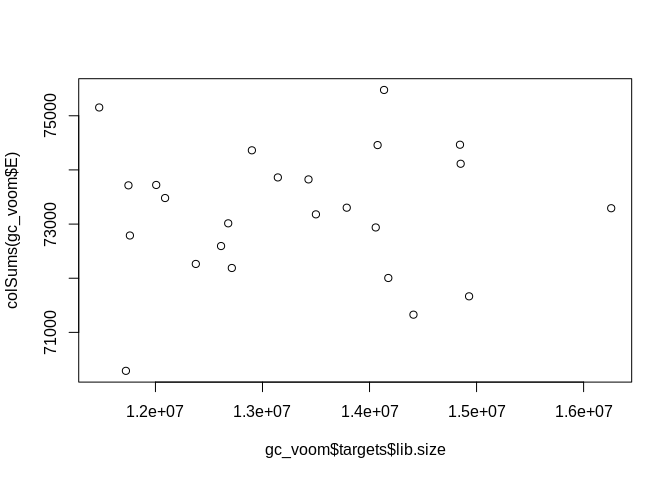<!-- -->

``` r
#Interesting the differences in lib. size among samples after transformation is not driven, 
#by variation in lib. size from the sequencer.
colSums(gc_qualityweights$E) # Transformed with voom + normalization (TMM from edgeR)
```

    ##    17005    17007    17013    17019    17069    17070    17072    17079 
    ## 72268.41 72299.13 73881.64 72885.38 73215.03 73221.94 73928.56 73484.26 
    ##    17090    17094    17099    17108    17122    17130    17142    17145 
    ## 73697.17 72854.61 73353.46 73462.65 73854.71 73788.42 73430.06 72944.50 
    ##    17162    17174    17176    17178    17181    17203    17211    17213 
    ## 72947.99 73501.78 72648.11 73289.16 73721.14 73301.72 72663.90 72835.34

``` r
# Manual transformation vs. voom no normalization
plot(colSums(manual_transformation)~colSums(gc_voom$E)) # Very well correlated
```

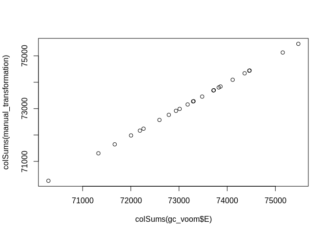<!-- -->

``` r
#Voom vs. voom with normalization
plot(colSums(gc_voom$E)~colSums(gc_qualityweights$E),
     xlim=c(72000,75000),ylim=c(72000,75000))
abline(b=1,a=0)
```

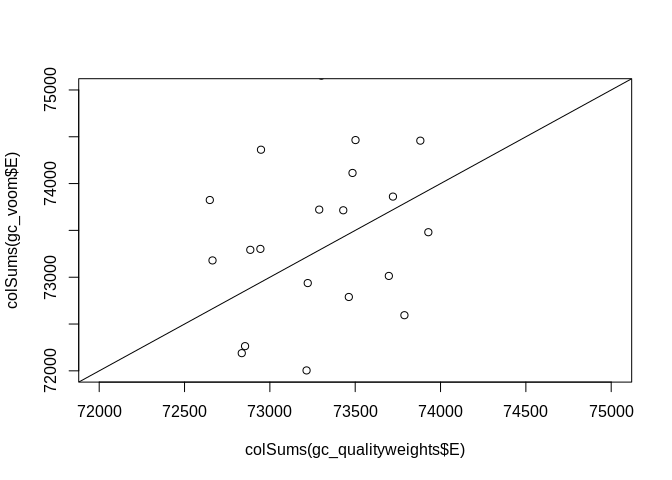<!-- -->

``` r
# Voom with normalization manually included vs voom with normalization
plot(gc_qualityweights$targets$norm.factors*colSums(gc_voom$E)~colSums(gc_qualityweights$E),
     xlim=c(65000,85000),ylim=c(65000,85000))
abline(b=1,a=0)
```

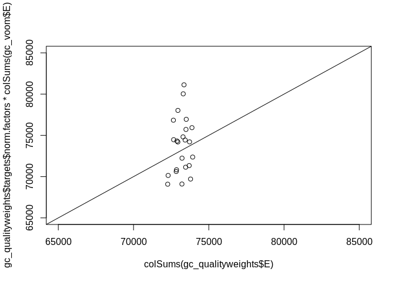<!-- -->

``` r
#Looking at the lib. sizes for each sample after transformation from different methods shows pretty poor correlation when compared to post normalized counts.

rm(manual_transformation)
rm(gc_voom)
```

## Analysis - Gene level Expression

### PERMANOVA (implements using adonis from vegan package)

  - Testing for statistic differential between treatment, time, and
    treatment:time

Description from Griffiths paper (2018) on how they performed this: To
describe global gene expression patterns, we performed a principal
coordinate analysis (PCoA) on both the complete transcriptomic data set
and each sampling time point using the r package vegan (Oksanen, 2015).
PCoA analyses were completed using manhattan distances computed from the
r‐log transformed expression data. The Adonis function (as implemented
in the r package vegan) was subsequently used to identify significant
effects of time point, population and pH treatment on global gene
expression levels.

  - **NOTE**: Still not sure why they went with `manhattan` distances,
    but we likely shouldn’t use the default vegan option (curtis-bray or
    `bray`) because after logging our gene expression counts it possible
    to get negative values. This can occur because we are actually
    taking the log2() of the adjusted cpm() counts, which could in
    theory be below 1 (hence a negative value after log transforming).

**Gene level PERMANOVA**

``` r
## Without caling the genes
# Standard voom w/o scaling values 
#(out_gc <- adonis(t(gc_voom$E)~Treatment*Time+Pop+Lane,data=model,permutations = 5000,method='manhattan'))
# Standard voom w scaling values
#(out_gc <- adonis(scale(t(gc_voom$E))~Treatment*Time+Pop+Lane,data=model,permutations = 5000))
# Counts from quality weights EList object w/o scaling  
(out_gc <- adonis(t(gc_qualityweights$E)~Treatment*Time+Pop+Lane,data=model,
                  permutations = 999,method="manhattan"))
```

    ## 
    ## Call:
    ## adonis(formula = t(gc_qualityweights$E) ~ Treatment * Time +      Pop + Lane, data = model, permutations = 999, method = "manhattan") 
    ## 
    ## Permutation: free
    ## Number of permutations: 999
    ## 
    ## Terms added sequentially (first to last)
    ## 
    ##                Df  SumsOfSqs   MeanSqs F.Model      R2 Pr(>F)    
    ## Treatment       1  207990828 207990828  1.2135 0.05083  0.020 *  
    ## Time            1  272667988 272667988  1.5909 0.06663  0.001 ***
    ## Pop             2  343103816 171551908  1.0009 0.08384  0.448    
    ## Lane            1  179970805 179970805  1.0500 0.04398  0.247    
    ## Treatment:Time  1  174718933 174718933  1.0194 0.04270  0.332    
    ## Residuals      17 2913698860 171394051         0.71202           
    ## Total          23 4092151231                   1.00000           
    ## ---
    ## Signif. codes:  0 '***' 0.001 '**' 0.01 '*' 0.05 '.' 0.1 ' ' 1

``` r
# Just showing that evaluating them separately seems to give similar results (i.e. not include potential random effects seems to have a relatively minor impact)
pairwise.adonis(t(gc_qualityweights$E),factors=model$Treatment,sim.function='vegdist',
sim.method='manhattan')
```

    ##         pairs Df SumsOfSqs  F.Model         R2 p.value p.adjusted sig
    ## 1 400 vs 2800  1 207990828 1.178066 0.05082677   0.042      0.042   .

``` r
pairwise.adonis(t(gc_qualityweights$E),factors=model$Time,sim.function='vegdist',
sim.method='manhattan')
```

    ##      pairs Df SumsOfSqs  F.Model         R2 p.value p.adjusted sig
    ## 1 80 vs 09  1 272667988 1.570552 0.06663194   0.001      0.001  **

``` r
# Complete pairwise comparison of the different factor levels
pairwise.adonis(t(gc_qualityweights$E),factors=model$SFV,p.adjust.m = "fdr",sim.function='vegdist',
sim.method='manhattan')
```

    ##                pairs Df SumsOfSqs  F.Model         R2 p.value p.adjusted
    ## 1   80.400 vs 09.400  1 216654518 1.234633 0.10989527   0.003     0.0060
    ## 2  80.400 vs 80.2800  1 189983697 1.079573 0.09743811   0.163     0.1630
    ## 3  80.400 vs 09.2800  1 281709671 1.622660 0.13961179   0.003     0.0060
    ## 4  09.400 vs 80.2800  1 198949145 1.170582 0.10479146   0.032     0.0396
    ## 5  09.400 vs 09.2800  1 193826909 1.156576 0.10366768   0.033     0.0396
    ## 6 80.2800 vs 09.2800  1 231833247 1.379251 0.12120753   0.003     0.0060
    ##   sig
    ## 1   *
    ## 2    
    ## 3   *
    ## 4   .
    ## 5   .
    ## 6   *

``` r
# Counts from quality weights EList object scaled  
(out_gc <- adonis(scale(t(gc_qualityweights$E))~Treatment*Time+Pop+Lane,data=model,permutations = 5000,
                  method="manhattan"))
```

    ## 
    ## Call:
    ## adonis(formula = scale(t(gc_qualityweights$E)) ~ Treatment *      Time + Pop + Lane, data = model, permutations = 5000, method = "manhattan") 
    ## 
    ## Permutation: free
    ## Number of permutations: 5000
    ## 
    ## Terms added sequentially (first to last)
    ## 
    ##                Df  SumsOfSqs   MeanSqs F.Model      R2  Pr(>F)    
    ## Treatment       1  298797717 298797717 1.19586 0.04984 0.06159 .  
    ## Time            1  442852864 442852864 1.77240 0.07387 0.00020 ***
    ## Pop             2  509512960 254756480 1.01960 0.08499 0.36733    
    ## Lane            1  271042887 271042887 1.08478 0.04521 0.19916    
    ## Treatment:Time  1  225330024 225330024 0.90182 0.03759 0.79924    
    ## Residuals      17 4247620806 249860047         0.70851            
    ## Total          23 5995157258                   1.00000            
    ## ---
    ## Signif. codes:  0 '***' 0.001 '**' 0.01 '*' 0.05 '.' 0.1 ' ' 1

``` r
pairwise.adonis(scale(t(gc_qualityweights$E)),factors=model$SFV,p.adjust.m = "fdr",sim.function='vegdist',
sim.method='manhattan')
```

    ##                pairs Df SumsOfSqs   F.Model         R2 p.value p.adjusted
    ## 1   80.400 vs 09.400  1 328950477 1.2781532 0.11333001   0.012     0.0240
    ## 2  80.400 vs 80.2800  1 256720623 0.9886113 0.08996690   0.461     0.4610
    ## 3  80.400 vs 09.2800  1 452961885 1.7778322 0.15094732   0.002     0.0120
    ## 4  09.400 vs 80.2800  1 288688696 1.1624265 0.10413744   0.076     0.1140
    ## 5  09.400 vs 09.2800  1 264250410 1.0854165 0.09791391   0.167     0.2004
    ## 6 80.2800 vs 09.2800  1 336075704 1.3674430 0.12029469   0.004     0.0120
    ##   sig
    ## 1   .
    ## 2    
    ## 3   .
    ## 4    
    ## 5    
    ## 6   .

**Thoughts on PERMANOVA**

Running this a couple of ways: \* Scaling genes vs. not scaling \* This
seems to be a matter of preference. Not scaling them means that genes
that are highly expressed are likely influencing the results from the
PERMANOVA (and downstream PCA) more than genes that have low mean
expression. Conversely scaling ‘evens the playing field’, and ensures
all genes contribue equally. \* Case for non scaling: We may expect
genes that are highly expressed to be more informative and important in
the tissue sampled, so the fact that there is a bias towards highly
expressed genes may be appropriate. \* Case for scaling: The case for
scaling is more straightforward. It would make each genes contribution
to the ‘distance’ of an individual from other individuals equal, so a
small subset of genes isn’t driving any observed patterns. \*
Normalized, log transformed CPM counts serve as the starting gene
expression matrix (before scaling) \* These data were generated using
`EgdeR` and `limma` in the differential expression pipeline. I looked at
non-normalized count data(the commented code above) and it didn’t seem
to make much difference.  
\* Manhattan distance was used over the default bray curtis because I
found previous gene expression publications that have used this method
(see Griffiths ref above) and it seems to be better suited when you have
negative values in your data (which is the case with our log transformed
counts per million).

``` r
#gc_dist <- as.dist(1 - cor(t(gc_voom$E)))
#hc <- hclust(gc_dist, method= "average")
```

There is a bit of a discussion about using scaled vs. unscaled count
matrixes when performing a genome-wide analyses. The scaling will ensure
that each gene is weighted equally in the analysis, while non scaled
matrices will be biased by genes with large expression. It seems like
both have merit
(<https://bioinformatics.stackexchange.com/questions/4818/should-pca-be-standardized-for-gene-expression>).
The former allowing you to see if there is evidence of differences
broadly across all genes, and the latter allowing you prioritize the
contribution of genes that are better represented (and arguably you are
more confident in) in your datatset.

Interestingly, this seems to have a major impact on the significance
from the PERMANOVA, indicating that the genes with large expression are
more sensitive to treatment and time than genes with lower expression.

### PCA

**Plot in multivariate space with PCA (treatment and
time)**

``` r
### Just using the count matrix generated after filtering and standard normalization pipeline ###

# None scaled
ge_pca <- prcomp((t(gc_qualityweights$E)))
fviz_eig(ge_pca)
```

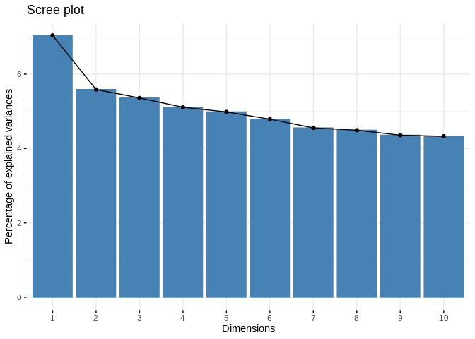<!-- -->

``` r
# Quick pca plot
fviz_pca_ind(ge_pca, 
             #label = "none", # hide individual labels
             habillage = model$SFV, # color by groups
             palette = c("#00AFBB", "#E7B800", "#FC4E07","green"),
             addEllipses = TRUE, axes = c(1,2),ellipse.level=0.90 # Concentration ellipses  
)
```

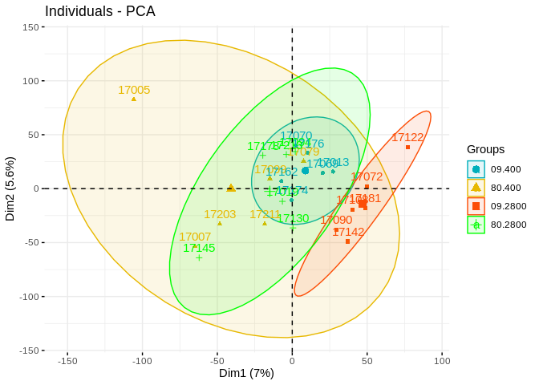<!-- -->

``` r
# Scaled matrix
ge_pca <- prcomp(scale(t(gc_qualityweights$E)))
fviz_eig(ge_pca)
```

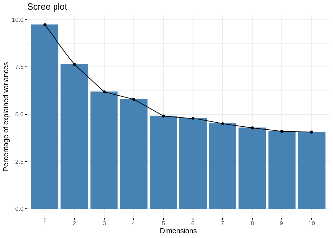<!-- -->

``` r
# Quick pca plot
fviz_pca_ind(ge_pca, 
             #label = "none", # hide individual labels
             habillage = model$SFV, # color by groups
             palette = c("#00AFBB", "#E7B800", "#FC4E07","green"),
             addEllipses = TRUE, axes = c(1,2),ellipse.level=0.90 # Concentration ellipses  
)
```

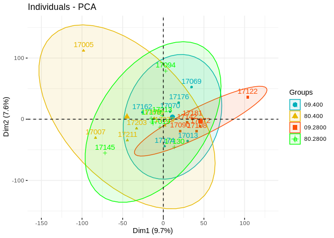<!-- -->

We see from the scree plots that the first two principle components
aren’t doing a greate job of representing the variation in our
expression data. These likely means that any patterns we see when we
plot them should be taken with a grain of salt.

**Custom PCA**

``` r
#### Custom PCA ####
# Non scaled matrix
pca <- prcomp(t(gc_qualityweights$E))
eigs <- pca$sdev^2

color_comb <- c("lightblue4","royalblue3","tomato","darkred") # colors for population 
model$colors <- "" 
model$colors[model$SFV == unique(model$SFV)[1]] <-  color_comb[2]
model$colors[model$SFV == unique(model$SFV)[2]] <-  color_comb[1]
model$colors[model$SFV == unique(model$SFV)[3]] <-  color_comb[4]
model$colors[model$SFV == unique(model$SFV)[4]] <-  color_comb[3]
model$pch <- 16
model$pch[model$colors == color_comb[2] | model$colors == "darkred"] <- 10

ordiplot(pca,type="n",
         xlab=paste0("PC1 (",round(eigs[1] / sum(eigs)*100,1),"% Variance Explained)"),
         ylab=paste0("PC2 (",round(eigs[2] / sum(eigs)*100,1),"% Variance Explained)"))

orditorp(pca,display="sites",labels = FALSE,col=model$colors,cex = 2,pch = model$pch)
ordispider(pca,model$SFV,col = color_comb,lwd=2.5)
legend(x=c(-20,20),y=c(50,80),bty = "n",
       legend = c("Day 09 : Ambient",
                  "Day 80 : Ambient",
                  "Day 09 : 2800",
                  "Day 80 : 2800"),
       pch = c(16,10,16,10),col=color_comb,xpd = .25)
text(x = 30 ,y = 70, 
     paste0("P_Treatment = ",round(out_gc$aov.tab$`Pr(>F)`[1],3),"*"),pos = 4)
text(x = 30 ,y = 65, 
     paste0("P_Time = ",round(out_gc$aov.tab$`Pr(>F)`[2],5),"*"),pos=4)
text(x = 30 ,y = 60, 
     paste0("P_Interaction = ",round(out_gc$aov.tab$`Pr(>F)`[5],3)),pos=4)
```

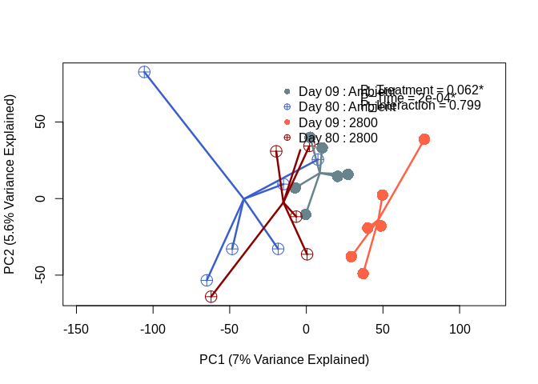<!-- -->

``` r
### Plot colored by population ###
ordiplot(pca,type="n",
         xlab=paste0("PC1 (",round(eigs[1] / sum(eigs)*100,1),"% Variance Explained)"),
         ylab=paste0("PC2 (",round(eigs[2] / sum(eigs)*100,1),"% Variance Explained)"))
orditorp(pca,display="sites",labels = FALSE,col=model$Pop,cex = 2,pch = 16)
ordispider(pca,model$Pop,col=c("black","red","green"),lwd=2.5)
legend(x=-100,y=0,legend = c("Ipswich","Rowley 1","Rowley 2"),pch = 16,col=c("black","red","green"),xpd = .25)
```

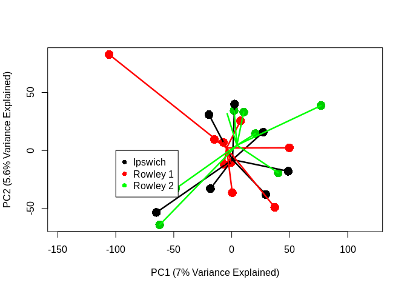<!-- -->

``` r
pca <- prcomp(scale(t(gc_qualityweights$E)))
eigs <- pca$sdev^2
ordiplot(pca,type="n",
         xlab=paste0("PC1 (",round(eigs[1] / sum(eigs)*100,1),"% Variance Explained)"),
         ylab=paste0("PC2 (",round(eigs[2] / sum(eigs)*100,1),"% Variance Explained)"))

orditorp(pca,display="sites",labels = FALSE,col=model$colors,cex = 2,pch = model$pch)
ordispider(pca,model$SFV,col = color_comb,lwd=2.5)
legend(x=c(5,30),y=c(80,110),bty = "n",
       legend = c("Day 09 : Ambient",
                  "Day 80 : Ambient",
                  "Day 09 : 2800",
                  "Day 80 : 2800"),
       pch = c(16,10,16,10),col=color_comb,xpd = .25)
text(x = 55 ,y = 100, 
     paste0("P_Treatment = ",round(out_gc$aov.tab$`Pr(>F)`[1],3),"*"),pos = 4)
text(x = 55 ,y = 93, 
     paste0("P_Time = ",round(out_gc$aov.tab$`Pr(>F)`[2],5),"*"),pos=4)
text(x = 55 ,y = 86, 
     paste0("P_Interaction = ",round(out_gc$aov.tab$`Pr(>F)`[5],3)),pos=4)
```

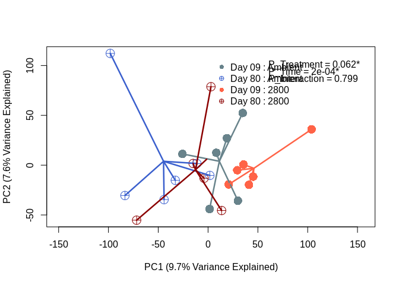<!-- -->

### TWO STEP DAPC: first create discriminant function from TP 9 samples and predict coordinates on df for day 80 samples.

**Creating DF by treatment with first timepoint**

``` r
gc_comb <- gc_qualityweights$E
early_time_counts_V1 <- gc_comb[,model$Day == 9]
early_time_meta <- model[model$Day == 9,]
#dapc(t(early_time_counts_V1),early_time_meta$treatment)
dapc_treatment <- dapc(t(early_time_counts_V1),early_time_meta$treatment,n.pca=7,n.da=1)
# PCs = 2
# clusters = 1

early_time_meta$coord<- unlist(dapc_treatment$ind.coord[,1])

ggplot(early_time_meta,aes(coord,fill=as.factor(treatment),colour=as.factor(treatment))) + 
  geom_density(alpha=0.1) + xlim(-10,10) + 
  labs(title="Discriminant Function for Treatment on Day 9 (based on 7 PCs)",
       x="Discriminant function 1",
       colour="Treatment",
       fill="Treatment") +
  theme_bw() +
  scale_color_manual(values=c("deepskyblue2","firebrick1")) +
  scale_fill_manual(values=c("deepskyblue2","firebrick1"))
```

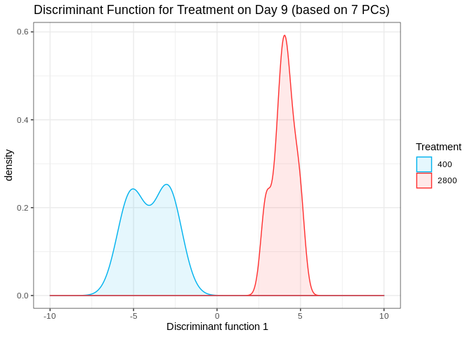<!-- -->

Looking at which genes are driving the patterns between the two
treatments

``` r
contrib_treatment <- loadingplot(dapc_treatment$var.contr, axis=1,thres=.05, lab.jitter=1)
```

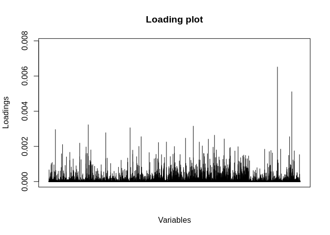<!-- -->

Looking at the most important locus based on loading

``` r
# head(gc)
# gc_majorLoading <- gc[row.names(gc) == "LOC111102518",]
# majorLoading_counts <- as.data.frame(cbind(Trt=model$Treatment,Time=model$Time,SFV=model$SFV,Pop=model$Pop,(LOC111104151=gc_majorLoading)))
# 
# ggplot(majorLoading_counts,aes(x=as.factor(SFV),y=log10(LOC111104151))) + geom_boxplot() + 
#   labs(x= c("SFV"))
```

**Mapping Day 80 samples**

``` r
late_time_counts <- gc_comb[,model$Day == 80]
late_time_meta <- model[model$Day == 80,]

predict_values <- predict.dapc(dapc_treatment,t(late_time_counts))

late_time_meta$coord <-unlist(predict_values$ind.scores[,1])

whole_meta<- rbind(early_time_meta,late_time_meta)

ggplot(whole_meta,aes(coord,fill=as.factor(interaction(Day,treatment)),colour=as.factor(interaction(Day,treatment)))) + 
  geom_density(alpha=0.1,adjust=2) + xlim(-10,10) + 
  labs(x="Discriminant function 1",
       colour="Day.Treatment",
       fill="Day.Treatment") +
  theme_bw() +
  scale_color_manual(values=c("lightblue4","blue4","tomato","darkred")) +
  scale_fill_manual(values=c("lightblue4","blue4","tomato1","darkred"))
```

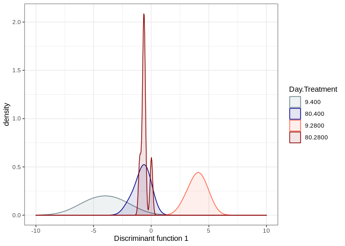<!-- -->

``` r
D9_400 <- whole_meta[whole_meta$SFV == "09.400",]
D9_400_Density <- density(D9_400$coord)
D9_2800 <- whole_meta[whole_meta$SFV == "09.2800",]
D9_2800_Density <- density(D9_2800$coord)
D80_400 <- whole_meta[whole_meta$SFV == "80.400",]
D80_400_Density <- density(D80_400$coord)
D80_2800 <- whole_meta[whole_meta$SFV == "80.2800",]
D80_2800_Density <- density(D80_2800$coord)

plot(D9_400_Density, main="",xlim=c(-12,12),ylim=c(0,2),
     xlab="Discriminant Function 1")
polygon(D9_400_Density, col=alpha("lightblue",0.8), border="lightblue")
polygon(D9_2800_Density, col=alpha("tomato",0.8), border="red3")
polygon(D80_400_Density, col=alpha("blue",0.9), 
        border="blue",density = 20,cex=100)
polygon(D80_2800_Density, col=alpha("red3",0.9),
        border="red3",density = 20,angle=0,cex=5)
legend(x=c(4,6),y=c(1.9,1.7),bty = "n",
       legend=c("Day 09 : Ambient","Day 09 : 2800 ","Day 80 : Ambient","Day 80 : 2800"),
       fill = c(alpha("lightblue",0.8),
                alpha("tomato",0.8),
                alpha("blue",0.7),
                alpha("red3",0.7)),
       density = c(1000,1000,50,50),angle = c(0,0,45,0))
```

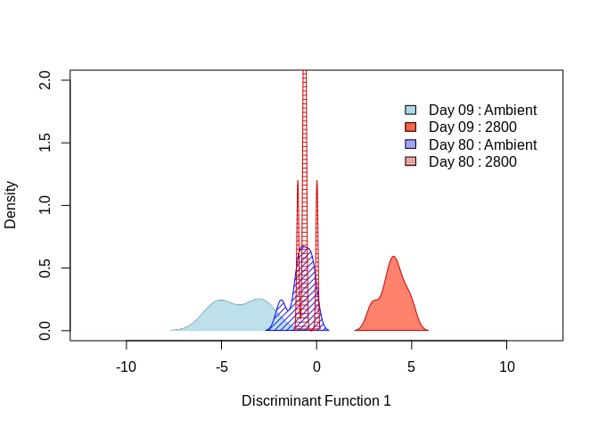<!-- -->

### ONE STEP DAPC: DAPC based on combined time\*treatment factor

**Creating DF by treatment with first timepoint**

``` r
dapc_SFV_10<-dapc(t(gc_qualityweights$E),model$SFV,n.pca=8,n.da=3)
# PCs = 10
# clusters = 3
output <- data.frame(Trt=model$Treatment,Time=model$Time,dapc_SFV_10$ind.coord)

ggplot(output,aes(x=LD1,y=LD2,fill=as.factor(interaction(Trt,Time)),colour=as.factor(interaction(Trt,Time)))) + 
  geom_point(aes(size=5)) + #geom_density(alpha=0.1) + #xlim(-28,28) + 
  labs(title="DAPC for Treatment*Time Combination",
       x="Discriminant function 1",
       y="Discriminant function 2",
       colour="Treatment",
       fill="Treatment") +
    theme_bw() +
  scale_color_manual(values=c("deepskyblue2","firebrick1","blue4","darkred")) +
  scale_fill_manual(values=c("deepskyblue2","firebrick1","blue4","darkred"))
```

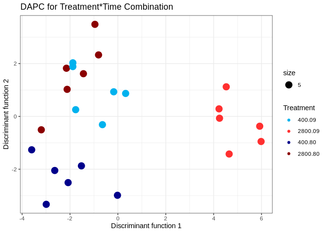<!-- -->

Looking at contribution of individual
genes

``` r
contrib_SFV <- loadingplot(dapc_SFV_10$var.contr, axis=2,thres=.07, lab.jitter=1)
```

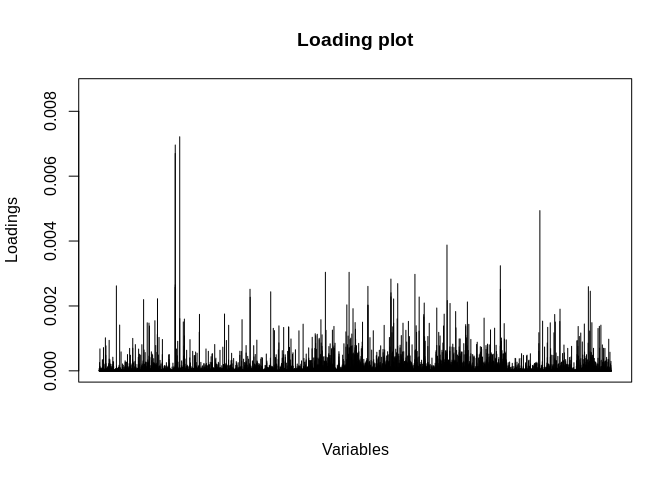<!-- -->

#### Final gene-level figure

``` r
par(mfrow=c(1,2))
ordiplot(pca,type="n",
         xlab=paste0("PC1 (",round(eigs[1] / sum(eigs)*100,1),"% Variance Explained)"),
         ylab=paste0("PC2 (",round(eigs[2] / sum(eigs)*100,1),"% Variance Explained)"))

orditorp(pca,display="sites",labels = FALSE,col=model$colors,cex = 2,pch = model$pch)
ordispider(pca,model$SFV,col = color_comb,lwd=2.5)
legend(x=c(5,30),y=c(80,110),bty = "n",
       legend = c("Day 09 : Ambient",
                  "Day 80 : Ambient",
                  "Day 09 : 2800",
                  "Day 80 : 2800"),
       pch = c(16,10,16,10),col=color_comb,xpd = .25)
text(x = 55 ,y = 100, 
     paste0("P_Treatment = ",round(out_gc$aov.tab$`Pr(>F)`[1],3),"*"),pos = 4)
text(x = 55 ,y = 93, 
     paste0("P_Time = ",round(out_gc$aov.tab$`Pr(>F)`[2],5),"*"),pos=4)
text(x = 55 ,y = 86, 
     paste0("P_Interaction = ",round(out_gc$aov.tab$`Pr(>F)`[5],3)),pos=4)
plot(D9_400_Density, main="",xlim=c(-5,7),ylim=c(0,2),
     xlab="Discriminant Function 1")
polygon(D9_400_Density, col=alpha("lightblue",0.8), border="lightblue")
polygon(D9_2800_Density, col=alpha("tomato",0.8), border="red3")
polygon(D80_400_Density, col=alpha("blue",0.9), 
        border="blue",density = 20,cex=100)
polygon(D80_2800_Density, col=alpha("red3",0.9),
        border="red3",density = 20,angle=0,cex=5)
legend(x=c(4,6),y=c(1.9,1.7),bty = "n",
       legend=c("Day 09 : Ambient","Day 09 : 2800 ","Day 80 : Ambient","Day 80 : 2800"),
       fill = c(alpha("lightblue",0.8),
                alpha("tomato",0.8),
                alpha("blue",0.7),
                alpha("red3",0.7)),
       density = c(1000,1000,50,50),angle = c(0,0,45,0))
```

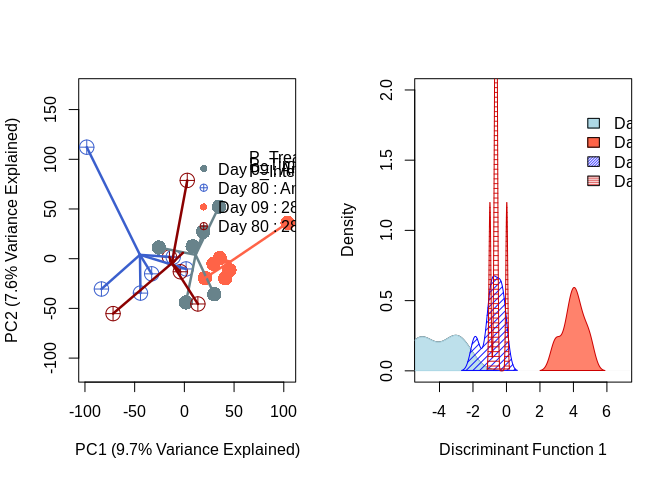<!-- -->

## Analysis - Transcript level Expression

### PERMANOVA (implements using adonis from vegan package)

  - Testing for statistic differential between treatment, time, and
    treatment:time

**Transcript level PERMANOVA**

``` r
(out_tc <- adonis(t(tran$E)~Treatment*Time+Pop+Lane,data=model,
                  permutations = 999,method="manhattan"))
```

    ## 
    ## Call:
    ## adonis(formula = t(tran$E) ~ Treatment * Time + Pop + Lane, data = model,      permutations = 999, method = "manhattan") 
    ## 
    ## Permutation: free
    ## Number of permutations: 999
    ## 
    ## Terms added sequentially (first to last)
    ## 
    ##                Df  SumsOfSqs    MeanSqs F.Model      R2 Pr(>F)    
    ## Treatment       1 8.5384e+08  853842986  1.2902 0.05346  0.001 ***
    ## Time            1 1.0571e+09 1057088048  1.5973 0.06619  0.001 ***
    ## Pop             2 1.3682e+09  684086992  1.0337 0.08567  0.217    
    ## Lane            1 6.9175e+08  691751876  1.0452 0.04331  0.221    
    ## Treatment:Time  1 7.4946e+08  749458326  1.1324 0.04693  0.047 *  
    ## Residuals      17 1.1251e+10  661813267         0.70445           
    ## Total          23 1.5971e+10                    1.00000           
    ## ---
    ## Signif. codes:  0 '***' 0.001 '**' 0.01 '*' 0.05 '.' 0.1 ' ' 1

``` r
# Complete pairwise comparison of the different factor levels
(pwise_tc <- pairwise.adonis(t(tran$E),factors=model$SFV,p.adjust.m = "fdr",sim.function='vegdist',
sim.method='manhattan'))
```

    ##                pairs Df  SumsOfSqs  F.Model        R2 p.value p.adjusted
    ## 1   80.400 vs 09.400  1  865404694 1.302110 0.1152094   0.002     0.0048
    ## 2  80.400 vs 80.2800  1  786062575 1.172884 0.1049759   0.005     0.0050
    ## 3  80.400 vs 09.2800  1 1079578860 1.595373 0.1375870   0.004     0.0048
    ## 4  09.400 vs 80.2800  1  831352174 1.270281 0.1127107   0.004     0.0048
    ## 5  09.400 vs 09.2800  1  816421213 1.235204 0.1099405   0.003     0.0048
    ## 6 80.2800 vs 09.2800  1  940324156 1.410755 0.1236338   0.004     0.0048
    ##   sig
    ## 1   *
    ## 2   *
    ## 3   *
    ## 4   *
    ## 5   *
    ## 6   *

### PCA

**Plot in multivariate space with PCA (treatment and time)**

``` r
prin_comp<-prcomp(t(tran$E))
sum_pri <- summary(prin_comp)
pca_scores<-scores(prin_comp)

pca <- prcomp(t(tran$E))
eigs <- pca$sdev^2

color_comb <- c("deepskyblue2","blue4","firebrick1","darkred") # colors for population 
model$colors <- "" 
model$colors[model$SFV == unique(model$SFV)[1]] <-  color_comb[2]
model$colors[model$SFV == unique(model$SFV)[2]] <-  color_comb[1]
model$colors[model$SFV == unique(model$SFV)[3]] <-  color_comb[4]
model$colors[model$SFV == unique(model$SFV)[4]] <-  color_comb[3]

par(mfrow=c(1,1))
ordiplot(prin_comp,type="n",
         xlab=paste0("PC1 ",round(eigs[1] / sum(eigs)*100,1),"% Variance Explained)"),
         ylab=paste0("PC2 ",round(eigs[2] / sum(eigs)*100,1),"% Variance Explained)"))
orditorp(prin_comp,display="sites",labels = FALSE,col=model$colors,cex = 2,pch = 16,)

ordispider(prin_comp,model$SFV,col = color_comb,lwd=2.5)
legend(x=100,y=100,legend = c("Day09_Control","Day80_Control","Day09_OA","Day80_OA"),pch = 16,col=color_comb,xpd = .25,bty="n")
text(x = -538 ,y = -300, paste0("Adonis P_Treatment = ",out_tc$aov.tab$`Pr(>F)`[1],"*"))
text(x = -550 ,y = -360, paste0("Adonis P_Duration = ",out_tc$aov.tab$`Pr(>F)`[2],"*"))
text(x = -540 ,y = -420, paste0("Adonis P_Interaction = ",out_tc$aov.tab$`Pr(>F)`[5]))
```

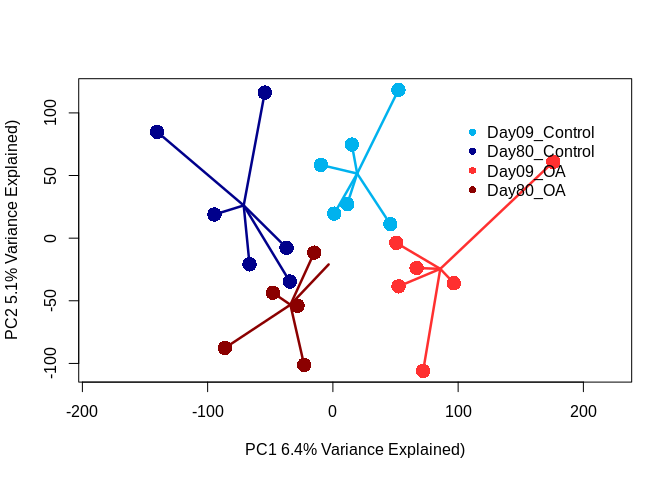<!-- -->

### TWO STEP DAPC: first create discriminant function from TP 9 samples and predict coordinates on df for day 80 samples.

**Creating DF by treatment with first timepoint**

``` r
tc_comb <- tran$E
early_time_counts <- tc_comb[,model$Day == 9]
early_time_meta <- model[model$Day == 9,]
#dapc(t(early_time_counts),early_time_meta$treatment)
dapc_treatment <- dapc(t(early_time_counts),early_time_meta$treatment,n.pca=7,n.da=1)
# PCs = 7
# clusters = 1

early_time_meta$coord<- unlist(dapc_treatment$ind.coord[,1])

ggplot(early_time_meta,aes(coord,fill=as.factor(treatment),colour=as.factor(treatment))) + 
  geom_density(alpha=0.1) + xlim(-20,20) + 
  labs(title="Discriminant Function for Treatment on Day 9 (based on 8 PCs)",
       x="Discriminant function 1",
       colour="Treatment",
       fill="Treatment") +
  theme_bw() +
  scale_color_manual(values=c("deepskyblue2","firebrick1")) +
  scale_fill_manual(values=c("deepskyblue2","firebrick1"))
```

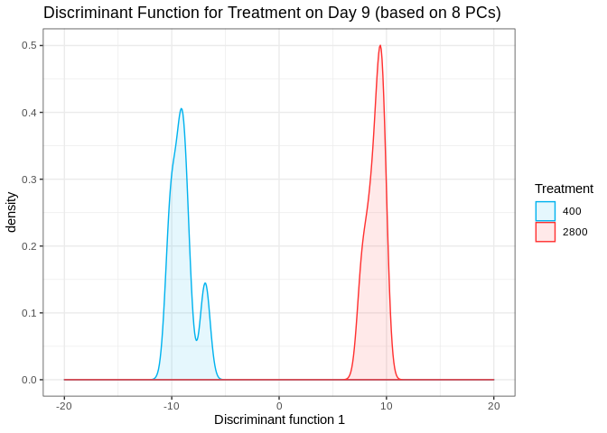<!-- -->

**Mapping Day 80 samples**

``` r
late_time_counts <- tc_comb[,model$Day == 80]
late_time_meta <- model[model$Day == 80,]

predict_values <- predict.dapc(dapc_treatment,t(late_time_counts))

late_time_meta$coord <-unlist(predict_values$ind.scores[,1])

whole_meta<- rbind(early_time_meta,late_time_meta)

ggplot(whole_meta,aes(coord,fill=as.factor(interaction(Day,treatment)),colour=as.factor(interaction(Day,treatment)))) + 
  geom_density(alpha=0.1) + xlim(-16,16) + 
  labs(x="Discriminant function 1",
       colour="Day.Treatment",
       fill="Day.Treatment") +
  theme_bw() +
  scale_color_manual(values=c("lightblue4","blue4","tomato","darkred")) +
  scale_fill_manual(values=c("lightblue4","blue4","tomato1","darkred"))
```

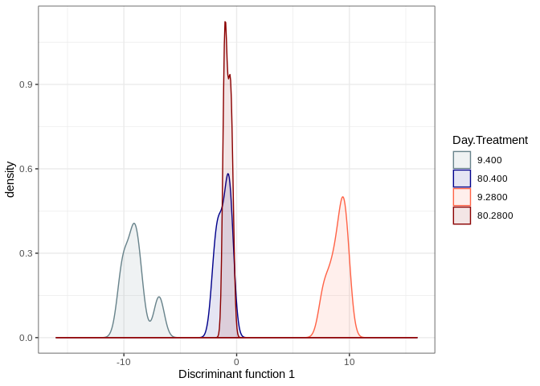<!-- -->

``` r
D9_400 <- whole_meta[whole_meta$SFV == "09.400",]
D9_400_Density <- density(D9_400$coord)
D9_2800 <- whole_meta[whole_meta$SFV == "09.2800",]
D9_2800_Density <- density(D9_2800$coord)
D80_400 <- whole_meta[whole_meta$SFV == "80.400",]
D80_400_Density <- density(D80_400$coord)
D80_2800 <- whole_meta[whole_meta$SFV == "80.2800",]
D80_2800_Density <- density(D80_2800$coord)

plot(D9_400_Density, main="",xlim=c(-12,12),ylim=c(0,3),
     xlab="Discriminant Function 1")
polygon(D9_400_Density, col=alpha("lightblue",0.8), border="lightblue")
polygon(D9_2800_Density, col=alpha("tomato",0.8), border="red3")
polygon(D80_400_Density, col=alpha("blue",0.9), 
        border="blue",density = 20,cex=100)
polygon(D80_2800_Density, col=alpha("red3",0.9),
        border="red3",density = 20,angle=0,cex=5)
legend(x=c(4,6),y=c(1.9,1.7),bty = "n",
       legend=c("Day 09 : Ambient","Day 09 : 2800 ","Day 80 : Ambient","Day 80 : 2800"),
       fill = c(alpha("lightblue",0.8),
                alpha("tomato",0.8),
                alpha("blue",0.7),
                alpha("red3",0.7)),
       density = c(1000,1000,50,50),angle = c(0,0,45,0))
```

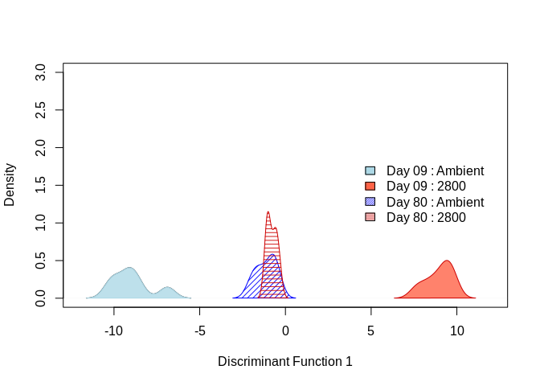<!-- -->

### DAPC based on combined time\*treatment factor

**Creating DF by treatment with first timepoint**

``` r
dapc_tc<-dapc(t(tran$E),model$SFV,n.pca=8,n.da=3)
# PCs = 10
# clusters = 3
output <- data.frame(Trt=model$Treatment,Time=model$Time,dapc_tc$ind.coord)

ggplot(output,aes(x=LD1,y=LD2,fill=as.factor(interaction(Trt,Time)),colour=as.factor(interaction(Trt,Time)))) + 
  geom_point(aes(size=5)) + #geom_density(alpha=0.1) + #xlim(-28,28) + 
  labs(title="DAPC for Treatment*Time Combination",
       x="Discriminant function 1",
       y="Discriminant function 2",
       colour="Treatment",
       fill="Treatment") +
    theme_bw() +
  scale_color_manual(values=c("deepskyblue2","firebrick1","blue4","darkred")) +
  scale_fill_manual(values=c("deepskyblue2","firebrick1","blue4","darkred"))
```

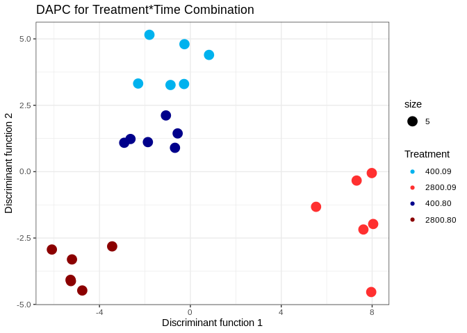<!-- -->

## Analysis - DNAm

### PERMANOVA

``` r
(out_dnam <- adonis(t(beta)~Treatment*Time+Pop+Lane,data=model_dnam,
                  permutations = 999,method="manhattan"))
# Just showing that evaluating them separately seems to give similar results (i.e. not include potential random effects seems to have a relatively minor impact)
pairwise.adonis(t(beta),factors=model_dnam$SFV,sim.function='vegdist',
sim.method='manhattan')
```

### PCA

``` r
# None scaled
dnam_pca <- prcomp((t(beta)))
fviz_eig(dnam_pca)
# Quick pca plot
fviz_pca_ind(dnam_pca, 
             #label = "none", # hide individual labels
             habillage = model_dnam$SFV, # color by groups
             palette = c("#00AFBB", "#E7B800", "#FC4E07","green"),
             addEllipses = TRUE, axes = c(1,2),ellipse.level=0.90 # Concentration ellipses  
)
# Slightly more interesting site level effects
fviz_pca_ind(dnam_pca, 
             #label = "none", # hide individual labels
             habillage = model_dnam$Pop, # color by groups
             palette = c("#00AFBB", "#E7B800", "#FC4E07","green"),
             addEllipses = TRUE, axes = c(1,2),ellipse.level=0.90 # Concentration ellipses  
)
```

### TWO STEP DAPC: first create discriminant function from TP 9 samples and predict coordinates on df for day 80 samples.

**Creating DF by treatment with first timepoint**

``` r
beta_comb <- beta
early_time_dnam <- beta_comb[,model_dnam$Day == 9]
early_time_meta_dnam <- model_dnam[model_dnam$Day == 9,]

dapc_treatment <- dapc(t(early_time_dnam),early_time_meta_dnam$treatment,n.pca=8,n.da=1)
# PCs = 8 (accounts for ~ 80% of variation)
# clusters = 1

early_time_meta_dnam$coord<- unlist(dapc_treatment$ind.coord[,1])
ggplot(early_time_meta_dnam,aes(coord,fill=as.factor(treatment),colour=as.factor(treatment))) + 
  geom_density(alpha=.5,adjust=1) + xlim(-3,3) + 
  labs(title="Discriminant Function for Treatment on Day 9 (based on 8 PCs)",
       x="Discriminant function 1",
       colour="Treatment",
       fill="Treatment") +
  theme_bw() +
  scale_color_manual(values=c("deepskyblue2","firebrick1")) +
  scale_fill_manual(values=c("deepskyblue2","firebrick1"))
```

**Mapping Day 80 samples**

``` r
late_time_dnam <- beta_comb[,model_dnam$Day == 80]
late_time_meta_dnam <- model_dnam[model_dnam$Day == 80,]

predict_values <- predict.dapc(dapc_treatment,t(late_time_dnam))

late_time_meta_dnam$coord <-unlist(predict_values$ind.scores[,1])

whole_meta_dnam<- rbind(early_time_meta_dnam,late_time_meta_dnam)
ggplot(whole_meta_dnam,aes(coord,fill=as.factor(interaction(Day,treatment)),colour=as.factor(interaction(Day,treatment)))) + 
  geom_density(alpha=0.1,adjust=1) + xlim(-3,3) + 
  labs(x="Discriminant function 1",
       colour="Day.Treatment",
       fill="Day.Treatment") +
  theme_bw() +
  scale_color_manual(values=c("lightblue4","blue4","tomato","darkred")) +
  scale_fill_manual(values=c("lightblue4","blue4","tomato1","darkred"))

D9_400_dnam<- whole_meta_dnam[whole_meta_dnam$SFV == "09.400",]
D9_400_Density_dnam <- density(D9_400_dnam$coord)
D9_2800_dnam <- whole_meta_dnam[whole_meta_dnam$SFV == "09.2800",]
D9_2800_Density_dnam <- density(D9_2800_dnam$coord)
D80_400_dnam <- whole_meta_dnam[whole_meta_dnam$SFV == "80.400",]
D80_400_Density_dnam <- density(D80_400_dnam$coord)
D80_2800_dnam <- whole_meta_dnam[whole_meta_dnam$SFV == "80.2800",]
D80_2800_Density_dnam <- density(D80_2800_dnam$coord)
```

### ONE STEP DAPC: DAPC based on combined time\*treatment factor

**Creating DF by treatment with first timepoint**

``` r
dapc_all_dnam<-dapc(t(beta),model_dnam$SFV,n.pca=8,n.da=3)
# PCs = 10
# clusters = 3
output <- data.frame(Trt=model_dnam$Treatment,Time=model_dnam$Time,dapc_all_dnam$ind.coord)

ggplot(output,aes(x=LD1,y=LD2,fill=as.factor(interaction(Trt,Time)),colour=as.factor(interaction(Trt,Time)))) + 
  geom_point(aes(size=5)) + #geom_density(alpha=0.1) + #xlim(-28,28) + 
  labs(title="DAPC for Treatment*Time Combination - DNAm",
       x="Discriminant function 1",
       y="Discriminant function 2",
       colour="Treatment",
       fill="Treatment") +
    theme_bw() +
  scale_color_manual(values=c("deepskyblue2","firebrick1","blue4","darkred")) +
  scale_fill_manual(values=c("deepskyblue2","firebrick1","blue4","darkred"))
```

### FINAL FIGURE

``` r
png("/home/downeyam/Desktop/temp/test.png",
    width = 20,height = 20,units = "cm",res = 200)

# Creating multi panel plotting environment
m <- matrix(c(1,2,3,3,4,5),nrow = 3,ncol = 2,byrow = TRUE)
layout(mat = m,heights = c(0.4,0.04,0.4))
par(mar = c(5,5,3,2))
par(xpd=TRUE)

# Presets for panel letter position
let_ge_pca <- c(-125,108)
let_ge_dapc <- c(-11.8,3.5)
let_dnam_pca <- c(-57,50)
let_dnam_dapc <-c(-5,12.3)

## GENE EXPRESSION PCA 
pca <- prcomp(t(gc_qualityweights$E))
eigs <- pca$sdev^2

color_comb <- c("lightblue4","royalblue3","tomato","darkred") # colors for population 
model$colors <- "" 
model$colors[model$SFV == unique(model$SFV)[1]] <-  color_comb[2]
model$colors[model$SFV == unique(model$SFV)[2]] <-  color_comb[1]
model$colors[model$SFV == unique(model$SFV)[3]] <-  color_comb[4]
model$colors[model$SFV == unique(model$SFV)[4]] <-  color_comb[3]
model$pch <- 16
model$pch[model$colors == color_comb[2] | model$colors == "darkred"] <- 10

ordiplot(pca,type="n",
         xlab=paste0("PC1 (",round(eigs[1] / sum(eigs)*100,1),"% Variance Explained)"),
         ylab=paste0("PC2 (",round(eigs[2] / sum(eigs)*100,1),"% Variance Explained)"))

orditorp(pca,display="sites",labels = FALSE,col=model$colors,cex = 2,pch = model$pch)
ordispider(pca,model$SFV,col = color_comb,lwd=2.5)
text(x = -5 ,y = 85, 
     paste0("P_Treatment = ",round(out_gc$aov.tab$`Pr(>F)`[1],3),"*"),pos = 4)
text(x = -5 ,y = 77, 
     paste0("P_Time = ",round(out_gc$aov.tab$`Pr(>F)`[2],5),"*"),pos=4)
text(x = -5 ,y = 69, 
     paste0("P_Interaction = ",round(out_gc$aov.tab$`Pr(>F)`[5],3)),pos=4)
text(x=let_ge_pca[1],y=let_ge_pca[2],labels = "A",cex=2)

## GENE EXPRESSION DAPC 
plot(D9_400_Density, main="",xlim=c(-9,9),ylim=c(0,3.2),
     xlab="Discriminant Function 1")
polygon(D9_400_Density, col=alpha("lightblue4",0.8), border="lightblue")
polygon(D9_2800_Density, col=alpha("tomato",0.8), border="red3")
polygon(D80_400_Density, col=alpha("royalblue3",0.9), 
        border="blue",density = 20,cex=100)
polygon(D80_2800_Density, col=alpha("darkred",0.9),
        border="red3",density = 20,angle=0,cex=5)
text(x=let_ge_dapc[1],y=let_ge_dapc[2],labels = "B",cex=2)

## Single legend
par(mar = c(0,0,0,0))
plot(1, type = "n", axes=FALSE, xlab="", ylab="")
legend(x="center",inset=0,horiz = TRUE,
       legend=c("Day 09 : Ambient","Day 09 : 2800 ","Day 80 : Ambient","Day 80 : 2800"),
       fill = c(alpha("lightblue",0.8),
                alpha("tomato",0.8),
                alpha("royalblue4",0.7),
                alpha("darkred",0.7)),
       density = c(1000,1000,50,50),angle = c(0,0,45,0),
       cex = 1.3)

## DNAm PCA 
par(mar = c(5,5,3,2))
pca <- prcomp(t(beta))
eigs <- pca$sdev^2

color_comb <- c("lightblue4","royalblue3","tomato","darkred") # colors for population 
model_dnam$colors <- "" 
model_dnam$colors[model_dnam$SFV == unique(model_dnam$SFV)[1]] <-  color_comb[2]
model_dnam$colors[model_dnam$SFV == unique(model_dnam$SFV)[2]] <-  color_comb[1]
model_dnam$colors[model_dnam$SFV == unique(model_dnam$SFV)[3]] <-  color_comb[4]
model_dnam$colors[model_dnam$SFV == unique(model_dnam$SFV)[4]] <-  color_comb[3]
model_dnam$pch <- 16
model_dnam$pch[model_dnam$colors == color_comb[2] | model_dnam$colors == "darkred"] <- 10

ordiplot(pca,type="n",
         xlab=paste0("PC1 (",round(eigs[1] / sum(eigs)*100,1),"% Variance Explained)"),
         ylab=paste0("PC2 (",round(eigs[2] / sum(eigs)*100,1),"% Variance Explained)"))

orditorp(pca,display="sites",labels = FALSE,col=model_dnam$colors,cex = 2,pch = model_dnam$pch)
ordispider(pca,model_dnam$SFV,col = color_comb,lwd=2.5)
text(x = -5 ,y = -30, 
     paste0("P_Treatment = ",round(out_dnam$aov.tab$`Pr(>F)`[1],3),"*"),pos = 4)
text(x = -5 ,y = -35, 
     paste0("P_Time = ",round(out_dnam$aov.tab$`Pr(>F)`[2],5),""),pos=4)
text(x = -5 ,y = -40, 
     paste0("P_Interaction = ",round(out_dnam$aov.tab$`Pr(>F)`[5],3)),pos=4)
text(x=let_dnam_pca[1],y=let_dnam_pca[2],labels = "C",cex=2)

## DNAm DAPC 
plot(D9_400_Density_dnam, main="",xlim=c(-4,3),ylim=c(0,11),
     xlab="Discriminant Function 1")
polygon(D9_400_Density_dnam, col=alpha("lightblue4",0.8), border="lightblue")
polygon(D9_2800_Density_dnam, col=alpha("tomato",0.8), border="red3")
polygon(D80_400_Density_dnam, col=alpha("royalblue4",0.9), 
        border="blue",density = 20,cex=100)
polygon(D80_2800_Density_dnam, col=alpha("darkred",0.9),
        border="red3",density = 20,angle=0,cex=5)
text(x=let_dnam_dapc[1],y=let_dnam_dapc[2],labels = "D",cex=2)
dev.off()
```
