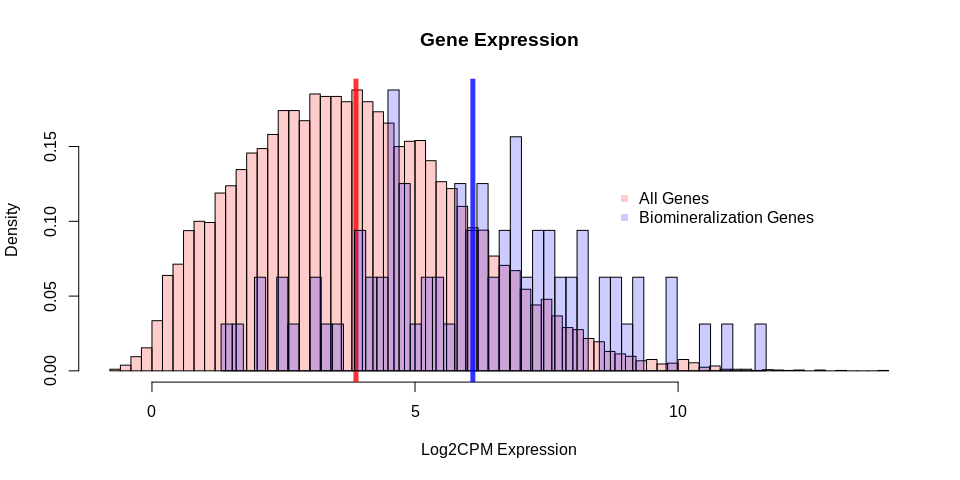
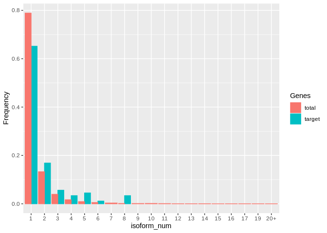

Evaluation of Expression for Biomineralization Genes
================
adowneywall
10/18/2019

**Libraries**

``` r
## Packages 
library(matrixStats,quietly = TRUE)
library(edgeR,quietly = TRUE)
library(dplyr,quietly = TRUE)
library(FSA,quietly = TRUE) # to use w arguement in hist()
library(ggplot2)
library(cowplot)

wd <- "/home/downeyam/Github/2017OAExp_Oysters"
# This should be set to the path for the local version of the `2017OAExp_Oysters` github repo.
```

**Data**

*Gene and Transcript Expression Matrices*

``` r
par(mfrow=c(2,2))
geneCounts <- readRDS(paste0(wd,"/results/Transcriptomic/gene_preNormalization_DGEListObj.RData"))
gc_log <- log2(cpm(geneCounts$counts))
tranCounts <- readRDS(paste0(wd,"/results/Transcriptomic/transcript_preNormalization_DGEListObj.RData"))
tc_log <- log2(cpm(tranCounts$counts))
geneDiff <- readRDS(paste0(wd,"/results/Transcriptomic/gene_EBayesObj.RData"))
tranDiff <- readRDS(paste0(wd,"/results/Transcriptomic/transcript_EBayesObj.RData"))  
```

*Sample meta data*

``` r
#### Meta Data ####
meta <- readRDS(paste0(wd,"/input_files/meta/metadata_20190811.RData"))
meta$sampl_nameSimple <- substr(meta$sample_name,start = 4,stop=9)
#Create new factor levels (one for each level combination)
meta$SFVrn <- as.factor(paste0("D",meta$SFV))
meta$Sample_Index <- as.factor(meta$sample_index)
meta$TankID <- as.factor(meta$tankID)
```

**Target Gene List - Primarily biomineralization associated genes**

At the moment these are not specifically investigated during the diff.
gene analysis (all gene are examined). I mostly just wanted to confirm
they were present and being expressed in my dataset using a simple
histogram (below)

``` r
### Target List ###
tl <- read.csv(paste0(wd,"/input_files/RNA/references/Target_BiomineralizationGenes.csv"))
tl <- tl[,1:10]
# 23 unique biomineralization genes 
# 136 gene locations
tl$Location <- as.character(tl$Location)
```

### **Histogram target vs total genes**

<!-- -->

### **Histogram target vs total transcripts**

<!-- -->

**Histogram number of isoforms for each gene**

``` r
iso_count <- unlist(table(tranCounts$genes$GENEID))
head(unlist(iso_count))
```

    ## 
    ## LOC111099029 LOC111099030 LOC111099033 LOC111099034 LOC111099035 
    ##            1            1            1            1            1 
    ## LOC111099036 
    ##            1

``` r
isoform_count <- data.frame(Location=names(iso_count),counts=as.numeric(iso_count))

isoform_count_bio <- isoform_count[which(!is.na(match(isoform_count$Location,tl$Location))),]

total <- data.frame(type="Total",Number_of_Isoforms=isoform_count$counts)
target <- data.frame(type="Target",Number_of_Isoforms=isoform_count_bio$counts)
full_vals <- rbind(total,target)
  
hist(total$Number_of_Isoforms,
     col=adjustcolor("red",alpha.f = 0.2),
     breaks=100,
     freq = FALSE,
     xlim=c(0,10),xlab="Num. of Isoforms",main="Isoform Counts")
abline(v=mean(total$Number_of_Isoforms[total$Number_of_Isoforms>=0]),col=adjustcolor("red",alpha.f = 0.8),lwd=5)
par(new=TRUE)
hist(target$Number_of_Isoforms,
     col=adjustcolor("blue",alpha.f = 0.2),
     breaks=50,
     freq=FALSE,
     xlim=c(0,10),axes = FALSE,xlab="",ylab="",main="")
legend(x=7,y=3,legend=c("All Genes","Biomineralization Genes"),pch=15,
       col=c(adjustcolor("red",alpha.f = 0.2),adjustcolor("blue",alpha.f = 0.2)),
       bty="n")
abline(v=mean(target$Number_of_Isoforms[target$Number_of_Isoforms>0]),col=adjustcolor("blue",alpha.f = 0.8),lwd=5)
```

<!-- -->

**Between treatment-time level variation in
genes**

``` r
geneCounts_T1C <-  rowMeans(gc_log[,as.character(meta$SFVrn) == "D09.400"])
geneCounts_T1E <-  rowMeans(gc_log[,as.character(meta$SFVrn) == "D09.2800"])
geneCounts_T2C <-  rowMeans(gc_log[,as.character(meta$SFVrn) == "D80.400"])
geneCounts_T2E <-  rowMeans(gc_log[,as.character(meta$SFVrn) == "D80.2800"])
geneMeanSummary <- cbind(geneCounts_T1C,geneCounts_T1E,
                       geneCounts_T2C,geneCounts_T2E)
geneGrandMean <- abs(rowMeans(geneMeanSummary))

cvCalc <- function(x){sd(x)/mean(x)}
geneCV <- abs(apply(geneMeanSummary,1,cvCalc))

geneMean_bio <- geneGrandMean[!is.na(match(rownames(gc_log),tl$Location))]
geneCV_bio <- geneCV[!is.na(match(rownames(gc_log),tl$Location))]

plot(log2(geneCV)~geneGrandMean,col=adjustcolor("red",alpha.f = 0.2),ylim=c(-10,10),
     xlab="Log2CPM Expression",ylab="log2(CV)",main="Gene expression variation among treatment and time levels",xlim=c(-0.1,14))
points(log2(geneCV_bio)~geneMean_bio,lwd=5,
       col=adjustcolor("blue",alpha.f = 0.5),pch=16)
legend(x=8,y=6,legend=c("All Genes","Biomineralization Genes"),pch=c(1,16),
       col=c(adjustcolor("red",alpha.f = 0.8),adjustcolor("blue",alpha.f = 0.5)),
       bty="n")
```

<!-- -->

**Between treatment-time level variation in
transcripts**

``` r
tranCounts_T1C <-  rowMeans(tc_log[,as.character(meta$SFVrn) == "D09.400"])
tranCounts_T1E <-  rowMeans(tc_log[,as.character(meta$SFVrn) == "D09.2800"])
tranCounts_T2C <-  rowMeans(tc_log[,as.character(meta$SFVrn) == "D80.400"])
tranCounts_T2E <-  rowMeans(tc_log[,as.character(meta$SFVrn) == "D80.2800"])
tranMeanSummary <- cbind(tranCounts_T1C,tranCounts_T1E,
                       tranCounts_T2C,tranCounts_T2E)
tranGrandMean <- abs(rowMeans(tranMeanSummary))

cvCalc <- function(x){sd(x)/mean(x)}
tranCV <- abs(apply(tranMeanSummary,1,cvCalc))

tranMean_bio <- tranGrandMean[!is.na(match(tranCounts$genes$GENEID,tl$Location))]
tranCV_bio <- tranCV[!is.na(match(tranCounts$genes$GENEID,tl$Location))]

plot(log2(tranCV)~tranGrandMean,col=adjustcolor("red",alpha.f = 0.2),ylim=c(-10,10),
     xlab="Log2CPM Expression",ylab="log2(CV)",main="Transcripts expression variation among treatment and time levels",xlim=c(-0.1,14))
points(log2(tranCV_bio)~tranMean_bio,lwd=5,
       col=adjustcolor("blue",alpha.f = 0.5),pch=16)
legend(x=8,y=6,legend=c("All Transcripts","Biomineralization Transcripts"),pch=c(1,16),
       col=c(adjustcolor("red",alpha.f = 0.8),adjustcolor("blue",alpha.f = 0.5)),
       bty="n")
```

<!-- -->

``` r
diffgeneTable<-topTable(geneDiff,number = Inf)
diffgeneTable$Location <- rownames(diffgeneTable)
diffgene_biomineralization <- left_join(tl,diffgeneTable,by="Location")
diffgene_biomineralization <- diffgene_biomineralization[which(!is.na(diffgene_biomineralization$GENEID)),]
diffgene_biomineralization$General_ID <- factor(diffgene_biomineralization$General_ID)

#CvE_D9
p1<-ggplot(diffgene_biomineralization,
           aes(x=General_ID,y=CvE_D9,colour=General_ID)) + geom_abline(slope=0,intercept=0,colour="black") +geom_boxplot() +
  labs(title="Control vs. Exposed : Day 9",y="Logfold Change",x="",colour="Biomineralization Genes") + theme_cowplot(12) +
  ylim(-4,4) + theme(axis.text.x=element_blank(),axis.ticks.x=element_blank())
#CvE_D80
p2 <- ggplot(diffgene_biomineralization,
             aes(x=General_ID,y=CvE_D80,colour=General_ID)) + geom_abline(slope=0,intercept=0,colour="black") +geom_boxplot() +
  labs(title="Control vs. Exposed : Day 80",y="Logfold Change",x="") + theme_cowplot(12) +
  ylim(-4,4)+ theme(axis.text.x=element_blank(),axis.ticks.x=element_blank())
#C_D9vD80
p3 <- ggplot(diffgene_biomineralization,
             aes(x=General_ID,y=C_D9vD80,colour=General_ID)) + geom_abline(slope=0,intercept=0,colour="black") +geom_boxplot() +
  labs(title="Control : Day 9 vs Day 80",y="Logfold Change",x="") + theme_cowplot(12) +
  ylim(-4,4)+ theme(axis.text.x=element_blank(),axis.ticks.x=element_blank())
#Diff
p4 <- ggplot(diffgene_biomineralization,
             aes(x=General_ID,y=Diff,colour=General_ID)) + geom_abline(slope=0,intercept=0,colour="black") +geom_boxplot() +
  labs(title="Treatment:Time Interaction",y="Logfold Change",x="Biomineralization genes") + theme_cowplot(12) +
  ylim(-4,4)+ theme(axis.text.x=element_blank(),axis.ticks.x=element_blank())

prow <- plot_grid(
  p1 + theme(legend.position="none"),
  p2 + theme(legend.position="none"),
  p3 + theme(legend.position="none"),
  p4 + theme(legend.position="none"),
  align = 'v',
  labels = c("A", "B", "C","D"),
  hjust = -1,
  nrow = 4
)
```

    ## Warning: Removed 1 rows containing non-finite values (stat_boxplot).

    ## Warning: Removed 3 rows containing non-finite values (stat_boxplot).

``` r
legend <- get_legend(
  # create some space to the left of the legend
  p1 + 
    guides(color = guide_legend(ncol = 1)) +  
    theme(legend.position = "right")
)

plot_grid(prow, legend, rel_widths = c(2.8, .8))
```

<!-- -->

Example code for this sort of grid
plots:<https://github.com/wilkelab/cowplot/blob/master/vignettes/shared_legends.Rmd>
