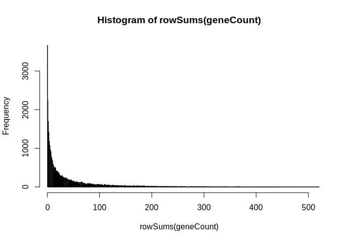
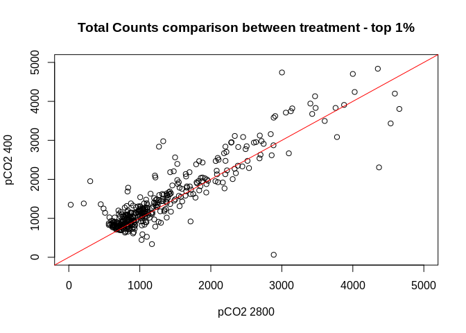
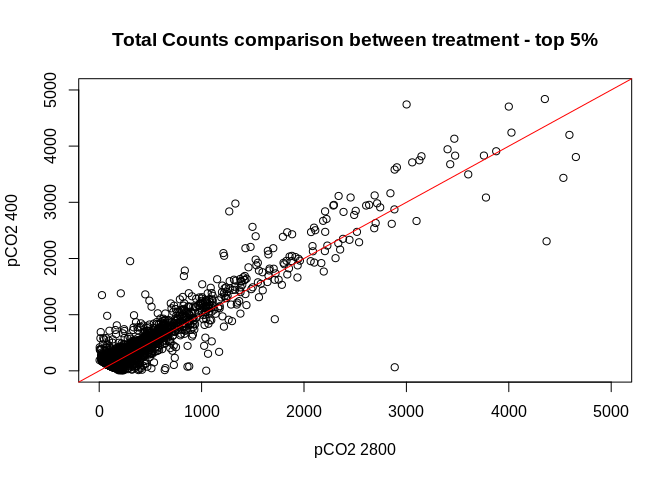

### Overview
This script provided a brief run down of the reads data from our RNAseq dataset, and looks at how many reads, alignments, and gene counts are produced using our current bioinformatics pipeline. The reason for this is to troubleshoot the reason for the substantial loss of data as we progress to our final gene count matrix.

## Bioinformatics Steps
<table class="table table-striped table-hover table-condensed" style="margin-left: auto; margin-right: auto;">
 <thead>
  <tr>
   <th style="text-align:left;"> Step </th>
   <th style="text-align:left;"> Program </th>
   <th style="text-align:left;"> Link </th>
  </tr>
 </thead>
<tbody>
  <tr>
   <td style="text-align:left;"> Trimming Raw Reads </td>
   <td style="text-align:left;"> Trimmomatic (implimented in dDocent) </td>
   <td style="text-align:left;"> https://github.com/DrK-Lo/2017OAExp_Oysters/blob/master/markdown_files/01B_CV17_RNA_Alignment_trimming.Rmd </td>
  </tr>
  <tr>
   <td style="text-align:left;"> Mapping Reads </td>
   <td style="text-align:left;"> STAR </td>
   <td style="text-align:left;"> https://github.com/DrK-Lo/2017OAExp_Oysters/blob/master/markdown_files/01C_CV17_RNA_Alignment_ReadMapping.Rmd </td>
  </tr>
  <tr>
   <td style="text-align:left;"> Filtering </td>
   <td style="text-align:left;"> SamTools </td>
   <td style="text-align:left;"> https://github.com/DrK-Lo/2017OAExp_Oysters/blob/master/markdown_files/01D_CV17_RNA_Alignment_Filtering.Rmd </td>
  </tr>
  <tr>
   <td style="text-align:left;"> Create Count Matrix </td>
   <td style="text-align:left;"> HT-Seq </td>
   <td style="text-align:left;"> https://github.com/DrK-Lo/2017OAExp_Oysters/blob/master/markdown_files/02_CV17_RNA_createCountMatrix.Rmd </td>
  </tr>
  <tr>
   <td style="text-align:left;"> Filter Reads with low frequency </td>
   <td style="text-align:left;"> R </td>
   <td style="text-align:left;"> https://github.com/epigeneticstoocean/2017OAExp_Oysters/blob/master/markdown_files/STAR_pipeline/03A_CV17_RNA_countFilteringandAnalysis.md </td>
  </tr>
</tbody>
</table>
  

```r
## Raw Data
#Raw Reads from GENEWIZ
setwd(dir = "/home/downeyam/Github/2017OAExp_Oysters/")
rawRead<-read.delim(file = "/home/downeyam/Github/2017OAExp_Oysters/input_files/RNA/RNASeq_RawReadInfo_spaceDelim.txt",sep = " ",header = TRUE)
rawRead_sub<-subset(rawRead,select=c("Sample_ID","RawRead","meanQualityScore"))
```
  

  

  
**Complete Summary Table**
<table class="table table-striped table-hover table-condensed" style="margin-left: auto; margin-right: auto;">
 <thead>
  <tr>
   <th style="text-align:right;"> Sample_ID </th>
   <th style="text-align:right;"> RawRead </th>
   <th style="text-align:right;"> meanQualityScore </th>
   <th style="text-align:left;"> InputRead </th>
   <th style="text-align:left;"> uniqAlign </th>
   <th style="text-align:left;"> perAlign </th>
   <th style="text-align:right;"> geneCounts </th>
  </tr>
 </thead>
<tbody>
  <tr>
   <td style="text-align:right;"> 17005 </td>
   <td style="text-align:right;"> 40080928 </td>
   <td style="text-align:right;"> 39.11 </td>
   <td style="text-align:left;"> 29019229 </td>
   <td style="text-align:left;"> 23633603 </td>
   <td style="text-align:left;"> 81.44% </td>
   <td style="text-align:right;"> 185575 </td>
  </tr>
  <tr>
   <td style="text-align:right;"> 17007 </td>
   <td style="text-align:right;"> 42806943 </td>
   <td style="text-align:right;"> 38.88 </td>
   <td style="text-align:left;"> 30013589 </td>
   <td style="text-align:left;"> 24472768 </td>
   <td style="text-align:left;"> 81.54% </td>
   <td style="text-align:right;"> 212677 </td>
  </tr>
  <tr>
   <td style="text-align:right;"> 17013 </td>
   <td style="text-align:right;"> 42332976 </td>
   <td style="text-align:right;"> 38.97 </td>
   <td style="text-align:left;"> 29692373 </td>
   <td style="text-align:left;"> 24165399 </td>
   <td style="text-align:left;"> 81.39% </td>
   <td style="text-align:right;"> 215799 </td>
  </tr>
  <tr>
   <td style="text-align:right;"> 17019 </td>
   <td style="text-align:right;"> 45046863 </td>
   <td style="text-align:right;"> 39.06 </td>
   <td style="text-align:left;"> 32740256 </td>
   <td style="text-align:left;"> 26949499 </td>
   <td style="text-align:left;"> 82.31% </td>
   <td style="text-align:right;"> 207748 </td>
  </tr>
  <tr>
   <td style="text-align:right;"> 17069 </td>
   <td style="text-align:right;"> 42702450 </td>
   <td style="text-align:right;"> 38.97 </td>
   <td style="text-align:left;"> 30377144 </td>
   <td style="text-align:left;"> 24762251 </td>
   <td style="text-align:left;"> 81.52% </td>
   <td style="text-align:right;"> 250191 </td>
  </tr>
  <tr>
   <td style="text-align:right;"> 17070 </td>
   <td style="text-align:right;"> 41410387 </td>
   <td style="text-align:right;"> 39.00 </td>
   <td style="text-align:left;"> 29347797 </td>
   <td style="text-align:left;"> 24059682 </td>
   <td style="text-align:left;"> 81.98% </td>
   <td style="text-align:right;"> 202828 </td>
  </tr>
  <tr>
   <td style="text-align:right;"> 17072 </td>
   <td style="text-align:right;"> 37026936 </td>
   <td style="text-align:right;"> 39.01 </td>
   <td style="text-align:left;"> 26488969 </td>
   <td style="text-align:left;"> 21553241 </td>
   <td style="text-align:left;"> 81.37% </td>
   <td style="text-align:right;"> 186061 </td>
  </tr>
  <tr>
   <td style="text-align:right;"> 17079 </td>
   <td style="text-align:right;"> 42141967 </td>
   <td style="text-align:right;"> 39.01 </td>
   <td style="text-align:left;"> 30292119 </td>
   <td style="text-align:left;"> 24944269 </td>
   <td style="text-align:left;"> 82.35% </td>
   <td style="text-align:right;"> 197786 </td>
  </tr>
  <tr>
   <td style="text-align:right;"> 17090 </td>
   <td style="text-align:right;"> 38056474 </td>
   <td style="text-align:right;"> 39.00 </td>
   <td style="text-align:left;"> 26760341 </td>
   <td style="text-align:left;"> 21610158 </td>
   <td style="text-align:left;"> 80.75% </td>
   <td style="text-align:right;"> 205831 </td>
  </tr>
  <tr>
   <td style="text-align:right;"> 17094 </td>
   <td style="text-align:right;"> 36832035 </td>
   <td style="text-align:right;"> 39.01 </td>
   <td style="text-align:left;"> 25416965 </td>
   <td style="text-align:left;"> 20495912 </td>
   <td style="text-align:left;"> 80.64% </td>
   <td style="text-align:right;"> 184038 </td>
  </tr>
  <tr>
   <td style="text-align:right;"> 17099 </td>
   <td style="text-align:right;"> 41411209 </td>
   <td style="text-align:right;"> 38.91 </td>
   <td style="text-align:left;"> 29468692 </td>
   <td style="text-align:left;"> 23761132 </td>
   <td style="text-align:left;"> 80.63% </td>
   <td style="text-align:right;"> 206474 </td>
  </tr>
  <tr>
   <td style="text-align:right;"> 17108 </td>
   <td style="text-align:right;"> 36354214 </td>
   <td style="text-align:right;"> 38.96 </td>
   <td style="text-align:left;"> 25698078 </td>
   <td style="text-align:left;"> 20611752 </td>
   <td style="text-align:left;"> 80.21% </td>
   <td style="text-align:right;"> 183555 </td>
  </tr>
  <tr>
   <td style="text-align:right;"> 17122 </td>
   <td style="text-align:right;"> 39911842 </td>
   <td style="text-align:right;"> 38.83 </td>
   <td style="text-align:left;"> 28356335 </td>
   <td style="text-align:left;"> 22415131 </td>
   <td style="text-align:left;"> 79.05% </td>
   <td style="text-align:right;"> 216649 </td>
  </tr>
  <tr>
   <td style="text-align:right;"> 17130 </td>
   <td style="text-align:right;"> 37595762 </td>
   <td style="text-align:right;"> 38.93 </td>
   <td style="text-align:left;"> 25867032 </td>
   <td style="text-align:left;"> 20798835 </td>
   <td style="text-align:left;"> 80.41% </td>
   <td style="text-align:right;"> 189667 </td>
  </tr>
  <tr>
   <td style="text-align:right;"> 17142 </td>
   <td style="text-align:right;"> 36773848 </td>
   <td style="text-align:right;"> 38.96 </td>
   <td style="text-align:left;"> 24936709 </td>
   <td style="text-align:left;"> 20235788 </td>
   <td style="text-align:left;"> 81.15% </td>
   <td style="text-align:right;"> 170509 </td>
  </tr>
  <tr>
   <td style="text-align:right;"> 17145 </td>
   <td style="text-align:right;"> 39763769 </td>
   <td style="text-align:right;"> 38.90 </td>
   <td style="text-align:left;"> 28356406 </td>
   <td style="text-align:left;"> 22997949 </td>
   <td style="text-align:left;"> 81.10% </td>
   <td style="text-align:right;"> 173338 </td>
  </tr>
  <tr>
   <td style="text-align:right;"> 17162 </td>
   <td style="text-align:right;"> 37805565 </td>
   <td style="text-align:right;"> 39.04 </td>
   <td style="text-align:left;"> 27005192 </td>
   <td style="text-align:left;"> 22097167 </td>
   <td style="text-align:left;"> 81.83% </td>
   <td style="text-align:right;"> 184528 </td>
  </tr>
  <tr>
   <td style="text-align:right;"> 17174 </td>
   <td style="text-align:right;"> 44648343 </td>
   <td style="text-align:right;"> 38.95 </td>
   <td style="text-align:left;"> 31375515 </td>
   <td style="text-align:left;"> 25664857 </td>
   <td style="text-align:left;"> 81.80% </td>
   <td style="text-align:right;"> 262110 </td>
  </tr>
  <tr>
   <td style="text-align:right;"> 17176 </td>
   <td style="text-align:right;"> 42084075 </td>
   <td style="text-align:right;"> 39.00 </td>
   <td style="text-align:left;"> 29754554 </td>
   <td style="text-align:left;"> 24247096 </td>
   <td style="text-align:left;"> 81.49% </td>
   <td style="text-align:right;"> 196390 </td>
  </tr>
  <tr>
   <td style="text-align:right;"> 17178 </td>
   <td style="text-align:right;"> 36149105 </td>
   <td style="text-align:right;"> 38.95 </td>
   <td style="text-align:left;"> 24392372 </td>
   <td style="text-align:left;"> 19880266 </td>
   <td style="text-align:left;"> 81.50% </td>
   <td style="text-align:right;"> 156620 </td>
  </tr>
  <tr>
   <td style="text-align:right;"> 17181 </td>
   <td style="text-align:right;"> 37853708 </td>
   <td style="text-align:right;"> 39.06 </td>
   <td style="text-align:left;"> 26544014 </td>
   <td style="text-align:left;"> 21704951 </td>
   <td style="text-align:left;"> 81.77% </td>
   <td style="text-align:right;"> 156228 </td>
  </tr>
  <tr>
   <td style="text-align:right;"> 17203 </td>
   <td style="text-align:right;"> 38453143 </td>
   <td style="text-align:right;"> 39.05 </td>
   <td style="text-align:left;"> 25585659 </td>
   <td style="text-align:left;"> 20245614 </td>
   <td style="text-align:left;"> 79.13% </td>
   <td style="text-align:right;"> 192130 </td>
  </tr>
  <tr>
   <td style="text-align:right;"> 17211 </td>
   <td style="text-align:right;"> 37888433 </td>
   <td style="text-align:right;"> 39.10 </td>
   <td style="text-align:left;"> 27122554 </td>
   <td style="text-align:left;"> 22291205 </td>
   <td style="text-align:left;"> 82.19% </td>
   <td style="text-align:right;"> 186060 </td>
  </tr>
  <tr>
   <td style="text-align:right;"> 17213 </td>
   <td style="text-align:right;"> 38842784 </td>
   <td style="text-align:right;"> 39.09 </td>
   <td style="text-align:left;"> 25777506 </td>
   <td style="text-align:left;"> 21157706 </td>
   <td style="text-align:left;"> 82.08% </td>
   <td style="text-align:right;"> 219996 </td>
  </tr>
</tbody>
</table>

**Numbers of genes identified**

```
## [1] 39003
```

**Histogram of Counts for each Gene (max total number of counts set to 500)**

```r
hist(rowSums(geneCount),breaks = 1000000,xlim = c(5,500))
```

<!-- -->

### Percent of Count data in the largest 1,5,10% of genes
**1%**  

```r
# Minimum counts in the upper 10%
(one_perc <- quantile(rowSums(geneCount),probs = .99))
```

```
##     99% 
## 1374.98
```

```r
geneCount_oneperc <- geneCount[rowSums(geneCount) >= one_perc,]
# Number of Genes
nrow(geneCount_oneperc)
```

```
## [1] 391
```

```r
# Comparisons of top 1% by treatment
plot(rowSums(geneCount_oneperc[,env_sub$treatment == 400])~rowSums(geneCount_oneperc[,env_sub$treatment == 2800]),
     ylim=c(0,5000),xlim=c(0,5000),main="Total Counts comparison between treatment - top 1%",ylab= "pCO2 400",xlab="pCO2 2800")
abline(col="red",a = 0,b=1)
```

<!-- -->

```r
# Percent of total counts
(sum(geneCount_oneperc/sum(geneCount))*100)
```

```
## [1] 43.52105
```
**5%**

```r
# Minimum counts in the upper 10%
(five_perc <- quantile(rowSums(geneCount),probs = .95))
```

```
## 95% 
## 369
```

```r
geneCount_fiveperc <- geneCount[rowSums(geneCount) >= five_perc,]
# Number of Genes
nrow(geneCount_fiveperc)
```

```
## [1] 1954
```

```r
# Comparisons of top 1% by treatment
plot(rowSums(geneCount_fiveperc[,env_sub$treatment == 400])~rowSums(geneCount_fiveperc[,env_sub$treatment == 2800]),
     ylim=c(0,5000),xlim=c(0,5000),main="Total Counts comparison between treatment - top 5%",ylab= "pCO2 400",xlab="pCO2 2800")
abline(col="red",a = 0,b=1)
```

<!-- -->

```r
# Percent of total counts
(sum(geneCount_fiveperc/sum(geneCount))*100)
```

```
## [1] 65.1105
```
**10%**

```r
# Minimum counts in the upper 10%
(ten_perc <- quantile(rowSums(geneCount),probs = .90))
```

```
## 90% 
## 192
```

```r
geneCount_tenperc <- geneCount[rowSums(geneCount) >= ten_perc,]
# Number of Genes
nrow(geneCount_tenperc)
```

```
## [1] 3911
```

```r
# Comparisons of top 1% by treatment
plot(rowSums(geneCount_tenperc[,env_sub$treatment == 400])~rowSums(geneCount_tenperc[,env_sub$treatment == 2800]),
     ylim=c(0,5000),xlim=c(0,5000),main="Total Counts comparison between treatment - top 5%",ylab= "pCO2 400",xlab="pCO2 2800")
abline(col="red",a = 0,b=1)
```

<!-- -->

```r
# Percent of total counts
(sum(geneCount_tenperc/sum(geneCount))*100)
```

```
## [1] 75.98729
```
### Gene with Largest Number of Read Counts

```r
big_gene <- geneCount[rowSums(geneCount) == max(rowSums(geneCount)),]
# Counts
sum(big_gene)
```

```
## [1] 433436
```

```r
#Name
row.names(big_gene)
```

```
## [1] "LOC111103780"
```

```r
# Percent of Total Reads
(sum(big_gene)/sum(geneCount))*100
```

```
## [1] 9.138844
```
