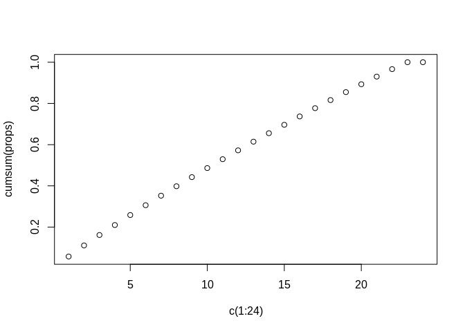
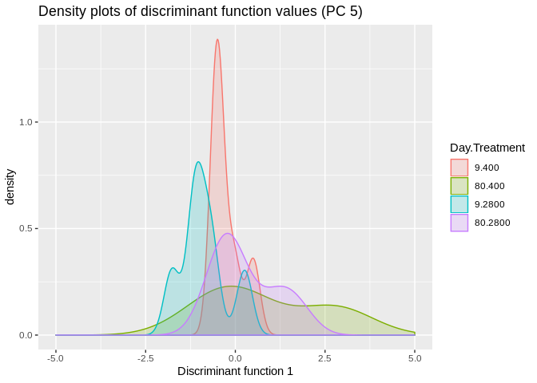
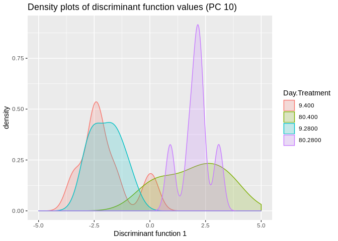
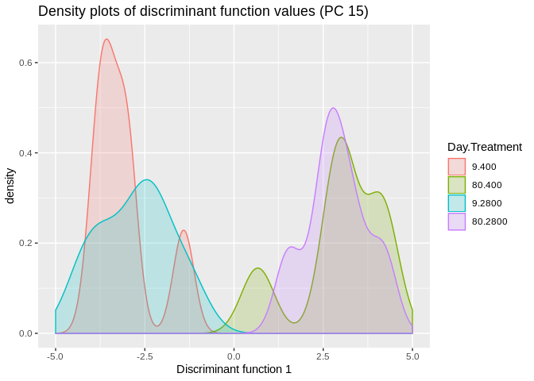
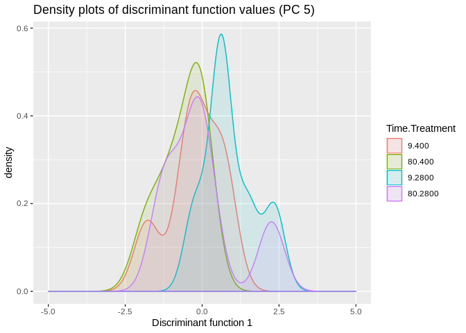
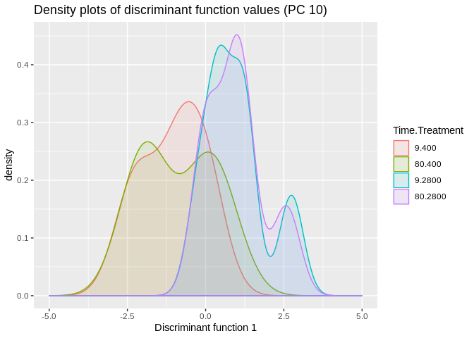
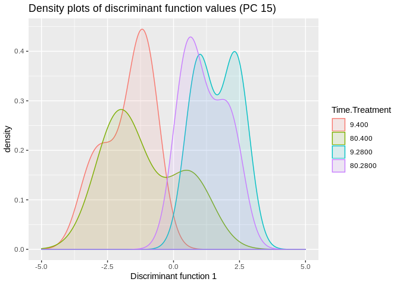
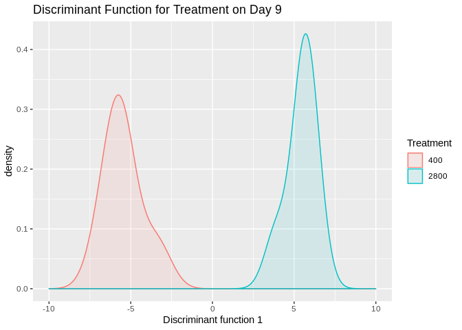
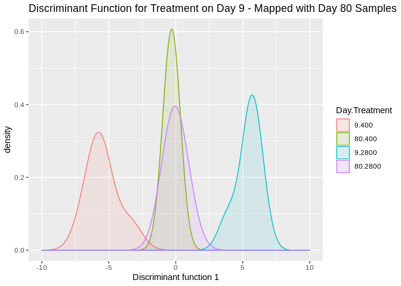

  
**Data**

```r
# This is the filtered count matrix
counts_Rdat <- readRDS(file = "/home/downeyam/Github/2017OAExp_Oysters/input_files/RNA/Normalized_CountMatrix/Scenario1_normalizedVoom.RData")
counts <- log2(counts_Rdat$E)
```

```
## Loading required package: limma
```

```r
# This is the complete count matrix
count2 <- read.delim("/home/downeyam/Github/2017OAExp_Oysters/results/C_virginica_gene_count_final.txt",header=TRUE,sep="",row.names=1)
# Meta Data for the 24 samples
meta <- read.csv(file="/home/downeyam/Github/2017OAExp_Oysters/input_files/RNA/metadata_cvirginica_rna_meta.txt")
```
  
## Performing a DAPC

FYI :  Need to transpose count matrix to put it in the dapc() function. Individuals x Loci 

### Cumulative Variance Plot

```r
out <- prcomp(t(counts))
vars <- apply(out$x, 2, var)  
props <- vars / sum(vars)
cumsum(props)
```

```
##       PC1       PC2       PC3       PC4       PC5       PC6       PC7 
## 0.0572804 0.1110882 0.1614416 0.2100125 0.2584666 0.3061630 0.3524641 
##       PC8       PC9      PC10      PC11      PC12      PC13      PC14 
## 0.3981932 0.4424318 0.4863204 0.5294445 0.5724671 0.6145279 0.6556555 
##      PC15      PC16      PC17      PC18      PC19      PC20      PC21 
## 0.6963296 0.7368893 0.7771020 0.8162589 0.8549461 0.8931683 0.9302421 
##      PC22      PC23      PC24 
## 0.9664466 1.0000000 1.0000000
```

```r
plot(cumsum(props)~c(1:24))
```

<!-- -->

No clear choice for PC   
  
### Discriminant function for time  

**PC 5**  

```r
# dapc_time<-dapc(t(counts),meta$timepoint)
dapc_time_5<-dapc(t(counts),meta$timepoint,n.pca=5,n.da=2,pca.info=TRUE)
meta$discrimant_time_5 <- dapc_time_5$ind.coord

ggplot(meta,aes(discrimant_time_5,fill=as.factor(interaction(Day,treatment)),colour=as.factor(interaction(Day,treatment)))) + geom_density(alpha=0.2) + xlim(-5,5) + 
  labs(title="Density plots of discriminant function values (PC 5)",
       x="Discriminant function 1",
       colour="Day.Treatment",
       fill="Day.Treatment")
```

<!-- -->
  
**PC 10**  

```r
# FYI :  Need to transpose count matrix to put it in the dapc() function. Individuals x Loci 

# dapc_time<-dapc(t(counts),meta$timepoint)
dapc_time_10<-dapc(t(counts),meta$timepoint,n.pca=10,n.da=2,pca.info=TRUE)
meta$discrimant_time_10 <- dapc_time_10$ind.coord

ggplot(meta,aes(discrimant_time_10,fill=as.factor(interaction(Day,treatment)),colour=as.factor(interaction(Day,treatment)))) + geom_density(alpha=0.2) + xlim(-5,5) + 
  labs(title="Density plots of discriminant function values (PC 10)",
       x="Discriminant function 1",
       colour="Day.Treatment",
       fill="Day.Treatment")
```

<!-- -->
  
**PC 15**  

```r
# FYI :  Need to transpose count matrix to put it in the dapc() function. Individuals x Loci 

# dapc_time<-dapc(t(counts),meta$timepoint)
dapc_time_15<-dapc(t(counts),meta$timepoint,n.pca=15,n.da=2,pca.info=TRUE)
meta$discrimant_time_15 <- dapc_time_15$ind.coord

ggplot(meta,aes(discrimant_time_15,fill=as.factor(interaction(Day,treatment)),colour=as.factor(interaction(Day,treatment)))) + geom_density(alpha=0.2) + xlim(-5,5) + 
  labs(title="Density plots of discriminant function values (PC 15)",
       x="Discriminant function 1",
       colour="Day.Treatment",
       fill="Day.Treatment")
```

<!-- -->
  
### Discriminant functino for treatment  
  
**PC 5**

```r
dapc_treatment_5<-dapc(t(counts),meta$treatment,n.pca=5,n.da=2)
meta$discriminant_treatment_5 <- dapc_treatment_5$ind.coord

ggplot(meta,aes(discriminant_treatment_5,fill=as.factor(interaction(Day,treatment)),colour=as.factor(interaction(Day,treatment)))) + 
  geom_density(alpha=0.1) + xlim(-5,5) + 
  labs(title="Density plots of discriminant function values (PC 5)",
       x="Discriminant function 1",
       colour="Time.Treatment",
       fill="Time.Treatment")
```

<!-- -->
  
**PC 10**

```r
dapc_treatment_10<-dapc(t(counts),meta$treatment,n.pca=10,n.da=2)
meta$discriminant_treatment_10 <- dapc_treatment_10$ind.coord

ggplot(meta,aes(discriminant_treatment_10,fill=as.factor(interaction(Day,treatment)),colour=as.factor(interaction(Day,treatment)))) + 
  geom_density(alpha=0.1) + xlim(-5,5) + 
  labs(title="Density plots of discriminant function values (PC 10)",
       x="Discriminant function 1",
       colour="Time.Treatment",
       fill="Time.Treatment")
```

<!-- -->
  
**PC 15**

```r
dapc_treatment_15<-dapc(t(counts),meta$treatment,n.pca=15,n.da=2)
# PCs = 5
# clusters = 1
meta$discriminant_treatment_15 <- dapc_treatment_15$ind.coord

ggplot(meta,aes(discriminant_treatment_15,fill=as.factor(interaction(Day,treatment)),colour=as.factor(interaction(Day,treatment)))) + 
  geom_density(alpha=0.1) + xlim(-5,5) + 
  labs(title="Density plots of discriminant function values (PC 15)",
       x="Discriminant function 1",
       colour="Time.Treatment",
       fill="Time.Treatment")
```

<!-- -->
  
### TWO STEP DAPC: first create discriminant function from TP 9 samples and predict coordinates on df for day 80 samples.  
  
**Creating DF by treatment with first timepoint**  

```r
early_time_counts <- counts[,meta$Day == 9]
early_time_meta <- meta[meta$Day == 9,]

dapc_treatment_15<-dapc(t(early_time_counts),early_time_meta$treatment,n.pca=10,n.da=2)
# PCs = 5
# clusters = 1
early_time_meta$discriminant_treatment_15 <- dapc_treatment_15$ind.coord

ggplot(early_time_meta,aes(discriminant_treatment_15,fill=as.factor(treatment),colour=as.factor(treatment))) + 
  geom_density(alpha=0.1,adjust=3) + xlim(-10,10) + 
  labs(title="Discriminant Function for Treatment on Day 9",
       x="Discriminant function 1",
       colour="Treatment",
       fill="Treatment")
```

<!-- -->

**Mapping Day 80 samples**  

```r
late_time_counts <- counts[,meta$Day == 80]
late_time_meta <- meta[meta$Day == 80,]

predict_values <- predict.dapc(dapc_treatment_15,t(late_time_counts))
late_time_meta$discriminant_treatment_15 <-predict_values$ind.scores

whole_meta <- rbind(early_time_meta,late_time_meta)

ggplot(whole_meta,aes(discriminant_treatment_15,fill=as.factor(interaction(Day,treatment)),colour=as.factor(interaction(Day,treatment)))) + 
  geom_density(alpha=0.1,adjust=3) + xlim(-10,10) + 
  labs(title="Discriminant Function for Treatment on Day 9 - Mapped with Day 80 Samples",
       x="Discriminant function 1",
       colour="Day.Treatment",
       fill="Day.Treatment")
```

<!-- -->
Huh... expresssion profiles appear to converge over time.
