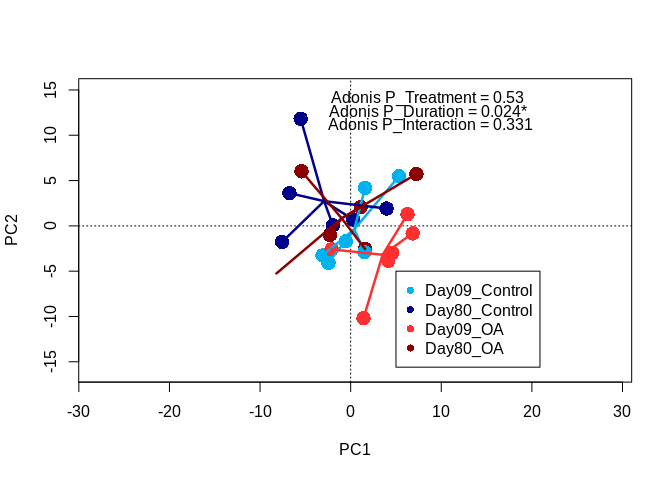

#### Data
<table class="table" style="margin-left: auto; margin-right: auto;">
 <thead>
<tr><th style="border-bottom:hidden; padding-bottom:0; padding-left:3px;padding-right:3px;text-align: left; font-size: large;" colspan="24"><div style="border-bottom: 1px solid #ddd; padding-bottom: 5px; ">Sample MetaData</div></th></tr>
  <tr>
   <th style="text-align:left;"> sample_name </th>
   <th style="text-align:right;"> sample_index </th>
   <th style="text-align:right;"> treatment </th>
   <th style="text-align:right;"> timepoint </th>
   <th style="text-align:right;"> Day </th>
   <th style="text-align:right;"> shelf </th>
   <th style="text-align:right;"> tank </th>
   <th style="text-align:right;"> tankID </th>
   <th style="text-align:right;"> population </th>
   <th style="text-align:right;"> extraction_order </th>
   <th style="text-align:right;"> seq_order </th>
   <th style="text-align:right;"> lane </th>
   <th style="text-align:right;"> gw_tapestation_RINe </th>
   <th style="text-align:right;"> gw_tapestation_conc </th>
   <th style="text-align:right;"> read_num </th>
   <th style="text-align:right;"> dry_wgtcorr </th>
   <th style="text-align:right;"> epf_pH </th>
   <th style="text-align:right;"> diff_pH </th>
   <th style="text-align:right;"> env_pH </th>
   <th style="text-align:left;"> Treatment </th>
   <th style="text-align:left;"> Time </th>
   <th style="text-align:left;"> Pop </th>
   <th style="text-align:left;"> Lane </th>
   <th style="text-align:left;"> SFV </th>
  </tr>
 </thead>
<tbody>
  <tr>
   <td style="text-align:left;"> RNA17005 </td>
   <td style="text-align:right;"> 1 </td>
   <td style="text-align:right;"> 400 </td>
   <td style="text-align:right;"> 6 </td>
   <td style="text-align:right;"> 80 </td>
   <td style="text-align:right;"> 1 </td>
   <td style="text-align:right;"> 1 </td>
   <td style="text-align:right;"> 1 </td>
   <td style="text-align:right;"> 2 </td>
   <td style="text-align:right;"> 21 </td>
   <td style="text-align:right;"> 22 </td>
   <td style="text-align:right;"> 2 </td>
   <td style="text-align:right;"> 8.3 </td>
   <td style="text-align:right;"> 50.2 </td>
   <td style="text-align:right;"> 40080928 </td>
   <td style="text-align:right;"> 0.715 </td>
   <td style="text-align:right;"> 6.846758 </td>
   <td style="text-align:right;"> -0.8584655 </td>
   <td style="text-align:right;"> 7.705224 </td>
   <td style="text-align:left;"> 400 </td>
   <td style="text-align:left;"> 80 </td>
   <td style="text-align:left;"> 2 </td>
   <td style="text-align:left;"> 2 </td>
   <td style="text-align:left;"> 80.400 </td>
  </tr>
  <tr>
   <td style="text-align:left;"> RNA17007 </td>
   <td style="text-align:right;"> 2 </td>
   <td style="text-align:right;"> 400 </td>
   <td style="text-align:right;"> 6 </td>
   <td style="text-align:right;"> 80 </td>
   <td style="text-align:right;"> 1 </td>
   <td style="text-align:right;"> 2 </td>
   <td style="text-align:right;"> 2 </td>
   <td style="text-align:right;"> 1 </td>
   <td style="text-align:right;"> 17 </td>
   <td style="text-align:right;"> 10 </td>
   <td style="text-align:right;"> 1 </td>
   <td style="text-align:right;"> 9.0 </td>
   <td style="text-align:right;"> 75.9 </td>
   <td style="text-align:right;"> 42806943 </td>
   <td style="text-align:right;"> 0.177 </td>
   <td style="text-align:right;"> 7.455280 </td>
   <td style="text-align:right;"> -0.3811514 </td>
   <td style="text-align:right;"> 7.836431 </td>
   <td style="text-align:left;"> 400 </td>
   <td style="text-align:left;"> 80 </td>
   <td style="text-align:left;"> 1 </td>
   <td style="text-align:left;"> 1 </td>
   <td style="text-align:left;"> 80.400 </td>
  </tr>
  <tr>
   <td style="text-align:left;"> RNA17013 </td>
   <td style="text-align:right;"> 3 </td>
   <td style="text-align:right;"> 400 </td>
   <td style="text-align:right;"> 3 </td>
   <td style="text-align:right;"> 9 </td>
   <td style="text-align:right;"> 2 </td>
   <td style="text-align:right;"> 2 </td>
   <td style="text-align:right;"> 5 </td>
   <td style="text-align:right;"> 1 </td>
   <td style="text-align:right;"> 11 </td>
   <td style="text-align:right;"> 5 </td>
   <td style="text-align:right;"> 1 </td>
   <td style="text-align:right;"> 8.7 </td>
   <td style="text-align:right;"> 46.1 </td>
   <td style="text-align:right;"> 42332976 </td>
   <td style="text-align:right;"> 1.110 </td>
   <td style="text-align:right;"> 7.385796 </td>
   <td style="text-align:right;"> -0.4344719 </td>
   <td style="text-align:right;"> 7.820268 </td>
   <td style="text-align:left;"> 400 </td>
   <td style="text-align:left;"> 09 </td>
   <td style="text-align:left;"> 1 </td>
   <td style="text-align:left;"> 1 </td>
   <td style="text-align:left;"> 09.400 </td>
  </tr>
  <tr>
   <td style="text-align:left;"> RNA17019 </td>
   <td style="text-align:right;"> 4 </td>
   <td style="text-align:right;"> 2800 </td>
   <td style="text-align:right;"> 6 </td>
   <td style="text-align:right;"> 80 </td>
   <td style="text-align:right;"> 4 </td>
   <td style="text-align:right;"> 3 </td>
   <td style="text-align:right;"> 9 </td>
   <td style="text-align:right;"> 2 </td>
   <td style="text-align:right;"> 14 </td>
   <td style="text-align:right;"> 20 </td>
   <td style="text-align:right;"> 2 </td>
   <td style="text-align:right;"> 8.9 </td>
   <td style="text-align:right;"> 61.4 </td>
   <td style="text-align:right;"> 45046863 </td>
   <td style="text-align:right;"> 0.707 </td>
   <td style="text-align:right;"> 7.149452 </td>
   <td style="text-align:right;"> 0.0881135 </td>
   <td style="text-align:right;"> 7.061338 </td>
   <td style="text-align:left;"> 2800 </td>
   <td style="text-align:left;"> 80 </td>
   <td style="text-align:left;"> 2 </td>
   <td style="text-align:left;"> 2 </td>
   <td style="text-align:left;"> 80.2800 </td>
  </tr>
  <tr>
   <td style="text-align:left;"> RNA17069 </td>
   <td style="text-align:right;"> 5 </td>
   <td style="text-align:right;"> 400 </td>
   <td style="text-align:right;"> 3 </td>
   <td style="text-align:right;"> 9 </td>
   <td style="text-align:right;"> 1 </td>
   <td style="text-align:right;"> 1 </td>
   <td style="text-align:right;"> 1 </td>
   <td style="text-align:right;"> 3 </td>
   <td style="text-align:right;"> 3 </td>
   <td style="text-align:right;"> 1 </td>
   <td style="text-align:right;"> 1 </td>
   <td style="text-align:right;"> 8.4 </td>
   <td style="text-align:right;"> 41.3 </td>
   <td style="text-align:right;"> 42702450 </td>
   <td style="text-align:right;"> 1.040 </td>
   <td style="text-align:right;"> 7.817657 </td>
   <td style="text-align:right;"> 0.0088614 </td>
   <td style="text-align:right;"> 7.808795 </td>
   <td style="text-align:left;"> 400 </td>
   <td style="text-align:left;"> 09 </td>
   <td style="text-align:left;"> 3 </td>
   <td style="text-align:left;"> 1 </td>
   <td style="text-align:left;"> 09.400 </td>
  </tr>
  <tr>
   <td style="text-align:left;"> RNA17070 </td>
   <td style="text-align:right;"> 6 </td>
   <td style="text-align:right;"> 400 </td>
   <td style="text-align:right;"> 3 </td>
   <td style="text-align:right;"> 9 </td>
   <td style="text-align:right;"> 1 </td>
   <td style="text-align:right;"> 2 </td>
   <td style="text-align:right;"> 2 </td>
   <td style="text-align:right;"> 1 </td>
   <td style="text-align:right;"> 7 </td>
   <td style="text-align:right;"> 13 </td>
   <td style="text-align:right;"> 2 </td>
   <td style="text-align:right;"> 9.5 </td>
   <td style="text-align:right;"> 71.9 </td>
   <td style="text-align:right;"> 41410387 </td>
   <td style="text-align:right;"> 1.250 </td>
   <td style="text-align:right;"> 6.786949 </td>
   <td style="text-align:right;"> -1.0161107 </td>
   <td style="text-align:right;"> 7.803059 </td>
   <td style="text-align:left;"> 400 </td>
   <td style="text-align:left;"> 09 </td>
   <td style="text-align:left;"> 1 </td>
   <td style="text-align:left;"> 2 </td>
   <td style="text-align:left;"> 09.400 </td>
  </tr>
  <tr>
   <td style="text-align:left;"> RNA17072 </td>
   <td style="text-align:right;"> 7 </td>
   <td style="text-align:right;"> 2800 </td>
   <td style="text-align:right;"> 3 </td>
   <td style="text-align:right;"> 9 </td>
   <td style="text-align:right;"> 4 </td>
   <td style="text-align:right;"> 3 </td>
   <td style="text-align:right;"> 9 </td>
   <td style="text-align:right;"> 2 </td>
   <td style="text-align:right;"> 16 </td>
   <td style="text-align:right;"> 19 </td>
   <td style="text-align:right;"> 2 </td>
   <td style="text-align:right;"> 9.3 </td>
   <td style="text-align:right;"> 40.9 </td>
   <td style="text-align:right;"> 37026936 </td>
   <td style="text-align:right;"> 1.430 </td>
   <td style="text-align:right;"> 7.616122 </td>
   <td style="text-align:right;"> 0.4727182 </td>
   <td style="text-align:right;"> 7.143403 </td>
   <td style="text-align:left;"> 2800 </td>
   <td style="text-align:left;"> 09 </td>
   <td style="text-align:left;"> 2 </td>
   <td style="text-align:left;"> 2 </td>
   <td style="text-align:left;"> 09.2800 </td>
  </tr>
  <tr>
   <td style="text-align:left;"> RNA17079 </td>
   <td style="text-align:right;"> 8 </td>
   <td style="text-align:right;"> 400 </td>
   <td style="text-align:right;"> 6 </td>
   <td style="text-align:right;"> 80 </td>
   <td style="text-align:right;"> 2 </td>
   <td style="text-align:right;"> 3 </td>
   <td style="text-align:right;"> 6 </td>
   <td style="text-align:right;"> 2 </td>
   <td style="text-align:right;"> 13 </td>
   <td style="text-align:right;"> 18 </td>
   <td style="text-align:right;"> 2 </td>
   <td style="text-align:right;"> 9.3 </td>
   <td style="text-align:right;"> 59.0 </td>
   <td style="text-align:right;"> 42141967 </td>
   <td style="text-align:right;"> 0.614 </td>
   <td style="text-align:right;"> 7.449509 </td>
   <td style="text-align:right;"> -0.3869217 </td>
   <td style="text-align:right;"> 7.836431 </td>
   <td style="text-align:left;"> 400 </td>
   <td style="text-align:left;"> 80 </td>
   <td style="text-align:left;"> 2 </td>
   <td style="text-align:left;"> 2 </td>
   <td style="text-align:left;"> 80.400 </td>
  </tr>
  <tr>
   <td style="text-align:left;"> RNA17090 </td>
   <td style="text-align:right;"> 9 </td>
   <td style="text-align:right;"> 2800 </td>
   <td style="text-align:right;"> 3 </td>
   <td style="text-align:right;"> 9 </td>
   <td style="text-align:right;"> 6 </td>
   <td style="text-align:right;"> 2 </td>
   <td style="text-align:right;"> 11 </td>
   <td style="text-align:right;"> 1 </td>
   <td style="text-align:right;"> 8 </td>
   <td style="text-align:right;"> 15 </td>
   <td style="text-align:right;"> 2 </td>
   <td style="text-align:right;"> 9.3 </td>
   <td style="text-align:right;"> 64.5 </td>
   <td style="text-align:right;"> 38056474 </td>
   <td style="text-align:right;"> 1.240 </td>
   <td style="text-align:right;"> 7.420345 </td>
   <td style="text-align:right;"> 0.2482606 </td>
   <td style="text-align:right;"> 7.172084 </td>
   <td style="text-align:left;"> 2800 </td>
   <td style="text-align:left;"> 09 </td>
   <td style="text-align:left;"> 1 </td>
   <td style="text-align:left;"> 2 </td>
   <td style="text-align:left;"> 09.2800 </td>
  </tr>
  <tr>
   <td style="text-align:left;"> RNA17094 </td>
   <td style="text-align:right;"> 10 </td>
   <td style="text-align:right;"> 2800 </td>
   <td style="text-align:right;"> 6 </td>
   <td style="text-align:right;"> 80 </td>
   <td style="text-align:right;"> 6 </td>
   <td style="text-align:right;"> 2 </td>
   <td style="text-align:right;"> 11 </td>
   <td style="text-align:right;"> 3 </td>
   <td style="text-align:right;"> 6 </td>
   <td style="text-align:right;"> 16 </td>
   <td style="text-align:right;"> 2 </td>
   <td style="text-align:right;"> 9.4 </td>
   <td style="text-align:right;"> 30.9 </td>
   <td style="text-align:right;"> 36832035 </td>
   <td style="text-align:right;"> 2.372 </td>
   <td style="text-align:right;"> 7.172533 </td>
   <td style="text-align:right;"> 0.1056187 </td>
   <td style="text-align:right;"> 7.066915 </td>
   <td style="text-align:left;"> 2800 </td>
   <td style="text-align:left;"> 80 </td>
   <td style="text-align:left;"> 3 </td>
   <td style="text-align:left;"> 2 </td>
   <td style="text-align:left;"> 80.2800 </td>
  </tr>
  <tr>
   <td style="text-align:left;"> RNA17099 </td>
   <td style="text-align:right;"> 11 </td>
   <td style="text-align:right;"> 400 </td>
   <td style="text-align:right;"> 6 </td>
   <td style="text-align:right;"> 80 </td>
   <td style="text-align:right;"> 1 </td>
   <td style="text-align:right;"> 3 </td>
   <td style="text-align:right;"> 3 </td>
   <td style="text-align:right;"> 2 </td>
   <td style="text-align:right;"> 1 </td>
   <td style="text-align:right;"> 2 </td>
   <td style="text-align:right;"> 1 </td>
   <td style="text-align:right;"> 9.0 </td>
   <td style="text-align:right;"> 33.4 </td>
   <td style="text-align:right;"> 41411209 </td>
   <td style="text-align:right;"> 0.879 </td>
   <td style="text-align:right;"> 7.668782 </td>
   <td style="text-align:right;"> -0.1564964 </td>
   <td style="text-align:right;"> 7.825279 </td>
   <td style="text-align:left;"> 400 </td>
   <td style="text-align:left;"> 80 </td>
   <td style="text-align:left;"> 2 </td>
   <td style="text-align:left;"> 1 </td>
   <td style="text-align:left;"> 80.400 </td>
  </tr>
  <tr>
   <td style="text-align:left;"> RNA17108 </td>
   <td style="text-align:right;"> 12 </td>
   <td style="text-align:right;"> 2800 </td>
   <td style="text-align:right;"> 3 </td>
   <td style="text-align:right;"> 9 </td>
   <td style="text-align:right;"> 6 </td>
   <td style="text-align:right;"> 3 </td>
   <td style="text-align:right;"> 12 </td>
   <td style="text-align:right;"> 3 </td>
   <td style="text-align:right;"> 4 </td>
   <td style="text-align:right;"> 3 </td>
   <td style="text-align:right;"> 1 </td>
   <td style="text-align:right;"> 7.4 </td>
   <td style="text-align:right;"> 40.9 </td>
   <td style="text-align:right;"> 36354214 </td>
   <td style="text-align:right;"> 1.060 </td>
   <td style="text-align:right;"> 7.633396 </td>
   <td style="text-align:right;"> 0.4785204 </td>
   <td style="text-align:right;"> 7.154876 </td>
   <td style="text-align:left;"> 2800 </td>
   <td style="text-align:left;"> 09 </td>
   <td style="text-align:left;"> 3 </td>
   <td style="text-align:left;"> 1 </td>
   <td style="text-align:left;"> 09.2800 </td>
  </tr>
  <tr>
   <td style="text-align:left;"> RNA17122 </td>
   <td style="text-align:right;"> 13 </td>
   <td style="text-align:right;"> 2800 </td>
   <td style="text-align:right;"> 3 </td>
   <td style="text-align:right;"> 9 </td>
   <td style="text-align:right;"> 4 </td>
   <td style="text-align:right;"> 1 </td>
   <td style="text-align:right;"> 7 </td>
   <td style="text-align:right;"> 3 </td>
   <td style="text-align:right;"> 20 </td>
   <td style="text-align:right;"> 11 </td>
   <td style="text-align:right;"> 1 </td>
   <td style="text-align:right;"> 8.5 </td>
   <td style="text-align:right;"> 41.9 </td>
   <td style="text-align:right;"> 39911842 </td>
   <td style="text-align:right;"> 1.360 </td>
   <td style="text-align:right;"> 7.857964 </td>
   <td style="text-align:right;"> 0.7030881 </td>
   <td style="text-align:right;"> 7.154876 </td>
   <td style="text-align:left;"> 2800 </td>
   <td style="text-align:left;"> 09 </td>
   <td style="text-align:left;"> 3 </td>
   <td style="text-align:left;"> 1 </td>
   <td style="text-align:left;"> 09.2800 </td>
  </tr>
  <tr>
   <td style="text-align:left;"> RNA17130 </td>
   <td style="text-align:right;"> 14 </td>
   <td style="text-align:right;"> 2800 </td>
   <td style="text-align:right;"> 6 </td>
   <td style="text-align:right;"> 80 </td>
   <td style="text-align:right;"> 6 </td>
   <td style="text-align:right;"> 3 </td>
   <td style="text-align:right;"> 12 </td>
   <td style="text-align:right;"> 2 </td>
   <td style="text-align:right;"> 2 </td>
   <td style="text-align:right;"> 4 </td>
   <td style="text-align:right;"> 1 </td>
   <td style="text-align:right;"> 8.7 </td>
   <td style="text-align:right;"> 49.0 </td>
   <td style="text-align:right;"> 37595762 </td>
   <td style="text-align:right;"> 0.299 </td>
   <td style="text-align:right;"> 7.097519 </td>
   <td style="text-align:right;"> 0.0306043 </td>
   <td style="text-align:right;"> 7.066915 </td>
   <td style="text-align:left;"> 2800 </td>
   <td style="text-align:left;"> 80 </td>
   <td style="text-align:left;"> 2 </td>
   <td style="text-align:left;"> 1 </td>
   <td style="text-align:left;"> 80.2800 </td>
  </tr>
  <tr>
   <td style="text-align:left;"> RNA17142 </td>
   <td style="text-align:right;"> 15 </td>
   <td style="text-align:right;"> 2800 </td>
   <td style="text-align:right;"> 3 </td>
   <td style="text-align:right;"> 9 </td>
   <td style="text-align:right;"> 6 </td>
   <td style="text-align:right;"> 1 </td>
   <td style="text-align:right;"> 10 </td>
   <td style="text-align:right;"> 2 </td>
   <td style="text-align:right;"> 12 </td>
   <td style="text-align:right;"> 7 </td>
   <td style="text-align:right;"> 1 </td>
   <td style="text-align:right;"> 9.3 </td>
   <td style="text-align:right;"> 74.4 </td>
   <td style="text-align:right;"> 36773848 </td>
   <td style="text-align:right;"> 0.400 </td>
   <td style="text-align:right;"> 7.811899 </td>
   <td style="text-align:right;"> 0.6226061 </td>
   <td style="text-align:right;"> 7.189292 </td>
   <td style="text-align:left;"> 2800 </td>
   <td style="text-align:left;"> 09 </td>
   <td style="text-align:left;"> 2 </td>
   <td style="text-align:left;"> 1 </td>
   <td style="text-align:left;"> 09.2800 </td>
  </tr>
  <tr>
   <td style="text-align:left;"> RNA17145 </td>
   <td style="text-align:right;"> 16 </td>
   <td style="text-align:right;"> 2800 </td>
   <td style="text-align:right;"> 6 </td>
   <td style="text-align:right;"> 80 </td>
   <td style="text-align:right;"> 6 </td>
   <td style="text-align:right;"> 1 </td>
   <td style="text-align:right;"> 10 </td>
   <td style="text-align:right;"> 3 </td>
   <td style="text-align:right;"> 18 </td>
   <td style="text-align:right;"> 12 </td>
   <td style="text-align:right;"> 1 </td>
   <td style="text-align:right;"> 9.4 </td>
   <td style="text-align:right;"> 49.3 </td>
   <td style="text-align:right;"> 39763769 </td>
   <td style="text-align:right;"> 0.361 </td>
   <td style="text-align:right;"> 6.918638 </td>
   <td style="text-align:right;"> -0.1482763 </td>
   <td style="text-align:right;"> 7.066915 </td>
   <td style="text-align:left;"> 2800 </td>
   <td style="text-align:left;"> 80 </td>
   <td style="text-align:left;"> 3 </td>
   <td style="text-align:left;"> 1 </td>
   <td style="text-align:left;"> 80.2800 </td>
  </tr>
  <tr>
   <td style="text-align:left;"> RNA17162 </td>
   <td style="text-align:right;"> 17 </td>
   <td style="text-align:right;"> 400 </td>
   <td style="text-align:right;"> 3 </td>
   <td style="text-align:right;"> 9 </td>
   <td style="text-align:right;"> 2 </td>
   <td style="text-align:right;"> 3 </td>
   <td style="text-align:right;"> 6 </td>
   <td style="text-align:right;"> 2 </td>
   <td style="text-align:right;"> 23 </td>
   <td style="text-align:right;"> 21 </td>
   <td style="text-align:right;"> 2 </td>
   <td style="text-align:right;"> 9.2 </td>
   <td style="text-align:right;"> 53.5 </td>
   <td style="text-align:right;"> 37805565 </td>
   <td style="text-align:right;"> 0.910 </td>
   <td style="text-align:right;"> 7.570056 </td>
   <td style="text-align:right;"> -0.2502112 </td>
   <td style="text-align:right;"> 7.820268 </td>
   <td style="text-align:left;"> 400 </td>
   <td style="text-align:left;"> 09 </td>
   <td style="text-align:left;"> 2 </td>
   <td style="text-align:left;"> 2 </td>
   <td style="text-align:left;"> 09.400 </td>
  </tr>
  <tr>
   <td style="text-align:left;"> RNA17174 </td>
   <td style="text-align:right;"> 18 </td>
   <td style="text-align:right;"> 400 </td>
   <td style="text-align:right;"> 3 </td>
   <td style="text-align:right;"> 9 </td>
   <td style="text-align:right;"> 1 </td>
   <td style="text-align:right;"> 3 </td>
   <td style="text-align:right;"> 3 </td>
   <td style="text-align:right;"> 2 </td>
   <td style="text-align:right;"> 19 </td>
   <td style="text-align:right;"> 9 </td>
   <td style="text-align:right;"> 1 </td>
   <td style="text-align:right;"> 9.1 </td>
   <td style="text-align:right;"> 76.0 </td>
   <td style="text-align:right;"> 44648343 </td>
   <td style="text-align:right;"> 0.310 </td>
   <td style="text-align:right;"> 7.754317 </td>
   <td style="text-align:right;"> -0.0716867 </td>
   <td style="text-align:right;"> 7.826004 </td>
   <td style="text-align:left;"> 400 </td>
   <td style="text-align:left;"> 09 </td>
   <td style="text-align:left;"> 2 </td>
   <td style="text-align:left;"> 1 </td>
   <td style="text-align:left;"> 09.400 </td>
  </tr>
  <tr>
   <td style="text-align:left;"> RNA17176 </td>
   <td style="text-align:right;"> 19 </td>
   <td style="text-align:right;"> 400 </td>
   <td style="text-align:right;"> 3 </td>
   <td style="text-align:right;"> 9 </td>
   <td style="text-align:right;"> 2 </td>
   <td style="text-align:right;"> 1 </td>
   <td style="text-align:right;"> 4 </td>
   <td style="text-align:right;"> 3 </td>
   <td style="text-align:right;"> 15 </td>
   <td style="text-align:right;"> 17 </td>
   <td style="text-align:right;"> 2 </td>
   <td style="text-align:right;"> 9.0 </td>
   <td style="text-align:right;"> 45.8 </td>
   <td style="text-align:right;"> 42084075 </td>
   <td style="text-align:right;"> 0.670 </td>
   <td style="text-align:right;"> 7.132437 </td>
   <td style="text-align:right;"> -0.6763580 </td>
   <td style="text-align:right;"> 7.808795 </td>
   <td style="text-align:left;"> 400 </td>
   <td style="text-align:left;"> 09 </td>
   <td style="text-align:left;"> 3 </td>
   <td style="text-align:left;"> 2 </td>
   <td style="text-align:left;"> 09.400 </td>
  </tr>
  <tr>
   <td style="text-align:left;"> RNA17178 </td>
   <td style="text-align:right;"> 20 </td>
   <td style="text-align:right;"> 2800 </td>
   <td style="text-align:right;"> 6 </td>
   <td style="text-align:right;"> 80 </td>
   <td style="text-align:right;"> 4 </td>
   <td style="text-align:right;"> 2 </td>
   <td style="text-align:right;"> 8 </td>
   <td style="text-align:right;"> 1 </td>
   <td style="text-align:right;"> 10 </td>
   <td style="text-align:right;"> 8 </td>
   <td style="text-align:right;"> 1 </td>
   <td style="text-align:right;"> 7.5 </td>
   <td style="text-align:right;"> 59.8 </td>
   <td style="text-align:right;"> 36149105 </td>
   <td style="text-align:right;"> 1.011 </td>
   <td style="text-align:right;"> 7.091748 </td>
   <td style="text-align:right;"> 0.0248339 </td>
   <td style="text-align:right;"> 7.066915 </td>
   <td style="text-align:left;"> 2800 </td>
   <td style="text-align:left;"> 80 </td>
   <td style="text-align:left;"> 1 </td>
   <td style="text-align:left;"> 1 </td>
   <td style="text-align:left;"> 80.2800 </td>
  </tr>
  <tr>
   <td style="text-align:left;"> RNA17181 </td>
   <td style="text-align:right;"> 21 </td>
   <td style="text-align:right;"> 2800 </td>
   <td style="text-align:right;"> 3 </td>
   <td style="text-align:right;"> 9 </td>
   <td style="text-align:right;"> 4 </td>
   <td style="text-align:right;"> 2 </td>
   <td style="text-align:right;"> 8 </td>
   <td style="text-align:right;"> 1 </td>
   <td style="text-align:right;"> 24 </td>
   <td style="text-align:right;"> 23 </td>
   <td style="text-align:right;"> 2 </td>
   <td style="text-align:right;"> 9.9 </td>
   <td style="text-align:right;"> 68.7 </td>
   <td style="text-align:right;"> 37853708 </td>
   <td style="text-align:right;"> 0.810 </td>
   <td style="text-align:right;"> 7.506717 </td>
   <td style="text-align:right;"> 0.3690496 </td>
   <td style="text-align:right;"> 7.137667 </td>
   <td style="text-align:left;"> 2800 </td>
   <td style="text-align:left;"> 09 </td>
   <td style="text-align:left;"> 1 </td>
   <td style="text-align:left;"> 2 </td>
   <td style="text-align:left;"> 09.2800 </td>
  </tr>
  <tr>
   <td style="text-align:left;"> RNA17203 </td>
   <td style="text-align:right;"> 22 </td>
   <td style="text-align:right;"> 400 </td>
   <td style="text-align:right;"> 6 </td>
   <td style="text-align:right;"> 80 </td>
   <td style="text-align:right;"> 2 </td>
   <td style="text-align:right;"> 1 </td>
   <td style="text-align:right;"> 4 </td>
   <td style="text-align:right;"> 3 </td>
   <td style="text-align:right;"> 9 </td>
   <td style="text-align:right;"> 6 </td>
   <td style="text-align:right;"> 1 </td>
   <td style="text-align:right;"> 8.7 </td>
   <td style="text-align:right;"> 47.9 </td>
   <td style="text-align:right;"> 38453143 </td>
   <td style="text-align:right;"> 0.186 </td>
   <td style="text-align:right;"> 7.484132 </td>
   <td style="text-align:right;"> -0.3522997 </td>
   <td style="text-align:right;"> 7.836431 </td>
   <td style="text-align:left;"> 400 </td>
   <td style="text-align:left;"> 80 </td>
   <td style="text-align:left;"> 3 </td>
   <td style="text-align:left;"> 1 </td>
   <td style="text-align:left;"> 80.400 </td>
  </tr>
  <tr>
   <td style="text-align:left;"> RNA17211 </td>
   <td style="text-align:right;"> 23 </td>
   <td style="text-align:right;"> 400 </td>
   <td style="text-align:right;"> 6 </td>
   <td style="text-align:right;"> 80 </td>
   <td style="text-align:right;"> 2 </td>
   <td style="text-align:right;"> 2 </td>
   <td style="text-align:right;"> 5 </td>
   <td style="text-align:right;"> 1 </td>
   <td style="text-align:right;"> 5 </td>
   <td style="text-align:right;"> 14 </td>
   <td style="text-align:right;"> 2 </td>
   <td style="text-align:right;"> 9.2 </td>
   <td style="text-align:right;"> 53.1 </td>
   <td style="text-align:right;"> 37888433 </td>
   <td style="text-align:right;"> 0.693 </td>
   <td style="text-align:right;"> 7.709175 </td>
   <td style="text-align:right;"> -0.1328326 </td>
   <td style="text-align:right;"> 7.842007 </td>
   <td style="text-align:left;"> 400 </td>
   <td style="text-align:left;"> 80 </td>
   <td style="text-align:left;"> 1 </td>
   <td style="text-align:left;"> 2 </td>
   <td style="text-align:left;"> 80.400 </td>
  </tr>
  <tr>
   <td style="text-align:left;"> RNA17213 </td>
   <td style="text-align:right;"> 24 </td>
   <td style="text-align:right;"> 2800 </td>
   <td style="text-align:right;"> 6 </td>
   <td style="text-align:right;"> 80 </td>
   <td style="text-align:right;"> 4 </td>
   <td style="text-align:right;"> 1 </td>
   <td style="text-align:right;"> 7 </td>
   <td style="text-align:right;"> 3 </td>
   <td style="text-align:right;"> 22 </td>
   <td style="text-align:right;"> 24 </td>
   <td style="text-align:right;"> 2 </td>
   <td style="text-align:right;"> 9.4 </td>
   <td style="text-align:right;"> 30.3 </td>
   <td style="text-align:right;"> 38842784 </td>
   <td style="text-align:right;"> 0.937 </td>
   <td style="text-align:right;"> 6.872476 </td>
   <td style="text-align:right;"> -0.1888628 </td>
   <td style="text-align:right;"> 7.061338 </td>
   <td style="text-align:left;"> 2800 </td>
   <td style="text-align:left;"> 80 </td>
   <td style="text-align:left;"> 3 </td>
   <td style="text-align:left;"> 2 </td>
   <td style="text-align:left;"> 80.2800 </td>
  </tr>
</tbody>
</table>


### PERMANOVA Analysis - Adonis function in vegan package  
**Adonis**: The functions partition sums of squares of a multivariate data set, and they are directly analogous toMANOVA (multivariate analysis of variance). McArdle and Anderson (2001) and Anderson (2001)refer to the method as “permutational manova” (formerly “nonparametric manova”). Further, as theinputs are linear predictors,  and a response matrix of an arbitrary number of columns,  they area robust alternative to both parametric MANOVA and to ordination methods for describing howvariation is attributed to different experimental treatments or uncontrolled covariates.  


```r
# Using normalized gene count matrix
(out <- adonis(t(count_mat)~Treatment*Time*Pop*Lane,data=model,permutations = 999))
```

```
## 
## Call:
## adonis(formula = t(count_mat) ~ Treatment * Time * Pop * Lane,      data = model, permutations = 999) 
## 
## Permutation: free
## Number of permutations: 999
## 
## Terms added sequentially (first to last)
## 
##                     Df SumsOfSqs   MeanSqs F.Model      R2 Pr(>F)  
## Treatment            1  0.005847 0.0058467 0.98912 0.04429  0.530  
## Time                 1  0.006759 0.0067589 1.14344 0.05120  0.024 *
## Pop                  2  0.012083 0.0060416 1.02209 0.09153  0.331  
## Lane                 1  0.005800 0.0057999 0.98120 0.04393  0.582  
## Treatment:Time       1  0.005171 0.0051713 0.87485 0.03917  0.990  
## Treatment:Pop        2  0.011187 0.0055936 0.94631 0.08474  0.849  
## Time:Pop             2  0.011307 0.0056535 0.95644 0.08565  0.774  
## Treatment:Lane       1  0.005486 0.0054858 0.92807 0.04156  0.886  
## Time:Lane            1  0.005533 0.0055329 0.93603 0.04191  0.842  
## Pop:Lane             2  0.011171 0.0055853 0.94490 0.08462  0.833  
## Treatment:Time:Pop   2  0.011191 0.0055955 0.94662 0.08477  0.820  
## Treatment:Time:Lane  1  0.005564 0.0055638 0.94126 0.04215  0.794  
## Treatment:Pop:Lane   1  0.006002 0.0060019 1.01538 0.04546  0.421  
## Time:Pop:Lane        1  0.005269 0.0052688 0.89136 0.03991  0.954  
## Residuals            4  0.023644 0.0059110         0.17910         
## Total               23  0.132013                   1.00000         
## ---
## Signif. codes:  0 '***' 0.001 '**' 0.01 '*' 0.05 '.' 0.1 ' ' 1
```

```r
# Using filter gene count matrix(not normalized)
adonis(t(count_filtered_mat)~Treatment*Time,data=model,permutations = 9999)
```

```
## 
## Call:
## adonis(formula = t(count_filtered_mat) ~ Treatment * Time, data = model,      permutations = 9999) 
## 
## Permutation: free
## Number of permutations: 9999
## 
## Terms added sequentially (first to last)
## 
##                Df SumsOfSqs   MeanSqs F.Model      R2 Pr(>F)   
## Treatment       1  0.005847 0.0058467 1.02374 0.04429 0.2757   
## Time            1  0.006759 0.0067589 1.18346 0.05120 0.0040 **
## Treatment:Time  1  0.005185 0.0051852 0.90792 0.03928 0.9924   
## Residuals      20  0.114222 0.0057111         0.86523          
## Total          23  0.132013                   1.00000          
## ---
## Signif. codes:  0 '***' 0.001 '**' 0.01 '*' 0.05 '.' 0.1 ' ' 1
```

```r
# Using full gene count matrix
adonis(t(GeneCounts)~Treatment*Time,data=model,permutations = 999)
```

```
## 
## Call:
## adonis(formula = t(GeneCounts) ~ Treatment * Time, data = model,      permutations = 999) 
## 
## Permutation: free
## Number of permutations: 999
## 
## Terms added sequentially (first to last)
## 
##                Df SumsOfSqs  MeanSqs F.Model      R2 Pr(>F)  
## Treatment       1   0.06882 0.068824 1.24987 0.05330  0.045 *
## Time            1   0.07146 0.071458 1.29770 0.05534  0.037 *
## Treatment:Time  1   0.04973 0.049732 0.90315 0.03851  0.783  
## Residuals      20   1.10130 0.055065         0.85285         
## Total          23   1.29131                  1.00000         
## ---
## Signif. codes:  0 '***' 0.001 '**' 0.01 '*' 0.05 '.' 0.1 ' ' 1
```

### Checking differences in homogeneity of variance among groups with Betadispr() in vegan

```r
# Creates a distance matrix based on our count matrix (needed for betadiser function)
count_vd <- vegdist(t(count_mat))
# Evaluates homogeneity of variances for all group levels
count_bd <- betadisper(count_vd,model$SFV, type = c("median"), bias.adjust = FALSE,sqrt.dist = FALSE, add = FALSE)
# Two different ways of calculating significance of homogeneity of variances tests from betadisper function
TukeyHSD(count_bd)
```

```
##   Tukey multiple comparisons of means
##     95% family-wise confidence level
## 
## Fit: aov(formula = distances ~ group, data = df)
## 
## $group
##                         diff          lwr         upr     p adj
## 80.400-09.400   9.164645e-04 -0.005533502 0.007366431 0.9781012
## 09.2800-09.400  2.507170e-03 -0.003942797 0.008957136 0.7006653
## 80.2800-09.400  2.513389e-03 -0.003936578 0.008963356 0.6990830
## 09.2800-80.400  1.590705e-03 -0.004859262 0.008040672 0.8995942
## 80.2800-80.400  1.596924e-03 -0.004853042 0.008046891 0.8985649
## 80.2800-09.2800 6.219434e-06 -0.006443747 0.006456186 1.0000000
```

```r
permutest(count_bd, pairwise = TRUE,permutations = 999)
```

```
## 
## Permutation test for homogeneity of multivariate dispersions
## Permutation: free
## Number of permutations: 999
## 
## Response: Distances
##           Df     Sum Sq    Mean Sq      F N.Perm Pr(>F)
## Groups     3 0.00002779 9.2617e-06 0.5814    999  0.614
## Residuals 20 0.00031863 1.5931e-05                     
## 
## Pairwise comparisons:
## (Observed p-value below diagonal, permuted p-value above diagonal)
##          09.400  80.400 09.2800 80.2800
## 09.400          0.75100 0.27000   0.284
## 80.400  0.74029         0.51100   0.507
## 09.2800 0.28870 0.50846           0.996
## 80.2800 0.29795 0.51560 0.99737
```
Variances of sample points based on GE data is not significant different among all treatment*time levels
  
### Non-parametric Multidimensional Scaling (NMDS)  - LARGE 'SITE' SIZE ISSUE HERE NOT RUNNING

```r
count_nMDS <- metaMDS(count_mat,k=2,try = 10)
#Not sure this will work, dataset is too large
stressplot(count_nMDS)
ordiplot(count_nMDS,type="n")
orditorp(count_nMDS,display="species",col="red",air=0.01)
```
  
**Some Plots**
<!-- -->

