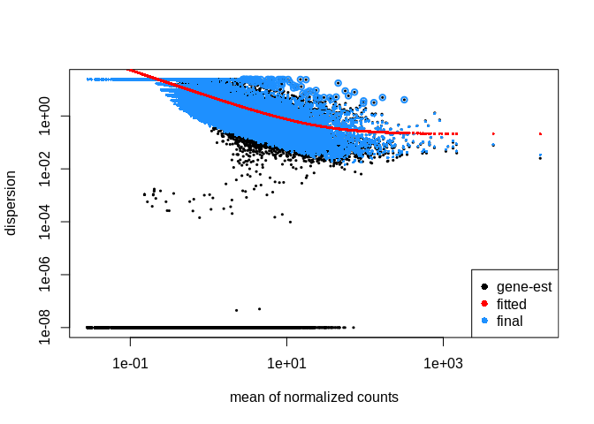
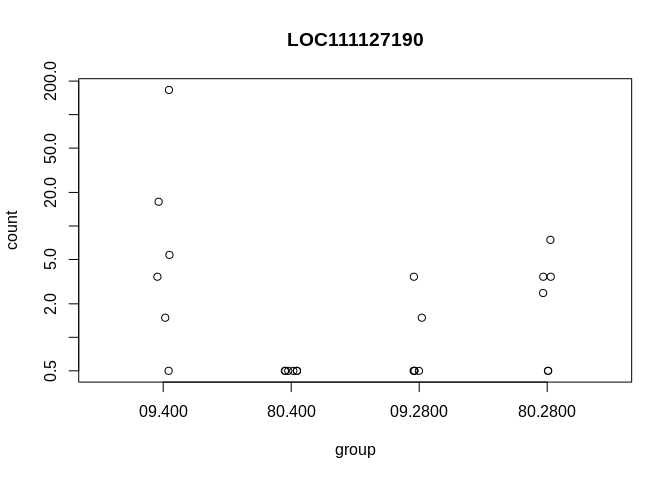
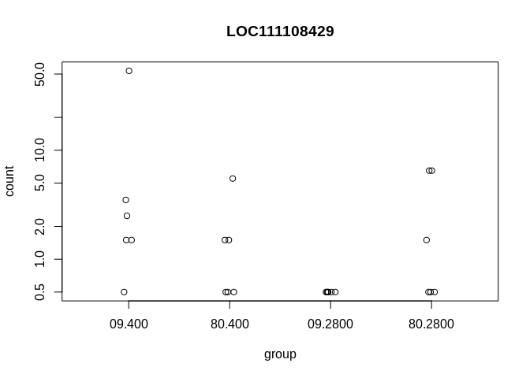
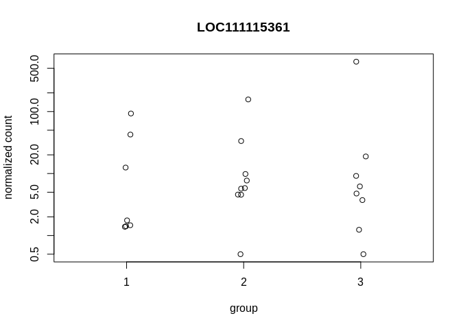

  


## About DESeq  

The DESeq2 model and all the steps taken in the software are described in detail in our publication ([Love, Huber, and Anders 2014](https://genomebiology.biomedcentral.com/articles/10.1186/s13059-014-0550-8)), and we include the formula and descriptions in this section as well. The differential expression analysis in DESeq2 uses a generalized linear model of the form:
$$K_{ij} \sim NB(\mu_{ij},\alpha_i$$  
$$\mu_{ij}=s_jq_{ij}$$  
$$log_2(q_{ij})=x_j\beta_i$$
where counts $K_{ij}$ for gene $i$, sample $j$ are modeled using a negative binomial distribution with fitted mean $\mu_{ij}$ and a gene-specific dispersion parameter $\alpha_i$. The fitted mean is composed of a sample-specific size factor $s_j$ and a parameter $q_{ij}$ proportional to the expected true concentration of fragments for sample $j$. The coefficients $\beta_i$ give the log2 fold changes for gene i for each column of the model matrix $X$. Note that the model can be generalized to use sample- and gene-dependent normalization factors $s_{ij}$.  
  
The dispersion parameter $\alpha_i$ defines the relationship between the variance of the observed count and its mean value. In other words, how far do we expected the observed count will be from the mean value, which depends both on the size factor $s_j$ and the covariate-dependent part $q_{ij}$ as defined above.  
$$Var(K_{ij})=E[(K_{ij}-u_{ij})^2] = u_ij + \alpha_i\mu^2_{ij}$$  
An option in DESeq2 is to provide maximum a posteriori estimates of the log2 fold changes in $\beta_i$ after incorporating a zero-centered Normal prior (```betaPrior```). While previously, these moderated, or shrunken, estimates were generated by DESeq or ```nbinomWaldTest``` functions, they are now produced by the ```lfcShrink``` function. Dispersions are estimated using expected mean values from the maximum likelihood estimate of log2 fold changes, and optimizing the Cox-Reid adjusted profile likelihood, as first implemented for RNA-seq data in edgeR (Cox and Reid 1987,edgeR_GLM). The steps performed by the DESeq function are documented in its manual page ```?DESeq```; briefly, they are:

* estimation of size factors $s_j$ by ```estimateSizeFactors```
* estimation of dispersion $\alpha_i$ by ```estimateDispersions```
* negative binomial GLM fitting for $\beta_i$ and Wald statistics by ```nbinomWaldTest```

Description from the [```DESeq``` manual](https://www.bioconductor.org/packages/devel/bioc/vignettes/DESeq2/inst/doc/DESeq2.html#interactions)

**Data**  

  
## Filtered (non-normalized data)  
  
**Full Model** - Lane, Pop, Treatment, Time, Treatment:Time as factors  

```r
# Full Model
filtered_full <- DESeqDataSetFromMatrix(countData = cts,
                              colData = coldata,
                              design = ~ Lane + Pop + Treatment + Time + Treatment:Time)
dds_filtered_full <- DESeq(filtered_full)
```

```
## estimating size factors
```

```
## estimating dispersions
```

```
## gene-wise dispersion estimates
```

```
## mean-dispersion relationship
```

```
## final dispersion estimates
```

```
## fitting model and testing
```

```r
# Interaction
res_filtered_full <- results(dds_filtered_full)
summary(res_filtered_full)
```

```
## 
## out of 9009 with nonzero total read count
## adjusted p-value < 0.1
## LFC > 0 (up)       : 1, 0.011%
## LFC < 0 (down)     : 0, 0%
## outliers [1]       : 0, 0%
## low counts [2]     : 0, 0%
## (mean count < 2)
## [1] see 'cooksCutoff' argument of ?results
## [2] see 'independentFiltering' argument of ?results
```

```r
# Time
res_filtered_full_Time <- results(dds_filtered_full,contrast=c("Time","09","80"))
summary(res_filtered_full_Time)
```

```
## 
## out of 9009 with nonzero total read count
## adjusted p-value < 0.1
## LFC > 0 (up)       : 0, 0%
## LFC < 0 (down)     : 0, 0%
## outliers [1]       : 0, 0%
## low counts [2]     : 0, 0%
## (mean count < 2)
## [1] see 'cooksCutoff' argument of ?results
## [2] see 'independentFiltering' argument of ?results
```

```r
# Treatment
res_filtered_full_Treatment <- results(dds_filtered_full,contrast=c("Treatment","400","2800"))
summary(res_filtered_full_Treatment)
```

```
## 
## out of 9009 with nonzero total read count
## adjusted p-value < 0.1
## LFC > 0 (up)       : 0, 0%
## LFC < 0 (down)     : 0, 0%
## outliers [1]       : 0, 0%
## low counts [2]     : 0, 0%
## (mean count < 2)
## [1] see 'cooksCutoff' argument of ?results
## [2] see 'independentFiltering' argument of ?results
```

```r
# Pop
res_filtered_full_Pop <- results(dds_filtered_full,contrast=c("Pop","1","2"))
summary(res_filtered_full_Pop)
```

```
## 
## out of 9009 with nonzero total read count
## adjusted p-value < 0.1
## LFC > 0 (up)       : 1, 0.011%
## LFC < 0 (down)     : 8, 0.089%
## outliers [1]       : 0, 0%
## low counts [2]     : 0, 0%
## (mean count < 2)
## [1] see 'cooksCutoff' argument of ?results
## [2] see 'independentFiltering' argument of ?results
```

```r
# Lane
res_filtered_full_Lane <- results(dds_filtered_full,contrast=c("Lane","1","2"))
summary(res_filtered_full_Lane)
```

```
## 
## out of 9009 with nonzero total read count
## adjusted p-value < 0.1
## LFC > 0 (up)       : 1, 0.011%
## LFC < 0 (down)     : 8, 0.089%
## outliers [1]       : 0, 0%
## low counts [2]     : 6812, 76%
## (mean count < 12)
## [1] see 'cooksCutoff' argument of ?results
## [2] see 'independentFiltering' argument of ?results
```
  
**Just Fixed Factor Model** - Treatment, Time, Treatment:Time as factors  

```r
# Model with just fixed factors
filtered_fixed <- DESeqDataSetFromMatrix(countData = cts,
                              colData = coldata,
                              design = ~ Treatment + Time + Treatment:Time)
dds_filtered_fixed <- DESeq(filtered_fixed,test="LRT",reduced=~Time)
```

```
## estimating size factors
```

```
## estimating dispersions
```

```
## gene-wise dispersion estimates
```

```
## mean-dispersion relationship
```

```
## final dispersion estimates
```

```
## fitting model and testing
```

```r
#Interaction
res_filtered_fixed <- results(dds_filtered_fixed)
summary(res_filtered_fixed)
```

```
## 
## out of 9009 with nonzero total read count
## adjusted p-value < 0.1
## LFC > 0 (up)       : 0, 0%
## LFC < 0 (down)     : 0, 0%
## outliers [1]       : 0, 0%
## low counts [2]     : 0, 0%
## (mean count < 2)
## [1] see 'cooksCutoff' argument of ?results
## [2] see 'independentFiltering' argument of ?results
```

```r
# Time
res_filtered_fixed_Time <- results(dds_filtered_fixed,contrast=c("Time","09","80"))
summary(res_filtered_full_Time)
```

```
## 
## out of 9009 with nonzero total read count
## adjusted p-value < 0.1
## LFC > 0 (up)       : 0, 0%
## LFC < 0 (down)     : 0, 0%
## outliers [1]       : 0, 0%
## low counts [2]     : 0, 0%
## (mean count < 2)
## [1] see 'cooksCutoff' argument of ?results
## [2] see 'independentFiltering' argument of ?results
```

```r
# Treatment
res_filtered_fixed_Treatment <- results(dds_filtered_fixed,contrast=c("Treatment","400","2800"))
summary(res_filtered_full_Treatment)
```

```
## 
## out of 9009 with nonzero total read count
## adjusted p-value < 0.1
## LFC > 0 (up)       : 0, 0%
## LFC < 0 (down)     : 0, 0%
## outliers [1]       : 0, 0%
## low counts [2]     : 0, 0%
## (mean count < 2)
## [1] see 'cooksCutoff' argument of ?results
## [2] see 'independentFiltering' argument of ?results
```

```r
#Applying Shrinkage Terms -Ashr
#Interaction
Ashr_filtered_fixed <- lfcShrink(dds_filtered_fixed, coef=2, type="ashr")
```

```
## using 'ashr' for LFC shrinkage. If used in published research, please cite:
##     Stephens, M. (2016) False discovery rates: a new deal. Biostatistics, 18:2.
##     https://doi.org/10.1093/biostatistics/kxw041
```

```r
summary(Ashr_filtered_fixed)
```

```
## 
## out of 9009 with nonzero total read count
## adjusted p-value < 0.1
## LFC > 0 (up)       : 0, 0%
## LFC < 0 (down)     : 0, 0%
## outliers [1]       : 0, 0%
## low counts [2]     : 0, 0%
## (mean count < 2)
## [1] see 'cooksCutoff' argument of ?results
## [2] see 'independentFiltering' argument of ?results
```

```r
#Treatment
Ashr_filtered_fixed_Treatment <- lfcShrink(dds_filtered_fixed, coef=2, type="ashr",contrast = c("Treatment","400","2800"))
```

```
## using 'ashr' for LFC shrinkage. If used in published research, please cite:
##     Stephens, M. (2016) False discovery rates: a new deal. Biostatistics, 18:2.
##     https://doi.org/10.1093/biostatistics/kxw041
```

```r
summary(Ashr_filtered_fixed_Treatment)
```

```
## 
## out of 9009 with nonzero total read count
## adjusted p-value < 0.1
## LFC > 0 (up)       : 0, 0%
## LFC < 0 (down)     : 0, 0%
## outliers [1]       : 0, 0%
## low counts [2]     : 0, 0%
## (mean count < 2)
## [1] see 'cooksCutoff' argument of ?results
## [2] see 'independentFiltering' argument of ?results
```
  
## Full Gene Count Matrix
  
**Full Model** - Lane, Pop, Treatment, Time, Treatment:Time as factors  

```r
whole_full <- DESeqDataSetFromMatrix(countData = GeneCounts,
                              colData = coldata,
                              design = ~ Lane + Pop + Treatment + Time + Treatment:Time)
dds_whole_full <- DESeq(whole_full)
```

```
## estimating size factors
```

```
## estimating dispersions
```

```
## gene-wise dispersion estimates
```

```
## mean-dispersion relationship
```

```
## final dispersion estimates
```

```
## fitting model and testing
```

```r
# Diagnostic Plots
## Dispersion Plot
plotDispEsts(dds_whole_full)
```

<!-- -->

```r
# Interaction
res_whole_full <- results(dds_whole_full)
summary(res_whole_full)
```

```
## 
## out of 35338 with nonzero total read count
## adjusted p-value < 0.1
## LFC > 0 (up)       : 182, 0.52%
## LFC < 0 (down)     : 109, 0.31%
## outliers [1]       : 0, 0%
## low counts [2]     : 3407, 9.6%
## (mean count < 0)
## [1] see 'cooksCutoff' argument of ?results
## [2] see 'independentFiltering' argument of ?results
```

```r
ordered_val_full <- order(res_whole_full$padj)
plotCounts(dds_whole_full, gene=ordered_val_full[1], intgroup="SFV",normalized = FALSE)
```

<!-- -->

```r
# Treatment
res_whole_full_Treatment <- results(dds_whole_full,contrast=c("Treatment","400","2800"))
summary(res_whole_full_Treatment)
```

```
## 
## out of 35338 with nonzero total read count
## adjusted p-value < 0.1
## LFC > 0 (up)       : 243, 0.69%
## LFC < 0 (down)     : 132, 0.37%
## outliers [1]       : 0, 0%
## low counts [2]     : 1273, 3.6%
## (mean count < 0)
## [1] see 'cooksCutoff' argument of ?results
## [2] see 'independentFiltering' argument of ?results
```

```r
ordered_val_treatment <- order(res_whole_full_Treatment$padj)
plotCounts(dds_whole_full, gene=ordered_val_treatment[1], intgroup="SFV",normalized = FALSE)
```

<!-- -->
  
**Just Fixed Factor Model** - Treatment, Time, Treatment:Time as factors  

```r
whole_fixed <- DESeqDataSetFromMatrix(countData = GeneCounts,
                              colData = coldata,
                              design = ~ Treatment + Time + Treatment:Time)
dds_whole_fixed <- DESeq(whole_fixed)
```

```
## estimating size factors
```

```
## estimating dispersions
```

```
## gene-wise dispersion estimates
```

```
## mean-dispersion relationship
```

```
## final dispersion estimates
```

```
## fitting model and testing
```

```r
res_whole_fixed <- results(dds_whole_fixed)
summary(res_whole_fixed)
```

```
## 
## out of 35338 with nonzero total read count
## adjusted p-value < 0.1
## LFC > 0 (up)       : 4, 0.011%
## LFC < 0 (down)     : 1, 0.0028%
## outliers [1]       : 493, 1.4%
## low counts [2]     : 0, 0%
## (mean count < 0)
## [1] see 'cooksCutoff' argument of ?results
## [2] see 'independentFiltering' argument of ?results
```

```r
plotCounts(dds_whole_fixed, gene=which.min(res_whole_fixed$padj), intgroup="Pop")
```

<!-- -->
  
