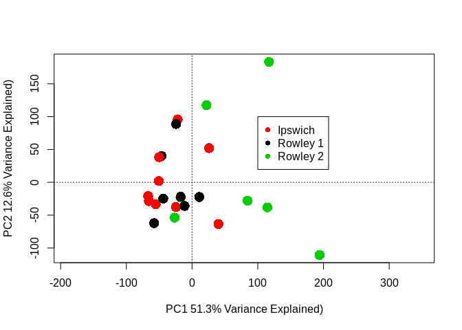
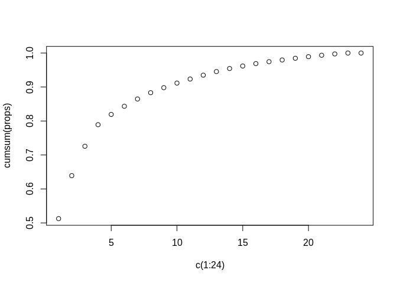
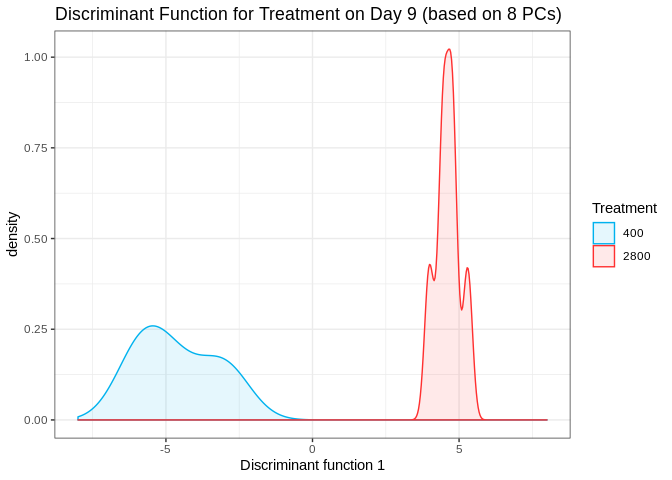
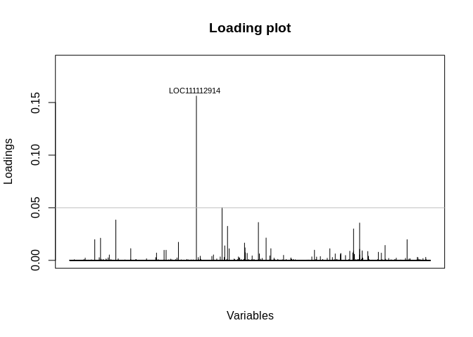
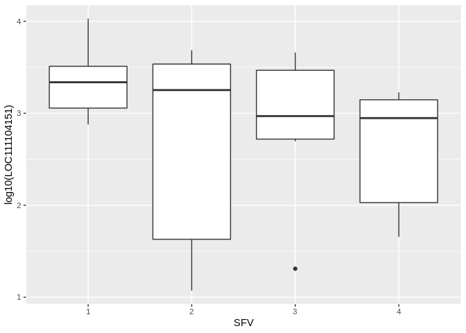
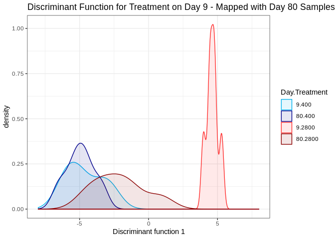
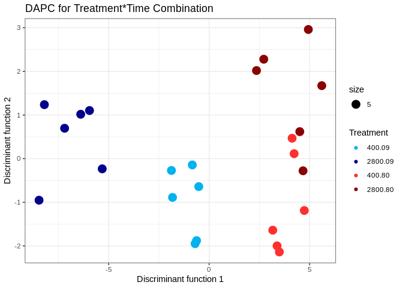
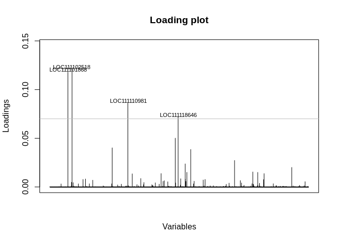

## **Script Description**  

**Brief Overview** : This script performs a series of basic multivariate approaches to explore the whole genome expression profiles of the 24 oyster RNAseq samples. In partiular this includes:
* A permanova (implemented in the package vegan, called adonis)  
* An RDA (implemented in vegan)
* A DAPC with a focus on treatment(implemented in adegenet)

## **Data**  

Steps:  
* Read in dataframe with metadata for each samples including, treatment, time, population, lane of sequencing, and variable that contains each unique combination level between treatment and time.  
* Read in gene (or transcript) abundance matrix generated from the '01_salmon_countMatrix.Rmd' script.  
* Remove uninformative genes from count matrix.  


```r
## Meta Data for the Model
model<-read.csv("/home/downeyam/Github/2017OAExp_Oysters/input_files/RNA/metadata_cvirginica_rna_meta.txt", header=TRUE)
model$Treatment <- as.factor(model$treatment)
model$Time <- as.character(model$timepoint)
model$Time[model$Time == "3"] <- "09"
model$Time[model$Time == "6"] <- "80"
model$Time <- as.factor(model$Time)
model$Pop <- as.factor(model$population)
model$Lane <- as.factor(model$lane)
model$SFV <-  interaction(model$Time,model$Treatment) # Creates single factor variable for combination of time and treatment

gc <- readRDS("/home/downeyam/Github/2017OAExp_Oysters/input_files/RNA/salmon_pipeline/run20190610/geneMatrixAbundance_default.RData")
#gc <- gc[-c(1:205),] #removing some no LOC genes (most trna)
```

## PERMANOVA (implements using adonis from vegan package)

* Testing for statistic differential between treatment, time, and treatment:time  


```r
(out <- adonis(t(gc)~Treatment*Time+Pop+Lane,data=model,permutations = 5000))
```

```
## 
## Call:
## adonis(formula = t(gc) ~ Treatment * Time + Pop + Lane, data = model,      permutations = 5000) 
## 
## Permutation: free
## Number of permutations: 5000
## 
## Terms added sequentially (first to last)
## 
##                Df SumsOfSqs  MeanSqs F.Model      R2    Pr(>F)    
## Treatment       1   0.03153 0.031529 1.43924 0.05710 0.0333933 *  
## Time            1   0.04806 0.048058 2.19378 0.08704 0.0003999 ***
## Pop             2   0.05248 0.026240 1.19783 0.09505 0.0919816 .  
## Lane            1   0.02773 0.027730 1.26584 0.05022 0.0853829 .  
## Treatment:Time  1   0.01992 0.019918 0.90922 0.03607 0.6442711    
## Residuals      17   0.37241 0.021906         0.67450              
## Total          23   0.55213                  1.00000              
## ---
## Signif. codes:  0 '***' 0.001 '**' 0.01 '*' 0.05 '.' 0.1 ' ' 1
```

## Plotting data with RDA  

### Plot in multivariate space with RDA (treatment and time)

```r
prin_comp<-rda(t(gc), scale=FALSE)
sum_pri <- summary(prin_comp)
pca_scores<-scores(prin_comp)

pca <- prcomp(t(gc))
eigs <- pca$sdev^2

head(sum_pri$species)
```

```
##                        PC1           PC2          PC3           PC4
## LOC111099029 -2.382980e-03 -1.306844e-05 2.682298e-03  2.178992e-03
## LOC111099030 -5.160989e-01 -4.446035e-01 8.254272e-01 -1.272561e+00
## LOC111099031  1.110952e-04  2.084359e-04 1.220995e-04  1.314414e-04
## LOC111099032  5.672436e-05  1.452482e-04 4.228419e-05  1.091941e-05
## LOC111099033 -5.246618e-02 -2.340208e-02 2.086646e-02 -5.228106e-02
## LOC111099034 -1.716876e-03  3.243520e-03 4.940142e-03  2.549189e-03
##                        PC5           PC6
## LOC111099029 -1.498076e-03  3.702898e-04
## LOC111099030  2.110372e-01 -4.668311e-01
## LOC111099031  1.025203e-04 -2.404532e-04
## LOC111099032 -3.892466e-06 -2.459393e-05
## LOC111099033 -2.464362e-02 -9.654350e-03
## LOC111099034  2.450725e-03 -4.195273e-04
```

```r
color_comb <- c("deepskyblue2","blue4","firebrick1","darkred") # colors for population 
model$colors <- "" 
model$colors[model$SFV == unique(model$SFV)[1]] <-  color_comb[2]
model$colors[model$SFV == unique(model$SFV)[2]] <-  color_comb[1]
model$colors[model$SFV == unique(model$SFV)[3]] <-  color_comb[4]
model$colors[model$SFV == unique(model$SFV)[4]] <-  color_comb[3]

ordiplot(prin_comp,type="n",
         xlab=paste0("PC1 ",round(eigs[1] / sum(eigs)*100,1),"% Variance Explained)"),
         ylab=paste0("PC2 ",round(eigs[2] / sum(eigs)*100,1),"% Variance Explained)"))
orditorp(prin_comp,display="sites",labels = FALSE,col=model$colors,cex = 2,pch = 16,)
#ordiellipse(prin_comp,model$SFV,conf=0.90,col = color_comb,lwd = 3)
ordispider(prin_comp,model$SFV,col = color_comb,lwd=2.5)
legend(x=100,y=150,legend = c("Day09_Control","Day80_Control","Day09_OA","Day80_OA"),pch = 16,col=color_comb,xpd = .25)
text(x = -538 ,y = -300, paste0("Adonis P_Treatment = ",out$aov.tab$`Pr(>F)`[1],"*"))
text(x = -550 ,y = -360, paste0("Adonis P_Duration = ",out$aov.tab$`Pr(>F)`[2],"*"))
text(x = -540 ,y = -420, paste0("Adonis P_Interaction = ",out$aov.tab$`Pr(>F)`[5]))
```

<!-- -->

### Plot colored by population  

```r
ordiplot(prin_comp,type="n",
         xlab=paste0("PC1 ",round(eigs[1] / sum(eigs)*100,1),"% Variance Explained)"),
         ylab=paste0("PC2 ",round(eigs[2] / sum(eigs)*100,1),"% Variance Explained)"))
orditorp(prin_comp,display="sites",labels = FALSE,col=model$Pop,cex = 2,pch = 16)
legend(x=100,y=100,legend = c("Ipswich","Rowley 1","Rowley 2"),pch = 16,col=unique(model$Pop),xpd = .25)
```

<!-- -->
  
### Cumulative Variance Plot  

```r
out <- prcomp(t(gc))
vars <- apply(out$x, 2, var)  
props <- vars / sum(vars)
cumsum(props)
```

```
##       PC1       PC2       PC3       PC4       PC5       PC6       PC7 
## 0.5126111 0.6390950 0.7256155 0.7890958 0.8193021 0.8433486 0.8647353 
##       PC8       PC9      PC10      PC11      PC12      PC13      PC14 
## 0.8832903 0.8980497 0.9116143 0.9235074 0.9348894 0.9454728 0.9544352 
##      PC15      PC16      PC17      PC18      PC19      PC20      PC21 
## 0.9618096 0.9688719 0.9745486 0.9796556 0.9846408 0.9892511 0.9934741 
##      PC22      PC23      PC24 
## 0.9973135 1.0000000 1.0000000
```

```r
plot(cumsum(props)~c(1:24))
```

<!-- -->

### TWO STEP DAPC: first create discriminant function from TP 9 samples and predict coordinates on df for day 80 samples.  
  
**Creating DF by treatment with first timepoint**  

```r
early_time_counts <- gc[,model$Day == 9]
early_time_meta <- model[model$Day == 9,]

dapc_treatment_10<-dapc(t(early_time_counts),early_time_meta$treatment,n.pca=9,n.da=2)
# PCs = 8
# clusters = 1
early_time_meta$dt <- unlist(dapc_treatment_10$ind.coord[,1])

ggplot(early_time_meta,aes(dt,fill=as.factor(treatment),colour=as.factor(treatment))) + 
  geom_density(alpha=0.1) + xlim(-8,8) + 
  labs(title="Discriminant Function for Treatment on Day 9 (based on 8 PCs)",
       x="Discriminant function 1",
       colour="Treatment",
       fill="Treatment") +
  theme_bw() +
  scale_color_manual(values=c("deepskyblue2","firebrick1")) +
  scale_fill_manual(values=c("deepskyblue2","firebrick1"))
```

<!-- -->

Looking at which genes are driving the patterns between the two treatments

```r
contrib_treatment <- loadingplot(dapc_treatment_10$var.contr, axis=1,thres=.05, lab.jitter=1)
```

<!-- -->

Looking at the most important locus based on loading

```r
head(gc)
```

```
##                   [,1]      [,2]      [,3]      [,4]      [,5]      [,6]
## LOC111099029  0.054836  0.767837  0.337342  1.408132  0.082930  1.299018
## LOC111099030  6.695107 25.213291 34.216294  3.212135 10.691542  0.933617
## LOC111099031  0.000000  0.000000  0.000000  0.088730  0.000000  0.000000
## LOC111099032  0.000000  0.000000  0.000000  0.000000  0.000000  0.000000
## LOC111099033 17.536455 22.374482 27.361933 17.316606  8.783201 26.868817
## LOC111099034  1.764882  2.765377  3.294622  6.811804  3.376154  1.639565
##                    [,7]      [,8]      [,9]     [,10]     [,11]     [,12]
## LOC111099029   0.653362  0.873550  0.121886  0.094046  0.157326  0.113211
## LOC111099030 524.413133  9.721098 19.706508 18.265789 11.159106 48.140014
## LOC111099031   0.109216  0.000000  0.000000  0.000000  0.099033  0.000000
## LOC111099032   0.000000  0.000000  0.000000  0.000000  0.000000  0.000000
## LOC111099033  31.945709 15.886561 18.421057 29.181587 16.585032 23.137739
## LOC111099034   0.887531  2.700555  2.937747  1.851594  4.585605  2.187277
##                  [,13]     [,14]     [,15]     [,16]     [,17]     [,18]
## LOC111099029  0.805138  0.726133  2.732844  0.686248  1.771646  1.388055
## LOC111099030 19.564730  0.000000 16.614260 15.731977  8.408947 49.265429
## LOC111099031  0.000000  0.111825  0.000000  0.096927  0.000000  0.000000
## LOC111099032  0.000000  0.000000  0.000000  0.000000  0.000000  0.071519
## LOC111099033 20.205813 22.588256 43.048526 26.605817 55.988860 63.276103
## LOC111099034  2.335114  1.709982  1.347847  3.182730  2.436358  1.336849
##                  [,19]     [,20]      [,21]     [,22]     [,23]     [,24]
## LOC111099029  0.676043  1.090882   0.926567  1.137421  0.822404  0.447358
## LOC111099030 52.788268  0.812123 481.744177 19.835379 33.477649 23.852491
## LOC111099031  0.000000  0.119368   0.000000  0.110053  0.000000  0.000000
## LOC111099032  0.000000  0.000000   0.000000  0.080701  0.000000  0.000000
## LOC111099033 13.998843 15.709347  39.437150 10.269010 16.232932 21.846089
## LOC111099034  1.107921  1.748140   3.739886  3.460239  2.839911  2.782818
```

```r
gc_majorLoading <- gc[row.names(gc) == "LOC111102518",]
majorLoading_counts <- as.data.frame(cbind(Trt=model$Treatment,Time=model$Time,SFV=model$SFV,Pop=model$Pop,(LOC111104151=gc_majorLoading)))

ggplot(majorLoading_counts,aes(x=as.factor(SFV),y=log10(LOC111104151))) + geom_boxplot() + 
  labs(x= c("SFV"))
```

<!-- -->

**Mapping Day 80 samples**  

```r
late_time_counts <- gc[,model$Day == 80]
late_time_meta <- model[model$Day == 80,]

predict_values <- predict.dapc(dapc_treatment_10,t(late_time_counts))
late_time_meta$dt <-unlist(predict_values$ind.scores[,1])

whole_meta<- rbind(early_time_meta,late_time_meta)

ggplot(whole_meta,aes(dt,fill=as.factor(interaction(Day,treatment)),colour=as.factor(interaction(Day,treatment)))) + 
  geom_density(alpha=0.1) + xlim(-8,8) + 
  labs(title="Discriminant Function for Treatment on Day 9 - Mapped with Day 80 Samples",
       x="Discriminant function 1",
       colour="Day.Treatment",
       fill="Day.Treatment") +
  theme_bw() +
  scale_color_manual(values=c("deepskyblue2","blue4","firebrick1","darkred")) +
  scale_fill_manual(values=c("deepskyblue2","blue4","firebrick1","darkred"))
```

<!-- -->

### DAPC based on combined time*treatment factor  
  
**Creating DF by treatment with first timepoint**  

```r
dapc_SFV_10<-dapc(t(gc),model$SFV,n.pca=8,n.da=3)
# PCs = 10
# clusters = 3
output <- data.frame(Trt=model$Treatment,Time=model$Time,dapc_SFV_10$ind.coord)

ggplot(output,aes(x=LD1,y=LD2,fill=as.factor(interaction(Trt,Time)),colour=as.factor(interaction(Trt,Time)))) + 
  geom_point(aes(size=5)) + #geom_density(alpha=0.1) + #xlim(-28,28) + 
  labs(title="DAPC for Treatment*Time Combination",
       x="Discriminant function 1",
       y="Discriminant function 2",
       colour="Treatment",
       fill="Treatment") +
    theme_bw() +
  scale_color_manual(values=c("deepskyblue2","blue4","firebrick1","darkred")) +
  scale_fill_manual(values=c("deepskyblue2","blue4","firebrick1","darkred"))
```

<!-- -->

Looking at contribution of individual genes

```r
contrib_SFV <- loadingplot(dapc_SFV_10$var.contr, axis=2,thres=.07, lab.jitter=1)
```

<!-- -->
