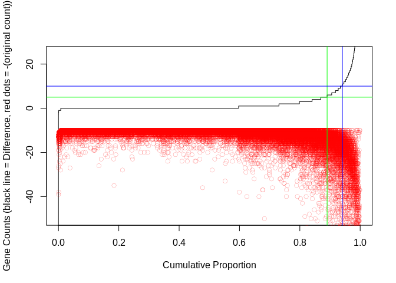
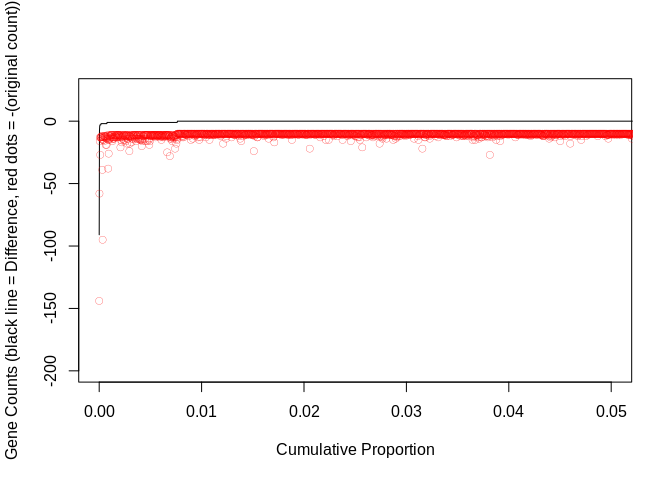
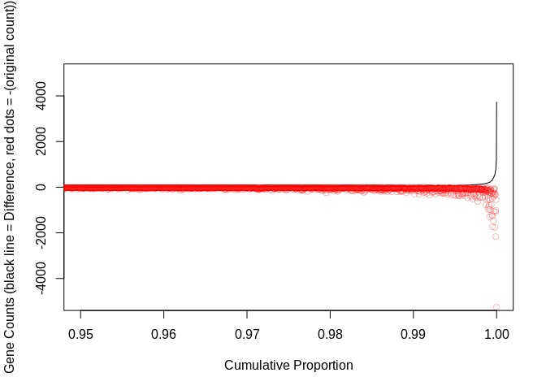

### Simple Descriptive Stats  

Number of Counts in Original Run

```r
sum(smallCount$GeneCounts.RNA17005)
```

```
## [1] 185575
```

Number of Counts in Rerun

```
## [1] 307545
```

**Wow over 100k more counts in the rerun**

### Plots  

**Looking at ALL loci**

```r
# 
plot(merged$diff[order(merged$diff)]~ 
       seq(0,1, length=39003),ylim=c(-50,25),type="l",xlab="Cumulative Proportion",ylab="Gene Counts (black line = Difference, red dots = -(original count))")
points(c(-(merged$GeneCounts.RNA17005[order(merged$diff)])-10)~
         seq(0,1, length=39003),col="red",lwd=.2)
abline(h=5,col="green")
abline(v=((39003-sum(merged$diff > 5))/39003),col="green")
abline(h=10,col="blue")
abline(v=((39003-sum(merged$diff > 10))/39003),col="blue")
```

<!-- -->
  
**Just those with positive difference in the upper 5%**  

```r
plot(merged$diff[order(merged$diff)]~ 
       seq(0,1, length=39003),ylim=c(-200,25),xlim=c(0,0.05),type="l",
     xlab="Cumulative Proportion",ylab="Gene Counts (black line = Difference, red dots = -(original count))")
points(c(-(merged$GeneCounts.RNA17005[order(merged$diff)])-10)~
         seq(0,1, length=39003),col="red",lwd=.25)
```

<!-- -->

**Just those with negative difference in the lower 5%**  

```r
plot(merged$diff[order(merged$diff)]~ 
       seq(0,1, length=39003),ylim=c(-5000,5000),xlim=c(.95,1),type="l",
     xlab="Cumulative Proportion",ylab="Gene Counts (black line = Difference, red dots = -(original count))")
points(c(-(merged$GeneCounts.RNA17005[order(merged$diff)])-10)~
         seq(0,1, length=39003),col="red",lwd=.25)
```

<!-- -->
