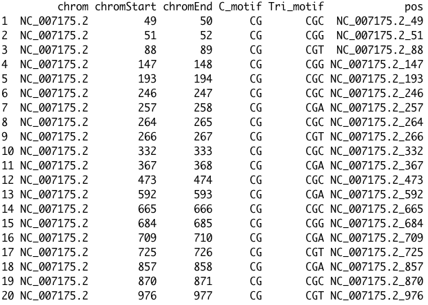

## Comparing Yaamini's gonad data (From 2016) with Alan's mantle data (from 2017)

There are two issues. The first issue is that they did not convert the position output from Bismark in the same way. 

*Issue 1:* Yaamini has methylation calls in subsequent locations (e.g. 47-48 and 48-49, 49-50 and 50-51 etc.). 
My guess is that this is either not destranded data or there is some error here. This is true for every subset of data
I checked. There are also weird patterns of coverage for these pairs.

*Issue 2:* Different start positions for Alan and Yaamini's data.

Alan defaulted to having the start position for the cytosine on the positive strand. 
So for example, Alan has a methylation call at 88-89, but how should this correspond to Yaamini's pair 86-87 and 87-88?

### Example Yaamini gonad data

### Example Alan Mantle data

