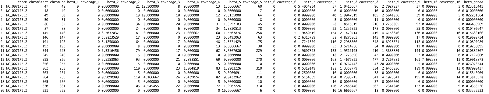

## Comparing Yaamini's gonad data (From 2016) with Alan's mantle data (from 2017)

There are two issues. The first issue is that they did not convert the position output from Bismark in the same way. 

*Issue 1:* Yaamini has methylation calls in subsequent locations (e.g. 47-48 and 48-49, 49-50 and 50-51 etc.). 
My guess is that this is either not destranded data or there is some error here. This is true for every subset of data
I checked. There are also weird patterns of coverage for these pairs.

*Issue 2:* Different start positions for Alan and Yaamini's data.

Alan defaulted to having the start position for the cytosine on the positive strand. 
So for example, Alan has a methylation call at 88-89, but how should this correspond to Yaamini's pair 86-87 and 87-88?

### Example Yaamini gonad data


### Example Alan Mantle data


### Description of Alans approach
Full summary located here: https://github.com/epigeneticstoocean/2017OAExp_Oysters/tree/master/markdown_files/DNAm


**In brief Alan**
* Raw reads went underwent standard trimming and quality control. This should match what Yaamini did when prepping her stuff.
* Next I ran bismark using a reference genome prepared using `bowtie2` and the most recent (at the time) version of the genome `GCF_002022765.2_C_virginica-3.0_genomic`. This was also used for all downstream steps that required the genome reference.
    * One thing that might be different was the choice for mapping stringency. I choose `--score_min L,0,-0.8`. However, this should not impact the number of cytosines included in the final downstream file generated by bismark (which should include all cyostines regardless of coverage).
* After mapping with bismark, I took the coverage files it generates for each sample (e.g. `XXXX_deduplicated.bismark.cov.gz`) and used the `coverage2cytosine` program to create a single coverage file for all cytosines in the genome for a single sample.
    * Sample code: 
    ```coverage2cytosine ${i} \
                        --genome_folder $genome \
                        --dir $out \
                        -o ${file}_CytoSummary
    ```
* Lastly I used a short R script - [link here](https://github.com/epigeneticstoocean/2017OAExp_Oysters/blob/master/markdown_files/DNAm/cluster_scripts/R/04_countMatrixFromCytoSummary.R) - to destrand the cytosines and sum the coverage for paired cytosines located in the same CpG.


**In brief Yaamini**
Here's the code I used to generate the data: https://github.com/fish546-2018/yaamini-virginica/blob/master/notebooks/2019-03-07-Generating-Coverage-Tracks.ipynb

Re: the difference between your data and mine. Gut feeling is that I destranded within methylKit, so I think the files I sent Katie would still be stranded.


