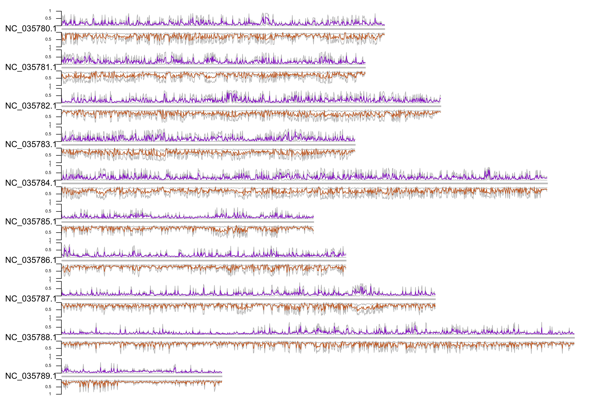

## Preliminary Results comparing gonad and mantle

The code for this is found in 2017OAExp_Oysters/markdown_files/compareGonadMantle

Briefly, statistics are averaged over 100KB windows. At this point Alan's and Yaamini's data are not lining up correctly, 
but that shouldn't effect these patterns.

The gonad data come from the 2016 experiment
The mantle data come from the 2017 experiment

