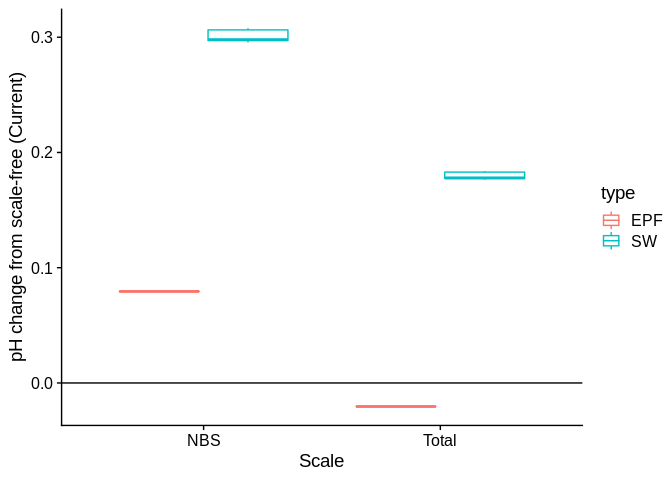
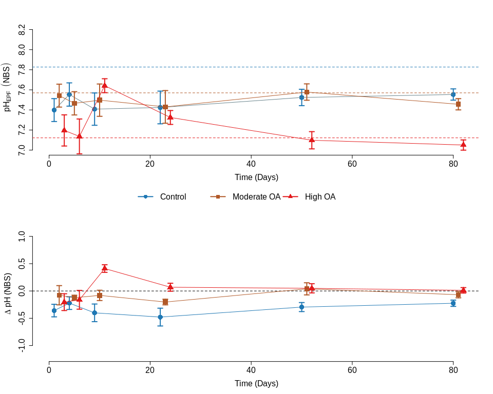
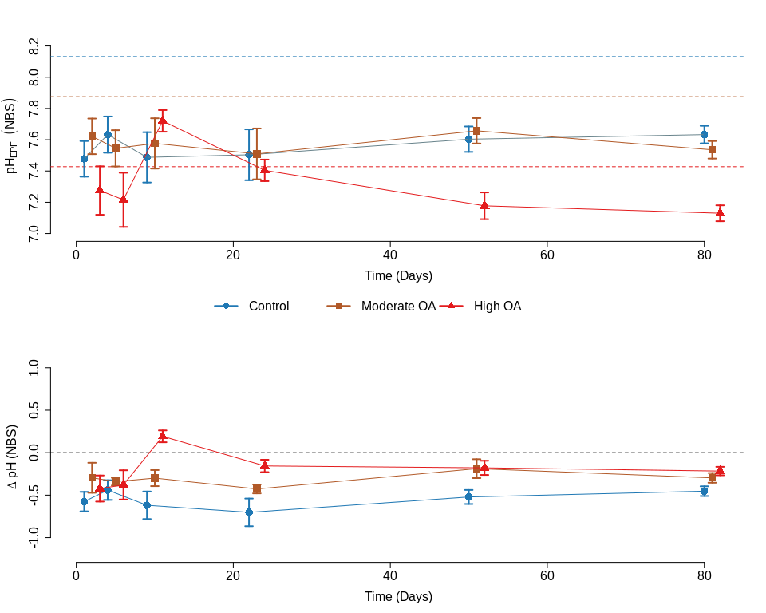
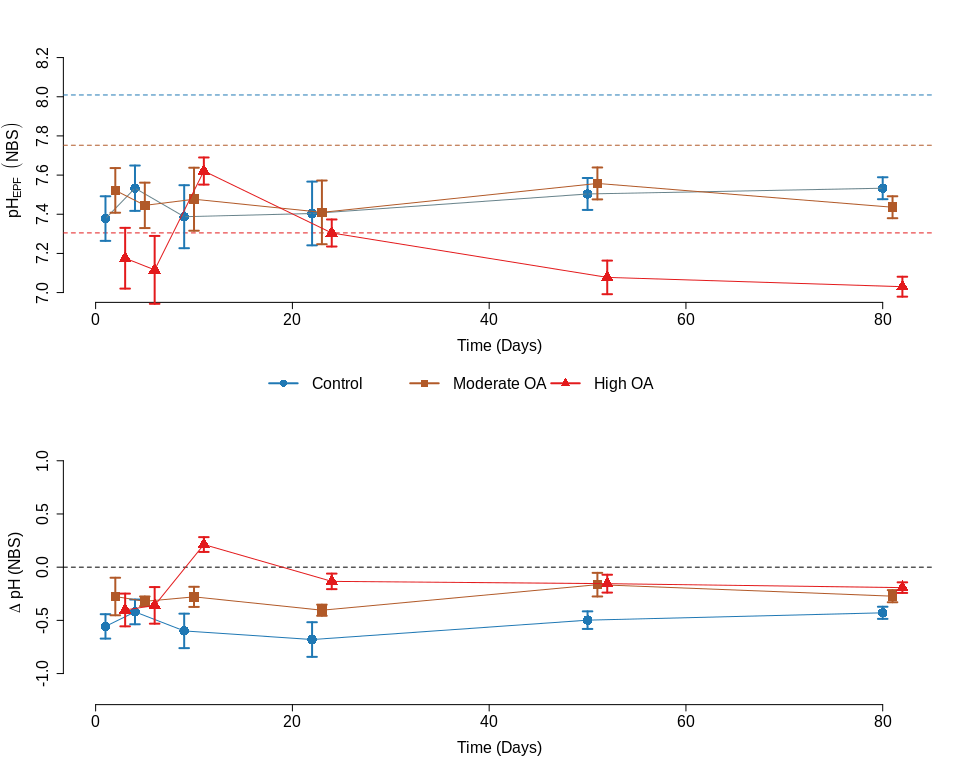

pH Calculation Comparison AE17 Experiment
================
Alan Downey-Wall
7/29/2020

**Overview** : The aim of this document is to compare the effect of
different pH scales and evaluate the impact of pH scale on the results
and interpretation of the AE17 adult exposure experiment.

**Reason** : The reason for the this exploration was due to the fact
that the EPF and seawater pH probes were measured with different
instruments, liquid junction and solid state, respectively. The offsets
among measuring instruments was not properly corrected, so below we
examine the impact of including this correction, specifically examining
the corrected SW and EPF pHs on the `Total`, `Seawater`, and `NBS`
scales.

## Data

<div style="border: 1px solid #ddd; padding: 0px; overflow-y: scroll; height:400px; overflow-x: scroll; width:110%; ">

<table class="table" style="margin-left: auto; margin-right: auto;">

<thead>

<tr>

<th style="text-align:center;position: sticky; top:0; background-color: #FFFFFF;">

ID

</th>

<th style="text-align:center;position: sticky; top:0; background-color: #FFFFFF;">

Date

</th>

<th style="text-align:center;position: sticky; top:0; background-color: #FFFFFF;">

Timepoint

</th>

<th style="text-align:center;position: sticky; top:0; background-color: #FFFFFF;">

TankID

</th>

<th style="text-align:center;position: sticky; top:0; background-color: #FFFFFF;">

EPF\_pH\_raw

</th>

<th style="text-align:center;position: sticky; top:0; background-color: #FFFFFF;">

EPF\_NBS\_pH

</th>

<th style="text-align:center;position: sticky; top:0; background-color: #FFFFFF;">

EPF\_Total\_pH

</th>

<th style="text-align:center;position: sticky; top:0; background-color: #FFFFFF;">

pH\_NBS\_2W

</th>

<th style="text-align:center;position: sticky; top:0; background-color: #FFFFFF;">

pH\_scaleFree\_2W

</th>

<th style="text-align:center;position: sticky; top:0; background-color: #FFFFFF;">

pH\_Total\_2W

</th>

</tr>

</thead>

<tbody>

<tr>

<td style="text-align:center;">

17001

</td>

<td style="text-align:center;">

2017-07-24

</td>

<td style="text-align:center;">

50

</td>

<td style="text-align:center;">

3

</td>

<td style="text-align:center;">

7.230326

</td>

<td style="text-align:center;">

7.309749

</td>

<td style="text-align:center;">

7.209893

</td>

<td style="text-align:center;">

8.132081

</td>

<td style="text-align:center;">

7.826920

</td>

<td style="text-align:center;">

8.009165

</td>

</tr>

<tr>

<td style="text-align:center;">

17007

</td>

<td style="text-align:center;">

2017-08-23

</td>

<td style="text-align:center;">

80

</td>

<td style="text-align:center;">

2

</td>

<td style="text-align:center;">

7.455280

</td>

<td style="text-align:center;">

7.534703

</td>

<td style="text-align:center;">

7.434846

</td>

<td style="text-align:center;">

8.080254

</td>

<td style="text-align:center;">

7.773297

</td>

<td style="text-align:center;">

7.956616

</td>

</tr>

<tr>

<td style="text-align:center;">

17008

</td>

<td style="text-align:center;">

2017-06-26

</td>

<td style="text-align:center;">

22

</td>

<td style="text-align:center;">

5

</td>

<td style="text-align:center;">

6.672414

</td>

<td style="text-align:center;">

6.751837

</td>

<td style="text-align:center;">

6.651980

</td>

<td style="text-align:center;">

8.209023

</td>

<td style="text-align:center;">

7.905406

</td>

<td style="text-align:center;">

8.086728

</td>

</tr>

<tr>

<td style="text-align:center;">

17011

</td>

<td style="text-align:center;">

2017-06-05

</td>

<td style="text-align:center;">

1

</td>

<td style="text-align:center;">

14

</td>

<td style="text-align:center;">

7.086372

</td>

<td style="text-align:center;">

7.165795

</td>

<td style="text-align:center;">

7.065939

</td>

<td style="text-align:center;">

7.924815

</td>

<td style="text-align:center;">

7.628215

</td>

<td style="text-align:center;">

7.805348

</td>

</tr>

<tr>

<td style="text-align:center;">

17012

</td>

<td style="text-align:center;">

2017-08-23

</td>

<td style="text-align:center;">

80

</td>

<td style="text-align:center;">

7

</td>

<td style="text-align:center;">

7.472591

</td>

<td style="text-align:center;">

7.552014

</td>

<td style="text-align:center;">

7.452157

</td>

<td style="text-align:center;">

7.825934

</td>

<td style="text-align:center;">

7.518599

</td>

<td style="text-align:center;">

7.702143

</td>

</tr>

<tr>

<td style="text-align:center;">

17013

</td>

<td style="text-align:center;">

2017-06-13

</td>

<td style="text-align:center;">

9

</td>

<td style="text-align:center;">

5

</td>

<td style="text-align:center;">

7.385796

</td>

<td style="text-align:center;">

7.465219

</td>

<td style="text-align:center;">

7.365362

</td>

<td style="text-align:center;">

8.106002

</td>

<td style="text-align:center;">

7.808190

</td>

<td style="text-align:center;">

7.986046

</td>

</tr>

<tr>

<td style="text-align:center;">

17019

</td>

<td style="text-align:center;">

2017-08-23

</td>

<td style="text-align:center;">

80

</td>

<td style="text-align:center;">

12

</td>

<td style="text-align:center;">

7.149452

</td>

<td style="text-align:center;">

7.228875

</td>

<td style="text-align:center;">

7.129018

</td>

<td style="text-align:center;">

7.350889

</td>

<td style="text-align:center;">

7.043793

</td>

<td style="text-align:center;">

7.227195

</td>

</tr>

<tr>

<td style="text-align:center;">

17020

</td>

<td style="text-align:center;">

2017-06-05

</td>

<td style="text-align:center;">

1

</td>

<td style="text-align:center;">

9

</td>

<td style="text-align:center;">

7.702494

</td>

<td style="text-align:center;">

7.781917

</td>

<td style="text-align:center;">

7.682060

</td>

<td style="text-align:center;">

7.904425

</td>

<td style="text-align:center;">

7.608480

</td>

<td style="text-align:center;">

7.785222

</td>

</tr>

<tr>

<td style="text-align:center;">

17022

</td>

<td style="text-align:center;">

2017-06-26

</td>

<td style="text-align:center;">

22

</td>

<td style="text-align:center;">

12

</td>

<td style="text-align:center;">

7.275862

</td>

<td style="text-align:center;">

7.355285

</td>

<td style="text-align:center;">

7.255428

</td>

<td style="text-align:center;">

7.529487

</td>

<td style="text-align:center;">

7.225493

</td>

<td style="text-align:center;">

7.407043

</td>

</tr>

<tr>

<td style="text-align:center;">

17023

</td>

<td style="text-align:center;">

2017-06-05

</td>

<td style="text-align:center;">

1

</td>

<td style="text-align:center;">

11

</td>

<td style="text-align:center;">

6.971209

</td>

<td style="text-align:center;">

7.050632

</td>

<td style="text-align:center;">

6.950776

</td>

<td style="text-align:center;">

7.709825

</td>

<td style="text-align:center;">

7.413880

</td>

<td style="text-align:center;">

7.590621

</td>

</tr>

<tr>

<td style="text-align:center;">

17026

</td>

<td style="text-align:center;">

2017-06-06

</td>

<td style="text-align:center;">

2

</td>

<td style="text-align:center;">

16

</td>

<td style="text-align:center;">

6.775432

</td>

<td style="text-align:center;">

6.854855

</td>

<td style="text-align:center;">

6.754999

</td>

<td style="text-align:center;">

7.586160

</td>

<td style="text-align:center;">

7.288970

</td>

<td style="text-align:center;">

7.466454

</td>

</tr>

<tr>

<td style="text-align:center;">

17027

</td>

<td style="text-align:center;">

2017-08-23

</td>

<td style="text-align:center;">

80

</td>

<td style="text-align:center;">

8

</td>

<td style="text-align:center;">

7.559146

</td>

<td style="text-align:center;">

7.638569

</td>

<td style="text-align:center;">

7.538712

</td>

<td style="text-align:center;">

7.828576

</td>

<td style="text-align:center;">

7.521191

</td>

<td style="text-align:center;">

7.704765

</td>

</tr>

<tr>

<td style="text-align:center;">

17028

</td>

<td style="text-align:center;">

2017-06-26

</td>

<td style="text-align:center;">

22

</td>

<td style="text-align:center;">

3

</td>

<td style="text-align:center;">

7.660920

</td>

<td style="text-align:center;">

7.740343

</td>

<td style="text-align:center;">

7.640486

</td>

<td style="text-align:center;">

8.207741

</td>

<td style="text-align:center;">

7.903744

</td>

<td style="text-align:center;">

8.085294

</td>

</tr>

<tr>

<td style="text-align:center;">

17029

</td>

<td style="text-align:center;">

2017-08-23

</td>

<td style="text-align:center;">

80

</td>

<td style="text-align:center;">

13

</td>

<td style="text-align:center;">

7.443739

</td>

<td style="text-align:center;">

7.523162

</td>

<td style="text-align:center;">

7.423306

</td>

<td style="text-align:center;">

7.836040

</td>

<td style="text-align:center;">

7.528516

</td>

<td style="text-align:center;">

7.712173

</td>

</tr>

<tr>

<td style="text-align:center;">

17030

</td>

<td style="text-align:center;">

2017-06-26

</td>

<td style="text-align:center;">

22

</td>

<td style="text-align:center;">

13

</td>

<td style="text-align:center;">

7.448276

</td>

<td style="text-align:center;">

7.527699

</td>

<td style="text-align:center;">

7.427842

</td>

<td style="text-align:center;">

7.953084

</td>

<td style="text-align:center;">

7.649519

</td>

<td style="text-align:center;">

7.830812

</td>

</tr>

<tr>

<td style="text-align:center;">

17031

</td>

<td style="text-align:center;">

2017-06-13

</td>

<td style="text-align:center;">

9

</td>

<td style="text-align:center;">

13

</td>

<td style="text-align:center;">

7.201535

</td>

<td style="text-align:center;">

7.280958

</td>

<td style="text-align:center;">

7.181101

</td>

<td style="text-align:center;">

7.906187

</td>

<td style="text-align:center;">

7.608433

</td>

<td style="text-align:center;">

7.786255

</td>

</tr>

<tr>

<td style="text-align:center;">

17032

</td>

<td style="text-align:center;">

2017-06-06

</td>

<td style="text-align:center;">

2

</td>

<td style="text-align:center;">

8

</td>

<td style="text-align:center;">

7.397312

</td>

<td style="text-align:center;">

7.476735

</td>

<td style="text-align:center;">

7.376878

</td>

<td style="text-align:center;">

7.867217

</td>

<td style="text-align:center;">

7.570137

</td>

<td style="text-align:center;">

7.747557

</td>

</tr>

<tr>

<td style="text-align:center;">

17036

</td>

<td style="text-align:center;">

2017-06-06

</td>

<td style="text-align:center;">

2

</td>

<td style="text-align:center;">

12

</td>

<td style="text-align:center;">

7.915545

</td>

<td style="text-align:center;">

7.994968

</td>

<td style="text-align:center;">

7.895112

</td>

<td style="text-align:center;">

7.604573

</td>

<td style="text-align:center;">

7.307713

</td>

<td style="text-align:center;">

7.485002

</td>

</tr>

<tr>

<td style="text-align:center;">

17040

</td>

<td style="text-align:center;">

2017-06-06

</td>

<td style="text-align:center;">

2

</td>

<td style="text-align:center;">

11

</td>

<td style="text-align:center;">

6.832686

</td>

<td style="text-align:center;">

6.912109

</td>

<td style="text-align:center;">

6.812253

</td>

<td style="text-align:center;">

7.604453

</td>

<td style="text-align:center;">

7.307697

</td>

<td style="text-align:center;">

7.484921

</td>

</tr>

<tr>

<td style="text-align:center;">

17041

</td>

<td style="text-align:center;">

2017-07-24

</td>

<td style="text-align:center;">

50

</td>

<td style="text-align:center;">

18

</td>

<td style="text-align:center;">

7.213052

</td>

<td style="text-align:center;">

7.292475

</td>

<td style="text-align:center;">

7.192618

</td>

<td style="text-align:center;">

7.341670

</td>

<td style="text-align:center;">

7.035094

</td>

<td style="text-align:center;">

7.218184

</td>

</tr>

<tr>

<td style="text-align:center;">

17042

</td>

<td style="text-align:center;">

2017-07-24

</td>

<td style="text-align:center;">

50

</td>

<td style="text-align:center;">

13

</td>

<td style="text-align:center;">

7.552783

</td>

<td style="text-align:center;">

7.632206

</td>

<td style="text-align:center;">

7.532349

</td>

<td style="text-align:center;">

7.855183

</td>

<td style="text-align:center;">

7.548890

</td>

<td style="text-align:center;">

7.731812

</td>

</tr>

<tr>

<td style="text-align:center;">

17045

</td>

<td style="text-align:center;">

2017-06-06

</td>

<td style="text-align:center;">

2

</td>

<td style="text-align:center;">

17

</td>

<td style="text-align:center;">

6.959610

</td>

<td style="text-align:center;">

7.039033

</td>

<td style="text-align:center;">

6.939176

</td>

<td style="text-align:center;">

7.597617

</td>

<td style="text-align:center;">

7.300207

</td>

<td style="text-align:center;">

7.477822

</td>

</tr>

<tr>

<td style="text-align:center;">

17048

</td>

<td style="text-align:center;">

2017-06-26

</td>

<td style="text-align:center;">

22

</td>

<td style="text-align:center;">

15

</td>

<td style="text-align:center;">

7.396552

</td>

<td style="text-align:center;">

7.475975

</td>

<td style="text-align:center;">

7.376118

</td>

<td style="text-align:center;">

7.956610

</td>

<td style="text-align:center;">

7.652806

</td>

<td style="text-align:center;">

7.834242

</td>

</tr>

<tr>

<td style="text-align:center;">

17049

</td>

<td style="text-align:center;">

2017-06-05

</td>

<td style="text-align:center;">

1

</td>

<td style="text-align:center;">

5

</td>

<td style="text-align:center;">

7.046065

</td>

<td style="text-align:center;">

7.125488

</td>

<td style="text-align:center;">

7.025632

</td>

<td style="text-align:center;">

8.046080

</td>

<td style="text-align:center;">

7.749485

</td>

<td style="text-align:center;">

7.926615

</td>

</tr>

<tr>

<td style="text-align:center;">

17050

</td>

<td style="text-align:center;">

2017-06-06

</td>

<td style="text-align:center;">

2

</td>

<td style="text-align:center;">

18

</td>

<td style="text-align:center;">

7.028791

</td>

<td style="text-align:center;">

7.108214

</td>

<td style="text-align:center;">

7.008357

</td>

<td style="text-align:center;">

7.587990

</td>

<td style="text-align:center;">

7.290910

</td>

<td style="text-align:center;">

7.468330

</td>

</tr>

<tr>

<td style="text-align:center;">

17052

</td>

<td style="text-align:center;">

2017-07-24

</td>

<td style="text-align:center;">

50

</td>

<td style="text-align:center;">

5

</td>

<td style="text-align:center;">

7.443378

</td>

<td style="text-align:center;">

7.522801

</td>

<td style="text-align:center;">

7.422944

</td>

<td style="text-align:center;">

8.116546

</td>

<td style="text-align:center;">

7.810157

</td>

<td style="text-align:center;">

7.993136

</td>

</tr>

<tr>

<td style="text-align:center;">

17053

</td>

<td style="text-align:center;">

2017-06-26

</td>

<td style="text-align:center;">

22

</td>

<td style="text-align:center;">

10

</td>

<td style="text-align:center;">

7.517241

</td>

<td style="text-align:center;">

7.596664

</td>

<td style="text-align:center;">

7.496808

</td>

<td style="text-align:center;">

7.536566

</td>

<td style="text-align:center;">

7.232949

</td>

<td style="text-align:center;">

7.414271

</td>

</tr>

<tr>

<td style="text-align:center;">

17054

</td>

<td style="text-align:center;">

2017-06-05

</td>

<td style="text-align:center;">

1

</td>

<td style="text-align:center;">

12

</td>

<td style="text-align:center;">

7.880996

</td>

<td style="text-align:center;">

7.960419

</td>

<td style="text-align:center;">

7.860563

</td>

<td style="text-align:center;">

7.710175

</td>

<td style="text-align:center;">

7.413905

</td>

<td style="text-align:center;">

7.590842

</td>

</tr>

<tr>

<td style="text-align:center;">

17061

</td>

<td style="text-align:center;">

2017-06-06

</td>

<td style="text-align:center;">

2

</td>

<td style="text-align:center;">

3

</td>

<td style="text-align:center;">

7.686534

</td>

<td style="text-align:center;">

7.765957

</td>

<td style="text-align:center;">

7.666100

</td>

<td style="text-align:center;">

8.069687

</td>

<td style="text-align:center;">

7.772607

</td>

<td style="text-align:center;">

7.950025

</td>

</tr>

<tr>

<td style="text-align:center;">

17065

</td>

<td style="text-align:center;">

2017-06-06

</td>

<td style="text-align:center;">

2

</td>

<td style="text-align:center;">

13

</td>

<td style="text-align:center;">

7.581573

</td>

<td style="text-align:center;">

7.660996

</td>

<td style="text-align:center;">

7.561139

</td>

<td style="text-align:center;">

7.905120

</td>

<td style="text-align:center;">

7.607600

</td>

<td style="text-align:center;">

7.785283

</td>

</tr>

<tr>

<td style="text-align:center;">

17066

</td>

<td style="text-align:center;">

2017-06-05

</td>

<td style="text-align:center;">

1

</td>

<td style="text-align:center;">

18

</td>

<td style="text-align:center;">

7.103647

</td>

<td style="text-align:center;">

7.183070

</td>

<td style="text-align:center;">

7.083213

</td>

<td style="text-align:center;">

7.688100

</td>

<td style="text-align:center;">

7.391505

</td>

<td style="text-align:center;">

7.568637

</td>

</tr>

<tr>

<td style="text-align:center;">

17069

</td>

<td style="text-align:center;">

2017-06-13

</td>

<td style="text-align:center;">

9

</td>

<td style="text-align:center;">

1

</td>

<td style="text-align:center;">

7.817657

</td>

<td style="text-align:center;">

7.897080

</td>

<td style="text-align:center;">

7.797223

</td>

<td style="text-align:center;">

8.103212

</td>

<td style="text-align:center;">

7.806285

</td>

<td style="text-align:center;">

7.983611

</td>

</tr>

<tr>

<td style="text-align:center;">

17070

</td>

<td style="text-align:center;">

2017-06-13

</td>

<td style="text-align:center;">

9

</td>

<td style="text-align:center;">

2

</td>

<td style="text-align:center;">

6.786949

</td>

<td style="text-align:center;">

6.866372

</td>

<td style="text-align:center;">

6.766515

</td>

<td style="text-align:center;">

8.110622

</td>

<td style="text-align:center;">

7.812920

</td>

<td style="text-align:center;">

7.990709

</td>

</tr>

<tr>

<td style="text-align:center;">

17072

</td>

<td style="text-align:center;">

2017-06-13

</td>

<td style="text-align:center;">

9

</td>

<td style="text-align:center;">

12

</td>

<td style="text-align:center;">

7.616122

</td>

<td style="text-align:center;">

7.695545

</td>

<td style="text-align:center;">

7.595688

</td>

<td style="text-align:center;">

7.519885

</td>

<td style="text-align:center;">

7.222180

</td>

<td style="text-align:center;">

7.399973

</td>

</tr>

<tr>

<td style="text-align:center;">

17075

</td>

<td style="text-align:center;">

2017-06-26

</td>

<td style="text-align:center;">

22

</td>

<td style="text-align:center;">

7

</td>

<td style="text-align:center;">

7.620690

</td>

<td style="text-align:center;">

7.700113

</td>

<td style="text-align:center;">

7.600256

</td>

<td style="text-align:center;">

7.922881

</td>

<td style="text-align:center;">

7.619453

</td>

<td style="text-align:center;">

7.800663

</td>

</tr>

<tr>

<td style="text-align:center;">

17079

</td>

<td style="text-align:center;">

2017-08-23

</td>

<td style="text-align:center;">

80

</td>

<td style="text-align:center;">

6

</td>

<td style="text-align:center;">

7.449509

</td>

<td style="text-align:center;">

7.528933

</td>

<td style="text-align:center;">

7.429076

</td>

<td style="text-align:center;">

8.090643

</td>

<td style="text-align:center;">

7.783023

</td>

<td style="text-align:center;">

7.966737

</td>

</tr>

<tr>

<td style="text-align:center;">

17080

</td>

<td style="text-align:center;">

2017-06-06

</td>

<td style="text-align:center;">

2

</td>

<td style="text-align:center;">

14

</td>

<td style="text-align:center;">

7.512475

</td>

<td style="text-align:center;">

7.591898

</td>

<td style="text-align:center;">

7.492041

</td>

<td style="text-align:center;">

7.891927

</td>

<td style="text-align:center;">

7.594510

</td>

<td style="text-align:center;">

7.772130

</td>

</tr>

<tr>

<td style="text-align:center;">

17082

</td>

<td style="text-align:center;">

2017-08-23

</td>

<td style="text-align:center;">

80

</td>

<td style="text-align:center;">

9

</td>

<td style="text-align:center;">

7.553376

</td>

<td style="text-align:center;">

7.632799

</td>

<td style="text-align:center;">

7.532942

</td>

<td style="text-align:center;">

7.828441

</td>

<td style="text-align:center;">

7.521106

</td>

<td style="text-align:center;">

7.704649

</td>

</tr>

<tr>

<td style="text-align:center;">

17085

</td>

<td style="text-align:center;">

2017-07-24

</td>

<td style="text-align:center;">

50

</td>

<td style="text-align:center;">

16

</td>

<td style="text-align:center;">

7.005758

</td>

<td style="text-align:center;">

7.085181

</td>

<td style="text-align:center;">

6.985324

</td>

<td style="text-align:center;">

7.343480

</td>

<td style="text-align:center;">

7.036669

</td>

<td style="text-align:center;">

7.219899

</td>

</tr>

<tr>

<td style="text-align:center;">

17090

</td>

<td style="text-align:center;">

2017-06-13

</td>

<td style="text-align:center;">

9

</td>

<td style="text-align:center;">

17

</td>

<td style="text-align:center;">

7.420345

</td>

<td style="text-align:center;">

7.499768

</td>

<td style="text-align:center;">

7.399911

</td>

<td style="text-align:center;">

7.543842

</td>

<td style="text-align:center;">

7.245973

</td>

<td style="text-align:center;">

7.423864

</td>

</tr>

<tr>

<td style="text-align:center;">

17093

</td>

<td style="text-align:center;">

2017-06-13

</td>

<td style="text-align:center;">

9

</td>

<td style="text-align:center;">

9

</td>

<td style="text-align:center;">

7.731285

</td>

<td style="text-align:center;">

7.810708

</td>

<td style="text-align:center;">

7.710851

</td>

<td style="text-align:center;">

7.850022

</td>

<td style="text-align:center;">

7.552535

</td>

<td style="text-align:center;">

7.730197

</td>

</tr>

<tr>

<td style="text-align:center;">

17094

</td>

<td style="text-align:center;">

2017-08-23

</td>

<td style="text-align:center;">

80

</td>

<td style="text-align:center;">

17

</td>

<td style="text-align:center;">

7.172533

</td>

<td style="text-align:center;">

7.251956

</td>

<td style="text-align:center;">

7.152100

</td>

<td style="text-align:center;">

7.353633

</td>

<td style="text-align:center;">

7.046250

</td>

<td style="text-align:center;">

7.229823

</td>

</tr>

<tr>

<td style="text-align:center;">

17095

</td>

<td style="text-align:center;">

2017-06-26

</td>

<td style="text-align:center;">

22

</td>

<td style="text-align:center;">

1

</td>

<td style="text-align:center;">

7.632184

</td>

<td style="text-align:center;">

7.711607

</td>

<td style="text-align:center;">

7.611750

</td>

<td style="text-align:center;">

8.202751

</td>

<td style="text-align:center;">

7.899703

</td>

<td style="text-align:center;">

8.080686

</td>

</tr>

<tr>

<td style="text-align:center;">

17098

</td>

<td style="text-align:center;">

2017-06-05

</td>

<td style="text-align:center;">

1

</td>

<td style="text-align:center;">

10

</td>

<td style="text-align:center;">

7.380038

</td>

<td style="text-align:center;">

7.459461

</td>

<td style="text-align:center;">

7.359604

</td>

<td style="text-align:center;">

7.690355

</td>

<td style="text-align:center;">

7.394250

</td>

<td style="text-align:center;">

7.571086

</td>

</tr>

<tr>

<td style="text-align:center;">

17099

</td>

<td style="text-align:center;">

2017-08-23

</td>

<td style="text-align:center;">

80

</td>

<td style="text-align:center;">

3

</td>

<td style="text-align:center;">

7.668782

</td>

<td style="text-align:center;">

7.748205

</td>

<td style="text-align:center;">

7.648349

</td>

<td style="text-align:center;">

8.075420

</td>

<td style="text-align:center;">

7.768467

</td>

<td style="text-align:center;">

7.951784

</td>

</tr>

<tr>

<td style="text-align:center;">

17104

</td>

<td style="text-align:center;">

2017-06-06

</td>

<td style="text-align:center;">

2

</td>

<td style="text-align:center;">

6

</td>

<td style="text-align:center;">

7.692303

</td>

<td style="text-align:center;">

7.771726

</td>

<td style="text-align:center;">

7.671870

</td>

<td style="text-align:center;">

8.071930

</td>

<td style="text-align:center;">

7.774413

</td>

<td style="text-align:center;">

7.952093

</td>

</tr>

<tr>

<td style="text-align:center;">

17106

</td>

<td style="text-align:center;">

2017-07-24

</td>

<td style="text-align:center;">

50

</td>

<td style="text-align:center;">

14

</td>

<td style="text-align:center;">

7.644914

</td>

<td style="text-align:center;">

7.724337

</td>

<td style="text-align:center;">

7.624480

</td>

<td style="text-align:center;">

7.855364

</td>

<td style="text-align:center;">

7.548839

</td>

<td style="text-align:center;">

7.731900

</td>

</tr>

<tr>

<td style="text-align:center;">

17108

</td>

<td style="text-align:center;">

2017-06-13

</td>

<td style="text-align:center;">

9

</td>

<td style="text-align:center;">

18

</td>

<td style="text-align:center;">

7.633396

</td>

<td style="text-align:center;">

7.712819

</td>

<td style="text-align:center;">

7.612962

</td>

<td style="text-align:center;">

7.529503

</td>

<td style="text-align:center;">

7.231800

</td>

<td style="text-align:center;">

7.409592

</td>

</tr>

<tr>

<td style="text-align:center;">

17110

</td>

<td style="text-align:center;">

2017-06-26

</td>

<td style="text-align:center;">

22

</td>

<td style="text-align:center;">

11

</td>

<td style="text-align:center;">

7.333333

</td>

<td style="text-align:center;">

7.412756

</td>

<td style="text-align:center;">

7.312900

</td>

<td style="text-align:center;">

7.536731

</td>

<td style="text-align:center;">

7.232831

</td>

<td style="text-align:center;">

7.414323

</td>

</tr>

<tr>

<td style="text-align:center;">

17111

</td>

<td style="text-align:center;">

2017-07-24

</td>

<td style="text-align:center;">

50

</td>

<td style="text-align:center;">

4

</td>

<td style="text-align:center;">

7.598848

</td>

<td style="text-align:center;">

7.678271

</td>

<td style="text-align:center;">

7.578415

</td>

<td style="text-align:center;">

8.116654

</td>

<td style="text-align:center;">

7.810173

</td>

<td style="text-align:center;">

7.993207

</td>

</tr>

<tr>

<td style="text-align:center;">

17113

</td>

<td style="text-align:center;">

2017-07-24

</td>

<td style="text-align:center;">

50

</td>

<td style="text-align:center;">

1

</td>

<td style="text-align:center;">

7.800384

</td>

<td style="text-align:center;">

7.879807

</td>

<td style="text-align:center;">

7.779950

</td>

<td style="text-align:center;">

8.129754

</td>

<td style="text-align:center;">

7.824544

</td>

<td style="text-align:center;">

8.006819

</td>

</tr>

<tr>

<td style="text-align:center;">

17114

</td>

<td style="text-align:center;">

2017-06-26

</td>

<td style="text-align:center;">

22

</td>

<td style="text-align:center;">

17

</td>

<td style="text-align:center;">

7.500000

</td>

<td style="text-align:center;">

7.579423

</td>

<td style="text-align:center;">

7.479566

</td>

<td style="text-align:center;">

7.587683

</td>

<td style="text-align:center;">

7.283781

</td>

<td style="text-align:center;">

7.465275

</td>

</tr>

<tr>

<td style="text-align:center;">

17116

</td>

<td style="text-align:center;">

2017-06-26

</td>

<td style="text-align:center;">

22

</td>

<td style="text-align:center;">

8

</td>

<td style="text-align:center;">

7.275862

</td>

<td style="text-align:center;">

7.355285

</td>

<td style="text-align:center;">

7.255428

</td>

<td style="text-align:center;">

7.919780

</td>

<td style="text-align:center;">

7.616210

</td>

<td style="text-align:center;">

7.797504

</td>

</tr>

<tr>

<td style="text-align:center;">

17117

</td>

<td style="text-align:center;">

2017-06-06

</td>

<td style="text-align:center;">

2

</td>

<td style="text-align:center;">

5

</td>

<td style="text-align:center;">

6.982726

</td>

<td style="text-align:center;">

7.062149

</td>

<td style="text-align:center;">

6.962292

</td>

<td style="text-align:center;">

8.071833

</td>

<td style="text-align:center;">

7.774423

</td>

<td style="text-align:center;">

7.952040

</td>

</tr>

<tr>

<td style="text-align:center;">

17119

</td>

<td style="text-align:center;">

2017-06-05

</td>

<td style="text-align:center;">

1

</td>

<td style="text-align:center;">

3

</td>

<td style="text-align:center;">

7.466410

</td>

<td style="text-align:center;">

7.545833

</td>

<td style="text-align:center;">

7.445976

</td>

<td style="text-align:center;">

8.060180

</td>

<td style="text-align:center;">

7.763585

</td>

<td style="text-align:center;">

7.940713

</td>

</tr>

<tr>

<td style="text-align:center;">

17120

</td>

<td style="text-align:center;">

2017-07-24

</td>

<td style="text-align:center;">

50

</td>

<td style="text-align:center;">

7

</td>

<td style="text-align:center;">

7.731286

</td>

<td style="text-align:center;">

7.810709

</td>

<td style="text-align:center;">

7.710852

</td>

<td style="text-align:center;">

7.838313

</td>

<td style="text-align:center;">

7.531926

</td>

<td style="text-align:center;">

7.714903

</td>

</tr>

<tr>

<td style="text-align:center;">

17122

</td>

<td style="text-align:center;">

2017-06-13

</td>

<td style="text-align:center;">

9

</td>

<td style="text-align:center;">

10

</td>

<td style="text-align:center;">

7.857964

</td>

<td style="text-align:center;">

7.937387

</td>

<td style="text-align:center;">

7.837530

</td>

<td style="text-align:center;">

7.519077

</td>

<td style="text-align:center;">

7.221372

</td>

<td style="text-align:center;">

7.399164

</td>

</tr>

<tr>

<td style="text-align:center;">

17129

</td>

<td style="text-align:center;">

2017-07-24

</td>

<td style="text-align:center;">

50

</td>

<td style="text-align:center;">

12

</td>

<td style="text-align:center;">

7.414587

</td>

<td style="text-align:center;">

7.494010

</td>

<td style="text-align:center;">

7.394154

</td>

<td style="text-align:center;">

7.367753

</td>

<td style="text-align:center;">

7.061649

</td>

<td style="text-align:center;">

7.244457

</td>

</tr>

<tr>

<td style="text-align:center;">

17130

</td>

<td style="text-align:center;">

2017-08-23

</td>

<td style="text-align:center;">

80

</td>

<td style="text-align:center;">

18

</td>

<td style="text-align:center;">

7.097519

</td>

<td style="text-align:center;">

7.176942

</td>

<td style="text-align:center;">

7.077085

</td>

<td style="text-align:center;">

7.339263

</td>

<td style="text-align:center;">

7.031880

</td>

<td style="text-align:center;">

7.215452

</td>

</tr>

<tr>

<td style="text-align:center;">

17131

</td>

<td style="text-align:center;">

2017-06-05

</td>

<td style="text-align:center;">

1

</td>

<td style="text-align:center;">

17

</td>

<td style="text-align:center;">

6.861804

</td>

<td style="text-align:center;">

6.941227

</td>

<td style="text-align:center;">

6.841371

</td>

<td style="text-align:center;">

7.702045

</td>

<td style="text-align:center;">

7.405450

</td>

<td style="text-align:center;">

7.582578

</td>

</tr>

<tr>

<td style="text-align:center;">

17133

</td>

<td style="text-align:center;">

2017-07-24

</td>

<td style="text-align:center;">

50

</td>

<td style="text-align:center;">

10

</td>

<td style="text-align:center;">

7.161228

</td>

<td style="text-align:center;">

7.240651

</td>

<td style="text-align:center;">

7.140795

</td>

<td style="text-align:center;">

7.370246

</td>

<td style="text-align:center;">

7.064050

</td>

<td style="text-align:center;">

7.246914

</td>

</tr>

<tr>

<td style="text-align:center;">

17135

</td>

<td style="text-align:center;">

2017-06-13

</td>

<td style="text-align:center;">

9

</td>

<td style="text-align:center;">

14

</td>

<td style="text-align:center;">

7.316698

</td>

<td style="text-align:center;">

7.396121

</td>

<td style="text-align:center;">

7.296264

</td>

<td style="text-align:center;">

7.897832

</td>

<td style="text-align:center;">

7.599960

</td>

<td style="text-align:center;">

7.777852

</td>

</tr>

<tr>

<td style="text-align:center;">

17138

</td>

<td style="text-align:center;">

2017-06-05

</td>

<td style="text-align:center;">

1

</td>

<td style="text-align:center;">

4

</td>

<td style="text-align:center;">

7.282149

</td>

<td style="text-align:center;">

7.361572

</td>

<td style="text-align:center;">

7.261716

</td>

<td style="text-align:center;">

8.057415

</td>

<td style="text-align:center;">

7.760655

</td>

<td style="text-align:center;">

7.937886

</td>

</tr>

<tr>

<td style="text-align:center;">

17141

</td>

<td style="text-align:center;">

2017-06-05

</td>

<td style="text-align:center;">

1

</td>

<td style="text-align:center;">

7

</td>

<td style="text-align:center;">

7.616122

</td>

<td style="text-align:center;">

7.695545

</td>

<td style="text-align:center;">

7.595688

</td>

<td style="text-align:center;">

7.910580

</td>

<td style="text-align:center;">

7.614150

</td>

<td style="text-align:center;">

7.791180

</td>

</tr>

<tr>

<td style="text-align:center;">

17142

</td>

<td style="text-align:center;">

2017-06-13

</td>

<td style="text-align:center;">

9

</td>

<td style="text-align:center;">

16

</td>

<td style="text-align:center;">

7.811899

</td>

<td style="text-align:center;">

7.891322

</td>

<td style="text-align:center;">

7.791465

</td>

<td style="text-align:center;">

7.543977

</td>

<td style="text-align:center;">

7.246052

</td>

<td style="text-align:center;">

7.423975

</td>

</tr>

<tr>

<td style="text-align:center;">

17143

</td>

<td style="text-align:center;">

2017-07-24

</td>

<td style="text-align:center;">

50

</td>

<td style="text-align:center;">

2

</td>

<td style="text-align:center;">

7.426104

</td>

<td style="text-align:center;">

7.505527

</td>

<td style="text-align:center;">

7.405670

</td>

<td style="text-align:center;">

8.137009

</td>

<td style="text-align:center;">

7.831751

</td>

<td style="text-align:center;">

8.014054

</td>

</tr>

<tr>

<td style="text-align:center;">

17145

</td>

<td style="text-align:center;">

2017-08-23

</td>

<td style="text-align:center;">

80

</td>

<td style="text-align:center;">

16

</td>

<td style="text-align:center;">

6.918638

</td>

<td style="text-align:center;">

6.998061

</td>

<td style="text-align:center;">

6.898205

</td>

<td style="text-align:center;">

7.340914

</td>

<td style="text-align:center;">

7.033486

</td>

<td style="text-align:center;">

7.217086

</td>

</tr>

<tr>

<td style="text-align:center;">

17147

</td>

<td style="text-align:center;">

2017-06-06

</td>

<td style="text-align:center;">

2

</td>

<td style="text-align:center;">

10

</td>

<td style="text-align:center;">

7.305182

</td>

<td style="text-align:center;">

7.384605

</td>

<td style="text-align:center;">

7.284748

</td>

<td style="text-align:center;">

7.587843

</td>

<td style="text-align:center;">

7.290870

</td>

<td style="text-align:center;">

7.468226

</td>

</tr>

<tr>

<td style="text-align:center;">

17151

</td>

<td style="text-align:center;">

2017-06-26

</td>

<td style="text-align:center;">

22

</td>

<td style="text-align:center;">

14

</td>

<td style="text-align:center;">

7.528736

</td>

<td style="text-align:center;">

7.608159

</td>

<td style="text-align:center;">

7.508302

</td>

<td style="text-align:center;">

7.947030

</td>

<td style="text-align:center;">

7.643130

</td>

<td style="text-align:center;">

7.824622

</td>

</tr>

<tr>

<td style="text-align:center;">

17154

</td>

<td style="text-align:center;">

2017-06-13

</td>

<td style="text-align:center;">

9

</td>

<td style="text-align:center;">

7

</td>

<td style="text-align:center;">

7.477926

</td>

<td style="text-align:center;">

7.557349

</td>

<td style="text-align:center;">

7.457492

</td>

<td style="text-align:center;">

7.851205

</td>

<td style="text-align:center;">

7.553502

</td>

<td style="text-align:center;">

7.731293

</td>

</tr>

<tr>

<td style="text-align:center;">

17155

</td>

<td style="text-align:center;">

2017-06-06

</td>

<td style="text-align:center;">

2

</td>

<td style="text-align:center;">

9

</td>

<td style="text-align:center;">

7.346149

</td>

<td style="text-align:center;">

7.425572

</td>

<td style="text-align:center;">

7.325715

</td>

<td style="text-align:center;">

7.872393

</td>

<td style="text-align:center;">

7.575747

</td>

<td style="text-align:center;">

7.752907

</td>

</tr>

<tr>

<td style="text-align:center;">

17157

</td>

<td style="text-align:center;">

2017-06-26

</td>

<td style="text-align:center;">

22

</td>

<td style="text-align:center;">

6

</td>

<td style="text-align:center;">

7.781609

</td>

<td style="text-align:center;">

7.861032

</td>

<td style="text-align:center;">

7.761176

</td>

<td style="text-align:center;">

8.212571

</td>

<td style="text-align:center;">

7.908670

</td>

<td style="text-align:center;">

8.090163

</td>

</tr>

<tr>

<td style="text-align:center;">

17158

</td>

<td style="text-align:center;">

2017-07-24

</td>

<td style="text-align:center;">

50

</td>

<td style="text-align:center;">

9

</td>

<td style="text-align:center;">

7.834933

</td>

<td style="text-align:center;">

7.914356

</td>

<td style="text-align:center;">

7.814499

</td>

<td style="text-align:center;">

7.836076

</td>

<td style="text-align:center;">

7.529546

</td>

<td style="text-align:center;">

7.712608

</td>

</tr>

<tr>

<td style="text-align:center;">

17162

</td>

<td style="text-align:center;">

2017-06-13

</td>

<td style="text-align:center;">

9

</td>

<td style="text-align:center;">

6

</td>

<td style="text-align:center;">

7.570056

</td>

<td style="text-align:center;">

7.649479

</td>

<td style="text-align:center;">

7.549623

</td>

<td style="text-align:center;">

8.104247

</td>

<td style="text-align:center;">

7.806328

</td>

<td style="text-align:center;">

7.984248

</td>

</tr>

<tr>

<td style="text-align:center;">

17163

</td>

<td style="text-align:center;">

2017-06-26

</td>

<td style="text-align:center;">

22

</td>

<td style="text-align:center;">

4

</td>

<td style="text-align:center;">

7.396552

</td>

<td style="text-align:center;">

7.475975

</td>

<td style="text-align:center;">

7.376118

</td>

<td style="text-align:center;">

8.206571

</td>

<td style="text-align:center;">

7.902954

</td>

<td style="text-align:center;">

8.084276

</td>

</tr>

<tr>

<td style="text-align:center;">

17166

</td>

<td style="text-align:center;">

2017-07-24

</td>

<td style="text-align:center;">

50

</td>

<td style="text-align:center;">

6

</td>

<td style="text-align:center;">

7.644914

</td>

<td style="text-align:center;">

7.724337

</td>

<td style="text-align:center;">

7.624480

</td>

<td style="text-align:center;">

8.116970

</td>

<td style="text-align:center;">

7.810957

</td>

<td style="text-align:center;">

7.993711

</td>

</tr>

<tr>

<td style="text-align:center;">

17170

</td>

<td style="text-align:center;">

2017-07-24

</td>

<td style="text-align:center;">

50

</td>

<td style="text-align:center;">

11

</td>

<td style="text-align:center;">

6.976967

</td>

<td style="text-align:center;">

7.056390

</td>

<td style="text-align:center;">

6.956534

</td>

<td style="text-align:center;">

7.363081

</td>

<td style="text-align:center;">

7.056836

</td>

<td style="text-align:center;">

7.239727

</td>

</tr>

<tr>

<td style="text-align:center;">

17173

</td>

<td style="text-align:center;">

2017-06-13

</td>

<td style="text-align:center;">

9

</td>

<td style="text-align:center;">

15

</td>

<td style="text-align:center;">

7.564298

</td>

<td style="text-align:center;">

7.643721

</td>

<td style="text-align:center;">

7.543865

</td>

<td style="text-align:center;">

7.906095

</td>

<td style="text-align:center;">

7.608393

</td>

<td style="text-align:center;">

7.786184

</td>

</tr>

<tr>

<td style="text-align:center;">

17174

</td>

<td style="text-align:center;">

2017-06-13

</td>

<td style="text-align:center;">

9

</td>

<td style="text-align:center;">

3

</td>

<td style="text-align:center;">

7.754317

</td>

<td style="text-align:center;">

7.833740

</td>

<td style="text-align:center;">

7.733884

</td>

<td style="text-align:center;">

8.106873

</td>

<td style="text-align:center;">

7.809172

</td>

<td style="text-align:center;">

7.986963

</td>

</tr>

<tr>

<td style="text-align:center;">

17176

</td>

<td style="text-align:center;">

2017-06-13

</td>

<td style="text-align:center;">

9

</td>

<td style="text-align:center;">

4

</td>

<td style="text-align:center;">

7.132437

</td>

<td style="text-align:center;">

7.211860

</td>

<td style="text-align:center;">

7.112004

</td>

<td style="text-align:center;">

8.107933

</td>

<td style="text-align:center;">

7.810013

</td>

<td style="text-align:center;">

7.987935

</td>

</tr>

<tr>

<td style="text-align:center;">

17178

</td>

<td style="text-align:center;">

2017-08-23

</td>

<td style="text-align:center;">

80

</td>

<td style="text-align:center;">

11

</td>

<td style="text-align:center;">

7.091748

</td>

<td style="text-align:center;">

7.171171

</td>

<td style="text-align:center;">

7.071315

</td>

<td style="text-align:center;">

7.345354

</td>

<td style="text-align:center;">

7.038257

</td>

<td style="text-align:center;">

7.221659

</td>

</tr>

<tr>

<td style="text-align:center;">

17179

</td>

<td style="text-align:center;">

2017-06-26

</td>

<td style="text-align:center;">

22

</td>

<td style="text-align:center;">

9

</td>

<td style="text-align:center;">

7.310345

</td>

<td style="text-align:center;">

7.389768

</td>

<td style="text-align:center;">

7.289911

</td>

<td style="text-align:center;">

7.920140

</td>

<td style="text-align:center;">

7.616284

</td>

<td style="text-align:center;">

7.797751

</td>

</tr>

<tr>

<td style="text-align:center;">

17181

</td>

<td style="text-align:center;">

2017-06-13

</td>

<td style="text-align:center;">

9

</td>

<td style="text-align:center;">

11

</td>

<td style="text-align:center;">

7.506717

</td>

<td style="text-align:center;">

7.586140

</td>

<td style="text-align:center;">

7.486283

</td>

<td style="text-align:center;">

7.513088

</td>

<td style="text-align:center;">

7.215493

</td>

<td style="text-align:center;">

7.393219

</td>

</tr>

<tr>

<td style="text-align:center;">

17182

</td>

<td style="text-align:center;">

2017-06-26

</td>

<td style="text-align:center;">

22

</td>

<td style="text-align:center;">

2

</td>

<td style="text-align:center;">

7.402299

</td>

<td style="text-align:center;">

7.481722

</td>

<td style="text-align:center;">

7.381865

</td>

<td style="text-align:center;">

8.200181

</td>

<td style="text-align:center;">

7.896374

</td>

<td style="text-align:center;">

8.077810

</td>

</tr>

<tr>

<td style="text-align:center;">

17184

</td>

<td style="text-align:center;">

2017-06-13

</td>

<td style="text-align:center;">

9

</td>

<td style="text-align:center;">

8

</td>

<td style="text-align:center;">

7.690978

</td>

<td style="text-align:center;">

7.770401

</td>

<td style="text-align:center;">

7.670544

</td>

<td style="text-align:center;">

7.843630

</td>

<td style="text-align:center;">

7.545927

</td>

<td style="text-align:center;">

7.723719

</td>

</tr>

<tr>

<td style="text-align:center;">

17186

</td>

<td style="text-align:center;">

2017-06-05

</td>

<td style="text-align:center;">

1

</td>

<td style="text-align:center;">

6

</td>

<td style="text-align:center;">

7.886755

</td>

<td style="text-align:center;">

7.966178

</td>

<td style="text-align:center;">

7.866321

</td>

<td style="text-align:center;">

8.043585

</td>

<td style="text-align:center;">

7.746665

</td>

<td style="text-align:center;">

7.923990

</td>

</tr>

<tr>

<td style="text-align:center;">

17187

</td>

<td style="text-align:center;">

2017-06-06

</td>

<td style="text-align:center;">

2

</td>

<td style="text-align:center;">

15

</td>

<td style="text-align:center;">

7.628842

</td>

<td style="text-align:center;">

7.708265

</td>

<td style="text-align:center;">

7.608408

</td>

<td style="text-align:center;">

7.904673

</td>

<td style="text-align:center;">

7.607593

</td>

<td style="text-align:center;">

7.785012

</td>

</tr>

<tr>

<td style="text-align:center;">

17189

</td>

<td style="text-align:center;">

2017-06-05

</td>

<td style="text-align:center;">

1

</td>

<td style="text-align:center;">

2

</td>

<td style="text-align:center;">

7.305182

</td>

<td style="text-align:center;">

7.384605

</td>

<td style="text-align:center;">

7.284748

</td>

<td style="text-align:center;">

8.054540

</td>

<td style="text-align:center;">

7.757945

</td>

<td style="text-align:center;">

7.935074

</td>

</tr>

<tr>

<td style="text-align:center;">

17190

</td>

<td style="text-align:center;">

2017-06-26

</td>

<td style="text-align:center;">

22

</td>

<td style="text-align:center;">

16

</td>

<td style="text-align:center;">

7.258621

</td>

<td style="text-align:center;">

7.338044

</td>

<td style="text-align:center;">

7.238187

</td>

<td style="text-align:center;">

7.588333

</td>

<td style="text-align:center;">

7.284669

</td>

<td style="text-align:center;">

7.466019

</td>

</tr>

<tr>

<td style="text-align:center;">

17195

</td>

<td style="text-align:center;">

2017-06-06

</td>

<td style="text-align:center;">

2

</td>

<td style="text-align:center;">

1

</td>

<td style="text-align:center;">

7.708252

</td>

<td style="text-align:center;">

7.787675

</td>

<td style="text-align:center;">

7.687818

</td>

<td style="text-align:center;">

8.074220

</td>

<td style="text-align:center;">

7.778243

</td>

<td style="text-align:center;">

7.955002

</td>

</tr>

<tr>

<td style="text-align:center;">

17196

</td>

<td style="text-align:center;">

2017-06-05

</td>

<td style="text-align:center;">

1

</td>

<td style="text-align:center;">

13

</td>

<td style="text-align:center;">

7.103647

</td>

<td style="text-align:center;">

7.183070

</td>

<td style="text-align:center;">

7.083213

</td>

<td style="text-align:center;">

7.930590

</td>

<td style="text-align:center;">

7.633830

</td>

<td style="text-align:center;">

7.811058

</td>

</tr>

<tr>

<td style="text-align:center;">

17198

</td>

<td style="text-align:center;">

2017-06-06

</td>

<td style="text-align:center;">

2

</td>

<td style="text-align:center;">

7

</td>

<td style="text-align:center;">

7.328214

</td>

<td style="text-align:center;">

7.407637

</td>

<td style="text-align:center;">

7.307781

</td>

<td style="text-align:center;">

7.874737

</td>

<td style="text-align:center;">

7.577657

</td>

<td style="text-align:center;">

7.755075

</td>

</tr>

<tr>

<td style="text-align:center;">

17199

</td>

<td style="text-align:center;">

2017-06-05

</td>

<td style="text-align:center;">

1

</td>

<td style="text-align:center;">

16

</td>

<td style="text-align:center;">

6.976967

</td>

<td style="text-align:center;">

7.056390

</td>

<td style="text-align:center;">

6.956534

</td>

<td style="text-align:center;">

7.682385

</td>

<td style="text-align:center;">

7.385790

</td>

<td style="text-align:center;">

7.562920

</td>

</tr>

<tr>

<td style="text-align:center;">

17203

</td>

<td style="text-align:center;">

2017-08-23

</td>

<td style="text-align:center;">

80

</td>

<td style="text-align:center;">

4

</td>

<td style="text-align:center;">

7.484132

</td>

<td style="text-align:center;">

7.563555

</td>

<td style="text-align:center;">

7.463698

</td>

<td style="text-align:center;">

8.093033

</td>

<td style="text-align:center;">

7.785364

</td>

<td style="text-align:center;">

7.969107

</td>

</tr>

<tr>

<td style="text-align:center;">

17204

</td>

<td style="text-align:center;">

2017-08-23

</td>

<td style="text-align:center;">

80

</td>

<td style="text-align:center;">

15

</td>

<td style="text-align:center;">

7.518754

</td>

<td style="text-align:center;">

7.598177

</td>

<td style="text-align:center;">

7.498320

</td>

<td style="text-align:center;">

7.840914

</td>

<td style="text-align:center;">

7.533389

</td>

<td style="text-align:center;">

7.717047

</td>

</tr>

<tr>

<td style="text-align:center;">

17206

</td>

<td style="text-align:center;">

2017-07-24

</td>

<td style="text-align:center;">

50

</td>

<td style="text-align:center;">

8

</td>

<td style="text-align:center;">

7.051823

</td>

<td style="text-align:center;">

7.131246

</td>

<td style="text-align:center;">

7.031390

</td>

<td style="text-align:center;">

7.833616

</td>

<td style="text-align:center;">

7.527133

</td>

<td style="text-align:center;">

7.710166

</td>

</tr>

<tr>

<td style="text-align:center;">

17207

</td>

<td style="text-align:center;">

2017-06-06

</td>

<td style="text-align:center;">

2

</td>

<td style="text-align:center;">

4

</td>

<td style="text-align:center;">

7.571149

</td>

<td style="text-align:center;">

7.650572

</td>

<td style="text-align:center;">

7.550716

</td>

<td style="text-align:center;">

8.083350

</td>

<td style="text-align:center;">

7.785607

</td>

<td style="text-align:center;">

7.963424

</td>

</tr>

<tr>

<td style="text-align:center;">

17208

</td>

<td style="text-align:center;">

2017-08-23

</td>

<td style="text-align:center;">

80

</td>

<td style="text-align:center;">

14

</td>

<td style="text-align:center;">

7.189844

</td>

<td style="text-align:center;">

7.269267

</td>

<td style="text-align:center;">

7.169411

</td>

<td style="text-align:center;">

7.834399

</td>

<td style="text-align:center;">

7.526876

</td>

<td style="text-align:center;">

7.710533

</td>

</tr>

<tr>

<td style="text-align:center;">

17210

</td>

<td style="text-align:center;">

2017-07-24

</td>

<td style="text-align:center;">

50

</td>

<td style="text-align:center;">

17

</td>

<td style="text-align:center;">

6.815739

</td>

<td style="text-align:center;">

6.895162

</td>

<td style="text-align:center;">

6.795305

</td>

<td style="text-align:center;">

7.350014

</td>

<td style="text-align:center;">

7.043106

</td>

<td style="text-align:center;">

7.226394

</td>

</tr>

<tr>

<td style="text-align:center;">

17211

</td>

<td style="text-align:center;">

2017-08-23

</td>

<td style="text-align:center;">

80

</td>

<td style="text-align:center;">

5

</td>

<td style="text-align:center;">

7.709175

</td>

<td style="text-align:center;">

7.788598

</td>

<td style="text-align:center;">

7.688741

</td>

<td style="text-align:center;">

8.089917

</td>

<td style="text-align:center;">

7.782110

</td>

<td style="text-align:center;">

7.965937

</td>

</tr>

<tr>

<td style="text-align:center;">

17212

</td>

<td style="text-align:center;">

2017-06-05

</td>

<td style="text-align:center;">

1

</td>

<td style="text-align:center;">

15

</td>

<td style="text-align:center;">

7.529750

</td>

<td style="text-align:center;">

7.609172

</td>

<td style="text-align:center;">

7.509316

</td>

<td style="text-align:center;">

7.933220

</td>

<td style="text-align:center;">

7.636625

</td>

<td style="text-align:center;">

7.813754

</td>

</tr>

<tr>

<td style="text-align:center;">

17213

</td>

<td style="text-align:center;">

2017-08-23

</td>

<td style="text-align:center;">

80

</td>

<td style="text-align:center;">

10

</td>

<td style="text-align:center;">

6.872476

</td>

<td style="text-align:center;">

6.951898

</td>

<td style="text-align:center;">

6.852042

</td>

<td style="text-align:center;">

7.346871

</td>

<td style="text-align:center;">

7.039727

</td>

<td style="text-align:center;">

7.223157

</td>

</tr>

<tr>

<td style="text-align:center;">

17215

</td>

<td style="text-align:center;">

2017-06-05

</td>

<td style="text-align:center;">

1

</td>

<td style="text-align:center;">

8

</td>

<td style="text-align:center;">

8.214969

</td>

<td style="text-align:center;">

8.294392

</td>

<td style="text-align:center;">

8.194535

</td>

<td style="text-align:center;">

7.899300

</td>

<td style="text-align:center;">

7.602870

</td>

<td style="text-align:center;">

7.779901

</td>

</tr>

<tr>

<td style="text-align:center;">

17217

</td>

<td style="text-align:center;">

2017-06-05

</td>

<td style="text-align:center;">

1

</td>

<td style="text-align:center;">

1

</td>

<td style="text-align:center;">

7.403070

</td>

<td style="text-align:center;">

7.482493

</td>

<td style="text-align:center;">

7.382637

</td>

<td style="text-align:center;">

8.061870

</td>

<td style="text-align:center;">

7.766430

</td>

<td style="text-align:center;">

7.942868

</td>

</tr>

<tr>

<td style="text-align:center;">

17218

</td>

<td style="text-align:center;">

2017-07-24

</td>

<td style="text-align:center;">

50

</td>

<td style="text-align:center;">

15

</td>

<td style="text-align:center;">

7.650672

</td>

<td style="text-align:center;">

7.730095

</td>

<td style="text-align:center;">

7.630238

</td>

<td style="text-align:center;">

7.852837

</td>

<td style="text-align:center;">

7.546450

</td>

<td style="text-align:center;">

7.729429

</td>

</tr>

<tr>

<td style="text-align:center;">

17220

</td>

<td style="text-align:center;">

2017-06-06

</td>

<td style="text-align:center;">

2

</td>

<td style="text-align:center;">

2

</td>

<td style="text-align:center;">

7.679461

</td>

<td style="text-align:center;">

7.758884

</td>

<td style="text-align:center;">

7.659028

</td>

<td style="text-align:center;">

8.067797

</td>

<td style="text-align:center;">

7.770717

</td>

<td style="text-align:center;">

7.948135

</td>

</tr>

<tr>

<td style="text-align:center;">

17222

</td>

<td style="text-align:center;">

2017-06-26

</td>

<td style="text-align:center;">

22

</td>

<td style="text-align:center;">

18

</td>

<td style="text-align:center;">

7.063218

</td>

<td style="text-align:center;">

7.142641

</td>

<td style="text-align:center;">

7.042785

</td>

<td style="text-align:center;">

7.583491

</td>

<td style="text-align:center;">

7.279591

</td>

<td style="text-align:center;">

7.461083

</td>

</tr>

</tbody>

</table>

</div>

# Results

## Plot comparing impact of adjustment on EPF and SW

<!-- -->
Y-axis measured as the difference in pH from the corrected pH values
from the original pH.

## Statistics Tables

### EPF pH

<table class="table" style="margin-left: auto; margin-right: auto;">

<caption>

EPF pH - Overall Linear Mixed Effects
model

</caption>

<thead>

<tr>

<th style="border-bottom:hidden" colspan="1">

</th>

<th style="border-bottom:hidden; padding-bottom:0; padding-left:3px;padding-right:3px;text-align: center; " colspan="2">

<div style="border-bottom: 1px solid #ddd; padding-bottom: 5px; ">

Original

</div>

</th>

<th style="border-bottom:hidden; padding-bottom:0; padding-left:3px;padding-right:3px;text-align: center; " colspan="2">

<div style="border-bottom: 1px solid #ddd; padding-bottom: 5px; ">

NBS

</div>

</th>

<th style="border-bottom:hidden; padding-bottom:0; padding-left:3px;padding-right:3px;text-align: center; " colspan="2">

<div style="border-bottom: 1px solid #ddd; padding-bottom: 5px; ">

Total

</div>

</th>

</tr>

<tr>

<th style="text-align:left;">

</th>

<th style="text-align:right;">

F

</th>

<th style="text-align:right;">

Pvalue

</th>

<th style="text-align:right;">

F

</th>

<th style="text-align:right;">

Pvalue

</th>

<th style="text-align:right;">

F

</th>

<th style="text-align:right;">

Pvalue

</th>

</tr>

</thead>

<tbody>

<tr>

<td style="text-align:left;">

Treatment

</td>

<td style="text-align:right;">

4.936

</td>

<td style="text-align:right;">

0.023

</td>

<td style="text-align:right;">

4.936

</td>

<td style="text-align:right;">

0.023

</td>

<td style="text-align:right;">

4.936

</td>

<td style="text-align:right;">

0.023

</td>

</tr>

<tr>

<td style="text-align:left;">

Timepoint

</td>

<td style="text-align:right;">

0.927

</td>

<td style="text-align:right;">

0.468

</td>

<td style="text-align:right;">

0.927

</td>

<td style="text-align:right;">

0.468

</td>

<td style="text-align:right;">

0.927

</td>

<td style="text-align:right;">

0.468

</td>

</tr>

<tr>

<td style="text-align:left;">

Interaction

</td>

<td style="text-align:right;">

2.380

</td>

<td style="text-align:right;">

0.017

</td>

<td style="text-align:right;">

2.380

</td>

<td style="text-align:right;">

0.017

</td>

<td style="text-align:right;">

2.380

</td>

<td style="text-align:right;">

0.017

</td>

</tr>

</tbody>

</table>

<table class="table" style="margin-left: auto; margin-right: auto;">

<caption>

EPF pH - Planned comparisons

</caption>

<thead>

<tr>

<th style="text-align:left;">

</th>

<th style="text-align:right;">

Original P

</th>

<th style="text-align:right;">

NBS P

</th>

<th style="text-align:right;">

Total P

</th>

</tr>

</thead>

<tbody>

<tr>

<td style="text-align:left;">

400v900\_1

</td>

<td style="text-align:right;">

0.692

</td>

<td style="text-align:right;">

0.692

</td>

<td style="text-align:right;">

0.692

</td>

</tr>

<tr>

<td style="text-align:left;">

400v2800\_1

</td>

<td style="text-align:right;">

0.473

</td>

<td style="text-align:right;">

0.473

</td>

<td style="text-align:right;">

0.473

</td>

</tr>

<tr>

<td style="text-align:left;">

400v900\_2

</td>

<td style="text-align:right;">

0.692

</td>

<td style="text-align:right;">

0.692

</td>

<td style="text-align:right;">

0.692

</td>

</tr>

<tr>

<td style="text-align:left;">

400v2800\_2

</td>

<td style="text-align:right;">

0.031

</td>

<td style="text-align:right;">

0.031

</td>

<td style="text-align:right;">

0.031

</td>

</tr>

<tr>

<td style="text-align:left;">

400v900\_9

</td>

<td style="text-align:right;">

0.692

</td>

<td style="text-align:right;">

0.692

</td>

<td style="text-align:right;">

0.692

</td>

</tr>

<tr>

<td style="text-align:left;">

400v2800\_9

</td>

<td style="text-align:right;">

0.412

</td>

<td style="text-align:right;">

0.412

</td>

<td style="text-align:right;">

0.412

</td>

</tr>

<tr>

<td style="text-align:left;">

400v900\_22

</td>

<td style="text-align:right;">

0.971

</td>

<td style="text-align:right;">

0.971

</td>

<td style="text-align:right;">

0.971

</td>

</tr>

<tr>

<td style="text-align:left;">

400v2800\_22

</td>

<td style="text-align:right;">

0.692

</td>

<td style="text-align:right;">

0.692

</td>

<td style="text-align:right;">

0.692

</td>

</tr>

<tr>

<td style="text-align:left;">

400v900\_50

</td>

<td style="text-align:right;">

0.799

</td>

<td style="text-align:right;">

0.799

</td>

<td style="text-align:right;">

0.799

</td>

</tr>

<tr>

<td style="text-align:left;">

400v2800\_50

</td>

<td style="text-align:right;">

0.031

</td>

<td style="text-align:right;">

0.031

</td>

<td style="text-align:right;">

0.031

</td>

</tr>

<tr>

<td style="text-align:left;">

400v900\_80

</td>

<td style="text-align:right;">

0.692

</td>

<td style="text-align:right;">

0.692

</td>

<td style="text-align:right;">

0.692

</td>

</tr>

<tr>

<td style="text-align:left;">

400v2800\_80

</td>

<td style="text-align:right;">

0.016

</td>

<td style="text-align:right;">

0.016

</td>

<td style="text-align:right;">

0.016

</td>

</tr>

</tbody>

</table>

### DELTA pH

<table class="table" style="margin-left: auto; margin-right: auto;">

<caption>

Delta EPF pH - Overall Linear Mixed Effects
model

</caption>

<thead>

<tr>

<th style="border-bottom:hidden" colspan="1">

</th>

<th style="border-bottom:hidden; padding-bottom:0; padding-left:3px;padding-right:3px;text-align: center; " colspan="2">

<div style="border-bottom: 1px solid #ddd; padding-bottom: 5px; ">

Original

</div>

</th>

<th style="border-bottom:hidden; padding-bottom:0; padding-left:3px;padding-right:3px;text-align: center; " colspan="2">

<div style="border-bottom: 1px solid #ddd; padding-bottom: 5px; ">

NBS

</div>

</th>

<th style="border-bottom:hidden; padding-bottom:0; padding-left:3px;padding-right:3px;text-align: center; " colspan="2">

<div style="border-bottom: 1px solid #ddd; padding-bottom: 5px; ">

Total

</div>

</th>

</tr>

<tr>

<th style="text-align:left;">

</th>

<th style="text-align:right;">

F

</th>

<th style="text-align:right;">

Pvalue

</th>

<th style="text-align:right;">

F

</th>

<th style="text-align:right;">

Pvalue

</th>

<th style="text-align:right;">

F

</th>

<th style="text-align:right;">

Pvalue

</th>

</tr>

</thead>

<tbody>

<tr>

<td style="text-align:left;">

Treatment

</td>

<td style="text-align:right;">

4.936

</td>

<td style="text-align:right;">

0.005

</td>

<td style="text-align:right;">

7.652

</td>

<td style="text-align:right;">

0.005

</td>

<td style="text-align:right;">

7.660

</td>

<td style="text-align:right;">

0.005

</td>

</tr>

<tr>

<td style="text-align:left;">

Timepoint

</td>

<td style="text-align:right;">

0.927

</td>

<td style="text-align:right;">

0.108

</td>

<td style="text-align:right;">

1.821

</td>

<td style="text-align:right;">

0.119

</td>

<td style="text-align:right;">

1.843

</td>

<td style="text-align:right;">

0.115

</td>

</tr>

<tr>

<td style="text-align:left;">

Interaction

</td>

<td style="text-align:right;">

2.380

</td>

<td style="text-align:right;">

0.018

</td>

<td style="text-align:right;">

2.360

</td>

<td style="text-align:right;">

0.018

</td>

<td style="text-align:right;">

2.360

</td>

<td style="text-align:right;">

0.018

</td>

</tr>

</tbody>

</table>

<table class="table" style="margin-left: auto; margin-right: auto;">

<caption>

Delta EPF pH - Planned comparisons

</caption>

<thead>

<tr>

<th style="text-align:left;">

</th>

<th style="text-align:right;">

Original P

</th>

<th style="text-align:right;">

NBS P

</th>

<th style="text-align:right;">

Total P

</th>

</tr>

</thead>

<tbody>

<tr>

<td style="text-align:left;">

400v900\_1

</td>

<td style="text-align:right;">

0.138

</td>

<td style="text-align:right;">

0.139

</td>

<td style="text-align:right;">

0.138

</td>

</tr>

<tr>

<td style="text-align:left;">

400v2800\_1

</td>

<td style="text-align:right;">

0.438

</td>

<td style="text-align:right;">

0.438

</td>

<td style="text-align:right;">

0.438

</td>

</tr>

<tr>

<td style="text-align:left;">

400v900\_2

</td>

<td style="text-align:right;">

0.577

</td>

<td style="text-align:right;">

0.577

</td>

<td style="text-align:right;">

0.577

</td>

</tr>

<tr>

<td style="text-align:left;">

400v2800\_2

</td>

<td style="text-align:right;">

0.699

</td>

<td style="text-align:right;">

0.698

</td>

<td style="text-align:right;">

0.699

</td>

</tr>

<tr>

<td style="text-align:left;">

400v900\_9

</td>

<td style="text-align:right;">

0.102

</td>

<td style="text-align:right;">

0.102

</td>

<td style="text-align:right;">

0.102

</td>

</tr>

<tr>

<td style="text-align:left;">

400v2800\_9

</td>

<td style="text-align:right;">

0.000

</td>

<td style="text-align:right;">

0.000

</td>

<td style="text-align:right;">

0.000

</td>

</tr>

<tr>

<td style="text-align:left;">

400v900\_22

</td>

<td style="text-align:right;">

0.138

</td>

<td style="text-align:right;">

0.139

</td>

<td style="text-align:right;">

0.138

</td>

</tr>

<tr>

<td style="text-align:left;">

400v2800\_22

</td>

<td style="text-align:right;">

0.003

</td>

<td style="text-align:right;">

0.003

</td>

<td style="text-align:right;">

0.003

</td>

</tr>

<tr>

<td style="text-align:left;">

400v900\_50

</td>

<td style="text-align:right;">

0.102

</td>

<td style="text-align:right;">

0.102

</td>

<td style="text-align:right;">

0.102

</td>

</tr>

<tr>

<td style="text-align:left;">

400v2800\_50

</td>

<td style="text-align:right;">

0.102

</td>

<td style="text-align:right;">

0.102

</td>

<td style="text-align:right;">

0.102

</td>

</tr>

<tr>

<td style="text-align:left;">

400v900\_80

</td>

<td style="text-align:right;">

0.504

</td>

<td style="text-align:right;">

0.505

</td>

<td style="text-align:right;">

0.505

</td>

</tr>

<tr>

<td style="text-align:left;">

400v2800\_80

</td>

<td style="text-align:right;">

0.294

</td>

<td style="text-align:right;">

0.294

</td>

<td style="text-align:right;">

0.294

</td>

</tr>

</tbody>

</table>

<table class="table" style="margin-left: auto; margin-right: auto;">

<caption>

Delta EPF pH - T
tests

</caption>

<thead>

<tr>

<th style="border-bottom:hidden" colspan="2">

</th>

<th style="border-bottom:hidden; padding-bottom:0; padding-left:3px;padding-right:3px;text-align: center; " colspan="2">

<div style="border-bottom: 1px solid #ddd; padding-bottom: 5px; ">

Original

</div>

</th>

<th style="border-bottom:hidden; padding-bottom:0; padding-left:3px;padding-right:3px;text-align: center; " colspan="2">

<div style="border-bottom: 1px solid #ddd; padding-bottom: 5px; ">

NBS

</div>

</th>

<th style="border-bottom:hidden; padding-bottom:0; padding-left:3px;padding-right:3px;text-align: center; " colspan="2">

<div style="border-bottom: 1px solid #ddd; padding-bottom: 5px; ">

Total

</div>

</th>

</tr>

<tr>

<th style="text-align:center;">

Timepoint

</th>

<th style="text-align:center;">

pCO2

</th>

<th style="text-align:center;">

Pvalue1

</th>

<th style="text-align:center;">

Sig1

</th>

<th style="text-align:center;">

Pvalue2

</th>

<th style="text-align:center;">

Sig2

</th>

<th style="text-align:center;">

Pvalue3

</th>

<th style="text-align:center;">

Sig3

</th>

</tr>

</thead>

<tbody>

<tr>

<td style="text-align:center;">

1

</td>

<td style="text-align:center;">

400

</td>

<td style="text-align:center;">

0.093

</td>

<td style="text-align:center;">

<span style="     border-radius: 4px; padding-right: 4px; padding-left: 4px; background-color: white !important;">FALSE</span>

</td>

<td style="text-align:center;">

0.012

</td>

<td style="text-align:center;">

<span style="     border-radius: 4px; padding-right: 4px; padding-left: 4px; background-color: lightgreen !important;">TRUE</span>

</td>

<td style="text-align:center;">

0.015

</td>

<td style="text-align:center;">

<span style="     border-radius: 4px; padding-right: 4px; padding-left: 4px; background-color: lightgreen !important;">TRUE</span>

</td>

</tr>

<tr>

<td style="text-align:center;">

2

</td>

<td style="text-align:center;">

400

</td>

<td style="text-align:center;">

0.226

</td>

<td style="text-align:center;">

<span style="     border-radius: 4px; padding-right: 4px; padding-left: 4px; background-color: white !important;">FALSE</span>

</td>

<td style="text-align:center;">

0.023

</td>

<td style="text-align:center;">

<span style="     border-radius: 4px; padding-right: 4px; padding-left: 4px; background-color: lightgreen !important;">TRUE</span>

</td>

<td style="text-align:center;">

0.027

</td>

<td style="text-align:center;">

<span style="     border-radius: 4px; padding-right: 4px; padding-left: 4px; background-color: lightgreen !important;">TRUE</span>

</td>

</tr>

<tr>

<td style="text-align:center;">

9

</td>

<td style="text-align:center;">

400

</td>

<td style="text-align:center;">

0.126

</td>

<td style="text-align:center;">

<span style="     border-radius: 4px; padding-right: 4px; padding-left: 4px; background-color: white !important;">FALSE</span>

</td>

<td style="text-align:center;">

0.023

</td>

<td style="text-align:center;">

<span style="     border-radius: 4px; padding-right: 4px; padding-left: 4px; background-color: lightgreen !important;">TRUE</span>

</td>

<td style="text-align:center;">

0.027

</td>

<td style="text-align:center;">

<span style="     border-radius: 4px; padding-right: 4px; padding-left: 4px; background-color: lightgreen !important;">TRUE</span>

</td>

</tr>

<tr>

<td style="text-align:center;">

22

</td>

<td style="text-align:center;">

400

</td>

<td style="text-align:center;">

0.097

</td>

<td style="text-align:center;">

<span style="     border-radius: 4px; padding-right: 4px; padding-left: 4px; background-color: white !important;">FALSE</span>

</td>

<td style="text-align:center;">

0.017

</td>

<td style="text-align:center;">

<span style="     border-radius: 4px; padding-right: 4px; padding-left: 4px; background-color: lightgreen !important;">TRUE</span>

</td>

<td style="text-align:center;">

0.022

</td>

<td style="text-align:center;">

<span style="     border-radius: 4px; padding-right: 4px; padding-left: 4px; background-color: lightgreen !important;">TRUE</span>

</td>

</tr>

<tr>

<td style="text-align:center;">

50

</td>

<td style="text-align:center;">

400

</td>

<td style="text-align:center;">

0.076

</td>

<td style="text-align:center;">

<span style="     border-radius: 4px; padding-right: 4px; padding-left: 4px; background-color: white !important;">FALSE</span>

</td>

<td style="text-align:center;">

0.007

</td>

<td style="text-align:center;">

<span style="     border-radius: 4px; padding-right: 4px; padding-left: 4px; background-color: lightgreen !important;">TRUE</span>

</td>

<td style="text-align:center;">

0.008

</td>

<td style="text-align:center;">

<span style="     border-radius: 4px; padding-right: 4px; padding-left: 4px; background-color: lightgreen !important;">TRUE</span>

</td>

</tr>

<tr>

<td style="text-align:center;">

80

</td>

<td style="text-align:center;">

400

</td>

<td style="text-align:center;">

0.076

</td>

<td style="text-align:center;">

<span style="     border-radius: 4px; padding-right: 4px; padding-left: 4px; background-color: white !important;">FALSE</span>

</td>

<td style="text-align:center;">

0.007

</td>

<td style="text-align:center;">

<span style="     border-radius: 4px; padding-right: 4px; padding-left: 4px; background-color: lightgreen !important;">TRUE</span>

</td>

<td style="text-align:center;">

0.008

</td>

<td style="text-align:center;">

<span style="     border-radius: 4px; padding-right: 4px; padding-left: 4px; background-color: lightgreen !important;">TRUE</span>

</td>

</tr>

<tr>

<td style="text-align:center;">

1

</td>

<td style="text-align:center;">

900

</td>

<td style="text-align:center;">

0.759

</td>

<td style="text-align:center;">

<span style="     border-radius: 4px; padding-right: 4px; padding-left: 4px; background-color: white !important;">FALSE</span>

</td>

<td style="text-align:center;">

0.155

</td>

<td style="text-align:center;">

<span style="     border-radius: 4px; padding-right: 4px; padding-left: 4px; background-color: white !important;">FALSE</span>

</td>

<td style="text-align:center;">

0.189

</td>

<td style="text-align:center;">

<span style="     border-radius: 4px; padding-right: 4px; padding-left: 4px; background-color: white !important;">FALSE</span>

</td>

</tr>

<tr>

<td style="text-align:center;">

2

</td>

<td style="text-align:center;">

900

</td>

<td style="text-align:center;">

0.108

</td>

<td style="text-align:center;">

<span style="     border-radius: 4px; padding-right: 4px; padding-left: 4px; background-color: white !important;">FALSE</span>

</td>

<td style="text-align:center;">

0.006

</td>

<td style="text-align:center;">

<span style="     border-radius: 4px; padding-right: 4px; padding-left: 4px; background-color: lightgreen !important;">TRUE</span>

</td>

<td style="text-align:center;">

0.008

</td>

<td style="text-align:center;">

<span style="     border-radius: 4px; padding-right: 4px; padding-left: 4px; background-color: lightgreen !important;">TRUE</span>

</td>

</tr>

<tr>

<td style="text-align:center;">

9

</td>

<td style="text-align:center;">

900

</td>

<td style="text-align:center;">

0.553

</td>

<td style="text-align:center;">

<span style="     border-radius: 4px; padding-right: 4px; padding-left: 4px; background-color: white !important;">FALSE</span>

</td>

<td style="text-align:center;">

0.041

</td>

<td style="text-align:center;">

<span style="     border-radius: 4px; padding-right: 4px; padding-left: 4px; background-color: lightgreen !important;">TRUE</span>

</td>

<td style="text-align:center;">

0.047

</td>

<td style="text-align:center;">

<span style="     border-radius: 4px; padding-right: 4px; padding-left: 4px; background-color: lightgreen !important;">TRUE</span>

</td>

</tr>

<tr>

<td style="text-align:center;">

22

</td>

<td style="text-align:center;">

900

</td>

<td style="text-align:center;">

0.076

</td>

<td style="text-align:center;">

<span style="     border-radius: 4px; padding-right: 4px; padding-left: 4px; background-color: white !important;">FALSE</span>

</td>

<td style="text-align:center;">

0.006

</td>

<td style="text-align:center;">

<span style="     border-radius: 4px; padding-right: 4px; padding-left: 4px; background-color: lightgreen !important;">TRUE</span>

</td>

<td style="text-align:center;">

0.008

</td>

<td style="text-align:center;">

<span style="     border-radius: 4px; padding-right: 4px; padding-left: 4px; background-color: lightgreen !important;">TRUE</span>

</td>

</tr>

<tr>

<td style="text-align:center;">

50

</td>

<td style="text-align:center;">

900

</td>

<td style="text-align:center;">

0.784

</td>

<td style="text-align:center;">

<span style="     border-radius: 4px; padding-right: 4px; padding-left: 4px; background-color: white !important;">FALSE</span>

</td>

<td style="text-align:center;">

0.155

</td>

<td style="text-align:center;">

<span style="     border-radius: 4px; padding-right: 4px; padding-left: 4px; background-color: white !important;">FALSE</span>

</td>

<td style="text-align:center;">

0.199

</td>

<td style="text-align:center;">

<span style="     border-radius: 4px; padding-right: 4px; padding-left: 4px; background-color: white !important;">FALSE</span>

</td>

</tr>

<tr>

<td style="text-align:center;">

80

</td>

<td style="text-align:center;">

900

</td>

<td style="text-align:center;">

0.461

</td>

<td style="text-align:center;">

<span style="     border-radius: 4px; padding-right: 4px; padding-left: 4px; background-color: white !important;">FALSE</span>

</td>

<td style="text-align:center;">

0.012

</td>

<td style="text-align:center;">

<span style="     border-radius: 4px; padding-right: 4px; padding-left: 4px; background-color: lightgreen !important;">TRUE</span>

</td>

<td style="text-align:center;">

0.015

</td>

<td style="text-align:center;">

<span style="     border-radius: 4px; padding-right: 4px; padding-left: 4px; background-color: lightgreen !important;">TRUE</span>

</td>

</tr>

<tr>

<td style="text-align:center;">

1

</td>

<td style="text-align:center;">

2800

</td>

<td style="text-align:center;">

0.431

</td>

<td style="text-align:center;">

<span style="     border-radius: 4px; padding-right: 4px; padding-left: 4px; background-color: white !important;">FALSE</span>

</td>

<td style="text-align:center;">

0.056

</td>

<td style="text-align:center;">

<span style="     border-radius: 4px; padding-right: 4px; padding-left: 4px; background-color: white !important;">FALSE</span>

</td>

<td style="text-align:center;">

0.065

</td>

<td style="text-align:center;">

<span style="     border-radius: 4px; padding-right: 4px; padding-left: 4px; background-color: white !important;">FALSE</span>

</td>

</tr>

<tr>

<td style="text-align:center;">

2

</td>

<td style="text-align:center;">

2800

</td>

<td style="text-align:center;">

0.545

</td>

<td style="text-align:center;">

<span style="     border-radius: 4px; padding-right: 4px; padding-left: 4px; background-color: white !important;">FALSE</span>

</td>

<td style="text-align:center;">

0.097

</td>

<td style="text-align:center;">

<span style="     border-radius: 4px; padding-right: 4px; padding-left: 4px; background-color: white !important;">FALSE</span>

</td>

<td style="text-align:center;">

0.117

</td>

<td style="text-align:center;">

<span style="     border-radius: 4px; padding-right: 4px; padding-left: 4px; background-color: white !important;">FALSE</span>

</td>

</tr>

<tr>

<td style="text-align:center;">

9

</td>

<td style="text-align:center;">

2800

</td>

<td style="text-align:center;">

0.036

</td>

<td style="text-align:center;">

<span style="     border-radius: 4px; padding-right: 4px; padding-left: 4px; background-color: lightgreen !important;">TRUE</span>

</td>

<td style="text-align:center;">

0.056

</td>

<td style="text-align:center;">

<span style="     border-radius: 4px; padding-right: 4px; padding-left: 4px; background-color: white !important;">FALSE</span>

</td>

<td style="text-align:center;">

0.047

</td>

<td style="text-align:center;">

<span style="     border-radius: 4px; padding-right: 4px; padding-left: 4px; background-color: lightgreen !important;">TRUE</span>

</td>

</tr>

<tr>

<td style="text-align:center;">

22

</td>

<td style="text-align:center;">

2800

</td>

<td style="text-align:center;">

0.545

</td>

<td style="text-align:center;">

<span style="     border-radius: 4px; padding-right: 4px; padding-left: 4px; background-color: white !important;">FALSE</span>

</td>

<td style="text-align:center;">

0.097

</td>

<td style="text-align:center;">

<span style="     border-radius: 4px; padding-right: 4px; padding-left: 4px; background-color: white !important;">FALSE</span>

</td>

<td style="text-align:center;">

0.142

</td>

<td style="text-align:center;">

<span style="     border-radius: 4px; padding-right: 4px; padding-left: 4px; background-color: white !important;">FALSE</span>

</td>

</tr>

<tr>

<td style="text-align:center;">

50

</td>

<td style="text-align:center;">

2800

</td>

<td style="text-align:center;">

0.707

</td>

<td style="text-align:center;">

<span style="     border-radius: 4px; padding-right: 4px; padding-left: 4px; background-color: white !important;">FALSE</span>

</td>

<td style="text-align:center;">

0.097

</td>

<td style="text-align:center;">

<span style="     border-radius: 4px; padding-right: 4px; padding-left: 4px; background-color: white !important;">FALSE</span>

</td>

<td style="text-align:center;">

0.142

</td>

<td style="text-align:center;">

<span style="     border-radius: 4px; padding-right: 4px; padding-left: 4px; background-color: white !important;">FALSE</span>

</td>

</tr>

<tr>

<td style="text-align:center;">

80

</td>

<td style="text-align:center;">

2800

</td>

<td style="text-align:center;">

0.827

</td>

<td style="text-align:center;">

<span style="     border-radius: 4px; padding-right: 4px; padding-left: 4px; background-color: white !important;">FALSE</span>

</td>

<td style="text-align:center;">

0.017

</td>

<td style="text-align:center;">

<span style="     border-radius: 4px; padding-right: 4px; padding-left: 4px; background-color: lightgreen !important;">TRUE</span>

</td>

<td style="text-align:center;">

0.027

</td>

<td style="text-align:center;">

<span style="     border-radius: 4px; padding-right: 4px; padding-left: 4px; background-color: lightgreen !important;">TRUE</span>

</td>

</tr>

</tbody>

</table>

## Figure

### Original pH scale

``` r
or <- data.frame(epf_exp$EPF_pH_raw,epf_exp$pH_scaleFree_2W,
                  epf_exp$pCO2,epf_exp$Timepoint,
                  epf_exp$TankID)
#Original
c_mean_O <- mean(wc$pH_scaleFree[wc$PCO2 == 550])
oa_900_mean_O <- mean(wc$pH_scaleFree[wc$PCO2 == 1000])
oa_2800_mean_O <- mean(wc$pH_scaleFree[wc$PCO2 == 2800])

plotStandard(or,c_mean_O,oa_900_mean_O,oa_2800_mean_O)
```

<!-- -->

### NBS pH scale

``` r
nbs <- data.frame(epf_exp$EPF_NBS_pH,epf_exp$pH_NBS_2W,
                  epf_exp$pCO2,epf_exp$Timepoint,
                  epf_exp$TankID)
#NBS
c_mean_N <- mean(wc$pH_NBS[wc$PCO2 == 550])
oa_900_mean_N <- mean(wc$pH_NBS[wc$PCO2 == 1000])
oa_2800_mean_N <- mean(wc$pH_NBS[wc$PCO2 == 2800])

plotStandard(nbs,c_mean_N,oa_900_mean_N,oa_2800_mean_N)
```

<!-- -->

### Total pH scale

``` r
tot <- data.frame(epf_exp$EPF_Total_pH,epf_exp$pH_Total_2W,
                  epf_exp$pCO2,epf_exp$Timepoint,
                  epf_exp$TankID)
#Total
c_mean_T <- mean(wc$pH_Total[wc$PCO2 == 550])
oa_900_mean_T <- mean(wc$pH_Total[wc$PCO2 == 1000])
oa_2800_mean_T <- mean(wc$pH_Total[wc$PCO2 == 2800])

plotStandard(tot,c_mean_T,oa_900_mean_T,oa_2800_mean_T)
```

<!-- -->

## Conclusions

**General Conclusion** The correction appears to really only impact our
delta EPF pH results, specifically when we are looking at the EPF pH
compared to seawater. Both corrections significantly increased the
seawater pH relative to the EPF pH. Overall, this led to EPF pH
(regardless of treatment) being lower than the pH of seawater (within
the respective treatment).

**Difference between corrections** The difference between `Total` and
`NBS` scales is subtle, but the `NBS` led to a greater overall upward
shift in pH, but this increase seems to be greatest in seawater pH,
while Total seems to be an intermediate between NBS and the original
calculation. Both corrections produce similar results, although we do
not see a significant increase in EPF pH relative to seawater at day 9
when we use the `NBS` correction but we do see a significant increase
with the `Total` correction. Given that we specifically mention this
results as possible evidence of short term moderation of EPF pH, this
does seem significant.

**The net negative trend in delta EPF pH** The major difference that
results from this correction compared to the literature is that we see a
net negative delta pH. I think going back to some of the original
Crenshaw work, perhaps this makes sense if the EPF continues to be a
dumping ground for respiration / metabolism, but i am open to
suggestions. I am also activity reviewing this literature again.
